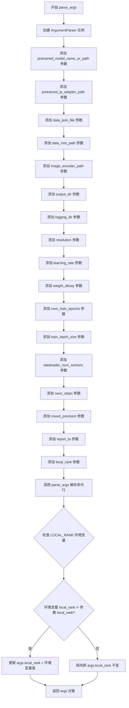
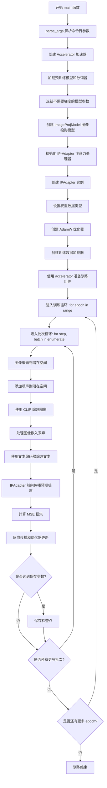
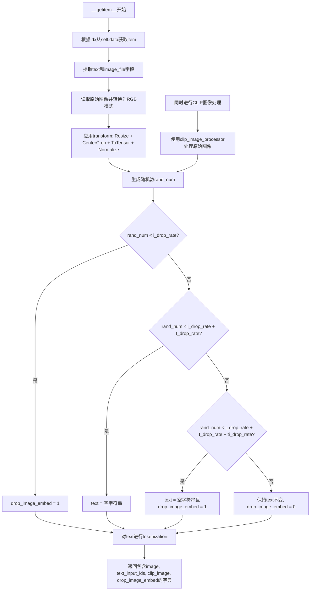
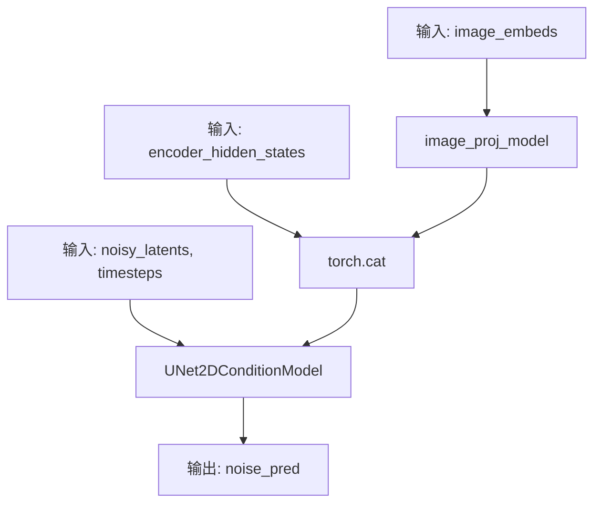
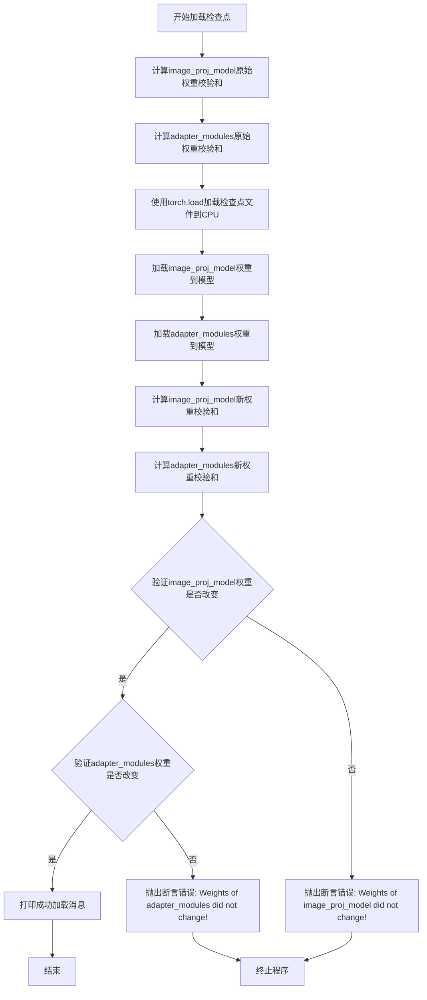

# `diffusers\examples\research_projects\ip_adapter\tutorial_train_ip-adapter.py` 详细设计文档

这是一个用于训练IP-Adapter（图像提示适配器）的PyTorch训练脚本，主要用于将图像作为额外条件注入到文本到图像扩散模型中，实现图像引导的生成任务。脚本使用Hugging Face的diffusers库和accelerate库实现分布式训练，支持数据加载、噪声调度、模型前向传播、损失计算和检查点保存等完整训练流程。

## 整体流程

```mermaid
graph TD
    A[开始] --> B[parse_args 解析命令行参数]
    B --> C[初始化 Accelerator 加速器]
    C --> D[加载预训练模型和权重]
    D --> E[创建 IP-Adapter 组件]
    E --> F[准备数据集和数据加载器]
    F --> G[训练循环 for epoch in range(num_train_epochs)]
    G --> H[加载 batch 数据]
    H --> I[VAE 编码图像到 latent 空间]
    I --> J[采样噪声和 timestep]
    J --> K[添加噪声到 latents - 前向扩散过程]
    K --> L[CLIP 编码图像获取 image_embeds]
    L --> M[CLIP 文本编码器获取 encoder_hidden_states]
    M --> N[IPAdapter 前向传播预测噪声]
    N --> O[计算 MSE 损失]
    O --> P[accelerator.backward 反向传播]
    P --> Q[optimizer.step 更新参数]
    Q --> R{global_step % save_steps == 0?}
    R -- 是 --> S[保存检查点]
    R -- 否 --> T[继续下一个 batch]
    S --> T
    T --> U{训练完成?}
    U -- 否 --> G
    U -- 是 --> V[结束]
```

## 类结构

```
MyDataset (torch.utils.data.Dataset)
└── 数据集类
IPAdapter (torch.nn.Module)
└── IP-Adapter 模型封装类
全局函数
├── collate_fn (数据整理函数)
├── parse_args (参数解析函数)
└── main (主训练函数)
```

## 全局变量及字段


### `AttnProcessor`
    
注意力处理器类，用于处理UNet中的注意力操作，根据PyTorch版本选择AttnProcessor2_0或AttnProcessor

类型：`class`
    


### `IPAttnProcessor`
    
IP-Adapter专用注意力处理器类，用于实现图像提示的交叉注意力机制

类型：`class`
    


### `MyDataset.tokenizer`
    
用于将文本编码为token ID的CLIP分词器

类型：`CLIPTokenizer`
    


### `MyDataset.size`
    
输入图像的目标尺寸，用于调整图像大小

类型：`int`
    


### `MyDataset.i_drop_rate`
    
图像嵌入被随机丢弃的概率，用于训练时的图像增强

类型：`float`
    


### `MyDataset.t_drop_rate`
    
文本嵌入被随机丢弃的概率，用于训练时的文本增强

类型：`float`
    


### `MyDataset.ti_drop_rate`
    
同时丢弃文本和图像嵌入的概率，用于训练时的多模态增强

类型：`float`
    


### `MyDataset.image_root_path`
    
图像文件的根目录路径，用于拼接图像文件名

类型：`str`
    


### `MyDataset.data`
    
从JSON文件加载的训练数据列表，每个元素包含图像文件名和文本描述

类型：`list`
    


### `MyDataset.transform`
    
图像预处理转换管道，包含Resize、CenterCrop、ToTensor和Normalize操作

类型：`torchvision.transforms.Compose`
    


### `MyDataset.clip_image_processor`
    
用于预处理CLIP图像输入的处理器，将图像转换为像素值张量

类型：`CLIPImageProcessor`
    


### `IPAdapter.unet`
    
预训练的UNet2D条件模型，用于根据噪声和条件预测噪声残差

类型：`UNet2DConditionModel`
    


### `IPAdapter.image_proj_model`
    
图像投影模型，将CLIP图像嵌入投影到与UNet跨注意力维度匹配的空间

类型：`ImageProjModel`
    


### `IPAdapter.adapter_modules`
    
IP-Adapter的注意力处理器模块列表，包含可训练的图像提示交叉注意力层

类型：`torch.nn.ModuleList`
    
    

## 全局函数及方法


### `collate_fn`

该函数是PyTorch DataLoader的批处理整理函数，负责将数据集中多个样本组合成一个批次。它从每个样本中提取图像、文本输入ID、CLIP图像和图像嵌入drop标志，然后分别进行堆叠或拼接操作，最终返回一个包含批次化数据的字典。

参数：

-  `data`：`List[Dict]` ，PyTorch DataLoader传入的批次数据列表，每个元素是一个包含"image"、"text_input_ids"、"clip_image"和"drop_image_embed"键的字典

返回值：`Dict`，包含以下键值对：
  - `"images"`：`torch.Tensor`，将批次中所有样本的图像张量在第0维堆叠得到，形状为`(batch_size, C, H, W)`
  - `"text_input_ids"`：`torch.Tensor`，将批次中所有样本的文本输入ID在第0维拼接得到，形状为`(batch_size, seq_length)`
  - `"clip_images"`：`torch.Tensor`，将批次中所有样本的CLIP图像张量在第0维拼接得到，形状为`(batch_size, C, H, W)`
  - `"drop_image_embeds"`：`List[int]`，保留原列表结构，用于后续标识哪些样本需要drop图像嵌入

#### 流程图

```mermaid
graph TD
    A[接收data参数: List[Dict]] --> B[提取所有样本的image字段]
    B --> C[使用torch.stack在第0维堆叠图像]
    C --> D[提取所有样本的text_input_ids字段]
    D --> E[使用torch.cat在第0维拼接文本ID]
    E --> F[提取所有样本的clip_image字段]
    F --> G[使用torch.cat在第0维拼接CLIP图像]
    G --> H[提取所有样本的drop_image_embed字段]
    H --> I[返回包含4个键的字典]
```

#### 带注释源码

```
def collate_fn(data):
    # 从批次数据列表中提取所有样本的图像，并使用torch.stack在第0维堆叠
    # 堆叠后形状: (batch_size, channels, height, width)
    images = torch.stack([example["image"] for example in data])
    
    # 从批次数据列表中提取所有样本的文本输入ID，并使用torch.cat在第0维拼接
    # 拼接后形状: (batch_size, max_seq_length)
    text_input_ids = torch.cat([example["text_input_ids"] for example in data], dim=0)
    
    # 从批次数据列表中提取所有样本的CLIP图像，并使用torch.cat在第0维拼接
    # 拼接后形状: (batch_size, channels, height, width)
    clip_images = torch.cat([example["clip_image"] for example in data], dim=0)
    
    # 从批次数据列表中提取所有样本的图像嵌入drop标志，保留为列表形式
    # 这是一个列表而不是张量，因为后续需要根据每个样本的drop标志进行条件处理
    drop_image_embeds = [example["drop_image_embed"] for example in data]

    # 返回包含批次化数据的字典，供模型训练使用
    return {
        "images": images,
        "text_input_ids": text_input_ids,
        "clip_images": clip_images,
        "drop_image_embeds": drop_image_embeds,
    }
```


### `parse_args`

该函数是命令行参数解析函数，用于定义和获取IP-Adapter训练脚本所需的各种配置参数，包括模型路径、数据路径、训练超参数、分布式训练配置等。

参数：该函数没有显式输入参数，它通过`argparse`模块从命令行获取参数。

返回值：`args`，`argparse.Namespace`对象，包含所有解析后的命令行参数及其值。

#### 流程图



#### 带注释源码

```python
def parse_args():
    """
    解析命令行参数，返回包含所有训练配置参数的命名空间对象。
    
    该函数使用argparse模块定义了一系列命令行参数，包括：
    - 模型路径相关参数（预训练模型、IP-Adapter、图像编码器）
    - 数据相关参数（JSON文件路径、根目录路径）
    - 训练超参数（学习率、权重衰减、训练轮数、批量大小）
    - 输出相关参数（输出目录、日志目录、分辨率）
    - 分布式训练参数（local_rank）
    - 其他训练控制参数（保存步数、混合精度、报告器等）
    
    Returns:
        argparse.Namespace: 包含所有解析后参数的对象
    """
    # 创建ArgumentParser实例，设置脚本描述
    parser = argparse.ArgumentParser(description="Simple example of a training script.")
    
    # 添加预训练模型名称或路径参数（必需）
    parser.add_argument(
        "--pretrained_model_name_or_path",
        type=str,
        default=None,
        required=True,
        help="Path to pretrained model or model identifier from huggingface.co/models.",
    )
    
    # 添加预训练IP-Adapter路径参数（可选）
    parser.add_argument(
        "--pretrained_ip_adapter_path",
        type=str,
        default=None,
        help="Path to pretrained ip adapter model. If not specified weights are initialized randomly.",
    )
    
    # 添加训练数据JSON文件路径参数（必需）
    parser.add_argument(
        "--data_json_file",
        type=str,
        default=None,
        required=True,
        help="Training data",
    )
    
    # 添加训练数据根目录路径参数（必需）
    parser.add_argument(
        "--data_root_path",
        type=str,
        default="",
        required=True,
        help="Training data root path",
    )
    
    # 添加CLIP图像编码器路径参数（必需）
    parser.add_argument(
        "--image_encoder_path",
        type=str,
        default=None,
        required=True,
        help="Path to CLIP image encoder",
    )
    
    # 添加输出目录参数
    parser.add_argument(
        "--output_dir",
        type=str,
        default="sd-ip_adapter",
        help="The output directory where the model predictions and checkpoints will be written.",
    )
    
    # 添加日志目录参数
    parser.add_argument(
        "--logging_dir",
        type=str,
        default="logs",
        help=(
            "[TensorBoard](https://www.tensorflow.org/tensorboard) log directory. Will default to"
            " *output_dir/runs/**CURRENT_DATETIME_HOSTNAME***."
        ),
    )
    
    # 添加输入图像分辨率参数
    parser.add_argument(
        "--resolution",
        type=int,
        default=512,
        help=("The resolution for input images"),
    )
    
    # 添加学习率参数
    parser.add_argument(
        "--learning_rate",
        type=float,
        default=1e-4,
        help="Learning rate to use.",
    )
    
    # 添加权重衰减参数
    parser.add_argument("--weight_decay", type=float, default=1e-2, help="Weight decay to use.")
    
    # 添加训练轮数参数
    parser.add_argument("--num_train_epochs", type=int, default=100)
    
    # 添加训练批量大小参数
    parser.add_argument(
        "--train_batch_size", type=int, default=8, help="Batch size (per device) for the training dataloader."
    )
    
    # 添加数据加载器工作进程数参数
    parser.add_argument(
        "--dataloader_num_workers",
        type=int,
        default=0,
        help=(
            "Number of subprocesses to use for data loading. 0 means that the data will be loaded in the main process."
        ),
    )
    
    # 添加保存检查点步数参数
    parser.add_argument(
        "--save_steps",
        type=int,
        default=2000,
        help=("Save a checkpoint of the training state every X updates"),
    )
    
    # 添加混合精度参数
    parser.add_argument(
        "--mixed_precision",
        type=str,
        default=None,
        choices=["no", "fp16", "bf16"],
        help=(
            "Whether to use mixed precision. Choose between fp16 and bf16 (bfloat16). Bf16 requires PyTorch >="
            " 1.10.and an Nvidia Ampere GPU.  Default to the value of accelerate config of the current system or the"
            " flag passed with the `accelerate.launch` command. Use this argument to override the accelerate config."
        ),
    )
    
    # 添加日志报告目标参数
    parser.add_argument(
        "--report_to",
        type=str,
        default="tensorboard",
        help=(
            'The integration to report the results and logs to. Supported platforms are `"tensorboard"`'
            ' (default), `"wandb"` and `"comet_ml"`. Use `"all"` to report to all integrations.'
        ),
    )
    
    # 添加分布式训练本地排名参数
    parser.add_argument("--local_rank", type=int, default=-1, help="For distributed training: local_rank")

    # 解析命令行参数
    args = parser.parse_args()
    
    # 检查并处理LOCAL_RANK环境变量（用于分布式训练）
    env_local_rank = int(os.environ.get("LOCAL_RANK", -1))
    if env_local_rank != -1 and env_local_rank != args.local_rank:
        args.local_rank = env_local_rank

    # 返回包含所有参数的命名空间对象
    return args
```


### `main`

该函数是 IP-Adapter 训练脚本的主入口，负责初始化所有模型组件（UNet、VAE、文本编码器、图像编码器）、配置优化器、构建数据加载器，并执行完整的训练循环包括前向传播、损失计算、反向传播和检查点保存。

参数：该函数无参数。

返回值：无返回值。

#### 流程图



#### 带注释源码

```
def main():
    """
    IP-Adapter 训练脚本的主入口函数。
    负责初始化所有模型组件、配置优化器、构建数据加载器，
    并执行完整的训练循环。
    """
    # 步骤1: 解析命令行参数
    # 从命令行获取模型路径、数据路径、学习率等配置
    args = parse_args()
    
    # 步骤2: 构建日志目录路径
    # 将输出目录和日志子目录组合成完整的日志路径
    logging_dir = Path(args.output_dir, args.logging_dir)

    # 步骤3: 创建 Accelerator 项目配置
    # 配置加速器的项目目录和日志目录
    accelerator_project_config = ProjectConfiguration(project_dir=args.output_dir, logging_dir=logging_dir)

    # 步骤4: 初始化 Accelerator 加速器
    # 加速器处理分布式训练、混合精度、自动内存优化等
    accelerator = Accelerator(
        mixed_precision=args.mixed_precision,         # 混合精度训练 (fp16/bf16)
        log_with=args.report_to,                       # 日志报告工具 (tensorboard/wandb)
        project_config=accelerator_project_config,     # 项目配置
    )

    # 步骤5: 在主进程创建输出目录
    # 确保输出目录存在，避免多进程冲突
    if accelerator.is_main_process:
        if args.output_dir is not None:
            os.makedirs(args.output_dir, exist_ok=True)

    # 步骤6: 加载预训练调度器、分词器和模型
    # 从 HuggingFace Hub 或本地路径加载预训练权重
    noise_scheduler = DDPMScheduler.from_pretrained(args.pretrained_model_name_or_path, subfolder="scheduler")
    tokenizer = CLIPTokenizer.from_pretrained(args.pretrained_model_name_or_path, subfolder="tokenizer")
    text_encoder = CLIPTextModel.from_pretrained(args.pretrained_model_name_or_path, subfolder="text_encoder")
    vae = AutoencoderKL.from_pretrained(args.pretrained_model_name_or_path, subfolder="vae")
    unet = UNet2DConditionModel.from_pretrained(args.pretrained_model_name_or_path, subfolder="unet")
    image_encoder = CLIPVisionModelWithProjection.from_pretrained(args.image_encoder_path)

    # 步骤7: 冻结模型参数以节省显存
    # 只训练 IP-Adapter 相关组件，其他参数冻结
    unet.requires_grad_(False)
    vae.requires_grad_(False)
    text_encoder.requires_grad_(False)
    image_encoder.requires_grad_(False)

    # 步骤8: 创建图像投影模型
    # ImageProjModel 将 CLIP 图像嵌入转换到 UNet 的交叉注意力空间
    image_proj_model = ImageProjModel(
        cross_attention_dim=unet.config.cross_attention_dim,           # UNet 交叉注意力维度
        clip_embeddings_dim=image_encoder.config.projection_dim,      # CLIP 投影维度
        clip_extra_context_tokens=4,                                    # 额外上下文 tokens 数量
    )

    # 步骤9: 初始化 IP-Adapter 注意力处理器
    # 为 UNet 的每个注意力层添加图像提示适配器
    attn_procs = {}
    unet_sd = unet.state_dict()
    for name in unet.attn_processors.keys():
        # 判断是否为交叉注意力层 (attn1 是自注意力，attn2 是交叉注意力)
        cross_attention_dim = None if name.endswith("attn1.processor") else unet.config.cross_attention_dim
        
        # 根据层名称确定隐藏层大小
        if name.startswith("mid_block"):
            hidden_size = unet.config.block_out_channels[-1]
        elif name.startswith("up_blocks"):
            block_id = int(name[len("up_blocks.")])
            hidden_size = list(reversed(unet.config.block_out_channels))[block_id]
        elif name.startswith("down_blocks"):
            block_id = int(name[len("down_blocks.")])
            hidden_size = unet.config.block_out_channels[block_id]
        
        # 为自注意力层使用标准处理器，为交叉注意力层使用 IP 处理器
        if cross_attention_dim is None:
            attn_procs[name] = AttnProcessor()
        else:
            layer_name = name.split(".processor")[0]
            weights = {
                "to_k_ip.weight": unet_sd[layer_name + ".to_k.weight"],
                "to_v_ip.weight": unet_sd[layer_name + ".to_v.weight"],
            }
            attn_procs[name] = IPAttnProcessor(hidden_size=hidden_size, cross_attention_dim=cross_attention_dim)
            attn_procs[name].load_state_dict(weights)
    
    # 设置 UNet 的注意力处理器
    unet.set_attn_processor(attn_procs)
    
    # 将适配器模块转换为 nn.ModuleList 以便优化
    adapter_modules = torch.nn.ModuleList(unet.attn_processors.values())

    # 步骤10: 创建 IPAdapter 模型
    # 封装 UNet、图像投影模型和适配器模块
    ip_adapter = IPAdapter(unet, image_proj_model, adapter_modules, args.pretrained_ip_adapter_path)

    # 步骤11: 设置权重数据类型
    # 根据混合精度设置选择适当的数据类型
    weight_dtype = torch.float32
    if accelerator.mixed_precision == "fp16":
        weight_dtype = torch.float16
    elif accelerator.mixed_precision == "bf16":
        weight_dtype = torch.bfloat16
    
    # 将非训练模型移动到设备并转换数据类型 (UNet 不需要移动，因为使用 ip_adapter 包装)
    vae.to(accelerator.device, dtype=weight_dtype)
    text_encoder.to(accelerator.device, dtype=weight_dtype)
    image_encoder.to(accelerator.device, dtype=weight_dtype)

    # 步骤12: 创建优化器
    # 只优化图像投影模型和适配器模块的参数
    params_to_opt = itertools.chain(ip_adapter.image_proj_model.parameters(), ip_adapter.adapter_modules.parameters())
    optimizer = torch.optim.AdamW(params_to_opt, lr=args.learning_rate, weight_decay=args.weight_decay)

    # 步骤13: 创建数据加载器
    # 从 JSON 文件加载训练数据
    train_dataset = MyDataset(
        args.data_json_file, tokenizer=tokenizer, size=args.resolution, image_root_path=args.data_root_path
    )
    train_dataloader = torch.utils.data.DataLoader(
        train_dataset,
        shuffle=True,
        collate_fn=collate_fn,
        batch_size=args.train_batch_size,
        num_workers=args.dataloader_num_workers,
    )

    # 步骤14: 使用 Accelerator 准备训练组件
    # 自动处理设备分配、分布式训练包装、混合精度转换等
    ip_adapter, optimizer, train_dataloader = accelerator.prepare(ip_adapter, optimizer, train_dataloader)

    # 步骤15: 训练循环
    global_step = 0
    for epoch in range(0, args.num_train_epochs):
        begin = time.perf_counter()
        for step, batch in enumerate(train_dataloader):
            # 记录数据加载时间
            load_data_time = time.perf_counter() - begin
            
            # 使用 accumulator 进行梯度累积 (如果配置了)
            with accelerator.accumulate(ip_adapter):
                # 步骤15.1: 将图像编码到潜在空间
                # VAE 将图像压缩到低维潜在空间
                with torch.no_grad():
                    latents = vae.encode(
                        batch["images"].to(accelerator.device, dtype=weight_dtype)
                    ).latent_dist.sample()
                    latents = latents * vae.config.scaling_factor  # 缩放潜在表示

                # 步骤15.2: 采样噪声
                # 为每个样本生成随机噪声
                noise = torch.randn_like(latents)
                bsz = latents.shape[0]
                
                # 步骤15.3: 随机采样时间步
                # 每个图像随机选择一个去噪时间步
                timesteps = torch.randint(0, noise_scheduler.num_train_timesteps, (bsz,), device=latents.device)
                timesteps = timesteps.long()

                # 步骤15.4: 前向扩散过程
                # 根据时间步将噪声添加到潜在空间
                noisy_latents = noise_scheduler.add_noise(latents, noise, timesteps)

                # 步骤15.5: 使用 CLIP 编码图像
                # 将图像转换为图像嵌入向量
                with torch.no_grad():
                    image_embeds = image_encoder(
                        batch["clip_images"].to(accelerator.device, dtype=weight_dtype)
                    ).image_embeds
                
                # 步骤15.6: 处理图像嵌入丢弃
                # 随机将图像嵌入置零，实现 classifier-free guidance 效果
                image_embeds_ = []
                for image_embed, drop_image_embed in zip(image_embeds, batch["drop_image_embeds"]):
                    if drop_image_embed == 1:
                        image_embeds_.append(torch.zeros_like(image_embed))
                    else:
                        image_embeds_.append(image_embed)
                image_embeds = torch.stack(image_embeds_)

                # 步骤15.7: 使用文本编码器编码文本提示
                # 将文本 token 转换为文本嵌入
                with torch.no_grad():
                    encoder_hidden_states = text_encoder(batch["text_input_ids"].to(accelerator.device))[0]

                # 步骤15.8: IP-Adapter 前向传播
                # 预测噪声残差
                noise_pred = ip_adapter(noisy_latents, timesteps, encoder_hidden_states, image_embeds)

                # 步骤15.9: 计算损失
                # MSE 损失：预测噪声与真实噪声之间的差异
                loss = F.mse_loss(noise_pred.float(), noise.float(), reduction="mean")

                # 步骤15.10: 收集损失值用于日志记录
                # 在分布式训练中聚合所有进程的损失
                avg_loss = accelerator.gather(loss.repeat(args.train_batch_size)).mean().item()

                # 步骤15.11: 反向传播
                # 计算梯度并更新参数
                accelerator.backward(loss)
                optimizer.step()
                optimizer.zero_grad()

                # 步骤15.12: 打印训练日志
                # 在主进程中输出当前训练状态
                if accelerator.is_main_process:
                    print(
                        "Epoch {}, step {}, data_time: {}, time: {}, step_loss: {}".format(
                            epoch, step, load_data_time, time.perf_counter() - begin, avg_loss
                        )
                    )

            # 更新全局步数
            global_step += 1

            # 步骤15.13: 定期保存检查点
            # 每隔 save_steps 保存训练状态
            if global_step % args.save_steps == 0:
                save_path = os.path.join(args.output_dir, f"checkpoint-{global_step}")
                accelerator.save_state(save_path)

            # 记录每个步骤的结束时间
            begin = time.perf_counter()
```


### `MyDataset.__init__`

该方法是 `MyDataset` 类的构造函数，用于初始化一个用于 IP-Adapter 训练的自定义数据集。它接收数据路径、分词器、图像尺寸和各种dropout率等参数，加载JSON数据文件，配置图像变换和CLIP图像处理器，为后续的数据加载做准备。

参数：

- `self`：`MyDataset` 实例本身
- `json_file`：`str`，JSON数据文件的路径，文件中包含图像文件名和对应文本描述的列表
- `tokenizer`：`CLIPTokenizer`，用于对文本进行tokenize的分词器
- `size`：`int`，默认值512，图像的目标尺寸（用于resize和裁剪）
- `t_drop_rate`：`float`，默认值0.05，文本dropout的概率
- `i_drop_rate`：`float`，默认值0.05，图像embedding dropout的概率
- `ti_drop_rate`：`float`，默认值0.05，文本和图像同时dropout的概率
- `image_root_path`：`str`，默认值空字符串，图像文件的根目录路径

返回值：无（`None`），构造函数不返回任何值

#### 流程图

```mermaid
flowchart TD
    A[开始 __init__] --> B[调用父类构造函数 super().__init__]
    B --> C[保存tokenizer到self.tokenizer]
    C --> D[保存size到self.size]
    D --> E[保存i_drop_rate/t_drop_rate/ti_drop_rate到对应属性]
    E --> F[保存image_root_path到self.image_root_path]
    F --> G[加载JSON文件到self.data]
    G --> H[创建图像transform组合]
    H --> I[初始化CLIPImageProcessor]
    I --> J[结束]
```

#### 带注释源码

```python
def __init__(
    self, json_file, tokenizer, size=512, t_drop_rate=0.05, i_drop_rate=0.05, ti_drop_rate=0.05, image_root_path=""
):
    # 调用父类torch.utils.data.Dataset的初始化方法
    super().__init__()

    # 存储分词器，用于后续对文本进行tokenize处理
    self.tokenizer = tokenizer
    # 存储目标图像尺寸，用于图像resize和裁剪
    self.size = size
    # 存储图像embedding的dropout率
    self.i_drop_rate = i_drop_rate
    # 存储文本的dropout率
    self.t_drop_rate = t_drop_rate
    # 存储文本和图像同时dropout的概率
    self.ti_drop_rate = ti_drop_rate
    # 存储图像文件的根目录路径，用于拼接完整图像路径
    self.image_root_path = image_root_path

    # 加载JSON数据文件，文件中存储的是字典列表
    # 格式示例：[{"image_file": "1.png", "text": "A dog"}, ...]
    self.data = json.load(open(json_file))

    # 创建图像预处理transform组合
    # 包含：resize到指定尺寸 -> 中心裁剪 -> 转换为tensor -> 归一化到[-1,1]
    self.transform = transforms.Compose(
        [
            transforms.Resize(self.size, interpolation=transforms.InterpolationMode.BILINEAR),
            transforms.CenterCrop(self.size),
            transforms.ToTensor(),
            transforms.Normalize([0.5], [0.5]),  # 归一化到[-1, 1]
        ]
    )
    # 初始化CLIP图像处理器，用于处理CLIP模型的图像输入
    self.clip_image_processor = CLIPImageProcessor()
```


### `MyDataset.__getitem__`

获取数据集中指定索引的样本，包括图像预处理、CLIP图像处理、文本tokenization以及基于随机概率的drop策略处理。

参数：

- `idx`：`int`，要获取的样本在数据集中的索引

返回值：`dict`，包含以下键值对：
- `image`：`torch.Tensor`，经过transform处理后的图像张量，形状为(C, H, W)，已归一化到[-1, 1]
- `text_input_ids`：`torch.Tensor`，tokenizer处理后的文本ID张量，形状为(seq_len,)
- `clip_image`：`torch.Tensor`，CLIP图像处理器输出的像素值张量，用于提取图像embedding
- `drop_image_embed`：`int`，标志位，1表示在训练时丢弃图像embedding，0表示保留

#### 流程图



#### 带注释源码

```python
def __getitem__(self, idx):
    """
    获取数据集中指定索引的样本
    
    Args:
        idx: 数据索引，用于从self.data列表中获取对应的数据项
        
    Returns:
        dict: 包含以下键的字典:
            - image: 经过transform处理后的图像tensor
            - text_input_ids: token化后的文本IDs
            - clip_image: CLIP模型处理的图像像素值
            - drop_image_embed: 是否丢弃图像embedding的标志位
    """
    # 根据索引从数据列表中获取对应的数据项
    item = self.data[idx]
    # 从数据项中提取文本描述和图像文件名
    text = item["text"]
    image_file = item["image_file"]

    # 读取图像文件并转换为RGB格式
    raw_image = Image.open(os.path.join(self.image_root_path, image_file))
    # 应用图像预处理transform: Resize(512) -> CenterCrop(512) -> ToTensor -> Normalize([0.5], [0.5])
    image = self.transform(raw_image.convert("RGB"))
    # 使用CLIP图像处理器处理原始图像，返回CLIP模型所需的像素值张量
    clip_image = self.clip_image_processor(images=raw_image, return_tensors="pt").pixel_values

    # 实现drop策略，根据随机概率决定是否丢弃文本或图像embedding
    # 这种策略用于增强模型对缺失模态的鲁棒性
    drop_image_embed = 0  # 默认为不丢弃图像embedding
    rand_num = random.random()  # 生成[0,1)区间的随机数
    
    # 如果随机数小于图像drop rate，则丢弃图像embedding
    if rand_num < self.i_drop_rate:
        drop_image_embed = 1
    # 否则如果随机数小于图像drop rate + 文本drop rate，则将文本置为空
    elif rand_num < (self.i_drop_rate + self.t_drop_rate):
        text = ""
    # 否则如果随机数小于三者之和，则同时丢弃文本和图像embedding
    elif rand_num < (self.i_drop_rate + self.t_drop_rate + self.ti_drop_rate):
        text = ""
        drop_image_embed = 1
    
    # 对文本进行tokenization处理
    # 参数说明:
    # - max_length: 最大长度，使用tokenizer的model_max_length属性
    # - padding: 填充到最大长度
    # - truncation: 超过最大长度时截断
    # - return_tensors: 返回PyTorch张量
    text_input_ids = self.tokenizer(
        text,
        max_length=self.tokenizer.model_max_length,
        padding="max_length",
        truncation=True,
        return_tensors="pt",
    ).input_ids  # 提取input_ids部分，形状为(1, seq_len)

    # 返回包含所有需要数据的字典
    return {
        "image": image,  # 变换后的图像tensor
        "text_input_ids": text_input_ids.squeeze(0),  # 去除batch维度后的文本IDs
        "clip_image": clip_image.squeeze(0),  # 去除batch维度后的CLIP图像
        "drop_image_embed": drop_image_embed,  # 丢弃标志位
    }
```


### `MyDataset.__len__`

该方法实现了 Python 数据集类的标准接口，返回加载自 JSON 配置文件的数据列表的长度，供 PyTorch 的 `DataLoader` 确定数据集大小和迭代次数。

参数：
- 无额外参数（隐含参数 `self` 代表实例本身）

返回值：`int`，返回数据集内部维护的 `self.data` 列表的元素个数，即训练样本的总数。

#### 流程图

```mermaid
graph LR
    A([开始]) --> B[获取实例属性 self.data]
    B --> C[计算列表长度 len(self.data)]
    C --> D([返回整数count])
```

#### 带注释源码

```python
def __len__(self):
    """
    返回数据集中样本的数量。

    PyTorch DataLoader 会调用此方法来获取数据集的大小，
    以此来确定每个 epoch 的步数 (num_steps = len(dataset) // batch_size)。

    Returns:
        int: 从 JSON 文件加载的数据字典列表的长度。
    """
    return len(self.data)
```


### `IPAdapter.__init__`

该方法是 `IPAdapter` 类的构造函数，用于初始化 IP-Adapter 模型的核心组件，包括 UNet、图像投影模型和适配器模块，并可选地从检查点加载预训练权重。

参数：

- `unet`：`UNet2DConditionModel`，用于预测噪声残差的 UNet2D 条件模型
- `image_proj_model`：`ImageProjModel`，将图像嵌入投影到 UNet 跨注意力维度的图像投影模型
- `adapter_modules`：`torch.nn.ModuleList`，存储在 UNet 中的 IP-Adapter 注意力处理器模块列表
- `ckpt_path`：`str` | `None`，可选参数，预训练 IP-Adapter 检查点路径，若为 `None` 则不加载权重

返回值：`None`，构造函数不返回任何值

#### 流程图

```mermaid
flowchart TD
    A[__init__ 开始] --> B[调用 super().__init__ 初始化父类]
    B --> C[保存 unet 到 self.unet]
    C --> D[保存 image_proj_model 到 self.image_proj_model]
    D --> E[保存 adapter_modules 到 self.adapter_modules]
    E --> F{ckpt_path 是否为 None?}
    F -->|否| G[调用 load_from_checkpoint 加载权重]
    F -->|是| H[结束 __init__]
    G --> H
```

#### 带注释源码

```python
def __init__(self, unet, image_proj_model, adapter_modules, ckpt_path=None):
    """
    初始化 IPAdapter 模型
    
    参数:
        unet: UNet2DConditionModel 实例，用于图像去噪的 UNet 模型
        image_proj_model: ImageProjModel 实例，将 CLIP 图像嵌入投影到 UNet 跨注意力空间
        adapter_modules: torch.nn.ModuleList，IP-Adapter 的注意力处理器模块列表
        ckpt_path: str or None，可选的预训练权重路径
    """
    # 调用父类 torch.nn.Module 的初始化方法
    super().__init__()
    
    # 保存 UNet 模型引用到实例属性
    self.unet = unet
    
    # 保存图像投影模型引用到实例属性
    self.image_proj_model = image_proj_model
    
    # 保存适配器模块列表到实例属性
    self.adapter_modules = adapter_modules

    # 如果提供了检查点路径，则从检查点加载权重
    if ckpt_path is not None:
        self.load_from_checkpoint(ckpt_path)
```


### `IPAdapter.forward`

该方法是 `IPAdapter` 类的核心前向传播逻辑。它接收扩散模型生成的噪声潜在表示、当前时间步、文本编码器的隐藏状态以及图像编码器的图像嵌入。方法首先通过 `image_proj_model` 将图像嵌入投影为“IP Tokens”，随后将这些 IP Tokens 与文本隐藏状态在序列维度上进行拼接，形成联合上下文（文本+图像），最后将其传入 UNet 模型以预测噪声残差。

参数：

-  `noisy_latents`：`torch.Tensor`，扩散过程中的噪声潜在向量（Latents）。
-  `timesteps`：`torch.Tensor`，当前扩散过程的时间步（t）。
-  `encoder_hidden_states`：`torch.Tensor`，由 CLIP 文本编码器生成的文本嵌入向量。
-  `image_embeds`：`torch.Tensor`，由 CLIP 图像编码器生成的图像嵌入向量。

返回值：`torch.Tensor`，UNet 预测的噪声残差（Noise Residual）。

#### 流程图



#### 带注释源码

```python
def forward(self, noisy_latents, timesteps, encoder_hidden_states, image_embeds):
    # 1. 图像嵌入投影 (Image Projection)
    # 使用 image_proj_model (通常是一个 MLP 或 Linear 层) 将 CLIP 图像嵌入转换为
    # 适合 UNet 交叉注意力机制的 IP Tokens (Image Prompt Tokens)。
    ip_tokens = self.image_proj_model(image_embeds)

    # 2. 上下文拼接 (Context Concatenation)
    # 将原始的文本嵌入 (encoder_hidden_states) 和新生成的 IP Tokens (ip_tokens)
    #沿着序列维度 (dim=1) 进行拼接，形成包含文本和图像条件的联合上下文。
    encoder_hidden_states = torch.cat([encoder_hidden_states, ip_tokens], dim=1)

    # 3. 噪声预测 (Noise Prediction)
    # 将噪声潜在向量、时间步以及包含图像信息的联合上下文传入 UNet，
    # UNet 根据这些信息预测当前时间步需要去除的噪声。
    noise_pred = self.unet(noisy_latents, timesteps, encoder_hidden_states).sample

    # 4. 返回预测的噪声残差
    return noise_pred
```


### `IPAdapter.load_from_checkpoint`

该方法用于从指定的检查点文件加载预训练的IP-Adapter权重，包括图像投影模型（image_proj_model）和适配器模块（adapter_modules）的权重，并在加载后验证权重是否真正发生变化。

参数：

- `ckpt_path`：`str`，检查点文件的路径，指向包含模型权重的.pt或.pth文件

返回值：`None`，无返回值，仅执行权重加载和验证操作

#### 流程图



#### 带注释源码

```python
def load_from_checkpoint(self, ckpt_path: str):
    # 计算image_proj_model原始权重的校验和（所有参数求和后堆叠再求和）
    # 用于后续验证权重是否真正发生变化
    orig_ip_proj_sum = torch.sum(torch.stack([torch.sum(p) for p in self.image_proj_model.parameters()]))
    
    # 计算adapter_modules原始权重的校验和
    orig_adapter_sum = torch.sum(torch.stack([torch.sum(p) for p in self.adapter_modules.parameters()]))

    # 从指定路径加载检查点字典到CPU内存
    # state_dict应包含'image_proj'和'ip_adapter'两个键
    state_dict = torch.load(ckpt_path, map_location="cpu")

    # 将检查点中的image_proj权重加载到image_proj_model
    # strict=True表示严格匹配键值，确保检查点格式正确
    self.image_proj_model.load_state_dict(state_dict["image_proj"], strict=True)
    
    # 将检查点中的ip_adapter权重加载到adapter_modules
    self.adapter_modules.load_state_dict(state_dict["ip_adapter"], strict=True)

    # 计算加载后image_proj_model的新权重校验和
    new_ip_proj_sum = torch.sum(torch.stack([torch.sum(p) for p in self.image_proj_model.parameters()]))
    
    # 计算加载后adapter_modules的新权重校验和
    new_adapter_sum = torch.sum(torch.stack([torch.sum(p) for p in self.adapter_modules.parameters()]))

    # 断言验证权重确实发生了改变，防止加载无效或重复的检查点
    assert orig_ip_proj_sum != new_ip_proj_sum, "Weights of image_proj_model did not change!"
    assert orig_adapter_sum != new_adapter_sum, "Weights of adapter_modules did not change!"

    # 打印成功加载信息
    print(f"Successfully loaded weights from checkpoint {ckpt_path}")
```

## 关键组件


### 张量索引与惰性加载

在训练循环中，通过遍历image_embeds和drop_image_embed列表，使用条件索引实现张量选择性处理。当drop_image_embed为1时，用零张量替换图像嵌入，否则保留原始嵌入。这种惰性加载方式避免了不必要的图像编码计算，提高了训练效率。

### 反量化支持

代码通过`weight_dtype`变量支持多种精度训练：fp16（半精度）、bf16（Brain Float16）和fp32（全精度）。在模型推理时使用`torch.no_grad()`上下文管理器进行推理，在数据转移到设备时指定相应的数据类型，实现不同精度下的模型运行。

### 量化策略

虽然代码中没有实现后训练量化（PTQ）或量化感知训练（QAT），但通过`accelerator`的mixed_precision配置和`weight_dtype`设置，为未来的量化优化提供了基础架构支持。

### MyDataset 数据集类

自定义PyTorch数据集类，负责加载JSON格式的训练数据。实现了图像resize、center crop、归一化处理，以及CLIP图像预处理。支持文本和图像的drop机制，用于训练时随机丢弃图像或文本嵌入。

### IPAdapter 模型类

IP-Adapter的核心实现类，封装了UNet、图像投影模型和适配器模块。forward方法将图像嵌入与文本嵌入拼接后传入UNet进行噪声预测。支持从检查点加载预训练权重，并包含权重校验和验证逻辑。

### ImageProjModel 图像投影模型

将CLIP图像编码器输出的图像嵌入映射到与文本嵌入相同维度的空间。支持可配置的cross_attention_dim和clip_extra_context_tokens参数，用于控制输出嵌入的维度。

### collate_fn 数据整理函数

自定义批次整理函数，将多个样本的数据堆叠成批次。处理图像张量拼接、文本输入ID连接、CLIP图像张量连接以及drop标志列表的收集。

### 注意力处理器

包含两种注意力处理器：AttnProcessor2_0（标准注意力）和IPAttnProcessor2_0（IP-Adapter专用）。根据PyTorch版本自动选择实现，在UNet的注意力层中注入图像条件信息。

### 训练流程主循环

实现完整的扩散模型训练流程：图像编码为latent空间→采样噪声和时间步→添加噪声到latent→编码文本和图像→IP-Adapter前向传播→计算MSE损失→反向传播更新参数。包含数据加载时间统计、梯度累积、检查点保存等功能。


## 问题及建议


### 已知问题

-   **文件句柄未正确关闭**：使用 `json.load(open(json_file))` 未使用 with 语句，可能导致文件句柄泄漏
-   **dropout 逻辑错误**：当前 dropout 逻辑使用连续的 if-elif 分支，但 rand_num 只生成一次，导致三个分支可能同时满足条件，无法实现互斥的随机丢弃
-   **权重验证逻辑错误**：`load_from_checkpoint` 中先计算原始权重 checksum（此时权重已被随机初始化），然后加载权重后再计算新 checksum 比较，逻辑颠倒导致验证失效
-   **图像嵌入处理效率低**：使用 Python for 循环逐个处理 image_embeds，未利用向量化操作
-   **数据加载性能差**：num_workers 默认为 0，且在 `__getitem__` 中每次都调用 CLIP 图像处理器，缺少缓存机制
-   **CLIP 图像处理维度不匹配**：collate_fn 中使用 `torch.cat` 处理 clip_images，但 `__getitem__` 返回的是单个图像的 tensor，可能导致维度错误（应使用 torch.stack）
-   **变量命名不一致**：forward 方法中 `ip_tokens` 与参数 `image_embeds` 命名混淆
- **时间统计位置错误**：训练循环中 `begin = time.perf_counter()` 放在 `accumulate` 块内部，导致计时不准确

### 优化建议

-   **使用向量化操作**：将 image_embeds 的 dropout 处理改为基于 mask 的向量化操作，避免 Python 循环
-   **修复 dropout 逻辑**：使用互斥的随机条件判断，确保 image dropout、text dropout 和 both dropout 是互斥事件
-   **优化数据加载**：增加 num_workers 默认值，添加图像预加载或缓存机制，将 CLIP 图像处理器移至 __init__ 并复用
-   **修正权重验证逻辑**：调整 checksum 计算时机，或移除冗余的权重变化检查
-   **修复 collate_fn**：将 `torch.cat` 改为 `torch.stack` 以正确处理批次图像
-   **添加资源清理**：使用 with 语句正确管理文件句柄
-   **优化时间统计**：将 begin 赋值移至 epoch 循环开始处
-   **增加错误处理**：添加输入验证、异常捕获和训练状态保存/恢复机制
-   **代码重构**：提取配置常量，增加类型注解，提升代码可读性和可维护性


## 其它


### 设计目标与约束

本代码实现IP-Adapter微调训练流程，旨在通过图像提示（Image Prompt）实现对Stable Diffusion生成模型的条件控制。设计约束包括：支持分布式训练（通过Accelerator）、支持混合精度训练（fp16/bf16）、冻结非训练参数以节省显存、支持图像/文本/triple dropout策略。训练目标是最小化噪声预测的MSE损失，实现图像特征对生成过程的条件注入。

### 错误处理与异常设计

代码中的错误处理主要包括：1) checkpoint加载时的权重校验，通过计算加载前后参数sum值验证权重是否发生变化，若未变化则抛出AssertionError；2) 分布式训练环境变量LOCAL_RANK的自动适配；3) 目录创建的exist_ok=True处理。潜在改进空间：缺少文件路径存在性验证、模型组件加载失败的异常捕获、训练过程中的梯度爆炸检测、数据加载异常处理等。

### 数据流与状态机

训练数据流如下：MyDataset加载JSON配置→collate_fn批量组装→VAE编码图像为latent→DDPMScheduler添加噪声→CLIPImageEncoder提取图像embedding→IPAdapter预测噪声→计算MSE损失→Accelerator执行反向传播与参数更新。状态机包含：训练 epoch循环 → step迭代 → 梯度累积检查点 → 保存checkpoint。推理时图像embedding通过ImageProjModel投影后与文本embedding拼接送入UNet。

### 外部依赖与接口契约

核心依赖包括：torch≥2.0、diffusers、transformers、accelerate、ip_adapter、PIL、torchvision。接口契约：1) pretrained_model_name_or_path需指向包含scheduler/tokenizer/text_encoder/vae/unet的Stable Diffusion模型；2) image_encoder_path需指向CLIPVisionModelWithProjection模型；3) data_json_file需为JSON数组格式，每项包含image_file和text字段；4) 输出目录包含checkpoint和runs子目录。

### 训练流程与超参数配置

默认超参数：learning_rate=1e-4, weight_decay=1e-2, train_batch_size=8, num_train_epochs=100, resolution=512, save_steps=2000, dropout rates(i/t/ti)=0.05。训练流程：初始化Accelerator→加载预训练模型→冻结非训练参数→初始化ImageProjModel和IPAttnProcessor→构建优化器→准备数据集→训练循环→定期保存状态。混合精度支持fp16/bf16，默认float32。

### 模型架构与组件关系

IPAdapter包含三个核心组件：1) UNet2DConditionModel - 条件UNet主生成器；2) ImageProjModel - 将CLIP图像embedding投影到cross_attention空间（输出4倍token）；3) IPAttnProcessor - 替代UNet原生的attention processor，实现图像特征的跨注意力注入。图像encoder采用CLIPVisionModelWithProjection，文本encoder采用CLIPTextModel，VAE采用AutoencoderKL。

### 环境要求与依赖版本

运行环境要求：Python 3.8+, PyTorch 1.10+(bf16需1.10+), CUDA 11.0+ (bf16需Ampere+), 建议16GB+显存。关键依赖版本约束：torch>=2.0 (is_torch2_available检查), accelerate, diffusers, transformers, PIL, torchvision。ip_adapter为自定义模块，需确保源码路径正确配置。

### 性能考虑与优化空间

当前优化点：1) 冻结非训练模型(vae/text_encoder/image_encoder)减少显存；2) 使用accumulate实现大batch训练；3) weight_dtype支持混合精度。潜在优化：1) gradient checkpointing for UNet；2) xformers加速attention；3) CPU offload策略；4) 动态分辨率支持；5) prefetch数据加载；6) 分布式采样器替代shuffle；7) DeepSpeed集成。当前dataloader_num_workers默认为0，可根据CPU情况调整提升数据加载效率。

### 版本兼容性说明

代码通过is_torch2_available()检测PyTorch版本，PyTorch 2.0+使用AttnProcessor2_0和IPAttnProcessor2_0（CUDA优化版本），否则回退到基础版本。Accelerator自动检测系统配置，可通过mixed_precision参数_override加速器配置。CLIPImageProcessor和CLIPTokenizer自动从pretrained模型加载对应版本权重，确保API兼容性。

    