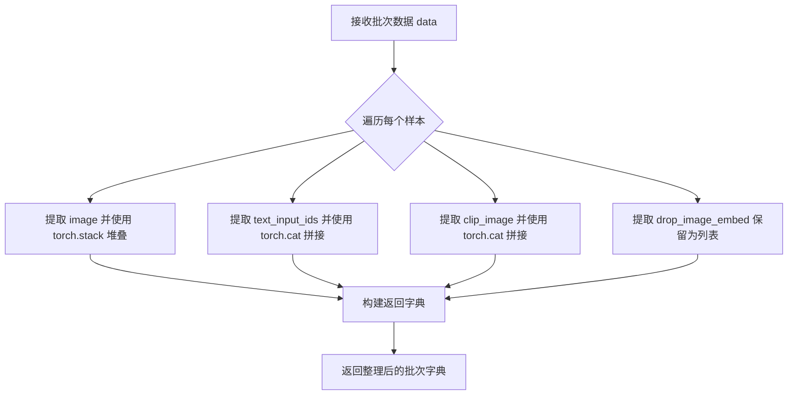
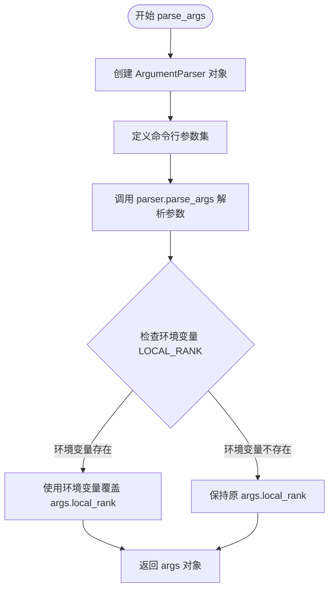
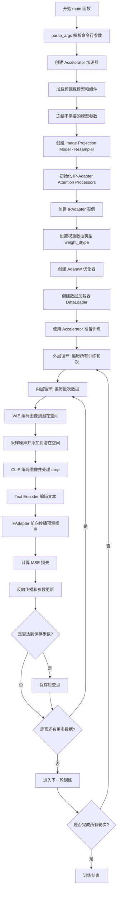
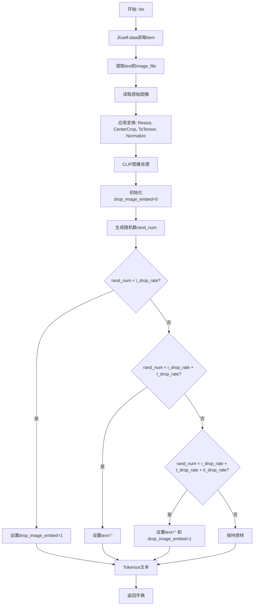
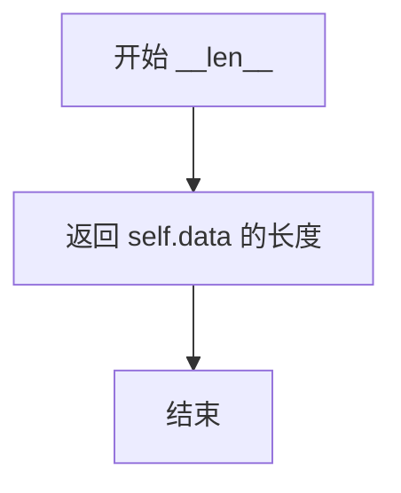
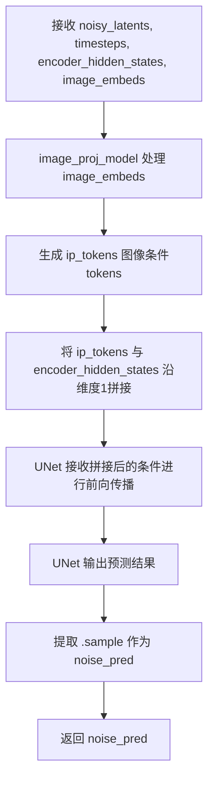
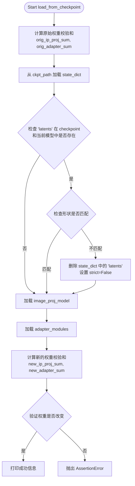

# `diffusers\examples\research_projects\ip_adapter\tutorial_train_plus.py` 详细设计文档

这是一个基于Stable Diffusion的IP-Adapter训练脚本，用于训练图像提示适配器，使模型能够根据输入图像生成对应的文本描述。脚本使用CLIP图像编码器提取图像特征，通过可学习的投影模型和适配器模块将这些特征融入UNet的去噪过程，实现图像条件的文本生成。

## 整体流程

```mermaid
graph TD
    A[开始: main()] --> B[解析命令行参数]
    B --> C[初始化Accelerator加速器]
    D[加载预训练模型] --> D1[加载噪声调度器DDPMScheduler]
    D --> D2[加载tokenizer和text_encoder]
    D --> D3[加载VAE编码器]
    D --> D4[加载UNet2DConditionModel]
    D --> D5[加载CLIP图像编码器]
    D --> E[冻结不需要训练的模型参数]
    E --> F[创建图像投影模型Resampler]
    F --> G[初始化IP-Adapter注意力处理器]
    G --> H[创建IPAdapter实例]
    H --> I[设置优化器AdamW]
    I --> J[创建训练数据集和DataLoader]
    J --> K[准备accelerator相关对象]
    K --> L[开始训练循环]
    L --> L1[从VAE获取图像latents]
    L --> L2[采样噪声和timestep]
    L --> L3[执行前向扩散过程]
    L --> L4[通过CLIP编码图像获取image_embeds]
    L --> L5[通过text_encoder编码文本]
    L --> L6[调用IPAdapter前向传播]
    L --> L7[计算MSE损失并反向传播]
    L --> L8{是否到达保存步数?} -- 是 --> M[保存检查点]
    L --> L8 -- 否 --> L
    M --> L
```

## 类结构

```
MyDataset (数据加载类)
├── __init__ (初始化数据集)
├── __getitem__ (获取单个样本)
└── __len__ (数据集长度)

IPAdapter (IP适配器模型类)
├── __init__ (初始化)
├── forward (前向传播)
└── load_from_checkpoint (加载检查点)

全局函数
├── collate_fn (数据整理)
├── parse_args (参数解析)
└── main (主函数)
```

## 全局变量及字段


### `noise_scheduler`
    
Diffusers噪声调度器，用于控制扩散模型的前向和反向过程

类型：`DDPMScheduler`
    


### `tokenizer`
    
CLIP文本分词器，用于将文本转换为token IDs

类型：`CLIPTokenizer`
    


### `text_encoder`
    
CLIP文本编码器，将文本token转换为文本嵌入向量

类型：`CLIPTextModel`
    


### `vae`
    
变分自编码器模型，用于将图像编码到潜在空间和解码回图像

类型：`AutoencoderKL`
    


### `unet`
    
条件UNet模型，用于预测噪声残差实现图像生成

类型：`UNet2DConditionModel`
    


### `image_encoder`
    
CLIP图像编码器，将图像转换为图像嵌入向量

类型：`CLIPVisionModelWithProjection`
    


### `image_proj_model`
    
图像投影模型，将CLIP图像嵌入适配到UNet的交叉注意力维度

类型：`Resampler`
    


### `adapter_modules`
    
IP-Adapter注意力处理器模块列表，集成到UNet的各注意力层

类型：`torch.nn.ModuleList`
    


### `ip_adapter`
    
IP-Adapter模型，整合图像嵌入到UNet去噪过程中

类型：`IPAdapter`
    


### `weight_dtype`
    
模型权重数据类型，根据混合精度配置为float32/float16/bfloat16

类型：`torch.dtype`
    


### `optimizer`
    
AdamW优化器，用于更新IP-Adapter的可训练参数

类型：`torch.optim.AdamW`
    


### `train_dataset`
    
训练数据集实例，加载图像和文本进行训练

类型：`MyDataset`
    


### `train_dataloader`
    
训练数据加载器，按批次提供训练数据

类型：`torch.utils.data.DataLoader`
    


### `global_step`
    
全局训练步数计数器，记录已完成的训练迭代次数

类型：`int`
    


### `epoch`
    
当前训练轮次，从0开始计数

类型：`int`
    


### `args`
    
命令行参数命名空间，包含所有训练配置选项

类型：`argparse.Namespace`
    


### `MyDataset.tokenizer`
    
CLIP文本分词器

类型：`CLIPTokenizer`
    


### `MyDataset.size`
    
图像尺寸

类型：`int`
    


### `MyDataset.i_drop_rate`
    
图像丢弃率

类型：`float`
    


### `MyDataset.t_drop_rate`
    
文本丢弃率

类型：`float`
    


### `MyDataset.ti_drop_rate`
    
图像文本同时丢弃率

类型：`float`
    


### `MyDataset.image_root_path`
    
图像根目录路径

类型：`str`
    


### `MyDataset.data`
    
训练数据列表

类型：`list`
    


### `MyDataset.transform`
    
图像变换组合

类型：`torchvision.transforms.Compose`
    


### `MyDataset.clip_image_processor`
    
CLIP图像处理器

类型：`CLIPImageProcessor`
    


### `IPAdapter.unet`
    
UNet2DConditionModel模型

类型：`UNet2DConditionModel`
    


### `IPAdapter.image_proj_model`
    
图像投影模型

类型：`torch.nn.Module`
    


### `IPAdapter.adapter_modules`
    
适配器模块列表

类型：`torch.nn.ModuleList`
    
    

## 全局函数及方法


### `collate_fn`

该函数是 PyTorch DataLoader 的批处理整理函数，负责将数据集中获取的样本列表（每个样本包含图像、文本输入ID、CLIP图像和图像嵌入丢弃标志）堆叠或拼接成批次张量，以适配模型的批量输入要求。

参数：

- `data`：`List[Dict]`，数据批次列表，每个元素是 `__getitem__` 返回的字典，包含 "image"、"text_input_ids"、"clip_image" 和 "drop_image_embed" 键

返回值：`Dict`，包含以下键值对的字典：
- `images`：`torch.Tensor`，形状为 `(batch_size, C, H, W)` 的图像张量
- `text_input_ids`：`torch.Tensor`，形状为 `(batch_size, seq_len)` 的文本输入ID张量
- `clip_images`：`torch.Tensor`，形状为 `(batch_size, C, H, W)` 的CLIP预处理图像张量
- `drop_image_embeds`：`List[int]`，图像嵌入丢弃标志列表

#### 流程图



#### 带注释源码

```python
def collate_fn(data):
    """
    将批次数据整理成张量形式的函数
    
    参数:
        data: 批次数据列表，每个元素为包含 'image', 'text_input_ids', 
              'clip_image', 'drop_image_embed' 的字典
    
    返回:
        整理后的批次字典，包含张量形式的图像、文本ID、CLIP图像和丢弃标志
    """
    # 使用 torch.stack 将批次中所有图像张量在维度0堆叠
    # 要求所有图像具有相同的形状，堆叠后形状为 (batch_size, C, H, W)
    images = torch.stack([example["image"] for example in data])
    
    # 使用 torch.cat 将文本输入ID在维度0拼接
    # 每个样本的 text_input_ids 形状为 (1, seq_len)，拼接后为 (batch_size, seq_len)
    text_input_ids = torch.cat([example["text_input_ids"] for example in data], dim=0)
    
    # 使用 torch.cat 将CLIP图像在维度0拼接
    # clip_image 来自 CLIPImageProcessor，返回形状为 (1, C, H, W) 的张量
    clip_images = torch.cat([example["clip_image"] for example in data], dim=0)
    
    # drop_image_embed 保留为列表，不进行张量拼接，以便后续按样本处理
    drop_image_embeds = [example["drop_image_embed"] for example in data]

    # 返回整理后的批次字典，供模型训练使用
    return {
        "images": images,
        "text_input_ids": text_input_ids,
        "clip_images": clip_images,
        "drop_image_embeds": drop_image_embeds,
    }
```

#### 关键组件信息

| 组件名称 | 一句话描述 |
|---------|-----------|
| `torch.stack` | 用于沿新维度堆叠张量，要求输入张量形状完全一致 |
| `torch.cat` | 用于沿指定维度拼接张量，要求除拼接维度外其他维度形状一致 |
| `DataLoader` | PyTorch 数据加载器，使用 collate_fn 自定义批次整理逻辑 |

#### 潜在的技术债务或优化空间

1. **类型不一致**：`drop_image_embeds` 返回列表而非张量，可能导致与其他返回值的类型不一致，后续处理需要额外判断
2. **内存效率**：对于大批量训练，可以考虑使用 `torch.stack` 替代部分 `torch.cat` 操作以提高内存连续性
3. **错误处理**：缺少对输入数据格式的验证，如某项键缺失或张量形状不匹配时缺乏明确的错误提示

#### 其它项目

**设计目标与约束**：
- 目标：将异构数据（图像、文本、CLIP图像、元信息）整理为统一的批次张量格式
- 约束：图像和文本输入需保持批次维度在第一维，drop_image_embeds 需保持为列表以支持后续条件处理

**错误处理与异常设计**：
- 当前未对 data 的空列表输入进行处理，可能导致后续操作失败
- 未检查 "image"、"text_input_ids" 等键是否存在，键缺失时会产生 KeyError

**数据流与状态机**：
- 数据流：`MyDataset.__getitem__` → `DataLoader` → `collate_fn` → 模型前向传播
- 状态机：不涉及状态变化，属于纯数据转换函数


### `parse_args`

#### 描述
`parse_args` 函数是训练脚本的命令行参数解析器。它初始化 `argparse` 对象，定义了一系列用于控制模型训练、数据路径、优化器行为和分布式训练的配置项（如预训练模型路径、数据文件、学习率等），并通过解析系统传入的参数（`sys.argv`）生成配置对象。此外，该函数还特别处理了分布式训练环境下 `LOCAL_RANK` 环境变量的优先级覆盖问题。

#### 参数
- **无显式参数**：该函数不接受任何输入参数，它直接读取系统命令行输入（`sys.argv`）。

#### 返回值
- **`args`**：`argparse.Namespace` 对象，包含所有解析后的命令行参数及其对应的值。

#### 流程图



#### 带注释源码

```python
def parse_args():
    """
    解析命令行参数。
    """
    # 1. 初始化参数解析器，设置描述信息
    parser = argparse.ArgumentParser(description="Simple example of a training script.")
    
    # 2. 添加模型与路径相关参数
    parser.add_argument(
        "--pretrained_model_name_or_path",
        type=str,
        default=None,
        required=True,
        help="Path to pretrained model or model identifier from huggingface.co/models.",
    )
    parser.add_argument(
        "--pretrained_ip_adapter_path",
        type=str,
        default=None,
        help="Path to pretrained ip adapter model. If not specified weights are initialized randomly.",
    )
    parser.add_argument(
        "--num_tokens",
        type=int,
        default=16,
        help="Number of tokens to query from the CLIP image encoding.",
    )
    parser.add_argument(
        "--data_json_file",
        type=str,
        default=None,
        required=True,
        help="Training data",
    )
    parser.add_argument(
        "--data_root_path",
        type=str,
        default="",
        required=True,
        help="Training data root path",
    )
    parser.add_argument(
        "--image_encoder_path",
        type=str,
        default=None,
        required=True,
        help="Path to CLIP image encoder",
    )
    parser.add_argument(
        "--output_dir",
        type=str,
        default="sd-ip_adapter",
        help="The output directory where the model predictions and checkpoints will be written.",
    )
    
    # 3. 添加日志与环境相关参数
    parser.add_argument(
        "--logging_dir",
        type=str,
        default="logs",
        help="[TensorBoard] log directory.",
    )
    
    # 4. 添加训练超参数
    parser.add_argument(
        "--resolution",
        type=int,
        default=512,
        help="The resolution for input images",
    )
    parser.add_argument(
        "--learning_rate",
        type=float,
        default=1e-4,
        help="Learning rate to use.",
    )
    parser.add_argument("--weight_decay", type=float, default=1e-2, help="Weight decay to use.")
    parser.add_argument("--num_train_epochs", type=int, default=100)
    parser.add_argument(
        "--train_batch_size", type=int, default=8, help="Batch size (per device) for the training dataloader."
    )
    parser.add_argument(
        "--dataloader_num_workers",
        type=int,
        default=0,
        help="Number of subprocesses to use for data loading.",
    )
    parser.add_argument(
        "--save_steps",
        type=int,
        default=2000,
        help="Save a checkpoint of the training state every X updates",
    )
    parser.add_argument(
        "--mixed_precision",
        type=str,
        default=None,
        choices=["no", "fp16", "bf16"],
        help="Whether to use mixed precision.",
    )
    parser.add_argument(
        "--report_to",
        type=str,
        default="tensorboard",
        help='The integration to report the results and logs to.',
    )
    parser.add_argument("--local_rank", type=int, default=-1, help="For distributed training: local_rank")

    # 5. 执行解析
    args = parser.parse_args()

    # 6. 处理分布式训练环境变量覆盖
    # 如果在运行加速脚本（如torchrun）时设置了LOCAL_RANK环境变量，
    # 则使用该环境变量来更新args.local_rank，以确保一致性。
    env_local_rank = int(os.environ.get("LOCAL_RANK", -1))
    if env_local_rank != -1 and env_local_rank != args.local_rank:
        args.local_rank = env_local_rank

    return args
```

### 其它相关信息

#### 关键组件信息
- **`argparse` (库)**: Python 标准库，用于解析命令行参数。
- **`os` (库)**: 用于访问环境变量 `os.environ`，以支持分布式训练的自动检测。

#### 潜在的技术债务或优化空间
1.  **缺少路径验证**: 代码目前没有验证传入的路径（如 `--pretrained_model_name_or_path`, `--data_json_file`）是否真实存在。如果路径无效，程序可能在初始化模型或加载数据时才报错，缺乏早期的错误反馈。
2.  **参数硬编码默认值**: 某些参数（如 `--num_tokens`, `--save_steps`）虽然有默认值，但对于生产环境或不同实验需求，可能缺少更详细的参数范围校验（例如负数检查）。
3.  **文档与配置分离**: 如果项目需要更复杂的配置管理，可以考虑引入 `hydra` 或 ` OmegaConf` 来支持基于 YAML 的配置分层覆盖，目前仅支持 CLI 和环境变量。

#### 外部依赖与接口契约
- **输入**: 通过 `sys.argv` 传入的字符串列表。
- **输出**: 返回一个命名空间对象 `args`，该对象会被直接传递或用于初始化 `Accelerator` 等核心组件。
- **约束**: `--pretrained_model_name_or_path`, `--data_json_file`, `--data_root_path`, `--image_encoder_path` 在 CLI 中被标记为 `required=True`，如果缺失将导致程序终止并打印 argparse 的默认错误信息。


### `main`

主训练函数，负责完整的IP-Adapter模型训练流程，包括模型加载、数据准备、训练循环和模型保存。

参数：此函数不接受任何外部参数，参数通过`parse_args()`函数从命令行获取

返回值：`None`，该函数执行完整的训练流程但不返回任何值

#### 流程图



#### 带注释源码

```python
def main():
    """
    主训练函数，执行完整的 IP-Adapter 训练流程
    """
    # 1. 解析命令行参数
    args = parse_args()
    logging_dir = Path(args.output_dir, args.logging_dir)

    # 2. 创建 Accelerator 项目配置
    accelerator_project_config = ProjectConfiguration(project_dir=args.output_dir, logging_dir=logging_dir)

    # 3. 初始化 Accelerator（分布式训练、混合精度等）
    accelerator = Accelerator(
        mixed_precision=args.mixed_precision,
        log_with=args.report_to,
        project_config=accelerator_project_config,
    )

    # 4. 如果是主进程，创建输出目录
    if accelerator.is_main_process:
        if args.output_dir is not None:
            os.makedirs(args.output_dir, exist_ok=True)

    # 5. 加载预训练模型组件
    # 加载噪声调度器
    noise_scheduler = DDPMScheduler.from_pretrained(args.pretrained_model_name_or_path, subfolder="scheduler")
    # 加载文本 tokenizer
    tokenizer = CLIPTokenizer.from_pretrained(args.pretrained_model_name_or_path, subfolder="tokenizer")
    # 加载文本编码器
    text_encoder = CLIPTextModel.from_pretrained(args.pretrained_model_name_or_path, subfolder="text_encoder")
    # 加载 VAE 变分自编码器
    vae = AutoencoderKL.from_pretrained(args.pretrained_model_name_or_path, subfolder="vae")
    # 加载 UNet2D 条件模型
    unet = UNet2DConditionModel.from_pretrained(args.pretrained_model_name_or_path, subfolder="unet")
    # 加载 CLIP 图像编码器
    image_encoder = CLIPVisionModelWithProjection.from_pretrained(args.image_encoder_path)
    
    # 6. 冻结模型参数以节省显存
    unet.requires_grad_(False)
    vae.requires_grad_(False)
    text_encoder.requires_grad_(False)
    image_encoder.requires_grad_(False)

    # 7. 创建 Image Projection Model (Resampler)
    # 将 CLIP 图像特征转换为 UNet 跨注意力维度
    image_proj_model = Resampler(
        dim=unet.config.cross_attention_dim,
        depth=4,
        dim_head=64,
        heads=12,
        num_queries=args.num_tokens,
        embedding_dim=image_encoder.config.hidden_size,
        output_dim=unet.config.cross_attention_dim,
        ff_mult=4,
    )
    
    # 8. 初始化 IP-Adapter Attention Processors
    # 为 UNet 的每个注意力层添加 IP-Adapter 处理器
    attn_procs = {}
    unet_sd = unet.state_dict()
    for name in unet.attn_processors.keys():
        cross_attention_dim = None if name.endswith("attn1.processor") else unet.config.cross_attention_dim
        if name.startswith("mid_block"):
            hidden_size = unet.config.block_out_channels[-1]
        elif name.startswith("up_blocks"):
            block_id = int(name[len("up_blocks.")])
            hidden_size = list(reversed(unet.config.block_out_channels))[block_id]
        elif name.startswith("down_blocks"):
            block_id = int(name[len("down_blocks.")])
            hidden_size = unet.config.block_out_channels[block_id]
        if cross_attention_dim is None:
            attn_procs[name] = AttnProcessor()
        else:
            layer_name = name.split(".processor")[0]
            weights = {
                "to_k_ip.weight": unet_sd[layer_name + ".to_k.weight"],
                "to_v_ip.weight": unet_sd[layer_name + ".to_v.weight"],
            }
            attn_procs[name] = IPAttnProcessor(
                hidden_size=hidden_size, cross_attention_dim=cross_attention_dim, num_tokens=args.num_tokens
            )
            attn_procs[name].load_state_dict(weights)
    unet.set_attn_processor(attn_procs)
    adapter_modules = torch.nn.ModuleList(unet.attn_processors.values())

    # 9. 创建 IPAdapter 实例
    ip_adapter = IPAdapter(unet, image_proj_model, adapter_modules, args.pretrained_ip_adapter_path)

    # 10. 设置权重数据类型（混合精度支持）
    weight_dtype = torch.float32
    if accelerator.mixed_precision == "fp16":
        weight_dtype = torch.float16
    elif accelerator.mixed_precision == "bf16":
        weight_dtype = torch.bfloat16
    
    # 11. 将模型移动到设备（VAE、Text Encoder、Image Encoder 需要训练时推理）
    vae.to(accelerator.device, dtype=weight_dtype)
    text_encoder.to(accelerator.device, dtype=weight_dtype)
    image_encoder.to(accelerator.device, dtype=weight_dtype)

    # 12. 创建优化器（只优化 image_proj_model 和 adapter_modules）
    params_to_opt = itertools.chain(ip_adapter.image_proj_model.parameters(), ip_adapter.adapter_modules.parameters())
    optimizer = torch.optim.AdamW(params_to_opt, lr=args.learning_rate, weight_decay=args.weight_decay)

    # 13. 创建数据加载器
    train_dataset = MyDataset(
        args.data_json_file, tokenizer=tokenizer, size=args.resolution, image_root_path=args.data_root_path
    )
    train_dataloader = torch.utils.data.DataLoader(
        train_dataset,
        shuffle=True,
        collate_fn=collate_fn,
        batch_size=args.train_batch_size,
        num_workers=args.dataloader_num_workers,
    )

    # 14. 使用 Accelerator 准备训练（分布式包装）
    ip_adapter, optimizer, train_dataloader = accelerator.prepare(ip_adapter, optimizer, train_dataloader)

    # 15. 训练循环
    global_step = 0
    for epoch in range(0, args.num_train_epochs):
        begin = time.perf_counter()
        for step, batch in enumerate(train_dataloader):
            load_data_time = time.perf_counter() - begin
            
            # 梯度累积上下文
            with accelerator.accumulate(ip_adapter):
                # 15.1 将图像编码到潜在空间
                with torch.no_grad():
                    latents = vae.encode(
                        batch["images"].to(accelerator.device, dtype=weight_dtype)
                    ).latent_dist.sample()
                    latents = latents * vae.config.scaling_factor

                # 15.2 采样噪声
                noise = torch.randn_like(latents)
                bsz = latents.shape[0]
                # 为每个图像随机采样时间步
                timesteps = torch.randint(0, noise_scheduler.num_train_timesteps, (bsz,), device=latents.device)
                timesteps = timesteps.long()

                # 15.3 前向扩散过程：添加噪声到潜在空间
                noisy_latents = noise_scheduler.add_noise(latents, noise, timesteps)

                # 15.4 处理 CLIP 图像（考虑 drop 率）
                clip_images = []
                for clip_image, drop_image_embed in zip(batch["clip_images"], batch["drop_image_embeds"]):
                    if drop_image_embed == 1:
                        clip_images.append(torch.zeros_like(clip_image))
                    else:
                        clip_images.append(clip_image)
                clip_images = torch.stack(clip_images, dim=0)
                
                # 15.5 使用 CLIP 图像编码器提取图像特征
                with torch.no_grad():
                    image_embeds = image_encoder(
                        clip_images.to(accelerator.device, dtype=weight_dtype), output_hidden_states=True
                    ).hidden_states[-2]

                # 15.6 使用 Text Encoder 编码文本
                with torch.no_grad():
                    encoder_hidden_states = text_encoder(batch["text_input_ids"].to(accelerator.device))[0]

                # 15.7 IP-Adapter 前向传播预测噪声
                noise_pred = ip_adapter(noisy_latents, timesteps, encoder_hidden_states, image_embeds)

                # 15.8 计算 MSE 损失
                loss = F.mse_loss(noise_pred.float(), noise.float(), reduction="mean")

                # 15.9 收集所有进程的损失用于日志记录
                avg_loss = accelerator.gather(loss.repeat(args.train_batch_size)).mean().item()

                # 15.10 反向传播
                accelerator.backward(loss)
                optimizer.step()
                optimizer.zero_grad()

                # 15.11 打印训练日志
                if accelerator.is_main_process:
                    print(
                        "Epoch {}, step {}, data_time: {}, time: {}, step_loss: {}".format(
                            epoch, step, load_data_time, time.perf_counter() - begin, avg_loss
                        )
                    )

            # 更新全局步数
            global_step += 1

            # 16. 定期保存检查点
            if global_step % args.save_steps == 0:
                save_path = os.path.join(args.output_dir, f"checkpoint-{global_step}")
                accelerator.save_state(save_path)

            begin = time.perf_counter()
```


### `MyDataset.__init__`

该方法是 `MyDataset` 类的构造函数，用于初始化数据集实例。它负责接收并保存训练配置（如图像尺寸、drop 概率）、加载 JSON 格式的数据列表、初始化图像预处理变换（resize, crop, normalize）以及 CLIP 图像处理器。

参数：

- `self`：隐式参数，表示数据集实例本身。
- `json_file`：`str`，JSON 文件的路径，文件中包含训练数据的列表（如 `[{"image_file": "1.png", "text": "A dog"}]`）。
- `tokenizer`：`CLIPTokenizer`，用于将文本编码为 token IDs 的分词器。
- `size`：`int`，目标图像的尺寸，默认为 512。用于图像的 Resize 和 CenterCrop。
- `t_drop_rate`：`float`，文本丢弃率（Text Drop Rate），默认为 0.05。训练时用于随机丢弃文本条件。
- `i_drop_rate`：`float`，图像丢弃率（Image Drop Rate），默认为 0.05。训练时用于随机丢弃图像条件。
- `ti_drop_rate`：`float`，文本和图像同时丢弃率（Text+Image Drop Rate），默认为 0.05。
- `image_root_path`：`str`，图像文件的根目录，默认为空字符串。用于拼接 `image_file` 形成完整路径。

返回值：`None`，构造函数不返回任何值。

#### 流程图

```mermaid
graph TD
    A[Start __init__] --> B[Call super().__init__]
    B --> C[Assign parameters to self<br/>(tokenizer, size, drop rates, image_root_path)]
    C --> D[Load JSON data from json_file]
    D --> E[Initialize Transform pipeline<br/>(Resize, CenterCrop, ToTensor, Normalize)]
    E --> F[Initialize CLIPImageProcessor]
    F --> G[End]
```

#### 带注释源码

```python
def __init__(
    self, json_file, tokenizer, size=512, t_drop_rate=0.05, i_drop_rate=0.05, ti_drop_rate=0.05, image_root_path=""
):
    # 调用父类 torch.utils.data.Dataset 的构造函数
    super().__init__()

    # 保存传入的分词器、配置参数和路径
    self.tokenizer = tokenizer
    self.size = size
    self.i_drop_rate = i_drop_rate
    self.t_drop_rate = t_drop_rate
    self.ti_drop_rate = ti_drop_rate
    self.image_root_path = image_root_path

    # 加载训练数据列表
    # 数据格式为: [{"image_file": "1.png", "text": "A dog"}, ...]
    self.data = json.load(open(json_file))

    # 定义图像预处理流程
    self.transform = transforms.Compose(
        [
            # 调整图像大小到指定尺寸，使用双线性插值
            transforms.Resize(self.size, interpolation=transforms.InterpolationMode.BILINEAR),
            # 中心裁剪到指定尺寸
            transforms.CenterCrop(self.size),
            # 转换为 PyTorch Tensor
            transforms.ToTensor(),
            # 归一化到 [-1, 1] 范围
            transforms.Normalize([0.5], [0.5]),
        ]
    )
    
    # 初始化 CLIP 图像处理器，用于处理 CLIP 模型的图像输入
    self.clip_image_processor = CLIPImageProcessor()
```


### `MyDataset.__getitem__`

该方法是 PyTorch 数据集类的核心方法，根据给定索引从数据集中加载单个样本，包括读取图像、应用变换、CLIP 图像处理、文本 tokenization，并根据预设概率进行图像嵌入、文本或两者同时的随机丢弃，最后返回包含图像、文本输入 IDs、CLIP 图像和丢弃标志的字典。

参数：

- `idx`：`int`，数据集中的索引，用于定位要获取的样本

返回值：`Dict[str, Any]`，返回包含以下键的字典：
  - `image`：变换后的图像张量
  - `text_input_ids`：文本的 token IDs
  - `clip_image`：CLIP 处理的图像张量
  - `drop_image_embed`：图像嵌入是否被丢弃的标志（0 或 1）

#### 流程图



#### 带注释源码

```python
def __getitem__(self, idx):
    """根据索引获取数据集中的单个样本
    
    Args:
        idx: 数据集中的索引
        
    Returns:
        包含图像、文本IDs、CLIP图像和丢弃标志的字典
    """
    # 从数据列表中获取指定索引的项
    item = self.data[idx]
    # 提取文本描述
    text = item["text"]
    # 提取图像文件名
    image_file = item["image_file"]

    # 读取图像
    # 使用os.path.join拼接图像根路径和文件名
    raw_image = Image.open(os.path.join(self.image_root_path, image_file))
    # 应用图像变换：调整大小、中心裁剪、转换为张量、归一化
    image = self.transform(raw_image.convert("RGB"))
    # 使用CLIP图像处理器处理原始图像，返回张量
    clip_image = self.clip_image_processor(images=raw_image, return_tensors="pt").pixel_values

    # 随机丢弃机制
    # 初始化丢弃标志为0（不丢弃）
    drop_image_embed = 0
    # 生成0到1之间的随机数
    rand_num = random.random()
    # 根据不同概率进行三种丢弃策略
    if rand_num < self.i_drop_rate:
        # 丢弃图像嵌入（仅图像）
        drop_image_embed = 1
    elif rand_num < (self.i_drop_rate + self.t_drop_rate):
        # 丢弃文本（仅文本）
        text = ""
    elif rand_num < (self.i_drop_rate + self.t_drop_rate + self.ti_drop_rate):
        # 同时丢弃文本和图像嵌入
        text = ""
        drop_image_embed = 1
    
    # 对文本进行tokenize
    # 使用tokenizer将文本转换为模型输入格式
    text_input_ids = self.tokenizer(
        text,
        max_length=self.tokenizer.model_max_length,
        padding="max_length",
        truncation=True,
        return_tensors="pt",
    ).input_ids

    # 返回包含所有数据的字典
    return {
        "image": image,  # 变换后的图像张量
        "text_input_ids": text_input_ids,  # token IDs
        "clip_image": clip_image,  # CLIP处理的图像
        "drop_image_embed": drop_image_embed,  # 丢弃标志
    }
```


### `MyDataset.__len__`

此方法返回数据集中样本的数量，使得DataLoader能够确定数据集的大小以便进行批量迭代。

参数：

- 无额外参数（Python特殊方法，self由类方法隐式传递）

返回值：`int`，返回数据集中样本的总数

#### 流程图



#### 带注释源码

```python
def __len__(self):
    """
    返回数据集中样本的数量。
    
    这是 PyTorch Dataset 类的必需方法，
    DataLoader 需要知道数据集的大小来进行批量迭代。
    
    Returns:
        int: 样本总数，等于 self.data 列表的长度
    """
    return len(self.data)  # 返回从 JSON 文件加载的数据列表的长度
```


### `IPAdapter.__init__`

该方法是 `IPAdapter` 类的构造函数，用于初始化 IP-Adapter 模型的核心组件，包括 UNet、图像投影模型和适配器模块，并可选地加载预训练检查点权重。

参数：

- `unet`：`UNet2DConditionModel`，去噪 UNet 模型，负责根据文本和图像条件预测噪声
- `image_proj_model`：`torch.nn.Module`（Resampler），图像投影模型，将图像嵌入投影到 UNet 的 cross-attention 维度空间
- `adapter_modules`：`torch.nn.ModuleList`，适配器模块列表，存储 IP-Adapter 的注意力处理器权重
- `ckpt_path`：`str | None`，可选的预训练检查点路径，若提供则加载预训练权重

返回值：`None`，构造函数无显式返回值

#### 流程图

```mermaid
flowchart TD
    A[开始 __init__] --> B[调用 super().__init__]
    B --> C[保存 self.unet]
    C --> D[保存 self.image_proj_model]
    D --> E[保存 self.adapter_modules]
    E --> F{ckpt_path is not None?}
    F -->|是| G[调用 load_from_checkpoint]
    F -->|否| H[结束]
    G --> H
```

#### 带注释源码

```python
def __init__(self, unet, image_proj_model, adapter_modules, ckpt_path=None):
    """
    初始化 IP-Adapter 模型
    
    参数:
        unet: UNet2DConditionModel 实例，去噪 UNet 模型
        image_proj_model: 图像投影模型（Resampler），将 CLIP 图像嵌入投影到 cross-attention 空间
        adapter_modules: torch.nn.ModuleList，IP-Adapter 的注意力处理器模块列表
        ckpt_path: 预训练检查点路径，可选，默认为 None
    """
    # 调用父类 torch.nn.Module 的初始化方法
    super().__init__()
    
    # 保存 UNet 模型引用
    self.unet = unet
    
    # 保存图像投影模型
    self.image_proj_model = image_proj_model
    
    # 保存适配器模块
    self.adapter_modules = adapter_modules
    
    # 如果提供了检查点路径，则加载预训练权重
    if ckpt_path is not None:
        self.load_from_checkpoint(ckpt_path)
```


### `IPAdapter.forward`

该方法是 IP-Adapter 的核心前向传播方法，负责将图像嵌入与文本嵌入融合后输入 UNet 进行噪声预测，实现基于图像条件的扩散模型推理。

参数：

- `noisy_latents`：`torch.Tensor`，带噪声的潜在表示，由 VAE 编码后的图像潜在变量经噪声调度器添加噪声得到
- `timesteps`：`torch.Tensor`，当前扩散过程的时间步，用于指导去噪过程
- `encoder_hidden_states`：`torch.Tensor`，文本编码器输出的隐藏状态序列，包含文本条件信息
- `image_embeds`：`torch.Tensor`，CLIP 图像编码器输出的图像嵌入向量，表示输入图像的特征

返回值：`torch.Tensor`，预测的噪声残差（noise_pred），用于后续计算损失或更新潜在变量

#### 流程图



#### 带注释源码

```python
def forward(self, noisy_latents, timesteps, encoder_hidden_states, image_embeds):
    """
    IP-Adapter 的前向传播方法
    
    参数:
        noisy_latents: 带噪声的潜在表示，形状为 [batch, channels, height, width]
        timesteps: 扩散过程的时间步，用于 UNet 的时序嵌入
        encoder_hidden_states: 文本条件嵌入，形状为 [batch, seq_len, hidden_dim]
        image_embeds: CLIP 图像编码器输出的图像嵌入，形状为 [batch, num_tokens, embed_dim]
    
    返回:
        noise_pred: 预测的噪声残差，用于扩散模型的损失计算
    """
    # 步骤1: 将图像嵌入通过图像投影模型转换为 IP tokens
    # image_proj_model 通常是 Resampler，将 CLIP 嵌入维度转换为 UNet 交叉注意力维度
    ip_tokens = self.image_proj_model(image_embeds)
    
    # 步骤2: 将图像条件 tokens 与文本条件 embeddings 在序列维度上拼接
    # 拼接后形状: [batch, text_seq_len + num_ip_tokens, hidden_dim]
    # 这样 UNet 可以同时接收文本和图像两种条件信息
    encoder_hidden_states = torch.cat([encoder_hidden_states, ip_tokens], dim=1)
    
    # 步骤3: 将拼接后的条件传入 UNet 进行噪声预测
    # UNet 会根据当前噪声水平、时间步和条件信息预测噪声残差
    noise_pred = self.unet(noisy_latents, timesteps, encoder_hidden_states).sample
    
    # 返回预测的噪声残差
    return noise_pred
```


### `IPAdapter.load_from_checkpoint`

该方法负责从指定的检查点文件加载预训练的 IP-Adapter 权重。它首先计算当前模型权重的校验和以验证后续变更，然后加载权重字典。在加载过程中，它特别处理了 `latents` 键可能存在的形状不匹配问题（这通常发生在不同版本模型间），并通过再次计算校验和来确保权重确实发生了改变。

参数：

-  `ckpt_path`：`str`，需要加载的检查点文件路径。

返回值：`None`，该方法直接修改模型实例的状态，不返回任何值。

#### 流程图



#### 带注释源码

```python
def load_from_checkpoint(self, ckpt_path: str):
    """
    从检查点加载 IP-Adapter 的权重。
    包含对 latents 形状不匹配的处理以及权重变更的校验。
    """
    # 1. 计算原始权重总和（checksum），用于后续验证权重是否真正被加载
    orig_ip_proj_sum = torch.sum(torch.stack([torch.sum(p) for p in self.image_proj_model.parameters()]))
    orig_adapter_sum = torch.sum(torch.stack([torch.sum(p) for p in self.adapter_modules.parameters()]))

    # 2. 加载检查点文件到 CPU
    state_dict = torch.load(ckpt_path, map_location="cpu")

    # 3. 特殊处理：如果 checkpoint 和当前模型都包含 'latents' 参数
    strict_load_image_proj_model = True
    if "latents" in state_dict["image_proj"] and "latents" in self.image_proj_model.state_dict():
        # 3.1 检查形状是否不匹配（常见于 Resampler 维度改变的情况）
        if state_dict["image_proj"]["latents"].shape != self.image_proj_model.state_dict()["latents"].shape:
            print(f"Shapes of 'image_proj.latents' in checkpoint {ckpt_path} and current model do not match.")
            print("Removing 'latents' from checkpoint and loading the rest of the weights.")
            # 删除不匹配的键，并关闭严格加载模式
            del state_dict["image_proj"]["latents"]
            strict_load_image_proj_model = False

    # 4. 加载 image_proj_model 的权重
    self.image_proj_model.load_state_dict(state_dict["image_proj"], strict=strict_load_image_proj_model)
    
    # 5. 加载 adapter_modules 的权重（通常不存在形状问题）
    self.adapter_modules.load_state_dict(state_dict["ip_adapter"], strict=True)

    # 6. 计算加载后的新权重总和
    new_ip_proj_sum = torch.sum(torch.stack([torch.sum(p) for p in self.image_proj_model.parameters()]))
    new_adapter_sum = torch.sum(torch.stack([torch.sum(p) for p in self.adapter_modules.parameters()]))

    # 7. 断言验证：确保权重发生了改变（加载成功了）
    assert orig_ip_proj_sum != new_ip_proj_sum, "Weights of image_proj_model did not change!"
    assert orig_adapter_sum != new_adapter_sum, "Weights of adapter_modules did not change!"

    print(f"Successfully loaded weights from checkpoint {ckpt_path}")
```

## 关键组件


### 数据集加载与处理 (MyDataset)

该组件负责从JSON文件加载图像-文本对训练数据，实现图像变换、CLIP图像预处理，并支持文本、图像及组合drop机制以增强模型鲁棒性。

### IP-Adapter 模型封装 (IPAdapter)

该组件是IP-Adapter的核心封装类，集成了UNet、图像投影模型和适配器模块，负责前向传播过程中将图像嵌入与文本嵌入融合，并实现了检查点加载与权重校验功能。

### 图像投影与令牌查询 (Resampler)

该组件将CLIP图像编码器的高维输出转换为适配器所需的查询令牌，通过多层变换器和交叉注意力机制生成与UNet兼容的图像条件嵌入。

### 注意力处理器 (AttnProcessor / IPAttnProcessor)

该组件实现了两种注意力模式：标准注意力用于基础UNet块，IP专用的注意力处理器负责将图像提示特征注入到交叉注意力层，支持PyTorch 2.0的优化实现。

### 训练数据批次整理 (collate_fn)

该组件负责将多个样本数据整理为批量张量，包括图像堆叠、文本ID拼接、CLIP图像拼接以及drop标志列表的组织。

### 命令行参数解析 (parse_args)

该组件封装了所有训练超参数和路径配置，包括预训练模型路径、数据路径、输出目录、学习率、批量大小、混合精度选项等二十余个可配置参数。

### 主训练流程 (main)

该组件统筹整个训练pipeline，包括模型加载与冻结、IP-Adapter初始化、优化器配置、数据加载、分布式加速器准备、噪声扩散前向过程、损失计算与反向传播、权重保存等完整生命周期。

### 图像编码器 (image_encoder / CLIPVisionModelWithProjection)

该组件将输入图像编码为高维特征向量，提取中间层隐藏状态作为图像嵌入，为IP-Adapter提供视觉条件信息。

### 文本编码器 (text_encoder / CLIPTextModel)

该组件将文本提示编码为条件嵌入向量，与图像嵌入在UNet的交叉注意力层进行融合，引导生成过程。

### 潜在空间处理

该组件负责将像素空间图像通过VAE编码器映射到潜在空间，并在推理时将预测噪声反解回像素空间，涉及缩放因子应用和分布采样。

### 检查点保存与恢复

该组件通过Accelerator的save_state和load_state方法实现分布式环境下的完整训练状态持久化，包括模型权重、优化器状态和分布式相关信息。


## 问题及建议


### 已知问题

-   **资源泄漏风险**：使用`json.load(open(json_file))`未显式关闭文件，应使用`with`语句管理文件资源
-   **数据加载效率低**：每批次都重复读取和预处理图像及CLIP特征，未进行缓存或预处理
- **随机Drop逻辑不清晰**：使用连续if-elif判断随机数实现多drop策略，逻辑容易混淆且可读性差
- **浮点数比较不可靠**：`load_from_checkpoint`中使用`!=`比较权重求和来判断是否加载成功，浮点数直接比较可能产生误判
- **训练状态管理不完整**：仅保存`accelerator`状态，未保存优化器调度器状态、epoch进度等，恢复训练时可能丢失信息
- **时间统计不准确**：`load_data_time`在循环内部定义并在每次迭代中被覆盖，无法正确累积或记录历史
- **类型不一致**：`collate_fn`返回的`drop_image_embeds`是Python列表而非torch.Tensor，后续需额外转换处理
- **缺失错误处理**：文件读取、模型加载、checkpoint保存等关键操作缺乏异常捕获机制
- **GPU内存利用不充分**：CLIP图像编码在每个batch中重复执行，可预先计算并缓存
- **日志输出频繁**：主进程每个step都打印日志，在大规模训练时可能影响性能

### 优化建议

-   使用`with open(json_file) as f: self.data = json.load(f)`确保文件正确关闭
-   在Dataset的`__init__`中预先处理所有图像的CLIP特征并缓存到内存或磁盘
-   将随机drop逻辑封装为独立函数，使用枚举或命名元组提高可读性
-   使用`torch.allclose`替代`!=`进行权重变化检查，设置合理的`atol`参数
-   添加完整的训练状态保存逻辑，包括优化器、学习率调度器、epoch等必要信息
-   使用单独的变量记录数据加载时间或使用专门的性能监控工具
-   在`collate_fn`中将`drop_image_embeds`转换为`torch.tensor`
-   对关键IO操作添加try-except异常处理，并输出有意义的错误信息
-   实现图像embedding预计算管线，在训练开始前生成并保存CLIP特征
-   将日志输出改为按固定频率或使用专业的日志框架(如`logging`模块)
-   考虑添加梯度累积以支持更大的有效batch size
-   对UNet参数禁用梯度计算(代码中已对其他模型执行但UNet未处理)


## 其它


### 设计目标与约束

本代码旨在实现IP-Adapter（图像提示适配器）的训练脚本，用于将图像作为提示信息融入Stable Diffusion生成模型中。设计目标包括：支持图像提示的文本到图像生成任务；通过微调图像投影模块和适配器模块实现图像提示的嵌入；支持分布式训练和混合精度训练以提升训练效率。约束条件包括：需要至少24GB显存的GPU（fp16模式）；模型权重要求冻结以节省显存；仅支持PyTorch 2.0及以上版本（使用AttnProcessor2_0）。

### 错误处理与异常设计

代码中的错误处理主要包括以下几个方面：
1. **参数验证**：parse_args函数中对必需参数进行校验，如pretrained_model_name_or_path、data_json_file等为必需参数，缺少时会导致ArgumentParser报错
2. **模型加载容错**：load_from_checkpoint方法中包含latents形状不匹配的处理逻辑，当checkpoint中的latents形状与当前模型不匹配时会删除该权重并继续加载
3. **权重验证**：加载权重后通过checksum验证权重是否真正改变，若未改变则抛出AssertionError
4. **目录创建**：使用os.makedirs和exist_ok=True确保输出目录存在
5. **梯度累积**：使用accelerator.accumulate处理梯度累积场景

建议增加：文件路径不存在时的异常处理、JSON文件格式错误的异常捕获、图像加载失败时的默认处理、分布式训练超时检测等。

### 数据流与状态机

训练数据流如下：
1. **数据加载阶段**：MyDataset从JSON文件加载(image_file, text)对，通过transforms处理图像，CLIPImageProcessor处理CLIP图像输入
2. **drop机制**：根据i_drop_rate、t_drop_rate、ti_drop_rate随机决定是否drop图像embedding、文本或两者
3. **数据整理阶段**：collate_fn将batch数据整理为tensor格式
4. **前向传播阶段**：vae.encode将图像转为latent空间 → 采样噪声并添加扩散 → CLIP编码图像 → TextEncoder编码文本 → IPAdapter预测噪声
5. **损失计算**：F.mse_loss计算噪声预测损失
6. **反向传播与优化**：accelerator.backward + optimizer.step + optimizer.zero_grad
7. **保存阶段**：每save_steps保存checkpoint

状态机主要包括：训练循环（epoch → step）、梯度累积状态、模型训练状态（training/eval）。

### 外部依赖与接口契约

本代码依赖以下外部库和模型：
1. **核心框架**：PyTorch、torchvision、transformers、diffusers、accelerate、PIL
2. **IP-Adapter模块**：ip_adapter包（resampler、attention_processor、utils）
3. **预训练模型**：
   - Stable Diffusion：CLIPTextModel、CLIPTokenizer、UNet2DConditionModel、AutoencoderKL、DDPMScheduler
   - CLIP图像编码器：CLIPVisionModelWithProjection、CLIPImageProcessor
4. **命令行参数接口**：通过argparse定义，包含model路径、训练参数、数据路径等20+参数

接口契约：
- 数据集接口：__getitem__返回{"image", "text_input_ids", "clip_image", "drop_image_embed"}
- collate_fn返回{"images", "text_input_ids", "clip_images", "drop_image_embeds"}
- IPAdapter.forward(noisy_latents, timesteps, encoder_hidden_states, image_embeds) → noise_pred

### 性能优化与资源管理

当前代码包含以下性能优化：
1. **显存优化**：冻结unet、vae、text_encoder、image_encoder的梯度
2. **混合精度**：支持fp16和bf16训练
3. **分布式训练**：使用accelerate处理多GPU训练
4. **梯度累积**：通过accumulate实现梯度累积以支持大batch训练

潜在优化点：
1. **启用unet的梯度计算**：当前unet被注释掉未放入设备，可考虑启用以支持unet微调
2. **数据预取**：增加dataloader的prefetch_factor参数
3. **梯度checkpointing**：对image_proj_model使用gradient checkpointing节省显存
4. **异步数据加载**：增加num_workers数量，当前默认为0
5. **VAE缓存**：可考虑缓存VAE encode结果避免重复计算

### 配置管理与超参数

主要超参数及默认值：
- num_tokens: 16（CLIP图像编码查询token数）
- resolution: 512（图像分辨率）
- learning_rate: 1e-4
- weight_decay: 1e-2
- train_batch_size: 8
- num_train_epochs: 100
- save_steps: 2000
- i_drop_rate: 0.05（图像drop概率）
- t_drop_rate: 0.05（文本drop概率）
- ti_drop_rate: 0.05（图像文本同时drop概率）

图像投影模型配置：
- dim: unet.config.cross_attention_dim
- depth: 4
- dim_head: 64
- heads: 12
- num_queries: args.num_tokens
- ff_mult: 4

### 训练监控与日志

当前日志输出：
1. 控制台输出：每步打印"Epoch {}, step {}, data_time: {}, time: {}, step_loss: {}"
2. TensorBoard日志：通过report_to参数配置，默认使用tensorboard
3. 支持的日志平台：tensorboard（默认）、wandb、comet_ml

建议增加的监控指标：
- 图像生成质量评估指标（FID、CLIP Score等）
- GPU显存使用率监控
- 梯度范数监控
- 学习率调度器状态
- 模型权重更新幅度统计

### 模型保存与加载策略

当前保存策略：
1. **checkpoint保存**：每save_steps保存完整训练状态，包括accelerator状态、优化器状态、模型权重、当前step和epoch信息
2. **权重验证**：加载时验证image_proj_model和adapter_modules权重是否真正改变

保存内容：
- accelerator.save_state保存路径包含：accelerator_state.json、optimizer.pt、scheduler.pt、random_states.pt、plugin_data等
- 模型权重通过IPAdapter内部机制保存image_proj和ip_adapter两部分

建议优化：
- 增加仅保存模型权重（不含优化器状态）的选项以节省磁盘空间
- 添加最佳模型自动保存功能
- 支持从中断点恢复训练

### 潜在技术债务与优化空间

1. **代码组织**：main函数过长（约300行），建议拆分为独立函数如setup_models()、create_dataloader()、training_loop()等
2. **硬编码值**：图像归一化参数[0.5]、ff_mult=4、depth=4等应作为可配置参数
3. **重复计算**：clip_images处理循环可使用向量化操作优化
4. **类型注解**：缺少函数参数和返回值的类型注解
5. **文档注释**：关键类和函数缺少docstring
6. **错误处理**：缺少对异常输入（损坏的图像文件、格式错误的JSON等）的健壮处理
7. **资源清理**：未显式关闭文件句柄和释放GPU缓存
8. **测试覆盖**：缺少单元测试和集成测试
    