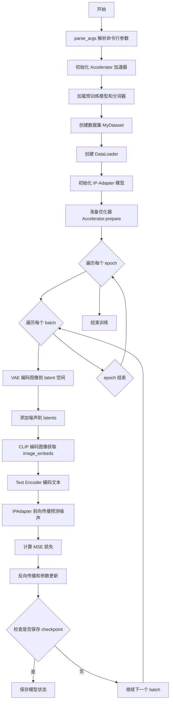
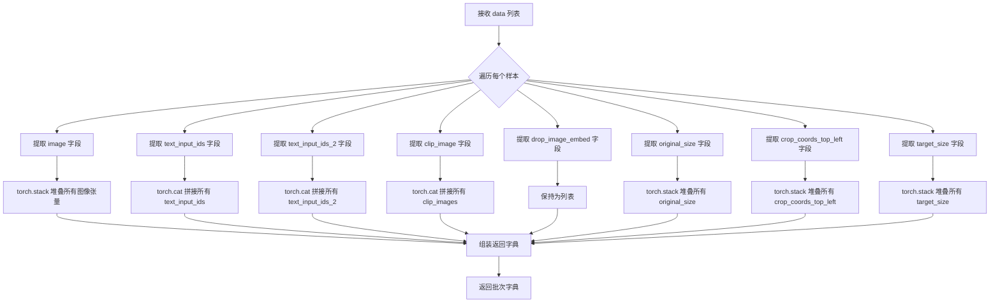
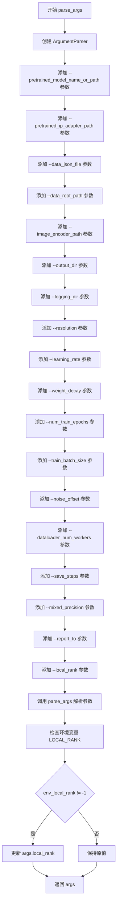
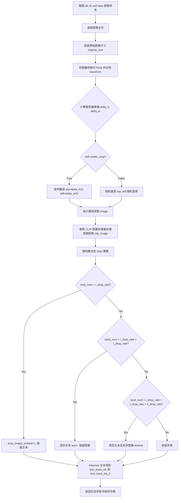
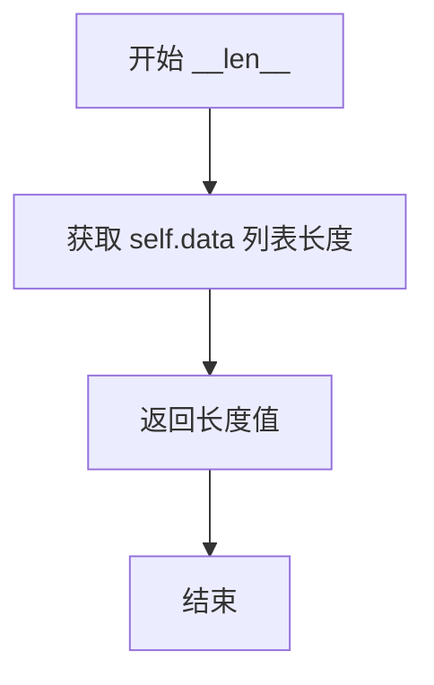
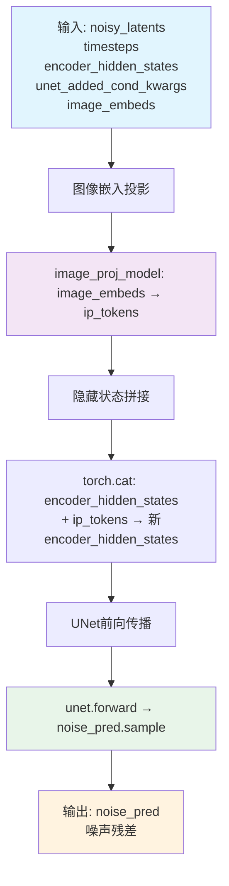
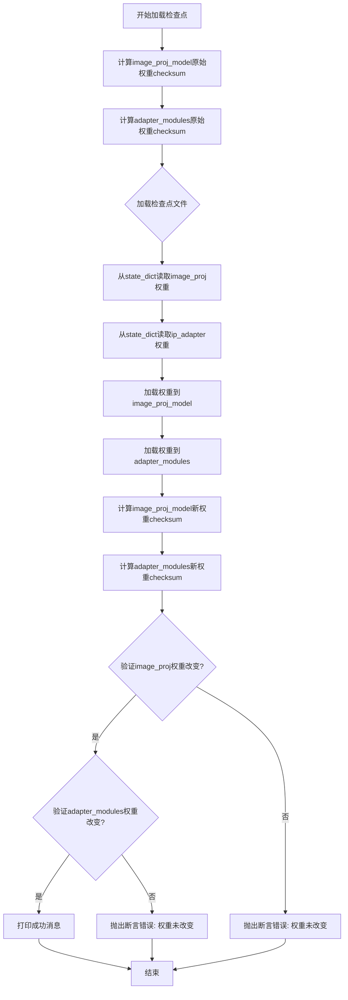

```mermaid
flowchart TD
    A[main 函数入口] --> B[parse_args 解析命令行参数]
    B --> C[创建 Accelerator 分布式训练环境]
    C --> D{accelerator.is_main_process}
    D -->|True| E[创建输出目录]
    D -->|False| F[跳过目录创建]
    E --> F
    F --> G[加载预训练模型: scheduler, tokenizer, text_encoder, vae, unet, image_encoder]
    G --> H[冻结不需要训练的模型参数: unet, vae, text_encoder, text_encoder_2, image_encoder]
    H --> I[创建 ImageProjModel 图像投影模型]
    I --> J[初始化 IP-Adapter 注意力处理器]
    J --> K[创建 IPAdapter 实例]
    K --> L[设置混合精度权重类型]
    L --> M[创建 AdamW 优化器]
    M --> N[创建 MyDataset 数据集和 DataLoader]
    N --> O[accelerator.prepare 准备模型、优化器、数据加载器]
    O --> P[外层循环: 遍历训练轮次 epoch]
    P --> Q[内层循环: 遍历批次 step]
    Q --> R[accumulate 累积梯度]
    R --> S[vae.encode 图像编码到 latent 空间]
    S --> T[采样噪声并添加偏移]
    T --> U[随机采样 timestep]
    U --> V[noise_scheduler.add_noise 前向扩散过程]
    V --> W[image_encoder 提取图像嵌入]
    W --> X[处理图像嵌入 dropout]
    X --> Y[text_encoder 提取文本嵌入]
    Y --> Z[构建 unet_added_cond_kwargs 额外条件]
    Z --> AA[ip_adapter 前向传播预测噪声]
    AA --> AB[F.mse_loss 计算 MSE 损失]
    AB --> AC[accelerator.gather 收集损失用于日志]
    AC --> AD[accelerator.backward 反向传播]
    AD --> AE[optimizer.step 更新参数]
    AE --> AF[optimizer.zero_grad 梯度清零]
    AF --> AG{global_step % save_steps == 0}
    AG -->|True| AH[accelerator.save_state 保存检查点]
    AG -->|False| AI[继续训练]
    AH --> AI
    AI --> Q
    Q --> AJ{训练完成}
    AJ -->|False| P
    AJ -->|True| AK[训练结束]
```

# `diffusers\examples\research_projects\ip_adapter\tutorial_train_sdxl.py` 详细设计文档

该代码实现了一个用于训练IP-Adapter（图像提示适配器）的完整训练脚本，通过加载预训练的Stable Diffusion XL模型、CLIP图像编码器和自定义数据集，训练图像投影模型和适配器模块，使模型能够根据图像内容生成对应的文本描述，实现图像到文本的条件生成能力。

## 整体流程



## 类结构

```
torch.nn.Module (PyTorch 基类)
├── MyDataset (数据集类)
│   - 字段: tokenizer, tokenizer_2, size, center_crop, i_drop_rate, t_drop_rate, ti_drop_rate, image_root_path, data, transform, clip_image_processor
│   - 方法: __init__, __getitem__, __len__
└── IPAdapter (IP-Adapter 模型类)
    - 字段: unet, image_proj_model, adapter_modules
    - 方法: __init__, forward, load_from_checkpoint
```

## 全局变量及字段


### `AttnProcessor`
    
注意力处理器，根据PyTorch版本条件导入

类型：`Union[AttnProcessor2_0, AttnProcessor]`
    


### `IPAttnProcessor`
    
IP注意力处理器，根据PyTorch版本条件导入

类型：`Union[IPAttnProcessor2_0, IPAttnProcessor]`
    


### `noise_scheduler`
    
DDPMScheduler噪声调度器

类型：`DDPMScheduler`
    


### `tokenizer`
    
CLIP分词器实例

类型：`CLIPTokenizer`
    


### `tokenizer_2`
    
CLIP第二分词器实例

类型：`CLIPTokenizer`
    


### `text_encoder`
    
CLIP文本编码器实例

类型：`CLIPTextModel`
    


### `text_encoder_2`
    
CLIP文本编码器第二模型实例

类型：`CLIPTextModelWithProjection`
    


### `vae`
    
变分自编码器实例

类型：`AutoencoderKL`
    


### `unet`
    
UNet2D条件模型实例

类型：`UNet2DConditionModel`
    


### `image_encoder`
    
CLIP视觉编码器实例

类型：`CLIPVisionModelWithProjection`
    


### `image_proj_model`
    
图像投影模型实例

类型：`ImageProjModel`
    


### `adapter_modules`
    
适配器模块列表

类型：`torch.nn.ModuleList`
    


### `ip_adapter`
    
IP-Adapter模型实例

类型：`IPAdapter`
    


### `optimizer`
    
AdamW优化器实例

类型：`torch.optim.AdamW`
    


### `train_dataset`
    
训练数据集实例

类型：`MyDataset`
    


### `train_dataloader`
    
训练数据加载器实例

类型：`torch.utils.data.DataLoader`
    


### `accelerator`
    
Accelerator加速器实例

类型：`Accelerator`
    


### `weight_dtype`
    
权重数据类型

类型：`torch.dtype`
    


### `global_step`
    
全局训练步数

类型：`int`
    


### `args`
    
命令行参数命名空间

类型：`argparse.Namespace`
    


### `MyDataset.tokenizer`
    
CLIP分词器实例

类型：`CLIPTokenizer`
    


### `MyDataset.tokenizer_2`
    
CLIP第二分词器实例

类型：`CLIPTokenizer`
    


### `MyDataset.size`
    
图像目标尺寸

类型：`int`
    


### `MyDataset.center_crop`
    
是否中心裁剪

类型：`bool`
    


### `MyDataset.i_drop_rate`
    
图像丢弃概率

类型：`float`
    


### `MyDataset.t_drop_rate`
    
文本丢弃概率

类型：`float`
    


### `MyDataset.ti_drop_rate`
    
图像和文本同时丢弃概率

类型：`float`
    


### `MyDataset.image_root_path`
    
图像根目录路径

类型：`str`
    


### `MyDataset.data`
    
训练数据列表

类型：`list`
    


### `MyDataset.transform`
    
图像变换组合

类型：`transforms.Compose`
    


### `MyDataset.clip_image_processor`
    
CLIP图像处理器

类型：`CLIPImageProcessor`
    


### `IPAdapter.unet`
    
UNet2D条件模型实例

类型：`UNet2DConditionModel`
    


### `IPAdapter.image_proj_model`
    
图像投影模型实例

类型：`ImageProjModel`
    


### `IPAdapter.adapter_modules`
    
适配器模块列表

类型：`torch.nn.ModuleList`
    
    

## 全局函数及方法


### `collate_fn`

该函数是 PyTorch DataLoader 的自定义批处理整理函数，用于将 MyDataset 返回的多个样本字典合并为一个批次字典。它通过 torch.stack 处理需要堆叠的张量，通过 torch.cat 处理需要拼接的张量，并将处理结果组织成适合模型输入的格式。

参数：

- `data`：`List[Dict]` ，从 MyDataset 返回的样本列表，每个样本包含图像、文本 ID、CLIP 图像等信息

返回值：`Dict`，包含批处理后的各个字段，键包括 "images"、"text_input_ids"、"text_input_ids_2"、"clip_images"、"drop_image_embeds"、"original_size"、"crop_coords_top_left"、"target_size"

#### 流程图



#### 带注释源码

```python
def collate_fn(data):
    """
    整理批次数据，将多个样本合并为批次字典
    
    参数:
        data: 从MyDataset获取的样本列表，每个元素是一个包含以下键的字典:
            - image: 预处理后的图像张量
            - text_input_ids: 文本tokenizer后的输入IDs (CLIP)
            - text_input_ids_2: 文本tokenizer后的输入IDs (CLIP-ViT/G)
            - clip_image: CLIP图像处理器处理后的像素值
            - drop_image_embed: 是否丢弃图像嵌入的标志 (0或1)
            - original_size: 原始图像尺寸 [height, width]
            - crop_coords_top_left: 裁剪坐标 [top, left]
            - target_size: 目标尺寸 [height, width]
    
    返回:
        包含批处理数据的字典，用于后续模型训练
    """
    # 使用 torch.stack 将多个图像张量沿新维度堆叠
    # 要求所有图像张量形状相同，输出形状: [batch_size, C, H, W]
    images = torch.stack([example["image"] for example in data])
    
    # 使用 torch.cat 将多个文本ID张量沿batch维度拼接
    # text_input_ids 形状: [batch_size, seq_len]
    text_input_ids = torch.cat([example["text_input_ids"] for example in data], dim=0)
    
    # 第二个文本编码器的ID拼接
    text_input_ids_2 = torch.cat([example["text_input_ids_2"] for example in data], dim=0)
    
    # CLIP图像的拼接，同样使用torch.cat
    clip_images = torch.cat([example["clip_image"] for example in data], dim=0)
    
    # drop_image_embeds 保持为列表，因为它是标志位而非张量
    # 用于后续判断是否丢弃对应样本的图像嵌入
    drop_image_embeds = [example["drop_image_embed"] for example in data]
    
    # 原始尺寸堆叠，形状: [batch_size, 2]
    original_size = torch.stack([example["original_size"] for example in data])
    
    # 裁剪坐标堆叠，形状: [batch_size, 2]
    crop_coords_top_left = torch.stack([example["crop_coords_top_left"] for example in data])
    
    # 目标尺寸堆叠，形状: [batch_size, 2]
    target_size = torch.stack([example["target_size"] for example in data])

    # 返回组装好的批次字典，供给模型训练使用
    return {
        "images": images,                      # 堆叠后的图像张量
        "text_input_ids": text_input_ids,      # 拼接后的文本ID (CLIP)
        "text_input_ids_2": text_input_ids_2,  # 拼接后的文本ID (CLIP-ViT/G)
        "clip_images": clip_images,            # 拼接后的CLIP图像
        "drop_image_embeds": drop_image_embeds, # 图像丢弃标志列表
        "original_size": original_size,        # 原始尺寸张量
        "crop_coords_top_left": crop_coords_top_left, # 裁剪坐标张量
        "target_size": target_size,            # 目标尺寸张量
    }
```


### `parse_args`

该函数是命令行参数解析器，使用 Python 的 `argparse` 模块定义并解析训练脚本所需的各种命令行参数，包括模型路径、数据配置、训练超参数、输出设置等，最终返回一个包含所有参数的命名空间对象。

参数：该函数没有输入参数。

返回值：`args`（`argparse.Namespace` 类型），返回一个命名空间对象，其中包含所有解析后的命令行参数及其值。

#### 流程图



#### 带注释源码

```python
def parse_args():
    """
    解析命令行参数并返回包含所有参数的命名空间对象。
    
    该函数使用 argparse 定义了训练脚本所需的所有命令行参数，
    包括模型路径、数据配置、训练超参数、输出设置等。
    """
    # 创建 ArgumentParser 对象，description 用于描述脚本用途
    parser = argparse.ArgumentParser(description="Simple example of a training script.")
    
    # 添加预训练模型路径或模型标识符参数（必需）
    parser.add_argument(
        "--pretrained_model_name_or_path",
        type=str,
        default=None,
        required=True,
        help="Path to pretrained model or model identifier from huggingface.co/models.",
    )
    
    # 添加预训练 IP-Adapter 路径参数（可选）
    parser.add_argument(
        "--pretrained_ip_adapter_path",
        type=str,
        default=None,
        help="Path to pretrained ip adapter model. If not specified weights are initialized randomly.",
    )
    
    # 添加训练数据 JSON 文件路径参数（必需）
    parser.add_argument(
        "--data_json_file",
        type=str,
        default=None,
        required=True,
        help="Training data",
    )
    
    # 添加训练数据根目录路径参数（必需）
    parser.add_argument(
        "--data_root_path",
        type=str,
        default="",
        required=True,
        help="Training data root path",
    )
    
    # 添加 CLIP 图像编码器路径参数（必需）
    parser.add_argument(
        "--image_encoder_path",
        type=str,
        default=None,
        required=True,
        help="Path to CLIP image encoder",
    )
    
    # 添加输出目录参数
    parser.add_argument(
        "--output_dir",
        type=str,
        default="sd-ip_adapter",
        help="The output directory where the model predictions and checkpoints will be written.",
    )
    
    # 添加日志目录参数
    parser.add_argument(
        "--logging_dir",
        type=str,
        default="logs",
        help=(
            "[TensorBoard](https://www.tensorflow.org/tensorboard) log directory. Will default to"
            " *output_dir/runs/**CURRENT_DATETIME_HOSTNAME***."
        ),
    )
    
    # 添加输入图像分辨率参数
    parser.add_argument(
        "--resolution",
        type=int,
        default=512,
        help=("The resolution for input images"),
    )
    
    # 添加学习率参数
    parser.add_argument(
        "--learning_rate",
        type=float,
        default=1e-4,
        help="Learning rate to use.",
    )
    
    # 添加权重衰减参数
    parser.add_argument("--weight_decay", type=float, default=1e-2, help="Weight decay to use.")
    
    # 添加训练轮数参数
    parser.add_argument("--num_train_epochs", type=int, default=100)
    
    # 添加训练批次大小参数
    parser.add_argument(
        "--train_batch_size", type=int, default=8, help="Batch size (per device) for the training dataloader."
    )
    
    # 添加噪声偏移参数
    parser.add_argument("--noise_offset", type=float, default=None, help="noise offset")
    
    # 添加数据加载器工作进程数参数
    parser.add_argument(
        "--dataloader_num_workers",
        type=int,
        default=0,
        help=(
            "Number of subprocesses to use for data loading. 0 means that the data will be loaded in the main process."
        ),
    )
    
    # 添加保存检查点步数间隔参数
    parser.add_argument(
        "--save_steps",
        type=int,
        default=2000,
        help=("Save a checkpoint of the training state every X updates"),
    )
    
    # 添加混合精度训练参数
    parser.add_argument(
        "--mixed_precision",
        type=str,
        default=None,
        choices=["no", "fp16", "bf16"],
        help=(
            "Whether to use mixed precision. Choose between fp16 and bf16 (bfloat16). Bf16 requires PyTorch >="
            " 1.10.and an Nvidia Ampere GPU.  Default to the value of accelerate config of the current system or the"
            " flag passed with the `accelerate.launch` command. Use this argument to override the accelerate config."
        ),
    )
    
    # 添加日志报告目标参数
    parser.add_argument(
        "--report_to",
        type=str,
        default="tensorboard",
        help=(
            'The integration to report the results and logs to. Supported platforms are `"tensorboard"`'
            ' (default), `"wandb"` and `"comet_ml"`. Use `"all"` to report to all integrations.'
        ),
    )
    
    # 添加本地排名参数（用于分布式训练）
    parser.add_argument("--local_rank", type=int, default=-1, help="For distributed training: local_rank")

    # 解析命令行参数为 Namespace 对象
    args = parser.parse_args()
    
    # 检查环境变量 LOCAL_RANK，如果存在则覆盖 args.local_rank
    # 这是为了支持通过环境变量传递分布式训练参数
    env_local_rank = int(os.environ.get("LOCAL_RANK", -1))
    if env_local_rank != -1 and env_local_rank != args.local_rank:
        args.local_rank = env_local_rank

    # 返回包含所有参数的命名空间对象
    return args
```


### `main` - 主训练函数

`main` 函数是 IP-Adapter 训练脚本的核心入口，负责整个训练流程的编排。它初始化分布式训练环境，加载预训练的 Stable Diffusion XL 模型组件，配置 IP-Adapter 图像提示适配器，创建数据集和数据加载器，并执行完整的训练循环（包括前向传播、损失计算、反向传播和检查点保存）。

参数：此函数无显式参数，通过内部调用 `parse_args()` 获取命令行参数（见下表）

| 参数名称 | 参数类型 | 参数描述 |
|---------|---------|---------|
| `--pretrained_model_name_or_path` | `str` | 预训练模型路径或 HuggingFace 模型标识符 |
| `--pretrained_ip_adapter_path` | `str` | 预训练的 IP-Adapter 权重路径，如不指定则随机初始化 |
| `--data_json_file` | `str` | 训练数据 JSON 文件路径 |
| `--data_root_path` | `str` | 训练数据根目录路径 |
| `--image_encoder_path` | `str` | CLIP 图像编码器路径 |
| `--output_dir` | `str` | 模型预测和检查点输出目录 |
| `--logging_dir` | `str` | TensorBoard 日志目录 |
| `--resolution` | `int` | 输入图像分辨率（默认 512） |
| `--learning_rate` | `float` | 学习率（默认 1e-4） |
| `--weight_decay` | `float` | 权重衰减（默认 1e-2） |
| `--num_train_epochs` | `int` | 训练轮数（默认 100） |
| `--train_batch_size` | `int` | 每设备训练批次大小（默认 8） |
| `--noise_offset` | `float` | 噪声偏移量，用于改善训练稳定性 |
| `--dataloader_num_workers` | `int` | 数据加载子进程数（默认 0） |
| `--save_steps` | `int` | 检查点保存间隔步数（默认 2000） |
| `--mixed_precision` | `str` | 混合精度训练模式（"fp16" 或 "bf16"） |
| `--report_to` | `str` | 日志报告目标（默认 "tensorboard"） |
| `--local_rank` | `int` | 分布式训练本地排名 |

返回值：`None`，函数执行训练流程，不返回任何值

#### 流程图



#### 带注释源码

```python
def main():
    """
    主训练函数 - IP-Adapter 完整训练流程
    
    该函数执行以下主要步骤:
    1. 解析命令行参数
    2. 初始化 Accelerator 分布式训练环境
    3. 加载预训练的 Stable Diffusion XL 模型组件
    4. 冻结不需要训练的模型参数以节省显存
    5. 创建 IP-Adapter 图像提示适配器组件
    6. 配置优化器
    7. 创建数据集和数据加载器
    8. 执行完整的训练循环，包含:
       - 图像到 latent 空间的编码
       - 前向扩散过程（添加噪声）
       - 文本和图像嵌入提取
       - IP-Adapter 前向传播
       - MSE 损失计算与反向传播
       - 定期保存检查点
    """
    # ========== 步骤 1: 解析命令行参数 ==========
    # 从命令行获取所有训练配置参数
    args = parse_args()
    
    # 构建日志目录路径: output_dir/logs
    logging_dir = Path(args.output_dir, args.logging_dir)

    # ========== 步骤 2: 初始化 Accelerator ==========
    # Accelerator 是 Hugging Face Accelerate 库的核心类,
    # 自动处理分布式训练、混合精度、梯度累积等复杂逻辑
    accelerator_project_config = ProjectConfiguration(
        project_dir=args.output_dir, 
        logging_dir=logging_dir
    )

    accelerator = Accelerator(
        mixed_precision=args.mixed_precision,           # 混合精度: fp16/bf16
        log_with=args.report_to,                        # 日志报告工具
        project_config=accelerator_project_config       # 项目配置
    )

    # ========== 步骤 3: 创建输出目录（仅主进程）==========
    if accelerator.is_main_process:
        if args.output_dir is not None:
            os.makedirs(args.output_dir, exist_ok=True)

    # ========== 步骤 4: 加载预训练模型 ==========
    # 从预训练模型路径加载所有必要的组件
    # DDPMScheduler: 用于前向扩散过程（添加噪声）
    noise_scheduler = DDPMScheduler.from_pretrained(
        args.pretrained_model_name_or_path, 
        subfolder="scheduler"
    )
    
    # CLIPTokenizer: 用于对文本进行分词
    tokenizer = CLIPTokenizer.from_pretrained(
        args.pretrained_model_name_or_path, 
        subfolder="tokenizer"
    )
    
    # CLIPTextModel: 文本编码器（用于 SDXL 的第一个文本编码器）
    text_encoder = CLIPTextModel.from_pretrained(
        args.pretrained_model_name_or_path, 
        subfolder="text_encoder"
    )
    
    # tokenizer_2: SDXL 的第二个分词器（ CLIP ViT-L/14@336px）
    tokenizer_2 = CLIPTokenizer.from_pretrained(
        args.pretrained_model_name_or_path, 
        subfolder="tokenizer_2"
    )
    
    # CLIPTextModelWithProjection: 第二个文本编码器，带投影层
    text_encoder_2 = CLIPTextModelWithProjection.from_pretrained(
        args.pretrained_model_name_or_path, 
        subfolder="text_encoder_2"
    )
    
    # AutoencoderKL: VAE 模型，用于图像与 latent 空间的相互转换
    vae = AutoencoderKL.from_pretrained(
        args.pretrained_model_name_or_path, 
        subfolder="vae"
    )
    
    # UNet2DConditionModel: 条件 UNet，用于预测噪声残差
    unet = UNet2DConditionModel.from_pretrained(
        args.pretrained_model_name_or_path, 
        subfolder="unet"
    )
    
    # CLIPVisionModelWithProjection: CLIP 图像编码器，用于提取图像特征
    image_encoder = CLIPVisionModelWithProjection.from_pretrained(
        args.image_encoder_path
    )

    # ========== 步骤 5: 冻结模型参数 ==========
    # 冻结不需要训练的模型，只训练 IP-Adapter 相关组件
    # 这可以显著减少显存占用和计算量
    unet.requires_grad_(False)
    vae.requires_grad_(False)
    text_encoder.requires_grad_(False)
    text_encoder_2.requires_grad_(False)
    image_encoder.requires_grad_(False)

    # ========== 步骤 6: 创建 IP-Adapter 组件 ==========
    # num_tokens: IP-Adapter 使用的 token 数量
    num_tokens = 4
    
    # ImageProjModel: 将 CLIP 图像嵌入投影到与 UNet 交叉注意力维度匹配的空间
    image_proj_model = ImageProjModel(
        cross_attention_dim=unet.config.cross_attention_dim,           # UNet 交叉注意力维度
        clip_embeddings_dim=image_encoder.config.projection_dim,       # CLIP 投影维度
        clip_extra_context_tokens=num_tokens,                          # 额外上下文 token 数
    )
    
    # ========== 步骤 7: 初始化 IP-Adapter 注意力处理器 ==========
    # 为 UNet 的每个注意力层添加 IP-Adapter 处理器
    attn_procs = {}
    unet_sd = unet.state_dict()  # 获取 UNet 的状态字典
    
    for name in unet.attn_processors.keys():
        # 确定是否为交叉注意力层（attn1 是自注意力，attn2 是交叉注意力）
        cross_attention_dim = None if name.endswith("attn1.processor") else unet.config.cross_attention_dim
        
        # 根据层名称确定隐藏层大小
        if name.startswith("mid_block"):
            hidden_size = unet.config.block_out_channels[-1]          # 中间块
        elif name.startswith("up_blocks"):
            block_id = int(name[len("up_blocks.")])
            hidden_size = list(reversed(unet.config.block_out_channels))[block_id]
        elif name.startswith("down_blocks"):
            block_id = int(name[len("down_blocks.")])
            hidden_size = unet.config.block_out_channels[block_id]
        
        # 为自注意力层使用标准处理器，为交叉注意力层使用 IP-Adapter 处理器
        if cross_attention_dim is None:
            attn_procs[name] = AttnProcessor()                         # 标准注意力处理器
        else:
            layer_name = name.split(".processor")[0]
            # 复制预训练的 k,v 权重用于 IP-Adapter
            weights = {
                "to_k_ip.weight": unet_sd[layer_name + ".to_k.weight"],
                "to_v_ip.weight": unet_sd[layer_name + ".to_v.weight"],
            }
            # 创建 IP-Adapter 注意力处理器
            attn_procs[name] = IPAttnProcessor(
                hidden_size=hidden_size, 
                cross_attention_dim=cross_attention_dim, 
                num_tokens=num_tokens
            )
            attn_procs[name].load_state_dict(weights)
    
    # 设置 UNet 的注意力处理器
    unet.set_attn_processor(attn_procs)
    
    # 将所有注意力模块转换为 nn.ModuleList 以便训练
    adapter_modules = torch.nn.ModuleList(unet.attn_processors.values())

    # ========== 步骤 8: 创建 IPAdapter 实例 ==========
    ip_adapter = IPAdapter(
        unet,                           # UNet 模型
        image_proj_model,               # 图像投影模型
        adapter_modules,                # IP-Adapter 注意力模块
        args.pretrained_ip_adapter_path # 预训练权重路径
    )

    # ========== 步骤 9: 设置混合精度权重类型 ==========
    weight_dtype = torch.float32
    if accelerator.mixed_precision == "fp16":
        weight_dtype = torch.float16
    elif accelerator.mixed_precision == "bf16":
        weight_dtype = torch.bfloat16
    
    # 将模型移动到设备并设置适当的数据类型
    # 注意: VAE 使用 fp32 以保持数值稳定性
    vae.to(accelerator.device)  # use fp32
    text_encoder.to(accelerator.device, dtype=weight_dtype)
    text_encoder_2.to(accelerator.device, dtype=weight_dtype)
    image_encoder.to(accelerator.device, dtype=weight_dtype)

    # ========== 步骤 10: 创建优化器 ==========
    # 只优化 IP-Adapter 相关的可训练参数
    params_to_opt = itertools.chain(
        ip_adapter.image_proj_model.parameters(),   # 图像投影模型参数
        ip_adapter.adapter_modules.parameters()     # IP-Adapter 注意力模块参数
    )
    optimizer = torch.optim.AdamW(
        params_to_opt, 
        lr=args.learning_rate,       # 学习率
        weight_decay=args.weight_decay  # 权重衰减
    )

    # ========== 步骤 11: 创建数据集和数据加载器 ==========
    train_dataset = MyDataset(
        args.data_json_file,
        tokenizer=tokenizer,
        tokenizer_2=tokenizer_2,
        size=args.resolution,
        image_root_path=args.data_root_path,
    )
    
    train_dataloader = torch.utils.data.DataLoader(
        train_dataset,
        shuffle=True,
        collate_fn=collate_fn,
        batch_size=args.train_batch_size,
        num_workers=args.dataloader_num_workers,
    )

    # ========== 步骤 12: 使用 Accelerator 准备训练组件 ==========
    # 自动处理设备分配、分布式训练、混合精度等
    ip_adapter, optimizer, train_dataloader = accelerator.prepare(
        ip_adapter, optimizer, train_dataloader
    )

    # ========== 步骤 13: 训练循环 ==========
    global_step = 0  # 全局训练步数计数器
    
    # 外层循环: 遍历所有训练轮次
    for epoch in range(0, args.num_train_epochs):
        begin = time.perf_counter()  # 记录轮次开始时间
        
        # 内层循环: 遍历所有批次
        for step, batch in enumerate(train_dataloader):
            # 记录数据加载时间
            load_data_time = time.perf_counter() - begin
            
            # 使用 accelerator.accumulate 实现梯度累积
            with accelerator.accumulate(ip_adapter):
                # ----- 将图像编码到 latent 空间 -----
                with torch.no_grad():
                    # VAE 编码: 图像 -> latent
                    # 注意: SDXL 的 VAE 应使用 fp32
                    latents = vae.encode(
                        batch["images"].to(accelerator.device, dtype=vae.dtype)
                    ).latent_dist.sample()
                    
                    # 缩放 latents（SDXL VAE 的 scaling_factor）
                    latents = latents * vae.config.scaling_factor
                    latents = latents.to(accelerator.device, dtype=weight_dtype)

                # ----- 采样噪声 -----
                noise = torch.randn_like(latents)  # 生成与 latents 形状相同的随机噪声
                
                if args.noise_offset:
                    # 添加噪声偏移以改善训练效果
                    # 论文: https://www.crosslabs.org//blog/diffusion-with-offset-noise
                    noise += args.noise_offset * torch.randn(
                        (latents.shape[0], latents.shape[1], 1, 1)
                    ).to(accelerator.device, dtype=weight_dtype)

                # ----- 随机采样 timestep -----
                bsz = latents.shape[0]  # 批次大小
                timesteps = torch.randint(
                    0, 
                    noise_scheduler.num_train_timesteps,  # 通常为 1000
                    (bsz,), 
                    device=latents.device
                )
                timesteps = timesteps.long()

                # ----- 前向扩散过程: 添加噪声到 latents -----
                noisy_latents = noise_scheduler.add_noise(latents, noise, timesteps)

                # ----- 提取图像嵌入 -----
                with torch.no_grad():
                    image_embeds = image_encoder(
                        batch["clip_images"].to(accelerator.device, dtype=weight_dtype)
                    ).image_embeds
                
                # 处理图像嵌入的 dropout（随机丢弃图像条件）
                image_embeds_ = []
                for image_embed, drop_image_embed in zip(image_embeds, batch["drop_image_embeds"]):
                    if drop_image_embed == 1:
                        # 如果需要丢弃，用零向量替换
                        image_embeds_.append(torch.zeros_like(image_embed))
                    else:
                        image_embeds_.append(image_embed)
                image_embeds = torch.stack(image_embeds_)

                # ----- 提取文本嵌入 -----
                with torch.no_grad():
                    # 第一个文本编码器
                    encoder_output = text_encoder(
                        batch["text_input_ids"].to(accelerator.device), 
                        output_hidden_states=True
                    )
                    text_embeds = encoder_output.hidden_states[-2]  # 倒数第二层隐藏状态
                    
                    # 第二个文本编码器（SDXL）
                    encoder_output_2 = text_encoder_2(
                        batch["text_input_ids_2"].to(accelerator.device), 
                        output_hidden_states=True
                    )
                    pooled_text_embeds = encoder_output_2[0]  # 池化后的文本嵌入
                    text_embeds_2 = encoder_output_2.hidden_states[-2]
                    
                    # 拼接两个文本编码器的输出
                    text_embeds = torch.concat([text_embeds, text_embeds_2], dim=-1)

                # ----- 构建额外条件 -----
                # SDXL 需要额外的时间 ID（原始尺寸、裁剪坐标、目标尺寸）
                add_time_ids = [
                    batch["original_size"].to(accelerator.device),
                    batch["crop_coords_top_left"].to(accelerator.device),
                    batch["target_size"].to(accelerator.device),
                ]
                add_time_ids = torch.cat(add_time_ids, dim=1).to(
                    accelerator.device, 
                    dtype=weight_dtype
                )
                
                # 打包为 UNet 的额外条件参数字典
                unet_added_cond_kwargs = {
                    "text_embeds": pooled_text_embeds,  # 池化文本嵌入
                    "time_ids": add_time_ids             # 时间 ID
                }

                # ----- IP-Adapter 前向传播 -----
                # 预测噪声残差
                noise_pred = ip_adapter(
                    noisy_latents,                  # 加噪的 latent
                    timesteps,                       # 时间步
                    text_embeds,                     # 文本嵌入
                    unet_added_cond_kwargs,          # 额外条件
                    image_embeds                     # 图像嵌入（IP-Adapter 条件）
                )

                # ----- 计算损失 -----
                # 使用 MSE 损失: 预测噪声 vs 真实添加的噪声
                loss = F.mse_loss(
                    noise_pred.float(), 
                    noise.float(), 
                    reduction="mean"
                )

                # ----- 收集损失用于日志记录 -----
                avg_loss = accelerator.gather(
                    loss.repeat(args.train_batch_size)
                ).mean().item()

                # ----- 反向传播 -----
                accelerator.backward(loss)
                
                # ----- 更新参数 -----
                optimizer.step()
                optimizer.zero_grad()

                # ----- 打印训练日志（仅主进程）-----
                if accelerator.is_main_process:
                    print(
                        "Epoch {}, step {}, data_time: {}, time: {}, step_loss: {}".format(
                            epoch, 
                            step, 
                            load_data_time, 
                            time.perf_counter() - begin, 
                            avg_loss
                        )
                    )

            # 更新全局步数
            global_step += 1

            # ----- 定期保存检查点 -----
            if global_step % args.save_steps == 0:
                save_path = os.path.join(args.output_dir, f"checkpoint-{global_step}")
                accelerator.save_state(save_path)

            # 记录批次开始时间
            begin = time.perf_counter()


# ========== 程序入口 ==========
if __name__ == "__main__":
    main()
```


### `MyDataset.__init__`

初始化数据集参数和加载 JSON 数据。该方法设置数据加载所需的各种参数，包括分词器、图像处理参数、数据增强概率等，并从指定的 JSON 文件加载训练数据。

参数：

- `self`：隐式参数，表示 MyDataset 类的实例本身
- `json_file`：`str`，JSON 文件的路径，包含训练数据的列表，每个元素是一个字典（如 `{"image_file": "1.png", "text": "A dog"}`）
- `tokenizer`：`CLIPTokenizer`，用于将文本编码为 token ID 的主分词器（CLIP 分词器）
- `tokenizer_2`：`CLIPTokenizer`，用于将文本编码为 token ID 的第二个分词器（CLIP ViT-L/14）
- `size`：`int`，目标图像尺寸，默认为 1024，用于调整图像大小
- `center_crop`：`bool`，是否使用中心裁剪，默认为 True；若为 False，则使用随机裁剪
- `t_drop_rate`：`float`，文本丢弃概率，默认为 0.05，用于训练时随机丢弃文本
- `i_drop_rate`：`float`，图像丢弃概率，默认为 0.05，用于训练时随机丢弃图像嵌入
- `ti_drop_rate`：`float`，文本和图像同时丢弃的概率，默认为 0.05，用于训练时同时丢弃文本和图像嵌入
- `image_root_path`：`str`，图像文件的根目录路径，默认为空字符串，用于拼接完整的图像文件路径

返回值：`None`，该方法没有返回值，仅初始化实例属性

#### 流程图

```mermaid
flowchart TD
    A[开始 __init__] --> B[调用父类初始化 super().__init__]
    B --> C[设置实例属性: tokenizer, tokenizer_2, size, center_crop]
    C --> D[设置实例属性: i_drop_rate, t_drop_rate, ti_drop_rate, image_root_path]
    D --> E[从 json_file 加载 JSON 数据到 self.data]
    E --> F[创建图像变换 transform: Resize, ToTensor, Normalize]
    F --> G[初始化 CLIP 图像处理器 clip_image_processor]
    G --> H[结束 __init__]
```

#### 带注释源码

```python
def __init__(
    self,
    json_file,
    tokenizer,
    tokenizer_2,
    size=1024,
    center_crop=True,
    t_drop_rate=0.05,
    i_drop_rate=0.05,
    ti_drop_rate=0.05,
    image_root_path="",
):
    """初始化数据集参数和加载 JSON 数据"""
    super().__init__()  # 调用父类 torch.utils.data.Dataset 的初始化方法

    # 设置分词器
    self.tokenizer = tokenizer  # 主分词器（CLIPTokenizer）
    self.tokenizer_2 = tokenizer_2  # 第二个分词器（用于 CLIP ViT-L/14）

    # 设置图像处理参数
    self.size = size  # 目标图像尺寸
    self.center_crop = center_crop  # 是否使用中心裁剪

    # 设置数据增强丢弃概率
    self.i_drop_rate = i_drop_rate  # 图像嵌入丢弃概率
    self.t_drop_rate = t_drop_rate  # 文本丢弃概率
    self.ti_drop_rate = ti_drop_rate  # 文本和图像同时丢弃的概率

    self.image_root_path = image_root_path  # 图像文件根目录路径

    # 从 JSON 文件加载训练数据
    # 数据格式: [{"image_file": "1.png", "text": "A dog"}, ...]
    self.data = json.load(open(json_file))

    # 创建图像变换管道: 调整大小 -> 转换为张量 -> 归一化
    self.transform = transforms.Compose(
        [
            transforms.Resize(self.size, interpolation=transforms.InterpolationMode.BILINEAR),
            transforms.ToTensor(),
            transforms.Normalize([0.5], [0.5]),  # 归一化到 [-1, 1]
        ]
    )

    # 初始化 CLIP 图像处理器，用于处理 CLIP 视觉编码器的输入
    self.clip_image_processor = CLIPImageProcessor()
```


### `MyDataset.__getitem__`

根据索引获取单个训练样本，包含图像预处理、文本tokenization、CLIP图像特征提取以及训练时drop策略的处理。

参数：

- `self`：`MyDataset` 实例本身
- `idx`：`int`，数据集列表中的索引，用于从 `self.data` 中获取对应的样本

返回值：`Dict[str, Any]`，包含以下键的字典：

- `image`：`torch.Tensor`，形状为 `(3, size, size)`，预处理后的图像张量
- `text_input_ids`：`torch.Tensor`，形状为 `(1, tokenizer.model_max_length)`，第一个文本 tokenizer 的 token IDs
- `text_input_ids_2`：`torch.Tensor`，形状为 `(1, tokenizer_2.model_max_length)`，第二个文本 tokenizer 的 token IDs
- `clip_image`：`torch.Tensor`，CLIP 图像处理器处理后的像素值张量
- `drop_image_embed`：`int`（0 或 1），指示是否丢弃图像嵌入
- `original_size`：`torch.Tensor`，原始图像尺寸 `[height, width]`
- `crop_coords_top_left`：`torch.Tensor`，裁剪左上角坐标 `[top, left]`
- `target_size`：`torch.Tensor`，目标尺寸 `[size, size]`

#### 流程图



#### 带注释源码

```python
def __getitem__(self, idx):
    # 根据索引从数据列表中获取对应的样本字典
    # 样本格式: {"image_file": "xxx.png", "text": "描述文本"}
    item = self.data[idx]
    text = item["text"]
    image_file = item["image_file"]

    # 读取图像文件，使用 os.path.join 拼接图像根路径和文件名
    raw_image = Image.open(os.path.join(self.image_root_path, image_file))

    # 记录原始图像尺寸，用于后续的图像尺寸条件编码
    original_width, original_height = raw_image.size
    original_size = torch.tensor([original_height, original_width])

    # 将图像转换为 RGB 模式并应用 transform（Resize + ToTensor + Normalize）
    image_tensor = self.transform(raw_image.convert("RGB"))

    # 计算图像张量与目标尺寸的差异，用于裁剪
    delta_h = image_tensor.shape[1] - self.size
    delta_w = image_tensor.shape[2] - self.size
    # 断言确保图像尺寸不小于目标尺寸（即图像足够大可以进行裁剪）
    assert not all([delta_h, delta_w])

    # 根据 center_crop 标志决定裁剪方式
    if self.center_crop:
        # 居中裁剪：计算左上角坐标
        top = delta_h // 2
        left = delta_w // 2
    else:
        # 随机裁剪：在有效范围内随机选择左上角坐标
        top = np.random.randint(0, delta_h + 1)
        left = np.random.randint(0, delta_w + 1)

    # 执行裁剪操作，得到目标尺寸的图像张量
    image = transforms.functional.crop(image_tensor, top=top, left=left, height=self.size, width=self.size)
    # 记录裁剪左上角坐标，用于后续的条件编码
    crop_coords_top_left = torch.tensor([top, left])

    # 使用 CLIP 图像处理器处理原始图像，提取 CLIP 视觉特征
    clip_image = self.clip_image_processor(images=raw_image, return_tensors="pt").pixel_values

    # ========== 训练时 Drop 策略处理 ==========
    # drop_image_embed: 0 表示保留图像嵌入，1 表示丢弃
    drop_image_embed = 0
    # 生成随机数决定是否应用 drop 策略
    rand_num = random.random()

    # 根据预设的 drop 概率决定如何处理
    if rand_num < self.i_drop_rate:
        # 单独丢弃图像嵌入
        drop_image_embed = 1
    elif rand_num < (self.i_drop_rate + self.t_drop_rate):
        # 单独丢弃文本
        text = ""
    elif rand_num < (self.i_drop_rate + self.t_drop_rate + self.ti_drop_rate):
        # 同时丢弃文本和图像嵌入
        text = ""
        drop_image_embed = 1
    # 否则保留文本和图像嵌入

    # ========== 文本 Tokenization ==========
    # 使用第一个 tokenizer 处理文本
    text_input_ids = self.tokenizer(
        text,
        max_length=self.tokenizer.model_max_length,
        padding="max_length",
        truncation=True,
        return_tensors="pt",
    ).input_ids

    # 使用第二个 tokenizer（SDXL 通常使用 CLIP ViT-L/14）处理文本
    text_input_ids_2 = self.tokenizer_2(
        text,
        max_length=self.tokenizer_2.model_max_length,
        padding="max_length",
        truncation=True,
        return_tensors="pt",
    ).input_ids

    # 返回包含所有训练所需数据的字典
    return {
        "image": image,  # 预处理并裁剪后的图像张量
        "text_input_ids": text_input_ids,  # 第一个 tokenizer 的 token IDs
        "text_input_ids_2": text_input_ids_2,  # 第二个 tokenizer 的 token IDs
        "clip_image": clip_image,  # CLIP 图像特征
        "drop_image_embed": drop_image_embed,  # 是否丢弃图像嵌入的标志
        "original_size": original_size,  # 原始图像尺寸
        "crop_coords_top_left": crop_coords_top_left,  # 裁剪坐标
        "target_size": torch.tensor([self.size, self.size]),  # 目标尺寸
    }
```


### `MyDataset.__len__`

该方法返回数据集中样本的总数量，使 DataLoader 能够确定遍历数据集所需的批次数。

参数：

- `self`：`MyDataset` 实例，隐式参数，表示数据集对象本身

返回值：`int`，返回加载的 JSON 数据列表的长度，即数据集中样本的总数。

#### 流程图



#### 带注释源码

```python
def __len__(self):
    """
    返回数据集中样本的数量。
    
    这是 Python 序列协议的一部分，使得数据集可以直接与 PyTorch DataLoader 配合使用。
    DataLoader 会根据此方法返回的值来确定每个 epoch 中的批次数。
    """
    return len(self.data)  # 返回加载的 JSON 数据列表的长度
```


### `IPAdapter.__init__`

初始化 IP-Adapter 模型组件，将 UNet、图像投影模型和适配器模块组合在一起，并可选地从检查点加载预训练权重。

参数：

- `unet`：`UNet2DConditionModel`，UNet 2D 条件模型，用于根据噪声和条件生成图像
- `image_proj_model`：`ImageProjModel`，图像投影模型，负责将 CLIP 图像嵌入投影到与 UNet 交叉注意力维度匹配的空间
- `adapter_modules`：`torch.nn.ModuleList`，适配器模块列表，存储在 UNet 各注意力层中的 IP-Adapter 处理器权重
- `ckpt_path`：`str`，可选参数，预训练 IP-Adapter 检查点文件路径，若指定则从该路径加载权重，否则使用随机初始化

返回值：`None`，该方法为构造函数，不返回任何值，仅初始化对象属性

#### 流程图

```mermaid
flowchart TD
    A[开始 __init__] --> B[调用 super().__init__()]
    B --> C[赋值 self.unet = unet]
    C --> D[赋值 self.image_proj_model = image_proj_model]
    D --> E[赋值 self.adapter_modules = adapter_modules]
    E --> F{ckpt_path is not None?}
    F -->|是| G[调用 load_from_checkpoint 方法]
    F -->|否| H[结束 __init__]
    G --> I[加载 image_proj_model 权重]
    I --> J[加载 adapter_modules 权重]
    J --> K[验证权重是否成功加载]
    K --> H
```

#### 带注释源码

```python
def __init__(self, unet, image_proj_model, adapter_modules, ckpt_path=None):
    """
    初始化 IP-Adapter 模型组件
    
    参数:
        unet: UNet2DConditionModel 实例，Stable Diffusion 的 UNet 模型
        image_proj_model: ImageProjModel 实例，用于将图像编码投影到 UNet 空间
        adapter_modules: torch.nn.ModuleList 实例，包含 IP-Adapter 的注意力处理器
        ckpt_path: 字符串，可选参数，预训练检查点路径
    """
    # 调用父类 torch.nn.Module 的初始化方法
    # 使此类成为 PyTorch 可训练模块
    super().__init__()
    
    # 保存 UNet 模型引用
    # 用于前向传播时执行去噪预测
    self.unet = unet
    
    # 保存图像投影模型引用
    # 负责将 CLIP 图像嵌入转换为交叉注意力 token
    self.image_proj_model = image_proj_model
    
    # 保存适配器模块列表
    # 这些模块将被插入到 UNet 的注意力层中
    self.adapter_modules = adapter_modules

    # 如果提供了检查点路径，则加载预训练权重
    if ckpt_path is not None:
        self.load_from_checkpoint(ckpt_path)
```


### `IPAdapter.forward`

该方法是 IP-Adapter 的前向传播核心实现，通过图像嵌入投影模型将图像特征转换为 IP tokens，与文本编码器隐藏状态拼接后输入 UNet2DConditionModel，预测噪声残差以实现基于图像提示的条件扩散生成。

参数：

- `noisy_latents`：`torch.Tensor`，带噪声的潜在表示，来源于 VAE 编码后的.latent_dist.sample()，即扩散过程中的噪声latents
- `timesteps`：`torch.Tensor`，扩散过程的时间步，用于UNet理解当前处于去噪的哪个阶段
- `encoder_hidden_states`：`torch.Tensor`，文本编码器的隐藏状态，包含文本嵌入信息，用于条件生成
- `unet_added_cond_kwargs`：`dict`，UNet的额外条件参数，包含text_embeds（池化的文本嵌入）和time_ids（时间尺寸信息）
- `image_embeds`：`torch.Tensor`，CLIP图像编码器输出的图像嵌入向量，用于图像提示条件

返回值：`torch.Tensor`，预测的噪声残差（noise_pred），用于后续计算损失或直接进行去噪步骤

#### 流程图



#### 带注释源码

```python
def forward(self, noisy_latents, timesteps, encoder_hidden_states, unet_added_cond_kwargs, image_embeds):
    """
    IP-Adapter的前向传播方法
    
    参数:
        noisy_latents: torch.Tensor - 带噪声的latent表示，来自VAE编码
        timesteps: torch.Tensor - 扩散时间步，用于UNet条件
        encoder_hidden_states: torch.Tensor - 文本编码器的隐藏状态
        unet_added_cond_kwargs: dict - 包含text_embeds和time_ids的字典
        image_embeds: torch.Tensor - CLIP图像编码器输出的图像嵌入
    
    返回:
        noise_pred: torch.Tensor - 预测的噪声残差
    """
    # Step 1: 将图像嵌入通过投影模型转换为IP tokens
    # image_proj_model将CLIP图像嵌入投影到与文本嵌入相同维度的空间
    ip_tokens = self.image_proj_model(image_embeds)
    
    # Step 2: 在维度1（序列长度维度）上拼接文本嵌入和IP tokens
    # 这样UNet可以同时看到文本条件和图像条件
    # encoder_hidden_states: [batch, seq_len_text, hidden_dim]
    # ip_tokens: [batch, num_ip_tokens, hidden_dim]
    # 拼接后: [batch, seq_len_text + num_ip_tokens, hidden_dim]
    encoder_hidden_states = torch.cat([encoder_hidden_states, ip_tokens], dim=1)
    
    # Step 3: 调用UNet预测噪声残差
    # 将noisy_latents、timesteps和包含图像+文本条件的encoder_hidden_states传入UNet
    # added_cond_kwargs包含额外的条件信息（池化文本嵌入和时间尺寸）
    noise_pred = self.unet(
        noisy_latents, 
        timesteps, 
        encoder_hidden_states, 
        added_cond_kwargs=unet_added_cond_kwargs
    ).sample
    
    # 返回预测的噪声残差，用于计算MSE损失进行训练
    return noise_pred
```


### `IPAdapter.load_from_checkpoint`

从检查点文件加载IP-Adapter的权重到image_proj_model和adapter_modules，并验证权重是否成功加载（通过比较加载前后的checksum）。

参数：

- `self`：`IPAdapter`实例，IP-Adapter模型本身
- `ckpt_path`：`str`，检查点文件的路径，包含预训练的权重

返回值：`None`，该方法无返回值，主要通过修改模型内部状态来加载权重

#### 流程图



#### 带注释源码

```python
def load_from_checkpoint(self, ckpt_path: str):
    # 计算原始image_proj_model权重的checksum
    # 通过对所有参数求和来创建一个唯一的标识符，用于后续验证权重是否改变
    orig_ip_proj_sum = torch.sum(torch.stack([torch.sum(p) for p in self.image_proj_model.parameters()]))
    
    # 计算原始adapter_modules权重的checksum
    # 用于验证adapter模块的权重是否被正确加载
    orig_adapter_sum = torch.sum(torch.stack([torch.sum(p) for p in self.adapter_modules.parameters()]))

    # 从指定路径加载检查点文件到CPU内存
    # state_dict是一个字典，包含'image_proj'和'ip_adapter'两个键对应的权重
    state_dict = torch.load(ckpt_path, map_location="cpu")

    # 将image_proj模型的权重加载到self.image_proj_model
    # strict=True表示严格匹配键，必须完全匹配否则报错
    self.image_proj_model.load_state_dict(state_dict["image_proj"], strict=True)
    
    # 将adapter模块的权重加载到self.adapter_modules
    # 这些是IP-Adapter中注入到UNet的注意力处理器权重
    self.adapter_modules.load_state_dict(state_dict["ip_adapter"], strict=True)

    # 计算加载后image_proj_model权重的checksum
    new_ip_proj_sum = torch.sum(torch.stack([torch.sum(p) for p in self.image_proj_model.parameters()]))
    
    # 计算加载后adapter_modules权重的checksum
    new_adapter_sum = torch.sum(torch.stack([torch.sum(p) for p in self.adapter_modules.parameters()]))

    # 验证权重是否真的改变了
    # 如果checksum相同，说明加载的权重和原始权重一样，可能是加载失败
    assert orig_ip_proj_sum != new_ip_proj_sum, "Weights of image_proj_model did not change!"
    assert orig_adapter_sum != new_adapter_sum, "Weights of adapter_modules did not change!"

    # 打印成功信息，确认权重已从检查点加载
    print(f"Successfully loaded weights from checkpoint {ckpt_path}")
```

## 关键组件


### 张量索引与惰性加载

在数据处理和模型推理中，通过索引操作选择性地处理数据。例如在`image_embeds_`构建过程中，根据`drop_image_embed`标志选择使用原始图像嵌入或零张量，实现条件的惰性加载。

### 反量化支持

代码中处理了不同精度的模型权重和计算。通过`weight_dtype`变量支持fp16和bf16混合精度训练，同时VAE编码器使用fp32精度以保持稳定性，体现了反量化（即从低精度到高精度）的处理策略。

### 量化策略

通过`accelerator.accumulate`实现梯度累积以模拟更大批量，使用`torch.no_grad()`上下文管理器冻结不需要梯度的模型（unet、vae、text_encoder等），减少内存占用并提高训练效率。

### 图像嵌入处理

`image_embeds`通过CLIP图像编码器提取，并根据`drop_image_embed`标志进行条件丢弃，实现图像提示的随机Dropout，增加模型鲁棒性。

### 文本嵌入处理

使用两个文本编码器（CLIPTextModel和CLIPTextModelWithProjection）分别处理文本，通过`torch.concat`合并不同编码器的输出，实现双文本编码器融合。

### 噪声调度与扩散过程

使用DDPMScheduler进行噪声调度，在前向扩散过程中通过`noise_scheduler.add_noise`添加噪声，在训练步骤中预测噪声残差。

### 注意力处理器替换

通过`unet.set_attn_processor`将原始注意力处理器替换为IPAttnProcessor，实现IP-Adapter的跨注意力机制注入。

### 检查点加载与验证

在`load_from_checkpoint`方法中使用参数和校验和验证权重是否正确加载，通过比较加载前后的参数和确保权重确实发生了变化。

### 数据增强与预处理

通过`MyDataset`实现图像的随机裁剪、中心裁剪、文本和图像嵌入的随机丢弃等数据增强策略。

### 条件注入机制

通过`unet_added_cond_kwargs`注入额外的条件信息，包括原始尺寸、裁剪坐标和目标尺寸，实现对生成过程的精细控制。


## 问题及建议


### 已知问题

- **文件句柄未关闭**: `json.load(open(json_file))` 未使用 with 语句，导致文件句柄泄漏
- **图像尺寸断言逻辑错误**: `assert not all([delta_h, delta_w])` 逻辑有误，当图像尺寸小于目标尺寸时会直接崩溃而非给出有意义的错误
- **checkpoint 加载验证逻辑错误**: `load_from_checkpoint` 中比较加载前后权重总和的逻辑无效，因为加载前权重是随机初始化的，总是会改变
- **drop_image_embeds 类型不一致**: collate_fn 中保持为 list 而非 tensor，导致后续处理需要额外转换
- **缺少梯度累积支持**: 当 GPU 显存不足时，无法通过梯度累积实现等效的大批量训练
- **数据预处理在主进程**: 数据增强（如随机裁剪）在 __getitem__ 中执行，在多进程 DataLoader 中会导致每个 worker 重复计算
- **日志输出过于频繁**: 每个 step 都打印日志且包含时间统计，在大规模训练中会产生大量 I/O
- **模型保存未压缩**: 使用 `accelerator.save_state()` 保存完整状态，包括优化器状态，未考虑只保存必要权重

### 优化建议

- 使用 `with open(json_file) as f: self.data = json.load(f)` 确保文件正确关闭
- 修复图像尺寸检查逻辑，添加尺寸不足时的处理或明确的错误信息
- 移除无效的权重验证逻辑，或改为从零初始化后直接加载
- 将 `drop_image_embeds` 转换为 tensor 保持数据类型一致性
- 添加梯度累积支持，通过 `accumulation_steps` 参数控制
- 考虑使用 `transforms.Resize` 的 `max` 模式预处理，避免运行时重复计算
- 降低日志频率（如每 N 个 step 打印一次），或使用专门的日志库
- 考虑保存压缩格式的 checkpoint，或提供仅保存可训练参数的选项

## 其它


### 设计目标与约束

本代码旨在实现IP-Adapter的训练流程，用于将图像提示（image prompt）集成到Stable Diffusion XL (SDXL)模型中，实现图像条件生成能力。设计目标包括：1) 支持双文本编码器（CLIP Text Encoder和CLIP Text Encoder 2）以利用SDXL的完整文本嵌入能力；2) 通过图像投影模型（ImageProjModel）将CLIP图像编码转换为适配器令牌；3) 支持图像/文本/图像文本联合dropout以增强模型鲁棒性；4) 利用accelerator框架实现混合精度训练和分布式支持。约束条件包括：需要CUDA计算能力>=7.0的GPU设备，PyTorch版本>=1.10以支持bf16混合精度，训练数据需遵循指定的JSON格式（包含image_file和text字段）。

### 错误处理与异常设计

代码中的错误处理主要包含以下几个方面：1) 参数校验：在parse_args中required=True的参数缺失时，argparse会自动报错并退出；2) 文件路径检查：使用os.makedirs创建输出目录时设置exist_ok=True避免目录已存在的错误；3) 模型加载验证：load_from_checkpoint方法中通过计算权重checksum来验证模型是否正确加载，使用assert确保权重确实发生了变化；4) 数据加载异常：Dataset的__getitem__方法中假设数据格式正确，若JSON文件格式不符会导致KeyError；5) 运行时断言：在图像裁剪逻辑中使用assert not all([delta_h, delta_w])确保图像尺寸足够大；6) 分布式训练环境变量处理：通过os.environ.get("LOCAL_RANK", -1)优雅处理未设置分布式训练环境变量的情况。

### 数据流与状态机

训练数据流经过以下主要阶段：1) 数据准备阶段：MyDataset从JSON文件加载数据列表，每个样本包含text和image_file字段；2) 数据加载阶段：collate_fn将单个样本组装为批次，包括图像张量、文本token ID、CLIP图像特征、drop标志和尺寸信息；3) 图像编码阶段：VAE编码器将图像转换为latent空间表示，乘以scaling_factor进行缩放；4) 噪声添加阶段：根据随机采样的timesteps执行前向扩散过程；5) 特征提取阶段：CLIP图像编码器提取image_embeds，文本编码器提取text_embeds和pooled_text_embeds；6) 条件构建阶段：组合original_size、crop_coords_top_left和target_size形成add_time_ids；7) 推理与损失计算阶段：IPAdapter forward计算噪声预测，计算MSE损失并反向传播更新参数。状态转换由外层for epoch和for step循环控制，包含数据加载、模型前向、损失计算、反向传播和检查点保存等状态。

### 外部依赖与接口契约

代码依赖以下外部库和模型：1) 核心深度学习框架：PyTorch、torchvision、numpy；2) 扩散模型库：diffusers（提供DDPMScheduler、AutoencoderKL、UNet2DConditionModel）；3) Transformer模型：transformers（提供CLIPTextModel、CLIPTextModelWithProjection、CLIPTokenizer、CLIPVisionModelWithProjection）；4) 训练加速框架：accelerate（提供 Accelerator、ProjectConfiguration）；5) 图像处理：PIL、torchvision.transforms；6) IP-Adapter专用模块：ip_adapter包中的ImageProjModel、AttnProcessor、IPAttnProcessor。接口契约方面：数据集必须提供包含image_file和text字段的JSON数组；图像路径相对于data_root_path；模型路径需遵循HuggingFace格式（包含scheduler、tokenizer、text_encoder、tokenizer_2、text_encoder_2、vae、unet子目录）；输出目录用于保存检查点和日志。

### 性能优化考虑

代码包含多项性能优化策略：1) 混合精度训练：通过weight_dtype配置支持fp16和bf16，减少显存占用和加速计算；2) 参数冻结：unet、vae、text_encoder、text_encoder_2和image_encoder设置为requires_grad_(False)，仅训练IP-Adapter相关参数；3) 梯度累积：使用accelerator.accumulate支持小batch训练；4) 分布式训练：支持多GPU分布式训练，数据自动分发到各设备；5) 数据预取：num_workers参数控制数据加载并行度；6) VAE使用fp32：在注释中明确指出SDXL的VAE应使用fp32精度以保证数值稳定性；7) torch.no_grad()包裹：推理阶段（VAE编码、文本编码、图像编码）使用torch.no_grad()减少显存消耗。

### 安全性考虑

代码安全性设计包括：1) 路径安全：使用pathlib.Path和os.path.join构建路径，避免路径注入；2) 模型检查点验证：load_from_checkpoint中使用assert验证权重是否正确加载，防止加载损坏的模型；3) 设备兼容性：通过accelerator.device自动处理设备分配；4) 内存安全：使用torch.no_grad()防止不必要梯度存储；5) 随机性控制：通过random.seed和torch.manual_seed设置（需在主代码中添加）确保实验可复现性。

### 配置管理

配置通过命令行参数集中管理，主要配置项包括：1) 模型配置：pretrained_model_name_or_path、pretrained_ip_adapter_path、image_encoder_path；2) 数据配置：data_json_file、data_root_path；3) 训练配置：train_batch_size、num_train_epochs、learning_rate、weight_decay、noise_offset；4) 输出配置：output_dir、logging_dir、save_steps；5) 推理配置：resolution、center_crop；6) 混合精度配置：mixed_precision；7) 监控配置：report_to。所有参数都有默认值或通过argparse的required属性标记为必填。

### 训练监控与日志

代码实现了基础的训练监控功能：1) TensorBoard集成：通过report_to参数支持TensorBoard日志记录；2) 控制台输出：每步打印epoch、step、data_time、step_time和step_loss信息；3) 损失聚合：使用accelerator.gather收集各进程的损失值计算平均值；4) 检查点保存：每save_steps步保存训练状态，包括optimizer、lr_scheduler等；5) 时间性能监控：使用time.perf_counter()记录数据加载时间和每步耗时。当前实现缺少更详细的指标记录（如梯度范数、学习率、图像样本等），可通过添加更多logging实现。

### 模型保存与加载策略

模型保存与加载机制如下：1) 检查点保存：使用accelerator.save_state保存完整训练状态到指定目录，保存内容包括IP-Adapter的image_proj_model和adapter_modules参数，以及optimizer状态；2) 检查点加载：IPAdapter构造函数中通过ckpt_path参数支持从预训练IP-Adapter加载权重；3) 权重校验：load_from_checkpoint方法计算加载前后权重sum确保发生变化。当前设计未实现最佳模型保存或基于验证损失的模型选择，可根据需要添加。

    