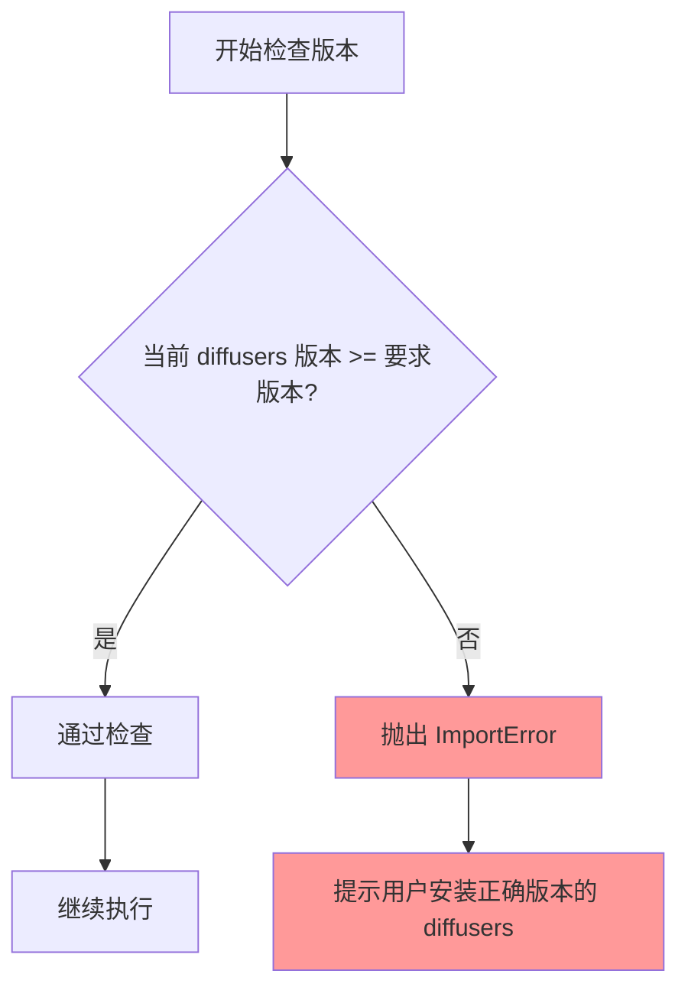
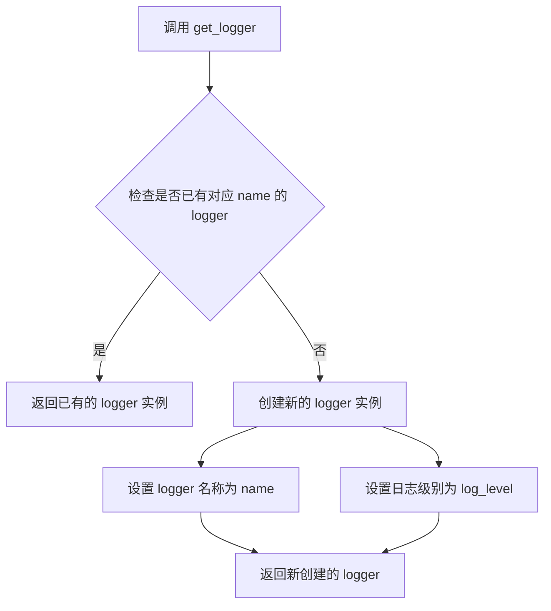
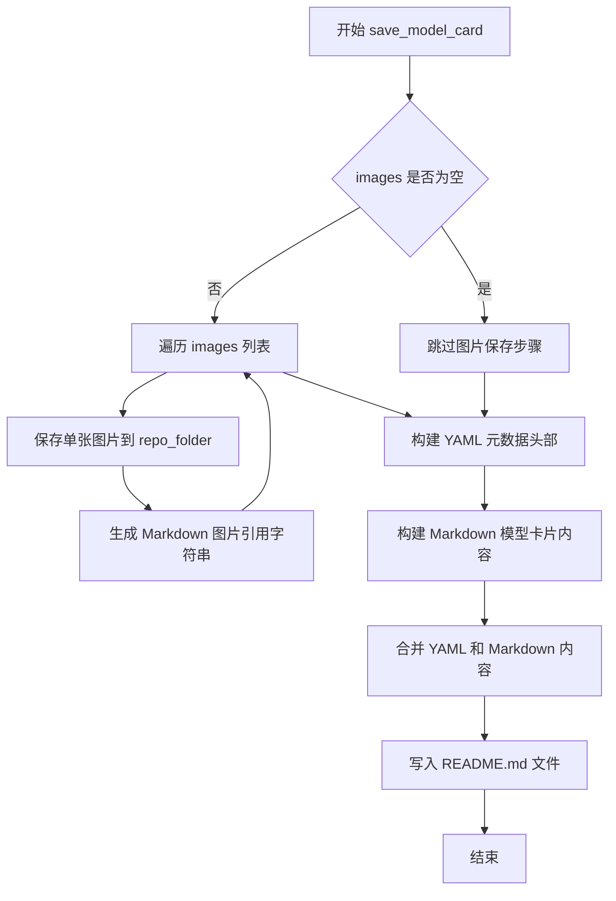
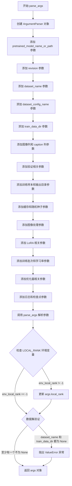
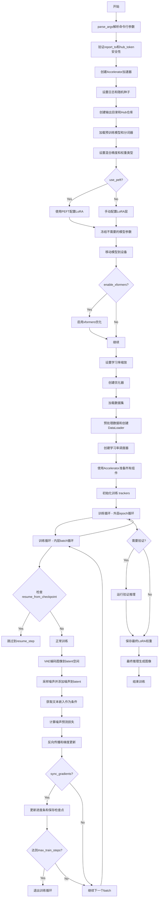
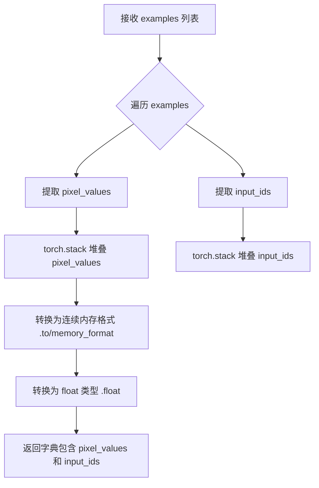
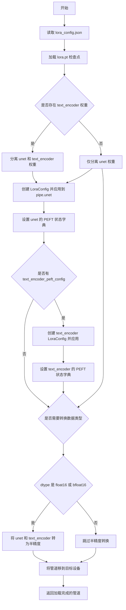

# `diffusers\examples\research_projects\lora\train_text_to_image_lora.py` 详细设计文档

这是一个用于Stable Diffusion模型的LoRA（Low-Rank Adaptation）微调训练脚本，支持文本到图像（text-to-image）生成任务。该脚本通过LoRA技术轻量级地微调预训练的Stable Diffusion模型，支持多种配置选项包括混合精度训练、梯度累积、分布式训练、xformers优化、PEFT库集成等，并提供完整的训练、验证和模型导出流程。

## 整体流程

```mermaid
graph TD
    A[开始] --> B[parse_args解析命令行参数]
    B --> C[初始化Accelerator加速器]
    C --> D[设置日志和随机种子]
    D --> E[创建输出目录]
    E --> F[加载预训练模型和分词器]
    F --> G{是否使用PEFT?}
    G -- 是 --> H[使用PEFT库配置LoRA]
    G -- 否 --> I[手动添加LoRA权重到注意力层]
    H --> J[冻结不需要的模型参数]
    I --> J
    J --> K[启用xformers内存高效注意力]
    K --> L[配置优化器8bit Adam或AdamW]
    L --> M[加载和处理数据集]
    M --> N[创建数据加载器DataLoader]
    N --> O[配置学习率调度器]
    O --> P[使用accelerator准备所有组件]
    P --> Q[初始化训练 trackers]
    Q --> R{检查是否需要恢复训练}
    R -- 是 --> S[加载checkpoint恢复状态]
    R -- 否 --> T[开始训练循环]
    S --> T
    T --> U[遍历每个epoch]
    U --> V[遍历每个batch]
    V --> W[前向传播:编码图像到latent空间]
    W --> X[添加噪声到latents]
    X --> Y[获取文本embedding]
    Y --> Z[计算噪声预测损失]
    Z --> AA[反向传播和梯度更新]
    AA --> AB{达到checkpoint保存步数?}
    AB -- 是 --> AC[保存训练状态checkpoint]
    AB -- 否 --> AD[继续下一步]
    AD --> AE{是否到达最大训练步数?]
    AE -- 否 --> V
    AE -- 是 --> AF[训练循环结束]
    AF --> AG{是否需要验证?}
    AG -- 是 --> AH[运行验证生成图像]
    AG -- 否 --> AI[保存LoRA权重]
    AH --> AI
    AI --> AJ[推送到Hub?]
    AJ -- 是 --> AK[上传模型到HuggingFace Hub]
    AJ -- 否 --> AL[进行最终推理测试]
    AL --> AM[结束训练]
```

## 类结构

```
无自定义类 (纯过程式脚本)
└── 使用的主要外部库类:
    ├── Accelerator (accelerate)
    ├── DDPMScheduler (diffusers)
    ├── CLIPTokenizer (transformers)
    ├── CLIPTextModel (transformers)
    ├── AutoencoderKL (diffusers)
    ├── UNet2DConditionModel (diffusers)
    ├── DiffusionPipeline (diffusers)
    ├── LoRAAttnProcessor (diffusers)
    └── LoraModel (peft)
```

## 全局变量及字段


### `logger`
    
用于记录训练过程中日志信息的日志记录器对象

类型：`logging.Logger`
    


### `DATASET_NAME_MAPPING`
    
数据集名称到图像列和文本列的映射字典

类型：`dict`
    


### `noise_scheduler`
    
DDPM噪声调度器，用于控制扩散模型中的噪声添加过程

类型：`DDPMScheduler`
    


### `tokenizer`
    
CLIP分词器，用于将文本转换为模型可处理的token序列

类型：`CLIPTokenizer`
    


### `text_encoder`
    
CLIP文本编码器模型，用于将文本编码为条件嵌入向量

类型：`CLIPTextModel`
    


### `vae`
    
变分自编码器模型，用于将图像编码到潜在空间或从潜在空间解码

类型：`AutoencoderKL`
    


### `unet`
    
UNet条件扩散模型，用于预测噪声残差

类型：`UNet2DConditionModel`
    


### `weight_dtype`
    
模型权重的数据类型，根据混合精度设置可以是float32/float16/bfloat16

类型：`torch.dtype`
    


### `optimizer`
    
AdamW优化器，用于更新模型参数

类型：`torch.optim.AdamW 或 bnb.optim.AdamW8bit`
    


### `train_dataset`
    
训练数据集对象，包含图像和对应的文本描述

类型：`datasets.Dataset`
    


### `train_dataloader`
    
训练数据加载器，用于批量加载训练数据

类型：`torch.utils.data.DataLoader`
    


### `lr_scheduler`
    
学习率调度器，用于动态调整学习率

类型：`torch.optim.lr_scheduler._LRScheduler`
    


### `accelerator`
    
Accelerate加速器对象，用于管理分布式训练和混合精度

类型：`Accelerate.Accelerator`
    


### `args`
    
解析后的命令行参数集合

类型：`argparse.Namespace`
    


### `global_step`
    
全局训练步数计数器

类型：`int`
    


### `first_epoch`
    
起始训练轮数，用于从检查点恢复训练

类型：`int`
    


### `train_loss`
    
当前训练轮次的累计损失值

类型：`float`
    


### `progress_bar`
    
训练进度条，用于显示训练进度

类型：`tqdm.auto.tqdm`
    


### `images`
    
生成的图像列表，用于保存或展示推理结果

类型：`list[PIL.Image.Image]`
    


    

## 全局函数及方法


### `check_min_version`

该函数用于检查当前安装的 diffusers 库版本是否满足所需的最低版本要求。如果安装的版本低于指定版本，将抛出 `ImportError` 异常并提示用户升级。

参数：

- `version_required`：`str`，需要检查的最低版本号字符串，格式如 "0.14.0.dev0"

返回值：`None`，该函数不返回任何值。如果版本检查失败，则抛出 `ImportError` 异常。

#### 流程图



#### 带注释源码

```python
# 从 diffusers.utils 模块导入 check_min_version 函数
# 该函数用于确保运行脚本所需的最低 diffusers 版本
from diffusers.utils import check_min_version, is_wandb_available

# 在脚本启动时调用 check_min_version
# 如果当前 diffusers 版本低于 0.14.0.dev0，将抛出 ImportError
# 这是一个防护性检查，确保环境配置正确
check_min_version("0.14.0.dev0")
```

---

### 补充说明

#### 潜在技术债务

1. **硬编码版本号**：最低版本号 "0.14.0.dev0" 被硬编码在代码中，建议将其提取为常量或配置文件
2. **缺乏版本检查详情**：函数仅抛出通用的 ImportError，未提供当前安装版本与要求版本的对比信息

#### 设计目标

- **目的**：防止因 diffusers 库版本过低导致功能缺失或运行时错误
- **使用场景**：在导入其他 diffusers 模块之前进行版本前置条件检查


### `get_logger`

获取或创建一个与指定模块关联的日志记录器，用于在训练过程中记录信息和调试信息。

参数：

- `name`：`str`，模块名称，通常使用 `__name__` 来标识日志来源的模块
- `log_level`：`str`，日志级别，默认为 `"INFO"`，可选择 DEBUG、INFO、WARNING、ERROR 等级别

返回值：`logging.Logger`，返回一个 Python 标准库的日志记录器对象，用于输出训练过程中的日志信息

#### 流程图



#### 带注释源码

```python
# 从 accelerate 库导入 get_logger 函数
# accelerate 是 Hugging Face 的分布式训练加速库
from accelerate.logging import get_logger

# 使用示例（在代码中的实际调用）
# 获取当前模块的日志记录器，设置为 INFO 级别
logger = get_logger(__name__, log_level="INFO")
```

#### 补充说明

该函数调用的是 Hugging Face `accelerate` 库中的 `get_logger` 方法，其主要功能包括：

1. **模块级日志记录**：为每个模块创建独立的日志记录器，便于追踪日志来源
2. **日志级别控制**：支持设置不同的日志级别来过滤输出信息
3. **与 Accelerator 集成**：与分布式训练框架配合，支持主进程日志控制（`main_process_only=False`）

在代码中的实际使用：

```python
# 在 main() 函数中使用 logger 输出训练信息
logger.info(accelerator.state, main_process_only=False)
logger.info("***** Running training *****")
logger.info(f"  Num examples = {len(train_dataset)}")
logger.info(f"  Num Epochs = {args.num_train_epochs}")
logger.info(f"  Total train batch size (w. parallel, distributed & accumulation) = {total_batch_size}")
logger.info(f"  Gradient Accumulation steps = {args.gradient_accumulation_steps}")
logger.info(f"  Total optimization steps = {args.max_train_steps}")
```


### `save_model_card`

该函数用于生成并保存模型卡片（Model Card），包括将训练过程中生成的示例图片保存到指定文件夹，并创建一个包含模型元信息（基础模型、微调数据集等）的 README.md 文件，供模型发布到 Hugging Face Hub 时使用。

参数：

- `repo_id`：`str`，模型仓库的唯一标识符，用于在模型卡片标题中标识模型
- `images`：`List[PIL.Image]`，可选参数，训练过程中生成的示例图片列表，默认为 None，函数会将每张图片保存为 PNG 文件
- `base_model`：`str`，基础模型的名称或路径，用于说明 LoRA 适配器是基于哪个基础模型微调而来
- `dataset_name`：`str`，用于微调的数据集名称，用于说明模型训练使用的数据来源
- `repo_folder`：`str`，可选参数，默认为 None，用于保存模型卡片和示例图片的目标文件夹路径

返回值：`None`，该函数不返回任何值，仅执行文件写入操作

#### 流程图



#### 带注释源码

```python
def save_model_card(repo_id: str, images=None, base_model=str, dataset_name=str, repo_folder=None):
    """
    生成并保存模型卡片到指定文件夹。
    
    参数:
        repo_id: 模型仓库的唯一标识符
        images: 训练过程中生成的示例图片列表
        base_model: 基础模型的名称或路径
        dataset_name: 用于微调的数据集名称
        repo_folder: 保存模型卡片的目标文件夹
    """
    
    # 初始化图片引用字符串
    img_str = ""
    
    # 遍历所有示例图片，将其保存到指定文件夹，并生成 Markdown 引用格式
    for i, image in enumerate(images):
        # 保存图片文件，文件名格式为 image_0.png, image_1.png, ...
        image.save(os.path.join(repo_folder, f"image_{i}.png"))
        # 生成 Markdown 格式的图片引用字符串
        img_str += f"\n"

    # 构建 YAML 格式的元数据头部，包含模型许可证、基础模型、标签等信息
    yaml = f"""
---
license: creativeml-openrail-m
base_model: {base_model}
tags:
- stable-diffusion
- stable-diffusion-diffusers
- text-to-image
- diffusers
- diffusers-training
- lora
inference: true
---
    """
    
    # 构建 Markdown 格式的模型卡片主体内容
    # 包含模型标题、基础模型信息、数据集信息以及示例图片展示
    model_card = f"""
# LoRA text2image fine-tuning - {repo_id}
These are LoRA adaption weights for {base_model}. The weights were fine-tuned on the {dataset_name} dataset. You can find some example images in the following. \n
{img_str}
"""
    
    # 将 YAML 元数据 和 Markdown 内容合并，写入到 README.md 文件中
    with open(os.path.join(repo_folder, "README.md"), "w") as f:
        f.write(yaml + model_card)
```


### `parse_args`

该函数是训练脚本的参数解析器，通过argparse模块定义并收集所有命令行参数，进行环境变量检查和合理性验证，最终返回一个包含所有训练配置参数的Namespace对象。

参数：

-  `self`：`parse_args` 是模块级函数，不需要实例，因此没有 `self` 参数

返回值：`Namespace`，包含所有命令行参数及默认值的命名空间对象，后续通过 `args.属性名` 访问各参数值

#### 流程图



#### 带注释源码

```python
def parse_args():
    """
    解析命令行参数，返回训练所需的配置对象
    
    该函数使用 argparse 定义了所有训练相关的命令行参数，
    包括模型路径、数据集配置、训练超参数、LoRA 配置等。
    返回的 args 对象将用于整个训练流程的配置。
    
    Returns:
        argparse.Namespace: 包含所有命令行参数值的命名空间对象
    """
    # 创建 ArgumentParser 实例，设置脚本描述
    parser = argparse.ArgumentParser(description="Simple example of a training script.")
    
    # ========== 模型相关参数 ==========
    parser.add_argument(
        "--pretrained_model_name_or_path",
        type=str,
        default=None,
        required=True,  # 必须指定预训练模型路径
        help="Path to pretrained model or model identifier from huggingface.co/models.",
    )
    parser.add_argument(
        "--revision",
        type=str,
        default=None,
        required=False,
        help="Revision of pretrained model identifier from huggingface.co/models.",
    )
    
    # ========== 数据集相关参数 ==========
    parser.add_argument(
        "--dataset_name",
        type=str,
        default=None,
        help=(
            "The name of the Dataset (from the HuggingFace hub) to train on (could be your own, possibly private,"
            " dataset). It can also be a path pointing to a local copy of a dataset in your filesystem,"
            " or to a folder containing files that 🤗 Datasets can understand."
        ),
    )
    parser.add_argument(
        "--dataset_config_name",
        type=str,
        default=None,
        help="The config of the Dataset, leave as None if there's only one config.",
    )
    parser.add_argument(
        "--train_data_dir",
        type=str,
        default=None,
        help=(
            "A folder containing the training data. Folder contents must follow the structure described in"
            " https://huggingface.co/docs/datasets/image_dataset#imagefolder. In particular, a `metadata.jsonl` file"
            " must exist to provide the captions for the images. Ignored if `dataset_name` is specified."
        ),
    )
    parser.add_argument(
        "--image_column", type=str, default="image", help="The column of the dataset containing an image."
    )
    parser.add_argument(
        "--caption_column",
        type=str,
        default="text",
        help="The column of the dataset containing a caption or a list of captions.",
    )
    
    # ========== 验证相关参数 ==========
    parser.add_argument(
        "--validation_prompt", type=str, default=None, help="A prompt that is sampled during training for inference."
    )
    parser.add_argument(
        "--num_validation_images",
        type=int,
        default=4,
        help="Number of images that should be generated during validation with `validation_prompt`.",
    )
    parser.add_argument(
        "--validation_epochs",
        type=int,
        default=1,
        help=(
            "Run fine-tuning validation every X epochs. The validation process consists of running the prompt"
            " `args.validation_prompt` multiple times: `args.num_validation_images`."
        ),
    )
    
    # ========== 训练样本和输出目录 ==========
    parser.add_argument(
        "--max_train_samples",
        type=int,
        default=None,
        help=(
            "For debugging purposes or quicker training, truncate the number of training examples to this "
            "value if set."
        ),
    )
    parser.add_argument(
        "--output_dir",
        type=str,
        default="sd-model-finetuned-lora",
        help="The output directory where the model predictions and checkpoints will be written.",
    )
    parser.add_argument(
        "--cache_dir",
        type=str,
        default=None,
        help="The directory where the downloaded models and datasets will be stored.",
    )
    parser.add_argument("--seed", type=int, default=None, help="A seed for reproducible training.")
    
    # ========== 图像处理参数 ==========
    parser.add_argument(
        "--resolution",
        type=int,
        default=512,
        help=(
            "The resolution for input images, all the images in the train/validation dataset will be resized to this"
            " resolution"
        ),
    )
    parser.add_argument(
        "--center_crop",
        default=False,
        action="store_true",
        help=(
            "Whether to center crop the input images to the resolution. If not set, the images will be randomly"
            " cropped. The images will be resized to the resolution first before cropping."
        ),
    )
    parser.add_argument(
        "--random_flip",
        action="store_true",
        help="whether to randomly flip images horizontally",
    )
    parser.add_argument("--train_text_encoder", action="store_true", help="Whether to train the text encoder")
    
    # ========== LoRA 参数 ==========
    parser.add_argument("--use_peft", action="store_true", help="Whether to use peft to support lora")
    parser.add_argument("--lora_r", type=int, default=4, help="Lora rank, only used if use_lora is True")
    parser.add_argument("--lora_alpha", type=int, default=32, help="Lora alpha, only used if lora is True")
    parser.add_argument("--lora_dropout", type=float, default=0.0, help="Lora dropout, only used if use_lora is True")
    parser.add_argument(
        "--lora_bias",
        type=str,
        default="none",
        help="Bias type for Lora. Can be 'none', 'all' or 'lora_only', only used if use_lora is True",
    )
    parser.add_argument(
        "--lora_text_encoder_r",
        type=int,
        default=4,
        help="Lora rank for text encoder, only used if `use_lora` and `train_text_encoder` are True",
    )
    parser.add_argument(
        "--lora_text_encoder_alpha",
        type=int,
        default=32,
        help="Lora alpha for text encoder, only used if `use_lora` and `train_text_encoder` are True",
    )
    parser.add_argument(
        "--lora_text_encoder_dropout",
        type=float,
        default=0.0,
        help="Lora dropout for text encoder, only used if `use_lora` and `train_text_encoder` are True",
    )
    parser.add_argument(
        "--lora_text_encoder_bias",
        type=str,
        default="none",
        help="Bias type for Lora. Can be 'none', 'all' or 'lora_only', only used if use_lora and `train_text_encoder` are True",
    )
    
    # ========== 训练超参数 ==========
    parser.add_argument(
        "--train_batch_size", type=int, default=16, help="Batch size (per device) for the training dataloader."
    )
    parser.add_argument("--num_train_epochs", type=int, default=100)
    parser.add_argument(
        "--max_train_steps",
        type=int,
        default=None,
        help="Total number of training steps to perform.  If provided, overrides num_train_epochs.",
    )
    parser.add_argument(
        "--gradient_accumulation_steps",
        type=int,
        default=1,
        help="Number of updates steps to accumulate before performing a backward/update pass.",
    )
    parser.add_argument(
        "--gradient_checkpointing",
        action="store_true",
        help="Whether or not to use gradient checkpointing to save memory at the expense of slower backward pass.",
    )
    parser.add_argument(
        "--learning_rate",
        type=float,
        default=1e-4,
        help="Initial learning rate (after the potential warmup period) to use.",
    )
    parser.add_argument(
        "--scale_lr",
        action="store_true",
        default=False,
        help="Scale the learning rate by the number of GPUs, gradient accumulation steps, and batch size.",
    )
    parser.add_argument(
        "--lr_scheduler",
        type=str,
        default="constant",
        help=(
            'The scheduler type to use. Choose between ["linear", "cosine", "cosine_with_restarts", "polynomial",'
            ' "constant", "constant_with_warmup"]'
        ),
    )
    parser.add_argument(
        "--lr_warmup_steps", type=int, default=500, help="Number of steps for the warmup in the lr scheduler."
    )
    
    # ========== 优化器参数 ==========
    parser.add_argument(
        "--use_8bit_adam", action="store_true", help="Whether or not to use 8-bit Adam from bitsandbytes."
    )
    parser.add_argument(
        "--allow_tf32",
        action="store_true",
        help=(
            "Whether or not to allow TF32 on Ampere GPUs. Can be used to speed up training. For more information, see"
            " https://pytorch.org/docs/stable/notes/cuda.html#tensorfloat-32-tf32-on-ampere-devices"
        ),
    )
    parser.add_argument(
        "--dataloader_num_workers",
        type=int,
        default=0,
        help=(
            "Number of subprocesses to use for data loading. 0 means that the data will be loaded in the main process."
        ),
    )
    parser.add_argument("--adam_beta1", type=float, default=0.9, help="The beta1 parameter for the Adam optimizer.")
    parser.add_argument("--adam_beta2", type=float, default=0.999, help="The beta2 parameter for the Adam optimizer.")
    parser.add_argument("--adam_weight_decay", type=float, default=1e-2, help="Weight decay to use.")
    parser.add_argument("--adam_epsilon", type=float, default=1e-08, help="Epsilon value for the Adam optimizer")
    parser.add_argument("--max_grad_norm", default=1.0, type=float, help="Max gradient norm.")
    
    # ========== Hub 和日志参数 ==========
    parser.add_argument("--push_to_hub", action="store_true", help="Whether or not to push the model to the Hub.")
    parser.add_argument("--hub_token", type=str, default=None, help="The token to use to push to the Model Hub.")
    parser.add_argument(
        "--hub_model_id",
        type=str,
        default=None,
        help="The name of the repository to keep in sync with the local `output_dir`.",
    )
    parser.add_argument(
        "--logging_dir",
        type=str,
        default="logs",
        help=(
            "[TensorBoard](https://www.tensorflow.org/tensorboard) log directory. Will default to"
            " *output_dir/runs/**CURRENT_DATETIME_HOSTNAME***."
        ),
    )
    parser.add_argument(
        "--mixed_precision",
        type=str,
        default=None,
        choices=["no", "fp16", "bf16"],
        help=(
            "Whether to use mixed precision. Choose between fp16 and bf16 (bfloat16). Bf16 requires PyTorch >="
            " 1.10.and an Nvidia Ampere GPU.  Default to the value of accelerate config of the current system or the"
            " flag passed with the `accelerate.launch` command. Use this argument to override the accelerate config."
        ),
    )
    parser.add_argument(
        "--report_to",
        type=str,
        default="tensorboard",
        help=(
            'The integration to report the results and logs to. Supported platforms are `"tensorboard"`'
            ' (default), `"wandb"` and `"comet_ml"`. Use `"all"` to report to all integrations.'
        ),
    )
    parser.add_argument("--local_rank", type=int, default=-1, help="For distributed training: local_rank")
    
    # ========== 检查点参数 ==========
    parser.add_argument(
        "--checkpointing_steps",
        type=int,
        default=500,
        help=(
            "Save a checkpoint of the training state every X updates. These checkpoints are only suitable for resuming"
            " training using `--resume_from_checkpoint`."
        ),
    )
    parser.add_argument(
        "--checkpoints_total_limit",
        type=int,
        default=None,
        help=(
            "Max number of checkpoints to store. Passed as `total_limit` to the `Accelerator` `ProjectConfiguration`."
            " See Accelerator::save_state https://huggingface.co/docs/accelerate/package_reference/accelerator#accelerate.Accelerator.save_state"
            " for more docs"
        ),
    )
    parser.add_argument(
        "--resume_from_checkpoint",
        type=str,
        default=None,
        help=(
            "Whether training should be resumed from a previous checkpoint. Use a path saved by"
            ' `--checkpointing_steps`, or `"latest"` to automatically select the last available checkpoint.'
        ),
    )
    
    # ========== xFormers 参数 ==========
    parser.add_argument(
        "--enable_xformers_memory_efficient_attention", action="store_true", help="Whether or not to use xformers."
    )
    
    # 解析命令行参数
    args = parser.parse_args()
    
    # 检查环境变量 LOCAL_RANK，用于分布式训练
    env_local_rank = int(os.environ.get("LOCAL_RANK", -1))
    if env_local_rank != -1 and env_local_rank != args.local_rank:
        args.local_rank = env_local_rank
    
    # 合理性检查：至少需要指定 dataset_name 或 train_data_dir 之一
    if args.dataset_name is None and args.train_data_dir is None:
        raise ValueError("Need either a dataset name or a training folder.")
    
    return args
```


### `main`

这是Stable Diffusion LoRA微调训练脚本的核心入口函数，负责整个文本到图像模型的微调训练流程，包括环境初始化、模型加载、数据处理、训练循环、检查点保存和推理验证。

参数：
- 无（通过`parse_args()`从命令行获取参数）

返回值：`None`，函数执行完成后直接退出

#### 流程图



#### 带注释源码

```python
def main():
    """
    主训练函数，执行Stable Diffusion LoRA微调的完整流程
    """
    # 1. 解析命令行参数
    args = parse_args()
    
    # 2. 安全检查：不能同时使用wandb和hub_token
    if args.report_to == "wandb" and args.hub_token is not None:
        raise ValueError(
            "You cannot use both --report_to=wandb and --hub_token due to a security risk of exposing your token."
            " Please use `hf auth login` to authenticate with the Hub."
        )

    # 3. 设置日志目录
    logging_dir = os.path.join(args.output_dir, args.logging_dir)

    # 4. 配置Accelerator项目设置
    accelerator_project_config = ProjectConfiguration(
        total_limit=args.checkpoints_total_limit, project_dir=args.output_dir, logging_dir=logging_dir
    )

    # 5. 初始化Accelerator分布式训练环境
    accelerator = Accelerator(
        gradient_accumulation_steps=args.gradient_accumulation_steps,
        mixed_precision=args.mixed_precision,
        log_with=args.report_to,
        project_config=accelerator_project_config,
    )

    # 6. MPS设备特殊处理：禁用AMP
    if torch.backends.mps.is_available():
        accelerator.native_amp = False

    # 7. 初始化wandb日志（如果使用）
    if args.report_to == "wandb":
        if not is_wandb_available():
            raise ImportError("Make sure to install wandb if you want to use it for logging during training.")
        import wandb

    # 8. 配置日志格式
    logging.basicConfig(
        format="%(asctime)s - %(levelname)s - %(name)s - %(message)s",
        datefmt="%m/%d/%Y %H:%M:%S",
        level=logging.INFO,
    )
    logger.info(accelerator.state, main_process_only=False)
    
    # 9. 为主进程设置详细日志，为其他进程设置错误日志
    if accelerator.is_local_main_process:
        datasets.utils.logging.set_verbosity_warning()
        transformers.utils.logging.set_verbosity_warning()
        diffusers.utils.logging.set_verbosity_info()
    else:
        datasets.utils.logging.set_verbosity_error()
        transformers.utils.logging.set_verbosity_error()
        diffusers.utils.logging.set_verbosity_error()

    # 10. 设置随机种子以确保可重复性
    if args.seed is not None:
        set_seed(args.seed)

    # 11. 创建输出目录
    if accelerator.is_main_process:
        if args.output_dir is not None:
            os.makedirs(args.output_dir, exist_ok=True)

        # 12. 如果需要推送到Hub，创建远程仓库
        if args.push_to_hub:
            repo_id = create_repo(
                repo_id=args.hub_model_id or Path(args.output_dir).name, exist_ok=True, token=args.hub_token
            ).repo_id

    # 13. 加载预训练模型组件
    noise_scheduler = DDPMScheduler.from_pretrained(args.pretrained_model_name_or_path, subfolder="scheduler")
    tokenizer = CLIPTokenizer.from_pretrained(
        args.pretrained_model_name_or_path, subfolder="tokenizer", revision=args.revision
    )
    text_encoder = CLIPTextModel.from_pretrained(
        args.pretrained_model_name_or_path, subfolder="text_encoder", revision=args.revision
    )
    vae = AutoencoderKL.from_pretrained(args.pretrained_model_name_or_path, subfolder="vae", revision=args.revision)
    unet = UNet2DConditionModel.from_pretrained(
        args.pretrained_model_name_or_path, subfolder="unet", revision=args.revision
    )

    # 14. 设置混合精度的权重类型
    weight_dtype = torch.float32
    if accelerator.mixed_precision == "fp16":
        weight_dtype = torch.float16
    elif accelerator.mixed_precision == "bf16":
        weight_dtype = torch.bfloat16

    # 15. 配置LoRA（两种方式：PEFT或手动）
    if args.use_peft:
        from peft import LoraConfig, LoraModel, get_peft_model_state_dict, set_peft_model_state_dict

        UNET_TARGET_MODULES = ["to_q", "to_v", "query", "value"]
        TEXT_ENCODER_TARGET_MODULES = ["q_proj", "v_proj"]

        # 为UNet配置LoRA
        config = LoraConfig(
            r=args.lora_r,
            lora_alpha=args.lora_alpha,
            target_modules=UNET_TARGET_MODULES,
            lora_dropout=args.lora_dropout,
            bias=args.lora_bias,
        )
        unet = LoraModel(config, unet)

        vae.requires_grad_(False)
        
        # 如果训练文本编码器，也为文本编码器配置LoRA
        if args.train_text_encoder:
            config = LoraConfig(
                r=args.lora_text_encoder_r,
                lora_alpha=args.lora_text_encoder_alpha,
                target_modules=TEXT_ENCODER_TARGET_MODULES,
                lora_dropout=args.lora_text_encoder_dropout,
                bias=args.lora_text_encoder_bias,
            )
            text_encoder = LoraModel(config, text_encoder)
    else:
        # 手动配置LoRA：冻结原模型参数
        unet.requires_grad_(False)
        vae.requires_grad_(False)
        text_encoder.requires_grad_(False)

        # 手动设置LoRA注意力处理器
        lora_attn_procs = {}
        for name in unet.attn_processors.keys():
            cross_attention_dim = None if name.endswith("attn1.processor") else unet.config.cross_attention_dim
            if name.startswith("mid_block"):
                hidden_size = unet.config.block_out_channels[-1]
            elif name.startswith("up_blocks"):
                block_id = int(name[len("up_blocks.")])
                hidden_size = list(reversed(unet.config.block_out_channels))[block_id]
            elif name.startswith("down_blocks"):
                block_id = int(name[len("down_blocks.")])
                hidden_size = unet.config.block_out_channels[block_id]

            lora_attn_procs[name] = LoRAAttnProcessor(hidden_size=hidden_size, cross_attention_dim=cross_attention_dim)

        unet.set_attn_processor(lora_attn_procs)
        lora_layers = AttnProcsLayers(unet.attn_processors)

    # 16. 将模型移动到设备并转换数据类型
    vae.to(accelerator.device, dtype=weight_dtype)
    if not args.train_text_encoder:
        text_encoder.to(accelerator.device, dtype=weight_dtype)

    # 17. 启用xformers高效注意力（如果支持）
    if args.enable_xformers_memory_efficient_attention:
        if is_xformers_available():
            import xformers

            xformers_version = version.parse(xformers.__version__)
            if xformers_version == version.parse("0.0.16"):
                logger.warning(
                    "xFormers 0.0.16 cannot be used for training in some GPUs. If you observe problems during training, please update xFormers to at least 0.0.17. See https://huggingface.co/docs/diffusers/main/en/optimization/xformers for more details."
                )
            unet.enable_xformers_memory_efficient_attention()
        else:
            raise ValueError("xformers is not available. Make sure it is installed correctly")

    # 18. 启用TF32加速（Ampere GPU）
    if args.allow_tf32:
        torch.backends.cuda.matmul.allow_tf32 = True

    # 19. 根据GPU数量和学习率设置缩放
    if args.scale_lr:
        args.learning_rate = (
            args.learning_rate * args.gradient_accumulation_steps * args.train_batch_size * accelerator.num_processes
        )

    # 20. 初始化优化器
    if args.use_8bit_adam:
        try:
            import bitsandbytes as bnb
        except ImportError:
            raise ImportError(
                "Please install bitsandbytes to use 8-bit Adam. You can do so by running `pip install bitsandbytes`"
            )

        optimizer_cls = bnb.optim.AdamW8bit
    else:
        optimizer_cls = torch.optim.AdamW

    # 根据是否使用PEFT选择优化的参数
    if args.use_peft:
        params_to_optimize = (
            itertools.chain(unet.parameters(), text_encoder.parameters())
            if args.train_text_encoder
            else unet.parameters()
        )
        optimizer = optimizer_cls(
            params_to_optimize,
            lr=args.learning_rate,
            betas=(args.adam_beta1, args.adam_beta2),
            weight_decay=args.adam_weight_decay,
            eps=args.adam_epsilon,
        )
    else:
        optimizer = optimizer_cls(
            lora_layers.parameters(),
            lr=args.learning_rate,
            betas=(args.adam_beta1, args.adam_beta2),
            weight_decay=args.adam_weight_decay,
            eps=args.adam_epsilon,
        )

    # 21. 加载数据集
    if args.dataset_name is not None:
        dataset = load_dataset(
            args.dataset_name,
            args.dataset_config_name,
            cache_dir=args.cache_dir,
        )
    else:
        data_files = {}
        if args.train_data_dir is not None:
            data_files["train"] = os.path.join(args.train_data_dir, "**")
        dataset = load_dataset(
            "imagefolder",
            data_files=data_files,
            cache_dir=args.cache_dir,
        )

    # 22. 数据集列名处理
    column_names = dataset["train"].column_names
    dataset_columns = DATASET_NAME_MAPPING.get(args.dataset_name, None)
    
    if args.image_column is None:
        image_column = dataset_columns[0] if dataset_columns is not None else column_names[0]
    else:
        image_column = args.image_column
        if image_column not in column_names:
            raise ValueError(
                f"--image_column' value '{args.image_column}' needs to be one of: {', '.join(column_names)}"
            )
    if args.caption_column is None:
        caption_column = dataset_columns[1] if dataset_columns is not None else column_names[1]
    else:
        caption_column = args.caption_column
        if caption_column not in column_names:
            raise ValueError(
                f"--caption_column' value '{args.caption_column}' needs to be one of: {', '.join(column_names)}"
            )

    # 23. 定义数据预处理函数
    def tokenize_captions(examples, is_train=True):
        """将文本caption转换为token IDs"""
        captions = []
        for caption in examples[caption_column]:
            if isinstance(caption, str):
                captions.append(caption)
            elif isinstance(caption, (list, np.ndarray)):
                captions.append(random.choice(caption) if is_train else caption[0])
            else:
                raise ValueError(
                    f"Caption column `{caption_column}` should contain either strings or lists of strings."
                )
        inputs = tokenizer(
            captions, max_length=tokenizer.model_max_length, padding="max_length", truncation=True, return_tensors="pt"
        )
        return inputs.input_ids

    # 24. 定义图像预处理
    train_transforms = transforms.Compose(
        [
            transforms.Resize(args.resolution, interpolation=transforms.InterpolationMode.BILINEAR),
            transforms.CenterCrop(args.resolution) if args.center_crop else transforms.RandomCrop(args.resolution),
            transforms.RandomHorizontalFlip() if args.random_flip else transforms.Lambda(lambda x: x),
            transforms.ToTensor(),
            transforms.Normalize([0.5], [0.5]),
        ]
    )

    def preprocess_train(examples):
        """预处理训练数据：转换图像和tokenize文本"""
        images = [image.convert("RGB") for image in examples[image_column]]
        examples["pixel_values"] = [train_transforms(image) for image in images]
        examples["input_ids"] = tokenize_captions(examples)
        return examples

    # 25. 应用数据预处理
    with accelerator.main_process_first():
        if args.max_train_samples is not None:
            dataset["train"] = dataset["train"].shuffle(seed=args.seed).select(range(args.max_train_samples))
        train_dataset = dataset["train"].with_transform(preprocess_train)

    # 26. 定义批处理整理函数
    def collate_fn(examples):
        pixel_values = torch.stack([example["pixel_values"] for example in examples])
        pixel_values = pixel_values.to(memory_format=torch.contiguous_format).float()
        input_ids = torch.stack([example["input_ids"] for example in examples])
        return {"pixel_values": pixel_values, "input_ids": input_ids}

    # 27. 创建DataLoader
    train_dataloader = torch.utils.data.DataLoader(
        train_dataset,
        shuffle=True,
        collate_fn=collate_fn,
        batch_size=args.train_batch_size,
        num_workers=args.dataloader_num_workers,
    )

    # 28. 计算训练步数
    overrode_max_train_steps = False
    num_update_steps_per_epoch = math.ceil(len(train_dataloader) / args.gradient_accumulation_steps)
    if args.max_train_steps is None:
        args.max_train_steps = args.num_train_epochs * num_update_steps_per_epoch
        overrode_max_train_steps = True

    # 29. 创建学习率调度器
    lr_scheduler = get_scheduler(
        args.lr_scheduler,
        optimizer=optimizer,
        num_warmup_steps=args.lr_warmup_steps * accelerator.num_processes,
        num_training_steps=args.max_train_steps * accelerator.num_processes,
    )

    # 30. 使用Accelerator准备所有组件
    if args.use_peft:
        if args.train_text_encoder:
            unet, text_encoder, optimizer, train_dataloader, lr_scheduler = accelerator.prepare(
                unet, text_encoder, optimizer, train_dataloader, lr_scheduler
            )
        else:
            unet, optimizer, train_dataloader, lr_scheduler = accelerator.prepare(
                unet, optimizer, train_dataloader, lr_scheduler
            )
    else:
        lora_layers, optimizer, train_dataloader, lr_scheduler = accelerator.prepare(
            lora_layers, optimizer, train_dataloader, lr_scheduler
        )

    # 31. 重新计算训练步数
    num_update_steps_per_epoch = math.ceil(len(train_dataloader) / args.gradient_accumulation_steps)
    if overrode_max_train_steps:
        args.max_train_steps = args.num_train_epochs * num_update_steps_per_epoch
    args.num_train_epochs = math.ceil(args.max_train_steps / num_update_steps_per_epoch)

    # 32. 初始化 trackers
    if accelerator.is_main_process:
        accelerator.init_trackers("text2image-fine-tune", config=vars(args))

    # 33. 打印训练信息
    total_batch_size = args.train_batch_size * accelerator.num_processes * args.gradient_accumulation_steps

    logger.info("***** Running training *****")
    logger.info(f"  Num examples = {len(train_dataset)}")
    logger.info(f"  Num Epochs = {args.num_train_epochs}")
    logger.info(f"  Instantaneous batch size per device = {args.train_batch_size}")
    logger.info(f"  Total train batch size (w. parallel, distributed & accumulation) = {total_batch_size}")
    logger.info(f"  Gradient Accumulation steps = {args.gradient_accumulation_steps}")
    logger.info(f"  Total optimization steps = {args.max_train_steps}")
    global_step = 0
    first_epoch = 0

    # 34. 检查是否从检查点恢复
    if args.resume_from_checkpoint:
        if args.resume_from_checkpoint != "latest":
            path = os.path.basename(args.resume_from_checkpoint)
        else:
            dirs = os.listdir(args.output_dir)
            dirs = [d for d in dirs if d.startswith("checkpoint")]
            dirs = sorted(dirs, key=lambda x: int(x.split("-")[1]))
            path = dirs[-1] if len(dirs) > 0 else None

        if path is None:
            accelerator.print(
                f"Checkpoint '{args.resume_from_checkpoint}' does not exist. Starting a new training run."
            )
            args.resume_from_checkpoint = None
        else:
            accelerator.print(f"Resuming from checkpoint {path}")
            accelerator.load_state(os.path.join(args.output_dir, path))
            global_step = int(path.split("-")[1])
            resume_global_step = global_step * args.gradient_accumulation_steps
            first_epoch = global_step // num_update_steps_per_epoch
            resume_step = resume_global_step % (num_update_steps_per_epoch * args.gradient_accumulation_steps)

    # 35. 训练循环
    progress_bar = tqdm(range(global_step, args.max_train_steps), disable=not accelerator.is_local_main_process)
    progress_bar.set_description("Steps")

    for epoch in range(first_epoch, args.num_train_epochs):
        unet.train()
        if args.train_text_encoder:
            text_encoder.train()
        train_loss = 0.0
        
        for step, batch in enumerate(train_dataloader):
            # 跳过已完成的步骤
            if args.resume_from_checkpoint and epoch == first_epoch and step < resume_step:
                if step % args.gradient_accumulation_steps == 0:
                    progress_bar.update(1)
                continue

            with accelerator.accumulate(unet):
                # 35.1 将图像编码到latent空间
                latents = vae.encode(batch["pixel_values"].to(dtype=weight_dtype)).latent_dist.sample()
                latents = latents * vae.config.scaling_factor

                # 35.2 采样噪声
                noise = torch.randn_like(latents)
                bsz = latents.shape[0]
                timesteps = torch.randint(0, noise_scheduler.config.num_train_timesteps, (bsz,), device=latents.device)
                timesteps = timesteps.long()

                # 35.3 前向扩散过程：添加噪声
                noisy_latents = noise_scheduler.add_noise(latents, noise, timesteps)

                # 35.4 获取文本嵌入作为条件
                encoder_hidden_states = text_encoder(batch["input_ids"])[0]

                # 35.5 获取损失目标
                if noise_scheduler.config.prediction_type == "epsilon":
                    target = noise
                elif noise_scheduler.config.prediction_type == "v_prediction":
                    target = noise_scheduler.get_velocity(latents, noise, timesteps)
                else:
                    raise ValueError(f"Unknown prediction type {noise_scheduler.config.prediction_type}")

                # 35.6 预测噪声并计算损失
                model_pred = unet(noisy_latents, timesteps, encoder_hidden_states).sample
                loss = F.mse_loss(model_pred.float(), target.float(), reduction="mean")

                # 35.7 收集损失进行日志记录
                avg_loss = accelerator.gather(loss.repeat(args.train_batch_size)).mean()
                train_loss += avg_loss.item() / args.gradient_accumulation_steps

                # 35.8 反向传播
                accelerator.backward(loss)
                if accelerator.sync_gradients:
                    if args.use_peft:
                        params_to_clip = (
                            itertools.chain(unet.parameters(), text_encoder.parameters())
                            if args.train_text_encoder
                            else unet.parameters()
                        )
                    else:
                        params_to_clip = lora_layers.parameters()
                    accelerator.clip_grad_norm_(params_to_clip, args.max_grad_norm)
                
                # 35.9 更新参数
                optimizer.step()
                lr_scheduler.step()
                optimizer.zero_grad()

            # 35.10 同步后执行的操作
            if accelerator.sync_gradients:
                progress_bar.update(1)
                global_step += 1
                accelerator.log({"train_loss": train_loss}, step=global_step)
                train_loss = 0.0

                # 35.11 保存检查点
                if global_step % args.checkpointing_steps == 0:
                    if accelerator.is_main_process:
                        save_path = os.path.join(args.output_dir, f"checkpoint-{global_step}")
                        accelerator.save_state(save_path)
                        logger.info(f"Saved state to {save_path}")

            logs = {"step_loss": loss.detach().item(), "lr": lr_scheduler.get_last_lr()[0]}
            progress_bar.set_postfix(**logs)

            if global_step >= args.max_train_steps:
                break

        # 36. 验证循环
        if accelerator.is_main_process:
            if args.validation_prompt is not None and epoch % args.validation_epochs == 0:
                logger.info(
                    f"Running validation... \n Generating {args.num_validation_images} images with prompt:"
                    f" {args.validation_prompt}."
                )
                # 创建推理pipeline
                pipeline = DiffusionPipeline.from_pretrained(
                    args.pretrained_model_name_or_path,
                    unet=accelerator.unwrap_model(unet),
                    text_encoder=accelerator.unwrap_model(text_encoder),
                    revision=args.revision,
                    torch_dtype=weight_dtype,
                )
                pipeline = pipeline.to(accelerator.device)
                pipeline.set_progress_bar_config(disable=True)

                # 运行推理
                generator = torch.Generator(device=accelerator.device).manual_seed(args.seed)
                images = []
                for _ in range(args.num_validation_images):
                    images.append(
                        pipeline(args.validation_prompt, num_inference_steps=30, generator=generator).images[0]
                    )

                # 记录验证图像
                if accelerator.is_main_process:
                    for tracker in accelerator.trackers:
                        if tracker.name == "tensorboard":
                            np_images = np.stack([np.asarray(img) for img in images])
                            tracker.writer.add_images("validation", np_images, epoch, dataformats="NHWC")
                        if tracker.name == "wandb":
                            tracker.log(
                                {
                                    "validation": [
                                        wandb.Image(image, caption=f"{i}: {args.validation_prompt}")
                                        for i, image in enumerate(images)
                                    ]
                                }
                            )

                del pipeline
                torch.cuda.empty_cache()

    # 37. 保存最终模型
    accelerator.wait_for_everyone()
    if accelerator.is_main_process:
        if args.use_peft:
            lora_config = {}
            unwarpped_unet = accelerator.unwrap_model(unet)
            state_dict = get_peft_model_state_dict(unwarpped_unet, state_dict=accelerator.get_state_dict(unet))
            lora_config["peft_config"] = unwarpped_unet.get_peft_config_as_dict(inference=True)
            
            if args.train_text_encoder:
                unwarpped_text_encoder = accelerator.unwrap_model(text_encoder)
                text_encoder_state_dict = get_peft_model_state_dict(
                    unwarpped_text_encoder, state_dict=accelerator.get_state_dict(text_encoder)
                )
                text_encoder_state_dict = {f"text_encoder_{k}": v for k, v in text_encoder_state_dict.items()}
                state_dict.update(text_encoder_state_dict)
                lora_config["text_encoder_peft_config"] = unwarpped_text_encoder.get_peft_config_as_dict(
                    inference=True
                )

            accelerator.save(state_dict, os.path.join(args.output_dir, f"{global_step}_lora.pt"))
            with open(os.path.join(args.output_dir, f"{global_step}_lora_config.json"), "w") as f:
                json.dump(lora_config, f)
        else:
            unet = unet.to(torch.float32)
            unet.save_attn_procs(args.output_dir)

        # 推送到Hub
        if args.push_to_hub:
            save_model_card(
                repo_id,
                images=images,
                base_model=args.pretrained_model_name_or_path,
                dataset_name=args.dataset_name,
                repo_folder=args.output_dir,
            )
            upload_folder(
                repo_id=repo_id,
                folder_path=args.output_dir,
                commit_message="End of training",
                ignore_patterns=["step_*", "epoch_*"],
            )

    # 38. 最终推理
    pipeline = DiffusionPipeline.from_pretrained(
        args.pretrained_model_name_or_path, revision=args.revision, torch_dtype=weight_dtype
    )

    if args.use_peft:
        def load_and_set_lora_ckpt(pipe, ckpt_dir, global_step, device, dtype):
            """加载并设置LoRA检查点到pipeline"""
            with open(os.path.join(args.output_dir, f"{global_step}_lora_config.json"), "r") as f:
                lora_config = json.load(f)
            print(lora_config)

            checkpoint = os.path.join(args.output_dir, f"{global_step}_lora.pt")
            lora_checkpoint_sd = torch.load(checkpoint)
            unet_lora_ds = {k: v for k, v in lora_checkpoint_sd.items() if "text_encoder_" not in k}
            text_encoder_lora_ds = {
                k.replace("text_encoder_", ""): v for k, v in lora_checkpoint_sd.items() if "text_encoder_" in k
            }

            unet_config = LoraConfig(**lora_config["peft_config"])
            pipe.unet = LoraModel(unet_config, pipe.unet)
            set_peft_model_state_dict(pipe.unet, unet_lora_ds)

            if "text_encoder_peft_config" in lora_config:
                text_encoder_config = LoraConfig(**lora_config["text_encoder_peft_config"])
                pipe.text_encoder = LoraModel(text_encoder_config, pipe.text_encoder)
                set_peft_model_state_dict(pipe.text_encoder, text_encoder_lora_ds)

            if dtype in (torch.float16, torch.bfloat16):
                pipe.unet.half()
                pipe.text_encoder.half()

            pipe.to(device)
            return pipe

        pipeline = load_and_set_lora_ckpt(pipeline, args.output_dir, global_step, accelerator.device, weight_dtype)

    else:
        pipeline = pipeline.to(accelerator.device)
        pipeline.unet.load_attn_procs(args.output_dir)

    # 运行最终推理
    if args.seed is not None:
        generator = torch.Generator(device=accelerator.device).manual_seed(args.seed)
    else:
        generator = None
    images = []
    for _ in range(args.num_validation_images):
        images.append(pipeline(args.validation_prompt, num_inference_steps=30, generator=generator).images[0])

    # 记录测试图像
    if accelerator.is_main_process:
        for tracker in accelerator.trackers:
            if tracker.name == "tensorboard":
                np_images = np.stack([np.asarray(img) for img in images])
                tracker.writer.add_images("test", np_images, epoch, dataformats="NHWC")
            if tracker.name == "wandb":
                tracker.log(
                    {
                        "test": [
                            wandb.Image(image, caption=f"{i}: {args.validation_prompt}")
                            for i, image in enumerate(images)
                        ]
                    }
                )

    accelerator.end_training()
```


### `tokenize_captions`

该函数用于将数据集中的caption文本转换为模型可用的token ID。它处理单字符串和字符串列表/数组两种输入格式，在训练模式下从多个caption中随机选择一个，在推理/验证模式下选择第一个caption。

参数：

- `examples`：字典类型，包含数据集样本，键为`caption_column`指定的列名，值为caption文本或文本列表
- `is_train`：布尔类型，指示是否处于训练模式。训练模式下从多个caption中随机选择，非训练模式选择第一个

返回值：`torch.Tensor`，形状为`(num_captions, max_length)`的token ID张量

#### 流程图

```mermaid
flowchart TD
    A[开始 tokenize_captions] --> B[初始化空列表 captions]
    B --> C[遍历 examples[caption_column] 中的每个 caption]
    C --> D{判断 caption 类型}
    D -->|str| E[直接添加到 captions]
    D -->|list 或 np.ndarray| F{is_train?}
    F -->|True| G[random.choice 随机选择]
    F -->|False| H[选择第一个 caption[0]]
    G --> E
    H --> E
    D -->|其他类型| I[抛出 ValueError 异常]
    E --> J{是否还有更多 caption?}
    J -->|是| C
    J -->|否| K[调用 tokenizer 处理 captions]
    K --> L[返回 inputs.input_ids]
    L --> M[结束]
    I --> M
```

#### 带注释源码

```python
def tokenize_captions(examples, is_train=True):
    """
    将数据集中的caption文本转换为token ID
    
    参数:
        examples: 包含数据集样本的字典,键为caption_column指定的列名
        is_train: 是否处于训练模式,影响多caption的处理方式
    返回:
        token ID张量
    """
    captions = []
    # 遍历数据集中每一行的caption列
    for caption in examples[caption_column]:
        # 如果是单个字符串,直接使用
        if isinstance(caption, str):
            captions.append(caption)
        # 如果是列表或数组(可能包含多个caption)
        elif isinstance(caption, (list, np.ndarray)):
            # 训练时随机选择一个caption,验证/推理时选择第一个
            captions.append(random.choice(caption) if is_train else caption[0])
        else:
            # caption类型不合法,抛出异常
            raise ValueError(
                f"Caption column `{caption_column}` should contain either strings or lists of strings."
            )
    # 使用tokenizer将文本转换为token ID
    # max_length: 最大长度
    # padding: 填充到最大长度
    # truncation: 截断超长文本
    # return_tensors: 返回PyTorch张量
    inputs = tokenizer(
        captions, 
        max_length=tokenizer.model_max_length, 
        padding="max_length", 
        truncation=True, 
        return_tensors="pt"
    )
    # 返回input_ids张量
    return inputs.input_ids
```


### `preprocess_train`

该函数是训练数据预处理的核心函数，负责将数据集中的原始图像和文本caption转换为模型训练所需的格式：图像经过Resize、CenterCrop/RandomCrop、RandomHorizontalFlip、ToTensor和Normalize处理转换为像素值张量，文本caption经过Tokenizer转换为input_ids。

参数：

- `examples`：`Dict`，数据集中的一批样本，键包含`image_column`（图像）和`caption_column`（文本描述）

返回值：`Dict`，处理后的样本字典，包含`pixel_values`（处理后的图像张量）和`input_ids`（tokenized文本ID）

#### 流程图

```mermaid
flowchart TD
    A[接收 examples 批次数据] --> B[提取图像列]
    B --> C[遍历图像列表]
    C --> D[将每张图像转换为RGB模式]
    D --> E[应用训练变换 train_transforms]
    E --> F[Resize到指定分辨率]
    F --> G{Center Crop?}
    G -->|是| H[中心裁剪到分辨率]
    G -->|否| I[随机裁剪到分辨率]
    H --> J{Random Flip?}
    I --> J
    J -->|是| K[随机水平翻转]
    J -->|否| L[保持不变]
    K --> M[转换为张量]
    L --> M
    M --> N[归一化到-1到1]
    N --> O[存储到 examples['pixel_values']]
    O --> P[调用 tokenize_captions 处理文本]
    P --> Q[将 tokenized 结果存储到 examples['input_ids']]
    Q --> R[返回处理后的 examples]
```

#### 带注释源码

```python
def preprocess_train(examples):
    """
    预处理训练数据：将图像和文本caption转换为模型训练所需格式
    
    参数:
        examples: 包含图像和文本caption的批次数据字典
        
    返回:
        添加了pixel_values和input_ids字段的字典
    """
    # 1. 从examples中提取图像列，并将所有图像转换为RGB格式
    #    (处理可能的RGBA或灰度图像)
    images = [image.convert("RGB") for image in examples[image_column]]
    
    # 2. 对每张图像应用训练变换流水线
    #    - Resize到指定分辨率(默认512x512)
    #    - CenterCrop或RandomCrop
    #    - RandomHorizontalFlip(可选)
    #    - 转换为张量[0,1]
    #    - 归一化到[-1,1]
    examples["pixel_values"] = [train_transforms(image) for image in images]
    
    # 3. 对文本caption进行tokenize
    #    - 截断或填充到tokenizer最大长度
    #    - 返回pytorch张量
    examples["input_ids"] = tokenize_captions(examples)
    
    # 4. 返回处理后的样本字典
    return examples
```


### `collate_fn`

该函数是 PyTorch DataLoader 的数据整理函数，用于将数据集中的样本批次整理成模型训练所需的格式，包括将图像像素值和文本输入ID堆叠成张量，并确保内存连续性和数据类型正确。

参数：

- `examples`：`List[Dict]`，从数据集加载的样本列表，每个样本是一个字典，包含 `"pixel_values"`（图像张量）和 `"input_ids"`（文本ID张量）键

返回值：`Dict[str, torch.Tensor]`，包含整理后的批次数据，键为 `"pixel_values"`（图像像素值张量）和 `"input_ids"`（文本输入ID张量）

#### 流程图



#### 带注释源码

```python
def collate_fn(examples):
    """
    DataLoader 的整理函数，用于将样本批次整理成模型输入格式
    
    参数:
        examples: 从数据集获取的样本列表，每个样本包含 'pixel_values' 和 'input_ids'
    
    返回:
        包含批次图像和文本ID的字典
    """
    # 从所有样本中提取 pixel_values 并在第0维堆叠成批次张量
    pixel_values = torch.stack([example["pixel_values"] for example in examples])
    # 转换为连续内存格式以优化内存访问，然后转换为 float32 类型
    pixel_values = pixel_values.to(memory_format=torch.contiguous_format).float()
    
    # 从所有样本中提取 input_ids 并在第0维堆叠成批次张量
    input_ids = torch.stack([example["input_ids"] for example in examples])
    
    # 返回整理后的批次数据字典
    return {"pixel_values": pixel_values, "input_ids": input_ids}
```


### `load_and_set_lora_ckpt`

该函数用于在推理阶段加载并设置 PEFT LoRA 检查点到 DiffusionPipeline 中，支持同时加载 UNet 和 Text Encoder 的 LoRA 权重。

参数：

- `pipe`：`DiffusionPipeline`，需要加载 LoRA 权重的推理管道
- `ckpt_dir`：`str`，检查点目录（实际上通过 `args.output_dir` 获取，未直接使用）
- `global_step`：`int`，全局训练步数，用于构建检查点文件名
- `device`：`torch.device`，目标设备
- `dtype`：`torch.dtype`，权重数据类型（float16 或 bfloat16）

返回值：`DiffusionPipeline`，加载了 LoRA 权重后的管道

#### 流程图



#### 带注释源码

```python
def load_and_set_lora_ckpt(pipe, ckpt_dir, global_step, device, dtype):
    """
    加载 PEFT LoRA 检查点并应用到 DiffusionPipeline
    
    参数:
        pipe: DiffusionPipeline 实例
        ckpt_dir: 检查点目录(未直接使用)
        global_step: 训练步数
        device: 目标设备
        dtype: 权重数据类型
    """
    # 1. 读取 LoRA 配置文件
    with open(os.path.join(args.output_dir, f"{global_step}_lora_config.json"), "r") as f:
        lora_config = json.load(f)
    print(lora_config)

    # 2. 加载 LoRA 检查点文件
    checkpoint = os.path.join(args.output_dir, f"{global_step}_lora.pt")
    lora_checkpoint_sd = torch.load(checkpoint)
    
    # 3. 分离 UNet 和 Text Encoder 的 LoRA 权重
    # 过滤出不包含 text_encoder_ 前缀的权重(UNet 权重)
    unet_lora_ds = {k: v for k, v in lora_checkpoint_sd.items() if "text_encoder_" not in k}
    # 过滤出包含 text_encoder_ 前缀的权重,并移除前缀
    text_encoder_lora_ds = {
        k.replace("text_encoder_", ""): v for k, v in lora_checkpoint_sd.items() if "text_encoder_" in k
    }

    # 4. 配置并应用到 UNet
    # 从 peft_config 创建 LoraConfig
    unet_config = LoraConfig(**lora_config["peft_config"])
    # 将 LoraModel 包装 UNet
    pipe.unet = LoraModel(unet_config, pipe.unet)
    # 加载 UNet 的 LoRA 权重
    set_peft_model_state_dict(pipe.unet, unet_lora_ds)

    # 5. 如果存在 text_encoder 的配置,则加载 text_encoder 权重
    if "text_encoder_peft_config" in lora_config:
        text_encoder_config = LoraConfig(**lora_config["text_encoder_peft_config"])
        pipe.text_encoder = LoraModel(text_encoder_config, pipe.text_encoder)
        set_peft_model_state_dict(pipe.text_encoder, text_encoder_lora_ds)

    # 6. 根据 dtype 转换为半精度(如果需要)
    if dtype in (torch.float16, torch.bfloat16):
        pipe.unet.half()
        pipe.text_encoder.half()

    # 7. 移动管道到目标设备
    pipe.to(device)
    return pipe
```

## 关键组件


### LoRA微调核心引擎

支持两种LoRA实现方式：1) 使用peft库的LoraConfig和LoraModel；2) 使用diffusers内置的LoRAAttnProcessor。通过控制args.use_peft标志切换，前者提供更灵活的PEFT管理，后者使用AttnProcsLayers手动管理注意力处理器权重。

### 量化策略与混合精度

通过accelerator.mixed_precision配置支持fp16和bf16量化训练。weight_dtype根据配置在float32/float16/bfloat16间切换，用于VAE和文本编码器的权重复制。enable_xformers_memory_efficient_attention提供xformers优化的注意力计算。

### 潜在空间转换

vae.encode()将像素值编码到潜在空间，latents = latents * vae.config.scaling_factor进行尺度缩放。反向过程使用 DiffusionPipeline.from_pretrained() 加载模型进行推理。

### 噪声调度与扩散过程

DDPMScheduler管理噪声调度，noise_scheduler.add_noise()执行前向扩散，noise_scheduler.get_velocity()支持v_prediction预测类型。timesteps通过torch.randint()随机采样。

### 分布式训练加速器

Accelerator统一管理分布式训练、混合精度、梯度累积。prepare()方法封装模型和优化器，accumulate()实现梯度累积，sync_gradients控制同步时机，gather()收集多进程损失。

### 文本编码与条件注入

CLIPTokenizer将文本caption转为input_ids，CLIPTextModel编码为encoder_hidden_states作为UNet条件输入。支持train_text_encoder选项决定是否同时微调文本编码器。

### 检查点与状态恢复

支持--resume_from_checkpoint从指定路径或latest自动恢复。保存时使用accelerator.save_state()保存完整训练状态，包含优化器、学习率调度器等。

### 数据预处理管道

transforms.Compose定义图像预处理流程：Resize调整分辨率、CenterCrop/RandomCrop裁剪、RandomHorizontalFlip翻转、ToTensor转张量、Normalize([0.5],[0.5])标准化到[-1,1]。tokenize_captions处理文本标注。


## 问题及建议


### 已知问题

-   **硬编码的LoRA目标模块**：UNET_TARGET_MODULES和TEXT_ENCODER_TARGET_MODULES被硬编码为固定值，缺少灵活性，不支持自定义注意力层配置
-   **数据集映射有限**：DATASET_NAME_MAPPING仅支持一个预定义数据集"lambdalabs/naruto-blip-captions"，无法轻松扩展支持其他数据集
-   **PEFT与非PEFT路径重复**：代码维护了两套LoRA实现路径（非PEFT使用AttnProcsLayers，PEFT使用LoraModel），导致代码冗余和维护成本增加
- **缺少模型加载错误处理**：从预训练模型加载时（from_pretrained）没有捕获潜在的IOError或模型损坏异常
- **验证过程内存效率低**：验证时加载完整DiffusionPipeline且使用完整精度推理，未启用内存优化选项如vae_slicing
- **checkpoint保存策略简单**：保存完整训练状态（包括优化器状态等大文件），未实现增量保存或只保存LoRA权重的轻量级选项
- **缺少早停机制**：训练循环没有基于验证损失或监控指标的提前停止策略
- **混合精度配置不一致**：仅在训练时使用weight_dtype，但验证时pipeline创建未显式指定torch_dtype，可能导致不一致
- **日志记录不够详细**：缺少训练速度(Steps/sec)、GPU内存使用情况、 estimated_time_remaining等关键指标
- **类型注解不完整**：多数函数参数和返回值缺少详细的类型注解，影响代码可读性和IDE支持

### 优化建议

-   **引入配置化的LoRA模块**：将UNET_TARGET_MODULES和TEXT_ENCODER_TARGET_MODULES改为可通过命令行参数配置，或从配置文件中读取
-   **统一LoRA实现路径**：优先使用PEFT库，移除非PEFT的LoRA实现代码，降低维护复杂度
-   **添加健壮的错误处理**：在模型加载、数据集下载、checkpoint保存等IO操作处添加try-except和重试逻辑
-   **优化验证流程**：启用vae.slice()、enable_vae_slicing()，并在验证时使用与训练相同的weight_dtype
-   **实现轻量级checkpoint**：添加选项仅保存LoRA权重而非完整训练状态，减少存储空间和保存时间
-   **添加早停机制**：基于验证损失或训练损失 plateau 检测，实现patience参数的早停逻辑
-   **完善日志与监控**：添加GPU显存监控、训练速度计算、预估剩余时间等实用指标
-   **增强类型注解**：为所有函数添加完整的类型注解，提升代码质量和可维护性
-   **支持分布式checkpointing**：使用accelerate的distributed checkpointing以支持更大规模训练的checkpoint管理


## 其它


### 设计目标与约束

本脚本的设计目标是提供一个灵活、高效的Stable Diffusion LoRA微调训练框架，支持在消费级GPU上进行文本到图像的微调训练。核心约束包括：1) 必须使用PyTorch和Diffusers库；2) 支持LoRA和PEFT两种微调方式；3) 需支持分布式训练（单卡或多卡）；4) 内存优化需支持梯度检查点、xformers高效注意力、混合精度训练（FP16/BF16）；5) 训练数据需遵循imagefolder格式并包含metadata.jsonl文件提供文本描述；6) 模型保存需支持Hub上传和本地保存两种方式。

### 错误处理与异常设计

代码采用分层错误处理机制：1) **参数校验**：parse_args()中对必要参数进行校验，如dataset_name和train_data_dir必须二选一；2) **依赖检查**：使用check_min_version()检查diffusers最小版本，使用is_wandb_available()检查wandb可用性，使用try-except捕获bitsandbytes导入错误；3) **运行环境检查**：对xformers版本进行检查（0.0.16版本存在已知问题），对MPS后端禁用AMP；4) **checkpoint恢复**：当resume_from_checkpoint指定的路径不存在时，自动跳过并开始新训练；5) **异常传播**：关键错误（如Hub token与wandb同时使用）直接抛出ValueError终止程序。

### 数据流与状态机

训练数据流如下：1) 数据加载阶段：load_dataset()从HuggingFace Hub或本地目录加载图像数据集；2) 数据预处理阶段：preprocess_train()将图像转换为像素值tensor，tokenize_captions()将文本描述转换为input_ids；3) 数据批处理阶段：collate_fn()将样本组装为batch；4) 训练循环阶段：每个step执行VAE编码→噪声采样→添加噪声→文本编码→UNet预测→损失计算→反向传播；5) 验证阶段：定期使用DiffusionPipeline生成样本图像进行验证；6) 保存阶段：保存LoRA权重和配置文件。状态机包括：训练状态（unet.train()）、推理状态（unet.eval()）、checkpoint保存/加载状态、分布式训练同步状态。

### 外部依赖与接口契约

核心依赖包括：1) **diffusers**：提供DDPMScheduler、AutoencoderKL、UNet2DConditionModel、DiffusionPipeline、LoRAAttnProcessor等；2) **transformers**：提供CLIPTextModel、CLIPTokenizer；3) **accelerate**：提供分布式训练、混合精度、checkpoint管理等；4) **peft**（可选）：提供LoraConfig、LoraModel用于PEFT方式的LoRA训练；5) **datasets**：提供数据集加载；6) **torch**：核心深度学习框架；7) **xformers**（可选）：高效注意力实现。接口契约：模型输入为(pixel_values, input_ids)，输出为噪声预测；LoRA权重保存格式为.pt文件，配置保存为.json文件；支持从HuggingFace Hub加载预训练模型。

### 配置管理

配置通过命令行参数传递，由parse_args()统一解析。配置分类如下：1) **模型配置**：pretrained_model_name_or_path、revision；2) **数据配置**：dataset_name、dataset_config_name、train_data_dir、image_column、caption_column；3) **LoRA配置**：use_peft、lora_r、lora_alpha、lora_dropout、lora_bias及其文本编码器变体；4) **训练配置**：train_batch_size、num_train_epochs、max_train_steps、learning_rate、lr_scheduler；5) **优化配置**：gradient_accumulation_steps、gradient_checkpointing、use_8bit_adam、adam参数；6) **资源配置**：mixed_precision、enable_xformers_memory_efficient_attention、allow_tf32；7) **输出配置**：output_dir、logging_dir、checkpointing_steps、push_to_hub。配置通过accelerator.init_trackers()记录到TensorBoard/WandB。

### 资源管理

资源管理策略包括：1) **GPU内存**：使用weight_dtype控制模型精度（FP32/FP16/BF16），VAE和冻结的文本编码器使用半精度；2) **显存优化**：gradient_checkpointing减少中间激活值存储，xformers_memory_efficient_attention减少注意力计算内存；3) **CPU资源**：dataloader_num_workers控制数据加载并行度；4) **磁盘空间**：checkpoints_total_limit限制保存的checkpoint数量，使用os.makedirs(exist_ok=True)避免重复创建目录；5) **分布式资源**：accelerator.num_processes获取进程数，梯度累积步数乘以进程数计算实际batch size。

### 并发与同步机制

并发设计包括：1) **数据加载并发**：torch.utils.data.DataLoader使用num_workers实现多进程数据加载；2) **分布式训练**：Accelerator自动处理多进程同步，使用accelerator.is_main_process判断主进程，使用accelerator.wait_for_everyone()同步所有进程；3) **梯度累积**：gradient_accumulation_steps控制累积步数，使用accelerator.accumulate()管理累积逻辑；4) **梯度同步**：accelerator.sync_gradients判断是否到达同步点，每隔gradient_accumulation_steps步同步一次并执行optimizer.step()；5) **日志同步**：使用accelerator.gather()收集各进程的loss，使用accelerator.log()统一记录。

### 安全与权限设计

安全机制包括：1) **Hub Token安全**：检测到同时使用--report_to=wandb和--hub_token时抛出安全警告，要求使用hf auth login认证；2) **本地目录创建**：仅在主进程创建output_dir，避免多进程竞争；3) **模型文件保护**：使用torch.save()保存权重，使用os.path.join()构建安全路径；4) **参数校验**：对数值参数（如resolution、lora_r）进行范围检查；5) **依赖版本检查**：check_min_version确保最小版本兼容；6) **分布式环境变量**：从LOCAL_RANK环境变量获取分布式配置。

### 性能优化策略

性能优化措施包括：1) **混合精度训练**：通过--mixed_precision选择fp16或bf16，AMP自动将部分操作转换为半精度；2) **TF32加速**：allow_tf32启用TensorFloat-32运算加速；3) **xformers优化**：enable_xformers_memory_efficient_attention使用内存高效注意力实现；4) **梯度检查点**：gradient_checkpointing用计算换内存；5) **8-bit Adam**：use_8bit_adam减少优化器状态内存占用；6) **学习率缩放**：scale_lr根据GPU数量、batch size、累积步数自动调整学习率；7) **模型冻结**：冻结VAE和文本编码器（不训练时）减少可训练参数；8) **Lazy Loading**：数据集按需加载，使用with_transform()应用流式转换。

### 版本兼容性与平台适配

版本兼容性处理：1) **Diffusers版本**：check_min_version("0.14.0.dev0")确保最小版本；2) **xformers版本**：对0.0.16版本发出警告；3) **PyTorch版本**：TF32需要PyTorch 1.10+，BF16需要PyTorch 1.10+；4) **平台适配**：MPS后端（Apple Silicon）禁用native_amp，CUDA后端支持完整功能；5) **Python版本**：代码兼容Python 3.8+（基于依赖推断）；6) **分布式兼容**：支持单卡训练（local_rank=-1）和多卡分布式训练（local_rank>=0）。

### 日志与监控设计

日志体系包括：1) **日志级别**：使用accelerate的get_logger()，主进程INFO级别，子进程ERROR级别；2) **训练日志**：每个step输出step_loss和lr，epoch结束输出平均train_loss；3) **验证日志**：使用tracker.writer.add_images()记录验证图像到TensorBoard，使用tracker.log()记录到WandB；4) **Checkpoint日志**：保存时输出logger.info日志；5) **参数日志**：accelerator.init_trackers()记录所有命令行参数到日志系统；6) **进度条**：使用tqdm显示训练进度，disable非主进程以避免重复输出。

### 模型保存与加载机制

保存机制：1) **PEFT模式**：使用get_peft_model_state_dict()获取状态字典，保存为{global_step}_lora.pt，同时保存peft_config为JSON；2) **原生LoRA模式**：使用unet.save_attn_procs()保存注意力处理器权重；3) **Checkpoint保存**：使用accelerator.save_state()保存完整训练状态（优化器、调度器等），支持resume_from_checkpoint恢复；4) **模型卡片**：save_model_card()生成README.md包含模型信息；5) **Hub上传**：push_to_hub时使用upload_folder()上传到HuggingFace Hub。加载机制：1) **Checkpoint恢复**：accelerator.load_state()加载训练状态；2) **推理加载**：DiffusionPipeline.from_pretrained()加载基础模型，load_attn_procs()或load_and_set_lora_ckpt()加载LoRA权重。

### 验证与测试设计

验证机制：1) **定期验证**：每validation_epochs个epoch执行一次验证；2) **验证生成**：使用DiffusionPipeline生成num_validation_images张图像；3) **固定种子**：使用manual_seed保证可复现性；4) **推理参数**：固定num_inference_steps=30步；5) **结果记录**：将验证图像记录到TensorBoard/WandB；6) **最终测试**：训练结束后执行一次推理测试。测试覆盖：1) **参数校验测试**；2) **数据加载测试**；3) **模型前向传播测试**；4) **梯度计算测试**；5) **checkpoint保存/加载测试**；6) **分布式训练测试**。

### 部署与发布流程

部署流程：1) **本地训练**：设置output_dir为本地路径；2) **Hub发布**：设置push_to_hub=True、hub_token、hub_model_id；3) **模型导出**：LoRA权重导出为.pt文件，配置导出为.json；4) **推理准备**：提供load_and_set_lora_ckpt()函数加载LoRA到DiffusionPipeline；5) **文档生成**：自动生成README.md模型卡片。发布物包括：LoRA权重文件、配置文件、训练日志、验证样本图像、模型卡片。

    