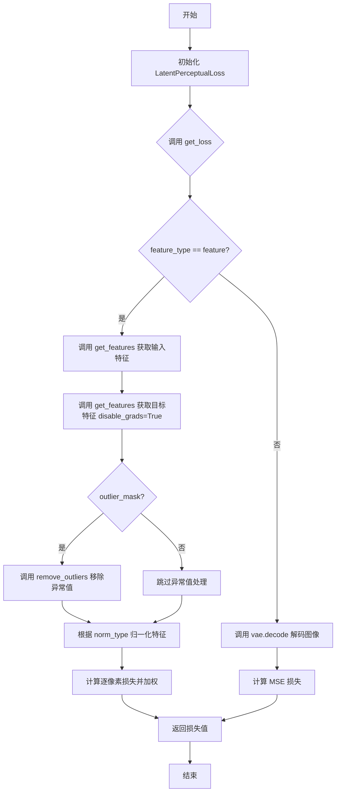
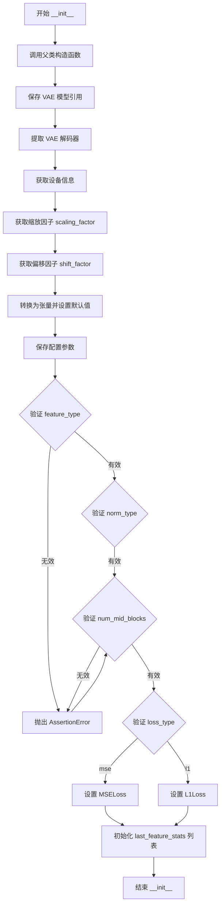
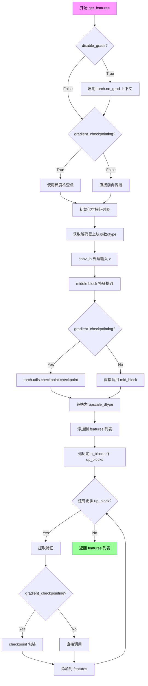
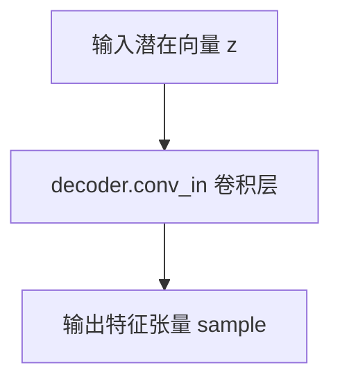
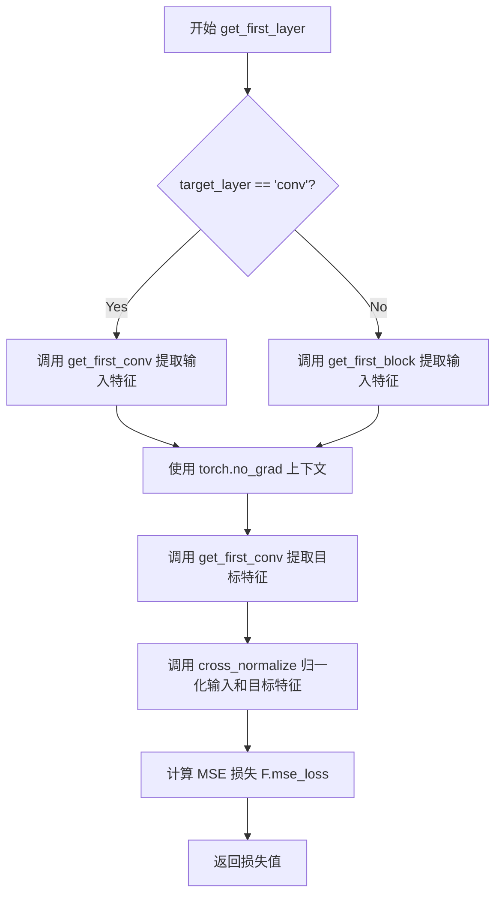

```mermaid
flowchart TD
    A[输入特征 feat] --> B[根据 down_f 调整 opening 和 closing 核大小]
    B --> C[展平特征: feat_flat = feat.flatten&#40;-2, -1&#41;]
    C --> D[计算分位数索引 k1, k2]
    D --> E[计算分位数阈值 q1, q2]
    E --> F[动态计算标准差边界: m = 2 * std]
    F --> G[生成初始掩码: q1-m < feat < q2+m]
    G --> H[闭运算: MaxPool2d 扩展掩码区域]
    H --> I[开运算: 反向 MaxPool2d 收缩掩码]
    I --> J[转换为布尔掩码]
    J --> K[feat = feat * mask]
    K --> L[返回 mask 和 feat]
```

# `diffusers\examples\research_projects\lpl\lpl_loss.py` 详细设计文档

该代码实现了一个基于VAE解码器的潜在感知损失函数（LatentPerceptualLoss），用于在特征空间或图像空间计算输入与目标之间的感知损失。支持梯度检查点、多归一化方式、异常值移除和多种损失类型（MSELoss/L1Loss），可有效提升图像生成或风格迁移任务的训练效果。

## 整体流程



## 类结构

```
LatentPerceptualLoss (nn.Module)
├── __init__ (构造函数)
├── get_features (获取特征)
├── get_loss (计算损失)
├── get_first_conv (获取首层卷积)
├── get_first_block (获取首块)
└── get_first_layer (获取第一层)

全局函数:
├── normalize_tensor (张量归一化)
├── cross_normalize (交叉归一化)
└── remove_outliers (异常值移除)
```

## 全局变量及字段


### `scale_factor`
    
VAE配置中的缩放因子，用于归一化输入数据

类型：`float | None`
    


### `shift_factor`
    
VAE配置中的平移因子，用于偏置调整输入数据

类型：`float | None`
    


### `device`
    
模型所在设备，决定计算运行的硬件平台

类型：`torch.device`
    


### `upscale_dtype`
    
上采样数据类型，用于特征图升维时的精度转换

类型：`torch.dtype`
    


### `sample`
    
中间计算张量，存储每层网络的前向传播结果

类型：`torch.Tensor`
    


### `features`
    
特征列表，保存从浅到深各层的中间特征输出

类型：`list[torch.Tensor]`
    


### `inp_f`
    
输入特征，由输入数据提取的潜在空间特征列表

类型：`list[torch.Tensor]`
    


### `tar_f`
    
目标特征，由目标数据提取的潜在空间特征列表

类型：`list[torch.Tensor]`
    


### `losses`
    
损失列表，存储各层特征匹配的损失值

类型：`list[torch.Tensor]`
    


### `loss_f`
    
损失权重因子，根据层级深度计算的衰减系数

类型：`float`
    


### `my`
    
异常值掩码，标记需要保留的像素位置

类型：`torch.Tensor (bool)`
    


### `outlier_ratio`
    
异常值比例，被判定为异常值的元素占比

类型：`float`
    


### `stats`
    
特征统计字典，包含均值、标准差和异常比例信息

类型：`dict[str, float]`
    


### `LatentPerceptualLoss.vae`
    
预训练的VAE模型，提供编码器和解码器结构

类型：`nn.Module`
    


### `LatentPerceptualLoss.decoder`
    
VAE解码器，用于从潜在向量重建特征

类型：`nn.Module`
    


### `LatentPerceptualLoss.scale`
    
缩放因子张量，将输入数据归一化到标准范围

类型：`torch.Tensor`
    


### `LatentPerceptualLoss.shift`
    
平移因子张量，在缩放后对输入进行偏置调整

类型：`torch.Tensor`
    


### `LatentPerceptualLoss.gradient_checkpointing`
    
梯度检查点标志，控制是否使用梯度 checkpointing 节省显存

类型：`bool`
    


### `LatentPerceptualLoss.pow_law`
    
幂律加权标志，控制是否采用幂律衰减的损失权重

类型：`bool`
    


### `LatentPerceptualLoss.norm_type`
    
归一化类型字符串，指定特征归一化的方式

类型：`str`
    


### `LatentPerceptualLoss.outlier_mask`
    
异常值移除标志，控制是否对特征进行异常值过滤

类型：`bool`
    


### `LatentPerceptualLoss.last_feature_stats`
    
特征统计信息列表，存储最近一次计算的各层特征统计

类型：`list[dict]`
    


### `LatentPerceptualLoss.feature_type`
    
特征类型字符串，指定损失是基于特征还是图像计算

类型：`str`
    


### `LatentPerceptualLoss.n_blocks`
    
中间块数量，指定使用解码器中中间块的数量

类型：`int`
    


### `LatentPerceptualLoss.loss_fn`
    
损失函数对象，计算特征间差异的损失计算器

类型：`nn.Loss`
    
    

## 全局函数及方法


### `normalize_tensor`

对输入特征进行L2归一化，将每个样本（沿dim=1）的特征向量除以其L2范数，并添加一个极小的epsilon值以避免除零错误，确保数值稳定性。

参数：

- `in_feat`：`torch.Tensor`，输入的特征张量，通常为4D张量（批大小、通道、高度、宽度）
- `eps`：`float`，默认值1e-10，用于防止除零的小常数，确保数值稳定性

返回值：`torch.Tensor`，返回L2归一化后的特征张量，与输入张量形状相同

#### 流程图

```mermaid
flowchart TD
    A[开始: normalize_tensor] --> B[输入特征张量 in_feat]
    B --> C[计算 in_feat²]
    C --> D[沿 dim=1 求和]
    D --> E[计算平方根得到范数 norm_factor]
    E --> F[添加 epsilon 防止除零]
    F --> G[返回 in_feat / (norm_factor + eps)]
    G --> H[结束]
```

#### 带注释源码

```python
def normalize_tensor(in_feat, eps=1e-10):
    """
    对输入特征进行L2归一化
    
    参数:
        in_feat: 输入的特征张量，形状为 (B, C, H, W) 或 (B, C)
        eps: 防止除零的小常数，默认值为 1e-10
    
    返回:
        归一化后的特征张量，形状与输入相同
    """
    # 计算L2范数：首先对特征求平方，然后在dim=1维度求和，最后开平方根
    # keepdim=True 保持维度以便广播操作
    norm_factor = torch.sqrt(torch.sum(in_feat**2, dim=1, keepdim=True))
    
    # 归一化：每个特征除以对应的L2范数，加上eps防止除零
    return in_feat / (norm_factor + eps)
```


### `cross_normalize`

该函数执行交叉 L2 归一化操作。它仅根据目标特征（target）的 L2 范数作为归一化因子，同时对输入特征（input）和目标特征（target）进行缩放。这种方法确保了归一化是基于目标特征的尺度，适用于特征匹配或度量学习场景，以消除特征向量大小的影响，专注于方向或几何属性的比较。

参数：
- `input`：`torch.Tensor`，需要进行归一化的输入特征张量。
- `target`：`torch.Tensor`，作为归一化参考的目标特征张量，归一化因子由其计算得出。
- `eps`：`float`（可选，默认为 1e-10），防止除零运算的极小值。

返回值：`Tuple[torch.Tensor, torch.Tensor]`，返回一个元组，包含归一化后的输入特征和归一化后的目标特征。

#### 流程图

```mermaid
flowchart TD
    A[输入 input, target] --> B[计算 target 的 L2 范数: norm_factor]
    B --> C[加入 eps 防止除零: norm_factor + eps]
    C --> D[归一化 input: input / norm_factor]
    C --> E[归一化 target: target / norm_factor]
    D --> F[输出 Tuple[归一化 input, 归一化 target]]
    E --> F
```

#### 带注释源码

```python
def cross_normalize(input, target, eps=1e-10):
    """
    对输入和目标特征进行基于目标特征的交叉L2归一化。

    参数:
        input (torch.Tensor): 输入特征张量。
        target (torch.Tensor): 目标特征张量，用于计算归一化因子。
        eps (float): 防止除零的极小值，默认为1e-10。

    返回:
        Tuple[torch.Tensor, torch.Tensor]: 
            - 归一化后的输入特征
            - 归一化后的目标特征
    """
    # 1. 计算目标特征 target 的 L2 范数（欧氏范数）
    #    dim=1 假设输入张量形状为 (batch, channel, height, width) 或 (batch, dim)
    #    keepdim=True 保持维度以便广播运算
    norm_factor = torch.sqrt(torch.sum(target**2, dim=1, keepdim=True))
    
    # 2. 归一化输入和目标：除以目标特征的范数（加上 eps 防止除零）
    #    注意：这里使用相同的 norm_factor 对 input 和 target 进行归一化
    return input / (norm_factor + eps), target / (norm_factor + eps)
```


### `remove_outliers`

该函数使用形态学开闭运算结合分位数统计方法，对输入特征张量进行异常值检测与去除。通过计算特征的分位数边界确定正常值范围，然后利用形态学操作（闭运算填充空洞、开运算去除孤立噪点）生成平滑的掩码，最终将异常值位置置零，适用于VAE特征图的离群点清洗。

参数：

- `feat`：`torch.Tensor`，输入的特征张量，通常为2D特征图（形状如 [B, C, H, W]）
- `down_f`：`int`，下采样因子，用于调整形态学核的大小，默认为1
- `opening`：`int`，开运算的核大小，用于去除孤立的异常点，默认为5
- `closing`：`int`，闭运算的核大小，用于填充掩码中的空洞，默认为3
- `m`：`int`，此处作为std的乘数因子（代码中实际未直接使用，而是动态计算），默认为100
- `quant`：`float`，分位数比例，用于确定异常值检测的上下界，默认为0.02（即2%和98%分位）

返回值：`tuple`，返回一个元组 (mask, feat)

- `mask`：`torch.Tensor`，布尔类型的掩码张量，True表示保留的像素，False表示被识别为异常值的像素
- `feat`：`torch.Tensor`，处理后的特征张量，异常值位置已被置零

#### 流程图



#### 带注释源码

```python
def remove_outliers(feat, down_f=1, opening=5, closing=3, m=100, quant=0.02):
    """
    使用形态学开闭运算和分位数方法去除特征中的异常值
    
    Parameters:
        feat: 输入特征张量 [B, C, H, W]
        down_f: 下采样因子，用于调整核大小
        opening: 开运算核大小（去除孤立噪点）
        closing: 闭运算核大小（填充空洞）
        m: 标准差乘数（代码中动态重新计算）
        quant: 分位数比例
    
    Returns:
        mask: 布尔掩码，True为保留区域
        feat: 处理后的特征
    """
    
    # 步骤1: 根据下采样因子调整形态学核大小
    opening = int(np.ceil(opening / down_f))
    closing = int(np.ceil(closing / down_f))
    
    # 确保核大小有效（偶数核会导致不对称处理）
    if opening == 2:
        opening = 3
    if closing == 2:
        closing = 1

    # 步骤2: 展平特征的最后两维（空间维度），便于计算全局统计量
    feat_flat = feat.flatten(-2, -1)  # [B, C, H*W]
    
    # 步骤3: 计算分位数索引（上下界）
    # quant=0.02 表示取2%分位和98%分位
    k1, k2 = int(feat_flat.shape[-1] * quant), int(feat_flat.shape[-1] * (1 - quant))
    
    # 步骤4: 获取分位数阈值
    # kthvalue返回第k小的值，k1为下界，k2为上界
    q1 = feat_flat.kthvalue(k1, dim=-1).values[..., None, None]
    q2 = feat_flat.kthvalue(k2, dim=-1).values[..., None, None]

    # 步骤5: 动态计算标准差边界
    # 使用2倍标准差作为容差范围，detach()避免影响梯度
    m = 2 * feat_flat.std(-1)[..., None, None].detach()
    
    # 步骤6: 生成初始掩码（正常值区域）
    # 落在 [q1-m, q2+m] 范围内的像素被保留
    mask = (q1 - m < feat) * (feat < q2 + m)

    # 步骤7: 形态学闭运算（先膨胀后腐蚀，等同于MaxPool）
    # 填充掩码中的小空洞，扩展保留区域
    mask = nn.MaxPool2d(
        kernel_size=closing, 
        stride=1, 
        padding=(closing - 1) // 2
    )(mask.float())

    # 步骤8: 形态学开运算（先腐蚀后膨胀）
    # 通过反向MaxPool实现腐蚀效果，去除孤立的异常区域
    mask = (-nn.MaxPool2d(
        kernel_size=opening, 
        stride=1, 
        padding=(opening - 1) // 2
    )(-mask)).bool()

    # 步骤9: 应用掩码，将异常值置零
    feat = feat * mask
    
    return mask, feat
```


### LatentPerceptualLoss.__init__

该方法是 `LatentPerceptualLoss` 类的构造函数，用于初始化潜在感知损失模型。它接收一个预训练的 VAE 模型和各种配置参数，设置损失函数的类型、归一化方式、梯度检查点策略、异常值处理等核心功能，并将 VAE 的解码器部分提取出来用于特征提取。

参数：

- `self`：隐式参数，表示类的实例本身
- `vae`：`torch.nn.Module`，预训练的变分自编码器（VAE）模型，用于提供解码器进行特征提取
- `loss_type`：`str`，损失函数类型，可选值为 "mse"（均方误差）或 "l1"（L1 损失），默认为 "mse"
- `grad_ckpt`：`bool`，是否启用梯度检查点以节省显存，默认为 True
- `pow_law`：`bool`，是否使用幂律衰减权重，默认为 False
- `norm_type`：`str`，特征归一化类型，可选值为 "default"、"shared" 或 "batch"，默认为 "default"
- `num_mid_blocks`：`int`，使用的中间块数量，范围为 0 到 4，默认为 4
- `feature_type`：`str`，特征类型，可选值为 "feature"（特征层面）或 "image"（图像层面），默认为 "feature"
- `remove_outliers`：`bool`，是否启用异常值移除，默认为 True

返回值：无（`None`），该方法为构造函数，仅初始化对象状态

#### 流程图



#### 带注释源码

```python
def __init__(
    self,
    vae,                    # 预训练的 VAE 模型
    loss_type="mse",         # 损失类型：'mse' 或 'l1'
    grad_ckpt=True,         # 是否启用梯度检查点
    pow_law=False,          # 是否使用幂律衰减
    norm_type="default",    # 归一化类型：'default', 'shared', 'batch'
    num_mid_blocks=4,       # 中间块数量 (0-4)
    feature_type="feature", # 特征类型：'feature' 或 'image'
    remove_outliers=True,   # 是否移除异常值
):
    # 调用父类 nn.Module 的初始化方法
    super().__init__()
    
    # 保存 VAE 模型引用
    self.vae = vae
    
    # 从 VAE 中提取解码器用于特征提取
    self.decoder = self.vae.decoder
    
    # 获取 VAE 所在的设备（CPU 或 GPU）
    device = next(self.vae.parameters()).device

    # 从 VAE 配置中获取缩放因子，若不存在则默认为 None
    scale_factor = getattr(self.vae.config, "scaling_factor", None)
    
    # 从 VAE 配置中获取偏移因子，若不存在则默认为 None
    shift_factor = getattr(self.vae.config, "shift_factor", None)

    # 将缩放因子转换为张量，若为 None 则使用默认值 1.0
    self.scale = torch.tensor(1.0 if scale_factor is None else scale_factor, device=device)
    
    # 将偏移因子转换为张量，若为 None 则使用默认值 0.0
    self.shift = torch.tensor(0.0 if shift_factor is None else shift_factor, device=device)

    # 保存梯度检查点配置
    self.gradient_checkpointing = grad_ckpt
    
    # 保存幂律衰减配置
    self.pow_law = pow_law
    
    # 归一化类型转为小写
    self.norm_type = norm_type.lower()
    
    # 保存异常值移除配置
    self.outlier_mask = remove_outliers
    
    # 初始化特征统计列表，用于日志记录
    self.last_feature_stats = []  # Store feature statistics for logging

    # 验证特征类型有效性
    assert feature_type in ["feature", "image"]
    self.feature_type = feature_type

    # 验证归一化类型有效性
    assert self.norm_type in ["default", "shared", "batch"]
    
    # 验证中间块数量在有效范围内
    assert num_mid_blocks >= 0 and num_mid_blocks <= 4
    self.n_blocks = num_mid_blocks

    # 验证损失类型有效性
    assert loss_type in ["mse", "l1"]
    
    # 根据损失类型选择对应的损失函数（reduction='none' 以支持后续掩码处理）
    if loss_type == "mse":
        self.loss_fn = nn.MSELoss(reduction="none")
    elif loss_type == "l1":
        self.loss_fn = nn.L1Loss(reduction="none")
```


### `LatentPerceptualLoss.get_features`

该方法从 VAE 解码器的中间块和上采样块中提取多尺度特征，用于计算感知损失。当启用梯度检查点时，通过在反向传播期间重新计算中间激活来节省显存。

参数：

- `z`：`torch.Tensor`，潜在空间向量，作为解码器的输入
- `latent_embeds`：`torch.Tensor | None`，潜在嵌入向量，传递给解码器的中间块和上采样块
- `disable_grads`：`bool`，是否禁用梯度计算，True 时使用 `torch.no_grad()` 上下文

返回值：`list[torch.Tensor]`，从解码器不同层级提取的特征列表，长度为 `num_mid_blocks + 1`

#### 流程图



#### 带注释源码

```python
def get_features(self, z, latent_embeds=None, disable_grads=False):
    """
    从 VAE 解码器提取多尺度特征用于感知损失计算
    
    参数:
        z: 潜在空间向量，解码器输入
        latent_embeds: 潜在嵌入，传递给解码器块
        disable_grads: 是否禁用梯度计算
    
    返回:
        features: 从解码器各层提取的特征列表
    """
    # 根据 disable_grads 决定是否启用梯度计算
    with torch.set_grad_enabled(not disable_grads):
        # 判断是否启用梯度检查点以节省显存
        if self.gradient_checkpointing and not disable_grads:
            # 定义自定义前向函数包装器，用于梯度检查点
            def create_custom_forward(module):
                def custom_forward(*inputs):
                    return module(*inputs)
                return custom_forward

            # 初始化特征列表
            features = []
            # 获取解码器上采样块的参数数据类型，用于后续类型转换
            upscale_dtype = next(iter(self.decoder.up_blocks.parameters())).dtype
            sample = z
            # 将潜在向量输入解码器的卷积输入层
            sample = self.decoder.conv_in(sample)

            # ----- 中间块 (Middle Block) 特征提取 -----
            # 使用梯度检查点调用中间块，use_reentrant=False 避免梯度计算冲突
            sample = torch.utils.checkpoint.checkpoint(
                create_custom_forward(self.decoder.mid_block),
                sample,
                latent_embeds,
                use_reentrant=False,
            )
            # 转换数据类型后添加到特征列表
            sample = sample.to(upscale_dtype)
            features.append(sample)

            # ----- 上采样块 (Up Blocks) 特征提取 -----
            # 遍历前 n_blocks 个上采样块
            for up_block in self.decoder.up_blocks[: self.n_blocks]:
                # 使用梯度检查点调用每个上采样块
                sample = torch.utils.checkpoint.checkpoint(
                    create_custom_forward(up_block),
                    sample,
                    latent_embeds,
                    use_reentrant=False,
                )
                features.append(sample)
            return features
        else:
            # ----- 非梯度检查点路径 -----
            features = []
            upscale_dtype = next(iter(self.decoder.up_blocks.parameters())).dtype
            sample = z
            sample = self.decoder.conv_in(sample)

            # 中间块：直接前向传播
            sample = self.decoder.mid_block(sample, latent_embeds)
            sample = sample.to(upscale_dtype)
            features.append(sample)

            # 上采样块：直接前向传播
            for up_block in self.decoder.up_blocks[: self.n_blocks]:
                sample = up_block(sample, latent_embeds)
                features.append(sample)
            return features
```


### `LatentPerceptualLoss.get_loss`

该方法为核心损失计算函数，支持两种特征类型（feature和image）：当为feature模式时，通过VAE解码器的中间层提取输入和目标的潜在特征，计算逐层感知损失并支持异常值过滤和特征归一化；当为image模式时，直接计算解码图像间的MSE损失。

参数：

- `input`：`torch.Tensor`，输入张量，通常为潜在空间向量或图像
- `target`：`torch.Tensor`，目标张量，与input结构相同，用于计算感知损失
- `get_hist`：`bool`（默认值：`False`），是否返回每层的损失直方图而非聚合损失

返回值：`torch.Tensor`，计算得到的感知损失值，当`get_hist=False`时返回标量损失，当`get_hist=True`时返回各层损失列表

#### 流程图

```mermaid
flowchart TD
    A[开始 get_loss] --> B{feature_type == 'feature'?}
    B -->|Yes| C[提取输入特征: get_features]
    B -->|No| D[解码图像: vae.decode]
    
    C --> E[提取目标特征: get_features<br/>disable_grads=True]
    E --> F[初始化损失列表和特征统计]
    
    F --> G{遍历特征层 i from 0 to n-1}
    G --> H{outlier_mask enabled?}
    H -->|Yes| I{i == 2?}
    H -->|No| J[创建全1掩码]
    
    I -->|Yes| K[remove_outliers with down_f=2]
    I -->|No| L{i in [3,4,5]?}
    L -->|Yes| M[remove_outliers with down_f=1]
    L -->|No| J
    
    K --> N[计算异常值比例]
    M --> N
    J --> N
    
    N --> O[记录特征统计信息<br/>mean, std, outlier_ratio]
    O --> P{normalize_type?}
    
    P -->|default| Q[normalize_tensor归一化]
    P -->|shared| R[cross_normalize交叉归一化]
    P -->|other| S[不归一化]
    
    Q --> T[计算损失: loss_fn * mask]
    R --> T
    S --> T
    
    T --> U[计算层权重: pow_law? 2^(-min(i,3)) : 1.0]
    U --> V[归约损失维度并求均值]
    V --> W[添加到损失列表]
    W --> G
    
    G --> X{get_hist?}
    X -->|Yes| Y[返回损失列表]
    X -->|No| Z[聚合损失: sum / len]
    Z --> AA[返回标量损失]
    
    D --> AB[F.mse_loss计算图像损失]
    AB --> AA
    
    Y --> BB[结束]
    AA --> BB
```

#### 带注释源码

```python
def get_loss(self, input, target, get_hist=False):
    """
    计算潜在感知损失，支持两种模式：特征模式（feature）和图像模式（image）
    
    参数:
        input: 输入张量，潜在空间向量或图像
        target: 目标张量，与input结构相同
        get_hist: 是否返回各层的损失列表，False返回聚合标量损失
    
    返回:
        感知损失值（标量或列表）
    """
    # 判断使用特征模式还是图像模式
    if self.feature_type == "feature":
        # ==================== 特征模式处理 ====================
        # 对输入进行缩放和偏移处理后提取特征
        # shift和scale来自VAE配置，用于将潜在向量归一化到合理范围
        inp_f = self.get_features(self.shift + input / self.scale)
        
        # 目标特征禁用梯度，避免对目标进行反向传播
        tar_f = self.get_features(self.shift + target / self.scale, disable_grads=True)
        
        # 初始化损失列表和特征统计记录器
        losses = []
        self.last_feature_stats = []  # 重置特征统计信息
        
        # 遍历每一层特征（通常包含middle block和n_blocks个up block）
        for i, (x, y) in enumerate(zip(inp_f, tar_f, strict=False)):
            # 创建全1掩码，假设所有特征都是有效的
            my = torch.ones_like(y).bool()
            outlier_ratio = 0.0
            
            # 如果启用了异常值过滤
            if self.outlier_mask:
                with torch.no_grad():
                    # 第2层使用较大的下采样因子（down_f=2）
                    if i == 2:
                        my, y = remove_outliers(y, down_f=2)
                        outlier_ratio = 1.0 - my.float().mean().item()
                    # 第3、4、5层使用较小的下采样因子（down_f=1）
                    elif i in [3, 4, 5]:
                        my, y = remove_outliers(y, down_f=1)
                        outlier_ratio = 1.0 - my.float().mean().item()
            
            # 记录特征统计信息（均值、标准差、异常值比例），用于日志
            with torch.no_grad():
                stats = {
                    "mean": y.mean().item(),
                    "std": y.std().item(),
                    "outlier_ratio": outlier_ratio,
                }
                self.last_feature_stats.append(stats)
            
            # 根据norm_type选择特征归一化方式
            if self.norm_type == "default":
                # 默认归一化：分别对输入和目标特征进行L2归一化
                x = normalize_tensor(x)
                y = normalize_tensor(y)
            elif self.norm_type == "shared":
                # 共享归一化：使用目标的范数对两者进行归一化
                x, y = cross_normalize(x, y, eps=1e-6)
            
            # 计算逐元素损失，并应用异常值掩码
            term_loss = self.loss_fn(x, y) * my
            
            # 根据层级计算损失权重：使用幂律衰减（早期层权重更高）
            # pow_law=True时：第0-3层权重分别为1.0, 0.5, 0.25, 0.125
            # pow_law=False时：所有层权重均为1.0
            loss_f = 2 ** (-min(i, 3)) if self.pow_law else 1.0
            
            # 对空间维度（dim 2,3）求和，乘以权重，再除以有效掩码数量
            # 最终对batch维度（dim 1）求均值，得到每样本的损失
            term_loss = term_loss.sum((2, 3)) * loss_f / my.sum((2, 3))
            losses.append(term_loss.mean((1,)))
        
        # 根据get_hist决定返回格式
        if get_hist:
            # 返回各层的损失列表（用于分析）
            return losses
        else:
            # 返回聚合损失：各层损失求和后取平均
            loss = sum(losses)
            return loss / len(inp_f)
    
    # ==================== 图像模式处理 ====================
    elif self.feature_type == "image":
        # 直接将输入和目标解码为图像，计算像素级MSE损失
        inp_f = self.vae.decode(input / self.scale).sample
        tar_f = self.vae.decode(target / self.scale).sample
        return F.mse_loss(inp_f, tar_f)
```


### `LatentPerceptualLoss.get_first_conv`

该方法用于获取 VAE 解码器的第一个卷积层的输出，它将潜在向量 `z` 通过解码器的输入卷积层（conv_in）进行处理，生成初始的特征表示。

参数：

- `z`：`torch.Tensor`，输入的潜在向量（latent vector），通常是从编码器输出的潜在表示

返回值：`torch.Tensor`，经过解码器输入卷积层处理后的特征张量

#### 流程图



#### 带注释源码

```python
def get_first_conv(self, z):
    """
    获取解码器第一个卷积层的输出特征
    
    参数:
        z: 输入的潜在向量，通常是编码器输出的latent representation
    
    返回:
        经过decoder.conv_in处理后的特征张量
    """
    # 将潜在向量z通过解码器的输入卷积层进行特征提取
    # conv_in是解码器的初始卷积层，负责将潜在空间向量映射到特征空间
    sample = self.decoder.conv_in(z)
    
    # 返回卷积层的输出结果
    return sample
```


### `LatentPerceptualLoss.get_first_block`

该方法获取输入潜在向量（latent code）经过解码器的初始卷积层、中间块（mid_block）以及第一个上采样块（up_blocks[0]）中的残差网络层处理后的特征表示，主要用于计算第一层特征级别的感知损失。

参数：

- `z`：`torch.Tensor`，输入的潜在向量（latent code），通常来自 VAE 的编码器输出

返回值：`torch.Tensor`，经过解码器第一个块处理后的特征张量（sample）

#### 流程图

```mermaid
flowchart TD
    A[输入 latent tensor z] --> B[decoder.conv_in(z)<br/>初始卷积层投影]
    B --> C[decoder.mid_block(sample)<br/>中间块处理]
    C --> D{遍历 up_blocks[0].resnets}
    D -->|第1个 resnet| E[resnet(sample, None)<br/>残差网络层1]
    D -->|第2个 resnet| F[resnet(sample, None)<br/>残差网络层2]
    D -->|第n个 resnet| G[resnet(sample, None)<br/>残差网络层n]
    E --> H[返回 sample<br/>最终特征张量]
    F --> H
    G --> H
```

#### 带注释源码

```python
def get_first_block(self, z):
    """
    获取输入潜在向量经过解码器第一个块处理后的特征表示。
    
    该方法执行以下操作：
    1. 通过初始卷积层 (conv_in) 将潜在向量投影到特征空间
    2. 通过中间块 (mid_block) 进行特征处理
    3. 遍历第一个上采样块中的所有残差网络层进行特征提取
    
    参数:
        z: 输入的潜在向量，通常来自 VAE 编码器的输出
        
    返回:
        sample: 经过第一个解码块处理后的特征张量
    """
    # 步骤1: 通过初始卷积层将潜在向量投影到特征空间
    # conv_in 是解码器的输入卷积层，将 latent space 映射到特征空间
    sample = self.decoder.conv_in(z)
    
    # 步骤2: 通过中间块处理特征
    # mid_block 是 VAE 解码器中的中间层，负责进一步的特征转换
    sample = self.decoder.mid_block(sample)
    
    # 步骤3: 遍历第一个上采样块中的所有残差网络层
    # up_blocks[0] 是第一个上采样块，包含多个 resnet 残差网络层
    # 第二个参数 None 表示不使用额外的条件嵌入 (latent_embeds)
    for resnet in self.decoder.up_blocks[0].resnets:
        sample = resnet(sample, None)
    
    # 返回处理后的特征张量
    return sample
```


### `LatentPerceptualLoss.get_first_layer`

该方法用于计算输入张量和目标张量在第一层（卷积层或第一个残差块）特征之间的均方误差损失。它首先根据 `target_layer` 参数选择提取特征的层类型，然后对输入和目标分别提取特征，接着使用 `cross_normalize` 函数对特征进行归一化处理，最后返回归一化特征之间的 MSE 损失值。

参数：

- `input`：`torch.Tensor`，输入张量，通常是经过 VAE 编码的潜在向量
- `target`：`torch.Tensor`，目标张量，通常是另一个经过 VAE 编码的潜在向量
- `target_layer`：`str`，指定目标层的类型，默认为 `"conv"`，可选值为 `"conv"` 或 `"block"`，用于决定提取特征的层

返回值：`torch.Tensor`，返回计算得到的均方误差损失值，形状为标量

#### 流程图



#### 带注释源码

```python
def get_first_layer(self, input, target, target_layer="conv"):
    """
    计算输入和目标在第一层特征之间的 MSE 损失
    
    参数:
        input: 输入张量，通常是潜在向量
        target: 目标张量，通常是另一个潜在向量  
        target_layer: 字符串，指定使用卷积层还是块层来提取特征
    
    返回:
        均方误差损失值
    """
    # 根据 target_layer 参数选择特征提取方式
    if target_layer == "conv":
        # 使用第一层卷积层提取特征
        feat_in = self.get_first_conv(input)
        # 使用 torch.no_grad() 上下文管理器，不计算目标特征的梯度
        with torch.no_grad():
            feat_tar = self.get_first_conv(target)
    else:
        # 使用第一个残差块提取特征
        feat_in = self.get_first_block(input)
        with torch.no_grad():
            feat_tar = self.get_first_block(target)

    # 对输入和目标特征进行交叉归一化
    # 这会根据目标的范数对两个特征进行归一化
    feat_in, feat_tar = cross_normalize(feat_in, feat_tar)

    # 计算均方误差损失，使用 mean  reduction 方式
    return F.mse_loss(feat_in, feat_tar, reduction="mean")
```

## 关键组件


### 张量索引与惰性加载

代码通过 `torch.utils.checkpoint.checkpoint` 实现梯度检查点技术，将梯度计算拆分为多个小段以节省显存，这是典型的惰性加载模式。特征提取从 `decoder.conv_in` 开始，经过 `mid_block` 和 `up_blocks`，使用索引切片 `[: self.n_blocks]` 选取部分块进行计算。

### 反量化支持

通过 `scale_factor` 和 `shift_factor` 实现反量化功能。在 `get_loss` 方法中，输入和目标张量经过 `self.shift + input / self.scale` 变换，将量化域的值转换回原始浮点域。`scale` 和 `shift` 作为可学习参数存储在模型设备上。

### 量化策略

该模块采用动态量化策略，缩放因子和偏移量从 VAE 配置中读取，支持 `None` 值时的默认值处理（分别为 1.0 和 0.0）。特征归一化提供三种模式：`default`（逐特征 L2 归一化）、`shared`（交叉归一化）和 `batch`（批归一化），配合 `pow_law` 加权衰减机制调整不同层级的损失贡献。

### 离群点移除机制

`remove_outliers` 函数使用形态学开闭运算处理特征图离群值，通过分位数计算阈值上下界，结合标准差自适应调整掩码范围。对特定层级（i==2, i in [3,4,5]）应用不同下采样因子，并在 `get_loss` 中根据 `outlier_mask` 标志位动态启用离群点屏蔽。

### 特征统计追踪

`last_feature_stats` 列表存储每层特征的统计信息（均值、标准差、离群点比例），在 `get_loss` 方法中通过 `torch.no_grad()` 上下文计算并记录，用于监控训练过程中特征分布的演变。

### 梯度控制流

`get_features` 方法支持 `disable_grads` 参数控制梯度计算，结合 `gradient_checkpointing` 标志实现计算效率与显存占用的权衡。使用 `torch.set_grad_enabled` 上下文管理器全局控制梯度计算状态。


## 问题及建议


### 已知问题

-   **硬编码的索引和参数**: `get_loss` 方法中 `i == 2` 和 `i in [3, 4, 5]`、以及 `down_f=1/2`、损失权重计算中的 `min(i, 3)` 等都是硬编码的魔法数字，缺乏可配置性
-   **重复代码**: `get_features` 方法中 checkpoint 分支和非 checkpoint 分支存在大量重复代码（除了实际执行调用外，初始化逻辑几乎相同）
-   **类型注解完全缺失**: 所有函数参数、返回值、类属性均无类型注解，降低了代码可维护性和 IDE 支持
-   **变量命名不一致**: 类中同时存在 `num_mid_blocks` 和 `n_blocks` 两种命名，`outlier_mask` 与 `remove_outliers` 语义重复容易混淆
-   **设备迁移支持不足**: `scale` 和 `shift` 在 `__init__` 时固定设备上，如果模型被移动到其他设备，这些张量不会自动跟随迁移
-   **统计信息设计缺陷**: `last_feature_stats` 每次调用 `get_loss` 都被重置，无法保留历史记录，且作为可变状态可能导致意外的副作用
-   **normalize_tensor 可简化**: `normalize_tensor` 函数手动实现范数计算，但 `torch.nn.functional.normalize` 已提供相同功能
-   **断言用于业务逻辑**: 使用 `assert` 进行 feature_type、norm_type 等参数验证，这些应该在运行时用 ValueError 处理而非 assert（生产环境可能被优化掉）
-   **缺失文档字符串**: 所有类和方法都没有 docstring，无法生成文档
-   **潜在除零风险**: `remove_outliers` 中 `q1 - m < feat < q2 + m` 当 `m` 很大时可能产生意外掩码，且 detach 后的 std 计算可能导致梯度不一致

### 优化建议

-   将硬编码的索引和参数提取为类属性或构造函数参数，添加配置接口
-   重构 `get_features` 方法，使用 DRY 原则，通过一个标志位控制是否使用 checkpoint，避免代码重复
-   为所有函数添加类型注解（Python 3.9+ 类型提示），包括 `Tensor`、`Optional`、`List`、`Dict` 等
-   统一命名规范，使用 `num_mid_blocks` 替代 `n_blocks`，`self.enable_outlier_mask` 替代 `outlier_mask`
-   实现 `to()` 方法或使用 `register_buffer` 确保 `scale` 和 `shift` 随模型一起迁移到目标设备
-   将 `last_feature_stats` 改为可选返回而非类成员变量，或者提供独立的统计日志类
-   使用 `F.normalize` 替代手写的 `normalize_tensor`，提高可读性和性能
-   将 assert 替换为明确的参数验证和 ValueError 异常抛出
-   为所有公开方法添加详细的 docstring，说明参数、返回值和异常
-   检查 `remove_outliers` 中的边界条件，确保异常输入有明确处理


## 其它


### 设计目标与约束

本模块旨在提供一种基于VAE潜在空间的感知损失计算方法，用于图像重建质量评估。其核心设计目标包括：1）支持特征级和图像级两种损失计算模式；2）通过异常值移除提升损失函数的鲁棒性；3）支持梯度检查点以降低显存占用；4）提供多种归一化策略以适应不同场景。设计约束包括：依赖PyTorch和numpy库，要求输入的VAE模型包含decoder组件，且num_mid_blocks参数必须在0-4范围内。

### 错误处理与异常设计

代码中的断言检查涵盖了关键参数的合法性验证：feature_type仅支持"feature"和"image"；norm_type仅支持"default"、"shared"和"batch"；num_mid_blocks必须为0-4的整数；loss_type仅支持"mse"和"l1"。对于可能出现的除零错误，通过eps参数（默认为1e-10或1e-6）进行保护。当VAE配置中缺少scaling_factor或shift_factor时，会使用默认值1.0和0.0。

### 数据流与状态机

主要数据流如下：输入的input和target张量首先经过scale和shift处理，然后根据feature_type选择处理路径。若为feature模式，则通过get_features方法提取潜在空间特征；若为image模式，则通过vae.decode解码后再计算MSE损失。异常值移除模块remove_outliers在特定层级（i==2和i in [3,4,5]）被调用，生成掩码mask用于加权损失计算。状态机方面，last_feature_stats列表用于存储每次get_loss调用时的特征统计信息。

### 外部依赖与接口契约

主要依赖包括：numpy（用于数值计算）、torch和torch.nn（深度学习框架）、torch.nn.functional（函数式操作）。核心接口契约：VAE模型必须包含decoder属性，且decoder需具备conv_in、mid_block和up_blocks属性；up_blocks中的每个block需支持可调用执行；VAE需提供decode方法且返回包含sample属性的对象。

### 性能考虑与优化空间

当前实现已通过gradient_checkpointing支持梯度检查点以节省显存。潜在优化方向包括：1）remove_outliers中的kthvalue操作可考虑使用更高效的向量化实现；2）特征统计信息的存储（last_feature_stats）可考虑使用更轻量的数据结构；3）可考虑添加CUDA图优化以加速推理；4）可考虑对异常值检测阈值进行自适应调整。

### 配置参数说明

关键配置参数包括：vae（VAE模型实例，必需）、loss_type（损失类型，支持mse和l1，默认mse）、grad_ckpt（是否启用梯度检查点，默认True）、pow_law（是否使用幂律衰减权重，默认False）、norm_type（归一化类型，默认default）、num_mid_blocks（使用的中间块数量，默认4）、feature_type（特征类型，支持feature和image，默认feature）、remove_outliers（是否移除异常值，默认True）。

### 使用示例与调用流程

典型使用流程：1）实例化LatentPerceptualLoss，传入VAE模型和配置参数；2）调用get_loss方法，传入input和target张量；3）可选地通过get_hist获取各层损失列表；4）通过last_feature_stats获取特征统计信息。当需要第一层特征损失时，可调用get_first_layer方法，指定target_layer为"conv"或"block"。

### 安全考虑与边界情况

边界情况处理：1）当quant参数导致k1或k2为0时，kthvalue可能返回异常值；2）当mask全为False时，除法操作可能产生NaN；3）当特征张量维度不匹配时会导致运行时错误；4）梯度检查点在某些CUDA版本可能存在兼容性问题。安全建议：对输入张量形状进行显式检查，添加数值稳定性保护逻辑。

    