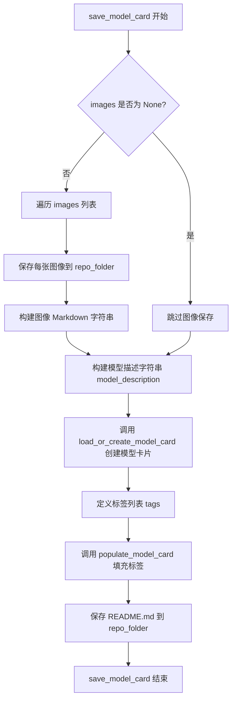
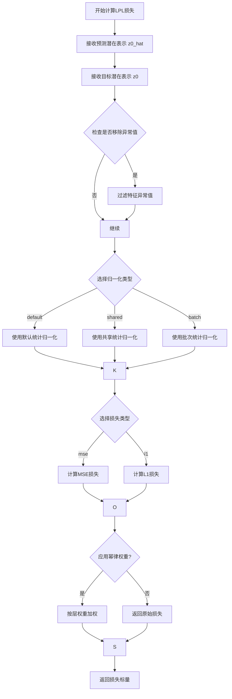
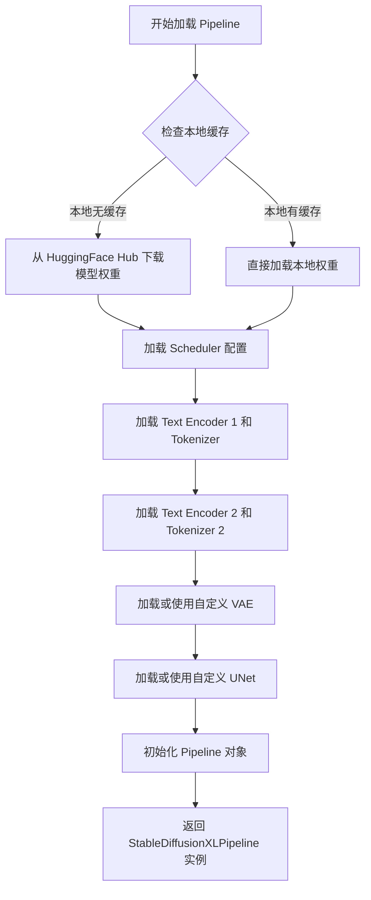
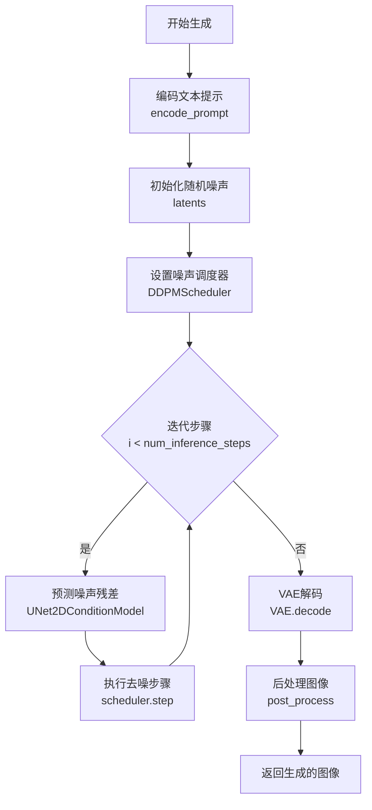
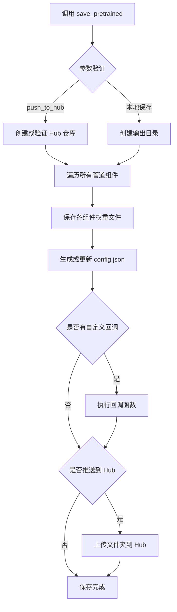
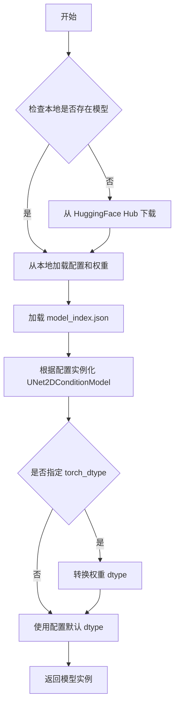
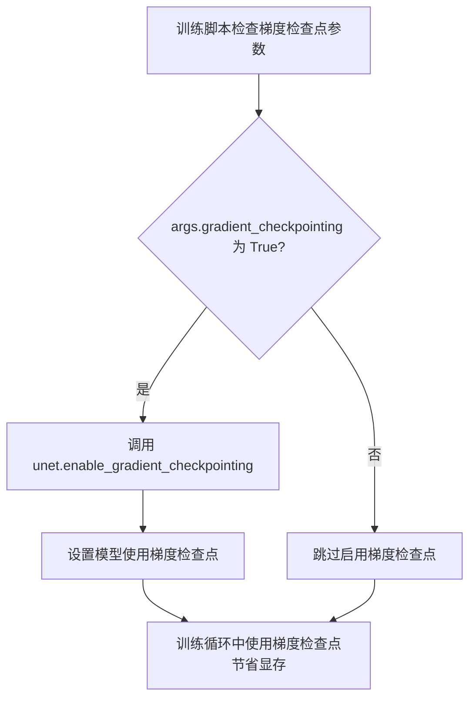
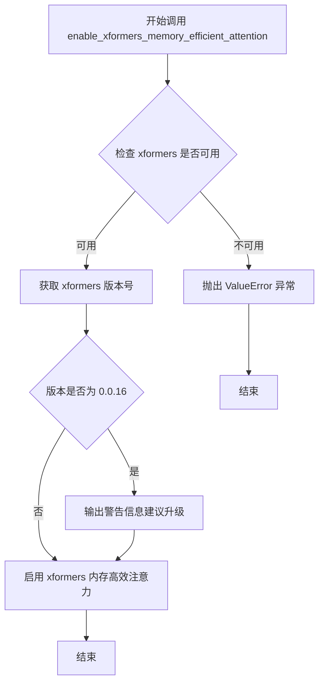

```mermaid
flowchart TD
    A[main函数入口] --> B[检查report_to与hub_token安全风险]
    B --> C[创建logging目录和Accelerator配置]
    C --> D[检查MPS混合精度兼容性]
    D --> E[初始化Accelerator]
    E --> F[配置日志级别]
    F --> G[设置随机种子]
    G --> H{是否需要创建Hub仓库}
    H -->|是| I[创建repo_id]
    H -->|否| J[加载tokenizers和text_encoders]
    I --> J
    J --> K[加载noise_scheduler, text_encoder, vae, unet]
    K --> L[冻结VAE和TextEncoders, 设置UNet为可训练]
    L --> M[配置weight_dtype和模型设备]
    M --> N{是否使用EMA}
    N -->|是| O[创建EMA模型]
    N -->|否| P[启用NPU Flash Attention]
    O --> P
    P --> Q{启用xformers}
    Q -->|是| R[检查xformers版本]
    Q -->|否| S[注册自定义保存/加载钩子]
    R --> S
    S --> T[启用gradient_checkpointing]
    T --> U[配置TF32加速]
    U --> V[计算学习率]
    V --> W[配置8-bit Adam优化器]
    W --> X[创建优化器]
    X --> Y[加载数据集]
    Y --> Z[预处理数据集]
    Z --> AA[预计算embeddings和VAE encodings]
    AA --> AB[删除text_encoders释放内存]
    AB --> AC[创建DataLoader]
    AC --> AD[创建lr_scheduler]
    AD --> AE[使用accelerator.prepare准备模型和优化器]
    AE --> AF[初始化trackers]
    AF --> AG{是否使用LPL}
    AG -->|是| AH[创建LatentPerceptualLoss对象]
    AG -->|否| AI[设置lpl_fn为None]
    AH --> AI
    AI --> AJ[开始训练循环: 遍历epochs]
    AJ --> AK[遍历每个batch]
    AK --> AL[执行训练步骤: 前向传播、损失计算、反向传播]
    AL --> AM{sync_gradients?}
    AM -->|是| AN[EMA更新、记录日志、保存checkpoint]
    AM -->|否| AO[跳过更新]
    AN --> AP{global_step >= max_train_steps?}
    AP -->|否| AK
    AP -->|是| AQ[结束训练循环]
    AO --> AP
    AQ --> AR{是否运行validation}
    AR -->|是| AS[执行验证推理]
    AR -->|否| AT[保存最终模型]
    AS --> AT
    AT --> AU[推送至Hub]
    AU --> AV[结束训练]
```

# `diffusers\examples\research_projects\lpl\train_sdxl_lpl.py` 详细设计文档

A comprehensive PyTorch training script for fine-tuning Stable Diffusion XL (SDXL) using standard noise prediction loss combined with an optional Latent Perceptual Loss (LPL). It leverages the `diffusers` library for model management and `accelerate` for distributed training, supporting features like EMA, gradient checkpointing, mixed precision, and validation with model uploading.

## 整体流程

```mermaid
graph TD
    Start([Start]) --> Args[Parse Arguments]
    Args --> Init[Initialize Accelerator & Logging]
    Init --> Load[Load Models & Tokenizers]
    Load --> Preprocess[Preprocess Dataset (Embeddings & VAE)]
    Preprocess --> Loop{Training Loop}
    Loop --> Batch[Get Batch]
    Batch --> Noise[Sample Noise & Timesteps]
    Noise --> Forward[Forward Diffusion (Add Noise)]
    Forward --> Predict[UNet Prediction]
    Predict --> Loss[Calculate Loss (MSE + LPL)]
    Loss --> Backward[Backward Pass & Optimizer Step]
    Backward --> Check{EMA Enabled?}
    Check -- Yes --> EMA[Update EMA Model]
    Check -- No --> Log[Log & Checkpoint]
    EMA --> Log
    Log --> Valid{Validation Epoch?}
    Valid -- Yes --> Inference[Run Validation Inference]
    Valid -- No --> Next[Next Step]
    Inference --> SaveState[Save State]
    Next --> Loop
    SaveState --> Loop
    Loop --> Finalize[Save & Push to Hub]
    Finalize --> End([End])
```

## 类结构

```
SDXL Training Script
├── Dependencies
│   ├── Diffusers Models
│   │   ├── UNet2DConditionModel (Trainable)
│   │   ├── AutoencoderKL (Frozen)
│   │   └── StableDiffusionXLPipeline (Inference)
│   ├── Transformers (Tokenizers)
│   └── Accelerate (Training Utils)
├── Custom Components
│   └── LatentPerceptualLoss (LPL)
└── Workflow Stages
    ├── Configuration & Setup
    ├── Data Preparation (Encoding)
    ├── Training Loop (Forward/Backward)
    └── Validation & Saving
```

## 全局变量及字段


### `hook_features`
    
Global dictionary to store intermediate features from hooks

类型：`Dict[str, torch.Tensor]`
    


### `logger`
    
Logger for recording training logs

类型：`logging.Logger`
    


### `DATASET_NAME_MAPPING`
    
Mapping of dataset names to column names for dataset loading

类型：`dict`
    


### `LatentPerceptualLoss.vae`
    
VAE model used for feature extraction in Latent Perceptual Loss

类型：`AutoencoderKL`
    


### `LatentPerceptualLoss.loss_type`
    
Type of loss function for LPL (e.g., 'mse' or 'l1')

类型：`str`
    


### `LatentPerceptualLoss.num_mid_blocks`
    
Number of up blocks used for LPL feature extraction

类型：`int`
    


### `LatentPerceptualLoss.feature_type`
    
Type of features to extract, typically set to 'feature'

类型：`str`
    


### `StableDiffusionXLPipeline.unet`
    
UNet condition model for Stable Diffusion XL denoising process

类型：`UNet2DConditionModel`
    


### `StableDiffusionXLPipeline.vae`
    
VAE model for encoding images to latents and decoding back in Stable Diffusion XL

类型：`AutoencoderKL`
    


### `StableDiffusionXLPipeline.text_encoder`
    
Text encoder for encoding prompts into embeddings in Stable Diffusion XL

类型：`CLIPTextModel`
    


### `StableDiffusionXLPipeline.scheduler`
    
Noise scheduler controlling the diffusion process in Stable Diffusion XL

类型：`DDPMScheduler`
    


### `UNet2DConditionModel.config`
    
Configuration object storing parameters for UNet2DConditionModel

类型：`PretrainedConfig`
    
    

## 全局函数及方法


### `parse_args`

该函数是 Stable Diffusion XL 训练脚本的命令行参数解析器，通过 argparse 库定义并解析所有训练相关的配置参数，包括模型路径、数据集配置、训练超参数、优化器设置、验证选项等，并进行必要的合法性检查，最终返回一个包含所有配置参数的 Namespace 对象。

参数：

- `input_args`：`Optional[List[str]]`，可选的输入参数列表。如果为 `None`，则从系统命令行参数（`sys.argv`）解析；如果提供了具体列表，则解析该列表而非命令行。

返回值：`argparse.Namespace`，返回包含所有解析后命令行参数的命名空间对象，其中属性名称对应命令行参数名称（去除前缀 `--`），属性值为参数值。

#### 流程图

```mermaid
flowchart TD
    A[开始 parse_args] --> B[创建 ArgumentParser]
    B --> C[添加所有训练相关参数]
    C --> D{input_args 是否为 None?}
    D -->|是| E[parser.parse_args]
    D -->|否| F[parser.parse_args(input_args)]
    E --> G[检查 LOCAL_RANK 环境变量]
    F --> G
    G --> H[同步 local_rank 参数]
    H --> I{合法性检查: dataset_name 和 train_data_dir}
    I -->|通过| J{合法性检查: proportion_empty_prompts 范围}
    J -->|通过| K[返回 args 命名空间]
    I -->|失败| L[抛出 ValueError]
    J -->|失败| M[抛出 ValueError]
```

#### 带注释源码

```python
def parse_args(input_args=None):
    """
    解析命令行参数，用于配置 Stable Diffusion XL 训练脚本。
    
    参数:
        input_args: 可选的参数列表。如果为 None，则从 sys.argv 解析。
    
    返回:
        包含所有训练配置的 argparse.Namespace 对象。
    """
    # 创建参数解析器，添加描述信息
    parser = argparse.ArgumentParser(description="LPL based training script of Stable Diffusion XL.")
    
    # ==================== 模型相关参数 ====================
    parser.add_argument(
        "--pretrained_model_name_or_path",
        type=str,
        default=None,
        required=True,
        help="Path to pretrained model or model identifier from huggingface.co/models.",
    )
    parser.add_argument(
        "--pretrained_vae_model_name_or_path",
        type=str,
        default=None,
        help="Path to pretrained VAE model with better numerical stability.",
    )
    parser.add_argument(
        "--revision",
        type=str,
        default=None,
        required=False,
        help="Revision of pretrained model identifier from huggingface.co/models.",
    )
    parser.add_argument(
        "--variant",
        type=str,
        default=None,
        help="Variant of the model files, e.g. fp16",
    )
    
    # ==================== 数据集相关参数 ====================
    parser.add_argument(
        "--dataset_name",
        type=str,
        default=None,
        help="The name of the Dataset from HuggingFace hub to train on.",
    )
    parser.add_argument(
        "--dataset_config_name",
        type=str,
        default=None,
        help="The config of the Dataset, leave as None if there's only one config.",
    )
    parser.add_argument(
        "--train_data_dir",
        type=str,
        default=None,
        help="A folder containing the training data.",
    )
    parser.add_argument(
        "--image_column", 
        type=str, 
        default="image", 
        help="The column of the dataset containing an image."
    )
    parser.add_argument(
        "--caption_column",
        type=str,
        default="text",
        help="The column of the dataset containing a caption.",
    )
    parser.add_argument(
        "--proportion_empty_prompts",
        type=float,
        default=0,
        help="Proportion of image prompts to be replaced with empty strings.",
    )
    parser.add_argument(
        "--max_train_samples",
        type=int,
        default=None,
        help="Truncate the number of training examples to this value for debugging.",
    )
    
    # ==================== 输出和缓存相关参数 ====================
    parser.add_argument(
        "--output_dir",
        type=str,
        default="sdxl-model-finetuned",
        help="The output directory where the model predictions and checkpoints will be written.",
    )
    parser.add_argument(
        "--cache_dir",
        type=str,
        default=None,
        help="The directory where the downloaded models and datasets will be stored.",
    )
    parser.add_argument(
        "--seed",
        type=int,
        default=None,
        help="A seed for reproducible training.",
    )
    parser.add_argument(
        "--logging_dir",
        type=str,
        default="logs",
        help="TensorBoard log directory.",
    )
    parser.add_argument(
        "--report_to",
        type=str,
        default="tensorboard",
        help="The integration to report the results and logs to.",
    )
    
    # ==================== 图像处理参数 ====================
    parser.add_argument(
        "--resolution",
        type=int,
        default=1024,
        help="The resolution for input images.",
    )
    parser.add_argument(
        "--center_crop",
        default=False,
        action="store_true",
        help="Whether to center crop the input images to the resolution.",
    )
    parser.add_argument(
        "--random_flip",
        action="store_true",
        help="Whether to randomly flip images horizontally.",
    )
    
    # ==================== 训练参数 ====================
    parser.add_argument(
        "--train_batch_size",
        type=int,
        default=16,
        help="Batch size (per device) for the training dataloader."
    )
    parser.add_argument("--num_train_epochs", type=int, default=100)
    parser.add_argument(
        "--max_train_steps",
        type=int,
        default=None,
        help="Total number of training steps to perform.",
    )
    parser.add_argument(
        "--gradient_accumulation_steps",
        type=int,
        default=1,
        help="Number of updates steps to accumulate before performing a backward pass.",
    )
    parser.add_argument(
        "--gradient_checkpointing",
        action="store_true",
        help="Whether or not to use gradient checkpointing to save memory.",
    )
    parser.add_argument(
        "--learning_rate",
        type=float,
        default=1e-4,
        help="Initial learning rate (after the potential warmup period) to use.",
    )
    parser.add_argument(
        "--scale_lr",
        action="store_true",
        default=False,
        help="Scale the learning rate by the number of GPUs, gradient accumulation steps, and batch size.",
    )
    parser.add_argument(
        "--lr_scheduler",
        type=str,
        default="constant",
        help="The scheduler type to use.",
    )
    parser.add_argument(
        "--lr_warmup_steps",
        type=int,
        default=500,
        help="Number of steps for the warmup in the lr scheduler.",
    )
    parser.add_argument(
        "--max_grad_norm",
        default=1.0,
        type=float,
        help="Max gradient norm."
    )
    
    # ==================== 检查点相关参数 ====================
    parser.add_argument(
        "--checkpointing_steps",
        type=int,
        default=500,
        help="Save a checkpoint of the training state every X updates.",
    )
    parser.add_argument(
        "--checkpoints_total_limit",
        type=int,
        default=None,
        help="Max number of checkpoints to store.",
    )
    parser.add_argument(
        "--resume_from_checkpoint",
        type=str,
        default=None,
        help="Whether training should be resumed from a previous checkpoint.",
    )
    
    # ==================== 时间步偏置参数 ====================
    parser.add_argument(
        "--timestep_bias_strategy",
        type=str,
        default="none",
        choices=["earlier", "later", "range", "none"],
        help="The timestep bias strategy.",
    )
    parser.add_argument(
        "--timestep_bias_multiplier",
        type=float,
        default=1.0,
        help="The multiplier for the bias.",
    )
    parser.add_argument(
        "--timestep_bias_begin",
        type=int,
        default=0,
        help="The beginning timestep to bias when using range strategy.",
    )
    parser.add_argument(
        "--timestep_bias_end",
        type=int,
        default=1000,
        help="The final timestep to bias when using range strategy.",
    )
    parser.add_argument(
        "--timestep_bias_portion",
        type=float,
        default=0.25,
        help="The portion of timesteps to bias.",
    )
    
    # ==================== SNR 和 EMA 相关参数 ====================
    parser.add_argument(
        "--snr_gamma",
        type=float,
        default=None,
        help="SNR weighting gamma to be used if rebalancing the loss.",
    )
    parser.add_argument("--use_ema", action="store_true", help="Whether to use EMA model.")
    parser.add_argument(
        "--prediction_type",
        type=str,
        default=None,
        help="The prediction_type that shall be used for training.",
    )
    
    # ==================== 优化器相关参数 ====================
    parser.add_argument(
        "--allow_tf32",
        action="store_true",
        help="Whether or not to allow TF32 on Ampere GPUs.",
    )
    parser.add_argument(
        "--dataloader_num_workers",
        type=int,
        default=0,
        help="Number of subprocesses to use for data loading.",
    )
    parser.add_argument(
        "--use_8bit_adam",
        action="store_true",
        help="Whether or not to use 8-bit Adam from bitsandbytes."
    )
    parser.add_argument("--adam_beta1", type=float, default=0.9, help="The beta1 parameter for the Adam optimizer.")
    parser.add_argument("--adam_beta2", type=float, default=0.999, help="The beta2 parameter for the Adam optimizer.")
    parser.add_argument("--adam_weight_decay", type=float, default=1e-2, help="Weight decay to use.")
    parser.add_argument("--adam_epsilon", type=float, default=1e-08, help="Epsilon value for the Adam optimizer")
    
    # ==================== 分布式训练参数 ====================
    parser.add_argument("--local_rank", type=int, default=-1, help="For distributed training: local_rank")
    parser.add_argument(
        "--mixed_precision",
        type=str,
        default=None,
        choices=["no", "fp16", "bf16"],
        help="Whether to use mixed precision.",
    )
    
    # ==================== 硬件加速相关参数 ====================
    parser.add_argument(
        "--enable_npu_flash_attention",
        action="store_true",
        help="Whether or not to use npu flash attention."
    )
    parser.add_argument(
        "--enable_xformers_memory_efficient_attention",
        action="store_true",
        help="Whether or not to use xformers."
    )
    parser.add_argument("--noise_offset", type=float, default=0, help="The scale of noise offset.")
    
    # ==================== Hub 相关参数 ====================
    parser.add_argument("--push_to_hub", action="store_true", help="Whether or not to push the model to the Hub.")
    parser.add_argument("--hub_token", type=str, default=None, help="The token to use to push to the Model Hub.")
    parser.add_argument(
        "--hub_model_id",
        type=str,
        default=None,
        help="The name of the repository to keep in sync with the local output_dir.",
    )
    
    # ==================== 验证相关参数 ====================
    parser.add_argument(
        "--validation_prompt",
        type=str,
        default=None,
        help="A prompt that is used during validation to verify that the model is learning.",
    )
    parser.add_argument(
        "--num_validation_images",
        type=int,
        default=4,
        help="Number of images that should be generated during validation.",
    )
    parser.add_argument(
        "--validation_epochs",
        type=int,
        default=1,
        help="Run fine-tuning validation every X epochs.",
    )
    
    # ==================== LPL (Latent Perceptual Loss) 相关参数 ====================
    parser.add_argument(
        "--use_lpl",
        action="store_true",
        help="Whether to use Latent Perceptual Loss (LPL).",
    )
    parser.add_argument(
        "--lpl_weight",
        type=float,
        default=1.0,
        help="Weight for the Latent Perceptual Loss.",
    )
    parser.add_argument(
        "--lpl_t_threshold",
        type=int,
        default=200,
        help="Apply LPL only for timesteps t < lpl_t_threshold.",
    )
    parser.add_argument(
        "--lpl_loss_type",
        type=str,
        default="mse",
        choices=["mse", "l1"],
        help="Type of loss to use for LPL.",
    )
    parser.add_argument(
        "--lpl_norm_type",
        type=str,
        default="default",
        choices=["default", "shared", "batch"],
        help="Type of normalization to use for LPL features.",
    )
    parser.add_argument(
        "--lpl_pow_law",
        action="store_true",
        help="Whether to use power law weighting for LPL layers.",
    )
    parser.add_argument(
        "--lpl_num_blocks",
        type=int,
        default=4,
        help="Number of up blocks to use for LPL feature extraction.",
    )
    parser.add_argument(
        "--lpl_remove_outliers",
        action="store_true",
        help="Whether to remove outliers in LPL feature maps.",
    )
    parser.add_argument(
        "--lpl_scale",
        action="store_true",
        help="Whether to scale LPL loss by noise level weights.",
    )
    parser.add_argument(
        "--lpl_start",
        type=int,
        default=0,
        help="Step to start applying LPL loss.",
    )
    
    # ==================== 参数解析 ====================
    # 解析参数：根据 input_args 是否为空决定从命令行或列表解析
    if input_args is not None:
        args = parser.parse_args(input_args)
    else:
        args = parser.parse_args()
    
    # ==================== 环境变量同步 ====================
    # 检查 LOCAL_RANK 环境变量，如果存在则同步到 args.local_rank
    env_local_rank = int(os.environ.get("LOCAL_RANK", -1))
    if env_local_rank != -1 and env_local_rank != args.local_rank:
        args.local_rank = env_local_rank
    
    # ==================== 合法性检查 ====================
    # 检查点1：必须提供数据集名称或训练文件夹
    if args.dataset_name is None and args.train_data_dir is None:
        raise ValueError("Need either a dataset name or a training folder.")
    
    # 检查点2：proportion_empty_prompts 必须在 [0, 1] 范围内
    if args.proportion_empty_prompts < 0 or args.proportion_empty_prompts > 1:
        raise ValueError("`--proportion_empty_prompts` must be in the range [0, 1].")
    
    # 返回解析后的参数命名空间
    return args
```


### `main`

该函数是LPL训练脚本的核心入口，负责协调整个SDXL模型的微调训练流程，包括参数解析、模型加载与冻结、数据集预处理、训练循环（含LPL Loss计算）、验证推理及模型保存等完整生命周期。

参数：

- `args`：`argparse.Namespace`，包含所有训练超参数和配置（如模型路径、数据路径、学习率、训练步数、LPL相关参数等）

返回值：`None`，函数执行完成后直接退出

#### 流程图



#### 带注释源码

```python
def main(args):
    """
    SDXL LPL训练脚本的主函数。
    协调整个训练流程：模型加载、数据预处理、训练循环、验证和模型保存。
    """
    # -------------------------
    # 1. 基础配置与安全检查
    # -------------------------
    # 检查是否同时使用了wandb报告和hub_token（安全风险）
    if args.report_to == "wandb" and args.hub_token is not None:
        raise ValueError(
            "You cannot use both --report_to=wandb and --hub_token due to a security risk of exposing your token."
            " Please use `huggingface-cli login` to authenticate with the Hub."
        )

    # 创建日志目录和Accelerator项目配置
    logging_dir = Path(args.output_dir, args.logging_dir)
    accelerator_project_config = ProjectConfiguration(project_dir=args.output_dir, logging_dir=logging_dir)

    # 检查MPS设备对bf16混合精度的支持
    if torch.backends.mps.is_available() and args.mixed_precision == "bf16":
        raise ValueError(
            "Mixed precision training with bfloat16 is not supported on MPS. Please use fp16 (recommended) or fp32 instead."
        )

    # -------------------------
    # 2. 初始化Accelerator
    # -------------------------
    accelerator = Accelerator(
        gradient_accumulation_steps=args.gradient_accumulation_steps,
        mixed_precision=args.mixed_precision,
        log_with=args.report_to,
        project_config=accelerator_project_config,
    )

    # MPS设备禁用AMP
    if torch.backends.mps.is_available():
        accelerator.native_amp = False

    # 初始化wandb（如使用）
    if args.report_to == "wandb":
        if not is_wandb_available():
            raise ImportError("Make sure to install wandb if you want to use it for logging during training.")
        import wandb

    # -------------------------
    # 3. 配置日志系统
    # -------------------------
    # 在每个进程配置日志格式用于调试
    logging.basicConfig(
        format="%(asctime)s - %(levelname)s - %(name)s - %(message)s",
        datefmt="%m/%d/%Y %H:%M:%S",
        level=logging.INFO,
    )
    logger.info(accelerator.state, main_process_only=False)
    # 主进程设置详细日志，子进程设置错误日志
    if accelerator.is_local_main_process:
        datasets.utils.logging.set_verbosity_warning()
        transformers.utils.logging.set_verbosity_warning()
        diffusers.utils.logging.set_verbosity_info()
    else:
        datasets.utils.logging.set_verbosity_error()
        transformers.utils.logging.set_verbosity_error()
        diffusers.utils.logging.set_verbosity_error()

    # 设置随机种子（如指定）
    if args.seed is not None:
        set_seed(args.seed)

    # -------------------------
    # 4. 创建输出目录和Hub仓库
    # -------------------------
    if accelerator.is_main_process:
        if args.output_dir is not None:
            os.makedirs(args.output_dir, exist_ok=True)

        if args.push_to_hub:
            repo_id = create_repo(
                repo_id=args.hub_model_id or Path(args.output_dir).name, exist_ok=True, token=args.hub_token
            ).repo_id

    # -------------------------
    # 5. 加载模型组件
    # -------------------------
    # 加载两个tokenizer（SDXL使用两个文本编码器）
    tokenizer_one = AutoTokenizer.from_pretrained(
        args.pretrained_model_name_or_path,
        subfolder="tokenizer",
        revision=args.revision,
        use_fast=False,
    )
    tokenizer_two = AutoTokenizer.from_pretrained(
        args.pretrained_model_name_or_path,
        subfolder="tokenizer_2",
        revision=args.revision,
        use_fast=False,
    )

    # 导入正确的文本编码器类
    text_encoder_cls_one = import_model_class_from_model_name_or_path(
        args.pretrained_model_name_or_path, args.revision
    )
    text_encoder_cls_two = import_model_class_from_model_name_or_path(
        args.pretrained_model_name_or_path, args.revision, subfolder="text_encoder_2"
    )

    # 加载调度器和模型
    noise_scheduler = DDPMScheduler.from_pretrained(args.pretrained_model_name_or_path, subfolder="scheduler")
    
    # 加载文本编码器
    text_encoder_one = text_encoder_cls_one.from_pretrained(
        args.pretrained_model_name_or_path, subfolder="text_encoder", revision=args.revision, variant=args.variant
    )
    text_encoder_two = text_encoder_cls_two.from_pretrained(
        args.pretrained_model_name_or_path, subfolder="text_encoder_2", revision=args.revision, variant=args.variant
    )
    
    # 确定VAE路径并加载
    vae_path = (
        args.pretrained_model_name_or_path
        if args.pretrained_vae_model_name_or_path is None
        else args.pretrained_vae_model_name_or_path
    )
    vae = AutoencoderKL.from_pretrained(
        vae_path,
        subfolder="vae" if args.pretrained_vae_model_name_or_path is None else None,
        revision=args.revision,
        variant=args.variant,
    )
    
    # 加载UNet条件模型
    unet = UNet2DConditionModel.from_pretrained(
        args.pretrained_model_name_or_path, subfolder="unet", revision=args.revision, variant=args.variant
    )

    # -------------------------
    # 6. 冻结部分模型参数
    # -------------------------
    # 冻结VAE和文本编码器，只训练UNet
    vae.requires_grad_(False)
    text_encoder_one.requires_grad_(False)
    text_encoder_two.requires_grad_(False)
    unet.train()

    # 确定权重数据类型（混合精度）
    weight_dtype = torch.float32
    if accelerator.mixed_precision == "fp16":
        weight_dtype = torch.float16
    elif accelerator.mixed_precision == "bf16":
        weight_dtype = torch.bfloat16

    # 将模型移到设备并转换数据类型
    # VAE使用float32以避免NaN损失
    vae.to(accelerator.device, dtype=torch.float32)
    text_encoder_one.to(accelerator.device, dtype=weight_dtype)
    text_encoder_two.to(accelerator.device, dtype=weight_dtype)

    # -------------------------
    # 7. EMA配置
    # -------------------------
    if args.use_ema:
        ema_unet = UNet2DConditionModel.from_pretrained(
            args.pretrained_model_name_or_path, subfolder="unet", revision=args.revision, variant=args.variant
        )
        ema_unet = EMAModel(ema_unet.parameters(), model_cls=UNet2DConditionModel, model_config=ema_unet.config)

    # -------------------------
    # 8. 高级注意力配置
    # -------------------------
    # NPU Flash Attention
    if args.enable_npu_flash_attention:
        if is_torch_npu_available():
            logger.info("npu flash attention enabled.")
            unet.enable_npu_flash_attention()
        else:
            raise ValueError("npu flash attention requires torch_npu extensions and is supported only on npu devices.")
    
    # xFormers Memory Efficient Attention
    if args.enable_xformers_memory_efficient_attention:
        if is_xformers_available():
            import xformers
            xformers_version = version.parse(xformers.__version__)
            if xformers_version == version.parse("0.0.16"):
                logger.warning(
                    "xFormers 0.0.16 cannot be used for training in some GPUs..."
                )
            unet.enable_xformers_memory_efficient_attention()
        else:
            raise ValueError("xformers is not available. Make sure it is installed correctly")

    # -------------------------
    # 9. 自定义保存/加载钩子
    # -------------------------
    if version.parse(accelerate.__version__) >= version.parse("0.16.0"):
        def save_model_hook(models, weights, output_dir):
            if accelerator.is_main_process:
                if args.use_ema:
                    ema_unet.save_pretrained(os.path.join(output_dir, "unet_ema"))
                for i, model in enumerate(models):
                    model.save_pretrained(os.path.join(output_dir, "unet"))
                    if weights:
                        weights.pop()

        def load_model_hook(models, input_dir):
            if args.use_ema:
                load_model = EMAModel.from_pretrained(os.path.join(input_dir, "unet_ema"), UNet2DConditionModel)
                ema_unet.load_state_dict(load_model.state_dict())
                ema_unet.to(accelerator.device)
                del load_model
            for _ in range(len(models)):
                model = models.pop()
                load_model = UNet2DConditionModel.from_pretrained(input_dir, subfolder="unet")
                model.register_to_config(**load_model.config)
                model.load_state_dict(load_model.state_dict())
                del load_model

        accelerator.register_save_state_pre_hook(save_model_hook)
        accelerator.register_load_state_pre_hook(load_model_hook)

    # -------------------------
    # 10. Gradient Checkpointing
    # -------------------------
    if args.gradient_checkpointing:
        unet.enable_gradient_checkpointing()

    # TF32加速
    if args.allow_tf32:
        torch.backends.cuda.matmul.allow_tf32 = True

    # -------------------------
    # 11. 学习率缩放
    # -------------------------
    if args.scale_lr:
        args.learning_rate = (
            args.learning_rate * args.gradient_accumulation_steps * args.train_batch_size * accelerator.num_processes
        )

    # -------------------------
    # 12. 优化器配置
    # -------------------------
    # 8-bit Adam（如使用）
    if args.use_8bit_adam:
        try:
            import bitsandbytes as bnb
        except ImportError:
            raise ImportError("To use 8-bit Adam, please install the bitsandbytes library.")
        optimizer_class = bnb.optim.AdamW8bit
    else:
        optimizer_class = torch.optim.AdamW

    # 创建优化器
    params_to_optimize = unet.parameters()
    optimizer = optimizer_class(
        params_to_optimize,
        lr=args.learning_rate,
        betas=(args.adam_beta1, args.adam_beta2),
        weight_decay=args.adam_weight_decay,
        eps=args.adam_epsilon,
    )

    # -------------------------
    # 13. 数据集加载与预处理
    # -------------------------
    # 加载数据集
    if args.dataset_name is not None:
        dataset = load_dataset(
            args.dataset_name, args.dataset_config_name, cache_dir=args.cache_dir, data_dir=args.train_data_dir
        )
    else:
        data_files = {}
        if args.train_data_dir is not None:
            data_files["train"] = os.path.join(args.train_data_dir, "**")
        dataset = load_dataset(
            "imagefolder",
            data_files=data_files,
            cache_dir=args.cache_dir,
        )

    # 获取列名
    column_names = dataset["train"].column_names
    dataset_columns = DATASET_NAME_MAPPING.get(args.dataset_name, None)
    
    # 确定图像和caption列
    if args.image_column is None:
        image_column = dataset_columns[0] if dataset_columns is not None else column_names[0]
    else:
        image_column = args.image_column
    if args.caption_column is None:
        caption_column = dataset_columns[1] if dataset_columns is not None else column_names[1]
    else:
        caption_column = args.caption_column

    # 图像预处理变换
    train_resize = transforms.Resize(args.resolution, interpolation=transforms.InterpolationMode.BILINEAR)
    train_crop = transforms.CenterCrop(args.resolution) if args.center_crop else transforms.RandomCrop(args.resolution)
    train_flip = transforms.RandomHorizontalFlip(p=1.0)
    train_transforms = transforms.Compose([transforms.ToTensor(), transforms.Normalize([0.5], [0.5])])

    def preprocess_train(examples):
        """预处理训练图像：resize、crop、flip、normalize"""
        images = [image.convert("RGB") for image in examples[image_column]]
        original_sizes = []
        all_images = []
        crop_top_lefts = []
        for image in images:
            original_sizes.append((image.height, image.width))
            image = train_resize(image)
            if args.random_flip and random.random() < 0.5:
                image = train_flip(image)
            if args.center_crop:
                y1 = max(0, int(round((image.height - args.resolution) / 2.0)))
                x1 = max(0, int(round((image.width - args.resolution) / 2.0)))
                image = train_crop(image)
            else:
                y1, x1, h, w = train_crop.get_params(image, (args.resolution, args.resolution))
                image = crop(image, y1, x1, h, w)
            crop_top_left = (y1, x1)
            crop_top_lefts.append(crop_top_left)
            image = train_transforms(image)
            all_images.append(image)

        examples["original_sizes"] = original_sizes
        examples["crop_top_lefts"] = crop_top_lefts
        examples["pixel_values"] = all_images
        return examples

    # 应用预处理
    with accelerator.main_process_first():
        if args.max_train_samples is not None:
            dataset["train"] = dataset["train"].shuffle(seed=args.seed).select(range(args.max_train_samples))
        train_dataset = dataset["train"].with_transform(preprocess_train)

    # -------------------------
    # 14. 预计算Embeddings
    # -------------------------
    text_encoders = [text_encoder_one, text_encoder_two]
    tokenizers = [tokenizer_one, tokenizer_two]
    compute_embeddings_fn = functools.partial(
        encode_prompt,
        text_encoders=text_encoders,
        tokenizers=tokenizers,
        proportion_empty_prompts=args.proportion_empty_prompts,
        caption_column=args.caption_column,
    )
    compute_vae_encodings_fn = functools.partial(compute_vae_encodings, vae=vae)
    
    with accelerator.main_process_first():
        from datasets.fingerprint import Hasher
        new_fingerprint = Hasher.hash(args)
        new_fingerprint_for_vae = Hasher.hash((vae_path, args))
        train_dataset_with_embeddings = train_dataset.map(
            compute_embeddings_fn, batched=True, new_fingerprint=new_fingerprint
        )
        train_dataset_with_vae = train_dataset.map(
            compute_vae_encodings_fn,
            batched=True,
            batch_size=args.train_batch_size,
            new_fingerprint=new_fingerprint_for_vae,
        )
        precomputed_dataset = concatenate_datasets(
            [train_dataset_with_embeddings, train_dataset_with_vae.remove_columns(["image", "text"])], axis=1
        )
        precomputed_dataset = precomputed_dataset.with_transform(preprocess_train)

    # 释放文本编码器内存
    del compute_vae_encodings_fn, compute_embeddings_fn, text_encoder_one, text_encoder_two
    del text_encoders, tokenizers
    if not args.use_lpl:
        del vae
    gc.collect()
    
    # 清空缓存
    if is_torch_npu_available():
        torch_npu.npu.empty_cache()
    elif torch.cuda.is_available():
        torch.cuda.empty_cache()

    # -------------------------
    # 15. 创建DataLoader
    # -------------------------
    def collate_fn(examples):
        """自定义batch组装函数"""
        model_input = torch.stack([torch.tensor(example["model_input"]) for example in examples])
        original_sizes = [example["original_sizes"] for example in examples]
        crop_top_lefts = [example["crop_top_lefts"] for example in examples]
        prompt_embeds = torch.stack([torch.tensor(example["prompt_embeds"]) for example in examples])
        pooled_prompt_embeds = torch.stack([torch.tensor(example["pooled_prompt_embeds"]) for example in examples])

        return {
            "model_input": model_input,
            "prompt_embeds": prompt_embeds,
            "pooled_prompt_embeds": pooled_prompt_embeds,
            "original_sizes": original_sizes,
            "crop_top_lefts": crop_top_lefts,
        }

    train_dataloader = torch.utils.data.DataLoader(
        precomputed_dataset,
        shuffle=True,
        collate_fn=collate_fn,
        batch_size=args.train_batch_size,
        num_workers=args.dataloader_num_workers,
    )

    # -------------------------
    # 16. 学习率调度器
    # -------------------------
    overrode_max_train_steps = False
    num_update_steps_per_epoch = math.ceil(len(train_dataloader) / args.gradient_accumulation_steps)
    if args.max_train_steps is None:
        args.max_train_steps = args.num_train_epochs * num_update_steps_per_epoch
        overrode_max_train_steps = True

    lr_scheduler = get_scheduler(
        args.lr_scheduler,
        optimizer=optimizer,
        num_warmup_steps=args.lr_warmup_steps * args.gradient_accumulation_steps,
        num_training_steps=args.max_train_steps * args.gradient_accumulation_steps,
    )

    # -------------------------
    # 17. 使用Accelerator准备
    # -------------------------
    unet, optimizer, train_dataloader, lr_scheduler = accelerator.prepare(
        unet, optimizer, train_dataloader, lr_scheduler
    )

    if args.use_ema:
        ema_unet.to(accelerator.device)

    # 重新计算训练步数
    num_update_steps_per_epoch = math.ceil(len(train_dataloader) / args.gradient_accumulation_steps)
    if overrode_max_train_steps:
        args.max_train_steps = args.num_train_epochs * num_update_steps_per_epoch
    args.num_train_epochs = math.ceil(args.max_train_steps / num_update_steps_per_epoch)

    # 初始化trackers
    if accelerator.is_main_process:
        accelerator.init_trackers("text2image-fine-tune-sdxl", config=vars(args))

    # -------------------------
    # 18. LPL Loss初始化
    # -------------------------
    if args.use_lpl:
        lpl_fn = LatentPerceptualLoss(
            vae=vae,
            loss_type=args.lpl_loss_type,
            grad_ckpt=args.gradient_checkpointing,
            pow_law=args.lpl_pow_law,
            norm_type=args.lpl_norm_type,
            num_mid_blocks=args.lpl_num_blocks,
            feature_type="feature",
            remove_outliers=args.lpl_remove_outliers,
        )
        lpl_fn.to(accelerator.device)
    else:
        lpl_fn = None

    # 模型unwrap辅助函数
    def unwrap_model(model):
        model = accelerator.unwrap_model(model)
        model = model._orig_mod if is_compiled_module(model) else model
        return model

    # autocast上下文
    if torch.backends.mps.is_available() or "playground" in args.pretrained_model_name_or_path:
        autocast_ctx = nullcontext()
    else:
        autocast_ctx = torch.autocast(accelerator.device.type)

    # -------------------------
    # 19. 训练循环
    # -------------------------
    total_batch_size = args.train_batch_size * accelerator.num_processes * args.gradient_accumulation_steps
    logger.info("***** Running training *****")
    logger.info(f"  Num examples = {len(precomputed_dataset)}")
    logger.info(f"  Num Epochs = {args.num_train_epochs}")
    logger.info(f"  Instantaneous batch size per device = {args.train_batch_size}")
    logger.info(f"  Total train batch size = {total_batch_size}")
    logger.info(f"  Gradient Accumulation steps = {args.gradient_accumulation_steps}")
    logger.info(f"  Total optimization steps = {args.max_train_steps}")

    global_step = 0
    first_epoch = 0

    # 从checkpoint恢复（如指定）
    if args.resume_from_checkpoint:
        if args.resume_from_checkpoint != "latest":
            path = os.path.basename(args.resume_from_checkpoint)
        else:
            dirs = os.listdir(args.output_dir)
            dirs = [d for d in dirs if d.startswith("checkpoint")]
            dirs = sorted(dirs, key=lambda x: int(x.split("-")[1]))
            path = dirs[-1] if len(dirs) > 0 else None

        if path is None:
            accelerator.print(f"Checkpoint '{args.resume_from_checkpoint}' does not exist. Starting a new training run.")
            args.resume_from_checkpoint = None
            initial_global_step = 0
        else:
            accelerator.print(f"Resuming from checkpoint {path}")
            accelerator.load_state(os.path.join(args.output_dir, path))
            global_step = int(path.split("-")[1])
            initial_global_step = global_step
            first_epoch = global_step // num_update_steps_per_epoch
    else:
        initial_global_step = 0

    # 进度条
    progress_bar = tqdm(
        range(0, args.max_train_steps),
        initial=initial_global_step,
        desc="Steps",
        disable=not accelerator.is_local_main_process,
    )

    # 获取噪声调度器的alphas用于LPL计算
    alphas_cumprod = noise_scheduler.alphas_cumprod.to(accelerator.device)

    # 开始epoch循环
    for epoch in range(first_epoch, args.num_train_epochs):
        train_loss = 0.0
        for step, batch in enumerate(train_dataloader):
            with accelerator.accumulate(unet):
                # 采样噪声
                model_input = batch["model_input"].to(accelerator.device)
                noise = torch.randn_like(model_input)
                if args.noise_offset:
                    noise += args.noise_offset * torch.randn(
                        (model_input.shape[0], model_input.shape[1], 1, 1), device=model_input.device
                    )

                # 采样timestep
                bsz = model_input.shape[0]
                if args.timestep_bias_strategy == "none":
                    timesteps = torch.randint(
                        0, noise_scheduler.config.num_train_timesteps, (bsz,), device=model_input.device
                    )
                else:
                    weights = generate_timestep_weights(args, noise_scheduler.config.num_train_timesteps).to(
                        model_input.device
                    )
                    timesteps = torch.multinomial(weights, bsz, replacement=True).long()

                # 添加噪声（前向扩散）
                noisy_model_input = noise_scheduler.add_noise(model_input, noise, timesteps).to(dtype=weight_dtype)

                # 计算time_ids
                def compute_time_ids(original_size, crops_coords_top_left):
                    target_size = (args.resolution, args.resolution)
                    add_time_ids = list(original_size + crops_coords_top_left + target_size)
                    add_time_ids = torch.tensor([add_time_ids], device=accelerator.device, dtype=weight_dtype)
                    return add_time_ids

                add_time_ids = torch.cat(
                    [compute_time_ids(s, c) for s, c in zip(batch["original_sizes"], batch["crop_top_lefts"])]
                )

                # UNet预测
                unet_added_conditions = {"time_ids": add_time_ids}
                prompt_embeds = batch["prompt_embeds"].to(accelerator.device, dtype=weight_dtype)
                pooled_prompt_embeds = batch["pooled_prompt_embeds"].to(accelerator.device)
                unet_added_conditions.update({"text_embeds": pooled_prompt_embeds})
                model_pred = unet(
                    noisy_model_input,
                    timesteps,
                    prompt_embeds,
                    added_cond_kwargs=unet_added_conditions,
                    return_dict=False,
                )[0]

                # 确定损失目标
                if args.prediction_type is not None:
                    noise_scheduler.register_to_config(prediction_type=args.prediction_type)

                if noise_scheduler.config.prediction_type == "epsilon":
                    target = noise
                elif noise_scheduler.config.prediction_type == "v_prediction":
                    target = noise_scheduler.get_velocity(model_input, noise, timesteps)
                elif noise_scheduler.config.prediction_type == "sample":
                    target = model_input
                    model_pred = model_pred - noise
                else:
                    raise ValueError(f"Unknown prediction type {noise_scheduler.config.prediction_type}")

                # 计算MSE损失
                if args.snr_gamma is None:
                    loss = F.mse_loss(model_pred.float(), target.float(), reduction="mean")
                else:
                    # SNR加权损失
                    snr = compute_snr(noise_scheduler, timesteps)
                    mse_loss_weights = torch.stack([snr, args.snr_gamma * torch.ones_like(timesteps)], dim=1).min(dim=1)[0]
                    if noise_scheduler.config.prediction_type == "epsilon":
                        mse_loss_weights = mse_loss_weights / snr
                    elif noise_scheduler.config.prediction_type == "v_prediction":
                        mse_loss_weights = mse_loss_weights / (snr + 1)

                    loss = F.mse_loss(model_pred.float(), target.float(), reduction="none")
                    loss = loss.mean(dim=list(range(1, len(loss.shape)))) * mse_loss_weights
                    loss = loss.mean()

                # LPL损失计算
                lpl_loss_value = torch.tensor(0.0, device=accelerator.device)
                if args.use_lpl and lpl_fn is not None and global_step >= args.lpl_start:
                    lpl_mask = timesteps < args.lpl_t_threshold
                    if lpl_mask.any():
                        masked_indices = torch.where(lpl_mask)[0]
                        z0_masked = model_input[masked_indices]
                        zt_masked = noisy_model_input[masked_indices]
                        t_masked = timesteps[masked_indices]
                        model_pred_masked = model_pred[masked_indices]

                        # 计算z0_hat
                        alpha_t = alphas_cumprod[t_masked].sqrt().to(torch.float32)
                        sigma_t = (1 - alphas_cumprod[t_masked]).sqrt().to(torch.float32)
                        alpha_t = alpha_t.view(-1, 1, 1, 1)
                        sigma_t = sigma_t.view(-1, 1, 1, 1)

                        if noise_scheduler.config.prediction_type == "epsilon":
                            z0_hat_masked = (zt_masked.float() - sigma_t * model_pred_masked.float()) / alpha_t
                        elif noise_scheduler.config.prediction_type == "v_prediction":
                            z0_hat_masked = alpha_t * zt_masked.float() - sigma_t * model_pred_masked.float()
                        else:
                            z0_hat_masked = model_pred_masked.float()

                        with accelerator.autocast():
                            lpl_loss_value = lpl_fn.get_loss(z0_hat_masked, z0_masked)
                            if args.lpl_scale:
                                if args.snr_gamma is not None:
                                    snr = compute_snr(noise_scheduler, t_masked)
                                    snr_weights = torch.stack([snr, args.snr_gamma * torch.ones_like(t_masked)], dim=1).min(dim=1)[0]
                                    if noise_scheduler.config.prediction_type == "epsilon":
                                        snr_weights = snr_weights / snr
                                    elif noise_scheduler.config.prediction_type == "v_prediction":
                                        snr_weights = snr_weights / (snr + 1)
                                    lpl_loss_value = (lpl_loss_value * snr_weights).mean()
                                else:
                                    lpl_loss_value = lpl_loss_value.mean()
                            else:
                                lpl_loss_value = lpl_loss_value.mean()

                # 组合损失
                total_loss = loss + args.lpl_weight * lpl_loss_value

                # 反向传播
                avg_loss = accelerator.gather(total_loss.repeat(args.train_batch_size)).mean()
                train_loss += avg_loss.item() / args.gradient_accumulation_steps

                accelerator.backward(total_loss)
                if accelerator.sync_gradients:
                    params_to_clip = unet.parameters()
                    accelerator.clip_grad_norm_(params_to_clip, args.max_grad_norm)
                optimizer.step()
                lr_scheduler.step()
                optimizer.zero_grad()

            # 同步后的操作
            if accelerator.sync_gradients:
                if args.use_ema:
                    ema_unet.step(unet.parameters())
                progress_bar.update(1)
                global_step += 1

                # 记录日志
                log_data = {
                    "train_loss": train_loss,
                    "diffusion_loss": loss.item(),
                    "learning_rate": lr_scheduler.get_last_lr()[0],
                }
                # LPL相关日志
                if args.use_lpl and lpl_fn is not None and global_step >= args.lpl_start:
                    if lpl_mask.any():
                        log_data.update({
                            "lpl/loss": lpl_loss_value.item(),
                            "lpl/num_samples": lpl_mask.sum().item(),
                            "lpl/application_ratio": lpl_mask.float().mean().item(),
                        })
                accelerator.log(log_data, step=global_step)

                # 保存checkpoint
                if accelerator.distributed_type == DistributedType.DEEPSPEED or accelerator.is_main_process:
                    if global_step % args.checkpointing_steps == 0:
                        # 限制checkpoint数量
                        if args.checkpoints_total_limit is not None:
                            checkpoints = os.listdir(args.output_dir)
                            checkpoints = [d for d in checkpoints if d.startswith("checkpoint")]
                            checkpoints = sorted(checkpoints, key=lambda x: int(x.split("-")[1]))
                            if len(checkpoints) >= args.checkpoints_total_limit:
                                num_to_remove = len(checkpoints) - args.checkpoints_total_limit + 1
                                removing_checkpoints = checkpoints[0:num_to_remove]
                                for removing_checkpoint in removing_checkpoints:
                                    shutil.rmtree(os.path.join(args.output_dir, removing_checkpoint))

                        save_path = os.path.join(args.output_dir, f"checkpoint-{global_step}")
                        accelerator.save_state(save_path)
                        logger.info(f"Saved state to {save_path}")

            # 更新进度条
            if global_step >= args.max_train_steps:
                break

        # -------------------------
        # 20. 验证循环
        # -------------------------
        if accelerator.is_main_process:
            if args.validation_prompt is not None and epoch % args.validation_epochs == 0:
                logger.info(f"Running validation... Generating {args.num_validation_images} images with prompt: {args.validation_prompt}.")
                
                # 使用EMA模型（如启用）
                if args.use_ema:
                    ema_unet.store(unet.parameters())
                    ema_unet.copy_to(unet.parameters())

                # 创建pipeline
                vae = AutoencoderKL.from_pretrained(
                    vae_path,
                    subfolder="vae" if args.pretrained_vae_model_name_or_path is None else None,
                    revision=args.revision,
                    variant=args.variant,
                )
                pipeline = StableDiffusionXLPipeline.from_pretrained(
                    args.pretrained_model_name_or_path,
                    vae=vae,
                    unet=accelerator.unwrap_model(unet),
                    revision=args.revision,
                    variant=args.variant,
                    torch_dtype=weight_dtype,
                )
                pipeline = pipeline.to(accelerator.device)
                pipeline.set_progress_bar_config(disable=True)

                # 运行推理
                generator = torch.Generator(device=accelerator.device).manual_seed(args.seed) if args.seed is not None else None
                pipeline_args = {"prompt": args.validation_prompt}

                with autocast_ctx:
                    images = [
                        pipeline(**pipeline_args, generator=generator, num_inference_steps=25).images[0]
                        for _ in range(args.num_validation_images)
                    ]

                # 记录到tracker
                for tracker in accelerator.trackers:
                    if tracker.name == "tensorboard":
                        np_images = np.stack([np.asarray(img) for img in images])
                        tracker.writer.add_images("validation", np_images, epoch, dataformats="NHWC")
                    if tracker.name == "wandb":
                        tracker.log({"validation": [wandb.Image(image, caption=f"{i}: {args.validation_prompt}") for i, image in enumerate(images)]})

                del pipeline
                if is_torch_npu_available():
                    torch_npu.npu.empty_cache()
                elif torch.cuda.is_available():
                    torch.cuda.empty_cache()

                if args.use_ema:
                    ema_unet.restore(unet.parameters())

    # -------------------------
    # 21. 保存最终模型
    # -------------------------
    accelerator.wait_for_everyone()
    if accelerator.is_main_process:
        unet = unwrap_model(unet)
        if args.use_ema:
            ema_unet.copy_to(unet.parameters())

        # 保存pipeline
        vae = AutoencoderKL.from_pretrained(
            vae_path,
            subfolder="vae" if args.pretrained_vae_model_name_or_path is None else None,
            revision=args.revision,
            variant=args.variant,
            torch_dtype=weight_dtype,
        )
        pipeline = StableDiffusionXLPipeline.from_pretrained(
            args.pretrained_model_name_or_path,
            unet=unet,
            vae=vae,
            revision=args.revision,
            variant=args.variant,
            torch_dtype=weight_dtype,
        )
        pipeline.save_pretrained(args.output_dir)

        # 运行最终推理
        images = []
        if args.validation_prompt and args.num_validation_images > 0:
            pipeline = pipeline.to(accelerator.device)
            generator = torch.Generator(device=accelerator.device).manual_seed(args.seed) if args.seed is not None else None
            with autocast_ctx:
                images = [
                    pipeline(args.validation_prompt, num_inference_steps=25, generator=generator).images[0]
                    for _ in range(args.num_validation_images)
                ]

            # 记录最终图像
            for tracker in accelerator.trackers:
                if tracker.name == "tensorboard":
                    np_images = np.stack([np.asarray(img) for img in images])
                    tracker.writer.add_images("test", np_images, epoch, dataformats="NHWC")
                if tracker.name == "wandb":
                    tracker.log({"test": [wandb.Image(image, caption=f"{i}: {args.validation_prompt}") for i, image in enumerate(images)]})

        # 推送到Hub
        if args.push_to_hub:
            save_model_card(
                repo_id=repo_id,
                images=images,
                validation_prompt=args.validation_prompt,
                base_model=args.pretrained_model_name_or_path,
                dataset_name=args.dataset_name,
                repo_folder=args.output_dir,
                vae_path=args.pretrained_vae_model_name_or_path,
            )
            upload_folder(
                repo_id=repo_id,
                folder_path=args.output_dir,
                commit_message="End of training",
                ignore_patterns=["step_*", "epoch_*"],
            )

    accelerator.end_training()
```


### `encode_prompt`

该函数是 Stable Diffusion XL 训练脚本中用于将文本提示（caption）编码为向量嵌入的核心函数。它处理批量数据中的 caption，根据配置的概率将其替换为空字符串（用于无条件生成），然后使用双文本编码器（CLIP Text Encoder 1 和 2）生成 prompt_embeds 和 pooled_prompt_embeds，这些嵌入将用于后续的 UNet 训练。

参数：

- `batch`：`Dict`，包含批量数据的字典，必须包含 `caption_column` 指定的键，其值为 caption 字符串或字符串列表
- `text_encoders`：`List[nn.Module]`，文本编码器列表，通常包含两个编码器（CLIPTextModel 和 CLIPTextModelWithProjection）
- `tokenizers`：`List[PreTrainedTokenizer]`，分词器列表，与文本编码器对应
- `proportion_empty_prompts`：`float`，将 caption 替换为空字符串的概率，范围 [0, 1]，用于 Classifier-Free Guidance 训练
- `caption_column`：`str`，batch 字典中 caption 字段的键名
- `is_train`：`bool`，是否处于训练模式；若为 True，则从多个 caption 中随机选择一个；否则取第一个

返回值：`Dict[str, torch.Tensor]`，包含两个键：
- `prompt_embeds`：`torch.Tensor`，形状为 (batch_size, seq_len, hidden_dim)，文本的隐藏状态嵌入
- `pooled_prompt_embeds`：`torch.Tensor`，形状为 (batch_size, hidden_dim)，池化后的文本嵌入

#### 流程图

```mermaid
flowchart TD
    A[开始 encode_prompt] --> B[从 batch 提取 caption_batch]
    B --> C[遍历 caption_batch 处理每个 caption]
    C --> D{random.random < proportion_empty_prompts?}
    D -->|是| E[添加空字符串 '']
    D -->|否| F{caption 是 str?}
    F -->|是| G[添加原始 caption]
    F -->|否| H{是 list 或 ndarray?}
    H -->|是| I{is_train?}
    I -->|是| J[random.choice 单个 caption]
    I -->|否| K[取第一个 caption[0]]
    H -->|否| L[添加原始 caption]
    J --> M[将处理后的 captions 放入列表]
    K --> M
    L --> M
    M --> N[遍历 tokenizers 和 text_encoders]
    N --> O[tokenizer 编码 captions]
    O --> P[text_encoder 生成嵌入]
    P --> Q[提取 pooled_prompt_embeds 和 hidden_states]
    Q --> R[调整形状并添加到 prompt_embeds_list]
    R --> N
    N --> S[拼接所有 prompt_embeds]
    S --> T[返回 prompt_embeds 和 pooled_prompt_embeds]
```

#### 带注释源码

```python
def encode_prompt(
    batch,
    text_encoders,
    tokenizers,
    proportion_empty_prompts,
    caption_column,
    is_train=True
):
    """
    将文本 caption 编码为 prompt 嵌入向量。
    
    参数:
        batch: 包含图像和文本数据的批次字典
        text_encoders: 文本编码器列表（通常为两个：CLIPTextModel 和 CLIPTextModelWithProjection）
        tokenizers: 对应的分词器列表
        proportion_empty_prompts: 被替换为空字符串的 caption 比例（用于无条件的训练）
        caption_column: batch 中 caption 字段的键名
        is_train: 是否为训练模式（训练时随机选择多个 caption 中的一个）
    
    返回:
        包含 prompt_embeds 和 pooled_prompt_embeds 的字典
    """
    prompt_embeds_list = []  # 存储每个文本编码器输出的嵌入
    prompt_batch = batch[caption_column]  # 从 batch 中提取 caption 数据

    captions = []
    # 遍历 batch 中的每个 caption，进行空字符串替换或随机选择
    for caption in prompt_batch:
        if random.random() < proportion_empty_prompts:
            # 根据概率决定是否使用空字符串（用于 Classifier-Free Guidance）
            captions.append("")
        elif isinstance(caption, str):
            # 直接使用字符串 caption
            captions.append(caption)
        elif isinstance(caption, (list, np.ndarray)):
            # 如果是多个 caption 的列表，随机选择一个（训练模式）或取第一个（推理模式）
            captions.append(random.choice(caption) if is_train else caption[0])

    # 禁用梯度计算，减少内存占用
    with torch.no_grad():
        # 遍历每个文本编码器（SDXL 有两个文本编码器）
        for tokenizer, text_encoder in zip(tokenizers, text_encoders):
            # 使用分词器将 caption 转换为 token IDs
            text_inputs = tokenizer(
                captions,
                padding="max_length",  # 填充到最大长度
                max_length=tokenizer.model_max_length,  # 使用模型最大长度
                truncation=True,  # 截断超长文本
                return_tensors="pt",  # 返回 PyTorch 张量
            )
            text_input_ids = text_inputs.input_ids
            
            # 使用文本编码器获取嵌入，output_hidden_states=True 以获取所有隐藏层
            prompt_embeds = text_encoder(
                text_input_ids.to(text_encoder.device),  # 将输入移到编码器设备
                output_hidden_states=True,
                return_dict=False,  # 返回元组而非字典
            )

            # 我们总是对最终的文本编码器输出感兴趣
            # prompt_embeds[0] 是池化后的输出 (pooled prompt embeds)
            pooled_prompt_embeds = prompt_embeds[0]
            # prompt_embeds[-1] 是最后一层的隐藏状态，[-2] 是倒数第二层（通常效果更好）
            prompt_embeds = prompt_embeds[-1][-2]
            
            bs_embed, seq_len, _ = prompt_embeds.shape  # 获取批次大小、序列长度和隐藏维度
            # 调整形状以确保维度正确
            prompt_embeds = prompt_embeds.view(bs_embed, seq_len, -1)
            prompt_embeds_list.append(prompt_embeds)

    # 沿最后一个维度拼接两个文本编码器的输出
    prompt_embeds = torch.concat(prompt_embeds_list, dim=-1)
    # 池化后的嵌入也进行调整以匹配形状
    pooled_prompt_embeds = pooled_prompt_embeds.view(bs_embed, -1)
    
    # 返回嵌入并将结果移到 CPU（因为嵌入会被存储在数据集中）
    return {
        "prompt_embeds": prompt_embeds.cpu(),
        "pooled_prompt_embeds": pooled_prompt_embeds.cpu()
    }
```


### `compute_vae_encodings`

该函数是 SDXL 训练流程中的关键预处理环节，负责将原始图像像素值编码为潜在空间（Latent Space）的向量。它接收包含图像数据的批次和预训练的 VAE 模型，提取像素值，进行必要的形状整理和设备转换，利用 VAE 的编码器推断潜在分布并进行采样，最后应用 VAE 的缩放因子，将结果返回供后续的 UNet 训练使用。

参数：

- `batch`：`Dict`，输入的批次数据字典，必须包含键为 `"pixel_values"` 的图像像素张量（通常经过了归一化处理）。
- `vae`：`diffusers.AutoencoderKL`，预训练的变分自编码器（VAE）模型实例，用于将像素空间映射到潜在空间。

返回值：`Dict[str, torch.Tensor]`，返回一个字典，其中键为 `"model_input"`，值为经过 VAE 编码并缩放后的潜在向量张量（位于 CPU 上）。

#### 流程图

```mermaid
graph LR
    A[输入: batch, vae] --> B[从 batch 中取出 pixel_values]
    B --> C[torch.stack 堆叠成批次张量]
    C --> D[转换为连续内存格式并转为 float]
    D --> E[移动到 VAE 所在设备与 dtype]
    E --> F[vae.encode 编码]
    F --> G[latent_dist.sample 采样]
    G --> H[乘以 vae.config.scaling_factor]
    H --> I[移至 CPU]
    I --> J[返回 {model_input: ...}]
```

#### 带注释源码

```python
def compute_vae_encodings(batch, vae):
    # 1. 从输入的 batch 字典中弹出(popping)'pixel_values'键，获取图像数据
    # 注意：使用 pop 是因为处理完后不再需要保留在 batch 中，以释放内存
    images = batch.pop("pixel_values")
    
    # 2. 将图像列表堆叠成一个 4D 张量 (B, C, H, W)
    pixel_values = torch.stack(list(images))
    
    # 3. 确保张量内存布局连续（有助于加速），并显式转换为浮点数
    # memory_format=torch.contiguous_format 通常用于优化特定硬件（如 MPS）的性能
    pixel_values = pixel_values.to(memory_format=torch.contiguous_format).float()
    
    # 4. 将像素张量移动到 VAE 模型所在的设备（CPU/GPU/NPU）上
    # 并转换为其指定的数据类型（通常 VAE 在 SDXL 训练中保持 float32 以避免数值不稳定）
    pixel_values = pixel_values.to(vae.device, dtype=vae.dtype)

    # 5. 在 no_grad 上下文中执行编码，因为这里只做推理，不参与梯度计算
    with torch.no_grad():
        # 调用 VAE 的 encode 方法
        # 返回的是一个 LatentDi
```


### `generate_timestep_weights`

该函数根据训练参数生成用于采样时间步的权重分布，支持多种时间步偏差策略（earlier、later、range、none），以控制模型在训练过程中对不同时间步的关注程度。

参数：

- `args`：对象，包含以下属性：
  - `timestep_bias_strategy`：`str`，偏差策略类型（"earlier"、"later"、"range"、"none"）
  - `timestep_bias_portion`：`float`，要偏差的时间步比例（0.0-1.0）
  - `timestep_bias_begin`：`int`，range策略的起始时间步
  - `timestep_bias_end`：`int`，range策略的结束时间步
  - `timestep_bias_multiplier`：`float`，偏差权重乘数
- `num_timesteps`：`int`，总时间步数

返回值：`torch.Tensor`，归一化后的时间步权重张量

#### 流程图

```mermaid
flowchart TD
    A[开始] --> B[初始化 weights 为全1张量]
    B --> C[计算 num_to_bias = timestep_bias_portion * num_timesteps]
    C --> D{判断 timestep_bias_strategy}
    D -->|"later"| E[bias_indices = slice(-num_to_bias, None)]
    D -->|"earlier"| F[bias_indices = slice(0, num_to_bias)]
    D -->|"range"| G{验证 range_begin >= 0}
    G -->|是| H{验证 range_end <= num_timesteps}
    G -->|否| I[抛出 ValueError]
    H -->|是| J[bias_indices = slice(range_begin, range_end)]
    H -->|否| K[抛出 ValueError]
    D -->|"none"| L[返回 weights]
    E --> M{检查 multiplier > 0}
    F --> M
    J --> M
    M -->|是| N[weights[bias_indices] *= multiplier]
    M -->|否| O[抛出 ValueError]
    N --> P[weights /= weights.sum]
    P --> Q[返回 weights]
```

#### 带注释源码

```python
def generate_timestep_weights(args, num_timesteps):
    """
    根据配置生成时间步权重，用于在训练时对时间步进行偏差采样。
    
    参数:
        args: 包含时间步偏差策略相关配置的对象
        num_timesteps: 噪声调度器的总时间步数
    
    返回:
        归一化后的时间步权重张量
    """
    # 1. 初始化均匀权重（每个时间步权重为1）
    weights = torch.ones(num_timesteps)

    # 2. 计算需要偏差的时间步数量
    # 例如：portion=0.25, num_timesteps=1000 -> num_to_bias=250
    num_to_bias = int(args.timestep_bias_portion * num_timesteps)

    # 3. 根据策略确定需要偏差的时间步索引范围
    if args.timestep_bias_strategy == "later":
        # 偏向较晚的时间步（如噪声较少的阶段）
        bias_indices = slice(-num_to_bias, None)
    elif args.timestep_bias_strategy == "earlier":
        # 偏向较早的时间步（如噪声较多的阶段）
        bias_indices = slice(0, num_to_bias)
    elif args.timestep_bias_strategy == "range":
        # 在指定范围内偏差时间步
        range_begin = args.timestep_bias_begin
        range_end = args.timestep_bias_end
        
        # 验证起始时间步有效
        if range_begin < 0:
            raise ValueError(
                "When using the range strategy for timestep bias, you must provide a beginning timestep greater or equal to zero."
            )
        # 验证结束时间步有效
        if range_end > num_timesteps:
            raise ValueError(
                "When using the range strategy for timestep bias, you must provide an ending timestep smaller than the number of timesteps."
            )
        bias_indices = slice(range_begin, range_end)
    else:  
        # 'none' 或其他不支持的策略：返回均匀权重
        return weights
    
    # 4. 验证乘数有效（非正数不允许）
    if args.timestep_bias_multiplier <= 0:
        return ValueError(
            "The parameter --timestep_bias_multiplier is not intended to be used to disable the training of specific timesteps."
            " If it was intended to disable timestep bias, use `--timestep_bias_strategy none` instead."
            " A timestep bias multiplier less than or equal to 0 is not allowed."
        )

    # 5. 应用偏差：将指定时间步的权重乘以乘数
    weights[bias_indices] *= args.timestep_bias_multiplier

    # 6. 归一化权重，使所有权重之和为1（概率分布）
    weights /= weights.sum()

    return weights
```


### `save_model_card`

该函数用于在模型训练完成后，生成并保存模型的 README.md 卡片（Model Card），包括模型描述、示例图像以及标签信息，并将其上传至 Hugging Face Hub。

参数：

- `repo_id`：`str`，Hugging Face Hub 上的仓库唯一标识符
- `images`：`list`，训练过程中生成的示例图像列表，默认为 None
- `validation_prompt`：`str`，用于生成示例图像的验证提示词，默认为 None
- `base_model`：`str`，微调所基于的预训练基础模型名称，默认为 None
- `dataset_name`：`str`，训练所使用的数据集名称，默认为 None
- `repo_folder`：`str`，本地仓库文件夹路径，用于保存图像和 README 文件，默认为 None
- `vae_path`：`str`，训练所使用的 VAE 模型路径信息，默认为 None

返回值：`None`，该函数无返回值，仅执行文件保存操作

#### 流程图



#### 带注释源码

```python
def save_model_card(
    repo_id: str,
    images: list = None,
    validation_prompt: str = None,
    base_model: str = None,
    dataset_name: str = None,
    repo_folder: str = None,
    vae_path: str = None,
):
    """
    生成并保存模型的 README.md 卡片（Model Card），包含模型描述、示例图像和标签信息。
    
    参数:
        repo_id: Hugging Face Hub 上的仓库唯一标识符
        images: 训练过程中生成的示例图像列表
        validation_prompt: 用于生成示例图像的验证提示词
        base_model: 微调所基于的预训练基础模型名称
        dataset_name: 训练所使用的数据集名称
        repo_folder: 本地仓库文件夹路径
        vae_path: 训练所使用的 VAE 模型路径信息
    
    返回:
        无返回值，仅执行文件保存操作
    """
    # 初始化图像字符串，用于在 Model Card 中显示图像
    img_str = ""
    # 如果提供了图像列表，则保存图像并生成 Markdown 格式的图像链接
    if images is not None:
        for i, image in enumerate(images):
            # 将每张图像保存为 image_i.png
            image.save(os.path.join(repo_folder, f"image_{i}.png"))
            # 构建 Markdown 格式的图像引用字符串
            img_str += f"\n"

    # 构建模型描述信息，包含基础模型、数据集名称、验证提示词和生成的图像
    model_description = f"""
# Text-to-image finetuning - {repo_id}

This pipeline was finetuned from **{base_model}** on the **{dataset_name}** dataset. Below are some example images generated with the finetuned pipeline using the following prompt: {validation_prompt}: \n
{img_str}

Special VAE used for training: {vae_path}.
"""

    # 加载或创建 Model Card，设置基础模型和描述信息
    model_card = load_or_create_model_card(
        repo_id_or_path=repo_id,
        from_training=True,
        license="creativeml-openrail-m",
        base_model=base_model,
        model_description=model_description,
        inference=True,
    )

    # 定义模型标签，用于描述模型的类型和用途
    tags = [
        "stable-diffusion-xl",
        "stable-diffusion-xl-diffusers",
        "text-to-image",
        "diffusers-training",
        "diffusers",
    ]
    # 将标签填充到模型卡片中
    model_card = populate_model_card(model_card, tags=tags)

    # 将模型卡片保存为 README.md 文件
    model_card.save(os.path.join(repo_folder, "README.md"))
```


### `import_model_class_from_model_name_or_path`

根据预训练模型的配置信息，动态导入并返回对应的文本编码器类（CLIPTextModel 或 CLIPTextModelWithProjection）。

参数：

- `pretrained_model_name_or_path`：`str`，预训练模型的名称或路径（如 "stabilityai/stable-diffusion-xl-base-1.0"）
- `revision`：`str`，预训练模型的版本号（如 "main"）
- `subfolder`：`str`（默认值："text_encoder"），模型子文件夹路径

返回值：`type`，返回对应的文本编码器类（CLIPTextModel 或 CLIPTextModelWithProjection）

#### 流程图

```mermaid
flowchart TD
    A[开始: import_model_class_from_model_name_or_path] --> B[加载预训练配置<br/>PretrainedConfig.from_pretrained]
    B --> C[从配置中获取架构名称<br/>text_encoder_config.architectures[0]]
    C --> D{架构名称是<br/>CLIPTextModel?}
    D -->|是| E[导入CLIPTextModel类]
    E --> F[返回CLIPTextModel类]
    D -->|否| G{架构名称是<br/>CLIPTextModelWithProjection?}
    G -->|是| H[导入CLIPTextModelWithProjection类]
    H --> I[返回CLIPTextModelWithProjection类]
    G -->|否| J[抛出ValueError异常]
    F --> Z[结束]
    I --> Z
    J --> Z
```

#### 带注释源码

```python
def import_model_class_from_model_name_or_path(
    pretrained_model_name_or_path: str, revision: str, subfolder: str = "text_encoder"
):
    """
    根据预训练模型的配置信息，动态导入并返回对应的文本编码器类。
    
    参数:
        pretrained_model_name_or_path: 预训练模型的名称或HuggingFace Hub路径
        revision: 模型的Git版本号
        subfolder: 模型文件所在的子文件夹（默认为"text_encoder"）
    
    返回:
        对应的文本编码器类（CLIPTextModel 或 CLIPTextModelWithProjection）
    
    异常:
        ValueError: 当架构类型不支持时抛出
    """
    # 从预训练模型加载文本编码器的配置文件
    text_encoder_config = PretrainedConfig.from_pretrained(
        pretrained_model_name_or_path, subfolder=subfolder, revision=revision
    )
    
    # 获取配置中定义的架构名称
    model_class = text_encoder_config.architectures[0]

    # 根据架构名称返回对应的模型类
    if model_class == "CLIPTextModel":
        # 导入标准的CLIP文本编码器
        from transformers import CLIPTextModel

        return CLIPTextModel
    elif model_class == "CLIPTextModelWithProjection":
        # 导入带投影层的CLIP文本编码器（用于SDXL）
        from transformers import CLIPTextModelWithProjection

        return CLIPTextModelWithProjection
    else:
        # 不支持的架构类型，抛出异常
        raise ValueError(f"{model_class} is not supported.")
```


### `get_intermediate_features_hook`

该函数是一个PyTorch钩子工厂函数，用于创建可捕获神经网络中间层输出的回调函数。它接收一个层名称作为标识符，返回一个符合PyTorch前向传播钩子规范的闭包函数，该闭包会将指定层的输出张量存储到全局字典中，以便后续进行特征提取或分析。

参数：

- `name`：`str`，用于标识被捕获的层名称，作为字典键存储对应的中间特征

返回值：`Callable`，返回一个符合PyTorch forward hook签名的回调函数（接收`model`、`input`、`output`三个参数），该函数会将层的输出张量存储到全局`hook_features`字典中

#### 流程图

```mermaid
flowchart TD
    A[调用 get_intermediate_features_hook] --> B[接收 name 参数]
    B --> C[创建并返回 hook 闭包函数]
    
    D[PyTorch 执行前向传播] --> E[触发已注册的 hook]
    E --> F{判断 output 是否为 tuple?}
    
    F -->|是| G[取 output[0] 作为特征]
    F -->|否| H[直接使用 output]
    
    G --> I[存储到全局字典 hook_features[name]]
    H --> I
    
    I --> J[返回训练循环继续执行]
```

#### 带注释源码

```python
def get_intermediate_features_hook(name: str):
    """
    创建一个钩子函数，用于保存神经网络层的输出特征。
    
    该函数是一个工厂函数，返回一个可注册的PyTorch前向传播钩子。
    当模型执行前向计算时，该钩子会被触发并捕获指定层的输出。
    
    参数:
        name (str): 用于标识被捕获层的名称，将作为字典的键存储特征
        
    返回:
        hook (Callable): 一个符合PyTorch钩子规范的回调函数
                        签名格式为: hook(module, input, output) -> None
    """
    
    def hook(model, input, output):
        """
        实际的钩子回调函数，会在目标层前向传播完成后被调用。
        
        参数:
            model: 所属的神经网络模块（PyTorch会自动传入）
            input: 层的输入张量元组（PyTorch会自动传入）
            output: 层的输出张量或张量元组（PyTorch会自动传入）
            
        注意:
            - 某些层（如注意力模块）可能返回元组格式的输出
            - 通常我们关心的是第一个元素，即主要的隐藏状态
            - 输出会被存储到模块级全局字典 hook_features 中供后续使用
        """
        # 判断输出是否为元组类型
        # 某些神经网络层会返回多个值（如注意力块的输出包含attention weights）
        # 我们通常只关心第一个元素，即隐藏状态（hidden states）
        if isinstance(output, tuple):
            # 元组类型：取第一个元素（隐藏状态）
            hook_features[name] = output[0]
        else:
            # 非元组类型：直接存储输出张量
            hook_features[name] = output

    # 返回创建的钩子函数，供调用者注册到模型层上
    # 使用示例: handle = layer.register_forward_hook(get_intermediate_features_hook('layer_name'))
    return hook
```


### `clear_hook_features`

清除全局特征字典，用于释放通过钩子捕获的中间层输出特征，防止内存泄漏或在推理/训练新批次前进行重置。

参数：无

返回值：`None`，该函数不返回任何值，仅执行副作用（重置全局字典）。

#### 流程图

```mermaid
flowchart TD
    A[开始 clear_hook_features] --> B[声明使用全局变量 hook_features]
    B --> C[将 hook_features 重新赋值为空字典 {}]
    C --> D[函数结束，返回 None]
```

#### 带注释源码

```python
def clear_hook_features():
    """Clears the global feature dictionary."""
    # 使用 global 关键字声明需要修改模块级全局变量 hook_features
    # 该全局变量在文件开头定义为: hook_features: Dict[str, torch.Tensor] = {}
    # 用于存储通过 register_forward_hook 捕获的中间层输出特征
    global hook_features
    
    # 将字典重置为空字典，等同于清空所有已捕获的特征
    # 这样可以:
    # 1. 释放之前存储的 tensor 引用，帮助 GC 回收显存
    # 2. 确保后续调用 get_intermediate_features_hook 时不会包含旧数据
    hook_features = {}
```


### `normalize_features`

该函数用于对两个特征张量进行归一化处理，基于第二个特征张量（预测特征）的统计信息计算均值和标准差，对两个特征进行逐通道的标准化，确保特征具有一致的统计分布。

参数：

- `feat1`：`torch.Tensor`，待归一化的第一个特征张量，通常代表目标特征或真实特征
- `feat2`：`torch.Tensor`，用于计算统计信息的第二个特征张量，通常代表预测特征，归一化统计基于此张量计算
- `eps`：`float`，防止标准差为零时除零错误的小常数，默认为 1e-6

返回值：`Tuple[torch.Tensor, torch.Tensor]`，返回两个归一化后的特征张量，feat1_norm 和 feat2_norm，均使用 feat2 的统计信息进行归一化

#### 流程图

```mermaid
flowchart TD
    A[开始 normalize_features] --> B[接收输入参数 feat1, feat2, eps]
    B --> C[确定归一化维度 dims = tuple(range(2, feat2.ndim))]
    C --> D[计算 feat2 在空间维度的均值 mean]
    D --> E[计算 feat2 在空间维度的标准差 std 并加上 eps 防止除零]
    E --> F[使用 mean 和 std 对 feat1 进行归一化: feat1_norm = (feat1 - mean) / std]
    F --> G[使用相同的 mean 和 std 对 feat2 进行归一化: feat2_norm = (feat2 - mean) / std]
    G --> H[返回归一化后的两个特征张量 feat1_norm, feat2_norm]
    H --> I[结束]
```

#### 带注释源码

```python
def normalize_features(
    feat1: torch.Tensor, feat2: torch.Tensor, eps: float = 1e-6
) -> Tuple[torch.Tensor, torch.Tensor]:
    """
    Normalizes feat1 and feat2 using the statistics of feat2 (predicted features).
    Normalization is done per-channel.
    """
    # Calculate stats over spatial dimensions (H, W)
    # dims 表示需要 reduction 的维度，对于 4D tensor (B, C, H, W)，通常是 (2, 3) 对应 H, W 维度
    dims = tuple(range(2, feat2.ndim))  # Dims to reduce over (usually 2, 3 for H, W)
    
    # 计算 feat2 在空间维度 (H, W) 上的均值，保持维度以便后续广播
    mean = torch.mean(feat2, dim=dims, keepdim=True)
    
    # 计算 feat2 在空间维度 (H, W) 上的标准差，加上 eps 防止除零
    std = torch.std(feat2, dim=dims, keepdim=True) + eps

    # 使用 feat2 的统计信息对 feat1 进行归一化
    feat1_norm = (feat1 - mean) / std
    
    # 使用 feat2 的统计信息对 feat2 自身进行归一化
    feat2_norm = (feat2 - mean) / std
    
    # 返回归一化后的两个特征张量
    return feat1_norm, feat2_norm
```


### `get_decoder_layer_names`

这是一个辅助函数，用于在 VAE（变分自编码器）的解码器模块中自动识别并筛选出适合注册钩子（Hooks）以进行特征提取的层名称。它遍历模型的模块结构，优先选取特定类型的块（如 `ResnetBlock2D` 和 `UpBlock2D`），并通过逻辑过滤避免重复选取子模块。当自动筛选失败时，它会使用正则表达式作为回退方案，以确保至少能获取到标准的上采样块名称。

#### 参数

- `decoder`：`torch.nn.Module`，VAE 的解码器（Decoder）模块实例。

#### 返回值

- `List[str]`，返回满足条件的层名称列表（字符串列表），通常用于后续注册前向钩子（Forward Hooks）。

#### 流程图

```mermaid
flowchart TD
    A[开始: 输入 decoder] --> B[初始化 layer_names = []]
    B --> C{遍历 decoder.named_modules()}
    C -->|迭代每对 name, module| D{检查模块类型}
    D -->|否: 不是目标类型| C
    D -->|是: ResnetBlock2D 或 UpBlock2D| E{检查冗余性}
    
    E --> F{当前 name 是否是已有层名称的子模块?}
    F -->|是| C
    F -->|否| G[将 name 加入 layer_names]
    G --> C
    
    C -->|遍历结束| H{layer_names 是否为空?}
    H -->|否| I[返回 layer_names]
    H -->|是: 复杂逻辑失效| J[使用正则表达式回退匹配]
    J --> I
    
    subgraph 过滤逻辑细节
    E -.-> E1[检查 name 是否以 'parent.' 开头<br/>且 parent 是 UpBlock2D]
    end
```

#### 带注释源码

```python
def get_decoder_layer_names(decoder: nn.Module) -> List[str]:
    """Helper to get potential layer names for hooks in the VAE decoder."""
    layer_names = []
    # 遍历解码器中的所有命名模块
    for name, module in decoder.named_modules():
        # 目标：筛选出 ResnetBlocks 和 UpBlocks
        if isinstance(module, (diffusers.models.resnet.ResnetBlock2D, diffusers.models.unet_2d_blocks.UpBlock2D)):
            # 过滤逻辑：如果 UpBlock 中已经包含了 ResnetBlocks，
            # 为了避免冗余，我们只保留父级 UpBlock 的名字，而不重复添加其内部的 ResnetBlock
            is_child = any(
                name.startswith(parent + ".")
                for parent in layer_names
                if isinstance(decoder.get_submodule(parent), diffusers.models.unet_2d_blocks.UpBlock2D)
            )
            # 如果不是被过滤的子模块，则添加到列表中
            if not is_child:
                layer_names.append(name)
                
    # 如果上述复杂逻辑未能找到任何层（例如模块类型不匹配），则使用正则表达式进行回退匹配
    # 通常匹配格式如 'up_blocks.0.resnets.0'
    if not layer_names:
        layer_names = [
            name for name, module in decoder.named_modules() if re.match(r"up_blocks\.\d+\.resnets\.\d+$", name)
        ]
    return layer_names
```


# 提取结果

由于 `LatentPerceptualLoss` 类是从外部模块 `lpl_loss` 导入的，该模块的实现代码并未包含在提供的代码中。根据代码上下文，我可以提取该方法的使用方式和签名信息。

### `LatentPerceptualLoss.get_loss`

该方法用于计算潜在感知损失（Latent Perceptual Loss），通过比较目标潜在表示和预测的潜在表示来评估生成质量。

参数：

-  `predicted_latents`：`torch.Tensor`，预测的潜在表示（z0_hat），即从噪声预测的去噪结果
-  `target_latents`：`torch.Tensor`，目标潜在表示（z0），即真实的潜在表示

返回值：`torch.Tensor`，损失值，表示预测潜在表示与目标潜在表示之间的感知差异

#### 流程图



#### 带注释源码

```python
# 从训练脚本中提取的调用方式
# lpl_fn 是 LatentPerceptualLoss 的实例
# 在主训练循环中调用 get_loss 方法

# 参数说明：
# z0_hat_masked: 预测的去噪潜在表示（从噪声预测而来）
# z0_masked: 真实的潜在表示（原始图像的VAE编码）

with accelerator.autocast():
    lpl_loss_value = lpl_fn.get_loss(z0_hat_masked, z0_masked)
    
    if args.lpl_scale:
        if args.snr_gamma is not None:
            # 使用SNR加权
            snr = compute_snr(noise_scheduler, t_masked)
            snr_weights = torch.stack([snr, args.snr_gamma * torch.ones_like(t_masked)], dim=1).min(dim=1)[0]
            if noise_scheduler.config.prediction_type == "epsilon":
                snr_weights = snr_weights / snr
            elif noise_scheduler.config.prediction_type == "v_prediction":
                snr_weights = snr_weights / (snr + 1)
            lpl_loss_value = (lpl_loss_value * snr_weights).mean()
        else:
            lpl_loss_value = lpl_loss_value.mean()
    else:
        lpl_loss_value = lpl_loss_value.mean()
```

#### LatentPerceptualLoss 初始化参数

从代码中提取的类初始化参数：

-  `vae`：`nn.Module`，VAE模型，用于提取特征
-  `loss_type`：`str`，损失类型，可选 "mse" 或 "l1"
-  `grad_ckpt`：`bool`，是否使用梯度 checkpointing
-  `pow_law`：`bool`，是否使用幂律加权
-  `norm_type`：`str`，归一化类型，可选 "default", "shared", "batch"
-  `num_mid_blocks`：`int`，用于LPL特征提取的up blocks数量
-  `feature_type`：`str`，特征类型，代码中设置为 "feature"
-  `remove_outliers`：`bool`，是否移除特征异常值

---

### 补充说明

由于 `lpl_loss` 模块的源代码未包含在提供的代码中，无法直接提取 `get_loss` 方法的完整内部实现。上面提供的信息是基于：

1. 训练脚本中对 `get_loss` 方法的调用方式
2. 方法参数的推断（基于调用时的参数名称和数据流）

如需获取完整的类实现细节，需要查看 `lpl_loss` 模块的源代码文件。


### `StableDiffusionXLPipeline.from_pretrained`

该方法是从预训练模型路径加载 Stable Diffusion XLPipeline 实例的类方法，用于初始化完整的文生图推理 pipeline，包括文本编码器、VAE、UNet 和调度器等组件。

参数：

- `pretrained_model_name_or_path`：`str`，模型标识符或本地模型路径，指向 HuggingFace Hub 上的模型或本地目录
- `vae`：`Optional[AutoencoderKL]`，可选的自定义 VAE 模型，若为 None 则从预训练路径加载默认 VAE
- `unet`：`Optional[UNet2DConditionModel]`，可选的自定义 UNet 模型，若为 None 则从预训练路径加载
- `revision`：`Optional[str]`（默认值：`None`），从 HuggingFace Hub 下载模型时的 Git 修订版本号
- `variant`：`Optional[str]`（默认值：`None`），模型文件变体，如 "fp16" 表示使用半精度权重
- `torch_dtype`：`Optional[torch.dtype]`（默认值：`None`），指定模型加载的数据类型，如 `torch.float16`

返回值：`StableDiffusionXLPipeline`，返回已加载并配置好的 Stable Diffusion XL pipeline 实例，可用于图像生成

#### 流程图



#### 带注释源码

```python
# 在验证阶段使用
pipeline = StableDiffusionXLPipeline.from_pretrained(
    args.pretrained_model_name_or_path,  # 预训练模型路径或 Hub ID
    vae=vae,                             # VAE 模型实例（可选）
    unet=accelerator.unwrap_model(unet), # 训练好的 UNet 模型
    revision=args.revision,              # Git 修订版本
    variant=args.variant,                 # 模型变体（如 fp16）
    torch_dtype=weight_dtype,            # 加载的数据类型（float16/bfloat16/float32）
)

# 在训练结束保存前也使用了类似调用
pipeline = StableDiffusionXLPipeline.from_pretrained(
    args.pretrained_model_name_or_path,
    unet=unet,                  # 解包后的 UNet 参数
    vae=vae,                    # VAE 模型
    revision=args.revision,
    variant=args.variant,
    torch_dtype=weight_dtype,
)
```


### StableDiffusionXLPipeline.__call__

该方法是 StableDiffusionXLPipeline 的核心推理方法，用于根据文本提示生成图像。在此训练脚本中，该方法被用于验证阶段，根据训练好的模型和给定的验证提示生成样本图像。

参数：

- `prompt`：`str` 或 `List[str]`，要生成图像的文本提示
- `negative_prompt`：`str` 或 `List[str]`，可选，用于指定不希望出现在图像中的内容
- `num_images_per_prompt`：`int`，可选，每个提示要生成的图像数量，默认为 1
- `num_inference_steps`：`int`，可选，推理时的采样步数，默认为 50
- `guidance_scale`：`float`，可选，分类器自由引导（CFG）强度，默认为 7.5
- `generator`：`torch.Generator`，可选，用于设置随机种子以实现可重复生成
- `latents`：`torch.Tensor`，可选，用于指定初始潜在变量
- `prompt_embeds`：`torch.Tensor`，可选，预计算的提示嵌入
- `negative_prompt_embeds`：`torch.Tensor`，可选，预计算的负向提示嵌入
- `output_type`：`str`，可选，输出类型，可选 "pil"、"np" 或 "pt"，默认为 "pil"
- `return_dict`：`bool`，可选，是否返回字典格式的结果

返回值：`PipelineOutput` 或 `tuple`，包含生成的图像和可选的噪声预测

#### 流程图



#### 带注释源码

```python
# 以下为该方法在diffusers库中的核心逻辑概述
# 具体实现位于diffusers库的pipelines/stable_diffusion_xl/pipeline_stable_diffusion_xl.py

def __call__(
    self,
    prompt: Union[str, List[str]] = None,
    negative_prompt: Union[str, List[str]] = None,
    num_images_per_prompt: int = 1,
    num_inference_steps: int = 50,
    guidance_scale: float = 7.5,
    generator: Optional[torch.Generator] = None,
    latents: Optional[torch.FloatTensor] = None,
    prompt_embeds: Optional[torch.FloatTensor] = None,
    negative_prompt_embeds: Optional[torch.FloatTensor] = None,
    output_type: Optional[str] = "pil",
    return_dict: bool = True,
    # ... 其他参数
):
    """
    根据文本提示生成图像的主方法。
    
    工作流程：
    1. 文本编码：将prompt编码为embedding向量
    2. 潜在空间初始化：创建随机噪声或使用提供的latents
    3. 去噪循环：通过UNet预测噪声并逐步去噪
    4. VAE解码：将去噪后的latents解码为图像
    5. 后处理：转换为PIL图像或numpy数组
    """
    
    # 1. 编码提示词（文本 -> embedding）
    if prompt_embeds is None:
        # 调用内部编码方法处理文本
        prompt_embeds = self._encode_prompt(
            prompt,
            num_images_per_prompt=num_images_per_prompt,
            negative_prompt=negative_prompt,
            negative_prompt_embeds=negative_prompt_embeds,
        )
    
    # 2. 准备潜在变量（噪声）
    latents = self.prepare_latents(
        batch_size * num_images_per_prompt,
        # ... 其他参数
    )
    
    # 3. 去噪循环
    for t in self.timesteps:
        # 3.1 使用UNet预测噪声
        noise_pred = self.unet(
            latents,
            t,
            encoder_hidden_states=prompt_embeds,
        ).sample
        
        # 3.2 执行分类器自由引导（CFG）
        if guidance_scale > 1.0:
            noise_pred_uncond = self.unet(
                latents,
                t,
                encoder_hidden_states=negative_prompt_embeds,
            ).sample
            noise_pred = noise_pred_uncond + guidance_scale * (noise_pred - noise_pred_uncond)
        
        # 3.3 更新latents
        latents = self.scheduler.step(noise_pred, t, latents, **scheduler_kwargs).prev_sample
    
    # 4. VAE解码（latent -> 图像）
    latents = latents / self.vae.config.scaling_factor
    image = self.vae.decode(latents).sample
    
    # 5. 后处理并返回
    image = self.image_processor.postprocess(image, output_type=output_type)
    
    return StableDiffusionXLPipelineOutput(images=image)
```

---

**说明**：在当前提供的训练代码中，`StableDiffusionXLPipeline.__call__` 方法并未被直接定义或修改。该代码导入了 `diffusers` 库中的 `StableDiffusionXLPipeline` 类，并在验证阶段通过以下方式调用：

```python
# 训练脚本中的调用方式（第1188行附近）
pipeline_args = {"prompt": args.validation_prompt}
with autocast_ctx:
    images = [
        pipeline(**pipeline_args, generator=generator, num_inference_steps=25).images[0]
        for _ in range(args.num_validation_images)
    ]
```

上述调用使用了以下参数：
- `prompt`：验证提示词
- `generator`：随机数生成器（用于种子控制）
- `num_inference_steps`：推理步数（25步）

该方法的实际实现在 `diffusers` 库内部，不包含在此训练脚本源代码中。


### `StableDiffusionXLPipeline.save_pretrained`

将整个 Stable Diffusion XL Pipeline（包含所有组件如 UNet、VAE、Text Encoder 等）保存到指定目录的成员方法。该方法会将模型权重、配置文件和其他必要组件序列化到磁盘，以便后续通过 `from_pretrained` 重新加载。

参数：

- `save_directory`：`str`，模型保存的目标目录路径
- `safe_serialization`：`bool`，是否仅保存安全的模型权重（使用 safetensors 格式），默认为 True
- `variant`：`str`，可选，指定要加载的模型变体（如 "fp16"）
- `push_to_hub`：`bool`，可选，是否将模型推送到 Hugging Face Hub
- `repo_id`：`str`，可选，推送到 Hub 时的仓库 ID
- `commit_message`：`str`，可选，推送到 Hub 时的提交信息
- `revision`：`str`，可选，推送到 Hub 时指定版本
- `create_pr`：`bool`，可选，是否创建 Pull Request

返回值：无（`None`），直接写入文件系统

#### 流程图



#### 带注释源码

```python
# 代码中调用 save_pretrained 的方式（位于 main 函数末尾）
pipeline.save_pretrained(args.output_dir)

# 完整的 from_pretrained 到 save_pretrained 流程示例：
vae = AutoencoderKL.from_pretrained(
    vae_path,
    subfolder="vae" if args.pretrained_vae_model_name_or_path is None else None,
    revision=args.revision,
    variant=args.variant,
    torch_dtype=weight_dtype,
)
pipeline = StableDiffusionXLPipeline.from_pretrained(
    args.pretrained_model_name_or_path,
    unet=unet,
    vae=vae,
    revision=args.revision,
    variant=args.variant,
    torch_dtype=weight_dtype,
)
if args.prediction_type is not None:
    scheduler_args = {"prediction_type": args.prediction_type}
    pipeline.scheduler = pipeline.scheduler.from_config(pipeline.scheduler.config, **scheduler_args)

# 调用 save_pretrained 保存整个管道
# 内部会遍历保存: unet, vae, text_encoder, text_encoder_2, scheduler 等所有组件
pipeline.save_pretrained(args.output_dir)
```


### `UNet2DConditionModel.from_pretrained`

这是 `diffusers` 库中 `UNet2DConditionModel` 类的类方法，用于从预训练模型加载 UNet2DConditionModel 实例。

参数：

-  `pretrained_model_name_or_path`：`str`，预训练模型名称（来自 HuggingFace Hub）或本地路径
-  `subfolder`：`str`，默认为 `"unet"`，模型文件在仓库中的子文件夹名称
-  `revision`：`str`，默认为 `None`，从 HuggingFace Hub 下载时的 Git 版本号
-  `variant`：`str`，默认为 `None`，模型变体（如 `"fp16"` 表示使用半精度权重）
-  `torch_dtype`：`torch.dtype`，可选，指定模型权重的 dtype（如 `torch.float16`）
-  `cache_dir`：`str`，可选，模型缓存目录
-  `use_safetensors`：`bool`，可选，是否优先使用 safetensors 格式

返回值：`UNet2DConditionModel`，加载的 UNet 条件模型实例

#### 流程图



#### 带注释源码

```python
# 在 diffusers 库中的调用方式（来自训练脚本）
unet = UNet2DConditionModel.from_pretrained(
    args.pretrained_model_name_or_path,  # 预训练模型路径或 Hub ID
    subfolder="unet",                      # 指定从 unet 子目录加载
    revision=args.revision,                # Git revision 版本号
    variant=args.variant                    # 模型变体（如 fp16）
)

# 另一种 EMA 模型的加载方式
ema_unet = UNet2DConditionModel.from_pretrained(
    args.pretrained_model_name_or_path,
    subfolder="unet",
    revision=args.revision,
    variant=args.variant
)
```

#### 详细说明

| 特性 | 描述 |
|------|------|
| **方法类型** | 类方法 (`@classmethod`) |
| **所属类** | `diffusers.models.unet_2d_condition.UNet2DConditionModel` |
| **调用场景** | 加载 Stable Diffusion XL 的 UNet 预训练权重用于微调 |
| **配置依赖** | 需要 `config.json` 文件定义模型架构 |
| **权重格式** | 支持 `.safetensors` 和 PyTorch `.bin` 格式 |
| **内存优化** | 可通过 `variant="fp16"` 加载半精度权重减少显存占用 |


### `UNet2DConditionModel.enable_gradient_checkpointing`

启用梯度检查点技术，以内存换取计算时间，从而支持更大的模型或更大的批量大小进行训练。

参数：
- 无

返回值：无

#### 流程图



#### 带注释源码

```python
# 在训练脚本中的调用位置（约第1025行附近）
if args.gradient_checkpointing:
    unet.enable_gradient_checkpointing()

# 下方为 enable_gradient_checkpointing 方法的典型实现逻辑
# （该方法来自 diffusers 库中的 UNet2DConditionModel 类）

def enable_gradient_checkpointing(self):
    """
    启用梯度检查点以节省显存。
    
    工作原理：
    1. 递归遍历模型的所有子模块
    2. 将子模块的 forward 方法替换为 checkpoint 版本
    3. 在反向传播时不保存所有中间激活值，而是重新计算
    """
    # 导入 PyTorch 的梯度检查点工具
    import torch.utils.checkpoint as checkpoint
    
    # 递归设置每个子模块使用梯度检查点
    def set_gradient_checkpointing(module, value=True):
        # 如果模块有 gradient_checkpointing 属性，直接设置
        if hasattr(module, "gradient_checkpointing"):
            module.gradient_checkpointing = value
        
        # 递归处理所有子模块
        for child in module.children():
            set_gradient_checkpointing(child, value)
    
    # 应用设置
    set_gradient_checkpointing(self)
    
    # 标记模型已启用梯度检查点
    self._gradient_checkpointing_enabled = True
```

#### 使用上下文说明

```python
# 训练参数定义
parser.add_argument(
    "--gradient_checkpointing",
    action="store_true",
    help="Whether or not to use gradient checkpointing to save memory at the expense of slower backward pass.",
)

# 在 main 函数中启用
if args.gradient_checkpointing:
    unet.enable_gradient_checkpointing()

# 后续在 LatentPerceptualLoss 中也会用到
lpl_fn = LatentPerceptualLoss(
    vae=vae,
    loss_type=args.lpl_loss_type,
    grad_ckpt=args.gradient_checkpointing,  # 传递给 LPL 损失函数
    ...
)
```

#### 技术细节

| 项目 | 说明 |
|------|------|
| **方法类型** | 实例方法 |
| **所属类** | `UNet2DConditionModel` (来自 diffusers 库) |
| **调用时机** | 训练初始化阶段，在优化器创建之前 |
| **内存优化** | 可节省约 30-50% 的显存 |
| **计算代价** | 反向传播速度降低约 20-30% |
| **典型场景** | 显存不足时训练大模型、增大 batch size |


### `UNet2DConditionModel.enable_xformers_memory_efficient_attention`

该方法用于在 UNet2DConditionModel 模型中启用 xformers 高效注意力机制，以减少显存消耗并提升推理速度。

参数：
- 该方法为无参数方法（隐式 `self` 为模型实例本身）

返回值：`None`，该方法直接修改模型内部状态，不返回任何值

#### 流程图



#### 带注释源码

```python
# 在训练脚本 main(args) 函数中的调用方式：
if args.enable_xformers_memory_efficient_attention:
    # 首先检查 xformers 库是否已安装
    if is_xformers_available():
        import xformers
        
        # 获取 xformers 版本号用于兼容性检查
        xformers_version = version.parse(xformers.__version__)
        
        # xformers 0.0.16 版本存在已知问题，在某些 GPU 上训练可能出现问题
        if xformers_version == version.parse("0.0.16"):
            logger.warning(
                "xFormers 0.0.16 cannot be used for training in some GPUs. "
                "If you observe problems during training, please update xFormers "
                "to at least 0.0.17. See https://huggingface.co/docs/diffusers/main/en/optimization/xformers "
                "for more details."
            )
        
        # 在 UNet 模型上启用 xformers 高效注意力机制
        # 这会替换模型内部的注意力实现为 xformers 的内存高效版本
        unet.enable_xformers_memory_efficient_attention()
    else:
        # 如果 xformers 未安装，抛出明确的错误信息
        raise ValueError("xformers is not available. Make sure it is installed correctly")
```

**说明**：该方法属于 `diffusers` 库中 `UNet2DConditionModel` 类的内置方法，上述代码展示的是在训练脚本中如何调用该方法。该方法通过将模型内部的注意力计算替换为 xformers 提供的内存高效实现来减少显存占用，特别适用于大分辨率图像生成的场景。

## 关键组件


### LatentPerceptualLoss (lpl_loss.LatentPerceptualLoss)

LPL损失计算类，用于在潜在空间中计算感知损失，支持多种损失类型（MSE/L1）、归一化策略和异常值处理。

### hook_features 全局字典

存储从VAE解码器层提取的中间特征的全局字典，用于LPL损失计算的特征匹配。

### get_intermediate_features_hook 函数

创建PyTorch钩子函数以捕获指定层输出的中间特征，支持元组输出（取第一个元素）和张量输出。

### clear_hook_features 函数

清除全局hook_features字典，在每个训练步骤前重置特征存储。

### normalize_features 函数

使用feat2的统计信息对feat1和feat2进行通道级归一化，基于空间维度(H,W)计算均值和标准差。

### get_decoder_layer_names 函数

从VAE解码器中提取可用的层名称用于特征钩子，目标为ResnetBlock2D和UpBlock2D模块。

### generate_timestep_weights 函数

根据配置的时间步偏置策略（earlier/later/range/none）生成采样权重，支持在特定时间步区间内增加训练频率。

### compute_vae_encodings 函数

将图像像素值编码为潜在表示，使用VAE的latent_dist.sample()获取潜在向量并应用scaling_factor。

### encode_prompt 函数

对文本提示进行编码，支持空提示替换、双文本编码器（CLIP）集成，返回prompt_embeds和pooled_prompt_embeds。

### parse_args 函数

解析命令行参数，包含大量LPL相关配置：lpl_weight、lpl_t_threshold、lpl_loss_type、lpl_norm_type、lpl_pow_law、lpl_num_blocks、lpl_remove_outliers、lpl_scale、lpl_start等。

### 主训练循环中的LPL计算逻辑

在训练步骤中根据timestep阈值(< lpl_t_threshold)条件性计算LPL损失，通过alphas_cumprod推导z0_hat预测值，并支持SNR加权。


## 问题及建议


### 已知问题

- **全局可变状态 `hook_features`**：使用全局字典存储中间特征，在分布式训练（多进程）环境下可能导致状态竞争和数据不一致
- **LPL 启用时 VAE 内存未释放**：代码中 `if not args.use_lpl: del vae` 逻辑在 LPL 启用时保留 VAE，但训练循环中 `lpl_fn` 已持有引用，实际内存占用较高
- **特征归一化方法不一致**：`normalize_features` 函数仅使用 `feat2`（预测特征）的统计量进行归一化，可能导致源特征和目标特征分布不匹配
- **验证时重复创建 Pipeline**：每次验证 epoch 都重新创建完整的 `StableDiffusionXLPipeline`，造成不必要的内存开销和初始化延迟
- **Checkpoint 恢复逻辑存在风险**：`resume_from_checkpoint="latest"` 时使用 `os.listdir` 排序假设 checkpoint 命名格式固定，若格式不符会导致索引越界或加载错误
- **LPL 掩码为空时潜在错误**：使用 `torch.where(lpl_mask)[0]` 当所有掩码为 False 时会返回空索引，后续张量索引可能失败
- **数据类型转换潜在问题**：部分张量在 CPU 和 GPU 间频繁迁移（如 `model_input.cpu()`），增加通信开销

### 优化建议

- **重构全局状态为类或上下文管理器**：将 `hook_features` 封装为训练器类的属性或使用 `contextvars` 实现线程/进程隔离
- **优化 VAE 内存管理**：在 LPL 训练时使用 `vae = vae.to("cpu")` 并在需要时迁移，或实现延迟加载机制
- **改进特征归一化策略**：考虑使用双向统计量（feat1 和 feat2 的联合统计）或层归一化替代当前的单边统计方法
- **缓存验证 Pipeline**：在首次验证时创建 Pipeline 并保留引用，后续验证复用，避免重复加载模型权重
- **增强 checkpoint 恢复健壮性**：添加 checkpoint 目录格式验证、JSON 元数据文件记录最新 checkpoint、或使用 `glob` 精确匹配
- **添加 LPL 掩码空值保护**：在使用掩码索引前添加 `if masked_indices.numel() > 0` 检查
- **减少不必要的数据迁移**：使用 `accelerator.gather` 替代频繁的 `.cpu()` 调用，或在分布式环境中使用共享内存
- **优化数据预处理**：将 `preprocess_train` 中的循环改为向量化操作，并使用 `torch.nn.functional.interpolate` 替代 `transforms.Resize` 以支持批处理

## 其它


### 设计目标与约束

本代码旨在实现Stable Diffusion XL模型的微调训练，采用Latent Perceptual Loss (LPL) 作为额外的感知损失函数，以提升生成图像的质量。设计约束包括：必须使用Python 3.8+、PyTorch 2.0+、diffusers 0.33.0+；支持分布式训练（单机多卡、多机多卡）；支持混合精度训练（fp16/bf16）；支持梯度累积、梯度检查点、EMA等内存优化技术；硬件要求至少24GB显存（单卡）以支持标准训练配置。

### 错误处理与异常设计

代码采用分层错误处理策略：命令行参数解析阶段进行参数合法性校验（如数据集路径、proportion_empty_prompts范围、checkpoint限制等）；模型加载阶段处理HuggingFace Hub连接失败、模型权重不匹配、版本兼容性问题；训练阶段捕获梯度爆炸（通过max_grad_norm限制）、OOM错误、分布式通信超时；验证阶段处理推理失败、图像生成异常。关键函数如parse_args()、main()、encode_prompt()等均包含输入验证和异常抛出逻辑，使用ValueError、ImportError、RuntimeError等标准异常类型。

### 数据流与状态机

训练数据流遵循以下状态机：初始化阶段（模型加载、tokenizer配置、数据集预处理）→预计算阶段（文本embedding编码、VAE latent编码）→训练循环阶段（噪声采样→timestep计算→UNet前向传播→损失计算→反向传播→参数更新→EMA更新→checkpoint保存）→验证阶段（推理生成样本图像）→结束阶段（模型保存、Hub推送）。数据在CPU/GPU间转移的时机：数据集预处理在CPU，embedding预计算可跨进程缓存，训练batch转移至GPU设备，梯度累积在GPU进行，EMA参数在CPU/GPU间同步。

### 外部依赖与接口契约

核心依赖包括：transformers（文本编码器CLIPTextModel/CLIPTextModelWithProjection）；diffusers（UNet2DConditionModel、AutoencoderKL、DDPMScheduler、StableDiffusionXLPipeline、EMAModel）；accelerate（分布式训练抽象）；torch（张量运算）；datasets（数据加载）；lpl_loss模块（LatentPerceptualLoss类，来自lpl_loss.py）。外部服务依赖：HuggingFace Hub（模型下载/上传）、WandB/TensorBoard（训练监控，可选）、bitsandbytes（8-bit Adam优化器，可选）、xformers（高效注意力，可选）。

### 配置管理

所有超参数通过argparse统一管理，分为以下配置类：模型配置（pretrained_model_name_or_path、variant、revision）；数据配置（dataset_name、train_data_dir、image_column、caption_column、resolution、center_crop、random_flip）；训练配置（train_batch_size、num_train_epochs、max_train_steps、learning_rate、lr_scheduler、gradient_accumulation_steps、gradient_checkpointing）；优化器配置（adam_beta1/2、adam_weight_decay、adam_epsilon、max_grad_norm、use_ema）；LPL配置（use_lpl、lpl_weight、lpl_t_threshold、lpl_loss_type、lpl_norm_type等）；日志与输出配置（output_dir、logging_dir、report_to、push_to_hub）。配置验证在parse_args()中完成，配置序列化通过accelerator.init_trackers()记录。

### 资源管理

显存管理策略：VAE和文本编码器在预计算后删除以释放显存；梯度检查点降低前向传播显存需求；xformers/NPU Flash Attention减少注意力计算显存；梯度累积实现大effective batch size；EMA模型可选择仅在主进程保存。显存监控在LPL训练循环中实现，通过torch.cuda.memory_allocated()/memory_reserved()记录并通过accelerator.log()输出。CPU资源管理包括：dataloader_num_workers控制数据加载并行度；gc.collect()和empty_cache()在显存压力时调用。

### 性能优化策略

训练速度优化：TF32 on Ampere GPU（allow_tf32）；混合精度训练（fp16/bf16）；梯度检查点（memory换取compute）；xformers内存高效注意力；NPU Flash Attention；预计算embedding和VAE encoding（离线计算避免重复）；分布式训练（accelerator自动处理数据并行）。训练效果优化：SNR gamma损失加权；timestep bias策略（earlier/later/range）；noise offset；EMA指数移动平均。

### 安全性考虑

Hub token处理：当report_to=wandb时禁止使用hub_token（安全风险）；push_to_hub时使用huggingface-cli登录认证。模型安全：加载预训练模型时验证config和revision；防止Checkpoint注入攻击（仅加载官方hub模型或本地验证模型）。数据安全：空prompt替换（proportion_empty_prompts）防止不当内容训练；训练过程不持久化敏感数据到磁盘。

### 日志与监控

多层次日志架构：accelerate.logging（分布式训练日志）；Python logging（模块级INFO日志）；tqdm（训练进度条）；TensorBoard/WandB（结构化指标记录）。关键监控指标：训练损失、扩散损失、学习率、梯度范数；LPL损失、SNR统计、特征图统计、显存使用；验证图像（定期生成并记录到tracker）。日志输出控制：主进程输出完整日志，非主进程仅输出ERROR级别；各库（datasets、transformers、diffusers）日志级别单独控制。

### 版本兼容性

最小版本要求：diffusers 0.33.0.dev0（check_min_version强制检查）。Python版本：3.8+。PyTorch版本：2.0+（推荐），支持TF32需要Ampere+架构。Accelerate版本：0.16.0+（自定义save/load hooks）；xformers兼容性：0.0.16存在训练问题需升级到0.0.17+。硬件兼容性：MPS不支持bf16（自动降级）；NPU设备需要torch_npu扩展；CPU训练支持但性能受限。

### 许可证与合规性

代码采用Apache License 2.0开源许可。模型输出：使用Stable Diffusion XL基础模型需遵守CreativeML Open RAIL-M许可；微调模型需遵循相同许可条款；生成的图像版权归属模型使用者。数据合规：使用第三方数据集（lambdalabs/naruto-blip-captions等）需遵守原始数据许可；用户需确保训练数据拥有合法使用权。

### 测试策略

单元测试覆盖范围：参数解析（parse_args各种参数组合）；数据预处理（preprocess_train图像变换）；损失计算（SNR加权、LPL计算）；模型加载（各配置组合）。集成测试：完整训练流程（小数据集、短步数）；分布式训练（多卡环境）；checkpoint保存/加载。回归测试：diffusers版本升级后的功能验证；第三方依赖（xformers、bitsandbytes）兼容性。


    