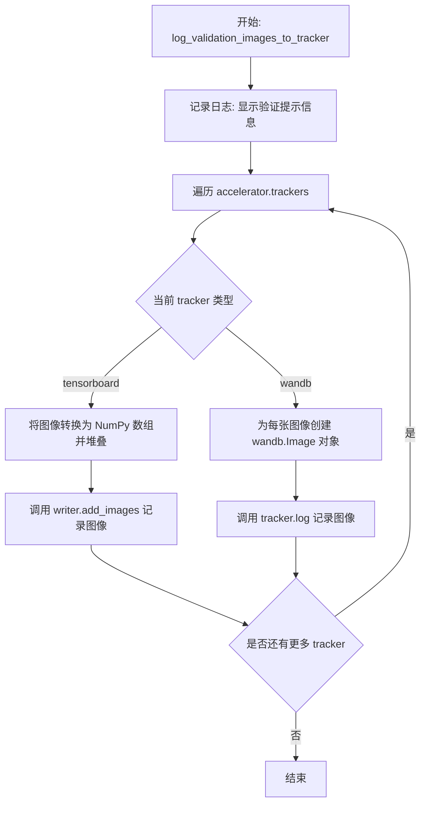
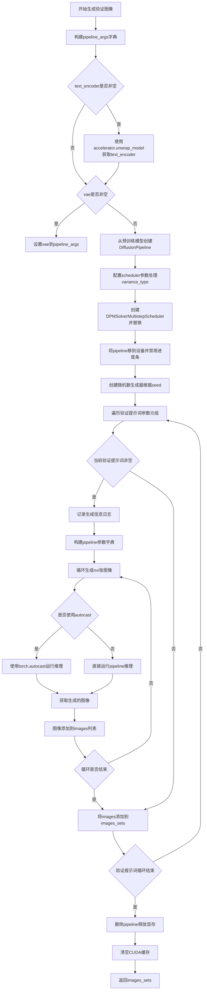
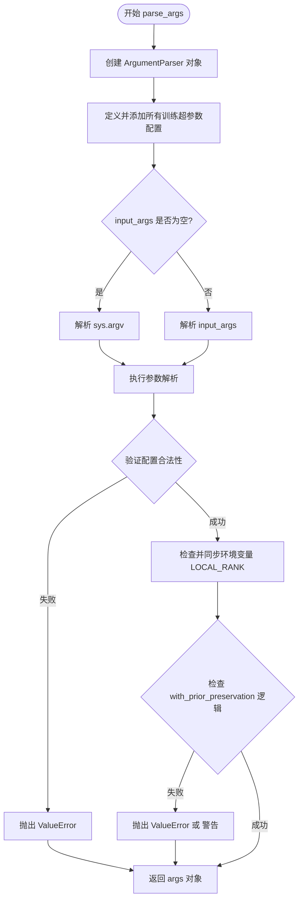
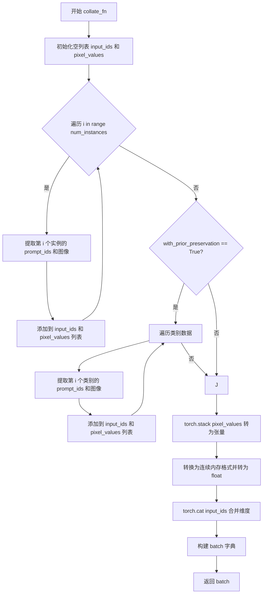
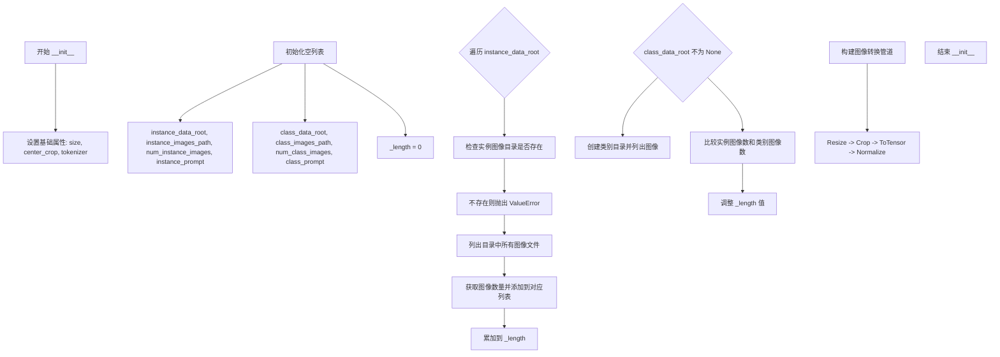
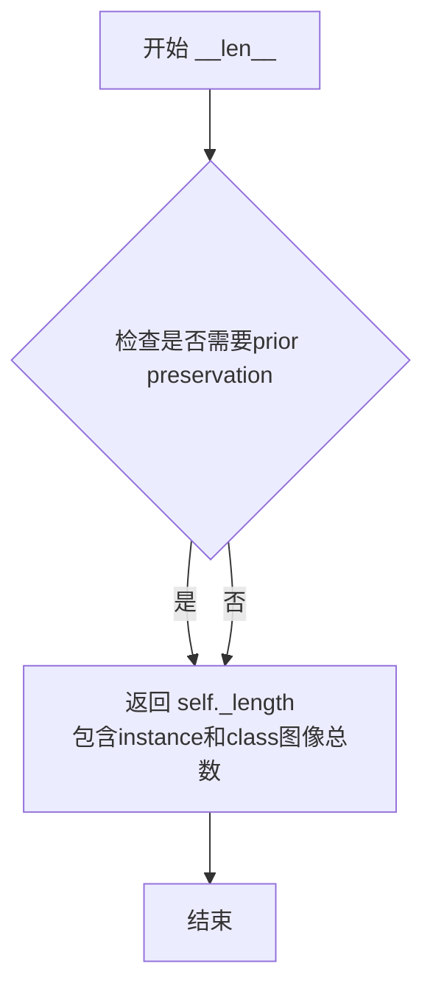
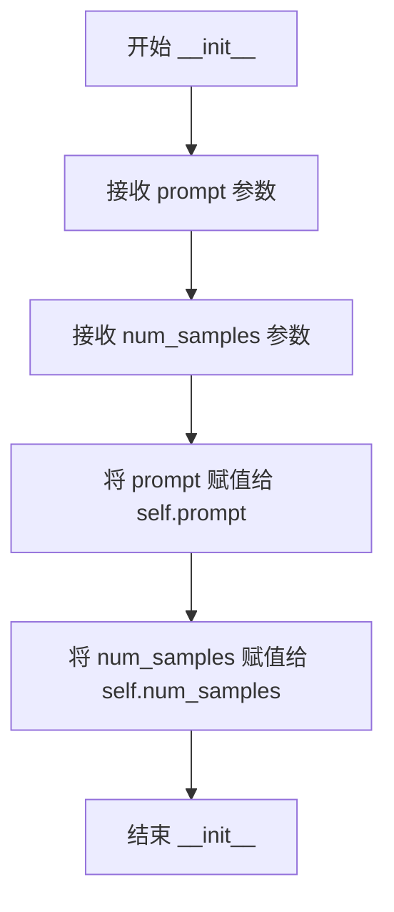
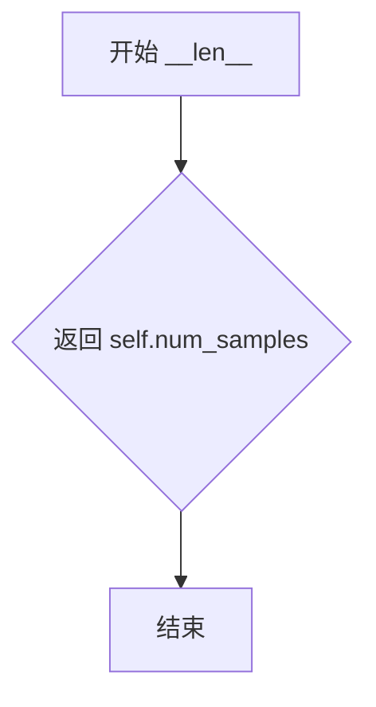

```mermaid
flowchart TD
    A[开始 main 函数] --> B{验证 wandb 和 hub_token}
    B -->|冲突| C[抛出 ValueError]
    B -->|正常| D[创建 logging_dir 和 Accelerator]
    D --> E{检查分布式训练梯度累积}
    E -->|不支持| F[抛出 ValueError]
    E -->|支持| G[解析 concepts_list 或命令行参数]
    G --> H[设置验证参数列表]
    H --> I[配置日志级别]
    I --> J{设置随机种子}
    J --> K[生成类别图像 prior preservation]
    K --> L{创建输出目录和 Hub 仓库}
    L --> M[加载 Tokenizer]
    M --> N[导入 Text Encoder 类]
    N --> O[加载噪声调度器、Text Encoder、VAE、UNet]
    O --> P[冻结 VAE 和 Text Encoder 梯度]
    P --> Q[启用 xformers 内存优化]
    Q --> R[启用梯度检查点]
    R --> S[启用 TF32 加速]
    S --> T[计算学习率]
    T --> U[创建优化器 Adam/AdamW8bit]
    U --> V[创建 DreamBoothDataset]
    V --> W[创建 DataLoader]
    W --> X[创建学习率调度器]
    X --> Y[使用 Accelerator 准备模型和数据]
    Y --> Z[设置权重数据类型]
    Z --> AA[计算训练步数]
    AA --> AB[初始化 trackers]
    AB --> AC[训练循环 - 外层 epoch]
    AC --> AD[训练循环 - 内层 step]
    AD --> AE[梯度累积训练步骤]
    AE --> AF[VAE 编码图像到 latent]
    AF --> AG[采样噪声和 timestep]
    AG --> AH[添加噪声到 latents]
    AH --> AI[编码文本得到 embedding]
    AI --> AJ[UNet 预测噪声残差]
    AJ --> AK{计算损失}
    AK -->|prior preservation| AL[分离实例和先验损失]
    AK -->|无 prior preservation| AM[计算 MSE 损失]
    AL --> AN[反向传播和梯度裁剪]
    AM --> AN
    AN --> AO[优化器更新参数]
    AO --> AP{检查是否需要保存}
    AP -->|checkpoint| AQ[保存训练状态]
    AP -->|validation| AR[生成验证图像并记录]
    AQ --> AS[记录日志]
    AR --> AS
    AS --> AT{检查是否完成训练}
    AT -->|未完成| AD
    AT -->|完成| AU[等待所有进程]
    AU --> AV[保存最终模型管道]
    AV --> AW[推送到 Hub]
    AW --> AX[结束训练]
```

# `diffusers\examples\research_projects\multi_subject_dreambooth\train_multi_subject_dreambooth.py` 详细设计文档

这是一个DreamBooth训练脚本，用于微调Stable Diffusion文本到图像模型，支持先验 preservation 损失、分布式训练、梯度检查点、混合精度训练，以及通过TensorBoard或WandB进行验证图像记录。

## 整体流程

```mermaid
graph TD
    A[开始: 解析参数 parse_args] --> B{验证参数合法性}
    B -- 失败 --> B1[抛出ValueError]
    B -- 成功 --> C[初始化Accelerator]
    C --> D[加载预训练模型: tokenizer, text_encoder, vae, unet]
    D --> E{是否启用先验 preservation?}
E -- 是 --> F[生成类别图像 PromptDataset + DiffusionPipeline]
E -- 否 --> G[创建训练数据集 DreamBoothDataset]
F --> G
G --> H[创建优化器 AdamW/AdamW8bit]
H --> I[创建学习率调度器 get_scheduler]
I --> J[加速器准备模型和数据 accelerator.prepare]
J --> K[训练循环: for epoch in range(num_train_epochs)]
K --> L{每个step: VAE编码图像为latent}
L --> M[采样噪声并添加到latent]
M --> N[text_encoder编码prompt得到embedding]
N --> O[UNet预测噪声残差]
O --> P{是否启用先验 preservation?}
P -- 是 --> Q[计算实例损失 + 先验损失]
P -- 否 --> R[计算MSE损失]
Q --> S[反向传播并更新参数]
R --> S
S --> T{是否需要验证?}
T -- 是 --> U[生成验证图像 generate_validation_images]
T -- 否 --> V{是否需要保存checkpoint?}
U --> V
V -- 是 --> W[保存训练状态 accelerator.save_state]
W --> X[是否达到最大训练步数?]
V -- 否 --> X
X -- 否 --> K
X -- 是 --> Y[保存最终模型 DiffusionPipeline.save_pretrained]
Y --> Z{是否推送到Hub?}
Z -- 是 --> AA[upload_folder推送模型]
Z -- 否 --> AB[结束]
AA --> AB
```

## 类结构

```
Dataset (抽象基类 - torch.utils.data.Dataset)
├── DreamBoothDataset (DreamBooth训练数据集)
└── PromptDataset (用于生成类别图像的简单数据集)
```

## 全局变量及字段


### `logger`
    
accelerate日志记录器实例，用于记录训练过程中的日志信息

类型：`Logger`
    


### `check_min_version`
    
检查diffusers最低版本，确保环境满足依赖要求

类型：`function`
    


### `DreamBoothDataset.size`
    
图像分辨率大小，指定处理后图像的边长

类型：`int`
    


### `DreamBoothDataset.center_crop`
    
是否居中裁剪，为true时使用中心裁剪否则随机裁剪

类型：`bool`
    


### `DreamBoothDataset.tokenizer`
    
分词器实例，用于将文本提示转换为token id序列

类型：`Module`
    


### `DreamBoothDataset.instance_data_root`
    
实例图像根目录列表，存储每个概念实例图像的路径

类型：`List[Path]`
    


### `DreamBoothDataset.instance_images_path`
    
实例图像路径列表，二维列表存储各实例的图像文件路径

类型：`List[List[Path]]`
    


### `DreamBoothDataset.num_instance_images`
    
每个实例的图像数量，记录各概念实例图像总数

类型：`List[int]`
    


### `DreamBoothDataset.instance_prompt`
    
实例提示词列表，对应各实例图像的文本描述

类型：`List[str]`
    


### `DreamBoothDataset.class_data_root`
    
类别图像根目录列表，存储类别图像的根目录路径

类型：`List[Path]`
    


### `DreamBoothDataset.class_images_path`
    
类别图像路径列表，二维列表存储各类别图像文件路径

类型：`List[List[Path]]`
    


### `DreamBoothDataset.num_class_images`
    
每个类别的图像数量，记录各类别图像总数

类型：`List[int]`
    


### `DreamBoothDataset.class_prompt`
    
类别提示词列表，用于生成类别图像或先验保存

类型：`List[str]`
    


### `DreamBoothDataset._length`
    
数据集总长度，表示可迭代的样本总数

类型：`int`
    


### `DreamBoothDataset.image_transforms`
    
图像变换组合，包含resize、crop、totensor和normalize操作

类型：`Compose`
    


### `PromptDataset.prompt`
    
生成图像用的提示词，用于类别图像生成

类型：`str`
    


### `PromptDataset.num_samples`
    
要生成的样本数量，指定需要生成的图像数量

类型：`int`
    
    

## 全局函数及方法


### `log_validation_images_to_tracker`

该函数用于将验证阶段生成的图像记录到 TensorBoard 或 Weights & Biases (wandb) 可视化工具中，以便监控模型在验证集上的生成效果。它遍历加速器中的所有日志记录器，根据记录器类型（TensorBoard 或 wandb）采用不同的格式保存图像数据。

参数：

- `images`：`List[np.array]`，待记录的验证图像列表，每个图像为 NumPy 数组格式
- `label`：`str`，用于标识这批图像的标签，通常为唯一生成的 ID
- `validation_prompt`：`str`，生成验证图像时使用的文本提示，用于在日志中展示
- `accelerator`：`Accelerator`，HuggingFace Accelerate 库提供的分布式训练加速器对象，包含 trackers 属性
- `epoch`：`int`，当前训练轮次，用于在日志中标记图像所属的 epoch

返回值：无（`None`），该函数仅执行图像记录操作，不返回任何值

#### 流程图



#### 带注释源码

```python
def log_validation_images_to_tracker(
    images: List[np.array], label: str, validation_prompt: str, accelerator: Accelerator, epoch: int
):
    """
    将验证图像记录到 TensorBoard 或 wandb
    
    参数:
        images: 验证图像列表，每个元素为 PIL.Image 或 numpy.ndarray
        label: 图像标签标识符
        validation_prompt: 生成图像时使用的验证提示词
        accelerator: Accelerate 加速器对象，包含 trackers 列表
        epoch: 当前训练轮次
    """
    # 记录日志信息，表明即将开始记录图像
    logger.info(f"Logging images to tracker for validation prompt: {validation_prompt}.")

    # 遍历所有已注册的 tracker（可能是 tensorboard、wandb 等）
    for tracker in accelerator.trackers:
        # 处理 TensorBoard 类型的 tracker
        if tracker.name == "tensorboard":
            # 将图像列表转换为 NumPy 数组并堆叠
            # np.asarray 将 PIL.Image 转换为数组
            # np.stack 将多个图像合并为一个批次
            np_images = np.stack([np.asarray(img) for img in images])
            # 使用 TensorBoard writer 添加图像
            # dataformats="NHWC" 表示数据格式为 (batch, height, width, channels)
            tracker.writer.add_images("validation", np_images, epoch, dataformats="NHWC")
        
        # 处理 wandb 类型的 tracker
        if tracker.name == "wandb":
            # 为每张图像创建带有标题的 wandb.Image 对象
            # 标题格式: label_epoch_index: validation_prompt
            tracker.log(
                {
                    "validation": [
                        wandb.Image(image, caption=f"{label}_{epoch}_{i}: {validation_prompt}")
                        for i, image in enumerate(images)
                    ]
                }
            )
```

#### 关键组件信息

| 组件名称 | 描述 |
|---------|------|
| `accelerator.trackers` | Accelerate 库管理的日志记录器列表，支持多种后端（TensorBoard、wandb 等） |
| `tracker.writer` | TensorBoard 的 writer 对象，用于添加图像到日志 |
| `wandb.Image` | wandb 库的图片包装类，支持添加标题说明 |

#### 潜在的技术债务或优化空间

1. **缺少对其他 tracker 的支持**：当前仅显式支持 TensorBoard 和 wandb，其他日志工具（如 Comet ML）会被忽略但不会报错或警告
2. **图像格式假设**：代码假设输入图像可以直接转换为 NHWC 格式，未对不同格式进行校验或转换
3. **日志消息不够详细**：仅在函数入口记录一次日志，对于每个 tracker 的记录结果没有分别确认
4. **异常处理缺失**：如果 tracker.log 或 writer.add_images 抛出异常，会导致整个训练流程中断，缺乏容错机制


### `generate_validation_images`

该函数使用训练好的文本编码器、分词器、UNet和VAE模型，根据验证提示词生成验证图像。它通过构建DiffusionPipeline并使用DPMSolverMultistepScheduler进行推理，生成多组图像用于监控训练过程中的模型性能。

**参数：**

- `text_encoder`：`Module`，文本编码器模型，用于将文本提示转换为嵌入向量
- `tokenizer`：`Module`，分词器，用于将文本提示 token 化
- `unet`：`Module`，UNet2DConditionModel，用于去噪生成图像
- `vae`：`Module`，AutoencoderKL，变分自编码器，用于将图像编码到潜在空间
- `arguments`：`argparse.Namespace`，包含所有验证参数的配置对象，包括预训练模型路径、验证提示词、推理步数、guidance_scale等
- `accelerator`：`Accelerator`，Hugging Face Accelerate库提供的加速器，用于模型和设备管理
- `weight_dtype`：`dtype`，模型权重的数据类型（float32/float16/bfloat16）

**返回值：** `List[List[PIL.Image]]`，外层列表对应每个验证提示词，内层列表为该提示词生成的图像集合

#### 流程图



#### 带注释源码

```python
# TODO: Add `prompt_embeds` and `negative_prompt_embeds` parameters to the function when `pre_compute_text_embeddings`
#  argument is implemented.
def generate_validation_images(
    text_encoder: Module,
    tokenizer: Module,
    unet: Module,
    vae: Module,
    arguments: argparse.Namespace,
    accelerator: Accelerator,
    weight_dtype: dtype,
):
    """
    使用训练好的模型生成验证图像
    
    参数:
        text_encoder: 文本编码器模型
        tokenizer: 分词器
        unet: UNet模型
        vae: VAE模型
        arguments: 包含验证参数的命名空间
        accelerator: 加速器对象
        weight_dtype: 模型权重数据类型
    
    返回:
        images_sets: 生成的图像列表
    """
    logger.info("Running validation images.")

    # 初始化pipeline参数字典
    pipeline_args = {}

    # 如果text_encoder不为空，则使用accelerator.unwrap_model获取原始模型
    if text_encoder is not None:
        pipeline_args["text_encoder"] = accelerator.unwrap_model(text_encoder)

    # 如果vae不为空，则添加到pipeline参数中
    if vae is not None:
        pipeline_args["vae"] = vae

    # 创建pipeline (注意: unet和vae会以float32重新加载)
    pipeline = DiffusionPipeline.from_pretrained(
        arguments.pretrained_model_name_or_path,
        tokenizer=tokenizer,
        unet=accelerator.unwrap_model(unet),
        revision=arguments.revision,
        torch_dtype=weight_dtype,
        **pipeline_args,
    )

    # 我们训练的是简化的学习目标。如果之前预测的是variance，需要让scheduler忽略它
    scheduler_args = {}

    if "variance_type" in pipeline.scheduler.config:
        variance_type = pipeline.scheduler.config["variance_type"]

        # 如果variance_type是learned或learned_range，则改为fixed_small
        if variance_type in ["learned", "learned_range"]:
            variance_type = "fixed_small"

        scheduler_args["variance_type"] = variance_type

    # 使用DPMSolverMultistepScheduler替换默认scheduler
    pipeline.scheduler = DPMSolverMultistepScheduler.from_config(pipeline.scheduler.config, **scheduler_args)
    # 将pipeline移到加速设备上
    pipeline = pipeline.to(accelerator.device)
    # 禁用推理进度条
    pipeline.set_progress_bar_config(disable=True)

    # 如果指定了seed则创建随机数生成器，否则为None
    generator = (
        None if arguments.seed is None else torch.Generator(device=accelerator.device).manual_seed(arguments.seed)
    )

    # 存储所有生成的图像集
    images_sets = []
    # 遍历验证相关参数：验证提示词、图像数量、负提示词、推理步数、guidance_scale
    for vp, nvi, vnp, vis, vgs in zip(
        arguments.validation_prompt,
        arguments.validation_number_images,
        arguments.validation_negative_prompt,
        arguments.validation_inference_steps,
        arguments.validation_guidance_scale,
    ):
        images = []
        # 如果验证提示词不为空
        if vp is not None:
            logger.info(
                f"Generating {nvi} images with prompt: '{vp}', negative prompt: '{vnp}', inference steps: {vis}, "
                f"guidance scale: {vgs}."
            )

            # 构建pipeline调用参数
            pipeline_args = {"prompt": vp, "negative_prompt": vnp, "num_inference_steps": vis, "guidance_scale": vgs}

            # 运行推理生成图像
            # TODO: 考虑是否一次性生成所有图像、逐个生成或小批量生成更快
            for _ in range(nvi):
                # 使用autocast加速CUDA推理
                with torch.autocast("cuda"):
                    image = pipeline(**pipeline_args, num_images_per_prompt=1, generator=generator).images[0]
                images.append(image)

        # 将当前提示词生成的图像添加到结果集
        images_sets.append(images)

    # 清理pipeline释放显存
    del pipeline
    if torch.cuda.is_available():
        torch.cuda.empty_cache()

    return images_sets
```


### `import_model_class_from_model_name_or_path`

该函数根据预训练模型路径导入正确的文本编码器（text_encoder）类。它通过加载模型配置文件获取架构名称，然后根据架构名称动态导入并返回对应的文本编码器类。

参数：

- `pretrained_model_name_or_path`：`str`，预训练模型的名称或本地路径，用于定位模型资源
- `revision`：`str`，模型的版本号或提交哈希，用于加载特定版本的模型配置

返回值：`type`，返回对应的文本编码器类（`CLIPTextModel` 或 `RobertaSeriesModelWithTransformation`）

#### 流程图

```mermaid
flowchart TD
    A[开始] --> B[加载text_encoder配置文件]
    B --> C{从配置中获取architectures[0]}
    C --> D{判断模型类别}
    D -->|CLIPTextModel| E[从transformers导入CLIPTextModel]
    D -->|RobertaSeriesModelWithTransformation| F[从diffusers导入RobertaSeriesModelWithTransformation]
    D -->|其他| G[抛出ValueError异常]
    E --> H[返回CLIPTextModel类]
    F --> I[返回RobertaSeriesModelWithTransformation类]
    G --> J[结束]
    H --> J
    I --> J
```

#### 带注释源码

```python
def import_model_class_from_model_name_or_path(pretrained_model_name_or_path: str, revision: str):
    """
    根据预训练模型路径导入正确的text_encoder类
    
    Args:
        pretrained_model_name_or_path: 预训练模型名称或本地路径
        revision: 模型版本/提交哈希
    
    Returns:
        对应的文本编码器类
    """
    # 从预训练模型路径加载text_encoder的配置文件
    # 使用PretrainedConfig.from_pretrained读取HuggingFace格式的模型配置
    text_encoder_config = PretrainedConfig.from_pretrained(
        pretrained_model_name_or_path,
        subfolder="text_encoder",  # text_encoder通常存储在模型目录的text_encoder子目录
        revision=revision,         # 指定版本以确保加载特定版本的配置
    )
    
    # 从配置中获取模型架构名称
    # architectures是一个列表，通常第一个元素即为主要的模型架构类名
    model_class = text_encoder_config.architectures[0]

    # 根据架构名称进行条件判断，返回对应的模型类
    if model_class == "CLIPTextModel":
        # CLIPTextModel是标准CLIP模型的文本编码器
        # 从transformers库导入CLIPTextModel类
        from transformers import CLIPTextModel

        return CLIPTextModel
    elif model_class == "RobertaSeriesModelWithTransformation":
        # RobertaSeriesModelWithTransformation是AltDiffusion使用的Roberta系列模型
        # 从diffusers库的特殊模块导入
        from diffusers.pipelines.alt_diffusion.modeling_roberta_series import RobertaSeriesModelWithTransformation

        return RobertaSeriesModelWithTransformation
    else:
        # 如果遇到不支持的模型架构，抛出明确的错误信息
        raise ValueError(f"{model_class} is not supported.")
```


### `parse_args`

该函数是训练脚本的入口参数解析器，通过 `argparse` 库定义并解析了 DreamBooth 模型训练所需的所有超参数（包括模型路径、训练策略、优化器设置、验证配置等），同时包含多层参数校验逻辑以确保配置的正确性。

参数：

- `input_args`：`Optional[List[str]]`，可选的字符串列表。如果传入该参数，函数将解析该列表而非系统命令行参数（`sys.argv`），常用于测试场景。
-  **解析的配置项（命令行参数）：**
    - `pretrained_model_name_or_path`：`str`，预训练模型的路径或 Hugging Face Hub 上的模型标识符。
    - `revision`：`str`，预训练模型的版本号。
    - `tokenizer_name`：`str`，分词器的名称或路径。
    - `instance_data_dir`：`str`，实例图像的训练数据目录。
    - `class_data_dir`：`str`，类别图像的数据目录（用于先验保留损失）。
    - `instance_prompt`：`str`，描述实例图像的提示词。
    - `class_prompt`：`str`，描述类别图像的提示词。
    - `with_prior_preservation`：`bool`，是否启用先验保留损失（Prior Preservation Loss）。
    - `prior_loss_weight`：`float`，先验保留损失的权重。
    - `num_class_images`：`int`，用于先验保留的类别图像最小数量。
    - `output_dir`：`str`，模型预测和检查点的输出目录。
    - `seed`：`int`，随机种子，用于保证训练的可重复性。
    - `resolution`：`int`，输入图像的分辨率，图像将被Resize到该尺寸。
    - `center_crop`：`bool`，是否对图像进行中心裁剪。
    - `train_text_encoder`：`bool`，是否同时训练文本编码器。
    - `train_batch_size`：`int`，训练时的批大小（每设备）。
    - `sample_batch_size`：`int`，采样图像时的批大小。
    - `num_train_epochs`：`int`，训练的总轮数。
    - `max_train_steps`：`int`，训练的总步数。若设置此项，则会覆盖 `num_train_epochs`。
    - `checkpointing_steps`：`int`，保存检查点的步数间隔。
    - `checkpoints_total_limit`：`int`，最多保存的检查点数量。
    - `resume_from_checkpoint`：`str`，从指定路径或 "latest" 恢复训练。
    - `gradient_accumulation_steps`：`int`，梯度累积的步数。
    - `gradient_checkpointing`：`bool`，是否启用梯度检查点以节省显存。
    - `learning_rate`：`float`，初始学习率。
    - `scale_lr`：`bool`，是否根据 GPU 数量、批大小等缩放学习率。
    - `lr_scheduler`：`str`，学习率调度器类型（如 "cosine", "linear" 等）。
    - `lr_warmup_steps`：`int`，学习率预热（warmup）的步数。
    - `lr_num_cycles`：`int`，余弦退火调度器中的重置次数。
    - `lr_power`：`float`，多项式调度器的幂次。
    - `use_8bit_adam`：`bool`，是否使用 8-bit Adam 优化器。
    - `adam_beta1`, `adam_beta2`, `adam_weight_decay`, `adam_epsilon`：`float`，Adam 优化器的参数。
    - `max_grad_norm`：`float`，梯度裁剪的最大范数。
    - `push_to_hub`：`bool`，训练完成后是否将模型推送到 Hub。
    - `hub_token`：`str`，推送到 Hub 所需的 Token。
    - `hub_model_id`：`str`，Hub 上的模型仓库 ID。
    - `logging_dir`：`str`，日志目录（TensorBoard 或 WandB）。
    - `allow_tf32`：`bool`，是否允许在 Ampere GPU 上使用 TF32 加速。
    - `report_to`：`str`，日志报告目标（如 "tensorboard", "wandb"）。
    - `validation_steps`：`int`，运行验证的步数间隔。
    - `validation_prompt`：`str`，验证时使用的提示词。
    - `validation_number_images`：`int`，验证时生成的图像数量。
    - `validation_negative_prompt`：`str`，验证时的负面提示词。
    - `validation_inference_steps`：`int`，验证时的推理步数。
    - `validation_guidance_scale`：`float`，验证时的引导系数。
    - `mixed_precision`：`str`，混合精度训练模式（"fp16", "bf16" 或 "no"）。
    - `prior_generation_precision`：`str`，生成类别图像时的精度。
    - `local_rank`：`int`，分布式训练中的本地进程编号。
    - `enable_xformers_memory_efficient_attention`：`bool`，是否启用 xformers 高效注意力机制。
    - `set_grads_to_none`：`bool`，是否将梯度设置为 None 以节省显存。
    - `concepts_list`：`str`，包含多个概念配置的 JSON 文件路径。

返回值：`argparse.Namespace`，返回一个命名空间对象，其中包含所有解析后的命令行参数属性。

#### 流程图



#### 带注释源码

```python
def parse_args(input_args=None):
    """
    解析命令行参数，包含所有训练超参数配置。
    
    参数:
        input_args (List[str], optional): 用于测试的外部参数列表。
    
    返回:
        argparse.Namespace: 包含所有配置的对象。
    """
    # 1. 初始化解析器
    parser = argparse.ArgumentParser(description="Simple example of a training script.")
    
    # 2. 定义模型与路径相关参数
    parser.add_argument(
        "--pretrained_model_name_or_path",
        type=str,
        default=None,
        required=True,
        help="Path to pretrained model or model identifier from huggingface.co/models.",
    )
    parser.add_argument(
        "--revision",
        type=str,
        default=None,
        required=False,
        help="Revision of pretrained model identifier from huggingface.co/models.",
    )
    # ... (其他参数定义省略) ...

    # 3. 解析参数
    if input_args:
        args = parser.parse_args(input_args)
    else:
        args = parser.parse_args()

    # 4. 校验参数逻辑
    
    # 校验 concepts_list 与 instance 参数的互斥
    if not args.concepts_list and (not args.instance_data_dir or not args.instance_prompt):
        raise ValueError(
            "You must specify either instance parameters (data directory, prompt, etc.) or use "
            "the `concept_list` parameter and specify them within the file."
        )

    # 校验 concepts_list 内部一致性
    if args.concepts_list:
        # ... (详细校验逻辑) ...
        pass

    # 5. 处理环境变量与分布式训练参数
    env_local_rank = int(environ.get("LOCAL_RANK", -1))
    if env_local_rank != -1 and env_local_rank != args.local_rank:
        args.local_rank = env_local_rank

    # 6. 校验先验保留损失相关参数
    if args.with_prior_preservation:
        if not args.concepts_list:
            if not args.class_data_dir:
                raise ValueError("You must specify a data directory for class images.")
            # ... (更多校验) ...
    else:
        # 警告未使用的 class 参数
        if not args.class_data_dir:
            warnings.warn(
                "Ignoring `class_data_dir` parameter, you need to use it together with `with_prior_preservation`."
            )
            
    return args
```


### `collate_fn`

该函数是自定义的数据整理（collate）函数，用于将 DataLoader 收集的多个样本（examples）合并成一个批次（batch），特别针对 DreamBooth 训练场景设计，支持多概念（num_instances）实例图像和条件文本（input_ids）的整理，并在启用先验保留（prior preservation）时同时包含类别图像和对应的文本嵌入。

参数：

- `num_instances`：`int`，表示训练中概念/实例的数量，用于遍历不同实例的图像和 prompt
- `examples`：`List[dict]`，从 DreamBoothDataset 返回的样本列表，每个样本包含实例图像、实例 prompt_ids、以及可选的类别图像和类别 prompt_ids
- `with_prior_preservation`：`bool`，是否启用先验保留，若为 True 则将类别图像和 prompt_ids 也纳入批次

返回值：`dict`，返回包含 `input_ids` 和 `pixel_values` 两个键的字典，分别对应合并后的文本 token ids 和图像像素值

#### 流程图



#### 带注释源码

```python
def collate_fn(num_instances, examples, with_prior_preservation=False):
    """
    自定义数据整理函数，合并 batch 中的图像和 input_ids
    
    参数:
        num_instances: int, 概念/实例的数量
        examples: List[dict], 数据集中样本列表
        with_prior_preservation: bool, 是否包含类别数据
    返回:
        dict: 包含 input_ids 和 pixel_values 的批次字典
    """
    # 初始化用于存储批次的列表
    input_ids = []
    pixel_values = []

    # 遍历每个实例概念，提取对应的 prompt ids 和图像
    for i in range(num_instances):
        # 从每个样本中提取第 i 个实例的 token ids
        input_ids += [example[f"instance_prompt_ids_{i}"] for example in examples]
        # 从每个样本中提取第 i 个实例的图像
        pixel_values += [example[f"instance_images_{i}"] for example in examples]

    # 如果启用先验保留，同时添加类别图像和 prompt
    # 这样可以避免进行两次前向传播，提高训练效率
    if with_prior_preservation:
        for i in range(num_instances):
            # 添加类别文本 ids
            input_ids += [example[f"class_prompt_ids_{i}"] for example in examples]
            # 添加类别图像
            pixel_values += [example[f"class_images_{i}"] for example in examples]

    # 将像素值列表堆叠为张量
    pixel_values = torch.stack(pixel_values)
    # 转换为连续内存格式并转换为 float 类型
    # 这有助于优化内存布局提升计算效率
    pixel_values = pixel_values.to(memory_format=torch.contiguous_format).float()

    # 沿第零维拼接所有 input_ids
    input_ids = torch.cat(input_ids, dim=0)

    # 构建最终批次字典
    batch = {
        "input_ids": input_ids,
        "pixel_values": pixel_values,
    }
    return batch
```


### `main`

这是DreamBooth训练流程的核心函数，负责完整的Stable Diffusion微调训练过程。函数首先验证输入参数并初始化Accelerator分布式训练环境，然后加载预训练模型（UNet、VAE、Text Encoder）和 tokenizer，接着根据是否启用 prior preservation 生成类别图像以防止过拟合，之后创建数据集和数据加载器并配置优化器和学习率调度器，最后进入主训练循环进行噪声预测训练，并在每个 checkpoint 和验证步骤保存模型状态和生成验证图像。

参数：

- `args`：`argparse.Namespace`，包含所有训练配置参数，如模型路径、训练超参数、数据目录等

返回值：`None`，训练完成后直接退出

#### 流程图



#### 带注释源码

```python
def main(args):
    """
    DreamBooth 训练主函数
    完整的 Stable Diffusion 个性化微调训练流程
    """
    
    # ===== 1. 参数验证 =====
    # 检查 wandb 和 hub_token 不能同时使用（安全考虑）
    if args.report_to == "wandb" and args.hub_token is not None:
        raise ValueError(
            "You cannot use both --report_to=wandb and --hub_token due to a security risk of exposing your token."
            " Please use `hf auth login` to authenticate with the Hub."
        )

    # ===== 2. 初始化 Accelerator =====
    # 创建日志目录和项目配置
    logging_dir = Path(args.output_dir, args.logging_dir)
    accelerator_project_config = ProjectConfiguration(
        total_limit=args.checkpoints_total_limit, project_dir=args.output_dir, logging_dir=logging_dir
    )
    # 初始化分布式训练加速器
    accelerator = Accelerator(
        gradient_accumulation_steps=args.gradient_accumulation_steps,
        mixed_precision=args.mixed_precision,
        log_with=args.report_to,
        project_config=accelerator_project_config,
    )

    # 禁用 MPS 设备的自动混合精度
    if torch.backends.mps.is_available():
        accelerator.native_amp = False

    # 检查 wandb 是否安装
    if args.report_to == "wandb":
        if not is_wandb_available():
            raise ImportError("Make sure to install wandb if you want to use it for logging during training.")

    # ===== 3. 检查梯度累积兼容性 =====
    # 分布式训练时不支持同时训练 text_encoder 的梯度累积
    if args.train_text_encoder and args.gradient_accumulation_steps > 1 and accelerator.num_processes > 1:
        raise ValueError(
            "Gradient accumulation is not supported when training the text encoder in distributed training. "
            "Please set gradient_accumulation_steps to 1. This feature will be supported in the future."
        )

    # ===== 4. 解析数据集配置 =====
    # 初始化实例和类别数据目录
    instance_data_dir = []
    instance_prompt = []
    class_data_dir = [] if args.with_prior_preservation else None
    class_prompt = [] if args.with_prior_preservation else None
    
    # 从 JSON 文件加载概念列表
    if args.concepts_list:
        with open(args.concepts_list, "r") as f:
            concepts_list = json.load(f)

        # 初始化验证参数列表
        if args.validation_steps:
            args.validation_prompt = []
            args.validation_number_images = []
            args.validation_negative_prompt = []
            args.validation_inference_steps = []
            args.validation_guidance_scale = []

        # 遍历每个概念配置
        for concept in concepts_list:
            instance_data_dir.append(concept["instance_data_dir"])
            instance_prompt.append(concept["instance_prompt"])

            # 处理 prior preservation
            if args.with_prior_preservation:
                try:
                    class_data_dir.append(concept["class_data_dir"])
                    class_prompt.append(concept["class_prompt"])
                except KeyError:
                    raise KeyError(
                        "`class_data_dir` or `class_prompt` not found in concepts_list while using "
                        "`with_prior_preservation`."
                    )
            else:
                # 警告忽略不需要的字段
                if "class_data_dir" in concept:
                    warnings.warn(
                        "Ignoring `class_data_dir` key, to use it you need to enable `with_prior_preservation`."
                        )
                if "class_prompt" in concept:
                    warnings.warn(
                        "Ignoring `class_prompt` key, to use it you need to enable `with_prior_preservation`."
                        )

            # 处理验证参数
            if args.validation_steps:
                args.validation_prompt.append(concept.get("validation_prompt", None))
                args.validation_number_images.append(concept.get("validation_number_images", 4))
                args.validation_negative_prompt.append(concept.get("validation_negative_prompt", None))
                args.validation_inference_steps.append(concept.get("validation_inference_steps", 25))
                args.validation_guidance_scale.append(concept.get("validation_guidance_scale", 7.5))
    else:
        # ===== 从命令行参数解析 =====
        # 解析实例数据和提示词
        instance_data_dir = args.instance_data_dir.split(",")
        instance_prompt = args.instance_prompt.split(",")
        assert all(x == len(instance_data_dir) for x in [len(instance_data_dir), len(instance_prompt)]), (
            "Instance data dir and prompt inputs are not of the same length."
        )

        # 解析类别数据和提示词（如果启用 prior preservation）
        if args.with_prior_preservation:
            class_data_dir = args.class_data_dir.split(",")
            class_prompt = args.class_prompt.split(",")
            assert all(
                x == len(instance_data_dir)
                for x in [len(instance_data_dir), len(instance_prompt), len(class_data_dir), len(class_prompt)]
            ), "Instance & class data dir or prompt inputs are not of the same length."

        # 解析验证参数
        if args.validation_steps:
            validation_prompts = args.validation_prompt.split(",")
            num_of_validation_prompts = len(validation_prompts)
            args.validation_prompt = validation_prompts
            args.validation_number_images = [args.validation_number_images] * num_of_validation_prompts

            negative_validation_prompts = [None] * num_of_validation_prompts
            if args.validation_negative_prompt:
                negative_validation_prompts = args.validation_negative_prompt.split(",")
                while len(negative_validation_prompts) < num_of_validation_prompts:
                    negative_validation_prompts.append(None)
            args.validation_negative_prompt = negative_validation_prompts

            assert num_of_validation_prompts == len(negative_validation_prompts), (
                "The length of negative prompts for validation is greater than the number of validation prompts."
            )
            args.validation_inference_steps = [args.validation_inference_steps] * num_of_validation_prompts
            args.validation_guidance_scale = [args.validation_guidance_scale] * num_of_validation_prompts

    # ===== 5. 配置日志 =====
    logging.basicConfig(
        format="%(asctime)s - %(levelname)s - %(name)s - %(message)s",
        datefmt="%m/%d/%Y %H:%M:%S",
        level=logging.INFO,
    )
    logger.info(accelerator.state, main_process_only=False)
    # 主进程设置详细日志，其他进程设置错误日志
    if accelerator.is_local_main_process:
        datasets.utils.logging.set_verbosity_warning()
        transformers.utils.logging.set_verbosity_warning()
        diffusers.utils.logging.set_verbosity_info()
    else:
        datasets.utils.logging.set_verbosity_error()
        transformers.utils.logging.set_verbosity_error()
        diffusers.utils.logging.set_verbosity_error()

    # 设置随机种子确保可重复性
    if args.seed is not None:
        set_seed(args.seed)

    # ===== 6. 生成类别图像（Prior Preservation）=====
    # 如果启用 prior preservation，生成类别图像以保持模型对类别的泛化能力
    if args.with_prior_preservation:
        for i in range(len(class_data_dir)):
            class_images_dir = Path(class_data_dir[i])
            if not class_images_dir.exists():
                class_images_dir.mkdir(parents=True)
            cur_class_images = len(list(class_images_dir.iterdir()))

            # 如果类别图像数量不足，生成更多
            if cur_class_images < args.num_class_images:
                # 确定数据类型
                torch_dtype = torch.float16 if accelerator.device.type == "cuda" else torch.float32
                if args.prior_generation_precision == "fp32":
                    torch_dtype = torch.float32
                elif args.prior_generation_precision == "fp16":
                    torch_dtype = torch.float16
                elif args.prior_generation_precision == "bf16":
                    torch_dtype = torch.bfloat16
                
                # 加载推理管道
                pipeline = DiffusionPipeline.from_pretrained(
                    args.pretrained_model_name_or_path,
                    torch_dtype=torch_dtype,
                    safety_checker=None,
                    revision=args.revision,
                )
                pipeline.set_progress_bar_config(disable=True)

                num_new_images = args.num_class_images - cur_class_images
                logger.info(f"Number of class images to sample: {num_new_images}.")

                # 创建数据集和数据加载器
                sample_dataset = PromptDataset(class_prompt[i], num_new_images)
                sample_dataloader = torch.utils.data.DataLoader(sample_dataset, batch_size=args.sample_batch_size)

                sample_dataloader = accelerator.prepare(sample_dataloader)
                pipeline.to(accelerator.device)

                # 生成类别图像
                for example in tqdm(
                    sample_dataloader, desc="Generating class images", disable=not accelerator.is_local_main_process
                ):
                    images = pipeline(example["prompt"]).images

                    # 保存生成的图像
                    for ii, image in enumerate(images):
                        hash_image = insecure_hashlib.sha1(image.tobytes()).hexdigest()
                        image_filename = (
                            class_images_dir / f"{example['index'][ii] + cur_class_images}-{hash_image}.jpg"
                        )
                        image.save(image_filename)

                # 清理内存
                del pipeline
                del sample_dataloader
                del sample_dataset
                if torch.cuda.is_available():
                    torch.cuda.empty_cache()

    # ===== 7. 处理仓库创建 =====
    if accelerator.is_main_process:
        if args.output_dir is not None:
            makedirs(args.output_dir, exist_ok=True)

        if args.push_to_hub:
            repo_id = create_repo(
                repo_id=args.hub_model_id or Path(args.output_dir).name, exist_ok=True, token=args.hub_token
            ).repo_id

    # ===== 8. 加载 Tokenizer =====
    tokenizer = None
    if args.tokenizer_name:
        tokenizer = AutoTokenizer.from_pretrained(args.tokenizer_name, revision=args.revision, use_fast=False)
    elif args.pretrained_model_name_or_path:
        tokenizer = AutoTokenizer.from_pretrained(
            args.pretrained_model_name_or_path,
            subfolder="tokenizer",
            revision=args.revision,
            use_fast=False,
        )

    # ===== 9. 导入并加载 Text Encoder =====
    text_encoder_cls = import_model_class_from_model_name_or_path(args.pretrained_model_name_or_path, args.revision)

    # ===== 10. 加载预训练模型 =====
    noise_scheduler = DDPMScheduler.from_pretrained(args.pretrained_model_name_or_path, subfolder="scheduler")
    text_encoder = text_encoder_cls.from_pretrained(
        args.pretrained_model_name_or_path, subfolder="text_encoder", revision=args.revision
    )
    vae = AutoencoderKL.from_pretrained(args.pretrained_model_name_or_path, subfolder="vae", revision=args.revision)
    unet = UNet2DConditionModel.from_pretrained(
        args.pretrained_model_name_or_path, subfolder="unet", revision=args.revision
    )

    # ===== 11. 冻结模型梯度 =====
    vae.requires_grad_(False)
    if not args.train_text_encoder:
        text_encoder.requires_grad_(False)

    # ===== 12. 启用内存优化 =====
    if args.enable_xformers_memory_efficient_attention:
        if is_xformers_available():
            unet.enable_xformers_memory_efficient_attention()
        else:
            raise ValueError("xformers is not available. Make sure it is installed correctly")

    # 启用梯度检查点以节省显存
    if args.gradient_checkpointing:
        unet.enable_gradient_checkpointing()
        if args.train_text_encoder:
            text_encoder.gradient_checkpointing_enable()

    # 启用 TF32 加速（Ampere GPU）
    if args.allow_tf32:
        torch.backends.cuda.matmul.allow_tf32 = True

    # ===== 13. 计算学习率 =====
    if args.scale_lr:
        args.learning_rate = (
            args.learning_rate * args.gradient_accumulation_steps * args.train_batch_size * accelerator.num_processes
        )

    # ===== 14. 创建优化器 =====
    # 可选 8-bit Adam 以节省显存
    if args.use_8bit_adam:
        try:
            import bitsandbytes as bnb
        except ImportError:
            raise ImportError(
                "To use 8-bit Adam, please install the bitsandbytes library: `pip install bitsandbytes`."
            )

        optimizer_class = bnb.optim.AdamW8bit
    else:
        optimizer_class = torch.optim.AdamW

    # 确定需要优化的参数
    params_to_optimize = (
        itertools.chain(unet.parameters(), text_encoder.parameters()) if args.train_text_encoder else unet.parameters()
    )
    optimizer = optimizer_class(
        params_to_optimize,
        lr=args.learning_rate,
        betas=(args.adam_beta1, args.adam_beta2),
        weight_decay=args.adam_weight_decay,
        eps=args.adam_epsilon,
    )

    # ===== 15. 创建数据集和数据加载器 =====
    train_dataset = DreamBoothDataset(
        instance_data_root=instance_data_dir,
        instance_prompt=instance_prompt,
        class_data_root=class_data_dir,
        class_prompt=class_prompt,
        tokenizer=tokenizer,
        size=args.resolution,
        center_crop=args.center_crop,
    )

    train_dataloader = torch.utils.data.DataLoader(
        train_dataset,
        batch_size=args.train_batch_size,
        shuffle=True,
        collate_fn=lambda examples: collate_fn(len(instance_data_dir), examples, args.with_prior_preservation),
        num_workers=1,
    )

    # ===== 16. 创建学习率调度器 =====
    overrode_max_train_steps = False
    num_update_steps_per_epoch = math.ceil(len(train_dataloader) / args.gradient_accumulation_steps)
    if args.max_train_steps is None:
        args.max_train_steps = args.num_train_epochs * num_update_steps_per_epoch
        overrode_max_train_steps = True

    lr_scheduler = get_scheduler(
        args.lr_scheduler,
        optimizer=optimizer,
        num_warmup_steps=args.lr_warmup_steps * accelerator.num_processes,
        num_training_steps=args.max_train_steps * accelerator.num_processes,
        num_cycles=args.lr_num_cycles,
        power=args.lr_power,
    )

    # ===== 17. 使用 Accelerator 准备模型和数据 =====
    if args.train_text_encoder:
        unet, text_encoder, optimizer, train_dataloader, lr_scheduler = accelerator.prepare(
            unet, text_encoder, optimizer, train_dataloader, lr_scheduler
        )
    else:
        unet, optimizer, train_dataloader, lr_scheduler = accelerator.prepare(
            unet, optimizer, train_dataloader, lr_scheduler
        )

    # ===== 18. 设置权重数据类型 =====
    weight_dtype = torch.float32
    if accelerator.mixed_precision == "fp16":
        weight_dtype = torch.float16
    elif accelerator.mixed_precision == "bf16":
        weight_dtype = torch.bfloat16

    # 将 VAE 和 Text Encoder 移动到设备并转换数据类型
    vae.to(accelerator.device, dtype=weight_dtype)
    if not args.train_text_encoder:
        text_encoder.to(accelerator.device, dtype=weight_dtype)

    # ===== 19. 重新计算训练步数 =====
    num_update_steps_per_epoch = math.ceil(len(train_dataloader) / args.gradient_accumulation_steps)
    if overrode_max_train_steps:
        args.max_train_steps = args.num_train_epochs * num_update_steps_per_epoch
    args.num_train_epochs = math.ceil(args.max_train_steps / num_update_steps_per_epoch)

    # ===== 20. 初始化 trackers =====
    if accelerator.is_main_process:
        accelerator.init_trackers("dreambooth", config=vars(args))

    # ===== 21. 训练信息日志 =====
    total_batch_size = args.train_batch_size * accelerator.num_processes * args.gradient_accumulation_steps

    logger.info("***** Running training *****")
    logger.info(f"  Num examples = {len(train_dataset)}")
    logger.info(f"  Num batches each epoch = {len(train_dataloader)}")
    logger.info(f"  Num Epochs = {args.num_train_epochs}")
    logger.info(f"  Instantaneous batch size per device = {args.train_batch_size}")
    logger.info(f"  Total train batch size (w. parallel, distributed & accumulation) = {total_batch_size}")
    logger.info(f"  Gradient Accumulation steps = {args.gradient_accumulation_steps}")
    logger.info(f"  Total optimization steps = {args.max_train_steps}")
    global_step = 0
    first_epoch = 0

    # ===== 22. 恢复检查点 =====
    if args.resume_from_checkpoint:
        if args.resume_from_checkpoint != "latest":
            path = basename(args.resume_from_checkpoint)
        else:
            # 获取最新的检查点
            dirs = listdir(args.output_dir)
            dirs = [d for d in dirs if d.startswith("checkpoint")]
            dirs = sorted(dirs, key=lambda x: int(x.split("-")[1]))
            path = dirs[-1] if len(dirs) > 0 else None

        if path is None:
            accelerator.print(
                f"Checkpoint '{args.resume_from_checkpoint}' does not exist. Starting a new training run."
            )
            args.resume_from_checkpoint = None
        else:
            accelerator.print(f"Resuming from checkpoint {path}")
            accelerator.load_state(join(args.output_dir, path))
            global_step = int(path.split("-")[1])

            resume_global_step = global_step * args.gradient_accumulation_steps
            first_epoch = global_step // num_update_steps_per_epoch
            resume_step = resume_global_step % (num_update_steps_per_epoch * args.gradient_accumulation_steps)

    # ===== 23. 训练循环 =====
    progress_bar = tqdm(range(global_step, args.max_train_steps), disable=not accelerator.is_local_main_process)
    progress_bar.set_description("Steps")

    for epoch in range(first_epoch, args.num_train_epochs):
        unet.train()
        if args.train_text_encoder:
            text_encoder.train()
        
        # 遍历每个 batch
        for step, batch in enumerate(train_dataloader):
            # 跳过恢复检查点后的步骤
            if args.resume_from_checkpoint and epoch == first_epoch and step < resume_step:
                if step % args.gradient_accumulation_steps == 0:
                    progress_bar.update(1)
                continue

            # 梯度累积训练
            with accelerator.accumulate(unet):
                # ===== 前向传播 =====
                # 将图像编码到 latent 空间
                latents = vae.encode(batch["pixel_values"].to(dtype=weight_dtype)).latent_dist.sample()
                latents = latents * vae.config.scaling_factor

                # 采样噪声
                noise = torch.randn_like(latents)
                bsz = latents.shape[0]
                # 随机采样 timestep
                time_steps = torch.randint(
                    0, noise_scheduler.config.num_train_timesteps, (bsz,), device=latents.device
                )
                time_steps = time_steps.long()

                # 前向扩散过程：添加噪声
                noisy_latents = noise_scheduler.add_noise(latents, noise, time_steps)

                # 编码文本得到条件 embedding
                encoder_hidden_states = text_encoder(batch["input_ids"])[0]

                # ===== 预测 =====
                # UNet 预测噪声残差
                model_pred = unet(noisy_latents, time_steps, encoder_hidden_states).sample

                # 获取损失目标
                if noise_scheduler.config.prediction_type == "epsilon":
                    target = noise
                elif noise_scheduler.config.prediction_type == "v_prediction":
                    target = noise_scheduler.get_velocity(latents, noise, time_steps)
                else:
                    raise ValueError(f"Unknown prediction type {noise_scheduler.config.prediction_type}")

                # ===== 计算损失 =====
                if args.with_prior_preservation:
                    # 分离实例和先验预测
                    model_pred, model_pred_prior = torch.chunk(model_pred, 2, dim=0)
                    target, target_prior = torch.chunk(target, 2, dim=0)

                    # 计算实例损失
                    loss = F.mse_loss(model_pred.float(), target.float(), reduction="mean")

                    # 计算先验损失
                    prior_loss = F.mse_loss(model_pred_prior.float(), target_prior.float(), reduction="mean")

                    # 组合损失
                    loss = loss + args.prior_loss_weight * prior_loss
                else:
                    loss = F.mse_loss(model_pred.float(), target.float(), reduction="mean")

                # ===== 反向传播 =====
                accelerator.backward(loss)

                # 梯度裁剪
                if accelerator.sync_gradients:
                    params_to_clip = (
                        itertools.chain(unet.parameters(), text_encoder.parameters())
                        if args.train_text_encoder
                        else unet.parameters()
                    )
                    accelerator.clip_grad_norm_(params_to_clip, args.max_grad_norm)
                
                # 优化器更新
                optimizer.step()
                lr_scheduler.step()
                optimizer.zero_grad(set_to_none=args.set_grads_to_none)

            # ===== 检查同步和保存 =====
            if accelerator.sync_gradients:
                progress_bar.update(1)
                global_step += 1

                # 保存检查点
                if accelerator.is_main_process:
                    if global_step % args.checkpointing_steps == 0:
                        save_path = join(args.output_dir, f"checkpoint-{global_step}")
                        accelerator.save_state(save_path)
                        logger.info(f"Saved state to {save_path}")

                    # 验证步骤
                    if (
                        args.validation_steps
                        and any(args.validation_prompt)
                        and global_step % args.validation_steps == 0
                    ):
                        images_set = generate_validation_images(
                            text_encoder, tokenizer, unet, vae, args, accelerator, weight_dtype
                        )
                        for images, validation_prompt in zip(images_set, args.validation_prompt):
                            if len(images) > 0:
                                label = str(uuid.uuid1())[:8]  # 生成唯一 ID
                                log_validation_images_to_tracker(
                                    images, label, validation_prompt, accelerator, global_step
                                )

            # ===== 记录日志 =====
            logs = {"loss": loss.detach().item(), "lr": lr_scheduler.get_last_lr()[0]}
            progress_bar.set_postfix(**logs)
            accelerator.log(logs, step=global_step)

            # 检查是否完成训练
            if global_step >= args.max_train_steps:
                break

    # ===== 24. 保存最终模型 =====
    accelerator.wait_for_everyone()
    if accelerator.is_main_process:
        pipeline = DiffusionPipeline.from_pretrained(
            args.pretrained_model_name_or_path,
            unet=accelerator.unwrap_model(unet),
            text_encoder=accelerator.unwrap_model(text_encoder),
            revision=args.revision,
        )
        pipeline.save_pretrained(args.output_dir)

        # 推送到 Hub
        if args.push_to_hub:
            upload_folder(
                repo_id=repo_id,
                folder_path=args.output_dir,
                commit_message="End of training",
                ignore_patterns=["step_*", "epoch_*"],
            )

    accelerator.end_training()
```


### DreamBoothDataset.__init__

该方法是DreamBoothDataset类的初始化方法，用于初始化数据集，加载实例和类别图像路径，设置图像转换预处理管道，并计算数据集的总长度。

参数：

- `instance_data_root`：`List[str]`，实例图像所在目录的路径列表，用于指定训练实例图像的存储位置
- `instance_prompt`：`List[str]`，与实例图像对应的提示词列表，用于描述每个实例图像的内容
- `tokenizer`：分词器对象，用于将文本提示词转换为模型可处理的token ID序列
- `class_data_root`：`List[str]`，可选参数，类别图像所在目录的路径列表，用于先验保留损失（prior preservation loss）
- `class_prompt`：`List[str]`，可选参数，与类别图像对应的提示词列表，用于描述类别图像的内容
- `size`：`int`，可选参数，默认为512，输出图像的目标尺寸，用于调整图像大小
- `center_crop`：`bool`，可选参数，默认为False，是否对图像进行中心裁剪，False则使用随机裁剪

返回值：无返回值，该方法为构造函数，直接初始化对象状态

#### 流程图



#### 带注释源码

```python
def __init__(
    self,
    instance_data_root,
    instance_prompt,
    tokenizer,
    class_data_root=None,
    class_prompt=None,
    size=512,
    center_crop=False,
):
    """
    初始化DreamBoothDataset数据集对象
    
    参数:
        instance_data_root: 实例图像根目录路径列表
        instance_prompt: 实例提示词列表
        tokenizer: 用于编码提示词的分词器
        class_data_root: 类别图像根目录路径列表（可选，用于先验保留）
        class_prompt: 类别提示词列表（可选）
        size: 目标图像尺寸，默认为512
        center_crop: 是否进行中心裁剪，False则随机裁剪
    """
    # 设置基础属性
    self.size = size  # 目标图像尺寸
    self.center_crop = center_crop  # 是否中心裁剪
    self.tokenizer = tokenizer  # 分词器对象

    # 初始化实例数据相关列表
    self.instance_data_root = []  # 实例图像根目录列表
    self.instance_images_path = []  # 实例图像文件路径列表
    self.num_instance_images = []  # 每个实例目录的图像数量
    self.instance_prompt = []  # 实例提示词列表
    
    # 初始化类别数据相关列表（如果提供了class_data_root）
    self.class_data_root = [] if class_data_root is not None else None  # 类别图像根目录
    self.class_images_path = []  # 类别图像文件路径列表
    self.num_class_images = []  # 每个类别目录的图像数量
    self.class_prompt = []  # 类别提示词列表
    
    self._length = 0  # 数据集总长度（样本数）

    # 遍历每个实例数据目录，加载图像路径
    for i in range(len(instance_data_root)):
        # 将字符串路径转换为Path对象
        self.instance_data_root.append(Path(instance_data_root[i]))
        
        # 检查实例图像目录是否存在，不存在则抛出异常
        if not self.instance_data_root[i].exists():
            raise ValueError("Instance images root doesn't exists.")

        # 列出目录中的所有文件作为图像路径
        self.instance_images_path.append(list(Path(instance_data_root[i]).iterdir()))
        
        # 记录该目录下的图像数量
        self.num_instance_images.append(len(self.instance_images_path[i]))
        
        # 添加对应的提示词
        self.instance_prompt.append(instance_prompt[i])
        
        # 累加到总长度
        self._length += self.num_instance_images[i]

        # 如果提供了类别数据目录，处理类别图像
        if class_data_root is not None:
            self.class_data_root.append(Path(class_data_root[i]))
            # 创建类别目录（如果不存在）
            self.class_data_root[i].mkdir(parents=True, exist_ok=True)
            
            # 列出类别目录中的图像
            self.class_images_path.append(list(self.class_data_root[i].iterdir()))
            self.num_class_images.append(len(self.class_images_path))
            
            # 调整数据集长度：使用较大的图像数量（实例或类别）
            if self.num_class_images[i] > self.num_instance_images[i]:
                self._length -= self.num_instance_images[i]
                self._length += self.num_class_images[i]
            
            # 添加类别提示词
            self.class_prompt.append(class_prompt[i])

    # 构建图像预处理转换管道
    self.image_transforms = transforms.Compose(
        [
            # 调整图像大小到目标尺寸，使用双线性插值
            transforms.Resize(size, interpolation=transforms.InterpolationMode.BILINEAR),
            # 根据center_crop参数选择中心裁剪或随机裁剪
            transforms.CenterCrop(size) if center_crop else transforms.RandomCrop(size),
            # 转换为PyTorch张量
            transforms.ToTensor(),
            # 归一化到[-1, 1]范围
            transforms.Normalize([0.5], [0.5]),
        ]
    )
```


### `DreamBoothDataset.__len__`

返回 DreamBoothDataset 数据集的总样本数量，用于 DataLoader 确定迭代次数。

参数：
- 无额外参数（Python 特殊方法）

返回值：`int`，数据集包含的总图像样本数量。

#### 流程图



#### 带注释源码

```python
def __len__(self):
    """
    返回数据集的长度，即所有实例图像和类图像的总数。
    
    在 __init__ 方法中，self._length 会根据以下规则计算：
    1. 基础长度 = 所有实例图像数量的总和
    2. 如果启用 prior preservation 且类图像数量 > 实例图像数量，
       则用类图像数量替换实例图像数量（对于每个概念）
    
    Returns:
        int: 数据集的总样本数，用于 DataLoader 迭代
    """
    return self._length
```


### `DreamBoothDataset.__getitem__`

根据给定的索引 index，从数据集中获取对应的图像数据以及对应的 tokenized prompt。如果开启了 prior preservation（类别先验保存），该方法还会返回类别图像和对应的 prompt。该方法负责将原始 PIL 图像转换为模型可接受的张量格式，并对文本进行分词处理。

参数：

- `index`：`int`，数据集中的索引，用于定位要加载的图像和 prompt。

返回值：`Dict[str, torch.Tensor]`，返回一个字典，键名包含 `instance_images_{i}`, `instance_prompt_ids_{i}`, `class_images_{i}`, `class_prompt_ids_{i}` (如果存在)，值为处理好的图像张量或分词后的 input_ids 张量。

#### 流程图

```mermaid
graph TD
    A([开始 __getitem__]) --> B[初始化空字典 example]
    B --> C{遍历实例数据列表<br>len(instance_images_path)}
    C -->|对于每个 i| D[计算图像索引: index % num_instance_images[i]]
    D --> E[打开图像实例路径]
    E --> F{检查图像模式是否为 RGB}
    F -->|否| G[转换为 RGB 模式]
    F -->|是| H[直接应用变换]
    G --> H
    H --> I[image_transforms: 变换图像]
    J[tokenizer: 分词 instance_prompt[i]]
    I --> K[存入字典 example<br>key: instance_images_{i}]
    J --> L[存入字典 example<br>key: instance_prompt_ids_{i}]
    C --> M{是否开启 prior_preservation<br>class_data_root 是否存在}
    M -->|否| N[直接返回 example]
    M -->|是| O{遍历类别数据列表<br>len(class_data_root)}
    O -->|对于每个 i| P[计算类别图像索引]
    P --> Q[打开类别图像]
    Q --> R[转换为 RGB]
    R --> S[变换类别图像]
    T[分词 class_prompt[i]]
    S --> U[存入字典 example<br>key: class_images_{i}]
    T --> V[存入字典 example<br>key: class_prompt_ids_{i}]
    U --> N
    V --> N
    N --> Z([返回 example])
```

#### 带注释源码

```python
def __getitem__(self, index):
    """
    根据索引获取处理后的图像和 tokenized prompt。
    
    参数:
        index (int): 数据集中的索引。
        
    返回:
        dict: 包含图像张量和 token IDs 的字典。
    """
    example = {}
    
    # 1. 处理实例数据 (Instance Data)
    # 支持多个概念/实例的数据集循环
    for i in range(len(self.instance_images_path)):
        # 使用取模运算处理索引，防止索引越界，同时实现数据循环增强
        instance_image_path = self.instance_images_path[i][index % self.num_instance_images[i]]
        instance_image = Image.open(instance_image_path)
        
        # 确保图像是 RGB 模式（非 RGBA 或灰度图），否则转换
        if not instance_image.mode == "RGB":
            instance_image = instance_image.convert("RGB")
            
        # 应用图像变换: Resize -> Crop -> ToTensor -> Normalize
        example[f"instance_images_{i}"] = self.image_transforms(instance_image)
        
        # 对实例提示词进行分词 (Tokenize)
        # truncation=True 截断超长文本，padding="max_length" 填充到模型最大长度
        example[f"instance_prompt_ids_{i}"] = self.tokenizer(
            self.instance_prompt[i],
            truncation=True,
            padding="max_length",
            max_length=self.tokenizer.model_max_length,
            return_tensors="pt",
        ).input_ids

    # 2. 处理类别数据 (Class Data) - Prior Preservation
    # 如果指定了 class_data_root，则加载类别图像用于先验损失计算
    if self.class_data_root:
        for i in range(len(self.class_data_root)):
            # 加载类别图像
            class_image_path = self.class_images_path[i][index % self.num_class_images[i]]
            class_image = Image.open(class_image_path)
            
            if not class_image.mode == "RGB":
                class_image = class_image.convert("RGB")
                
            example[f"class_images_{i}"] = self.image_transforms(class_image)
            
            # 对类别提示词进行分词
            example[f"class_prompt_ids_{i}"] = self.tokenizer(
                self.class_prompt[i],
                truncation=True,
                padding="max_length",
                max_length=self.tokenizer.model_max_length,
                return_tensors="pt",
            ).input_ids

    return example
```


### `PromptDataset.__init__`

初始化提示词数据集，用于在多个GPU上生成类图像的提示符准备。

参数：

- `prompt`：`str`，要生成的提示词文本
- `num_samples`：`int`，要生成的样本数量

返回值：`None`，该方法为构造函数，不返回任何值，仅初始化实例属性

#### 流程图



#### 带注释源码

```python
def __init__(self, prompt, num_samples):
    """
    初始化 PromptDataset 实例。

    参数:
        prompt (str): 要生成的提示词文本
        num_samples (int): 要生成的样本数量

    返回:
        None: 构造函数不返回值，仅初始化实例属性
    """
    # 将传入的提示词存储为实例属性
    self.prompt = prompt
    # 将传入的样本数量存储为实例属性
    self.num_samples = num_samples
```


### `PromptDataset.__len__`

返回数据集中的样本数量。

参数：

- `self`：`PromptDataset` 实例，表示当前的数据集对象

返回值：`int`，返回数据集中的样本数量（即 `num_samples`）

#### 流程图



#### 带注释源码

```python
def __len__(self):
    """
    返回数据集中样本的数量。

    该方法实现了 Dataset 接口的 __len__ 方法，
    用于返回数据集的总样本数，使得 DataLoader 能够
    知道数据集的大小以便进行批处理。

    返回值:
        int: 数据集中的样本数量，由初始化时的 num_samples 参数决定。
    """
    return self.num_samples
```


### `PromptDataset.__getitem__`

该方法实现了 `PromptDataset` 数据集类的 `__getitem__` 方法，用于根据给定的索引返回对应的样本数据，包含提示词和索引信息。

参数：

- `self`：PromptDataset，数据集实例本身
- `index`：`int`，索引值，用于指定要获取的样本位置

返回值：`Dict[str, Union[str, int]]`，返回包含 prompt（提示词）和 index（索引）的字典

#### 流程图

```mermaid
flowchart TD
    A[开始 __getitem__] --> B[创建空字典 example]
    B --> C[设置 example['prompt'] = self.prompt]
    C --> D[设置 example['index'] = index]
    D --> E[返回 example 字典]
    E --> F[结束]
```

#### 带注释源码

```python
def __getitem__(self, index):
    """
    根据索引获取数据集中的样本。
    
    参数:
        index: int, 样本的索引位置
        
    返回:
        dict: 包含 'prompt' 和 'index' 键的字典
    """
    # 初始化一个空字典用于存储样本数据
    example = {}
    
    # 将数据集中的提示词（prompt）存入字典
    # 该提示词在初始化时设置，用于生成类别图像
    example["prompt"] = self.prompt
    
    # 将当前索引值存入字典
    # 用于标识当前样本的位置
    example["index"] = index
    
    # 返回包含提示词和索引的字典
    # 格式: {"prompt": str, "index": int}
    return example
```

## 关键组件


### 张量索引与数据集处理

DreamBoothDataset类负责管理实例图像和类图像的加载与预处理，包含图像路径列表、提示词列表和图像变换逻辑。通过索引访问实现数据加载，支持多概念训练。

### 反量化与精度管理

代码中实现了混合精度训练支持，通过`weight_dtype`变量管理fp16/bf16/fp32精度转换。`vae.encode()`将像素值转换为潜在空间变量，使用`vae.config.scaling_factor`进行缩放处理。

### 量化策略与优化

通过`mixed_precision`参数支持fp16和bf16量化训练，使用Accelerator实现分布式训练和梯度累积。提供了`enable_xformers_memory_efficient_attention()`优化注意力计算，使用8-bit Adam优化器降低显存占用。

### 验证图像生成

generate_validation_images函数使用训练好的模型生成验证图像，支持自定义推理步数、guidance scale和负面提示词。通过Tracker记录验证结果到TensorBoard或WandB。

### 训练流程控制

main函数实现完整的DreamBooth训练流程，包括学习率调度、梯度裁剪、检查点保存和训练恢复。支持先验保存损失(prior preservation loss)以保持类别的多样性。

### 参数解析与配置

parse_args函数定义了大量训练超参数，包括模型路径、数据目录、训练批次大小、学习率、梯度累积步数等。提供concepts_list支持多概念JSON配置文件。


## 问题及建议


### 已知问题

- **DreamBoothDataset.__getitem__ 索引逻辑错误**：使用固定索引访问图像，`index % self.num_instance_images[i]` 在多概念训练时会返回错误的数据映射，导致训练数据 shuffling 无效。
- **验证循环逐个生成图像**：在 `generate_validation_images` 中使用 for 循环逐个生成图像，未利用批量推理优化性能，且存在 TODO 注释表明开发者已知此问题。
- **缺少推理时的内存优化**：验证和图像生成时未使用 `torch.inference_mode()` 或 `torch.no_grad()`，导致不必要的显存占用。
- **collate_fn 参数顺序不直观**：第一个参数 `num_instances` 需要从外部闭包传入，增加了代码复杂度和出错概率。
- **类型注解不完整**：多处函数参数和返回值缺少类型注解（如 `collate_fn`、`main` 等），影响代码可维护性。
- **异常处理不足**：文件读写（如 `concepts_list` JSON）、目录创建等操作缺少 try-except 保护，磁盘空间不足等场景会导致程序直接崩溃。
- **重复代码逻辑**：验证参数的处理（从 concepts_list 或命令行参数）在多处重复，违反了 DRY 原则。
- **train_text_encoder 梯度累积限制未完整检查**：仅在多进程时检查，但单进程多卡场景未覆盖，且错误信息提示"未来支持"但无明确的版本计划。

### 优化建议

- **修复数据集索引逻辑**：在 `__getitem__` 中使用每个概念的独立索引计数器，或重构为单概念的简单数据集再通过 DataLoader 的 sampler 实现多概念混合。
- **批量验证图像生成**：修改验证循环支持批量推理，或使用 `num_images_per_prompt` 参数一次生成多张图像。
- **添加推理上下文管理器**：在 `generate_validation_images` 和类别图像生成处添加 `with torch.inference_mode():` 包裹推理代码。
- **重构 collate_fn**：移除 `num_instances` 参数，改为在 `DreamBoothDataset` 中直接返回固定格式的 batch，或使用 `DataLoader` 的 `batch_size` 而非自定义 collate。
- **完善类型注解**：为 `collate_fn`、`main` 函数及数据集类的所有方法添加完整的类型注解。
- **增强异常处理**：对文件读取、目录创建、模型加载等操作添加异常捕获和友好错误提示。
- **提取公共验证参数处理逻辑**：将 `concepts_list` 和命令行参数的验证逻辑合并为一个统一函数，减少代码重复。
- **添加梯度累积双模型训练支持**：或移除此限制并添加明确文档说明当前架构约束。

## 其它


### 设计目标与约束

本代码的设计目标是实现DreamBooth微调技术，用于对Stable Diffusion模型进行个性化训练。主要约束包括：1) 支持单GPU和多GPU分布式训练；2) 支持混合精度训练(fp16/bf16)；3) 支持文本编码器同时训练；4) 支持先验保留损失(prior preservation loss)；5) 支持梯度累积和检查点保存；6) 仅支持Ampere架构GPU的TF32加速。

### 错误处理与异常设计

代码采用分层错误处理机制。命令行参数解析阶段进行强校验：检查instance_data_dir和instance_prompt必须同时提供；验证concepts_list参数与其他参数互斥；检查with_prior_preservation模式下class_data_dir和class_prompt的必填性。运行时错误包括：Gradient accumulation与text encoder训练在多进程环境下不兼容(抛出ValueError)；xformers未安装时明确提示；8-bit Adam缺失时引导安装。异常处理采用具体异常类型捕获(如ImportError、KeyError、ValueError)，避免裸except捕获。

### 数据流与状态机

训练数据流：instance images → DreamBoothDataset → collate_fn → batch → VAE encode → latent space → add noise → UNet predict noise → compute MSE loss → backward → optimizer step。先验保留模式下，class images与instance images在collate阶段拼接，loss计算时分离处理。验证流程：每N步执行一次generate_validation_images，通过DiffusionPipeline推理生成图像并记录。状态机包含：初始化态(checkpoint加载)、训练态(epoch/step迭代)、验证态(checkpoint保存)、结束态(pipeline保存)。

### 外部依赖与接口契约

核心依赖包括：diffusers>=0.13.0.dev0提供扩散模型组件；transformers提供文本编码器；accelerate提供分布式训练抽象；torch提供张量计算；huggingface_hub提供模型上传。输入接口通过argparse定义40+命令行参数，主要包括：--pretrained_model_name_or_path(预训练模型路径)、--instance_data_dir(实例数据目录)、--class_data_dir(类别数据目录)、--output_dir(输出目录)。输出接口：checkpoint保存至output_dir/checkpoint-{step}；最终pipeline保存至output_dir；可选推送至Hub。

### 性能优化策略

代码集成多项性能优化：1) gradient_checkpointing降低UNet和text_encoder显存占用；2) xformers memory efficient attention加速attention计算；3) 8-bit Adam减少优化器状态显存；4) mixed precision(fp16/bf16)降低显存和加速计算；5) TF32 on Ampere GPUs利用TensorCore加速矩阵运算；6) accelerator.prepare自动处理设备 placement和data loader分片。

### 安全与合规性

安全考虑：hub_token使用时检查与wandb不共存(防止token泄露)；--push_to_hub支持需配合hf auth login认证。合规性：使用safetensors或传统pickle保存checkpoint；class images生成时禁用safety_checker；支持revision参数加载特定版本模型。

### 配置与可扩展性

灵活性设计：1) concepts_list支持JSON配置多概念训练；2) lr_scheduler支持6种调度策略；3) validation_prompt支持多prompt对应多参数配置；4) checkpointing_steps和checkpoints_total_limit管理检查点生命周期；5) resume_from_checkpoint支持从任意checkpoint恢复训练。

### 日志与监控

日志体系：使用accelerate.get_logger统一日志；TensorBoard/wandb双支持；训练日志包含loss、learning rate、step进度；验证日志包含生成图像及prompt信息；关键节点(save_state、validation)单独记录。监控指标：训练loss、学习率、梯度范数、验证图像质量。
    