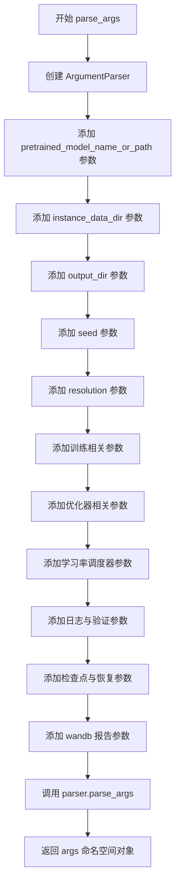
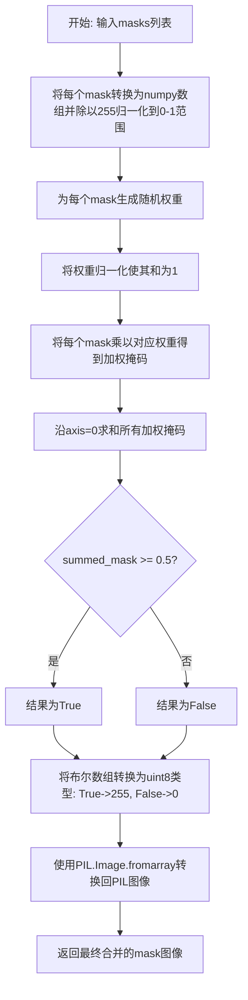
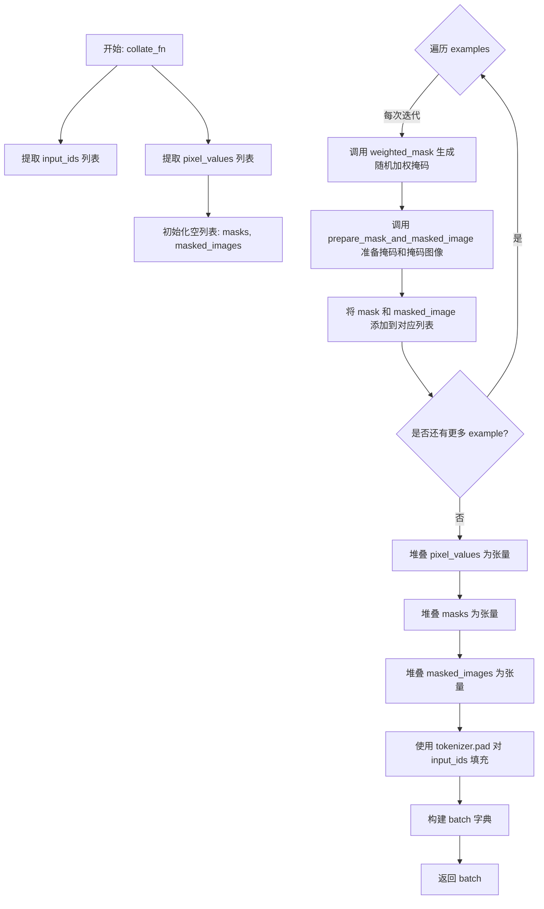
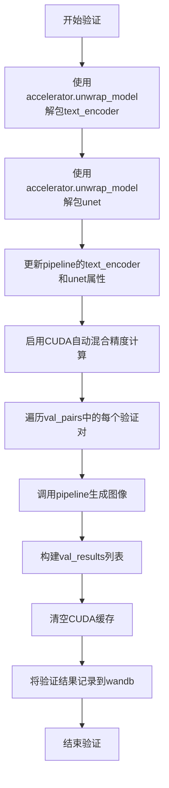
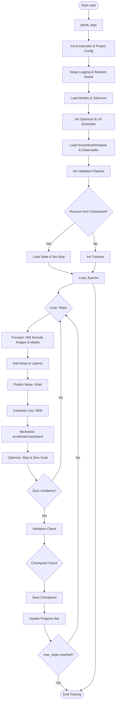
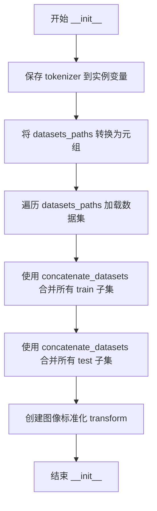
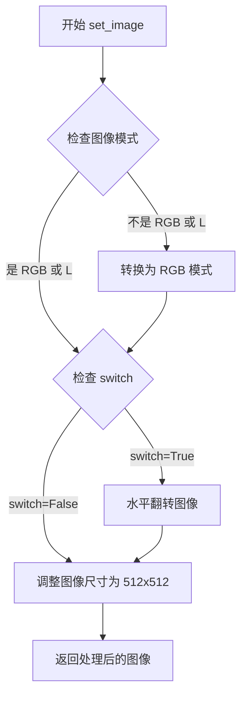
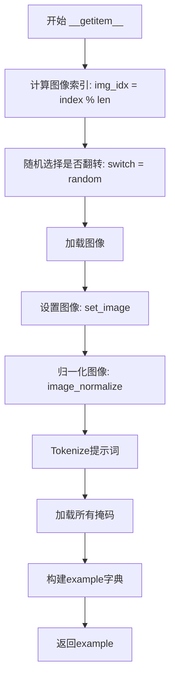

# `diffusers\examples\research_projects\multi_subject_dreambooth_inpainting\train_multi_subject_dreambooth_inpainting.py` 详细设计文档

这是一个用于训练 Stable Diffusion Inpainting 模型的脚本（基于 DreamBooth 概念）。它使用 Hugging Face 的 Diffusers 和 Accelerate 库，支持多 GPU 训练、混合精度（fp16/bf16）、文本编码器微调、验证日志记录（ wandb）以及模型检查点保存。

## 整体流程

```mermaid
graph TD
    A[开始] --> B[解析命令行参数 (parse_args)]
    B --> C[初始化 Accelerator (混合精度, 分布式)]
    C --> D[加载预训练模型 (UNet, VAE, TextEncoder, Tokenizer)]
    D --> E[构建优化器 (AdamW) 和 调度器 (LR Scheduler)]
    E --> F[加载数据集 (DreamBoothDataset) 和 DataLoader]
    F --> G[初始化日志与可视化 (WandB)]
    G --> H{检查是否需要恢复训练}
    H -- 是 --> I[从 Checkpoint 恢复状态]
    H -- 否 --> J[开始训练循环]
    I --> J
    J --> K[遍历 Epoch]
    K --> L[遍历 Batch (collate_fn)]
    L --> M[VAE 编码图像与 Mask (潜在空间)]
    M --> N[DDPM 添加噪声 (前向扩散)]
    N --> O[UNet 预测噪声 (反向过程)]
    O --> P[计算 MSE Loss]
    P --> Q[Accelerator 反向传播与梯度累加]
    Q --> R[Optimizer 更新参数]
    R --> S{是否同步梯度?}
    S -- 否 --> L
    S -- 是 --> T[更新全局步数 global_step]
    T --> U{是否满足验证条件?}
    U -- 是 --> V[调用 log_validation (推理验证)]
    U -- 否 --> W{是否满足保存 Checkpoint 条件?}
    V --> W
    W -- 是 --> X[调用 checkpoint (保存状态)]
    W -- 否 --> Y{训练是否结束?}
    X --> Y
    Y -- 否 --> L
    Y -- 是 --> Z[结束训练 (accelerator.end_training)]
```

## 类结构

```
Script: train_dreambooth_inpainting.py
├── Global Config: logger (Accelerate logger)
├── Class: DreamBoothDataset (torch.utils.data.Dataset)
│   ├── __init__
│   ├── set_image
│   ├── __len__
│   └── __getitem__
├── Function: parse_args
├── Function: prepare_mask_and_masked_image
├── Function: weighted_mask
├── Function: collate_fn
├── Function: log_validation
├── Function: checkpoint
└── Function: main (主训练逻辑)
```

## 全局变量及字段


### `logger`
    
Logger instance for tracking training progress and debugging information.

类型：`logging.Logger`
    


### `args`
    
Parsed command-line arguments containing all training configuration parameters.

类型：`argparse.Namespace`
    


### `weight_dtype`
    
Data type for model weights based on mixed precision setting (fp16, bf16, or fp32).

类型：`torch.dtype`
    


### `noise_scheduler`
    
Denoising diffusion probabilistic model scheduler for controlling the noise addition process during training.

类型：`DDPMScheduler`
    


### `train_dataset`
    
Custom dataset class for loading and processing training images with prompts and masks.

类型：`DreamBoothDataset`
    


### `train_dataloader`
    
Data loader for batching and iterating over the training dataset during training.

类型：`torch.utils.data.DataLoader`
    


### `unet`
    
U-Net model for predicting noise in latent space conditioned on text embeddings.

类型：`UNet2DConditionModel`
    


### `text_encoder`
    
CLIP text encoder for converting input prompts into text embeddings for conditioning.

类型：`CLIPTextModel`
    


### `vae`
    
Variational autoencoder for encoding images to latent space and decoding them back.

类型：`AutoencoderKL`
    


### `optimizer`
    
AdamW optimizer for updating model parameters during training.

类型：`torch.optim.AdamW`
    


### `lr_scheduler`
    
Learning rate scheduler for adjusting the learning rate throughout training.

类型：`torch.optim.lr_scheduler._LRScheduler`
    


### `accelerator`
    
Accelerate library wrapper for managing distributed training and mixed precision.

类型：`Accelerator`
    


### `DreamBoothDataset.tokenizer`
    
Tokenizer for converting text prompts to token IDs for the text encoder.

类型：`CLIPTokenizer`
    


### `DreamBoothDataset.datasets_paths`
    
Tuple of paths pointing to the directories containing the training and test datasets.

类型：`tuple`
    


### `DreamBoothDataset.datasets`
    
List of loaded datasets from the specified dataset paths.

类型：`list`
    


### `DreamBoothDataset.train_data`
    
Concatenated training data from all loaded datasets.

类型：`Dataset`
    


### `DreamBoothDataset.test_data`
    
Concatenated test/validation data from all loaded datasets.

类型：`Dataset`
    


### `DreamBoothDataset.image_normalize`
    
Transform composition for normalizing images to [-1, 1] range.

类型：`transforms.Compose`
    
    

## 全局函数及方法


### `parse_args`

该函数用于解析命令行参数，创建一个包含所有训练配置参数的 Namespace 对象，供主训练脚本使用。

参数：此函数无显式参数（使用 `sys.argv` 作为默认输入）

返回值：`argparse.Namespace`，返回一个包含所有命令行参数的命名空间对象，属性包括：`pretrained_model_name_or_path`、`instance_data_dir`、`output_dir`、`seed`、`resolution`、`train_text_encoder`、`train_batch_size`、`sample_batch_size`、`max_train_steps`、`gradient_accumulation_steps`、`learning_rate`、`scale_lr`、`lr_scheduler`、`lr_warmup_steps`、`adam_beta1`、`adam_beta2`、`adam_weight_decay`、`adam_epsilon`、`max_grad_norm`、`logging_dir`、`mixed_precision`、`checkpointing_steps`、`checkpointing_from`、`validation_steps`、`validation_from`、`checkpoints_total_limit`、`resume_from_checkpoint`、`validation_project_name`、`report_to_wandb` 等。

#### 流程图



#### 带注释源码

```python
def parse_args():
    """
    解析命令行参数并返回包含所有训练配置的命名空间对象。
    
    该函数创建了一个 argparse.ArgumentParser 实例，定义了用于训练 Stable Diffusion
    DreamBooth 模型的各种命令行参数，包括模型路径、数据目录、优化器设置、学习率调度、
    验证设置、检查点管理等方面的配置。
    """
    # 创建参数解析器，description 提供脚本的简要说明
    parser = argparse.ArgumentParser(description="Simple example of a training script.")
    
    # 添加预训练模型路径或模型标识符（必需参数）
    parser.add_argument(
        "--pretrained_model_name_or_path",
        type=str,
        default=None,
        required=True,
        help="Path to pretrained model or model identifier from huggingface.co/models.",
    )
    
    # 添加实例数据目录，支持多个目录（使用 nargs="+"）
    parser.add_argument("--instance_data_dir", nargs="+", help="Instance data directories")
    
    # 添加输出目录参数，默认值为 "text-inversion-model"
    parser.add_argument(
        "--output_dir",
        type=str,
        default="text-inversion-model",
        help="The output directory where the model predictions and checkpoints will be written.",
    )
    
    # 添加随机种子参数，用于确保训练可复现
    parser.add_argument("--seed", type=int, default=None, help="A seed for reproducible training.")
    
    # 添加输入图像分辨率参数，默认值为 512
    parser.add_argument(
        "--resolution",
        type=int,
        default=512,
        help=(
            "The resolution for input images, all the images in the train/validation dataset will be resized to this"
            " resolution"
        ),
    )
    
    # 添加是否训练文本编码器的标志参数
    parser.add_argument(
        "--train_text_encoder", default=False, action="store_true", help="Whether to train the text encoder"
    )
    
    # 添加训练批次大小参数（每设备）
    parser.add_argument(
        "--train_batch_size", type=int, default=4, help="Batch size (per device) for the training dataloader."
    )
    
    # 添加采样批次大小参数（每设备）
    parser.add_argument(
        "--sample_batch_size", type=int, default=4, help="Batch size (per device) for sampling images."
    )
    
    # 添加最大训练步数参数
    parser.add_argument(
        "--max_train_steps",
        type=int,
        default=None,
        help="Total number of training steps to perform.  If provided, overrides num_train_epochs.",
    )
    
    # 添加梯度累积步数参数
    parser.add_argument(
        "--gradient_accumulation_steps",
        type=int,
        default=1,
        help="Number of updates steps to accumulate before performing a backward/update pass.",
    )
    
    # 添加学习率参数
    parser.add_argument(
        "--learning_rate",
        type=float,
        default=5e-6,
        help="Initial learning rate (after the potential warmup period) to use.",
    )
    
    # 添加是否按 GPU 数量、梯度累积步数和批次大小缩放学习率的标志
    parser.add_argument(
        "--scale_lr",
        action="store_true",
        default=False,
        help="Scale the learning rate by the number of GPUs, gradient accumulation steps, and batch size.",
    )
    
    # 添加学习率调度器类型参数
    parser.add_argument(
        "--lr_scheduler",
        type=str,
        default="constant",
        help=(
            'The scheduler type to use. Choose between ["linear", "cosine", "cosine_with_restarts", "polynomial",'
            ' "constant", "constant_with_warmup"]'
        ),
    )
    
    # 添加学习率预热步数参数
    parser.add_argument(
        "--lr_warmup_steps", type=int, default=500, help="Number of steps for the warmup in the lr scheduler."
    )
    
    # 添加 Adam 优化器的 beta1 参数
    parser.add_argument("--adam_beta1", type=float, default=0.9, help="The beta1 parameter for the Adam optimizer.")
    
    # 添加 Adam 优化器的 beta2 参数
    parser.add_argument("--adam_beta2", type=float, default=0.999, help="The beta2 parameter for the Adam optimizer.")
    
    # 添加 Adam 优化器的权重衰减参数
    parser.add_argument("--adam_weight_decay", type=float, default=1e-2, help="Weight decay to use.")
    
    # 添加 Adam 优化器的 epsilon 参数
    parser.add_argument("--adam_epsilon", type=float, default=1e-08, help="Epsilon value for the Adam optimizer")
    
    # 添加梯度裁剪的最大范数参数
    parser.add_argument("--max_grad_norm", default=1.0, type=float, help="Max gradient norm.")
    
    # 添加日志目录参数（用于 TensorBoard）
    parser.add_argument(
        "--logging_dir",
        type=str,
        default="logs",
        help=(
            "[TensorBoard](https://www.tensorflow.org/tensorboard) log directory. Will default to"
            " *output_dir/runs/**CURRENT_DATETIME_HOSTNAME***."
        ),
    )
    
    # 添加混合精度训练参数
    parser.add_argument(
        "--mixed_precision",
        type=str,
        default="no",
        choices=["no", "fp16", "bf16"],
        help=(
            "Whether to use mixed precision. Choose"
            "between fp16 and bf16 (bfloat16). Bf16 requires PyTorch >= 1.10."
            "and an Nvidia Ampere GPU."
        ),
    )
    
    # 添加检查点保存步数参数
    parser.add_argument(
        "--checkpointing_steps",
        type=int,
        default=1000,
        help=(
            "Save a checkpoint of the training state every X updates. These checkpoints can be used both as final"
            " checkpoints in case they are better than the last checkpoint and are suitable for resuming training"
            " using `--resume_from_checkpoint`."
        ),
    )
    
    # 添加检查点保存起始步数参数
    parser.add_argument(
        "--checkpointing_from",
        type=int,
        default=1000,
        help=("Start to checkpoint from step"),
    )
    
    # 添加验证步数参数
    parser.add_argument(
        "--validation_steps",
        type=int,
        default=50,
        help=(
            "Run validation every X steps. Validation consists of running the prompt"
            " `args.validation_prompt` multiple times: `args.num_validation_images`"
            " and logging the images."
        ),
    )
    
    # 添加验证起始步数参数
    parser.add_argument(
        "--validation_from",
        type=int,
        default=0,
        help=("Start to validate from step"),
    )
    
    # 添加检查点总数限制参数
    parser.add_argument(
        "--checkpoints_total_limit",
        type=int,
        default=None,
        help=(
            "Max number of checkpoints to store. Passed as `total_limit` to the `Accelerator` `ProjectConfiguration`."
            " See Accelerator::save_state https://huggingface.co/docs/accelerate/package_reference/accelerator#accelerate.Accelerator.save_state"
            " for more docs"
        ),
    )
    
    # 添加从检查点恢复训练参数
    parser.add_argument(
        "--resume_from_checkpoint",
        type=str,
        default=None,
        help=(
            "Whether training should be resumed from a previous checkpoint. Use a path saved by"
            ' `--checkpointing_steps`, or `"latest"` to automatically select the last available checkpoint.'
        ),
    )
    
    # 添加验证项目名称参数（用于 wandb）
    parser.add_argument(
        "--validation_project_name",
        type=str,
        default=None,
        help="The w&b name.",
    )
    
    # 添加是否报告到 wandb 的标志参数
    parser.add_argument(
        "--report_to_wandb", default=False, action="store_true", help="Whether to report to weights and biases"
    )

    # 解析命令行参数（默认使用 sys.argv）
    args = parser.parse_args()

    # 返回包含所有参数的命名空间对象
    return args
```


### `prepare_mask_and_masked_image`

该函数用于将输入的PIL图像和掩码转换为适用于Stable Diffusion修复（inpainting）模型的张量格式，包括图像的归一化和掩码的二值化处理，同时生成掩码后的图像。

参数：

- `image`：`PIL.Image.Image`，输入的RGB图像，用于作为修复任务的主体图像
- `mask`：`PIL.Image.Image`，输入的灰度掩码图像，用于指示需要修复的区域（白色区域为需要修复的区域）

返回值：`Tuple[torch.Tensor, torch.Tensor]`，返回元组包含两个张量——第一个是二值化后的掩码张量（形状为[1, 1, H, W]，值为0或1），第二个是与原图像形状相同的掩码后图像张量（形状为[1, 3, H, W]，在需要修复的区域像素值为-1）

#### 流程图

```mermaid
flowchart TD
    A[开始] --> B[将image转换为RGB模式并转为numpy数组]
    B --> C[添加batch维度并转置通道顺序: HWC to CHW]
    C --> D[转换为float32张量并归一化到-1到1范围]
    E[将mask转换为L模式并转为numpy数组]
    E --> F[转换为float32并归一化到0到1范围]
    F --> G[添加batch和通道维度]
    G --> H{阈值判断}
    H -->|mask < 0.5| I[设为0]
    H -->|mask >= 0.5| J[设为1]
    I --> K[转为torch张量]
    J --> K
    K --> L[计算masked_image: image × (mask < 0.5)]
    D --> L
    L --> M[返回mask和masked_image]
```

#### 带注释源码

```python
def prepare_mask_and_masked_image(image, mask):
    """
    准备掩码和掩码图像，用于Stable Diffusion修复任务
    
    参数:
        image: PIL图像对象，输入的RGB图像
        mask: PIL图像对象，灰度掩码（白色表示需要修复的区域）
    
    返回:
        mask: 二值化后的掩码张量，形状为[1, 1, H, W]
        masked_image: 掩码后的图像张量，形状为[1, 3, H, W]
    """
    
    # ============ 处理原始图像 ============
    # 将PIL图像转换为RGB模式（确保通道顺序正确）
    image = np.array(image.convert("RGB"))
    
    # 添加batch维度并转置图像格式：从HWC (Height, Width, Channel) 转为CHW (Channel, Height, Width)
    # 原始shape: (H, W, 3) -> 转换后: (1, 3, H, W)
    image = image[None].transpose(0, 3, 1, 2)
    
    # 转换为PyTorch张量，并归一化到[-1, 1]范围
    # 原像素值范围[0, 255] -> 除以127.5得到[0, 2] -> 减1得到[-1, 1]
    image = torch.from_numpy(image).to(dtype=torch.float32) / 127.5 - 1.0

    # ============ 处理掩码图像 ============
    # 将掩码转换为灰度模式
    mask = np.array(mask.convert("L"))
    
    # 转换为float32并归一化到[0, 1]范围
    mask = mask.astype(np.float32) / 255.0
    
    # 添加batch和通道维度：原始shape: (H, W) -> 转换后: (1, 1, H, W)
    mask = mask[None, None]
    
    # 二值化处理：将掩码转换为0或1
    # 阈值0.5：小于0.5设为0，大于等于0.5设为1
    mask[mask < 0.5] = 0
    mask[mask >= 0.5] = 1
    
    # 转换为PyTorch张量
    mask = torch.from_numpy(mask)

    # ============ 生成掩码后的图像 ============
    # 创建掩码后的图像：对于需要修复的区域（mask=1），像素值设为-1
    # (mask < 0.5) 会产生一个布尔张量，当mask=0时为True，mask=1时为False
    # 这样需要修复的区域会被乘以True(1)，实际效果是将原图对应位置保留
    # 等等，这里逻辑有误：原图 * (mask < 0.5) 意味着mask=0的位置保留原图，mask=1的位置设为0
    # 实际上这个操作的目的是：在inpainting中，将mask=1（需要修复）的区域设为某个默认值
    masked_image = image * (mask < 0.5)

    return mask, masked_image
```


### `weighted_mask`

该函数接收一个掩码列表，通过为每个掩码生成随机权重并进行加权求和，然后应用阈值生成最终的合并掩码图像。

参数：

- `masks`：`list`，包含多个 PIL Image 对象的列表，每个对象是一个二值掩码图像

返回值：`PIL.Image.Image`，返回合并后的加权二值掩码图像

#### 流程图



#### 带注释源码

```python
def weighted_mask(masks):
    # 将每个掩码转换为NumPy数组并归一化到0-1范围
    mask_arrays = [np.array(mask) / 255 for mask in masks]  # Normalizing to 0-1 range

    # 生成随机权重并应用到每个掩码
    weights = [random.random() for _ in masks]  # 为每个mask生成随机权重
    weights = [weight / sum(weights) for weight in weights]  # 归一化权重使其和为1
    weighted_masks = [mask * weight for mask, weight in zip(mask_arrays, weights)]  # 加权每个掩码

    # 对加权掩码求和
    summed_mask = np.sum(weighted_masks, axis=0)  # 沿axis=0累加所有加权掩码

    # 应用阈值创建最终掩码
    threshold = 0.5  # 此阈值可根据需要调整
    result_mask = summed_mask >= threshold  # 生成布尔数组

    # 将结果转回PIL图像
    return Image.fromarray(result_mask.astype(np.uint8) * 255)  # 转换回uint8并映射到0/255
```


### `collate_fn`

该函数是 DreamBooth 数据加载器的批处理函数，负责将数据集中的一组样本合并成一个训练批次。它从每个样本中提取图像和提示词，生成随机加权掩码，准备掩码图像，并将所有数据整理成张量格式以供模型输入。

参数：

- `examples`：`List[Dict]`，来自 `DreamBoothDataset` 的样本列表，每个字典包含 "instance_prompt_id"、"instance_image"、"PIL_image" 和 "instance_masks" 键
- `tokenizer`：`CLIPTokenizer`，Hugging Face 的 CLIP 分词器，用于对输入的提示词进行填充（padding）操作

返回值：`Dict`，包含以下键的字典：
- `input_ids`：`torch.Tensor`，形状为 (batch_size, seq_len)，填充后的提示词 token IDs
- `pixel_values`：`torch.Tensor`，形状为 (batch_size, 3, 512, 512)，归一化后的图像张量
- `masks`：`torch.Tensor`，形状为 (batch_size, 1, 512, 512)，二值掩码张量
- `masked_images`：`torch.Tensor`，形状为 (batch_size, 3, 512, 512)，被掩码覆盖的图像张量

#### 流程图



#### 带注释源码

```python
def collate_fn(examples, tokenizer):
    # 从每个样本中提取 tokenized prompt IDs 列表
    # examples[i]["instance_prompt_id"] 是已经通过 tokenizer 处理过的 token IDs
    input_ids = [example["instance_prompt_id"] for example in examples]
    
    # 从每个样本中提取归一化后的图像张量
    # 这些图像已经通过 DreamBoothDataset 中的 image_normalize 转换器处理
    pixel_values = [example["instance_image"] for example in examples]

    # 初始化用于存储掩码和掩码图像的列表
    masks, masked_images = [], []

    # 遍历每个样本，为其生成掩码并准备掩码图像
    for example in examples:
        # 使用加权随机方法从多个候选掩码中生成一个随机掩码
        # weighted_mask 函数会对多个掩码进行随机加权组合
        mask = weighted_mask(example["instance_masks"])

        # 将 PIL 图像和掩码转换为模型所需的张量格式
        # mask 被转换为二值张量，masked_image 是应用掩码后的图像
        mask, masked_image = prepare_mask_and_masked_image(example["PIL_image"], mask)

        # 将处理后的掩码和掩码图像添加到列表中
        masks.append(mask)
        masked_images.append(masked_image)

    # 将像素值列表堆叠成 4D 张量，形状为 (batch_size, C, H, W)
    # 使用 contiguous_format 确保内存布局连续，提升计算效率
    # 转换为 float32 类型
    pixel_values = torch.stack(pixel_values).to(memory_format=torch.contiguous_format).float()
    
    # 将掩码列表堆叠成 4D 张量，形状为 (batch_size, 1, H, W)
    masks = torch.stack(masks)
    
    # 将掩码图像列表堆叠成 4D 张量，形状为 (batch_size, C, H, W)
    masked_images = torch.stack(masked_images)
    
    # 使用 tokenizer 对 input_ids 进行填充，使每个序列长度一致
    # padding=True 会将较短序列填充到最长序列的长度
    # return_tensors="pt" 返回 PyTorch 张量
    input_ids = tokenizer.pad({"input_ids": input_ids}, padding=True, return_tensors="pt").input_ids

    # 构建最终的训练批次字典，包含模型所需的所有输入数据
    batch = {
        "input_ids": input_ids,        # 文本嵌入的 token IDs
        "pixel_values": pixel_values,  # 原始图像像素值
        "masks": masks,                # 图像掩码
        "masked_images": masked_images # 被掩码处理的图像
    }

    return batch
```


### `log_validation`

该函数用于在训练过程中执行验证任务，通过加载已训练好的文本编码器和UNet模型，对验证数据集进行推理，并将生成的图像记录到Weights & Biases日志工具中。

参数：

- `pipeline`：`StableDiffusionInpaintPipeline`，用于图像修复的扩散模型推理管道
- `text_encoder`：`CLIPTextModel`，经过训练或微调的文本编码器模型
- `unet`：`UNet2DConditionModel`，经过训练或微调的UNet条件模型
- `val_pairs`：`List[Dict]`，验证数据对列表，每个字典包含"image"、"mask_image"和"prompt"键
- `accelerator`：`Accelerator`，来自accelerate库的分布式训练加速器，用于模型管理和设备分配

返回值：`None`，该函数无返回值，仅执行模型推理和日志记录操作

#### 流程图



#### 带注释源码

```python
def log_validation(pipeline, text_encoder, unet, val_pairs, accelerator):
    # 使用accelerator.unwrap_model从分布式训练状态中恢复原始模型对象
    # 并将其赋值给pipeline的对应属性，以便进行推理
    pipeline.text_encoder = accelerator.unwrap_model(text_encoder)
    pipeline.unet = accelerator.unwrap_model(unet)

    # 使用torch.autocast("cuda")启用CUDA自动混合精度计算
    # 这可以加速推理过程并减少显存占用
    with torch.autocast("cuda"):
        # 遍历所有验证数据对，调用pipeline进行图像修复推理
        # pipeline(**pair)接收包含image、mask_image和prompt的字典
        # .images[0]获取生成的第一张图像
        # 为每个结果构建包含图像数据和标题的字典
        val_results = [{"data_or_path": pipeline(**pair).images[0], "caption": pair["prompt"]} for pair in val_pairs]

    # 手动清空CUDA缓存，释放验证过程中产生的临时显存
    torch.cuda.empty_cache()

    # 将验证结果记录到Weights & Biases
    # 将每个结果转换为wandb.Image格式进行可视化记录
    wandb.log({"validation": [wandb.Image(**val_result) for val_result in val_results]})
```


### `checkpoint`

该函数用于在训练过程中保存模型的检查点（checkpoint），通过Accelerator的save_state方法将当前训练状态（包括模型参数、优化器状态等）保存到指定的输出目录，以便后续可以恢复训练或作为最终模型使用。

参数：

- `args`：命名空间（Namespace），包含输出目录路径（`output_dir`）等训练参数，用于构建检查点保存路径
- `global_step`：整数（int），表示当前的全局训练步数，用于构建检查点文件夹名称（如`checkpoint-1000`）
- `accelerator`：`Accelerator`对象，来自Hugging Face Accelerate库，负责分布式训练状态管理，提供`save_state`方法用于保存训练状态

返回值：无返回值（`None`），该函数仅执行状态保存和日志记录操作

#### 流程图

```mermaid
flowchart TD
    A[开始 checkpoint 函数] --> B[构建保存路径: os.path.join(args.output_dir, f'checkpoint-{global_step}')]
    B --> C[调用 accelerator.save_state 保存训练状态到指定路径]
    C --> D[记录日志: logger.info 保存成功信息]
    D --> E[结束函数]
```

#### 带注释源码

```python
def checkpoint(args, global_step, accelerator):
    """
    保存训练检查点
    
    该函数在训练过程中定期调用，用于保存当前训练状态。
    使用Accelerator的save_state方法可以完整保存模型权重、
    优化器状态、学习率调度器状态等，使训练可以从该检查点恢复。
    
    参数:
        args: 包含训练配置的命令行参数命名空间对象，必须包含output_dir属性
        global_step: int类型，表示当前已完成的训练步数，用于命名检查点目录
        accelerator: Accelerator对象，用于执行分布式保存操作
    
    返回:
        None: 该函数不返回任何值，仅执行副作用（保存文件和记录日志）
    """
    # 构建检查点保存路径，格式为: output_dir/checkpoint-{global_step}
    save_path = os.path.join(args.output_dir, f"checkpoint-{global_step}")
    
    # 调用Accelerator的save_state方法保存完整的训练状态
    # 这包括: UNet模型参数、Text Encoder参数(如果训练)、优化器状态、
    # 学习率调度器状态、随机数生成器状态等
    accelerator.save_state(save_path)
    
    # 记录保存成功的日志信息，便于调试和追踪
    logger.info(f"Saved state to {save_path}")
```

#### 关键技术细节

| 特性 | 说明 |
|------|------|
| **调用时机** | 在主进程（`accelerator.is_main_process`）中，每隔`checkpointing_steps`步调用一次 |
| **保存内容** | 完整的训练状态，包括所有模型参数、优化器状态、调度器状态等 |
| **恢复能力** | 可以通过`accelerator.load_state`从保存的检查点恢复训练 |
| **分布式支持** | 通过Accelerator自动处理多进程/多GPU环境下的状态保存 |


### 一、代码概述

该代码实现了一个基于 Stable Diffusion 的 DreamBooth 训练脚本（专注于图像修复/Inpainting 任务）。其核心功能是加载预训练的扩散模型、自定义数据集（含图像与掩码），并通过微调 UNet 和 TextEncoder 来实现个性化概念的学习。代码集成了 `Accelerator` 以支持分布式混合精度训练，并包含了验证推理与检查点保存逻辑。

### 二、文件整体运行流程

该脚本是一个标准的 PyTorch 训练入口文件。运行时，首先通过 `parse_args()` 解析命令行参数，随后初始化分布式训练环境。紧接着加载分词器、文本编码器、VAE 和 UNet 模型，并准备数据集。在配置好优化器和学习率调度器后，进入主训练循环：数据被送入模型进行前向传播、噪声预测和损失计算，随后执行反向传播与参数更新。训练过程中会周期性触发验证（生成图像并记录日志）和检查点保存，最后结束训练。

---

### 三、类的详细信息

#### 1. DreamBoothDataset

**描述**：自定义的 PyTorch Dataset 类，用于加载训练所需的图像、文本提示（prompt）以及对应的掩码（mask）。

**字段**：
- `tokenizer`：CLIPTokenizer，用于对文本提示进行分词。
- `datasets_paths`：元组，包含数据加载路径。
- `datasets`：Hugging Face `Dataset` 对象列表。
- `train_data`：合并后的训练集。
- `test_data`：合并后的验证集。
- `image_normalize`：图像预处理变换（ToTensor + Normalize）。

**方法**：
- `__init__(self, tokenizer, datasets_paths)`：初始化数据集，加载并合并指定路径下的数据。
- `set_image(img, switch)`：调整图像大小并进行可选的水平翻转。
- `__len__(self)`：返回训练集长度。
- `__getitem__(self, index)`：根据索引获取图像、归一化图像、tokenized prompt 和掩码列表。

```python
class DreamBoothDataset(Dataset):
    def __init__(
        self,
        tokenizer,
        datasets_paths,
    ):
        self.tokenizer = tokenizer
        self.datasets_paths = (datasets_paths,)
        self.datasets = [load_dataset(dataset_path) for dataset_path in self.datasets_paths[0]]
        self.train_data = concatenate_datasets([dataset["train"] for dataset in self.datasets])
        self.test_data = concatenate_datasets([dataset["test"] for dataset in self.datasets])

        self.image_normalize = transforms.Compose(
            [
                transforms.ToTensor(),
                transforms.Normalize([0.5], [0.5]),
            ]
        )

    def set_image(self, img, switch):
        if img.mode not in ["RGB", "L"]:
            img = img.convert("RGB")

        if switch:
            img = img.transpose(Image.FLIP_LEFT_RIGHT)

        img = img.resize((512, 512), Image.BILINEAR)

        return img

    def __len__(self):
        return len(self.train_data)

    def __getitem__(self, index):
        # Lettings
        example = {}
        img_idx = index % len(self.train_data)
        switch = random.choice([True, False])

        # Load image
        image = self.set_image(self.train_data[img_idx]["image"], switch)

        # Normalize image
        image_norm = self.image_normalize(image)

        # Tokenise prompt
        tokenized_prompt = self.tokenizer(
            self.train_data[img_idx]["prompt"],
            padding="do_not_pad",
            truncation=True,
            max_length=self.tokenizer.model_max_length,
        ).input_ids

        # Load masks for image
        masks = [
            self.set_image(self.train_data[img_idx][key], switch) for key in self.train_data[img_idx] if "mask" in key
        ]

        # Build example
        example["PIL_image"] = image
        example["instance_image"] = image_norm
        example["instance_prompt_id"] = tokenized_prompt
        example["instance_masks"] = masks

        return example
```

---

### 四、关键组件信息

1.  **parse_args**：全局函数，负责解析所有训练超参数（如模型路径、学习率、批量大小等）。
2.  **collate_fn**：全局函数，作为 DataLoader 的回调，用于将样本批次整理成包含 `input_ids`, `pixel_values`, `masks`, `masked_images` 的字典，并调用 `weighted_mask` 生成训练用掩码。
3.  **prepare_mask_and_masked_image**：全局函数，将 PIL 图像和掩码转换为模型可用的张量格式，并对像素进行归一化。
4.  **weighted_mask**：全局函数，通过随机权重合并多个掩码生成最终的训练用二值掩码。
5.  **log_validation**：全局函数，用于在训练过程中运行推理并通过 Weights & Biases (wandb) 记录验证结果。
6.  **checkpoint**：全局函数，负责调用 `accelerator.save_state` 保存训练进度。

---

### 五、主函数详细设计

#### `main`

**描述**：整个训练脚本的核心入口函数。它协调了从环境配置、模型加载、数据准备到训练循环执行的全部流程。

**参数**：
- 无显式参数（内部通过调用 `parse_args()` 获取 `args` 对象）。

**返回值**：`None`，执行完成后直接退出。

#### 流程图



#### 带注释源码

```python
def main():
    # 1. 解析命令行参数
    args = parse_args()

    # 2. 配置 Accelerator (分布式训练、混合精度、记录器)
    project_config = ProjectConfiguration(
        total_limit=args.checkpoints_total_limit,
        project_dir=args.output_dir,
        logging_dir=Path(args.output_dir, args.logging_dir),
    )

    accelerator = Accelerator(
        gradient_accumulation_steps=args.gradient_accumulation_steps,
        mixed_precision=args.mixed_precision,
        project_config=project_config,
        log_with="wandb" if args.report_to_wandb else None,
    )

    # 检查 wandb 依赖
    if args.report_to_wandb and not is_wandb_available():
        raise ImportError("Make sure to install wandb if you want to use it for logging during training.")

    # 设置随机种子以保证可复现性
    if args.seed is not None:
        set_seed(args.seed)

    # 配置日志格式
    logging.basicConfig(
        format="%(asctime)s - %(levelname)s - %(name)s - %(message)s",
        datefmt="%m/%d/%Y %H:%M:%S",
        level=logging.INFO,
    )
    logger.info(accelerator.state, main_process_only=False)

    # 3. 加载预训练模型 (Tokenizer, TextEncoder, VAE, UNet)
    tokenizer = CLIPTokenizer.from_pretrained(args.pretrained_model_name_or_path, subfolder="tokenizer")
    text_encoder = CLIPTextModel.from_pretrained(
        args.pretrained_model_name_or_path, subfolder="text_encoder"
    ).requires_grad_(args.train_text_encoder)
    vae = AutoencoderKL.from_pretrained(args.pretrained_model_name_or_path, subfolder="vae").requires_grad_(False)
    unet = UNet2DConditionModel.from_pretrained(args.pretrained_model_name_or_path, subfolder="unet")

    # 如果开启 lr 缩放
    if args.scale_lr:
        args.learning_rate = (
            args.learning_rate * args.gradient_accumulation_steps * args.train_batch_size * accelerator.num_processes
        )

    # 4. 初始化优化器 (AdamW)
    optimizer = torch.optim.AdamW(
        params=itertools.chain(unet.parameters(), text_encoder.parameters())
        if args.train_text_encoder
        else unet.parameters(),
        lr=args.learning_rate,
        betas=(args.adam_beta1, args.adam_beta2),
        weight_decay=args.adam_weight_decay,
        eps=args.adam_epsilon,
    )

    # 加载噪声调度器
    noise_scheduler = DDPMScheduler.from_pretrained(args.pretrained_model_name_or_path, subfolder="scheduler")

    # 5. 准备数据集
    train_dataset = DreamBoothDataset(
        tokenizer=tokenizer,
        datasets_paths=args.instance_data_dir,
    )

    train_dataloader = torch.utils.data.DataLoader(
        train_dataset,
        batch_size=args.train_batch_size,
        shuffle=True,
        collate_fn=lambda examples: collate_fn(examples, tokenizer),
    )

    # 6. 配置学习率调度器
    num_update_steps_per_epoch = math.ceil(len(train_dataloader) / args.gradient_accumulation_steps)
    lr_scheduler = get_scheduler(
        args.lr_scheduler,
        optimizer=optimizer,
        num_warmup_steps=args.lr_warmup_steps * accelerator.num_processes,
        num_training_steps=args.max_train_steps * accelerator.num_processes,
    )

    # 7. 模型准备 (移动到设备并混合精度处理)
    if args.train_text_encoder:
        unet, text_encoder, optimizer, train_dataloader, lr_scheduler = accelerator.prepare(
            unet, text_encoder, optimizer, train_dataloader, lr_scheduler
        )
    else:
        unet, optimizer, train_dataloader, lr_scheduler = accelerator.prepare(
            unet, optimizer, train_dataloader, lr_scheduler
        )

    accelerator.register_for_checkpointing(lr_scheduler)

    # 确定数据类型 (fp16, bf16, fp32)
    if args.mixed_precision == "fp16":
        weight_dtype = torch.float16
    elif args.mixed_precision == "bf16":
        weight_dtype = torch.bfloat16
    else:
        weight_dtype = torch.float32

    # 移动 VAE 和 TextEncoder 到 GPU
    vae.to(accelerator.device, dtype=weight_dtype)
    if not args.train_text_encoder:
        text_encoder.to(accelerator.device, dtype=weight_dtype)

    # 计算总训练步数
    num_update_steps_per_epoch = math.ceil(len(train_dataloader) / args.gradient_accumulation_steps)
    num_train_epochs = math.ceil(args.max_train_steps / num_update_steps_per_epoch)

    # 初始化 trackers (如 wandb)
    if accelerator.is_main_process:
        tracker_config = vars(copy.deepcopy(args))
        accelerator.init_trackers(args.validation_project_name, config=tracker_config)

    # 8. 准备验证 Pipeline
    val_pipeline = StableDiffusionInpaintPipeline.from_pretrained(
        args.pretrained_model_name_or_path,
        tokenizer=tokenizer,
        text_encoder=text_encoder,
        unet=unet,
        vae=vae,
        torch_dtype=weight_dtype,
        safety_checker=None,
    )
    val_pipeline.set_progress_bar_config(disable=True)

    # 准备验证数据对
    val_pairs = [
        {
            "image": example["image"],
            "mask_image": mask,
            "prompt": example["prompt"],
        }
        for example in train_dataset.test_data
        for mask in [example[key] for key in example if "mask" in key]
    ]

    # 注册模型保存钩子
    def save_model_hook(models, weights, output_dir):
        if accelerator.is_main_process:
            for model in models:
                sub_dir = "unet" if isinstance(model, type(accelerator.unwrap_model(unet))) else "text_encoder"
                model.save_pretrained(os.path.join(output_dir, sub_dir))
                weights.pop()

    accelerator.register_save_state_pre_hook(save_model_hook)

    # 9. 训练循环
    logger.info("***** Running training *****")
    global_step = 0
    first_epoch = 0

    # 检查点恢复逻辑
    if args.resume_from_checkpoint:
        # ... (加载检查点逻辑，设置 global_step, first_epoch, resume_step)
        pass

    progress_bar = tqdm(range(global_step, args.max_train_steps), disable=not accelerator.is_main_process)

    for epoch in range(first_epoch, num_train_epochs):
        unet.train()
        for step, batch in enumerate(train_dataloader):
            # 恢复训练逻辑
            if args.resume_from_checkpoint and epoch == first_epoch and step < resume_step:
                # ... (跳过步骤)
                continue

            # 训练步骤
            with accelerator.accumulate(unet):
                # A. 图像到潜空间
                latents = vae.encode(batch["pixel_values"].to(dtype=weight_dtype)).latent_dist.sample()
                latents = latents * vae.config.scaling_factor

                # B. 掩码图像到潜空间
                masked_latents = vae.encode(
                    batch["masked_images"].reshape(batch["pixel_values"].shape).to(dtype=weight_dtype)
                ).latent_dist.sample()
                masked_latents = masked_latents * vae.config.scaling_factor

                masks = batch["masks"]
                # 调整掩码大小
                mask = torch.stack(
                    [
                        torch.nn.functional.interpolate(mask, size=(args.resolution // 8, args.resolution // 8))
                        for mask in masks
                    ]
                )
                mask = mask.reshape(-1, 1, args.resolution // 8, args.resolution // 8)

                # C. 加噪 (前向扩散)
                noise = torch.randn_like(latents)
                bsz = latents.shape[0]
                timesteps = torch.randint(0, noise_scheduler.config.num_train_timesteps, (bsz,), device=latents.device)
                timesteps = timesteps.long()
                noisy_latents = noise_scheduler.add_noise(latents, noise, timesteps)

                # D. 拼接潜空间与掩码
                latent_model_input = torch.cat([noisy_latents, mask, masked_latents], dim=1)

                # E. 获取文本 embedding
                encoder_hidden_states = text_encoder(batch["input_ids"])[0]

                # F. 噪声预测
                noise_pred = unet(latent_model_input, timesteps, encoder_hidden_states).sample

                # G. 计算损失
                if noise_scheduler.config.prediction_type == "epsilon":
                    target = noise
                elif noise_scheduler.config.prediction_type == "v_prediction":
                    target = noise_scheduler.get_velocity(latents, noise, timesteps)
                else:
                    raise ValueError(f"Unknown prediction type {noise_scheduler.config.prediction_type}")

                loss = F.mse_loss(noise_pred.float(), target.float(), reduction="mean")

                # H. 反向传播
                accelerator.backward(loss)
                if accelerator.sync_gradients:
                    params_to_clip = (
                        itertools.chain(unet.parameters(), text_encoder.parameters())
                        if args.train_text_encoder
                        else unet.parameters()
                    )
                    accelerator.clip_grad_norm_(params_to_clip, args.max_grad_norm)

                optimizer.step()
                lr_scheduler.step()
                optimizer.zero_grad()

            # 同步与日志
            if accelerator.sync_gradients:
                progress_bar.update(1)
                global_step += 1

                # 验证
                if accelerator.is_main_process:
                    if (
                        global_step % args.validation_steps == 0
                        and global_step >= args.validation_from
                        and args.report_to_wandb
                    ):
                        log_validation(val_pipeline, text_encoder, unet, val_pairs, accelerator)

                    # 保存检查点
                    if global_step % args.checkpointing_steps == 0 and global_step >= args.checkpointing_from:
                        checkpoint(args, global_step, accelerator)

            # 记录损失
            logs = {"loss": loss.detach().item(), "lr": lr_scheduler.get_last_lr()[0]}
            progress_bar.set_postfix(**logs)
            accelerator.log(logs, step=global_step)

            if global_step >= args.max_train_steps:
                break

    accelerator.end_training()
```

---

### 六、潜在的技术债务与优化空间

1.  **重复 VAE 编码**：在训练循环中，每一步都分别对 `pixel_values`（原图）和 `masked_images`（掩码图）进行了 VAE 编码。这两个操作可以合并或优化，以减少训练时间。
2.  **硬编码分辨率**：图像分辨率硬编码为 512，且在多处使用 (`args.resolution // 8`)，如果需要支持不同分辨率，修改成本较高。
3.  **Validation 效率**：`log_validation` 函数中使用了 `torch.autocast`，但在验证阶段没有显式禁用梯度计算，这可能导致显存占用不必要的增加，影响训练稳定性。
4.  **数据集加载逻辑**：`DreamBoothDataset.__init__` 中的 `self.datasets_paths = (datasets_paths,)` 将输入包装了一层元组，但在 `load_dataset` 遍历时使用的是 `self.datasets_paths[0]`，这种索引逻辑容易混淆。
5.  **异常处理**：脚本缺少对模型加载失败、磁盘空间不足等异常情况的捕获和处理。


### `DreamBoothDataset.__init__`

该方法是`DreamBoothDataset`类的初始化构造函数，负责加载训练和测试数据集、配置tokenizer以及设置图像预处理 transforms，为DreamBooth微调训练准备数据管道。

参数：

- `self`：隐式参数，表示Dataset实例本身
- `tokenizer`：`CLIPTokenizer`，Hugging Face的CLIP分词器，用于将文本提示编码为token ID序列
- `datasets_paths`：类型为`str`或`List[str]`（代码中`nargs="+"`），指定训练数据集的路径，支持单个或多个路径

返回值：`None`（`__init__`方法无显式返回值，隐式返回`None`）

#### 流程图



#### 带注释源码

```python
def __init__(
    self,
    tokenizer,
    datasets_paths,
):
    # 保存tokenizer引用，用于后续对prompt进行tokenize
    self.tokenizer = tokenizer
    
    # 将传入的datasets_paths转换为元组，确保类型一致
    # 注意：这里存在潜在bug，如果传入的是列表，会被包装成嵌套元组
    self.datasets_paths = (datasets_paths,)
    
    # 遍历路径列表，使用HuggingFace的load_dataset加载每个数据集
    # datasets_paths[0]是因为上面将其包装成了元组
    self.datasets = [load_dataset(dataset_path) for dataset_path in self.datasets_paths[0]]
    
    # 合并所有数据集的"train"部分作为训练数据
    self.train_data = concatenate_datasets([dataset["train"] for dataset in self.datasets])
    
    # 合并所有数据集的"test"部分作为测试/验证数据
    self.test_data = concatenate_datasets([dataset["test"] for dataset in self.datasets])
    
    # 创建图像预处理pipeline：
    # 1. transforms.ToTensor(): 将PIL Image转换为PyTorch Tensor，像素值归一化到[0,1]
    # 2. transforms.Normalize([0.5], [0.5]): 标准化到[-1,1]范围（R通道均值0.5，标准差0.5）
    self.image_normalize = transforms.Compose(
        [
            transforms.ToTensor(),
            transforms.Normalize([0.5], [0.5]),
        ]
    )
```


### `DreamBoothDataset.set_image`

该方法用于对输入图像进行预处理，包括颜色模式转换、水平翻转（可选）和尺寸调整，以满足 DreamBooth 训练的数据格式要求。

参数：

- `img`：`PIL.Image`，输入的原始图像对象
- `switch`：`bool`，控制是否对图像进行水平翻转的开关变量

返回值：`PIL.Image`，完成预处理后的图像对象（尺寸调整为 512x512）

#### 流程图



#### 带注释源码

```python
def set_image(self, img, switch):
    # 检查图像模式，如果不是 RGB 或 L 模式，则转换为 RGB 模式
    # 这是因为后续处理需要 RGB 格式的图像
    if img.mode not in ["RGB", "L"]:
        img = img.convert("RGB")

    # 如果 switch 为 True，则对图像进行水平翻转
    # 用于数据增强，增加训练样本的多样性
    if switch:
        img = img.transpose(Image.FLIP_LEFT_RIGHT)

    # 将图像调整为 512x512 的大小，使用双线性插值
    # 这是 Stable Diffusion 模型的标准输入尺寸
    img = img.resize((512, 512), Image.BILINEAR)

    # 返回处理完成的图像对象
    return img
```


### DreamBoothDataset.__len__

该方法是DreamBoothDataset类的特殊方法（__len__），用于返回训练数据集的长度，使DataLoader能够确定数据集的样本总数。

参数： 无

返回值： `int`，返回训练数据集（train_data）的样本数量

#### 流程图

```mermaid
flowchart TD
    A[__len__方法被调用] --> B{检查train_data}
    B --> C[返回len(self.train_data)]
    C --> D[结束]
```

#### 带注释源码

```python
def __len__(self):
    """
    返回训练数据集的长度。
    
    这是Python Dataset类的标准方法，DataLoader会调用此方法
    来确定数据集的大小，从而进行batch划分和迭代。
    
    Returns:
        int: 训练数据集中的样本数量
    """
    return len(self.train_data)
```


### `DreamBoothDataset.__getitem__`

该方法是DreamBoothDataset类的核心数据加载方法，负责根据给定索引返回训练样本。它随机决定是否翻转图像，加载并预处理图像和文本提示，同时提取所有相关的掩码用于图像修复任务。

参数：

- `index`：`int`，数据集索引，用于从训练数据中获取特定样本

返回值：`dict`，包含以下键值对的字典：
- `"PIL_image"`：`PIL.Image`，原始PIL图像对象
- `"instance_image"`：`torch.Tensor`，归一化后的图像张量
- `"instance_prompt_id"`：`list[int]`，文本提示的token IDs列表
- `"instance_masks"`：`list[PIL.Image]`，图像的所有掩码列表

#### 流程图



#### 带注释源码

```python
def __getitem__(self, index):
    """
    根据索引获取训练样本
    
    参数:
        index: 数据集中的索引
        
    返回:
        包含图像、归一化图像、提示词token ids和掩码的字典
    """
    # 初始化返回字典
    example = {}
    
    # 计算实际图像索引，使用模运算处理循环访问
    img_idx = index % len(self.train_data)
    
    # 随机决定是否水平翻转图像，用于数据增强
    switch = random.choice([True, False])

    # 加载原始图像并应用翻转和尺寸调整
    # 调用set_image方法：转换色彩模式 → 可选翻转 → 调整大小到512x512
    image = self.set_image(self.train_data[img_idx]["image"], switch)

    # 对图像进行归一化处理
    # 转换为张量并归一化到[-1, 1]范围
    image_norm = self.image_normalize(image)

    # 对文本提示进行tokenize
    # 不进行padding，使用截断，限制最大长度为tokenizer支持的最大长度
    tokenized_prompt = self.tokenizer(
        self.train_data[img_idx]["prompt"],
        padding="do_not_pad",       # 不填充，因为每个样本长度不同
        truncation=True,            # 超过最大长度时截断
        max_length=self.tokenizer.model_max_length,
    ).input_ids                     # 提取input_ids部分

    # 加载图像的所有掩码（用于图像修复任务）
    # 遍历数据项的所有键，筛选出包含"mask"关键字的项
    masks = [
        self.set_image(self.train_data[img_idx][key], switch) 
        for key in self.train_data[img_idx] 
        if "mask" in key
    ]

    # 构建最终的样本字典
    example["PIL_image"] = image              # 保留原始PIL图像用于后续处理
    example["instance_image"] = image_norm    # 归一化图像张量用于模型输入
    example["instance_prompt_id"] = tokenized_prompt  # token化后的提示词ids
    example["instance_masks"] = masks         # 所有掩码列表

    return example
```

## 关键组件


### 参数解析模块 (parse_args)

解析命令行参数，包括模型路径、数据目录、训练参数、学习率、混合精度设置、验证和检查点配置等。

### DreamBoothDataset 类

自定义数据集类，负责加载图像、文本提示和掩码。支持数据增强（水平翻转）、图像归一化、文本标记化，以及动态处理多个数据目录的训练和测试数据。

### 掩码处理模块 (prepare_mask_and_masked_image)

将PIL图像和掩码转换为PyTorch张量格式。图像归一化到[-1, 1]范围，掩码二值化处理，并生成掩码图像用于图像修复训练。

### 掩码加权函数 (weighted_mask)

对多个掩码进行随机加权融合。通过归一化权重将多个二值掩码合并为单一掩码，支持数据增强和多样化掩码生成。

### 批处理整理函数 (collate_fn)

将多个样本整理为训练批次。生成加权掩码、准备掩码图像和张量、填充文本输入ID，处理图像、掩码和文本的批量数据对齐。

### 验证模块 (log_validation)

使用验证提示对训练模型进行推理。通过Accelerator解包模型权重，在GPU上运行图像修复管道，并将结果记录到W&B可视化。

### 检查点保存模块 (checkpoint)

保存训练状态到指定目录。包括模型权重、优化器状态、学习率调度器等，支持训练中断后的恢复。

### 主训练流程 (main)

完整的DreamBooth训练流程。包含：Accelerator初始化、模型加载与配置、数据集准备、优化器设置、训练循环、验证与检查点保存、混合精度训练支持。

### 图像编码模块 (vae.encode)

将图像像素值和掩码图像编码到潜在空间。应用VAE的缩放因子进行潜在表示转换，用于后续噪声预测训练。

### 噪声调度模块 (noise_scheduler.add_noise)

实现DDPM前向扩散过程。根据随机采样的时间步将噪声添加到潜在表示，生成带噪latents用于条件去噪训练。

### 潜在空间连接模块

将带噪latents、掩码和掩码latents沿通道维度拼接。形成UNet的输入张量，支持图像修复的条件生成。

### 文本编码模块 (text_encoder)

将填充后的输入ID序列编码为条件隐藏状态。生成用于指导UNet去噪的条件文本嵌入向量。

## 问题及建议


### 已知问题

- **数据集路径处理错误**：`DreamBoothDataset.__init__`中`self.datasets_paths = (datasets_paths,)`将输入的列表包装成元组，导致后续`load_dataset(dataset_path)`调用时传入的是嵌套列表而非原始路径，可能导致数据集加载失败。
- **Mask获取逻辑错误**：在`__getitem__`方法中，`masks`列表推导式使用`self.train_data[img_idx][key]`，但`self.train_data[img_idx]`是单个数据样本而非数据集对象，无法通过`key in`判断属性是否存在。
- **Collate函数使用lambda**：在`torch.utils.data.DataLoader`中使用`lambda examples: collate_fn(examples, tokenizer)`，lambda闭包捕获tokenizer可能在分布式训练pickle序列化时出现问题。
- **Masked images reshape风险**：`batch["masked_images"].reshape(batch["pixel_values"].shape")`直接reshape未做类型验证，如果masked_images数据类型不匹配可能导致错误。
- **随机种子设置不完整**：仅设置了`set_seed(args.seed)`，但未对Python的random、numpy、torch的全局随机种子进行全面设置，导致训练结果可能不完全可复现。
- **Validation条件判断冗余**：代码先判断`global_step >= args.validation_from`再执行validation，但该参数在前面未被使用，可直接去掉外层if简化逻辑。

### 优化建议

- 修复`datasets_paths`的解包逻辑，改为直接使用`datasets_paths`而非嵌套；
- 将collate_fn定义为独立函数或使用functools.partial替代lambda，避免pickle问题；
- 在训练开始前对所有随机库（random、numpy、torch、torch.cuda）统一设置种子；
- 增加masked_images的类型检查和维度验证，确保reshape操作安全；
- 移除冗余的validation_from条件判断，统一使用checkpointing_steps的逻辑风格；
- 考虑使用torch.utils.checkpoint.checkpoint来减少UNet的显存占用。

## 其它


### 设计目标与约束

本代码旨在实现DreamBooth训练流程，用于微调Stable Diffusion的图像修复（inpainting）模型。设计目标包括：支持文本引导的图像修复任务训练、支持可选的文本编码器微调、支持分布式训练和混合精度训练、支持断点续训和检查点保存、支持验证和日志记录。约束条件包括：依赖diffusers>=0.13.0.dev0、依赖PyTorch>=1.10（用于bf16）、依赖Nvidia Ampere GPU（用于bf16）、训练数据需包含图像、提示词和掩码。

### 错误处理与异常设计

代码采用多层错误处理机制。在入口点检查最小版本：调用check_min_version("0.13.0.dev0")确保diffusers版本满足要求，否则抛出错误。在wandb集成处：如果指定--report_to_wandb但wandb未安装，抛出ImportError提示安装wandb。在训练循环中：对于不支持的noise_scheduler预测类型，抛出ValueError并提示未知预测类型。在检查点恢复处：如果指定的检查点路径不存在，打印警告并开始新训练。在参数解析处：必需参数--pretrained_model_name_or_path未提供时，argparse会自动报错并提示。

### 数据流与状态机

训练数据流经过以下阶段：数据加载阶段->数据预处理阶段->模型前向传播阶段->损失计算阶段->反向传播阶段->参数更新阶段->验证/检查点保存阶段。状态机包含以下状态：初始化状态（加载模型和数据）、训练状态（epoch循环和step循环）、验证状态（定期执行验证）、检查点保存状态（定期保存模型状态）、训练结束状态（调用accelerator.end_training()）。数据从DreamBoothDataset流出，经过collate_fn合并为batch，转换为latent空间，经过UNet预测噪声，计算MSE损失，反向传播更新参数。

### 外部依赖与接口契约

核心依赖包括：diffusers（StableDiffusionInpaintPipeline、UNet2DConditionModel、AutoencoderKL、DDPMScheduler）、transformers（CLIPTextModel、CLIPTokenizer）、accelerate（Accelerator、set_seed、ProjectConfiguration）、torch、numpy、PIL、torchvision、datasets、tqdm、wandb（可选）。接口契约方面：命令行参数采用argparse定义，输出目录结构为output_dir/checkpoint-{step}和output_dir/logs，数据集需符合特定格式包含image、prompt及mask字段，模型保存格式采用accelerator的save_state和模型的save_pretrained方法。

### 性能优化与扩展性

性能优化策略包括：混合精度训练（fp16/bf16）减少显存占用、梯度累积扩大有效批次、accelerate自动处理分布式训练、torch.utils.checkpoint可进一步节省显存、vae和text_encoder在推理时使用半精度。扩展性设计包括：模块化的数据集类DreamBoothDataset可继承扩展、灵活的collate_fn可自定义批处理逻辑、支持新增lr_scheduler类型、支持添加新的训练参数、通过register_save_state_pre_hook和register_for_checkpointing支持自定义钩子。

### 安全性与合规性

安全性考虑：wandb日志可能包含训练图像和提示词，需注意不要泄露敏感信息、训练过程生成的图像应进行安全审查（代码中禁用了safety_checker但生产环境应启用）、模型权重包含训练数据信息，发布时需注意版权问题。合规性方面：使用预训练模型需遵守相应许可证（如CreativeML Open RAIL-M）、使用第三方数据集需确保拥有相应权限、wandb使用需遵守其服务条款。

### 部署与运维

部署要求：Python 3.8+、CUDA 11.3+、PyTorch 1.10+、至少16GB GPU显存（推荐24GB）、支持分布式训练的集群环境（可选）。运维要点：监控GPU显存使用情况、监控训练日志中的loss曲线、监控wandb上的验证图像质量、设置合理的检查点保存间隔、设置合理的最大训练步数、训练中断后使用--resume_from_checkpoint恢复。

### 测试策略

单元测试建议：测试parse_args函数的各种参数组合、测试DreamBoothDataset的__len__和__getitem__、测试prepare_mask_and_masked_image函数、测试weighted_mask函数、测试collate_fn函数。集成测试建议：测试完整训练流程（少量steps）、测试检查点保存和加载、测试断点续训功能、测试验证流程。测试数据准备：准备小规模测试数据集（包含图像、提示词、掩码）、准备测试用预训练模型（或使用最小模型）。

### 版本兼容性

Python版本：3.8+、PyTorch版本：1.10+（bf16需要）、diffusers版本：0.13.0.dev0+、transformers版本：与diffusers兼容版本、accelerate版本：与diffusers兼容版本、numpy版本：常见兼容版本、Pillow版本：常见兼容版本、torchvision版本：与PyTorch兼容版本。

### 监控与日志

日志体系采用多层次设计：Python标准logging用于基础日志、accelerator自动处理分布式日志、tqdm用于进度条显示、wandb用于实验跟踪和可视化。监控指标包括：训练loss、学习率、梯度范数、验证图像、GPU显存使用、训练时间。日志输出控制通过accelerator.is_main_process和accelerator.is_local_main_process确保只在主进程输出关键信息，避免日志重复。

    