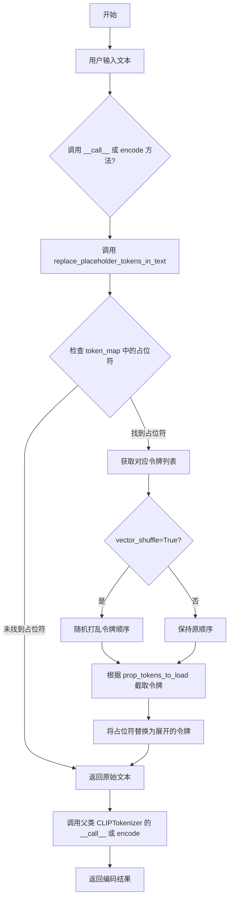
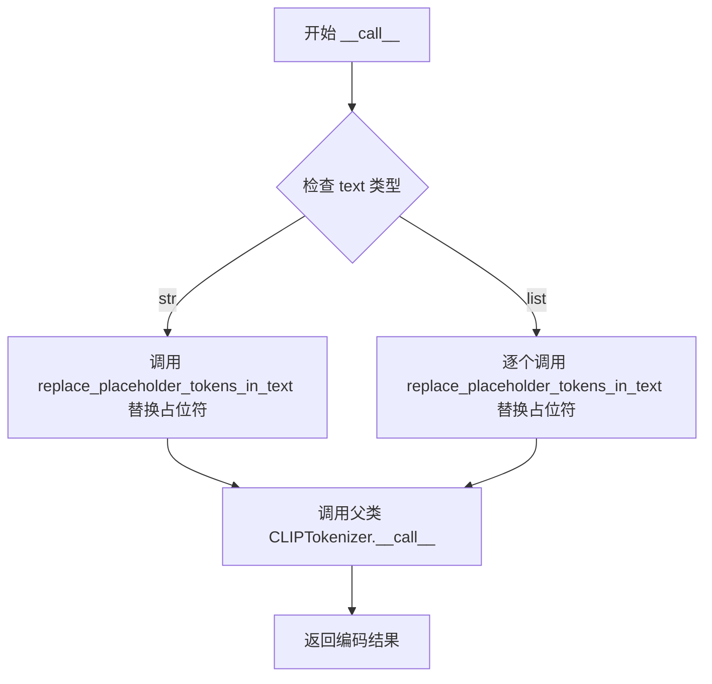
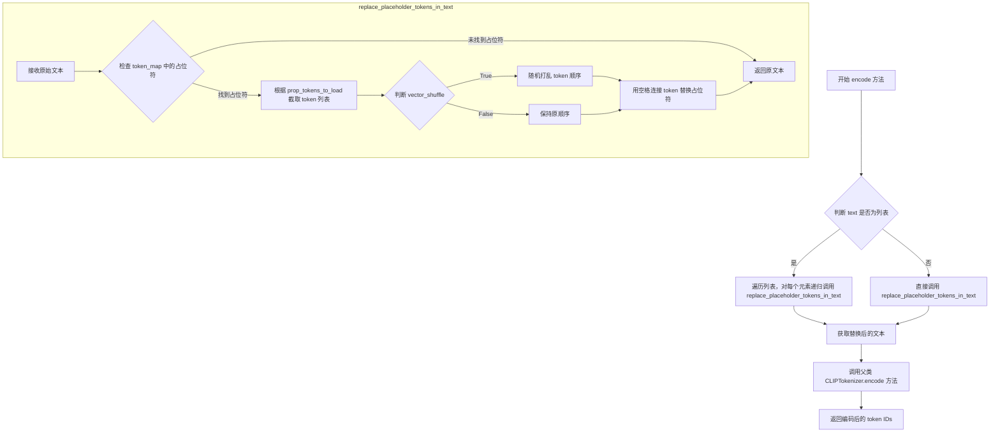

# `diffusers\examples\research_projects\multi_token_textual_inversion\multi_token_clip.py` 详细设计文档

这是一个自定义的CLIPTokenizer子类，通过将用户输入的单一概念占位符（如<concept>）自动展开为多个令牌序列（如<concept_0> <concept_1> ...），简化了文本到图像模型推理和训练过程中的多令牌概念管理工作。

## 整体流程



## 类结构

```
CLIPTokenizer (transformers.Base)
└── MultiTokenCLIPTokenizer (自定义实现)
```

## 全局变量及字段


### `MultiTokenCLIPTokenizer.token_map`
    
存储占位符令牌到展开令牌列表的映射关系，用于管理单一概念令牌与多个向量表示令牌的对应

类型：`dict`
    
    

## 全局函数及方法


### `MultiTokenCLIPTokenizer.__init__`

这是 `MultiTokenCLIPTokenizer` 类的初始化方法，负责调用父类 `CLIPTokenizer` 的构造函数，并初始化 `token_map` 字典用于存储占位符 token 及其变体的映射关系。

参数：

- `*args`：可变位置参数，将参数传递给父类 `CLIPTokenizer` 的构造函数
- `**kwargs`：可变关键字参数，将参数传递给父类 `CLIPTokenizer` 的构造函数

返回值：`None`，无返回值（构造函数）

#### 流程图

```mermaid
flowchart TD
    A[开始 __init__] --> B[调用 super().__init__*args, **kwargs]
    B --> C[初始化 self.token_map = {}]
    C --> D[结束]
```

#### 带注释源码

```python
def __init__(self, *args, **kwargs):
    """
    初始化 MultiTokenCLIPTokenizer 实例
    
    参数:
        *args: 可变位置参数,传递给父类 CLIPTokenizer 构造函数
        **kwargs: 可变关键字参数,传递给父类 CLIPTokenizer 构造函数
    """
    # 调用父类 CLIPTokenizer 的 __init__ 方法
    # 继承 CLIPTokenizer 的所有功能:分词、编码等
    super().__init__(*args, **kwargs)
    
    # 初始化 token_map 字典
    # 用于存储占位符 token 与其多个变体 token 之间的映射关系
    # 例如: {"cat": ["cat_0", "cat_1", "cat_2"]}
    # 这样用户只需要输入 "cat" 就能自动扩展为多个 token
    self.token_map = {}
```


### `MultiTokenCLIPTokenizer.try_adding_tokens`

尝试向分词器添加单个占位符令牌，如果令牌已存在则抛出 ValueError 异常。该方法是对父类 `add_tokens` 方法的包装，用于确保添加的令牌不会与已有令牌冲突。

参数：

- `self`：`MultiTokenCLIPTokenizer` 实例，隐式参数
- `placeholder_token`：`str`，要添加的占位符令牌字符串
- `*args`：可变位置参数，传递给父类 `CLIPTokenizer.add_tokens` 方法
- `**kwargs`：可变关键字参数，传递给父类 `CLIPTokenizer.add_tokens` 方法

返回值：`int`，添加的令牌数量（由父类 `add_tokens` 方法返回）

#### 流程图

```mermaid
flowchart TD
    A[开始 try_adding_tokens] --> B[调用 super().add_tokens 添加令牌]
    B --> C{num_added_tokens == 0?}
    C -->|是| D[抛出 ValueError 异常]
    C -->|否| E[返回添加的令牌数量]
    D --> F[结束 - 异常终止]
    E --> G[结束 - 正常返回]
```

#### 带注释源码

```python
def try_adding_tokens(self, placeholder_token, *args, **kwargs):
    """
    尝试向分词器添加单个占位符令牌
    
    参数:
        placeholder_token: 要添加的令牌字符串
        *args: 传递给父类的位置参数
        **kwargs: 传递给父类的关键字参数
        
    返回:
        添加的令牌数量
        
    异常:
        ValueError: 当令牌已存在于分词器中时抛出
    """
    # 调用父类 CLIPTokenizer 的 add_tokens 方法添加令牌
    # 返回值表示实际添加的令牌数量，如果令牌已存在则返回 0
    num_added_tokens = super().add_tokens(placeholder_token, *args, **kwargs)
    
    # 检查是否成功添加了令牌
    # 如果 num_added_tokens 为 0，说明令牌已存在，需要抛出异常
    if num_added_tokens == 0:
        raise ValueError(
            f"The tokenizer already contains the token {placeholder_token}. Please pass a different"
            " `placeholder_token` that is not already in the tokenizer."
        )
    
    # 返回成功添加的令牌数量
    # 该值由父类 CLIPTokenizer.add_tokens 方法返回
```


### `MultiTokenCLIPTokenizer.add_placeholder_tokens`

该方法用于向分词器添加占位符令牌，支持单个令牌或多个向量表示（通过添加 `<token>_<index>` 格式的多个令牌），并将令牌映射关系存储在 `token_map` 中供后续替换使用。

参数：

- `placeholder_token`：`str`，用户指定的占位符令牌文本（如 `<concept>`）
- `*args`：可变位置参数，将透传给父类的 `add_tokens` 方法
- `num_vec_per_token`：`int`，默认为 1，每个占位符对应的向量数量（大于1时生成多个令牌）
- `**kwargs`：可变关键字参数，将透传给父类的 `add_tokens` 方法

返回值：`list`，返回实际添加到分词器的令牌列表

#### 流程图

```mermaid
flowchart TD
    A[开始 add_placeholder_tokens] --> B{num_vec_per_token == 1?}
    B -->|是| C[调用 try_adding_tokens 添加单个令牌]
    C --> D[output = [placeholder_token]]
    B -->|否| E[初始化空列表 output]
    E --> F{遍历 i in range(num_vec_per_token)}
    F -->|每次迭代| G[生成 ith_token = placeholder_token + '_' + i]
    G --> H[调用 try_adding_tokens 添加 ith_token]
    H --> I[将 ith_token 添加到 output 列表]
    F -->|循环结束| J[检查 token_map 中是否存在冲突的令牌]
    J --> K{已有令牌 in placeholder_token?}
    K -->|是| L[抛出 ValueError 异常]
    K -->|否| M[将 placeholder_token -> output 的映射存入 token_map]
    D --> M
    M --> N[返回 output 列表]
```

#### 带注释源码

```python
def add_placeholder_tokens(self, placeholder_token, *args, num_vec_per_token=1, **kwargs):
    """
    向分词器添加占位符令牌，支持单个或多个向量表示
    
    参数:
        placeholder_token: 占位符令牌文本（如 '<concept>'）
        *args: 透传给父类 add_tokens 的位置参数
        num_vec_per_token: 每个占位符对应的向量数量，默认为1
        **kwargs: 透传给父类 add_tokens 的关键字参数
    
    返回:
        list: 实际添加到分词器的令牌列表
    """
    output = []  # 初始化输出列表，用于存储实际添加的令牌
    
    if num_vec_per_token == 1:
        # 情况1: 单个令牌模式，直接添加占位符令牌
        self.try_adding_tokens(placeholder_token, *args, **kwargs)
        output.append(placeholder_token)
    else:
        # 情况2: 多个向量模式，生成多个带索引的令牌
        # 例如 num_vec_per_token=3 时，生成 <token>_0, <token>_1, <token>_2
        output = []  # 重新初始化，确保清空
        for i in range(num_vec_per_token):
            # 生成带索引的令牌名称：placeholder_token_0, placeholder_token_1, ...
            ith_token = placeholder_token + f"_{i}"
            # 尝试添加单个令牌，若已存在则抛出异常
            self.try_adding_tokens(ith_token, *args, **kwargs)
            # 将生成的令牌添加到输出列表
            output.append(ith_token)
    
    # 检查是否存在冲突的占位符令牌
    # 防止类似 '<cat>' 和 '<cat_image>' 这样可能产生混淆的令牌共存
    for token in self.token_map:
        if token in placeholder_token:
            raise ValueError(
                f"The tokenizer already has placeholder token {token} that can get confused with"
                f" {placeholder_token}keep placeholder tokens independent"
            )
    
    # 将占位符令牌与实际添加的令牌列表建立映射关系
    # 供后续 replace_placeholder_tokens_in_text 方法进行文本替换
    self.token_map[placeholder_token] = output
    
    # 返回实际添加的令牌列表
    return output
```


### `MultiTokenCLIPTokenizer.replace_placeholder_tokens_in_text`

将文本中的占位符（如 `<concept>`）替换为预先存储的令牌序列（如 `<concept_0> <concept_1> ...`），支持批量处理、令牌打乱和部分令牌加载，适用于推理和训练场景。

参数：

- `text`：`str` 或 `list`，输入文本，可以是单个字符串或字符串列表
- `vector_shuffle`：`bool`，是否打乱令牌顺序，默认为 `False`
- `prop_tokens_to_load`：`float`，要加载的令牌比例，默认为 `1.0`（全部加载）

返回值：`str`，替换占位符后的文本

#### 流程图

```mermaid
flowchart TD
    A([开始 replace_placeholder_tokens_in_text]) --> B{text 是列表?}
    B -->|是| C[初始化空列表 output]
    C --> D[遍历 text 列表]
    D --> E[递归调用 replace_placeholder_tokens_in_text]
    E --> F[将结果添加到 output]
    F --> G{遍历完成?}
    G -->|否| D
    G -->|是| H[返回 output 列表]
    B -->|否| I[遍历 self.token_map 中的占位符]
    I --> J{当前占位符在 text 中?}
    J -->|否| K[继续下一个占位符]
    J -->|是| L[获取对应令牌列表 tokens]
    L --> M[tokens = tokens[: 1 + int(len(tokens) * prop_tokens_to_load)]
    M --> N{vector_shuffle 为 True?}
    N -->|是| O[复制 tokens 并打乱顺序]
    O --> P[text = text.replace 占位符为 " ".join(tokens)]
    N -->|否| P
    P --> K
    K --> Q{遍历完成?}
    Q -->|否| I
    Q -->|是| R([返回 text])
    H --> R
```

#### 带注释源码

```python
def replace_placeholder_tokens_in_text(self, text, vector_shuffle=False, prop_tokens_to_load=1.0):
    """
    此方法用于将文本中记录的占位符令牌替换为 token_map 中存储的展开令牌序列，
    以便 text_encoder 能够正确编码它们。
    
    vector_shuffle 灵感来源于 https://github.com/rinongal/textual_inversion/pull/119，
    研究发现打乱令牌可以迫使模型更具描述性地学习概念。
    
    参数:
        text: 输入文本，可以是字符串或字符串列表
        vector_shuffle: 是否打乱令牌顺序，默认为 False
        prop_tokens_to_load: 要加载的令牌比例，默认为 1.0（全部加载）
    返回:
        替换占位符后的文本
    """
    # 处理输入为列表的情况，递归处理每个元素
    if isinstance(text, list):
        output = []
        for i in range(len(text)):
            # 递归调用自身处理单个文本
            output.append(self.replace_placeholder_tokens_in_text(text[i], vector_shuffle=vector_shuffle))
        return output
    
    # 遍历 token_map 中所有注册的占位符
    for placeholder_token in self.token_map:
        # 检查当前占位符是否出现在输入文本中
        if placeholder_token in text:
            # 获取该占位符对应的令牌序列
            tokens = self.token_map[placeholder_token]
            # 根据 prop_tokens_to_load 比例截取要使用的令牌数量
            tokens = tokens[: 1 + int(len(tokens) * prop_tokens_to_load)]
            # 如果需要打乱，则复制并随机打乱令牌顺序
            if vector_shuffle:
                tokens = copy.copy(tokens)
                random.shuffle(tokens)
            # 用空格连接的令牌序列替换文本中的占位符
            text = text.replace(placeholder_token, " ".join(tokens))
    
    # 返回处理后的文本
    return text
```


### `MultiTokenCLIPTokenizer.__call__`

重写父类 `CLIPTokenizer` 的 `__call__` 方法，在调用父类编码器之前，先使用 `replace_placeholder_tokens_in_text` 方法将文本中的占位符（如 `<concept>`）替换为多个具体的 token（如 `<concept_0> <concept_1> ...`），以支持多 token 表示的概念。

参数：

- `text`：`str` 或 `list`，输入的文本，可以是单个字符串或字符串列表
- `*args`：可变位置参数，传递给父类 `CLIPTokenizer.__call__` 的额外位置参数
- `vector_shuffle`：`bool`，可选，是否对替换后的 token 顺序进行随机洗牌（默认为 `False`），灵感来自 Textual Inversion 项目，可帮助模型更好地学习概念
- `prop_tokens_to_load`：`float`，可选，要加载的 token 比例（默认为 `1.0`），用于部分加载多 token 表示
- `**kwargs`：可变关键字参数，传递给父类 `CLIPTokenizer.__call__` 的额外关键字参数（如 `return_tensors`、`padding` 等）

返回值：父类 `CLIPTokenizer.__call__` 的返回值，通常是 token IDs、注意力掩码等编码结果（类型取决于父类实现和传入的 `kwargs`）

#### 流程图



#### 带注释源码

```python
def __call__(self, text, *args, vector_shuffle=False, prop_tokens_to_load=1.0, **kwargs):
    """
    重写父类 __call__ 方法，在编码前进行占位符替换
    
    参数:
        text: 输入文本，可以是 str 或 list 类型
        *args: 传递给父类的可变位置参数
        vector_shuffle: bool，是否对替换后的 token 进行随机洗牌
        prop_tokens_to_load: float，加载的 token 比例 (0.0-1.0)
        **kwargs: 传递给父类的可变关键字参数
    
    返回:
        父类 CLIPTokenizer.__call__ 的返回值（编码结果）
    """
    # 首先调用 replace_placeholder_tokens_in_text 方法
    # 将文本中的占位符（如 <concept>）替换为多个具体 token（如 <concept_0> <concept_1>）
    # 该方法内部会处理 str 和 list 两种情况
    replaced_text = self.replace_placeholder_tokens_in_text(
        text,                      # 原始输入文本
        vector_shuffle=vector_shuffle,    # 是否对 token 顺序随机洗牌
        prop_tokens_to_load=prop_tokens_to_load  # 要加载的 token 比例
    )
    
    # 调用父类的 __call__ 方法，传入替换后的文本和额外参数
    # 父类会执行实际的 tokenization 过程
    return super().__call__(
        replaced_text,  # 替换占位符后的文本
        *args,          # 透传可变位置参数
        **kwargs        # 透传可变关键字参数
    )
```

#### 关键组件信息

| 组件名称 | 一句话描述 |
|---------|-----------|
| `MultiTokenCLIPTokenizer` | 扩展 CLIPTokenizer，支持将单个占位符 token 自动替换为多个具体 token |
| `token_map` | 字典属性，存储占位符到具体 token 列表的映射关系 |
| `replace_placeholder_tokens_in_text` | 核心方法，递归替换文本中的占位符为对应的多个 token |
| `add_placeholder_tokens` | 向 tokenizer 添加占位符及其多个变体 token 的方法 |

#### 潜在技术债务与优化空间

1. **错误处理不足**：`replace_placeholder_tokens_in_text` 方法中，如果替换后文本仍包含未映射的占位符，不会抛出警告或错误，可能导致静默失败
2. **性能优化**：每次调用 `__call__` 都会创建新的字符串副本，可考虑缓存替换结果或使用更高效的字符串操作
3. **类型提示缺失**：方法参数和返回值缺少类型注解，不利于静态分析和 IDE 智能提示
4. **参数透传设计**：`vector_shuffle` 和 `prop_tokens_to_load` 仅在 `__call__` 和 `encode` 中使用，可考虑抽象到基类或混入类中

#### 其它项目

**设计目标**：
- 简化用户输入，用户只需输入 `<concept>` 而无需手动输入 `<concept_0> <concept_1> ...`
- 同时支持推理（inference）和训练（training）场景
- 通过 `vector_shuffle` 机制增强模型对概念的学习能力

**错误处理与异常**：
- `try_adding_tokens` 方法会检测 token 是否已存在，避免重复添加
- `add_placeholder_tokens` 方法会检查新 token 是否与现有 token 产生混淆

**外部依赖**：
- 依赖 `transformers` 库的 `CLIPTokenizer` 基类
- 使用 `random` 和 `copy` 标准库实现 token 洗牌和复制


### `MultiTokenCLIPTokenizer.encode`

该方法重写了父类CLIPTokenizer的encode方法，在对文本进行token编码之前，先调用`replace_placeholder_tokens_in_text`方法将文本中的占位符令牌替换为对应的多个token，以支持多token概念的学习和推理。

参数：

- `text`：`str` 或 `List[str]`，待编码的输入文本，可以是单句或句子列表
- `*args`：可变位置参数，透传给父类的encode方法
- `vector_shuffle`：`bool`，是否打乱替换后的token顺序，默认为False，开启后可增强模型对概念的学习描述性
- `prop_tokens_to_load`：`float`，替换时加载token数量的比例，范围0.0-1.0，默认为1.0表示加载所有token
- `**kwargs`：可变关键字参数，透传给父类的encode方法（如`add_special_tokens`、`return_tensors`等）

返回值：`List[int]` 或 `List[List[int]]`，编码后的token ID序列，单文本返回一维列表，文本列表返回二维列表

#### 流程图



#### 带注释源码

```python
def encode(self, text, *args, vector_shuffle=False, prop_tokens_to_load=1.0, **kwargs):
    """
    重写父类方法，在编码前进行占位符替换
    
    参数:
        text: 待编码的文本，支持单字符串或字符串列表
        *args: 可变位置参数，传递给父类encode方法
        vector_shuffle: 是否打乱替换后token的顺序，默认False
        prop_tokens_to_load: 加载token的比例，默认1.0（全部加载）
        **kwargs: 可变关键字参数，传递给父类encode方法
    
    返回:
        编码后的token ID列表
    """
    # 调用 replace_placeholder_tokens_in_text 方法将占位符替换为对应的多个token
    # 例如：将 "<concept>" 替换为 "<concept_0> <concept_1> <concept_2>" 等
    replaced_text = self.replace_placeholder_tokens_in_text(
        text,                      # 原始输入文本
        vector_shuffle=vector_shuffle,    # 是否打乱token顺序
        prop_tokens_to_load=prop_tokens_to_load  # 加载token的比例
    )
    
    # 调用父类 CLIPTokenizer 的 encode 方法进行实际的编码
    # 透传 *args 和 **kwargs 以支持父类的所有参数（如 add_special_tokens, return_tensors 等）
    return super().encode(
        replaced_text,    # 替换后的文本
        *args,           # 透传位置参数
        **kwargs         # 透传关键字参数
    )
```

## 关键组件


### MultiTokenCLIPTokenizer 类

继承自 CLIPTokenizer 的自定义分词器类，用于处理概念的多令牌映射，简化用户在训练和推理中使用占位符令牌的流程。

### token_map 全局变量

类型：字典 (dict)
存储占位符令牌到其对应令牌列表的映射，用于在编码时进行文本替换。

### try_adding_tokens 方法

添加单个令牌到分词器，如果令牌已存在则抛出 ValueError 异常。

### add_placeholder_tokens 方法

添加占位符令牌，支持单令牌和多令牌模式（num_vec_per_token 参数），并维护 token_map 映射关系，同时检查令牌冲突。

### replace_placeholder_tokens_in_text 方法

核心文本替换方法，将文本中的占位符令牌替换为对应的多个令牌列表，支持 vector_shuffle（向量洗牌）和 prop_tokens_to_load（加载令牌比例）参数。

### __call__ 方法

重写父类的调用方法，在分词前先调用 replace_placeholder_tokens_in_text 进行占位符替换。

### encode 方法

重写父类的编码方法，在编码前先调用 replace_placeholder_tokens_in_text 进行占位符替换。

### vector_shuffle 参数

向量洗牌功能，灵感来自 Textual Inversion 研究，强制模型学习更描述性的概念表示。

### prop_tokens_to_load 参数

控制加载令牌数量的比例，支持部分加载令牌，用于控制概念的细节程度。


## 问题及建议


### 已知问题

-   **token_map 初始化不完整**：在 `add_placeholder_tokens` 方法中，当 `num_vec_per_token == 1` 时，虽然调用了 `try_adding_tokens`，但没有将结果添加到 `self.token_map` 中，导致 `replace_placeholder_tokens_in_text` 方法无法正确处理单token占位符
-   **重复代码**：`__call__` 和 `encode` 方法中重复调用 `replace_placeholder_tokens_in_text`，违反了 DRY 原则
-   **类型检查不足**：`replace_placeholder_tokens_in_text` 方法中对 list 类型的处理只做了递归调用，没有对 list 中的元素类型进行验证，如果传入非字符串元素会抛出异常
-   **缺少边界条件处理**：`prop_tokens_to_load` 参数没有验证其范围是否为 [0, 1]，负值或大于1的值会导致意外行为
-   **token 冲突检测不完善**：在 `add_placeholder_tokens` 中的冲突检测逻辑存在方向错误，检查的是"现有token是否在新placeholder_token中"，而应该是"新placeholder_token是否在现有token中"
-   **缺少单元测试**：代码没有配套的单元测试来验证边界条件和异常处理
-   **tokenizer 与模型 embedding 层同步问题**：添加新 token 后没有提供方法来同步更新下游模型的 embedding 层大小
-   **vector_shuffle 可复现性问题**：使用 `random.shuffle` 直接修改列表而非返回新列表，可能影响实验的可复现性

### 优化建议

-   **修复 token_map 初始化**：在 `num_vec_per_token == 1` 的分支中，添加 `self.token_map[placeholder_token] = output`
-   **提取公共方法**：将 `replace_placeholder_tokens_in_text` 的调用封装为私有方法，避免重复代码
-   **增强类型检查**：在 `replace_placeholder_tokens_in_text` 中添加类型验证，确保 list 中的元素都是字符串
-   **添加参数范围验证**：对 `prop_tokens_to_load` 参数添加范围检查 `0 <= prop_tokens_to_load <= 1`
-   **修正冲突检测逻辑**：将 `if token in placeholder_token` 改为 `if placeholder_token in token`，确保能正确检测到新增占位符是否被现有占位符包含
-   **添加 seed 参数**：为 `vector_shuffle` 添加可选的 random seed 参数，增强可复现性
-   **添加 embedding 同步方法**：提供 `get_new_embedding_size()` 或类似方法来告知下游模型需要扩展的 embedding 大小
-   **补充文档和类型注解**：为关键方法添加详细的 docstring 和类型注解，提高代码可维护性


## 其它


### 设计目标与约束

本代码的设计目标是简化文本提示词中多token概念的表达方式，使用户只需输入单一占位符（如"a photo of cat"）即可自动转换为多个token序列（如"cat_0 cat_1 ..."），同时支持推理和训练场景。主要约束包括：1) 必须继承CLIPTokenizer以保持兼容性；2) 占位符token之间不能存在包含关系以避免混淆；3) 需要支持vector_shuffle和部分token加载功能。

### 错误处理与异常设计

代码包含以下错误处理机制：1) try_adding_tokens方法在token已存在时抛出ValueError；2) add_placeholder_tokens方法检测到新占位符与已有占位符存在包含关系时抛出ValueError；3) replace_placeholder_tokens_in_text方法对list类型输入进行递归处理。异常设计遵循快速失败原则，在添加token阶段尽早检测冲突。

### 数据流与状态机

数据流如下：用户输入文本 → __call__或encode方法 → replace_placeholder_tokens_in_text进行token替换 → 调用父类方法进行编码。token_map字典维护占位符到token列表的映射关系，是核心状态存储。状态转换：无token状态 → 添加占位符 → 替换占位符 → 编码完成。

### 外部依赖与接口契约

主要依赖：1) transformers库中的CLIPTokenizer；2) copy模块用于token复制；3) random模块用于shuffle。公开接口包括：add_placeholder_tokens(placeholder_token, num_vec_per_token)、replace_placeholder_tokens_in_text(text, vector_shuffle, prop_tokens_to_load)、__call__和encode方法（均接受vector_shuffle和prop_tokens_to_load参数）。

### 安全性考虑

代码安全性风险较低，主要关注点：1) token_map字典的内存占用管理；2) 恶意输入可能导致无限循环（虽已有基本保护）；3) random.shuffle的随机性在安全敏感场景需考虑CSPRNG。

### 性能考虑

性能优化点：1) token_map使用字典查询，O(1)复杂度；2) 文本替换使用字符串replace方法；3) vector_shuffle时使用copy.copy而非深拷贝；4) 对list输入递归处理可能产生栈深度问题。建议：对于大量文本处理，考虑批量处理和缓存机制。

### 兼容性考虑

兼容性设计：1) 继承CLIPTokenizer保持与HuggingFace生态的兼容性；2) 使用*args和**kwargs传递参数确保向前兼容；3) add_tokens、__call__、encode方法签名与父类一致。版本依赖：transformers库版本需支持CLIPTokenizer。

### 使用示例

训练场景：tokenizer.add_placeholder_tokens("cat", num_vec_per_token=5)；推理场景：tokenizer("a photo of cat", vector_shuffle=True, prop_tokens_to_load=0.8)；编码：tokenizer.encode("a photo of cat")。

### 配置参数说明

placeholder_token：str类型，要添加的占位符名称；num_vec_per_token：int类型，每个概念对应的token数量，默认为1；vector_shuffle：bool类型，是否打乱token顺序以增强学习，默认为False；prop_tokens_to_load：float类型，加载token的比例，范围0.0-1.0，默认为1.0。

### 测试策略建议

建议添加的测试用例：1) 单token和多token场景；2) token冲突检测；3) vector_shuffle随机性验证；4) prop_tokens_to_load边界值测试；5) 嵌套占位符处理；6) 空输入和特殊字符处理；7) 继承方法兼容性测试。

    