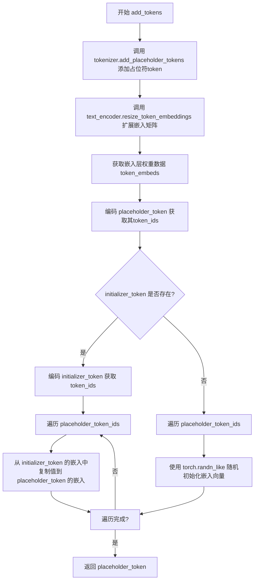
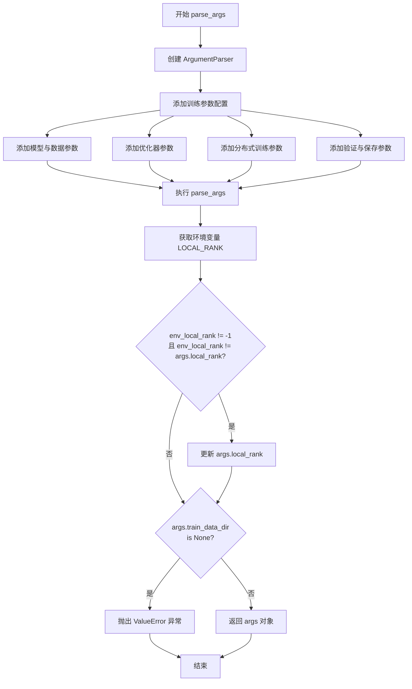
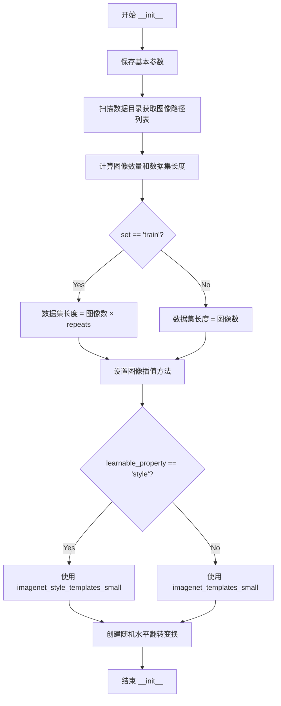
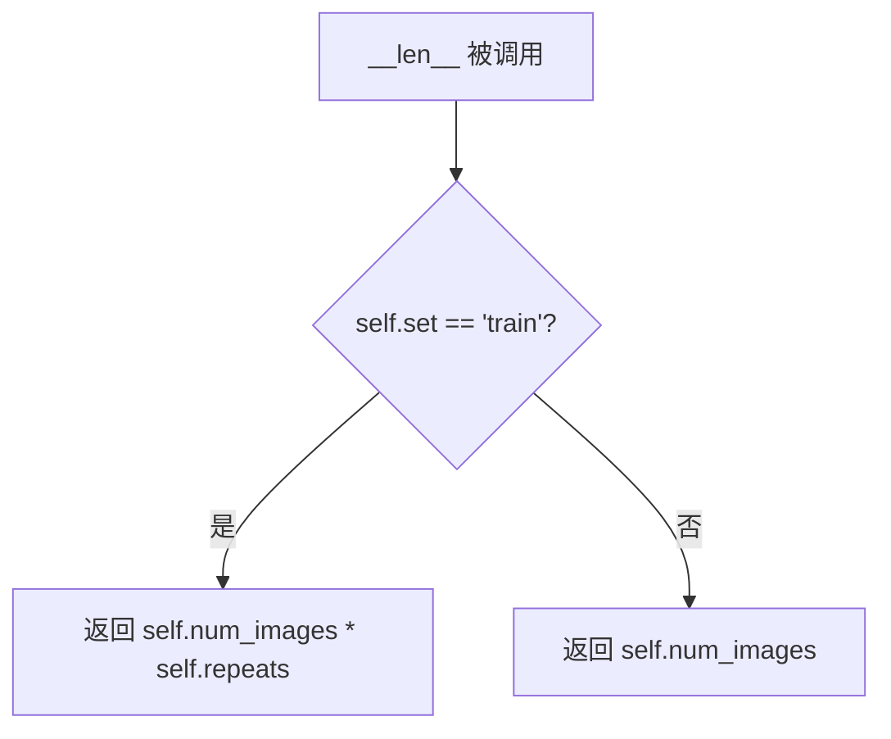

```mermaid
flowchart TD
    A[开始] --> B[解析命令行参数 args]
    B --> C[初始化 Accelerator]
    C --> D[配置日志和设置随机种子]
    D --> E[创建输出目录]
    E --> F[加载 Tokenizer 和 MultiTokenCLIPTokenizer]
    F --> G[加载噪声调度器、文本编码器、VAE、UNet]
    G --> H[添加占位符 tokens]
    H --> I[冻结 VAE、UNet 和 Text Encoder 的非 Embedding 参数]
    I --> J[启用梯度检查点（如果需要）]
    J --> K[初始化 AdamW 优化器]
    K --> L[创建训练数据集和 DataLoader]
    L --> M[创建学习率调度器]
    M --> N[使用 Accelerator 准备所有组件]
    N --> O[计算总训练步数]
    O --> P[初始化训练 trackers]
    P --> Q{检查是否有 checkpoint 可恢复}
    Q -->|是| R[加载 checkpoint 状态]
    Q -->|否| S[从第0步开始训练]
    R --> T[设置起始 epoch 和 step]
    T --> U[进入训练循环 for epoch]
    U --> V[设置 Text Encoder 为训练模式]
    V --> W[遍历训练数据 for step, batch]
    W --> X{检查是否跳过当前 step}
    X -->|跳过| W
    X -->|继续| Y[计算 progressive tokens 比例]
    Y --> Z[使用 accelerator.accumulate 累积梯度]
    Z --> AA[VAE 编码图像到 latent 空间]
    AA --> AB[采样噪声]
    AB --> AC[随机采样 timestep]
    AC --> AD[添加噪声到 latents]
    AD --> AE[获取文本 embedding]
    AE --> AF[UNet 预测噪声残差]
    AF --> AG[计算 MSE 损失]
    AG --> AH[反向传播 loss]
    AH --> AI[优化器更新参数]
    AI --> AJ[学习率调度器更新]
    AJ --> AK[梯度清零]
    AK --> AL[保护原始 embedding 权重]
    AL --> AM{检查是否同步梯度}
    AM -->|是| AN[更新进度条和全局步数]
    AM -->|否| W
    AN --> AO{检查是否需要保存 embedding}
    AO -->|是| AP[保存 learned_embeds.bin]
    AO -->|否| AQ{检查是否需要保存 checkpoint}
    AP --> AQ
    AQ -->|是| AR[保存 accelerator 状态]
    AQ -->|否| AS[记录日志]
    AR --> AS
    AS --> AT{检查是否达到最大训练步数}
    AT -->|是| AU[退出训练循环]
    AT -->|否| W
    AU --> AV{检查是否需要验证}
    AV -->|是| AW[运行验证生成图像]
    AV -->|否| AX[等待所有进程完成]
    AW --> AX
    AX --> AY[保存最终模型和 embeddings]
    AY --> AZ[上传到 Hub（如果需要）]
    AZ --> BA[结束训练]
```

# `diffusers\examples\research_projects\multi_token_textual_inversion\textual_inversion.py` 详细设计文档

这是一个用于Stable Diffusion模型的Textual Inversion（文本反转）训练脚本，通过微调文本编码器的嵌入层来学习新的概念令牌（Placeholder Token），从而实现用特定文本描述生成自定义视觉概念（如特定物体或艺术风格）的功能。

## 整体流程

```mermaid
graph TD
    Start([开始]) --> ParseArgs[解析命令行参数]
    ParseArgs --> InitAcc[初始化Accelerator]
    InitAcc --> LoadModels[加载预训练模型 (UNet, VAE, TextEncoder, Tokenizer)]
    LoadModels --> AddTokens[添加Placeholder Token到Tokenizer和TextEncoder]
    AddTokens --> FreezeModels[冻结VAE和UNet参数，仅训练TextEncoder嵌入]
    FreezeModels --> CreateDataLoader[创建训练数据集和数据加载器]
    CreateDataLoader --> TrainLoop{训练循环}
    TrainLoop -- Step --> EncodeImg[将图像编码为Latent变量]
    EncodeImg --> AddNoise[根据DDPM调度器添加噪声]
    AddNoise --> EncodeText[将文本input_ids编码为embedding]
    EncodeText --> UNetPred[UNet预测噪声残差]
    UNetPred --> ComputeLoss[计算MSE损失]
    ComputeLoss --> Backprop[反向传播与参数更新]
    Backprop --> RestoreEmbeddings[利用Mask恢复非训练Token的原始Embeddings]
    RestoreEmbeddings --> Checkpoint{检查点保存?}
    Checkpoint -- 是 --> SaveCkpt[保存中间Checkpoints和Embedding]
    Checkpoint -- 否 --> ValCheck{验证?}
    ValCheck -- 是 --> RunVal[运行验证生成图像]
    ValCheck -- 否 --> TrainLoop
    TrainLoop -- 完成 --> SaveFinal[保存最终模型和Embedding]
```

## 类结构

```
textual_inversion_training.py (脚本根目录)
├── 全局配置与常量 (Global Config)
│   ├── 日志与工具 (logger, PIL_INTERPOLATION)
│   └── 提示词模板 (imagenet_templates_small, imagenet_style_templates_small)
├── 核心类 (Core Class)
│   └── TextualInversionDataset (数据集处理)
└── 全局函数 (Global Functions)
    ├── add_tokens (令牌添加)
    ├── save_progress (进度保存)
    ├── get_mask (嵌入掩码生成)
    ├── parse_args (参数解析)
    └── main (主训练流程)
```

## 全局变量及字段


### `logger`
    
全局日志记录器，用于记录训练过程中的信息

类型：`logging.Logger`
    


### `PIL_INTERPOLATION`
    
PIL图像插值方法映射，根据PIL版本选择不同的重采样枚举

类型：`dict`
    


### `imagenet_templates_small`
    
物体类文本反转模板列表，包含多种描述物体的提示词格式

类型：`list`
    


### `imagenet_style_templates_small`
    
风格类文本反转模板列表，包含多种描述艺术风格的提示词格式

类型：`list`
    


### `TextualInversionDataset.data_root`
    
训练图像根目录，存放待学习的图像文件

类型：`str`
    


### `TextualInversionDataset.tokenizer`
    
分词器实例，用于文本与token的相互转换

类型：`MultiTokenCLIPTokenizer`
    


### `TextualInversionDataset.learnable_property`
    
学习对象类型，区分学习物体('object')还是学习风格('style')

类型：`str`
    


### `TextualInversionDataset.size`
    
图像目标分辨率，训练时将图像resize到该尺寸

类型：`int`
    


### `TextualInversionDataset.placeholder_token`
    
占位符令牌，用于在提示词中替代要学习的概念

类型：`str`
    


### `TextualInversionDataset.center_crop`
    
是否中心裁剪，训练前对图像进行中心裁剪操作

类型：`bool`
    


### `TextualInversionDataset.vector_shuffle`
    
是否进行向量shuffling，训练时打乱token向量的顺序

类型：`bool`
    


### `TextualInversionDataset.progressive_tokens`
    
是否启用渐进式token训练，逐步增加训练的token数量

类型：`bool`
    


### `TextualInversionDataset.prop_tokens_to_load`
    
渐进式加载比例，控制每次训练加载的token向量比例

类型：`float`
    


### `TextualInversionDataset.image_paths`
    
图像路径列表，存储训练数据目录下的所有图像文件路径

类型：`list`
    


### `TextualInversionDataset.num_images`
    
原始图像数量，训练数据集目录中的图像文件总数

类型：`int`
    


### `TextualInversionDataset.templates`
    
文本提示模板列表，根据learnable_property选择物体或风格模板

类型：`list`
    
    

## 全局函数及方法


### `add_tokens`

向tokenizer添加占位符（placeholder）token，并根据 initializer_token 初始化对应的嵌入向量，如果未提供 initializer_token，则使用随机初始化的嵌入向量。

参数：

- `tokenizer`：`MultiTokenCLIPTokenizer`，用于处理文本的tokenizer对象，需要支持 `add_placeholder_tokens` 方法
- `text_encoder`：`CLIPTextModel`，文本编码器模型，用于获取和设置输入嵌入层权重
- `placeholder_token`：`str`，要添加的占位符token的字符串标识
- `num_vec_per_token`：`int`（默认值=1），每个placeholder token对应的向量数量，用于表示更丰富的语义
- `initializer_token`：`str`（可选，默认=None），用于初始化placeholder token嵌入向量的参考token

返回值：`str`，返回添加的占位符token字符串（`placeholder_token`）

#### 流程图



#### 带注释源码

```python
def add_tokens(tokenizer, text_encoder, placeholder_token, num_vec_per_token=1, initializer_token=None):
    """
    Add tokens to the tokenizer and set the initial value of token embeddings
    
    该函数完成以下任务：
    1. 向tokenizer添加placeholder token
    2. 扩展text_encoder的嵌入层以容纳新token
    3. 初始化新添加token的嵌入向量
    """
    # Step 1: 使用tokenizer的add_placeholder_tokens方法添加占位符token
    # num_vec_per_token参数指定每个token需要用多少个向量表示
    tokenizer.add_placeholder_tokens(placeholder_token, num_vec_per_token=num_vec_per_token)
    
    # Step 2: 扩展text_encoder的token嵌入矩阵以匹配tokenizer的新长度
    text_encoder.resize_token_embeddings(len(tokenizer))
    
    # Step 3: 获取text_encoder输入嵌入层的权重数据
    # 这里获取的是可学习的embedding矩阵
    token_embeds = text_encoder.get_input_embeddings().weight.data
    
    # Step 4: 对placeholder_token进行编码，获取其对应的token id列表
    # add_special_tokens=False 确保不添加特殊的起始/结束token
    placeholder_token_ids = tokenizer.encode(placeholder_token, add_special_tokens=False)
    
    # Step 5: 根据是否有initializer_token来选择初始化方式
    if initializer_token:
        # 如果提供了initializer_token，则从该token的嵌入中复制值
        # 这可以让新token有一个合理的初始值，而不是完全随机
        token_ids = tokenizer.encode(initializer_token, add_special_tokens=False)
        
        # 遍历每个placeholder token的id
        for i, placeholder_token_id in enumerate(placeholder_token_ids):
            # 计算要从initializer_token的哪个位置获取嵌入
            # 使用 i * len(token_ids) // num_vec_per_token 来映射位置
            # 这样可以在有多个向量时均匀地从initializer_token的嵌入中取值
            token_embeds[placeholder_token_id] = token_embeds[token_ids[i * len(token_ids) // num_vec_per_token]]
    else:
        # 如果没有提供initializer_token，则使用随机初始化
        # torch.randn_like 生成与目标嵌入形状相同的随机正态分布tensor
        for i, placeholder_token_id in enumerate(placeholder_token_ids):
            token_embeds[placeholder_token_id] = torch.randn_like(token_embeds[placeholder_token_id])
    
    # 返回添加的placeholder token字符串
    return placeholder_token
```


### `save_progress`

该函数用于在训练过程中将学习到的token嵌入（learned embeddings）保存到指定的文件路径。它遍历tokenizer中的占位符token，提取对应的嵌入向量，并使用PyTorch的序列化功能将其保存为二进制文件。

参数：

- `tokenizer`：`MultiTokenCLIPTokenizer` 对象，包含token映射和编码功能
- `text_encoder`：`CLIPTextModel` 对象，提供文本嵌入层权重
- `accelerator`：`Accelerator` 对象，用于模型管理和分布式训练
- `save_path`：`str`，保存嵌入向量的目标文件路径

返回值：`None`，该函数无返回值，直接将数据写入文件

#### 流程图

```mermaid
flowchart TD
    A[开始 save_progress] --> B[遍历 tokenizer.token_map 中的每个 placeholder_token]
    B --> C[使用 tokenizer.encode 获取 placeholder_token 对应的 token IDs]
    D[从 accelerator.unwrap_model 获取 text_encoder 的输入嵌入层权重]
    C --> E[根据 token IDs 提取对应的 learned_embeds]
    D --> E
    E --> F{判断 placeholder_token_ids 长度是否为 1}
    F -->|是| G[添加维度: learned_embeds[None]]
    F -->|否| H[保持原样]
    G --> I[构建 learned_embeds_dict 字典]
    H --> I
    I --> J[使用 torch.save 保存到 save_path]
    J --> K{是否还有更多 placeholder_token}
    K -->|是| B
    K -->|否| L[结束]
```

#### 带注释源码

```python
def save_progress(tokenizer, text_encoder, accelerator, save_path):
    """
    保存训练过程中学习到的token嵌入到文件
    
    参数:
        tokenizer: 分词器对象，包含token_map属性用于存储占位符token
        text_encoder: 文本编码器模型，用于获取嵌入向量
        accelerator: HuggingFace Accelerate库的对象，用于模型管理和分布式训练
        save_path: 保存文件的路径字符串
    """
    # 遍历tokenizer中所有的占位符token（例如自定义的新token）
    for placeholder_token in tokenizer.token_map:
        # 获取当前placeholder_token在词表中的token IDs
        placeholder_token_ids = tokenizer.encode(placeholder_token, add_special_tokens=False)
        
        # 从text_encoder的输入嵌入层提取对应的嵌入向量
        # accelerator.unwrap_model() 用于在分布式训练中获取原始模型
        learned_embeds = accelerator.unwrap_model(text_encoder).get_input_embeddings().weight[placeholder_token_ids]
        
        # 如果只有一个token ID（即单个token而非多向量表示），需要添加维度
        # 以保持与多向量情况一致的tensor形状 [num_vec, embedding_dim]
        if len(placeholder_token_ids) == 1:
            learned_embeds = learned_embeds[None]
        
        # 构建嵌入字典，键为token名称，值为detach后的嵌入向量（脱离计算图）
        # .cpu() 将tensor移至CPU以进行序列化
        learned_embeds_dict = {placeholder_token: learned_embeds.detach().cpu()}
        
        # 使用torch.save将嵌入向量保存为.pth/.bin文件
        torch.save(learned_embeds_dict, save_path)
```


### `load_multitoken_tokenizer`

从字典加载多token嵌入并将其添加到tokenizer和text_encoder中，支持将多个向量绑定到一个placeholder token。

参数：

- `tokenizer`：`MultiTokenCLIPTokenizer`，分词器对象，用于处理文本和token映射
- `text_encoder`：`CLIPTextModel`，文本编码器模型，用于获取和设置输入嵌入权重
- `learned_embeds_dict`：`Dict[str, torch.Tensor]`（或类似字典结构），包含placeholder token名称到学习到的嵌入向量的映射字典

返回值：`None`，该函数直接修改tokenizer和text_encoder的内部状态，不返回任何值

#### 流程图

```mermaid
flowchart TD
    A[开始加载多token tokenizer] --> B{遍历 learned_embeds_dict}
    B -->|每个 placeholder_token| C[获取 placeholder_embeds]
    C --> D[获取 num_vec_per_token = placeholder_embeds.shape[0]]
    D --> E[将 placeholder_embeds 转换为 text_encoder 的 dtype]
    E --> F[调用 add_tokens 添加 token 到 tokenizer 和 text_encoder]
    F --> G[获取 placeholder_token 在 tokenizer 中的 ids]
    G --> H[获取 text_encoder 的输入嵌入权重数据]
    H --> I{遍历 placeholder_token_ids}
    I -->|每个 i 和 token_id| J[将 placeholder_embeds[i] 赋值给 token_embeds[token_id]]
    J --> I
    I --> B
    B --> K[结束]
```

#### 带注释源码

```python
def load_multitoken_tokenizer(tokenizer, text_encoder, learned_embeds_dict):
    """
    从字典加载多token嵌入并将其添加到tokenizer和text_encoder中
    
    该函数遍历预学习的嵌入字典，对每个placeholder token：
    1. 将其嵌入向量转换为与text_encoder相同的dtype
    2. 调用add_tokens将新token添加到tokenizer和text_encoder
    3. 将预学习的嵌入向量复制到text_encoder的嵌入矩阵中
    
    参数:
        tokenizer: MultiTokenCLIPTokenizer实例，用于文本分词
        text_encoder: CLIPTextModel实例，用于文本编码
        learned_embeds_dict: 字典，键为placeholder_token字符串，值为对应的嵌入向量张量
    """
    # 遍历字典中的每个placeholder token及其嵌入
    for placeholder_token in learned_embeds_dict:
        # 从字典中获取该token对应的嵌入向量
        placeholder_embeds = learned_embeds_dict[placeholder_token]
        
        # 获取每个token对应的向量数量（通常为1，但可以支持多个向量）
        num_vec_per_token = placeholder_embeds.shape[0]
        
        # 将嵌入向量的dtype转换为与text_encoder一致的dtype
        # 这对于混合精度训练（如fp16/bf16）非常重要
        placeholder_embeds = placeholder_embeds.to(dtype=text_encoder.dtype)
        
        # 调用add_tokens函数，将新token添加到tokenizer和text_encoder
        # 同时设置该token对应的向量数量
        add_tokens(tokenizer, text_encoder, placeholder_token, num_vec_per_token=num_vec_per_token)
        
        # 获取新添加token在tokenizer中的token ids
        # add_special_tokens=False确保不添加特殊标记（如pad、eos等）
        placeholder_token_ids = tokenizer.encode(placeholder_token, add_special_tokens=False)
        
        # 获取text_encoder的输入嵌入层的权重数据
        # .data获取原始张量而非副本，便于直接修改
        token_embeds = text_encoder.get_input_embeddings().weight.data
        
        # 将预学习的嵌入向量逐个复制到text_encoder的嵌入矩阵中
        # 对于多向量token（如num_vec_per_token>1），逐个复制每个向量
        for i, placeholder_token_id in enumerate(placeholder_token_ids):
            token_embeds[placeholder_token_id] = placeholder_embeds[i]
```


### `load_multitoken_tokenizer_from_automatic`

该函数用于从 Automatic1111 格式的嵌入文件中加载多 token 分词器嵌入。它解析 Automatic1111 特定的字典结构，提取嵌入向量，并调用 `load_multitoken_tokenizer` 函数将嵌入添加到分词器和文本编码器中。

参数：

- `tokenizer`：`MultiTokenCLIPTokenizer`，用于处理文本分词的对象
- `text_encoder`：文本编码器模型，用于获取和设置输入嵌入权重
- `automatic_dict`：`dict`，Automatic1111 格式的嵌入字典，包含 `string_to_param` 等键
- `placeholder_token`：`str`，用作占位符的 token 名称

返回值：`无`（该函数直接修改 tokenizer 和 text_encoder 的内部状态）

#### 流程图

```mermaid
flowchart TD
    A[开始: load_multitoken_tokenizer_from_automatic] --> B[创建空字典 learned_embeds_dict]
    B --> C[从 automatic_dict 中提取 string_to_param:* 的嵌入向量]
    C --> D[将提取的嵌入存入手 learned_embeds_dict[placeholder_token]]
    D --> E[调用 load_multitoken_tokenizer 函数]
    E --> F[结束]
    
    subgraph load_multitoken_tokenizer [load_multitoken_tokenizer 内部流程]
        G[遍历 learned_embeds_dict 中的 placeholder_token] --> H[获取 num_vec_per_token]
        H --> I[将嵌入转换为 text_encoder 的 dtype]
        I --> J[调用 add_tokens 添加 token]
        J --> K[获取 placeholder_token_ids]
        K --> L[更新 text_encoder 的 token_embeds]
        L --> G
    end
    
    E -.->|调用| G
```

#### 带注释源码

```python
def load_multitoken_tokenizer_from_automatic(tokenizer, text_encoder, automatic_dict, placeholder_token):
    """
    Automatic1111's tokens have format
    {'string_to_token': {'*': 265}, 'string_to_param': {'*': tensor([[ 0.0833,  0.0030,  0.0057,  ..., -0.0264, -0.0616, -0.0529],
        [ 0.0058, -0.0190, -0.0584,  ..., -0.0025, -0.0945, -0.0490],
        [ 0.0916,  0.0025,  0.0365,  ..., -0.0685, -0.0124,  0.0728],
        [ 0.0812, -0.0199, -0.0100,  ..., -0.0581, -0.0780,  0.0254]],
       requires_grad=True)}, 'name': 'FloralMarble-400', 'step': 399, 'sd_checkpoint': '4bdfc29c', 'sd_checkpoint_name': 'SD2.1-768'}
    
    参数:
        tokenizer: MultiTokenCLIPTokenizer 实例，用于文本分词
        text_encoder: CLIPTextModel 实例，用于文本编码
        automatic_dict: dict，Automatic1111 格式的嵌入字典
        placeholder_token: str，用作占位符的 token 名称
    
    返回:
        无返回值，直接修改 tokenizer 和 text_encoder 的内部状态
    """
    # 创建一个新的字典来存储解析后的嵌入
    learned_embeds_dict = {}
    
    # 从 Automatic1111 格式字典中提取嵌入向量
    # Automatic1111 使用 '*' 作为键来存储嵌入参数
    # 格式: automatic_dict["string_to_param"]["*"] 是一个形状为 [num_vec_per_token, hidden_dim] 的 tensor
    learned_embeds_dict[placeholder_token] = automatic_dict["string_to_param"]["*"]
    
    # 调用 load_multitoken_tokenizer 函数将嵌入加载到 tokenizer 和 text_encoder 中
    # 该函数会:
    # 1. 为每个 placeholder_token 调用 add_tokens 添加 token
    # 2. 获取新添加 token 的 IDs
    # 3. 将提取的嵌入向量复制到 text_encoder 的 embedding 权重中
    load_multitoken_tokenizer(tokenizer, text_encoder, learned_embeds_dict)
```


### `get_mask`

生成一个布尔掩码张量，用于标识 tokenizer 中哪些 token 的嵌入向量不应被训练（即保持不变）。该函数通过排除所有 placeholder token 的 ID 来创建掩码，确保训练过程中仅更新新添加的可学习 token 的嵌入，同时保护原始 token 的嵌入不被修改。

参数：

- `tokenizer`：`MultiTokenCLIPTokenizer`，分词器对象，包含 `token_map` 属性用于遍历所有 placeholder token
- `accelerator`：`Accelerator`，HuggingFace Accelerate 库提供的分布式训练加速器，用于将张量移动到正确的设备上

返回值：`torch.Tensor`，返回一个布尔类型的 1D 张量，形状为 `(vocab_size,)`，其中 `True` 表示对应的 token 嵌入需要保持不变（不被训练），`False` 表示对应的 token 嵌入可以被训练

#### 流程图

```mermaid
flowchart TD
    A[开始 get_mask] --> B[初始化掩码: torch.ones len(tokenizer<br/>dtype=torch.bool 移到 accelerator.device]
    B --> C{遍历 tokenizer.token_map}
    C -->|有更多 placeholder_token| D[获取 placeholder_token 的 token_ids]
    D --> E[遍历 placeholder_token_ids]
    E -->|有更多 token_id| F[创建比较向量: torch.arange len(tokenizer) != token_id]
    F --> G[掩码与运算: mask & 比较结果]
    G --> E
    E -->|遍历完成| C
    C -->|遍历完成| H[返回 mask]
```

#### 带注释源码

```python
def get_mask(tokenizer, accelerator):
    """
    生成用于屏蔽非训练参数的掩码张量
    
    该函数创建一个布尔掩码，用于标识哪些 token 的嵌入向量在训练过程中应该保持不变。
    通过排除所有 placeholder token 的 ID，确保只有新添加的可学习 token 会被训练。
    
    参数:
        tokenizer: 分词器对象，需要包含 token_map 属性
        accelerator: Accelerate 加速器对象，用于设备转换
    
    返回:
        torch.Tensor: 布尔类型的掩码张量，True 表示保持不变的参数
    """
    
    # 步骤1: 初始化全 True 掩码，表示初始时所有 token 都应该被冻结/不变
    # 使用 torch.ones 创建形状为 (vocab_size,) 的张量，dtype 为 bool
    # .to(accelerator.device) 将张量移到正确的设备（GPU/CPU）
    mask = torch.ones(len(tokenizer)).to(accelerator.device, dtype=torch.bool)
    
    # 步骤2: 遍历 tokenizer 中的所有 placeholder token
    # token_map 是一个字典，键为 placeholder token 字符串，值为对应的信息
    for placeholder_token in tokenizer.token_map:
        
        # 获取当前 placeholder_token 的 token ID 列表
        # add_special_tokens=False 确保不包含特殊 token（如 CLS、SEP 等）
        placeholder_token_ids = tokenizer.encode(placeholder_token, add_special_tokens=False)
        
        # 步骤3: 遍历该 placeholder token 的所有 token ID
        # 注意：一个 placeholder token 可能对应多个 token ID（多向量表示）
        for i in range(len(placeholder_token_ids)):
            
            # 创建比较向量：生成 [0, 1, 2, ..., vocab_size-1] 与当前 token_id 比较
            # 结果是一个布尔向量，当前 token_id 位置为 False，其他位置为 True
            # .to(accelerator.device) 确保比较向量在正确的设备上
            compare_vector = (torch.arange(len(tokenizer)) != placeholder_token_ids[i]).to(accelerator.device)
            
            # 步骤4: 将掩码与比较向量进行与运算
            # 这样会将 placeholder token 对应位置设为 False（表示这些位置不需要保持不变，可以训练）
            # 而其他位置保持原来的值
            mask = mask & compare_vector
    
    # 步骤5: 返回最终的掩码
    # True 表示该位置的 token 嵌入应该保持不变
    # False 表示该位置的 token 嵌入可以被训练
    return mask
```


### `parse_args`

该函数是训练脚本的命令行参数解析器，通过argparse库定义并收集所有训练所需的配置选项，包括模型路径、数据目录、训练超参数、分布式训练设置等，并进行基本的参数校验后返回解析结果。

参数：此函数无显式参数（使用隐式的`sys.argv`）

返回值：`args`，`argparse.Namespace`类型，包含所有命令行参数及其解析值的对象，供后续训练脚本使用

#### 流程图



#### 带注释源码

```python
def parse_args():
    """
    解析命令行参数并返回配置对象
    
    该函数使用argparse库定义了一个完整的命令行参数解析器，
    涵盖了文本反演训练所需的全部配置选项，包括模型路径、
    数据配置、训练超参数、分布式训练设置、验证选项等。
    
    Returns:
        argparse.Namespace: 包含所有解析后参数的对象
    """
    # 创建ArgumentParser实例，设置程序描述信息
    parser = argparse.ArgumentParser(description="Simple example of a training script.")
    
    # ==================== 渐进式令牌训练相关参数 ====================
    # progressive_tokens_max_steps: 渐进式令牌训练的最大步数
    parser.add_argument(
        "--progressive_tokens_max_steps",
        type=int,
        default=2000,
        help="The number of steps until all tokens will be used.",
    )
    # progressive_tokens: 是否启用渐进式令牌训练（从1个令牌逐渐增加到多个）
    parser.add_argument(
        "--progressive_tokens",
        action="store_true",
        help="Progressively train the tokens. For example, first train for 1 token, then 2 tokens and so on.",
    )
    # vector_shuffle: 是否在训练时打乱令牌向量
    parser.add_argument("--vector_shuffle", action="store_true", help="Shuffling tokens durint training")
    # num_vec_per_token: 每个占位符令牌使用的向量数量（影响质量和可编辑性）
    parser.add_argument(
        "--num_vec_per_token",
        type=int,
        default=1,
        help=(
            "The number of vectors used to represent the placeholder token. The higher the number, the better the"
            " result at the cost of editability. This can be fixed by prompt editing."
        ),
    )
    
    # ==================== 模型保存相关参数 ====================
    # save_steps: 保存学习到的嵌入的步数间隔
    parser.add_argument(
        "--save_steps",
        type=int,
        default=500,
        help="Save learned_embeds.bin every X updates steps.",
    )
    # only_save_embeds: 是否仅保存嵌入而不保存完整模型
    parser.add_argument(
        "--only_save_embeds",
        action="store_true",
        default=False,
        help="Save only the embeddings for the new concept.",
    )
    
    # ==================== 预训练模型相关参数 ====================
    # pretrained_model_name_or_path: 预训练模型的路径或HuggingFace模型ID
    parser.add_argument(
        "--pretrained_model_name_or_path",
        type=str,
        default=None,
        required=True,
        help="Path to pretrained model or model identifier from huggingface.co/models.",
    )
    # revision: 预训练模型的版本号
    parser.add_argument(
        "--revision",
        type=str,
        default=None,
        required=False,
        help="Revision of pretrained model identifier from huggingface.co/models.",
    )
    # tokenizer_name: 分词器的名称或路径（默认与模型相同）
    parser.add_argument(
        "--tokenizer_name",
        type=str,
        default=None,
        help="Pretrained tokenizer name or path if not the same as model_name",
    )
    
    # ==================== 训练数据相关参数 ====================
    # train_data_dir: 训练数据目录路径
    parser.add_argument(
        "--train_data_dir", type=str, default=None, required=True, help="A folder containing the training data."
    )
    # placeholder_token: 用于表示概念的占位符令牌
    parser.add_argument(
        "--placeholder_token",
        type=str,
        default=None,
        required=True,
        help="A token to use as a placeholder for the concept.",
    )
    # initializer_token: 初始化令牌嵌入的单词
    parser.add_argument(
        "--initializer_token", type=str, default=None, required=True, help="A token to use as initializer word."
    )
    # learnable_property: 可学习的属性类型（对象或风格）
    parser.add_argument("--learnable_property", type=str, default="object", help="Choose between 'object' and 'style'")
    # repeats: 训练数据重复次数
    parser.add_argument("--repeats", type=int, default=100, help="How many times to repeat the training data.")
    
    # ==================== 输出目录与随机种子 ====================
    # output_dir: 模型预测和检查点的输出目录
    parser.add_argument(
        "--output_dir",
        type=str,
        default="text-inversion-model",
        help="The output directory where the model predictions and checkpoints will be written.",
    )
    # seed: 随机种子，用于保证训练可复现
    parser.add_argument("--seed", type=int, default=None, help="A seed for reproducible training.")
    
    # ==================== 图像处理相关参数 ====================
    # resolution: 输入图像的分辨率（图像将resize到此分辨率）
    parser.add_argument(
        "--resolution",
        type=int,
        default=512,
        help=(
            "The resolution for input images, all the images in the train/validation dataset will be resized to this"
            " resolution"
        ),
    )
    # center_crop: 是否在resize前进行中心裁剪
    parser.add_argument(
        "--center_crop", action="store_true", help="Whether to center crop images before resizing to resolution."
    )
    
    # ==================== 训练批次与epoch相关参数 ====================
    # train_batch_size: 训练数据加载器的批次大小（每设备）
    parser.add_argument(
        "--train_batch_size", type=int, default=16, help="Batch size (per device) for the training dataloader."
    )
    # num_train_epochs: 训练轮数
    parser.add_argument("--num_train_epochs", type=int, default=100)
    # max_train_steps: 训练总步数（如果提供，将覆盖num_train_epochs）
    parser.add_argument(
        "--max_train_steps",
        type=int,
        default=5000,
        help="Total number of training steps to perform.  If provided, overrides num_train_epochs.",
    )
    # gradient_accumulation_steps: 梯度累积步数
    parser.add_argument(
        "--gradient_accumulation_steps",
        type=int,
        default=1,
        help="Number of updates steps to accumulate before performing a backward/update pass.",
    )
    # gradient_checkpointing: 是否使用梯度检查点以节省内存
    parser.add_argument(
        "--gradient_checkpointing",
        action="store_true",
        help="Whether or not to use gradient checkpointing to save memory at the expense of slower backward pass.",
    )
    
    # ==================== 学习率与优化器相关参数 ====================
    # learning_rate: 初始学习率
    parser.add_argument(
        "--learning_rate",
        type=float,
        default=1e-4,
        help="Initial learning rate (after the potential warmup period) to use.",
    )
    # scale_lr: 是否根据GPU数量、梯度累积步数和批次大小缩放学习率
    parser.add_argument(
        "--scale_lr",
        action="store_true",
        default=False,
        help="Scale the learning rate by the number of GPUs, gradient accumulation steps, and batch size.",
    )
    # lr_scheduler: 学习率调度器类型
    parser.add_argument(
        "--lr_scheduler",
        type=str,
        default="constant",
        help=(
            'The scheduler type to use. Choose between ["linear", "cosine", "cosine_with_restarts", "polynomial",'
            ' "constant", "constant_with_warmup"]'
        ),
    )
    # lr_warmup_steps: 学习率预热的步数
    parser.add_argument(
        "--lr_warmup_steps", type=int, default=500, help="Number of steps for the warmup in the lr scheduler."
    )
    # dataloader_num_workers: 数据加载的子进程数
    parser.add_argument(
        "--dataloader_num_workers",
        type=int,
        default=0,
        help=(
            "Number of subprocesses to use for data loading. 0 means that the data will be loaded in the main process."
        ),
    )
    # adam_beta1: Adam优化器的beta1参数
    parser.add_argument("--adam_beta1", type=float, default=0.9, help="The beta1 parameter for the Adam optimizer.")
    # adam_beta2: Adam优化器的beta2参数
    parser.add_argument("--adam_beta2", type=float, default=0.999, help="The beta2 parameter for the Adam optimizer.")
    # adam_weight_decay: 权重衰减系数
    parser.add_argument("--adam_weight_decay", type=float, default=1e-2, help="Weight decay to use.")
    # adam_epsilon: Adam优化器的epsilon值
    parser.add_argument("--adam_epsilon", type=float, default=1e-08, help="Epsilon value for the Adam optimizer")
    
    # ==================== 模型Hub推送相关参数 ====================
    # push_to_hub: 是否将模型推送到Model Hub
    parser.add_argument("--push_to_hub", action="store_true", help="Whether or not to push the model to the Hub.")
    # hub_token: 推送到Model Hub使用的token
    parser.add_argument("--hub_token", type=str, default=None, help="The token to use to push to the Model Hub.")
    # hub_model_id: Hub上的模型仓库名称
    parser.add_argument(
        "--hub_model_id",
        type=str,
        default=None,
        help="The name of the repository to keep in sync with the local `output_dir`.",
    )
    
    # ==================== 日志与监控相关参数 ====================
    # logging_dir: TensorBoard日志目录
    parser.add_argument(
        "--logging_dir",
        type=str,
        default="logs",
        help=(
            "[TensorBoard](https://www.tensorflow.org/tensorboard) log directory. Will default to"
            " *output_dir/runs/**CURRENT_DATETIME_HOSTNAME***."
        ),
    )
    # mixed_precision: 混合精度训练模式选择
    parser.add_argument(
        "--mixed_precision",
        type=str,
        default="no",
        choices=["no", "fp16", "bf16"],
        help=(
            "Whether to use mixed precision. Choose"
            "between fp16 and bf16 (bfloat16). Bf16 requires PyTorch >= 1.10."
            "and an Nvidia Ampere GPU."
        ),
    )
    # allow_tf32: 是否允许在Ampere GPU上使用TF32以加速训练
    parser.add_argument(
        "--allow_tf32",
        action="store_true",
        help=(
            "Whether or not to allow TF32 on Ampere GPUs. Can be used to speed up training. For more information, see"
            " https://pytorch.org/docs/stable/notes/cuda.html#tensorfloat-32-tf32-on-ampere-devices"
        ),
    )
    # report_to: 日志报告目标平台
    parser.add_argument(
        "--report_to",
        type=str,
        default="tensorboard",
        help=(
            'The integration to report the results and logs to. Supported platforms are `"tensorboard"`'
            ' (default), `"wandb"` and `"comet_ml"`. Use `"all"` to report to all integrations.'
        ),
    )
    
    # ==================== 验证相关参数 ====================
    # validation_prompt: 验证时使用的提示词
    parser.add_argument(
        "--validation_prompt",
        type=str,
        default=None,
        help="A prompt that is used during validation to verify that the model is learning.",
    )
    # num_validation_images: 验证时生成的图像数量
    parser.add_argument(
        "--num_validation_images",
        type=int,
        default=4,
        help="Number of images that should be generated during validation with `validation_prompt`.",
    )
    # validation_epochs: 验证执行的epoch间隔
    parser.add_argument(
        "--validation_epochs",
        type=int,
        default=50,
        help=(
            "Run validation every X epochs. Validation consists of running the prompt"
            " `args.validation_prompt` multiple times: `args.num_validation_images`"
            " and logging the images."
        ),
    )
    
    # ==================== 分布式训练相关参数 ====================
    # local_rank: 分布式训练的本地排名
    parser.add_argument("--local_rank", type=int, default=-1, help="For distributed training: local_rank")
    
    # ==================== 检查点相关参数 ====================
    # checkpointing_steps: 保存检查点的步数间隔
    parser.add_argument(
        "--checkpointing_steps",
        type=int,
        default=500,
        help=(
            "Save a checkpoint of the training state every X updates. These checkpoints are only suitable for resuming"
            " training using `--resume_from_checkpoint`."
        ),
    )
    # checkpoints_total_limit: 最多保存的检查点数量
    parser.add_argument(
        "--checkpoints_total_limit",
        type=int,
        default=None,
        help=(
            "Max number of checkpoints to store. Passed as `total_limit` to the `Accelerator` `ProjectConfiguration`."
            " See Accelerator::save_state https://huggingface.co/docs/accelerate/package_reference/accelerator#accelerate.Accelerator.save_state"
            " for more docs"
        ),
    )
    # resume_from_checkpoint: 从哪个检查点恢复训练
    parser.add_argument(
        "--resume_from_checkpoint",
        type=str,
        default=None,
        help=(
            "Whether training should be resumed from a previous checkpoint. Use a path saved by"
            ' `--checkpointing_steps`, or `"latest"` to automatically select the last available checkpoint.'
        ),
    )
    
    # ==================== 内存优化相关参数 ====================
    # enable_xformers_memory_efficient_attention: 是否启用xformers高效注意力机制
    parser.add_argument(
        "--enable_xformers_memory_efficient_attention", action="store_true", help="Whether or not to use xformers."
    )

    # 解析命令行参数（使用sys.argv）
    args = parser.parse_args()
    
    # 检查环境变量LOCAL_RANK，用于分布式训练场景
    # 如果环境中设置了LOCAL_RANK且与命令行参数不同，则以环境变量为准
    env_local_rank = int(os.environ.get("LOCAL_RANK", -1))
    if env_local_rank != -1 and env_local_rank != args.local_rank:
        args.local_rank = env_local_rank

    # 验证必需参数：训练数据目录必须指定
    if args.train_data_dir is None:
        raise ValueError("You must specify a train data directory.")

    # 返回包含所有解析后参数的对象
    return args
```


### `main`

这是核心训练循环函数，包含了从模型加载、训练步骤、验证到保存的完整流程。它负责协调TextualInversion数据集的加载、Stable Diffusion模型的微调、训练过程中的参数更新、以及最终的模型保存。

#### 参数

-  `args`：通过`parse_args()`解析的命令行参数对象，包含所有训练配置（如学习率、批次大小、模型路径等）

#### 返回值

-  `None`，该函数执行完整的训练流程并保存模型，不返回任何值

#### 流程图



#### 带注释源码

```python
def main():
    """
    主训练函数：执行完整的 Textual Inversion 训练流程
    包括：参数解析、模型加载、训练循环、验证和模型保存
    """
    # 1. 解析命令行参数
    args = parse_args()
    
    # 检查 wandb 和 hub_token 的安全性
    if args.report_to == "wandb" and args.hub_token is not None:
        raise ValueError(
            "You cannot use both --report_to=wandb and --hub_token due to a security risk of exposing your token."
            " Please use `hf auth login` to authenticate with the Hub."
        )

    # 2. 配置日志目录和 Accelerator 项目配置
    logging_dir = os.path.join(args.output_dir, args.logging_dir)
    accelerator_project_config = ProjectConfiguration(
        total_limit=args.checkpoints_total_limit, project_dir=args.output_dir, logging_dir=logging_dir
    )

    # 3. 初始化 Accelerator（分布式训练、混合精度等）
    accelerator = Accelerator(
        gradient_accumulation_steps=args.gradient_accumulation_steps,
        mixed_precision=args.mixed_precision,
        log_with=args.report_to,
        project_config=accelerator_project_config,
    )

    # 禁用 MPS 设备的 AMP
    if torch.backends.mps.is_available():
        accelerator.native_amp = False

    # 4. 配置日志记录器
    if args.report_to == "wandb":
        if not is_wandb_available():
            raise ImportError("Make sure to install wandb if you want to use it for logging during training.")
        import wandb

    # 设置日志格式
    logging.basicConfig(
        format="%(asctime)s - %(levelname)s - %(name)s - %(message)s",
        datefmt="%m/%d/%Y %H:%M:%S",
        level=logging.INFO,
    )
    logger.info(accelerator.state, main_process_only=False)
    
    # 主进程设置详细日志，子进程只显示错误
    if accelerator.is_local_main_process:
        transformers.utils.logging.set_verbosity_warning()
        diffusers.utils.logging.set_verbosity_info()
    else:
        transformers.utils.logging.set_verbosity_error()
        diffusers.utils.logging.set_verbosity_error()

    # 5. 设置随机种子以确保可重复性
    if args.seed is not None:
        set_seed(args.seed)

    # 6. 创建输出目录
    if accelerator.is_main_process:
        if args.output_dir is not None:
            os.makedirs(args.output_dir, exist_ok=True)

        # 如果需要推送到 Hub，创建仓库
        if args.push_to_hub:
            repo_id = create_repo(
                repo_id=args.hub_model_id or Path(args.output_dir).name, exist_ok=True, token=args.hub_token
            ).repo_id

    # 7. 加载 Tokenizer
    if args.tokenizer_name:
        tokenizer = MultiTokenCLIPTokenizer.from_pretrained(args.tokenizer_name)
    elif args.pretrained_model_name_or_path:
        tokenizer = MultiTokenCLIPTokenizer.from_pretrained(args.pretrained_model_name_or_path, subfolder="tokenizer")

    # 8. 加载噪声调度器和预训练模型
    noise_scheduler = DDPMScheduler.from_pretrained(args.pretrained_model_name_or_path, subfolder="scheduler")
    text_encoder = CLIPTextModel.from_pretrained(
        args.pretrained_model_name_or_path, subfolder="text_encoder", revision=args.revision
    )
    vae = AutoencoderKL.from_pretrained(args.pretrained_model_name_or_path, subfolder="vae", revision=args.revision)
    unet = UNet2DConditionModel.from_pretrained(
        args.pretrained_model_name_or_path, subfolder="unet", revision=args.revision
    )
    
    # 启用 xformers 内存高效注意力（如果可用）
    if is_xformers_available():
        try:
            unet.enable_xformers_memory_efficient_attention()
        except Exception as e:
            logger.warning(
                "Could not enable memory efficient attention. Make sure xformers is installed"
                f" correctly and a GPU is available: {e}"
            )
    
    # 9. 添加占位符 token 到 tokenizer 和 text encoder
    add_tokens(tokenizer, text_encoder, args.placeholder_token, args.num_vec_per_token, args.initializer_token)

    # 10. 冻结 VAE 和 UNet（只训练 text encoder 的 embedding）
    vae.requires_grad_(False)
    unet.requires_grad_(False)
    text_encoder.text_model.encoder.requires_grad_(False)
    text_encoder.text_model.final_layer_norm.requires_grad_(False)
    text_encoder.text_model.embeddings.position_embedding.requires_grad_(False)

    # 11. 启用梯度检查点以节省内存
    if args.gradient_checkpointing:
        unet.train()
        text_encoder.gradient_checkpointing_enable()
        unet.enable_gradient_checkpointing()

    # 12. 启用 xformers（如果指定）
    if args.enable_xformers_memory_efficient_attention:
        if is_xformers_available():
            import xformers

            xformers_version = version.parse(xformers.__version__)
            if xformers_version == version.parse("0.0.16"):
                logger.warning(
                    "xFormers 0.0.16 cannot be used for training in some GPUs. If you observe problems during training, please update xFormers to at least 0.0.17. See https://huggingface.co/docs/diffusers/main/en/optimization/xformers for more details."
                )
            unet.enable_xformers_memory_efficient_attention()
        else:
            raise ValueError("xformers is not available. Make sure it is installed correctly")

    # 13. 启用 TF32 以加速 Ampere GPU 训练
    if args.allow_tf32:
        torch.backends.cuda.matmul.allow_tf32 = True

    # 14. 根据批次大小和学习率进行缩放
    if args.scale_lr:
        args.learning_rate = (
            args.learning_rate * args.gradient_accumulation_steps * args.train_batch_size * accelerator.num_processes
        )

    # 15. 初始化 AdamW 优化器（只优化 embedding 参数）
    optimizer = torch.optim.AdamW(
        text_encoder.get_input_embeddings().parameters(),  # only optimize the embeddings
        lr=args.learning_rate,
        betas=(args.adam_beta1, args.adam_beta2),
        weight_decay=args.adam_weight_decay,
        eps=args.adam_epsilon,
    )

    # 16. 创建训练数据集和 DataLoader
    train_dataset = TextualInversionDataset(
        data_root=args.train_data_dir,
        tokenizer=tokenizer,
        size=args.resolution,
        placeholder_token=args.placeholder_token,
        repeats=args.repeats,
        learnable_property=args.learnable_property,
        center_crop=args.center_crop,
        set="train",
    )
    train_dataloader = torch.utils.data.DataLoader(
        train_dataset, batch_size=args.train_batch_size, shuffle=True, num_workers=args.dataloader_num_workers
    )

    # 17. 计算训练步数并创建学习率调度器
    overrode_max_train_steps = False
    num_update_steps_per_epoch = math.ceil(len(train_dataloader) / args.gradient_accumulation_steps)
    if args.max_train_steps is None:
        args.max_train_steps = args.num_train_epochs * num_update_steps_per_epoch
        overrode_max_train_steps = True

    lr_scheduler = get_scheduler(
        args.lr_scheduler,
        optimizer=optimizer,
        num_warmup_steps=args.lr_warmup_steps * accelerator.num_processes,
        num_training_steps=args.max_train_steps * accelerator.num_processes,
    )

    # 18. 使用 Accelerator 准备所有组件
    text_encoder, optimizer, train_dataloader, lr_scheduler = accelerator.prepare(
        text_encoder, optimizer, train_dataloader, lr_scheduler
    )

    # 19. 设置权重数据类型（混合精度）
    weight_dtype = torch.float32
    if accelerator.mixed_precision == "fp16":
        weight_dtype = torch.float16
    elif accelerator.mixed_precision == "bf16":
        weight_dtype = torch.bfloat16

    # 20. 将 VAE 和 UNet 移动到设备并转换数据类型
    unet.to(accelerator.device, dtype=weight_dtype)
    vae.to(accelerator.device, dtype=weight_dtype)

    # 21. 重新计算训练步数（因为 DataLoader 大小可能改变）
    num_update_steps_per_epoch = math.ceil(len(train_dataloader) / args.gradient_accumulation_steps)
    if overrode_max_train_steps:
        args.max_train_steps = args.num_train_epochs * num_update_steps_per_epoch
    args.num_train_epochs = math.ceil(args.max_train_steps / num_update_steps_per_epoch)

    # 22. 初始化 trackers
    if accelerator.is_main_process:
        accelerator.init_trackers("textual_inversion", config=vars(args))

    # 23. 打印训练信息
    total_batch_size = args.train_batch_size * accelerator.num_processes * args.gradient_accumulation_steps

    logger.info("***** Running training *****")
    logger.info(f"  Num examples = {len(train_dataset)}")
    logger.info(f"  Num Epochs = {args.num_train_epochs}")
    logger.info(f"  Instantaneous batch size per device = {args.train_batch_size}")
    logger.info(f"  Total train batch size (w. parallel, distributed & accumulation) = {total_batch_size}")
    logger.info(f"  Gradient Accumulation steps = {args.gradient_accumulation_steps}")
    logger.info(f"  Total optimization steps = {args.max_train_steps}")
    
    global_step = 0
    first_epoch = 0

    # 24. 从 checkpoint 恢复训练（如果指定）
    if args.resume_from_checkpoint:
        if args.resume_from_checkpoint != "latest":
            path = os.path.basename(args.resume_from_checkpoint)
        else:
            dirs = os.listdir(args.output_dir)
            dirs = [d for d in dirs if d.startswith("checkpoint")]
            dirs = sorted(dirs, key=lambda x: int(x.split("-")[1]))
            path = dirs[-1] if len(dirs) > 0 else None

        if path is None:
            accelerator.print(
                f"Checkpoint '{args.resume_from_checkpoint}' does not exist. Starting a new training run."
            )
            args.resume_from_checkpoint = None
        else:
            accelerator.print(f"Resuming from checkpoint {path}")
            accelerator.load_state(os.path.join(args.output_dir, path))
            global_step = int(path.split("-")[1])

            resume_global_step = global_step * args.gradient_accumulation_steps
            first_epoch = global_step // num_update_steps_per_epoch
            resume_step = resume_global_step % (num_update_steps_per_epoch * args.gradient_accumulation_steps)

    # 25. 创建进度条
    progress_bar = tqdm(range(global_step, args.max_train_steps), disable=not accelerator.is_local_main_process)
    progress_bar.set_description("Steps")

    # 26. 保存原始 embedding 作为参考
    orig_embeds_params = accelerator.unwrap_model(text_encoder).get_input_embeddings().weight.data.clone()

    # 27. ==================== 核心训练循环 ====================
    for epoch in range(first_epoch, args.num_train_epochs):
        text_encoder.train()
        for step, batch in enumerate(train_dataloader):
            # 跳过已完成的步骤
            if args.resume_from_checkpoint and epoch == first_epoch and step < resume_step:
                if step % args.gradient_accumulation_steps == 0:
                    progress_bar.update(1)
                continue
            
            # 渐进式 token 训练
            if args.progressive_tokens:
                train_dataset.prop_tokens_to_load = float(global_step) / args.progressive_tokens_max_steps

            # 梯度累积
            with accelerator.accumulate(text_encoder):
                # 27.1 将图像编码到 latent 空间
                latents = vae.encode(batch["pixel_values"].to(dtype=weight_dtype)).latent_dist.sample().detach()
                latents = latents * vae.config.scaling_factor

                # 27.2 采样噪声
                noise = torch.randn_like(latents)
                bsz = latents.shape[0]
                timesteps = torch.randint(0, noise_scheduler.config.num_train_timesteps, (bsz,), device=latents.device)
                timesteps = timesteps.long()

                # 27.3 前向扩散过程：添加噪声到 latents
                noisy_latents = noise_scheduler.add_noise(latents, noise, timesteps)

                # 27.4 获取文本 embedding
                encoder_hidden_states = text_encoder(batch["input_ids"])[0].to(dtype=weight_dtype)

                # 27.5 UNet 预测噪声残差
                model_pred = unet(noisy_latents, timesteps, encoder_hidden_states).sample

                # 27.6 根据预测类型获取目标
                if noise_scheduler.config.prediction_type == "epsilon":
                    target = noise
                elif noise_scheduler.config.prediction_type == "v_prediction":
                    target = noise_scheduler.get_velocity(latents, noise, timesteps)
                else:
                    raise ValueError(f"Unknown prediction type {noise_scheduler.config.prediction_type}")

                # 27.7 计算损失
                loss = F.mse_loss(model_pred.float(), target.float(), reduction="mean")

                # 27.8 反向传播
                accelerator.backward(loss)

                # 27.9 更新参数
                optimizer.step()
                lr_scheduler.step()
                optimizer.zero_grad()

                # 27.10 保护原始 embedding（只更新新添加的 token）
                index_no_updates = get_mask(tokenizer, accelerator)
                with torch.no_grad():
                    accelerator.unwrap_model(text_encoder).get_input_embeddings().weight[index_no_updates] = (
                        orig_embeds_params[index_no_updates]
                    )

            # 28. 检查是否执行了优化步骤
            if accelerator.sync_gradients:
                progress_bar.update(1)
                global_step += 1
                
                # 定期保存 embedding
                if global_step % args.save_steps == 0:
                    save_path = os.path.join(args.output_dir, f"learned_embeds-steps-{global_step}.bin")
                    save_progress(tokenizer, text_encoder, accelerator, save_path)

                # 定期保存 checkpoint
                if global_step % args.checkpointing_steps == 0:
                    if accelerator.is_main_process:
                        save_path = os.path.join(args.output_dir, f"checkpoint-{global_step}")
                        accelerator.save_state(save_path)
                        logger.info(f"Saved state to {save_path}")

            # 29. 记录日志
            logs = {"loss": loss.detach().item(), "lr": lr_scheduler.get_last_lr()[0]}
            progress_bar.set_postfix(**logs)
            accelerator.log(logs, step=global_step)

            # 30. 检查是否达到最大训练步数
            if global_step >= args.max_train_steps:
                break

        # 31. 验证（如果配置了验证 prompt）
        if accelerator.is_main_process and args.validation_prompt is not None and epoch % args.validation_epochs == 0:
            logger.info(
                f"Running validation... \n Generating {args.num_validation_images} images with prompt:"
                f" {args.validation_prompt}."
            )
            # 创建 pipeline
            pipeline = DiffusionPipeline.from_pretrained(
                args.pretrained_model_name_or_path,
                text_encoder=accelerator.unwrap_model(text_encoder),
                tokenizer=tokenizer,
                unet=unet,
                vae=vae,
                revision=args.revision,
                torch_dtype=weight_dtype,
            )
            pipeline.scheduler = DPMSolverMultistepScheduler.from_config(pipeline.scheduler.config)
            pipeline = pipeline.to(accelerator.device)
            pipeline.set_progress_bar_config(disable=True)

            # 运行推理
            generator = (
                None if args.seed is None else torch.Generator(device=accelerator.device).manual_seed(args.seed)
            )
            images = []
            for _ in range(args.num_validation_images):
                with torch.autocast("cuda"):
                    image = pipeline(args.validation_prompt, num_inference_steps=25, generator=generator).images[0]
                images.append(image)

            # 记录验证图像
            for tracker in accelerator.trackers:
                if tracker.name == "tensorboard":
                    np_images = np.stack([np.asarray(img) for img in images])
                    tracker.writer.add_images("validation", np_images, epoch, dataformats="NHWC")
                if tracker.name == "wandb":
                    tracker.log(
                        {
                            "validation": [
                                wandb.Image(image, caption=f"{i}: {args.validation_prompt}")
                                for i, image in enumerate(images)
                            ]
                        }
                    )

            # 清理
            del pipeline
            torch.cuda.empty_cache()

    # 32. 保存最终模型
    accelerator.wait_for_everyone()
    if accelerator.is_main_process:
        # 决定是否保存完整模型
        if args.push_to_hub and args.only_save_embeds:
            logger.warning("Enabling full model saving because --push_to_hub=True was specified.")
            save_full_model = True
        else:
            save_full_model = not args.only_save_embeds
        
        # 保存完整模型
        if save_full_model:
            pipeline = StableDiffusionPipeline.from_pretrained(
                args.pretrained_model_name_or_path,
                text_encoder=accelerator.unwrap_model(text_encoder),
                vae=vae,
                unet=unet,
                tokenizer=tokenizer,
            )
            pipeline.save_pretrained(args.output_dir)
        
        # 保存训练好的 embeddings
        save_path = os.path.join(args.output_dir, "learned_embeds.bin")
        save_progress(tokenizer, text_encoder, accelerator, save_path)

        # 推送到 Hub
        if args.push_to_hub:
            upload_folder(
                repo_id=repo_id,
                folder_path=args.output_dir,
                commit_message="End of training",
                ignore_patterns=["step_*", "epoch_*"],
            )

    accelerator.end_training()
```


### `TextualInversionDataset.__init__`

该方法是`TextualInversionDataset`类的初始化方法，负责配置文本反演训练数据集的参数，包括数据路径、图像处理参数、占位符令牌配置以及数据增强策略，为后续的`__getitem__`方法提供图像加载和文本编码所需的全部配置信息。

参数：

- `data_root`：`str`，数据集根目录路径，包含训练图像文件
- `tokenizer`：`CLIPTokenizer`或`MultiTokenCLIPTokenizer`，用于将文本编码为token IDs的tokenizer实例
- `learnable_property`：`str`，可学习属性类型，默认为"object"，可选"style"，决定使用的提示词模板
- `size`：`int`，图像目标分辨率，默认为512，用于调整图像大小
- `repeats`：`int`，训练集重复次数，默认为100，用于增加数据多样性
- `interpolation`：`str`，图像插值方法，默认为"bicubic"，支持linear/bilinear/bicubic/lanczos
- `flip_p`：`float`，随机水平翻转概率，默认为0.5
- `set`：`str`，数据集类型，默认为"train"，用于确定数据集长度计算方式
- `placeholder_token`：`str`，占位符令牌，默认为"*"用于表示目标概念
- `center_crop`：`bool`，是否执行中心裁剪，默认为False
- `vector_shuffle`：`bool`，是否启用向量 shuffling，默认为False
- `progressive_tokens`：`bool`，是否启用渐进式token训练，默认为False

返回值：`None`，该方法为构造函数，不返回任何值

#### 流程图



#### 带注释源码

```python
def __init__(
    self,
    data_root,
    tokenizer,
    learnable_property="object",  # [object, style]
    size=512,
    repeats=100,
    interpolation="bicubic",
    flip_p=0.5,
    set="train",
    placeholder_token="*",
    center_crop=False,
    vector_shuffle=False,
    progressive_tokens=False,
):
    """
    初始化 TextualInversionDataset 数据集
    
    参数:
        data_root: 图像数据目录路径
        tokenizer: CLIP tokenizer 用于文本编码
        learnable_property: 学习属性类型 'object' 或 'style'
        size: 输出图像尺寸
        repeats: 训练集重复次数
        interpolation: 图像插值方式
        flip_p: 水平翻转概率
        set: 数据集划分标识
        placeholder_token: 占位符令牌
        center_crop: 是否中心裁剪
        vector_shuffle: 是否shuffle向量
        progressive_tokens: 是否渐进式加载token
    """
    # 保存数据根目录路径
    self.data_root = data_root
    # 保存tokenizer引用用于后续编码
    self.tokenizer = tokenizer
    # 保存学习属性类型
    self.learnable_property = learnable_property
    # 保存目标图像尺寸
    self.size = size
    # 保存占位符令牌
    self.placeholder_token = placeholder_token
    # 保存是否中心裁剪标志
    self.center_crop = center_crop
    # 保存翻转概率
    self.flip_p = flip_p
    # 保存向量shuffle设置
    self.vector_shuffle = vector_shuffle
    # 保存渐进token训练设置
    self.progressive_tokens = progressive_tokens
    # 初始化渐进加载token数量
    self.prop_tokens_to_load = 0

    # 扫描数据目录，收集所有图像文件路径
    self.image_paths = [os.path.join(self.data_root, file_path) for file_path in os.listdir(self.data_root)]

    # 计算图像总数
    self.num_images = len(self.image_paths)
    # 初始数据集长度
    self._length = self.num_images

    # 如果是训练集，根据repeats参数扩展数据集长度
    if set == "train":
        self._length = self.num_images * repeats

    # 根据interpolation参数选择PIL插值方法
    self.interpolation = {
        "linear": PIL_INTERPOLATION["linear"],
        "bilinear": PIL_INTERPOLATION["bilinear"],
        "bicubic": PIL_INTERPOLATION["bicubic"],
        "lanczos": PIL_INTERPOLATION["lanczos"],
    }[interpolation]

    # 根据learnable_property选择对应的提示词模板
    self.templates = imagenet_style_templates_small if learnable_property == "style" else imagenet_templates_small
    # 创建随机水平翻转变换对象
    self.flip_transform = transforms.RandomHorizontalFlip(p=self.flip_p)
```


### `TextualInversionDataset.__len__`

返回数据集的长度，用于PyTorch的DataLoader确定数据集的大小。

参数：无

返回值：`int`，返回数据集的样本数量

#### 流程图



#### 带注释源码

```python
def __len__(self):
    """
    返回数据集的长度。
    
    该方法由PyTorch的DataLoader调用，用于确定遍历数据集时的总批次数。
    如果数据集用于训练(set='train')，则返回重复(repeats)后的总图像数量；
    否则返回原始图像数量。
    
    返回值:
        int: 数据集中的样本总数
    """
    return self._length
```


### `TextualInversionDataset.__getitem__`

获取单个训练样本，对图像进行处理（大小调整、裁剪、翻转、归一化），并对文本进行编码，返回包含输入ID和像素值的字典。

参数：

- `i`：`int`，样本索引，用于从数据集中获取特定的图像和对应的文本描述

返回值：`dict`，包含以下键值对：
- `input_ids`：`torch.Tensor`，形状为 `(tokenizer.model_max_length,)` 的文本编码张量
- `pixel_values`：`torch.Tensor`，形状为 `(C, H, W)` 的图像张量，值为归一化后的浮点数

#### 流程图

```mermaid
flowchart TD
    A[开始: 输入索引 i] --> B[根据 i % num_images 打开对应图像]
    B --> C{图像模式是否为 RGB?}
    C -->|否| D[将图像转换为 RGB 模式]
    C -->|是| E[跳过转换]
    D --> E
    E --> F[随机选择一个文本模板并格式化]
    F --> G[使用 tokenizer 编码文本]
    G --> H[将图像转换为 numpy 数组 uint8]
    H --> I{是否需要中心裁剪?}
    I -->|是| J[计算裁剪区域并进行中心裁剪]
    I -->|否| K[跳过裁剪]
    J --> L
    K --> L[将图像 resize 到目标尺寸]
    L --> M[应用随机水平翻转]
    M --> N[归一化图像: (pixel / 127.5 - 1.0)]
    N --> O[转换为 PyTorch 张量并调整维度顺序]
    O --> P[返回包含 input_ids 和 pixel_values 的字典]
```

#### 带注释源码

```python
def __getitem__(self, i):
    """
    获取单个训练样本
    
    参数:
        i: 样本索引，用于从数据集中获取特定的图像和对应的文本描述
        
    返回:
        dict: 包含以下键值对:
            - input_ids: 文本的token IDs，形状为 (tokenizer.model_max_length,)
            - pixel_values: 处理后的图像像素值，形状为 (C, H, W)，已归一化到 [-1, 1]
    """
    example = {}
    
    # 1. 根据索引获取图像路径并打开图像
    # 使用模运算实现数据重复 (当设置 repeats > 1 时)
    image = Image.open(self.image_paths[i % self.num_images])

    # 2. 确保图像为 RGB 模式 (处理灰度或 RGBA 图像)
    if not image.mode == "RGB":
        image = image.convert("RGB")

    # 3. 构建文本提示
    # 使用占位符 token 替换模板中的 {}
    placeholder_string = self.placeholder_token
    text = random.choice(self.templates).format(placeholder_string)

    # 4. 对文本进行 token 编码
    # 支持向量 shuffle 和渐进式 token 加载 (用于 Textual Inversion 训练)
    example["input_ids"] = self.tokenizer.encode(
        text,
        padding="max_length",              # 填充到最大长度
        truncation=True,                    # 截断超长文本
        max_length=self.tokenizer.model_max_length,  # 最大 token 长度
        return_tensors="pt",               # 返回 PyTorch 张量
        vector_shuffle=self.vector_shuffle,  # 是否 shuffle token 向量
        prop_tokens_to_load=self.prop_tokens_to_load if self.progressive_tokens else 1.0,
        # progressive_tokens: 渐进式加载 token 数量，用于课程学习
    )[0]

    # 5. 图像预处理 (参考 score-sde 预处理方式)
    img = np.array(image).astype(np.uint8)

    # 6. 可选的中心裁剪
    if self.center_crop:
        # 计算裁剪边长 (取宽高的较小值)
        crop = min(img.shape[0], img.shape[1])
        h, w = img.shape[0], img.shape[1]
        # 计算裁剪区域 (居中)
        img = img[(h - crop) // 2 : (h + crop) // 2, (w - crop) // 2 : (w + crop) // 2]

    # 7. 调整图像大小到目标分辨率
    image = Image.fromarray(img)
    image = image.resize((self.size, self.size), resample=self.interpolation)

    # 8. 随机水平翻转 (数据增强)
    image = self.flip_transform(image)

    # 9. 归一化图像到 [-1, 1] 范围
    # 原始像素值范围 [0, 255] -> [0, 1] -> [-1, 1]
    image = np.array(image).astype(np.uint8)
    image = (image / 127.5 - 1.0).astype(np.float32)

    # 10. 转换为 PyTorch 张量并调整维度顺序
    # 原始形状: (H, W, C) -> 目标形状: (C, H, W)
    example["pixel_values"] = torch.from_numpy(image).permute(2, 0, 1)
    
    return example
```

## 关键组件


### MultiTokenCLIPTokenizer

支持多向量表示的分词器，是Textual Inversion的核心组件，允许一个占位符token对应多个嵌入向量，实现更精细的概念学习。

### TextualInversionDataset

数据加载类，负责图像预处理、文本模板生成、渐进式token加载和向量化打乱，支持object和style两种学习模式。

### add_tokens函数

向分词器和文本编码器添加占位符token，初始化其嵌入向量，可选择使用初始化token或随机初始化。

### save_progress函数

将训练得到的token嵌入保存到磁盘，用于后续加载或分享学习到的概念。

### load_multitoken_tokenizer函数

从保存的嵌入字典加载多token嵌入，恢复训练状态。

### load_multitoken_tokenizer_from_automatic函数

支持从Automatic1111格式的嵌入文件加载，兼容社区预训练概念。

### get_mask函数

生成训练掩码，标记哪些token嵌入需要保持冻结，仅允许更新新添加的占位符嵌入。

### Progressive Tokens（渐进式标记）

通过progressive_tokens_max_steps参数控制，逐步增加训练使用的token向量数量，从1个向量逐渐增加到完整的num_vec_per_token，提高训练稳定性和质量。

### Vector Shuffle（向量打乱）

在训练过程中打乱token内部的向量顺序，增强模型对向量位置的不变性感知。

### Validation Pipeline（验证管线）

周期性使用训练好的文本编码器与原始UNet/VAE组合生成验证图像，用于监控训练效果。

### Accelerate分布式训练支持

集成Accelerator实现多GPU分布式训练、混合精度训练（FP16/BF16）、梯度累积和断点续训。

### 图像预处理管道

包含尺寸调整、中心裁剪、水平翻转、归一化等操作，确保输入符合模型要求。


## 问题及建议


### 已知问题

-   **超长主函数**: `main()` 函数超过400行，承担了过多职责（参数解析、模型加载、训练循环、验证、保存），违反了单一职责原则，降低了代码可维护性和可测试性。
-   **缺少类型注解**: 整个代码库中几乎所有函数和变量都缺少类型提示（type hints），降低了代码的可读性和静态分析能力。
-   **get_mask 函数性能低下**: 使用循环和逐个比较的方式创建 mask tensor，时间复杂度为 O(n*m)，当 token 数量多时会显著影响训练速度。
-   **验证流程资源浪费**: 每次验证时都创建完整的 DiffusionPipeline，导致 GPU 内存频繁分配释放，增加训练时间和不稳定性。
-   **魔法数字**: 代码中存在多处硬编码的数值（如 `num_inference_steps=25`、`prop_tokens_to_load=1.0`），缺乏配置化。
-   **不完整的错误处理**: 缺少对关键操作（如模型加载、checkpoint恢复、文件保存）的异常捕获，一旦出错会导致训练中断。
-   **导入组织混乱**: import 语句未按标准库、第三方库、本地库的顺序分组，且混在一起。
-   **TODO 注释未完成**: 代码中存在 `TODO: remove and import from diffusers.utils when the new version of diffusers is released` 注释，表明存在技术债务。
-   **checkpoint 恢复逻辑脆弱**: 路径解析逻辑假设了特定的命名格式（`checkpoint-{global_step}`），若格式不匹配可能导致静默失败。

### 优化建议

-   **重构 main() 函数**: 将 main() 拆分为独立函数，如 `setup_accelerator()`, `load_models()`, `create_dataset()`, `training_loop()`, `run_validation()`, `save_model()` 等。
-   **添加类型注解**: 为所有函数参数、返回值和关键变量添加类型提示，提升代码清晰度。
-   **优化 get_mask 实现**: 使用向量化操作一次性生成 mask，避免循环：
    ```python
    mask = torch.ones(len(tokenizer), dtype=torch.bool, device=accelerator.device)
    for placeholder_token in tokenizer.token_map:
        placeholder_token_ids = tokenizer.encode(placeholder_token, add_special_tokens=False)
        mask[placeholder_token_ids] = False
    ```
-   **缓存验证 Pipeline**: 在首次验证后保留 pipeline 实例，仅更新必要组件，避免重复创建。
-   **配置化魔法数字**: 将硬编码数值提取为命令行参数或配置文件常量。
-   **增强错误处理**: 为关键 I/O 操作和模型加载添加 try-except 块，实现优雅降级或详细日志输出。
-   **清理导入语句**: 按标准库、第三方库、本地库顺序分组，并添加空行分隔。
-   **移除 TODO 注释**: 检查 diffusers 版本，更新导入或清理 TODO。
-   **增加输入验证**: 在 `parse_args()` 之后添加参数校验逻辑，确保必填参数有效、数值范围合理。
-   **使用数据类/配置类**: 创建配置对象封装大量训练参数，减少 main() 函数的参数传递。


## 其它


### 设计目标与约束

本代码的设计目标是实现文本反转（Textual Inversion）训练流程，使用户能够通过少量图像学习新概念并生成对应的占位符token嵌入。主要约束包括：1）仅支持Stable Diffusion系列模型；2）训练过程中冻结VAE和UNet模型，仅更新文本编码器的token嵌入；3）支持渐进式token训练和向量洗牌等高级特性；4）需要至少16GB显存的GPU才能流畅运行。

### 错误处理与异常设计

代码包含以下关键错误处理机制：1）使用`check_min_version`检查diffusers最小版本；2）通过`is_xformers_available`检查xFormers可用性；3）对MPS后端禁用AMP混合精度；4）当同时使用wandb和hub_token时抛出安全警告；5）训练恢复时检查checkpoint是否存在；6）图像加载失败时的RGB转换处理；7）xFormers版本兼容性检查（0.0.16版本警告）。

### 数据流与状态机

训练数据流为：图像文件 → Dataset类 → DataLoader → VAE编码为潜在空间 → 添加噪声 → 文本编码器处理输入 → UNet预测噪声 → 计算MSE损失 → 反向传播更新token嵌入。状态机包括：训练循环（epoch/step）、梯度累积、同步检查点、验证触发条件。关键状态转换点：checkpoint保存、embedding掩码恢复、渐进式token加载进度更新。

### 外部依赖与接口契约

核心依赖包括：1）diffusers库（版本≥0.14.0.dev0）提供扩散模型组件；2）transformers库提供CLIP文本编码器；3）accelerate库提供分布式训练加速；4）huggingface_hub用于模型上传；5）PIL/Pillow用于图像处理；6）MultiTokenCLIPTokenizer为自定义分词器。接口契约：输入为图像目录路径，输出为learned_embeds.bin文件或完整StableDiffusionPipeline模型。

### 配置参数详细说明

关键参数说明：1）`--placeholder_token`：必填，定义新概念的占位符；2）`--initializer_token`：必填，初始化token嵌入的参考词；3）`--num_vec_per_token`：默认1，控制每个概念使用的向量数量，影响质量和可编辑性；4）`--progressive_tokens`：逐步增加训练token数量；5）`--resolution`：默认512，输入图像分辨率；6）`--learning_rate`：默认1e-4，学习率；7）`--max_train_steps`：默认5000，总训练步数。

### 性能考虑与基准

性能优化措施：1）使用梯度检查点（gradient_checkpointing）节省显存；2）xFormers内存高效注意力机制；3）TF32加速（Ampere GPU）；4）混合精度训练（fp16/bf16）；5）冻结非必要参数减少梯度计算。预期性能：单卡A100上batch_size=16时，每步约2-3秒；启用xFormers可降低约30%显存占用。

### 安全性考虑

代码包含以下安全措施：1）wandb和hub_token不能同时使用，防止token泄露；2）本地rank环境变量校验；3）模型下载时的revision版本控制；4）checkpoint路径验证；5）只保存embeddings时排除敏感中间状态。潜在风险：训练过程中梯度可能包含敏感信息，建议在共享模型时使用`--only_save_embeds`。

### 可扩展性设计

代码设计支持以下扩展：1）支持自定义训练数据集格式；2）可插入额外的验证策略；3）支持多概念同时训练（通过多个placeholder_token）；4）可扩展到DreamBooth联合训练；5）支持自定义噪声调度器；6）可通过`vector_shuffle`实现数据增强。TextualInversionDataset类可被继承以实现自定义数据处理逻辑。

### 测试策略建议

建议的测试覆盖：1）单元测试：add_tokens、get_mask、save_progress、load_multitoken_tokenizer等工具函数；2）集成测试：完整训练流程（小规模数据）；3）模型恢复测试：checkpoint保存和加载；4）多GPU分布式训练测试；5）边界情况测试：空数据集、单张图像、极大学习率等。

### 部署相关

部署要求：1）Python 3.8+环境；2）PyTorch 1.10+（支持bf16需更高版本）；3）推荐CUDA 11.3+；4）至少16GB显存GPU。部署模式：1）本地训练脚本直接运行；2）可通过HuggingFace Spaces部署为Web服务；3）支持Kubernetes集群分布式训练。输出产物：learned_embeds.bin（仅嵌入）或完整pipeline文件夹。


    