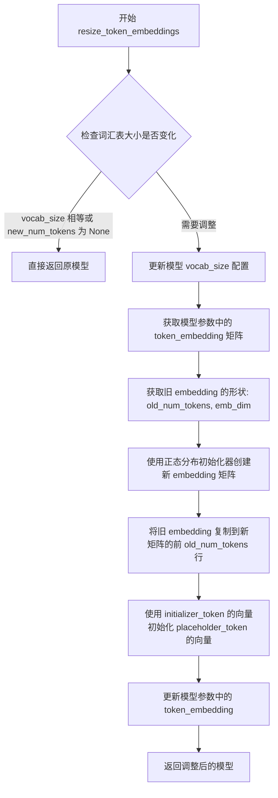
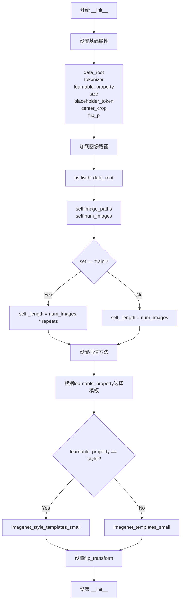
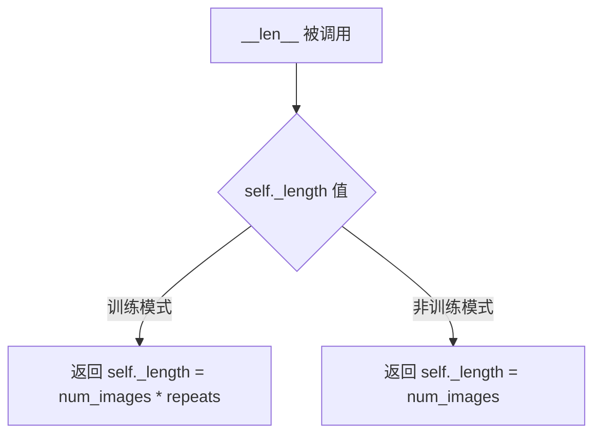

```mermaid
flowchart TD
    A[开始 parse_args] --> B[创建 ArgumentParser]
    B --> C[添加 pretrained_model_name_or_path 参数]
    C --> D[添加 tokenizer_name 参数]
    D --> E[添加 train_data_dir 参数]
    E --> F[添加 placeholder_token 参数]
    F --> G[添加 initializer_token 参数]
    G --> H[添加 learnable_property 参数]
    H --> I[添加 repeats 参数]
    I --> J[添加 output_dir 参数]
    J --> K[添加 seed 参数]
    K --> L[添加 resolution 参数]
    L --> M[添加 center_crop 参数]
    M --> N[添加 train_batch_size 参数]
    N --> O[添加 num_train_epochs 参数]
    O --> P[添加 max_train_steps 参数]
    P --> Q[添加 learning_rate 参数]
    Q --> R[添加 scale_lr 参数]
    R --> S[添加 lr_warmup_steps 参数]
    S --> T[添加 lr_scheduler 参数]
    T --> U[添加 adam_beta1 参数]
    U --> V[添加 adam_beta2 参数]
    V --> W[添加 adam_weight_decay 参数]
    W --> X[添加 adam_epsilon 参数]
    X --> Y[添加 push_to_hub 参数]
    Y --> Z[添加 use_auth_token 参数]
    Z --> AA[添加 hub_token 参数]
    AA --> AB[添加 hub_model_id 参数]
    AB --> AC[添加 logging_dir 参数]
    AC --> AD[添加 local_rank 参数]
    AD --> AE[调用 parser.parse_args]
    AE --> AF{检查环境变量 LOCAL_RANK}
    AF -->|env_local_rank != -1| AG[更新 args.local_rank]
    AF -->|env_local_rank == -1| AH{检查 train_data_dir 是否为 None}
    AG --> AH
    AH -->|train_data_dir 为 None| AI[抛出 ValueError]
    AH -->|train_data_dir 不为 None| AJ[返回 args 对象]
    AI --> AJ
```

# `diffusers\examples\research_projects\multi_token_textual_inversion\textual_inversion_flax.py` 详细设计文档

这是一个用于通过 Textual Inversion 技术训练 Stable Diffusion 模型自定义概念（由占位符表示）的脚本，核心功能是冻结模型参数并仅训练新引入的 token embedding。

## 整体流程

```mermaid
graph TD
    A([开始]) --> B[parse_args: 解析命令行参数]
    B --> C[main: 初始化环境 (Seed, Logger, 分布式环境)]
    C --> D[main: 加载 Tokenizer 并添加 placeholder_token]
    D --> E[main: 加载预训练模型 (TextEncoder, VAE, UNet)]
    E --> F[resize_token_embeddings: 调整词嵌入矩阵大小以容纳新 token]
    F --> G[main: 创建 TextualInversionDataset 和 DataLoader]
    G --> H[main: 配置优化器 (AdamW) 与梯度掩码 (Mask)]
    H --> I{训练循环开始}
    I --> J[遍历 DataLoader]
    J --> K[train_step: 执行前向传播、噪声预测与梯度计算 (pmap)]
    K --> L[仅更新 placeholder_token 对应的 embedding]
    L --> M{是否达到最大训练步数}
    M -- 否 --> J
    M -- 是 --> N[main: 保存模型权重与学习到的 embeddings]
    N --> O([结束])
```

## 类结构

```
torch.utils.data.Dataset (基类)
└── TextualInversionDataset (数据集类)
```

## 全局变量及字段


### `logger`
    
日志记录器，用于输出训练过程中的日志信息

类型：`logging.Logger`
    


### `PIL_INTERPOLATION`
    
PIL 插值方法映射，根据版本兼容提供不同的采样方式

类型：`dict`
    


### `imagenet_templates_small`
    
物体类别文本模板列表，用于生成描述文本

类型：`list`
    


### `imagenet_style_templates_small`
    
艺术风格文本模板列表，用于生成风格描述文本

类型：`list`
    


### `parse_args`
    
解析命令行参数，返回包含训练配置的 argparse.Namespace 对象

类型：`function`
    


### `resize_token_embeddings`
    
调整文本编码器的 token 嵌入矩阵大小，以容纳新增的占位符 token

类型：`function`
    


### `get_params_to_save`
    
将分布式参数映射为可保存的单设备形式，用于模型序列化

类型：`function`
    


### `main`
    
训练入口函数，负责模型加载、数据集构建、训练循环及模型保存

类型：`function`
    


### `TextualInversionDataset.data_root`
    
训练数据根目录

类型：`str`
    


### `TextualInversionDataset.tokenizer`
    
分词器

类型：`CLIPTokenizer`
    


### `TextualInversionDataset.learnable_property`
    
'object' 或 'style'，指示学习对象类型

类型：`str`
    


### `TextualInversionDataset.size`
    
图像分辨率

类型：`int`
    


### `TextualInversionDataset.placeholder_token`
    
要学习的概念词

类型：`str`
    


### `TextualInversionDataset.center_crop`
    
是否中心裁剪

类型：`bool`
    


### `TextualInversionDataset.flip_p`
    
水平翻转概率

类型：`float`
    


### `TextualInversionDataset.image_paths`
    
图像文件路径列表

类型：`list`
    


### `TextualInversionDataset.num_images`
    
原始图像数量

类型：`int`
    


### `TextualInversionDataset._length`
    
数据集长度，受 repeats 影响

类型：`int`
    


### `TextualInversionDataset.interpolation`
    
图像插值方式

类型：`Resampling`
    


### `TextualInversionDataset.templates`
    
文本生成模板

类型：`list`
    


### `TextualInversionDataset.flip_transform`
    
数据增强变换

类型：`RandomHorizontalFlip`
    
    

## 全局函数及方法


### `parse_args`

该函数使用argparse库解析命令行参数，配置文本反转（Textual Inversion）训练脚本的所有超参数和路径设置，包括模型路径、数据目录、训练参数（学习率、批次大小、轮次等）、优化器参数、以及分布式训练和模型推送相关配置，最终返回一个包含所有训练配置的Namespace对象。

参数：此函数不接受任何参数，它依赖于Python的argparse模块来获取命令行参数。

返回值：`argparse.Namespace`，返回一个命名空间对象，包含所有命令行参数及其值。

#### 流程图



#### 带注释源码

```python
def parse_args():
    """
    解析命令行参数，返回包含所有训练配置的 Namespace 对象。
    
    该函数定义了文本反转训练脚本所需的所有命令行参数，包括：
    - 模型和分词器路径配置
    - 训练数据路径
    - 占位符和初始化令牌
    - 训练超参数（批次大小、学习率、轮次等）
    - 优化器参数
    - 分布式训练配置
    - Hub推送配置
    """
    # 创建参数解析器，添加脚本描述
    parser = argparse.ArgumentParser(description="Simple example of a training script.")
    
    # =========================================================================
    # 模型和分词器配置
    # =========================================================================
    
    # 预训练模型名称或路径（必需）
    parser.add_argument(
        "--pretrained_model_name_or_path",
        type=str,
        default=None,
        required=True,
        help="Path to pretrained model or model identifier from huggingface.co/models.",
    )
    
    # 分词器名称（可选，默认与模型相同）
    parser.add_argument(
        "--tokenizer_name",
        type=str,
        default=None,
        help="Pretrained tokenizer name or path if not the same as model_name",
    )
    
    # =========================================================================
    # 训练数据配置
    # =========================================================================
    
    # 训练数据目录（必需）
    parser.add_argument(
        "--train_data_dir", type=str, default=None, required=True, help="A folder containing the training data."
    )
    
    # 占位符令牌（必需，用于概念替换）
    parser.add_argument(
        "--placeholder_token",
        type=str,
        default=None,
        required=True,
        help="A token to use as a placeholder for the concept.",
    )
    
    # 初始化令牌（必需，用于初始化新嵌入）
    parser.add_argument(
        "--initializer_token", type=str, default=None, required=True, help="A token to use as initializer word."
    )
    
    # 可学习属性：对象或风格
    parser.add_argument("--learnable_property", type=str, default="object", help="Choose between 'object' and 'style'")
    
    # 数据重复次数
    parser.add_argument("--repeats", type=int, default=100, help="How many times to repeat the training data.")
    
    # =========================================================================
    # 输出和随机种子配置
    # =========================================================================
    
    # 输出目录
    parser.add_argument(
        "--output_dir",
        type=str,
        default="text-inversion-model",
        help="The output directory where the model predictions and checkpoints will be written.",
    )
    
    # 随机种子（用于 reproducible training）
    parser.add_argument("--seed", type=int, default=42, help="A seed for reproducible training.")
    
    # =========================================================================
    # 图像预处理配置
    # =========================================================================
    
    # 输入图像分辨率
    parser.add_argument(
        "--resolution",
        type=int,
        default=512,
        help=(
            "The resolution for input images, all the images in the train/validation dataset will be resized to this"
            " resolution"
        ),
    )
    
    # 是否中心裁剪
    parser.add_argument(
        "--center_crop", action="store_true", help="Whether to center crop images before resizing to resolution."
    )
    
    # =========================================================================
    # 训练超参数
    # =========================================================================
    
    # 训练批次大小
    parser.add_argument(
        "--train_batch_size", type=int, default=16, help="Batch size (per device) for the training dataloader."
    )
    
    # 训练轮次
    parser.add_argument("--num_train_epochs", type=int, default=100)
    
    # 最大训练步数（可选，若提供则覆盖 num_train_epochs）
    parser.add_argument(
        "--max_train_steps",
        type=int,
        default=5000,
        help="Total number of training steps to perform.  If provided, overrides num_train_epochs.",
    )
    
    # =========================================================================
    # 学习率调度配置
    # =========================================================================
    
    # 初始学习率
    parser.add_argument(
        "--learning_rate",
        type=float,
        default=1e-4,
        help="Initial learning rate (after the potential warmup period) to use.",
    )
    
    # 是否按 GPU/累积/批次大小缩放学习率
    parser.add_argument(
        "--scale_lr",
        action="store_true",
        default=True,
        help="Scale the learning rate by the number of GPUs, gradient accumulation steps, and batch size.",
    )
    
    # 学习率预热步数
    parser.add_argument(
        "--lr_warmup_steps", type=int, default=500, help="Number of steps for the warmup in the lr scheduler."
    )
    
    # 学习率调度器类型
    parser.add_argument(
        "--lr_scheduler",
        type=str,
        default="constant",
        help=(
            'The scheduler type to use. Choose between ["linear", "cosine", "cosine_with_restarts", "polynomial",'
            ' "constant", "constant_with_warmup"]'
        ),
    )
    
    # =========================================================================
    # Adam 优化器参数
    # =========================================================================
    
    # Adam beta1 参数
    parser.add_argument("--adam_beta1", type=float, default=0.9, help="The beta1 parameter for the Adam optimizer.")
    
    # Adam beta2 参数
    parser.add_argument("--adam_beta2", type=float, default=0.999, help="The beta2 parameter for the Adam optimizer.")
    
    # Adam 权重衰减
    parser.add_argument("--adam_weight_decay", type=float, default=1e-2, help="Weight decay to use.")
    
    # Adam epsilon 值
    parser.add_argument("--adam_epsilon", type=float, default=1e-08, help="Epsilon value for the Adam optimizer")
    
    # =========================================================================
    # Hugging Face Hub 配置
    # =========================================================================
    
    # 是否推送到 Hub
    parser.add_argument("--push_to_hub", action="store_true", help="Whether or not to push the model to the Hub.")
    
    # 是否使用认证令牌
    parser.add_argument(
        "--use_auth_token",
        action="store_true",
        help=(
            "Will use the token generated when running `hf auth login` (necessary to use this script with"
            " private models)."
        ),
    )
    
    # Hub 令牌
    parser.add_argument("--hub_token", type=str, default=None, help="The token to use to push to the Model Hub.")
    
    # Hub 模型 ID
    parser.add_argument(
        "--hub_model_id",
        type=str,
        default=None,
        help="The name of the repository to keep in sync with the local `output_dir`.",
    )
    
    # =========================================================================
    # 日志和分布式训练配置
    # =========================================================================
    
    # 日志目录（TensorBoard）
    parser.add_argument(
        "--logging_dir",
        type=str,
        default="logs",
        help=(
            "[TensorBoard](https://www.tensorflow.org/tensorboard) log directory. Will default to"
            " *output_dir/runs/**CURRENT_DATETIME_HOSTNAME***."
        ),
    )
    
    # 本地排名（分布式训练）
    parser.add_argument("--local_rank", type=int, default=-1, help="For distributed training: local_rank")
    
    # =========================================================================
    # 解析参数并进行环境变量覆盖
    # =========================================================================
    
    # 解析命令行参数
    args = parser.parse_args()
    
    # 检查环境变量 LOCAL_RANK，用于分布式训练的环境覆盖
    env_local_rank = int(os.environ.get("LOCAL_RANK", -1))
    if env_local_rank != -1 and env_local_rank != args.local_rank:
        args.local_rank = env_local_rank
    
    # =========================================================================
    # 参数验证
    # =========================================================================
    
    # 确保训练数据目录已指定
    if args.train_data_dir is None:
        raise ValueError("You must specify a train data directory.")
    
    # 返回包含所有配置的命名空间对象
    return args
```


### `resize_token_embeddings`

该函数用于调整 TextEncoder 的 token embedding 矩阵，当向 tokenizer 添加新的占位符 token 时，需要扩展 embedding 层以容纳新的 token，并使用 initializer_token 的向量初始化新 token 的向量。

参数：

- `model`：`FlaxCLIPTextModel`，要进行 token embedding 调整的文本编码器模型
- `new_num_tokens`：`int`，调整后的词汇表大小
- `initializer_token_id`：`int`，用于初始化新 token 向量的 token ID
- `placeholder_token_id`：`int`，新添加的占位符 token 的 ID
- `rng`：`jax.random.PRNGKey`，JAX 随机数生成器，用于初始化新 embedding

返回值：`FlaxCLIPTextModel`，调整后的模型对象

#### 流程图



#### 带注释源码

```python
def resize_token_embeddings(model, new_num_tokens, initializer_token_id, placeholder_token_id, rng):
    # 如果词汇表大小没有变化或新大小为 None，则直接返回，不做任何修改
    if model.config.vocab_size == new_num_tokens or new_num_tokens is None:
        return
    
    # 更新模型配置中的词汇表大小
    model.config.vocab_size = new_num_tokens

    # 获取模型的当前参数
    params = model.params
    # 从参数中提取旧的 token embedding 矩阵
    # 路径: text_model -> embeddings -> token_embedding -> embedding
    old_embeddings = params["text_model"]["embeddings"]["token_embedding"]["embedding"]
    # 获取旧 embedding 的形状: (token数量, embedding维度)
    old_num_tokens, emb_dim = old_embeddings.shape

    # 创建正态分布初始化器，用于初始化新的 token embedding
    initializer = jax.nn.initializers.normal()

    # 使用初始化器创建新的 embedding 矩阵，形状为 (new_num_tokens, emb_dim)
    new_embeddings = initializer(rng, (new_num_tokens, emb_dim))
    # 将旧的 embedding 复制到新矩阵的前 old_num_tokens 行
    new_embeddings = new_embeddings.at[:old_num_tokens].set(old_embeddings)
    # 使用 initializer_token_id 对应的向量来初始化 placeholder_token_id 对应的向量
    # 这样可以让新添加的占位符 token 有一个合理的初始值
    new_embeddings = new_embeddings.at[placeholder_token_id].set(new_embeddings[initializer_token_id])
    
    # 更新模型参数中的 token_embedding 为新的 embedding 矩阵
    params["text_model"]["embeddings"]["token_embedding"]["embedding"] = new_embeddings

    # 将更新后的参数重新赋值给模型
    model.params = params
    # 返回调整后的模型
    return model
```


### `get_params_to_save`

该函数用于将分片（sharded）后的 JAX 参数合并为单机格式，以便保存到磁盘。在 JAX 分布式训练中，参数通常分布在多个设备上，该函数通过选取每个分片的第一个副本并将其从设备数组转换回本地 NumPy 数组来实现参数的聚合。

参数：

- `params`：`PyTree`，分片后的 JAX 参数树，通常包含分布在多个设备上的数组

返回值：`PyTree`，合并到单机格式的参数树，可以直接用于保存或后续处理

#### 流程图

```mermaid
flowchart TD
    A[输入: 分片参数 params] --> B[使用 tree_map 遍历参数树]
    B --> C[对每个叶子节点执行 lambda x: x[0]]
    C --> D[选取每个分片数组的第一个副本]
    D --> E[调用 jax.device_get]
    E --> F[将分布式设备数组转换回本地数组]
    F --> G[输出: 单机格式参数]
```

#### 带注释源码

```python
def get_params_to_save(params):
    """
    将分片后的参数合并为单机格式，用于保存。
    
    在 JAX 分布式训练中，参数通常以分片形式分布在多个设备上。
    此函数将分片参数聚合为单机格式，以便保存到磁盘。
    
    参数:
        params: PyTree, 分片后的 JAX 参数树
        
    返回:
        PyTree, 合并后的单机参数树
    """
    return jax.device_get(jax.tree_util.tree_map(lambda x: x[0], params))
```

---

### 补充说明

#### 设计目标与约束

- **设计目标**：解决 JAX 分布式训练中参数保存的问题，将多设备分片参数转换为单机可序列化格式
- **约束**：假设输入参数是分片的，且每个分片包含相同的数据（通过 `x[0]` 选取第一个副本）

#### 错误处理与异常设计

- 当前实现没有显式的错误处理。如果输入参数不是分片格式（例如已经是单机格式），`x[0]` 操作可能返回原始张量而非预期结果
- 建议在调用前验证参数确实是分片格式

#### 潜在优化空间

1. **参数验证**：可以添加参数格式验证，确保输入是有效的分片参数
2. **灵活性**：可以考虑添加参数支持选择特定的分片索引，而不仅仅是 `[0]`
3. **错误处理**：添加异常捕获，处理可能的设备通信错误


### `main`

这是脚本的主入口函数，负责端到端地执行 Textual Inversion（文本倒置）训练流程。该函数首先解析命令行参数并初始化分布式训练环境（JAX），随后加载 Stable Diffusion 的分词器、VAE、UNet 和 Text Encoder 模型，并针对新增的占位符（placeholder）令牌调整词嵌入矩阵。接着，它构建训练数据集和数据加载器，配置基于 Optax 的 AdamW 优化器，并在多个 GPU（TPU）上通过 `pmap` 并行执行训练循环。在训练过程中，只更新新添加的令牌嵌入，而保持原始模型参数不变。训练完成后，函数负责将模型 pipeline 和学习到的嵌入向量保存到本地目录，并根据参数决定是否推送至 HuggingFace Hub。

参数：

-  `无`：`无`，主函数没有显式的函数参数，它依赖于内部调用 `parse_args()` 获取命令行配置。

返回值：`None`，该函数执行副作用（文件IO、模型保存），不返回任何值。

#### 流程图

```mermaid
graph TD
    A([Start main]) --> B[parse_args & set_seed]
    B --> C{Check Process Index == 0}
    C -->|Yes| D[Create Output Dir & Repo]
    C -->|No| E[Setup Logging]
    D --> E
    E --> F[Load Tokenizer & Add Placeholder Token]
    F --> G[Load Flax Models (TextEncoder, VAE, UNet)]
    G --> H[Resize Token Embeddings]
    H --> I[Create TextualInversionDataset]
    I --> J[Create DataLoader]
    J --> K[Setup Optimizer (AdamW) & Gradient Mask]
    K --> L[Initialize TrainState]
    L --> M[Initialize Noise Scheduler]
    M --> N[Loop: Epochs]
    N --> O[Loop: Batches]
    O --> P[Train Step: Encode, Add Noise, Predict]
    P --> Q[Compute Loss & Backward]
    Q --> R[Update Embeddings (Keep others fixed)]
    R --> O
    O -->|End Data| S[Log Metrics]
    S --> N
    N -->|End Epochs| T{Check Process Index 0}
    T -->|Yes| U[Create Pipeline & Save]
    T -->|No| V([End])
    U --> V
```

#### 带注释源码

```python
def main():
    # 1. 参数解析与环境初始化
    args = parse_args()

    # 设置随机种子以确保可复现性
    if args.seed is not None:
        set_seed(args.seed)

    # 仅在主进程（process_index == 0）中创建输出目录和Hub仓库
    if jax.process_index() == 0:
        if args.output_dir is not None:
            os.makedirs(args.output_dir, exist_ok=True)

        if args.push_to_hub:
            repo_id = create_repo(
                repo_id=args.hub_model_id or Path(args.output_dir).name, exist_ok=True, token=args.hub_token
            ).repo_id

    # 2. 日志配置：设置日志格式和级别，只允许主进程输出详细日志
    logging.basicConfig(
        format="%(asctime)s - %(levelname)s - %(name)s -   %(message)s",
        datefmt="%m/%d/%Y %H:%M:%S",
        level=logging.INFO,
    )
    logger.setLevel(logging.INFO if jax.process_index() == 0 else logging.ERROR)
    if jax.process_index() == 0:
        transformers.utils.logging.set_verbosity_info()
    else:
        transformers.utils.logging.set_verbosity_error()

    # 3. 加载分词器并添加占位符令牌
    if args.tokenizer_name:
        tokenizer = CLIPTokenizer.from_pretrained(args.tokenizer_name)
    elif args.pretrained_model_name_or_path:
        tokenizer = CLIPTokenizer.from_pretrained(args.pretrained_model_name_or_path, subfolder="tokenizer")

    # 将占位符作为特殊令牌添加到分词器
    num_added_tokens = tokenizer.add_tokens(args.placeholder_token)
    if num_added_tokens == 0:
        raise ValueError(
            f"The tokenizer already contains the token {args.placeholder_token}. Please pass a different"
            " `placeholder_token` that is not already in the tokenizer."
        )

    # 获取初始化令牌和占位符令牌的ID
    token_ids = tokenizer.encode(args.initializer_token, add_special_tokens=False)
    if len(token_ids) > 1:
        raise ValueError("The initializer token must be a single token.")

    initializer_token_id = token_ids[0]
    placeholder_token_id = tokenizer.convert_tokens_to_ids(args.placeholder_token)

    # 4. 加载预训练的 Flax 模型
    text_encoder = FlaxCLIPTextModel.from_pretrained(args.pretrained_model_name_or_path, subfolder="text_encoder")
    vae, vae_params = FlaxAutoencoderKL.from_pretrained(args.pretrained_model_name_or_path, subfolder="vae")
    unet, unet_params = FlaxUNet2DConditionModel.from_pretrained(args.pretrained_model_name_or_path, subfolder="unet")

    # 5. 调整文本嵌入层大小以容纳新令牌
    rng = jax.random.PRNGKey(args.seed)
    rng, _ = jax.random.split(rng)
    text_encoder = resize_token_embeddings(
        text_encoder, len(tokenizer), initializer_token_id, placeholder_token_id, rng
    )
    # 保存原始嵌入以便在训练中恢复非占位符部分
    original_token_embeds = text_encoder.params["text_model"]["embeddings"]["token_embedding"]["embedding"]

    # 6. 构建数据集与数据加载器
    train_dataset = TextualInversionDataset(
        data_root=args.train_data_dir,
        tokenizer=tokenizer,
        size=args.resolution,
        placeholder_token=args.placeholder_token,
        repeats=args.repeats,
        learnable_property=args.learnable_property,
        center_crop=args.center_crop,
        set="train",
    )

    def collate_fn(examples):
        # 整理批次数据，将 PyTorch 张量转换为 NumPy 数组以适配 JAX
        pixel_values = torch.stack([example["pixel_values"] for example in examples])
        input_ids = torch.stack([example["input_ids"] for example in examples])
        batch = {"pixel_values": pixel_values, "input_ids": input_ids}
        batch = {k: v.numpy() for k, v in batch.items()}
        return batch

    total_train_batch_size = args.train_batch_size * jax.local_device_count()
    train_dataloader = torch.utils.data.DataLoader(
        train_dataset, batch_size=total_train_batch_size, shuffle=True, drop_last=True, collate_fn=collate_fn
    )

    # 7. 优化器配置：学习率缩放与 AdamW
    if args.scale_lr:
        args.learning_rate = args.learning_rate * total_train_batch_size

    constant_scheduler = optax.constant_schedule(args.learning_rate)

    optimizer = optax.adamw(
        learning_rate=constant_scheduler,
        b1=args.adam_beta1,
        b2=args.adam_beta2,
        eps=args.adam_epsilon,
        weight_decay=args.adam_weight_decay,
    )

    # 创建梯度掩码：仅对 token_embedding 层进行梯度更新，其余层梯度置零
    def create_mask(params, label_fn):
        # ... (mask creation logic inside main for closure access)
        def _map(params, mask, label_fn):
            for k in params:
                if label_fn(k):
                    mask[k] = "token_embedding"
                else:
                    if isinstance(params[k], dict):
                        mask[k] = {}
                        _map(params[k], mask[k], label_fn)
                    else:
                        mask[k] = "zero"
        mask = {}
        _map(params, mask, label_fn)
        return mask

    def zero_grads():
        # 自定义 Optax 梯度转换器，用于将梯度置零
        def init_fn(_):
            return ()
        def update_fn(updates, state, params=None):
            return jax.tree_util.tree_map(jnp.zeros_like, updates), ()
        return optax.GradientTransformation(init_fn, update_fn)

    # 应用多转换优化器：token_embedding 使用 AdamW，其余使用 zero_grads
    tx = optax.multi_transform(
        {"token_embedding": optimizer, "zero": zero_grads()},
        create_mask(text_encoder.params, lambda s: s == "token_embedding"),
    )

    # 创建 Flax 训练状态
    state = train_state.TrainState.create(apply_fn=text_encoder.__call__, params=text_encoder.params, tx=tx)

    # 8. 噪声调度器初始化
    noise_scheduler = FlaxDDPMScheduler(
        beta_start=0.00085, beta_end=0.012, beta_schedule="scaled_linear", num_train_timesteps=1000
    )
    noise_scheduler_state = noise_scheduler.create_state()

    # 9. 定义训练步骤 (单步)
    train_rngs = jax.random.split(rng, jax.local_device_count())

    def train_step(state, vae_params, unet_params, batch, train_rng):
        # 分离随机数生成器
        dropout_rng, sample_rng, new_train_rng = jax.random.split(train_rng, 3)

        def compute_loss(params):
            # VAE 编码图像获取潜在空间表示
            vae_outputs = vae.apply(
                {"params": vae_params}, batch["pixel_values"], deterministic=True, method=vae.encode
            )
            latents = vae_outputs.latent_dist.sample(sample_rng)
            latents = jnp.transpose(latents, (0, 3, 1, 2))
            latents = latents * vae.config.scaling_factor

            # 添加噪声
            noise_rng, timestep_rng = jax.random.split(sample_rng)
            noise = jax.random.normal(noise_rng, latents.shape)
            bsz = latents.shape[0]
            timesteps = jax.random.randint(
                timestep_rng,
                (bsz,),
                0,
                noise_scheduler.config.num_train_timesteps,
            )
            noisy_latents = noise_scheduler.add_noise(noise_scheduler_state, latents, noise, timesteps)
            
            # 文本编码
            encoder_hidden_states = state.apply_fn(
                batch["input_ids"], params=params, dropout_rng=dropout_rng, train=True
            )[0]
            
            # UNet 预测噪声
            model_pred = unet.apply(
                {"params": unet_params}, noisy_latents, timesteps, encoder_hidden_states, train=False
            ).sample

            # 计算损失
            if noise_scheduler.config.prediction_type == "epsilon":
                target = noise
            elif noise_scheduler.config.prediction_type == "v_prediction":
                target = noise_scheduler.get_velocity(noise_scheduler_state, latents, noise, timesteps)
            else:
                raise ValueError(f"Unknown prediction type {noise_scheduler.config.prediction_type}")

            loss = (target - model_pred) ** 2
            loss = loss.mean()
            return loss

        # 计算梯度并更新
        grad_fn = jax.value_and_grad(compute_loss)
        loss, grad = grad_fn(state.params)
        grad = jax.lax.pmean(grad, "batch") # 跨设备平均梯度
        new_state = state.apply_gradients(grads=grad)

        # 关键步骤：虽然参数更新了，但我们需要确保除了 placeholder_token 以外的嵌入保持不变
        # 因为我们设置了 mask，理论上其他参数梯度被置零，但数值上我们恢复原始嵌入以防万一
        token_embeds = original_token_embeds.at[placeholder_token_id].set(
            new_state.params["text_model"]["embeddings"]["token_embedding"]["embedding"][placeholder_token_id]
        )
        new_state.params["text_model"]["embeddings"]["token_embedding"]["embedding"] = token_embeds

        metrics = {"loss": loss}
        metrics = jax.lax.pmean(metrics, axis_name="batch")
        return new_state, metrics, new_train_rng

    # 10. 并行化训练步骤
    p_train_step = jax.pmap(train_step, "batch", donate_argnums=(0,))

    # 复制状态到各个设备
    state = jax_utils.replicate(state)
    vae_params = jax_utils.replicate(vae_params)
    unet_params = jax_utils.replicate(unet_params)

    # 11. 训练循环
    num_update_steps_per_epoch = math.ceil(len(train_dataloader))
    if args.max_train_steps is None:
        args.max_train_steps = args.num_train_epochs * num_update_steps_per_epoch
    args.num_train_epochs = math.ceil(args.max_train_steps / num_update_steps_per_epoch)

    logger.info("***** Running training *****")
    logger.info(f"  Num examples = {len(train_dataset)}")
    logger.info(f"  Num Epochs = {args.num_train_epochs}")
    logger.info(f"  Total train batch size = {total_train_batch_size}")
    logger.info(f"  Total optimization steps = {args.max_train_steps}")

    global_step = 0

    # 遍历每个 Epoch
    epochs = tqdm(range(args.num_train_epochs), desc=f"Epoch ... (1/{args.num_train_epochs})", position=0)
    for epoch in epochs:
        train_metrics = []
        steps_per_epoch = len(train_dataset) // total_train_batch_size
        train_step_progress_bar = tqdm(total=steps_per_epoch, desc="Training...", position=1, leave=False)
        
        # 遍历每个 Batch
        for batch in train_dataloader:
            batch = shard(batch) # 将数据分片到各个设备
            state, train_metric, train_rngs = p_train_step(state, vae_params, unet_params, batch, train_rngs)
            train_metrics.append(train_metric)

            train_step_progress_bar.update(1)
            global_step += 1

            if global_step >= args.max_train_steps:
                break

        # 解码指标用于日志记录
        train_metric = jax_utils.unreplicate(train_metric)
        train_step_progress_bar.close()
        epochs.write(f"Epoch... ({epoch + 1}/{args.num_train_epochs} | Loss: {train_metric['loss']})")

    # 12. 保存模型
    if jax.process_index() == 0:
        scheduler = FlaxPNDMScheduler(
            beta_start=0.00085, beta_end=0.012, beta_schedule="scaled_linear", skip_prk_steps=True
        )
        safety_checker = FlaxStableDiffusionSafetyChecker.from_pretrained(
            "CompVis/stable-diffusion-safety-checker", from_pt=True
        )
        pipeline = FlaxStableDiffusionPipeline(
            text_encoder=text_encoder,
            vae=vae,
            unet=unet,
            tokenizer=tokenizer,
            scheduler=scheduler,
            safety_checker=safety_checker,
            feature_extractor=CLIPImageProcessor.from_pretrained("openai/clip-vit-base-patch32"),
        )

        # 保存 Pipeline
        pipeline.save_pretrained(
            args.output_dir,
            params={
                "text_encoder": get_params_to_save(state.params),
                "vae": get_params_to_save(vae_params),
                "unet": get_params_to_save(unet_params),
                "safety_checker": safety_checker.params,
            },
        )

        # 保存学习到的嵌入向量
        learned_embeds = get_params_to_save(state.params)["text_model"]["embeddings"]["token_embedding"]["embedding"][
            placeholder_token_id
        ]
        learned_embeds_dict = {args.placeholder_token: learned_embeds}
        jnp.save(os.path.join(args.output_dir, "learned_embeds.npy"), learned_embeds_dict)

        # 推送到 Hub
        if args.push_to_hub:
            upload_folder(
                repo_id=repo_id,
                folder_path=args.output_dir,
                commit_message="End of training",
                ignore_patterns=["step_*", "epoch_*"],
            )
```


### `TextualInversionDataset.__init__`

初始化文本反转数据集，设置数据根路径、分词器、学习属性（对象或风格）、图像尺寸、重复次数、插值方法、翻转概率、数据集类型、占位符标记和中心裁剪选项。

参数：

- `data_root`：`str`，数据根目录路径，包含训练图像的文件夹
- `tokenizer`：`CLIPTokenizer`，用于对文本进行分词的CLIP分词器
- `learnable_property`：`str`，可学习属性类型，默认为"object"，可选"object"或"style"
- `size`：`int`，图像尺寸，默认为512，用于调整图像大小
- `repeats`：`int`，重复次数，默认为100，用于重复训练数据增强
- `interpolation`：`str`，插值方法，默认为"bicubic"，支持"linear", "bilinear", "bicubic", "lanczos"
- `flip_p`：`float`，随机水平翻转概率，默认为0.5
- `set`：`str`，数据集类型，默认为"train"，用于区分训练和验证集
- `placeholder_token`：`str`，占位符标记，默认为"*"用于替换概念词
- `center_crop`：`bool`，是否中心裁剪图像，默认为False

返回值：`None`，该方法为构造函数，不返回任何值

#### 流程图



#### 带注释源码

```python
def __init__(
    self,
    data_root,
    tokenizer,
    learnable_property="object",  # [object, style]
    size=512,
    repeats=100,
    interpolation="bicubic",
    flip_p=0.5,
    set="train",
    placeholder_token="*",
    center_crop=False,
):
    """
    初始化TextualInversionDataset数据集
    
    参数:
        data_root: 数据根目录路径
        tokenizer: CLIP分词器
        learnable_property: 可学习属性，'object'或'style'
        size: 图像尺寸
        repeats: 重复次数
        interpolation: 插值方法
        flip_p: 翻转概率
        set: 数据集类型
        placeholder_token: 占位符标记
        center_crop: 是否中心裁剪
    """
    # 存储基础属性
    self.data_root = data_root
    self.tokenizer = tokenizer
    self.learnable_property = learnable_property
    self.size = size
    self.placeholder_token = placeholder_token
    self.center_crop = center_crop
    self.flip_p = flip_p

    # 获取数据目录中的所有图像文件路径
    self.image_paths = [os.path.join(self.data_root, file_path) for file_path in os.listdir(self.data_root)]

    # 计算图像数量
    self.num_images = len(self.image_paths)
    self._length = self.num_images

    # 如果是训练集，根据repeats参数扩展数据集长度
    if set == "train":
        self._length = self.num_images * repeats

    # 根据interpolation参数设置PIL插值方法
    self.interpolation = {
        "linear": PIL_INTERPOLATION["linear"],
        "bilinear": PIL_INTERPOLATION["bilinear"],
        "bicubic": PIL_INTERPOLATION["bicubic"],
        "lanczos": PIL_INTERPOLATION["lanczos"],
    }[interpolation]

    # 根据learnable_property选择对应的文本模板
    # style使用风格模板，object使用对象模板
    self.templates = imagenet_style_templates_small if learnable_property == "style" else imagenet_templates_small
    
    # 创建随机水平翻转变换
    self.flip_transform = transforms.RandomHorizontalFlip(p=self.flip_p)
```


### `TextualInversionDataset.__len__`

该方法返回数据集的长度，用于 PyTorch DataLoader 确定迭代次数。在训练模式下（set="train"），数据集长度等于图片数量乘以重复次数（repeats），以增强训练效果；在其他模式下，直接返回原始图片数量。

参数：无（仅包含隐式参数 `self`）

返回值：`int`，数据集的样本总数

#### 流程图



#### 带注释源码

```python
def __len__(self):
    """
    返回数据集的长度。
    
    此方法由 PyTorch DataLoader 调用，用于确定数据集的迭代次数。
    - 在训练模式下 (set="train")：返回 num_images * repeats，以实现数据增强
    - 在其他模式下：返回原始图片数量 num_images
    
    Returns:
        int: 数据集的样本总数
    """
    return self._length
```


### `TextualInversionDataset.__getitem__`

该方法是 `TextualInversionDataset` 类的核心实例方法，负责根据给定的索引加载并处理单个图像及其对应的文本描述，最终返回包含 `input_ids`（文本token IDs）和 `pixel_values`（图像像素值）的字典，用于模型训练。

#### 参数

- `i`：`int`，表示数据集中的样本索引，用于从图像路径列表中检索对应的图像文件。

#### 返回值

- `dict`，返回一个包含两个键的字典：
  - `input_ids`：`torch.Tensor`，形状为 `(tokenizer.model_max_length,)` 的文本token IDs张量。
  - `pixel_values`：`torch.Tensor`，形状为 `(3, size, size)` 的图像像素值张量，数值范围为 `[-1, 1]`。

#### 流程图

```mermaid
flowchart TD
    A[接收索引 i] --> B[根据 i % num_images 获取图像路径]
    B --> C[使用 PIL 打开图像]
    C --> D{检查图像模式是否为 RGB}
    D -- 否 --> E[将图像转换为 RGB 模式]
    D -- 是 --> F[跳过转换]
    E --> F
    F --> G[随机选择一个文本模板]
    G --> H[使用 placeholder_token 格式化模板生成文本]
    H --> I[使用 tokenizer 将文本编码为 input_ids]
    I --> J[将图像转换为 NumPy 数组 uint8]
    J --> K{检查是否需要中心裁剪}
    K -- 是 --> L[计算裁剪区域并进行中心裁剪]
    K -- 否 --> M[跳过裁剪]
    L --> M
    M --> N[将图像 resize 到指定尺寸]
    N --> O[应用随机水平翻转]
    O --> P[将图像数值归一化到 [-1, 1] 范围]
    P --> Q[转换为 PyTorch Tensor 并调整维度顺序 HWC -> CHW]
    Q --> R[构建返回字典 example]
    R --> S[返回 example 字典]
```

#### 带注释源码

```python
def __getitem__(self, i):
    """
    根据索引加载并处理单个训练样本。
    
    参数:
        i: 数据集中的样本索引
    
    返回:
        包含 'input_ids' 和 'pixel_values' 的字典
    """
    # 初始化返回字典
    example = {}
    
    # 使用索引取模获取图像路径，实现数据循环遍历
    # 当 set="train" 且 repeats > 1 时，通过取模实现数据重复
    image = Image.open(self.image_paths[i % self.num_images])

    # 确保图像为 RGB 模式（处理灰度或 RGBA 图像）
    if not image.mode == "RGB":
        image = image.convert("RGB")

    # 获取占位符 token（如 "*"）
    placeholder_string = self.placeholder_token
    
    # 从预定义的模板列表中随机选择一个，并插入占位符生成文本描述
    # 例如: "a photo of a *" -> "a photo of a cat"
    text = random.choice(self.templates).format(placeholder_string)

    # 使用 tokenizer 将文本编码为 token IDs
    # padding="max_length": 填充到最大长度
    # truncation=True: 截断超过最大长度的文本
    # return_tensors="pt": 返回 PyTorch Tensor
    example["input_ids"] = self.tokenizer(
        text,
        padding="max_length",
        truncation=True,
        max_length=self.tokenizer.model_max_length,
        return_tensors="pt",
    ).input_ids[0]  # 取第一个样本（batch=1）

    # 将 PIL 图像转换为 NumPy 数组，类型为 uint8
    img = np.array(image).astype(np.uint8)

    # 如果启用中心裁剪，则裁剪出最大的正方形区域
    if self.center_crop:
        # 计算裁剪边长（取宽高的最小值）
        crop = min(img.shape[0], img.shape[1])
        h, w = img.shape[0], img.shape[1]
        # 计算裁剪区域的起始和结束坐标，实现中心裁剪
        img = img[(h - crop) // 2 : (h + crop) // 2, (w - crop) // 2 : (w + crop) // 2]

    # 将裁剪后的图像转换回 PIL 图像并进行 resize
    image = Image.fromarray(img)
    image = image.resize((self.size, self.size), resample=self.interpolation)

    # 应用随机水平翻转（概率为 flip_p）
    image = self.flip_transform(image)
    
    # 再次转换为 NumPy 数组
    image = np.array(image).astype(np.uint8)
    
    # 归一化图像像素值到 [-1, 1] 范围
    # 原始 uint8 范围 [0, 255] -> [0, 1] -> [-1, 1]
    image = (image / 127.5 - 1.0).astype(np.float32)

    # 转换为 PyTorch Tensor 并调整维度顺序
    # 从 (H, W, C) 转换为 (C, H, W)
    example["pixel_values"] = torch.from_numpy(image).permute(2, 0, 1)
    
    return example
```

## 关键组件


### TextualInversionDataset

数据加载与预处理组件，负责从指定目录加载图像并进行预处理，包括尺寸调整、中心裁剪、随机翻转、归一化等操作，同时生成带有占位符的文本描述。

### resize_token_embeddings

Token嵌入调整函数，用于在添加新特殊token后调整文本编码器的嵌入层，使用原始嵌入进行初始化并保留预训练权重。

### parse_args

命令行参数解析模块，定义并解析所有训练相关参数，包括模型路径、数据目录、学习率、批量大小、优化器参数等。

### train_step / p_train_step

训练步骤函数，执行单步前向传播、损失计算、反向传播和参数更新，支持分布式训练（pmap），同时保持概念token嵌入的可学习性。

### create_mask / zero_grads

梯度掩码创建组件，用于创建优化掩码以实现选择性梯度更新，其中token_embedding层使用正常优化器，其他层使用零梯度更新。

### 图像插值映射 (PIL_INTERPOLATION)

Pillow图像插值方法映射，根据版本兼容性和插值方式名称映射到对应的PIL枚举值。

### 文本描述模板 (imagenet_templates_small / imagenet_style_templates_small)

Textual Inversion的文本提示模板集合，用于将概念词填入不同的图像描述句式中，增强概念学习的泛化性。

### collate_fn

批处理整理函数，将多个样本的像素值和输入ID堆叠成批次，并转换为NumPy数组格式。

### get_params_to_save

参数保存辅助函数，用于从分布式训练状态中提取主设备参数，确保保存的参数格式正确。

### 噪声调度器 (noise_scheduler / scheduler)

DDPM和PNDM噪声调度器，负责在扩散模型的加噪过程中计算不同时间步的噪声添加，以及推理时的采样调度。

### 模型组件 (text_encoder / vae / unet)

Stable Diffusion的核心组件：CLIP文本编码器处理文本提示、变分自编码器进行图像编解码、UNet条件模型预测噪声残差。

### 优化器 (optimizer / constant_scheduler)

基于AdamW的优化器配置，配合恒定学习率调度器进行参数更新，支持权重衰减和梯度裁剪。

### 安全检查器 (safety_checker)

FlaxStableDiffusionSafetyChecker，用于过滤生成过程中的不当内容，确保输出安全性。

### 训练状态管理 (train_state.TrainState)

Flax训练状态封装，集成模型参数、优化器状态和训练轮次信息，支持分布式训练状态复制。

### 概念嵌入保存与推送

learned_embeds提取与保存逻辑，将学习到的概念嵌入向量保存为NumPy文件，并支持可选的Hub模型推送功能。


## 问题及建议


### 已知问题

- **混合使用PyTorch和JAX/Flax框架**: 代码同时使用了PyTorch（Dataset、transforms）和JAX/Flax，导致不必要的数据转换开销（PyTorch tensor → NumPy → JAX）。Dataset返回PyTorch tensor后立即转为NumPy，流程冗余。
- **未使用的导入**: `torch.utils.checkpoint`被导入但从未使用，违反了导入最佳实践。
- **训练过程中缺少断点保存**: 模型仅在训练结束时保存，如果训练中断会导致所有训练结果丢失，缺乏增量保存机制。
- **缺少验证集评估**: 代码没有划分验证集或训练过程中进行评估，无法监控过拟合情况。
- **噪声调度器状态未更新**: `noise_scheduler_state`在训练开始时创建后从未更新，虽然这在某些情况下可能是正确的设计，但通常DDPMScheduler状态需要在每个训练步骤中更新。
- **缺少梯度累积支持**: 尽管参数`--scale_lr`存在，但未实现真正的梯度累积逻辑，无法通过多个小批次累积梯度。
- **潜在的类型不一致**: `TextualInversionDataset.__getitem__`返回PyTorch tensor，但在`collate_fn`中才转为NumPy，可能导致jax_utils.shard时的潜在问题。
- **硬编码的模型路径**: 安全检查器和特征提取器使用硬编码的"CompVis/stable-diffusion-safety-checker"和"openai/clip-vit-base-patch32"，缺乏灵活性。
- **Tokenizer添加token后未更新模型配置**: 添加新token后虽然调用了`resize_token_embeddings`，但text_encoder的原始`config.vocab_size`未同步更新。
- **日志记录不完整**: 缺少学习率、梯度范数等关键训练指标的记录，无法全面监控训练过程。

### 优化建议

- **统一数据处理框架**: 考虑使用纯JAX/Flax数据处理流程（如使用`tf.data`或直接用NumPy），避免PyTorch到JAX的频繁转换，或在Dataset中直接返回NumPy数组。
- **实现训练中断点保存**: 添加定期保存检查点的逻辑，例如每N步保存一次，以便在训练中断时恢复。
- **添加验证集支持**: 划分训练/验证集，在训练过程中定期在验证集上评估模型性能。
- **完善日志和监控**: 记录学习率、梯度范数、loss曲线等关键指标，考虑集成TensorBoard（代码中定义了`logging_dir`但未使用）。
- **移除未使用的导入**: 删除`torch.utils.checkpoint`导入以保持代码整洁。
- **添加梯度累积实现**: 当GPU内存受限时，实现真正的梯度累积以支持更大的有效batch size。
- **参数化安全检查器模型**: 将安全检查器和特征提取器模型路径作为命令行参数，提高脚本灵活性。
- **添加早停机制**: 当验证loss不再下降时自动停止训练，避免过拟合和不必要的计算资源浪费。
- **改进错误处理**: 为文件读取、模型加载、tokenizer操作等关键步骤添加更详细的异常处理和错误信息。

## 其它


### 设计目标与约束

本代码实现文本倒置(Textual Inversion)训练功能，目标是将自定义概念(如特定物体或艺术风格)学习到Stable Diffusion模型的token embedding中，使其能够通过特定的文本提示词生成对应概念。设计约束包括：1) 只能训练新增的placeholder token embedding，保持原始模型参数不变；2) 使用JAX/Flax框架实现分布式训练；3) 支持物体(object)和样式(style)两种学习模式；4) 必须提供预训练模型路径、训练数据目录、placeholder token和initializer token。

### 错误处理与异常设计

代码包含以下错误处理机制：1) 训练数据目录为空时抛出ValueError；2) 如果placeholder token已存在于tokenizer中则抛出ValueError；3) initializer token必须是单个token而非序列，否则抛出ValueError；4) 检查diffusers最小版本(0.14.0.dev0)；5) 对于分布式训练，LOCAL_RANK环境变量会自动覆盖命令行参数；6) 使用logging区分主进程(记录INFO)和从进程(记录ERROR)的日志级别；7) 异常预测类型检查。

### 数据流与状态机

训练数据流：训练图像 -> TextualInversionDataset -> PIL图像加载/预处理(Resize/CenterCrop/Flip) -> 归一化到[-1,1] -> 转换为tensor -> tokenize文本模板 -> batch合并。训练状态机：初始化(TrainState创建) -> 梯度计算 -> 参数更新 -> token embedding固定 -> 循环迭代直至达到max_train_steps。每个epoch包含：dataloader迭代 -> pmap并行训练步骤 -> 指标聚合 -> 验证点保存。

### 外部依赖与接口契约

核心依赖：1) diffusers库(0.14.0.dev0+)提供Stable Diffusion组件；2) flax用于JAX模型训练；3) transformers提供CLIP tokenizer和text encoder；4) optax提供优化器；5) jax/jaxlib用于并行计算；6) torch和torchvision用于数据预处理；7) huggingface_hub用于模型上传。接口契约：pretrained_model_name_or_path必须包含text_encoder、tokenizer、vae、unet子文件夹；训练数据目录包含图像文件；placeholder_token不能与现有token冲突；支持push_to_hub时需要hub_token认证。

### 性能考虑与优化点

1) 使用jax.pmap实现多GPU数据并行；2) 使用jax.utils.shard对batch进行分片；3) 使用梯度掩码实现只更新token embedding层；4) 使用optax.multi_transform分离不同参数的学习率；5) TrainState使用donate_argnums优化内存；6) 训练过程中定期保存checkpoint。潜在优化空间：1) 可添加梯度累积支持更大有效batch；2) 可添加混合精度训练加速；3) 可添加Early Stopping机制；4) 可添加更丰富的日志记录(如tensorboard)；5) 可添加模型权重增量保存而非全量保存。

### 安全性考虑

1) 训练完成后使用FlaxStableDiffusionSafetyChecker过滤不当内容；2) 支持私有模型访问(通过use_auth_token)；3) hub_token需妥善保管不应明文传递；4) 本地文件路径操作使用os.path.join防止路径注入；5) 图像加载后转换RGB模式防止通道异常。

### 兼容性说明

1) PIL版本>=9.1.0使用新的Resampling枚举，旧版本使用旧枚举；2) 支持分布式训练(local_rank参数)；3) 兼容Windows/Linux/macOS系统；4) 需要GPU环境运行(JAX GPU后端)；5) Python版本建议3.8+；6) 依赖版本冲突时需按requirements.txt安装。

### 使用示例与命令

基础用法：python train_textual_inversion.py --pretrained_model_name_or_path="runwayml/stable-diffusion-v1-5" --train_data_dir="./my_concept" --placeholder_token="<cat-toy>" --initializer_token="cat" --output_dir="textual_inversion_cat"。完整示例：python train_textual_inversion.py --pretrained_model_name_or_path="runwayml/stable-diffusion-v1-5" --train_data_dir="./style_images" --placeholder_token="<art-style>" --initializer_token="art" --learnable_property="style" --num_train_epochs=100 --learning_rate=5e-5 --output_dir="textual_inversion_style" --push_to_hub --hub_token="your_token".

### 限制与注意事项

1) 该方法只能学习单一概念(一个placeholder_token)；2) 训练效果高度依赖initializer_token的选择，建议选择与目标概念语义相近的词；3) 训练数据建议50-100张高质量图像；4) 学习率建议1e-4到1e-5之间；5) resolution默认512，可根据显存调整；6) 训练时间较长，建议使用GPU集群；7) 训练完成后生成的learned_embeds.npy文件可加载到任何Stable Diffusion pipeline中使用；8) 当前版本未保存中间checkpoint，如需中断后恢复需手动实现。

    