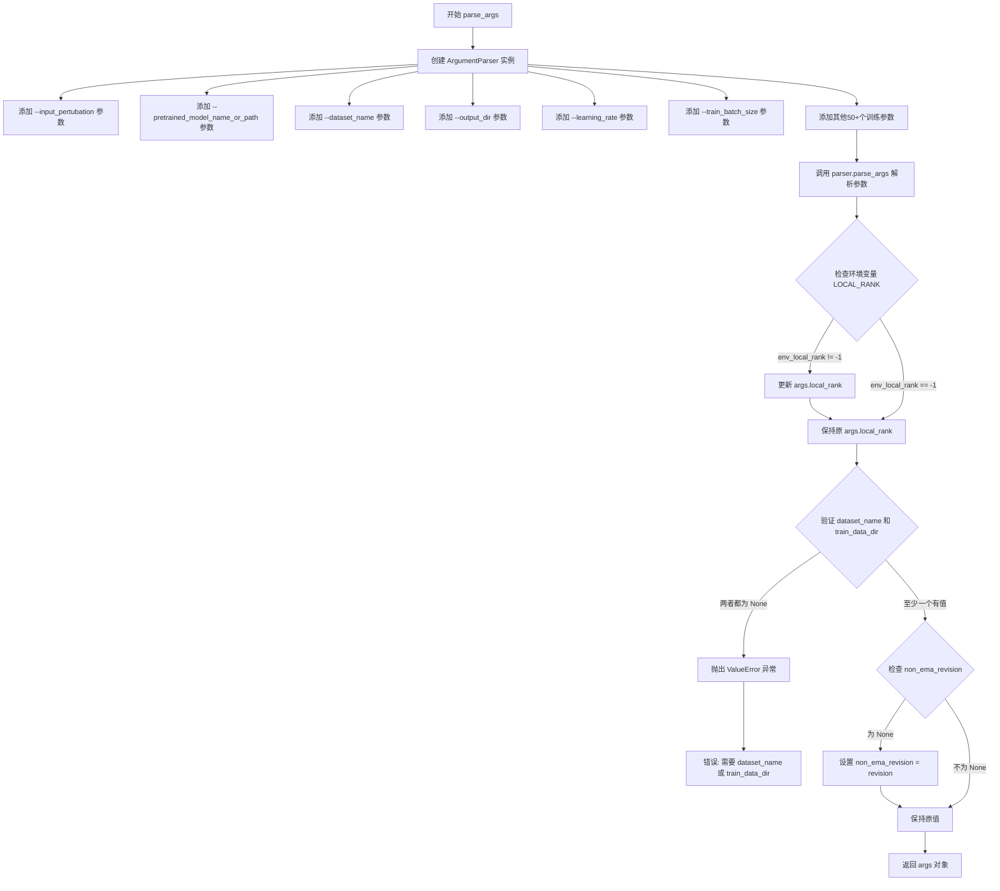
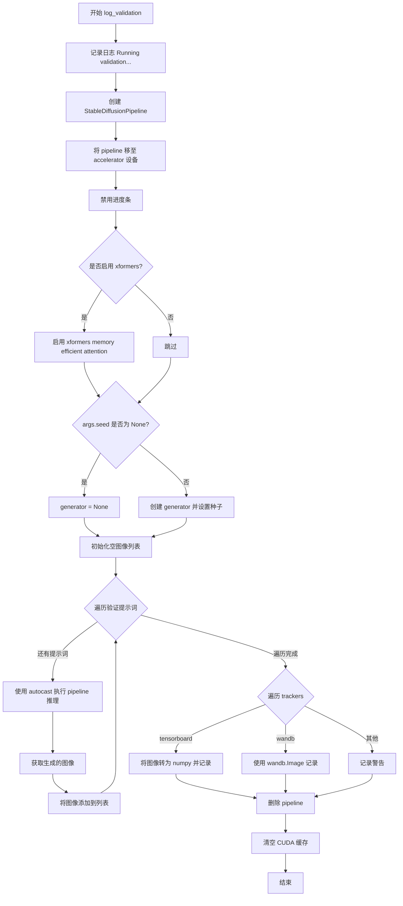

```mermaid
flowchart TD
    A[开始 main 函数] --> B[parse_args 解析命令行参数]
    B --> C{report_to == 'wandb' 且 hub_token 存在?}
    C -->|是| D[抛出安全警告]
    C -->|否| E[创建输出目录和日志目录]
    E --> F[创建 ProjectConfiguration]
    F --> G[初始化 Accelerator]
    G --> H[禁用 MPS 的 AMP]
    H --> I[配置日志级别]
    I --> J{seed 是否设置?}
    J -->|是| K[set_seed 设置随机种子]
    J -->|否| L[跳过]
    K --> L
    L --> M{是否 push_to_hub?}
    M -->|是| N[create_repo 创建 Hub 仓库]
    M -->|否| O[跳过]
    N --> O
    O --> P[加载 DDPMScheduler]
    P --> Q[加载 CLIPTokenizer]
    Q --> R[加载 CLIPTextModel]
    R --> S[加载 AutoencoderKL]
    S --> T[加载 UNet2DConditionModel]
    T --> U[冻结 VAE 和 TextEncoder]
    U --> V{use_ema 是否为 True?}
    V -->|是| W[创建 EMA_UNet]
    V -->|否| X[跳过]
    W --> X
    X --> Y{enable_xformers 是否为 True?}
    Y -->|是| Z[启用 xformers 优化]
    Y -->|否| AA[跳过]
    Z --> AA
    AA --> AB[注册 save/load model hooks]
    AB --> AC{gradient_checkpointing 是否为 True?}
    AC -->|是| AD[启用梯度检查点]
    AC -->|否| AE[跳过]
    AD --> AE
    AE --> AF[启用 TF32]
    AG{scale_lr 是否为 True?}
    AG -->|是| AH[缩放学习率]
    AG -->|否| AI[跳过]
    AH --> AI
    AI --> AJ[选择优化器类]
    AJ --> AK[创建 AdamW 优化器]
    AK --> AL[包装为 ORT_FP16_Optimizer]
    AL --> AM[加载数据集]
    AM --> AN[预处理数据集和 tokenize captions]
    AN --> AO[创建数据转换和 DataLoader]
    AP[计算训练步数] --> AQ[创建学习率调度器]
    AQ --> AR[accelerator.prepare 准备所有组件]
    AR --> AS{use_ema 是否为 True?}
    AS -->|是| AT[将 EMA_UNet 移到设备]
    AS -->|否| AU[跳过]
    AT --> AU
    AU --> AV[包装 UNet 为 ORTModule]
    AW[设置权重数据类型] --> AX[将 TextEncoder 和 VAE 移到设备]
    AX --> AY[初始化 trackers]
    AY --> AZ[开始训练循环 - 外层 epoch 循环]
    AZ --> BA[unet.train 设置训练模式]
    BA --> BB[初始化 train_loss]
    BB --> BC[遍历 train_dataloader]
    BC --> BD{是否需要跳过当前 step?}
    BD -->|是| BE[更新进度条并 continue]
    BD -->|否| BF[accumulate 上下文管理器]
    BF --> BG[VAE encode 图像到 latent]
    BG --> BH[采样噪声]
    BH --> BI[添加噪声偏移]
    BI --> BJ[随机采样 timesteps]
    BJ --> BK[前向扩散: noise_scheduler.add_noise]
    BK --> BL[TextEncoder 获取文本嵌入]
    BL --> BM[根据 prediction_type 确定 target]
    BM --> BN[UNet 预测噪声残差]
    BN --> BO{是否使用 SNR gamma?}
    BO -->|是| BP[计算 SNR 加权损失]
    BO -->|否| BQ[计算 MSE 损失]
    BP --> BR
    BQ --> BR
    BR[gather 损失并累加] --> BS[accelerator.backward 反向传播]
    BS --> BT{是否 sync_gradients?}
    BT -->|是| BU[clip_grad_norm 梯度裁剪]
    BT -->|否| BV[跳过]
    BU --> BV
    BV[optimizer.step 更新参数] --> BW[lr_scheduler.step 更新学习率]
    BW --> BX[optimizer.zero_grad 梯度清零]
    BX --> BY{sync_gradients 为 True?}
    BY -->|是| BZ[ema_unet.step 更新 EMA]
    BZ --> CA[更新进度条和 global_step]
    CA --> CB[log 训练损失]
    CB --> CC[重置 train_loss]
    CC --> CD{checkpointing_steps 达到?}
    CD -->|是| CE[保存检查点]
    CD -->|否| CF[跳过]
    CE --> CF
    CF --> CG[更新进度条显示]
    CG --> CH{global_step >= max_train_steps?}
    CH -->|是| CI[break 退出内层循环]
    CH -->|否| CJ[继续下一个 batch]
    CJ --> BC
    CK{validation_prompts 存在 且 epoch % validation_epochs == 0?}
    CK -->|是| CL[EMA 存储 UNet 参数]
    CL --> CM[EMA 复制到 UNet]
    CM --> CN[log_validation 执行验证]
    CN --> CO[EMA 恢复 UNet 参数]
    CO --> CP
    CK -->|否| CP
    CP --> CQ{是否还有更多 epoch?}
    CQ -->|是| CR[epoch += 1 继续]
    CR --> BA
    CQ -->|否| CS[等待所有进程完成]
    CS --> CT{is_main_process?}
    CT -->|是| CU[unwrap model]
    CU --> CV{use_ema?}
    CV -->|是| CW[EMA 复制到 UNet]
    CV -->|否| CX
    CW --> CX
    CX[创建 StableDiffusionPipeline] --> CY[保存到 output_dir]
    CY --> CZ{push_to_hub?}
    CZ -->|是| DA[upload_folder 推送到 Hub]
    CZ -->|否| DB[跳过]
    DA --> DB
    DB --> DC[accelerator.end_training]
    DC --> DD[结束]
```

# `diffusers\examples\research_projects\onnxruntime\text_to_image\train_text_to_image.py` 详细设计文档

A distributed training script for fine-tuning Stable Diffusion models (text-to-image) using HuggingFace Diffusers and Accelerate, supporting features like EMA, xformers, mixed precision, and ONNX Runtime optimization.

## 整体流程

```mermaid
graph TD
    Start([开始]) --> ParseArgs[parse_args]
    ParseArgs --> InitAccel[Initialize Accelerator & Logging]
    InitAccel --> LoadModels[Load Models: VAE, TextEncoder, UNet]
    LoadModels --> SetupEMA[Setup EMA (Optional)]
    SetupEMA --> LoadData[Load & Preprocess Dataset]
    LoadData --> TrainLoop{Loop Epochs}
    TrainLoop --> StepLoop{Loop Steps}
    StepLoop --> Encode[vae.encode(pixel_values) -> latents]
    Encode --> Noise[Sample Noise & Timesteps]
    Noise --> Diffuse[Add Noise to Latents]
    Diffuse --> TextEmb[text_encoder(input_ids) -> encoder_hidden_states]
    TextEmb --> Predict[unet(noisy_latents, timesteps) -> pred]
    Predict --> Loss[Compute Loss (MSE/SNR)]
    Loss --> Backward[accelerator.backward]
    Backward --> Optim[optimizer.step & lr_scheduler.step]
    Optim --> Clip[accelerator.clip_grad_norm]
    Clip --> UpdateEMA{Use EMA?}
    UpdateEMA -- Yes --> EMAStep[ema_unet.step]
    UpdateEMA --> LogMetrics[Log & Update Progress Bar]
    LogMetrics --> Checkpoint{Save Checkpoint?}
    Checkpoint -- Yes --> SaveState[accelerator.save_state]
    Checkpoint --> Validate{Validation Epoch?}
    SaveState --> Validate
    Validate -- Yes --> Val[log_validation]
    Validate --> NextStep
    Val --> NextStep
    NextStep --> StepLoop
    StepLoop --> TrainLoop
    TrainLoop --> SavePipeline[Save StableDiffusionPipeline]
    SavePipeline --> End([结束])
```

## 类结构

```
Training Script (Main Entry)
├── Data Processing (Dataset, Tokenizer, Transforms)
├── Model Architecture (UNet2DConditionModel, AutoencoderKL, CLIPTextModel)
├── Training Infrastructure (Accelerator, Optimizer, Scheduler, EMA)
└── Inference & Saving (StableDiffusionPipeline)
```

## 全局变量及字段


### `logger`
    
用于记录训练过程信息的日志记录器，初始化为INFO级别

类型：`Logger instance`
    


### `DATASET_NAME_MAPPING`
    
数据集名称到图像和文本列名的映射字典，用于指定数据集中各列的含义

类型：`Dict[str, Tuple[str, str]]`
    


    

## 全局函数及方法


### `parse_args`

该函数用于解析命令行输入的训练参数，创建一个 `ArgumentParser` 实例，定义超过50个训练相关的参数选项（包括模型路径、数据集配置、训练超参数、优化器设置、分布式训练选项等），解析用户传入的命令行参数，进行环境变量检查和合法性校验（如验证数据集配置），最后返回一个包含所有参数的 `Namespace` 对象供主训练流程使用。

#### 参数

该函数无显式参数（使用 `argparse` 内部处理命令行参数输入）

- 隐式参数：`sys.argv`（由 `argparse` 自动接收）

#### 返回值

- `args`：`argparse.Namespace`，包含所有解析后的命令行参数对象，属性包括 `pretrained_model_name_or_path`、`dataset_name`、`output_dir`、`learning_rate`、`train_batch_size` 等超过50个训练相关配置项

#### 流程图



#### 带注释源码

```python
def parse_args():
    """
    解析命令行参数，返回包含所有训练配置的 Namespace 对象
    
    Returns:
        argparse.Namespace: 包含所有命令行参数的对象
    """
    # 创建 ArgumentParser 实例，用于解析命令行参数
    parser = argparse.ArgumentParser(description="Simple example of a training script.")
    
    # 添加模型相关参数
    parser.add_argument(
        "--input_pertubation", type=float, default=0, help="The scale of input pretubation. Recommended 0.1."
    )
    parser.add_argument(
        "--pretrained_model_name_or_path",
        type=str,
        default=None,
        required=True,  # 必填参数
        help="Path to pretrained model or model identifier from huggingface.co/models.",
    )
    parser.add_argument(
        "--revision",
        type=str,
        default=None,
        required=False,
        help="Revision of pretrained model identifier from huggingface.co/models.",
    )
    
    # 添加数据集相关参数
    parser.add_argument(
        "--dataset_name",
        type=str,
        default=None,
        help=(
            "The name of the Dataset (from the HuggingFace hub) to train on (could be your own, possibly private,"
            " dataset). It can also be a path pointing to a local copy of a dataset in your filesystem,"
            " or to a folder containing files that 🤗 Datasets can understand."
        ),
    )
    parser.add_argument(
        "--dataset_config_name",
        type=str,
        default=None,
        help="The config of the Dataset, leave as None if there's only one config.",
    )
    parser.add_argument(
        "--train_data_dir",
        type=str,
        default=None,
        help=(
            "A folder containing the training data. Folder contents must follow the structure described in"
            " https://huggingface.co/docs/datasets/image_dataset#imagefolder. In particular, a `metadata.jsonl` file"
            " must exist to provide the captions for the images. Ignored if `dataset_name` is specified."
        ),
    )
    parser.add_argument(
        "--image_column", type=str, default="image", help="The column of the dataset containing an image."
    )
    parser.add_argument(
        "--caption_column",
        type=str,
        default="text",
        help="The column of the dataset containing a caption or a list of captions.",
    )
    parser.add_argument(
        "--max_train_samples",
        type=int,
        default=None,
        help=(
            "For debugging purposes or quicker training, truncate the number of training examples to this "
            "value if set."
        ),
    )
    parser.add_argument(
        "--validation_prompts",
        type=str,
        default=None,
        nargs="+",  # 接受多个值
        help=("A set of prompts evaluated every `--validation_epochs` and logged to `--report_to`."),
    )
    
    # 添加输出和缓存目录参数
    parser.add_argument(
        "--output_dir",
        type=str,
        default="sd-model-finetuned",
        help="The output directory where the model predictions and checkpoints will be written.",
    )
    parser.add_argument(
        "--cache_dir",
        type=str,
        default=None,
        help="The directory where the downloaded models and datasets will be stored.",
    )
    parser.add_argument("--seed", type=int, default=None, help="A seed for reproducible training.")
    
    # 添加图像预处理参数
    parser.add_argument(
        "--resolution",
        type=int,
        default=512,
        help=(
            "The resolution for input images, all the images in the train/validation dataset will be resized to this"
            " resolution"
        ),
    )
    parser.add_argument(
        "--center_crop",
        default=False,
        action="store_true",  # 布尔标志
        help=(
            "Whether to center crop the input images to the resolution. If not set, the images will be randomly"
            " cropped. The images will be resized to the resolution first before cropping."
        ),
    )
    parser.add_argument(
        "--random_flip",
        action="store_true",
        help="whether to randomly flip images horizontally",
    )
    
    # 添加训练超参数
    parser.add_argument(
        "--train_batch_size", type=int, default=16, help="Batch size (per device) for the training dataloader."
    )
    parser.add_argument("--num_train_epochs", type=int, default=100)
    parser.add_argument(
        "--max_train_steps",
        type=int,
        default=None,
        help="Total number of training steps to perform.  If provided, overrides num_train_epochs.",
    )
    parser.add_argument(
        "--gradient_accumulation_steps",
        type=int,
        default=1,
        help="Number of updates steps to accumulate before performing a backward/update pass.",
    )
    parser.add_argument(
        "--gradient_checkpointing",
        action="store_true",
        help="Whether or not to use gradient checkpointing to save memory at the expense of slower backward pass.",
    )
    parser.add_argument(
        "--learning_rate",
        type=float,
        default=1e-4,
        help="Initial learning rate (after the potential warmup period) to use.",
    )
    parser.add_argument(
        "--scale_lr",
        action="store_true",
        default=False,
        help="Scale the learning rate by the number of GPUs, gradient accumulation steps, and batch size.",
    )
    parser.add_argument(
        "--lr_scheduler",
        type=str,
        default="constant",
        help=(
            'The scheduler type to use. Choose between ["linear", "cosine", "cosine_with_restarts", "polynomial",'
            ' "constant", "constant_with_warmup"]'
        ),
    )
    parser.add_argument(
        "--lr_warmup_steps", type=int, default=500, help="Number of steps for the warmup in the lr scheduler."
    )
    parser.add_argument(
        "--snr_gamma",
        type=float,
        default=None,
        help="SNR weighting gamma to be used if rebalancing the loss. Recommended value is 5.0. "
        "More details here: https://huggingface.co/papers/2303.09556.",
    )
    
    # 添加优化器参数
    parser.add_argument(
        "--use_8bit_adam", action="store_true", help="Whether or not to use 8-bit Adam from bitsandbytes."
    )
    parser.add_argument(
        "--allow_tf32",
        action="store_true",
        help=(
            "Whether or not to allow TF32 on Ampere GPUs. Can be used to speed up training. For more information, see"
            " https://pytorch.org/docs/stable/notes/cuda.html#tensorfloat-32-tf32-on-ampere-devices"
        ),
    )
    parser.add_argument("--use_ema", action="store_true", help="Whether to use EMA model.")
    parser.add_argument(
        "--non_ema_revision",
        type=str,
        default=None,
        required=False,
        help=(
            "Revision of pretrained non-ema model identifier. Must be a branch, tag or git identifier of the local or"
            " remote repository specified with --pretrained_model_name_or_path."
        ),
    )
    parser.add_argument(
        "--dataloader_num_workers",
        type=int,
        default=0,
        help=(
            "Number of subprocesses to use for data loading. 0 means that the data will be loaded in the main process."
        ),
    )
    parser.add_argument("--adam_beta1", type=float, default=0.9, help="The beta1 parameter for the Adam optimizer.")
    parser.add_argument("--adam_beta2", type=float, default=0.999, help="The beta2 parameter for the Adam optimizer.")
    parser.add_argument("--adam_weight_decay", type=float, default=1e-2, help="Weight decay to use.")
    parser.add_argument("--adam_epsilon", type=float, default=1e-08, help="Epsilon value for the Adam optimizer")
    parser.add_argument("--max_grad_norm", default=1.0, type=float, help="Max gradient norm.")
    
    # 添加模型上传和 Hub 相关参数
    parser.add_argument("--push_to_hub", action="store_true", help="Whether or not to push the model to the Hub.")
    parser.add_argument("--hub_token", type=str, default=None, help="The token to use to push to the Model Hub.")
    parser.add_argument(
        "--hub_model_id",
        type=str,
        default=None,
        help="The name of the repository to keep in sync with the local `output_dir`.",
    )
    parser.add_argument(
        "--logging_dir",
        type=str,
        default="logs",
        help=(
            "[TensorBoard](https://www.tensorflow.org/tensorboard) log directory. Will default to"
            " *output_dir/runs/**CURRENT_DATETIME_HOSTNAME***."
        ),
    )
    
    # 添加训练配置参数
    parser.add_argument(
        "--mixed_precision",
        type=str,
        default=None,
        choices=["no", "fp16", "bf16"],
        help=(
            "Whether to use mixed precision. Choose between fp16 and bf16 (bfloat16). Bf16 requires PyTorch >="
            " 1.10.and an Nvidia Ampere GPU.  Default to the value of accelerate config of the current system or the"
            " flag passed with the `accelerate.launch` command. Use this argument to override the accelerate config."
        ),
    )
    parser.add_argument(
        "--report_to",
        type=str,
        default="tensorboard",
        help=(
            'The integration to report the results and logs to. Supported platforms are `"tensorboard"`'
            ' (default), `"wandb"` and `"comet_ml"`. Use `"all"` to report to all integrations.'
        ),
    )
    parser.add_argument("--local_rank", type=int, default=-1, help="For distributed training: local_rank")
    
    # 添加检查点和恢复训练参数
    parser.add_argument(
        "--checkpointing_steps",
        type=int,
        default=500,
        help=(
            "Save a checkpoint of the training state every X updates. These checkpoints are only suitable for resuming"
            " training using `--resume_from_checkpoint`."
        ),
    )
    parser.add_argument(
        "--checkpoints_total_limit",
        type=int,
        default=None,
        help=(
            "Max number of checkpoints to store. Passed as `total_limit` to the `Accelerator` `ProjectConfiguration`."
            " See Accelerator::save_state https://huggingface.co/docs/accelerate/package_reference/accelerator#accelerate.Accelerator.save_state"
            " for more docs"
        ),
    )
    parser.add_argument(
        "--resume_from_checkpoint",
        type=str,
        default=None,
        help=(
            "Whether training should be resumed from a previous checkpoint. Use a path saved by"
            ' `--checkpointing_steps`, or `"latest"` to automatically select the last available checkpoint.'
        ),
    )
    parser.add_argument(
        "--enable_xformers_memory_efficient_attention", action="store_true", help="Whether or not to use xformers."
    )
    parser.add_argument("--noise_offset", type=float, default=0, help="The scale of noise offset.")
    parser.add_argument(
        "--validation_epochs",
        type=int,
        default=5,
        help="Run validation every X epochs.",
    )
    parser.add_argument(
        "--tracker_project_name",
        type=str,
        default="text2image-fine-tune",
        help=(
            "The `project_name` argument passed to Accelerator.init_trackers for"
            " more information see https://huggingface.co/docs/accelerate/v0.17.0/en/package_reference/accelerator#accelerate.Accelerator"
        ),
    )

    # 解析命令行参数
    args = parser.parse_args()
    
    # 检查环境变量 LOCAL_RANK，用于分布式训练
    env_local_rank = int(os.environ.get("LOCAL_RANK", -1))
    if env_local_rank != -1 and env_local_rank != args.local_rank:
        args.local_rank = env_local_rank

    # 合法性检查：必须提供数据集名称或训练数据目录
    if args.dataset_name is None and args.train_data_dir is None:
        raise ValueError("Need either a dataset name or a training folder.")

    # 默认使用与主模型相同的 revision 作为 non_ema_revision
    if args.non_ema_revision is None:
        args.non_ema_revision = args.revision

    # 返回解析后的参数对象
    return args
```


### `log_validation`

运行验证推理并记录生成的图像。该函数使用训练好的模型（VAE、文本编码器、UNet）根据验证提示词生成图像，并将结果记录到TensorBoard或WandB等跟踪器中。

参数：

- `vae`：`DiffusionWrapper`或`AutoencoderKL`，用于将图像编码到潜在空间
- `text_encoder`：`CLIPTextModel`，将文本提示编码为条件嵌入
- `tokenizer`：`CLIPTokenizer`，用于文本分词
- `unet`：`UNet2DConditionModel`，去噪 UNet 模型
- `args`：命令行参数对象，包含模型路径、验证提示词、xformers 启用等配置
- `accelerator`：`Accelerator`，分布式训练加速器，用于设备管理和模型包装
- `weight_dtype`：`torch.dtype`，模型权重数据类型（fp16/bf16/fp32）
- `epoch`：`int`，当前训练轮次，用于记录日志

返回值：`None`，无返回值，仅执行推理和日志记录

#### 流程图



#### 带注释源码

```python
def log_validation(vae, text_encoder, tokenizer, unet, args, accelerator, weight_dtype, epoch):
    """
    运行验证推理并记录生成的图像到跟踪器
    
    参数:
        vae: VAE模型，用于潜在空间编码
        text_encoder: 文本编码器模型
        tokenizer: 文本分词器
        unet: UNet去噪模型
        args: 包含验证配置的命令行参数
        accelerator: Accelerate分布式训练加速器
        weight_dtype: 模型权重数据类型
        epoch: 当前训练轮次
    """
    logger.info("Running validation... ")

    # 从预训练模型创建 StableDiffusionPipeline
    # 使用 accelerator.unwrap_model() 获取原始模型（去除分布式包装）
    pipeline = StableDiffusionPipeline.from_pretrained(
        args.pretrained_model_name_or_path,  # 预训练模型路径或Hub模型ID
        vae=accelerator.unwrap_model(vae),    # 解包VAE模型
        text_encoder=accelerator.unwrap_model(text_encoder),  # 解包文本编码器
        tokenizer=tokenizer,                  # 分词器
        unet=accelerator.unwrap_model(unet),  # 解包UNet模型
        safety_checker=None,                  # 禁用安全检查器（验证时不需要）
        revision=args.revision,               # 模型版本
        torch_dtype=weight_dtype,             # 指定计算精度
    )
    
    # 将pipeline移至训练设备
    pipeline = pipeline.to(accelerator.device)
    
    # 禁用推理进度条（减少验证时的日志输出）
    pipeline.set_progress_bar_config(disable=True)

    # 如果启用了xformers，为pipeline启用高效注意力机制
    if args.enable_xformers_memory_efficient_attention:
        pipeline.enable_xformers_memory_efficient_attention()

    # 设置随机种子以确保可重复性
    if args.seed is None:
        generator = None  # 无种子则不设置随机生成器
    else:
        # 创建随机生成器并设置种子
        generator = torch.Generator(device=accelerator.device).manual_seed(args.seed)

    # 存储生成的图像
    images = []
    
    # 遍历所有验证提示词进行推理
    for i in range(len(args.validation_prompts)):
        # 使用 autocast 自动混合精度推理（CUDA自动转换）
        with torch.autocast("cuda"):
            # 调用pipeline生成图像，固定20步推理
            image = pipeline(
                args.validation_prompts[i],    # 当前验证提示词
                num_inference_steps=20,        # 推理步数
                generator=generator           # 随机生成器（可复现）
            ).images[0]                        # 取第一张图像

        # 将生成的图像添加到列表
        images.append(image)

    # 遍历所有注册的tracker并记录图像
    for tracker in accelerator.trackers:
        if tracker.name == "tensorboard":
            # TensorBoard: 将图像堆叠为numpy数组
            # NHWC格式: (Batch, Height, Width, Channels)
            np_images = np.stack([np.asarray(img) for img in images])
            tracker.writer.add_images("validation", np_images, epoch, dataformats="NHWC")
        elif tracker.name == "wandb":
            # WandB: 使用wandb.Image记录，并添加标题
            tracker.log(
                {
                    "validation": [
                        wandb.Image(image, caption=f"{i}: {args.validation_prompts[i]}")
                        for i, image in enumerate(images)
                    ]
                }
            )
        else:
            # 其他tracker记录警告
            logger.warning(f"image logging not implemented for {tracker.name}")

    # 清理：删除pipeline释放显存
    del pipeline
    torch.cuda.empty_cache()
```


### `main`

该函数是 Stable Diffusion 模型微调训练的主入口，负责整个训练流程的 orchestration，包括参数解析、模型加载与冻结、数据集准备、训练循环执行、验证、模型保存以及分布式训练支持。

参数：该函数无直接参数，参数通过内部调用 `parse_args()` 从命令行获取，主要包含模型路径、数据集配置、训练超参数、优化器设置、验证设置等约50+个配置项。

返回值：`None`，该函数执行完整的训练流程后直接退出，不返回任何值。

#### 流程图



#### 带注释源码

```python
def main():
    """
    Stable Diffusion 模型微调训练的主入口函数。
    负责整个训练流程的 orchestration，包括模型加载、数据准备、
    训练循环、验证和模型保存。
    """
    # Step 1: 解析命令行参数
    args = parse_args()

    # Step 2: 安全检查 - wandb 和 hub_token 不能同时使用
    if args.report_to == "wandb" and args.hub_token is not None:
        raise ValueError(
            "You cannot use both --report_to=wandb and --hub_token due to a security risk of exposing your token."
            " Please use `hf auth login` to authenticate with the Hub."
        )

    # Step 3: 废弃警告处理
    if args.non_ema_revision is not None:
        deprecate(
            "non_ema_revision!=None",
            "0.15.0",
            message=(
                "Downloading 'non_ema' weights from revision branches of the Hub is deprecated. Please make sure to"
                " use `--variant=non_ema` instead."
            ),
        )
    
    # Step 4: 创建日志目录和项目配置
    logging_dir = os.path.join(args.output_dir, args.logging_dir)
    accelerator_project_config = ProjectConfiguration(
        total_limit=args.checkpoints_total_limit, project_dir=args.output_dir, logging_dir=logging_dir
    )

    # Step 5: 初始化 Accelerator - 处理分布式训练、混合精度等
    accelerator = Accelerator(
        gradient_accumulation_steps=args.gradient_accumulation_steps,
        mixed_precision=args.mixed_precision,
        log_with=args.report_to,
        project_config=accelerator_project_config,
    )

    # Step 6: 禁用 MPS 的 AMP (Automatic Mixed Precision)
    if torch.backends.mps.is_available():
        accelerator.native_amp = False

    # Step 7: 配置日志 - 每个进程都记录，主进程使用更详细级别
    logging.basicConfig(
        format="%(asctime)s - %(levelname)s - %(name)s - %(message)s",
        datefmt="%m/%d/%Y %H:%M:%S",
        level=logging.INFO,
    )
    logger.info(accelerator.state, main_process_only=False)
    if accelerator.is_local_main_process:
        datasets.utils.logging.set_verbosity_warning()
        transformers.utils.logging.set_verbosity_warning()
        diffusers.utils.logging.set_verbosity_info()
    else:
        datasets.utils.logging.set_verbosity_error()
        transformers.utils.logging.set_verbosity_error()
        diffusers.utils.logging.set_verbosity_error()

    # Step 8: 设置随机种子以确保可重复性
    if args.seed is not None:
        set_seed(args.seed)

    # Step 9: 处理 Hub 仓库创建 (主进程执行)
    if accelerator.is_main_process:
        if args.output_dir is not None:
            os.makedirs(args.output_dir, exist_ok=True)

        if args.push_to_hub:
            repo_id = create_repo(
                repo_id=args.hub_model_id or Path(args.output_dir).name, exist_ok=True, token=args.hub_token
            ).repo_id

    # Step 10: 加载 Scheduler、Tokenizer 和预训练模型
    noise_scheduler = DDPMScheduler.from_pretrained(args.pretrained_model_name_or_path, subfolder="scheduler")
    tokenizer = CLIPTokenizer.from_pretrained(
        args.pretrained_model_name_or_path, subfolder="tokenizer", revision=args.revision
    )

    # Step 11: DeepSpeed ZeRO-3 上下文管理器 - 防止 frozen 模型被分区
    def deepspeed_zero_init_disabled_context_manager():
        """
        返回一个上下文列表，用于在 DeepSpeed ZeRO-3 下禁用 zero.Init
        """
        deepspeed_plugin = AcceleratorState().deepspeed_plugin if accelerate.state.is_initialized() else None
        if deepspeed_plugin is None:
            return []
        return [deepspeed_plugin.zero3_init_context_manager(enable=False)]

    # Step 12: 加载 Frozen 模型 (VAE 和 TextEncoder)
    with ContextManagers(deepspeed_zero_init_disabled_context_manager()):
        text_encoder = CLIPTextModel.from_pretrained(
            args.pretrained_model_name_or_path, subfolder="text_encoder", revision=args.revision
        )
        vae = AutoencoderKL.from_pretrained(
            args.pretrained_model_name_or_path, subfolder="vae", revision=args.revision
        )

    # Step 13: 加载需要训练的 UNet 模型
    unet = UNet2DConditionModel.from_pretrained(
        args.pretrained_model_name_or_path, subfolder="unet", revision=args.non_ema_revision
    )

    # Step 14: 冻结 VAE 和 TextEncoder - 这些只在推理时使用
    vae.requires_grad_(False)
    text_encoder.requires_grad_(False)

    # Step 15: 创建 EMA (Exponential Moving Average) 模型
    if args.use_ema:
        ema_unet = UNet2DConditionModel.from_pretrained(
            args.pretrained_model_name_or_path, subfolder="unet", revision=args.revision
        )
        ema_unet = EMAModel(ema_unet.parameters(), model_cls=UNet2DConditionModel, model_config=ema_unet.config)

    # Step 16: 启用 xformers 高效注意力 (如果可用)
    if args.enable_xformers_memory_efficient_attention:
        if is_xformers_available():
            import xformers
            xformers_version = version.parse(xformers.__version__)
            if xformers_version == version.parse("0.0.16"):
                logger.warning(
                    "xFormers 0.0.16 cannot be used for training in some GPUs..."
                )
            unet.enable_xformers_memory_efficient_attention()
        else:
            raise ValueError("xformers is not available. Make sure it is installed correctly")

    # Step 17: 注册自定义模型保存/加载钩子 (accelerate 0.16.0+)
    if version.parse(accelerate.__version__) >= version.parse("0.16.0"):
        def save_model_hook(models, weights, output_dir):
            """保存模型时的自定义钩子"""
            if accelerator.is_main_process:
                if args.use_ema:
                    ema_unet.save_pretrained(os.path.join(output_dir, "unet_ema"))
                for i, model in enumerate(models):
                    model.save_pretrained(os.path.join(output_dir, "unet"))
                    weights.pop()  # 防止重复保存

        def load_model_hook(models, input_dir):
            """加载模型时的自定义钩子"""
            if args.use_ema:
                load_model = EMAModel.from_pretrained(os.path.join(input_dir, "unet_ema"), UNet2DConditionModel)
                ema_unet.load_state_dict(load_model.state_dict())
                ema_unet.to(accelerator.device)
                del load_model

            for i in range(len(models)):
                model = models.pop()
                load_model = UNet2DConditionModel.from_pretrained(input_dir, subfolder="unet")
                model.register_to_config(**load_model.config)
                model.load_state_dict(load_model.state_dict())
                del load_model

        accelerator.register_save_state_pre_hook(save_model_hook)
        accelerator.register_load_state_pre_hook(load_model_hook)

    # Step 18: 启用梯度检查点以节省显存
    if args.gradient_checkpointing:
        unet.enable_gradient_checkpointing()

    # Step 19: 启用 TF32 加速 (Ampere GPU)
    if args.allow_tf32:
        torch.backends.cuda.matmul.allow_tf32 = True

    # Step 20: 缩放学习率 (如果启用)
    if args.scale_lr:
        args.learning_rate = (
            args.learning_rate * args.gradient_accumulation_steps * args.train_batch_size * accelerator.num_processes
        )

    # Step 21: 选择并创建优化器
    if args.use_8bit_adam:
        try:
            import bitsandbytes as bnb
        except ImportError:
            raise ImportError("Please install bitsandbytes to use 8-bit Adam...")
        optimizer_cls = bnb.optim.AdamW8bit
    else:
        optimizer_cls = torch.optim.AdamW

    optimizer = optimizer_cls(
        unet.parameters(),
        lr=args.learning_rate,
        betas=(args.adam_beta1, args.adam_beta2),
        weight_decay=args.adam_weight_decay,
        eps=args.adam_epsilon,
    )

    # Step 22: 包装为 ONNX Runtime FP16 优化器
    optimizer = ORT_FP16_Optimizer(optimizer)

    # Step 23: 加载数据集
    if args.dataset_name is not None:
        dataset = load_dataset(
            args.dataset_name,
            args.dataset_config_name,
            cache_dir=args.cache_dir,
        )
    else:
        data_files = {}
        if args.train_data_dir is not None:
            data_files["train"] = os.path.join(args.train_data_dir, "**")
        dataset = load_dataset(
            "imagefolder",
            data_files=data_files,
            cache_dir=args.cache_dir,
        )

    # Step 24: 数据集预处理 - 确定图像和文本列
    column_names = dataset["train"].column_names
    dataset_columns = DATASET_NAME_MAPPING.get(args.dataset_name, None)
    if args.image_column is None:
        image_column = dataset_columns[0] if dataset_columns is not None else column_names[0]
    else:
        image_column = args.image_column
    if args.caption_column is None:
        caption_column = dataset_columns[1] if dataset_columns is not None else column_names[1]
    else:
        caption_column = args.caption_column

    # Step 25: Tokenize captions 辅助函数
    def tokenize_captions(examples, is_train=True):
        """将文本描述转换为 token IDs"""
        captions = []
        for caption in examples[caption_column]:
            if isinstance(caption, str):
                captions.append(caption)
            elif isinstance(caption, (list, np.ndarray)):
                captions.append(random.choice(caption) if is_train else caption[0])
            else:
                raise ValueError(f"Caption column should contain either strings or lists of strings.")
        inputs = tokenizer(
            captions, max_length=tokenizer.model_max_length, padding="max_length", truncation=True, return_tensors="pt"
        )
        return inputs.input_ids

    # Step 26: 定义图像预处理转换
    train_transforms = transforms.Compose(
        [
            transforms.Resize(args.resolution, interpolation=transforms.InterpolationMode.BILINEAR),
            transforms.CenterCrop(args.resolution) if args.center_crop else transforms.RandomCrop(args.resolution),
            transforms.RandomHorizontalFlip() if args.random_flip else transforms.Lambda(lambda x: x),
            transforms.ToTensor(),
            transforms.Normalize([0.5], [0.5]),
        ]
    )

    # Step 27: 预处理训练数据
    def preprocess_train(examples):
        """将图像转换为像素值并 tokenize 文本"""
        images = [image.convert("RGB") for image in examples[image_column]]
        examples["pixel_values"] = [train_transforms(image) for image in images]
        examples["input_ids"] = tokenize_captions(examples)
        return examples

    # Step 28: 应用预处理转换到数据集
    with accelerator.main_process_first():
        if args.max_train_samples is not None:
            dataset["train"] = dataset["train"].shuffle(seed=args.seed).select(range(args.max_train_samples))
        train_dataset = dataset["train"].with_transform(preprocess_train)

    # Step 29: 定义 batch 整理函数
    def collate_fn(examples):
        """整理一个 batch 的数据"""
        pixel_values = torch.stack([example["pixel_values"] for example in examples])
        pixel_values = pixel_values.to(memory_format=torch.contiguous_format).float()
        input_ids = torch.stack([example["input_ids"] for example in examples])
        return {"pixel_values": pixel_values, "input_ids": input_ids}

    # Step 30: 创建 DataLoader
    train_dataloader = torch.utils.data.DataLoader(
        train_dataset,
        shuffle=True,
        collate_fn=collate_fn,
        batch_size=args.train_batch_size,
        num_workers=args.dataloader_num_workers,
    )

    # Step 31: 计算训练步数并创建学习率调度器
    overrode_max_train_steps = False
    num_update_steps_per_epoch = math.ceil(len(train_dataloader) / args.gradient_accumulation_steps)
    if args.max_train_steps is None:
        args.max_train_steps = args.num_train_epochs * num_update_steps_per_epoch
        overrode_max_train_steps = True

    lr_scheduler = get_scheduler(
        args.lr_scheduler,
        optimizer=optimizer,
        num_warmup_steps=args.lr_warmup_steps * accelerator.num_processes,
        num_training_steps=args.max_train_steps * accelerator.num_processes,
    )

    # Step 32: 使用 Accelerator 准备所有组件
    unet, optimizer, train_dataloader, lr_scheduler = accelerator.prepare(
        unet, optimizer, train_dataloader, lr_scheduler
    )

    # Step 33: 将 EMA 模型移到设备
    if args.use_ema:
        ema_unet.to(accelerator.device)

    # Step 34: 包装 UNet 为 ONNX Runtime Module
    unet = ORTModule(unet)

    # Step 35: 设置权重数据类型 (混合精度)
    weight_dtype = torch.float32
    if accelerator.mixed_precision == "fp16":
        weight_dtype = torch.float16
    elif accelerator.mixed_precision == "bf16":
        weight_dtype = torch.bfloat16

    # Step 36: 将 TextEncoder 和 VAE 移到设备并转换类型
    text_encoder.to(accelerator.device, dtype=weight_dtype)
    vae.to(accelerator.device, dtype=weight_dtype)

    # Step 37: 重新计算训练步数 (可能因 DataLoader 变化)
    num_update_steps_per_epoch = math.ceil(len(train_dataloader) / args.gradient_accumulation_steps)
    if overrode_max_train_steps:
        args.max_train_steps = args.num_train_epochs * num_update_steps_per_epoch
    args.num_train_epochs = math.ceil(args.max_train_steps / num_update_steps_per_epoch)

    # Step 38: 初始化 trackers
    if accelerator.is_main_process:
        tracker_config = dict(vars(args))
        tracker_config.pop("validation_prompts")
        accelerator.init_trackers(args.tracker_project_name, tracker_config)

    # Step 39: 训练信息日志输出
    total_batch_size = args.train_train_batch_size * accelerator.num_processes * args.gradient_accumulation_steps
    logger.info("***** Running training *****")
    logger.info(f"  Num examples = {len(train_dataset)}")
    logger.info(f"  Num Epochs = {args.num_train_epochs}")
    logger.info(f"  Instantaneous batch size per device = {args.train_batch_size}")
    logger.info(f"  Total train batch size = {total_batch_size}")
    logger.info(f"  Gradient Accumulation steps = {args.gradient_accumulation_steps}")
    logger.info(f"  Total optimization steps = {args.max_train_steps}")

    global_step = 0
    first_epoch = 0

    # Step 40: 检查点恢复
    if args.resume_from_checkpoint:
        if args.resume_from_checkpoint != "latest":
            path = os.path.basename(args.resume_from_checkpoint)
        else:
            dirs = os.listdir(args.output_dir)
            dirs = [d for d in dirs if d.startswith("checkpoint")]
            dirs = sorted(dirs, key=lambda x: int(x.split("-")[1]))
            path = dirs[-1] if len(dirs) > 0 else None

        if path is None:
            accelerator.print(f"Checkpoint does not exist. Starting new training run.")
            args.resume_from_checkpoint = None
        else:
            accelerator.print(f"Resuming from checkpoint {path}")
            accelerator.load_state(os.path.join(args.output_dir, path))
            global_step = int(path.split("-")[1])
            resume_global_step = global_step * args.gradient_accumulation_steps
            first_epoch = global_step // num_update_steps_per_epoch
            resume_step = resume_global_step % (num_update_steps_per_epoch * args.gradient_accumulation_steps)

    # Step 41: 创建进度条
    progress_bar = tqdm(range(global_step, args.max_train_steps), disable=not accelerator.is_local_main_process)
    progress_bar.set_description("Steps")

    # ========== 主训练循环 ==========
    for epoch in range(first_epoch, args.num_train_epochs):
        unet.train()  # 设置为训练模式
        train_loss = 0.0

        for step, batch in enumerate(train_dataloader):
            # 跳过已完成的 steps (恢复训练时)
            if args.resume_from_checkpoint and epoch == first_epoch and step < resume_step:
                if step % args.gradient_accumulation_steps == 0:
                    progress_bar.update(1)
                continue

            # 梯度累积上下文
            with accelerator.accumulate(unet):
                # ---- 前向传播 ----
                # 1. 将图像编码到 latent 空间
                latents = vae.encode(batch["pixel_values"].to(weight_dtype)).latent_dist.sample()
                latents = latents * vae.config.scaling_factor

                # 2. 采样噪声
                noise = torch.randn_like(latents)
                if args.noise_offset:
                    noise += args.noise_offset * torch.randn(
                        (latents.shape[0], latents.shape[1], 1, 1), device=latents.device
                    )
                
                # 3. 输入扰动
                if args.input_pertubation:
                    new_noise = noise + args.input_pertubation * torch.randn_like(noise)

                bsz = latents.shape[0]
                # 4. 随机采样 timestep
                timesteps = torch.randint(0, noise_scheduler.config.num_train_timesteps, (bsz,), device=latents.device)
                timesteps = timesteps.long()

                # 5. 前向扩散过程 - 添加噪声到 latents
                if args.input_pertubation:
                    noisy_latents = noise_scheduler.add_noise(latents, new_noise, timesteps)
                else:
                    noisy_latents = noise_scheduler.add_noise(latents, noise, timesteps)

                # 6. 获取文本条件嵌入
                encoder_hidden_states = text_encoder(batch["input_ids"])[0]

                # 7. 确定损失目标 (根据 prediction_type)
                if noise_scheduler.config.prediction_type == "epsilon":
                    target = noise
                elif noise_scheduler.config.prediction_type == "v_prediction":
                    target = noise_scheduler.get_velocity(latents, noise, timesteps)
                else:
                    raise ValueError(f"Unknown prediction type {noise_scheduler.config.prediction_type}")

                # 8. UNet 预测噪声残差
                model_pred = unet(noisy_latents, timesteps, encoder_hidden_states).sample

                # ---- 损失计算 ----
                if args.snr_gamma is None:
                    # 标准 MSE 损失
                    loss = F.mse_loss(model_pred.float(), target.float(), reduction="mean")
                else:
                    # SNR 加权损失 (参考 https://papers.nips.cc/paper/2023/file/c2d5a83e32e9b83d42c38ae8133f9f1a-Paper.pdf)
                    snr = compute_snr(noise_scheduler, timesteps)
                    mse_loss_weights = torch.stack([snr, args.snr_gamma * torch.ones_like(timesteps)], dim=1).min(dim=1)[0]
                    if noise_scheduler.config.prediction_type == "epsilon":
                        mse_loss_weights = mse_loss_weights / snr
                    elif noise_scheduler.config.prediction_type == "v_prediction":
                        mse_loss_weights = mse_loss_weights / (snr + 1)

                    loss = F.mse_loss(model_pred.float(), target.float(), reduction="none")
                    loss = loss.mean(dim=list(range(1, len(loss.shape)))) * mse_loss_weights
                    loss = loss.mean()

                # ---- 反向传播 ----
                # Gather 损失用于日志记录
                avg_loss = accelerator.gather(loss.repeat(args.train_batch_size)).mean()
                train_loss += avg_loss.item() / args.gradient_accumulation_steps

                # 反向传播
                accelerator.backward(loss)
                
                # 梯度裁剪
                if accelerator.sync_gradients:
                    accelerator.clip_grad_norm_(unet.parameters(), args.max_grad_norm)
                
                # 参数更新
                optimizer.step()
                lr_scheduler.step()
                optimizer.zero_grad()

            # ---- 同步和日志 ----
            if accelerator.sync_gradients:
                # 更新 EMA 模型
                if args.use_ema:
                    ema_unet.step(unet.parameters())
                
                # 更新进度
                progress_bar.update(1)
                global_step += 1
                
                # 记录训练损失
                accelerator.log({"train_loss": train_loss}, step=global_step)
                train_loss = 0.0

                # 定期保存检查点
                if global_step % args.checkpointing_steps == 0:
                    if accelerator.is_main_process:
                        save_path = os.path.join(args.output_dir, f"checkpoint-{global_step}")
                        accelerator.save_state(save_path)
                        logger.info(f"Saved state to {save_path}")

            # 更新进度条显示
            logs = {"step_loss": loss.detach().item(), "lr": lr_scheduler.get_last_lr()[0]}
            progress_bar.set_postfix(**logs)

            # 提前退出
            if global_step >= args.max_train_steps:
                break

        # ---- 验证 ----
        if accelerator.is_main_process:
            if args.validation_prompts is not None and epoch % args.validation_epochs == 0:
                if args.use_ema:
                    # 临时使用 EMA 模型进行验证
                    ema_unet.store(unet.parameters())
                    ema_unet.copy_to(unet.parameters())
                
                log_validation(
                    vae, text_encoder, tokenizer, unet, args, accelerator, weight_dtype, global_step
                )
                
                if args.use_ema:
                    # 恢复原始 UNet 参数
                    ema_unet.restore(unet.parameters())

    # ========== 保存模型 ==========
    accelerator.wait_for_everyone()
    if accelerator.is_main_process:
        unet = accelerator.unwrap_model(unet)
        if args.use_ema:
            ema_unet.copy_to(unet.parameters())

        # 创建推理 pipeline 并保存
        pipeline = StableDiffusionPipeline.from_pretrained(
            args.pretrained_model_name_or_path,
            text_encoder=text_encoder,
            vae=vae,
            unet=unet,
            revision=args.revision,
        )
        pipeline.save_pretrained(args.output_dir)

        # 推送到 Hub
        if args.push_to_hub:
            upload_folder(
                repo_id=repo_id,
                folder_path=args.output_dir,
                commit_message="End of training",
                ignore_patterns=["step_*", "epoch_*"],
            )

    # 结束训练
    accelerator.end_training()
```

## 关键组件


### 张量索引与惰性加载

训练脚本使用 PyTorch 的 DataLoader 进行批量数据加载，采用惰性加载方式处理图像数据。在 `preprocess_train` 函数中，图像被转换为张量并标准化为 [-1, 1] 范围。VAE 编码器在需要时才将像素值转换为潜在空间表示（`latents = vae.encode(batch["pixel_values"].to(weight_dtype)).latent_dist.sample()`），实现了计算资源的延迟分配。

### 反量化支持

代码通过 `weight_dtype` 变量实现反量化支持。在混合精度训练模式下，模型权重被转换为半精度（fp16）或 bfloat16 以减少显存占用，但在计算损失函数时（`F.mse_loss(model_pred.float(), target.float(), reduction="mean")`），张量被显式转换回 float32 进行精确计算，确保训练数值稳定性。

### 量化策略

脚本采用动态量化策略：文本编码器和 VAE 模型被移动到 GPU 并转换为指定精度（`text_encoder.to(accelerator.device, dtype=weight_dtype)`），而 UNet 在训练过程中保持原始精度，仅在推理时使用 ORTModule 封装。混合精度通过 Accelerate 库的 `mixed_precision` 参数控制，支持 fp16 和 bf16 两种量化格式。

### 噪声调度器 (DDPMScheduler)

DDPMScheduler 是扩散模型的核心组件，负责管理前向扩散过程（添加噪声）和计算目标噪声。脚本根据 `noise_scheduler.config.prediction_type` 确定预测类型（epsilon 或 v_prediction），并据此计算损失目标，支持 SNR 加权策略以提升训练质量。

### 文本编码器 (CLIPTextModel)

CLIPTextModel 将输入文本 token 转换为条件嵌入向量，用于引导 UNet 的噪声预测过程。该模型在训练期间被冻结（`text_encoder.requires_grad_(False)`），仅作为特征提取器使用，减少可训练参数数量和显存占用。

### VAE 编码器 (AutoencoderKL)

AutoencoderKL 负责将图像像素空间映射到潜在空间（编码）和从潜在空间重建图像（解码）。训练时仅使用编码器将批次图像转换为潜在表示，与文本嵌入一起作为 UNet 的输入条件。VAE 同样被冻结以降低计算成本。

### UNet 条件模型 (UNet2DConditionModel)

UNet2DConditionModel 是扩散模型的核心预测组件，接收噪声潜在表示、时间步嵌入和文本条件嵌入，预测需要添加的噪声。训练支持梯度检查点（`unet.enable_gradient_checkpointing()`）以显存换计算，并可通过 ORTModule 封装启用 ONNX 运行时优化。

### 指数移动平均 (EMAModel)

EMA 模块维护 UNet 参数的指数移动平均版本，通过 `ema_unet.step(unet.parameters())` 在每个优化步骤后更新。验证时临时替换为 EMA 参数以获得更稳定的推理效果，提升生成质量。

### 学习率调度器

使用 Hugging Face Diffusers 的 `get_scheduler` 实现多种学习率调度策略（constant、cosine、linear 等），配合梯度累积和分布式训练进行步数计算，确保学习率在预热阶段平滑过渡到目标值。

### 分布式训练加速器 (Accelerator)

Accelerator 封装了分布式训练、混合精度、模型保存/加载等复杂逻辑。通过 `accelerator.prepare()` 准备模型和优化器，自动处理设备放置、梯度同步和分布式通信，支持 DeepSpeed ZeRO 优化和自定义保存/加载钩子。

### 验证流程 (log_validation)

验证函数在每个验证周期构建临时的 StableDiffusionPipeline，使用当前模型参数生成图像，并通过 TensorBoard 或 W&B 记录，支持分布式环境下的多 tracker 同步。

### 检查点管理

脚本实现基于步数的检查点保存（`checkpointing_steps`）和基于 epoch 的验证，通过 `accelerator.save_state()` 和 `accelerator.load_state()` 保存完整训练状态，支持从任意检查点恢复训练。

### 数据预处理管道

数据预处理包括图像大小调整、中心裁剪/随机裁剪、随机水平翻转、归一化到 [-1,1] 范围，以及文本 caption 的 tokenization，形成完整的训练数据转换流程。

### 优化器配置

支持标准 AdamW 和 8-bit Adam（通过 bitsandbytes 库），配合梯度裁剪（`max_grad_norm`）防止梯度爆炸，支持 TF32 计算加速 Ampere GPU 训练。


## 问题及建议


### 已知问题

-   **ORTModule与Accelerator冲突**：代码在`accelerator.prepare()`之后调用`unet = ORTModule(unet)`，这会导致ORTModule无法正确参与分布式训练，因为prepare()已经将模型包装了一次，两者可能产生冲突。
-   **ORT_FP16_Optimizer使用顺序错误**：`optimizer = ORT_FP16_Optimizer(optimizer)`在accelerator.prepare()之前执行，但FP16优化器需要知道设备信息，可能导致状态同步问题。
-   **DataLoader缺少性能优化参数**：未设置`pin_memory=True`，在GPU训练时会影响数据传输效率；`persistent_workers`也未启用，会导致每个epoch重新创建worker进程。
-   **验证循环使用过时的autocast**：`torch.autocast("cuda")`已弃用，应使用`torch.cuda.amp.autocast`，且与训练时的混合精度配置可能不一致。
-   **checkpoint保存缺少原子性**：使用`accelerator.save_state()`直接保存，若在保存过程中中断会导致checkpoint损坏，建议使用临时文件+重命名的方式。
-   **EMA与ORTModule兼容性**：当同时使用EMA和ORTModule时，`ema_unet.step(unet.parameters())`和`ema_unet.copy_to(unet.parameters())`可能无法正确处理ORTModule的参数格式。
-   **缺少异常处理机制**：训练循环中没有try-except捕获梯度爆炸等异常，训练中断时可能无法正确保存当前状态。
-   **数据预处理在主进程**：整个`preprocess_train`和`tokenize_captions`在主进程执行，大规模数据集时会成为瓶颈。
-   **资源泄漏风险**：验证循环中创建大型pipeline对象后，虽然调用了`del pipeline`和`empty_cache()`，但在某些情况下可能无法完全释放显存。
-   **hub_token安全警告**：代码会检查不能同时使用wandb和hub_token，但在代码的其他部分仍可能存在token泄露风险。

### 优化建议

-   将`ORTModule(unet)`的包装移到`accelerator.prepare()`之前，或考虑不使用ORTModule而使用torch.compile等替代方案
-   将`ORT_FP16_Optimizer`的初始化移到accelerator.prepare()之后，或完全移除使用ONNX Runtime相关功能
-   在DataLoader中添加`pin_memory=True`和`persistent_workers=True`（当num_workers>0时）
-   将验证时的autocast改为`torch.amp.autocast('cuda', enabled=...)`并与训练时的混合精度配置保持一致
-   使用临时文件+原子重命名来实现checkpoint的保存，或者使用`torch.save`配合文件系统操作
-   增强异常处理，在训练循环外层添加try-except，捕获OOM、梯度爆炸等异常并保存状态
-   使用`accelerator.prepare()`时将数据预处理也纳入，或者使用`transformers`库的`ImageProcessingMixin`
-   考虑使用`transformers`的`Trainer`类来封装训练逻辑，以获得更健壮的训练流程
-   将hub_token的使用统一管理，确保不通过日志等方式泄露
-   对于EMA和ORTModule的组合使用，需要进行深度测试或选择只使用其中一种


## 其它


### 设计目标与约束

本脚本的设计目标是实现Stable Diffusion模型的微调训练，支持分布式训练、混合精度训练、EMA等优化技术，能够在多GPU环境下高效运行。约束条件包括：需要至少一块支持CUDA的GPU，训练数据需要包含图像和对应的文本描述，模型权重受限于Apache 2.0许可证，依赖库版本需要满足diffusers>=0.17.0的要求。

### 错误处理与异常设计

代码中的错误处理主要体现在以下几个方面：1）参数校验：在parse_args函数中对必需参数进行校验，如dataset_name和train_data_dir至少需要提供一个；2）依赖检查：使用is_xformers_available()检查xformers是否可用，使用try-except捕获bitsandbytes的导入错误；3）数值校验：检查image_column和caption_column是否存在于数据集的列中；4）资源检查：在加载模型前检查GPU可用性；5）异常传播：对于不支持的配置（如prediction_type不是epsilon或v_prediction）会抛出ValueError。

### 数据流与状态机

训练数据流：原始图像→转换为RGB→Resize和裁剪→随机水平翻转→归一化→ToTensor→像素值；文本数据流：原始描述→Tokenize→padding和截断→input_ids。训练状态机：初始状态（global_step=0, first_epoch=0）→训练循环（遍历每个epoch的每个batch）→检查点保存状态→验证状态→训练完成状态。状态转换由accelerator.sync_gradients触发，每次梯度同步时更新global_step。

### 外部依赖与接口契约

主要依赖包括：1）transformers库：提供CLIPTextModel和CLIPTokenizer；2）diffusers库：提供AutoencoderKL、DDPMScheduler、StableDiffusionPipeline、UNet2DConditionModel、EMAModel等；3）accelerate库：提供分布式训练、混合精度、模型保存/加载钩子；4）onnxruntime：提供ORTModule和FP16_Optimizer用于训练加速；5）datasets库：提供数据集加载和预处理；6）torch库：提供神经网络构建和训练。所有模型的加载都支持从pretrained_model_name_or_path指定的位置加载，支持本地路径和HuggingFace Hub模型ID。

### 性能优化策略

代码实现了多种性能优化：1）混合精度训练：通过accelerator的mixed_precision参数支持fp16和bf16；2）梯度累积：通过gradient_accumulation_steps实现大batch训练；3）梯度检查点：通过gradient_checkpointing减少显存占用；4）xformers高效注意力：通过enable_xformers_memory_efficient_attention启用；5）TF32加速：通过allow_tf32参数启用TensorFloat-32运算；6）EMA模型：通过use_ema参数启用指数移动平均；7）ONNX Runtime优化：通过ORTModule包装模型；8）内存高效数据加载：通过dataloader_num_workers配置多进程数据加载。

### 安全性与合规性

安全性措施：1）hub_token安全检查：不允许同时使用wandb报告和hub_token，避免token泄露风险；2）模型权限：自动冻结VAE和text_encoder的参数，只训练UNet；3）分布式安全：使用accelerator.is_main_process确保只有主进程执行特定操作（如创建仓库、保存模型）；4）数据安全：训练数据仅在本地处理，不上传至第三方（除非启用push_to_hub）。合规性：代码遵循Apache 2.0许可证，使用开源库并保留版权声明。

### 配置管理

配置通过命令行参数管理，核心配置项包括：1）模型配置：pretrained_model_name_or_path、revision、variant等；2）数据配置：dataset_name、train_data_dir、image_column、caption_column等；3）训练配置：num_train_epochs、max_train_steps、learning_rate、lr_scheduler等；4）优化配置：gradient_accumulation_steps、gradient_checkpointing、use_8bit_adam等；5）保存配置：output_dir、checkpointing_steps、checkpoints_total_limit等；6）日志配置：report_to、logging_dir、tracker_project_name等。所有配置通过argparse解析并存储在args对象中，tracker_config会记录除validation_prompts外的所有配置。

### 版本兼容性

代码对版本有明确要求：1）diffusers版本：需要>=0.17.0.dev0，通过check_min_version检查；2）accelerate版本：对于0.16.0及以上版本使用自定义保存/加载钩子；3）xformers版本：推荐>=0.0.17，0.0.16版本存在已知问题；4）PyTorch版本：对于bf16混合精度需要PyTorch>=1.10；5）CUDA版本：TF32需要Ampere架构GPU。代码通过version.parse进行版本比较，确保兼容性。

### 可扩展性设计

代码具有良好的可扩展性：1）模型扩展：支持替换不同的UNet2DConditionModel、VAE、TextEncoder；2）调度器扩展：支持不同的噪声调度器（如DDPMScheduler可替换）；3）优化器扩展：支持8-bit Adam等不同优化器；4）数据扩展：支持任意HuggingFace数据集或本地图像文件夹；5）日志扩展：支持tensorboard、wandb、comet_ml等多种日志系统；6）训练钩子：通过register_save_state_pre_hook和register_load_state_pre_hook允许自定义保存/加载逻辑；7）自定义loss：预留了snr_gamma参数支持自定义损失权重。

### 测试策略

虽然代码本身没有包含测试，但设计考虑了可测试性：1）单步验证：可以通过设置max_train_steps=1进行快速验证；2）调试模式：支持max_train_samples参数限制样本数便于调试；3）验证脚本：log_validation函数提供了独立的验证流程；4）断点续训：resume_from_checkpoint支持完整的训练恢复；5）可重复性：通过set_seed和种子参数确保结果可复现。

### 监控与日志

监控和日志系统：1）训练日志：使用tqdm显示进度条，记录step_loss和lr；2）指标记录：通过accelerator.log记录train_loss到跟踪器；3）验证日志：支持tensorboard和wandb记录验证图像；4）系统日志：使用logging模块记录INFO级别日志；5）进程日志：区分主进程和从进程的日志级别；6）配置日志：在训练开始前记录所有配置参数。

### 资源管理

资源管理策略：1）GPU管理：通过accelerator自动管理多GPU分配；2）显存优化：使用xformers、梯度检查点、混合精度等技术优化显存使用；3）内存清理：训练完成后调用torch.cuda.empty_cache()释放显存；4）模型移动：VAE和TextEncoder在需要时移动到设备；5）数据加载：通过num_workers配置多进程数据加载避免主进程阻塞；6）检查点管理：通过checkpoints_total_limit限制保存的检查点数量。

### 部署与运维

部署相关考虑：1）模型保存：支持保存完整pipeline和单独的UNet/EMA模型；2）Hub发布：支持push_to_hub将模型发布到HuggingFace Hub；3）分布式启动：支持通过torchrun或accelerate launch启动分布式训练；4）环境配置：支持通过环境变量LOCAL_RANK配置分布式训练；5）容器化：代码结构清晰，易于打包成Docker镜像；6）恢复机制：支持从检查点恢复训练。

    