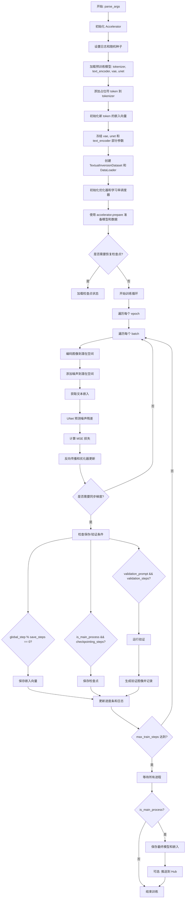
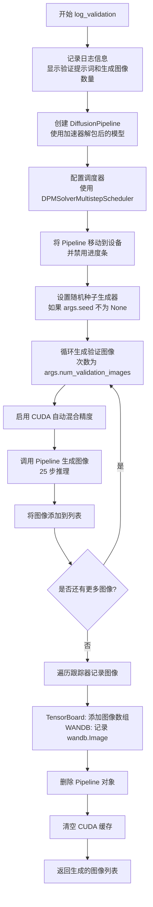
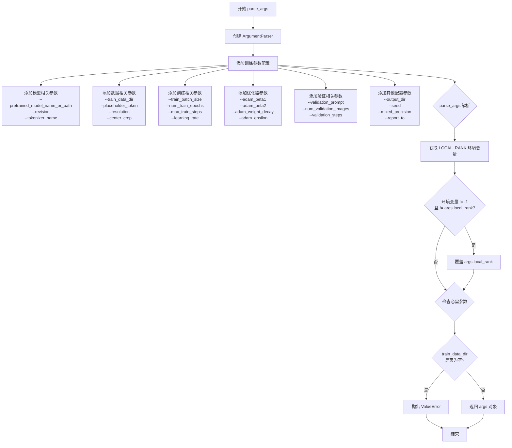
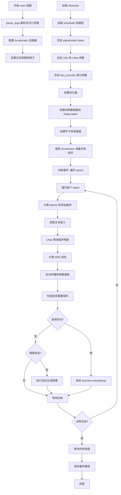
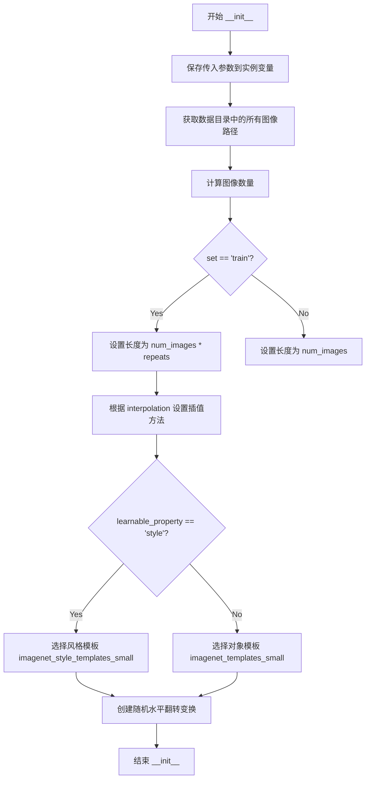
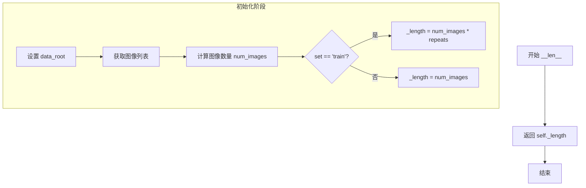

# `diffusers\examples\research_projects\onnxruntime\textual_inversion\textual_inversion.py` 详细设计文档

这是一个用于Stable Diffusion模型的文本倒置（Textual Inversion）训练脚本，通过微调文本编码器的嵌入层来学习新的概念（由占位符 token 表示），支持分布式训练、梯度检查点、混合精度训练和模型导出到HuggingFace Hub。

## 整体流程



## 类结构

```
TextualInversionDataset (Dataset)
└── 继承自 torch.utils.data.Dataset

全局函数:
├── save_model_card (保存模型卡片)
├── log_validation (验证流程)
├── save_progress (保存训练进度)
├── parse_args (解析命令行参数)
└── main (主训练函数)
```

## 全局变量及字段


### `logger`
    
模块级日志记录器，用于输出训练过程中的日志信息

类型：`logging.Logger`
    


### `PIL_INTERPOLATION`
    
PIL图像插值方法映射字典，根据PIL版本兼容不同的插值枚举值

类型：`dict`
    


### `imagenet_templates_small`
    
物体类文本Prompt模板列表，用于将占位符嵌入到不同的图像描述中

类型：`list`
    


### `imagenet_style_templates_small`
    
风格类文本Prompt模板列表，用于学习艺术风格的文本反转

类型：`list`
    


### `TextualInversionDataset.data_root`
    
训练数据根目录，包含用于Textual Inversion训练的图片文件

类型：`str`
    


### `TextualInversionDataset.tokenizer`
    
CLIP分词器，用于将文本Prompt编码为token id序列

类型：`CLIPTokenizer`
    


### `TextualInversionDataset.learnable_property`
    
学习属性类型，可选'object'(物体)或'style'(风格)，决定使用的文本模板

类型：`str`
    


### `TextualInversionDataset.size`
    
图像目标分辨率，训练图像将被resize到该尺寸

类型：`int`
    


### `TextualInversionDataset.placeholder_token`
    
占位符token，用于在Prompt中替代要学习的概念

类型：`str`
    


### `TextualInversionDataset.center_crop`
    
是否在图像预处理时进行中心裁剪

类型：`bool`
    


### `TextualInversionDataset.flip_p`
    
水平翻转的概率，用于数据增强

类型：`float`
    


### `TextualInversionDataset.image_paths`
    
训练数据目录中所有图像文件的完整路径列表

类型：`list`
    


### `TextualInversionDataset.num_images`
    
原始训练图像的数量，不考虑重复次数

类型：`int`
    


### `TextualInversionDataset._length`
    
数据集长度，考虑了重复次数(repeats)后的总样本数

类型：`int`
    


### `TextualInversionDataset.interpolation`
    
图像resize时使用的插值方法

类型：`PIL.Image.Resampling`
    


### `TextualInversionDataset.templates`
    
根据learnable_property选择的文本模板列表

类型：`list`
    


### `TextualInversionDataset.flip_transform`
    
随机水平翻转变换对象，用于数据增强

类型：`transforms.RandomHorizontalFlip`
    
    

## 全局函数及方法


### `save_model_card`

该函数用于将模型训练过程中的示例图像保存到指定文件夹，并生成包含模型元数据和示例图像链接的 README.md 模型卡片文件。

参数：

- `repo_id`：`str`，HuggingFace Hub 仓库 ID，用于标识模型仓库
- `images`：`Optional[List[PIL.Image.Image]]`，训练过程中生成的示例图像列表，默认为 None
- `base_model`：`str`，用于文本反转的基础预训练模型名称或路径
- `repo_folder`：`Optional[str]`：本地输出目录路径，用于保存图像和 README.md 文件

返回值：`None`，该函数不返回任何值，仅执行文件写入操作

#### 流程图

```mermaid
flowchart TD
    A[开始保存模型卡片] --> B{images是否存在且不为空}
    B -->|是| C[遍历images中的每张图像]
    B -->|否| D[跳过图像保存步骤]
    C --> E[将图像保存到repo_folder/image_{i}.png]
    E --> F[构建图像Markdown链接字符串]
    F --> G[生成YAML格式的元数据]
    G --> H[生成Markdown格式的模型说明]
    H --> I[合并YAML和模型说明内容]
    I --> J[打开repo_folder/README.md文件]
    J --> K[写入合并后的内容]
    K --> L[结束]
    D --> G
```

#### 带注释源码

```python
def save_model_card(repo_id: str, images=None, base_model=str, repo_folder=None):
    """
    保存模型卡片到 README.md 文件
    
    该函数执行以下操作：
    1. 将示例图像保存到指定文件夹
    2. 生成包含模型元数据的 YAML 头部
    3. 生成包含示例图像链接的 Markdown 说明
    4. 将内容写入 README.md 文件
    """
    
    # 初始化图像链接字符串
    img_str = ""
    
    # 遍历所有图像，将其保存到文件并构建 Markdown 链接
    for i, image in enumerate(images):
        # 保存图像到指定路径，文件名格式为 image_{i}.png
        image.save(os.path.join(repo_folder, f"image_{i}.png"))
        
        # 构建 Markdown 格式的图像链接
        img_str += f"\n"
    
    # 构建 YAML 格式的模型元数据
    # 包含许可证、基础模型、标签等基本信息
    yaml = f"""
---
license: creativeml-openrail-m
base_model: {base_model}
tags:
- stable-diffusion
- stable-diffusion-diffusers
- text-to-image
- diffusers
- textual_inversion
- diffusers-training
- onxruntime
inference: true
---
    """
    
    # 构建 Markdown 格式的模型说明
    # 包含模型名称、基础模型信息和示例图像
    model_card = f"""
# Textual inversion text2image fine-tuning - {repo_id}
These are textual inversion adaption weights for {base_model}. You can find some example images in the following. \n
{img_str}
"""
    
    # 将 YAML 元数据和 Markdown 说明合并
    # 并写入到 README.md 文件中
    with open(os.path.join(repo_folder, "README.md"), "w") as f:
        f.write(yaml + model_card)
```


### `log_validation`

运行验证阶段，使用文本到图像的扩散模型生成指定提示词的图像，并将结果记录到日志跟踪器中（TensorBoard 或 WANDB）。

参数：

- `text_encoder`：`CLIPTextModel`，用于将文本提示编码为嵌入向量
- `tokenizer`：`CLIPTokenizer`，用于对文本进行分词
- `unet`：`UNet2DConditionModel`，用于去噪预测
- `vae`：`AutoencoderKL`，用于将图像编码/解码到潜在空间
- `args`：命令行参数对象，包含 `pretrained_model_name_or_path`、`validation_prompt`、`num_validation_images`、`revision` 等配置
- `accelerator`：`Accelerator`，用于分布式训练和设备管理
- `weight_dtype`：`torch.dtype`，模型权重的数据类型（float32/float16/bfloat16）
- `epoch`：`int`，当前训练的轮次，用于日志记录

返回值：`List[PIL.Image.Image]`，生成的验证图像列表

#### 流程图



#### 带注释源码

```python
def log_validation(text_encoder, tokenizer, unet, vae, args, accelerator, weight_dtype, epoch):
    """
    运行验证阶段，生成图像并记录到日志跟踪器
    
    参数:
        text_encoder: CLIPTextModel - 文本编码器模型
        tokenizer: CLIPTokenizer - 分词器
        unet: UNet2DConditionModel - UNet去噪模型
        vae: AutoencoderKL - VAE编解码器
        args: argparse.Namespace - 包含所有命令行参数的配置对象
        accelerator: Accelerator - HuggingFace Accelerate加速器
        weight_dtype: torch.dtype - 权重数据类型
        epoch: int - 当前训练轮次
    返回:
        images: List[PIL.Image.Image] - 生成的图像列表
    """
    # 记录验证开始信息，包括验证提示词和要生成的图像数量
    logger.info(
        f"Running validation... \n Generating {args.num_validation_images} images with prompt:"
        f" {args.validation_prompt}."
    )
    # 创建扩散管道（注意：unet和vae会以float32重新加载）
    # 使用accelerator.unwrap_model获取原始模型对象
    pipeline = DiffusionPipeline.from_pretrained(
        args.pretrained_model_name_or_path,
        text_encoder=accelerator.unwrap_model(text_encoder),  # 解包加速器包装的模型
        tokenizer=tokenizer,
        unet=unet,
        vae=vae,
        safety_checker=None,  # 禁用安全检查器以避免潜在问题
        revision=args.revision,  # 模型版本
        torch_dtype=weight_dtype,  # 设置数据类型
    )
    # 使用DPM++多步调度器替代默认调度器
    pipeline.scheduler = DPMSolverMultistepScheduler.from_config(pipeline.scheduler.config)
    # 将管道移动到加速器设备上
    pipeline = pipeline.to(accelerator.device)
    # 禁用进度条显示
    pipeline.set_progress_bar_config(disable=True)

    # 如果设置了种子则创建随机生成器，否则为None
    generator = None if args.seed is None else torch.Generator(device=accelerator.device).manual_seed(args.seed)
    # 初始化图像列表
    images = []
    # 循环生成指定数量的验证图像
    for _ in range(args.num_validation_images):
        # 使用CUDA自动混合精度进行推理
        with torch.autocast("cuda"):
            # 调用管道生成图像，25步推理
            image = pipeline(args.validation_prompt, num_inference_steps=25, generator=generator).images[0]
        images.append(image)

    # 遍历所有跟踪器（TensorBoard或WANDB）
    for tracker in accelerator.trackers:
        # 如果是TensorBoard跟踪器
        if tracker.name == "tensorboard":
            # 将PIL图像转换为numpy数组并堆叠
            np_images = np.stack([np.asarray(img) for img in images])
            # 添加图像到TensorBoard，格式为NHWC
            tracker.writer.add_images("validation", np_images, epoch, dataformats="NHWC")
        # 如果是WANDB跟踪器
        if tracker.name == "wandb":
            # 使用WANDB记录图像，带有标题说明
            tracker.log(
                {
                    "validation": [
                        wandb.Image(image, caption=f"{i}: {args.validation_prompt}") for i, image in enumerate(images)
                    ]
                }
            )

    # 删除管道对象释放内存
    del pipeline
    # 清空CUDA缓存
    torch.cuda.empty_cache()
    # 返回生成的图像列表
    return images
```


### `save_progress`

保存已学习的嵌入向量到指定路径的函数，用于在文本倒置训练过程中保存学习到的词嵌入。

参数：

- `text_encoder`：`CLIPTextModel`，经过训练的文本编码器模型，用于获取输入嵌入
- `placeholder_token_ids`：`List[int]`或`torch.Tensor`，占位符令牌的ID列表，指定需要保存的嵌入向量范围
- `accelerator`：`Accelerator`，HuggingFace Accelerate库提供的分布式训练加速器，用于解包模型
- `args`：`argparse.Namespace`，包含占位符令牌名称等配置参数的命名空间
- `save_path`：`str`，保存嵌入向量的文件路径（通常为.bin格式）

返回值：`None`，该函数无返回值，直接将嵌入向量保存到磁盘

#### 流程图

```mermaid
flowchart TD
    A[开始 save_progress] --> B[记录日志 'Saving embeddings']
    B --> C[通过 accelerator.unwrap_model 解包 text_encoder]
    C --> D[获取模型输入嵌入层 .get_input_embeddings]
    E[获取嵌入权重 .weight] --> F[切片提取学习到的嵌入向量]
    D --> E
    F --> G[使用 min/max 获取占位符令牌范围]
    G --> H[创建字典: {args.placeholder_token: learned_embeds}]
    H --> I[调用 .detach().cpu() 分离计算图并移至CPU]
    I --> J[使用 torch.save 保存到 save_path]
    J --> K[结束]
```

#### 带注释源码

```python
def save_progress(text_encoder, placeholder_token_ids, accelerator, args, save_path):
    """
    保存已学习的嵌入向量到磁盘
    
    参数:
        text_encoder: CLIPTextModel - 训练后的文本编码器
        placeholder_token_ids: List[int] - 占位符令牌的ID列表
        accelerator: Accelerator - Accelerate分布式训练加速器
        args: argparse.Namespace - 包含placeholder_token等配置
        save_path: str - 保存文件路径
    """
    # 记录保存操作开始
    logger.info("Saving embeddings")
    
    # 通过accelerator解包模型，获取原始的text_encoder
    # accelerator.unwrap_model会移除分布式包装器
    learned_embeds = (
        accelerator.unwrap_model(text_encoder)
        .get_input_embeddings()          # 获取输入嵌入层
        .weight[                         # 获取嵌入权重矩阵
            min(placeholder_token_ids) : max(placeholder_token_ids) + 1  # 切片提取目标范围
        ]
    )
    
    # 构建嵌入字典，键为占位符令牌名称，值为学习到的嵌入向量
    learned_embeds_dict = {args.placeholder_token: learned_embeds.detach().cpu()}
    
    # 使用torch.save将嵌入向量保存到指定路径
    # .detach() 分离计算图，.cpu() 移至CPU以便序列化
    torch.save(learned_embeds_dict, save_path)
```


### `parse_args`

该函数是训练脚本的命令行参数解析核心，使用 Python 的 `argparse` 模块定义并解析了约50余个训练相关参数，包括模型路径、数据配置、优化器设置、验证选项等，并进行了环境变量覆盖和必要参数校验，最终返回包含所有配置信息的 `args` 命名空间对象。

参数：
- 此函数没有输入参数，通过 `argparse.ArgumentParser` 内部定义所有参数

返回值：`Namespace`（argparse.Namespace），返回一个命名空间对象，包含所有解析后的命令行参数及其值

#### 流程图



#### 带注释源码

```python
def parse_args():
    """
    解析所有命令行参数，返回包含训练配置的命名空间对象
    
    该函数使用 argparse 定义了 Textual Inversion 训练脚本的所有配置选项，
    包括模型路径、数据配置、训练超参数、优化器设置、验证选项等。
    
    Returns:
        argparse.Namespace: 包含所有解析后参数的对象
    """
    # 创建 ArgumentParser 实例，description 用于命令行帮助信息
    parser = argparse.ArgumentParser(description="Simple example of a training script.")
    
    # ==================== 模型相关参数 ====================
    # 保存间隔步数
    parser.add_argument(
        "--save_steps",
        type=int,
        default=500,
        help="Save learned_embeds.bin every X updates steps.",
    )
    # 是否保存完整 pipeline
    parser.add_argument(
        "--save_as_full_pipeline",
        action="store_true",
        help="Save the complete stable diffusion pipeline.",
    )
    # Textual Inversion 向量数量
    parser.add_argument(
        "--num_vectors",
        type=int,
        default=1,
        help="How many textual inversion vectors shall be used to learn the concept.",
    )
    # 预训练模型路径或 HuggingFace 模型标识符（必需）
    parser.add_argument(
        "--pretrained_model_name_or_path",
        type=str,
        default=None,
        required=True,
        help="Path to pretrained model or model identifier from huggingface.co/models.",
    )
    # 模型版本修订号
    parser.add_argument(
        "--revision",
        type=str,
        default=None,
        required=False,
        help="Revision of pretrained model identifier from huggingface.co/models.",
    )
    # 分词器名称或路径
    parser.add_argument(
        "--tokenizer_name",
        type=str,
        default=None,
        help="Pretrained tokenizer name or path if not the same as model_name",
    )
    
    # ==================== 数据相关参数 ====================
    # 训练数据目录（必需）
    parser.add_argument(
        "--train_data_dir", type=str, default=None, required=True, help="A folder containing the training data."
    )
    # 占位符 token，用于表示学习到的概念
    parser.add_argument(
        "--placeholder_token",
        type=str,
        default=None,
        required=True,
        help="A token to use as a placeholder for the concept.",
    )
    # 初始化 token，用于初始化占位符的嵌入
    parser.add_argument(
        "--initializer_token", type=str, default=None, required=True, help="A token to use as initializer word."
    )
    # 可学习属性类型：对象或风格
    parser.add_argument("--learnable_property", type=str, default="object", help="Choose between 'object' and 'style'")
    # 训练数据重复次数
    parser.add_argument("--repeats", type=int, default=100, help="How many times to repeat the training data.")
    
    # ==================== 输出相关参数 ====================
    # 输出目录
    parser.add_argument(
        "--output_dir",
        type=str,
        default="text-inversion-model",
        help="The output directory where the model predictions and checkpoints will be written.",
    )
    # 随机种子，用于 reproducibility
    parser.add_argument("--seed", type=int, default=None, help="A seed for reproducible training.")
    
    # ==================== 图像处理参数 ====================
    # 输入图像分辨率
    parser.add_argument(
        "--resolution",
        type=int,
        default=512,
        help=(
            "The resolution for input images, all the images in the train/validation dataset will be resized to this"
            " resolution"
        ),
    )
    # 是否中心裁剪
    parser.add_argument(
        "--center_crop", action="store_true", help="Whether to center crop images before resizing to resolution."
    )
    
    # ==================== 训练相关参数 ====================
    # 训练批次大小
    parser.add_argument(
        "--train_batch_size", type=int, default=16, help="Batch size (per device) for the training dataloader."
    )
    # 训练轮数
    parser.add_argument("--num_train_epochs", type=int, default=100)
    # 最大训练步数
    parser.add_argument(
        "--max_train_steps",
        type=int,
        default=5000,
        help="Total number of training steps to perform.  If provided, overrides num_train_epochs.",
    )
    # 梯度累积步数
    parser.add_argument(
        "--gradient_accumulation_steps",
        type=int,
        default=1,
        help="Number of updates steps to accumulate before performing a backward/update pass.",
    )
    # 梯度检查点开关
    parser.add_argument(
        "--gradient_checkpointing",
        action="store_true",
        help="Whether or not to use gradient checkpointing to save memory at the expense of slower backward pass.",
    )
    # 基础学习率
    parser.add_argument(
        "--learning_rate",
        type=float,
        default=1e-4,
        help="Initial learning rate (after the potential warmup period) to use.",
    )
    # 是否根据 GPU/累积/batch size 缩放学习率
    parser.add_argument(
        "--scale_lr",
        action="store_true",
        default=False,
        help="Scale the learning rate by the number of GPUs, gradient accumulation steps, and batch size.",
    )
    # 学习率调度器类型
    parser.add_argument(
        "--lr_scheduler",
        type=str,
        default="constant",
        help=(
            'The scheduler type to use. Choose between ["linear", "cosine", "cosine_with_restarts", "polynomial",'
            ' "constant", "constant_with_warmup"]'
        ),
    )
    # 学习率预热步数
    parser.add_argument(
        "--lr_warmup_steps", type=int, default=500, help="Number of steps for the warmup in the lr scheduler."
    )
    # DataLoader 工作进程数
    parser.add_argument(
        "--dataloader_num_workers",
        type=int,
        default=0,
        help=(
            "Number of subprocesses to use for data loading. 0 means that the data will be loaded in the main process."
        ),
    )
    
    # ==================== 优化器参数 ====================
    # Adam 优化器的 beta1 参数
    parser.add_argument("--adam_beta1", type=float, default=0.9, help="The beta1 parameter for the Adam optimizer.")
    # Adam 优化器的 beta2 参数
    parser.add_argument("--adam_beta2", type=float, default=0.999, help="The beta2 parameter for the Adam optimizer.")
    # 权重衰减
    parser.add_argument("--adam_weight_decay", type=float, default=1e-2, help="Weight decay to use.")
    # Adam 优化器的 epsilon 值
    parser.add_argument("--adam_epsilon", type=float, default=1e-08, help="Epsilon value for the Adam optimizer")
    
    # ==================== HuggingFace Hub 相关参数 ====================
    # 是否推送到 Hub
    parser.add_argument("--push_to_hub", action="store_true", help="Whether or not to push the model to the Hub.")
    # Hub token
    parser.add_argument("--hub_token", type=str, default=None, help="The token to use to push to the Model Hub.")
    # Hub 模型 ID
    parser.add_argument(
        "--hub_model_id",
        type=str,
        default=None,
        help="The name of the repository to keep in sync with the local `output_dir`.",
    )
    
    # ==================== 日志和监控参数 ====================
    # TensorBoard 日志目录
    parser.add_argument(
        "--logging_dir",
        type=str,
        default="logs",
        help=(
            "[TensorBoard](https://www.tensorflow.org/tensorboard) log directory. Will default to"
            " *output_dir/runs/**CURRENT_DATETIME_HOSTNAME***."
        ),
    )
    # 混合精度训练类型
    parser.add_argument(
        "--mixed_precision",
        type=str,
        default="no",
        choices=["no", "fp16", "bf16"],
        help=(
            "Whether to use mixed precision. Choose"
            "between fp16 and bf16 (bfloat16). Bf16 requires PyTorch >= 1.10."
            "and an Nvidia Ampere GPU."
        ),
    )
    # 是否允许 TF32
    parser.add_argument(
        "--allow_tf32",
        action="store_true",
        help=(
            "Whether or not to allow TF32 on Ampere GPUs. Can be used to speed up training. For more information, see"
            " https://pytorch.org/docs/stable/notes/cuda.html#tensorfloat-32-tf32-on-ampere-devices"
        ),
    )
    # 日志报告目标
    parser.add_argument(
        "--report_to",
        type=str,
        default="tensorboard",
        help=(
            'The integration to report the results and logs to. Supported platforms are `"tensorboard"`'
            ' (default), `"wandb"` and `"comet_ml"`. Use `"all"` to report to all integrations.'
        ),
    )
    
    # ==================== 验证相关参数 ====================
    # 验证提示词
    parser.add_argument(
        "--validation_prompt",
        type=str,
        default=None,
        help="A prompt that is used during validation to verify that the model is learning.",
    )
    # 验证图像数量
    parser.add_argument(
        "--num_validation_images",
        type=int,
        default=4,
        help="Number of images that should be generated during validation with `validation_prompt`.",
    )
    # 验证间隔步数
    parser.add_argument(
        "--validation_steps",
        type=int,
        default=100,
        help=(
            "Run validation every X steps. Validation consists of running the prompt"
            " `args.validation_prompt` multiple times: `args.num_validation_images`"
            " and logging the images."
        ),
    )
    # 验证间隔轮数（已弃用）
    parser.add_argument(
        "--validation_epochs",
        type=int,
        default=None,
        help=(
            "Deprecated in favor of validation_steps. Run validation every X epochs. Validation consists of running the prompt"
            " `args.validation_prompt` multiple times: `args.num_validation_images`"
            " and logging the images."
        ),
    )
    
    # ==================== 分布式训练参数 ====================
    # 本地排名（用于分布式训练）
    parser.add_argument("--local_rank", type=int, default=-1, help="For distributed training: local_rank")
    
    # ==================== 检查点相关参数 ====================
    # 检查点保存间隔
    parser.add_argument(
        "--checkpointing_steps",
        type=int,
        default=500,
        help=(
            "Save a checkpoint of the training state every X updates. These checkpoints are only suitable for resuming"
            " training using `--resume_from_checkpoint`."
        ),
    )
    # 检查点总数限制
    parser.add_argument(
        "--checkpoints_total_limit",
        type=int,
        default=None,
        help=(
            "Max number of checkpoints to store. Passed as `total_limit` to the `Accelerator` `ProjectConfiguration`."
            " See Accelerator::save_state https://huggingface.co/docs/accelerate/package_reference/accelerator#accelerate.Accelerator.save_state"
            " for more docs"
        ),
    )
    # 从检查点恢复训练
    parser.add_argument(
        "--resume_from_checkpoint",
        type=str,
        default=None,
        help=(
            "Whether training should be resumed from a previous checkpoint. Use a path saved by"
            ' `--checkpointing_steps`, or `"latest"` to automatically select the last available checkpoint.'
        ),
    )
    # xformers 内存高效注意力
    parser.add_argument(
        "--enable_xformers_memory_efficient_attention", action="store_true", help="Whether or not to use xformers."
    )
    
    # ==================== 解析参数 ====================
    # 解析命令行传入的参数
    args = parser.parse_args()
    
    # ==================== 环境变量覆盖 ====================
    # 检查 LOCAL_RANK 环境变量，如果存在则覆盖 args.local_rank
    # 这是为了支持 PyTorch 分布式训练的环境变量设置
    env_local_rank = int(os.environ.get("LOCAL_RANK", -1))
    if env_local_rank != -1 and env_local_rank != args.local_rank:
        args.local_rank = env_local_rank
    
    # ==================== 参数校验 ====================
    # 确保训练数据目录被指定
    if args.train_data_dir is None:
        raise ValueError("You must specify a train data directory.")
    
    # 返回解析后的参数对象
    return args
```


### `main`

主训练循环函数，负责协调整个Textual Inversion训练流程，包括参数解析、模型加载、数据准备、训练循环执行、模型保存等核心功能。

参数：
- 无显式参数（通过内部调用 `parse_args()` 获取所有训练参数）

返回值：`None`，函数执行完成后直接退出

#### 流程图



#### 带注释源码

```python
def main():
    """
    主训练循环函数，执行 Textual Inversion 微调训练
    """
    # 步骤1: 解析命令行参数
    args = parse_args()
    
    # 安全检查: 不能同时使用 wandb 和 hub_token
    if args.report_to == "wandb" and args.hub_token is not None:
        raise ValueError(
            "You cannot use both --report_to=wandb and --hub_token due to a security risk of exposing your token."
            " Please use `hf auth login` to authenticate with the Hub."
        )

    # 步骤2: 配置日志目录和 Accelerator 项目配置
    logging_dir = os.path.join(args.output_dir, args.logging_dir)
    accelerator_project_config = ProjectConfiguration(
        total_limit=args.checkpoints_total_limit, project_dir=args.output_dir, logging_dir=logging_dir
    )

    # 步骤3: 初始化 Accelerator 加速器
    accelerator = Accelerator(
        gradient_accumulation_steps=args.gradient_accumulation_steps,
        mixed_precision=args.mixed_precision,
        log_with=args.report_to,
        project_config=accelerator_project_config,
    )

    # 禁用 MPS 的 AMP
    if torch.backends.mps.is_available():
        accelerator.native_amp = False

    # 检查 wandb 是否安装
    if args.report_to == "wandb":
        if not is_wandb_available():
            raise ImportError("Make sure to install wandb if you want to use it for logging during training.")

    # 步骤4: 配置日志系统
    logging.basicConfig(
        format="%(asctime)s - %(levelname)s - %(name)s - %(message)s",
        datefmt="%m/%d/%Y %H:%M:%S",
        level=logging.INFO,
    )
    logger.info(accelerator.state, main_process_only=False)
    
    # 根据是否是主进程设置日志级别
    if accelerator.is_local_main_process:
        transformers.utils.logging.set_verbosity_warning()
        diffusers.utils.logging.set_verbosity_info()
    else:
        transformers.utils.logging.set_verbosity_error()
        diffusers.utils.logging.set_verbosity_error()

    # 步骤5: 设置随机种子
    if args.seed is not None:
        set_seed(args.seed)

    # 步骤6: 处理仓库创建（如果是主进程）
    if accelerator.is_main_process:
        if args.output_dir is not None:
            os.makedirs(args.output_dir, exist_ok=True)

        if args.push_to_hub:
            repo_id = create_repo(
                repo_id=args.hub_model_id or Path(args.output_dir).name, exist_ok=True, token=args.hub_token
            ).repo_id

    # 步骤7: 加载 tokenizer
    if args.tokenizer_name:
        tokenizer = CLIPTokenizer.from_pretrained(args.tokenizer_name)
    elif args.pretrained_model_name_or_path:
        tokenizer = CLIPTokenizer.from_pretrained(args.pretrained_model_name_or_path, subfolder="tokenizer")

    # 步骤8: 加载 scheduler 和预训练模型
    noise_scheduler = DDPMScheduler.from_pretrained(args.pretrained_model_name_or_path, subfolder="scheduler")
    text_encoder = CLIPTextModel.from_pretrained(
        args.pretrained_model_name_or_path, subfolder="text_encoder", revision=args.revision
    )
    vae = AutoencoderKL.from_pretrained(args.pretrained_model_name_or_path, subfolder="vae", revision=args.revision)
    unet = UNet2DConditionModel.from_pretrained(
        args.pretrained_model_name_or_path, subfolder="unet", revision=args.revision
    )

    # 步骤9: 添加 placeholder token 到 tokenizer
    placeholder_tokens = [args.placeholder_token]

    if args.num_vectors < 1:
        raise ValueError(f"--num_vectors has to be larger or equal to 1, but is {args.num_vectors}")

    # 为多向量情况添加虚拟 token
    additional_tokens = []
    for i in range(1, args.num_vectors):
        additional_tokens.append(f"{args.placeholder_token}_{i}")
    placeholder_tokens += additional_tokens

    # 将 placeholder token 添加到 tokenizer
    num_added_tokens = tokenizer.add_tokens(placeholder_tokens)
    if num_added_tokens != args.num_vectors:
        raise ValueError(
            f"The tokenizer already contains the token {args.placeholder_token}. Please pass a different"
            " `placeholder_token` that is not already in the tokenizer."
        )

    # 步骤10: 将 initializer_token 和 placeholder_token 转换为 ids
    token_ids = tokenizer.encode(args.initializer_token, add_special_tokens=False)
    # 检查 initializer_token 是否是单个 token
    if len(token_ids) > 1:
        raise ValueError("The initializer token must be a single token.")

    initializer_token_id = token_ids[0]
    placeholder_token_ids = tokenizer.convert_tokens_to_ids(placeholder_tokens)

    # 步骤11: 扩展 token embeddings 矩阵
    text_encoder.resize_token_embeddings(len(tokenizer))

    # 步骤12: 用 initializer token 的 embeddings 初始化 placeholder token
    token_embeds = text_encoder.get_input_embeddings().weight.data
    with torch.no_grad():
        for token_id in placeholder_token_ids:
            token_embeds[token_id] = token_embeds[initializer_token_id].clone()

    # 步骤13: 冻结 VAE 和 UNet（不训练这些组件）
    vae.requires_grad_(False)
    unet.requires_grad_(False)
    
    # 冻结 text_encoder 中除了 embeddings 外的所有参数
    text_encoder.text_model.encoder.requires_grad_(False)
    text_encoder.text_model.final_layer_norm.requires_grad_(False)
    text_encoder.text_model.embeddings.position_embedding.requires_grad_(False)

    # 步骤14: 配置梯度检查点（节省显存）
    if args.gradient_checkpointing:
        unet.train()
        text_encoder.gradient_checkpointing_enable()
        unet.enable_gradient_checkpointing()

    # 步骤15: 配置 xformers 高效注意力
    if args.enable_xformers_memory_efficient_attention:
        if is_xformers_available():
            import xformers

            xformers_version = version.parse(xformers.__version__)
            if xformers_version == version.parse("0.0.16"):
                logger.warning(
                    "xFormers 0.0.16 cannot be used for training in some GPUs..."
                )
            unet.enable_xformers_memory_efficient_attention()
        else:
            raise ValueError("xformers is not available. Make sure it is installed correctly")

    # 步骤16: 启用 TF32 加速（Ampere GPU）
    if args.allow_tf32:
        torch.backends.cuda.matmul.allow_tf32 = True

    # 步骤17: 缩放学习率（考虑分布式和梯度累积）
    if args.scale_lr:
        args.learning_rate = (
            args.learning_rate * args.gradient_accumulation_steps * args.train_batch_size * accelerator.num_processes
        )

    # 步骤18: 初始化优化器（只优化 text_encoder 的 embeddings）
    optimizer = torch.optim.AdamW(
        text_encoder.get_input_embeddings().parameters(),  # 只优化 embeddings
        lr=args.learning_rate,
        betas=(args.adam_beta1, args.adam_beta2),
        weight_decay=args.adam_weight_decay,
        eps=args.adam_epsilon,
    )

    # 使用 ONNX Runtime 的 FP16 优化器
    optimizer = ORT_FP16_Optimizer(optimizer)

    # 步骤19: 创建训练数据集和 DataLoader
    train_dataset = TextualInversionDataset(
        data_root=args.train_data_dir,
        tokenizer=tokenizer,
        size=args.resolution,
        placeholder_token=args.placeholder_token,
        repeats=args.repeats,
        learnable_property=args.learnable_property,
        center_crop=args.center_crop,
        set="train",
    )
    train_dataloader = torch.utils.data.DataLoader(
        train_dataset, batch_size=args.train_batch_size, shuffle=True, num_workers=args.dataloader_num_workers
    )

    # 兼容性处理：validation_epochs 已弃用
    if args.validation_epochs is not None:
        warnings.warn(
            f"FutureWarning: You are doing logging with validation_epochs={args.validation_epochs}."
            " Deprecated validation_epochs in favor of `validation_steps`"
            f"Setting `args.validation_steps` to {args.validation_epochs * len(train_dataset)}",
            FutureWarning,
            stacklevel=2,
        )
        args.validation_steps = args.validation_epochs * len(train_dataset)

    # 步骤20: 计算训练步数并创建学习率调度器
    overrode_max_train_steps = False
    num_update_steps_per_epoch = math.ceil(len(train_dataloader) / args.gradient_accumulation_steps)
    if args.max_train_steps is None:
        args.max_train_steps = args.num_train_epochs * num_update_steps_per_epoch
        overrode_max_train_steps = True

    lr_scheduler = get_scheduler(
        args.lr_scheduler,
        optimizer=optimizer,
        num_warmup_steps=args.lr_warmup_steps * accelerator.num_processes,
        num_training_steps=args.max_train_steps * accelerator.num_processes,
    )

    # 步骤21: 使用 Accelerator 准备所有组件
    text_encoder, optimizer, train_dataloader, lr_scheduler = accelerator.prepare(
        text_encoder, optimizer, train_dataloader, lr_scheduler
    )

    # 包装为 ONNX Runtime Module
    text_encoder = ORTModule(text_encoder)
    unet = ORTModule(unet)
    vae = ORTModule(vae)

    # 步骤22: 设置混合精度权重类型
    weight_dtype = torch.float32
    if accelerator.mixed_precision == "fp16":
        weight_dtype = torch.float16
    elif accelerator.mixed_precision == "bf16":
        weight_dtype = torch.bfloat16

    # 将 VAE 和 UNet 移到设备并转换数据类型
    unet.to(accelerator.device, dtype=weight_dtype)
    vae.to(accelerator.device, dtype=weight_dtype)

    # 步骤23: 重新计算训练步数
    num_update_steps_per_epoch = math.ceil(len(train_dataloader) / args.gradient_accumulation_steps)
    if overrode_max_train_steps:
        args.max_train_steps = args.num_train_epochs * num_update_steps_per_epoch
    args.num_train_epochs = math.ceil(args.max_train_steps / num_update_steps_per_epoch)

    # 步骤24: 初始化 trackers
    if accelerator.is_main_process:
        accelerator.init_trackers("textual_inversion", config=vars(args))

    # 步骤25: 打印训练信息
    total_batch_size = args.train_batch_size * accelerator.num_processes * args.gradient_accumulation_steps

    logger.info("***** Running training *****")
    logger.info(f"  Num examples = {len(train_dataset)}")
    logger.info(f"  Num Epochs = {args.num_train_epochs}")
    logger.info(f"  Instantaneous batch size per device = {args.train_batch_size}")
    logger.info(f"  Total train batch size (w. parallel, distributed & accumulation) = {total_batch_size}")
    logger.info(f"  Gradient Accumulation steps = {args.gradient_accumulation_steps}")
    logger.info(f"  Total optimization steps = {args.max_train_steps}")

    # 步骤26: 初始化训练状态变量
    global_step = 0
    first_epoch = 0

    # 步骤27: 检查是否从 checkpoint 恢复训练
    if args.resume_from_checkpoint:
        if args.resume_from_checkpoint != "latest":
            path = os.path.basename(args.resume_from_checkpoint)
        else:
            dirs = os.listdir(args.output_dir)
            dirs = [d for d in dirs if d.startswith("checkpoint")]
            dirs = sorted(dirs, key=lambda x: int(x.split("-")[1]))
            path = dirs[-1] if len(dirs) > 0 else None

        if path is None:
            accelerator.print(
                f"Checkpoint '{args.resume_from_checkpoint}' does not exist. Starting a new training run."
            )
            args.resume_from_checkpoint = None
        else:
            accelerator.print(f"Resuming from checkpoint {path}")
            accelerator.load_state(os.path.join(args.output_dir, path))
            global_step = int(path.split("-")[1])

            resume_global_step = global_step * args.gradient_accumulation_steps
            first_epoch = global_step // num_update_steps_per_epoch
            resume_step = resume_global_step % (num_update_steps_per_epoch * args.gradient_accumulation_steps)

    # 步骤28: 创建进度条
    progress_bar = tqdm(range(global_step, args.max_train_steps), disable=not accelerator.is_local_main_process)
    progress_bar.set_description("Steps")

    # 保存原始 embeddings 作为参考
    orig_embeds_params = accelerator.unwrap_model(text_encoder).get_input_embeddings().weight.data.clone()

    # 步骤29: 训练循环
    for epoch in range(first_epoch, args.num_train_epochs):
        text_encoder.train()
        
        # 遍历每个 batch
        for step, batch in enumerate(train_dataloader):
            # 跳过已完成的步骤（恢复训练时）
            if args.resume_from_checkpoint and epoch == first_epoch and step < resume_step:
                if step % args.gradient_accumulation_steps == 0:
                    progress_bar.update(1)
                continue

            # 使用 accelerator 累积梯度
            with accelerator.accumulate(text_encoder):
                # 29.1: 将图像编码到潜在空间
                latents = vae.encode(batch["pixel_values"].to(dtype=weight_dtype)).latent_dist.sample().detach()
                latents = latents * vae.config.scaling_factor

                # 29.2: 采样噪声
                noise = torch.randn_like(latents)
                bsz = latents.shape[0]
                
                # 29.3: 为每张图像随机采样时间步
                timesteps = torch.randint(0, noise_scheduler.config.num_train_timesteps, (bsz,), device=latents.device)
                timesteps = timesteps.long()

                # 29.4: 前向扩散过程：向 latents 添加噪声
                noisy_latents = noise_scheduler.add_noise(latents, noise, timesteps)

                # 29.5: 获取文本嵌入用于条件
                encoder_hidden_states = text_encoder(batch["input_ids"])[0].to(dtype=weight_dtype)

                # 29.6: UNet 预测噪声残差
                model_pred = unet(noisy_latents, timesteps, encoder_hidden_states).sample

                # 29.7: 根据预测类型确定目标
                if noise_scheduler.config.prediction_type == "epsilon":
                    target = noise
                elif noise_scheduler.config.prediction_type == "v_prediction":
                    target = noise_scheduler.get_velocity(latents, noise, timesteps)
                else:
                    raise ValueError(f"Unknown prediction type {noise_scheduler.config.prediction_type}")

                # 29.8: 计算 MSE 损失
                loss = F.mse_loss(model_pred.float(), target.float(), reduction="mean")

                # 29.9: 反向传播
                accelerator.backward(loss)

                # 29.10: 优化器步骤
                optimizer.step()
                lr_scheduler.step()
                optimizer.zero_grad()

                # 29.11: 确保不更新新添加 token 以外的 embeddings
                index_no_updates = torch.ones((len(tokenizer),), dtype=torch.bool)
                index_no_updates[min(placeholder_token_ids) : max(placeholder_token_ids) + 1] = False

                with torch.no_grad():
                    accelerator.unwrap_model(text_encoder).get_input_embeddings().weight[index_no_updates] = (
                        orig_embeds_params[index_no_updates]
                    )

            # 步骤30: 检查是否执行了优化步骤
            if accelerator.sync_gradients:
                images = []
                progress_bar.update(1)
                global_step += 1
                
                # 定期保存 embeddings
                if global_step % args.save_steps == 0:
                    save_path = os.path.join(args.output_dir, f"learned_embeds-steps-{global_step}.bin")
                    save_progress(text_encoder, placeholder_token_ids, accelerator, args, save_path)

                # 主进程执行 checkpoint 保存和验证
                if accelerator.is_main_process:
                    if global_step % args.checkpointing_steps == 0:
                        save_path = os.path.join(args.output_dir, f"checkpoint-{global_step}")
                        accelerator.save_state(save_path)
                        logger.info(f"Saved state to {save_path}")

                    # 运行验证
                    if args.validation_prompt is not None and global_step % args.validation_steps == 0:
                        images = log_validation(
                            text_encoder, tokenizer, unet, vae, args, accelerator, weight_dtype, epoch
                        )

            # 步骤31: 记录日志
            logs = {"loss": loss.detach().item(), "lr": lr_scheduler.get_last_lr()[0]}
            progress_bar.set_postfix(**logs)
            accelerator.log(logs, step=global_step)

            # 检查是否达到最大训练步数
            if global_step >= args.max_train_steps:
                break

    # 步骤32: 保存最终模型
    accelerator.wait_for_everyone()
    if accelerator.is_main_process:
        # 确定是否保存完整 pipeline
        if args.push_to_hub and not args.save_as_full_pipeline:
            logger.warning("Enabling full model saving because --push_to_hub=True was specified.")
            save_full_model = True
        else:
            save_full_model = args.save_as_full_pipeline
        
        # 保存完整 pipeline
        if save_full_model:
            pipeline = StableDiffusionPipeline.from_pretrained(
                args.pretrained_model_name_or_path,
                text_encoder=accelerator.unwrap_model(text_encoder),
                vae=vae,
                unet=unet,
                tokenizer=tokenizer,
            )
            pipeline.save_pretrained(args.output_dir)
        
        # 保存训练好的 embeddings
        save_path = os.path.join(args.output_dir, "learned_embeds.bin")
        save_progress(text_encoder, placeholder_token_ids, accelerator, args, save_path)

        # 推送到 Hub
        if args.push_to_hub:
            save_model_card(
                repo_id,
                images=images,
                base_model=args.pretrained_model_name_or_path,
                repo_folder=args.output_dir,
            )
            upload_folder(
                repo_id=repo_id,
                folder_path=args.output_dir,
                commit_message="End of training",
                ignore_patterns=["step_*", "epoch_*"],
            )

    # 步骤33: 结束训练
    accelerator.end_training()
```


### `TextualInversionDataset.__init__`

该方法是 `TextualInversionDataset` 类的构造函数，用于初始化文本反转训练数据集。它负责设置数据根目录、tokenizer、图像处理参数、模板选择等，为后续的 `__getitem__` 方法提供数据准备。

参数：

- `data_root`：`str`，数据根目录路径，包含训练图像文件
- `tokenizer`：`CLIPTokenizer`，用于将文本编码为 token 的分词器
- `learnable_property`：`str`，可选值为 `"object"` 或 `"style"`，指定学习的是对象还是风格
- `size`：`int`，图像的目标分辨率，默认为 512
- `repeats`：`int`，训练集重复次数，默认为 100，用于增加数据量
- `interpolation`：`str`，图像插值方法，默认为 `"bicubic"`，支持 linear/bilinear/bicubic/lanczos/nearest
- `flip_p`：`float`，随机水平翻转的概率，默认为 0.5
- `set`：`str`，数据集类型，默认为 `"train"`，用于确定是否重复数据
- `placeholder_token`：`str`，占位符 token，默认为 `"*"`，用于在模板中替换概念
- `center_crop`：`bool`，是否进行中心裁剪，默认为 `False`

返回值：`None`，构造函数无返回值

#### 流程图



#### 带注释源码

```python
def __init__(
    self,
    data_root,
    tokenizer,
    learnable_property="object",  # [object, style]
    size=512,
    repeats=100,
    interpolation="bicubic",
    flip_p=0.5,
    set="train",
    placeholder_token="*",
    center_crop=False,
):
    # 1. 保存数据根目录路径
    self.data_root = data_root
    # 2. 保存 tokenizer 实例，用于后续编码文本
    self.tokenizer = tokenizer
    # 3. 保存学习属性（对象或风格）
    self.learnable_property = learnable_property
    # 4. 保存图像目标尺寸
    self.size = size
    # 5. 保存占位符 token
    self.placeholder_token = placeholder_token
    # 6. 保存是否中心裁剪的标志
    self.center_crop = center_crop
    # 7. 保存随机翻转概率
    self.flip_p = flip_p

    # 8. 收集所有图像文件的完整路径
    self.image_paths = [os.path.join(self.data_root, file_path) for file_path in os.listdir(self.data_root)]

    # 9. 计算图像总数
    self.num_images = len(self.image_paths)
    # 10. 初始化数据集长度
    self._length = self.num_images

    # 11. 如果是训练集，根据 repeats 参数重复数据以增加训练样本
    if set == "train":
        self._length = self.num_images * repeats

    # 12. 根据 interpolation 参数选择对应的 PIL 插值方法
    self.interpolation = {
        "linear": PIL_INTERPOLATION["linear"],
        "bilinear": PIL_INTERPOLATION["bilinear"],
        "bicubic": PIL_INTERPOLATION["bicubic"],
        "lanczos": PIL_INTERPOLATION["lanczos"],
    }[interpolation]

    # 13. 根据学习属性选择对应的文本模板
    # 风格学习使用艺术风格模板，对象学习使用普通图像模板
    self.templates = imagenet_style_templates_small if learnable_property == "style" else imagenet_templates_small
    
    # 14. 创建随机水平翻转变换对象
    self.flip_transform = transforms.RandomHorizontalFlip(p=self.flip_p)
```


### `TextualInversionDataset.__len__`

该方法返回数据集的总长度，用于PyTorch的DataLoader确定数据集大小。当`set`参数为"train"时，返回重复训练后的数据集大小；否则返回原始图像数量。

参数：
- 无参数（继承自Python默认的`__len__`方法语义）

返回值：`int`，返回数据集的总长度（训练模式下为图像数量乘以重复次数，否则为图像数量）

#### 流程图



#### 带注释源码

```python
def __len__(self):
    """
    返回数据集的长度。
    
    该方法被 PyTorch DataLoader 调用，用于确定数据集的大小。
    根据初始化时 set 参数的值，返回不同的长度：
    - 当 set="train" 时，返回 num_images * repeats（重复训练后的长度）
    - 当 set != "train" 时，返回 num_images（原始图像数量）
    
    Returns:
        int: 数据集的总样本数
    """
    return self._length
```


### `TextualInversionDataset.__getitem__`

该方法是`TextualInversionDataset`类的核心方法，负责根据索引返回训练样本。它从数据集中加载图像，应用图像预处理操作（归一化、中心裁剪、随机翻转），并使用分词器将文本模板转换为模型输入的token IDs，最终返回包含`input_ids`和`pixel_values`的字典供模型训练使用。

参数：

-  `i`：`int`，索引值，用于从数据集中获取对应的图像和文本样本

返回值：`Dict[str, torch.Tensor]`，返回包含以下键的字典：
  - `input_ids`：形状为`(tokenizer.model_max_length,)`的`torch.Tensor`，类型为`torch.long`，表示文本模板对应的token IDs
  - `pixel_values`：形状为`(3, size, size)`的`torch.Tensor`，类型为`torch.float32`，表示预处理后的图像像素值

#### 流程图

```mermaid
flowchart TD
    A[__getitem__ 方法开始] --> B[获取图像路径: image_paths[i % num_images]]
    B --> C[使用PIL打开图像]
    C --> D{image.mode == 'RGB'?}
    D -->|否| E[转换为RGB模式]
    D -->|是| F[跳过转换]
    E --> G
    F --> G
    G[随机选择文本模板并格式化]
    G --> H[使用tokenizer处理文本]
    H --> I[将图像转为numpy数组 uint8]
    I --> J{center_crop == True?}
    J -->|是| K[计算裁剪区域]
    J -->|否| L[跳过裁剪]
    K --> M[执行中心裁剪]
    L --> N
    M --> N[调整图像大小到指定尺寸]
    N --> O[应用随机水平翻转]
    O --> P[归一化像素值到[-1, 1]]
    P --> Q[转换为torch.Tensor并调整维度顺序]
    Q --> R[构建example字典]
    R --> S[返回example]
```

#### 带注释源码

```python
def __getitem__(self, i):
    """
    根据索引获取数据集中的单个样本。
    
    参数:
        i (int): 样本索引，用于从图像列表中选择对应的图像
        
    返回:
        dict: 包含'input_ids'和'pixel_values'的字典，用于模型训练
    """
    # 初始化返回字典，用于存储token IDs和像素值
    example = {}
    
    # 根据索引获取图像路径，使用取模运算实现数据循环
    # 当repeats > 1时，索引会超出原始图像数量，通过取模实现循环
    image = Image.open(self.image_paths[i % self.num_images])

    # 确保图像为RGB模式，RGBA或灰度图等需要转换
    if not image.mode == "RGB":
        image = image.convert("RGB")

    # 获取占位符令牌（如"*"，用于表示要学习的概念）
    placeholder_string = self.placeholder_token
    
    # 从预定义的模板列表中随机选择一个模板，并用占位符替换{}
    # 例如: "a photo of a {}" -> "a photo of a *"
    text = random.choice(self.templates).format(placeholder_string)

    # 使用tokenizer将文本转换为模型输入的token IDs
    # padding="max_length": 填充到最大长度
    # truncation=True: 截断超过最大长度的文本
    # max_length: tokenizer的最大支持长度（通常为77）
    # return_tensors="pt": 返回PyTorch张量
    example["input_ids"] = self.tokenizer(
        text,
        padding="max_length",
        truncation=True,
        max_length=self.tokenizer.model_max_length,
        return_tensors="pt",
    ).input_ids[0]  # 取第一个元素（因为batch维度为1）

    # 将PIL图像转换为numpy数组（uint8类型，范围0-255）
    # 这是score-sde预处理的默认方式
    img = np.array(image).astype(np.uint8)

    # 如果启用中心裁剪，则从图像中心裁剪出正方形区域
    if self.center_crop:
        # 取长宽中较小的值作为裁剪边长
        crop = min(img.shape[0], img.shape[1])
        h, w = img.shape[0], img.shape[1]
        # 计算裁剪区域的起始和结束坐标，使裁剪区域居中
        img = img[(h - crop) // 2 : (h + crop) // 2, (w - crop) // 2 : (w + crop) // 2]

    # 将numpy数组转回PIL图像以进行resize操作
    image = Image.fromarray(img)
    # 调整图像大小到指定的分辨率（如512x512）
    image = image.resize((self.size, self.size), resample=self.interpolation)

    # 应用随机水平翻转（p=0.5的概率）
    image = self.flip_transform(image)
    
    # 再次转换为numpy数组（uint8）
    image = np.array(image).astype(np.uint8)
    
    # 归一化像素值到[-1, 1]范围
    # 原始范围是[0, 255]，归一化后为[0, 1]，再映射到[-1, 1]
    # 公式: (pixel / 127.5) - 1.0
    # 这样可以让图像值域与扩散模型内部表示一致
    image = (image / 127.5 - 1.0).astype(np.float32)

    # 将numpy数组转换为torch.Tensor，并调整维度顺序
    # 从HWC格式转换为CHW格式（通道在前）
    # 例如: (512, 512, 3) -> (3, 512, 512)
    example["pixel_values"] = torch.from_numpy(image).permute(2, 0, 1)
    
    # 返回包含input_ids和pixel_values的字典
    return example
```

## 关键组件


### 文本反转训练脚本 (Textual Inversion Training Script)

该脚本是用于Stable Diffusion模型的Textual Inversion微调训练程序，核心功能是通过学习图像中的新概念（作为特殊占位符token）来个性化定制文生图模型。

### 核心组件

### TextualInversionDataset

自定义PyTorch数据集类，负责加载训练图像并生成带占位符的文本输入。使用惰性加载机制在`__getitem__`方法中按需读取图像，支持图像增强和中心裁剪。

### parse_args()

命令行参数解析函数，定义所有训练超参数（学习率、批次大小、步数等）、模型路径、输出配置和验证参数。返回Namespace对象包含所有配置。

### log_validation()

验证函数，在指定训练步数后生成样本图像用于评估模型学习效果。支持TensorBoard和WandB两种日志记录方式，返回生成的图像列表。

### save_progress()

保存函数，用于将学习到的文本嵌入（embeddings）持久化到磁盘文件。提取指定placeholder token范围的嵌入张量并以PyTorch格式保存。

### save_model_card()

模型卡片生成函数，为HuggingFace Hub创建README.md文件，包含模型元数据、许可证信息和示例图像链接。

### main()

主训练函数，协调整个训练流程：初始化Accelerator、加载预训练模型和tokenizer、添加占位符token、执行前向传播和反向更新、周期性保存检查点和验证图像。

### 关键组件

### 占位符Token管理 (Placeholder Token Management)

通过`tokenizer.add_tokens()`动态添加学习目标token，并使用`resize_token_embeddings()`扩展嵌入矩阵。新token的初始权重从initializer_token复制。

### 梯度累积与检查点 (Gradient Accumulation & Checkpointing)

支持`gradient_accumulation_steps`实现小显存训练，通过`gradient_checkpointing`减少反向传播内存占用。

### 混合精度训练 (Mixed Precision Training)

支持FP16和BF16两种量化策略，通过`accelerator.mixed_precision`配置，推理阶段模型自动转换为对应精度。

### ONNX Runtime优化 (ORTModule Wrapping)

使用`ORTModule`包装模型以启用ONNX Runtime加速，针对text_encoder、unet和vae进行性能优化。

### xFormers内存高效注意力 (xFormers Memory Efficient Attention)

通过`enable_xformers_memory_efficient_attention()`降低注意力机制显存开销，适用于大分辨率训练场景。

### 数据预处理流水线 (Data Preprocessing Pipeline)

图像经过RGB转换、中心裁剪、缩放、随机水平翻转和归一化处理，最终转换为[-1, 1]范围的张量。

### 学习嵌入掩码 (Learning Embedding Mask)

通过`index_no_updates`布尔掩码确保仅更新新添加的placeholder token嵌入，保持原始token权重不变。


## 问题及建议


### 已知问题

-   **代码过于集中**：整个训练脚本超过700行，所有逻辑都放在单个文件中，缺乏模块化设计，难以维护和测试。
-   **函数过长**：`parse_args()`函数有超过100行参数定义，`main()`函数超过300行，违反单一职责原则。
-   **缺少类型注解**：整个代码库没有使用Python类型注解，降低了代码可读性和IDE支持。
-   **ONNX Runtime集成不完整**：导入了`ORT_FP16_Optimizer`和`ORTModule`，但实际上训练仍然使用PyTorch原生优化器，ORTModule的包装可能只是形式上存在，实际没有发挥ONNX优化的作用。
-   **重复导入**：`PIL`被导入了两次（`import PIL` 和 `from PIL import Image`），`Image`可以直接从`PIL`导入。
-   **验证函数资源管理不当**：`log_validation`函数中`del pipeline`和`torch.cuda.empty_cache()`在循环外部调用，可能导致验证期间内存积累。
-   **tokenizer处理潜在bug**：`tokenizer.add_tokens()`后使用`len(tokenizer)`获取tokenizer大小，但如果tokenizer本身有特殊token，可能导致`text_encoder.resize_token_embeddings`的大小计算不准确。
-   **缺少输入验证**：没有对`--train_data_dir`路径有效性、`--pretrained_model_name_or_path`模型是否存在等进行验证。
-   **日志记录不完善**：关键操作如模型保存、checkpoint加载等缺少详细日志，不利于问题排查。
-   **硬编码值**：如`num_inference_steps=25`在验证时硬编码，无法通过参数配置。

### 优化建议

-   **模块化重构**：将代码拆分为多个模块，如`dataset.py`（数据集类）、`trainer.py`（训练逻辑）、`validation.py`（验证逻辑）、`arguments.py`（参数解析）等。
-   **添加类型注解**：为所有函数参数和返回值添加类型注解，提高代码可维护性。
-   **简化参数解析**：使用`dataclass`或`TypedDict`来组织参数，或使用`click`等更优雅的命令行解析库。
-   **完善ONNX集成**：如果使用ONNX Runtime，应完整实现其训练优化流程，否则应移除相关导入以避免混淆。
-   **优化资源管理**：在`log_validation`中使用上下文管理器或在循环内部及时释放pipeline资源。
-   **添加输入验证**：在`main()`开始时验证路径、模型ID等关键输入的有效性。
-   **增强日志**：使用结构化日志记录关键操作和状态变化，便于调试和监控。
-   **提取常量**：将硬编码值（如验证步数、插值方法等）提取为配置常量或命令行参数。
-   **添加单元测试**：为数据集类、参数解析等核心功能添加单元测试。

## 其它


### 设计目标与约束

本代码实现Textual Inversion（文本倒置）训练技术，用于微调Stable Diffusion模型的文本编码器，使其学习新的概念（对象或风格）。核心约束包括：1）仅微调文本编码器的token嵌入层，保持UNet和VAE冻结以减少显存占用；2）支持单GPU和多GPU分布式训练；3）支持混合精度训练（fp16/bf16）以加速训练；4）使用ONNX Runtime (ORTModule)加速训练；5）最小化显存使用，支持梯度累积和xformers高效注意力机制。

### 错误处理与异常设计

代码中的错误处理主要包含以下方面：1）参数校验：如`--train_data_dir`必须指定，`--num_vectors`必须≥1，`placeholder_token`不能已存在于tokenizer中；2）环境变量处理：LOCAL_RANK环境变量与--local_rank参数的一致性检查；3）依赖检查：wandb、xformers等可选依赖的可用性验证；4）PIL版本适配：9.1.0版本前后PIL.Image.Resampling枚举值的兼容性处理；5）警告机制：FutureWarning用于提醒已弃用的参数如`validation_epochs`；6）异常传播：checkpoint不存在时打印警告并从初始状态开始训练。

### 数据流与状态机

训练数据流遵循：训练图像→TextualInversionDataset→DataLoader→VAE编码为latent→添加噪声（DDPM Scheduler）→文本编码器生成conditioning→UNet预测噪声残差→计算MSE损失→反向传播→更新文本嵌入参数。验证流程：checkpoint触发→从预训练模型加载pipeline→使用当前文本编码器→生成验证图像→记录到tensorboard/wandb。状态转换：初始化→训练循环（epoch/step）→checkpoint保存/验证/embedding保存→训练结束→保存最终模型/pipeline。

### 外部依赖与接口契约

主要依赖包括：1）transformers：CLIPTextModel、CLIPTokenizer；2）diffusers：AutoencoderKL、UNet2DConditionModel、DDPMScheduler、StableDiffusionPipeline等；3）accelerate：分布式训练、混合精度、checkpoint管理；4）onnxruntime：ORTModule用于加速；5）torchvision：图像变换；6）PIL/numpy：图像处理；7）huggingface_hub：模型上传；8）wandb/tensorboard：训练监控。接口契约：pretrained_model_name_or_path必须指向包含tokenizer/text_encoder/vae/unet的HuggingFace模型或本地路径；train_data_dir必须包含训练图像文件。

### 性能优化策略

代码实现多项性能优化：1）梯度检查点（gradient_checkpointing）：以计算换显存，适用于大模型训练；2）混合精度（fp16/bf16）：减少显存占用并加速计算；3）xformers高效注意力：降低注意力机制显存和计算开销；4）梯度累积：支持大effective batch size；5）ONNX Runtime加速：使用ORTModule包装模型；6）TF32支持：Ampere GPU上启用TF32矩阵乘法加速；7）MPS后端检测：Apple Silicon GPU上禁用AMP以避免兼容性问题。

### 安全性考虑

安全相关设计：1）Hub Token保护：同时指定--report_to=wandb和--hub_token时抛出安全警告，建议使用hf auth login认证；2）仅训练文本嵌入：明确冻结除token embeddings外的所有参数，防止意外修改预训练权重；3）embedding保护机制：训练过程中使用index_no_updates mask确保仅更新新添加的placeholder token嵌入，保留原始embedding参考。

### 配置管理与超参数

关键超参数配置：1）学习率：默认1e-4，支持常量/余弦/多项式等多种lr_scheduler；2）优化器：AdamW，beta1=0.9, beta2=0.999, weight_decay=0.01, epsilon=1e-8；3）训练步数：默认max_train_steps=5000或num_train_epochs=100；4）图像分辨率：默认512，支持center_crop；5）验证配置：默认每100步验证一次，生成4张验证图像；6）checkpoint策略：每500步保存checkpoint，支持total_limit限制checkpoint数量。

### 模型保存与导出

保存机制包括：1）learned_embeds.bin：仅保存学到的embedding向量，用于Textual Inversion；2）完整pipeline：支持--save_as_full_pipeline保存完整StableDiffusionPipeline；3）checkpoint：保存accelerator完整状态（包括优化器、lr_scheduler等），支持--resume_from_checkpoint恢复训练；4）Model Card：push_to_hub时自动生成包含示例图像的README.md；5）日志目录：支持TensorBoard和WandB两种日志方式。

### 已知限制与技术债务

1）代码使用DDPMScheduler进行训练但验证时使用DPMSolverMultistepScheduler，训练推理scheduler不一致；2）validation_prompt为None时跳过验证但仍会进入相关代码分支；3）PIL版本兼容代码使用临时方案（TODO注释），应升级diffusers.utils后移除；4）xformers 0.0.16版本存在训练问题警告，但未自动降级或阻止；5）MPS后端仅简单禁用native_amp，可能存在其他MPS兼容性问题未处理；6）代码未实现early stopping机制，训练必须完整运行指定步数。
    