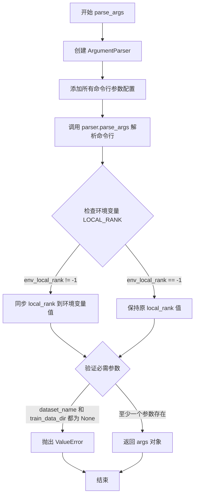

```mermaid
flowchart TD
    A[main函数入口] --> B{检查wandb与hub_token冲突}
    B -->|冲突| C[抛出ValueError]
    B -->|正常| D[创建logging_dir和ProjectConfiguration]
    D --> E[初始化Accelerator]
    E --> F{检查MPS后端}
    F -->|MPS可用| G[禁用native_amp]
    F -->|不可用| H[继续]
    G --> H
    H --> I[检查logger可用性]
    I --> J[注册save/load_model_hook]
    J --> K[配置logging]
    K --> L{创建output_dir和hub仓库}
    L --> M[初始化UNet2DModel]
    M --> N{启用EMA}
    N -->|是| O[创建EMAModel]
    N -->|否| P[跳过EMA]
    O --> P
    P --> Q{启用xformers}
    Q -->|是| R[启用高效注意力]
    Q -->|否| S[继续]
    R --> S
    S --> T[初始化DDPMScheduler]
    T --> U[创建AdamW优化器]
    U --> V[包装ORT_FP16_Optimizer]
    V --> W[加载数据集]
    W --> X[创建数据增强管道]
    X --> Y[创建DataLoader]
    Y --> Z[创建lr_scheduler]
    Z --> AA[使用accelerator.prepare]
    AA --> AB{启用EMA}
    AB -->|是| AC[移动EMA到设备]
    AB -->|否| AD[跳过]
    AC --> AD
    AD --> AE[初始化trackers]
    AE --> AF[包装ORTModule]
    AF --> AG[计算训练步数]
    AG --> AH{resume_from_checkpoint}
    AH -->|是| AI[加载checkpoint状态]
    AH -->|否| AJ[跳过]
    AI --> AJ
    AJ --> AK[外层循环: epoch]
    AK --> AL[遍历train_dataloader]
    AL --> AM{跳过resume的step}
    AM -->|跳过| AN[继续下一轮]
    AM -->|继续| AO[采样noise和timestep]
    AO --> AP[添加噪声到clean_images]
    AP --> AQ[accumulate model]
    AQ --> AR[前向传播得到model_output]
    AR --> AS{计算loss}
    AS -->|epsilon| AT[mse_loss预测噪声与真实噪声]
    AS -->|sample| AU[基于SNR权重计算loss]
    AT --> AV[accelerator.backward]
    AV --> AW[clip_grad_norm]
    AW --> AX[optimizer.step]
    AX --> AY[lr_scheduler.step]
    AY --> AZ[optimizer.zero_grad]
    AZ --> BA{检查sync_gradients}
    BA -->|是| BB[EMA更新]
    BA -->|否| BC[跳过EMA]
    BB --> BD[更新progress_bar]
    BD --> BE[checkpoint保存检查]
    BE --> BF[记录logs]
    BF --> BG[关闭progress_bar]
    BG --> BH{等待所有进程}
    BH --> BI[生成样本图像]
    BI --> BJ{保存图像条件满足}
    BJ -->|是| BK[unwrap_model生成pipeline]
    BJ -->|否| BL[跳过]
    BK --> BM[生成并保存图像]
    BM --> BL
    BL --> BN{保存模型条件满足}
    BN -->|是| BO[保存模型和EMA]
    BN -->|否| BP[继续]
    BO --> BP
    BP --> BQ{push_to_hub}
    BQ -->|是| BR[上传到Hub]
    BQ -->|否| BS[结束训练]
    BR --> BS
    BS --> BT[accelerator.end_training]
```

# `diffusers\examples\research_projects\onnxruntime\unconditional_image_generation\train_unconditional.py` 详细设计文档

这是一个使用Hugging Face diffusers库实现的Denoising Diffusion Probabilistic Model (DDPM) 训练脚本，支持分布式训练、混合精度、EMA、xformers优化、多种日志记录器和模型checkpoint管理，可用于无条件图像生成任务的模型训练。

## 整体流程

```mermaid
graph TD
    A[开始] --> B[parse_args 解析命令行参数]
    B --> C[main 函数入口]
    C --> D[验证参数合法性]
    C --> E[创建 Accelerator 加速器]
    C --> F[配置日志记录器 tensorboard/wandb]
    C --> G[注册自定义模型保存/加载钩子]
    H[初始化模型] --> I{model_config_name_or_path是否存在?}
    I -- 是 --> J[从配置文件加载 UNet2DModel]
    I -- 否 --> K[创建默认 UNet2DModel]
    J --> L[创建 EMA 模型(可选)]
    K --> L
    L --> M[启用 xformers 注意力(可选)]
    M --> N[初始化 DDPMScheduler 噪声调度器]
    N --> O[创建 AdamW 优化器]
    O --> P[加载数据集]
    P --> Q[创建数据增强 pipeline]
    Q --> R[创建 DataLoader]
    R --> S[创建学习率调度器]
    S --> T[使用 Accelerator.prepare 准备所有组件]
    T --> U[初始化训练 trackers]
    U --> V[加载 checkpoint(可选)]
    V --> W[进入训练循环]
    W --> X{是否完成所有 epoch?}
    X -- 否 --> Y[遍历每个 batch]
    Y --> Z[添加噪声到图像]
    Z --> AA[前向传播预测噪声]
    AA --> AB[计算 MSE 损失]
    AB --> AC[反向传播并更新参数]
    AC --> AD{是否需要同步梯度?}
    AD -- 是 --> AE[更新 EMA 模型]
    AD -- 是 --> AF[保存 checkpoint]
    AD -- 是 --> AG[生成样本图像]
    AE --> AH[更新进度条并记录日志]
    AF --> AH
    AG --> AH
    AH --> W
    X -- 是 --> AI[accelerator.end_training 结束训练]
```

## 类结构

```
此脚本为脚本文件(非面向对象), 主要结构为函数组织:
├── 全局函数
│   ├── _extract_into_tensor (辅助函数)
│   ├── parse_args (参数解析)
│   └── main (主训练函数)
└── 数据处理函数
    └── transform_images (数据集转换)
```

## 全局变量及字段


### `logger`
    
Accelerate日志记录器，用于输出训练过程中的调试和状态信息

类型：`accelerate.logging.get_logger`
    


### `args`
    
命令行参数解析结果，包含所有训练配置如数据集路径、模型参数、优化器设置等

类型：`argparse.Namespace`
    


    

## 全局函数及方法


### `_extract_into_tensor`

从1-D数组（numpy数组或PyTorch张量）中根据批次索引提取值，并将其广播到指定的形状。

参数：

- `arr`：输入数据，可以是 numpy.ndarray 或 torch.Tensor，1-D 数组，待提取值的数组
- `timesteps`：torch.Tensor，一维张量，包含要提取的索引（批次索引）
- `broadcast_shape`：tuple(int, ...)，目标广播形状，K维形状，批次维度等于 timesteps 的长度

返回值：`torch.Tensor`，形状为 [batch_size, 1, ...]（K维）的张量

#### 流程图

```mermaid
flowchart TD
    A[开始: _extract_into_tensor] --> B{arr 是否为 torch.Tensor?}
    B -->|否| C[将 arr 转换为 torch.Tensor]
    B -->|是| D[直接使用 arr]
    C --> E[使用 timesteps 索引 arr]
    D --> E
    E --> F[转换为 float 类型并移动到 timesteps 设备]
    F --> G{res 的维度数量是否小于 broadcast_shape 的维度数量?}
    G -->|是| H[在末尾添加新维度: res[..., None]]
    H --> G
    G -->|否| I[扩展 res 到 broadcast_shape]
    I --> J[返回结果张量]
```

#### 带注释源码

```python
def _extract_into_tensor(arr, timesteps, broadcast_shape):
    """
    Extract values from a 1-D numpy array for a batch of indices.

    :param arr: the 1-D numpy array.
    :param timesteps: a tensor of indices into the array to extract.
    :param broadcast_shape: a larger shape of K dimensions with the batch
                            dimension equal to the length of timesteps.
    :return: a tensor of shape [batch_size, 1, ...] where the shape has K dims.
    """
    # 如果输入不是 PyTorch 张量，则转换为 PyTorch 张量
    if not isinstance(arr, torch.Tensor):
        arr = torch.from_numpy(arr)
    
    # 使用 timesteps 索引从 arr 中提取对应位置的值，并转换为 float 类型
    # 然后将结果移动到与 timesteps 相同的设备上（CPU 或 GPU）
    res = arr[timesteps].float().to(timesteps.device)
    
    # 如果结果的维度少于目标 broadcast_shape 的维度，
    # 则在末尾添加大小为 1 的维度（用于后续广播）
    while len(res.shape) < len(broadcast_shape):
        res = res[..., None]
    
    # 将结果扩展到目标 broadcast_shape
    # expand 操作不会复制数据，只是一种视图
    return res.expand(broadcast_shape)
```


### `parse_args`

该函数是命令行参数解析器，用于定义和获取训练脚本的所有配置参数，包括数据集路径、模型配置、训练超参数、优化器设置、日志记录选项等，并进行基本的参数验证。

参数：

- 该函数无显式输入参数（参数通过 `argparse` 从命令行自动获取）

返回值：`argparse.Namespace`，包含所有命令行参数的对象，用于在后续代码中通过 `args.xxx` 访问具体参数值。

#### 流程图



#### 带注释源码

```python
def parse_args():
    """
    解析命令行参数并返回配置对象。
    
    该函数使用 argparse 定义了训练脚本的所有可配置参数，
    包括数据、模型、训练过程、优化器、分布式训练等各种配置选项。
    """
    # 创建 ArgumentParser 实例，设置脚本描述
    parser = argparse.ArgumentParser(description="Simple example of a training script.")
    
    # ==================== 数据集相关参数 ====================
    # 数据集名称（支持 HuggingFace Hub 或本地路径）
    parser.add_argument(
        "--dataset_name",
        type=str,
        default=None,
        help=(
            "The name of the Dataset (from the HuggingFace hub) to train on (could be your own, possibly private,"
            " dataset). It can also be a path pointing to a local copy of a dataset in your filesystem,"
            " or to a folder containing files that HF Datasets can understand."
        ),
    )
    # 数据集配置名称
    parser.add_argument(
        "--dataset_config_name",
        type=str,
        default=None,
        help="The config of the Dataset, leave as None if there's only one config.",
    )
    # 训练数据本地目录
    parser.add_argument(
        "--train_data_dir",
        type=str,
        default=None,
        help=(
            "A folder containing the training data. Folder contents must follow the structure described in"
            " https://huggingface.co/docs/datasets/image_dataset#imagefolder. In particular, a `metadata.jsonl` file"
            " must exist to provide the captions for the images. Ignored if `dataset_name` is specified."
        ),
    )
    
    # ==================== 模型相关参数 ====================
    # UNet 模型配置文件路径
    parser.add_argument(
        "--model_config_name_or_path",
        type=str,
        default=None,
        help="The config of the UNet model to train, leave as None to use standard DDPM configuration.",
    )
    
    # ==================== 输出相关参数 ====================
    # 输出目录
    parser.add_argument(
        "--output_dir",
        type=str,
        default="ddpm-model-64",
        help="The output directory where the model predictions and checkpoints will be written.",
    )
    # 是否覆盖已有输出目录
    parser.add_argument("--overwrite_output_dir", action="store_true")
    # 缓存目录
    parser.add_argument(
        "--cache_dir",
        type=str,
        default=None,
        help="The directory where the downloaded models and datasets will be stored.",
    )
    
    # ==================== 图像预处理参数 ====================
    # 输入图像分辨率
    parser.add_argument(
        "--resolution",
        type=int,
        default=64,
        help=(
            "The resolution for input images, all the images in the train/validation dataset will be resized to this"
            " resolution"
        ),
    )
    # 是否中心裁剪
    parser.add_argument(
        "--center_crop",
        default=False,
        action="store_true",
        help=(
            "Whether to center crop the input images to the resolution. If not set, the images will be randomly"
            " cropped. The images will be resized to the resolution first before cropping."
        ),
    )
    # 是否随机水平翻转
    parser.add_argument(
        "--random_flip",
        default=False,
        action="store_true",
        help="whether to randomly flip images horizontally",
    )
    
    # ==================== 训练批次参数 ====================
    # 训练批次大小
    parser.add_argument(
        "--train_batch_size", type=int, default=16, help="Batch size (per device) for the training dataloader."
    )
    # 评估批次大小
    parser.add_argument(
        "--eval_batch_size", type=int, default=16, help="The number of images to generate for evaluation."
    )
    # DataLoader 工作进程数
    parser.add_argument(
        "--dataloader_num_workers",
        type=int,
        default=0,
        help=(
            "The number of subprocesses to use for data loading. 0 means that the data will be loaded in the main"
            " process."
        ),
    )
    
    # ==================== 训练轮次参数 ====================
    # 训练轮次数量
    parser.add_argument("--num_epochs", type=int, default=100)
    # 保存图像的轮次间隔
    parser.add_argument("--save_images_epochs", type=int, default=10, help="How often to save images during training.")
    # 保存模型的轮次间隔
    parser.add_argument(
        "--save_model_epochs", type=int, default=10, help="How often to save the model during training."
    )
    # 梯度累积步数
    parser.add_argument(
        "--gradient_accumulation_steps",
        type=int,
        default=1,
        help="Number of updates steps to accumulate before performing a backward/update pass.",
    )
    
    # ==================== 学习率调度器参数 ====================
    # 初始学习率
    parser.add_argument(
        "--learning_rate",
        type=float,
        default=1e-4,
        help="Initial learning rate (after the potential warmup period) to use.",
    )
    # 学习率调度器类型
    parser.add_argument(
        "--lr_scheduler",
        type=str,
        default="cosine",
        help=(
            'The scheduler type to use. Choose between ["linear", "cosine", "cosine_with_restarts", "polynomial",'
            ' "constant", "constant_with_warmup"]'
        ),
    )
    # 学习率预热步数
    parser.add_argument(
        "--lr_warmup_steps", type=int, default=500, help="Number of steps for the warmup in the lr scheduler."
    )
    
    # ==================== Adam 优化器参数 ====================
    # Adam beta1 参数
    parser.add_argument("--adam_beta1", type=float, default=0.95, help="The beta1 parameter for the Adam optimizer.")
    # Adam beta2 参数
    parser.add_argument("--adam_beta2", type=float, default=0.999, help="The beta2 parameter for the Adam optimizer.")
    # Adam 权重衰减
    parser.add_argument(
        "--adam_weight_decay", type=float, default=1e-6, help="Weight decay magnitude for the Adam optimizer."
    )
    # Adam epsilon 值
    parser.add_argument("--adam_epsilon", type=float, default=1e-08, help="Epsilon value for the Adam optimizer.")
    
    # ==================== EMA (指数移动平均) 参数 ====================
    # 是否使用 EMA
    parser.add_argument(
        "--use_ema",
        action="store_true",
        help="Whether to use Exponential Moving Average for the final model weights.",
    )
    # EMA 逆 gamma 值
    parser.add_argument("--ema_inv_gamma", type=float, default=1.0, help="The inverse gamma value for the EMA decay.")
    # EMA 幂值
    parser.add_argument("--ema_power", type=float, default=3 / 4, help="The power value for the EMA decay.")
    # EMA 最大衰减
    parser.add_argument("--ema_max_decay", type=float, default=0.9999, help="The maximum decay magnitude for EMA.")
    
    # ==================== Hub 推送参数 ====================
    # 是否推送到 Hub
    parser.add_argument("--push_to_hub", action="store_true", help="Whether or not to push the model to the Hub.")
    # Hub 令牌
    parser.add_argument("--hub_token", type=str, default=None, help="The token to use to push to the Model Hub.")
    # Hub 模型 ID
    parser.add_argument(
        "--hub_model_id",
        type=str,
        default=None,
        help="The name of the repository to keep in sync with the local `output_dir`.",
    )
    # 是否创建私有仓库
    parser.add_argument(
        "--hub_private_repo", action="store_true", help="Whether or not to create a private repository."
    )
    
    # ==================== 日志记录参数 ====================
    # 日志记录器类型
    parser.add_argument(
        "--logger",
        type=str,
        default="tensorboard",
        choices=["tensorboard", "wandb"],
        help=(
            "Whether to use [tensorboard](https://www.tensorflow.org/tensorboard) or [wandb](https://www.wandb.ai)"
            " for experiment tracking and logging of model metrics and model checkpoints"
        ),
    )
    # 日志目录
    parser.add_argument(
        "--logging_dir",
        type=str,
        default="logs",
        help=(
            "[TensorBoard](https://www.tensorflow.org/tensorboard) log directory. Will default to"
            " *output_dir/runs/**CURRENT_DATETIME_HOSTNAME***."
        ),
    )
    
    # ==================== 分布式训练参数 ====================
    # 本地 rank（用于分布式训练）
    parser.add_argument("--local_rank", type=int, default=-1, help="For distributed training: local_rank")
    
    # ==================== 混合精度训练参数 ====================
    # 混合精度类型
    parser.add_argument(
        "--mixed_precision",
        type=str,
        default="no",
        choices=["no", "fp16", "bf16"],
        help=(
            "Whether to use mixed precision. Choose"
            "between fp16 and bf16 (bfloat16). Bf16 requires PyTorch >= 1.10."
            "and an Nvidia Ampere GPU."
        ),
    )
    
    # ==================== DDPM 调度器参数 ====================
    # 预测类型
    parser.add_argument(
        "--prediction_type",
        type=str,
        default="epsilon",
        choices=["epsilon", "sample"],
        help="Whether the model should predict the 'epsilon'/noise error or directly the reconstructed image 'x0'.",
    )
    # DDPM 训练步数
    parser.add_argument("--ddpm_num_steps", type=int, default=1000)
    # DDPM 推理步数
    parser.add_argument("--ddpm_num_inference_steps", type=int, default=1000)
    # DDPM beta 调度方式
    parser.add_argument("--ddpm_beta_schedule", type=str, default="linear")
    
    # ==================== 检查点参数 ====================
    # 检查点保存步数间隔
    parser.add_argument(
        "--checkpointing_steps",
        type=int,
        default=500,
        help=(
            "Save a checkpoint of the training state every X updates. These checkpoints are only suitable for resuming"
            " training using `--resume_from_checkpoint`."
        ),
    )
    # 检查点总数限制
    parser.add_argument(
        "--checkpoints_total_limit",
        type=int,
        default=None,
        help=(
            "Max number of checkpoints to store. Passed as `total_limit` to the `Accelerator` `ProjectConfiguration`."
            " See Accelerator::save_state https://huggingface.co/docs/accelerate/package_reference/accelerator#accelerate.Accelerator.save_state"
            " for more docs"
        ),
    )
    # 从检查点恢复训练
    parser.add_argument(
        "--resume_from_checkpoint",
        type=str,
        default=None,
        help=(
            "Whether training should be resumed from a previous checkpoint. Use a path saved by"
            ' `--checkpointing_steps`, or `"latest"` to automatically select the last available checkpoint.'
        ),
    )
    
    # ==================== xFormers 优化参数 ====================
    # 是否启用 xFormers 内存高效注意力
    parser.add_argument(
        "--enable_xformers_memory_efficient_attention", action="store_true", help="Whether or not to use xformers."
    )
    
    # ==================== 解析参数 ====================
    # 解析命令行参数
    args = parser.parse_args()
    
    # ==================== 环境变量同步 ====================
    # 检查环境变量 LOCAL_RANK 并同步到 args.local_rank
    env_local_rank = int(os.environ.get("LOCAL_RANK", -1))
    if env_local_rank != -1 and env_local_rank != args.local_rank:
        args.local_rank = env_local_rank
    
    # ==================== 参数验证 ====================
    # 确保至少提供了数据集名称或训练数据目录之一
    if args.dataset_name is None and args.train_data_dir is None:
        raise ValueError("You must specify either a dataset name from the hub or a train data directory.")
    
    # 返回解析后的参数对象
    return args
```


### `main`

该函数是DDPM（去噪扩散概率模型）训练脚本的核心入口，负责初始化分布式训练环境、加载数据集和模型、配置优化器和学习率调度器、执行完整的训练循环（包括前向传播、反向传播、参数更新、EMA更新、检查点保存、样本图像生成和模型保存），并在训练完成后结束分布式训练。

参数：

- `args`：Namespace，来自`parse_args()`的命令行参数集合，包含数据集配置、模型配置、训练超参数、日志配置等所有训练参数

返回值：`None`，该函数执行完整的训练流程，不返回任何值

#### 流程图



#### 带注释源码

```python
def main(args):
    """
    主训练函数，执行完整的DDPM模型训练流程
    
    参数:
        args: Namespace对象，包含所有命令行参数
    """
    # 1. 检查wandb与hub_token的安全冲突
    if args.report_to == "wandb" and args.hub_token is not None:
        raise ValueError(
            "You cannot use both --report_to=wandb and --hub_token due to a security risk of exposing your token."
            " Please use `hf auth login` to authenticate with the Hub."
        )

    # 2. 配置logging目录和Accelerator项目配置
    logging_dir = os.path.join(args.output_dir, args.logging_dir)
    accelerator_project_config = ProjectConfiguration(
        total_limit=args.checkpoints_total_limit, project_dir=args.output_dir, logging_dir=logging_dir
    )

    # 3. 初始化 Accelerator，支持分布式训练、混合精度、梯度累积
    accelerator = Accelerator(
        gradient_accumulation_steps=args.gradient_accumulation_steps,
        mixed_precision=args.mixed_precision,
        log_with=args.report_to,
        project_config=accelerator_project_config,
    )

    # 4. 针对MPS后端禁用AMP混合精度
    if torch.backends.mps.is_available():
        accelerator.native_amp = False

    # 5. 检查日志工具可用性
    if args.logger == "tensorboard":
        if not is_tensorboard_available():
            raise ImportError("Make sure to install tensorboard if you want to use it for logging during training.")
    elif args.logger == "wandb":
        if not is_wandb_available():
            raise ImportError("Make sure to install wandb if you want to use it for logging during training.")
        import wandb

    # 6. 注册自定义模型保存/加载钩子（accelerate 0.16.0+）
    if version.parse(accelerate.__version__) >= version.parse("0.16.0"):
        def save_model_hook(models, weights, output_dir):
            """保存模型时的钩子函数"""
            if accelerator.is_main_process:
                if args.use_ema:
                    ema_model.save_pretrained(os.path.join(output_dir, "unet_ema"))
                for i, model in enumerate(models):
                    model.save_pretrained(os.path.join(output_dir, "unet"))
                    weights.pop()  # 避免重复保存

        def load_model_hook(models, input_dir):
            """加载模型时的钩子函数"""
            if args.use_ema:
                load_model = EMAModel.from_pretrained(os.path.join(input_dir, "unet_ema"), UNet2DModel)
                ema_model.load_state_dict(load_model.state_dict())
                ema_model.to(accelerator.device)
                del load_model
            for i in range(len(models)):
                model = models.pop()
                load_model = UNet2DModel.from_pretrained(input_dir, subfolder="unet")
                model.register_to_config(**load_model.config)
                model.load_state_dict(load_model.state_dict())
                del load_model

        accelerator.register_save_state_pre_hook(save_model_hook)
        accelerator.register_load_state_pre_hook(load_model_hook)

    # 7. 配置日志格式
    logging.basicConfig(
        format="%(asctime)s - %(levelname)s - %(name)s - %(message)s",
        datefmt="%m/%d/%Y %H:%M:%S",
        level=logging.INFO,
    )
    logger.info(accelerator.state, main_process_only=False)
    # 根据进程类型设置日志级别
    if accelerator.is_local_main_process:
        datasets.utils.logging.set_verbosity_warning()
        diffusers.utils.logging.set_verbosity_info()
    else:
        datasets.utils.logging.set_verbosity_error()
        diffusers.utils.logging.set_verbosity_error()

    # 8. 创建输出目录和Hub仓库
    if accelerator.is_main_process:
        if args.output_dir is not None:
            os.makedirs(args.output_dir, exist_ok=True)
        if args.push_to_hub:
            repo_id = create_repo(
                repo_id=args.hub_model_id or Path(args.output_dir).name, exist_ok=True, token=args.hub_token
            ).repo_id

    # 9. 初始化UNet2DModel模型
    if args.model_config_name_or_path is None:
        model = UNet2DModel(
            sample_size=args.resolution,
            in_channels=3,
            out_channels=3,
            layers_per_block=2,
            block_out_channels=(128, 128, 256, 256, 512, 512),
            down_block_types=(
                "DownBlock2D", "DownBlock2D", "DownBlock2D", "DownBlock2D", "AttnDownBlock2D", "DownBlock2D"
            ),
            up_block_types=(
                "UpBlock2D", "AttnUpBlock2D", "UpBlock2D", "UpBlock2D", "UpBlock2D", "UpBlock2D"
            ),
        )
    else:
        config = UNet2DModel.load_config(args.model_config_name_or_path)
        model = UNet2DModel.from_config(config)

    # 10. 创建EMA模型
    if args.use_ema:
        ema_model = EMAModel(
            model.parameters(),
            decay=args.ema_max_decay,
            use_ema_warmup=True,
            inv_gamma=args.ema_inv_gamma,
            power=args.ema_power,
            model_cls=UNet2DModel,
            model_config=model.config,
        )

    # 11. 启用xformers高效注意力
    if args.enable_xformers_memory_efficient_attention:
        if is_xformers_available():
            import xformers
            xformers_version = version.parse(xformers.__version__)
            if xformers_version == version.parse("0.0.16"):
                logger.warning("xFormers 0.0.16 cannot be used for training in some GPUs...")
            model.enable_xformers_memory_efficient_attention()
        else:
            raise ValueError("xformers is not available.")

    # 12. 初始化DDPMScheduler
    accepts_prediction_type = "prediction_type" in set(inspect.signature(DDPMScheduler.__init__).parameters.keys())
    if accepts_prediction_type:
        noise_scheduler = DDPMScheduler(
            num_train_timesteps=args.ddpm_num_steps,
            beta_schedule=args.ddpm_beta_schedule,
            prediction_type=args.prediction_type,
        )
    else:
        noise_scheduler = DDPMScheduler(num_train_timesteps=args.ddpm_num_steps, beta_schedule=args.ddpm_beta_schedule)

    # 13. 初始化AdamW优化器并包装ORT_FP16_Optimizer
    optimizer = torch.optim.AdamW(
        model.parameters(),
        lr=args.learning_rate,
        betas=(args.adam_beta1, args.adam_beta2),
        weight_decay=args.adam_weight_decay,
        eps=args.adam_epsilon,
    )
    optimizer = ORT_FP16_Optimizer(optimizer)

    # 14. 加载数据集
    if args.dataset_name is not None:
        dataset = load_dataset(
            args.dataset_name,
            args.dataset_config_name,
            cache_dir=args.cache_dir,
            split="train",
        )
    else:
        dataset = load_dataset("imagefolder", data_dir=args.train_data_dir, cache_dir=args.cache_dir, split="train")

    # 15. 创建数据增强管道
    augmentations = transforms.Compose([
        transforms.Resize(args.resolution, interpolation=transforms.InterpolationMode.BILINEAR),
        transforms.CenterCrop(args.resolution) if args.center_crop else transforms.RandomCrop(args.resolution),
        transforms.RandomHorizontalFlip() if args.random_flip else transforms.Lambda(lambda x: x),
        transforms.ToTensor(),
        transforms.Normalize([0.5], [0.5]),
    ])

    def transform_images(examples):
        """数据预处理函数"""
        images = [augmentations(image.convert("RGB")) for image in examples["image"]]
        return {"input": images}

    logger.info(f"Dataset size: {len(dataset)}")
    dataset.set_transform(transform_images)
    
    # 16. 创建DataLoader
    train_dataloader = torch.utils.data.DataLoader(
        dataset, batch_size=args.train_batch_size, shuffle=True, num_workers=args.dataloader_num_workers
    )

    # 17. 创建学习率调度器
    lr_scheduler = get_scheduler(
        args.lr_scheduler,
        optimizer=optimizer,
        num_warmup_steps=args.lr_warmup_steps * args.gradient_accumulation_steps,
        num_training_steps=(len(train_dataloader) * args.num_epochs),
    )

    # 18. 使用accelerator准备所有组件
    model, optimizer, train_dataloader, lr_scheduler = accelerator.prepare(
        model, optimizer, train_dataloader, lr_scheduler
    )

    # 19. 移动EMA模型到设备
    if args.use_ema:
        ema_model.to(accelerator.device)

    # 20. 初始化trackers
    if accelerator.is_main_process:
        run = os.path.split(__file__)[-1].split(".")[0]
        accelerator.init_trackers(run)

    # 21. 包装ORTModule用于ONNX优化
    model = ORTModule(model)

    # 22. 计算训练参数
    total_batch_size = args.train_batch_size * accelerator.num_processes * args.gradient_accumulation_steps
    num_update_steps_per_epoch = math.ceil(len(train_dataloader) / args.gradient_accumulation_steps)
    max_train_steps = args.num_epochs * num_update_steps_per_epoch

    logger.info("***** Running training *****")
    logger.info(f"  Num examples = {len(dataset)}")
    logger.info(f"  Num Epochs = {args.num_epochs}")
    logger.info(f"  Instantaneous batch size per device = {args.train_batch_size}")
    logger.info(f"  Total train batch size (w. parallel, distributed & accumulation) = {total_batch_size}")
    logger.info(f"  Gradient Accumulation steps = {args.gradient_accumulation_steps}")
    logger.info(f"  Total optimization steps = {max_train_steps}")

    global_step = 0
    first_epoch = 0

    # 23. 从checkpoint恢复训练
    if args.resume_from_checkpoint:
        if args.resume_from_checkpoint != "latest":
            path = os.path.basename(args.resume_from_checkpoint)
        else:
            dirs = os.listdir(args.output_dir)
            dirs = [d for d in dirs if d.startswith("checkpoint")]
            dirs = sorted(dirs, key=lambda x: int(x.split("-")[1]))
            path = dirs[-1] if len(dirs) > 0 else None

        if path is None:
            accelerator.print(f"Checkpoint '{args.resume_from_checkpoint}' does not exist. Starting a new training run.")
            args.resume_from_checkpoint = None
        else:
            accelerator.print(f"Resuming from checkpoint {path}")
            accelerator.load_state(os.path.join(args.output_dir, path))
            global_step = int(path.split("-")[1])
            resume_global_step = global_step * args.gradient_accumulation_steps
            first_epoch = global_step // num_update_steps_per_epoch
            resume_step = resume_global_step % (num_update_steps_per_epoch * args.gradient_accumulation_steps)

    # 24. 训练循环
    for epoch in range(first_epoch, args.num_epochs):
        model.train()
        progress_bar = tqdm(total=num_update_steps_per_epoch, disable=not accelerator.is_local_main_process)
        progress_bar.set_description(f"Epoch {epoch}")
        
        for step, batch in enumerate(train_dataloader):
            # 跳过已完成的steps
            if args.resume_from_checkpoint and epoch == first_epoch and step < resume_step:
                if step % args.gradient_accumulation_steps == 0:
                    progress_bar.update(1)
                continue

            # 获取clean images并添加噪声
            clean_images = batch["input"]
            noise = torch.randn(
                clean_images.shape, 
                dtype=(torch.float32 if args.mixed_precision == "no" else torch.float16)
            ).to(clean_images.device)
            bsz = clean_images.shape[0]
            
            # 随机采样timestep
            timesteps = torch.randint(
                0, noise_scheduler.config.num_train_timesteps, (bsz,), device=clean_images.device
            ).long()

            # 前向扩散过程
            noisy_images = noise_scheduler.add_noise(clean_images, noise, timesteps)

            # 梯度累积
            with accelerator.accumulate(model):
                # 预测噪声残差
                model_output = model(noisy_images, timesteps, return_dict=False)[0]

                # 计算loss
                if args.prediction_type == "epsilon":
                    loss = F.mse_loss(model_output, noise)
                elif args.prediction_type == "sample":
                    alpha_t = _extract_into_tensor(
                        noise_scheduler.alphas_cumprod, timesteps, (clean_images.shape[0], 1, 1, 1)
                    )
                    snr_weights = alpha_t / (1 - alpha_t)
                    loss = snr_weights * F.mse_loss(model_output, clean_images, reduction="none")
                    loss = loss.mean()
                else:
                    raise ValueError(f"Unsupported prediction type: {args.prediction_type}")

                # 反向传播
                accelerator.backward(loss)

                # 梯度裁剪
                if accelerator.sync_gradients:
                    accelerator.clip_grad_norm_(model.parameters(), 1.0)
                
                # 参数更新
                optimizer.step()
                lr_scheduler.step()
                optimizer.zero_grad()

            # 同步后的操作
            if accelerator.sync_gradients:
                if args.use_ema:
                    ema_model.step(model.parameters())
                progress_bar.update(1)
                global_step += 1

                # 检查点保存
                if global_step % args.checkpointing_steps == 0:
                    if accelerator.is_main_process:
                        save_path = os.path.join(args.output_dir, f"checkpoint-{global_step}")
                        accelerator.save_state(save_path)
                        logger.info(f"Saved state to {save_path}")

            # 记录日志
            logs = {"loss": loss.detach().item(), "lr": lr_scheduler.get_last_lr()[0], "step": global_step}
            if args.use_ema:
                logs["ema_decay"] = ema_model.cur_decay_value
            progress_bar.set_postfix(**logs)
            accelerator.log(logs, step=global_step)
        
        progress_bar.close()
        accelerator.wait_for_everyone()

        # 25. 生成样本图像
        if accelerator.is_main_process:
            if epoch % args.save_images_epochs == 0 or epoch == args.num_epochs - 1:
                unet = accelerator.unwrap_model(model)
                if args.use_ema:
                    ema_model.store(unet.parameters())
                    ema_model.copy_to(unet.parameters())

                pipeline = DDPMPipeline(unet=unet, scheduler=noise_scheduler)
                generator = torch.Generator(device=pipeline.device).manual_seed(0)
                images = pipeline(
                    generator=generator,
                    batch_size=args.eval_batch_size,
                    num_inference_steps=args.ddpm_num_inference_steps,
                    output_type="np",
                ).images

                if args.use_ema:
                    ema_model.restore(unet.parameters())

                # 保存到tensorboard或wandb
                images_processed = (images * 255).round().astype("uint8")
                if args.logger == "tensorboard":
                    tracker = accelerator.get_tracker("tensorboard", unwrap=True)
                    tracker.add_images("test_samples", images_processed.transpose(0, 3, 1, 2), epoch)
                elif args.logger == "wandb":
                    accelerator.get_tracker("wandb").log(
                        {"test_samples": [wandb.Image(img) for img in images_processed], "epoch": epoch},
                        step=global_step,
                    )

            # 26. 保存模型
            if epoch % args.save_model_epochs == 0 or epoch == args.num_epochs - 1:
                unet = accelerator.unwrap_model(model)
                if args.use_ema:
                    ema_model.store(unet.parameters())
                    ema_model.copy_to(unet.parameters())

                pipeline = DDPMPipeline(unet=unet, scheduler=noise_scheduler)
                pipeline.save_pretrained(args.output_dir)

                if args.use_ema:
                    ema_model.restore(unet.parameters())

                # 上传到Hub
                if args.push_to_hub:
                    upload_folder(
                        repo_id=repo_id,
                        folder_path=args.output_dir,
                        commit_message=f"Epoch {epoch}",
                        ignore_patterns=["step_*", "epoch_*"],
                    )

    # 27. 结束训练
    accelerator.end_training()
```


### `transform_images`

该函数是 HuggingFace 数据集转换函数，用于在训练时对图像批次进行在线数据增强和预处理。它接收数据集中的一批图像，应用一系列变换（包括调整大小、裁剪、翻转、归一化），并将处理后的图像返回为模型输入格式。

参数：

- `examples`：`Dict`（字典类型），HuggingFace 数据集提供的批次数据，包含 `"image"` 键，其值为图像列表

返回值：`Dict`，返回包含 `"input"` 键的字典，值为变换后的图像列表（Tensor 格式）

#### 流程图

```mermaid
flowchart TD
    A[开始: 接收 examples 批次] --> B[从 examples 提取 'image' 列表]
    B --> C{遍历图像列表}
    C -->|每次迭代| D[将图像转换为 RGB 模式]
    D --> E[应用 augmentations 变换管道]
    E --> F[变换包括: Resize → Crop → Flip → ToTensor → Normalize]
    F --> G[将变换后的图像添加到结果列表]
    C -->|遍历完成| H[返回 {'input': 图像列表}]
    H --> I[结束]
    
    style A fill:#e1f5fe
    style H fill:#e8f5e8
    style I fill:#e8f5e8
```

#### 带注释源码

```python
def transform_images(examples):
    """
    对数据集中的图像批次进行转换处理。
    
    该函数作为 HuggingFace datasets 的 transform 函数，
    在访问数据集时动态应用图像预处理和数据增强。
    
    参数:
        examples: 包含 'image' 键的字典，代表数据集中的一批次图像
        
    返回:
        包含 'input' 键的字典，值为处理后的图像张量列表
    """
    # 遍历批次中的所有图像，对每张图像进行增强处理
    # augmentations 包含: Resize → CenterCrop/RandomCrop → RandomHorizontalFlip → ToTensor → Normalize
    images = [augmentations(image.convert("RGB")) for image in examples["image"]]
    
    # 返回符合训练数据格式的字典
    return {"input": images}
```

#### 上下文依赖说明

| 依赖项 | 类型 | 描述 |
|--------|------|------|
| `augmentations` | `torchvision.transforms.Compose` | 图像变换管道，包含 Resize、CenterCrop/RandomCrop、RandomHorizontalFlip、ToTensor、Normalize |
| `args.resolution` | `int` | 目标图像分辨率（默认 64） |
| `args.center_crop` | `bool` | 是否使用中心裁剪 |
| `args.random_flip` | `bool` | 是否随机水平翻转 |
| `examples["image"]` | `List[PIL.Image]` | 原始图像列表 |

## 关键组件


### 张量索引与惰性加载

该组件负责从预计算的数组中批量提取张量值，并支持惰性加载以优化内存使用。核心函数`_extract_into_tensor`通过张量索引操作从1-D数组中批量提取值，同时通过数据转换和DataLoader实现数据集的惰性加载，避免一次性将所有数据加载到内存。

### 反量化支持

该组件负责将归一化的图像数据反量化回[0, 255]的uint8范围。在训练循环结束后的推理阶段，代码通过`images_processed = (images * 255).round().astype("uint8")`将[-1, 1]范围的归一化图像反量化回可用于显示和存储的整数格式。

### 量化策略

该组件实现了混合精度训练和ONNX Runtime优化。代码通过`mixed_precision`参数支持fp16和bf16量化训练，使用`ORT_FP16_Optimizer`封装PyTorch优化器以支持FP16优化，并通过`model = ORTModule(model)`将模型转换为ONNX Runtime格式以获得更好的推理性能。


## 问题及建议


### 已知问题

1.  **参数定义与使用不匹配**：在`parse_args()`函数中定义了`--logger`参数，但在`main()`函数第232行使用了`args.report_to`，该参数未在参数解析器中定义，会导致`AttributeError`运行时错误。
2.  **未使用的导入**：导入了`inspect`和`math`模块，但在代码中未直接使用（`inspect`仅在第258行用于检查签名，属于间接使用；`math`未使用）。
3.  **硬编码的随机种子**：在推理生成样本时使用了硬编码的随机种子`generator = torch.Generator(device=pipeline.device).manual_seed(0)`，这会导致每次运行生成的样本完全相同，不利于调试和多样性生成。
4.  **数据增强策略简单**：仅使用了基础的图像变换（Resize, Crop, Flip, Normalize），缺乏更高级的数据增强技术（如颜色抖动、随机擦除等），可能影响模型泛化能力。
5.  **缺乏验证集支持**：代码仅加载了训练集（`split="train"`），没有区分训练集和验证集，无法在训练过程中监控模型在验证集上的性能，容易导致过拟合。
6.  **模型保存逻辑冗余**：在保存检查点和模型时，存在重复的`unwrap_model`、`ema_model.store`、`ema_model.copy_to`、`ema_model.restore`逻辑，代码冗余且容易出错。
7.  **错误处理不足**：缺少对关键操作（如数据加载、模型初始化、分布式训练初始化）的异常捕获和详细错误提示，调试困难。
8.  **日志配置冗余**：同时使用了Python标准库`logging.basicConfig`和`accelerate`的`get_logger`，配置分散且可能冲突。

### 优化建议

1.  **修复参数定义**：在`parse_args()`中添加`--report_to`参数定义，或将`main()`中的`args.report_to`改为`args.logger`以匹配现有定义。
2.  **移除未使用导入**：清理未使用的`math`导入，保持代码整洁。
3.  **支持验证集**：添加`--validation_split`或类似参数，支持从数据集中划分验证集，并在训练循环中定期评估验证集损失。
4.  **提取保存/加载逻辑**：将`ema_model`的存储、复制和恢复逻辑封装成独立的辅助函数（如`save_with_ema`, `load_with_ema`），减少代码冗余。
5.  **添加随机种子管理**：创建一个`set_seed(seed)`函数统一管理所有随机种子（包括PyTorch、NumPy、Python random），并支持通过命令行参数配置。
6.  **增强数据增强**：引入`torchvision.transforms`中的更多增强方法，或使用`kornia`库进行更高级的数据增强，提升模型鲁棒性。
7.  **改进错误处理**：在关键步骤（数据加载、模型初始化、训练循环）添加`try-except`块，并记录详细的错误堆栈信息。
8.  **统一日志配置**：移除重复的`logging.basicConfig`，统一使用`accelerate`的日志系统，或明确两者的职责分工。

## 其它


### 设计目标与约束

本代码实现了一个完整的DDPM（Denoising Diffusion Probabilistic Model）扩散模型训练流程，旨在通过去噪过程学习图像生成能力。核心设计目标包括：支持分布式训练以加速大规模数据处理；集成EMA（指数移动平均）机制提升模型稳定性；支持混合精度训练降低显存占用；提供完善的检查点保存与恢复机制确保训练可续性；支持TensorBoard和WandB两种日志系统进行实验追踪。约束条件方面，代码要求PyTorch版本 >= 1.10以支持bf16混合精度，NVIDIA Ampere GPU用于bf16训练，xformers 0.0.17+用于高效注意力机制，且必须安装diffusers 0.17.0.dev0及以上版本。

### 错误处理与异常设计

代码采用多层级的错误处理机制。在参数解析阶段，通过`parse_args()`函数对关键参数进行校验：当同时指定`--dataset_name`和`--train_data_dir`时无限制（两者任选其一），但若两者都为None则抛出`ValueError("You must specify either a dataset name from the hub or a train data directory.")`。在依赖检查方面，TensorBoard和WandB的可用性通过`is_tensorboard_available()`和`is_wandb_available()`进行检测，缺失时抛出`ImportError`并提示安装。xformers库在启用但不可用时抛出`ValueError("xformers is not available. Make sure it is installed correctly")`。在恢复训练场景中，若指定检查点不存在，会打印警告信息并从初始状态开始训练而非崩溃。此外，代码对AMP在MPS设备上进行了特殊处理，自动禁用原生AMP以避免兼容性问题。

### 数据流与状态机

训练数据流遵循以下路径：首先通过`load_dataset`从HuggingFace Hub或本地目录加载原始数据集，然后使用`transforms.Compose`构建的增强流水线对图像进行预处理（Resize、CenterCrop/RandomCrop、RandomHorizontalFlip、ToTensor、Normalize），接着通过`dataset.set_transform`将转换函数注册到数据集，生成器在迭代时实时返回处理后的图像批次。模型训练状态机包含以下状态：初始化状态（模型、优化器、数据加载器、调度器创建）→ 准备状态（通过accelerator.prepare进行分布式训练准备）→ 恢复状态（可选，从检查点恢复global_step、first_epoch、resume_step）→ 训练循环状态（遍历每个epoch的每个batch）→ 检查点状态（每checkpointing_steps保存一次）→ 采样状态（每save_images_epochs生成样本图像）→ 保存状态（每save_model_epochs保存模型权重）→ 结束状态（调用accelerator.end_training）。

### 外部依赖与接口契约

本代码依赖以下核心外部库及其接口契约：accelerate库提供`Accelerator`类用于分布式训练管理，关键接口包括`prepare()`（准备模型和数据）、`backward()`（反向传播）、`clip_grad_norm_()`（梯度裁剪）、`save_state()`/`load_state()`（状态保存恢复）、`register_save_state_pre_hook()`（自定义保存钩子）；diffusers库提供`UNet2DModel`（UNet2D模型）、`DDPMScheduler`（扩散噪声调度器）、`DDPMPipeline`（推理管道）、`EMAModel`（指数移动平均）；datasets库提供`load_dataset()`用于数据集加载；torch库提供优化器、损失函数、数据加载器等基础组件；onnxruntime.training.optim.fp16_optimizer提供`ORT_FP16_Optimizer`用于ONNX Runtime的FP16优化；torchvision提供图像变换接口。所有库的版本兼容性通过`check_min_version`和`version.parse`进行显式检查。

### 配置管理

配置管理采用命令行参数与代码默认值相结合的方式。`parse_args()`函数定义了超过40个命令行参数，涵盖数据集配置（dataset_name、dataset_config_name、train_data_dir）、模型配置（model_config_name_or_path、resolution）、训练配置（train_batch_size、num_epochs、learning_rate、gradient_accumulation_steps）、优化器配置（adam_beta1/beta2、adam_weight_decay、adam_epsilon）、EMA配置（use_ema、ema_inv_gamma、ema_power、ema_max_decay）、保存配置（save_images_epochs、save_model_epochs、checkpointing_steps、checkpoints_total_limit）、日志配置（logger、logging_dir、report_to）、分布式配置（local_rank、mixed_precision）等。环境变量LOCAL_RANK用于覆盖命令行传入的local_rank参数，实现与环境的一致性。输出目录通过`os.makedirs`创建，exist_ok=True确保重复运行时不会报错。

### 资源管理

资源管理涵盖计算资源、内存资源和存储资源三个方面。计算资源方面，通过`accelerator`自动管理多GPU分布式训练，根据`mixed_precision`参数（no/fp16/bf16）选择合适的精度策略；内存资源方面，通过gradient_accumulation_steps实现小显存训练大模型，通过xformers的memory_efficient_attention减少注意力计算的显存占用，通过`accelerator.native_amp = False`处理MPS后端的AMP兼容性问题；存储资源方面，通过checkpoints_total_limit限制保存的检查点数量防止磁盘占满，通过ignore_patterns在推送Hub时排除临时文件。模型和EMA模型在必要时通过`.to(accelerator.device)`移动到正确设备，训练完成后通过`accelerator.end_training()`进行资源清理。

### 安全性考虑

代码在安全性方面进行了以下考量：hub_token参数处理存在安全风险检测，当同时使用`--report_to=wandb`和`--hub_token`时会抛出安全警告，建议使用`hf auth login`进行认证；在模型保存和加载过程中，通过`weights.pop()`确保模型权重不会重复保存；分布式环境下通过`accelerator.is_main_process`确保只有主进程执行文件操作和Hub交互，避免并发冲突；检查点保存路径通过`os.path.join`构建，防止路径注入风险；Hub推送时使用`ignore_patterns`排除敏感临时文件。

### 性能优化策略

代码实现了多种性能优化策略。训练层面：使用gradient_accumulation_steps累积多个小批次的梯度后再更新，实现大batch训练；通过`accelerator.accumulate(model)`自动管理累积逻辑；使用混合精度训练（fp16/bf16）加速计算并降低显存；集成xformers的memory_efficient_attention减少注意力机制的显存和计算开销；使用ONNX Runtime的FP16_Optimizer进一步优化推理性能。数据加载层面：支持dataloader_num_workers参数配置多进程数据加载；数据集使用缓存机制避免重复下载。采样层面：提供eval_batch_size和ddpm_num_inference_steps参数控制生成图像的数量和质量平衡。调度层面：支持多种学习率调度器（linear、cosine、cosine_with_restarts、polynomial、constant、constant_with_warmup）以适应不同训练阶段的需求。

### 关键设计决策

代码中包含多个关键设计决策，体现了对训练稳定性和灵活性的权衡。EMA机制作为可选功能启用，通过ema_max_decay、ema_inv_gamma、ema_power三个参数控制衰减曲线，在采样和保存时通过store/copy_to/restore机制临时替换模型参数。预测类型支持epsilon（预测噪声）和sample（直接预测干净图像）两种模式，后者使用SNR加权损失函数。检查点策略采用Accelerator的统一状态管理，自动处理分布式环境的模型优化器状态同步，在恢复时通过计算resume_step精确跳转到中断的batch。日志记录采用分离策略，主进程记录详细INFO日志，其他进程记录ERROR级别以减少冗余输出，同时通过accelerator.log在全局step维度统一记录指标。

### 兼容性设计

代码在多个层面考虑了兼容性处理。diffusers版本兼容性通过`check_min_version("0.17.0.dev0")`在入口处强制检查；accelerate版本兼容性通过`version.parse(accelerate.__version__) >= version.parse("0.16.0")`条件判断是否使用新版保存加载API；DDPMScheduler的prediction_type参数通过`inspect.signature`动态检测是否支持，不支持时降级到无该参数的构造方式；TensorBoard tracker获取方式在0.17.0.dev0前后存在差异，通过版本判断选择正确写法；MPS后端通过`torch.backends.mps.is_available()`检测并单独处理AMP兼容性。这种渐进式兼容策略确保了代码在不同版本组合下的可用性。

    