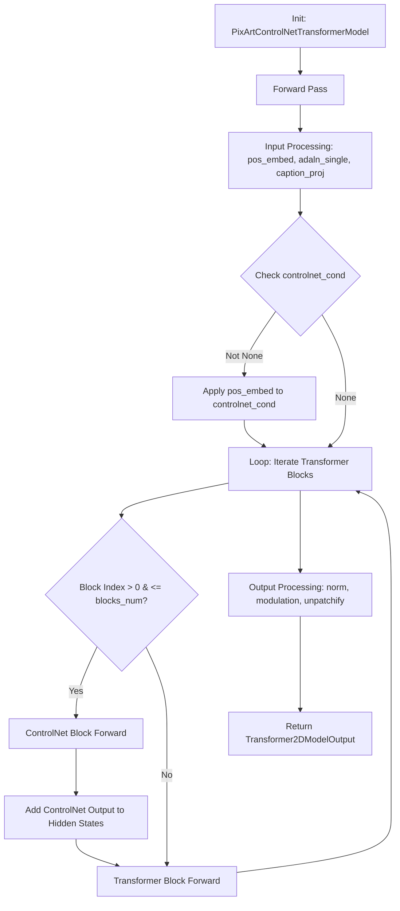
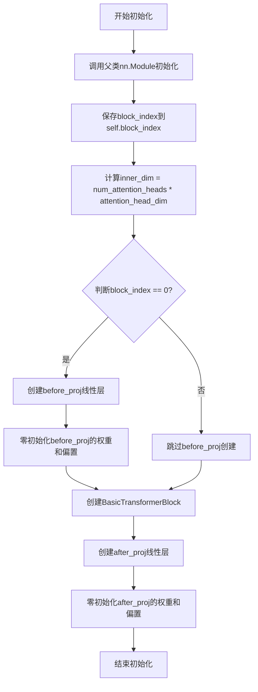
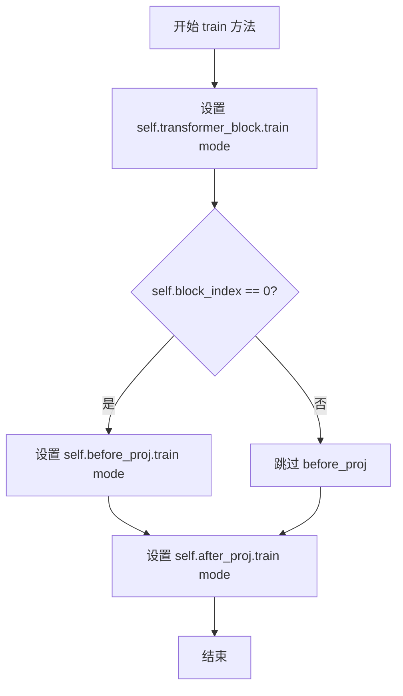
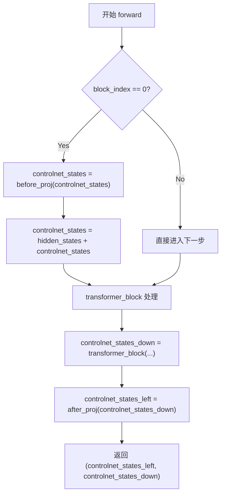
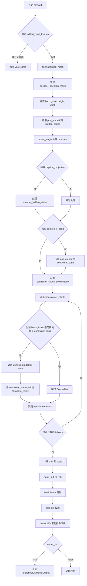

# `diffusers\examples\research_projects\pixart\controlnet_pixart_alpha.py` 详细设计文档

这是一个针对 PixArt Transformer (DiT) 实现的 ControlNet 适配器模型，通过引入额外的控制块（AdapterBlock）来处理控制条件（controlnet_cond），并将其控制信号注入到主 Transformer 的中间层，以实现对图像生成过程的条件控制。

## 整体流程



## 类结构

```
PixArtControlNetAdapterBlock (nn.Module)
├── inner_dim: int
├── before_proj: nn.Linear (可选)
├── transformer_block: BasicTransformerBlock
└── after_proj: nn.Linear
PixArtControlNetAdapterModel (ModelMixin, ConfigMixin)
├── num_layers: int
└── controlnet_blocks: nn.ModuleList
PixArtControlNetTransformerModel (ModelMixin, ConfigMixin)
├── blocks_num: int
├── gradient_checkpointing: bool
├── transformer: PixArtTransformer2DModel
└── controlnet: PixArtControlNetAdapterModel
```

## 全局变量及字段


### `PixArtControlNetAdapterBlock.block_index`
    
块的索引，用于标识当前处理的是第几个控制网块

类型：`int`
    


### `PixArtControlNetAdapterBlock.inner_dim`
    
内部维度，由注意力头数乘以注意力头维度计算得出

类型：`int`
    


### `PixArtControlNetAdapterBlock.before_proj`
    
第一个块的线性投影层，用于将控制网状态投影到隐藏状态维度

类型：`nn.Linear`
    


### `PixArtControlNetAdapterBlock.transformer_block`
    
基础变换器块，包含注意力机制和前馈网络

类型：`BasicTransformerBlock`
    


### `PixArtControlNetAdapterBlock.after_proj`
    
输出投影层，用于将变换器输出投影到最终控制网状态维度

类型：`nn.Linear`
    


### `PixArtControlNetAdapterModel.num_layers`
    
控制网块的数量，对应于变换器中的层数

类型：`int`
    


### `PixArtControlNetAdapterModel.controlnet_blocks`
    
控制网块的模块列表，包含多个PixArtControlNetAdapterBlock

类型：`nn.ModuleList`
    


### `PixArtControlNetTransformerModel.blocks_num`
    
要使用的控制网块数量

类型：`int`
    


### `PixArtControlNetTransformerModel.gradient_checkpointing`
    
梯度检查点标志，用于节省显存但增加计算时间

类型：`bool`
    


### `PixArtControlNetTransformerModel.training`
    
训练模式标志，指示模型是否处于训练状态

类型：`bool`
    


### `PixArtControlNetTransformerModel.transformer`
    
主变换器模型，用于生成图像

类型：`PixArtTransformer2DModel`
    


### `PixArtControlNetTransformerModel.controlnet`
    
控制网适配器模型，用于提供额外的控制信号

类型：`PixArtControlNetAdapterModel`
    
    

## 全局函数及方法


### `PixArtControlNetAdapterBlock.__init__`

这是`PixArtControlNetAdapterBlock`类的初始化方法，用于构建ControlNet适配器块，封装了Transformer块和必要的线性投影层，支持可学习的控制信号处理。

参数：

- `block_index`：int，块的索引位置，用于判断是否为第一个块以决定是否添加before_proj层
- `num_attention_heads`：int = 16，注意力头的数量，默认16个
- `attention_head_dim`：int = 72，每个注意力头的维度，默认72维
- `dropout`：float = 0.0，Dropout概率，默认不启用
- `cross_attention_dim`：Optional[int] = 1152，跨注意力维度，默认1152维
- `attention_bias`：bool = True，是否使用注意力偏置，默认启用
- `activation_fn`：str = "gelu-approximate", 激活函数类型，默认使用近似GELU
- `num_embeds_ada_norm`：Optional[int] = 1000，AdaNorm嵌入数量，默认1000
- `upcast_attention`：bool = False，是否上cast注意力计算，默认否
- `norm_type`：str = "ada_norm_single", 归一化类型，默认ada_norm_single
- `norm_elementwise_affine`：bool = False，是否使用元素级仿射，默认否
- `norm_eps`：float = 1e-6，归一化epsilon值，默认1e-6
- `attention_type`：str | None = "default", 注意力机制类型，默认default

返回值：无（`None`），`__init__`方法不返回任何值，仅初始化对象属性

#### 流程图



#### 带注释源码

```python
def __init__(
    self,
    block_index,  # 块索引，用于标识这是第几个块
    # taken from PixArtTransformer2DModel
    num_attention_heads: int = 16,  # 注意力头数量
    attention_head_dim: int = 72,   # 每个注意力头的维度
    dropout: float = 0.0,           # Dropout概率
    cross_attention_dim: Optional[int] = 1152,  # 跨注意力维度
    attention_bias: bool = True,    # 是否使用注意力偏置
    activation_fn: str = "gelu-approximate",  # 激活函数
    num_embeds_ada_norm: Optional[int] = 1000,  # AdaNorm嵌入数
    upcast_attention: bool = False, # 是否上cast注意力
    norm_type: str = "ada_norm_single",  # 归一化类型
    norm_elementwise_affine: bool = False,  # 是否元素级仿射
    norm_eps: float = 1e-6,          # 归一化epsilon
    attention_type: str | None = "default",  # 注意力类型
):
    super().__init__()  # 初始化父类nn.Module

    self.block_index = block_index  # 保存块索引
    self.inner_dim = num_attention_heads * attention_head_dim  # 计算内部维度

    # the first block has a zero before layer
    # 如果是第一个块(block_index==0)，需要创建before_proj投影层
    if self.block_index == 0:
        self.before_proj = nn.Linear(self.inner_dim, self.inner_dim)  # 创建线性投影
        nn.init.zeros_(self.before_proj.weight)  # 零初始化权重
        nn.init.zeros_(self.before_proj.bias)    # 零初始化偏置

    # 创建核心的Transformer块
    self.transformer_block = BasicTransformerBlock(
        self.inner_dim,
        num_attention_heads,
        attention_head_dim,
        dropout=dropout,
        cross_attention_dim=cross_attention_dim,
        activation_fn=activation_fn,
        num_embeds_ada_norm=num_embeds_ada_norm,
        attention_bias=attention_bias,
        upcast_attention=upcast_attention,
        norm_type=norm_type,
        norm_elementwise_affine=norm_elementwise_affine,
        norm_eps=norm_eps,
        attention_type=attention_type,
    )

    # 创建after_proj投影层，用于输出控制网络状态
    self.after_proj = nn.Linear(self.inner_dim, self.inner_dim)
    nn.init.zeros_(self.after_proj.weight)  # 零初始化权重
    nn.init.zeros_(self.after_proj.bias)    # 零初始化偏置
```


### `PixArtControlNetAdapterBlock.train`

该方法重写了PyTorch `nn.Module`的`train`方法，用于设置适配器块及其子模块的训练模式。根据`block_index`的值，可能还需要额外设置`before_proj`层的训练状态。

参数：

- `mode`：`bool`，指定是否设置为训练模式，默认为`True`

返回值：`None`，无显式返回值

#### 流程图



#### 带注释源码

```
def train(self, mode: bool = True):
    """
    重写 nn.Module 的 train 方法，用于设置适配器块及其子模块的训练模式。
    
    参数:
        mode: bool, 指定是否设置为训练模式, 默认为 True
    
    返回:
        None
    """
    # 1. 设置内部 transformer_block 的训练模式
    self.transformer_block.train(mode)

    # 2. 如果是第一个块（block_index == 0），则还需要设置 before_proj 的训练模式
    #    这是因为第一个块才有 before_proj 层
    if self.block_index == 0:
        self.before_proj.train(mode)

    # 3. 始终设置 after_proj 层的训练模式
    #    所有块都有 after_proj 层
    self.after_proj.train(mode)
```


### `PixArtControlNetAdapterBlock.forward`

该方法是 `PixArtControlNetAdapterBlock` 类的前向传播方法，负责处理 ControlNet 适配器块的计算逻辑。对于第一个块（`block_index == 0`），该方法先将 `controlnet_states` 通过 `before_proj` 线性层投影并与 `hidden_states` 相加，然后将结果传入 `transformer_block` 进行注意力计算，最后通过 `after_proj` 投影层输出处理后的状态。该方法返回两个张量：`controlnet_states_left`（用于残差连接）和 `controlnet_states_down`（用于后续块的处理）。

参数：

- `self`：`PixArtControlNetAdapterBlock` 实例本身
- `hidden_states`：`torch.Tensor`，主 hidden states，来自 Transformer 的主要输入
- `controlnet_states`：`torch.Tensor`，ControlNet 的状态张量，作为适配器的输入
- `encoder_hidden_states`：`Optional[torch.Tensor]`，编码器的 hidden states，用于 cross-attention，可选
- `timestep`：`Optional[torch.LongTensor]`，时间步长，用于 AdaNorm 归一化，可选
- `added_cond_kwargs`：`Dict[str, torch.Tensor]`，额外的条件参数，用于 AdaLN 条件归一化，可选
- `cross_attention_kwargs`：`Dict[str, Any]`，cross-attention 的额外参数，可选
- `attention_mask`：`Optional[torch.Tensor]`，注意力掩码，用于控制注意力计算，可选
- `encoder_attention_mask`：`Optional[torch.Tensor]`，编码器注意力掩码，可选

返回值：`Tuple[torch.Tensor, torch.Tensor]`，返回一个元组，包含 `controlnet_states_left`（用于残差连接）和 `controlnet_states_down`（用于后续块处理）

#### 流程图



#### 带注释源码

```python
def forward(
    self,
    hidden_states: torch.Tensor,
    controlnet_states: torch.Tensor,
    encoder_hidden_states: Optional[torch.Tensor] = None,
    timestep: Optional[torch.LongTensor] = None,
    added_cond_kwargs: Dict[str, torch.Tensor] = None,
    cross_attention_kwargs: Dict[str, Any] = None,
    attention_mask: Optional[torch.Tensor] = None,
    encoder_attention_mask: Optional[torch.Tensor] = None,
):
    # 如果是第一个 block（block_index == 0），需要先对 controlnet_states 进行投影
    # 并将其与 hidden_states 相加，实现 ControlNet 的初始条件注入
    if self.block_index == 0:
        # 通过 before_proj 线性层投影 controlnet_states
        controlnet_states = self.before_proj(controlnet_states)
        # 将投影后的 controlnet_states 与 hidden_states 相加
        # 实现条件信息的注入
        controlnet_states = hidden_states + controlnet_states

    # 将处理后的 controlnet_states 传入 transformer_block 进行自注意力
    # 和 cross-attention 计算，返回处理后的中间状态
    controlnet_states_down = self.transformer_block(
        hidden_states=controlnet_states,
        encoder_hidden_states=encoder_hidden_states,
        timestep=timestep,
        added_cond_kwargs=added_cond_kwargs,
        cross_attention_kwargs=cross_attention_kwargs,
        attention_mask=attention_mask,
        encoder_attention_mask=encoder_attention_mask,
        class_labels=None,
    )

    # 通过 after_proj 线性层将 transformer_block 的输出投影
    # 得到用于残差连接的 controlnet_states_left
    controlnet_states_left = self.after_proj(controlnet_states_down)

    # 返回两个张量：
    # 1. controlnet_states_left: 用于与主分支 hidden_states 进行残差连接
    # 2. controlnet_states_down: 用于传递给下一个 ControlNet 适配器块
    return controlnet_states_left, controlnet_states_down
```


### `PixArtControlNetAdapterModel.__init__`

这是 `PixArtControlNetAdapterModel` 类的构造函数，用于初始化 ControlNet 适配器模型，创建指定数量的 `PixArtControlNetAdapterBlock` 模块。

参数：

- `num_layers`：`int`，可选，默认值为 `13`，表示要创建的 ControlNet 块的数量（对应 PixArt 论文中 N=13 的配置）

返回值：`None`，构造函数不返回任何值

#### 流程图

```mermaid
flowchart TD
    A[开始 __init__] --> B[调用 super().__init__ 初始化基类]
    B --> C[设置 self.num_layers = num_layers]
    D[创建 nn.ModuleList] --> E[循环 i 从 0 到 num_layers-1]
    E --> F[为每个 i 创建 PixArtControlNetAdapterBlock block_index=i]
    F --> G[将所有 block 添加到 self.controlnet_blocks]
    G --> H[结束 __init__]
    
    C --> D
```

#### 带注释源码

```python
@register_to_config  # 注册配置到 diffusers 的 ConfigMixin 系统
def __init__(self, num_layers=13) -> None:
    """
    初始化 PixArtControlNetAdapterModel
    
    Args:
        num_layers: 控制网络块的数量，默认13层，对应论文中的配置
    """
    # 调用父类 ModelMixin 和 ConfigMixin 的初始化方法
    super().__init__()

    # 保存层数配置
    self.num_layers = num_layers

    # 创建 ControlNet 块列表
    # 使用 nn.ModuleList 容器来管理多个 PixArtControlNetAdapterBlock
    # 每个块对应 transformer 的一个层级
    self.controlnet_blocks = nn.ModuleList(
        [PixArtControlNetAdapterBlock(block_index=i) for i in range(num_layers)]
    )
```


### `PixArtControlNetAdapterModel.from_transformer`

该方法是一个类方法，用于从预训练的 `PixArtTransformer2DModel` 模型中复制权重参数来初始化 `PixArtControlNetAdapterModel` 控制网络适配器模型，实现模型权重的迁移复用。

参数：

- `transformer`：`PixArtTransformer2DModel`，源transformer模型，从中复制权重参数到控制网络适配器
- `cls`：隐式参数，表示类本身

返回值：`PixArtControlNetAdapterModel`，返回初始化后的控制网络适配器模型实例，其transformer block权重已从源模型复制

#### 流程图

```mermaid
flowchart TD
    A[Start: from_transformer] --> B[创建新的PixArtControlNetAdapterModel实例 control_net]
    B --> C[初始化 depth = 0]
    C --> D{depth < control_net.num_layers?}
    D -->|Yes| E[获取 transformer.transformer_blocks[depth] 的状态字典]
    E --> F[调用 load_state_dict 复制到 control_net.controlnet_blocks[depth].transformer_block]
    F --> G[depth = depth + 1]
    G --> D
    D -->|No| H[返回 control_net]
```

#### 带注释源码

```python
@classmethod
def from_transformer(cls, transformer: PixArtTransformer2DModel):
    """
    类方法：从预训练的PixArtTransformer2DModel复制权重初始化控制网络适配器
    
    参数:
        transformer: PixArtTransformer2DModel类型，源transformer模型
    
    返回:
        PixArtControlNetAdapterModel类型，权重已从transformer复制过来的控制网络模型
    """
    # 1. 创建新的PixArtControlNetAdapterModel实例
    #    内部会初始化num_layers个PixArtControlNetAdapterBlock
    control_net = PixArtControlNetAdapterModel()

    # 2. 遍历控制网络的每一层
    # 3. 从transformer对应层复制transformer_block的权重
    for depth in range(control_net.num_layers):
        # 获取源transformer指定层的transformer block的状态字典
        state_dict = transformer.transformer_blocks[depth].state_dict()
        
        # 将状态字典加载到控制网络对应层的transformer_block中
        control_net.controlnet_blocks[depth].transformer_block.load_state_dict(state_dict)

    # 4. 返回初始化完成的控制网络适配器模型
    return control_net
```


### `PixArtControlNetAdapterModel.train`

该方法用于设置 PixArtControlNetAdapterModel 的训练模式，通过遍历所有控制网块并调用它们的 train 方法来切换模型的状态（训练模式或评估模式）。

参数：

- `mode`：`bool`，指定模式，True 表示训练模式，False 表示评估模式，默认为 True

返回值：`None`，无返回值（继承自 nn.Module 的方法）

#### 流程图

```mermaid
flowchart TD
    A[开始 train 方法] --> B{遍历 controlnet_blocks}
    B -->|对每个 block| C[调用 block.train(mode)]
    C --> D{是否还有更多 block?}
    D -->|是| B
    D -->|否| E[结束]
```

#### 带注释源码

```
def train(self, mode: bool = True):
    """
    设置模型的训练/评估模式。
    
    参数:
        mode: bool - 如果为 True，则将模型设置为训练模式；
                 如果为 False，则将模型设置为评估模式。
                 默认为 True。
    
    返回值:
        None
    """
    # 遍历所有的控制网块
    for block in self.controlnet_blocks:
        # 对每个块调用 PyTorch 的 train 方法来切换其模式
        # 这会影响到 BatchNorm、Dropout 等层的行为
        block.train(mode)
```


### `PixArtControlNetTransformerModel.__init__`

该方法是 `PixArtControlNetTransformerModel` 类的构造函数，用于初始化一个结合了 PixArt 主干 Transformer 和 ControlNet 适配器的控制网络模型。构造函数接受 transformer 模型、controlnet 适配器模型、块数量、是否从 transformer 初始化以及训练模式等参数，并完成配置注册、子模块存储和条件初始化等核心工作。

参数：

- `transformer`：`PixArtTransformer2DModel`，主干 Transformer 模型，提供基础的去噪能力
- `controlnet`：`PixArtControlNetAdapterModel`，ControlNet 适配器模型，提供额外的控制条件注入能力
- `blocks_num`：`int`，默认值 13，需要使用 ControlNet 控制的 Transformer 块数量
- `init_from_transformer`：`bool`，默认值 False，是否从 transformer 复制权重到 controlnet
- `training`：`bool`，默认值 False，模型是否处于训练模式

返回值：`None`，构造函数无显式返回值

#### 流程图

```mermaid
flowchart TD
    A[开始 __init__] --> B[调用 super().__init__]
    B --> C[设置 self.blocks_num = blocks_num]
    C --> D[设置 self.gradient_checkpointing = False]
    D --> E[注册 transformer.config 到当前模型配置]
    E --> F[设置 self.training = training]
    F --> G{init_from_transformer?}
    G -->|True| H[从 transformer 复制权重到 controlnet]
    G -->|False| I[跳过权重复制]
    H --> J[存储 self.transformer = transformer]
    I --> J
    J --> K[存储 self.controlnet = controlnet]
    K --> L[结束 __init__]
```

#### 带注释源码

```python
def __init__(
    self,
    transformer: PixArtTransformer2DModel,
    controlnet: PixArtControlNetAdapterModel,
    blocks_num=13,
    init_from_transformer=False,
    training=False,
):
    """
    初始化 PixArtControlNetTransformerModel。
    
    参数:
        transformer: PixArt 主干 Transformer 模型
        controlnet: ControlNet 适配器模型
        blocks_num: 需要控制的 Transformer 块数量
        init_from_transformer: 是否从 transformer 初始化 controlnet 权重
        training: 是否处于训练模式
    """
    # 调用父类的初始化方法
    # ModelMixin 提供模型加载/保存功能
    # ConfigMixin 提供配置注册功能
    super().__init__()

    # 存储需要控制的 Transformer 块数量
    self.blocks_num = blocks_num
    
    # 初始化梯度检查点标志为 False
    # 后续可以通过属性设置来启用梯度检查点以节省显存
    self.gradient_checkpointing = False
    
    # 将 transformer 的配置注册到当前模型
    # register_to_config 装饰器会将参数保存到 self.config
    # 这里使用 **transformer.config 展开 transformer 的所有配置参数
    self.register_to_config(**transformer.config)
    
    # 存储训练模式标志
    self.training = training

    # 如果指定从 transformer 初始化
    # 则将 transformer 的权重复制到 controlnet
    # 这样可以利用预训练的 PixArt 模型
    if init_from_transformer:
        # 调用 controlnet 的 from_transformer 方法
        # 复制指定数量的 Transformer 块权重到 controlnet
        controlnet.from_transformer(transformer, self.blocks_num)

    # 存储主干 transformer 模型
    self.transformer = transformer
    
    # 存储 controlnet 适配器模型
    self.controlnet = controlnet
```


### `PixArtControlNetTransformerModel.forward`

该方法是 PixArtControlNetTransformerModel 的前向传播函数，负责将 PixArtTransformer2DModel 与 ControlNet 适配器模型结合，实现带条件控制的图像生成。方法首先处理输入的注意力掩码和条件嵌入，然后通过 transformer blocks 逐层处理，在每层可选地注入 ControlNet 的控制信息，最后将输出解patchify为图像格式。

参数：

- `hidden_states`：`torch.Tensor`，输入的隐藏状态张量，形状为 [batch, channels, height, width]
- `encoder_hidden_states`：`Optional[torch.Tensor] = None`，编码器的隐藏状态，用于交叉注意力机制
- `timestep`：`Optional[torch.LongTensor] = None`，扩散过程的时间步长
- `controlnet_cond`：`Optional[torch.Tensor] = None`，ControlNet 的条件输入，如边缘图、深度图等控制信号
- `added_cond_kwargs`：`Dict[str, torch.Tensor] = None`，额外的条件参数字典，用于 AdaLN_single 条件嵌入
- `cross_attention_kwargs`：`Dict[str, Any] = None`，交叉注意力的额外参数
- `attention_mask`：`Optional[torch.Tensor] = None`，注意力掩码，用于控制哪些位置参与注意力计算
- `encoder_attention_mask`：`Optional[torch.Tensor] = None`，编码器注意力掩码
- `return_dict`：`bool = True`，是否返回字典格式的输出

返回值：`Union[Transformer2DModelOutput, Tuple]`，当 return_dict=True 时返回 Transformer2DModelOutput 对象，包含 sample 字段为输出张量；否则返回元组 (output,)

#### 流程图



#### 带注释源码

```python
def forward(
    self,
    hidden_states: torch.Tensor,
    encoder_hidden_states: Optional[torch.Tensor] = None,
    timestep: Optional[torch.LongTensor] = None,
    controlnet_cond: Optional[torch.Tensor] = None,
    added_cond_kwargs: Dict[str, torch.Tensor] = None,
    cross_attention_kwargs: Dict[str, Any] = None,
    attention_mask: Optional[torch.Tensor] = None,
    encoder_attention_mask: Optional[torch.Tensor] = None,
    return_dict: bool = True,
):
    # 1. 验证额外条件参数
    # 检查 transformer 是否需要额外条件但未提供
    if self.transformer.use_additional_conditions and added_cond_kwargs is None:
        raise ValueError(
            "`added_cond_kwargs` cannot be None when using additional conditions for `adaln_single`."
        )

    # 2. 处理注意力掩码
    # 将注意力掩码转换为偏置格式，以便添加到注意力分数
    # 掩码: (1 = keep, 0 = discard) -> 偏置: (keep = +0, discard = -10000.0)
    if attention_mask is not None and attention_mask.ndim == 2:
        # 假设掩码是二维的 [batch, key_tokens]
        # 转换为偏置并添加单例查询令牌维度 [batch, 1, key_tokens]
        # 这样可以广播到注意力分数的各种形状
        attention_mask = (1 - attention_mask.to(hidden_states.dtype)) * -10000.0
        attention_mask = attention_mask.unsqueeze(1)

    # 3. 处理编码器注意力掩码（与上面相同的转换逻辑）
    if encoder_attention_mask is not None and encoder_attention_mask.ndim == 2:
        encoder_attention_mask = (1 - encoder_attention_mask.to(hidden_states.dtype)) * -10000.0
        encoder_attention_mask = encoder_attention_mask.unsqueeze(1)

    # 4. 输入处理
    batch_size = hidden_states.shape[0]
    # 计算高度和宽度（基于 patch_size）
    height, width = (
        hidden_states.shape[-2] // self.transformer.config.patch_size,
        hidden_states.shape[-1] // self.transformer.config.patch_size,
    )
    # 应用位置嵌入
    hidden_states = self.transformer.pos_embed(hidden_states)

    # 5. 时间步嵌入处理
    timestep, embedded_timestep = self.transformer.adaln_single(
        timestep, added_cond_kwargs, batch_size=batch_size, hidden_dtype=hidden_states.dtype
    )

    # 6. 编码器隐藏状态处理
    if self.transformer.caption_projection is not None:
        # 通过 caption_projection 层处理 encoder_hidden_states
        encoder_hidden_states = self.transformer.caption_projection(encoder_hidden_states)
        # 重新视图为 [batch, seq_len, hidden_dim]
        encoder_hidden_states = encoder_hidden_states.view(batch_size, -1, hidden_states.shape[-1])

    # 7. ControlNet 条件处理
    controlnet_states_down = None
    if controlnet_cond is not None:
        # 对 controlnet 条件应用位置嵌入
        controlnet_states_down = self.transformer.pos_embed(controlnet_cond)

    # 8. Transformer Blocks 迭代处理
    for block_index, block in enumerate(self.transformer.transformer_blocks):
        # 检查梯度是否启用以及是否使用梯度检查点
        if torch.is_grad_enabled() and self.gradient_checkpointing:
            # 打印警告并退出（当前不支持）
            print(
                "Gradient checkpointing is not supported for the controlnet transformer model, yet."
            )
            exit(1)
            # 梯度检查点逻辑（暂未实现）
            hidden_states = self._gradient_checkpointing_func(
                block,
                hidden_states,
                attention_mask,
                encoder_hidden_states,
                encoder_attention_mask,
                timestep,
                cross_attention_kwargs,
                None,
            )
        else:
            # 9. ControlNet 适配器块处理
            # 仅在 block_index > 0 且 <= self.blocks_num 时使用 controlnet
            if (
                block_index > 0
                and block_index <= self.blocks_num
                and controlnet_states_down is not None
            ):
                # 调用 ControlNet 适配器块
                controlnet_states_left, controlnet_states_down = self.controlnet.controlnet_blocks[
                    block_index - 1
                ](
                    hidden_states=hidden_states,  # 仅在第一个 block 使用
                    controlnet_states=controlnet_states_down,
                    encoder_hidden_states=encoder_hidden_states,
                    timestep=timestep,
                    added_cond_kwargs=added_cond_kwargs,
                    cross_attention_kwargs=cross_attention_kwargs,
                    attention_mask=attention_mask,
                    encoder_attention_mask=encoder_attention_mask,
                )
                # 将 ControlNet 输出添加到 hidden_states（残差连接）
                hidden_states = hidden_states + controlnet_states_left

            # 10. 标准 Transformer Block 处理
            hidden_states = block(
                hidden_states,
                attention_mask=attention_mask,
                encoder_hidden_states=encoder_hidden_states,
                encoder_attention_mask=encoder_attention_mask,
                timestep=timestep,
                cross_attention_kwargs=cross_attention_kwargs,
                class_labels=None,
            )

    # 11. 输出后处理
    # 计算 shift 和 scale 用于最终的调制
    shift, scale = (
        self.transformer.scale_shift_table[None]
        + embedded_timestep[:, None].to(self.transformer.scale_shift_table.device)
    ).chunk(2, dim=1)
    
    # 归一化输出
    hidden_states = self.transformer.norm_out(hidden_states)
    
    # 12. 调制（Modulation）
    # 应用仿射变换: hidden_states * (1 + scale) + shift
    hidden_states = hidden_states * (1 + scale.to(hidden_states.device)) + shift.to(
        hidden_states.device
    )
    
    # 投影输出
    hidden_states = self.transformer.proj_out(hidden_states)
    hidden_states = hidden_states.squeeze(1)

    # 13. Unpatchify
    # 将 patch 形式的输出转换回图像形式
    hidden_states = hidden_states.reshape(
        shape=(
            -1,
            height,
            width,
            self.transformer.config.patch_size,
            self.transformer.config.patch_size,
            self.transformer.out_channels,
        )
    )
    # 使用 einsum 重新排列维度: nhwpqc -> nchpwq
    hidden_states = torch.einsum("nhwpqc->nchpwq", hidden_states)
    output = hidden_states.reshape(
        shape=(
            -1,
            self.transformer.out_channels,
            height * self.transformer.config.patch_size,
            width * self.transformer.config.patch_size,
        )
    )

    # 14. 返回结果
    if not return_dict:
        return (output,)

    return Transformer2DModelOutput(sample=output)
```

## 关键组件


### PixArtControlNetAdapterBlock

控制网适配器的核心构建块，继承自nn.Module，用于处理单个transformer block的控制网状态。该块在block_index为0时添加before_proj投影层将控制网状态与隐藏状态融合，经过transformer_block处理后再通过after_proj投影输出控制网特征。

### PixArtControlNetAdapterModel

控制网适配器的整体模型类，继承自ModelMixin和ConfigMixin，包含13个PixArtControlNetAdapterBlock。通过from_transformer方法从预训练的PixArtTransformer2DModel复制指定数量的transformer块权重，实现控制网的初始化。

### PixArtControlNetTransformerModel

结合原始PixArtTransformer2DModel和PixArtControlNetAdapterModel的控制网transformer模型，负责在前向传播中协调transformer块与控制网块的执行，支持条件控制网输入并输出最终的去噪结果。

### 张量索引与块选择

通过block_index参数标识当前处理的transformer块，仅在block_index > 0且block_index <= blocks_num时调用对应的控制网块，实现按需加载和执行控制网分支的惰性计算策略。

### 注意力掩码处理机制

在forward方法中将二维注意力掩码(0/1值)转换为注意力偏置(-10000.0表示丢弃)，并通过unsqueeze添加查询token维度以支持注意力分数的广播计算，确保与不同注意力实现(xformers、torch sdp等)的兼容性。

### 位置嵌入与条件处理

使用transformer.pos_embed对hidden_states和controlnet_cond进行位置编码处理，controlnet_cond在存在时被预先嵌入以保持与主分支的空间对齐。

### 梯度检查点框架

虽然代码中包含gradient_checkpointing标志和检查逻辑框架，但实际实现未完成(仅有print语句)，存在技术债务。


## 问题及建议


### 已知问题

- **参数传递错误（致命）**: `PixArtControlNetAdapterModel.from_transformer` 方法只接受一个参数 `transformer`，但在 `PixArtControlNetTransformerModel.__init__` 中调用时传递了两个参数 `controlnet.from_transformer(transformer, self.blocks_num)`，会导致运行时 TypeError
- **配置参数未传递**: 创建 `PixArtControlNetAdapterBlock` 时只传递了 `block_index` 参数，缺少 `num_attention_heads`、`attention_head_dim`、`cross_attention_dim`、`attention_bias`、`activation_fn` 等关键参数，导致所有适配器块使用默认配置而非从 transformer 复制实际配置
- **梯度检查点实现不完整**: 当 `gradient_checkpointing=True` 时代码直接调用 `exit(1)` 终止程序，且即使启用梯度检查点，控制网块的计算也未应用检查点优化
- **未使用的变量**: `controlnet_states_down` 在计算完成后未被任何地方使用，造成计算资源浪费
- **控制网条件为空时的处理缺陷**: 当 `controlnet_cond` 为 `None` 时，`controlnet_states_down` 被设置为 `None`，但后续循环中仍尝试对 `controlnet_states_down is not None` 进行条件判断，若条件满足则解包返回值可能出现问题
- **设备管理不一致**: 代码中多处直接调用 `.to(device)` 而非使用 `to()` 方法，可能导致设备不匹配问题
- **训练模式管理冗余**: 手动重写 `train()` 方法但实际只需调用 `super().train(mode)` 即可，代码冗余且容易出错

### 优化建议

- 修复 `from_transformer` 方法签名，添加 `num_layers` 参数，并正确实现从 transformer 复制配置的逻辑
- 从 `transformer.config` 中提取所有必要参数（`num_attention_heads`、`attention_head_dim`、`cross_attention_dim` 等）并传递给适配器块构造函数
- 实现完整的梯度检查点支持，或移除该功能代码并添加清晰的警告信息
- 使用 `controlnet_states_down` 进行后续计算或添加注释说明其用途
- 添加 `controlnet_cond` 为 `None` 时的明确错误处理或跳过逻辑
- 统一使用 `to()` 方法进行设备转换，或在模型初始化时确保所有子模块在同一设备上
- 移除冗余的 `train()` 方法重写，利用 `nn.Module` 的默认行为

## 其它


### 设计目标与约束

该PixArtControlNet实现旨在为PixArt Transformer模型添加ControlNet控制能力，支持通过额外的控制条件（如边缘图、姿态等）来引导图像生成过程。设计约束包括：1) 必须保持与原始PixArtTransformer2DModel的兼容性；2) 控制网络块数量默认为13层，与论文规范一致；3) 仅在指定的transformer块（1到num_layers）上应用控制机制；4) 支持梯度检查点但当前版本尚未实现；5) 必须遵循diffusers库的ModelMixin和ConfigMixin模式。

### 错误处理与异常设计

代码中包含以下错误处理机制：1) 在forward方法中检查added_cond_kwargs，当transformer配置启用additional_conditions但参数为None时抛出ValueError；2) 注意力掩码维度验证，假设为2D时作为mask处理，3D时作为bias处理；3) 控制网络条件输入的隐式检查，当controlnet_cond为None时跳过控制网络处理。潜在改进：添加参数类型检查、边界验证（如num_layers>0）、设备兼容性检查、以及梯度检查点未实现时的明确警告而非exit(1)。

### 数据流与状态机

数据流主要分为三个阶段：输入预处理阶段对hidden_states进行位置编码嵌入，处理timestep并通过adaln_single进行条件嵌入，对controlnet_cond进行位置编码；块处理阶段遍历transformer_blocks，对每个块判断是否需要应用控制网络（block_index > 0且block_index <= blocks_num且controlnet_states_down不为None），控制网络块接收hidden_states和controlnet_states_down，输出controlnet_states_left（残差连接）和controlnet_states_down（传递到下一层）；输出阶段进行归一化、调制、投影和unpatchify操作。状态机表现为：hidden_states在每个transformer块中更新，controlnet_states_down沿网络向下传递，encoder_hidden_states和timestep保持不变。

### 外部依赖与接口契约

主要外部依赖包括：torch和nn模块提供基础张量操作和神经网络组件；diffusers.configuration_utils中的ConfigMixin和register_to_config用于配置管理；diffusers.models.PixArtTransformer2DModel作为被扩展的主transformer模型；diffusers.models.attention.BasicTransformerBlock作为控制网络的核心构建块；diffusers.models.modeling_outputs.Transformer2DModelOutput定义输出格式；diffusers.models.modeling_utils.ModelMixin提供模型基础功能。接口契约：from_transformer方法接受PixArtTransformer2DModel实例并返回初始化好的控制网络模型；forward方法接受标准扩散模型参数并返回Transformer2DModelOutput或元组。

### 配置管理与序列化

PixArtControlNetAdapterModel使用@register_to_config装饰器支持配置注册和序列化，配置项包括num_layers（默认为13）；PixArtControlNetTransformerModel通过register_to_config(\*\*transformer.config)继承transformer的配置。模型可以通过save_pretrained和from_pretrained进行保存和加载，控制网络块的状态字典会与transformer对应块同步。

### 性能考虑与优化空间

当前性能瓶颈：1) 梯度检查点功能未实现但预留了代码位置；2) 每个块都进行controlnet_cond的位置编码，可提取到循环外；3) 未使用torch.compile加速；4) 控制网络输出与hidden_states的残差连接可考虑更高效的融合方式。优化建议：将controlnet_states_down的位置编码移到循环前；实现梯度检查点以支持大模型训练；考虑使用xformers等高效注意力实现；添加混合精度训练支持；控制网络块可设置为可学习的权重而非直接相加。

### 兼容性考虑

该实现与PixArt Alpha架构紧密耦合，依赖特定配置如use_additional_conditions、patch_size、out_channels等。不兼容其他Transformer变体如Stable Diffusion的UNet2DModel。forward方法中的attention_mask处理逻辑假设传入的是2D mask或3D bias，与diffusers库其他模型保持一致但可能与外部调用者预期不符。

### 扩展性与未来规划

可扩展方向：1) 支持可学习的控制权重而非固定残差连接；2) 添加多层控制网络输出用于不同尺度的控制；3) 支持时间步条件控制而不仅是空间控制；4) 与PixArt-Sigma等新版本兼容；5) 添加动态块数量选择功能。当前架构预留了这些扩展点，BasicTransformerBlock的灵活性允许后续添加自定义注意力机制或调制策略。

    