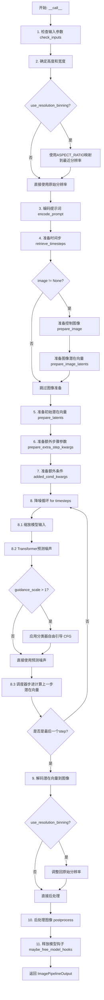
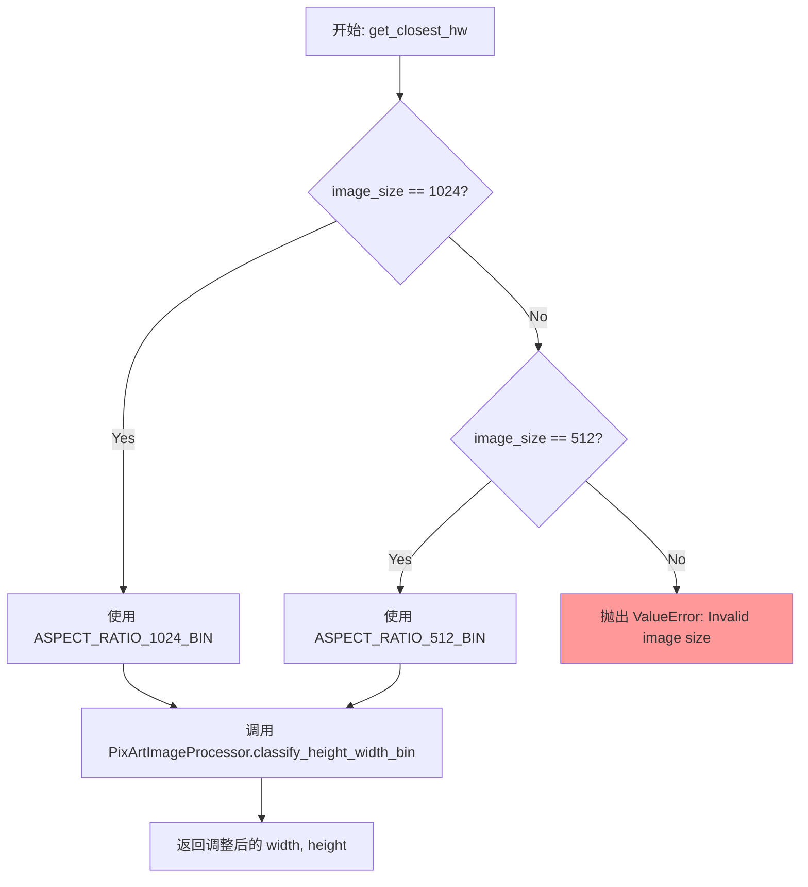
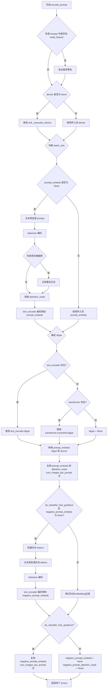
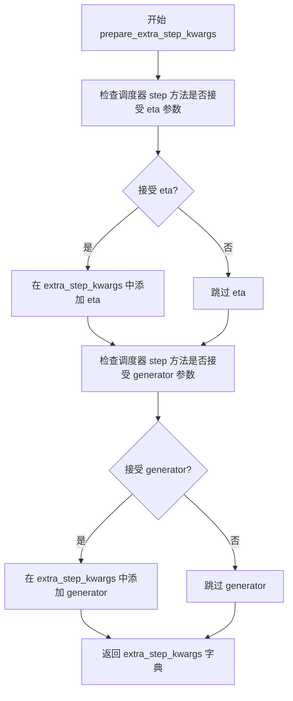
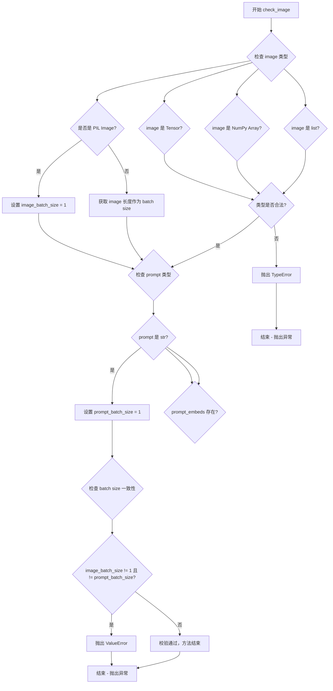
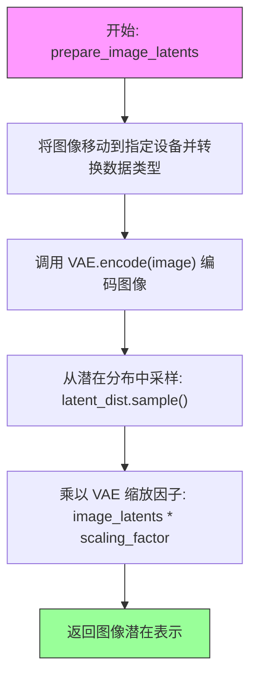
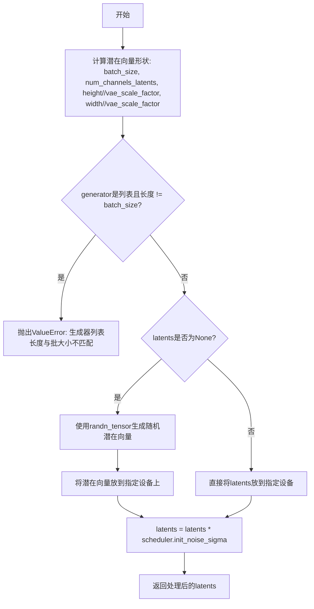
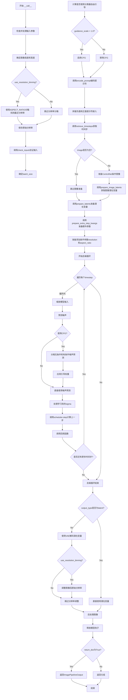

```mermaid
flowchart TD
    A[开始 retrieve_timesteps] --> B{检查 timesteps 和 sigmas 是否同时存在}
    B -->|是| C[抛出 ValueError: 只能选择其中一种]
    B -->|否| D{是否提供 timesteps}
    D -->|是| E{检查 scheduler.set_timesteps 是否支持 timesteps 参数}
    E -->|不支持| F[抛出 ValueError: 当前调度器不支持自定义 timesteps]
    E -->|支持| G[调用 scheduler.set_timesteps&#40;timesteps=timesteps, device=device, **kwargs&#41;]
    G --> H[获取 scheduler.timesteps]
    H --> I[计算 num_inference_steps = len&#40;timesteps&#41;]
    D -->|否| J{是否提供 sigmas}
    J -->|是| K{检查 scheduler.set_timesteps 是否支持 sigmas 参数}
    K -->|不支持| L[抛出 ValueError: 当前调度器不支持自定义 sigmas]
    K -->|支持| M[调用 scheduler.set_timesteps&#40;sigmas=sigmas, device=device, **kwargs&#41;]
    M --> N[获取 scheduler.timesteps]
    N --> O[计算 num_inference_steps = len&#40;timesteps&#41;]
    J -->|否| P[调用 scheduler.set_timesteps&#40;num_inference_steps, device=device, **kwargs&#41;]
    P --> Q[获取 scheduler.timesteps]
    Q --> R[返回 timesteps 和 num_inference_steps]
```

# `diffusers\examples\research_projects\pixart\pipeline_pixart_alpha_controlnet.py` 详细设计文档

PixArtAlphaControlnetPipeline 是一个用于文本到图像生成的 ControlNet 管道，基于 PixArt-Alpha 模型。该管道继承自 DiffusionPipeline，结合了 T5 文本编码器、PixArt Transformer 和 ControlNet 适配器，可以根据文本提示和可选的控制图像（conditioning image）生成高质量图像。支持多种宽高比、分辨率分箱、分类器自由引导（CFG）和可配置的降噪调度器。

## 整体流程



## 类结构

```
DiffusionPipeline (基类)
└── PixArtAlphaControlnetPipeline (主类)
    ├── 辅助函数 (模块级)
    │   ├── get_closest_hw
    │   └── retrieve_timesteps
    └── 数据类
        ├── ASPECT_RATIO_1024_BIN (dict)
        ├── ASPECT_RATIO_512_BIN (dict)
        └── ASPECT_RATIO_256_BIN (dict)
```

## 全局变量及字段


### `logger`
    
模块级日志记录器，用于输出运行时信息

类型：`logging.Logger`
    


### `EXAMPLE_DOC_STRING`
    
示例文档字符串，展示PixArtAlphaPipeline的基本用法

类型：`str`
    


### `ASPECT_RATIO_1024_BIN`
    
1024分辨率的宽高比映射字典，用于分辨率分箱

类型：`Dict[str, List[float]]`
    


### `ASPECT_RATIO_512_BIN`
    
512分辨率的宽高比映射字典，用于分辨率分箱

类型：`Dict[str, List[float]]`
    


### `ASPECT_RATIO_256_BIN`
    
256分辨率的宽高比映射字典，用于分辨率分箱

类型：`Dict[str, List[float]]`
    


### `get_closest_hw`
    
获取最接近的宽高尺寸，根据图像大小选择对应的宽高比映射

类型：`Callable`
    


### `retrieve_timesteps`
    
从调度器获取时间步，支持自定义时间步和sigma

类型：`Callable`
    


### `PixArtAlphaControlnetPipeline.bad_punct_regex`
    
用于清理文本标点的正则表达式

类型：`re.Pattern`
    


### `PixArtAlphaControlnetPipeline._optional_components`
    
可选组件列表，用于模型加载

类型：`List[str]`
    


### `PixArtAlphaControlnetPipeline.model_cpu_offload_seq`
    
模型CPU卸载顺序

类型：`str`
    


### `PixArtAlphaControlnetPipeline.vae`
    
VAE模型，用于编解码图像

类型：`AutoencoderKL`
    


### `PixArtAlphaControlnetPipeline.text_encoder`
    
T5文本编码器，用于编码文本提示

类型：`T5EncoderModel`
    


### `PixArtAlphaControlnetPipeline.tokenizer`
    
T5分词器，用于分词文本

类型：`T5Tokenizer`
    


### `PixArtAlphaControlnetPipeline.transformer`
    
PixArt Transformer模型，用于去噪

类型：`PixArtTransformer2DModel`
    


### `PixArtAlphaControlnetPipeline.controlnet`
    
ControlNet适配器，提供控制条件

类型：`PixArtControlNetAdapterModel`
    


### `PixArtAlphaControlnetPipeline.scheduler`
    
降噪调度器，控制去噪过程

类型：`DPMSolverMultistepScheduler`
    


### `PixArtAlphaControlnetPipeline.vae_scale_factor`
    
VAE缩放因子，用于潜空间缩放

类型：`int`
    


### `PixArtAlphaControlnetPipeline.image_processor`
    
图像处理器，处理输入输出图像

类型：`PixArtImageProcessor`
    


### `PixArtAlphaControlnetPipeline.control_image_processor`
    
控制图像处理器，处理控制条件图像

类型：`PixArtImageProcessor`
    
    

## 全局函数及方法


### `get_closest_hw`

该函数用于根据给定的宽度、高度和图像尺寸，从预定义的宽高比映射表中找到最接近的有效宽高组合。它通过 `PixArtImageProcessor.classify_height_width_bin` 方法将输入的宽高调整到最接近的有效分辨率，支持 1024 和 512 两种图像尺寸。

参数：

-  `width`：`float` 或 `int`，期望的图像宽度
-  `height`：`float` 或 `int`，期望的图像高度
-  `image_size`：`int`，图像尺寸，目前仅支持 1024 和 512 两种尺寸

返回值：`Tuple[float, float]`，返回调整后的 (宽度, 高度) 元组，该宽高最接近输入值且符合预定义的宽高比约束

#### 流程图



#### 带注释源码

```python
def get_closest_hw(width, height, image_size):
    """
    根据给定宽高和图像尺寸获取最接近的有效宽高组合
    
    参数:
        width: 期望的图像宽度
        height: 期望的图像高度
        image_size: 图像尺寸,仅支持1024或512
    
    返回:
        Tuple[float, float]: 调整后的(宽度, 高度)元组
    """
    
    # 根据image_size选择对应的宽高比映射表
    if image_size == 1024:
        # 使用1024分辨率的宽高比映射表
        aspect_ratio_bin = ASPECT_RATIO_1024_BIN
    elif image_size == 512:
        # 使用512分辨率的宽高比映射表
        aspect_ratio_bin = ASPECT_RATIO_512_BIN
    else:
        # 不支持的图像尺寸,抛出异常
        raise ValueError("Invalid image size")

    # 调用PixArtImageProcessor的静态方法,将输入宽高调整为最接近的有效尺寸
    # 该方法会根据aspect_ratio_bin中的预定义比例找到最匹配的宽高组合
    height, width = PixArtImageProcessor.classify_height_width_bin(height, width, ratios=aspect_ratio_bin)

    # 返回调整后的宽度和高度(注意:返回顺序是先height后width)
    return width, height
```


### `retrieve_timesteps`

该函数是 DiffusionPipeline 中的工具函数，用于从调度器（scheduler）获取时间步（timesteps）。它封装了调度器的 `set_timesteps` 方法调用，支持自定义时间步列表或 sigmas 列表，并返回调度后生成的时间步序列以及实际的推理步数。

参数：

- `scheduler`：`SchedulerMixin`，调度器对象，用于生成时间步序列
- `num_inference_steps`：`Optional[int]`，扩散推理步数，用于生成默认时间步序列，当 `timesteps` 和 `sigmas` 都为 `None` 时使用
- `device`：`Optional[Union[str, torch.device]]`，时间步要移动到的目标设备，如果为 `None` 则不移动
- `timesteps`：`Optional[List[int]]`，自定义时间步列表，用于覆盖调度器默认的时间步间隔策略，传入时 `num_inference_steps` 和 `sigmas` 必须为 `None`
- `sigmas`：`Optional[List[float]]`，自定义 sigmas 列表，用于覆盖调度器默认的 sigma 间隔策略，传入时 `num_inference_steps` 和 `timesteps` 必须为 `None`
- `**kwargs`：任意关键字参数，会传递给调度器的 `set_timesteps` 方法

返回值：`Tuple[torch.Tensor, int]`，返回元组，第一个元素是调度器生成的时间步张量，第二个元素是推理步数（即时间步序列的长度）

#### 流程图



#### 带注释源码

```python
# 从 diffusers.pipelines.stable_diffusion.pipeline_stable_diffusion 中复制
def retrieve_timesteps(
    scheduler,  # 调度器对象（SchedulerMixin）
    num_inference_steps: Optional[int] = None,  # 推理步数
    device: Optional[Union[str, torch.device]] = None,  # 目标设备
    timesteps: Optional[List[int]] = None,  # 自定义时间步列表
    sigmas: Optional[List[float]] = None,  # 自定义 sigma 列表
    **kwargs,  # 传递给 scheduler.set_timesteps 的额外参数
):
    """
    调用调度器的 set_timesteps 方法并从中获取时间步。处理自定义时间步。
    任何 kwargs 将被传递给 scheduler.set_timesteps。

    Args:
        scheduler (`SchedulerMixin`):
            用于获取时间步的调度器。
        num_inference_steps (`int`):
            使用预训练模型生成样本时使用的扩散步数。如果使用此参数，timesteps 必须为 None。
        device (`str` or `torch.device`, *optional*):
            时间步要移动到的设备。如果为 None，则不移动时间步。
        timesteps (`List[int]`, *optional*):
            用于覆盖调度器时间步间隔策略的自定义时间步。如果传入 timesteps，
            则 num_inference_steps 和 sigmas 必须为 None。
        sigmas (`List[float]`, *optional*):
            用于覆盖调度器时间步间隔策略的自定义 sigmas。如果传入 sigmas，
            则 num_inference_steps 和 timesteps 必须为 None。

    Returns:
        `Tuple[torch.Tensor, int]`: 元组，第一个元素是调度器的时间步序列，第二个元素是推理步数。
    """
    # 检查 timesteps 和 sigmas 是否同时传入（只能选择一种）
    if timesteps is not None and sigmas is not None:
        raise ValueError("Only one of `timesteps` or `sigmas` can be passed. Please choose one to set custom values")
    
    # 处理自定义 timesteps 的情况
    if timesteps is not None:
        # 检查调度器的 set_timesteps 方法是否接受 timesteps 参数
        accepts_timesteps = "timesteps" in set(inspect.signature(scheduler.set_timesteps).parameters.keys())
        if not accepts_timesteps:
            raise ValueError(
                f"The current scheduler class {scheduler.__class__}'s `set_timesteps` does not support custom"
                f" timestep schedules. Please check whether you are using the correct scheduler."
            )
        # 调用调度器的 set_timesteps 方法设置自定义时间步
        scheduler.set_timesteps(timesteps=timesteps, device=device, **kwargs)
        # 从调度器获取生成的时间步
        timesteps = scheduler.timesteps
        # 计算推理步数
        num_inference_steps = len(timesteps)
    
    # 处理自定义 sigmas 的情况
    elif sigmas is not None:
        # 检查调度器的 set_timesteps 方法是否接受 sigmas 参数
        accept_sigmas = "sigmas" in set(inspect.signature(scheduler.set_timesteps).parameters.keys())
        if not accept_sigmas:
            raise ValueError(
                f"The current scheduler class {scheduler.__class__}'s `set_timesteps` does not support custom"
                f" sigmas schedules. Please check whether you are using the correct scheduler."
            )
        # 调用调度器的 set_timesteps 方法设置自定义 sigmas
        scheduler.set_timesteps(sigmas=sigmas, device=device, **kwargs)
        # 从调度器获取生成的时间步
        timesteps = scheduler.timesteps
        # 计算推理步数
        num_inference_steps = len(timesteps)
    
    # 默认情况：使用 num_inference_steps 生成标准时间步序列
    else:
        scheduler.set_timesteps(num_inference_steps, device=device, **kwargs)
        timesteps = scheduler.timesteps
    
    # 返回时间步序列和推理步数
    return timesteps, num_inference_steps
```


### `PixArtAlphaControlnetPipeline.__init__`

该方法是 `PixArtAlphaControlnetPipeline` 类的构造函数，用于初始化 PixArt-Alpha 控制网络管道。它接收分词器、文本编码器、VAE、变换器、控制网络和调度器等核心组件，并将原始变换器与控制网络适配器包装成专用的控制网络变换器模型，同时注册所有模块并配置图像处理器。

参数：

- `tokenizer`：`T5Tokenizer`，用于将文本提示 token 化的分词器
- `text_encoder`：`T5EncoderModel`，冻结的文本编码器，用于生成文本嵌入
- `vae`：`AutoencoderKL`，变分自编码器，用于编码和解码图像与潜在表示
- `transformer`：`PixArtTransformer2DModel`，文本条件的 PixArt 变换器，用于去噪潜在表示
- `controlnet`：`PixArtControlNetAdapterModel`，控制网络适配器模型，用于提供额外的控制条件
- `scheduler`：`DPMSolverMultistepScheduler`，调度器，用于在去噪过程中生成时间步

返回值：`None`，构造函数无返回值，直接初始化实例属性

#### 流程图

```mermaid
flowchart TD
    A[开始 __init__] --> B[调用父类 DiffusionPipeline.__init__]
    B --> C{检查 vae 是否存在}
    C -->|是| D[计算 vae_scale_factor: 2^(len(vae.config.block_out_channels) - 1)]
    C -->|否| E[设置 vae_scale_factor = 8]
    D --> F[创建 PixArtControlNetTransformerModel 包装器]
    E --> F
    F --> G[将传入的 transformer 和 controlnet 传入包装器]
    G --> H[调用 self.register_modules 注册所有模块]
    H --> I[创建 PixArtImageProcessor 作为主图像处理器]
    I --> J[创建 PixArtImageProcessor 作为控制图像处理器]
    J --> K[结束 __init__]
```

#### 带注释源码

```python
def __init__(
    self,
    tokenizer: T5Tokenizer,
    text_encoder: T5EncoderModel,
    vae: AutoencoderKL,
    transformer: PixArtTransformer2DModel,
    controlnet: PixArtControlNetAdapterModel,
    scheduler: DPMSolverMultistepScheduler,
):
    # 调用父类 DiffusionPipeline 的初始化方法
    # 父类负责设置基本的 Pipeline 配置
    super().__init__()

    # 使用 PixArtControlNetTransformerModel 将原始 transformer 和 controlnet 包装在一起
    # 这样 transformer 就能同时处理文本条件和控制网络条件
    # 内部会创建一个新的 Transformer 模型，包含 controlnet 的处理逻辑
    transformer = PixArtControlNetTransformerModel(transformer=transformer, controlnet=controlnet)

    # 注册所有模块到 Pipeline 中
    # 这样 Pipeline 就可以通过 self.xxx 访问各个组件
    # 同时也支持 save_pretrained 和 from_pretrained 的序列化和反序列化
    self.register_modules(
        tokenizer=tokenizer,
        text_encoder=text_encoder,
        vae=vae,
        transformer=transformer,
        scheduler=scheduler,
        controlnet=controlnet,
    )

    # 计算 VAE 的缩放因子
    # VAE 通常会将图像缩小 2^(num_layers-1) 倍
    # 例如：如果 VAE 有 [128, 256, 512, 512] 四个输出通道，则缩放因子为 2^3 = 8
    # 如果 VAE 不存在，则默认使用 8
    self.vae_scale_factor = 2 ** (len(self.vae.config.block_out_channels) - 1) if getattr(self, "vae", None) else 8

    # 创建主图像处理器，用于处理最终的输出图像
    self.image_processor = PixArtImageProcessor(vae_scale_factor=self.vae_scale_factor)

    # 创建控制图像处理器，用于预处理控制网络需要的输入图像
    # 控制图像也需要进行相同的 VAE 缩放处理
    self.control_image_processor = PixArtImageProcessor(vae_scale_factor=self.vae_scale_factor)
```


### `PixArtAlphaControlnetPipeline.encode_prompt`

该方法负责将文本提示（prompt）编码为文本encoder的隐藏状态（hidden states），支持 classifier-free guidance（无分类器引导），可处理单文本或文本列表，并返回正负提示的embeddings及对应的attention mask。

参数：

- `self`：`PixArtAlphaControlnetPipeline` 实例本身
- `prompt`：`Union[str, List[str]]`，要编码的提示文本，可以是单个字符串或字符串列表
- `do_classifier_free_guidance`：`bool`，是否启用 classifier-free guidance，默认为 `True`
- `negative_prompt`：`str`，负向提示，用于引导图像生成方向，默认为空字符串
- `num_images_per_prompt`：`int`，每个提示生成的图像数量，默认为 1
- `device`：`Optional[torch.device]`，用于放置embeddings的设备，默认为执行设备
- `prompt_embeds`：`Optional[torch.Tensor]`，预生成的文本embeddings，用于微调输入
- `negative_prompt_embeds`：`Optional[torch.Tensor]`，预生成的负向文本embeddings
- `prompt_attention_mask`：`Optional[torch.Tensor]`，预生成的prompt attention mask
- `negative_prompt_attention_mask`：`Optional[torch.Tensor]`，预生成的负向prompt attention mask
- `clean_caption`：`bool`，是否在编码前清理caption，默认为 `False`
- `max_sequence_length`：`int`，提示的最大序列长度，默认为 120

返回值：`Tuple[torch.Tensor, torch.Tensor, torch.Tensor, torch.Tensor]`，返回包含四个元素的元组 —— `prompt_embeds`（编码后的提示embeddings）、`prompt_attention_mask`（提示的attention mask）、`negative_prompt_embeds`（负向提示embeddings）、`negative_prompt_attention_mask`（负向提示attention mask）

#### 流程图



#### 带注释源码

```python
def encode_prompt(
    self,
    prompt: Union[str, List[str]],
    do_classifier_free_guidance: bool = True,
    negative_prompt: str = "",
    num_images_per_prompt: int = 1,
    device: Optional[torch.device] = None,
    prompt_embeds: Optional[torch.Tensor] = None,
    negative_prompt_embeds: Optional[torch.Tensor] = None,
    prompt_attention_mask: Optional[torch.Tensor] = None,
    negative_prompt_attention_mask: Optional[torch.Tensor] = None,
    clean_caption: bool = False,
    max_sequence_length: int = 120,
    **kwargs,
):
    r"""
    Encodes the prompt into text encoder hidden states.

    Args:
        prompt (`str` or `List[str]`, *optional*):
            prompt to be encoded
        negative_prompt (`str` or `List[str]`, *optional*):
            The prompt not to guide the image generation. If not defined, one has to pass `negative_prompt_embeds`
            instead. Ignored when not using guidance (i.e., ignored if `guidance_scale` is less than `1`). For
            PixArt-Alpha, this should be "".
        do_classifier_free_guidance (`bool`, *optional*, defaults to `True`):
            whether to use classifier free guidance or not
        num_images_per_prompt (`int`, *optional*, defaults to 1):
            number of images that should be generated per prompt
        device: (`torch.device`, *optional*):
            torch device to place the resulting embeddings on
        prompt_embeds (`torch.Tensor`, *optional*):
            Pre-generated text embeddings. Can be used to easily tweak text inputs, *e.g.* prompt weighting. If not
            provided, text embeddings will be generated from `prompt` input argument.
        negative_prompt_embeds (`torch.Tensor`, *optional*):
            Pre-generated negative text embeddings. For PixArt-Alpha, it's should be the embeddings of the ""
            string.
        clean_caption (`bool`, defaults to `False`):
            If `True`, the function will preprocess and clean the provided caption before encoding.
        max_sequence_length (`int`, defaults to 120): Maximum sequence length to use for the prompt.
    """
    # 检查废弃参数 mask_feature 并发出警告
    if "mask_feature" in kwargs:
        deprecation_message = "The use of `mask_feature` is deprecated. It is no longer used in any computation and that doesn't affect the end results. It will be removed in a future version."
        deprecate("mask_feature", "1.0.0", deprecation_message, standard_warn=False)

    # 如果未指定 device，则使用执行设备
    if device is None:
        device = self._execution_device

    # 根据 prompt 或 prompt_embeds 确定 batch_size
    if prompt is not None and isinstance(prompt, str):
        batch_size = 1
    elif prompt is not None and isinstance(prompt, list):
        batch_size = len(prompt)
    else:
        batch_size = prompt_embeds.shape[0]

    # 设置最大序列长度（用于 T5 encoder）
    max_length = max_sequence_length

    # 如果未提供 prompt_embeds，则需要从 prompt 生成
    if prompt_embeds is None:
        # 文本预处理：清理 caption（可选）
        prompt = self._text_preprocessing(prompt, clean_caption=clean_caption)
        # 使用 tokenizer 将文本转换为 token IDs
        text_inputs = self.tokenizer(
            prompt,
            padding="max_length",
            max_length=max_length,
            truncation=True,
            add_special_tokens=True,
            return_tensors="pt",
        )
        text_input_ids = text_inputs.input_ids
        # 获取未截断的 token IDs 以检测截断
        untruncated_ids = self.tokenizer(prompt, padding="longest", return_tensors="pt").input_ids

        # 检查是否发生截断，T5 只能处理 max_length 长度的序列
        if untruncated_ids.shape[-1] >= text_input_ids.shape[-1] and not torch.equal(
            text_input_ids, untruncated_ids
        ):
            removed_text = self.tokenizer.batch_decode(untruncated_ids[:, max_length - 1 : -1])
            logger.warning(
                "The following part of your input was truncated because T5 can only handle sequences up to"
                f" {max_length} tokens: {removed_text}"
            )

        # 获取 attention mask 并移至指定设备
        prompt_attention_mask = text_inputs.attention_mask
        prompt_attention_mask = prompt_attention_mask.to(device)

        # 使用 text_encoder 编码得到 embeddings
        prompt_embeds = self.text_encoder(text_input_ids.to(device), attention_mask=prompt_attention_mask)
        # 取第一个元素（hidden states）
        prompt_embeds = prompt_embeds[0]

    # 确定 dtype：优先使用 text_encoder 的 dtype，其次使用 transformer.controlnet 的 dtype
    if self.text_encoder is not None:
        dtype = self.text_encoder.dtype
    elif self.transformer is not None:
        dtype = self.transformer.controlnet.dtype
    else:
        dtype = None

    # 将 prompt_embeds 转换为指定的 dtype 和 device
    prompt_embeds = prompt_embeds.to(dtype=dtype, device=device)

    # 获取 embeddings 的形状信息
    bs_embed, seq_len, _ = prompt_embeds.shape
    # 为每个 prompt 生成多个图像而复制 embeddings（使用 mps 友好的方法）
    prompt_embeds = prompt_embeds.repeat(1, num_images_per_prompt, 1)
    prompt_embeds = prompt_embeds.view(bs_embed * num_images_per_prompt, seq_len, -1)
    # 同样复制 attention mask
    prompt_attention_mask = prompt_attention_mask.view(bs_embed, -1)
    prompt_attention_mask = prompt_attention_mask.repeat(num_images_per_prompt, 1)

    # 如果启用 classifier-free guidance 且未提供 negative_prompt_embeds，则生成无条件 embeddings
    if do_classifier_free_guidance and negative_prompt_embeds is None:
        # 将负向 prompt 扩展为 batch_size 大小
        uncond_tokens = [negative_prompt] * batch_size
        # 文本预处理
        uncond_tokens = self._text_preprocessing(uncond_tokens, clean_caption=clean_caption)
        # 使用与 prompt 相同的长度
        max_length = prompt_embeds.shape[1]
        # tokenizer 编码
        uncond_input = self.tokenizer(
            uncond_tokens,
            padding="max_length",
            max_length=max_length,
            truncation=True,
            return_attention_mask=True,
            add_special_tokens=True,
            return_tensors="pt",
        )
        # 获取负向 attention mask
        negative_prompt_attention_mask = uncond_input.attention_mask
        negative_prompt_attention_mask = negative_prompt_attention_mask.to(device)

        # 编码得到负向 embeddings
        negative_prompt_embeds = self.text_encoder(
            uncond_input.input_ids.to(device), attention_mask=negative_prompt_attention_mask
        )
        negative_prompt_embeds = negative_prompt_embeds[0]

    # 如果启用 classifier-free guidance，复制无条件 embeddings
    if do_classifier_free_guidance:
        # 获取序列长度
        seq_len = negative_prompt_embeds.shape[1]

        # 转换 dtype 和 device
        negative_prompt_embeds = negative_prompt_embeds.to(dtype=dtype, device=device)

        # 复制 embeddings 以匹配 num_images_per_prompt
        negative_prompt_embeds = negative_prompt_embeds.repeat(1, num_images_per_prompt, 1)
        negative_prompt_embeds = negative_prompt_embeds.view(batch_size * num_images_per_prompt, seq_len, -1)

        # 复制 attention mask
        negative_prompt_attention_mask = negative_prompt_attention_mask.view(bs_embed, -1)
        negative_prompt_attention_mask = negative_prompt_attention_mask.repeat(num_images_per_prompt, 1)
    else:
        # 如果不启用 guidance，设为 None
        negative_prompt_embeds = None
        negative_prompt_attention_mask = None

    # 返回四个 tensor：prompt_embeds, prompt_attention_mask, negative_prompt_embeds, negative_prompt_attention_mask
    return prompt_embeds, prompt_attention_mask, negative_prompt_embeds, negative_prompt_attention_mask
```


### `PixArtAlphaControlnetPipeline.prepare_extra_step_kwargs`

该方法用于为调度器（scheduler）的 `step` 方法准备额外的关键字参数。由于不同调度器的签名不完全相同，该方法通过检查调度器的 `step` 函数签名，动态地添加 `eta`（用于 DDIM 调度器）和 `generator`（用于控制随机性）等参数。

参数：

- `generator`：`Optional[Union[torch.Generator, List[torch.Generator]]]]`，用于使生成过程具有确定性的 PyTorch 生成器对象
- `eta`：`float`，DDIM 论文中的参数 η，仅在使用 DDIMScheduler 时有效，应在 [0, 1] 范围内

返回值：`Dict[str, Any]`，包含调度器 `step` 方法所需的关键字参数的字典

#### 流程图



#### 带注释源码

```python
def prepare_extra_step_kwargs(self, generator, eta):
    """
    准备调度器 step 方法的额外关键字参数。

    不同调度器（如 DDIMScheduler、DPM++Scheduler 等）具有不同的签名，
    该方法通过反射检查调度器支持的参数，避免因参数不兼容而导致错误。

    Args:
        generator: 可选的 PyTorch 生成器，用于控制随机性
        eta: DDIM 论文中的参数 η，仅被 DDIMScheduler 使用

    Returns:
        包含调度器所需额外参数的字典
    """
    # 使用 inspect 模块检查调度器 step 方法的签名
    # prepare extra kwargs for the scheduler step, since not all schedulers have the same signature
    # eta (η) is only used with the DDIMScheduler, it will be ignored for other schedulers.
    # eta corresponds to η in DDIM paper: https://huggingface.co/papers/2010.02502
    # and should be between [0, 1]

    accepts_eta = "eta" in set(inspect.signature(self.scheduler.step).parameters.keys())
    extra_step_kwargs = {}
    if accepts_eta:
        extra_step_kwargs["eta"] = eta

    # check if the scheduler accepts generator
    # 同样检查调度器是否接受 generator 参数
    accepts_generator = "generator" in set(inspect.signature(self.scheduler.step).parameters.keys())
    if accepts_generator:
        extra_step_kwargs["generator"] = generator
    return extra_step_kwargs
```


### `PixArtAlphaControlnetPipeline.check_inputs`

该方法用于验证文本到图像生成管道的输入参数是否合法有效，检查包括高度/宽度必须是8的倍数、callback_steps必须为正整数、prompt和prompt_embeds不能同时提供、prompt_embeds和negative_prompt_embeds的形状必须匹配等，确保所有输入参数符合Pipeline的执行要求。

参数：

- `prompt`：`Union[str, List[str], None]`，用户提供的文本提示，用于指导图像生成
- `height`：`int`，生成图像的高度（像素），必须能被8整除
- `width`：`int`，生成图像的宽度（像素），必须能被8整除
- `negative_prompt`：`str`，不引导图像生成的负面提示
- `callback_steps`：`int`，推理过程中调用回调函数的步数间隔，必须为正整数
- `image`：`Optional[PipelineImageInput]`，ControlNet条件图像输入，用于控制生成
- `prompt_embeds`：`Optional[torch.Tensor]`，预生成的文本嵌入向量
- `negative_prompt_embeds`：`Optional[torch.Tensor]`，预生成的负面文本嵌入向量
- `prompt_attention_mask`：`Optional[torch.Tensor]`，文本嵌入的注意力掩码
- `negative_prompt_attention_mask`：`Optional[torch.Tensor]`，负面文本嵌入的注意力掩码

返回值：`None`，该方法不返回任何值，仅进行参数验证，若参数不合法则抛出ValueError异常

#### 流程图

```mermaid
flowchart TD
    A[开始 check_inputs] --> B{height % 8 == 0<br/>width % 8 == 0?}
    B -->|否| C[抛出 ValueError:<br/>height和width必须被8整除]
    B -->|是| D{callback_steps是<br/>正整数?}
    D -->|否| E[抛出 ValueError:<br/>callback_steps必须是正整数]
    D -->|是| F{prompt和<br/>prompt_embeds<br/>同时提供?}
    F -->|是| G[抛出 ValueError:<br/>不能同时提供两者]
    F -->|否| H{prompt和<br/>prompt_embeds<br/>都未提供?}
    H -->|是| I[抛出 ValueError:<br/>必须提供至少一个]
    H -->|否| J{prompt类型<br/>正确?}
    J -->|否| K[抛出 ValueError:<br/>prompt必须是str或list]
    J -->|是| L{prompt和<br/>negative_prompt_embeds<br/>同时提供?}
    L -->|是| M[抛出 ValueError:<br/>不能同时提供两者]
    L -->|否| N{negative_prompt和<br/>negative_prompt_embeds<br/>同时提供?}
    N -->|是| O[抛出 ValueError:<br/>不能同时提供两者]
    N -->|否| P{prompt_embeds存在但<br/>prompt_attention_mask不存在?]
    P -->|是| Q[抛出 ValueError:<br/>必须提供prompt_attention_mask]
    P -->|否| R{negative_prompt_embeds存在但<br/>negative_prompt_attention_mask不存在?]
    R -->|是| S[抛出 ValueError:<br/>必须提供negative_prompt_attention_mask]
    R -->|否| T{prompt_embeds和<br/>negative_prompt_embeds<br/>形状相同?]
    T -->|否| U[抛出 ValueError:<br/>两者形状必须相同]
    T -->|是| V{prompt_attention_mask和<br/>negative_prompt_attention_mask<br/>形状相同?]
    V -->|否| W[抛出 ValueError:<br/>两者形状必须相同]
    V -->|是| X{image存在?}
    X -->|是| Y[调用 check_image<br/>验证图像参数]
    X -->|否| Z[结束验证 通过]
    Y --> Z
    C --> Z
    E --> Z
    G --> Z
    I --> Z
    K --> Z
    M --> Z
    O --> Z
    Q --> Z
    S --> Z
    U --> Z
    W --> Z
```

#### 带注释源码

```python
def check_inputs(
    self,
    prompt,                           # Union[str, List[str], None] - 文本提示
    height,                            # int - 生成图像高度
    width,                             # int - 生成图像宽度
    negative_prompt,                   # str - 负面提示
    callback_steps,                    # int - 回调步数
    image=None,                        # Optional[PipelineImageInput] - ControlNet条件图像
    prompt_embeds=None,                # Optional[torch.Tensor] - 预生成文本嵌入
    negative_prompt_embeds=None,       # Optional[torch.Tensor] - 预生成负面文本嵌入
    prompt_attention_mask=None,        # Optional[torch.Tensor] - 文本注意力掩码
    negative_prompt_attention_mask=None, # Optional[torch.Tensor] - 负面文本注意力掩码
):
    # 检查1: 验证高度和宽度必须是8的倍数
    # 这是因为VAE和Transformer通常使用8倍下采样/上采样
    if height % 8 != 0 or width % 8 != 0:
        raise ValueError(f"`height` and `width` have to be divisible by 8 but are {height} and {width}.")

    # 检查2: 验证callback_steps必须是正整数
    # 用于控制推理过程中回调函数的调用频率
    if (callback_steps is None) or (
        callback_steps is not None and (not isinstance(callback_steps, int) or callback_steps <= 0)
    ):
        raise ValueError(
            f"`callback_steps` has to be a positive integer but is {callback_steps} of type"
            f" {type(callback_steps)}."
        )

    # 检查3: prompt和prompt_embeds不能同时提供
    # 只能选择其中一种方式提供文本信息
    if prompt is not None and prompt_embeds is not None:
        raise ValueError(
            f"Cannot forward both `prompt`: {prompt} and `prompt_embeds`: {prompt_embeds}. Please make sure to"
            " only forward one of the two."
        )
    # 检查4: prompt和prompt_embeds至少提供一个
    elif prompt is None and prompt_embeds is None:
        raise ValueError(
            "Provide either `prompt` or `prompt_embeds`. Cannot leave both `prompt` and `prompt_embeds` undefined."
        )
    # 检查5: prompt类型必须是str或list
    elif prompt is not None and (not isinstance(prompt, str) and not isinstance(prompt, list)):
        raise ValueError(f"`prompt` has to be of type `str` or `list` but is {type(prompt)}")

    # 检查6: prompt和negative_prompt_embeds不能同时提供
    # 避免文本信息和嵌入信息冲突
    if prompt is not None and negative_prompt_embeds is not None:
        raise ValueError(
            f"Cannot forward both `prompt`: {prompt} and `negative_prompt_embeds`:"
            f" {negative_prompt_embeds}. Please make sure to only forward one of the two."
        )

    # 检查7: negative_prompt和negative_prompt_embeds不能同时提供
    if negative_prompt is not None and negative_prompt_embeds is not None:
        raise ValueError(
            f"Cannot forward both `negative_prompt`: {negative_prompt} and `negative_prompt_embeds`:"
            f" {negative_prompt_embeds}. Please make sure to only forward one of the two."
        )

    # 检查8: 如果提供prompt_embeds，必须同时提供prompt_attention_mask
    # 注意力掩码对于Transformer模型正确处理文本至关重要
    if prompt_embeds is not None and prompt_attention_mask is None:
        raise ValueError("Must provide `prompt_attention_mask` when specifying `prompt_embeds`.")

    # 检查9: 如果提供negative_prompt_embeds，必须同时提供negative_prompt_attention_mask
    if negative_prompt_embeds is not None and negative_prompt_attention_mask is None:
        raise ValueError("Must provide `negative_prompt_attention_mask` when specifying `negative_prompt_embeds`.")

    # 检查10: prompt_embeds和negative_prompt_embeds形状必须一致
    # 确保CFG（Classifier-Free Guidance）可以正确执行
    if prompt_embeds is not None and negative_prompt_embeds is not None:
        if prompt_embeds.shape != negative_prompt_embeds.shape:
            raise ValueError(
                "`prompt_embeds` and `negative_prompt_embeds` must have the same shape when passed directly, but"
                f" got: `prompt_embeds` {prompt_embeds.shape} != `negative_prompt_embeds`"
                f" {negative_prompt_embeds.shape}."
            )
        # 检查11: prompt_attention_mask和negative_prompt_attention_mask形状必须一致
        if prompt_attention_mask.shape != negative_prompt_attention_mask.shape:
            raise ValueError(
                "`prompt_attention_mask` and `negative_prompt_attention_mask` must have the same shape when passed directly, but"
                f" got: `prompt_attention_mask` {prompt_attention_mask.shape} != `negative_prompt_attention_mask`"
                f" {negative_prompt_attention_mask.shape}."
            )

    # 检查12: 如果提供了ControlNet条件图像，验证图像参数
    if image is not None:
        self.check_image(image, prompt, prompt_embeds)
```


### `PixArtAlphaControlnetPipeline.check_image`

该方法用于验证 ControlNet 输入图像的类型和批次大小是否合法，确保图像是 PIL Image、PyTorch Tensor、NumPy Array 或者是它们的列表形式，同时检查图像批次大小与提示词批次大小是否匹配（当图像批次大小不为 1 时）。

参数：

- `self`：隐式参数，Pipeline 实例本身
- `image`：任意类型，输入的 ControlNet 条件图像，支持 PIL Image、torch.Tensor、numpy.ndarray 或它们的列表
- `prompt`：字符串或字符串列表，可选的文本提示词
- `prompt_embeds`：torch.Tensor，可选的预计算文本嵌入

返回值：`None`（无返回值），该方法仅进行参数校验，若校验失败则抛出异常

#### 流程图



#### 带注释源码

```python
def check_image(self, image, prompt, prompt_embeds):
    """
    检查 ControlNet 输入图像的有效性。
    
    验证要点：
    1. 图像必须是支持的类型（PIL Image、torch.Tensor、numpy.ndarray 或它们的列表）
    2. 当图像批次大小不为 1 时，必须与 prompt 批次大小一致
    """
    # 检查图像是否为 PIL Image
    image_is_pil = isinstance(image, PIL.Image.Image)
    # 检查图像是否为 PyTorch Tensor
    image_is_tensor = isinstance(image, torch.Tensor)
    # 检查图像是否为 NumPy Array
    image_is_np = isinstance(image, np.ndarray)
    # 检查图像是否为 PIL Image 列表
    image_is_pil_list = isinstance(image, list) and isinstance(image[0], PIL.Image.Image)
    # 检查图像是否为 Tensor 列表
    image_is_tensor_list = isinstance(image, list) and isinstance(image[0], torch.Tensor)
    # 检查图像是否为 NumPy Array 列表
    image_is_np_list = isinstance(image, list) and isinstance(image[0], np.ndarray)

    # 如果图像不是任何支持的类型，抛出 TypeError
    if (
        not image_is_pil
        and not image_is_tensor
        and not image_is_np
        and not image_is_pil_list
        and not image_is_tensor_list
        and not image_is_np_list
    ):
        raise TypeError(
            f"image must be passed and be one of PIL image, numpy array, torch tensor, list of PIL images, list of numpy arrays or list of torch tensors, but is {type(image)}"
        )

    # 确定图像批次大小：单个图像为 1，否则为列表长度
    if image_is_pil:
        image_batch_size = 1
    else:
        image_batch_size = len(image)

    # 确定 prompt 批次大小
    if prompt is not None and isinstance(prompt, str):
        prompt_batch_size = 1
    elif prompt is not None and isinstance(prompt, list):
        prompt_batch_size = len(prompt)
    elif prompt_embeds is not None:
        prompt_batch_size = prompt_embeds.shape[0]

    # 验证批次大小一致性：如果图像批次大小不为 1，必须与 prompt 批次大小相同
    if image_batch_size != 1 and image_batch_size != prompt_batch_size:
        raise ValueError(
            f"If image batch size is not 1, image batch size must be same as prompt batch size. image batch size: {image_batch_size}, prompt batch size: {prompt_batch_size}"
        )
```


### `PixArtAlphaControlnetPipeline._text_preprocessing`

该方法用于对输入的文本提示进行预处理，包括可选的清洗操作（如去除HTML标签、URL、特殊字符等）或简单的 lowercase 处理。

参数：

- `text`：`Union[str, List[str]]`，待处理的文本提示，可以是单个字符串或字符串列表
- `clean_caption`：`bool`，是否执行完整的 caption 清洗操作（需要 beautifulsoup4 和 ftfy 库支持），默认为 False

返回值：`List[str]`，处理后的文本列表

#### 流程图

```mermaid
flowchart TD
    A[开始 _text_preprocessing] --> B{clean_caption=True 且 bs4 可用?}
    B -->|否| C{clean_caption=True 且 ftfy 可用?}
    B -->|是| D[clean_caption = False]
    C -->|否| E[clean_caption = False]
    C -->|是| F[保持 clean_caption=True]
    D --> G{text 是否为 tuple 或 list?}
    E --> G
    F --> G
    G -->|否| H[将 text 转为列表]
    G -->|是| I[直接使用 text]
    H --> J[定义 process 函数]
    I --> J
    J --> K{clean_caption?}
    K -->|是| L[调用 _clean_caption 两次]
    K -->|否| M[执行 lower().strip()]
    L --> N[返回处理结果列表]
    M --> N
```

#### 带注释源码

```python
def _text_preprocessing(self, text, clean_caption=False):
    """
    对输入文本进行预处理，支持简单的 lowercase 处理或完整的 caption 清洗。
    
    Args:
        text: 要预处理的文本，可以是单个字符串或字符串列表
        clean_caption: 是否进行完整的 caption 清洗
    
    Returns:
        处理后的文本列表
    """
    # 检查 beautifulsoup4 是否可用
    if clean_caption and not is_bs4_available():
        logger.warning(BACKENDS_MAPPING["bs4"][-1].format("Setting `clean_caption=True`"))
        logger.warning("Setting `clean_caption` to False...")
        clean_caption = False

    # 检查 ftfy 是否可用
    if clean_caption and not is_ftfy_available():
        logger.warning(BACKENDS_MAPPING["ftfy"][-1].format("Setting `clean_caption=True`"))
        logger.warning("Setting `clean_caption` to False...")
        clean_caption = False

    # 确保 text 是列表格式
    if not isinstance(text, (tuple, list)):
        text = [text]

    # 定义内部处理函数
    def process(text: str):
        if clean_caption:
            # 执行完整的 caption 清洗（调用两次以确保彻底清洗）
            text = self._clean_caption(text)
            text = self._clean_caption(text)
        else:
            # 简单的 lowercase 和 strip 处理
            text = text.lower().strip()
        return text

    # 对每个文本元素应用处理函数
    return [process(t) for t in text]
```


### `PixArtAlphaControlnetPipeline._clean_caption`

该方法是一个文本清洗函数，用于预处理图像生成的提示文本（caption）。它通过一系列正则表达式操作和字符串处理，去除URL、HTML标签、特殊字符、CJK字符、HTML实体、标点符号、多余空格等，同时标准化引号、破折号等，最终返回清理后的纯文本提示。

参数：

-  `caption`：任意类型（期望字符串），待清洗的原始文本描述

返回值：`str`，清理和标准化后的文本描述

#### 流程图

```mermaid
flowchart TD
    A[开始: 接收caption] --> B[转换为字符串]
    B --> C[URL解码: ul.unquote_plus]
    C --> D[去空格并转小写]
    D --> E[替换&lt;person&gt;为person]
    E --> F[正则删除URLs和www开头的链接]
    F --> G[BeautifulSoup提取纯文本]
    G --> H[删除@昵称]
    H --> I[删除CJK统一表意文字等Unicode字符]
    I --> J[标准化破折号类型]
    J --> K[标准化引号类型]
    K --> L[删除HTML实体&amp;和&quot;]
    L --> M[删除IP地址]
    M --> N[删除文章ID和换行符]
    N --> O[删除#标签和长数字串]
    O --> P[删除文件名]
    P --> Q[压缩连续引号和句号]
    Q --> R[使用bad_punct_regex删除特殊标点]
    R --> S{检查连字符/下划线数量}
    S -->|大于3| T[替换为空格]
    S -->|不超过3| U
    T --> U[ftfy.fix_text修复文本]
    U --> V[双重html.unescape解码]
    V --> W[删除字母数字混合模式如jc6640]
    W --> X[删除常见营销词汇]
    X --> Y[删除图片文件扩展名词和页码]
    Y --> Z[删除字母数字混合长串]
    Z --> AA[删除尺寸标注如1920x1080]
    AA --> BB[标准化冒号和标点周围空格]
    BB --> CC[删除首尾引号和特殊字符]
    CC --> DD[压缩多余空格]
    DD --> EE[返回strip后的结果]
```

#### 带注释源码

```python
def _clean_caption(self, caption):
    """
    清洗并标准化输入的文本描述（caption），用于图像生成提示。
    该方法执行多轮文本清理，去除URL、HTML标签、特殊字符、CJK字符等。
    """
    # 将输入转为字符串
    caption = str(caption)
    
    # URL解码：将URL编码的字符转换回原始形式（如 %20 转为空格）
    caption = ul.unquote_plus(caption)
    
    # 去除首尾空白并转为小写
    caption = caption.strip().lower()
    
    # 将 <person> 标签替换为纯文本 "person"
    caption = re.sub("<person>", "person", caption)
    
    # ====== URL 移除 ======
    # 删除以 http/https 开头的 URLs
    caption = re.sub(
        r"\b((?:https?:(?:\/{1,3}|[a-zA-Z0-9%])|[a-zA-Z0-9.\-]+[.](?:com|co|ru|net|org|edu|gov|it)[\w/-]*\b\/?(?!@)))",  # noqa
        "",
        caption,
    )  # regex for urls
    
    # 删除以 www. 开头的 URLs
    caption = re.sub(
        r"\b((?:www:(?:\/{1,3}|[a-zA-Z0-9%])|[a-zA-Z0-9.\-]+[.](?:com|co|ru|net|org|edu|gov|it)[\w/-]*\b\/?(?!@)))",  # noqa
        "",
        caption,
    )  # regex for urls
    
    # ====== HTML 清理 ======
    # 使用 BeautifulSoup 提取纯文本，去除所有HTML标签
    caption = BeautifulSoup(caption, features="html.parser").text

    # 删除 @昵称 格式
    caption = re.sub(r"@[\w\d]+\b", "", caption)

    # ====== Unicode CJK字符移除 ======
    # 删除 CJK 字符和其他特定Unicode范围字符
    # 31C0—31EF CJK Strokes
    # 31F0—31FF Katakana Phonetic Extensions
    # 3200—32FF Enclosed CJK Letters and Months
    # 3300—33FF CJK Compatibility
    # 3400—4DBF CJK Unified Ideographs Extension A
    # 4DC0—4DFF Yijing Hexagram Symbols
    # 4E00—9FFF CJK Unified Ideographs
    caption = re.sub(r"[\u31c0-\u31ef]+", "", caption)
    caption = re.sub(r"[\u31f0-\u31ff]+", "", caption)
    caption = re.sub(r"[\u3200-\u32ff]+", "", caption)
    caption = re.sub(r"[\u3300-\u33ff]+", "", caption)
    caption = re.sub(r"[\u3400-\u4dbf]+", "", caption)
    caption = re.sub(r"[\u4dc0-\u4dff]+", "", caption)
    caption = re.sub(r"[\u4e00-\u9fff]+", "", caption)
    #######################################################

    # 标准化各类破折号/连字符为普通连字符 "-"
    caption = re.sub(
        r"[\u002D\u058A\u05BE\u1400\u1806\u2010-\u2015\u2E17\u2E1A\u2E3A\u2E3B\u2E40\u301C\u3030\u30A0\uFE31\uFE32\uFE58\uFE63\uFF0D]+",  # noqa
        "-",
        caption,
    )

    # ====== 引号标准化 ======
    # 统一各种引号为双引号
    caption = re.sub(r"[`´«»""¨]", '"', caption)
    # 统一单引号
    caption = re.sub(r"['']", "'", caption)

    # ====== HTML 实体移除 ======
    # 删除 &quot; 实体
    caption = re.sub(r"&quot;?", "", caption)
    # 删除 &amp 实体
    caption = re.sub(r"&amp", "", caption)

    # 删除 IP 地址
    caption = re.sub(r"\d{1,3}\.\d{1,3}\.\d{1,3}\.\d{1,3}", " ", caption)

    # 删除文章ID（格式如 "数字:数字" 在行尾）
    caption = re.sub(r"\d:\d\d\s+$", "", caption)

    # 将换行符 \n 替换为空格
    caption = re.sub(r"\\n", " ", caption)

    # ====== 标签和数字清理 ======
    # 删除 1-3 位数字的标签如 #123
    caption = re.sub(r"#\d{1,3}\b", "", caption)
    # 删除 5 位以上数字的标签如 #12345
    caption = re.sub(r"#\d{5,}\b", "", caption)
    # 删除 6 位以上的纯数字串
    caption = re.sub(r"\b\d{6,}\b", "", caption)
    
    # 删除常见图片/文件格式的文件名
    caption = re.sub(r"[\S]+\.(?:png|jpg|jpeg|bmp|webp|eps|pdf|apk|mp4)", "", caption)

    # ====== 连续字符压缩 ======
    # 将连续两个以上的引号压缩为单个引号
    caption = re.sub(r"[\"']{2,}", r'"', caption)  # """AUSVERKAUFT"""
    # 将连续两个以上的句号替换为空格
    caption = re.sub(r"[\.]{2,}", r" ", caption)  # """AUSVERKAUFT"""

    # 使用类属性中的 bad_punct_regex 删除特殊标点符号
    caption = re.sub(self.bad_punct_regex, r" ", caption)  # ***AUSVERKAUFT***, #AUSVERKAUFT
    # 删除 " . " 模式
    caption = re.sub(r"\s+\.\s+", r" ", caption)  # " . "

    # ====== 连字符/下划线处理 ======
    # 如果连字符或下划线出现超过3次，则替换为空格（避免过度使用）
    # this-is-my-cute-cat / this_is_my_cute_cat
    regex2 = re.compile(r"(?:\-|\_)")
    if len(re.findall(regex2, caption)) > 3:
        caption = re.sub(regex2, " ", caption)

    # ====== 文本修复 ======
    # 使用 ftfy 库修复损坏的文本编码
    caption = ftfy.fix_text(caption)
    # 双重 HTML unescape 解码 HTML 实体
    caption = html.unescape(html.unescape(caption))

    # ====== 字母数字混合模式移除 ======
    # 删除类似 jc6640 的模式（1-3个字母 + 3-15个数字）
    caption = re.sub(r"\b[a-zA-Z]{1,3}\d{3,15}\b", "", caption)  # jc6640
    # 删除类似 jc6640vc 的模式（字母+数字+字母）
    caption = re.sub(r"\b[a-zA-Z]+\d+[a-zA-Z]+\b", "", caption)  # jc6640vc
    # 删除类似 6640vc231 的模式（数字+字母+数字）
    caption = re.sub(r"\b\d+[a-zA-Z]+\d+\b", "", caption)  # 6640vc231

    # ====== 营销词汇移除 ======
    caption = re.sub(r"(worldwide\s+)?(free\s+)?shipping", "", caption)
    caption = re.sub(r"(free\s)?download(\sfree)?", "", caption)
    caption = re.sub(r"\bclick\b\s(?:for|on)\s\w+", "", caption)
    
    # 删除图片格式词汇
    caption = re.sub(r"\b(?:png|jpg|jpeg|bmp|webp|eps|pdf|apk|mp4)(\simage[s]?)?", "", caption)
    # 删除页码
    caption = re.sub(r"\bpage\s+\d+\b", "", caption)

    # 删除复杂的字母数字混合串
    caption = re.sub(r"\b\d*[a-zA-Z]+\d+[a-zA-Z]+\d+[a-zA-Z\d]*\b", r" ", caption)  # j2d1a2a...

    # ====== 尺寸标注移除 ======
    # 删除尺寸格式如 1920x1080（支持拉丁x、西里尔х、乘号×）
    caption = re.sub(r"\b\d+\.?\d*[xх×]\d+\.?\d*\b", "", caption)

    # ====== 空格标准化 ======
    # 冒号周围空格标准化
    caption = re.sub(r"\b\s+\:\s+", r": ", caption)
    # 在标点后添加空格（如果标点后不是数字或字母）
    caption = re.sub(r"(\D[,\./])\b", r"\1 ", caption)
    # 压缩多余空格
    caption = re.sub(r"\s+", " ", caption)

    # ====== 首尾清理 ======
    # 去除首尾引号
    caption = re.sub(r"^[\"\']([\w\W]+)[\"\'}$", r"\1", caption)
    # 去除首部的特定字符
    caption = re.sub(r"^[\'\_,\-\:;]", r"", caption)
    # 去除尾部的特定字符
    caption = re.sub(r"[\'\_,\-\:\-\+]$", r"", caption)
    # 去除以点开头且后面有非空字符的行（如 ".AUSVERKAUFT"）
    caption = re.sub(r"^\.\S+$", "", caption)

    # 最终返回清理并去空格后的文本
    return caption.strip()
```


### `PixArtAlphaControlnetPipeline.prepare_image`

该方法负责将输入的控制图像（ControlNet conditioning image）进行预处理、尺寸调整、批次复制和设备转移，以适配ControlNet推理流程。当启用无分类器引导时，还会复制图像以支持条件和非条件推理。

参数：

- `self`：`PixArtAlphaControlnetPipeline` 实例，隐式参数
- `image`：`PipelineImageInput`，待处理输入图像，支持 PIL Image、numpy array、torch tensor 或它们的列表
- `width`：`int`，目标输出图像宽度（像素）
- `height`：`int`，目标输出图像高度（像素）
- `batch_size`：`int`，提示批次大小，用于决定单张图像的重复次数
- `num_images_per_prompt`：`int`，每个提示要生成的图像数量，用于决定多张图像的重复次数
- `device`：`torch.device`，目标计算设备（CPU/CUDA）
- `dtype`：`torch.dtype`，目标张量数据类型
- `do_classifier_free_guidance`：`bool`，是否在推理时使用无分类器引导，默认为 `False`

返回值：`torch.Tensor`，处理后的控制图像张量，形状为 `[B, C, H, W]`，已放置在指定设备上

#### 流程图

```mermaid
flowchart TD
    A[开始: prepare_image] --> B[调用 control_image_processor.preprocess 预处理图像]
    B --> C{检查 image_batch_size == 1?}
    C -->|是| D[repeat_by = batch_size]
    C -->|否| E[repeat_by = num_images_per_prompt]
    D --> F[使用 repeat_interleave 沿批次维度复制图像]
    E --> F
    F --> G[将图像转移到目标设备和数据类型]
    G --> H{do_classifier_free_guidance?}
    H -->|是| I[使用 torch.cat 复制图像拼接: [image] * 2]
    H -->|否| J[返回处理后的图像]
    I --> J
```

#### 带注释源码

```python
def prepare_image(
    self,
    image,
    width,
    height,
    batch_size,
    num_images_per_prompt,
    device,
    dtype,
    do_classifier_free_guidance=False,
):
    """
    准备 ControlNet 所需的输入图像。
    
    该方法执行以下步骤：
    1. 预处理输入图像（调整大小、归一化）
    2. 根据批次配置复制图像
    3. 转移至目标设备和数据类型
    4. 如需无分类器引导则复制图像
    
    Args:
        image: 输入的控制图像
        width: 目标宽度
        height: 目标高度
        batch_size: 提示批次大小
        num_images_per_prompt: 每个提示生成的图像数
        device: 目标设备
        dtype: 目标数据类型
        do_classifier_free_guidance: 是否使用无分类器引导
    
    Returns:
        处理后的图像张量
    """
    # Step 1: 使用图像预处理器对图像进行预处理
    # 将图像调整为指定宽高，并进行归一化处理
    # 注意：此处先转换为 float32 以确保预处理计算精度
    image = self.control_image_processor.preprocess(image, height=height, width=width).to(dtype=torch.float32)
    
    # 获取预处理后图像的批次大小
    image_batch_size = image.shape[0]

    # Step 2: 确定图像复制次数
    # 如果原始图像只有一张，则根据提示批次大小复制
    # 如果原始图像与提示批次大小一致，则根据每提示图像数复制
    if image_batch_size == 1:
        repeat_by = batch_size
    else:
        # image batch size is the same as prompt batch size
        repeat_by = num_images_per_prompt

    # 使用 repeat_interleave 沿批次维度复制图像
    # 这确保图像数量与后续生成的潜在向量数量匹配
    image = image.repeat_interleave(repeat_by, dim=0)

    # Step 3: 将图像转移到目标设备和数据类型
    image = image.to(device=device, dtype=dtype)

    # Step 4: 无分类器引导处理
    # 无分类器引导需要成对的图像：条件图像和非条件图像
    # 通过复制图像并拼接实现
    if do_classifier_free_guidance:
        image = torch.cat([image] * 2)

    # 返回处理完成的控制图像张量
    return image
```


### `PixArtAlphaControlnetPipeline.prepare_image_latents`

该方法负责将预处理后的控制图像编码到VAE潜在空间，生成用于控制网络条件的图像潜在表示。它通过VAE编码器提取图像特征，并应用缩放因子将其映射到潜在空间。

参数：

- `self`：隐式参数，指向 `PixartAlphaControlnetPipeline` 实例本身
- `image`：`torch.Tensor`，已预处理并调整大小的控制图像张量，形状为 `[batch_size, channels, height, width]`
- `device`：`torch.device`，目标计算设备（CPU/CUDA），用于将图像移动到指定设备
- `dtype`：`torch.dtype`，目标数据类型（如 `torch.float16`），用于指定图像张量的精度

返回值：`torch.Tensor`，编码后的图像潜在表示，张量形状为 `[batch_size, latent_channels, latent_height, latent_width]`，其中 `latent_height = height // vae_scale_factor`，`latent_width = width // vae_scale_factor`

#### 流程图



#### 带注释源码

```python
def prepare_image_latents(self, image, device, dtype):
    """
    准备图像潜在表示，用于控制网络条件输入
    
    该方法将预处理后的图像编码到VAE的潜在空间，生成的控制图像潜在表示
    将在去噪循环中作为controlnet_cond参数传递给transformer模型。
    
    参数:
        image: 经过prepare_image方法预处理后的图像张量
        device: 目标设备（torch.device）
        dtype: 目标数据类型（如torch.float16）
    
    返回:
        image_latents: VAE编码后的图像潜在表示
    """
    # 步骤1: 将图像移动到目标设备并转换数据类型
    # 确保图像在正确的设备上运行，并且数据类型符合模型要求
    image = image.to(device=device, dtype=dtype)

    # 步骤2: 使用VAE编码器对图像进行编码
    # VAE的encode方法返回一个LatentDistribution对象，包含潜在空间的分布参数
    # latent_dist.sample() 从该分布中采样得到潜在向量
    image_latents = self.vae.encode(image).latent_dist.sample()
    
    # 步骤3: 应用VAE缩放因子
    # VAE在编码时会将数据缩放一定比例以便于潜在空间的学习，
    # 这里需要乘以相同的缩放因子以恢复到原始 scale
    image_latents = image_latents * self.vae.config.scaling_factor
    
    # 返回编码后的图像潜在表示
    return image_latents
```

#### 关键组件信息

| 组件名称 | 一句话描述 |
|---------|-----------|
| `self.vae` | 变分自编码器（VAE）模型，负责将图像编码到潜在空间并从潜在空间解码图像 |
| `self.vae.config.scaling_factor` | VAE配置中的缩放因子，用于在编码/解码过程中调整潜在表示的尺度 |
| `prepare_image` | 预处理方法，在调用本方法前对原始输入图像进行尺寸调整和预处理 |

#### 潜在的技术债务或优化空间

1. **缺乏错误处理**：当前实现没有对 `image` 张量的形状、通道数等合法性进行校验，可能在输入格式不正确时产生难以追踪的错误
2. **硬编码的采样方式**：使用 `.sample()` 直接采样，可以考虑支持可选的确定性采样模式（如 `.mode()` 返回均值）以提高可重复性
3. **文档注释不完整**：方法缺少详细的参数说明文档（Google风格或NumPy风格的docstring），影响API可读性

#### 其它项目

- **调用时机**：该方法在 `__call__` 方法的去噪循环之前被调用，当用户提供了 `image` 参数（即使用控制网络）时执行
- **数据流**：原始输入图像 → `prepare_image()` 预处理 → `prepare_image_latents()` 编码 → 潜在表示 → 作为 `controlnet_cond` 传入 transformer
- **设备一致性**：确保 `dtype` 与 `self.transformer.controlnet.dtype` 保持一致，以保证控制网络条件的数值精度匹配主模型


### `PixArtAlphaControlnetPipeline.prepare_latents`

该方法用于为图像生成准备初始的噪声潜在向量（latents），根据指定的批大小、图像尺寸和通道数创建或处理潜在向量，并应用调度器的初始噪声标准差进行缩放。

参数：

- `batch_size`：`int`，生成的图像批次大小
- `num_channels_latents`：`int`，潜在向量的通道数，通常等于transformer配置的in_channels
- `height`：`int`，目标图像的高度（像素）
- `width`：`int`，目标图像的宽度（像素）
- `dtype`：`torch.dtype`，潜在向量的数据类型
- `device`：`torch.device`，潜在向量存放的设备
- `generator`：`Union[torch.Generator, List[torch.Generator]]`，可选，用于确保生成可重复的随机数生成器
- `latents`：`Optional[torch.Tensor]`，可选，若提供则直接使用该潜在向量，否则随机生成

返回值：`torch.Tensor`，处理后的潜在向量张量

#### 流程图



#### 带注释源码

```
# 准备图像生成的初始潜在向量
def prepare_latents(
    self,
    batch_size: int,                      # 批大小
    num_channels_latents: int,             # 潜在向量通道数
    height: int,                           # 图像高度
    width: int,                            # 图像宽度
    dtype: torch.dtype,                    # 数据类型
    device: torch.device,                  # 设备
    generator: Union[torch.Generator, List[torch.Generator]],  # 随机生成器
    latents: Optional[torch.Tensor] = None # 可选的预提供潜在向量
):
    # 1. 计算潜在向量的形状，考虑VAE的缩放因子
    # VAE scale factor通常为2^(len(vae.config.block_out_channels)-1)
    shape = (
        batch_size,                        # 批大小
        num_channels_latents,               # 通道数
        int(height) // self.vae_scale_factor,   # 下采样后的高度
        int(width) // self.vae_scale_factor,    # 下采样后的宽度
    )
    
    # 2. 验证生成器列表长度与批大小是否匹配
    if isinstance(generator, list) and len(generator) != batch_size:
        raise ValueError(
            f"You have passed a list of generators of length {len(generator)}, but requested an effective batch"
            f" size of {batch_size}. Make sure the batch size matches the length of the generators."
        )
    
    # 3. 如果未提供潜在向量，则随机生成；否则使用提供的潜在向量
    if latents is None:
        # 使用randn_tensor生成服从标准正态分布的随机潜在向量
        latents = randn_tensor(shape, generator=generator, device=device, dtype=dtype)
    else:
        # 将提供的潜在向量移动到指定设备
        latents = latents.to(device)
    
    # 4. 根据调度器的初始噪声标准差缩放潜在向量
    # 这是为了与调度器的噪声调度策略保持一致
    latents = latents * self.scheduler.init_noise_sigma
    
    # 5. 返回处理后的潜在向量
    return latents
```


### `PixArtAlphaControlnetPipeline.__call__`

这是PixArt-Alpha ControlNet管线的主生成方法，接收文本提示符和可选的ControlNet条件图像，经过多步去噪过程后生成与提示符对应的图像。

参数：

- `prompt`：`Union[str, List[str]]`，需要生成图像的文本提示符
- `image`：`PipelineImageInput`，ControlNet的条件图像，用于引导生成
- `negative_prompt`：`str`，不引导图像生成的负面提示符
- `num_inference_steps`：`int`，去噪步数，默认为20
- `timesteps`：`List[int]`，自定义时间步列表
- `sigmas`：`List[float]`，自定义sigma值列表
- `guidance_scale`：`float`，分类器自由引导比例，默认为4.5
- `num_images_per_prompt`：`Optional[int]`，每个提示符生成的图像数量
- `height`：`Optional[int]`，生成图像的高度
- `width`：`Optional[int]`，生成图像的宽度
- `eta`：`float`，DDIM论文中的eta参数
- `generator`：`Optional[Union[torch.Generator, List[torch.Generator]]]`，随机生成器
- `latents`：`Optional[torch.Tensor]`，预生成的噪声潜在变量
- `prompt_embeds`：`Optional[torch.Tensor]`，预生成的文本嵌入
- `prompt_attention_mask`：`Optional[torch.Tensor]`，文本嵌入的注意力掩码
- `negative_prompt_embeds`：`Optional[torch.Tensor]`，负面文本嵌入
- `negative_prompt_attention_mask`：`Optional[torch.Tensor]`，负面文本的注意力掩码
- `output_type`：`str | None`，输出格式，默认为"pil"
- `return_dict`：`bool`，是否返回字典格式结果
- `callback`：`Optional[Callable[[int, int, torch.Tensor], None]]`，推理过程中的回调函数
- `callback_steps`：`int`，回调函数调用频率
- `clean_caption`：`bool`，是否清理提示符文本
- `use_resolution_binning`：`bool`，是否使用分辨率分箱
- `max_sequence_length`：`int`，最大序列长度，默认为120

返回值：`Union[ImagePipelineOutput, Tuple]`，生成的图像输出或包含图像的元组

#### 流程图



#### 带注释源码

```python
@torch.no_grad()
@replace_example_docstring(EXAMPLE_DOC_STRING)
def __call__(
    self,
    prompt: Union[str, List[str]] = None,
    image: PipelineImageInput = None,
    negative_prompt: str = "",
    num_inference_steps: int = 20,
    timesteps: List[int] = None,
    sigmas: List[float] = None,
    guidance_scale: float = 4.5,
    num_images_per_prompt: Optional[int] = 1,
    height: Optional[int] = None,
    width: Optional[int] = None,
    eta: float = 0.0,
    generator: Optional[Union[torch.Generator, List[torch.Generator]]] = None,
    latents: Optional[torch.Tensor] = None,
    prompt_embeds: Optional[torch.Tensor] = None,
    prompt_attention_mask: Optional[torch.Tensor] = None,
    negative_prompt_embeds: Optional[torch.Tensor] = None,
    negative_prompt_attention_mask: Optional[torch.Tensor] = None,
    output_type: str | None = "pil",
    return_dict: bool = True,
    callback: Optional[Callable[[int, int, torch.Tensor], None]] = None,
    callback_steps: int = 1,
    clean_caption: bool = True,
    use_resolution_binning: bool = True,
    max_sequence_length: int = 120,
    **kwargs,
) -> Union[ImagePipelineOutput, Tuple]:
    """
    管线生成的主入口函数
    """
    # 1. 检查并处理废弃的kwargs参数
    if "mask_feature" in kwargs:
        deprecation_message = "The use of `mask_feature` is deprecated."
        deprecate("mask_feature", "1.0.0", deprecation_message, standard_warn=False)
    
    # 2. 确定图像高度和宽度 - 使用transformer配置中的sample_size和vae_scale_factor
    height = height or self.transformer.config.sample_size * self.vae_scale_factor
    width = width or self.transformer.config.sample_size * self.vae_scale_factor
    
    # 3. 如果启用分辨率分箱，将输入分辨率映射到最近的预定义分辨率
    if use_resolution_binning:
        if self.transformer.config.sample_size == 128:
            aspect_ratio_bin = ASPECT_RATIO_1024_BIN  # 1024分辨率分箱
        elif self.transformer.config.sample_size == 64:
            aspect_ratio_bin = ASPECT_RATIO_512_BIN   # 512分辨率分箱
        elif self.transformer.config.sample_size == 32:
            aspect_ratio_bin = ASPECT_RATIO_256_BIN   # 256分辨率分箱
        else:
            raise ValueError("Invalid sample size")
        
        orig_height, orig_width = height, width  # 保存原始分辨率用于后续恢复
        height, width = self.image_processor.classify_height_width_bin(height, width, ratios=aspect_ratio_bin)

    # 4. 验证输入参数的有效性
    self.check_inputs(
        prompt,
        height,
        width,
        negative_prompt,
        callback_steps,
        image,
        prompt_embeds,
        negative_prompt_embeds,
        prompt_attention_mask,
        negative_prompt_attention_mask,
    )

    # 5. 确定batch_size
    if prompt is not None and isinstance(prompt, str):
        batch_size = 1
    elif prompt is not None and isinstance(prompt, list):
        batch_size = len(prompt)
    else:
        batch_size = prompt_embeds.shape[0]

    device = self._execution_device

    # 6. 判断是否使用分类器自由引导 (CFG)
    # guidance_scale > 1.0 时启用CFG
    do_classifier_free_guidance = guidance_scale > 1.0

    # 7. 编码输入提示符为文本嵌入
    (
        prompt_embeds,
        prompt_attention_mask,
        negative_prompt_embeds,
        negative_prompt_attention_mask,
    ) = self.encode_prompt(
        prompt,
        do_classifier_free_guidance,
        negative_prompt=negative_prompt,
        num_images_per_prompt=num_images_per_prompt,
        device=device,
        prompt_embeds=prompt_embeds,
        negative_prompt_embeds=negative_prompt_embeds,
        prompt_attention_mask=prompt_attention_mask,
        negative_prompt_attention_mask=negative_prompt_attention_mask,
        clean_caption=clean_caption,
        max_sequence_length=max_sequence_length,
    )
    
    # 8. 如果启用CFG，将负面和正面提示符嵌入拼接
    if do_classifier_free_guidance:
        prompt_embeds = torch.cat([negative_prompt_embeds, prompt_embeds], dim=0)
        prompt_attention_mask = torch.cat([negative_prompt_attention_mask, prompt_attention_mask], dim=0)

    # 9. 获取去噪时间步调度
    timesteps, num_inference_steps = retrieve_timesteps(
        self.scheduler, num_inference_steps, device, timesteps, sigmas
    )

    # 10. 准备ControlNet条件图像
    image_latents = None
    if image is not None:
        # 预处理图像到正确尺寸
        image = self.prepare_image(
            image=image,
            width=width,
            height=height,
            batch_size=batch_size * num_images_per_prompt,
            num_images_per_prompt=num_images_per_prompt,
            device=device,
            dtype=self.transformer.controlnet.dtype,
            do_classifier_free_guidance=do_classifier_free_guidance,
        )
        # 编码图像为潜在表示
        image_latents = self.prepare_image_latents(image, device, self.transformer.controlnet.dtype)

    # 11. 准备初始噪声潜在变量
    latent_channels = self.transformer.config.in_channels
    latents = self.prepare_latents(
        batch_size * num_images_per_prompt,
        latent_channels,
        height,
        width,
        prompt_embeds.dtype,
        device,
        generator,
        latents,
    )

    # 12. 准备调度器的额外参数
    extra_step_kwargs = self.prepare_extra_step_kwargs(generator, eta)

    # 13. 准备微条件 - resolution和aspect_ratio
    added_cond_kwargs = {"resolution": None, "aspect_ratio": None}
    if self.transformer.config.sample_size == 128:
        # 为每个生成的图像创建分辨率和宽高比张量
        resolution = torch.tensor([height, width]).repeat(batch_size * num_images_per_prompt, 1)
        aspect_ratio = torch.tensor([float(height / width)]).repeat(batch_size * num_images_per_prompt, 1)
        resolution = resolution.to(dtype=prompt_embeds.dtype, device=device)
        aspect_ratio = aspect_ratio.to(dtype=prompt_embeds.dtype, device=device)

        # CFG情况下复制条件以匹配拼接后的嵌入
        if do_classifier_free_guidance:
            resolution = torch.cat([resolution, resolution], dim=0)
            aspect_ratio = torch.cat([aspect_ratio, aspect_ratio], dim=0)

        added_cond_kwargs = {"resolution": resolution, "aspect_ratio": aspect_ratio}

    # 14. 去噪循环
    num_warmup_steps = max(len(timesteps) - num_inference_steps * self.scheduler.order, 0)

    with self.progress_bar(total=num_inference_steps) as progress_bar:
        for i, t in enumerate(timesteps):
            # 14.1 扩展潜在变量以支持CFG
            latent_model_input = torch.cat([latents] * 2) if do_classifier_free_guidance else latents
            # 14.2 根据调度器缩放模型输入
            latent_model_input = self.scheduler.scale_model_input(latent_model_input, t)

            # 14.3 处理当前时间步
            current_timestep = t
            if not torch.is_tensor(current_timestep):
                is_mps = latent_model_input.device.type == "mps"
                is_npu = latent_model_input.device.type == "npu"
                if isinstance(current_timestep, float):
                    dtype = torch.float32 if (is_mps or is_npu) else torch.float64
                else:
                    dtype = torch.int32 if (is_mps or is_npu) else torch.int64
                current_timestep = torch.tensor([current_timestep], dtype=dtype, device=latent_model_input.device)
            elif len(current_timestep.shape) == 0:
                current_timestep = current_timestep[None].to(latent_model_input.device)
            # 广播到batch维度
            current_timestep = current_timestep.expand(latent_model_input.shape[0])

            # 14.4 使用transformer预测噪声
            noise_pred = self.transformer(
                latent_model_input,
                encoder_hidden_states=prompt_embeds,
                encoder_attention_mask=prompt_attention_mask,
                timestep=current_timestep,
                controlnet_cond=image_latents,
                added_cond_kwargs=added_cond_kwargs,
                return_dict=False,
            )[0]

            # 14.5 执行分类器自由引导
            if do_classifier_free_guidance:
                noise_pred_uncond, noise_pred_text = noise_pred.chunk(2)
                noise_pred = noise_pred_uncond + guidance_scale * (noise_pred_text - noise_pred_uncond)

            # 14.6 处理学习到的sigma (如果transformer输出双倍通道)
            if self.transformer.config.out_channels // 2 == latent_channels:
                noise_pred = noise_pred.chunk(2, dim=1)[0]

            # 14.7 计算上一步的图像 (x_t -> x_t-1)
            if num_inference_steps == 1:
                # DMD单步采样特殊处理
                latents = self.scheduler.step(noise_pred, t, latents, **extra_step_kwargs).pred_original_sample
            else:
                latents = self.scheduler.step(noise_pred, t, latents, **extra_step_kwargs, return_dict=False)[0]

            # 14.8 调用回调函数 (如果提供)
            if i == len(timesteps) - 1 or ((i + 1) > num_warmup_steps and (i + 1) % self.scheduler.order == 0):
                progress_bar.update()
                if callback is not None and i % callback_steps == 0:
                    step_idx = i // getattr(self.scheduler, "order", 1)
                    callback(step_idx, t, latents)

    # 15. 解码潜在变量为图像
    if not output_type == "latent":
        image = self.vae.decode(latents / self.vae.config.scaling_factor, return_dict=False)[0]
        # 如果使用分辨率分箱，调整图像回原始分辨率
        if use_resolution_binning:
            image = self.image_processor.resize_and_crop_tensor(image, orig_width, orig_height)
    else:
        image = latents

    # 16. 后处理图像
    if not output_type == "latent":
        image = self.image_processor.postprocess(image, output_type=output_type)

    # 17. 释放模型内存
    self.maybe_free_model_hooks()

    # 18. 返回结果
    if not return_dict:
        return (image,)

    return ImagePipelineOutput(images=image)
```

## 关键组件


### PixArtAlphaControlnetPipeline

核心管道类，继承自DiffusionPipeline，用于基于文本提示和控制图像生成图像。集成了PixArt变换器、控制网络适配器、VAE和调度器，实现了文本到图像的扩散生成过程。

### encode_prompt

文本编码方法，将文本提示转换为T5文本编码器的隐藏状态。支持分类器自由引导（CFG），处理正面和负面提示嵌入，生成用于Transformer的条件输入。

### prepare_image

控制网络条件图像预处理方法，对输入图像进行大小调整、类型转换和批处理扩展。处理图像以适应控制网络的输入要求，支持分类器自由引导的图像复制。

### prepare_image_latents

图像潜在表示生成方法，使用VAE编码器将预处理后的图像转换为潜在空间表示。通过VAE的潜在分布采样，并应用缩放因子。

### prepare_latents

潜在向量准备方法，为扩散过程生成初始噪声潜在向量。支持批处理、随机生成器，可接受预定义的潜在向量或随机采样。

### check_inputs

输入验证方法，检查管道输入参数的有效性。验证提示、高度、宽度、回调步数、图像和嵌入向量的合法性。

### retrieve_timesteps

时间步检索函数，从调度器获取扩散过程的时间步。支持自定义时间步和sigma值，处理不同调度器的配置。

### ASPECT_RATIO_1024_BIN / ASPECT_RATIO_512_BIN / ASPECT_RATIO_256_BIN

图像分辨率分箱查找表，分别对应1024、512和256采样尺寸。提供预定义的高宽比与分辨率映射，用于分辨率分箱功能。

### get_closest_hw

最近高宽比获取函数，根据目标尺寸查找最接近的预定义分辨率。使用PixArtImageProcessor的分类功能确定最佳匹配。

### PixArtControlNetTransformerModel

控制网络变换器模型封装，包装基础PixArt变换器和控制网络适配器。为管道提供控制网络条件生成能力。

### PixArtImageProcessor

图像处理器，用于图像的预处理和后处理。支持多种输入格式，提供分辨率分类和高宽比计算功能。

### DPMSolverMultistepScheduler

DPM多步求解调度器，用于扩散模型的迭代去噪过程。提供高质量的图像生成步进策略。

### T5EncoderModel + T5Tokenizer

T5文本编码器组件，负责将文本提示转换为Transformer可处理的向量表示。使用t5-v1_1-xxl变体。

### AutoencoderKL

变分自编码器（VAE），负责图像与潜在表示之间的编码和解码。使用潜缩放因子进行潜在空间缩放。

### _text_preprocessing / _clean_caption

文本预处理和标题清理方法，清理和规范化输入文本。移除特殊字符、URL、HTML标签等，处理多种文本清理规则。

### prepare_extra_step_kwargs

额外步骤参数准备方法，为调度器步骤准备可选参数。处理eta和生成器参数，支持不同调度器的兼容性。

## 问题及建议


### 已知问题

-   **TODO注释未完成**：代码中存在多处`# rc todo:`标记的注释，表明ControlNet相关功能（如`controlnet_conditioning_scale`、`control_guidance_start`、`control_guidance_end`）被预留但未完全实现，这些参数虽然在方法签名中存在但被注释掉。
-   **重复代码**：多个函数（如`_text_preprocessing`、`_clean_caption`、`check_image`、`retrieve_timesteps`）是从其他Pipeline直接复制而来，未进行抽象和复用，增加了代码维护成本。
-   **弃用参数处理不完整**：`mask_feature`参数在`encode_prompt`和`__call__`方法中被检查并发出弃用警告，但仅记录日志而未完全移除，代码中存在冗余的条件判断。
-   **缺失的ControlNet条件缩放**：虽然Pipeline支持ControlNet输入，但在实际推理过程中`controlnet_conditioning_scale`参数被硬编码为1.0（见TODO注释），未能实现用户可配置的ControlNet影响强度控制。
-   **类型注解不完整**：`output_type`参数使用了Python 3.10+的联合类型语法`str | None`，但未明确标注其他参数如`image`的完整类型，且缺少对`PipelineImageInput`类型的导入说明。
-   **错误处理不一致**：部分方法（如`prepare_image_latents`）未对输入进行充分的验证，而`check_inputs`方法虽然全面但未覆盖所有边界情况（如None值的处理）。
-   **魔法数字和硬编码值**：多个地方存在硬编码的数值（如`max_sequence_length=120`、`guidance_scale=4.5`默认值），这些应该作为配置参数或从配置对象中读取。

### 优化建议

-   **完成TODO功能或移除死代码**：要么实现ControlNet条件缩放和guidance控制功能，要么完全移除这些预留代码，避免给使用者造成困惑。
-   **提取公共模块**：将复制而来的文本预处理、图像检查等功能提取到基类或工具模块中，通过继承或组合方式复用，减少代码重复。
-   **清理弃用代码**：完全移除`mask_feature`相关的条件判断和弃用警告代码，或者提供一个明确的迁移路径。
-   **增强配置灵活性**：将硬编码的默认值（如guidance_scale、num_inference_steps）提取到构造函数参数或配置文件中，使Pipeline更易于定制。
-   **完善类型注解和文档**：为所有公共方法添加完整的类型注解，特别是复杂参数如`PipelineImageInput`，并补充使用示例和边界条件说明。
-   **添加资源管理优化**：在`__call__`方法中考虑使用`torch.cuda.amp.autocast`以支持混合精度推理，并添加更细粒度的内存管理选项。
-   **统一错误处理模式**：为所有公开方法添加输入验证，确保抛出清晰的错误信息，并遵循Diffusers库的错误处理约定。

## 其它


### 设计目标与约束

本Pipeline的设计目标是实现基于PixArt-Alpha模型的ControlNet条件图像生成功能，能够根据文本提示和ControlNet条件图像生成高质量的图像。核心约束包括：1) 必须依赖diffusers库的DiffusionPipeline基类架构；2) 支持1024x1024、512x512、256x256三种基础分辨率；3) 文本编码器固定使用T5-v1_1-xxl模型；4) 必须遵循内存优化策略（如model_cpu_offload）；5) 输出图像尺寸必须能被8整除；6) 最大序列长度为120个token。

### 错误处理与异常设计

代码中实现了多层次的错误处理机制。**输入验证层**：check_inputs方法检查height/width能被8整除、callback_steps为正整数、prompt与prompt_embeds不能同时传递、prompt_embeds与prompt_attention_mask必须配对、image与prompt的batch_size必须匹配。**图像验证层**：check_image方法验证image参数的类型（PIL Image/numpy array/torch tensor及其列表形式）。**参数校验层**：retrieve_timesteps方法检查scheduler是否支持自定义timesteps或sigmas。**弃用警告层**：使用deprecate函数处理mask_feature等废弃参数。异常抛出统一使用ValueError和TypeError，并附带详细的错误信息。

### 数据流与状态机

Pipeline的完整数据流如下：**阶段1-初始化**：加载tokenizer、text_encoder、vae、transformer、controlnet、scheduler组件。**阶段2-输入预处理**：接收prompt和ControlNet条件图像，验证输入合法性。**阶段3-文本编码**：encode_prompt将文本转换为embedding和attention_mask，若启用CFG则同时生成negative embeddings。**阶段4-图像预处理**：prepare_image处理ControlNet条件图像，prepare_image_latents将其编码为latent表示。**阶段5-噪声初始化**：prepare_latents生成初始噪声latent。**阶段6-条件准备**：构建added_cond_kwargs（resolution和aspect_ratio）。**阶段7-去噪循环**：遍历timesteps，执行transformer前向推理、CFGguidance、scheduler.step更新latent。**阶段8-图像解码**：vae.decode将latent解码为图像，postprocess处理输出格式。**阶段9-资源释放**：maybe_free_model_hooks卸载模型。

### 外部依赖与接口契约

**核心依赖**：transformers库的T5EncoderModel和T5Tokenizer；diffusers库的DiffusionPipeline、AutoencoderKL、PixArtTransformer2DModel、DPMSolverMultistepScheduler；controlnet_pixart_alpha库的PixArtControlNetAdapterModel和PixArtControlNetTransformerModel；PIL/numpy/torch用于图像和数值计算；beautifulsoup4和ftfy用于文本清洗。**公开接口**：Pipeline接受prompt（str/List[str]）、image（PipelineImageInput条件图像）、negative_prompt、num_inference_steps、guidance_scale、height/width等参数，返回ImagePipelineOutput或tuple。**组件接口**：transformer必须实现config.in_channels、config.out_channels、config.sample_size属性；scheduler必须实现set_timesteps和step方法。

### 性能考虑与优化空间

**当前优化**：支持model_cpu_offload_seq进行模型卸载；使用torch.no_grad()禁用梯度计算；支持latents预生成以实现确定性生成；支持callback机制进行进度监控。**潜在优化空间**：1) 当前prepare_image使用torch.float32预处理，可考虑使用半精度；2) prepare_image_latents每次都调用vae.encode，可缓存常见图像的latents；3) 去噪循环中transformer调用可启用compile加速；4) 当前不支持xformers等高效注意力实现；5) 多图像生成时可批量处理而非逐个编码；6) 可添加ONNX导出支持提升推理速度。

### 安全性考虑

**输入安全**：_clean_caption方法清理恶意URL、HTML标签、特殊字符、IP地址等敏感信息；支持clean_caption选项控制是否预处理。**模型安全**：所有模型组件均为公开模型，无权限控制；支持从预训练checkpoint加载。**生成安全**：内置negative_prompt处理不应生成的内容；guidance_scale参数控制文本 prompt 影响力。

### 配置与参数详解

**关键配置参数**：ASPECT_RATIO_*_BIN字典定义分辨率映射关系；vae_scale_factor根据vae.config.block_out_channels计算；bad_punct_regex定义需要过滤的标点符号；_optional_components标记可选组件；model_cpu_offload_seq定义卸载顺序。**运行时参数**：guidance_scale默认4.5启用CFG；num_inference_steps默认20；use_resolution_binning启用分辨率映射；max_sequence_length默认120；eta用于DDIM调度器。

### 测试策略建议

**单元测试**：test_encode_prompt测试文本编码功能；test_check_inputs测试各种输入验证场景；test_prepare_latents测试噪声生成。**集成测试**：test_pipeline_end2end测试完整生成流程；test_controlnet_integration测试ControlNet条件生成；test_resolution_binning测试分辨率映射。**性能测试**：test_memory_usage测试内存占用；test_inference_speed测试推理速度；test_batch_generation测试批量生成。**回归测试**：对比不同版本的生成结果确保一致性。

    