# `diffusers\examples\research_projects\pixart\run_pixart_alpha_controlnet_pipeline.py` 详细设计文档

该脚本利用PixArt-alpha文本到图像生成模型，结合ControlNet和HED边缘检测控制机制，根据文本提示词生成相应的图像，实现了对生成过程的条件控制。

## 整体流程

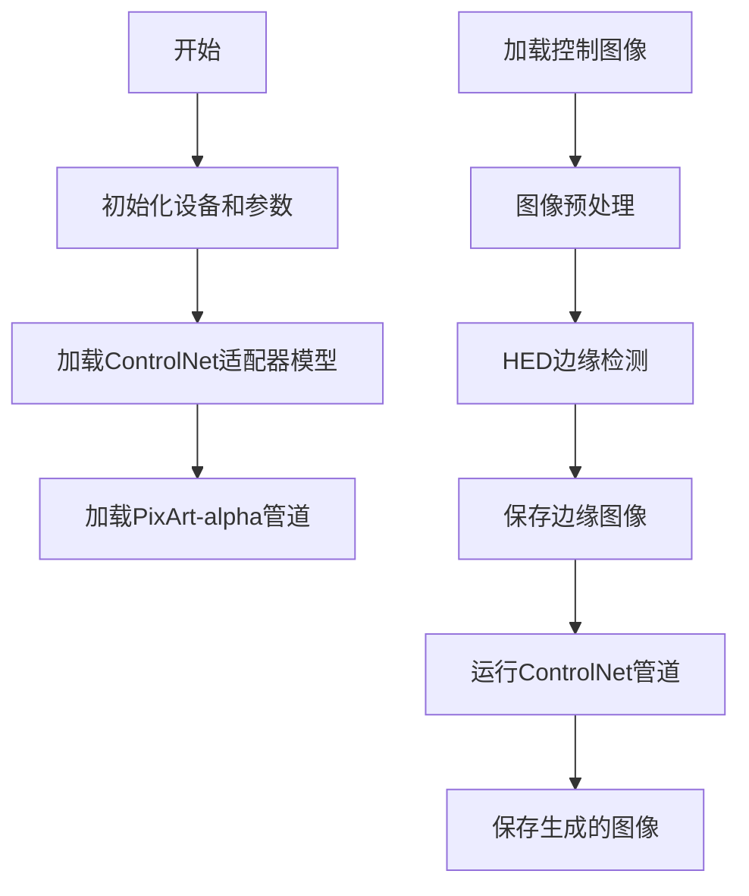

## 类结构

```
该脚本为脚本形式，无自定义类定义
主要使用第三方库的类：
├── PixArtControlNetAdapterModel (ControlNet适配器模型)
├── PixArtAlphaControlnetPipeline (PixArt图像生成管道)
└── HEDdetector (HED边缘检测器)
```

## 全局变量及字段


### `controlnet_repo_id`
    
ControlNet模型仓库ID，用于指定预训练的ControlNet模型路径

类型：`str`
    


### `weight_dtype`
    
模型权重数据类型，设置为float16以节省显存

类型：`torch.dtype`
    


### `image_size`
    
生成图像的尺寸，设置为1024像素

类型：`int`
    


### `device`
    
计算设备，根据CUDA可用性选择GPU或CPU

类型：`torch.device`
    


### `images_path`
    
图像文件路径，指定输入输出图像的目录

类型：`str`
    


### `control_image_file`
    
控制图像文件名，用于指定输入的控制图像

类型：`str`
    


### `prompt`
    
文本提示词，描述期望生成的图像内容

类型：`str`
    


### `control_image_name`
    
控制图像名称(不含扩展名)，用于构建输出文件名

类型：`str`
    


### `control_image`
    
加载的控制图像，用于作为ControlNet的条件输入

类型：`Image`
    


### `height`
    
图像高度，从控制图像尺寸中获取

类型：`int`
    


### `width`
    
图像宽度，从控制图像尺寸中获取

类型：`int`
    


### `hed`
    
HED边缘检测器实例，用于生成图像的边缘特征

类型：`HEDdetector`
    


### `condition_transform`
    
图像预处理转换组合，包含RGB转换和中心裁剪操作

类型：`Compose`
    


### `hed_edge`
    
HED边缘检测结果图像，作为ControlNet的条件控制信号

类型：`Image`
    


    

## 全局函数及方法


### `torch.manual_seed`

设置 PyTorch 随机种子，确保深度学习模型在每次运行时产生一致的随机结果，从而实现实验的可复现性。

参数：

- `seed`：`int`，要设置的随机种子值，用于初始化随机数生成器

返回值：`None`，该函数不返回任何值，仅修改全局随机状态

#### 流程图

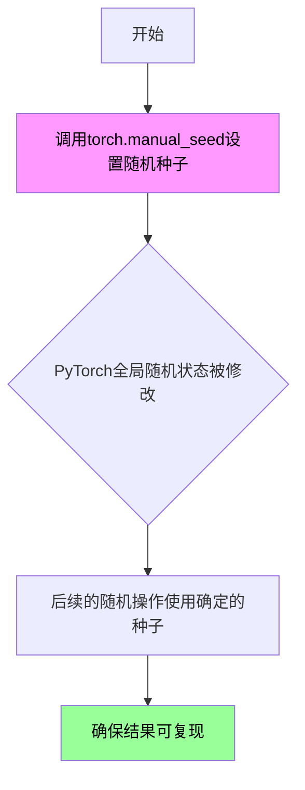

#### 带注释源码

```python
# 设置全局随机种子为0，确保后续所有随机操作可复现
# 这对于调试和实验结果验证非常重要
torch.manual_seed(0)

# 在此之后的代码中，所有使用torch生成的随机数都将遵循相同的序列
# 例如：torch.randn(), torch.rand(), 模型权重初始化等

# 示例说明：
# 假设在设置种子后执行以下代码:
# a = torch.randn(2, 3)
# b = torch.randn(2, 3)
# 每次程序运行时，a和b的值都会完全相同

# 注意：此函数只影响PyTorch的随机数生成器
# 如需确保完全的可复现性，还需要设置其他库的种子：
# - NumPy: np.random.seed(0)
# - Python random: random.seed(0)
# - CUDA确定性: torch.backends.cudnn.deterministic = True
#                torch.backends.cudnn.benchmark = False
```


### `torch.cuda.is_available`

检查当前 PyTorch 环境是否支持 CUDA（NVIDIA GPU 加速），返回布尔值以指示 CUDA 可用性。

参数：无需参数

返回值：`bool`，如果 CUDA 可用则返回 `True`，否则返回 `False`

#### 流程图

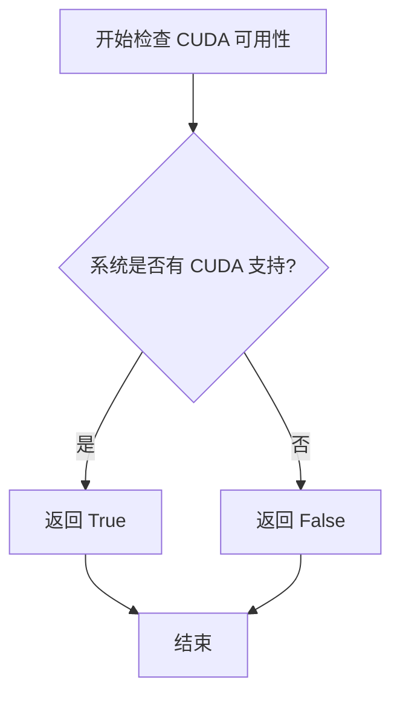

#### 带注释源码

```python
# torch.cuda.is_available 的实现逻辑（简化表示）
def is_available():
    """
    检查 CUDA 是否可用于当前的 PyTorch 构建。
    
    此函数会检查：
    1. PyTorch 是否使用 CUDA 支持编译
    2.系统中是否安装了兼容的 CUDA 驱动
    3.CUDA 运行时库是否可用
    
    Returns:
        bool: 如果 CUDA 可用返回 True，否则返回 False
    """
    # 实际实现位于 PyTorch C++/CUDA 后端
    # 此处仅为逻辑说明
    return _C.cuda_is_available()  # 内部 C++ 扩展调用
```

#### 在项目中的使用示例

```python
# 根据 CUDA 可用性选择计算设备
device = torch.device("cuda" if torch.cuda.is_available() else "cpu")
# 如果 CUDA 可用，使用 GPU 加速计算
# 否则回退到 CPU 进行计算
```

#### 关键信息

| 属性 | 值 |
|------|-----|
| 函数路径 | `torch.cuda.is_available` |
| 所属模块 | `torch.cuda` |
| 确定性 | 在同一环境中运行时结果确定 |
| 线程安全 | 是 |


### `PixArtControlNetAdapterModel.from_pretrained`

该函数是 `PixArtControlNetAdapterModel` 类的类方法，用于从预训练模型仓库或本地路径加载 PixArt-Alpha 适配的 ControlNet 模型权重，并可选地转换为指定的数据类型（fp16/bf16）和使用 safetensors 格式，以供后续的 ControlNet 推理或微调使用。

参数：

-  `pretrained_model_name_or_path`：`str`，模型仓库ID（如 "raulc0399/pixart-alpha-hed-controlnet"）或本地路径
-  `torch_dtype`：`torch.dtype`，可选，模型权重的数据类型（如 `torch.float16`），用于减少显存占用
-  `use_safetensors`：`bool`，可选，是否使用 `.safetensors` 格式加载权重（相较于 PyTorch 的 `.bin` 格式更安全）

返回值：`PixArtControlNetAdapterModel`，加载并初始化完成的 ControlNet 适配器模型实例

#### 流程图

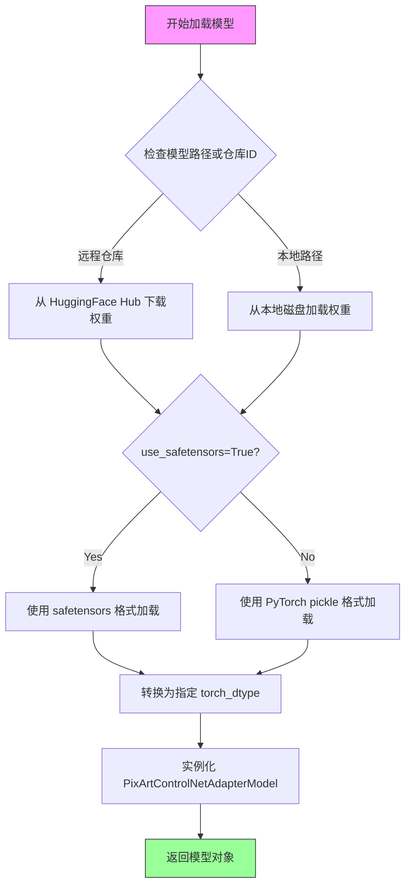

#### 带注释源码

```python
# 预训练模型仓库标识符
controlnet_repo_id = "raulc0399/pixart-alpha-hed-controlnet"

# 定义模型权重的数据类型（使用 float16 减少显存占用）
weight_dtype = torch.float16

# 从预训练仓库加载 ControlNet 适配器模型
controlnet = PixArtControlNetAdapterModel.from_pretrained(
    controlnet_repo_id,        # 模型ID或本地路径
    torch_dtype=weight_dtype,  # 指定权重数据类型为 fp16
    use_safetensors=True,      # 使用安全的 safetensors 格式加载
).to(device)                   # 将模型移至计算设备（GPU/CPU）

# 后续可将该 controlnet 对象传入 PixArtAlphaControlnetPipeline
# pipe = PixArtAlphaControlnetPipeline.from_pretrained(
#     "PixArt-alpha/PixArt-XL-2-1024-MS",
#     controlnet=controlnet,
#     ...
# )
```


### `PixArtAlphaControlnetPipeline.from_pretrained`

该方法用于从预训练模型加载 PixArt Alpha 控制网管道，将主模型与控制网模型结合，返回一个可用的图像生成管道实例。

参数：

- `pretrained_model_name_or_path`：`str`，预训练模型的名称或路径，这里传递的是 `"Pixart-alpha/PixArt-XL-2-1024-MS"`
- `controlnet`：`PixArtControlNetAdapterModel`，控制网模型对象，从远程仓库加载的 HED 控制网适配器
- `torch_dtype`：`torch.dtype`，张量数据类型，这里使用 `torch.float16` 以加速推理
- `use_safetensors`：`bool`，是否使用 safetensors 格式加载模型，设置为 `True` 以提高安全性

返回值：`PixArtAlphaControlnetPipeline`，加载并配置好的 PixArt Alpha 控制网管道对象，可用于图像生成

#### 流程图

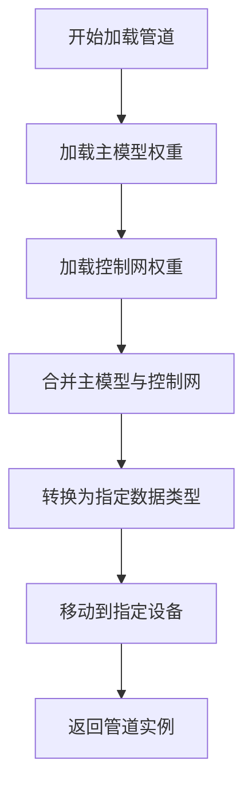

#### 带注释源码

```python
# 使用 from_pretrained 类方法加载 PixArt Alpha 控制网管道
pipe = PixArtAlphaControlnetPipeline.from_pretrained(
    "Pixart-alpha/PixArt-XL-2-1024-MS",  # 预训练主模型路径
    controlnet=controlnet,                # 传入已加载的控制网模型
    torch_dtype=weight_dtype,             # 设置权重数据类型为 float16
    use_safetensors=True,                  # 使用安全的 safetensors 格式
).to(device)                               # 将管道移至计算设备
```

#### 备注

该方法继承自 Diffusers 库的 `DiffusionPipeline` 基类，内部会完成以下操作：

1. 加载主模型（PixArt-XL-2-1024-MS）的配置和权重
2. 将传入的 controlnet 对象集成到管道中
3. 根据 torch_dtype 转换模型参数的数据类型
4. 调用 `.to(device)` 将模型加载到 GPU 或 CPU 设备


### `load_image`

`load_image` 是从 `diffusers.utils` 模块导入的图像加载函数，用于根据给定的文件路径加载图像文件并返回 PIL 图像对象。

参数：

-  `image_path`：`str`，图像文件的路径，可以是本地文件路径或 URL

返回值：`PIL.Image`，返回加载后的 PIL 图像对象，可以进行进一步的图像处理操作

#### 流程图

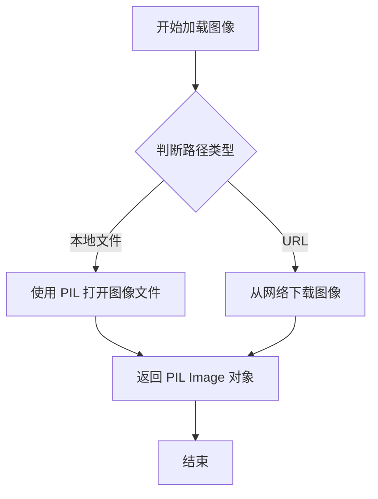

#### 带注释源码

```python
# 从 diffusers.utils 导入 load_image 函数
# 该函数是 Hugging Face diffusers 库提供的工具函数
from diffusers.utils import load_image

# 使用 load_image 加载控制图像
# 参数：images_path/control_image_file - 图像文件的相对路径
# 返回值：control_image - PIL Image 对象
control_image = load_image(f"{images_path}/{control_image_file}")

# 加载后的图像可以调用 PIL Image 的各种方法
# 例如获取图像尺寸
print(control_image.size)

# 获取图像的宽高
height, width = control_image.size
```


### `HEDdetector.from_pretrained`

该方法用于从预训练模型仓库或本地路径加载HED（Holistically-Nested Edge Detection）边缘检测器模型，并返回一个配置好的检测器实例，用于对图像进行边缘检测处理。

参数：

-  `pretrained_model_name_or_path`：`str`，预训练模型的名称（Hugging Face Hub上的模型ID）或本地模型目录路径。例如 `"lllyasviel/Annotators"`。

返回值：`HEDdetector`，返回一个HED边缘检测器对象，可用于对图像执行边缘检测操作。

#### 流程图

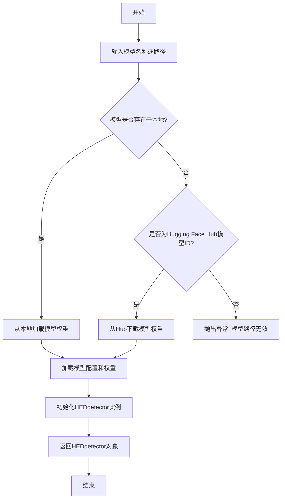

#### 带注释源码

```python
# HEDdetector类的from_pretrained类方法源码示例
class HEDdetector:
    """
    HED (Holistically-Nested Edge Detection) 边缘检测器类
    用于加载预训练模型并进行边缘检测
    """
    
    @classmethod
    def from_pretrained(cls, pretrained_model_name_or_path: str, **kwargs):
        """
        从预训练模型加载HED检测器
        
        参数:
            pretrained_model_name_or_path: 预训练模型的名称或路径
            **kwargs: 其他可选参数，如torch_dtype, use_safetensors等
        
        返回:
            HEDdetector: 加载好的检测器实例
        """
        # 1. 解析模型路径或名称
        # 如果是Hugging Face Hub模型ID，则从远程仓库下载
        # 如果是本地路径，则直接从本地加载
        
        # 2. 加载模型配置和权重
        # 根据模型文件（如config.json, model.safetensors等）初始化模型
        
        # 3. 创建HEDdetector实例
        # 将加载的模型权重封装到检测器对象中
        
        # 4. 返回配置好的检测器实例
        return cls(model, processor)
    
    def __call__(self, image, detect_resolution=512, image_resolution=1024):
        """
        对输入图像进行边缘检测
        
        参数:
            image: PIL Image或torch.Tensor，输入图像
            detect_resolution: int，边缘检测时的分辨率
            image_resolution: int，最终输出图像的分辨率
        
        返回:
            检测后的边缘图
        """
        # 处理图像并返回边缘检测结果
        pass
```


### `T.Compose`

组合多个图像变换操作，形成一个可依次执行的变换管道。该函数接受一个变换列表，并返回一个组合后的变换对象，当调用该对象时，会按顺序对输入图像应用列表中的每个变换。

参数：

- `transforms`：`List[Callable]`，需要组合的变换操作列表，每个元素应该是torchvision.transforms中的变换对象（如T.Lambda、T.CenterCrop等）

返回值：`T.Compose`（组合变换对象），返回一个可调用的组合变换，当输入图像时，会按顺序执行列表中的所有变换并返回最终结果

#### 流程图

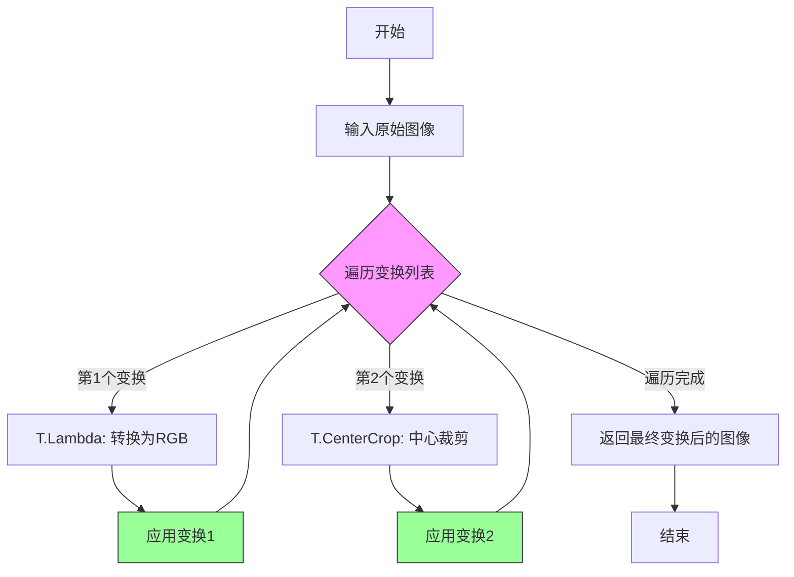

#### 带注释源码

```python
# 导入torchvision的transforms模块
import torchvision.transforms as T

# 定义图像尺寸
image_size = 1024

# 使用T.Compose组合多个图像变换操作
# Compose接收一个变换列表，按顺序依次执行
condition_transform = T.Compose(
    [
        # 变换1: Lambda变换，将图像转换为RGB模式
        # 参数是一个lambda函数，输入img，输出img.convert("RGB")
        T.Lambda(lambda img: img.convert("RGB")),
        
        # 变换2: CenterCrop变换，从图像中心裁剪出指定尺寸
        # 参数为目标尺寸 [height, width]
        T.CenterCrop([image_size, image_size]),
    ]
)

# 使用组合后的变换处理控制图像
# 调用 condition_transform(control_image) 会依次执行:
# 1. 先将图像转换为RGB
# 2. 然后进行中心裁剪
control_image = condition_transform(control_image)
```


### `T.Lambda`

`T.Lambda` 是 PyTorch `torchvision.transforms` 模块中的图像变换函数，用于对图像应用自定义的 lambda 变换函数。本代码中使用它将图像转换为 RGB 格式，以确保后续处理的一致性。

参数：

- `img`：`PIL.Image`，输入的待转换图像

返回值：`PIL.Image`，转换后的 RGB 图像

#### 流程图

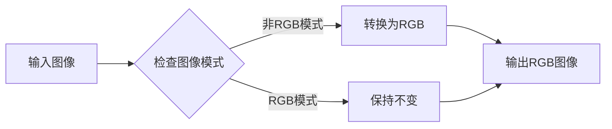

#### 带注释源码

```python
# 定义图像条件变换组合
condition_transform = T.Compose(
    [
        # T.Lambda: 自定义lambda图像变换
        # 将输入图像转换为RGB模式，确保图像有3个通道
        # 参数: img - PIL Image对象
        # 返回: 转换后的RGB PIL Image对象
        T.Lambda(lambda img: img.convert("RGB")),
        
        # CenterCrop: 中心裁剪，将图像裁剪为指定的正方形尺寸
        # 参数: [image_size, image_size] - 目标尺寸1024x1024
        T.CenterCrop([image_size, image_size]),
    ]
)

# 应用变换到控制图像
# 输入: control_image - 原始加载的PIL Image
# 输出: control_image - 经过RGB转换和中心裁剪后的PIL Image
control_image = condition_transform(control_image)
```

#### 额外说明

| 项目 | 描述 |
|------|------|
| **使用场景** | 在图像预处理管道中确保图像格式一致性 |
| **依赖项** | `torchvision.transforms as T` |
| **图像模式转换** | 支持灰度(L)、RGBA、Palette等模式转换为RGB |
| **组合使用** | 通常与 `T.Compose` 组合使用以构建复杂的变换管道 |
| **性能考虑** | `img.convert("RGB")` 会创建新的图像对象，有一定内存开销 |

#### 技术债务与优化空间

1. **Lambda 函数序列化问题**: 使用 `T.Lambda` 和匿名函数可能导致模型导出/序列化困难，建议使用命名函数替代
2. **图像尺寸硬编码**: `image_size = 1024` 硬编码在多处，建议提取为配置参数
3. **缺少错误处理**: 图像加载和转换过程缺少异常捕获机制
4. **内存管理**: 大尺寸图像(1024x1024)处理时未显式管理内存，可考虑使用 `torch.cuda.empty_cache()` 清理GPU缓存


### `T.CenterCrop`

CenterCrop 是 torchvision.transforms 模块中的图像变换类，用于从输入图像的中心位置裁剪出指定尺寸的区域，常用于确保输入图像符合模型要求的固定尺寸。

参数：

- `size`：`int` 或 `tuple`，裁剪后的目标尺寸。在代码中为 `[image_size, image_size]`，即 `[1024, 1024]`

返回值：`PIL.Image`，裁剪后的图像

#### 流程图

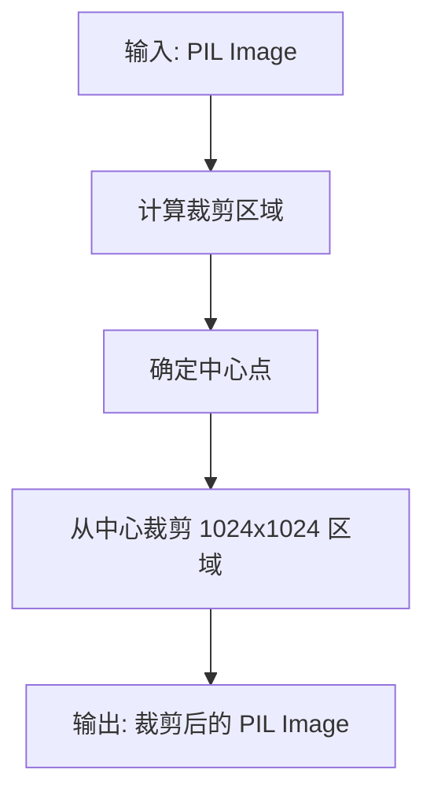

#### 带注释源码

```python
# 创建包含图像预处理步骤的组合变换
condition_transform = T.Compose(
    [
        # 第一步：将图像转换为 RGB 模式
        T.Lambda(lambda img: img.convert("RGB")),
        
        # 第二步：从图像中心裁剪出 1024x1024 的区域
        # size 参数为 [height, width]，即 [1024, 1024]
        T.CenterCrop([image_size, image_size]),
    ]
)

# 应用变换到控制图像
# 输入: 原始 PIL Image (尺寸为 height x width)
# 输出: 1024x1024 的中心裁剪图像
control_image = condition_transform(control_image)
```


### `HEDdetector.__call__` (hed)

调用HED检测器进行边缘检测，将输入图像转换为HED边缘图，用于ControlNet控制条件生成。

参数：

- `self`：HEDdetector，HED边缘检测器实例
- `image`：PIL.Image，经过预处理（RGB转换和中心裁剪）的输入图像
- `detect_resolution`：int，边缘检测的分辨率，默认为1024
- `image_resolution`：int，输出图像的分辨率，默认为1024

返回值：`PIL.Image`，HED边缘检测后的图像

#### 流程图

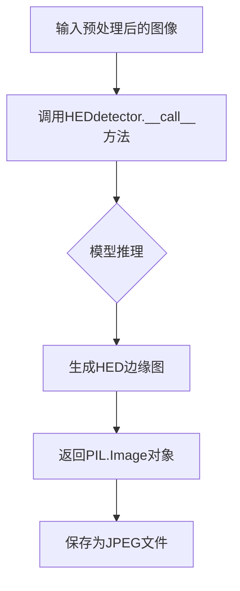

#### 带注释源码

```python
# 加载HED边缘检测预训练模型
# 从lllyasviel/Annotators仓库加载HEDdetector模型
hed = HEDdetector.from_pretrained("lllyasviel/Annotators")

# 定义图像预处理变换管道
condition_transform = T.Compose(
    [
        T.Lambda(lambda img: img.convert("RGB")),  # 将图像转换为RGB模式
        T.CenterCrop([image_size, image_size]),    # 中心裁剪到1024x1024
    ]
)

# 对控制图像进行预处理
control_image = condition_transform(control_image)

# 调用HED检测器进行边缘检测
# 参数说明：
# - control_image: 输入的PIL图像
# - detect_resolution=image_size: 边缘检测使用的分辨率
# - image_resolution=image_size: 输出图像的分辨率
hed_edge = hed(control_image, detect_resolution=image_size, image_resolution=image_size)

# 将边缘检测结果保存为JPEG文件
hed_edge.save(f"{images_path}/{control_image_name}_hed.jpg")
```


### `PixArtAlphaControlnetPipeline.__call__`

使用PixArt-Alpha扩散模型结合ControlNet适配器，根据文本提示和HED边缘检测图像生成对应的控制图像。

参数：

- `prompt`：`str`，文本提示，描述希望生成的图像内容
- `image`：`PIL.Image` 或类似图像对象，经过HED边缘检测处理后的控制图像
- `num_inference_steps`：`int`，扩散模型的推理步数，值越大生成质量越高但速度越慢
- `guidance_scale`：`float`， classifier-free guidance的权重，控制生成图像与提示词的相关性
- `height`：`int`，生成图像的高度（像素）
- `width`：`int`，生成图像的宽度（像素）
- `negative_prompt`：（可选）`str`，负面提示词，指定不希望出现的元素
- `num_images_per_prompt`：（可选）`int`，每个提示词生成的图像数量
- `eta`：（可选）`float`，DDIM采样器的噪声参数
- `generator`：（可选）`torch.Generator`，随机数生成器，用于复现结果

返回值：`PipelineOutput`，包含生成的图像列表（`images`属性）

#### 流程图

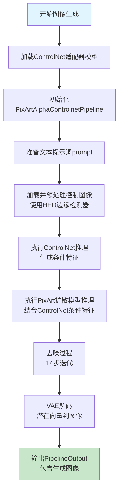

#### 带注释源码

```python
# 导入所需的库
import torch
import torchvision.transforms as T
from controlnet_aux import HEDdetector
from diffusers.utils import load_image
from examples.research_projects.pixart.controlnet_pixart_alpha import PixArtControlNetAdapterModel
from examples.research_projects.pixart.pipeline_pixart_alpha_controlnet import PixArtAlphaControlnetPipeline

# 配置参数
controlnet_repo_id = "raulc0399/pixart-alpha-hed-controlnet"  # ControlNet模型仓库ID
weight_dtype = torch.float16  # 权重数据类型，使用半精度
image_size = 1024  # 图像尺寸

# 设备配置
device = torch.device("cuda" if torch.cuda.is_available() else "cpu")

# 设置随机种子以确保可复现性
torch.manual_seed(0)

# 加载ControlNet适配器模型
controlnet = PixArtControlNetAdapterModel.from_pretrained(
    controlnet_repo_id,
    torch_dtype=weight_dtype,
    use_safetensors=True,
).to(device)

# 加载PixArt-Alpha主模型并结合ControlNet构建Pipeline
pipe = PixArtAlphaControlnetPipeline.from_pretrained(
    "PixArt-alpha/PixArt-XL-2-1024-MS",
    controlnet=controlnet,
    torch_dtype=weight_dtype,
    use_safetensors=True,
).to(device)

# 定义图像路径和文件名
images_path = "images"
control_image_file = "0_7.jpg"

# 定义文本提示词 - 描述希望生成的图像内容
prompt = "battleship in space, galaxy in background"

# 提取控制图像名称（不含扩展名）
control_image_name = control_image_file.split(".")[0]

# 加载控制图像
control_image = load_image(f"{images_path}/{control_image_file}")
print(control_image.size)
height, width = control_image.size

# 初始化HED边缘检测器 - 用于提取图像边缘作为ControlNet条件
hed = HEDdetector.from_pretrained("lllyasviel/Annotators")

# 定义图像预处理变换
condition_transform = T.Compose(
    [
        T.Lambda(lambda img: img.convert("RGB")),  # 转换为RGB模式
        T.CenterCrop([image_size, image_size]),    # 中心裁剪到目标尺寸
    ]
)

# 对控制图像进行预处理
control_image = condition_transform(control_image)
# 使用HED检测器生成边缘图像（作为ControlNet条件输入）
hed_edge = hed(control_image, detect_resolution=image_size, image_resolution=image_size)

# 保存HED边缘检测结果
hed_edge.save(f"{images_path}/{control_image_name}_hed.jpg")

# ==================== 执行Pipeline图像生成 ====================
# 禁用梯度计算以提高推理效率并减少显存占用
with torch.no_grad():
    # 调用Pipeline进行图像生成
    out = pipe(
        prompt=prompt,                    # 文本提示词
        image=hed_edge,                   # HED边缘图像作为控制条件
        num_inference_steps=14,           # 14步去噪迭代
        guidance_scale=4.5,               # CFG引导强度
        height=image_size,                # 输出高度1024
        width=image_size,                 # 输出宽度1024
    )

    # 保存生成的图像到文件
    out.images[0].save(f"{images_path}//{control_image_name}_output.jpg")
```


### `Image.save` (PIL/Pillow 图像保存方法)

该方法用于将 PIL Image 对象保存到指定的文件路径，支持多种图像格式（JPEG、PNG 等），是图像处理管道中输出最终结果的核心操作。

#### 参数：

- `f"{images_path}/{control_image_name}_hed.jpg"`：`str`，HED 边缘检测结果图像的保存路径
- `f"{images_path}//{control_image_name}_output.jpg"`：`str`，Diffusion 模型输出图像的保存路径

#### 返回值：`None`，直接将图像写入文件系统，无返回值

#### 流程图

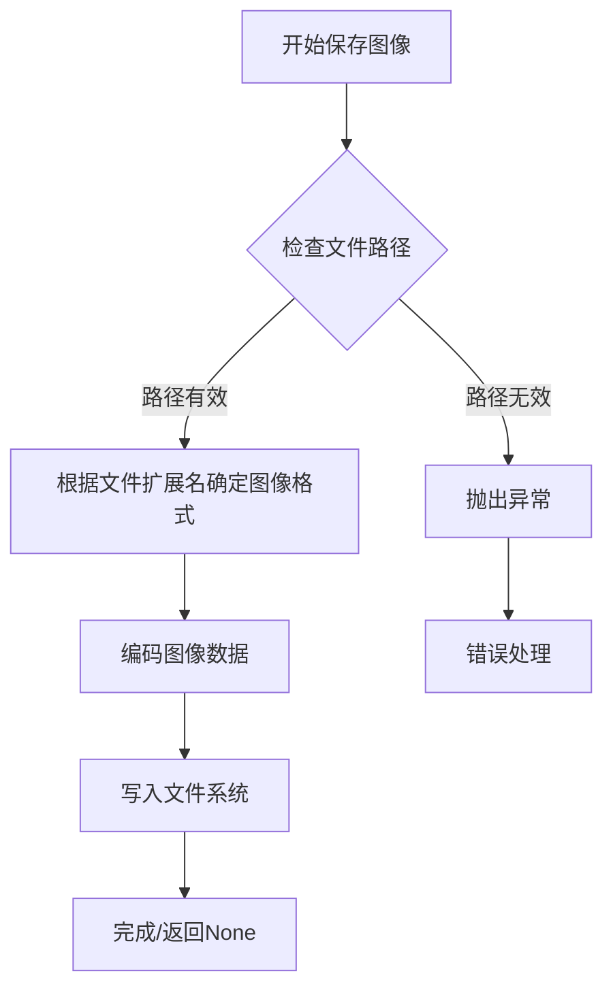

#### 带注释源码

```python
# 保存 HED 边缘检测结果图像
# hed_edge 是 HEDdetector 处理后的边缘检测结果图像 (PIL Image)
hed_edge.save(f"{images_path}/{control_image_name}_hed.jpg")
# 功能：将边缘检测结果保存为 JPEG 格式
# 参数：目标文件路径（包含目录和文件名）
# 返回值：None

# 保存 Diffusion 模型生成的输出图像
# out 是管道输出对象，out.images[0] 是第一张生成的图像 (PIL Image)
out.images[0].save(f"{images_path}//{control_image_name}_output.jpg")
# 功能：将 AI 生成的图像保存为 JPEG 格式
# 参数：目标文件路径（包含目录和文件名）
# 注意：路径中使用双斜杠 // 可能是笔误，应为单斜杠
# 返回值：None
```

#### 关键组件信息

| 组件名称 | 一句话描述 |
|---------|-----------|
| `hed_edge` | HED 边缘检测器输出的边缘图像 (PIL Image) |
| `out.images[0]` | PixArt-Alpha ControlNet 管道生成的首张图像 (PIL Image) |

#### 潜在的技术债务或优化空间

1. **路径格式不一致**：代码中使用了 `f"{images_path}//{control_image_name}_output.jpg"`（双斜杠），虽然 Python 能处理，但不符合规范，应统一使用 `os.path.join` 或单斜杠
2. **硬编码路径**：图像保存路径硬编码在代码中，建议提取为配置参数
3. **缺少错误处理**：`.save()` 方法调用时未捕获可能的 I/O 异常（如磁盘空间不足、权限问题）
4. **无返回值利用**：保存操作无返回值，无法确认保存是否成功

#### 其它项目

- **设计目标与约束**：确保生成的图像能够持久化保存到磁盘，支持 JPEG 格式输出
- **错误处理与异常设计**：建议添加 try-except 块捕获 `OSError` 或 `IOError`，处理磁盘写入失败的情况
- **外部依赖与接口契约**：依赖 PIL/Pillow 库的 `Image.save()` 方法，遵循其接口约定
- **数据流**：HED 边缘检测结果 → 保存边缘图 → ControlNet 管道 → 生成图像 → 保存输出图


## 关键组件


### 核心功能概述

该代码实现了一个基于PixArt-Alpha ControlNet的图像生成流程，通过HED边缘检测器对输入图像进行预处理，然后利用ControlNet引导机制生成与边缘结构对应的新图像。

### 整体运行流程

1. 初始化设备（cuda/cpu）、数据类型（float16）和随机种子
2. 加载预训练的ControlNet适配器模型（PixArtControlNetAdapterModel）
3. 加载PixArt-Alpha主pipeline并关联ControlNet
4. 使用HED边缘检测器对输入图像进行边缘提取
5. 将边缘图像作为ControlNet条件输入，运行推理pipeline
6. 保存生成的图像结果

### 关键组件信息

### PixArtControlNetAdapterModel

从HuggingFace Hub加载的ControlNet适配器模型，专门用于连接PixArt-alpha生成模型与ControlNet架构，实现边缘图引导的图像生成。

### PixArtAlphaControlnetPipeline

Diffusers库封装的完整推理pipeline，整合了PixArt-alpha文本到图像模型与ControlNet条件控制机制。

### HEDdetector

边缘检测器组件，基于Holistically-Nested Networks实现，用于从输入图像中提取结构化的边缘信息作为ControlNet的条件输入。

### 控制参数与配置

包含图像尺寸（1024x1024）、推理步数（14步）、引导系数（4.5）等关键生成参数，影响输出图像的质量与风格。

### 图像预处理流程

由transforms.Compose组成的处理链，包括RGB转换与中心裁剪，确保输入图像符合模型要求的标准尺寸。

### 潜在技术债务与优化空间

1. **硬编码配置**：模型路径、图像尺寸、推理参数等均硬编码在代码中，缺乏配置管理机制
2. **错误处理缺失**：模型加载、文件IO、推理过程均无异常捕获与处理
3. **资源管理不足**：未实现模型卸载与显存释放机制
4. **批量处理能力缺失**：仅支持单张图像处理，无批量推理支持
5. **日志记录缺失**：关键操作无日志输出，不利于生产环境监控

### 其他项目说明

**设计目标**：实现基于ControlNet的边缘引导图像生成，演示PixArt-alpha在条件控制场景下的应用。

**外部依赖**：依赖diffusers、controlnet_aux、torchvision等开源库，需确保版本兼容性。

**接口契约**：输入为指定路径的图像文件，输出为生成的图像文件到指定目录。


## 问题及建议


### 已知问题

-   **硬编码配置值**：image_size、weight_dtype、num_inference_steps、guidance_scale 等参数直接写在代码中，缺乏灵活配置
-   **路径分隔符不一致**：第59行使用双斜杠 `images_path}//{control_image_name}_output.jpg`，可能导致跨平台问题
-   **PIL图像尺寸变量赋值错误**：第36行 `height, width = control_image.size` 获取的是 (width, height) 格式，但第53行 pipe 调用时将 width 当作 height 使用，导致图像尺寸逻辑错误
-   **缺少错误处理**：无文件存在性检查、无GPU内存检查、无CUDA可用性验证、无模型加载失败处理
-   **资源未优化**：HEDdetector 模型加载在CPU上，未像其他模型一样移至GPU；缺少 GPU 内存清理逻辑
-   **无日志系统**：仅使用 print() 输出，缺少结构化日志记录
-   **魔法数字**：14步推理、4.5引导系数、1024分辨率等关键参数缺乏注释说明其选择依据

### 优化建议

-   使用 argparse 或配置文件管理所有超参数，将硬编码值提取为命令行参数或环境变量
-   统一使用 os.path.join() 构建路径，避免手动拼接分隔符
-   修正尺寸变量赋值：`width, height = control_image.size` 或直接使用 `size = control_image.size`
-   添加完整的异常处理：文件读取异常、模型加载异常、CUDA OOM处理、推理异常
-   将 HEDdetector 移至GPU：`hed = HEDdetector.from_pretrained(...).to(device)`
-   在推理完成后添加 `torch.cuda.empty_cache()` 释放GPU内存
-   使用 logging 模块替代 print()，支持多级别日志和日志格式化
-   添加 --help 说明和参数校验，提升脚本可用性
-   考虑添加批量处理能力，支持多图像输入
-   对模型加载添加 cache_dir 参数，便于在受限环境中管理模型存储


## 其它


### 设计目标与约束

本代码旨在实现基于ControlNet的PixArt图像生成流程，通过HED边缘检测器提取图像边缘特征作为控制条件，结合文本提示词生成符合边缘约束的高分辨率图像。设计约束包括：支持1024x1024分辨率输出，使用float16精度加速推理，依赖CUDA GPU加速，仅支持单张图像处理。

### 错误处理与异常设计

代码缺乏显式的错误处理机制。潜在的异常情况包括：CUDA不可用时应回退到CPU但未验证输出质量；模型加载失败时程序直接终止；图像文件不存在时load_image将抛出异常；HED检测器初始化或推理失败未捕获；pipeline推理过程中的OOM风险未处理。建议增加try-except块捕获FileNotFoundError、RuntimeError、torch.cuda.OutOfMemoryError等异常，并提供友好的错误提示和资源清理逻辑。

### 数据流与状态机

数据流如下：加载输入图像 → 图像预处理（RGB转换 + 中心裁剪）→ HED边缘检测 → 边缘图像保存 → 调用PixArtControlNet pipeline → 保存生成图像。状态转换包括：initial（初始状态）→ loading（加载资源和模型）→ preprocessing（图像预处理）→ detecting（边缘检测）→ generating（图像生成）→ finished（完成）或error（错误）。

### 外部依赖与接口契约

主要依赖包括：torch和torchvision（深度学习框架和 transforms）、controlnet_aux的HEDdetector（边缘检测）、diffusers库的PixArtAlphaControlnetPipeline和PixArtControlNetAdapterModel（图像生成管线）、PIL/Pillow（图像处理）。外部模型依赖：raulc0399/pixart-alpha-hed-controlnet（ControlNet适配器）、PixArt-alpha/Pixart-XL-2-1024-MS（主模型）、lllyasviel/Annotators（HED检测器）。接口契约：load_image输入图像路径返回PIL Image，HEDdetector接受PIL Image和分辨率参数返回边缘检测结果，pipeline接受prompt、image、num_inference_steps、guidance_scale、height、width参数返回GenerationOutput对象。

### 性能考量与优化建议

当前代码每次运行都会重新加载模型，造成资源浪费。建议添加模型缓存机制或封装为可复用的服务类。图像处理未使用batch模式，可考虑批量处理多张图像提高吞吐量。推理步骤固定为14步，可根据质量要求动态调整。weight_dtype使用float16可进一步考虑量化优化。当前代码未使用gradient checkpointing或CPU offload技术，大幅图像生成时可能OOM。

### 配置管理与硬编码问题

代码存在多处硬编码配置：image_size=1024、weight_dtype=torch.float16、num_inference_steps=14、guidance_scale=4.5、torch.manual_seed(0)等。建议将这些参数抽取为配置文件或命令行参数，支持灵活调整。模型路径controlnet_repo_id和pipeline基础模型ID也应外部化配置，便于切换不同的预训练模型或自定义权重。

### 安全性设计

代码从远程加载预训练模型，存在模型篡改风险，应验证模型hash或使用可信来源。图像文件路径未做路径遍历检查，images_path和control_image_file可能存在注入风险。生成的图像保存路径未检查磁盘空间，不排除写入失败可能。未对用户输入的prompt进行过滤，可能存在prompt注入攻击风险。

### 可测试性设计

当前代码以脚本形式存在，直接运行main逻辑，难以进行单元测试。建议将核心功能重构为可导入的函数或类：模型加载、图像预处理、边缘检测、pipeline推理各封装为独立函数，提供清晰的输入输出接口，便于编写独立的单元测试和集成测试。

### 日志与监控

代码仅使用print输出基本状态信息，缺乏结构化日志。建议引入logging模块分级记录INFO、WARNING、ERROR等不同级别日志，包含时间戳、模块名、关键变量值。模型加载耗时、推理耗时、内存占用等性能指标应记录以便监控和优化。

### 资源清理与生命周期管理

代码未显式释放GPU显存和清理临时资源。建议在推理完成后显式调用torch.cuda.empty_cache()释放显存，删除临时生成的边缘检测图像，封装为context manager或try-finally确保资源始终被正确释放。对于大规模应用场景，应考虑实现模型卸载机制。

    