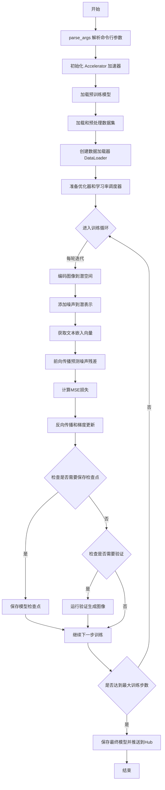
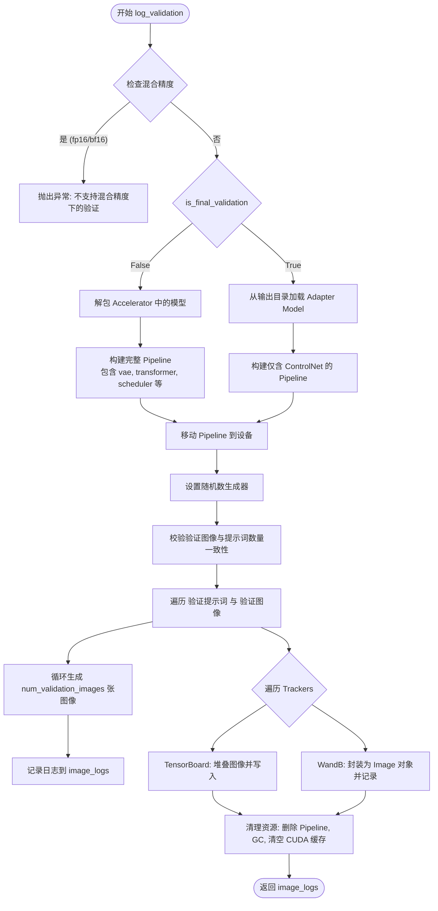
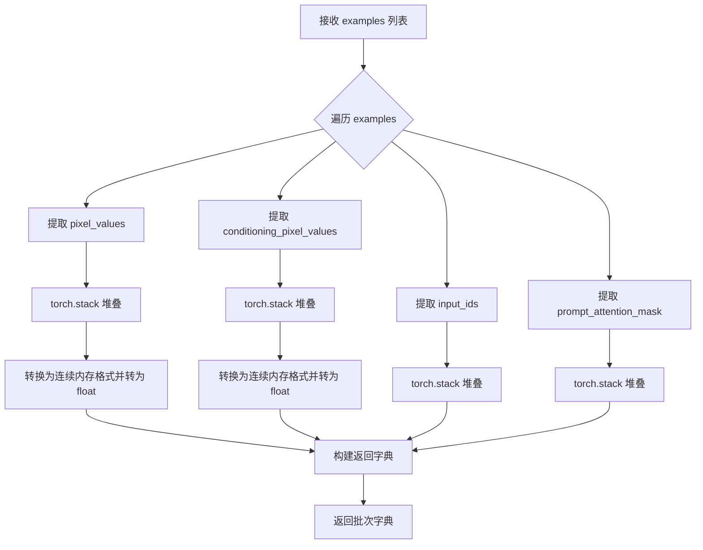
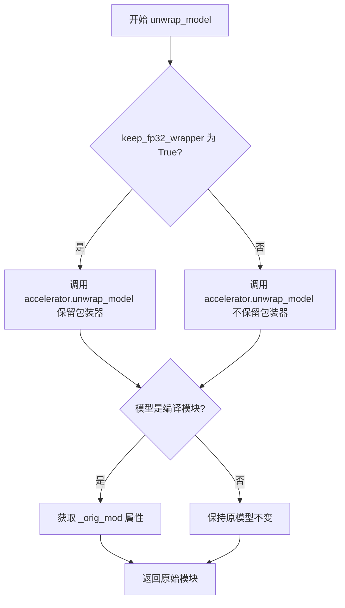
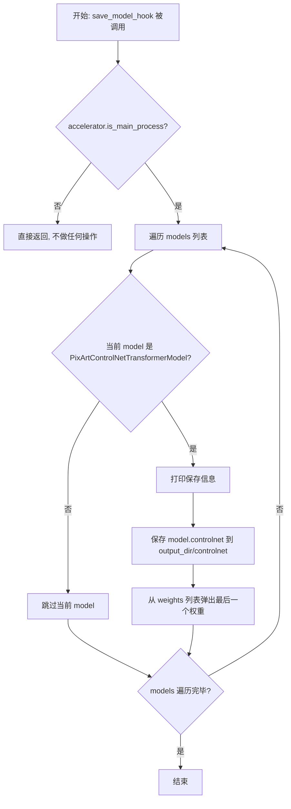
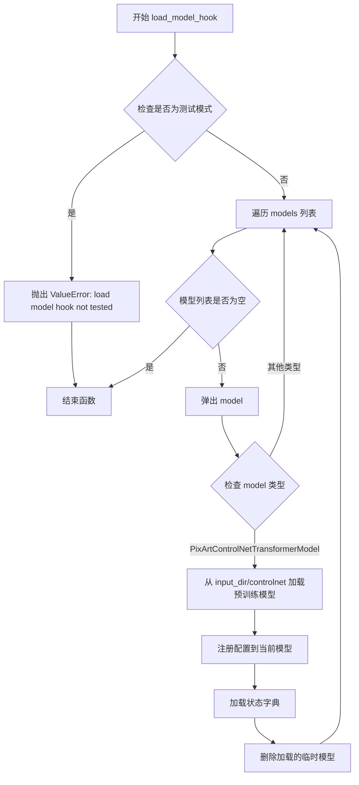

# `diffusers\examples\research_projects\pixart\train_pixart_controlnet_hf.py` 详细设计文档

这是一个用于微调PixArt-Alpha文本到图像扩散模型的ControlNet训练脚本，支持基于文本提示和条件图像（如边缘图、深度图）进行可控图像生成。该脚本使用HuggingFace diffusers库，实现完整的训练流程包括数据预处理、噪声调度、梯度累积、混合精度训练、模型验证和检查点保存。

## 整体流程



## 类结构

```
无自定义类 (纯函数式脚本)
├── 导入的外部类 (非本文件定义)
│   ├── PixArtAlphaControlnetPipeline (pipeline_pixart_alpha_controlnet)
│   ├── PixArtControlNetAdapterModel (controlnet_pixart_alpha)
│   ├── PixArtControlNetTransformerModel (controlnet_pixart_alpha)
│   ├── PixArtTransformer2DModel (diffusers)
│   ├── AutoencoderKL (diffusers)
│   ├── DDPMScheduler (diffusers)
│   ├── T5EncoderModel (transformers)
│   └── T5Tokenizer (transformers)
```

## 全局变量及字段


### `logger`
    
用于记录训练过程中的日志信息，包括训练步骤、验证结果、警告和错误等

类型：`logging.Logger`
    


    

## 全局函数及方法


### `log_validation`

该函数是训练流程中的核心验证环节，负责在模型训练过程中（或训练结束时）运行推理 pipeline。它根据提供的验证提示词（prompt）和控制图像（validation image）生成图像，并将生成的图像连同原始输入一起记录到日志追踪器（TensorBoard 或 Weights & Biases）中，以便于直观评估模型的收敛效果。

#### 参数

- `vae`：`AutoencoderKL`，预训练的变分自编码器，用于将图像编码到潜在空间。
- `transformer`：`PixArtTransformer2DModel`，PixArt 的主 Transformer 模型。
- `controlnet`：`PixArtControlNetAdapterModel` 或类似的 ControlNet 模型权重，用于根据条件图像控制生成。
- `tokenizer`：`T5Tokenizer`，用于对文本提示进行分词。
- `scheduler`：`DDPMScheduler`，去噪调度器，负责定义扩散过程中的噪声添加与去除策略。
- `text_encoder`：`T5EncoderModel`，文本编码器，将文本提示转换为嵌入向量。
- `args`：`Namespace`，包含训练参数的对象（如模型路径、分辨率、验证步数等）。
- `accelerator`：`Accelerator`，HuggingFace Accelerate 库提供的分布式训练加速器。
- `weight_dtype`：`torch.dtype`，模型权重的精度类型（如 float32, float16）。
- `step`：`int`，当前训练的步数（用于日志记录）。
- `is_final_validation`：`bool`，标志位，区分训练过程中的验证和训练结束后的最终验证。

#### 返回值

`List[Dict]`，返回一个包含验证日志的列表。每个字典结构如下：
- `validation_image`: 条件图像（PIL Image）。
- `images`: 生成的图像列表（List[PIL Image]）。
- `validation_prompt`: 验证时使用的文本提示（str）。

#### 流程图



#### 带注释源码

```python
def log_validation(
    vae,
    transformer,
    controlnet,
    tokenizer,
    scheduler,
    text_encoder,
    args,
    accelerator,
    weight_dtype,
    step,
    is_final_validation=False,
):
    # 1. 混合精度检查：验证阶段通常不支持混合精度，或者需要特殊处理。此处直接报错以确保安全。
    if weight_dtype == torch.float16 or weight_dtype == torch.bfloat16:
        raise ValueError(
            "Validation is not supported with mixed precision training, disable validation and use the validation script, that will generate images from the saved checkpoints."
        )

    # 2. 准备 Pipeline：根据是否是最终验证，选择不同的模型加载策略。
    if not is_final_validation:
        logger.info(f"Running validation step {step} ... ")

        # 如果是训练中间验证，需要先解包（unwrap）加速器中的模型，因为模型可能被 accelerator 包装过。
        controlnet = accelerator.unwrap_model(controlnet)
        
        # 加载完整的推理 Pipeline，包含所有组件（VAE, Transformer, ControlNet 等）
        pipeline = PixArtAlphaControlnetPipeline.from_pretrained(
            args.pretrained_model_name_or_path,
            vae=vae,
            transformer=transformer,
            scheduler=scheduler,
            text_encoder=text_encoder,
            tokenizer=tokenizer,
            controlnet=controlnet,
            revision=args.revision,
            variant=args.variant,
            torch_dtype=weight_dtype,
        )
    else:
        logger.info("Running validation - final ... ")
        
        # 如果是最终验证（训练结束），通常从保存的 checkpoint 重新加载专门的 Adapter 模型。
        controlnet = PixArtControlNetAdapterModel.from_pretrained(args.output_dir, torch_dtype=weight_dtype)

        pipeline = PixArtAlphaControlnetPipeline.from_pretrained(
            args.pretrained_model_name_or_path,
            controlnet=controlnet,
            revision=args.revision,
            variant=args.variant,
            torch_dtype=weight_dtype,
        )

    # 3. Pipeline 基础配置：移动到设备并关闭进度条以减少日志干扰。
    pipeline = pipeline.to(accelerator.device)
    pipeline.set_progress_bar_config(disable=True)

    # 4. 内存优化：如有需要，启用 xformers 高效注意力机制。
    if args.enable_xformers_memory_efficient_attention:
        pipeline.enable_xformers_memory_efficient_attention()

    # 5. 设置随机种子：确保验证结果可复现。
    if args.seed is None:
        generator = None
    else:
        generator = torch.Generator(device=accelerator.device).manual_seed(args.seed)

    # 6. 参数对齐：处理验证图像和提示词数量不匹配的情况（广播逻辑）。
    if len(args.validation_image) == len(args.validation_prompt):
        validation_images = args.validation_image
        validation_prompts = args.validation_prompt
    elif len(args.validation_image) == 1:
        validation_images = args.validation_image * len(args.validation_prompt)
        validation_prompts = args.validation_prompt
    elif len(args.validation_prompt) == 1:
        validation_images = args.validation_image
        validation_prompts = args.validation_prompt * len(args.validation_image)
    else:
        raise ValueError(
            "number of `args.validation_image` and `args.validation_prompt` should be checked in `parse_args`"
        )

    image_logs = []

    # 7. 生成循环：遍历每一对 (提示词, 条件图) 进行推理。
    for validation_prompt, validation_image in zip(validation_prompts, validation_images):
        # 预处理验证图像：打开并调整大小。
        validation_image = Image.open(validation_image).convert("RGB")
        validation_image = validation_image.resize((args.resolution, args.resolution))

        images = []

        # 根据 num_validation_images 生成多张图像以评估稳定性。
        for _ in range(args.num_validation_images):
            image = pipeline(
                prompt=validation_prompt, image=validation_image, num_inference_steps=20, generator=generator
            ).images[0]
            images.append(image)

        # 记录本次验证的日志
        image_logs.append(
            {"validation_image": validation_image, "images": images, "validation_prompt": validation_prompt}
        )

    # 8. 日志记录：将生成的图像写入不同的追踪后端。
    tracker_key = "test" if is_final_validation else "validation"
    for tracker in accelerator.trackers:
        if tracker.name == "tensorboard":
            # TensorBoard 处理：需要将 PIL Image 转换为 numpy 数组并堆叠。
            for log in image_logs:
                images = log["images"]
                validation_prompt = log["validation_prompt"]
                validation_image = log["validation_image"]

                formatted_images = [np.asarray(validation_image)]

                for image in images:
                    formatted_images.append(np.asarray(image))

                formatted_images = np.stack(formatted_images)

                tracker.writer.add_images(validation_prompt, formatted_images, step, dataformats="NHWC")
        elif tracker.name == "wandb":
            # WandB 处理：直接使用 wandb.Image 对象。
            formatted_images = []

            for log in image_logs:
                images = log["images"]
                validation_prompt = log["validation_prompt"]
                validation_image = log["validation_image"]

                formatted_images.append(wandb.Image(validation_image, caption="Controlnet conditioning"))

                for image in images:
                    image = wandb.Image(image, caption=validation_prompt)
                    formatted_images.append(image)

            tracker.log({tracker_key: formatted_images})
        else:
            logger.warning(f"image logging not implemented for {tracker.name}")

    # 9. 资源清理：验证过程显存占用大，需要手动清理。
    del pipeline
    gc.collect()
    torch.cuda.empty_cache()

    logger.info("Validation done!!")

    return image_logs
```


### `save_model_card`

该函数用于在训练完成后生成并保存模型卡片（Model Card）到 HuggingFace Hub。模型卡片包含模型描述、训练元数据（基础模型、数据集信息）以及可选的验证图像，供模型分享和复现使用。

参数：

- `repo_id`：`str`，HuggingFace Hub 上的仓库 ID，用于标识模型仓库
- `image_logs`：可选参数，类型为 `list[dict]` 或 `None`，验证阶段生成的图像日志，包含验证图像、验证提示词等信息
- `base_model`：`str`，用于训练的基础模型名称或路径
- `dataset_name`：`str`，训练使用的数据集名称
- `repo_folder`：可选参数，类型为 `str` 或 `None`，本地仓库文件夹路径，用于保存 README.md 等文件

返回值：`None`，该函数无返回值，直接将模型卡片写入本地文件系统

#### 流程图

```mermaid
flowchart TD
    A[开始 save_model_card] --> B{image_logs 是否为 None?}
    B -->|是| C[跳过图像处理]
    B -->|否| D[遍历 image_logs]
    D --> E[获取验证图像和提示词]
    E --> F[保存 conditioning 图像为 image_control.png]
    E --> G[生成图像网格并保存为 images_{i}.png]
    E --> H[构建图像 Markdown 描述]
    H --> I[构建模型描述字符串]
    C --> J[调用 load_or_create_model_card 创建模型卡片]
    J --> K[设置许可证为 openrail++]
    J --> L[填充基础模型和模型描述]
    K --> M[定义标签列表]
    M --> N[调用 populate_model_card 添加标签]
    N --> O[保存模型卡片为 README.md]
    O --> P[结束]
```

#### 带注释源码

```python
def save_model_card(repo_id: str, image_logs=None, base_model=str, dataset_name=str, repo_folder=None):
    """
    生成并保存模型卡片到本地目录
    
    参数:
        repo_id: HuggingFace Hub 仓库 ID
        image_logs: 验证阶段生成的图像日志，可选
        base_model: 基础模型名称或路径
        dataset_name: 数据集名称
        repo_folder: 本地仓库文件夹路径
    """
    
    # 初始化图像描述字符串
    img_str = ""
    
    # 如果存在图像日志，处理验证图像
    if image_logs is not None:
        img_str = "You can find some example images below.\n\n"
        
        # 遍历每个验证日志
        for i, log in enumerate(image_logs):
            images = log["images"]
            validation_prompt = log["validation_prompt"]
            validation_image = log["validation_image"]
            
            # 保存 conditioning 图像
            validation_image.save(os.path.join(repo_folder, "image_control.png"))
            
            # 构建图像描述文本
            img_str += f"prompt: {validation_prompt}\n"
            
            # 将验证图像添加到图像列表开头
            images = [validation_image] + images
            
            # 生成图像网格并保存
            make_image_grid(images, 1, len(images)).save(os.path.join(repo_folder, f"images_{i}.png"))
            
            # 添加 Markdown 图像链接
            img_str += f"\n"

    # 构建模型描述
    model_description = f"""
# controlnet-{repo_id}

These are controlnet weights trained on {base_model} with new type of conditioning.
{img_str}
"""

    # 加载或创建模型卡片
    model_card = load_or_create_model_card(
        repo_id_or_path=repo_id,
        from_training=True,
        license="openrail++",
        base_model=base_model,
        model_description=model_description,
        inference=True,
    )

    # 定义标签列表
    tags = [
        "pixart-alpha",
        "pixart-alpha-diffusers",
        "text-to-image",
        "diffusers",
        "controlnet",
        "diffusers-training",
    ]
    
    # 填充模型卡片的标签
    model_card = populate_model_card(model_card, tags=tags)

    # 保存模型卡片为 README.md
    model_card.save(os.path.join(repo_folder, "README.md"))
```


### `parse_args`

该函数使用 `argparse` 模块解析命令行参数，定义并收集训练脚本所需的各种配置选项，包括模型路径、数据集配置、训练超参数、验证设置、优化器选项等，最终返回一个包含所有解析后参数的 `Namespace` 对象。

参数：该函数无显式参数，通过 `argparse.ArgumentParser` 自动从命令行获取参数。

返回值：`Namespace`（`argparse.Namespace` 类型），包含所有解析后的命令行参数及其值。

#### 流程图

```mermaid
flowchart TD
    A[开始 parse_args] --> B[创建 ArgumentParser 对象]
    B --> C[添加 --pretrained_model_name_or_path 参数]
    C --> D[添加模型相关参数: --revision, --variant, --controlnet_model_name_or_path]
    D --> E[添加数据集参数: --dataset_name, --dataset_config_name, --train_data_dir 等]
    E --> F[添加数据列参数: --image_column, --caption_column 等]
    F --> G[添加验证参数: --validation_prompt, --validation_image 等]
    G --> H[添加训练参数: --output_dir, --resolution, --train_batch_size 等]
    H --> I[添加优化器参数: --learning_rate, --adam_* 系列参数]
    I --> J[添加高级参数: --gradient_checkpointing, --mixed_precision 等]
    J --> K[调用 parser.parse_args 解析命令行参数]
    K --> L{检查: dataset_name 或 train_data_dir 是否存在}
    L -->|否| M[抛出 ValueError: 需要数据集名称或训练文件夹]
    L -->|是| N{检查: proportion_empty_prompts 是否在 [0,1] 范围}
    N -->|否| O[抛出 ValueError: proportion_empty_prompts 必须在 [0,1] 范围内]
    N -->|是| P[返回解析后的 args 对象]
    M --> Q[结束]
    O --> Q
    P --> Q
```

#### 带注释源码

```python
def parse_args():
    """
    解析命令行参数并返回配置对象。
    
    该函数使用 argparse 定义了训练脚本的所有可配置参数，
    包括模型路径、数据集配置、训练超参数、验证设置等。
    """
    # 创建 ArgumentParser 实例，description 用于命令行帮助信息
    parser = argparse.ArgumentParser(description="Simple example of a training script.")
    
    # ==================== 模型相关参数 ====================
    # 预训练模型路径或模型标识符（必需）
    parser.add_argument(
        "--pretrained_model_name_or_path",
        type=str,
        default=None,
        required=True,
        help="Path to pretrained model or model identifier from huggingface.co/models.",
    )
    # 预训练模型的版本/提交哈希
    parser.add_argument(
        "--revision",
        type=str,
        default=None,
        required=False,
        help="Revision of pretrained model identifier from huggingface.co/models.",
    )
    # 模型文件变体（如 fp16）
    parser.add_argument(
        "--variant",
        type=str,
        default=None,
        help="Variant of the model files of the pretrained model identifier from huggingface.co/models, 'e.g.' fp16",
    )
    # ControlNet 模型路径
    parser.add_argument(
        "--controlnet_model_name_or_path",
        type=str,
        default=None,
        help="Path to pretrained controlnet model or model identifier from huggingface.co/models."
        " If not specified controlnet weights are initialized from the transformer.",
    )
    
    # ==================== 数据集相关参数 ====================
    # 数据集名称（可从 HuggingFace Hub 加载）
    parser.add_argument(
        "--dataset_name",
        type=str,
        default=None,
        help=(
            "The name of the Dataset (from the HuggingFace hub) to train on (could be your own, possibly private,"
            " dataset). It can also be a path pointing to a local copy of a dataset in your filesystem,"
            " or to a folder containing files that 🤗 Datasets can understand."
        ),
    )
    # 数据集配置名称
    parser.add_argument(
        "--dataset_config_name",
        type=str,
        default=None,
        help="The config of the Dataset, leave as None if there's only one config.",
    )
    # 本地训练数据目录
    parser.add_argument(
        "--train_data_dir",
        type=str,
        default=None,
        help=(
            "A folder containing the training data. Folder contents must follow the structure described in"
            " https://huggingface.co/docs/datasets/image_dataset#imagefolder. In particular, a `metadata.jsonl` file"
            " must exist to provide the captions for the images. Ignored if `dataset_name` is specified."
        ),
    )
    
    # ==================== 数据列相关参数 ====================
    # 数据集中图像列的名称
    parser.add_argument(
        "--image_column", type=str, default="image", help="The column of the dataset containing an image."
    )
    # ControlNet 条件图像列名
    parser.add_argument(
        "--conditioning_image_column",
        type=str,
        default="conditioning_image",
        help="The column of the dataset containing the controlnet conditioning image.",
    )
    # 描述/标题列名
    parser.add_argument(
        "--caption_column",
        type=str,
        default="text",
        help="The column of the dataset containing a caption or a list of captions.",
    )
    
    # ==================== 验证相关参数 ====================
    # 验证提示词（支持多个）
    parser.add_argument(
        "--validation_prompt",
        type=str,
        nargs="+",
        default=None,
        help="One or more prompts to be evaluated every `--validation_steps`."
        " Provide either a matching number of `--validation_image`s, a single `--validation_image`"
        " to be used with all prompts, or a single prompt that will be used with all `--validation_image`s.",
    )
    # 验证图像路径
    parser.add_argument(
        "--validation_image",
        type=str,
        default=None,
        nargs="+",
        help=(
            "A set of paths to the controlnet conditioning image be evaluated every `--validation_steps`"
            " and logged to `--report_to`. Provide either a matching number of `--validation_prompt`s, a"
            " a single `--validation_prompt` to be used with all `--validation_image`s, or a single"
            " `--validation_image` that will be used with all `--validation_prompt`s."
        ),
    )
    # 验证时生成的图像数量
    parser.add_argument(
        "--num_validation_images",
        type=int,
        default=4,
        help="Number of images that should be generated during validation with `validation_prompt`.",
    )
    # 验证执行间隔（步数）
    parser.add_argument(
        "--validation_steps",
        type=int,
        default=100,
        help=(
            "Run fine-tuning validation every X epochs. The validation process consists of running the prompt"
            " `args.validation_prompt` multiple times: `args.num_validation_images`."
        ),
    )
    
    # ==================== 训练相关参数 ====================
    # 调试用：限制训练样本数量
    parser.add_argument(
        "--max_train_samples",
        type=int,
        default=None,
        help=(
            "For debugging purposes or quicker training, truncate the number of training examples to this "
            "value if set."
        ),
    )
    # 模型预测和检查点的输出目录
    parser.add_argument(
        "--output_dir",
        type=str,
        default="pixart-controlnet",
        help="The output directory where the model predictions and checkpoints will be written.",
    )
    # 缓存目录
    parser.add_argument(
        "--cache_dir",
        type=str,
        default=None,
        help="The directory where the downloaded models and datasets will be stored.",
    )
    # 随机种子（用于可重复训练）
    parser.add_argument("--seed", type=int, default=None, help="A seed for reproducible training.")
    # 输入图像分辨率
    parser.add_argument(
        "--resolution",
        type=int,
        default=512,
        help=(
            "The resolution for input images, all the images in the train/validation dataset will be resized to this"
            " resolution"
        ),
    )
    # 训练批次大小
    parser.add_argument(
        "--train_batch_size", type=int, default=16, help="Batch size (per device) for the training dataloader."
    )
    # 训练轮数
    parser.add_argument("--num_train_epochs", type=int, default=1)
    # 总训练步数（若设置将覆盖 num_train_epochs）
    parser.add_argument(
        "--max_train_steps",
        type=int,
        default=None,
        help="Total number of training steps to perform.  If provided, overrides num_train_epochs.",
    )
    # 梯度累积步数
    parser.add_argument(
        "--gradient_accumulation_steps",
        type=int,
        default=1,
        help="Number of updates steps to accumulate before performing a backward/update pass.",
    )
    # 梯度检查点（节省内存）
    parser.add_argument(
        "--gradient_checkpointing",
        action="store_true",
        help="Whether or not to use gradient checkpointing to save memory at the expense of slower backward pass.",
    )
    # 初始学习率
    parser.add_argument(
        "--learning_rate",
        type=float,
        default=1e-6,
        help="Initial learning rate (after the potential warmup period) to use.",
    )
    # 是否按 GPU/梯度累积/批次大小缩放学习率
    parser.add_argument(
        "--scale_lr",
        action="store_true",
        default=False,
        help="Scale the learning rate by the number of GPUs, gradient accumulation steps, and batch size.",
    )
    # 学习率调度器类型
    parser.add_argument(
        "--lr_scheduler",
        type=str,
        default="constant",
        help=(
            'The scheduler type to use. Choose between ["linear", "cosine", "cosine_with_restarts", "polynomial",'
            ' "constant", "constant_with_warmup"]'
        ),
    )
    # 学习率预热步数
    parser.add_argument(
        "--lr_warmup_steps", type=int, default=500, help="Number of steps for the warmup in the lr scheduler."
    )
    # SNR 加权 gamma 参数
    parser.add_argument(
        "--snr_gamma",
        type=float,
        default=None,
        help="SNR weighting gamma to be used if rebalancing the loss. Recommended value is 5.0. "
        "More details here: https://huggingface.co/papers/2303.09556.",
    )
    
    # ==================== 优化器相关参数 ====================
    # 是否使用 8-bit Adam
    parser.add_argument(
        "--use_8bit_adam", action="store_true", help="Whether or not to use 8-bit Adam from bitsandbytes."
    )
    # 是否允许 TF32（ Ampere GPU 加速）
    parser.add_argument(
        "--allow_tf32",
        action="store_true",
        help=(
            "Whether or not to allow TF32 on Ampere GPUs. Can be used to speed up training. For more information, see"
            " https://pytorch.org/docs/stable/notes/cuda.html#tensorfloat-32-tf32-on-ampere-devices"
        ),
    )
    # 数据加载器工作进程数
    parser.add_argument(
        "--dataloader_num_workers",
        type=int,
        default=0,
        help=(
            "Number of subprocesses to use for data loading. 0 means that the data will be loaded in the main process."
        ),
    )
    # Adam 优化器的 beta1 参数
    parser.add_argument("--adam_beta1", type=float, default=0.9, help="The beta1 parameter for the Adam optimizer.")
    # Adam 优化器的 beta2 参数
    parser.add_argument("--adam_beta2", type=float, default=0.999, help="The beta2 parameter for the Adam optimizer.")
    # 权重衰减
    parser.add_argument("--adam_weight_decay", type=float, default=1e-2, help="Weight decay to use.")
    # Adam epsilon 值
    parser.add_argument("--adam_epsilon", type=float, default=1e-08, help="Epsilon value for the Adam optimizer")
    # 最大梯度范数（用于梯度裁剪）
    parser.add_argument("--max_grad_norm", default=1.0, type=float, help="Max gradient norm.")
    
    # ==================== Hub 相关参数 ====================
    # 是否推送到 Hub
    parser.add_argument("--push_to_hub", action="store_true", help="Whether or not to push the model to the Hub.")
    # Hub 令牌
    parser.add_argument("--hub_token", type=str, default=None, help="The token to use to push to the Model Hub.")
    
    # ==================== 扩散训练相关参数 ====================
    # 空提示比例
    parser.add_argument(
        "--proportion_empty_prompts",
        type=float,
        default=0,
        help="Proportion of image prompts to be replaced with empty strings. Defaults to 0 (no prompt replacement).",
    )
    # 预测类型
    parser.add_argument(
        "--prediction_type",
        type=str,
        default=None,
        help="The prediction_type that shall be used for training. Choose between 'epsilon' or 'v_prediction' or leave `None`. If left to `None` the default prediction type of the scheduler: `noise_scheduler.config.prediciton_type` is chosen.",
    )
    # Hub 模型 ID
    parser.add_argument(
        "--hub_model_id",
        type=str,
        default=None,
        help="The name of the repository to keep in sync with the local `output_dir`.",
    )
    # 日志目录
    parser.add_argument(
        "--logging_dir",
        type=str,
        default="logs",
        help=(
            "[TensorBoard](https://www.tensorflow.org/tensorboard) log directory. Will default to"
            " *output_dir/runs/**CURRENT_DATETIME_HOSTNAME***."
        ),
    )
    # 混合精度类型
    parser.add_argument(
        "--mixed_precision",
        type=str,
        default=None,
        choices=["no", "fp16", "bf16"],
        help=(
            "Whether to use mixed precision. Choose between fp16 and bf16 (bfloat16). Bf16 requires PyTorch >="
            " 1.10.and an Nvidia Ampere GPU.  Default to the value of accelerate config of the current system or the"
            " flag passed with the `accelerate.launch` command. Use this argument to override the accelerate config."
        ),
    )
    # 日志/报告目标
    parser.add_argument(
        "--report_to",
        type=str,
        default="tensorboard",
        help=(
            'The integration to report the results and logs to. Supported platforms are `"tensorboard"`'
            ' (default), `"wandb"` and `"comet_ml"`. Use `"all"` to report to all integrations.'
        ),
    )
    # 检查点保存间隔
    parser.add_argument(
        "--checkpointing_steps",
        type=int,
        default=500,
        help=(
            "Save a checkpoint of the training state every X updates. These checkpoints are only suitable for resuming"
            " training using `--resume_from_checkpoint`."
        ),
    )
    # 检查点总数限制
    parser.add_argument(
        "--checkpoints_total_limit",
        type=int,
        default=None,
        help=("Max number of checkpoints to store."),
    )
    # 从检查点恢复训练
    parser.add_argument(
        "--resume_from_checkpoint",
        type=str,
        default=None,
        help=(
            "Whether training should be resumed from a previous checkpoint. Use a path saved by"
            ' `--checkpointing_steps`, or `"latest"` to automatically select the last available checkpoint.'
        ),
    )
    # 启用 xFormers 高效注意力
    parser.add_argument(
        "--enable_xformers_memory_efficient_attention", action="store_true", help="Whether or not to use xformers."
    )
    # 噪声偏移量
    parser.add_argument("--noise_offset", type=float, default=0, help="The scale of noise offset.")
    # 追踪器项目名称
    parser.add_argument(
        "--tracker_project_name",
        type=str,
        default="pixart_controlnet",
        help=(
            "The `project_name` argument passed to Accelerator.init_trackers for"
            " more information see https://huggingface.co/docs/accelerate/v0.17.0/en/package_reference/accelerator#accelerate.Accelerator"
        ),
    )

    # 解析命令行参数
    args = parser.parse_args()

    # ==================== 合理性检查 ====================
    # 检查必须提供数据集名称或训练文件夹
    if args.dataset_name is None and args.train_data_dir is None:
        raise ValueError("Need either a dataset name or a training folder.")

    # 检查空提示比例是否在 [0,1] 范围内
    if args.proportion_empty_prompts < 0 or args.proportion_empty_prompts > 1:
        raise ValueError("`--proportion_empty_prompts` must be in the range [0, 1].")

    # 返回解析后的参数对象
    return args
```


### `main`

这是PixArt Alpha ControlNet微调训练的主入口函数，负责协调整个训练流程：解析命令行参数、初始化分布式训练环境、加载预训练模型和数据集、执行噪声预测训练循环、周期性保存检查点与验证模型、最终保存ControlNet权重并可选地推送到HuggingFace Hub。

参数：

- 该函数无显式参数，参数通过内部调用`parse_args()`从命令行获取并存储在`args`变量中

返回值：该函数无显式返回值（返回`None`），主要通过副作用产生输出（如保存模型检查点、日志记录等）

#### 流程图

```mermaid
flowchart TD
    A[开始] --> B[解析命令行参数 parse_args]
    B --> C[创建Accelerator分布式训练环境]
    C --> D{是否使用WandB}
    D -->|是| E[检查WandB是否安装]
    D -->|否| F[跳过WandB检查]
    E --> F
    F --> G[设置日志记录器]
    G --> H{args.seed是否设置}
    H -->|是| I[设置随机种子]
    H -->|否| J[跳过设置种子]
    I --> J
    J --> K{是否是主进程}
    K -->|是| L[创建输出目录]
    K -->|否| M[跳过创建目录]
    L --> M
    M --> N[设置最大序列长度 max_length=120]
    N --> O[确定权重数据类型weight_dtype]
    O --> P[加载DDPMScheduler噪声调度器]
    P --> Q[加载T5Tokenizer和T5EncoderModel]
    Q --> R[加载AutoencoderKL变分自编码器]
    R --> S[加载PixArtTransformer2DModel]
    S --> T{是否有ControlNet路径}
    T -->|是| U[从预训练路径加载ControlNet]
    T -->|否| V[从Transformer初始化ControlNet权重]
    U --> W[设置ControlNet为训练模式]
    V --> W
    W --> X[注册模型保存/加载钩子]
    X --> Y{是否启用xformers}
    Y -->|是| Z[启用xformers高效注意力]
    Y -->|否| AA[跳过xformers]
    Z --> AA
    AA --> AB[验证ControlNet数据类型]
    AB --> AC{是否允许TF32}
    AC --> AD[启用TF32加速]
    AC --> AE[跳过TF32]
    AD --> AE
    AE --> AF{是否启用梯度检查点}
    AF --> AG[为Transformer和ControlNet启用梯度检查点]
    AF --> AH[跳过梯度检查点]
    AG --> AH
    AH --> AI{是否缩放学习率}
    AI -->|是| AJ[根据GPU数量和批量大小缩放学习率]
    AI -->|否| AK[使用原始学习率]
    AJ --> AK
    AK --> AL[初始化AdamW优化器]
    AL --> AM[加载数据集]
    AM --> AN[定义图像预处理transforms]
    AN --> AO[定义数据预处理函数preprocess_train]
    AO --> AP[创建训练数据集和DataLoader]
    AP --> AQ[创建学习率调度器]
    AQ --> AR[使用Accelerator准备模型、优化器、数据Loader和调度器]
    AR --> AS[初始化训练追踪器TensorBoard/WandB]
    AS --> AT[打印训练参数日志]
    AT --> AU[进入训练循环: 遍历每个epoch]
    AU --> AV{检查是否有检查点可恢复}
    AV -->|是| AW[加载检查点状态]
    AV -->|否| AX[从头开始训练]
    AW --> AY
    AX --> AY[初始化进度条]
    AY --> AZ[遍历每个训练步骤]
    AZ --> BA[执行前向传播: 编码图像为latent空间]
    BA --> BB[编码控制图像为latent]
    BB --> BC[采样噪声并添加偏移]
    BC --> BD[随机采样时间步]
    BD --> BE[执行前向扩散过程]
    BE --> BF[获取文本嵌入]
    BF --> BG[根据预测类型确定目标]
    BG --> BH[准备额外条件参数resolution和aspect_ratio]
    BH --> BI[调用ControlNet模型预测噪声残差]
    BI --> BJ{是否使用SNR Gamma加权}
    BJ -->|是| BK[计算SNR加权损失]
    BJ -->|否| BL[计算普通MSE损失]
    BK --> BM
    BL --> BM[聚合损失跨所有进程]
    BM --> BN[执行反向传播]
    BN --> BO{是否同步梯度}
    BO -->|是| BP[梯度裁剪]
    BO -->|否| BQ[跳过梯度裁剪]
    BP --> BQ
    BQ --> BR[优化器更新参数]
    BR --> BS[学习率调度器步进]
    BS --> BT[清零梯度]
    BT --> BU{是否同步梯度}
    BU -->|是| BV[更新进度条和全局步数]
    BU -->|否| BW[跳过更新]
    BV --> BX{是否到达检查点保存步数}
    BX -->|是| BY[保存检查点状态]
    BX -->|否| BZ[跳过保存]
    BY --> CA{是否配置验证}
    CA -->|是| CB[执行验证流程log_validation]
    CA -->|否| CC[跳过验证]
    CB --> CC
    CC --> CD{是否达到最大训练步数}
    CD -->|否| CE[继续下一个训练步骤]
    CD -->|是| CF[训练循环结束]
    CE --> AZ
    CF --> CG[等待所有进程完成]
    CG --> CH{是否是主进程}
    CH -->|是| CI[保存ControlNet模型权重]
    CH -->|否| CJ[跳过保存]
    CI --> CK{是否配置验证}
    CK -->|是| CL[执行最终验证]
    CK -->|否| CM[跳过最终验证]
    CL --> CM
    CM --> CN{是否推送到Hub}
    CN -->|是| CO[保存模型卡片并上传]
    CN -->|否| CP[结束训练]
    CO --> CP
    CP --> CQ[结束Accelerator]
    CQ --> END[完成]
```

#### 带注释源码

```python
def main():
    """
    主训练函数：负责PixArt Alpha ControlNet的微调训练流程
    """
    # 步骤1: 解析命令行参数
    args = parse_args()

    # 步骤2: 安全检查 - WandB和Hub Token不能同时使用（安全风险）
    if args.report_to == "wandb" and args.hub_token is not None:
        raise ValueError(
            "You cannot use both --report_to=wandb and --hub_token due to a security risk of exposing your token."
            " Please use `hf auth login` to authenticate with the Hub."
        )

    # 步骤3: 设置日志目录
    logging_dir = Path(args.output_dir, args.logging_dir)

    # 步骤4: 配置Accelerator项目设置
    accelerator_project_config = ProjectConfiguration(project_dir=args.output_dir, logging_dir=logging_dir)

    # 步骤5: 初始化Accelerator - 处理分布式训练、混合精度、实验追踪等
    accelerator = Accelerator(
        gradient_accumulation_steps=args.gradient_accumulation_steps,
        mixed_precision=args.mixed_precision,
        log_with=args.report_to,
        project_config=accelerator_project_config,
    )
    
    # 步骤6: 检查WandB是否安装
    if args.report_to == "wandb":
        if not is_wandb_available():
            raise ImportError("Make sure to install wandb if you want to use it for logging during training.")

    # 步骤7: 配置日志格式
    logging.basicConfig(
        format="%(asctime)s - %(levelname)s - %(name)s - %(message)s",
        datefmt="%m/%d/%Y %H:%M:%S",
        level=logging.INFO,
    )
    logger.info(accelerator.state, main_process_only=False)
    
    # 步骤8: 根据进程类型设置日志级别
    if accelerator.is_local_main_process:
        datasets.utils.logging.set_verbosity_warning()
        transformers.utils.logging.set_verbosity_warning()
        diffusers.utils.logging.set_verbosity_info()
    else:
        datasets.utils.logging.set_verbosity_error()
        transformers.utils.logging.set_verbosity_error()
        diffusers.utils.logging.set_verbosity_error()

    # 步骤9: 设置随机种子以确保可重复性
    if args.seed is not None:
        set_seed(args.seed)

    # 步骤10: 处理仓库创建（如果需要推送到Hub）
    if accelerator.is_main_process:
        if args.output_dir is not None:
            os.makedirs(args.output_dir, exist_ok=True)

        if args.push_to_hub:
            repo_id = create_repo(
                repo_id=args.hub_model_id or Path(args.output_dir).name, exist_ok=True, token=args.hub_token
            ).repo_id

    # 步骤11: 设置最大序列长度（参考论文Section 3.1）
    max_length = 120

    # 步骤12: 确定权重数据类型（用于混合精度训练）
    # 只对推理用的非训练权重进行半精度转换
    weight_dtype = torch.float32
    if accelerator.mixed_precision == "fp16":
        weight_dtype = torch.float16
    elif accelerator.mixed_precision == "bf16":
        weight_dtype = torch.bfloat16

    # 步骤13: 加载噪声调度器、tokenizer和预训练模型
    noise_scheduler = DDPMScheduler.from_pretrained(
        args.pretrained_model_name_or_path, subfolder="scheduler", torch_dtype=weight_dtype
    )
    tokenizer = T5Tokenizer.from_pretrained(
        args.pretrained_model_name_or_path, subfolder="tokenizer", revision=args.revision, torch_dtype=weight_dtype
    )

    text_encoder = T5EncoderModel.from_pretrained(
        args.pretrained_model_name_or_path, subfolder="text_encoder", revision=args.revision, torch_dtype=weight_dtype
    )
    text_encoder.requires_grad_(False)  # 冻结文本编码器
    text_encoder.to(accelerator.device)

    vae = AutoencoderKL.from_pretrained(
        args.pretrained_model_name_or_path,
        subfolder="vae",
        revision=args.revision,
        variant=args.variant,
        torch_dtype=weight_dtype,
    )
    vae.requires_grad_(False)  # 冻结VAE
    vae.to(accelerator.device)

    transformer = PixArtTransformer2DModel.from_pretrained(args.pretrained_model_name_or_path, subfolder="transformer")
    transformer.to(accelerator.device)
    transformer.requires_grad_(False)  # 冻结Transformer

    # 步骤14: 加载或初始化ControlNet
    if args.controlnet_model_name_or_path:
        logger.info("Loading existing controlnet weights")
        controlnet = PixArtControlNetAdapterModel.from_pretrained(args.controlnet_model_name_or_path)
    else:
        logger.info("Initializing controlnet weights from transformer.")
        controlnet = PixArtControlNetAdapterModel.from_transformer(transformer)

    # 步骤15: 转换Transformer数据类型并设置ControlNet为训练模式
    transformer.to(dtype=weight_dtype)
    controlnet.to(accelerator.device)
    controlnet.train()

    # 步骤16: 定义模型解包辅助函数
    def unwrap_model(model, keep_fp32_wrapper=True):
        model = accelerator.unwrap_model(model, keep_fp32_wrapper=keep_fp32_wrapper)
        model = model._orig_mod if is_compiled_module(model) else model
        return model

    # 步骤17: 注册自定义模型保存/加载钩子（Accelerator 0.16.0+）
    if version.parse(accelerate.__version__) >= version.parse("0.16.0"):
        def save_model_hook(models, weights, output_dir):
            if accelerator.is_main_process:
                for _, model in enumerate(models):
                    if isinstance(model, PixArtControlNetTransformerModel):
                        print(f"Saving model {model.__class__.__name__} to {output_dir}")
                        model.controlnet.save_pretrained(os.path.join(output_dir, "controlnet"))
                    weights.pop()  # 避免重复保存

        def load_model_hook(models, input_dir):
            raise ValueError("load model hook not tested")
            for i in range(len(models)):
                model = models.pop()
                if isinstance(model, PixArtControlNetTransformerModel):
                    load_model = PixArtControlNetAdapterModel.from_pretrained(input_dir, subfolder="controlnet")
                    model.register_to_config(**load_model.config)
                    model.load_state_dict(load_model.state_dict())
                    del load_model

        accelerator.register_save_state_pre_hook(save_model_hook)
        accelerator.register_load_state_pre_hook(load_model_hook)

    # 步骤18: 配置xFormers高效注意力（如启用）
    if args.enable_xformers_memory_efficient_attention:
        if is_xformers_available():
            import xformers
            xformers_version = version.parse(xformers.__version__)
            if xformers_version == version.parse("0.0.16"):
                logger.warn(
                    "xFormers 0.0.16 cannot be used for training in some GPUs..."
                )
            transformer.enable_xformers_memory_efficient_attention()
            controlnet.enable_xformers_memory_efficient_attention()
        else:
            raise ValueError("xformers is not available...")

    # 步骤19: 验证ControlNet数据类型必须为float32
    if unwrap_model(controlnet).dtype != torch.float32:
        raise ValueError(
            f"Transformer loaded as datatype {unwrap_model(controlnet).dtype}. "
            "The trainable parameters should be in torch.float32."
        )

    # 步骤20: 启用TF32加速（如启用）
    if args.allow_tf32:
        torch.backends.cuda.matmul.allow_tf32 = True

    # 步骤21: 启用梯度检查点以节省显存
    if args.gradient_checkpointing:
        transformer.enable_gradient_checkpointing()
        controlnet.enable_gradient_checkpointing()

    # 步骤22: 缩放学习率（如启用）
    if args.scale_lr:
        args.learning_rate = (
            args.learning_rate * args.gradient_accumulation_steps * args.train_batch_size * accelerator.num_processes
        )

    # 步骤23: 初始化优化器（支持8-bit Adam）
    if args.use_8bit_adam:
        try:
            import bitsandbytes as bnb
        except ImportError:
            raise ImportError("Please install bitsandbytes to use 8-bit Adam...")
        optimizer_cls = bnb.optim.AdamW8bit
    else:
        optimizer_cls = torch.optim.AdamW

    params_to_optimize = controlnet.parameters()
    optimizer = optimizer_cls(
        params_to_optimize,
        lr=args.learning_rate,
        betas=(args.adam_beta1, args.adam_beta2),
        weight_decay=args.adam_weight_decay,
        eps=args.adam_epsilon,
    )

    # 步骤24: 加载数据集
    if args.dataset_name is not None:
        dataset = load_dataset(
            args.dataset_name,
            args.dataset_config_name,
            cache_dir=args.cache_dir,
            data_dir=args.train_data_dir,
        )
    else:
        data_files = {}
        if args.train_data_dir is not None:
            data_files["train"] = os.path.join(args.train_data_dir, "**")
        dataset = load_dataset(
            "imagefolder",
            data_files=data_files,
            cache_dir=args.cache_dir,
        )

    # 步骤25: 获取数据集列名并验证
    column_names = dataset["train"].column_names

    # 验证图像列
    if args.image_column is None:
        image_column = column_names[0]
    else:
        image_column = args.image_column
        if image_column not in column_names:
            raise ValueError(f"--image_column' value '{args.image_column}' needs to be one of: {', '.join(column_names)}")

    # 验证文本描述列
    if args.caption_column is None:
        caption_column = column_names[1]
    else:
        caption_column = args.caption_column
        if caption_column not in column_names:
            raise ValueError(f"--caption_column' value '{args.caption_column}' needs to be one of: {', '.join(column_names)}")

    # 验证条件图像列
    if args.conditioning_image_column is None:
        conditioning_image_column = column_names[2]
        logger.info(f"conditioning image column defaulting to {conditioning_image_column}")
    else:
        conditioning_image_column = args.conditioning_image_column
        if conditioning_image_column not in column_names:
            raise ValueError(f"`--conditioning_image_column` value '{args.conditioning_image_column}' not found...")

    # 步骤26: 定义tokenize_captions函数
    def tokenize_captions(examples, is_train=True, proportion_empty_prompts=0.0, max_length=120):
        captions = []
        for caption in examples[caption_column]:
            if random.random() < proportion_empty_prompts:
                captions.append("")
            elif isinstance(caption, str):
                captions.append(caption)
            elif isinstance(caption, (list, np.ndarray)):
                captions.append(random.choice(caption) if is_train else caption[0])
            else:
                raise ValueError(f"Caption column `{caption_column}` should contain either strings or lists of strings.")
        inputs = tokenizer(captions, max_length=max_length, padding="max_length", truncation=True, return_tensors="pt")
        return inputs.input_ids, inputs.attention_mask

    # 步骤27: 定义图像预处理transforms
    train_transforms = transforms.Compose([
        transforms.Resize(args.resolution, interpolation=transforms.InterpolationMode.BILINEAR),
        transforms.CenterCrop(args.resolution),
        transforms.ToTensor(),
        transforms.Normalize([0.5], [0.5]),
    ])

    conditioning_image_transforms = transforms.Compose([
        transforms.Resize(args.resolution, interpolation=transforms.InterpolationMode.BILINEAR),
        transforms.CenterCrop(args.resolution),
        transforms.ToTensor(),
    ])

    # 步骤28: 定义preprocess_train数据预处理函数
    def preprocess_train(examples):
        # 处理主图像
        images = [image.convert("RGB") for image in examples[image_column]]
        examples["pixel_values"] = [train_transforms(image) for image in images]

        # 处理条件控制图像
        conditioning_images = [image.convert("RGB") for image in examples[args.conditioning_image_column]]
        examples["conditioning_pixel_values"] = [conditioning_image_transforms(image) for image in conditioning_images]

        # Tokenize文本描述
        examples["input_ids"], examples["prompt_attention_mask"] = tokenize_captions(
            examples, proportion_empty_prompts=args.proportion_empty_prompts, max_length=max_length
        )

        return examples

    # 步骤29: 应用数据预处理
    with accelerator.main_process_first():
        if args.max_train_samples is not None:
            dataset["train"] = dataset["train"].shuffle(seed=args.seed).select(range(args.max_train_samples))
        train_dataset = dataset["train"].with_transform(preprocess_train)

    # 步骤30: 定义collate_fn批量处理函数
    def collate_fn(examples):
        pixel_values = torch.stack([example["pixel_values"] for example in examples])
        pixel_values = pixel_values.to(memory_format=torch.contiguous_format).float()

        conditioning_pixel_values = torch.stack([example["conditioning_pixel_values"] for example in examples])
        conditioning_pixel_values = conditioning_pixel_values.to(memory_format=torch.contiguous_format).float()

        input_ids = torch.stack([example["input_ids"] for example in examples])
        prompt_attention_mask = torch.stack([example["prompt_attention_mask"] for example in examples])

        return {
            "pixel_values": pixel_values,
            "conditioning_pixel_values": conditioning_pixel_values,
            "input_ids": input_ids,
            "prompt_attention_mask": prompt_attention_mask,
        }

    # 步骤31: 创建DataLoader
    train_dataloader = torch.utils.data.DataLoader(
        train_dataset,
        shuffle=True,
        collate_fn=collate_fn,
        batch_size=args.train_batch_size,
        num_workers=args.dataloader_num_workers,
    )

    # 步骤32: 计算训练步数
    overrode_max_train_steps = False
    num_update_steps_per_epoch = math.ceil(len(train_dataloader) / args.gradient_accumulation_steps)
    if args.max_train_steps is None:
        args.max_train_steps = args.num_train_epochs * num_update_steps_per_epoch
        overrode_max_train_steps = True

    # 步骤33: 创建学习率调度器
    lr_scheduler = get_scheduler(
        args.lr_scheduler,
        optimizer=optimizer,
        num_warmup_steps=args.lr_warmup_steps * accelerator.num_processes,
        num_training_steps=args.max_train_steps * accelerator.num_processes,
    )

    # 步骤34: 使用Accelerator准备所有组件
    controlnet_transformer = PixArtControlNetTransformerModel(transformer, controlnet, training=True)
    controlnet_transformer, optimizer, train_dataloader, lr_scheduler = accelerator.prepare(
        controlnet_transformer, optimizer, train_dataloader, lr_scheduler
    )

    # 步骤35: 重新计算训练步数（DataLoader大小可能变化）
    num_update_steps_per_epoch = math.ceil(len(train_dataloader) / args.gradient_accumulation_steps)
    if overrode_max_train_steps:
        args.max_train_steps = args.num_train_epochs * num_update_steps_per_epoch
    args.num_train_epochs = math.ceil(args.max_train_steps / num_update_steps_per_epoch)

    # 步骤36: 初始化追踪器
    if accelerator.is_main_process:
        accelerator.init_trackers(args.tracker_project_name, config=vars(args))

    # 步骤37: 打印训练信息
    total_batch_size = args.train_batch_size * accelerator.num_processes * args.gradient_accumulation_steps

    logger.info("***** Running training *****")
    logger.info(f"  Num examples = {len(train_dataset)}")
    logger.info(f"  Num Epochs = {args.num_train_epochs}")
    logger.info(f"  Instantaneous batch size per device = {args.train_batch_size}")
    logger.info(f"  Total train batch size (w. parallel, distributed & accumulation) = {total_batch_size}")
    logger.info(f"  Gradient Accumulation steps = {args.gradient_accumulation_steps}")
    logger.info(f"  Total optimization steps = {args.max_train_steps}")

    global_step = 0
    first_epoch = 0

    # 步骤38: 检查是否从检查点恢复
    if args.resume_from_checkpoint:
        if args.resume_from_checkpoint != "latest":
            path = os.path.basename(args.resume_from_checkpoint)
        else:
            dirs = os.listdir(args.output_dir)
            dirs = [d for d in dirs if d.startswith("checkpoint")]
            dirs = sorted(dirs, key=lambda x: int(x.split("-")[1]))
            path = dirs[-1] if len(dirs) > 0 else None

        if path is None:
            accelerator.print(f"Checkpoint '{args.resume_from_checkpoint}' does not exist. Starting a new training run.")
            args.resume_from_checkpoint = None
            initial_global_step = 0
        else:
            accelerator.print(f"Resuming from checkpoint {path}")
            accelerator.load_state(os.path.join(args.output_dir, path))
            global_step = int(path.split("-")[1])
            initial_global_step = global_step
            first_epoch = global_step // num_update_steps_per_epoch
    else:
        initial_global_step = 0

    # 步骤39: 创建进度条
    progress_bar = tqdm(
        range(0, args.max_train_steps),
        initial=initial_global_step,
        desc="Steps",
        disable=not accelerator.is_local_main_process,
    )

    latent_channels = transformer.config.in_channels

    # ================================================
    # 步骤40: 训练主循环
    # ================================================
    for epoch in range(first_epoch, args.num_train_epochs):
        controlnet_transformer.controlnet.train()
        train_loss = 0.0
        
        for step, batch in enumerate(train_dataloader):
            with accelerator.accumulate(controlnet):
                # ----前向传播----
                # 将图像编码到latent空间
                latents = vae.encode(batch["pixel_values"].to(dtype=weight_dtype)).latent_dist.sample()
                latents = latents * vae.config.scaling_factor

                # 将控制图像编码到latent空间
                controlnet_image_latents = vae.encode(
                    batch["conditioning_pixel_values"].to(dtype=weight_dtype)
                ).latent_dist.sample()
                controlnet_image_latents = controlnet_image_latents * vae.config.scaling_factor

                # 采样噪声
                noise = torch.randn_like(latents)
                if args.noise_offset:
                    noise += args.noise_offset * torch.randn(
                        (latents.shape[0], latents.shape[1], 1, 1), device=latents.device
                    )

                bsz = latents.shape[0]
                # 随机采样时间步
                timesteps = torch.randint(0, noise_scheduler.config.num_train_timesteps, (bsz,), device=latents.device)
                timesteps = timesteps.long()

                # 前向扩散过程：添加噪声到latent
                noisy_latents = noise_scheduler.add_noise(latents, noise, timesteps)

                # 获取文本嵌入
                prompt_embeds = text_encoder(batch["input_ids"], attention_mask=batch["prompt_attention_mask"])[0]
                prompt_attention_mask = batch["prompt_attention_mask"]

                # 设置预测类型
                if args.prediction_type is not None:
                    noise_scheduler.register_to_config(prediction_type=args.prediction_type)

                # 确定损失目标
                if noise_scheduler.config.prediction_type == "epsilon":
                    target = noise
                elif noise_scheduler.config.prediction_type == "v_prediction":
                    target = noise_scheduler.get_velocity(latents, noise, timesteps)
                else:
                    raise ValueError(f"Unknown prediction type {noise_scheduler.config.prediction_type}")

                # 准备额外条件参数
                added_cond_kwargs = {"resolution": None, "aspect_ratio": None}
                if getattr(transformer, "module", transformer).config.sample_size == 128:
                    resolution = torch.tensor([args.resolution, args.resolution]).repeat(bsz, 1)
                    aspect_ratio = torch.tensor([float(args.resolution / args.resolution)]).repeat(bsz, 1)
                    resolution = resolution.to(dtype=weight_dtype, device=latents.device)
                    aspect_ratio = aspect_ratio.to(dtype=weight_dtype, device=latents.device)
                    added_cond_kwargs = {"resolution": resolution, "aspect_ratio": aspect_ratio}

                # ----模型预测----
                model_pred = controlnet_transformer(
                    noisy_latents,
                    encoder_hidden_states=prompt_embeds,
                    encoder_attention_mask=prompt_attention_mask,
                    timestep=timesteps,
                    controlnet_cond=controlnet_image_latents,
                    added_cond_kwargs=added_cond_kwargs,
                    return_dict=False,
                )[0]

                # 处理输出通道
                if transformer.config.out_channels // 2 == latent_channels:
                    model_pred = model_pred.chunk(2, dim=1)[0]
                else:
                    model_pred = model_pred

                # ----计算损失----
                if args.snr_gamma is None:
                    loss = F.mse_loss(model_pred.float(), target.float(), reduction="mean")
                else:
                    # SNR加权损失（参考论文Section 3.4）
                    snr = compute_snr(noise_scheduler, timesteps)
                    if noise_scheduler.config.prediction_type == "v_prediction":
                        snr = snr + 1
                    mse_loss_weights = (
                        torch.stack([snr, args.snr_gamma * torch.ones_like(timesteps)], dim=1).min(dim=1)[0] / snr
                    )

                    loss = F.mse_loss(model_pred.float(), target.float(), reduction="none")
                    loss = loss.mean(dim=list(range(1, len(loss.shape)))) * mse_loss_weights
                    loss = loss.mean()

                # ----反向传播----
                avg_loss = accelerator.gather(loss.repeat(args.train_batch_size)).mean()
                train_loss += avg_loss.item() / args.gradient_accumulation_steps

                accelerator.backward(loss)
                
                if accelerator.sync_gradients:
                    params_to_clip = controlnet_transformer.controlnet.parameters()
                    accelerator.clip_grad_norm_(params_to_clip, args.max_grad_norm)
                
                optimizer.step()
                lr_scheduler.step()
                optimizer.zero_grad()

            # ----更新进度和日志----
            if accelerator.sync_gradients:
                progress_bar.update(1)
                global_step += 1
                accelerator.log({"train_loss": train_loss}, step=global_step)
                train_loss = 0.0

                # ----保存检查点----
                if accelerator.is_main_process:
                    if global_step % args.checkpointing_steps == 0:
                        # 清理旧检查点
                        if args.checkpoints_total_limit is not None:
                            checkpoints = os.listdir(args.output_dir)
                            checkpoints = [d for d in checkpoints if d.startswith("checkpoint")]
                            checkpoints = sorted(checkpoints, key=lambda x: int(x.split("-")[1]))

                            if len(checkpoints) >= args.checkpoints_total_limit:
                                num_to_remove = len(checkpoints) - args.checkpoints_total_limit + 1
                                removing_checkpoints = checkpoints[0:num_to_remove]

                                logger.info(f"Removing {len(removing_checkpoints)} checkpoints")
                                for removing_checkpoint in removing_checkpoints:
                                    shutil.rmtree(os.path.join(args.output_dir, removing_checkpoint))

                        save_path = os.path.join(args.output_dir, f"checkpoint-{global_step}")
                        accelerator.save_state(save_path)
                        logger.info(f"Saved state to {save_path}")

                    # ----验证----
                    if args.validation_prompt is not None and global_step % args.validation_steps == 0:
                        log_validation(
                            vae,
                            transformer,
                            controlnet_transformer.controlnet,
                            tokenizer,
                            noise_scheduler,
                            text_encoder,
                            args,
                            accelerator,
                            weight_dtype,
                            global_step,
                            is_final_validation=False,
                        )

            logs = {"step_loss": loss.detach().item(), "lr": lr_scheduler.get_last_lr()[0]}
            progress_bar.set_postfix(**logs)

            if global_step >= args.max_train_steps:
                break

    # ================================================
    # 步骤41: 保存最终模型
    # ================================================
    accelerator.wait_for_everyone()
    if accelerator.is_main_process:
        controlnet = unwrap_model(controlnet_transformer.controlnet, keep_fp32_wrapper=False)
        controlnet.save_pretrained(os.path.join(args.output_dir, "controlnet"))

        image_logs = None
        if args.validation_prompt is not None:
            image_logs = log_validation(
                vae,
                transformer,
                controlnet,
                tokenizer,
                noise_scheduler,
                text_encoder,
                args,
                accelerator,
                weight_dtype,
                global_step,
                is_final_validation=True,
            )

        if args.push_to_hub:
            save_model_card(
                repo_id,
                image_logs=image_logs,
                base_model=args.pretrained_model_name_or_path,
                dataset_name=args.dataset_name,
                repo_folder=args.output_dir,
            )
            upload_folder(
                repo_id=repo_id,
                folder_path=args.output_dir,
                commit_message="End of training",
                ignore_patterns=["step_*", "epoch_*"],
            )

    accelerator.end_training()
```


### `tokenize_captions`

该函数是用于将文本提示（captions）进行tokenize处理的内部函数，主要用于数据预处理阶段，将原始文本 caption 转换为模型可接受的 token ID 和注意力掩码格式。

参数：

- `examples`：`dict`，包含数据集样本的字典，需要从中提取 caption_column 指定的文本数据
- `is_train`：`bool`，训练模式标志，True 时从多个 caption 中随机选择，False 时取第一个
- `proportion_empty_prompts`：`float`，空文本提示的概率比例，用于无条件生成训练
- `max_length`：`int`，tokenize 后的最大序列长度，默认为 120

返回值：`tuple`，返回两个张量——`input_ids`（token ID序列）和 `attention_mask`（注意力掩码）

#### 流程图

```mermaid
flowchart TD
    A[开始 tokenize_captions] --> B{遍历 examples[caption_column]}
    B --> C{random.random < proportion_empty_prompts?}
    C -->|Yes| D[添加空字符串 ""]
    C -->|No| E{caption 是字符串?}
    E -->|Yes| F[直接添加 caption]
    E -->|No| G{caption 是 list 或 ndarray?}
    G -->|Yes| H{is_train 为 True?}
    H -->|Yes| I[random.choice 随机选择一个 caption]
    H -->|No| J[选择 caption[0]]
    I --> K[添加选中的 caption]
    J --> K
    G -->|No| L[抛出 ValueError 异常]
    D --> M[所有 caption 处理完毕?]
    F --> M
    K --> M
    M -->|No| B
    M -->|Yes| N[调用 tokenizer 进行 tokenize]
    N --> O[返回 input_ids 和 attention_mask]
    O --> P[结束]
```

#### 带注释源码

```python
def tokenize_captions(examples, is_train=True, proportion_empty_prompts=0.0, max_length=120):
    """
    Tokenize captions for text-to-image training.
    
    Args:
        examples: Dataset examples containing caption column
        is_train: If True, randomly select caption from lists during training
        proportion_empty_prompts: Proportion of captions to replace with empty strings
        max_length: Maximum sequence length for tokenization
    
    Returns:
        Tuple of (input_ids, attention_mask) tensors
    """
    captions = []
    for caption in examples[caption_column]:
        # 根据 proportion_empty_prompts 概率将部分 caption 替换为空字符串
        # 用于无条件生成训练（ Classifier-Free Guidance）
        if random.random() < proportion_empty_prompts:
            captions.append("")
        # 直接使用字符串类型的 caption
        elif isinstance(caption, str):
            captions.append(caption)
        # 如果 caption 是列表或数组（多caption情况）
        elif isinstance(caption, (list, np.ndarray)):
            # 训练时随机选择一个 caption，验证时选择第一个
            captions.append(random.choice(caption) if is_train else caption[0])
        else:
            raise ValueError(
                f"Caption column `{caption_column}` should contain either strings or lists of strings."
            )
    # 使用 T5Tokenizer 进行 tokenize
    # padding="max_length" 填充到最大长度
    # truncation=True 截断超过最大长度的序列
    # return_tensors="pt" 返回 PyTorch 张量
    inputs = tokenizer(captions, max_length=max_length, padding="max_length", truncation=True, return_tensors="pt")
    # 返回 input_ids 和 attention_mask
    return inputs.input_ids, inputs.attention_mask
```


### `preprocess_train`

该函数是训练数据预处理的核心函数，负责将原始数据集中的图像、调节图像和文本描述转换为模型所需的张量格式，包括像素值、调节图像张量、输入ID和注意力掩码。

参数：

- `examples`：`Dict`，包含数据集中每条样本的字典，至少包含图像列、调节图像列和标题列的数据。

返回值：`Dict`，返回添加了以下键的字典：
- `pixel_values`：图像的像素值张量
- `conditioning_pixel_values`：调节图像的像素值张量
- `input_ids`：文本的token ID序列
- `prompt_attention_mask`：文本的注意力掩码

#### 流程图

```mermaid
flowchart TD
    A[开始: preprocess_train] --> B[获取原始图像列表]
    B --> C[将图像转换为RGB格式]
    C --> D[应用train_transforms变换]
    D --> E[获取conditioning图像列表]
    E --> F[将conditioning图像转换为RGB格式]
    F --> G[应用conditioning_image_transforms变换]
    G --> H[调用tokenize_captions处理文本]
    H --> I[返回处理后的examples字典]
    
    B -.->|examples[image_column]| C
    E -.->|examples[conditioning_image_column]| F
    H -.->|examples[caption_column]| I
```

#### 带注释源码

```python
def preprocess_train(examples):
    # 从输入的样本字典中获取原始图像列表
    images = [image.convert("RGB") for image in examples[image_column]]
    # 使用训练变换将图像转换为张量并归一化，存储到pixel_values键
    examples["pixel_values"] = [train_transforms(image) for image in images]

    # 获取条件图像（用于ControlNet）
    conditioning_images = [image.convert("RGB") for image in examples[args.conditioning_image_column]]
    # 应用条件图像变换，存储到conditioning_pixel_values键
    examples["conditioning_pixel_values"] = [conditioning_image_transforms(image) for image in conditioning_images]

    # 对标题进行tokenize处理，返回input_ids和attention_mask
    examples["input_ids"], examples["prompt_attention_mask"] = tokenize_captions(
        examples, proportion_empty_prompts=args.proportion_empty_prompts, max_length=max_length
    )

    return examples
```


### `collate_fn`

该函数是 PyTorch DataLoader 的批处理整理函数，负责将数据集中多个样本合并成一个批次。通过堆叠操作将多个样本的像素值、条件图像像素值、输入ID和注意力掩码转换为连续的 PyTorch 张量，为模型训练提供标准化的批次输入。

参数：

- `examples`：`List[Dict]`，（在 main 函数内部定义）来自数据集的样本列表，每个样本是一个字典，包含 "pixel_values"（图像像素值）、"conditioning_pixel_values"（控制网络条件图像像素值）、"input_ids"（文本输入ID）和 "prompt_attention_mask"（文本注意力掩码）

返回值：`Dict[str, torch.Tensor]`，返回一个字典，包含以下键值对：
- `pixel_values`：`torch.Tensor`，形状为 (batch_size, channels, height, width) 的批次图像像素值
- `conditioning_pixel_values`：`torch.Tensor`，形状为 (batch_size, channels, height, width) 的批次条件图像像素值
- `input_ids`：`torch.Tensor`，形状为 (batch_size, max_length) 的批次文本输入ID
- `prompt_attention_mask`：`torch.Tensor`，形状为 (batch_size, max_length) 的批次文本注意力掩码

#### 流程图



#### 带注释源码

```python
def collate_fn(examples):
    """
    DataLoader 批处理整理函数，将多个样本整理为一个批次
    
    参数:
        examples: 数据集样本列表，每个样本包含 pixel_values, 
                 conditioning_pixel_values, input_ids, prompt_attention_mask
    """
    # 从所有样本中提取 pixel_values 并堆叠成张量
    # pixel_values 来自训练图像的预处理结果
    pixel_values = torch.stack([example["pixel_values"] for example in examples])
    # 转换为连续内存格式以优化访问性能，并确保数据类型为 float32
    pixel_values = pixel_values.to(memory_format=torch.contiguous_format).float()

    # 从所有样本中提取控制网络条件图像像素值并堆叠
    conditioning_pixel_values = torch.stack([example["conditioning_pixel_values"] for example in examples])
    conditioning_pixel_values = conditioning_pixel_values.to(memory_format=torch.contiguous_format).float()

    # 从所有样本中提取文本输入 ID 并堆叠
    # input_ids 是经过 T5 tokenizer 处理的文本嵌入索引
    input_ids = torch.stack([example["input_ids"] for example in examples])
    
    # 从所有样本中提取文本注意力掩码并堆叠
    # prompt_attention_mask 指示文本中哪些位置是有效 token
    prompt_attention_mask = torch.stack([example["prompt_attention_mask"] for example in examples])

    # 返回整理后的批次字典，供模型训练使用
    return {
        "pixel_values": pixel_values,                  # 目标图像像素值
        "conditioning_pixel_values": conditioning_pixel_values,  # 控制网络条件图像
        "input_ids": input_ids,                        # 文本嵌入索引
        "prompt_attention_mask": prompt_attention_mask,  # 文本注意力掩码
    }
```


### `unwrap_model`

该函数是一个内部辅助函数，用于解包由 Accelerator 包装的模型，并处理可能存在的编译模块（torch.compile），返回原始模型对象。

参数：

- `model`：`torch.nn.Module`，需要解包的模型对象
- `keep_fp32_wrapper`：`bool`，可选参数，默认为 `True`，是否在解包时保持 FP32 包装器

返回值：`torch.nn.Module`，解包后的模型对象

#### 流程图



#### 带注释源码

```python
def unwrap_model(model, keep_fp32_wrapper=True):
    """
    解包 Accelerator 包装的模型，处理 torch.compile 编译的模块
    
    参数:
        model: 要解包的 PyTorch 模型
        keep_fp32_wrapper: 是否保留 FP32 包装器，默认为 True
    
    返回:
        解包后的原始模型对象
    """
    # 使用 Accelerator 的 unwrap_model 方法解包模型
    # keep_fp32_wrapper 参数控制是否保留 FP32 包装器
    model = accelerator.unwrap_model(model, keep_fp32_wrapper=keep_fp32_wrapper)
    
    # 检查模型是否是 torch.compile 编译的模块
    # 如果是编译模块，需要获取其原始模块 (_orig_mod)
    # is_compiled_module 是 diffusers 提供的工具函数
    model = model._orig_mod if is_compiled_module(model) else model
    
    return model
```


### `save_model_hook`（内部函数 - 保存模型钩子）

这是一个在 `main()` 函数内部定义的闭包函数，用于自定义 `Accelerator` 保存模型状态时的行为。它在每个训练 checkpoint 保存时被调用，确保只有 `PixArtControlNetTransformerModel` 类型的模型被保存到指定目录，并从权重列表中移除以避免重复保存。

参数：

- `models`：`List[torch.nn.Module]` - 要保存的模型列表，包含可能被保存的所有模型实例
- `weights`：`List` - 与模型对应的权重列表，用于跟踪已保存的权重，需要弹出以避免重复保存
- `output_dir`：`str` - 保存模型的输出目录路径

返回值：`None`，该函数通过副作用保存模型，不返回任何值

#### 流程图



#### 带注释源码

```python
def save_model_hook(models, weights, output_dir):
    """
    自定义模型保存钩子函数，用于处理 Accelerator 保存状态时的模型保存逻辑。
    该函数注册到 Accelerator 上，在 save_state 时被调用。
    
    参数:
        models: 包含所有待保存模型的列表
        weights: 存储模型权重的列表，需要弹出以避免重复保存
        output_dir: 保存模型的目录路径
    """
    # 仅在主进程执行保存操作，避免多进程重复写入同一文件
    if accelerator.is_main_process:
        # 遍历所有模型，筛选需要保存的模型类型
        for _, model in enumerate(models):
            # 检查模型类型，只保存 PixArtControlNetTransformerModel
            if isinstance(model, PixArtControlNetTransformerModel):
                # 打印日志信息，记录保存的模型类名和目标路径
                print(f"Saving model {model.__class__.__name__} to {output_dir}")
                # 调用 controlnet 子模块的保存方法，保存到 controlnet 子目录
                model.controlnet.save_pretrained(os.path.join(output_dir, "controlnet"))

            # 重要：弹出权重，确保对应模型不会被再次保存
            # 这是因为 Accelerator 会遍历 weights 列表保存所有权重，
            # 我们需要在保存后移除已处理的权重
            weights.pop()
```


### `load_model_hook`

该函数是一个内部函数（inner function），用于在加载检查点时从指定目录恢复 PixArtControlNetAdapterModel 的权重到模型中。由于当前实现中直接抛出异常（`raise ValueError("load model hook not tested")`），该函数尚未完成测试和实现。

参数：

- `models`：`list`，要加载的模型列表，从加速器检查点传入
- `input_dir`：`str`，检查点保存的目录路径

返回值：`None`，该函数目前通过抛出异常中断执行，无实际返回值

#### 流程图



#### 带注释源码

```python
def load_model_hook(models, input_dir):
    """
    加载模型钩子函数，用于在恢复检查点时加载 ControlNet 适配器模型权重。
    
    参数:
        models (list): 要加载的模型列表
        input_dir (str): 检查点保存的目录路径
    
    注意:
        该函数当前尚未完成测试，直接抛出异常。
    """
    # rc todo: test and load the controlenet adapter and transformer
    # 标记待办事项：该函数需要测试并完成 ControlNet 适配器和 Transformer 的加载逻辑
    raise ValueError("load model hook not tested")

    # 遍历模型列表，加载对应的预训练权重
    for i in range(len(models)):
        # 弹出模型，防止重复加载
        model = models.pop()

        # 检查模型类型是否为 PixArtControlNetTransformerModel
        if isinstance(model, PixArtControlNetTransformerModel):
            # 从预训练目录加载 ControlNet 适配器模型
            load_model = PixArtControlNetAdapterModel.from_pretrained(
                input_dir, 
                subfolder="controlnet"
            )
            
            # 将加载模型的配置注册到当前模型
            model.register_to_config(**load_model.config)

            # 加载状态字典到当前模型
            model.load_state_dict(load_model.state_dict())
            
            # 删除临时加载的模型，释放内存
            del load_model
```

## 关键组件


### PixArtAlphaControlnetPipeline

基于PixArt-Alpha模型的ControlNet推理pipeline，用于在验证阶段根据文本提示和条件图像生成图像。

### PixArtControlNetAdapterModel

ControlNet适配器模型，从预训练的PixArt Transformer初始化或加载，用于学习额外的条件控制信息。

### PixArtControlNetTransformerModel

组合了Transformer和ControlNet的包装模型，封装了前向传播逻辑，支持条件图像注入和训练模式管理。

### log_validation

验证函数，负责在训练过程中或训练结束时生成验证图像，并将结果记录到TensorBoard或WandB。

### save_model_card

模型卡片生成函数，用于创建包含训练信息、示例图像和元数据的README.md文件，并推送到HuggingFace Hub。

### parse_args

命令行参数解析函数，定义了所有训练相关的超参数、路径配置和功能开关。

### main

主训练函数，负责整个训练流程的 orchestration，包括模型初始化、数据加载、训练循环、验证和模型保存。

### preprocess_train

数据预处理函数，将图像转换为像素值张量，处理条件图像，并对文本进行tokenize处理。

### collate_fn

批处理整理函数，将多个样本整理为批量张量，处理像素值、条件图像和文本输入。

### tokenize_captions

文本tokenization函数，将文本描述转换为token IDs和attention mask，支持空提示和随机选择。

### DDPMScheduler

噪声调度器，实现DDPM扩散过程的前向和反向步骤，用于训练时的噪声添加和预测目标计算。

### AutoencoderKL

变分自编码器（VAE），用于将图像编码到潜在空间，以及从潜在空间解码回图像。

### T5EncoderModel

T5文本编码器，将文本描述编码为文本嵌入向量，用于条件扩散模型的文本输入。

### PixArtTransformer2DModel

PixArt变换器模型，核心的去噪骨干网络，处理潜在表示并预测噪声残差。

### controlnet_transformer

经过accelerator包装的训练模型，封装了优化器、数据加载器和学习率调度器。

### 训练超参数与配置

包括学习率、梯度累积步数、批量大小、优化器类型（Adam/AdamW8bit）、学习率调度器等关键训练配置。

### 验证与检查点管理

实现了按步数保存检查点、限制检查点数量、恢复训练和最终验证的完整生命周期管理。

### 分布式训练支持

基于Accelerator的分布式训练框架，支持多GPU训练、混合精度训练和梯度同步。

### 图像增强与预处理

使用torchvision transforms进行图像Resize、中心裁剪和归一化处理。

### 日志与追踪系统

集成TensorBoard和WandB进行训练过程监控，支持图像和标量数据的记录。


## 问题及建议


### 已知问题

- `load_model_hook` 函数直接抛出 `ValueError("load model hook not tested")`，checkpoint恢复功能未实现但未给出明确提示
- `log_validation` 函数在非最终验证和最终验证时使用了不同的模型加载方式，非最终验证传入 `controlnet_transformer.controlnet` 而最终验证使用 `PixArtControlNetAdapterModel.from_pretrained`，这种不一致可能导致验证结果不可比
- 训练循环中 `model_pred = model_pred` 赋值语句无实际作用，属于冗余代码
- 验证循环内部执行 `del pipeline`、`gc.collect()` 和 `torch.cuda.empty_cache()`，但这些操作位于 `for tracker in accelerator.trackers` 循环内部，导致每个 tracker 执行完后都会清理一次，而非所有验证完成后统一清理
- `checkpointing_steps` 的保存逻辑在 `accelerator.sync_gradients` 条件块内，可能与 checkpoint 保存频率产生不同步
- `save_model_card` 函数中 `validation_image.save()` 使用固定文件名 `image_control.png`，多次调用会被覆盖

### 优化建议

- 实现 `load_model_hook` 的完整功能或将其替换为 `NotImplementedError` 并添加详细文档说明当前不支持的原因
- 统一 `log_validation` 函数中最终验证和非最终验证的模型加载方式，建议均使用 `accelerator.unwrap_model` 获取模型
- 移除冗余的 `model_pred = model_pred` 赋值语句
- 将验证后的资源清理操作移至 `for tracker` 循环外部，统一执行一次即可
- 为 `save_model_card` 中的验证图像文件名添加唯一标识（如 step 编号），避免覆盖
- 添加对 `args.validation_image` 和 `args.validation_prompt` 长度不匹配情况的更明确错误提示，当前仅在 `parse_args` 中有部分检查
- 考虑将 `max_length = 120` 参数化为可配置选项，而非硬编码

## 其它


### 设计目标与约束

本脚本的设计目标是实现PixArt Alpha ControlNet的高效微调训练，支持文本到图像的条件生成任务。核心约束包括：1）必须使用HuggingFace diffusers库提供的预训练模型组件；2）训练必须在支持CUDA的GPU上进行；3）模型权重必须以FP32格式进行训练，但推理组件可以使用FP16/BF16；4）数据集必须包含图像、 Conditioning 图像和文本描述三部分；5）单GPU最小显存要求约为16GB，多GPU训练时自动进行梯度累积。

### 错误处理与异常设计

代码中的错误处理主要体现在以下几个方面：1）参数校验：数据集和空提示比例必须符合范围要求；2）依赖检查：xformers和wandb的可用性验证；3）混合精度限制：FP16/BF16训练时禁止验证功能；4）检查点恢复：自动检测并处理不存在的检查点；5）内存管理：每个验证步骤后执行垃圾回收和GPU缓存清理；6）异常抛出：所有ValueError和ImportError都附带清晰的错误信息和修复建议。

### 数据流与状态机

训练数据流遵循以下路径：原始图像和 Conditioning 图像 → Resize/CenterCrop/ToTensor/Normalize预处理 → VAE编码为潜在空间表示 → 添加噪声 → Transformer预测噪声残差 → 计算MSE损失 → 反向传播更新ControlNet参数。状态机包含三个主要状态：训练态（controlnet.train()）、验证态（调用pipeline生成图像）和保存态（保存检查点或最终模型）。训练循环中的关键状态转换由`accelerator.sync_gradients`触发，每隔`gradient_accumulation_steps`步执行一次参数更新。

### 外部依赖与接口契约

本脚本依赖以下核心外部组件：1）diffusers库：提供PixArtTransformer2DModel、AutoencoderKL、DDPMScheduler、PixArtAlphaControlnetPipeline等；2）transformers库：提供T5EncoderModel和T5Tokenizer；3）datasets库：支持从HuggingFace Hub或本地文件夹加载数据集；4）accelerate库：管理分布式训练、混合精度和检查点保存；5）torchvision：提供图像变换操作。接口契约规定：数据集必须包含image_column指定的图像列、caption_column指定的文本列、conditioning_image_column指定的 Conditioning 图像列；输出目录结构包含checkpoints保存为checkpoint-{step}格式，controlnet权重保存为transformer和adapter两个子模块。

### 性能优化策略

代码实现了多种性能优化：1）梯度检查点（gradient_checkpointing）：以计算换显存，启用后显著降低大模型训练显存需求；2）xFormers内存高效注意力：进一步减少注意力机制显存占用；3）TF32加速：在Ampere架构GPU上启用矩阵运算加速；4）混合精度训练：使用FP16/BF16减少显存和加速训练；5）梯度累积：允许使用更大有效批次而受限于单卡显存；6）8-bit Adam：使用量化优化器进一步减少显存占用。性能基准参考：单张A100 GPU上，使用512x512分辨率、batch_size=16、gradient_accumulation=1时，训练速度约为每秒10-15步。

### 配置参数与超参数

关键可调超参数包括：1）学习率：默认1e-6，建议范围1e-7至1e-4；2）训练批次大小：默认16，根据显存调整；3）梯度累积步数：默认1，建议4-8用于大模型；4）噪声偏移（noise_offset）：默认0，建议0.1-0.3改善低光图像质量；5）SNR伽马：默认None，建议5.0用于损失重加权；6）验证步数：默认100，每100个优化步骤执行一次验证；7）检查点保存间隔：默认500步。训练轮数可通过max_train_steps或num_train_epochs任一指定，系统会自动计算另一参数。

### 关键组件信息

1. **PixArtAlphaControlnetPipeline**: 推理管道，封装了VAE、Transformer、ControlNet和调度器，用于根据文本和 Conditioning 图像生成最终图像。2. **PixArtControlNetAdapterModel**: ControlNet适配器模型，包含PixArtControlNetTransformerModel和实际的controlnet权重，用于条件生成。3. **PixArtControlNetTransformerModel**: 包装类，将Transformer和ControlNet组合成统一的前向传播接口。4. **DDPMScheduler**: 噪声调度器，实现DDPM扩散过程，负责在前向过程中添加噪声和在推理过程中去除噪声。5. **T5EncoderModel**: 文本编码器，将输入文本转换为文本嵌入向量，提供给Transformer进行条件生成。

### 潜在技术债务与优化空间

1. **load_model_hook未完成**: 代码中raise ValueError("load model hook not tested")表明检查点加载功能未经测试，存在潜在bug。2. **验证脚本不完整**: 验证阶段在混合精度下不支持，当前设计需要禁用验证或使用独立验证脚本。3. **硬编码max_length**: 最大文本长度硬编码为120，未作为可配置参数。4. **缺少分布式数据加载优化**: dataloader_num_workers默认为0，在多GPU环境下数据加载可能成为瓶颈。5. **验证图像数量固定**: num_validation_images默认为4，大规模验证时会占用较多显存。6. **缺少早停机制**: 未实现基于验证损失的提前停止功能，可能导致过度训练。7. **检查点清理逻辑**: checkpoints_total_limit的删除策略可能导致最新检查点被意外删除。

### 监控与日志设计

训练过程通过以下方式进行监控：1）TensorBoard：默认日志后端，记录训练损失、学习率、验证图像；2）WandB：可选日志后端，支持更丰富的实验追踪；3）控制台输出：每个步骤显示loss和lr，每隔checkpointing_steps保存状态；4）验证日志：保存验证提示、 Conditioning 图像和生成的样本图像。关键指标包括：train_loss（平均梯度累积损失）、step_loss（单步损失）、lr（当前学习率），以及验证时的图像质量主观评估。

### 模型保存与发布

最终模型保存遵循以下规范：1）ControlNet权重保存至{output_dir}/controlnet/目录；2）使用save_pretrained方法确保与HuggingFace格式兼容；3）可选生成模型卡片（README.md），包含训练元数据、基础模型信息、数据集信息和示例图像；4）可选推送到HuggingFace Hub，包含完整输出目录（排除中间检查点）。模型卡片自动填充标签：pixart-alpha、pixart-alpha-diffusers、text-to-image、diffusers、controlnet、diffusers-training，便于在HuggingFace Hub上被发现和检索。
    