# `diffusers\examples\research_projects\promptdiffusion\convert_original_promptdiffusion_to_diffusers.py` 详细设计文档

这是一个用于将 Stable Diffusion 原始检查点（.ckpt/.safetensors）转换为 Hugging Face Diffusers 格式的转换脚本，支持 UNet、VAE、文本编码器（CLIP/BERT）、ControlNet 等组件的权重迁移，可处理 v1.x、v2.x、SDXL 等多种模型变体，并支持从原始 YAML 配置文件自动推断模型类型。

## 整体流程

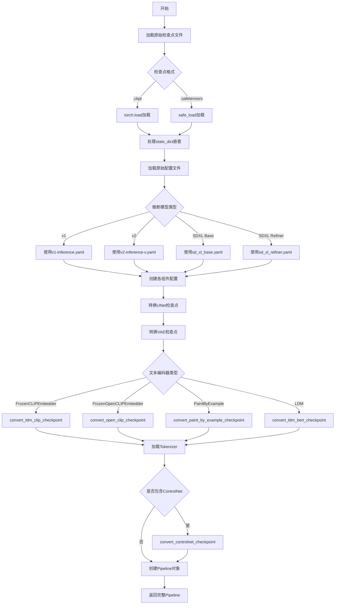

## 类结构

```
此脚本为纯函数式模块，无类定义
所有功能通过全局函数实现
主要函数分组:
├── 路径重命名函数
│   ├── shave_segments
│   ├── renew_resnet_paths
│   ├── renew_vae_resnet_paths
│   ├── renew_attention_paths
│   └── renew_vae_attention_paths
├── 检查点转换函数
│   ├── assign_to_checkpoint
│   ├── conv_attn_to_linear
│   ├── convert_ldm_unet_checkpoint
│   ├── convert_ldm_vae_checkpoint
│   ├── convert_ldm_bert_checkpoint
│   ├── convert_ldm_clip_checkpoint
│   └── ...
├── 配置创建函数
│   ├── create_unet_diffusers_config
│   ├── create_vae_diffusers_config
│   ├── create_diffusers_schedular
│   └── create_ldm_bert_config
└── 主入口函数
    ├── download_from_original_stable_diffusion_ckpt
    ├── download_controlnet_from_original_ckpt
    └── download_promptdiffusion_from_original_ckpt
```

## 全局变量及字段


### `logger`
    
模块级别的日志记录器，用于输出转换过程中的警告和信息

类型：`logging.Logger`
    


### `textenc_conversion_lst`
    
文本编码器键值对的转换列表，用于映射原始检查点键到Diffusers格式键

类型：`List[Tuple[str, str]]`
    


### `textenc_conversion_map`
    
将textenc_conversion_lst转换为字典格式，用于快速查找文本编码器键的映射关系

类型：`Dict[str, str]`
    


### `textenc_transformer_conversion_lst`
    
文本编码器transformer层的转换规则列表，定义Stable Diffusion到HuggingFace Diffusers的键名映射

类型：`List[Tuple[str, str]]`
    


### `protected`
    
对textenc_transformer_conversion_lst中的键进行正则转义后的字典，用于安全的字符串替换

类型：`Dict[str, str]`
    


### `textenc_pattern`
    
编译后的正则表达式模式，用于匹配和转换文本编码器中的层名称

类型：`re.Pattern`
    


    

## 全局函数及方法


### `shave_segments`

移除路径字符串中的段。正值会从开头移除指定数量的段，负值会从末尾移除指定数量的段。

参数：

-  `path`：`str`，要处理的路径字符串，使用点号分隔（如 "a.b.c.d"）
-  `n_shave_prefix_segments`：`int`，要移除的段数。正值表示从路径开头移除指定数量的段；负值表示从路径末尾移除指定数量的段。默认值为 `1`

返回值：`str`，移除指定段数后的路径字符串

#### 流程图

```mermaid
flowchart TD
    A[开始] --> B{n_shave_prefix_segments >= 0?}
    B -- 是 --> C[使用 path.split('.')[n_shave_prefix_segments:]]
    C --> D[用 '.'.join 重新组合]
    D --> E[返回结果]
    B -- 否 --> F[使用 path.split('.')[:n_shave_prefix_segments]]
    F --> D
    E --> G[结束]
```

#### 带注释源码

```python
def shave_segments(path, n_shave_prefix_segments=1):
    """
    Removes segments. Positive values shave the first segments, negative shave the last segments.
    
    该函数用于在模型权重路径转换过程中移除路径中的某些段。
    在从旧版 Stable Diffusion 权重格式转换为 Diffusers 格式时，
    某些层的前缀需要被去除以匹配新的命名规范。
    
    参数:
        path: 权重路径字符串，例如 "input_blocks.1.0.conv.weight"
        n_shave_prefix_segments: 要移除的段数量。
            - 正数: 从路径开头移除对应数量的段
            - 负数: 从路径末尾移除对应数量的段
    
    返回:
        处理后的路径字符串
    """
    # 判断是否为正向移除（从头移除）
    if n_shave_prefix_segments >= 0:
        # 将路径按 '.' 分割，取从 n_shave_prefix_segments 开始到末尾的所有段
        # 然后用 '.' 重新连接
        # 例如: path="a.b.c.d", n_shave_prefix_segments=1 -> "b.c.d"
        return ".".join(path.split(".")[n_shave_prefix_segments:])
    else:
        # 负数情况：从末尾移除对应数量的段
        # 使用切片 [:n_shave_prefix_segments] 保留从开头到倒数第 abs(n) 个段
        # 例如: path="a.b.c.d", n_shave_prefix_segments=-1 -> "a.b.c"
        return ".".join(path.split(".")[:n_shave_prefix_segments])
```


### `renew_resnet_paths`

该函数用于将 ResNet 模型中的旧权重路径名称更新为新的命名约定（本地重命名），将 LDM/Stable Diffusion 风格的路径转换为 Diffusers 风格的路径。

参数：

-  `old_list`：`List[str]`，包含旧权重路径名称的列表
-  `n_shave_prefix_segments`：`int`（可选，默认为 0），要去除的路径前缀段数

返回值：`List[Dict[str, str]]`，返回包含 `old` 和 `new` 键的字典列表，表示旧路径到新路径的映射关系

#### 流程图

```mermaid
flowchart TD
    A[开始] --> B[初始化空映射列表 mapping]
    B --> C{遍历 old_list 中的每个 old_item}
    C --> D[替换 in_layers.0 → norm1]
    D --> E[替换 in_layers.2 → conv1]
    E --> F[替换 out_layers.0 → norm2]
    F --> G[替换 out_layers.3 → conv2]
    G --> H[替换 emb_layers.1 → time_emb_proj]
    H --> I[替换 skip_connection → conv_shortcut]
    I --> J[调用 shave_segments 去除前缀段]
    J --> K[将 {old: old_item, new: new_item} 添加到 mapping]
    K --> C
    C -->|遍历完成| L[返回 mapping]
    L --> M[结束]
```

#### 带注释源码

```python
def renew_resnet_paths(old_list, n_shave_prefix_segments=0):
    """
    Updates paths inside resnets to the new naming scheme (local renaming)
    
    将 ResNet 内部的路径更新为新的命名约定（本地重命名）。
    这个函数处理的是 LDM (Latent Diffusion Models) 格式的权重路径
    到 Diffusers 格式的转换过程中的局部命名映射。
    
    Args:
        old_list: 包含旧权重路径名称的列表
        n_shave_prefix_segments: 要从路径开头去除的段数，用于处理嵌套层级
    
    Returns:
        包含 {'old': 旧路径, 'new': 新路径} 的字典列表
    """
    # 初始化结果映射列表
    mapping = []
    
    # 遍历每一个旧的路径项
    for old_item in old_list:
        new_item = old_item
        
        # 处理输入层的命名转换
        # LDM 格式: in_layers.0 (卷积前的组归一化) → Diffusers 格式: norm1
        new_item = new_item.replace("in_layers.0", "norm1")
        # LDM 格式: in_layers.2 (输入卷积) → Diffusers 格式: conv1
        new_item = new_item.replace("in_layers.2", "conv1")

        # 处理输出层的命名转换
        # LDM 格式: out_layers.0 (输出前的组归一化) → Diffusers 格式: norm2
        new_item = new_item.replace("out_layers.0", "norm2")
        # LDM 格式: out_layers.3 (输出卷积) → Diffusers 格式: conv2
        new_item = new_item.replace("out_layers.3", "conv2")

        # 处理时间嵌入投影层
        # LDM 格式: emb_layers.1 (时间嵌入的线性投影) → Diffusers 格式: time_emb_proj
        new_item = new_item.replace("emb_layers.1", "time_emb_proj")
        
        # 处理跳跃连接
        # LDM 格式: skip_connection (跳跃连接卷积) → Diffusers 格式: conv_shortcut
        new_item = new_item.replace("skip_connection", "conv_shortcut")

        # 根据需要去除路径的前缀段
        # 这对于处理嵌套的模块路径（如 output_blocks.X.Y）很有用
        new_item = shave_segments(new_item, n_shave_prefix_segments=n_shave_prefix_segments)

        # 将旧路径和新路径的映射添加到结果列表
        mapping.append({"old": old_item, "new": new_item})

    # 返回完整的路径映射列表
    return mapping
```


### `renew_vae_resnet_paths`

该函数用于将旧版 VAE（Variational Autoencoder）ResNet 模块的权重路径名称转换为新版 Diffusers 库的命名规范。它通过字符串替换将 `nin_shortcut` 替换为 `conv_shortcut`，并支持可选的前缀段裁剪功能，最终返回包含旧路径与新路径映射关系的列表。

参数：

- `old_list`：`List[str]`，旧版 VAE ResNet 的权重路径列表，这些路径需要进行命名转换
- `n_shave_prefix_segments`：`int`，默认为 0，指定要裁剪的前缀段数量，正值裁剪开头，负值裁剪结尾

返回值：`List[Dict[str, str]]`，返回包含 "old" 和 "new" 键的字典列表，每个字典对应一个路径的旧名称与新名称映射

#### 流程图

```mermaid
flowchart TD
    A[开始] --> B[初始化空映射列表 mapping]
    B --> C{遍历 old_list 中的每个 old_item}
    C -->|是| D[复制 old_item 到 new_item]
    D --> E{检查是否包含 'nin_shortcut'}
    E -->|是| F[将 'nin_shortcut' 替换为 'conv_shortcut']
    E -->|否| G[保持不变]
    F --> H[调用 shave_segments 裁剪前缀段]
    G --> H
    H --> I[将 {'old': old_item, 'new': new_item} 添加到 mapping]
    I --> C
    C -->|否| J[返回 mapping 列表]
    J --> K[结束]
```

#### 带注释源码

```python
def renew_vae_resnet_paths(old_list, n_shave_prefix_segments=0):
    """
    Updates paths inside resnets to the new naming scheme (local renaming)
    
    This function performs local renaming of VAE resnet weight paths from the 
    old CompVis/LDM format to the new HuggingFace Diffusers format.
    
    Args:
        old_list: List of old path strings from the original checkpoint
        n_shave_prefix_segments: Number of leading/trailing dot-separated segments 
                                 to remove from the path (default: 0)
    
    Returns:
        A list of dictionaries, each containing 'old' and 'new' path mappings
    """
    # Initialize an empty list to store the path mappings
    mapping = []
    
    # Iterate through each old path in the input list
    for old_item in old_list:
        # Start with the original path as the new path
        new_item = old_item
        
        # Replace 'nin_shortcut' with 'conv_shortcut' for VAE resnets
        # This is a VAE-specific naming convention difference between
        # the original LDM checkpoints and Diffusers format
        new_item = new_item.replace("nin_shortcut", "conv_shortcut")
        
        # Apply prefix segment shaving if requested
        # This is useful when paths need to be shortened for certain
        # block configurations (e.g., output block processing)
        new_item = shave_segments(new_item, n_shave_prefix_segments=n_shave_prefix_segments)
        
        # Append the mapping dictionary to the results
        mapping.append({"old": old_item, "new": new_item})
    
    # Return the complete list of path mappings
    return mapping
```


### `renew_attention_paths`

该函数用于将旧版注意力层（Attention）的路径名称更新为新版 Diffusers 格式的命名约定（本地重命名）。它接收一个包含旧路径的列表，并返回旧路径与新路径的映射关系列表。

参数：

- `old_list`：`List[str]`，包含需要转换的旧版注意力层路径名称列表
- `n_shave_prefix_segments`：`int`，可选参数，默认值为 0，用于指定需要切除的前缀段数（当前实现中未使用）

返回值：`List[Dict[str, str]]`，返回映射列表，每个元素为包含 `old` 和 `new` 键的字典，分别表示旧路径和新路径

#### 流程图

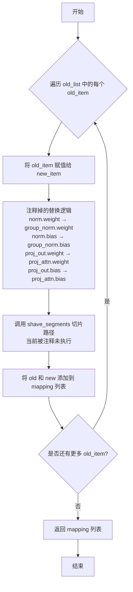

#### 带注释源码

```python
def renew_attention_paths(old_list, n_shave_prefix_segments=0):
    """
    Updates paths inside attentions to the new naming scheme (local renaming)
    
    该函数用于将旧版 Stable Diffusion / LDM 模型中的注意力层权重路径
    映射到新版 Diffusers 库所需的命名规范，以便进行权重转换。
    
    Args:
        old_list: 包含旧版路径名的列表，通常来自原始 checkpoint 的键名
        n_shave_prefix_segments: 可选参数，指定要切除的前缀段数（当前实现未生效）
    
    Returns:
        mapping: 字典列表，每个字典包含 'old' 和 'new' 两个键，
                分别对应转换前后的路径名称
    """
    mapping = []
    # 遍历每一个需要转换的旧路径
    for old_item in old_list:
        new_item = old_item  # 初始化新路径为旧路径（当前未做实际转换）
        
        # === 以下替换逻辑已被注释，保留用于未来可能的实现 ===
        # # 将 norm.weight 替换为 group_norm.weight
        # new_item = new_item.replace('norm.weight', 'group_norm.weight')
        # # 将 norm.bias 替换为 group_norm.bias
        # new_item = new_item.replace('norm.bias', 'group_norm.bias')
        
        # # 将 proj_out.weight 替换为 proj_attn.weight
        # new_item = new_item.replace('proj_out.weight', 'proj_attn.weight')
        # # 将 proj_out.bias 替换为 proj_attn.bias
        # new_item = new_item.replace('proj_out.bias', 'proj_attn.bias')
        
        # # 调用 shave_segments 切除指定数量的前缀段
        # new_item = shave_segments(new_item, n_shave_prefix_segments=n_shave_prefix_segments)

        # 将当前 old→new 映射添加到结果列表
        mapping.append({"old": old_item, "new": new_item})

    return mapping
```


### `renew_vae_attention_paths`

该函数用于将旧版 VAE 注意力层路径转换为 Diffusers 命名约定，执行本地路径重命名操作。

参数：

- `old_list`：`List[str]`，旧版 VAE 注意力层路径列表
- `n_shave_prefix_segments`：`int` = 0，要切除的前缀段数量（可选）

返回值：`List[Dict[str, str]]`，返回包含 "old" 和 "new" 键的字典列表，表示旧路径到新路径的映射关系

#### 流程图

```mermaid
flowchart TD
    A[开始] --> B[初始化空映射列表]
    B --> C{遍历 old_list 中的每个元素}
    C --> D[将路径赋值给 new_item]
    D --> E[替换 norm.weight → group_norm.weight]
    E --> F[替换 norm.bias → group_norm.bias]
    F --> G[替换 q.weight → to_q.weight]
    G --> H[替换 q.bias → to_q.bias]
    H --> I[替换 k.weight → to_k.weight]
    I --> J[替换 k.bias → to_k.bias]
    J --> K[替换 v.weight → to_v.weight]
    K --> L[替换 v.bias → to_v.bias]
    L --> M[替换 proj_out.weight → to_out.0.weight]
    M --> N[替换 proj_out.bias → to_out.0.bias]
    N --> O[调用 shave_segments 处理前缀]
    O --> P[添加 {"old": old_item, "new": new_item} 到映射列表]
    P --> C
    C --> Q{遍历完成?}
    Q --> R[返回映射列表]
```

#### 带注释源码

```python
def renew_vae_attention_paths(old_list, n_shave_prefix_segments=0):
    """
    Updates paths inside attentions to the new naming scheme (local renaming)
    
    此函数用于将 LDM/VQGAN 风格的 VAE 注意力层参数路径转换为 HuggingFace Diffusers 格式。
    主要转换包括:
    - norm.* → group_norm.*
    - q.* → to_q.*
    - k.* → to_k.*
    - v.* → to_v.*
    - proj_out.* → to_out.0.*
    
    Args:
        old_list: 旧版路径列表
        n_shave_prefix_segments: 要切除的前缀段数量，用于处理嵌套层级
    
    Returns:
        包含 old 和 new 键的字典列表
    """
    mapping = []
    for old_item in old_list:
        new_item = old_item

        # 归一化层重命名: norm → group_norm
        new_item = new_item.replace("norm.weight", "group_norm.weight")
        new_item = new_item.replace("norm.bias", "group_norm.bias")

        # Query 权重重命名: q → to_q
        new_item = new_item.replace("q.weight", "to_q.weight")
        new_item = new_item.replace("q.bias", "to_q.bias")

        # Key 权重重命名: k → to_k
        new_item = new_item.replace("k.weight", "to_k.weight")
        new_item = new_item.replace("k.bias", "to_k.bias")

        # Value 权重重命名: v → to_v
        new_item = new_item.replace("v.weight", "to_v.weight")
        new_item = new_item.replace("v.bias", "to_v.bias")

        # 输出投影重命名: proj_out → to_out.0
        new_item = new_item.replace("proj_out.weight", "to_out.0.weight")
        new_item = new_item.replace("proj_out.bias", "to_out.0.bias")

        # 处理前缀段，用于提取嵌套的子模块
        new_item = shave_segments(new_item, n_shave_prefix_segments=n_shave_prefix_segments)

        # 将映射关系添加到列表中
        mapping.append({"old": old_item, "new": new_item})

    return mapping
```


### `assign_to_checkpoint`

该函数执行模型权重转换的最后一步：获取本地转换的权重并应用全局重命名。它处理注意力层的分割，并考虑可能出现的其他替换。最终将权重分配到新的checkpoint中。

参数：

- `paths`：`List[Dict[str, str]]`，包含"old"和"new"键的字典列表，表示权重从旧路径到新路径的映射
- `checkpoint`：`Dict[str, torch.Tensor]`，目标新checkpoint字典，用于存储转换后的权重
- `old_checkpoint`：`Dict[str, torch.Tensor]`，原始旧checkpoint字典，包含待转换的权重
- `attention_paths_to_split`：`Optional[Dict[str, Dict[str, str]]]`，可选参数，需要分割的注意力层路径映射，包含query、key、value的对应新路径
- `additional_replacements`：`Optional[List[Dict[str, str]]]`，可选参数，额外的路径替换规则列表
- `config`：`Optional[Dict]`，可选参数，包含模型配置信息的字典，用于获取num_head_channels等参数

返回值：`None`，该函数直接修改`checkpoint`字典，不返回任何值

#### 流程图

```mermaid
flowchart TD
    A[开始 assign_to_checkpoint] --> B{paths 是列表?}
    B -->|否| C[断言错误: Paths应该是包含'old'和'new'键的字典列表]
    B -->|是| D{attention_paths_to_split 不为空?}
    D -->|是| E[遍历 attention_paths_to_split]
    D -->|否| G[跳过注意力层分割]
    
    E --> E1[从 old_checkpoint 获取旧张量]
    E --> E2[计算通道数: channels = shape[0] // 3]
    E --> E3[计算目标形状和num_heads]
    E --> E4[重塑张量并分割为 query, key, value]
    E --> E5[将分割后的权重写入 checkpoint]
    
    G --> I[遍历 paths 列表]
    I --> J{新路径已在 attention_paths_to_split 中?}
    J -->|是| I1[跳过,已分配]
    J -->|否| K[进行全局重命名: middle_block.0/1/2]
    K --> L{additional_replacements 不为空?}
    L -->|是| M[应用额外的替换规则]
    L -->|否| N[检查是否为注意力权重]
    M --> N
    
    N --> O{is_attn_weight 为真且 shape 维度为3?]
    O -->|是| P[取[:, :, 0]]
    O -->|否| Q{is_attn_weight 为真且 shape 维度为4?}
    Q -->|是| R[取[:, :, 0, 0]]
    Q -->|否| S[直接赋值]
    
    P --> T[写入 checkpoint[new_path]]
    R --> T
    S --> T
    
    I1 --> U{还有更多 paths?}
    U -->|是| I
    U -->|否| V[结束]
    
    E5 --> U
    T --> U
```

#### 带注释源码

```python
def assign_to_checkpoint(
    paths, checkpoint, old_checkpoint, attention_paths_to_split=None, additional_replacements=None, config=None
):
    """
    This does the final conversion step: take locally converted weights and apply a global renaming to them. It splits
    attention layers, and takes into account additional replacements that may arise.

    Assigns the weights to the new checkpoint.
    """
    # 断言验证paths参数必须是字典列表，每个字典包含'old'和'new'键
    assert isinstance(paths, list), "Paths should be a list of dicts containing 'old' and 'new' keys."

    # 如果提供了attention_paths_to_split，则需要分割注意力层
    # 这是因为原始模型中attention的query、key、value是合并在一起的
    if attention_paths_to_split is not None:
        for path, path_map in attention_paths_to_split.items():
            # 从旧checkpoint中获取需要分割的注意力层张量
            old_tensor = old_checkpoint[path]
            # 原始张量的通道数除以3（因为query、key、value各占1/3）
            channels = old_tensor.shape[0] // 3

            # 根据张量维度确定目标形状
            # 3维张量对应(-1, channels)，4维张量对应(-1)
            target_shape = (-1, channels) if len(old_tensor.shape) == 3 else (-1)

            # 计算注意力头数量
            # num_heads = 总通道数 // 每头通道数 // 3 (query/key/value)
            num_heads = old_tensor.shape[0] // config["num_head_channels"] // 3

            # 重塑张量以便分割：reshape到 (num_heads, 3*channels//num_heads, ...)
            old_tensor = old_tensor.reshape((num_heads, 3 * channels // num_heads) + old_tensor.shape[1:])
            # 沿着dim=1分割成query、key、value三个部分
            query, key, value = old_tensor.split(channels // num_heads, dim=1)

            # 将分割后的query、key、value写入新checkpoint
            checkpoint[path_map["query"]] = query.reshape(target_shape)
            checkpoint[path_map["key"]] = key.reshape(target_shape)
            checkpoint[path_map["value"]] = value.reshape(target_shape)

    # 遍历所有路径，进行全局重命名和权重分配
    for path in paths:
        new_path = path["new"]

        # 如果新路径已经在attention_paths_to_split中，说明已经处理过，跳过
        if attention_paths_to_split is not None and new_path in attention_paths_to_split:
            continue

        # 全局重命名：将旧的中block命名转换为新的diffusers格式
        # middle_block.0 -> mid_block.resnets.0
        new_path = new_path.replace("middle_block.0", "mid_block.resnets.0")
        # middle_block.1 -> mid_block.attentions.0
        new_path = new_path.replace("middle_block.1", "mid_block.attentions.0")
        # middle_block.2 -> mid_block.resnets.1
        new_path = new_path.replace("middle_block.2", "mid_block.resnets.1")

        # 应用额外的替换规则（如输入块、输出块等的重命名）
        if additional_replacements is not None:
            for replacement in additional_replacements:
                new_path = new_path.replace(replacement["old"], replacement["new"])

        # proj_attn.weight 需要从1D卷积权重转换为线性层权重
        # 判断条件：包含proj_attn.weight 或者 包含attentions和to_
        is_attn_weight = "proj_attn.weight" in new_path or ("attentions" in new_path and "to_" in new_path)
        # 获取旧权重的形状
        shape = old_checkpoint[path["old"]].shape
        
        # 根据不同的形状进行处理
        if is_attn_weight and len(shape) == 3:
            # 3维张量（如conv1d的权重）：取第一个切片
            checkpoint[new_path] = old_checkpoint[path["old"]][:, :, 0]
        elif is_attn_weight and len(shape) == 4:
            # 4维张量：取第一个元素的第一个通道
            checkpoint[new_path] = old_checkpoint[path["old"]][:, :, 0, 0]
        else:
            # 普通权重直接赋值
            checkpoint[new_path] = old_checkpoint[path["old"]]
```


### `conv_attn_to_linear`

该函数用于将 Stable Diffusion 模型检查点中注意力层（Attention）的权重从卷积（Conv1D）格式转换为线性（Linear）格式。在 LDM（Latent Diffusion Model）原始权重中，Q、K、V 的权重是 4 维卷积权重（相当于 Conv1D），而 Diffusers 框架需要的是 2 维线性权重，因此需要进行维度压缩处理。

参数：

- `checkpoint`：`Dict`，待转换的模型检查点字典，包含模型权重键值对

返回值：`None`（直接修改输入的 `checkpoint` 字典，无返回值）

#### 流程图

```mermaid
flowchart TD
    A[开始: conv_attn_to_linear] --> B[获取 checkpoint 所有键]
    B --> C[定义注意力权重后缀列表: query.weight, key.weight, value.weight]
    C --> D{遍历 keys 中的每个 key}
    D --> E{检查 key 是否为注意力权重}
    E -->|是 Q/K/V 权重| F{检查权重维度是否 > 2}
    F -->|是| G[提取 [:, :, 0, 0] 切片<br/>将 4D 权重压缩为 2D]
    F -->|否| I[跳过处理]
    G --> D
    E -->|否| H{检查 key 是否包含 proj_attn.weight}
    H -->|是| J{检查权重维度是否 > 2}
    J -->|是| K[提取 [:, :, 0] 切片<br/>将 3D 权重压缩为 2D]
    K --> D
    H -->|否| L[跳过处理]
    L --> D
    D --> M{遍历完成?}
    M -->|是| N[结束]
```

#### 带注释源码

```python
def conv_attn_to_linear(checkpoint):
    """
    将注意力层权重从卷积(Conv1D)格式转换为线性(Linear)格式。
    在原始LDM权重中，attention的Q、K、V使用Conv1D权重（4维张量），
    而Diffusers框架需要Linear权重（2维张量），因此需要压缩维度。
    
    参数:
        checkpoint (dict): 模型检查点字典，键为权重名称，值为权重张量
        
    返回:
        None: 直接修改输入的checkpoint字典，无返回值
    """
    # 获取检查点中所有的键名
    keys = list(checkpoint.keys())
    
    # 定义需要转换的注意力权重后缀
    # 这些是Q、K、V的权重名称后缀
    attn_keys = ["query.weight", "key.weight", "value.weight"]
    
    # 遍历检查点中的所有键
    for key in keys:
        # 提取键名的最后两个部分，拼接后与注意力权重后缀匹配
        # 例如: "model.diffusion_model.input_blocks.1.1.attentions.0.to_q.weight"
        # 取最后两部分 -> "to_q.weight" -> "query.weight"
        if ".".join(key.split(".")[-2:]) in attn_keys:
            # 如果是Q/K/V权重且维度大于2（4维卷积权重）
            if checkpoint[key].ndim > 2:
                # 提取第一个切片，将4D Conv1D权重 [out_ch, in_ch, kernel, 1]
                # 压缩为2D Linear权重 [out_ch, in_ch]
                checkpoint[key] = checkpoint[key][:, :, 0, 0]
        
        # 检查是否是proj_attn.weight（输出投影权重）
        elif "proj_attn.weight" in key:
            # 如果是投影注意力权重且维度大于2（3维卷积权重）
            if checkpoint[key].ndim > 2:
                # 提取第一个切片，将3D权重 [out_ch, in_ch, kernel]
                # 压缩为2D权重 [out_ch, in_ch]
                checkpoint[key] = checkpoint[key][:, :, 0]
```


### `create_unet_diffusers_config`

该函数根据LDM（Latent Diffusion Models）模型的配置文件创建一个适用于Diffusers库的UNet配置字典，用于将原始Stable Diffusion检查点转换为Diffusers格式。

参数：

- `original_config`：`Dict`，原始LDM模型的配置文件（通过YAML加载的字典），包含模型的所有参数配置
- `image_size`：`int`，模型训练时使用的图像尺寸，用于计算样本大小
- `controlnet`：`bool`，可选参数（默认为False），指示是否为ControlNet模型创建配置

返回值：`Dict`，返回包含UNet配置的字典，包括输入输出通道数、块类型、注意力维度等关键参数

#### 流程图

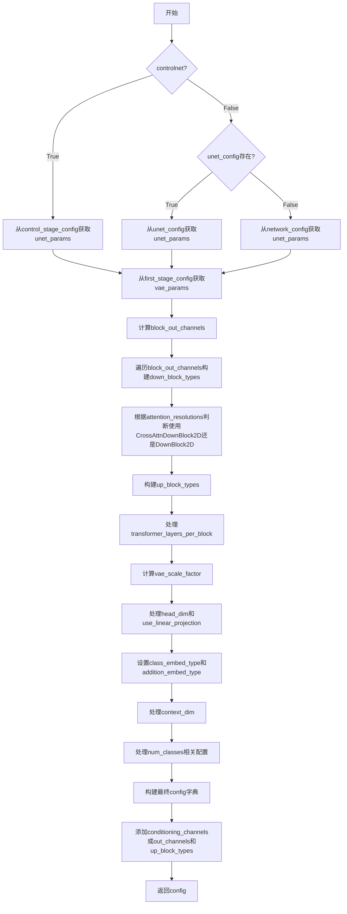

#### 带注释源码

```python
def create_unet_diffusers_config(original_config, image_size: int, controlnet=False):
    """
    Creates a config for the diffusers based on the config of the LDM model.
    """
    # 根据controlnet标志选择不同的配置路径
    if controlnet:
        # ControlNet使用独立的control_stage_config
        unet_params = original_config["model"]["params"]["control_stage_config"]["params"]
    else:
        # 普通UNet可能使用unet_config或network_config
        if (
            "unet_config" in original_config["model"]["params"]
            and original_config["model"]["params"]["unet_config"] is not None
        ):
            unet_params = original_config["model"]["params"]["unet_config"]["params"]
        else:
            unet_params = original_config["model"]["params"]["network_config"]["params"]

    # 从VAE配置中获取参数，用于计算缩放因子
    vae_params = original_config["model"]["params"]["first_stage_config"]["params"]["ddconfig"]

    # 计算输出通道数：根据model_channels和channel_mult生成通道列表
    block_out_channels = [unet_params["model_channels"] * mult for mult in unet_params["channel_mult"]]

    # 构建下采样块类型列表
    down_block_types = []
    resolution = 1
    for i in range(len(block_out_channels)):
        # 如果当前分辨率在attention_resolutions中，使用带交叉注意力的块
        block_type = "CrossAttnDownBlock2D" if resolution in unet_params["attention_resolutions"] else "DownBlock2D"
        down_block_types.append(block_type)
        if i != len(block_out_channels) - 1:
            resolution *= 2

    # 构建上采样块类型列表
    up_block_types = []
    for i in range(len(block_out_channels)):
        # 注意：这里resolution是倒序遍历的
        block_type = "CrossAttnUpBlock2D" if resolution in unet_params["attention_resolutions"] else "UpBlock2D"
        up_block_types.append(block_type)
        resolution //= 2

    # 处理transformer层数配置
    if unet_params["transformer_depth"] is not None:
        transformer_layers_per_block = (
            unet_params["transformer_depth"]
            if isinstance(unet_params["transformer_depth"], int)
            else list(unet_params["transformer_depth"])
        )
    else:
        transformer_layers_per_block = 1

    # 计算VAE缩放因子：2^(ch_mult长度-1)
    vae_scale_factor = 2 ** (len(vae_params["ch_mult"]) - 1)

    # 处理注意力头维度
    head_dim = unet_params["num_heads"] if "num_heads" in unet_params else None
    use_linear_projection = (
        unet_params["use_linear_in_transformer"] if "use_linear_in_transformer" in unet_params else False
    )
    if use_linear_projection:
        # stable diffusion 2-base-512 and 2-768
        if head_dim is None:
            head_dim_mult = unet_params["model_channels"] // unet_params["num_head_channels"]
            head_dim = [head_dim_mult * c for c in list(unet_params["channel_mult"])]

    # 初始化类别嵌入相关变量
    class_embed_type = None
    addition_embed_type = None
    addition_time_embed_dim = None
    projection_class_embeddings_input_dim = None
    context_dim = None

    # 处理上下文维度
    if unet_params["context_dim"] is not None:
        context_dim = (
            unet_params["context_dim"]
            if isinstance(unet_params["context_dim"], int)
            else unet_params["context_dim"][0]
        )

    # 处理类别嵌入配置（支持SDXL和投影类别嵌入）
    if "num_classes" in unet_params:
        if unet_params["num_classes"] == "sequential":
            if context_dim in [2048, 1280]:
                # SDXL
                addition_embed_type = "text_time"
                addition_time_embed_dim = 256
            else:
                class_embed_type = "projection"
            assert "adm_in_channels" in unet_params
            projection_class_embeddings_input_dim = unet_params["adm_in_channels"]

    # 构建基础配置字典
    config = {
        "sample_size": image_size // vae_scale_factor,
        "in_channels": unet_params["in_channels"],
        "down_block_types": tuple(down_block_types),
        "block_out_channels": tuple(block_out_channels),
        "layers_per_block": unet_params["num_res_blocks"],
        "cross_attention_dim": context_dim,
        "attention_head_dim": head_dim,
        "use_linear_projection": use_linear_projection,
        "class_embed_type": class_embed_type,
        "addition_embed_type": addition_embed_type,
        "addition_time_embed_dim": addition_time_embed_dim,
        "projection_class_embeddings_input_dim": projection_class_embeddings_input_dim,
        "transformer_layers_per_block": transformer_layers_per_block,
    }

    # 处理禁用自注意力的配置
    if "disable_self_attentions" in unet_params:
        config["only_cross_attention"] = unet_params["disable_self_attentions"]

    # 处理整数类型的类别嵌入数量
    if "num_classes" in unet_params and isinstance(unet_params["num_classes"], int):
        config["num_class_embeds"] = unet_params["num_classes"]

    # 根据controlnet标志添加条件通道或输出通道配置
    if controlnet:
        config["conditioning_channels"] = unet_params["hint_channels"]
    else:
        config["out_channels"] = unet_params["out_channels"]
        config["up_block_types"] = tuple(up_block_types)

    return config
```


### `create_vae_diffusers_config`

该函数用于将原始 LDM 模型的 VAE 配置转换为 Diffusers 格式的 VAE 配置，返回一个包含 VAE 关键参数（如输入输出通道数、块类型、下采样/上采样块通道数、潜在通道数和每层块数）的字典。

参数：

- `original_config`：`Dict`，原始 LDM 模型的完整配置对象，包含模型参数及第一阶段配置（first_stage_config）中的 VAE 相关参数（ddconfig 和 embed_dim）
- `image_size`：`int`，输入图像的目标尺寸，用于设置配置中的 sample_size

返回值：`Dict`，转换后的 Diffusers 风格 VAE 配置字典，包含 sample_size、in_channels、out_channels、down_block_types、up_block_types、block_out_channels、latent_channels 和 layers_per_block 等键

#### 流程图

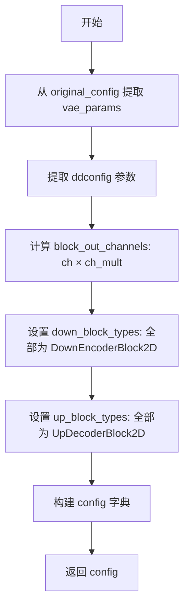

#### 带注释源码

```python
def create_vae_diffusers_config(original_config, image_size: int):
    """
    Creates a config for the diffusers based on the config of the LDM model.
    """
    # 从原始配置中提取 VAE 参数（ddconfig 部分）
    vae_params = original_config["model"]["params"]["first_stage_config"]["params"]["ddconfig"]
    # 提取 embed_dim（当前未使用，仅通过赋值消除未使用变量警告）
    _ = original_config["model"]["params"]["first_stage_config"]["params"]["embed_dim"]

    # 根据 ch_mult 计算每个块的输出通道数
    block_out_channels = [vae_params["ch"] * mult for mult in vae_params["ch_mult"]]
    # 设置下采样块类型为 DownEncoderBlock2D
    down_block_types = ["DownEncoderBlock2D"] * len(block_out_channels)
    # 设置上采样块类型为 UpDecoderBlock2D
    up_block_types = ["UpDecoderBlock2D"] * len(block_out_channels)

    # 构建 Diffusers 格式的 VAE 配置字典
    config = {
        "sample_size": image_size,                      # 输入图像尺寸
        "in_channels": vae_params["in_channels"],        # VAE encoder 输入通道数
        "out_channels": vae_params["out_ch"],            # VAE decoder 输出通道数
        "down_block_types": tuple(down_block_types),    # 下采样块类型元组
        "up_block_types": tuple(up_block_types),        # 上采样块类型元组
        "block_out_channels": tuple(block_out_channels),# 各块输出通道数元组
        "latent_channels": vae_params["z_channels"],      # 潜在空间通道数
        "layers_per_block": vae_params["num_res_blocks"], # 每个块中的残差层数
    }
    return config
```


### `create_diffusers_schedular`

该函数用于从原始 LDMs (Latent Diffusion Models) 配置中创建一个 Diffusers 格式的 DDIMScheduler (Denoising Diffusion Implicit Models Scheduler)。它提取原始配置文件中的时间步长和 beta 调度参数，并返回一个配置好的 Diffusers 调度器对象。

参数：

- `original_config`：`Dict`，包含原始模型配置的字典，需要包含 `model.params.timesteps`、`model.params.linear_start` 和 `model.params.linear_end` 键值

返回值：`DDIMScheduler`，返回一个配置好的 Diffusers DDIM 调度器实例，用于控制扩散模型的噪声调度过程

#### 流程图

```mermaid
flowchart TD
    A[开始] --> B[接收 original_config 参数]
    B --> C[提取配置: timesteps = original_config['model']['params']['timesteps']]
    C --> D[提取配置: beta_start = original_config['model']['params']['linear_start']]
    D --> E[提取配置: beta_end = original_config['model']['params']['linear_end']]
    E --> F[创建 DDIMScheduler 实例]
    F --> G[设置调度类型: beta_schedule='scaled_linear']
    G --> H[返回调度器对象]
    H --> I[结束]
```

#### 带注释源码

```python
def create_diffusers_schedular(original_config):
    """
    根据原始 LDMs 配置文件创建 Diffusers 格式的 DDIMScheduler。
    
    该函数是模型转换过程中的辅助函数,用于将 CompVis/LDM 格式的
    调度器配置转换为 Diffusers 库的调度器对象。
    
    Args:
        original_config (Dict): 原始模型的配置文件字典,必须包含以下键:
            - model.params.timesteps: 训练时使用的时间步总数
            - model.params.linear_start: beta 线性起始值
            - model.params.linear_end: beta 线性结束值
    
    Returns:
        DDIMScheduler: 配置好的 DDIM 调度器对象,可用于扩散模型的推理过程
    """
    # 从原始配置字典中提取调度器所需的参数
    # num_train_timesteps: 扩散过程的总时间步数,通常为 1000
    num_train_timesteps = original_config["model"]["params"]["timesteps"]
    
    # beta_start: beta 调度曲线的起始值,用于控制噪声的添加速率
    beta_start = original_config["model"]["params"]["linear_start"]
    
    # beta_end: beta 调度曲线的结束值
    beta_end = original_config["model"]["params"]["linear_end"]
    
    # 创建 DDIMScheduler 实例
    # DDIM (Denoising Diffusion Implicit Models) 是一种高效的采样方法
    # 可以通过更少的采样步骤生成高质量图像
    schedular = DDIMScheduler(
        num_train_timesteps=num_train_timesteps,  # 训练时间步数
        beta_start=beta_start,                    # beta 起始值
        beta_end=beta_end,                         # beta 结束值
        beta_schedule="scaled_linear",            # 使用缩放线性调度
    )
    
    # 返回配置好的调度器对象
    return schedular
```


### `create_ldm_bert_config`

该函数用于将原始 LDM（Latent Diffusion Models）模型中的 BERT/文本编码器配置转换为 Diffusers 库所期望的 `LDMBertConfig` 格式，以便后续进行模型权重转换。

参数：

- `original_config`：`Dict`，原始 LDM 模型的 YAML 配置文件解析后的字典对象，包含模型参数和条件阶段配置

返回值：`LDMBertConfig`，转换后的 BERT 模型配置对象，包含 `d_model`、`encoder_layers` 和 `encoder_ffn_dim` 等参数

#### 流程图

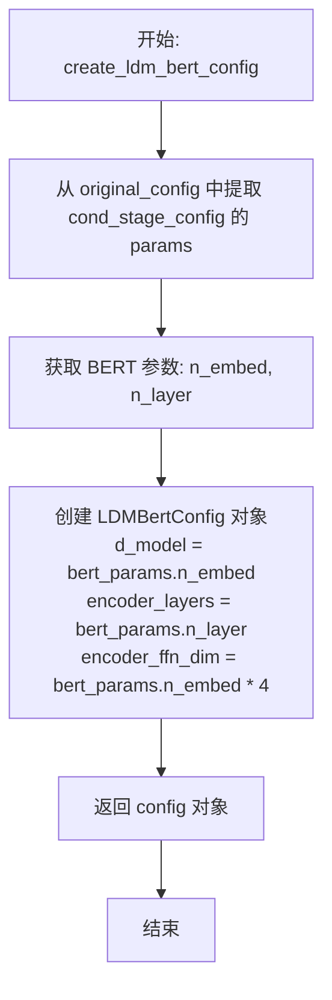

#### 带注释源码

```python
def create_ldm_bert_config(original_config):
    """
    从原始 LDM 配置中提取 BERT/文本编码器的参数，
    并创建适用于 Diffusers 库的 LDMBertConfig 配置对象。
    
    参数:
        original_config: 包含原始 LDM 模型配置的字典，
                        通常来自 YAML 配置文件
    
    返回:
        LDMBertConfig: 用于初始化 LDMBertModel 的配置对象
    """
    # 从原始配置中提取条件阶段（cond_stage）的配置参数
    # 这是 LDM 模型中负责处理文本/条件输入的组件
    bert_params = original_config["model"]["params"]["cond_stage_config"]["params"]
    
    # 使用提取的参数构建 Diffusers 格式的 BERT 配置
    # d_model: 模型的隐藏维度大小
    # encoder_layers: Transformer 编码器的层数
    # encoder_ffn_dim: 前馈网络的隐藏层维度（通常设置为 d_model * 4）
    config = LDMBertConfig(
        d_model=bert_params.n_embed,           # 模型嵌入维度
        encoder_layers=bert_params.n_layer,    # 编码器层数
        encoder_ffn_dim=bert_params.n_embed * 4, # 前馈网络维度（4倍嵌入维度）
    )
    
    # 返回转换后的配置对象
    return config
```


### `convert_ldm_unet_checkpoint`

该函数用于将LDM（Latent Diffusion Models）格式的UNet检查点转换为Diffusers库所需的格式，处理权重键名的重命名、EMA权重的提取、条件嵌入的映射以及ControlNet/PromptDiffusion特定权重的转换。

参数：

- `checkpoint`：`Dict`，原始LDM格式的检查点状态字典，包含模型权重
- `config`：`Dict`，UNet的配置字典，包含模型结构信息（如`class_embed_type`、`addition_embed_type`、`layers_per_block`等）
- `path`：`Optional[str]`，检查点文件路径，用于日志输出（可选）
- `extract_ema`：`bool`，是否提取EMA权重，默认为False
- `controlnet`：`bool`，是否为ControlNet模型，默认为False
- `skip_extract_state_dict`：`bool`，是否跳过状态字典提取步骤，默认为False
- `promptdiffusion`：`bool`，是否为PromptDiffusion模型，默认为False

返回值：`Dict`，转换后的检查点状态字典，键名已更改为Diffusers格式

#### 流程图

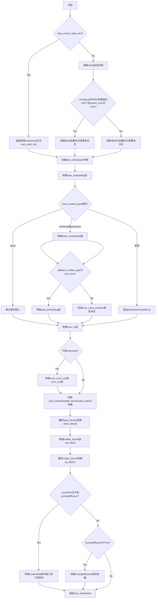

#### 带注释源码

```python
def convert_ldm_unet_checkpoint(
    checkpoint,           # Dict: 原始LDM检查点状态字典
    config,              # Dict: UNet配置信息
    path=None,           # Optional[str]: 检查点路径，用于日志
    extract_ema=False,   # bool: 是否提取EMA权重
    controlnet=False,    # bool: 是否为ControlNet模型
    skip_extract_state_dict=False,  # bool: 是否跳过状态字典提取
    promptdiffusion=False,  # bool: 是否为PromptDiffusion模型
):
    """
    Takes a state dict and a config, and returns a converted checkpoint.
    """

    # 根据skip_extract_state_dict决定是否提取状态字典
    if skip_extract_state_dict:
        # 如果跳过提取，直接使用checkpoint作为UNet状态字典
        unet_state_dict = checkpoint
    else:
        # 提取UNet的状态字典
        unet_state_dict = {}
        keys = list(checkpoint.keys())

        # 根据是否为ControlNet确定UNet的键前缀
        if controlnet:
            unet_key = "control_model."
        else:
            unet_key = "model.diffusion_model."

        # 判断是否有超过100个以model_ema开头的参数，用于确定是否有EMA权重
        if sum(k.startswith("model_ema") for k in keys) > 100 and extract_ema:
            # 如果同时存在EMA和非EMA权重，记录警告日志
            logger.warning(f"Checkpoint {path} has both EMA and non-EMA weights.")
            logger.warning(
                "In this conversion only the EMA weights are extracted. If you want to instead extract the non-EMA"
                " weights (useful to continue fine-tuning), please make sure to remove the `--extract_ema` flag."
            )
            # 提取EMA权重
            for key in keys:
                if key.startswith("model.diffusion_model"):
                    # 构建EMA键名并提取权重
                    flat_ema_key = "model_ema." + "".join(key.split(".")[1:])
                    unet_state_dict[key.replace(unet_key, "")] = checkpoint.pop(flat_ema_key)
        else:
            # 如果有EMA权重但没有指定extract_ema，记录警告
            if sum(k.startswith("model_ema") for k in keys) > 100:
                logger.warning(
                    "In this conversion only the non-EMA weights are extracted. If you want to instead extract the EMA"
                    " weights (usually better for inference), please make sure to add the `--extract_ema` flag."
                )

            # 提取非EMA权重
            for key in keys:
                if key.startswith(unet_key):
                    unet_state_dict[key.replace(unet_key, "")] = checkpoint.pop(key)

    # 创建新的检查点字典
    new_checkpoint = {}

    # 转换time embedding层: 从time_embed.0/2转换为time_embedding.linear_1/2
    new_checkpoint["time_embedding.linear_1.weight"] = unet_state_dict["time_embed.0.weight"]
    new_checkpoint["time_embedding.linear_1.bias"] = unet_state_dict["time_embed.0.bias"]
    new_checkpoint["time_embedding.linear_2.weight"] = unet_state_dict["time_embed.2.weight"]
    new_checkpoint["time_embedding.linear_2.bias"] = unet_state_dict["time_embed.2.bias"]

    # 根据class_embed_type转换类别嵌入
    if config["class_embed_type"] is None:
        # 没有类别嵌入参数需要转换
        ...
    elif config["class_embed_type"] == "timestep" or config["class_embed_type"] == "projection":
        # 转换class_embedding层
        new_checkpoint["class_embedding.linear_1.weight"] = unet_state_dict["label_emb.0.0.weight"]
        new_checkpoint["class_embedding.linear_1.bias"] = unet_state_dict["label_emb.0.0.bias"]
        new_checkpoint["class_embedding.linear_2.weight"] = unet_state_dict["label_emb.0.2.weight"]
        new_checkpoint["class_embedding.linear_2.bias"] = unet_state_dict["label_emb.0.2.bias"]
    else:
        raise NotImplementedError(f"Not implemented `class_embed_type`: {config['class_embed_type']}")

    # 如果addition_embed_type为text_time，转换额外的嵌入层
    if config["addition_embed_type"] == "text_time":
        new_checkpoint["add_embedding.linear_1.weight"] = unet_state_dict["label_emb.0.0.weight"]
        new_checkpoint["add_embedding.linear_1.bias"] = unet_state_dict["label_emb.0.0.bias"]
        new_checkpoint["add_embedding.linear_2.weight"] = unet_state_dict["label_emb.0.2.weight"]
        new_checkpoint["add_embedding.linear_2.bias"] = unet_state_dict["label_emb.0.2.bias"]

    # 转换StableDiffusionUpscalePipeline相关的类别嵌入权重
    if "num_class_embeds" in config:
        if (config["num_class_embeds"] is not None) and ("label_emb.weight" in unet_state_dict):
            new_checkpoint["class_embedding.weight"] = unet_state_dict["label_emb.weight"]

    # 转换输入卷积层
    new_checkpoint["conv_in.weight"] = unet_state_dict["input_blocks.0.0.weight"]
    new_checkpoint["conv_in.bias"] = unet_state_dict["input_blocks.0.0.bias"]

    # 如果不是ControlNet，转换输出卷积层
    if not controlnet:
        new_checkpoint["conv_norm_out.weight"] = unet_state_dict["out.0.weight"]
        new_checkpoint["conv_norm_out.bias"] = unet_state_dict["out.0.bias"]
        new_checkpoint["conv_out.weight"] = unet_state_dict["out.2.weight"]
        new_checkpoint["conv_out.bias"] = unet_state_dict["out.2.bias"]

    # 检索输入块的键
    num_input_blocks = len({".".join(layer.split(".")[:2]) for layer in unet_state_dict if "input_blocks" in layer})
    input_blocks = {
        layer_id: [key for key in unet_state_dict if f"input_blocks.{layer_id}" in key]
        for layer_id in range(num_input_blocks)
    }

    # 检索中间块的键
    num_middle_blocks = len({".".join(layer.split(".")[:2]) for layer in unet_state_dict if "middle_block" in layer})
    middle_blocks = {
        layer_id: [key for key in unet_state_dict if f"middle_block.{layer_id}" in key]
        for layer_id in range(num_middle_blocks)
    }

    # 检索输出块的键
    num_output_blocks = len({".".join(layer.split(".")[:2]) for layer in unet_state_dict if "output_blocks" in layer})
    output_blocks = {
        layer_id: [key for key in unet_state_dict if f"output_blocks.{layer_id}" in key]
        for layer_id in range(num_output_blocks)
    }

    # 遍历输入块，转换为down_blocks
    for i in range(1, num_input_blocks):
        # 计算块ID和层ID
        block_id = (i - 1) // (config["layers_per_block"] + 1)
        layer_in_block_id = (i - 1) % (config["layers_per_block"] + 1)

        # 获取resnets和attentions的键
        resnets = [
            key for key in input_blocks[i] if f"input_blocks.{i}.0" in key and f"input_blocks.{i}.0.op" not in key
        ]
        attentions = [key for key in input_blocks[i] if f"input_blocks.{i}.1" in key]

        # 处理下采样层
        if f"input_blocks.{i}.0.op.weight" in unet_state_dict:
            new_checkpoint[f"down_blocks.{block_id}.downsamplers.0.conv.weight"] = unet_state_dict.pop(
                f"input_blocks.{i}.0.op.weight"
            )
            new_checkpoint[f"down_blocks.{block_id}.downsamplers.0.conv.bias"] = unet_state_dict.pop(
                f"input_blocks.{i}.0.op.bias"
            )

        # 转换resnet路径并分配到检查点
        paths = renew_resnet_paths(resnets)
        meta_path = {"old": f"input_blocks.{i}.0", "new": f"down_blocks.{block_id}.resnets.{layer_in_block_id}"}
        assign_to_checkpoint(
            paths, new_checkpoint, unet_state_dict, additional_replacements=[meta_path], config=config
        )

        # 转换attention路径
        if len(attentions):
            paths = renew_attention_paths(attentions)
            meta_path = {"old": f"input_blocks.{i}.1", "new": f"down_blocks.{block_id}.attentions.{layer_in_block_id}"}
            assign_to_checkpoint(
                paths, new_checkpoint, unet_state_dict, additional_replacements=[meta_path], config=config
            )

    # 转换中间块
    resnet_0 = middle_blocks[0]
    attentions = middle_blocks[1]
    resnet_1 = middle_blocks[2]

    # 转换resnet_0
    resnet_0_paths = renew_resnet_paths(resnet_0)
    assign_to_checkpoint(resnet_0_paths, new_checkpoint, unet_state_dict, config=config)

    # 转换resnet_1
    resnet_1_paths = renew_resnet_paths(resnet_1)
    assign_to_checkpoint(resnet_1_paths, new_checkpoint, unet_state_dict, config=config)

    # 转换attentions到mid_block.attentions.0
    attentions_paths = renew_attention_paths(attentions)
    meta_path = {"old": "middle_block.1", "new": "mid_block.attentions.0"}
    assign_to_checkpoint(
        attentions_paths, new_checkpoint, unet_state_dict, additional_replacements=[meta_path], config=config
    )

    # 遍历输出块，转换为up_blocks
    for i in range(num_output_blocks):
        block_id = i // (config["layers_per_block"] + 1)
        layer_in_block_id = i % (config["layers_per_block"] + 1)
        output_block_layers = [shave_segments(name, 2) for name in output_blocks[i]]
        output_block_list = {}

        # 解析输出块层信息
        for layer in output_block_layers:
            layer_id, layer_name = layer.split(".")[0], shave_segments(layer, 1)
            if layer_id in output_block_list:
                output_block_list[layer_id].append(layer_name)
            else:
                output_block_list[layer_id] = [layer_name]

        # 如果有多个层，处理resnets、attentions和upsamplers
        if len(output_block_list) > 1:
            resnets = [key for key in output_blocks[i] if f"output_blocks.{i}.0" in key]
            attentions = [key for key in output_blocks[i] if f"output_blocks.{i}.1" in key]

            resnet_0_paths = renew_resnet_paths(resnets)
            paths = renew_resnet_paths(resnets)

            meta_path = {"old": f"output_blocks.{i}.0", "new": f"up_blocks.{block_id}.resnets.{layer_in_block_id}"}
            assign_to_checkpoint(
                paths, new_checkpoint, unet_state_dict, additional_replacements=[meta_path], config=config
            )

            output_block_list = {k: sorted(v) for k, v in output_block_list.items()}
            # 处理upsampler
            if ["conv.bias", "conv.weight"] in output_block_list.values():
                index = list(output_block_list.values()).index(["conv.bias", "conv.weight"])
                new_checkpoint[f"up_blocks.{block_id}.upsamplers.0.conv.weight"] = unet_state_dict[
                    f"output_blocks.{i}.{index}.conv.weight"
                ]
                new_checkpoint[f"up_blocks.{block_id}.upsamplers.0.conv.bias"] = unet_state_dict[
                    f"output_blocks.{i}.{index}.conv.bias"
                ]

                # 清除已分配的attentions
                if len(attentions) == 2:
                    attentions = []

            # 处理attentions
            if len(attentions):
                paths = renew_attention_paths(attentions)
                meta_path = {
                    "old": f"output_blocks.{i}.1",
                    "new": f"up_blocks.{block_id}.attentions.{layer_in_block_id}",
                }
                assign_to_checkpoint(
                    paths, new_checkpoint, unet_state_dict, additional_replacements=[meta_path], config=config
                )
        else:
            # 简单情况：只有一个resnet层
            resnet_0_paths = renew_resnet_paths(output_block_layers, n_shave_prefix_segments=1)
            for path in resnet_0_paths:
                old_path = ".".join(["output_blocks", str(i), path["old"]])
                new_path = ".".join(["up_blocks", str(block_id), "resnets", str(layer_in_block_id), path["new"]])

                new_checkpoint[new_path] = unet_state_dict[old_path]

    # 处理ControlNet特定权重
    if controlnet and not promptdiffusion:
        # 转换条件嵌入层
        orig_index = 0

        new_checkpoint["controlnet_cond_embedding.conv_in.weight"] = unet_state_dict.pop(
            f"input_hint_block.{orig_index}.weight"
        )
        new_checkpoint["controlnet_cond_embedding.conv_in.bias"] = unet_state_dict.pop(
            f"input_hint_block.{orig_index}.bias"
        )

        orig_index += 2

        # 转换6个中间块
        diffusers_index = 0

        while diffusers_index < 6:
            new_checkpoint[f"controlnet_cond_embedding.blocks.{diffusers_index}.weight"] = unet_state_dict.pop(
                f"input_hint_block.{orig_index}.weight"
            )
            new_checkpoint[f"controlnet_cond_embedding.blocks.{diffusers_index}.bias"] = unet_state_dict.pop(
                f"input_hint_block.{orig_index}.bias"
            )
            diffusers_index += 1
            orig_index += 2

        # 转换输出卷积层
        new_checkpoint["controlnet_cond_embedding.conv_out.weight"] = unet_state_dict.pop(
            f"input_hint_block.{orig_index}.weight"
        )
        new_checkpoint["controlnet_cond_embedding.conv_out.bias"] = unet_state_dict.pop(
            f"input_hint_block.{orig_index}.bias"
        )

        # 转换down blocks
        for i in range(num_input_blocks):
            new_checkpoint[f"controlnet_down_blocks.{i}.weight"] = unet_state_dict.pop(f"zero_convs.{i}.0.weight")
            new_checkpoint[f"controlnet_down_blocks.{i}.bias"] = unet_state_dict.pop(f"zero_convs.{i}.0.bias")

        # 转换mid block
        new_checkpoint["controlnet_mid_block.weight"] = unet_state_dict.pop("middle_block_out.0.weight")
        new_checkpoint["controlnet_mid_block.bias"] = unet_state_dict.pop("middle_block_out.0.bias")

    # 处理PromptDiffusion特定权重
    if promptdiffusion:
        # 转换条件嵌入层（包含query条件嵌入）
        orig_index = 0

        new_checkpoint["controlnet_cond_embedding.conv_in.weight"] = unet_state_dict.pop(
            f"input_hint_block.{orig_index}.weight"
        )
        new_checkpoint["controlnet_cond_embedding.conv_in.bias"] = unet_state_dict.pop(
            f"input_hint_block.{orig_index}.bias"
        )

        new_checkpoint["controlnet_query_cond_embedding.conv_in.weight"] = unet_state_dict.pop(
            f"input_cond_block.{orig_index}.weight"
        )
        new_checkpoint["controlnet_query_cond_embedding.conv_in.bias"] = unet_state_dict.pop(
            f"input_cond_block.{orig_index}.bias"
        )
        orig_index += 2

        diffusers_index = 0

        # 转换6个中间块
        while diffusers_index < 6:
            new_checkpoint[f"controlnet_cond_embedding.blocks.{diffusers_index}.weight"] = unet_state_dict.pop(
                f"input_hint_block.{orig_index}.weight"
            )
            new_checkpoint[f"controlnet_cond_embedding.blocks.{diffusers_index}.bias"] = unet_state_dict.pop(
                f"input_hint_block.{orig_index}.bias"
            )
            new_checkpoint[f"controlnet_query_cond_embedding.blocks.{diffusers_index}.weight"] = unet_state_dict.pop(
                f"input_cond_block.{orig_index}.weight"
            )
            new_checkpoint[f"controlnet_query_cond_embedding.blocks.{diffusers_index}.bias"] = unet_state_dict.pop(
                f"input_cond_block.{orig_index}.bias"
            )
            diffusers_index += 1
            orig_index += 2

        # 转换输出卷积层
        new_checkpoint["controlnet_cond_embedding.conv_out.weight"] = unet_state_dict.pop(
            f"input_hint_block.{orig_index}.weight"
        )
        new_checkpoint["controlnet_cond_embedding.conv_out.bias"] = unet_state_dict.pop(
            f"input_hint_block.{orig_index}.bias"
        )

        new_checkpoint["controlnet_query_cond_embedding.conv_out.weight"] = unet_state_dict.pop(
            f"input_cond_block.{orig_index}.weight"
        )
        new_checkpoint["controlnet_query_cond_embedding.conv_out.bias"] = unet_state_dict.pop(
            f"input_cond_block.{orig_index}.bias"
        )
        # 转换down blocks
        for i in range(num_input_blocks):
            new_checkpoint[f"controlnet_down_blocks.{i}.weight"] = unet_state_dict.pop(f"zero_convs.{i}.0.weight")
            new_checkpoint[f"controlnet_down_blocks.{i}.bias"] = unet_state_dict.pop(f"zero_convs.{i}.0.bias")

        # 转换mid block
        new_checkpoint["controlnet_mid_block.weight"] = unet_state_dict.pop("middle_block_out.0.weight")
        new_checkpoint["controlnet_mid_block.bias"] = unet_state_dict.pop("middle_block_out.0.bias")

    # 返回转换后的检查点
    return new_checkpoint
```


### `convert_ldm_vae_checkpoint`

该函数用于将 LDM (Latent Diffusion Models) 模型的 VAE (Variational Autoencoder) 检查点从原始格式转换为 Diffusers 库兼容的格式，处理编码器和解码器各层的权重映射与重命名。

参数：

- `checkpoint`：`Dict[str, torch.Tensor]`，原始 LDM 检查点的完整状态字典
- `config`：`Dict`，VAE 的配置字典，包含模型结构参数如通道数、块类型等

返回值：`Dict[str, torch.Tensor]`，转换后的新检查点字典，键名为 Diffusers 格式

#### 流程图

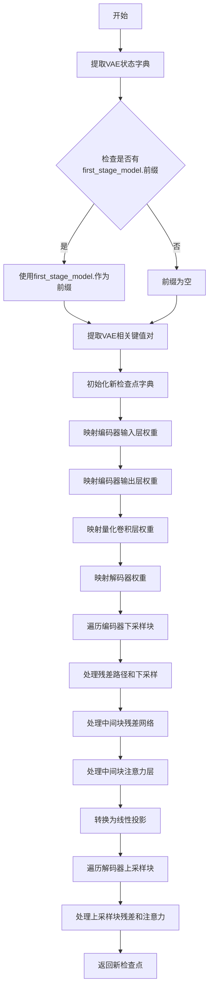

#### 带注释源码

```python
def convert_ldm_vae_checkpoint(checkpoint, config):
    """
    将 LDM VAE 检查点转换为 Diffusers 格式
    """
    # 提取 VAE 的状态字典
    vae_state_dict = {}
    keys = list(checkpoint.keys())
    # 确定 VAE 键的前缀（可能为空或为 "first_stage_model."）
    vae_key = "first_stage_model." if any(k.startswith("first_stage_model.") for k in keys) else ""
    for key in keys:
        if key.startswith(vae_key):
            # 移除前缀，只保留 VAE 内部路径
            vae_state_dict[key.replace(vae_key, "")] = checkpoint.get(key)

    # 初始化新检查点字典
    new_checkpoint = {}

    # === 编码器部分 ===
    # 映射编码器输入层
    new_checkpoint["encoder.conv_in.weight"] = vae_state_dict["encoder.conv_in.weight"]
    new_checkpoint["encoder.conv_in.bias"] = vae_state_dict["encoder.conv_in.bias"]
    
    # 映射编码器输出层
    new_checkpoint["encoder.conv_out.weight"] = vae_state_dict["encoder.conv_out.weight"]
    new_checkpoint["encoder.conv_out.bias"] = vae_state_dict["encoder.conv_out.bias"]
    new_checkpoint["encoder.conv_norm_out.weight"] = vae_state_dict["encoder.norm_out.weight"]
    new_checkpoint["encoder.conv_norm_out.bias"] = vae_state_dict["encoder.norm_out.bias"]

    # === 解码器部分 ===
    # 映射解码器输入层
    new_checkpoint["decoder.conv_in.weight"] = vae_state_dict["decoder.conv_in.weight"]
    new_checkpoint["decoder.conv_in.bias"] = vae_state_dict["decoder.conv_in.bias"]
    
    # 映射解码器输出层
    new_checkpoint["decoder.conv_out.weight"] = vae_state_dict["decoder.conv_out.weight"]
    new_checkpoint["decoder.conv_out.bias"] = vae_state_dict["decoder.conv_out.bias"]
    new_checkpoint["decoder.conv_norm_out.weight"] = vae_state_dict["decoder.norm_out.weight"]
    new_checkpoint["decoder.conv_norm_out.bias"] = vae_state_dict["decoder.norm_out.bias"]

    # === 量化和后量化卷积 ===
    new_checkpoint["quant_conv.weight"] = vae_state_dict["quant_conv.weight"]
    new_checkpoint["quant_conv.bias"] = vae_state_dict["quant_conv.bias"]
    new_checkpoint["post_quant_conv.weight"] = vae_state_dict["post_quant_conv.weight"]
    new_checkpoint["post_quant_conv.bias"] = vae_state_dict["post_quant_conv.bias"]

    # === 处理编码器下采样块 ===
    # 获取编码器下采样块的数量
    num_down_blocks = len({".".join(layer.split(".")[:3]) for layer in vae_state_dict if "encoder.down" in layer})
    down_blocks = {
        layer_id: [key for key in vae_state_dict if f"down.{layer_id}" in key] 
        for layer_id in range(num_down_blocks)
    }

    # 遍历每个下采样块
    for i in range(num_down_blocks):
        # 提取残差路径（下采样层除外）
        resnets = [key for key in down_blocks[i] if f"down.{i}" in key and f"down.{i}.downsample" not in key]

        # 处理下采样卷积
        if f"encoder.down.{i}.downsample.conv.weight" in vae_state_dict:
            new_checkpoint[f"encoder.down_blocks.{i}.downsamplers.0.conv.weight"] = vae_state_dict.pop(
                f"encoder.down.{i}.downsample.conv.weight"
            )
            new_checkpoint[f"encoder.down_blocks.{i}.downsamplers.0.conv.bias"] = vae_state_dict.pop(
                f"encoder.down.{i}.downsample.conv.bias"
            )

        # 映射残差网络路径
        paths = renew_vae_resnet_paths(resnets)
        meta_path = {"old": f"down.{i}.block", "new": f"down_blocks.{i}.resnets"}
        assign_to_checkpoint(paths, new_checkpoint, vae_state_dict, additional_replacements=[meta_path], config=config)

    # === 处理编码器中间块 ===
    mid_resnets = [key for key in vae_state_dict if "encoder.mid.block" in key]
    num_mid_res_blocks = 2
    for i in range(1, num_mid_res_blocks + 1):
        resnets = [key for key in mid_resnets if f"encoder.mid.block_{i}" in key]
        paths = renew_vae_resnet_paths(resnets)
        meta_path = {"old": f"mid.block_{i}", "new": f"mid_block.resnets.{i - 1}"}
        assign_to_checkpoint(paths, new_checkpoint, vae_state_dict, additional_replacements=[meta_path], config=config)

    # 处理中间块注意力层
    mid_attentions = [key for key in vae_state_dict if "encoder.mid.attn" in key]
    paths = renew_vae_attention_paths(mid_attentions)
    meta_path = {"old": "mid.attn_1", "new": "mid_block.attentions.0"}
    assign_to_checkpoint(paths, new_checkpoint, vae_state_dict, additional_replacements=[meta_path], config=config)
    # 将注意力权重从卷积形式转换为线性
    conv_attn_to_linear(new_checkpoint)

    # === 处理解码器上采样块 ===
    num_up_blocks = len({".".join(layer.split(".")[:3]) for layer in vae_state_dict if "decoder.up" in layer})
    up_blocks = {
        layer_id: [key for key in vae_state_dict if f"up.{layer_id}" in key] 
        for layer_id in range(num_up_blocks)
    }

    # 逆序遍历上采样块
    for i in range(num_up_blocks):
        block_id = num_up_blocks - 1 - i
        resnets = [
            key for key in up_blocks[block_id] if f"up.{block_id}" in key and f"up.{block_id}.upsample" not in key
        ]

        # 处理上采样卷积
        if f"decoder.up.{block_id}.upsample.conv.weight" in vae_state_dict:
            new_checkpoint[f"decoder.up_blocks.{i}.upsamplers.0.conv.weight"] = vae_state_dict[
                f"decoder.up.{block_id}.upsample.conv.weight"
            ]
            new_checkpoint[f"decoder.up_blocks.{i}.upsamplers.0.conv.bias"] = vae_state_dict[
                f"decoder.up.{block_id}.upsample.conv.bias"
            ]

        paths = renew_vae_resnet_paths(resnets)
        meta_path = {"old": f"up.{block_id}.block", "new": f"up_blocks.{i}.resnets"}
        assign_to_checkpoint(paths, new_checkpoint, vae_state_dict, additional_replacements=[meta_path], config=config)

    # 处理解码器中间块
    mid_resnets = [key for key in vae_state_dict if "decoder.mid.block" in key]
    for i in range(1, num_mid_res_blocks + 1):
        resnets = [key for key in mid_resnets if f"decoder.mid.block_{i}" in key]
        paths = renew_vae_resnet_paths(resnets)
        meta_path = {"old": f"mid.block_{i}", "new": f"mid_block.resnets.{i - 1}"}
        assign_to_checkpoint(paths, new_checkpoint, vae_state_dict, additional_replacements=[meta_path], config=config)

    # 处理解码器中间块注意力
    mid_attentions = [key for key in vae_state_dict if "decoder.mid.attn" in key]
    paths = renew_vae_attention_paths(mid_attentions)
    meta_path = {"old": "mid.attn_1", "new": "mid_block.attentions.0"}
    assign_to_checkpoint(paths, new_checkpoint, vae_state_dict, additional_replacements=[meta_path], config=config)
    conv_attn_to_linear(new_checkpoint)
    
    return new_checkpoint
```


### `convert_ldm_bert_checkpoint`

该函数用于将LDM（Latent Diffusion Models）的BERT文本编码器检查点转换为Hugging Face Diffusers格式的`LDMBertModel`模型。它通过一系列嵌套辅助函数，将原始检查点中的权重（包括token嵌入、位置嵌入、注意力层和MLP层）逐层复制到新创建的模型中。

参数：

- `checkpoint`：字典类型，原始LDM模型的检查点状态字典（state dict），包含从LDM格式的BERT文本编码器权重
- `config`：`LDMBertConfig`类型，Hugging Face Diffusers的LDM BERT模型配置对象，定义了模型的架构参数（如d_model、encoder_layers、encoder_ffn_dim等）

返回值：`LDMBertModel`，转换后的Hugging Face Diffusers格式的LDM BERT模型，该模型已加载了原始检查点的权重并设置为评估模式

#### 流程图

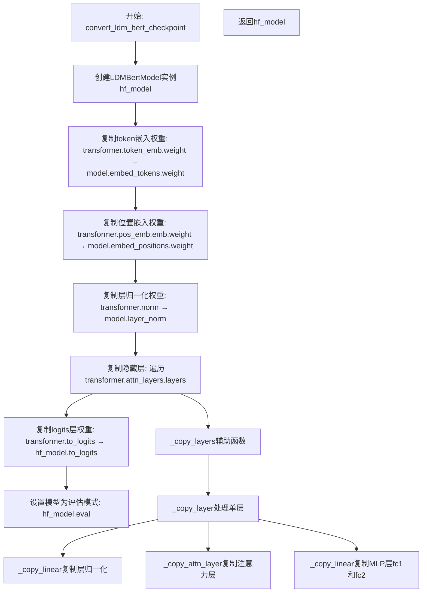

#### 带注释源码

```python
def convert_ldm_bert_checkpoint(checkpoint, config):
    """
    将LDM的BERT文本编码器检查点转换为Hugging Face Diffusers格式的LDMBertModel
    
    参数:
        checkpoint: 原始LDM模型的检查点状态字典
        config: LDMBertConfig配置对象
    返回值:
        转换后的LDMBertModel模型
    """
    
    def _copy_attn_layer(hf_attn_layer, pt_attn_layer):
        """
        复制注意力层权重从原始格式到HF格式
        
        参数:
            hf_attn_layer: HF模型的注意力层
            pt_attn_layer: 原始PT模型的注意力层
        """
        # 复制query、key、value投影权重
        hf_attn_layer.q_proj.weight.data = pt_attn_layer.to_q.weight
        hf_attn_layer.k_proj.weight.data = pt_attn_layer.to_k.weight
        hf_attn_layer.v_proj.weight.data = pt_attn_layer.to_v.weight

        # 复制输出投影权重和偏置
        hf_attn_layer.out_proj.weight = pt_attn_layer.to_out.weight
        hf_attn_layer.out_proj.bias = pt_attn_layer.to_out.bias

    def _copy_linear(hf_linear, pt_linear):
        """
        复制线性层权重和偏置
        
        参数:
            hf_linear: HF模型的线性层
            pt_linear: 原始PT模型的线性层
        """
        hf_linear.weight = pt_linear.weight
        hf_linear.bias = pt_linear.bias

    def _copy_layer(hf_layer, pt_layer):
        """
        复制单个Transformer层的所有权重
        
        参数:
            hf_layer: HF模型的单层
            pt_layer: 原始PT模型的单层
        """
        # 复制自注意力层归一化和最终层归一化
        _copy_linear(hf_layer.self_attn_layer_norm, pt_layer[0][0])
        _copy_linear(hf_layer.final_layer_norm, pt_layer[1][0])

        # 复制注意力层
        _copy_attn_layer(hf_layer.self_attn, pt_layer[0][1])

        # 复制MLP层 (前馈网络)
        pt_mlp = pt_layer[1][1]
        _copy_linear(hf_layer.fc1, pt_mlp.net[0][0])  # 第一个线性层
        _copy_linear(hf_layer.fc2, pt_mlp.net[2])     # 第二个线性层

    def _copy_layers(hf_layers, pt_layers):
        """
        复制所有Transformer层
        
        参数:
            hf_layers: HF模型的层列表
            pt_layers: 原始PT模型的层列表
        """
        for i, hf_layer in enumerate(hf_layers):
            if i != 0:
                i += i  # 计算在原始模型中的索引
            pt_layer = pt_layers[i : i + 2]
            _copy_layer(hf_layer, pt_layer)

    # 使用配置创建HF格式的LDMBertModel并设置为评估模式
    hf_model = LDMBertModel(config).eval()

    # 复制token嵌入层权重
    hf_model.model.embed_tokens.weight = checkpoint.transformer.token_emb.weight
    # 复制位置嵌入层权重
    hf_model.model.embed_positions.weight.data = checkpoint.transformer.pos_emb.emb.weight

    # 复制层归一化权重
    _copy_linear(hf_model.model.layer_norm, checkpoint.transformer.norm)

    # 复制所有隐藏层
    _copy_layers(hf_model.model.layers, checkpoint.transformer.attn_layers.layers)

    # 复制输出logits层权重
    _copy_linear(hf_model.to_logits, checkpoint.transformer.to_logits)

    return hf_model
```


### `convert_ldm_clip_checkpoint`

该函数用于将 LDM（Latent Diffusion Models）格式的 CLIP 文本编码器检查点转换为 HuggingFace Diffusers 格式。它从原始检查点中提取 CLIP 文本模型权重，并根据指定的路径前缀进行重新映射，然后加载到 CLIPTextModel 模型中。

参数：

- `checkpoint`：`Dict[str, torch.Tensor]`，原始 LDM 检查点字典，包含键值对形式的模型权重
- `local_files_only`：`bool`，是否仅使用本地文件，默认为 `False`，若为 `True` 则从本地加载 CLIPTextConfig
- `text_encoder`：`Optional[CLIPTextModel]`，可选的已初始化文本编码器，若提供则直接使用，默认为 `None`

返回值：`CLIPTextModel`，转换并加载权重后的 CLIP 文本编码器模型

#### 流程图

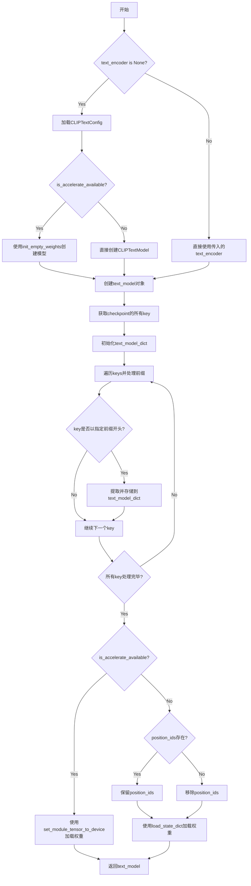

#### 带注释源码

```python
def convert_ldm_clip_checkpoint(checkpoint, local_files_only=False, text_encoder=None):
    """
    将 LDM 格式的 CLIP 文本编码器检查点转换为 Diffusers 格式
    
    参数:
        checkpoint: 原始检查点字典
        local_files_only: 是否仅使用本地文件
        text_encoder: 可选的预加载文本编码器
    返回:
        CLIPTextModel: 转换后的文本编码器
    """
    # 如果没有提供 text_encoder，则创建一个新的 CLIPTextModel
    if text_encoder is None:
        # 定义预训练配置名称
        config_name = "openai/clip-vit-large-patch14"
        try:
            # 尝试从预训练或本地加载配置
            config = CLIPTextConfig.from_pretrained(config_name, local_files_only=local_files_only)
        except Exception:
            raise ValueError(
                f"With local_files_only set to {local_files_only}, you must first locally save the configuration in the following path: 'openai/clip-vit-large-patch14'."
            )

        # 根据加速库可用性选择上下文管理器
        ctx = init_empty_weights if is_accelerate_available() else nullcontext
        with ctx():
            # 创建空的 CLIPTextModel 实例
            text_model = CLIPTextModel(config)
    else:
        # 使用提供的文本编码器
        text_model = text_encoder

    # 获取检查点的所有键
    keys = list(checkpoint.keys())

    # 用于存储转换后的权重字典
    text_model_dict = {}

    # 需要移除的前缀列表，用于适配不同版本的检查点格式
    remove_prefixes = ["cond_stage_model.transformer", "conditioner.embedders.0.transformer"]

    # 遍历检查点中的所有键
    for key in keys:
        # 检查键是否以指定的前缀开头
        for prefix in remove_prefixes:
            if key.startswith(prefix):
                # 移除前缀并存储到新字典中
                text_model_dict[key[len(prefix + ".") :]] = checkpoint[key]

    # 根据加速库可用性选择不同的权重加载方式
    if is_accelerate_available():
        # 使用 accelerate 库的函数逐参数加载
        for param_name, param in text_model_dict.items():
            set_module_tensor_to_device(text_model, param_name, "cpu", value=param)
    else:
        # 检查模型是否有 position_ids 属性
        if not (hasattr(text_model, "embeddings") and hasattr(text_model.embeddings.position_ids)):
            # 移除 position_ids 避免加载错误
            text_model_dict.pop("text_model.embeddings.position_ids", None)

        # 使用标准 PyTorch 方式加载权重
        text_model.load_state_dict(text_model_dict)

    # 返回转换后的文本编码器模型
    return text_model
```


### `convert_paint_by_example_checkpoint`

该函数用于将 PaintByExample 模型的检查点从原始 LDM (Latent Diffusion Models) 格式转换为 Hugging Face Diffusers 格式，主要完成 CLIP Vision 模型、Mapper 模块、LayerNorm 和投影层的权重迁移工作。

参数：

- `checkpoint`：`Dict[str, torch.Tensor]`，包含原始 LDM 检查点的权重字典
- `local_files_only`：`bool`，是否仅使用本地文件，默认为 `False`

返回值：`PaintByExampleImageEncoder`，转换后的 Diffusers 格式的 PaintByExample 图像编码器模型

#### 流程图

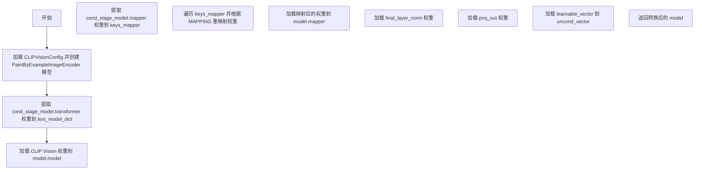

#### 带注释源码

```python
def convert_paint_by_example_checkpoint(checkpoint, local_files_only=False):
    """
    将 PaintByExample 模型的检查点从原始 LDM 格式转换为 Diffusers 格式。
    
    参数:
        checkpoint: 原始 LDM 检查点字典
        local_files_only: 是否仅使用本地文件
    返回:
        转换后的 PaintByExampleImageEncoder 模型
    """
    # 1. 加载 CLIP Vision 配置并创建模型实例
    config = CLIPVisionConfig.from_pretrained("openai/clip-vit-large-patch14", local_files_only=local_files_only)
    model = PaintByExampleImageEncoder(config)

    # 2. 提取 CLIP Vision Transformer 权重
    keys = list(checkpoint.keys())
    text_model_dict = {}
    
    for key in keys:
        # 过滤出以 cond_stage_model.transformer 开头的键
        if key.startswith("cond_stage_model.transformer"):
            # 移除前缀，保留剩余的键名
            text_model_dict[key[len("cond_stage_model.transformer.") :]] = checkpoint[key]

    # 3. 将 CLIP Vision 权重加载到模型
    model.model.load_state_dict(text_model_dict)

    # 4. 提取 Mapper 模块权重
    keys_mapper = {
        k[len("cond_stage_model.mapper.res") :]: v
        for k, v in checkpoint.items()
        if k.startswith("cond_stage_model.mapper")
    }

    # 5. 定义 LDM 层名到 Diffusers 层名的映射关系
    MAPPING = {
        "attn.c_qkv": ["attn1.to_q", "attn1.to_k", "attn1.to_v"],  # 注意力 QKV 投影
        "attn.c_proj": ["attn1.to_out.0"],                         # 注意力输出投影
        "ln_1": ["norm1"],                                         # 第一层归一化
        "ln_2": ["norm3"],                                         # 第二层归一化
        "mlp.c_fc": ["ff.net.0.proj"],                             # MLP 全连接层
        "mlp.c_proj": ["ff.net.2"],                                # MLP 输出投影
    }

    # 6. 根据映射规则转换 Mapper 权重
    mapped_weights = {}
    for key, value in keys_mapper.items():
        # 解析键名，提取前缀、块索引和后缀
        prefix = key[: len("blocks.i")]
        suffix = key.split(prefix)[-1].split(".")[-1]
        name = key.split(prefix)[-1].split(suffix)[0][1:-1]
        mapped_names = MAPPING[name]  # 获取目标层名列表

        # 对于需要分割的权重（如 QKV），按通道数分割
        num_splits = len(mapped_names)
        for i, mapped_name in enumerate(mapped_names):
            new_name = ".".join([prefix, mapped_name, suffix])
            shape = value.shape[0] // num_splits
            mapped_weights[new_name] = value[i * shape : (i + 1) * shape]

    # 7. 加载映射后的 Mapper 权重
    model.mapper.load_state_dict(mapped_weights)

    # 8. 加载最终层归一化（LayerNorm）权重
    model.final_layer_norm.load_state_dict(
        {
            "bias": checkpoint["cond_stage_model.final_ln.bias"],
            "weight": checkpoint["cond_stage_model.final_ln.weight"],
        }
    )

    # 9. 加载输出投影层权重
    model.proj_out.load_state_dict(
        {
            "bias": checkpoint["proj_out.bias"],
            "weight": checkpoint["proj_out.weight"],
        }
    )

    # 10. 加载无条件向量（unconditional vector）
    model.uncond_vector.data = torch.nn.Parameter(checkpoint["learnable_vector"])
    return model
```


### `convert_open_clip_checkpoint`

该函数用于将OpenCLIP检查点（来自Stable Diffusion的文本编码器）转换为HuggingFace Diffusers格式的CLIPTextModel或CLIPTextModelWithProjection模型。

参数：

- `checkpoint`：`Dict[str, torch.Tensor]`，原始OpenCLIP检查点的状态字典
- `config_name`：`str`，要加载的CLIP配置名称（如"stabilityai/stable-diffusion-2"）
- `prefix`：`str`，键名前缀，用于匹配检查点中的键，默认为"cond_stage_model.model."
- `has_projection`：`bool`，是否创建带投影层的CLIPTextModelWithProjection，默认为False
- `local_files_only`：`bool`，是否仅使用本地文件，默认为False
- `**config_kwargs`：传递给CLIPTextConfig.from_pretrained的其他关键字参数

返回值：`CLIPTextModel`或`CLIPTextModelWithProjection`，转换后的文本编码器模型

#### 流程图

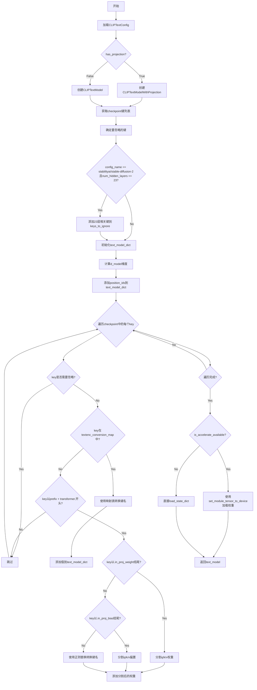

#### 带注释源码

```python
def convert_open_clip_checkpoint(
    checkpoint,                          # 原始OpenCLIP检查点状态字典
    config_name,                         # CLIP配置名称
    prefix="cond_stage_model.model.",   # 键名前缀
    has_projection=False,                # 是否包含投影层
    local_files_only=False,              # 是否仅使用本地文件
    **config_kwargs,                     # 其他配置参数
):
    # 尝试从预训练模型加载CLIPTextConfig配置
    try:
        config = CLIPTextConfig.from_pretrained(
            config_name, 
            **config_kwargs, 
            local_files_only=local_files_only
        )
    except Exception:
        # 如果本地文件不存在且local_files_only为True，抛出错误
        raise ValueError(
            f"With local_files_only set to {local_files_only}, "
            f"you must first locally save the configuration in the following path: '{config_name}'."
        )

    # 根据是否支持accelerate库，选择初始化空权重的上下文或nullcontext
    ctx = init_empty_weights if is_accelerate_available() else nullcontext
    with ctx():
        # 根据has_projection标志创建对应的文本模型
        # 如果has_projection为True，创建CLIPTextModelWithProjection（用于SDXL等）
        # 否则创建CLIPTextModel（用于SD v1/v2）
        text_model = CLIPTextModelWithProjection(config) if has_projection else CLIPTextModel(config)

    # 获取检查点中所有的键
    keys = list(checkpoint.keys())

    # 初始化需要忽略的键列表
    keys_to_ignore = []
    # 针对特定模型（stabilityai/stable-diffusion-2）且层数为23的情况
    # 需要忽略第23层及text_projection相关键
    if config_name == "stabilityai/stable-diffusion-2" and config.num_hidden_layers == 23:
        # 移除所有以cond_stage_model.model.transformer.resblocks.23开头的键
        keys_to_ignore += [k for k in keys if k.startswith("cond_stage_model.model.transformer.resblocks.23")]
        # 移除text_projection键
        keys_to_ignore += ["cond_stage_model.model.text_projection"]

    # 初始化用于存储转换后权重的字典
    text_model_dict = {}

    # 确定文本模型的维度d_model
    # 如果检查点中存在text_projection键，则从其shape获取维度
    if prefix + "text_projection" in checkpoint:
        d_model = int(checkpoint[prefix + "text_projection"].shape[0])
    else:
        # 默认维度为1024
        d_model = 1024

    # 添加position_ids到模型字典
    # 这是CLIP模型需要的位置编码ID
    text_model_dict["text_model.embeddings.position_ids"] = (
        text_model.text_model.embeddings.get_buffer("position_ids")
    )

    # 遍历检查点中的所有键，进行权重转换
    for key in keys:
        # 跳过需要忽略的键
        if key in keys_to_ignore:
            continue
        
        # 检查键是否在转换映射表中
        if key[len(prefix) :] in textenc_conversion_map:
            # 对于text_projection键，需要转置并确保内存连续
            if key.endswith("text_projection"):
                value = checkpoint[key].T.contiguous()
            else:
                value = checkpoint[key]
            
            # 使用映射表转换键名并添加到新字典
            text_model_dict[textenc_conversion_map[key[len(prefix) :]]] = value

        # 处理transformer层的权重
        if key.startswith(prefix + "transformer."):
            # 去除前缀得到新的键名
            new_key = key[len(prefix + "transformer.") :]
            
            # 处理in_proj_weight（QKV合并权重）
            if new_key.endswith(".in_proj_weight"):
                new_key = new_key[: -len(".in_proj_weight")]
                # 使用正则表达式替换键名模式
                new_key = textenc_pattern.sub(
                    lambda m: protected[re.escape(m.group(0))], 
                    new_key
                )
                # 将合并的QKV权重分割为query、key、value三个权重
                text_model_dict[new_key + ".q_proj.weight"] = checkpoint[key][:d_model, :]
                text_model_dict[new_key + ".k_proj.weight"] = checkpoint[key][d_model : d_model * 2, :]
                text_model_dict[new_key + ".v_proj.weight"] = checkpoint[key][d_model * 2 :, :]
            
            # 处理in_proj_bias（QKV合并偏置）
            elif new_key.endswith(".in_proj_bias"):
                new_key = new_key[: -len(".in_proj_bias")]
                new_key = textenc_pattern.sub(
                    lambda m: protected[re.escape(m.group(0))], 
                    new_key
                )
                # 将合并的QKV偏置分割为query、key、value三个偏置
                text_model_dict[new_key + ".q_proj.bias"] = checkpoint[key][:d_model]
                text_model_dict[new_key + ".k_proj.bias"] = checkpoint[key][d_model : d_model * 2]
                text_model_dict[new_key + ".v_proj.bias"] = checkpoint[key][d_model * 2 :]
            
            # 处理其他transformer层权重
            else:
                new_key = textenc_pattern.sub(
                    lambda m: protected[re.escape(m.group(0))], 
                    new_key
                )
                text_model_dict[new_key] = checkpoint[key]

    # 使用accelerate库加载权重（如果可用）
    if is_accelerate_available():
        for param_name, param in text_model_dict.items():
            set_module_tensor_to_device(text_model, param_name, "cpu", value=param)
    else:
        # 检查模型是否有embeddings和position_ids属性
        if not (hasattr(text_model, "embeddings") and hasattr(text_model.embeddings.position_ids)):
            text_model_dict.pop("text_model.embeddings.position_ids", None)
        
        # 直接使用load_state_dict加载权重
        text_model.load_state_dict(text_model_dict)

    # 返回转换后的文本编码器模型
    return text_model
```


### `stable_unclip_image_encoder`

该函数用于从原始 Stable Diffusion 检查点配置中提取并返回对应的图像处理器（feature_extractor）和 CLIP 图像编码器（image_encoder）。它支持两种类型的 Stable UNCLIP 模型：使用 CLIP 和使用 OpenCLIP 图像编码器的模型。

参数：

- `original_config`：`Dict`，包含原始 Stable Diffusion 模型的配置字典，从中提取图像嵌入器配置
- `local_files_only`：`bool`，是否仅使用本地文件（不尝试下载模型），默认为 `False`

返回值：`Tuple[CLIPImageProcessor, CLIPVisionModelWithProjection]`，返回特征提取器和图像编码器的元组

#### 流程图

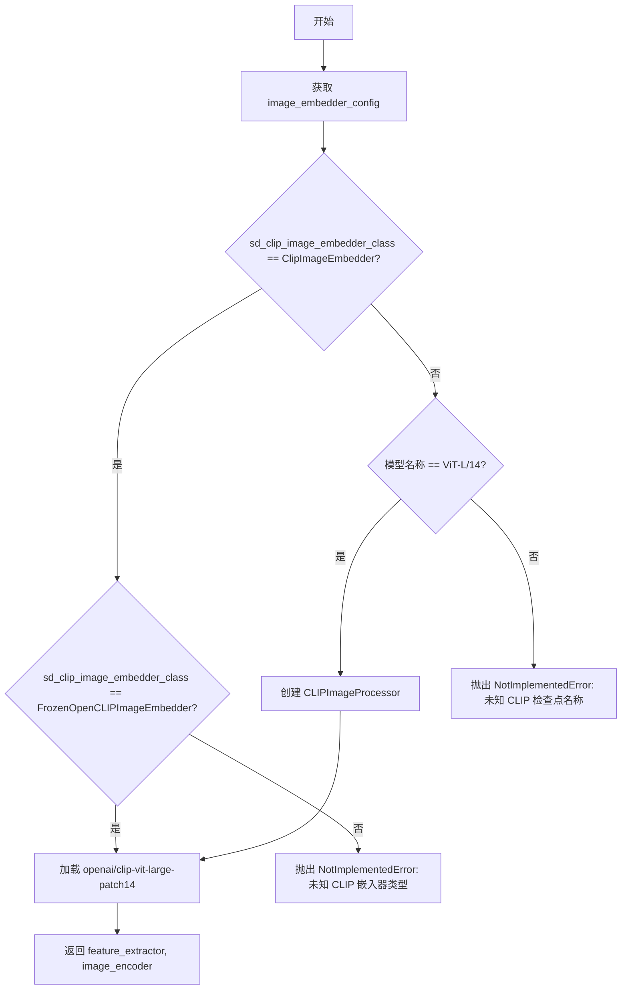

#### 带注释源码

```python
def stable_unclip_image_encoder(original_config, local_files_only=False):
    """
    Returns the image processor and clip image encoder for the img2img unclip pipeline.

    We currently know of two types of stable unclip models which separately use the clip and the openclip image
    encoders.

    Args:
        original_config: Dict, 包含原始 Stable Diffusion 配置的字典
        local_files_only: bool, 是否仅从本地加载模型

    Returns:
        Tuple[CLIPImageProcessor, CLIPVisionModelWithProjection]: 
            特征提取器和 CLIP 图像编码器
    """
    # 从原始配置中提取图像嵌入器配置
    image_embedder_config = original_config["model"]["params"]["embedder_config"]

    # 获取嵌入器的类名（取最后一个点后的部分）
    sd_clip_image_embedder_class = image_embedder_config["target"]
    sd_clip_image_embedder_class = sd_clip_image_embedder_class.split(".")[-1]

    # 根据嵌入器类型选择对应的 CLIP 模型
    if sd_clip_image_embedder_class == "ClipImageEmbedder":
        # 获取 CLIP 模型名称
        clip_model_name = image_embedder_config.params.model

        if clip_model_name == "ViT-L/14":
            # 创建 CLIP 图像处理器
            feature_extractor = CLIPImageProcessor()
            # 加载 CLIP 视觉模型（带投影层）
            image_encoder = CLIPVisionModelWithProjection.from_pretrained(
                "openai/clip-vit-large-patch14", local_files_only=local_files_only
            )
        else:
            raise NotImplementedError(f"Unknown CLIP checkpoint name in stable diffusion checkpoint {clip_model_name}")

    elif sd_clip_image_embedder_class == "FrozenOpenCLIPImageEmbedder":
        # 使用 OpenCLIP 图像嵌入器
        feature_extractor = CLIPImageProcessor()
        image_encoder = CLIPVisionModelWithProjection.from_pretrained(
            "laion/CLIP-ViT-H-14-laion2B-s32B-b79K", local_files_only=local_files_only
        )
    else:
        raise NotImplementedError(
            f"Unknown CLIP image embedder class in stable diffusion checkpoint {sd_clip_image_embedder_class}"
        )

    return feature_extractor, image_encoder
```


### `stable_unclip_image_noising_components`

该函数用于从原始 Stable Diffusion 配置中提取并构建 Stable UnCLIP 图像流水线所需的去噪组件，包括图像标准化器（用于保存 CLIP 统计信息）和 DDPMScheduler（用于保存噪声调度计划）。

参数：

- `original_config`：`Dict`，原始 Stable Diffusion 模型的配置字典，从中提取噪声增强器（noise augmentor）配置
- `clip_stats_path`：`str | None`，CLIP 统计数据的文件路径，如果原始配置中指定了 `clip_stats_path`，则必须提供此参数
- `device`：`str | None`，用于加载 CLIP 统计数据的设备（如 "cpu"、"cuda" 等）

返回值：`(StableUnCLIPImageNormalizer, DDPMScheduler)`，返回一个元组，包含图像标准化器实例和噪声调度器实例

#### 流程图

```mermaid
flowchart TD
    A[开始: stable_unclip_image_noising_components] --> B[从 original_config 获取 noise_aug_config]
    B --> C[提取 noise_aug_class 并取最后一个类名]
    C --> D{noise_aug_class == 'CLIPEmbeddingNoiseAugmentation'?}
    D -- 是 --> E[提取 embedding_dim, max_noise_level, beta_schedule]
    E --> F[创建 StableUnCLIPImageNormalizer]
    F --> G[创建 DDPMScheduler]
    G --> H{noise_aug_config 中有 'clip_stats_path'?}
    H -- 是 --> I{clip_stats_path 是否为 None?}
    I -- 是 --> J[抛出 ValueError: 需要 clip_stats_path]
    I -- 否 --> K[加载 clip_mean 和 clip_std]
    K --> L[构建 clip_stats_state_dict]
    L --> M[加载状态字典到 image_normalizer]
    H -- 否 --> N[返回 (image_normalizer, image_noising_scheduler)]
    D -- 否 --> O[抛出 NotImplementedError: 未知噪声增强器类别]
    J --> P[结束: 异常处理]
    O --> P
    M --> N
    N --> P
```

#### 带注释源码

```python
def stable_unclip_image_noising_components(
    original_config, clip_stats_path: str | None = None, device: str | None = None
):
    """
    Returns the noising components for the img2img and txt2img unclip pipelines.

    Converts the stability noise augmentor into
    1. a `StableUnCLIPImageNormalizer` for holding the CLIP stats
    2. a `DDPMScheduler` for holding the noise schedule

    If the noise augmentor config specifies a clip stats path, the `clip_stats_path` must be provided.
    """
    # 从原始配置中获取噪声增强器配置
    noise_aug_config = original_config["model"]["params"]["noise_aug_config"]
    # 获取目标类名并取最后一部分（去除完整路径）
    noise_aug_class = noise_aug_config["target"]
    noise_aug_class = noise_aug_class.split(".")[-1]

    # 检查是否为 CLIPEmbeddingNoiseAugmentation 类型
    if noise_aug_class == "CLIPEmbeddingNoiseAugmentation":
        # 提取噪声增强器参数
        noise_aug_config = noise_aug_config.params
        embedding_dim = noise_aug_config.timestep_dim  # 时间嵌入维度
        max_noise_level = noise_aug_config.noise_schedule_config.timesteps  # 最大噪声级别
        beta_schedule = noise_aug_config.noise_schedule_config.beta_schedule  # Beta 调度方案

        # 创建 StableUnCLIPImageNormalizer 用于保存 CLIP 统计信息
        image_normalizer = StableUnCLIPImageNormalizer(embedding_dim=embedding_dim)
        # 创建 DDPMScheduler 用于噪声调度
        image_noising_scheduler = DDPMScheduler(num_train_timesteps=max_noise_level, beta_schedule=beta_schedule)

        # 如果配置中指定了 clip_stats_path，则需要加载 CLIP 统计信息
        if "clip_stats_path" in noise_aug_config:
            # 检查是否提供了 clip_stats_path
            if clip_stats_path is None:
                raise ValueError("This stable unclip config requires a `clip_stats_path`")

            # 加载 CLIP 统计数据（均值和标准差）
            clip_mean, clip_std = torch.load(clip_stats_path, map_location=device)
            # 添加批次维度以匹配模型输入形状
            clip_mean = clip_mean[None, :]
            clip_std = clip_std[None, :]

            # 构建状态字典
            clip_stats_state_dict = {
                "mean": clip_mean,
                "std": clip_std,
            }

            # 加载状态字典到标准化器
            image_normalizer.load_state_dict(clip_stats_state_dict)
    else:
        # 如果遇到未知的噪声增强器类别，抛出异常
        raise NotImplementedError(f"Unknown noise augmentor class: {noise_aug_class}")

    # 返回图像标准化器和噪声调度器
    return image_normalizer, image_noising_scheduler
```


### `convert_controlnet_checkpoint`

该函数负责将原始的 LDM（Latent Diffusion Models）格式的 ControlNet 检查点转换为 Hugging Face Diffusers 库所需的 `ControlNetModel` 格式，是实现从 Stability AI 或 CompVis 格式的 ControlNet 模型到 Diffusers 格式迁移的核心转换函数。

参数：

- `checkpoint`：`Dict[str, torch.Tensor]`，原始的模型检查点字典，包含从 .ckpt 或 .safetensors 文件加载的键值对
- `original_config`：`Dict`，原始模型的 YAML 配置文件解析后的字典，包含了模型的架构参数
- `checkpoint_path`：`str`，检查点文件的路径，用于日志记录和 EMA 提取判断
- `image_size`：`int`，模型训练时使用的图像尺寸，用于配置 UNet 的采样大小
- `upcast_attention`：`bool`，是否将注意力计算上浮到更高精度的数据类型，用于 SD 2.1 模型
- `extract_ema`：`bool`，是否从检查点中提取 EMA（指数移动平均）权重，通常推理时使用 EMA 权重效果更好
- `use_linear_projection`：`Optional[bool]`，可选参数，是否在转换后的模型中使用线性投影覆盖默认配置
- `cross_attention_dim`：`Optional[int]`，可选参数，交叉注意力维度覆盖值

返回值：`ControlNetModel`，转换后的 Diffusers 格式 ControlNet 模型对象，已加载转换后的权重

#### 流程图

```mermaid
flowchart TD
    A[开始 convert_controlnet_checkpoint] --> B[调用 create_unet_diffusers_config 创建基础配置]
    B --> C[配置 upcast_attention 参数]
    C --> D[移除 sample_size 字段]
    D --> E{use_linear_projection 是否非空?}
    E -->|是| F[设置 use_linear_projection]
    E -->|否| G[跳过此配置]
    F --> H{cross_attention_dim 是否非空?}
    G --> H
    H -->|是| I[设置 cross_attention_dim]
    H -->|否| J[跳过此配置]
    J --> K{is_accelerate_available?}
    K -->|是| L[使用 init_empty_weights 上下文]
    K -->|否| M[使用 nullcontext 上下文]
    L --> N[创建空的 ControlNetModel]
    M --> N
    N --> O{checkpoint 包含 time_embed.0.weight?}
    O -->|是| P[设置 skip_extract_state_dict=True]
    O -->|否| Q[设置 skip_extract_state_dict=False]
    P --> R[调用 convert_ldm_unet_checkpoint]
    Q --> R
    R --> S{is_accelerate_available?}
    S -->|是| T[使用 set_module_tensor_to_device 加载权重]
    S -->|否| U[使用 load_state_dict 直接加载]
    T --> V[返回 ControlNetModel]
    U --> V
```

#### 带注释源码

```python
def convert_controlnet_checkpoint(
    checkpoint,  # Dict[str, torch.Tensor]: 原始检查点字典
    original_config,  # Dict: 原始模型配置字典
    checkpoint_path,  # str: 检查点文件路径
    image_size,  # int: 训练时图像尺寸
    upcast_attention,  # bool: 是否上浮注意力计算
    extract_ema,  # bool: 是否提取EMA权重
    use_linear_projection=None,  # Optional[bool]: 线性投影覆盖选项
    cross_attention_dim=None,  # Optional[int]: 交叉注意力维度覆盖选项
):
    """
    将原始 LDM 格式的 ControlNet 检查点转换为 Diffusers 格式的 ControlNetModel。
    
    该函数执行以下主要步骤:
    1. 根据原始配置创建 ControlNet 的基础配置
    2. 处理可选参数覆盖
    3. 创建空的 ControlNetModel 框架
    4. 调用 convert_ldm_unet_checkpoint 进行实际的权重转换
    5. 将转换后的权重加载到模型中
    """
    # 步骤1: 创建 ControlNet 的 Diffusers 配置
    # 从原始配置文件提取 control_stage_config 参数构建 UNet 配置
    ctrlnet_config = create_unet_diffusers_config(original_config, image_size=image_size, controlnet=True)
    
    # 步骤2: 设置上浮注意力选项 (SD 2.1 需要)
    ctrlnet_config["upcast_attention"] = upcast_attention

    # 移除 sample_size，因为 ControlNet 不需要这个字段
    ctrlnet_config.pop("sample_size")

    # 步骤3: 可选参数覆盖 - 线性投影
    if use_linear_projection is not None:
        ctrlnet_config["use_linear_projection"] = use_linear_projection

    # 步骤4: 可选参数覆盖 - 交叉注意力维度
    if cross_attention_dim is not None:
        ctrlnet_config["cross_attention_dim"] = cross_attention_dim

    # 步骤5: 根据加速库可用性选择上下文管理器
    # init_empty_weights: 仅创建模型结构不分配内存
    # nullcontext: 普通上下文管理器
    ctx = init_empty_weights if is_accelerate_available() else nullcontext
    with ctx():
        # 创建空的 ControlNetModel 框架
        controlnet = ControlNetModel(**ctrlnet_config)

    # 步骤6: 判断是否跳过状态字典提取
    # 有些独立的 ControlNet 检查点文件不包含 time_embed 层
    # 例如 https://huggingface.co/thibaud/controlnet-sd21/
    if "time_embed.0.weight" in checkpoint:
        skip_extract_state_dict = True  # 完整的独立检查点
    else:
        skip_extract_state_dict = False # 需要从完整 SD 模型中提取

    # 步骤7: 调用核心转换函数进行权重映射
    # 该函数将 LDM 风格的键名转换为 Diffusers 风格
    converted_ctrl_checkpoint = convert_ldm_unet_checkpoint(
        checkpoint,
        ctrlnet_config,
        path=checkpoint_path,
        extract_ema=extract_ema,
        controlnet=True,
        skip_extract_state_dict=skip_extract_state_dict,
    )

    # 步骤8: 加载转换后的权重到模型
    if is_accelerate_available():
        # 使用 accelerate 库逐参数加载，支持大模型内存优化
        for param_name, param in converted_ctrl_checkpoint.items():
            set_module_tensor_to_device(controlnet, param_name, "cpu", value=param)
    else:
        # 直接使用 PyTorch 的 load_state_dict
        controlnet.load_state_dict(converted_ctrl_checkpoint)

    # 返回转换完成的 ControlNetModel 实例
    return controlnet
```


### `convert_promptdiffusion_checkpoint`

将原始的PromptDiffusion ControlNet检查点转换为Diffusers格式的ControlNet模型，处理权重映射、配置更新和模型加载。

参数：

-  `checkpoint`：`Dict[str, torch.Tensor]`，包含原始检查点的权重字典
-  `original_config`：`Dict`，包含原始模型的配置文件
-  `checkpoint_path`：`str`，原始检查点文件的路径
-  `image_size`：`int`，模型训练时使用的图像尺寸
-  `upcast_attention`：`bool`，是否需要上 casting注意力计算
-  `extract_ema`：`bool`，是否提取EMA权重
-  `use_linear_projection`：`Optional[bool]`，是否使用线性投影（可选）
-  `cross_attention_dim`：`Optional[int]`，交叉注意力维度（可选）

返回值：`PromptDiffusionControlNetModel`，转换后的Diffusers格式ControlNet模型

#### 流程图

```mermaid
flowchart TD
    A[开始] --> B[创建ControlNet配置]
    B --> C[设置upcast_attention]
    C --> D[移除sample_size]
    D --> E{use_linear_projection<br/>是否提供?}
    E -->|是| F[设置use_linear_projection]
    E -->|否| G{skip_extract_state_dict<br/>判断}
    F --> G
    G -->|是| H[skip_extract_state_dict=True]
    G -->|否| I[skip_extract_state_dict=False]
    H --> J[调用convert_ldm_unet_checkpoint]
    I --> J
    J --> K[转换权重]
    K --> L{is_accelerate_available?}
    L -->|是| M[使用set_module_tensor_to_device加载权重]
    L -->|否| N[使用load_state_dict加载权重]
    M --> O[返回ControlNet模型]
    N --> O
```

#### 带注释源码

```python
def convert_promptdiffusion_checkpoint(
    checkpoint,                      # 原始检查点权重字典
    original_config,                 # 原始模型配置
    checkpoint_path,                 # 检查点文件路径
    image_size,                      # 图像尺寸
    upcast_attention,                # 是否上cast注意力
    extract_ema,                     # 是否提取EMA权重
    use_linear_projection=None,      # 可选的线性投影标志
    cross_attention_dim=None,        # 可选的交叉注意力维度
):
    """
    将PromptDiffusion ControlNet检查点转换为Diffusers格式。
    
    该函数执行以下步骤：
    1. 根据原始配置创建ControlNet配置
    2. 设置各种可选参数（upcast_attention, use_linear_projection等）
    3. 初始化空的PromptDiffusionControlNetModel
    4. 转换权重并加载到模型中
    """
    
    # 步骤1: 创建ControlNet配置
    # 使用create_unet_diffusers_config创建基础配置，指定controlnet=True
    ctrlnet_config = create_unet_diffusers_config(
        original_config, 
        image_size=image_size, 
        controlnet=True
    )
    
    # 步骤2: 设置upcast_attention参数
    ctrlnet_config["upcast_attention"] = upcast_attention

    # 移除sample_size，因为ControlNet不需要这个字段
    ctrlnet_config.pop("sample_size")

    # 可选: 设置线性投影
    if use_linear_projection is not None:
        ctrlnet_config["use_linear_projection"] = use_linear_projection

    # 可选: 设置交叉注意力维度
    if cross_attention_dim is not None:
        ctrlnet_config["cross_attention_dim"] = cross_attention_dim

    # 步骤3: 初始化空的ControlNet模型
    # 如果accelerate可用，使用init_empty_weights避免内存占用
    ctx = init_empty_weights if is_accelerate_available() else nullcontext
    with ctx():
        controlnet = PromptDiffusionControlNetModel(**ctrlnet_config)

    # 步骤4: 判断是否需要跳过提取state_dict
    # 有些ControlNet检查点文件是独立分发的，包含time_embed.0.weight
    if "time_embed.0.weight" in checkpoint:
        skip_extract_state_dict = True
    else:
        skip_extract_state_dict = False

    # 步骤5: 转换UNet/控制网络权重
    # 调用convert_ldm_unet_checkpoint进行实际的权重转换
    converted_ctrl_checkpoint = convert_ldm_unet_checkpoint(
        checkpoint,
        ctrlnet_config,
        path=checkpoint_path,
        extract_ema=extract_ema,
        promptdiffusion=True,     # 标记为promptdiffusion模式
        controlnet=True,
        skip_extract_state_dict=skip_extract_state_dict,
    )

    # 步骤6: 加载转换后的权重到模型
    if is_accelerate_available():
        # 使用accelerate库逐个设置参数，避免内存峰值
        for param_name, param in converted_ctrl_checkpoint.items():
            set_module_tensor_to_device(
                controlnet, 
                param_name, 
                "cpu", 
                value=param
            )
    else:
        # 直接使用load_state_dict加载
        controlnet.load_state_dict(converted_ctrl_checkpoint)

    # 返回转换后的ControlNet模型
    return controlnet
```


### `download_from_original_stable_diffusion_ckpt`

该函数用于从 CompVis 风格的 `.ckpt` 或 `.safetensors` 检查点文件（以及可选的 `.yaml` 配置文件）加载 Stable Diffusion 管道对象。它支持多种模型变体，包括 SD v1.x、SD v2、SDXL、ControlNet 等，并能够自动推断或接受手动指定的配置参数。

参数：

- `checkpoint_path_or_dict`：`Union[str, Dict[str, torch.Tensor]]`，检查点文件路径或包含张量的字典
- `original_config_file`：`str`，原始架构对应的 YAML 配置文件路径，若为 None 将自动推断
- `image_size`：`Optional[int]`，模型训练时使用的图像大小，SD v1.X 和 SD v2 Base 默认 512，SD v2 默认 768
- `prediction_type`：`str`，模型训练时的预测类型，SD v1.X 和 SD v2 Base 使用 'epsilon'，SD v2 使用 'v_prediction'
- `model_type`：`str`，管道类型，可选 "FrozenOpenCLIPEmbedder"、"FrozenCLIPEmbedder"、"PaintByExample" 等，若为 None 将自动推断
- `extract_ema`：`bool`，是否提取 EMA 权重，默认 False
- `scheduler_type`：`str`，使用的调度器类型，可选 "pndm"、"lms"、"heun"、"euler"、"euler-ancestral"、"dpm"、"ddim"，默认 "pndm"
- `num_in_channels`：`Optional[int]`，输入通道数，若为 None 将自动推断
- `upcast_attention`：`Optional[bool]`，是否对注意力计算进行上 cast，对于 SD 2.1 是必需的
- `device`：`str`，使用的设备，若为 None 将自动选择 "cuda" 或 "cpu"
- `from_safetensors`：`bool`，是否从 safetensors 格式加载检查点，默认 False
- `stable_unclip`：`str | None`，Stable UnClip 模型类型，可选 "img2img" 或 "txt2img"
- `stable_unclip_prior`：`str | None`，Stable UnClip 先验模型类型
- `clip_stats_path`：`str | None`，CLIP 统计数据的路径
- `controlnet`：`Optional[bool]`，是否加载 ControlNet
- `adapter`：`Optional[bool]`，是否加载 Adapter
- `load_safety_checker`：`bool`，是否加载安全检查器，默认 True
- `pipeline_class`：`DiffusionPipeline`，使用的管道类，若为 None 将自动推断
- `local_files_only`：`bool`，是否仅使用本地文件，默认 False
- `vae_path`：`str | None`，VAE 模型路径
- `vae`：`AutoencoderKL`，预加载的 VAE 模型
- `text_encoder`：`CLIPTextModel`，预加载的文本编码器
- `text_encoder_2`：`CLIPTextModelWithProjection`，预加载的第二个文本编码器（用于 SDXL）
- `tokenizer`：`CLIPTokenizer`，预加载的分词器
- `tokenizer_2`：`CLIPTokenizer`，预加载的第二个分词器（用于 SDXL）
- `config_files`：`Dict[str, str]`，配置文件字典，键可为 "v1"、"v2"、"xl"、"xl_refiner"

返回值：`DiffusionPipeline`，返回加载的 Stable Diffusion 管道对象

#### 流程图

```mermaid
flowchart TD
    A[开始] --> B{checkpoint_path_or_dict 是字符串?}
    B -->|是| C{from_safetensors?}
    B -->|否| D[使用传入的字典作为 checkpoint]
    C -->|是| E[使用 safetensors 加载]
    C -->|否| F{device 未指定?}
    F -->|是| G[根据 CUDA 可用性选择 device]
    F -->|否| H[使用指定的 device]
    G --> I[使用 torch.load 加载]
    H --> I
    E --> I
    I --> D
    D --> J[提取 global_step]
    J --> K[处理嵌套的 state_dict]
    K --> L{original_config_file 为空?}
    L -->|是| M[自动推断配置类型<br/>v1/v2/SDXL/SDXL-Refiner]
    L -->|否| N[读取 YAML 配置]
    M --> O[解析 YAML]
    N --> O
    O --> P[推断或使用传入的 model_type]
    P --> Q[确定 pipeline_class]
    Q --> R[设置 num_in_channels]
    R --> S[创建 UNet 配置]
    S --> T[转换 UNet 检查点]
    T --> U{vae_path 和 vae 都为空?}
    U -->|是| V[创建 VAE 配置并转换]
    U -->|否| W[从路径加载或使用传入的 vae]
    V --> X{model_type 类型?}
    X -->|FrozenOpenCLIPEmbedder| Y[转换 OpenCLIP 文本编码器]
    X -->|PaintByExample| Z[转换 PaintByExample 模型]
    X -->|FrozenCLIPEmbedder| AA[转换 LDM CLIP 检查点]
    X -->|SDXL/SDXL-Refiner| AB[转换 SDXL 文本编码器]
    X -->|其他| AC[转换 LDM BERT 检查点]
    Y --> AD[创建并填充管道]
    Z --> AD
    AA --> AD
    AB --> AD
    AC --> AD
    W --> X
    AD --> AE[返回管道]
```

#### 带注释源码

```python
def download_from_original_stable_diffusion_ckpt(
    checkpoint_path_or_dict: Union[str, Dict[str, torch.Tensor]],
    original_config_file: str = None,
    image_size: Optional[int] = None,
    prediction_type: str = None,
    model_type: str = None,
    extract_ema: bool = False,
    scheduler_type: str = "pndm",
    num_in_channels: Optional[int] = None,
    upcast_attention: Optional[bool] = None,
    device: str = None,
    from_safetensors: bool = False,
    stable_unclip: str | None = None,
    stable_unclip_prior: str | None = None,
    clip_stats_path: str | None = None,
    controlnet: Optional[bool] = None,
    adapter: Optional[bool] = None,
    load_safety_checker: bool = True,
    pipeline_class: DiffusionPipeline = None,
    local_files_only=False,
    vae_path=None,
    vae=None,
    text_encoder=None,
    text_encoder_2=None,
    tokenizer=None,
    tokenizer_2=None,
    config_files=None,
) -> DiffusionPipeline:
    """
    Load a Stable Diffusion pipeline object from a CompVis-style `.ckpt`/`.safetensors` file and (ideally) a `.yaml`
    config file.

    Although many of the arguments can be automatically inferred, some of these rely on brittle checks against the
    global step count, which will likely fail for models that have undergone further fine-tuning. Therefore, it is
    recommended that you override the default values and/or supply an `original_config_file` wherever possible.
    """
    # 避免循环导入错误
    from diffusers import (
        LDMTextToImagePipeline,
        PaintByExamplePipeline,
        StableDiffusionControlNetPipeline,
        StableDiffusionInpaintPipeline,
        StableDiffusionPipeline,
        StableDiffusionUpscalePipeline,
        StableDiffusionXLControlNetInpaintPipeline,
        StableDiffusionXLImg2ImgPipeline,
        StableDiffusionXLInpaintPipeline,
        StableDiffusionXLPipeline,
        StableUnCLIPImg2ImgPipeline,
        StableUnCLIPPipeline,
    )

    # 统一预测类型名称
    if prediction_type == "v-prediction":
        prediction_type = "v_prediction"

    # 加载检查点文件
    if isinstance(checkpoint_path_or_dict, str):
        if from_safetensors:
            from safetensors.torch import load_file as safe_load
            # 使用 safetensors 格式加载
            checkpoint = safe_load(checkpoint_path_or_dict, device="cpu")
        else:
            if device is None:
                # 自动选择设备
                device = "cuda" if torch.cuda.is_available() else "cpu"
                checkpoint = torch.load(checkpoint_path_or_dict, map_location=device)
            else:
                checkpoint = torch.load(checkpoint_path_or_dict, map_location=device)
    elif isinstance(checkpoint_path_or_dict, dict):
        # 直接使用传入的字典作为检查点
        checkpoint = checkpoint_path_or_dict

    # 获取全局步数（如果存在）
    if "global_step" in checkpoint:
        global_step = checkpoint["global_step"]
    else:
        logger.debug("global_step key not found in model")
        global_step = None

    # 处理某些控制网检查点包含嵌套 state_dict 的情况
    while "state_dict" in checkpoint:
        checkpoint = checkpoint["state_dict"]

    # 如果未提供配置文件，自动推断配置类型
    if original_config_file is None:
        # 定义用于检测模型版本的键名
        key_name_v2_1 = "model.diffusion_model.input_blocks.2.1.transformer_blocks.0.attn2.to_k.weight"
        key_name_sd_xl_base = "conditioner.embedders.1.model.transformer.resblocks.9.mlp.c_proj.bias"
        key_name_sd_xl_refiner = "conditioner.embedders.0.model.transformer.resblocks.9.mlp.c_proj.bias"
        is_upscale = pipeline_class == StableDiffusionUpscalePipeline

        config_url = None

        # 默认为 SD v1
        if config_files is not None and "v1" in config_files:
            original_config_file = config_files["v1"]
        else:
            config_url = "https://raw.githubusercontent.com/CompVis/stable-diffusion/main/configs/stable-diffusion/v1-inference.yaml"

        # 检测 SD v2/v2.1
        if key_name_v2_1 in checkpoint and checkpoint[key_name_v2_1].shape[-1] == 1024:
            if config_files is not None and "v2" in config_files:
                original_config_file = config_files["v2"]
            else:
                config_url = "https://raw.githubusercontent.com/Stability-AI/stablediffusion/main/configs/stable-diffusion/v2-inference-v.yaml"
            if global_step == 110000:
                # v2.1 需要上 cast 注意力
                upcast_attention = True
        # 检测 SDXL Base
        elif key_name_sd_xl_base in checkpoint:
            if config_files is not None and "xl" in config_files:
                original_config_file = config_files["xl"]
            else:
                config_url = "https://raw.githubusercontent.com/Stability-AI/generative-models/main/configs/inference/sd_xl_base.yaml"
        # 检测 SDXL Refiner
        elif key_name_sd_xl_refiner in checkpoint:
            if config_files is not None and "xl_refiner" in config_files:
                original_config_file = config_files["xl_refiner"]
            else:
                config_url = "https://raw.githubusercontent.com/Stability-AI/generative-models/main/configs/inference/sd_xl_refiner.yaml"

        # 放大管道特殊配置
        if is_upscale:
            config_url = "https://raw.githubusercontent.com/Stability-AI/stablediffusion/main/configs/stable-diffusion/x4-upscaling.yaml"

        # 从 URL 下载或读取本地文件
        if config_url is not None:
            original_config_file = BytesIO(requests.get(config_url, timeout=DIFFUSERS_REQUEST_TIMEOUT).content)
        else:
            with open(original_config_file, "r") as f:
                original_config_file = f.read()

    # 解析 YAML 配置
    original_config = yaml.safe_load(original_config_file)

    # 推断模型类型
    if (
        model_type is None
        and "cond_stage_config" in original_config["model"]["params"]
        and original_config["model"]["params"]["cond_stage_config"] is not None
    ):
        model_type = original_config["model"]["params"]["cond_stage_config"]["target"].split(".")[-1]
        logger.debug(f"no `model_type` given, `model_type` inferred as: {model_type}")
    elif model_type is None and original_config["model"]["params"]["network_config"] is not None:
        if original_config["model"]["params"]["network_config"]["params"]["context_dim"] == 2048:
            model_type = "SDXL"
        else:
            model_type = "SDXL-Refiner"
        if image_size is None:
            image_size = 1024

    # 确定管道类
    if pipeline_class is None:
        if model_type not in ["SDXL", "SDXL-Refiner"]:
            pipeline_class = StableDiffusionPipeline if not controlnet else StableDiffusionControlNetPipeline
        else:
            pipeline_class = StableDiffusionXLPipeline if model_type == "SDXL" else StableDiffusionXLImg2ImgPipeline

    # 设置输入通道数
    if num_in_channels is None and pipeline_class in [
        StableDiffusionInpaintPipeline,
        StableDiffusionXLInpaintPipeline,
        StableDiffusionXLControlNetInpaintPipeline,
    ]:
        num_in_channels = 9  # 修复管道需要 9 个通道
    if num_in_channels is None and pipeline_class == StableDiffusionUpscalePipeline:
        num_in_channels = 7  # 放大管道需要 7 个通道
    elif num_in_channels is None:
        num_in_channels = 4  # 默认 4 通道

    # 更新 UNet 配置中的输入通道数
    if "unet_config" in original_config["model"]["params"]:
        original_config["model"]["params"]["unet_config"]["params"]["in_channels"] = num_in_channels

    # 处理预测类型和图像大小（基于全局步数）
    if (
        "parameterization" in original_config["model"]["params"]
        and original_config["model"]["params"]["parameterization"] == "v"
    ):
        if prediction_type is None:
            prediction_type = "epsilon" if global_step == 875000 else "v_prediction"
        if image_size is None:
            image_size = 512 if global_step == 875000 else 768
    else:
        if prediction_type is None:
            prediction_type = "epsilon"
        if image_size is None:
            image_size = 512

    # 转换 ControlNet 检查点（如果需要）
    if controlnet is None and "control_stage_config" in original_config["model"]["params"]:
        path = checkpoint_path_or_dict if isinstance(checkpoint_path_or_dict, str) else ""
        controlnet = convert_controlnet_checkpoint(
            checkpoint, original_config, path, image_size, upcast_attention, extract_ema
        )

    # 获取训练时间步数
    if "timesteps" in original_config["model"]["params"]:
        num_train_timesteps = original_config["model"]["params"]["timesteps"]
    else:
        num_train_timesteps = 1000

    # 创建调度器
    if model_type in ["SDXL", "SDXL-Refiner"]:
        scheduler_dict = {
            "beta_schedule": "scaled_linear",
            "beta_start": 0.00085,
            "beta_end": 0.012,
            "interpolation_type": "linear",
            "num_train_timesteps": num_train_timesteps,
            "prediction_type": "epsilon",
            "sample_max_value": 1.0,
            "set_alpha_to_one": False,
            "skip_prk_steps": True,
            "steps_offset": 1,
            "timestep_spacing": "leading",
        }
        scheduler = EulerDiscreteScheduler.from_config(scheduler_dict)
        scheduler_type = "euler"
    else:
        if "linear_start" in original_config["model"]["params"]:
            beta_start = original_config["model"]["params"]["linear_start"]
        else:
            beta_start = 0.02

        if "linear_end" in original_config["model"]["params"]:
            beta_end = original_config["model"]["params"]["linear_end"]
        else:
            beta_end = 0.085
        scheduler = DDIMScheduler(
            beta_end=beta_end,
            beta_schedule="scaled_linear",
            beta_start=beta_start,
            num_train_timesteps=num_train_timesteps,
            steps_offset=1,
            clip_sample=False,
            set_alpha_to_one=False,
            prediction_type=prediction_type,
        )
    scheduler.register_to_config(clip_sample=False)

    # 根据类型配置调度器
    if scheduler_type == "pndm":
        config = dict(scheduler.config)
        config["skip_prk_steps"] = True
        scheduler = PNDMScheduler.from_config(config)
    elif scheduler_type == "lms":
        scheduler = LMSDiscreteScheduler.from_config(scheduler.config)
    elif scheduler_type == "heun":
        scheduler = HeunDiscreteScheduler.from_config(scheduler.config)
    elif scheduler_type == "euler":
        scheduler = EulerDiscreteScheduler.from_config(scheduler.config)
    elif scheduler_type == "euler-ancestral":
        scheduler = EulerAncestralDiscreteScheduler.from_config(scheduler.config)
    elif scheduler_type == "dpm":
        scheduler = DPMSolverMultistepScheduler.from_config(scheduler.config)
    elif scheduler_type == "ddim":
        scheduler = scheduler
    else:
        raise ValueError(f"Scheduler of type {scheduler_type} doesn't exist!")

    # 获取图像大小（针对放大管道）
    if pipeline_class == StableDiffusionUpscalePipeline:
        image_size = original_config["model"]["params"]["unet_config"]["params"]["image_size"]

    # 转换 UNet 模型
    unet_config = create_unet_diffusers_config(original_config, image_size=image_size)
    unet_config["upcast_attention"] = upcast_attention

    path = checkpoint_path_or_dict if isinstance(checkpoint_path_or_dict, str) else ""
    converted_unet_checkpoint = convert_ldm_unet_checkpoint(
        checkpoint, unet_config, path=path, extract_ema=extract_ema
    )

    # 创建 UNet 模型
    ctx = init_empty_weights if is_accelerate_available() else nullcontext
    with ctx():
        unet = UNet2DConditionModel(**unet_config)

    # 加载 UNet 权重
    if is_accelerate_available():
        if model_type not in ["SDXL", "SDXL-Refiner"]:
            for param_name, param in converted_unet_checkpoint.items():
                set_module_tensor_to_device(unet, param_name, "cpu", value=param)
    else:
        unet.load_state_dict(converted_unet_checkpoint)

    # 转换 VAE 模型
    if vae_path is None and vae is None:
        vae_config = create_vae_diffusers_config(original_config, image_size=image_size)
        converted_vae_checkpoint = convert_ldm_vae_checkpoint(checkpoint, vae_config)

        # 获取 VAE 缩放因子
        if (
            "model" in original_config
            and "params" in original_config["model"]
            and "scale_factor" in original_config["model"]["params"]
        ):
            vae_scaling_factor = original_config["model"]["params"]["scale_factor"]
        else:
            vae_scaling_factor = 0.18215  # 默认 SD 缩放因子

        vae_config["scaling_factor"] = vae_scaling_factor

        ctx = init_empty_weights if is_accelerate_available() else nullcontext
        with ctx():
            vae = AutoencoderKL(**vae_config)

        if is_accelerate_available():
            for param_name, param in converted_vae_checkpoint.items():
                set_module_tensor_to_device(vae, param_name, "cpu", value=param)
        else:
            vae.load_state_dict(converted_vae_checkpoint)
    elif vae is None:
        # 从路径加载 VAE
        vae = AutoencoderKL.from_pretrained(vae_path, local_files_only=local_files_only)

    # 根据模型类型处理文本编码器和其他组件
    if model_type == "FrozenOpenCLIPEmbedder":
        # 处理 OpenCLIP 文本编码器...
        # ... [省略详细代码]
    elif model_type == "PaintByExample":
        # 处理 PaintByExample 模型...
        # ... [省略详细代码]
    elif model_type == "FrozenCLIPEmbedder":
        # 处理 CLIP 文本编码器...
        # ... [省略详细代码]
    elif model_type in ["SDXL", "SDXL-Refiner"]:
        # 处理 SDXL 模型...
        # ... [省略详细代码]
    else:
        # 处理 LDM BERT 模型...
        # ... [省略详细代码]

    return pipe
```


### `download_controlnet_from_original_ckpt`

该函数用于从原始的 Stable Diffusion checkpoint 文件下载并转换 ControlNet 模型。它支持从 `.ckpt` 或 `.safetensors` 格式的检查点文件加载模型权重，并根据提供的原始配置文件将其转换为 Hugging Face Diffusers 格式的 ControlNetModel。

参数：

- `checkpoint_path`：`str`，原始检查点文件的路径（支持 .ckpt 或 .safetensors 格式）
- `original_config_file`：`str`，原始模型的 YAML 配置文件路径
- `image_size`：`int = 512`，模型训练时使用的图像尺寸，默认为 512
- `extract_ema`：`bool = False`，是否提取 EMA 权重，默认为 False
- `num_in_channels`：`Optional[int] = None`，输入通道数，若为 None 则自动推断
- `upcast_attention`：`Optional[bool] = None`，是否对注意力机制进行上转换
- `device`：`str = None`，加载模型使用的设备，默认为 CUDA（若可用）
- `from_safetensors`：`bool = False`，是否从 safetensors 格式加载检查点
- `use_linear_projection`：`Optional[bool] = None`，是否使用线性投影
- `cross_attention_dim`：`Optional[bool] = None`，交叉注意力维度

返回值：`ControlNetModel`，转换后的 ControlNet 模型对象

#### 流程图

```mermaid
flowchart TD
    A[开始] --> B{from_safetensors?}
    B -->|Yes| C[使用 safe_open 加载 safetensors]
    B -->|No| D{device is None?}
    D -->|Yes| E[自动选择 device]
    D -->|No| F[使用指定的 device]
    C --> G[加载 checkpoint 到内存]
    E --> G
    F --> G
    G --> H{检查点包含 state_dict?}
    H -->|Yes| I[递归提取 state_dict]
    H -->|No| J[加载 YAML 配置文件]
    I --> J
    J --> K{num_in_channels 不为 None?}
    K -->|Yes| L[更新 unet_config 中的 in_channels]
    K -->|No| M{control_stage_config 存在?}
    L --> M
    M -->|No| N[抛出 ValueError 异常]
    M -->|Yes| O[调用 convert_controlnet_checkpoint]
    O --> P[返回 ControlNetModel]
    N --> Q[结束 - 抛出异常]
```

#### 带注释源码

```python
def download_controlnet_from_original_ckpt(
    checkpoint_path: str,                    # 原始检查点文件路径
    original_config_file: str,               # 原始 YAML 配置文件路径
    image_size: int = 512,                  # 图像尺寸，默认 512
    extract_ema: bool = False,              # 是否提取 EMA 权重
    num_in_channels: Optional[int] = None,  # 输入通道数
    upcast_attention: Optional[bool] = None, # 是否上转换注意力
    device: str = None,                     # 加载设备
    from_safetensors: bool = False,         # 是否从 safetensors 加载
    use_linear_projection: Optional[bool] = None, # 是否使用线性投影
    cross_attention_dim: Optional[bool] = None,   # 交叉注意力维度
) -> DiffusionPipeline:
    """
    从原始 Stable Diffusion 检查点下载并转换 ControlNet 模型
    
    参数:
        checkpoint_path: 检查点文件路径（支持 .ckpt 和 .safetensors）
        original_config_file: 原始模型的 YAML 配置文件
        image_size: 模型训练的图像尺寸
        extract_ema: 是否提取 EMA 权重
        num_in_channels: 输入通道数
        upcast_attention: 是否上转换注意力计算
        device: 加载设备
        from_safetensors: 是否从 safetensors 格式加载
        use_linear_projection: 是否使用线性投影
        cross_attention_dim: 交叉注意力维度
    
    返回:
        转换后的 ControlNetModel 对象
    """
    
    # 根据文件格式选择不同的加载方式
    if from_safetensors:
        # 从 safetensors 格式加载
        from safetensors import safe_open

        checkpoint = {}
        with safe_open(checkpoint_path, framework="pt", device="cpu") as f:
            for key in f.keys():
                checkpoint[key] = f.get_tensor(key)
    else:
        # 从 PyTorch 检查点加载
        if device is None:
            # 自动选择设备：优先使用 CUDA
            device = "cuda" if torch.cuda.is_available() else "cpu"
            checkpoint = torch.load(checkpoint_path, map_location=device)
        else:
            checkpoint = torch.load(checkpoint_path, map_location=device)

    # 处理某些 ControlNet 检查点文件包含额外的 state_dict 包装
    # 例如: https://huggingface.co/thibaud/controlnet-canny-sd21
    while "state_dict" in checkpoint:
        checkpoint = checkpoint["state_dict"]

    # 加载原始配置文件（YAML 格式）
    original_config = yaml.safe_load(original_config_file)

    # 如果指定了输入通道数，则更新配置
    if num_in_channels is not None:
        original_config["model"]["params"]["unet_config"]["params"]["in_channels"] = num_in_channels

    # 验证配置中是否包含 ControlNet 相关配置
    if "control_stage_config" not in original_config["model"]["params"]:
        raise ValueError("`control_stage_config` not present in original config")

    # 调用核心转换函数，将 LDM 格式的检查点转换为 Diffusers 格式
    controlnet = convert_controlnet_checkpoint(
        checkpoint,                # 模型权重字典
        original_config,           # 模型配置
        checkpoint_path,           # 检查点路径（用于日志）
        image_size,                # 图像尺寸
        upcast_attention,          # 是否上转换注意力
        extract_ema,                # 是否提取 EMA
        use_linear_projection=use_linear_projection,    # 线性投影选项
        cross_attention_dim=cross_attention_dim,        # 交叉注意力维度
    )

    # 返回转换后的 ControlNet 模型
    return controlnet
```


### `download_promptdiffusion_from_original_ckpt`

该函数用于将原始的PromptDiffusion ControlNet模型检查点（.ckpt或.safetensors格式）转换为Hugging Face Diffusers库支持的格式。它负责加载检查点、解析配置文件，并通过`convert_promptdiffusion_checkpoint`函数完成权重转换，最终返回一个可用的`PromptDiffusionControlNetModel`模型对象。

参数：

- `checkpoint_path`：`str`，待转换的检查点文件路径，支持.ckpt或.safetensors格式
- `original_config_file`：`str`，原始模型的YAML配置文件路径，包含模型架构信息
- `image_size`：`int = 512`，模型训练时使用的图像尺寸，默认为512
- `extract_ema`：`bool = False`，是否提取EMA（指数移动平均）权重，默认为False
- `num_in_channels`：`Optional[int] = None`，输入通道数，若为None则从配置文件中推断
- `upcast_attention`：`Optional[bool] = None`，是否将注意力计算上转换为float32，主要用于SD 2.1
- `device`：`str = None`，指定加载设备，默认为自动选择（cuda优先）
- `from_safetensors`：`bool = False`，是否从safetensors格式加载检查点
- `use_linear_projection`：`Optional[bool] = None`，是否在UNet中使用线性投影替换卷积投影
- `cross_attention_dim`：`Optional[bool] = None`，交叉注意力维度，若为None则从配置文件读取

返回值：`DiffusionPipeline`，返回转换后的PromptDiffusionControlNetModel模型对象

#### 流程图

```mermaid
flowchart TD
    A[开始] --> B{from_safetensors?}
    B -->|Yes| C[使用safetensors库加载检查点]
    B -->|No| D{device参数?}
    D -->|None| E[自动选择device: cuda优先]
    D -->|有值| F[使用指定device加载]
    C --> G[处理嵌套state_dict]
    E --> G
    F --> G
    G --> H{checkpoint中存在'state_dict'键?}
    H -->|Yes| I[循环解包state_dict直到最内层]
    H -->|No| J[继续]
    I --> J
    J --> K[加载YAML配置文件]
    K --> L{num_in_channels参数存在?}
    L -->|Yes| M[更新original_config中的in_channels]
    L -->|No| N[保持原配置]
    M --> O{control_stage_config存在?}
    N --> O
    O -->|No| P[抛出ValueError异常]
    O -->|Yes| Q[调用convert_promptdiffusion_checkpoint]
    Q --> R[返回转换后的controlnet模型]
    R --> S[结束]
```

#### 带注释源码

```python
def download_promptdiffusion_from_original_ckpt(
    checkpoint_path: str,  # 待转换的检查点文件路径
    original_config_file: str,  # 原始模型YAML配置文件路径
    image_size: int = 512,  # 模型训练时图像尺寸，默认为512
    extract_ema: bool = False,  # 是否提取EMA权重
    num_in_channels: Optional[int] = None,  # 输入通道数，可选
    upcast_attention: Optional[bool] = None,  # 是否上转换注意力
    device: str = None,  # 加载设备，默认为None
    from_safetensors: bool = False,  # 是否从safetensors格式加载
    use_linear_projection: Optional[bool] = None,  # 是否使用线性投影
    cross_attention_dim: Optional[bool] = None,  # 交叉注意力维度
) -> DiffusionPipeline:
    """
    从原始检查点下载并转换PromptDiffusion ControlNet模型。
    
    该函数执行以下步骤：
    1. 加载检查点文件（支持.ckpt和.safetensors格式）
    2. 处理可能存在的嵌套state_dict结构
    3. 解析原始YAML配置文件
    4. 验证并更新模型配置参数
    5. 调用convert_promptdiffusion_checkpoint完成权重转换
    """
    
    # 根据格式选择加载方式：safetensors或PyTorch pickle
    if from_safetensors:
        from safetensors import safe_open

        checkpoint = {}
        with safe_open(checkpoint_path, framework="pt", device="cpu") as f:
            for key in f.keys():
                checkpoint[key] = f.get_tensor(key)
    else:
        # 自动选择设备：优先使用CUDA
        if device is None:
            device = "cuda" if torch.cuda.is_available() else "cpu"
            checkpoint = torch.load(checkpoint_path, map_location=device)
        else:
            checkpoint = torch.load(checkpoint_path, map_location=device)

    # NOTE: 这个while循环用于处理某些ControlNet检查点文件
    # 其结构中额外包含一个"state_dict"键
    # 参见 https://huggingface.co/thibaud/controlnet-canny-sd21
    while "state_dict" in checkpoint:
        checkpoint = checkpoint["state_dict"]

    # 加载YAML格式的原始配置文件
    original_config = yaml.safe_load(open(original_config_file))

    # 如果指定了num_in_channels，则更新配置中的输入通道数
    if num_in_channels is not None:
        original_config["model"]["params"]["unet_config"]["params"]["in_channels"] = num_in_channels
    
    # 验证配置中必须包含control_stage_config
    if "control_stage_config" not in original_config["model"]["params"]:
        raise ValueError("`control_stage_config` not present in original config")

    # 调用核心转换函数，完成权重格式转换
    controlnet = convert_promptdiffusion_checkpoint(
        checkpoint,  # 原始检查点权重
        original_config,  # 解析后的配置对象
        checkpoint_path,  # 检查点路径（用于日志）
        image_size,  # 图像尺寸
        upcast_attention,  # 注意力上转换标志
        extract_ema,  # EMA权重提取标志
        use_linear_projection=use_linear_projection,  # 线性投影覆盖参数
        cross_attention_dim=cross_attention_dim,  # 交叉注意力维度覆盖参数
    )

    return controlnet
```

## 关键组件


### 张量索引与路径重命名 (Tensor Indexing & Path Renaming)

通过多个专门的路径映射函数实现旧检查点格式到Diffusers新格式的转换，包括ResNet路径、注意力路径和VAE路径的更新。

### 反量化支持 (Dequantization Support)

`conv_attn_to_linear` 函数处理注意力层权重从卷积1D到线性层的转换，处理不同维度的张量形状。

### 量化策略 (Quantization Strategy)

通过 `extract_ema` 参数控制是否提取EMA权重，支持在推理时选择EMA权重（更高质量）或非EMA权重（更适合微调）。

### 检查点分配引擎 (Checkpoint Assignment Engine)

`assign_to_checkpoint` 函数执行最终的转换步骤，包括注意力层分割、全局路径重命名和权重分配。

### UNet/VAE配置工厂 (Config Factory)

`create_unet_diffusers_config` 和 `create_vae_diffusers_config` 从原始LDM配置创建Diffusers格式的配置文件。

### ControlNet专用转换 (ControlNet Conversion)

`convert_controlnet_checkpoint` 和 `convert_promptdiffusion_checkpoint` 专门处理ControlNet模型的检查点转换，包括条件嵌入和下采样块的特殊处理。

### 多模态检查点转换 (Multimodal Checkpoint Conversion)

支持多种文本编码器转换：CLIP、OpenCLIP、BERT、PaintByExample，以及对应的分词器和特征提取器。

### 惰性加载与内存优化 (Lazy Loading & Memory Optimization)

使用 `init_empty_weights` 上下文管理器实现惰性初始化，配合 `set_module_tensor_to_device` 进行设备分配，优化大模型加载内存占用。

### 主管道组装器 (Main Pipeline Assembler)

`download_from_original_stable_diffusion_ckpt` 作为主函数，根据模型类型自动推断并组装完整的DiffusionPipeline。

### 调度器工厂 (Scheduler Factory)

`create_diffusers_schedular` 和 `stable_unclip_image_noising_components` 创建各种采样调度器，包括DDIM、DPM、Euler等。


## 问题及建议


### 已知问题

- **代码重复严重**：`convert_controlnet_checkpoint` 和 `convert_promptdiffusion_checkpoint` 函数存在大量重复逻辑；`download_controlnet_from_original_ckpt` 和 `download_promptdiffusion_from_original_ckpt` 几乎完全相同，应合并为一个通用函数并通过参数区分
- **函数职责过于庞大**：`download_from_original_stable_diffusion_ckpt` 函数超过500行，混合了配置解析、模型加载、转换逻辑和管道组装等多种职责，难以维护和测试
- **硬编码配置值**：多处硬编码了模型路径（如"openai/clip-vit-large-patch14"）、默认值（如vae_scaling_factor=0.18215）和URL地址，降低了代码的灵活性和可配置性
- **魔法数字和字符串散布**：代码中存在大量硬编码的字符串键（如"model.diffusion_model."、"time_embed.0.weight"）和数字（如循环次数6），缺乏常量定义
- **异常处理过于宽泛**：多处使用 `except Exception` 捕获异常后直接抛出原始错误，信息不够详细，难以定位问题根源
- **缺少类型注解**：多个关键函数（如 `convert_ldm_unet_checkpoint`）的参数和返回值缺少完整的类型注解，影响代码可读性和IDE支持
- **潜在的内存问题**：在处理大检查点文件时，直接加载到内存可能导致OOM风险，应考虑流式处理或分块加载

### 优化建议

- **提取公共逻辑**：将 `convert_controlnet_checkpoint` 和 `convert_promptdiffusion_checkpoint` 合并为一个函数，通过 `controlnet_class` 参数指定具体类型
- **重构大型函数**：将 `download_from_original_stable_diffusion_ckpt` 拆分为多个独立函数，如 `load_checkpoint`、`parse_config`、`create_pipeline` 等
- **创建配置常量类**：定义一个配置常量类或枚举，集中管理所有硬编码的模型名称、路径、默认值
- **改进错误处理**：为关键操作添加具体的异常类型捕获，提供更有意义的错误信息，包括上下文信息和原始异常的链接
- **添加类型注解**：为所有公共函数添加完整的类型注解，使用 `typing` 模块的 `Optional`、`List`、`Dict` 等
- **优化字符串操作**：使用正则表达式编译预保护映射，减少重复的字符串匹配操作
- **添加配置验证**：在函数入口处添加参数校验逻辑，提前发现并报告无效的输入组合

## 其它


### 设计目标与约束

本转换脚本的核心设计目标是将基于CompVis架构的Stable Diffusion检查点（包括仅包含ControlNet的检查点）转换为HuggingFace Diffusers格式。关键约束包括：1) 支持多种模型变体（SD v1.x、SD v2.x、SDXL、ControlNet、PromptDiffusion等）；2) 保持权重数值的精确性；3) 支持从`.ckpt`/`.safetensors`文件加载；4) 兼容EMA和非EMA权重；5) 支持本地文件加载模式。

### 错误处理与异常设计

代码采用多层异常处理机制：1) 配置加载失败时抛出`ValueError`并提供明确的错误信息；2) 本地文件缺失时提示用户手动下载；3) 模型类型不匹配时抛出`NotImplementedError`；4) 使用`try-except`捕获Transformer库加载异常；5) 检查点格式错误时通过`while "state_dict" in checkpoint`循环处理嵌套状态字典。关键异常场景包括：配置文件URL请求超时（使用`DIFFUSERS_REQUEST_TIMEOUT`）、safetensors加载失败、权重shape不匹配等。

### 数据流与状态机

转换流程遵循以下状态机：1) 加载原始检查点（从文件或字典）；2) 加载/推断原始配置文件；3) 识别模型类型；4) 创建目标模型配置；5) 转换各组件权重（UNet→UNet2DConditionModel、VAE→AutoencoderKL、Text Encoder→CLIPTextModel等）；6) 构建完整Pipeline。数据流方向：原始检查点→中间状态字典→Diffusers格式权重→模型实例→Pipeline对象。

### 外部依赖与接口契约

主要外部依赖包括：1) `torch`（张量操作）；2) `transformers`（CLIP模型、Tokenizer）；3) `diffusers`（Pipeline、Scheduler、模型类）；4) `yaml`（配置文件解析）；5) `requests`（远程配置下载）；6) `safetensors`（可选安全加载）。接口契约：1) `download_from_original_stable_diffusion_ckpt`返回`DiffusionPipeline`对象；2) `convert_controlnet_checkpoint`返回`ControlNetModel`；3) 所有转换函数接受原始权重字典和配置，返回转换后的权重或模型。

### 性能考虑

性能关键点：1) 使用`init_empty_weights`上下文避免accelerate环境下的全量内存分配；2) `set_module_tensor_to_device`实现延迟加载；3) 权重转换过程中的原地操作减少内存拷贝；4) 大模型采用分块处理（如注意力权重分割）。潜在瓶颈：大型SDXL模型转换、多次权重reshape操作、网络配置下载延迟。

### 安全性考虑

1) 支持`from_safetensors`格式防止恶意 pickle 载荷；2) `local_files_only`模式避免网络下载风险；3) 设备默认使用CPU避免GPU内存溢出；4) 权重加载前进行shape验证；5) 不执行模型前向传播仅做权重迁移。

### 测试策略

建议测试场景：1) SD v1.5/2.1完整Pipeline转换；2) SDXL Base和Refiner转换；3) ControlNet独立检查点转换；4) PromptDiffusion检查点转换；5) EMA/非EMA权重提取；6) safetensors格式加载；7) 本地文件模式；8) 权重精度保持验证（数值误差<1e-6）。

### 版本兼容性

1) 兼容transformers≥4.20；2) 兼容diffusers≥0.14；3) 支持PyTorch 1.x和2.x；4) 自动检测SD版本并选择对应配置URL；5) 针对SDXL和SDXL-Refiner有特殊处理逻辑。

### 配置管理

配置文件管理策略：1) 内置默认配置URL映射表；2) 支持通过`config_files`参数传入自定义配置；3) 自动推断配置文件（基于检查点中的关键key）；4) 支持v1/v2/xl/xl_refiner四种配置类型。

### 已知限制

1) 部分微调后的模型可能因global_step不匹配导致配置推断错误；2) 仅支持官方定义的模型类型，不支持自定义架构；3) ControlNet转换仅支持特定结构；4) 某些第三方模型可能需要手动提供`original_config_file`；5) 不支持检查点内的自定义层。

### 使用示例

```bash
python convert_original_stable_diffusion_to_diffusers.py \
    --checkpoint_path models/ldm/text2img-large/model.ckpt \
    --original_config_file configs/stable-diffusion/v1-inference.yaml \
    --dump_path models/diffusers/stable-diffusion-v1-5 \
    --from_safetensors \
    --extract_ema
```

### 潜在技术债务

1) 大量硬编码的配置URL和默认值；2) 某些函数参数冗余（如`promptdiffusion`与`controlnet`标志）；3) 状态字典处理逻辑在多处重复；4) 缺少完整的类型注解；5) 错误消息可以更加友好；6) 可以进一步抽象公共转换逻辑。


    