# `diffusers\examples\research_projects\promptdiffusion\pipeline_prompt_diffusion.py` 详细设计文档

PromptDiffusionPipeline是一个基于Stable Diffusion的文本到图像生成管道，集成了ControlNet进行条件控制，并支持Prompt Diffusion扩展。该管道通过接收文本提示、控制图像和示例图像对，生成与提示语义相关的图像。

## 整体流程

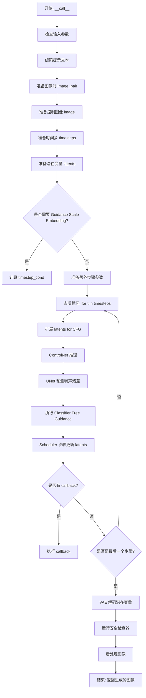

## 类结构

```
DiffusionPipeline (抽象基类)
├── TextualInversionLoaderMixin (混入)
├── StableDiffusionLoraLoaderMixin (混入)
├── FromSingleFileMixin (混入)
└── PromptDiffusionPipeline
```

## 全局变量及字段


### `logger`
    
日志记录器，用于记录运行时的信息

类型：`logging.Logger`
    


### `EXAMPLE_DOC_STRING`
    
示例文档字符串，包含Pipeline的使用示例代码

类型：`str`
    


### `PromptDiffusionPipeline.model_cpu_offload_seq`
    
模型卸载顺序，定义模型组件卸载到CPU的顺序

类型：`str`
    


### `PromptDiffusionPipeline._optional_components`
    
可选组件列表，包含可在初始化时选择加载的组件名称

类型：`List[str]`
    


### `PromptDiffusionPipeline._exclude_from_cpu_offload`
    
排除卸载的组件列表，这些组件不会被卸载到CPU

类型：`List[str]`
    


### `PromptDiffusionPipeline._callback_tensor_inputs`
    
回调张量输入列表，定义哪些张量可以传递给回调函数

类型：`List[str]`
    


### `PromptDiffusionPipeline.vae`
    
VAE模型，用于将图像编码到潜在空间并从潜在空间解码图像

类型：`AutoencoderKL`
    


### `PromptDiffusionPipeline.text_encoder`
    
文本编码器，将文本提示转换为嵌入向量

类型：`CLIPTextModel`
    


### `PromptDiffusionPipeline.tokenizer`
    
分词器，将文本字符串 tokenize 为 token IDs

类型：`CLIPTokenizer`
    


### `PromptDiffusionPipeline.unet`
    
UNet条件模型，在去噪过程中根据条件信息预测噪声残差

类型：`UNet2DConditionModel`
    


### `PromptDiffusionPipeline.controlnet`
    
ControlNet模型，提供额外的条件信息来指导UNet去噪过程

类型：`Union[ControlNetModel, MultiControlNetModel]`
    


### `PromptDiffusionPipeline.scheduler`
    
调度器，控制去噪过程中的时间步衰减策略

类型：`KarrasDiffusionSchedulers`
    


### `PromptDiffusionPipeline.safety_checker`
    
安全检查器，检测生成的图像是否包含不当内容

类型：`StableDiffusionSafetyChecker`
    


### `PromptDiffusionPipeline.feature_extractor`
    
特征提取器，从图像中提取CLIP特征用于安全检查

类型：`CLIPImageProcessor`
    


### `PromptDiffusionPipeline.image_encoder`
    
图像编码器，将图像编码为嵌入向量用于IP-Adapter

类型：`CLIPVisionModelWithProjection`
    


### `PromptDiffusionPipeline.vae_scale_factor`
    
VAE缩放因子，用于计算图像尺寸与潜在空间尺寸的比例

类型：`int`
    


### `PromptDiffusionPipeline.image_processor`
    
图像处理器，处理输入图像和后处理输出图像

类型：`VaeImageProcessor`
    


### `PromptDiffusionPipeline.control_image_processor`
    
控制图像处理器，专门处理ControlNet的输入图像

类型：`VaeImageProcessor`
    


### `PromptDiffusionPipeline._guidance_scale`
    
引导尺度，控制分类器自由引导的强度

类型：`float`
    


### `PromptDiffusionPipeline._clip_skip`
    
CLIP跳过的层数，指定从CLIP输出中跳过的层数

类型：`int`
    


### `PromptDiffusionPipeline._cross_attention_kwargs`
    
交叉注意力参数，传递给注意力处理器的高级参数

类型：`Dict[str, Any]`
    


### `PromptDiffusionPipeline._num_timesteps`
    
时间步数量，记录推理过程中的时间步总数

类型：`int`
    
    

## 全局函数及方法


### `retrieve_timesteps`

该函数是扩散管道中的时间步获取工具函数，负责调用调度器的 `set_timesteps` 方法并从调度器中检索时间步。它支持自定义时间步和通过推理步数自动生成时间步两种方式，并处理调度器不支持自定义时间步时的错误情况。

参数：

- `scheduler`：`SchedulerMixin`，要获取时间步的调度器对象
- `num_inference_steps`：`Optional[int]`，生成样本时使用的扩散步数，如果使用此参数，则 `timesteps` 必须为 `None`
- `device`：`Optional[Union[str, torch.device]]`，时间步要移动到的设备，如果为 `None` 则不移动
- `timesteps`：`Optional[List[int]]`，用于支持任意时间步间距的自定义时间步，如果为 `None` 则使用调度器的默认时间步间距策略
- `**kwargs`：任意关键字参数，将传递给调度器的 `set_timesteps` 方法

返回值：`Tuple[torch.Tensor, int]`，元组包含调度器的时间步时间表和推理步数

#### 流程图

```mermaid
flowchart TD
    A[开始 retrieve_timesteps] --> B{检查 timesteps 是否为 None}
    B -->|否| C[检查调度器是否支持自定义 timesteps]
    C --> D{调度器支持 timesteps?}
    D -->|是| E[调用 scheduler.set_timesteps<br/>timesteps=timesteps, device=device, **kwargs]
    E --> F[获取 scheduler.timesteps]
    F --> G[num_inference_steps = len(timesteps)]
    D -->|否| H[抛出 ValueError 异常]
    B -->|是| I[调用 scheduler.set_timesteps<br/>num_inference_steps, device=device, **kwargs]
    I --> J[获取 scheduler.timesteps]
    J --> K[返回 timesteps, num_inference_steps]
    G --> K
```

#### 带注释源码

```python
# Copied from diffusers.pipelines.stable_diffusion.pipeline_stable_diffusion.retrieve_timesteps
def retrieve_timesteps(
    scheduler,
    num_inference_steps: Optional[int] = None,
    device: Optional[Union[str, torch.device]] = None,
    timesteps: Optional[List[int]] = None,
    **kwargs,
):
    """
    Calls the scheduler's `set_timesteps` method and retrieves timesteps from the scheduler after the call. Handles
    custom timesteps. Any kwargs will be supplied to `scheduler.set_timesteps`.

    Args:
        scheduler (`SchedulerMixin`):
            The scheduler to get timesteps from.
        num_inference_steps (`int`):
            The number of diffusion steps used when generating samples with a pre-trained model. If used,
            `timesteps` must be `None`.
        device (`str` or `torch.device`, *optional*):
            The device to which the timesteps should be moved to. If `None`, the timesteps are not moved.
        timesteps (`List[int]`, *optional*):
                Custom timesteps used to support arbitrary spacing between timesteps. If `None`, then the default
                timestep spacing strategy of the scheduler is used. If `timesteps` is passed, `num_inference_steps`
                must be `None`.

    Returns:
        `Tuple[torch.Tensor, int]`: A tuple where the first element is the timestep schedule from the scheduler and the
        second element is the number of inference steps.
    """
    # 检查是否提供了自定义时间步
    if timesteps is not None:
        # 检查调度器的 set_timesteps 方法是否支持 timesteps 参数
        accepts_timesteps = "timesteps" in set(inspect.signature(scheduler.set_timesteps).parameters.keys())
        
        # 如果调度器不支持自定义时间步，抛出错误
        if not accepts_timesteps:
            raise ValueError(
                f"The current scheduler class {scheduler.__class__}'s `set_timesteps` does not support custom"
                f" timestep schedules. Please check whether you are using the correct scheduler."
            )
        
        # 使用自定义时间步设置调度器
        scheduler.set_timesteps(timesteps=timesteps, device=device, **kwargs)
        
        # 获取调度器的时间步
        timesteps = scheduler.timesteps
        
        # 计算推理步数
        num_inference_steps = len(timesteps)
    else:
        # 使用 num_inference_steps 设置调度器
        scheduler.set_timesteps(num_inference_steps, device=device, **kwargs)
        
        # 获取调度器的时间步
        timesteps = scheduler.timesteps
    
    # 返回时间步和推理步数
    return timesteps, num_inference_steps
```


### `PromptDiffusionPipeline.__init__`

该方法是 `PromptDiffusionPipeline` 类的构造函数，负责初始化扩散管道所需的所有核心组件，包括 VAE、文本编码器、UNet、ControlNet、调度器等，并进行必要的安全检查器验证和模块注册。

参数：

- `vae`：`AutoencoderKL`，Variational Auto-Encoder (VAE) 模型，用于编码和解码图像与潜在表示之间的转换
- `text_encoder`：`CLIPTextModel`，冻结的文本编码器 (clip-vit-large-patch14)，用于将文本提示转换为嵌入向量
- `tokenizer`：`CLIPTokenizer`，CLIP 分词器，用于对文本进行分词处理
- `unet`：`UNet2DConditionModel`，条件 UNet 模型，用于对编码后的图像潜在表示进行去噪
- `controlnet`：`Union[ControlNetModel, List[ControlNetModel], Tuple[ControlNetModel], MultiControlNetModel]`，ControlNet 模型或模型列表，提供额外的条件信息来指导去噪过程
- `scheduler`：`KarrasDiffusionSchedulers`，调度器，与 UNet 结合使用以对编码后的图像潜在表示进行去噪
- `safety_checker`：`StableDiffusionSafetyChecker`，安全检查器，用于评估生成的图像是否包含不当或有害内容
- `feature_extractor`：`CLIPImageProcessor`，特征提取器，从生成的图像中提取特征作为安全检查器的输入
- `image_encoder`：`CLIPVisionModelWithProjection`（可选），CLIP 视觉模型，用于编码图像特征
- `requires_safety_checker`：`bool`（可选，默认为 `True`），指定是否需要安全检查器

返回值：无（`None`），构造函数不返回值，仅初始化对象状态

#### 流程图

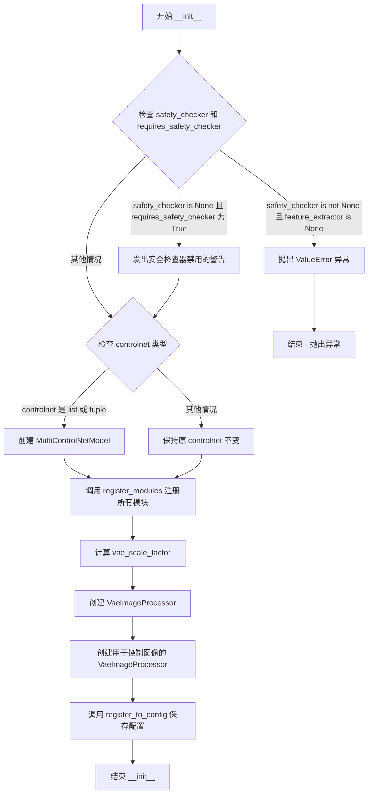

#### 带注释源码

```python
def __init__(
    self,
    vae: AutoencoderKL,
    text_encoder: CLIPTextModel,
    tokenizer: CLIPTokenizer,
    unet: UNet2DConditionModel,
    controlnet: Union[ControlNetModel, List[ControlNetModel], Tuple[ControlNetModel], MultiControlNetModel],
    scheduler: KarrasDiffusionSchedulers,
    safety_checker: StableDiffusionSafetyChecker,
    feature_extractor: CLIPImageProcessor,
    image_encoder: CLIPVisionModelWithProjection = None,
    requires_safety_checker: bool = True,
):
    """
    初始化 PromptDiffusionPipeline 管道。
    
    参数:
        vae: VAE 模型，用于图像和潜在表示之间的编码解码
        text_encoder: CLIP 文本编码器
        tokenizer: CLIP 分词器
        unet: 条件 UNet 去噪模型
        controlnet: ControlNet 模型，提供额外条件引导
        scheduler: 扩散调度器
        safety_checker: 安全检查器（可选）
        feature_extractor: 图像特征提取器（可选）
        image_encoder: CLIP 视觉编码器（可选）
        requires_safety_checker: 是否需要安全检查器
    """
    # 调用父类 DiffusionPipeline 的初始化方法
    super().__init__()

    # 如果 safety_checker 为 None 但 requires_safety_checker 为 True，发出警告
    if safety_checker is None and requires_safety_checker:
        logger.warning(
            f"You have disabled the safety checker for {self.__class__} by passing `safety_checker=None`. Ensure"
            " that you abide to the conditions of the Stable Diffusion license and do not expose unfiltered"
            " results in services or applications open to the public. Both the diffusers team and Hugging Face"
            " strongly recommend to keep the safety filter enabled in all public facing circumstances, disabling"
            " it only for use-cases that involve analyzing network behavior or auditing its results. For more"
            " information, please have a look at https://github.com/huggingface/diffusers/pull/254 ."
        )

    # 如果提供了 safety_checker 但没有 feature_extractor，抛出错误
    if safety_checker is not None and feature_extractor is None:
        raise ValueError(
            "Make sure to define a feature extractor when loading {self.__class__} if you want to use the safety"
            " checker. If you do not want to use the safety checker, you can pass `'safety_checker=None'` instead."
        )

    # 如果 controlnet 是列表或元组，转换为 MultiControlNetModel
    if isinstance(controlnet, (list, tuple)):
        controlnet = MultiControlNetModel(controlnet)

    # 注册所有模块到管道中，使其可以通过属性访问
    self.register_modules(
        vae=vae,
        text_encoder=text_encoder,
        tokenizer=tokenizer,
        unet=unet,
        controlnet=controlnet,
        scheduler=scheduler,
        safety_checker=safety_checker,
        feature_extractor=feature_extractor,
        image_encoder=image_encoder,
    )
    
    # 计算 VAE 缩放因子，基于 VAE 配置中的块输出通道数
    # 用于在潜在空间和像素空间之间进行缩放转换
    self.vae_scale_factor = 2 ** (len(self.vae.config.block_out_channels) - 1) if getattr(self, "vae", None) else 8
    
    # 创建图像处理器，用于后处理 VAE 输出的图像
    self.image_processor = VaeImageProcessor(vae_scale_factor=self.vae_scale_factor, do_convert_rgb=True)
    
    # 创建控制图像的专用处理器，不进行归一化
    self.control_image_processor = VaeImageProcessor(
        vae_scale_factor=self.vae_scale_factor, do_convert_rgb=True, do_normalize=False
    )
    
    # 将 requires_safety_checker 注册到配置中，以便在序列化时保存
    self.register_to_config(requires_safety_checker=requires_safety_checker)
```


### `PromptDiffusionPipeline.enable_vae_slicing`

启用分片VAE解码。当启用此选项时，VAE会将输入张量分割成多个切片，以分步计算解码。这对于节省内存和允许更大的批处理大小非常有用。

参数： 无

返回值： `None`，无返回值（该方法直接修改实例状态）

#### 流程图

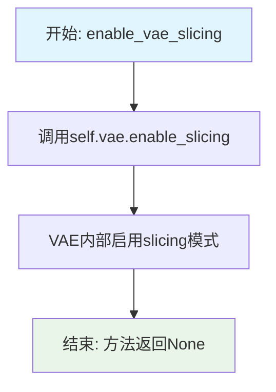

#### 带注释源码

```python
# Copied from diffusers.pipelines.stable_diffusion.pipeline_stable_diffusion.StableDiffusionPipeline.enable_vae_slicing
def enable_vae_slicing(self):
    r"""
    Enable sliced VAE decoding. When this option is enabled, the VAE will split the input tensor in slices to
    compute decoding in several steps. This is useful to save some memory and allow larger batch sizes.
    """
    # 调用VAE模型的enable_slicing方法，启用分片解码模式
    # 这会将VAE的解码过程分割成多个小步骤进行
    # 优点：减少显存占用，可以处理更大的批量
    # 缺点：解码速度可能略有下降
    self.vae.enable_slicing()
```


### `PromptDiffusionPipeline.disable_vae_slicing`

该方法用于禁用 VAE（变分自编码器）的切片解码功能。如果之前通过 `enable_vae_slicing` 启用了切片解码，此方法将恢复为单步解码模式，从而可能增加内存占用但提高解码速度。

参数： 无

返回值： `None`，该方法不返回任何值

#### 流程图

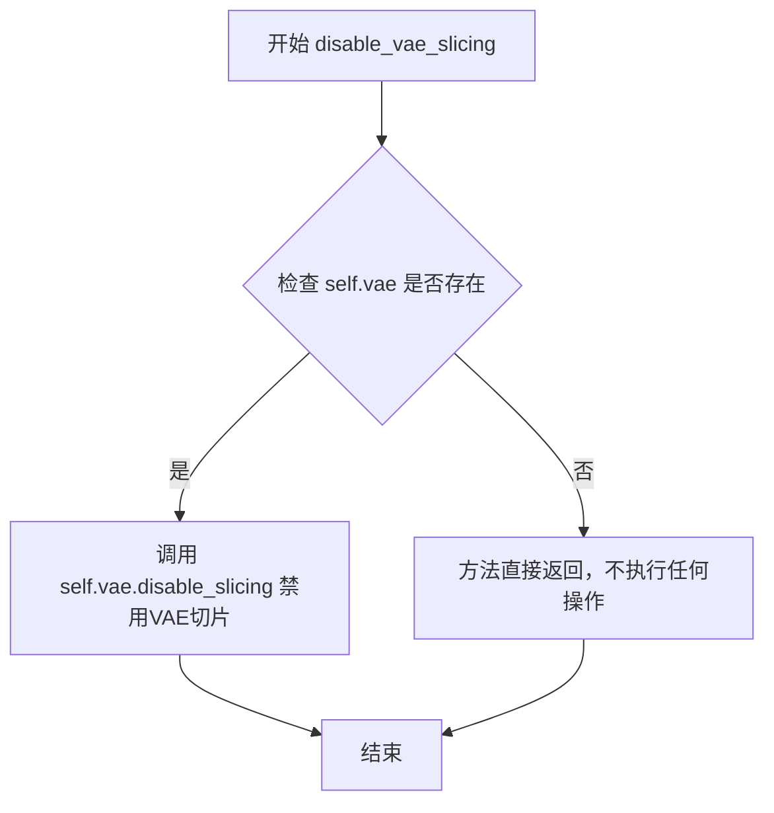

#### 带注释源码

```python
# 复制自 diffusers.pipelines.stable_diffusion.pipeline_stable_diffusion.StableDiffusionPipeline.disable_vae_slicing
def disable_vae_slicing(self):
    r"""
    禁用 VAE 切片解码功能。
    
    如果之前通过 enable_vae_slicing 启用了切片解码，此方法将恢复为单步解码模式。
    单步解码虽然可能占用更多内存，但通常能提供更快的解码速度。
    """
    # 调用 VAE 模型的 disable_slicing 方法来禁用切片解码
    # 这将使 VAE 解码在单个步骤中完成，而不是分片处理
    self.vae.disable_slicing()
```


### `PromptDiffusionPipeline.enable_vae_tiling`

启用瓦片 VAE 解码。当启用此选项后，VAE 会将输入张量分割成瓦片，分多步计算解码和编码。这对于节省大量内存和处理更大的图像非常有用。

参数：

- 无显式参数（仅隐式参数 `self`）

返回值：`None`，无返回值

#### 流程图

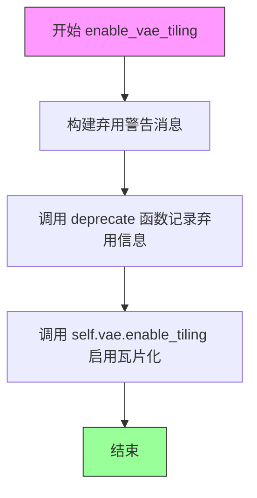

#### 带注释源码

```python
# Copied from diffusers.pipelines.stable_diffusion.pipeline_stable_diffusion.StableDiffusionPipeline.enable_vae_tiling
def enable_vae_tiling(self):
    r"""
    Enable tiled VAE decoding. When this option is enabled, the VAE will split the input tensor into tiles to
    compute decoding and encoding in several steps. This is useful for saving a large amount of memory and to allow
    processing larger images.
    """
    # 构建弃用警告消息，告知用户此方法将在 0.40.0 版本被移除
    # 建议用户直接调用 pipe.vae.enable_tiling()
    depr_message = f"Calling `enable_vae_tiling()` on a `{self.__class__.__name__}` is deprecated and this method will be removed in a future version. Please use `pipe.vae.enable_tiling()`."
    
    # 调用 deprecate 函数记录弃用信息
    # 参数: (函数名, 弃用版本号, 警告消息)
    deprecate(
        "enable_vae_tiling",
        "0.40.0",
        depr_message,
    )
    
    # 实际启用 VAE 瓦片化功能
    # 这是核心功能：将 VAE 的编码/解码过程分块处理
    self.vae.enable_tiling()
```


### `PromptDiffusionPipeline.disable_vae_tiling`

该方法用于禁用瓦片式 VAE 解码。如果之前通过 `enable_vae_tiling` 启用了瓦片解码，此方法将恢复为单步解码模式。此方法已被标记为弃用，建议直接使用 `pipe.vae.disable_tiling()`。

参数：

- 该方法无参数（仅包含 `self`）

返回值：`None`，无返回值

#### 流程图

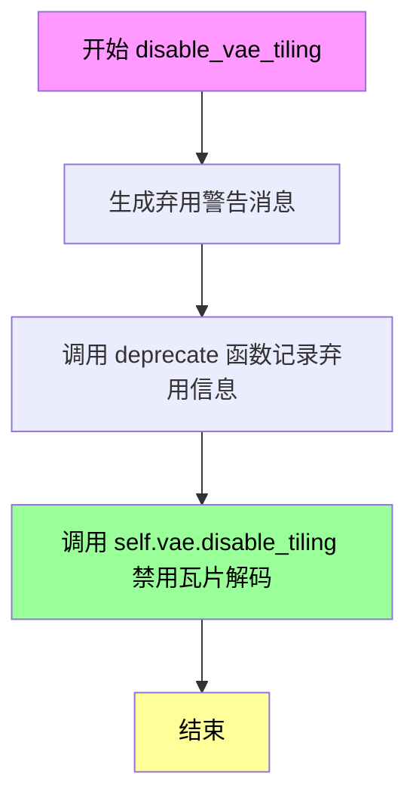

#### 带注释源码

```python
# Copied from diffusers.pipelines.stable_diffusion.pipeline_stable_diffusion.StableDiffusionPipeline.disable_vae_tiling
def disable_vae_tiling(self):
    r"""
    Disable tiled VAE decoding. If `enable_vae_tiling` was previously enabled, this method will go back to
    computing decoding in one step.
    """
    # 构建弃用警告消息，提示用户该方法将在未来版本中移除
    # 并建议使用新的 API: pipe.vae.disable_tiling()
    depr_message = f"Calling `disable_vae_tiling()` on a `{self.__class__.__name__}` is deprecated and this method will be removed in a future version. Please use `pipe.vae.disable_tiling()`."
    
    # 调用 deprecate 函数记录弃用信息
    # 参数: 方法名, 弃用版本号, 警告消息
    deprecate(
        "disable_vae_tiling",
        "0.40.0",
        depr_message,
    )
    
    # 调用 VAE 模型的 disable_tiling 方法实际禁用瓦片解码
    self.vae.disable_tiling()
```


### `PromptDiffusionPipeline._encode_prompt`

该方法是 `PromptDiffusionPipeline` 类中的一个已弃用的内部方法，用于将文本提示编码为文本编码器的隐藏状态。它是对 `encode_prompt` 方法的封装，主要用于向后兼容旧版本的输出格式（从元组改为张量拼接顺序）。

参数：

- `self`：`PromptDiffusionPipeline` 实例，当前管道对象
- `prompt`：`Union[str, List[str], None]`，要编码的文本提示，可以是单个字符串、字符串列表或 None
- `device`：`torch.device`，指定计算设备（如 CPU 或 CUDA 设备）
- `num_images_per_prompt`：`int`，每个提示需要生成的图像数量，用于批量处理
- `do_classifier_free_guidance`：`bool`，是否启用无分类器自由引导（CFG）
- `negative_prompt`：`Union[str, List[str], None]`，可选的负面提示，用于引导图像生成不包含特定内容
- `prompt_embeds`：`Optional[torch.Tensor]`，可选的预生成文本嵌入，如果提供则直接使用
- `negative_prompt_embeds`：`Optional[torch.Tensor]`，可选的预生成负面文本嵌入
- `lora_scale`：`Optional[float]`，可选的 LoRA 缩放因子，用于调整文本编码器的 LoRA 权重
- `**kwargs`：可变关键字参数传递给 `encode_prompt` 方法

返回值：`torch.Tensor`，拼接后的提示嵌入张量，顺序为 `[negative_prompt_embeds, prompt_embeds]`（用于向后兼容）

#### 流程图

```mermaid
flowchart TD
    A[_encode_prompt 被调用] --> B[输出弃用警告]
    B --> C[调用 encode_prompt 方法]
    C --> D[获取返回的元组 prompt_embeds_tuple]
    D --> E[拼接张量: torch.cat<br/>[prompt_embeds_tuple[1], prompt_embeds_tuple[0]]]
    E --> F[返回拼接后的 prompt_embeds]
    
    style A fill:#f9f,stroke:#333
    style B fill:#ff9,stroke:#333
    style C fill:#9ff,stroke:#333
    style F fill:#9f9,stroke:#333
```

#### 带注释源码

```python
def _encode_prompt(
    self,
    prompt,                                 # 输入的文本提示 (str/List[str]/None)
    device,                                 # torch.device, 计算设备
    num_images_per_prompt,                  # int, 每个提示生成的图像数量
    do_classifier_free_guidance,           # bool, 是否使用无分类器自由引导
    negative_prompt=None,                   # str/List[str]/None, 负面提示
    prompt_embeds: Optional[torch.Tensor] = None,  # 预计算的提示嵌入
    negative_prompt_embeds: Optional[torch.Tensor] = None,  # 预计算的负面嵌入
    lora_scale: Optional[float] = None,     # float, LoRA 缩放因子
    **kwargs,                               # 其他传递给 encode_prompt 的参数
):
    """
    已弃用的提示编码方法，内部调用 encode_prompt 并进行输出格式转换以保持向后兼容。
    
    注意: 此方法已被弃用，将在未来的 diffusers 版本中移除。建议使用 encode_prompt() 方法。
    输出格式已从简单的张量改为元组 (prompt_embeds, negative_prompt_embeds)。
    为保持向后兼容性，此方法将返回的元组重新拼接为单个张量。
    """
    
    # 发出弃用警告，提示用户使用新方法
    deprecation_message = "`_encode_prompt()` is deprecated and it will be removed in a future version. Use `encode_prompt()` instead. Also, be aware that the output format changed from a concatenated tensor to a tuple."
    deprecate("_encode_prompt()", "1.0.0", deprecation_message, standard_warn=False)

    # 调用新的 encode_prompt 方法获取编码结果
    # 返回格式为 (prompt_embeds, negative_prompt_embeds) 元组
    prompt_embeds_tuple = self.encode_prompt(
        prompt=prompt,
        device=device,
        num_images_per_prompt=num_images_per_prompt,
        do_classifier_free_guidance=do_classifier_free_guidance,
        negative_prompt=negative_prompt,
        prompt_embeds=prompt_embeds,
        negative_prompt_embeds=negative_prompt_embeds,
        lora_scale=lora_scale,
        **kwargs,
    )

    # 为保持向后兼容性，将元组中的两个嵌入拼接为单个张量
    # 顺序为 [negative_prompt_embeds, prompt_embeds]
    # 注意: 这里假设元组顺序为 (prompt_embeds, negative_prompt_embeds)
    # 因此 tuple[1] 是 negative_prompt_embeds, tuple[0] 是 prompt_embeds
    prompt_embeds = torch.cat([prompt_embeds_tuple[1], prompt_embeds_tuple[0]])

    return prompt_embeds
```


### `PromptDiffusionPipeline.encode_prompt`

该方法将文本提示编码为文本编码器的隐藏状态，处理正面提示和负面提示（用于无分类器自由引导），并支持LoRA权重和clip skip功能。它首先检查是否需要生成新的embeddings，然后使用tokenizer和text_encoder生成文本嵌入，最后根据num_images_per_prompt复制embeddings以支持批量生成。

参数：

- `prompt`：`str` 或 `List[str]`，可选，要编码的提示
- `device`：`torch.device`，torch设备
- `num_images_per_prompt`：`int`，每个提示要生成的图像数量
- `do_classifier_free_guidance`：`bool`，是否使用无分类器自由引导
- `negative_prompt`：`str` 或 `List[str]`，可选，用于引导图像生成的否定提示
- `prompt_embeds`：`torch.Tensor`，可选，预生成的文本嵌入
- `negative_prompt_embeds`：`torch.Tensor`，可选，预生成的否定文本嵌入
- `lora_scale`：`float`，可选，要应用于文本编码器所有LoRA层的LoRA缩放因子
- `clip_skip`：`int`，可选，计算提示嵌入时要跳过的CLIP层数

返回值：`Tuple[torch.Tensor, torch.Tensor]`，包含编码后的提示嵌入和否定提示嵌入的元组

#### 流程图

```mermaid
flowchart TD
    A[开始 encode_prompt] --> B{检查 lora_scale 是否为 None}
    B -->|否| C[设置 _lora_scale 并调整 LoRA 层权重]
    B -->|是| D{检查 prompt 类型}
    
    D -->|str| E[batch_size = 1]
    D -->|list| F[batch_size = len(prompt)]
    D -->|其他| G[batch_size = prompt_embeds.shape[0]]
    
    E --> H{prompt_embeds 为 None?}
    F --> H
    G --> H
    
    H -->|是| I{检查 TextualInversionLoaderMixin}
    H -->|否| O[复制 prompt_embeds]
    
    I -->|是| J[maybe_convert_prompt 处理多向量 token]
    I -->|否| K[tokenizer 处理 prompt]
    
    J --> K
    K --> L[text_encoder 生成 embeddings]
    
    L -->|clip_skip 为 None| M[使用输出[0]]
    L -->|clip_skip 不为 None| N[获取隐藏状态并应用 final_layer_norm]
    
    M --> P[转换 dtype 和 device]
    N --> P
    
    O --> Q[重复 embeddings num_images_per_prompt 次]
    P --> Q
    
    Q --> R{do_classifier_free_guidance 为真且 negative_prompt_embeds 为 None?}
    R -->|是| S[处理 uncond_tokens]
    R -->|否| U{LoRA 相关检查}
    
    S --> T[生成 negative_prompt_embeds]
    T --> U
    
    U -->|是| V[取消 LoRA 层缩放]
    U -->|否| W[返回 tuple]
    
    V --> W
    
    O -.->|跳过embeddings生成| W
```

#### 带注释源码

```python
def encode_prompt(
    self,
    prompt,
    device,
    num_images_per_prompt,
    do_classifier_free_guidance,
    negative_prompt=None,
    prompt_embeds: Optional[torch.Tensor] = None,
    negative_prompt_embeds: Optional[torch.Tensor] = None,
    lora_scale: Optional[float] = None,
    clip_skip: Optional[int] = None,
):
    r"""
    Encodes the prompt into text encoder hidden states.

    Args:
        prompt (`str` or `List[str]`, *optional*):
            prompt to be encoded
        device: (`torch.device`):
            torch device
        num_images_per_prompt (`int`):
            number of images that should be generated per prompt
        do_classifier_free_guidance (`bool`):
            whether to use classifier free guidance or not
        negative_prompt (`str` or `List[str]`, *optional*):
            The prompt or prompts not to guide the image generation. If not defined, one has to pass
            `negative_prompt_embeds` instead. Ignored when not using guidance (i.e., ignored if `guidance_scale` is
            less than `1`).
        prompt_embeds (`torch.Tensor`, *optional*):
            Pre-generated text embeddings. Can be used to easily tweak text inputs, *e.g.* prompt weighting. If not
            provided, text embeddings will be generated from `prompt` input argument.
        negative_prompt_embeds (`torch.Tensor`, *optional*):
            Pre-generated negative text embeddings. Can be used to easily tweak text inputs, *e.g.* prompt
            weighting. If not provided, negative_prompt_embeds will be generated from `negative_prompt` input
            argument.
        lora_scale (`float`, *optional*):
            A LoRA scale that will be applied to all LoRA layers of the text encoder if LoRA layers are loaded.
        clip_skip (`int`, *optional*):
            Number of layers to be skipped from CLIP while computing the prompt embeddings. A value of 1 means that
            the output of the pre-final layer will be used for computing the prompt embeddings.
    """
    # set lora scale so that monkey patched LoRA
    # function of text encoder can correctly access it
    # 如果传入了 lora_scale 且当前 pipeline 支持 LoRA，则设置内部 _lora_scale 变量
    # 并根据是否使用 PEFT backend 来动态调整 LoRA 权重
    if lora_scale is not None and isinstance(self, StableDiffusionLoraLoaderMixin):
        self._lora_scale = lora_scale

        # dynamically adjust the LoRA scale
        if not USE_PEFT_BACKEND:
            adjust_lora_scale_text_encoder(self.text_encoder, lora_scale)
        else:
            scale_lora_layers(self.text_encoder, lora_scale)

    # 确定 batch_size：根据 prompt 的类型或已有的 prompt_embeds 形状
    if prompt is not None and isinstance(prompt, str):
        batch_size = 1
    elif prompt is not None and isinstance(prompt, list):
        batch_size = len(prompt)
    else:
        batch_size = prompt_embeds.shape[0]

    # 如果没有提供 prompt_embeds，则需要从 prompt 生成
    if prompt_embeds is None:
        # textual inversion: procecss multi-vector tokens if necessary
        # 如果支持 TextualInversion，则转换 prompt 中的多向量 token
        if isinstance(self, TextualInversionLoaderMixin):
            prompt = self.maybe_convert_prompt(prompt, self.tokenizer)

        # 使用 tokenizer 将文本转换为 token ids
        text_inputs = self.tokenizer(
            prompt,
            padding="max_length",
            max_length=self.tokenizer.model_max_length,
            truncation=True,
            return_tensors="pt",
        )
        text_input_ids = text_inputs.input_ids
        # 获取未截断的 token ids 用于检测截断
        untruncated_ids = self.tokenizer(prompt, padding="longest", return_tensors="pt").input_ids

        # 检测并警告截断的文本
        if untruncated_ids.shape[-1] >= text_input_ids.shape[-1] and not torch.equal(
            text_input_ids, untruncated_ids
        ):
            removed_text = self.tokenizer.batch_decode(
                untruncated_ids[:, self.tokenizer.model_max_length - 1 : -1]
            )
            logger.warning(
                "The following part of your input was truncated because CLIP can only handle sequences up to"
                f" {self.tokenizer.model_max_length} tokens: {removed_text}"
            )

        # 获取 attention mask（如果 text_encoder 支持）
        if hasattr(self.text_encoder.config, "use_attention_mask") and self.text_encoder.config.use_attention_mask:
            attention_mask = text_inputs.attention_mask.to(device)
        else:
            attention_mask = None

        # 根据是否设置 clip_skip 来决定如何获取 embeddings
        if clip_skip is None:
            # 直接获取 text_encoder 输出
            prompt_embeds = self.text_encoder(text_input_ids.to(device), attention_mask=attention_mask)
            prompt_embeds = prompt_embeds[0]
        else:
            # 获取隐藏状态，并跳过后续的 clip_skip 层
            prompt_embeds = self.text_encoder(
                text_input_ids.to(device), attention_mask=attention_mask, output_hidden_states=True
            )
            # Access the `hidden_states` first, that contains a tuple of
            # all the hidden states from the encoder layers. Then index into
            # the tuple to access the hidden states from the desired layer.
            prompt_embeds = prompt_embeds[-1][-(clip_skip + 1)]
            # We also need to apply the final LayerNorm here to not mess with the
            # representations. The `last_hidden_states` that we typically use for
            # obtaining the final prompt representations passes through the LayerNorm
            # layer.
            prompt_embeds = self.text_encoder.text_model.final_layer_norm(prompt_embeds)

    # 确定 prompt_embeds 的 dtype（优先使用 text_encoder 的 dtype，其次是 unet 的 dtype）
    if self.text_encoder is not None:
        prompt_embeds_dtype = self.text_encoder.dtype
    elif self.unet is not None:
        prompt_embeds_dtype = self.unet.dtype
    else:
        prompt_embeds_dtype = prompt_embeds.dtype

    # 将 prompt_embeds 转换为合适的 dtype 和 device
    prompt_embeds = prompt_embeds.to(dtype=prompt_embeds_dtype, device=device)

    # 复制 embeddings 以支持每个 prompt 生成多个图像
    bs_embed, seq_len, _ = prompt_embeds.shape
    # duplicate text embeddings for each generation per prompt, using mps friendly method
    prompt_embeds = prompt_embeds.repeat(1, num_images_per_prompt, 1)
    prompt_embeds = prompt_embeds.view(bs_embed * num_images_per_prompt, seq_len, -1)

    # get unconditional embeddings for classifier free guidance
    # 如果使用无分类器自由引导且没有提供 negative_prompt_embeds，则生成无条件 embeddings
    if do_classifier_free_guidance and negative_prompt_embeds is None:
        uncond_tokens: List[str]
        if negative_prompt is None:
            # 如果没有提供 negative_prompt，使用空字符串
            uncond_tokens = [""] * batch_size
        elif prompt is not None and type(prompt) is not type(negative_prompt):
            raise TypeError(
                f"`negative_prompt` should be the same type to `prompt`, but got {type(negative_prompt)} !="
                f" {type(prompt)}."
            )
        elif isinstance(negative_prompt, str):
            uncond_tokens = [negative_prompt]
        elif batch_size != len(negative_prompt):
            raise ValueError(
                f"`negative_prompt`: {negative_prompt} has batch size {len(negative_prompt)}, but `prompt`:"
                f" {prompt} has batch size {batch_size}. Please make sure that passed `negative_prompt` matches"
                " the batch size of `prompt`."
            )
        else:
            uncond_tokens = negative_prompt

        # textual inversion: procecss multi-vector tokens if necessary
        # 处理 textual inversion 的多向量 token
        if isinstance(self, TextualInversionLoaderMixin):
            uncond_tokens = self.maybe_convert_prompt(uncond_tokens, self.tokenizer)

        max_length = prompt_embeds.shape[1]
        # tokenize negative prompt
        uncond_input = self.tokenizer(
            uncond_tokens,
            padding="max_length",
            max_length=max_length,
            truncation=True,
            return_tensors="pt",
        )

        # 获取 attention mask
        if hasattr(self.text_encoder.config, "use_attention_mask") and self.text_encoder.config.use_attention_mask:
            attention_mask = uncond_input.attention_mask.to(device)
        else:
            attention_mask = None

        # 生成 negative prompt embeddings
        negative_prompt_embeds = self.text_encoder(
            uncond_input.input_ids.to(device),
            attention_mask=attention_mask,
        )
        negative_prompt_embeds = negative_prompt_embeds[0]

    # 如果使用无分类器自由引导，复制 negative_prompt_embeddings
    if do_classifier_free_guidance:
        # duplicate unconditional embeddings for each generation per prompt, using mps friendly method
        seq_len = negative_prompt_embeds.shape[1]

        negative_prompt_embeds = negative_prompt_embeds.to(dtype=prompt_embeds_dtype, device=device)

        negative_prompt_embeds = negative_prompt_embeds.repeat(1, num_images_per_prompt, 1)
        negative_prompt_embeds = negative_prompt_embeds.view(batch_size * num_images_per_prompt, seq_len, -1)

    # 如果使用了 LoRA 且使用 PEFT backend，则恢复原始 scale
    if isinstance(self, StableDiffusionLoraLoaderMixin) and USE_PEFT_BACKEND:
        # Retrieve the original scale by scaling back the LoRA layers
        unscale_lora_layers(self.text_encoder, lora_scale)

    # 返回 tuple 格式的 embeddings
    return prompt_embeds, negative_prompt_embeds
```


### PromptDiffusionPipeline.encode_image

该方法负责将输入图像编码为特征向量（image embeddings）或隐藏状态（hidden states），支持条件和无条件两种模式，用于后续的图像生成过程。当启用 classifier-free guidance 时，需要同时返回有条件和无条件的图像嵌入。

参数：

- `self`：`PromptDiffusionPipeline`，Pipeline实例本身
- `image`：`Union[PIL.Image.Image, torch.Tensor, np.ndarray, List]`，待编码的输入图像，支持多种格式（PIL图像、PyTorch张量、NumPy数组或它们的列表）
- `device`：`torch.device`，计算设备，用于将图像张量移动到指定设备（如CPU或GPU）
- `num_images_per_prompt`：`int`，每个prompt生成的图像数量，用于对图像嵌入进行重复以匹配批量大小
- `output_hidden_states`：`Optional[bool]`，可选参数，指定是否返回图像编码器的隐藏状态而非最终的image embeddings，默认为None（返回False）

返回值：`Tuple[torch.Tensor, torch.Tensor]`，返回两个张量组成的元组：
- 第一个元素为条件图像嵌入/隐藏状态（image_embeds 或 image_enc_hidden_states）
- 第二个元素为无条件图像嵌入/隐藏状态（uncond_image_embeds 或 uncond_image_enc_hidden_states）
两个张量的形状均为 `(batch_size * num_images_per_prompt, embedding_dim)`

#### 流程图

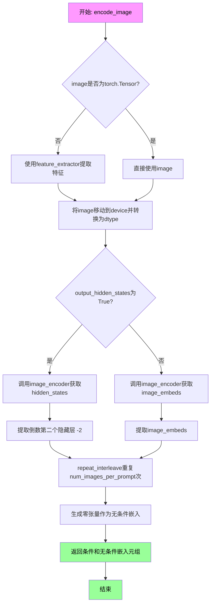

#### 带注释源码

```python
def encode_image(self, image, device, num_images_per_prompt, output_hidden_states=None):
    """
    Encodes the input image into embeddings or hidden states for image generation.
    
    This method handles both conditional and unconditional image encoding required
    for classifier-free guidance in the diffusion pipeline.
    
    Args:
        image: Input image in various formats (PIL Image, torch.Tensor, numpy array, or list)
        device: Target torch device for computation
        num_images_per_prompt: Number of images to generate per prompt
        output_hidden_states: If True, return intermediate hidden states instead of final embeddings
    
    Returns:
        Tuple of (conditional_embeddings, unconditional_embeddings)
    """
    # 获取image_encoder模型参数的数据类型，用于后续类型转换
    dtype = next(self.image_encoder.parameters()).dtype

    # 如果输入不是PyTorch张量，使用feature_extractor将其转换为张量
    # feature_extractor负责从PIL图像或numpy数组中提取像素值
    if not isinstance(image, torch.Tensor):
        image = self.feature_extractor(image, return_tensors="pt").pixel_values

    # 将图像张量移动到指定设备并转换为与image_encoder一致的数据类型
    image = image.to(device=device, dtype=dtype)
    
    # 根据output_hidden_states参数决定返回类型
    if output_hidden_states:
        # 返回中间层的hidden states，用于更细粒度的控制
        # hidden_states[-2] 表示倒数第二层，通常是最终层之前的层
        image_enc_hidden_states = self.image_encoder(image, output_hidden_states=True).hidden_states[-2]
        
        # repeat_interleave沿dim=0重复张量，以匹配num_images_per_prompt
        # 例如：如果batch_size=1, num_images_per_prompt=3，则重复3次
        image_enc_hidden_states = image_enc_hidden_states.repeat_interleave(num_images_per_prompt, dim=0)
        
        # 生成与输入图像形状相同的零张量，用于无条件（unconditional）图像编码
        # 这在classifier-free guidance中用于区分有条件和无条件生成
        uncond_image_enc_hidden_states = self.image_encoder(
            torch.zeros_like(image), output_hidden_states=True
        ).hidden_states[-2]
        uncond_image_enc_hidden_states = uncond_image_enc_hidden_states.repeat_interleave(
            num_images_per_prompt, dim=0
        )
        return image_enc_hidden_states, uncond_image_enc_hidden_states
    else:
        # 默认模式：返回图像的最终image_embeds（池化后的特征向量）
        image_embeds = self.image_encoder(image).image_embeds
        
        # 重复嵌入以匹配每个prompt生成的图像数量
        image_embeds = image_embeds.repeat_interleave(num_images_per_prompt, dim=0)
        
        # 创建零张量作为无条件图像嵌入
        # 零嵌入表示"无图像"的条件，用于classifier-free guidance
        uncond_image_embeds = torch.zeros_like(image_embeds)

        return image_embeds, uncond_image_embeds
```


### `PromptDiffusionPipeline.run_safety_checker`

该方法用于对生成的图像进行安全检查，检测图像中是否包含不适合工作内容（NSFW）的概念。如果未配置安全检查器，则直接返回原始图像和 None。

参数：

- `image`：`Union[torch.Tensor, np.ndarray, List[PIL.Image.Image]]`，输入图像，可以是 PyTorch 张量、NumPy 数组或 PIL 图像列表
- `device`：`torch.device`，用于将特征提取器输入移动到的目标设备
- `dtype`：`torch.dtype`，用于将 clip_input 转换的目标数据类型

返回值：`Tuple[Union[torch.Tensor, np.ndarray], Optional[List[bool]]]`，返回处理后的图像和 NSFW 概念检测结果。如果未配置安全检查器，则返回原始图像和 `None`。

#### 流程图

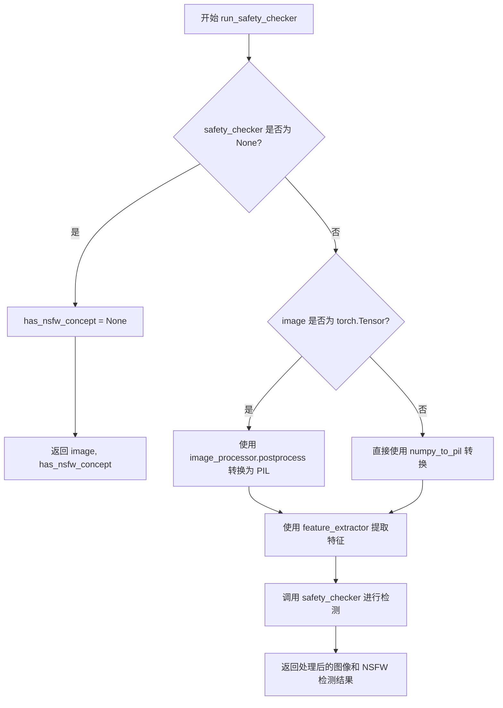

#### 带注释源码

```python
def run_safety_checker(self, image, device, dtype):
    """
    运行安全检查器以检测生成的图像是否包含不适合工作内容（NSFW）。

    Args:
        image: 输入图像，可以是 torch.Tensor、numpy 数组或 PIL 图像列表
        device: torch.device，用于将特征提取器输入移动到的目标设备
        dtype: torch.dtype，用于将 clip_input 转换的目标数据类型

    Returns:
        Tuple: (处理后的图像, NSFW 概念检测结果列表或 None)
    """
    # 如果没有配置安全检查器，直接返回原始图像和 None
    if self.safety_checker is None:
        has_nsfw_concept = None
    else:
        # 根据图像类型进行不同的预处理
        if torch.is_tensor(image):
            # 如果是 PyTorch 张量，使用后处理器转换为 PIL 图像
            feature_extractor_input = self.image_processor.postprocess(image, output_type="pil")
        else:
            # 如果是其他类型（如 numpy 数组），直接转换为 PIL 图像
            feature_extractor_input = self.image_processor.numpy_to_pil(image)
        
        # 使用特征提取器提取图像特征，并移动到指定设备
        safety_checker_input = self.feature_extractor(feature_extractor_input, return_tensors="pt").to(device)
        
        # 调用安全检查器进行 NSFW 检测
        # 将 pixel_values 转换为指定的 dtype 以匹配模型期望的输入格式
        image, has_nsfw_concept = self.safety_checker(
            images=image, clip_input=safety_checker_input.pixel_values.to(dtype)
        )
    
    # 返回处理后的图像和 NSFW 检测结果
    return image, has_nsfw_concept
```


### `PromptDiffusionPipeline.decode_latents`

将 VAE 潜在表示解码为图像数组。该方法通过 VAE 解码器将潜在空间中的向量转换回像素空间，并进行必要的后处理（归一化和类型转换）。

参数：

- `latents`：`torch.Tensor`，需要解码的潜在表示张量，通常来自 UNet 模型的输出

返回值：`numpy.ndarray`，解码后的图像数组，形状为 (batch_size, height, width, channels)，像素值范围 [0, 255]

#### 流程图

```mermaid
flowchart TD
    A[接收 latents 张量] --> B[反缩放: latents = 1/scaling_factor × latents]
    B --> C[VAE 解码: image = vae.decode(latents)]
    C --> D[归一化: image = (image / 2 + 0.5).clamp(0, 1)]
    D --> E[转移到CPU并转换类型: image.cpu().permute(0,2,3,1).float().numpy()]
    E --> F[返回 numpy 数组]
```

#### 带注释源码

```python
def decode_latents(self, latents):
    """
    将潜在表示解码为图像数组。
    
    注意: 此方法已废弃，建议使用 VaeImageProcessor.postprocess() 代替。
    """
    # 发出废弃警告，提示用户在后续版本中该方法将被移除
    deprecation_message = "The decode_latents method is deprecated and will be removed in 1.0.0. Please use VaeImageProcessor.postprocess(...) instead"
    deprecate("decode_latents", "1.0.0", deprecation_message, standard_warn=False)

    # 第一步：反缩放潜在表示
    # VAE 在编码时会将潜在向量乘以 scaling_factor，这里需要除以它来还原
    latents = 1 / self.vae.config.scaling_factor * latents
    
    # 第二步：使用 VAE 解码器将潜在向量解码为图像
    # 返回元组 (image,)，取第一个元素
    image = self.vae.decode(latents, return_dict=False)[0]
    
    # 第三步：归一化图像到 [0, 1] 范围
    # VAE 输出通常在 [-1, 1] 范围，通过 (x/2 + 0.5) 转换到 [0, 1]
    image = (image / 2 + 0.5).clamp(0, 1)
    
    # 第四步：转换数据格式
    # 1. 从 GPU 转移到 CPU
    # 2. 从 CHW 转换为 HWC 格式 (batch, channels, height, width) -> (batch, height, width, channels)
    # 3. 转换为 float32 类型（避免显著开销且与 bfloat16 兼容）
    # 4. 转换为 numpy 数组
    image = image.cpu().permute(0, 2, 3, 1).float().numpy()
    
    return image
```


### `PromptDiffusionPipeline.prepare_extra_step_kwargs`

该方法用于为调度器（scheduler）的 `step` 方法准备额外的关键字参数。由于不同的调度器（如 DDIMScheduler、LMSDiscreteScheduler 等）具有不同的签名，该方法通过内省（inspect）调度器的 `step` 方法参数，动态判断是否需要传递 `eta` 和 `generator` 参数，从而实现对多种调度器的兼容性支持。

参数：

- `generator`：`Optional[Union[torch.Generator, List[torch.Generator]]]`，用于控制随机数生成以实现可重复的图像生成
- `eta`：`float`，DDIM 调度器专用的噪声因子（η），取值范围应为 [0, 1]，其他调度器会忽略此参数

返回值：`Dict[str, Any]`，包含调度器 `step` 方法所需额外参数的字典，可能包含 `eta` 和/或 `generator` 键

#### 流程图

```mermaid
flowchart TD
    A[开始: prepare_extra_step_kwargs] --> B[获取scheduler.step的签名]
    B --> C{"eta" 是否在签名中?}
    C -->|是| D[extra_step_kwargs['eta'] = eta]
    C -->|否| E[跳过eta参数]
    D --> F{"generator" 是否在签名中?}
    E --> F
    F -->|是| G[extra_step_kwargs['generator'] = generator]
    F -->|否| H[跳过generator参数]
    G --> I[返回extra_step_kwargs字典]
    H --> I
```

#### 带注释源码

```python
def prepare_extra_step_kwargs(self, generator, eta):
    # 准备调度器步骤所需的额外参数，因为并非所有调度器都具有相同的函数签名。
    # eta (η) 仅在 DDIMScheduler 中使用，对于其他调度器将被忽略。
    # eta 对应于 DDIM 论文 (https://huggingface.co/papers/2010.02502) 中的 η，
    # 取值范围应在 [0, 1] 之间。

    # 使用 inspect 模块检查调度器的 step 方法是否接受 eta 参数
    accepts_eta = "eta" in set(inspect.signature(self.scheduler.step).parameters.keys())
    
    # 初始化额外的参数字典
    extra_step_kwargs = {}
    
    # 如果调度器接受 eta 参数，则将其添加到 extra_step_kwargs 中
    if accepts_eta:
        extra_step_kwargs["eta"] = eta

    # 检查调度器是否接受 generator 参数
    accepts_generator = "generator" in set(inspect.signature(self.scheduler.step).parameters.keys())
    
    # 如果调度器接受 generator 参数，则将其添加到 extra_step_kwargs 中
    if accepts_generator:
        extra_step_kwargs["generator"] = generator
    
    # 返回包含所有适用额外参数的字典
    return extra_step_kwargs
```


### `PromptDiffusionPipeline.check_inputs`

该方法负责在执行Prompt Diffusion Pipeline之前对所有输入参数进行全面校验，包括提示词、图像、图像对、控制网条件缩放以及控制引导时间等，确保传入的参数类型、形状和值范围符合Pipeline的执行要求，若校验失败则抛出相应的异常。

参数：

- `prompt`：`Union[str, List[str]]`，用户提供的文本提示，用于指导图像生成，可为单字符串或字符串列表
- `image`：`PipelineImageInput`，ControlNet的输入条件图像，用于为UNet提供额外的生成指导
- `image_pair`：`List[PipelineImageInput]`，任务特定的示例图像对，用于Prompt Diffusion的特殊处理
- `callback_steps`：`int`，回调函数的调用频率，指定每隔多少步调用一次回调函数
- `negative_prompt`：`Optional[Union[str, List[str]]]`，负面提示词，用于指定不希望出现在生成图像中的内容
- `prompt_embeds`：`Optional[torch.Tensor]`，预生成的文本嵌入向量，可用于直接提供文本特征
- `negative_prompt_embeds`：`Optional[torch.Tensor]`，预生成的负面文本嵌入向量
- `controlnet_conditioning_scale`：`Union[float, List[float]]`，ControlNet输出的缩放因子，用于调整控制条件的强度
- `control_guidance_start`：`Union[float, List[float]]`，ControlNet开始应用的总步数百分比
- `control_guidance_end`：`Union[float, List[float]]`，ControlNet停止应用的总步数百分比
- `callback_on_step_end_tensor_inputs`：`Optional[List[str]]`，在每步结束时回调函数需要接收的tensor输入列表

返回值：`None`，该方法不返回任何值，仅通过抛出异常来处理校验失败的情况

#### 流程图

```mermaid
flowchart TD
    A[开始 check_inputs] --> B{检查 callback_steps}
    B -->|无效| B1[抛出 ValueError]
    B -->|有效| C{检查 callback_on_step_end_tensor_inputs}
    C -->|不在允许列表中| C1[抛出 ValueError]
    C -->|有效| D{prompt 和 prompt_embeds 互斥检查}
    D -->|同时提供| D1[抛出 ValueError]
    D -->|都未提供| D2[抛出 ValueError]
    D -->|有效| E{prompt 类型检查}
    E -->|类型无效| E1[抛出 ValueError]
    E -->|有效| F{negative_prompt 和 negative_prompt_embeds 互斥检查}
    F -->|同时提供| F1[抛出 ValueError]
    F -->|有效| G{prompt_embeds 和 negative_prompt_embeds 形状检查}
    G -->|形状不一致| G1[抛出 ValueError]
    G -->|有效| H{ControlNet 类型检查]
    H -->|单 ControlNet| H1[检查 image]
    H -->|多 ControlNet| H2[检查 image 列表]
    H -->|其他| H3[断言失败]
    H1 --> I{image 类型检查}
    H2 --> I
    I -->|类型无效| I1[抛出 TypeError]
    I -->|有效| J{检查 image_pair]
    J -->|长度不为2| J1[抛出 ValueError]
    J -->|有效| K{检查 controlnet_conditioning_scale}
    K -->|类型错误| K1[抛出异常]
    K -->|有效| L{检查 control_guidance_start 和 end}
    L -->|数量不匹配| L1[抛出 ValueError]
    L -->|有效| M[校验数值范围]
    M -->|范围错误| M1[抛出 ValueError]
    M -->|有效| N[校验通过]
```

#### 带注释源码

```python
def check_inputs(
    self,
    prompt,                          # Union[str, List[str]] - 文本提示词
    image,                           # PipelineImageInput - ControlNet输入图像
    image_pair,                      # List[PipelineImageInput] - 示例图像对
    callback_steps,                  # int - 回调步数
    negative_prompt=None,            # Optional[Union[str, List[str]]] - 负面提示
    prompt_embeds=None,              # Optional[torch.Tensor] - 文本嵌入
    negative_prompt_embeds=None,     # Optional[torch.Tensor] - 负面文本嵌入
    controlnet_conditioning_scale=1.0,  # Union[float, List[float]] - 控制缩放因子
    control_guidance_start=0.0,      # Union[float, List[float]] - 控制起始点
    control_guidance_end=1.0,         # Union[float, List[float]] - 控制结束点
    callback_on_step_end_tensor_inputs=None,  # Optional[List[str]] - 回调tensor输入
):
    """
    验证Pipeline输入参数的有效性，包括类型检查、形状检查和值范围检查。
    该方法确保传入的参数符合Pipeline执行的前置条件，否则抛出相应异常。
    """
    
    # 1. 检查 callback_steps 是否为正整数
    # 确保用户传入的回调频率是有效的正整数
    if callback_steps is not None and (not isinstance(callback_steps, int) or callback_steps <= 0):
        raise ValueError(
            f"`callback_steps` has to be a positive integer but is {callback_steps} of type"
            f" {type(callback_steps)}."
        )

    # 2. 检查 callback_on_step_end_tensor_inputs 是否在允许的tensor输入列表中
    # 回调函数只能请求Pipeline中允许的tensor类型
    if callback_on_step_end_tensor_inputs is not None and not all(
        k in self._callback_tensor_inputs for k in callback_on_step_end_tensor_inputs
    ):
        raise ValueError(
            f"`callback_on_step_end_tensor_inputs` has to be in {self._callback_tensor_inputs}, but found {[k for k in callback_on_step_end_tensor_inputs if k not in self._callback_tensor_inputs]}"
        )

    # 3. 检查 prompt 和 prompt_embeds 的互斥关系
    # 两者不能同时提供，只能选择其中一种方式传递文本信息
    if prompt is not None and prompt_embeds is not None:
        raise ValueError(
            f"Cannot forward both `prompt`: {prompt} and `prompt_embeds`: {prompt_embeds}. Please make sure to"
            " only forward one of the two."
        )
    # 4. 检查至少提供了一个文本输入
    elif prompt is None and prompt_embeds is None:
        raise ValueError(
            "Provide either `prompt` or `prompt_embeds`. Cannot leave both `prompt` and `prompt_embeds` undefined."
        )
    # 5. 检查 prompt 的类型是否为 str 或 list
    elif prompt is not None and (not isinstance(prompt, str) and not isinstance(prompt, list)):
        raise ValueError(f"`prompt` has to be of type `str` or `list` but is {type(prompt)}")

    # 6. 检查 negative_prompt 和 negative_prompt_embeds 的互斥关系
    if negative_prompt is not None and negative_prompt_embeds is not None:
        raise ValueError(
            f"Cannot forward both `negative_prompt`: {negative_prompt} and `negative_prompt_embeds`:"
            f" {negative_prompt_embeds}. Please make sure to only forward one of the two."
        )

    # 7. 检查 prompt_embeds 和 negative_prompt_embeds 的形状一致性
    # 当两者都提供时，必须保证形状相同以确保对齐
    if prompt_embeds is not None and negative_prompt_embeds is not None:
        if prompt_embeds.shape != negative_prompt_embeds.shape:
            raise ValueError(
                "`prompt_embeds` and `negative_prompt_embeds` must have the same shape when passed directly, but"
                f" got: `prompt_embeds` {prompt_embeds.shape} != `negative_prompt_embeds`"
                f" {negative_prompt_embeds.shape}."
            )

    # 8. 多ControlNet时的提示词警告
    # 当有多个ControlNet但只提供一个prompt时，给出警告
    if isinstance(self.controlnet, MultiControlNetModel):
        if isinstance(prompt, list):
            logger.warning(
                f"You have {len(self.controlnet.nets)} ControlNets and you have passed {len(prompt)}"
                " prompts. The conditionings will be fixed across the prompts."
            )

    # 9. 检查 image 参数的类型和有效性
    # 根据ControlNet的类型（单/多）进行不同的验证
    is_compiled = hasattr(F, "scaled_dot_product_attention") and isinstance(
        self.controlnet, torch._dynamo.eval_frame.OptimizedModule
    )
    
    # 单ControlNet或编译后的单ControlNet情况
    if (
        isinstance(self.controlnet, ControlNetModel)
        or is_compiled
        and isinstance(self.controlnet._orig_mod, ControlNetModel)
    ):
        self.check_image(image, prompt, prompt_embeds)
    # 多ControlNet情况
    elif (
        isinstance(self.controlnet, MultiControlNetModel)
        or is_compiled
        and isinstance(self.controlnet._orig_mod, MultiControlNetModel)
    ):
        if not isinstance(image, list):
            raise TypeError("For multiple controlnets: `image` must be type `list`")
        # 检查是否传入了嵌套列表（不支持的格式）
        elif any(isinstance(i, list) for i in image):
            raise ValueError("A single batch of multiple conditionings is not supported at the moment.")
        # 检查image列表长度与ControlNet数量是否匹配
        elif len(image) != len(self.controlnet.nets):
            raise ValueError(
                f"For multiple controlnets: `image` must have the same length as the number of controlnets, but got {len(image)} images and {len(self.controlnet.nets)} ControlNets."
            )
        # 遍历每个image进行单独检查
        for image_ in image:
            self.check_image(image_, prompt, prompt_embeds)
    else:
        assert False

    # 10. 检查 image_pair 参数
    # Prompt Diffusion需要恰好两个示例图像
    if len(image_pair) == 2:
        for image in image_pair:
            if (
                isinstance(self.controlnet, ControlNetModel)
                or is_compiled
                and isinstance(self.controlnet._orig_mod, ControlNetModel)
            ):
                self.check_image(image, prompt, prompt_embeds)
    else:
        raise ValueError(
            f"You have passed a list of images of length {len(image_pair)}.Make sure the list size equals to two."
        )

    # 11. 检查 controlnet_conditioning_scale 的类型和长度
    if (
        isinstance(self.controlnet, ControlNetModel)
        or is_compiled
        and isinstance(self.controlnet._orig_mod, ControlNetModel)
    ):
        if not isinstance(controlnet_conditioning_scale, float):
            raise TypeError("For single controlnet: `controlnet_conditioning_scale` must be type `float`.")
    elif (
        isinstance(self.controlnet, MultiControlNetModel)
        or is_compiled
        and isinstance(self.controlnet._orig_mod, MultiControlNetModel)
    ):
        if isinstance(controlnet_conditioning_scale, list):
            if any(isinstance(i, list) for i in controlnet_conditioning_scale):
                raise ValueError("A single batch of multiple conditionings is not supported at the moment.")
        elif isinstance(controlnet_conditioning_scale, list) and len(controlnet_conditioning_scale) != len(
            self.controlnet.nets
        ):
            raise ValueError(
                "For multiple controlnets: When `controlnet_conditioning_scale` is specified as `list`, it must have"
                " the same length as the number of controlnets"
            )
    else:
        assert False

    # 12. 将标量转换为列表以便统一处理
    if not isinstance(control_guidance_start, (tuple, list)):
        control_guidance_start = [control_guidance_start]

    if not isinstance(control_guidance_end, (tuple, list)):
        control_guidance_end = [control_guidance_end]

    # 13. 检查 control_guidance_start 和 control_guidance_end 的长度一致性
    if len(control_guidance_start) != len(control_guidance_end):
        raise ValueError(
            f"`control_guidance_start` has {len(control_guidance_start)} elements, but `control_guidance_end` has {len(control_guidance_end)} elements. Make sure to provide the same number of elements to each list."
        )

    # 14. 多ControlNet情况下检查与nets数量的一致性
    if isinstance(self.controlnet, MultiControlNetModel):
        if len(control_guidance_start) != len(self.controlnet.nets):
            raise ValueError(
                f"`control_guidance_start`: {control_guidance_start} has {len(control_guidance_start)} elements but there are {len(self.controlnet.nets)} controlnets available. Make sure to provide {len(self.controlnet.nets)}."
            )

    # 15. 检查每个控制引导区间的有效性和范围
    for start, end in zip(control_guidance_start, control_guidance_end):
        if start >= end:
            raise ValueError(
                f"control guidance start: {start} cannot be larger or equal to control guidance end: {end}."
            )
        if start < 0.0:
            raise ValueError(f"control guidance start: {start} can't be smaller than 0.")
        if end > 1.0:
            raise ValueError(f"control guidance end: {end} can't be larger than 1.0.")
```


### `PromptDiffusionPipeline.check_image`

该方法用于验证输入图像的类型、批次大小以及与提示词批次大小的一致性，确保输入符合管道要求。

参数：

- `image`：`Union[PIL.Image.Image, torch.Tensor, np.ndarray, List[PIL.Image.Image], List[torch.Tensor], List[np.ndarray]]`，需要检查的输入图像，支持PIL图像、PyTorch张量、NumPy数组或它们的列表
- `prompt`：`Union[str, List[str], None]`，用于图像生成的提示词，可为字符串或字符串列表
- `prompt_embeds`：`Optional[torch.Tensor]`，预生成的文本嵌入，可选

返回值：无返回值，该方法仅进行参数验证，不返回任何内容

#### 流程图

```mermaid
flowchart TD
    A[开始 check_image] --> B{判断 image 类型}
    B -->|PIL.Image| --> C[image_is_pil = True]
    B -->|torch.Tensor| --> D[image_is_tensor = True]
    B -->|np.ndarray| --> E[image_is_np = True]
    B -->|List[PIL.Image]| --> F[image_is_pil_list = True]
    B -->|List[torch.Tensor]| --> G[image_is_tensor_list = True]
    B -->|List[np.ndarray]| --> H[image_is_np_list = True]
    B -->|其他类型| --> I[抛出 TypeError 异常]
    
    C --> J{所有类型标志}
    D --> J
    E --> J
    F --> J
    G --> J
    H --> J
    
    J -->|至少一个为True| --> K{image_is_pil?}
    J -->|全为False| --> I
    
    K -->|是| --> L[image_batch_size = 1]
    K -->|否| --> M[image_batch_size = len(image)]
    
    L --> N{判断 prompt 类型}
    M --> N
    
    N -->|str| --> O[prompt_batch_size = 1]
    N -->|list| --> P[prompt_batch_size = len(prompt)]
    N -->|prompt_embeds非空| --> Q[prompt_batch_size = prompt_embeds.shape[0]]
    N -->|其他| --> R[prompt_batch_size 未定义]
    
    O --> S{验证批次大小}
    P --> S
    Q --> S
    
    S -->|image_batch_size != 1 且 != prompt_batch_size| --> T[抛出 ValueError 异常]
    S -->|批次大小匹配| --> U[验证通过]
    
    I --> V[结束 - 抛出异常]
    T --> V
    U --> V
```

#### 带注释源码

```python
def check_image(self, image, prompt, prompt_embeds):
    """
    检查输入图像的类型和批次大小是否有效。
    
    该方法验证图像是否为支持的类型（PIL图像、PyTorch张量、NumPy数组或它们的列表），
    并确保图像批次大小与提示词批次大小匹配（除非图像批次大小为1）。
    
    参数:
        image: 输入的图像数据，支持多种格式
        prompt: 文本提示词
        prompt_embeds: 预计算的文本嵌入（可选）
    
    异常:
        TypeError: 当图像类型不支持时抛出
        ValueError: 当图像批次大小与提示词批次大小不匹配时抛出
    """
    # 检查图像是否为PIL图像格式
    image_is_pil = isinstance(image, PIL.Image.Image)
    # 检查图像是否为PyTorch张量格式
    image_is_tensor = isinstance(image, torch.Tensor)
    # 检查图像是否为NumPy数组格式
    image_is_np = isinstance(image, np.ndarray)
    # 检查图像是否为PIL图像列表格式
    image_is_pil_list = isinstance(image, list) and isinstance(image[0], PIL.Image.Image)
    # 检查图像是否为PyTorch张量列表格式
    image_is_tensor_list = isinstance(image, list) and isinstance(image[0], torch.Tensor)
    # 检查图像是否为NumPy数组列表格式
    image_is_np_list = isinstance(image, list) and isinstance(image[0], np.ndarray)

    # 验证图像是否为支持的类型之一
    if (
        not image_is_pil
        and not image_is_tensor
        and not image_is_np
        and not image_is_pil_list
        and not image_is_tensor_list
        and not image_is_np_list
    ):
        raise TypeError(
            f"image must be passed and be one of PIL image, numpy array, torch tensor, list of PIL images, list of numpy arrays or list of torch tensors, but is {type(image)}"
        )

    # 确定图像批次大小：单张PIL图像批次大小为1，否则为列表长度
    if image_is_pil:
        image_batch_size = 1
    else:
        image_batch_size = len(image)

    # 确定提示词批次大小
    if prompt is not None and isinstance(prompt, str):
        prompt_batch_size = 1
    elif prompt is not None and isinstance(prompt, list):
        prompt_batch_size = len(prompt)
    elif prompt_embeds is not None:
        prompt_batch_size = prompt_embeds.shape[0]

    # 验证图像批次大小与提示词批次大小的一致性
    # 图像批次大小为1时不受限制，或者必须与提示词批次大小相同
    if image_batch_size != 1 and image_batch_size != prompt_batch_size:
        raise ValueError(
            f"If image batch size is not 1, image batch size must be same as prompt batch size. image batch size: {image_batch_size}, prompt batch size: {prompt_batch_size}"
        )
```


### PromptDiffusionPipeline.prepare_image

该方法负责将输入图像预处理为适合 ControlNet 处理的格式，包括图像缩放、批处理大小调整、设备转移以及在启用分类器自由引导时的图像复制操作。

参数：

- `self`：`PromptDiffusionPipeline` 实例，管道对象自身
- `image`：`PipelineImageInput`，输入的控制图像，可以是 PIL.Image.Image、torch.Tensor、np.ndarray 或它们的列表
- `width`：`int`，目标图像宽度（像素）
- `height`：`int`，目标图像高度（像素）
- `batch_size`：`int`，批处理大小，用于确定图像重复次数
- `num_images_per_prompt`：`int`，每个 prompt 生成的图像数量
- `device`：`torch.device`，目标设备（CPU 或 CUDA）
- `dtype`：`torch.dtype`，目标数据类型（如 torch.float32）
- `do_classifier_free_guidance`：`bool`，是否启用分类器自由引导，默认为 False
- `guess_mode`：`bool`，是否启用猜测模式，默认为 False

返回值：`torch.Tensor`，预处理后的图像张量，形状为 `[B, C, H, W]`

#### 流程图

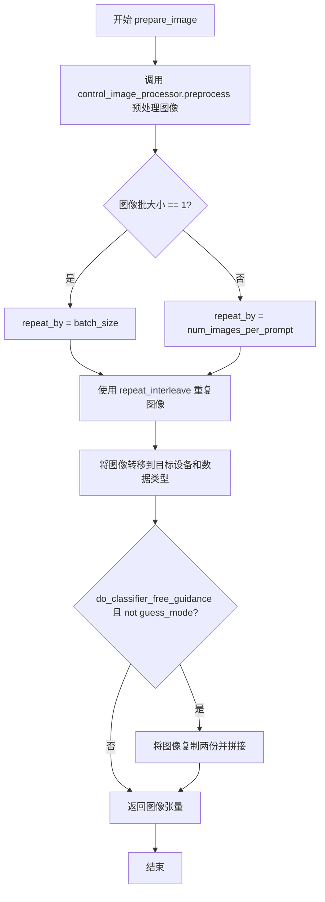

#### 带注释源码

```python
def prepare_image(
    self,
    image,
    width,
    height,
    batch_size,
    num_images_per_prompt,
    device,
    dtype,
    do_classifier_free_guidance=False,
    guess_mode=False,
):
    """
    预处理 ControlNet 输入图像，将其调整为指定尺寸并转换为张量格式。
    
    该方法执行以下步骤：
    1. 使用 control_image_processor 对图像进行预处理（缩放、归一化等）
    2. 根据批处理大小和每 prompt 图像数量重复图像
    3. 将图像转移到指定设备和数据类型
    4. 如果启用分类器自由引导且不是猜测模式，则复制图像以支持无条件生成
    
    Args:
        image: 输入的控制图像，支持多种格式（PIL、Tensor、numpy array 或列表）
        width: 目标宽度（像素）
        height: 目标高度（像素）
        batch_size: 批处理大小
        num_images_per_prompt: 每个 prompt 生成的图像数量
        device: 目标计算设备
        dtype: 目标数据类型
        do_classifier_free_guidance: 是否启用分类器自由引导
        guess_mode: 是否启用猜测模式
    
    Returns:
        torch.Tensor: 预处理后的图像张量
    """
    # 步骤1：预处理图像 - 调整尺寸并转换为 float32 张量
    image = self.control_image_processor.preprocess(image, height=height, width=width).to(dtype=torch.float32)
    
    # 获取预处理后图像的批大小
    image_batch_size = image.shape[0]

    # 步骤2：确定图像重复次数
    if image_batch_size == 1:
        # 如果图像批大小为1，按照总批大小重复（与prompt批对齐）
        repeat_by = batch_size
    else:
        # 如果图像批大小与prompt批大小相同，按照每prompt图像数量重复
        # image batch size is the same as prompt batch size
        repeat_by = num_images_per_prompt

    # 按照计算出的重复次数沿批次维度重复图像
    image = image.repeat_interleave(repeat_by, dim=0)

    # 步骤3：将图像转移到目标设备和数据类型
    image = image.to(device=device, dtype=dtype)

    # 步骤4：处理分类器自由引导
    # 当启用 CFG 且不是猜测模式时，需要为无条件生成准备一份额外的图像副本
    if do_classifier_free_guidance and not guess_mode:
        # 将图像复制两份并拼接：一份用于无条件引导，一份用于条件引导
        image = torch.cat([image] * 2)

    # 返回处理后的图像张量
    return image
```


### `PromptDiffusionPipeline.prepare_latents`

该方法用于在扩散模型推理过程中准备初始的潜在向量（latents）。它根据指定的批次大小、图像尺寸和潜在通道数生成随机噪声，或者使用用户提供的潜在向量，并按照调度器的初始噪声标准差进行缩放。

参数：

- `batch_size`：`int`，批次大小，表示要生成的图像数量
- `num_channels_latents`：`int`，潜在变量的通道数，通常对应于 UNet 的输入通道数
- `height`：`int`，生成图像的高度（像素单位）
- `width`：`int`，生成图像的宽度（像素单位）
- `dtype`：`torch.dtype`，生成潜在变量所用的数据类型（如 torch.float16）
- `device`：`torch.device`，生成潜在变量所用的设备（如 CUDA 或 CPU）
- `generator`：`torch.Generator` 或 `List[torch.Generator]`，可选的随机数生成器，用于确保可复现的生成结果
- `latents`：`torch.Tensor`，可选参数，用户提供的潜在变量，如果为 None 则自动生成随机噪声

返回值：`torch.Tensor`，处理后的潜在变量张量，形状为 (batch_size, num_channels_latents, height // vae_scale_factor, width // vae_scale_factor)

#### 流程图

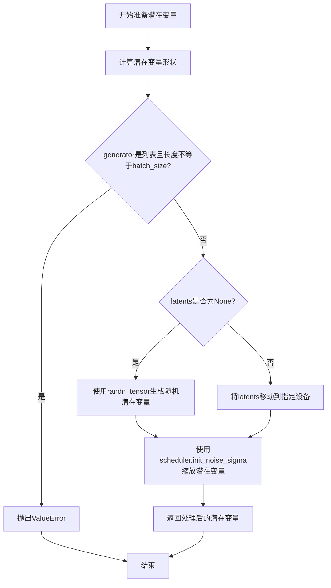

#### 带注释源码

```python
def prepare_latents(self, batch_size, num_channels_latents, height, width, dtype, device, generator, latents=None):
    """
    准备用于扩散模型推理的潜在变量（latents）。
    
    参数:
        batch_size: 批次大小
        num_channels_latents: 潜在变量的通道数
        height: 图像高度
        width: 图像宽度
        dtype: 张量数据类型
        device: 计算设备
        generator: 随机数生成器
        latents: 可选的预生成潜在变量
    
    返回:
        处理后的潜在变量张量
    """
    # 计算潜在变量的形状，考虑VAE的缩放因子
    # 形状: (batch_size, num_channels_latents, height/vae_scale_factor, width/vae_scale_factor)
    shape = (
        batch_size,
        num_channels_latents,
        int(height) // self.vae_scale_factor,
        int(width) // self.vae_scale_factor,
    )
    
    # 检查generator列表长度是否与batch_size匹配
    if isinstance(generator, list) and len(generator) != batch_size:
        raise ValueError(
            f"You have passed a list of generators of length {len(generator)}, but requested an effective batch"
            f" size of {batch_size}. Make sure the batch size matches the length of the generators."
        )

    # 如果没有提供latents，则生成随机噪声
    if latents is None:
        latents = randn_tensor(shape, generator=generator, device=device, dtype=dtype)
    else:
        # 否则将提供的latents移动到指定设备
        latents = latents.to(device)

    # 根据调度器要求的初始噪声标准差缩放初始噪声
    # 这是扩散模型推理的关键步骤，确保噪声符合调度器的预期分布
    latents = latents * self.scheduler.init_noise_sigma
    
    return latents
```


### `PromptDiffusionPipeline.enable_freeu`

该方法用于启用 FreeU 机制，通过调节 UNet 模型的跳线特征（skip features）和主干特征（backbone features）的缩放因子来减轻去噪过程中的"过度平滑效应"，从而提升图像生成质量。

参数：

- `s1`：`float`，第一阶段的缩放因子，用于衰减跳线特征的贡献，以减轻增强去噪过程中的过度平滑效应
- `s2`：`float`，第二阶段的缩放因子，用于衰减跳线特征的贡献，以减轻增强去噪过程中的过度平滑效应
- `b1`：`float`，第一阶段的缩放因子，用于放大主干特征的贡献
- `b2`：`float`，第二阶段的缩放因子，用于放大主干特征的贡献

返回值：`None`，该方法直接修改管道内部状态，不返回任何值

#### 流程图

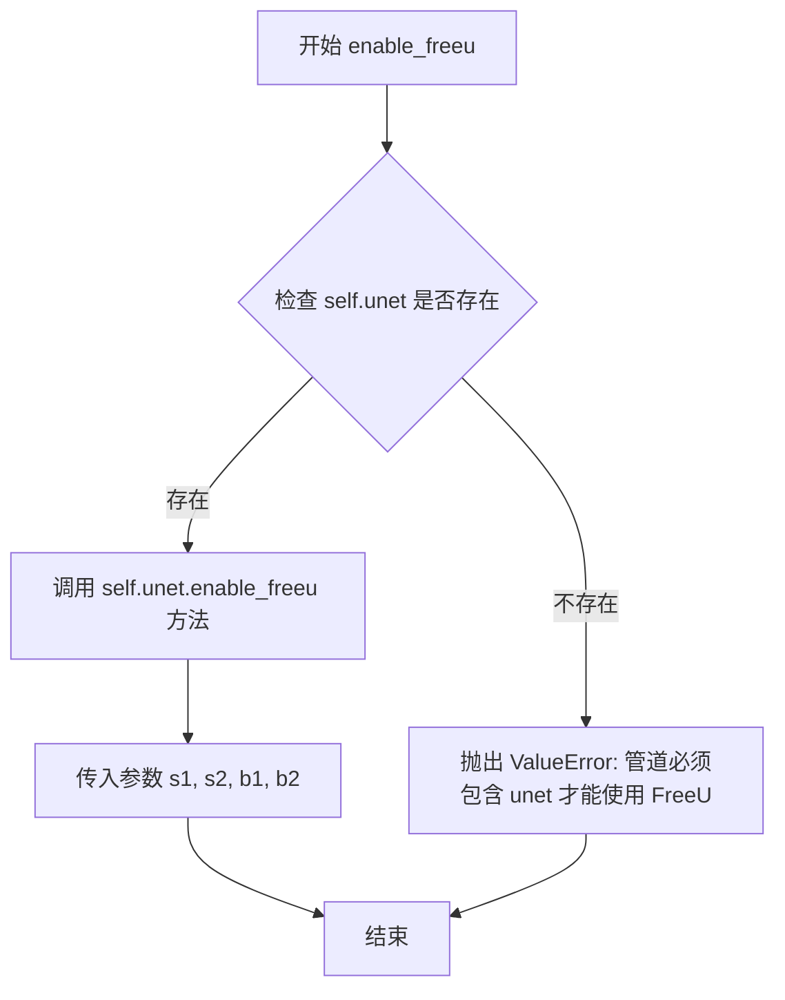

#### 带注释源码

```python
# Copied from diffusers.pipelines.stable_diffusion.pipeline_stable_diffusion.StableDiffusionPipeline.enable_freeu
def enable_freeu(self, s1: float, s2: float, b1: float, b2: float):
    r"""Enables the FreeU mechanism as in https://huggingface.co/papers/2309.11497.

    The suffixes after the scaling factors represent the stages where they are being applied.

    Please refer to the [official repository](https://github.com/ChenyangSi/FreeU) for combinations of the values
    that are known to work well for different pipelines such as Stable Diffusion v1, v2, and Stable Diffusion XL.

    Args:
        s1 (`float`):
            Scaling factor for stage 1 to attenuate the contributions of the skip features. This is done to
            mitigate "oversmoothing effect" in the enhanced denoising process.
        s2 (`float`):
            Scaling factor for stage 2 to attenuate the contributions of the skip features. This is done to
            mitigate "oversmoothing effect" in the enhanced denoising process.
        b1 (`float`): Scaling factor for stage 1 to amplify the contributions of backbone features.
        b2 (`float`): Scaling factor for stage 2 to amplify the contributions of backbone features.
    """
    # 首先检查管道是否包含 unet 属性，FreeU 机制依赖于 UNet 模型
    if not hasattr(self, "unet"):
        # 如果没有 unet，抛出明确的错误信息
        raise ValueError("The pipeline must have `unet` for using FreeU.")
    
    # 将参数传递给 UNet 模型的 enable_freeu 方法来启用 FreeU 机制
    # UNet 内部会处理这些缩放因子并修改其前向传播逻辑
    self.unet.enable_freeu(s1=s1, s2=s2, b1=b1, b2=b2)
```


### `PromptDiffusionPipeline.disable_freeu`

该方法用于禁用 FreeU 机制（如果已启用），通过调用 UNet 模型的 `disable_freeu()` 方法来实现。

参数：
- 无（仅包含隐式参数 `self`）

返回值：`None`，无返回值

#### 流程图

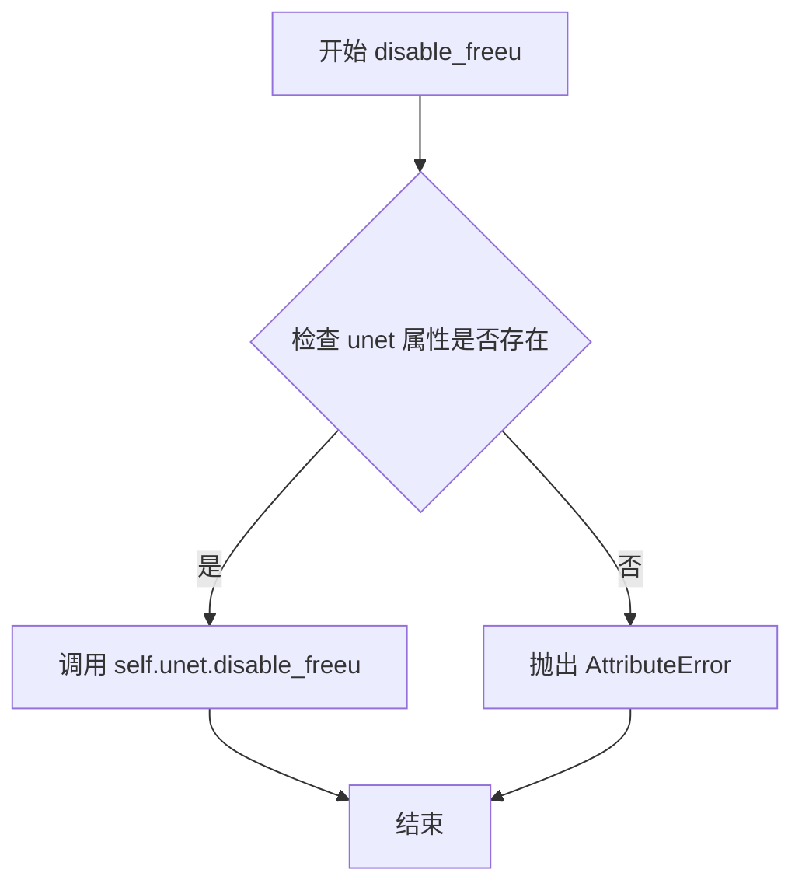

#### 带注释源码

```python
def disable_freeu(self):
    """Disables the FreeU mechanism if enabled."""
    # 调用 UNet 模型的 disable_freeu 方法来禁用 FreeU 机制
    # FreeU 是一种用于改进去噪过程的技术，通过调整跳跃特征和主干特征的贡献来减轻过度平滑效果
    self.unet.disable_freeu()
```


### `PromptDiffusionPipeline.get_guidance_scale_embedding`

该方法用于将引导尺度（guidance scale）转换为高维嵌入向量，以便在扩散模型的UNet中实现时间条件投影。这是实现Classifier-Free Guidance（无分类器引导）的关键组件，通过将引导尺度值编码为与时间步嵌入相同维度的向量，使模型能够根据不同的引导强度动态调整生成过程。

参数：

- `w`：`torch.Tensor`，输入的引导尺度值，通常是经过调整的guidance_scale减1后的值
- `embedding_dim`：`int`，嵌入向量的目标维度，默认为512
- `dtype`：`torch.dtype`，生成嵌入的数据类型，默认为torch.float32

返回值：`torch.Tensor`，形状为`(len(w), embedding_dim)`的嵌入向量

#### 流程图

```mermaid
flowchart TD
    A[开始: 输入w, embedding_dim, dtype] --> B{验证w是一维张量}
    B -->|是| C[将w乘以1000.0进行缩放]
    B -->|否| Z[抛出断言错误]
    C --> D[计算半维度: half_dim = embedding_dim // 2]
    D --> E[计算基础频率: emb = log(10000.0) / (half_dim - 1)]
    E --> F[生成频率向量: exp(-emb * arange(half_dim))]
    F --> G[计算加权的正弦余弦嵌入: w[:, None] * emb[None, :]]
    G --> H[拼接sin和cos: torch.cat([sin, cos], dim=1)]
    H --> I{embedding_dim是否为奇数}
    I -->|是| J[填充一个零列以对齐维度]
    I -->|否| K[跳过填充]
    J --> L[验证输出形状: (w.shape[0], embedding_dim)]
    K --> L
    L --> M[返回嵌入向量]
```

#### 带注释源码

```python
def get_guidance_scale_embedding(self, w, embedding_dim=512, dtype=torch.float32):
    """
    See https://github.com/google-research/vdm/blob/dc27b98a554f65cdc654b800da5aa1846545d41b/model_vdm.py#L298

    Args:
        timesteps (`torch.Tensor`):
            generate embedding vectors at these timesteps
        embedding_dim (`int`, *optional*, defaults to 512):
            dimension of the embeddings to generate
        dtype:
            data type of the generated embeddings

    Returns:
        `torch.Tensor`: Embedding vectors with shape `(len(timesteps), embedding_dim)`
    """
    # 断言确保输入w是一维张量
    assert len(w.shape) == 1
    
    # 将引导尺度值乘以1000进行缩放，使其适合数值计算
    w = w * 1000.0

    # 计算嵌入维度的一半（用于正弦和余弦两个部分）
    half_dim = embedding_dim // 2
    
    # 计算对数空间中的频率基础值，使用10000.0作为基础
    # 这个值来自原始的Transformer位置编码
    emb = torch.log(torch.tensor(10000.0)) / (half_dim - 1)
    
    # 生成从0到half_dim-1的指数衰减频率向量
    # 这创建了不同频率的正弦/余弦基函数
    emb = torch.exp(torch.arange(half_dim, dtype=dtype) * -emb)
    
    # 将引导尺度值与频率向量相乘，创建加权的频率
    # w[:, None] 和 emb[None, :] 会产生广播效应
    emb = w.to(dtype)[:, None] * emb[None, :]
    
    # 拼接正弦和余弦变换后的嵌入向量
    # 结果维度为 (batch_size, half_dim * 2) = (batch_size, embedding_dim)
    emb = torch.cat([torch.sin(emb), torch.cos(emb)], dim=1)
    
    # 如果目标嵌入维度是奇数，需要在最后填充一个零列
    # 这是为了处理embedding_dim不能被2整除的情况
    if embedding_dim % 2 == 1:  # zero pad
        emb = torch.nn.functional.pad(emb, (0, 1))
    
    # 最终验证输出形状是否符合预期
    assert emb.shape == (w.shape[0], embedding_dim)
    
    return emb
```


### PromptDiffusionPipeline.__call__

这是PromptDiffusionPipeline的核心推理方法，实现了基于Prompt Diffusion和ControlNet的文本到图像生成功能。该方法通过接收文本提示、条件图像和示例图像对，经过多步去噪过程生成与文本描述相符的图像，并集成了NSFW内容安全检查。

参数：

- `prompt`：`Union[str, List[str]]`，要引导图像生成的文本提示，若未定义则需要传递`prompt_embeds`
- `image`：`PipelineImageInput`，ControlNet输入条件图像，支持torch.Tensor、PIL.Image.Image、np.ndarray或它们的列表形式
- `image_pair`：`List[PipelineImageInput]`，任务特定的示例图像对列表
- `height`：`Optional[int]`，生成图像的高度，默认为`self.unet.config.sample_size * self.vae_scale_factor`
- `width`：`Optional[int]`，生成图像的宽度，默认为`self.unet.config.sample_size * self.vae_scale_factor`
- `num_inference_steps`：`int`，去噪步数，默认为50
- `timesteps`：`List[int]`，自定义时间步，用于支持调度器的自定义时间步调度
- `guidance_scale`：`float`，引导尺度值，默认为7.5，用于控制文本提示的影响程度
- `negative_prompt`：`Optional[Union[str, List[str]]]`，负面提示，用于引导不包含在图像中的内容
- `num_images_per_prompt`：`Optional[int]`，每个提示生成的图像数量，默认为1
- `eta`：`float`，DDIM论文中的eta参数，默认为0.0
- `generator`：`Optional[Union[torch.Generator, List[torch.Generator]]]`，用于生成确定性结果的随机生成器
- `latents`：`Optional[torch.Tensor]`，预生成的噪声潜在变量
- `prompt_embeds`：`Optional[torch.Tensor]`，预生成的文本嵌入
- `negative_prompt_embeds`：`Optional[torch.Tensor]`，预生成的负面文本嵌入
- `ip_adapter_image`：`Optional[PipelineImageInput]`，IP适配器的可选图像输入
- `output_type`：`str`，输出格式，默认为"pil"，可选"pil"或"np.array"
- `return_dict`：`bool`，是否返回字典格式结果，默认为True
- `cross_attention_kwargs`：`Optional[Dict[str, Any]]`，传递给注意力处理器的kwargs字典
- `controlnet_conditioning_scale`：`Union[float, List[float]]`，ControlNet输出与UNet残差相加前的乘数，默认为1.0
- `guess_mode`：`bool`，ControlNet编码器尝试识别输入图像内容，默认为False
- `control_guidance_start`：`Union[float, List[float]]`，ControlNet开始应用的总步数百分比，默认为0.0
- `control_guidance_end`：`Union[float, List[float]]`，ControlNet停止应用的总步数百分比，默认为1.0
- `clip_skip`：`Optional[int]`，CLIP计算提示嵌入时跳过的层数
- `callback_on_step_end`：`Optional[Callable[[int, int, Dict], None]]`，每个去噪步骤结束时调用的函数
- `callback_on_step_end_tensor_inputs`：`List[str]`，回调函数需要的张量输入列表，默认为["latents"]
- `**kwargs`：其他关键字参数，包括已弃用的callback和callback_steps

返回值：`StableDiffusionPipelineOutput`，包含生成的图像列表和NSFW内容检测布尔列表；若return_dict为False，则返回tuple(image, has_nsfw_concept)

#### 流程图

```mermaid
flowchart TD
    A[开始 __call__] --> B[解析callback参数并处理废弃警告]
    B --> C[对齐control_guidance格式为列表]
    C --> D[检查输入参数有效性 check_inputs]
    D --> E[设置guidance_scale, clip_skip, cross_attention_kwargs]
    E --> F[确定batch_size]
    F --> G{controlnet是否为MultiControlNetModel?}
    G -->|是| H[将controlnet_conditioning_scale扩展为列表]
    G -->|否| I[保持单一scale]
    H --> J[确定global_pool_conditions和guess_mode]
    I --> J
    J --> K[编码输入提示 encode_prompt]
    K --> L[是否使用classifier free guidance?]
    L -->|是| M[拼接negative和positive prompt_embeds]
    L -->|否| N[仅使用prompt_embeds]
    M --> O[准备image_pair图像]
    N --> O
    O --> P[准备ControlNet输入图像 prepare_image]
    P --> Q[获取图像尺寸height, width]
    Q --> R[准备时间步 timesteps]
    R --> S[准备潜在变量 prepare_latents]
    S --> T{unet是否有time_cond_proj_dim?}
    T -->|是| U[计算Guidance Scale Embedding]
    T -->|否| V[跳过embedding计算]
    U --> V
    V --> W[准备额外步骤参数 prepare_extra_step_kwargs]
    W --> X[创建controlnet_keep列表]
    X --> Y[进入去噪循环]
    
    Y --> Z{当前步数 < 总步数?}
    Z -->|是| AA[扩大latents用于classifier free guidance]
    AA --> AB[调度器缩放模型输入]
    AB --> AC{guess_mode且使用CFG?}
    AC -->|是| AD[仅使用conditional batch进行ControlNet推理]
    AC -->|否| AE[使用latent_model_input]
    AD --> AF[执行ControlNet推理]
    AE --> AF
    AF --> AG[应用guess_mode处理]
    AG --> AH[执行UNet推理预测噪声]
    AH --> AI{使用CFG?}
    AI -->|是| AJ[分离uncond和text预测, 应用guidance_scale]
    AI -->|否| AK[直接使用noise_pred]
    AJ --> AL[调度器执行step得到x_t-1]
    AK --> AL
    AL --> AM{是否定义callback_on_step_end?}
    AM -->|是| AN[执行回调函数并更新latents和embeds]
    AM -->|否| AO[跳过回调]
    AN --> AP[更新进度条]
    AO --> AP
    AP --> AQ{是否最后一步或满足warmup条件?}
    AQ -->|是| AR[执行最终回调]
    AQ -->|否| AS[继续循环]
    AR --> Z
    
    Z -->|否| AT{output_type是否为latent?}
    AT -->|否| AU[VAE解码 latents -> image]
    AT -->|是| AV[直接使用latents作为image]
    AU --> AW[运行安全检查器 run_safety_checker]
    AV --> AX[has_nsfw_concept = None]
    AW --> AX
    AX --> AY[后处理图像 postprocess]
    AY --> AZ[释放模型钩子 maybe_free_model_hooks]
    AZ --> BA{return_dict为True?}
    BA -->|是| BB[返回StableDiffusionPipelineOutput]
    BA -->|否| BC[返回tuple]
    BB --> BD[结束]
    BC --> BD
```

#### 带注释源码

```python
@torch.no_grad()
@replace_example_docstring(EXAMPLE_DOC_STRING)
def __call__(
    self,
    prompt: Union[str, List[str]] = None,
    image: PipelineImageInput = None,
    image_pair: List[PipelineImageInput] = None,
    height: Optional[int] = None,
    width: Optional[int] = None,
    num_inference_steps: int = 50,
    timesteps: List[int] = None,
    guidance_scale: float = 7.5,
    negative_prompt: Optional[Union[str, List[str]]] = None,
    num_images_per_prompt: Optional[int] = 1,
    eta: float = 0.0,
    generator: Optional[Union[torch.Generator, List[torch.Generator]]] = None,
    latents: Optional[torch.Tensor] = None,
    prompt_embeds: Optional[torch.Tensor] = None,
    negative_prompt_embeds: Optional[torch.Tensor] = None,
    ip_adapter_image: Optional[PipelineImageInput] = None,
    output_type: str | None = "pil",
    return_dict: bool = True,
    cross_attention_kwargs: Optional[Dict[str, Any]] = None,
    controlnet_conditioning_scale: Union[float, List[float]] = 1.0,
    guess_mode: bool = False,
    control_guidance_start: Union[float, List[float]] = 0.0,
    control_guidance_end: Union[float, List[float]] = 1.0,
    clip_skip: Optional[int] = None,
    callback_on_step_end: Optional[Callable[[int, int, Dict], None]] = None,
    callback_on_step_end_tensor_inputs: List[str] = ["latents"],
    **kwargs,
):
    # 解析已废弃的callback参数
    callback = kwargs.pop("callback", None)
    callback_steps = kwargs.pop("callback_steps", None)

    # 对废弃参数发出警告并建议使用新参数
    if callback is not None:
        deprecate(
            "callback",
            "1.0.0",
            "Passing `callback` as an input argument to `__call__` is deprecated, consider using `callback_on_step_end`",
        )
    if callback_steps is not None:
        deprecate(
            "callback_steps",
            "1.0.0",
            "Passing `callback_steps` as an input argument to `__call__` is deprecated, consider using `callback_on_step_end`",
        )

    # 获取原始controlnet模块（处理torch.compile编译后的模块）
    controlnet = self.controlnet._orig_mod if is_compiled_module(self.controlnet) else self.controlnet

    # 对齐control_guidance_start和control_guidance_end为列表格式
    if not isinstance(control_guidance_start, list) and isinstance(control_guidance_end, list):
        control_guidance_start = len(control_guidance_end) * [control_guidance_start]
    elif not isinstance(control_guidance_end, list) and isinstance(control_guidance_start, list):
        control_guidance_end = len(control_guidance_start) * [control_guidance_end]
    elif not isinstance(control_guidance_start, list) and not isinstance(control_guidance_end, list):
        # 根据controlnet数量扩展
        mult = len(controlnet.nets) if isinstance(controlnet, MultiControlNetModel) else 1
        control_guidance_start, control_guidance_end = (
            mult * [control_guidance_start],
            mult * [control_guidance_end],
        )

    # 1. 检查输入参数有效性
    self.check_inputs(
        prompt,
        image,
        image_pair,
        callback_steps,
        negative_prompt,
        prompt_embeds,
        negative_prompt_embeds,
        controlnet_conditioning_scale,
        control_guidance_start,
        control_guidance_end,
        callback_on_step_end_tensor_inputs,
    )

    # 设置实例属性供后续使用
    self._guidance_scale = guidance_scale
    self._clip_skip = clip_skip
    self._cross_attention_kwargs = cross_attention_kwargs

    # 2. 确定批次大小
    if prompt is not None and isinstance(prompt, str):
        batch_size = 1
    elif prompt is not None and isinstance(prompt, list):
        batch_size = len(prompt)
    else:
        batch_size = prompt_embeds.shape[0]

    # 获取执行设备
    device = self._execution_device

    # 如果是MultiControlNetModel，将conditioning_scale扩展为列表
    if isinstance(controlnet, MultiControlNetModel) and isinstance(controlnet_conditioning_scale, float):
        controlnet_conditioning_scale = [controlnet_conditioning_scale] * len(controlnet.nets)

    # 确定是否使用全局池化条件
    global_pool_conditions = (
        controlnet.config.global_pool_conditions
        if isinstance(controlnet, ControlNetModel)
        else controlnet.nets[0].config.global_pool_conditions
    )
    # guess_mode可以使用全局条件自动启用
    guess_mode = guess_mode or global_pool_conditions

    # 3. 编码输入提示
    text_encoder_lora_scale = (
        self.cross_attention_kwargs.get("scale", None) if self.cross_attention_kwargs is not None else None
    )
    # 调用encode_prompt生成文本嵌入
    prompt_embeds, negative_prompt_embeds = self.encode_prompt(
        prompt,
        device,
        num_images_per_prompt,
        self.do_classifier_free_guidance,
        negative_prompt,
        prompt_embeds=prompt_embeds,
        negative_prompt_embeds=negative_prompt_embeds,
        lora_scale=text_encoder_lora_scale,
        clip_skip=self.clip_skip,
    )
    
    # 3.1 对于classifier free guidance，拼接unconditional和text embeddings
    # 这样可以避免两次前向传播
    if self.do_classifier_free_guidance:
        prompt_embeds = torch.cat([negative_prompt_embeds, prompt_embeds])

    # 3.2 准备image_pair（Prompt Diffusion特定）
    if isinstance(controlnet, ControlNetModel):
        # 将image_pair中的每张图像分别预处理后沿维度1拼接
        image_pair = torch.cat(
            [
                self.prepare_image(
                    image=im,
                    width=width,
                    height=height,
                    batch_size=batch_size * num_images_per_prompt,
                    num_images_per_prompt=num_images_per_prompt,
                    device=device,
                    dtype=controlnet.dtype,
                    do_classifier_free_guidance=self.do_classifier_free_guidance,
                    guess_mode=guess_mode,
                )
                for im in image_pair
            ],
            1,
        )
    
    # 4. 准备ControlNet的输入图像
    if isinstance(controlnet, ControlNetModel):
        image = self.prepare_image(
            image=image,
            width=width,
            height=height,
            batch_size=batch_size * num_images_per_prompt,
            num_images_per_prompt=num_images_per_prompt,
            device=device,
            dtype=controlnet.dtype,
            do_classifier_free_guidance=self.do_classifier_free_guidance,
            guess_mode=guess_mode,
        )
        height, width = image.shape[-2:]  # 从处理后的图像获取实际尺寸
    elif isinstance(controlnet, MultiControlNetModel):
        images = []
        for image_ in image:
            image_ = self.prepare_image(
                image=image_,
                width=width,
                height=height,
                batch_size=batch_size * num_images_per_prompt,
                num_images_per_prompt=num_images_per_prompt,
                device=device,
                dtype=controlnet.dtype,
                do_classifier_free_guidance=self.do_classifier_free_guidance,
                guess_mode=guess_mode,
            )
            images.append(image_)
        image = images
        height, width = image[0].shape[-2:]
    else:
        assert False

    # 5. 准备时间步
    timesteps, num_inference_steps = retrieve_timesteps(self.scheduler, num_inference_steps, device, timesteps)
    self._num_timesteps = len(timesteps)

    # 6. 准备潜在变量
    num_channels_latents = self.unet.config.in_channels
    latents = self.prepare_latents(
        batch_size * num_images_per_prompt,
        num_channels_latents,
        height,
        width,
        prompt_embeds.dtype,
        device,
        generator,
        latents,
    )

    # 6.5 可选：获取Guidance Scale Embedding（用于时间条件投影）
    timestep_cond = None
    if self.unet.config.time_cond_proj_dim is not None:
        guidance_scale_tensor = torch.tensor(self.guidance_scale - 1).repeat(batch_size * num_images_per_prompt)
        timestep_cond = self.get_guidance_scale_embedding(
            guidance_scale_tensor, embedding_dim=self.unet.config.time_cond_proj_dim
        ).to(device=device, dtype=latents.dtype)

    # 7. 准备额外步骤参数
    extra_step_kwargs = self.prepare_extra_step_kwargs(generator, eta)

    # 7.2 创建tensor表示每个时间步要保留的controlnet
    controlnet_keep = []
    for i in range(len(timesteps)):
        # 根据起始和结束时间计算每个controlnet的保留权重
        keeps = [
            1.0 - float(i / len(timesteps) < s or (i + 1) / len(timesteps) > e)
            for s, e in zip(control_guidance_start, control_guidance_end)
        ]
        # 单个ControlNet取第一个元素，Multiple取完整列表
        controlnet_keep.append(keeps[0] if isinstance(controlnet, ControlNetModel) else keeps)

    # 8. 去噪循环
    num_warmup_steps = len(timesteps) - num_inference_steps * self.scheduler.order
    is_unet_compiled = is_compiled_module(self.unet)
    is_controlnet_compiled = is_compiled_module(self.controlnet)
    is_torch_higher_equal_2_1 = is_torch_version(">=", "2.1")
    
    with self.progress_bar(total=num_inference_steps) as progress_bar:
        for i, t in enumerate(timesteps):
            # 对于torch.compile优化的模型，在CUDA graph前开始新步骤
            if (is_unet_compiled and is_controlnet_compiled) and is_torch_higher_equal_2_1:
                torch._inductor.cudagraph_mark_step_begin()
            
            # 扩展latents用于classifier free guidance
            latent_model_input = torch.cat([latents] * 2) if self.do_classifier_free_guidance else latents
            latent_model_input = self.scheduler.scale_model_input(latent_model_input, t)

            # ControlNet推理
            if guess_mode and self.do_classifier_free_guidance:
                # 只对conditional batch进行ControlNet推理
                control_model_input = latents
                control_model_input = self.scheduler.scale_model_input(control_model_input, t)
                controlnet_prompt_embeds = prompt_embeds.chunk(2)[1]
            else:
                control_model_input = latent_model_input
                controlnet_prompt_embeds = prompt_embeds

            # 计算controlnet的条件缩放
            if isinstance(controlnet_keep[i], list):
                cond_scale = [c * s for c, s in zip(controlnet_conditioning_scale, controlnet_keep[i])]
            else:
                controlnet_cond_scale = controlnet_conditioning_scale
                if isinstance(controlnet_cond_scale, list):
                    controlnet_cond_scale = controlnet_cond_scale[0]
                cond_scale = controlnet_cond_scale * controlnet_keep[i]

            # 执行ControlNet前向传播
            # 传入image_pair作为Prompt Diffusion的特殊条件
            down_block_res_samples, mid_block_res_sample = self.controlnet(
                control_model_input,
                t,
                encoder_hidden_states=controlnet_prompt_embeds,
                controlnet_query_cond=image,      # 主条件图像
                controlnet_cond=image_pair,       # 示例图像对（Prompt Diffusion特定）
                conditioning_scale=cond_scale,
                guess_mode=guess_mode,
                return_dict=False,
            )

            # guess_mode下将unconditional部分置零
            if guess_mode and self.do_classifier_free_guidance:
                down_block_res_samples = [torch.cat([torch.zeros_like(d), d]) for d in down_block_res_samples]
                mid_block_res_sample = torch.cat([torch.zeros_like(mid_block_res_sample), mid_block_res_sample])

            # 使用UNet预测噪声残差
            noise_pred = self.unet(
                latent_model_input,
                t,
                encoder_hidden_states=prompt_embeds,
                timestep_cond=timestep_cond,
                cross_attention_kwargs=self.cross_attention_kwargs,
                down_block_additional_residuals=down_block_res_samples,
                mid_block_additional_residual=mid_block_res_sample,
                return_dict=False,
            )[0]

            # 执行classifier free guidance
            if self.do_classifier_free_guidance:
                noise_pred_uncond, noise_pred_text = noise_pred.chunk(2)
                noise_pred = noise_pred_uncond + self.guidance_scale * (noise_pred_text - noise_pred_uncond)

            # 计算上一步的噪声样本 x_t -> x_t-1
            latents = self.scheduler.step(noise_pred, t, latents, **extra_step_kwargs, return_dict=False)[0]

            # 执行每步结束时的回调
            if callback_on_step_end is not None:
                callback_kwargs = {}
                for k in callback_on_step_end_tensor_inputs:
                    callback_kwargs[k] = locals()[k]
                callback_outputs = callback_on_step_end(self, i, t, callback_kwargs)

                # 允许回调更新latents和embeds
                latents = callback_outputs.pop("latents", latents)
                prompt_embeds = callback_outputs.pop("prompt_embeds", prompt_embeds)
                negative_prompt_embeds = callback_outputs.pop("negative_prompt_embeds", negative_prompt_embeds)

            # 调用进度条和旧式callback
            if i == len(timesteps) - 1 or ((i + 1) > num_warmup_steps and (i + 1) % self.scheduler.order == 0):
                progress_bar.update()
                if callback is not None and i % callback_steps == 0:
                    step_idx = i // getattr(self.scheduler, "order", 1)
                    callback(step_idx, t, latents)

    # 9. 后处理：如果有sequential model offloading，手动卸载UNet和ControlNet
    if hasattr(self, "final_offload_hook") and self.final_offload_hook is not None:
        self.unet.to("cpu")
        self.controlnet.to("cpu")
        torch.cuda.empty_cache()

    # 10. 如果不需要latent输出，进行VAE解码
    if not output_type == "latent":
        image = self.vae.decode(latents / self.vae.config.scaling_factor, return_dict=False, generator=generator)[0]
        # 运行安全检查器
        image, has_nsfw_concept = self.run_safety_checker(image, device, prompt_embeds.dtype)
    else:
        image = latents
        has_nsfw_concept = None

    # 11. 确定是否需要反归一化
    if has_nsfw_concept is None:
        do_denormalize = [True] * image.shape[0]
    else:
        do_denormalize = [not has_nsfw for has_nsfw in has_nsfw_concept]

    # 12. 后处理图像到指定输出类型
    image = self.image_processor.postprocess(image, output_type=output_type, do_denormalize=do_denormalize)

    # 13. 释放所有模型钩子
    self.maybe_free_model_hooks()

    # 14. 返回结果
    if not return_dict:
        return (image, has_nsfw_concept)

    return StableDiffusionPipelineOutput(images=image, nsfw_content_detected=has_nsfw_concept)
```

## 关键组件


### 张量索引与处理

代码中多处对张量进行索引和重复操作，包括在`encode_prompt`中对`prompt_embeds`进行重复以适应多个图像生成，以及在`__call__`方法中对`latents`和`prompt_embeds`进行拼接或分割以支持classifier-free guidance。

### 潜在变量初始化与噪声调度

在`prepare_latents`方法中初始化随机潜在变量，并使用调度器的`init_noise_sigma`进行缩放。在`__call__`方法的去噪循环中，通过`scheduler.scale_model_input`对潜在变量进行预处理，并使用`scheduler.step`进行迭代去噪。

### ControlNet多条件处理

代码支持单个和多个ControlNet模型（`MultiControlNetModel`），在`check_inputs`中验证ControlNet相关参数，在`__call__`方法中根据ControlNet类型分别处理图像条件，并支持`control_guidance_start`和`control_guidance_end`来控制ControlNet的应用时机。

### 图像对（Image Pair）处理

这是Prompt Diffusion的特殊输入，`image_pair`参数接收一对任务相关的示例图像。在`__call__`方法中通过`prepare_image`处理后传递给ControlNet的`controlnet_cond`参数，为去噪过程提供额外的条件信息。

### 文本提示编码与LoRA支持

`encode_prompt`方法处理文本到文本嵌入的转换，支持LoRA权重的`lora_scale`参数调整，支持`clip_skip`来选择CLIP的中间层输出，并支持Textual Inversion嵌入。

### VAE图像后处理

使用`VaeImageProcessor`进行图像的编码前预处理和解码后后处理，包括归一化和转换为PIL图像或numpy数组。

### Guidance Scale Embedding

`get_guidance_scale_embedding`方法为UNet的时间条件投影生成基于guidance scale的嵌入向量，当`unet.config.time_cond_proj_dim`不为None时使用。

### 调度器与时间步管理

`retrieve_timesteps`函数封装了调度器的`set_timesteps`调用，支持自定义时间步序列。

### 模型卸载与内存优化

支持VAE切片（`enable_vae_slicing`）、VAE平铺（`enable_vae_tiling`）、模型CPU卸载（`model_cpu_offload_seq`）和FreeU机制。

### 安全性检查

`run_safety_checker`方法使用`StableDiffusionSafetyChecker`和`CLIPImageProcessor`检测生成图像是否包含不当内容。


## 问题及建议


### 已知问题

-   **过时的方法调用**：`decode_latents()` 方法已标记为废弃（`deprecated`），应使用 `VaeImageProcessor.postprocess()` 替代，但代码中仍在某些路径使用旧方法。
-   **类型检查不当**：使用 `type(prompt) is not type(negative_prompt)` 进行类型比较（见 `encode_prompt` 方法），这种写法不够健壮，应使用 `isinstance()`。
-   **断言用于错误处理**：在 `check_inputs` 和 `__call__` 方法末尾使用 `assert False` 进行错误处理，这是不良实践，应该抛出明确的异常。
-   **`__call__` 方法过长**：主生成方法超过 400 行，包含过多逻辑，违反单一职责原则，难以维护和测试。
-   **魔法数字**：如 `10000.0`、`1000.0` 等硬编码值散落在代码中，缺乏明确解释。
-   **重复代码模式**：多个预处理方法（如 `prepare_image`、`prepare_latents`）与 Stable Diffusion 其他 Pipeline 高度重复，可考虑抽象到基类。
-   **错误信息不够具体**：部分错误消息使用 f-string 但未正确格式化（如 `"Make sure to define a feature extractor when loading {self.__class__}"` 应为 `f"..."`）。
-   **潜在的空指针风险**：`image_encoder` 作为可选组件，但部分方法直接访问而未充分检查其存在性。

### 优化建议

-   **重构长方法**：将 `__call__` 拆分为独立方法，如 `_prepare_conditioning()`、`_denoise_loop()`、`_postprocess_output()` 等。
-   **移除废弃 API**：统一使用 `encode_prompt()` 替代 `_encode_prompt()`，使用图像处理器替代 `decode_latents()`。
-   **改进类型检查**：统一使用 `isinstance()` 进行类型判断，避免使用 `type() is` 模式。
-   **用异常替代断言**：将 `assert False` 替换为 `raise ValueError(...)` 或 `raise TypeError(...)`。
-   **提取常量**：将硬编码数值（如阈值、缩放因子）提取为类常量或配置参数。
-   **统一错误消息**：确保所有 f-string 正确格式化，检查字符串插值语法。
-   **增强早期验证**：在方法入口处增加参数预检，减少运行时错误。
-   **添加类型提示**：为缺少类型注解的方法和变量添加完整的类型提示，提高代码可读性和 IDE 支持。

## 其它


### 设计目标与约束

本Pipeline的设计目标是实现基于Prompt Diffusion的文本到图像生成功能，结合Stable Diffusion模型与ControlNet控制机制，支持通过示例图像对（image_pair）指导生成过程。主要约束包括：1) 依赖PyTorch和Transformers生态；2) 需要支持FP16推理优化；3) 必须遵循Hugging Face Diffusers库的接口规范；4) 需要兼容LoRA和Textual Inversion等微调技术。

### 错误处理与异常设计

代码中包含多处参数校验：check_inputs方法验证callback_steps为正整数、prompt与prompt_embeds互斥、image与prompt批次大小匹配、controlnet_conditioning_scale类型正确、control_guidance_start/end有效性等。异常处理采用ValueError和TypeError抛出，警告信息通过logger.warning记录。deprecated方法使用deprecate函数标记弃用特性。安全检查器缺失时会发出警告但允许运行。

### 数据流与状态机

Pipeline的主要数据流：1) 编码提示词（encode_prompt）生成prompt_embeds和negative_prompt_embeds；2) 预处理图像（prepare_image）将输入图像转换为latent空间；3) 准备初始噪声（prepare_latents）；4) 迭代去噪循环中：调度器计算timestep -> ControlNet提取条件特征 -> UNet预测噪声 -> 调度器执行去噪步骤；5) VAE解码latents到图像；6) 安全检查器过滤；7) 后处理输出。整个过程无显式状态机，通过迭代器模式处理时间步。

### 外部依赖与接口契约

核心依赖包括：transformers（CLIPTextModel、CLIPTokenizer、CLIPImageProcessor、CLIPVisionModelWithProjection）、diffusers（AutoencoderKL、ControlNetModel、UNet2DConditionModel、各类调度器）、torch、numpy、PIL。接口契约：__call__方法接收prompt、image、image_pair等参数，返回StableDiffusionPipelineOutput或tuple；encode_prompt返回(prompt_embeds, negative_prompt_embeds)元组；ControlNet接受controlnet_query_cond和controlnet_cond双条件输入。

### 性能考虑与优化建议

代码支持多种性能优化：1) VAE切片（enable_vae_slicing）和平铺（enable_vae_tiling）；2) 模型CPU卸载（enable_model_cpu_offload）；3) xformers内存高效注意力；4) 编译模块（torch.compile）支持；5) FreeU机制。建议：可进一步优化图像预处理批处理、添加推理缓存机制、支持ONNX导出。

### 安全性考虑

包含StableDiffusionSafetyChecker进行NSFW内容检测，可通过requires_safety_checker参数控制。警告用户禁用安全检查器的风险。图像编码时使用torch.zeros_like生成无条件embedding，防止内容泄露。敏感操作需注意模型权重来源和输入验证。

### 版本兼容性

代码声明基于diffusers库，需要检查PyTorch版本（is_torch_version）、PEFT后端支持（USE_PEFT_BACKEND）、torch.compile支持。兼容Python 3.8+。对future版本移除的方法使用deprecate标记。scheduler接口通过inspect签名检查动态适配。

### 测试策略建议

应覆盖：1) 单元测试各方法（encode_prompt、prepare_latents等）；2) 集成测试完整推理流程；3) 参数校验边界条件；4) 多ControlNet组合；5) LoRA/Textual Inversion加载；6) 安全检查器开关；7) 不同调度器兼容性；8) 内存占用和速度基准测试。

### 配置与参数说明

关键配置参数：guidance_scale（默认7.5）控制文本保真度；num_inference_steps（默认50）影响质量与速度；controlnet_conditioning_scale（默认1.0）控制ControlNet影响强度；control_guidance_start/end控制ControlNet应用时段；clip_skip控制CLIP层数；guess_mode让ControlNet自识别内容。

### 使用示例与用例

典型用例：1) 条件图像生成（建筑平面图→实际建筑）；2) 风格迁移（示例图像对指导）；3) 图像修复/编辑；4) 多ControlNet组合（边缘检测+深度图）。示例代码见EXAMPLE_DOC_STRING，演示了从HuggingFace Hub加载图像、配置调度器、执行推理的完整流程。


    