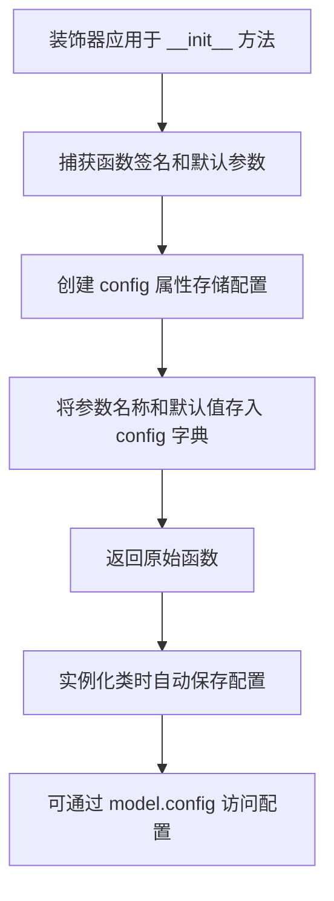
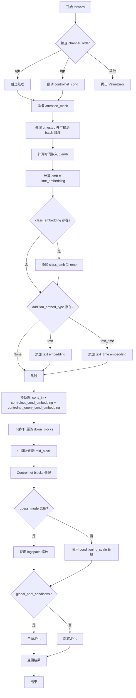

# `diffusers\examples\research_projects\promptdiffusion\promptdiffusioncontrolnet.py` 详细设计文档

这是一个基于 Diffusers 库的 PromptDiffusionControlNetModel 实现，它继承自 ControlNetModel，专门用于支持额外的 prompt 条件控制（controlnet_query_cond），以增强对图像生成过程的细粒度控制。该模型包含了条件嵌入层、时间步处理、U-Net 下采样与中间块结构，以及特定的 ControlNet 特征提取与输出缩放逻辑。

## 整体流程

```mermaid
graph TD
    A[Forward Start] --> B{Channel Order Check}
    B -- rgb --> C[Keep RGB]
    B -- bgr --> D[Flip Channel]
    C --> E[Prepare Attention Mask]
    D --> E
    E --> F[Time Embedding: time_proj + time_embedding]
    F --> G{Class Embedding Exists?}
    G -- Yes --> H[Add Class Embedding]
    G -- No --> I{Addition Embedding?}
    I -- Yes --> J[Add Text/Text_Time Embedding]
    I -- No --> K[Pre-process: conv_in + cond_embedding + query_cond_embedding]
    H --> K
    J --> K
    K --> L[Down Blocks Loop]
    L --> M[Mid Block]
    M --> N[ControlNet Blocks (Down & Mid)]
    N --> O{Guess Mode?}
    O -- Yes --> P[Log Scales Scaling (0.1 to 1.0)]
    O -- No --> Q[Constant Scales Scaling (conditioning_scale)]
    P --> R{Global Pool Conditions?}
    Q --> R
    R -- Yes --> S[Mean Pooling]
    R -- No --> T[Return ControlNetOutput]
    S --> T
```

## 类结构

```
ControlNetModel (基类)
└── PromptDiffusionControlNetModel (本类实现)
    └── ControlNetConditioningEmbedding (用于处理 query_cond)
```

## 全局变量及字段


### `logger`
    
用于记录日志的全局变量

类型：`logging.Logger`
    


### `PromptDiffusionControlNetModel.controlnet_query_cond_embedding`
    
处理额外的查询条件输入

类型：`ControlNetConditioningEmbedding`
    
    

## 全局函数及方法


### `register_to_config`

`register_to_config` 是一个装饰器函数，用于将被装饰的函数（通常是 `__init__` 方法）的参数及其默认值注册到配置字典中。该装饰器捕获所有初始化参数，使配置能够被保存和加载，常用于 Hugging Face Diffusers 库中的模型配置管理。

参数：

- （装饰器本身无参数，被装饰的 `__init__` 方法参数如下：）
- `in_channels`：`int`，默认为 4，输入样本的通道数
- `conditioning_channels`：`int`，默认为 3，条件输入的通道数
- `flip_sin_to_cos`：`bool`，默认为 True，是否将正弦转换为余弦
- `freq_shift`：`int`，默认为 0，时间嵌入的频率偏移
- `down_block_types`：`Tuple[str, ...]`，下采样块的类型元组
- `mid_block_type`：`str | None`，中间块的类型
- `only_cross_attention`：`Union[bool, Tuple[bool]]`，是否仅使用交叉注意力
- `block_out_channels`：`Tuple[int, ...]`，每个块的输出通道数
- `layers_per_block`：`int`，每个块的层数
- `downsample_padding`：`int`，下采样卷积的填充
- `mid_block_scale_factor`：`float`，中间块的缩放因子
- `act_fn`：`str`，激活函数
- `norm_num_groups`：`Optional[int]`，归一化的组数
- `norm_eps`：`float`，归一化的 epsilon
- `cross_attention_dim`：`int`，交叉注意力维度
- `transformer_layers_per_block`：`Union[int, Tuple[int, ...]]`，每个块的 transformer 层数
- `encoder_hid_dim`：`Optional[int]`，编码器隐藏维度
- `encoder_hid_dim_type`：`str | None`，编码器隐藏维度类型
- `attention_head_dim`：`Union[int, Tuple[int, ...]]`，注意力头维度
- `num_attention_heads`：`Optional[Union[int, Tuple[int, ...]]]`，注意力头数量
- `use_linear_projection`：`bool`，是否使用线性投影
- `class_embed_type`：`str | None`，类别嵌入类型
- `addition_embed_type`：`str | None`，额外嵌入类型
- `addition_time_embed_dim`：`Optional[int]`，额外时间嵌入维度
- `num_class_embeds`：`Optional[int]`，类别嵌入数量
- `upcast_attention`：`bool`，是否向上转换注意力
- `resnet_time_scale_shift`：`str`，ResNet 时间尺度偏移
- `projection_class_embeddings_input_dim`：`Optional[int]`，投影类别嵌入输入维度
- `controlnet_conditioning_channel_order`：`str`，条件通道顺序
- `conditioning_embedding_out_channels`：`Optional[Tuple[int, ...]]`，条件嵌入输出通道
- `global_pool_conditions`：`bool`，全局池化条件
- `addition_embed_type_num_heads`：`int`，额外嵌入的头数

返回值：`Callable`，返回装饰后的函数（通常是被装饰的 `__init__` 方法本身）

#### 流程图



#### 带注释源码

```python
# register_to_config 是从 diffusers.configuration_utils 导入的装饰器
# 源代码位于 diffusers 库中，此处为说明其工作原理的注释版本

from functools import wraps

def register_to_config(func):
    """
    装饰器：将被装饰函数的参数注册到 config 字典中
    
    工作原理：
    1. 使用 inspect 模块获取函数的签名
    2. 提取所有参数及其默认值
    3. 创建一个 config 字典存储这些配置
    4. 将 config 附加到函数所属的类上
    """
    # 这里的实现是简化版本，实际在 diffusers 库中更复杂
    @wraps(func)
    def wrapper(self, *args, **kwargs):
        # 调用原始 __init__ 方法
        result = func(self, *args, **kwargs)
        
        # 假设 func 是 __init__ 方法
        # 在 self 上创建 config 属性存储配置
        if not hasattr(self, 'config'):
            # 从函数签名中提取参数
            import inspect
            sig = inspect.signature(func)
            self.config = {}
            
            # 获取所有参数名和默认值
            for param_name, param in sig.parameters.items():
                if param_name == 'self':
                    continue
                if param.default is not inspect.Parameter.empty:
                    self.config[param_name] = param.default
        
        return result
    
    return wrapper


# 在代码中的实际使用方式：
class PromptDiffusionControlNetModel(ControlNetModel):
    
    @register_to_config  # 装饰 __init__ 方法
    def __init__(
        self,
        in_channels: int = 4,
        conditioning_channels: int = 3,
        # ... 其他参数
    ):
        # 初始化逻辑
        super().__init__(...)
        self.controlnet_query_cond_embedding = ControlNetConditioningEmbedding(...)
    
    # 实例化后，可以通过 model.config 访问所有注册的配置
    # 例如: model.config.in_channels -> 4
```


### PromptDiffusionControlNetModel.__init__

该方法是PromptDiffusionControlNetModel类的构造函数，用于初始化模型参数及子模块。它继承自ControlNetModel，并在父类初始化完成后额外创建了controlnet_query_cond_embedding组件，用于处理额外的条件输入。

参数：

- `in_channels`：`int`，默认为4，输入样本的通道数
- `conditioning_channels`：`int`，默认为3，条件输入的通道数
- `flip_sin_to_cos`：`bool`，默认为True，是否将sin转换为cos用于时间嵌入
- `freq_shift`：`int`，默认为0，时间嵌入的频率偏移量
- `down_block_types`：`Tuple[str, ...]`，默认为("CrossAttnDownBlock2D", "CrossAttnDownBlock2D", "CrossAttnDownBlock2D", "DownBlock2D")，下采样块的类型元组
- `mid_block_type`：`str | None`，默认为"UNetMidBlock2DCrossAttn"，中间块的类型
- `only_cross_attention`：`Union[bool, Tuple[bool]]`，默认为False，是否仅使用交叉注意力
- `block_out_channels`：`Tuple[int, ...]`，默认为(320, 640, 1280, 1280)，每个块的输出通道数
- `layers_per_block`：`int`，默认为2，每个块的层数
- `downsample_padding`：`int`，默认为1，下采样卷积使用的填充
- `mid_block_scale_factor`：`float`，默认为1，中间块的缩放因子
- `act_fn`：`str`，默认为"silu"，激活函数
- `norm_num_groups`：`Optional[int]`，默认为32，归一化的组数，如果为None则跳过归一化和激活层
- `norm_eps`：`float`，默认为1e-5，归一化使用的epsilon值
- `cross_attention_dim`：`int`，默认为1280，交叉注意力特征的维度
- `transformer_layers_per_block`：`Union[int, Tuple[int, ...]]`，默认为1，每个块的transformer块数量
- `encoder_hid_dim`：`Optional[int]`，默认为None，编码器隐藏层维度
- `encoder_hid_dim_type`：`str | None`，默认为None，编码器隐藏层维度类型
- `attention_head_dim`：`Union[int, Tuple[int, ...]]`，默认为8，注意力头的维度
- `num_attention_heads`：`Optional[Union[int, Tuple[int, ...]]]`，默认为None，注意力头的数量
- `use_linear_projection`：`bool`，默认为False，是否使用线性投影
- `class_embed_type`：`str | None`，默认为None，类嵌入的类型
- `addition_embed_type`：`str | None`，默认为None，附加嵌入的类型
- `addition_time_embed_dim`：`Optional[int]`，默认为None，附加时间嵌入的维度
- `num_class_embeds`：`Optional[int]`，默认为None，输入到time_embed_dim的可学习嵌入矩阵的输入维度
- `upcast_attention`：`bool`，默认为False，是否上cast注意力
- `resnet_time_scale_shift`：`str`，默认为"default"，ResNet块的时间尺度偏移配置
- `projection_class_embeddings_input_dim`：`Optional[int]`，默认为None，当class_embed_type="projection"时的class_labels输入维度
- `controlnet_conditioning_channel_order`：`str`，默认为"rgb"，条件图像的通道顺序
- `conditioning_embedding_out_channels`：`Optional[Tuple[int, ...]]`，默认为(16, 32, 96, 256)，conditioning_embedding层每个块的输出通道
- `global_pool_conditions`：`bool`，默认为False，是否使用全局池化条件
- `addition_embed_type_num_heads`：`int`，默认为64，TextTimeEmbedding层使用的头数

返回值：`None`，该方法不返回值，仅初始化对象状态

#### 流程图

```mermaid
flowchart TD
    A[开始 __init__] --> B[接收所有配置参数]
    B --> C[调用 super().__init__ 初始化父类 ControlNetModel]
    C --> D[创建 controlnet_query_cond_embedding 组件]
    D --> E[使用 block_out_channels[0] 作为 conditioning_embedding_channels]
    E --> F[使用 conditioning_embedding_out_channels 作为 block_out_channels]
    F --> G[使用 3 作为 conditioning_channels]
    G --> H[赋值给 self.controlnet_query_cond_embedding]
    I[结束 __init__]
    
    style A fill:#f9f,color:#333
    style I fill:#9f9,color:#333
```

#### 带注释源码

```python
@register_to_config
def __init__(
    self,
    in_channels: int = 4,  # 输入样本的通道数，默认为4（对应RGB+alpha）
    conditioning_channels: int = 3,  # 条件输入的通道数，默认为3（RGB）
    flip_sin_to_cos: bool = True,  # 是否翻转sin到cos，用于时间嵌入
    freq_shift: int = 0,  # 频率偏移，用于时间嵌入
    down_block_types: Tuple[str, ...] = (  # 下采样块的类型列表
        "CrossAttnDownBlock2D",
        "CrossAttnDownBlock2D",
        "CrossAttnDownBlock2D",
        "DownBlock2D",
    ),
    mid_block_type: str | None = "UNetMidBlock2DCrossAttn",  # 中间块的类型
    only_cross_attention: Union[bool, Tuple[bool]] = False,  # 是否仅使用交叉注意力
    block_out_channels: Tuple[int, ...] = (320, 640, 1280, 1280),  # 每个块的输出通道数
    layers_per_block: int = 2,  # 每个块的层数
    downsample_padding: int = 1,  # 下采样卷积的填充
    mid_block_scale_factor: float = 1,  # 中间块的缩放因子
    act_fn: str = "silu",  # 激活函数类型
    norm_num_groups: Optional[int] = 32,  # 归一化的组数
    norm_eps: float = 1e-5,  # 归一化的epsilon值
    cross_attention_dim: int = 1280,  # 交叉注意力维度
    transformer_layers_per_block: Union[int, Tuple[int, ...]] = 1,  # 每个块的transformer层数
    encoder_hid_dim: Optional[int] = None,  # 编码器隐藏维度
    encoder_hid_dim_type: str | None = None,  # 编码器隐藏维度类型
    attention_head_dim: Union[int, Tuple[int, ...]] = 8,  # 注意力头的维度
    num_attention_heads: Optional[Union[int, Tuple[int, ...]]] = None,  # 注意力头数量
    use_linear_projection: bool = False,  # 是否使用线性投影
    class_embed_type: str | None = None,  # 类嵌入类型
    addition_embed_type: str | None = None,  # 附加嵌入类型
    addition_time_embed_dim: Optional[int] = None,  # 附加时间嵌入维度
    num_class_embeds: Optional[int] = None,  # 类嵌入数量
    upcast_attention: bool = False,  # 是否上cast注意力
    resnet_time_scale_shift: str = "default",  # ResNet时间尺度偏移
    projection_class_embeddings_input_dim: Optional[int] = None,  # 投影类嵌入输入维度
    controlnet_conditioning_channel_order: str = "rgb",  # 条件通道顺序
    conditioning_embedding_out_channels: Optional[Tuple[int, ...]] = (16, 32, 96, 256),  # 条件嵌入输出通道
    global_pool_conditions: bool = False,  # 全局池化条件
    addition_embed_type_num_heads: int = 64,  # 附加嵌入头数
):
    # 调用父类 ControlNetModel 的初始化方法，传递所有参数
    super().__init__(
        in_channels,
        conditioning_channels,
        flip_sin_to_cos,
        freq_shift,
        down_block_types,
        mid_block_type,
        only_cross_attention,
        block_out_channels,
        layers_per_block,
        downsample_padding,
        mid_block_scale_factor,
        act_fn,
        norm_num_groups,
        norm_eps,
        cross_attention_dim,
        transformer_layers_per_block,
        encoder_hid_dim,
        encoder_hid_dim_type,
        attention_head_dim,
        num_attention_heads,
        use_linear_projection,
        class_embed_type,
        addition_embed_type,
        addition_time_embed_dim,
        num_class_embeds,
        upcast_attention,
        resnet_time_scale_shift,
        projection_class_embeddings_input_dim,
        controlnet_conditioning_channel_order,
        conditioning_embedding_out_channels,
        global_pool_conditions,
        addition_embed_type_num_heads,
    )
    # 创建额外的条件嵌入层，用于处理 prompt 条件输入
    # 这是 PromptDiffusionControlNetModel 相对于标准 ControlNetModel 的新增组件
    self.controlnet_query_cond_embedding = ControlNetConditioningEmbedding(
        conditioning_embedding_channels=block_out_channels[0],  # 使用第一个下采样块的输出通道数
        block_out_channels=conditioning_embedding_out_channels,  # 条件嵌入层的输出通道配置
        conditioning_channels=3,  # 条件输入通道数（RGB）
    )
```


### `PromptDiffusionControlNetModel.forward`

这是 PromptDiffusionControlNetModel 类的前向传播方法，执行推理逻辑。方法接收噪声样本、时间步、编码器隐藏状态以及多个条件输入（包括 controlnet_cond 和 controlnet_query_cond），通过时间嵌入、预处理、下采样、中间块处理、控制网块处理和输出缩放等步骤，输出中间特征（down_block_res_samples 和 mid_block_res_sample），用于后续的图像生成任务。

参数：

- `sample`：`torch.Tensor`，噪声输入张量
- `timestep`：`Union[torch.Tensor, float, int]`，去噪的时间步数
- `encoder_hidden_states`：`torch.Tensor`，编码器隐藏状态
- `controlnet_cond`：`torch.Tensor`，条件输入张量，形状为 `(batch_size, sequence_length, hidden_size)`
- `controlnet_query_cond`：`torch.Tensor`，查询条件输入张量，形状为 `(batch_size, sequence_length, hidden_size)`
- `conditioning_scale`：`float`，默认为 `1.0`，ControlNet 输出的缩放因子
- `class_labels`：`Optional[torch.Tensor]`，可选的类别标签，用于条件处理
- `timestep_cond`：`Optional[torch.Tensor]`，时间步的额外条件嵌入
- `attention_mask`：`Optional[torch.Tensor]`，应用于 encoder_hidden_states 的注意力掩码
- `added_cond_kwargs`：`Optional[Dict[str, torch.Tensor]]`，Stable Diffusion XL UNet 的额外条件
- `cross_attention_kwargs`：`Optional[Dict[str, Any]]`，传递给 AttnProcessor 的参数字典
- `guess_mode`：`bool`，默认为 `False`，是否启用猜测模式
- `return_dict`：`bool`，默认为 `True`，是否返回 ControlNetOutput

返回值：`Union[ControlNetOutput, Tuple[Tuple[torch.Tensor, ...], torch.Tensor]]`，如果 return_dict 为 True，返回 ControlNetOutput 对象；否则返回元组

#### 流程图



#### 带注释源码

```python
def forward(
    self,
    sample: torch.Tensor,
    timestep: Union[torch.Tensor, float, int],
    encoder_hidden_states: torch.Tensor,
    controlnet_cond: torch.Tensor,
    controlnet_query_cond: torch.Tensor,
    conditioning_scale: float = 1.0,
    class_labels: Optional[torch.Tensor] = None,
    timestep_cond: Optional[torch.Tensor] = None,
    attention_mask: Optional[torch.Tensor] = None,
    added_cond_kwargs: Optional[Dict[str, torch.Tensor]] = None,
    cross_attention_kwargs: Optional[Dict[str, Any]] = None,
    guess_mode: bool = False,
    return_dict: bool = True,
) -> Union[ControlNetOutput, Tuple[Tuple[torch.Tensor, ...], torch.Tensor]]:
    # 检查通道顺序配置
    channel_order = self.config.controlnet_conditioning_channel_order

    if channel_order == "rgb":
        # 默认 RGB 顺序，无需处理
        ...
    elif channel_order == "bgr":
        # BGR 顺序需要翻转通道
        controlnet_cond = torch.flip(controlnet_cond, dims=[1])
    else:
        raise ValueError(f"unknown `controlnet_conditioning_channel_order`: {channel_order}")

    # 准备注意力掩码：如果提供，则转换为偏置形式
    if attention_mask is not None:
        attention_mask = (1 - attention_mask.to(sample.dtype)) * -10000.0
        attention_mask = attention_mask.unsqueeze(1)

    # 1. 时间步处理
    timesteps = timestep
    if not torch.is_tensor(timesteps):
        # 将时间步转换为张量，处理不同设备类型
        is_mps = sample.device.type == "mps"
        is_npu = sample.device.type == "npu"
        if isinstance(timestep, float):
            # 浮点时间步使用 float32 或 float64
            dtype = torch.float32 if (is_mps or is_npu) else torch.float64
        else:
            # 整数时间步使用 int32 或 int64
            dtype = torch.int32 if (is_mps or is_npu) else torch.int64
        timesteps = torch.tensor([timesteps], dtype=dtype, device=sample.device)
    elif len(timesteps.shape) == 0:
        # 标量张量扩展为 1 维
        timesteps = timesteps[None].to(sample.device)

    # 广播到 batch 维度以兼容 ONNX/Core ML
    timesteps = timesteps.expand(sample.shape[0])

    # 时间嵌入投影
    t_emb = self.time_proj(timesteps)

    # 时间嵌入可能运行在 fp16，需要确保类型一致
    t_emb = t_emb.to(dtype=sample.dtype)

    # 计算最终的时间嵌入，可选地添加 timestep_cond
    emb = self.time_embedding(t_emb, timestep_cond)
    aug_emb = None

    # 处理类别嵌入（如果存在）
    if self.class_embedding is not None:
        if class_labels is None:
            raise ValueError("class_labels should be provided when num_class_embeds > 0")

        if self.config.class_embed_type == "timestep":
            # 对类别标签进行时间投影
            class_labels = self.time_proj(class_labels)

        # 计算类别嵌入并添加到时间嵌入
        class_emb = self.class_embedding(class_labels).to(dtype=self.dtype)
        emb = emb + class_emb

    # 处理额外的嵌入类型（text 或 text_time）
    if self.config.addition_embed_type is not None:
        if self.config.addition_embed_type == "text":
            # 添加文本嵌入
            aug_emb = self.add_embedding(encoder_hidden_states)

        elif self.config.addition_embed_type == "text_time":
            # 检查必要的参数
            if "text_embeds" not in added_cond_kwargs:
                raise ValueError(
                    f"{self.__class__} has the config param `addition_embed_type` set to 'text_time' which requires the keyword argument `text_embeds` to be passed in `added_cond_kwargs`"
                )
            text_embeds = added_cond_kwargs.get("text_embeds")
            if "time_ids" not in added_cond_kwargs:
                raise ValueError(
                    f"{self.__class__} has the config param `addition_embed_type` set to 'text_time' which requires the keyword argument `time_ids` to be passed in `added_cond_kwargs`"
                )
            time_ids = added_cond_kwargs.get("time_ids")
            
            # 处理时间 ID 嵌入
            time_embeds = self.add_time_proj(time_ids.flatten())
            time_embeds = time_embeds.reshape((text_embeds.shape[0], -1))

            # 连接文本和时间嵌入
            add_embeds = torch.concat([text_embeds, time_embeds], dim=-1)
            add_embeds = add_embeds.to(emb.dtype)
            aug_emb = self.add_embedding(add_embeds)

    # 将额外嵌入添加到主嵌入
    emb = emb + aug_emb if aug_emb is not None else emb

    # 2. 预处理阶段
    # 应用输入卷积
    sample = self.conv_in(sample)

    # 对条件输入进行嵌入处理
    controlnet_cond = self.controlnet_cond_embedding(controlnet_cond)
    # 对查询条件进行嵌入处理（新增的查询条件嵌入）
    controlnet_query_cond = self.controlnet_query_cond_embedding(controlnet_query_cond)
    # 将条件嵌入添加到样本
    sample = sample + controlnet_cond + controlnet_query_cond

    # 3. 下采样阶段
    down_block_res_samples = (sample,)
    for downsample_block in self.down_blocks:
        if hasattr(downsample_block, "has_cross_attention") and downsample_block.has_cross_attention:
            # 带交叉注意力的下采样块
            sample, res_samples = downsample_block(
                hidden_states=sample,
                temb=emb,
                encoder_hidden_states=encoder_hidden_states,
                attention_mask=attention_mask,
                cross_attention_kwargs=cross_attention_kwargs,
            )
        else:
            # 不带交叉注意力的下采样块
            sample, res_samples = downsample_block(hidden_states=sample, temb=emb)

        # 收集所有下采样块的残差连接
        down_block_res_samples += res_samples

    # 4. 中间块处理
    if self.mid_block is not None:
        if hasattr(self.mid_block, "has_cross_attention") and self.mid_block.has_cross_attention:
            sample = self.mid_block(
                sample,
                emb,
                encoder_hidden_states=encoder_hidden_states,
                attention_mask=attention_mask,
                cross_attention_kwargs=cross_attention_kwargs,
            )
        else:
            sample = self.mid_block(sample, emb)

    # 5. Control Net 块处理
    controlnet_down_block_res_samples = ()

    # 对每个下采样块的输出应用 Control Net 块
    for down_block_res_sample, controlnet_block in zip(down_block_res_samples, self.controlnet_down_blocks):
        down_block_res_sample = controlnet_block(down_block_res_sample)
        controlnet_down_block_res_samples = controlnet_down_block_res_samples + (down_block_res_sample,)

    # 更新下采样残差连接
    down_block_res_samples = controlnet_down_block_res_samples

    # 应用中间 Control Net 块
    mid_block_res_sample = self.controlnet_mid_block(sample)

    # 6. 缩放处理
    if guess_mode and not self.config.global_pool_conditions:
        # 猜测模式：使用对数空间缩放（从 0.1 到 1.0）
        scales = torch.logspace(-1, 0, len(down_block_res_samples) + 1, device=sample.device)
        scales = scales * conditioning_scale
        # 对每个下采样残差应用不同的缩放
        down_block_res_samples = [sample * scale for sample, scale in zip(down_block_res_samples, scales)]
        mid_block_res_sample = mid_block_res_sample * scales[-1]
    else:
        # 普通模式：统一应用 conditioning_scale
        down_block_res_samples = [sample * conditioning_scale for sample in down_block_res_samples]
        mid_block_res_sample = mid_block_res_sample * conditioning_scale

    # 全局池化条件（如果启用）
    if self.config.global_pool_conditions:
        down_block_res_samples = [
            torch.mean(sample, dim=(2, 3), keepdim=True) for sample in down_block_res_samples
        ]
        mid_block_res_sample = torch.mean(mid_block_res_sample, dim=(2, 3), keepdim=True)

    # 返回结果
    if not return_dict:
        return (down_block_res_samples, mid_block_res_sample)

    return ControlNetOutput(
        down_block_res_samples=down_block_res_samples, mid_block_res_sample=mid_block_res_sample
    )
```

## 关键组件


### PromptDiffusionControlNetModel

主类，继承自 `ControlNetModel`，用于实现 Prompt Diffusion ControlNet 模型，支持条件图像生成和引导。

### ControlNetConditioningEmbedding (controlnet_query_cond_embedding)

额外的条件嵌入层，用于处理 `controlnet_query_cond` 输入，将条件信息投影到与主网络兼容的空间。

### forward 方法

核心前向传播方法，处理噪声样本、时间步、条件图像和文本嵌入，输出 ControlNet 的中间特征，用于引导扩散模型的生成过程。

### 时间嵌入模块 (time_embedding)

处理时间步（timestep）的嵌入，将离散的时间步转换为连续的向量表示，用于调节扩散过程。

### 类别嵌入模块 (class_embedding)

可选的类别嵌入层，当配置了 `class_embed_type` 时使用，将类别标签转换为向量并与时间嵌入相加。

### 附加嵌入模块 (add_embedding)

处理附加条件的嵌入层，支持文本时间嵌入（text_time）或纯文本嵌入（text），用于更丰富的条件控制。

### 下采样块 (down_blocks)

包含多个下采样块的列表，用于逐步降低特征图分辨率并提取多尺度特征，每个块可能包含交叉注意力机制。

### 中间块 (mid_block)

位于下采样和上采样之间的中间处理块，用于进一步处理特征并保持信息流。

### ControlNet 下采样块 (controlnet_down_blocks)

专门用于提取 ControlNet 条件的下采样块，对下采样过程中的中间特征进行进一步处理。

### ControlNet 中间块 (controlnet_mid_block)

处理主网络中间输出的 ControlNet 块，用于提取最终的条件特征。

### guess_mode

推理模式，当启用时使用对数尺度缩放（logspace）来调整条件强度，使模型能够在没有文本提示的情况下更好地识别输入内容。

### conditioning_scale

条件缩放因子，用于调整 ControlNet 输出的影响强度，可以平衡原始提示和条件引导的作用。

### global_pool_conditions

全局池化选项，对条件特征进行全局平均池化，将空间信息聚合为全局描述符。

### 通道顺序处理 (channel_order)

处理条件图像的通道顺序，支持 RGB 和 BGR 格式的转换，确保与训练数据的一致性。

### 注意力掩码处理 (attention_mask)

将注意力掩码转换为偏置值，用于控制文本编码器中不同 token 的注意力权重。

### 控制网输出 (ControlNetOutput)

包含下采样块结果列表和中间块结果的数据类，用于返回 ControlNet 的特征输出。

## 问题及建议


### 已知问题

- **`global_pool_conditions` 参数未实现**：代码中标记为 `TODO(Patrick) - unused parameter`，虽然有相关逻辑处理，但功能不完整或未真正使用。
- **`controlnet_query_cond_embedding` 配置未持久化**：新增的 `controlnet_query_cond_embedding` 属性未在 `__init__` 中保存其配置参数（如 `conditioning_channels`），导致模型在序列化/反序列化时可能丢失配置信息。
- **`forward` 方法职责过重**：单个方法超过 200 行代码，混合了时间步处理、注意力掩码准备、条件嵌入、DownBlocks 遍历、MidBlock 处理、ControlNet 块处理、缩放逻辑等多个职责，违反单一职责原则。
- **`timestep` 处理逻辑重复且冗余**：在 `forward` 中多次进行类型检查和设备转换，代码重复且可读性差。
- **缺少对 `transformer_layers_per_block` 参数的类型检查**：当传入 `Tuple[int, ...]` 时未进行长度与 `down_block_types` 的匹配校验。
- **`attention_mask` 处理逻辑散落**：在主模型和 DownBlock 中分别处理，容易产生不一致。
- **`controlnet_query_cond` 参数缺少文档说明**：在 `Args` 注释中未说明其具体用途和格式要求。

### 优化建议

- **移除或实现 `global_pool_conditions`**：如果该功能暂不需要，应移除相关代码；如果需要，应完善实现并补充测试。
- **将 `controlnet_query_cond_embedding` 的配置纳入 `register_to_config`**：添加相应的配置参数到 `__init__` 签名中，确保模型配置可序列化。
- **拆分 `forward` 方法**：将时间步处理、条件嵌入准备、DownBlocks 循环、ControlNet 块处理、缩放逻辑等拆分为私有辅助方法，如 `_prepare_timestep()`, `_compute_embeddings()`, `_process_down_blocks()`, `_scale_outputs()` 等。
- **提取 timestep 处理逻辑**：创建 `self._process_timestep(timestep, sample)` 统一处理时间步输入的类型转换和设备迁移。
- **添加参数校验**：在 `__init__` 或 `forward` 开头添加对 `transformer_layers_per_block` 与 `down_block_types` 长度匹配性的检查。
- **统一 attention_mask 处理**：考虑在模型入口处统一处理，避免在 DownBlock 内部重复处理或遗漏处理。
- **补充 `controlnet_query_cond` 文档**：在类文档字符串和 `forward` 方法的 `Args` 中补充对该参数的详细说明。

## 其它


### 设计目标与约束

本模块的设计目标是为 PromptDiffusion 提供增强的 ControlNet 功能，通过引入额外的 `controlnet_query_cond_embedding` 层来处理查询条件输入，从而实现更精细的图像生成控制。核心约束包括：必须继承自 `ControlNetModel` 以保持与 diffusers 生态系统的兼容性；所有配置参数需通过 `register_to_config` 装饰器注册以支持序列化；模型必须支持梯度检查点以优化显存使用；输入的 channel order 只能是 "rgb" 或 "bgr"。

### 错误处理与异常设计

代码中定义了以下异常处理场景：当 `controlnet_conditioning_channel_order` 不是 "rgb" 或 "bgr" 时抛出 `ValueError`；当配置了 `class_embed_type` 但未提供 `class_labels` 时抛出 `ValueError`；当 `addition_embed_type` 设置为 "text" 但未在 `added_cond_kwargs` 中提供 `text_embeds` 时抛出 `ValueError`；当 `addition_embed_type` 设置为 "text_time" 但未提供 `time_ids` 时抛出 `ValueError`。建议补充的异常处理包括：检查 `controlnet_query_cond` 的维度是否与 `controlnet_cond` 兼容；验证 `conditioning_scale` 的数值范围；处理设备不匹配的情况。

### 数据流与状态机

数据流主要经历以下阶段：首先是预处理阶段，包括 channel order 调整、attention mask 准备、时间步处理和时间嵌入计算；其次是嵌入阶段，包括类别嵌入、加性嵌入的计算以及主输入和条件输入的卷积处理；然后是下采样阶段，通过多个下采样块提取特征并保存中间结果；接着是中间块处理阶段；之后是 ControlNet 块处理阶段，对下采样特征进行控制net 处理；最后是缩放阶段，根据 guess_mode 和 global_pool_conditions 对输出进行缩放和池化。状态机不适用此模型，因为这是前馈网络而非状态机。

### 外部依赖与接口契约

核心依赖包括：`torch` 用于张量操作；`diffusers.configuration_utils` 中的 `register_to_config` 用于配置注册；`diffusers.models.controlnet` 中的 `ControlNetConditioningEmbedding` 用于条件嵌入、`ControlNetModel` 作为基类、`ControlNetOutput` 作为输出类型；`diffusers.utils.logging` 用于日志记录。接口契约方面：`forward` 方法接受 sample、timestep、encoder_hidden_states、controlnet_cond、controlnet_query_cond 等参数；返回 `ControlNetOutput` 或元组；所有张量需位于兼容的设备上（cpu、cuda、mps、npu）。

### 配置管理

所有配置通过 `@register_to_config` 装饰器注册，支持 `save_weights` 和 `from_pretrained` 功能。主要配置项包括：in_channels、conditioning_channels、flip_sin_to_cos、freq_shift、down_block_types、mid_block_type、block_out_channels、layers_per_block、cross_attention_dim、transformer_layers_per_block、encoder_hid_dim、encoder_hid_dim_type、attention_head_dim、use_linear_projection、class_embed_type、addition_embed_type、num_class_embeds、upcast_attention、resnet_time_scale_shift、controlnet_conditioning_channel_order、conditioning_embedding_out_channels、global_pool_conditions 等。配置管理建议：添加配置版本字段以支持向后兼容；为新增参数提供合理的默认值。

### 性能考量与优化

当前性能优化措施包括：支持梯度检查点（`_supports_gradient_checkpointing = True`）可显著减少显存使用；设备特定 dtype 选择，针对 mps 和 npu 设备使用 float32/int32 以避免兼容性问题；在多个位置进行 dtype 转换以确保数值稳定性。潜在优化方向：可考虑添加混合精度支持；可添加 ONNX 导出优化；可添加 Core ML 导出优化；可添加 torch.compile 支持以加速推理。

### 安全性考虑

输入验证方面：检查 channel_order 的有效性；检查必需参数（class_labels、text_embeds、time_ids）是否存在。设备安全方面：正确处理不同设备（cpu、cuda、mps、npu）的 dtype 要求；确保张量设备一致性。数值安全方面：attention mask 使用 -10000.0 作为负无穷大值确保正确 masking；使用 expand 确保 batch 维度正确广播。

### 测试策略建议

单元测试应覆盖：不同 channel_order 配置（rgb、bgr、无效值）；不同 class_embed_type 配置；不同 addition_embed_type 配置（None、text、text_time）；guess_mode 的 true/false 场景；global_pool_conditions 的 true/false 场景。集成测试应覆盖：与完整 Stable Diffusion pipeline 的集成；多卡推理场景；不同设备（cpu、cuda、mps）上的兼容性。性能测试应覆盖：显存使用对比基准；推理速度对比基准；梯度检查点效果验证。

### 版本兼容性

当前代码使用了 Python 3.10+ 的类型联合语法（`str | None`），要求 Python 3.10+。与 diffusers 库的兼容性：依赖特定版本的 diffusers 以确保 ControlNetModel、ControlNetConditioningEmbedding、ControlNetOutput 的 API 稳定性。兼容性建议：在 requirements.txt 或 setup.py 中明确标注依赖版本范围；添加版本检查逻辑以支持多个 diffusers 版本。

### 可扩展性设计

当前可扩展性设计包括：通过继承 ControlNetModel 可以进一步扩展功能；支持 transformer_layers_per_block 作为元组以支持不同层的不同配置；cross_attention_kwargs 和 added_cond_kwargs 提供了向子模块传递额外参数的机制。建议的扩展方向：可添加更多的条件嵌入方式；可支持更多的注意力变体；可添加adapter或lora支持以实现轻量级微调。

### 日志与监控

当前使用 `diffusers.utils.logging.get_logger(__name__)` 获取日志记录器。建议添加的日志：模型初始化时的配置记录；推理时的关键中间张量形状（debug 级别）；性能指标记录（可选）；警告信息（当使用某些不推荐配置时）。

### 使用示例与最佳实践

典型使用场景：作为 StableDiffusionControlNetPipeline 的控制网络组件；与 ControlNetConditioningEmbedding 配合处理双条件输入。最佳实践建议：确保 controlnet_cond 和 controlnet_query_cond 的空间尺寸一致；当使用 guess_mode 时，建议设置 conditioning_scale 在 3.0-5.0 之间；当使用 class conditioning 时，确保提供 class_labels；注意 channel order 的一致性处理。


    