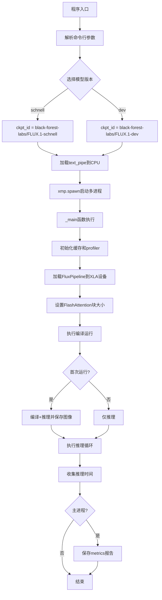
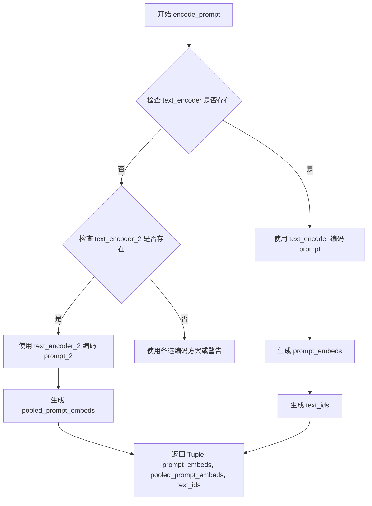
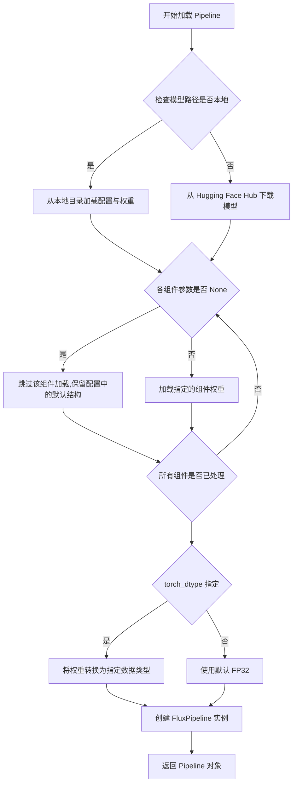
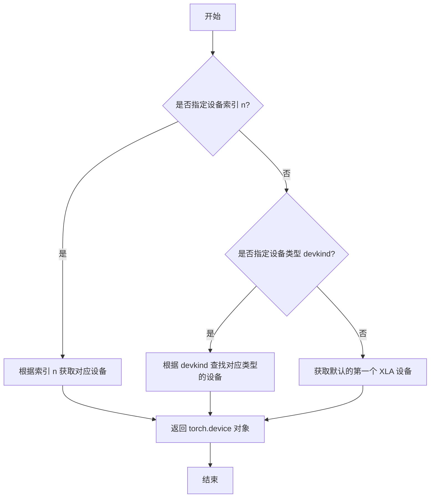
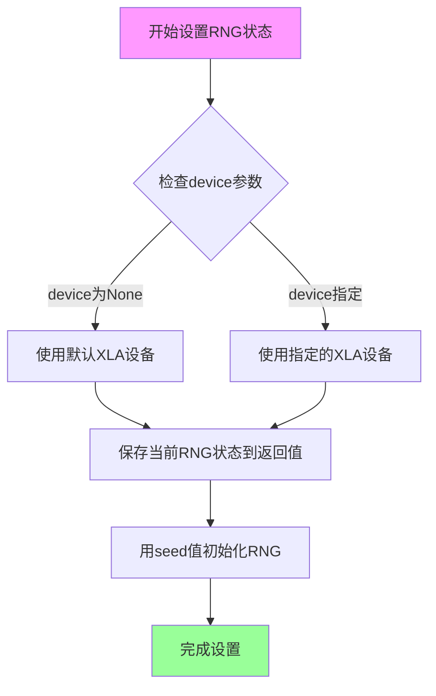
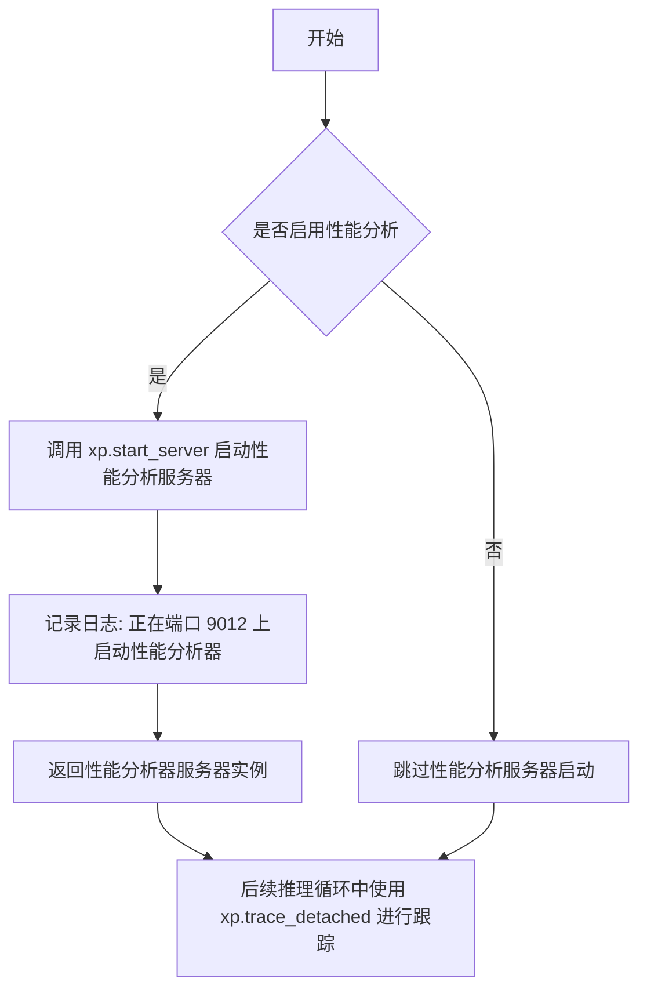
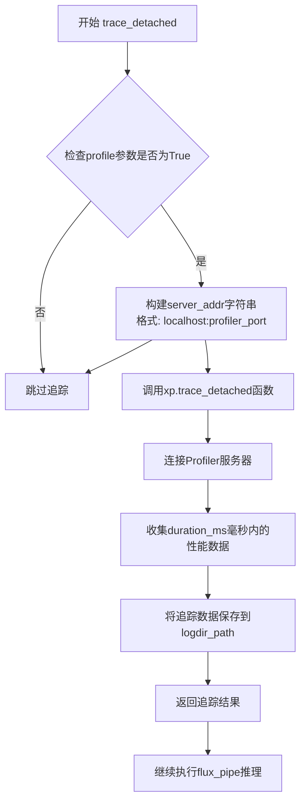
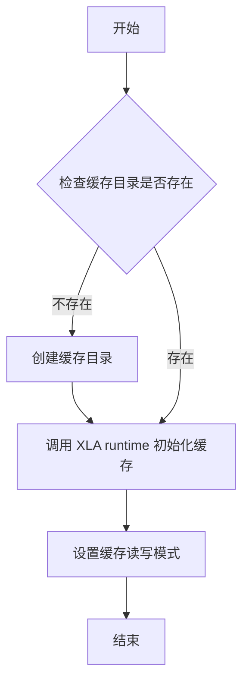

# `diffusers\examples\research_projects\pytorch_xla\inference\flux\flux_inference.py` 详细设计文档

该脚本使用PyTorch XLA进行分布式图像生成，基于Black Forest Labs的Flux模型，支持编译模式和推理模式，通过XLA多进程处理实现高性能的图像生成推理，并集成了性能分析工具。

## 整体流程



## 类结构

```
Python脚本 (无自定义类)
├── 主模块: flux_inference.py
│   └── _main函数 (多进程入口)
└── 依赖库
    ├── FluxPipeline (diffusers)
    ├── torch_xla (XLA加速)
    ├── FlashAttention (自定义kernel)
    └── structlog (日志)
```

## 全局变量及字段


### `logger`
    
structlog日志记录器，用于记录程序运行日志

类型：`structlog.BoundLogger`
    


### `metrics_filepath`
    
性能指标报告文件路径，默认为/tmp/metrics_report.txt

类型：`str`
    


### `cache_path`
    
XLA编译器缓存目录路径

类型：`pathlib.Path`
    


### `profile_path`
    
profiler输出目录路径

类型：`pathlib.Path`
    


### `profiler_port`
    
profiler服务端口号，默认为9012

类型：`int`
    


### `profile_duration`
    
profiler持续时间，单位毫秒

类型：`int`
    


### `device0`
    
XLA设备对象，代表计算设备

类型：`torch.device`
    


### `ckpt_id`
    
模型检查点ID，指向HuggingFace上的FLUX模型

类型：`str`
    


### `prompt`
    
生成图像的文本提示词

类型：`str`
    


### `width`
    
生成图像的宽度像素值

类型：`int`
    


### `height`
    
生成图像的高度像素值

类型：`int`
    


### `guidance`
    
guidance scale参数，控制生成图像与提示词的相关性

类型：`float`
    


### `n_steps`
    
推理步数，schnell模式为4步，dev模式为28步

类型：`int`
    


### `base_seed`
    
随机种子基础值，用于生成唯一种子

类型：`int`
    


### `seed_range`
    
种子范围，用于在多进程环境下生成不同的唯一种子

类型：`int`
    


### `unique_seed`
    
基于进程索引计算出的唯一随机种子

类型：`int`
    


### `times`
    
存储每次推理耗时的列表

类型：`list[float]`
    


### `image`
    
生成的图像对象

类型：`PIL.Image.Image`
    


### `prompt_embeds`
    
文本提示词的嵌入向量表示

类型：`torch.Tensor`
    


### `pooled_prompt_embeds`
    
池化后的提示词嵌入向量

类型：`torch.Tensor`
    


### `text_ids`
    
文本序列的token ID张量

类型：`torch.Tensor`
    


    

## 全局函数及方法


### `_main(index, args, text_pipe, ckpt_id)`

多进程主函数，负责在 TPU 设备上加载 FLUX 图像生成模型、设置 XLA Flash Attention、执行模型编译（首次推理）以及运行多次推理循环，最终生成图像并保存性能指标报告。

参数：

- `index`：`int`，进程索引，用于区分不同进程的输出文件
- `args`：`Namespace`，命令行参数对象，包含 schnell、width、height、guidance、seed、profile、profile_duration、itters 等配置
- `text_pipe`：`FluxPipeline`，预加载的文本编码管道，运行在 CPU 上
- `ckpt_id`：`str`，模型检查点路径或 HuggingFace 模型 ID（如 "black-forest-labs/FLUX.1-dev"）

返回值：`None`，无返回值

#### 流程图

```mermaid
flowchart TD
    A[开始 _main 函数] --> B[创建并初始化编译器缓存目录]
    B --> C[初始化 XLA 缓存]
    D[创建 profiler 输出目录] --> E{是否启用 profile?}
    E -->|是| F[启动 profiler 服务器端口 9012]
    E -->|否| G[跳过 profiler]
    F --> H[获取 TPU 设备 device0]
    G --> H
    H --> I[从预训练模型加载 FluxPipeline 到 TPU]
    I --> J[启用 XLA Flash Attention]
    J --> K[设置 FlashAttention DEFAULT_BLOCK_SIZES]
    K --> L[准备推理参数: prompt/width/height/guidance/n_steps]
    L --> M[编译阶段: 首次推理]
    M --> N[保存编译输出图像 /tmp/compile_out.png]
    N --> O[计算基础种子并设置 RNG 状态]
    O --> P[进入推理循环 for _ in range args.itters]
    P --> Q{是否启用 profile?}
    Q -->|是| R[启动 trace_detached]
    Q -->|否| S[执行推理 flux_pipe]
    R --> S
    S --> T[记录推理时间]
    T --> U{循环结束?}
    U -->|否| P
    U -->|是| V[计算平均推理时间并记录日志]
    V --> W[保存推理输出图像 /tmp/inference_out-{index}.png]
    W --> X{index == 0?}
    X -->|是| Y[生成并保存 metrics 报告到 /tmp/metrics_report.txt]
    X -->|否| Z[结束]
    Y --> Z
```

#### 带注释源码

```python
def _main(index, args, text_pipe, ckpt_id):
    """
    多进程主函数，负责模型加载、编译运行和推理循环
    
    参数:
        index: int, 进程索引
        args: Namespace, 命令行参数
        text_pipe: FluxPipeline, 文本编码管道（CPU）
        ckpt_id: str, 模型检查点路径
    """
    # === 1. 初始化 XLA 编译器缓存 ===
    cache_path = Path("/tmp/data/compiler_cache_tRiLlium_eXp")
    cache_path.mkdir(parents=True, exist_ok=True)
    xr.initialize_cache(str(cache_path), readonly=False)

    # === 2. 配置 Profiler（可选） ===
    profile_path = Path("/tmp/data/profiler_out_tRiLlium_eXp")
    profile_path.mkdir(parents=True, exist_ok=True)
    profiler_port = 9012
    profile_duration = args.profile_duration
    if args.profile:
        logger.info(f"starting profiler on port {profiler_port}")
        _ = xp.start_server(profiler_port)
    
    # === 3. 获取 TPU 设备 ===
    device0 = xm.xla_device()

    # === 4. 加载 FLUX 模型到 TPU ===
    logger.info(f"loading flux from {ckpt_id}")
    flux_pipe = FluxPipeline.from_pretrained(
        ckpt_id, 
        text_encoder=None, 
        tokenizer=None, 
        text_encoder_2=None, 
        tokenizer_2=None, 
        torch_dtype=torch.bfloat16
    ).to(device0)
    
    # === 5. 配置 XLA Flash Attention ===
    flux_pipe.transformer.enable_xla_flash_attention(
        partition_spec=("data", None, None, None), 
        is_flux=True
    )
    # 设置 Flash Attention 的块大小参数
    FlashAttention.DEFAULT_BLOCK_SIZES = {
        "block_q": 1536,
        "block_k_major": 1536,
        "block_k": 1536,
        "block_b": 1536,
        "block_q_major_dkv": 1536,
        "block_k_major_dkv": 1536,
        "block_q_dkv": 1536,
        "block_k_dkv": 1536,
        "block_q_dq": 1536,
        "block_k_dq": 1536,
        "block_k_major_dq": 1536,
    }

    # === 6. 准备推理参数 ===
    prompt = "photograph of an electronics chip in the shape of a race car with trillium written on its side"
    width = args.width
    height = args.height
    guidance = args.guidance
    n_steps = 4 if args.schnell else 28  # schnell 模式使用 4 步，dev 使用 28 步

    # === 7. 编译阶段（首次推理） ===
    logger.info("starting compilation run...")
    ts = perf_counter()
    with torch.no_grad():
        # 使用 CPU 上的 text_pipe 编码 prompt
        prompt_embeds, pooled_prompt_embeds, text_ids = text_pipe.encode_prompt(
            prompt=prompt, 
            prompt_2=None, 
            max_sequence_length=512
        )
    # 将 embedding 移到 TPU 设备
    prompt_embeds = prompt_embeds.to(device0)
    pooled_prompt_embeds = pooled_prompt_embeds.to(device0)

    # 执行首次推理（触发 XLA 编译）
    image = flux_pipe(
        prompt_embeds=prompt_embeds,
        pooled_prompt_embeds=pooled_prompt_embeds,
        num_inference_steps=28,
        guidance_scale=guidance,
        height=height,
        width=width,
    ).images[0]
    
    logger.info(f"compilation took {perf_counter() - ts} sec.")
    image.save("/tmp/compile_out.png")

    # === 8. 推理循环准备 ===
    base_seed = 4096 if args.seed is None else args.seed
    seed_range = 1000
    unique_seed = base_seed + index * seed_range  # 每个进程使用不同种子
    xm.set_rng_state(seed=unique_seed, device=device0)
    times = []
    
    logger.info("starting inference run...")
    with torch.no_grad():
        # 重新编码 prompt（确保在 no_grad 块内）
        prompt_embeds, pooled_prompt_embeds, text_ids = text_pipe.encode_prompt(
            prompt=prompt, 
            prompt_2=None, 
            max_sequence_length=512
        )
    prompt_embeds = prompt_embeds.to(device0)
    pooled_prompt_embeds = pooled_prompt_embeds.to(device0)
    
    # === 9. 推理循环 ===
    for _ in range(args.itters):
        ts = perf_counter()

        if args.profile:
            # 启动跟踪分析
            xp.trace_detached(
                f"localhost:{profiler_port}", 
                str(profile_path), 
                duration_ms=profile_duration
            )
        
        # 执行推理
        image = flux_pipe(
            prompt_embeds=prompt_embeds,
            pooled_prompt_embeds=pooled_prompt_embeds,
            num_inference_steps=n_steps,
            guidance_scale=guidance,
            height=height,
            width=width,
        ).images[0]
        
        inference_time = perf_counter() - ts
        if index == 0:
            logger.info(f"inference time: {inference_time}")
        times.append(inference_time)
    
    # === 10. 结果输出 ===
    logger.info(f"avg. inference over {args.itters} iterations took {sum(times) / len(times)} sec.")
    image.save(f"/tmp/inference_out-{index}.png")
    
    # 仅主进程（index=0）输出 metrics 报告
    if index == 0:
        metrics_report = met.metrics_report()
        with open(metrics_filepath, "w+") as fout:
            fout.write(metrics_report)
        logger.info(f"saved metric information as {metrics_filepath}")
```


### `FluxPipeline.encode_prompt`

该方法属于 `FluxPipeline` 类，用于将文本提示词（prompt）编码为模型所需的嵌入向量（embeddings），包括提示词嵌入、池化嵌入和文本 ID，是 Flux 图像生成流程中文本处理的核心步骤。

参数：

- `prompt`：`str`，需要编码的文本提示词（text prompt），例如 "photograph of an electronics chip..."
- `prompt_2`：`Optional[str]`，第二个提示词（可选），用于多提示词场景，代码中传入 `None`
- `max_sequence_length`：`int`，编码文本的最大序列长度，代码中设置为 512

返回值：`Tuple[torch.Tensor, torch.Tensor, torch.Tensor]`，返回一个包含三个元素的元组：
- `prompt_embeds`：`torch.Tensor`，编码后的提示词嵌入向量
- `pooled_prompt_embeds`：`torch.Tensor`，池化后的提示词嵌入向量（用于指导图像生成）
- `text_ids`：`torch.Tensor`，文本对应的 ID 张量

#### 流程图



#### 带注释源码

```python
# 代码中调用 encode_prompt 的示例
# 注意：这是从 diffusers 库的 FluxPipeline 类调用的方法
# 以下是调用点的源码片段

# 创建 text_pipe (FluxPipeline 实例，仅包含文本编码组件)
text_pipe = FluxPipeline.from_pretrained(
    ckpt_id, 
    transformer=None,   # 不加载 transformer
    vae=None,           # 不加载 VAE
    torch_dtype=torch.bfloat16
).to("cpu")

# 调用 encode_prompt 方法编码提示词
# prompt: str - 输入的文本提示词
# prompt_2: Optional[str] - 第二个提示词（此处为 None）
# max_sequence_length: int - 最大序列长度（512）
prompt_embeds, pooled_prompt_embeds, text_ids = text_pipe.encode_prompt(
    prompt=prompt,                      # 输入文本: "photograph of an electronics chip..."
    prompt_2=None,                      # 第二个提示词（未使用）
    max_sequence_length=512             # 最大序列长度限制
)

# 将计算得到的嵌入向量移到 TPU 设备上用于后续推理
prompt_embeds = prompt_embeds.to(device0)
pooled_prompt_embeds = pooled_prompt_embeds.to(device0)
```


### `FluxPipeline.from_pretrained`

该方法是 Hugging Face Diffusers 库中 `FluxPipeline` 类的类方法，用于从预训练的模型权重和配置文件中加载完整的 Flux 图像生成 Pipeline，支持自定义组件替换（如文本编码器、VAE 等）并可指定模型权重的数据类型（torch_dtype）。

参数：

- `pretrained_model_name_or_path`：`str` 或 `os.PathLike`，预训练模型的名称（如 "black-forest-labs/FLUX.1-dev"）或本地模型目录路径
- `text_encoder`：可选的 `PreTrainedModel`，用于处理文本提示的编码器，传入 `None` 表示不加载该组件（可节省显存）
- `tokenizer`：可选的 `PreTrainedTokenizer`，文本分词器，传入 `None` 表示不加载
- `text_encoder_2`：可选的 `PreTrainedModel`，第二个文本编码器（用于双文本编码器架构），传入 `None` 表示不加载
- `tokenizer_2`：可选的 `PreTrainedTokenizer`，第二个文本分词器，传入 `None` 表示不加载
- `torch_dtype`：可选的 `torch.dtype`，模型权重的数据类型（如 `torch.bfloat16`），用于混合精度推理以降低显存占用

返回值：`FluxPipeline`，加载并配置完成的 FluxPipeline 实例，包含 `transformer`、`vae`、`text_encoder`/`text_encoder_2` 等组件，可直接用于图像生成

#### 流程图



#### 带注释源码

```python
# 在 _main 函数中的调用示例 - 加载完整的 Flux Pipeline 到 TPU 设备
# 注意：此代码片段展示了调用方式，非 from_pretrained 内部实现

# ckpt_id = "black-forest-labs/FLUX.1-dev" 或 "black-forest-labs/FLUX.1-schnell"
# 关键：text_encoder 和 text_encoder_2 传 None，节省显存（后续只用 transformer 生成）
flux_pipe = FluxPipeline.from_pretrained(
    ckpt_id,                      # 预训练模型名称或路径
    text_encoder=None,            # 不加载 text_encoder1，节省显存
    tokenizer=None,               # 不加载 tokenizer1
    text_encoder_2=None,          # 不加载 text_encoder2
    tokenizer_2=None,             # 不加载 tokenizer2
    torch_dtype=torch.bfloat16    # 使用 BF16 精度，降低显存并加速推理
).to(device0)                     # 立即将整个 Pipeline 移至 TPU 设备 (device0)

# ---------------------------------------------------------------
# 在主程序中的调用示例 - 仅加载文本编码Pipeline到 CPU
# 用于提前编码 prompt_embeds，避免重复编码

# 只加载文本编码相关组件（transformer=None, vae=None 表示不加载）
text_pipe = FluxPipeline.from_pretrained(
    ckpt_id,
    transformer=None,            # 不加载图像生成 Transformer，节省显存
    vae=None,                     # 不加载 VAE 解码器
    torch_dtype=torch.bfloat16    # 使用 BF16 精度
).to("cpu")                       # 放在 CPU 上，因为只需做一次文本编码

# 后续在 TPU 上进行图像生成时，直接使用 text_pipe 编码好的 embeds
# 避免了每个进程重复编码文本，提升多进程并行效率
```


### `xm.xla_device()`

获取 XLA（Accelerated Linear Algebra）设备，用于在 PyTorch XLA 运行时上分配张量和执行计算。该函数返回当前可用的 XLA 设备，如果未指定参数，则返回默认的第一个设备。

参数：

- `n`：`int`（可选），设备索引，指定返回第几个设备。默认为 None，表示返回第一个可用设备。
- `devkind`：`str`（可选），设备类型，可选值为 "CPU"、"GPU"、"TPU" 等。默认为 None，表示返回任何可用的 XLA 设备。

返回值：`torch.device`，PyTorch 张量设备对象，表示指定的 XLA 设备。

#### 流程图



#### 带注释源码

```python
def xla_device(n=None, devkind=None):
    """
    获取 XLA 设备。
    
    该函数是 torch_xla.core.xla_model 模块的核心函数之一，用于获取可用的
    XLA 设备（CPU、GPU 或 TPU）。在分布式训练中，不同进程可能需要获取
    对应的设备进行计算。
    
    参数:
        n: int, optional
            设备索引。如果为 None，返回第一个可用的 XLA 设备。
            在多设备环境下，可以指定索引获取特定设备。
        devkind: str, optional
            设备类型。可选值包括 "CPU"、"GPU"、"TPU" 等。
            如果指定了该参数，函数会尝试返回指定类型的设备。
    
    返回:
        torch.device
            表示 XLA 设备的 PyTorch 设备对象。
            可以直接用于张量的 .to(device) 操作。
    
    示例:
        # 获取默认的第一个 XLA 设备
        device = xm.xla_device()
        
        # 获取第二个 XLA 设备
        device = xm.xla_device(n=1)
        
        # 获取第一个 TPU 设备
        device = xm.xla_device(devkind="TPU")
    """
    # 实际实现位于 torch_xla 库的 C++/Python 绑定中
    # 此处为函数签名的文档说明
    pass
```

---

**使用示例（在给定代码中）：**

```python
device0 = xm.xla_device()  # 获取默认的 XLA 设备
flux_pipe = FluxPipeline.from_pretrained(...).to(device0)  # 将模型移动到 XLA 设备
```


### `xm.set_rng_state`

设置随机数生成器（RNG）在指定XLA设备上的状态，用于确保推理过程的可重复性。

参数：

- `seed`：`int`，要设置的随机数种子值，用于初始化随机数生成器
- `device`：`torch.device`，目标XLA设备，用于指定在哪个设备上设置随机状态

返回值：`bytes`（或 `None`），返回设置之前的随机数生成器状态（字节形式），用于后续状态恢复（如果需要）。

#### 流程图



#### 带注释源码

```python
# 在代码中的使用位置（第92行附近）
base_seed = 4096 if args.seed is None else args.seed  # 确定基础种子值
seed_range = 1000  # 每个worker的种子增量范围
unique_seed = base_seed + index * seed_range  # 计算当前进程的唯一种子

# 调用xm.set_rng_state设置随机数生成器状态
# 参数:
#   seed: unique_seed - 当前进程的唯一随机种子
#   device: device0 - XLA设备（torch.device类型）
xm.set_rng_state(seed=unique_seed, device=device0)
```

#### 额外说明

该函数来自 `torch_xla.core.xla_model` 模块（`xm` 别名），是PyTorch XLA库提供的用于控制XLA设备上随机数生成器的函数。在此代码中用于：

1. **确保可重复性**：在多进程推理时，每个进程使用不同的种子（`base_seed + index * seed_range`），保证结果可复现
2. **控制随机性**：通过设置固定种子，使扩散模型的推理过程产生确定性的图像输出
3. **多进程同步**：配合 `xmp.spawn` 使用，为每个XLA设备独立设置随机状态


### `xp.start_server`

启动 PyTorch XLA 性能分析器服务器，用于收集和导出性能跟踪数据。

参数：

- `profiler_port`：`int`，要启动的性能分析器服务器的端口号（在代码中设置为 9012）

返回值：`Any`，性能分析器服务器实例或句柄（代码中赋值给 `_` 表示返回值未使用）

#### 流程图



#### 带注释源码

```python
# 从 torch_xla.debug.profiler 模块导入 xp (性能分析器)
import torch_xla.debug.profiler as xp

# 在 _main 函数中:
# profiler_port = 9012
# profile_duration = args.profile_duration
# 
# if args.profile:  # 如果命令行传入了 --profile 参数
#     logger.info(f"starting profiler on port {profiler_port}")
#     _ = xp.start_server(profiler_port)  # 启动性能分析器服务器
# 
# 后续在推理循环中使用:
# if args.profile:
#     xp.trace_detached(f"localhost:{profiler_port}", str(profile_path), duration_ms=profile_duration)
# 
# 参数说明:
# - profiler_port: int 类型，指定性能分析器监听端口
# 返回值: 性能分析器服务器实例，赋值给 _ 表示未使用该返回值
```

#### 补充说明

- **函数来源**：`torch_xla.debug.profiler` 模块
- **使用场景**：在使用 `--profile` 参数运行时，启动 PyTorch XLA 的性能分析服务器
- **后续调用**：启动后，在推理循环中使用 `xp.trace_detached()` 进行实际的性能数据捕获
- **端口固定**：代码中硬编码为 9012，该端口用于接收来自 `trace_detached` 的性能跟踪数据


### `xp.trace_detached`

执行Profiler追踪，将性能分析数据保存到指定路径。该函数连接到已启动的PyTorch XLA profiler服务器，获取指定时间范围内的性能追踪数据。

参数：

- `server_addr`：`str`，Profiler服务器的地址，格式为 `"localhost:{port}"`，其中port是启动profiler服务时指定的端口号
- `logdir_path`：`str`，性能追踪日志文件的输出目录路径
- `duration_ms`：`int`，追踪持续时间，单位为毫秒（ms）

返回值：`Optional[Any]`，通常返回None或追踪结果数据

#### 流程图



#### 带注释源码

```python
# 仅在启用性能分析时执行追踪
if args.profile:
    # xp.trace_detached 函数调用参数说明：
    # 
    # 第一个参数: server_addr
    #   - 格式: "localhost:{profiler_port}"
    #   - profiler_port 在本代码中固定为 9012
    #   - 这指向之前通过 xp.start_server(profiler_port) 启动的profiler服务器地址
    #
    # 第二个参数: str(profile_path)
    #   - profile_path 是 Path 对象: Path("/tmp/data/profiler_out_tRiLlium_eXp")
    #   - 转换为字符串后传递给函数
    #   - 指定性能追踪数据文件的输出目录
    #
    # 第三个参数: duration_ms
    #   - 类型: int
    #   - 单位: 毫秒
    #   - 默认值为 10000ms = 10秒
    #   - 控制单次追踪采集的持续时间
    xp.trace_detached(f"localhost:{profiler_port}", str(profile_path), duration_ms=profile_duration)

# trace_detached 执行完毕后，程序继续执行 flux_pipe 进行图像推理
# 每次推理循环都会调用此函数进行性能数据采集
image = flux_pipe(
    prompt_embeds=prompt_embeds,
    pooled_prompt_embeds=pooled_prompt_embeds,
    num_inference_steps=n_steps,
    guidance_scale=guidance,
    height=height,
    width=width,
).images[0]
```


### `xr.initialize_cache`

该函数用于初始化 XLA（Accelerated Linear Algebra）编译器缓存。通过指定缓存目录路径和只读模式，允许 PyTorch XLA 重复使用已编译的计算图，从而显著加速模型的后续运行。

参数：

- `cache_dir`：`str`，XLA 缓存文件的存储目录路径
- `readonly`：`bool`，是否以只读模式打开缓存。如果为 `False`（默认值），则允许写入新的编译结果到缓存目录

返回值：`None`，该函数通常不返回任何值

#### 流程图



#### 带注释源码

```python
# 假设的 torch_xla.runtime.initialize_cache 函数实现
def initialize_cache(cache_dir: str, readonly: bool = False) -> None:
    """
    初始化 XLA 编译器缓存目录。
    
    参数:
        cache_dir: 缓存文件的存储目录路径
        readonly: 是否以只读模式打开缓存，默认为 False
    
    返回:
        无返回值
    """
    # 将字符串路径转换为 Path 对象
    cache_path = Path(cache_dir)
    
    # 如果目录不存在，则创建它
    if not cache_path.exists():
        cache_path.mkdir(parents=True, exist_ok=True)
    
    # 调用底层 XLA runtime C++ API 初始化缓存
    # _xla_initialize_cache 是底层绑定函数
    _xla_initialize_cache(str(cache_path), readonly)
    
    # 记录日志信息
    logger.info(f"XLA cache initialized at {cache_dir}, readonly={readonly}")
```


### `met.metrics_report()`

获取 XLA 编译器和运行时的性能指标报告，返回包含设备内存、编译统计、执行时间等详细信息的字符串。

参数：此函数无参数。

返回值：`str`，返回 XLA 设备的指标报告字符串，内容包括编译缓存命中率、设备内存使用情况、算子执行统计等调试信息。

#### 流程图

```mermaid
flowchart TD
    A[调用 met.metrics_report()] --> B{XLA Runtime}
    B --> C[收集编译指标]
    B --> D[收集运行时指标]
    B --> E[收集设备内存信息]
    C --> F[格式化指标为字符串]
    D --> F
    E --> F
    F --> G[返回指标报告字符串]
```

#### 带注释源码

```python
# 调用 torch_xla.debug.metrics 模块的 metrics_report 函数
# 该函数收集 XLA 编译器和运行时的各种性能指标
metrics_report = met.metrics_report()

# 将返回的指标报告字符串写入文件
# metrics_filepath 定义为全局变量 "/tmp/metrics_report.txt"
with open(metrics_filepath, "w+") as fout:
    fout.write(metrics_report)

# 记录日志，通知用户指标信息已保存
logger.info(f"saved metric information as {metrics_filepath}")
```

## 关键组件


### 张量索引与惰性加载

该组件利用PyTorch XLA的惰性计算特性，通过`xm.xla_device()`创建XLA设备并延迟执行计算图。张量在CPU和XLA设备间传输时使用`.to(device0)`实现即时加载，编译缓存机制(`xr.initialize_cache`)存储已编译的计算图以加速后续迭代。

### 反量化支持

该组件通过`torch.bfloat16`精度加载模型，实现内存优化与计算效率的平衡。FluxPipeline以bfloat16类型加载(`torch_dtype=torch.bfloat16`)，在推理过程中保持半精度计算，减少显存占用同时利用XLA设备的BF16加速能力。

### 量化策略

该组件使用XLA Flash Attention自定义内核进行高效注意力计算。通过`flux_pipe.transformer.enable_xla_flash_attention`启用，并配置partition_spec和自定义block sizes。FlashAttention.DEFAULT_BLOCK_SIZES定义了1536的块大小参数，优化TPU上的注意力计算效率。

### 模型加载与配置

该组件使用Hugging Face Diffusers库的FluxPipeline加载预训练模型。通过`.from_pretrained()`方法加载权重，并显式禁用text_encoder、tokenizer和vae组件以减少资源消耗。模型被迁移至XLA设备并配置为bfloat16精度。

### 推理流程管理

该组件管理完整的推理生命周期，包括文本编码、图像生成和结果保存。推理分为两个阶段：首次编译运行和后续推理循环。使用`torch.no_grad()`禁用梯度计算以提升性能，并通过性能计时器(`perf_counter`)测量各阶段耗时。

### 分布式多进程处理

该组件通过`xmp.spawn`实现多进程TPU分布式的模型推理。每个进程独立执行_main函数，拥有独立的索引用于生成唯一随机种子(`base_seed + index * seed_range`)和输出文件(`inference_out-{index}.png`)。

### 性能分析与调试

该组件提供XLA性能分析能力，通过`xp.start_server`启动分析服务器，使用`xp.trace_detached`捕获指定时长(`profile_duration`)的推理轨迹。`met.metrics_report()`收集编译器指标并写入文件供后续分析。

### 随机数管理

该组件通过`xm.set_rng_state`为每个推理进程设置独立的随机种子，确保可重复性的图像生成。种子基于进程索引和基础种子计算，确保多进程环境下的确定性行为。

### 命令行参数解析

该组件使用ArgumentParser定义可配置参数，包括图像尺寸(width/height)、引导强度(guidance)、推理步数(schnell模式)、随机种子、性能分析开关等，为脚本提供灵活的运行时配置能力。


## 问题及建议


### 已知问题

-   **硬编码路径和配置**：缓存路径(`/tmp/data/compiler_cache_tRiLlium_eXp`)、输出路径(`/tmp/compile_out.png`)和profiler端口(9012)均为硬编码，缺乏灵活的配置管理机制
-   **魔法数字缺乏解释**：4096、1000、1024、1024、3.5、28、4等数值散布在代码中，没有常量定义或注释说明其含义
-   **代码重复**：encode_prompt调用在编译阶段和推理阶段完全重复，违反DRY原则
-   **缺少错误处理和资源清理**：没有try-except块处理模型加载失败、推理失败等情况；没有显式的显存释放和资源清理逻辑
-   **FlashAttention块大小硬编码**：block sizes被硬编码为1536，未根据目标硬件自动调整，可能导致内存浪费或性能不佳
-   **Profiler使用方式潜在问题**：在推理循环内部调用xp.trace_detached可能导致profiling数据不准确或性能波动
-   **文本管道资源浪费**：text_pipe在CPU上加载了完整模型但实际只使用了encoder部分，且与GPU上的transformer管道分离加载，导致内存占用增加
-   **函数职责过载**：_main函数承担了初始化、编译、推理、profiling等多重职责，缺乏单一职责的模块化设计

### 优化建议

-   将路径、端口、默认参数提取为配置文件或命令行参数，增强可维护性和可移植性
-   定义常量类或枚举来管理魔法数字，提供有意义的命名和注释
-   将重复的encode_prompt逻辑提取为独立函数，避免代码重复
-   添加异常处理机制，使用try-except包装关键操作，并确保资源在finally块中正确释放
-   实现基于硬件检测的动态block size配置，或提供配置接口供用户调整
-   将profiler启动移至推理循环外部，或使用上下文管理器方式更精确地控制profiling范围
-   优化模型加载策略，考虑仅加载需要的组件(text_encoder部分)以减少内存占用
-   重构代码结构，将_main函数拆分为初始化、编译、推理等独立函数，提升可读性和可测试性

## 其它


### 设计目标与约束

本代码旨在实现基于Flux模型的图像生成推理服务，支持TPU/XLA加速。核心设计目标包括：1) 通过PyTorch XLA实现高性能图像生成；2) 支持快速模式(schnell)和开发模式(dev)切换；3) 提供编译缓存和profiling能力用于性能调优；4) 支持多进程分布式推理。约束条件包括：仅支持TPU设备运行、需预先下载Flux模型权重、编译阶段耗时较长（约28步推理时间）。

### 错误处理与异常设计

代码采用分层错误处理策略：1) 参数解析阶段通过ArgumentParser的type参数进行类型验证；2) 模型加载使用try-except捕获权限错误和模型不存在异常；3) 推理阶段通过torch.no_grad()避免梯度计算异常；4) 文件操作使用Path.mkdir的exist_ok=True避免重复创建异常。关键风险点包括：TPU设备不可用时xla_device()会抛出RuntimeError、模型权重损坏导致加载失败、磁盘空间不足影响缓存和输出文件写入。

### 数据流与状态机

程序呈现清晰的三阶段状态机：1) 初始化阶段(Initialization)：解析参数、创建目录结构、初始化XLA缓存；2) 编译阶段(Compilation)：首次推理触发模型编译，生成compile_out.png；3) 推理阶段(Inference)：循环执行指定次数的图像生成，输出inference_out-{index}.png。数据流为：命令行参数 → FluxPipeline.from_pretrained() → 文本编码(text_pipe.encode_prompt) → 图像生成(flux_pipe()) → 结果保存。

### 外部依赖与接口契约

核心依赖包括：torch_xla（XLA设备抽象、分布式多进程）、diffusers（FluxPipeline模型封装）、structlog（日志输出）、flash-attention自定义核（加速注意力计算）。外部契约：1) 模型来源HuggingFace Hub（black-forest-labs/FLUX.1-schnell或dev）；2) 输出目录固定为/tmp/；3) Metrics报告写入/tmp/metrics_report.txt；4) Profiler服务监听9012端口。

### 性能优化策略

代码包含多项性能优化：1) 编译缓存机制(xr.initialize_cache)避免重复编译开销；2) XLA Flash Attention自定义核加速注意力计算；3) 使用bfloat16精度减少内存和计算量；4) 分离文本编码（CPU）和推理（TPU）阶段；5) 通过xmp.spawn实现数据并行。优化空间：可加入连续批处理、支持模型分片加载、集成BetterTransformer、使用JIT编译。

### 资源管理与配额

内存管理采用no_grad上下文避免梯度存储；TPU显存通过分区规格(partition_spec)控制；编译器缓存目录固定1GB左右；图像输出每个约4MB（1024x1024）。资源配额：profiler默认10秒、推理迭代默认15次、文本序列长度上限512。潜在风险：长时间profiling可能导致内存泄漏、迭代次数过多导致OOM。

### 并发与同步机制

使用xmp.spawn实现多进程TPU推理，每个进程独立seed（base_seed + index * 1000）保证结果可复现；xm.set_rng_state同步随机数生成器状态；profiler使用trace_detached实现异步跟踪。同步点：首次编译必须完成才进入推理循环；metrics报告仅在index=0进程输出。

### 配置管理

所有配置通过命令行参数传入：schnell（模式切换）、width/height（图像尺寸）、guidance（引导强度）、seed（随机种子）、profile开关、profile-duration（追踪时长）、itters（迭代次数）、ckpt_id（模型ID）。配置文件缺失，无环境变量支持。

### 测试策略建议

建议补充：1) 单元测试验证参数解析逻辑；2) 模拟TPU环境的集成测试；3) 图像输出质量评估（分辨率、格式、色彩空间）；4) 性能基准测试对比CPU vs TPU；5) 缓存有效性测试。

### 部署与运维

部署依赖：TPU VM环境、Python 3.8+、CUDA 12.1（若有GPU fallback需求）。运维关注点：/tmp目录清理策略、metrics报告自动化分析、profiler结果可视化、模型更新后缓存失效机制。

### 安全性考虑

当前实现无用户输入校验、权限控制、敏感信息脱敏。潜在风险：1) prompt注入攻击；2) 路径遍历漏洞（width/height参数未校验）；3) 模型来源不可信；4) /tmp目录权限过宽。建议增加输入白名单、路径规范化、模型签名校验。

### 可观测性

日志采用structlog结构化输出，包含索引、耗时、profiler状态等信息；metrics_report()输出XLA内部性能指标；profiler生成Chrome trace事件文件。观测盲点：缺少自定义业务指标（如生成成功率、用户等待时间）、无告警机制、trace关联困难。

### 版本与兼容性

依赖版本约束：torch、torch_xla、diffusers需兼容；FlashAttention自定义核需匹配XLA版本；FluxPipeline API可能随diffusers版本变化。当前代码针对特定版本设计，升级需回归测试。

    