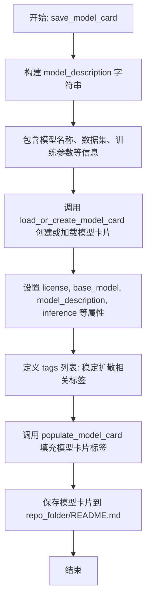
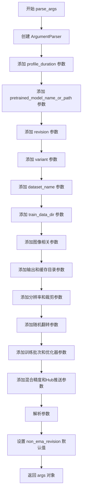
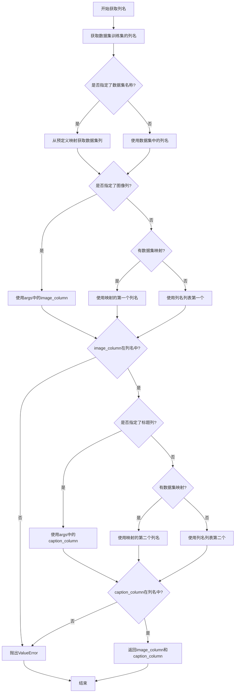
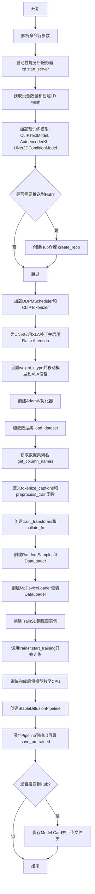
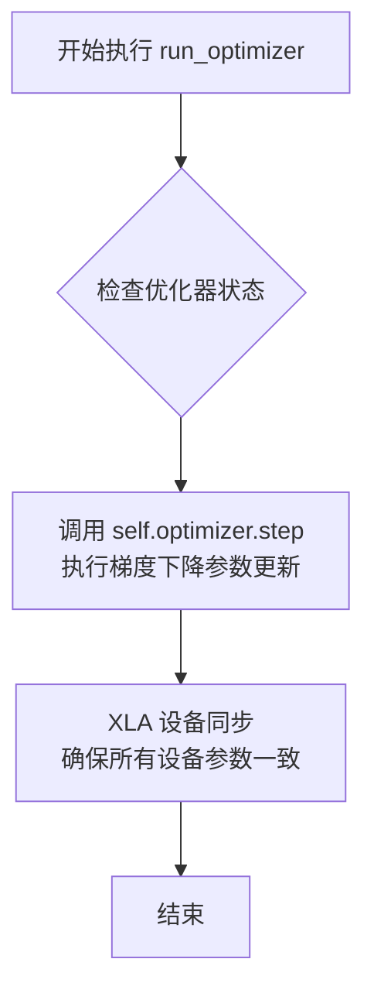
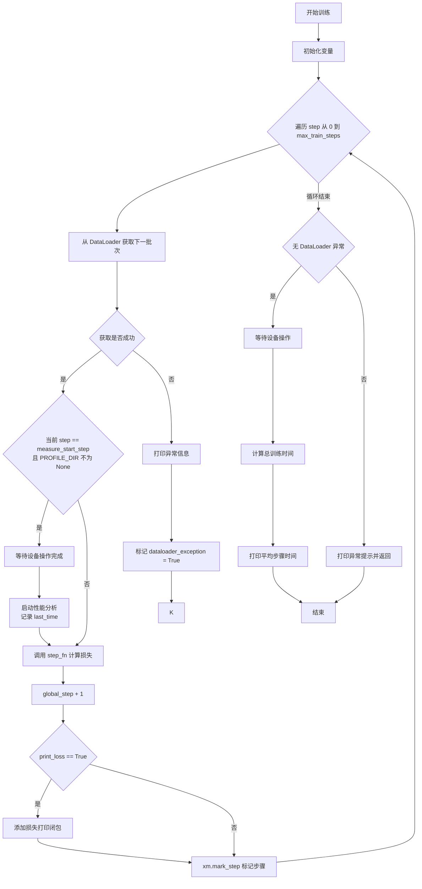
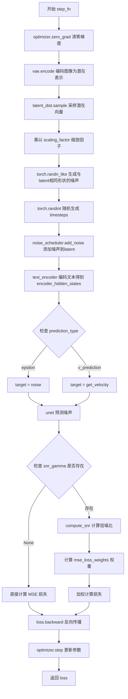

# `diffusers\examples\research_projects\pytorch_xla\training\text_to_image\train_text_to_image_xla.py` 详细设计文档

这是一个基于 PyTorch XLA 的分布式训练脚本，用于在 TPU 或 GPU 上微调 Stable Diffusion 模型（Text-to-Image），实现了完整的数据加载、模型前向反向传播、混合精度训练及模型导出流程。

## 整体流程

```mermaid
graph TD
    Start[入口: parse_args] --> Main[main(args)]
    Main --> InitXLA[初始化 XLA Runtime & Profiler Server]
    InitXLA --> LoadModels[加载预训练模型: CLIPTextModel, AutoencoderKL, UNet2DConditionModel]
    LoadModels --> SetupData[加载数据集 & 数据预处理 (tokenize, transform)]
    SetupData --> InitTrainer[实例化 TrainSD 类]
    InitTrainer --> Training[trainer.start_training()]
    Training --> Loop{循环 for step in max_train_steps}
    Loop ---> Step[调用 step_fn: 编码图像 -> 加噪 -> UNet前向 -> Loss计算 -> 反向传播]
    Loop ---> CheckProfile{是否达到测量步数?}
    CheckProfile -- 是 --> Profile[触发 xp.trace_detached 性能分析]
    Training --> Save[保存模型 Pipeline 到本地]
    Save --> Push[可选: 上传至 HuggingFace Hub]
    Push --> End[结束]
```

## 类结构

```
Global Scope (全局作用域)
├── Variables (全局变量): PROFILE_DIR, CACHE_DIR, DATASET_NAME_MAPPING, PORT
├── Functions (全局函数): save_model_card, parse_args, setup_optimizer, load_dataset, get_column_names, main
└── TrainSD (核心训练类)
```

## 全局变量及字段


### `PROFILE_DIR`
    
性能分析输出目录，从环境变量获取，用于存储trace数据

类型：`str | None`
    


### `CACHE_DIR`
    
模型和数据集缓存目录，从环境变量获取，用于存储下载的模型和数据

类型：`str | None`
    


### `DATASET_NAME_MAPPING`
    
数据集名称到列名的映射字典，定义图像和文本列的名称

类型：`dict[str, tuple[str, str]]`
    


### `PORT`
    
性能分析服务器端口号，用于XPTrace服务

类型：`int`
    


### `TrainSD.vae`
    
变分自编码器，用于将图像编码为潜在空间表示

类型：`AutoencoderKL`
    


### `TrainSD.weight_dtype`
    
权重数据类型，根据混合精度配置为float32或bfloat16

类型：`torch.dtype`
    


### `TrainSD.device`
    
XLA设备对象，表示计算将执行的硬件设备

类型：`torch.device`
    


### `TrainSD.noise_scheduler`
    
DDPM噪声调度器，负责在训练过程中添加和调度噪声

类型：`DDPMScheduler`
    


### `TrainSD.unet`
    
条件UNet模型，根据噪声和文本嵌入预测去噪结果

类型：`UNet2DConditionModel`
    


### `TrainSD.optimizer`
    
AdamW优化器，用于更新模型参数

类型：`torch.optim.AdamW`
    


### `TrainSD.text_encoder`
    
CLIP文本编码器，将文本描述转换为嵌入向量

类型：`CLIPTextModel`
    


### `TrainSD.args`
    
包含所有训练超参数和配置的命令行参数对象

类型：`argparse.Namespace`
    


### `TrainSD.mesh`
    
SPMD分布式训练的网格对象，定义设备拓扑结构

类型：`xs.Mesh`
    


### `TrainSD.dataloader`
    
训练数据迭代器，按批次提供图像和文本数据

类型：`Iterator`
    


### `TrainSD.global_step`
    
当前训练的全局步数，用于追踪训练进度

类型：`int`
    
    

## 全局函数及方法


### `save_model_card`

该函数用于生成并保存模型卡片（Model Card），该卡片包含模型的描述、使用方法、训练信息等元数据，并将其保存到指定的仓库文件夹中。它主要服务于模型上传到 Hugging Face Hub 时的文档化需求，确保模型可被正确理解和使用。

参数：

- `args`：对象，包含训练参数（如 `pretrained_model_name_or_path`、`dataset_name`、`max_train_steps`、`learning_rate`、`train_batch_size`、`resolution`、`mixed_precision` 等）
- `repo_id`：字符串，Hugging Face Hub 上的仓库 ID
- `repo_folder`：字符串（可选），本地仓库文件夹路径，默认为 None

返回值：无（`None`），该函数通过副作用将模型卡片保存到文件

#### 流程图



#### 带注释源码

```python
def save_model_card(
    args,                       # 训练参数对象，包含模型路径、数据集名、训练超参数等
    repo_id: str,               # HuggingFace Hub 仓库ID，用于标识模型仓库
    repo_folder: str = None,   # 可选参数，本地仓库文件夹路径，用于保存 README.md
):
    """
    生成并保存模型卡片到指定目录
    
    该函数执行以下主要步骤：
    1. 根据训练参数构建模型描述信息
    2. 创建或加载模型卡片对象
    3. 填充标签信息
    4. 将模型卡片保存为 README.md 文件
    """
    
    # 第一步：构建模型描述字符串
    # 使用 f-string 格式化，将训练参数动态插入到 Markdown 格式的描述中
    model_description = f"""
# Text-to-image finetuning - {repo_id}

This pipeline was finetuned from **{args.pretrained_model_name_or_path}** on the **{args.dataset_name}** dataset. \n

## Pipeline usage

You can use the pipeline like so:

```python
import torch
import os
import sys
import  numpy as np

import torch_xla.core.xla_model as xm
from time import time
from typing import Tuple
from diffusers import StableDiffusionPipeline

def main(args):
    device = xm.xla_device()
    model_path = <output_dir>
    pipe = StableDiffusionPipeline.from_pretrained(
        model_path,
        torch_dtype=torch.bfloat16
    )
    pipe.to(device)
    prompt = ["A naruto with green eyes and red legs."]
    image = pipe(prompt, num_inference_steps=30, guidance_scale=7.5).images[0]
    image.save("naruto.png")

if __name__ == '__main__':
    main()
```

## Training info

These are the key hyperparameters used during training:

* Steps: {args.max_train_steps}          # 训练总步数
* Learning rate: {args.learning_rate}     # 学习率
* Batch size: {args.train_batch_size}     # 训练批次大小
* Image resolution: {args.resolution}     # 图像分辨率
* Mixed-precision: {args.mixed_precision} # 混合精度训练设置

"""

    # 第二步：创建或加载模型卡片
    # 调用 diffusers 工具函数创建符合 HuggingFace 标准的模型卡片
    # 参数说明：
    # - repo_id_or_path: 仓库ID
    # - from_training: 标记为训练产物
    # - license: 使用 CreativeML Open Rail-M 许可证
    # - base_model: 基础预训练模型路径
    # - model_description: 上面构建的模型描述
    # - inference: 标记支持推理
    model_card = load_or_create_model_card(
        repo_id_or_path=repo_id,
        from_training=True,
        license="creativeml-openrail-m",
        base_model=args.pretrained_model_name_or_path,
        model_description=model_description,
        inference=True,
    )

    # 第三步：定义标签
    # 为模型添加标准化的标签，便于在 Hub 上搜索和分类
    tags = [
        "stable-diffusion",           # 稳定扩散模型
        "stable-diffusion-diffusers", # diffusers 框架
        "text-to-image",             # 文本到图像任务
        "diffusers",                 # diffusers 库
        "diffusers-training"         # diffusers 训练产物
    ]
    
    # 第四步：填充模型卡片标签
    # 使用 populate_model_card 工具函数将标签添加到模型卡片中
    model_card = populate_model_card(model_card, tags=tags)

    # 第五步：保存模型卡片
    # 将模型卡片写入到仓库目录下的 README.md 文件
    # 这是 HuggingFace Hub 识别模型文档的标准方式
    model_card.save(os.path.join(repo_folder, "README.md"))
```


### `parse_args`

该函数是命令行参数解析函数，使用 argparse 库定义并收集训练脚本所需的所有命令行参数，包括模型路径、数据集配置、训练超参数、输出设置等，并最终返回解析后的命名空间对象。

参数：- 无

返回值：`argparse.Namespace`，包含所有解析后的命令行参数及其值

#### 流程图



#### 带注释源码

```python
def parse_args():
    """
    解析命令行参数并返回包含所有训练配置的命名空间对象。
    该函数定义了Stable Diffusion训练脚本所需的所有配置选项。
    """
    # 创建参数解析器，description描述脚本用途
    parser = argparse.ArgumentParser(description="Simple example of a training script.")
    
    # === 性能分析相关参数 ===
    parser.add_argument("--profile_duration", type=int, default=10000, 
                        help="Profile duration in ms")
    
    # === 模型加载相关参数 ===
    parser.add_argument(
        "--pretrained_model_name_or_path",
        type=str,
        default=None,
        required=True,
        help="Path to pretrained model or model identifier from huggingface.co/models.",
    )
    parser.add_argument(
        "--revision",
        type=str,
        default=None,
        required=False,
        help="Revision of pretrained model identifier from huggingface.co/models.",
    )
    parser.add_argument(
        "--variant",
        type=str,
        default=None,
        help="Variant of the model files of the pretrained model identifier from huggingface.co/models, 'e.g.' fp16",
    )
    
    # === 数据集相关参数 ===
    parser.add_argument(
        "--dataset_name",
        type=str,
        default=None,
        help="The name of the Dataset (from the HuggingFace hub) to train on",
    )
    parser.add_argument(
        "--train_data_dir",
        type=str,
        default=None,
        help="A folder containing the training data.",
    )
    parser.add_argument(
        "--image_column", type=str, default="image", 
        help="The column of the dataset containing an image."
    )
    parser.add_argument(
        "--caption_column",
        type=str,
        default="text",
        help="The column of the dataset containing a caption or a list of captions.",
    )
    
    # === 输出和缓存目录参数 ===
    parser.add_argument(
        "--output_dir",
        type=str,
        default="sd-model-finetuned",
        help="The output directory where the model predictions and checkpoints will be written.",
    )
    parser.add_argument(
        "--cache_dir",
        type=str,
        default=None,
        help="The directory where the downloaded models and datasets will be stored.",
    )
    
    # === 图像预处理参数 ===
    parser.add_argument(
        "--resolution",
        type=int,
        default=512,
        help="The resolution for input images",
    )
    parser.add_argument(
        "--center_crop",
        default=False,
        action="store_true",
        help="Whether to center crop the input images to the resolution.",
    )
    parser.add_argument(
        "--random_flip",
        action="store_true",
        help="whether to randomly flip images horizontally",
    )
    
    # === 训练超参数 ===
    parser.add_argument(
        "--train_batch_size", type=int, default=16, 
        help="Batch size (per device) for the training dataloader."
    )
    parser.add_argument(
        "--max_train_steps",
        type=int,
        default=None,
        help="Total number of training steps to perform.",
    )
    parser.add_argument(
        "--learning_rate",
        type=float,
        default=1e-4,
        help="Initial learning rate (after the potential warmup period) to use.",
    )
    parser.add_argument(
        "--snr_gamma",
        type=float,
        default=None,
        help="SNR weighting gamma to be used if rebalancing the loss.",
    )
    
    # === 模型变体和优化器参数 ===
    parser.add_argument(
        "--non_ema_revision",
        type=str,
        default=None,
        required=False,
        help="Revision of pretrained non-ema model identifier.",
    )
    parser.add_argument(
        "--dataloader_num_workers",
        type=int,
        default=0,
        help="Number of subprocesses to use for data loading.",
    )
    parser.add_argument(
        "--loader_prefetch_size",
        type=int,
        default=1,
        help="Number of subprocesses to use for data loading to cpu.",
    )
    parser.add_argument(
        "--loader_prefetch_factor",
        type=int,
        default=2,
        help="Number of batches loaded in advance by each worker.",
    )
    parser.add_argument(
        "--device_prefetch_size",
        type=int,
        default=1,
        help="Number of subprocesses to use for data loading to tpu from cpu.",
    )
    parser.add_argument("--measure_start_step", type=int, default=10, 
                        help="Step to start profiling.")
    parser.add_argument("--adam_beta1", type=float, default=0.9, 
                        help="The beta1 parameter for the Adam optimizer.")
    parser.add_argument("--adam_beta2", type=float, default=0.999, 
                        help="The beta2 parameter for the Adam optimizer.")
    parser.add_argument("--adam_weight_decay", type=float, default=1e-2, 
                        help="Weight decay to use.")
    parser.add_argument("--adam_epsilon", type=float, default=1e-08, 
                        help="Epsilon value for the Adam optimizer")
    
    # === 预测类型和混合精度参数 ===
    parser.add_argument(
        "--prediction_type",
        type=str,
        default=None,
        help="The prediction_type that shall be used for training.",
    )
    parser.add_argument(
        "--mixed_precision",
        type=str,
        default=None,
        choices=["no", "bf16"],
        help="Whether to use mixed precision.",
    )
    
    # === Hub推送相关参数 ===
    parser.add_argument("--push_to_hub", action="store_true", 
                        help="Whether or not to push the model to the Hub.")
    parser.add_argument("--hub_token", type=str, default=None, 
                        help="The token to use to push to the Model Hub.")
    parser.add_argument(
        "--hub_model_id",
        type=str,
        default=None,
        help="The name of the repository to keep in sync with the local `output_dir`.",
    )
    
    # === 日志打印参数 ===
    parser.add_argument(
        "--print_loss",
        default=False,
        action="store_true",
        help="Print loss at every step.",
    )

    # 解析所有命令行参数
    args = parser.parse_args()

    # === 后处理逻辑 ===
    # 如果未指定non_ema_revision，默认使用与主模型相同的revision
    if args.non_ema_revision is None:
        args.non_ema_revision = args.revision

    return args
```


### `setup_optimizer`

该函数用于创建并配置 PyTorch 的 AdamW 优化器，基于传入的 UNet 模型参数和命令行参数中的超参数设置，返回一个配置好的优化器实例用于后续的训练过程。

参数：

- `unet`：`UNet2DConditionModel`，需要优化的 UNet2DConditionModel 模型实例，函数将提取其所有可训练参数
- `args`：`argparse.Namespace`，包含优化器超参数配置的命令行参数对象，需包含 learning_rate、adam_beta1、adam_beta2、adam_weight_decay、adam_epsilon 等属性

返回值：`torch.optim.AdamW`，配置好的 AdamW 优化器实例，用于更新模型参数

#### 流程图

```mermaid
flowchart TD
    A[开始 setup_optimizer] --> B[确定优化器类为 torch.optim.AdamW]
    B --> C[调用 optimizer_cls 构造函数]
    C --> D[传入 unet.parameters 作为模型参数]
    D --> E[传入 args.learning_rate 作为学习率]
    E --> F[传入 (args.adam_beta1, args.adam_beta2) 作为动量参数]
    F --> G[传入 args.adam_weight_decay 作为权重衰减]
    G --> H[传入 args.adam_epsilon 作为数值稳定性参数]
    H --> I[传入 foreach=True 启用 foreach 优化]
    I --> J[返回优化器实例]
    J --> K[结束]
```

#### 带注释源码

```python
def setup_optimizer(unet, args):
    """
    创建并配置 AdamW 优化器
    
    参数:
        unet: UNet2DConditionModel - 需要优化的UNet模型
        args: argparse.Namespace - 包含优化器超参数的命令行参数
    
    返回:
        torch.optim.AdamW - 配置好的优化器实例
    """
    # 使用 AdamW 优化器类，支持权重衰减
    optimizer_cls = torch.optim.AdamW
    
    # 创建优化器实例，配置各项超参数
    return optimizer_cls(
        unet.parameters(),           # 提取UNet模型的所有可训练参数
        lr=args.learning_rate,        # 学习率，从args中获取（默认1e-4）
        betas=(args.adam_beta1, args.adam_beta2),  # 动量参数（默认0.9, 0.999）
        weight_decay=args.adam_weight_decay,       # 权重衰减系数（默认1e-2）
        eps=args.adam_epsilon,        # 数值稳定性epsilon（默认1e-8）
        foreach=True,                 # 启用foreach优化，提升性能
    )
```


### `load_dataset`

该函数负责根据命令行参数加载训练数据集，支持从HuggingFace Hub远程加载或从本地文件系统加载本地图像文件夹格式的数据集。

参数：

- `args`：`argparse.Namespace`，命令行参数对象，包含 `dataset_name`（数据集名称）、`cache_dir`（缓存目录）和 `train_data_dir`（训练数据目录）等属性

返回值：`datasets.Dataset` 或 `datasets.DatasetDict`，返回加载后的数据集对象

#### 流程图

```mermaid
flowchart TD
    A[开始 load_dataset] --> B{args.dataset_name 是否为 None?}
    B -->|是| C[构建 data_files 字典]
    B -->|否| D[调用 datasets.load_dataset 加载远程数据集]
    C --> E{args.train_data_dir 是否为 None?}
    E -->|否| F[设置 data_files['train'] = os.path.join(args.train_data_dir, '**')]
    E -->|是| G[保持 data_files 为空字典]
    F --> H[调用 datasets.load_dataset 加载 imagefolder 数据集]
    G --> H
    D --> I[返回 dataset]
    H --> I
```

#### 带注释源码

```python
def load_dataset(args):
    """
    根据命令行参数加载训练数据集。
    
    支持两种加载方式：
    1. 从 HuggingFace Hub 加载远程数据集（当 args.dataset_name 不为 None 时）
    2. 从本地文件系统加载图像文件夹格式的数据集（当 args.dataset_name 为 None 时）
    
    参数:
        args: 命令行参数对象，包含以下属性:
            - dataset_name: 数据集名称或路径（可选）
            - cache_dir: 数据集缓存目录（可选）
            - train_data_dir: 训练数据本地目录（可选）
    
    返回:
        dataset: 加载后的数据集对象（datasets.Dataset 或 datasets.DatasetDict）
    """
    # 检查是否指定了远程数据集名称
    if args.dataset_name is not None:
        # 从 HuggingFace Hub 下载并加载数据集
        # 使用 args.cache_dir 指定缓存目录
        # 使用 args.train_data_dir 指定数据子目录
        dataset = datasets.load_dataset(
            args.dataset_name,
            cache_dir=args.cache_dir,
            data_dir=args.train_data_dir,
        )
    else:
        # 未指定远程数据集，尝试从本地加载
        # 构建 data_files 字典用于指定本地数据路径
        data_files = {}
        
        # 如果指定了训练数据目录
        if args.train_data_dir is not None:
            # 使用通配符 ** 匹配目录下所有文件
            data_files["train"] = os.path.join(args.train_data_dir, "**")
        
        # 加载本地图像文件夹格式的数据集
        # imagefolder 是 🤗 Datasets 支持的本地数据集格式
        # 需要有 metadata.jsonl 文件提供图像描述
        dataset = datasets.load_dataset(
            "imagefolder",
            data_files=data_files,
            cache_dir=args.cache_dir,
        )
    
    # 返回加载的数据集对象
    return dataset
```


### `get_column_names`

该函数用于从数据集中获取图像列和标题列的名称。它首先检查数据集的列名，然后根据预定义的映射关系或命令行参数来确定使用哪些列作为图像和标题，并进行相应的验证。

参数：

- `dataset`：数据集对象，包含"train"分割，用于访问列名信息
- `args`：命令行参数对象，包含数据集名称、图像列名和标题列名的配置

返回值：`Tuple[str, str]`，返回图像列名和标题列名组成的元组

#### 流程图



#### 带注释源码

```python
def get_column_names(dataset, args):
    """
    从数据集中获取图像列和标题列的名称
    
    参数:
        dataset: 数据集对象，包含"train"分割
        args: 包含数据集配置的参数对象
    
    返回:
        Tuple[str, str]: 图像列名和标题列名
    """
    
    # 获取训练数据集的所有列名
    column_names = dataset["train"].column_names
    
    # 从预定义的数据集名称映射中获取对应的列信息
    # 格式为 {"数据集名": ("图像列", "文本列")}
    dataset_columns = DATASET_NAME_MAPPING.get(args.dataset_name, None)
    
    # 确定图像列名
    if args.image_column is None:
        # 如果未指定图像列，优先使用预定义映射，否则使用第一列
        image_column = dataset_columns[0] if dataset_columns is not None else column_names[0]
    else:
        # 使用命令行指定的图像列名
        image_column = args.image_column
        # 验证指定的列名是否存在于数据集中
        if image_column not in column_names:
            raise ValueError(
                f"--image_column' value '{args.image_column}' needs to be one of: {', '.join(column_names)}"
            )
    
    # 确定标题列名
    if args.caption_column is None:
        # 如果未指定标题列，优先使用预定义映射，否则使用第二列
        caption_column = dataset_columns[1] if dataset_columns is not None else column_names[1]
    else:
        # 使用命令行指定的标题列名
        caption_column = args.caption_column
        # 验证指定的列名是否存在于数据集中
        if caption_column not in column_names:
            raise ValueError(
                f"--caption_column' value '{args.caption_column}' needs to be one of: {', '.join(column_names)}"
            )
    
    # 返回图像列和标题列的名称元组
    return image_column, caption_column
```


### `main`

主训练函数，初始化 Stable Diffusion 模型组件（VAE、UNet、Text Encoder）、数据集、优化器，并启动训练流程，最后将训练好的模型保存为 StableDiffusionPipeline。

参数：

- `args`：`argparse.Namespace`，命令行参数对象，包含所有训练配置（如模型路径、数据集路径、训练超参数等）

返回值：`None`，无返回值

#### 流程图



#### 带注释源码

```python
def main(args):
    """
    主训练函数，负责Stable Diffusion模型的完整训练流程
    
    参数:
        args: 命令行参数对象，包含模型路径、数据集、训练超参数等配置
    """
    # 1. 解析命令行参数
    args = parse_args()

    # 2. 启动性能分析服务器
    # 启动一个跟踪服务器用于性能分析，监听指定端口
    _ = xp.start_server(PORT)

    # 3. 初始化分布式训练环境
    # 获取全局XLA设备数量
    num_devices = xr.global_runtime_device_count()
    # 创建1D mesh用于SPMD分布式训练，data维度对应数据并行
    mesh = xs.get_1d_mesh("data")
    # 设置全局mesh供SPMD使用
    xs.set_global_mesh(mesh)

    # 4. 加载预训练模型组件
    # 加载文本编码器 (CLIP Text Model)
    text_encoder = CLIPTextModel.from_pretrained(
        args.pretrained_model_name_or_path,
        subfolder="text_encoder",
        revision=args.revision,
        variant=args.variant,
    )
    # 加载VAE ( Variational Autoencoder )
    vae = AutoencoderKL.from_pretrained(
        args.pretrained_model_name_or_path,
        subfolder="vae",
        revision=args.revision,
        variant=args.variant,
    )
    # 加载UNet ( 用于去噪预测 )
    unet = UNet2DConditionModel.from_pretrained(
        args.pretrained_model_name_or_path,
        subfolder="unet",
        revision=args.non_ema_revision,
    )

    # 5. 如果需要，推送到HuggingFace Hub
    if xm.is_master_ordinal() and args.push_to_hub:
        # 创建远程仓库
        repo_id = create_repo(
            repo_id=args.hub_model_id or Path(args.output_dir).name, 
            exist_ok=True, 
            token=args.hub_token
        ).repo_id

    # 6. 加载噪声调度器和分词器
    noise_scheduler = DDPMScheduler.from_pretrained(args.pretrained_model_name_or_path, subfolder="scheduler")
    tokenizer = CLIPTokenizer.from_pretrained(
        args.pretrained_model_name_or_path,
        subfolder="tokenizer",
        revision=args.revision,
    )

    # 7. 应用XLA特定的优化
    # 为UNet的线性层应用XLA补丁
    from torch_xla.distributed.fsdp.utils import apply_xla_patch_to_nn_linear
    unet = apply_xla_patch_to_nn_linear(unet, xs.xla_patched_nn_linear_forward)
    # 启用XLA Flash Attention
    unet.enable_xla_flash_attention(partition_spec=("data", None, None, None))

    # 8. 设置模型为推理模式（冻结参数）
    vae.requires_grad_(False)
    text_encoder.requires_grad_(False)
    # UNet设置为训练模式
    unet.train()

    # 9. 设置混合精度训练
    # 默认使用float32，如果指定bf16则使用bfloat16
    weight_dtype = torch.float32
    if args.mixed_precision == "bf16":
        weight_dtype = torch.bfloat16

    # 10. 获取XLA设备
    device = xm.xla_device()

    # 11. 将模型移动到设备并转换数据类型
    text_encoder = text_encoder.to(device, dtype=weight_dtype)
    vae = vae.to(device, dtype=weight_dtype)
    unet = unet.to(device, dtype=weight_dtype)
    
    # 12. 创建优化器
    optimizer = setup_optimizer(unet, args)
    
    # 再次确认模型参数设置（代码中重复了，可能为冗余）
    vae.requires_grad_(False)
    text_encoder.requires_grad_(False)
    unet.train()

    # 13. 加载数据集
    dataset = load_dataset(args)
    # 获取图像和caption列名
    image_column, caption_column = get_column_names(dataset, args)

    # 14. 定义数据预处理函数
    def tokenize_captions(examples, is_train=True):
        """
        将caption文本转换为token IDs
        
        参数:
            examples: 包含caption列的样本字典
            is_train: 是否为训练模式（训练时随机选择多个caption中的一个）
        返回:
            包含input_ids的字典
        """
        captions = []
        for caption in examples[caption_column]:
            if isinstance(caption, str):
                captions.append(caption)
            elif isinstance(caption, (list, np.ndarray)):
                # 训练时随机选择一个caption，否则选择第一个
                captions.append(random.choice(caption) if is_train else caption[0])
            else:
                raise ValueError(
                    f"Caption column `{caption_column}` should contain either strings or lists of strings."
                )
        # 使用tokenizer编码captions
        inputs = tokenizer(
            captions,
            max_length=tokenizer.model_max_length,
            padding="max_length",
            truncation=True,
            return_tensors="pt",
        )
        return inputs.input_ids

    # 定义图像预处理 transforms 组合
    train_transforms = transforms.Compose(
        [
            transforms.Resize(args.resolution, interpolation=transforms.InterpolationMode.BILINEAR),
            # 中心裁剪或随机裁剪
            (transforms.CenterCrop(args.resolution) if args.center_crop else transforms.RandomCrop(args.resolution)),
            # 随机水平翻转（可选）
            (transforms.RandomHorizontalFlip() if args.random_flip else transforms.Lambda(lambda x: x)),
            transforms.ToTensor(),
            transforms.Normalize([0.5], [0.5]),
        ]
    )

    def preprocess_train(examples):
        """
        预处理训练数据：转换图像并tokenize captions
        
        参数:
            examples: 包含图像和caption的样本字典
        返回:
            添加了pixel_values和input_ids的样本字典
        """
        # 将图像转换为RGB格式
        images = [image.convert("RGB") for image in examples[image_column]]
        # 应用图像变换
        examples["pixel_values"] = [train_transforms(image) for image in images]
        # tokenize captions
        examples["input_ids"] = tokenize_captions(examples)
        return examples

    # 15. 配置数据集
    train_dataset = dataset["train"]
    train_dataset.set_format("torch")
    train_dataset.set_transform(preprocess_train)

    # 16. 定义collate函数（批次整理）
    def collate_fn(examples):
        """
        整理批次数据
        
        参数:
            examples: 样本列表
        返回:
            包含pixel_values和input_ids的批次字典
        """
        pixel_values = torch.stack([example["pixel_values"] for example in examples])
        pixel_values = pixel_values.to(memory_format=torch.contiguous_format).to(weight_dtype)
        input_ids = torch.stack([example["input_ids"] for example in examples])
        return {"pixel_values": pixel_values, "input_ids": input_ids}

    # 17. 创建数据采样器和DataLoader
    g = torch.Generator()
    g.manual_seed(xr.host_index())  # 使用host_index作为随机种子
    sampler = torch.utils.data.RandomSampler(
        train_dataset, 
        replacement=True, 
        num_samples=int(1e10), 
        generator=g
    )
    train_dataloader = torch.utils.data.DataLoader(
        train_dataset,
        sampler=sampler,
        collate_fn=collate_fn,
        num_workers=args.dataloader_num_workers,
        batch_size=args.train_batch_size,
        prefetch_factor=args.loader_prefetch_factor,
    )

    # 18. 使用MpDeviceLoader包装DataLoader（支持多设备和数据预取）
    train_dataloader = pl.MpDeviceLoader(
        train_dataloader,
        device,
        # 定义输入数据的分片规格
        input_sharding={
            "pixel_values": xs.ShardingSpec(mesh, ("data", None, None, None), minibatch=True),
            "input_ids": xs.ShardingSpec(mesh, ("data", None), minibatch=True),
        },
        loader_prefetch_size=args.loader_prefetch_size,
        device_prefetch_size=args.device_prefetch_size,
    )

    # 19. 打印训练信息（仅主进程）
    num_hosts = xr.process_count()
    num_devices_per_host = num_devices // num_hosts
    if xm.is_master_ordinal():
        print("***** Running training *****")
        print(f"Instantaneous batch size per device = {args.train_batch_size // num_devices_per_host}")
        print(
            f"Total train batch size (w. parallel, distributed & accumulation) = {args.train_batch_size * num_hosts}"
        )
        print(f"  Total optimization steps = {args.max_train_steps}")

    # 20. 创建训练器实例
    trainer = TrainSD(
        vae=vae,
        weight_dtype=weight_dtype,
        device=device,
        noise_scheduler=noise_scheduler,
        unet=unet,
        optimizer=optimizer,
        text_encoder=text_encoder,
        dataloader=train_dataloader,
        args=args,
    )

    # 21. 启动训练
    trainer.start_training()
    
    # 22. 训练完成后将模型移至CPU
    unet = trainer.unet.to("cpu")
    vae = trainer.vae.to("cpu")
    text_encoder = trainer.text_encoder.to("cpu")

    # 23. 创建StableDiffusionPipeline
    pipeline = StableDiffusionPipeline.from_pretrained(
        args.pretrained_model_name_or_path,
        text_encoder=text_encoder,
        vae=vae,
        unet=unet,
        revision=args.revision,
        variant=args.variant,
    )
    
    # 24. 保存Pipeline到本地
    pipeline.save_pretrained(args.output_dir)

    # 25. 如果需要，推送到HuggingFace Hub
    if xm.is_master_ordinal() and args.push_to_hub:
        # 保存模型卡片
        save_model_card(args, repo_id, repo_folder=args.output_dir)
        # 上传文件夹到Hub
        upload_folder(
            repo_id=repo_id,
            folder_path=args.output_dir,
            commit_message="End of training",
            ignore_patterns=["step_*", "epoch_*"],
        )
```


### `TrainSD.run_optimizer`

该方法负责执行优化器步骤（optimizer.step()），根据计算出的梯度更新模型参数，并同步XLA设备，确保分布式训练中参数更新的正确性和一致性。

参数：

- 该方法无显式参数（仅使用实例属性 `self.optimizer`）

返回值：`None`，无返回值，执行优化器参数更新操作

#### 流程图



#### 带注释源码

```python
def run_optimizer(self):
    """
    执行优化器步骤以更新模型参数。
    
    该方法调用 PyTorch XLA 优化器的 step() 方法，根据反向传播计算的梯度
    来更新 UNet 模型的参数。在分布式 SPMD 训练环境中，此方法还会自动
    处理跨设备的梯度同步和参数更新。
    """
    self.optimizer.step()  # 执行优化器单步更新，计算梯度并更新模型参数
```


### `TrainSD.start_training`

该方法是 Stable Diffusion 模型训练的主循环，负责按批次迭代数据、打印日志、触发性能分析，并调用 `step_fn` 执行前向传播、损失计算和反向传播。

参数：无显式参数（隐式使用 `self` 中的成员变量）

返回值：`None`，该方法直接输出训练日志和性能指标，无返回值

#### 流程图



#### 带注释源码

```python
def start_training(self):
    """
    主训练循环，负责按批次迭代数据、打印日志、触发性能分析，
    并调用 step_fn 执行模型前向传播、损失计算和反向传播。
    """
    # 标记 DataLoader 是否发生异常
    dataloader_exception = False
    # 获取性能分析开始步数
    measure_start_step = args.measure_start_step
    # 断言：性能分析开始步数必须小于总训练步数
    assert measure_start_step < self.args.max_train_steps
    # 初始化总训练时间计数器
    total_time = 0
    
    # 遍历所有训练步数
    for step in range(0, self.args.max_train_steps):
        try:
            # 尝试从 DataLoader 获取下一个批次
            batch = next(self.dataloader)
        except Exception as e:
            # 若获取失败，标记异常并打印错误信息
            dataloader_exception = True
            print(e)
            # 跳出训练循环
            break
        
        # 判断是否到达性能分析起始步数
        if step == measure_start_step and PROFILE_DIR is not None:
            # 等待所有设备操作完成，确保分析准确性
            xm.wait_device_ops()
            # 启动 detached 性能分析 trace
            xp.trace_detached(f"localhost:{PORT}", PROFILE_DIR, duration_ms=args.profile_duration)
            # 记录性能分析开始时间
            last_time = time.time()
        
        # 调用 step_fn 执行前向传播、损失计算和反向传播
        loss = self.step_fn(batch["pixel_values"], batch["input_ids"])
        
        # 更新全局步数计数器
        self.global_step += 1

        # 定义损失打印闭包函数
        def print_loss_closure(step, loss):
            print(f"Step: {step}, Loss: {loss}")

        # 判断是否需要在每个步数打印损失
        if args.print_loss:
            # 使用 xm.add_step_closure 添加异步打印操作
            xm.add_step_closure(
                print_loss_closure,
                args=(
                    self.global_step,
                    loss,
                ),
            )
    
    # 标记训练步骤结束
    xm.mark_step()
    
    # 判断 DataLoader 是否正常结束
    if not dataloader_exception:
        # 等待所有设备操作完成
        xm.wait_device_ops()
        # 计算总训练时间
        total_time = time.time() - last_time
        # 计算并打印平均步骤时间
        print(f"Average step time: {total_time / (self.args.max_train_steps - measure_start_step)}")
    else:
        # DataLoader 发生异常，打印提示信息并返回
        print("dataloader exception happen, skip result")
        return
```


### `TrainSD.step_fn`

该方法是Stable Diffusion单步训练的核心逻辑，负责将图像像素值通过VAE编码为潜在空间表示，添加噪声后使用UNet预测噪声（或速度），最后根据SNR加权计算损失并执行反向传播，是训练循环中的关键计算步骤。

参数：

- `pixel_values`：`torch.Tensor`，输入的图像像素值张量，形状为 (batch_size, channels, height, width)，通常经过归一化处理
- `input_ids`：`torch.Tensor`，文本输入的token IDs，形状为 (batch_size, seq_len)，由CLIPTokenizer编码得到

返回值：`torch.Tensor`，标量张量，表示本次训练的损失值，用于后续的梯度更新和监控

#### 流程图



#### 带注释源码

```python
def step_fn(
    self,
    pixel_values,
    input_ids,
):
    """
    单步训练核心逻辑
    
    参数:
        pixel_values: 图像像素值，形状 (batch_size, C, H, W)
        input_ids: 文本token IDs，形状 (batch_size, seq_len)
    
    返回:
        loss: 标量损失值
    """
    # 开启性能追踪
    with xp.Trace("model.forward"):
        # 1. 清零梯度，准备新一轮训练
        self.optimizer.zero_grad()
        
        # 2. VAE编码：将像素空间图像编码到潜在空间
        # encode 返回一个分布，然后从中采样得到潜在向量
        latents = self.vae.encode(pixel_values).latent_dist.sample()
        
        # 3. 缩放潜在向量：乘以VAE的scaling_factor
        # 这是为了与UNet训练的潜在空间尺度保持一致
        latents = latents * self.vae.config.scaling_factor
        
        # 4. 生成噪声：创建与latent形状相同的随机噪声
        noise = torch.randn_like(latents).to(self.device, dtype=self.weight_dtype)
        
        # 5. 获取批次大小
        bsz = latents.shape[0]
        
        # 6. 随机采样时间步：用于DDPM噪声调度
        # 从 [0, num_train_timesteps) 范围内随机选择
        timesteps = torch.randint(
            0,
            self.noise_scheduler.config.num_train_timesteps,
            (bsz,),
            device=latents.device,
        )
        timesteps = timesteps.long()  # 转换为长整型
        
        # 7. 添加噪声：按照DDPM调度器将噪声添加到latent
        noisy_latents = self.noise_scheduler.add_noise(latents, noise, timesteps)
        
        # 8. 文本编码：将token IDs编码为隐藏状态
        # 用于条件生成，UNet会根据文本条件预测噪声
        encoder_hidden_states = self.text_encoder(input_ids, return_dict=False)[0]
        
        # 9. 处理预测类型配置
        if self.args.prediction_type is not None:
            # 如果命令行指定了prediction_type，更新调度器配置
            self.noise_scheduler.register_to_config(prediction_type=self.args.prediction_type)
        
        # 10. 确定目标：根据prediction_type选择目标值
        if self.noise_scheduler.config.prediction_type == "epsilon":
            # 预测噪声模式：目标是原始噪声
            target = noise
        elif self.noise_scheduler.config.prediction_type == "v_prediction":
            # 速度预测模式：目标是由噪声调度器计算的速度
            target = self.noise_scheduler.get_velocity(latents, noise, timesteps)
        else:
            raise ValueError(f"Unknown prediction type {self.noise_scheduler.config.prediction_type}")
        
        # 11. UNet前向传播：预测噪声/速度
        # 输入: 加噪latent + 时间步 + 文本条件
        # 输出: 预测的噪声或速度
        model_pred = self.unet(noisy_latents, timesteps, encoder_hidden_states, return_dict=False)[0]
    
    # 12. 开始反向传播阶段
    with xp.Trace("model.backward"):
        if self.args.snr_gamma is None:
            # 标准MSE损失：直接计算预测与目标的均方误差
            loss = F.mse_loss(model_pred.float(), target.float(), reduction="mean")
        else:
            # SNR加权损失：基于信噪比重新加权损失
            # 参考文献: https://huggingface.co/papers/2303.09556
            # Section 3.4: 改进的损失加权策略
            
            # 计算信噪比 (Signal-to-Noise Ratio)
            # SNR = α_t² / β_t²
            snr = compute_snr(self.noise_scheduler, timesteps)
            
            # 计算MSE损失权重：取 SNR 和 gamma*1 的最小值
            # 这样可以在高SNR区域保持原始损失，低SNR区域使用gamma加权
            mse_loss_weights = torch.stack([snr, self.args.snr_gamma * torch.ones_like(timesteps)], dim=1).min(
                dim=1
            )[0]
            
            # 根据预测类型进一步调整权重
            if self.noise_scheduler.config.prediction_type == "epsilon":
                # epsilon预测需要除以SNR进行归一化
                mse_loss_weights = mse_loss_weights / snr
            elif self.noise_scheduler.config.prediction_type == "v_prediction":
                # v_prediction需要除以(snr+1)进行归一化
                mse_loss_weights = mse_loss_weights / (snr + 1)
            
            # 计算逐元素的MSE损失（不立即求均值）
            loss = F.mse_loss(model_pred.float(), target.float(), reduction="none")
            
            # 对除batch维度外的所有维度求均值
            loss = loss.mean(dim=list(range(1, len(loss.shape)))) * mse_loss_weights
            
            # 最终求平均得到标量损失
            loss = loss.mean()
        
        # 13. 执行反向传播：计算梯度
        loss.backward()
    
    # 14. 优化器更新阶段
    with xp.Trace("optimizer_step"):
        # 调用优化器更新参数
        self.run_optimizer()
    
    # 15. 返回损失值用于监控
    return loss
```

## 关键组件


### 一段话描述

该代码是一个在 PyTorch XLA 平台上运行的 Stable Diffusion 模型微调训练脚本，支持 SPMD（单程序多数据）分布式训练、XLA Flash Attention 加速、混合精度训练（bf16），通过 DDPMScheduler 进行噪声调度，并集成了 HuggingFace Hub 模型上传功能。

### 文件整体运行流程

1. **入口**：`if __name__ == "__main__"` 调用 `parse_args()` 解析命令行参数
2. **初始化**：启动 XLA profiler 服务器 `xp.start_server(PORT)`
3. **模型加载**：从预训练模型加载 CLIPTextModel、AutoencoderKL、UNet2DConditionModel
4. **数据准备**：加载数据集、配置 tokenizer、定义图像预处理 transform
5. **分布式配置**：创建 1D mesh 设置 SPMD，patch UNet 线性层支持 XLA
6. **训练准备**：创建 TrainSD 实例，初始化优化器
7. **训练循环**：TrainSD.start_training() 执行多步训练，包含前向传播、损失计算、反向传播
8. **保存输出**：训练完成后保存模型到本地或推送到 HuggingFace Hub

### 类详细信息

#### TrainSD 类

**类字段：**

| 名称 | 类型 | 描述 |
|------|------|------|
| vae | AutoencoderKL | VAE 编码器，用于将图像编码为潜在表示 |
| weight_dtype | torch.dtype | 权重数据类型（float32 或 bfloat16） |
| device | torch.device | XLA 设备 |
| noise_scheduler | DDPMScheduler | DDPM 噪声调度器 |
| unet | UNet2DConditionModel | UNet 条件扩散模型 |
| optimizer | torch.optim.AdamW | AdamW 优化器 |
| text_encoder | CLIPTextModel | CLIP 文本编码器 |
| args | Namespace | 命令行参数 |
| mesh | xs.GlobalMesh | SPMD 全局网格 |
| dataloader | iter | 训练数据迭代器 |
| global_step | int | 全局训练步数 |

**类方法：**

##### run_optimizer

```python
def run_optimizer(self):
    self.optimizer.step()
```

| 项目 | 详情 |
|------|------|
| 参数 | 无 |
| 返回值 | 无 |
| 描述 | 执行一次优化器步骤 |

##### start_training

```python
def start_training(self):
    dataloader_exception = False
    measure_start_step = args.measure_start_step
    assert measure_start_step < self.args.max_train_steps
    total_time = 0
    for step in range(0, self.args.max_train_steps):
        try:
            batch = next(self.dataloader)
        except Exception as e:
            dataloader_exception = True
            print(e)
            break
        if step == measure_start_step and PROFILE_DIR is not None:
            xm.wait_device_ops()
            xp.trace_detached(f"localhost:{PORT}", PROFILE_DIR, duration_ms=args.profile_duration)
            last_time = time.time()
        loss = self.step_fn(batch["pixel_values"], batch["input_ids"])
        self.global_step += 1

        def print_loss_closure(step, loss):
            print(f"Step: {step}, Loss: {loss}")

        if args.print_loss:
            xm.add_step_closure(
                print_loss_closure,
                args=(
                    self.global_step,
                    loss,
                ),
            )
    xm.mark_step()
    if not dataloader_exception:
        xm.wait_device_ops()
        total_time = time.time() - last_time
        print(f"Average step time: {total_time / (self.args.max_train_steps - measure_start_step)}")
    else:
        print("dataloader exception happen, skip result")
        return
```

| 项目 | 详情 |
|------|------|
| 参数 | 无 |
| 返回值 | 无 |
| 描述 | 主训练循环，遍历 max_train_steps，执行前向/反向传播，支持 profiler 触发和 loss 打印 |

##### step_fn

```python
def step_fn(
    self,
    pixel_values,
    input_ids,
):
    with xp.Trace("model.forward"):
        self.optimizer.zero_grad()
        latents = self.vae.encode(pixel_values).latent_dist.sample()
        latents = latents * self.vae.config.scaling_factor
        noise = torch.randn_like(latents).to(self.device, dtype=self.weight_dtype)
        bsz = latents.shape[0]
        timesteps = torch.randint(
            0,
            self.noise_scheduler.config.num_train_timesteps,
            (bsz,),
            device=latents.device,
        )
        timesteps = timesteps.long()

        noisy_latents = self.noise_scheduler.add_noise(latents, noise, timesteps)
        encoder_hidden_states = self.text_encoder(input_ids, return_dict=False)[0]
        if self.args.prediction_type is not None:
            self.noise_scheduler.register_to_config(prediction_type=self.args.prediction_type)

        if self.noise_scheduler.config.prediction_type == "epsilon":
            target = noise
        elif self.noise_scheduler.config.prediction_type == "v_prediction":
            target = self.noise_scheduler.get_velocity(latents, noise, timesteps)
        else:
            raise ValueError(f"Unknown prediction type {self.noise_scheduler.config.prediction_type}")
        model_pred = self.unet(noisy_latents, timesteps, encoder_hidden_states, return_dict=False)[0]
    with xp.Trace("model.backward"):
        if self.args.snr_gamma is None:
            loss = F.mse_loss(model_pred.float(), target.float(), reduction="mean")
        else:
            snr = compute_snr(self.noise_scheduler, timesteps)
            mse_loss_weights = torch.stack([snr, self.args.snr_gamma * torch.ones_like(timesteps)], dim=1).min(
                dim=1
            )[0]
            if self.noise_scheduler.config.prediction_type == "epsilon":
                mse_loss_weights = mse_loss_weights / snr
            elif self.noise_scheduler.config.prediction_type == "v_prediction":
                mse_loss_weights = mse_loss_weights / (snr + 1)

            loss = F.mse_loss(model_pred.float(), target.float(), reduction="none")
            loss = loss.mean(dim=list(range(1, len(loss.shape)))) * mse_loss_weights
            loss = loss.mean()
        loss.backward()
    with xp.Trace("optimizer_step"):
        self.run_optimizer()
    return loss
```

| 项目 | 详情 |
|------|------|
| 参数 | pixel_values: Tensor - 图像像素值; input_ids: Tensor - 文本 token IDs |
| 返回值 | loss: Tensor - 训练损失 |
| 描述 | 单步训练函数，包含 VAE 编码、噪声添加、UNet 前向传播、损失计算（含可选 SNR 加权）和反向传播 |

### 全局变量和全局函数详细信息

**全局变量：**

| 名称 | 类型 | 描述 |
|------|------|------|
| PROFILE_DIR | str | XLA profiler 输出目录，从环境变量获取 |
| CACHE_DIR | str | 模型缓存目录，从环境变量获取 |
| DATASET_NAME_MAPPING | dict | 数据集名称到列名的映射 |
| PORT | int | XLA profiler 服务器端口，默认为 9012 |

**全局函数：**

##### save_model_card

| 项目 | 详情 |
|------|------|
| 参数 | args - 命令行参数; repo_id: str - Hub 仓库 ID; repo_folder: str - 本地文件夹路径 |
| 返回值 | 无（生成 README.md） |
| 描述 | 生成并保存 HuggingFace 模型卡片，包含训练信息 |

##### parse_args

| 项目 | 详情 |
|------|------|
| 参数 | 无 |
| 返回值 | args: Namespace | 解析命令行参数，包含模型路径、数据集、训练超参数等配置 |

##### setup_optimizer

| 项目 | 详情 |
|------|------|
| 参数 | unet: UNet2DConditionModel - UNet 模型; args: Namespace - 训练参数 |
| 返回值 | optimizer: AdamW | 配置好的 AdamW 优化器 |

##### load_dataset

| 项目 | 详情 |
|------|------|
| 参数 | args: Namespace - 训练参数 |
| 返回值 | dataset: Dataset | 加载 HuggingFace datasets |

##### get_column_names

| 项目 | 详情 |
|------|------|
| 参数 | dataset: Dataset - 数据集; args: Namespace - 训练参数 |
| 返回值 | (image_column, caption_column): tuple | 获取图像和文本列名 |

##### main

| 项目 | 详情 |
|------|------|
| 参数 | args: Namespace - 训练参数 |
| 返回值 | 无 |
| 描述 | 主函数，协调模型加载、数据准备、训练执行和模型保存的完整流程 |

### 关键组件信息

#### 张量索引与惰性加载

使用 `MpDeviceLoader` 和 `input_sharding` 实现数据的惰性加载和分片。`loader_prefetch_size` 和 `device_prefetch_size` 参数控制预取策略，数据在需要时才从 CPU 加载到 TPU。

#### 反量化支持

通过 `weight_dtype` 控制权重精度，从 `float32` 到 `bf16` 的转换在模型移动到设备时执行，支持推理阶段的混合精度。

#### 量化策略

`--mixed_precision` 参数支持 `bf16` 量化训练，仅对非可训练参数（VAE、text_encoder）进行类型转换以节省内存。

#### SPMD 分布式训练

使用 `xs.get_1d_mesh("data")` 创建 1D 设备网格，`xs.set_global_mesh()` 设置全局网格，实现单程序多数据的并行训练。

#### XLA Flash Attention

`unet.enable_xla_flash_attention(partition_spec=("data", None, None, None))` 启用 XLA 闪存注意力，优化注意力计算性能。

#### 噪声调度与 SNR 加权

`DDPMScheduler` 配合可选的 `snr_gamma` 参数实现 SNR 加权的损失函数，根据 Section 3.4 的论文方法重新平衡损失。

#### 模型 Pipeline 集成

`StableDiffusionPipeline.from_pretrained()` 整合训练好的 VAE、UNet 和 Text Encoder 为完整的推理 pipeline。

#### 性能分析

`xp.start_server()` 启动 profiler 服务器，`xp.trace_detached()` 在指定训练步触发异步性能追踪。

### 潜在技术债务或优化空间

1. **数据加载器异常处理不完善**：捕获异常后直接 break，可能导致训练不完整
2. **缺乏验证集评估**：只有训练循环，没有验证步骤
3. **模型保存未使用最佳实践**：未使用 safetensors，内存占用较高
4. **缺少学习率调度器**：使用固定学习率，未实现 warmup
5. **EMA 支持缺失**：代码中引用了 `non_ema_revision` 但未实现 EMA 模型更新
6. **硬编码的随机种子**：Sampler 使用 host_index 作为种子，可能导致可重复性问题

### 其它项目

#### 设计目标与约束

- 目标：在 TPU/PyTorch XLA 上高效微调 Stable Diffusion
- 约束：必须使用 XLA 兼容的操作，支持 SPMD 并行

#### 错误处理与异常设计

- 数据加载异常捕获并打印错误信息
- 列名验证检查数据集格式
- 预测类型验证支持 epsilon 和 v_prediction

#### 数据流与状态机

- 训练流程：数据加载 → VAE 编码 → 噪声添加 → UNet 前向 → 损失计算 → 反向传播 → 优化器更新
- 状态：dataloader_exception 标志位控制训练终止后的处理

#### 外部依赖与接口契约

- 依赖 HuggingFace diffusers、transformers、datasets
- 依赖 PyTorch XLA 分布式和 profiler 模块
- 输出：本地模型文件或 HuggingFace Hub 仓库


## 问题及建议


### 已知问题

- **变量引用错误**：在 `TrainSD.start_training()` 方法中，直接使用了 `args.measure_start_step`、`args.profile_duration`、`args.print_loss`、`args.max_train_steps`，但这些应通过 `self.args` 访问。同样，`print_loss_closure` 闭包中引用的 `args` 是外部变量而非类属性 `self.args`，可能导致运行时错误。
- **变量未初始化风险**：`last_time` 变量在 `if step == measure_start_step` 条件块内赋值，但如果 `measure_start_step > 0`，该变量在条件外使用时可能未定义，导致 `NameError`。
- **缺少训练停止控制**：训练循环中未调用 `run_optimizer()`，只在 `step_fn` 内部通过 `self.optimizer.step()` 执行，但 `run_optimizer()` 方法存在且未被使用，导致逻辑冗余。
- **数据预处理效率**：图像转换在主进程中进行 (`preprocess_train`)，未利用 TPU 并行能力，可能成为瓶颈。
- **硬编码和魔法数字**：采样器 `num_samples=int(1e10)` 使用了巨大的硬编码值，且未提供配置接口。

### 优化建议

- 修复变量引用，统一使用 `self.args` 访问参数，并在 `__init__` 中初始化所有需要的属性。
- 将 `last_time` 初始化移到循环外部，或在 `measure_start_step` 为 0 时设置默认值。
- 考虑使用 `torch.compile` 加速模型，或启用 XLA 的融合优化。
- 将图像预处理移至数据加载器或使用 `transforms` 的 `GPU` 支持，提高预处理效率。
- 提取硬编码值（如采样数量、默认端口）为可配置参数。
- 添加梯度累积支持，以适应更大的有效 batch size。
- 完善错误处理和日志记录，例如保存检查点以支持断点续训。

## 其它


### 设计目标与约束

本代码的设计目标是在PyTorch XLA（TPU）环境下，对Stable Diffusion模型进行文本到图像的微调训练。核心约束包括：1) 必须运行在支持XLA的TPU设备上；2) 使用PyTorch XLA的SPMD（Single Program Multiple Data）进行模型并行；3) 依赖HuggingFace的diffusers库提供的Stable Diffusion组件；4) 支持混合精度训练（bf16）；5) 支持将训练好的模型上传到HuggingFace Hub。

### 错误处理与异常设计

代码中的错误处理机制主要包括：1) 在`start_training`方法中使用try-except捕获dataloader迭代异常，当发生异常时打印错误信息并跳出训练循环；2) 在`get_column_names`函数中验证image_column和caption_column是否存在于数据集列中，不存在则抛出ValueError；3) 在`tokenize_captions`函数中验证caption列的数据类型，如果既不是字符串也不是列表则抛出ValueError；4) parse_args中对必需参数进行了必填校验。潜在改进：可以添加更多的重试机制、详细的错误分类和恢复策略。

### 数据流与状态机

训练数据流如下：1) 数据加载阶段：从HuggingFace Datasets或本地文件夹加载图像和文本数据，经过preprocess_train转换得到pixel_values和input_ids；2) 数据分片阶段：使用MpDeviceLoader将数据分片并加载到TPU设备上；3) 前向传播阶段：VAE编码图像得到latents，添加噪声，Text Encoder编码文本得到encoder_hidden_states，UNet预测噪声；4) 损失计算阶段：根据prediction_type计算MSE损失，可选地应用SNR加权；5) 反向传播阶段：执行loss.backward()；6) 优化器更新阶段：执行optimizer.step()和梯度清零。状态机主要包含训练步数（global_step）和训练循环（从0到max_train_steps）。

### 外部依赖与接口契约

主要外部依赖包括：1) torch_xla：提供TPU设备抽象、SPMD并行、梯度累积、模型保存等XLA运行时功能；2) diffusers：提供StableDiffusionPipeline、AutoencoderKL、UNet2DConditionModel、CLIPTextModel、CLIPTokenizer、DDPMScheduler等模型组件；3) transformers：提供CLIPTextModel和CLIPTokenizer；4) huggingface_hub：提供模型上传功能；5) datasets：提供数据集加载功能；6) torchvision：提供图像变换功能。接口契约：输入为命令行参数（通过argparse），输出为保存到output_dir的微调模型和可选的Hub模型卡片。

### 配置与参数管理

参数管理采用argparse命令行参数解析方式，主要参数分类包括：1) 模型相关：pretrained_model_name_or_path、revision、variant、non_ema_revision；2) 数据相关：dataset_name、train_data_dir、image_column、caption_column、resolution、center_crop、random_flip；3) 训练相关：train_batch_size、max_train_steps、learning_rate、adam_beta1/2、adam_weight_decay、adam_epsilon、mixed_precision、snr_gamma、prediction_type；4) 性能相关：dataloader_num_workers、loader_prefetch_size、loader_prefetch_factor、device_prefetch_size、profile_duration、measure_start_step；5) 输出相关：output_dir、push_to_hub、hub_token、hub_model_id、print_loss。参数通过args对象在函数间传递。

### 并行与分布式策略

代码采用XLA SPMD（Single Program Multiple Data）进行数据并行：1) 使用xs.get_1d_mesh("data")创建1D设备网格，维度为"data"；2) 使用xs.set_global_mesh设置全局网格；3) 通过xs.ShardingSpec指定数据分片规格，pixel_values分片为("data", None, None, None)，input_ids分片为("data", None)；4) 使用pl.MpDeviceLoader进行多进程数据加载，支持loader_prefetch_size和device_prefetch_size预取优化；5) 使用apply_xla_patch_to_nn_linear为UNet的线性层打补丁以支持XLA；6) 使用unet.enable_xla_flash_attention启用Flash Attention。

### 模型保存与加载

模型保存流程：1) 训练结束后，将unet、vae、text_encoder从TPU设备移至CPU（trainer.unet.to("cpu")）；2) 使用StableDiffusionPipeline.from_pretrained加载预训练管道；3) 使用pipeline.save_pretrained(args.output_dir)保存完整模型。模型加载在训练初始化阶段：使用from_pretrained方法分别加载text_encoder、vae、unet和tokenizer、noise_scheduler。所有模型都可选择特定的revision和variant。

### 性能优化与监控

代码包含以下性能优化：1) XLA SPMD数据并行；2) 混合精度训练（bf16）；3) XLA Flash Attention；4) 数据预取机制（loader_prefetch_size、device_prefetch_size）；5) 梯度检查点（使用torch.utils.checkpoint，可扩展）；6) 优化器使用foreach=True进行向量化更新。性能监控：1) 使用torch_xla.debug.profiler进行性能分析，通过xp.trace_detached在指定步骤触发跟踪；2) 通过xm.add_step_closure在每个步骤打印损失值；3) 计算平均步骤时间用于评估训练效率。

### 版本兼容性考量

代码对版本有以下要求：1) PyTorch >= 1.10（用于bf16混合精度）；2) torch_xla版本需支持SPMD和Flash Attention；3) diffusers版本需支持StableDiffusionPipeline和相关组件；4) transformers版本需与diffusers兼容。潜在版本兼容性问题：1) xp.trace_detached的API在不同版本XLA中可能有变化；2) xs.get_1d_mesh和xs.set_global_mesh的API可能因版本而异；3) apply_xla_patch_to_nn_linear和enable_xla_flash_attention是特定于XLA的API。

### 安全性与合规性

安全考量：1) 模型卡包含基础模型信息、训练数据集信息和使用示例；2) 上传Hub时使用ignore_patterns排除中间检查点文件；3) 支持通过hub_token进行身份验证。合规性：1) 模型卡片使用creativeml-openrail-m许可证；2) 生成的模型卡片包含训练元数据和标签；3) 代码依赖开源库（diffusers、transformers、torch等）。

### 扩展性与未来改进

当前代码的扩展性考量：1) 支持通过args.prediction_type动态设置预测类型；2) 支持SNR gamma加权以改进训练稳定性；3) 支持多种数据格式（Hub数据集或本地文件夹）；4) 支持模型上传到Hub。潜在改进方向：1) 添加EMA（指数移动平均）支持以提高模型质量；2) 添加梯度累积以支持更大 batch size；3) 添加学习率调度器支持；4) 添加更详细的检查点保存策略；5) 支持LoRA微调；6) 添加更完善的错误恢复机制。

### 环境变量与配置

代码使用以下环境变量：1) PROFILE_DIR：性能分析输出目录，默认None；2) CACHE_DIR：XLA缓存目录，默认None。此外，代码内部使用硬编码常量：DATASET_NAME_MAPPING用于数据集列名映射，PORT=9012用于性能分析服务器端口。训练配置通过命令行参数传入，包括模型路径、数据路径、输出路径、训练超参数等。


    