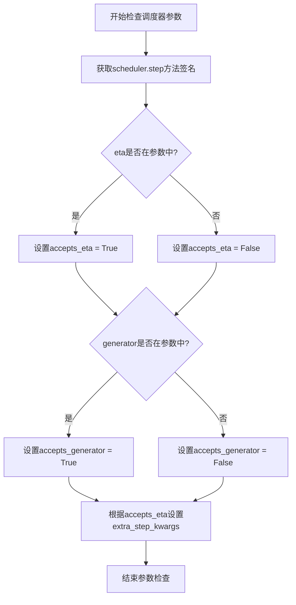
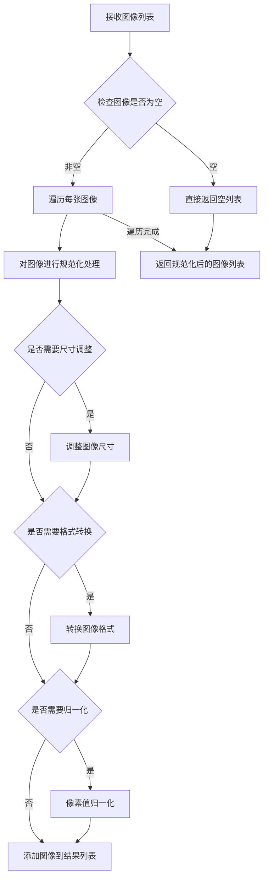
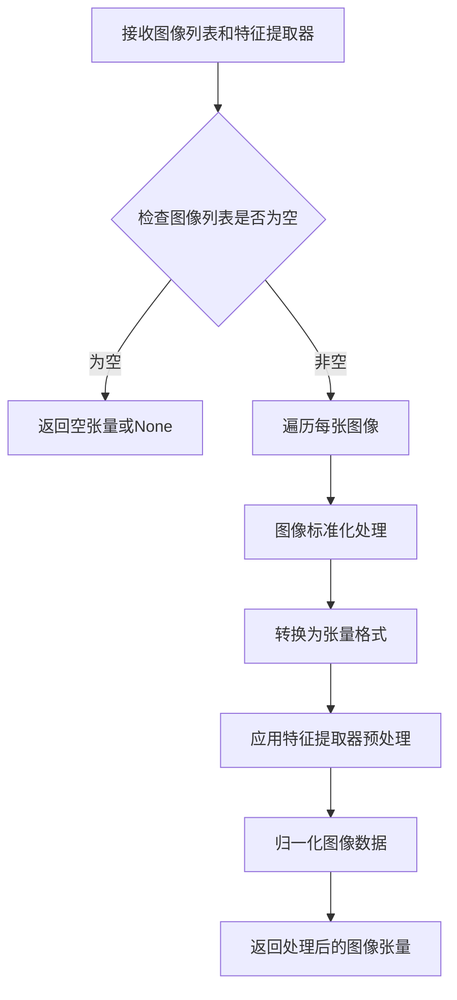
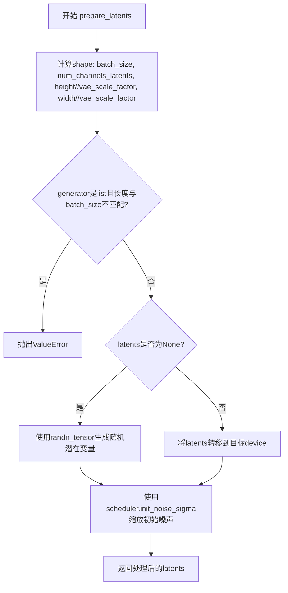

# `diffusers\examples\research_projects\rdm\pipeline_rdm.py` 详细设计文档

Retrieval Augmented Diffusion Pipeline (RDMPipeline) 是一个基于Stable Diffusion的文本到图像生成流水线，通过结合检索增强技术(RAG)来提升生成质量。该流水线使用CLIP模型编码文本提示和检索到的图像，将检索到的相关图像特征与文本特征融合后，引导U-Net进行去噪生成，从而产生与输入提示更相关的图像。

## 整体流程

```mermaid
graph TD
    A[开始: __call__] --> B{检查prompt类型}
    B -->|str| C[batch_size = 1]
    B -->|list| D[batch_size = len(prompt)]
    B -->|其他| E[抛出ValueError]
    C --> F[初始化retrieved_images列表]
    F --> G[验证height和width可被8整除]
    G --> H[验证callback_steps有效]
    H --> I{是否提供prompt_embeds?}
    I -->|否| J[_encode_prompt: 编码文本]
    I -->|是| K[使用提供的prompt_embeds]
    J --> L[retrieve_images: 检索相关图像]
    K --> L
    L --> M[_encode_image: 编码检索图像]
    M --> N{image_embeddings存在?}
    N -->|是| O[拼接text_embeds和image_embeds]
    N -->|否| P[继续使用text_embeds]
    O --> Q[复制embeddings用于CFG]
    P --> Q
    Q --> R[prepare_latents: 准备初始噪声]
    R --> S[设置scheduler的timesteps]
    S --> T[循环遍历timesteps进行去噪]
    T --> U[扩展latents用于CFG]
    U --> V[scheduler.scale_model_input]
    V --> W[UNet预测噪声残差]
    W --> X{是否启用CFG?}
    X -->|是| Y[计算guidance后的噪声预测]
    X -->|否| Z[直接使用噪声预测]
    Y --> AA[scheduler.step更新latents]
    Z --> AA
    AA --> BB{是否需要callback?]
    BB -->|是| CC[调用callback函数]
    BB -->|否| DD{是否到达最后timestep?]
    CC --> DD
    DD -->|否| T
    DD -->|是| EE{output_type是否为latent?]
    EE -->|否| FF[VAE.decode解码latents]
    EE -->|是| GG[直接使用latents作为image]
    FF --> HH[image_processor后处理]
    GG --> HH
    HH --> II[返回ImagePipelineOutput]
```

## 类结构

```
DiffusionPipeline (基类)
└── RDMPipeline
    ├── StableDiffusionMixin (混入类)
    └── 核心组件:
        ├── VAE (AutoencoderKL)
        ├── CLIP (CLIPModel)
        ├── Tokenizer (CLIPTokenizer)
        ├── UNet (UNet2DConditionModel)
        ├── Scheduler (多种调度器)
        ├── FeatureExtractor (CLIPImageProcessor)
        └── Retriever (可选检索器)
```

## 全局变量及字段


### `logger`
    
模块级日志记录器，用于记录程序运行过程中的信息

类型：`logging.Logger`
    


### `RDMPipeline.vae`
    
VAE模型用于编解码图像

类型：`AutoencoderKL`
    


### `RDMPipeline.clip`
    
CLIP模型用于提取文本和图像特征

类型：`CLIPModel`
    


### `RDMPipeline.tokenizer`
    
分词器处理文本输入

类型：`CLIPTokenizer`
    


### `RDMPipeline.unet`
    
条件U-Net去噪网络

类型：`UNet2DConditionModel`
    


### `RDMPipeline.scheduler`
    
噪声调度器

类型：`SchedulerMixin`
    


### `RDMPipeline.feature_extractor`
    
图像特征提取器

类型：`CLIPImageProcessor`
    


### `RDMPipeline.retriever`
    
图像检索器(可选)

类型：`Optional[Retriever]`
    


### `RDMPipeline.vae_scale_factor`
    
VAE缩放因子

类型：`int`
    


### `RDMPipeline.image_processor`
    
图像后处理器

类型：`VaeImageProcessor`
    
    

## 全局函数及方法


### `RDMPipeline.__call__` 方法中使用 `inspect.signature` 检查调度器参数

该代码段位于 `RDMPipeline` 类的 `__call__` 方法中，用于动态检查调度器（scheduler）的 `step` 方法是否支持 `eta` 和 `generator` 参数，以便在调用调度器时传递正确的参数。

参数：此 `inspect.signature` 调用本身没有参数，但它检查的是 `self.scheduler.step` 方法的参数。

- `self.scheduler`：调度器对象，其 `step` 方法的参数将被检查
- `self.scheduler.step`：调度器的步骤方法，用于去噪过程中的下一步计算

返回值：`set`，返回调度器 `step` 方法的参数名称集合，用于后续判断是否包含特定参数。

#### 流程图



#### 带注释源码

```python
# 检查调度器的step方法是否接受eta参数
# eta参数对应DDIM论文中的η参数，用于控制噪声消退程度
# inspect.signature获取方法签名，parameters获取参数字典的keys
accepts_eta = "eta" in set(inspect.signature(self.scheduler.step).parameters.keys())

# 初始化额外参数字典，用于传递给调度器的step方法
extra_step_kwargs = {}

# 如果调度器接受eta参数，则将eta添加到extra_step_kwargs中
# eta仅用于DDIMScheduler，其他调度器会忽略此参数
if accepts_eta:
    extra_step_kwargs["eta"] = eta

# 检查调度器的step方法是否接受generator参数
# generator用于控制随机数生成，确保可复现性
accepts_generator = "generator" in set(inspect.signature(self.scheduler.step).parameters.keys())

# 如果调度器接受generator参数，则将其添加到extra_step_kwargs中
if accepts_generator:
    extra_step_kwargs["generator"] = generator
```


### `normalize_images`

规范化图像函数，用于将检索到的图像数据进行标准化处理，使其符合后续模型处理的输入要求。

参数：

- `images`：`List[Image.Image]` 或类似类型，输入的图像列表（每个元素对应一个prompt检索到的图像）

返回值：`List[Image.Image]`，返回规范化处理后的图像列表

#### 流程图



#### 带注释源码

```
# normalize_images 函数源码 (从 retriever 模块导入，无完整源码)
# 根据调用方式和函数名推断:

def normalize_images(images):
    """
    规范化图像列表
    
    参数:
        images: 输入的图像列表，通常是 PIL.Image.Image 对象列表
        
    返回:
        规范化后的图像列表
    """
    # 可能的处理逻辑:
    # 1. 图像尺寸标准化
    # 2. 图像格式统一
    # 3. 像素值归一化到 [0, 1] 或 [-1, 1] 范围
    # 4. 颜色空间转换 (RGB/BRG)
    
    normalized = []
    for img in images:
        # 规范化处理逻辑
        normalized.append(img)
    return normalized

# 在 RDMPipeline._encode_image 中的调用方式:
# retrieved_images[i] = normalize_images(retrieved_images[i])
```

> **注意**: 由于 `normalize_images` 是从外部模块 `retriever` 导入的，源代码未在此文件中提供。上述源码是基于函数名和使用上下文进行的合理推断。实际实现可能涉及图像尺寸调整、格式转换、像素值归一化等操作，具体取决于检索增强扩散模型的需求。


### `preprocess_images`

该函数为外部导入的图像预处理函数，接收图像列表和特征提取器，对图像进行标准化和归一化处理，使其符合CLIP模型的输入要求。

参数：

- `images`：需要预处理的图像列表（通常为PIL.Image或numpy数组）
- `feature_extractor`：`CLIPImageProcessor`，用于对图像进行标准化和特征提取预处理

返回值：`torch.Tensor`，预处理后的图像张量

#### 流程图



#### 带注释源码

```
# 注意：该函数定义在 retriever 模块中，此处仅为调用示例
# 函数签名（推断）：
def preprocess_images(
    images: List[Image.Image],  # 待处理的图像列表
    feature_extractor: CLIPImageProcessor  # CLIP图像处理器
) -> torch.Tensor:
    """
    对图像进行预处理，使其符合CLIP模型的输入格式。
    
    Args:
        images: 原始图像列表
        feature_extractor: CLIP特征提取器，用于标准化和归一化
    
    Returns:
        预处理后的图像张量，形状为 [batch_size, channels, height, width]
    """
    # 实际实现位于 retriever 模块中
    # 调用示例（在 _encode_image 方法中）：
    # processed_images = preprocess_images(retrieved_images[i], self.feature_extractor)
    #                             .to(self.clip.device, dtype=self.clip.dtype)
```

> **注**：该函数的具体实现源码位于 `retriever` 模块中，在当前代码文件中仅被导入和调用。根据调用方式推测，该函数内部调用了 `feature_extractor` 的处理方法对图像进行预处理，可能包括图像尺寸调整、归一化、转换为PyTorch张量等操作。


### RDMPipeline.__init__

这是 `RDMPipeline` 类的构造函数，用于初始化检索增强扩散（Retrieval Augmented Diffusion）管道的所有核心组件，包括 VAE、CLIP 模型、分词器、U-Net、调度器、特征提取器以及可选的检索器，并设置图像处理器和 VAE 缩放因子。

参数：

- `vae`：`AutoencoderKL`，Variational Auto-Encoder (VAE) 模型，用于编码和解码图像与潜在表示之间的转换
- `clip`：`CLIPModel`，冻结的 CLIP 模型，用于提取文本和图像特征，检索增强扩散使用 clip-vit-large-patch14 变体
- `tokenizer`：`CLIPTokenizer`，CLIP 模型的 tokenizer，用于将文本 prompts 转换为 token 序列
- `unet`：`UNet2DConditionModel`，条件 U-Net 架构，用于对编码后的图像潜在表示进行去噪
- `scheduler`：`Union[DDIMScheduler, PNDMScheduler, LMSDiscreteScheduler, EulerDiscreteScheduler, EulerAncestralDiscreteScheduler, DPMSolverMultistepScheduler]`，调度器，与 unet 结合使用去噪图像潜在表示
- `feature_extractor`：`CLIPImageProcessor`，从生成的图像中提取特征的模型，用于安全检查器
- `retriever`：`Optional[Retriever]`，可选的检索器，用于从外部知识库检索相关图像以辅助生成

返回值：`None`，构造函数无返回值，仅初始化实例属性

#### 流程图

```mermaid
flowchart TD
    A[开始 __init__] --> B[调用 super().__init__]
    B --> C[调用 register_modules 注册所有模块]
    C --> D{检查 vae 是否存在}
    D -->|是| E[计算 vae_scale_factor = 2^(len(vae.config.block_out_channels) - 1)]
    D -->|否| F[设置 vae_scale_factor = 8]
    E --> G[创建 VaeImageProcessor]
    F --> G
    G --> H[设置 self.retriever = retriever]
    H --> I[结束 __init__]
```

#### 带注释源码

```python
def __init__(
    self,
    vae: AutoencoderKL,
    clip: CLIPModel,
    tokenizer: CLIPTokenizer,
    unet: UNet2DConditionModel,
    scheduler: Union[
        DDIMScheduler,
        PNDMScheduler,
        LMSDiscreteScheduler,
        EulerDiscreteScheduler,
        EulerAncestralDiscreteScheduler,
        DPMSolverMultistepScheduler,
    ],
    feature_extractor: CLIPImageProcessor,
    retriever: Optional[Retriever] = None,
):
    """
    初始化 RDMPipeline 实例
    
    参数:
        vae: VAE 模型，用于图像编解码
        clip: CLIP 模型，用于文本和图像特征提取
        tokenizer: CLIP tokenizer
        unet: 条件去噪 U-Net
        scheduler: 噪声调度器
        feature_extractor: CLIP 图像处理器
        retriever: 可选的图像检索器
    """
    # 调用父类 DiffusionPipeline 的初始化方法
    super().__init__()
    
    # 注册所有模块到 pipeline 中，便于保存/加载和设备管理
    self.register_modules(
        vae=vae,
        clip=clip,
        tokenizer=tokenizer,
        unet=unet,
        scheduler=scheduler,
        feature_extractor=feature_extractor,
    )
    
    # 计算 VAE 缩放因子，用于潜在空间和像素空间之间的转换
    # VAE 通常有 [128, 256, 512, 512] 这样的通道配置
    # 缩放因子 = 2^(层数-1)，例如 4 层 = 2^3 = 8
    self.vae_scale_factor = 2 ** (len(self.vae.config.block_out_channels) - 1) if getattr(self, "vae", None) else 8
    
    # 创建 VAE 图像处理器，用于图像的后处理（归一化/反归一化）
    self.image_processor = VaeImageProcessor(vae_scale_factor=self.vae_scale_factor)
    
    # 设置可选的检索器，用于检索增强生成
    self.retriever = retriever
```


### `RDMPipeline._encode_prompt`

该方法用于将文本提示（prompt）编码为CLIP模型的文本特征向量（embeddings），实现文本到潜在空间的映射，是 Retrieval Augmented Diffusion 模型文本编码的核心组件。

参数：

- `prompt`：`Union[str, List[str]]`，待编码的文本提示，可以是单个字符串或字符串列表

返回值：`torch.Tensor`，编码后的文本嵌入向量，形状为 (batch_size, 1, embedding_dim)，其中 embedding_dim 为 CLIP 模型的特征维度

#### 流程图

```mermaid
flowchart TD
    A[开始: _encode_prompt] --> B[调用 tokenizer 对 prompt 进行分词]
    B --> C[检查序列长度是否超过 tokenizer.model_max_length]
    C --> D{是否超长?}
    D -->|是| E[截断序列并记录警告日志]
    D -->|否| F[直接使用原始序列]
    E --> G[调用 CLIP 模型获取文本特征]
    F --> G
    G --> H[对 prompt_embeds 进行 L2 归一化]
    H --> I[调整维度: prompt_embeds[:, None, :]]
    I --> J[返回归一化后的嵌入向量]
```

#### 带注释源码

```python
def _encode_prompt(self, prompt):
    """
    Encode prompt into text embeddings using CLIP tokenizer and model.
    
    Args:
        prompt: Text prompt or list of prompts to encode
        
    Returns:
        Normalized text embeddings with shape (batch_size, 1, embedding_dim)
    """
    # Step 1: Tokenize the prompt using CLIP tokenizer
    # Converts text to token IDs with padding and truncation
    text_inputs = self.tokenizer(
        prompt,
        padding="max_length",  # Pad to maximum length
        max_length=self.tokenizer.model_max_length,  # CLIP's max sequence length (usually 77)
        truncation=True,  # Truncate if exceeds max length
        return_tensors="pt",  # Return PyTorch tensors
    )
    # Extract input IDs from tokenizer output
    text_input_ids = text_inputs.input_ids

    # Step 2: Handle sequence length exceeding maximum
    # CLIP has a maximum sequence length (typically 77 tokens)
    if text_input_ids.shape[-1] > self.tokenizer.model_max_length:
        # Decode and log the truncated portion for user awareness
        removed_text = self.tokenizer.batch_decode(text_input_ids[:, self.tokenizer.model_max_length :])
        logger.warning(
            "The following part of your input was truncated because CLIP can only handle sequences up to"
            f" {self.tokenizer.model_max_length} tokens: {removed_text}"
        )
        # Truncate to maximum allowed length
        text_input_ids = text_input_ids[:, : self.tokenizer.model_max_length]

    # Step 3: Get text features from CLIP model
    # Converts token IDs to dense embeddings using CLIP's text encoder
    prompt_embeds = self.clip.get_text_features(text_input_ids.to(self.device))

    # Step 4: Normalize embeddings
    # L2 normalize embeddings for cosine similarity computation
    prompt_embeds = prompt_embeds / torch.linalg.norm(prompt_embeds, dim=-1, keepdim=True)

    # Step 5: Reshape embeddings
    # Add dimension to match expected shape for concatenation with image embeddings
    # Shape: (batch_size, embedding_dim) -> (batch_size, 1, embedding_dim)
    prompt_embeds = prompt_embeds[:, None, :]

    # Return normalized and reshaped text embeddings
    return prompt_embeds
```


### `RDMPipeline._encode_image`

该方法负责将检索到的图像编码为CLIP图像特征向量。它首先检查是否有检索到的图像，如果没有则返回None；然后对每个图像进行归一化和预处理，接着将所有图像连接成一个批次，通过CLIP模型提取图像特征，进行L2归一化，最后将特征向量重新整形为(batch_size, -1, d)的形状返回。

参数：

- `retrieved_images`：List[Any]，检索到的图像列表，每个元素是一个图像列表
- `batch_size`：int，批处理大小，用于最终输出张量的形状重塑

返回值：`Optional[torch.Tensor]`，如果存在检索图像则返回图像嵌入张量（形状为[batch_size, -1, embedding_dim]），否则返回None

#### 流程图

```mermaid
flowchart TD
    A[开始 _encode_image] --> B{检查: retrieved_images[0] 是否为空}
    B -->|是| C[返回 None]
    B -->|否| D[遍历 retrieved_images]
    D --> E[对每个图像调用 normalize_images]
    E --> F[调用 preprocess_images 预处理]
    F --> G[将预处理后的图像移动到 CLIP 设备并转换类型]
    D --> H{所有图像处理完成?}
    H -->|否| E
    H -->|是| I[从处理后的图像中获取形状 (_, c, h, w)]
    I --> J[使用 torch.cat 合并所有图像]
    J --> K[使用 torch.reshape 重塑为 (-1, c, h, w)]
    K --> L[调用 self.clip.get_image_features 获取图像嵌入]
    L --> M[对图像嵌入进行 L2 归一化]
    M --> N[获取嵌入维度 (_, d)]
    N --> O[使用 torch.reshape 重塑为 (batch_size, -1, d)]
    O --> P[返回 image_embeddings]
```

#### 带注释源码

```python
def _encode_image(self, retrieved_images, batch_size):
    """
    将检索到的图像编码为CLIP图像特征嵌入
    
    参数:
        retrieved_images: 检索到的图像列表，格式为 List[List[Image]]
        batch_size: int，批处理大小
    
    返回:
        torch.Tensor 或 None: 图像嵌入张量，形状为 (batch_size, num_images, embedding_dim)
    """
    # 检查是否有检索到的图像，如果没有则直接返回None
    if len(retrieved_images[0]) == 0:
        return None
    
    # 遍历每个批次的检索图像
    for i in range(len(retrieved_images)):
        # Step 1: 对图像进行归一化处理
        retrieved_images[i] = normalize_images(retrieved_images[i])
        
        # Step 2: 使用特征提取器预处理图像，并移动到CLIP模型的设备上，转换为CLIP模型的数据类型
        retrieved_images[i] = preprocess_images(retrieved_images[i], self.feature_extractor).to(
            self.clip.device, dtype=self.clip.dtype
        )
    
    # 获取处理后图像的形状信息 (通道数, 高度, 宽度)
    _, c, h, w = retrieved_images[0].shape

    # Step 3: 将所有批次的图像在第0维(批次维)上连接，然后重塑为 (-1, c, h, w) 的平面形式
    retrieved_images = torch.reshape(torch.cat(retrieved_images, dim=0), (-1, c, h, w))
    
    # Step 4: 使用CLIP模型提取图像特征嵌入
    image_embeddings = self.clip.get_image_features(retrieved_images)
    
    # Step 5: 对图像嵌入进行L2归一化，确保嵌入向量的单位范数
    image_embeddings = image_embeddings / torch.linalg.norm(image_embeddings, dim=-1, keepdim=True)
    
    # 获取嵌入向量的维度
    _, d = image_embeddings.shape
    
    # Step 6: 将嵌入重塑为 (batch_size, -1, d) 格式，其中 -1 表示每个批次的图像数量
    image_embeddings = torch.reshape(image_embeddings, (batch_size, -1, d))
    
    # 返回最终的图像嵌入张量
    return image_embeddings
```


### `RDMPipeline.prepare_latents`

该方法用于为扩散模型的去噪过程准备初始潜在变量（latents）。它根据指定的批次大小、通道数、图像尺寸计算潜在变量的shape，若未提供预生成的潜在变量则使用随机噪声生成，否则将提供的潜在变量转移到目标设备上，最后根据调度器的初始噪声标准差对潜在变量进行缩放。

参数：

- `batch_size`：`int`，批次大小，指定生成图像的数量
- `num_channels_latents`：`int`，潜在变量的通道数，对应UNet的输入通道数
- `height`：`int`，目标图像的高度（像素）
- `width`：`int`，目标图像的宽度（像素）
- `dtype`：`torch.dtype`，潜在变量的数据类型
- `device`：`torch.device`，潜在变量存放的设备
- `generator`：`torch.Generator | None`，可选的随机生成器，用于确保可重复性
- `latents`：`Optional[torch.Tensor]`，可选的预生成潜在变量，若为None则随机生成

返回值：`torch.Tensor`，处理后的潜在变量张量，可直接用于UNet去噪

#### 流程图



#### 带注释源码

```python
def prepare_latents(
    self,
    batch_size: int,
    num_channels_latents: int,
    height: int,
    width: int,
    dtype: torch.dtype,
    device: torch.device,
    generator: torch.Generator | None,
    latents: Optional[torch.Tensor] = None,
) -> torch.Tensor:
    """
    为扩散模型的去噪过程准备初始潜在变量。

    参数:
        batch_size: 批次大小，指定生成图像的数量
        num_channels_latents: 潜在变量的通道数，对应UNet的输入通道数
        height: 目标图像的高度（像素）
        width: 目标图像的宽度（像素）
        dtype: 潜在变量的数据类型
        device: 潜在变量存放的设备
        generator: 可选的随机生成器，用于确保可重复性
        latents: 可选的预生成潜在变量，若为None则随机生成

    返回:
        处理后的潜在变量张量，可直接用于UNet去噪
    """
    # 计算潜在变量的shape，考虑VAE的缩放因子
    # VAE通常会将图像尺寸缩小2^(num_layers-1)倍
    shape = (
        batch_size,
        num_channels_latents,
        int(height) // self.vae_scale_factor,
        int(width) // self.vae_scale_factor,
    )
    
    # 验证generator列表长度与batch_size是否匹配
    if isinstance(generator, list) and len(generator) != batch_size:
        raise ValueError(
            f"You have passed a list of generators of length {len(generator)}, but requested an effective batch"
            f" size of {batch_size}. Make sure the batch size matches the length of the generators."
        )

    # 根据是否提供潜在变量决定生成方式
    if latents is None:
        # 使用randn_tensor生成标准正态分布的随机噪声作为初始潜在变量
        latents = randn_tensor(shape, generator=generator, device=device, dtype=dtype)
    else:
        # 将提供的潜在变量转移到目标设备
        latents = latents.to(device)

    # 使用调度器的初始噪声标准差缩放初始噪声
    # 不同的调度器对噪声的缩放方式不同（如DDIM使用1.0，PNDM使用其他值）
    latents = latents * self.scheduler.init_noise_sigma
    
    return latents
```


### `RDMPipeline.retrieve_images`

该方法用于从检索器中获取与输入提示相关的图像，将检索到的图像与现有的图像列表合并，作为 Retrieval Augmented Diffusion 的条件输入。

参数：

- `retrieved_images`：`List[List[Image.Image]]`，已检索的图像列表，每项是一个图像列表
- `prompt_embeds`：`torch.Tensor`，文本嵌入向量，用于从检索器查询相关图像
- `knn`：`int`，要检索的近邻图像数量，默认为 10

返回值：`List[List[Image.Image]]`，合并后的图像列表，包含原始图像和检索器返回的补充图像

#### 流程图

```mermaid
flowchart TD
    A[开始: retrieve_images] --> B{self.retriever 是否存在?}
    B -->|是| C[调用 retriever.retrieve_imgs_batch<br/>使用 prompt_embeds[:, 0].cpu() 和 knn]
    C --> D[获取返回的 additional_images]
    D --> E[遍历 retrieved_images 列表]
    E --> F[将 additional_images[i][image_column]<br/>添加到 retrieved_images[i]]
    F --> G[返回更新后的 retrieved_images]
    B -->|否| G
```

#### 带注释源码

```python
def retrieve_images(self, retrieved_images, prompt_embeds, knn=10):
    """
    从检索器获取与文本提示相关的图像，并合并到现有图像列表中。
    
    此方法是 Retrieval Augmented Diffusion (RD) 的核心组件，
    用于在图像生成过程中融入检索到的相关图像作为条件信息。
    
    Args:
        retrieved_images: 现有的图像列表，通常来自用户输入或上一轮处理
        prompt_embeds: 文本编码器产生的文本嵌入，用于检索相关图像
        knn: 近邻数量，指定从检索器返回多少个最相似的图像
    
    Returns:
        合并后的图像列表，包含原始图像和检索补充的图像
    """
    # 检查是否配置了检索器模块
    if self.retriever is not None:
        # 使用文本嵌入的第一个token（取CPU版本）调用检索器
        # retrieve_imgs_batch 返回一个包含 total_examples 的结果对象
        additional_images = self.retriever.retrieve_imgs_batch(
            prompt_embeds[:, 0].cpu(),  # 提取第一个token的嵌入
            knn  # 指定检索的图像数量
        ).total_examples  # 获取全部检索结果
        
        # 遍历每个批次的图像列表，将检索到的图像追加到现有列表
        for i in range(len(retrieved_images)):
            # 使用配置中指定的图像列名提取图像，并累加到现有图像列表
            retrieved_images[i] += additional_images[i][self.retriever.config.image_column]
    
    # 返回可能已更新的图像列表；若 retriever 为 None 则原样返回
    return retrieved_images
```


### RDMPipeline.__call__

该方法是检索增强扩散模型（Retrieval Augmented Diffusion）管道的主入口，接收文本提示和可选的检索图像，通过多步去噪过程生成与文本语义相关的高质量图像。支持分类器自由引导、图像检索增强、潜在向量复用、回调监控等高级功能。

参数：

- `prompt`：`Union[str, List[str]]`，用于引导图像生成的文本提示或提示列表
- `retrieved_images`：`Optional[List[Image.Image]] = None`，可选的预检索图像列表，用于增强生成效果
- `height`：`int = 768`，生成图像的高度（像素），默认768
- `width`：`int = 768`，生成图像的宽度（像素），默认768
- `num_inference_steps`：`int = 50`，去噪迭代次数，步数越多通常图像质量越高但推理速度越慢
- `guidance_scale`：`float = 7.5`，分类器自由引导尺度，值越大生成的图像与文本提示越相关
- `num_images_per_prompt`：`Optional[int] = 1`，每个提示生成的图像数量
- `eta`：`float = 0.0`，DDIM调度器的eta参数，仅对DDIMScheduler有效
- `generator`：`torch.Generator | None = None`，用于确保生成可复现性的PyTorch随机生成器
- `latents`：`Optional[torch.Tensor] = None`，预生成的噪声潜在向量，可用于基于相同潜在向量生成不同提示的图像
- `prompt_embeds`：`Optional[torch.Tensor] = None`，预生成的文本嵌入向量，可用于轻松调整文本输入
- `output_type`：`str | None = "pil"`，输出格式，可选"pil"返回PIL.Image或"latent"返回潜在向量
- `return_dict`：`bool = True`，是否返回ImagePipelineOutput对象而非元组
- `callback`：`Optional[Callable[[int, int, torch.Tensor], None]] = None`，每callback_steps步调用的回调函数，签名为callback(step, timestep, latents)
- `callback_steps`：`Optional[int] = 1`，回调函数被调用的频率步数
- `knn`：`Optional[int] = 10`，从检索器获取的近邻图像数量
- `**kwargs`：其他未命名的关键字参数

返回值：`ImagePipelineOutput`或`tuple`，当return_dict为True时返回ImagePipelineOutput对象（包含images列表），否则返回元组（第一个元素为生成的图像列表）

#### 流程图

```mermaid
flowchart TD
    A[开始 __call__] --> B{检查 prompt 类型}
    B -->|str| C[batch_size = 1]
    B -->|list| D[batch_size = len(prompt)]
    B -->|其他| E[抛出 ValueError]
    C --> F[初始化 retrieved_images 列表]
    D --> F
    F --> G{检查 height/width 是否被8整除}
    G -->|否| H[抛出 ValueError]
    G -->|是| I{检查 callback_steps 有效性}
    I -->|否| J[抛出 ValueError]
    I -->|是| K{prompt_embeds 为空?}
    K -->|是| L[_encode_prompt 生成文本嵌入]
    K -->|否| M[使用提供的 prompt_embeds]
    L --> N[retrieve_images 获取检索图像]
    M --> N
    N --> O[_encode_image 编码检索图像为图像嵌入]
    O --> P{image_embeddings 不为空?}
    P -->|是| Q[torch.cat 拼接文本和图像嵌入]
    P -->|否| R[仅使用文本嵌入]
    Q --> S[重复嵌入以匹配 num_images_per_prompt]
    R --> S
    S --> T{guidance_scale > 1.0?}
    T -->|是| U[创建零张量作为无条件嵌入]
    T -->|否| V[跳过无条件嵌入]
    U --> W[torch.cat 拼接无条件嵌入和提示嵌入]
    V --> W
    W --> X[prepare_latents 准备初始噪声潜在向量]
    X --> Y[scheduler.set_timesteps 设置推理时间步]
    Y --> Z[准备 extra_step_kwargs 调度器额外参数]
    Z --> AA[遍历时间步进行去噪]
    AA --> AB{当前步 % callback_steps == 0 且 callback 不为空?}
    AB -->|是| AC[调用 callback 回调函数]
    AB -->|否| AD[继续去噪]
    AC --> AD
    AD --> AE[scheduler.step 执行单步去噪]
    AE --> AF{是否还有更多时间步?}
    AF -->|是| AA
    AF -->|否| AG{output_type == 'latent'?}
    AG -->|是| AH[直接使用 latents 作为图像]
    AG -->|否| AI[vae.decode 解码潜在向量为图像]
    AH --> AJ[image_processor.postprocess 后处理图像]
    AI --> AJ
    AJ --> AK{return_dict 为 True?}
    AK -->|是| AL[返回 ImagePipelineOutput 对象]
    AK -->|否| AM[返回元组 (images,)]
```

#### 带注释源码

```python
@torch.no_grad()
def __call__(
    self,
    prompt: Union[str, List[str]],
    retrieved_images: Optional[List[Image.Image]] = None,
    height: int = 768,
    width: int = 768,
    num_inference_steps: int = 50,
    guidance_scale: float = 7.5,
    num_images_per_prompt: Optional[int] = 1,
    eta: float = 0.0,
    generator: torch.Generator | None = None,
    latents: Optional[torch.Tensor] = None,
    prompt_embeds: Optional[torch.Tensor] = None,
    output_type: str | None = "pil",
    return_dict: bool = True,
    callback: Optional[Callable[[int, int, torch.Tensor], None]] = None,
    callback_steps: Optional[int] = 1,
    knn: Optional[int] = 10,
    **kwargs,
):
    r"""
    Function invoked when calling the pipeline for generation.

    Args:
        prompt (`str` or `List[str]`):
            The prompt or prompts to guide the image generation.
        height (`int`, *optional*, defaults to 512):
            The height in pixels of the generated image.
        width (`int`, *optional*, defaults to 512):
            The width in pixels of the generated image.
        num_inference_steps (`int`, *optional*, defaults to 50):
            The number of denoising steps. More denoising steps usually lead to a higher quality image at the
            expense of slower inference.
        guidance_scale (`float`, *optional*, defaults to 7.5):
            Guidance scale as defined in [Classifier-Free Diffusion Guidance](https://huggingface.co/papers/2207.12598).
            `guidance_scale` is defined as `w` of equation 2. of [Imagen
            Paper](https://huggingface.co/papers/2205.11487). Guidance scale is enabled by setting `guidance_scale >
            1`. Higher guidance scale encourages to generate images that are closely linked to the text `prompt`,
            usually at the expense of lower image quality.
        num_images_per_prompt (`int`, *optional*, defaults to 1):
            The number of images to generate per prompt.
        eta (`float`, *optional*, defaults to 0.0):
            Corresponds to parameter eta (η) in the DDIM paper: https://huggingface.co/papers/2010.02502. Only applies to
            [`schedulers.DDIMScheduler`], will be ignored for others.
        generator (`torch.Generator`, *optional*):
            A [torch generator](https://pytorch.org/docs/stable/generated/torch.Generator.html) to make generation
            deterministic.
        latents (`torch.Tensor`, *optional*):
            Pre-generated noisy latents, sampled from a Gaussian distribution, to be used as inputs for image
            generation. Can be used to tweak the same generation with different prompts. If not provided, a latents
            tensor will be generated by sampling using the supplied random `generator`.
        prompt_embeds (`torch.Tensor`, *optional*):
            Pre-generated text embeddings. Can be used to easily tweak text inputs, *e.g.* prompt weighting. If not
            provided, text embeddings will be generated from `prompt` input argument.
        output_type (`str`, *optional*, defaults to `"pil"`):
            The output format of the generate image. Choose between
            [PIL](https://pillow.readthedocs.io/en/stable/): `PIL.Image.Image` or `np.array`.
        return_dict (`bool`, *optional*, defaults to `True`):
            Whether or not to return a [`~pipeline_utils.ImagePipelineOutput`] instead of a plain tuple.
        callback (`Callable`, *optional*):
            A function that will be called every `callback_steps` steps during inference. The function will be
            called with the following arguments: `callback(step: int, timestep: int, latents: torch.Tensor)`.
        callback_steps (`int`, *optional*, defaults to 1):
            The frequency at which the `callback` function will be called. If not specified, the callback will be
            called at every step.

    Returns:
        [`~pipeline_utils.ImagePipelineOutput`] or `tuple`: [`~pipelines.utils.ImagePipelineOutput`] if
        `return_dict` is True, otherwise a `tuple. When returning a tuple, the first element is a list with the
        generated images.
    """
    # 如果未指定height/width，则使用unet配置和vae缩放因子计算默认值
    height = height or self.unet.config.sample_size * self.vae_scale_factor
    width = width or self.unet.config.sample_size * self.vae_scale_factor
    
    # 根据prompt类型确定batch_size：单个字符串为1，列表为列表长度
    if isinstance(prompt, str):
        batch_size = 1
    elif isinstance(prompt, list):
        batch_size = len(prompt)
    else:
        raise ValueError(f"`prompt` has to be of type `str` or `list` but is {type(prompt)}")
    
    # 如果提供了检索图像，为每个batch元素复制一份；否则初始化为空列表
    if retrieved_images is not None:
        retrieved_images = [retrieved_images for _ in range(batch_size)]
    else:
        retrieved_images = [[] for _ in range(batch_size)]
    
    # 获取执行设备
    device = self._execution_device

    # 验证图像尺寸必须能被8整除（VAE和UNet的要求）
    if height % 8 != 0 or width % 8 != 0:
        raise ValueError(f"`height` and `width` have to be divisible by 8 but are {height} and {width}.")

    # 验证callback_steps参数的有效性
    if (callback_steps is None) or (
        callback_steps is not None and (not isinstance(callback_steps, int) or callback_steps <= 0)
    ):
        raise ValueError(
            f"`callback_steps` has to be a positive integer but is {callback_steps} of type"
            f" {type(callback_steps)}."
        )
    
    # 如果未提供prompt_embeds，则从prompt编码生成文本嵌入
    if prompt_embeds is None:
        prompt_embeds = self._encode_prompt(prompt)
    
    # 使用retriever检索相关图像并合并到retrieved_images
    retrieved_images = self.retrieve_images(retrieved_images, prompt_embeds, knn=knn)
    
    # 将检索到的图像编码为图像嵌入向量
    image_embeddings = self._encode_image(retrieved_images, batch_size)
    
    # 如果存在图像嵌入，则将其与文本嵌入拼接；否则仅使用文本嵌入
    if image_embeddings is not None:
        prompt_embeds = torch.cat([prompt_embeds, image_embeddings], dim=1)

    # 为每个prompt复制文本嵌入以支持生成多张图像（使用MPS友好的方法）
    bs_embed, seq_len, _ = prompt_embeds.shape
    prompt_embeds = prompt_embeds.repeat(1, num_images_per_prompt, 1)
    prompt_embeds = prompt_embeds.view(bs_embed * num_images_per_prompt, seq_len, -1)

    # 判断是否执行分类器自由引导（guidance_scale > 1.0时启用）
    do_classifier_free_guidance = guidance_scale > 1.0
    
    # 如果启用分类器自由引导，创建与prompt_embeds形状相同的零张量作为无条件嵌入
    if do_classifier_free_guidance:
        uncond_embeddings = torch.zeros_like(prompt_embeds).to(prompt_embeds.device)

        # 为了避免两次前向传播，将无条件嵌入和文本嵌入拼接成一个batch
        prompt_embeds = torch.cat([uncond_embeddings, prompt_embeds])
    
    # 获取UNet的输入通道数，准备初始噪声潜在向量
    num_channels_latents = self.unet.config.in_channels
    latents = self.prepare_latents(
        batch_size * num_images_per_prompt,
        num_channels_latents,
        height,
        width,
        prompt_embeds.dtype,
        device,
        generator,
        latents,
    )

    # 设置去噪调度器的时间步
    self.scheduler.set_timesteps(num_inference_steps)

    # 将时间步移动到正确的设备上（某些调度器如PNDM使用数组作为时间步）
    timesteps_tensor = self.scheduler.timesteps.to(self.device)

    # 检查调度器是否接受eta参数（仅DDIMScheduler使用）
    accepts_eta = "eta" in set(inspect.signature(self.scheduler.step).parameters.keys())
    extra_step_kwargs = {}
    if accepts_eta:
        extra_step_kwargs["eta"] = eta

    # 检查调度器是否接受generator参数
    accepts_generator = "generator" in set(inspect.signature(self.scheduler.step).parameters.keys())
    if accepts_generator:
        extra_step_kwargs["generator"] = generator

    # 遍历所有时间步进行去噪迭代
    for i, t in enumerate(self.progress_bar(timesteps_tensor)):
        # 如果启用分类器自由引导，则扩展latents（复制一份）
        latent_model_input = torch.cat([latents] * 2) if do_classifier_free_guidance else latents
        latent_model_input = self.scheduler.scale_model_input(latent_model_input, t)

        # 使用UNet预测噪声残差
        noise_pred = self.unet(latent_model_input, t, encoder_hidden_states=prompt_embeds).sample

        # 执行分类器自由引导
        if do_classifier_free_guidance:
            noise_pred_uncond, noise_pred_text = noise_pred.chunk(2)
            noise_pred = noise_pred_uncond + guidance_scale * (noise_pred_text - noise_pred_uncond)

        # 计算前一个噪声样本 x_t -> x_t-1
        latents = self.scheduler.step(noise_pred, t, latents, **extra_step_kwargs).prev_sample

        # 如果提供了callback且到达回调步数，则调用回调函数
        if callback is not None and i % callback_steps == 0:
            step_idx = i // getattr(self.scheduler, "order", 1)
            callback(step_idx, t, latents)
    
    # 如果不是输出潜在向量格式，则使用VAE解码 latent 到图像
    if not output_type == "latent":
        image = self.vae.decode(latents / self.vae.config.scaling_factor, return_dict=False)[0]
    else:
        image = latents

    # 对输出图像进行后处理（反归一化等）
    image = self.image_processor.postprocess(
        image, output_type=output_type, do_denormalize=[True] * image.shape[0]
    )

    # 如果存在最终卸载钩子，则将最后一个模型卸载到CPU
    if hasattr(self, "final_offload_hook") and self.final_offload_hook is not None:
        self.final_offload_hook.offload()

    # 根据return_dict决定返回格式
    if not return_dict:
        return (image,)

    return ImagePipelineOutput(images=image)
```

## 关键组件


### RDMPipeline 类

检索增强扩散（Retrieval Augmented Diffusion）的主管道类，继承自DiffusionPipeline，用于文本到图像生成，集成了检索增强功能。

### 文本嵌入编码 (_encode_prompt)

使用CLIP模型将文本提示编码为文本嵌入向量，包含截断处理和嵌入归一化。

### 图像嵌入编码 (_encode_image)

将检索到的图像进行预处理（归一化+CLIP特征提取），生成图像嵌入向量并与文本嵌入对齐。

### 潜在变量准备 (prepare_latents)

生成或处理用于去噪过程的初始噪声潜在变量，考虑批大小、通道数、图像尺寸和调度器初始噪声标准差。

### 图像检索 (retrieve_images)

通过检索器根据文本嵌入获取相关图像，将检索结果与输入图像合并。

### 主推理调用 (__call__)

完整的文本到图像生成流程，包含条件-free引导、去噪循环、潜在变量解码和后处理。

### VAE 图像处理器

VAE图像处理器，用于潜在变量与像素空间之间的转换以及图像后处理。

### Retriever 检索器

检索增强模块，根据文本嵌入从外部知识库获取相关图像用于增强生成。

### CLIP 模型与分词器

用于文本和图像特征提取的CLIP模型及其分词器，支持检索增强扩散的跨模态理解。

### UNet2DConditionModel

条件U-Net架构，用于根据文本嵌入和噪声潜在变量预测噪声残差。

### 调度器 (Scheduler)

支持多种噪声调度器（DDIM、PNDM、LMS、Euler等），控制去噪过程的噪声调度策略。


## 问题及建议


### 已知问题

- **`retrieve_images`方法逻辑错误**：使用了`.total_examples`属性来获取图像，但这看起来是错误的用法。`retriever.retrieve_imgs_batch`返回的结果应该直接包含图像，而不是通过`.total_examples`访问，这会导致运行时错误或返回错误的数据结构。
- **`_encode_prompt`截断处理不完整**：当文本被截断时只记录警告日志，但没有向调用者传达截断信息，可能导致调用者不知道文本被截断从而影响生成结果。
- **类型注解不一致**：混合使用了新的联合类型语法（如`torch.Generator | None`和`str | None`）和传统的`Optional`语法，导致代码风格不统一，降低可读性。
- **`__call__`方法中`retrieved_images`处理冗余**：当`retrieved_images`不为None时，代码创建了一个列表副本但实际未使用原传入参数，这种逻辑令人困惑且可能造成误解。
- **缺少对retriever返回数据的验证**：没有检查`retriever`返回的数据结构是否符合预期（如图像数量、格式等），可能在数据不符合预期时产生难以追踪的错误。
- **`feature_extractor`参数未实际使用**：虽然`__init__`接收了`feature_extractor`参数，但在`_encode_image`中实际使用的是`self.feature_extractor`，而该参数在文档中描述用于`safety_checker`，存在设计混淆。
- **设备管理不一致**：在`_encode_image`中手动指定`self.clip.device`和`self.clip.dtype`，而在其他方法中可能使用`self._execution_device`，可能导致设备不一致问题。
- **未使用的导入**：`EulerAncestralDiscreteScheduler`被导入但在代码中未被使用，增加了不必要的依赖。
- **内存效率问题**：在`_encode_image`中使用`torch.cat`和`torch.reshape`进行多次tensor拼接，对于大批量检索图像可能导致内存峰值过高。

### 优化建议

- 修正`retrieve_images`方法中访问retriever返回结果的方式，确保正确获取检索到的图像列表。
- 统一类型注解风格，建议全部使用`Optional`或全部使用新的联合类型语法。
- 在`_encode_prompt`中返回截断信息或抛出明确异常，而不是仅记录警告。
- 添加对retriever返回数据的结构验证，确保包含必要的字段和正确的数据类型。
- 考虑使用`torch.no_grad()`上下文管理器包裹不需要梯度计算的操作，减少内存占用。
- 移除未使用的导入，保持代码整洁。
- 统一设备管理逻辑，建议定义一个统一的设备获取方法或属性。
- 在`__call__`方法中简化`retrieved_images`的处理逻辑，使其更直观易懂。
</think>

## 其它


### 设计目标与约束

本项目旨在实现检索增强扩散模型（Retrieval Augmented Diffusion），通过结合文本提示和检索到的相关图像来增强图像生成质量。核心约束包括：1）仅支持768x768分辨率输出；2）最大token长度为CLIP模型支持的77个token；3）仅支持指定的调度器（DDIM、PNDM、LMS、Euler等）；4）推理步数建议50步以平衡质量与速度。

### 错误处理与异常设计

代码包含以下错误处理机制：1）batch_size与generator列表长度不匹配时抛出ValueError；2）prompt类型检查（仅支持str或list）；3）height/width必须能被8整除；4）callback_steps必须为正整数；5）CLIP序列截断时发出logger.warning警告；6）空检索图像返回None而非异常。缺失：未实现重试机制、连接超时处理、模型加载失败的后备方案。

### 数据流与状态机

主流程状态机：1）初始化状态→2）编码提示词（_encode_prompt）→3）检索图像（retrieve_images）→4）编码图像（_encode_image）→5）准备潜在向量（prepare_latents）→6）迭代去噪循环（scheduler.step）→7）VAE解码→8）后处理输出。条件分支：guidance_scale>1时执行分类器自由引导；output_type="latent"时跳过VAE解码；retriever为None时跳过图像检索。

### 外部依赖与接口契约

核心依赖：1）diffusers库（DiffusionPipeline、UNet2DConditionModel、AutoencoderKL等）；2）transformers（CLIPModel、CLIPTokenizer、CLIPImageProcessor）；3）retriever自定义模块；4）PyTorch；5）PIL。接口契约：retriever.retrieve_imgs_batch返回包含image_column的批量结果；scheduler.step必须接受noise_pred、timestep、latents参数；VAE.decode输入为归一化后的latents。

### 性能考虑与优化空间

性能瓶颈：1）图像检索在CPU执行（prompt_embeds需先转CPU）；2）未使用xformers等加速库；3）CLIP编码未做批处理优化；4）每次推理重新归一化。优化建议：1）实现ONNX加速；2）使用torch.compile；3）启用gradient checkpointing节省显存；4）实现推理结果缓存；5）支持FP16推理。

### 安全性考虑

代码包含基础安全措施：1）torch.no_grad()装饰器防止梯度计算；2）通过register_modules安全注册模型组件；3）设备自动迁移（to(device)）。缺失：1）无输入消毒（prompt注入风险）；2）无有害内容过滤器集成（虽然预留了feature_extractor接口）；3）无模型输出签名验证。

### 可扩展性设计

扩展点：1）通过register_modules支持动态添加新调度器；2）callback机制支持自定义后处理；3）retriever接口开放可自定义实现；4）output_type支持灵活切换（PIL/numpy/latent）。限制：UNet输入通道数固定、VAE缩放因子硬编码、文本嵌入维度与CLIP耦合。

### 版本兼容性与依赖管理

版本约束：1）Python版本未明确；2）PyTorch版本依赖；3）diffusers版本需支持StableDiffusionMixin；4）transformers需支持CLIP相关API。兼容性风险：1）scheduler.step接口跨版本可能变化；2）VaeImageProcessor API可能随版本更新；3）Retriever接口为内部定义缺乏版本控制。

    