# `diffusers\examples\research_projects\rdm\retriever.py` 详细设计文档

该代码实现了一个基于CLIP模型的图像检索系统，支持通过文本或图像查询从数据集中检索相似图像，使用FAISS向量索引进行高效的相似度搜索。

## 整体流程

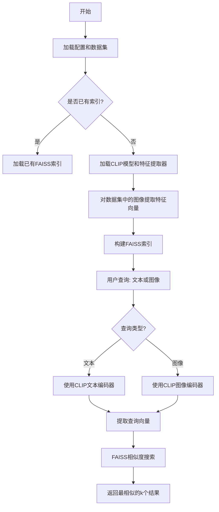

## 类结构

```
IndexConfig (继承PretrainedConfig)
Index
Retriever

全局函数:
├── normalize_images
├── preprocess_images
├── map_txt_to_clip_feature
├── map_img_to_model_feature
├── get_dataset_with_emb_from_model
└── get_dataset_with_emb_from_clip_model
```

## 全局变量及字段


### `logger`
    
用于记录日志的日志记录器对象

类型：`logging.Logger`
    


### `faiss`
    
Facebook AI Similarity Search向量索引库

类型：`module`
    


### `np`
    
NumPy库,用于数值计算和数组操作

类型：`module`
    


### `torch`
    
PyTorch深度学习库

类型：`module`
    


### `Image`
    
PIL图像处理库

类型：`module`
    


### `CLIPImageProcessor`
    
CLIP模型的图像预处理器类

类型：`class`
    


### `CLIPModel`
    
CLIP预训练模型类

类型：`class`
    


### `PretrainedConfig`
    
HuggingFace预训练模型配置基类

类型：`class`
    


### `Dataset`
    
HuggingFace数据集类

类型：`class`
    


### `load_dataset`
    
从HuggingFace加载数据集的函数

类型：`function`
    


### `IndexConfig.clip_name_or_path`
    
CLIP模型名称或路径,用于指定要使用的CLIP预训练模型

类型：`str`
    


### `IndexConfig.dataset_name`
    
数据集名称,指定要加载的HuggingFace数据集名称

类型：`str`
    


### `IndexConfig.image_column`
    
数据集中图像列的名称

类型：`str`
    


### `IndexConfig.index_name`
    
FAISS索引的名称,用于标识数据集中的嵌入列

类型：`str`
    


### `IndexConfig.index_path`
    
索引文件的保存路径,如果为None则使用默认路径

类型：`str`
    


### `IndexConfig.dataset_set`
    
数据集的split名称,如train、test等

类型：`str`
    


### `IndexConfig.metric_type`
    
FAISS距离度量类型,如L2距离或内积

类型：`int`
    


### `IndexConfig.faiss_device`
    
FAISS索引使用的设备ID,-1表示CPU

类型：`int`
    


### `Index.config`
    
索引配置对象,包含模型和数据集的配置信息

类型：`IndexConfig`
    


### `Index.dataset`
    
HuggingFace数据集对象,包含图像数据和嵌入向量

类型：`Dataset`
    


### `Index.index_initialized`
    
标记FAISS索引是否已成功初始化

类型：`bool`
    


### `Index.index_name`
    
索引的名称,与config.index_name同步

类型：`str`
    


### `Index.index_path`
    
索引文件的路径,与config.index_path同步

类型：`str`
    


### `Retriever.config`
    
检索器配置对象

类型：`IndexConfig`
    


### `Retriever.index`
    
索引对象,用于执行实际的检索操作

类型：`Index`
    
    

## 全局函数及方法


### `normalize_images`

将PIL图像列表归一化到[-1, 1]范围，用于深度学习模型的图像输入预处理。

参数：

- `images`：`List[Image.Image]`，输入的PIL图像列表，每个元素为PIL.Image对象

返回值：`List[np.ndarray]`，归一化后的numpy数组列表，像素值范围在[-1, 1]

#### 流程图

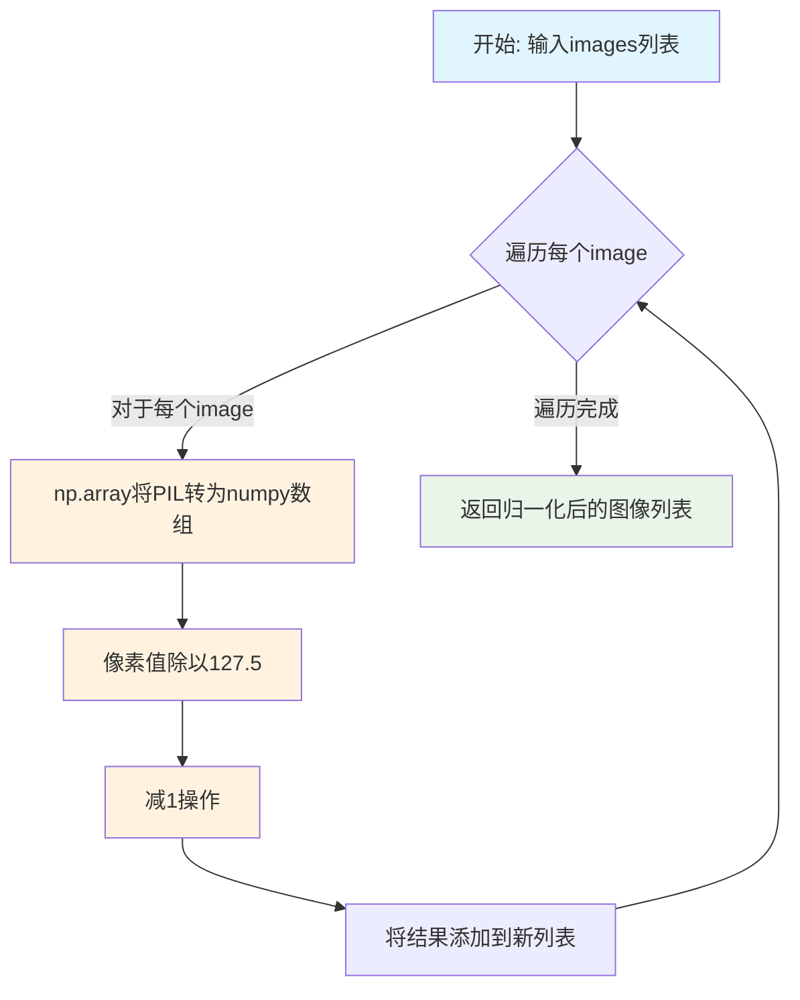

#### 带注释源码

```python
def normalize_images(images: List[Image.Image]):
    """
    将PIL图像列表归一化到[-1, 1]范围
    
    处理流程：
    1. 将PIL Image对象转换为numpy数组（像素值范围[0, 255]）
    2. 除以127.5将范围从[0, 255]映射到[0, 2]
    3. 减1将范围从[0, 2]映射到[-1, 1]
    
    Args:
        images: PIL图像列表
        
    Returns:
        归一化后的numpy数组列表，像素值范围[-1, 1]
    """
    # 第一步：将PIL Image对象转换为numpy数组
    # 转换后每个图像的形状为 (height, width, channels)，像素值范围 [0, 255]
    images = [np.array(image) for image in images]
    
    # 第二步：归一化处理
    # 除以127.5将[0, 255]映射到[0, 2]，再减1得到[-1, 1]
    # 等价于公式: normalized = (pixel / 255.0) * 2 - 1 = pixel / 127.5 - 1
    images = [image / 127.5 - 1 for image in images]
    
    # 返回归一化后的图像列表
    return images
```


### `preprocess_images`

该函数负责将输入的图像列表转换为 PyTorch 张量批次。它首先将图像转换为 NumPy 数组，然后将其像素值从 [-1, 1] 范围归一化到 [0, 1] 范围，最后使用 CLIP 图像处理器提取像素值并返回张量格式。

参数：

- `images`：`List[np.array]`，待处理的图像列表，每个元素为图像的 NumPy 数组表示
- `feature_extractor`：`CLIPImageProcessor`，CLIP 模型的图像预处理器，用于将图像转换为模型所需的张量格式

返回值：`torch.Tensor`，返回批量处理的图像张量，形状通常为 (batch_size, channels, height, width)

#### 流程图

```mermaid
flowchart TD
    A[输入图像列表] --> B[将图像转换为NumPy数组]
    B --> C[将像素值从 [-1,1] 归一化到 [0,1]]
    C --> D[调用CLIPImageProcessor处理图像]
    D --> E[提取pixel_values张量]
    E --> F[返回PyTorch张量]
```

#### 带注释源码

```python
def preprocess_images(images: List[np.array], feature_extractor: CLIPImageProcessor) -> torch.Tensor:
    """
    Preprocesses a list of images into a batch of tensors.

    Args:
        images (:obj:`List[Image.Image]`):
            A list of images to preprocess.

    Returns:
        :obj:`torch.Tensor`: A batch of tensors.
    """
    # 步骤1：将PIL图像或现有数组统一转换为NumPy数组格式
    # 确保所有图像都是NumPy数组，便于后续数值处理
    images = [np.array(image) for image in images]
    
    # 步骤2：像素值反归一化
    # 从 [-1, 1] 范围映射回 [0, 1] 范围
    # 这是因为在数据管道的前序步骤中（如normalize_images函数），
    # 图像被标准化到了 [-1, 1] 范围，现在需要恢复为标准 [0,1] 范围
    # 公式：(image + 1.0) / 2.0 将 [-1,1] 映射到 [0,1]
    images = [(image + 1.0) / 2.0 for image in images]
    
    # 步骤3：使用CLIP图像处理器进行最终预处理
    # feature_extractor 会执行CLIP模型所需的标准化、裁剪等操作
    # return_tensors="pt" 指定输出为PyTorch张量格式
    # 返回对象包含pixel_values属性，即处理后的图像张量
    images = feature_extractor(images, return_tensors="pt").pixel_values
    
    # 返回处理完成的图像张量批次
    return images
```


### `map_txt_to_clip_feature`

将文本提示（prompt）通过CLIP模型映射为归一化的文本特征向量，供后续的检索任务使用。

参数：

- `clip_model`：`CLIPModel`，CLIP模型实例，用于提取文本特征
- `tokenizer`：`CLIPTokenizer`，文本分词器，用于将文本转换为token ID序列
- `prompt`：`str`，输入的文本提示，需要转换为特征向量

返回值：`numpy.ndarray`，形状为归一化的文本特征向量（通常为768维或512维，取决于CLIP模型版本）

#### 流程图

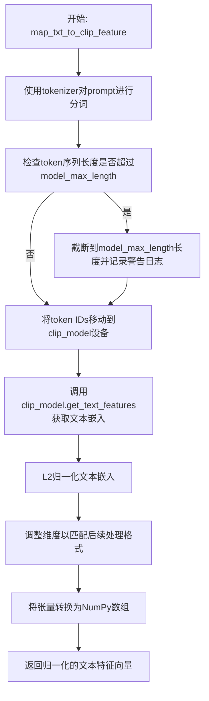

#### 带注释源码

```python
def map_txt_to_clip_feature(clip_model, tokenizer, prompt):
    """
    将文本提示映射到CLIP模型的特征空间，生成归一化的文本嵌入向量。
    
    Args:
        clip_model: CLIP模型实例，用于提取文本特征
        tokenizer: CLIP分词器，用于将文本转换为token ID
        prompt: 输入的文本提示字符串
    
    Returns:
        numpy.ndarray: 归一化后的文本特征向量
    """
    # 步骤1：使用tokenizer将文本prompt转换为模型输入格式
    # padding="max_length" 填充到最大长度
    # return_tensors="pt" 返回PyTorch张量
    text_inputs = tokenizer(
        prompt,
        padding="max_length",
        max_length=tokenizer.model_max_length,
        return_tensors="pt",
    )
    # 获取input_ids张量
    text_input_ids = text_inputs.input_ids

    # 步骤2：检查token序列长度是否超过CLIP模型支持的最大长度
    if text_input_ids.shape[-1] > tokenizer.model_max_length:
        # 提取被截断的文本部分用于日志警告
        removed_text = tokenizer.batch_decode(text_input_ids[:, tokenizer.model_max_length :])
        logger.warning(
            "The following part of your input was truncated because CLIP can only handle sequences up to"
            f" {tokenizer.model_max_length} tokens: {removed_text}"
        )
        # 截断到模型支持的最大长度
        text_input_ids = text_input_ids[:, : tokenizer.model_max_length]
    
    # 步骤3：将input_ids移动到CLIP模型所在的设备（CPU/GPU）
    # 并调用模型的get_text_features方法获取文本嵌入
    text_embeddings = clip_model.get_text_features(text_input_ids.to(clip_model.device))
    
    # 步骤4：对文本嵌入进行L2归一化
    # 这对于后续的相似度计算非常重要（余弦相似度等于归一化后的点积）
    text_embeddings = text_embeddings / torch.linalg.norm(text_embeddings, dim=-1, keepdim=True)
    
    # 步骤5：调整维度以匹配检索系统的预期格式
    # 从 [batch_size, embedding_dim] 调整为 [batch_size, 1, embedding_dim]
    text_embeddings = text_embeddings[:, None, :]
    
    # 步骤6：将PyTorch张量转换为NumPy数组
    # 移除梯度信息，转换为CPU上的NumPy数组
    return text_embeddings[0][0].cpu().detach().numpy()
```


### `map_img_to_model_feature`

该函数将输入的图像列表映射到模型特征向量，完成图像预处理、模型推理和特征归一化的完整流程，返回归一化的图像嵌入向量。

参数：

- `model`：`torch.nn.Module`，用于提取图像特征的模型（如CLIPModel）
- `feature_extractor`：`CLIPImageProcessor`，用于将图像转换为模型输入张量的特征提取器
- `imgs`：`List[Image.Image]`，待处理的PIL图像列表
- `device`：`str` 或 `torch.device`，模型运行的目标设备（如"cuda"或"cpu"）

返回值：`numpy.ndarray`，归一化后的图像特征向量，形状为模型输出的特征维度

#### 流程图

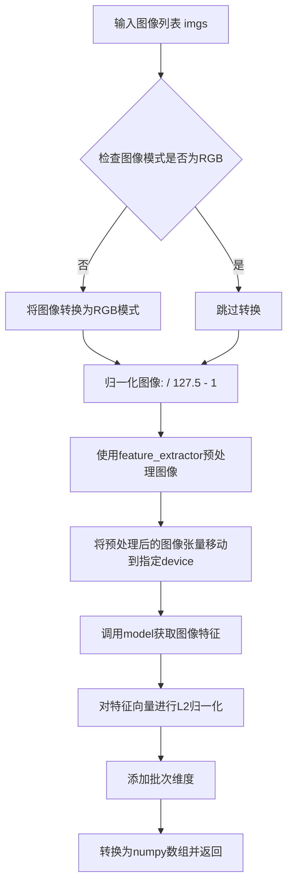

#### 带注释源码

```python
def map_img_to_model_feature(model, feature_extractor, imgs, device):
    """
    将图像列表映射到模型特征向量。
    
    Args:
        model: 用于提取图像特征的模型
        feature_extractor: CLIP图像预处理器
        imgs: PIL图像列表
        device: 计算设备
    
    Returns:
        numpy.ndarray: 归一化的图像特征向量
    """
    # 遍历图像列表，确保所有图像都是RGB模式
    for i, image in enumerate(imgs):
        if not image.mode == "RGB":
            imgs[i] = image.convert("RGB")
    
    # 调用normalize_images函数进行图像归一化
    # 归一化公式: (pixel / 127.5) - 1，将像素值映射到[-1, 1]范围
    imgs = normalize_images(imgs)
    
    # 使用CLIPImageProcessor将图像列表转换为模型输入张量
    # 并将张量移动到指定的计算设备上
    retrieved_images = preprocess_images(imgs, feature_extractor).to(device)
    
    # 将图像张量传入模型获取特征嵌入
    image_embeddings = model(retrieved_images)
    
    # 对特征向量进行L2归一化，确保输出为单位向量
    # 使用torch.linalg.norm计算范数，dim=-1表示在最后一个维度计算
    image_embeddings = image_embeddings / torch.linalg.norm(image_embeddings, dim=-1, keepdim=True)
    
    # 在第0维添加批次维度，以适配后续处理流程
    image_embeddings = image_embeddings[None, ...]
    
    # 将张量移至CPU，解除梯度追踪，转换为numpy数组
    # [0][0]用于提取单个特征向量
    return image_embeddings.cpu().detach().numpy()[0][0]
```


### `get_dataset_with_emb_from_model`

为数据集添加模型生成的图像特征嵌入。该函数接收一个数据集，使用CLIP模型对数据集中指定图像列的每张图像进行特征提取，并将生成的嵌入向量添加为新的列。

参数：

- `dataset`：`Dataset`（来自 Hugging Face Datasets 库），输入数据集，包含待处理图像
- `model`：`CLIPModel`（来自 Transformers 库），用于生成图像特征的 CLIP 模型实例
- `feature_extractor`：`CLIPImageProcessor`（来自 Transformers 库），用于预处理图像的特征提取器
- `image_column`：`str`，指定数据集中图像列的字段名称，默认为 "image"
- `index_name`：`str`，指定生成的嵌入列的名称，默认为 "embeddings"

返回值：`Dataset`，返回添加了嵌入列的新数据集

#### 流程图

```mermaid
graph TD
    A[开始: get_dataset_with_emb_from_model] --> B[调用 dataset.map 方法]
    B --> C[对数据集中每个样本执行 lambda 函数]
    C --> D[从样本中获取图像: example[image_column]]
    D --> E[调用 map_img_to_model_feature 函数]
    E --> E1[检查并转换图像为 RGB 模式]
    E1 --> E2[normalize_images: 像素值归一化到 -1, 1 范围]
    E2 --> E3[preprocess_images: 使用特征提取器转换为模型输入张量]
    E3 --> E4[model: 通过 CLIP 模型获取图像特征]
    E4 --> E5[L2 归一化特征向量]
    E5 --> E6[转换为 numpy 数组并返回]
    F[将返回的嵌入添加到样本中<br/>key=index_name] --> G[dataset.map 返回新的数据集]
    G --> H[结束: 返回带嵌入列的数据集]
```

#### 带注释源码

```python
def get_dataset_with_emb_from_model(
    dataset,                           # Hugging Face Dataset 对象，待处理的数据集
    model,                             # CLIPModel 实例，用于生成图像嵌入
    feature_extractor: CLIPImageProcessor,  # 图像预处理器
    image_column: str = "image",       # 数据集中图像列的字段名
    index_name: str = "embeddings"     # 生成的嵌入列的名称
):
    """
    为数据集中的每张图像生成模型特征嵌入，并将嵌入添加到数据集作为新列。
    
    Args:
        dataset: Hugging Face Dataset 对象
        model: CLIP 模型实例
        feature_extractor: CLIP 图像处理器
        image_column: 图像列的字段名
        index_name: 嵌入列的字段名
    
    Returns:
        添加了嵌入列的 Dataset 对象
    """
    # 使用 dataset.map 对数据集中每条样本应用函数
    # map 会为每个样本的 image_column 字段图像生成嵌入
    # 并以 index_name 为键存储在返回的样本字典中
    return dataset.map(
        lambda example: {
            # 调用 map_img_to_model_feature 生成单张图像的嵌入
            # 注意：这里传入 model.device 作为设备参数
            index_name: map_img_to_model_feature(
                model, 
                feature_extractor, 
                [example[image_column]],  # 将单张图像放入列表
                model.device               # 使用模型的设备（CPU/CUDA）
            )
        }
    )
```


### `get_dataset_with_emb_from_clip_model`

为数据集添加CLIP图像特征。该函数使用CLIP模型的图像特征提取功能，对数据集中指定图像列的每张图像提取特征向量，并将特征存储到指定的索引列中。

参数：

- `dataset`：`Dataset`，Hugging Face数据集对象，包含待处理图像的数据集
- `clip_model`：`CLIPModel`，预训练的CLIP模型，用于提取图像特征
- `feature_extractor`：`CLIPImageProcessor`，CLIP图像预处理器，用于图像预处理
- `image_column`：`str`，数据集中图像所在的列名，默认为 "image"
- `index_name`：`str`，生成的嵌入向量存储的列名，默认为 "embeddings"

返回值：`Dataset`，添加了CLIP图像嵌入特征后的数据集对象

#### 流程图

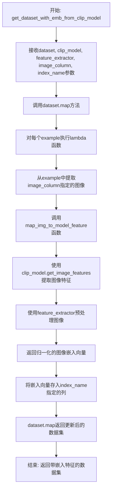

#### 带注释源码

```python
def get_dataset_with_emb_from_clip_model(
    dataset,                      # Hugging Face数据集对象
    clip_model,                   # CLIP预训练模型
    feature_extractor,            # CLIP图像处理器
    image_column="image",         # 图像列名
    index_name="embeddings"       # 嵌入列名
):
    """
    为数据集添加CLIP图像特征。
    
    使用CLIP模型的图像特征提取功能，对数据集中指定图像列的每张图像
    提取特征向量，并将特征存储到指定的索引列中。
    
    Args:
        dataset: Hugging Face数据集对象
        clip_model: 预训练的CLIP模型
        feature_extractor: CLIP图像预处理器
        image_column: 图像所在的列名
        index_name: 嵌入向量存储的列名
    
    Returns:
        添加了CLIP图像嵌入特征的数据集对象
    """
    # 使用dataset.map方法对数据集中每个样本进行处理
    # lambda函数接收每个example，提取图像并计算嵌入向量
    return dataset.map(
        lambda example: {
            # 将计算得到的图像嵌入存储到index_name指定的列中
            # 调用map_img_to_model_feature函数，传递CLIP模型的get_image_features方法
            index_name: map_img_to_model_feature(
                clip_model.get_image_features,    # CLIP模型的图像特征提取方法
                feature_extractor,                # 图像预处理器
                [example[image_column]],          # 从example中提取单张图像
                clip_model.device                  # 模型所在设备
            )
        }
    )
```


### IndexConfig.__init__

该方法是 `IndexConfig` 类的构造函数，用于初始化检索系统的配置参数。它继承自 `PretrainedConfig`，设置了 CLIP 模型路径、数据集名称、图像列名、索引名称、索引路径、数据集划分、FAISS 距离度量类型以及计算设备等核心配置项。

参数：

- `clip_name_or_path`：`str`，CLIP 模型的名称或本地路径，默认为 "openai/clip-vit-large-patch14"
- `dataset_name`：`str`，数据集名称，默认为 "Isamu136/oxford_pets_with_l14_emb"
- `image_column`：`str`，数据集中图像列的名称，默认为 "image"
- `index_name`：`str`，FAISS 索引的列名，默认为 "embeddings"
- `index_path`：`str | None`，FAISS 索引文件的路径，默认为 None
- `dataset_set`：`str`，数据集的划分（如 train、test 等），默认为 "train"
- `metric_type`：`int`，FAISS 距离度量类型，默认为 faiss.METRIC_L2
- `faiss_device`：`int`，FAISS 使用的设备编号，-1 表示 CPU，默认为 -1
- `**kwargs`：可变关键字参数，用于传递父类的额外配置参数

返回值：`None`，该方法不返回值，仅通过 `super().__init__()` 初始化父类并设置实例属性

#### 流程图

```mermaid
flowchart TD
    A[开始 __init__] --> B[调用 super().__init__\*\*kwargs]
    B --> C[设置 self.clip_name_or_path]
    C --> D[设置 self.dataset_name]
    D --> E[设置 self.image_column]
    E --> F[设置 self.index_name]
    F --> G[设置 self.index_path]
    G --> H[设置 self.dataset_set]
    H --> I[设置 self.metric_type]
    I --> J[设置 self.faiss_device]
    J --> K[结束 __init__]
```

#### 带注释源码

```python
class IndexConfig(PretrainedConfig):
    """
    索引配置类，继承自 PretrainedConfig，用于配置检索系统的各项参数。
    包括 CLIP 模型路径、数据集信息、FAISS 索引配置等。
    """

    def __init__(
        self,
        clip_name_or_path="openai/clip-vit-large-patch14",  # CLIP 模型名称或路径
        dataset_name="Isamu136/oxford_pets_with_l14_emb",  # 数据集名称
        image_column="image",  # 数据集中图像列的名称
        index_name="embeddings",  # FAISS 索引的列名
        index_path=None,  # FAISS 索引文件的路径
        dataset_set="train",  # 数据集划分
        metric_type=faiss.METRIC_L2,  # FAISS 距离度量类型
        faiss_device=-1,  # FAISS 使用的设备，-1 为 CPU
        **kwargs,  # 父类的额外关键字参数
    ):
        # 调用父类 PretrainedConfig 的初始化方法
        super().__init__(**kwargs)

        # 设置 CLIP 模型路径或名称
        self.clip_name_or_path = clip_name_or_path

        # 设置数据集名称
        self.dataset_name = dataset_name

        # 设置数据集中图像列的名称
        self.image_column = image_column

        # 设置 FAISS 索引的列名
        self.index_name = index_name

        # 设置 FAISS 索引文件的路径
        self.index_path = index_path

        # 设置数据集的划分（如 train、test）
        self.dataset_set = dataset_set

        # 设置 FAISS 距离度量类型（如 METRIC_L2、METRIC_INNER_PRODUCT）
        self.metric_type = metric_type

        # 设置 FAISS 使用的设备，-1 表示 CPU，非负数表示 GPU 设备编号
        self.faiss_device = faiss_device
```


### `Index.__init__`

初始化索引实例，用于存储和管理基于CLIP模型的图像嵌入向量，支持从预定义数据集或自定义数据集构建FAISS索引以实现高效的相似度检索。

参数：

- `config`：`IndexConfig`，索引配置对象，包含CLIP模型路径、数据集名称、索引名称、度量类型等配置信息
- `dataset`：`Dataset`，Hugging Face datasets库的数据集对象，用于存储图像数据和对应的嵌入向量

返回值：`None`，该方法为构造函数，不返回任何值

#### 流程图

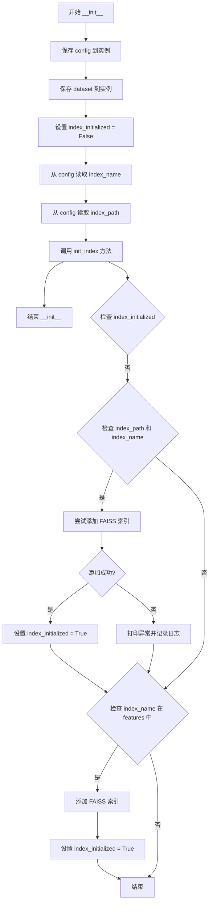

#### 带注释源码

```python
def __init__(self, config: IndexConfig, dataset: Dataset):
    """
    初始化索引实例。
    
    Args:
        config: IndexConfig对象，包含索引的配置文件
        dataset: Hugging Face Dataset对象，包含图像数据
    
    Returns:
        None
    """
    # 1. 保存配置对象到实例属性
    self.config = config
    
    # 2. 保存数据集对象到实例属性
    self.dataset = dataset
    
    # 3. 初始化索引状态标志为False，表示索引尚未初始化
    self.index_initialized = False
    
    # 4. 从配置中获取索引名称
    self.index_name = config.index_name
    
    # 5. 从配置中获取索引文件路径
    self.index_path = config.index_path
    
    # 6. 调用内部方法初始化FAISS索引
    # 该方法会尝试加载已存在的索引或构建新索引
    self.init_index()
```


### `Index.set_index_name`

设置索引的名称，用于在运行时动态更新索引的标识符。

参数：

- `index_name`：`str`，索引的新名称

返回值：`None`，无返回值

#### 流程图

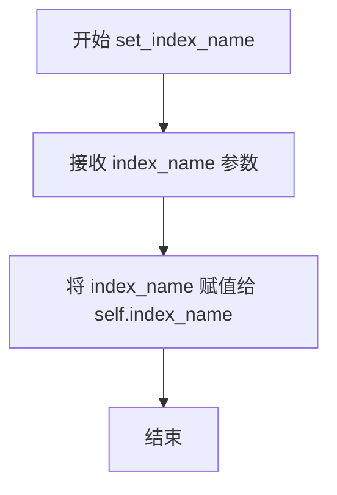

#### 带注释源码

```python
def set_index_name(self, index_name: str):
    """
    设置索引的名称。
    
    该方法允许在运行时动态更新索引的标识符。
    注意：调用此方法后，如果索引已初始化，需要重新调用 init_index() 以确保一致性。
    
    Args:
        index_name (str): 索引的新名称，必须与数据集中的特征列名称匹配。
    
    Returns:
        None: 无返回值，直接修改实例属性。
    """
    self.index_name = index_name
```


### `Index.init_index`

该方法负责初始化FAISS索引，检查索引路径和索引名称是否已配置，尝试为数据集添加FAISS索引，并在索引成功初始化或索引列已存在于数据集特征中时将 `index_initialized` 标志设置为 True。

参数：

- 无显式参数（仅 `self` 隐式参数）

返回值：无（`None`），该方法通过修改对象状态（`self.index_initialized`）而非返回值来指示执行结果。

#### 流程图

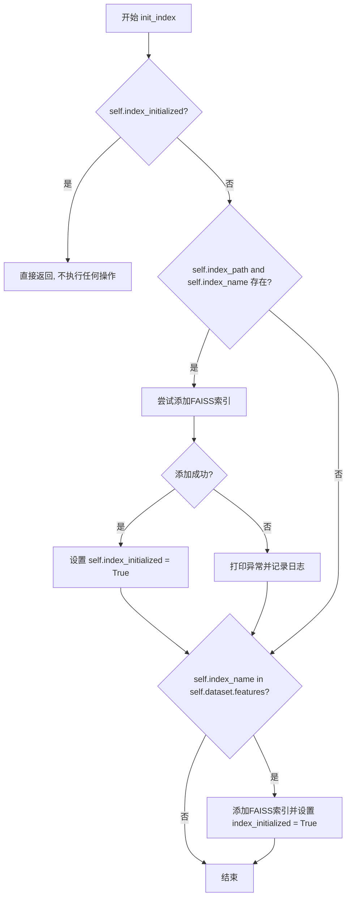

#### 带注释源码

```python
def init_index(self):
    """
    初始化FAISS索引。
    
    该方法尝试为数据集添加FAISS索引，支持两种初始化方式：
    1. 通过指定 index_path 和 index_name 从预构建的索引加载
    2. 通过检查数据集特征列是否存在自动构建索引
    """
    # 检查索引是否已经初始化，避免重复初始化
    if not self.index_initialized:
        # 优先尝试：从指定的索引路径和名称加载预构建的FAISS索引
        if self.index_path and self.index_name:
            try:
                # 使用 datasets 库的 add_faiss_index 方法添加索引
                # 参数：
                #   column: 索引列名
                #   metric_type: 距离度量类型（如 L2 距离）
                #   device: 计算设备（-1 表示 CPU）
                self.dataset.add_faiss_index(
                    column=self.index_name, 
                    metric_type=self.config.metric_type, 
                    device=self.config.faiss_device
                )
                # 标记索引已成功初始化
                self.index_initialized = True
            except Exception as e:
                # 捕获异常并打印，同时记录日志
                # 注意：这里直接 print(e) 不是最佳实践，建议使用 logger
                print(e)
                logger.info("Index not initialized")
        
        # 备选方案：检查索引列是否已存在于数据集特征中
        # 如果索引数据已作为特征列存在于数据集中，则直接添加 FAISS 索引
        if self.index_name in self.dataset.features:
            self.dataset.add_faiss_index(column=self.index_name)
            self.index_initialized = True
```


### `Index.build_index`

该方法用于构建检索索引，通过使用CLIP模型对数据集中的图像进行特征提取并生成向量索引，使后续的相似图像检索成为可能。

参数：

- `model`：`torch.nn.Module`，可选参数，用于提取图像特征的CLIP模型。如果为None，则会自动从预训练配置中加载。
- `feature_extractor`：`CLIPImageProcessor`，可选参数，用于将图像转换为模型输入张量的处理器。如果为None，则会自动从预训练配置中加载。
- `torch_dtype`：`torch.dtype`，可选参数，指定模型的数据类型，默认为`torch.float32`。

返回值：`None`，该方法直接在Index对象的内部状态中构建索引，不返回任何值。

#### 流程图

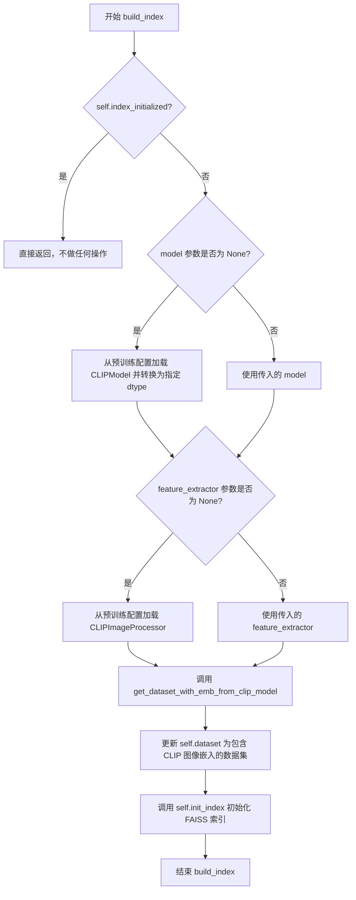

#### 带注释源码

```python
def build_index(
    self,
    model=None,
    feature_extractor: CLIPImageProcessor = None,
    torch_dtype=torch.float32,
):
    """
    构建索引，通过CLIP模型提取图像特征并创建FAISS索引。
    
    该方法完成以下工作：
    1. 检查索引是否已初始化
    2. 如果没有初始化，则加载CLIP模型和特征提取器（如果未提供）
    3. 使用CLIP模型对数据集中的图像进行特征提取
    4. 将提取的特征添加到数据集并初始化FAISS索引
    
    Args:
        model: 可选的CLIP模型，如果为None则自动加载
        feature_extractor: 可选的CLIP图像处理器，如果为None则自动加载
        torch_dtype: 模型权重的数据类型，默认为torch.float32
    
    Returns:
        None: 该方法直接修改对象状态，不返回任何值
    """
    # 检查索引是否已经初始化
    if not self.index_initialized:
        # 如果没有提供模型，则从预训练配置加载CLIP模型并转换为指定的数据类型
        model = model or CLIPModel.from_pretrained(self.config.clip_name_or_path).to(dtype=torch_dtype)
        
        # 如果没有提供特征提取器，则从预训练配置加载
        feature_extractor = feature_extractor or CLIPImageProcessor.from_pretrained(self.config.clip_name_or_path)
        
        # 调用辅助函数，使用CLIP模型对数据集中的图像进行特征提取
        # 这会为数据集中的每个图像添加一个名为index_name的嵌入列
        self.dataset = get_dataset_with_emb_from_clip_model(
            self.dataset,
            model,
            feature_extractor,
            image_column=self.config.image_column,
            index_name=self.config.index_name,
        )
        
        # 调用init_index方法，初始化FAISS索引
        # 这将根据metric_type和device配置创建实际的向量索引
        self.init_index()
```


### `Index.retrieve_imgs`

该方法用于根据输入的向量从预先构建的FAISS索引中检索最相似的图像。它接收一个嵌入向量和要检索的数量k，将其转换为NumPy float32数组后调用数据集的最近邻查询方法返回最相似的图像示例。

参数：

- `self`：隐式参数，Index实例本身
- `vec`：`np.ndarray`，用于检索的查询向量（通常是图像的CLIP嵌入向量）
- `k`：`int`，需要检索的最近邻数量，默认为20

返回值：`Tuple`，返回由 `dataset.get_nearest_examples` 返回的元组，通常包含（样本、距离等）最近邻示例及其距离信息

#### 流程图

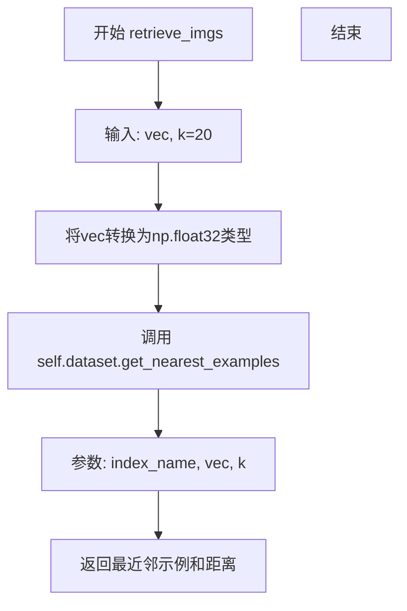

#### 带注释源码

```python
def retrieve_imgs(self, vec, k: int = 20):
    """
    从FAISS索引中检索最相似的图像。
    
    Args:
        vec: 查询向量，通常是图像的CLIP嵌入向量
        k: 要检索的最近邻数量，默认为20
    
    Returns:
        最近邻示例及其距离的元组
    """
    # 将输入向量转换为NumPy float32数组（FAISS要求）
    vec = np.array(vec).astype(np.float32)
    # 调用HuggingFace datasets的get_nearest_examples方法
    # 从指定索引中检索k个最相似的示例
    return self.dataset.get_nearest_examples(self.index_name, vec, k=k)
```


### `Index.retrieve_imgs_batch`

该方法用于批量检索与给定向量最相似的图像，利用 FAISS 索引和 Hugging Face Datasets 的 `get_nearest_examples_batch` 方法高效返回多个查询向量的最近邻结果。

参数：

- `self`：`Index` 类实例，表示当前索引对象
- `vec`：输入的查询向量（embeddings），可以是 `np.ndarray`、`List[np.ndarray]` 或任何可转换为 `np.array` 的对象，表示一个或多个待检索的向量嵌入
- `k`：`int` 类型，默认值为 `20`，表示每个查询向量要返回的最相似图像数量

返回值：返回批量检索结果，具体类型取决于 `self.dataset.get_nearest_examples_batch` 的返回值，通常包含最近邻的示例数据（如图像、分数、距离等）的批量结果。

#### 流程图

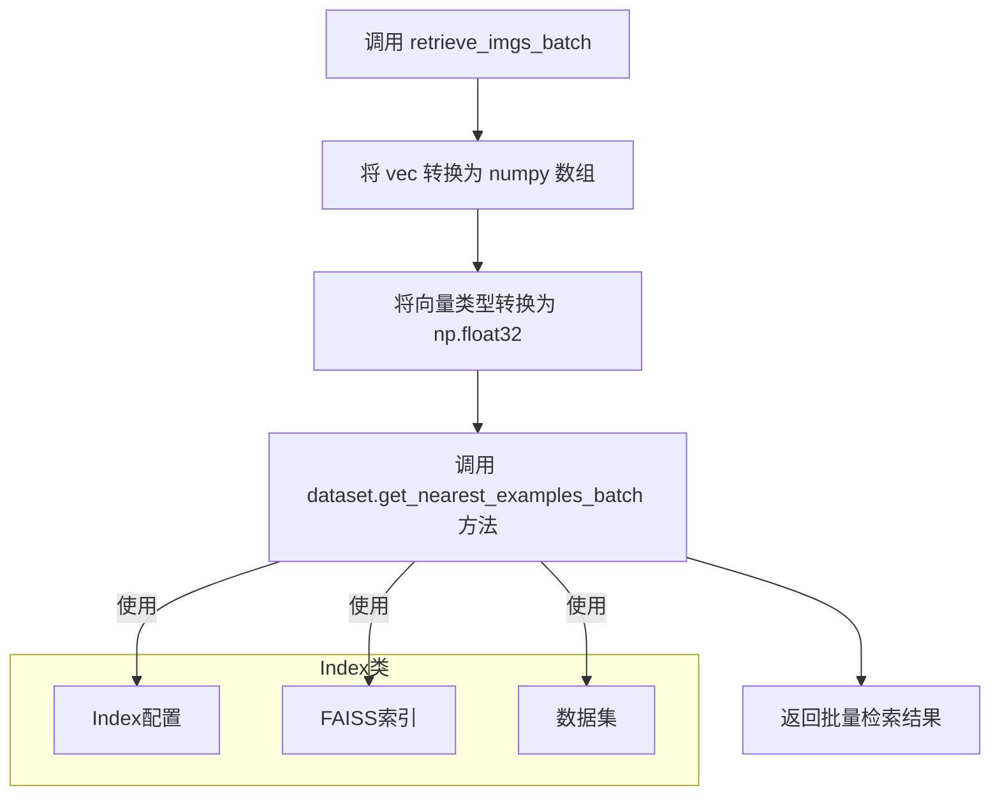

#### 带注释源码

```python
def retrieve_imgs_batch(self, vec, k: int = 20):
    """
    批量检索与给定向量最相似的图像。

    该方法接受一个或多个查询向量，通过 FAISS 索引在嵌入空间中
    查找最相似的 k 个图像，并返回批量检索结果。

    Args:
        vec: 查询向量，可以是单个向量或向量列表
              支持 np.ndarray、List[np.ndarray] 等类型
        k (int): 每个查询向量要返回的最近邻数量，默认值为 20

    Returns:
        批量检索结果，包含最近邻的示例数据
        具体返回格式取决于 Hugging Face datasets 库的 get_nearest_examples_batch 方法
    """
    # 将输入向量转换为 numpy 数组，确保类型兼容
    vec = np.array(vec).astype(np.float32)
    
    # 调用数据集的批量最近邻查询方法
    # 该方法会利用已构建的 FAISS 索引进行高效相似度搜索
    # 返回格式: 通常为 (examples, scores) 或类似的元组结构
    return self.dataset.get_nearest_examples_batch(self.index_name, vec, k=k)
```


### Index.retrieve_indices

检索相似索引（单查询），该方法接收一个查询向量，在已构建的FAISS索引中搜索最相似的k个索引，并返回这些索引。

参数：

- `self`：Index，索引类的实例，隐含参数
- `vec`：numpy.ndarray 或 List[float]，查询向量，表示待检索的嵌入向量
- `k`：int，返回最相似的k个结果，默认为20

返回值：`numpy.ndarray`，返回最相似索引的数组

#### 流程图

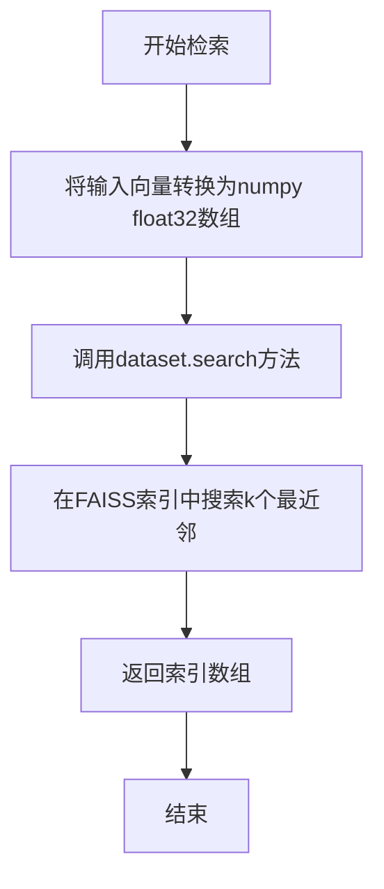

#### 带注释源码

```python
def retrieve_indices(self, vec, k: int = 20):
    """
    在FAISS索引中检索与输入向量最相似的k个索引（单查询）。

    Args:
        vec: 查询向量，可以是numpy数组或列表
        k: int, 返回最相似的k个结果，默认值为20

    Returns:
        numpy.ndarray: 返回最相似的索引数组
    """
    # 将输入向量转换为numpy float32数组，以符合FAISS的输入要求
    vec = np.array(vec).astype(np.float32)
    # 调用datasets库的search方法在FAISS索引中搜索
    # self.index_name: 索引名称
    # vec: 查询向量
    # k: 返回的最近邻数量
    return self.dataset.search(self.index_name, vec, k=k)
```


### `Index.retrieve_indices_batch`

该方法用于批量检索与给定查询向量最相似的索引，通过调用 Hugging Face datasets 库的 `search_batch` 方法在 FAISS 索引上执行批量最近邻搜索，并返回每个查询向量的 k 个最近邻的索引（不含距离信息）。

参数：

- `self`：索引类实例（隐式参数），代表当前的 Index 对象
- `vec`：查询向量，支持 list、np.array 或其他可转换为 numpy 数组的输入，用于在索引中检索相似的向量
- `k`：`int`，默认值为 20，每个查询向量要检索的最近邻数量

返回值：`tuple`，返回由 FAISS 索引返回的最近邻索引数组（通常为 `(num_queries, k)` 形状的整数数组），具体返回格式取决于 `datasets.Dataset.search_batch` 的实现。

#### 流程图

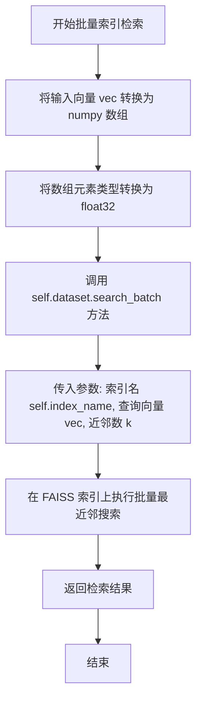

#### 带注释源码

```python
def retrieve_indices_batch(self, vec, k: int = 20):
    """
    批量检索与给定查询向量最相似的索引。
    
    该方法将输入向量转换为 float32 类型的 numpy 数组，然后调用
    Hugging Face datasets 的 search_batch 方法在 FAISS 索引上
    执行批量最近邻搜索，仅返回索引而不返回距离值。
    
    Args:
        vec: 查询向量，可以是单个向量或向量列表/数组，
             每个向量代表一个查询点
        k (int, optional): 要检索的最近邻数量，默认值为 20
    
    Returns:
        tuple: 包含最近邻索引的元组，具体格式由 datasets 库定义
    """
    # 将输入向量转换为 numpy 数组，确保类型兼容
    vec = np.array(vec).astype(np.float32)
    
    # 调用 datasets 库的 search_batch 方法执行批量搜索
    # 仅返回索引，不包含距离信息
    # 参数:
    #   - self.index_name: 要搜索的 FAISS 索引名称
    #   - vec: 查询向量（已转换为 float32）
    #   - k: 每个查询要返回的最近邻数量
    return self.dataset.search_batch(self.index_name, vec, k=k)
```


### `Retriever.__init__` - 初始化检索器

该方法用于初始化检索器实例，接收配置对象和可选的索引、数据集、模型和特征提取器。如果未提供索引，则自动调用内部方法构建索引。

参数：

- `self`：隐式参数，Retriever 实例本身
- `config`：`IndexConfig`，检索器的配置对象，包含 CLIP 模型路径、数据集信息、索引配置等参数
- `index`：`Index`，可选参数，如果提供则直接使用该索引，否则根据配置构建新索引
- `dataset`：`Dataset`，可选参数，数据集对象，用于构建索引时的数据来源
- `model`：任意类型，可选参数，CLIP 模型实例，用于生成图像嵌入向量
- `feature_extractor`：`CLIPImageProcessor`，可选参数，CLIP 图像特征提取器，用于预处理图像

返回值：`None`，构造方法不返回值，仅初始化对象状态

#### 流程图

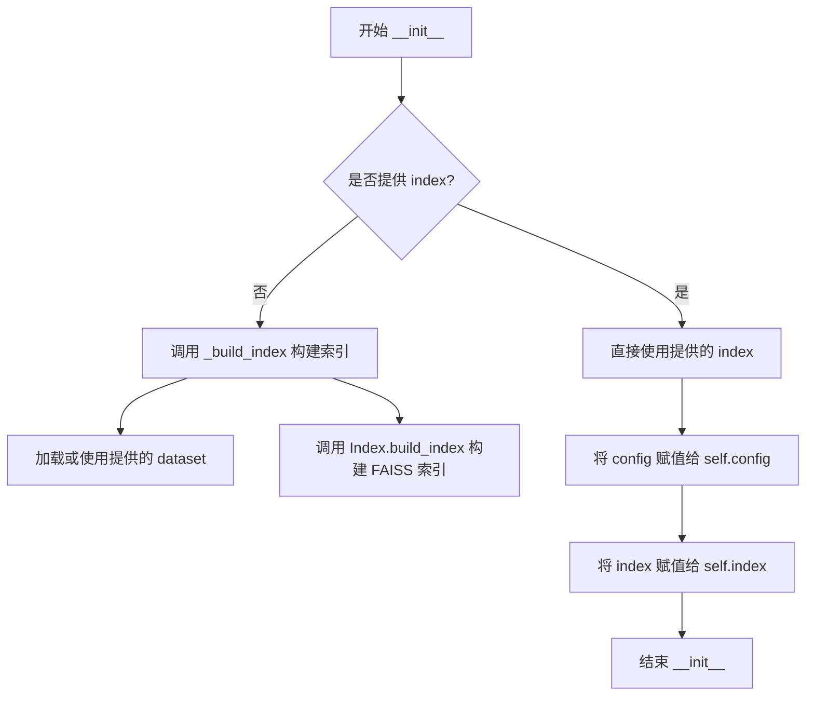

#### 带注释源码

```python
def __init__(
    self,
    config: IndexConfig,
    index: Index = None,
    dataset: Dataset = None,
    model=None,
    feature_extractor: CLIPImageProcessor = None,
):
    """
    初始化检索器实例。

    Args:
        config (IndexConfig): 检索器的配置对象，包含模型路径、数据集名称、索引配置等信息。
        index (Index, optional): 预先构建好的索引对象。如果为 None，则会自动构建索引。
        dataset (Dataset, optional): 数据集对象，用于在未提供 index 时构建索引。
        model: 任意类型，可选的 CLIP 模型实例，用于生成图像嵌入向量。
        feature_extractor (CLIPImageProcessor, optional): CLIP 图像特征提取器，用于预处理图像。

    Returns:
        None: 构造方法不返回值。
    """
    # 将配置对象保存到实例属性
    self.config = config
    
    # 如果提供了 index，则直接使用；否则调用 _build_index 方法构建索引
    # _build_index 方法会：
    # 1. 加载数据集（如果未提供）
    # 2. 使用 CLIP 模型生成图像嵌入
    # 3. 构建 FAISS 索引
    self.index = index or self._build_index(
        config, 
        dataset, 
        model=model, 
        feature_extractor=feature_extractor
    )
```


### `Retriever.from_pretrained`

这是一个类方法，用于从预训练路径加载 `Retriever` 实例。该方法首先尝试从指定路径加载 `IndexConfig` 配置，然后使用该配置及其他可选参数（索引、数据集、模型、特征提取器）初始化 `Retriever` 对象。

参数：

- `cls`：类本身（类方法隐含参数）
- `retriever_name_or_path`：`str`，预训练模型路径或名称，用于加载配置
- `index`：`Index`，可选的索引实例，用于指定已构建好的 FAISS 索引
- `dataset`：`Dataset`，可选的数据集实例，用于指定已处理的数据集
- `model`：可选的模型实例，用于指定预加载的 CLIP 模型
- `feature_extractor`：`CLIPImageProcessor`，可选的图像特征提取器，用于预处理图像
- `**kwargs`：其他关键字参数，会传递给 `IndexConfig.from_pretrained`

返回值：`Retriever`，返回初始化后的 `Retriever` 实例

#### 流程图

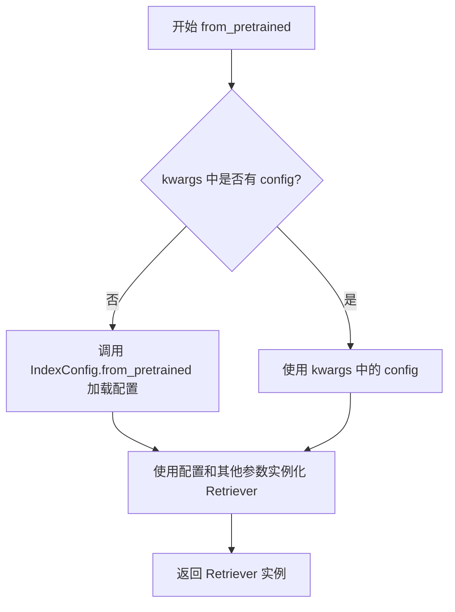

#### 带注释源码

```python
@classmethod
def from_pretrained(
    cls,
    retriever_name_or_path: str,
    index: Index = None,
    dataset: Dataset = None,
    model=None,
    feature_extractor: CLIPImageProcessor = None,
    **kwargs,
):
    """
    从预训练路径加载 Retriever 实例。

    Args:
        retriever_name_or_path: 预训练模型路径或名称
        index: 可选的索引实例
        dataset: 可选的数据集实例
        model: 可选的模型实例
        feature_extractor: 可选的图像特征提取器
        **kwargs: 其他关键字参数

    Returns:
        Retriever: 初始化后的 Retriever 实例
    """
    # 从 kwargs 中弹出 config，如果不存在则从预训练路径加载
    config = kwargs.pop("config", None) or IndexConfig.from_pretrained(retriever_name_or_path, **kwargs)
    
    # 使用配置和可选参数实例化 Retriever 类
    return cls(config, index=index, dataset=dataset, model=model, feature_extractor=feature_extractor)
```


### Retriever._build_index

该静态方法负责构建检索索引，加载数据集（若未提供），根据配置初始化Index实例，并调用其build_index方法生成向量索引，最终返回完整的Index对象供检索使用。

参数：

- `config`：`IndexConfig`，索引配置对象，包含数据集名称、CLIP模型路径、索引列名等关键配置信息
- `dataset`：`Dataset`，可选参数，Hugging Face数据集对象，若为None则根据config.dataset_name自动加载
- `model`：`CLIPModel`，可选参数，预训练的CLIP模型实例，用于生成图像embedding，若为None则在Index.build_index中自动加载
- `feature_extractor`：`CLIPImageProcessor`，可选参数，CLIP图像处理器，用于预处理图像，若为None则在Index.build_index中自动加载

返回值：`Index`，构建完成的FAISS索引对象，包含数据集和向量索引，可用于后续的相似性检索

#### 流程图

```mermaid
flowchart TD
    A[开始 _build_index] --> B{检查 dataset 是否为 None}
    B -- 是 --> C[调用 load_dataset 加载数据集]
    C --> D[根据 config.dataset_set 获取数据集子集]
    B -- 否 --> D
    D --> E[创建 Index 实例: Index(config, dataset)]
    E --> F[调用 index.build_index 构建索引]
    F --> G[传入 model 和 feature_extractor 参数]
    G --> H[返回 index 对象]
    H --> I[结束]
```

#### 带注释源码

```python
@staticmethod
def _build_index(
    config: IndexConfig, dataset: Dataset = None, model=None, feature_extractor: CLIPImageProcessor = None
):
    """
    构建检索索引的静态方法
    
    参数:
        config: IndexConfig对象，包含索引配置信息
        dataset: 可选的数据集对象，如果为None则自动加载
        model: 可选的CLIP模型，如果为None则在Index.build_index中自动加载
        feature_extractor: 可选的图像处理器，如果为None则在Index.build_index中自动加载
    
    返回:
        Index: 构建完成的索引对象
    """
    # 如果未提供数据集，则根据配置中的dataset_name加载完整数据集
    dataset = dataset or load_dataset(config.dataset_name)
    
    # 根据配置中的dataset_set（如'train'）获取数据集的特定子集
    dataset = dataset[config.dataset_set]
    
    # 使用配置和数据集创建Index实例
    index = Index(config, dataset)
    
    # 调用Index实例的build_index方法，传递模型和特征提取器
    # 该方法会生成图像的CLIP embeddings并建立FAISS索引
    index.build_index(model=model, feature_extractor=feature_extractor)
    
    # 返回构建完成的索引对象
    return index
```


### `Retriever.save_pretrained`

该方法用于将检索器的配置和FAISS索引保存到指定的目录中，以便后续可以通过`from_pretrained`方法重新加载。

参数：

- `save_directory`：`str`，保存模型和配置的目录路径

返回值：`None`，该方法直接保存文件，不返回任何内容

#### 流程图


#### 带注释源码

```python
def save_pretrained(self, save_directory):
    """
    保存预训练的检索器模型到指定目录。
    
    该方法会保存FAISS索引文件和IndexConfig配置对象。
    如果index_path尚未设置，则会创建新的FAISS索引文件。
    
    Args:
        save_directory (str): 保存模型和配置的目录路径。
    """
    # 创建保存目录，如果目录已存在则不会报错
    os.makedirs(save_directory, exist_ok=True)
    
    # 检查配置中是否设置了索引路径
    if self.config.index_path is None:
        # 构建FAISS索引文件的完整路径
        index_path = os.path.join(save_directory, "hf_dataset_index.faiss")
        
        # 从数据集中获取FAISS索引并保存到文件
        self.index.dataset.get_index(self.config.index_name).save(index_path)
        
        # 更新配置中的索引路径，以便后续加载
        self.config.index_path = index_path
    
    # 保存配置对象到指定目录（包括config.json和其他配置文件）
    self.config.save_pretrained(save_directory)
```


### `Retriever.init_retrieval`

初始化检索模块，通过调用内部索引对象的初始化方法来启动Faiss索引，准备好用于后续的图像检索操作。

参数：

- 无（仅包含 `self` 参数）

返回值：`None`，无返回值描述

#### 流程图

```mermaid
flowchart TD
    A[开始 init_retrieval] --> B[记录日志: initializing retrieval]
    B --> C[调用 self.index.init_index]
    C --> D{索引是否初始化成功?}
    D -->|是| E[索引已就绪]
    D -->|否| F[记录日志: Index not initialized]
    E --> G[结束]
    F --> G
```

#### 带注释源码

```python
def init_retrieval(self):
    """
    初始化检索功能。
    
    该方法负责初始化内部的Faiss索引，使其准备好执行检索操作。
    它调用Index类的init_index方法来执行实际的初始化逻辑。
    """
    # 记录初始化开始的日志信息
    logger.info("initializing retrieval")
    
    # 调用索引对象的初始化方法
    # init_index 方法会尝试加载已存在的FAISS索引或创建新索引
    self.index.init_index()
```


### `Retriever.retrieve_imgs`

该方法是Retriever类的核心检索方法，用于根据输入的嵌入向量（embeddings）从预构建的FAISS索引中检索最相似的图像。它封装了Index类的retrieve_imgs方法，提供对外的统一检索接口。

参数：

- `embeddings`：`np.ndarray`，用于检索的嵌入向量，通常是CLIP模型生成的图像或文本嵌入
- `k`：`int`，要检索的最近邻（K近邻）数量，默认为20

返回值：返回`Tuple`，包含最近邻示例的距离（distances）和对应的数据（examples）。具体格式取决于datasets库的get_nearest_examples返回结构，通常包含检索到的图像数据及其与查询嵌入的距离值。

#### 流程图

```mermaid
flowchart TD
    A[开始: retrieve_imgs] --> B[接收embeddings和k参数]
    B --> C{检查embeddings类型}
    C -->|np.ndarray| D[直接传递]
    C -->|其他类型| E[转换为np.ndarray]
    E --> D
    D --> F[调用self.index.retrieve_imgs方法]
    F --> G[Index.retrieve_imgs内部处理]
    G --> H[转换为float32类型]
    H --> I[调用dataset.get_nearest_examples]
    I --> J[执行FAISS相似度搜索]
    J --> K[返回最近邻示例]
    K --> L[结束: 返回检索结果]
```

#### 带注释源码

```python
def retrieve_imgs(self, embeddings: np.ndarray, k: int):
    """
    根据嵌入向量检索最相似的图像。
    
    该方法是Retriever类的公共接口方法，内部委托给Index类的retrieve_imgs方法
    执行实际的FAISS索引检索操作。适用于单次查询场景。
    
    参数:
        embeddings (np.ndarray): 
            用于相似度搜索的嵌入向量。通常是CLIP模型生成的图像嵌入或文本嵌入，
            维度应与索引构建时使用的嵌入维度一致。
        k (int): 
            要检索的最近邻（K近邻）数量。默认值为20。
            较大的k值会返回更多结果，但会增加计算开销。
    
    返回:
        Tuple: 包含以下内容的元组：
            - distances: 查询向量与返回结果之间的距离数组（根据metric_type为L2距离或余弦相似度）
            - examples: 返回的最近邻示例，通常包含原始数据列（如图像）
    
    示例:
        >>> retriever = Retriever(config)
        >>> embeddings = np.random.randn(512).astype(np.float32)
        >>> results = retriever.retrieve_imgs(embeddings, k=5)
        >>> print(results[0])  # 距离数组
        >>> print(results[1])  # 检索到的数据
    """
    # 调用内部Index对象的retrieve_imgs方法执行实际检索
    # Index对象封装了FAISS索引和数据集，提供底层检索能力
    return self.index.retrieve_imgs(embeddings, k)
```


### `Retriever.retrieve_imgs_batch`

该方法用于批量检索与给定嵌入向量最相似的图像。它接收一批嵌入向量和要检索的数量k，委托给内部Index对象的`retrieve_imgs_batch`方法执行实际的批量最近邻搜索，并返回检索结果。

参数：

- `embeddings`：`np.ndarray`，待检索的嵌入向量批次，通常是二维数组（batch_size × embedding_dim）
- `k`：`int`，每个查询要返回的最近邻图像数量，默认为20

返回值：`Any`，返回数据集的批量检索结果，具体类型取决于`dataset.get_nearest_examples_batch`的返回，通常包含匹配示例的字典结构

#### 流程图

```mermaid
flowchart TD
    A[开始批量图像检索] --> B[接收embeddings和k参数]
    B --> C[调用self.index.retrieve_imgs_batch]
    C --> D[Index.retrieve_imgs_batch执行]
    D --> E[将embeddings转换为numpy float32数组]
    E --> F[调用dataset.get_nearest_examples_batch]
    F --> G[返回批量检索结果]
    G --> H[将结果返回给调用者]
```

#### 带注释源码

```python
def retrieve_imgs_batch(self, embeddings: np.ndarray, k: int):
    """
    批量检索与给定嵌入向量最相似的图像。
    
    Args:
        embeddings (np.ndarray): 待检索的嵌入向量批次，通常为(batch_size, embedding_dim)形状的二维数组
        k (int): 每个查询要返回的最近邻图像数量
    
    Returns:
        Any: 批量检索结果，包含与查询最相似的k个图像的相关信息
    """
    # 委托给内部Index对象的retrieve_imgs_batch方法执行实际检索
    return self.index.retrieve_imgs_batch(embeddings, k)
```


### `Retriever.retrieve_indices`

该方法是 Retriever 类的检索接口，用于根据输入的嵌入向量（embeddings）从已构建的 FAISS 索引中检索最相似的 k 个索引。内部委托给 Index 类的 retrieve_indices 方法执行实际的向量搜索操作。

参数：

- `embeddings`：`np.ndarray`，输入的嵌入向量，用于在向量空间中查找最相似的索引
- `k`：`int`，要检索的最近邻数量，默认为 20

返回值：`tuple`，返回 FAISS 搜索的结果，通常包含距离和索引信息

#### 流程图

```mermaid
flowchart TD
    A[调用 Retriever.retrieve_indices] --> B[调用 self.index.retrieve_indices]
    B --> C{Index是否已初始化}
    C -->|是| D[转换为np.float32类型]
    C -->|否| E[抛出异常或返回空结果]
    D --> F[调用 dataset.search 方法]
    F --> G[返回搜索结果tuple]
```

#### 带注释源码

```python
def retrieve_indices(self, embeddings: np.ndarray, k: int):
    """
    根据嵌入向量检索最相似的索引。
    
    Args:
        embeddings (np.ndarray): 输入的嵌入向量，用于相似度搜索
        k (int): 检索的最近邻数量，默认值为20
    
    Returns:
        tuple: 包含搜索结果的元组，通常为(indices, distances)格式
    """
    # 委托给 Index 类的 retrieve_indices 方法执行实际搜索
    return self.index.retrieve_indices(embeddings, k)
```


### `Retriever.retrieve_indices_batch`

该方法是 Retriever 类的批量检索方法，用于根据输入的嵌入向量批量检索数据集中最近的 k 个索引。该方法内部委托给 Index 类的同名方法，最终通过 FAISS 的批量搜索功能实现高效的向量检索。

参数：

- `self`：`Retriever` 实例本身
- `embeddings`：`np.ndarray`，待检索的嵌入向量，可以是单个向量或向量批量
- `k`：`int`，返回最相似的索引数量，默认为 20

返回值：`Any`，返回 `dataset.search_batch` 的结果，通常包含检索到的索引和距离信息

#### 流程图

```mermaid
flowchart TD
    A[开始 retrieve_indices_batch] --> B[接收 embeddings 和 k 参数]
    B --> C{检查 index 是否存在}
    C -->|是| D[调用 self.index.retrieve_indices_batch]
    C -->|否| E[抛出异常或返回空结果]
    D --> F[在 Index.retrieve_indices_batch 中]
    F --> G[将 vec 转换为 np.float32 类型]
    G --> H[调用 dataset.search_batch 方法]
    H --> I[在 FAISS 索引中批量搜索]
    I --> J[返回批量检索结果]
    J --> K[结束]
```

#### 带注释源码

```python
def retrieve_indices_batch(self, embeddings: np.ndarray, k: int):
    """
    批量检索最相似的索引。
    
    该方法是 Retriever 类的批量检索接口，用于根据输入的嵌入向量
    批量检索数据集中最近的 k 个索引。内部委托给 Index 类的实现。
    
    Args:
        embeddings (np.ndarray): 待检索的嵌入向量，可以是单个向量（1D）
                                 或向量批量（2D，形状为 [batch_size, embedding_dim]）
        k (int): 返回最相似的索引数量，默认为 20
    
    Returns:
        Any: 返回数据集的 search_batch 方法结果，通常为元组 
             (indices, distances)，包含检索到的索引和对应的距离值
    """
    # 直接委托给 Index 类的 retrieve_indices_batch 方法处理
    # Index 类会负责：
    # 1. 将 embeddings 转换为 float32 类型的 numpy 数组
    # 2. 调用 dataset.search_batch 在 FAISS 索引中进行批量搜索
    # 3. 返回批量检索结果
    return self.index.retrieve_indices_batch(embeddings, k)
```


### `Retriever.__call__`

该方法是 Retriever 类的可调用接口（`__call__` 特殊方法），允许用户像调用函数一样直接使用 Retriever 实例。默认行为是调用 `retrieve_imgs` 方法，根据输入的嵌入向量从索引中检索最相似的图像。

参数：

- `self`：`Retriever` 实例本身
- `embeddings`：`np.ndarray`，输入的嵌入向量，用于在向量索引中搜索最相似的图像
- `k`：`int`，默认为 20，表示返回最相似的 k 个图像

返回值：`Any`，返回 `dataset.get_nearest_examples` 的结果，通常是一个元组，包含查询向量和最近的邻居示例（具体结构取决于 Hugging Face datasets 库的实现）

#### 流程图

```mermaid
graph TD
    A[调用 Retriever 实例] --> B{检查 embeddings 类型}
    B -->|转换为 numpy 数组| C[调用 self.index.retrieve_imgs]
    C --> D[在 FAISS 索引中搜索最近的 k 个示例]
    D --> E[返回检索结果]
    
    style A fill:#e1f5fe
    style E fill:#e8f5e8
```

#### 带注释源码

```python
def __call__(
    self,
    embeddings,
    k: int = 20,
):
    """
    可调用接口，默认调用 retrieve_imgs 进行图像检索。
    
    当用户直接调用 Retriever 实例（如 retriever(embeddings, k=10)）时，
    会自动触发此方法，它会委托给 self.index.retrieve_imgs 来执行实际的检索操作。
    
    Args:
        embeddings: 输入的嵌入向量（numpy 数组格式）
        k: 整数，指定返回最相似的图像数量，默认为 20
    
    Returns:
        返回最近的邻居示例结果，包含距离和对应的数据
    """
    return self.index.retrieve_imgs(embeddings, k)
```

## 关键组件


### 张量索引与惰性加载

Index类的init_index方法实现了惰性加载机制，只有在首次调用时才初始化FAISS索引，减少了启动时的内存开销。

### 反量化支持

代码中使用np.float32和torch.float32进行向量处理，确保索引和检索过程中数据精度的一致性。

### 量化策略

IndexConfig和build_index方法支持通过torch_dtype参数指定模型精度，允许使用不同的量化策略（如float16、float32）。

### FAISS索引管理

Index类封装了FAISS索引的创建、初始化和检索操作，支持L2距离度量，并提供批量和单次检索接口。

### CLIP特征提取

map_txt_to_clip_feature和map_img_to_model_feature函数分别处理文本和图像的特征提取，返回归一化的嵌入向量。

### 数据集嵌入映射

get_dataset_with_emb_from_model和get_dataset_with_emb_from_clip_model函数使用dataset.map方法批量计算数据集的嵌入向量。

### 检索器统一接口

Retriever类提供了统一的检索接口，支持图像和索引的保存与加载，封装了底层检索细节。


## 问题及建议


### 已知问题

-   **错误处理不完善**：`init_index`方法中的异常捕获只是打印异常然后记录日志，没有重新抛出异常或进行适当的错误恢复；`build_index`方法中如果`get_dataset_with_emb_from_clip_model`失败，没有适当的错误处理机制。
-   **代码重复**：`normalize_images`和`preprocess_images`函数存在重复的图像转换逻辑（`np.array(image)`）；`get_dataset_with_emb_from_model`和`get_dataset_with_emb_from_clip_model`功能几乎相同，只是传入的模型方法不同，可考虑合并。
-   **文档与类型标注错误**：`preprocess_images`的文档中参数类型描述为`List[Image.Image]`，但实际接收的是`List[np.array]`；多个函数的返回值缺少类型标注。
-   **配置默认值问题**：`faiss_device`的默认值是-1，这可能不是最优默认值，且缺少注释说明其含义。
-   **资源管理缺失**：模型和feature_extractor没有明确的资源释放机制（如GPU内存释放）；`build_index`中创建模型后没有提供显式的设备管理。
-   **硬编码问题**：多处使用魔法数字和字符串（如k=20、"openai/clip-vit-large-patch14"），缺乏配置化。
-   **索引初始化逻辑复杂**：`init_index`方法的逻辑分支过多，可能导致索引初始化状态不一致；当索引创建失败时，后续的`retrieve_*`方法可能抛出不明确的错误。
-   **Batch处理未优化**：`preprocess_images`中图像被重复转换多次（numpy array转换），没有充分利用向量化操作。

### 优化建议

-   **统一错误处理**：为关键方法添加自定义异常类，对索引初始化失败等关键路径进行明确的错误抛出和捕获。
-   **消除代码重复**：重构`get_dataset_with_emb_from_model`和`get_dataset_with_emb_from_clip_model`为统一函数；将`normalize_images`的逻辑整合到`preprocess_images`中。
-   **完善类型标注**：修正`preprocess_images`的参数类型文档；为所有公共函数添加完整的类型标注和返回值类型。
-   **改进配置管理**：将硬编码的配置值（如模型名称、默认k值）提取到`IndexConfig`中作为默认属性；为`faiss_device`等关键配置参数添加注释说明。
-   **添加资源管理**：实现上下文管理器（`__enter__`/`__exit__`）或`close`方法用于释放资源；添加模型缓存机制避免重复加载。
-   **简化索引初始化**：将`init_index`方法拆分为更清晰的独立方法，明确各分支的职责和失败处理；添加状态检查防止重复初始化。
-   **性能优化**：在`preprocess_images`中减少不必要的数组转换；考虑使用`torch.no_grad()`上下文管理器来减少推理时的内存消耗。

## 其它


### 设计目标与约束

本代码旨在提供一个基于CLIP模型的图像检索系统，支持通过文本或图像嵌入进行相似图像的快速检索。设计目标包括：1) 支持自定义CLIP模型和数据集；2) 利用FAISS实现高效的向量索引和检索；3) 提供灵活的批量检索功能；4) 支持模型的保存和加载。约束条件包括：依赖PyTorch、Transformers、Datasets等深度学习框架；需要足够的GPU内存处理图像嵌入；FAISS索引大小受限于可用内存。

### 错误处理与异常设计

代码中的异常处理主要包含以下几个方面：1) `init_index`方法中使用try-except捕获FAISS索引初始化异常，仅打印错误信息并记录日志；2) `map_txt_to_clip_feature`函数中对文本长度进行截断处理，警告用户被截断的内容；3) 图像处理时检查图像模式并转换为RGB；4) 配置文件和模型路径不存在时通过Transformers和Datasets的默认行为处理。改进建议：增加更详细的错误信息、定义自定义异常类、添加重试机制、验证输入参数的有效性。

### 数据流与状态机

数据流主要分为三个阶段：初始化阶段、索引构建阶段、检索阶段。初始化阶段：加载配置、创建Index和Retriever实例。索引构建阶段：加载数据集→使用CLIP模型提取图像特征→将特征添加到数据集→初始化FAISS索引。检索阶段：接收查询向量→转换为numpy.float32→调用FAISS的search或get_nearest_examples方法→返回检索结果。状态机：Index类具有`index_initialized`状态标志，表示索引是否已初始化；Retriever类通过`init_retrieval`方法显式初始化检索功能。

### 外部依赖与接口契约

主要外部依赖包括：1) `faiss`：用于高效相似性搜索和聚类；2) `torch`：深度学习框架；3) `transformers`：CLIP模型和图像处理器；4) `datasets`：数据集管理和FAISS索引集成；5) `PIL`：图像处理；6) `numpy`：数值计算；7) `diffusers`：日志管理。接口契约：IndexConfig配置类定义所有可配置参数；Index类提供索引初始化、构建和检索方法；Retriever类提供高层检索接口；全局函数map_txt_to_clip_feature和map_img_to_model_feature分别处理文本和图像到嵌入向量的转换。

### 性能考虑与优化空间

性能瓶颈主要在于：1) 大规模数据集的嵌入计算；2) FAISS索引的内存占用；3) 批量检索的效率。优化建议：1) 使用GPU加速嵌入计算；2) 选择合适的FAISS索引类型（如IVF、HNSW）以平衡精度和速度；3) 实现缓存机制避免重复计算；4) 考虑使用内存映射索引；5) 批量处理多个查询以提高吞吐量；6) 使用异步处理和预加载策略。

### 安全性考虑

当前代码安全性考虑较少，需要注意：1) 模型和数据集的来源验证；2) 防止通过恶意输入触发资源耗尽；3) 敏感数据处理；4) 模型文件的完整性校验。改进建议：添加输入验证、限制查询向量维度、限制返回结果数量k的取值范围、实现访问控制。

### 配置管理与版本兼容性

配置通过IndexConfig类管理，支持从PretrainedConfig继承。配置参数包括：clip_name_or_path、dataset_name、image_column、index_name、index_path、dataset_set、metric_type、faiss_device。版本兼容性考虑：1) 不同版本的Transformers库API可能有变化；2) FAISS的metric_type枚举值；3) Datasets库的API变更。建议：锁定依赖版本、提供版本检测和适配逻辑、记录兼容的版本范围。

### 测试策略建议

建议添加以下测试：1) 单元测试：测试各函数和方法的正确性；2) 集成测试：测试完整的检索流程；3) 性能测试：评估检索速度和精度；4) 边界测试：测试极端输入（如空列表、极大k值）；5) 回归测试：确保修改后功能不受影响。测试数据可使用小规模示例数据集。

### 使用示例与最佳实践

基本使用流程：1) 创建IndexConfig配置对象；2) 创建Retriever实例；3) 获取文本或图像嵌入；4) 调用retrieve_imgs或retrieve_imgs_batch进行检索。最佳实践：1) 预先计算并缓存嵌入以提高检索效率；2) 根据数据规模选择合适的FAISS索引类型；3) 使用批量检索处理多个查询；4) 定期保存和更新索引；5) 监控内存使用情况。

    