# `diffusers\examples\research_projects\realfill\infer.py` 详细设计文档

这是一个基于Stable Diffusion 2的图像修复（inpainting）推理脚本，通过加载预训练的UNet和Text Encoder模型，根据文本提示对输入图像的掩码区域进行修复处理，并将修复结果保存到指定目录。

## 整体流程

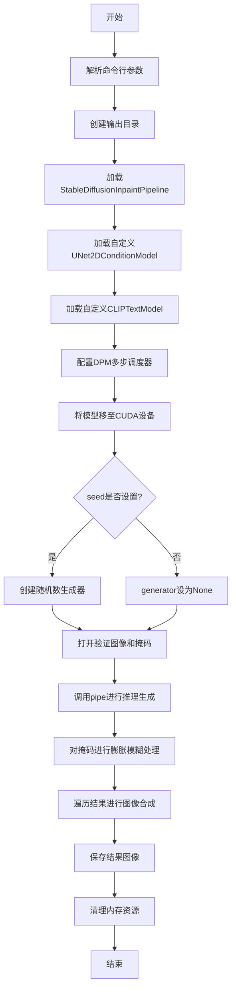

## 类结构

```
此脚本为单文件脚本，无自定义类定义
主要使用diffusers库中的预定义类：
├── StableDiffusionInpaintPipeline
├── UNet2DConditionModel
├── CLIPTextModel
└── DPMSolverMultistepScheduler
```

## 全局变量及字段


### `parser`
    
命令行参数解析器，用于定义和解析命令行参数

类型：`argparse.ArgumentParser`
    


### `args`
    
解析后的参数命名空间，包含用户输入的命令行参数值

类型：`argparse.Namespace`
    


### `generator`
    
随机数生成器，可为None，用于确保推理过程的可重复性

类型：`torch.Generator`
    


### `pipe`
    
扩散模型管道，用于图像修复推理

类型：`StableDiffusionInpaintPipeline`
    


### `image`
    
输入验证图像，待修复的原始图像

类型：`PIL.Image`
    


### `mask_image`
    
输入掩码图像，定义需要修复的区域

类型：`PIL.Image`
    


### `results`
    
推理结果图像列表，包含模型生成的修复后图像

类型：`List[PIL.Image]`
    


### `erode_kernel`
    
膨胀滤波核，用于对掩码图像进行形态学膨胀操作

类型：`ImageFilter.MaxFilter`
    


### `blur_kernel`
    
模糊滤波核，用于对掩码图像进行模糊平滑处理

类型：`ImageFilter.BoxBlur`
    


### `idx`
    
结果图像索引，用于遍历和保存推理结果

类型：`int`
    


### `result`
    
当前处理的结果图像，用于逐个处理和保存

类型：`PIL.Image`
    


    

## 全局函数及方法


### `argparse.ArgumentParser`

用于创建命令行参数解析器，配置程序运行所需的参数，包括模型路径、验证图像、掩码、输出目录和随机种子等。

#### 参数

- `description`：可选的字符串，用于描述程序的用途
- 其他参数通过 `parser.add_argument()` 方法添加：
  - `--model_path`：`str`，预训练模型路径或模型标识符
  - `--validation_image`：`str`，验证图像目录路径
  - `--validation_mask`：`str`，验证掩码目录路径
  - `--output_dir`：`str`，保存预测结果的输出目录，默认为 `"./test-infer/"`
  - `--seed`：`int`，用于可重复推理的随机种子

#### 返回值

- 返回 `argparse.ArgumentParser` 对象，用于后续添加命令行参数和解析用户输入。

#### 流程图

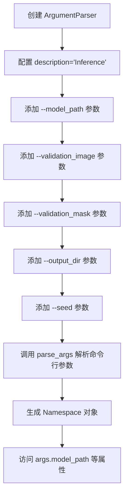

#### 带注释源码

```python
import argparse
import os

import torch
from PIL import Image, ImageFilter
from transformers import CLIPTextModel

from diffusers import DPMSolverMultistepScheduler, StableDiffusionInpaintPipeline, UNet2DConditionModel


# ============================================================
# 1. 创建命令行参数解析器
# ============================================================
# description: 程序描述信息，会在 --help 输出中显示
parser = argparse.ArgumentParser(description="Inference")

# ============================================================
# 2. 添加 --model_path 参数
# ============================================================
# type: 参数类型
# default: 默认值
# required: 是否为必填参数
# help: 参数帮助信息
parser.add_argument(
    "--model_path",
    type=str,
    default=None,
    required=True,
    help="Path to pretrained model or model identifier from huggingface.co/models.",
)

# ============================================================
# 3. 添加 --validation_image 参数
# ============================================================
parser.add_argument(
    "--validation_image",
    type=str,
    default=None,
    required=True,
    help="The directory of the validation image",
)

# ============================================================
# 4. 添加 --validation_mask 参数
# ============================================================
parser.add_argument(
    "--validation_mask",
    type=str,
    default=None,
    required=True,
    help="The directory of the validation mask",
)

# ============================================================
# 5. 添加 --output_dir 参数
# ============================================================
parser.add_argument(
    "--output_dir",
    type=str,
    default="./test-infer/",
    help="The output directory where predictions are saved",
)

# ============================================================
# 6. 添加 --seed 参数
# ============================================================
parser.add_argument("--seed", type=int, default=None, help="A seed for reproducible inference.")

# ============================================================
# 7. 解析命令行参数
# ============================================================
# 解析 sys.argv 并返回 Namespace 对象
args = parser.parse_args()
```


### `parser.add_argument (--model_path)`

添加命令行参数 `--model_path`，用于指定预训练模型路径或 Hugging Face 模型标识符。

参数：

- `"--model_path"`：`str`，命令行参数名称
- `type`：`type`，参数类型为字符串
- `default`：`Any`，默认值为 None
- `required`：`bool`，必填参数
- `help`：`str`，参数帮助文档

返回值：`None`，无返回值，向 ArgumentParser 添加命令行参数定义。

#### 流程图

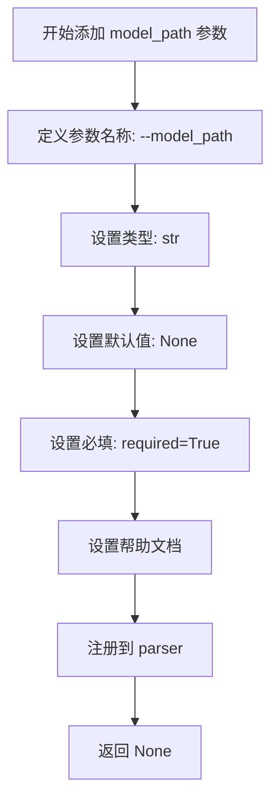

#### 带注释源码

```python
parser.add_argument(
    "--model_path",           # 命令行参数名称，使用 -- 前缀
    type=str,                 # 参数类型为字符串
    default=None,             # 默认值为 None
    required=True,            # 设为必填参数
    help="Path to pretrained model or model identifier from huggingface.co/models."  # 帮助文档
)
```

---

### `parser.add_argument (--validation_image)`

添加命令行参数 `--validation_image`，用于指定验证图像的目录路径。

参数：

- `"--validation_image"`：`str`，命令行参数名称
- `type`：`type`，参数类型为字符串
- `default`：`Any`，默认值为 None
- `required`：`bool`，必填参数
- `help`：`str`，参数帮助文档

返回值：`None`，无返回值，向 ArgumentParser 添加命令行参数定义。

#### 流程图

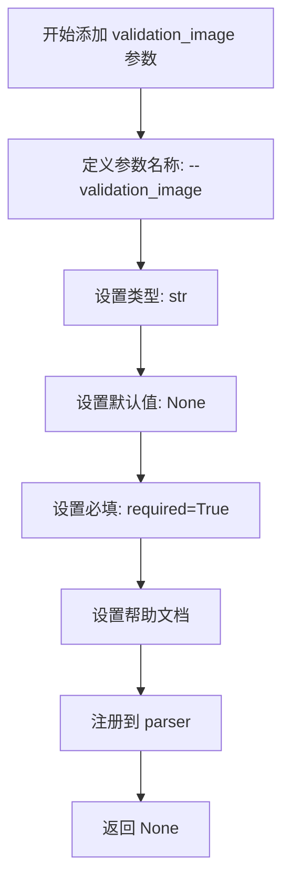

#### 带注释源码

```python
parser.add_argument(
    "--validation_image",     # 命令行参数名称
    type=str,                 # 参数类型为字符串
    default=None,             # 默认值为 None
    required=True,            # 必填参数
    help="The directory of the validation image"  # 帮助文档描述
)
```

---

### `parser.add_argument (--validation_mask)`

添加命令行参数 `--validation_mask`，用于指定验证图像掩码的目录路径。

参数：

- `"--validation_mask"`：`str`，命令行参数名称
- `type`：`type`，参数类型为字符串
- `default`：`Any`，默认值为 None
- `required`：`bool`，必填参数
- `help`：`str`，参数帮助文档

返回值：`None`，无返回值，向 ArgumentParser 添加命令行参数定义。

#### 流程图

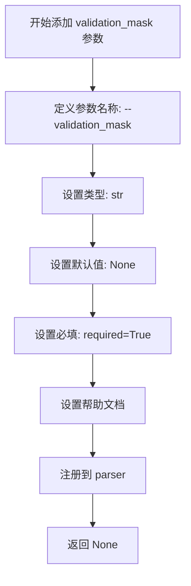

#### 带注释源码

```python
parser.add_argument(
    "--validation_mask",      # 命令行参数名称
    type=str,                 # 参数类型为字符串
    default=None,             # 默认值为 None
    required=True,            # 必填参数
    help="The directory of the validation mask"  # 帮助文档描述
)
```

---

### `parser.add_argument (--output_dir)`

添加命令行参数 `--output_dir`，用于指定推理结果保存的输出目录。

参数：

- `"--output_dir"`：`str`，命令行参数名称
- `type`：`type`，参数类型为字符串
- `default`：`str`，默认值为 "./test-infer/"
- `required`：`bool`，非必填参数
- `help`：`str`，参数帮助文档

返回值：`None`，无返回值，向 ArgumentParser 添加命令行参数定义。

#### 流程图

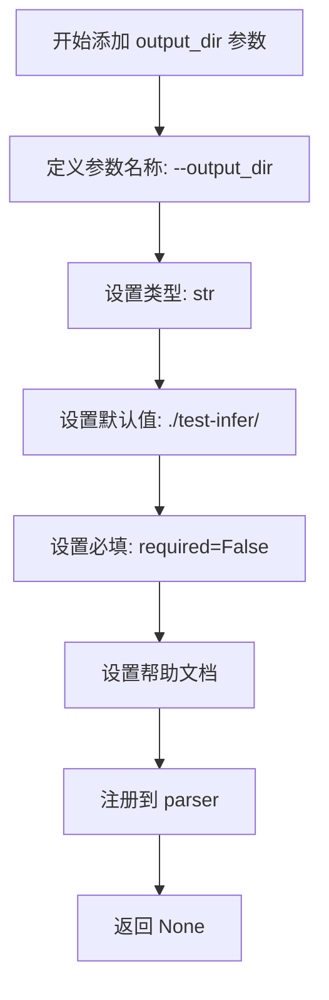

#### 带注释源码

```python
parser.add_argument(
    "--output_dir",           # 命令行参数名称
    type=str,                 # 参数类型为字符串
    default="./test-infer/",  # 默认输出目录
    required=False,           # 非必填参数
    help="The output directory where predictions are saved"  # 帮助文档
)
```

---

### `parser.add_argument (--seed)`

添加命令行参数 `--seed`，用于设置随机种子以实现可重复的推理过程。

参数：

- `"--seed"`：`str`，命令行参数名称
- `type`：`type`，参数类型为整数
- `default`：`int`，默认值为 None
- `required`：`bool`，非必填参数
- `help`：`str`，参数帮助文档

返回值：`None`，无返回值，向 ArgumentParser 添加命令行参数定义。

#### 流程图

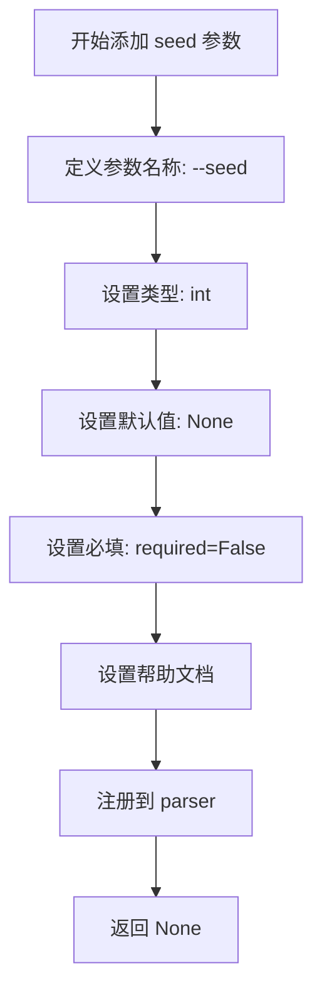

#### 带注释源码

```python
parser.add_argument(
    "--seed",                 # 命令行参数名称
    type=int,                 # 参数类型为整数
    default=None,             # 默认值为 None，表示不使用固定种子
    required=False,           # 非必填参数
    help="A seed for reproducible inference."  # 帮助文档说明用于可重复推理
)
```


### `parser.parse_args`

该函数是 `argparse.ArgumentParser` 的核心方法，用于解析命令行参数，将命令行传入的字符串转换为可访问的对象，并自动生成帮助信息和错误提示。

参数：

-  `args`：`list[str]`，可选，要解析的字符串列表，默认为 `None`，即自动从 `sys.argv` 获取

返回值：`argparse.Namespace`，包含所有命令行参数解析后的属性对象，通过属性名（如 `args.model_path`）访问每个参数的值

#### 流程图

```mermaid
flowchart TD
    A[开始解析] --> B{是否传入args参数?}
    B -->|否| C[使用sys.argv[1:]]
    B -->|是| D[使用传入的args列表]
    C --> E[逐个读取命令行参数]
    D --> E
    E --> F{参数匹配检查}
    F -->|匹配成功| G[存储到Namespace对象]
    F -->|匹配失败| H[抛出SystemExit异常]
    G --> I{还有更多参数?}
    I -->|是| E
    I -->|否| J[返回Namespace对象]
    H --> K[显示错误信息并退出]
```

#### 带注释源码

```python
# 使用 argparse 库创建参数解析器
# 导入 argparse 模块（Python 标准库，用于处理命令行参数）
import argparse

# 创建 ArgumentParser 对象，description 参数用于描述程序用途
parser = argparse.ArgumentParser(description="Inference")

# ============================================
# 添加命令行参数配置
# ============================================

# 添加 --model_path 参数：指定预训练模型路径或 HuggingFace 模型标识符
parser.add_argument(
    "--model_path",           # 参数名称（长格式）
    type=str,                 # 参数类型为字符串
    default=None,             # 默认值为 None
    required=True,            # 该参数为必需参数
    help="Path to pretrained model or model identifier from huggingface.co/models.",
)

# 添加 --validation_image 参数：验证图像的路径
parser.add_argument(
    "--validation_image",
    type=str,
    default=None,
    required=True,
    help="The directory of the validation image",
)

# 添加 --validation_mask 参数：验证掩码的路径
parser.add_argument(
    "--validation_mask",
    type=str,
    default=None,
    required=True,
    help="The directory of the validation mask",
)

# 添加 --output_dir 参数：输出目录路径，可选参数
parser.add_argument(
    "--output_dir",
    type=str,
    default="./test-infer/",  # 默认输出目录为当前目录下的 test-infer 文件夹
    help="The output directory where predictions are saved",
)

# 添加 --seed 参数：随机种子，用于可重复推理，可选参数
parser.add_argument(
    "--seed",
    type=int,
    default=None,
    help="A seed for reproducible inference.",
)

# ============================================
# 解析命令行参数
# ============================================

# 调用 parse_args() 方法解析命令行参数
# 默认从 sys.argv[1:] 获取参数（排除脚本名称）
# 返回一个 Namespace 对象，其属性对应各参数名
args = parser.parse_args()

# 解析后的参数通过 args.参数名 访问，例如：
# - args.model_path: 模型路径
# - args.validation_image: 验证图像路径
# - args.validation_mask: 验证掩码路径
# - args.output_dir: 输出目录
# - args.seed: 随机种子（可能为 None）
```


### `os.makedirs`

该函数用于在文件系统中创建目录，支持递归创建多层目录，并可通过 `exist_ok` 参数控制目录已存在时的行为。

参数：

- `name`：`str`，要创建的目录路径，接收来自命令行参数 `args.output_dir` 的值（默认值为 `"./test-infer/"`）
- `mode`：`int`，权限模式，默认为 `0o777`（八进制），在代码中未显式指定
- `exist_ok`：`bool`，当设为 `True` 时，如果目录已存在不会抛出 `FileExistsError` 异常，代码中显式传入 `True`

返回值：`None`，该函数无返回值，直接作用于文件系统

#### 流程图

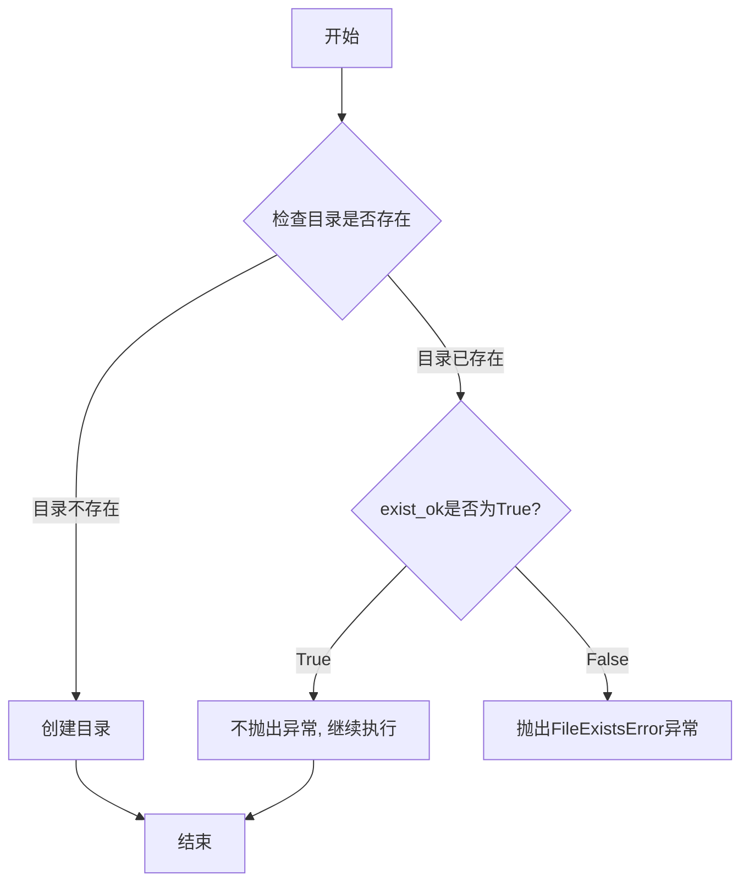

#### 带注释源码

```python
# os.makedirs 函数调用位于主程序入口内
if __name__ == "__main__":
    # 调用os.makedirs创建输出目录
    # 参数1: args.output_dir - 从命令行传入的输出目录路径
    # 参数2: exist_ok=True - 即使目录已存在也不抛出异常
    os.makedirs(args.output_dir, exist_ok=True)
    
    # 后续代码继续执行...
    generator = None
    # ...
```


### `StableDiffusionInpaintPipeline.from_pretrained`

该方法是`diffusers`库中`StableDiffusionInpaintPipeline`类的类方法，用于从预训练模型或本地模型路径加载Stable Diffusion图像修复（inpainting）管道，包括文本编码器、U-Net、VAE和调度器等核心组件，并可指定模型的数据类型和版本。

参数：

-  `pretrained_model_name_or_path`：`str`，预训练模型的道路径或Hugging Face模型标识符（如"stabilityai/stable-diffusion-2-inpainting"）
-  `torch_dtype`：`torch.dtype`，可选，指定模型权重的数据类型，默认为`torch.float32`，可设置为`torch.float16`以加速推理
-  `revision`：`str`，可选，指定加载模型的Git版本分支，默认为`None`，可设置为特定commit hash或分支名
-  `use_safetensors`：`bool`，可选，是否使用safetensors格式加载模型，默认为`None`（自动检测）
-  `variant`：`str`，可选，指定模型变体（如"fp16"），默认为`None`
-  `cache_dir`：`str`，可选，模型缓存目录，默认为`None`
-  `local_files_only`：`bool`，可选，是否仅使用本地文件，默认为`False`
-  `token`：`str`，可选，用于访问私有模型的Hugging Face访问令牌，默认为`None`

返回值：`StableDiffusionInpaintPipeline`，返回一个配置好的图像修复管道对象，包含`unet`（U-Net条件模型）、`text_encoder`（CLIP文本编码器）、`vae`（变分自编码器）、`scheduler`（调度器）等属性，可直接用于图像修复推理。

#### 流程图

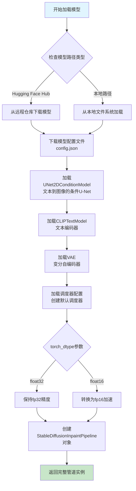

#### 带注释源码

```python
# 从diffusers库导入StableDiffusionInpaintPipeline类
from diffusers import StableDiffusionInpaintPipeline
import torch

# 使用from_pretrained类方法加载预训练的修复管道模型
# 该方法会：
# 1. 加载模型配置文件（config.json）
# 2. 下载并缓存模型权重文件
# 3. 初始化UNet2DConditionModel用于图像生成
# 4. 初始化CLIPTextModel用于文本编码
# 5. 初始化VAE用于潜在空间编码/解码
# 6. 创建默认的噪声调度器

pipe = StableDiffusionInpaintPipeline.from_pretrained(
    "stabilityai/stable-diffusion-2-inpainting",  # 模型标识符或本地路径
    torch_dtype=torch.float32,                    # 模型权重数据类型（fp32或fp16）
    revision=None                                 # Git版本分支（None表示main分支）
)

# 后续可自定义替换组件：
# pipe.unet = UNet2DConditionModel.from_pretrained(...)      # 替换U-Net
# pipe.text_encoder = CLIPTextModel.from_pretrained(...)     # 替换文本编码器
# pipe.scheduler = DPMSolverMultistepScheduler.from_config(...) # 替换调度器

pipe = pipe.to("cuda")  # 将整个管道移至GPU设备
```


### `UNet2DConditionModel.from_pretrained`

该方法用于从预训练模型加载 UNet2DConditionModel 实例，通常用于 Stable Diffusion 等扩散模型的 UNet 组件。它通过 `args.model_path` 指定模型路径，`subfolder="unet"` 指定子目录，可选地指定 `revision` 来加载特定版本，并支持多种优化选项如 `torch_dtype` 和 `use_safetensors`。

参数：

- `pretrained_model_name_or_path`：`str`，预训练模型在本地文件系统中的路径或 Hugging Face Hub 上的模型 ID（例如 `"stabilityai/stable-diffusion-2-inpainting"`）
- `subfolder`：`str`，可选参数，指定模型子文件夹路径（例如 `"unet"` 表示模型目录下的 `unet/` 子目录）
- `torch_dtype`：`torch.dtype`，可选参数，指定模型权重的精度类型（例如 `torch.float32`、`torch.float16`）
- `revision`：`str`，可选参数，指定要加载的 GitHub 仓库版本号（通常为提交哈希或分支名，`None` 表示使用默认版本）
- `use_safetensors`：`bool`，可选参数，是否优先使用 `.safetensors` 格式加载模型权重（更安全，可防止恶意权重文件）
- `variant`：`str`，可选参数，指定模型变体（例如 `"fp16"` 表示加载 16 位浮点版本）
- `cache_dir`：`str`，可选参数，指定模型缓存目录路径
- `force_download`：`bool`，可选参数，是否强制重新下载模型（即使已缓存）
- `resume_download`：`bool`，可选参数，是否在中断处恢复下载
- `local_files_only`：`bool`，可选参数，是否仅使用本地缓存文件（不尝试下载）
- `use_auth_token`：`str`，可选参数，用于访问私有模型的 Hugging Face API 认证令牌

返回值：`UNet2DConditionModel`，返回加载完成的 UNet2DConditionModel 实例对象，该对象包含模型权重、配置信息以及推理所需的前向传播方法。

#### 流程图

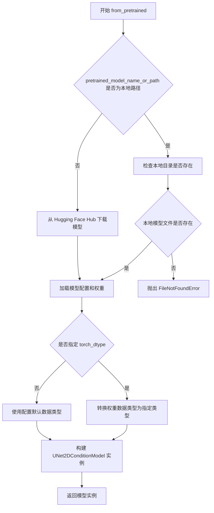

#### 带注释源码

```python
# 从 args.model_path 加载 UNet 模型权重
# subfolder="unet" 表示从模型目录下的 unet/ 子目录加载
# revision=None 表示使用默认版本，不指定特定 Git 提交
pipe.unet = UNet2DConditionModel.from_pretrained(
    args.model_path,        # 模型路径或 Hub 模型 ID（来自命令行参数 --model_path）
    subfolder="unet",       # 子文件夹路径，Stable Diffusion 模型通常将 UNet 权重放在 unet/ 目录
    revision=None,          # Git 版本控制标识，None 表示使用最新可用版本
)

# 下方展示完整的 from_pretrained 方法签名及其常用参数说明
# UNet2DConditionModel.from_pretrained 继承自 PreTrainedMixin.from_pretrained
# 典型调用方式如下：

# pipe.unet = UNet2DConditionModel.from_pretrained(
#     pretrained_model_name_or_path="path/to/model",  # 必需：模型路径或 Hub ID
#     subfolder="unet",                                 # 可选：子目录名称
#     torch_dtype=torch.float32,                       # 可选：权重数据类型（float32/float16/bfloat16）
#     revision=None,                                   # 可选：Git 版本号
#     use_safetensors=True,                            # 可选：优先使用安全张量格式
#     variant="fp16",                                  # 可选：模型变体（如 fp16、fp32）
#     cache_dir="./cache",                             # 可选：缓存目录
#     force_download=False,                            # 可选：强制下载
#     resume_download=True,                            # 可选：断点续传
#     local_files_only=False,                          # 可选：仅本地文件
#     use_auth_token=None,                             # 可选：API 认证令牌
# )
```


### `CLIPTextModel.from_pretrained`

该方法用于从预训练模型或本地模型路径加载 CLIP 文本编码器模型（CLIPTextModel），通常用于 Stable Diffusion 等扩散模型的文本编码组件，将文本输入转换为模型能理解的嵌入向量。

参数：

- `pretrained_model_name_or_path`：`str`，预训练模型的名称（如 Hugging Face Hub 上的模型 ID）或本地模型目录的路径
- `subfolder`：`str`，可选参数，指定模型子文件夹路径（如 "text_encoder"），用于从模型目录的子目录中加载权重
- `revision`：`str`，可选参数，指定要加载的模型版本（commit hash），设为 `None` 表示使用最新版本
- `torch_dtype`：`torch.dtype`，可选参数，指定模型权重的数据类型（如 `torch.float32`），用于控制模型的精度和内存占用
- `config`：`PretrainedConfig`，可选参数，自定义模型配置对象
- `cache_dir`：可选参数，指定模型缓存目录
- `use_auth_token`：可选参数，用于访问私有模型的认证 token
- `local_files_only`：可选参数，设为 `True` 仅使用本地文件
- `force_download`：可选参数，强制重新下载模型文件

返回值：`CLIPTextModel`，返回加载好的 CLIP 文本编码器模型实例，包含模型权重和配置，可直接用于推理或作为其他模型的组件。

#### 流程图

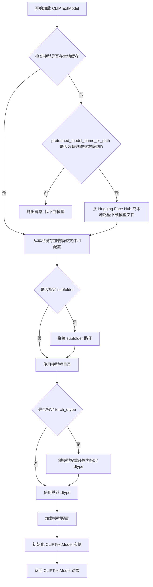

#### 带注释源码

```python
# 从代码中提取的调用方式：
pipe.text_encoder = CLIPTextModel.from_pretrained(
    args.model_path,          # str: 预训练模型路径或模型标识符
    subfolder="text_encoder", # str: 模型子文件夹名称
    revision=None,            # str|None: 模型版本提交哈希，None 表示最新版本
)

# 实际执行时，from_pretrained 方法内部大致流程如下（简化版）：

# 1. 确定模型路径（支持本地路径和 Hugging Face Hub 远程模型）
# pretrained_model_name_or_path = args.model_path

# 2. 加载模型配置
# config = CLIPTextConfig.from_pretrained(pretrained_model_name_or_path, subfolder=subfolder)

# 3. 初始化模型实例
# model = CLIPTextModel(config)

# 4. 加载权重文件
#权重_path = os.path.join(pretrained_model_name_or_path, subfolder, "pytorch_model.bin")
# state_dict = torch.load(weights_path, map_location="cpu")

# 5. 加载权重到模型
# model.load_state_dict(state_dict)

# 6. 转换为指定 dtype（如 torch.float32）
# if torch_dtype is not None:
#     model = model.to(dtype=torch_dtype)

# 7. 返回模型实例
# return model
```


### `DPMSolverMultistepScheduler.from_config`

该方法是 `DPMSolverMultistepScheduler` 类的类方法，用于根据现有的调度器配置对象创建一个新的调度器实例。在代码中，它用于从已加载的 `StableDiffusionInpaintPipeline` 的默认调度器配置中重新实例化一个 `DPMSolverMultistepScheduler`，以便使用 DPM-Solver 多步求解算法进行更高效的图像生成推理。

参数：

- `config`：一个配置对象（通常是 `SchedulerConfig` 或类似的配置类实例），包含调度器的参数设置（如求解器类型、步数、beta 调度参数等）。在代码中传入的是 `pipe.scheduler.config`，即管道默认调度器的配置对象。

返回值：`DPMSolverMultistepScheduler`，返回一个新的 `DPMSolverMultistepScheduler` 调度器实例，其参数由传入的 `config` 对象决定。

#### 流程图

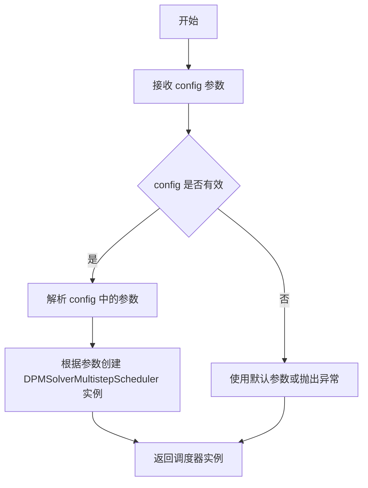

#### 带注释源码

```python
# DPMSolverMultistepScheduler.from_config 的典型实现结构
@classmethod
def from_config(cls, config):
    """
    从配置对象创建调度器实例的类方法。
    
    参数:
        config: 包含调度器配置参数的配置对象，通常是字典或配置类实例
                包含如 solver_type, prediction_type, timestep_spacing, 
                steps_offset, rescale_betas_zero_snr, guidance_scale_embeds 等参数
    
    返回:
        cls: 返回一个配置好的 DPMSolverMultistepScheduler 实例
    """
    # 1. 加载配置，如果 config 已经是对象则直接使用
    #    如果是字典或路径，则需要先加载或读取
    if isinstance(config, dict):
        config = cls.config_class(**config)
    
    # 2. 使用配置参数实例化调度器
    #    内部会设置:
    #    - self.num_train_timesteps: 训练时间步数，默认1000
    #    - self.beta_start/start_end: beta 起始值
    #    - self.beta_schedule: beta 调度方式
    #    - self.solver_order: 求解器阶数
    #    - self.prediction_type: 预测类型（epsilon, v_prediction, sample_prediction）
    #    - 各种求解器相关参数
    scheduler = cls(**config)
    
    return scheduler

# 在实际代码中的调用方式:
# pipe.scheduler = DPMSolverMultistepScheduler.from_config(pipe.scheduler.config)
# 这里 pipe.scheduler.config 是从预训练模型加载的默认调度器配置
# 通过 from_config 可以重新实例化一个相同配置的 DPMSolverMultistepScheduler
```


### `StableDiffusionInpaintPipeline.to`

将 Stable Diffusion 图像修复管道的所有组件（包括 UNet、文本编码器、VAE 等）移动到指定的计算设备（CPU 或 CUDA GPU）上，以便在该设备上执行推理。

参数：

- `device`：`str`，目标设备标识符，如 "cuda"、"cpu" 或 "cuda:0" 等

返回值：`StableDiffusionInpaintPipeline`，返回移动到指定设备后的管道对象本身，支持链式调用

#### 流程图

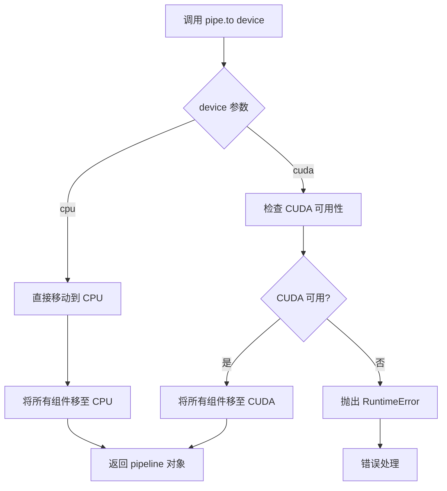

#### 带注释源码

```python
# 代码中的实际调用
pipe = pipe.to("cuda")

# 源码逻辑分析 (来自 diffusers 库的 DiffusionPipeline.to 方法):
def to(self, device):
    """
    将 pipeline 的所有组件移动到指定的设备
    
    参数:
        device (str): 目标设备，如 'cuda', 'cpu', 'cuda:0' 等
        
    返回:
        self: 返回 pipeline 对象本身，支持链式调用
    """
    
    # 遍历 pipeline 的所有组件
    # 例如: self.unet, self.text_encoder, self.vae, self.scheduler 等
    for model_name in self.components.keys():
        model = getattr(self, model_name)
        if model is not None:
            # 调用每个模型的 .to(device) 方法
            # 这会递归地将模型的参数和缓冲区移至目标设备
            model.to(device)
    
    # 同时设置 pipeline 自身的 device 属性
    self.device = torch.device(device)
    
    return self
```

**在当前代码中的上下文：**

```python
# 创建 pipeline 后，将所有模型组件移至 CUDA 设备进行加速推理
pipe = StableDiffusionInpaintPipeline.from_pretrained(
    "stabilityai/stable-diffusion-2-inpainting", 
    torch_dtype=torch.float32, 
    revision=None
)

# ... 加载自定义模型权重 ...

# 将整个 pipeline 移至 CUDA 设备
# 这一步确保 UNet、CLIPTextEncoder、VAE 等所有组件都在 GPU 上运行
pipe = pipe.to("cuda")

# 之后就可以在 GPU 上进行推理
results = pipe(
    ["a photo of sks"] * 16,
    image=image,
    mask_image=mask_image,
    num_inference_steps=25,
    guidance_scale=5,
    generator=generator,
).images
```


### `torch.Generator`

`torch.Generator` 是 PyTorch 中用于创建随机数生成器的类，用于管理随机状态，确保深度学习模型推理过程的可重复性。该对象通过设置随机种子（seed）来控制随机数生成，使得相同的输入在相同的种子下产生确定的输出结果。

参数：

- `device`：`str` 或 `torch.device`，指定生成器所在的设备（如 "cuda" 或 "cpu"），默认为 "cpu"

返回值：`torch.Generator`，返回一个随机数生成器对象

#### 流程图

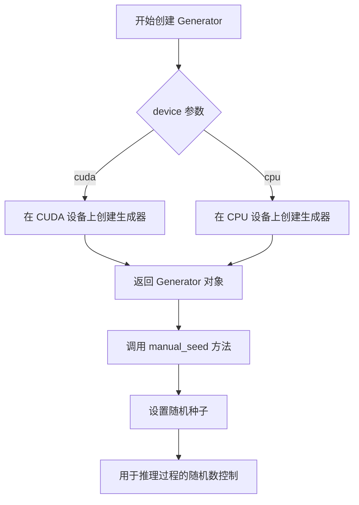

#### 带注释源码

```python
# 条件判断：如果提供了 seed 参数
if args.seed is not None:
    # 创建随机数生成器并指定设备为 CUDA
    # torch.Generator(device="cuda") 的工作原理：
    # 1. 分配 CUDA 设备上的随机状态内存
    # 2. 初始化随机数生成器的内部状态
    # 3. 返回一个 Generator 对象用于后续的随机数控制
    generator = torch.Generator(device="cuda")
    
    # 使用 manual_seed 方法设置随机种子
    # 参数 seed: 整数类型的种子值，确保可重复性
    # 返回值: 返回设置好种子的 Generator 对象本身
    # 效果: 后续所有基于此生成器的随机操作都将产生确定性的结果
    generator = generator.manual_seed(args.seed)

# 在 Stable Diffusion 推理中使用该生成器
# generator 参数用于控制图像生成过程中的随机性
results = pipe(
    ["a photo of sks"] * 16,      # 提示词
    image=image,                  # 输入图像
    mask_image=mask_image,        # 掩码图像
    num_inference_steps=25,       # 推理步数
    guidance_scale=5,             # 引导强度
    generator=generator,          # 传入生成器确保可重复推理
).images
```

#### 额外说明

| 项目 | 说明 |
|------|------|
| **设计目标** | 确保使用 Stable Diffusion 进行图像修复（inpainting）时的结果可重复 |
| **约束条件** | 相同的 seed 值配合相同的模型、提示词和参数才能产生完全相同的结果 |
| **错误处理** | 如果 seed 为 None，则不创建 Generator 对象，推理使用随机状态 |
| **数据流** | seed → Generator → Pipe.inference → 确定性的图像输出 |
| **外部依赖** | 依赖 PyTorch 库的 torch.Generator 实现 |
| **技术债务** | 每次推理都创建新的 Generator 对象，可以考虑复用或使用全局单例模式 |
| **优化建议** | 可以在多次推理中复用同一个 Generator 对象以减少开销 |


### `generator.manual_seed`

设置PyTorch随机数生成器的种子，以确保推理过程的可重复性。通过指定固定的随机种子，可以使多次运行产生相同的输出结果，这对于调试和结果验证非常重要。

参数：

- `seed`：`int`，要设置的随机种子值，来自命令行参数`args.seed`，用于控制随机数生成的初始状态

返回值：`torch.Generator`，返回配置好随机种子的生成器对象，用于后续的图像生成过程

#### 流程图

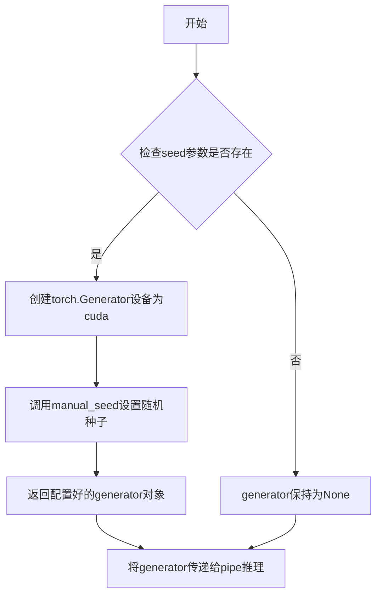

#### 带注释源码

```python
# 代码位置：第48行
# 当args.seed不为None时，创建随机生成器并设置种子
if args.seed is not None:
    # 创建一个PyTorch随机数生成器，指定设备为cuda
    # device="cuda" 确保在GPU上创建生成器
    generator = torch.Generator(device="cuda").manual_seed(args.seed)
    # manual_seed(seed) 方法接受一个整数作为种子
    # 它会初始化生成器的内部状态，使得后续的随机操作可重复
    # 返回值是同一个generator对象（方法返回self）
```

#### 详细说明

| 属性 | 值 |
|------|-----|
| 方法所属类 | `torch.Generator` |
| 调用方式 | 实例方法 |
| 种子来源 | 命令行参数 `--seed` |
| 设备依赖 | CUDA (GPU) |
| 使用目的 | 确保推理结果的可重复性 |

#### 技术细节

1. **方法链式调用**：`.manual_seed()` 返回生成器对象本身，因此可以直接赋值给 `generator`
2. **设备一致性**：生成器设备必须与后续推理设备（cuda）一致，否则会报错
3. **种子作用**：该种子控制以下随机过程：
   - 噪声采样
   - 可能的其他随机操作
4. **可选参数**：当 `args.seed` 为 `None` 时，不创建生成器，推理使用随机状态


### `Image.open`

`Image.open` 是 PIL (Python Imaging Library / Pillow) 库中的核心函数，用于打开并读取指定路径的图像文件，将其加载为 Pillow 的 `Image` 对象，支持多种图像格式（如 PNG、JPEG、BMP 等），并延迟加载图像数据直至实际访问像素信息。

参数：

- `fp`：`str` 或 `file object`，图像文件路径（字符串）或打开的文件对象
- `mode`：`str`（可选），指定图像模式（如 "r" 读取模式），默认为 "r"
- `formats`：`tuple` 或 `None`（可选），允许指定支持的文件格式列表，`None` 表示自动检测

返回值：`PIL.Image.Image`，返回一个 Pillow Image 对象，后续可进行图像处理、转换或保存等操作

#### 流程图

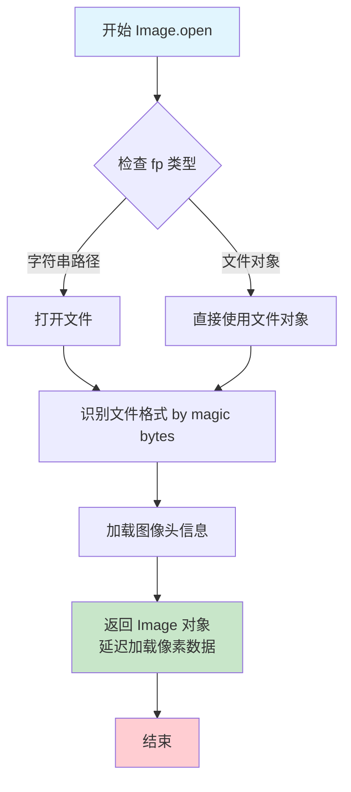

#### 带注释源码

```python
# PIL/Image.py 中的 Image.open 函数简化示意

def open(fp, mode="r", formats=None):
    """
    打开并识别图像文件，返回 Image 对象
    
    参数:
        fp: 文件路径字符串或已打开的文件对象
        mode: 打开模式，默认为 "r" (读取)
        formats: 支持的格式列表，None 表示自动检测
    
    返回:
        Image 对象
    """
    
    # 如果是字符串路径，则打开文件
    if isinstance(fp, str):
        fp = builtins.open(fp, "rb")
    
    # 尝试识别图像格式
    # 通过读取文件头部的 magic bytes 来判断格式
    format = None
    data = fp.read(25)  # 读取足够多的字节来识别格式
    
    # 遍历注册的图像插件进行格式匹配
    for fmt in formats or IMAGES:
        if IMAGES[fmt](data):
            format = fmt
            break
    
    # 根据格式创建对应的图像解码器
    im = getattr(ImageModule, format.upper()).open(fp)
    
    # 返回 Image 对象（此时只加载了头部信息，像素数据延迟加载）
    return im
```

---

### 在项目代码中的使用

在提供的推理脚本中，`Image.open` 被调用两次用于加载验证图像和掩码：

```python
# 打开验证图像文件
image = Image.open(args.validation_image)

# 打开验证掩码图像文件  
mask_image = Image.open(args.validation_mask)
```

#### 调用流程图

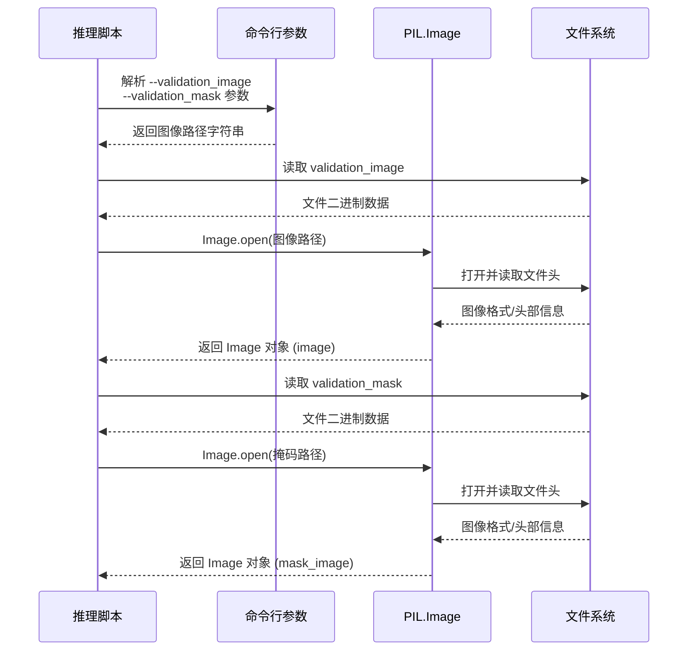


### `StableDiffusionInpaintPipeline.__call__`

这是 Stable Diffusion Inpainting Pipeline 的推理方法，接收提示词、原始图像和掩码图像，通过扩散模型进行图像修复（Inpainting），根据提示词填充掩码区域的语义内容，生成修复后的图像列表。

参数：

-  `prompt`：`Union[str, List[str]]`，生成图像的文本提示词，可以是单个字符串或字符串列表。当为列表时，会为每个提示词生成对应的图像。
-  `image`：`PIL.Image.Image`，需要修复的原始输入图像，作为图像修复的背景底图。
-  `mask_image`：`PIL.Image.Image`，掩码图像，指定需要修复的区域（非白色区域将被修复）。
-  `num_inference_steps`：`int`，推理步数，默认为 50。步数越多，生成质量越高但速度越慢。
-  `guidance_scale`：`float`，引导系数，默认为 7.5。较高的值会使生成结果更符合提示词，但可能导致图像质量下降。
-  `generator`：`torch.Generator`，可选的随机数生成器，用于确保推理的可重复性。
-  `negative_prompt`：`Union[str, List[str]]`，可选的负面提示词，指定不希望出现的元素。
-  `num_images_per_prompt`：`int`，每个提示词生成的图像数量。
-  `eta`：`float`，DDIM 采样器的 eta 参数。
-  `clip_skip`：`int`，可选的 CLIP 跳过层数。
-  `height`：`int`，输出图像高度。
-  `width`：`int`，输出图像宽度。

返回值：`List[PIL.Image.Image]`，返回修复后的图像列表，每个元素为 PIL 图像对象。

#### 流程图

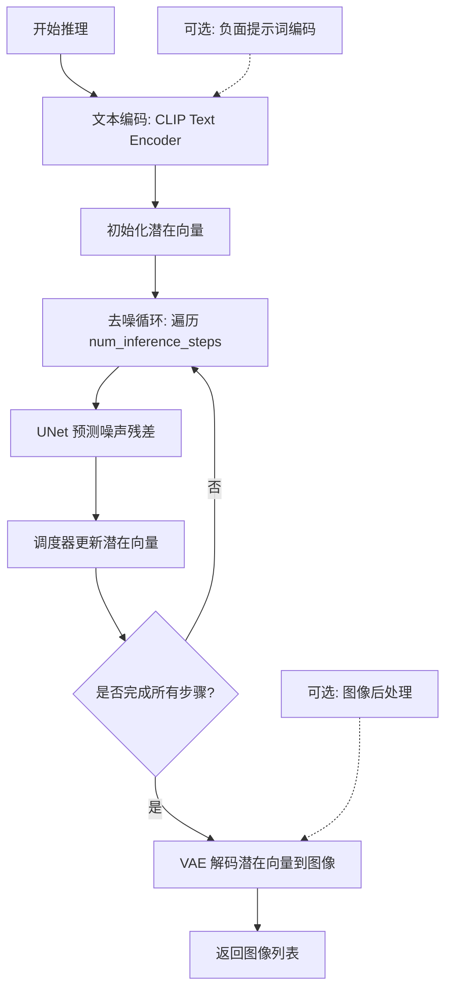

#### 带注释源码

```python
# 调用 Stable Diffusion Inpainting Pipeline 进行图像修复推理
results = pipe(
    ["a photo of sks"] * 16,    # 提示词列表，复制16份以生成16张图像
    image=image,                # 原始输入图像，作为修复的背景
    mask_image=mask_image,      # 掩码图像，标记需要修复的区域
    num_inference_steps=25,    # 推理步数，控制生成质量与速度
    guidance_scale=5,           # 引导系数，控制提示词相关性
    generator=generator,        # 随机生成器，确保可重复性
).images                        # 访问返回结果的images属性获取图像列表

# 后续处理: 对掩码图像进行形态学操作以优化边缘
erode_kernel = ImageFilter.MaxFilter(3)  # 创建最大滤波核，用于侵蚀掩码边缘
mask_image = mask_image.filter(erode_kernel)  # 应用侵蚀滤波

blur_kernel = ImageFilter.BoxBlur(1)     # 创建盒式模糊核
mask_image = mask_image.filter(blur_kernel)  # 应用模糊，使边缘更平滑

# 图像合成: 将修复结果与原图按掩码合成
for idx, result in enumerate(results):
    # 使用 Image.composite 将修复区域与原图合成
    # result: 修复后的图像, image: 原图, mask_image: 掩码
    result = Image.composite(result, image, mask_image)
    # 保存合成结果到输出目录
    result.save(f"{args.output_dir}/{idx}.png")
```


### `ImageFilter.MaxFilter`

创建最大滤波器（Max Filter），用于图像处理中的形态学膨胀操作。该滤波器会取像素邻域内的最大值，常用于图像增强、边缘检测或形态学操作前的预处理。

参数：

- `size`：`int`，滤波器内核的大小（必须为奇数），默认为 3。表示滤波处理的窗口尺寸，如 3 表示 3x3 的邻域范围。

返回值：`PIL.ImageFilter.Filter`，返回一个滤波器对象，可直接作为参数传递给 Image 对象的 `.filter()` 方法进行图像滤波处理。

#### 流程图

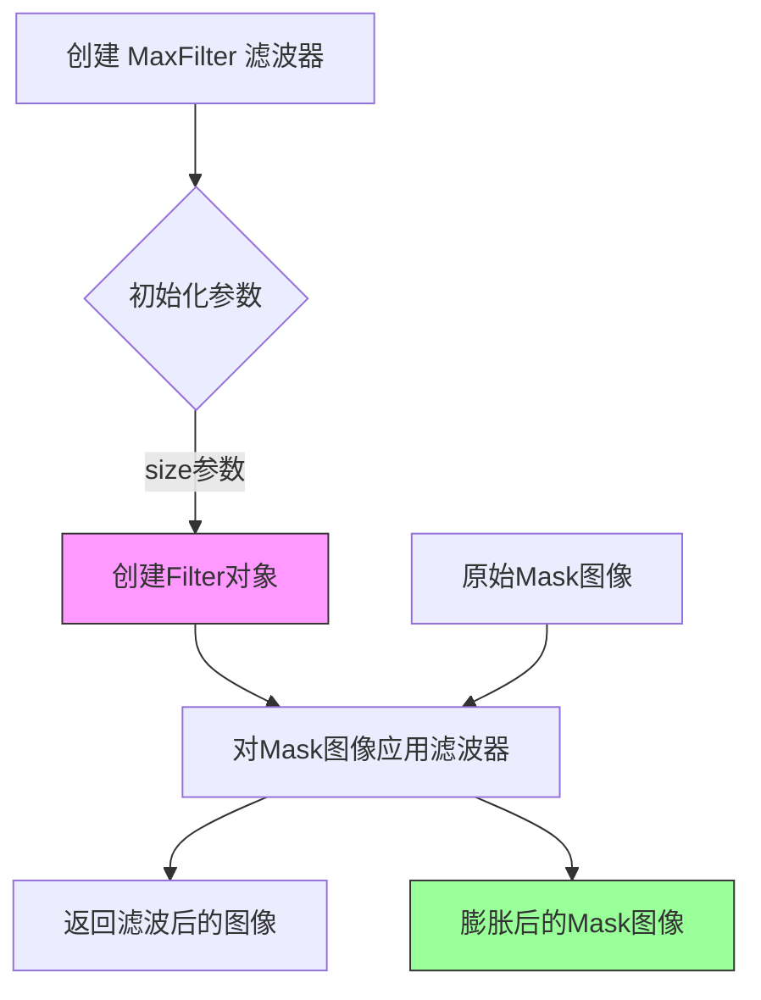

#### 带注释源码

```python
# ImageFilter.MaxFilter 是 Pillow 库中的图像滤波器类
# 用于创建最大滤波器（Max Filter），属于形态学操作中的膨胀（Dilation）操作
# 最大滤波器的原理：在滤波窗口内取所有像素的最大值作为中心像素的新值
# 这会导致图像中的白色区域扩张，黑色区域收缩

# 创建最大滤波器实例，参数为滤波器尺寸
# size=3 表示使用 3x3 的滤波窗口
erode_kernel = ImageFilter.MaxFilter(3)

# 将滤波器应用到掩码图像上
# 这里的操作效果是对掩码图像进行膨胀，使边缘向外扩展
# 常用于在图像修复任务中扩大掩码范围，确保修复区域完全覆盖需要处理的部分
mask_image = mask_image.filter(erode_kernel)
```


### `ImageFilter.BoxBlur`

PIL（Pillow）库提供的图像模糊滤镜，通过计算像素周围指定半径区域的平均值来实现平滑的盒式模糊效果，常用于图像预处理以减少噪声或创建模糊遮罩。

#### 参数

- `radius`：`int`，模糊半径，表示每个像素周围用于计算平均值的区域大小。值为 0 表示不进行模糊，值越大模糊效果越强。

#### 返回值

`ImageFilter.BoxBlur`，返回一个滤镜对象，可通过 `Image.filter()` 方法应用于图像。

#### 流程图

```mermaid
graph LR
    A[创建 BoxBlur 滤镜] --> B[设置模糊半径]
    B --> C[生成滤镜对象]
    C --> D[应用到图像]
    D --> E[返回模糊后的图像]
```

#### 带注释源码

```python
# 这是 Pillow 库的源码实现，非用户代码
# 源码位置: https://github.com/python-pillow/Pillow/blob/main/src/PIL/ImageFilter.py

class BoxBlur(ImageFilter.Filter):
    """
    使用盒式模糊（Box Blur）算法的滤镜。
    盒式模糊是一种简单的模糊算法，通过计算像素周围区域的平均值来实现。
    """

    name = "Box Blur"

    def __init__(self, radius: int = 1):
        """
        初始化 BoxBlur 滤镜。

        参数:
            radius: 模糊半径，默认为 1。值为 0 不产生模糊效果。
        """
        self.radius = radius

    def filter(self, image: Image.Image) -> Image.Image:
        """
        执行模糊操作。

        参数:
            image: PIL Image 对象

        返回值:
            模糊后的 PIL Image 对象
        """
        return image.box_blur(self.radius)


# 在用户代码中的使用方式:
blur_kernel = ImageFilter.BoxBlur(1)  # 创建半径为1的盒式模糊滤镜
mask_image = mask_image.filter(blur_kernel)  # 将模糊滤镜应用到遮罩图像上
```

#### 用户代码中的调用上下文

```python
# 用户代码第 73-74 行:
blur_kernel = ImageFilter.BoxBlur(1)    # 创建盒式模糊滤镜对象，半径为1像素
mask_image = mask_image.filter(blur_kernel)  # 将模糊滤镜应用到 mask_image 上
```

这段代码的作用是对 inpainting 任务的遮罩（mask）图像进行轻微模糊处理，使边缘更加柔和，从而获得更自然的修复结果。


### `mask_image.filter`（图像滤波）

该方法用于对图像应用给定的滤波器（Filter），对掩码图像进行形态学操作（先侵蚀后模糊），以优化修复效果的边缘细节。

参数：

- `filter`：`PIL.ImageFilter.Filter`，要应用的图像滤波器对象（如 `MaxFilter`、`BoxBlur` 等）

返回值：`PIL.Image.Image`，应用滤波器后生成的新图像对象

#### 流程图

```mermaid
flowchart TD
    A[原始掩码图像 mask_image] --> B{filter 方法}
    B -->|erode_kernel| C[MaxFilter 侵蚀操作]
    C --> D[更新后的掩码图像]
    D --> E{filter 方法}
    E -->|blur_kernel| F[BoxBlur 模糊操作]
    F --> G[最终处理后的掩码图像]
    
    style A fill:#f9f,stroke:#333
    style C fill:#bbf,stroke:#333
    style F fill:#bbf,stroke:#333
    style G fill:#bfb,stroke:#333
```

#### 带注释源码

```python
# =============================================
# 代码片段：mask_image.filter 方法调用
# =============================================

# 第一步：创建侵蚀滤波器（MaxFilter）
# 使用 3x3 的最大滤波器进行侵蚀操作，使白色区域收缩
# 作用：消除掩码边缘的细小噪点
erode_kernel = ImageFilter.MaxFilter(3)  # 创建 3x3 最大滤波器

# 对掩码图像应用侵蚀滤波器
# 参数：erode_kernel - 侵蚀滤波器对象
# 返回值：应用滤波后的新 Image 对象
mask_image = mask_image.filter(erode_kernel)

# 第二步：创建模糊滤波器（BoxBlur）
# 使用 1x1 的盒子模糊进行平滑处理
# 作用：柔化侵蚀后的边缘，使过渡更自然
blur_kernel = ImageFilter.BoxBlur(1)  # 创建半径为 1 的盒子模糊滤波器

# 对掩码图像应用模糊滤波器
# 参数：blur_kernel - 模糊滤波器对象
# 返回值：应用滤波后的新 Image 对象
mask_image = mask_image.filter(blur_kernel)

# =============================================
# 完整调用上下文：
# 1. pipe() 生成修复结果 results（包含 16 张图像）
# 2. 对掩码图像进行形态学处理（侵蚀 + 模糊）
# 3. 使用 Image.composite() 将结果图像与原图、掩码合成
# =============================================
```

#### 补充说明

| 属性 | 说明 |
|------|------|
| **方法所属类** | `PIL.Image.Image` |
| **调用对象** | `mask_image` - 通过 `Image.open(args.validation_mask)` 加载的掩码图像 |
| **滤波类型** | 形态学操作：侵蚀（Erode）→ 模糊（Blur） |
| **设计目的** | 优化掩码边缘，消除毛刺，使修复区域与原图过渡更自然 |
| **依赖库** | `PIL.ImageFilter`（Pillow 库） |


### `Image.composite`

该函数是 Python Imaging Library (PIL) 中的图像合成核心方法，用于根据遮罩图像（mask）的透明度或亮度信息，将两幅图像（前景图和背景图）进行像素级混合。在本代码中，它负责将 AI 模型生成的修复区域（`result`）根据处理后的掩码（`mask_image`）贴合到原始图像（`image`）上，从而生成最终的修复结果。

参数：

-  `image1`：`PIL.Image.Image`（代码中对应 `result`），前景图。通常是扩散模型生成的图像，包含了需要填充的新内容。
-  `image2`：`PIL.Image.Image`（代码中对应 `image`），背景图。即原始的输入图像，作为合成后的基底。
-  `mask`：`PIL.Image.Image`（代码中对应 `mask_image`），遮罩图。决定了哪些部分显示前景（`image1`），哪些部分显示背景（`image2`）。通常白色区域对应前景，黑色区域对应背景。

返回值：`PIL.Image.Image`，返回一个新的图像对象。这是一张合成后的图像，其中 `image1` 的内容根据 `mask` 覆盖在 `image2` 之上。

#### 流程图

```mermaid
graph TD
    InputA[result: AI生成的前景图] --> Composite[Image.composite]
    InputB[image: 原始背景图] --> Composite
    InputC[mask_image: 遮罩图] --> Composite
    
    Composite --> Process{根据 Mask 像素值混合}
    
    Process -- 白色/不透明 --> UseForeground[使用 result 像素]
    Process -- 黑色/透明 --> UseBackground[使用 image 像素]
    Process -- 灰色/半透明 --> Blend[Alpha 混合]
    
    UseForeground --> Output[合成后的新图像]
    UseBackground --> Output
    Blend --> Output
```

#### 带注释源码

```python
# 对 mask_image 进行了处理，使其边缘更加平滑
# 1. 先使用 MaxFilter (腐蚀) 收缩白色区域边界，防止边缘过于生硬
mask_image = mask_image.filter(ImageFilter.MaxFilter(3))
# 2. 再使用 BoxBlur (模糊) 进一步平滑遮罩边缘
mask_image = mask_image.filter(ImageFilter.BoxBlur(1))

# 遍历生成的所有结果图像（通常为批量生成）
for idx, result in enumerate(results):
    # 执行核心合成操作：
    # 使用处理后的 mask_image 作为遮罩，
    # 将 result (AI生成内容) 覆盖在 image (原图) 之上。
    # 遮罩为白色的地方显示 result，为黑色的地方显示 image，
    # 从而实现精准的图像修复（Inpainting）效果。
    result = Image.composite(result, image, mask_image)
    
    # 保存合成后的图像
    result.save(f"{args.output_dir}/{idx}.png")
```


### `result.save`

该方法是 PIL Image 对象的成员方法，用于将处理后的图像保存到指定的文件路径。在代码中，它将经过图像合成（Image.composite）处理后的结果保存为 PNG 格式文件到指定的输出目录。

参数：

- `fp`：`str`，保存文件的路径，格式为 `{args.output_dir}/{idx}.png`
- `format`：`str`（可选），图像格式，若省略则根据文件扩展名自动推断为 "PNG"

返回值：`None`，该方法无返回值，直接将图像写入磁盘

#### 流程图

```mermaid
flowchart TD
    A[result.save 调用开始] --> B{检查文件路径有效性}
    B -->|路径有效| C[打开文件准备写入]
    B -->|路径无效| D[抛出异常]
    C --> E{format参数}
    E -->|已指定| F[使用指定格式编码]
    E -->|未指定| G[根据文件扩展名推断格式: PNG]
    F --> H[将图像数据编码为目标格式]
    G --> H
    H --> I[写入文件到磁盘 fp 路径]
    I --> J[保存完成, 返回 None]
```

#### 带注释源码

```python
# result 是经过 Image.composite 处理后的 PIL.Image 对象
# composite 将原图、mask 和结果图进行混合
result = Image.composite(result, image, mask_image)

# 调用 save 方法将图像保存到指定路径
# 参数 f"{args.output_dir}/{idx}.png" 是文件路径字符串
# - args.output_dir: 命令行传入的输出目录, 默认为 "./test-infer/"
# - idx: 循环迭代索引, 从 0 到 15 (共 16 张图像)
result.save(f"{args.output_dir}/{idx}.png")

# save 方法内部逻辑:
# 1. 解析文件路径确定保存位置
# 2. 根据文件扩展名 ".png" 确定图像格式为 PNG
# 3. 将 PIL Image 对象编码为 PNG 二进制数据
# 4. 写入到指定文件系统路径
# 5. 返回 None (无返回值)
```

#### 关键组件信息

- **PIL.Image.save()**: PIL 库的图像保存方法，支持多种图像格式（PNG、JPEG、BMP 等）
- **输出目录**: 由 `args.output_dir` 指定，默认为 "./test-infer/"
- **文件命名**: 采用索引命名规则 `{idx}.png`，确保唯一性

#### 潜在的技术债务或优化空间

1. **错误处理缺失**: 未检查文件目录是否存在、磁盘空间是否充足、写入权限是否足够
2. **格式硬编码**: 隐式依赖 PNG 格式，建议显式指定 `format='PNG'` 以提高可读性
3. **覆盖风险**: 多次运行会覆盖同名文件，缺乏时间戳或哈希机制确保唯一性
4. **异常捕获**: 未捕获可能的 I/O 异常（如磁盘满、权限拒绝）

#### 其它项目

- **错误处理**: save() 失败时可能抛出 OSError 或 IOError，建议添加 try-except 包装
- **数据流**: results (List[Image]) → 循环迭代 → Image.composite 混合 → save 持久化
- **外部依赖**: 依赖 PIL (Pillow) 库进行图像 I/O 操作
- **设计目标**: 批量保存推理结果图像，供后续评估或展示使用


### `del pipe`

该操作用于删除 `pipe` 对象以释放内存，并调用 `torch.cuda.empty_cache()` 清理 GPU 缓存，从而释放 GPU 资源。

参数： 无

返回值： 无

#### 流程图

```mermaid
graph TD
    A[开始] --> B[删除 pipe 对象]
    B --> C[调用 torch.cuda.empty_cache 释放 GPU 缓存]
    C --> D[结束]
```

#### 带注释源码

```python
# 删除 pipe 对象，释放 Python 对象引用，随后垃圾回收器会自动释放相关内存
del pipe
# 手动清空 CUDA 缓存，释放 GPU 显存
torch.cuda.empty_cache()
```


### `torch.cuda.empty_cache`

清空CUDA缓存，释放GPU上未使用的缓存内存，以便其他程序可以使用更多GPU资源。

参数：此函数不接受任何参数。

返回值：`None`，该函数不返回任何值，仅执行缓存清理操作。

#### 流程图

```mermaid
flowchart TD
    A[推理任务完成] --> B[删除pipe对象<br/>del pipe]
    --> C[调用torch.cuda.empty_cache]
    --> D[释放CUDA缓存中的未使用内存]
    --> E[任务结束]
    
    style C fill:#f9f,stroke:#333,stroke-width:2px
```

#### 带注释源码

```python
# torch.cuda.empty_cache() 是 PyTorch 库提供的 CUDA 内存管理函数
# 功能说明：
# 1. 清空 CUDA 缓存，释放当前 CUDA 上下文中的未使用显存
# 2. 该操作不会删除仍然被 tensor 占用的显存
# 3. 主要用于在推理完成后释放显存，以便其他程序可以使用

# 在本代码中的使用场景：
del pipe  # 删除 StableDiffusionInpaintPipeline 对象，释放模型权重等显存
torch.cuda.empty_cache()  # 清空 CUDA 缓存，释放额外的缓存内存
```

#### 上下文使用分析

在提供的代码中，`torch.cuda.empty_cache()` 的具体上下文如下：

```python
# ... 推理和图像处理代码 ...

# 保存所有结果图像
for idx, result in enumerate(results):
    result = Image.composite(result, image, mask_image)
    result.save(f"{args.output_dir}/{idx}.png")

# 清理阶段
del pipe  # 删除管道对象，释放模型权重、VAE、UNet等占用的显存
torch.cuda.empty_cache()  # 清理CUDA缓存，释放额外保留的缓存内存
```

#### 技术细节

| 项目 | 描述 |
|------|------|
| 所属模块 | `torch.cuda` |
| 函数签名 | `torch.cuda.empty_cache() -> None` |
| 调用位置 | 代码末尾，推理任务完成后 |
| 预期效果 | 释放 PyTorch CUDA 运行时保留的缓存内存 |

#### 潜在优化建议

1. **内存管理粒度**：当前在任务完成后一次性清理，可以考虑在处理大批量图像时分批清理，避免内存峰值过高
2. **上下文管理**：可使用 `torch.cuda.memory_summary()` 进行内存使用诊断
3. **错误处理**：当前无异常处理，但 `empty_cache()` 本身是安全操作


## 关键组件


### StableDiffusionInpaintPipeline

图像修复的核心管道，集成UNet和文本编码器，完成从文本提示和掩码到修复后图像的生成过程。

### UNet2DConditionModel

条件UNet模型，负责在去噪过程中根据文本嵌入和掩码信息生成修复图像的特征表示。

### CLIPTextModel

文本编码器，将输入的文本提示["a photo of sks"] * 16编码为文本嵌入向量，作为UNet的条件输入。

### DPMSolverMultistepScheduler

多步求解调度器，配置DPM-Solver算法控制去噪迭代过程的采样策略。

### 张量索引与批量处理

通过列表重复["a photo of sks"] * 16实现批量推理，每次处理16个样本，提高推理吞吐量。

### 惰性加载机制

使用from_pretrained的subfolder参数延迟加载UNet和文本编码器权重，仅在需要时加载特定子模块。

### 量化策略配置

通过torch_dtype=torch.float32指定模型使用32位浮点精度，当前未启用量化但预留了量化接口。

### 图像掩码后处理

使用MaxFilter进行腐蚀操作使掩码边缘收缩，再使用BoxBlur进行模糊处理，使修复边缘更自然。

### 命令行参数解析

使用argparse管理推理参数，包括模型路径、验证图像、掩码、输出目录和随机种子等配置。

### 图像合成与保存

使用Image.composite将修复结果与原图根据掩码进行合成，并逐张保存到指定输出目录。

### 内存管理

显式删除pipe对象并调用torch.cuda.empty_cache()释放GPU显存。


## 问题及建议


### 已知问题

-   **硬编码模型标识符**：基础模型路径 "stabilityai/stable-diffusion-2-inpainting" 硬编码在代码中，未通过参数传入，导致灵活性不足
-   **硬编码推理参数**：num_inference_steps=25、guidance_scale=5、prompt "a photo of sks"、批量大小16 均硬编码，缺乏命令行参数支持
-   **参数命名误导**：args.validation_image 和 args.validation_mask 实际接收文件路径而非目录，但 help 描述为 "directory"
-   **图像后处理逻辑顺序错误**：mask_image 的模糊/腐蚀处理发生在 pipe() 调用之后，这些处理对 pipe 的输入没有影响，无法实现预期效果
-   **资源释放顺序不当**：先删除 pipe 再调用 torch.cuda.empty_cache()，正确的顺序应该相反，以确保显存有效释放
-   **缺少错误处理**：无文件存在性检查、无图像格式验证、无 CUDA 内存不足处理、无异常捕获机制
-   **代码无封装**：所有逻辑堆砌在 if __name__ == "__main__" 块中，无函数抽象，难以测试和复用
-   **类型注解缺失**：所有变量、函数参数和返回值均无类型标注，降低代码可维护性
-   **mask 使用不一致**：pipe() 使用原始 mask_image，但 Image.composite 使用处理后的 mask_image，导致生成结果与最终合成效果可能不匹配

### 优化建议

-   将基础模型路径、推理参数（步数、guidance_scale）、提示词、批量大小等提取为命令行参数
-   修正参数 help 描述，或修改逻辑以支持目录批量处理
-   在调用 pipe() 之前对 mask_image 进行腐蚀和模糊处理
-   调整资源释放顺序：先 torch.cuda.empty_cache() 再 del pipe
-   添加 try-except 异常处理，检查文件路径有效性，验证图像格式和尺寸兼容性
-   将核心逻辑封装为函数（如 load_model、run_inference、post_process），提高代码模块化
-   为函数参数和返回值添加类型注解
-   使用 dataclass 或配置类管理推理配置，避免散落的硬编码值

## 其它


### 设计目标与约束

本代码旨在使用Stable Diffusion Inpainting模型对图像进行修复推理。约束条件包括：必须提供模型路径、验证图像和验证掩码；输出目录默认设置为"./test-infer/"；使用CUDA设备进行推理；推理批处理大小固定为16。

### 错误处理与异常设计

代码缺少显式的异常处理机制。主要风险点包括：模型加载失败（文件路径不存在或格式错误）、图像文件读取失败（文件损坏或格式不支持）、CUDA内存不足、磁盘空间不足导致保存失败。建议添加try-except块捕获IOException、RuntimeError和CUDA相关错误，并为每个错误提供有意义的用户提示信息。

### 外部依赖与接口契约

主要依赖包括：torch（深度学习框架）、PIL（图像处理）、transformers（CLIP文本编码器）、diffusers（Stable Diffusion管道）。模型来源为huggingface.co的stabilityai/stable-diffusion-2-inpainting。输入图像格式要求为PIL支持的格式（PNG、JPG等），掩码为单通道灰度图。

### 性能考量

当前代码每次推理固定生成16张图像，num_inference_steps设为25，guidance_scale为5。建议：可根据GPU显存动态调整batch_size；可添加推理优化选项（如启用xFormers）；可考虑使用FP16推理减少显存占用；当前未使用ONNX或TensorRT加速。

### 资源配置

显存需求：模型加载需要约6-8GB GPU显存，推理过程峰值可达10GB以上。建议最小配置为12GB显存的GPU。CPU主要用于图像预处理和后处理，对性能影响较小。

### 安全性考虑

代码存在潜在安全风险：直接使用硬编码的提示词"a sks photo"（sks是常见的自定义名词，可能被用于生成不当内容）；模型路径未做安全验证，可能存在路径遍历攻击；缺少输入图像尺寸和格式的验证。

### 可维护性与扩展性

当前硬编码了推理参数（num_inference_steps=25、guidance_scale=5、batch_size=16），建议将这些参数化为命令行选项以提高灵活性。图像后处理（erode和blur kernel）也可配置化。代码结构适合扩展多张图像批量处理。

### 版本兼容性

依赖版本约束：torch>=1.11、Pillow、transformers、diffusers。建议在requirements.txt或setup.py中明确版本范围。当前使用torch.float32，建议确认与目标GPU架构的兼容性。

### 资源清理

代码末尾包含基本的资源清理：del pipe和torch.cuda.empty_cache()。建议增强：使用torch.no_grad()包装推理代码以减少显存占用；添加异常情况下的资源释放；考虑使用context manager管理模型生命周期。

    