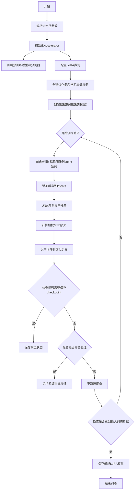
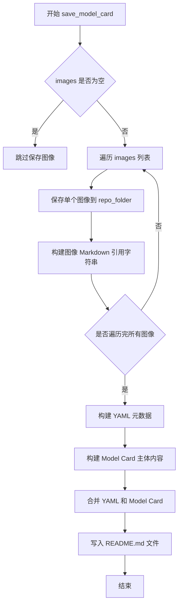
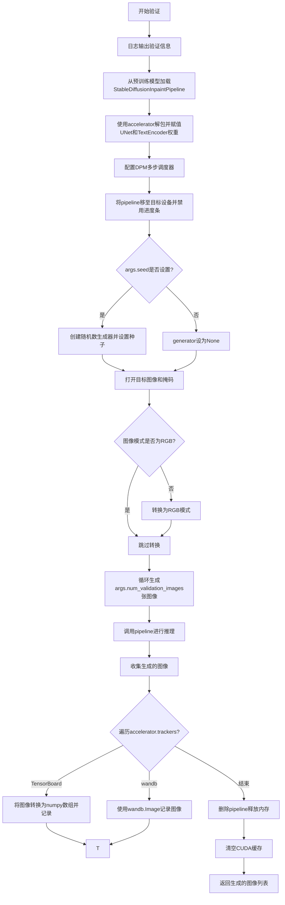
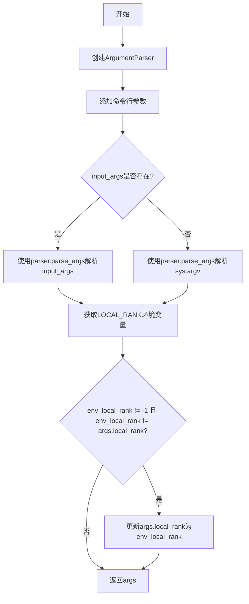
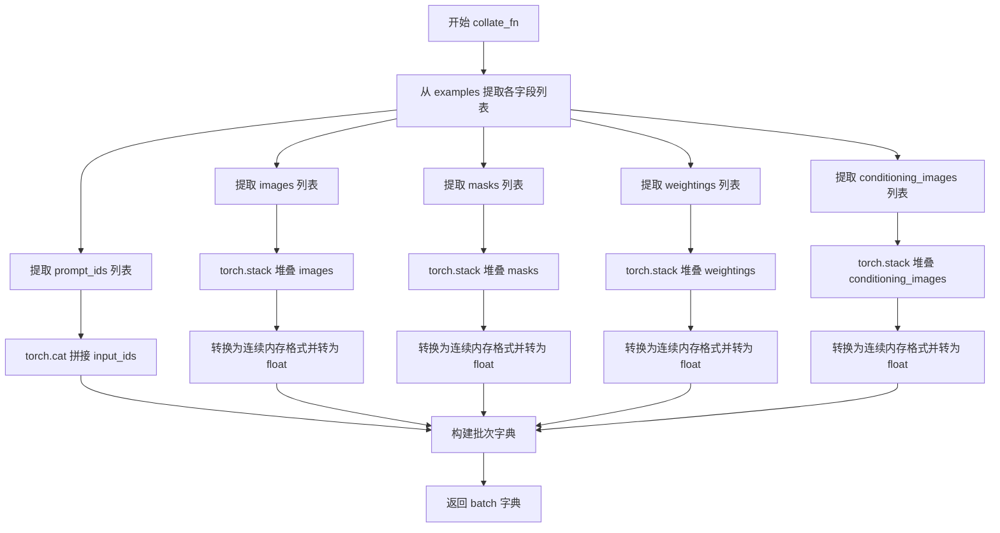
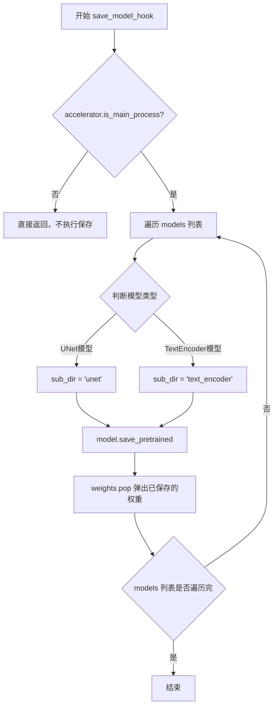
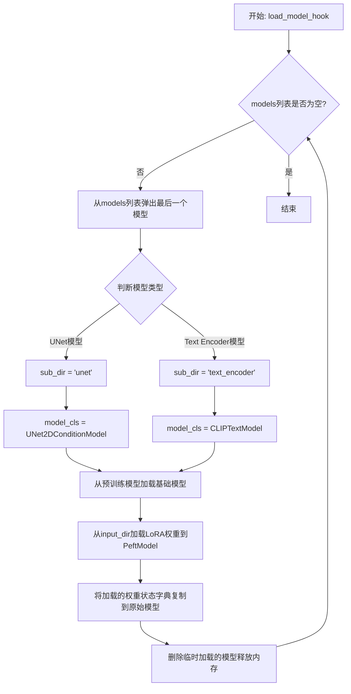
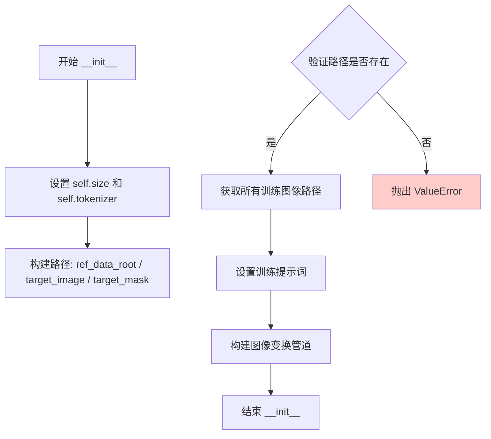
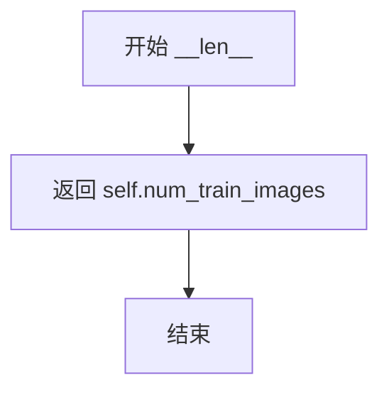

```mermaid
flowchart TD
    A[开始 main] --> B[检查 wandb 和 hub_token 安全性]
    B --> C[创建 logging_dir]
    C --> D[初始化 Accelerator]
    D --> E{report_to == wandb?}
    E -->|是| F[登录 wandb 并初始化项目]
    E -->|否| G[跳过 wandb 初始化]
    F --> G
    G --> H[配置日志级别]
    H --> I{seed 是否设置?}
    I -->|是| J[设置随机种子]
    I -->|否| K[跳过种子设置]
    J --> K
    K --> L{output_dir 存在?}
    L -->|否且为主进程| M[创建输出目录]
    L -->|是| N[跳过创建]
    M --> N
    N --> O{push_to_hub?}
    O -->|是| P[创建 Hub 仓库]
    O -->|否| Q[跳过 Hub 创建]
    P --> Q
    Q --> R[加载 Tokenizer]
    R --> S[加载 Scheduler 和 Models]
    S --> T[配置 LoRA for UNet]
    T --> U[配置 LoRA for Text Encoder]
    U --> V[冻结 VAE]
    V --> W{xformers 可用?}
    W -->|是| X[启用 xformers]
    W -->|否| Y[抛出错误]
    X --> Z{gradient_checkpointing?}
    Y --> Z
    Z -->|是| AA[启用梯度检查点]
    Z -->|否| AB[跳过]
    AA --> AB
    AB --> AC[注册模型保存/加载钩子]
    AC --> AD{TF32 允许?}
    AD -->|是| AE[启用 TF32]
    AD -->|否| AF[跳过]
    AE --> AF
    AF --> AG[缩放学习率]
    AG --> AH{使用 8bit Adam?}
    AH -->|是| AI[导入 bitsandbytes]
    AH -->|否| AJ[使用 AdamW]
    AI --> AK[创建优化器]
    AJ --> AK
    AK --> AL[创建训练数据集]
    AL --> AM[创建 DataLoader]
    AM --> AN[创建 LR Scheduler]
    AN --> AO[使用 Accelerator 准备所有组件]
    AO --> AP[设置权重数据类型]
    AP --> AQ[移动 VAE 到设备]
    AQ --> AR[初始化追踪器]
    AR --> AS[开始训练循环]
    AS --> AT{epoch < num_train_epochs?}
    AT -->|是| AU[训练步骤循环]
    AT -->|否| AV[训练完成]
    AU --> AW{step < max_train_steps?}
    AW -->|是| AX[执行训练步骤]
    AW -->|否| AY[检查 checkpoint 保存]
    AX --> AZ[反向传播与优化]
    AZ --> BA[更新进度条]
    BA --> BB{同步梯度?}
    BB -->|是| BC[保存 checkpoint]
    BB -->|否| BD[继续]
    BC --> BE{validation_steps?}
    BD --> AW
    BE -->|是| BF[运行验证]
    BF --> BG[记录日志]
    BE -->|否| BG
    BG --> AW
    AY --> AT
    AV --> BI[保存 LoRA 权重]
    BI --> BJ[最终推理验证]
    BJ --> BK{push_to_hub?}
    BK -->|是| BL[保存模型卡片并上传]
    BK -->|否| BM[结束训练]
    BL --> BM
```

# `diffusers\examples\research_projects\realfill\train_realfill.py` 详细设计文档

这是一个用于训练 RealFill（图像修复/填充）扩散模型的脚本，支持 LoRA 微调、分布式训练、混合精度训练、梯度累积和验证功能。

## 整体流程



## 类结构

```
RealFillDataset (数据集类)
├── __init__ (初始化)
├── __len__ (返回数据集长度)
└── __getitem__ (获取单个样本)
```

## 全局变量及字段


### `logger`
    
日志记录器，用于记录训练过程中的信息和调试信息

类型：`logging.Logger`
    


### `noise_scheduler`
    
噪声调度器，用于在扩散模型训练过程中添加和调度噪声

类型：`DDPMScheduler`
    


### `text_encoder`
    
文本编码器，用于将文本提示转换为文本嵌入向量

类型：`CLIPTextModel`
    


### `vae`
    
变分自编码器，用于将图像编码到潜在空间或从潜在空间解码图像

类型：`AutoencoderKL`
    


### `unet`
    
UNet条件模型，用于预测噪声残差并执行图像生成任务

类型：`UNet2DConditionModel`
    


### `train_dataset`
    
训练数据集，加载并预处理训练图像、掩码和文本提示

类型：`RealFillDataset`
    


### `train_dataloader`
    
训练数据加载器，用于批量加载训练数据

类型：`DataLoader`
    


### `optimizer`
    
优化器，用于更新模型参数以最小化损失函数

类型：`Optimizer`
    


### `lr_scheduler`
    
学习率调度器，用于动态调整训练过程中的学习率

类型：`Scheduler`
    


### `weight_dtype`
    
权重数据类型，用于指定模型权重的数据精度（如float32、float16、bfloat16）

类型：`torch.dtype`
    


### `accelerator`
    
加速器实例，用于简化分布式训练和混合精度训练的实现

类型：`Accelerator`
    


### `RealFillDataset.size`
    
图像分辨率大小，指定训练图像的目标尺寸

类型：`int`
    


### `RealFillDataset.tokenizer`
    
分词器实例，用于将文本提示转换为token序列

类型：`AutoTokenizer`
    


### `RealFillDataset.ref_data_root`
    
参考图像目录路径，指向包含参考图像的文件夹

类型：`Path`
    


### `RealFillDataset.target_image`
    
目标图像路径，指向需要填充修复的目标图像文件

类型：`Path`
    


### `RealFillDataset.target_mask`
    
目标mask路径，指向定义修复区域的掩码图像文件

类型：`Path`
    


### `RealFillDataset.train_images_path`
    
训练图像路径列表，包含所有用于训练的图像文件路径

类型：`list`
    


### `RealFillDataset.num_train_images`
    
训练图像总数，表示数据集中可用于训练的图片数量

类型：`int`
    


### `RealFillDataset.train_prompt`
    
训练提示词，用于指导模型生成或填充图像的文本描述

类型：`str`
    


### `RealFillDataset.transform`
    
图像变换组合，定义了一系列图像预处理操作（如 resize、crop、normalize）

类型：`Compose`
    
    

## 全局函数及方法


### `make_mask`

生成一个随机二值掩码（mask），用于图像修复（inpainting）任务。该函数通过在初始化为全1的掩码上随机挖去多个矩形区域来创建遮罩，这些区域将作为需要修复的部分。

**参数：**

- `images`：`torch.Tensor`，输入图像张量，用于获取目标形状（仅使用第一维度的形状信息）
- `resolution`：`int`，图像分辨率（通常为512），用于计算遮罩的尺寸范围
- `times`：`int`，随机遮罩挖空次数，默认为30

**返回值：** `torch.Tensor`，返回形状为 (1, H, W) 的二值掩码张量，其中0表示需要修复的区域，1表示保留的区域

#### 流程图

```mermaid
flowchart TD
    A[开始] --> B[创建全1掩码<br/>mask = torch.ones_like]
    B --> C[随机确定挖空次数<br/>times = np.random.randint(1, times)]
    C --> D[计算尺寸参数<br/>min_size, max_size, margin]
    D --> E{循环 i < times}
    E -->|是| F[随机生成宽度和高度]
    F --> G[随机生成起始坐标<br/>x_start, y_start]
    G --> H[在掩码对应区域置0<br/>mask[:, y_start:y_start+height, x_start:x_start+width] = 0]
    H --> E
    E -->|否| I{随机概率 < 0.5}
    I -->|是| J[翻转掩码<br/>mask = 1 - mask]
    I -->|否| K[保持原掩码]
    J --> L[返回掩码]
    K --> L
```

#### 带注释源码

```python
def make_mask(images, resolution, times=30):
    """
    生成随机二值掩码，用于图像修复任务
    
    参数:
        images: 输入图像张量，用于获取目标形状
        resolution: 图像分辨率，用于计算遮罩尺寸
        times: 随机遮罩挖空次数上限，默认为30
    """
    # 初始化全1掩码，形状与输入图像的第一个样本相同
    # images[0:1, :, :] 获取batch中第一张图像的形状
    mask, times = torch.ones_like(images[0:1, :, :]), np.random.randint(1, times)
    
    # 根据分辨率计算遮罩的尺寸参数
    # min_size = 0.03 * resolution (最小遮罩占比)
    # max_size = 0.25 * resolution (最大遮罩占比)  
    # margin = 0.01 * resolution (边界留白)
    min_size, max_size, margin = np.array([0.03, 0.25, 0.01]) * resolution
    
    # 确保最大尺寸不超过图像边界（考虑双边距）
    max_size = min(max_size, resolution - margin * 2)

    # 循环生成多个随机矩形遮罩区域
    for _ in range(times):
        # 随机生成矩形的宽和高
        width = np.random.randint(int(min_size), int(max_size))
        height = np.random.randint(int(min_size), int(max_size))

        # 随机生成矩形的左上角坐标，确保在边界内
        # x_start 范围: [margin, resolution - margin - width]
        x_start = np.random.randint(int(margin), resolution - int(margin) - width + 1)
        y_start = np.random.randint(int(margin), resolution - int(margin) - height + 1)
        
        # 将选中区域置为0，表示该区域需要被修复
        mask[:, y_start : y_start + height, x_start : x_start + width] = 0

    # 50%概率翻转掩码，增加多样性
    # 翻转后：0变1，1变0，即修复区域变为保留区域
    mask = 1 - mask if random.random() < 0.5 else mask
    return mask
```


### `save_model_card`

该函数用于生成并保存模型卡片（Model Card），将训练好的模型信息、基础模型信息以及示例图像保存到 README.md 文件中，方便模型的分享和展示。

参数：

- `repo_id`：`str`，模型的仓库 ID，用于标识模型的身份
- `images`：`list[Image]`，待保存的示例图像列表，默认为 None
- `base_model`：`str`，基础模型的名称或路径，表明该模型是从哪个基础模型微调而来，默认为 str 类型
- `repo_folder`：`str`，模型仓库的本地文件夹路径，用于保存 README.md 和示例图像，默认为 None

返回值：`None`，该函数没有返回值，仅执行文件写入操作

#### 流程图



#### 带注释源码

```python
def save_model_card(
    repo_id: str,
    images=None,
    base_model=str,
    repo_folder=None,
):
    """
    生成并保存模型的 README.md 文件（Model Card）
    
    参数:
        repo_id: 模型仓库的唯一标识符
        images: PIL Image 对象列表，用于展示模型效果
        base_model: 基础模型名称/路径
        repo_folder: 本地存储路径
    """
    
    # 初始化图像引用字符串
    img_str = ""
    
    # 遍历所有图像并保存到指定文件夹
    for i, image in enumerate(images):
        # 保存图像文件，文件名格式为 image_0.png, image_1.png 等
        image.save(os.path.join(repo_folder, f"image_{i}.png"))
        # 构建 Markdown 格式的图像引用
        img_str += f"\n"

    # 构建 YAML 格式的元数据头
    yaml = f"""
---
license: creativeml-openrail-m
base_model: {base_model}
prompt: "a photo of sks"
tags:
- stable-diffusion-inpainting
- stable-diffusion-inpainting-diffusers
- text-to-image
- diffusers
- realfill
- diffusers-training
inference: true
---
    """
    
    # 构建 Model Card 的主体内容，包含模型描述和示例图像
    model_card = f"""
# RealFill - {repo_id}

This is a realfill model derived from {base_model}. The weights were trained using [RealFill](https://realfill.github.io/).
You can find some example images in the following. \n
{img_str}
"""
    
    # 将 YAML 元数据和 Model Card 内容写入 README.md 文件
    with open(os.path.join(repo_folder, "README.md"), "w") as f:
        f.write(yaml + model_card)
```


### `log_validation`

该函数负责在训练过程中执行验证任务，加载预训练的Stable Diffusion inpainting模型，使用训练好的权重进行图像生成，并将生成的验证图像记录到TensorBoard或wandb等跟踪工具中。

参数：

- `text_encoder`：`CLIPTextModel`，文本编码器模型，用于将文本提示转换为嵌入向量
- `tokenizer`：分词器，用于将文本提示编码为token id
- `unet`：`UNet2DConditionModel`，UNet条件模型，用于去噪生成图像
- `args`：命令行参数对象，包含预训练模型路径、验证图像数量、随机种子等配置
- `accelerator`：`Accelerator`，加速器对象，用于模型管理和设备分配
- `weight_dtype`：torch.dtype，权重数据类型（fp16/bf16/fp32）
- `epoch`：int，当前训练的轮次编号

返回值：`List[PIL.Image]`，生成的验证图像列表

#### 流程图



#### 带注释源码

```python
def log_validation(
    text_encoder,      # 训练好的文本编码器模型
    tokenizer,         # 分词器对象
    unet,              # 训练好的UNet模型
    args,              # 包含所有训练配置的命令行参数
    accelerator,      # Accelerate库提供的分布式训练加速器
    weight_dtype,     # 权重数据类型，如torch.float16
    epoch,             # 当前训练的轮次，用于记录
):
    # 输出验证日志信息，显示将要生成的验证图像数量
    logger.info(f"Running validation... \nGenerating {args.num_validation_images} images")

    # 从预训练模型路径加载Stable Diffusion inpainting pipeline
    # 注意：unet和vae会重新以float32加载
    pipeline = StableDiffusionInpaintPipeline.from_pretrained(
        args.pretrained_model_name_or_path,  # 预训练模型名称或路径
        tokenizer=tokenizer,                  # 使用训练时相同的分词器
        revision=args.revision,               # 模型版本
        torch_dtype=weight_dtype,             # 设置权重数据类型
    )

    # 设置keep_fp32_wrapper为True，因为我们不想在训练过程中
    # 移除混合精度钩子
    # 使用accelerator.unwrap_model获取原始模型权重
    pipeline.unet = accelerator.unwrap_model(unet, keep_fp32_wrapper=True)
    pipeline.text_encoder = accelerator.unwrap_model(text_encoder, keep_fp32_wrapper=True)
    
    # 使用DPM多步调度器替换默认调度器
    pipeline.scheduler = DPMSolverMultistepScheduler.from_config(pipeline.scheduler.config)

    # 将pipeline移至加速器设备（GPU/CPU）
    pipeline = pipeline.to(accelerator.device)
    # 禁用推理时的进度条显示
    pipeline.set_progress_bar_config(disable=True)

    # 如果指定了种子，则创建随机数生成器并设置种子以确保可重复性
    # 否则generator为None，使用随机生成
    generator = None if args.seed is None else torch.Generator(device=accelerator.device).manual_seed(args.seed)

    # 从训练数据目录加载目标图像和掩码
    target_dir = Path(args.train_data_dir) / "target"
    target_image, target_mask = target_dir / "target.png", target_dir / "mask.png"
    # 打开目标图像和掩码图像
    image, mask_image = Image.open(target_image), Image.open(target_mask)

    # 确保图像为RGB模式（RGBA等转换为RGB）
    if image.mode != "RGB":
        image = image.convert("RGB")

    # 存储生成的图像列表
    images = []
    
    # 循环生成指定数量的验证图像
    for _ in range(args.num_validation_images):
        # 调用pipeline进行图像修复（inpainting）推理
        image = pipeline(
            prompt="a photo of sks",           # 验证用的固定提示词
            image=image,                       # 输入图像
            mask_image=mask_image,            # 修复区域的掩码
            num_inference_steps=25,           # 推理步数
            guidance_scale=5,                 # 引导系数
            generator=generator,              # 随机数生成器
        ).images[0]                           # 获取第一张生成的图像
        images.append(image)                  # 添加到图像列表

    # 遍历所有跟踪器（TensorBoard或wandb）记录验证结果
    for tracker in accelerator.trackers:
        if tracker.name == "tensorboard":
            # 将图像堆叠为numpy数组并记录到TensorBoard
            np_images = np.stack([np.asarray(img) for img in images])
            tracker.writer.add_images("validation", np_images, epoch, dataformats="NHWC")
        if tracker.name == "wandb":
            # 使用wandb记录图像，支持标题显示
            tracker.log({"validation": [wandb.Image(image, caption=str(i)) for i, image in enumerate(images)]})

    # 删除pipeline对象释放GPU内存
    del pipeline
    # 清空CUDA缓存
    torch.cuda.empty_cache()

    # 返回生成的验证图像列表
    return images
```


### `parse_args`

该函数用于解析命令行参数，创建一个argparse解析器并添加大量与训练相关的参数（如模型路径、学习率、数据目录等），然后解析这些参数并返回包含所有配置值的Namespace对象。

参数：

- `input_args`：`List[str] | None`，可选的输入参数列表。如果为None，则从sys.argv解析；否则解析传入的参数列表。

返回值：`argparse.Namespace`，包含所有命令行参数解析后的命名空间对象。

#### 流程图



#### 带注释源码

```python
def parse_args(input_args=None):
    """
    解析命令行参数并返回包含所有训练配置的Namespace对象。
    
    参数:
        input_args: 可选的参数列表。如果为None，则从系统命令行解析；
                   否则解析传入的列表（用于测试或脚本内部调用）。
    
    返回:
        argparse.Namespace: 包含所有解析后的命令行参数。
    """
    # 1. 创建ArgumentParser实例，添加描述信息
    parser = argparse.ArgumentParser(description="Simple example of a training script.")
    
    # 2. 添加大量命令行参数（以--pretrained_model_name_or_path为例）
    parser.add_argument(
        "--pretrained_model_name_or_path",  # 参数名
        type=str,                            # 参数类型
        default=None,                        # 默认值
        required=True,                       # 是否必需
        help="Path to pretrained model or model identifier from huggingface.co/models.",  # 帮助文本
    )
    # ... 添加更多参数（--revision, --tokenizer_name, --train_data_dir等）
    
    # 3. 解析参数
    if input_args is not None:
        # 如果传入了参数列表，解析该列表
        args = parser.parse_args(input_args)
    else:
        # 否则从sys.argv解析（默认行为）
        args = parser.parse_args()

    # 4. 处理分布式训练的环境变量LOCAL_RANK
    # 获取环境变量中的LOCAL_RANK值（默认为-1）
    env_local_rank = int(os.environ.get("LOCAL_RANK", -1))
    # 如果环境变量中的LOCAL_RANK与参数中的不一致，以环境变量为准
    if env_local_rank != -1 and env_local_rank != args.local_rank:
        args.local_rank = env_local_rank

    # 5. 返回解析后的参数对象
    return args
```


### `collate_fn`

该函数是 PyTorch DataLoader 的自定义批处理函数，用于将数据集中多个样本整理成一个训练批次。它从每个样本中提取文本 IDs、图像、掩码、权重图和条件图像，然后将它们堆叠成张量并转换为统一的内存格式，最终返回一个包含所有批次数据的字典。

参数：

- `examples`：`List[Dict]`，由 `RealFillDataset.__getitem__` 返回的样本列表，每个样本是一个包含 `prompt_ids`、`images`、`masks`、`weightings` 和 `conditioning_images` 键的字典

返回值：`Dict[str, torch.Tensor]`，包含批处理数据的字典，键为 `input_ids`、`images`、`masks`、`weightings` 和 `conditioning_images`，值均为相应的 PyTorch 张量

#### 流程图



#### 带注释源码

```python
def collate_fn(examples):
    """
    自定义批处理整理函数，用于将数据集中的样本整理成训练批次。
    
    参数:
        examples: 数据样本列表，每个样本包含:
            - prompt_ids: 文本token IDs (Tensor)
            - images: 输入图像 (Tensor)
            - masks: 掩码图像 (Tensor)
            - weightings: 权重图 (Tensor)
            - conditioning_images: 条件图像 (Tensor)
    
    返回:
        batch: 包含批次数据的字典
    """
    
    # 从每个样本中提取文本prompt的token IDs
    # input_ids shape: [batch_size, seq_len]
    input_ids = [example["prompt_ids"] for example in examples]
    
    # 提取所有样本的图像数据
    images = [example["images"] for example in examples]
    
    # 提取所有样本的掩码数据
    masks = [example["masks"] for example in examples]
    
    # 提取所有样本的权重图数据
    weightings = [example["weightings"] for example in examples]
    
    # 提取所有样本的条件图像数据
    conditioning_images = [example["conditioning_images"] for example in examples]

    # 将图像列表堆叠成批处理张量
    # images shape: [batch_size, C, H, W]
    images = torch.stack(images)
    # 确保内存连续并转换为float32，提高GPU计算效率
    images = images.to(memory_format=torch.contiguous_format).float()

    # 将掩码列表堆叠成批处理张量
    masks = torch.stack(masks)
    masks = masks.to(memory_format=torch.contiguous_format).float()

    # 将权重图列表堆叠成批处理张量
    weightings = torch.stack(weightings)
    weightings = weightings.to(memory_format=torch.contiguous_format).float()

    # 将条件图像列表堆叠成批处理张量
    conditioning_images = torch.stack(conditioning_images)
    conditioning_images = conditioning_images.to(memory_format=torch.contiguous_format).float()

    # 将input_ids沿batch维度拼接（因为每个样本的seq_len可能相同）
    # input_ids shape: [batch_size * seq_len] -> 需要根据tokenizer处理
    input_ids = torch.cat(input_ids, dim=0)

    # 构建最终的批次字典，返回给训练循环
    batch = {
        "input_ids": input_ids,           # 文本token IDs
        "images": images,                 # 输入图像
        "masks": masks,                   # 掩码
        "weightings": weightings,         # 损失权重图
        "conditioning_images": conditioning_images,  # 条件图像
    }
    return batch
```


### `main`

该函数是RealFill模型训练的主入口点，负责初始化分布式训练环境、加载预训练模型和数据集、配置LoRA微调、执行训练循环并在训练完成后保存模型权重。

#### 参数

- `args`：`argparse.Namespace`，通过`parse_args()`解析的命令行参数对象，包含模型路径、数据目录、学习率、批次大小等所有训练配置。

#### 返回值

无返回值（`None`），函数执行完毕后直接结束或通过`accelerator.end_training()`结束分布式训练。

#### 流程图



#### 带注释源码

```python
def main(args):
    """
    RealFill 模型训练主函数
    负责整个训练流程的 orchestration：环境初始化、模型加载、训练循环、模型保存
    """
    # 1. 安全检查：不能同时使用 wandb 报告和 hub_token（安全风险）
    if args.report_to == "wandb" and args.hub_token is not None:
        raise ValueError(
            "You cannot use both --report_to=wandb and --hub_token due to a security risk of exposing your token."
            " Please use `hf auth login` to authenticate with the Hub."
        )

    # 2. 构建日志目录路径（output_dir/logs）
    logging_dir = Path(args.output_dir, args.logging_dir)

    # 3. 初始化 Accelerator（分布式训练、混合精度、日志集成）
    accelerator = Accelerator(
        gradient_accumulation_steps=args.gradient_accumulation_steps,
        mixed_precision=args.mixed_precision,
        log_with=args.report_to,
        project_dir=logging_dir,
    )

    # 4. WandB 初始化（如需要）
    if args.report_to == "wandb":
        if not is_wandb_available():
            raise ImportError("Make sure to install wandb if you want to use it for logging during training.")

        wandb.login(key=args.wandb_key)
        wandb.init(project=args.wandb_project_name)

    # 5. 配置日志格式（每个进程都记录，用于调试）
    logging.basicConfig(
        format="%(asctime)s - %(levelname)s - %(name)s - %(message)s",
        datefmt="%m/%d/%Y %H:%M:%S",
        level=logging.INFO,
    )
    logger.info(accelerator.state, main_process_only=False)
    
    # 主进程设置详细日志，子进程设置错误日志（减少日志噪音）
    if accelerator.is_local_main_process:
        transformers.utils.logging.set_verbosity_warning()
        diffusers.utils.logging.set_verbosity_info()
    else:
        transformers.utils.logging.set_verbosity_error()
        diffusers.utils.logging.set_verbosity_error()

    # 6. 设置随机种子（确保可复现性）
    if args.seed is not None:
        set_seed(args.seed)

    # 7. 主进程创建输出目录
    if accelerator.is_main_process:
        if args.output_dir is not None:
            os.makedirs(args.output_dir, exist_ok=True)

        # 8. 如需推送到 Hub，创建远程仓库
        if args.push_to_hub:
            repo_id = create_repo(
                repo_id=args.hub_model_id or Path(args.output_dir).name, exist_ok=True, token=args.hub_token
            ).repo_id

    # 9. 加载 Tokenizer
    if args.tokenizer_name:
        tokenizer = AutoTokenizer.from_pretrained(args.tokenizer_name, revision=args.revision, use_fast=False)
    elif args.pretrained_model_name_or_path:
        tokenizer = AutoTokenizer.from_pretrained(
            args.pretrained_model_name_or_path,
            subfolder="tokenizer",
            revision=args.revision,
            use_fast=False,
        )

    # 10. 加载 Scheduler 和预训练模型
    noise_scheduler = DDPMScheduler.from_pretrained(args.pretrained_model_name_or_path, subfolder="scheduler")
    text_encoder = CLIPTextModel.from_pretrained(
        args.pretrained_model_name_or_path, subfolder="text_encoder", revision=args.revision
    )
    vae = AutoencoderKL.from_pretrained(args.pretrained_model_name_or_path, subfolder="vae", revision=args.revision)
    unet = UNet2DConditionModel.from_pretrained(
        args.pretrained_model_name_or_path, subfolder="unet", revision=args.revision
    )

    # 11. 配置 LoRA（UNet） - 用于图像生成的条件 UNet
    config = LoraConfig(
        r=args.lora_rank,                           # LoRA 秩（更新矩阵维度）
        lora_alpha=args.lora_alpha,                 # LoRA 缩放因子
        target_modules=["to_k", "to_q", "to_v", "key", "query", "value"],  # 目标模块
        lora_dropout=args.lora_dropout,             # Dropout 概率
        bias=args.lora_bias,                        # 偏置类型
    )
    unet = get_peft_model(unet, config)             # 包装为 PEFT 模型

    # 12. 配置 LoRA（Text Encoder）- 用于文本编码器
    config = LoraConfig(
        r=args.lora_rank,
        lora_alpha=args.lora_alpha,
        target_modules=["k_proj", "q_proj", "v_proj"],  # CLIP 文本编码器模块
        lora_dropout=args.lora_dropout,
        bias=args.lora_bias,
    )
    text_encoder = get_peft_model(text_encoder, config)

    # 13. 冻结 VAE（不参与训练，节省显存）
    vae.requires_grad_(False)

    # 14. xFormers 内存高效注意力（如启用）
    if args.enable_xformers_memory_efficient_attention:
        if is_xformers_available():
            import xformers

            xformers_version = version.parse(xformers.__version__)
            if xformers_version == version.parse("0.0.16"):
                logger.warning(
                    "xFormers 0.0.16 cannot be used for training in some GPUs. If you observe problems during training, please update xFormers to at least 0.0.17. See https://huggingface.co/docs/diffusers/main/en/optimization/xformers for more details."
                )
            unet.enable_xformers_memory_efficient_attention()
        else:
            raise ValueError("xformers is not available. Make sure it is installed correctly")

    # 15. 梯度检查点（以时间换显存）
    if args.gradient_checkpointing:
        unet.enable_gradient_checkpointing()
        text_encoder.gradient_checkpointing_enable()

    # 16. 注册自定义模型保存/加载钩子（处理 PEFT 模型序列化）
    def save_model_hook(models, weights, output_dir):
        if accelerator.is_main_process:
            for model in models:
                # 判断是 UNet 还是 Text Encoder
                sub_dir = (
                    "unet"
                    if isinstance(model.base_model.model, type(accelerator.unwrap_model(unet).base_model.model))
                    else "text_encoder"
                )
                model.save_pretrained(os.path.join(output_dir, sub_dir))
                weights.pop()  # 避免重复保存

    def load_model_hook(models, input_dir):
        while len(models) > 0:
            model = models.pop()
            sub_dir = (
                "unet"
                if isinstance(model.base_model.model, type(accelerator.unwrap_model(unet).base_model.model))
                else "text_encoder"
            )
            model_cls = (
                UNet2DConditionModel
                if isinstance(model.base_model.model, type(accelerator.unwrap_model(unet).base_model.model))
                else CLIPTextModel
            )

            # 加载基础模型并附加 LoRA 权重
            load_model = model_cls.from_pretrained(args.pretrained_model_name_or_path, subfolder=sub_dir)
            load_model = PeftModel.from_pretrained(load_model, input_dir, subfolder=sub_dir)
            model.load_state_dict(load_model.state_dict())
            del load_model

    accelerator.register_save_state_pre_hook(save_model_hook)
    accelerator.register_load_state_pre_hook(load_model_hook)

    # 17. TF32 加速（Ampere GPU）
    if args.allow_tf32:
        torch.backends.cuda.matmul.allow_tf32 = True

    # 18. 学习率缩放（考虑 GPU 数量、梯度累积、批次大小）
    if args.scale_lr:
        args.unet_learning_rate = (
            args.unet_learning_rate
            * args.gradient_accumulation_steps
            * args.train_batch_size
            * accelerator.num_processes
        )

        args.text_encoder_learning_rate = (
            args.text_encoder_learning_rate
            * args.gradient_accumulation_steps
            * args.train_batch_size
            * accelerator.num_processes
        )

    # 19. 优化器选择（8bit Adam 节省显存）
    if args.use_8bit_adam:
        try:
            import bitsandbytes as bnb
        except ImportError:
            raise ImportError(
                "To use 8-bit Adam, please install the bitsandbytes library: `pip install bitsandbytes`."
            )

        optimizer_class = bnb.optim.AdamW8bit
    else:
        optimizer_class = torch.optim.AdamW

    # 20. 创建优化器（分别设置 UNet 和 Text Encoder 的学习率）
    optimizer = optimizer_class(
        [
            {"params": unet.parameters(), "lr": args.unet_learning_rate},
            {"params": text_encoder.parameters(), "lr": args.text_encoder_learning_rate},
        ],
        betas=(args.adam_beta1, args.adam_beta2),
        weight_decay=args.adam_weight_decay,
        eps=args.adam_epsilon,
    )

    # 21. 创建数据集和 DataLoader
    train_dataset = RealFillDataset(
        train_data_root=args.train_data_dir,
        tokenizer=tokenizer,
        size=args.resolution,
    )

    train_dataloader = torch.utils.data.DataLoader(
        train_dataset,
        batch_size=args.train_batch_size,
        shuffle=True,
        collate_fn=collate_fn,
        num_workers=1,
    )

    # 22. 计算训练步数
    overrode_max_train_steps = False
    num_update_steps_per_epoch = math.ceil(len(train_dataloader) / args.gradient_accumulation_steps)
    if args.max_train_steps is None:
        args.max_train_steps = args.num_train_epochs * num_update_steps_per_epoch
        overrode_max_train_steps = True

    # 23. 创建学习率调度器
    lr_scheduler = get_scheduler(
        args.lr_scheduler,
        optimizer=optimizer,
        num_warmup_steps=args.lr_warmup_steps * args.gradient_accumulation_steps,
        num_training_steps=args.max_train_steps * args.gradient_accumulation_steps,
        num_cycles=args.lr_num_cycles,
        power=args.lr_power,
    )

    # 24. 使用 Accelerator 准备所有组件（分布式训练必需）
    unet, text_encoder, optimizer, train_dataloader = accelerator.prepare(
        unet, text_encoder, optimizer, train_dataloader
    )

    # 25. 设置权重数据类型（混合精度）
    weight_dtype = torch.float32
    if accelerator.mixed_precision == "fp16":
        weight_dtype = torch.float16
    elif accelerator.mixed_precision == "bf16":
        weight_dtype = torch.bfloat16

    # 26. 将 VAE 移动到设备并转换数据类型
    vae.to(accelerator.device, dtype=weight_dtype)

    # 27. 重新计算训练步数（DataLoader 大小可能变化）
    num_update_steps_per_epoch = math.ceil(len(train_dataloader) / args.gradient_accumulation_steps)
    if overrode_max_train_steps:
        args.max_train_steps = args.num_train_epochs * num_update_steps_per_epoch
    args.num_train_epochs = math.ceil(args.max_train_steps / num_update_steps_per_epoch)

    # 28. 初始化追踪器（TensorBoard/WandB）
    if accelerator.is_main_process:
        tracker_config = vars(copy.deepcopy(args))
        accelerator.init_trackers("realfill", config=tracker_config)

    # 29. 训练信息日志
    total_batch_size = args.train_batch_size * accelerator.num_processes * args.gradient_accumulation_steps

    logger.info("***** Running training *****")
    logger.info(f"  Num examples = {len(train_dataset)}")
    logger.info(f"  Num batches each epoch = {len(train_dataloader)}")
    logger.info(f"  Num Epochs = {args.num_train_epochs}")
    logger.info(f"  Instantaneous batch size per device = {args.train_batch_size}")
    logger.info(f"  Total train batch size (w. parallel, distributed & accumulation) = {total_batch_size}")
    logger.info(f"  Gradient Accumulation steps = {args.gradient_accumulation_steps}")
    logger.info(f"  Total optimization steps = {args.max_train_steps}")
    global_step = 0
    first_epoch = 0

    # 30. 检查点恢复（如指定）
    if args.resume_from_checkpoint:
        if args.resume_from_checkpoint != "latest":
            path = os.path.basename(args.resume_from_checkpoint)
        else:
            # 获取最新的 checkpoint
            dirs = os.listdir(args.output_dir)
            dirs = [d for d in dirs if d.startswith("checkpoint")]
            dirs = sorted(dirs, key=lambda x: int(x.split("-")[1]))
            path = dirs[-1] if len(dirs) > 0 else None

        if path is None:
            accelerator.print(
                f"Checkpoint '{args.resume_from_checkpoint}' does not exist. Starting a new training run."
            )
            args.resume_from_checkpoint = None
            initial_global_step = 0
        else:
            accelerator.print(f"Resuming from checkpoint {path}")
            accelerator.load_state(os.path.join(args.output_dir, path))
            global_step = int(path.split("-")[1])

            initial_global_step = global_step
            first_epoch = global_step // num_update_steps_per_epoch
    else:
        initial_global_step = 0

    # 31. 创建进度条
    progress_bar = tqdm(
        range(0, args.max_train_steps),
        initial=initial_global_step,
        desc="Steps",
        disable=not accelerator.is_local_main_process,
    )

    # 32. 训练循环
    for epoch in range(first_epoch, args.num_train_epochs):
        unet.train()
        text_encoder.train()

        for step, batch in enumerate(train_dataloader):
            with accelerator.accumulate(unet, text_encoder):
                # 图像 encode 到 latent 空间
                latents = vae.encode(batch["images"].to(dtype=weight_dtype)).latent_dist.sample()
                latents = latents * 0.18215  # 缩放因子（Stable Diffusion 标准）

                # 条件图像 encode 到 latent 空间
                conditionings = vae.encode(batch["conditioning_images"].to(dtype=weight_dtype)).latent_dist.sample()
                conditionings = conditionings * 0.18215

                # 下采样 mask 和 weighting 以匹配 latent 尺寸
                masks, size = batch["masks"].to(dtype=weight_dtype), latents.shape[2:]
                masks = F.interpolate(masks, size=size)

                weightings = batch["weightings"].to(dtype=weight_dtype)
                weightings = F.interpolate(weightings, size=size)

                # 采样噪声（将添加到 latents）
                noise = torch.randn_like(latents)
                bsz = latents.shape[0]

                # 随机采样时间步
                timesteps = torch.randint(0, noise_scheduler.config.num_train_timesteps, (bsz,), device=latents.device)
                timesteps = timesteps.long()

                # 前向扩散过程：添加噪声到 latents
                noisy_latents = noise_scheduler.add_noise(latents, noise, timesteps)

                # 拼接：noisy_latents + masks + conditionings（作为 UNet 输入）
                inputs = torch.cat([noisy_latents, masks, conditionings], dim=1)

                # 获取文本嵌入作为条件
                encoder_hidden_states = text_encoder(batch["input_ids"])[0]

                # UNet 预测噪声残差
                model_pred = unet(inputs, timesteps, encoder_hidden_states).sample

                # 计算扩散损失（加权 MSE）
                assert noise_scheduler.config.prediction_type == "epsilon"
                loss = (weightings * F.mse_loss(model_pred.float(), noise.float(), reduction="none")).mean()

                # 反向传播
                accelerator.backward(loss)
                if accelerator.sync_gradients:
                    params_to_clip = itertools.chain(unet.parameters(), text_encoder.parameters())
                    accelerator.clip_grad_norm_(params_to_clip, args.max_grad_norm)

                # 优化器更新
                optimizer.step()
                lr_scheduler.step()
                optimizer.zero_grad(set_to_none=args.set_grads_to_none)

            # 检查是否执行了优化步骤
            if accelerator.sync_gradients:
                progress_bar.update(1)
                if args.report_to == "wandb":
                    accelerator.print(progress_bar)
                global_step += 1

                # 主进程执行 checkpoint 保存和验证
                if accelerator.is_main_process:
                    # 保存 checkpoint
                    if global_step % args.checkpointing_steps == 0:
                        # 检查 checkpoint 数量限制
                        if args.checkpoints_total_limit is not None:
                            checkpoints = os.listdir(args.output_dir)
                            checkpoints = [d for d in checkpoints if d.startswith("checkpoint")]
                            checkpoints = sorted(checkpoints, key=lambda x: int(x.split("-")[1]))

                            if len(checkpoints) >= args.checkpoints_total_limit:
                                num_to_remove = len(checkpoints) - args.checkpoints_total_limit + 1
                                removing_checkpoints = checkpoints[0:num_to_remove]

                                logger.info(
                                    f"{len(checkpoints)} checkpoints already exist, removing {len(removing_checkpoints)} checkpoints"
                                )
                                logger.info(f"removing checkpoints: {', '.join(removing_checkpoints)}")

                                for removing_checkpoint in removing_checkpoints:
                                    removing_checkpoint = os.path.join(args.output_dir, removing_checkpoint)
                                    shutil.rmtree(removing_checkpoint)

                        save_path = os.path.join(args.output_dir, f"checkpoint-{global_step}")
                        accelerator.save_state(save_path)
                        logger.info(f"Saved state to {save_path}")

                    # 运行验证
                    if global_step % args.validation_steps == 0:
                        log_validation(
                            text_encoder,
                            tokenizer,
                            unet,
                            args,
                            accelerator,
                            weight_dtype,
                            global_step,
                        )

            # 记录损失日志
            logs = {"loss": loss.detach().item()}
            progress_bar.set_postfix(**logs)
            accelerator.log(logs, step=global_step)

            # 达到最大训练步数则退出
            if global_step >= args.max_train_steps:
                break

    # 33. 训练完成：保存 LoRA 权重
    accelerator.wait_for_everyone()
    if accelerator.is_main_process:
        # 合并 LoRA 权重并创建 pipeline
        pipeline = StableDiffusionInpaintPipeline.from_pretrained(
            args.pretrained_model_name_or_path,
            unet=accelerator.unwrap_model(unet, keep_fp32_wrapper=True).merge_and_unload(),
            text_encoder=accelerator.unwrap_model(text_encoder, keep_fp32_wrapper=True).merge_and_unload(),
            revision=args.revision,
        )

        pipeline.save_pretrained(args.output_dir)

        # 最终推理验证
        images = log_validation(
            text_encoder,
            tokenizer,
            unet,
            args,
            accelerator,
            weight_dtype,
            global_step,
        )

        # 推送到 Hub（如需要）
        if args.push_to_hub:
            save_model_card(
                repo_id,
                images=images,
                base_model=args.pretrained_model_name_or_path,
                repo_folder=args.output_dir,
            )
            upload_folder(
                repo_id=repo_id,
                folder_path=args.output_dir,
                commit_message="End of training",
                ignore_patterns=["step_*", "epoch_*"],
            )

    # 34. 结束训练
    accelerator.end_training()
```


### `save_model_hook`

这是一个在 `main` 函数内部定义的嵌套函数，用于作为 `Accelerator` 的保存状态预钩子，专门用于保存 LoRA 适配器的权重。该钩子在分布式训练环境中被调用，确保只有主进程执行保存操作，并根据模型类型（UNet 或 TextEncoder）将权重保存到对应的子目录中。

参数：

- `models`：`List[torch.nn.Module]`（实际上是 `PeftModel` 类型的列表），需要保存的模型列表，通常包含 UNet 和 TextEncoder 的 LoRA 适配器模型
- `weights`：`List`，权重列表，用于跟踪已保存的模型，保存后需要从中弹出以避免重复保存
- `output_dir`：`str`，输出目录的路径，用于保存模型检查点

返回值：`None`，该函数没有返回值

#### 流程图



#### 带注释源码

```python
def save_model_hook(models, weights, output_dir):
    """
    自定义模型保存钩子，用于保存 LoRA 适配器权重
    
    参数:
        models: 需要保存的 PeftModel 模型列表
        weights: 权重列表，用于跟踪已保存的模型
        output_dir: 输出目录路径
    """
    # 仅在主进程执行保存操作，避免多进程写入冲突
    if accelerator.is_main_process:
        # 遍历所有需要保存的模型（通常是 UNet 和 TextEncoder 的 LoRA 适配器）
        for model in models:
            # 根据模型类型确定保存的子目录名称
            # 通过检查 base_model.model 的类型来判断是 UNet 还是 TextEncoder
            sub_dir = (
                "unet"
                if isinstance(model.base_model.model, type(accelerator.unwrap_model(unet).base_model.model))
                else "text_encoder"
            )
            
            # 使用 PeftModel 的 save_pretrained 方法保存 LoRA 权重
            # 保存路径为 output_dir/sub_dir（例如：output_dir/unet 或 output_dir/text_encoder）
            model.save_pretrained(os.path.join(output_dir, sub_dir))

            # 从 weights 列表中弹出当前模型权重，确保不会重复保存
            # 这是必须的，因为 accelerator.save_state 会多次调用此钩子
            weights.pop()
```

#### 关键实现细节

1. **进程控制**：使用 `accelerator.is_main_process` 确保只有主进程执行保存操作，避免多进程同时写入同一文件导致的冲突

2. **模型类型判断**：通过 `isinstance(model.base_model.model, type(accelerator.unwrap_model(unet).base_model.model))` 判断模型是 UNet 还是 TextEncoder，因为传入的是 PeftModel 包装后的模型

3. **权重去重**：每次保存一个模型后必须调用 `weights.pop()`，否则 `accelerator.save_state()` 可能会尝试重复保存相同的模型

4. **LoRA 特定**：该钩子专门用于保存 LoRA 适配器的权重（通过 `get_peft_model` 创建的模型），而非完整的模型权重


### `load_model_hook`

该函数是Accelerator框架的模型加载预钩子（load state pre-hook），用于在恢复训练状态时自动加载已保存的UNet和CLIPTextModel的LoRA权重。它遍历模型列表，根据模型类型确定子目录，从预训练路径加载对应模型架构，然后从检查点目录加载LoRA权重并融合到模型中。

参数：

- `models`：`List[torch.nn.Module]`，由Accelerator框架传入的模型列表，该函数会弹出（pop）并处理列表中的模型
- `input_dir`：`str`，检查点目录路径，包含已保存的模型权重

返回值：`None`，无返回值，直接修改传入的models列表

#### 流程图



#### 带注释源码

```python
def load_model_hook(models, input_dir):
    """
    Accelerator的加载状态预钩子，用于恢复训练时加载LoRA权重
    
    参数:
        models: Accelerator传入的模型列表
        input_dir: 包含已保存检查点的目录路径
    """
    # 循环处理所有待加载的模型
    while len(models) > 0:
        # 弹出模型，避免重复加载
        model = models.pop()

        # 根据模型类型确定子目录名称
        # 判断依据：比较model的基础模型类型与UNet的基础模型类型
        sub_dir = (
            "unet"
            if isinstance(model.base_model.model, type(accelerator.unwrap_model(unet).base_model.model))
            else "text_encoder"
        )
        
        # 根据模型类型选择对应的模型类
        model_cls = (
            UNet2DConditionModel
            if isinstance(model.base_model.model, type(accelerator.unwrap_model(unet).base_model.model))
            else CLIPTextModel
        )

        # 从预训练模型路径加载基础模型架构
        load_model = model_cls.from_pretrained(args.pretrained_model_name_or_path, subfolder=sub_dir)
        
        # 使用PeftModel加载LoRA权重
        # 从input_dir的子目录中读取已保存的LoRA权重
        load_model = PeftModel.from_pretrained(load_model, input_dir, subfolder=sub_dir)

        # 将加载的权重状态字典复制到当前模型中
        model.load_state_dict(load_model.state_dict())
        
        # 删除临时模型对象以释放内存
        del load_model
```


### RealFillDataset.__init__

该方法是 `RealFillDataset` 类的构造函数，用于初始化 RealFill 训练数据集。它设置数据集的基本属性（包括图像路径、分词器和图像尺寸），验证训练数据目录结构是否完整，并构建图像预处理转换管道。

参数：

- `train_data_root`：`str`，训练数据根目录路径，包含 ref 和 target 子目录
- `tokenizer`：`transformers.PreTrainedTokenizer`，用于对提示词进行 tokenize 的分词器
- `size`：`int`，目标图像分辨率，默认为 512

返回值：无（`None`），构造函数不返回值

#### 流程图



#### 带注释源码

```python
def __init__(
    self,
    train_data_root,
    tokenizer,
    size=512,
):
    # 设置目标图像尺寸
    self.size = size
    # 保存分词器实例，用于后续对提示词进行编码
    self.tokenizer = tokenizer

    # 构建参考图像、目标图像和目标掩码的路径对象
    self.ref_data_root = Path(train_data_root) / "ref"
    self.target_image = Path(train_data_root) / "target" / "target.png"
    self.target_mask = Path(train_data_root) / "target" / "mask.png"
    
    # 验证训练数据目录结构完整性
    # 必须包含 ref 目录、target.png 和 mask.png
    if not (self.ref_data_root.exists() and self.target_image.exists() and self.target_mask.exists()):
        raise ValueError("Train images root doesn't exists.")

    # 收集所有训练图像路径：参考图像 + 目标图像
    self.train_images_path = list(self.ref_data_root.iterdir()) + [self.target_image]
    # 计算训练图像总数
    self.num_train_images = len(self.train_images_path)
    # 设置默认训练提示词
    self.train_prompt = "a photo of sks"

    # 构建图像预处理变换管道
    self.transform = transforms_v2.Compose(
        [
            transforms_v2.ToImage(),              # 转换为 Tensor Image
            transforms_v2.RandomResize(size, int(1.125 * size)),  # 随机Resize
            transforms_v2.RandomCrop(size),       # 随机裁剪到目标尺寸
            transforms_v2.ToDtype(torch.float32, scale=True),  # 转为浮点并归一化到[0,1]
            transforms_v2.Normalize([0.5], [0.5]),  # 标准化到[-1,1]
        ]
    )
```


### `RealFillDataset.__len__`

该方法返回数据集中训练图像的总数量，使 DataLoader 能够确定遍历数据集所需的总批次数。

参数：

- 该方法无参数（`self` 为实例本身）

返回值：`int`，返回训练图像的总数

#### 流程图



#### 带注释源码

```python
def __len__(self):
    """
    返回数据集中训练图像的数量。
    
    此方法是 Python 数据集协议的核心组成部分，允许 DataLoader 
    确定数据集的大小，从而正确计算每个 epoch 的批次数。
    
    Returns:
        int: 训练图像的总数，包括参考图像和目标图像。
             该值在 __init__ 方法中被设置为：
             len(list(self.ref_data_root.iterdir())) + 1
    """
    return self.num_train_images
```


### `RealFillDataset.__getitem__(index)`

该方法是 `RealFillDataset` 类的核心实例方法，负责根据给定索引加载并处理单个训练样本。它打开对应索引的图像文件，进行EXIF校正和RGB转换，处理权重图（对于最后一个索引使用目标掩码，否则创建空权重图），应用图像变换，生成或随机创建掩码，计算条件图像，并对提示词进行tokenize，最终返回一个包含图像、掩码、权重、条件图像和prompt_ids的字典，供训练流程使用。

参数：

- `index`：`int`，待获取样本的索引，用于从 `train_images_path` 列表中定位图像文件

返回值：`dict`，包含以下键值对的字典：
  - `"images"`：`torch.Tensor`，变换后的图像张量，形状为 `(C, H, W)`，已归一化
  - `"masks"`：`torch.Tensor`，二进制掩码张量，形状为 `(1, H, W)`
  - `"weightings"`：`torch.Tensor`，权重图张量，形状为 `(1, H, W)`，由权重图与0比较得到
  - `"conditioning_images"`：`torch.Tensor`，条件图像张量，形状为 `(C, H, W)`，由原图像与掩码相乘得到
  - `"prompt_ids"`：`torch.Tensor`，tokenize后的提示词ID张量，形状为 `(1, max_length)`

#### 流程图

```mermaid
flowchart TD
    A[开始 __getitem__] --> B[创建空字典 example]
    B --> C[根据 index 打开图像文件]
    C --> D[调用 exif_transpose 校正 EXIF 方向]
    D --> E{image.mode == 'RGB'?}
    E -->|否| F[转换为 RGB 模式]
    E -->|是| G{index < len - 1?}
    F --> G
    G -->|是| H[创建空白权重图 weighting]
    G -->|否| I[打开目标掩码文件]
    I --> J[调用 exif_transpose 校正权重图]
    H --> K
    J --> K
    K[使用 transform 同时变换图像和权重图]
    K --> L[example['images'] = 变换后图像]
    L --> M[example['weightings'] = weighting < 0]
    M --> N{随机数 < 0.1?}
    N -->|是| O[创建全1掩码]
    N -->|否| P[调用 make_mask 生成随机掩码]
    O --> Q
    P --> Q
    Q[example['masks'] = 掩码]
    Q --> R[计算条件图像: images * (masks < 0.5)]
    R --> S[example['conditioning_images'] = 条件图像]
    S --> T{随机数 < 0.1?}
    T -->|是| U[train_prompt = '']
    T -->|否| V[train_prompt = self.train_prompt]
    U --> W
    V --> W
    W[使用 tokenizer 处理 train_prompt]
    W --> X[example['prompt_ids'] = tokenized ids]
    X --> Y[返回 example 字典]
```

#### 带注释源码

```python
def __getitem__(self, index):
    """
    根据索引获取单个训练样本
    Args:
        index: 样本索引，用于从训练图像列表中定位图像
    Returns:
        dict: 包含处理后的图像、掩码、权重图、条件图像和tokenized提示词的字典
    """
    # 初始化返回字典
    example = {}

    # 根据索引从训练图像路径列表中打开对应图像
    image = Image.open(self.train_images_path[index])
    # 使用exif_transpose校正图像方向（根据EXIF元数据自动旋转）
    image = exif_transpose(image)

    # 确保图像为RGB模式（PIL图像可能是灰度或RGBA）
    if not image.mode == "RGB":
        image = image.convert("RGB")

    # 处理权重图：
    # 如果不是最后一个索引，创建空白权重图（全白）
    # 如果是最后一个索引（目标图像），使用预定义的目标掩码
    if index < len(self) - 1:
        weighting = Image.new("L", image.size)  # 创建灰度空白图像
    else:
        # 打开目标掩码文件
        weighting = Image.open(self.target_mask)
        # 同样进行EXIF方向校正
        weighting = exif_transpose(weighting)

    # 使用transform同时对图像和权重图进行变换：
    # 1. 转为Tensor 2. 随机Resize 3. 随机裁剪 4. 转为float32并归一化
    image, weighting = self.transform(image, weighting)
    # 权重图与0比较，得到二进制权重掩码（用于损失函数加权）
    example["images"], example["weightings"] = image, weighting < 0

    # 随机决定是否使用全1掩码（10%概率），否则生成随机掩码
    # 这是一种数据增强策略，增加模型对不同掩码形状的适应性
    if random.random() < 0.1:
        example["masks"] = torch.ones_like(example["images"][0:1, :, :])
    else:
        # 生成随机矩形掩码（调用项目定义的make_mask函数）
        example["masks"] = make_mask(example["images"], self.size)

    # 计算条件图像：仅保留掩码外的原始图像内容
    # (masks < 0.5) 将掩码转为布尔值，True表示需要填充的区域
    example["conditioning_images"] = example["images"] * (example["masks"] < 0.5)

    # 随机决定是否使用空提示词（10%概率），这是一种无分类器引导的训练策略
    train_prompt = "" if random.random() < 0.1 else self.train_prompt
    # 对提示词进行tokenize，转换为模型需要的input_ids
    example["prompt_ids"] = self.tokenizer(
        train_prompt,
        truncation=True,           # 截断超长序列
        padding="max_length",      # 填充到最大长度
        max_length=self.tokenizer.model_max_length,  # 使用tokenizer的最大长度限制
        return_tensors="pt",       # 返回PyTorch张量
    ).input_ids

    # 返回包含所有处理结果的字典
    return example
```

## 关键组件


### LoraConfig & get_peft_model

使用LoraConfig配置LoRA参数（rank、alpha、target_modules等），并通过get_peft_model将LoRA适配器应用到UNet2DConditionModel和CLIPTextModel上，实现参数高效微调。

### make_mask

生成随机掩码用于训练，通过多次随机矩形叠加创建不规则掩码模式，支持可变的掩码尺寸和位置，增强模型对不同缺失区域的修复能力。

### RealFillDataset

训练数据集类，负责加载参考图像、目标图像和掩码，应用图像变换（Resize、RandomCrop、Normalize），并生成条件图像（masked images）和权重图。

### UNet2DConditionModel

去噪UNet模型，接收带噪声的latent、mask和conditioning latent作为输入，预测噪声残差，实现图像修复的扩散过程。

### CLIPTextModel

文本编码器，将文本提示转换为embedding，用于条件引导图像生成过程。

### AutoencoderKL

变分自编码器，将图像编码到latent空间（vae.encode），并从latent空间解码回图像（用于推理），训练时编码图像和条件图像。

### StableDiffusionInpaintPipeline

推理管道，封装了VAE、UNet、Text Encoder和Scheduler，用于在验证阶段生成修复后的图像。

### DDPMScheduler & DPMSolverMultistepScheduler

DDPMScheduler用于训练阶段的前向扩散过程和噪声添加，DPMSolverMultistepScheduler用于推理阶段的高效采样。

### AdamW8bit (bitsandbytes)

8位Adam优化器，通过量化优化器状态来显著减少显存占用，使得可以在消费级GPU上进行大模型微调。

### gradient_checkpointing

梯度检查点技术，以计算时间换取显存，通过在前向传播中保存部分激活值、在反向传播中重新计算来减少显存占用。

### mixed_precision (fp16/bf16)

混合精度训练，将非LoRA参数（VAE、非LoRA的UNet和Text Encoder）转换为半精度（fp16或bf16）进行计算，减少显存使用和加速训练。

### xformers_memory_efficient_attention

使用xFormers的高效注意力实现，显著降低注意力计算的显存和时间开销。

### collate_fn

批处理整理函数，将多个样本的prompt_ids、images、masks、weightings和conditioning_images堆叠成批次，并转换为连续的内存格式。

### weightings & masks处理

训练中使用weightings（权重图）和masks（掩码）来控制扩散损失的计算，实现对不同区域的自适应学习。

### vae.encode.latent_dist.sample()

VAE编码器输出latent分布并采样，latent乘以0.18215进行缩放，这是Stable Diffusion的标准做法。

### accelerator.prepare & accumulate

使用Accelerator进行分布式训练准备和梯度累积，实现多GPU训练和有效批量大小的灵活调整。

### log_validation

验证函数，加载当前训练状态并运行推理，生成验证图像并记录到TensorBoard或WandB。

### save_model_hook & load_model_hook

自定义的模型保存和加载钩子，配合Accelerator实现LoRA权重的正确序列化和恢复。

### 量化策略 (8-bit Adam)

使用bitsandbytes的AdamW8bit优化器，通过将优化器状态量化为8位来减少显存占用，这是重要的量化相关组件。

### set_grads_to_none

通过将梯度设置为None而非零来节省显存，这是一种内存优化技术。


## 问题及建议


### 已知问题

-   **make_mask函数参数未使用**：函数接收`images`参数但未实际使用其中的数据，仅创建了全1张量，代码意图不明确。
-   **weightings逻辑错误**：`RealFillDataset.__getitem__`中使用`weighting < 0`进行比较，但weighting是二值化后的图像（值为0或1），小于0永远为False，应为`weighting < 0.5`或直接使用布尔值。
-   **save_model_card类型声明错误**：`base_model=str`应为`base_model: str`（将str作为默认值而非类型注解），这是一个语法错误。
-   **log_validation重复加载模型**：每次验证都使用`from_pretrained`重新加载完整pipeline，即使模型已在内存中，这会造成显著的I/O开销和训练中断。
-   **Magic Number未提取**：VAE缩放因子`0.18215`硬编码在多处，应提取为常量或从配置读取。
-   **LoRA target_modules配置重复**：两处LoraConfig使用不同的target_modules，但未说明为何text_encoder和unet需要不同配置，代码可读性差。
-   **resume_from_checkpoint学习率恢复不完整**：从检查点恢复时未恢复lr_scheduler状态，可能导致学习率重置。
-   **DataLoader配置次优**：`num_workers=1`且未启用`pin_memory`，在现代GPU上性能受限。

### 优化建议

-   **修复make_mask函数**：移除未使用的`images`参数或正确利用它生成掩码。
-   **修正weightings比较逻辑**：将`weighting < 0`改为`weighting < 0.5`或`weighting == 0`，并验证业务逻辑是否正确。
-   **修复save_model_card类型注解**：将`base_model=str`改为`base_model: str = ""`或适当的默认值。
-   **优化验证流程**：在训练开始时创建pipeline并保留在内存中（或使用accelerator管理），避免重复加载。
-   **提取常量**：将`0.18215`等magic numbers定义为模块级常量，并添加注释说明来源。
-   **改进LoRA配置文档**：添加注释说明unet和text_encoder使用不同target_modules的原因。
-   **完善检查点恢复逻辑**：在恢复时同时恢复lr_scheduler的内部状态。
-   **提升DataLoader性能**：设置`num_workers=4`（根据CPU核心数调整）和`pin_memory=True`以加速数据加载。


## 其它


### 设计目标与约束

**设计目标**：
本代码实现基于RealFill方法的Stable Diffusion图像修复（Inpainting）模型的训练脚本，核心目标是通过LoRA微调技术，使预训练的Stable Diffusion模型具备根据参考图像修复目标图像缺失区域的能力。训练流程支持分布式加速、混合精度训练、梯度累积等优化技术，并提供完整的模型保存、验证和发布功能。

**约束条件**：
1. 必须使用Python 3.8+环境
2. 依赖PyTorch生态（PyTorch 2.0+推荐）
3. 需要NVIDIA GPU（推荐Ampere架构以支持TF32和bf16）
4. 训练数据必须包含ref（参考图像）目录和target（目标图像+mask）目录
5. 模型权重受限于原始Stable Diffusion许可证约束

### 错误处理与异常设计

**关键错误处理点**：

1. **依赖检查**：
   - `check_min_version("0.20.1")`：验证diffusers最小版本
   - `is_wandb_available()`：检查wandb是否安装，未安装则不使用
   - `is_xformers_available()`：xformers可用性检查及版本警告
   - `bitsandbytes`导入检查：8bit Adam优化器需要

2. **数据验证**：
   - `ValueError`：训练图像根目录不存在时抛出
   - 图像模式转换：强制转换为RGB模式
   - EXIF方向校正：通过`exif_transpose`处理

3. **参数校验**：
   - `--report_to=wandb`与`--hub_token`不能同时使用（安全风险）
   - local_rank环境变量与命令行参数冲突处理

4. **恢复性错误处理**：
   - 检查点不存在时自动新建训练
   - CUDA内存清理：`torch.cuda.empty_cache()`
   - 训练中断后支持`--resume_from_checkpoint`

### 数据流与状态机

**训练数据流**：
```
训练数据目录
├── ref/                    # 参考图像目录
│   ├── image_1.png
│   ├── image_2.png
│   └── ...
└── target/                 # 目标图像目录
    ├── target.png          # 待修复图像
    └── mask.png            # 修复区域掩码

数据加载流程：
1. RealFillDataset.__getitem__读取图像
2. 应用随机增强（Resize、Crop）
3. 生成或加载mask（make_mask函数）
4. 计算conditioning_image = image * (mask < 0.5)
5. Tokenize文本提示
6. Collate_fn批量打包

训练前向流：
1. VAE编码图像→latents
2. VAE编码conditioning→conditionings
3. 插值mask和weighting匹配latents尺寸
4. DDPM噪声调度器添加噪声
5. UNet预测噪声残差
6. 加权MSE损失计算
7. 反向传播与参数更新
```

**状态机转换**：
```
初始化状态 → 数据加载 → 训练循环 → 验证 → 检查点保存 → 完成
     ↓                              ↓
  恢复训练 ←──────────────────── 中断
```

### 外部依赖与接口契约

**核心依赖**：
| 依赖包 | 版本要求 | 用途 |
|--------|----------|------|
| torch | 2.0+ | 深度学习框架 |
| diffusers | 0.20.1+ | Stable Diffusion模型 |
| transformers | - | CLIP文本编码器 |
| accelerate | - | 分布式训练加速 |
| peft | - | LoRA微调 |
| PIL | - | 图像处理 |
| numpy | - | 数值计算 |
| huggingface_hub | - | 模型上传 |

**关键接口**：
1. **parse_args()**：命令行参数解析，返回Namespace对象
2. **RealFillDataset**：PyTorch Dataset接口，`__len__`和`__getitem__`
3. **collate_fn**：自定义批次组装函数
4. **main(args)**：主训练入口，接受argparse.Namespace
5. **log_validation()**：验证流程接口，返回生成图像列表
6. **save_model_card()**：模型卡片生成与上传

### 性能优化策略

**已实现的优化**：
1. **混合精度训练**：支持fp16和bf16，通过Accelerator配置
2. **梯度累积**：`gradient_accumulation_steps`减少显存占用
3. **梯度检查点**：`gradient_checkpointing`以计算换显存
4. **xFormers注意力**：`enable_xformers_memory_efficient_attention`
5. **TF32加速**：Ampere GPU上自动启用
6. **8bit Adam**：减少优化器状态显存
7. **ZeroGrad设置**：`set_grads_to_none`节省内存

**显存优化建议**：
- 当前VAE保持fp32，可考虑bf16
- 梯度未做分页缓存
- 训练结束后及时清理pipeline对象

### 配置与超参数

**关键超参数**：
| 参数 | 默认值 | 说明 |
|------|--------|------|
| resolution | 512 | 输入图像分辨率 |
| train_batch_size | 4 | 批大小 |
| unet_learning_rate | 2e-4 | UNet学习率 |
| text_encoder_learning_rate | 4e-5 | 文本编码器学习率 |
| lora_rank | 16 | LoRA秩 |
| lora_alpha | 27 | LoRA缩放因子 |
| num_train_epochs | 1 | 训练轮数 |
| validation_steps | 100 | 验证间隔步数 |
| checkpointing_steps | 500 | 保存检查点间隔 |

### 训练监控与日志

**日志系统**：
1. **TensorBoard**：默认日志后端，记录loss和验证图像
2. **WandB**：可选，需配置wandb_key和project_name
3. **Accelerate**：分布式训练状态日志

**监控指标**：
- 训练损失（loss）
- 学习率（lr）
- 验证图像生成质量

### 分布式训练支持

**多GPU支持**：
- 通过`LOCAL_RANK`环境变量识别
- Accelerator自动处理：
  - 模型同步
  - 梯度同步
  - 检查点保存
- `accelerator.prepare()`包装模型和数据

**主进程判断**：
```python
accelerator.is_main_process  # 仅主进程执行保存/上传
accelerator.is_local_main_process  # 本地主进程
```

### 模型检查点管理

**检查点策略**：
1. 定期保存：每`checkpointing_steps`步
2. 总数限制：`checkpoints_total_limit`控制
3. 自动清理：超过限制时删除最旧检查点
4. 恢复机制：支持从latest或指定检查点恢复

**保存内容**：
- UNet LoRA权重
- Text Encoder LoRA权重
- Optimizer状态
- 学习率调度器状态
- 随机种子

### 模型部署与发布

**训练完成后**：
1. 合并LoRA权重到基础模型
2. 保存完整pipeline到output_dir
3. 生成验证图像
4. 可选：推送到HuggingFace Hub

**推理接口**：
- 使用`StableDiffusionInpaintPipeline`
- 输入：prompt、image、mask_image
- 输出：修复后的图像


    