# `diffusers\examples\research_projects\sana\train_sana_sprint_diffusers.py` 详细设计文档

这是一个基于 Sana-Sprint 方法的文本到图像生成模型训练脚本，包含了完整的模型加载、数据处理、分布式训练配置、GAN对抗训练过程（包含Generator和Discriminator交替训练）、TrigFlow流程转换、自定义注意力处理器以及多尺度判别器实现。

## 整体流程

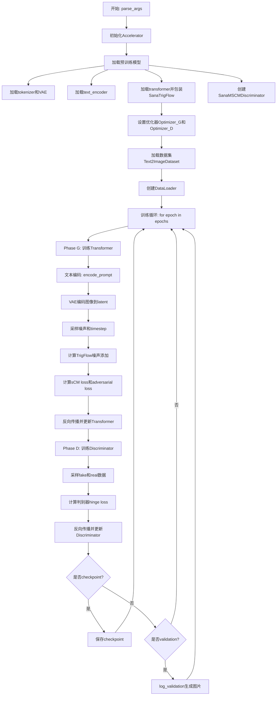

## 类结构

```
SanaVanillaAttnProcessor (注意力处理器类)
Text2ImageDataset (数据集类)
ResidualBlock (神经网络模块类)
SpectralConv1d (卷积层类)
BatchNormLocal (归一化层类)
make_block (工厂函数)
DiscHead (判别器头类)
SanaMSCMDiscriminator (多尺度判别器类)
DiscHeadModel (判别器封装类)
SanaTrigFlow (Flow模型转换类)
```

## 全局变量及字段


### `COMPLEX_HUMAN_INSTRUCTION`
    
用于指导语言模型生成图像生成增强提示的指令列表

类型：`list[str]`
    


### `logger`
    
使用accelerate库创建的日志记录器实例

类型：`logging.Logger`
    


### `Text2ImageDataset.dataset`
    
HuggingFace数据集对象，包含图像和文本对

类型：`datasets.Dataset`
    


### `Text2ImageDataset.transform`
    
 torchvision图像变换组合对象，用于预处理图像

类型：`T.Compose`
    


### `ResidualBlock.fn`
    
 ResidualBlock要包装的函数/模块

类型：`Callable`
    


### `BatchNormLocal.virtual_bs`
    
虚拟批量大小，用于分组归一化

类型：`int`
    


### `BatchNormLocal.eps`
    
用于数值稳定的epsilon值

类型：`float`
    


### `BatchNormLocal.affine`
    
是否使用仿射变换（学习缩放和偏移）

类型：`bool`
    


### `BatchNormLocal.weight`
    
可学习的缩放参数

类型：`nn.Parameter`
    


### `BatchNormLocal.bias`
    
可学习的偏移参数

类型：`nn.Parameter`
    


### `DiscHead.channels`
    
输入特征通道数

类型：`int`
    


### `DiscHead.c_dim`
    
条件维度，用于条件生成

类型：`int`
    


### `DiscHead.cmap_dim`
    
条件映射后的维度

类型：`int`
    


### `DiscHead.main`
    
判别器主干网络

类型：`nn.Sequential`
    


### `DiscHead.cmapper`
    
将条件映射到 cmap_dim 维度的线性层

类型：`nn.Linear`
    


### `DiscHead.cls`
    
光谱归一化的1D卷积层，用于分类输出

类型：`SpectralConv1d`
    


### `SanaMSCMDiscriminator.transformer`
    
预训练的SanaTransformer2DModel模型

类型：`SanaTransformer2DModel`
    


### `SanaMSCMDiscriminator.block_hooks`
    
用于注册forward hooks的transformer块索引集合

类型：`set`
    


### `SanaMSCMDiscriminator.heads`
    
判别器头模块列表

类型：`nn.ModuleList`
    


### `SanaMSCMDiscriminator.head_inputs`
    
存储判别器头输入特征的列表

类型：`list`
    


### `DiscHeadModel.disc`
    
判别器模型实例

类型：`SanaMSCMDiscriminator`
    


### `SanaTrigFlow.hidden_size`
    
隐藏层大小，等于注意力头数乘以头维度

类型：`int`
    


### `SanaTrigFlow.guidance`
    
是否启用分类器自由引导

类型：`bool`
    


### `SanaTrigFlow.logvar_linear`
    
用于预测对数方差的线性层

类型：`torch.nn.Linear`
    
    

## 全局函数及方法


### `save_model_card`

该函数用于在模型训练完成后生成并保存模型卡片（Model Card），包括保存验证图像、生成模型描述、添加标签，并将最终的 README.md 文件保存到指定的仓库文件夹中。

参数：

- `repo_id`：`str`，HuggingFace Hub 上的仓库标识符，用于标识模型的唯一ID
- `images`：可选参数，默认为 `None`，训练过程中生成的验证图像列表，用于展示模型的生成效果
- `base_model`：`str`，默认为 `None`，基础预训练模型的名称或路径，描述所训练模型的基础
- `validation_prompt`：`str`，默认为 `None`，用于生成验证图像的提示词，与图像关联展示
- `repo_folder`：`str`，默认为 `None`，本地仓库文件夹路径，用于保存模型卡片和图像文件

返回值：`None`，该函数没有返回值，主要通过副作用（文件写入）完成功能

#### 流程图

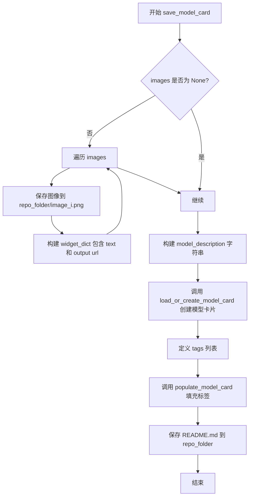

#### 带注释源码

```python
def save_model_card(
    repo_id: str,
    images=None,
    base_model: str = None,
    validation_prompt=None,
    repo_folder=None,
):
    """
    生成并保存模型卡片到指定文件夹
    
    参数:
        repo_id: HuggingFace Hub 仓库ID
        images: 验证图像列表
        base_model: 基础模型名称
        validation_prompt: 验证提示词
        repo_folder: 本地仓库路径
    """
    # 初始化 widget 字典列表，用于在 HuggingFace Hub 上展示交互式 widget
    widget_dict = []
    
    # 如果提供了图像，则保存图像并构建 widget 字典
    if images is not None:
        for i, image in enumerate(images):
            # 保存图像到指定路径，文件名为 image_0.png, image_1.png 等
            image.save(os.path.join(repo_folder, f"image_{i}.png"))
            
            # 构建 widget 字典，包含验证提示和图像URL
            # 用于在模型页面展示交互式演示
            widget_dict.append(
                {"text": validation_prompt if validation_prompt else " ", "output": {"url": f"image_{i}.png"}}
            )

    # 构建模型描述字符串，包含模型名称、基础模型信息和使用框架
    model_description = f"""
# Sana Sprint - {repo_id}

<Gallery />

## Model description

These are {repo_id} Sana Sprint weights for {base_model}.

The weights were trained using [Sana-Sprint](https://nvlabs.github.io/Sana/Sprint/).

## License

TODO
"""
    
    # 加载或创建模型卡片
    # from_training=True 表示这是训练过程中生成的模型卡片
    # license="other" 设置默认许可证
    model_card = load_or_create_model_card(
        repo_id_or_path=repo_id,
        from_training=True,
        license="other",
        base_model=base_model,
        model_description=model_description,
        widget=widget_dict,
    )
    
    # 定义模型标签，用于分类和搜索
    tags = [
        "text-to-image",        # 文本到图像任务
        "diffusers-training",   # 使用 Diffusers 框架训练
        "diffusers",            # Diffusers 生态
        "sana-sprint",          # Sana-Sprint 模型
        "sana-sprint-diffusers" # Diffusers 格式的 Sana-Sprint
    ]

    # 填充模型卡片的标签信息
    model_card = populate_model_card(model_card, tags=tags)
    
    # 保存模型卡片为 README.md 文件
    # 这是 HuggingFace Hub 标准的模型卡片文件
    model_card.save(os.path.join(repo_folder, "README.md"))
```


### `log_validation`

该函数用于在训练过程中运行模型验证，生成指定数量的图像并通过TensorBoard或WandB记录验证结果，支持最终测试验证和中间验证两种模式。

参数：

- `pipeline`：SanaSprintPipeline，Diffusers pipelines对象，用于执行图像生成推理
- `args`：Namespace，命令行解析后的参数对象，包含num_validation_images、validation_prompt、seed、enable_vae_tiling等配置
- `accelerator`：Accelerator，HuggingFace Accelerate库提供的分布式训练加速器，用于设备管理和日志追踪
- `pipeline_args`：dict，传递给pipeline的额外生成参数，如prompt和complex_human_instruction
- `epoch`：int，当前训练的轮次编号，用于日志记录和图像标记
- `is_final_validation`：bool，标识是否为最终验证（测试阶段），默认为False

返回值：`list`，生成的PIL.Image图像列表

#### 流程图

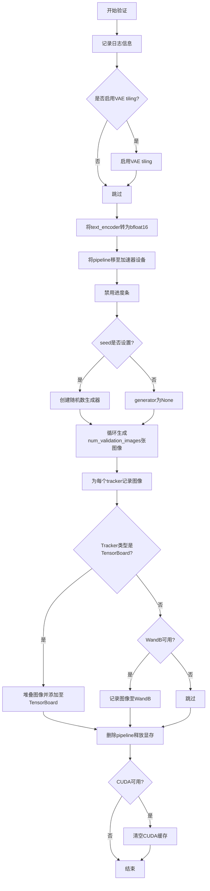

#### 带注释源码

```python
def log_validation(
    pipeline,               # SanaSprintPipeline: 用于生成图像的diffusers pipeline对象
    args,                  # argparse.Namespace: 包含验证配置的命令行参数
    accelerator,           # Accelerator: HuggingFace Accelerate加速器
    pipeline_args,         # dict: 传递给pipeline的额外参数如prompt等
    epoch,                 # int: 当前训练轮次，用于日志标记
    is_final_validation=False,  # bool: 是否为最终测试验证阶段
):
    """
    运行验证流程：生成指定数量的图像并通过accelerator的trackers记录日志
    
    该函数在每个验证周期被调用，用于监控模型在验证集上的生成效果。
    支持TensorBoard和WandB两种日志记录方式。
    """
    # 打印验证信息日志
    logger.info(
        f"Running validation... \n Generating {args.num_validation_images} images with prompt:"
        f" {args.validation_prompt}."
    )
    
    # 如果启用VAE tiling，减少大图像生成的显存占用
    if args.enable_vae_tiling:
        pipeline.vae.enable_tiling(tile_sample_min_height=1024, tile_sample_stride_width=1024)

    # 将text_encoder转为bfloat16以节省显存，通常文本编码器不需要高精度
    pipeline.text_encoder = pipeline.text_encoder.to(torch.bfloat16)
    
    # 将整个pipeline移至加速器所在设备（GPU/NPU等）
    pipeline = pipeline.to(accelerator.device)
    
    # 禁用pipeline的进度条显示，避免干扰训练日志输出
    pipeline.set_progress_bar_config(disable=True)

    # 创建随机数生成器以确保验证结果可复现
    # 如果设置了seed则使用指定种子，否则使用随机种子
    generator = torch.Generator(device=accelerator.device).manual_seed(args.seed) if args.seed is not None else None

    # 循环生成指定数量的验证图像
    # pipeline返回包含images属性的结果对象，取第一张图像
    images = [pipeline(**pipeline_args, generator=generator).images[0] for _ in range(args.num_validation_images)]

    # 遍历所有注册的trackers（TensorBoard、WandB等）记录生成的图像
    for tracker in accelerator.trackers:
        # 确定阶段名称：测试阶段(test)或验证阶段(validation)
        phase_name = "test" if is_final_validation else "validation"
        
        # TensorBoard处理：需要将PIL图像转换为numpy数组
        if tracker.name == "tensorboard":
            np_images = np.stack([np.asarray(img) for img in images])
            tracker.writer.add_images(phase_name, np_images, epoch, dataformats="NHWC")
        
        # WandB处理：直接记录PIL图像并添加标题
        if tracker.name == "wandb":
            tracker.log(
                {
                    phase_name: [
                        wandb.Image(image, caption=f"{i}: {args.validation_prompt}") for i, image in enumerate(images)
                    ]
                }
            )

    # 删除pipeline对象以释放显存
    del pipeline
    
    # 如果使用CUDA，显式清空缓存以确保显存被正确释放
    if torch.cuda.is_available():
        torch.cuda.empty_cache()

    # 返回生成的图像列表供调用者使用
    return images
```


### `parse_args`

该函数是 Sana-Sprint 训练脚本的命令行参数解析器，通过 argparse 框架定义并收集超过 70 个训练相关的配置参数，包括模型路径、数据集配置、训练超参数、优化器设置、分布式训练选项等，并返回包含所有解析结果的命名空间对象。

参数：

-  `input_args`：`Optional[List[str]]`，可选参数，用于测试目的的命令行参数列表，如果为 None 则从 sys.argv 解析

返回值：`argparse.Namespace`，包含所有命令行解析后的参数属性对象

#### 流程图

```mermaid
flowchart TD
    A[开始 parse_args] --> B[创建 ArgumentParser]
    B --> C[添加 pretrained_model_name_or_path 参数]
    C --> D[添加模型相关参数: revision, variant, cache_dir]
    D --> E[添加数据集参数: image_column, caption_column, dataset_name, file_path, resolution]
    E --> F[添加训练参数: train_batch_size, num_train_epochs, max_train_steps]
    F --> G[添加优化器参数: learning_rate, optimizer, adam_beta1, adam_beta2]
    G --> H[添加学习率调度器参数: lr_scheduler, lr_warmup_steps, lr_num_cycles]
    H --> I[添加鉴别器参数: logit_mean, logit_std, adv_lambda, scm_lambda]
    I --> J[添加分布式训练参数: local_rank, gradient_accumulation_steps]
    J --> K[添加日志和监控参数: report_to, logging_dir, push_to_hub]
    K --> L{input_args 是否为 None?}
    L -->|是| M[parser.parse_args()]
    L -->|否| N[parser.parse_args(input_args)]
    M --> O[检查 LOCAL_RANK 环境变量]
    N --> O
    O --> P[同步 local_rank 参数]
    P --> Q[返回 args 对象]
```

#### 带注释源码

```python
def parse_args(input_args=None):
    """
    解析命令行参数并返回配置对象。
    
    参数:
        input_args: 可选的命令行参数列表，用于测试目的。如果为 None，则从系统命令行解析。
    
    返回:
        argparse.Namespace: 包含所有解析后参数的对象
    """
    # 创建 ArgumentParser 实例，设置脚本描述
    parser = argparse.ArgumentParser(description="Simple example of a training script.")
    
    # ==================== 模型相关参数 ====================
    parser.add_argument(
        "--pretrained_model_name_or_path",
        type=str,
        default=None,
        required=True,  # 必须提供模型路径或标识符
        help="Path to pretrained model or model identifier from huggingface.co/models.",
    )
    parser.add_argument(
        "--revision",
        type=str,
        default=None,
        required=False,
        help="Revision of pretrained model identifier from huggingface.co/models.",
    )
    parser.add_argument(
        "--variant",
        type=str,
        default=None,
        help="Variant of the model files of the pretrained model identifier, e.g., fp16",
    )
    parser.add_argument(
        "--cache_dir",
        type=str,
        default=None,
        help="The directory where the downloaded models and datasets will be stored.",
    )
    
    # ==================== 数据集相关参数 ====================
    parser.add_argument(
        "--image_column",
        type=str,
        default="image",
        help="The column of the dataset containing the target image.",
    )
    parser.add_argument(
        "--caption_column",
        type=str,
        default=None,
        help="The column of the dataset containing the instance prompt for each image",
    )
    parser.add_argument(
        "--file_path",
        nargs="+",
        required=True,  # 必须提供训练数据文件路径
        help="List of parquet files (space-separated)"
    )
    parser.add_argument(
        "--dataset_name",
        type=str,
        default=None,
        help="The name of the Dataset (from the HuggingFace hub) to train on",
    )
    parser.add_argument(
        "--resolution",
        type=int,
        default=512,
        help="The resolution for input images, all the images will be resized to this resolution",
    )
    
    # ==================== 训练过程参数 ====================
    parser.add_argument("--repeats", type=int, default=1, help="How many times to repeat the training data.")
    parser.add_argument(
        "--max_sequence_length",
        type=int,
        default=300,
        help="Maximum sequence length to use with the Gemma model",
    )
    parser.add_argument(
        "--train_batch_size", type=int, default=4, help="Batch size (per device) for the training dataloader."
    )
    parser.add_argument(
        "--sample_batch_size", type=int, default=4, help="Batch size (per device) for sampling images."
    )
    parser.add_argument("--num_train_epochs", type=int, default=1)
    parser.add_argument(
        "--max_train_steps",
        type=int,
        default=None,
        help="Total number of training steps to perform. If provided, overrides num_train_epochs.",
    )
    parser.add_argument(
        "--checkpointing_steps",
        type=int,
        default=500,
        help="Save a checkpoint of the training state every X updates.",
    )
    parser.add_argument(
        "--checkpoints_total_limit",
        type=int,
        default=None,
        help="Max number of checkpoints to store.",
    )
    parser.add_argument(
        "--resume_from_checkpoint",
        type=str,
        default=None,
        help="Whether training should be resumed from a previous checkpoint.",
    )
    parser.add_argument(
        "--gradient_accumulation_steps",
        type=int,
        default=1,
        help="Number of updates steps to accumulate before performing a backward/update pass.",
    )
    parser.add_argument(
        "--gradient_checkpointing",
        action="store_true",
        help="Whether or not to use gradient checkpointing to save memory.",
    )
    
    # ==================== 优化器参数 ====================
    parser.add_argument(
        "--learning_rate",
        type=float,
        default=1e-4,
        help="Initial learning rate (after the potential warmup period) to use.",
    )
    parser.add_argument(
        "--scale_lr",
        action="store_true",
        default=False,
        help="Scale the learning rate by the number of GPUs, gradient accumulation steps, and batch size.",
    )
    parser.add_argument(
        "--lr_scheduler",
        type=str,
        default="constant",
        help='The scheduler type to use. Choose between ["linear", "cosine", "cosine_with_restarts", "polynomial", "constant", "constant_with_warmup"]',
    )
    parser.add_argument(
        "--lr_warmup_steps", type=int, default=500, help="Number of steps for the warmup in the lr scheduler."
    )
    parser.add_argument(
        "--lr_num_cycles",
        type=int,
        default=1,
        help="Number of hard resets of the lr in cosine_with_restarts scheduler.",
    )
    parser.add_argument("--lr_power", type=float, default=1.0, help="Power factor of the polynomial scheduler.")
    parser.add_argument(
        "--optimizer",
        type=str,
        default="AdamW",
        help='The optimizer type to use. Choose between ["AdamW", "prodigy"]',
    )
    parser.add_argument(
        "--use_8bit_adam",
        action="store_true",
        help="Whether or not to use 8-bit Adam from bitsandbytes.",
    )
    parser.add_argument(
        "--adam_beta1", type=float, default=0.9, help="The beta1 parameter for the Adam and Prodigy optimizers."
    )
    parser.add_argument(
        "--adam_beta2", type=float, default=0.999, help="The beta2 parameter for the Adam and Prodigy optimizers."
    )
    parser.add_argument("--adam_weight_decay", type=float, default=1e-04, help="Weight decay to use for unet params")
    parser.add_argument(
        "--adam_epsilon",
        type=float,
        default=1e-08,
        help="Epsilon value for the Adam optimizer and Prodigy optimizers.",
    )
    parser.add_argument("--max_grad_norm", default=1.0, type=float, help="Max gradient norm.")
    
    # ==================== 鉴别器/SCM 相关参数 ====================
    parser.add_argument(
        "--logit_mean", type=float, default=0.2, help="Mean to use when using the 'logit_normal' weighting scheme."
    )
    parser.add_argument(
        "--logit_std", type=float, default=1.6, help="Std to use when using the 'logit_normal' weighting scheme."
    )
    parser.add_argument(
        "--logit_mean_discriminator", type=float, default=-0.6, help="Logit mean for discriminator timestep sampling"
    )
    parser.add_argument(
        "--logit_std_discriminator", type=float, default=1.0, help="Logit std for discriminator timestep sampling"
    )
    parser.add_argument("--ladd_multi_scale", action="store_true", help="Whether to use multi-scale discriminator")
    parser.add_argument(
        "--head_block_ids",
        type=int,
        nargs="+",
        default=[2, 8, 14, 19],
        help="Specify which transformer blocks to use for discriminator heads",
    )
    parser.add_argument("--adv_lambda", type=float, default=0.5, help="Weighting coefficient for adversarial loss")
    parser.add_argument("--scm_lambda", type=float, default=1.0, help="Weighting coefficient for SCM loss")
    parser.add_argument("--gradient_clip", type=float, default=0.1, help="Threshold for gradient clipping")
    parser.add_argument(
        "--sigma_data", type=float, default=0.5, help="Standard deviation of data distribution is supposed to be 0.5"
    )
    parser.add_argument(
        "--tangent_warmup_steps", type=int, default=4000, help="Number of warmup steps for tangent vectors"
    )
    parser.add_argument(
        "--guidance_embeds_scale", type=float, default=0.1, help="Scaling factor for guidance embeddings"
    )
    parser.add_argument(
        "--scm_cfg_scale", type=float, nargs="+", default=[4, 4.5, 5], help="Range for classifier-free guidance scale"
    )
    parser.add_argument(
        "--train_largest_timestep", action="store_true", help="Whether to enable special training for large timesteps"
    )
    parser.add_argument("--largest_timestep", type=float, default=1.57080, help="Maximum timestep value")
    parser.add_argument(
        "--largest_timestep_prob", type=float, default=0.5, help="Sampling probability for large timesteps"
    )
    parser.add_argument(
        "--misaligned_pairs_D", action="store_true", help="Add misaligned sample pairs for discriminator"
    )
    
    # ==================== Prodigy 优化器特定参数 ====================
    parser.add_argument(
        "--prodigy_beta3",
        type=float,
        default=None,
        help="Coefficients for computing the Prodigy stepsize using running averages.",
    )
    parser.add_argument("--prodigy_decouple", type=bool, default=True, help="Use AdamW style decoupled weight decay")
    parser.add_argument(
        "--prodigy_use_bias_correction",
        type=bool,
        default=True,
        help="Turn on Adam's bias correction.",
    )
    parser.add_argument(
        "--prodigy_safeguard_warmup",
        type=bool,
        default=True,
        help="Remove lr from the denominator of D estimate to avoid issues during warm-up stage.",
    )
    
    # ==================== 验证参数 ====================
    parser.add_argument(
        "--validation_prompt",
        type=str,
        default=None,
        help="A prompt that is used during validation to verify that the model is learning.",
    )
    parser.add_argument(
        "--num_validation_images",
        type=int,
        default=4,
        help="Number of images that should be generated during validation.",
    )
    parser.add_argument(
        "--validation_epochs",
        type=int,
        default=50,
        help="Run validation every X epochs.",
    )
    
    # ==================== 输出和日志参数 ====================
    parser.add_argument(
        "--output_dir",
        type=str,
        default="sana-dreambooth-lora",
        help="The output directory where the model predictions and checkpoints will be written.",
    )
    parser.add_argument("--seed", type=int, default=None, help="A seed for reproducible training.")
    parser.add_argument(
        "--logging_dir",
        type=str,
        default="logs",
        help="TensorBoard log directory.",
    )
    parser.add_argument(
        "--report_to",
        type=str,
        default="tensorboard",
        help='The integration to report the results and logs to. Supported platforms are "tensorboard", "wandb" and "comet_ml".',
    )
    parser.add_argument("--push_to_hub", action="store_true", help="Whether or not to push the model to the Hub.")
    parser.add_argument("--hub_token", type=str, default=None, help="The token to use to push to the Model Hub.")
    parser.add_argument(
        "--hub_model_id",
        type=str,
        default=None,
        help="The name of the repository to keep in sync with the local output_dir.",
    )
    
    # ==================== 图像处理参数 ====================
    parser.add_argument(
        "--use_fix_crop_and_size",
        action="store_true",
        default=False,
        help="Whether or not to use the fixed crop and size for the teacher model.",
    )
    parser.add_argument(
        "--center_crop",
        default=False,
        action="store_true",
        help="Whether to center crop the input images to the resolution.",
    )
    parser.add_argument(
        "--random_flip",
        action="store_true",
        help="Whether to randomly flip images horizontally",
    )
    parser.add_argument(
        "--dataloader_num_workers",
        type=int,
        default=0,
        help="Number of subprocesses to use for data loading.",
    )
    
    # ==================== 混合精度和性能参数 ====================
    parser.add_argument(
        "--allow_tf32",
        action="store_true",
        help="Whether or not to allow TF32 on Ampere GPUs.",
    )
    parser.add_argument(
        "--mixed_precision",
        type=str,
        default=None,
        choices=["no", "fp16", "bf16"],
        help="Whether to use mixed precision. Choose between fp16 and bf16.",
    )
    parser.add_argument(
        "--upcast_before_saving",
        action="store_true",
        default=False,
        help="Whether to upcast the trained transformer layers to float32 before saving.",
    )
    parser.add_argument(
        "--cache_latents",
        action="store_true",
        default=False,
        help="Cache the VAE latents",
    )
    parser.add_argument(
        "--offload",
        action="store_true",
        help="Whether to offload the VAE and the text encoder to CPU when they are not used.",
    )
    parser.add_argument(
        "--enable_vae_tiling", action="store_true", help="Enable VAE tiling in log validation"
    )
    parser.add_argument(
        "--enable_npu_flash_attention", action="store_true", help="Enable Flash Attention for NPU"
    )
    
    # ==================== 分布式训练参数 ====================
    parser.add_argument("--local_rank", type=int, default=-1, help="For distributed training: local_rank")
    
    # ==================== 解析参数 ====================
    if input_args is not None:
        # 测试模式：使用传入的参数列表
        args = parser.parse_args(input_args)
    else:
        # 正常运行模式：从命令行解析
        args = parser.parse_args()
    
    # ==================== 环境变量同步 ====================
    # 检查 LOCAL_RANK 环境变量，确保分布式训练的一致性
    env_local_rank = int(os.environ.get("LOCAL_RANK", -1))
    if env_local_rank != -1 and env_local_rank != args.local_rank:
        args.local_rank = env_local_rank
    
    return args
```


### `make_block`

该函数用于构建一个包含频谱归一化卷积、局部批归一化和LeakyReLU激活函数的基础神经网络模块，作为判别器(Discriminator)头部的基本构建单元。

参数：

- `channels`：`int`，输入输出通道数，定义卷积层的宽度
- `kernel_size`：`int`，卷积核大小，决定卷积操作的感受野

返回值：`nn.Module`，返回一个包含三个层（SpectralConv1d、BatchNormLocal、LeakyReLU）的顺序容器模块

#### 流程图

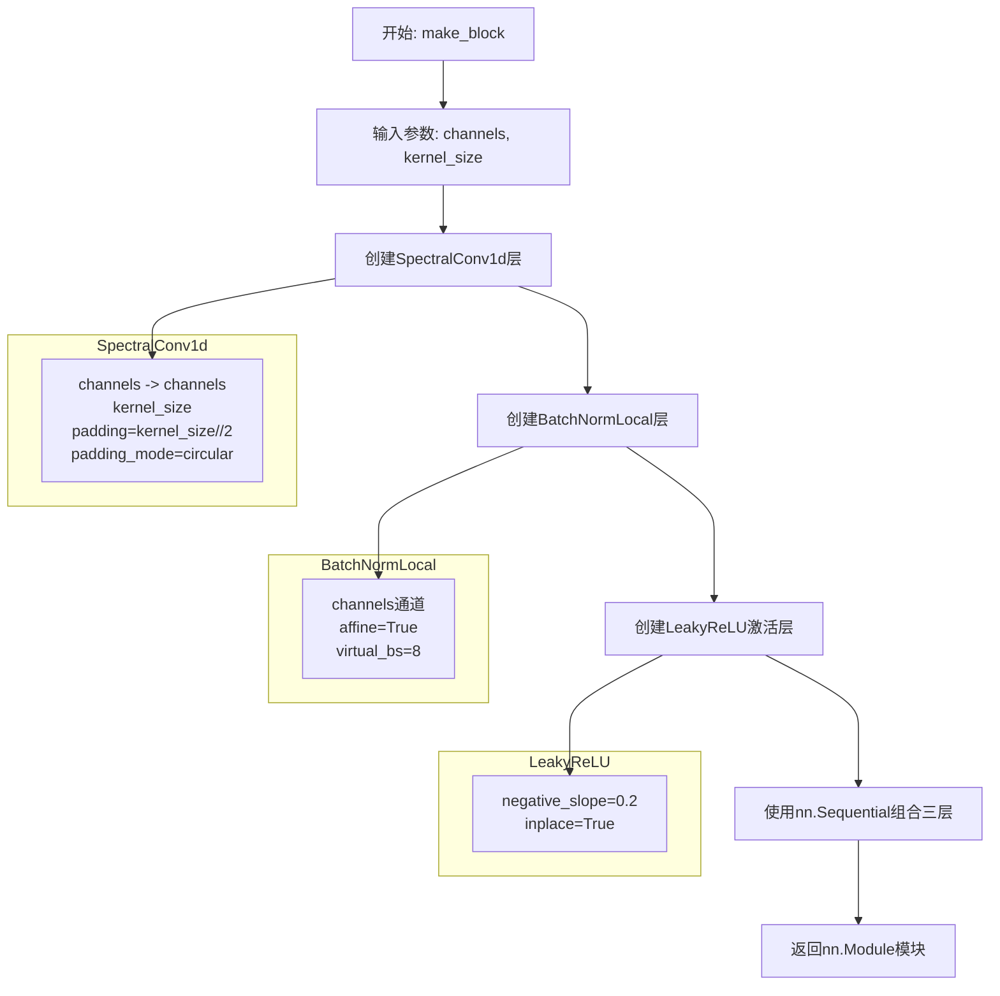

#### 带注释源码

```python
def make_block(channels: int, kernel_size: int) -> nn.Module:
    """
    构建一个基本的神经网络模块，包含频谱归一化卷积、局部批归一化和LeakyReLU激活函数。
    
    该模块作为SanaMSCMDiscriminator中DiscHead的组成部分，用于处理Transformer输出的特征。
    
    参数:
        channels (int): 输入和输出的通道数
        kernel_size (int): 卷积核的大小
    
    返回:
        nn.Module: 包含三个层的顺序容器
    """
    return nn.Sequential(
        # 第一层：频谱归一化的一维卷积
        # SpectralConv1d继承自nn.Conv1d，并在权重上应用SpectralNorm
        # 用于稳定GAN训练中的判别器训练
        SpectralConv1d(
            channels,           # 输入通道数
            channels,           # 输出通道数
            kernel_size=kernel_size,  # 卷积核大小
            padding=kernel_size // 2, # 填充大小，保持序列长度不变
            padding_mode="circular", # 循环填充，适用于序列数据的边界处理
        ),
        
        # 第二层：自定义局部批归一化
        # 将批次划分为虚拟组来计算均值和方差
        # 有助于处理小批次训练时的统计不稳定问题
        BatchNormLocal(channels),
        
        # 第三层：LeakyReLU激活函数
        # 负斜率为0.2，允许负值有小的梯度流动
        # inplace=True 原地操作，节省内存
        nn.LeakyReLU(0.2, True),
    )
```

#### 依赖组件信息

| 组件名称 | 类型 | 描述 |
|---------|------|------|
| `SpectralConv1d` | 类 | 继承自`nn.Conv1d`的卷积层，使用频谱归一化(SpectralNorm)进行权重约束 |
| `BatchNormLocal` | 类 | 自定义局部批归一化层，将批次划分为虚拟组计算统计量 |
| `nn.LeakyReLU` | 类 | PyTorch内置的LeakyReLU激活函数 |

#### 技术债务与优化空间

1. **参数硬编码**：激活函数的负斜率(0.2)和LeakyReLU的inplace参数是硬编码的，可以考虑作为可选参数传入以提高灵活性
2. **缺乏残差连接**：与`ResidualBlock`不同，该模块没有残差连接，可能在深层网络中导致梯度消失问题
3. **kernel_size验证**：未对kernel_size的有效性进行检查（如奇数校验），可能导致填充计算不符合预期


### `compute_density_for_timestep_sampling_scm`

该函数用于在 Sana-Sprint 训练过程中计算时间步采样的密度分布。它通过生成符合对数正态分布的随机数，并将其转换为角度空间（使用反正切函数），以实现对扩散模型时间步的非均匀采样，这种采样策略有助于提升模型对不同时间步的学习效率。

参数：

- `batch_size`：`int`，要生成的样本数量，即批量大小
- `logit_mean`：`float`，对数正态分布的均值参数，控制采样时间步的中心位置
- `logit_std`：`float`，对数正态分布的标准差参数，控制采样时间步的分布范围

返回值：`torch.Tensor`，返回形状为 `(batch_size,)` 的张量，包含用于时间步采样的密度值（角度形式，范围在 `(-π/2, π/2)` 之间）

#### 流程图

```mermaid
flowchart TD
    A[开始] --> B[生成batch_size个标准正态分布随机数sigma]
    B --> C[计算对数正态分布: sigma = exp&#40;sigma × logit_std + logit_mean&#41;]
    C --> D[计算角度密度: u = atan&#40;sigma / 0.5&#41;]
    D --> E[返回张量u]
    E --> F[结束]
    
    style B fill:#f9f,color:#333
    style C fill:#9f9,color:#333
    style D fill:#9ff,color:#333
```

#### 带注释源码

```python
def compute_density_for_timestep_sampling_scm(batch_size: int, logit_mean: float = None, logit_std: float = None):
    """
    Compute the density for sampling the timesteps when doing Sana-Sprint training.
    
    该函数实现了基于对数正态分布的时间步采样密度计算。通过将正态分布的随机数
    转换为对数正态分布，再通过反正切函数映射到角度空间，可以实现对扩散过程中
    不同时间步的非均匀采样，重点学习对生成质量影响更大的时间步。
    
    Args:
        batch_size: int - 要生成的样本数量
        logit_mean: float - 对数正态分布的均值参数，控制采样分布的中心位置
        logit_std: float - 对数正态分布的标准差参数，控制采样分布的扩散程度
    
    Returns:
        torch.Tensor: 形状为 (batch_size,) 的张量，包含用于时间步采样的密度值
    """
    # 第一步：生成标准正态分布的随机数（均值0，方差1）
    # 使用CPU设备以避免不必要的GPU内存分配
    sigma = torch.randn(batch_size, device="cpu")
    
    # 第二步：转换为对数正态分布
    # 对数正态分布的参数：通过 logit_mean 和 logit_std 线性变换后取指数
    # 这样可以确保sigma始终为正数，符合扩散模型时间步的要求
    sigma = (sigma * logit_std + logit_mean).exp()
    
    # 第三步：除以0.5（临时超参数，应作为函数参数或配置项）
    # TODO: 0.5 should be a hyper-parameter - 这个值应该被提取为可配置的超参数
    
    # 第四步：使用反正切函数将值映射到角度空间
    # atan函数将(0, +∞)映射到(0, π/2)，实现对时间步的加权采样
    # 这种角度空间表示有助于实现更精细的时间步控制
    u = torch.atan(sigma / 0.5)
    
    # 返回计算得到的密度值（角度形式）
    return u
```


### `main`

这是 Sana-Sprint 文本到图像生成模型的核心训练函数，负责整个训练流程的初始化、执行和收尾工作。该函数首先配置加速器、加载预训练模型（文本编码器、VAE、Transformer）和数据集，然后交替执行生成器（Transformer）和判别器的训练循环，包括前向传播、梯度计算、参数更新和模型检查点保存，最后在主进程上进行验证推理并保存最终模型。

参数：

- `args`：`argparse.Namespace`，通过 `parse_args()` 解析的命令行参数，包含模型路径、数据集配置、训练超参数等所有训练相关设置

返回值：`None`，该函数不返回任何值，通过修改模型参数和保存检查点来完成训练过程

#### 流程图

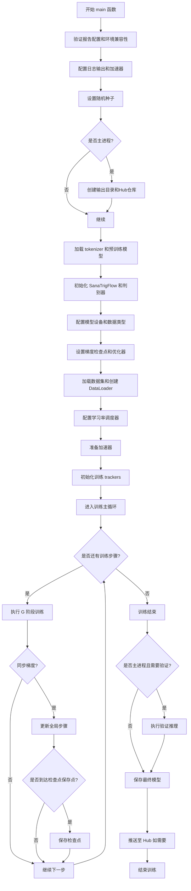

#### 带注释源码

```python
def main(args):
    # 安全检查：wandb 和 hub_token 不能同时使用，避免令牌泄露风险
    if args.report_to == "wandb" and args.hub_token is not None:
        raise ValueError(
            "You cannot use both --report_to=wandb and --hub_token due to a security risk of exposing your token."
            " Please use `hf auth login` to authenticate with the Hub."
        )

    # MPS (Apple Silicon) 不支持 bfloat16 混合精度训练
    if torch.backends.mps.is_available() and args.mixed_precision == "bf16":
        raise ValueError(
            "Mixed precision training with bfloat16 is not supported on MPS. Please use fp16 (recommended) or fp32 instead."
        )

    # 配置日志输出目录
    logging_dir = Path(args.output_dir, args.logging_dir)

    # 创建加速器项目配置
    accelerator_project_config = ProjectConfiguration(project_dir=args.output_dir, logging_dir=logging_dir)
    # 配置分布式训练参数，启用未使用参数检测
    kwargs = DistributedDataParallelKwargs(find_unused_parameters=True)
    # 初始化 Accelerator，处理分布式训练、混合精度、梯度累积等
    accelerator = Accelerator(
        gradient_accumulation_steps=args.gradient_accumulation_steps,
        mixed_precision=args.mixed_precision,
        log_with=args.report_to,
        project_config=accelerator_project_config,
        kwargs_handlers=[kwargs],
    )

    # MPS 设备上禁用原生 AMP
    if torch.backends.mps.is_available():
        accelerator.native_amp = False

    # 确认 wandb 可用性
    if args.report_to == "wandb":
        if not is_wandb_available():
            raise ImportError("Make sure to install wandb if you want to use it for logging during training.")

    # 配置日志格式：时间 - 级别 - 名称 - 消息
    logging.basicConfig(
        format="%(asctime)s - %(levelname)s - %(name)s - %(message)s",
        datefmt="%m/%d/%Y %H:%M:%S",
        level=logging.INFO,
    )
    # 输出加速器状态信息
    logger.info(accelerator.state, main_process_only=False)
    # 主进程设置日志级别
    if accelerator.is_local_main_process:
        transformers.utils.logging.set_verbosity_warning()
        diffusers.utils.logging.set_verbosity_info()
    else:
        transformers.utils.logging.set_verbosity_error()
        diffusers.utils.logging.set_verbosity_error()

    # 设置随机种子以确保可复现性
    if args.seed is not None:
        set_seed(args.seed)

    # 主进程负责创建输出目录和 Hub 仓库
    if accelerator.is_main_process:
        if args.output_dir is not None:
            os.makedirs(args.output_dir, exist_ok=True)

        if args.push_to_hub:
            repo_id = create_repo(
                repo_id=args.hub_model_id or Path(args.output_dir).name,
                exist_ok=True,
            ).repo_id

    # 加载分词器
    tokenizer = AutoTokenizer.from_pretrained(
        args.pretrained_model_name_or_path,
        subfolder="tokenizer",
        revision=args.revision,
    )

    # 加载文本编码器 (Gemma2)
    text_encoder = Gemma2Model.from_pretrained(
        args.pretrained_model_name_or_path, subfolder="text_encoder", revision=args.revision, variant=args.variant
    )
    # 加载 VAE
    vae = AutoencoderDC.from_pretrained(
        args.pretrained_model_name_or_path,
        subfolder="vae",
        revision=args.revision,
        variant=args.variant,
    )

    # 加载 Transformer 主模型 (带 guidance embedder)
    ori_transformer = SanaTransformer2DModel.from_pretrained(
        args.pretrained_model_name_or_path,
        subfolder="transformer",
        revision=args.revision,
        variant=args.variant,
        guidance_embeds=True,
    )
    # 设置自定义注意力处理器
    ori_transformer.set_attn_processor(SanaVanillaAttnProcessor())

    # 加载不带 guidance 的 Transformer 用于预训练
    ori_transformer_no_guide = SanaTransformer2DModel.from_pretrained(
        args.pretrained_model_name_or_path,
        subfolder="transformer",
        revision=args.revision,
        variant=args.variant,
        guidance_embeds=False,
    )

    # 加载 safetensors 格式的模型权重
    original_state_dict = load_file(
        f"{args.pretrained_model_name_or_path}/transformer/diffusion_pytorch_model.safetensors"
    )

    # 权重映射：处理模型结构变更
    param_mapping = {
        "time_embed.emb.timestep_embedder.linear_1.weight": "time_embed.timestep_embedder.linear_1.weight",
        "time_embed.emb.timestep_embedder.linear_1.bias": "time_embed.timestep_embedder.linear_1.bias",
        "time_embed.emb.timestep_embedder.linear_2.weight": "time_embed.timestep_embedder.linear_2.weight",
        "time_embed.emb.timestep_embedder.linear_2.bias": "time_embed.timestep_embedder.linear_2.bias",
    }

    # 应用权重映射
    for src_key, dst_key in param_mapping.items():
        if src_key in original_state_dict:
            ori_transformer.load_state_dict({dst_key: original_state_dict[src_key]}, strict=False, assign=True)

    # 获取 guidance embedder 模块并初始化为零
    guidance_embedder_module = ori_transformer.time_embed.guidance_embedder

    zero_state_dict = {}

    target_device = accelerator.device
    # 将 guidance embedder 权重初始化为零
    param_w1 = guidance_embedder_module.linear_1.weight
    zero_state_dict["linear_1.weight"] = torch.zeros(param_w1.shape, device=target_device)
    param_b1 = guidance_embedder_module.linear_1.bias
    zero_state_dict["linear_1.bias"] = torch.zeros(param_b1.shape, device=target_device)
    param_w2 = guidance_embedder_module.linear_2.weight
    zero_state_dict["linear_2.weight"] = torch.zeros(param_w2.shape, device=target_device)
    param_b2 = guidance_embedder_module.linear_2.bias
    zero_state_dict["linear_2.bias"] = torch.zeros(param_b2.shape, device=target_device)
    guidance_embedder_module.load_state_dict(zero_state_dict, strict=False, assign=True)

    # 包装为 TrigFlow 模型
    transformer = SanaTrigFlow(ori_transformer, guidance=True).train()
    pretrained_model = SanaTrigFlow(ori_transformer_no_guide, guidance=False).eval()

    # 初始化多尺度判别器
    disc = SanaMSCMDiscriminator(
        pretrained_model,
        is_multiscale=args.ladd_multi_scale,
        head_block_ids=args.head_block_ids,
    ).train()

    # 设置模型梯度要求：Transformer 可训练，其他冻结
    transformer.requires_grad_(True)
    pretrained_model.requires_grad_(False)
    disc.model.requires_grad_(False)
    disc.heads.requires_grad_(True)
    vae.requires_grad_(False)
    text_encoder.requires_grad_(False)

    # 确定权重数据类型 (混合精度)
    weight_dtype = torch.float32
    if accelerator.mixed_precision == "fp16":
        weight_dtype = torch.float16
    elif accelerator.mixed_precision == "bf16":
        weight_dtype = torch.bfloat16

    # MPS 不支持 bfloat16
    if torch.backends.mps.is_available() and weight_dtype == torch.bfloat16:
        raise ValueError(
            "Mixed precision training with bfloat16 is not supported on MPS. Please use fp16 (recommended) or fp32 instead."
        )

    # VAE 保持 float32，模型和判别器使用混合精度
    vae.to(accelerator.device, dtype=torch.float32)
    transformer.to(accelerator.device, dtype=weight_dtype)
    pretrained_model.to(accelerator.device, dtype=weight_dtype)
    disc.to(accelerator.device, dtype=weight_dtype)
    # Gemma2 特别适合 bfloat16
    text_encoder.to(dtype=torch.bfloat16)

    # NPU Flash Attention 支持
    if args.enable_npu_flash_attention:
        if is_torch_npu_available():
            logger.info("npu flash attention enabled.")
            for block in transformer.transformer_blocks:
                block.attn2.set_use_npu_flash_attention(True)
            for block in pretrained_model.transformer_blocks:
                block.attn2.set_use_npu_flash_attention(True)
        else:
            raise ValueError("npu flash attention requires torch_npu extensions and is supported only on npu device ")

    # 初始化文本编码管道 (仅用于编码，不参与推理)
    text_encoding_pipeline = SanaPipeline.from_pretrained(
        args.pretrained_model_name_or_path,
        vae=None,
        transformer=None,
        text_encoder=text_encoder,
        tokenizer=tokenizer,
        torch_dtype=torch.bfloat16,
    )
    text_encoding_pipeline = text_encoding_pipeline.to(accelerator.device)

    # 启用梯度检查点以节省显存
    if args.gradient_checkpointing:
        transformer.enable_gradient_checkpointing()

    # 解包模型辅助函数
    def unwrap_model(model):
        model = accelerator.unwrap_model(model)
        model = model._orig_mod if is_compiled_module(model) else model
        return model

    # 注册模型保存/加载钩子 (accelerate >= 0.16.0)
    if version.parse(accelerate.__version__) >= version.parse("0.16.0"):

        def save_model_hook(models, weights, output_dir):
            if accelerator.is_main_process:
                for model in models:
                    unwrapped_model = unwrap_model(model)
                    # 处理 Transformer 模型
                    if isinstance(unwrapped_model, type(unwrap_model(transformer))):
                        model = unwrapped_model
                        model.save_pretrained(os.path.join(output_dir, "transformer"))
                    # 处理判别器模型 (仅保存 heads)
                    elif isinstance(unwrapped_model, type(unwrap_model(disc))):
                        torch.save(unwrapped_model.heads.state_dict(), os.path.join(output_dir, "disc_heads.pt"))
                    else:
                        raise ValueError(f"unexpected save model: {unwrapped_model.__class__}")

                    if weights:
                        weights.pop()

        def load_model_hook(models, input_dir):
            transformer_ = None
            disc_ = None

            if not accelerator.distributed_type == DistributedType.DEEPSPEED:
                while len(models) > 0:
                    model = models.pop()
                    unwrapped_model = unwrap_model(model)

                    if isinstance(unwrapped_model, type(unwrap_model(transformer))):
                        transformer_ = model
                    elif isinstance(unwrapped_model, type(unwrap_model(disc))):
                        heads_state_dict = torch.load(os.path.join(input_dir, "disc_heads.pt"))
                        unwrapped_model.heads.load_state_dict(heads_state_dict)
                        disc_ = model
                    else:
                        raise ValueError(f"unexpected save model: {unwrapped_model.__class__}")

            else:
                # DeepSpeed 情况处理
                transformer_ = SanaTransformer2DModel.from_pretrained(input_dir, subfolder="transformer")
                disc_heads_state_dict = torch.load(os.path.join(input_dir, "disc_heads.pt"))

        accelerator.register_save_state_pre_hook(save_model_hook)
        accelerator.register_load_state_pre_hook(load_model_hook)

    # 启用 TF32 以加速 Ampere GPU 训练
    if args.allow_tf32 and torch.cuda.is_available():
        torch.backends.cuda.matmul.allow_tf32 = True

    # 缩放学习率：GPU数量 × 梯度累积步数 × batch大小
    if args.scale_lr:
        args.learning_rate = (
            args.learning_rate * args.gradient_accumulation_steps * args.train_batch_size * accelerator.num_processes
        )

    # 8-bit Adam 优化器以节省显存
    if args.use_8bit_adam:
        try:
            import bitsandbytes as bnb
        except ImportError:
            raise ImportError(
                "To use 8-bit Adam, please install the bitsandbytes library: `pip install bitsandbytes`."
            )

        optimizer_class = bnb.optim.AdamW8bit
    else:
        optimizer_class = torch.optim.AdamW

    # 创建生成器 (Transformer) 优化器
    optimizer_G = optimizer_class(
        transformer.parameters(),
        lr=args.learning_rate,
        betas=(args.adam_beta1, args.adam_beta2),
        weight_decay=args.adam_weight_decay,
        eps=args.adam_epsilon,
    )

    # 创建判别器优化器 (仅优化 heads)
    optimizer_D = optimizer_class(
        disc.heads.parameters(),
        lr=args.learning_rate,
        betas=(args.adam_beta1, args.adam_beta2),
        weight_decay=args.adam_weight_decay,
        eps=args.adam_epsilon,
    )

    # 加载 HuggingFace 数据集
    hf_dataset = load_dataset(
        args.dataset_name,
        data_files=args.file_path,
        split="train",
    )

    # 创建训练数据集
    train_dataset = Text2ImageDataset(
        hf_dataset=hf_dataset,
        resolution=args.resolution,
    )

    # 创建 DataLoader
    train_dataloader = DataLoader(
        train_dataset,
        batch_size=args.train_batch_size,
        num_workers=args.dataloader_num_workers,
        pin_memory=True,
        persistent_workers=True,
        shuffle=True,
    )

    # 计算训练步数
    overrode_max_train_steps = False
    num_update_steps_per_epoch = math.ceil(len(train_dataloader) / args.gradient_accumulation_steps)
    if args.max_train_steps is None:
        args.max_train_steps = args.num_train_epochs * num_update_steps_per_epoch
        overrode_max_train_steps = True

    # 创建学习率调度器
    lr_scheduler = get_scheduler(
        args.lr_scheduler,
        optimizer=optimizer_G,
        num_warmup_steps=args.lr_warmup_steps * accelerator.num_processes,
        num_training_steps=args.max_train_steps * accelerator.num_processes,
        num_cycles=args.lr_num_cycles,
        power=args.lr_power,
    )

    # 使用 Accelerator 准备所有组件
    transformer, pretrained_model, disc, optimizer_G, optimizer_D, train_dataloader, lr_scheduler = (
        accelerator.prepare(
            transformer, pretrained_model, disc, optimizer_G, optimizer_D, train_dataloader, lr_scheduler
        )
    )

    # 重新计算训练步数 (dataloader 大小可能变化)
    num_update_steps_per_epoch = math.ceil(len(train_dataloader) / args.gradient_accumulation_steps)
    if overrode_max_train_steps:
        args.max_train_steps = args.num_train_epochs * num_update_steps_per_epoch
    args.num_train_epochs = math.ceil(args.max_train_steps / num_update_steps_per_epoch)

    # 初始化 trackers
    if accelerator.is_main_process:
        tracker_name = "sana-sprint"
        config = {
            k: str(v) if not isinstance(v, (int, float, str, bool, torch.Tensor)) else v for k, v in vars(args).items()
        }
        accelerator.init_trackers(tracker_name, config=config)

    # 打印训练配置信息
    total_batch_size = args.train_batch_size * accelerator.num_processes * args.gradient_accumulation_steps

    logger.info("***** Running training *****")
    logger.info(f"  Num examples = {len(train_dataset)}")
    logger.info(f"  Num batches each epoch = {len(train_dataloader)}")
    logger.info(f"  Num Epochs = {args.num_train_epochs}")
    logger.info(f"  Instantaneous batch size per device = {args.train_batch_size}")
    logger.info(f"  Total train batch size (w. parallel, distributed & accumulation) = {total_batch_size}")
    logger.info(f"  Gradient Accumulation steps = {args.gradient_accumulation_steps}")
    logger.info(f"  Total optimization steps = {args.max_train_steps}")
    
    global_step = 0
    first_epoch = 0

    # 从检查点恢复训练
    if args.resume_from_checkpoint:
        if args.resume_from_checkpoint != "latest":
            path = os.path.basename(args.resume_from_checkpoint)
        else:
            # 查找最新检查点
            dirs = os.listdir(args.output_dir)
            dirs = [d for d in dirs if d.startswith("checkpoint")]
            dirs = sorted(dirs, key=lambda x: int(x.split("-")[1]))
            path = dirs[-1] if len(dirs) > 0 else None

        if path is None:
            accelerator.print(
                f"Checkpoint '{args.resume_from_checkpoint}' does not exist. Starting a new training run."
            )
            args.resume_from_checkpoint = None
            initial_global_step = 0
        else:
            accelerator.print(f"Resuming from checkpoint {path}")
            accelerator.load_state(os.path.join(args.output_dir, path))
            global_step = int(path.split("-")[1])

            initial_global_step = global_step
            first_epoch = global_step // num_update_steps_per_epoch
    else:
        initial_global_step = 0

    # 创建进度条
    progress_bar = tqdm(
        range(0, args.max_train_steps),
        initial=initial_global_step,
        desc="Steps",
        disable=not accelerator.is_local_main_process,
    )

    # 训练阶段标识：G=生成器训练，D=判别器训练
    phase = "G"
    vae_config_scaling_factor = vae.config.scaling_factor
    sigma_data = args.sigma_data
    
    # 空文本 prompt 用于 classifier-free guidance
    negative_prompt = [""] * args.train_batch_size
    negative_prompt_embeds, negative_prompt_attention_mask, _, _ = text_encoding_pipeline.encode_prompt(
        prompt=negative_prompt,
        complex_human_instruction=False,
        do_classifier_free_guidance=False,
    )

    # ==================== 训练主循环 ====================
    for epoch in range(first_epoch, args.num_train_epochs):
        transformer.train()
        disc.train()

        for step, batch in enumerate(train_dataloader):
            # 文本编码
            prompts = batch["text"]
            with torch.no_grad():
                prompt_embeds, prompt_attention_mask, _, _ = text_encoding_pipeline.encode_prompt(
                    prompts, complex_human_instruction=COMPLEX_HUMAN_INSTRUCTION, do_classifier_free_guidance=False
                )

            # 将图像转换为潜在空间
            vae = vae.to(accelerator.device)
            pixel_values = batch["image"].to(dtype=vae.dtype)
            model_input = vae.encode(pixel_values).latent
            model_input = model_input * vae_config_scaling_factor * sigma_data
            model_input = model_input.to(dtype=weight_dtype)

            # 采样噪声
            noise = torch.randn_like(model_input) * sigma_data
            bsz = model_input.shape[0]

            # 采样时间步 (使用 logit-normal 分布)
            u = compute_density_for_timestep_sampling_scm(
                batch_size=bsz,
                logit_mean=args.logit_mean,
                logit_std=args.logit_std,
            ).to(accelerator.device)

            # 根据 TrigFlow 添加噪声: zt = cos(t) * x + sin(t) * noise
            t = u.view(-1, 1, 1, 1)
            noisy_model_input = torch.cos(t) * model_input + torch.sin(t) * noise

            # SCM 配置缩放
            scm_cfg_scale = torch.tensor(
                np.random.choice(args.scm_cfg_scale, size=bsz, replace=True),
                device=accelerator.device,
            )

            # 模型包装函数 (用于 JVP 计算)
            def model_wrapper(scaled_x_t, t):
                pred, logvar = accelerator.unwrap_model(transformer)(
                    hidden_states=scaled_x_t,
                    timestep=t.flatten(),
                    encoder_hidden_states=prompt_embeds,
                    encoder_attention_mask=prompt_attention_mask,
                    guidance=(scm_cfg_scale.flatten() * args.guidance_embeds_scale),
                    jvp=True,
                    return_logvar=True,
                )
                return pred, logvar

            # ==================== G 阶段训练 ====================
            if phase == "G":
                transformer.train()
                disc.eval()
                models_to_accumulate = [transformer]
                with accelerator.accumulate(models_to_accumulate):
                    with torch.no_grad():
                        # Classifier-free guidance 前向传播
                        cfg_x_t = torch.cat([noisy_model_input, noisy_model_input], dim=0)
                        cfg_t = torch.cat([t, t], dim=0)
                        cfg_y = torch.cat([negative_prompt_embeds, prompt_embeds], dim=0)
                        cfg_y_mask = torch.cat([negative_prompt_attention_mask, prompt_attention_mask], dim=0)

                        cfg_pretrain_pred = pretrained_model(
                            hidden_states=(cfg_x_t / sigma_data),
                            timestep=cfg_t.flatten(),
                            encoder_hidden_states=cfg_y,
                            encoder_attention_mask=cfg_y_mask,
                        )[0]

                        cfg_dxt_dt = sigma_data * cfg_pretrain_pred

                        dxt_dt_uncond, dxt_dt = cfg_dxt_dt.chunk(2)

                        scm_cfg_scale = scm_cfg_scale.view(-1, 1, 1, 1)
                        dxt_dt = dxt_dt_uncond + scm_cfg_scale * (dxt_dt - dxt_dt_uncond)

                    # 计算速度场
                    v_x = torch.cos(t) * torch.sin(t) * dxt_dt / sigma_data
                    v_t = torch.cos(t) * torch.sin(t)

                    # JVP 计算 (使用 torch.func.jvp)
                    with torch.no_grad():
                        F_theta, F_theta_grad, logvar = torch.func.jvp(
                            model_wrapper, (noisy_model_input / sigma_data, t), (v_x, v_t), has_aux=True
                        )

                    # 主模型前向传播
                    F_theta, logvar = transformer(
                        hidden_states=(noisy_model_input / sigma_data),
                        timestep=t.flatten(),
                        encoder_hidden_states=prompt_embeds,
                        encoder_attention_mask=prompt_attention_mask,
                        guidance=(scm_cfg_scale.flatten() * args.guidance_embeds_scale),
                        return_logvar=True,
                    )

                    logvar = logvar.view(-1, 1, 1, 1)
                    F_theta_grad = F_theta_grad.detach()
                    F_theta_minus = F_theta.detach()

                    # Warmup 因子
                    r = min(1, global_step / args.tangent_warmup_steps)

                    # 计算梯度 g (JVP 重排)
                    g = -torch.cos(t) * torch.cos(t) * (sigma_data * F_theta_minus - dxt_dt)
                    second_term = -r * (torch.cos(t) * torch.sin(t) * noisy_model_input + sigma_data * F_theta_grad)
                    g = g + second_term

                    # 梯度归一化
                    g_norm = torch.linalg.vector_norm(g, dim=(1, 2, 3), keepdim=True)
                    g = g / (g_norm + 0.1)

                    sigma = torch.tan(t) * sigma_data
                    weight = 1 / sigma

                    # 计算 L2 损失
                    l2_loss = torch.square(F_theta - F_theta_minus - g)

                    # 总损失 (包含 logvar 正则化)
                    loss = (weight / torch.exp(logvar)) * l2_loss + logvar
                    loss = loss.mean()

                    loss_no_logvar = weight * torch.square(F_theta - F_theta_minus - g)
                    loss_no_logvar = loss_no_logvar.mean()
                    g_norm = g_norm.mean()

                    # 预测 x0
                    pred_x_0 = torch.cos(t) * noisy_model_input - torch.sin(t) * F_theta * sigma_data

                    # 大时间步训练 (可选)
                    if args.train_largest_timestep:
                        pred_x_0.detach()
                        u = compute_density_for_timestep_sampling_scm(
                            batch_size=bsz,
                            logit_mean=args.logit_mean,
                            logit_std=args.logit_std,
                        ).to(accelerator.device)
                        t_new = u.view(-1, 1, 1, 1)

                        random_mask = torch.rand_like(t_new) < args.largest_timestep_prob

                        t_new = torch.where(random_mask, torch.full_like(t_new, args.largest_timestep), t_new)
                        z_new = torch.randn_like(model_input) * sigma_data
                        x_t_new = torch.cos(t_new) * model_input + torch.sin(t_new) * z_new

                        F_theta = transformer(
                            hidden_states=(x_t_new / sigma_data),
                            timestep=t_new.flatten(),
                            encoder_hidden_states=prompt_embeds,
                            encoder_attention_mask=prompt_attention_mask,
                            guidance=(scm_cfg_scale.flatten() * args.guidance_embeds_scale),
                            return_logvar=False,
                            jvp=False,
                        )[0]

                        pred_x_0 = torch.cos(t_new) * x_t_new - torch.sin(t_new) * F_theta * sigma_data

                    # 判别器时间步采样
                    timesteps_D = compute_density_for_timestep_sampling_scm(
                        batch_size=bsz,
                        logit_mean=args.logit_mean_discriminator,
                        logit_std=args.logit_std_discriminator,
                    ).to(accelerator.device)
                    t_D = timesteps_D.view(-1, 1, 1, 1)

                    # 对预测 x0 添加噪声
                    z_D = torch.randn_like(model_input) * sigma_data
                    noised_predicted_x0 = torch.cos(t_D) * pred_x_0 + torch.sin(t_D) * z_D

                    # 对抗损失计算
                    pred_fake = disc(
                        hidden_states=(noised_predicted_x0 / sigma_data),
                        timestep=t_D.flatten(),
                        encoder_hidden_states=prompt_embeds,
                        encoder_attention_mask=prompt_attention_mask,
                    )
                    adv_loss = -torch.mean(pred_fake)

                    # 总损失 = SCM 损失 + 对抗损失
                    total_loss = args.scm_lambda * loss + adv_loss * args.adv_lambda

                    total_loss = total_loss / args.gradient_accumulation_steps

                    accelerator.backward(total_loss)

                    # 梯度同步和裁剪
                    if accelerator.sync_gradients:
                        grad_norm = accelerator.clip_grad_norm_(transformer.parameters(), args.gradient_clip)
                        if torch.logical_or(grad_norm.isnan(), grad_norm.isinf()):
                            optimizer_G.zero_grad(set_to_none=True)
                            optimizer_D.zero_grad(set_to_none=True)
                            logger.warning("NaN or Inf detected in grad_norm, skipping iteration...")
                            continue

                        # 切换到 D 阶段
                        phase = "D"

                        optimizer_G.step()
                        lr_scheduler.step()
                        optimizer_G.zero_grad(set_to_none=True)

            # ==================== D 阶段训练 ====================
            elif phase == "D":
                transformer.eval()
                disc.train()
                models_to_accumulate = [disc]
                with accelerator.accumulate(models_to_accumulate):
                    with torch.no_grad():
                        scm_cfg_scale = torch.tensor(
                            np.random.choice(args.scm_cfg_scale, size=bsz, replace=True),
                            device=accelerator.device,
                        )

                        # 大时间步训练
                        if args.train_largest_timestep:
                            random_mask = torch.rand_like(t) < args.largest_timestep_prob
                            t = torch.where(random_mask, torch.full_like(t, args.largest_timestep_prob), t)

                            z_new = torch.randn_like(model_input) * sigma_data
                            noisy_model_input = torch.cos(t) * model_input + torch.sin(t) * z_new

                        # 预测 x0
                        F_theta = transformer(
                            hidden_states=(noisy_model_input / sigma_data),
                            timestep=t.flatten(),
                            encoder_hidden_states=prompt_embeds,
                            encoder_attention_mask=prompt_attention_mask,
                            guidance=(scm_cfg_scale.flatten() * args.guidance_embeds_scale),
                            return_logvar=False,
                            jvp=False,
                        )[0]
                        pred_x_0 = torch.cos(t) * noisy_model_input - torch.sin(t) * F_theta * sigma_data

                    # 采样 fake 和 real 时间步
                    timestep_D_fake = compute_density_for_timestep_sampling_scm(
                        batch_size=bsz,
                        logit_mean=args.logit_mean_discriminator,
                        logit_std=args.logit_std_discriminator,
                    ).to(accelerator.device)
                    timesteps_D_real = timestep_D_fake

                    t_D_fake = timestep_D_fake.view(-1, 1, 1, 1)
                    t_D_real = timesteps_D_real.view(-1, 1, 1, 1)

                    # 添加噪声
                    z_D_fake = torch.randn_like(model_input) * sigma_data
                    z_D_real = torch.randn_like(model_input) * sigma_data
                    noised_predicted_x0 = torch.cos(t_D_fake) * pred_x_0 + torch.sin(t_D_fake) * z_D_fake
                    noised_latents = torch.cos(t_D_real) * model_input + torch.sin(t_D_real) * z_D_real

                    # 添加错位配对 (可选)
                    if args.misaligned_pairs_D and bsz > 1:
                        shifted_x0 = torch.roll(model_input, 1, 0)
                        timesteps_D_shifted = compute_density_for_timestep_sampling_scm(
                            batch_size=bsz,
                            logit_mean=args.logit_mean_discriminator,
                            logit_std=args.logit_std_discriminator,
                        ).to(accelerator.device)
                        t_D_shifted = timesteps_D_shifted.view(-1, 1, 1, 1)

                        z_D_shifted = torch.randn_like(shifted_x0) * sigma_data
                        noised_shifted_x0 = torch.cos(t_D_shifted) * shifted_x0 + torch.sin(t_D_shifted) * z_D_shifted

                        noised_predicted_x0 = torch.cat([noised_predicted_x0, noised_shifted_x0], dim=0)
                        t_D_fake = torch.cat([t_D_fake, t_D_shifted], dim=0)
                        prompt_embeds = torch.cat([prompt_embeds, prompt_embeds], dim=0)
                        prompt_attention_mask = torch.cat([prompt_attention_mask, prompt_attention_mask], dim=0)

                    # 判别器损失计算
                    pred_fake = disc(
                        hidden_states=(noised_predicted_x0 / sigma_data),
                        timestep=t_D_fake.flatten(),
                        encoder_hidden_states=prompt_embeds,
                        encoder_attention_mask=prompt_attention_mask,
                    )
                    pred_true = disc(
                        hidden_states=(noised_latents / sigma_data),
                        timestep=t_D_real.flatten(),
                        encoder_hidden_states=prompt_embeds,
                        encoder_attention_mask=prompt_attention_mask,
                    )

                    # Hinge loss
                    loss_real = torch.mean(F.relu(1.0 - pred_true))
                    loss_gen = torch.mean(F.relu(1.0 + pred_fake))
                    loss_D = 0.5 * (loss_real + loss_gen)

                    loss_D = loss_D / args.gradient_accumulation_steps

                    accelerator.backward(loss_D)

                    # 梯度同步和裁剪
                    if accelerator.sync_gradients:
                        grad_norm = accelerator.clip_grad_norm_(disc.parameters(), args.gradient_clip)
                        if torch.logical_or(grad_norm.isnan(), grad_norm.isinf()):
                            optimizer_G.zero_grad(set_to_none=True)
                            optimizer_D.zero_grad(set_to_none=True)
                            logger.warning("NaN or Inf detected in grad_norm, skipping iteration...")
                            continue

                        # 切换回 G 阶段
                        phase = "G"

                        optimizer_D.step()
                        optimizer_D.zero_grad(set_to_none=True)

            # 梯度同步后的操作
            if accelerator.sync_gradients:
                progress_bar.update(1)
                global_step += 1

                # 检查点保存
                if accelerator.is_main_process:
                    if global_step % args.checkpointing_steps == 0:
                        # 限制检查点数量
                        if args.checkpoints_total_limit is not None:
                            checkpoints = os.listdir(args.output_dir)
                            checkpoints = [d for d in checkpoints if d.startswith("checkpoint")]
                            checkpoints = sorted(checkpoints, key=lambda x: int(x.split("-")[1]))

                            if len(checkpoints) >= args.checkpoints_total_limit:
                                num_to_remove = len(checkpoints) - args.checkpoints_total_limit + 1
                                removing_checkpoints = checkpoints[0:num_to_remove]

                                logger.info(
                                    f"{len(checkpoints)} checkpoints already exist, removing {len(removing_checkpoints)} checkpoints"
                                )
                                logger.info(f"removing checkpoints: {', '.join(removing_checkpoints)}")

                                for removing_checkpoint in removing_checkpoints:
                                    removing_checkpoint = os.path.join(args.output_dir, removing_checkpoint)
                                    shutil.rmtree(removing_checkpoint)

                        save_path = os.path.join(args.output_dir, f"checkpoint-{global_step}")
                        accelerator.save_state(save_path)
                        logger.info(f"Saved state to {save_path}")

                # 记录日志
                logs = {
                    "scm_loss": loss.detach().item(),
                    "adv_loss": adv_loss.detach().item(),
                    "lr": lr_scheduler.get_last_lr()[0],
                }
                progress_bar.set_postfix(**logs)
                accelerator.log(logs, step=global_step)

                if global_step >= args.max_train_steps:
                    break

        # 验证
        if accelerator.is_main_process:
            if args.validation_prompt is not None and epoch % args.validation_epochs == 0:
                pipeline = SanaSprintPipeline.from_pretrained(
                    args.pretrained_model_name_or_path,
                    transformer=accelerator.unwrap_model(transformer),
                    revision=args.revision,
                    variant=args.variant,
                    torch_dtype=torch.float32,
                )
                pipeline_args = {
                    "prompt": args.validation_prompt,
                    "complex_human_instruction": COMPLEX_HUMAN_INSTRUCTION,
                }
                images = log_validation(
                    pipeline=pipeline,
                    args=args,
                    accelerator=accelerator,
                    pipeline_args=pipeline_args,
                    epoch=epoch,
                )
                free_memory()

                images = None
                del pipeline

    # ==================== 训练结束 ====================
    accelerator.wait_for_everyone()
    if accelerator.is_main_process:
        transformer = unwrap_model(transformer)
        # 保存前转换数据类型
        if args.upcast_before_saving:
            transformer.to(torch.float32)
        else:
            transformer = transformer.to(weight_dtype)

        # 解包判别器
        disc = unwrap_model(disc)
        disc_heads_state_dict = disc.heads.state_dict()

        # 保存 Transformer 模型
        transformer.save_pretrained(os.path.join(args.output_dir, "transformer"))

        # 保存判别器 heads
        torch.save(disc_heads_state_dict, os.path.join(args.output_dir, "disc_heads.pt"))

        # 最终推理验证
        pipeline = SanaSprintPipeline.from_pretrained(
            args.pretrained_model_name_or_path,
            transformer=accelerator.unwrap_model(transformer),
            revision=args.revision,
            variant=args.variant,
            torch_dtype=torch.float32,
        )

        images = []
        if args.validation_prompt and args.num_validation_images > 0:
            pipeline_args = {
                "prompt": args.validation_prompt,
                "complex_human_instruction": COMPLEX_HUMAN_INSTRUCTION,
            }
            images = log_validation(
                pipeline=pipeline,
                args=args,
                accelerator=accelerator,
                pipeline_args=pipeline_args,
                epoch=epoch,
                is_final_validation=True,
            )

        # 推送到 Hub
        if args.push_to_hub:
            save_model_card(
                repo_id,
                images=images,
                base_model=args.pretrained_model_name_or_path,
                instance_prompt=args.instance_prompt,
                validation_prompt=args.validation_prompt,
                repo_folder=args.output_dir,
            )
            upload_folder(
                repo_id=repo_id,
                folder_path=args.output_dir,
                commit_message="End of training",
                ignore_patterns=["step_*", "epoch_*"],
            )

        images = None
        del pipeline

    accelerator.end_training()
```


### `SanaVanillaAttnProcessor.__init__`

该方法是 `SanaVanillaAttnProcessor` 类的构造函数，用于初始化注意力处理器实例。当前实现为一个空操作（pass），仅用于创建一个可调用的对象实例。

参数：

- 无除 `self` 外的参数

返回值：无返回值（`None`），构造函数隐式返回 `None`

#### 流程图

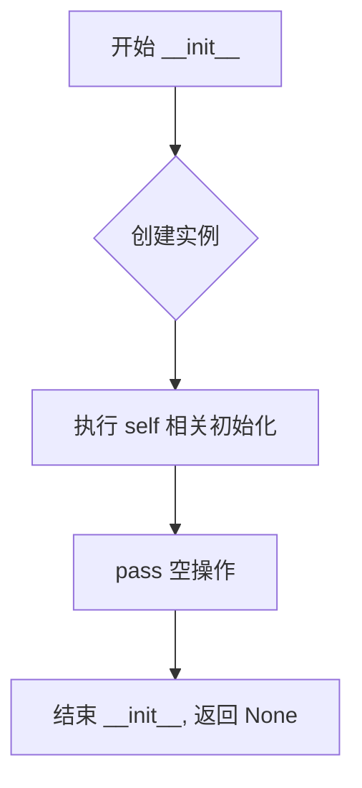

#### 带注释源码

```python
def __init__(self):
    """
    初始化 SanaVanillaAttnProcessor 实例。
    
    该构造函数目前为空实现，仅创建类的实例而不进行任何特定的初始化操作。
    作为一个注意力处理器类，其主要功能由 __call__ 方法提供，
    该方法实现了自定义的缩放点积注意力计算逻辑，用于支持训练过程中的 JVP（Jacobian-Vector Product）计算。
    
    Args:
        self: 指向类实例本身的引用
        
    Returns:
        None: Python 构造函数不返回值，通过隐式方式初始化实例
    """
    pass  # 空操作占位，当前不需要进行特定的初始化工作
```


### `SanaVanillaAttnProcessor.scaled_dot_product_attention`

实现缩放点积注意力（ Scaled Dot-Product Attention ）机制，支持自定义缩放因子和注意力掩码，用于在训练过程中实现 JVP（ Jacobian-Vector Product ）计算。

参数：

- `query`：`torch.Tensor`，查询张量，形状为 [batch, heads, seq_len, head_dim]
- `key`：`torch.Tensor`，键张量，形状为 [batch, heads, seq_len, head_dim]
- `value`：`torch.Tensor`，值张量，形状为 [batch, heads, seq_len, head_dim]
- `attn_mask`：`Optional[torch.Tensor]`，注意力掩码，可选，用于屏蔽特定位置的注意力
- `dropout_p`：`float`，dropout 概率，默认 0.0
- `is_causal`：`bool`，是否使用因果掩码，默认 False（当前未使用）
- `scale`：`Optional[float]`，缩放因子，默认 None（使用 1/sqrt(query.size(-1))）

返回值：`torch.Tensor`，注意力输出，形状为 [batch, heads, seq_len, head_dim]

#### 流程图

```mermaid
flowchart TD
    A[开始] --> B[获取 query 和 key 的维度信息]
    B --> C{scale 是否为 None?}
    C -->|是| D[计算 scale_factor = 1 / sqrt(query.size(-1))]
    C -->|否| E[使用自定义 scale]
    D --> F[初始化 attn_bias 全零张量]
    E --> F
    F --> G{attn_mask 是否存在?}
    G -->|是| H{attn_mask.dtype == bool?}
    G -->|否| I[计算 attn_weight = query @ key.transpose(-2, -1) * scale_factor]
    H -->|是| J[masked_fill_ 为 -inf]
    H -->|否| K[attn_bias += attn_mask]
    J --> I
    K --> I
    I --> L[attn_weight += attn_bias]
    L --> M[attn_weight = softmax(attn_weight, dim=-1)]
    M --> N[attn_weight = dropout(attn_weight, dropout_p, train=True)]
    N --> O[输出 = attn_weight @ value]
    O --> P[结束]
```

#### 带注释源码

```python
@staticmethod
def scaled_dot_product_attention(
    query, key, value, attn_mask=None, dropout_p=0.0, is_causal=False, scale=None
) -> torch.Tensor:
    """
    实现缩放点积注意力机制
    
    参数:
        query: 查询张量 [B, H, L, D]
        key: 键张量 [B, H, S, D]
        value: 值张量 [B, H, S, D]
        attn_mask: 可选的注意力掩码
        dropout_p: dropout 概率
        is_causal: 是否因果（当前未使用）
        scale: 自定义缩放因子
    
    返回:
        注意力输出 [B, H, L, D]
    """
    # 获取批量大小 B、头数 H、查询序列长度 L、键序列长度 S
    B, H, L, S = *query.size()[:-1], key.size(-2)
    
    # 计算缩放因子：如果未指定，则使用 1/sqrt(query_dim)
    scale_factor = 1 / math.sqrt(query.size(-1)) if scale is None else scale
    
    # 初始化注意力偏置为零张量，形状 [B, H, L, S]
    attn_bias = torch.zeros(B, H, L, S, dtype=query.dtype, device=query.device)

    # 如果提供了注意力掩码，则处理掩码
    if attn_mask is not None:
        if attn_mask.dtype == torch.bool:
            # 布尔掩码：将 True 位置填充为 -inf（屏蔽）
            attn_bias.masked_fill_(attn_mask.logical_not(), float("-inf"))
        else:
            # 数值掩码：直接加到注意力分数上
            attn_bias += attn_mask
    
    # 计算查询与键的注意力分数：Q @ K^T
    attn_weight = query @ key.transpose(-2, -1) * scale_factor
    
    # 加上偏置（掩码效果）
    attn_weight += attn_bias
    
    # 对最后一个维度进行 softmax 归一化
    attn_weight = torch.softmax(attn_weight, dim=-1)
    
    # 应用 dropout（训练模式下）
    attn_weight = torch.dropout(attn_weight, dropout_p, train=True)
    
    # 注意力权重乘以值得到输出
    return attn_weight @ value
```


### `SanaVanillaAttnProcessor.__call__`

该方法是 `SanaVanillaAttnProcessor` 类的核心执行逻辑，负责实现标准的多头注意力机制（Multi-Head Attention）。它接收 `hidden_states`，结合可选的 `encoder_hidden_states`（用于跨注意力）或隐藏状态本身（用于自注意力），通过投影生成 Query、Key、Value，计算缩放点积注意力并应用掩码，最后经过线性投影、Dropout 和输出缩放后返回注意力处理后的隐藏状态。

参数：

-  `self`：`SanaVanillaAttnProcessor` 类实例本身。
-  `attn`：`Attention` 类型，Diffusers 库中的 Attention 模块，包含了 `to_q`, `to_k`, `to_v` (投影层), `to_out` (输出投影与 Dropout), `norm_q`, `norm_k` (归一化层) 等属性。
-  `hidden_states`：`torch.Tensor` 类型，输入的隐藏状态张量，形状为 `[batch_size, sequence_length, hidden_size]`。
-  `encoder_hidden_states`：`Optional[torch.Tensor]` 类型，来自编码器的上下文隐藏状态。如果为 `None`，则执行自注意力（Self-Attention），即使用 `hidden_states` 本身作为 K 和 V 的来源。
-  `attention_mask`：`Optional[torch.Tensor]` 类型，用于阻止注意力访问特定位置的掩码张量。

返回值：`torch.Tensor` 类型经过注意力处理后的隐藏状态向量，形状保持为 `[batch_size, sequence_length, hidden_size]`。

#### 流程图

```mermaid
graph TD
    A[开始: 输入 hidden_states, encoder_hidden_states, attention_mask, attn] --> B{encoder_hidden_states 是否为空?}
    B -- 是 --> C[确定 batch_size 和 sequence_length]
    B -- 否 --> D[使用 encoder_hidden_states 的 shape]
    C --> E{attention_mask 是否存在?}
    D --> E
    E -- 是 --> F[调用 attn.prepare_attention_mask 准备掩码]
    E -- 否 --> G[投影 Query: attn.to_q(hidden_states)]
    F --> G
    G --> H[设置 encoder_hidden_states (若为空则等于 hidden_states)]
    H --> I[投影 Key 和 Value: attn.to_k, attn.to_v]
    I --> J{attn.norm_q / norm_k 是否存在?}
    J -- 是 --> K[应用归一化: norm_q, norm_k]
    J -- 否 --> L[计算 head_dim 并 Reshape]
    K --> L
    L --> M[转换维度: Transpose to (batch, heads, seq, dim)]
    M --> N[调用 scaled_dot_product_attention]
    N --> O[Reshape 合并多头: (batch, seq, heads*dim)]
    O --> P[类型转换: to(query.dtype)]
    P --> Q[线性投影: attn.to_out[0]]
    Q --> R[Dropout: attn.to_out[1]]
    R --> S[输出缩放: hidden_states / attn.rescale_output_factor]
    S --> T[结束: 返回 hidden_states]
```

#### 带注释源码

```python
def __call__(
    self,
    attn: Attention,
    hidden_states: torch.Tensor,
    encoder_hidden_states: Optional[torch.Tensor] = None,
    attention_mask: Optional[torch.Tensor] = None,
) -> torch.Tensor:
    # 1. 确定批次大小和序列长度
    # 如果提供了 encoder_hidden_states (跨注意力)，则使用其形状；否则使用 hidden_states (自注意力)
    batch_size, sequence_length, _ = (
        hidden_states.shape if encoder_hidden_states is None else encoder_hidden_states.shape
    )

    # 2. 准备注意力掩码 (如果存在)
    if attention_mask is not None:
        # Diffusers 的 Attention 模块内部方法来处理掩码维度，使其适配 scaled_dot_product_attention
        attention_mask = attn.prepare_attention_mask(attention_mask, sequence_length, batch_size)
        # scaled_dot_product_attention 期望的掩码形状为 (batch, heads, source_length, target_length)
        attention_mask = attention_mask.view(batch_size, attn.heads, -1, attention_mask.shape[-1])

    # 3. 生成 Query
    # 将 hidden_states 通过线性层 to_q 投影为 Query
    query = attn.to_q(hidden_states)

    # 4. 处理 Key 和 Value
    # 如果没有 encoder_hidden_states，默认使用 hidden_states 本身 (即 Self-Attention)
    if encoder_hidden_states is None:
        encoder_hidden_states = hidden_states

    # 投影 Key 和 Value，可以来自隐藏状态(自注意力)或编码器状态(跨注意力)
    key = attn.to_k(encoder_hidden_states)
    value = attn.to_v(encoder_hidden_states)

    # 5. 应用归一化 (可选，取决于 Attention 块的具体配置)
    if attn.norm_q is not None:
        query = attn.norm_q(query)
    if attn.norm_k is not None:
        key = attn.norm_k(key)

    # 6. 准备多头注意力的维度
    inner_dim = key.shape[-1]
    head_dim = inner_dim // attn.heads

    # 7. 调整形状以适应多头机制
    # 将 (batch, seq, hidden) 转换为 (batch, num_heads, seq, head_dim)
    query = query.view(batch_size, -1, attn.heads, head_dim).transpose(1, 2)
    key = key.view(batch_size, -1, attn.heads, head_dim).transpose(1, 2)
    value = value.view(batch_size, -1, attn.heads, head_dim).transpose(1, 2)

    # 8. 执行缩放点积注意力 (SDPA) 计算
    # 调用类内部实现的静态方法
    # 输出形状: (batch, num_heads, seq_len, head_dim)
    hidden_states = self.scaled_dot_product_attention(
        query, key, value, attn_mask=attention_mask, dropout_p=0.0, is_causal=False
    )

    # 9. 恢复原始形状
    # 从 (batch, num_heads, seq, head_dim) 转回 (batch, seq, hidden)
    hidden_states = hidden_states.transpose(1, 2).reshape(batch_size, -1, attn.heads * head_dim)
    # 确保输出类型与 query 一致
    hidden_states = hidden_states.to(query.dtype)

    # 10. 输出投影与 Dropout
    # linear proj
    hidden_states = attn.to_out[0](hidden_states)
    # dropout
    hidden_states = attn.to_out[1](hidden_states)

    # 11. 输出缩放因子处理
    hidden_states = hidden_states / attn.rescale_output_factor

    return hidden_states
```


### `Text2ImageDataset.__init__`

该方法是 `Text2ImageDataset` 类的构造函数，用于初始化文本到图像数据集对象。它接收 HuggingFace 数据集和目标分辨率作为参数，并设置图像预处理转换管道。

参数：

- `hf_dataset`：`datasets.Dataset`，HuggingFace 数据集对象，包含 'image'（字节）和 'llava'（文本）字段。注意：'llava' 是该特定数据集中文本描述的字段名，使用其他 HuggingFace 数据集时可能需要调整此键。
- `resolution`：`int`，目标图像分辨率，默认为 1024。

返回值：`None`，该方法为构造函数，不返回任何值。

#### 流程图

```mermaid
flowchart TD
    A[开始 __init__] --> B[接收参数 hf_dataset, resolution=1024]
    B --> C[将 hf_dataset 赋值给 self.dataset]
    C --> D[创建图像变换组合 transform]
    D --> D1[Lambda: 转换为RGB模式]
    D --> D2[Resize: 调整图像大小]
    D --> D3[CenterCrop: 中心裁剪]
    D --> D4[ToTensor: 转换为张量]
    D --> D5[Normalize: 归一化到[-1,1]]
    D --> E[结束 __init__]
    
    style A fill:#e1f5fe
    style E fill:#e1f5fe
    style D fill:#fff3e0
```

#### 带注释源码

```python
def __init__(self, hf_dataset, resolution=1024):
    """
    初始化 Text2ImageDataset 类
    
    参数:
        hf_dataset: HuggingFace 数据集对象
        resolution: 目标图像分辨率，默认为 1024
    """
    # 保存传入的 HuggingFace 数据集引用
    # 该数据集包含图像(字节)和文本(llava字段)数据
    self.dataset = hf_dataset
    
    # 构建图像预处理转换管道
    # 使用 torchvision.transforms.Compose 组合多个转换操作
    self.transform = T.Compose(
        [
            # 1. Lambda: 将 PIL Image 转换为 RGB 模式
            # 确保所有图像都是三通道彩色图像
            T.Lambda(lambda img: img.convert("RGB")),
            
            # 2. Resize: 调整图像大小到指定分辨率
            # 使用默认的 Image.BICUBIC 插值方法
            T.Resize(resolution),  # Image.BICUBIC
            
            # 3. CenterCrop: 从图像中心裁剪出指定大小的正方形
            # 确保输出图像为 resolution x resolution
            T.CenterCrop(resolution),
            
            # 4. ToTensor: 将 PIL Image 转换为 PyTorch 张量
            # 输出范围自动缩放到 [0, 1]
            T.ToTensor(),
            
            # 5. Normalize: 归一化处理
            # 使用均值 0.5 和标准差 0.5
            # 将张量值从 [0, 1] 映射到 [-1, 1]
            T.Normalize([0.5], [0.5]),
        ]
    )
```


### `Text2ImageDataset.__len__`

返回数据集的样本数量，使 DataLoader 能够确定遍历数据集所需的批次数。

参数：

- `self`：隐式参数，指向类的实例本身

返回值：`int`，返回底层 HuggingFace 数据集 `self.dataset` 中的样本总数

#### 流程图

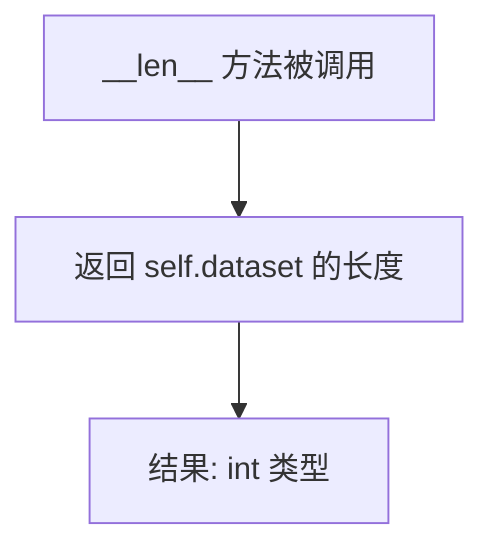

#### 带注释源码

```python
def __len__(self):
    """
    返回数据集的样本数量。
    
    这是 PyTorch Dataset 类的标准方法，允许 DataLoader 
    知道数据集的大小，从而正确分批和确定训练轮次。
    
    Returns:
        int: 底层 HuggingFace 数据集的样本数量
    """
    return len(self.dataset)
```


### `Text2ImageDataset.__getitem__`

该方法是`Text2ImageDataset`类的核心实例方法，用于根据给定的索引从数据集中获取单个文本-图像对。它从HuggingFace数据集中读取指定索引的原始数据，将图像字节转换为PIL Image，应用预定义的图像变换流水线（调整大小、中心裁剪、归一化），最终返回一个包含文本描述和预处理后图像张量的字典。

**参数：**

-  `self`：`Text2ImageDataset`，表示类的实例本身，包含数据集和变换流水线
-  `idx`：`int`，要检索的样本索引，范围从0到数据集长度减1

**返回值：**`dict`，返回一个字典，包含两个键值对：
  - `"text"`：`str`，文本描述（从HuggingFace数据集的"llava"字段提取）
  - `"image"`：`torch.Tensor`，处理后的图像张量，形状为[3, resolution, resolution]，像素值已归一化到[-1, 1]

#### 流程图

```mermaid
flowchart TD
    A[接收索引 idx] --> B[从 self.dataset[idx] 获取原始数据项]
    B --> C[提取文本: item['llava']]
    B --> D[提取图像字节: item['image']]
    D --> E[使用 Image.open 将字节转换为 PIL Image]
    E --> F[应用图像变换流水线]
    F --> F1[Lambda: 转换为 RGB 模式]
    F1 --> F2[Resize: 调整图像分辨率]
    F2 --> F3[CenterCrop: 中心裁剪]
    F3 --> F4[ToTensor: 转换为张量]
    F4 --> F5[Normalize: 归一化到 [-1, 1]]
    F5 --> G[返回字典 {'text': text, 'image': image_tensor}]
```

#### 带注释源码

```python
def __getitem__(self, idx):
    """
    根据索引获取数据集中的单个样本。
    
    Args:
        idx (int): 样本的索引值，用于从数据集中定位特定的文本-图像对。
    
    Returns:
        dict: 包含 'text' (str) 和 'image' (torch.Tensor) 的字典。
              图像张量形状为 [3, resolution, resolution]，已归一化。
    """
    # 1. 使用索引从HuggingFace数据集获取原始数据项
    #    数据项包含 'image' (bytes) 和 'llava' (text) 两个字段
    item = self.dataset[idx]
    
    # 2. 提取文本描述
    #    注意：这里硬编码了 'llava' 字段名，这是该特定数据集的文本字段
    text = item["llava"]
    
    # 3. 提取图像字节数据
    image_bytes = item["image"]
    
    # 4. 将图像字节转换为 PIL Image 对象
    #    使用 io.BytesIO 将字节数据包装为二进制流
    image = Image.open(io.BytesIO(image_bytes))
    
    # 5. 应用预定义的图像变换流水线
    #    变换流程：RGB转换 -> 调整大小 -> 中心裁剪 -> 转张量 -> 归一化
    #    最终输出：形状为 [3, resolution, resolution] 的张量，值域 [-1, 1]
    image_tensor = self.transform(image)
    
    # 6. 返回包含文本和图像的字典
    return {"text": text, "image": image_tensor}
```


### `ResidualBlock.__init__`

这是 `ResidualBlock` 类的初始化方法，用于创建一个残差块模块，该模块将输入通过一个可调用对象（通常是神经网络层）处理后，与原始输入相加并除以 $\sqrt{2}$ 进行归一化，形成残差连接。

参数：

- `fn`：`Callable`，残差块内部的可调用对象（如神经网络层），用于对输入进行变换

返回值：`None`，构造函数不返回任何值

#### 流程图

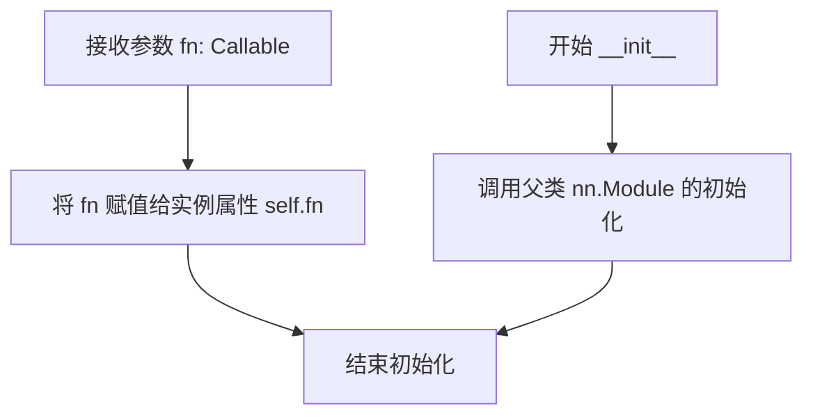

#### 带注释源码

```python
def __init__(self, fn: Callable):
    """
    初始化残差块。
    
    参数:
        fn: 一个可调用对象（通常是 nn.Module），用于对输入进行变换。
            该对象将在 forward 方法中被调用，其输出将与原始输入相加。
    """
    # 调用父类 nn.Module 的初始化方法，注册所有子模块和参数
    super().__init__()
    
    # 将传入的可调用对象存储为实例属性
    # 这个对象可以是任何可调用的层，如卷积层、线性层等
    # 在 forward 时会被调用: self.fn(x)
    self.fn = fn
```


### `ResidualBlock.forward`

该方法实现残差块的前向传播，通过将输入与经过函数处理的输出相加后再除以 $\sqrt{2}$ 来实现残差连接，这是一种用于稳定训练的技术。

参数：

- `x`：`torch.Tensor`，输入的张量

返回值：`torch.Tensor`，经过残差连接处理后的输出张量

#### 流程图

```mermaid
flowchart TD
    A[输入 x] --> B[调用 self.fn(x)]
    B --> C[将 fn(x) 与 x 相加]
    C --> D[除以 sqrt(2)]
    D --> E[返回输出]
    
    style A fill:#e1f5fe
    style E fill:#e1f5fe
    style B fill:#fff3e0
    style C fill:#fff3e0
    style D fill:#fff3e0
```

#### 带注释源码

```python
def forward(self, x: torch.Tensor) -> torch.Tensor:
    """
    残差块的前向传播方法。
    
    该方法实现了残差连接的核心逻辑：将输入 x 通过一个函数 fn 变换后，
    与原始输入相加，然后除以 sqrt(2) 进行归一化处理。
    这种设计有助于稳定深层网络的训练。
    
    参数:
        x (torch.Tensor): 输入张量
        
    返回:
        torch.Tensor: 残差连接后的输出张量
    """
    # 首先将输入 x 传递给 self.fn 进行变换处理
    # self.fn 可以是任意可调用对象，如 nn.Module
    transformed = self.fn(x)
    
    # 将变换后的结果与原始输入相加，实现残差连接
    # 这种跳跃连接使得梯度能够直接反向传播到更早的层
    output = transformed + x
    
    # 除以 sqrt(2) 进行归一化，这是一个经验性的稳定训练技巧
    # 确保输出具有适当的方差，有助于维持训练过程中的数值稳定性
    return output / np.sqrt(2)
```


### `SpectralConv1d.__init__`

该方法是 `SpectralConv1d` 类的构造函数，用于初始化一个应用了谱归一化（Spectral Normalization）的1D卷积层。谱归一化通过约束权重矩阵的谱范数来稳定神经网络的训练过程。

参数：

- `*args`：可变位置参数，传递给父类 `nn.Conv1d` 的参数（如 in_channels、out_channels、kernel_size 等）
- `**kwargs`：可变关键字参数，传递给父类 `nn.Conv1d` 的其他参数（如 padding、stride 等）

返回值：无（`None`），构造函数不返回任何值

#### 流程图

```mermaid
flowchart TD
    A[开始 __init__] --> B[调用父类 nn.Conv1d 构造函数]
    B --> C[super().__init__(*args, **kwargs)]
    C --> D[应用谱归一化到权重]
    D --> E[SpectralNorm.apply 方法]
    E --> F[结束]
    
    subgraph SpectralNorm.apply 参数
    G[name='weight']
    H[n_power_iterations=1]
    I[dim=0]
    J[eps=1e-12]
    end
    
    E --> G
    E --> H
    E --> I
    E --> J
```

#### 带注释源码

```python
class SpectralConv1d(nn.Conv1d):
    """
    应用谱归一化（Spectral Normalization）的1D卷积层。
    
    谱归一化通过限制权重矩阵的最大奇异值来稳定GAN等对抗性训练过程。
    该类继承自PyTorch的nn.Conv1d，并在初始化时对权重应用谱归一化。
    """
    
    def __init__(self, *args, **kwargs):
        """
        初始化SpectralConv1d层。
        
        参数:
            *args: 可变位置参数，传递给父类nn.Conv1d的构造函数
                   包含卷积层的基本参数如in_channels, out_channels, kernel_size等
            **kwargs: 可变关键字参数，传递给父类nn.Conv1d的其他参数
                     如padding, stride, dilation, groups, bias, padding_mode等
        
        返回:
            无（构造函数）
        """
        # 首先调用父类nn.Conv1d的初始化方法
        # 使用*args和**kwargs传递所有卷积层参数
        # 这将创建标准的1D卷积层权重
        super().__init__(*args, **kwargs)
        
        # 对卷积层的权重应用谱归一化
        # SpectralNorm.apply 参数说明:
        # - self: 当前模块实例
        # - name="weight": 指定要对权重参数进行谱归一化
        # - n_power_iterations=1: 功率迭代次数，用于计算最大奇异值
        #                         次数越高估计越准确，但计算成本也越高
        # - dim=0: 对于卷积层，dim=0对应输出通道维度
        # - eps=1e-12: 防止除零的epsilon值
        SpectralNorm.apply(self, name="weight", n_power_iterations=1, dim=0, eps=1e-12)
```


### `BatchNormLocal.__init__`

这是 `BatchNormLocal` 类的构造函数，用于初始化一个本地批归一化层。该层与标准批归一化不同，它使用虚拟批次大小（virtual_bs）来计算统计信息，从而支持更大的有效批次大小进行归一化统计。

参数：

- `self`：隐式参数，表示实例本身
- `num_features`：`int`，输入特征的数量，决定了 weight 和 bias 参数的维度
- `affine`：`bool`，是否使用可学习的仿射参数（weight 和 bias），默认为 True
- `virtual_bs`：`int`，虚拟批次大小，用于将实际批次分割成多个虚拟组来计算均值和方差，默认为 8
- `eps`：`float`，添加到方差中用于数值稳定的常数，默认为 1e-5

返回值：`None`，构造函数不返回任何值

#### 流程图

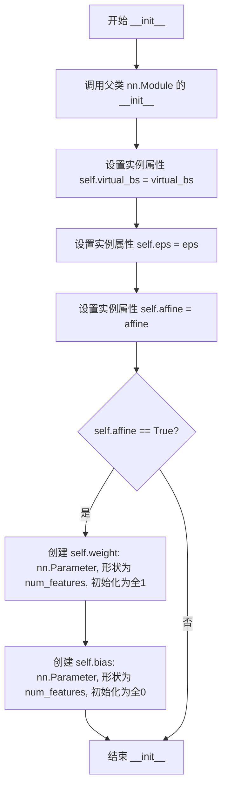

#### 带注释源码

```python
def __init__(self, num_features: int, affine: bool = True, virtual_bs: int = 8, eps: float = 1e-5):
    """
    初始化本地批归一化层。
    
    参数:
        num_features: 输入特征的数量（C），用于确定 weight 和 bias 的维度
        affine: 是否使用仿射变换（可学习的缩放和偏移），默认为 True
        virtual_bs: 虚拟批次大小，用于分组计算统计信息，默认为 8
        eps: 防止除零的常数，添加到方差中，默认为 1e-5
    """
    # 调用父类 nn.Module 的构造函数，注册所有子模块和参数
    super().__init__()
    
    # 保存虚拟批次大小，用于 forward 中分组计算均值和方差
    self.virtual_bs = virtual_bs
    
    # 保存数值稳定性常数，用于 forward 中归一化时防止除零
    self.eps = eps
    
    # 保存是否使用仿射变换的标志
    self.affine = affine

    # 如果启用仿射变换，则创建可学习的缩放参数 weight 和偏移参数 bias
    if self.affine:
        # weight: 形状为 (num_features,)，初始化为全1，用于缩放归一化后的输出
        self.weight = nn.Parameter(torch.ones(num_features))
        # bias: 形状为 (num_features,)，初始化为全0，用于偏移归一化后的输出
        self.bias = nn.Parameter(torch.zeros(num_features))
```


### `BatchNormLocal.forward`

该方法实现了一种局部批次归一化（Local Batch Normalization），通过将批次维度划分为多个虚拟组来计算组内统计量（均值和方差），从而在较小批次情况下仍能获得更稳定的归一化效果。

参数：

-  `x`：`torch.Tensor`，输入张量，形状为 (batch_size, ...)，通常为 (B, C, H, W) 或 (B, C, N)

返回值：`torch.Tensor`，归一化后的张量，形状与输入相同

#### 流程图

```mermaid
flowchart TD
    A[输入 x] --> B[获取输入形状 shape = x.size]
    B --> C[计算分组数 G = ceil批次数/虚拟批次大小]
    C --> D[将 x 重塑为 G 组: x.view(G, -1, H, W)]
    D --> E[计算组内均值: mean = x.mean1, 3, keepdim=True]
    E --> F[计算组内方差: var = x.var1, 3, unbiased=False]
    F --> G[归一化: x = x - mean / sqrtvar + eps]
    G --> H{是否使用仿射变换?}
    H -->|Yes| I[应用仿射: x = x * weight + bias]
    H -->|No| J[跳过仿射变换]
    I --> K[恢复原始形状: x.viewshape]
    J --> K
    K --> L[返回归一化后的张量]
```

#### 带注释源码

```python
def forward(self, x: torch.Tensor) -> torch.Tensor:
    """
    前向传播：执行局部批次归一化
    
    参数:
        x: 输入张量，形状为 (batch_size, channels, height, width) 或类似的多维张量
        
    返回:
        归一化后的张量，形状与输入相同
    """
    # 保存原始输入形状，用于最后恢复
    shape = x.size()

    # 计算分组数量：将批次大小除以虚拟批次大小，向上取整
    # virtual_bs 是虚拟批次大小，用于控制每个组内有多少样本
    G = np.ceil(x.size(0) / self.virtual_bs).astype(int)
    
    # 将输入重塑为 (G, virtual_bs, H, W) 的形式
    # 这样每个组可以独立计算统计量，实现局部归一化
    x = x.view(G, -1, x.size(-2), x.size(-1))

    # 计算组内均值：对第1维和第3维（对应虚拟批次维和空间维）求均值
    # keepdim=True 保持维度以便后续广播操作
    mean = x.mean([1, 3], keepdim=True)
    
    # 计算组内方差：unbiased=False 使用总体方差（除以 N 而非 N-1）
    var = x.var([1, 3], keepdim=True, unbiased=False)
    
    # 归一化：(x - mean) / sqrt(var + eps)
    # 添加 eps 防止除零
    x = (x - mean) / (torch.sqrt(var + self.eps))

    # 如果启用仿射变换，应用可学习的缩放和偏移参数
    if self.affine:
        # weight: 缩放参数 gamma，形状为 (channels,)
        # bias: 偏移参数 beta，形状为 (channels,)
        # 使用 [None, :, None] 进行广播，使其适应 (G, C, H, W) 形状
        x = x * self.weight[None, :, None] + self.bias[None, :, None]

    # 恢复原始形状并返回
    return x.view(shape)
```


### `DiscHead.__init__`

该方法是 `DiscHead` 类的初始化构造函数，用于构建判别器头部的神经网络结构。它接收通道数、条件维度和映射维度作为参数，构建特征提取的主干网络，并根据条件维度是否大于零来条件化地创建分类器层。

参数：

- `self`：隐式参数，表示类的实例本身
- `channels`：`int`，输入特征的通道数，决定了网络的宽度
- `c_dim`：`int`，条件维度，用于条件生成任务（如类别标签），当大于0时启用条件映射
- `cmap_dim`：`int`，条件映射维度，默认为64，用于将条件向量映射到特征空间

返回值：`None`，该方法仅初始化对象状态，不返回任何值

#### 流程图

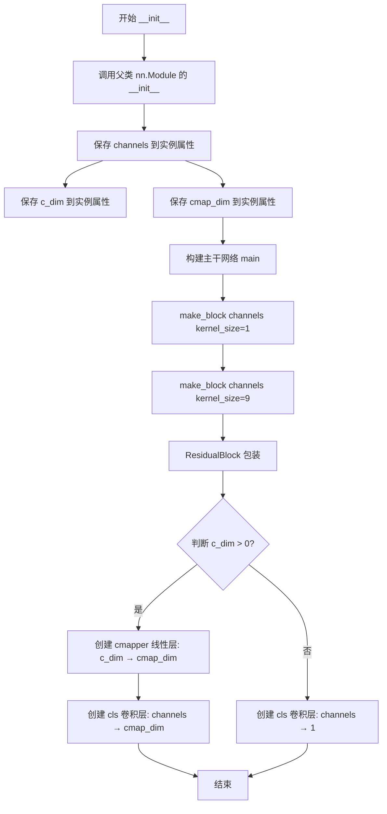

#### 带注释源码

```python
def __init__(self, channels: int, c_dim: int, cmap_dim: int = 64):
    """
    初始化 DiscHead 判别器头部网络。
    
    参数:
        channels: 输入特征的通道数
        c_dim: 条件维度，用于条件生成
        cmap_dim: 条件映射维度，默认值为64
    """
    # 调用父类 nn.Module 的初始化方法
    super().__init__()
    
    # 保存通道数到实例属性
    self.channels = channels
    # 保存条件维度到实例属性
    self.c_dim = c_dim
    # 保存条件映射维度到实例属性
    self.cmap_dim = cmap_dim

    # 构建主干特征提取网络
    # 由一个 kernel_size=1 的卷积块和一个 ResidualBlock(kernel_size=9) 组成
    # kernel_size=1 用于局部特征融合，kernel_size=9 用于更大的感受野
    self.main = nn.Sequential(
        make_block(channels, kernel_size=1),            # 第一个卷积块：1x1 卷积
        ResidualBlock(make_block(channels, kernel_size=9))  # 第二个残差块：9x9 卷积
    )

    # 根据条件维度是否大于0来决定分类器的结构
    if self.c_dim > 0:
        # 条件生成模式：创建条件映射器和条件分类器
        # cmapper 将条件向量从 c_dim 维度映射到 cmap_dim 维度
        self.cmapper = nn.Linear(self.c_dim, cmap_dim)
        # cls 卷积层将特征通道从 channels 映射到 cmap_dim
        self.cls = SpectralConv1d(channels, cmap_dim, kernel_size=1, padding=0)
    else:
        # 非条件模式：创建一个简单的单通道输出分类器
        # 用于无条件的判别任务
        self.cls = SpectralConv1d(channels, 1, kernel_size=1, padding=0)
```


### DiscHead.forward

该函数是判别器头的前向传播方法，用于对从Transformer提取的特征进行分类预测，支持条件生成任务中的类别嵌入映射。

参数：

- `self`：`DiscHead` 实例本身
- `x`：`torch.Tensor`，输入特征张量，形状为 `[B, C, N]`，其中 B 是批量大小，C 是通道数，N 是序列长度
- `c`：`torch.Tensor`，条件嵌入向量，形状为 `[B, c_dim]`，用于条件生成；当 `c_dim` 为 0 时可为 None

返回值：`torch.Tensor`，分类预测结果，形状为 `[B, 1]` 或 `[B, cmap_dim]`（取决于 c_dim 是否大于 0）

#### 流程图

```mermaid
flowchart TD
    A[输入特征 x, 条件嵌入 c] --> B{self.c_dim > 0?}
    B -->|Yes| C[h = self.main(x)]
    B -->|No| C2[h = self.main(x)]
    C --> D[out = self.cls(h)]
    C2 --> D2[out = self.cls(h)]
    D --> E[cmap = self.cmapper(c).unsqueeze(-1)]
    E --> F[out = (out * cmap).sum(1, keepdim=True) * (1/sqrt(cmap_dim))]
    D2 --> G[return out]
    F --> G
```

#### 带注释源码

```python
def forward(self, x: torch.Tensor, c: torch.Tensor) -> torch.Tensor:
    """
    DiscHead 的前向传播函数
    
    参数:
        x: 输入特征张量，形状为 [B, C, N]，B=批量大小, C=通道数, N=序列长度
        c: 条件嵌入向量，形状为 [B, c_dim]，用于条件生成
    
    返回:
        分类预测结果，形状为 [B, 1]
    """
    # 步骤1: 通过主网络处理输入特征
    # 主网络由 make_block 和 ResidualBlock 组成，用于特征提取
    h = self.main(x)
    
    # 步骤2: 通过分类头卷积得到初始预测
    # cls 是 SpectralConv1d 层，用于将特征映射到预测空间
    out = self.cls(h)
    
    # 步骤3: 如果存在条件嵌入 (c_dim > 0)，进行条件加权
    if self.c_dim > 0:
        # 将条件嵌入映射到 cmap_dim 维度并扩展维度用于广播
        cmap = self.cmapper(c).unsqueeze(-1)  # [B, cmap_dim, 1]
        
        # 使用条件嵌入对预测进行加权求和
        # 乘以 1/sqrt(cmap_dim) 用于归一化
        out = (out * cmap).sum(1, keepdim=True) * (1 / np.sqrt(self.cmap_dim))
    
    # 返回最终预测结果
    return out
```


### SanaMSCMDiscriminator.__init__

这是一个判别器类的初始化方法，用于构建 Sana 模型的判别器模块，基于预训练的 Transformer 模型并注册多个判别头。

参数：

- `self`：`SanaMSCMDiscriminator`，隐式参数，表示类的实例本身
- `pretrained_model`：`SanaTransformer2DModel`，用于判别器特征提取的预训练模型
- `is_multiscale`：`bool`，可选参数（默认 `False`），是否使用多尺度判别模式
- `head_block_ids`：可选参数（默认 `None`），指定用于判别头的 Transformer 块 ID 列表

返回值：无（`__init__` 方法不返回任何内容）

#### 流程图

```mermaid
graph TD
    A[开始 __init__] --> B[调用父类 nn.Module 初始化]
    B --> C[保存 pretrained_model 到 self.transformer]
    C --> D[设置 transformer 不需要梯度: requires_grad_(False)]
    D --> E{head_block_ids 是否为空?}
    E -->|是| F[根据 is_multiscale 设置默认 block_hooks]
    E -->|否| G[使用传入的 head_block_ids]
    F --> H[遍历 block_hooks 创建 DiscHead 列表]
    G --> H
    H --> I[将 heads 转换为 nn.ModuleList]
    I --> J[结束 __init__]
```

#### 带注释源码

```python
def __init__(self, pretrained_model, is_multiscale=False, head_block_ids=None):
    """
    初始化 SanaMSCMDiscriminator 判别器
    
    参数:
        pretrained_model: 用于特征提取的预训练 Transformer 模型
        is_multiscale: 是否使用多尺度判别模式
        head_block_ids: 自定义的 Transformer 块 ID 列表，用于附加判别头
    """
    # 调用父类 nn.Module 的初始化方法
    super().__init__()
    
    # 保存预训练模型到实例变量
    self.transformer = pretrained_model
    
    # 冻结预训练模型的梯度，不对其进行训练
    self.transformer.requires_grad_(False)

    # 确定要注册 hook 的 Transformer 块
    if head_block_ids is None or len(head_block_ids) == 0:
        # 如果没有指定块，使用默认块：
        # 多尺度模式: {2, 8, 14, 20, 27}
        # 单尺度模式: {transformer 的最后一个块}
        self.block_hooks = {2, 8, 14, 20, 27} if is_multiscale else {self.transformer.depth - 1}
    else:
        # 使用用户自定义的块 ID
        self.block_hooks = head_block_ids

    # 为每个要 hook 的块创建一个判别头
    heads = []
    for i in range(len(self.block_hooks)):
        # 创建 DiscHead，输入通道数为 transformer 的隐藏层大小
        # c_dim=0, cmap_dim=0 表示不使用条件映射
        heads.append(DiscHead(self.transformer.hidden_size, 0, 0))
    
    # 将 heads 列表转换为 nn.ModuleList 以便正确注册参数
    self.heads = nn.ModuleList(heads)
```


### `SanaMSCMDiscriminator.get_head_inputs`

该方法用于获取判别器在推理过程中收集的中间层特征输入，这些特征来自Transformer的指定模块块，并通过转置处理后存储在列表中，供后续判别头使用。

参数：

- 无参数（仅包含 `self`）

返回值：`List[torch.Tensor]`，返回一个包含所有判别头输入特征的列表，每个元素为形状 `[B, C, N]` 的张量，其中 B 是批量大小，C 是特征通道数，N 是序列长度。

#### 流程图

```mermaid
flowchart TD
    A[开始: 调用 get_head_inputs] --> B{self.head_inputs 是否存在}
    B -->|是| C[返回 self.head_inputs 列表]
    B -->|否| D[返回 None 或空列表]
    C --> E[结束]
    D --> E
    
    style A fill:#f9f,color:#000
    style C fill:#9f9,color:#000
    style E fill:#ff9,color:#000
```

#### 带注释源码

```python
def get_head_inputs(self):
    """
    获取判别器头部输入特征的列表。
    
    这些特征是在 forward 方法执行过程中，通过注册在前馈网络输出上的 hooks 
    捕获的中间层激活值。每个特征都经过了转置处理，从原始的 [B, N, C] 
    转换为 [B, C, N] 格式，以适配 DiscHead 的输入要求。
    
    Returns:
        List[torch.Tensor]: 包含所有判别头输入特征的列表，每个元素形状为 [B, C, N]
    """
    return self.head_inputs
```


### `SanaMSCMDiscriminator.forward`

该方法是 SanaMSCMDiscriminator 类的核心前向传播方法，用于通过预训练的 Transformer 模型提取多尺度特征，并通过多个判别器头生成最终的判别结果。它利用 PyTorch 的 forward hooks 机制从 Transformer 的多个中间块中捕获特征图，然后将这些特征传递给各个判别器头进行处理和拼接。

参数：

- `hidden_states`：`torch.Tensor`，输入的潜在状态（latent states），通常是经过 VAE 编码的图像潜在表示
- `timestep`：`torch.Tensor`，扩散过程的时间步，用于条件生成
- `encoder_hidden_states`：`Optional[torch.Tensor]`，编码后的文本嵌入状态，用于文本条件引导（可选）
- `**kwargs`：`Any`，其他可选关键字参数，会传递给底层的 Transformer 模型

返回值：`torch.Tensor`，拼接后的判别器输出，形状为 `[batch_size, num_heads * 1]`（每个头的输出拼接在一起）

#### 流程图

```mermaid
flowchart TD
    A[输入 hidden_states, timestep, encoder_hidden_states] --> B[初始化空列表 feat_list 和 head_inputs]
    B --> C[定义特征提取函数 get_features]
    C --> D[遍历 Transformer 块]
    D --> E{当前块索引是否在 block_hooks 中?}
    E -->|Yes| F[注册 forward hook 到当前块]
    E -->|No| G[继续遍历下一个块]
    F --> G
    G --> H[调用 self.transformer 进行前向传播]
    H --> I[移除所有注册的 hooks]
    I --> J[遍历特征列表和判别器头]
    J --> K[转置特征: B,N,C -> B,C,N]
    K --> L[保存特征到 head_inputs]
    L --> M[通过判别器头处理特征]
    M --> N[重塑输出形状]
    N --> O[拼接所有头的输出]
    O --> P[返回 concat_res]
```

#### 带注释源码

```python
def forward(self, hidden_states, timestep, encoder_hidden_states=None, **kwargs):
    """
    SanaMSCMDiscriminator 的前向传播方法
    
    该方法通过以下步骤实现判别功能：
    1. 使用 forward hooks 捕获 Transformer 中间层的输出特征
    2. 对每个捕获的特征应用判别器头（DiscHead）
    3. 拼接所有判别器头的输出作为最终结果
    
    Args:
        hidden_states: 输入的潜在状态张量
        timestep: 扩散过程的时间步
        encoder_hidden_states: 编码后的文本嵌入（可选）
        **kwargs: 其他传递给 Transformer 的参数
    
    Returns:
        拼接后的判别器输出张量
    """
    # 初始化特征列表和头部输入列表
    feat_list = []
    self.head_inputs = []

    # 定义内部函数：用于从 Transformer 块中提取特征
    def get_features(module, input, output):
        """
        通过 forward hook 捕获 Transformer 块的输出
        这个函数会在每个注册的块前向传播后被调用
        """
        feat_list.append(output)  # 将输出特征添加到列表中
        return output  # 原样返回输出，不改变前向传播

    # 存储注册的 hooks，以便后续移除
    hooks = []
    
    # 遍历 Transformer 的所有 Transformer 块
    for i, block in enumerate(self.transformer.transformer_blocks):
        # 检查当前块索引是否在需要提取特征的 block_hooks 集合中
        if i in self.block_hooks:
            # 注册前向 hook 以捕获该块的输出
            hooks.append(block.register_forward_hook(get_features))

    # 执行 Transformer 的前向传播
    # 这会同时触发所有注册的 hooks，从而捕获选定块的中间输出
    self.transformer(
        hidden_states=hidden_states,
        timestep=timestep,
        encoder_hidden_states=encoder_hidden_states,
        return_logvar=False,  # 显式设置不返回 log 方差
        **kwargs,
    )

    # 前向传播完成后，移除所有注册的 hooks
    # 这是为了避免影响后续的正常前向传播
    for hook in hooks:
        hook.remove()

    # 初始化结果列表
    res_list = []
    
    # 遍历捕获的特征和对应的判别器头
    for feat, head in zip(feat_list, self.heads):
        # 获取特征的形状: B=batch, N=序列长度, C=隐藏维度
        B, N, C = feat.shape
        
        # 转置特征张量: 从 [B, N, C] 变为 [B, C, N]
        # 这是为了适应 DiscHead 期望的输入格式
        feat = feat.transpose(1, 2)  # [B, C, N]
        
        # 保存转置后的特征到 head_inputs 属性中
        # 这允许外部访问中间特征用于分析或其他用途
        self.head_inputs.append(feat)
        
        # 将特征通过判别器头处理，并重塑为 [batch_size, -1] 的二维张量
        # head() 方法内部会处理特征并输出标量分数
        res_list.append(head(feat, None).reshape(feat.shape[0], -1))

    # 沿着特征维度（dim=1）拼接所有判别器头的输出
    # 结果形状: [batch_size, num_heads]（假设每个头输出一个标量）
    concat_res = torch.cat(res_list, dim=1)

    # 返回拼接后的判别器结果
    return concat_res
```


### `SanaMSCMDiscriminator.model`

这是一个属性方法（property），用于获取 `SanaMSCMDiscriminator` 判别器内部封装的预训练 Transformer 模型。

参数： 无（这是一个属性方法，通过 `.model` 访问）

返回值：`torch.nn.Module`，返回底层封装的预训练 Transformer 模型

#### 流程图

```mermaid
flowchart TD
    A[访问 .model 属性] --> B{检查模型是否存在}
    B -->|是| C[返回 self.transformer]
    B -->|否| D[返回 AttributeError]
    C --> E[获得预训练Transformer模型对象]
```

#### 带注释源码

```python
@property
def model(self):
    """
    属性方法，返回判别器内部封装的预训练 Transformer 模型。
    
    这是一个只读属性，允许外部代码直接访问底层的预训练模型，
    用于推理、特征提取或其他不需要判别头部的操作。
    
    Returns:
        torch.nn.Module: 底层封装的预训练 Transformer 模型 (SanaTrigFlow)
    """
    return self.transformer
```

#### 设计意图与使用场景

1. **设计目标**：提供对底层预训练模型的直接访问，使得判别器可以作为一个通用的特征提取器使用
2. **典型用途**：在训练过程中，访问 `disc.model` 可以获取冻结参数的预训练模型用于生成器的无分类器引导（CFG）计算
3. **访问控制**：该属性返回的模型在判别器初始化时被设置为 `requires_grad_(False)`，因此直接使用返回的模型不会计算梯度


### `SanaMSCMDiscriminator.save_pretrained`

该方法用于将判别器的状态字典保存到指定的路径，以便后续可以重新加载模型。

参数：

- `path`：`str`，保存模型权重文件的路径

返回值：`None`，无返回值（直接将模型状态保存到文件）

#### 流程图

```mermaid
flowchart TD
    A[开始 save_pretrained] --> B[调用 self.state_dict]
    B --> C[使用 torch.save 保存到 path]
    C --> D[结束]
```

#### 带注释源码

```python
def save_pretrained(self, path):
    """
    将判别器的状态字典保存到指定路径
    
    参数:
        path: str - 保存模型权重的文件路径
    """
    # 获取当前模型的所有参数状态字典（包含 transformer 和 heads 的所有参数）
    # state_dict() 返回一个有序字典，包含模型的可学习参数
    state_dict = self.state_dict()
    
    # 使用 torch.save 将状态字典保存到指定路径
    # 保存格式为 PyTorch 的 pickle 格式
    torch.save(self.state_dict(), path)
```


### DiscHeadModel.__init__

这是DiscHeadModel类的构造函数，用于初始化判别器模型的包装器。

参数：

- `disc`：`nn.Module` 或 `SanaMSCMDiscriminator`，被包装的判别器模型实例

返回值：`None`，构造函数不返回值

#### 流程图

```mermaid
graph TD
    A[开始 __init__] --> B[接收 disc 参数]
    B --> C[将 disc 赋值给 self.disc]
    D[结束 __init__]
    C --> D
```

#### 带注释源码

```python
class DiscHeadModel:
    """
    DiscHeadModel 类是一个轻量级包装器，用于包装判别器模型。
    它提供了状态字典过滤和属性代理功能。
    """
    
    def __init__(self, disc):
        """
        初始化 DiscHeadModel 实例。
        
        参数:
            disc: 判别器模型实例，通常是 SanaMSCMDiscriminator 类型
        """
        # 将传入的判别器模型保存为实例属性
        # 这样可以在后续的方法中访问原始判别器
        self.disc = disc
```


### DiscHeadModel.state_dict

该方法用于获取鉴别器头部模型的参数状态字典，过滤掉来自transformer的参数，仅返回鉴别器头部相关的参数。

参数：

- 无显式参数（仅包含隐含的 `self` 参数）

返回值：`dict`，返回包含鉴别器头部模型参数的状态字典，排除以 "transformer." 开头的参数

#### 流程图

```mermaid
flowchart TD
    A[开始 state_dict] --> B[获取 self.disc.state_dict]
    B --> C{遍历参数项}
    C -->|参数名不以 'transformer.' 开头| D[保留该参数]
    C -->|参数名以 'transformer.' 开头| E[过滤掉该参数]
    D --> F[构建新字典]
    E --> F
    F --> G[返回过滤后的参数字典]
```

#### 带注释源码

```python
def state_dict(self):
    """
    获取鉴别器头部模型的参数状态字典
    
    该方法从底层鉴别器模型中提取参数，但排除了来自transformer部分的参数。
    这样可以确保只保存和加载鉴别器头部（DiscHead）的权重，而不包含预训练的transformer权重。
    
    Returns:
        dict: 包含模型参数的状态字典，键为参数名称，值为参数张量
    """
    # 从底层鉴别器模型获取完整状态字典，然后过滤掉transformer相关参数
    return {name: param for name, param in self.disc.state_dict().items() if not name.startswith("transformer.")}
```


### DiscHeadModel.__getattr__

该方法是一个Python魔术方法（特殊方法），当访问DiscHeadModel实例上不存在的属性时自动调用，用于将属性访问委托给内部持有的disc对象。

参数：

- `self`：`DiscHeadModel`，DiscHeadModel实例本身
- `name`：`str`，被访问的属性名称

返回值：任意类型，返回`self.disc`对象上对应名称的属性值

#### 流程图

```mermaid
flowchart TD
    A[访问属性: model.attr] --> B{属性是否在DiscHeadModel对象中存在？}
    B -->|是| C[返回该属性]
    B -->|否| D[触发__getattr__方法]
    D --> E[调用getattrself.disc, name]
    E --> F[返回disc对象的属性值]
```

#### 带注释源码

```python
def __getattr__(self, name):
    """
    魔术方法，当访问对象上不存在的属性时自动调用。
    将属性访问委托给内部持有的disc对象。
    
    参数:
        name: str 要访问的属性名称
    
    返回:
        任意类型: self.disc对象上对应名称的属性值
    """
    return getattr(self.disc, name)
```


### `SanaTrigFlow.__init__`

这是 `SanaTrigFlow` 类的构造函数，用于将原始的 `SanaTransformer2DModel` 包装为支持 TrigFlow 变换的模型，并可选地启用 guidance 模式。

参数：

- `self`：`SanaTrigFlow` 实例本身
- `original_model`：`SanaTransformer2DModel`，需要被包装的原始 Sana Transformer 模型
- `guidance`：`bool`，是否启用 guidance 模式，默认为 `False`

返回值：无（`__init__` 方法返回 `None`）

#### 流程图

```mermaid
flowchart TD
    A[开始 __init__] --> B[复制 original_model 的 __dict__]
    B --> C[计算 hidden_size]
    C --> D{guidance 参数为 True?}
    D -->|是| E[初始化 logvar_linear 线性层]
    D -->|否| F[结束 __init__]
    E --> G[使用 Xavier 均匀初始化权重]
    G --> H[将偏置初始化为 0]
    H --> F
```

#### 带注释源码

```python
class SanaTrigFlow(SanaTransformer2DModel):
    def __init__(self, original_model, guidance=False):
        """
        初始化 SanaTrigFlow 模型
        
        参数:
            original_model: 原始的 SanaTransformer2DModel 实例
            guidance: 是否启用 guidance 模式，用于训练时的日志方差预测
        """
        # 将原始模型的所有属性复制到当前实例
        # 使得 SanaTrigFlow 能够使用 original_model 的所有配置和权重
        self.__dict__ = original_model.__dict__
        
        # 计算隐藏层大小 = 注意力头数 × 注意力头维度
        self.hidden_size = self.config.num_attention_heads * self.config.attention_head_dim
        
        # 保存 guidance 模式标志
        self.guidance = guidance
        
        # 如果启用 guidance 模式，则创建 logvar_linear 层用于预测日志方差
        if self.guidance:
            # 重新计算 hidden_size（与上面相同）
            hidden_size = self.config.num_attention_heads * self.config.attention_head_dim
            
            # 创建线性层：将 hidden_size 映射到 1（预测 log 方差）
            self.logvar_linear = torch.nn.Linear(hidden_size, 1)
            
            # 使用 Xavier 均匀分布初始化权重
            torch.nn.init.xavier_uniform_(self.logvar_linear.weight)
            
            # 将偏置初始化为 0
            torch.nn.init.constant_(self.logvar_linear.bias, 0)
```


### `SanaTrigFlow.forward`

该方法是 SanaTrigFlow 类的核心前向传播方法，继承自 SanaTransformer2DModel，实现了 TrigFlow 与标准 Flow 之间的转换逻辑。TrigFlow 是一种基于三角函数的时间步映射方法，该方法将输入的时间步转换为 flow_timestep，然后在父类模型中执行前向传播，最后再将输出转换回 TrigFlow 空间。

参数：

- `hidden_states`：`torch.Tensor`，输入的潜在表示，通常是经过 VAE 编码的图像 latent
- `encoder_hidden_states`：`Optional[torch.Tensor]`，文本编码器生成的 prompt embeddings
- `timestep`：`torch.Tensor`，时间步张量，表示扩散过程中的时间
- `guidance`：`Optional[torch.Tensor]`，分类器自由引导（CFG）scale，用于控制生成内容与文本提示的相关程度
- `jvp`：`bool`，是否进行 Jacobian-Vector Product 计算，用于训练时的梯度计算
- `return_logvar`：`bool`，是否返回 log 方差（logvar），用于不确定性建模
- `**kwargs`：可变关键字参数，传递给父类 forward 方法的额外参数

返回值：`Tuple[torch.Tensor]` 或 `Tuple[torch.Tensor, torch.Tensor]`，返回元组，第一个元素是变换后的模型输出 `trigflow_model_out`，如果 `return_logvar=True`，则第二个元素是 `logvar`

#### 流程图

```mermaid
flowchart TD
    A[开始 forward] --> B[获取 batch_size<br/>latents = hidden_states<br/>prompt_embeds = encoder_hidden_states<br/>t = timestep]
    B --> C[将 timestep 扩展并转换为 prompt_embeds 的数据类型]
    C --> D[计算 flow_timestep<br/>flow_timestep = sin(t) / (cos(t) + sin(t))]
    D --> E[计算 latent_model_input<br/>latent_model_input = latents * sqrt(flow_timestep² + (1-flow_timestep)²)]
    E --> F{检查 jvp 和 gradient_checkpointing}
    F -->|True| G[临时关闭 gradient_checkpointing<br/>调用 super().forward 获取 model_out]
    F -->|False| H[直接调用 super().forward 获取 model_out]
    G --> I[恢复 gradient_checkpointing]
    H --> I
    I --> J[Flow --> TrigFlow 转换<br/>trigflow_model_out = ((1-2*ft)*latent_model_input + (1-2*ft+2*ft²)*model_out) / sqrt(ft² + (1-ft)²)]
    J --> K{检查 guidance 和 self.guidance}
    K -->|True| L[调用 self.time_embed 带 guidance 参数]
    K -->|False| M[调用 self.time_embed 不带 guidance 参数]
    L --> N{检查 return_logvar}
    M --> N
    N -->|True| O[计算 logvar = self.logvar_linear(embedded_timestep)<br/>返回 trigflow_model_out, logvar]
    N -->|False| P[返回 (trigflow_model_out,)]
    O --> Q[结束]
    P --> Q
```

#### 带注释源码

```python
def forward(
    self, hidden_states, encoder_hidden_states, timestep, guidance=None, jvp=False, return_logvar=False, **kwargs
):
    """
    SanaTrigFlow 的前向传播方法，实现了 TrigFlow 与标准 Flow 之间的转换
    
    参数:
        hidden_states: 输入的潜在表示 (batch_size, seq_len, hidden_dim)
        encoder_hidden_states: 文本编码后的 prompt embeddings
        timestep: 时间步张量
        guidance: CFG scale，用于分类器自由引导
        jvp: 是否进行 Jacobian-Vector Product 计算
        return_logvar: 是否返回 log 方差
        **kwargs: 传递给父类的额外参数
    
    返回:
        (trigflow_model_out,) 或 (trigflow_model_out, logvar)
    """
    # 获取 batch 大小和设置基本变量
    batch_size = hidden_states.shape[0]
    latents = hidden_states  # 潜在表示
    prompt_embeds = encoder_hidden_states  # 文本嵌入
    t = timestep  # 时间步

    # TrigFlow --> Flow Transformation
    # 将时间步扩展到与 latents batch 大小一致，并转换为 prompt_embeds 的数据类型
    timestep = t.expand(latents.shape[0]).to(prompt_embeds.dtype)
    latents_model_input = latents

    # 计算 flow_timestep: 将原始时间步转换为 Flow 形式的时间步
    # 公式: sin(t) / (cos(t) + sin(t))
    flow_timestep = torch.sin(timestep) / (torch.cos(timestep) + torch.sin(timestep))

    # 扩展 flow_timestep 维度以便进行逐元素运算
    flow_timestep_expanded = flow_timestep.view(-1, 1, 1, 1)
    
    # 对 latents 进行缩放，考虑 flow_timestep 的影响
    # 确保变换后的潜在表示与原始数据分布一致
    latent_model_input = latents_model_input * torch.sqrt(
        flow_timestep_expanded**2 + (1 - flow_timestep_expanded) ** 2
    )
    latent_model_input = latent_model_input.to(prompt_embeds.dtype)

    # 在原始 flow 空间中前向传播
    # 如果需要计算 JVP（Jacobian-Vector Product）且启用了 gradient checkpointing
    # 则临时关闭 gradient checkpointing 以支持 JVP 计算
    if jvp and self.gradient_checkpointing:
        self.gradient_checkpointing = False
        # 调用父类 SanaTransformer2DModel 的 forward 方法
        model_out = super().forward(
            hidden_states=latent_model_input,
            encoder_hidden_states=prompt_embeds,
            timestep=flow_timestep,
            guidance=guidance,
            **kwargs,
        )[0]
        # 恢复 gradient checkpointing 设置
        self.gradient_checkpointing = True
    else:
        model_out = super().forward(
            hidden_states=latent_model_input,
            encoder_hidden_states=prompt_embeds,
            timestep=flow_timestep,
            guidance=guidance,
            **kwargs,
        )[0]

    # Flow --> TrigFlow Transformation
    # 将模型输出从 Flow 空间转换回 TrigFlow 空间
    # 公式: (1-2*ft)*latent + (1-2*ft+2*ft²)*output / sqrt(ft² + (1-ft)²)
    trigflow_model_out = (
        (1 - 2 * flow_timestep_expanded) * latent_model_input
        + (1 - 2 * flow_timestep_expanded + 2 * flow_timestep_expanded**2) * model_out
    ) / torch.sqrt(flow_timestep_expanded**2 + (1 - flow_timestep_expanded) ** 2)

    # 时间嵌入处理
    # 如果启用了 guidance 且传入了 guidance 参数，则使用 guidance 进行时间嵌入
    if self.guidance and guidance is not None:
        timestep, embedded_timestep = self.time_embed(
            timestep, guidance=guidance, hidden_dtype=hidden_states.dtype
        )
    else:
        timestep, embedded_timestep = self.time_embed(
            timestep, batch_size=batch_size, hidden_dtype=hidden_states.dtype
        )

    # 如果需要返回 log 方差（用于不确定性建模）
    if return_logvar:
        # 使用 logvar_linear 层从 embedded_timestep 预测 log 方差
        logvar = self.logvar_linear(embedded_timestep)
        return trigflow_model_out, logvar

    # 默认返回元组形式的输出
    return (trigflow_model_out,)
```

## 关键组件


### SanaVanillaAttnProcessor

自定义注意力处理器，实现缩放点积注意力机制，支持训练过程中的JVP（雅可比向量积）计算，用于替代默认的注意力实现。

### Text2ImageDataset

PyTorch数据集类，用于从HuggingFace数据集加载文本-图像对，支持图像预处理（resize、中心裁剪、归一化），返回包含文本描述和图像张量的字典。

### ResidualBlock

残差块封装器，通过将函数输出与输入相加后除以√2来实现残差连接，用于稳定训练。

### SpectralConv1d

带谱归一化（Spectral Norm）的1D卷积层，用于判别器中增强判别能力。

### BatchNormLocal

本地批归一化实现，支持虚拟批大小进行分组统计计算，用于处理大批量训练场景。

### DiscHead

判别器头模块，由多个卷积块和残差块组成，支持条件映射（c_dim>0）或无条件映射，用于从特征图中预测判别分数。

### SanaMSCMDiscriminator

 Sana多尺度SCM判别器，继承自预训练Transformer模型，通过注册前向钩子提取多层特征，支撑对抗训练和SCM损失计算。

### SanaTrigFlow

 Sana Transformer模型子类，实现TrigFlow流转换机制，将标准扩散时间步映射到三角函数空间，支持guidance嵌入和logvar预测。

### compute_density_for_timestep_sampling_scm

时间步采样密度计算函数，基于logit正态分布生成timestep，用于sCM训练中的非均匀时间步采样策略。

### parse_args

命令行参数解析函数，定义并返回所有训练相关配置参数，包括模型路径、数据集配置、训练超参数、验证设置等。

### save_model_card

模型卡片生成与保存函数，用于创建HuggingFace Hub模型元数据，包含模型描述、许可证、标签等信息。

### log_validation

验证图像生成函数，在指定epoch执行推理验证，支持VAE tiling、tensorboard和wandb日志记录。

### main

主训练函数，完整实现Sana-Sprint训练流程：模型加载与初始化、判别器构建、梯度积累与混合精度训练、GAN对抗训练循环（包含G和D两阶段）、检查点保存与恢复、最终推理验证。


## 问题及建议


### 已知问题

- **main()函数过长**: main()函数超过600行，包含了模型初始化、数据准备、训练循环、验证等多个阶段，应该拆分为独立的函数或类
- **变量命名不清晰**: phase变量使用"G"和"D"字符串标识，缺乏语义化；大量使用缩写如`cfg_pretrain_pred`、`dxt_dt`、`scm_cfg_scale`等，影响代码可读性
- **潜在的Bug**: 在Discriminator训练阶段（约第720行），使用了`args.largest_timestep_prob`而不是`args.largest_timestep`，这是一个逻辑错误
- **无效的detach调用**: 在约580行有`pred_x_0.detach()`但未赋值给任何变量，该调用无实际效果
- **VAE设备移动效率低**: 训练循环中每次迭代都执行`vae = vae.to(accelerator.device)`，这会造成不必要的设备传输开销
- **缺少异常处理**: 模型加载、数据集验证、checkpoint恢复等关键操作缺乏try-except保护
- **硬编码值**: 多处使用硬编码数值如0.5（sigma计算）、0.1（gradient normalization）等，应提取为配置参数
- **模型同时加载**: transformer、pretrained_model、disc、vae、text_encoder同时加载到设备，缺乏内存管理策略

### 优化建议

- **拆分main()函数**: 将模型初始化、数据准备、训练循环、验证、保存等逻辑拆分为独立函数，提高可维护性
- **改进变量命名**: 使用更描述性的变量名如`generator_phase`、`discriminator_phase`替代"G"/"D"
- **修复Bug**: 将`args.largest_timestep_prob`改为`args.largest_timestep`
- **优化VAE设备管理**: 将VAE移至设备一次或在训练开始时处理，而非每步重复
- **添加缓存机制**: 对于不变的计算结果（如negative_prompt_embeds）可考虑缓存
- **增加错误处理**: 在关键IO操作（模型加载、checkpoint保存/恢复）周围添加异常处理
- **提取配置常量**: 将硬编码数值提取为类常量或配置文件
- **减少验证频率**: 可添加参数控制验证间隔，减少不必要的计算开销
- **使用torch.no_grad()**: 在不需要梯度计算的训练阶段显式使用`torch.no_grad()`块

## 其它


### 设计目标与约束

本代码实现 Sana-Sprint 文本到图像生成模型的训练脚本，核心目标是利用预训练的 SanaTransformer2DModel 进行高效的条件图像生成训练。主要设计约束包括：1）支持分布式训练（Accelerator）；2）混合精度训练（fp16/bf16）；3）支持梯度累积和检查点；4）采用 sCM（spectral Consistency Model）损失函数进行训练；5）集成了多尺度判别器（LADD）进行对抗训练；6）支持 VAE tiling 以减少显存占用。

### 错误处理与异常设计

代码采用多层错误处理机制：1）参数验证阶段检查 wandb 与 hub_token 冲突、MPS 不支持 bf16 等；2）训练循环中检测梯度范数是否为 NaN 或 Inf，若检测到则跳过该次迭代并清零梯度；3）使用 try-except 导入可选依赖（如 bitsandbytes、wandb）；4） Accelerator 自动处理分布式环境下的进程同步错误；5）模型加载失败时抛出 ValueError；6）Checkpoints 加载失败时输出警告并从初始状态开始训练。

### 数据流与状态机

训练过程存在两个主要状态Phase：G（生成器训练阶段）和D（判别器训练阶段）。数据流如下：1）DataLoader加载文本-图像对；2）文本编码器生成prompt embeddings；3）VAE将图像编码为latent表示；4）根据TrigFlow公式添加噪声生成noisy latent；5）G阶段：计算sCM损失和对抗损失，更新transformer参数；6）D阶段：计算判别器hinge损失，更新判别器heads参数；7）每个checkpointing_steps保存模型状态。

### 外部依赖与接口契约

主要外部依赖包括：1）diffusers 库（>=0.33.0.dev0）提供 SanaPipeline、SanaTransformer2DModel、AutoencoderDC；2）transformers 库提供 Gemma2Model、AutoTokenizer；3）accelerate 库提供分布式训练加速；4）datasets 库加载 HuggingFace 数据集；5）torch、numpy、pillow 进行张量计算和图像处理；6）huggingface_hub 用于模型上传；7）可选依赖：wandb（可视化）、bitsandbytes（8位优化器）。

### 性能优化与资源管理

代码包含多项性能优化：1）梯度检查点（gradient_checkpointing）减少显存占用；2）启用TF32加速Ampere GPU计算；3）NPU Flash Attention 支持（is_torch_npu_available）；4）VAE tiling 在验证时减少显存；5）启用持久化 workers（persistent_workers=True）和 pin_memory 加速数据加载；6）Mixed Precision（fp16/bf16）减少显存和加速训练；7）VAE 和 TextEncoder 在推理时移至 CPU（offload）以节省显存。

### 配置管理与超参数

关键超参数包括：1）学习率默认1e-4，可通过scale_lr自动扩展；2）训练批次大小默认4；3）梯度累积步数默认1；4）adam_beta1=0.9, adam_beta2=0.999；5）权重衰减默认1e-4；6）sCM相关：sigma_data=0.5, logit_mean=0.2, logit_std=1.6；7）判别器相关：logit_mean_discriminator=-0.6, logit_std_discriminator=1.0, adv_lambda=0.5；8）tangent_warmup_steps=4000；9）gradient_clip=0.1。

### 版本兼容性与依赖检查

代码对版本有明确要求：1）diffusers>=0.33.0.dev0（通过check_min_version检查）；2）accelerate>=0.16.0（使用register_save_state_pre_hook）；3）torch>=1.10（支持bf16）；4）pytorch>=99272（MPS对bf16的限制）；5）Python 编码声明为 utf-8；6）NPU 支持需要 torch_npu 扩展。

### 安全考虑与权限管理

1）hub_token 安全风险提示：不能同时使用 --report_to=wandb 和 --hub_token；2）LOCAL_RANK 环境变量优先级高于命令行参数；3）模型加载使用 from_pretrained 支持 revision 和 variant；4）分布式训练通过 DistributedDataParallelKwargs 配置；5）文件操作使用 os.makedirs 确保目录存在；6）敏感信息（如 token）不应硬编码。

### 模型保存与加载机制

模型保存采用自定义 hooks：1）save_model_hook 处理 transformer（完整保存）和 discriminator（仅保存 heads）；2）load_model_hook 支持从 checkpoint 恢复训练；3）支持 DeepSpeed 分布式加载；4）保存格式：transformer 完整模型 + disc_heads.pt；5）支持 --resume_from_checkpoint="latest" 自动选择最新 checkpoint；6）upcast_before_saving 控制保存时的精度。

### 分布式训练支持

1）支持多 GPU 分布式训练（DistributedDataParallel）；2）find_unused_parameters=True 处理可选参数；3）通过 Accelerator 包装模型、优化器、数据加载器和调度器；4）主进程负责创建仓库和保存检查点；5）所有进程同步等待（accelerator.wait_for_everyone）；6）Trackers（TensorBoard/WandB）仅在主进程初始化。

### 训练监控与日志

1）使用 accelerate.logging.get_logger 获取日志记录器；2）TensorBoard 和 WandB 双轨支持；3）记录内容包括：scm_loss、adv_loss、learning_rate；4）每 checkpointing_steps 保存状态；5）验证阶段生成图像并记录到 trackers；6）进度条显示当前步骤和损失值。


    