# `diffusers\examples\research_projects\scheduled_huber_loss_training\dreambooth\train_dreambooth.py` 详细设计文档

这是一个用于 DreamBooth 训练的 Python 脚本，旨在通过微调 Stable Diffusion 的 UNet（和可选的 Text Encoder）来实现个性化图像生成。该脚本支持先验保留（Prior Preservation）技术以防止模型过拟合，并集成了 Accelerate 库以支持分布式训练和混合精度。

## 整体流程

```mermaid
graph TD
    A[开始] --> B[parse_args 解析命令行参数]
    B --> C[main 入口函数]
    C --> D[初始化 Accelerator 和日志]
    D --> E{是否启用先验保留?}
    E -- 是 --> F[生成类别图像 (Class Images)]
    E -- 否 --> G[加载预训练模型 (UNet, VAE, Text Encoder, Tokenizer)]
    F --> G
    G --> H[构建数据集 (DreamBoothDataset) 和 DataLoader]
    H --> I[训练循环 (Training Loop)]
    I --> J[获取批次数据 (Batch)]
    J --> K{是否预计算文本嵌入?}
    K -- 否 --> L[encode_prompt 编码文本]
    K -- 是 --> M[直接使用预计算嵌入]
    L --> M
    M --> N[VAE 编码图像到潜在空间]
    N --> O[采样噪声与时间步]
    O --> P[前向传播: noisy_model_input + timesteps + encoder_hidden_states --> UNet]
    P --> Q[计算损失: conditional_loss (支持 L2, Huber, SmoothL1)]
    Q --> R[反向传播与优化器步进]
    R --> S{是否达到保存检查点步数?}
    S -- 是 --> T[保存检查点 (save_state)]
    S -- 否 --> U{是否达到验证步数?}
    T --> U
    U -- 是 --> V[log_validation 运行推理验证]
    U -- 否 --> W[进入下一轮循环]
    V --> W
    W --> I
    I -- 训练结束 --> X[保存最终Pipeline到本地]
    X --> Y[可选: 推送到 Hub]
```

## 类结构

```
train_dreambooth.py (主脚本)
├── 工具函数模块 (Global Functions)
│   ├── parse_args: 命令行参数解析
    ├── main: 核心训练逻辑
    ├── save_model_card: 生成模型卡片
    ├── log_validation: 验证与推理流程
    ├── import_model_class_from_model_name_or_path: 动态加载模型类
    ├── model_has_vae: 检查模型是否存在VAE
    ├── tokenize_prompt: 文本分词
    ├── encode_prompt: 文本编码为向量
    ├── conditional_loss: 损失函数计算 (L2/Huber)
    └── collate_fn: 数据批次整理
└── 数据集类 (Dataset Classes)
    ├── DreamBoothDataset: 训练数据加载与预处理
    └── PromptDataset: 用于生成类别图像的临时数据集
```

## 全局变量及字段


### `logger`
    
来自 accelerate.logging 的全局日志对象，用于记录训练过程中的信息

类型：`logging.Logger`
    


### `is_wandb_available`
    
标记 wandb 是否可用的布尔值，用于决定是否使用 wandb 进行实验跟踪

类型：`bool`
    


### `DreamBoothDataset.size`
    
图像分辨率，训练图像将被Resize到此分辨率

类型：`int`
    


### `DreamBoothDataset.center_crop`
    
是否对图像进行中心裁剪，为True时使用CenterCrop否则使用RandomCrop

类型：`bool`
    


### `DreamBoothDataset.tokenizer`
    
用于将文本提示词转换为token ids的文本分词器

类型：`PreTrainedTokenizer`
    


### `DreamBoothDataset.encoder_hidden_states`
    
预计算的实例文本嵌入，如果为None则在__getitem__时实时计算

类型：`torch.Tensor`
    


### `DreamBoothDataset.class_prompt_encoder_hidden_states`
    
预计算的类别文本嵌入，用于先验保留损失的类别条件

类型：`torch.Tensor`
    


### `DreamBoothDataset.tokenizer_max_length`
    
分词器的最大长度，超过此长度的文本将被截断

类型：`int`
    


### `DreamBoothDataset.instance_data_root`
    
实例图像所在的根目录路径

类型：`Path`
    


### `DreamBoothDataset.instance_images_path`
    
实例图像文件的路径列表

类型：`list`
    


### `DreamBoothDataset.class_data_root`
    
类别图像所在的根目录路径，用于先验保留训练

类型：`Path`
    


### `DreamBoothDataset.image_transforms`
    
包含Resize、裁剪、ToTensor、Normalize的图像变换组合

类型：`transforms.Compose`
    


### `DreamBoothDataset.num_instance_images`
    
实例图像的总数量

类型：`int`
    


### `DreamBoothDataset.num_class_images`
    
类别图像的总数量

类型：`int`
    


### `DreamBoothDataset._length`
    
数据集的逻辑长度，取实例图像数和类别图像数的最大值

类型：`int`
    


### `DreamBoothDataset.instance_prompt`
    
实例图像对应的文本提示词

类型：`str`
    


### `DreamBoothDataset.class_prompt`
    
类别图像对应的文本提示词

类型：`str`
    


### `PromptDataset.prompt`
    
用于生成类别图像的文本提示词

类型：`str`
    


### `PromptDataset.num_samples`
    
需要生成的类别图像样本数量

类型：`int`
    
    

## 全局函数及方法


### `parse_args`

该函数是 DreamBooth 训练脚本的命令行参数解析器，使用 argparse 库定义并解析所有训练相关参数，包括模型路径、数据配置、训练超参数、优化器设置、验证选项等，并进行一系列参数一致性校验，最后返回包含所有配置参数的 Namespace 对象。

参数：

- `input_args`：`List[str] | None`，可选参数列表，用于测试目的。如果为 None，则从 sys.argv 解析命令行输入

返回值：`argparse.Namespace`，包含所有解析后的命令行参数对象

#### 流程图

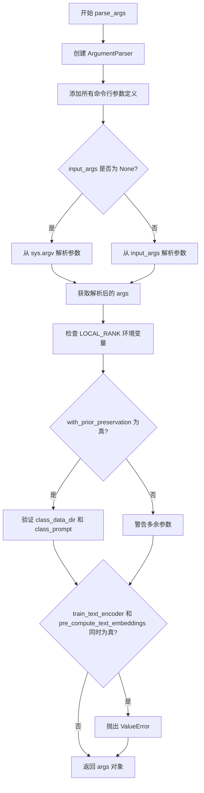

#### 带注释源码

```python
def parse_args(input_args=None):
    # 创建 ArgumentParser 实例，设置描述信息
    parser = argparse.ArgumentParser(description="Simple example of a training script.")
    
    # ========== 模型相关参数 ==========
    # 预训练模型路径或模型标识符（必需）
    parser.add_argument(
        "--pretrained_model_name_or_path",
        type=str,
        default=None,
        required=True,
        help="Path to pretrained model or model identifier from huggingface.co/models.",
    )
    # 预训练模型的修订版本
    parser.add_argument(
        "--revision",
        type=str,
        default=None,
        required=False,
        help="Revision of pretrained model identifier from huggingface.co/models.",
    )
    # 模型文件的变体（如 fp16）
    parser.add_argument(
        "--variant",
        type=str,
        default=None,
        help="Variant of the model files of the pretrained model identifier from huggingface.co/models, 'e.g.' fp16",
    )
    # 预训练分词器名称或路径
    parser.add_argument(
        "--tokenizer_name",
        type=str,
        default=None,
        help="Pretrained tokenizer name or path if not the same as model_name",
    )
    
    # ========== 数据相关参数 ==========
    # 实例图像的训练数据文件夹（必需）
    parser.add_argument(
        "--instance_data_dir",
        type=str,
        default=None,
        required=True,
        help="A folder containing the training data of instance images.",
    )
    # 类图像的训练数据文件夹
    parser.add_argument(
        "--class_data_dir",
        type=str,
        default=None,
        required=False,
        help="A folder containing the training data of class images.",
    )
    # 指定实例的提示词（必需）
    parser.add_argument(
        "--instance_prompt",
        type=str,
        default=None,
        required=True,
        help="The prompt with identifier specifying the instance",
    )
    # 指定与实例同类的提示词
    parser.add_argument(
        "--class_prompt",
        type=str,
        default=None,
        help="The prompt to specify images in the same class as provided instance images.",
    )
    
    # ========== 先验保持损失参数 ==========
    # 是否添加先验保持损失
    parser.add_argument(
        "--with_prior_preservation",
        default=False,
        action="store_true",
        help="Flag to add prior preservation loss.",
    )
    # 先验保持损失的权重
    parser.add_argument("--prior_loss_weight", type=float, default=1.0, help="The weight of prior preservation loss.")
    # 先验保持所需的最小类图像数量
    parser.add_argument(
        "--num_class_images",
        type=int,
        default=100,
        help=(
            "Minimal class images for prior preservation loss. If there are not enough images already present in"
            " class_data_dir, additional images will be sampled with class_prompt."
        ),
    )
    
    # ========== 输出和随机性参数 ==========
    # 模型预测和检查点的输出目录
    parser.add_argument(
        "--output_dir",
        type=str,
        default="dreambooth-model",
        help="The output directory where the model predictions and checkpoints will be written.",
    )
    # 可重复训练的随机种子
    parser.add_argument("--seed", type=int, default=None, help="A seed for reproducible training.")
    
    # ========== 图像预处理参数 ==========
    # 输入图像的分辨率
    parser.add_argument(
        "--resolution",
        type=int,
        default=512,
        help=(
            "The resolution for input images, all the images in the train/validation dataset will be resized to this"
            " resolution"
        ),
    )
    # 是否对输入图像进行中心裁剪
    parser.add_argument(
        "--center_crop",
        default=False,
        action="store_true",
        help=(
            "Whether to center crop the input images to the resolution. If not set, the images will be randomly"
            " cropped. The images will be resized to the resolution first before cropping."
        ),
    )
    
    # ========== 文本编码器训练参数 ==========
    # 是否训练文本编码器
    parser.add_argument(
        "--train_text_encoder",
        action="store_true",
        help="Whether to train the text encoder. If set, the text encoder should be float32 precision.",
    )
    
    # ========== 训练批处理参数 ==========
    # 训练数据加载器的批大小
    parser.add_argument(
        "--train_batch_size", type=int, default=4, help="Batch size (per device) for the training dataloader."
    )
    # 采样图像的批大小
    parser.add_argument(
        "--sample_batch_size", type=int, default=4, help="Batch size (per device) for sampling images."
    )
    # 训练轮数
    parser.add_argument("--num_train_epochs", type=int, default=1)
    # 要执行的总训练步数
    parser.add_argument(
        "--max_train_steps",
        type=int,
        default=None,
        help="Total number of training steps to perform.  If provided, overrides num_train_epochs.",
    )
    
    # ========== 检查点参数 ==========
    # 每隔多少步保存检查点
    parser.add_argument(
        "--checkpointing_steps",
        type=int,
        default=500,
        help=(
            "Save a checkpoint of the training state every X updates. Checkpoints can be used for resuming training via `--resume_from_checkpoint`. "
            "In the case that the checkpoint is better than the final trained model, the checkpoint can also be used for inference."
            "Using a checkpoint for inference requires separate loading of the original pipeline and the individual checkpointed model components."
            "See https://huggingface.co/docs/diffusers/main/en/training/dreambooth#performing-inference-using-a-saved-checkpoint for step by step"
            "instructions."
        ),
    )
    # 要存储的最大检查点数量
    parser.add_argument(
        "--checkpoints_total_limit",
        type=int,
        default=None,
        help=(
            "Max number of checkpoints to store. Passed as `total_limit` to the `Accelerator` `ProjectConfiguration`."
            " See Accelerator::save_state https://huggingface.co/docs/accelerate/package_reference/accelerator#accelerate.Accelerator.save_state"
            " for more details"
        ),
    )
    # 从哪个检查点恢复训练
    parser.add_argument(
        "--resume_from_checkpoint",
        type=str,
        default=None,
        help=(
            "Whether training should be resumed from a previous checkpoint. Use a path saved by"
            ' `--checkpointing_steps`, or `"latest"` to automatically select the last available checkpoint.'
        ),
    )
    
    # ========== 梯度累积参数 ==========
    # 执行反向/更新传递前累积的更新步数
    parser.add_argument(
        "--gradient_accumulation_steps",
        type=int,
        default=1,
        help="Number of updates steps to accumulate before performing a backward/update pass.",
    )
    # 是否使用梯度检查点以节省内存
    parser.add_argument(
        "--gradient_checkpointing",
        action="store_true",
        help="Whether or not to use gradient checkpointing to save memory at the expense of slower backward pass.",
    )
    
    # ========== 学习率调度器参数 ==========
    # 初始学习率
    parser.add_argument(
        "--learning_rate",
        type=float,
        default=5e-6,
        help="Initial learning rate (after the potential warmup period) to use.",
    )
    # 是否按 GPU 数量、梯度累积步数和批大小缩放学习率
    parser.add_argument(
        "--scale_lr",
        action="store_true",
        default=False,
        help="Scale the learning rate by the number of GPUs, gradient accumulation steps, and batch size.",
    )
    # 调度器类型
    parser.add_argument(
        "--lr_scheduler",
        type=str,
        default="constant",
        help=(
            'The scheduler type to use. Choose between ["linear", "cosine", "cosine_with_restarts", "polynomial",'
            ' "constant", "constant_with_warmup"]'
        ),
    )
    # 学习率调度器的预热步数
    parser.add_argument(
        "--lr_warmup_steps", type=int, default=500, help="Number of steps for the warmup in the lr scheduler."
    )
    # cosine_with_restarts 调度器的硬重置次数
    parser.add_argument(
        "--lr_num_cycles",
        type=int,
        default=1,
        help="Number of hard resets of the lr in cosine_with_restarts scheduler.",
    )
    # 多项式调度器的幂因子
    parser.add_argument("--lr_power", type=float, default=1.0, help="Power factor of the polynomial scheduler.")
    
    # ========== 优化器参数 ==========
    # 是否使用 8-bit Adam
    parser.add_argument(
        "--use_8bit_adam", action="store_true", help="Whether or not to use 8-bit Adam from bitsandbytes."
    )
    # 数据加载的工作进程数
    parser.add_argument(
        "--dataloader_num_workers",
        type=int,
        default=0,
        help=(
            "Number of subprocesses to use for data loading. 0 means that the data will be loaded in the main process."
        ),
    )
    # Adam 优化器的 beta1 参数
    parser.add_argument("--adam_beta1", type=float, default=0.9, help="The beta1 parameter for the Adam optimizer.")
    # Adam 优化器的 beta2 参数
    parser.add_argument("--adam_beta2", type=float, default=0.999, help="The beta2 parameter for the Adam optimizer.")
    # 权重衰减
    parser.add_argument("--adam_weight_decay", type=float, default=1e-2, help="Weight decay to use.")
    # Adam 优化器的 epsilon 值
    parser.add_argument("--adam_epsilon", type=float, default=1e-08, help="Epsilon value for the Adam optimizer")
    # 最大梯度范数
    parser.add_argument("--max_grad_norm", default=1.0, type=float, help="Max gradient norm.")
    
    # ========== Hub 上传参数 ==========
    # 是否将模型推送到 Hub
    parser.add_argument("--push_to_hub", action="store_true", help="Whether or not to push the model to the Hub.")
    # 用于推送到 Model Hub 的令牌
    parser.add_argument("--hub_token", type=str, default=None, help="The token to use to push to the Model Hub.")
    # 要保持同步的仓库名称
    parser.add_argument(
        "--hub_model_id",
        type=str,
        default=None,
        help="The name of the repository to keep in sync with the local `output_dir`.",
    )
    
    # ========== 日志记录参数 ==========
    # TensorBoard 日志目录
    parser.add_argument(
        "--logging_dir",
        type=str,
        default="logs",
        help=(
            "[TensorBoard](https://www.tensorflow.org/tensorboard) log directory. Will default to"
            " *output_dir/runs/**CURRENT_DATETIME_HOSTNAME***."
        ),
    )
    
    # ========== 精度和硬件参数 ==========
    # 是否允许 TF32
    parser.add_argument(
        "--allow_tf32",
        action="store_true",
        help=(
            "Whether or not to allow TF32 on Ampere GPUs. Can be used to speed up training. For more information, see"
            " https://pytorch.org/docs/stable/notes/cuda.html#tensorfloat-32-tf32-on-ampere-devices"
        ),
    )
    # 报告结果和日志的集成
    parser.add_argument(
        "--report_to",
        type=str,
        default="tensorboard",
        help=(
            'The integration to report the results and logs to. Supported platforms are `"tensorboard"`'
            ' (default), `"wandb"` and `"comet_ml"`. Use `"all"` to report to all integrations.'
        ),
    )
    
    # ========== 验证参数 ==========
    # 验证时使用的提示词
    parser.add_argument(
        "--validation_prompt",
        type=str,
        default=None,
        help="A prompt that is used during validation to verify that the model is learning.",
    )
    # 验证时应生成的数量
    parser.add_argument(
        "--num_validation_images",
        type=int,
        default=4,
        help="Number of images that should be generated during validation with `validation_prompt`.",
    )
    # 每隔多少步运行验证
    parser.add_argument(
        "--validation_steps",
        type=int,
        default=100,
        help=(
            "Run validation every X steps. Validation consists of running the prompt"
            " `args.validation_prompt` multiple times: `args.num_validation_images`"
            " and logging the images."
        ),
    )
    # 是否使用混合精度
    parser.add_argument(
        "--mixed_precision",
        type=str,
        default=None,
        choices=["no", "fp16", "bf16"],
        help=(
            "Whether to use mixed precision. Choose between fp16 and bf16 (bfloat16). Bf16 requires PyTorch >="
            " 1.10.and an Nvidia Ampere GPU.  Default to the value of accelerate config of the current system or the"
            " flag passed with the `accelerate.launch` command. Use this argument to override the accelerate config."
        ),
    )
    # 先验生成的精度
    parser.add_argument(
        "--prior_generation_precision",
        type=str,
        default=None,
        choices=["no", "fp32", "fp16", "bf16"],
        help=(
            "Choose prior generation precision between fp32, fp16 and bf16 (bfloat16). Bf16 requires PyTorch >="
            " 1.10.and an Nvidia Ampere GPU.  Default to  fp16 if a GPU is available else fp32."
        ),
    )
    # 分布式训练的本地排名
    parser.add_argument("--local_rank", type=int, default=-1, help="For distributed training: local_rank")
    
    # ========== 高级优化参数 ==========
    # 是否使用 xformers 内存高效注意力
    parser.add_argument(
        "--enable_xformers_memory_efficient_attention", action="store_true", help="Whether or not to use xformers."
    )
    # 是否将梯度设置为 None 而非零
    parser.add_argument(
        "--set_grads_to_none",
        action="store_true",
        help=(
            "Save more memory by using setting grads to None instead of zero. Be aware, that this changes certain"
            " behaviors, so disable this argument if it causes any problems. More info:"
            " https://pytorch.org/docs/stable/generated/torch.optim.Optimizer.zero_grad.html"
        ),
    )
    # 偏移噪声
    parser.add_argument(
        "--offset_noise",
        action="store_true",
        default=False,
        help=(
            "Fine-tuning against a modified noise"
            " See: https://www.crosslabs.org//blog/diffusion-with-offset-noise for more information."
        ),
    )
    # SNR 加权 gamma
    parser.add_argument(
        "--snr_gamma",
        type=float,
        default=None,
        help="SNR weighting gamma to be used if rebalancing the loss. Recommended value is 5.0. "
        "More details here: https://huggingface.co/papers/2303.09556.",
    )
    
    # ========== 文本嵌入预计算参数 ==========
    # 是否预计算文本嵌入
    parser.add_argument(
        "--pre_compute_text_embeddings",
        action="store_true",
        help="Whether or not to pre-compute text embeddings. If text embeddings are pre-computed, the text encoder will not be kept in memory during training and will leave more GPU memory available for training the rest of the model. This is not compatible with `--train_text_encoder`.",
    )
    # 分词器的最大长度
    parser.add_argument(
        "--tokenizer_max_length",
        type=int,
        default=None,
        required=False,
        help="The maximum length of the tokenizer. If not set, will default to the tokenizer's max length.",
    )
    # 是否为文本编码器使用注意力掩码
    parser.add_argument(
        "--text_encoder_use_attention_mask",
        action="store_true",
        required=False,
        help="Whether to use attention mask for the text encoder",
    )
    # 是否跳过保存文本编码器
    parser.add_argument(
        "--skip_save_text_encoder", action="store_true", required=False, help="Set to not save text encoder"
    )
    # 验证图像集合
    parser.add_argument(
        "--validation_images",
        required=False,
        default=None,
        nargs="+",
        help="Optional set of images to use for validation. Used when the target pipeline takes an initial image as input such as when training image variation or superresolution.",
    )
    
    # ========== 类别标签条件参数 ==========
    # 传递给 unet 的可选类别标签条件
    parser.add_argument(
        "--class_labels_conditioning",
        required=False,
        default=None,
        help="The optional `class_label` conditioning to pass to the unet, available values are `timesteps`.",
    )
    
    # ========== 损失函数参数 ==========
    # 使用的损失类型
    parser.add_argument(
        "--loss_type",
        type=str,
        default="l2",
        choices=["l2", "huber", "smooth_l1"],
        help="The type of loss to use and whether it's timestep-scheduled. See Issue #7488 for more info.",
    )
    # Huber 损失的时间步调度
    parser.add_argument(
        "--huber_schedule",
        type=str,
        default="snr",
        choices=["constant", "exponential", "snr"],
        help="The schedule to use for the huber losses parameter",
    )
    # Huber 损失参数
    parser.add_argument(
        "--huber_c",
        type=float,
        default=0.1,
        help="The huber loss parameter. Only used if one of the huber loss modes (huber or smooth l1) is selected with loss_type.",
    )
    
    # ========== 验证调度器参数 ==========
    # 验证时使用的调度器
    parser.add_argument(
        "--validation_scheduler",
        type=str,
        default="DPMSolverMultistepScheduler",
        choices=["DPMSolverMultistepScheduler", "DDPMScheduler"],
        help="Select which scheduler to use for validation. DDPMScheduler is recommended for DeepFloyd IF.",
    )

    # ========== 参数解析 ==========
    # 根据 input_args 是否为空决定解析方式
    if input_args is not None:
        args = parser.parse_args(input_args)
    else:
        args = parser.parse_args()

    # ========== 环境变量同步 ==========
    # 检查 LOCAL_RANK 环境变量并同步到 args
    env_local_rank = int(os.environ.get("LOCAL_RANK", -1))
    if env_local_rank != -1 and env_local_rank != args.local_rank:
        args.local_rank = env_local_rank

    # ========== 参数校验 ==========
    # 先验保持参数校验
    if args.with_prior_preservation:
        if args.class_data_dir is None:
            raise ValueError("You must specify a data directory for class images.")
        if args.class_prompt is None:
            raise ValueError("You must specify prompt for class images.")
    else:
        # logger is not available yet
        if args.class_data_dir is not None:
            warnings.warn("You need not use --class_data_dir without --with_prior_preservation.")
        if args.class_prompt is not None:
            warnings.warn("You need not use --class_prompt without --with_prior_preservation.")

    # 文本编码器训练与预计算嵌入冲突检测
    if args.train_text_encoder and args.pre_compute_text_embeddings:
        raise ValueError("`--train_text_encoder` cannot be used with `--pre_compute_text_embeddings`")

    # 返回解析后的参数对象
    return args
```


### `main`

主训练循环函数，负责DreamBooth模型训练的全流程，包括模型加载、数据准备、训练步骤执行、验证、checkpoint保存以及最终模型导出。

参数：

- `args`：`argparse.Namespace`，包含所有训练配置参数，如模型路径、数据路径、学习率、batch size、checkpoint策略等

返回值：`None`，该函数执行完整的训练流程并保存模型，不返回任何值

#### 流程图

```mermaid
flowchart TD
    A[开始main函数] --> B{检查report_to与hub_token冲突}
    B -->|冲突| C[抛出ValueError]
    B -->|正常| D[创建Accelerator配置]
    D --> E[设置日志与随机种子]
    E --> F{with_prior_preservation?}
    F -->|是| G[生成class images]
    F -->|否| H[跳过class images生成]
    G --> H
    H --> I[加载tokenizer和text_encoder]
    I --> J[加载noise_scheduler, text_encoder, vae, unet]
    J --> K[注册模型保存/加载hooks]
    K --> L[设置模型requires_grad]
    L --> M{xformers可用?}
    M -->|是| N[启用xformers内存优化]
    M -->|否| O[抛出ValueError]
    N --> P{gradient_checkpointing?}
    P -->|是| Q[启用梯度检查点]
    P -->|否| R[跳过梯度检查点]
    Q --> R
    R --> S[配置优化器8bit Adam]
    S --> T{pre_compute_text_embeddings?}
    T -->|是| U[预计算text embeddings]
    T -->|否| V[保持text_encoder训练]
    U --> W[创建DreamBoothDataset]
    V --> W
    W --> X[创建DataLoader]
    X --> Y[配置lr_scheduler]
    Y --> Z[使用accelerator准备所有组件]
    Z --> AA[设置weight_dtype]
    AA --> AB[初始化trackers]
    AB --> AC{resume_from_checkpoint?}
    AC -->|是| AD[加载checkpoint]
    AC -->|否| AE[从头开始训练]
    AD --> AF[进入训练循环]
    AF --> AG[外层循环: epoch]
    AG --> AH[内层循环: step]
    AH --> AI[accumulate上下文]
    AI --> AJ[VAE编码图像到latent空间]
    AJ --> AK[采样噪声]
    AK --> AL[随机采样timesteps]
    AL --> AM[前向扩散: add_noise]
    AM --> AN[编码prompt获取encoder_hidden_states]
    AN --> AO[UNet预测噪声残差]
    AO --> AP[计算loss并反向传播]
    AP --> AQ{accelerator.sync_gradients?}
    AQ -->|是| AR[更新progress_bar和global_step]
    AQ -->|否| AH
    AR --> AS{是main_process?}
    AS -->|是| AT{checkpointing_steps?}
    AT -->|是| AU[保存checkpoint]
    AT -->|否| AV[跳过保存]
    AU --> AW{validation_prompt?}
    AV --> AW
    AW -->|是| AX[运行validation]
    AW -->|否| AY[跳过validation]
    AX --> AZ[记录logs]
    AY --> AZ
    AZ --> BA{global_step >= max_train_steps?}
    BA -->|否| AH
    BA -->|是| BB[训练结束]
    BB --> BC[等待所有进程]
    BC --> BD[保存最终pipeline]
    BD --> BE{push_to_hub?}
    BE -->|是| BF[保存model_card并上传]
    BE -->|否| BG[结束]
    BF --> BG
```

#### 带注释源码

```python
def main(args):
    """
    主训练循环，包含模型加载、训练步骤和保存逻辑
    
    参数:
        args: 包含所有训练配置的argparse.Namespace对象
    """
    # 1. 安全检查：不能同时使用wandb和hub_token
    if args.report_to == "wandb" and args.hub_token is not None:
        raise ValueError(
            "You cannot use both --report_to=wandb and --hub_token due to a security risk of exposing your token."
            " Please use `hf auth login` to authenticate with the Hub."
        )

    # 2. 配置logging目录
    logging_dir = Path(args.output_dir, args.logging_dir)

    # 3. 创建Accelerator项目配置
    accelerator_project_config = ProjectConfiguration(project_dir=args.output_dir, logging_dir=logging_dir)

    # 4. 初始化Accelerator（分布式训练、混合精度等）
    accelerator = Accelerator(
        gradient_accumulation_steps=args.gradient_accumulation_steps,
        mixed_precision=args.mixed_precision,
        log_with=args.report_to,
        project_config=accelerator_project_config,
    )

    # 5. 检查wandb是否安装
    if args.report_to == "wandb":
        if not is_wandb_available():
            raise ImportError("Make sure to install wandb if you want to use it for logging during training.")

    # 6. 检查gradient accumulation与text encoder训练的兼容性
    if args.train_text_encoder and args.gradient_accumulation_steps > 1 and accelerator.num_processes > 1:
        raise ValueError(
            "Gradient accumulation is not supported when training the text encoder in distributed training. "
            "Please set gradient_accumulation_steps to 1. This feature will be supported in the future."
        )

    # 7. 配置日志格式
    logging.basicConfig(
        format="%(asctime)s - %(levelname)s - %(name)s - %(message)s",
        datefmt="%m/%d/%Y %H:%M:%S",
        level=logging.INFO,
    )
    logger.info(accelerator.state, main_process_only=False)
    if accelerator.is_local_main_process:
        transformers.utils.logging.set_verbosity_warning()
        diffusers.utils.logging.set_verbosity_info()
    else:
        transformers.utils.logging.set_verbosity_error()
        diffusers.utils.logging.set_verbosity_error()

    # 8. 设置随机种子
    if args.seed is not None:
        set_seed(args.seed)

    # 9. 生成class images（如果启用prior preservation）
    if args.with_prior_preservation:
        class_images_dir = Path(args.class_data_dir)
        if not class_images_dir.exists():
            class_images_dir.mkdir(parents=True)
        cur_class_images = len(list(class_images_dir.iterdir()))

        if cur_class_images < args.num_class_images:
            # 确定torch dtype
            torch_dtype = torch.float16 if accelerator.device.type == "cuda" else torch.float32
            if args.prior_generation_precision == "fp32":
                torch_dtype = torch.float32
            elif args.prior_generation_precision == "fp16":
                torch_dtype = torch.float16
            elif args.prior_generation_precision == "bf16":
                torch_dtype = torch.bfloat16
            
            # 加载pipeline用于生成class images
            pipeline = DiffusionPipeline.from_pretrained(
                args.pretrained_model_name_or_path,
                torch_dtype=torch_dtype,
                safety_checker=None,
                revision=args.revision,
                variant=args.variant,
            )
            pipeline.set_progress_bar_config(disable=True)

            # 生成新的class images
            num_new_images = args.num_class_images - cur_class_images
            logger.info(f"Number of class images to sample: {num_new_images}.")

            sample_dataset = PromptDataset(args.class_prompt, num_new_images)
            sample_dataloader = torch.utils.data.DataLoader(sample_dataset, batch_size=args.sample_batch_size)

            sample_dataloader = accelerator.prepare(sample_dataloader)
            pipeline.to(accelerator.device)

            # 遍历生成class images
            for example in tqdm(
                sample_dataloader, desc="Generating class images", disable=not accelerator.is_local_main_process
            ):
                images = pipeline(example["prompt"]).images

                for i, image in enumerate(images):
                    hash_image = insecure_hashlib.sha1(image.tobytes()).hexdigest()
                    image_filename = class_images_dir / f"{example['index'][i] + cur_class_images}-{hash_image}.jpg"
                    image.save(image_filename)

            # 清理
            del pipeline
            if torch.cuda.is_available():
                torch.cuda.empty_cache()

    # 10. 处理repository创建（如果push_to_hub）
    if accelerator.is_main_process:
        if args.output_dir is not None:
            os.makedirs(args.output_dir, exist_ok=True)

        if args.push_to_hub:
            repo_id = create_repo(
                repo_id=args.hub_model_id or Path(args.output_dir).name, exist_ok=True, token=args.hub_token
            ).repo_id

    # 11. 加载tokenizer
    if args.tokenizer_name:
        tokenizer = AutoTokenizer.from_pretrained(args.tokenizer_name, revision=args.revision, use_fast=False)
    elif args.pretrained_model_name_or_path:
        tokenizer = AutoTokenizer.from_pretrained(
            args.pretrained_model_name_or_path,
            subfolder="tokenizer",
            revision=args.revision,
            use_fast=False,
        )

    # 12. 获取text encoder类
    text_encoder_cls = import_model_class_from_model_name_or_path(args.pretrained_model_name_or_path, args.revision)

    # 13. 加载scheduler和models
    noise_scheduler = DDPMScheduler.from_pretrained(args.pretrained_model_name_or_path, subfolder="scheduler")
    text_encoder = text_encoder_cls.from_pretrained(
        args.pretrained_model_name_or_path, subfolder="text_encoder", revision=args.revision, variant=args.variant
    )

    # 加载VAE（如果存在）
    if model_has_vae(args):
        vae = AutoencoderKL.from_pretrained(
            args.pretrained_model_name_or_path, subfolder="vae", revision=args.revision, variant=args.variant
        )
    else:
        vae = None

    # 加载UNet
    unet = UNet2DConditionModel.from_pretrained(
        args.pretrained_model_name_or_path, subfolder="unet", revision=args.revision, variant=args.variant
    )

    # 辅助函数：unwrap模型
    def unwrap_model(model):
        model = accelerator.unwrap_model(model)
        model = model._orig_mod if is_compiled_module(model) else model
        return model

    # 14. 注册自定义模型保存/加载hooks
    def save_model_hook(models, weights, output_dir):
        if accelerator.is_main_process:
            for model in models:
                sub_dir = "unet" if isinstance(model, type(unwrap_model(unet))) else "text_encoder"
                model.save_pretrained(os.path.join(output_dir, sub_dir))
                weights.pop()

    def load_model_hook(models, input_dir):
        while len(models) > 0:
            model = models.pop()

            if isinstance(model, type(unwrap_model(text_encoder))):
                load_model = text_encoder_cls.from_pretrained(input_dir, subfolder="text_encoder")
                model.config = load_model.config
            else:
                load_model = UNet2DConditionModel.from_pretrained(input_dir, subfolder="unet")
                model.register_to_config(**load_model.config)

            model.load_state_dict(load_model.state_dict())
            del load_model

    accelerator.register_save_state_pre_hook(save_model_hook)
    accelerator.register_load_state_pre_hook(load_model_hook)

    # 15. 设置模型requires_grad
    if vae is not None:
        vae.requires_grad_(False)

    if not args.train_text_encoder:
        text_encoder.requires_grad_(False)

    # 16. 启用xformers内存优化
    if args.enable_xformers_memory_efficient_attention:
        if is_xformers_available():
            import xformers
            xformers_version = version.parse(xformers.__version__)
            if xformers_version == version.parse("0.0.16"):
                logger.warning(
                    "xFormers 0.0.16 cannot be used for training in some GPUs..."
                )
            unet.enable_xformers_memory_efficient_attention()
        else:
            raise ValueError("xformers is not available...")

    # 17. 启用gradient checkpointing
    if args.gradient_checkpointing:
        unet.enable_gradient_checkpointing()
        if args.train_text_encoder:
            text_encoder.gradient_checkpointing_enable()

    # 18. 检查模型权重精度
    if unwrap_model(unet).dtype != torch.float32:
        raise ValueError(f"Unet loaded as datatype {unwrap_model(unet).dtype}...")

    if args.train_text_encoder and unwrap_model(text_encoder).dtype != torch.float32:
        raise ValueError(f"Text encoder loaded as datatype {unwrap_model(text_encoder).dtype}...")

    # 19. 启用TF32
    if args.allow_tf32:
        torch.backends.cuda.matmul.allow_tf32 = True

    # 20. 计算缩放后的学习率
    if args.scale_lr:
        args.learning_rate = (
            args.learning_rate * args.gradient_accumulation_steps * args.train_batch_size * accelerator.num_processes
        )

    # 21. 选择优化器（8bit Adam或标准AdamW）
    if args.use_8bit_adam:
        try:
            import bitsandbytes as bnb
        except ImportError:
            raise ImportError("To use 8-bit Adam, please install the bitsandbytes library...")
        optimizer_class = bnb.optim.AdamW8bit
    else:
        optimizer_class = torch.optim.AdamW

    # 22. 创建优化器
    params_to_optimize = (
        itertools.chain(unet.parameters(), text_encoder.parameters()) if args.train_text_encoder else unet.parameters()
    )
    optimizer = optimizer_class(
        params_to_optimize,
        lr=args.learning_rate,
        betas=(args.adam_beta1, args.adam_beta2),
        weight_decay=args.adam_weight_decay,
        eps=args.adam_epsilon,
    )

    # 23. 预计算text embeddings（如果启用）
    if args.pre_compute_text_embeddings:
        def compute_text_embeddings(prompt):
            with torch.no_grad():
                text_inputs = tokenize_prompt(tokenizer, prompt, tokenizer_max_length=args.tokenizer_max_length)
                prompt_embeds = encode_prompt(
                    text_encoder,
                    text_inputs.input_ids,
                    text_inputs.attention_mask,
                    text_encoder_use_attention_mask=args.text_encoder_use_attention_mask,
                )
            return prompt_embeds

        pre_computed_encoder_hidden_states = compute_text_embeddings(args.instance_prompt)
        validation_prompt_negative_prompt_embeds = compute_text_embeddings("")

        if args.validation_prompt is not None:
            validation_prompt_encoder_hidden_states = compute_text_embeddings(args.validation_prompt)
        else:
            validation_prompt_encoder_hidden_states = None

        if args.class_prompt is not None:
            pre_computed_class_prompt_encoder_hidden_states = compute_text_embeddings(args.class_prompt)
        else:
            pre_computed_class_prompt_encoder_hidden_states = None

        # 释放text encoder和tokenizer内存
        text_encoder = None
        tokenizer = None
        gc.collect()
        torch.cuda.empty_cache()
    else:
        pre_computed_encoder_hidden_states = None
        validation_prompt_encoder_hidden_states = None
        validation_prompt_negative_prompt_embeds = None
        pre_computed_class_prompt_encoder_hidden_states = None

    # 24. 创建数据集和DataLoader
    train_dataset = DreamBoothDataset(
        instance_data_root=args.instance_data_dir,
        instance_prompt=args.instance_prompt,
        class_data_root=args.class_data_dir if args.with_prior_preservation else None,
        class_prompt=args.class_prompt,
        class_num=args.num_class_images,
        tokenizer=tokenizer,
        size=args.resolution,
        center_crop=args.center_crop,
        encoder_hidden_states=pre_computed_encoder_hidden_states,
        class_prompt_encoder_hidden_states=pre_computed_class_prompt_encoder_hidden_states,
        tokenizer_max_length=args.tokenizer_max_length,
    )

    train_dataloader = torch.utils.data.DataLoader(
        train_dataset,
        batch_size=args.train_batch_size,
        shuffle=True,
        collate_fn=lambda examples: collate_fn(examples, args.with_prior_preservation),
        num_workers=args.dataloader_num_workers,
    )

    # 25. 配置lr_scheduler
    overrode_max_train_steps = False
    num_update_steps_per_epoch = math.ceil(len(train_dataloader) / args.gradient_accumulation_steps)
    if args.max_train_steps is None:
        args.max_train_steps = args.num_train_epochs * num_update_steps_per_epoch
        overrode_max_max_train_steps = True

    lr_scheduler = get_scheduler(
        args.lr_scheduler,
        optimizer=optimizer,
        num_warmup_steps=args.lr_warmup_steps * accelerator.num_processes,
        num_training_steps=args.max_train_steps * accelerator.num_processes,
        num_cycles=args.lr_num_cycles,
        power=args.lr_power,
    )

    # 26. 使用accelerator准备所有组件
    if args.train_text_encoder:
        unet, text_encoder, optimizer, train_dataloader, lr_scheduler = accelerator.prepare(
            unet, text_encoder, optimizer, train_dataloader, lr_scheduler
        )
    else:
        unet, optimizer, train_dataloader, lr_scheduler = accelerator.prepare(
            unet, optimizer, train_dataloader, lr_scheduler
        )

    # 27. 设置weight_dtype（混合精度）
    weight_dtype = torch.float32
    if accelerator.mixed_precision == "fp16":
        weight_dtype = torch.float16
    elif accelerator.mixed_precision == "bf16":
        weight_dtype = torch.bfloat16

    # 28. 移动VAE和text_encoder到设备
    if vae is not None:
        vae.to(accelerator.device, dtype=weight_dtype)

    if not args.train_text_encoder and text_encoder is not None:
        text_encoder.to(accelerator.device, dtype=weight_dtype)

    # 29. 重新计算训练步骤数
    num_update_steps_per_epoch = math.ceil(len(train_dataloader) / args.gradient_accumulation_steps)
    if overrode_max_train_steps:
        args.max_train_steps = args.num_train_epochs * num_update_steps_per_epoch
    args.num_train_epochs = math.ceil(args.max_train_steps / num_update_steps_per_epoch)

    # 30. 初始化trackers
    if accelerator.is_main_process:
        tracker_config = vars(copy.deepcopy(args))
        tracker_config.pop("validation_images")
        accelerator.init_trackers("dreambooth", config=tracker_config)

    # 31. 打印训练信息
    total_batch_size = args.train_batch_size * accelerator.num_processes * args.gradient_accumulation_steps

    logger.info("***** Running training *****")
    logger.info(f"  Num examples = {len(train_dataset)}")
    logger.info(f"  Num batches each epoch = {len(train_dataloader)}")
    logger.info(f"  Num Epochs = {args.num_train_epochs}")
    logger.info(f"  Instantaneous batch size per device = {args.train_batch_size}")
    logger.info(f"  Total train batch size (w. parallel, distributed & accumulation) = {total_batch_size}")
    logger.info(f"  Gradient Accumulation steps = {args.gradient_accumulation_steps}")
    logger.info(f"  Total optimization steps = {args.max_train_steps}")

    global_step = 0
    first_epoch = 0

    # 32. 恢复checkpoint（如果指定）
    if args.resume_from_checkpoint:
        if args.resume_from_checkpoint != "latest":
            path = os.path.basename(args.resume_from_checkpoint)
        else:
            dirs = os.listdir(args.output_dir)
            dirs = [d for d in dirs if d.startswith("checkpoint")]
            dirs = sorted(dirs, key=lambda x: int(x.split("-")[1]))
            path = dirs[-1] if len(dirs) > 0 else None

        if path is None:
            accelerator.print(f"Checkpoint '{args.resume_from_checkpoint}' does not exist. Starting a new training run.")
            args.resume_from_checkpoint = None
            initial_global_step = 0
        else:
            accelerator.print(f"Resuming from checkpoint {path}")
            accelerator.load_state(os.path.join(args.output_dir, path))
            global_step = int(path.split("-")[1])
            initial_global_step = global_step
            first_epoch = global_step // num_update_steps_per_epoch
    else:
        initial_global_step = 0

    # 33. 创建progress bar
    progress_bar = tqdm(
        range(0, args.max_train_steps),
        initial=initial_global_step,
        desc="Steps",
        disable=not accelerator.is_local_main_process,
    )

    # 34. ==================== 训练循环 ====================
    for epoch in range(first_epoch, args.num_train_epochs):
        unet.train()
        if args.train_text_encoder:
            text_encoder.train()
            
        for step, batch in enumerate(train_dataloader):
            with accelerator.accumulate(unet):
                # 将图像编码到latent空间
                if vae is not None:
                    model_input = vae.encode(batch["pixel_values"].to(dtype=weight_dtype)).latent_dist.sample()
                    model_input = model_input * vae.config.scaling_factor
                else:
                    model_input = pixel_values

                # 采样噪声
                if args.offset_noise:
                    noise = torch.randn_like(model_input) + 0.1 * torch.randn(
                        model_input.shape[0], model_input.shape[1], 1, 1, device=model_input.device
                    )
                else:
                    noise = torch.randn_like(model_input)
                
                # 采样timesteps
                if args.loss_type == "huber" or args.loss_type == "smooth_l1":
                    timesteps = torch.randint(0, noise_scheduler.config.num_train_timesteps, (1,), device="cpu")
                    timestep = timesteps.item()

                    # 计算huber_c（根据schedule）
                    if args.huber_schedule == "exponential":
                        alpha = -math.log(args.huber_c) / noise_scheduler.config.num_train_timesteps
                        huber_c = math.exp(-alpha * timestep)
                    elif args.huber_schedule == "snr":
                        alphas_cumprod = noise_scheduler.alphas_cumprod[timestep]
                        sigmas = ((1.0 - alphas_cumprod) / alphas_cumprod) ** 0.5
                        huber_c = (1 - args.huber_c) / (1 + sigmas) ** 2 + args.huber_c
                    elif args.huber_schedule == "constant":
                        huber_c = args.huber_c

                    timesteps = timesteps.repeat(bsz).to(model_input.device)
                elif args.loss_type == "l2":
                    timesteps = torch.randint(
                        0, noise_scheduler.config.num_train_timesteps, (bsz,), device=model_input.device
                    )
                    huber_c = 1

                # 前向扩散过程
                noisy_model_input = noise_scheduler.add_noise(model_input, noise, timesteps)

                # 编码prompt
                if args.pre_compute_text_embeddings:
                    encoder_hidden_states = batch["input_ids"]
                else:
                    encoder_hidden_states = encode_prompt(
                        text_encoder,
                        batch["input_ids"],
                        batch["attention_mask"],
                        text_encoder_use_attention_mask=args.text_encoder_use_attention_mask,
                    )

                # 处理双通道输入
                if unwrap_model(unet).config.in_channels == channels * 2:
                    noisy_model_input = torch.cat([noisy_model_input, noisy_model_input], dim=1)

                # 处理class labels
                if args.class_labels_conditioning == "timesteps":
                    class_labels = timesteps
                else:
                    class_labels = None

                # UNet预测
                model_pred = unet(
                    noisy_model_input, timesteps, encoder_hidden_states, class_labels=class_labels, return_dict=False
                )[0]

                # 处理v_prediction的6通道输出
                if model_pred.shape[1] == 6:
                    model_pred, _ = torch.chunk(model_pred, 2, dim=1)

                # 确定target
                if noise_scheduler.config.prediction_type == "epsilon":
                    target = noise
                elif noise_scheduler.config.prediction_type == "v_prediction":
                    target = noise_scheduler.get_velocity(model_input, noise, timesteps)

                # prior preservation loss
                if args.with_prior_preservation:
                    model_pred, model_pred_prior = torch.chunk(model_pred, 2, dim=0)
                    target, target_prior = torch.chunk(target, 2, dim=0)
                    prior_loss = conditional_loss(
                        model_pred_prior.float(),
                        target_prior.float(),
                        reduction="mean",
                        loss_type=args.loss_type,
                        huber_c=huber_c,
                    )

                # 计算instance loss
                if args.snr_gamma is None:
                    loss = conditional_loss(
                        model_pred.float(), target.float(), reduction="mean", loss_type=args.loss_type, huber_c=huber_c
                    )
                else:
                    # SNR weighting
                    snr = compute_snr(noise_scheduler, timesteps)
                    base_weight = (
                        torch.stack([snr, args.snr_gamma * torch.ones_like(timesteps)], dim=1).min(dim=1)[0] / snr
                    )

                    if noise_scheduler.config.prediction_type == "v_prediction":
                        mse_loss_weights = base_weight + 1
                    else:
                        mse_loss_weights = base_weight

                    loss = conditional_loss(
                        model_pred.float(), target.float(), reduction="none", loss_type=args.loss_type, huber_c=huber_c
                    )
                    loss = loss.mean(dim=list(range(1, len(loss.shape)))) * mse_loss_weights
                    loss = loss.mean()

                # 加上prior loss
                if args.with_prior_preservation:
                    loss = loss + args.prior_loss_weight * prior_loss

                # 反向传播
                accelerator.backward(loss)
                
                # 梯度裁剪
                if accelerator.sync_gradients:
                    params_to_clip = (
                        itertools.chain(unet.parameters(), text_encoder.parameters())
                        if args.train_text_encoder
                        else unet.parameters()
                    )
                    accelerator.clip_grad_norm_(params_to_clip, args.max_grad_norm)
                
                # 更新参数
                optimizer.step()
                lr_scheduler.step()
                optimizer.zero_grad(set_to_none=args.set_grads_to_none)

            # 同步后的操作
            if accelerator.sync_gradients:
                progress_bar.update(1)
                global_step += 1

                # 保存checkpoint
                if accelerator.is_main_process:
                    if global_step % args.checkpointing_steps == 0:
                        # 检查checkpoint数量限制
                        if args.checkpoints_total_limit is not None:
                            checkpoints = os.listdir(args.output_dir)
                            checkpoints = [d for d in checkpoints if d.startswith("checkpoint")]
                            checkpoints = sorted(checkpoints, key=lambda x: int(x.split("-")[1]))

                            if len(checkpoints) >= args.checkpoints_total_limit:
                                num_to_remove = len(checkpoints) - args.checkpoints_total_limit + 1
                                removing_checkpoints = checkpoints[0:num_to_remove]

                                for removing_checkpoint in removing_checkpoints:
                                    removing_checkpoint = os.path.join(args.output_dir, removing_checkpoint)
                                    shutil.rmtree(removing_checkpoint)

                        save_path = os.path.join(args.output_dir, f"checkpoint-{global_step}")
                        accelerator.save_state(save_path)
                        logger.info(f"Saved state to {save_path}")

                    # 验证
                    if args.validation_prompt is not None and global_step % args.validation_steps == 0:
                        images = log_validation(
                            unwrap_model(text_encoder) if text_encoder is not None else text_encoder,
                            tokenizer,
                            unwrap_model(unet),
                            vae,
                            args,
                            accelerator,
                            weight_dtype,
                            global_step,
                            validation_prompt_encoder_hidden_states,
                            validation_prompt_negative_prompt_embeds,
                        )

                # 记录logs
                logs = {"loss": loss.detach().item(), "lr": lr_scheduler.get_last_lr()[0]}
                progress_bar.set_postfix(**logs)
                accelerator.log(logs, step=global_step)

            # 检查是否完成训练
            if global_step >= args.max_train_steps:
                break

    # 35. ==================== 保存最终模型 ====================
    accelerator.wait_for_everyone()
    if accelerator.is_main_process:
        pipeline_args = {}

        if text_encoder is not None:
            pipeline_args["text_encoder"] = unwrap_model(text_encoder)

        if args.skip_save_text_encoder:
            pipeline_args["text_encoder"] = None

        # 创建pipeline
        pipeline = DiffusionPipeline.from_pretrained(
            args.pretrained_model_name_or_path,
            unet=unwrap_model(unet),
            revision=args.revision,
            variant=args.variant,
            **pipeline_args,
        )

        # 处理variance_type
        scheduler_args = {}
        if "variance_type" in pipeline.scheduler.config:
            variance_type = pipeline.scheduler.config.variance_type
            if variance_type in ["learned", "learned_range"]:
                variance_type = "fixed_small"
            scheduler_args["variance_type"] = variance_type

        pipeline.scheduler = pipeline.scheduler.from_config(pipeline.scheduler.config, **scheduler_args)

        # 保存pipeline
        pipeline.save_pretrained(args.output_dir)

        # 上传到Hub
        if args.push_to_hub:
            save_model_card(
                repo_id,
                images=images,
                base_model=args.pretrained_model_name_or_path,
                train_text_encoder=args.train_text_encoder,
                prompt=args.instance_prompt,
                repo_folder=args.output_dir,
                pipeline=pipeline,
            )
            upload_folder(
                repo_id=repo_id,
                folder_path=args.output_dir,
                commit_message="End of training",
                ignore_patterns=["step_*", "epoch_*"],
            )

    accelerator.end_training()
```


### `save_model_card`

构建并保存 HuggingFace Hub 所需的模型卡片 (README.md)，用于描述 DreamBooth 训练模型的元信息、训练参数和示例图像。

参数：

- `repo_id`：`str`，HuggingFace Hub 上的仓库 ID，用于标识模型
- `images`：`list`，可选，要保存的示例图像列表，用于展示训练效果
- `base_model`：`str`，可选，基础预训练模型的名称或路径
- `train_text_encoder`：`bool`，是否训练了文本编码器
- `prompt`：`str`，可选，训练时使用的提示词/实例提示
- `repo_folder`：`str`，可选，本地仓库文件夹路径，用于保存图像和 README.md
- `pipeline`：`DiffusionPipeline`，可选，用于判断模型类型以添加相应标签

返回值：`None`，该函数直接保存文件，不返回任何值

#### 流程图

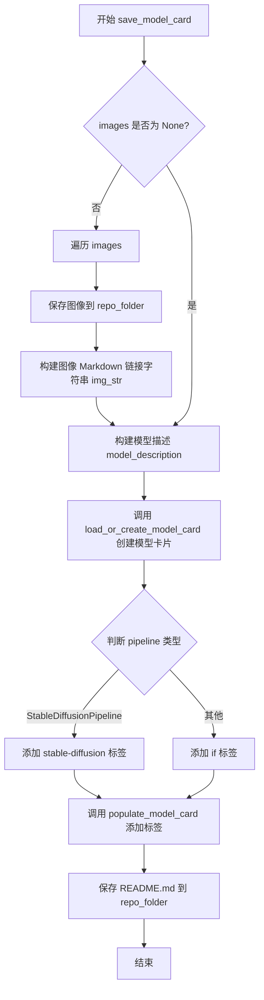

#### 带注释源码

```python
def save_model_card(
    repo_id: str,
    images: list = None,
    base_model: str = None,
    train_text_encoder=False,
    prompt: str = None,
    repo_folder: str = None,
    pipeline: DiffusionPipeline = None,
):
    """
    构建并保存 HuggingFace Hub 所需的模型卡片 (README.md)
    
    参数:
        repo_id: HuggingFace Hub 仓库 ID
        images: 示例图像列表
        base_model: 基础预训练模型
        train_text_encoder: 是否训练了文本编码器
        prompt: 训练提示词
        repo_folder: 本地仓库文件夹
        pipeline: DiffusionPipeline 实例，用于判断模型类型
    """
    
    # 初始化图像字符串，用于 Markdown 展示
    img_str = ""
    
    # 如果提供了图像列表，保存图像并生成 Markdown 链接
    if images is not None:
        for i, image in enumerate(images):
            # 保存图像到本地仓库文件夹
            image.save(os.path.join(repo_folder, f"image_{i}.png"))
            # 生成 Markdown 格式的图像引用
            img_str += f"\n"

    # 构建模型描述文本，包含模型来源、训练提示词和示例图像
    model_description = f"""
# DreamBooth - {repo_id}

This is a dreambooth model derived from {base_model}. The weights were trained on {prompt} using [DreamBooth](https://dreambooth.github.io/).
You can find some example images in the following. \n
{img_str}

DreamBooth for the text encoder was enabled: {train_text_encoder}.
"""
    
    # 加载或创建模型卡片，使用 diffusers 工具函数
    model_card = load_or_create_model_card(
        repo_id_or_path=repo_id,
        from_training=True,
        license="creativeml-openrail-m",
        base_model=base_model,
        prompt=prompt,
        model_description=model_description,
        inference=True,
    )

    # 定义基础标签
    tags = ["text-to-image", "dreambooth", "diffusers-training"]
    
    # 根据 pipeline 类型添加特定标签
    if isinstance(pipeline, StableDiffusionPipeline):
        tags.extend(["stable-diffusion", "stable-diffusion-diffusers"])
    else:
        # 对于非 StableDiffusion pipeline（如 DeepFloyd IF）
        tags.extend(["if", "if-diffusers"])
    
    # 填充模型卡片的标签
    model_card = populate_model_card(model_card, tags=tags)

    # 保存模型卡片为 README.md
    model_card.save(os.path.join(repo_folder, "README.md"))
```


### `log_validation`

在训练过程中运行推理以验证模型效果，生成指定数量的图像并记录到 TensorBoard/WandB 可视化跟踪器，同时支持预计算和动态生成的文本嵌入。

参数：

- `text_encoder`：`torch.nn.Module`，用于将文本提示编码为嵌入向量的文本编码器模型
- `tokenizer`：transformers 库的分词器，用于将文本转换为 token ID
- `unet`：`UNet2DConditionModel`，主要的去噪 UNet 模型，用于图像生成
- `vae`：`AutoencoderKL` 或 `None`，变分自编码器，用于将图像编码到潜在空间（可选）
- `args`：命名空间对象，包含训练配置参数（如 `num_validation_images`、`validation_prompt`、`validation_images`、`pre_compute_text_embeddings` 等）
- `accelerator`：`Accelerator`，分布式训练加速器，提供设备管理和状态跟踪
- `weight_dtype`：`torch.dtype`，模型权重的数据类型（float32/float16/bfloat16）
- `global_step`：`int`，当前训练的全局步数，用于记录到日志
- `prompt_embeds`：`torch.Tensor` 或 `None`，预计算的文本嵌入向量（当 `pre_compute_text_embeddings` 为 True 时使用）
- `negative_prompt_embeds`：`torch.Tensor` 或 `None`，预计算的负向提示词嵌入（用于无分类器引导）

返回值：`list[PIL.Image]`，生成的验证图像列表

#### 流程图

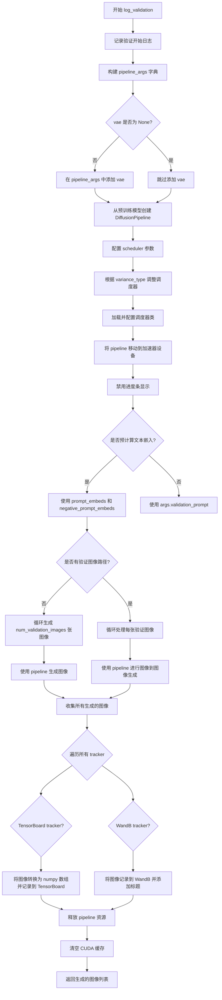

#### 带注释源码

```python
def log_validation(
    text_encoder,
    tokenizer,
    unet,
    vae,
    args,
    accelerator,
    weight_dtype,
    global_step,
    prompt_embeds,
    negative_prompt_embeds,
):
    """
    在训练过程中运行推理以验证模型效果，并记录到 TensorBoard/WandB
    
    参数:
        text_encoder: 文本编码器模型
        tokenizer: 分词器
        unet: UNet 去噪模型
        vae: VAE 模型，可为 None
        args: 训练参数对象
        accelerator: 分布式训练加速器
        weight_dtype: 权重数据类型
        global_step: 当前训练步数
        prompt_embeds: 预计算的提示词嵌入
        negative_prompt_embeds: 负向提示词嵌入
    返回:
        生成的图像列表
    """
    # 记录验证开始信息，包括验证图像数量和提示词
    logger.info(
        f"Running validation... \n Generating {args.num_validation_images} images with prompt:"
        f" {args.validation_prompt}."
    )

    # 初始化 pipeline 参数字典
    pipeline_args = {}

    # 如果提供了 VAE，则将其添加到 pipeline 参数中
    if vae is not None:
        pipeline_args["vae"] = vae

    # 从预训练模型创建 DiffusionPipeline
    # 注意：unet 和 vae 会以 float32 重新加载
    pipeline = DiffusionPipeline.from_pretrained(
        args.pretrained_model_name_or_path,
        tokenizer=tokenizer,
        text_encoder=text_encoder,
        unet=unet,
        revision=args.revision,
        variant=args.variant,
        torch_dtype=weight_dtype,
        **pipeline_args,
    )

    # 我们在简化的学习目标上训练。如果之前预测方差，需要让 scheduler 忽略它
    scheduler_args = {}

    # 检查 scheduler 配置中的 variance_type
    if "variance_type" in pipeline.scheduler.config:
        variance_type = pipeline.scheduler.config["variance_type"]

        # 如果是学习的方差类型，替换为固定小方差
        if variance_type in ["learned", "learned_range"]:
            variance_type = "fixed_small"

        scheduler_args["variance_type"] = variance_type

    # 动态导入 diffusers 模块并获取调度器类
    module = importlib.import_module("diffusers")
    scheduler_class = getattr(module, args.validation_scheduler)
    # 从配置创建新的 scheduler 实例
    pipeline.scheduler = scheduler_class.from_config(pipeline.scheduler.config, **scheduler_args)
    
    # 将 pipeline 移动到加速器设备并禁用进度条
    pipeline = pipeline.to(accelerator.device)
    pipeline.set_progress_bar_config(disable=True)

    # 根据是否预计算文本嵌入来准备 pipeline 参数
    if args.pre_compute_text_embeddings:
        # 使用预计算的嵌入
        pipeline_args = {
            "prompt_embeds": prompt_embeds,
            "negative_prompt_embeds": negative_prompt_embeds,
        }
    else:
        # 使用动态提示词
        pipeline_args = {"prompt": args.validation_prompt}

    # 创建随机数生成器，确保可复现性
    generator = None if args.seed is None else torch.Generator(device=accelerator.device).manual_seed(args.seed)
    
    # 初始化图像列表
    images = []
    
    # 根据是否有验证图像执行不同的推理流程
    if args.validation_images is None:
        # 无验证图像：生成新图像
        for _ in range(args.num_validation_images):
            # 使用 autocast 优化推理性能
            with torch.autocast("cuda"):
                image = pipeline(**pipeline_args, num_inference_steps=25, generator=generator).images[0]
            images.append(image)
    else:
        # 有验证图像：执行图像到图像的转换
        for image in args.validation_images:
            image = Image.open(image)
            image = pipeline(**pipeline_args, image=image, generator=generator).images[0]
            images.append(image)

    # 将生成的图像记录到所有跟踪器
    for tracker in accelerator.trackers:
        if tracker.name == "tensorboard":
            # TensorBoard：转换为 numpy 数组并添加图像
            np_images = np.stack([np.asarray(img) for img in images])
            tracker.writer.add_images("validation", np_images, global_step, dataformats="NHWC")
        if tracker.name == "wandb":
            # WandB：记录图像并添加标题
            tracker.log(
                {
                    "validation": [
                        wandb.Image(image, caption=f"{i}: {args.validation_prompt}") for i, image in enumerate(images)
                    ]
                }
            )

    # 清理 pipeline 释放 GPU 内存
    del pipeline
    torch.cuda.empty_cache()

    # 返回生成的图像供后续使用（如保存到模型卡片）
    return images
```


### `import_model_class_from_model_name_or_path`

该函数根据预训练模型的配置动态导入正确的 TextEncoder 类（CLIPTextModel、RobertaSeriesModelWithTransformation 或 T5EncoderModel），以便在 DreamBooth 训练脚本中实例化正确的文本编码器模型。

参数：

- `pretrained_model_name_or_path`：`str`，预训练模型的名称或本地路径，指向 HuggingFace Hub 上的模型或本地目录
- `revision`：`str`，模型的修订版本号，用于从 Hub 获取特定版本的配置

返回值：`type`，返回对应的 TextEncoder 类（CLIPTextModel、RobertaSeriesModelWithTransformation 或 T5EncoderModel）

#### 流程图

```mermaid
flowchart TD
    A[开始: import_model_class_from_model_name_or_path] --> B[加载 TextEncoder 配置]
    B --> C[从 PretrainedConfig 读取 text_encoder 子文件夹配置]
    C --> D[获取架构名称: text_encoder_config.architectures[0]]
    D --> E{架构类型判断}
    E -->|CLIPTextModel| F[导入 CLIPTextModel from transformers]
    E -->|RobertaSeriesModelWithTransformation| G[导入 RobertaSeriesModelWithTransformation from diffusers.pipelines.alt_diffusion.modeling_roberta_series]
    E -->|T5EncoderModel| H[导入 T5EncoderModel from transformers]
    E -->|其他| I[抛出 ValueError: 不支持的模型类型]
    F --> J[返回 CLIPTextModel 类]
    G --> K[返回 RobertaSeriesModelWithTransformation 类]
    H --> L[返回 T5EncoderModel 类]
    I --> M[结束: 异常退出]
    J --> N[结束: 返回类]
    K --> N
    L --> N
```

#### 带注释源码

```python
def import_model_class_from_model_name_or_path(pretrained_model_name_or_path: str, revision: str):
    """
    根据预训练模型的配置动态导入正确的 TextEncoder 类。
    
    该函数首先加载 text_encoder 的预训练配置，然后根据配置中指定的
    架构名称（architectures[0]）来决定导入哪个具体的 TextEncoder 类。
    支持 CLIPTextModel、RobertaSeriesModelWithTransformation 和 T5EncoderModel。
    
    参数:
        pretrained_model_name_or_path (str): 预训练模型的名称或本地路径
        revision (str): 模型的修订版本号
    
    返回:
        type: 对应的 TextEncoder 类
    
    异常:
        ValueError: 当模型架构不支持时抛出
    """
    # 步骤1: 从预训练模型加载 text_encoder 的配置文件
    # 使用 PretrainedConfig.from_pretrained 读取模型配置
    # subfolder="text_encoder" 指定读取 text_encoder 子目录的配置
    # revision 参数用于获取特定版本的配置
    text_encoder_config = PretrainedConfig.from_pretrained(
        pretrained_model_name_or_path,
        subfolder="text_encoder",
        revision=revision,
    )
    
    # 步骤2: 从配置中获取模型架构名称
    # 预训练配置的 architectures 字段包含可用的架构列表
    # 取第一个元素作为要使用的架构
    model_class = text_encoder_config.architectures[0]
    
    # 步骤3: 根据架构名称动态导入并返回对应的类
    # 支持三种常见的文本编码器类型
    
    if model_class == "CLIPTextModel":
        # CLIPTextModel 用于 Stable Diffusion 等模型
        # 从 transformers 库导入 CLIPTextModel 类
        from transformers import CLIPTextModel
        
        # 返回类本身，而非实例化对象
        # 调用者可以使用此返回值进行 further 操作如 from_pretrained
        return CLIPTextModel
    
    elif model_class == "RobertaSeriesModelWithTransformation":
        # RobertaSeriesModelWithTransformation 用于 AltDiffusion 等模型
        # 从 diffusers 的 alt_diffusion 模块导入
        from diffusers.pipelines.alt_diffusion.modeling_roberta_series import RobertaSeriesModelWithTransformation
        
        return RobertaSeriesModelWithTransformation
    
    elif model_class == "T5EncoderModel":
        # T5EncoderModel 用于 DeepFloyd IF 等模型
        # 从 transformers 库导入 T5EncoderModel 类
        from transformers import T5EncoderModel
        
        return T5EncoderModel
    
    else:
        # 如果遇到不支持的架构类型，抛出明确的错误信息
        # 这有助于开发者了解当前支持的范围
        raise ValueError(f"{model_class} is not supported.")
```


### `model_has_vae`

检查预训练路径中是否包含 VAE 模型，通过检查 VAE 配置文件（config.json）是否存在于本地目录或远程模型仓库中。

参数：

- `args`：对象，包含以下属性：
  - `args.pretrained_model_name_or_path`：字符串，预训练模型的路径或 HuggingFace 模型 ID
  - `args.revision`：字符串，模型版本号（用于远程模型仓库查询）

返回值：`bool`，如果预训练路径中存在 VAE 配置文件返回 `True`，否则返回 `False`

#### 流程图

```mermaid
flowchart TD
    A[开始 model_has_vae] --> B[构造 VAE 配置文件名: vae/config.json]
    B --> C{检查 pretrained_model_name_or_path 是否为本地目录}
    C -->|是| D[拼接完整路径: {path}/vae/config.json]
    D --> E{检查文件是否存在}
    E -->|是| F[返回 True]
    E -->|否| G[返回 False]
    C -->|否| H[从远程模型仓库获取文件列表]
    H --> I{检查 siblings 中是否存在 vae/config.json}
    I -->|是| F
    I -->|否| G
```

#### 带注释源码

```python
def model_has_vae(args):
    """
    检查预训练模型路径中是否包含 VAE 模型。
    
    通过检查 VAE 配置文件 (config.json) 是否存在来判断：
    - 对于本地目录：直接检查文件系统
    - 对于远程模型：查询 HuggingFace Hub API 获取模型文件列表
    
    Args:
        args: 包含以下属性的命名空间对象:
            - pretrained_model_name_or_path (str): 预训练模型路径或 HuggingFace 模型 ID
            - revision (str): 模型版本号
            
    Returns:
        bool: 如果存在 VAE 配置文件返回 True，否则返回 False
    """
    # 构造 VAE 配置文件的标准路径 (config.json 是 diffusers 模型的配置文件名)
    config_file_name = os.path.join("vae", AutoencoderKL.config_name)
    
    # 判断是否为本地目录路径
    if os.path.isdir(args.pretrained_model_name_or_path):
        # 拼接完整的本地文件路径
        config_file_name = os.path.join(args.pretrained_model_name_or_path, config_file_name)
        # 检查本地文件系统上该文件是否存在
        return os.path.isfile(config_file_name)
    else:
        # 对于远程模型 (HuggingFace Hub 模型 ID)
        # 通过 model_info API 获取模型的兄弟文件列表
        files_in_repo = model_info(args.pretrained_model_name_or_path, revision=args.revision).siblings
        # 检查文件列表中是否存在 VAE 配置文件
        return any(file.rfilename == config_file_name for file in files_in_repo)
```


### `tokenize_prompt`

使用 Tokenizer 将文本 prompt 转换为包含 input_ids 和 attention_mask 的张量格式，以便后续编码为文本嵌入。

参数：

- `tokenizer`：`transformers.AutoTokenizer`，用于对文本进行分词的 tokenizer 对象
- `prompt`：`str`，需要 tokenize 的文本提示
- `tokenizer_max_length`：`int | None`，可选参数，指定 tokenizer 的最大长度，如果为 None 则使用 tokenizer 的默认 model_max_length

返回值：`transformers.tokenization_utils_base.BatchEncoding`，包含 `input_ids`（token ID 序列）和 `attention_mask`（注意力掩码）的批量编码对象

#### 流程图

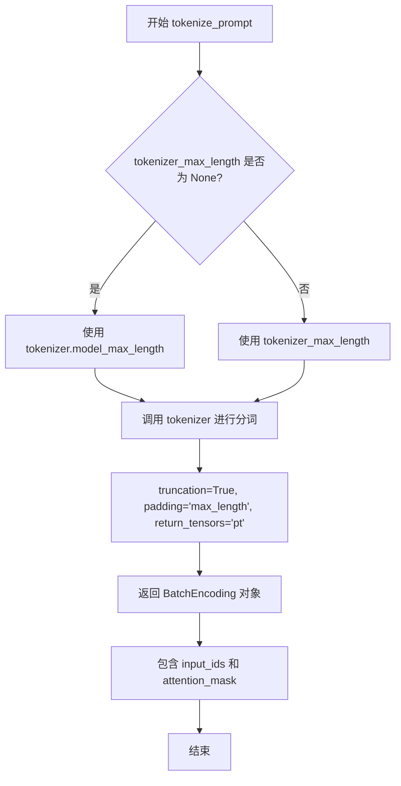

#### 带注释源码

```python
def tokenize_prompt(tokenizer, prompt, tokenizer_max_length=None):
    """
    使用给定的 tokenizer 将文本 prompt 转换为模型输入格式
    
    参数:
        tokenizer: Hugging Face transformers 库的 AutoTokenizer 实例
        prompt: 需要编码的文本字符串
        tokenizer_max_length: 可选的 最大序列长度，默认使用 tokenizer 的 model_max_length
    
    返回:
        包含 input_ids 和 attention_mask 的 BatchEncoding 对象
    """
    
    # 确定最大长度：如果传入了 tokenizer_max_length 则使用它
    # 否则使用 tokenizer 的默认最大长度（model_max_length 属性）
    if tokenizer_max_length is not None:
        max_length = tokenizer_max_length
    else:
        max_length = tokenizer.model_max_length

    # 调用 tokenizer 进行分词
    # truncation=True: 如果序列超过最大长度则截断
    # padding='max_length': 填充到最大长度
    # max_length: 指定序列的最大长度
    # return_tensors='pt': 返回 PyTorch 张量
    text_inputs = tokenizer(
        prompt,
        truncation=True,
        padding="max_length",
        max_length=max_length,
        return_tensors="pt",
    )

    # 返回包含 input_ids 和 attention_mask 的 BatchEncoding 对象
    # input_ids: token 的 ID 序列
    # attention_mask: 指示哪些位置是真实 token，哪些是 padding
    return text_inputs
```


### `encode_prompt`

使用 TextEncoder 将 token ids 转换为 embedding 向量，可选择性地使用注意力掩码进行条件编码，返回文本的嵌入表示。

参数：

- `text_encoder`：`torch.nn.Module`，文本编码器模型（如 CLIPTextModel），用于将 token IDs 转换为 embedding 向量
- `input_ids`：`torch.Tensor`，经过 tokenizer 处理后的 token IDs 张量，形状为 (batch_size, seq_len)
- `attention_mask`：`torch.Tensor`，注意力掩码张量，标识哪些位置是实际 token，哪些是填充（padding），形状与 input_ids 相同
- `text_encoder_use_attention_mask`：`bool`，可选参数，指定是否在文本编码过程中使用注意力掩码，默认为 None（不使用）

返回值：`torch.Tensor`，文本的 embedding 向量，形状为 (batch_size, seq_len, hidden_dim)，其中 hidden_dim 是文本编码器的隐藏层维度

#### 流程图

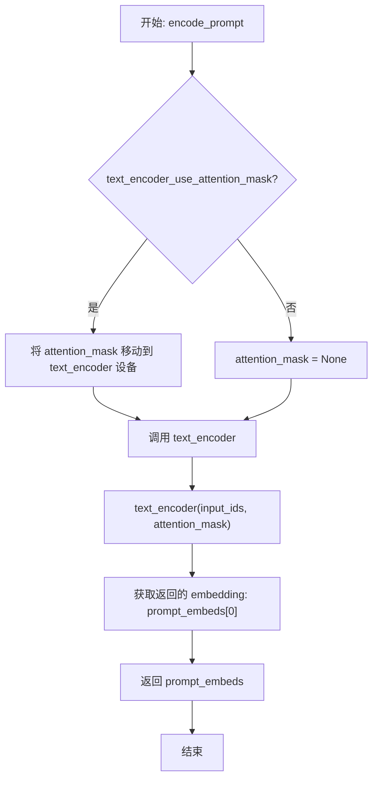

#### 带注释源码

```python
def encode_prompt(text_encoder, input_ids, attention_mask, text_encoder_use_attention_mask=None):
    """
    使用 TextEncoder 将 token ids 转换为 embedding 向量
    
    参数:
        text_encoder: 文本编码器模型
        input_ids: 输入的 token IDs
        attention_mask: 注意力掩码
        text_encoder_use_attention_mask: 是否使用注意力掩码
    
    返回:
        prompt_embeds: 文本的 embedding 向量
    """
    # 将 token IDs 移动到文本编码器所在的设备上（CPU/GPU）
    text_input_ids = input_ids.to(text_encoder.device)

    # 根据参数决定是否使用注意力掩码
    if text_encoder_use_attention_mask:
        # 将注意力掩码也移动到文本编码器所在的设备
        attention_mask = attention_mask.to(text_encoder.device)
    else:
        # 不使用注意力掩码，设置为 None
        attention_mask = None

    # 调用文本编码器获取 embedding
    # return_dict=False 返回元组 (hidden_states,)，我们只需要第一个元素
    prompt_embeds = text_encoder(
        text_input_ids,
        attention_mask=attention_mask,
        return_dict=False,
    )
    # 获取隐藏状态（第一个元素）
    prompt_embeds = prompt_embeds[0]

    # 返回文本的 embedding 向量
    return prompt_embeds
```


### `conditional_loss`

计算预测值与目标值之间的损失，支持 L2（均方误差）、Huber 和 SmoothL1 三种损失模式，并根据指定的 reduction 方式输出损失值。

参数：

- `model_pred`：`torch.Tensor`，模型预测的张量
- `target`：`torch.Tensor`，目标值的张量
- `reduction`：`str`，损失值的规约方式，可选 `"mean"`、`"sum"` 或 `"none"`，默认为 `"mean"`
- `loss_type`：`str`，损失类型，可选 `"l2"`、`"huber"` 或 `"smooth_l1"`，默认为 `"l2"`
- `huber_c`：`float`，Huber 损失和 SmoothL1 损失的超参数，用于控制切换点，默认为 `0.1`

返回值：`torch.Tensor`，计算后的损失值

#### 流程图

```mermaid
flowchart TD
    A[开始: conditional_loss] --> B{loss_type == 'l2'?}
    B -->|Yes| C[使用 F.mse_loss 计算 L2 损失]
    B -->|No| D{loss_type == 'huber'?}
    D -->|Yes| E[计算 Huber 损失: 2*huber_c\*(sqrt((pred-target)²+huber_c²) - huber_c)]
    D -->|No| F{loss_type == 'smooth_l1'?}
    F -->|Yes| G[计算 SmoothL1 损失: 2\*(sqrt((pred-target)²+huber_c²) - huber_c)]
    F -->|No| H[抛出 NotImplementedError]
    C --> I{reduction == 'mean'?}
    E --> I
    G --> I
    I -->|Yes| J[torch.mean / 返回损失]
    I -->|No| K{reduction == 'sum'?}
    K -->|Yes| L[torch.sum / 返回损失]
    K -->|No| M[返回未规约的损失]
    J --> N[结束: 返回损失]
    L --> N
    M --> N
```

#### 带注释源码

```python
def conditional_loss(
    model_pred: torch.Tensor,
    target: torch.Tensor,
    reduction: str = "mean",
    loss_type: str = "l2",
    huber_c: float = 0.1,
):
    """
    计算预测值与目标值之间的损失，支持 L2, Huber 和 SmoothL1 模式。
    
    参数:
        model_pred: 模型预测的张量
        target: 目标值的张量
        reduction: 损失值的规约方式，可选 "mean", "sum" 或 "none"
        loss_type: 损失类型，可选 "l2", "huber" 或 "smooth_l1"
        huber_c: Huber 损失和 SmoothL1 损失的超参数
    
    返回:
        计算后的损失值
    """
    # L2 损失 (均方误差 MSE)
    if loss_type == "l2":
        # 使用 PyTorch 内置的 MSE 损失函数
        loss = F.mse_loss(model_pred, target, reduction=reduction)
    
    # Huber 损失 - 对异常值更鲁棒
    elif loss_type == "huber":
        # Huber 损失的平滑版本: 2*c*(sqrt((x)^2 + c^2) - c)
        # 当误差较小时近似 L2，较大时近似 L1
        loss = 2 * huber_c * (torch.sqrt((model_pred - target) ** 2 + huber_c**2) - huber_c)
        
        # 根据 reduction 方式处理损失
        if reduction == "mean":
            loss = torch.mean(loss)
        elif reduction == "sum":
            loss = torch.sum(loss)
    
    # SmoothL1 损失 (也称为 Huber 损失的变体)
    elif loss_type == "smooth_l1":
        # SmoothL1 损失公式: 2*(sqrt((x)^2 + c^2) - c)
        loss = 2 * (torch.sqrt((model_pred - target) ** 2 + huber_c**2 - huber_c))
        
        # 根据 reduction 方式处理损失
        if reduction == "mean":
            loss = torch.mean(loss)
        elif reduction == "sum":
            loss = torch.sum(loss)
    
    # 不支持的损失类型
    else:
        raise NotImplementedError(f"Unsupported Loss Type {loss_type}")
    
    return loss
```


### `collate_fn`

该函数是 DreamBooth 数据加载器的回调函数，用于将多个样本（examples）合并为一个批次（batch），支持先验保留（prior preservation）模式，能够同时处理实例图像和类别图像的文本嵌入与像素值，并将其堆叠为 PyTorch 张量以供模型训练使用。

参数：

- `examples`：`List[Dict[str, Any]]`，从 `DreamBoothDataset` 返回的样本列表，每个样本包含实例图像、文本嵌入等
- `with_prior_preservation`：`bool`，是否启用先验保留模式，默认为 `False`

返回值：`Dict[str, torch.Tensor]`，包含批次数据的字典，键为 `input_ids`、`pixel_values` 和可选的 `attention_mask`，值为对应的 PyTorch 张量

#### 流程图

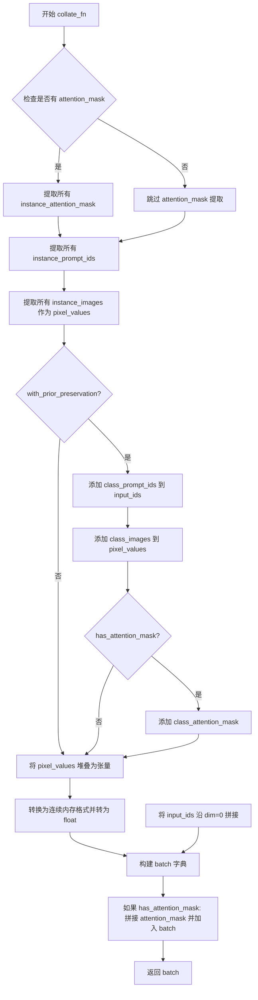

#### 带注释源码

```python
def collate_fn(examples, with_prior_preservation=False):
    """
    将多个样本合并为一个批次的回调函数
    
    参数:
        examples: 从 DreamBoothDataset 返回的样本列表
        with_prior_preservation: 是否启用先验保留模式
    
    返回:
        包含批次数据的字典
    """
    # 检查第一个样本是否包含 attention_mask，用于判断是否需要处理注意力掩码
    has_attention_mask = "instance_attention_mask" in examples[0]

    # 从所有样本中提取实例的文本嵌入 ID
    input_ids = [example["instance_prompt_ids"] for example in examples]
    
    # 从所有样本中提取实例图像像素值
    pixel_values = [example["instance_images"] for example in examples]

    # 如果存在注意力掩码，则提取所有注意力掩码
    if has_attention_mask:
        attention_mask = [example["instance_attention_mask"] for example in examples]

    # 先验保留模式：将类别样本与实例样本合并
    # 这样做是为了避免两次前向传播，提高训练效率
    if with_prior_preservation:
        # 添加类别文本嵌入 ID 到输入列表
        input_ids += [example["class_prompt_ids"] for example in examples]
        
        # 添加类别图像到像素值列表
        pixel_values += [example["class_images"] for example in examples]

        # 如果存在注意力掩码，也添加类别样本的注意力掩码
        if has_attention_mask:
            attention_mask += [example["class_attention_mask"] for example in examples]

    # 将像素值列表堆叠为 4D 张量 [batch_size, channels, height, width]
    pixel_values = torch.stack(pixel_values)
    
    # 转换为连续内存格式并转为 float32 类型
    # contiguous_format 确保张量在内存中是连续的，float() 确保精度一致
    pixel_values = pixel_values.to(memory_format=torch.contiguous_format).float()

    # 将所有文本嵌入 ID 沿批次维度拼接
    input_ids = torch.cat(input_ids, dim=0)

    # 构建批次字典，包含基本的输入 ID 和像素值
    batch = {
        "input_ids": input_ids,
        "pixel_values": pixel_values,
    }

    # 如果存在注意力掩码，则拼接并添加到批次中
    if has_attention_mask:
        attention_mask = torch.cat(attention_mask, dim=0)
        batch["attention_mask"] = attention_mask

    return batch
```


### `unwrap_model`

辅助函数，用于从 Accelerator 包装中解包模型，移除可能的编译模块包装，返回原始模型对象。

参数：

- `model`：`torch.nn.Module`，需要解包的模型对象（通常是 UNet 或 TextEncoder）

返回值：`torch.nn.Module`，解包后的原始模型对象

#### 流程图

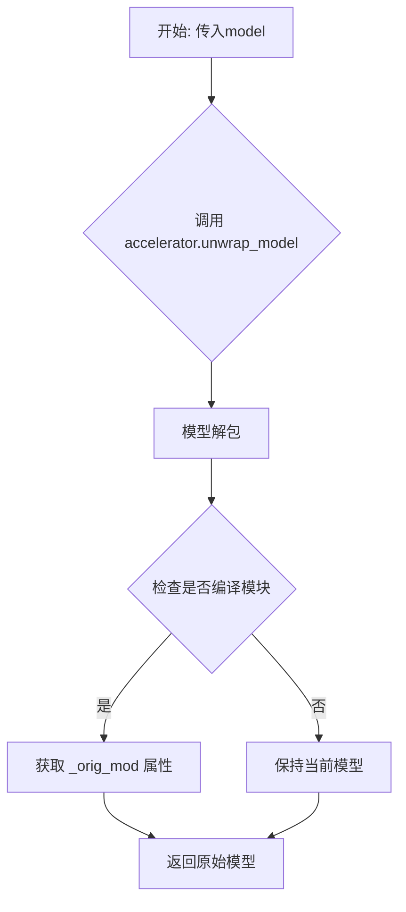

#### 带注释源码

```python
def unwrap_model(model):
    # 使用 Accelerator 的 unwrap_model 方法解包模型
    # 这会移除 Accelerator 添加的分布式训练包装
    model = accelerator.unwrap_model(model)
    
    # 检查模型是否是编译模块（torch.compile 产生的）
    # 如果是编译模块，需要获取其原始模块 _orig_mod
    # is_compiled_module 来自 diffusers.utils.torch_utils
    model = model._orig_mod if is_compiled_module(model) else model
    
    # 返回解包后的模型
    return model
```


### `save_model_hook`

自定义保存钩子，用于在分布式训练环境中正确保存 UNet 和 TextEncoder 模型。该函数作为 `accelerator.register_save_state_pre_hook` 的回调，在保存训练状态时被调用，根据模型类型将模型保存到对应的子目录（"unet" 或 "text_encoder"），确保每个模型只保存一次，避免重复存储。

参数：

-  `models`：`List[torch.nn.Module]`，待保存的模型列表，通常包含 UNet 和 TextEncoder 模型
-  `weights`：`List`，与模型对应的权重列表，用于标识已保存的模型，防止重复保存
-  `output_dir`：`str`，保存模型的输出目录路径

返回值：`None`，该函数直接修改模型状态但不返回任何值

#### 流程图

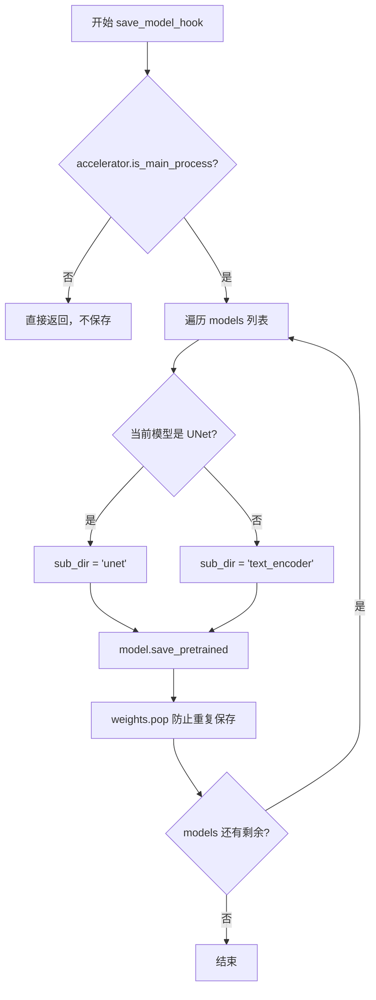

#### 带注释源码

```python
def save_model_hook(models, weights, output_dir):
    """
    自定义模型保存钩子，用于在 accelerator 保存训练状态时正确保存模型
    
    参数:
        models: 模型列表，包含待保存的 UNet 和 TextEncoder 模型
        weights: 权重列表，用于跟踪已保存的模型
        output_dir: 输出目录路径
    """
    # 仅在主进程中执行保存操作，避免多进程重复写入
    if accelerator.is_main_process:
        for model in models:
            # 判断模型类型，确定保存的子目录名称
            # 使用 isinstance 检查模型是否为 UNet 类型
            sub_dir = "unet" if isinstance(model, type(unwrap_model(unet))) else "text_encoder"
            
            # 使用 save_pretrained 方法保存模型到对应子目录
            # 这会保存模型权重和配置文件
            model.save_pretrained(os.path.join(output_dir, sub_dir))

            # 从 weights 列表中弹出当前模型，防止重复保存
            # 这是关键步骤，确保每个模型只被保存一次
            weights.pop()
```


### load_model_hook

自定义加载钩子，用于在训练过程中正确加载模型权重。该函数作为Accelerator的`register_load_state_pre_hook`回调，确保在恢复训练时能够正确加载UNet和Text Encoder的权重。

参数：

- `models`：`list`，待加载模型的列表，Accelerator会自动传入需要加载的模型列表
- `input_dir`：`str`，checkpoint保存的目录路径，用于从中加载模型权重

返回值：`None`，该函数直接修改传入的`models`列表，不返回任何值

#### 流程图

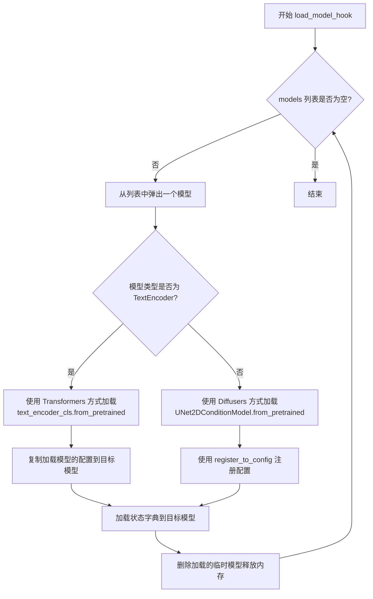

#### 带注释源码

```python
def load_model_hook(models, input_dir):
    """
    自定义模型加载钩子，用于在训练恢复时正确加载模型权重。
    
    该函数作为Accelerator的load_state_pre_hook被调用，
    负责将保存的checkpoint中的模型权重正确加载到当前的模型对象中。
    
    参数:
        models: 模型列表，由Accelerator自动传入，包含需要加载权重的模型对象
        input_dir: str，checkpoint保存的目录路径
        
    返回:
        None: 直接修改传入的models列表，不返回任何值
    """
    # 循环处理列表中的所有模型，直到列表为空
    while len(models) > 0:
        # 弹出（移除并返回）列表中的最后一个模型
        # 这样可以确保每个模型只被加载一次，避免重复加载
        model = models.pop()

        # 判断当前模型是否为TextEncoder类型
        # 使用unwrap_model处理可能存在的编译模型（_orig_mod）
        if isinstance(model, type(unwrap_model(text_encoder))):
            # 文本编码器使用Transformers库的加载方式
            # 从指定路径的text_encoder子目录加载预训练模型
            load_model = text_encoder_cls.from_pretrained(input_dir, subfolder="text_encoder")
            
            # 将加载模型的配置复制到目标模型
            # 这确保了模型的配置参数（如hidden_size、num_layers等）正确设置
            model.config = load_model.config
        else:
            # UNet等Diffusers模型使用Diffusers库的加载方式
            # 从指定路径的unet子目录加载预训练模型
            load_model = UNet2DConditionModel.from_pretrained(input_dir, subfolder="unet")
            
            # 使用register_to_config方法将加载模型的配置注册到目标模型
            # **load_model.config将配置字典解包为关键字参数
            model.register_to_config(**load_model.config)

        # 使用load_state_dict将加载模型的状态字典（权重）复制到目标模型
        # 这会覆盖目标模型的权重，使其与保存的checkpoint一致
        model.load_state_dict(load_model.state_dict())
        
        # 删除临时加载的模型对象，释放内存
        # 这是重要的内存优化步骤，避免同时保留两份模型权重
        del load_model
```


### `DreamBoothDataset.__init__`

该方法负责初始化DreamBooth数据集的核心参数，包括实例数据和类别数据的路径处理、图像变换的配置、分词器设置等，为后续的数据加载和预处理奠定基础。

参数：

- `instance_data_root`：`str` 或 `Path`，实例图像的根目录路径，用于定位训练所需的实例图像
- `instance_prompt`：`str`，实例提示词，用于描述实例图像的内容或标识符
- `tokenizer`：`PretrainedTokenizer`，预训练的分词器，用于将文本提示词转换为token IDs
- `class_data_root`：`str` 或 `Path`（可选），类别图像的根目录路径，用于先验保留训练
- `class_prompt`：`str`（可选），类别提示词，用于描述类别图像
- `class_num`：`int`（可选），类别图像的最大数量限制
- `size`：`int`（默认512），图像的目标尺寸，用于调整图像大小
- `center_crop`：`bool`（默认False），是否采用中心裁剪方式处理图像
- `encoder_hidden_states`：`torch.Tensor`（可选），预计算的实例文本嵌入向量
- `class_prompt_encoder_hidden_states`：`torch.Tensor`（可选），预计算的类别文本嵌入向量
- `tokenizer_max_length`：`int`（可选），分词器的最大长度限制

返回值：无（`None`），该方法为初始化方法，不返回任何值，仅设置实例属性

#### 流程图

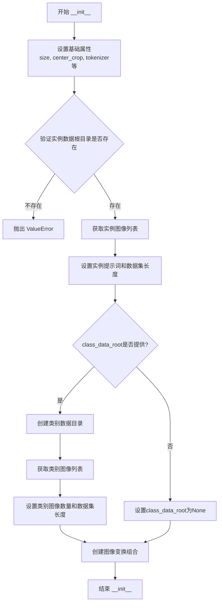

#### 带注释源码

```python
def __init__(
    self,
    instance_data_root,           # 实例图像根目录路径
    instance_prompt,               # 实例提示词文本
    tokenizer,                     # 分词器对象
    class_data_root=None,          # 类别图像根目录（可选）
    class_prompt=None,              # 类别提示词（可选）
    class_num=None,                # 类别图像数量限制（可选）
    size=512,                      # 图像目标尺寸
    center_crop=False,             # 是否中心裁剪
    encoder_hidden_states=None,    # 预计算的实例文本嵌入
    class_prompt_encoder_hidden_states=None,  # 预计算的类别文本嵌入
    tokenizer_max_length=None,     # 分词器最大长度
):
    # 1. 设置基础属性
    self.size = size                                        # 图像尺寸
    self.center_crop = center_crop                          # 中心裁剪标志
    self.tokenizer = tokenizer                               # 分词器引用
    self.encoder_hidden_states = encoder_hidden_states       # 预计算嵌入
    self.class_prompt_encoder_hidden_states = class_prompt_encoder_hidden_states  # 类别嵌入
    self.tokenizer_max_length = tokenizer_max_length         # 分词器最大长度

    # 2. 处理实例数据根目录
    self.instance_data_root = Path(instance_data_root)       # 转换为Path对象
    if not self.instance_data_root.exists():                 # 验证目录存在性
        raise ValueError(f"Instance {self.instance_data_root} images root doesn't exists.")

    # 3. 获取实例图像文件列表
    self.instance_images_path = list(Path(instance_data_root).iterdir())  # 列出所有图像文件
    self.num_instance_images = len(self.instance_images_path)  # 统计实例图像数量
    self.instance_prompt = instance_prompt                    # 保存实例提示词
    self._length = self.num_instance_images                  # 初始化数据集长度

    # 4. 处理类别数据（如果提供）
    if class_data_root is not None:
        self.class_data_root = Path(class_data_root)         # 转换为Path对象
        self.class_data_root.mkdir(parents=True, exist_ok=True)  # 创建目录
        self.class_images_path = list(self.class_data_root.iterdir())  # 获取类别图像列表
        
        # 设置类别图像数量
        if class_num is not None:
            self.num_class_images = min(len(self.class_images_path), class_num)  # 取较小值
        else:
            self.num_class_images = len(self.class_images_path)  # 使用实际数量
        
        # 更新数据集长度为较大值，确保数据迭代
        self._length = max(self.num_class_images, self.num_instance_images)
        self.class_prompt = class_prompt                      # 保存类别提示词
    else:
        self.class_data_root = None                          # 未提供类别数据

    # 5. 创建图像变换组合
    # 变换流程：调整大小 -> 裁剪 -> 转换为Tensor -> 归一化
    self.image_transforms = transforms.Compose(
        [
            transforms.Resize(size, interpolation=transforms.InterpolationMode.BILINEAR),  # 调整图像大小
            transforms.CenterCrop(size) if center_crop else transforms.RandomCrop(size),   # 裁剪方式
            transforms.ToTensor(),                                                        # 转为张量
            transforms.Normalize([0.5], [0.5]),                                         # 归一化到[-1,1]
        ]
    )
```


### `DreamBoothDataset.__len__`

该方法返回 DreamBoothDataset 数据集的长度，用于 PyTorch DataLoader 确定一个 epoch 中的迭代次数。当启用先验保留（prior preservation）时，返回实例图像数量与类别图像数量的较大值；否则返回实例图像数量。

参数：

- `self`：`DreamBoothDataset` 实例，无需显式传递

返回值：`int`，返回数据集包含的样本总数

#### 流程图

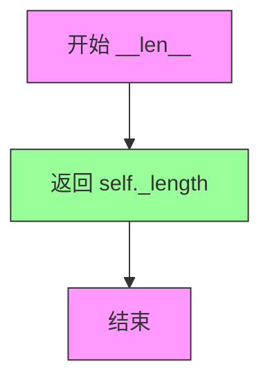

#### 带注释源码

```python
def __len__(self):
    """
    返回数据集的长度。
    
    此方法由 PyTorch DataLoader 调用，用于确定每个 epoch 中的迭代次数。
    _length 在 __init__ 中被设置为：
    - 如果存在 class_data_root（先验保留模式）：max(num_class_images, num_instance_images)
    - 否则：num_instance_images
    
    Returns:
        int: 数据集中的样本总数
    """
    return self._length
```


### `DreamBoothDataset.__getitem__`

根据索引获取图像和文本嵌入，用于DreamBooth模型的微调训练数据准备。

参数：

- `index`：`int`，数据集中的索引位置，用于获取对应的实例图像和（可选的）类别图像

返回值：`dict`，包含以下键值的字典：
  - `instance_images`：处理后的实例图像张量
  - `instance_prompt_ids`：实例提示的token IDs
  - `instance_attention_mask`：实例提示的注意力掩码（如果存在）
  - `class_images`：处理后的类别图像张量（如果class_data_root存在）
  - `class_prompt_ids`：类别提示的token IDs（如果class_data_root存在）
  - `class_attention_mask`：类别提示的注意力掩码（如果存在）

#### 流程图

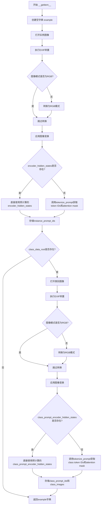

#### 带注释源码

```python
def __getitem__(self, index):
    """
    根据索引获取训练样本。
    
    参数:
        index: 数据集中的索引位置
        
    返回:
        包含图像和文本嵌入的字典，用于模型训练
    """
    # 初始化结果字典
    example = {}
    
    # ============ 处理实例图像 ============
    # 计算实际索引（支持循环遍历）
    instance_image = Image.open(self.instance_images_path[index % self.num_instance_images])
    # 处理EXIF方向信息，确保图像方向正确
    instance_image = exif_transpose(instance_image)
    
    # 确保图像为RGB模式（处理PNG或灰度图等）
    if not instance_image.mode == "RGB":
        instance_image = instance_image.convert("RGB")
    
    # 应用图像变换：Resize -> Crop -> ToTensor -> Normalize
    example["instance_images"] = self.image_transforms(instance_image)
    
    # ============ 处理实例文本提示 ============
    if self.encoder_hidden_states is not None:
        # 预计算的文本嵌入（已由主进程提前计算）
        example["instance_prompt_ids"] = self.encoder_hidden_states
    else:
        # 实时tokenize文本提示
        text_inputs = tokenize_prompt(
            self.tokenizer, self.instance_prompt, tokenizer_max_length=self.tokenizer_max_length
        )
        example["instance_prompt_ids"] = text_inputs.input_ids
        example["instance_attention_mask"] = text_inputs.attention_mask
    
    # ============ 处理类别图像（Prior Preservation）===========
    if self.class_data_root:
        # 打开类别图像并循环遍历
        class_image = Image.open(self.class_images_path[index % self.num_class_images])
        class_image = exif_transpose(class_image)
        
        if not class_image.mode == "RGB":
            class_image = class_image.convert("RGB")
        
        example["class_images"] = self.image_transforms(class_image)
        
        # 处理类别文本提示
        if self.class_prompt_encoder_hidden_states is not None:
            example["class_prompt_ids"] = self.class_prompt_encoder_hidden_states
        else:
            class_text_inputs = tokenize_prompt(
                self.tokenizer, self.class_prompt, tokenizer_max_length=self.tokenizer_max_length
            )
            example["class_prompt_ids"] = class_text_inputs.input_ids
            example["class_attention_mask"] = class_text_inputs.attention_mask
    
    return example
```


### `PromptDataset.__init__`

该方法用于初始化提示词数据集，接收提示词内容和样本数量，将这些信息存储为实例属性，以供后续生成类图像时使用。

参数：

- `prompt`：`str`，用于生成类图像的提示词文本
- `num_samples`：`int`，需要生成的样本数量

返回值：`None`，无返回值（初始化方法）

#### 流程图

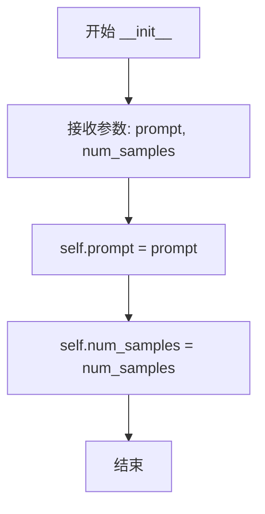

#### 带注释源码

```python
def __init__(self, prompt, num_samples):
    """
    初始化 PromptDataset 实例。

    参数:
        prompt (str): 用于生成类图像的提示词文本。
        num_samples (int): 需要生成的样本数量。

    返回:
        None: 该方法不返回任何值，仅初始化实例属性。
    """
    # 将传入的提示词存储为实例属性
    self.prompt = prompt
    # 将传入的样本数量存储为实例属性
    self.num_samples = num_samples
```


### `PromptDataset.__len__`

返回数据集中预生成的提示词样本数量，使 DataLoader 能够确定遍历数据集所需的迭代次数。

参数：

- `self`：`PromptDataset`，方法所属的实例对象（Python 自动传递）

返回值：`int`，返回数据集中要生成的样本数量，即 `num_samples`。

#### 流程图

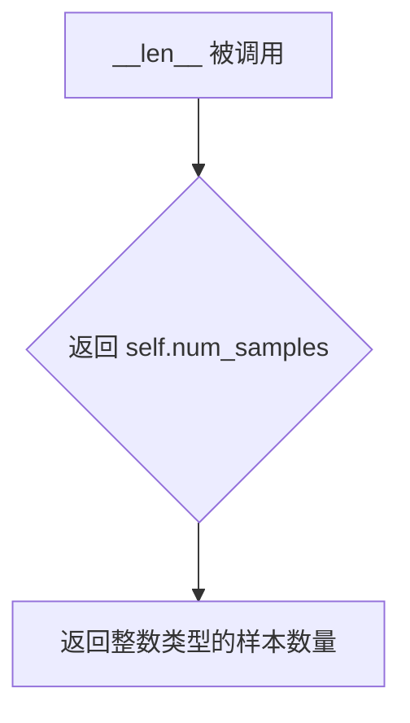

#### 带注释源码

```python
def __len__(self):
    """
    返回数据集中预生成的提示词样本数量。
    
    此方法由 Python 的 len() 函数调用，用于告知 DataLoader 
    数据集的大小，以便正确计算 epoch 数量和批次数。
    
    Returns:
        int: 数据集中要生成的样本数量，由构造时的 num_samples 参数决定。
    """
    return self.num_samples
```


### `PromptDataset.__getitem__`

该方法根据给定的索引返回一个包含提示词和索引的示例字典，用于在多个GPU上生成类别图像。

参数：

- `index`：`int`，要检索的样本索引

返回值：`dict`，包含 "prompt" 和 "index" 键的字典，描述提示词内容和对应的索引

#### 流程图

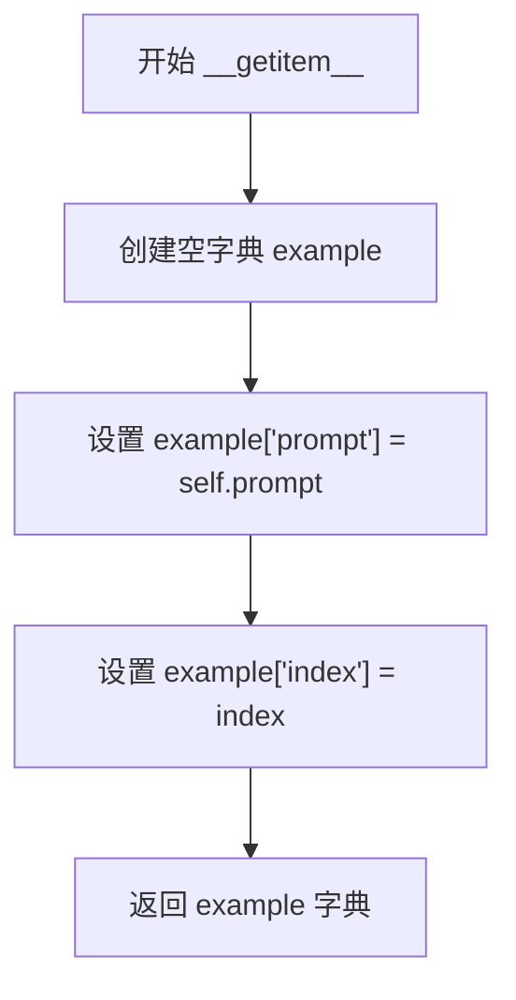

#### 带注释源码

```python
def __getitem__(self, index):
    """
    根据索引获取数据集中的一个样本。
    
    参数:
        index: int, 样本的索引位置
        
    返回:
        dict: 包含 'prompt' 和 'index' 键的字典，用于生成类别图像
    """
    # 初始化空字典用于存储样本数据
    example = {}
    
    # 将实例提示词存入字典
    example["prompt"] = self.prompt
    
    # 将样本索引存入字典
    example["index"] = index
    
    # 返回包含提示词和索引的字典
    return example
```

## 关键组件


### DreamBoothDataset

用于准备Fine-tuning模型的实例和类图像及其提示的数据集类，包含图像预处理和提示Token化功能。

### PromptDataset

一个简单的数据集，用于在多个GPU上生成类图像时准备提示。

### save_model_card

保存模型卡片到Hub，包含模型描述、训练信息和示例图像。

### log_validation

运行验证流程，生成指定数量的验证图像并记录到跟踪器（TensorBoard或WandB）。

### import_model_class_from_model_name_or_path

根据预训练模型名称或路径导入正确的文本编码器类（CLIPTextModel、RobertaSeriesModelWithTransformation或T5EncoderModel）。

### parse_args

解析命令行参数，定义所有训练相关配置选项。

### collate_fn

整理批次数据，将实例和类图像/提示连接在一起，用于先验保留损失计算。

### model_has_vae

检查预训练模型是否包含VAE组件。

### tokenize_prompt

使用分词器对提示进行分词，返回input_ids和attention_mask。

### encode_prompt

使用文本编码器将分词后的提示编码为嵌入向量。

### conditional_loss

计算条件损失，支持L2、Huber和Smooth L1三种损失类型。

### main

主训练函数，包含完整的DreamBooth训练流程：数据准备、模型加载、训练循环、验证和模型保存。

### 张量索引与惰性加载

在DreamBoothDataset的__getitem__方法中使用模运算实现惰性索引，避免一次性加载所有图像。

### 反量化支持

代码中未发现显式的反量化实现。模型权重通过weight_dtype（fp16/bf16/fp32）进行精度控制，但这属于混合精度训练范畴，非专门的反量化处理。

### 量化策略

代码中未发现专门的量化策略实现。仅通过Accelerator的mixed_precision参数支持fp16和bf16混合精度训练。

## 问题及建议


### 已知问题

- **main函数过于庞大**：超过1500行代码，包含过多的训练逻辑、验证逻辑、模型加载保存逻辑，缺乏单一职责原则，导致代码难以维护和测试。
- **重复的条件检查**：在训练循环中每次迭代都检查`args.with_prior_preservation`、`args.loss_type`等条件判断，这些可以在循环外预先处理以减少运行时开销。
- **缺少错误恢复机制**：对于数据加载失败、模型加载失败等情况缺乏完善的异常捕获和处理，可能导致训练意外中断无法恢复。
- **硬编码的验证参数**：验证时的推理步数固定为25（`num_inference_steps=25`），缺乏灵活性。
- **数据预处理效率**：图像预处理在每次`__getitem__`时进行，且`tokenize_prompt`在每个样本上都可能重复调用，可以预先缓存。
- **日志记录开销**：在训练循环中使用`progress_bar.set_postfix`和`accelerator.log`可能产生额外开销，特别是对于高频迭代。
- **checkpoint清理逻辑**：删除旧checkpoint时使用`shutil.rmtree`可能导致I/O瓶颈，且没有异步处理。
- **类型提示不完整**：部分函数缺少参数类型和返回值类型标注，如`collate_fn`和`tokenize_prompt`。
- **魔法数字**：代码中存在多处硬编码数值（如`huber_c默认值0.1`、噪声偏移`0.1`等），缺乏配置统一管理。
- **未使用的变量**：`PromptDataset`类中的`index`属性在生成类图像后未被实际使用。

### 优化建议

- **重构main函数**：将main函数拆分为多个独立模块函数，如`setup_models()`、`prepare_dataset()`、`training_loop()`、`save_checkpoint()`等，提高代码可读性和可测试性。
- **循环外预处理**：将训练循环内的条件判断提前到循环外，例如预先构建不同的损失计算函数或使用函数式编程模式。
- **添加异常处理包装**：为关键操作（模型加载、数据加载、checkpoint保存）添加try-except块和重试机制。
- **参数化验证配置**：将验证推理步数等参数暴露给命令行参数或配置文件。
- **缓存预计算结果**：对于`tokenize_prompt`等可预计算的内容，在Dataset初始化时完成缓存，避免重复计算。
- **异步Checkpoint清理**：使用后台线程或异步I/O处理旧checkpoint的删除操作。
- **统一配置管理**：创建配置类或 dataclass 集中管理魔法数字和阈值。
- **补充类型标注**：为所有函数添加完整的类型提示，提高代码可维护性。
- **优化日志频率**：对于大规模训练，可考虑降低日志记录频率或使用采样方式记录。
- **移除未使用代码**：清理`PromptDataset`中未使用的`index`属性或赋予其实际用途。


## 其它


### 设计目标与约束

本代码的核心设计目标是通过DreamBooth技术实现Stable Diffusion模型的微调，使其能够学习特定概念（通过instance images和instance prompt指定）同时保留原始模型生成能力（通过class images和prior preservation loss实现）。主要设计约束包括：1）必须使用HuggingFace Diffusers库；2）支持分布式训练（通过Accelerator）；3）支持混合精度训练（fp16/bf16）；4）text encoder训练与pre-compute embeddings不能同时使用；5）gradient checkpointing与text encoder训练在分布式环境下有特殊限制。

### 错误处理与异常设计

代码中的错误处理主要体现在以下几个方面：1）参数校验：在parse_args中对必填参数进行校验（如instance_data_dir、instance_prompt必须同时存在）；2）版本检查：通过check_min_version确保diffusers最小版本；3）导入检查：对可选依赖（如wandb、xformers、bitsandbytes）进行try-except处理；4）配置文件检查：通过model_has_vae函数检查预训练模型是否包含VAE；5）分布式训练限制检查：text encoder训练与gradient accumulation不能同时使用；6）Warning提示：class_data_dir和class_prompt在没有prior preservation时会被警告。

### 数据流与状态机

训练数据流遵循以下路径：1）数据准备阶段：DreamBoothDataset类负责加载instance images和class images，进行图像预处理（resize、crop、normalize）；2）数据聚合阶段：collate_fn函数将batch内的instance和class数据合并（如果启用prior preservation）；3）模型输入阶段：将pixel values通过VAE编码到latent空间（如有VAE），添加噪声得到noisy model input；4）条件编码阶段：通过text encoder将prompt编码为encoder_hidden_states；5）预测与损失计算阶段：UNet预测噪声残差，根据prediction_type计算target，计算loss（如有prior preservation则叠加prior loss）；6）优化阶段：执行backward、gradient clip、optimizer step、lr scheduler step。状态机方面，训练循环维护global_step、first_epoch状态，支持从checkpoint恢复训练。

### 外部依赖与接口契约

主要外部依赖包括：1）核心库：torch、numpy、transformers、diffusers、accelerate；2）工具库：PIL（图像处理）、tqdm（进度条）、packaging（版本解析）、huggingface_hub（模型上传）；3）可选库：wandb（远程日志）、xformers（高效注意力）、bitsandbytes（8位优化器）。接口契约方面：1）预训练模型必须符合HuggingFace标准格式（包含tokenizer、text_encoder、unet、vae、scheduler子目录）；2）数据集格式：instance_data_dir包含训练图片，class_data_dir包含类别图片（如使用prior preservation）；3）输出格式：checkpoint保存为accelerator格式，最终模型保存为DiffusionPipeline格式。

### 性能优化策略

代码包含多种性能优化策略：1）混合精度训练：通过--mixed_precision参数支持fp16和bf16；2）Gradient Checkpointing：通过--gradient_checkpointing减少显存占用；3）xFormers加速：通过--enable_xformers_memory_efficient_attention启用高效注意力机制；4）8-bit Adam：通过--use_8bit_adam减少优化器显存占用；5）梯度累积：通过--gradient_accumulation_steps实现大batch训练；6）TF32加速：通过--allow_tf32启用Ampere GPU张量核心加速；7）预计算Text Embeddings：通过--pre_compute_text_embeddings减少训练时text encoder的GPU占用；8）梯度设置为None：通过--set_grads_to_none减少显存碎片。

### 安全性考虑

代码在安全性方面有以下考虑：1）hub token保护：在report_to为wandb时禁止使用hub_token（安全风险）；2）模型权重精度检查：确保trainable模型为float32精度，避免混合精度导致的数值问题；3）分布式安全：检查gradient accumulation与text encoder训练的兼容性；4）文件系统安全：创建输出目录时使用exist_ok=True避免覆盖；5）内存安全：在关键位置调用torch.cuda.empty_cache()和gc.collect()释放显存。

### 配置文件与参数说明

关键训练参数包括：1）模型参数：pretrained_model_name_or_path（必填）、revision、variant；2）数据参数：instance_data_dir（必填）、instance_prompt（必填）、class_data_dir、class_prompt、with_prior_preservation；3）训练参数：train_batch_size、learning_rate、max_train_steps、num_train_epochs、gradient_accumulation_steps、gradient_checkpointing；4）优化参数：adam_beta1/beta2、adam_weight_decay、adam_epsilon、max_grad_norm、lr_scheduler；5）保存与恢复参数：checkpointing_steps、checkpoints_total_limit、resume_from_checkpoint；6）验证参数：validation_prompt、validation_steps、num_validation_images；7）推理参数：validation_scheduler、pre_compute_text_embeddings。

### 测试与验证策略

代码内置验证机制：1）定期验证：每validation_steps执行一次log_validation，生成指定数量图片；2）多tracker支持：支持tensorboard和wandb记录验证图片；3）Loss监控：通过accelerator.log记录loss和学习率；4）Checkpoint验证：保存checkpoint时可选择用于推理；5）Class图像生成验证：prior preservation时验证生成的class图像质量。

### 版本兼容性

代码对版本有以下要求：1）Python：建议Python 3.8+；2）PyTorch：支持TF32需要PyTorch 1.7+；3）Diffusers：最低版本0.28.0.dev0（通过check_min_version验证）；4）CUDA：BF16需要CUDA 11.0+和Ampere架构GPU；5）Transformers：需要支持CLIPTextModel、RobertaSeriesModelWithTransformation、T5EncoderModel等文本编码器架构。

### 部署与运维建议

部署时需考虑：1）多GPU训练：设置LOCAL_RANK环境变量或使用torchrun；2）存储规划：预留足够空间存储checkpoints（可通过checkpoints_total_limit限制）；3）日志配置：logging_dir指定TensorBoard日志目录；4）模型上传：使用push_to_hub自动同步到HuggingFace Hub；5）资源监控：建议监控GPU显存使用情况（可通过--train_batch_size调整）；6）中断恢复：支持通过resume_from_checkpoint从任意checkpoint恢复训练。

    