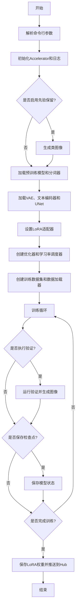
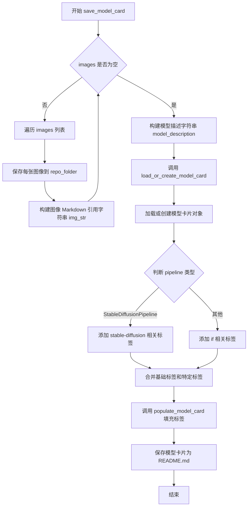
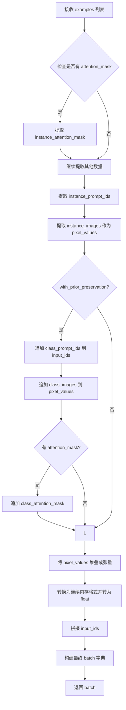
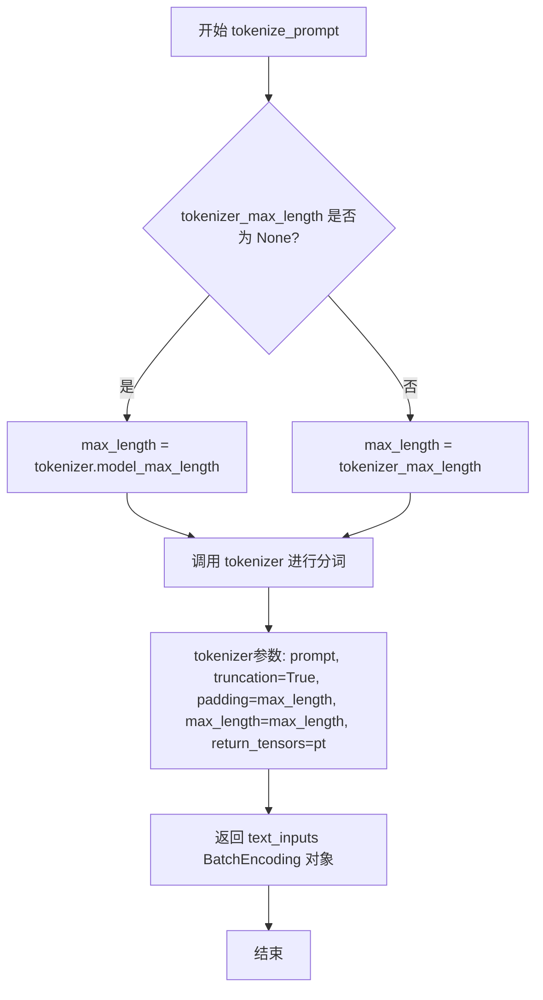
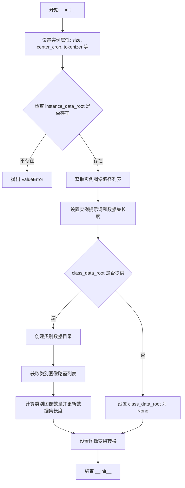
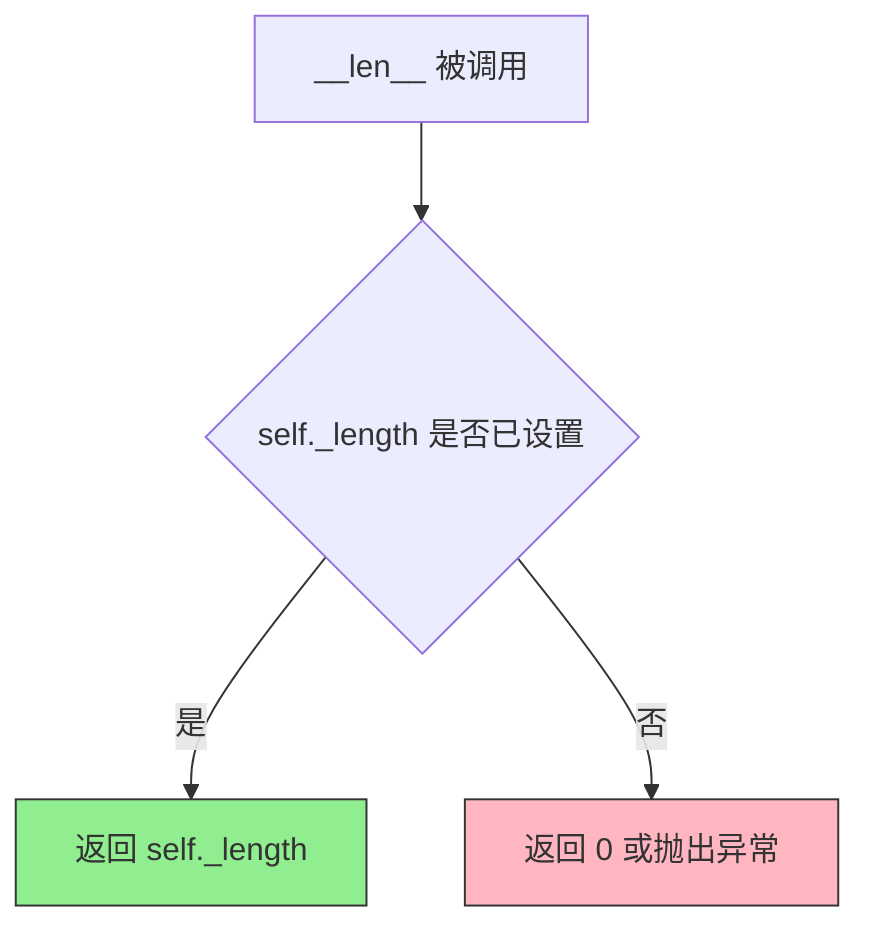
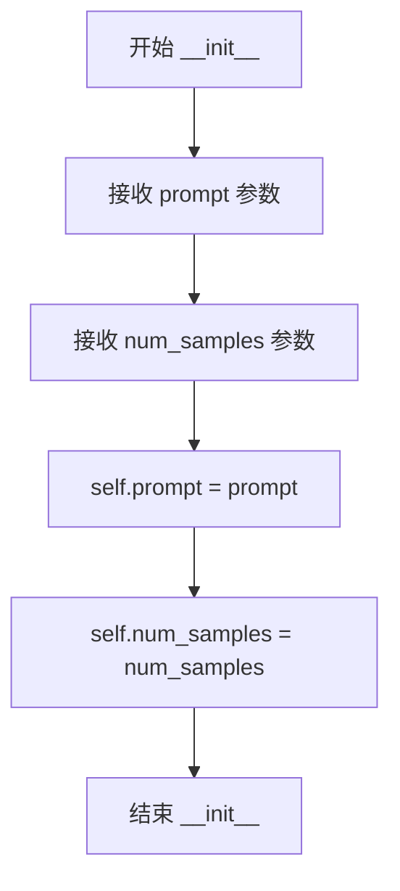
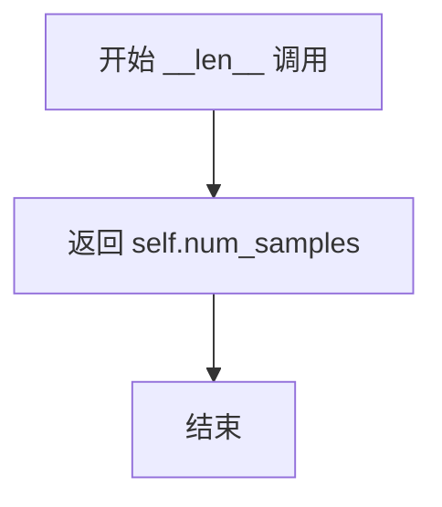

```mermaid
flowchart TD
    A[开始训练] --> B[验证参数安全性]
    B --> C[创建Accelerator加速器]
    C --> D[设置日志和随机种子]
    D --> E{是否启用Prior Preservation?}
    E -->|是| F[生成类别图像]
    E -->|否| G[跳过生成类别图像]
    F --> G
    G --> H[创建输出目录]
    H --> I[加载Tokenizer]
    I --> J[加载Text Encoder类]
    J --> K[加载Scheduler和基础模型]
    K --> L[冻结非训练参数]
    L --> M[设置权重数据类型]
    M --> N{是否启用xformers?}
    N -->|是| O[启用高效注意力]
    N -->|否| P[跳过xformers]
    O --> P
    P --> Q[启用梯度检查点]
    Q --> R[添加LoRA适配器]
    R --> S{是否训练Text Encoder?}
    S -->|是| T[添加Text Encoder LoRA]
    S -->|否| U[跳过Text Encoder LoRA]
    T --> U
    U --> V[注册保存/加载钩子]
    V --> W[配置优化器]
    W --> X{是否预计算Text Embeddings?}
    X -->|是| Y[预计算Embeddings]
    X -->|否| Z[使用即时编码]
    Y --> Z
    Z --> AA[创建数据集和数据加载器]
    AA --> AB[配置学习率调度器]
    AB --> AC[准备加速器]
    AC --> AD[初始化跟踪器]
    AD --> AE[训练循环开始]
    AE --> AF{是否恢复检查点?}
    AF -->|是| AG[加载检查点]
    AF -->|否| AH[从头开始]
    AG --> AI[开始训练 epoch]
    AH --> AI
    AI --> AJ[遍历训练数据]
    AJ --> AK[前向传播和损失计算]
    AK --> AL[反向传播和优化]
    AL --> AM{达到检查点步数?}
    AM -->|是| AN[保存检查点]
    AM -->|否| AO[继续训练]
    AN --> AO
    AO --> AP{达到最大训练步数?}
    AP -->|否| AJ
    AP -->|是| AQ[训练循环结束]
    AQ --> AR{是否需要验证?}
    AR -->|是| AS[运行验证]
    AR -->|否| AT[跳过验证]
    AS --> AT
    AT --> AU[保存LoRA权重]
    AU --> AV[推送至Hub?]
    AV -->|是| AW[上传模型和卡片]
    AV -->|否| AX[结束训练]
    AW --> AX
```

# `diffusers\examples\research_projects\scheduled_huber_loss_training\dreambooth\train_dreambooth_lora.py` 详细设计文档

这是一个DreamBooth LoRA训练脚本，用于使用LoRA（Low-Rank Adaptation）技术对Stable Diffusion模型进行微调。通过少量实例图像和提示词，让模型学习特定概念，同时支持先验保留（prior preservation）来保持模型的生成能力。

## 整体流程



## 类结构

```
DreamBoothDataset (数据集类)
PromptDataset (提示数据集类)
辅助函数
├── save_model_card
├── log_validation
├── import_model_class_from_model_name_or_path
├── parse_args
├── collate_fn
├── tokenize_prompt
├── encode_prompt
├── conditional_loss
└── main
```

## 全局变量及字段


### `logger`
    
日志记录器，用于记录训练过程中的信息

类型：`logging.Logger`
    


### `noise_scheduler`
    
噪声调度器，用于控制扩散模型中的噪声添加和去除过程

类型：`DDPMScheduler`
    


### `text_encoder`
    
文本编码器，用于将文本提示转换为嵌入向量

类型：`PreTrainedModel`
    


### `vae`
    
变分自编码器，用于将图像编码到潜在空间和解码回图像

类型：`AutoencoderKL`
    


### `unet`
    
条件UNet模型，用于预测噪声残差

类型：`UNet2DConditionModel`
    


### `tokenizer`
    
分词器，用于将文本分割成token序列

类型：`AutoTokenizer`
    


### `optimizer`
    
AdamW优化器，用于更新模型参数

类型：`torch.optim.AdamW`
    


### `lr_scheduler`
    
学习率调度器，用于动态调整学习率

类型：`torch.optim.lr_scheduler._LRScheduler`
    


### `train_dataset`
    
训练数据集，包含实例图像和类图像及其对应的提示词

类型：`DreamBoothDataset`
    


### `train_dataloader`
    
训练数据加载器，用于批量加载训练数据

类型：`torch.utils.data.DataLoader`
    


### `accelerator`
    
Accelerator实例，用于简化分布式训练和混合精度训练

类型：`Accelerator`
    


### `weight_dtype`
    
权重数据类型，用于控制模型参数的数据精度

类型：`torch.dtype`
    


### `args`
    
命令行参数对象，包含所有训练配置参数

类型：`Namespace`
    


### `DreamBoothDataset.size`
    
图像分辨率

类型：`int`
    


### `DreamBoothDataset.center_crop`
    
是否中心裁剪

类型：`bool`
    


### `DreamBoothDataset.tokenizer`
    
分词器实例

类型：`AutoTokenizer`
    


### `DreamBoothDataset.encoder_hidden_states`
    
预计算的编码器隐藏状态

类型：`torch.Tensor`
    


### `DreamBoothDataset.class_prompt_encoder_hidden_states`
    
预计算的类提示编码器隐藏状态

类型：`torch.Tensor`
    


### `DreamBoothDataset.tokenizer_max_length`
    
分词器最大长度

类型：`int`
    


### `DreamBoothDataset.instance_data_root`
    
实例数据根目录

类型：`Path`
    


### `DreamBoothDataset.instance_images_path`
    
实例图像路径列表

类型：`list`
    


### `DreamBoothDataset.num_instance_images`
    
实例图像数量

类型：`int`
    


### `DreamBoothDataset.instance_prompt`
    
实例提示词

类型：`str`
    


### `DreamBoothDataset.class_data_root`
    
类数据根目录

类型：`Path`
    


### `DreamBoothDataset.class_images_path`
    
类图像路径列表

类型：`list`
    


### `DreamBoothDataset.num_class_images`
    
类图像数量

类型：`int`
    


### `DreamBoothDataset.class_prompt`
    
类提示词

类型：`str`
    


### `DreamBoothDataset.image_transforms`
    
图像变换组合

类型：`transforms.Compose`
    


### `DreamBoothDataset._length`
    
数据集长度

类型：`int`
    


### `PromptDataset.prompt`
    
提示词

类型：`str`
    


### `PromptDataset.num_samples`
    
样本数量

类型：`int`
    
    

## 全局函数及方法


### `save_model_card`

该函数用于在DreamBooth LoRA训练完成后，将模型相关信息（包括训练配置、示例图像等）整理为HuggingFace Hub的模型卡片（Model Card），并保存为README.md文件，以便其他用户了解模型用途和使用方法。

参数：

- `repo_id`：`str`，HuggingFace Hub上的仓库唯一标识符
- `images`：`List[Image] | None`，训练过程中生成的示例图像列表，默认为None
- `base_model`：`str`，LoRA权重所基于的基础预训练模型名称或路径
- `train_text_encoder`：`bool`，训练时是否启用了文本编码器的LoRA微调，默认为False
- `prompt`：`str`，训练时使用的主提示词（instance prompt）
- `repo_folder`：`str | None`，本地仓库文件夹路径，用于保存模型卡片和示例图像，默认为None
- `pipeline`：`DiffusionPipeline | None`，扩散管道实例，用于判断模型类型并添加相应的标签，默认为None

返回值：`None`，该函数无返回值，直接将模型卡片写入本地文件

#### 流程图



#### 带注释源码

```python
def save_model_card(
    repo_id: str,
    images=None,
    base_model=str,
    train_text_encoder=False,
    prompt=str,
    repo_folder=None,
    pipeline: DiffusionPipeline = None,
):
    """
    保存模型卡片到本地文件夹，并生成对应的 README.md 文件。
    
    该函数完成以下任务：
    1. 将训练生成的示例图像保存到指定目录
    2. 构建模型的描述信息，包括基础模型、训练提示词等
    3. 创建或加载模型卡片对象
    4. 根据管道类型添加相应的标签
    5. 将完整的模型卡片保存为 README.md
    """
    
    # 初始化图像描述字符串，用于在模型卡片中展示示例图像
    img_str = ""
    
    # 如果提供了图像列表，则遍历保存每张图像
    for i, image in enumerate(images):
        # 将图像保存到指定的仓库文件夹中，文件名格式为 image_{i}.png
        image.save(os.path.join(repo_folder, f"image_{i}.png"))
        
        # 构建 Markdown 格式的图像引用字符串
        # 格式: 
        img_str += f"\n"

    # 构建模型描述信息，包含模型标题、基础模型、训练提示词和示例图像
    model_description = f"""
# LoRA DreamBooth - {repo_id}

These are LoRA adaption weights for {base_model}. The weights were trained on {prompt} using [DreamBooth](https://dreambooth.github.io/). You can find some example images in the following. \n
{img_str}

LoRA for the text encoder was enabled: {train_text_encoder}.
"""
    
    # 加载或创建模型卡片
    # from_training=True 表示这是一个训练产出的模型卡片
    # license 设置为 creativeml-openrail-m（LoRA 社区常用许可证）
    model_card = load_or_create_model_card(
        repo_id_or_path=repo_id,
        from_training=True,
        license="creativeml-openrail-m",
        base_model=base_model,
        prompt=prompt,
        model_description=model_description,
        inference=True,
    )
    
    # 定义基础标签列表
    tags = ["text-to-image", "diffusers", "lora", "diffusers-training"]
    
    # 根据管道类型添加特定的标签
    # 如果是 StableDiffusionPipeline，添加 stable-diffusion 相关标签
    if isinstance(pipeline, StableDiffusionPipeline):
        tags.extend(["stable-diffusion", "stable-diffusion-diffusers"])
    else:
        # 否则添加 IF (Imagen-Foundation) 相关标签
        tags.extend(["if", "if-diffusers"])
    
    # 使用标签信息填充模型卡片
    model_card = populate_model_card(model_card, tags=tags)

    # 将模型卡片保存为 README.md 文件
    # 路径为 repo_folder/README.md
    model_card.save(os.path.join(repo_folder, "README.md"))
```


### `log_validation`

运行验证生成图像，用于在训练过程中或训练结束后生成样本图像以验证模型效果。

参数：

- `pipeline`：`DiffusionPipeline`，用于推理的扩散管道
- `args`：对象，包含训练参数（如 `num_validation_images`、`validation_prompt`、`seed`、`validation_images` 等）
- `accelerator`：`Accelerator`，加速器对象，用于设备管理
- `pipeline_args`：`dict`，传递给管道的额外参数（如 prompt_embeds、negative_prompt_embeds）
- `epoch`：`int`，当前训练轮次
- `is_final_validation`：`bool`，是否为最终验证（默认 False）

返回值：`List[Image]`，生成的 PIL Image 对象列表

#### 流程图

```mermaid
flowchart TD
    A[开始 log_validation] --> B[记录日志: 运行验证]
    C{scheduler.config 中是否有 variance_type} -->|是| D[检查 variance_type]
    C -->|否| E[跳过 variance_type 处理]
    D --> F{variance_type in [learned, learned_range]}
    F -->|是| G[variance_type 设为 fixed_small]
    F -->|否| H[保持原 variance_type]
    G --> I[构建 scheduler_args]
    H --> I
    E --> I
    I --> J[从配置创建 DPMSolverMultistepScheduler]
    J --> K[将 pipeline 移到 accelerator 设备]
    K --> L[设置进度条为禁用]
    L --> M{args.seed 是否存在}
    M -->|是| N[创建 Generator 并设置种子]
    M -->|否| O[generator 为 None]
    N --> P
    O --> P
    P{args.validation_images 是否为 None}
    P -->|是| Q[循环 num_validation_images 次]
    P -->|否| R[循环 args.validation_images 列表]
    Q --> S[使用 autocast 生成图像]
    R --> T[打开图像文件]
    T --> U[使用 pipeline 生成图像]
    S --> V[图像添加到列表]
    U --> V
    V --> W[遍历 trackers 记录图像]
    W --> X{del pipeline 并清空 CUDA 缓存]
    X --> Y[返回 images 列表]
```

#### 带注释源码

```python
def log_validation(
    pipeline,           # DiffusionPipeline: 用于生成图像的扩散管道
    args,               # 对象: 包含验证相关配置的命令行参数
    accelerator,        # Accelerator: HuggingFace Accelerate 加速器
    pipeline_args,      # dict: 传递给管道的额外参数（如 prompt_embeds）
    epoch,              # int: 当前训练的轮次
    is_final_validation=False,  # bool: 是否为最终验证（决定日志中的阶段名称）
):
    """
    运行验证生成图像
    
    该函数执行以下步骤：
    1. 配置调度器以处理学习到的方差
    2. 根据是否提供验证图像生成图像
    3. 将生成的图像记录到跟踪器（TensorBoard/WandB）
    4. 清理资源并返回图像
    """
    
    # 记录验证开始日志，显示生成图像数量和验证提示词
    logger.info(
        f"Running validation... \n Generating {args.num_validation_images} images with prompt:"
        f" {args.validation_prompt}."
    )
    
    # 初始化调度器参数字典
    scheduler_args = {}

    # 检查调度器配置中是否有 variance_type 字段
    if "variance_type" in pipeline.scheduler.config:
        # 获取当前的方差类型
        variance_type = pipeline.scheduler.config["variance_type"]

        # 如果方差类型是 learned 或 learned_range，改为 fixed_small
        # 这是因为我们在简化的学习目标上训练，需要忽略方差预测
        if variance_type in ["learned", "learned_range"]:
            variance_type = "fixed_small"

        # 将调整后的方差类型添加到调度器参数
        scheduler_args["variance_type"] = variance_type

    # 使用 DPMSolverMultistepScheduler（一种高效的采样调度器）
    pipeline.scheduler = DPMSolverMultistepScheduler.from_config(pipeline.scheduler.config, **scheduler_args)

    # 将管道移至加速器设备（GPU/CPU）
    pipeline = pipeline.to(accelerator.device)
    
    # 禁用管道的进度条显示
    pipeline.set_progress_bar_config(disable=True)

    # 创建随机数生成器以确保可重复性
    # 如果提供了 seed，则创建带有种子的生成器；否则为 None
    generator = torch.Generator(device=accelerator.device).manual_seed(args.seed) if args.seed else None

    # 根据是否有预定义的验证图像来决定生成方式
    if args.validation_images is None:
        # 模式1：使用验证提示词生成新图像
        images = []
        for _ in range(args.num_validation_images):
            # 使用自动混合精度（AMP）加速推理
            with torch.cuda.amp.autocast():
                # 调用管道生成图像
                image = pipeline(**pipeline_args, generator=generator).images[0]
                images.append(image)
    else:
        # 模式2：使用提供的验证图像进行图像到图像的生成
        images = []
        for image_path in args.validation_images:
            # 打开图像文件
            image = Image.open(image_path)
            with torch.cuda.amp.autocast():
                # 将图像作为输入传递给管道
                image = pipeline(**pipeline_args, image=image, generator=generator).images[0]
            images.append(image)

    # 遍历所有跟踪器（TensorBoard 或 WandB）记录图像
    for tracker in accelerator.trackers:
        # 确定阶段名称：最终验证为 "test"，中间验证为 "validation"
        phase_name = "test" if is_final_validation else "validation"
        
        # TensorBoard 处理
        if tracker.name == "tensorboard":
            # 将 PIL 图像转换为 numpy 数组并堆叠
            np_images = np.stack([np.asarray(img) for img in images])
            # 添加图像到 TensorBoard
            tracker.writer.add_images(phase_name, np_images, epoch, dataformats="NHWC")
        
        # WandB 处理
        if tracker.name == "wandb":
            # 记录图像并添加标题
            tracker.log(
                {
                    phase_name: [
                        wandb.Image(image, caption=f"{i}: {args.validation_prompt}") 
                        for i, image in enumerate(images)
                    ]
                }
            )

    # 删除管道对象释放显存
    del pipeline
    
    # 清空 CUDA 缓存
    torch.cuda.empty_cache()

    # 返回生成的图像列表
    return images
```


### `import_model_class_from_model_name_or_path`

该函数用于根据预训练模型的名称或路径，动态导入对应的文本编码器类。它通过读取预训练模型配置文件中的架构信息，判断并返回正确的文本编码器类型（如 CLIPTextModel、RobertaSeriesModelWithTransformation 或 T5EncoderModel）。

参数：

- `pretrained_model_name_or_path`：`str`，预训练模型的名称或路径（例如 "stabilityai/stable-diffusion-2-1"）
- `revision`：`str`，模型的 Git revision，用于指定从哪个版本加载

返回值：`type`，返回对应的文本编码器类（CLIPTextModel、RobertaSeriesModelWithTransformation 或 T5EncoderModel）

#### 流程图

```mermaid
flowchart TD
    A[开始] --> B[加载 PretrainedConfig<br/>subfolder='text_encoder']
    B --> C[获取架构名称<br/>text_encoder_config.architectures[0]]
    C --> D{架构名称?}
    D -->|CLIPTextModel| E[导入 CLIPTextModel]
    D -->|RobertaSeriesModelWithTransformation| F[导入 RobertaSeriesModelWithTransformation]
    D -->|T5EncoderModel| G[导入 T5EncoderModel]
    D -->|其他| H[抛出 ValueError]
    E --> I[返回 CLIPTextModel 类]
    F --> J[返回 RobertaSeriesModelWithTransformation 类]
    G --> K[返回 T5EncoderModel 类]
    I --> L[结束]
    J --> L
    K --> L
    H --> L
```

#### 带注释源码

```python
def import_model_class_from_model_name_or_path(pretrained_model_name_or_path: str, revision: str):
    """
    根据预训练模型名称或路径，动态导入对应的文本编码器类。
    
    参数:
        pretrained_model_name_or_path: 预训练模型的名称或路径
        revision: 模型的 Git revision
    
    返回:
        对应的文本编码器类
    """
    # 1. 从预训练模型中加载文本编码器的配置
    text_encoder_config = PretrainedConfig.from_pretrained(
        pretrained_model_name_or_path,
        subfolder="text_encoder",  # 指定加载 text_encoder 子目录
        revision=revision,          # 指定版本
    )
    
    # 2. 获取配置中指定的架构名称
    model_class = text_encoder_config.architectures[0]
    
    # 3. 根据架构名称动态导入并返回对应的类
    if model_class == "CLIPTextModel":
        # 标准 CLIP 文本编码器
        from transformers import CLIPTextModel

        return CLIPTextModel
    elif model_class == "RobertaSeriesModelWithTransformation":
        # AltDiffusion 使用的 RoBERTa 系列模型
        from diffusers.pipelines.alt_diffusion.modeling_roberta_series import RobertaSeriesModelWithTransformation

        return RobertaSeriesModelWithTransformation
    elif model_class == "T5EncoderModel":
        # T5 文本编码器（用于 SDXL 等模型）
        from transformers import T5EncoderModel

        return T5EncoderModel
    else:
        # 不支持的模型架构
        raise ValueError(f"{model_class} is not supported.")
```


### `parse_args`

解析命令行参数，用于获取DreamBooth LoRA训练脚本的所有配置选项。该函数使用argparse库定义并解析一系列训练相关参数，包括模型路径、数据目录、训练超参数、优化器配置等，并进行必要的参数校验。

参数：

-  `input_args`：`Optional[List[str]]`，可选参数列表。如果为None，则从命令行(sys.argv)解析参数；否则解析传入的字符串列表。

返回值：`argparse.Namespace`，包含所有解析后的命令行参数属性的命名空间对象。

#### 流程图

```mermaid
flowchart TD
    A[开始 parse_args] --> B[创建 ArgumentParser]
    B --> C[添加所有命令行参数定义]
    C --> D{input_args is not None?}
    D -->|是| E[parser.parse_args(input_args)]
    D -->|否| F[parser.parse_args()]
    E --> G[获取 args 对象]
    F --> G
    G --> H{环境变量 LOCAL_RANK 存在?}
    H -->|是| I[更新 args.local_rank]
    H -->|否| J{with_prior_preservation=True?}
    J -->|是| K[校验 class_data_dir 存在]
    J -->|否| L[警告: 不必要的参数]
    K --> M{class_prompt 存在?}
    M -->|否| N[抛出 ValueError]
    M -->|是| O{train_text_encoder & pre_compute_text_embeddings?}
    L --> O
    O -->|是| P[抛出 ValueError]
    O -->|否| Q[返回 args]
    N --> Q
    P --> Q
```

#### 带注释源码

```python
def parse_args(input_args=None):
    """
    解析命令行参数，用于DreamBooth LoRA训练脚本的配置。
    
    参数:
        input_args: 可选的参数列表，用于程序化调用而非命令行解析
        
    返回:
        args: 包含所有解析后参数的argparse.Namespace对象
    """
    # 创建ArgumentParser实例，设置程序描述
    parser = argparse.ArgumentParser(description="Simple example of a training script.")
    
    # ============ 模型相关参数 ============
    # 预训练模型路径或模型标识符（必填）
    parser.add_argument(
        "--pretrained_model_name_or_path",
        type=str,
        default=None,
        required=True,
        help="Path to pretrained model or model identifier from huggingface.co/models.",
    )
    # 预训练模型的版本号
    parser.add_argument(
        "--revision",
        type=str,
        default=None,
        required=False,
        help="Revision of pretrained model identifier from huggingface.co/models.",
    )
    # 模型文件变体（如fp16）
    parser.add_argument(
        "--variant",
        type=str,
        default=None,
        help="Variant of the model files of the pretrained model identifier from huggingface.co/models, 'e.g.' fp16",
    )
    # 预训练分词器名称（若与模型名不同）
    parser.add_argument(
        "--tokenizer_name",
        type=str,
        default=None,
        help="Pretrained tokenizer name or path if not the same as model_name",
    )
    
    # ============ 数据相关参数 ============
    # 实例图像的训练数据目录（必填）
    parser.add_argument(
        "--instance_data_dir",
        type=str,
        default=None,
        required=True,
        help="A folder containing the training data of instance images.",
    )
    # 类别图像的训练数据目录（用于先验保留）
    parser.add_argument(
        "--class_data_dir",
        type=str,
        default=None,
        required=False,
        help="A folder containing the training data of class images.",
    )
    # 实例提示词，包含标识符指定实例
    parser.add_argument(
        "--instance_prompt",
        type=str,
        default=None,
        required=True,
        help="The prompt with identifier specifying the instance",
    )
    # 类别提示词，用于指定与实例同类的图像
    parser.add_argument(
        "--class_prompt",
        type=str,
        default=None,
        help="The prompt to specify images in the same class as provided instance images.",
    )
    
    # ============ 验证相关参数 ============
    # 验证时使用的提示词
    parser.add_argument(
        "--validation_prompt",
        type=str,
        default=None,
        help="A prompt that is used during validation to verify that the model is learning.",
    )
    # 验证时生成的图像数量
    parser.add_argument(
        "--num_validation_images",
        type=int,
        default=4,
        help="Number of images that should be generated during validation with `validation_prompt`.",
    )
    # 每隔多少个epoch进行一次验证
    parser.add_argument(
        "--validation_epochs",
        type=int,
        default=50,
        help=(
            "Run dreambooth validation every X epochs. Dreambooth validation consists of running the prompt"
            " `args.validation_prompt` multiple times: `args.num_validation_images`."
        ),
    )
    # 验证图像路径列表
    parser.add_argument(
        "--validation_images",
        required=False,
        default=None,
        nargs="+",
        help="Optional set of images to use for validation. Used when the target pipeline takes an initial image as input such as when training image variation or superresolution.",
    )
    
    # ============ 先验保留相关参数 ============
    # 是否启用先验保留损失
    parser.add_argument(
        "--with_prior_preservation",
        default=False,
        action="store_true",
        help="Flag to add prior preservation loss.",
    )
    # 先验保留损失的权重
    parser.add_argument("--prior_loss_weight", type=float, default=1.0, help="The weight of prior preservation loss.")
    # 先验保留的最小类别图像数量
    parser.add_argument(
        "--num_class_images",
        type=int,
        default=100,
        help=(
            "Minimal class images for prior preservation loss. If there are not enough images already present in"
            " class_data_dir, additional images will be sampled with class_prompt."
        ),
    )
    
    # ============ 输出相关参数 ============
    # 输出目录，用于保存模型预测和检查点
    parser.add_argument(
        "--output_dir",
        type=str,
        default="lora-dreambooth-model",
        help="The output directory where the model predictions and checkpoints will be written.",
    )
    # 日志目录（TensorBoard）
    parser.add_argument(
        "--logging_dir",
        type=str,
        default="logs",
        help=(
            "[TensorBoard](https://www.tensorflow.org/tensorboard) log directory. Will default to"
            " *output_dir/runs/**CURRENT_DATETIME_HOSTNAME***."
        ),
    )
    # 是否将模型推送到Hub
    parser.add_argument("--push_to_hub", action="store_true", help="Whether or not to push the model to the Hub.")
    # 推送到Hub的令牌
    parser.add_argument("--hub_token", type=str, default=None, help="The token to use to push to the Model Hub.")
    # Hub上的模型仓库ID
    parser.add_argument(
        "--hub_model_id",
        type=str,
        default=None,
        help="The name of the repository to keep in sync with the local `output_dir`.",
    )
    
    # ============ 训练相关参数 ============
    # 随机种子，用于可重复训练
    parser.add_argument("--seed", type=int, default=None, help="A seed for reproducible training.")
    # 输入图像的分辨率
    parser.add_argument(
        "--resolution",
        type=int,
        default=512,
        help=(
            "The resolution for input images, all the images in the train/validation dataset will be resized to this"
            " resolution"
        ),
    )
    # 是否中心裁剪图像
    parser.add_argument(
        "--center_crop",
        default=False,
        action="store_true",
        help=(
            "Whether to center crop the input images to the resolution. If not set, the images will be randomly"
            " cropped. The images will be resized to the resolution first before cropping."
        ),
    )
    # 是否训练文本编码器
    parser.add_argument(
        "--train_text_encoder",
        action="store_true",
        help="Whether to train the text encoder. If set, the text encoder should be float32 precision.",
    )
    # 训练数据加载器的批次大小
    parser.add_argument(
        "--train_batch_size", type=int, default=4, help="Batch size (per device) for the training dataloader."
    )
    # 采样图像的批次大小
    parser.add_argument(
        "--sample_batch_size", type=int, default=4, help="Batch size (per device) for sampling images."
    )
    # 训练轮数
    parser.add_argument("--num_train_epochs", type=int, default=1)
    # 总训练步数（若提供，则覆盖num_train_epochs）
    parser.add_argument(
        "--max_train_steps",
        type=int,
        default=None,
        help="Total number of training steps to perform.  If provided, overrides num_train_epochs.",
    )
    
    # ============ 检查点相关参数 ============
    # 每隔多少步保存一个检查点
    parser.add_argument(
        "--checkpointing_steps",
        type=int,
        default=500,
        help=(
            "Save a checkpoint of the training state every X updates. These checkpoints can be used both as final"
            " checkpoints in case they are better than the last checkpoint, and are also suitable for resuming"
            " training using `--resume_from_checkpoint`."
        ),
    )
    # 最多保存的检查点数量
    parser.add_argument(
        "--checkpoints_total_limit",
        type=int,
        default=None,
        help=("Max number of checkpoints to store."),
    )
    # 从哪个检查点恢复训练
    parser.add_argument(
        "--resume_from_checkpoint",
        type=str,
        default=None,
        help=(
            "Whether training should be resumed from a previous checkpoint. Use a path saved by"
            ' `--checkpointing_steps`, or `"latest"` to automatically select the last available checkpoint.'
        ),
    )
    
    # ============ 优化器相关参数 ============
    # 梯度累积步数
    parser.add_argument(
        "--gradient_accumulation_steps",
        type=int,
        default=1,
        help="Number of updates steps to accumulate before performing a backward/update pass.",
    )
    # 是否使用梯度检查点以节省内存
    parser.add_argument(
        "--gradient_checkpointing",
        action="store_true",
        help="Whether or not to use gradient checkpointing to save memory at the expense of slower backward pass.",
    )
    # 初始学习率
    parser.add_argument(
        "--learning_rate",
        type=float,
        default=5e-4,
        help="Initial learning rate (after the potential warmup period) to use.",
    )
    # 是否根据GPU数量、梯度累积步数和批次大小缩放学习率
    parser.add_argument(
        "--scale_lr",
        action="store_true",
        default=False,
        help="Scale the learning rate by the number of GPUs, gradient accumulation steps, and batch size.",
    )
    # 学习率调度器类型
    parser.add_argument(
        "--lr_scheduler",
        type=str,
        default="constant",
        help=(
            'The scheduler type to use. Choose between ["linear", "cosine", "cosine_with_restarts", "polynomial",'
            ' "constant", "constant_with_warmup"]'
        ),
    )
    # 学习率预热步数
    parser.add_argument(
        "--lr_warmup_steps", type=int, default=500, help="Number of steps for the warmup in the lr scheduler."
    )
    # cosine_with_restarts调度器的硬重置次数
    parser.add_argument(
        "--lr_num_cycles",
        type=int,
        default=1,
        help="Number of hard resets of the lr in cosine_with_restarts scheduler.",
    )
    # 多项式调度器的幂因子
    parser.add_argument("--lr_power", type=float, default=1.0, help="Power factor of the polynomial scheduler.")
    # 数据加载的子进程数量
    parser.add_argument(
        "--dataloader_num_workers",
        type=int,
        default=0,
        help=(
            "Number of subprocesses to use for data loading. 0 means that the data will be loaded in the main process."
        ),
    )
    # 是否使用8位Adam优化器
    parser.add_argument(
        "--use_8bit_adam", action="store_true", help="Whether or not to use 8-bit Adam from bitsandbytes."
    )
    # Adam优化器的beta1参数
    parser.add_argument("--adam_beta1", type=float, default=0.9, help="The beta1 parameter for the Adam optimizer.")
    # Adam优化器的beta2参数
    parser.add_argument("--adam_beta2", type=float, default=0.999, help="The beta2 parameter for the Adam optimizer.")
    # 权重衰减
    parser.add_argument("--adam_weight_decay", type=float, default=1e-2, help="Weight decay to use.")
    # Adam优化器的epsilon值
    parser.add_argument("--adam_epsilon", type=float, default=1e-08, help="Epsilon value for the Adam optimizer")
    # 最大梯度范数
    parser.add_argument("--max_grad_norm", default=1.0, type=float, help="Max gradient norm.")
    
    # ============ 高级功能参数 ============
    # 是否允许TF32（Ampere GPU加速）
    parser.add_argument(
        "--allow_tf32",
        action="store_true",
        help=(
            "Whether or not to allow TF32 on Ampere GPUs. Can be used to speed up training. For more information, see"
            " https://pytorch.org/docs/stable/notes/cuda.html#tensorfloat-32-tf32-on-ampere-devices"
        ),
    )
    # 报告结果和日志的集成工具
    parser.add_argument(
        "--report_to",
        type=str,
        default="tensorboard",
        help=(
            'The integration to report the results and logs to. Supported platforms are `"tensorboard"`'
            ' (default), `"wandb"` and `"comet_ml"`. Use `"all"` to report to all integrations.'
        ),
    )
    # 是否使用混合精度
    parser.add_argument(
        "--mixed_precision",
        type=str,
        default=None,
        choices=["no", "fp16", "bf16"],
        help=(
            "Whether to use mixed precision. Choose between fp16 and bf16 (bfloat16). Bf16 requires PyTorch >="
            " 1.10.and an Nvidia Ampere GPU.  Default to the value of accelerate config of the current system or the"
            " flag passed with the `accelerate.launch` command. Use this argument to override the accelerate config."
        ),
    )
    # 先验生成的精度
    parser.add_argument(
        "--prior_generation_precision",
        type=str,
        default=None,
        choices=["no", "fp32", "fp16", "bf16"],
        help=(
            "Choose prior generation precision between fp32, fp16 and bf16 (bfloat16). Bf16 requires PyTorch >="
            " 1.10.and an Nvidia Ampere GPU.  Default to  fp16 if a GPU is available else fp32."
        ),
    )
    # 分布式训练的本地位排名
    parser.add_argument("--local_rank", type=int, default=-1, help="For distributed training: local_rank")
    # 是否使用xformers的高效注意力机制
    parser.add_argument(
        "--enable_xformers_memory_efficient_attention", action="store_true", help="Whether or not to use xformers."
    )
    # 是否预计算文本嵌入
    parser.add_argument(
        "--pre_compute_text_embeddings",
        action="store_true",
        help="Whether or not to pre-compute text embeddings. If text embeddings are pre-computed, the text encoder will not be kept in memory during training and will leave more GPU memory available for training the rest of the model. This is not compatible with `--train_text_encoder`.",
    )
    # 分词器的最大长度
    parser.add_argument(
        "--tokenizer_max_length",
        type=int,
        default=None,
        required=False,
        help="The maximum length of the tokenizer. If not set, will default to the tokenizer's max length.",
    )
    # 文本编码器是否使用注意力掩码
    parser.add_argument(
        "--text_encoder_use_attention_mask",
        action="store_true",
        required=False,
        help="Whether to use attention mask for the text encoder",
    )
    # 类别标签条件
    parser.add_argument(
        "--class_labels_conditioning",
        required=False,
        default=None,
        help="The optional `class_label` conditioning to pass to the unet, available values are `timesteps`.",
    )
    # 损失类型
    parser.add_argument(
        "--loss_type",
        type=str,
        default="l2",
        choices=["l2", "huber", "smooth_l1"],
        help="The type of loss to use and whether it's timestep-scheduled. See Issue #7488 for more info.",
    )
    # Huber损失的调度方式
    parser.add_argument(
        "--huber_schedule",
        type=str,
        default="snr",
        choices=["constant", "exponential", "snr"],
        help="The schedule to use for the huber losses parameter",
    )
    # Huber损失参数c
    parser.add_argument(
        "--huber_c",
        type=float,
        default=0.1,
        help="The huber loss parameter. Only used if one of the huber loss modes (huber or smooth l1) is selected with loss_type.",
    )
    # LoRA秩维度
    parser.add_argument(
        "--rank",
        type=int,
        default=4,
        help=("The dimension of the LoRA update matrices."),
    )

    # ============ 参数解析 ============
    # 根据input_args是否为空决定解析方式
    if input_args is not None:
        args = parser.parse_args(input_args)
    else:
        args = parser.parse_args()

    # ============ 环境变量覆盖 ============
    # 检查LOCAL_RANK环境变量，用于分布式训练
    env_local_rank = int(os.environ.get("LOCAL_RANK", -1))
    if env_local_rank != -1 and env_local_rank != args.local_rank:
        args.local_rank = env_local_rank

    # ============ 参数校验 ============
    # 先验保留参数校验
    if args.with_prior_preservation:
        # 如果启用先验保留，必须指定类别数据目录
        if args.class_data_dir is None:
            raise ValueError("You must specify a data directory for class images.")
        # 如果启用先验保留，必须指定类别提示词
        if args.class_prompt is None:
            raise ValueError("You must specify prompt for class images.")
    else:
        # logger is not available yet
        # 如果未启用先验保留但提供了类别数据目录，发出警告
        if args.class_data_dir is not None:
            warnings.warn("You need not use --class_data_dir without --with_prior_preservation.")
        # 如果未启用先验保留但提供了类别提示词，发出警告
        if args.class_prompt is not None:
            warnings.warn("You need not use --class_prompt without --with_prior_preservation.")

    # 训练文本编码器与预计算文本嵌入的互斥性校验
    if args.train_text_encoder and args.pre_compute_text_embeddings:
        raise ValueError("`--train_text_encoder` cannot be used with `--pre_compute_text_embeddings`")

    # 返回解析后的参数对象
    return args
```


### `collate_fn`

该函数是 DreamBooth 数据集的数据整理函数（collate function），用于将多个样本批次合并成模型训练所需的格式，支持先验保留（prior preservation）模式下的类别数据与实例数据合并。

参数：

- `examples`：`List[Dict]` ，从数据集中采样的样本列表，每个样本包含图像、prompt IDs 和注意力掩码等信息
- `with_prior_preservation`：`bool`（默认值：`False`），是否启用先验保留模式，若为 `True` 则同时合并类别图像和实例图像

返回值：`Dict`，包含以下键值的字典：
- `input_ids`：`torch.Tensor`，拼接后的 token IDs 张量
- `pixel_values`：`torch.Tensor`，拼接后的图像张量
- `attention_mask`：`torch.Tensor`（可选），拼接后的注意力掩码张量

#### 流程图



#### 带注释源码

```python
def collate_fn(examples, with_prior_preservation=False):
    # 检查第一个样本是否包含注意力掩码字段
    has_attention_mask = "instance_attention_mask" in examples[0]

    # 从所有样本中提取实例的 prompt IDs（token 化后的文本 ID）
    input_ids = [example["instance_prompt_ids"] for example in examples]
    # 从所有样本中提取实例图像
    pixel_values = [example["instance_images"] for example in examples]

    # 如果存在注意力掩码，则提取所有样本的注意力掩码
    if has_attention_mask:
        attention_mask = [example["instance_attention_mask"] for example in examples]

    # Concat class and instance examples for prior preservation.
    # We do this to avoid doing two forward passes.
    # 如果启用先验保留模式，则将类别数据也加入批次
    # 这样可以避免进行两次前向传播
    if with_prior_preservation:
        # 追加类别 prompt IDs 到输入 IDs 列表
        input_ids += [example["class_prompt_ids"] for example in examples]
        # 追加类别图像到像素值列表
        pixel_values += [example["class_images"] for example in examples]
        # 如果有注意力掩码，也追加类别注意力掩码
        if has_attention_mask:
            attention_mask += [example["class_attention_mask"] for example in examples]

    # 将像素值列表堆叠成 PyTorch 张量
    pixel_values = torch.stack(pixel_values)
    # 转换为连续内存格式并转换为 float 类型
    # contiguous_format 确保内存布局连续，避免后续操作潜在问题
    pixel_values = pixel_values.to(memory_format=torch.contiguous_format).float()

    # 在第 0 维（batch 维度）拼接所有 input_ids
    input_ids = torch.cat(input_ids, dim=0)

    # 构建最终的批次字典
    batch = {
        "input_ids": input_ids,
        "pixel_values": pixel_values,
    }

    # 如果存在注意力掩码，将其加入批次字典
    if has_attention_mask:
        batch["attention_mask"] = attention_mask

    return batch
```


### `tokenize_prompt`

该函数用于将文本提示（prompt）转换为模型可处理的token ID和注意力掩码。它使用预训练的tokenizer对提示进行分词、截断和填充，并返回PyTorch张量格式的输入ID和注意力掩码。

参数：

- `tokenizer`：`transformers.AutoTokenizer` 或类似的tokenizer对象，用于对提示进行分词
- `prompt`：`str`，需要分词的文本提示
- `tokenizer_max_length`：`int` 或 `None`，可选参数，指定tokenizer的最大长度。如果为`None`，则使用tokenizer的默认最大长度（`tokenizer.model_max_length`）

返回值：`BatchEncoding` 对象，包含以下属性：
- `input_ids`：`torch.Tensor`，形状为`(batch_size, max_length)`的token ID张量
- `attention_mask`：`torch.Tensor`，形状为`(batch_size, max_length)`的注意力掩码张量

#### 流程图



#### 带注释源码

```python
def tokenize_prompt(tokenizer, prompt, tokenizer_max_length=None):
    """
    使用tokenizer对提示进行分词，返回PyTorch张量格式的input_ids和attention_mask
    
    参数:
        tokenizer: 预训练的tokenizer对象
        prompt: 需要分词的文本提示
        tokenizer_max_length: 可选的tokenizer最大长度
    
    返回:
        BatchEncoding对象，包含input_ids和attention_mask
    """
    # 确定最大长度：优先使用传入的tokenizer_max_length，否则使用tokenizer的默认最大长度
    if tokenizer_max_length is not None:
        max_length = tokenizer_max_length
    else:
        max_length = tokenizer.model_max_length

    # 使用tokenizer对提示进行分词
    # truncation=True: 如果超过最大长度则截断
    # padding="max_length": 填充到最大长度
    # max_length: 指定的最大长度
    # return_tensors="pt": 返回PyTorch张量
    text_inputs = tokenizer(
        prompt,
        truncation=True,
        padding="max_length",
        max_length=max_length,
        return_tensors="pt",
    )

    # 返回包含input_ids和attention_mask的BatchEncoding对象
    return text_inputs
```

---

#### 关键组件信息

| 组件名称 | 一句话描述 |
|---------|-----------|
| `BatchEncoding` | 包含分词结果的容器对象，提供`input_ids`和`attention_mask`属性 |

#### 潜在的技术债务或优化空间

1. **缺少错误处理**：函数未对无效的tokenizer或空prompt进行验证，可能导致运行时错误
2. **未使用批处理**：当前实现仅支持单条prompt，可扩展为支持批量处理多条prompt以提高效率
3. **硬编码的padding策略**：使用`padding="max_length"`可能不是最优选择，对于变长序列可考虑使用`padding="longest"`

#### 其它说明

- **调用位置**：该函数在`DreamBoothDataset.__getitem__`方法中被调用，用于将instance和class的文本提示转换为模型输入格式
- **与encode_prompt的关系**：该函数的输出（input_ids和attention_mask）通常作为`encode_prompt`函数的输入，用于生成文本嵌入向量
- **预计算优化**：在启用`pre_compute_text_embeddings`选项时，该函数会在训练前对提示进行分词并编码，以减少训练过程中的内存占用和计算开销


### `encode_prompt`

该函数用于将文本提示（prompt）通过文本编码器（text_encoder）编码为嵌入向量（embeddings），是 DreamBooth 训练流程中将文字转换为模型可理解的向量表示的关键步骤。

参数：

- `text_encoder`：`torch.nn.Module`，预训练的文本编码器模型（如 CLIPTextModel），用于将 token IDs 转换为嵌入向量
- `input_ids`：`torch.Tensor`，分词后的文本 token ID 张量，形状为 [batch_size, seq_len]
- `attention_mask`：`torch.Tensor`，注意力掩码张量，指示哪些位置是有效 token，哪些是 padding
- `text_encoder_use_attention_mask`：`bool`，可选参数，默认为 None，指定是否在文本编码时使用 attention_mask

返回值：`torch.Tensor`，文本提示的嵌入向量，形状为 [batch_size, seq_len, hidden_size]，用于后续 UNet 模型的条件输入

#### 流程图

```mermaid
flowchart TD
    A[开始 encode_prompt] --> B{text_encoder_use_attention_mask 是否为真}
    B -->|是| C[将 attention_mask 移动到 text_encoder 设备]
    B -->|否| D[设置 attention_mask 为 None]
    C --> E[将 input_ids 移动到 text_encoder 设备]
    D --> E
    E --> F[调用 text_encoder 编码 input_ids]
    F --> G[提取返回的嵌入向量 prompt_embeds[0]]
    G --> H[返回 prompt_embeds]
```

#### 带注释源码

```python
def encode_prompt(text_encoder, input_ids, attention_mask, text_encoder_use_attention_mask=None):
    """
    将文本提示编码为嵌入向量
    
    参数:
        text_encoder: 预训练的文本编码器模型
        input_ids: 分词后的token ID张量
        attention_mask: 注意力掩码
        text_encoder_use_attention_mask: 是否使用attention_mask
    """
    # 将input_ids移动到text_encoder所在的设备上（CPU/GPU）
    text_input_ids = input_ids.to(text_encoder.device)

    # 根据参数决定是否使用attention_mask
    if text_encoder_use_attention_mask:
        # 将attention_mask也移动到text_encoder设备上
        attention_mask = attention_mask.to(text_encoder.device)
    else:
        # 不使用attention_mask，设为None
        attention_mask = None

    # 调用text_encoder获取文本嵌入
    # 返回的是一个元组（embeddings, ...），我们只需要第一个元素
    prompt_embeds = text_encoder(
        text_input_ids,
        attention_mask=attention_mask,
        return_dict=False,  # 返回元组而非字典以提高性能
    )
    # 提取嵌入向量（通常是第一个元素）
    prompt_embeds = prompt_embeds[0]

    return prompt_embeds
```


### `conditional_loss`

计算模型预测与目标之间的条件损失函数，支持 L2、Huber 和 Smooth L1 三种损失类型。

参数：

- `model_pred`：`torch.Tensor`，模型预测的张量输出
- `target`：`torch.Tensor`，目标/真实值的张量
- `reduction`：`str`，损失聚合方式，默认为 `"mean"`，可选 `"sum"` 或 `"none"`
- `loss_type`：`str`，损失函数类型，默认为 `"l2"`，可选 `"huber"` 或 `"smooth_l1"`
- `huber_c`：`float`，Huber 损失的阈值参数，默认为 `0.1`

返回值：`torch.Tensor`，计算后的损失值

#### 流程图

```mermaid
flowchart TD
    A[开始 conditional_loss] --> B{loss_type == 'l2'?}
    B -->|Yes| C[使用 F.mse_loss 计算 L2 损失]
    B -->|No| D{loss_type == 'huber'?}
    D -->|Yes| E[计算 Huber 损失: 2×huber_c×√((pred-target)²+huber_c²) - huber_c]
    E --> F{reduction == 'mean'?}
    F -->|Yes| G[torch.mean]
    F -->|No| H{reduction == 'sum'?}
    H -->|Yes| I[torch.sum]
    D -->|No| J{loss_type == 'smooth_l1'?}
    J -->|Yes| K[计算 Smooth L1 损失: 2×√((pred-target)²+huber_c²) - huber_c]
    K --> L{reduction == 'mean'?}
    L -->|Yes| M[torch.mean]
    L -->|No| N{reduction == 'sum'?}
    N -->|Yes| O[torch.sum]
    J -->|No| P[raise NotImplementedError]
    C --> Q[返回 loss]
    G --> Q
    I --> Q
    M --> Q
    O --> Q
```

#### 带注释源码

```python
def conditional_loss(
    model_pred: torch.Tensor,    # 模型预测输出
    target: torch.Tensor,         # 目标/真实值
    reduction: str = "mean",      # 损失聚合方式: 'mean', 'sum', 或 'none'
    loss_type: str = "l2",        # 损失类型: 'l2', 'huber', 或 'smooth_l1'
    huber_c: float = 0.1,        # Huber损失的阈值参数
):
    """
    计算条件损失函数，支持多种损失类型。
    
    参数:
        model_pred: 模型预测的张量
        target: 目标值的张量
        reduction: 损失聚合方式
        loss_type: 损失函数类型
        huber_c: Huber损失的阈值参数
    
    返回:
        计算后的损失值
    """
    if loss_type == "l2":
        # 使用均方误差损失 (L2 Loss / MSE)
        loss = F.mse_loss(model_pred, target, reduction=reduction)
    elif loss_type == "huber":
        # 使用Huber损失，结合L1和L2的优点，对异常值更鲁棒
        # 公式: 2 * huber_c * (sqrt((pred - target)^2 + huber_c^2) - huber_c)
        loss = 2 * huber_c * (torch.sqrt((model_pred - target) ** 2 + huber_c**2) - huber_c)
        if reduction == "mean":
            loss = torch.mean(loss)
        elif reduction == "sum":
            loss = torch.sum(loss)
    elif loss_type == "smooth_l1":
        # 使用Smooth L1损失 (也称为Huber损失的变体)
        # 公式: 2 * (sqrt((pred - target)^2 + huber_c^2) - huber_c)
        loss = 2 * (torch.sqrt((model_pred - target) ** 2 + huber_c**2) - huber_c)
        if reduction == "mean":
            loss = torch.mean(loss)
        elif reduction == "sum":
            loss = torch.sum(loss)
    else:
        # 不支持的损失类型，抛出异常
        raise NotImplementedError(f"Unsupported Loss Type {loss_type}")
    
    return loss
```


### `main`

主训练函数，负责执行DreamBooth LoRA训练的全部流程，包括模型加载、数据准备、训练循环、验证和模型保存。

参数：

- `args`：命令行参数对象（ArgumentParser返回的命名空间），包含所有训练配置如模型路径、批次大小、学习率等

返回值：`None`，该函数执行完整的训练流程并在结束时保存模型权重

#### 流程图



#### 带注释源码

```python
def main(args):
    """
    DreamBooth LoRA 训练主函数
    
    执行完整训练流程：模型准备 → 数据加载 → 训练循环 → 模型保存
    """
    
    # ============================================
    # 第一阶段：初始化与验证
    # ============================================
    
    # 1.1 验证 wandb 和 hub_token 不能同时使用（安全风险）
    if args.report_to == "wandb" and args.hub_token is not None:
        raise ValueError(
            "You cannot use both --report_to=wandb and --hub_token due to a security risk of exposing your token."
            " Please use `hf auth login` to authenticate with the Hub."
        )

    # 1.2 配置日志目录
    logging_dir = Path(args.output_dir, args.logging_dir)

    # 1.3 创建 Accelerator 配置
    accelerator_project_config = ProjectConfiguration(
        project_dir=args.output_dir, 
        logging_dir=logging_dir
    )

    # 1.4 初始化分布式训练加速器
    accelerator = Accelerator(
        gradient_accumulation_steps=args.gradient_accumulation_steps,
        mixed_precision=args.mixed_precision,
        log_with=args.report_to,
        project_config=accelerator_project_config,
    )

    # 1.5 检查 wandb 可用性
    if args.report_to == "wandb":
        if not is_wandb_available():
            raise ImportError("Make sure to install wandb if you want to use it for logging during training.")

    # 1.6 检查文本编码器训练与梯度累积的兼容性
    if args.train_text_encoder and args.gradient_accumulation_steps > 1 and accelerator.num_processes > 1:
        raise ValueError(
            "Gradient accumulation is not supported when training the text encoder in distributed training. "
            "Please set gradient_accumulation_steps to 1. This feature will be supported in the future."
        )

    # 1.7 配置日志格式
    logging.basicConfig(
        format="%(asctime)s - %(levelname)s - %(name)s - %(message)s",
        datefmt="%m/%d/%Y %H:%M:%S",
        level=logging.INFO,
    )
    logger.info(accelerator.state, main_process_only=False)
    
    # 1.8 根据进程角色设置日志级别
    if accelerator.is_local_main_process:
        transformers.utils.logging.set_verbosity_warning()
        diffusers.utils.logging.set_verbosity_info()
    else:
        transformers.utils.logging.set_verbosity_error()
        diffusers.utils.logging.set_verbosity_error()

    # 1.9 设置随机种子确保可复现性
    if args.seed is not None:
        set_seed(args.seed)

    # ============================================
    # 第二阶段：Prior Preservation 类别图像生成
    # ============================================
    
    # 2.1 如果启用 prior preservation，生成类别图像
    if args.with_prior_preservation:
        class_images_dir = Path(args.class_data_dir)
        if not class_images_dir.exists():
            class_images_dir.mkdir(parents=True)
        
        # 统计现有类别图像数量
        cur_class_images = len(list(class_images_dir.iterdir()))

        # 2.2 如果类别图像不足，生成更多
        if cur_class_images < args.num_class_images:
            # 根据参数确定数据类型
            torch_dtype = torch.float16 if accelerator.device.type == "cuda" else torch.float32
            if args.prior_generation_precision == "fp32":
                torch_dtype = torch.float32
            elif args.prior_generation_precision == "fp16":
                torch_dtype = torch.float16
            elif args.prior_generation_precision == "bf16":
                torch_dtype = torch.bfloat16
            
            # 加载推理 pipeline（不带安全过滤器）
            pipeline = DiffusionPipeline.from_pretrained(
                args.pretrained_model_name_or_path,
                torch_dtype=torch_dtype,
                safety_checker=None,
                revision=args.revision,
                variant=args.variant,
            )
            pipeline.set_progress_bar_config(disable=True)

            # 计算需要生成的新图像数量
            num_new_images = args.num_class_images - cur_class_images
            logger.info(f"Number of class images to sample: {num_new_images}.")

            # 创建临时数据集用于生成
            sample_dataset = PromptDataset(args.class_prompt, num_new_images)
            sample_dataloader = torch.utils.data.DataLoader(
                sample_dataset, 
                batch_size=args.sample_batch_size
            )

            # 准备数据加载器和 pipeline
            sample_dataloader = accelerator.prepare(sample_dataloader)
            pipeline.to(accelerator.device)

            # 生成类别图像
            for example in tqdm(
                sample_dataloader, 
                desc="Generating class images", 
                disable=not accelerator.is_local_main_process
            ):
                images = pipeline(example["prompt"]).images

                # 保存生成的图像
                for i, image in enumerate(images):
                    hash_image = insecure_hashlib.sha1(image.tobytes()).hexdigest()
                    image_filename = class_images_dir / f"{example['index'][i] + cur_class_images}-{hash_image}.jpg"
                    image.save(image_filename)

            # 清理 pipeline 释放显存
            del pipeline
            if torch.cuda.is_available():
                torch.cuda.empty_cache()

    # ============================================
    # 第三阶段：输出目录和模型仓库准备
    # ============================================
    
    # 3.1 主进程创建输出目录
    if accelerator.is_main_process:
        if args.output_dir is not None:
            os.makedirs(args.output_dir, exist_ok=True)

        # 3.2 如果推送到 Hub，创建模型仓库
        if args.push_to_hub:
            repo_id = create_repo(
                repo_id=args.hub_model_id or Path(args.output_dir).name, 
                exist_ok=True, 
                token=args.hub_token
            ).repo_id

    # ============================================
    # 第四阶段：模型加载
    # ============================================
    
    # 4.1 加载 Tokenizer
    if args.tokenizer_name:
        tokenizer = AutoTokenizer.from_pretrained(
            args.tokenizer_name, 
            revision=args.revision, 
            use_fast=False
        )
    elif args.pretrained_model_name_or_path:
        tokenizer = AutoTokenizer.from_pretrained(
            args.pretrained_model_name_or_path,
            subfolder="tokenizer",
            revision=args.revision,
            use_fast=False,
        )

    # 4.2 根据模型名称导入正确的 Text Encoder 类
    text_encoder_cls = import_model_class_from_model_name_or_path(
        args.pretrained_model_name_or_path, 
        args.revision
    )

    # 4.3 加载噪声调度器
    noise_scheduler = DDPMScheduler.from_pretrained(
        args.pretrained_model_name_or_path, 
        subfolder="scheduler"
    )

    # 4.4 加载 Text Encoder
    text_encoder = text_encoder_cls.from_pretrained(
        args.pretrained_model_name_or_path, 
        subfolder="text_encoder", 
        revision=args.revision, 
        variant=args.variant
    )

    # 4.5 尝试加载 VAE（IF 模型没有 VAE）
    try:
        vae = AutoencoderKL.from_pretrained(
            args.pretrained_model_name_or_path, 
            subfolder="vae", 
            revision=args.revision, 
            variant=args.variant
        )
    except OSError:
        # IF 模型没有 VAE，设为 None
        vae = None

    # 4.6 加载 UNet
    unet = UNet2DConditionModel.from_pretrained(
        args.pretrained_model_name_or_path, 
        subfolder="unet", 
        revision=args.revision, 
        variant=args.variant
    )

    # ============================================
    # 第五阶段：模型冻结和精度设置
    # ============================================
    
    # 5.1 冻结所有基础模型参数（只训练 LoRA）
    if vae is not None:
        vae.requires_grad_(False)
    text_encoder.requires_grad_(False)
    unet.requires_grad_(False)

    # 5.2 设置权重数据类型
    weight_dtype = torch.float32
    if accelerator.mixed_precision == "fp16":
        weight_dtype = torch.float16
    elif accelerator.mixed_precision == "bf16":
        weight_dtype = torch.bfloat16

    # 5.3 将模型移动到设备并转换数据类型
    unet.to(accelerator.device, dtype=weight_dtype)
    if vae is not None:
        vae.to(accelerator.device, dtype=weight_dtype)
    text_encoder.to(accelerator.device, dtype=weight_dtype)

    # ============================================
    # 第六阶段：优化特性配置
    # ============================================
    
    # 6.1 xFormers 内存高效注意力
    if args.enable_xformers_memory_efficient_attention:
        if is_xformers_available():
            import xformers
            xformers_version = version.parse(xformers.__version__)
            if xformers_version == version.parse("0.0.16"):
                logger.warning(
                    "xFormers 0.0.16 cannot be used for training in some GPUs..."
                )
            unet.enable_xformers_memory_efficient_attention()
        else:
            raise ValueError("xformers is not available. Make sure it is installed correctly")

    # 6.2 梯度检查点（节省显存）
    if args.gradient_checkpointing:
        unet.enable_gradient_checkpointing()
        if args.train_text_encoder:
            text_encoder.gradient_checkpointing_enable()

    # ============================================
    # 第七阶段：LoRA 适配器配置
    # ============================================
    
    # 7.1 为 UNet 添加 LoRA 适配器
    unet_lora_config = LoraConfig(
        r=args.rank,                           # LoRA 秩（维度）
        lora_alpha=args.rank,                   # LoRA 缩放因子
        init_lora_weights="gaussian",          # 初始化方式
        target_modules=["to_k", "to_q", "to_v", "to_out.0", "add_k_proj", "add_v_proj"],
    )
    unet.add_adapter(unet_lora_config)

    # 7.2 为 Text Encoder 添加 LoRA（如果启用）
    if args.train_text_encoder:
        text_lora_config = LoraConfig(
            r=args.rank,
            lora_alpha=args.rank,
            init_lora_weights="gaussian",
            target_modules=["q_proj", "k_proj", "v_proj", "out_proj"],
        )
        text_encoder.add_adapter(text_lora_config)

    # ============================================
    # 第八阶段：自定义模型保存/加载钩子
    # ============================================
    
    def unwrap_model(model):
        """解包加速器包装的模型"""
        model = accelerator.unwrap_model(model)
        model = model._orig_mod if is_compiled_module(model) else model
        return model

    def save_model_hook(models, weights, output_dir):
        """保存模型状态的钩子"""
        if accelerator.is_main_process:
            unet_lora_layers_to_save = None
            text_encoder_lora_layers_to_save = None

            # 分离 UNet 和 Text Encoder 的 LoRA 层
            for model in models:
                if isinstance(model, type(unwrap_model(unet))):
                    unet_lora_layers_to_save = convert_state_dict_to_diffusers(
                        get_peft_model_state_dict(model)
                    )
                elif isinstance(model, type(unwrap_model(text_encoder))):
                    text_encoder_lora_layers_to_save = convert_state_dict_to_diffusers(
                        get_peft_model_state_dict(model)
                    )
                else:
                    raise ValueError(f"unexpected save model: {model.__class__}")
                weights.pop()

            # 保存 LoRA 权重
            StableDiffusionLoraLoaderMixin.save_lora_weights(
                output_dir,
                unet_lora_layers=unet_lora_layers_to_save,
                text_encoder_lora_layers=text_encoder_lora_layers_to_save,
            )

    def load_model_hook(models, input_dir):
        """加载模型状态的钩子"""
        unet_ = None
        text_encoder_ = None

        while len(models) > 0:
            model = models.pop()
            if isinstance(model, type(unwrap_model(unet))):
                unet_ = model
            elif isinstance(model, type(unwrap_model(text_encoder))):
                text_encoder_ = model
            else:
                raise ValueError(f"unexpected save model: {model.__class__}")

        # 加载 LoRA 状态字典
        lora_state_dict, network_alphas = StableDiffusionLoraLoaderMixin.lora_state_dict(input_dir)

        # 处理 UNet LoRA 权重
        unet_state_dict = {f"{k.replace('unet.', '')}": v for k, v in lora_state_dict.items() if k.startswith("unet.")}
        unet_state_dict = convert_unet_state_dict_to_peft(unet_state_dict)
        incompatible_keys = set_peft_model_state_dict(unet_, unet_state_dict, adapter_name="default")

        # 处理 Text Encoder LoRA 权重
        if args.train_text_encoder:
            _set_state_dict_into_text_encoder(
                lora_state_dict, 
                prefix="text_encoder.", 
                text_encoder=text_encoder_
            )

        # 确保可训练参数为 float32
        if args.mixed_precision == "fp16":
            models = [unet_]
            if args.train_text_encoder:
                models.append(text_encoder_)
            cast_training_params(models, dtype=torch.float32)

    # 注册钩子
    accelerator.register_save_state_pre_hook(save_model_hook)
    accelerator.register_load_state_pre_hook(load_model_hook)

    # ============================================
    # 第九阶段：优化器配置
    # ============================================
    
    # 9.1 TF32 加速（Ampere GPU）
    if args.allow_tf32:
        torch.backends.cuda.matmul.allow_tf32 = True

    # 9.2 学习率缩放
    if args.scale_lr:
        args.learning_rate = (
            args.learning_rate 
            * args.gradient_accumulation_steps 
            * args.train_batch_size 
            * accelerator.num_processes
        )

    # 9.3 确保 LoRA 参数为 float32
    if args.mixed_precision == "fp16":
        models = [unet]
        if args.train_text_encoder:
            models.append(text_encoder)
        cast_training_params(models, dtype=torch.float32)

    # 9.4 选择优化器（8-bit Adam 或标准 AdamW）
    if args.use_8bit_adam:
        try:
            import bitsandbytes as bnb
        except ImportError:
            raise ImportError("To use 8-bit Adam, please install the bitsandbytes library.")
        optimizer_class = bnb.optim.AdamW8bit
    else:
        optimizer_class = torch.optim.AdamW

    # 9.5 收集可训练参数
    params_to_optimize = list(filter(lambda p: p.requires_grad, unet.parameters()))
    if args.train_text_encoder:
        params_to_optimize = params_to_optimize + list(
            filter(lambda p: p.requires_grad, text_encoder.parameters())
        )

    # 9.6 创建优化器
    optimizer = optimizer_class(
        params_to_optimize,
        lr=args.learning_rate,
        betas=(args.adam_beta1, args.adam_beta2),
        weight_decay=args.adam_weight_decay,
        eps=args.adam_epsilon,
    )

    # ============================================
    # 第十阶段：Text Embeddings 预计算
    # ============================================
    
    # 10.1 预计算文本嵌入（节省训练时的显存）
    if args.pre_compute_text_embeddings:
        def compute_text_embeddings(prompt):
            """计算文本嵌入的辅助函数"""
            with torch.no_grad():
                text_inputs = tokenize_prompt(
                    tokenizer, 
                    prompt, 
                    tokenizer_max_length=args.tokenizer_max_length
                )
                prompt_embeds = encode_prompt(
                    text_encoder,
                    text_inputs.input_ids,
                    text_inputs.attention_mask,
                    text_encoder_use_attention_mask=args.text_encoder_use_attention_mask,
                )
            return prompt_embeds

        # 预计算实例提示的嵌入
        pre_computed_encoder_hidden_states = compute_text_embeddings(args.instance_prompt)
        # 预计算负向提示的嵌入
        validation_prompt_negative_prompt_embeds = compute_text_embeddings("")

        # 预计算验证提示的嵌入
        if args.validation_prompt is not None:
            validation_prompt_encoder_hidden_states = compute_text_embeddings(args.validation_prompt)
        else:
            validation_prompt_encoder_hidden_states = None

        # 预计算类别提示的嵌入
        if args.class_prompt is not None:
            pre_computed_class_prompt_encoder_hidden_states = compute_text_embeddings(args.class_prompt)
        else:
            pre_computed_class_prompt_encoder_hidden_states = None

        # 释放 Text Encoder 和 Tokenizer 的显存
        text_encoder = None
        tokenizer = None
        gc.collect()
        torch.cuda.empty_cache()
    else:
        pre_computed_encoder_hidden_states = None
        validation_prompt_encoder_hidden_states = None
        validation_prompt_negative_prompt_embeds = None
        pre_computed_class_prompt_encoder_hidden_states = None

    # ============================================
    # 第十一阶段：数据集和数据加载器
    # ============================================
    
    # 11.1 创建训练数据集
    train_dataset = DreamBoothDataset(
        instance_data_root=args.instance_data_dir,
        instance_prompt=args.instance_prompt,
        class_data_root=args.class_data_dir if args.with_prior_preservation else None,
        class_prompt=args.class_prompt,
        class_num=args.num_class_images,
        tokenizer=tokenizer,
        size=args.resolution,
        center_crop=args.center_crop,
        encoder_hidden_states=pre_computed_encoder_hidden_states,
        class_prompt_encoder_hidden_states=pre_computed_class_prompt_encoder_hidden_states,
        tokenizer_max_length=args.tokenizer_max_length,
    )

    # 11.2 创建数据加载器
    train_dataloader = torch.utils.data.DataLoader(
        train_dataset,
        batch_size=args.train_batch_size,
        shuffle=True,
        collate_fn=lambda examples: collate_fn(examples, args.with_prior_preservation),
        num_workers=args.dataloader_num_workers,
    )

    # ============================================
    # 第十二阶段：学习率调度器
    # ============================================
    
    # 12.1 计算每 epoch 的更新步数
    overrode_max_train_steps = False
    num_update_steps_per_epoch = math.ceil(
        len(train_dataloader) / args.gradient_accumulation_steps
    )
    
    # 12.2 计算最大训练步数
    if args.max_train_steps is None:
        args.max_train_steps = args.num_train_epochs * num_update_steps_per_epoch
        overrode_max_train_steps = True

    # 12.3 创建学习率调度器
    lr_scheduler = get_scheduler(
        args.lr_scheduler,
        optimizer=optimizer,
        num_warmup_steps=args.lr_warmup_steps * accelerator.num_processes,
        num_training_steps=args.max_train_steps * accelerator.num_processes,
        num_cycles=args.lr_num_cycles,
        power=args.lr_power,
    )

    # ============================================
    # 第十三阶段：模型准备
    # ============================================
    
    # 13.1 使用 accelerator 准备所有组件
    if args.train_text_encoder:
        unet, text_encoder, optimizer, train_dataloader, lr_scheduler = accelerator.prepare(
            unet, text_encoder, optimizer, train_dataloader, lr_scheduler
        )
    else:
        unet, optimizer, train_dataloader, lr_scheduler = accelerator.prepare(
            unet, optimizer, train_dataloader, lr_scheduler
        )

    # 13.2 重新计算训练步数（可能因数据加载器改变）
    num_update_steps_per_epoch = math.ceil(
        len(train_dataloader) / args.gradient_accumulation_steps
    )
    if overrode_max_train_steps:
        args.max_train_steps = args.num_train_epochs * num_update_steps_per_epoch
    args.num_train_epochs = math.ceil(args.max_train_steps / num_update_steps_per_epoch)

    # ============================================
    # 第十四阶段：跟踪器初始化
    # ============================================
    
    # 14.1 初始化训练跟踪器
    if accelerator.is_main_process:
        tracker_config = vars(copy.deepcopy(args))
        tracker_config.pop("validation_images")
        accelerator.init_trackers("dreambooth-lora", config=tracker_config)

    # ============================================
    # 第十五阶段：训练循环
    # ============================================
    
    # 15.1 计算总批次大小
    total_batch_size = (
        args.train_batch_size 
        * accelerator.num_processes 
        * args.gradient_accumulation_steps
    )

    logger.info("***** Running training *****")
    logger.info(f"  Num examples = {len(train_dataset)}")
    logger.info(f"  Num batches each epoch = {len(train_dataloader)}")
    logger.info(f"  Num Epochs = {args.num_train_epochs}")
    logger.info(f"  Instantaneous batch size per device = {args.train_batch_size}")
    logger.info(f"  Total train batch size = {total_batch_size}")
    logger.info(f"  Gradient Accumulation steps = {args.gradient_accumulation_steps}")
    logger.info(f"  Total optimization steps = {args.max_train_steps}")

    global_step = 0
    first_epoch = 0

    # 15.2 检查点恢复
    if args.resume_from_checkpoint:
        if args.resume_from_checkpoint != "latest":
            path = os.path.basename(args.resume_from_checkpoint)
        else:
            # 找到最新的检查点
            dirs = os.listdir(args.output_dir)
            dirs = [d for d in dirs if d.startswith("checkpoint")]
            dirs = sorted(dirs, key=lambda x: int(x.split("-")[1]))
            path = dirs[-1] if len(dirs) > 0 else None

        if path is None:
            accelerator.print(f"Checkpoint does not exist. Starting a new training run.")
            args.resume_from_checkpoint = None
            initial_global_step = 0
        else:
            accelerator.print(f"Resuming from checkpoint {path}")
            accelerator.load_state(os.path.join(args.output_dir, path))
            global_step = int(path.split("-")[1])
            initial_global_step = global_step
            first_epoch = global_step // num_update_steps_per_epoch
    else:
        initial_global_step = 0

    # 15.3 创建进度条
    progress_bar = tqdm(
        range(0, args.max_train_steps),
        initial=initial_global_step,
        desc="Steps",
        disable=not accelerator.is_local_main_process,
    )

    # 15.4 训练循环
    for epoch in range(first_epoch, args.num_train_epochs):
        unet.train()
        if args.train_text_encoder:
            text_encoder.train()

        for step, batch in enumerate(train_dataloader):
            with accelerator.accumulate(unet):
                # 获取像素值
                pixel_values = batch["pixel_values"].to(dtype=weight_dtype)

                # 15.4.1 将图像转换为潜在空间
                if vae is not None:
                    model_input = vae.encode(pixel_values).latent_dist.sample()
                    model_input = model_input * vae.config.scaling_factor
                else:
                    model_input = pixel_values

                # 15.4.2 采样噪声
                noise = torch.randn_like(model_input)
                bsz, channels, height, width = model_input.shape

                # 15.4.3 采样时间步
                if args.loss_type == "huber" or args.loss_type == "smooth_l1":
                    timesteps = torch.randint(
                        0, 
                        noise_scheduler.config.num_train_timesteps, 
                        (1,), 
                        device="cpu"
                    )
                    timestep = timesteps.item()

                    # Huber 损失参数调度
                    if args.huber_schedule == "exponential":
                        alpha = -math.log(args.huber_c) / noise_scheduler.config.num_train_timesteps
                        huber_c = math.exp(-alpha * timestep)
                    elif args.huber_schedule == "snr":
                        alphas_cumprod = noise_scheduler.alphas_cumprod[timestep]
                        sigmas = ((1.0 - alphas_cumprod) / alphas_cumprod) ** 0.5
                        huber_c = (1 - args.huber_c) / (1 + sigmas) ** 2 + args.huber_c
                    elif args.huber_schedule == "constant":
                        huber_c = args.huber_c

                    timesteps = timesteps.repeat(bsz).to(model_input.device)
                elif args.loss_type == "l2":
                    timesteps = torch.randint(
                        0, 
                        noise_scheduler.config.num_train_timesteps, 
                        (bsz,), 
                        device=model_input.device
                    )
                    huber_c = 1

                timesteps = timesteps.long()

                # 15.4.4 前向扩散过程
                noisy_model_input = noise_scheduler.add_noise(model_input, noise, timesteps)

                # 15.4.5 获取文本嵌入
                if args.pre_compute_text_embeddings:
                    encoder_hidden_states = batch["input_ids"]
                else:
                    encoder_hidden_states = encode_prompt(
                        text_encoder,
                        batch["input_ids"],
                        batch["attention_mask"],
                        text_encoder_use_attention_mask=args.text_encoder_use_attention_mask,
                    )

                # 15.4.6 处理双通道输入
                if unwrap_model(unet).config.in_channels == channels * 2:
                    noisy_model_input = torch.cat([noisy_model_input, noisy_model_input], dim=1)

                # 15.4.7 类别标签条件
                if args.class_labels_conditioning == "timesteps":
                    class_labels = timesteps
                else:
                    class_labels = None

                # 15.4.8 预测噪声残差
                model_pred = unet(
                    noisy_model_input,
                    timesteps,
                    encoder_hidden_states,
                    class_labels=class_labels,
                    return_dict=False,
                )[0]

                # 如果模型预测方差，只使用简化目标
                if model_pred.shape[1] == 6:
                    model_pred, _ = torch.chunk(model_pred, 2, dim=1)

                # 15.4.9 获取损失目标
                if noise_scheduler.config.prediction_type == "epsilon":
                    target = noise
                elif noise_scheduler.config.prediction_type == "v_prediction":
                    target = noise_scheduler.get_velocity(model_input, noise, timesteps)

                # 15.4.10 计算损失
                if args.with_prior_preservation:
                    # 分离实例和类别预测
                    model_pred, model_pred_prior = torch.chunk(model_pred, 2, dim=0)
                    target, target_prior = torch.chunk(target, 2, dim=0)

                    # 实例损失
                    loss = conditional_loss(
                        model_pred.float(), 
                        target.float(), 
                        reduction="mean", 
                        loss_type=args.loss_type, 
                        huber_c=huber_c
                    )

                    # Prior 损失
                    prior_loss = conditional_loss(
                        model_pred_prior.float(),
                        target_prior.float(),
                        reduction="mean",
                        loss_type=args.loss_type,
                        huber_c=huber_c,
                    )

                    # 组合损失
                    loss = loss + args.prior_loss_weight * prior_loss
                else:
                    loss = conditional_loss(
                        model_pred.float(), 
                        target.float(), 
                        reduction="mean", 
                        loss_type=args.loss_type, 
                        huber_c=huber_c
                    )

                # 15.4.11 反向传播
                accelerator.backward(loss)
                
                # 15.4.12 梯度裁剪
                if accelerator.sync_gradients:
                    accelerator.clip_grad_norm_(params_to_optimize, args.max_grad_norm)
                
                # 15.4.13 优化器更新
                optimizer.step()
                lr_scheduler.step()
                optimizer.zero_grad()

            # 15.4.14 检查点保存
            if accelerator.sync_gradients:
                progress_bar.update(1)
                global_step += 1

                if accelerator.is_main_process:
                    if global_step % args.checkpointing_steps == 0:
                        # 管理检查点数量
                        if args.checkpoints_total_limit is not None:
                            checkpoints = os.listdir(args.output_dir)
                            checkpoints = [d for d in checkpoints if d.startswith("checkpoint")]
                            checkpoints = sorted(checkpoints, key=lambda x: int(x.split("-")[1]))

                            if len(checkpoints) >= args.checkpoints_total_limit:
                                num_to_remove = len(checkpoints) - args.checkpoints_total_limit + 1
                                removing_checkpoints = checkpoints[0:num_to_remove]

                                for removing_checkpoint in removing_checkpoints:
                                    removing_checkpoint = os.path.join(
                                        args.output_dir, 
                                        removing_checkpoint
                                    )
                                    shutil.rmtree(removing_checkpoint)

                        # 保存检查点
                        save_path = os.path.join(args.output_dir, f"checkpoint-{global_step}")
                        accelerator.save_state(save_path)
                        logger.info(f"Saved state to {save_path}")

            # 15.4.15 记录日志
            logs = {"loss": loss.detach().item(), "lr": lr_scheduler.get_last_lr()[0]}
            progress_bar.set_postfix(**logs)
            accelerator.log(logs, step=global_step)

            if global_step >= args.max_train_steps:
                break

    # ============================================
    # 第十六阶段：验证和模型保存
    # ============================================
    
    # 16.1 验证
    if accelerator.is_main_process:
        if args.validation_prompt is not None and epoch % args.validation_epochs == 0:
            # 创建 pipeline
            pipeline = DiffusionPipeline.from_pretrained(
                args.pretrained_model_name_or_path,
                unet=unwrap_model(unet),
                text_encoder=None if args.pre_compute_text_embeddings else unwrap_model(text_encoder),
                revision=args.revision,
                variant=args.variant,
                torch_dtype=weight_dtype,
            )

            # 设置验证参数
            if args.pre_compute_text_embeddings:
                pipeline_args = {
                    "prompt_embeds": validation_prompt_encoder_hidden_states,
                    "negative_prompt_embeds": validation_prompt_negative_prompt_embeds,
                }
            else:
                pipeline_args = {"prompt": args.validation_prompt}

            # 运行验证
            images = log_validation(
                pipeline,
                args,
                accelerator,
                pipeline_args,
                epoch,
            )

    # 16.2 保存 LoRA 权重
    accelerator.wait_for_everyone()
    if accelerator.is_main_process:
        unet = unwrap_model(unet)
        unet = unet.to(torch.float32)

        # 获取 UNet LoRA 状态字典
        unet_lora_state_dict = convert_state_dict_to_diffusers(
            get_peft_model_state_dict(unet)
        )

        # 获取 Text Encoder LoRA 状态字典
        if args.train_text_encoder:
            text_encoder = unwrap_model(text_encoder)
            text_encoder_state_dict = convert_state_dict_to_diffusers(
                get_peft_model_state_dict(text_encoder)
            )
        else:
            text_encoder_state_dict = None

        # 保存 LoRA 权重
        StableDiffusionLoraLoaderMixin.save_lora_weights(
            save_directory=args.output_dir,
            unet_lora_layers=unet_lora_state_dict,
            text_encoder_lora_layers=text_encoder_state_dict,
        )

        # 16.3 最终推理
        pipeline = DiffusionPipeline.from_pretrained(
            args.pretrained_model_name_or_path, 
            revision=args.revision, 
            variant=args.variant, 
            torch_dtype=weight_dtype
        )

        # 加载 LoRA 权重
        pipeline.load_lora_weights(
            args.output_dir, 
            weight_name="pytorch_lora_weights.safetensors"
        )

        # 运行最终推理验证
        images = []
        if args.validation_prompt and args.num_validation_images > 0:
            pipeline_args = {"prompt": args.validation_prompt, "num_inference_steps": 25}
            images = log_validation(
                pipeline,
                args,
                accelerator,
                pipeline_args,
                epoch,
                is_final_validation=True,
            )

        # 16.4 推送到 Hub
        if args.push_to_hub:
            save_model_card(
                repo_id,
                images=images,
                base_model=args.pretrained_model_name_or_path,
                train_text_encoder=args.train_text_encoder,
                prompt=args.instance_prompt,
                repo_folder=args.output_dir,
                pipeline=pipeline,
            )
            upload_folder(
                repo_id=repo_id,
                folder_path=args.output_dir,
                commit_message="End of training",
                ignore_patterns=["step_*", "epoch_*"],
            )

    accelerator.end_training()
```


### `DreamBoothDataset.__init__`

该方法用于初始化 DreamBooth 数据集对象，主要完成实例图像和类别图像的路径加载、图像预处理转换的构建，以及数据集长度的设置。

参数：

- `instance_data_root`：`str`，实例图像所在目录的路径
- `instance_prompt`：`str`，用于描述实例图像的提示词
- `tokenizer`：`PretrainedTokenizer`，用于对提示词进行分词的分词器
- `class_data_root`：`str`，可选，类别图像所在目录的路径（用于先验保留损失）
- `class_prompt`：`str`，可选，类别图像的提示词
- `class_num`：`int`，可选，类别图像的最大数量
- `size`：`int`，可选，图像的目标分辨率，默认为 512
- `center_crop`：`bool`，可选，是否对图像进行中心裁剪，默认为 False
- `encoder_hidden_states`：`torch.Tensor`，可选，预计算的实例提示词嵌入向量
- `class_prompt_encoder_hidden_states`：`torch.Tensor`，可选，预计算的类别提示词嵌入向量
- `tokenizer_max_length`：`int`，可选，分词器的最大长度

返回值：`None`，该方法为构造函数，不返回任何值

#### 流程图



#### 带注释源码

```python
def __init__(
    self,
    instance_data_root,
    instance_prompt,
    tokenizer,
    class_data_root=None,
    class_prompt=None,
    class_num=None,
    size=512,
    center_crop=False,
    encoder_hidden_states=None,
    class_prompt_encoder_hidden_states=None,
    tokenizer_max_length=None,
):
    # 保存图像分辨率大小
    self.size = size
    # 保存是否中心裁剪的标志
    self.center_crop = center_crop
    # 保存分词器对象
    self.tokenizer = tokenizer
    # 保存预计算的实例提示词嵌入（如果已提供）
    self.encoder_hidden_states = encoder_hidden_states
    # 保存预计算的类别提示词嵌入（如果已提供）
    self.class_prompt_encoder_hidden_states = class_prompt_encoder_hidden_states
    # 保存分词器最大长度
    self.tokenizer_max_length = tokenizer_max_length

    # 将实例数据根路径转换为 Path 对象
    self.instance_data_root = Path(instance_data_root)
    # 检查实例图像目录是否存在
    if not self.instance_data_root.exists():
        raise ValueError("Instance images root doesn't exists.")

    # 获取实例图像目录下所有文件路径
    self.instance_images_path = list(Path(instance_data_root).iterdir())
    # 记录实例图像的数量
    self.num_instance_images = len(self.instance_images_path)
    # 保存实例提示词
    self.instance_prompt = instance_prompt
    # 初始化数据集长度为实例图像数量
    self._length = self.num_instance_images

    # 如果提供了类别数据根目录
    if class_data_root is not None:
        # 创建类别数据目录的 Path 对象
        self.class_data_root = Path(class_data_root)
        # 创建目录（如果不存在）
        self.class_data_root.mkdir(parents=True, exist_ok=True)
        # 获取类别图像路径列表
        self.class_images_path = list(self.class_data_root.iterdir())
        # 如果指定了类别图像数量上限，则取较小值
        if class_num is not None:
            self.num_class_images = min(len(self.class_images_path), class_num)
        else:
            self.num_class_images = len(self.class_images_path)
        # 更新数据集长度为类别图像数和实例图像数中的较大值
        self._length = max(self.num_class_images, self.num_instance_images)
        # 保存类别提示词
        self.class_prompt = class_prompt
    else:
        # 如果没有提供类别数据，则设为 None
        self.class_data_root = None

    # 构建图像预处理转换管道
    self.image_transforms = transforms.Compose(
        [
            # 调整图像大小到指定分辨率，使用双线性插值
            transforms.Resize(size, interpolation=transforms.InterpolationMode.BILINEAR),
            # 根据 center_crop 标志选择中心裁剪或随机裁剪
            transforms.CenterCrop(size) if center_crop else transforms.RandomCrop(size),
            # 将图像转换为 PyTorch 张量
            transforms.ToTensor(),
            # 将像素值归一化到 [-1, 1] 范围
            transforms.Normalize([0.5], [0.5]),
        ]
    )
```


### `DreamBoothDataset.__len__`

该方法返回 DreamBoothDataset 数据集的长度，用于 PyTorch DataLoader 确定迭代次数。数据集长度取实例图像数量与类图像数量（如果存在）中的较大值，确保在使用先验保存（prior preservation）训练时能够完整遍历所有数据。

参数：无需显式参数（Python 特殊方法）

返回值：`int`，数据集的样本数量

#### 流程图



#### 带注释源码

```python
def __len__(self):
    """
    返回数据集的长度。
    
    返回值:
        int: 数据集中样本的总数。对于先验保存场景，返回实例图像数量和类图像数量中的较大值；
             对于非先验保存场景，返回实例图像数量。
    """
    return self._length  # _length 在 __init__ 中被设置为 max(num_class_images, num_instance_images) 或 num_instance_images
```


### `DreamBoothDataset.__getitem__`

该方法是 DreamBooth 数据集类的核心实例方法，负责根据给定的索引加载并处理训练样本。它从实例图像路径加载图像，进行 EXIF 方向校正和 RGB 转换，然后应用预定义的图像变换；同时处理实例提示符的 tokenization（如果未预计算），并在启用先验保留的情况下加载和处理类别图像。最终返回一个包含图像张量、提示符 ID 和注意力掩码的字典，供模型训练使用。

参数：

- `index`：`int`，数据集中样本的索引，用于从实例图像列表中获取对应的图像

返回值：`dict`，返回一个包含以下键的字典：
  - `instance_images`：`torch.Tensor`，变换后的实例图像张量
  - `instance_prompt_ids`：`torch.Tensor`，实例提示符的 token IDs
  - `instance_attention_mask`：`torch.Tensor`，实例提示符的注意力掩码（如果存在）
  - `class_images`：`torch.Tensor`，类别图像张量（如果启用了先验保留）
  - `class_prompt_ids`：`torch.Tensor`，类别提示符的 token IDs（如果启用了先验保留）
  - `class_attention_mask`：`torch.Tensor`，类别提示符的注意力掩码（如果存在）

#### 流程图

```mermaid
flowchart TD
    A[开始 __getitem__] --> B[创建空字典 example]
    B --> C[打开实例图像: instance_images_path[index % num_instance_images]]
    C --> D[执行 exif_transpose 校正图像方向]
    D --> E{图像模式是否为 RGB?}
    E -->|否| F[转换为 RGB 模式]
    E -->|是| G[跳过转换]
    F --> G
    G --> H[应用 image_transforms 得到 instance_images]
    H --> I{encoder_hidden_states 是否已预计算?}
    I -->|是| J[直接使用预计算的 encoder_hidden_states]
    I -->|否| K[调用 tokenize_prompt 对 instance_prompt 进行 tokenization]
    K --> L[获取 instance_prompt_ids 和 instance_attention_mask]
    J --> M
    L --> M
    M是否存在 class_data_root?
    M -->|是| N[打开类别图像: class_images_path[index % num_class_images]]
    M -->|否| P[直接返回 example]
    N --> O[执行 exif_transpose 校正图像方向]
    O --> Q{图像模式是否为 RGB?}
    Q -->|否| R[转换为 RGB 模式]
    Q -->|是| S[跳过转换]
    R --> S
    S --> T[应用 image_transforms 得到 class_images]
    T --> U{class_prompt_encoder_hidden_states 是否已预计算?}
    U -->|是| V[直接使用预计算的 class_prompt_encoder_hidden_states]
    U -->|否| W[调用 tokenize_prompt 对 class_prompt 进行 tokenization]
    W --> X[获取 class_prompt_ids 和 class_attention_mask]
    V --> Y
    X --> Y
    Y --> P
    P --> Z[返回 example 字典]
```

#### 带注释源码

```python
def __getitem__(self, index):
    """
    根据索引获取数据集中的单个训练样本。
    
    该方法负责：
    1. 加载并预处理实例图像
    2. 处理实例提示符的 tokenization
    3. 如果启用先验保留（class_data_root 存在），则同时处理类别图像和提示符
    
    参数:
        index: 数据集中的样本索引，用于从图像列表中选取对应的图像
        
    返回:
        example: 包含图像张量和提示符信息的字典
    """
    # 初始化结果字典，用于存放处理后的样本数据
    example = {}
    
    # ------------------- 处理实例图像 -------------------
    # 根据索引获取实例图像路径，使用模运算实现循环遍历
    instance_image = Image.open(self.instance_images_path[index % self.num_instance_images])
    
    # 使用 exif_transpose 处理 EXIF 方向信息，确保图像方向正确
    # 这对于从手机或相机拍摄的照片尤为重要
    instance_image = exif_transpose(instance_image)
    
    # 确保图像为 RGB 模式，移除 alpha 通道或转换为灰度
    if not instance_image.mode == "RGB":
        instance_image = instance_image.convert("RGB")
    
    # 应用图像变换（Resize + Crop + ToTensor + Normalize）
    example["instance_images"] = self.image_transforms(instance_image)
    
    # ------------------- 处理实例提示符 -------------------
    # 检查是否已预计算文本编码（pre_compute_text_embeddings）
    if self.encoder_hidden_states is not None:
        # 直接使用预计算的 encoder hidden states
        example["instance_prompt_ids"] = self.encoder_hidden_states
    else:
        # 动态调用 tokenize_prompt 对实例提示符进行 tokenization
        # 这在训练过程中需要实时编码时使用
        text_inputs = tokenize_prompt(
            self.tokenizer, self.instance_prompt, tokenizer_max_length=self.tokenizer_max_length
        )
        example["instance_prompt_ids"] = text_inputs.input_ids
        example["instance_attention_mask"] = text_inputs.attention_mask
    
    # ------------------- 处理类别图像（先验保留）-------------------
    # 如果配置了 class_data_root，则同时处理类别图像用于先验保留损失
    if self.class_data_root:
        # 加载类别图像
        class_image = Image.open(self.class_images_path[index % self.num_class_images])
        class_image = exif_transpose(class_image)
        
        # 确保类别图像为 RGB 模式
        if not class_image.mode == "RGB":
            class_image = class_image.convert("RGB")
        example["class_images"] = self.image_transforms(class_image)
        
        # 处理类别提示符
        if self.class_prompt_encoder_hidden_states is not None:
            example["class_prompt_ids"] = self.class_prompt_encoder_hidden_states
        else:
            class_text_inputs = tokenize_prompt(
                self.tokenizer, self.class_prompt, tokenizer_max_length=self.tokenizer_max_length
            )
            example["class_prompt_ids"] = class_text_inputs.input_ids
            example["class_attention_mask"] = class_text_inputs.attention_mask
    
    # 返回包含所有训练数据的字典
    return example
```


### `PromptDataset.__init__`

该方法是 `PromptDataset` 类的构造函数，用于初始化一个简单的提示词数据集，以便在多个 GPU 上生成类别图像。它接受提示词和样本数量作为参数，并将它们存储为实例属性。

参数：

- `prompt`：`str`，用于生成类别图像的提示词文本
- `num_samples`：`int`，需要生成的图像样本数量

返回值：`None`，构造函数不返回任何值

#### 流程图



#### 带注释源码

```python
def __init__(self, prompt, num_samples):
    """
    初始化 PromptDataset 实例。
    
    参数:
        prompt: 用于生成类别图像的提示词
        num_samples: 需要生成的样本数量
    """
    self.prompt = prompt  # 存储提示词
    self.num_samples = num_samples  # 存储样本数量
```


### `PromptDataset.__len__`

该方法是 `PromptDataset` 类的魔术方法，用于返回数据集中保存的样本数量，使得该数据集可以直接通过 `len()` 函数获取其大小。

参数：

- `self`：`PromptDataset` 实例，隐含参数，表示当前数据集对象本身

返回值：`int`，返回数据集中保存的样本数量（`num_samples`）

#### 流程图



#### 带注释源码

```python
def __len__(self):
    """
    返回数据集中样本的数量。
    
    该方法是 Python 数据集协议的一部分，使得 len(dataset) 能够正常工作。
    直接返回初始化时传入的 num_samples 参数。
    
    Returns:
        int: 数据集中的样本数量
    """
    return self.num_samples
```


### `PromptDataset.__getitem__`

该方法是 `PromptDataset` 类的核心实例方法，用于根据给定的索引返回对应的样本数据。它返回一个包含提示词(prompt)和索引(index)的字典，供多GPU生成类图像时使用。

参数：

- `index`：`int`，样本的索引位置，用于从数据集中获取特定样本

返回值：`Dict[str, Union[str, int]]`，返回包含 "prompt" 和 "index" 两个键的字典，其中 "prompt" 是类提示词字符串，"index" 是当前样本的索引值

#### 流程图

```mermaid
flowchart TD
    A[开始 __getitem__] --> B[创建空字典 example]
    B --> C[将 self.prompt 存入 example['prompt']]
    C --> D[将 index 存入 example['index']]
    D --> E[返回 example 字典]
    E --> F[结束]
```

#### 带注释源码

```python
def __getitem__(self, index):
    """
    根据索引获取数据集中的样本。
    
    参数:
        index: 样本的索引位置，用于从数据集中获取特定样本
        
    返回:
        包含 'prompt' 和 'index' 键的字典
    """
    # 1. 初始化一个空字典用于存储样本数据
    example = {}
    
    # 2. 将类提示词存入字典的 'prompt' 键
    example["prompt"] = self.prompt
    
    # 3. 将当前索引存入字典的 'index' 键
    example["index"] = index
    
    # 4. 返回包含样本数据的字典
    return example
```

## 关键组件


### 张量索引与惰性加载

代码中通过`DreamBoothDataset.__getitem__`方法使用模运算实现数据的循环索引访问：`self.instance_images_path[index % self.num_instance_images]`，支持当实例图像数量少于batch大小时循环使用图像。同时在`parse_args`中通过`--pre_compute_text_embeddings`参数实现文本嵌入的预计算，训练时通过`encoder_hidden_states = batch["input_ids"]`直接使用预计算的嵌入，避免在训练过程中重复编码文本，实现惰性加载以节省显存。

### 反量化支持

代码在mixed precision支持方面实现了完整的反量化流程：通过`parse_args`中的`--mixed_precision`参数支持"fp16"和"bf16"选项，在`main`函数中根据该参数将非训练权重（vae、text_encoder、unet）转换为相应精度：`weight_dtype = torch.float16 if accelerator.mixed_precision == "fp16" else torch.bfloat16`。而在优化器创建时，通过`cast_training_params`函数将可训练的LoRA参数强制转换为float32，以避免混合精度训练时的数值不稳定问题。

### 量化策略

代码实现了多种量化策略以优化训练效率和显存使用：1) LoRA量化通过`LoraConfig`配置`r`参数（rank维度）实现低秩分解；2) 8位Adam优化器通过`--use_8bit_adam`参数启用bitsandbytes库；3) 梯度检查点通过`--gradient_checkpointing`启用以时间换空间；4) xformers内存高效注意力通过`--enable_xformers_memory_efficient_attention`启用。训练损失函数支持l2、huber和smooth_l1三种类型，并通过`conditional_loss`函数实现。

### 分布式训练与加速

代码使用`accelerator`实现分布式训练支持，包括多GPU训练、梯度累积、TF32启用等优化。通过`accelerator.register_save_state_pre_hook`和`register_load_state_pre_hook`自定义模型保存和加载钩子，实现LoRA权重的正确序列化和反序列化。训练过程中通过`accelerator.backward(loss)`执行反向传播，`accelerator.clip_grad_norm_`裁剪梯度，`accelerator.sync_gradients`同步多进程梯度。

### 数据预处理管道

`DreamBoothDataset`类实现了完整的数据预处理管道：图像通过`exif_transpose`校正方向，转换为RGB模式，使用`transforms.Compose`组合Resize、CenterCrop/RandomCrop、ToTensor和Normalize操作。`collate_fn`函数将多个样本合并为batch，并支持prior preservation模式下的类图像与实例图像拼接。`tokenize_prompt`函数将文本提示转换为token IDs和attention mask。

### 验证与模型保存

`log_validation`函数在验证阶段运行推理生成图像，支持TensorBoard和WandB两种日志记录方式。`save_model_card`函数生成包含训练元数据和示例图像的模型卡片。检查点通过`accelerator.save_state`保存，支持`checkpoints_total_limit`限制检查点数量，并可通过`resume_from_checkpoint`恢复训练。训练完成后通过`StableDiffusionLoraLoaderMixin.save_lora_weights`保存LoRA权重到指定目录。


## 问题及建议


### 已知问题

- **图像过滤不足**：`DreamBoothDataset` 使用 `Path.iterdir()` 直接获取所有文件，没有过滤非图像文件（如 .DS_Store、临时文件等），可能导致训练崩溃或静默失败。
- **VAE 加载异常处理不完整**：VAE 加载失败时设置为 `None`，但后续代码仍需频繁检查 `if vae is not None`，增加了代码复杂度和出错风险。
- **验证流程效率低下**：每次验证都重新创建完整的 `DiffusionPipeline`，且验证图像生成使用串行循环，未利用批量生成。
- **Checkpoint 管理使用 os.listdir**：通过字符串解析管理检查点，效率低且易出错；删除旧检查点使用 `shutil.rmtree` 直接删除，缺少原子性操作和备份机制。
- **缺少早停机制**：训练过程不支持基于验证损失或监控指标的提前停止，可能导致过度训练和资源浪费。
- **日志信息不完整**：未记录 GPU 显存使用、训练速度（samples/sec）、梯度范数等关键指标，调试和监控困难。
- **数据增强缺失**：训练数据集未应用任何数据增强策略（如随机翻转、颜色抖动），可能影响模型泛化能力。
- **梯度累积与文本编码器限制未完全解除**：注释中提到 TODO 但仍未实现分布式训练下的梯度累积支持。

### 优化建议

- **增强图像过滤**：在 `DreamBoothDataset.__init__` 中添加图像文件扩展名过滤（如 `.jpg`, `.jpeg`, `.png`, `.webp`），并过滤掉损坏的图像文件。
- **统一模型加载错误处理**：将 VAE 加载改为使用配置检查而非 try-except 捕获，或提供明确的模型配置验证。
- **验证流程优化**：缓存验证用 pipeline，使用批量生成替代串行循环，或使用 `torch.cuda.amp.autocast` 配合异步 CPU-GPU 拷贝。
- **改进检查点管理**：使用轻量级 JSON/YAML 文件记录检查点元数据；删除前先将旧检查点移至临时目录，确认成功后删除。
- **添加早停机制**：支持基于验证损失或自定义监控指标的早停，可通过 `--early_stopping_patience` 参数控制。
- **完善日志记录**：添加 GPU 显存监控、训练速度计算、梯度范数记录；支持结构化日志输出。
- **引入数据增强**：在 `DreamBoothDataset` 的 `image_transforms` 中添加随机水平翻转、颜色随机 jitter 等增强操作。
- **启用梯度累积支持文本编码器**：参考官方 issue 进度，在 accelerate 新版本支持后移除限制并添加相应测试。

## 其它


### 设计目标与约束

本代码的核心目标是通过DreamBooth方法训练Stable Diffusion模型的LoRA适配器，实现对特定实例（instance）的学习和保留先验知识（prior preservation）。设计约束包括：支持多GPU分布式训练、兼容fp16/bf16混合精度训练、支持文本编码器联合训练、支持先验保留损失、仅训练LoRA参数而保持原模型权重冻结。

### 错误处理与异常设计

代码在多个关键点进行了错误处理：1) 参数校验阶段检查`with_prior_preservation`与`class_data_dir`/`class_prompt`的配套关系，检查`train_text_encoder`与`pre_compute_text_embeddings`的互斥关系；2) 模型加载阶段捕获VAE加载OSError异常（兼容IF模型无VAE的情况）；3) 检查点恢复时验证路径有效性；4) 检查点数量超限时自动清理旧检查点；5) 梯度累积与文本编码器联合训练时的兼容性检查（当前不支持，已抛出ValueError）。

### 数据流与状态机

训练数据流为：实例图像→图像变换（Resize/CenterCrop/ToTensor/Normalize）→VAE编码为latent→加噪（DDPM scheduler）→UNet预测噪声→计算条件损失（支持L2/Huber/SmoothL1）→反向传播→参数更新。先验保留模式下，class图像与instance图像在collate阶段拼接，损失函数中分别计算并加权合并。状态机包括：训练开始→epoch循环→step循环→梯度累积→优化器更新→检查点保存→验证→训练结束。

### 外部依赖与接口契约

核心依赖包括：`diffusers`（管道、调度器、模型）、`transformers`（文本编码器）、`peft`（LoRA配置）、`accelerate`（分布式训练）、`bitsandbytes`（8-bit Adam优化器）、`xformers`（高效注意力）、`huggingface_hub`（模型上传）。接口契约：输入为包含instance图像的目录和prompt，输出为LoRA权重文件（pytorch_lora_weights.safetensors）和可选的HuggingFace Hub仓库。

### 性能优化策略

代码采用多重性能优化：1) 混合精度训练（fp16/bf16）减少显存占用；2) 梯度检查点技术以计算换显存；3) xformers高效注意力机制；4) 预计算文本嵌入（pre_compute_text_embeddings）避免训练时保留文本编码器；5) 8-bit Adam优化器降低显存占用；6) TF32加速（Ampere GPU）；7) 梯度累积实现大有效batch；8) 检查点总量限制防止存储溢出。

### 配置参数详解

关键训练参数包括：`--rank`（LoRA矩阵维度，默认4）、`--learning_rate`（默认5e-4）、`--lr_scheduler`（支持linear/cosine/constant等）、`--gradient_checkpointing`（内存优化）、`--train_text_encoder`（联合训练开关）、`--with_prior_preservation`（先验保留开关）、`--loss_type`（l2/huber/smooth_l1）、`--huber_schedule`（huber_c的调度策略：constant/exponential/snr）、`--checkpointing_steps`（保存间隔）、`--max_train_steps`（总步数）。

### 模型架构说明

涉及的模型组件：1) UNet2DConditionModel - 噪声预测网络，输入noisy_latent+timestep+text_embedding，输出噪声预测；2) AutoencoderKL - VAE编码器，将图像转换为latent space；3) TextEncoder - 文本编码器（CLIPTextModel/RobertaSeriesModel/T5EncoderModel），将prompt编码为embedding；4) DDPMScheduler - 扩散过程调度器；5) LoraConfig - LoRA适配器配置，target_modules包含to_k/to_q/to_v/to_out.0等注意力层。

### 训练策略与技巧

学习率调度：支持warmup（lr_warmup_steps）、多种衰减策略（cosine_with_restarts支持lr_num_cycles硬重置）。损失函数策略：Huber loss支持三种huber_schedule（constant固定阈值、exponential指数衰减、snr基于信噪比自适应）。先验保留：通过prior_loss_weight（默认1.0）平衡instance损失和class损失。文本编码：支持预计算embedding或训练时动态编码，支持attention_mask。

### 检查点与状态管理

检查点机制：1) 每checkpointing_steps保存一次状态，包含accelerator完整状态、LoRA权重、优化器状态、学习率调度器状态；2) 支持从latest或指定路径恢复训练；3) checkpoints_total_limit限制最大检查点数量，超出时自动删除最旧的检查点；4) 保存前检查点数量，保留最多checkpoints_total_limit-1个旧检查点。

### 输出产物与产物结构

训练输出包括：1) LoRA权重文件：pytorch_lora_weights.safetensors（UNet LoRA）+ 可选的text_encoder LoRA权重；2) 模型卡片：README.md（包含训练信息、示例图像）；3) 检查点目录：checkpoint-{global_step}/；4) 日志：TensorBoard或WandB日志（含训练损失、学习率、验证图像）；5) 可选的Hub远程仓库（包含权重和文档）。

### 并行与分布式策略

采用Accelerator实现分布式训练：1) 数据并行：DataLoader自动分配到各GPU；2) 模型并行：UNet和可选的TextEncoder在各进程保持一致；3) 梯度同步：sync_gradients标志确保跨进程同步；4) 仅主进程执行的操作：仓库创建、模型卡上传、验证图像生成；5) 文本编码器训练限制：当前不支持与梯度累积联合使用（已做检查）。


    