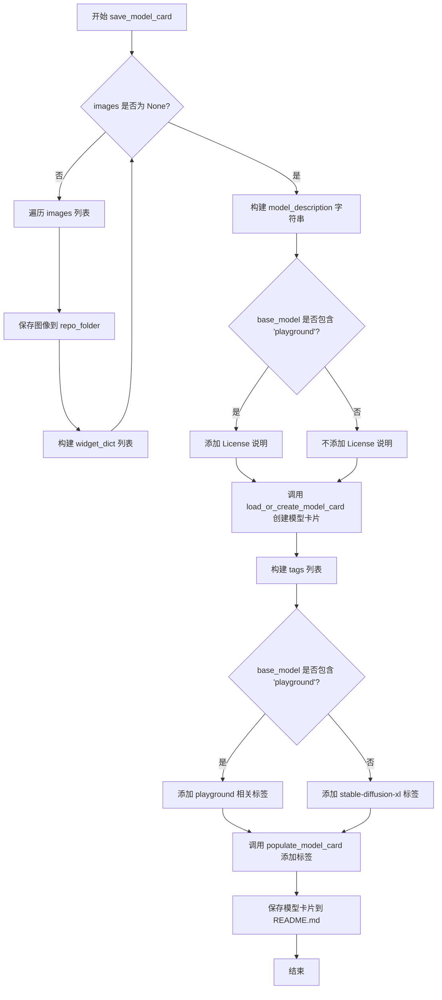
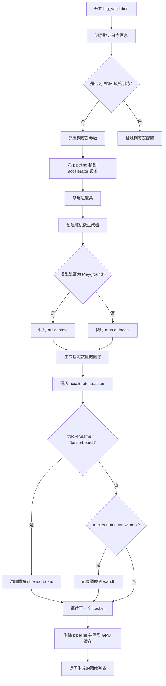
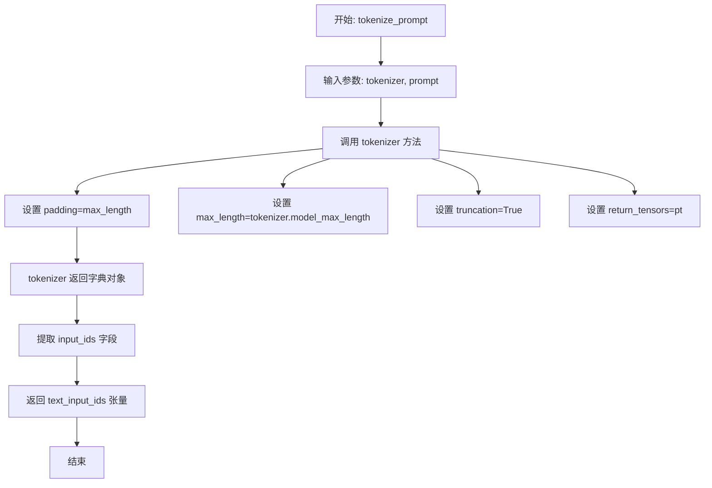
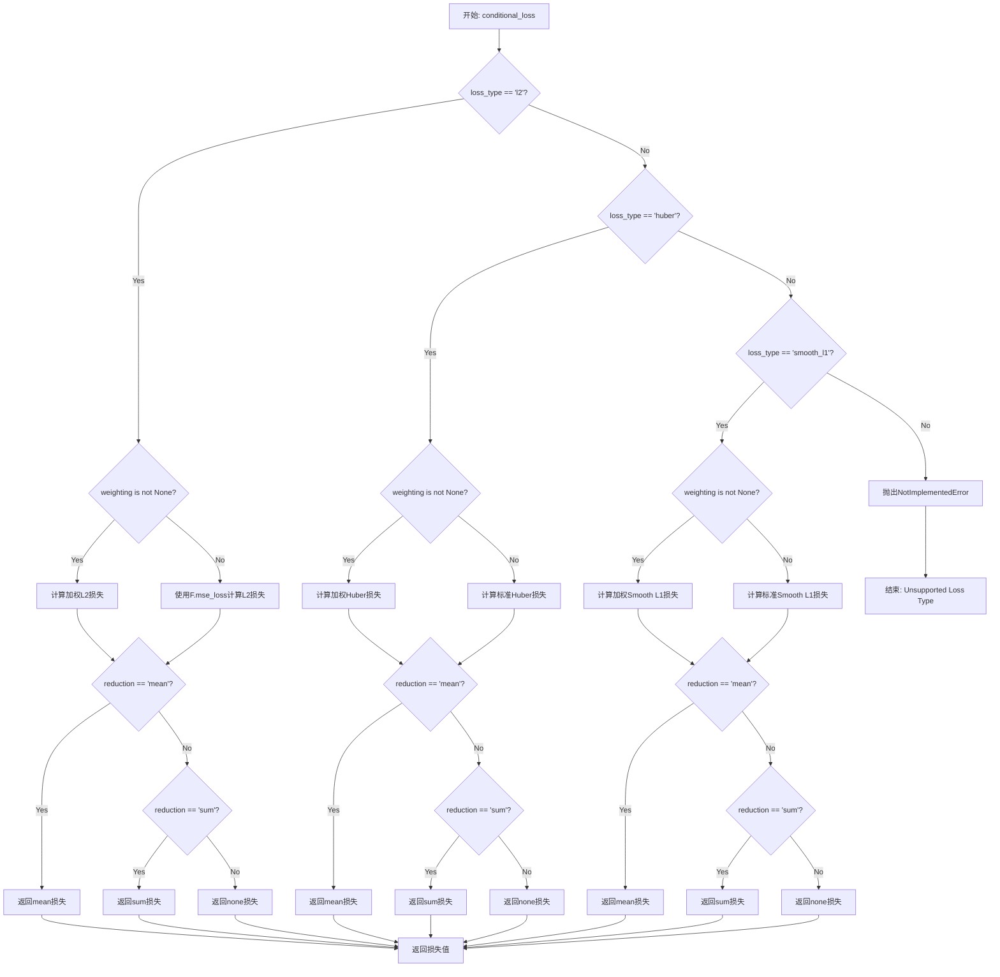
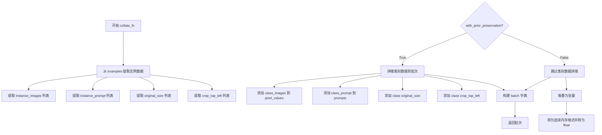
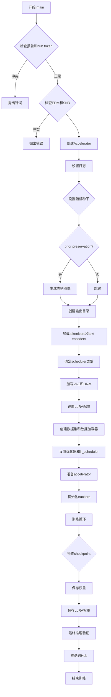
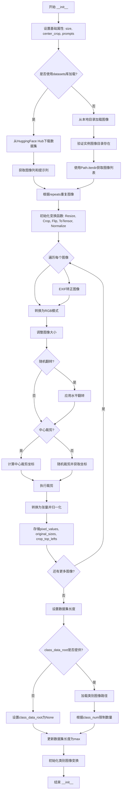
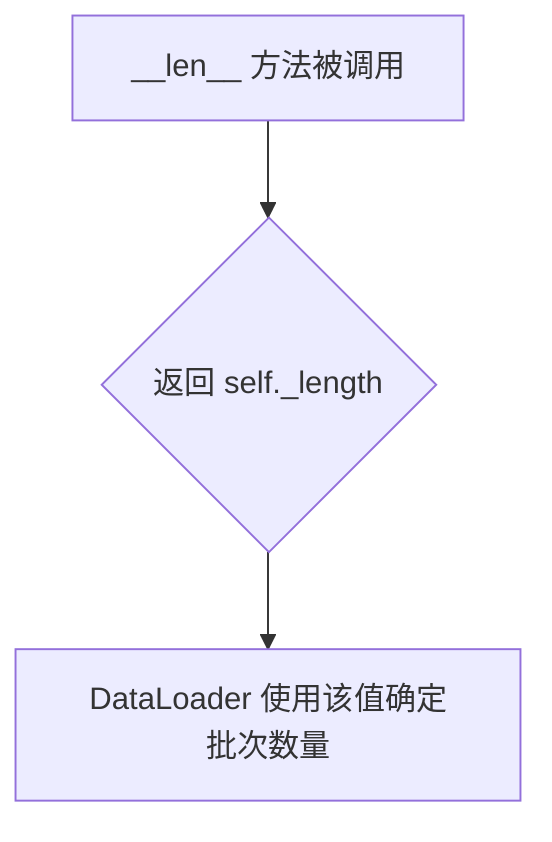
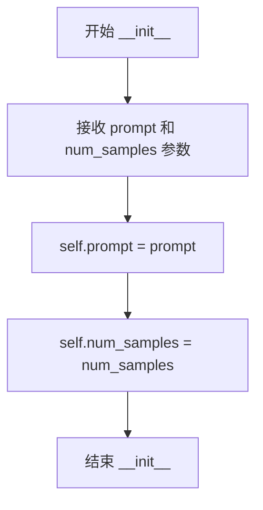
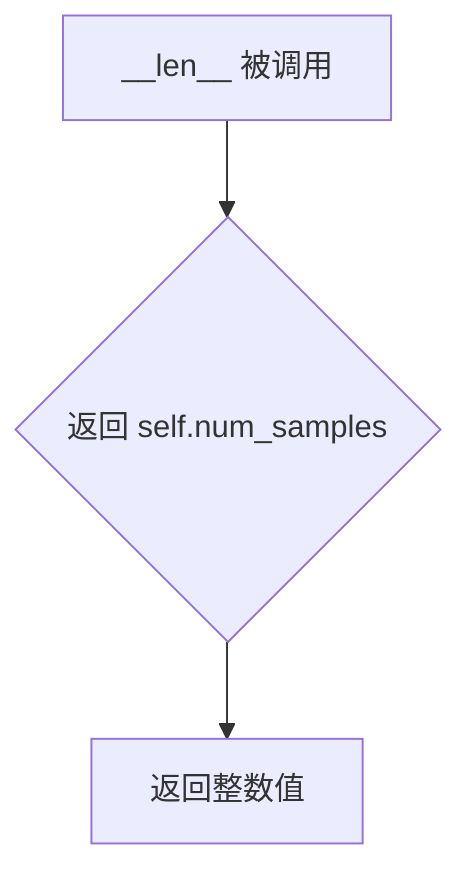

# `diffusers\examples\research_projects\scheduled_huber_loss_training\dreambooth\train_dreambooth_lora_sdxl.py` 详细设计文档

这是一个用于使用 DreamBooth 方法对 Stable Diffusion XL (SDXL) 模型进行 Low-Rank Adaptation (LoRA) 微调的训练脚本。它支持通过自定义实例图像和类别图像（先验保留）来训练模型的 LoRA 权重，支持文本编码器训练、EDM 训练风格、混合精度、分布式训练、梯度检查点等多种高级特性，并可生成用于 A1111、ComfyUI 等平台的模型权重。

## 整体流程

```mermaid
graph TD
    A[开始: parse_args] --> B[初始化 Accelerator]
B --> C{是否使用 prior_preservation?}
C -- 是 --> D[生成类别图像]
C -- 否 --> E[加载预训练模型]
E --> E1[加载 Tokenizer x2]
E1 --> E2[加载 Text Encoder x2]
E2 --> E3[加载 VAE]
E3 --> E4[加载 UNet]
D --> E4
E4 --> F[配置 LoRA (Unet + 可选的 Text Encoder)]
F --> G[创建优化器和学习率调度器]
G --> H[创建数据集和数据加载器]
H --> I[训练循环开始]
I --> J[前向传播: 编码图像为 latent]
J --> K[采样噪声和时间步]
K --> L[添加噪声到 latents]
L --> M[计算 text embeddings]
M --> N[UNet 预测噪声残差]
N --> O[计算损失 (L2/Huber/SmoothL1)]
O --> P[反向传播和优化器更新]
P --> Q{是否需要保存检查点?}
Q -- 是 --> R[保存模型状态]
Q -- 否 --> S{是否达到最大训练步数?}
R --> S
S -- 否 --> I
S -- 是 --> T[保存 LoRA 权重]
T --> U[可选: 生成验证图像]
U --> V[可选: 上传到 Hub]
V --> W[结束]
```

## 类结构

```
Global Functions
├── determine_scheduler_type()
├── save_model_card()
├── log_validation()
├── import_model_class_from_model_name_or_path()
├── parse_args()
├── tokenize_prompt()
├── encode_prompt()
├── conditional_loss()
└── collate_fn()
├── DreamBoothDataset (Dataset)
│   ├── __init__()
│   ├── __len__()
│   └── __getitem__()
└── PromptDataset (Dataset)
    ├── __init__()
    ├── __len__()
    └── __getitem__()
```

## 全局变量及字段


### `logger`
    
日志记录器，用于输出训练过程中的信息

类型：`logging.Logger`
    


### `args`
    
命令行参数解析后的命名空间，包含所有训练配置

类型：`argparse.Namespace`
    


### `tokenizer_one`
    
第一个tokenizer，用于SDXL文本编码

类型：`AutoTokenizer`
    


### `tokenizer_two`
    
第二个tokenizer，用于SDXL文本编码

类型：`AutoTokenizer`
    


### `text_encoder_one`
    
第一个文本编码器模型

类型：`CLIPTextModel/CLIPTextModelWithProjection`
    


### `text_encoder_two`
    
第二个文本编码器模型

类型：`CLIPTextModel/CLIPTextModelWithProjection`
    


### `vae`
    
变分自编码器，用于图像与latent空间的转换

类型：`AutoencoderKL`
    


### `unet`
    
UNet2D条件模型，用于去噪预测

类型：`UNet2DConditionModel`
    


### `noise_scheduler`
    
噪声调度器，控制扩散过程的噪声添加和去除

类型：`DDPMScheduler/EDMEulerScheduler/EulerDiscreteScheduler`
    


### `latents_mean`
    
VAE latents分布的均值，用于归一化

类型：`torch.Tensor`
    


### `latents_std`
    
VAE latents分布的标准差，用于归一化

类型：`torch.Tensor`
    


### `weight_dtype`
    
模型权重的数据类型（fp32/fp16/bf16）

类型：`torch.dtype`
    


### `accelerator`
    
分布式训练加速器，管理混合精度和分布式训练

类型：`Accelerator`
    


### `optimizer`
    
优化器，用于更新模型参数

类型：`torch.optim.AdamW/bnb.optim.AdamW8bit/prodigyopt.Prodigy`
    


### `lr_scheduler`
    
学习率调度器，控制学习率的变化策略

类型：`torch.optim.lr_scheduler._LRScheduler`
    


### `train_dataset`
    
训练数据集，包含实例和类别图像

类型：`DreamBoothDataset`
    


### `train_dataloader`
    
训练数据加载器，按批次提供数据

类型：`torch.utils.data.DataLoader`
    


### `unet_lora_parameters`
    
UNet的LoRA可训练参数列表

类型：`list[torch.nn.Parameter]`
    


### `text_lora_parameters_one`
    
第一个文本编码器的LoRA可训练参数列表

类型：`list[torch.nn.Parameter]`
    


### `text_lora_parameters_two`
    
第二个文本编码器的LoRA可训练参数列表

类型：`list[torch.nn.Parameter]`
    


### `prompt_embeds`
    
提示词的嵌入向量序列

类型：`torch.Tensor`
    


### `unet_add_text_embeds`
    
UNet额外使用的池化文本嵌入

类型：`torch.Tensor`
    


### `instance_prompt_hidden_states`
    
实例提示词的隐藏状态嵌入

类型：`torch.Tensor`
    


### `instance_pooled_prompt_embeds`
    
实例提示词的池化嵌入

类型：`torch.Tensor`
    


### `class_prompt_hidden_states`
    
类别提示词的隐藏状态嵌入

类型：`torch.Tensor`
    


### `class_pooled_prompt_embeds`
    
类别提示词的池化嵌入

类型：`torch.Tensor`
    


### `global_step`
    
当前全局训练步数

类型：`int`
    


### `first_epoch`
    
起始训练轮数，用于恢复训练

类型：`int`
    


### `progress_bar`
    
训练进度条，显示训练进度

类型：`tqdm.std.tqdm`
    


### `DreamBoothDataset.size`
    
图像目标分辨率

类型：`int`
    


### `DreamBoothDataset.center_crop`
    
是否中心裁剪

类型：`bool`
    


### `DreamBoothDataset.instance_prompt`
    
实例提示词

类型：`str`
    


### `DreamBoothDataset.custom_instance_prompts`
    
自定义实例提示词列表

类型：`list`
    


### `DreamBoothDataset.class_prompt`
    
类别提示词

类型：`str`
    


### `DreamBoothDataset.instance_data_root`
    
实例数据根目录

类型：`Path`
    


### `DreamBoothDataset.class_data_root`
    
类别数据根目录

类型：`Path`
    


### `DreamBoothDataset.instance_images`
    
实例图像列表

类型：`list`
    


### `DreamBoothDataset.original_sizes`
    
原始图像尺寸

类型：`list`
    


### `DreamBoothDataset.crop_top_lefts`
    
裁剪左上角坐标

类型：`list`
    


### `DreamBoothDataset.pixel_values`
    
像素值张量列表

类型：`list`
    


### `DreamBoothDataset.num_instance_images`
    
实例图像数量

类型：`int`
    


### `DreamBoothDataset._length`
    
数据集长度

类型：`int`
    


### `DreamBoothDataset.class_images_path`
    
类别图像路径列表

类型：`list`
    


### `DreamBoothDataset.num_class_images`
    
类别图像数量

类型：`int`
    


### `DreamBoothDataset.image_transforms`
    
图像变换组合

类型：`transforms.Compose`
    


### `PromptDataset.prompt`
    
提示词

类型：`str`
    


### `PromptDataset.num_samples`
    
样本数量

类型：`int`
    
    

## 全局函数及方法


### `determine_scheduler_type`

该函数用于从预训练模型的 `model_index.json` 配置文件中提取并返回调度器（scheduler）类型。它通过读取本地模型目录或从 HuggingFace Hub 下载模型索引文件，解析 JSON 结构中的 scheduler 字段来确定应该使用哪种噪声调度器。

**参数：**

- `pretrained_model_name_or_path`：`str`，可以是本地模型目录的路径，也可以是 HuggingFace Hub 上的模型标识符（如 `stabilityai/stable-diffusion-xl-base-1.0`）
- `revision`：`str`，指定从 HuggingFace Hub 下载模型时的版本/修订号（commit hash 或分支名），仅在从远程下载时生效

**返回值：**`str`，返回从模型配置中读取的调度器类型字符串（例如 `"DDPM"`、`"DPMSolverMultistepScheduler"` 等）

#### 流程图

```mermaid
flowchart TD
    A[开始] --> B[定义 model_index_filename = 'model_index.json']
    B --> C{判断 pretrained_model_name_or_path 是否为本地目录}
    C -->|是| D[使用 os.path.join 拼接本地路径]
    C -->|否| E[调用 hf_hub_download 从远程下载 model_index.json]
    D --> F[打开 model_index.json 文件]
    E --> F
    F --> G[使用 json.load 解析 JSON 内容]
    G --> H[提取 scheduler[1] 字段]
    H --> I[返回 scheduler_type]
    I --> J[结束]
```

#### 带注释源码

```python
def determine_scheduler_type(pretrained_model_name_or_path, revision):
    """
    从预训练模型的 model_index.json 中确定调度器类型
    
    参数:
        pretrained_model_name_or_path: 模型路径或Hub模型ID
        revision: Hub上的版本号
    返回:
        scheduler_type: 调度器类型字符串
    """
    # 定义模型索引文件名
    model_index_filename = "model_index.json"
    
    # 判断输入是本地目录还是远程模型
    if os.path.isdir(pretrained_model_name_or_path):
        # 本地目录：直接拼接路径
        model_index = os.path.join(pretrained_model_name_or_path, model_index_filename)
    else:
        # 远程模型：从HuggingFace Hub下载
        model_index = hf_hub_download(
            repo_id=pretrained_model_name_or_path, 
            filename=model_index_filename, 
            revision=revision
        )

    # 打开并解析JSON文件
    with open(model_index, "r") as f:
        # 读取scheduler字段的第二个元素（索引1）
        scheduler_type = json.load(f)["scheduler"][1]
    
    # 返回调度器类型
    return scheduler_type
```


### `save_model_card`

该函数用于在DreamBooth LoRA训练完成后，生成并保存模型的HuggingFace Hub模型卡片（Model Card），包括训练元数据、验证图像、模型描述和标签，并可选择性地将模型推送至Hub。

参数：

- `repo_id`：`str`，HuggingFace Hub的仓库ID，用于标识模型在Hub上的位置
- `use_dora`：`bool`，是否使用DoRA（Weight-Decomposed Low-Rank Adaptation）进行训练，用于在模型描述和标签中标注
- `images`：可选的`List[Image]`或`None`，训练过程中生成的验证图像列表，用于展示和Widget展示
- `base_model`：`str`或`None`，基础预训练模型的名称或路径（如"stabilityai/stable-diffusion-xl-base-1.0"）
- `train_text_encoder`：`bool`，是否训练了文本编码器，用于在模型描述中说明
- `instance_prompt`：`str`或`None`，触发图像生成的实例提示词（Instance Prompt）
- `validation_prompt`：`str`或`None`，验证时使用的提示词，用于Widget展示
- `repo_folder`：`str`或`None`，本地输出目录路径，用于保存模型卡片和图像文件
- `vae_path`：`str`或`None`，训练时使用的VAE模型路径，用于在模型描述中记录

返回值：`None`，该函数无返回值，直接将模型卡片写入本地文件系统

#### 流程图



#### 带注释源码

```python
def save_model_card(
    repo_id: str,
    use_dora: bool,
    images=None,
    base_model: str = None,
    train_text_encoder=False,
    instance_prompt=None,
    validation_prompt=None,
    repo_folder=None,
    vae_path=None,
):
    """
    生成并保存模型的HuggingFace Hub模型卡片。
    
    该函数完成以下任务：
    1. 将验证图像保存到本地repo_folder目录
    2. 构建包含训练元数据的模型描述（Markdown格式）
    3. 创建或加载模型卡片对象
    4. 添加适当的标签
    5. 将模型卡片保存为README.md文件
    
    参数:
        repo_id: HuggingFace Hub仓库ID
        use_dora: 是否使用DoRA训练
        images: 验证生成的图像列表（可选）
        base_model: 基础预训练模型路径
        train_text_encoder: 是否训练文本编码器
        instance_prompt: 实例提示词
        validation_prompt: 验证提示词
        repo_folder: 本地输出目录
        vae_path: VAE模型路径
    
    返回:
        None: 直接将模型卡片写入文件系统
    """
    widget_dict = []  # 初始化Widget字典列表，用于HuggingFace Spaces展示
    
    # 如果提供了验证图像，保存图像并构建Widget字典
    if images is not None:
        for i, image in enumerate(images):
            # 将每张图像保存到repo_folder目录，文件名为image_{i}.png
            image.save(os.path.join(repo_folder, f"image_{i}.png"))
            # 构建Widget字典，包含提示词和图像URL用于交互式展示
            widget_dict.append(
                {"text": validation_prompt if validation_prompt else " ", "output": {"url": f"image_{i}.png"}}
            )

    # 构建模型描述的Markdown文本
    model_description = f"""
# {"SDXL" if "playground" not in base_model else "Playground"} LoRA DreamBooth - {repo_id}

<Gallery />

## Model description

These are {repo_id} LoRA adaption weights for {base_model}.

The weights were trained  using [DreamBooth](https://dreambooth.github.io/).

LoRA for the text encoder was enabled: {train_text_encoder}.

Special VAE used for training: {vae_path}.

## Trigger words

You should use {instance_prompt} to trigger the image generation.

## Download model

Weights for this model are available in Safetensors format.

[Download]({repo_id}/tree/main) them in the Files & versions tab.

"""
    # 如果是Playground模型，添加License说明
    if "playground" in base_model:
        model_description += """\n
## License

Please adhere to the licensing terms as described [here](https://huggingface.co/playgroundai/playground-v2.5-1024px-aesthetic/blob/main/LICENSE.md).
"""
    
    # 加载或创建模型卡片，使用diffusers工具函数
    # from_training=True表示这是从训练脚本创建的卡片
    model_card = load_or_create_model_card(
        repo_id_or_path=repo_id,
        from_training=True,
        license="openrail++" if "playground" not in base_model else "playground-v2dot5-community",
        base_model=base_model,
        prompt=instance_prompt,
        model_description=model_description,
        widget=widget_dict,
    )
    
    # 构建标签列表，用于模型分类和搜索
    tags = [
        "text-to-image",
        "text-to-image",
        "diffusers-training",
        "diffusers",
        "lora" if not use_dora else "dora",  # 根据是否使用DoRA选择标签
        "template:sd-lora",
    ]
    
    # 根据基础模型添加特定标签
    if "playground" in base_model:
        tags.extend(["playground", "playground-diffusers"])
    else:
        tags.extend(["stable-diffusion-xl", "stable-diffusion-xl-diffusers"])

    # 使用populate_model_card添加标签到模型卡片
    model_card = populate_model_card(model_card, tags=tags)
    
    # 将模型卡片保存为README.md文件到repo_folder目录
    model_card.save(os.path.join(repo_folder, "README.md"))
```


### `log_validation`

该函数用于在训练过程中运行验证推理，生成指定数量的图像并将其记录到训练跟踪器（TensorBoard 或 WANDB）中，同时负责调度器配置和 GPU 内存清理。

参数：

- `pipeline`：`StableDiffusionXLPipeline`，用于图像生成的 Stable Diffusion XL pipeline 实例
- `args`：命令行参数对象，包含 `num_validation_images`、`validation_prompt`、`seed`、`do_edm_style_training`、`pretrained_model_name_or_path` 等训练配置
- `accelerator`：`Accelerate` 库提供的分布式训练加速器实例，用于设备管理和跟踪器访问
- `pipeline_args`：字典，传递给 pipeline 的额外生成参数（如 prompt、num_inference_steps 等）
- `epoch`：整数，当前训练轮次，用于记录图像到跟踪器
- `is_final_validation`：布尔值，默认为 `False`，标记是否为最终验证（影响 phase 名称为 "test" 还是 "validation"）

返回值：`List[Image]`，生成的 PIL 图像列表

#### 流程图



#### 带注释源码

```python
def log_validation(
    pipeline,
    args,
    accelerator,
    pipeline_args,
    epoch,
    is_final_validation=False,
):
    """
    运行验证推理，生成图像并记录到训练跟踪器
    
    参数:
        pipeline: Stable Diffusion XL pipeline 实例
        args: 训练命令行参数
        accelerator: Accelerate 加速器
        pipeline_args: 传递给 pipeline 的参数字典
        epoch: 当前训练轮次
        is_final_validation: 是否为最终验证
    返回:
        生成的图像列表
    """
    # 记录验证开始的日志信息，显示要生成的图像数量和验证提示词
    logger.info(
        f"Running validation... \n Generating {args.num_validation_images} images with prompt:"
        f" {args.validation_prompt}."
    )

    # 我们在简化的学习目标上训练。如果之前预测方差，需要调度器忽略它
    scheduler_args = {}

    # 非 EDM 风格训练时配置调度器
    if not args.do_edm_style_training:
        # 检查调度器配置中是否存在 variance_type
        if "variance_type" in pipeline.scheduler.config:
            variance_type = pipeline.scheduler.config["variance_type"]

            # 如果方差类型为 learned 或 learned_range，设置为 fixed_small
            if variance_type in ["learned", "learned_range"]:
                variance_type = "fixed_small"

            scheduler_args["variance_type"] = variance_type

        # 使用 DPMSolverMultistepScheduler 替换当前调度器
        pipeline.scheduler = DPMSolverMultistepScheduler.from_config(pipeline.scheduler.config, **scheduler_args)

    # 将 pipeline 移到加速器设备上
    pipeline = pipeline.to(accelerator.device)
    # 禁用进度条显示
    pipeline.set_progress_bar_config(disable=True)

    # 运行推理
    # 如果提供了 seed，创建手动种子的生成器，否则为 None
    generator = torch.Generator(device=accelerator.device).manual_seed(args.seed) if args.seed else None
    
    # 当前上下文判断有点粗糙，未来可以改进
    # 参考: https://github.com/huggingface/diffusers/pull/7126#issuecomment-1968523051
    # Playground 模型使用 nullcontext，其他模型使用 AMP autocast
    inference_ctx = (
        contextlib.nullcontext() if "playground" in args.pretrained_model_name_or_path else torch.cuda.amp.autocast()
    )

    # 在推理上下文中生成指定数量的图像
    with inference_ctx:
        images = [pipeline(**pipeline_args, generator=generator).images[0] for _ in range(args.num_validation_images)]

    # 遍历所有跟踪器记录图像
    for tracker in accelerator.trackers:
        # 确定阶段名称：最终验证为 "test"，否则为 "validation"
        phase_name = "test" if is_final_validation else "validation"
        
        # TensorBoard 跟踪器处理
        if tracker.name == "tensorboard":
            # 将 PIL 图像转换为 numpy 数组并堆叠
            np_images = np.stack([np.asarray(img) for img in images])
            tracker.writer.add_images(phase_name, np_images, epoch, dataformats="NHWC")
        
        # WANDB 跟踪器处理
        if tracker.name == "wandb":
            tracker.log(
                {
                    phase_name: [
                        wandb.Image(image, caption=f"{i}: {args.validation_prompt}") for i, image in enumerate(images)
                    ]
                }
            )

    # 删除 pipeline 实例释放 GPU 内存
    del pipeline
    torch.cuda.empty_cache()

    # 返回生成的图像列表
    return images
```


### `import_model_class_from_model_name_or_path`

该函数根据预训练模型的配置信息，动态导入并返回对应的文本编码器类（CLIPTextModel 或 CLIPTextModelWithProjection）。它通过读取模型的配置文件获取架构信息，然后根据架构类型从 transformers 库中导入相应的类。

参数：

- `pretrained_model_name_or_path`：`str`，预训练模型的名称或本地路径（例如 "stabilityai/stable-diffusion-xl-base-1.0" 或本地模型目录）
- `revision`：`str`，模型仓库的版本修订号（通常为 "main" 或具体 commit hash）
- `subfolder`：`str`，模型子文件夹路径，默认为 "text_encoder"（用于指定要加载的文本编码器配置）

返回值：`type`，返回对应的文本编码器类（`CLIPTextModel` 或 `CLIPTextModelWithProjection`）

#### 流程图

```mermaid
flowchart TD
    A[开始] --> B[加载预训练配置<br/>PretrainedConfig.from_pretrained]
    B --> C[获取架构名称<br/>text_encoder_config.architectures[0]]
    C --> D{架构类型判断}
    D -->|CLIPTextModel| E[导入CLIPTextModel类]
    D -->|CLIPTextModelWithProjection| F[导入CLIPTextModelWithProjection类]
    D -->|其他| G[抛出ValueError异常]
    E --> H[返回CLIPTextModel类]
    F --> I[返回CLIPTextModelWithProjection类]
    G --> J[错误处理结束]
```

#### 带注释源码

```python
def import_model_class_from_model_name_or_path(
    pretrained_model_name_or_path: str, 
    revision: str, 
    subfolder: str = "text_encoder"
):
    """
    根据预训练模型的配置动态导入文本编码器类。
    
    参数:
        pretrained_model_name_or_path: 预训练模型的名称或本地路径
        revision: 模型版本修订号
        subfolder: 模型子文件夹路径，默认为 text_encoder
    
    返回:
        对应的文本编码器类 (CLIPTextModel 或 CLIPTextModelWithProjection)
    """
    
    # 步骤1: 从预训练模型加载文本编码器的配置文件
    # 使用 transformers 库的 PretrainedConfig 来读取模型配置
    # subfolder 参数指定配置文件的子目录（如 "text_encoder" 或 "text_encoder_2"）
    # revision 参数指定从哪个 Git 版本加载模型
    text_encoder_config = PretrainedConfig.from_pretrained(
        pretrained_model_name_or_path, 
        subfolder=subfolder, 
        revision=revision
    )
    
    # 步骤2: 从配置中获取模型架构名称
    # 配置文件中的 architectures 字段包含了该模型使用的架构类名
    # 通常为 "CLIPTextModel" 或 "CLIPTextModelWithProjection"
    model_class = text_encoder_config.architectures[0]
    
    # 步骤3: 根据架构名称导入并返回对应的模型类
    if model_class == "CLIPTextModel":
        # 标准 CLIP 文本编码器，用于大多数 Stable Diffusion 模型
        from transformers import CLIPTextModel
        
        return CLIPTextModel
    
    elif model_class == "CLIPTextModelWithProjection":
        # 带投影的 CLIP 文本编码器，用于 SDXL 等高级模型
        # 该版本可以输出带有语义信息的 embeddings
        from transformers import CLIPTextModelWithProjection
        
        return CLIPTextModelWithProjection
    
    else:
        # 如果遇到不支持的架构类型，抛出明确的错误信息
        raise ValueError(f"{model_class} is not supported.")
```


### `parse_args`

该函数是DreamBooth训练脚本的命令行参数解析器，通过`argparse`库定义并解析所有训练相关的参数（包括模型路径、数据集配置、训练超参数、优化器设置等），在解析后进行一系列参数合法性校验（如数据集来源必须二选一、prior preservation需要配套的class数据等），最终返回包含所有配置参数的`Namespace`对象供主训练流程使用。

参数：

- `input_args`：`Optional[List[str]]`，可选参数列表。如果为`None`，则从命令行自动读取参数；否则使用传入的列表进行解析。

返回值：`argparse.Namespace`，包含所有命令行参数的命名空间对象，涵盖模型配置、数据路径、训练超参数、优化器设置、推理验证配置等约70余个属性。

#### 流程图

```mermaid
flowchart TD
    A[开始 parse_args] --> B[创建 ArgumentParser]
    B --> C[添加模型相关参数<br/>--pretrained_model_name_or_path<br/>--revision<br/>--variant<br/>--pretrained_vae_model_name_or_path]
    C --> D[添加数据集参数<br/>--dataset_name<br/>--dataset_config_name<br/>--instance_data_dir<br/>--cache_dir<br/>--image_column<br/>--caption_column<br/>--repeats]
    D --> E[添加Prompt参数<br/>--instance_prompt<br/>--class_prompt<br/>--validation_prompt<br/>--num_validation_images<br/>--validation_epochs]
    E --> F[添加训练参数<br/>--train_batch_size<br/>--num_train_epochs<br/>--max_train_steps<br/>--learning_rate<br/>--lr_scheduler<br/>--gradient_accumulation_steps<br/>--gradient_checkpointing]
    F --> G[添加优化器参数<br/>--optimizer<br/>--adam_beta1<br/>--adam_beta2<br/>--adam_weight_decay<br/>--adam_epsilon]
    G --> H[添加其他参数<br/>--output_dir<br/>--seed<br/>--mixed_precision<br/>--local_rank<br/>--rank<br/>--use_dora...]
    H --> I{input_args is not None?}
    I -->|Yes| J[parser.parse_args(input_args)]
    I -->|No| K[parser.parse_args()]
    J --> L[验证数据集配置<br/>dataset_name和instance_data_dir二选一]
    K --> L
    L --> M{验证结果}
    M -->|失败| N[raise ValueError]
    M -->|成功| O[检查LOCAL_RANK环境变量]
    O --> P{with_prior_preservation=True?}
    P -->|Yes| Q[验证class_data_dir和class_prompt]
    P -->|No| R[警告class_data_dir和class_prompt多余]
    Q --> S[返回args]
    R --> S
    S --> T[结束]
```

#### 带注释源码

```python
def parse_args(input_args=None):
    """
    解析命令行参数，返回包含所有训练配置的Namespace对象。
    
    参数:
        input_args: 可选的参数列表。若为None，则从sys.argv解析；
                   否则使用传入的列表进行解析（用于单元测试）。
    
    返回:
        argparse.Namespace: 包含所有命令行参数的对象
    """
    # 创建ArgumentParser实例，description用于命令行帮助信息
    parser = argparse.ArgumentParser(description="Simple example of a training script.")
    
    # ==================== 模型配置参数 ====================
    # 预训练模型路径或HuggingFace模型ID（必需）
    parser.add_argument(
        "--pretrained_model_name_or_path",
        type=str,
        default=None,
        required=True,
        help="Path to pretrained model or model identifier from huggingface.co/models.",
    )
    # VAE模型路径（可选，用于更好的数值稳定性）
    parser.add_argument(
        "--pretrained_vae_model_name_or_path",
        type=str,
        default=None,
        help="Path to pretrained VAE model with better numerical stability...",
    )
    # 模型版本修订号
    parser.add_argument(
        "--revision",
        type=str,
        default=None,
        required=False,
        help="Revision of pretrained model identifier from huggingface.co/models.",
    )
    # 模型变体（如fp16）
    parser.add_argument(
        "--variant",
        type=str,
        default=None,
        help="Variant of the model files of the pretrained model identifier...",
    )
    
    # ==================== 数据集配置参数 ====================
    # 数据集名称（来自HuggingFace Hub）或本地路径
    parser.add_argument(
        "--dataset_name",
        type=str,
        default=None,
        help="The name of the Dataset (from the HuggingFace hub)...",
    )
    # 数据集配置名称
    parser.add_argument(
        "--dataset_config_name",
        type=str,
        default=None,
        help="The config of the Dataset, leave as None if there's only one config.",
    )
    # 本地实例数据目录
    parser.add_argument(
        "--instance_data_dir",
        type=str,
        default=None,
        help="A folder containing the training data.",
    )
    # 缓存目录
    parser.add_argument(
        "--cache_dir",
        type=str,
        default=None,
        help="The directory where the downloaded models and datasets will be stored.",
    )
    # 数据集中图像列名
    parser.add_argument(
        "--image_column",
        type=str,
        default="image",
        help="The column of the dataset containing the target image...",
    )
    # 数据集提示词列名
    parser.add_argument(
        "--caption_column",
        type=str,
        default=None,
        help="The column of the dataset containing the instance prompt for each image",
    )
    # 训练数据重复次数
    parser.add_argument("--repeats", type=int, default=1, help="How many times to repeat the training data.")
    
    # ==================== Prior Preservation参数 ====================
    # Class图像数据目录
    parser.add_argument(
        "--class_data_dir",
        type=str,
        default=None,
        required=False,
        help="A folder containing the training data of class images.",
    )
    # 实例提示词（必需）
    parser.add_argument(
        "--instance_prompt",
        type=str,
        default=None,
        required=True,
        help="The prompt with identifier specifying the instance, e.g. 'photo of a TOK dog'",
    )
    # Class提示词
    parser.add_argument(
        "--class_prompt",
        type=str,
        default=None,
        help="The prompt to specify images in the same class as provided instance images.",
    )
    
    # ==================== 验证参数 ====================
    parser.add_argument(
        "--validation_prompt",
        type=str,
        default=None,
        help="A prompt that is used during validation to verify that the model is learning.",
    )
    parser.add_argument(
        "--num_validation_images",
        type=int,
        default=4,
        help="Number of images that should be generated during validation...",
    )
    parser.add_argument(
        "--validation_epochs",
        type=int,
        default=50,
        help="Run dreambooth validation every X epochs...",
    )
    
    # ==================== 训练策略参数 ====================
    # EDM风格训练
    parser.add_argument(
        "--do_edm_style_training",
        default=False,
        action="store_true",
        help="Flag to conduct training using the EDM formulation...",
    )
    # Prior Preservation损失
    parser.add_argument(
        "--with_prior_preservation",
        default=False,
        action="store_true",
        help="Flag to add prior preservation loss.",
    )
    parser.add_argument("--prior_loss_weight", type=float, default=1.0, help="The weight of prior preservation loss.")
    parser.add_argument(
        "--num_class_images",
        type=int,
        default=100,
        help="Minimal class images for prior preservation loss...",
    )
    
    # ==================== 输出配置参数 ====================
    parser.add_argument(
        "--output_dir",
        type=str,
        default="lora-dreambooth-model",
        help="The output directory where the model predictions and checkpoints will be written.",
    )
    parser.add_argument(
        "--output_kohya_format",
        action="store_true",
        help="Flag to additionally generate final state dict in the Kohya format...",
    )
    parser.add_argument("--seed", type=int, default=None, help="A seed for reproducible training.")
    
    # ==================== 图像处理参数 ====================
    parser.add_argument(
        "--resolution",
        type=int,
        default=1024,
        help="The resolution for input images, all the images...",
    )
    parser.add_argument(
        "--center_crop",
        default=False,
        action="store_true",
        help="Whether to center crop the input images to the resolution...",
    )
    parser.add_argument(
        "--random_flip",
        action="store_true",
        help="whether to randomly flip images horizontally",
    )
    
    # ==================== Text Encoder训练参数 ====================
    parser.add_argument(
        "--train_text_encoder",
        action="store_true",
        help="Whether to train the text encoder. If set, the text encoder should be float32 precision.",
    )
    
    # ==================== 批处理和训练轮次参数 ====================
    parser.add_argument(
        "--train_batch_size", type=int, default=4, help="Batch size (per device) for the training dataloader."
    )
    parser.add_argument(
        "--sample_batch_size", type=int, default=4, help="Batch size (per device) for sampling images."
    )
    parser.add_argument("--num_train_epochs", type=int, default=1)
    parser.add_argument(
        "--max_train_steps",
        type=int,
        default=None,
        help="Total number of training steps to perform. If provided, overrides num_train_epochs.",
    )
    parser.add_argument(
        "--checkpointing_steps",
        type=int,
        default=500,
        help="Save a checkpoint of the training state every X updates...",
    )
    parser.add_argument(
        "--checkpoints_total_limit",
        type=int,
        default=None,
        help="Max number of checkpoints to store.",
    )
    parser.add_argument(
        "--resume_from_checkpoint",
        type=str,
        default=None,
        help="Whether training should be resumed from a previous checkpoint...",
    )
    parser.add_argument(
        "--gradient_accumulation_steps",
        type=int,
        default=1,
        help="Number of updates steps to accumulate before performing a backward/update pass.",
    )
    parser.add_argument(
        "--gradient_checkpointing",
        action="store_true",
        help="Whether or not to use gradient checkpointing to save memory...",
    )
    
    # ==================== 学习率参数 ====================
    parser.add_argument(
        "--learning_rate",
        type=float,
        default=1e-4,
        help="Initial learning rate (after the potential warmup period) to use.",
    )
    parser.add_argument(
        "--text_encoder_lr",
        type=float,
        default=5e-6,
        help="Text encoder learning rate to use.",
    )
    parser.add_argument(
        "--scale_lr",
        action="store_true",
        default=False,
        help="Scale the learning rate by the number of GPUs, gradient accumulation steps, and batch size.",
    )
    parser.add_argument(
        "--lr_scheduler",
        type=str,
        default="constant",
        help="The scheduler type to use. Choose between ['linear', 'cosine', 'cosine_with_restarts', 'polynomial', 'constant', 'constant_with_warmup']",
    )
    parser.add_argument(
        "--snr_gamma",
        type=float,
        default=None,
        help="SNR weighting gamma to be used if rebalancing the loss...",
    )
    parser.add_argument(
        "--lr_warmup_steps", type=int, default=500, help="Number of steps for the warmup in the lr scheduler."
    )
    parser.add_argument(
        "--lr_num_cycles",
        type=int,
        default=1,
        help="Number of hard resets of the lr in cosine_with_restarts scheduler.",
    )
    parser.add_argument("--lr_power", type=float, default=1.0, help="Power factor of the polynomial scheduler.")
    
    # ==================== DataLoader参数 ====================
    parser.add_argument(
        "--dataloader_num_workers",
        type=int,
        default=0,
        help="Number of subprocesses to use for data loading...",
    )
    
    # ==================== 优化器参数 ====================
    parser.add_argument(
        "--optimizer",
        type=str,
        default="AdamW",
        help="The optimizer type to use. Choose between ['AdamW', 'prodigy']",
    )
    parser.add_argument(
        "--use_8bit_adam",
        action="store_true",
        help="Whether or not to use 8-bit Adam from bitsandbytes...",
    )
    parser.add_argument(
        "--adam_beta1", type=float, default=0.9, help="The beta1 parameter for the Adam and Prodigy optimizers."
    )
    parser.add_argument(
        "--adam_beta2", type=float, default=0.999, help="The beta2 parameter for the Adam and Prodigy optimizers."
    )
    parser.add_argument(
        "--prodigy_beta3",
        type=float,
        default=None,
        help="coefficients for computing the Prodigy stepsize using running averages...",
    )
    parser.add_argument("--prodigy_decouple", type=bool, default=True, help="Use AdamW style decoupled weight decay")
    parser.add_argument("--adam_weight_decay", type=float, default=1e-04, help="Weight decay to use for unet params")
    parser.add_argument(
        "--adam_weight_decay_text_encoder", type=float, default=1e-03, help="Weight decay to use for text_encoder"
    )
    parser.add_argument(
        "--adam_epsilon",
        type=float,
        default=1e-08,
        help="Epsilon value for the Adam optimizer and Prodigy optimizers.",
    )
    parser.add_argument(
        "--prodigy_use_bias_correction",
        type=bool,
        default=True,
        help="Turn on Adam's bias correction...",
    )
    parser.add_argument(
        "--prodigy_safeguard_warmup",
        type=bool,
        default=True,
        help="Remove lr from the denominator of D estimate to avoid issues during warm-up stage...",
    )
    parser.add_argument("--max_grad_norm", default=1.0, type=float, help="Max gradient norm.")
    
    # ==================== Hub推送参数 ====================
    parser.add_argument("--push_to_hub", action="store_true", help="Whether or not to push the model to the Hub.")
    parser.add_argument("--hub_token", type=str, default=None, help="The token to use to push to the Model Hub.")
    parser.add_argument(
        "--hub_model_id",
        type=str,
        default=None,
        help="The name of the repository to keep in sync with the local `output_dir`.",
    )
    
    # ==================== 日志和监控参数 ====================
    parser.add_argument(
        "--logging_dir",
        type=str,
        default="logs",
        help="TensorBoard log directory...",
    )
    parser.add_argument(
        "--allow_tf32",
        action="store_true",
        help="Whether or not to allow TF32 on Ampere GPUs...",
    )
    parser.add_argument(
        "--report_to",
        type=str,
        default="tensorboard",
        help="The integration to report the results and logs to...",
    )
    parser.add_argument(
        "--mixed_precision",
        type=str,
        default=None,
        choices=["no", "fp16", "bf16"],
        help="Whether to use mixed precision...",
    )
    parser.add_argument(
        "--prior_generation_precision",
        type=str,
        default=None,
        choices=["no", "fp32", "fp16", "bf16"],
        help="Choose prior generation precision...",
    )
    parser.add_argument("--local_rank", type=int, default=-1, help="For distributed training: local_rank")
    
    # ==================== 高级特性参数 ====================
    parser.add_argument(
        "--enable_xformers_memory_efficient_attention", 
        action="store_true", 
        help="Whether or not to use xformers."
    )
    parser.add_argument(
        "--rank",
        type=int,
        default=4,
        help="The dimension of the LoRA update matrices.",
    )
    parser.add_argument(
        "--use_dora",
        action="store_true",
        default=False,
        help="Whether to train a DoRA...",
    )
    parser.add_argument(
        "--loss_type",
        type=str,
        default="l2",
        choices=["l2", "huber", "smooth_l1"],
        help="The type of loss to use...",
    )
    parser.add_argument(
        "--huber_schedule",
        type=str,
        default="snr",
        choices=["constant", "exponential", "snr"],
        help="The schedule to use for the huber losses parameter",
    )
    parser.add_argument(
        "--huber_c",
        type=float,
        default=0.1,
        help="The huber loss parameter. Only used if one of the huber loss modes is selected with loss_type.",
    )

    # ==================== 参数解析 ====================
    # 根据input_args是否为空决定解析来源
    if input_args is not None:
        args = parser.parse_args(input_args)
    else:
        args = parser.parse_args()

    # ==================== 参数校验 ====================
    # 校验1: 数据集必须指定dataset_name或instance_data_dir之一
    if args.dataset_name is None and args.instance_data_dir is None:
        raise ValueError("Specify either `--dataset_name` or `--instance_data_dir`")

    # 校验2: dataset_name和instance_data_dir不能同时指定
    if args.dataset_name is not None and args.instance_data_dir is not None:
        raise ValueError("Specify only one of `--dataset_name` or `--instance_data_dir`")

    # 校验3: 处理分布式训练的环境变量LOCAL_RANK
    env_local_rank = int(os.environ.get("LOCAL_RANK", -1))
    if env_local_rank != -1 and env_local_rank != args.local_rank:
        args.local_rank = env_local_rank

    # 校验4: Prior Preservation模式需要class_data_dir和class_prompt
    if args.with_prior_preservation:
        if args.class_data_dir is None:
            raise ValueError("You must specify a data directory for class images.")
        if args.class_prompt is None:
            raise ValueError("You must specify prompt for class images.")
    else:
        # 非Prior Preservation模式下，这些参数应该是多余的
        if args.class_data_dir is not None:
            warnings.warn("You need not use --class_data_dir without --with_prior_preservation.")
        if args.class_prompt is not None:
            warnings.warn("You need not use --class_prompt without --with_prior_preservation.")

    return args
```


### `tokenize_prompt`

该函数是Stable Diffusion XL LoRA DreamBooth训练脚本中的一个核心工具函数，负责将文本提示（prompt）转换为模型可处理的token ID张量。它封装了Hugging Face Transformers分词器的标准调用流程，支持自动截断和最大长度填充，确保输出符合模型的输入要求。

参数：

- `tokenizer`：`transformers.AutoTokenizer`，Hugging Face分词器对象，用于将原始文本编码为token ID序列
- `prompt`：`str`，需要被分词的文本提示（prompt），通常为描述图像内容的文本

返回值：`torch.Tensor`，形状为`(1, tokenizer.model_max_length)`的文本输入ID张量，包含填充后的token ID序列

#### 流程图



#### 带注释源码

```python
def tokenize_prompt(tokenizer, prompt):
    """
    将文本提示转换为token ID张量
    
    参数:
        tokenizer: Hugging Face分词器对象 (AutoTokenizer)
        prompt: 需要分词的文本字符串
    
    返回:
        text_input_ids: torch.Tensor, 形状为 (1, max_length) 的token ID张量
    """
    # 使用tokenizer对prompt进行分词
    # padding="max_length": 将序列填充到最大长度
    # max_length=tokenizer.model_max_length: 使用模型的最大上下文长度
    # truncation=True: 如果序列超过最大长度则截断
    # return_tensors="pt": 返回PyTorch张量而不是Python列表
    text_inputs = tokenizer(
        prompt,
        padding="max_length",
        max_length=tokenizer.model_max_length,
        truncation=True,
        return_tensors="pt",
    )
    
    # 从分词结果字典中提取input_ids
    # input_ids 包含文本对应的token ID序列
    text_input_ids = text_inputs.input_ids
    
    # 返回token ID张量，形状为 (1, model_max_length)
    # 对于SDXL，通常为 (1, 77)
    return text_input_ids
```


### `encode_prompt`

该函数是 Stable Diffusion XLoRA DreamBooth 训练脚本中的文本编码函数，用于将文本提示转换为文本嵌入（embeddings），供 UNet 在去噪过程中使用。它支持单文本编码器或多文本编码器（如 SDXL 的双文本编码器），并返回合并后的提示嵌入和池化后的提示嵌入。

参数：

- `text_encoders`：`List[CLIPTextModel]`，文本编码器列表，用于将 token IDs 转换为文本嵌入
- `tokenizers`：`List[CLIPTokenizer]`，分词器列表，用于将文本提示转换为 token IDs
- `prompt`：`str`，文本提示内容
- `text_input_ids_list`：`Optional[List[torch.Tensor]]`，可选的预计算 token IDs 列表，当 tokenizers 为 None 时使用

返回值：`Tuple[torch.Tensor, torch.Tensor]`，返回一个元组，包含：
- `prompt_embeds`：`torch.Tensor`，形状为 (batch_size, seq_len, hidden_dim)，合并后的文本嵌入
- `pooled_prompt_embeds`：`torch.Tensor`，形状为 (batch_size, hidden_dim)，池化后的文本嵌入（用于 UNet 的文本条件）

#### 流程图

```mermaid
flowchart TD
    A[开始 encode_prompt] --> B{tokenizers 是否为 None}
    B -->|否| C[使用 tokenizers[i] 进行分词]
    B -->|是| D[使用预计算的 text_input_ids_list[i]]
    C --> E[调用 tokenize_prompt 获取 text_input_ids]
    D --> E
    E --> F[调用 text_encoder 获取隐藏状态]
    F --> G[提取 pooled_prompt_embeds = prompt_embeds[0]]
    H[提取倒数第二层隐藏状态 prompt_embeds = prompt_embeds[-1][-2]]
    G --> I{是否为最后一个编码器}
    H --> I
    I -->|否| J[将当前编码器的嵌入添加到列表]
    I -->|是| K[同时提取 pooled_prompt_embeds]
    J --> L[遍历下一个 text_encoder]
    L --> B
    K --> M[沿最后一维拼接所有 prompt_embeds]
    M --> N[重塑 pooled_prompt_embeds]
    N --> O[返回 prompt_embeds 和 pooled_prompt_embeds]
```

#### 带注释源码

```python
# Adapted from pipelines.StableDiffusionXLPipeline.encode_prompt
def encode_prompt(text_encoders, tokenizers, prompt, text_input_ids_list=None):
    """
    将文本提示编码为文本嵌入
    
    参数:
        text_encoders: 文本编码器列表 (如 CLIPTextModel, CLIPTextModelWithProjection)
        tokenizers: 分词器列表 (如 CLIPTokenizer)
        prompt: 要编码的文本提示
        text_input_ids_list: 可选的预计算 token IDs 列表
    
    返回:
        prompt_embeds: 合并后的文本嵌入 (batch_size, seq_len, hidden_dim)
        pooled_prompt_embeds: 池化后的文本嵌入 (batch_size, hidden_dim)
    """
    prompt_embeds_list = []

    # 遍历每个文本编码器 (SDXL 有两个: text_encoder 和 text_encoder_2)
    for i, text_encoder in enumerate(text_encoders):
        # 如果提供了 tokenizers，则对 prompt 进行分词
        if tokenizers is not None:
            tokenizer = tokenizers[i]
            # 调用 tokenize_prompt 函数将文本转换为 token IDs
            text_input_ids = tokenize_prompt(tokenizer, prompt)
        else:
            # 否则使用预计算的 token IDs
            assert text_input_ids_list is not None
            text_input_ids = text_input_ids_list[i]

        # 调用文本编码器获取嵌入
        # output_hidden_states=True 返回所有隐藏状态
        # return_dict=False 返回元组而非字典
        prompt_embeds = text_encoder(
            text_input_ids.to(text_encoder.device), 
            output_hidden_states=True, 
            return_dict=False
        )

        # 我们始终只关心最后一个文本编码器的池化输出
        # prompt_embeds[0] 是池化后的输出 (pooled output)
        pooled_prompt_embeds = prompt_embeds[0]
        
        # prompt_embeds[-1] 是最后一层的所有隐藏状态
        # [-2] 是倒数第二层 (通常用于更细粒度的控制)
        # SDXL 中使用倒数第二层而不是最后一层
        prompt_embeds = prompt_embeds[-1][-2]
        
        # 获取批次大小、序列长度和隐藏维度
        bs_embed, seq_len, _ = prompt_embeds.shape
        
        # 重塑嵌入形状
        prompt_embeds = prompt_embeds.view(bs_embed, seq_len, -1)
        
        # 将当前编码器的嵌入添加到列表
        prompt_embeds_list.append(prompt_embeds)

    # 沿最后一维 (hidden_dim) 拼接所有文本编码器的嵌入
    prompt_embeds = torch.concat(prompt_embeds_list, dim=-1)
    
    # 重塑池化嵌入
    pooled_prompt_embeds = pooled_prompt_embeds.view(bs_embed, -1)
    
    return prompt_embeds, pooled_prompt_embeds


def tokenize_prompt(tokenizer, prompt):
    """
    使用分词器将文本提示转换为 token IDs
    
    参数:
        tokenizer: 分词器对象
        prompt: 文本提示
    
    返回:
        text_input_ids: token IDs 张量
    """
    text_inputs = tokenizer(
        prompt,
        padding="max_length",                    # 填充到最大长度
        max_length=tokenizer.model_max_length,   # 使用模型的最大长度
        truncation=True,                         # 截断超长文本
        return_tensors="pt"                      # 返回 PyTorch 张量
    )
    text_input_ids = text_inputs.input_ids
    return text_input_ids
```


### `conditional_loss`

条件损失函数，用于根据不同的损失类型（l2、huber、smooth_l1）计算模型预测值与目标值之间的损失，支持加权计算和多种归约方式。

参数：

-  `model_pred`：`torch.Tensor`，模型的预测输出值
-  `target`：`torch.Tensor`，目标（真实）值
-  `reduction`：`str`，损失归约方式，可选值为 `"mean"`（默认）、`"sum"` 或 `"none"`
-  `loss_type`：`str`，损失类型，可选值为 `"l2"`（默认）、`"huber"` 或 `"smooth_l1"`
-  `huber_c`：`float`，Huber损失的阈值参数，仅在 `loss_type` 为 `"huber"` 或 `"smooth_l1"` 时使用，默认值为 `0.1`
-  `weighting`：`Optional[torch.Tensor]`，可选的权重张量，用于对每个样本或特征进行加权，默认值为 `None`

返回值：`torch.Tensor`，计算得到的损失值

#### 流程图



#### 带注释源码

```python
def conditional_loss(
    model_pred: torch.Tensor,
    target: torch.Tensor,
    reduction: str = "mean",
    loss_type: str = "l2",
    huber_c: float = 0.1,
    weighting: Optional[torch.Tensor] = None,
):
    """
    计算条件损失函数，支持多种损失类型和加权计算。
    
    参数:
        model_pred: 模型预测值
        target: 目标（真实）值
        reduction: 损失归约方式，可选 'mean', 'sum', 'none'
        loss_type: 损失类型，可选 'l2', 'huber', 'smooth_l1'
        huber_c: Huber损失的阈值参数，用于平衡L1和L2损失
        weighting: 可选的权重张量，用于对每个样本进行加权
    
    返回:
        计算得到的损失值
    """
    # L2损失（MSE损失）
    if loss_type == "l2":
        if weighting is not None:
            # 加权L2损失：计算加权平方误差，然后根据batch维度求平均
            # reshape(-1) 将多维张量展平为2D (batch_size, -1) 以便按样本计算损失
            loss = torch.mean(
                (weighting * (model_pred.float() - target.float()) ** 2).reshape(target.shape[0], -1),
                1,  # 按batch维度求平均
            )
            # 根据reduction参数进行最终归约
            if reduction == "mean":
                loss = torch.mean(loss)
            elif reduction == "sum":
                loss = torch.sum(loss)
        else:
            # 标准MSE损失，使用PyTorch内置函数
            loss = F.mse_loss(model_pred.float(), target.float(), reduction=reduction)

    # Huber损失：L1和L2损失的平滑组合，对异常值更鲁棒
    elif loss_type == "huber":
        if weighting is not None:
            # 加权Huber损失
            loss = torch.mean(
                (
                    2
                    * huber_c
                    * (
                        torch.sqrt(weighting.float() * (model_pred.float() - target.float()) ** 2 + huber_c**2)
                        - huber_c
                    )
                ).reshape(target.shape[0], -1),
                1,
            )
            if reduction == "mean":
                loss = torch.mean(loss)
            elif reduction == "sum":
                loss = torch.sum(loss)
        else:
            # 标准Huber损失公式: 2 * c * (sqrt((pred - target)^2 + c^2) - c)
            loss = 2 * huber_c * (torch.sqrt((model_pred - target) ** 2 + huber_c**2) - huber_c)
            if reduction == "mean":
                loss = torch.mean(loss)
            elif reduction == "sum":
                loss = torch.sum(loss)
                
    # Smooth L1损失（Huber损失的变体）
    elif loss_type == "smooth_l1":
        if weighting is not None:
            # 加权Smooth L1损失
            loss = torch.mean(
                (
                    2
                    * (
                        torch.sqrt(weighting.float() * (model_pred.float() - target.float()) ** 2 + huber_c**2)
                        - huber_c
                    )
                ).reshape(target.shape[0], -1),
                1,
            )
            if reduction == "mean":
                loss = torch.mean(loss)
            elif reduction == "sum":
                loss = torch.sum(loss)
        else:
            # 标准Smooth L1损失
            loss = 2 * (torch.sqrt((model_pred - target) ** 2 + huber_c**2) - huber_c)
            if reduction == "mean":
                loss = torch.mean(loss)
            elif reduction == "sum":
                loss = torch.sum(loss)
    else:
        # 不支持的损失类型
        raise NotImplementedError(f"Unsupported Loss Type {loss_type}")
    return loss
```


### `collate_fn`

该函数是 DreamBooth 数据集的自定义批处理函数，用于将多个数据样本整理成训练所需的批次格式，支持先验保留（prior preservation）模式，将实例图像和类别图像在批次中拼接以减少前向传播次数。

参数：

- `examples`：`List[Dict]`，从数据集 `__getitem__` 返回的样本列表，每个样本包含实例图像、原始尺寸、裁剪坐标和提示词等信息
- `with_prior_preservation`：`bool`，是否启用先验保留模式，默认为 `False`；启用时会在批次中同时包含实例和类别数据

返回值：`Dict`，包含批次数据的字典，包含以下键：

- `pixel_values`：`torch.Tensor`，形状为 `[batch_size, channels, height, width]` 的图像张量
- `prompts`：`List[str]`，实例和/或类别的文本提示词列表
- `original_sizes`：`List[Tuple[int, int]]`，原始图像尺寸列表
- `crop_top_lefts`：`List[Tuple[int, int]]`，裁剪左上角坐标列表

#### 流程图



#### 带注释源码

```python
def collate_fn(examples, with_prior_preservation=False):
    """
    将多个数据样本整理成训练所需的批次格式。
    
    参数:
        examples: 从 DreamBoothDataset.__getitem__ 返回的样本列表
        with_prior_preservation: 是否启用先验保留模式
    
    返回:
        包含批次数据的字典，用于后续模型训练
    """
    
    # ========== 第一步：提取实例数据 ==========
    # 从每个样本中提取实例图像、提示词、原始尺寸和裁剪坐标
    pixel_values = [example["instance_images"] for example in examples]
    prompts = [example["instance_prompt"] for example in examples]
    original_sizes = [example["original_size"] for example in examples]
    crop_top_lefts = [example["crop_top_left"] for example in examples]

    # ========== 第二步：先验保留模式处理 ==========
    # Concat class and instance examples for prior preservation.
    # We do this to avoid doing two forward passes.
    # 先验保留通过在单次前向传播中同时处理实例和类别图像来提高训练效率
    if with_prior_preservation:
        # 将类别图像和提示词添加到批次中
        pixel_values += [example["class_images"] for example in examples]
        prompts += [example["class_prompt"] for example in examples]
        original_sizes += [example["original_size"] for example in examples]
        crop_top_lefts += [example["crop_top_left"] for example in examples]

    # ========== 第三步：转换为张量 ==========
    # 将图像列表堆叠为 PyTorch 张量
    pixel_values = torch.stack(pixel_values)
    # 确保内存连续并转换为 float32（VAE 编码器要求的格式）
    pixel_values = pixel_values.to(memory_format=torch.contiguous_format).float()

    # ========== 第四步：构建批次字典 ==========
    batch = {
        "pixel_values": pixel_values,      # 图像张量 [B, C, H, W]
        "prompts": prompts,                 # 文本提示词列表
        "original_sizes": original_sizes,   # 原始图像尺寸
        "crop_top_lefts": crop_top_lefts,    # 裁剪坐标（用于 SDXL 时间步计算）
    }
    return batch
```

---

#### 设计说明

该函数的核心设计目标是在 DreamBooth 微调中支持**先验保留（Prior Preservation）**技术。先验保留通过在训练过程中同时学习实例特定概念和通用类别先验，来缓解过拟合和语言漂移问题。

**关键设计决策**：

1. **拼接而非两次调用**：通过将实例和类别数据在批次维度拼接，模型可以在单次前向/反向传播中同时学习两类知识，显著提升训练效率
2. **数据格式兼容性**：输出格式直接对应后续 `encode_prompt`、`vae.encode` 和 `unet` 所需的条件输入（text_embeds、time_ids 等）
3. **内存布局优化**：使用 `torch.contiguous_format` 确保张量内存连续，提高 GPU 访问效率


### `main`

这是DreamBooth LoRA训练脚本的核心函数，用于微调Stable Diffusion XL (SDXL)模型。该函数负责整个训练流程，包括参数解析、模型加载、LoRA适配器配置、数据集创建、训练循环执行、权重保存以及可选的验证和模型推送。

参数：

-  `args`：命名空间对象，包含所有训练参数（如模型路径、训练超参数、数据路径等）

返回值：`None`，该函数执行完整的训练流程并保存模型权重

#### 流程图



#### 带注释源码

```python
def main(args):
    """
    DreamBooth LoRA训练主函数
    执行完整的SDXL模型微调流程
    """
    
    # 检查wandb和hub token的冲突（安全风险）
    if args.report_to == "wandb" and args.hub_token is not None:
        raise ValueError(
            "You cannot use both --report_to=wandb and --hub_token due to a security risk of exposing your token."
            " Please use `hf auth login` to authenticate with the Hub."
        )

    # EDM训练与SNR gamma不兼容
    if args.do_edm_style_training and args.snr_gamma is not None:
        raise ValueError("Min-SNR formulation is not supported when conducting EDM-style training.")

    # 创建日志目录
    logging_dir = Path(args.output_dir, args.logging_dir)

    # 配置Accelerator项目
    accelerator_project_config = ProjectConfiguration(project_dir=args.output_dir, logging_dir=logging_dir)
    kwargs = DistributedDataParallelKwargs(find_unused_parameters=True)
    accelerator = Accelerator(
        gradient_accumulation_steps=args.gradient_accumulation_steps,
        mixed_precision=args.mixed_precision,
        log_with=args.report_to,
        project_config=accelerator_project_config,
        kwargs_handlers=[kwargs],
    )

    # 检查wandb是否安装
    if args.report_to == "wandb":
        if not is_wandb_available():
            raise ImportError("Make sure to install wandb if you want to use it for logging during training.")

    # 配置日志格式
    logging.basicConfig(
        format="%(asctime)s - %(levelname)s - %(name)s - %(message)s",
        datefmt="%m/%d/%Y %H:%M:%S",
        level=logging.INFO,
    )
    logger.info(accelerator.state, main_process_only=False)
    
    # 设置transformers和diffusers的日志级别
    if accelerator.is_local_main_process:
        transformers.utils.logging.set_verbosity_warning()
        diffusers.utils.logging.set_verbosity_info()
    else:
        transformers.utils.logging.set_verbosity_error()
        diffusers.utils.logging.set_verbosity_error()

    # 设置训练随机种子
    if args.seed is not None:
        set_seed(args.seed)

    # ============ 生成类别图像（prior preservation）============
    if args.with_prior_preservation:
        class_images_dir = Path(args.class_data_dir)
        if not class_images_dir.exists():
            class_images_dir.mkdir(parents=True)
        cur_class_images = len(list(class_images_dir.iterdir()))

        # 如果类别图像不足，则生成
        if cur_class_images < args.num_class_images:
            # 确定torch数据类型
            torch_dtype = torch.float16 if accelerator.device.type == "cuda" else torch.float32
            if args.prior_generation_precision == "fp32":
                torch_dtype = torch.float32
            elif args.prior_generation_precision == "fp16":
                torch_dtype = torch.float16
            elif args.prior_generation_precision == "bf16":
                torch_dtype = torch.bfloat16
            
            # 加载SDXL pipeline
            pipeline = StableDiffusionXLPipeline.from_pretrained(
                args.pretrained_model_name_or_path,
                torch_dtype=torch_dtype,
                revision=args.revision,
                variant=args.variant,
            )
            pipeline.set_progress_bar_config(disable=True)

            num_new_images = args.num_class_images - cur_class_images
            logger.info(f"Number of class images to sample: {num_new_images}.")

            # 创建采样数据集
            sample_dataset = PromptDataset(args.class_prompt, num_new_images)
            sample_dataloader = torch.utils.data.DataLoader(sample_dataset, batch_size=args.sample_batch_size)

            sample_dataloader = accelerator.prepare(sample_dataloader)
            pipeline.to(accelerator.device)

            # 生成类别图像
            for example in tqdm(
                sample_dataloader, desc="Generating class images", disable=not accelerator.is_local_main_process
            ):
                images = pipeline(example["prompt"]).images

                for i, image in enumerate(images):
                    hash_image = insecure_hashlib.sha1(image.tobytes()).hexdigest()
                    image_filename = class_images_dir / f"{example['index'][i] + cur_class_images}-{hash_image}.jpg"
                    image.save(image_filename)

            del pipeline
            if torch.cuda.is_available():
                torch.cuda.empty_cache()

    # ============ 创建输出目录 ===========
    if accelerator.is_main_process:
        if args.output_dir is not None:
            os.makedirs(args.output_dir, exist_ok=True)

        # 创建Hub仓库
        if args.push_to_hub:
            repo_id = create_repo(
                repo_id=args.hub_model_id or Path(args.output_dir).name, exist_ok=True, token=args.hub_token
            ).repo_id

    # ============ 加载tokenizers ===========
    tokenizer_one = AutoTokenizer.from_pretrained(
        args.pretrained_model_name_or_path,
        subfolder="tokenizer",
        revision=args.revision,
        use_fast=False,
    )
    tokenizer_two = AutoTokenizer.from_pretrained(
        args.pretrained_model_name_or_path,
        subfolder="tokenizer_2",
        revision=args.revision,
        use_fast=False,
    )

    # 导入text encoder类
    text_encoder_cls_one = import_model_class_from_model_name_or_path(
        args.pretrained_model_name_or_path, args.revision
    )
    text_encoder_cls_two = import_model_class_from_model_name_or_path(
        args.pretrained_model_name_or_path, args.revision, subfolder="text_encoder_2"
    )

    # ============ 加载scheduler和模型 ===========
    scheduler_type = determine_scheduler_type(args.pretrained_model_name_or_path, args.revision)
    
    # 根据scheduler类型配置EDM训练
    if "EDM" in scheduler_type:
        args.do_edm_style_training = True
        noise_scheduler = EDMEulerScheduler.from_pretrained(args.pretrained_model_name_or_path, subfolder="scheduler")
        logger.info("Performing EDM-style training!")
    elif args.do_edm_style_training:
        noise_scheduler = EulerDiscreteScheduler.from_pretrained(
            args.pretrained_model_name_or_path, subfolder="scheduler"
        )
        logger.info("Performing EDM-style training!")
    else:
        noise_scheduler = DDPMScheduler.from_pretrained(args.pretrained_model_name_or_path, subfolder="scheduler")

    # 加载text encoders
    text_encoder_one = text_encoder_cls_one.from_pretrained(
        args.pretrained_model_name_or_path, subfolder="text_encoder", revision=args.revision, variant=args.variant
    )
    text_encoder_two = text_encoder_cls_two.from_pretrained(
        args.pretrained_model_name_or_path, subfolder="text_encoder_2", revision=args.revision, variant=args.variant
    )
    
    # 加载VAE
    vae_path = (
        args.pretrained_model_name_or_path
        if args.pretrained_vae_model_name_or_path is None
        else args.pretrained_vae_model_name_or_path
    )
    vae = AutoencoderKL.from_pretrained(
        vae_path,
        subfolder="vae" if args.pretrained_vae_model_name_or_path is None else None,
        revision=args.revision,
        variant=args.variant,
    )
    
    # 获取VAE的latents统计信息
    latents_mean = latents_std = None
    if hasattr(vae.config, "latents_mean") and vae.config.latents_mean is not None:
        latents_mean = torch.tensor(vae.config.latents_mean).view(1, 4, 1, 1)
    if hasattr(vae.config, "latents_std") and vae.config.latents_std is not None:
        latents_std = torch.tensor(vae.config.latents_std).view(1, 4, 1, 1)

    # 加载UNet
    unet = UNet2DConditionModel.from_pretrained(
        args.pretrained_model_name_or_path, subfolder="unet", revision=args.revision, variant=args.variant
    )

    # 冻结不需要训练的模型
    vae.requires_grad_(False)
    text_encoder_one.requires_grad_(False)
    text_encoder_two.requires_grad_(False)
    unet.requires_grad_(False)

    # 确定权重数据类型（mixed precision）
    weight_dtype = torch.float32
    if accelerator.mixed_precision == "fp16":
        weight_dtype = torch.float16
    elif accelerator.mixed_precision == "bf16":
        weight_dtype = torch.bfloat16

    # 将模型移动到设备并转换数据类型
    unet.to(accelerator.device, dtype=weight_dtype)
    vae.to(accelerator.device, dtype=torch.float32)  # VAE始终使用float32避免NaN
    text_encoder_one.to(accelerator.device, dtype=weight_dtype)
    text_encoder_two.to(accelerator.device, dtype=weight_dtype)

    # 启用xformers优化
    if args.enable_xformers_memory_efficient_attention:
        if is_xformers_available():
            import xformers
            xformers_version = version.parse(xformers.__version__)
            if xformers_version == version.parse("0.0.16"):
                logger.warning(
                    "xFormers 0.0.16 cannot be used for training in some GPUs."
                )
            unet.enable_xformers_memory_efficient_attention()
        else:
            raise ValueError("xformers is not available.")

    # 启用gradient checkpointing
    if args.gradient_checkpointing:
        unet.enable_gradient_checkpointing()
        if args.train_text_encoder:
            text_encoder_one.gradient_checkpointing_enable()
            text_encoder_two.gradient_checkpointing_enable()

    # ============ 添加LoRA适配器 ===========
    unet_lora_config = LoraConfig(
        r=args.rank,
        use_dora=args.use_dora,
        lora_alpha=args.rank,
        init_lora_weights="gaussian",
        target_modules=["to_k", "to_q", "to_v", "to_out.0"],
    )
    unet.add_adapter(unet_lora_config)

    # 如果训练text encoder，也为它添加LoRA
    if args.train_text_encoder:
        text_lora_config = LoraConfig(
            r=args.rank,
            use_dora=args.use_dora,
            lora_alpha=args.rank,
            init_lora_weights="gaussian",
            target_modules=["q_proj", "k_proj", "v_proj", "out_proj"],
        )
        text_encoder_one.add_adapter(text_lora_config)
        text_encoder_two.add_adapter(text_lora_config)

    # 解包模型的辅助函数
    def unwrap_model(model):
        model = accelerator.unwrap_model(model)
        model = model._orig_mod if is_compiled_module(model) else model
        return model

    # ============ 注册模型保存/加载hooks ===========
    def save_model_hook(models, weights, output_dir):
        """保存LoRA权重到输出目录"""
        if accelerator.is_main_process:
            unet_lora_layers_to_save = None
            text_encoder_one_lora_layers_to_save = None
            text_encoder_two_lora_layers_to_save = None

            for model in models:
                if isinstance(model, type(unwrap_model(unet))):
                    unet_lora_layers_to_save = convert_state_dict_to_diffusers(get_peft_model_state_dict(model))
                elif isinstance(model, type(unwrap_model(text_encoder_one))):
                    text_encoder_one_lora_layers_to_save = convert_state_dict_to_diffusers(
                        get_peft_model_state_dict(model)
                    )
                elif isinstance(model, type(unwrap_model(text_encoder_two))):
                    text_encoder_two_lora_layers_to_save = convert_state_dict_to_diffusers(
                        get_peft_model_state_dict(model)
                    )
                else:
                    raise ValueError(f"unexpected save model: {model.__class__}")
                weights.pop()

            StableDiffusionXLPipeline.save_lora_weights(
                output_dir,
                unet_lora_layers=unet_lora_layers_to_save,
                text_encoder_lora_layers=text_encoder_one_lora_layers_to_save,
                text_encoder_2_lora_layers=text_encoder_two_lora_layers_to_save,
            )

    def load_model_hook(models, input_dir):
        """从输入目录加载LoRA权重"""
        unet_ = None
        text_encoder_one_ = None
        text_encoder_two_ = None

        while len(models) > 0:
            model = models.pop()
            if isinstance(model, type(unwrap_model(unet))):
                unet_ = model
            elif isinstance(model, type(unwrap_model(text_encoder_one))):
                text_encoder_one_ = model
            elif isinstance(model, type(unwrap_model(text_encoder_two))):
                text_encoder_two_ = model
            else:
                raise ValueError(f"unexpected save model: {model.__class__}")

        lora_state_dict, network_alphas = StableDiffusionLoraLoaderMixin.lora_state_dict(input_dir)

        # 加载UNet LoRA权重
        unet_state_dict = {f"{k.replace('unet.', '')}": v for k, v in lora_state_dict.items() if k.startswith("unet.")}
        unet_state_dict = convert_unet_state_dict_to_peft(unet_state_dict)
        incompatible_keys = set_peft_model_state_dict(unet_, unet_state_dict, adapter_name="default")

        # 加载text encoder LoRA权重
        if args.train_text_encoder:
            _set_state_dict_into_text_encoder(lora_state_dict, prefix="text_encoder.", text_encoder=text_encoder_one_)
            _set_state_dict_into_text_encoder(
                lora_state_dict, prefix="text_encoder_2.", text_encoder=text_encoder_two_
            )

        # 确保可训练参数为float32
        if args.mixed_precision == "fp16":
            models = [unet_]
            if args.train_text_encoder:
                models.extend([text_encoder_one_, text_encoder_two_])
            cast_training_params(models)

    accelerator.register_save_state_pre_hook(save_model_hook)
    accelerator.register_load_state_pre_hook(load_model_hook)

    # 启用TF32加速
    if args.allow_tf32:
        torch.backends.cuda.matmul.allow_tf32 = True

    # 调整学习率（如果启用scale_lr）
    if args.scale_lr:
        args.learning_rate = (
            args.learning_rate * args.gradient_accumulation_steps * args.train_batch_size * accelerator.num_processes
        )

    # 确保可训练参数为float32
    if args.mixed_precision == "fp16":
        models = [unet]
        if args.train_text_encoder:
            models.extend([text_encoder_one, text_encoder_two])
        cast_training_params(models, dtype=torch.float32)

    # 获取LoRA参数
    unet_lora_parameters = list(filter(lambda p: p.requires_grad, unet.parameters()))

    if args.train_text_encoder:
        text_lora_parameters_one = list(filter(lambda p: p.requires_grad, text_encoder_one.parameters()))
        text_lora_parameters_two = list(filter(lambda p: p.requires_grad, text_encoder_two.parameters()))

    # ============ 配置优化器参数 ===========
    unet_lora_parameters_with_lr = {"params": unet_lora_parameters, "lr": args.learning_rate}
    if args.train_text_encoder:
        text_lora_parameters_one_with_lr = {
            "params": text_lora_parameters_one,
            "weight_decay": args.adam_weight_decay_text_encoder,
            "lr": args.text_encoder_lr if args.text_encoder_lr else args.learning_rate,
        }
        text_lora_parameters_two_with_lr = {
            "params": text_lora_parameters_two,
            "weight_decay": args.adam_weight_decay_text_encoder,
            "lr": args.text_encoder_lr if args.text_encoder_lr else args.learning_rate,
        }
        params_to_optimize = [
            unet_lora_parameters_with_lr,
            text_lora_parameters_one_with_lr,
            text_lora_parameters_two_with_lr,
        ]
    else:
        params_to_optimize = [unet_lora_parameters_with_lr]

    # ============ 创建优化器 ===========
    if not (args.optimizer.lower() == "prodigy" or args.optimizer.lower() == "adamw"):
        logger.warning(f"Unsupported optimizer: {args.optimizer}. Defaulting to adamW")
        args.optimizer = "adamw"

    if args.optimizer.lower() == "adamw":
        if args.use_8bit_adam:
            try:
                import bitsandbytes as bnb
            except ImportError:
                raise ImportError("To use 8-bit Adam, please install bitsandbytes.")
            optimizer_class = bnb.optim.AdamW8bit
        else:
            optimizer_class = torch.optim.AdamW

        optimizer = optimizer_class(
            params_to_optimize,
            betas=(args.adam_beta1, args.adam_beta2),
            weight_decay=args.adam_weight_decay,
            eps=args.adam_epsilon,
        )

    if args.optimizer.lower() == "prodigy":
        try:
            import prodigyopt
        except ImportError:
            raise ImportError("To use Prodigy, please install prodigyopt.")
        
        optimizer_class = prodigyopt.Prodigy
        
        # Prodigy学习率处理
        if args.train_text_encoder and args.text_encoder_lr:
            params_to_optimize[1]["lr"] = args.learning_rate
            params_to_optimize[2]["lr"] = args.learning_rate

        optimizer = optimizer_class(
            params_to_optimize,
            betas=(args.adam_beta1, args.adam_beta2),
            beta3=args.prodigy_beta3,
            weight_decay=args.adam_weight_decay,
            eps=args.adam_epsilon,
            decouple=args.prodigy_decouple,
            use_bias_correction=args.prodigy_use_bias_correction,
            safeguard_warmup=args.prodigy_safeguard_warmup,
        )

    # ============ 创建数据集和数据加载器 ===========
    train_dataset = DreamBoothDataset(
        instance_data_root=args.instance_data_dir,
        instance_prompt=args.instance_prompt,
        class_prompt=args.class_prompt,
        class_data_root=args.class_data_dir if args.with_prior_preservation else None,
        class_num=args.num_class_images,
        size=args.resolution,
        repeats=args.repeats,
        center_crop=args.center_crop,
    )

    train_dataloader = torch.utils.data.DataLoader(
        train_dataset,
        batch_size=args.train_batch_size,
        shuffle=True,
        collate_fn=lambda examples: collate_fn(examples, args.with_prior_preservation),
        num_workers=args.dataloader_num_workers,
    )

    # 计算time IDs的辅助函数
    def compute_time_ids(original_size, crops_coords_top_left):
        """计算SDXL需要的时间ID"""
        target_size = (args.resolution, args.resolution)
        add_time_ids = list(original_size + crops_coords_top_left + target_size)
        add_time_ids = torch.tensor([add_time_ids])
        add_time_ids = add_time_ids.to(accelerator.device, dtype=weight_dtype)
        return add_time_ids

    # 如果不训练text encoder，预计算text embeddings
    if not args.train_text_encoder:
        tokenizers = [tokenizer_one, tokenizer_two]
        text_encoders = [text_encoder_one, text_encoder_two]

        def compute_text_embeddings(prompt, text_encoders, tokenizers):
            with torch.no_grad():
                prompt_embeds, pooled_prompt_embeds = encode_prompt(text_encoders, tokenizers, prompt)
                prompt_embeds = prompt_embeds.to(accelerator.device)
                pooled_prompt_embeds = pooled_prompt_embeds.to(accelerator.device)
            return prompt_embeds, pooled_prompt_embeds

    # 预计算instance prompt embeddings（如果使用固定prompt）
    if not args.train_text_encoder and not train_dataset.custom_instance_prompts:
        instance_prompt_hidden_states, instance_pooled_prompt_embeds = compute_text_embeddings(
            args.instance_prompt, text_encoders, tokenizers
        )

    # 预计算class prompt embeddings（prior preservation）
    if args.with_prior_preservation:
        if not args.train_text_encoder:
            class_prompt_hidden_states, class_pooled_prompt_embeds = compute_text_embeddings(
                args.class_prompt, text_encoders, tokenizers
            )

    # 清理不需要的内存
    if not args.train_text_encoder and not train_dataset.custom_instance_prompts:
        del tokenizers, text_encoders
        gc.collect()
        torch.cuda.empty_cache()

    # 准备prompt embeddings用于训练
    if not train_dataset.custom_instance_prompts:
        if not args.train_text_encoder:
            prompt_embeds = instance_prompt_hidden_states
            unet_add_text_embeds = instance_pooled_prompt_embeds
            if args.with_prior_preservation:
                prompt_embeds = torch.cat([prompt_embeds, class_prompt_hidden_states], dim=0)
                unet_add_text_embeds = torch.cat([unet_add_text_embeds, class_pooled_prompt_embeds], dim=0)
        else:
            # 训练text encoder时需要tokenize
            tokens_one = tokenize_prompt(tokenizer_one, args.instance_prompt)
            tokens_two = tokenize_prompt(tokenizer_two, args.instance_prompt)
            if args.with_prior_preservation:
                class_tokens_one = tokenize_prompt(tokenizer_one, args.class_prompt)
                class_tokens_two = tokenize_prompt(tokenizer_two, args.class_prompt)
                tokens_one = torch.cat([tokens_one, class_tokens_one], dim=0)
                tokens_two = torch.cat([tokens_two, class_tokens_two], dim=0)

    # ============ 配置学习率调度器 ===========
    overrode_max_train_steps = False
    num_update_steps_per_epoch = math.ceil(len(train_dataloader) / args.gradient_accumulation_steps)
    if args.max_train_steps is None:
        args.max_train_steps = args.num_train_epochs * num_update_steps_per_epoch
        overrode_max_train_steps = True

    lr_scheduler = get_scheduler(
        args.lr_scheduler,
        optimizer=optimizer,
        num_warmup_steps=args.lr_warmup_steps * accelerator.num_processes,
        num_training_steps=args.max_train_steps * accelerator.num_processes,
        num_cycles=args.lr_num_cycles,
        power=args.lr_power,
    )

    # ============ 使用Accelerator准备所有组件 ===========
    if args.train_text_encoder:
        unet, text_encoder_one, text_encoder_two, optimizer, train_dataloader, lr_scheduler = accelerator.prepare(
            unet, text_encoder_one, text_encoder_two, optimizer, train_dataloader, lr_scheduler
        )
    else:
        unet, optimizer, train_dataloader, lr_scheduler = accelerator.prepare(
            unet, optimizer, train_dataloader, lr_scheduler
        )

    # 重新计算训练步骤数
    num_update_steps_per_epoch = math.ceil(len(train_dataloader) / args.gradient_accumulation_steps)
    if overrode_max_train_steps:
        args.max_train_steps = args.num_train_epochs * num_update_steps_per_epoch
    args.num_train_epochs = math.ceil(args.max_train_steps / num_update_steps_per_epoch)

    # 初始化trackers
    if accelerator.is_main_process:
        tracker_name = (
            "dreambooth-lora-sd-xl"
            if "playground" not in args.pretrained_model_name_or_path
            else "dreambooth-lora-playground"
        )
        accelerator.init_trackers(tracker_name, config=vars(args))

    # ============ 训练循环 ===========
    total_batch_size = args.train_batch_size * accelerator.num_processes * args.gradient_accumulation_steps

    logger.info("***** Running training *****")
    logger.info(f"  Num examples = {len(train_dataset)}")
    logger.info(f"  Num batches each epoch = {len(train_dataloader)}")
    logger.info(f"  Num Epochs = {args.num_train_epochs}")
    logger.info(f"  Instantaneous batch size per device = {args.train_batch_size}")
    logger.info(f"  Total train batch size (w. parallel, distributed & accumulation) = {total_batch_size}")
    logger.info(f"  Gradient Accumulation steps = {args.gradient_accumulation_steps}")
    logger.info(f"  Total optimization steps = {args.max_train_steps}")
    
    global_step = 0
    first_epoch = 0

    # 从checkpoint恢复训练
    if args.resume_from_checkpoint:
        if args.resume_from_checkpoint != "latest":
            path = os.path.basename(args.resume_from_checkpoint)
        else:
            dirs = os.listdir(args.output_dir)
            dirs = [d for d in dirs if d.startswith("checkpoint")]
            dirs = sorted(dirs, key=lambda x: int(x.split("-")[1]))
            path = dirs[-1] if len(dirs) > 0 else None

        if path is None:
            accelerator.print(f"Checkpoint '{args.resume_from_checkpoint}' does not exist. Starting a new training run.")
            args.resume_from_checkpoint = None
            initial_global_step = 0
        else:
            accelerator.print(f"Resuming from checkpoint {path}")
            accelerator.load_state(os.path.join(args.output_dir, path))
            global_step = int(path.split("-")[1])
            initial_global_step = global_step
            first_epoch = global_step // num_update_steps_per_epoch
    else:
        initial_global_step = 0

    progress_bar = tqdm(
        range(0, args.max_train_steps),
        initial=initial_global_step,
        desc="Steps",
        disable=not accelerator.is_local_main_process,
    )

    # 获取sigmas的辅助函数（EDM训练）
    def get_sigmas(timesteps, n_dim=4, dtype=torch.float32):
        sigmas = noise_scheduler.sigmas.to(device=accelerator.device, dtype=dtype)
        schedule_timesteps = noise_scheduler.timesteps.to(accelerator.device)
        timesteps = timesteps.to(accelerator.device)
        step_indices = [(schedule_timesteps == t).nonzero().item() for t in timesteps]
        sigma = sigmas[step_indices].flatten()
        while len(sigma.shape) < n_dim:
            sigma = sigma.unsqueeze(-1)
        return sigma

    # ============ 开始训练 ============
    for epoch in range(first_epoch, args.num_train_epochs):
        unet.train()
        if args.train_text_encoder:
            text_encoder_one.train()
            text_encoder_two.train()
            accelerator.unwrap_model(text_encoder_one).text_model.embeddings.requires_grad_(True)
            accelerator.unwrap_model(text_encoder_two).text_model.embeddings.requires_grad_(True)

        for step, batch in enumerate(train_dataloader):
            with accelerator.accumulate(unet):
                # 获取batch数据
                pixel_values = batch["pixel_values"].to(dtype=vae.dtype)
                prompts = batch["prompts"]

                # 如果使用自定义prompts，则编码
                if train_dataset.custom_instance_prompts:
                    if not args.train_text_encoder:
                        prompt_embeds, unet_add_text_embeds = compute_text_embeddings(
                            prompts, text_encoders, tokenizers
                        )
                    else:
                        tokens_one = tokenize_prompt(tokenizer_one, prompts)
                        tokens_two = tokenize_prompt(tokenizer_two, prompts)

                # 将图像编码到latent空间
                model_input = vae.encode(pixel_values).latent_dist.sample()

                # 处理latent scaling
                if latents_mean is None and latents_std is None:
                    model_input = model_input * vae.config.scaling_factor
                    if args.pretrained_vae_model_name_or_path is None:
                        model_input = model_input.to(weight_dtype)
                else:
                    latents_mean = latents_mean.to(device=model_input.device, dtype=model_input.dtype)
                    latents_std = latents_std.to(device=model_input.device, dtype=model_input.dtype)
                    model_input = (model_input - latents_mean) * vae.config.scaling_factor / latents_std
                    model_input = model_input.to(dtype=weight_dtype)

                # 采样噪声
                noise = torch.randn_like(model_input)
                bsz = model_input.shape[0]

                # 采样timesteps
                if not args.do_edm_style_training:
                    # 标准DDPM/DDIM训练
                    if args.loss_type == "huber" or args.loss_type == "smooth_l1":
                        timesteps = torch.randint(0, noise_scheduler.config.num_train_timesteps, (1,), device="cpu")
                        timestep = timesteps.item()

                        # 计算huber_c参数
                        if args.huber_schedule == "exponential":
                            alpha = -math.log(args.huber_c) / noise_scheduler.config.num_train_timesteps
                            huber_c = math.exp(-alpha * timestep)
                        elif args.huber_schedule == "snr":
                            alphas_cumprod = noise_scheduler.alphas_cumprod[timestep]
                            sigmas = ((1.0 - alphas_cumprod) / alphas_cumprod) ** 0.5
                            huber_c = (1 - args.huber_c) / (1 + sigmas) ** 2 + args.huber_c
                        elif args.huber_schedule == "constant":
                            huber_c = args.huber_c

                        timesteps = timesteps.repeat(bsz).to(model_input.device)
                    elif args.loss_type == "l2":
                        timesteps = torch.randint(
                            0, noise_scheduler.config.num_train_timesteps, (bsz,), device=model_input.device
                        )
                        huber_c = 1
                    timesteps = timesteps.long()
                else:
                    # EDM训练
                    if "huber" in args.loss_type or "l1" in args.loss_type:
                        raise NotImplementedError("Huber loss is not implemented for EDM training yet!")
                    indices = torch.randint(0, noise_scheduler.config.num_train_timesteps, (bsz,))
                    timesteps = noise_scheduler.timesteps[indices].to(device=model_input.device)

                # 添加噪声到latents（前向扩散过程）
                noisy_model_input = noise_scheduler.add_noise(model_input, noise, timesteps)
                
                # EDM预处理
                if args.do_edm_style_training:
                    sigmas = get_sigmas(timesteps, len(noisy_model_input.shape), noisy_model_input.dtype)
                    if "EDM" in scheduler_type:
                        inp_noisy_latents = noise_scheduler.precondition_inputs(noisy_model_input, sigmas)
                    else:
                        inp_noisy_latents = noisy_model_input / ((sigmas**2 + 1) ** 0.5)

                # 计算time_ids
                add_time_ids = torch.cat(
                    [
                        compute_time_ids(original_size=s, crops_coords_top_left=c)
                        for s, c in zip(batch["original_sizes"], batch["crop_top_lefts"])
                    ]
                )

                # 确定text embeddings重复次数
                if not train_dataset.custom_instance_prompts:
                    elems_to_repeat_text_embeds = bsz // 2 if args.with_prior_preservation else bsz
                else:
                    elems_to_repeat_text_embeds = 1

                # 预测噪声残差
                if not args.train_text_encoder:
                    unet_added_conditions = {
                        "time_ids": add_time_ids,
                        "text_embeds": unet_add_text_embeds.repeat(elems_to_repeat_text_embeds, 1),
                    }
                    prompt_embeds_input = prompt_embeds.repeat(elems_to_repeat_text_embeds, 1, 1)
                    model_pred = unet(
                        inp_noisy_latents if args.do_edm_style_training else noisy_model_input,
                        timesteps,
                        prompt_embeds_input,
                        added_cond_kwargs=unet_added_conditions,
                        return_dict=False,
                    )[0]
                else:
                    unet_added_conditions = {"time_ids": add_time_ids}
                    prompt_embeds, pooled_prompt_embeds = encode_prompt(
                        text_encoders=[text_encoder_one, text_encoder_two],
                        tokenizers=None,
                        prompt=None,
                        text_input_ids_list=[tokens_one, tokens_two],
                    )
                    unet_added_conditions.update(
                        {"text_embeds": pooled_prompt_embeds.repeat(elems_to_repeat_text_embeds, 1)}
                    )
                    prompt_embeds_input = prompt_embeds.repeat(elems_to_repeat_text_embeds, 1, 1)
                    model_pred = unet(
                        inp_noisy_latents if args.do_edm_style_training else noisy_model_input,
                        timesteps,
                        prompt_embeds_input,
                        added_cond_kwargs=unet_added_conditions,
                        return_dict=False,
                    )[0]

                # EDM后处理预测
                weighting = None
                if args.do_edm_style_training:
                    if "EDM" in scheduler_type:
                        model_pred = noise_scheduler.precondition_outputs(noisy_model_input, model_pred, sigmas)
                    else:
                        if noise_scheduler.config.prediction_type == "epsilon":
                            model_pred = model_pred * (-sigmas) + noisy_model_input
                        elif noise_scheduler.config.prediction_type == "v_prediction":
                            model_pred = model_pred * (-sigmas / (sigmas**2 + 1) ** 0.5) + (
                                noisy_model_input / (sigmas**2 + 1)
                            )
                    if "EDM" not in scheduler_type:
                        weighting = (sigmas**-2.0).float()

                # 确定loss目标
                if noise_scheduler.config.prediction_type == "epsilon":
                    target = model_input if args.do_edm_style_training else noise
                elif noise_scheduler.config.prediction_type == "v_prediction":
                    target = (
                        model_input
                        if args.do_edm_style_training
                        else noise_scheduler.get_velocity(model_input, noise, timesteps)
                    )

                # Prior preservation loss
                if args.with_prior_preservation:
                    model_pred, model_pred_prior = torch.chunk(model_pred, 2, dim=0)
                    target, target_prior = torch.chunk(target, 2, dim=0)

                    prior_loss = conditional_loss(
                        model_pred_prior,
                        target_prior,
                        reduction="mean",
                        loss_type=args.loss_type,
                        huber_c=huber_c,
                        weighting=weighting,
                    )

                # 计算主loss
                if args.snr_gamma is None:
                    loss = conditional_loss(
                        model_pred,
                        target,
                        reduction="mean",
                        loss_type=args.loss_type,
                        huber_c=huber_c,
                        weighting=weighting,
                    )
                else:
                    # SNR加权
                    snr = compute_snr(noise_scheduler, timesteps)
                    base_weight = (
                        torch.stack([snr, args.snr_gamma * torch.ones_like(timesteps)], dim=1).min(dim=1)[0] / snr
                    )

                    if noise_scheduler.config.prediction_type == "v_prediction":
                        mse_loss_weights = base_weight + 1
                    else:
                        mse_loss_weights = base_weight

                    loss = conditional_loss(
                        model_pred, target, reduction="none", loss_type=args.loss_type, huber_c=huber_c, weighting=None
                    )
                    loss = loss.mean(dim=list(range(1, len(loss.shape)))) * mse_loss_weights
                    loss = loss.mean()

                # 添加prior loss
                if args.with_prior_preservation:
                    loss = loss + args.prior_loss_weight * prior_loss

                # 反向传播
                accelerator.backward(loss)
                
                # 梯度裁剪
                if accelerator.sync_gradients:
                    params_to_clip = (
                        itertools.chain(unet_lora_parameters, text_lora_parameters_one, text_lora_parameters_two)
                        if args.train_text_encoder
                        else unet_lora_parameters
                    )
                    accelerator.clip_grad_norm_(params_to_clip, args.max_grad_norm)

                # 优化器更新
                optimizer.step()
                lr_scheduler.step()
                optimizer.zero_grad()

            # 检查是否完成一个优化步骤
            if accelerator.sync_gradients:
                progress_bar.update(1)
                global_step += 1

                # 保存checkpoint
                if accelerator.is_main_process:
                    if global_step % args.checkpointing_steps == 0:
                        # 检查checkpoint数量限制
                        if args.checkpoints_total_limit is not None:
                            checkpoints = os.listdir(args.output_dir)
                            checkpoints = [d for d in checkpoints if d.startswith("checkpoint")]
                            checkpoints = sorted(checkpoints, key=lambda x: int(x.split("-")[1]))

                            if len(checkpoints) >= args.checkpoints_total_limit:
                                num_to_remove = len(checkpoints) - args.checkpoints_total_limit + 1
                                removing_checkpoints = checkpoints[0:num_to_remove]

                                for removing_checkpoint in removing_checkpoints:
                                    removing_checkpoint = os.path.join(args.output_dir, removing_checkpoint)
                                    shutil.rmtree(removing_checkpoint)

                        save_path = os.path.join(args.output_dir, f"checkpoint-{global_step}")
                        accelerator.save_state(save_path)
                        logger.info(f"Saved state to {save_path}")

            # 记录日志
            logs = {"loss": loss.detach().item(), "lr": lr_scheduler.get_last_lr()[0]}
            progress_bar.set_postfix(**logs)
            accelerator.log(logs, step=global_step)

            if global_step >= args.max_train_steps:
                break

        # 验证
        if accelerator.is_main_process:
            if args.validation_prompt is not None and epoch % args.validation_epochs == 0:
                # 创建pipeline
                if not args.train_text_encoder:
                    text_encoder_one = text_encoder_cls_one.from_pretrained(
                        args.pretrained_model_name_or_path,
                        subfolder="text_encoder",
                        revision=args.revision,
                        variant=args.variant,
                    )
                    text_encoder_two = text_encoder_cls_two.from_pretrained(
                        args.pretrained_model_name_or_path,
                        subfolder="text_encoder_2",
                        revision=args.revision,
                        variant=args.variant,
                    )
                pipeline = StableDiffusionXLPipeline.from_pretrained(
                    args.pretrained_model_name_or_path,
                    vae=vae,
                    text_encoder=accelerator.unwrap_model(text_encoder_one),
                    text_encoder_2=accelerator.unwrap_model(text_encoder_two),
                    unet=accelerator.unwrap_model(unet),
                    revision=args.revision,
                    variant=args.variant,
                    torch_dtype=weight_dtype,
                )
                pipeline_args = {"prompt": args.validation_prompt}

                images = log_validation(
                    pipeline,
                    args,
                    accelerator,
                    pipeline_args,
                    epoch,
                )

    # ============ 保存最终模型 ===========
    accelerator.wait_for_everyone()
    if accelerator.is_main_process:
        # 解包并转换模型
        unet = unwrap_model(unet)
        unet = unet.to(torch.float32)
        unet_lora_layers = convert_state_dict_to_diffusers(get_peft_model_state_dict(unet))

        if args.train_text_encoder:
            text_encoder_one = unwrap_model(text_encoder_one)
            text_encoder_lora_layers = convert_state_dict_to_diffusers(
                get_peft_model_state_dict(text_encoder_one.to(torch.float32))
            )
            text_encoder_two = unwrap_model(text_encoder_two)
            text_encoder_2_lora_layers = convert_state_dict_to_diffusers(
                get_peft_model_state_dict(text_encoder_two.to(torch.float32))
            )
        else:
            text_encoder_lora_layers = None
            text_encoder_2_lora_layers = None

        # 保存LoRA权重
        StableDiffusionXLPipeline.save_lora_weights(
            save_directory=args.output_dir,
            unet_lora_layers=unet_lora_layers,
            text_encoder_lora_layers=text_encoder_lora_layers,
            text_encoder_2_lora_layers=text_encoder_2_lora_layers,
        )
        
        # 如果需要，转换为Kohya格式
        if args.output_kohya_format:
            lora_state_dict = load_file(f"{args.output_dir}/pytorch_lora_weights.safetensors")
            peft_state_dict = convert_all_state_dict_to_peft(lora_state_dict)
            kohya_state_dict = convert_state_dict_to_kohya(peft_state_dict)
            save_file(kohya_state_dict, f"{args.output_dir}/pytorch_lora_weights_kohya.safetensors")

        # 最终推理验证
        vae = AutoencoderKL.from_pretrained(
            vae_path,
            subfolder="vae" if args.pretrained_vae_model_name_or_path is None else None,
            revision=args.revision,
            variant=args.variant,
            torch_dtype=weight_dtype,
        )
        pipeline = StableDiffusionXLPipeline.from_pretrained(
            args.pretrained_model_name_or_path,
            vae=vae,
            revision=args.revision,
            variant=args.variant,
            torch_dtype=weight_dtype,
        )

        pipeline.load_lora_weights(args.output_dir)

        if args.validation_prompt and args.num_validation_images > 0:
            pipeline_args = {"prompt": args.validation_prompt, "num_inference_steps": 25}
            images = log_validation(
                pipeline,
                args,
                accelerator,
                pipeline_args,
                epoch,
                is_final_validation=True,
            )

        # 推送到Hub
        if args.push_to_hub:
            save_model_card(
                repo_id,
                use_dora=args.use_dora,
                images=images,
                base_model=args.pretrained_model_name_or_path,
                train_text_encoder=args.train_text_encoder,
                instance_prompt=args.instance_prompt,
                validation_prompt=args.validation_prompt,
                repo_folder=args.output_dir,
                vae_path=args.pretrained_vae_model_name_or_path,
            )
            upload_folder(
                repo_id=repo_id,
                folder_path=args.output_dir,
                commit_message="End of training",
                ignore_patterns=["step_*", "epoch_*"],
            )

    accelerator.end_training()
```


### DreamBoothDataset.__init__

该方法是`DreamBoothDataset`类的构造函数，用于初始化DreamBooth训练数据集。它负责加载实例图像和类别图像，应用图像预处理变换（调整大小、裁剪、翻转、归一化），并为SD-XL模型准备微条件信息（原始尺寸和裁剪坐标）。

参数：

- `instance_data_root`：`str`，实例图像所在的根目录路径
- `instance_prompt`：`str`，用于描述实例图像的提示词
- `class_prompt`：`str`，用于描述类别图像的提示词
- `class_data_root`：`Optional[str]`，类别图像所在的根目录路径（可选，用于prior preservation）
- `class_num`：`Optional[int]`，类别图像的最大数量限制（可选）
- `size`：`int`，目标图像分辨率，默认为1024
- `repeats`：`int`，每个图像的重复次数，默认为1
- `center_crop`：`bool`，是否使用中心裁剪，默认为False

返回值：`None`，该构造函数无返回值，直接初始化对象属性

#### 流程图



#### 带注释源码

```python
def __init__(
    self,
    instance_data_root,
    instance_prompt,
    class_prompt,
    class_data_root=None,
    class_num=None,
    size=1024,
    repeats=1,
    center_crop=False,
):
    """
    初始化DreamBooth数据集
    
    参数:
        instance_data_root: 实例图像根目录
        instance_prompt: 实例提示词
        class_prompt: 类别提示词
        class_data_root: 类别图像根目录（可选）
        class_num: 类别图像数量限制（可选）
        size: 目标图像尺寸
        repeats: 图像重复次数
        center_crop: 是否中心裁剪
    """
    # 存储基础属性
    self.size = size
    self.center_crop = center_crop
    
    # 保存提示词
    self.instance_prompt = instance_prompt
    self.custom_instance_prompts = None  # 自定义提示词（从数据集列获取）
    self.class_prompt = class_prompt
    
    # 判断数据加载方式：datasets库或本地目录
    if args.dataset_name is not None:
        try:
            from datasets import load_dataset
        except ImportError:
            raise ImportError(
                "You are trying to load your data using the datasets library. If you wish to train using custom "
                "captions please install the datasets library: `pip install datasets`. If you wish to load a "
                "local folder containing images only, specify --instance_data_dir instead."
            )
        
        # 从HuggingFace Hub下载数据集
        dataset = load_dataset(
            args.dataset_name,
            args.dataset_config_name,
            cache_dir=args.cache_dir,
        )
        
        # 获取数据集列名
        column_names = dataset["train"].column_names
        
        # 确定图像列名
        if args.image_column is None:
            image_column = column_names[0]
            logger.info(f"image column defaulting to {image_column}")
        else:
            image_column = args.image_column
            if image_column not in column_names:
                raise ValueError(
                    f"`--image_column` value '{args.image_column}' not found in dataset columns. Dataset columns are: {', '.join(column_names)}"
                )
        
        # 获取实例图像
        instance_images = dataset["train"][image_column]
        
        # 处理提示词列
        if args.caption_column is None:
            logger.info(
                "No caption column provided, defaulting to instance_prompt for all images. If your dataset "
                "contains captions/prompts for the images, make sure to specify the "
                "column as --caption_column"
            )
            self.custom_instance_prompts = None
        else:
            if args.caption_column not in column_names:
                raise ValueError(
                    f"`--caption_column` value '{args.caption_column}' not found in dataset columns. Dataset columns are: {', '.join(column_names)}"
                )
            
            # 获取自定义提示词并根据repeats重复
            custom_instance_prompts = dataset["train"][args.caption_column]
            self.custom_instance_prompts = []
            for caption in custom_instance_prompts:
                self.custom_instance_prompts.extend(itertools.repeat(caption, repeats))
    else:
        # 从本地目录加载图像
        self.instance_data_root = Path(instance_data_root)
        if not self.instance_data_root.exists():
            raise ValueError("Instance images root doesn't exists.")
        
        # 打开目录中所有图像文件
        instance_images = [Image.open(path) for path in list(Path(instance_data_root).iterdir())]
        self.custom_instance_prompts = None
    
    # 根据repeats重复图像
    self.instance_images = []
    for img in instance_images:
        self.instance_images.extend(itertools.repeat(img, repeats))
    
    # 图像预处理：准备SD-XL微条件信息
    self.original_sizes = []      # 原始图像尺寸
    self.crop_top_lefts = []      # 裁剪左上角坐标
    self.pixel_values = []       # 处理后的像素值
    
    # 定义变换操作
    train_resize = transforms.Resize(size, interpolation=transforms.InterpolationMode.BILINEAR)
    train_crop = transforms.CenterCrop(size) if center_crop else transforms.RandomCrop(size)
    train_flip = transforms.RandomHorizontalFlip(p=1.0)
    train_transforms = transforms.Compose(
        [
            transforms.ToTensor(),
            transforms.Normalize([0.5], [0.5]),
        ]
    )
    
    # 遍历每个图像进行预处理
    for image in self.instance_images:
        # EXIF转正（处理相机方向）
        image = exif_transpose(image)
        
        # 确保RGB模式
        if not image.mode == "RGB":
            image = image.convert("RGB")
        
        # 保存原始尺寸（用于SD-XL微条件）
        self.original_sizes.append((image.height, image.width))
        
        # 调整大小
        image = train_resize(image)
        
        # 随机水平翻转
        if args.random_flip and random.random() < 0.5:
            image = train_flip(image)
        
        # 裁剪处理
        if args.center_crop:
            y1 = max(0, int(round((image.height - args.resolution) / 2.0)))
            x1 = max(0, int(round((image.width - args.resolution) / 2.0)))
            image = train_crop(image)
        else:
            y1, x1, h, w = train_crop.get_params(image, (args.resolution, args.resolution))
            image = crop(image, y1, x1, h, w)
        
        # 保存裁剪坐标
        crop_top_left = (y1, x1)
        self.crop_top_lefts.append(crop_top_left)
        
        # 转换为张量并归一化到[-1, 1]
        image = train_transforms(image)
        self.pixel_values.append(image)
    
    # 设置数据集长度
    self.num_instance_images = len(self.instance_images)
    self._length = self.num_instance_images
    
    # 处理类别数据（prior preservation）
    if class_data_root is not None:
        self.class_data_root = Path(class_data_root)
        self.class_data_root.mkdir(parents=True, exist_ok=True)
        self.class_images_path = list(self.class_data_root.iterdir())
        
        # 限制类别图像数量
        if class_num is not None:
            self.num_class_images = min(len(self.class_images_path), class_num)
        else:
            self.num_class_images = len(self.class_images_path)
        
        # 数据集长度为实例和类别图像数量的最大值
        self._length = max(self.num_class_images, self.num_instance_images)
    else:
        self.class_data_root = None
    
    # 定义类别图像的变换（与实例图像相同）
    self.image_transforms = transforms.Compose(
        [
            transforms.Resize(size, interpolation=transforms.InterpolationMode.BILINEAR),
            transforms.CenterCrop(size) if center_crop else transforms.RandomCrop(size),
            transforms.ToTensor(),
            transforms.Normalize([0.5], [0.5]),
        ]
    )
```


### `DreamBoothDataset.__len__`

该方法返回 DreamBoothDataset 数据集的长度，用于 PyTorch DataLoader 确定数据集的样本总数。

参数： 无（`self` 为隐式参数）

返回值：`int`，返回数据集的样本数量，即 `self._length` 的值。

#### 流程图



#### 带注释源码

```python
def __len__(self):
    """
    返回数据集的样本数量。
    
    该方法由 PyTorch DataLoader 调用，用于确定遍历数据集时的总批次数。
    _length 在 __init__ 方法中被设置为 max(num_class_images, num_instance_images)，
    以确保在使用 prior preservation 时有足够的样本。
    """
    return self._length
```


### `DreamBoothDataset.__getitem__`

该方法负责根据给定索引从数据集中检索单个训练样本，包括实例图像、原始尺寸、裁剪坐标、实例提示以及可选的类别图像和提示，用于DreamBooth模型的微调训练。

**参数：**

- `index`：`int`，用于检索数据集元素的索引值

**返回值：**

- `dict`，包含以下键值对：
  - `"instance_images"`：处理后的实例图像张量
  - `"original_size"`：原始图像尺寸元组
  - `"crop_top_left"`：裁剪左上角坐标元组
  - `"instance_prompt"`：实例提示文本
  - `"class_images"`：类别图像张量（仅当启用prior preservation时存在）
  - `"class_prompt"`：类别提示文本（仅当启用prior preservation时存在）

#### 流程图

```mermaid
flowchart TD
    A[开始 __getitem__] --> B[创建空字典 example]
    B --> C[计算实例索引: index % self.num_instance_images]
    C --> D[获取实例图像 pixel_values[idx]]
    D --> E[获取原始尺寸 original_sizes[idx]]
    E --> F[获取裁剪坐标 crop_top_lefts[idx]]
    F --> G[添加到 example 字典]
    G --> H{是否有自定义实例提示?}
    H -->|是| I[获取自定义提示 custom_instance_prompts[idx]]
    I --> J{提示非空?}
    J -->|是| K[设置 instance_prompt = caption]
    J -->|否| L[设置 instance_prompt = 默认实例提示]
    H -->|否| L
    K --> M
    L --> M{是否配置了 class_data_root?}
    M -->|是| N[打开类别图像文件]
    N --> O[EXIF 转置处理]
    O --> P[转换为 RGB 模式]
    P --> Q[应用图像变换]
    Q --> R[添加 class_images 和 class_prompt 到 example]
    M -->|否| S
    R --> S[返回 example 字典]
    S --> T[结束 __getitem__]
```

#### 带注释源码

```python
def __getitem__(self, index):
    """
    根据索引获取数据集中的单个样本。
    
    该方法实现了 PyTorch Dataset 协议的 __getitem__ 方法，
    用于在训练过程中按需加载单个数据样本。
    
    参数:
        index: 数据集索引，用于定位要加载的样本
        
    返回:
        包含实例图像、尺寸信息和提示的字典
    """
    # 创建返回字典的骨架
    example = {}
    
    # 使用模运算处理索引循环，以防数据集长度小于批次大小
    instance_idx = index % self.num_instance_images
    
    # 1. 获取处理后的实例图像（已resize、裁剪、归一化）
    instance_image = self.pixel_values[instance_idx]
    
    # 2. 获取原始图像尺寸（height, width），用于SDXL的条件编码
    original_size = self.original_sizes[instance_idx]
    
    # 3. 获取裁剪左上角坐标，用于重建原始图像信息
    crop_top_left = self.crop_top_lefts[instance_idx]
    
    # 将图像和元数据添加到返回字典
    example["instance_images"] = instance_image
    example["original_size"] = original_size
    example["crop_top_left"] = crop_top_left

    # 4. 处理文本提示
    # 检查是否提供了自定义实例提示（每个图像可能有不同的描述）
    if self.custom_instance_prompts:
        # 从自定义提示列表中获取对应索引的提示
        caption = self.custom_instance_prompts[instance_idx]
        if caption:  # 如果提示非空
            example["instance_prompt"] = caption
        else:  # 空字符串时回退到默认实例提示
            example["instance_prompt"] = self.instance_prompt
    else:
        # 未提供自定义提示时，使用统一的实例提示
        example["instance_prompt"] = self.instance_prompt

    # 5. 处理类别图像（用于prior preservation防止过拟合）
    if self.class_data_root:
        # 打开类别图像
        class_image = Image.open(self.class_images_path[index % self.num_class_images])
        
        # EXIF转置处理（修正因相机方向导致的图像旋转）
        class_image = exif_transpose(class_image)
        
        # 确保图像为RGB模式（排除RGBA等）
        if not class_image.mode == "RGB":
            class_image = class_image.convert("RGB")
        
        # 应用图像变换并添加到返回字典
        example["class_images"] = self.image_transforms(class_image)
        example["class_prompt"] = self.class_prompt

    return example
```


### `PromptDataset.__init__`

该方法是 `PromptDataset` 类的初始化方法，用于创建一个简单的数据集对象，准备用于在多个 GPU 上生成类图像的提示词。该方法接受提示词和样本数量作为参数，并将它们存储为实例属性。

参数：

- `prompt`：`str`，用于生成类图像的提示词文本
- `num_samples`：`int`，要生成的样本数量
- `self`：类的实例本身

返回值：`None`，该方法为初始化方法，不返回任何值

#### 流程图



#### 带注释源码

```python
def __init__(self, prompt, num_samples):
    """
    初始化 PromptDataset 实例。
    
    参数:
        prompt: 用于生成类图像的提示词
        num_samples: 需要生成的样本数量
    """
    # 将传入的提示词存储为实例属性，供后续 __getitem__ 方法使用
    self.prompt = prompt
    
    # 将样本数量存储为实例属性，供 __len__ 方法返回数据集长度
    self.num_samples = num_samples
```


### `PromptDataset.__len__`

该方法返回数据集中样本的总数，用于让 DataLoader 知道数据集的大小，以便进行批处理和迭代。

参数：

-  `self`：`PromptDataset` 类的实例方法，无需显式传递参数

返回值：`int`，返回数据集中样本的总数（即 `num_samples`）

#### 流程图



#### 带注释源码

```python
def __len__(self):
    """
    返回数据集中样本的数量。

    该方法实现了 Dataset 类的抽象方法，使 DataLoader 能够确定
    数据集的大小，从而正确分批和迭代数据。

    Returns:
        int: 数据集中样本的总数，等于初始化时传入的 num_samples 参数值。
    """
    return self.num_samples
```


### `PromptDataset.__getitem__`

该方法是 `PromptDataset` 类的核心实例方法，根据给定的索引返回对应的样本数据字典，包含提示词和索引信息。

参数：

- `index`：`int`，索引值，用于从数据集中获取对应位置的样本

返回值：`Dict[str, Any]`，返回包含 `"prompt"` 和 `"index"` 两个键的字典，分别对应提示词内容和样本索引

#### 流程图

```mermaid
flowchart TD
    A[开始 __getitem__] --> B[创建空字典 example]
    B --> C[设置 example['prompt'] = self.prompt]
    C --> D[设置 example['index'] = index]
    D --> E[返回 example 字典]
```

#### 带注释源码

```python
def __getitem__(self, index):
    """
    根据索引获取数据集中的单个样本。
    
    参数:
        index: int, 样本索引值，用于从数据集中定位特定的提示词样本
        
    返回:
        dict: 包含提示词和索引的字典，键为 'prompt' 和 'index'
    """
    # 初始化一个空字典用于存储样本数据
    example = {}
    
    # 将实例的提示词赋值给字典的 'prompt' 键
    # 该提示词在初始化时由 PromptDataset 构造函数传入
    example["prompt"] = self.prompt
    
    # 将传入的索引值赋值给字典的 'index' 键
    # 该索引用于标识当前样本在数据集中的位置
    example["index"] = index
    
    # 返回包含提示词和索引信息的字典
    return example
```

## 关键组件


### DreamBooth LoRA Training (SDXL)

这是一段用于在 Stable Diffusion XL (SDXL) 模型上进行 DreamBooth LoRA 微调的训练脚本，支持文本编码器联合训练、Prior Preservation 损失、EDM 风格训练、多损失函数选择（l2/huber/smooth_l1），并可生成兼容 A1111/ComfyUI 的 Kohya 格式权重。

### 关键组件

#### 1. DreamBoothDataset 类

负责加载实例图像和类别图像，进行图像预处理（resize、crop、flip、normalize），并支持自定义提示词。

#### 2. PromptDataset 类

轻量级数据集，用于在多个 GPU 上并行生成类别图像。

#### 3. collate_fn 函数

将批次数据整理为训练所需格式，支持 Prior Preservation 模式下实例图像与类别图像的拼接。

#### 4. conditional_loss 函数

条件损失计算核心函数，支持 l2、huber、smooth_l1 三种损失类型，可选 SNR 加权，支持 EDM 风格训练的 sigma 加权。

#### 5. encode_prompt 函数

对提示词进行编码，获取文本嵌入和池化嵌入，支持双文本编码器（CLIP Text Encoder 1 & 2）。

#### 6. log_validation 函数

在验证阶段生成图像，记录到 TensorBoard 或 WandB，支持 EDM 风格训练的调度器配置。

#### 7. LoRA 适配器配置

通过 `LoraConfig` 为 UNet 和 Text Encoder 添加 LoRA 层，支持 DoRA（Weight-Decomposed LoRA）变体。

#### 8. VAE 潜在空间处理

包含 latent mean/std 的配置支持，用于更精确的潜在空间缩放和偏移。

#### 9. 训练调度器

支持 EDM Euler、Euler Discrete、DDPMScheduler 等多种噪声调度器，自动根据模型配置选择。

#### 10. 主训练循环

包含梯度累积、混合精度训练、梯度裁剪、检查点保存、推理验证等完整训练流程。


## 问题及建议


### 已知问题

- **全局变量依赖**：`DreamBoothDataset` 类内部直接访问外部 `args` 全局变量，违反封装原则，导致类难以独立测试和复用
- **函数定义顺序错误**：`parse_args` 函数定义在文件末尾，但在 `DreamBoothDataset.__init__` 中被调用，可能导致 NameError
- **数据加载性能不足**：DataLoader 未启用 `pin_memory=True` 和 `persistent_workers=True`，影响 GPU 数据传输效率
- **验证流程效率低**：每个验证 epoch 都重新创建完整的 pipeline 实例，消耗额外内存和时间
- **硬编码模块名**：LoRA 目标模块 `["to_k", "to_q", "to_v", "to_out.0"]` 硬编码在代码中，缺乏灵活性
- **缺少输入验证**：部分关键参数（如学习率、rank 值）缺乏有效性检查，可能导致运行时错误
- **内存泄漏风险**：验证完成后仅删除 pipeline 但未显式清理 GPU 缓存
- **日志分散**：使用多个独立的日志记录方式，缺少统一的日志管理

### 优化建议

- **重构数据集类**：将 `args` 作为 `DreamBoothDataset.__init__` 的参数传入，消除全局依赖
- **调整代码顺序**：将 `parse_args` 移动到文件开头或导入区域，确保函数在被调用前定义
- **优化 DataLoader**：添加 `pin_memory=True` 和 `persistent_workers=True` (当 num_workers > 0 时)
- **缓存验证 Pipeline**：验证时复用已有 pipeline 或使用浅层复制减少重复加载
- **配置化目标模块**：通过命令行参数 `--lora_target_modules` 让用户自定义 LoRA 目标层
- **增强参数校验**：在 `main` 函数开始处添加学习率、rank 值等关键参数的范围检查
- **统一日志管理**：使用结构化日志库或创建统一的日志工具类
- **优化资源清理**：在验证函数结束时显式调用 `gc.collect()` 和 `torch.cuda.empty_cache()`
- **减少条件分支**：将训练循环中大量 if-else 逻辑提取为独立函数，提高可读性

## 其它


### 设计目标与约束

本代码实现SDXL模型的DreamBooth LoRA微调训练功能，核心目标是将预训练的Stable Diffusion XL模型适配到特定实例（人物、物体等），同时支持文本编码器的联合训练。设计约束包括：仅训练LoRA适配器层，保持原始模型参数不变；支持Prior Preservation损失以防止过拟合；兼容多种损失函数（L2、Huber、Smooth L1）和EDM训练风格；支持分布式训练和混合精度计算。

### 错误处理与异常设计

代码采用多层错误处理机制：参数解析阶段使用argparse的required参数强制必要参数（如--pretrained_model_name_or_path、--instance_prompt），并通过逻辑验证排除冲突配置（如dataset_name与instance_data_dir互斥）；导入依赖时使用check_min_version验证diffusers最低版本，使用is_wandb_available()条件导入wandb；模型加载失败时抛出ImportError并提供安装提示；训练过程中通过accelerator.sync_gradients检查优化步骤是否执行；异常场景包括：VAE浮点类型固定为float32以避免NaN损失，梯度裁剪防止梯度爆炸，xformers版本检查警告（0.0.16版本存在训练问题）。

### 数据流与状态机

训练数据流分为三条路径：实例数据流（DreamBoothDataset）从本地目录或HuggingFace数据集加载图像，经过图像变换（Resize、CenterCrop/RandomCrop、Normalize）后转换为像素值；提示词流通过tokenize_prompt编码为text_input_ids，再经encode_prompt生成prompt_embeds和pooled_prompt_embeds；噪声流由noise_scheduler生成随机噪声并按时间步添加到潜在空间。训练状态机包含：初始化（加载模型、配置accelerator）→ 先验生成（如果启用prior_preservation）→ 训练循环（epoch→step→梯度累积→反向传播→优化器更新→检查点保存）→ 验证（按validation_epochs触发）→ 最终推理与模型保存。

### 外部依赖与接口契约

核心依赖包括：diffusers（模型加载、调度器、训练工具）、transformers（文本编码器）、peft（LoRA配置与状态字典转换）、accelerate（分布式训练与混合精度）、torch（张量计算）、PIL/numpy（图像处理）、safetensors（权重序列化）、huggingface_hub（模型卡片与上传）。外部接口契约：模型输入需符合SDXL架构（1024x1024默认分辨率），文本编码器支持CLIPTextModel和CLIPTextModelWithProjection两种架构，LoRA权重保存格式支持diffusers原生格式和Kohya格式（通过output_kohya_format参数切换），模型卡片遵循HuggingFace标准格式。

### 性能考虑与优化建议

代码包含多项性能优化：梯度checkpointing（gradient_checkpointing参数）以显存换计算；xformers_memory_efficient_attention减少注意力计算显存；混合精度（fp16/bf16）加速训练；TF32允许在Ampere GPU上加速矩阵运算；梯度累积支持大batch训练；分布式训练通过Accelerator自动处理。潜在优化空间：1）当前先验图像生成在每个进程独立执行，可改为单进程生成后广播；2）验证阶段每epoch创建新pipeline实例，可复用并移动到非主设备；3）文本编码器前向计算可与UNet计算重叠；4）检查点清理逻辑可异步执行。

### 安全考虑

代码涉及的安全考量：hub_token使用时报错警告（防止令牌泄露到日志），建议使用hf auth login认证；本地路径操作使用Path对象防止路径遍历攻击；模型下载时指定revision防止加载恶意版本；生成的图像文件使用哈希命名避免文件名冲突；上传Hub时使用ignore_patterns排除临时文件。

### 配置管理

所有训练超参通过命令行参数传入，配置来源包括：1）模型配置（pretrained_model_name_or_path、variant、revision）；2）数据配置（dataset_name、instance_data_dir、resolution、center_crop）；3）训练配置（learning_rate、train_batch_size、num_train_epochs）；4）LoRA配置（rank、use_dora、target_modules）；5）优化器配置（optimizer、adam_beta1/2、weight_decay）；6）调度器配置（lr_scheduler、lr_warmup_steps）；7）日志与保存配置（logging_dir、checkpointing_steps、push_to_hub）。配置验证在parse_args()中完成，部分参数会根据其他参数自动调整（如scale_lr自动计算学习率）。

### 版本兼容性

代码明确要求diffusers>=0.28.0.dev0，通过check_min_version()强制检查；支持PyTorch 1.10+的bf16计算；xformers需>=0.0.17（0.0.16存在已知问题）；LoRA目标模块支持to_k/to_q/to_v/to_out.0（UNet）和q_proj/k_proj/v_proj/out_proj（文本编码器）；scheduler类型自动检测（EDM系列或标准DDPM），EDM风格训练自动设置do_edm_style_training=True；支持Prodigy优化器（需单独安装）。

### 测试策略

当前代码库未包含单元测试，但设计层面可考虑：1）数据集测试（验证图像加载、变换、提示词匹配）；2）模型加载测试（验证不同配置下的模型初始化）；3）训练单步测试（验证前向传播、损失计算、反向传播）；4）检查点保存/加载测试；5）LoRA权重转换测试（diffusers↔kohya格式）；6）分布式训练测试（多GPU环境）。建议使用torch.testing进行数值对比验证。

### 部署相关

部署方式为命令行脚本（python train_dreambooth_lora_sdxl.py），必需参数：--pretrained_model_name_or_path、--instance_prompt；典型部署命令示例：accelerate launch train_dreambooth_lora_sdxl.py --pretrained_model_name_or_path="stabilityai/stable-diffusion-xl-base-1.0" --instance_prompt="photo of TOK dog" --instance_data_dir="./dog_images" --output_dir="./lora-output" --rank=16。输出产物：检查点（checkpoint-{step}）、最终权重（pytorch_lora_weights.safetensors）、可选Kohya格式权重、可选模型卡片与Hub推送。

### 监控与日志

日志系统基于Python logging和accelerate.get_logger，默认仅主进程输出详细日志；支持多tracker：TensorBoard（默认）、WandB（需安装并配置）、CometML；训练指标记录：loss、lr（学习率）；验证指标记录：生成的图像（TensorBoard以NHWC格式保存，WandB保存为wandb.Image）；进度条使用tqdm；关键节点日志：检查点保存、验证开始、模型上传完成。日志目录默认为output_dir/logs（可通过logging_dir覆盖）。

### 扩展性设计

代码预留以下扩展点：1）自定义数据集类（DreamBoothDataset支持从HuggingFace数据集或本地目录加载）；2）自定义损失函数（conditional_loss函数支持扩展loss_type）；3）自定义调度器（determine_scheduler_type自动检测并加载）；4）自定义优化器（支持AdamW/Prodigy，可通过参数扩展）；5）LoRA目标模块可配置（target_modules参数）；6）支持DoRA（Weight-Decomposed Low-Rank Adaptation，通过use_dora参数启用）；7）支持Prior Preservation（先验保持损失）；8）支持文本编码器联合训练（train_text_encoder参数）。

    