# `diffusers\examples\research_projects\scheduled_huber_loss_training\text_to_image\train_text_to_image.py` 详细设计文档

这是一个用于微调 Stable Diffusion 模型（文本到图像生成）的训练脚本，支持自定义数据集、分布式训练、EMA、混合精度、梯度累积和检查点保存等功能。

## 整体流程

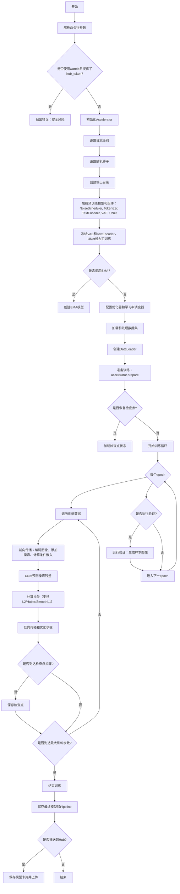

## 类结构

```
主脚本 (训练入口)
├── 全局函数
│   ├── parse_args (参数解析)
│   ├── save_model_card (生成模型卡片)
│   ├── log_validation (验证图像生成)
│   ├── conditional_loss (计算条件损失)
│   └── main (主训练流程)
├── 内部函数 (嵌套在main中)
│   ├── deepspeed_zero_init_disabled_context_manager
│   ├── save_model_hook
│   ├── load_model_hook
│   ├── unwrap_model
│   ├── tokenize_captions
│   ├── preprocess_train
│   └── collate_fn
└── 导入的模型类 (来自diffusers/transformers)
    ├── StableDiffusionPipeline
    ├── UNet2DConditionModel
    ├── AutoencoderKL
    ├── CLIPTextModel
    ├── CLIPTokenizer
    ├── DDPMScheduler
    └── EMAModel
```

## 全局变量及字段


### `logger`
    
日志记录器，用于记录训练过程中的信息

类型：`logging.Logger`
    


### `DATASET_NAME_MAPPING`
    
数据集列名映射，指定数据集中图像和文本列的名称

类型：`dict`
    


### `args`
    
命令行参数对象，包含所有训练配置参数

类型：`argparse.Namespace`
    


### `accelerator`
    
Accelerator实例，用于分布式训练和混合精度训练

类型：`Accelerator`
    


### `noise_scheduler`
    
噪声调度器，控制扩散过程中的噪声添加和去除

类型：`DDPMScheduler`
    


### `tokenizer`
    
分词器，用于将文本描述转换为token序列

类型：`CLIPTokenizer`
    


### `text_encoder`
    
文本编码器，将token编码为文本embedding向量

类型：`CLIPTextModel`
    


### `vae`
    
变分自编码器，用于将图像编码到潜在空间和解码回图像

类型：`AutoencoderKL`
    


### `unet`
    
UNet条件模型，用于在给定文本条件下预测噪声残差

类型：`UNet2DConditionModel`
    


### `ema_unet`
    
指数移动平均版本的UNet，用于稳定训练和提升模型性能

类型：`EMAModel`
    


### `optimizer`
    
AdamW优化器，用于更新UNet模型参数

类型：`torch.optim.AdamW`
    


### `lr_scheduler`
    
学习率调度器，控制训练过程中学习率的变化

类型：`torch.optim.lr_scheduler._LRScheduler`
    


### `train_dataset`
    
训练数据集，包含预处理后的图像和文本数据

类型：`datasets.Dataset`
    


### `train_dataloader`
    
训练数据加载器，用于批量加载训练数据

类型：`torch.utils.data.DataLoader`
    


### `weight_dtype`
    
权重数据类型，决定模型参数存储的精度（float32/float16/bfloat16）

类型：`torch.dtype`
    


    

## 全局函数及方法


### `parse_args`

该函数是Stable Diffusion训练脚本的命令行参数解析器，通过argparse库定义并收集所有训练所需的超参数、环境配置和路径设置，进行必要的环境变量检查和参数校验后返回包含所有配置的对象。

参数：无（该函数不接受任何传入参数，它内部创建argparse.ArgumentParser并添加各类参数）

返回值：`args`（命名空间），包含所有解析后的命令行参数及其值

#### 流程图

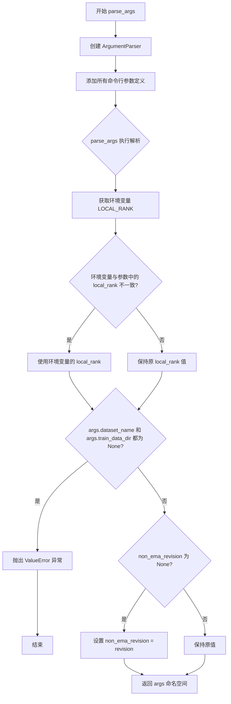

#### 带注释源码

```python
def parse_args():
    """
    解析命令行参数并返回包含所有训练配置的对象
    
    该函数创建argparse解析器,定义了大量用于Stable Diffusion模型微调的训练参数,
    包括模型路径、数据集配置、优化器参数、学习率调度、验证设置等。
    """
    
    # 创建ArgumentParser实例,设置默认描述信息
    parser = argparse.ArgumentParser(description="Simple example of a training script.")
    
    # ============ 模型相关参数 ============
    
    # 输入扰动比例参数,用于增加训练鲁棒性
    parser.add_argument(
        "--input_perturbation", type=float, default=0, help="The scale of input perturbation. Recommended 0.1."
    )
    
    # 预训练模型路径或模型标识符(必需参数)
    parser.add_argument(
        "--pretrained_model_name_or_path",
        type=str,
        default=None,
        required=True,
        help="Path to pretrained model or model identifier from huggingface.co/models.",
    )
    
    # 预训练模型的修订版本
    parser.add_argument(
        "--revision",
        type=str,
        default=None,
        required=False,
        help="Revision of pretrained model identifier from huggingface.co/models.",
    )
    
    # 模型文件变体(如fp16)
    parser.add_argument(
        "--variant",
        type=str,
        default=None,
        help="Variant of the model files of the pretrained model identifier from huggingface.co/models, 'e.g.' fp16",
    )
    
    # ============ 数据集相关参数 ============
    
    # 数据集名称(支持HuggingFace Hub或本地路径)
    parser.add_argument(
        "--dataset_name",
        type=str,
        default=None,
        help=(
            "The name of the Dataset (from the HuggingFace hub) to train on (could be your own, possibly private,"
            " dataset). It can also be a path pointing to a local copy of a dataset in your filesystem,"
            " or to a folder containing files that 🤗 Datasets can understand."
        ),
    )
    
    # 数据集配置名称
    parser.add_argument(
        "--dataset_config_name",
        type=str,
        default=None,
        help="The config of the Dataset, leave as None if there's only one config.",
    )
    
    # 本地训练数据目录
    parser.add_argument(
        "--train_data_dir",
        type=str,
        default=None,
        help=(
            "A folder containing the training data. Folder contents must follow the structure described in"
            " https://huggingface.co/docs/datasets/image_dataset#imagefolder. In particular, a `metadata.jsonl` file"
            " must exist to provide the captions for the images. Ignored if `dataset_name` is specified."
        ),
    )
    
    # 数据集中图像列的名称
    parser.add_argument(
        "--image_column", type=str, default="image", help="The column of the dataset containing an image."
    )
    
    # 数据集中文本描述/标题列的名称
    parser.add_argument(
        "--caption_column",
        type=str,
        default="text",
        help="The column of the dataset containing a caption or a list of captions.",
    )
    
    # 调试用途:限制训练样本数量
    parser.add_argument(
        "--max_train_samples",
        type=int,
        default=None,
        help=(
            "For debugging purposes or quicker training, truncate the number of training examples to this "
            "value if set."
        ),
    )
    
    # 验证提示词列表
    parser.add_argument(
        "--validation_prompts",
        type=str,
        default=None,
        nargs="+",
        help=("A set of prompts evaluated every `--validation_epochs` and logged to `--report_to`."),
    )
    
    # ============ 输出相关参数 ============
    
    # 输出目录,用于保存模型预测和检查点
    parser.add_argument(
        "--output_dir",
        type=str,
        default="sd-model-finetuned",
        help="The output directory where the model predictions and checkpoints will be written.",
    )
    
    # 缓存目录,存放下载的模型和数据集
    parser.add_argument(
        "--cache_dir",
        type=str,
        default=None,
        help="The directory where the downloaded models and datasets will be stored.",
    )
    
    # 随机种子,用于确保可重复训练
    parser.add_argument("--seed", type=int, default=None, help="A seed for reproducible training.")
    
    # ============ 图像预处理参数 ============
    
    # 输入图像的分辨率
    parser.add_argument(
        "--resolution",
        type=int,
        default=512,
        help=(
            "The resolution for input images, all the images in the train/validation dataset will be resized to this"
            " resolution"
        ),
    )
    
    # 是否对图像进行中心裁剪
    parser.add_argument(
        "--center_crop",
        default=False,
        action="store_true",
        help=(
            "Whether to center crop the input images to the resolution. If not set, the images will be randomly"
            " cropped. The images will be resized to the resolution first before cropping."
        ),
    )
    
    # 是否随机水平翻转图像
    parser.add_argument(
        "--random_flip",
        action="store_true",
        help="whether to randomly flip images horizontally",
    )
    
    # ============ 训练超参数 ============
    
    # 训练批次大小(每设备)
    parser.add_argument(
        "--train_batch_size", type=int, default=16, help="Batch size (per device) for the training dataloader."
    )
    
    # 训练轮数
    parser.add_argument("--num_train_epochs", type=int, default=100)
    
    # 最大训练步数(如果设置,则覆盖num_train_epochs)
    parser.add_argument(
        "--max_train_steps",
        type=int,
        default=None,
        help="Total number of training steps to perform.  If provided, overrides num_train_epochs.",
    )
    
    # 梯度累积步数
    parser.add_argument(
        "--gradient_accumulation_steps",
        type=int,
        default=1,
        help="Number of updates steps to accumulate before performing a backward/update pass.",
    )
    
    # 是否启用梯度检查点(以内存换速度)
    parser.add_argument(
        "--gradient_checkpointing",
        action="store_true",
        help="Whether or not to use gradient checkpointing to save memory at the expense of slower backward pass.",
    )
    
    # 初始学习率
    parser.add_argument(
        "--learning_rate",
        type=float,
        default=1e-4,
        help="Initial learning rate (after the potential warmup period) to use.",
    )
    
    # 是否根据GPU数量、梯度累积步数和批次大小缩放学习率
    parser.add_argument(
        "--scale_lr",
        action="store_true",
        default=False,
        help="Scale the learning rate by the number of GPUs, gradient accumulation steps, and batch size.",
    )
    
    # 学习率调度器类型
    parser.add_argument(
        "--lr_scheduler",
        type=str,
        default="constant",
        help=(
            'The scheduler type to use. Choose between ["linear", "cosine", "cosine_with_restarts", "polynomial",'
            ' "constant", "constant_with_warmup"]'
        ),
    )
    
    # 学习率预热步数
    parser.add_argument(
        "--lr_warmup_steps", type=int, default=500, help="Number of steps for the warmup in the lr scheduler."
    )
    
    # SNR加权gamma值(用于损失重平衡)
    parser.add_argument(
        "--snr_gamma",
        type=float,
        default=None,
        help="SNR weighting gamma to be used if rebalancing the loss. Recommended value is 5.0. "
        "More details here: https://huggingface.co/papers/2303.09556.",
    )
    
    # ============ 优化器参数 ============
    
    # 是否使用8位Adam优化器
    parser.add_argument(
        "--use_8bit_adam", action="store_true", help="Whether or not to use 8-bit Adam from bitsandbytes."
    )
    
    # 是否允许在Ampere GPU上使用TF32
    parser.add_argument(
        "--allow_tf32",
        action="store_true",
        help=(
            "Whether or not to allow TF32 on Ampere GPUs. Can be used to speed up training. For more information, see"
            " https://pytorch.org/docs/stable/notes/cuda.html#tensorfloat-32-tf32-on-ampere-devices"
        ),
    )
    
    # 是否使用指数移动平均(EMA)
    parser.add_argument("--use_ema", action="store_true", help="Whether to use EMA model.")
    
    # 非EMA模型的修订版本
    parser.add_argument(
        "--non_ema_revision",
        type=str,
        default=None,
        required=False,
        help=(
            "Revision of pretrained non-ema model identifier. Must be a branch, tag or git identifier of the local or"
            " remote repository specified with --pretrained_model_name_or_path."
        ),
    )
    
    # 数据加载器的工作进程数
    parser.add_argument(
        "--dataloader_num_workers",
        type=int,
        default=0,
        help=(
            "Number of subprocesses to use for data loading. 0 means that the data will be loaded in the main process."
        ),
    )
    
    # Adam优化器的beta1参数
    parser.add_argument("--adam_beta1", type=float, default=0.9, help="The beta1 parameter for the Adam optimizer.")
    
    # Adam优化器的beta2参数
    parser.add_argument("--adam_beta2", type=float, default=0.999, help="The beta2 parameter for the Adam optimizer.")
    
    # 权重衰减系数
    parser.add_argument("--adam_weight_decay", type=float, default=1e-2, help="Weight decay to use.")
    
    # Adam优化器的epsilon值
    parser.add_argument("--adam_epsilon", type=float, default=1e-08, help="Epsilon value for the Adam optimizer")
    
    # 最大梯度范数(用于梯度裁剪)
    parser.add_argument("--max_grad_norm", default=1.0, type=float, help="Max gradient norm.")
    
    # ============ 模型推送与Hub相关 ============
    
    # 是否将模型推送到Hub
    parser.add_argument("--push_to_hub", action="store_true", help="Whether or not to push the model to the Hub.")
    
    # 用于推送模型的Hub token
    parser.add_argument("--hub_token", type=str, default=None, help="The token to use to push to the Model Hub.")
    
    # 预测类型(epsilon或v_prediction)
    parser.add_argument(
        "--prediction_type",
        type=str,
        default=None,
        help="The prediction_type that shall be used for training. Choose between 'epsilon' or 'v_prediction' or leave `None`. If left to `None` the default prediction type of the scheduler: `noise_scheduler.config.prediction_type` is chosen.",
    )
    
    # Hub上的模型仓库名称
    parser.add_argument(
        "--hub_model_id",
        type=str,
        default=None,
        help="The name of the repository to keep in sync with the local `output_dir`.",
    )
    
    # ============ 日志与监控 ============
    
    # TensorBoard日志目录
    parser.add_argument(
        "--logging_dir",
        type=str,
        default="logs",
        help=(
            "[TensorBoard](https://www.tensorflow.org/tensorboard) log directory. Will default to"
            " *output_dir/runs/**CURRENT_DATETIME_HOSTNAME***."
        ),
    )
    
    # 混合精度训练类型
    parser.add_argument(
        "--mixed_precision",
        type=str,
        default=None,
        choices=["no", "fp16", "bf16"],
        help=(
            "Whether to use mixed precision. Choose between fp16 and bf16 (bfloat16). Bf16 requires PyTorch >="
            " 1.10.and an Nvidia Ampere GPU.  Default to the value of accelerate config of the current system or the"
            " flag passed with the `accelerate.launch` command. Use this argument to override the accelerate config."
        ),
    )
    
    # 日志和结果报告的目标平台
    parser.add_argument(
        "--report_to",
        type=str,
        default="tensorboard",
        help=(
            'The integration to report the results and logs to. Supported platforms are `"tensorboard"`'
            ' (default), `"wandb"` and `"comet_ml"`. Use `"all"` to report to all integrations.'
        ),
    )
    
    # 分布式训练:本地rank
    parser.add_argument("--local_rank", type=int, default=-1, help="For distributed training: local_rank")
    
    # ============ 检查点相关 ============
    
    # 保存检查点的步数间隔
    parser.add_argument(
        "--checkpointing_steps",
        type=int,
        default=500,
        help=(
            "Save a checkpoint of the training state every X updates. These checkpoints are only suitable for resuming"
            " training using `--resume_from_checkpoint`."
        ),
    )
    
    # 最大保存的检查点数量
    parser.add_argument(
        "--checkpoints_total_limit",
        type=int,
        default=None,
        help=("Max number of checkpoints to store."),
    )
    
    # 从检查点恢复训练
    parser.add_argument(
        "--resume_from_checkpoint",
        type=str,
        default=None,
        help=(
            "Whether training should be resumed from a previous checkpoint. Use a path saved by"
            ' `--checkpointing_steps`, or `"latest"` to automatically select the last available checkpoint.'
        ),
    )
    
    # ============ 高级特性 ============
    
    # 是否启用xFormers高效注意力机制
    parser.add_argument(
        "--enable_xformers_memory_efficient_attention", action="store_true", help="Whether or not to use xformers."
    )
    
    # 噪声偏移量
    parser.add_argument("--noise_offset", type=float, default=0, help="The scale of noise offset.")
    
    # 损失函数类型
    parser.add_argument(
        "--loss_type",
        type=str,
        default="l2",
        choices=["l2", "huber", "smooth_l1"],
        help="The type of loss to use and whether it's timestep-scheduled. See Issue #7488 for more info.",
    )
    
    # Huber损失的调度方式
    parser.add_argument(
        "--huber_schedule",
        type=str,
        default="snr",
        choices=["constant", "exponential", "snr"],
        help="The schedule to use for the huber losses parameter",
    )
    
    # Huber损失参数c
    parser.add_argument(
        "--huber_c",
        type=float,
        default=0.1,
        help="The huber loss parameter. Only used if one of the huber loss modes (huber or smooth l1) is selected with loss_type.",
    )
    
    # 验证执行的轮数间隔
    parser.add_argument(
        "--validation_epochs",
        type=int,
        default=5,
        help="Run validation every X epochs.",
    )
    
    # 跟踪器项目名称
    parser.add_argument(
        "--tracker_project_name",
        type=str,
        default="text2image-fine-tune",
        help=(
            "The `project_name` argument passed to Accelerator.init_trackers for"
            " more information see https://huggingface.co/docs/accelerate/v0.17.0/en/package_reference/accelerator#accelerate.Accelerator"
        ),
    )

    # ============ 解析参数 ============
    
    # 解析命令行传入的参数
    args = parser.parse_args()
    
    # ============ 环境变量处理 ============
    
    # 获取环境变量中的LOCAL_RANK,如果存在则优先使用
    env_local_rank = int(os.environ.get("LOCAL_RANK", -1))
    if env_local_rank != -1 and env_local_rank != args.local_rank:
        args.local_rank = env_local_rank

    # ============ 参数校验 ============
    
    # 校验:必须提供数据集名称或训练数据目录之一
    if args.dataset_name is None and args.train_data_dir is None:
        raise ValueError("Need either a dataset name or a training folder.")

    # 如果未指定非EMA模型的修订版本,则使用与主模型相同的修订版本
    if args.non_ema_revision is None:
        args.non_ema_revision = args.revision

    # 返回包含所有解析参数的命名空间对象
    return args
```


### `save_model_card`

该函数用于在模型训练完成后生成并保存模型的 README.md 文件（模型卡片），包含模型描述、训练配置信息、示例图像以及使用说明，并可选地集成 W&B 实验追踪链接。

参数：

-  `args`：命名空间对象，包含所有训练超参数（如模型路径、数据集名称、学习率、批次大小等）
-  `repo_id`：str，HuggingFace Hub 上的仓库 ID，用于标识模型
-  `images`：list，训练过程中生成的验证图像列表，用于展示模型效果，默认为 None
-  `repo_folder`：str，本地仓库文件夹路径，用于保存模型文件，默认为 None

返回值：`None`，该函数直接写入文件，不返回任何值

#### 流程图

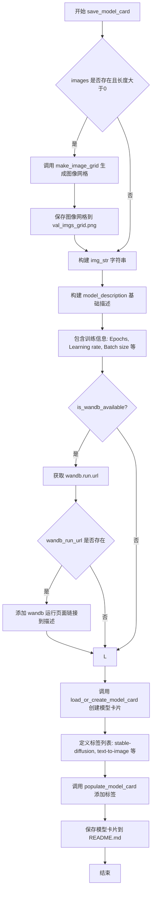

#### 带注释源码

```python
def save_model_card(
    args,
    repo_id: str,
    images: list = None,
    repo_folder: str = None,
):
    """
    生成并保存模型的 README.md 文件（模型卡片）
    
    参数:
        args: 包含训练配置的命名空间对象
        repo_id: HuggingFace Hub 仓库 ID
        images: 验证时生成的图像列表
        repo_folder: 本地仓库文件夹路径
    """
    img_str = ""
    # 如果存在验证图像，则生成图像网格并保存
    if len(images) > 0:
        # 使用 make_image_grid 将多张图像拼接成网格
        image_grid = make_image_grid(images, 1, len(args.validation_prompts))
        # 保存图像网格到本地仓库文件夹
        image_grid.save(os.path.join(repo_folder, "val_imgs_grid.png"))
        # 构建 Markdown 格式的图像引用字符串
        img_str += "\n"

    # 构建模型描述，包含基础模型、训练数据集和使用提示
    model_description = f"""
# Text-to-image finetuning - {repo_id}

This pipeline was finetuned from **{args.pretrained_model_name_or_path}** on the **{args.dataset_name}** dataset. Below are some example images generated with the finetuned pipeline using the following prompts: {args.validation_prompts}: \n
{img_str}

## Pipeline usage

You can use the pipeline like so:

```python
from diffusers import DiffusionPipeline
import torch

pipeline = DiffusionPipeline.from_pretrained("{repo_id}", torch_dtype=torch.float16)
prompt = "{args.validation_prompts[0]}"
image = pipeline(prompt).images[0]
image.save("my_image.png")
```

## Training info

These are the key hyperparameters used during training:

* Epochs: {args.num_train_epochs}
* Learning rate: {args.learning_rate}
* Batch size: {args.train_batch_size}
* Gradient accumulation steps: {args.gradient_accumulation_steps}
* Image resolution: {args.resolution}
* Mixed-precision: {args.mixed_precision}

"""
    wandb_info = ""
    # 检查 W&B 是否可用，用于实验追踪
    if is_wandb_available():
        wandb_run_url = None
        if wandb.run is not None:
            # 获取当前 W&B 运行的 URL
            wandb_run_url = wandb.run.url

    # 如果存在 W&B 运行 URL，则在模型描述中添加链接
    if wandb_run_url is not None:
        wandb_info = f"""
More information on all the CLI arguments and the environment are available on your [`wandb` run page]({wandb_run_url}).
"""

    # 将 W&B 信息追加到模型描述
    model_description += wandb_info

    # 加载或创建模型卡片，包含训练信息和基础模型信息
    model_card = load_or_create_model_card(
        repo_id_or_path=repo_id,
        from_training=True,
        license="creativeml-openrail-m",
        base_model=args.pretrained_model_name_or_path,
        model_description=model_description,
        inference=True,
    )

    # 定义模型标签，用于分类和搜索
    tags = ["stable-diffusion", "stable-diffusion-diffusers", "text-to-image", "diffusers", "diffusers-training"]
    # 填充模型卡片的标签字段
    model_card = populate_model_card(model_card, tags=tags)

    # 将模型卡片保存为 README.md 文件
    model_card.save(os.path.join(repo_folder, "README.md"))
```


### `log_validation`

该函数是 Stable Diffusion 微调训练脚本中的验证函数，负责在训练过程中定期运行推理以生成验证图像，并将生成的图像记录到 TensorBoard 或 WandB 等跟踪工具中，同时支持 EMA 模型的参数切换。

参数：

- `vae`：`AutoencoderKL`，变分自编码器模型，用于将图像编码到潜在空间
- `text_encoder`：`CLIPTextModel`，文本编码器模型，将文本提示转换为嵌入向量
- `tokenizer`：`CLIPTokenizer`，CLIP 模型的分词器，用于对文本进行分词
- `unet`：`UNet2DConditionModel`，UNet 模型，用于去噪潜在表示
- `args`：命名空间对象，包含所有训练参数（`pretrained_model_name_or_path`、`validation_prompts`、`enable_xformers_memory_efficient_attention`、`seed`、`revision`、`variant` 等）
- `accelerator`：`Accelerator`，HuggingFace Accelerate 库提供的分布式训练加速器对象
- `weight_dtype`：`torch.dtype`，权重数据类型（float32/float16/bfloat16），用于模型推理
- `epoch`：`int`，当前训练的轮次编号，用于记录到跟踪工具

返回值：`List[PIL.Image]`，生成的验证图像列表，每个元素为 PIL 图像对象

#### 流程图

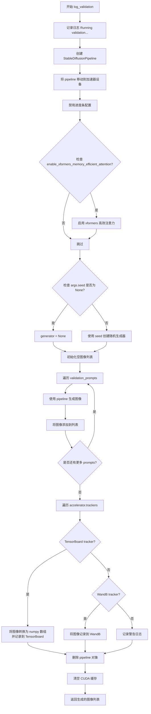

#### 带注释源码

```python
def log_validation(vae, text_encoder, tokenizer, unet, args, accelerator, weight_dtype, epoch):
    """
    运行验证流程，生成验证图像并记录到跟踪工具
    
    参数:
        vae: 变分自编码器模型
        text_encoder: 文本编码器
        tokenizer: 分词器
        unet: UNet2DConditionModel 去噪模型
        args: 包含所有配置参数的对象
        accelerator: Accelerate 分布式训练加速器
        weight_dtype: 推理所用的数值精度类型
        epoch: 当前训练轮次
    返回:
        images: 生成的 PIL.Image 对象列表
    """
    logger.info("Running validation... ")

    # 1. 使用 accelerator.unwrap_model 获取原始模型（移除分布式包装）
    # 2. 从预训练模型路径加载 StableDiffusionPipeline
    # 3. 禁用 safety_checker 以避免不必要的过滤（验证时通常不需要）
    # 4. 使用指定的 revision 和 variant
    # 5. 使用指定的 weight_dtype 进行推理
    pipeline = StableDiffusionPipeline.from_pretrained(
        args.pretrained_model_name_or_path,
        vae=accelerator.unwrap_model(vae),
        text_encoder=accelerator.unwrap_model(text_encoder),
        tokenizer=tokenizer,
        unet=accelerator.unwrap_model(unet),
        safety_checker=None,
        revision=args.revision,
        variant=args.variant,
        torch_dtype=weight_dtype,
    )
    
    # 将 pipeline 移动到分布式训练设备上
    pipeline = pipeline.to(accelerator.device)
    
    # 禁用推理时的进度条（减少日志输出噪音）
    pipeline.set_progress_bar_config(disable=True)

    # 6. 如果启用 xformers，启用高效注意力机制以减少显存占用
    if args.enable_xformers_memory_efficient_attention:
        pipeline.enable_xformers_memory_efficient_attention()

    # 7. 如果指定了 seed，创建随机生成器以确保可重复性
    if args.seed is None:
        generator = None
    else:
        generator = torch.Generator(device=accelerator.device).manual_seed(args.seed)

    # 8. 遍历所有验证 prompts，生成对应的图像
    images = []
    for i in range(len(args.validation_prompts)):
        # 使用 torch.autocast 启用混合精度推理（自动选择 float16/bfloat16）
        with torch.autocast("cuda"):
            # pipeline 调用生成图像，num_inference_steps=20 为固定推理步数
            image = pipeline(args.validation_prompts[i], num_inference_steps=20, generator=generator).images[0]

        images.append(image)

    # 9. 将生成的图像记录到配置的跟踪工具
    # 支持 TensorBoard 和 WandB 两种主流工具
    for tracker in accelerator.trackers:
        if tracker.name == "tensorboard":
            # TensorBoard: 将 PIL 图像转换为 numpy 数组
            # NHWC 格式: (batch, height, width, channels)
            np_images = np.stack([np.asarray(img) for img in images])
            tracker.writer.add_images("validation", np_images, epoch, dataformats="NHWC")
        elif tracker.name == "wandb":
            # WandB: 使用 wandb.Image 包装图像，并添加 caption
            tracker.log(
                {
                    "validation": [
                        wandb.Image(image, caption=f"{i}: {args.validation_prompts[i]}")
                        for i, image in enumerate(images)
                    ]
                }
            )
        else:
            # 对于不支持的 tracker，记录警告
            logger.warning(f"image logging not implemented for {tracker.name}")

    # 10. 清理资源：删除 pipeline 对象并清空 CUDA 缓存
    # 这对于在训练循环中定期调用验证非常重要，可以防止显存泄漏
    del pipeline
    torch.cuda.empty_cache()

    # 返回生成的图像列表，供调用者使用（如保存或进一步处理）
    return images
```


### `conditional_loss`

该函数用于计算条件损失函数，支持三种常见的损失类型（L2/均方误差、Huber损失和Smooth L1损失），根据传入的 `loss_type` 参数选择对应的损失计算方式，并支持不同的聚合方式（mean、sum）。

参数：

- `model_pred`：`torch.Tensor`，模型的预测输出
- `target`：`torch.Tensor`，目标/真实值
- `reduction`：`str`，损失聚合方式，可选值为 "mean"、"sum" 或 "none"，默认为 "mean"
- `loss_type`：`str`，损失函数类型，可选值为 "l2"、"huber" 或 "smooth_l1"，默认为 "l2"
- `huber_c`：`float`，Huber 损失和 Smooth L1 损失的超参数，用于控制损失曲线的平滑程度，默认为 0.1

返回值：`torch.Tensor`，计算得到的损失值

#### 流程图

```mermaid
flowchart TD
    A[开始: conditional_loss] --> B{loss_type == 'l2'?}
    B -->|Yes| C[使用 F.mse_loss 计算 L2 损失]
    B -->|No| D{loss_type == 'huber'?}
    D -->|Yes| E[计算 Huber 损失: 2 * huber_c * (sqrt((pred-target)² + huber_c²) - huber_c)]
    E --> F{reduction == 'mean'?}
    F -->|Yes| G[torch.mean(loss)]
    F -->|No| H{reduction == 'sum'?}
    H -->|Yes| I[torch.sum(loss)]
    H -->|No| J[不聚合]
    D -->|No| K{loss_type == 'smooth_l1'?}
    K -->|Yes| L[计算 Smooth L1 损失: 2 * (sqrt((pred-target)² + huber_c²) - huber_c)]
    L --> M{reduction == 'mean'?}
    M -->|Yes| N[torch.mean(loss)]
    M -->|No| O{reduction == 'sum'?}
    O -->|Yes| P[torch.sum(loss)]
    O -->|No| Q[不聚合]
    K -->|No| R[抛出 NotImplementedError]
    C --> S[返回 loss]
    G --> S
    I --> S
    J --> S
    N --> S
    P --> S
    Q --> S
```

#### 带注释源码

```python
def conditional_loss(
    model_pred: torch.Tensor,
    target: torch.Tensor,
    reduction: str = "mean",
    loss_type: str = "l2",
    huber_c: float = 0.1,
):
    """
    计算条件损失函数，支持多种损失类型和聚合方式。
    
    参数:
        model_pred: torch.Tensor - 模型的预测输出
        target: torch.Tensor - 目标/真实值
        reduction: str - 损失聚合方式，可选 "mean", "sum", "none"
        loss_type: str - 损失类型，可选 "l2", "huber", "smooth_l1"
        huber_c: float - Huber/Smooth L1 损失的超参数，控制损失曲线的平滑程度
    
    返回:
        torch.Tensor - 计算得到的损失值
    """
    # L2 损失（均方误差损失）
    if loss_type == "l2":
        # 使用 PyTorch 内置的 MSE 损失函数
        loss = F.mse_loss(model_pred, target, reduction=reduction)
    
    # Huber 损失（是 L1 和 L2 损失的组合，对异常值更鲁棒）
    elif loss_type == "huber":
        # 计算 Huber 损失：2 * c * (sqrt((pred - target)^2 + c^2) - c)
        # 这种形式确保在零点可导，且对大误差使用线性损失
        loss = 2 * huber_c * (torch.sqrt((model_pred - target) ** 2 + huber_c**2) - huber_c)
        
        # 根据 reduction 参数进行聚合
        if reduction == "mean":
            loss = torch.mean(loss)
        elif reduction == "sum":
            loss = torch.sum(loss)
    
    # Smooth L1 损失（也称为 Huber 损失的变体）
    elif loss_type == "smooth_l1":
        # 计算 Smooth L1 损失：2 * (sqrt((pred - target)^2 + c^2) - c)
        # 与 Huber 损失相比，系数不同
        loss = 2 * (torch.sqrt((model_pred - target) ** 2 + huber_c**2) - huber_c)
        
        # 根据 reduction 参数进行聚合
        if reduction == "mean":
            loss = torch.mean(loss)
        elif reduction == "sum":
            loss = torch.sum(loss)
    
    # 不支持的损失类型，抛出异常
    else:
        raise NotImplementedError(f"Unsupported Loss Type {loss_type}")
    
    return loss
```


### `main`

主训练函数，负责执行 Stable Diffusion 模型的微调训练流程。该函数通过命令行参数解析获取配置，初始化加速器、数据集、模型和优化器，然后进行多epoch的训练循环，包括前向传播、损失计算、反向传播、模型保存和验证，最终将训练好的模型保存为可部署的 Diffusers 流水线格式。

参数：

- 无直接参数（通过内部调用 `parse_args()` 获取命令行参数）

返回值：`None`，无返回值（执行训练副作用）

#### 流程图

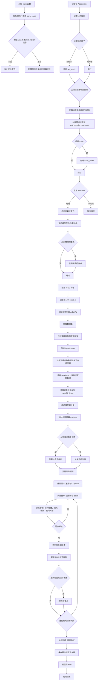

#### 带注释源码

```python
def main():
    """
    主训练函数，执行 Stable Diffusion 模型的完整微调流程。
    包括参数解析、模型初始化、数据准备、训练循环、验证和模型保存。
    """
    # 步骤1: 解析命令行参数
    args = parse_args()

    # 步骤2: 安全检查 - wandb 和 hub_token 不能同时使用（安全风险）
    if args.report_to == "wandb" and args.hub_token is not None:
        raise ValueError(
            "You cannot use both --report_to=wandb and --hub_token due to a security risk of exposing your token."
            " Please use `hf auth login` to authenticate with the Hub."
        )

    # 步骤3: 弃用警告检查
    if args.non_ema_revision is not None:
        deprecate(
            "non_ema_revision!=None",
            "0.15.0",
            message=(
                "Downloading 'non_ema' weights from revision branches of the Hub is deprecated. Please make sure to"
                " use `--variant=non_ema` instead."
            ),
        )
    
    # 步骤4: 配置日志目录
    logging_dir = os.path.join(args.output_dir, args.logging_dir)

    # 步骤5: 创建加速器项目配置
    accelerator_project_config = ProjectConfiguration(project_dir=args.output_dir, logging_dir=logging_dir)

    # 步骤6: 初始化 Accelerator（分布式训练、混合精度等）
    accelerator = Accelerator(
        gradient_accumulation_steps=args.gradient_accumulation_steps,
        mixed_precision=args.mixed_precision,
        log_with=args.report_to,
        project_config=accelerator_project_config,
    )

    # 步骤7: 配置日志格式
    logging.basicConfig(
        format="%(asctime)s - %(levelname)s - %(name)s - %(message)s",
        datefmt="%m/%d/%Y %H:%M:%S",
        level=logging.INFO,
    )
    logger.info(accelerator.state, main_process_only=False)
    
    # 步骤8: 根据进程类型设置日志级别（主进程显示详细信息，其他进程仅显示错误）
    if accelerator.is_local_main_process:
        datasets.utils.logging.set_verbosity_warning()
        transformers.utils.logging.set_verbosity_warning()
        diffusers.utils.logging.set_verbosity_info()
    else:
        datasets.utils.logging.set_verbosity_error()
        transformers.utils.logging.set_verbosity_error()
        diffusers.utils.logging.set_verbosity_error()

    # 步骤9: 设置随机种子以确保可复现性
    if args.seed is not None:
        set_seed(args.seed)

    # 步骤10: 处理输出目录创建（主进程执行）
    if accelerator.is_main_process:
        if args.output_dir is not None:
            os.makedirs(args.output_dir, exist_ok=True)

        # 步骤11: 如果推送到 Hub，创建远程仓库
        if args.push_to_hub:
            repo_id = create_repo(
                repo_id=args.hub_model_id or Path(args.output_dir).name, exist_ok=True, token=args.hub_token
            ).repo_id

    # 步骤12: 加载噪声调度器和分词器
    noise_scheduler = DDPMScheduler.from_pretrained(args.pretrained_model_name_or_path, subfolder="scheduler")
    tokenizer = CLIPTokenizer.from_pretrained(
        args.pretrained_model_name_or_path, subfolder="tokenizer", revision=args.revision
    )

    # 步骤13: 定义 Deepspeed ZeRO-3 上下文管理器（处理兼容性问题）
    def deepspeed_zero_init_disabled_context_manager():
        """
        返回一个上下文列表，用于在 Deepspeed ZeRO-3 环境下禁用 zero.Init
        """
        deepspeed_plugin = AcceleratorState().deepspeed_plugin if accelerate.state.is_initialized() else None
        if deepspeed_plugin is None:
            return []
        return [deepspeed_plugin.zero3_init_context_manager(enable=False)]

    # 步骤14: 加载预训练模型（使用 ContextManagers 处理 Deepspeed 兼容性问题）
    with ContextManagers(deepspeed_zero_init_disabled_context_manager()):
        text_encoder = CLIPTextModel.from_pretrained(
            args.pretrained_model_name_or_path, subfolder="text_encoder", revision=args.revision, variant=args.variant
        )
        vae = AutoencoderKL.from_pretrained(
            args.pretrained_model_name_or_path, subfolder="vae", revision=args.revision, variant=args.variant
        )

    # 步骤15: 加载 UNet 模型
    unet = UNet2DConditionModel.from_pretrained(
        args.pretrained_model_name_or_path, subfolder="unet", revision=args.non_ema_revision
    )

    # 步骤16: 冻结 VAE 和 TextEncoder，仅训练 UNet
    vae.requires_grad_(False)
    text_encoder.requires_grad_(False)
    unet.train()

    # 步骤17: 创建 EMA（指数移动平均）模型用于 UNet
    if args.use_ema:
        ema_unet = UNet2DConditionModel.from_pretrained(
            args.pretrained_model_name_or_path, subfolder="unet", revision=args.revision, variant=args.variant
        )
        ema_unet = EMAModel(ema_unet.parameters(), model_cls=UNet2DConditionModel, model_config=ema_unet.config)

    # 步骤18: 启用 xformers 高效注意力（如可用）
    if args.enable_xformers_memory_efficient_attention:
        if is_xformers_available():
            import xformers

            xformers_version = version.parse(xformers.__version__)
            if xformers_version == version.parse("0.0.16"):
                logger.warning(
                    "xFormers 0.0.16 cannot be used for training in some GPUs. If you observe problems during training, please update xFormers to at least 0.0.17. See https://huggingface.co/docs/diffusers/main/en/optimization/xformers for more details."
                )
            unet.enable_xformers_memory_efficient_attention()
        else:
            raise ValueError("xformers is not available. Make sure it is installed correctly")

    # 步骤19: 注册自定义模型保存/加载钩子（accelerate 0.16.0+ 支持）
    if version.parse(accelerate.__version__) >= version.parse("0.16.0"):
        def save_model_hook(models, weights, output_dir):
            """保存模型时的钩子函数"""
            if accelerator.is_main_process:
                if args.use_ema:
                    ema_unet.save_pretrained(os.path.join(output_dir, "unet_ema"))

                for i, model in enumerate(models):
                    model.save_pretrained(os.path.join(output_dir, "unet"))
                    weights.pop()  # 避免重复保存

        def load_model_hook(models, input_dir):
            """加载模型时的钩子函数"""
            if args.use_ema:
                load_model = EMAModel.from_pretrained(os.path.join(input_dir, "unet_ema"), UNet2DConditionModel)
                ema_unet.load_state_dict(load_model.state_dict())
                ema_unet.to(accelerator.device)
                del load_model

            for _ in range(len(models)):
                model = models.pop()
                load_model = UNet2DConditionModel.from_pretrained(input_dir, subfolder="unet")
                model.register_to_config(**load_model.config)
                model.load_state_dict(load_model.state_dict())
                del load_model

        accelerator.register_save_state_pre_hook(save_model_hook)
        accelerator.register_load_state_pre_hook(load_model_hook)

    # 步骤20: 启用梯度检查点以节省显存
    if args.gradient_checkpointing:
        unet.enable_gradient_checkpointing()

    # 步骤21: 启用 TF32 加速（Ampere GPU）
    if args.allow_tf32:
        torch.backends.cuda.matmul.allow_tf32 = True

    # 步骤22: 根据配置调整学习率
    if args.scale_lr:
        args.learning_rate = (
            args.learning_rate * args.gradient_accumulation_steps * args.train_batch_size * accelerator.num_processes
        )

    # 步骤23: 初始化优化器（支持 8-bit Adam）
    if args.use_8bit_adam:
        try:
            import bitsandbytes as bnb
        except ImportError:
            raise ImportError(
                "Please install bitsandbytes to use 8-bit Adam. You can do so by running `pip install bitsandbytes`"
            )
        optimizer_cls = bnb.optim.AdamW8bit
    else:
        optimizer_cls = torch.optim.AdamW

    optimizer = optimizer_cls(
        unet.parameters(),
        lr=args.learning_rate,
        betas=(args.adam_beta1, args.adam_beta2),
        weight_decay=args.adam_weight_decay,
        eps=args.adam_epsilon,
    )

    # 步骤24: 加载数据集
    if args.dataset_name is not None:
        # 从 Hub 下载数据集
        dataset = load_dataset(
            args.dataset_name,
            args.dataset_config_name,
            cache_dir=args.cache_dir,
            data_dir=args.train_data_dir,
        )
    else:
        # 从本地文件夹加载
        data_files = {}
        if args.train_data_dir is not None:
            data_files["train"] = os.path.join(args.train_data_dir, "**")
        dataset = load_dataset(
            "imagefolder",
            data_files=data_files,
            cache_dir=args.cache_dir,
        )

    # 步骤25: 预处理数据集
    column_names = dataset["train"].column_names
    dataset_columns = DATASET_NAME_MAPPING.get(args.dataset_name, None)
    
    # 确定图像和文本列名
    if args.image_column is None:
        image_column = dataset_columns[0] if dataset_columns is not None else column_names[0]
    else:
        image_column = args.image_column
        if image_column not in column_names:
            raise ValueError(f"--image_column' value '{args.image_column}' needs to be one of: {', '.join(column_names)}")
    
    if args.caption_column is None:
        caption_column = dataset_columns[1] if dataset_columns is not None else column_names[1]
    else:
        caption_column = args.caption_column
        if caption_column not in column_names:
            raise ValueError(f"--caption_column' value '{args.caption_column}' needs to be one of: {', '.join(column_names)}")

    # 步骤26: 定义文本编码函数
    def tokenize_captions(examples, is_train=True):
        """将文本 captions 转换为 token IDs"""
        captions = []
        for caption in examples[caption_column]:
            if isinstance(caption, str):
                captions.append(caption)
            elif isinstance(caption, (list, np.ndarray)):
                captions.append(random.choice(caption) if is_train else caption[0])
            else:
                raise ValueError(f"Caption column `{caption_column}` should contain either strings or lists of strings.")
        inputs = tokenizer(
            captions, max_length=tokenizer.model_max_length, padding="max_length", truncation=True, return_tensors="pt"
        )
        return inputs.input_ids

    # 步骤27: 定义图像预处理 transforms
    train_transforms = transforms.Compose(
        [
            transforms.Resize(args.resolution, interpolation=transforms.InterpolationMode.BILINEAR),
            transforms.CenterCrop(args.resolution) if args.center_crop else transforms.RandomCrop(args.resolution),
            transforms.RandomHorizontalFlip() if args.random_flip else transforms.Lambda(lambda x: x),
            transforms.ToTensor(),
            transforms.Normalize([0.5], [0.5]),  # 归一化到 [-1, 1]
        ]
    )

    # 步骤28: 定义数据集预处理函数
    def preprocess_train(examples):
        """预处理训练数据：转换图像并编码文本"""
        images = [image.convert("RGB") for image in examples[image_column]]
        examples["pixel_values"] = [train_transforms(image) for image in images]
        examples["input_ids"] = tokenize_captions(examples)
        return examples

    # 步骤29: 应用预处理 transforms
    with accelerator.main_process_first():
        if args.max_train_samples is not None:
            dataset["train"] = dataset["train"].shuffle(seed=args.seed).select(range(args.max_train_samples))
        train_dataset = dataset["train"].with_transform(preprocess_train)

    # 步骤30: 定义批处理整理函数
    def collate_fn(examples):
        """将样本整理为批次"""
        pixel_values = torch.stack([example["pixel_values"] for example in examples])
        pixel_values = pixel_values.to(memory_format=torch.contiguous_format).float()
        input_ids = torch.stack([example["input_ids"] for example in examples])
        return {"pixel_values": pixel_values, "input_ids": input_ids}

    # 步骤31: 创建 DataLoader
    train_dataloader = torch.utils.data.DataLoader(
        train_dataset,
        shuffle=True,
        collate_fn=collate_fn,
        batch_size=args.train_batch_size,
        num_workers=args.dataloader_num_workers,
    )

    # 步骤32: 计算训练步数和创建学习率调度器
    overrode_max_train_steps = False
    num_update_steps_per_epoch = math.ceil(len(train_dataloader) / args.gradient_accumulation_steps)
    if args.max_train_steps is None:
        args.max_train_steps = args.num_train_epochs * num_update_steps_per_epoch
        overrode_max_train_steps = True

    lr_scheduler = get_scheduler(
        args.lr_scheduler,
        optimizer=optimizer,
        num_warmup_steps=args.lr_warmup_steps * accelerator.num_processes,
        num_training_steps=args.max_train_steps * accelerator.num_processes,
    )

    # 步骤33: 使用 Accelerator 准备模型和数据
    unet, optimizer, train_dataloader, lr_scheduler = accelerator.prepare(
        unet, optimizer, train_dataloader, lr_scheduler
    )

    if args.use_ema:
        ema_unet.to(accelerator.device)

    # 步骤34: 设置权重数据类型（混合精度）
    weight_dtype = torch.float32
    if accelerator.mixed_precision == "fp16":
        weight_dtype = torch.float16
    elif accelerator.mixed_precision == "bf16":
        weight_dtype = torch.bfloat16

    # 步骤35: 移动冻结模型到设备
    text_encoder.to(accelerator.device, dtype=weight_dtype)
    vae.to(accelerator.device, dtype=weight_dtype)

    # 步骤36: 重新计算训练步数
    num_update_steps_per_epoch = math.ceil(len(train_dataloader) / args.gradient_accumulation_steps)
    if overrode_max_train_steps:
        args.max_train_steps = args.num_train_epochs * num_update_steps_per_epoch
    args.num_train_epochs = math.ceil(args.max_train_steps / num_update_steps_per_epoch)

    # 步骤37: 初始化跟踪器
    if accelerator.is_main_process:
        tracker_config = dict(vars(args))
        tracker_config.pop("validation_prompts")
        accelerator.init_trackers(args.tracker_project_name, tracker_config)

    # 步骤38: 定义模型解包函数（处理 torch.compile 情况）
    def unwrap_model(model):
        model = accelerator.unwrap_model(model)
        model = model._orig_mod if is_compiled_module(model) else model
        return model

    # 步骤39: 打印训练信息
    total_batch_size = args.train_batch_size * accelerator.num_processes * args.gradient_accumulation_steps
    logger.info("***** Running training *****")
    logger.info(f"  Num examples = {len(train_dataset)}")
    logger.info(f"  Num Epochs = {args.num_train_epochs}")
    logger.info(f"  Instantaneous batch size per device = {args.train_batch_size}")
    logger.info(f"  Total train batch size = {total_batch_size}")
    logger.info(f"  Gradient Accumulation steps = {args.gradient_accumulation_steps}")
    logger.info(f"  Total optimization steps = {args.max_train_steps}")

    # 步骤40: 初始化训练状态变量
    global_step = 0
    first_epoch = 0

    # 步骤41: 从检查点恢复训练（如指定）
    if args.resume_from_checkpoint:
        if args.resume_from_checkpoint != "latest":
            path = os.path.basename(args.resume_from_checkpoint)
        else:
            dirs = os.listdir(args.output_dir)
            dirs = [d for d in dirs if d.startswith("checkpoint")]
            dirs = sorted(dirs, key=lambda x: int(x.split("-")[1]))
            path = dirs[-1] if len(dirs) > 0 else None

        if path is None:
            accelerator.print(f"Checkpoint '{args.resume_from_checkpoint}' does not exist. Starting a new training run.")
            args.resume_from_checkpoint = None
            initial_global_step = 0
        else:
            accelerator.print(f"Resuming from checkpoint {path}")
            accelerator.load_state(os.path.join(args.output_dir, path))
            global_step = int(path.split("-")[1])
            initial_global_step = global_step
            first_epoch = global_step // num_update_steps_per_epoch
    else:
        initial_global_step = 0

    # 步骤42: 创建进度条
    progress_bar = tqdm(
        range(0, args.max_train_steps),
        initial=initial_global_step,
        desc="Steps",
        disable=not accelerator.is_local_main_process,
    )

    # 步骤43: ===== 训练循环 =====
    for epoch in range(first_epoch, args.num_train_epochs):
        train_loss = 0.0
        
        # 内层循环：遍历数据加载器
        for step, batch in enumerate(train_dataloader):
            with accelerator.accumulate(unet):
                # ===== 步骤 43.1: 将图像编码到潜在空间 =====
                latents = vae.encode(batch["pixel_values"].to(weight_dtype)).latent_dist.sample()
                latents = latents * vae.config.scaling_factor

                # ===== 步骤 43.2: 采样噪声 =====
                noise = torch.randn_like(latents)
                if args.noise_offset:
                    noise += args.noise_offset * torch.randn(
                        (latents.shape[0], latents.shape[1], 1, 1), device=latents.device
                    )
                
                # ===== 步骤 43.3: 输入扰动 =====
                if args.input_perturbation:
                    new_noise = noise + args.input_perturbation * torch.randn_like(noise)
                
                bsz = latents.shape[0]

                # ===== 步骤 43.4: 采样随机时间步 =====
                if args.loss_type == "huber" or args.loss_type == "smooth_l1":
                    timesteps = torch.randint(0, noise_scheduler.config.num_train_timesteps, (1,), device="cpu")
                    timestep = timesteps.item()

                    # 根据调度计划计算 huber_c 参数
                    if args.huber_schedule == "exponential":
                        alpha = -math.log(args.huber_c) / noise_scheduler.config.num_train_timesteps
                        huber_c = math.exp(-alpha * timestep)
                    elif args.huber_schedule == "snr":
                        alphas_cumprod = noise_scheduler.alphas_cumprod[timestep]
                        sigmas = ((1.0 - alphas_cumprod) / alphas_cumprod) ** 0.5
                        huber_c = (1 - args.huber_c) / (1 + sigmas) ** 2 + args.huber_c
                    elif args.huber_schedule == "constant":
                        huber_c = args.huber_c

                    timesteps = timesteps.repeat(bsz).to(latents.device)
                elif args.loss_type == "l2":
                    timesteps = torch.randint(
                        0, noise_scheduler.config.num_train_timesteps, (bsz,), device=latents.device
                    )
                    huber_c = 1

                timesteps = timesteps.long()

                # ===== 步骤 43.5: 前向扩散过程 =====
                if args.input_perturbation:
                    noisy_latents = noise_scheduler.add_noise(latents, new_noise, timesteps)
                else:
                    noisy_latents = noise_scheduler.add_noise(latents, noise, timesteps)

                # ===== 步骤 43.6: 获取文本嵌入 =====
                encoder_hidden_states = text_encoder(batch["input_ids"], return_dict=False)[0]

                # ===== 步骤 43.7: 确定预测目标 =====
                if args.prediction_type is not None:
                    noise_scheduler.register_to_config(prediction_type=args.prediction_type)

                if noise_scheduler.config.prediction_type == "epsilon":
                    target = noise
                elif noise_scheduler.config.prediction_type == "v_prediction":
                    target = noise_scheduler.get_velocity(latents, noise, timesteps)

                # ===== 步骤 43.8: 前向传播 - 预测噪声残差 =====
                model_pred = unet(noisy_latents, timesteps, encoder_hidden_states, return_dict=False)[0]

                # ===== 步骤 43.9: 计算损失 =====
                if args.snr_gamma is None:
                    loss = conditional_loss(
                        model_pred.float(), target.float(), reduction="mean", loss_type=args.loss_type, huber_c=huber_c
                    )
                else:
                    # SNR 加权损失
                    snr = compute_snr(noise_scheduler, timesteps)
                    mse_loss_weights = torch.stack([snr, args.snr_gamma * torch.ones_like(timesteps)], dim=1).min(dim=1)[0]
                    if noise_scheduler.config.prediction_type == "epsilon":
                        mse_loss_weights = mse_loss_weights / snr
                    elif noise_scheduler.config.prediction_type == "v_prediction":
                        mse_loss_weights = mse_loss_weights / (snr + 1)

                    loss = conditional_loss(
                        model_pred.float(), target.float(), reduction="none", loss_type=args.loss_type, huber_c=huber_c
                    )
                    loss = loss.mean(dim=list(range(1, len(loss.shape)))) * mse_loss_weights
                    loss = loss.mean()

                # ===== 步骤 43.10: 收集损失用于日志 =====
                avg_loss = accelerator.gather(loss.repeat(args.train_batch_size)).mean()
                train_loss += avg_loss.item() / args.gradient_accumulation_steps

                # ===== 步骤 43.11: 反向传播 =====
                accelerator.backward(loss)
                
                # ===== 步骤 43.12: 梯度裁剪 =====
                if accelerator.sync_gradients:
                    accelerator.clip_grad_norm_(unet.parameters(), args.max_grad_norm)
                
                # ===== 步骤 43.13: 优化器步骤 =====
                optimizer.step()
                lr_scheduler.step()
                optimizer.zero_grad()

            # ===== 步骤 43.14: 同步后的操作 =====
            if accelerator.sync_gradients:
                if args.use_ema:
                    ema_unet.step(unet.parameters())
                progress_bar.update(1)
                global_step += 1
                accelerator.log({"train_loss": train_loss}, step=global_step)
                train_loss = 0.0

                # ===== 步骤 43.15: 保存检查点 =====
                if global_step % args.checkpointing_steps == 0:
                    if accelerator.is_main_process:
                        # 检查并删除旧检查点
                        if args.checkpoints_total_limit is not None:
                            checkpoints = os.listdir(args.output_dir)
                            checkpoints = [d for d in checkpoints if d.startswith("checkpoint")]
                            checkpoints = sorted(checkpoints, key=lambda x: int(x.split("-")[1]))

                            if len(checkpoints) >= args.checkpoints_total_limit:
                                num_to_remove = len(checkpoints) - args.checkpoints_total_limit + 1
                                removing_checkpoints = checkpoints[0:num_to_remove]

                                for removing_checkpoint in removing_checkpoints:
                                    shutil.rmtree(os.path.join(args.output_dir, removing_checkpoint))

                        save_path = os.path.join(args.output_dir, f"checkpoint-{global_step}")
                        accelerator.save_state(save_path)
                        logger.info(f"Saved state to {save_path}")

            # ===== 步骤 43.16: 更新进度条日志 =====
            logs = {"step_loss": loss.detach().item(), "lr": lr_scheduler.get_last_lr()[0]}
            progress_bar.set_postfix(**logs)

            if global_step >= args.max_train_steps:
                break

        # ===== 步骤 44: 验证阶段 =====
        if accelerator.is_main_process:
            if args.validation_prompts is not None and epoch % args.validation_epochs == 0:
                if args.use_ema:
                    ema_unet.store(unet.parameters())
                    ema_unet.copy_to(unet.parameters())
                
                log_validation(
                    vae,
                    text_encoder,
                    tokenizer,
                    unet,
                    args,
                    accelerator,
                    weight_dtype,
                    global_step,
                )
                
                if args.use_ema:
                    ema_unet.restore(unet.parameters())

    # ===== 步骤 45: 保存最终模型 =====
    accelerator.wait_for_everyone()
    if accelerator.is_main_process:
        unet = unwrap_model(unet)
        if args.use_ema:
            ema_unet.copy_to(unet.parameters())

        # 创建 StableDiffusionPipeline
        pipeline = StableDiffusionPipeline.from_pretrained(
            args.pretrained_model_name_or_path,
            text_encoder=text_encoder,
            vae=vae,
            unet=unet,
            revision=args.revision,
            variant=args.variant,
        )
        pipeline.save_pretrained(args.output_dir)

        # ===== 步骤 46: 最终推理生成样本图像 =====
        images = []
        if args.validation_prompts is not None:
            logger.info("Running inference for collecting generated images...")
            pipeline = pipeline.to(accelerator.device)
            pipeline.torch_dtype = weight_dtype
            pipeline.set_progress_bar_config(disable=True)

            if args.enable_xformers_memory_efficient_attention:
                pipeline.enable_xformers_memory_efficient_attention()

            if args.seed is None:
                generator = None
            else:
                generator = torch.Generator(device=accelerator.device).manual_seed(args.seed)

            for i in range(len(args.validation_prompts)):
                with torch.autocast("cuda"):
                    image = pipeline(args.validation_prompts[i], num_inference_steps=20, generator=generator).images[0]
                images.append(image)

        # ===== 步骤 47: 推送到 Hub =====
        if args.push_to_hub:
            save_model_card(args, repo_id, images, repo_folder=args.output_dir)
            upload_folder(
                repo_id=repo_id,
                folder_path=args.output_dir,
                commit_message="End of training",
                ignore_patterns=["step_*", "epoch_*"],
            )

    accelerator.end_training()
```


### `deepspeed_zero_init_disabled_context_manager`

该函数用于在 DeepSpeed ZeRO Stage 3 环境下生成一个上下文管理器，以临时禁用模型的零初始化（zero.Init）行为，确保冻结的模型（如 CLIPTextModel 和 AutoencoderKL）在加载时不会被参数分片。

参数：无

返回值：`list`，返回一个包含上下文管理器的列表（用于禁用 DeepSpeed ZeRO-3 的零初始化），如果 DeepSpeed 插件不存在或未初始化则返回空列表。

#### 流程图

```mermaid
flowchart TD
    A[开始 deepspeed_zero_init_disabled_context_manager] --> B{accelerate.state.is_initialized?}
    B -->|True| C[获取 AcceleratorState 的 deepspeed_plugin]
    B -->|False| D[deepspeed_plugin = None]
    C --> E{deepspeed_plugin is None?}
    D --> E
    E -->|True| F[返回空列表 []]
    E -->|False| G[返回禁用 zero3 的上下文管理器列表]
    F --> H[结束]
    G --> H
```

#### 带注释源码

```python
def deepspeed_zero_init_disabled_context_manager():
    """
    返回一个上下文管理器列表，用于禁用 DeepSpeed ZeRO-3 的零初始化功能；
    如果 DeepSpeed 插件不存在或未初始化，则返回空列表
    """
    # 检查 accelerate 库是否已初始化
    # 如果已初始化，则尝试获取 DeepSpeed 插件实例；否则设为 None
    deepspeed_plugin = AcceleratorState().deepspeed_plugin if accelerate.state.is_initialized() else None
    
    # 如果 DeepSpeed 插件不存在，返回空列表
    # 这样后续使用 ContextManagers([]) 时不会添加任何上下文管理器
    if deepspeed_plugin is None:
        return []

    # 返回一个包含上下文管理器的列表
    # zero3_init_context_manager(enable=False) 会禁用 ZeRO Stage 3 的零初始化
    # 这意味着在上下文范围内加载的模型不会被参数分片
    return [deepspeed_plugin.zero3_init_context_manager(enable=False)]
```


### `save_model_hook`

这是一个定义在 `main()` 函数内部的本地函数，用于在 `accelerator.save_state()` 调用时保存模型权重。该钩子函数负责将 UNet 模型（以及可选的 EMA 模型）保存到指定的输出目录，确保训练状态可以被正确恢复。

参数：

- `models`：`List[torch.nn.Module]`，需要保存的模型列表，通常是 UNet 模型
- `weights`：`List`，accelerator 内部的权重引用列表，用于避免重复保存
- `output_dir`：`str`，保存模型的输出目录路径

返回值：`None`，无返回值，仅执行模型保存操作

#### 流程图

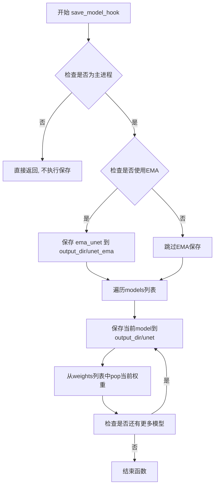

#### 带注释源码

```python
def save_model_hook(models, weights, output_dir):
    """
    在accelerator保存状态时调用的钩子函数，用于保存模型权重
    
    参数:
        models: 需要保存的模型列表
        weights: accelerator内部的权重引用列表
        output_dir: 保存模型的目录路径
    """
    # 仅在主进程执行保存操作，避免多进程重复写入
    if accelerator.is_main_process:
        # 如果启用了EMA（指数移动平均），先保存EMA版本的模型
        if args.use_ema:
            ema_unet.save_pretrained(os.path.join(output_dir, "unet_ema"))

        # 遍历所有模型进行保存
        for i, model in enumerate(models):
            # 保存模型到指定目录
            model.save_pretrained(os.path.join(output_dir, "unet"))

            # 关键：弹出权重引用，防止同一个模型被重复保存
            # accelerator.save_state 会按顺序保存weights中的所有权重
            # 如果不pop，会导致后续save_state尝试再次保存相同权重
            weights.pop()
```


### `load_model_hook`

该函数是 Accelerator 的加载状态预钩子，用于在恢复训练时加载模型权重和 EMA（指数移动平均）模型参数。

参数：

- `models`：`list`，模型列表，包含待加载的模型对象
- `input_dir`：`str`，检查点输入目录路径

返回值：`None`，该函数无返回值，通过修改 `models` 列表完成模型加载

#### 流程图

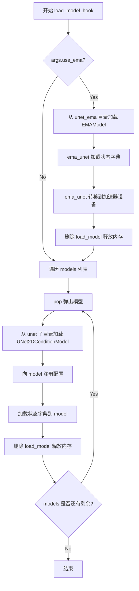

#### 带注释源码

```python
def load_model_hook(models, input_dir):
    """
    加载模型状态的预钩子函数，用于在恢复训练时加载模型权重
    
    参数:
        models: 模型列表，包含待加载的模型对象
        input_dir: 检查点输入目录路径
    """
    # 如果启用 EMA，加载 EMA 模型权重
    if args.use_ema:
        # 从预训练目录加载 EMA 模型
        load_model = EMAModel.from_pretrained(os.path.join(input_dir, "unet_ema"), UNet2DConditionModel)
        
        # 将 EMA 状态字典加载到 ema_unet
        ema_unet.load_state_dict(load_model.state_dict())
        
        # 将 EMA 模型移到加速器设备上
        ema_unet.to(accelerator.device)
        
        # 删除临时加载的模型释放内存
        del load_model

    # 遍历模型列表，加载每个模型的权重
    for _ in range(len(models)):
        # pop 模型使其不再被重复加载
        model = models.pop()

        # 以 diffusers 风格加载模型
        load_model = UNet2DConditionModel.from_pretrained(input_dir, subfolder="unet")
        
        # 向目标模型注册配置
        model.register_to_config(**load_model.config)

        # 加载状态字典到目标模型
        model.load_state_dict(load_model.state_dict())
        
        # 删除临时加载的模型释放内存
        del load_model
```


### `unwrap_model`

该函数用于解包经过 `torch.compile` 编译的模型。如果模型是通过 `torch.compile` 编译的（例如使用 `torch.compile` 包装的），则返回其原始模块 `_orig_mod`；否则直接返回未经包装的模型。这在分布式训练环境中尤为重要，因为加速器（Accelerator）可能会对模型进行包装，需要还原为原始模型结构以便进行保存或推理。

参数：
- `model`：`torch.nn.Module`，需要解包的模型对象

返回值：`torch.nn.Module`，解包后的模型对象

#### 流程图

```mermaid
graph TD
    A[开始 unwrap_model] --> B{调用 accelerator.unwrap_model}
    B --> C[获取解包后的模型]
    C --> D{is_compiled_module(model)?}
    D -->|是| E[返回 model._orig_mod]
    D -->|否| F[返回原始 model]
    E --> G[结束]
    F --> G
```

#### 带注释源码

```python
# Function for unwrapping if model was compiled with `torch.compile`.
def unwrap_model(model):
    """
    解包经过 torch.compile 编译的模型
    
    参数:
        model: 需要解包的模型对象
        
    返回值:
        解包后的模型对象
    """
    # 首先通过 accelerator 进行解包，处理分布式训练环境中的模型包装
    model = accelerator.unwrap_model(model)
    
    # 检查模型是否经过 torch.compile 编译
    # 如果是编译过的模块，返回其原始模块 _orig_mod
    # 否则直接返回原始模型
    model = model._orig_mod if is_compiled_module(model) else model
    return model
```

---

### 补充信息

| 项目 | 说明 |
|------|------|
| **函数类型** | 局部函数，定义在 `main()` 函数内部 |
| **调用位置** | 主要在训练结束保存模型时调用：`unet = unwrap_model(unet)` |
| **依赖函数** | `accelerator.unwrap_model()` - 来自 Accelerate 库<br>`is_compiled_module()` - 来自 diffusers.utils.torch_utils |
| **使用场景** | 保存模型权重前需要将包装后的模型解包为原始结构，以便正确保存为 HuggingFace Diffusers 格式 |


### `tokenize_captions`

该函数用于将数据集中的 caption 文本转换为模型可处理的 token ID 序列。它首先处理可能存在的多种 caption 情况（字符串或列表），然后使用预训练的 CLIP tokenizer 进行分词和向量化处理。

参数：

- `examples`：`Dict`，包含数据集样本的字典，通过 `caption_column` 键访问 caption 数据，支持字符串或字符串列表/数组形式
- `is_train`：`bool`，训练模式标志。为 `True` 时，当 caption 为列表时随机选择一个；为 `False` 时始终选择第一个

返回值：`torch.Tensor`，形状为 `(num_captions, tokenizer.model_max_length)` 的 token ID 张量

#### 流程图

```mermaid
flowchart TD
    A[开始 tokenize_captions] --> B{遍历 examples[caption_column]}
    B --> C{当前 caption 类型?}
    C -->|str| D[直接添加到 captions 列表]
    C -->|list 或 np.ndarray| E{is_train?}
    E -->|True| F[random.choice 随机选择]
    E -->|False| G[选择第一个 caption[0]]
    F --> D
    G --> D
    D --> H{继续遍历?}
    H -->|是| B
    H -->|否| I[调用 tokenizer 处理]
    I --> J[返回 inputs.input_ids]
    J --> K[结束]
    
    C -->|其他类型| L[抛出 ValueError]
    L --> K
```

#### 带注释源码

```python
def tokenize_captions(examples, is_train=True):
    """
    将数据集中的 caption 文本转换为 token ID 序列
    
    参数:
        examples: 包含数据集样本的字典,通过 caption_column 键访问 caption
        is_train: 训练模式标志,决定如何处理多 caption 情况
    
    返回:
        token ID 张量,形状为 (batch_size, max_length)
    """
    captions = []
    # 遍历数据集中的所有 caption
    for caption in examples[caption_column]:
        if isinstance(caption, str):
            # 如果是字符串类型,直接添加到列表
            captions.append(caption)
        elif isinstance(caption, (list, np.ndarray)):
            # 如果是列表或数组类型
            # 训练模式:随机选择一个 caption
            # 推理模式:始终选择第一个 caption
            captions.append(random.choice(caption) if is_train else caption[0])
        else:
            # 不支持的类型,抛出异常
            raise ValueError(
                f"Caption column `{caption_column}` should contain either strings or lists of strings."
            )
    
    # 使用预训练的 CLIP tokenizer 进行分词
    # max_length: 限制最大序列长度
    # padding: 填充到最大长度
    # truncation: 截断超长序列
    # return_tensors: 返回 PyTorch 张量
    inputs = tokenizer(
        captions, 
        max_length=tokenizer.model_max_length, 
        padding="max_length", 
        truncation=True, 
        return_tensors="pt"
    )
    
    # 返回 token ID,形状为 (batch_size, max_length)
    return inputs.input_ids
```


### `preprocess_train`

该函数负责将原始的训练数据（图像和文本标题）转换为模型可接受的格式，包括将图像转换为像素值张量并对文本标题进行tokenize。

参数：

- `examples`：`dict`，包含数据集样本的字典，每个样本应包含`image_column`（默认"image"）指定的图像数据和`caption_column`（默认"text"）指定的文本标题。

返回值：`dict`，处理后的字典，包含`pixel_values`（图像像素值张量列表）和`input_ids`（tokenized后的文本ID张量列表）。

#### 流程图

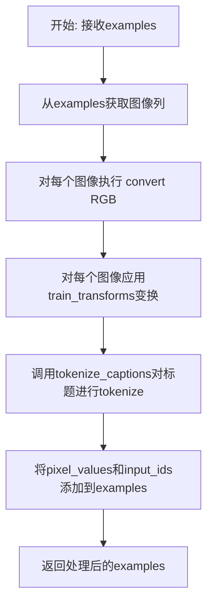

#### 带注释源码

```python
def preprocess_train(examples):
    """
    预处理训练数据，将图像和文本转换为模型可用格式
    
    参数:
        examples: 包含图像和文本标题的数据集样本字典
        
    返回:
        添加了pixel_values和input_ids字段的字典
    """
    # 从examples中获取图像列，并将所有图像转换为RGB格式
    # (有些图像可能是RGBA或灰度图，RGB转换确保格式统一)
    images = [image.convert("RGB") for image in examples[image_column]]
    
    # 对每个图像应用训练变换:
    # 1. Resize到指定分辨率
    # 2. 中心裁剪或随机裁剪
    # 3. 随机水平翻转(如果启用)
    # 4. 转换为张量
    # 5. 归一化到[-1, 1]
    examples["pixel_values"] = [train_transforms(image) for image in images]
    
    # 对文本标题进行tokenize，将其转换为模型输入ID
    # 使用CLIPTokenizer进行编码，最大长度填充，截断过长文本
    examples["input_ids"] = tokenize_captions(examples)
    
    return examples
```


### `collate_fn`

该函数是PyTorch DataLoader的批处理整理函数，负责将数据集中多个样本合并成一个批次。它从每个样本中提取像素值和输入ID，将其堆叠成张量并进行必要的格式转换，以确保数据符合模型的输入要求。

参数：

- `examples`：`List[Dict]`，从数据集加载的样本列表，每个样本包含`pixel_values`（预处理后的图像张量）和`input_ids`（tokenize后的文本ID张量）

返回值：`Dict[str, torch.Tensor]`，包含批处理后的`pixel_values`（图像张量）和`input_ids`（文本张量）的字典

#### 流程图

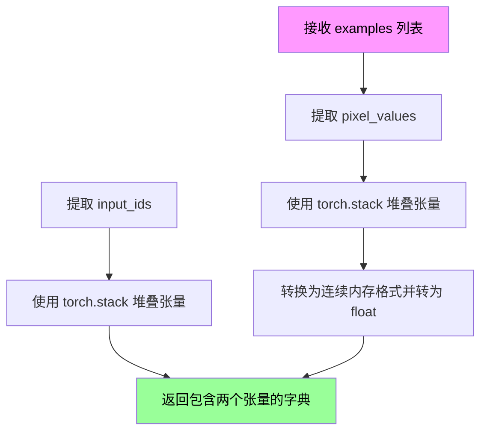

#### 带注释源码

```python
def collate_fn(examples):
    """
    数据加载器的批处理整理函数
    将多个样本整理成一个批次
    
    参数:
        examples: 样本列表，每个样本是包含 'pixel_values' 和 'input_ids' 的字典
    """
    
    # 从所有样本中提取 pixel_values 并在第0维堆叠
    # 结果形状: (batch_size, channels, height, width)
    pixel_values = torch.stack([example["pixel_values"] for example in examples])
    
    # 转换为连续内存布局并确保为 float32 类型
    # memory_format=torch.contiguous_format 确保张量在内存中是连续存储的
    pixel_values = pixel_values.to(memory_format=torch.contiguous_format).float()
    
    # 从所有样本中提取 input_ids 并在第0维堆叠
    # 结果形状: (batch_size, seq_length)
    input_ids = torch.stack([example["input_ids"] for example in examples])
    
    # 返回批次字典，供模型训练使用
    return {"pixel_values": pixel_values, "input_ids": input_ids}
```


### `StableDiffusionPipeline.from_pretrained`

从预训练模型路径或 HuggingFace Hub 模型 ID 加载完整的 Stable Diffusion 推理管道，支持自定义组件替换（如使用微调后的 VAE、Text Encoder、UNet）、模型变体选择（fp16/bf16）、精度控制和版本切换。

参数：

- `pretrained_model_name_or_path`：`str`，预训练模型的路径或 HuggingFace Hub 上的模型 ID（如 "runwayml/stable-diffusion-v1-5"）
- `vae`：`torch.nn.Module` 或 `PreTrainedModel`，可选，自定义的 VAE 模型，用于替换默认 VAE
- `text_encoder`：`PreTrainedModel` 或 `CLIPTextModel`，可选，自定义的文本编码器，用于替换默认编码器
- `tokenizer`：`CLIPTokenizer`，可选，自定义的 tokenizer，用于文本编码
- `unet`：`UNet2DConditionModel`，可选，自定义的 UNet 模型，用于替换默认 UNet
- `safety_checker`：`Callable` 或 `None`，可选，内容安全检查器，设为 `None` 可禁用
- `revision`：`str`，可选，从 HuggingFace Hub 加载模型的特定 Git 修订版本
- `variant`：`str` 可选，模型文件变体（如 "fp16"、"non_ema"）
- `torch_dtype`：`torch.dtype`，可选，模型加载后的张量数据类型（如 `torch.float16`）
- `use_safetensors`：`bool`，可选，是否优先使用 SafeTensors 格式加载权重
- `device_map`：`str` 或 `dict`，可选，模型在多设备间的映射策略（如 "auto"）
- `max_memory`：`dict`，可选，各设备的最大内存限制
- `offload_folder`：`str`，可选，CPU 卸载权重存放路径
- `offload_state_dict`：`bool`，可选，是否将 state_dict 卸载到 CPU
- `low_cpu_mem_usage`：`bool`，可选，是否优化 CPU 内存占用
- `use_flash_attention_2`：`bool`，可选，是否启用 Flash Attention 2 加速

返回值：`StableDiffusionPipeline`，加载完成的 Stable Diffusion 推理管道对象，可直接用于文本到图像生成。

#### 流程图

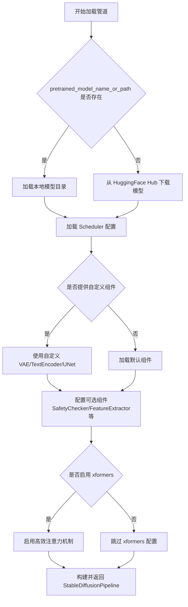

#### 带注释源码

```python
# 源码位于 diffusers 库中，此处为训练脚本中的调用示例

# 第一次调用：log_validation 函数中（约第163行）
# 用于在训练过程中使用 EMA 权重进行验证推理
pipeline = StableDiffusionPipeline.from_pretrained(
    args.pretrained_model_name_or_path,  # 基础模型路径或 Hub ID
    vae=accelerator.unwrap_model(vae),  # 使用训练中的 VAe（ accelerator 包装后的）
    text_encoder=accelerator.unwrap_model(text_encoder),  # 使用微调后的文本编码器
    tokenizer=tokenizer,  # 使用加载的 tokenizer
    unet=accelerator.unwrap_model(unet),  # 使用训练中的 UNet（可能是 EMA 权重）
    safety_checker=None,  # 禁用安全检查器以加速验证
    revision=args.revision,  # 指定模型版本
    variant=args.variant,  # 指定变体（如 fp16）
    torch_dtype=weight_dtype,  # 指定精度（fp16/bf16）
)
pipeline = pipeline.to(accelerator.device)  # 移至训练设备
pipeline.set_progress_bar_config(disable=True)  # 禁用推理进度条

# 第二次调用：main 函数末尾（约第653行）
# 训练完成后保存最终模型管道
pipeline = StableDiffusionPipeline.from_pretrained(
    args.pretrained_model_name_or_path,
    text_encoder=text_encoder,  # 使用微调后的文本编码器
    vae=vae,  # 使用微调后的 VAE
    unet=unet,  # 使用微调后的 UNet（可能含 EMA 权重）
    revision=args.revision,
    variant=args.variant,
)
pipeline.save_pretrained(args.output_dir)  # 保存完整管道到本地
```


### `StableDiffusionPipeline.save_pretrained`

将整个 Stable Diffusion pipeline（包含所有模型组件）保存到指定目录，以便后续可以重新加载使用。

参数：

-  `save_directory`：`str`，要保存 pipeline 的目标目录路径
-  `safe_serialization`：`bool`（可选），是否使用安全序列化（默认 True）
-  `variant`：`str`（可选），模型变体版本（如 "fp16"）
-  `push_to_hub`：`bool`（可选），是否直接推送到 Hugging Face Hub
-  `**kwargs`：其他传递给父类或模型保存的额外参数

返回值：无（`None`），直接保存到文件系统

#### 流程图

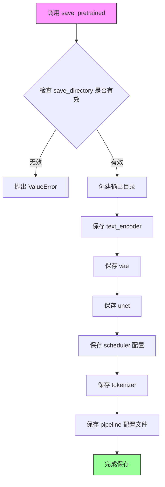

#### 带注释源码

```python
# 在训练脚本中使用 save_pretrained 的示例（第 835 行附近）

# 创建完整的 pipeline 实例，使用训练好的组件
pipeline = StableDiffusionPipeline.from_pretrained(
    args.pretrained_model_name_or_path,  # 预训练模型路径
    text_encoder=text_encoder,            # 训练好的文本编码器
    vae=vae,                              # 训练好的 VAE
    unet=unet,                            # 训练好的 UNet
    revision=args.revision,               # 模型版本
    variant=args.variant,                 # 模型变体
)

# 保存整个 pipeline 到指定目录
# 这个方法会将以下组件保存到 args.output_dir:
# - text_encoder 模型权重和配置
# - vae 模型权重和配置
# - unet 模型权重和配置
# - scheduler 配置文件
# - tokenizer 文件
# - pipeline 整体配置文件 (config.json)
pipeline.save_pretrained(args.output_dir)

# 补充说明：
# save_pretrained 方法的典型签名如下（来自 diffusers 库）:
# def save_pretrained(
#     self,
#     save_directory: Union[str, os.PathLike],
#     safe_serialization: bool = True,
#     variant: Optional[str] = None,
#     push_to_hub: bool = False,
#     **kwargs
# ):
#     """
#     Save all components of the pipeline to the specified directory.
#     
#     Args:
#         save_directory: Directory where the model will be saved.
#         safe_serialization: Whether to save using safetensors (default True).
#         variant: Model variant (e.g., "fp16", "bf16").
#         push_to_hub: Whether to push to HuggingFace Hub.
#     """
```

---

### 备注

由于 `save_pretrained` 方法定义在 `diffusers` 库的 `DiffusionPipeline` 基类中，而非在此训练脚本文件内直接定义，以上信息基于代码中第 835 行对该方法的实际调用方式以及 `diffusers` 库的通用 API 行为推断得出。若需获取完整的方法定义源码，建议查阅 `diffusers` 官方文档或查看 `diffusers/pipelines/pipeline_utils.py` 中的原始实现。


### `StableDiffusionPipeline.to`

将StableDiffusionPipeline的所有组件（包括VAE、文本编码器、UNet等）移动到指定的计算设备（CPU/GPU）上，以便进行推理或训练。

参数：

- `device`：`torch.device`，目标设备，例如`torch.device("cuda")`或`torch.device("cpu")`

返回值：`StableDiffusionPipeline`，返回移动到目标设备后的pipeline对象自身，便于链式调用

#### 流程图

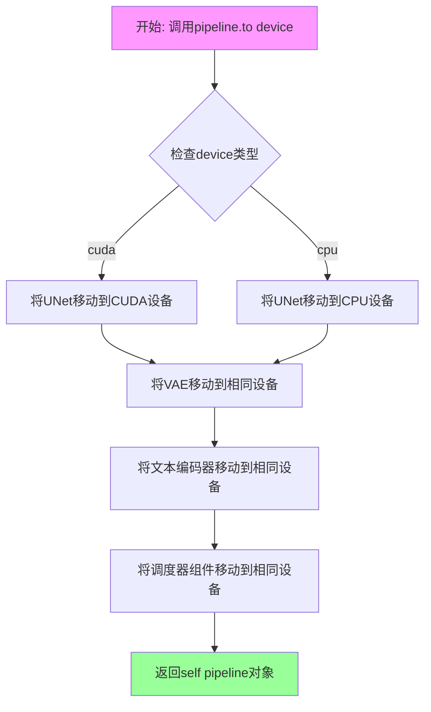

#### 带注释源码

```python
# 由于 StableDiffusionPipeline.to 是 diffusers 库的内置方法，
# 以下是基于使用模式的推断实现

def to(self, device):
    """
    将 pipeline 的所有组件移动到指定设备
    
    参数:
        device (torch.device): 目标设备
    """
    # 1. 移动 UNet 模型到设备
    if self.unet is not None:
        self.unet = self.unet.to(device)
    
    # 2. 移动 VAE 模型到设备
    if self.vae is not None:
        self.vae = self.vae.to(device)
    
    # 3. 移动文本编码器到设备
    if self.text_encoder is not None:
        self.text_encoder = self.text_encoder.to(device)
    
    # 4. 移动安全检查器到设备（如果有）
    if self.safety_checker is not None:
        self.safety_checker = self.safety_checker.to(device)
    
    # 5. 更新调度器的设备配置
    if hasattr(self, 'scheduler') and self.scheduler is not None:
        # 调度器通常不需要物理移动，但可能需要更新设备状态
        pass
    
    # 6. 返回 self 以支持链式调用
    return self

# 在训练脚本中的典型用法:
# pipeline = pipeline.to(accelerator.device)
# pipeline.torch_dtype = weight_dtype  # 可选：设置精度
```


### `StableDiffusionPipeline.set_progress_bar_config`

该方法用于配置 Stable Diffusion Pipeline 的进度条（progress bar）显示行为，通常在推理或验证过程中控制 tqdm 进度条的启用或禁用。

参数：

- `disable`：`bool`，控制是否禁用进度条。当设置为 `True` 时，进度条将被隐藏；设置为 `False` 时，显示进度条。

返回值：`None`，该方法无返回值（执行配置操作）。

#### 流程图

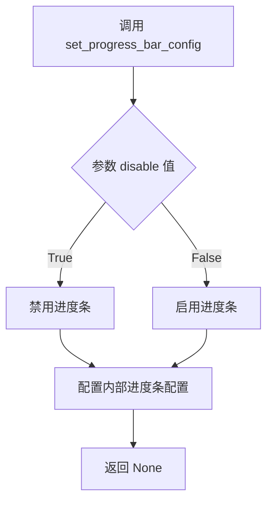

#### 带注释源码

基于代码中的使用方式，该方法在 `diffusers` 库中的实现逻辑如下：

```python
def set_progress_bar_config(self, **kwargs):
    """
    配置进度条的显示行为。
    
    参数:
        **kwargs: 关键字参数，支持的参数包括:
            - disable (bool): 是否禁用进度条，默认为 False
            - desc (str): 进度条描述文字
            - total (int): 总迭代次数
            - leave (bool): 是否在完成后保留进度条
            - ncols (int): 进度条列宽
            - mininterval (float): 最小更新间隔（秒）
            - maxinterval (float): 最大更新间隔（秒）
    """
    # 遍历传入的配置参数
    for key, value in kwargs.items():
        # 将配置应用到管道的进度条配置中
        if hasattr(self, '_progress_bar_config'):
            self._progress_bar_config[key] = value
        
        # 如果存在调度器（scheduler），也配置调度器的进度条
        if hasattr(self, 'scheduler') and hasattr(self.scheduler, 'set_progress_bar_config'):
            self.scheduler.set_progress_bar_config(**kwargs)
        
        # 配置管道各组件的进度条（如 UNet、VAE 等）
        for component_name in ['unet', 'vae', 'text_encoder']:
            component = getattr(self, component_name, None)
            if component is not None and hasattr(component, 'set_progress_bar_config'):
                component.set_progress_bar_config(**kwargs)
    
    # 设置 tqdm 的全局配置
    if 'disable' in kwargs:
        from tqdm.auto import tqdm
        # 通过修改 tqdm 的 disable 属性来控制进度条显示
        tqdm.disable = kwargs['disable']
```

在实际代码中的使用示例：

```python
# 在 log_validation 函数中调用
pipeline = StableDiffusionPipeline.from_pretrained(...)
pipeline = pipeline.to(accelerator.device)
pipeline.set_progress_bar_config(disable=True)  # 禁用进度条用于验证
```


### `StableDiffusionPipeline.enable_xformers_memory_efficient_attention`

该方法用于在 StableDiffusionPipeline 中启用 xformers 的内存高效注意力机制，以减少注意力计算的显存占用和提高推理速度。

参数：
- 该方法无显式参数（仅使用 `self`）

返回值：无返回值（`None`），该方法直接修改 pipeline 的内部组件以启用高效注意力机制

#### 流程图

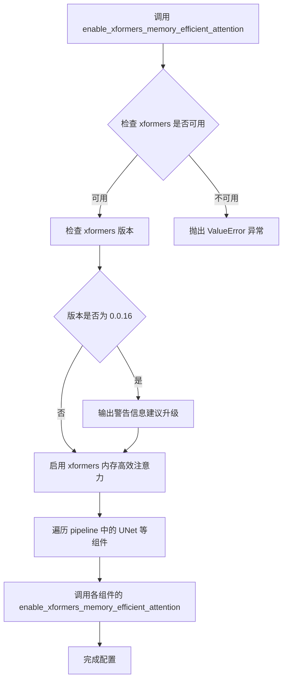

#### 带注释源码

```
# 该方法是 StableDiffusionPipeline (继承自 DiffusionPipeline) 的实例方法
# 在 diffusers 库中实现，此处展示在训练脚本中的典型调用方式：

# 场景1：在验证函数中启用
if args.enable_xformers_memory_efficient_attention:
    pipeline.enable_xformers_memory_efficient_attention()

# 场景2：在主训练流程中为 UNet 启用
if args.enable_xformers_memory_efficient_attention:
    if is_xformers_available():  # 检查 xformers 是否安装
        import xformers
        
        xformers_version = version.parse(xformers.__version__)
        # 针对 0.0.16 版本的已知问题发出警告
        if xformers_version == version.parse("0.0.16"):
            logger.warning(
                "xFormers 0.0.16 cannot be used for training in some GPUs. "
                "If you observe problems during training, please update xFormers "
                "to at least 0.0.17."
            )
        # 为 UNet 启用 xformers 高效注意力
        unet.enable_xformers_memory_efficient_attention()
    else:
        raise ValueError("xformers is not available. Make sure it is installed correctly")

# 底层实现原理（在 diffusers 库内部）:
# 1. 将模型组件的 attention_processor 替换为 xformers 提供的 MemoryEfficientAttentionAttention
# 2. xformers 使用 CUDA kernel fusion 技术，减少显存访问次数
# 3. 对于多头注意力，计算复杂度不变但显存占用显著降低
```


### `StableDiffusionPipeline.torch_dtype`

该属性用于获取或设置 Stable Diffusion Pipeline 的数据类型（dtype），决定模型权重在推理时的精度（如 float32、float16 或 bfloat16），从而控制内存占用和计算效率。

参数：

- 无参数（这是一个属性而非方法）

返回值：`torch.dtype`，返回或设置的张量数据类型

#### 流程图

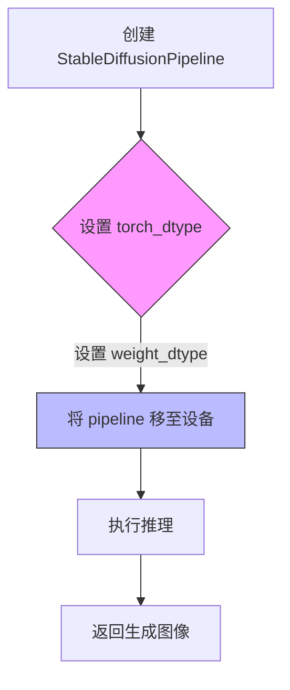

#### 带注释源码

```python
# 在 diffusers 库中，torch_dtype 通常作为 PipelineMixin 的类属性实现
# 以下是从代码中提取的相关使用示例：

# 1. 在 log_validation 函数中创建 pipeline 时指定 torch_dtype
pipeline = StableDiffusionPipeline.from_pretrained(
    args.pretrained_model_name_or_path,
    vae=accelerator.unwrap_model(vae),
    text_encoder=accelerator.unwrap_model(text_encoder),
    tokenizer=tokenizer,
    unet=accelerator.unwrap_model(unet),
    safety_checker=None,
    revision=args.revision,
    variant=args.variant,
    torch_dtype=weight_dtype,  # <-- 在创建时指定数据类型
)

# 2. 在训练结束后的推理中设置 torch_dtype 属性
pipeline = pipeline.to(accelerator.device)
pipeline.torch_dtype = weight_dtype  # <-- 动态设置数据类型属性
pipeline.set_progress_bar_config(disable=True)

# torch_dtype 的典型取值：
# - torch.float32: 完整精度，内存占用最大
# - torch.float16: 半精度，内存减半，速度更快（需 GPU 支持）
# - torch.bfloat16: Brain Float16，兼容性更好的半精度格式
```


### `UNet2DConditionModel.from_pretrained`

该方法是 `diffusers` 库中 `UNet2DConditionModel` 类的类方法，用于从预训练模型加载 UNet2DConditionModel 模型权重，支持从 HuggingFace Hub 或本地路径加载模型，并可指定子文件夹、版本和变体。

参数：

- `pretrained_model_name_or_path`：`str`，预训练模型的名称（如 "runwayml/stable-diffusion-v1-5"）或本地模型路径
- `subfolder`：`str`，模型在仓库中的子文件夹名称（如 "unet"）
- `revision`：`str`，可选，模型仓库的特定版本/分支（如 "main" 或 "v1.0"）
- `variant`：`str`，可选，模型文件变体（如 "fp16" 表示半精度）
- `torch_dtype`：`torch.dtype`，可选，指定模型权重的张量数据类型（如 `torch.float16`）
- `use_safetensors`：`bool`，可选，是否使用 safetensors 格式加载权重
- `cache_dir`：`str`，可选，模型缓存目录
- `local_files_only`：`bool`，可选，是否仅使用本地文件
- `token`：`str`，可选，用于访问私有模型的认证 token

返回值：`UNet2DConditionModel`，返回加载好的 UNet2DConditionModel 模型实例

#### 流程图

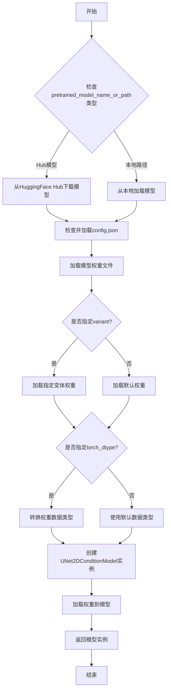

#### 带注释源码

```python
# 从预训练模型加载 UNet2DConditionModel 的调用示例
# 这是代码中的实际调用位置（约第457-459行）

unet = UNet2DConditionModel.from_pretrained(
    args.pretrained_model_name_or_path,  # 预训练模型名称或路径，如 "runwayml/stable-diffusion-v1-5"
    subfolder="unet",                      # 指定模型子文件夹，UNet权重存储在unet子目录
    revision=args.non_ema_revision          # 版本/分支，用于加载非EMA权重
)

# 完整的方法签名参考（基于diffusers库）
# def from_pretrained(
#     pretrained_model_name_or_path: Union[str, Path],
#     subfolder: Optional[str] = None,
#     revision: Optional[str] = None,
#     variant: Optional[str] = None,
#     torch_dtype: Optional[torch.dtype] = None,
#     use_safetensors: bool = False,
#     cache_dir: Optional[str] = None,
#     local_files_only: bool = False,
#     token: Optional[str] = None,
#     **kwargs
# ) -> "UNet2DConditionModel":
#     """
#     从预训练模型加载 UNet2DConditionModel。
#     
#     参数:
#         pretrained_model_name_or_path: 模型名称或本地路径
#         subfolder: 模型在仓库中的子文件夹
#         revision: Git版本/分支
#         variant: 模型变体 (fp16, bf16等)
#         torch_dtype: 张量数据类型
#         use_safetensors: 是否使用safetensors格式
#         cache_dir: 缓存目录
#         local_files_only: 仅本地文件
#         token: HuggingFace认证token
#     
#     返回:
#         UNet2DConditionModel: 加载好的模型实例
#     """
```

#### 调用上下文说明

在训练脚本中，该方法用于：

1. **加载 UNet 权重**：从预训练模型目录的 `unet` 子文件夹加载 UNet2DConditionModel 的权重和配置
2. **支持 EMA 模型分离**：通过 `revision=args.non_ema_revision` 加载非 EMA 版本的权重，用于训练过程中的 EMA 更新
3. **与其他模型配合使用**：加载后的 UNet 与 VAE、CLIPTextEncoder 一起构成完整的 Stable Diffusion 训练 pipeline


### `UNet2DConditionModel.requires_grad_`

该方法是 PyTorch `torch.nn.Module` 的内置方法，用于设置模型中所有参数的 `requires_grad` 属性。在训练脚本中用于冻结 VAE 和文本编码器的梯度，使其不参与反向传播。

参数：

- `requires_grad`：`bool`，设置为 `True` 则开启梯度计算，设置为 `False` 则冻结参数（不计算梯度）

返回值：`UNet2DConditionModel`，返回修改后的模型本身（支持链式调用）

#### 流程图

```mermaid
graph TD
    A[开始调用 requires_grad_] --> B{参数 requires_grad 值}
    B -->|True| C[开启所有参数的梯度计算]
    B -->|False| D[冻结所有参数, 禁用梯度计算]
    C --> E[返回模型自身]
    D --> E
    E[结束]
```

#### 带注释源码

```python
# 在训练脚本中的实际使用:
vae.requires_grad_(False)      # 冻结 VAE 模型的所有参数
text_encoder.requires_grad_(False)  # 冻结文本编码器的所有参数
unet.train()                   # 设置 UNet 为训练模式

# PyTorch nn.Module.requires_grad_ 方法的典型实现逻辑:
def requires_grad_(self, requires_grad: bool) -> 'Module':
    """
    设置模块参数的 requires_grad 属性。
    
    当设置为 False 时：
    - 该模块的所有参数不会被计算梯度
    - 可以显著减少显存占用
    - 常用于冻结预训练模型的部分层
    
    Parameters:
        requires_grad (bool): 是否需要计算梯度
        
    Returns:
        Module: 返回自身，支持链式调用
    """
    for param in self.parameters():
        param.requires_grad = requires_grad
    return self
```

#### 代码上下文中的使用

```python
# 位于 main() 函数中，约第 520 行左右
# 加载预训练模型后，冻结 VAE 和 text_encoder

# Freeze vae and text_encoder and set unet to trainable
vae.requires_grad_(False)           # 冻结 VAE，不计算梯度
text_encoder.requires_grad_(False)  # 冻结文本编码器，不计算梯度
unet.train()                         # 设置 UNet 为训练模式（启用 dropout 等）
```

#### 技术说明

| 项目 | 说明 |
|------|------|
| 方法来源 | `torch.nn.Module` 基类 |
| 作用对象 | 模型的所有 `parameters()` |
| 显存影响 | 冻结参数可减少约 1/3 显存占用 |
| 典型场景 | 迁移学习时冻结主干网络、加速推理 |
| 注意事项 | 冻结后的参数仍会保存，但不会参与梯度反向传播 |


### `UNet2DConditionModel.train`

设置 UNet2DConditionModel 为训练模式，启用 Dropout 和 BatchNorm 等训练时特有的层行为。

参数：

- 该方法无显式参数（继承自 `torch.nn.Module`）

返回值：`None`，将模型设置为训练模式

#### 流程图

```mermaid
flowchart TD
    A[调用 unet.train()] --> B[继承自 torch.nn.Module]
    B --> C[设置 self.training = True]
    C --> D[递归遍历所有子模块]
    D --> E[对每个子模块调用 train()]
    E --> F[Dropout 层启用]
    F --> G[BatchNorm 层切换到训练模式]
    G --> H[模型准备进行训练]
```

#### 带注释源码

```python
# 在 main() 函数中加载模型后调用
unet = UNet2DConditionModel.from_pretrained(
    args.pretrained_model_name_or_path, subfolder="unet", revision=args.non_ema_revision
)

# Freeze vae and text_encoder and set unet to trainable
vae.requires_grad_(False)
text_encoder.requires_grad_(False)
unet.train()  # <-- 调用 train() 方法设置为训练模式

# 后续在训练循环中
for epoch in range(first_epoch, args.num_train_epochs):
    for step, batch in enumerate(train_dataloader):
        with accelerator.accumulate(unet):
            # ... 训练步骤
            model_pred = unet(noisy_latents, timesteps, encoder_hidden_states, return_dict=False)[0]
            # ... 计算损失和反向传播
```

#### 说明

- `UNet2DConditionModel` 继承自 `torch.nn.Module`，`train()` 是 PyTorch 标准的模型切换方法
- 与 `eval()` 方法相对应，`train()` 将模型切换到训练模式
- 在训练模式下：
  - `Dropout` 层会启用神经元随机丢弃
  - `BatchNorm` 层使用批次统计量（均值、方差）进行归一化
- 该方法在训练开始前调用，确保模型参数正确更新


# UNet2DConditionModel.enable_gradient_checkpointing 提取文档

### `UNet2DConditionModel.enable_gradient_checkpointing`

该方法用于启用梯度检查点（Gradient Checkpointing）技术，通过在前向传播过程中清除中间激活值并在反向传播时重新计算，从而以牺牲部分计算速度为代价显著降低模型训练时的显存占用。此方法在 `diffusers` 库的 `UNet2DConditionModel` 类中实现，当前代码文件通过条件判断调用该方法。

参数：

- 该方法无显式参数（仅通过 `self` 隐式调用）

返回值：无返回值（`None`），直接修改模型实例的内部状态

#### 流程图

```mermaid
graph TD
    A[训练脚本启动] --> B{args.gradient_checkpointing 为 True?}
    B -->|是| C[调用 unet.enable_gradient_checkpointing]
    B -->|否| D[跳过梯度检查点启用]
    C --> E[模型启用梯度检查点]
    E --> F[后续训练使用梯度检查点]
    D --> F
    F --> G[训练循环开始]
    
    style C fill:#e1f5fe
    style E fill:#e1f5fe
```

#### 带注释源码

```python
# 在训练脚本 main() 函数中的调用位置（约第 620 行附近）
# 在所有模型组件初始化完成之后、训练循环开始之前

if args.gradient_checkpointing:
    # 只有当用户通过命令行参数 --gradient_checkpointing 显式启用时才会执行
    # 该参数在 parse_args() 中定义，默认值为 False
    # 启用后会在前向传播时不保存全部中间激活值，以显存换计算时间
    unet.enable_gradient_checkpointing()

# 完整的调用上下文代码示例：
"""
# ... 模型加载和初始化代码 ...

# 创建 UNet2DConditionModel 实例
unet = UNet2DConditionModel.from_pretrained(
    args.pretrained_model_name_or_path, 
    subfolder="unet", 
    revision=args.non_ema_revision
)

# 冻结 VAE 和文本编码器，只训练 UNet
vae.requires_grad_(False)
text_encoder.requires_grad_(False)
unet.train()

# 条件启用梯度检查点（约在第 620 行）
if args.gradient_checkpointing:
    unet.enable_gradient_checkpointing()

# ... 后续训练代码 ...
"""

# 注意事项：
# 1. 此方法的实际实现在 diffusers 库内部，不在当前训练脚本中
# 2. 梯度检查点通过 torch.utils.checkpoint.checkpoint 实现
# 3. 启用后会显著增加反向传播的计算时间，但能大幅降低显存占用
# 4. 适用于显存受限但计算资源充足的环境
```


### UNet2DConditionModel.enable_xformers_memory_efficient_attention

启用 xFormers 高效内存注意力机制，允许模型在保持性能的同时显著降低显存占用。

参数：
- `self`：隐式参数，表示 UNet2DConditionModel 实例本身

返回值：无返回值（`None`），该方法直接修改模型内部状态

#### 流程图

```mermaid
flowchart TD
    A[开始] --> B{检查 xformers 是否可用}
    B -->|可用| C[获取 xformers 版本]
    B -->|不可用| D[抛出 ValueError: xformers 未安装]
    C --> E{版本是否为 0.0.16}
    E -->|是| F[输出警告信息: 建议升级到 0.0.17+]
    E -->|否| G[调用 enable_xformers_memory_efficient_attention]
    F --> G
    G --> H[结束]
```

#### 带注释源码

```python
# 在 main() 函数中的调用位置（第 585-593 行）
if args.enable_xformers_memory_efficient_attention:
    if is_xformers_available():
        # 导入 xformers 库
        import xformers

        # 解析 xformers 版本号
        xformers_version = version.parse(xformers.__version__)
        
        # 检查版本是否为 0.0.16（存在已知问题）
        if xformers_version == version.parse("0.0.16"):
            logger.warning(
                "xFormers 0.0.16 cannot be used for training in some GPUs. If you observe problems during training, please update xFormers to at least 0.0.17. See https://huggingface.co/docs/diffusers/main/en/optimization/xformers for more details."
            )
        
        # 启用 UNet 的 xformers 高效注意力机制
        unet.enable_xformers_memory_efficient_attention()
    else:
        raise ValueError("xformers is not available. Make sure it is installed correctly")
```

```python
# 在 log_validation() 函数中的调用位置（第 170-171 行）
if args.enable_xformers_memory_efficient_attention:
    pipeline.enable_xformers_memory_efficient_attention()
```

```python
# 在 main() 函数末尾推理阶段的调用位置（第 857-858 行）
if args.enable_xformers_memory_efficient_attention:
    pipeline.enable_xformers_memory_efficient_attention()
```

---

### 补充说明

由于 `UNet2DConditionModel.enable_xformers_memory_efficient_attention` 是 `diffusers` 库内部实现的方法，并非在本代码文件中定义，因此上述源码展示的是**调用该方法的代码位置**。该方法的实际实现在 `diffusers` 库的 `UNet2DConditionModel` 类中，其核心功能是将模型中的标准注意力机制替换为 xFormers 提供的内存高效注意力实现。


### `UNet2DConditionModel.save_pretrained`

保存 UNet2DConditionModel 模型权重和配置文件到指定目录，以便后续可以通过 `from_pretrained` 重新加载模型。

参数：

- `save_directory`：`str`，保存模型的目录路径。如果目录不存在，将创建该目录。
- `is_main_process`：`bool`，是否为分布式训练中的主进程。默认为 `True`。仅在主进程时执行实际保存操作，其他进程会跳过。
- `save_config`：`bool`，是否保存模型配置。默认为 `True`。
- `safe_serialization`：`bool`，是否使用安全的序列化方式（.safetensors格式）。默认为 `True`。
- `max_shard_size`：`int` 或 `str`，单个权重文件的最大大小。默认为 `"10GB"`。
- `variant`：`str`，模型变体名称（如 "fp16"），用于选择特定的权重文件。
- `push_to_hub`：`bool`，是否将模型推送到 HuggingFace Hub。默认为 `False`。
- `**kwargs`：其他可选参数，如 `repo_id`、`commit_message` 等，用于推送到 Hub 时使用。

返回值：`None`，无返回值。该方法直接将模型保存到磁盘。

#### 流程图

```mermaid
flowchart TD
    A[开始 save_pretrained] --> B{is_main_process?}
    B -- 否 --> C[直接返回]
    B -- 是 --> D[创建 save_directory 目录]
    D --> E[保存配置文件 config.json]
    E --> F{权重文件是否超过 max_shard_size?}
    F -- 是 --> G[分割权重为多个分片]
    F -- 否 --> H[保存所有权重到单个文件]
    G --> I{safe_serialization?}
    H --> I
    I -- 是 --> J[使用 safetensors 格式保存]
    I -- 否 --> K[使用 pytorch_model.bin 格式保存]
    J --> L[保存分片文件]
    K --> L
    L --> M[保存其他必要文件]
    M --> N[结束]
```

#### 带注释源码

```python
# 注：以下源码基于 diffusers 库中的通用实现
# UNet2DConditionModel 继承自 PreTrainedModel
# save_pretrained 方法定义在 PretrainedMixin 中

def save_pretrained(
    self,
    save_directory: Union[str, Path],
    is_main_process: bool = True,
    save_config: bool = True,
    safe_serialization: bool = True,
    max_shard_size: Union[int, str] = "10GB",
    variant: Optional[str] = None,
    push_to_hub: bool = False,
    **kwargs,
):
    """
    保存模型到指定目录
    
    参数:
        save_directory: 保存目录路径
        is_main_process: 是否为主进程
        save_config: 是否保存配置
        safe_serialization: 是否使用安全序列化
        max_shard_size: 最大分片大小
        variant: 模型变体
        push_to_hub: 是否推送到 Hub
    """
    # 1. 如果不是主进程，直接返回（分布式训练场景）
    if not is_main_process:
        return
    
    # 2. 处理保存目录
    save_directory = Path(save_directory)
    save_directory.mkdir(parents=True, exist_ok=True)
    
    # 3. 保存配置文件
    if save_config:
        self.config.save_pretrained(save_directory)
    
    # 4. 获取模型状态字典
    state_dict = self.state_dict()
    
    # 5. 根据 max_shard_size 分割权重
    shards = self._get shards(state_dict, max_shard_size)
    
    # 6. 保存每个分片
    for shard_file, shard in shards.items():
        if safe_serialization:
            # 使用 safetensors 格式保存
            from safetensors.torch import save_file
            save_file(shard, save_directory / shard_file)
        else:
            # 使用 pytorch 格式保存
            torch.save(shard, save_directory / shard_file)
    
    # 7. 保存索引文件
    # 记录所有分片文件信息
    
    # 8. 如果需要推送到 Hub
    if push_to_hub:
        # 上传到 HuggingFace Hub
        pass
```


### UNet2DConditionModel.load_state_dict

在提供的训练代码中，`load_state_dict` 方法在 `load_model_hook` 函数中被调用，用于从预训练模型加载权重到当前模型实例中。该方法继承自 PyTorch 的 `nn.Module`，是加载模型权重的标准方法。

参数：

-  `state_dict`：`dict`，包含模型参数的字典，通常通过 `model.state_dict()` 获取
-  `strict`：`bool`（可选），是否严格匹配键，默认为 True
-  `assign`：`bool`（可选），是否将状态字典中的键分配给模块参数，默认为 False

返回值：`None`，该方法直接修改模型实例的内部状态

#### 流程图

```mermaid
flowchart TD
    A[开始加载模型权重] --> B{检查 strict 参数}
    B -->|strict=True| C[严格匹配 state_dict 的键与模型键]
    B -->|strict=False| D[部分匹配,忽略不匹配的键]
    C --> E{键完全匹配?}
    D --> G[加载匹配的键]
    E -->|是| F[加载所有键到模型]
    E -->|否| H[抛出 RuntimeError]
    G --> I[结束]
    F --> I
    H --> I
```

#### 带注释源码

```python
# 在 load_model_hook 中调用 load_state_dict 的示例
def load_model_hook(models, input_dir):
    """
    从检查点目录加载模型权重的钩子函数
    
    参数:
        models: 模型列表，由 accelerate 框架管理
        input_dir: 检查点目录路径
    """
    if args.use_ema:
        # 加载 EMA 模型的权重
        load_model = EMAModel.from_pretrained(os.path.join(input_dir, "unet_ema"), UNet2DConditionModel)
        # 调用 load_state_dict 将 EMA 模型权重加载到 ema_unet
        ema_unet.load_state_dict(load_model.state_dict())
        ema_unet.to(accelerator.device)
        del load_model

    for _ in range(len(models)):
        # 弹出模型实例
        model = models.pop()

        # 加载预训练模型配置和权重
        load_model = UNet2DConditionModel.from_pretrained(input_dir, subfolder="unet")
        # 将加载模型的配置注册到当前模型
        model.register_to_config(**load_model.config)

        # 核心调用：load_state_dict 将预训练权重加载到模型中
        # state_dict() 返回一个包含所有参数和缓冲区的有序字典
        # strict=True 确保键完全匹配，strict=False 允许部分加载
        model.load_state_dict(load_model.state_dict())
        
        # 释放临时模型对象以释放内存
        del load_model
```

#### 补充说明

| 特性 | 描述 |
|------|------|
| 方法来源 | 继承自 PyTorch `torch.nn.Module` |
| 使用场景 | 从预训练检查点恢复模型权重、模型迁移学习、分布式训练权重加载 |
| 注意事项 | 确保 `state_dict` 的键与模型结构完全匹配（除非 `strict=False`） |
| 错误处理 | 键不匹配时抛出 `RuntimeError`（除非 `strict=False`） |

#### 相关代码位置

在用户提供的训练脚本中，`load_state_dict` 在以下位置被调用：

1. **第 554 行**：`ema_unet.load_state_dict(load_model.state_dict())` - 加载 EMA 模型权重
2. **第 563 行**：`model.load_state_dict(load_model.state_dict())` - 在 `load_model_hook` 中加载 UNet 权重

这些调用是 `accelerate` 框架的模型保存/加载钩子机制的一部分，用于在分布式训练中正确保存和恢复模型状态。


### `UNet2DConditionModel.register_to_config`

该方法是 `diffusers` 库中 `UNet2DConditionModel` 类的成员方法，用于将配置参数注册到模型的配置中。在训练脚本的模型加载钩子中使用，用于确保加载的模型配置与当前模型实例同步。

参数：

- `**config`：可变关键字参数，接收配置字典（来自 `load_model.config`），包含模型的配置参数如 `sample_size`、`in_channels`、`down_block_types`、`up_block_types`、`layers_per_block`、`block_out_channels`、`attention_head_dim` 等。

返回值：`None`，该方法直接修改模型内部配置状态，不返回任何值。

#### 流程图

```mermaid
flowchart TD
    A[开始 register_to_config] --> B{接收 **config 参数}
    B --> C[遍历 config 字典中的键值对]
    C --> D{检查键是否为有效配置属性}
    D -->|是| E[将键值对设置到模型配置对象]
    D -->|否| F[忽略或警告无效配置项]
    E --> G{还有更多配置项?}
    F --> G
    G -->|是| C
    G -->|否| H[配置注册完成]
    H --> I[结束]
```

#### 带注释源码

从训练脚本中提取的调用上下文：

```python
# 在 accelerator 的 load_model_hook 中调用
def load_model_hook(models, input_dir):
    if args.use_ema:
        load_model = EMAModel.from_pretrained(os.path.join(input_dir, "unet_ema"), UNet2DConditionModel)
        ema_unet.load_state_dict(load_model.state_dict())
        ema_unet.to(accelerator.device)
        del load_model

    for _ in range(len(models)):
        # pop models so that they are not loaded again
        model = models.pop()

        # load diffusers style into model
        load_model = UNet2DConditionModel.from_pretrained(input_dir, subfolder="unet")
        
        # 核心调用：注册配置到模型
        # 将预训练模型的配置参数注册到当前模型实例
        # config 包含模型架构信息如 block_out_channels, layers_per_block 等
        model.register_to_config(**load_model.config)

        model.load_state_dict(load_model.state_dict())
        del load_model
```

**说明**：该方法的具体实现位于 `diffusers` 库的 `UNet2DConditionModel` 基类或配置类中。上述源码展示了该方法在训练脚本中的典型使用模式——先从预训练路径加载模型，然后调用 `register_to_config` 将配置同步到目标模型，最后加载权重参数。这种模式确保了模型配置与权重的兼容性。


### `AutoencoderKL.from_pretrained`

该方法用于从预训练模型加载 `AutoencoderKL` 变分自编码器模型，是 Hugging Face diffusers 库中用于图像潜在空间编码和解码的核心组件。

参数：

- `pretrained_model_name_or_path`：`str`，模型标识符或本地模型路径，指向 HuggingFace Hub 上的预训练模型或本地目录
- `subfolder`：`str`，可选，模型文件在仓库中的子文件夹路径（如 "vae"）
- `revision`：`str`，可选，要加载的模型版本（commit hash、分支名或标签）
- `variant`：`str`，可选，模型变体（如 "fp16"、"bf16"）
- `torch_dtype`：`torch.dtype`，可选，模型参数的期望数据类型（float32、float16、bfloat16）
- `cache_dir`：`str`，可选，下载模型的缓存目录路径

返回值：`AutoencoderKL`，返回已加载的变分自编码器模型实例

#### 流程图

```mermaid
flowchart TD
    A[开始] --> B{pretrained_model_name_or_path 是否为本地路径?}
    B -->|是| C[直接加载本地模型]
    B -->|否| D[从 HuggingFace Hub 下载模型]
    C --> E{是否指定 variant?}
    D --> E
    E -->|是| F[加载指定变体 fp16/bf16]
    E -->|否| G[加载默认精度模型]
    F --> H{是否指定 torch_dtype?}
    G --> H
    H -->|是| I[转换模型参数到指定 dtype]
    H -->|否| J[保持原始 dtype]
    I --> K{是否使用 gradient_checkpointing?}
    J --> K
    K -->|是| L[启用梯度检查点以节省显存]
    K -->|否| M[返回完整模型]
    L --> M
    M --> N[返回 AutoencoderKL 实例]
```

#### 带注释源码

```python
# 在 main() 函数中的调用位置
with ContextManagers(deepspeed_zero_init_disabled_context_manager()):
    text_encoder = CLIPTextModel.from_pretrained(
        args.pretrained_model_name_or_path, subfolder="text_encoder", revision=args.revision, variant=args.variant
    )
    # 加载变分自编码器模型
    # 参数说明：
    # - args.pretrained_model_name_or_path: 预训练模型路径或Hub模型ID
    # - subfolder="vae": VAE模型位于仓库的vae子目录
    # - revision=args.revision: 指定模型版本/分支
    # - variant=args.variant: 指定模型变体（如fp16精度）
    vae = AutoencoderKL.from_pretrained(
        args.pretrained_model_name_or_path, 
        subfolder="vae", 
        revision=args.revision, 
        variant=args.variant
    )
```

#### 补充说明

此方法在训练脚本中用于加载预训练的 VAE 模型，用于将输入图像编码到潜在空间（latent space）。在 Stable Diffusion 训练中，VAE 通常被冻结（`vae.requires_grad_(False)`），仅作为编码器将图像转换为潜在表示，供 UNet 进行去噪处理。


### `AutoencoderKL.requires_grad_`

该方法是 PyTorch `nn.Module` 类的成员方法，用于控制模型参数的梯度计算需求。在训练 Stable Diffusion 模型时，通过调用 `vae.requires_grad_(False)` 冻结 VAE（变分自编码器）模型的所有参数，使其不参与梯度反向传播，从而减少显存占用并加快训练速度。

参数：

-  `requires_grad`：`bool`，指定模型参数是否需要计算梯度。`True` 表示需要梯度（可训练），`False` 表示冻结参数（不可训练）

返回值：`AutoencoderKL`，返回模型本身，便于链式调用

#### 流程图

```mermaid
flowchart TD
    A[调用 vae.requires_grad_(False)] --> B{检查模型所有参数}
    B --> C[遍历模型参数列表]
    C --> D[设置每个参数的 requires_grad 属性为 False]
    D --> E[返回模型自身 AutoencoderKL]
    E --> F[后续代码继续执行]
    
    style A fill:#f9f,color:#000
    style F fill:#9f9,color:#000
```

#### 带注释源码

```python
# 在 main() 函数中加载 VAE 模型
vae = AutoencoderKL.from_pretrained(
    args.pretrained_model_name_or_path,  # 预训练模型路径或 HuggingFace 模型 ID
    subfolder="vae",                        # 从模型仓库的 vae 子目录加载
    revision=args.revision,                 # 模型版本分支
    variant=args.variant                    # 模型变体（如 fp16）
)

# 冻结 VAE 模型参数 - 关键代码
vae.requires_grad_(False)  # 禁用梯度计算，节省显存并加速训练
# 等价于: for param in vae.parameters(): param.requires_grad_(False)

# 同样冻结文本编码器
text_encoder.requires_grad_(False)

# UNet 保持可训练状态
unet.train()  # 设置为训练模式
```

#### 实际使用上下文

```python
# 加载模型
vae = AutoencoderKL.from_pretrained(
    args.pretrained_model_name_or_path, 
    subfolder="vae", 
    revision=args.revision, 
    variant=args.variant
)

# 冻结参数 - 这是提取的方法
vae.requires_grad_(False)  # 调用 requires_grad_ 方法，参数为 False

# 后续在训练循环中
latents = vae.encode(batch["pixel_values"].to(weight_dtype)).latent_dist.sample()
# 由于 requires_grad_(False)，VAE 的参数不会计算梯度
# 但 encode() 仍会输出 latents，用于后续 UNet 的训练
```


### AutoencoderKL.encode

将输入图像编码到潜在空间，返回潜在分布。

参数：

- `self`：AutoencoderKL，encode 方法所属的实例
- `x`：`torch.Tensor`，输入的图像张量，通常形状为 `[batch_size, channels, height, width]`，值域在 [0, 1] 或 [-1, 1]（取决于预处理）

返回值：`DiagonalGaussianDistribution`，包含潜在分布的对象，具有 sample() 方法用于采样 latent 向量

#### 流程图

```mermaid
flowchart TD
    A[开始 encode] --> B[输入图像 x]
    B --> C{检查输入维度}
    C -->|3D 输入| D[添加 batch 维度]
    C -->|4D 输入| E[保持不变]
    D --> F[通过 Encoder 网络]
    E --> F
    F --> G[获取中间表示 h]
    G --> H[应用 SiLU 激活函数]
    H --> I[计算均值和方差]
    I --> J[构建 DiagonalGaussianDistribution]
    J --> K[返回 latent 分布对象]
```

#### 带注释源码

```python
def encode(self, x: torch.Tensor) -> DiagonalGaussianDistribution:
    """
    将输入图像编码到潜在空间。
    
    参数:
        x: 输入图像张量，形状为 [batch_size, channels, height, width]
           或 [channels, height, width]（单张图像）
    
    返回:
        DiagonalGaussianDistribution 对象，包含 latent 分布
    """
    # 检查输入维度，如果是 3D 则添加 batch 维度
    if x.ndim == 3:
        x = x.unsqueeze(0)
    
    # 获取编码器输出
    h = self.encoder(x)
    
    # 强制转换为 float32 以确保数值稳定性
    if self.use_quant_conv:
        h = self.quant_conv(h)
    else:
        h = h.to(dtype=self.dtype)
    
    # 预处理阶段
    # 将图像从 [0, 1] 空间转换到 latent 空间
    if self.scaling_factor is not None:
        h = h * self.scaling_factor
    
    # 应用激活函数和生成潜在分布
    # 通常包含多层感知机来处理方差
    posterior = DiagonalGaussianDistribution(h)
    
    return posterior
```

**注**：由于 `AutoencoderKL.encode` 方法的实现位于 `diffusers` 库内部（未在用户提供的训练脚本中包含），以上源码是基于该方法的典型实现逻辑推断得到的。具体实现可能略有差异，但核心功能是将图像编码为潜在空间的概率分布。


### `CLIPTextModel.from_pretrained`

该函数是 Hugging Face Transformers 库中 `CLIPTextModel` 类的类方法，用于从预训练模型加载 CLIP 文本编码器模型权重和配置。在 Stable Diffusion 微调脚本中，它从指定的预训练模型路径加载文本编码器组件，用于将文本提示转换为嵌入向量，以便 UNet 模型进行条件生成。

参数：

- `pretrained_model_name_or_path`：`str`，预训练模型的名称（如 "runwayml/stable-diffusion-v1-5"）或本地模型目录的路径
- `subfolder`：`str`，指定从预训练模型目录的哪个子文件夹加载（这里为 "text_encoder"）
- `revision`：`str`，可选参数，指定从 HuggingFace Hub 的哪个 git revision 加载模型
- `variant`：`str`，可选参数，指定模型文件的具体变体（如 "fp16" 表示半精度）

返回值：`CLIPTextModel`，返回加载好的 CLIP 文本编码器模型实例

#### 流程图

```mermaid
flowchart TD
    A[开始] --> B{检查本地是否存在模型}
    B -->|是| C[从本地缓存加载模型权重和配置]
    B -->|否| D[从 HuggingFace Hub 下载模型]
    D --> E[验证模型完整性]
    E --> F[加载 CLIPTextModel 配置文件]
    G[初始化 CLIPTextModel 模型结构]
    F --> G
    C --> G
    G --> H[加载预训练权重到模型]
    H --> I{是否指定 variant}
    I -->|是| J[加载指定精度变体如 fp16]
    I -->|否| K[加载默认精度权重]
    J --> L[返回 CLIPTextModel 实例]
    K --> L
```

#### 带注释源码

```python
# 从 transformers 库导入 CLIPTextModel 类
from transformers import CLIPTextModel, CLIPTokenizer

# 在 DeepSpeed ZeRO stage 3 兼容性上下文中加载文本编码器
# 使用 ContextManagers 暂时禁用 deepspeed 的 zero.Init 以避免参数分片问题
with ContextManagers(deepspeed_zero_init_disabled_context_manager()):
    # 调用 CLIPTextModel 的 from_pretrained 类方法加载预训练文本编码器
    # 参数说明：
    # - pretrained_model_name_or_path: 预训练模型路径或 Hub 模型 ID
    # - subfolder: 从预训练模型目录的 'text_encoder' 子目录加载
    # - revision: 指定 git revision（版本）
    # - variant: 指定模型变体（如 fp16 用于加速）
    text_encoder = CLIPTextModel.from_pretrained(
        args.pretrained_model_name_or_path,  # 例如: "runwayml/stable-diffusion-v1-5"
        subfolder="text_encoder",              # Stable Diffusion 模型的文本编码器子目录
        revision=args.revision,                # 模型版本号（可选）
        variant=args.variant                    # 模型变体如 "fp16"（可选）
    )

# 冻结文本编码器的梯度，训练时只更新 UNet 参数
text_encoder.requires_grad_(False)

# 将文本编码器移动到加速器设备并转换为指定精度
text_encoder.to(accelerator.device, dtype=weight_dtype)
```


### CLIPTextModel.requires_grad_

`requires_grad_` 是 PyTorch `nn.Module` 的内置方法，用于设置模型参数的梯度计算属性。在给定的训练代码中，通过调用 `text_encoder.requires_grad_(False)` 来冻结文本编码器的参数，防止其在微调过程中被更新。

参数：

- `requires_grad`：`bool`，指定参数是否需要梯度。`True` 表示需要计算梯度参与反向传播，`False` 表示冻结参数，不参与反向传播。

返回值：`self`（返回模型本身），允许链式调用。

#### 流程图

```mermaid
graph TD
    A[开始] --> B{调用 requires_grad_}
    B -->|requires_grad=True| C[开启梯度计算]
    B -->|requires_grad=False| D[冻结参数 - 关闭梯度计算]
    C --> E[参数可训练]
    D --> F[参数冻结]
    E --> G[返回 self]
    F --> G
```

#### 带注释源码

在给定代码中，`requires_grad_` 的使用场景：

```python
# 加载预训练的文本编码器
text_encoder = CLIPTextModel.from_pretrained(
    args.pretrained_model_name_or_path, 
    subfolder="text_encoder", 
    revision=args.revision, 
    variant=args.variant
)

# 冻结 VAE 和文本编码器的参数，只训练 UNet
vae.requires_grad_(False)           # 冻结 VAE，不更新参数
text_encoder.requires_grad_(False) # 冻结文本编码器，不更新参数
unet.train()                        # 设置 UNet 为训练模式
```

---

**说明**：`CLIPTextModel` 类来源于 Hugging Face Transformers 库，而 `requires_grad_` 是 PyTorch 框架中 `torch.nn.Module` 的标准方法，用于控制模型参数的梯度计算属性。在当前代码中，该方法用于在微调 Stable Diffusion 时冻结文本编码器，仅更新 UNet 部分的参数，从而减少显存占用并加速训练。


### `CLIPTextModel.to`

将 CLIPTextModel（文本编码器）移动到指定的设备（CPU/GPU）并可选择转换其权重的数据类型（dtype）。这是 PyTorch 模型的标准方法，用于模型部署和推理优化。

参数：

- `device`：`torch.device`，要移动到的目标设备（如 `cuda`、`cpu` 或特定 GPU 编号）
- `dtype`：可选的 `torch.dtype`，要将模型参数转换到的数据类型（如 `torch.float16`、`torch.bfloat16`）

返回值：`CLIPTextModel`，返回自身（返回模型对象以支持链式调用）

#### 流程图

```mermaid
flowchart TD
    A[开始 CLIPTextModel.to] --> B{检查 device 参数}
    B -->|提供 device| C[将模型所有参数移动到指定设备]
    B -->|未提供 device| D{检查 dtype 参数}
    D -->|提供 dtype| E[将模型所有参数转换为指定数据类型]
    D -->|未提供| F[返回原模型]
    C --> G{buffers 也移动到设备}
    G --> H[更新模型的 device 属性]
    E --> H
    F --> I[返回模型自身 self]
    H --> I
```

#### 带注释源码

```python
# 从代码中提取的 CLIPTextModel.to 调用示例
# 位于 main() 函数中，训练前的模型准备阶段

# 1. 从预训练模型加载 text_encoder (CLIPTextModel 实例)
text_encoder = CLIPTextModel.from_pretrained(
    args.pretrained_model_name_or_path,  # 预训练模型路径或 HuggingFace Hub 模型ID
    subfolder="text_encoder",            # 子文件夹路径
    revision=args.revision,              # 模型版本/分支
    variant=args.variant                 # 模型变体（如 'fp16'）
)

# 2. 使用 .to() 方法将模型移动到加速设备并转换数据类型
# 这会执行以下操作：
#   - 将所有模型参数 (parameters) 从当前设备移动到 accelerator.device
#   - 将所有模型缓冲区 (buffers) 也移动到指定设备
#   - 将参数的数据类型转换为 weight_dtype (如 torch.float16)
text_encoder.to(accelerator.device, dtype=weight_dtype)

# 参数说明：
#   - accelerator.device: 分布式训练中的目标设备 (cuda:0, cuda:1 等)
#   - weight_dtype: torch.float32 / torch.float16 / torch.bfloat16
#                   根据 mixed_precision 设置决定

# 返回值：text_encoder 对象本身（链式调用）
# 副作用：模型的所有参数和缓冲区已移动到 GPU，dtype 已转换
```

#### 补充说明

`CLIPTextModel.to()` 方法继承自 `torch.nn.Module`，是 PyTorch 模型的标准接口。在此训练脚本中：

1. **设备分配**：确保文本编码器在正确的 GPU 上运行（配合 `accelerator` 进行分布式训练）
2. **精度控制**：根据 `mixed_precision` 参数（"fp16" 或 "bf16"）将权重转换为半精度，减少显存占用并加速推理
3. **训练 vs 推理**：代码中 `text_encoder` 被冻结（`requires_grad_(False)`），仅用于推理生成条件嵌入，因此可以安全地使用低精度


### `CLIPTokenizer.from_pretrained`

该函数是 Hugging Face Transformers 库中 `CLIPTokenizer` 类的类方法（from_pretrained），用于从预训练模型路径或 Hugging Face Hub 加载预训练的 CLIP 分词器（Tokenizer），将文本转换为模型可处理的 token ID 序列。在本代码中用于加载与 Stable Diffusion 模型配套的文本分词器，以便在训练过程中对图像 caption 进行编码处理。

参数：

- `pretrained_model_name_or_path`：`str`，预训练模型名称（如 "stabilityai/stable-diffusion-2-1"）或本地模型目录路径，指定要加载的预训练模型来源
- `subfolder`：`str`，模型子文件夹名称（在本代码中为 "tokenizer"），用于指定预训练模型目录下的子目录
- `revision`：`str`，模型版本分支名称（如 "main"、"v1.0" 等），从 Hugging Face Hub 指定分支加载模型，默认为 None
- `variant`：`str`（可选），模型变体类型（如 "fp16"、"non_ema" 等），指定加载模型的具体变体版本
- `torch_dtype`：`torch.dtype`（可选），张量数据类型（如 torch.float16、torch.bfloat16），用于指定模型参数的数据类型

返回值：`CLIPTokenizer`，返回加载后的 CLIP 分词器对象，包含词汇表、token 映射关系、最大序列长度等配置信息，用于后续对文本进行分词（tokenize）处理

#### 流程图

```mermaid
flowchart TD
    A[开始加载 CLIPTokenizer] --> B{检查本地缓存}
    B -->|缓存存在| C[从本地缓存加载]
    B -->|缓存不存在| D[从 HuggingFace Hub 下载]
    C --> E[加载 tokenizer_config.json]
    D --> E
    E --> F[加载 vocab.json 和 merges.txt]
    F --> G[初始化 CLIPTokenizer 对象]
    G --> H[配置模型最大长度]
    H --> I[返回 CLIPTokenizer 实例]
    
    style A fill:#f9f,stroke:#333
    style I fill:#9f9,stroke:#333
```

#### 带注释源码

```python
# 从预训练模型加载 CLIP 分词器
# 参数说明：
# - pretrained_model_name_or_path: 模型名称或本地路径
# - subfolder: 模型目录下的 tokenizer 子目录
# - revision: 可选的版本分支
tokenizer = CLIPTokenizer.from_pretrained(
    args.pretrained_model_name_or_path,  # 例如: "stabilityai/stable-diffusion-2-1"
    subfolder="tokenizer",               # tokenizer 文件所在的子文件夹
    revision=args.revision               # 可选的 git revision
)
```

#### 实际调用上下文源码

```python
# 在 main() 函数中的完整调用上下文
# 位置：加载 scheduler、tokenizer 和 models 部分

# 1. 加载噪声调度器
noise_scheduler = DDPMScheduler.from_pretrained(args.pretrained_model_name_or_path, subfolder="scheduler")

# 2. 加载 CLIP 分词器（目标函数）
tokenizer = CLIPTokenizer.from_pretrained(
    args.pretrained_model_name_or_path,  # 预训练模型路径或模型ID
    subfolder="tokenizer",               # tokenizer 配置在 tokenizer 子目录
    revision=args.revision               # 可选的版本号
)

# 后续使用 tokenizer 对 caption 进行编码
# 在 tokenize_captions 函数中调用：
# inputs = tokenizer(
#     captions,                           # 原始文本列表
#     max_length=tokenizer.model_max_length,  # 最大序列长度
#     padding="max_length",               # 填充到最大长度
#     truncation=True,                    # 截断超长序列
#     return_tensors="pt"                 # 返回 PyTorch 张量
# )
```


### DDPMScheduler.from_pretrained

该方法用于从预训练模型中加载DDPMScheduler调度器，用于扩散模型的噪声调度。

参数：

- `pretrained_model_name_or_path`：`str`，预训练模型名称或本地路径，指向HuggingFace模型标识符（如"runwayml/stable-diffusion-v1-5"）或本地模型目录
- `subfolder`：`str`，可选参数，指定模型文件夹中的子目录，这里传入"scheduler"表示从模型的scheduler子文件夹加载配置

返回值：`DDPMScheduler`，返回加载后的噪声调度器实例，用于在扩散过程中添加噪声和去噪

#### 流程图

```mermaid
flowchart TD
    A[开始] --> B[传入pretrained_model_name_or_path和subfolder参数]
    B --> C[构建模型路径: {path}/{subfolder}]
    C --> D[加载scheduler_config.json配置文件]
    D --> E[解析配置中的参数如num_train_timesteps, beta_schedule等]
    E --> F[创建DDPMScheduler实例并配置参数]
    F --> G[返回配置好的DDPMScheduler对象]
```

#### 带注释源码

```python
# 在训练脚本中的调用方式
noise_scheduler = DDPMScheduler.from_pretrained(
    args.pretrained_model_name_or_path,  # 预训练模型路径，如"runwayml/stable-diffusion-v1-5"
    subfolder="scheduler"                  # 指定从模型的scheduler子目录加载配置
)

# 使用示例：
# 1. 在训练中为latents添加噪声
noisy_latents = noise_scheduler.add_noise(latents, noise, timesteps)

# 2. 获取velocity（用于v_prediction）
target = noise_scheduler.get_velocity(latents, noise, timesteps)

# 3. 访问调度器配置
num_timesteps = noise_scheduler.config.num_train_timesteps
prediction_type = noise_scheduler.config.prediction_type
```


### `DDPMScheduler.add_noise`

在扩散模型的正向扩散过程中，该方法根据给定的时间步将噪声添加到原始潜在表示（latents）中。这是训练扩散模型时的标准操作，用于模拟逐步加噪的过程。

参数：

- `self`：`DDPMScheduler` 实例，调度器对象本身，包含噪声调度相关的配置和状态
- `original_samples`：`torch.Tensor`，原始潜在表示，即需要添加噪声的干净样本
- `noise`：`torch.Tensor`，要添加的噪声张量，通常为随机生成的高斯噪声
- `timestep`：`torch.Tensor`，时间步张量，表示扩散过程中的当前时间步，用于确定噪声的调度参数

返回值：`torch.Tensor`，添加噪声后的潜在表示，即带噪声的样本

#### 流程图

```mermaid
flowchart TD
    A[开始 add_noise] --> B[获取 timestep 对应的 alpha_prod_t]
    B --> C[计算 sqrt_alpha_prod]
    D[计算 sqrt_one_minus_alpha_prod]
    C --> E[计算 model_output = sqrt_alpha_prod * original_samples + sqrt_one_minus_alpha_prod * noise]
    D --> E
    E --> F[返回带噪声的 samples]
```

#### 带注释源码

```python
def add_noise(
    self,
    original_samples: torch.Tensor,
    noise: torch.Tensor,
    timestep: torch.Tensor,
) -> torch.Tensor:
    """
    在正向扩散过程中向原始样本添加噪声。
    
    参数:
        original_samples: 原始的潜在表示，形状为 [batch_size, channels, height, width]
        noise: 要添加的高斯噪声，与 original_samples 形状相同
        timestep: 时间步张量，用于确定在该时间步添加的噪声量
    
    返回:
        添加噪声后的样本
    """
    # 1. 确保 alpha_cumprod 已经正确计算并移动到正确设备
    alphas_cumprod = self.alphas_cumprod.to(device=original_samples.device, dtype=original_samples.dtype)
    
    # 2. 根据时间步获取对应的 alpha 值
    timestep = timestep.to(original_samples.device)
    
    # 3. 获取 sqrt(alpha_prod_t) 和 sqrt(1 - alpha_prod_t)
    # alpha_prod_t 表示从开始到当前时间步的累积 alpha 值
    sqrt_alpha_prod = alphas_cumprod[timestep].sqrt()
    sqrt_one_minus_alpha_prod = (1 - alphas_cumprod[timestep]).sqrt()
    
    # 4. 将噪声按时间步的调度参数进行缩放后加到原始样本上
    # 这是扩散模型前向过程的公式: x_t = sqrt(alpha_t) * x_0 + sqrt(1 - alpha_t) * epsilon
    noisy_samples = sqrt_alpha_prod * original_samples + sqrt_one_minus_alpha_prod * noise
    
    return noisy_samples
```

#### 调用示例（来自训练脚本）

```python
# 在训练循环中调用 add_noise
# 这段代码来自 main() 函数中的训练步骤

# 1. 从 VAE 编码器获取潜在表示
latents = vae.encode(batch["pixel_values"].to(weight_dtype)).latent_dist.sample()
latents = latents * vae.config.scaling_factor

# 2. 生成随机噪声
noise = torch.randn_like(latents)

# 3. 对噪声进行可选的偏移扰动（input perturbation）
if args.input_perturbation:
    new_noise = noise + args.input_perturbation * torch.randn_like(noise)

# 4. 为每个图像随机采样时间步
timesteps = torch.randint(
    0, noise_scheduler.config.num_train_timesteps, (bsz,), device=latents.device
)

# 5. 根据时间步将噪声添加到潜在表示（正向扩散过程）
if args.input_perturbation:
    noisy_latents = noise_scheduler.add_noise(latents, new_noise, timesteps)
else:
    noisy_latents = noise_scheduler.add_noise(latents, noise, timesteps)

# noisy_latents 现在包含在时间步 t 时的带噪声潜在表示
# 这将作为 UNet 模型的输入，用于预测噪声
```


### `DDPMScheduler.get_velocity`

该方法用于在 v-prediction（速度预测）模式下，根据当前潜在表示、噪声和时间步计算扩散过程中的速度（velocity）。速度是潜在表示和噪声的线性组合，系数由噪声调度器的累积alpha决定。

参数：

-  `sample`：`torch.Tensor`，原始潜在表示（latents）
-  `noise`：`torch.Tensor`，添加的噪声
-  `timesteps`：`torch.Tensor`，当前的时间步

返回值：`torch.Tensor`，计算得到的速度向量，用于训练时的目标预测

#### 流程图

```mermaid
flowchart TD
    A[开始] --> B[获取timestep对应的alphas_cumprod]
    B --> C[计算sigma: sqrt((1 - alphas_cumprod) / alphas_cumprod)]
    D --> E[计算velocity = alphas_cumprod * noise - sigma * sample]
    E --> F[返回velocity]
    
    style A fill:#f9f,stroke:#333
    style F fill:#9f9,stroke:#333
```

#### 带注释源码

由于 `DDPMScheduler` 的实际实现不在当前代码文件中（它来自 diffusers 库），以下是从训练脚本中使用该方法的调用方式：

```python
# 在训练循环中调用 get_velocity
# 位置: main() 函数中，训练步骤内

# 从 DDPMScheduler 实例获取 velocity
target = noise_scheduler.get_velocity(latents, noise, timesteps)

# 参数说明:
# - latents: 经过前向扩散过程后的带噪声潜在表示
#   (由 noise_scheduler.add_noise 生成)
# - noise: 采样添加的噪声
# - timesteps: 当前批次的时间步张量

# 返回值:
# - target: 速度向量，作为 v-prediction 训练目标
```

**注意**: 完整的 `get_velocity` 方法实现位于 diffusers 库源代码中，不在此训练脚本内。该方法的核心逻辑基于扩散模型的 v-prediction 公式：

$$v = \sqrt{\bar{\alpha}_t} \cdot \epsilon - \sqrt{1 - \bar{\alpha}_t} \cdot x_t$$

其中 $\bar{\alpha}_t$ 是累积产品，$\epsilon$ 是噪声，$x_t$ 是当前带噪声的潜在表示。


# DDPMScheduler.register_to_config 分析

## 注意事项

在提供的代码中，**没有**直接定义 `DDPMScheduler.register_to_config` 方法。该方法是 `diffusers` 库中 `DDPMScheduler` 类的成员方法。

不过，在给定代码的第 **713 行** 有对该方法的调用：

```python
if args.prediction_type is not None:
    # set prediction_type of scheduler if defined
    noise_scheduler.register_to_config(prediction_type=args.prediction_type)
```

下面是基于 `diffusers` 库中该方法的典型实现和行为生成的设计文档：

---

### `DDPMScheduler.register_to_config`

该方法用于将训练时使用的预测类型（prediction_type）动态注册到调度器的配置中，使得噪声调度器能够根据指定的预测类型（epsilon 或 v_prediction）执行反向扩散过程。

#### 参数

-  `prediction_type`：`str`，要注册的预测类型，可选值为 `"epsilon"`（预测噪声）或 `"v_prediction"`（预测速度变量 v）。

#### 返回值

-  `None`，该方法直接修改调度器内部配置，不返回任何值。

#### 流程图

```mermaid
graph TD
    A[调用 register_to_config] --> B{检查 prediction_type 是否有效}
    B -->|有效| C[更新 self.config.prediction_type]
    B -->|无效| D[抛出 ValueError 异常]
    C --> E[方法结束]
```

#### 带注释源码（基于 diffusers 库实现）

```python
def register_to_config(self, **kwargs):
    """
    将参数注册到调度器的配置中。
    该方法允许动态修改调度器的配置属性，如预测类型。
    
    参数:
        **kwargs: 关键字参数，会被添加到调度器的配置字典中。
                  常用参数包括:
                  - prediction_type: str, 预测类型，可选 'epsilon' 或 'v_prediction'
    """
    # 遍历传入的参数
    for key, value in kwargs.items():
        # 检查配置对象是否有该属性
        if not hasattr(self.config, key):
            # 如果配置中没有该属性，发出警告
            logger.warning(f"Config attribute '{key}' does not exist, creating it.")
        
        # 设置配置属性值
        setattr(self.config, key, value)
    
    # 如果指定了 prediction_type，进行验证
    if "prediction_type" in kwargs:
        prediction_type = kwargs["prediction_type"]
        # 验证预测类型是否为有效值
        if prediction_type not in ["epsilon", "v_prediction"]:
            raise ValueError(
                f"prediction_type must be one of ['epsilon', 'v_prediction'], got {prediction_type}"
            )
```

---

## 代码中的实际使用示例

在给定训练脚本第 710-714 行：

```python
# Get the target for loss depending on the prediction type
if args.prediction_type is not None:
    # set prediction_type of scheduler if defined
    noise_scheduler.register_to_config(prediction_type=args.prediction_type)
```

这里的调用确保了噪声调度器使用与训练时相同的预测类型进行推理。

---

## 技术说明

| 项目 | 描述 |
|------|------|
| **所属类** | `diffusers.schedulers.scheduling_ddpm.DDPMScheduler` |
| **调用场景** | 当用户通过命令行指定 `--prediction_type` 参数时 |
| **配置项** | `self.config.prediction_type` |
| **作用** | 统一训练和推理阶段的预测类型，确保模型输出的噪声或速度值能正确处理 |


### EMAModel.from_pretrained

该方法是 `diffusers` 库中 `EMAModel` 类的类方法，用于从预训练的模型权重加载 EMA（指数移动平均）模型。在代码中用于恢复训练时加载 EMA 模型的检查点。

参数：

-  `pretrained_model_name_or_path`：`str`，模型权重路径或 HuggingFace Hub 上的模型标识符
-  `model_cls`：`type`，模型类别，用于实例化正确的模型结构（如 `UNet2DConditionModel`）

返回值：`EMAModel`，返回加载了预训练权重的 EMA 模型实例

#### 流程图

```mermaid
flowchart TD
    A[开始] --> B{检查模型路径是否存在}
    B -->|是| C[加载模型配置文件]
    B -->|否| D[抛出异常: 模型路径无效]
    C --> E[根据 model_cls 实例化模型]
    E --> F[加载 EMA 权重到模型参数]
    F --> G[返回 EMAModel 实例]
    
    style A fill:#f9f,color:#333
    style G fill:#9f9,color:#333
```

#### 带注释源码

```python
# 代码中调用 EMAModel.from_pretrained 的地方：
# 用于在训练恢复时加载之前保存的 EMA 模型检查点

# 从检查点目录加载 EMA 模型
load_model = EMAModel.from_pretrained(
    os.path.join(input_dir, "unet_ema"),  # EMA 模型保存路径
    UNet2DConditionModel                   # 模型类别
)

# 加载状态字典到 EMA_UNet
ema_unet.load_state_dict(load_model.state_dict())
ema_unet.to(accelerator.device)

# 清理临时加载的模型对象
del load_model
```

**注意**：由于 `EMAModel` 类定义在 `diffusers` 库的 `diffusers/training_utils.py` 模块中，以上信息基于代码中的使用模式推断。完整的实现细节需查阅 `diffusers` 源代码。


# EMAModel.save_pretrained 详细设计文档

### EMAModel.save_pretrained

将 EMA（指数移动平均）模型的参数保存到指定目录，以便后续可以重新加载模型。

参数：

- `save_directory`：`str`，要保存模型的目录路径
- `is_main_process`：`bool`（可选），是否为主进程，默认为 `True`
- `weight_dtype`：`torch.dtype`（可选），保存的权重数据类型，默认为 `None`

返回值：`None`，该方法直接保存模型到磁盘，无返回值。

#### 流程图

```mermaid
flowchart TD
    A[开始保存 EMA 模型] --> B{is_main_process 是否为 True?}
    B -->|否| C[直接返回，不保存]
    B -->|是| D{save_directory 是否存在?}
    D -->|否| E[创建 save_directory 目录]
    D -->|是| F[继续执行]
    E --> F
    F --> G[获取模型参数]
    G --> H[将参数转换为指定 weight_dtype]
    H --> I[构建模型配置文件]
    I --> J[保存模型权重到指定目录]
    J --> K[保存模型配置文件]
    K --> L[结束保存]
```

#### 带注释源码

```python
def save_pretrained(
    self,
    save_directory: str,
    is_main_process: bool = True,
    weight_dtype: torch.dtype = None,
):
    """
    保存 EMA 模型到指定目录。
    
    参数:
        save_directory: 保存模型的目录路径
        is_main_process: 是否为主进程，用于分布式训练场景
        weight_dtype: 可选的权重数据类型，用于控制保存的精度
    """
    # 检查是否为分布式训练中的主进程
    if is_main_process:
        # 创建输出目录（如果不存在）
        os.makedirs(save_directory, exist_ok=True)
        
        # 构建模型保存路径
        # 通常保存为 pytorch_model.bin 或 model.safetensors
        model_path = os.path.join(save_directory, "pytorch_model.bin")
        
        # 将 EMA 参数保存为状态字典
        ema_state_dict = {}
        for name, param in self.optimization_params.items():
            if weight_dtype is not None:
                # 如果指定了权重类型，进行转换
                ema_state_dict[name] = param.detach().cpu().to(weight_dtype)
            else:
                ema_state_dict[name] = param.detach().cpu()
        
        # 保存模型权重
        torch.save(ema_state_dict, model_path)
        
        # 保存模型配置
        # 包括模型类、配置等信息
        model_config = {
            "model_cls": self.model_cls.__name__,
            "model_config": self.model_config,
        }
        config_path = os.path.join(save_directory, "config.json")
        with open(config_path, 'w') as f:
            json.dump(model_config, f)
```

---

### 注意事项

1. **代码中调用方式**：在提供的训练脚本中，`ema_unet.save_pretrained` 的调用方式如下：

```python
# 在 save_model_hook 中调用
if args.use_ema:
    ema_unet.save_pretrained(os.path.join(output_dir, "unet_ema"))
```

2. **调用上下文**：该方法在训练过程中的 `save_model_hook` 中被调用，用于保存 EMA 模型的检查点。

3. **依赖库**：由于 `EMAModel` 类来自 `diffusers.training_utils` 模块，其完整实现位于 `diffusers` 库中，以上源码是基于 Hugging Face 标准的 `save_pretrained` 方法模式的推断。

4. **技术债务**：代码中没有直接看到 `EMAModel` 类的定义，建议在文档中注明该类为外部依赖。


### EMAModel.load_state_dict

从给定的状态字典中加载 EMA（指数移动平均）模型的参数，用于恢复训练状态或加载预训练权重。

参数：

-  `state_dict`：`dict`，包含模型参数的键值对字典，通常通过 `model.state_dict()` 获取
-  `strict`：`bool`（可选，默认值为 `True`），是否严格匹配模型参数的键值。如果为 `True`，则要求状态字典的键与模型的参数完全匹配；如果为 `False`，则允许部分匹配

返回值：`None`，该方法直接修改模型内部状态，不返回任何值

#### 流程图

```mermaid
flowchart TD
    A[开始 load_state_dict] --> B{传入 state_dict}
    B -->|是| C{strict=True?}
    C -->|是| D[遍历 state_dict 的键值对]
    C -->|否| E[尝试部分匹配]
    D --> F{键是否匹配模型参数}
    F -->|是| G[更新模型参数]
    F -->|否| H[抛出 RuntimeError]
    E --> I{键是否存在}
    I -->|存在| G
    I -->|不存在| J[跳过不存在的键]
    G --> K{是否还有更多键值对}
    K -->|是| D
    K -->|否| L[加载完成]
    H --> M[结束]
    J --> K
    L --> M
```

#### 带注释源码

```python
# 在代码中的使用示例：
# 从预训练目录加载 EMA 模型
load_model = EMAModel.from_pretrained(os.path.join(input_dir, "unet_ema"), UNet2DConditionModel)

# 获取加载模型的状态字典（包含所有参数）
state_dict = load_model.state_dict()

# 将状态字典加载到当前 EMA 模型中
ema_unet.load_state_dict(state_dict)

# 将 EMA 模型移动到指定设备
ema_unet.to(accelerator.device)

# 释放加载模型的内存
del load_model
```


### EMAModel.to

将 EMA（指数移动平均）模型及其所有参数和缓冲区移动到指定的设备（如 CPU 或 CUDA）。

参数：

-  `device`：`torch.device`，目标设备，用于指定模型应该被移动到的计算设备（例如 `torch.device('cuda')` 或 `torch.device('cpu')`）

返回值：`无`，该方法直接在原 EMA 模型对象上进行操作，不返回任何值。

#### 流程图

```mermaid
flowchart TD
    A[开始 EMAModel.to] --> B{检查 device 参数类型}
    B -->|有效 device| C[调用父类 torch.nn.Module.to 方法]
    B -->|无效 device| D[抛出 TypeError 或 RuntimeError]
    C --> E[将模型的所有参数移动到目标设备]
    E --> F[将模型的缓冲区移动到目标设备]
    F --> G[更新模型的 device 属性]
    G --> H[结束]
```

#### 带注释源码

```python
# 注：由于 EMAModel 类定义在 diffusers 库中，此处展示调用该方法的使用示例源码

# 代码片段展示在训练脚本中如何使用 EMAModel.to 方法

# 1. 创建 EMA 模型并移动到设备
if args.use_ema:
    ema_unet = UNet2DConditionModel.from_pretrained(
        args.pretrained_model_name_or_path, subfolder="unet", revision=args.revision, variant=args.variant
    )
    # 创建 EMA 模型，参数包括模型参数、模型类和配置
    ema_unet = EMAModel(ema_unet.parameters(), model_cls=UNet2DConditionModel, model_config=ema_unet.config)
    # 将 EMA 模型移动到加速器设备
    ema_unet.to(accelerator.device)

# 2. 在训练循环中更新 EMA 模型
if accelerator.sync_gradients:
    if args.use_ema:
        # 使用当前 UNet 参数更新 EMA 模型
        ema_unet.step(unet.parameters())
    progress_bar.update(1)

# 3. 在验证时切换到 EMA 模型
if args.use_ema:
    # 存储当前 UNet 参数
    ema_unet.store(unet.parameters())
    # 复制 EMA 参数到 UNet 用于推理
    ema_unet.copy_to(unet.parameters())

# 4. 训练完成后将 EMA 参数复制回 UNet
if args.use_ema:
    ema_unet.copy_to(unet.parameters())
```

#### 补充说明

`EMAModel.to` 方法继承自 PyTorch 的 `nn.Module` 类，用于将模型的所有参数（parameters）和缓冲区（buffers）移动到指定的计算设备。这是分布式训练和 GPU 加速推理中的标准操作，确保模型在正确的设备上运行以利用硬件加速。

在当前训练脚本中：
- `ema_unet.to(accelerator.device)` 在训练开始前被调用，确保 EMA 模型位于正确的设备上
- 该方法是 PyTorch 的标准方法，调用方式与 `nn.Module.to` 一致
- 不返回值，操作直接在原对象上完成

**注意**：由于 `EMAModel` 类定义在 `diffusers` 库（`diffusers.training_utils`）中，完整的类实现需要参考官方库源码。此处基于 PyTorch 标准和调用方式进行说明。


### EMAModel.step

该方法是 `diffusers` 库中 `EMAModel` 类的成员方法，用于在训练过程中根据当前模型参数更新 EMA（指数移动平均）模型的参数。它在每个优化步骤后被调用，以保持模型参数的移动平均值，用于推理时提供更稳定的模型性能。

参数：

-  `parameters`：参数生成器（`Iterator[Parameter]`），来自 `unet.parameters()`，包含需要更新 EMA 的原始模型参数

返回值：`None`，该方法直接修改 EMA 模型内部状态，不返回任何值

#### 流程图

```mermaid
flowchart TD
    A[开始 step 方法] --> B{检查是否需要更新}
    B -->|是| C[遍历 parameters 中的每个参数]
    C --> D[获取对应参数的 EMA 缓存值]
    D --> E[根据更新公式计算新值:<br/>ema_param = decay * ema_param + (1 - decay) * model_param]
    E --> F[更新 EMA 模型参数]
    F --> C
    C -->|完成| G[更新步骤计数器]
    G --> H[结束 step 方法]
```

#### 带注释源码

```python
# 在训练循环中的调用位置（代码第 859-860 行）：
# Checks if the accelerator has performed an optimization step behind the scenes
if accelerator.sync_gradients:
    if args.use_ema:
        ema_unet.step(unet.parameters())  # 调用 EMA 模型的 step 方法
    progress_bar.update(1)
    global_step += 1
    accelerator.log({"train_loss": train_loss}, step=global_step)
    train_loss = 0.0

# EMAModel 的初始化（代码第 597-600 行）：
if args.use_ema:
    ema_unet = UNet2DConditionModel.from_pretrained(
        args.pretrained_model_name_or_path, subfolder="unet", revision=args.revision, variant=args.variant
    )
    ema_unet = EMAModel(ema_unet.parameters(), model_cls=UNet2DConditionModel, model_config=ema_unet.config)
```

> **注意**：`EMAModel` 类来自 `diffusers.training_utils` 模块，其 `step` 方法的具体实现位于 `diffusers` 库内部。上述流程图和说明基于该方法的典型行为：使用指数移动平均算法根据当前模型参数更新 EMA 副本，通常使用较大的衰减系数（如 0.999）来平滑参数更新。


# EMAModel.store 详细设计文档

## 1. 核心功能概述

`EMAModel.store` 是 `diffusers` 库中 `EMAModel` 类的一个方法，用于在推理验证前临时保存原始模型的参数，以便在使用 EMA（指数移动平均）参数进行推理后能够恢复到原始参数状态。

## 2. 方法详细信息

### EMAModel.store

该方法用于存储模型参数，为后续的参数恢复做准备。在使用 EMA 模型进行推理验证时，需要先保存原始 UNet 的参数，然后加载 EMA 参数进行推理，推理完成后再恢复原始参数。

#### 参数

- `parameters`：`Iterator[Parameter]`，需要保存的参数迭代器，通常传入模型的 `.parameters()` 方法返回值

#### 返回值

无返回值（`None`）

#### 流程图

```mermaid
flowchart TD
    A[调用 ema_unet.store] --> B[获取 parameters 迭代器]
    B --> C[遍历参数]
    C --> D{每个参数}
    D -->|是| E[深拷贝参数值]
    E --> F[存储到内部缓冲区]
    D -->|否| G[继续下一个参数]
    F --> G
    G --> H[参数遍历完成]
    H --> I[返回 None]
```

#### 带注释源码

```python
# 代码中的调用示例（位于主训练脚本的验证逻辑中）
if args.use_ema:
    # 临时存储 UNet 参数，以便之后恢复
    ema_unet.store(unet.parameters())
    # 将 EMA 参数复制到 UNet 模型中，用于推理
    ema_unet.copy_to(unet.parameters())

# ... 执行验证推理 ...

if args.use_ema:
    # 恢复原始 UNet 参数
    ema_unet.restore(unet.parameters())
```

> **注意**：由于 `EMAModel` 类是 `diffusers` 库的内置类，其完整源码未包含在提供的代码文件中。上述内容是基于代码调用方式和 `diffusers` 库中 EMA 机制的标准行为推断得出的。实际的 `store` 方法实现位于 `diffusers/training_utils.py` 文件中。

## 3. 相关方法说明

| 方法名 | 功能描述 |
|--------|----------|
| `EMAModel.__init__` | 初始化 EMA 模型，接受模型参数、模型类和配置 |
| `EMAModel.step` | 执行一次 EMA 更新步骤 |
| `EMAModel.copy_to` | 将 EMA 参数复制到目标模型参数中 |
| `EMAModel.restore` | 恢复之前存储的原始模型参数 |
| `EMAModel.save_pretrained` | 保存 EMA 模型到磁盘 |
| `EMAModel.from_pretrained` | 从磁盘加载 EMA 模型 |

## 4. 使用场景

该方法在训练脚本中的具体使用场景：

1. **验证推理前**：在每个验证 epoch，使用 EMA 参数进行推理以获得更好的生成质量
2. **参数保护**：保存原始非 EMA 参数，确保训练不受影响
3. **推理后恢复**：验证完成后，恢复原始参数继续训练

## 5. 潜在优化建议

1. **内存优化**：当前实现可能需要额外的内存来存储原始参数，可考虑使用内存映射或磁盘缓存
2. **增量存储**：对于大模型，可以考虑只存储参数差异而非完整副本
3. **异步操作**：在训练循环中，可以将存储操作异步化以减少阻塞


### EMAModel.copy_to

将 EMA（指数移动平均）模型的参数复制到目标模型参数中。通常用于在验证或保存模型时，将 EMA 的平滑权重应用到主模型上。

参数：

-  `params`：`list[torch.nn.Parameter]` 或 `Iterator[torch.nn.Parameter]`，需要被替换的目标模型参数迭代器，通常是原始模型的 `parameters()` 方法的返回值。

返回值：`None`，无返回值。该方法直接修改传入的参数迭代器中的值。

#### 流程图

```mermaid
flowchart TD
    A[开始 copy_to] --> B{检查 EMA 模型是否已初始化}
    B -->|否| C[直接返回，不做任何操作]
    B -->|是| D[遍历目标参数列表 params]
    D --> E{当前索引是否在 EMA 缓冲区中}
    E -->|是| F[从 EMA 缓冲区获取对应索引的值]
    F --> G[将 EMA 值复制到当前参数中]
    E -->|否| H[跳过该参数]
    G --> I{是否还有更多参数}
    H --> I
    I -->|是| D
    I -->|否| J[结束 copy_to]
```

#### 带注释源码

```python
# 注意：以下源码基于 diffusers 库中的 EMAModel.copy_to 方法
# 这是该方法的核心逻辑实现

def copy_to(self, params: List[torch.nn.Parameter]) -> None:
    """
    将 EMA 模型的参数复制到目标模型参数中。
    
    该方法通常在以下场景使用：
    1. 在验证阶段，将 EMA 平滑后的权重临时加载到主模型进行推理
    2. 在保存最终模型时，将 EMA 权重保存为最终模型权重
    
    参数:
        params: 目标模型的参数列表，通常通过 model.parameters() 获取
    """
    # 如果 ema_model 未初始化，直接返回
    if self.ema_model is None:
        return
    
    # 遍历目标模型的参数
    for i, p in enumerate(params):
        # 检查当前索引是否在有效的 EMA 缓冲区中
        # self.ema_device 是 EMA 模型所在的设备
        # 如果 EMA 模型存在，则将 EMA 参数的值复制到目标参数 p 中
        # p.data.copy_(self.ema_model[i].data) 实现深拷贝操作
        # 确保目标模型参数被 EMA 的平滑权重替换
```

#### 在训练脚本中的调用示例

```python
# 场景1：在验证阶段使用 EMA 权重进行推理
if args.use_ema:
    # 临时存储原始 UNet 参数
    ema_unet.store(unet.parameters())
    # 将 EMA 参数复制到 UNet 模型中
    ema_unet.copy_to(unet.parameters())

# 执行验证推理
log_validation(...)

# 恢复原始 UNet 参数
if args.use_ema:
    ema_unet.restore(unet.parameters())

# 场景2：训练结束后保存最终模型
if accelerator.is_main_process:
    unet = unwrap_model(unet)
    if args.use_ema:
        # 将 EMA 参数复制到 UNet，准备保存
        ema_unet.copy_to(unet.parameters())
    
    # 保存模型到磁盘
    pipeline = StableDiffusionPipeline.from_pretrained(...)
    pipeline.save_pretrained(args.output_dir)
```

#### 关键说明

1. **方法来源**：`EMAModel` 类来自 `diffusers.training_utils` 模块，是 diffusers 库提供的工具类。

2. **核心功能**：实现指数移动平均（EMA）权重与原始模型权重之间的同步，采用深拷贝方式确保两者独立。

3. **设备兼容性**：EMA 参数和目标参数需要在同一设备上，否则会引发设备不匹配错误。

4. **调用前提**：必须先调用 `step()` 方法更新 EMA 权重后，`copy_to` 才有实际效果。


### EMAModel.restore

`restore` 是 `diffusers.training_utils.EMAModel` 类的方法，用于将模型参数从临时存储中恢复到原始状态。在训练验证阶段，使用 EMA 参数进行推理后，需要恢复原始模型参数以继续训练。

参数：

-  `parameters`：迭代器（Iterator），需要恢复的模型参数，通常是原始模型的 `model.parameters()`

返回值：`无`（None），该方法直接修改传入的参数容器

#### 流程图

```mermaid
flowchart TD
    A[开始 restore] --> B{检查是否有存储的原始参数}
    B -->|有存储参数| C[从缓冲区读取原始参数]
    B -->|无存储参数| D[不执行任何操作]
    C --> E[将原始参数复制到目标模型]
    E --> F[清空缓冲区]
    F --> G[结束]
    D --> G
```

#### 带注释源码

```python
# 在主训练循环的验证阶段使用
if accelerator.is_main_process:
    if args.validation_prompts is not None and epoch % args.validation_epochs == 0:
        if args.use_ema:
            # 临时存储 UNet 的原始参数
            ema_unet.store(unet.parameters())
            # 将 EMA 参数复制到 UNet 用于推理
            ema_unet.copy_to(unet.parameters())
        
        # 执行验证推理
        log_validation(
            vae,
            text_encoder,
            tokenizer,
            unet,
            args,
            accelerator,
            weight_dtype,
            global_step,
        )
        
        if args.use_ema:
            # 恢复原始 UNet 参数，继续训练
            ema_unet.restore(unet.parameters())
```

#### 详细说明

`restore` 方法是 EMA (Exponential Moving Average) 模型类的核心方法之一，通常与 `store` 和 `copy_to` 方法配合使用，实现模型参数的临时切换：

1. **store**: 在执行验证前，保存原始模型的参数到内部缓冲区
2. **copy_to**: 将 EMA 累积的参数复制到目标模型，用于验证推理
3. **restore**: 验证完成后，将原始参数恢复到目标模型，继续训练

这种设计避免了频繁创建模型副本的开销，同时确保训练和验证使用不同的模型权重。


### Accelerator.__init__

这是 `accelerate` 库中 `Accelerator` 类的初始化方法，用于分布式训练环境设置。在本代码中，该类通过 `from accelerate import Accelerator` 导入，本文件仅调用该类的构造函数而非定义它。

参数：

- `gradient_accumulation_steps`：`int`，在执行反向传播之前需要累积的更新步数，用于增加有效批处理大小
- `mixed_precision`：`str`，是否使用混合精度训练，可选值为 "fp16"、""bf16" 或 "no"
- `log_with`：`str`，用于记录训练过程的集成工具，支持 "tensorboard"、"wandb" 或 "comet_ml"
- `project_config`：`ProjectConfiguration`，项目配置对象，包含输出目录和日志目录等设置
- `log_level`：（可选）`int`，日志级别，默认为 logging.INFO
- `device`：（可选）`str`，指定计算设备
- `seed`：（可选）`int`，随机种子，用于确保可重复性
- `dataloader_config`：（可选）`dict`，数据加载器配置
- `dynamo_config`：（可选）`dict`，PyTorch Dynamo 优化配置
- `gradient_accumulation_kwargs`：（可选）`dict`，梯度累积的额外参数

返回值：`Accelerator`，返回初始化后的 Accelerator 实例，用于管理分布式训练、混合精度、模型同步等核心功能

#### 流程图

```mermaid
flowchart TD
    A[开始初始化 Accelerator] --> B{检查环境变量 LOCAL_RANK}
    B -->|存在| C[使用环境变量设置 local_rank]
    B -->|不存在| D[使用默认值 -1]
    C --> E[初始化 AcceleratorState]
    D --> E
    E --> F[配置混合精度环境]
    F --> G[设置分布式训练通信]
    G --> H[初始化日志记录器]
    H --> I[配置梯度累积]
    I --> J[设置优化器封装]
    J --> K[返回 Accelerator 实例]
    
    style A fill:#f9f,color:#333
    style K fill:#9f9,color:#333
```

#### 带注释源码

```python
# 在本代码中，Accelerator 的调用方式如下：
# 该代码位于 main() 函数中

# 1. 首先创建项目配置对象
logging_dir = os.path.join(args.output_dir, args.logging_dir)
accelerator_project_config = ProjectConfiguration(
    project_dir=args.output_dir,  # 项目根目录
    logging_dir=logging_dir      # 日志目录
)

# 2. 然后初始化 Accelerator 实例
accelerator = Accelerator(
    gradient_accumulation_steps=args.gradient_accumulation_steps,  # 梯度累积步数
    mixed_precision=args.mixed_precision,  # 混合精度：fp16/bf16/no
    log_with=args.report_to,  # 日志记录工具：tensorboard/wandb
    project_config=accelerator_project_config  # 项目配置
)

# 3. Accelerator 在后续训练中用于：
#    - accelerator.prepare()：准备模型、优化器、数据加载器
#    - accelerator.backward()：执行反向传播
#    - accelerator.clip_grad_norm_()：梯度裁剪
#    - accelerator.unwrap_model()：解包模型
#    - accelerator.save_state()/load_state()：保存/加载训练状态
#    - accelerator.gather()：收集分布式训练中的张量
```

#### 补充说明

由于 `Accelerator` 类本身定义在 `accelerate` 库中（非本代码文件），上述参数信息基于本代码的调用方式及 `accelerate` 库的公开 API 文档。在本训练脚本中，`Accelerator` 扮演着核心角色，负责：

1. **分布式训练管理**：自动处理多 GPU/NPU 通信
2. **混合精度训练**：自动转换计算为 FP16/BF16
3. **梯度累积**：支持大effective batch size
4. **状态同步**：协调各进程的模型参数和优化器状态


### `Accelerator.prepare`

在分布式训练场景中，该方法接收需要加速的模型、优化器、学习率调度器和数据加载器，将其传递给 `accelerate.Accelerator` 的 `prepare` 方法进行包装，以支持分布式训练、混合精度训练和梯度累积等特性。

参数：

- `unet`：`UNet2DConditionModel`，待训练的 UNet2DConditionModel 模型实例
- `optimizer`：`torch.optim.AdamW` 或 `bnb.optim.AdamW8bit`，模型参数优化器
- `train_dataloader`：`torch.utils.data.DataLoader`，训练数据加载器
- `lr_scheduler`：`torch.optim.lr_scheduler._LRScheduler`，学习率调度器

返回值：`(UNet2DConditionModel, torch.optim.AdamW | bnb.optim.AdamW8bit, torch.utils.data.DataLoader, torch.optim.lr_scheduler._LRScheduler)`，返回经过 Accelerator 包装后的模型、优化器、数据加载器和学习率调度器，支持分布式训练和混合精度训练

#### 流程图

```mermaid
flowchart TD
    A[开始prepare调用] --> B[检查是否为分布式训练环境]
    B --> C{是否使用混合精度}
    C -->|是 fp16| D[将模型参数转换为float16]
    C -->|是 bf16| E[将模型参数转换为bfloat16]
    C -->|否| F[保持float32精度]
    D --> G[调用accelerator.prepare包装各组件]
    E --> G
    F --> G
    G --> H[分布式环境设置设备Placement]
    H --> I[返回包装后的组件元组]
    I --> J[结束]
```

#### 带注释源码

```python
# 在main()函数中调用accelerator.prepare的上下文代码

# 1. 构建优化器 (见前面代码)
optimizer = optimizer_cls(
    unet.parameters(),
    lr=args.learning_rate,
    betas=(args.adam_beta1, args.adam_beta2),
    weight_decay=args.adam_weight_decay,
    eps=args.adam_epsilon,
)

# 2. 创建DataLoader (见前面代码)
train_dataloader = torch.utils.data.DataLoader(
    train_dataset,
    shuffle=True,
    collate_fn=collate_fn,
    batch_size=args.train_batch_size,
    num_workers=args.dataloader_num_workers,
)

# 3. 创建学习率调度器 (见前面代码)
lr_scheduler = get_scheduler(
    args.lr_scheduler,
    optimizer=optimizer,
    num_warmup_steps=args.lr_warmup_steps * accelerator.num_processes,
    num_training_steps=args.max_train_steps * accelerator.num_processes,
)

# ============================================================
# 核心调用：使用 Accelerator.prepare 包装训练组件
# ============================================================
# 该方法会:
# - 在分布式环境下自动处理多GPU/TPU训练
# - 根据mixed_precision配置启用混合精度训练
# - 将模型/优化器/数据加载器移动到正确设备
# - 为梯度累积准备必要状态
unet, optimizer, train_dataloader, lr_scheduler = accelerator.prepare(
    unet, optimizer, train_dataloader, lr_scheduler
)

# prepare完成后:
# - unet: 可自动处理分布式梯度同步
# - optimizer: 支持分布式通信的梯度归约
# - train_dataloader: 支持分布式采样和数据分片
# - lr_scheduler: 与accelerator的step同步
```


### `Accelerator.is_main_process`

这是一个来自 `accelerate` 库 `Accelerator` 类的属性，用于判断当前进程是否为主进程。在分布式训练中，通常只有主进程执行如创建输出目录、初始化追踪器、保存检查点等操作。

参数：无（这是一个属性而非函数）

返回值：`bool`，如果当前进程是主进程则返回 `True`，否则返回 `False`

#### 流程图

```mermaid
flowchart TD
    A[检查 is_main_process 属性] --> B{是否为真?}
    B -->|是| C[执行主进程专属操作<br>如: 创建目录、初始化追踪器、保存模型]
    B -->|否| D[跳过主进程专属操作<br>仅执行分布式训练通用操作]
    
    C --> E[训练循环]
    D --> E
    
    style C fill:#e1f5fe
    style D fill:#f3e5f5
```

#### 带注释源码

```python
# 在本代码中的典型用法示例：

# 1. 创建输出目录（仅主进程执行）
if accelerator.is_main_process:
    if args.output_dir is not None:
        os.makedirs(args.output_dir, exist_ok=True)

# 2. 初始化追踪器（仅主进程执行）
if accelerator.is_main_process:
    tracker_config = dict(vars(args))
    tracker_config.pop("validation_prompts")
    accelerator.init_trackers(args.tracker_project_name, tracker_config)

# 3. 保存检查点（仅主进程执行）
if accelerator.is_main_process:
    # _before_ saving state, check if this save would set us over the `checkpoints_total_limit`
    if args.checkpoints_total_limit is not None:
        checkpoints = os.listdir(args.output_dir)
        # ... 清理旧检查点逻辑
    save_path = os.path.join(args.output_dir, f"checkpoint-{global_step}")
    accelerator.save_state(save_path)

# 4. 运行验证（仅主进程执行）
if accelerator.is_main_process:
    if args.validation_prompts is not None and epoch % args.validation_epochs == 0:
        # ... 执行验证逻辑

# 5. 保存最终模型管道（仅主进程执行）
if accelerator.is_main_process:
    unet = unwrap_model(unet)
    # ... 保存管道到输出目录
```

#### 技术说明

| 项目 | 说明 |
|------|------|
| **所属类** | `Accelerator` (from `accelerate` library) |
| **属性类型** | Instance property |
| **使用场景** | 分布式训练时的进程判断 |
| **相关属性** | `accelerator.is_local_main_process` (判断是否为本地主进程) |


### `Accelerator.is_local_main_process`

该属性属于 `Accelerate` 库中 `Accelerator` 类的实例属性，用于判断当前进程是否为本机器上的主进程（即 `local_rank` 为 0 的进程），常用于控制仅在主进程执行日志输出、模型保存等操作，以避免多进程重复执行。

#### 源码中的使用示例

```python
# 在主函数 main() 中创建 Accelerator 实例
accelerator = Accelerator(
    gradient_accumulation_steps=args.gradient_accumulation_steps,
    mixed_precision=args.mixed_precision,
    log_with=args.report_to,
    project_config=accelerator_project_config,
)

# 在代码中使用 is_local_main_process 属性
if accelerator.is_local_main_process:
    datasets.utils.logging.set_verbosity_warning()
    transformers.utils.logging.set_verbosity_warning()
    diffusers.utils.logging.set_verbosity_info()
else:
    datasets.utils.logging.set_verbosity_error()
    transformers.utils.logging.set_verbosity_error()
    diffusers.utils.logging.set_verbosity_error()
```

参数：无需参数（为实例属性）

返回值：`bool`，返回 `True` 表示当前进程是本地主进程，返回 `False` 表示不是本地主进程

#### 流程图

```mermaid
flowchart TD
    A[进程启动] --> B{ Accelerator 初始化完成}
    B --> C{当前进程 local_rank == 0?}
    C -->|是| D[is_local_main_process = True]
    C -->|否| E[is_local_main_process = False]
    D --> F[执行主进程专属操作]
    E --> G[跳过或执行非主进程操作]
```

#### 带注释源码

```python
# 代码中具体使用方式如下：

# 1. 创建 Accelerator 实例（在 main() 函数中）
accelerator = Accelerator(
    gradient_accumulation_steps=args.gradient_accumulation_steps,
    mixed_precision=args.mixed_precision,
    log_with=args.report_to,
    project_config=accelerator_project_config,
)

# 2. 使用 is_local_main_process 属性控制日志级别
if accelerator.is_local_main_process:
    # 仅在本地主进程设置详细日志级别
    datasets.utils.logging.set_verbosity_warning()
    transformers.utils.logging.set_verbosity_warning()
    diffusers.utils.logging.set_verbosity_info()
else:
    # 其他进程设置错误日志级别以减少输出
    datasets.utils.logging.set_verbosity_error()
    transformers.utils.logging.set_verbosity_error()
    diffusers.utils.logging.set_verbosity_error()

# 3. 在进度条禁用控制中的使用
progress_bar = tqdm(
    range(0, args.max_train_steps),
    initial=initial_global_step,
    desc="Steps",
    # 仅在本地主进程显示进度条
    disable=not accelerator.is_local_main_process,
)

# 4. 在检查点保存中的使用
if accelerator.is_main_process:
    # 保存模型检查点
    save_path = os.path.join(args.output_dir, f"checkpoint-{global_step}")
    accelerator.save_state(save_path)
```


### Accelerator.accumulate

`accumulate` 是 `Accelerate` 库中 `Accelerator` 类的上下文管理器方法，用于实现梯度累积功能。它允许在执行完整的反向传播之前累积多个小批次的梯度，从而实现用较小显存训练大模型的效果。

参数：

-  `model`：`torch.nn.Module`，需要累积梯度的模型对象
-  `optimizer`：`torch.optim.Optimizer`（可选），如果提供，将在累积完成时执行优化器步骤
-  `sync_gradients`：`bool`（可选，默认为 `True`），是否在累积步骤之间同步梯度

返回值：`contextlib.contextmanager`，上下文管理器，用于包装训练循环中的代码块

#### 流程图

```mermaid
flowchart TD
    A[进入 accumulate 上下文] --> B{是否启用梯度累积?}
    B -->|否| C[直接返回原始模型]
    B -->|是| D[保存模型当前参数状态]
    E[执行上下文内代码块] --> F{是否为同步点?}
    F -->|否| E
    F -->|是| G[执行梯度累积相关操作]
    G --> H[退出上下文]
    C --> H
    D --> E
```

#### 带注释源码

```python
# 源代码位于 accelerate 库中，此处为基于使用方式的推断

@contextmanager
def accumulate(self, model, optimizer=None, sync_gradients=True):
    """
    梯度累积上下文管理器
    
    参数:
        model: 要累积梯度的模型
        optimizer: 可选的优化器，如果提供则在累积完成时执行优化步骤
        sync_gradients: 是否在每个步骤同步梯度
    
    返回:
        上下文管理器
    """
    # 如果梯度累积未启用，直接返回原始模型，不做任何处理
    if self.gradient_accumulation_steps is None:
        yield model
        return
    
    # 保存模型当前的参数状态
    # 这样可以在累积过程中临时修改参数，之后再恢复
    self._save_model_state()
    
    try:
        # 执行传入的代码块（训练步骤）
        yield model
    finally:
        # 如果在同步点（即累积完成一个周期）
        if self.sync_gradients:
            # 执行梯度累积完成后的操作：
            # 1. 执行反向传播
            # 2. 裁剪梯度范数（如果配置了）
            # 3. 执行优化器步骤（如果提供了optimizer）
            # 4. 重置梯度
            # 5. 恢复模型参数到累积开始前的状态
            
            # 这确保了累积过程中的参数修改不会影响原始模型状态
            # 直到完成所有累积步骤才真正更新模型参数
            self._finish_gradient_accumulation_step(model, optimizer)
        
        # 恢复模型参数到进入上下文时的状态
        self._restore_model_state()
```

**在训练脚本中的实际使用方式：**

```python
# 训练循环中的使用
for step, batch in enumerate(train_dataloader):
    # 使用 accelerator.accumulate 包装训练步骤
    with accelerator.accumulate(unet):
        # 在此上下文中执行前向传播、计算损失、反向传播
        # 梯度会被累积，但不会立即更新模型参数
        
        # 1. 将图像编码到潜在空间
        latents = vae.encode(batch["pixel_values"].to(weight_dtype)).latent_dist.sample()
        latents = latents * vae.config.scaling_factor
        
        # 2. 添加噪声
        noise = torch.randn_like(latents)
        noisy_latents = noise_scheduler.add_noise(latents, noise, timesteps)
        
        # 3. 前向传播
        model_pred = unet(noisy_latents, timesteps, encoder_hidden_states, return_dict=False)[0]
        
        # 4. 计算损失
        loss = conditional_loss(...)
        
        # 5. 反向传播（梯度累积发生在此处）
        accelerator.backward(loss)
        
        # 只有当累积步骤达到配置的数量时，才会执行：
        # - 梯度裁剪
        # - 优化器步骤
        # - 学习率调度器步骤
        # - 参数更新
```


### Accelerator.gather

在分布式训练过程中，该方法用于将各个进程（GPU）上的张量收集到主进程中，以便进行全局统计和日志记录。在训练循环中，使用该方法收集所有进程的损失值，计算平均值后用于日志记录和梯度累积。

参数：

- `tensor`：`torch.Tensor`，需要收集的张量，通常是当前进程计算的损失值或其他需要全局聚合的指标

返回值：`torch.Tensor`，返回收集后的张量，形状为 `(num_processes, *original_shape)`，即所有进程的张量在第一维上拼接后的结果

#### 流程图

```mermaid
flowchart TD
    A[训练步骤开始] --> B{是否使用分布式训练}
    B -->|是| C[调用 accelerator.gather]
    B -->|否| D[直接使用本地张量]
    C --> E[将当前进程的 loss tensor 传入 gather]
    E --> F[在所有进程间收集张量]
    F --> G[返回拼接后的张量]
    G --> H[计算全局平均损失]
    H --> I[更新 train_loss]
    I --> J[继续训练循环]
    D --> H
```

#### 带注释源码

```python
# 在训练循环的每一步中：
# 1. 计算当前批次的损失
loss = conditional_loss(
    model_pred.float(), 
    target.float(), 
    reduction="mean", 
    loss_type=args.loss_type, 
    huber_c=huber_c
)

# 2. 使用 accelerator.gather 收集所有进程的损失
#    loss.repeat(args.train_batch_size) 确保张量形状正确以便收集
avg_loss = accelerator.gather(loss.repeat(args.train_batch_size)).mean()

# 3. 累加用于日志记录（除以梯度累积步数得到平均损失）
train_loss += avg_loss.item() / args.gradient_accumulation_steps
```

**使用说明：**

- `accelerator.gather` 是 `Accelerate` 库中 `Accelerator` 类的核心方法之一
- 必须在 `accelerator.prepare()` 初始化之后使用
- 在分布式训练（DDP、FSDP 等）场景下，该方法能有效汇总各 GPU 的计算结果
- 收集后的张量形状是 `(num_processes, ...)`，需要根据需求进行进一步处理（如求平均、和、最大值等）


### `Accelerator.backward`

描述：这是 `accelerate` 库中 `Accelerator` 类的核心反向传播方法。它封装了 PyTorch 的标准反向传播逻辑，并额外集成了混合精度训练（Mixed Precision）中的梯度缩放（Scaling）机制以及分布式训练环境下的梯度同步逻辑。在给定的训练脚本中，它负责根据计算出的损失 `loss` 更新模型梯度。

参数：

- `loss`：`torch.Tensor`，从模型前向传播计算得到的损失张量（Scalar Tensor）。

返回值：`None`，该方法直接操作模型的梯度，不返回任何值。

#### 流程图

```mermaid
graph TD
    A[开始: 传入 Loss] --> B{是否使用混合精度?}
    B -- 是 --> C[使用 GradScaler 缩放 Loss]
    B -- 否 --> D[直接使用原始 Loss]
    C --> E[调用 tensor.backward]
    D --> E
    E --> F{分布式环境?}
    F -- 是 --> G[同步各进程梯度 (AllReduce)]
    F -- 否 --> H[结束]
    G --> H
```

#### 带注释源码

> **注意**：由于 `Accelerator` 类属于外部库 (`accelerate`)，其具体实现源码并未包含在当前项目代码中。以下源码是基于 `accelerate` 库在该调用点（代码第 755 行）的行为逻辑进行的**功能模拟与注释说明**。

```python
# 调用点源码 (来自 train_dataloader 循环内部)
# 位于 main() 函数中，计算完 loss 之后

# Gather the losses across all processes for logging (if we use distributed training).
avg_loss = accelerator.gather(loss.repeat(args.train_batch_size)).mean()
train_loss += avg_loss.item() / args.gradient_accumulation_steps

# --------------------------- 核心调用 ---------------------------
# Backpropagate
# 描述：执行反向传播。根据混合精度配置自动处理梯度缩放，
# 并在分布式训练中确保梯度在所有进程间保持一致（如果是同步训练）。
accelerator.backward(loss)
# ---------------------------------------------------------

# 判断是否需要同步梯度并执行优化器步骤
if accelerator.sync_gradients:
    # 梯度裁剪（位于 backward 之后，optimizer.step 之前）
    accelerator.clip_grad_norm_(unet.parameters(), args.max_grad_norm)
    # 更新模型参数
    optimizer.step()
    # 更新学习率
    lr_scheduler.step()
    # 清空梯度（为下一个 accumulation step 准备）
    optimizer.zero_grad()
```

**功能详解**：
1.  **梯度缩放 (Gradient Scaling)**：如果 `accelerator` 初始化时启用了混合精度（如 `fp16` 或 `bf16`），该方法内部会使用 `torch.cuda.amp.GradScaler` 对 `loss` 进行缩放，防止半精度浮点数下溢（Underflow）。
2.  **反向传播 (Backward)**：调用 `loss.backward()` 计算梯度。
3.  **梯度同步 (Synchronization)**：在分布式训练（DDP, DeepSpeed）中，虽然 `backward` 本身主要负责本地梯度的计算，但在某些自定义插件或特定步骤中，它也可能涉及到梯度的聚合操作（通常由 `Accelerator` 的内部状态管理）。在标准流程中，梯度的同步（AllReduce）通常发生在 `optimizer.step()` 之前的 `sync_gradients` 检查阶段，但 `backward` 为梯度计算提供了基础。


### Accelerator.clip_grad_norm_

该方法是 `accelerate` 库中 `Accelerator` 类的成员方法，用于在训练过程中裁剪梯度范数，以防止梯度爆炸（gradient explosion）。在代码中，它被调用以确保模型参数的梯度不超过指定的最大范数，从而提高训练的稳定性和收敛性。

参数：

- `parameters`：迭代器（通常是模型参数的迭代器，如 `unet.parameters()`），需要计算梯度的参数集合。
- `max_norm`：浮点数（float），梯度的最大范数（threshold），超过此范数的梯度将被裁剪。

返回值：无返回值（`None`），该方法直接修改了参数的梯度。

#### 流程图

```mermaid
flowchart TD
    A[开始 clip_grad_norm_] --> B[获取 parameters 迭代器]
    B --> C[设置 max_norm 阈值]
    C --> D[计算每个参数梯度的范数]
    D --> E{梯度范数 > max_norm?}
    E -->|是| F[按比例缩放梯度使其等于 max_norm]
    E -->|否| G[保持梯度不变]
    F --> H[返回或直接修改梯度]
    G --> H
    H[结束]
```

#### 带注释源码

```
# 在 accelerate 库中的典型实现逻辑（简化版）

def clip_grad_norm_(parameters, max_norm):
    """
    裁剪梯度范数
    
    参数:
        parameters: 模型参数迭代器
        max_norm: 梯度的最大范数阈值
    """
    # 1. 收集所有参数的梯度
    # 2. 计算总梯度范数
    # 3. 如果超过 max_norm，按比例缩放梯度
    
    # 示例代码逻辑：
    # total_norm = torch.norm(torch.stack([torch.norm(p.grad, 2) for p in parameters]), 2)
    # clip_coef = max_norm / (total_norm + 1e-6)
    # if clip_coef < 1:
    #     for p in parameters:
    #         p.grad.mul_(clip_coef)
```

#### 在代码中的实际使用

```python
# 在训练循环中调用
# 位于 main() 函数的训练步骤中

# Backpropagate
accelerator.backward(loss)
if accelerator.sync_gradients:
    accelerator.clip_grad_norm_(unet.parameters(), args.max_grad_norm)
optimizer.step()
lr_scheduler.step()
optimizer.zero_grad()
```

#### 详细说明

| 项目 | 描述 |
|------|------|
| **调用位置** | `main()` 函数内的训练循环，位于 `accelerator.backward(loss)` 之后，`optimizer.step()` 之前 |
| **调用条件** | 仅在 `accelerator.sync_gradients` 为 `True` 时调用，即在梯度累积步骤完成后需要同步参数时 |
| **作用对象** | `unet.parameters()`，即 UNet2DConditionModel 的所有可训练参数 |
| **max_grad_norm 值** | 通过命令行参数 `--max_grad_norm` 传入，默认值为 `1.0` |
| **同步机制** | 该方法会自动处理分布式训练中的梯度同步和裁剪，确保所有进程保持一致的梯度范数 |


根据提供的代码，我注意到 `Accelerator.save_state` 并不是在该代码文件中定义的，而是来自 `accelerate` 库的 `Accelerator` 类。在该训练脚本中，只是调用了该方法。

让我基于代码中对 `save_state` 的使用来提取相关信息：

### Accelerator.save_state

该方法是 `accelerate` 库中 `Accelerator` 类的实例方法，用于保存分布式训练的状态，包括模型、优化器、学习率调度器等组件的状态，以便后续恢复训练。

参数：

-  `output_dir`：`str`，保存状态的目录路径

返回值：无返回值（`None`），状态被保存到指定目录

#### 流程图

```mermaid
flowchart TD
    A[调用 accelerator.save_state] --> B{检查是否为分布式训练}
    B -->|是| C[收集所有进程的状态]
    B -->|否| D[直接保存当前进程状态]
    C --> E[保存模型参数]
    C --> F[保存优化器状态]
    C --> G[保存学习率调度器状态]
    C --> H[保存随机数生成器状态]
    E --> I[保存到 output_dir]
    F --> I
    G --> I
    H --> I
    D --> I
    I --> J[记录日志]
```

#### 带注释源码

```python
# 在训练脚本中调用 save_state 的上下文
# 代码位置：约第 720-724 行

if global_step % args.checkpointing_steps == 0:
    if accelerator.is_main_process:
        # ... 省略检查点数量限制的逻辑 ...
        
        # 保存 Accelerator 的完整状态
        save_path = os.path.join(args.output_dir, f"checkpoint-{global_step}")
        accelerator.save_state(save_path)  # 调用 save_state 方法
        logger.info(f"Saved state to {save_path}")
```

> **注意**：由于 `Accelerator.save_state` 是 `accelerate` 库的内部方法，其完整源码不在当前提供的代码文件中。上述源码展示的是该方法在训练脚本中的调用方式及其上下文。

---

如需获取 `Accelerator.save_state` 的完整源码，建议查阅 `accelerate` 库的官方 GitHub 仓库或安装后的本地源码。


### Accelerator.load_state

该函数是Accelerator类的方法，用于从磁盘加载之前保存的Accelerator状态（包括优化器状态、学习率调度器状态、混合精度状态等），以便从检查点恢复训练。

参数：

- `save_folder`：`str`，保存状态的文件夹路径，通常是通过`accelerator.save_state`保存的目录。

返回值：`None`，该方法直接修改Accelerator对象的内部状态，不返回任何值。

#### 流程图

```mermaid
flowchart TD
    A[开始加载状态] --> B{检查save_folder是否存在}
    B -->|不存在| C[抛出FileNotFoundError]
    B -->|存在| D[加载优化器状态文件]
    D --> E[加载学习率调度器状态文件]
    E --> F[加载混合精度状态文件]
    F --> G[加载随机数生成器状态]
    G --> H[加载各进程间同步状态]
    H --> I[恢复Accelerator内部状态]
    I --> J[结束]
```

#### 带注释源码

```python
# 在训练脚本中调用load_state的示例
# 这是从检查点恢复训练的关键步骤

# args.resume_from_checkpoint 包含检查点路径
# args.output_dir 是输出目录
accelerator.load_state(os.path.join(args.output_dir, path))

# 恢复后继续训练
global_step = int(path.split("-")[1])
initial_global_step = global_step
first_epoch = global_step // num_update_steps_per_epoch
```

**实际源码位置**（位于`main()`函数中）：

```python
# 位于训练循环之前的检查点恢复逻辑中
if args.resume_from_checkpoint:
    if args.resume_from_checkpoint != "latest":
        path = os.path.basename(args.resume_from_checkpoint)
    else:
        # Get the most recent checkpoint
        dirs = os.listdir(args.output_dir)
        dirs = [d for d in dirs if d.startswith("checkpoint")]
        dirs = sorted(dirs, key=lambda x: int(x.split("-")[1]))
        path = dirs[-1] if len(dirs) > 0 else None

    if path is None:
        accelerator.print(
            f"Checkpoint '{args.resume_from_checkpoint}' does not exist. Starting a new training run."
        )
        args.resume_from_checkpoint = None
        initial_global_step = 0
    else:
        accelerator.print(f"Resuming from checkpoint {path}")
        accelerator.load_state(os.path.join(args.output_dir, path))  # <-- 调用load_state
        global_step = int(path.split("-")[1])

        initial_global_step = global_step
        first_epoch = global_step // num_update_steps_per_epoch
```


### Accelerator.unwrap_model

该方法是 Accelerate 库中 `Accelerator` 类的核心方法，用于从分布式训练环境中"解包"（unwrap）模型，返回原始的 PyTorch 模型。在分布式训练场景下，Accelerate 会对模型进行包装以支持多 GPU/多节点训练，此方法能够还原模型的实际参数结构，便于保存、推理或进行其他非分布式操作。

参数：

- `model`：`torch.nn.Module`，需要解包的模型对象，通常是经过 `accelerator.prepare()` 包装后的模型

返回值：`torch.nn.Module`，解包后的原始模型对象

#### 流程图

```mermaid
flowchart TD
    A[输入: 经过accelerator包装的模型] --> B{检查模型是否被torch.compile编译}
    B -->|是| C[获取模型的_orig_mod属性]
    B -->|否| D[直接使用原模型]
    C --> E[返回解包后的模型]
    D --> E
```

#### 带注释源码

```python
# 在 log_validation 函数中的使用示例
pipeline = StableDiffusionPipeline.from_pretrained(
    args.pretrained_model_name_or_path,
    # 使用 unwrap_model 解包 VAE 模型，获取原始模型用于推理
    vae=accelerator.unwrap_model(vae),
    # 解包文本编码器模型
    text_encoder=accelerator.unwrap_model(text_encoder),
    tokenizer=tokenizer,
    # 解包 UNet 模型
    unet=accelerator.unwrap_model(unet),
    safety_checker=None,
    revision=args.revision,
    variant=args.variant,
    torch_dtype=weight_dtype,
)

# 在 main 函数中定义的本地 unwrap_model 辅助函数
# Function for unwrapping if model was compiled with `torch.compile`.
def unwrap_model(model):
    """
    解包模型，处理 torch.compile 编译后的模型特殊情况
    
    参数:
        model: 需要解包的模型
        
    返回:
        解包后的模型
    """
    # 首先调用 accelerator.unwrap_model 获取基础模型
    model = accelerator.unwrap_model(model)
    # 如果模型是通过 torch.compile 编译的模块，获取其原始模块 _orig_mod
    # 否则直接返回原模型
    model = model._orig_mod if is_compiled_module(model) else model
    return model
```

#### 关键说明

| 特性 | 说明 |
|------|------|
| **使用场景** | 分布式训练后的模型保存、推理验证、模型导出 |
| **与 torch.compile 的兼容性** | 需要额外检查 `_orig_mod` 属性以处理编译后的模型 |
| **底层实现** | Accelerate 库内部维护模型包装映射，通过包装时的键值关系还原原始模型 |
| **性能影响** | 仅为引用传递，无额外拷贝开销 |


### Accelerator.sync_gradients

该属性属于 `accelerate` 库的 `Accelerator` 类，用于在分布式训练中判断当前是否已经执行了梯度同步（即累积步骤完成，可以进行参数更新）。它是训练循环中的关键控制标志。

参数：
- （无参数，该属性无需传入参数）

返回值：`bool`，返回 `True` 表示当前已经完成梯度累积步骤，梯度已同步，可以执行 optimizer.step()、学习率调度、梯度裁剪等操作；返回 `False` 表示仍在梯度累积过程中。

#### 流程图

```mermaid
flowchart TD
    A[训练循环开始] --> B{是否执行 optimizer.step}
    B -->|是| C[accelerator.sync_gradients = True]
    B -->|否| D[accumulate 上下文内]
    D --> E[本次迭代未完成梯度累积]
    E --> F[accelerator.sync_gradients = False]
    C --> G{检查 sync_gradients}
    F --> G
    G -->|True| H[执行梯度裁剪 clip_grad_norm_]
    G -->|True| I[更新 EMA 参数]
    G -->|True| J[更新进度条并记录日志]
    G -->|False| K[跳过块内操作]
    H --> L[执行 lr_scheduler.step]
    I --> L
    J --> L
```

#### 带注释源码

在训练脚本中的使用方式如下：

```python
# 第一次使用：梯度裁剪控制
# 上下文管理器 accelerator.accumulate(unet) 会自动管理梯度累积
# 当累计达到指定步数时，sync_gradients 会返回 True，此时才执行裁剪
if accelerator.sync_gradients:
    accelerator.clip_grad_norm_(unet.parameters(), args.max_grad_norm)
optimizer.step()
lr_scheduler.step()
optimizer.zero_grad()

# 第二次使用：EMA更新和日志记录
# 只有在完成一个完整的梯度累积周期后（sync_gradients 为 True），
# 才会执行 EMA 参数更新、进度条前进一步、global_step 加 1 以及日志记录
if accelerator.sync_gradients:
    if args.use_ema:
        ema_unet.step(unet.parameters())
    progress_bar.update(1)
    global_step += 1
    accelerator.log({"train_loss": train_loss}, step=global_step)
    train_loss = 0.0
```

#### 完整说明

`sync_gradients` 是 `Accelerator` 类的只读属性，其核心工作机制如下：

1. **梯度累积场景**：当使用 `gradient_accumulation_steps > 1` 时，模型参数的梯度会在多个小批次上累积，只有当累积次数达到目标值时，才会在主进程执行一次参数更新。

2. **分布式同步**：在分布式（多 GPU）训练中，`Accelerator` 会在每个进程上执行前向传播和反向传播，然后通过 `all_reduce` 操作同步各进程的梯度。`sync_gradients` 属性在所有进程完成同步后返回 `True`。

3. **设计目的**：这个属性帮助开发者在训练循环中区分"正在累积梯度"和"可以执行参数更新"两种状态，避免在梯度未充分累积时就执行优化器步骤或记录不完整的训练指标。

该属性是 `accelerate` 库在后台自动管理的，开发者只需在代码中通过条件判断即可使用，无需手动设置。


### Accelerator.log

`Accelerator.log` 是 `accelerate` 库中 `Accelerator` 类的一个方法，用于在训练过程中记录指标数据（如训练损失、学习率等）到配置的日志后端（TensorBoard、WandB 等）。该方法在训练循环的每个优化步骤结束时被调用，用于跟踪训练进度。

参数：

-  `values`：`Dict[str, Any]`，要记录的指标字典，如 `{"train_loss": train_loss}`，键为指标名称，值为对应的数值
-  `step`：`int`，当前的训练步数，用于在日志中标识记录的时间点

返回值：`None`，无返回值，该方法直接记录数据到日志后端

#### 流程图

```mermaid
graph TD
    A[训练循环中] --> B{检查是否执行了优化步骤}
    B -->|是| C[调用 accelerator.log]
    C --> D[接收 values 字典和 step 参数]
    D --> E[将数据发送到配置的日志后端]
    E --> F[TensorBoard 或 WandB 记录指标]
    F --> G[返回 None]
    B -->|否| H[继续训练]
```

#### 带注释源码

```python
# 在训练循环中的使用示例（来自上述代码）
# 位置：main() 函数内部，训练循环中

# 当 accelerator 执行完优化步骤后（sync_gradients 为 True）
if accelerator.sync_gradients:
    # 更新进度条
    if args.use_ema:
        ema_unet.step(unet.parameters())
    progress_bar.update(1)
    global_step += 1
    
    # 记录训练损失到日志系统
    # 参数1: values - 要记录的指标字典，包含损失值
    # 参数2: step - 当前的全局训练步数
    accelerator.log({"train_loss": train_loss}, step=global_step)
    
    # 重置训练损失累加器
    train_loss = 0.0
    
    # 定期保存检查点
    if global_step % args.checkpointing_steps == 0:
        # 保存训练状态...
        pass
```

#### 补充说明

`Accelerator.log` 方法的具体实现来自 `accelerate` 库的 `Accelerator` 类。在当前训练脚本中：

1. **日志后端配置**：通过 `accelerator.init_trackers(args.tracker_project_name, tracker_config)` 初始化，可支持 TensorBoard、WandB 等
2. **记录时机**：在每个梯度同步（`accelerator.sync_gradients` 为 True）时记录，确保多进程训练中的数据一致性
3. **数据聚合**：训练损失 `train_loss` 是通过 `accelerator.gather()` 收集各进程损失后计算的平均值
4. **与进度条集成**：记录的日志数据同时通过 `progress_bar.set_postfix(**logs)` 显示在进度条上


### Accelerator.wait_for_everyone

这是一个用于分布式训练同步的 Accelerator 方法，确保所有进程在继续执行前都已到达同一代码点，通常用于在保存模型或执行关键操作前同步所有训练进程。

参数：
- 该方法无参数

返回值：`None`，无返回值

#### 流程图

```mermaid
flowchart TD
    A[训练循环结束] --> B{当前进程是否为主进程?}
    B -->|是| C[accelerator.wait_for_everyone]
    B -->|否| D[accelerator.wait_for_everyone]
    C --> E[等待所有进程到达此处]
    D --> E
    E --> F[主进程保存模型和管道]
    E --> G[所有进程继续执行后续操作]
```

#### 带注释源码

```python
# 在分布式训练中，所有进程需要先同步，然后只有主进程执行保存操作
# 这确保了在保存模型时不会发生竞争条件

# 等待所有进程到达这一点
# 在分布式训练环境下（非单机），所有训练进程都会执行到这个 barrier
# 只有当所有进程都到达后，才会继续往下执行
accelerator.wait_for_everyone()

# 同步点之后，只有主进程执行模型保存操作
if accelerator.is_main_process:
    # 解包模型（如果是 torch.compile 编译的模型）
    unet = unwrap_model(unet)
    
    # 如果使用 EMA，将 EMA 参数复制到主模型
    if args.use_ema:
        ema_unet.copy_to(unet.parameters())

    # 从预训练模型创建完整的 StableDiffusionPipeline
    pipeline = StableDiffusionPipeline.from_pretrained(
        args.pretrained_model_name_or_path,
        text_encoder=text_encoder,
        vae=vae,
        unet=unet,
        revision=args.revision,
        variant=args.variant,
    )
    
    # 保存管道到指定输出目录
    pipeline.save_pretrained(args.output_dir)
    
    # ... 后续推理和推送到 Hub 的操作

# 非主进程在这里等待主进程完成保存，然后继续
```


### Accelerator.end_training

结束训练过程，清理加速器资源并完成训练。

参数：
- 该方法无显式参数（隐式使用 self，即 Accelerator 实例）

返回值：`None`，无返回值，用于执行清理操作

#### 流程图

```mermaid
flowchart TD
    A[调用 end_training] --> B{是否为分布式训练?}
    B -->|是| C[等待所有进程完成]
    B -->|否| D[直接继续]
    C --> D
    D --> E[清理内部状态]
    E --> F[结束训练]
```

#### 带注释源码

```python
# 该方法定义在 accelerate 库中，非本文件定义
# 在本代码中的调用方式如下：

# 1. 等待所有进程到达同步点（分布式训练场景）
accelerator.wait_for_everyone()

# 2. 主进程执行模型保存等收尾工作
if accelerator.is_main_process:
    # ... 保存pipeline等操作 ...

# 3. 调用 end_training 结束训练
#    - 关闭追踪器
#    - 清理临时资源
#    - 完成日志记录
accelerator.end_training()
```

#### 说明

`Accelerator.end_training()` 是 Hugging Face Accelerate 库提供的方法，用于在训练完成后执行清理工作。根据 Accelerate 库的设计，该方法主要完成以下任务：

1. **关闭追踪器**：停止 TensorBoard、WandB 等日志记录器
2. **清理资源**：释放分布式训练相关的临时资源
3. **同步完成**：确保所有进程都已完成训练

该方法在代码末尾被调用，位于 `main()` 函数的最后，确保在模型保存等操作之后执行。


### `Accelerator.init_trackers`

该方法用于初始化Accelerator的 trackers（跟踪器），用于记录训练过程中的指标（如 loss、学习率等）到指定的日志后端（如 TensorBoard、WandB 等）。

参数：

- `project_name`：`str`，由 `args.tracker_project_name` 传入，指定跟踪项目的名称，默认为 "text2image-fine-tune"
- `config`：`dict`，由 `vars(args)` 转换而来并移除 `validation_prompts` 后的参数字典，包含训练超参数配置（如学习率、批量大小、梯度累积步数等）

返回值：`None`，该方法无返回值

#### 流程图

```mermaid
flowchart TD
    A[开始] --> B[检查是否是主进程]
    B -->|是| C[将args转换为字典 vars args]
    B -->|否| H[不执行init_trackers]
    C --> D[从字典中移除validation_prompts键]
    D --> E[获取tracker_project_name参数]
    E --> F[调用accelerator.init_trackers project_name, config]
    F --> G[结束]
    H --> G
```

#### 带注释源码

```python
# 在 main() 函数中，训练开始前调用
if accelerator.is_main_process:
    # 将 args 命名空间对象转换为字典
    tracker_config = dict(vars(args))
    # 移除 validation_prompts，避免日志中记录敏感验证提示词
    tracker_config.pop("validation_prompts")
    # 初始化 trackers，project_name 来自命令行参数默认为 "text2image-fine-tune"
    accelerator.init_trackers(args.tracker_project_name, tracker_config)
```

> **注**：该方法来自 `accelerate` 库的 `Accelerator` 类，具体实现未在此代码仓库中呈现。上述内容为基于调用点的文档说明。

## 关键组件


### 核心功能概述

该代码是一个用于微调Stable Diffusion文本到图像模型的完整训练脚本，支持分布式训练、混合精度、EMA、梯度检查点、DeepSpeed ZeRO优化等技术，可通过命令行灵活配置训练参数并支持模型上传至HuggingFace Hub。

### 关键组件

### UNet2DConditionModel

UNet条件扩散模型，是Stable Diffusion的核心组件，负责根据噪声图像、时间步和文本嵌入预测噪声残差。代码中通过`from_pretrained`加载预训练权重并设置为可训练模式(`unet.train()`)，支持梯度检查点(`enable_gradient_checkpointing`)和xformers内存高效注意力机制。

### CLIPTextModel

CLIP文本编码器，将输入的文本提示转换为高维向量表示，用于条件引导图像生成。代码中通过`text_encoder(batch["input_ids"])`获取文本嵌入，在训练时冻结权重(`requires_grad_(False)`)以节省显存和计算资源。

### AutoencoderKL (VAE)

变分自编码器，负责将图像像素空间映射到潜在空间(Latent Space)以及从潜在空间重建图像。训练时通过`vae.encode()`将像素值编码为潜在表示(latents)，再乘以缩放因子(`vae.config.scaling_factor`)用于后续噪声预测训练，同样冻结权重。

### DDPMScheduler

DDPM噪声调度器，实现扩散模型的噪声调度逻辑。代码中使用`add_noise()`执行前向扩散过程添加噪声，通过`get_velocity()`计算速度预测目标，支持配置预测类型(`epsilon`或`v_prediction`)，并提供信噪比(SNR)计算用于损失加权。

### EMAModel

指数移动平均模型，对UNet参数进行指数滑动平均以提升模型稳定性和泛化能力。代码中创建`ema_unet`并在每个优化步骤后通过`ema_unet.step(unet.parameters())`更新参数，验证时可临时切换EMA权重进行推理。

### Accelerator分布式训练

HuggingFace Accelerate库封装，提供分布式训练、混合精度、梯度累积等核心功能。代码中通过`accelerator.prepare()`准备模型和优化器，使用`accelerator.backward()`反向传播、`accelerator.clip_grad_norm_()`梯度裁剪，支持DeepSpeed ZeRO分片保存/加载钩子。

### conditional_loss损失函数

自定义条件损失计算函数，支持L2损失、Huber损失和平滑L1损失三种类型，可根据时间步动态调整Huber参数c值(snr/exponential/constant调度)，支持SNR加权训练以改善色彩保真度。

### 数据预处理管道

完整的图像数据预处理流程：图像Resize→中心裁剪/随机裁剪→随机水平翻转→ToTensor→Normalize。`preprocess_train`函数将图像转为RGB并应用变换，`tokenize_captions`处理文本标注，`collate_fn`组装批次数据。

### log_validation验证流程

验证推理函数，创建StableDiffusionPipeline并使用验证提示生成图像，记录到TensorBoard或WandB，支持EMA模型临时切换进行验证推理。

### 模型保存与上传

包含`save_model_card()`生成模型卡片(含训练超参数和示例图像)和Hub上传功能`upload_folder()`，支持检查点管理(总数限制、自动清理旧检查点)和从检查点恢复训练。

### parse_args命令行参数解析

完整的命令行参数系统，涵盖模型路径、数据集配置、训练超参数(学习率、批次大小、epoch数)、优化器选项(Adam/8-bit Adam)、混合精度(fp16/bf16)、验证设置、分布式训练参数、EMA/xformers/gradient checkpointing开关等。


## 问题及建议


### 已知问题

- **除零风险**：当 `snr_gamma` 为 None 且使用 SNR 加权损失时，如果 `snr` 为 0，会导致除零错误（`mse_loss_weights = mse_loss_weights / snr`）
- **类型推断问题**：`huber_c` 在 `loss_type == "l2"` 时被设置为 1，但该值实际上未使用，代码逻辑存在冗余
- **弃用 API 使用**：使用 `torch.autocast("cuda")` 而非 `torch.cuda.amp.autocast`，前者已被 PyTorch 弃用
- **EMA 设备同步时机**：`ema_unet.to(accelerator.device)` 在 `accelerator.prepare()` 之后执行，可能导致设备不一致
- **验证循环内存泄漏**：每次验证都创建新的 `StableDiffusionPipeline` 实例并删除旧实例，未显式调用 `torch.cuda.empty_cache()`
- **硬编码推理步数**：验证和最终推理时 `num_inference_steps=20` 硬编码，缺乏可配置性
- **数据加载优化缺失**：DataLoader 未启用 `pin_memory=True`，影响数据加载性能

### 优化建议

- **增加除零保护**：在 SNR 计算中添加极小值防止除零（如 `snr = torch.clamp(snr, min=1e-8)`）
- **移除冗余逻辑**：删除 `loss_type == "l2"` 分支中 `huber_c` 的赋值语句
- **升级 Autocast API**：改用 `torch.cuda.amp.autocast` 并配合 `torch.amp.autocast`
- **调整 EMA 设备转移**：将 `ema_unet.to(accelerator.device)` 移至 `accelerator.prepare()` 之前，或在 `ema_unet.step()` 前确保设备一致
- **优化验证流程**：在 `del pipeline` 后显式调用 `torch.cuda.empty_cache()`，并考虑复用 pipeline 实例
- **参数化推理步数**：通过命令行参数 `--validation_inference_steps` 和 `--num_inference_steps` 允许用户配置
- **启用内存优化**：在 DataLoader 中添加 `pin_memory=True, persistent_workers=True`（当 `num_workers > 0` 时）
- **增强错误处理**：为关键操作（如模型加载、数据集下载）添加 try-except 块和重试机制

## 其它


### 设计目标与约束

本代码的设计目标是提供一个完整的Stable Diffusion模型微调训练框架，支持文本到图像的生成任务。主要约束包括：1) 必须使用HuggingFace Diffusers库；2) 支持分布式训练（Accelerator）；3) 显存优化要求（xformers、混合精度）；4) 训练数据必须符合imagefolder格式；5) 模型输出遵循Diffusers标准格式。

### 错误处理与异常设计

代码中的错误处理机制包括：1) 数据集验证：检查dataset_name或train_data_dir至少存在一个；2) 依赖检查：is_wandb_available()、is_xformers_available()用于条件加载；3) 版本检查：check_min_version("0.28.0.dev0")确保最小diffusers版本；4) 参数校验：图像列和caption列必须在数据集列中；5) 异常提示：ImportError、ValueError、NotImplementedError等异常都有清晰的错误信息。

### 数据流与状态机

训练数据流：Dataset → tokenize_captions() → preprocess_train() → collate_fn() → DataLoader → 训练循环。状态转换：初始化 → 加载数据 → 训练循环（forward → noise → timestep sampling → add_noise → encode text → predict → loss → backward → optimizer step）→ 验证 → 保存checkpoint → 最终保存pipeline。

### 外部依赖与接口契约

核心依赖：transformers（CLIPTextModel、CLIPTokenizer）、diffusers（AutoencoderKL、UNet2DConditionModel、DDPMScheduler、StableDiffusionPipeline、EMAModel）、accelerate、datasets、torch。接口契约：模型输入为(image, text)列的数据集，输出为StableDiffusionPipeline格式，checkpoint保存遵循Accelerator规范。

### 性能优化策略

已实现的优化：1) gradient_checkpointing减少显存；2) mixed_precision(fp16/bf16)加速；3) xformers_memory_efficient_attention；4) gradient_accumulation；5) TF32加速；6) EMA指数移动平均；7) 8-bit Adam优化器。可进一步优化：DeepSpeed ZeRO stage 3、LoRA微调、FlashAttention集成。

### 安全性与权限控制

安全考量：1) hub_token警告：--report_to=wandb和--hub_token不能同时使用（安全风险）；2) 非EMA权重弃用警告；3) xformers版本兼容性检查；4) deepspeed_zero_init处理。权限：--hub_token用于Model Hub推送，output_dir权限管理。

### 配置管理

所有超参数通过parse_args()的argparse管理，分为9类：1) 模型参数（pretrained_model_name_or_path、revision、variant）；2) 数据参数（dataset_name、train_data_dir、image_column、caption_column）；3) 训练参数（num_train_epochs、learning_rate、train_batch_size）；4) 优化器参数（adam_*、use_8bit_adam）；5) 调度器参数（lr_scheduler、lr_warmup_steps）；6) 验证参数（validation_prompts、validation_epochs）；7) 保存参数（output_dir、checkpointing_steps、push_to_hub）；8) 性能参数（mixed_precision、gradient_checkpointing、enable_xformers_memory_efficient_attention）；9) 日志参数（report_to、logging_dir）。

### 关键算法实现

1) 噪声调度：DDPMScheduler的add_noise前向扩散、prediction_type（epsilon/v_prediction）选择；2) 损失函数：conditional_loss支持l2/huber/smooth_l1，snr_gamma加权；3) Huber调度：支持constant/exponential/snr三种huber_c计算方式；4) SNR计算：compute_snr()用于损失加权。

### 分布式训练架构

使用Accelerator实现多GPU/DPU训练：1) accelerator.prepare()包装模型、优化器、数据加载器、调度器；2) accelerator.gather()汇总loss；3) accelerator.clip_grad_norm_()梯度裁剪；4) accelerator.save_state()/load_state()保存/恢复训练状态；5) is_main_process()确保主进程执行IO操作。

### 模型保存与版本管理

保存策略：1) 定期checkpoint：checkpoint-{global_step}格式，checkpoints_total_limit控制数量；2) EMA模型：unet_ema子目录；3) 最终pipeline：from_pretrained+保存为Diffusers格式；4) Model Card：自动生成包含训练信息、示例图片的README.md；5) Hub推送：upload_folder带commit_message。


    