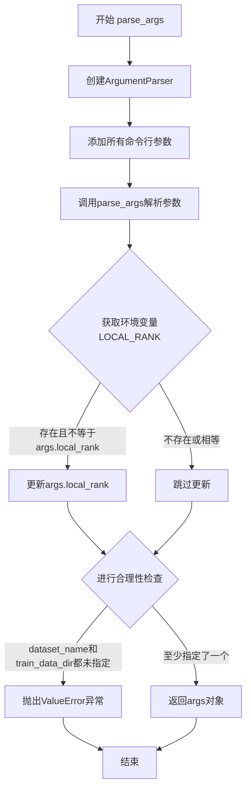
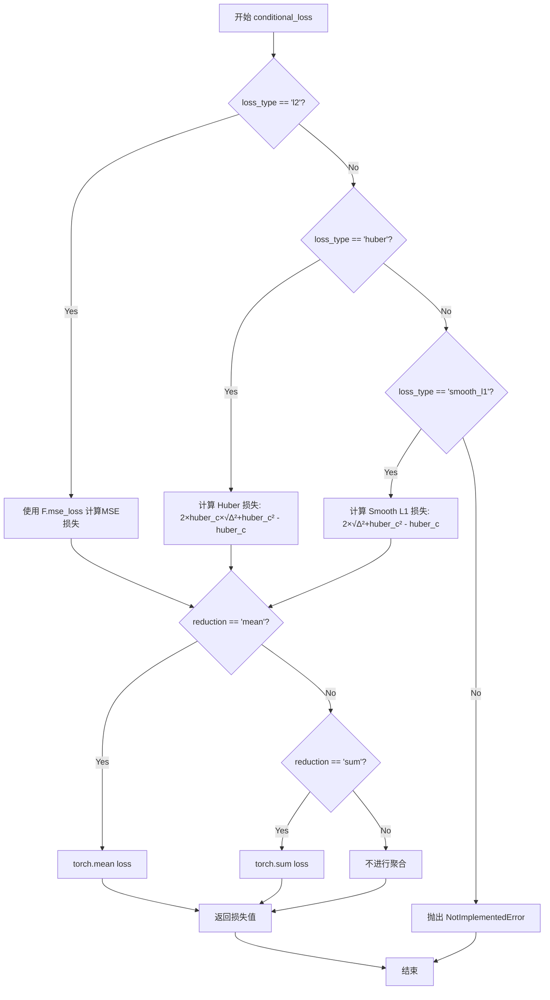

```mermaid
flowchart TD
    A[开始] --> B[解析命令行参数 parse_args]
    B --> C[验证参数有效性]
    C --> D[创建Accelerator实例]
    D --> E[配置日志系统]
    E --> F[设置随机种子]
    F --> G{是否为主进程?}
    G -->|是| H[创建输出目录]
    G -->|否| I[跳过目录创建]
    H --> J[加载预训练模型和组件]
    I --> J
    J --> K[配置LoRA适配器]
    K --> L[设置优化器]
    L --> M[加载数据集]
    M --> N[数据预处理和增强]
    N --> O[创建DataLoader]
    O --> P[配置学习率调度器]
    P --> Q[使用Accelerator准备模型和优化器]
    Q --> R[初始化训练 trackers]
    R --> S[训练循环 - 外层epoch循环]
    S --> T[加载batch数据]
    T --> U[VAE编码图像到latent空间]
    U --> V[采样噪声和timestep]
    V --> W[前向扩散过程添加噪声]
    W --> X[文本编码器处理caption]
    X --> Y[UNet预测噪声残差]
    Y --> Z[计算损失]
    Z --> AA[反向传播]
    AA --> AB{是否同步梯度?}
    AB -->|是| AC[梯度裁剪]
    AC --> AD[优化器更新参数]
    AD --> AE[学习率调度器更新]
    AE --> AF[清空梯度]
    AB -->|否| AF
    AF --> AG{是否达到checkpoint保存步数?}
    AG -->|是| AH[保存检查点]
    AG -->|否| AI
    AH --> AI
    AI --> AJ[更新进度条]
    AJ --> AK{是否完成所有训练步?}
    AK -->|否| T
    AK -->|是| AL{是否需要验证?}
    AL -->|是| AM[运行验证生成图像]
    AL -->|否| AN
    AM --> AN
    AN --> AO{是否还有剩余epoch?}
    AO -->|是| S
    AO -->|否| AP[保存最终LoRA权重]
    AP --> AQ{是否推送到Hub?}
    AQ -->|是| AR[创建model card并上传]
    AQ -->|否| AS
    AR --> AS[运行最终推理测试]
    AS --> AT[结束训练]
```

# `diffusers\examples\research_projects\scheduled_huber_loss_training\text_to_image\train_text_to_image_lora.py` 详细设计文档

这是一个用于使用 LoRA (Low-Rank Adaptation) 技术对 Stable Diffusion 模型进行微调的训练脚本。它集成了 Hugging Face 的 Diffusers 和 PEFT 库，实现了从预训练模型加载、LoRA 适配器配置、数据集处理（图像转换、文本标记化）、训练循环（扩散前向过程、噪声预测、损失计算、反向传播）到最终 LoRA 权重保存的完整流程，并支持分布式训练和多种损失函数选项。

## 整体流程

```mermaid
graph TD
    Start([开始]) --> ParseArgs[解析命令行参数]
    ParseArgs --> InitAcc[初始化 Accelerator & 日志]
    InitAcc --> LoadModels[加载预训练模型]
    LoadModels --> ConfigLoRA[配置 LoRA 适配器 & 冻结参数]
    ConfigLoRA --> LoadData[加载 & 预处理数据集]
    LoadData --> TrainLoop[训练循环]
    TrainLoop --> Step{遍历 Batch}
    Step -- Forward --> EncodeImg[VAE 编码图像到潜在空间]
    EncodeImg --> AddNoise[添加噪声 (DDPM Scheduler)]
    AddNoise --> EncodeText[CLIP 编码文本]
    EncodeText --> Predict[UNet 预测噪声]
    Predict --> Loss[计算损失 (L2/Huber)]
    Loss --> Backward[反向传播 & 优化器更新]
    Backward --> Checkpoint{检查点保存?}
    Checkpoint -- 是 --> SaveState[保存 Accelerator 状态 & LoRA 权重]
    Checkpoint -- 否 --> NextStep[下一个 Step]
    NextStep --> Step
    TrainLoop -- 训练结束 --> SaveFinal[保存最终 LoRA 权重]
    SaveFinal --> PushHub[可选: 推送到 HuggingFace Hub]
    PushHub --> End([结束])
```

## 类结构

```
train_lora.py (脚本入口)
├── 全局变量 (Global Vars)
│   ├── logger
│   └── DATASET_NAME_MAPPING
├── 工具函数 (Utility Functions)
│   ├── parse_args (参数解析)
│   ├── save_model_card (保存模型卡片)
│   └── conditional_loss (自定义损失函数)
└── 主逻辑 (Main Logic)
    └── main (主训练函数)
        ├── 环境初始化
        ├── 模型加载与配置 (UNet, VAE, TextEncoder, LoRA)
        ├── 数据处理 (Dataset, DataLoader, Transforms)
        ├── 训练循环 (Training Loop)
        └── 推理与保存 (Validation & Checkpointing)
```

## 全局变量及字段


### `logger`
    
全局日志记录器，用于记录训练过程中的信息、警告和调试信息

类型：`Logger`
    


### `DATASET_NAME_MAPPING`
    
数据集列名映射字典，用于将特定数据集名称映射到其图像列和文本列的名称

类型：`dict`
    


    

## 全局函数及方法


### `parse_args`

该函数是命令行参数解析函数，使用argparse库定义并收集训练脚本的所有超参数，包括模型路径、数据集配置、训练参数、优化器设置、验证选项等，并通过环境变量LOCAL_RANK处理分布式训练场景，最后返回包含所有参数的Namespace对象。

参数： 该函数无直接参数，但通过add_argument定义了近50个命令行参数。

返回值：`Namespace`对象，包含所有解析后的命令行参数及其值。

#### 流程图



#### 带注释源码

```
def parse_args():
    # 创建一个ArgumentParser对象，设置描述信息
    parser = argparse.ArgumentParser(description="Simple example of a training script.")
    
    # ========== 模型相关参数 ==========
    # 添加预训练模型路径或模型标识符（必填）
    parser.add_argument(
        "--pretrained_model_name_or_path",
        type=str,
        default=None,
        required=True,
        help="Path to pretrained model or model identifier from huggingface.co/models.",
    )
    
    # 添加模型版本号参数
    parser.add_argument(
        "--revision",
        type=str,
        default=None,
        required=False,
        help="Revision of pretrained model identifier from huggingface.co/models.",
    )
    
    # 添加模型变体参数（如fp16）
    parser.add_argument(
        "--variant",
        type=str,
        default=None,
        help="Variant of the model files of the pretrained model identifier from huggingface.co/models, 'e.g.' fp16",
    )
    
    # ========== 数据集相关参数 ==========
    # 添加数据集名称参数
    parser.add_argument(
        "--dataset_name",
        type=str,
        default=None,
        help="...",
    )
    
    # 添加数据集配置名称参数
    parser.add_argument(
        "--dataset_config_name",
        type=str,
        default=None,
        help="The config of the Dataset, leave as None if there's only one config.",
    )
    
    # 添加训练数据目录参数
    parser.add_argument(
        "--train_data_dir",
        type=str,
        default=None,
        help="...",
    )
    
    # 添加图像列名参数
    parser.add_argument(
        "--image_column", type=str, default="image", help="The column of the dataset containing an image."
    )
    
    # 添加标题/描述列名参数
    parser.add_argument(
        "--caption_column",
        type=str,
        default="text",
        help="The column of the dataset containing a caption or a list of captions.",
    )
    
    # ========== 验证相关参数 ==========
    # 添加验证提示词参数
    parser.add_argument(
        "--validation_prompt", type=str, default=None, help="A prompt that is sampled during training for inference."
    )
    
    # 添加验证图像数量参数
    parser.add_argument(
        "--num_validation_images",
        type=int,
        default=4,
        help="Number of images that should be generated during validation with `validation_prompt`.",
    )
    
    # 添加验证轮数间隔参数
    parser.add_argument(
        "--validation_epochs",
        type=int,
        default=1,
        help="...",
    )
    
    # ========== 训练相关参数 ==========
    # 添加最大训练样本数参数（用于调试）
    parser.add_argument(
        "--max_train_samples",
        type=int,
        default=None,
        help="...",
    )
    
    # 添加输出目录参数
    parser.add_argument(
        "--output_dir",
        type=str,
        default="sd-model-finetuned-lora",
        help="The output directory where the model predictions and checkpoints will be written.",
    )
    
    # 添加缓存目录参数
    parser.add_argument(
        "--cache_dir",
        type=str,
        default=None,
        help="The directory where the downloaded models and datasets will be stored.",
    )
    
    # 添加随机种子参数
    parser.add_argument("--seed", type=int, default=None, help="A seed for reproducible training.")
    
    # 添加图像分辨率参数
    parser.add_argument(
        "--resolution",
        type=int,
        default=512,
        help="...",
    )
    
    # 添加中心裁剪参数
    parser.add_argument(
        "--center_crop",
        default=False,
        action="store_true",
        help="...",
    )
    
    # 添加随机翻转参数
    parser.add_argument(
        "--random_flip",
        action="store_true",
        help="whether to randomly flip images horizontally",
    )
    
    # 添加训练批次大小参数
    parser.add_argument(
        "--train_batch_size", type=int, default=16, help="Batch size (per device) for the training dataloader."
    )
    
    # 添加训练轮数参数
    parser.add_argument("--num_train_epochs", type=int, default=100)
    
    # 添加最大训练步数参数
    parser.add_argument(
        "--max_train_steps",
        type=int,
        default=None,
        help="Total number of training steps to perform. If provided, overrides num_train_epochs.",
    )
    
    # 添加梯度累积步数参数
    parser.add_argument(
        "--gradient_accumulation_steps",
        type=int,
        default=1,
        help="Number of updates steps to accumulate before performing a backward/update pass.",
    )
    
    # 添加梯度检查点参数
    parser.add_argument(
        "--gradient_checkpointing",
        action="store_true",
        help="Whether or not to use gradient checkpointing to save memory at the expense of slower backward pass.",
    )
    
    # ========== 优化器相关参数 ==========
    # 添加学习率参数
    parser.add_argument(
        "--learning_rate",
        type=float,
        default=1e-4,
        help="Initial learning rate (after the potential warmup period) to use.",
    )
    
    # 添加学习率缩放参数
    parser.add_argument(
        "--scale_lr",
        action="store_true",
        default=False,
        help="Scale the learning rate by the number of GPUs, gradient accumulation steps, and batch size.",
    )
    
    # 添加学习率调度器类型参数
    parser.add_argument(
        "--lr_scheduler",
        type=str,
        default="constant",
        help="...",
    )
    
    # 添加学习率预热步数参数
    parser.add_argument(
        "--lr_warmup_steps", type=int, default=500, help="Number of steps for the warmup in the lr scheduler."
    )
    
    # 添加SNR gamma参数
    parser.add_argument(
        "--snr_gamma",
        type=float,
        default=None,
        help="SNR weighting gamma to be used if rebalancing the loss. Recommended value is 5.0.",
    )
    
    # 添加8位Adam优化器参数
    parser.add_argument(
        "--use_8bit_adam", action="store_true", help="Whether or not to use 8-bit Adam from bitsandbytes."
    )
    
    # 添加TF32允许参数
    parser.add_argument(
        "--allow_tf32",
        action="store_true",
        help="Whether or not to allow TF32 on Ampere GPUs.",
    )
    
    # 添加数据加载器工作进程数参数
    parser.add_argument(
        "--dataloader_num_workers",
        type=int,
        default=0,
        help="Number of subprocesses to use for data loading.",
    )
    
    # 添加Adam优化器的beta1参数
    parser.add_argument("--adam_beta1", type=float, default=0.9, help="The beta1 parameter for the Adam optimizer.")
    
    # 添加Adam优化器的beta2参数
    parser.add_argument("--adam_beta2", type=float, default=0.999, help="The beta2 parameter for the Adam optimizer.")
    
    # 添加Adam优化器的权重衰减参数
    parser.add_argument("--adam_weight_decay", type=float, default=1e-2, help="Weight decay to use.")
    
    # 添加Adam优化器的epsilon参数
    parser.add_argument("--adam_epsilon", type=float, default=1e-08, help="Epsilon value for the Adam optimizer")
    
    # 添加最大梯度范数参数
    parser.add_argument("--max_grad_norm", default=1.0, type=float, help="Max gradient norm.")
    
    # ========== Hub相关参数 ==========
    # 添加推送到Hub参数
    parser.add_argument("--push_to_hub", action="store_true", help="Whether or not to push the model to the Hub.")
    
    # 添加Hub token参数
    parser.add_argument("--hub_token", type=str, default=None, help="The token to use to push to the Model Hub.")
    
    # 添加Hub模型ID参数
    parser.add_argument(
        "--hub_model_id",
        type=str,
        default=None,
        help="The name of the repository to keep in sync with the local `output_dir`.",
    )
    
    # ========== 日志和监控相关参数 ==========
    # 添加日志目录参数
    parser.add_argument(
        "--logging_dir",
        type=str,
        default="logs",
        help="[TensorBoard] log directory.",
    )
    
    # 添加混合精度参数
    parser.add_argument(
        "--mixed_precision",
        type=str,
        default=None,
        choices=["no", "fp16", "bf16"],
        help="...",
    )
    
    # 添加报告目标参数
    parser.add_argument(
        "--report_to",
        type=str,
        default="tensorboard",
        help='The integration to report the results and logs to.',
    )
    
    # 添加本地排名参数（分布式训练）
    parser.add_argument("--local_rank", type=int, default=-1, help="For distributed training: local_rank")
    
    # ========== 检查点相关参数 ==========
    # 添加检查点保存步数参数
    parser.add_argument(
        "--checkpointing_steps",
        type=int,
        default=500,
        help="Save a checkpoint of the training state every X updates.",
    )
    
    # 添加检查点总数限制参数
    parser.add_argument(
        "--checkpoints_total_limit",
        type=int,
        default=None,
        help=("Max number of checkpoints to store."),
    )
    
    # 添加从检查点恢复参数
    parser.add_argument(
        "--resume_from_checkpoint",
        type=str,
        default=None,
        help="Whether training should be resumed from a previous checkpoint.",
    )
    
    # ========== 其他参数 ==========
    # 添加xformers内存高效注意力参数
    parser.add_argument(
        "--enable_xformers_memory_efficient_attention", action="store_true", help="Whether or not to use xformers."
    )
    
    # 添加噪声偏移参数
    parser.add_argument("--noise_offset", type=float, default=0, help="The scale of noise offset.")
    
    # 添加损失类型参数
    parser.add_argument(
        "--loss_type",
        type=str,
        default="l2",
        choices=["l2", "huber", "smooth_l1"],
        help="The type of loss to use.",
    )
    
    # 添加huber调度参数
    parser.add_argument(
        "--huber_schedule",
        type=str,
        default="snr",
        choices=["constant", "exponential", "snr"],
        help="The schedule to use for the huber losses parameter",
    )
    
    # 添加huber c参数
    parser.add_argument(
        "--huber_c",
        type=float,
        default=0.1,
        help="The huber loss parameter.",
    )
    
    # 添加LoRA秩参数
    parser.add_argument(
        "--rank",
        type=int,
        default=4,
        help=("The dimension of the LoRA update matrices."),
    )
    
    # 添加预测类型参数
    parser.add_argument(
        "--prediction_type",
        type=str,
        default=None,
        help="The prediction_type that shall be used for training.",
    )
    
    # ========== 解析参数 ==========
    # 解析命令行参数
    args = parser.parse_args()
    
    # ========== 环境变量处理 ==========
    # 获取环境变量LOCAL_RANK，如果存在则覆盖args.local_rank
    env_local_rank = int(os.environ.get("LOCAL_RANK", -1))
    if env_local_rank != -1 and env_local_rank != args.local_rank:
        args.local_rank = env_local_rank
    
    # ========== 合理性检查 ==========
    # 检查是否提供了数据集名称或训练数据目录
    if args.dataset_name is None and args.train_data_dir is None:
        raise ValueError("Need either a dataset name or a training folder.")
    
    # 返回解析后的参数对象
    return args
```


### `save_model_card`

该函数用于生成并保存HuggingFace Hub上的模型卡片（Model Card），包含模型描述、示例图片、标签等信息，以便于模型共享和复现。

参数：

- `repo_id`：`str`，HuggingFace Hub上的仓库ID，用于标识模型仓库
- `images`：`list`，可选，要保存到模型仓库的示例图片列表
- `base_model`：`str`，可选，微调所使用的基础模型名称或路径
- `dataset_name`：`str`，可选，用于微调的数据集名称
- `repo_folder`：`str`，可选，本地仓库文件夹路径，用于保存模型卡片和图片

返回值：`None`，该函数无返回值，直接将模型卡片写入本地文件

#### 流程图

```mermaid
flowchart TD
    A[开始] --> B{images is not None?}
    B -->|Yes| C[遍历images列表]
    C --> D[保存每张图片到repo_folder]
    E[构建img_str字符串<br/>格式: ]
    B -->|No| E
    E --> F[构建model_description字符串<br/>包含repo_id, base_model, dataset_name, img_str]
    F --> G[调用load_or_create_model_card<br/>创建或加载模型卡片]
    G --> H[定义tags列表<br/>包含stable-diffusion, lora等标签]
    H --> I[调用populate_model_card<br/>填充模型卡片标签]
    I --> J[保存模型卡片到<br/>repo_folder/README.md]
    J --> K[结束]
```

#### 带注释源码

```python
def save_model_card(
    repo_id: str,          # HuggingFace Hub仓库ID
    images: list = None,   # 可选的示例图片列表
    base_model: str = None,  # 基础模型名称/路径
    dataset_name: str = None, # 数据集名称
    repo_folder: str = None,  # 本地仓库文件夹路径
):
    """
    生成并保存HuggingFace Hub模型卡片
    
    该函数完成以下任务:
    1. 将示例图片保存到本地仓库文件夹
    2. 构建模型描述信息
    3. 创建/加载模型卡片并填充元数据
    4. 将模型卡片保存为README.md
    """
    
    img_str = ""  # 初始化图片Markdown字符串
    
    # 如果提供了图片列表，则保存每张图片并生成对应的Markdown引用
    if images is not None:
        for i, image in enumerate(images):
            # 保存图片到repo_folder，文件名格式为image_{i}.png
            image.save(os.path.join(repo_folder, f"image_{i}.png"))
            # 构建Markdown格式的图片引用字符串
            img_str += f"\n"

    # 构建模型描述信息，包含仓库ID、基础模型、数据集和示例图片
    model_description = f"""
# LoRA text2image fine-tuning - {repo_id}
These are LoRA adaption weights for {base_model}. The weights were fine-tuned on the {dataset_name} dataset. You can find some example images in the following. \n
{img_str}
"""

    # 加载或创建模型卡片
    # from_training=True表示从训练配置创建
    # license设置为creativeml-openrail-m
    model_card = load_or_create_model_card(
        repo_id_or_path=repo_id,
        from_training=True,
        license="creativeml-openrail-m",
        base_model=base_model,
        model_description=model_description,
        inference=True,
    )

    # 定义模型标签，用于模型分类和搜索
    tags = [
        "stable-diffusion",
        "stable-diffusion-diffusers",
        "text-to-image",
        "diffusers",
        "diffusers-training",
        "lora",
    ]
    
    # 填充模型卡片的标签信息
    model_card = populate_model_card(model_card, tags=tags)

    # 将模型卡片保存为README.md文件
    model_card.save(os.path.join(repo_folder, "README.md"))
```


### `conditional_loss`

该函数是Stable Diffusion LoRA微调脚本中的核心损失计算模块，用于根据指定的损失类型（l2、huber或smooth_l1）计算模型预测值与目标值之间的条件损失，支持不同的reduction模式（mean或sum），并特别针对扩散模型训练中的噪声预测任务进行了优化。

参数：

- `model_pred`：`torch.Tensor`，模型预测的张量，通常是UNet预测的噪声残差
- `target`：`torch.Tensor`，目标张量，通常是真实噪声或噪声调度器产生的目标
- `reduction`：`str`，损失聚合方式，默认为"mean"，可选"sum"或"none"
- `loss_type`：`str`，损失类型，默认为"l2"，支持"l2"、"huber"、"smooth_l1"
- `huber_c`：`float`，Huber损失的阈值参数，默认为0.1，用于平衡L1和L2损失

返回值：`torch.Tensor`，计算得到的损失值

#### 流程图



#### 带注释源码

```python
def conditional_loss(
    model_pred: torch.Tensor,  # 模型预测值（UNet输出的噪声残差）
    target: torch.Tensor,      # 目标值（真实噪声或v-prediction目标）
    reduction: str = "mean",  # 损失聚合方式: 'mean', 'sum', 或 'none'
    loss_type: str = "l2",    # 损失类型: 'l2', 'huber', 或 'smooth_l1'
    huber_c: float = 0.1,     # Huber损失的阈值参数，用于平滑L1和L2之间的过渡
):
    """
    计算条件损失函数，支持多种损失类型用于扩散模型训练。
    
    该函数在Stable Diffusion LoRA微调中被用于计算预测噪声与真实噪声
    之间的差异，支持L2损失（标准MSE）、Huber损失（对异常值更鲁棒）
    和Smooth L1损失（类似Huber但参数化方式不同）。
    """
    
    # L2损失：标准均方误差损失，适用于大多数回归任务
    if loss_type == "l2":
        loss = F.mse_loss(model_pred, target, reduction=reduction)
    
    # Huber损失：结合L1和L2优点的鲁棒损失函数
    # 公式：2 * c * (√(Δ² + c²) - c)，其中Δ = model_pred - target
    elif loss_type == "huber":
        # 计算预测与目标之间的差异
        diff = model_pred - target
        # 应用Huber损失公式，使用平滑的L1/L2过渡
        loss = 2 * huber_c * (torch.sqrt(diff ** 2 + huber_c**2) - huber_c)
        
        # 根据reduction参数进行聚合
        if reduction == "mean":
            loss = torch.mean(loss)
        elif reduction == "sum":
            loss = torch.sum(loss)
    
    # Smooth L1损失：也称为Huber损失的变体
    # 与Huber损失的区别在于没有c因子的乘法
    elif loss_type == "smooth_l1":
        diff = model_pred - target
        loss = 2 * (torch.sqrt(diff ** 2 + huber_c**2) - huber_c)
        
        if reduction == "mean":
            loss = torch.mean(loss)
        elif reduction == "sum":
            loss = torch.sum(loss)
    
    # 不支持的损失类型，抛出异常
    else:
        raise NotImplementedError(f"Unsupported Loss Type {loss_type}")
    
    return loss
```


### `main`

这是Stable Diffusion LoRA微调训练脚本的主函数，负责加载模型、数据集、配置训练参数、执行训练循环（包括前向传播、噪声预测、损失计算、反向传播、参数更新），并在训练过程中定期保存检查点和进行验证推理。

参数：

- 无显式参数（参数通过内部调用 `parse_args()` 获取）

返回值：`None`，函数执行完成后直接退出

#### 流程图



#### 带注释源码

```python
def main():
    """
    主训练函数，执行LoRA微调的完整流程
    """
    # 1. 解析命令行参数
    args = parse_args()
    
    # 2. 验证报告工具配置
    if args.report_to == "wandb" and args.hub_token is not None:
        raise ValueError(
            "You cannot use both --report_to=wandb and --hub_token due to a security risk of exposing your token."
            " Please use `hf auth login` to authenticate with the Hub."
        )

    # 3. 配置日志目录
    logging_dir = Path(args.output_dir, args.logging_dir)

    # 4. 创建Accelerator配置
    accelerator_project_config = ProjectConfiguration(project_dir=args.output_dir, logging_dir=logging_dir)

    # 5. 初始化Accelerator（分布式训练、混合精度等）
    accelerator = Accelerator(
        gradient_accumulation_steps=args.gradient_accumulation_steps,
        mixed_precision=args.mixed_precision,
        log_with=args.report_to,
        project_config=accelerator_project_config,
    )
    
    # 6. 检查并导入wandb
    if args.report_to == "wandb":
        if not is_wandb_available():
            raise ImportError("Make sure to install wandb if you want to use it for logging during training.")
        import wandb

    # 7. 配置日志系统
    logging.basicConfig(
        format="%(asctime)s - %(levelname)s - %(name)s - %(message)s",
        datefmt="%m/%d/%Y %H:%M:%S",
        level=logging.INFO,
    )
    logger.info(accelerator.state, main_process_only=False)
    
    # 8. 设置各库的日志级别
    if accelerator.is_local_main_process:
        datasets.utils.logging.set_verbosity_warning()
        transformers.utils.logging.set_verbosity_warning()
        diffusers.utils.logging.set_verbosity_info()
    else:
        datasets.utils.logging.set_verbosity_error()
        transformers.utils.logging.set_verbosity_error()
        diffusers.utils.logging.set_verbosity_error()

    # 9. 设置随机种子
    if args.seed is not None:
        set_seed(args.seed)

    # 10. 处理仓库创建（主进程）
    if accelerator.is_main_process:
        if args.output_dir is not None:
            os.makedirs(args.output_dir, exist_ok=True)

        if args.push_to_hub:
            repo_id = create_repo(
                repo_id=args.hub_model_id or Path(args.output_dir).name, exist_ok=True, token=args.hub_token
            ).repo_id

    # 11. 加载预训练模型和组件
    noise_scheduler = DDPMScheduler.from_pretrained(args.pretrained_model_name_or_path, subfolder="scheduler")
    tokenizer = CLIPTokenizer.from_pretrained(
        args.pretrained_model_name_or_path, subfolder="tokenizer", revision=args.revision
    )
    text_encoder = CLIPTextModel.from_pretrained(
        args.pretrained_model_name_or_path, subfolder="text_encoder", revision=args.revision
    )
    vae = AutoencoderKL.from_pretrained(
        args.pretrained_model_name_or_path, subfolder="vae", revision=args.revision, variant=args.variant
    )
    unet = UNet2DConditionModel.from_pretrained(
        args.pretrained_model_name_or_path, subfolder="unet", revision=args.revision, variant=args.variant
    )
    
    # 12. 冻结模型参数以节省显存
    unet.requires_grad_(False)
    vae.requires_grad_(False)
    text_encoder.requires_grad_(False)

    # 13. 设置混合精度权重类型
    weight_dtype = torch.float32
    if accelerator.mixed_precision == "fp16":
        weight_dtype = torch.float16
    elif accelerator.mixed_precision == "bf16":
        weight_dtype = torch.bfloat16

    # 14. 再次确保UNet参数冻结
    for param in unet.parameters():
        param.requires_grad_(False)

    # 15. 配置LoRA适配器
    unet_lora_config = LoraConfig(
        r=args.rank,
        lora_alpha=args.rank,
        init_lora_weights="gaussian",
        target_modules=["to_k", "to_q", "to_v", "to_out.0"],
    )

    # 16. 将模型移至设备并转换数据类型
    unet.to(accelerator.device, dtype=weight_dtype)
    vae.to(accelerator.device, dtype=weight_dtype)
    text_encoder.to(accelerator.device, dtype=weight_dtype)

    # 17. 添加LoRA适配器并确保可训练参数为float32
    unet.add_adapter(unet_lora_config)
    if args.mixed_precision == "fp16":
        cast_training_params(unet, dtype=torch.float32)

    # 18. 启用xformers高效注意力（如配置）
    if args.enable_xformers_memory_efficient_attention:
        if is_xformers_available():
            import xformers

            xformers_version = version.parse(xformers.__version__)
            if xformers_version == version.parse("0.0.16"):
                logger.warning(
                    "xFormers 0.0.16 cannot be used for training in some GPUs..."
                )
            unet.enable_xformers_memory_efficient_attention()
        else:
            raise ValueError("xformers is not available...")

    # 19. 获取可训练的LoRA层
    lora_layers = filter(lambda p: p.requires_grad, unet.parameters())

    # 20. 启用梯度检查点（如配置）
    if args.gradient_checkpointing:
        unet.enable_gradient_checkpointing()

    # 21. 启用TF32加速（如配置）
    if args.allow_tf32:
        torch.backends.cuda.matmul.allow_tf32 = True

    # 22. 缩放学习率（如配置）
    if args.scale_lr:
        args.learning_rate = (
            args.learning_rate * args.gradient_accumulation_steps * args.train_batch_size * accelerator.num_processes
        )

    # 23. 初始化优化器
    if args.use_8bit_adam:
        try:
            import bitsandbytes as bnb
        except ImportError:
            raise ImportError("Please install bitsandbytes...")
        optimizer_cls = bnb.optim.AdamW8bit
    else:
        optimizer_cls = torch.optim.AdamW

    optimizer = optimizer_cls(
        lora_layers,
        lr=args.learning_rate,
        betas=(args.adam_beta1, args.adam_beta2),
        weight_decay=args.adam_weight_decay,
        eps=args.adam_epsilon,
    )

    # 24. 加载数据集
    if args.dataset_name is not None:
        dataset = load_dataset(
            args.dataset_name,
            args.dataset_config_name,
            cache_dir=args.cache_dir,
            data_dir=args.train_data_dir,
        )
    else:
        data_files = {}
        if args.train_data_dir is not None:
            data_files["train"] = os.path.join(args.train_data_dir, "**")
        dataset = load_dataset(
            "imagefolder",
            data_files=data_files,
            cache_dir=args.cache_dir,
        )

    # 25. 确定数据集列名
    column_names = dataset["train"].column_names
    dataset_columns = DATASET_NAME_MAPPING.get(args.dataset_name, None)
    
    if args.image_column is None:
        image_column = dataset_columns[0] if dataset_columns is not None else column_names[0]
    else:
        image_column = args.image_column
        if image_column not in column_names:
            raise ValueError(f"--image_column' value '{args.image_column}' needs to be one of: {', '.join(column_names)}")
    
    if args.caption_column is None:
        caption_column = dataset_columns[1] if dataset_columns is not None else column_names[1]
    else:
        caption_column = args.caption_column
        if caption_column not in column_names:
            raise ValueError(f"--caption_column' value '{args.caption_column}' needs to be one of: {', '.join(column_names)}")

    # 26. 定义tokenize_captions函数
    def tokenize_captions(examples, is_train=True):
        captions = []
        for caption in examples[caption_column]:
            if isinstance(caption, str):
                captions.append(caption)
            elif isinstance(caption, (list, np.ndarray)):
                captions.append(random.choice(caption) if is_train else caption[0])
            else:
                raise ValueError(f"Caption column `{caption_column}` should contain either strings or lists of strings.")
        inputs = tokenizer(
            captions, max_length=tokenizer.model_max_length, padding="max_length", truncation=True, return_tensors="pt"
        )
        return inputs.input_ids

    # 27. 定义图像变换
    train_transforms = transforms.Compose(
        [
            transforms.Resize(args.resolution, interpolation=transforms.InterpolationMode.BILINEAR),
            transforms.CenterCrop(args.resolution) if args.center_crop else transforms.RandomCrop(args.resolution),
            transforms.RandomHorizontalFlip() if args.random_flip else transforms.Lambda(lambda x: x),
            transforms.ToTensor(),
            transforms.Normalize([0.5], [0.5]),
        ]
    )

    # 28. 定义unwrap_model辅助函数
    def unwrap_model(model):
        model = accelerator.unwrap_model(model)
        model = model._orig_mod if is_compiled_module(model) else model
        return model

    # 29. 定义preprocess_train函数
    def preprocess_train(examples):
        images = [image.convert("RGB") for image in examples[image_column]]
        examples["pixel_values"] = [train_transforms(image) for image in images]
        examples["input_ids"] = tokenize_captions(examples)
        return examples

    # 30. 应用数据预处理
    with accelerator.main_process_first():
        if args.max_train_samples is not None:
            dataset["train"] = dataset["train"].shuffle(seed=args.seed).select(range(args.max_train_samples))
        train_dataset = dataset["train"].with_transform(preprocess_train)

    # 31. 定义collate_fn
    def collate_fn(examples):
        pixel_values = torch.stack([example["pixel_values"] for example in examples])
        pixel_values = pixel_values.to(memory_format=torch.contiguous_format).float()
        input_ids = torch.stack([example["input_ids"] for example in examples])
        return {"pixel_values": pixel_values, "input_ids": input_ids}

    # 32. 创建DataLoader
    train_dataloader = torch.utils.data.DataLoader(
        train_dataset,
        shuffle=True,
        collate_fn=collate_fn,
        batch_size=args.train_batch_size,
        num_workers=args.dataloader_num_workers,
    )

    # 33. 计算训练步数
    overrode_max_train_steps = False
    num_update_steps_per_epoch = math.ceil(len(train_dataloader) / args.gradient_accumulation_steps)
    if args.max_train_steps is None:
        args.max_train_steps = args.num_train_epochs * num_update_steps_per_epoch
        overrode_max_train_steps = True

    # 34. 创建学习率调度器
    lr_scheduler = get_scheduler(
        args.lr_scheduler,
        optimizer=optimizer,
        num_warmup_steps=args.lr_warmup_steps * accelerator.num_processes,
        num_training_steps=args.max_train_steps * accelerator.num_processes,
    )

    # 35. 使用Accelerator准备所有组件
    unet, optimizer, train_dataloader, lr_scheduler = accelerator.prepare(
        unet, optimizer, train_dataloader, lr_scheduler
    )

    # 36. 重新计算训练步数
    num_update_steps_per_epoch = math.ceil(len(train_dataloader) / args.gradient_accumulation_steps)
    if overrode_max_train_steps:
        args.max_train_steps = args.num_train_epochs * num_update_steps_per_epoch
    args.num_train_epochs = math.ceil(args.max_train_steps / num_update_steps_per_epoch)

    # 37. 初始化trackers
    if accelerator.is_main_process:
        accelerator.init_trackers("text2image-fine-tune", config=vars(args))

    # 38. 训练循环
    total_batch_size = args.train_batch_size * accelerator.num_processes * args.gradient_accumulation_steps

    logger.info("***** Running training *****")
    logger.info(f"  Num examples = {len(train_dataset)}")
    logger.info(f"  Num Epochs = {args.num_train_epochs}")
    logger.info(f"  Instantaneous batch size per device = {args.train_batch_size}")
    logger.info(f"  Total train batch size (w. parallel, distributed & accumulation) = {total_batch_size}")
    logger.info(f"  Gradient Accumulation steps = {args.gradient_accumulation_steps}")
    logger.info(f"  Total optimization steps = {args.max_train_steps}")
    
    global_step = 0
    first_epoch = 0

    # 39. 处理检查点恢复
    if args.resume_from_checkpoint:
        if args.resume_from_checkpoint != "latest":
            path = os.path.basename(args.resume_from_checkpoint)
        else:
            dirs = os.listdir(args.output_dir)
            dirs = [d for d in dirs if d.startswith("checkpoint")]
            dirs = sorted(dirs, key=lambda x: int(x.split("-")[1]))
            path = dirs[-1] if len(dirs) > 0 else None

        if path is None:
            accelerator.print(f"Checkpoint '{args.resume_from_checkpoint}' does not exist. Starting a new training run.")
            args.resume_from_checkpoint = None
            initial_global_step = 0
        else:
            accelerator.print(f"Resuming from checkpoint {path}")
            accelerator.load_state(os.path.join(args.output_dir, path))
            global_step = int(path.split("-")[1])
            initial_global_step = global_step
            first_epoch = global_step // num_update_steps_per_epoch
    else:
        initial_global_step = 0

    # 40. 创建进度条
    progress_bar = tqdm(
        range(0, args.max_train_steps),
        initial=initial_global_step,
        desc="Steps",
        disable=not accelerator.is_local_main_process,
    )

    # 41. 外层训练循环 - Epoch
    for epoch in range(first_epoch, args.num_train_epochs):
        unet.train()
        train_loss = 0.0
        
        # 42. 内层训练循环 - Step
        for step, batch in enumerate(train_dataloader):
            with accelerator.accumulate(unet):
                # 43. 图像编码到latent空间
                latents = vae.encode(batch["pixel_values"].to(dtype=weight_dtype)).latent_dist.sample()
                latents = latents * vae.config.scaling_factor

                # 44. 采样噪声
                noise = torch.randn_like(latents)
                if args.noise_offset:
                    noise += args.noise_offset * torch.randn(
                        (latents.shape[0], latents.shape[1], 1, 1), device=latents.device
                    )

                bsz = latents.shape[0]
                
                # 45. 采样timestep
                if args.loss_type == "huber" or args.loss_type == "smooth_l1":
                    timesteps = torch.randint(0, noise_scheduler.config.num_train_timesteps, (1,), device="cpu")
                    timestep = timesteps.item()

                    if args.huber_schedule == "exponential":
                        alpha = -math.log(args.huber_c) / noise_scheduler.config.num_train_timesteps
                        huber_c = math.exp(-alpha * timestep)
                    elif args.huber_schedule == "snr":
                        alphas_cumprod = noise_scheduler.alphas_cumprod[timestep]
                        sigmas = ((1.0 - alphas_cumprod) / alphas_cumprod) ** 0.5
                        huber_c = (1 - args.huber_c) / (1 + sigmas) ** 2 + args.huber_c
                    elif args.huber_schedule == "constant":
                        huber_c = args.huber_c

                    timesteps = timesteps.repeat(bsz).to(latents.device)
                elif args.loss_type == "l2":
                    timesteps = torch.randint(
                        0, noise_scheduler.config.num_train_timesteps, (bsz,), device=latents.device
                    )
                    huber_c = 1

                timesteps = timesteps.long()

                # 46. 前向扩散过程
                noisy_latents = noise_scheduler.add_noise(latents, noise, timesteps)

                # 47. 文本编码
                encoder_hidden_states = text_encoder(batch["input_ids"], return_dict=False)[0]

                # 48. 确定目标
                if args.prediction_type is not None:
                    noise_scheduler.register_to_config(prediction_type=args.prediction_type)

                if noise_scheduler.config.prediction_type == "epsilon":
                    target = noise
                elif noise_scheduler.config.prediction_type == "v_prediction":
                    target = noise_scheduler.get_velocity(latents, noise, timesteps)

                # 49. UNet预测
                model_pred = unet(noisy_latents, timesteps, encoder_hidden_states, return_dict=False)[0]

                # 50. 计算损失
                if args.snr_gamma is None:
                    loss = conditional_loss(
                        model_pred.float(), target.float(), reduction="mean", loss_type=args.loss_type, huber_c=huber_c
                    )
                else:
                    snr = compute_snr(noise_scheduler, timesteps)
                    mse_loss_weights = torch.stack([snr, args.snr_gamma * torch.ones_like(timesteps)], dim=1).min(
                        dim=1
                    )[0]
                    if noise_scheduler.config.prediction_type == "epsilon":
                        mse_loss_weights = mse_loss_weights / snr
                    elif noise_scheduler.config.prediction_type == "v_prediction":
                        mse_loss_weights = mse_loss_weights / (snr + 1)

                    loss = conditional_loss(
                        model_pred.float(), target.float(), reduction="none", loss_type=args.loss_type, huber_c=huber_c
                    )
                    loss = loss.mean(dim=list(range(1, len(loss.shape)))) * mse_loss_weights
                    loss = loss.mean()

                # 51. 收集损失用于日志
                avg_loss = accelerator.gather(loss.repeat(args.train_batch_size)).mean()
                train_loss += avg_loss.item() / args.gradient_accumulation_steps

                # 52. 反向传播
                accelerator.backward(loss)
                if accelerator.sync_gradients:
                    params_to_clip = lora_layers
                    accelerator.clip_grad_norm_(params_to_clip, args.max_grad_norm)
                optimizer.step()
                lr_scheduler.step()
                optimizer.zero_grad()

            # 53. 同步梯度后的处理
            if accelerator.sync_gradients:
                progress_bar.update(1)
                global_step += 1
                accelerator.log({"train_loss": train_loss}, step=global_step)
                train_loss = 0.0

                # 54. 保存检查点
                if global_step % args.checkpointing_steps == 0:
                    if accelerator.is_main_process:
                        if args.checkpoints_total_limit is not None:
                            checkpoints = os.listdir(args.output_dir)
                            checkpoints = [d for d in checkpoints if d.startswith("checkpoint")]
                            checkpoints = sorted(checkpoints, key=lambda x: int(x.split("-")[1]))

                            if len(checkpoints) >= args.checkpoints_total_limit:
                                num_to_remove = len(checkpoints) - args.checkpoints_total_limit + 1
                                removing_checkpoints = checkpoints[0:num_to_remove]

                                for removing_checkpoint in removing_checkpoints:
                                    shutil.rmtree(os.path.join(args.output_dir, removing_checkpoint))

                        save_path = os.path.join(args.output_dir, f"checkpoint-{global_step}")
                        accelerator.save_state(save_path)

                        unwrapped_unet = unwrap_model(unet)
                        unet_lora_state_dict = convert_state_dict_to_diffusers(
                            get_peft_model_state_dict(unwrapped_unet)
                        )

                        StableDiffusionPipeline.save_lora_weights(
                            save_directory=save_path,
                            unet_lora_layers=unet_lora_state_dict,
                            safe_serialization=True,
                        )

                        logger.info(f"Saved state to {save_path}")

                logs = {"step_loss": loss.detach().item(), "lr": lr_scheduler.get_last_lr()[0]}
                progress_bar.set_postfix(**logs)

                if global_step >= args.max_train_steps:
                    break

        # 55. 验证
        if accelerator.is_main_process:
            if args.validation_prompt is not None and epoch % args.validation_epochs == 0:
                logger.info(
                    f"Running validation... \n Generating {args.num_validation_images} images with prompt:"
                    f" {args.validation_prompt}."
                )
                pipeline = DiffusionPipeline.from_pretrained(
                    args.pretrained_model_name_or_path,
                    unet=unwrap_model(unet),
                    revision=args.revision,
                    variant=args.variant,
                    torch_dtype=weight_dtype,
                )
                pipeline = pipeline.to(accelerator.device)
                pipeline.set_progress_bar_config(disable=True)

                generator = torch.Generator(device=accelerator.device)
                if args.seed is not None:
                    generator = generator.manual_seed(args.seed)
                images = []
                with torch.cuda.amp.autocast():
                    for _ in range(args.num_validation_images):
                        images.append(
                            pipeline(args.validation_prompt, num_inference_steps=30, generator=generator).images[0]
                        )

                for tracker in accelerator.trackers:
                    if tracker.name == "tensorboard":
                        np_images = np.stack([np.asarray(img) for img in images])
                        tracker.writer.add_images("validation", np_images, epoch, dataformats="NHWC")
                    if tracker.name == "wandb":
                        tracker.log(
                            {
                                "validation": [
                                    wandb.Image(image, caption=f"{i}: {args.validation_prompt}")
                                    for i, image in enumerate(images)
                                ]
                            }
                        )

                del pipeline
                torch.cuda.empty_cache()

    # 56. 保存最终LoRA权重
    accelerator.wait_for_everyone()
    if accelerator.is_main_process:
        unet = unet.to(torch.float32)

        unwrapped_unet = unwrap_model(unet)
        unet_lora_state_dict = convert_state_dict_to_diffusers(get_peft_model_state_dict(unwrapped_unet))
        StableDiffusionPipeline.save_lora_weights(
            save_directory=args.output_dir,
            unet_lora_layers=unet_lora_state_dict,
            safe_serialization=True,
        )

        # 57. 推送到Hub
        if args.push_to_hub:
            save_model_card(
                repo_id,
                images=images,
                base_model=args.pretrained_model_name_or_path,
                dataset_name=args.dataset_name,
                repo_folder=args.output_dir,
            )
            upload_folder(
                repo_id=repo_id,
                folder_path=args.output_dir,
                commit_message="End of training",
                ignore_patterns=["step_*", "epoch_*"],
            )

        # 58. 最终推理测试
        if args.validation_prompt is not None:
            pipeline = DiffusionPipeline.from_pretrained(
                args.pretrained_model_name_or_path,
                revision=args.revision,
                variant=args.variant,
                torch_dtype=weight_dtype,
            )
            pipeline = pipeline.to(accelerator.device)

            pipeline.load_lora_weights(args.output_dir)

            generator = torch.Generator(device=accelerator.device)
            if args.seed is not None:
                generator = generator.manual_seed(args.seed)
            images = []
            with torch.cuda.amp.autocast():
                for _ in range(args.num_validation_images):
                    images.append(
                        pipeline(args.validation_prompt, num_inference_steps=30, generator=generator).images[0]
                    )

            for tracker in accelerator.trackers:
                if len(images) != 0:
                    if tracker.name == "tensorboard":
                        np_images = np.stack([np.asarray(img) for img in images])
                        tracker.writer.add_images("test", np_images, epoch, dataformats="NHWC")
                    if tracker.name == "wandb":
                        tracker.log(
                            {
                                "test": [
                                    wandb.Image(image, caption=f"{i}: {args.validation_prompt}")
                                    for i, image in enumerate(images)
                                ]
                            }
                        )

    accelerator.end_training()
```

## 关键组件


### DDPMScheduler (noise_scheduler)

噪声调度器，用于前向扩散过程（将噪声添加到潜在表示）和反向去噪过程（从噪声中恢复图像）。它控制每个时间步的噪声水平，支持epsilon和v_prediction两种预测类型。

### AutoencoderKL (vae)

变分自编码器，将输入图像编码到潜在空间（latent space），并从潜在表示解码回图像。使用了scaling_factor来缩放潜在表示，这是Stable Diffusion的关键组件。

### CLIPTextModel (text_encoder)

文本编码器，将文本提示（captions）转换为文本嵌入（text embeddings），用于条件生成图像。冻结参数以节省显存。

### UNet2DConditionModel (unet)

条件UNet模型，是Stable Diffusion的核心组件，负责预测噪声残差（noise residual）。接收噪声潜在表示、时间步和文本嵌入作为输入，输出预测的噪声。

### LoraConfig (unet_lora_config)

LoRA（Low-Rank Adaptation）配置，定义了适配器的秩(rank)、alpha值、初始化方式和目标模块（to_k, to_q, to_v, to_out.0），用于以参数高效方式微调UNet。

### conditional_loss

条件损失函数，支持三种损失类型：L2损失、Huber损失和Smooth L1损失。可以根据时间步动态调整Huber损失参数（支持constant、exponential、snr三种调度方式）。

### Accelerator

来自accelerate库的分布式训练加速器，管理混合精度训练（fp16/bf16）、梯度累积、分布式训练和模型检查点保存。

### train_transforms

训练数据预处理管道，包含图像resize、中心裁剪/随机裁剪、随机水平翻转、ToTensor转换和Normalize归一化。

### tokenize_captions

文本标记化函数，将文本描述转换为token IDs。使用CLIPTokenizer进行编码，支持最大长度填充和截断。

### unwrap_model

模型解包函数，用于从accelerator包装的模型中恢复原始模型，处理编译模块（is_compiled_module）的情况。

### DiffusionPipeline / StableDiffusionPipeline

推理管道，用于验证阶段生成图像。支持加载预训练模型和LoRA权重，进行文本到图像的生成推理。

### save_model_card

模型卡片保存函数，生成包含模型描述、训练信息和示例图像的README.md文件，用于Hub上传。

### optimizer (AdamW)

AdamW优化器，用于更新LoRA参数。支持8-bit Adam（bitsandbytes）以节省显存。包含权重衰减和梯度裁剪。

### lr_scheduler

学习率调度器，支持多种调度策略（linear、cosine、constant、constant_with_warmup等），用于动态调整学习率。

### train_dataloader

PyTorch DataLoader，管理训练数据的批量加载。支持多进程数据加载（dataloader_num_workers）和数据整理（collate_fn）。


## 问题及建议


### 已知问题

-   **代码缺乏模块化设计**：所有代码集中在单个文件，`main()`函数过于庞大（超过500行），难以维护和测试，应拆分为独立模块如数据处理、模型构建、训练循环等
-   **硬编码的LoRA配置**：`target_modules=["to_k", "to_q", "to_v", "to_out.0"]`被硬编码，不支持不同模型架构的LoRA适配
-   **设备使用不一致**：timestep采样时使用`device="cpu"`，而其他计算在GPU上，这种异构设备操作会影响性能
-   **缺少早停机制**：训练过程中没有基于验证集性能的早停策略，可能导致过度训练
-   **DataLoader配置不优化**：未启用`pin_memory=True`和`persistent_workers=True`，数据加载效率较低
-   **验证推理未使用混合精度**：训练循环使用了混合精度，但验证推理阶段未启用`torch.cuda.amp.autocast`（仅外层使用），影响推理速度
-   **验证批处理缺失**：验证时一次性生成所有图像，大批量可能导致显存溢出，应分批生成
-   **checkpoint管理缺陷**：分布式训练时checkpoint保存仅在主进程执行但逻辑分散，且未考虑文件系统原子性
-   **缺少资源清理**：训练结束后未显式调用`torch.cuda.empty_cache()`和`gc.collect()`
-   **数据类型转换冗余**：频繁使用`.float()`转换模型预测和目标张量，增加不必要的开销

### 优化建议

-   将代码重构为多个模块：数据处理模块(`dataset.py`)、模型加载模块(`model.py`)、训练逻辑模块(`trainer.py`)、工具函数模块(`utils.py`)
-   添加命令行参数`--lora_target_modules`允许用户自定义LoRA目标模块，将`target_modules`参数化
-   将timestep采样设备统一为`latents.device`，避免CPU-GPU数据传输
-   实现早停机制：添加参数`--early_stopping_patience`和`--early_stopping_threshold`，基于验证损失决定是否提前终止
-   优化DataLoader配置：添加`pin_memory=True`和`persistent_workers=True`（当`num_workers > 0`时）
-   验证推理改用`torch.cuda.amp.autocast`上下文管理器，并对验证图像生成实现批处理
-   重构checkpoint保存逻辑，使用分布式屏障确保一致性，考虑使用临时文件+原子重命名
-   在`accelerator.end_training()`后添加显式资源清理代码
-   移除不必要的`.float()`调用，利用已有的`weight_dtype`和混合精度训练
-   添加类型注解和详细的文档字符串，提升代码可读性和可维护性

## 其它


### 设计目标与约束

本脚本的设计目标是实现一个高效、灵活的Stable Diffusion模型LoRA微调流程，支持在消费级GPU上进行文本到图像的微调训练。核心约束包括：1）仅支持LoRA训练模式，不进行全参数微调以降低显存占用；2）必须使用DDPMScheduler进行噪声调度；3）训练过程中必须保持text_encoder和vae冻结状态以节省显存；4）支持分布式训练和混合精度训练；5）最小支持PyTorch版本需符合diffusers 0.28.0.dev0的要求。

### 错误处理与异常设计

代码中的错误处理主要分为以下几类：1）参数校验错误，在parse_args()中对dataset_name和train_data_dir进行互斥校验，缺失任一参数则抛出ValueError；2）依赖缺失错误，在enable_xformers_memory_efficient_attention和use_8bit_adam场景下检查依赖库是否安装，未安装则抛出ImportError并给出安装建议；3）检查点恢复错误，当resume_from_checkpoint指定的路径不存在时，输出警告并从初始状态开始训练；4）模型加载错误，通过from_pretrained方法加载模型时若路径无效或格式错误会抛出异常；5）数据集列名错误，在预处理阶段检查image_column和caption_column是否存在于数据集列中，不存在则抛出ValueError。

### 数据流与状态机

训练数据流经过以下阶段：原始图像数据→train_transforms预处理（Resize、Crop、Flip、ToTensor、Normalize）→vae.encode()编码到潜在空间→添加噪声（noise_scheduler.add_noise）→unet预测噪声残差→计算条件损失（conditional_loss）→反向传播更新LoRA参数。模型状态机包括：初始化状态（模型加载完成）→训练状态（unet.train()）→验证状态（pipeline推理）→保存状态（checkpoint保存）。训练循环中通过accelerator.accumulate()实现梯度累积，通过accelerator.sync_gradients判断优化步骤完成时机。

### 外部依赖与接口契约

本脚本依赖以下核心外部包：1）diffusers库（>=0.28.0.dev0），提供StableDiffusionPipeline、DDPMScheduler、AutoencoderKL、UNet2DConditionModel等模型组件；2）transformers库，提供CLIPTextModel和CLIPTokenizer；3）peft库，提供LoraConfig和get_peft_model_state_dict；4）accelerate库，提供分布式训练和混合精度训练支持；5）datasets库，提供数据集加载和预处理；6）torch库，提供深度学习张量操作；7）可选依赖：bitsandbytes（8-bit Adam优化器）、xformers（高效注意力）、wandb（实验跟踪）。所有模型组件均通过from_pretrained方法从HuggingFace Hub或本地路径加载。

### 配置管理

脚本采用命令行参数+配置文件的双层配置管理机制。命令行参数通过argparse解析，主要包括模型路径、数据集配置、训练超参数、输出路径等50+个参数。配置初始化流程为：parse_args()→Accelerator初始化→模型加载→数据集加载→优化器和学习率调度器配置。所有配置参数在训练开始前通过accelerator.init_trackers()记录到TensorBoard或WandB，用于实验追踪和复现。

### 性能优化策略

代码实现了多项性能优化：1）混合精度训练，通过--mixed_precision参数支持fp16和bf16推理；2）梯度检查点，通过--gradient_checkpointing减少显存占用；3）xFormers高效注意力，通过--enable_xformers_memory_efficient_attention启用；4）梯度累积，通过--gradient_accumulation_steps实现大 batch size 训练；5）TF32加速，通过--allow_tf32启用Ampere GPU的张量核心加速；6）LoRA参数冻结，非LoRA层通过requires_grad_(False)冻结，仅训练少量LoRA参数。

### 版本兼容性说明

本脚本对以下组件有版本要求：1）diffusers>=0.28.0.dev0，通过check_min_version()强制检查；2）PyTorch>=1.10（使用bf16时）；3）xformers>=0.0.17（训练时推荐）；4）Python版本未明确限制但推荐3.8+。代码中通过version.parse()对xformers版本进行校验，0.0.16版本会发出警告建议升级。

### 安全与权限考虑

涉及安全性的操作包括：1）hub_token处理，当同时使用--report_to=wandb和--hub_token时会抛出安全警告，建议使用hf auth login认证；2）模型上传，push_to_hub时使用ignore_patterns过滤临时文件；3）权重安全序列化，通过safe_serialization=True保存LoRA权重防止恶意注入；4）分布式训练中的进程同步，通过accelerator.wait_for_everyone()确保所有进程完成后再进行最终保存操作。

    