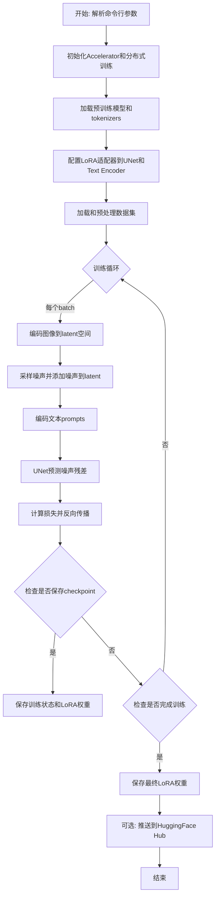
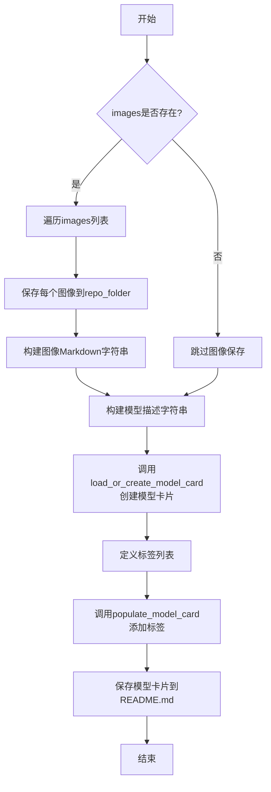
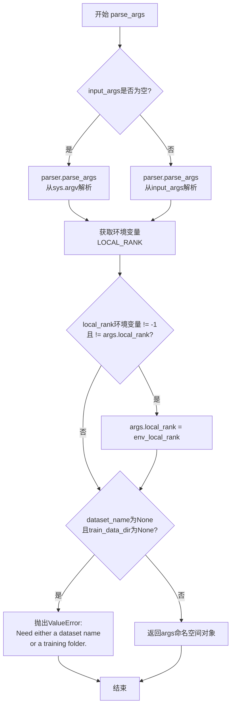
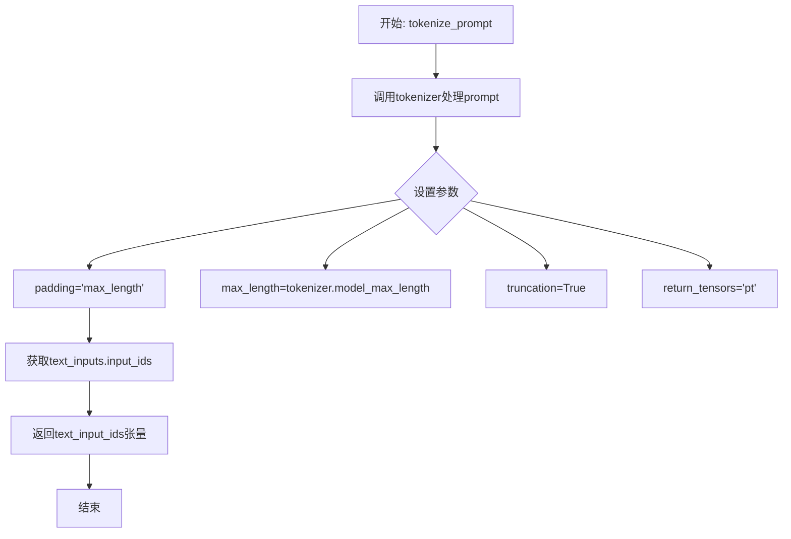

```mermaid
flowchart TD
    A[开始 main 函数] --> B{检查 report_to 和 hub_token}
    B -->|冲突| C[抛出 ValueError]
    B -->|正常| D[创建 logging_dir 和 Accelerator]
    
    D --> E[配置日志级别]
    E --> F[设置随机种子]
    F --> G{是否为 main process}
    G -->|是| H[创建输出目录]
    G -->|否| I[跳过目录创建]
    
    H --> J[加载 tokenizers 和 text encoders]
    I --> J
    
    J --> K[加载 noise_scheduler, VAE, UNet]
    K --> L[冻结不需要训练的模型参数]
    L --> M[设置权重数据类型 weight_dtype]
    
    M --> N{是否启用 xformers}
    N -->|是| O[启用 xformers 优化]
    N -->|否| P[继续]
    
    O --> Q[配置 LoRA]
    P --> Q
    
    Q --> R[添加 UNet LoRA adapter]
    R --> S{是否训练 text_encoder}
    S -->|是| T[添加 text_encoder LoRA adapters]
    S -->|否| U[设置优化器]
    
    T --> U
    U --> V[创建 optimizer]
    V --> W[加载数据集]
    
    W --> X[预处理数据集]
    X --> Y[创建 DataLoader]
    Y --> Z[配置 lr_scheduler]
    
    Z --> AA[使用 accelerator 准备模型和数据]
    AA --> AB[初始化 trackers]
    
    AB --> AC[进入训练循环]
    AC --> AD{是否 resume checkpoint}
    AD -->|是| AE[加载 checkpoint 状态]
    AD -->|否| AF[从头开始训练]
    
    AE --> AG[开始 epoch 循环]
    AF --> AG
    
    AG --> AH{遍历 train_dataloader}
    AH -->|每个 batch| AI[前向传播: VAE encode]
    
    AI --> AJ[添加噪声到 latents]
    AJ --> AK[计算 timestep]
    AK --> AL[计算 add_time_ids]
    
    AL --> AM[encode prompt]
    AM --> AN[UNet 预测噪声]
    AN --> AO[计算损失]
    
    AO --> AP[反向传播]
    AP --> AQ{是否需要优化}
    AQ -->|是| AR[clip grad & optimizer step]
    AQ -->|否| AS[跳过优化]
    
    AR --> AT[更新 progress_bar]
    AS --> AT
    
    AT --> AU{达到 checkpoint 步骤}
    AU -->|是| AV[保存 checkpoint]
    AU -->|否| AW
    
    AV --> AW{达到 max_train_steps}
    AW -->|否| AH
    AW -->|是| AX{需要进行验证}
    
    AX -->|是| AY[执行验证推理]
    AX -->|否| AZ
    
    AY --> AZ[保存 LoRA 权重]
    AZ --> BA[执行最终推理测试]
    BA --> BB[上传到 Hub（可选）]
    BB --> BC[结束训练]
    
    style AC fill:#f9f,stroke:#333
    style AZ fill:#9f9,stroke:#333
```

# `diffusers\examples\research_projects\scheduled_huber_loss_training\text_to_image\train_text_to_image_lora_sdxl.py` 详细设计文档

这是一个用于Stable Diffusion XL (SDXL) 的LoRA文本到图像微调训练脚本，支持通过LoRA技术对SDXL模型进行轻量级微调，实现自定义风格的图像生成。

## 整体流程



## 类结构

```
脚本文件 (非面向对象)
├── 全局函数
│   ├── save_model_card (保存模型卡片)
│   ├── import_model_class_from_model_name_or_path (导入模型类)
│   ├── parse_args (解析命令行参数)
│   ├── tokenize_prompt (tokenize文本)
│   ├── encode_prompt (编码文本为embeddings)
│   ├── conditional_loss (条件损失计算)
│   └── main (主训练函数)
└── 全局变量
    ├── logger (日志记录器)
    └── DATASET_NAME_MAPPING (数据集列名映射)
```

## 全局变量及字段


### `logger`
    
用于记录训练过程中的日志信息的Logger对象

类型：`logging.Logger`
    


### `DATASET_NAME_MAPPING`
    
数据集名称到图像和文本列名的映射字典，用于指定特定数据集的列名

类型：`Dict[str, Tuple[str, str]]`
    


    

## 全局函数及方法


### `save_model_card`

该函数用于在模型训练完成后，生成并保存模型的模型卡片（Model Card），包括训练元数据、示例图像、标签等信息，并将其保存为README.md文件，以便在HuggingFace Hub上展示模型的详细信息和使用情况。

参数：

- `repo_id`：`str`，HuggingFace Hub上的仓库ID，用于标识模型仓库
- `images`：`list`，可选参数，训练过程中生成的示例图像列表，用于展示训练效果
- `base_model`：`str`，可选参数，基础预训练模型的名称或路径
- `dataset_name`：`str`，可选参数，用于微训练的数据集名称
- `train_text_encoder`：`bool`，是否训练了文本编码器的标志，默认为False
- `repo_folder`：`str`，可选参数，本地仓库文件夹路径，用于保存模型卡片和图像文件
- `vae_path`：`str`，可选参数，训练时使用的VAE模型路径

返回值：`None`，该函数不返回任何值，直接将模型卡片保存到本地文件

#### 流程图



#### 带注释源码

```python
def save_model_card(
    repo_id: str,                    # HuggingFace Hub仓库ID
    images: list = None,             # 训练生成的示例图像列表
    base_model: str = None,         # 基础预训练模型
    dataset_name: str = None,        # 训练数据集名称
    train_text_encoder: bool = False,# 是否训练了文本编码器
    repo_folder: str = None,         # 本地仓库文件夹路径
    vae_path: str = None,            # VAE模型路径
):
    # 初始化图像描述字符串
    img_str = ""
    
    # 如果提供了图像列表，则保存图像并生成Markdown图像标签
    if images is not None:
        for i, image in enumerate(images):
            # 将图像保存到指定文件夹，文件名格式为image_{i}.png
            image.save(os.path.join(repo_folder, f"image_{i}.png"))
            # 构建Markdown格式的图像引用字符串
            img_str += f"\n"

    # 构建模型描述信息，包含基础模型、数据集、图像和训练配置
    model_description = f"""
# LoRA text2image fine-tuning - {repo_id}

These are LoRA adaption weights for {base_model}. The weights were fine-tuned on the {dataset_name} dataset. You can find some example images in the following. \n
{img_str}

LoRA for the text encoder was enabled: {train_text_encoder}.

Special VAE used for training: {vae_path}.
"""
    
    # 加载或创建模型卡片，并填充训练相关信息
    model_card = load_or_create_model_card(
        repo_id_or_path=repo_id,     # 仓库ID
        from_training=True,          # 标记为训练后生成
        license="creativeml-openrail-m", # 设置许可证
        base_model=base_model,        # 基础模型信息
        model_description=model_description, # 模型描述
        inference=True,              # 支持推理
    )

    # 定义模型标签，用于分类和搜索
    tags = [
        "stable-diffusion-xl",
        "stable-diffusion-xl-diffusers",
        "text-to-image",
        "diffusers",
        "diffusers-training",
        "lora",
    ]
    
    # 为模型卡片添加标签
    model_card = populate_model_card(model_card, tags=tags)

    # 将模型卡片保存为README.md文件
    model_card.save(os.path.join(repo_folder, "README.md"))
```


### `import_model_class_from_model_name_or_path`

该函数根据预训练模型的配置信息，动态导入并返回对应的文本编码器类（CLIPTextModel 或 CLIPTextModelWithProjection），用于后续模型加载。

参数：

- `pretrained_model_name_or_path`：`str`，预训练模型的名称或路径（如 "stabilityai/stable-diffusion-xl-base-1.0"）
- `revision`：`str`，模型版本号（如 "main"）
- `subfolder`：`str`，模型子文件夹路径，默认为 "text_encoder"

返回值：`type`，返回对应的文本编码器类（CLIPTextModel 或 CLIPTextModelWithProjection），如果遇到不支持的模型类则抛出 ValueError 异常

#### 流程图

```mermaid
flowchart TD
    A[开始: import_model_class_from_model_name_or_path] --> B[加载PretrainedConfig]
    B --> C{从配置中获取architectures[0]}
    C --> D{判断model_class}
    D -->|CLIPTextModel| E[导入CLIPTextModel类]
    E --> G[返回CLIPTextModel类]
    D -->|CLIPTextModelWithProjection| F[导入CLIPTextModelWithProjection类]
    F --> H[返回CLIPTextModelWithProjection类]
    D -->|其他| I[抛出ValueError异常]
    I --> J[结束: 不支持的模型类型]
    G --> K[结束]
    H --> K
```

#### 带注释源码

```python
def import_model_class_from_model_name_or_path(
    pretrained_model_name_or_path: str, revision: str, subfolder: str = "text_encoder"
):
    """
    根据预训练模型的配置，动态导入并返回对应的文本编码器类。
    
    参数:
        pretrained_model_name_or_path: 预训练模型的名称或HuggingFace Hub路径
        revision: 模型版本/分支
        subfolder: 模型子文件夹（默认为"text_encoder"，也可能是"text_encoder_2"）
    
    返回:
        对应的文本编码器类（CLIPTextModel 或 CLIPTextModelWithProjection）
    """
    # 步骤1: 从预训练模型路径加载文本编码器的配置
    # PretrainedConfig 包含模型的结构信息，如 architectures 字段
    text_encoder_config = PretrainedConfig.from_pretrained(
        pretrained_model_name_or_path, subfolder=subfolder, revision=revision
    )
    
    # 步骤2: 从配置中获取模型类名
    # architectures 是一个列表，通常第一个元素就是实际的模型类名
    model_class = text_encoder_config.architectures[0]

    # 步骤3: 根据模型类名动态导入并返回对应的类
    if model_class == "CLIPTextModel":
        # 标准CLIP文本编码器（用于SDXL的第一个文本编码器）
        from transformers import CLIPTextModel

        return CLIPTextModel
    elif model_class == "CLIPTextModelWithProjection":
        # 带投影的CLIP文本编码器（用于SDXL的第二个文本编码器，提供更好的文本嵌入）
        from transformers import CLIPTextModelWithProjection

        return CLIPTextModelWithProjection
    else:
        # 不支持的模型类型，抛出明确异常
        raise ValueError(f"{model_class} is not supported.")
```


### `parse_args`

该函数是Stable Diffusion XL LoRA微调训练脚本的命令行参数解析器，通过argparse定义并收集所有训练相关的配置选项，包括模型路径、数据集配置、训练超参数、优化器设置、验证选项等，并对环境变量和必需参数进行合法性校验，最终返回包含所有配置参数的命名空间对象。

参数：

- `input_args`：`Optional[List[str]]`，可选参数，用于测试或从外部传入命令行参数列表。如果为`None`，则从系统命令行（`sys.argv`）解析参数。默认值为`None`。

返回值：`Namespace`，返回一个`argparse.Namespace`对象，其中包含所有定义的命令行参数及其值。该对象属性包括但不限于：
- `pretrained_model_name_or_path`（str）：预训练模型路径或Hub模型标识符
- `dataset_name`（str）：训练数据集名称或路径
- `train_data_dir`（str）：本地训练数据文件夹路径
- `output_dir`（str）：模型预测和检查点输出目录
- `learning_rate`（float）：初始学习率
- `train_batch_size`（int）：训练批次大小
- `num_train_epochs`（int）：训练轮数
- `max_train_steps`（int）：总训练步数
- `gradient_accumulation_steps`（int）：梯度累积步数
- `rank`（int）：LoRA更新矩阵的维度
- 及其他数十个训练相关配置参数。

#### 流程图



#### 带注释源码

```python
def parse_args(input_args=None):
    """
    解析命令行参数，用于配置Stable Diffusion XL LoRA微调训练脚本。
    
    参数:
        input_args: 可选的命令行参数列表，用于测试或从外部传入。
                   如果为None，则从sys.argv解析。
    
    返回:
        argparse.Namespace对象，包含所有训练配置参数。
    """
    # 创建ArgumentParser实例，添加程序描述
    parser = argparse.ArgumentParser(description="Simple example of a training script.")
    
    # ============ 模型相关参数 ============
    parser.add_argument(
        "--pretrained_model_name_or_path",
        type=str,
        default=None,
        required=True,  # 必须提供
        help="Path to pretrained model or model identifier from huggingface.co/models.",
    )
    parser.add_argument(
        "--pretrained_vae_model_name_or_path",
        type=str,
        default=None,
        help="Path to pretrained VAE model with better numerical stability.",
    )
    parser.add_argument(
        "--revision",
        type=str,
        default=None,
        required=False,
        help="Revision of pretrained model identifier from huggingface.co/models.",
    )
    parser.add_argument(
        "--variant",
        type=str,
        default=None,
        help="Variant of the model files, e.g., fp16",
    )
    
    # ============ 数据集相关参数 ============
    parser.add_argument(
        "--dataset_name",
        type=str,
        default=None,
        help="The name of the Dataset from HuggingFace hub or local path.",
    )
    parser.add_argument(
        "--dataset_config_name",
        type=str,
        default=None,
        help="The config of the Dataset, leave as None if there's only one config.",
    )
    parser.add_argument(
        "--train_data_dir",
        type=str,
        default=None,
        help="A folder containing the training data. Must follow dataset imagefolder structure.",
    )
    parser.add_argument(
        "--image_column",
        type=str,
        default="image",
        help="The column of the dataset containing an image.",
    )
    parser.add_argument(
        "--caption_column",
        type=str,
        default="text",
        help="The column of the dataset containing a caption or a list of captions.",
    )
    
    # ============ 验证相关参数 ============
    parser.add_argument(
        "--validation_prompt",
        type=str,
        default=None,
        help="A prompt that is used during validation to verify that the model is learning.",
    )
    parser.add_argument(
        "--num_validation_images",
        type=int,
        default=4,
        help="Number of images that should be generated during validation.",
    )
    parser.add_argument(
        "--validation_epochs",
        type=int,
        default=1,
        help="Run fine-tuning validation every X epochs.",
    )
    
    # ============ 训练过程参数 ============
    parser.add_argument(
        "--max_train_samples",
        type=int,
        default=None,
        help="For debugging purposes or quicker training, truncate the number of training examples.",
    )
    parser.add_argument(
        "--output_dir",
        type=str,
        default="sd-model-finetuned-lora",
        help="The output directory where the model predictions and checkpoints will be written.",
    )
    parser.add_argument(
        "--cache_dir",
        type=str,
        default=None,
        help="The directory where the downloaded models and datasets will be stored.",
    )
    parser.add_argument("--seed", type=int, default=None, help="A seed for reproducible training.")
    
    # ============ 图像处理参数 ============
    parser.add_argument(
        "--resolution",
        type=int,
        default=1024,
        help="The resolution for input images, all images will be resized to this resolution.",
    )
    parser.add_argument(
        "--center_crop",
        default=False,
        action="store_true",
        help="Whether to center crop the input images to the resolution.",
    )
    parser.add_argument(
        "--random_flip",
        action="store_true",
        help="Whether to randomly flip images horizontally.",
    )
    parser.add_argument(
        "--train_text_encoder",
        action="store_true",
        help="Whether to train the text encoder. If set, the text encoder should be float32 precision.",
    )
    
    # ============ 批处理和训练轮次参数 ============
    parser.add_argument(
        "--train_batch_size",
        type=int,
        default=16,
        help="Batch size (per device) for the training dataloader.",
    )
    parser.add_argument("--num_train_epochs", type=int, default=100)
    parser.add_argument(
        "--max_train_steps",
        type=int,
        default=None,
        help="Total number of training steps to perform. If provided, overrides num_train_epochs.",
    )
    
    # ============ 检查点参数 ============
    parser.add_argument(
        "--checkpointing_steps",
        type=int,
        default=500,
        help="Save a checkpoint of the training state every X updates.",
    )
    parser.add_argument(
        "--checkpoints_total_limit",
        type=int,
        default=None,
        help="Max number of checkpoints to store.",
    )
    parser.add_argument(
        "--resume_from_checkpoint",
        type=str,
        default=None,
        help="Whether training should be resumed from a previous checkpoint.",
    )
    
    # ============ 梯度参数 ============
    parser.add_argument(
        "--gradient_accumulation_steps",
        type=int,
        default=1,
        help="Number of updates steps to accumulate before performing a backward/update pass.",
    )
    parser.add_argument(
        "--gradient_checkpointing",
        action="store_true",
        help="Whether to use gradient checkpointing to save memory.",
    )
    
    # ============ 学习率参数 ============
    parser.add_argument(
        "--learning_rate",
        type=float,
        default=1e-4,
        help="Initial learning rate (after the potential warmup period) to use.",
    )
    parser.add_argument(
        "--scale_lr",
        action="store_true",
        default=False,
        help="Scale the learning rate by the number of GPUs, gradient accumulation steps, and batch size.",
    )
    parser.add_argument(
        "--lr_scheduler",
        type=str,
        default="constant",
        help='The scheduler type to use: ["linear", "cosine", "cosine_with_restarts", "polynomial", "constant", "constant_with_warmup"]',
    )
    parser.add_argument(
        "--lr_warmup_steps",
        type=int,
        default=500,
        help="Number of steps for the warmup in the lr scheduler.",
    )
    
    # ============ 损失函数参数 ============
    parser.add_argument(
        "--snr_gamma",
        type=float,
        default=None,
        help="SNR weighting gamma to be used if rebalancing the loss. Recommended value is 5.0.",
    )
    parser.add_argument(
        "--loss_type",
        type=str,
        default="l2",
        choices=["l2", "huber", "smooth_l1"],
        help="The type of loss to use.",
    )
    parser.add_argument(
        "--huber_schedule",
        type=str,
        default="snr",
        choices=["constant", "exponential", "snr"],
        help="The schedule to use for the huber losses parameter.",
    )
    parser.add_argument(
        "--huber_c",
        type=float,
        default=0.1,
        help="The huber loss parameter. Only used if huber loss mode is selected.",
    )
    
    # ============ 优化器参数 ============
    parser.add_argument(
        "--allow_tf32",
        action="store_true",
        help="Whether or not to allow TF32 on Ampere GPUs.",
    )
    parser.add_argument(
        "--dataloader_num_workers",
        type=int,
        default=0,
        help="Number of subprocesses to use for data loading.",
    )
    parser.add_argument(
        "--use_8bit_adam",
        action="store_true",
        help="Whether or not to use 8-bit Adam from bitsandbytes.",
    )
    parser.add_argument("--adam_beta1", type=float, default=0.9, help="The beta1 parameter for the Adam optimizer.")
    parser.add_argument("--adam_beta2", type=float, default=0.999, help="The beta2 parameter for the Adam optimizer.")
    parser.add_argument("--adam_weight_decay", type=float, default=1e-2, help="Weight decay to use.")
    parser.add_argument("--adam_epsilon", type=float, default=1e-08, help="Epsilon value for the Adam optimizer.")
    parser.add_argument("--max_grad_norm", default=1.0, type=float, help="Max gradient norm.")
    
    # ============ Hub相关参数 ============
    parser.add_argument("--push_to_hub", action="store_true", help="Whether or not to push the model to the Hub.")
    parser.add_argument("--hub_token", type=str, default=None, help="The token to use to push to the Model Hub.")
    parser.add_argument(
        "--hub_model_id",
        type=str,
        default=None,
        help="The name of the repository to keep in sync with the local output_dir.",
    )
    
    # ============ 日志和报告参数 ============
    parser.add_argument(
        "--logging_dir",
        type=str,
        default="logs",
        help="TensorBoard log directory. Will default to output_dir/runs/**.",
    )
    parser.add_argument(
        "--report_to",
        type=str,
        default="tensorboard",
        help='The integration to report the results and logs to: "tensorboard", "wandb", "comet_ml", or "all".',
    )
    
    # ============ 分布式训练参数 ============
    parser.add_argument(
        "--mixed_precision",
        type=str,
        default=None,
        choices=["no", "fp16", "bf16"],
        help="Whether to use mixed precision. Choose between fp16 and bf16.",
    )
    parser.add_argument("--local_rank", type=int, default=-1, help="For distributed training: local_rank")
    
    # ============ 其他参数 ============
    parser.add_argument(
        "--enable_xformers_memory_efficient_attention",
        action="store_true",
        help="Whether or not to use xformers.",
    )
    parser.add_argument("--noise_offset", type=float, default=0, help="The scale of noise offset.")
    parser.add_argument(
        "--prediction_type",
        type=str,
        default=None,
        help="The prediction_type that shall be used for training: 'epsilon' or 'v_prediction' or leave None.",
    )
    parser.add_argument(
        "--rank",
        type=int,
        default=4,
        help="The dimension of the LoRA update matrices.",
    )
    parser.add_argument(
        "--debug_loss",
        action="store_true",
        help="Debug loss for each image, if filenames are available in the dataset.",
    )
    
    # ============ 参数解析 ============
    # 根据input_args是否为空决定从何处解析参数
    if input_args is not None:
        args = parser.parse_args(input_args)  # 从传入的列表解析
    else:
        args = parser.parse_args()  # 从命令行(sys.argv)解析
    
    # ============ 环境变量覆盖 ============
    # 检查环境变量LOCAL_RANK，如果存在且与args.local_rank不同，则用环境变量值覆盖
    env_local_rank = int(os.environ.get("LOCAL_RANK", -1))
    if env_local_rank != -1 and env_local_rank != args.local_rank:
        args.local_rank = env_local_rank
    
    # ============ 合法性检查 ============
    # 确保至少提供了数据集名称或训练数据目录之一
    if args.dataset_name is None and args.train_data_dir is None:
        raise ValueError("Need either a dataset name or a training folder.")
    
    # 返回包含所有解析参数的命名空间对象
    return args
```


### `tokenize_prompt`

该函数接收一个分词器（tokenizer）和文本提示（prompt），将文本提示转换为模型可处理的token ID序列，通过调用分词器的__call__方法进行分词处理，设置最大长度、填充方式和返回张量类型，最后返回包含输入ID的张量。

参数：

- `tokenizer`：`transformers.AutoTokenizer`，Hugging Face Transformers库中的分词器对象，用于将文本转换为token ID
- `prompt`：`str` 或 `List[str]`，需要分词的文本提示，可以是单个字符串或字符串列表

返回值：`torch.Tensor`，形状为`(batch_size, seq_len)`的token ID张量，其中`seq_len`为分词器的最大长度（通常为模型的context length）

#### 流程图



#### 带注释源码

```python
def tokenize_prompt(tokenizer, prompt):
    """
    将文本提示符进行分词处理
    
    参数:
        tokenizer: Hugging Face Transformers分词器对象
        prompt: 要分词的文本提示符（字符串或字符串列表）
    
    返回:
        包含token ID的PyTorch张量
    """
    # 使用tokenizer对prompt进行分词
    # padding="max_length": 将序列填充到最大长度
    # max_length=tokenizer.model_max_length: 使用模型的最大上下文长度
    # truncation=True: 如果序列超过最大长度则截断
    # return_tensors="pt": 返回PyTorch张量
    text_inputs = tokenizer(
        prompt,
        padding="max_length",
        max_length=tokenizer.model_max_length,
        truncation=True,
        return_tensors="pt",
    )
    
    # 提取input_ids（token ID序列）
    text_input_ids = text_inputs.input_ids
    
    # 返回token ID张量
    return text_input_ids
```


### `encode_prompt`

该函数用于将文本提示（prompt）编码为嵌入向量（embeddings），供 Stable Diffusion XL 模型的 UNet 使用。该函数支持双文本编码器架构，能够处理 CLIPTextModel 和 CLIPTextModelWithProjection 两种类型的文本编码器，并返回合并后的提示嵌入和池化后的提示嵌入。

参数：

- `text_encoders`：`List[CLIPTextModel]`，文本编码器列表，通常包含两个编码器（text_encoder_one 和 text_encoder_two）
- `tokenizers`：`List[CLIPTokenizer]`，分词器列表，用于将文本提示转换为 token ID
- `prompt`：`str`，要编码的文本提示
- `text_input_ids_list`：`List[torch.Tensor]`，可选参数，预处理的 token ID 列表，当 tokenizers 为 None 时使用

返回值：`Tuple[torch.Tensor, torch.Tensor]`，包含提示嵌入（prompt_embeds）和池化提示嵌入（pooled_prompt_embeds）

#### 流程图

```mermaid
flowchart TD
    A[开始 encode_prompt] --> B[初始化空列表 prompt_embeds_list]
    B --> C{遍历 text_encoders}
    C -->|第 i 个编码器| D{检查 tokenizers 是否为 None}
    D -->|是| E[使用 tokenizers[i] 调用 tokenize_prompt]
    D -->|否| F[使用 text_input_ids_list[i]]
    E --> G[调用 text_encoder 获取 hidden states]
    F --> G
    G --> H[提取 pooled_prompt_embeds 和倒数第二层 hidden states]
    H --> I[重塑 prompt_embeds 形状]
    I --> J[添加到 prompt_embeds_list]
    J --> C
    C --> K[拼接所有 prompt_embeds]
    K --> L[重塑 pooled_prompt_embeds]
    L --> M[返回 prompt_embeds 和 pooled_prompt_embeds]
```

#### 带注释源码

```python
# Adapted from pipelines.StableDiffusionXLPipeline.encode_prompt
def encode_prompt(text_encoders, tokenizers, prompt, text_input_ids_list=None):
    """
    将文本提示编码为嵌入向量，供 Stable Diffusion XL 模型使用。
    
    参数:
        text_encoders: 文本编码器列表（通常为两个）
        tokenizers: 分词器列表，用于将文本转换为 token
        prompt: 要编码的文本提示
        text_input_ids_list: 可选的预处理 token ID 列表
    """
    prompt_embeds_list = []

    # 遍历所有文本编码器（通常是两个：CLIPTextModel 和 CLIPTextModelWithProjection）
    for i, text_encoder in enumerate(text_encoders):
        if tokenizers is not None:
            # 使用分词器将文本提示转换为 token ID
            tokenizer = tokenizers[i]
            text_input_ids = tokenize_prompt(tokenizer, prompt)
        else:
            # 直接使用预处理的 token ID 列表
            assert text_input_ids_list is not None
            text_input_ids = text_input_ids_list[i]

        # 调用文本编码器获取嵌入表示
        # output_hidden_states=True 返回所有层的 hidden states
        # return_dict=False 返回元组而非字典
        prompt_embeds = text_encoder(
            text_input_ids.to(text_encoder.device), output_hidden_states=True, return_dict=False
        )

        # 获取池化的输出（第一个元素），只使用最后一个编码器的池化输出
        pooled_prompt_embeds = prompt_embeds[0]
        
        # 获取倒数第二层的 hidden states（索引 -1 表示最后一层，-2 表示倒数第二层）
        # 这是 Stable Diffusion XL 的标准做法
        prompt_embeds = prompt_embeds[-1][-2]
        
        # 获取批次大小、序列长度和隐藏维度
        bs_embed, seq_len, _ = prompt_embeds.shape
        
        # 重塑为 (batch_size, seq_len, hidden_dim)
        prompt_embeds = prompt_embeds.view(bs_embed, seq_len, -1)
        
        # 添加到列表中，稍后拼接
        prompt_embeds_list.append(prompt_embeds)

    # 在最后一个维度（特征维度）上拼接所有编码器的输出
    prompt_embeds = torch.concat(prompt_embeds_list, dim=-1)
    
    # 重塑池化的提示嵌入
    pooled_prompt_embeds = pooled_prompt_embeds.view(bs_embed, -1)
    
    # 返回合并后的提示嵌入和池化提示嵌入
    return prompt_embeds, pooled_prompt_embeds
```


### `conditional_loss`

该函数是 Stable Diffusion XL LoRA 微调脚本中的条件损失计算核心函数，支持 L2 损失（均方误差）和 Huber 损失两种损失类型，可通过 `reduction` 参数控制损失聚合方式，为扩散模型训练提供灵活的多损失函数支持。

参数：

- `model_pred`：`torch.Tensor`，模型预测输出，即 UNet 预测的噪声残差
- `target`：`torch.Tensor`，目标真值，即扩散过程中添加的真实噪声或目标值
- `reduction`：`str`，损失聚合方式，可选值为 `"mean"`（默认）、`"sum"` 或 `"none"`
- `loss_type`：`str`，损失类型，可选值为 `"l2"`（默认）、`"huber"` 或 `"huber_scheduled"`
- `huber_c`：`float`，Huber 损失的阈值参数，控制 L2 与 L1 之间的平滑过渡，默认值为 `0.1`

返回值：`torch.Tensor`，计算得到的条件损失值，类型与输入张量一致

#### 流程图

```mermaid
flowchart TD
    A[conditional_loss 函数入口] --> B{loss_type == 'l2'?}
    B -->|Yes| C[使用 F.mse_loss 计算 L2 损失]
    B -->|No| D{loss_type in ['huber', 'huber_scheduled']?}
    D -->|Yes| E[计算 Huber 损失: huber_c * (sqrt((pred-target)² + huber_c²) - huber_c)]
    D -->|No| F[抛出 NotImplementedError]
    E --> G{reduction == 'mean'?}
    G -->|Yes| H[torch.mean]
    G -->|No| I{reduction == 'sum'?}
    I -->|Yes| J[torch.sum]
    I -->|No| K[返回未聚合的损失]
    C --> L{reduction == 'none'?}
    L -->|Yes| K
    L -->|No| M[F.mse_loss 内置聚合]
    H --> N[返回损失标量/张量]
    J --> N
    K --> N
    M --> N
```

#### 带注释源码

```python
# NOTE: if you're using the scheduled version, huber_c has to depend on the timesteps already
def conditional_loss(
    model_pred: torch.Tensor,
    target: torch.Tensor,
    reduction: str = "mean",
    loss_type: str = "l2",
    huber_c: float = 0.1,
):
    """
    计算条件损失函数，支持 L2（均方误差）和 Huber 损失类型。
    
    参数:
        model_pred: 模型预测输出（UNet 预测的噪声残差）
        target: 目标真值（扩散过程中添加的真实噪声）
        reduction: 损失聚合方式，'mean' 求均值、'sum' 求和、'none' 不聚合
        loss_type: 损失类型，'l2' 为 L2 损失，'huber' 或 'huber_scheduled' 为 Huber 损失
        huber_c: Huber 损失的阈值参数，控制 L2 与 L1 之间的平滑过渡
    
    返回:
        计算得到的损失张量
    """
    # L2 损失（均方误差损失）
    if loss_type == "l2":
        # 使用 PyTorch 内置的 MSE 损失函数，支持多种聚合方式
        loss = F.mse_loss(model_pred, target, reduction=reduction)
    # Huber 损失或调度版 Huber 损失
    elif loss_type == "huber" or loss_type == "huber_scheduled":
        # Huber 损失公式: L = c * (sqrt((pred - target)^2 + c^2) - c)
        # 这是一种平滑的 L1 损失，对异常值具有更好的鲁棒性
        loss = huber_c * (torch.sqrt((model_pred - target) ** 2 + huber_c**2) - huber_c)
        # 手动处理 reduction，因为 Huber 损失没有内置的 reduction 支持
        if reduction == "mean":
            loss = torch.mean(loss)
        elif reduction == "sum":
            loss = torch.sum(loss)
    else:
        # 不支持的损失类型抛出异常
        raise NotImplementedError(f"Unsupported Loss Type {loss_type}")
    return loss
```


### `main`

该函数是Stable Diffusion XL LoRA微调训练脚本的核心入口，负责协调整个训练流程：包括模型加载、数据集处理、训练循环执行、验证推理以及最终模型权重的保存。

参数：

- `args`：`argparse.Namespace`，通过`parse_args()`解析的命令行参数对象，包含所有训练配置（如模型路径、数据路径、学习率、批次大小等）

返回值：`None`，函数执行完成后直接退出

#### 流程图



#### 带注释源码

```python
def main(args):
    """
    Stable Diffusion XL LoRA 微调训练的主函数
    
    负责整个训练流程的协调：模型加载、数据预处理、训练循环、验证和模型保存
    """
    # ==================== 1. 基础配置检查 ====================
    # 检查是否同时使用 wandb 和 hub_token（安全风险）
    if args.report_to == "wandb" and args.hub_token is not None:
        raise ValueError(
            "You cannot use both --report_to=wandb and --hub_token due to a security risk of exposing your token."
            " Please use `hf auth login` to authenticate with the Hub."
        )

    # 构建日志目录路径
    logging_dir = Path(args.output_dir, args.logging_dir)

    # ==================== 2. 初始化 Accelerator ====================
    # Accelerator 是 Hugging Face Accelerate 库的核心，用于简化分布式训练
    accelerator_project_config = ProjectConfiguration(project_dir=args.output_dir, logging_dir=logging_dir)
    kwargs = DistributedDataParallelKwargs(find_unused_parameters=True)
    accelerator = Accelerator(
        gradient_accumulation_steps=args.gradient_accumulation_steps,
        mixed_precision=args.mixed_precision,
        log_with=args.report_to,
        project_config=accelerator_project_config,
        kwargs_handlers=[kwargs],
    )

    # ==================== 3. 配置日志记录 ====================
    # 根据进程类型设置不同的日志级别
    if args.report_to == "wandb":
        if not is_wandb_available():
            raise ImportError("Make sure to install wandb if you want to use it for logging during training.")
        import wandb

    # 配置基础日志格式
    logging.basicConfig(
        format="%(asctime)s - %(levelname)s - %(name)s - %(message)s",
        datefmt="%m/%d/%Y %H:%M:%S",
        level=logging.INFO,
    )
    logger.info(accelerator.state, main_process_only=False)
    
    # 主进程显示详细日志，其他进程只显示错误
    if accelerator.is_local_main_process:
        datasets.utils.logging.set_verbosity_warning()
        transformers.utils.logging.set_verbosity_warning()
        diffusers.utils.logging.set_verbosity_info()
    else:
        datasets.utils.logging.set_verbosity_error()
        transformers.utils.logging.set_verbosity_error()
        diffusers.utils.logging.set_verbosity_error()

    # ==================== 4. 设置随机种子 ====================
    if args.seed is not None:
        set_seed(args.seed)

    # ==================== 5. 创建输出目录 ====================
    if accelerator.is_main_process:
        if args.output_dir is not None:
            os.makedirs(args.output_dir, exist_ok=True)

        # 如果需要推送到 Hub，创建远程仓库
        if args.push_to_hub:
            repo_id = create_repo(
                repo_id=args.hub_model_id or Path(args.output_dir).name, exist_ok=True, token=args.hub_token
            ).repo_id

    # ==================== 6. 加载 Tokenizers ====================
    # SDXL 使用两个 tokenizers（tokenizer 和 tokenizer_2）
    tokenizer_one = AutoTokenizer.from_pretrained(
        args.pretrained_model_name_or_path,
        subfolder="tokenizer",
        revision=args.revision,
        use_fast=False,
    )
    tokenizer_two = AutoTokenizer.from_pretrained(
        args.pretrained_model_name_or_path,
        subfolder="tokenizer_2",
        revision=args.revision,
        use_fast=False,
    )

    # ==================== 7. 导入并加载 Text Encoders ====================
    # 根据预训练模型动态导入正确的 text encoder 类
    text_encoder_cls_one = import_model_class_from_model_name_or_path(
        args.pretrained_model_name_or_path, args.revision
    )
    text_encoder_cls_two = import_model_class_from_model_name_or_path(
        args.pretrained_model_name_or_path, args.revision, subfolder="text_encoder_2"
    )

    # ==================== 8. 加载调度器和模型 ====================
    # DDPMScheduler 用于扩散模型的去噪调度
    noise_scheduler = DDPMScheduler.from_pretrained(args.pretrained_model_name_or_path, subfolder="scheduler")
    
    # 加载 text encoders
    text_encoder_one = text_encoder_cls_one.from_pretrained(
        args.pretrained_model_name_or_path, subfolder="text_encoder", revision=args.revision, variant=args.variant
    )
    text_encoder_two = text_encoder_cls_two.from_pretrained(
        args.pretrained_model_name_or_path, subfolder="text_encoder_2", revision=args.revision, variant=args.variant
    )
    
    # VAE (Variational Autoencoder) 用于将图像编码到潜在空间
    vae_path = (
        args.pretrained_model_name_or_path
        if args.pretrained_vae_model_name_or_path is None
        else args.pretrained_vae_model_name_or_path
    )
    vae = AutoencoderKL.from_pretrained(
        vae_path,
        subfolder="vae" if args.pretrained_vae_model_name_or_path is None else None,
        revision=args.revision,
        variant=args.variant,
    )
    
    # UNet 是扩散模型的核心骨干网络
    unet = UNet2DConditionModel.from_pretrained(
        args.pretrained_model_name_or_path, subfolder="unet", revision=args.revision, variant=args.variant
    )

    # ==================== 9. 冻结不需要训练的模型 ====================
    # LoRA 训练只更新 LoRA 权重，其他参数冻结
    vae.requires_grad_(False)
    text_encoder_one.requires_grad_(False)
    text_encoder_two.requires_grad_(False)
    unet.requires_grad_(False)

    # ==================== 10. 设置混合精度 ====================
    # 根据配置设置权重数据类型
    weight_dtype = torch.float32
    if accelerator.mixed_precision == "fp16":
        weight_dtype = torch.float16
    elif accelerator.mixed_precision == "bf16":
        weight_dtype = torch.bfloat16

    # 将模型移动到设备并转换数据类型
    unet.to(accelerator.device, dtype=weight_dtype)

    # VAE 默认使用 float32 以避免 NaN 损失
    if args.pretrained_vae_model_name_or_path is None:
        vae.to(accelerator.device, dtype=torch.float32)
    else:
        vae.to(accelerator.device, dtype=weight_dtype)
    text_encoder_one.to(accelerator.device, dtype=weight_dtype)
    text_encoder_two.to(accelerator.device, dtype=weight_dtype)

    # ==================== 11. 启用 xformers 优化 ====================
    if args.enable_xformers_memory_efficient_attention:
        if is_xformers_available():
            import xformers

            xformers_version = version.parse(xformers.__version__)
            if xformers_version == version.parse("0.0.16"):
                logger.warning(
                    "xFormers 0.0.16 cannot be used for training in some GPUs. If you observe problems during training, please update xFormers to at least 0.0.17. See https://huggingface.co/docs/diffusers/main/en/optimization/xformers for more details."
                )
            unet.enable_xformers_memory_efficient_attention()
        else:
            raise ValueError("xformers is not available. Make sure it is installed correctly")

    # ==================== 12. 配置 LoRA ====================
    # 为 UNet 添加 LoRA adapter
    unet_lora_config = LoraConfig(
        r=args.rank,                          # LoRA 秩（维度）
        lora_alpha=args.rank,                 # LoRA 缩放因子
        init_lora_weights="gaussian",         # 初始化方式
        target_modules=["to_k", "to_q", "to_v", "to_out.0"],  # 目标模块
    )
    unet.add_adapter(unet_lora_config)

    # 如果需要训练 text encoder，也为它添加 LoRA
    if args.train_text_encoder:
        text_lora_config = LoraConfig(
            r=args.rank,
            lora_alpha=args.rank,
            init_lora_weights="gaussian",
            target_modules=["q_proj", "k_proj", "v_proj", "out_proj"],
        )
        text_encoder_one.add_adapter(text_lora_config)
        text_encoder_two.add_adapter(text_lora_config)

    # ==================== 13. 模型解包辅助函数 ====================
    def unwrap_model(model):
        """解包加速器包装的模型"""
        model = accelerator.unwrap_model(model)
        model = model._orig_mod if is_compiled_module(model) else model
        return model

    # ==================== 14. 注册模型保存/加载钩子 ====================
    def save_model_hook(models, weights, output_dir):
        """自定义模型保存钩子"""
        if accelerator.is_main_process:
            unet_lora_layers_to_save = None
            text_encoder_one_lora_layers_to_save = None
            text_encoder_two_lora_layers_to_save = None

            for model in models:
                if isinstance(unwrap_model(model), type(unwrap_model(unet))):
                    unet_lora_layers_to_save = convert_state_dict_to_diffusers(get_peft_model_state_dict(model))
                elif isinstance(unwrap_model(model), type(unwrap_model(text_encoder_one))):
                    text_encoder_one_lora_layers_to_save = convert_state_dict_to_diffusers(
                        get_peft_model_state_dict(model)
                    )
                elif isinstance(unwrap_model(model), type(unwrap_model(text_encoder_two))):
                    text_encoder_two_lora_layers_to_save = convert_state_dict_to_diffusers(
                        get_peft_model_state_dict(model)
                    )
                else:
                    raise ValueError(f"unexpected save model: {model.__class__}")

                if weights:
                    weights.pop()

            StableDiffusionXLPipeline.save_lora_weights(
                output_dir,
                unet_lora_layers=unet_lora_layers_to_save,
                text_encoder_lora_layers=text_encoder_one_lora_layers_to_save,
                text_encoder_2_lora_layers=text_encoder_two_lora_layers_to_save,
            )

    def load_model_hook(models, input_dir):
        """自定义模型加载钩子"""
        unet_ = None
        text_encoder_one_ = None
        text_encoder_two_ = None

        while len(models) > 0:
            model = models.pop()

            if isinstance(model, type(unwrap_model(unet))):
                unet_ = model
            elif isinstance(model, type(unwrap_model(text_encoder_one))):
                text_encoder_one_ = model
            elif isinstance(model, type(unwrap_model(text_encoder_two))):
                text_encoder_two_ = model
            else:
                raise ValueError(f"unexpected save model: {model.__class__}")

        lora_state_dict, _ = StableDiffusionLoraLoaderMixin.lora_state_dict(input_dir)
        unet_state_dict = {f"{k.replace('unet.', '')}": v for k, v in lora_state_dict.items() if k.startswith("unet.")}
        unet_state_dict = convert_unet_state_dict_to_peft(unet_state_dict)
        incompatible_keys = set_peft_model_state_dict(unet_, unet_state_dict, adapter_name="default")
        if incompatible_keys is not None:
            unexpected_keys = getattr(incompatible_keys, "unexpected_keys", None)
            if unexpected_keys:
                logger.warning(
                    f"Loading adapter weights from state_dict led to unexpected keys not found in the model: "
                    f" {unexpected_keys}. "
                )

        if args.train_text_encoder:
            _set_state_dict_into_text_encoder(lora_state_dict, prefix="text_encoder.", text_encoder=text_encoder_one_)
            _set_state_dict_into_text_encoder(
                lora_state_dict, prefix="text_encoder_2.", text_encoder=text_encoder_two_
            )

        # 确保可训练参数为 float32
        if args.mixed_precision == "fp16":
            models = [unet_]
            if args.train_text_encoder:
                models.extend([text_encoder_one_, text_encoder_two_])
            cast_training_params(models, dtype=torch.float32)

    accelerator.register_save_state_pre_hook(save_model_hook)
    accelerator.register_load_state_pre_hook(load_model_hook)

    # ==================== 15. 启用梯度检查点 ====================
    if args.gradient_checkpointing:
        unet.enable_gradient_checkpointing()
        if args.train_text_encoder:
            text_encoder_one.gradient_checkpointing_enable()
            text_encoder_two.gradient_checkpointing_enable()

    # ==================== 16. 启用 TF32 加速 ====================
    if args.allow_tf32:
        torch.backends.cuda.matmul.allow_tf32 = True

    # ==================== 17. 学习率缩放 ====================
    if args.scale_lr:
        args.learning_rate = (
            args.learning_rate * args.gradient_accumulation_steps * args.train_batch_size * accelerator.num_processes
        )

    # ==================== 18. 确保可训练参数为 float32 ====================
    if args.mixed_precision == "fp16":
        models = [unet]
        if args.train_text_encoder:
            models.extend([text_encoder_one, text_encoder_two])
        cast_training_params(models, dtype=torch.float32)

    # ==================== 19. 创建优化器 ====================
    # 使用 8-bit Adam 以节省显存
    if args.use_8bit_adam:
        try:
            import bitsandbytes as bnb
        except ImportError:
            raise ImportError(
                "To use 8-bit Adam, please install the bitsandbytes library: `pip install bitsandbytes`."
            )

        optimizer_class = bnb.optim.AdamW8bit
    else:
        optimizer_class = torch.optim.AdamW

    # 收集可训练参数
    params_to_optimize = list(filter(lambda p: p.requires_grad, unet.parameters()))
    if args.train_text_encoder:
        params_to_optimize = (
            params_to_optimize
            + list(filter(lambda p: p.requires_grad, text_encoder_one.parameters()))
            + list(filter(lambda p: p.requires_grad, text_encoder_two.parameters()))
        )
    optimizer = optimizer_class(
        params_to_optimize,
        lr=args.learning_rate,
        betas=(args.adam_beta1, args.adam_beta2),
        weight_decay=args.adam_weight_decay,
        eps=args.adam_epsilon,
    )

    # ==================== 20. 加载数据集 ====================
    if args.dataset_name is not None:
        dataset = load_dataset(
            args.dataset_name, args.dataset_config_name, cache_dir=args.cache_dir, data_dir=args.train_data_dir
        )
    else:
        data_files = {}
        if args.train_data_dir is not None:
            data_files["train"] = os.path.join(args.train_data_dir, "**")
        dataset = load_dataset(
            "imagefolder",
            data_files=data_files,
            cache_dir=args.cache_dir,
        )

    # ==================== 21. 数据集预处理 ====================
    column_names = dataset["train"].column_names

    # 确定图像和文本列
    dataset_columns = DATASET_NAME_MAPPING.get(args.dataset_name, None)
    if args.image_column is None:
        image_column = dataset_columns[0] if dataset_columns is not None else column_names[0]
    else:
        image_column = args.image_column
        if image_column not in column_names:
            raise ValueError(
                f"--image_column' value '{args.image_column}' needs to be one of: {', '.join(column_names)}"
            )
    if args.caption_column is None:
        caption_column = dataset_columns[1] if dataset_columns is not None else column_names[1]
    else:
        caption_column = args.caption_column
        if caption_column not in column_names:
            raise ValueError(
                f"--caption_column' value '{args.caption_column}' needs to be one of: {', '.join(column_names)}"
            )

    # 定义图像转换
    train_resize = transforms.Resize(args.resolution, interpolation=transforms.InterpolationMode.BILINEAR)
    train_crop = transforms.CenterCrop(args.resolution) if args.center_crop else transforms.RandomCrop(args.resolution)
    train_flip = transforms.RandomHorizontalFlip(p=1.0)
    train_transforms = transforms.Compose(
        [
            transforms.ToTensor(),
            transforms.Normalize([0.5], [0.5]),
        ]
    )

    def preprocess_train(examples):
        """预处理训练图像"""
        images = [image.convert("RGB") for image in examples[image_column]]
        original_sizes = []
        all_images = []
        crop_top_lefts = []
        for image in images:
            original_sizes.append((image.height, image.width))
            image = train_resize(image)
            if args.random_flip and random.random() < 0.5:
                image = train_flip(image)
            if args.center_crop:
                y1 = max(0, int(round((image.height - args.resolution) / 2.0)))
                x1 = max(0, int(round((image.width - args.resolution) / 2.0)))
                image = train_crop(image)
            else:
                y1, x1, h, w = train_crop.get_params(image, (args.resolution, args.resolution))
                image = crop(image, y1, x1, h, w)
            crop_top_left = (y1, x1)
            crop_top_lefts.append(crop_top_left)
            image = train_transforms(image)
            all_images.append(image)

        examples["original_sizes"] = original_sizes
        examples["crop_top_lefts"] = crop_top_lefts
        examples["pixel_values"] = all_images
        tokens_one, tokens_two = tokenize_captions(examples)
        examples["input_ids_one"] = tokens_one
        examples["input_ids_two"] = tokens_two
        if args.debug_loss:
            fnames = [os.path.basename(image.filename) for image in examples[image_column] if image.filename]
            if fnames:
                examples["filenames"] = fnames
        return examples

    # ==================== 22. 应用数据转换 ====================
    with accelerator.main_process_first():
        if args.max_train_samples is not None:
            dataset["train"] = dataset["train"].shuffle(seed=args.seed).select(range(args.max_train_samples))
        train_dataset = dataset["train"].with_transform(preprocess_train, output_all_columns=True)

    # ==================== 23. 定义数据整理函数 ====================
    def collate_fn(examples):
        """将多个样本整理成一个批次"""
        pixel_values = torch.stack([example["pixel_values"] for example in examples])
        pixel_values = pixel_values.to(memory_format=torch.contiguous_format).float()
        original_sizes = [example["original_sizes"] for example in examples]
        crop_top_lefts = [example["crop_top_lefts"] for example in examples]
        input_ids_one = torch.stack([example["input_ids_one"] for example in examples])
        input_ids_two = torch.stack([example["input_ids_two"] for example in examples])
        result = {
            "pixel_values": pixel_values,
            "input_ids_one": input_ids_one,
            "input_ids_two": input_ids_two,
            "original_sizes": original_sizes,
            "crop_top_lefts": crop_top_lefts,
        }

        filenames = [example["filenames"] for example in examples if "filenames" in example]
        if filenames:
            result["filenames"] = filenames
        return result

    # ==================== 24. 创建 DataLoader ====================
    train_dataloader = torch.utils.data.DataLoader(
        train_dataset,
        shuffle=True,
        collate_fn=collate_fn,
        batch_size=args.train_batch_size,
        num_workers=args.dataloader_num_workers,
    )

    # ==================== 25. 配置学习率调度器 ====================
    overrode_max_train_steps = False
    num_update_steps_per_epoch = math.ceil(len(train_dataloader) / args.gradient_accumulation_steps)
    if args.max_train_steps is None:
        args.max_train_steps = args.num_train_epochs * num_update_steps_per_epoch
        overrode_max_train_steps = True

    lr_scheduler = get_scheduler(
        args.lr_scheduler,
        optimizer=optimizer,
        num_warmup_steps=args.lr_warmup_steps * args.gradient_accumulation_steps,
        num_training_steps=args.max_train_steps * args.gradient_accumulation_steps,
    )

    # ==================== 26. 使用 Accelerator 准备 ====================
    if args.train_text_encoder:
        unet, text_encoder_one, text_encoder_two, optimizer, train_dataloader, lr_scheduler = accelerator.prepare(
            unet, text_encoder_one, text_encoder_two, optimizer, train_dataloader, lr_scheduler
        )
    else:
        unet, optimizer, train_dataloader, lr_scheduler = accelerator.prepare(
            unet, optimizer, train_dataloader, lr_scheduler
        )

    # 重新计算训练步数（DataLoader 大小可能改变）
    num_update_steps_per_epoch = math.ceil(len(train_dataloader) / args.gradient_accumulation_steps)
    if overrode_max_train_steps:
        args.max_train_steps = args.num_train_epochs * num_update_steps_per_epoch
    args.num_train_epochs = math.ceil(args.max_train_steps / num_update_steps_per_epoch)

    # ==================== 27. 初始化 Trackers ====================
    if accelerator.is_main_process:
        accelerator.init_trackers("text2image-fine-tune", config=vars(args))

    # ==================== 28. 训练循环 ====================
    total_batch_size = args.train_batch_size * accelerator.num_processes * args.gradient_accumulation_steps

    logger.info("***** Running training *****")
    logger.info(f"  Num examples = {len(train_dataset)}")
    logger.info(f"  Num Epochs = {args.num_train_epochs}")
    logger.info(f"  Instantaneous batch size per device = {args.train_batch_size}")
    logger.info(f"  Total train batch size (w. parallel, distributed & accumulation) = {total_batch_size}")
    logger.info(f"  Gradient Accumulation steps = {args.gradient_accumulation_steps}")
    logger.info(f"  Total optimization steps = {args.max_train_steps}")
    global_step = 0
    first_epoch = 0

    # 从 checkpoint 恢复（如果指定）
    if args.resume_from_checkpoint:
        if args.resume_from_checkpoint != "latest":
            path = os.path.basename(args.resume_from_checkpoint)
        else:
            dirs = os.listdir(args.output_dir)
            dirs = [d for d in dirs if d.startswith("checkpoint")]
            dirs = sorted(dirs, key=lambda x: int(x.split("-")[1]))
            path = dirs[-1] if len(dirs) > 0 else None

        if path is None:
            accelerator.print(
                f"Checkpoint '{args.resume_from_checkpoint}' does not exist. Starting a new training run."
            )
            args.resume_from_checkpoint = None
            initial_global_step = 0
        else:
            accelerator.print(f"Resuming from checkpoint {path}")
            accelerator.load_state(os.path.join(args.output_dir, path))
            global_step = int(path.split("-")[1])
            initial_global_step = global_step
            first_epoch = global_step // num_update_steps_per_epoch
    else:
        initial_global_step = 0

    progress_bar = tqdm(
        range(0, args.max_train_steps),
        initial=initial_global_step,
        desc="Steps",
        disable=not accelerator.is_local_main_process,
    )

    # ==================== 29. Epoch 循环 ====================
    for epoch in range(first_epoch, args.num_train_epochs):
        unet.train()
        if args.train_text_encoder:
            text_encoder_one.train()
            text_encoder_two.train()
        train_loss = 0.0
        
        # ==================== 30. Batch 循环 ====================
        for step, batch in enumerate(train_dataloader):
            with accelerator.accumulate(unet):
                # 将图像编码到潜在空间
                if args.pretrained_vae_model_name_or_path is not None:
                    pixel_values = batch["pixel_values"].to(dtype=weight_dtype)
                else:
                    pixel_values = batch["pixel_values"]

                model_input = vae.encode(pixel_values).latent_dist.sample()
                model_input = model_input * vae.config.scaling_factor
                if args.pretrained_vae_model_name_or_path is None:
                    model_input = model_input.to(weight_dtype)

                # 采样噪声
                noise = torch.randn_like(model_input)
                if args.noise_offset:
                    noise += args.noise_offset * torch.randn(
                        (model_input.shape[0], model_input.shape[1], 1, 1), device=model_input.device
                    )

                bsz = model_input.shape[0]
                # 为每张图像采样随机 timestep
                if args.loss_type == "huber" or args.loss_type == "smooth_l1":
                    timesteps = torch.randint(0, noise_scheduler.config.num_train_timesteps, (1,), device="cpu")
                    timestep = timesteps.item()

                    if args.huber_schedule == "exponential":
                        alpha = -math.log(args.huber_c) / noise_scheduler.config.num_train_timesteps
                        huber_c = math.exp(-alpha * timestep)
                    elif args.huber_schedule == "snr":
                        alphas_cumprod = noise_scheduler.alphas_cumprod[timestep]
                        sigmas = ((1.0 - alphas_cumprod) / alphas_cumprod) ** 0.5
                        huber_c = (1 - args.huber_c) / (1 + sigmas) ** 2 + args.huber_c
                    elif args.huber_schedule == "constant":
                        huber_c = args.huber_c
                    else:
                        raise NotImplementedError(f"Unknown Huber loss schedule {args.huber_schedule}!")

                    timesteps = timesteps.repeat(bsz).to(model_input.device)
                elif args.loss_type == "l2":
                    timesteps = torch.randint(
                        0, noise_scheduler.config.num_train_timesteps, (bsz,), device=model_input.device
                    )
                    huber_c = 1
                else:
                    raise NotImplementedError(f"Unknown loss type {args.loss_type}")

                timesteps = timesteps.long()

                # 前向扩散过程：添加噪声到 latents
                noisy_model_input = noise_scheduler.add_noise(model_input, noise, timesteps)

                # 计算 time ids
                def compute_time_ids(original_size, crops_coords_top_left):
                    target_size = (args.resolution, args.resolution)
                    add_time_ids = list(original_size + crops_coords_top_left + target_size)
                    add_time_ids = torch.tensor([add_time_ids])
                    add_time_ids = add_time_ids.to(accelerator.device, dtype=weight_dtype)
                    return add_time_ids

                add_time_ids = torch.cat(
                    [compute_time_ids(s, c) for s, c in zip(batch["original_sizes"], batch["crop_top_lefts"])]
                )

                # 编码 prompt
                unet_added_conditions = {"time_ids": add_time_ids}
                prompt_embeds, pooled_prompt_embeds = encode_prompt(
                    text_encoders=[text_encoder_one, text_encoder_two],
                    tokenizers=None,
                    prompt=None,
                    text_input_ids_list=[batch["input_ids_one"], batch["input_ids_two"]],
                )
                unet_added_conditions.update({"text_embeds": pooled_prompt_embeds})
                
                # UNet 预测噪声残差
                model_pred = unet(
                    noisy_model_input,
                    timesteps,
                    prompt_embeds,
                    added_cond_kwargs=unet_added_conditions,
                    return_dict=False,
                )[0]

                # 确定损失目标
                if args.prediction_type is not None:
                    noise_scheduler.register_to_config(prediction_type=args.prediction_type)

                if noise_scheduler.config.prediction_type == "epsilon":
                    target = noise
                elif noise_scheduler.config.prediction_type == "v_prediction":
                    target = noise_scheduler.get_velocity(model_input, noise, timesteps)
                else:
                    raise ValueError(f"Unknown prediction type {noise_scheduler.config.prediction_type}")

                # 计算损失
                if args.snr_gamma is None:
                    loss = conditional_loss(
                        model_pred.float(), target.float(), reduction="mean", loss_type=args.loss_type, huber_c=huber_c
                    )
                else:
                    # SNR 加权
                    snr = compute_snr(noise_scheduler, timesteps)
                    mse_loss_weights = torch.stack([snr, args.snr_gamma * torch.ones_like(timesteps)], dim=1).min(
                        dim=1
                    )[0]
                    if noise_scheduler.config.prediction_type == "epsilon":
                        mse_loss_weights = mse_loss_weights / snr
                    elif noise_scheduler.config.prediction_type == "v_prediction":
                        mse_loss_weights = mse_loss_weights / (snr + 1)

                    loss = conditional_loss(
                        model_pred.float(), target.float(), reduction="none", loss_type=args.loss_type, huber_c=huber_c
                    )
                    loss = loss.mean(dim=list(range(1, len(loss.shape)))) * mse_loss_weights
                    loss = loss.mean()

                # Debug loss logging
                if args.debug_loss and "filenames" in batch:
                    for fname in batch["filenames"]:
                        accelerator.log({"loss_for_" + fname: loss}, step=global_step)

                # 收集损失进行日志记录
                avg_loss = accelerator.gather(loss.repeat(args.train_batch_size)).mean()
                train_loss += avg_loss.item() / args.gradient_accumulation_steps

                # 反向传播
                accelerator.backward(loss)
                if accelerator.sync_gradients:
                    accelerator.clip_grad_norm_(params_to_optimize, args.max_grad_norm)
                optimizer.step()
                lr_scheduler.step()
                optimizer.zero_grad()

            # 检查是否执行了优化步骤
            if accelerator.sync_gradients:
                progress_bar.update(1)
                global_step += 1
                accelerator.log({"train_loss": train_loss}, step=global_step)
                train_loss = 0.0

                # 定期保存 checkpoint
                if accelerator.is_main_process:
                    if global_step % args.checkpointing_steps == 0:
                        # 检查 checkpoint 数量限制
                        if args.checkpoints_total_limit is not None:
                            checkpoints = os.listdir(args.output_dir)
                            checkpoints = [d for d in checkpoints if d.startswith("checkpoint")]
                            checkpoints = sorted(checkpoints, key=lambda x: int(x.split("-")[1]))

                            if len(checkpoints) >= args.checkpoints_total_limit:
                                num_to_remove = len(checkpoints) - args.checkpoints_total_limit + 1
                                removing_checkpoints = checkpoints[0:num_to_remove]

                                logger.info(
                                    f"{len(checkpoints)} checkpoints already exist, removing {len(removing_checkpoints)} checkpoints"
                                )
                                logger.info(f"removing checkpoints: {', '.join(removing_checkpoints)}")

                                for removing_checkpoint in removing_checkpoints:
                                    removing_checkpoint = os.path.join(args.output_dir, removing_checkpoint)
                                    shutil.rmtree(removing_checkpoint)

                        save_path = os.path.join(args.output_dir, f"checkpoint-{global_step}")
                        accelerator.save_state(save_path)
                        logger.info(f"Saved state to {save_path}")

            logs = {"step_loss": loss.detach().item(), "lr": lr_scheduler.get_last_lr()[0]}
            progress_bar.set_postfix(**logs)

            if global_step >= args.max_train_steps:
                break

        # ==================== 31. 验证（可选） ====================
        if accelerator.is_main_process:
            if args.validation_prompt is not None and epoch % args.validation_epochs == 0:
                logger.info(
                    f"Running validation... \n Generating {args.num_validation_images} images with prompt:"
                    f" {args.validation_prompt}."
                )
                # 创建推理 pipeline
                pipeline = StableDiffusionXLPipeline.from_pretrained(
                    args.pretrained_model_name_or_path,
                    vae=vae,
                    text_encoder=unwrap_model(text_encoder_one),
                    text_encoder_2=unwrap_model(text_encoder_two),
                    unet=unwrap_model(unet),
                    revision=args.revision,
                    variant=args.variant,
                    torch_dtype=weight_dtype,
                )

                pipeline = pipeline.to(accelerator.device)
                pipeline.set_progress_bar_config(disable=True)

                # 运行推理
                generator = torch.Generator(device=accelerator.device).manual_seed(args.seed) if args.seed else None
                pipeline_args = {"prompt": args.validation_prompt}

                with torch.cuda.amp.autocast():
                    images = [
                        pipeline(**pipeline_args, generator=generator).images[0]
                        for _ in range(args.num_validation_images)
                    ]

                # 记录验证图像
                for tracker in accelerator.trackers:
                    if tracker.name == "tensorboard":
                        np_images = np.stack([np.asarray(img) for img in images])
                        tracker.writer.add_images("validation", np_images, epoch, dataformats="NHWC")
                    if tracker.name == "wandb":
                        tracker.log(
                            {
                                "validation": [
                                    wandb.Image(image, caption=f"{i}: {args.validation_prompt}")
                                    for i, image in enumerate(images)
                                ]
                            }
                        )

                del pipeline
                torch.cuda.empty_cache()

    # ==================== 32. 保存 LoRA 权重 ====================
    accelerator.wait_for_everyone()
    if accelerator.is_main_process:
        unet = unwrap_model(unet)
        unet_lora_state_dict = convert_state_dict_to_diffusers(get_peft_model_state_dict(unet))

        if args.train_text_encoder:
            text_encoder_one = unwrap_model(text_encoder_one)
            text_encoder_two = unwrap_model(text_encoder_two)

            text_encoder_lora_layers = convert_state_dict_to_diffusers(get_peft_model_state_dict(text_encoder_one))
            text_encoder_2_lora_layers = convert_state_dict_to_diffusers(get_peft_model_state_dict(text_encoder_two))
        else:
            text_encoder_lora_layers = None
            text_encoder_2_lora_layers = None

        StableDiffusionXLPipeline.save_lora_weights(
            save_directory=args.output_dir,
            unet_lora_layers=unet_lora_state_dict,
            text_encoder_lora_layers=text_encoder_lora_layers,
            text_encoder_2_lora_layers=text_encoder_2_lora_layers,
        )

        # 清理内存
        del unet
        del text_encoder_one
        del text_encoder_two
        del text_encoder_lora_layers
        del text_encoder_2_lora_layers
        torch.cuda.empty_cache()

        # ==================== 33. 最终推理测试 ====================
        # 确保 VAE 数据类型与 UNet 一致
        if args.mixed_precision == "fp16":
            vae.to(weight_dtype)
        
        # 加载 pipeline 进行最终测试
        pipeline = StableDiffusionXLPipeline.from_pretrained(
            args.pretrained_model_name_or_path,
            vae=vae,
            revision=args.revision,
            variant=args.variant,
            torch_dtype=weight_dtype,
        )
        pipeline = pipeline.to(accelerator.device)

        # 加载 LoRA 权重
        pipeline.load_lora_weights(args.output_dir)

        # 运行推理
        images = []
        if args.validation_prompt and args.num_validation_images > 0:
            generator = torch.Generator(device=accelerator.device).manual_seed(args.seed) if args.seed else None
            images = [
                pipeline(args.validation_prompt, num_inference_steps=25, generator=generator).images[0]
                for _ in range(args.num_validation_images)
            ]

            for tracker in accelerator.trackers:
                if tracker.name == "tensorboard":
                    np_images = np.stack([np.asarray(img) for img in images])
                    tracker.writer.add_images("test", np_images, epoch, dataformats="NHWC")
                if tracker.name == "wandb":
                    tracker.log(
                        {
                            "test": [
                                wandb.Image(image, caption=f"{i}: {args.validation_prompt}")
                                for i, image in enumerate(images)
                            ]
                        }
                    )

        # ==================== 34. 推送到 Hub（可选） ====================
        if args.push_to_hub:
            save_model_card(
                repo_id,
                images=images,
                base_model=args.pretrained_model_name_or_path,
                dataset_name=args.dataset_name,
                train_text_encoder=args.train_text_encoder,
                repo_folder=args.output_dir,
                vae_path=args.pretrained_vae_model_name_or_path,
            )
            upload_folder(
                repo_id=repo_id,
                folder_path=args.output_dir,
                commit_message="End of training",
                ignore_patterns=["step_*", "epoch_*"],
            )

    accelerator.end_training()
```

## 关键组件


### LoraConfig

用于配置LoRA（Low-Rank Adaptation）适配器的核心类，包含秩（rank）、alpha参数、初始化方式和目标模块，用于在UNet和Text Encoder的注意力层添加可训练的低秩矩阵。

### weight_dtype

定义训练过程中的权重数据类型，根据混合精度设置动态选择torch.float32、torch.float16或torch.bfloat16，用于模型权重的精度控制。

### encode_prompt

对文本提示进行编码的函数，支持双文本编码器（CLIP Text Encoder和CLIP Text Encoder with Projection），返回提示嵌入和池化后的嵌入，用于条件生成。

### conditional_loss

条件损失计算函数，支持L2 Loss、Huber Loss和Smooth L1 Loss三种损失类型，可根据 SNR（信噪比）进行时间步调度，用于训练过程中的损失计算。

### parse_args

命令行参数解析函数，定义了大量训练相关参数，包括模型路径、数据集配置、训练超参数（batch size、learning rate、epoch等）、LoRA配置、验证设置等。

### main

主训练函数，协调整个训练流程，包括模型初始化、数据加载、训练循环、验证、模型保存和上传到Hub。

### StableDiffusionXLPipeline

HuggingFace Diffusers库提供的SDXL推理管道，用于推理验证和最终生成示例图像。

### DDPMScheduler

Denoising Diffusion Probabilistic Models (DDPM) 噪声调度器，用于前向扩散过程和反向去噪过程的时间步调度。

### UNet2DConditionModel

条件UNet模型，用于噪声预测，是SDXL的核心组件，支持文本条件嵌入和额外的时间ID条件。

### AutoencoderKL

变分自编码器（VAE），用于将图像编码到潜在空间和从潜在空间解码，在训练时将像素值编码为潜在表示。

### LoraConfig (unet_lora_config / text_lora_config)

定义UNet和Text Encoder的LoRA配置，指定目标模块（如to_k, to_q, to_v, to_out.0用于UNet，q_proj, k_proj, v_proj, out_proj用于Text Encoder）。

### train_dataloader

PyTorch DataLoader，用于批量加载预处理后的训练数据，包含图像像素值、tokenized的文本输入、原始尺寸和裁剪坐标。

### accelerator

Accelerate库提供的分布式训练加速器，管理混合精度、梯度累积、模型同步等训练细节。

### vae.encode(pixel_values).latent_dist.sample()

VAE编码过程，将图像像素值编码到潜在空间，并从潜在分布中采样，是训练时将输入图像转换为潜在表示的关键操作。

### noise_scheduler.add_noise

DDPM前向扩散过程，向潜在表示添加噪声，用于训练过程中的噪声预测任务。

### compute_snr

计算信噪比（Signal-to-Noise Ratio）的函数，用于SNR加权的损失计算，有助于改善训练稳定性。

### save_model_hook / load_model_hook

自定义的模型保存和加载钩子，用于在分布式训练中正确保存和恢复LoRA适配器权重，确保训练状态的可恢复性。

### gradient_checkpointing

梯度检查点技术，通过在前向传播中保存部分激活值并在反向传播时重新计算，以内存换计算，适用于显存受限的场景。

### xformers_memory_efficient_attention

xFormers库提供的高效注意力机制实现，通过内存优化的注意力计算减少显存占用，提升大规模训练的可行性。

## 问题及建议


### 已知问题

-   **超长函数main()**: `main(args)`函数体超过800行，违反单一职责原则，难以维护和测试，应拆分为多个独立函数或类
-   **DATASET_NAME_MAPPING字典不完整**: 映射表仅包含一个数据集映射，实用性受限，当使用其他数据集时需手动指定列名
-   **类型提示不足**: 大量变量和函数参数缺少类型注解，影响代码可读性和IDE支持
-   **loss_type不一致处理**: `conditional_loss`函数对不同loss_type的处理逻辑不一致，huber和smooth_l1的reduction参数在某些分支未被正确使用
-   **encode_prompt函数设计缺陷**: 当tokenizers为None时依赖外部传入text_input_ids_list，但缺少显式验证，可能导致运行时错误
- **Magic Numbers散落**: 多个硬编码数值（如huber_c默认0.1、resolution默认1024）分散在代码各处
- **checkpoint管理逻辑复杂**: checkpoint删除逻辑与保存逻辑紧耦合，错误处理路径较多，容易出现逻辑漏洞

### 优化建议

-   **重构main函数**: 将main()拆分为数据准备模块、模型加载模块、训练循环模块、验证模块和保存模块，每个模块独立成函数
-   **完善DATASET_NAME_MAPPING**: 扩展支持更多常用数据集，或实现动态列名推断机制
-   **添加类型注解**: 为所有函数参数、返回值和关键变量添加类型提示
-   **统一loss处理逻辑**: 重构conditional_loss函数，确保所有loss_type对reduction参数的处理保持一致
-   **增强参数验证**: 在encode_prompt和其他关键函数中添加充分的参数校验
-   **提取配置常量**: 将训练相关的超参数和默认值提取到配置类或配置文件中
-   **简化checkpoint逻辑**: 将checkpoint保存和删除逻辑封装为独立函数，减少main函数中的条件分支

## 其它


### 设计目标与约束

本脚本的设计目标是通过LoRA（Low-Rank Adaptation）技术对Stable Diffusion XL模型进行高效微调，实现文本到图像的生成能力定制。核心约束包括：(1) 仅训练LoRA适配器层，保持原始模型权重不变以降低显存占用；(2) 支持分布式训练和多GPU加速；(3) 兼容fp16/bf16混合精度训练以提升训练效率；(4) 支持可选的文本编码器联合训练；(5) 最大支持1024x1024分辨率图像处理。

### 错误处理与异常设计

脚本采用多层错误处理机制：(1) 参数校验阶段通过`parse_args()`函数验证必需参数（如`--pretrained_model_name_or_path`和数据集配置），缺失时抛出`ValueError`；(2) 依赖库检查通过`check_min_version()`验证diffusers最低版本，通过`is_wandb_available()`和`is_xformers_available()`检查可选依赖；(3) 分布式训练环境变量校验确保`LOCAL_RANK`正确传递；(4) 模型加载失败时抛出`ImportError`或`ValueError`并提示具体原因；(5) 训练过程中的异常通过`try-except`块捕获（如8-bit Adam的导入失败），并给出明确的安装指引。

### 数据流与状态机

训练数据流遵循以下流程：数据集加载→图像预处理（resize、crop、flip、normalize）→tokenize caption→VAE编码为latent→噪声调度器添加噪声→UNet预测噪声残差→计算loss→反向传播→参数更新。状态机包含：初始化态（模型加载、权重冻结）、训练态（unet/text_encoder训练模式切换）、验证态（推理生成样本）、保存态（checkpoint保存、LoRA权重导出）。每个epoch结束时根据`validation_epochs`配置决定是否进入验证状态。

### 外部依赖与接口契约

核心依赖包括：(1) `diffusers`库提供StableDiffusionXLPipeline、UNet2DConditionModel、AutoencoderKL、DDPMScheduler等模型组件；(2) `transformers`库提供CLIPTextModel/CLIPTextModelWithProjection文本编码器；(3) `peft`库提供LoraConfig和LoRA权重管理；(4) `accelerate`库提供分布式训练抽象；(5) `datasets`库提供数据加载；(6) 可选依赖包括`bitsandbytes`（8-bit Adam）、`xformers`（高效注意力）、`wandb`（实验跟踪）。接口契约方面，脚本通过命令行参数接收所有配置，与HuggingFace Hub的交互通过`create_repo`和`upload_folder`实现。

### 性能优化与配置

训练性能优化策略包括：(1) 梯度累积通过`gradient_accumulation_steps`配置以小batch size模拟大batch训练；(2) 梯度检查点通过`gradient_checkpointing`选项以计算换显存；(3) xFormers内存高效注意力通过`enable_xformers_memory_efficient_attention`启用；(4) TF32加速通过`allow_tf32`在Ampere GPU上启用；(5) 混合精度训练支持fp16和bf16；(6) VAE在无自定义VAE时使用float32避免NaN损失。关键配置参数`rank`（默认4）控制LoRA维度，`learning_rate`（默认1e-4）控制学习率，`snr_gamma`用于loss加权调整。

### 安全考虑与最佳实践

脚本包含以下安全实践：(1) 通过`args.hub_token`管理Hub访问凭证，但在同时使用wandb时报错防止token泄露；(2) 训练数据目录和模型缓存目录可通过`--cache_dir`和`--train_data_dir`指定，避免默认目录污染；(3) 分布式训练通过`LOCAL_RANK`环境变量安全传递进程信息；(4) 模型权重按需加载，敏感参数（如LoRA权重）仅在主进程保存；(5) 推送到Hub时使用`ignore_patterns`排除临时文件。最佳实践建议：使用`--scale_lr`自动计算合理学习率、在16GB GPU上使用`--use_8bit_adam`、定期检查点保存通过`--checkpointing_steps`配置。

    