# `diffusers\examples\research_projects\scheduled_huber_loss_training\text_to_image\train_text_to_image_sdxl.py` 详细设计文档

This script is a comprehensive training pipeline for fine-tuning Stable Diffusion XL (SDXL) on custom image-text datasets. It handles the full lifecycle including distributed training setup with Accelerate, dataset preprocessing (tokenization and VAE encoding), the diffusion model training loop with noise scheduling, loss computation, and model export/push to HuggingFace Hub.

## 整体流程

```mermaid
graph TD
    Start[parse_args] --> Init[Initialize Accelerator, Logging, Seed]
Init --> Load[Load Models (UNet, VAE, TextEncoders) & Scheduler]
Load --> Data[Load & Preprocess Dataset]
Data --> Embed[Precompute Text Embeddings & VAE Latents]
Embed --> Loop[Training Loop: Epoch -> Step]
Loop --> Sample[Sample Noise & Timesteps]
Sample --> Forward[Add Noise (Forward Diffusion)]
Forward --> Predict[UNet Prediction]
Predict --> Loss[Compute Loss (conditional_loss)]
Loss --> Backward[Accelerator Backward & Optimizer Step]
Backward --> Check[Checkpointing & Validation]
Check --> EndLoop{More Steps?}
EndLoop -- Yes --> Loop
EndLoop -- No --> Save[Save Model & Upload to Hub]
```

## 类结构

```
Configuration Module (parse_args)
Data Processing Pipeline
│   ├── encode_prompt (Text Encoding)
│   ├── compute_vae_encodings (Image Encoding)
│   └── preprocess_train (Image Augmentation)
Training Core (main)
│   ├── Optimizer & Scheduler Setup
│   ├── Training Loop (DDPMScheduler)
│   └── Validation Loop (StableDiffusionXLPipeline)
Model Utilities (conditional_loss, generate_timestep_weights)
Hub Utilities (save_model_card)
```

## 全局变量及字段


### `DATASET_NAME_MAPPING`
    
Mapping of dataset names to their image and text column names

类型：`dict`
    


### `logger`
    
Logger instance for tracking training progress and debugging

类型：`logging.Logger`
    


### `args`
    
Command-line arguments parsed by argparse containing all training configurations

类型：`Namespace`
    


### `Accelerator.device`
    
The device (CPU/GPU) where the model and data are placed

类型：`torch.device`
    


### `Accelerator.num_processes`
    
Number of processes used for distributed training

类型：`int`
    


### `Accelerator.mixed_precision`
    
Mixed precision type (fp16, bf16, or none) used for training

类型：`str`
    


### `Accelerator.is_main_process`
    
Flag indicating if the current process is the main process in distributed training

类型：`bool`
    


### `UNet2DConditionModel.parameters`
    
Iterator over the UNet model parameters for optimization

类型：`Iterator`
    


### `UNet2DConditionModel.config`
    
Configuration object containing model architecture settings

类型：`PretrainedConfig`
    


### `AutoencoderKL.config`
    
Configuration object containing VAE model architecture settings

类型：`PretrainedConfig`
    


### `AutoencoderKL.dtype`
    
Data type (float32/float16/bfloat16) used for the VAE model

类型：`torch.dtype`
    


### `DDPMScheduler.config`
    
Configuration object containing noise scheduler settings like num_train_timesteps and prediction_type

类型：`PretrainedConfig`
    


### `DDPMScheduler.alphas_cumprod`
    
Cumulative product of alphas used for noise scheduling in diffusion process

类型：`torch.Tensor`
    


### `StableDiffusionXLPipeline.scheduler`
    
The noise scheduler used for inference in the pipeline

类型：`DDPMScheduler`
    


### `StableDiffusionXLPipeline.unet`
    
The UNet model used for noise prediction in the pipeline

类型：`UNet2DConditionModel`
    


### `StableDiffusionXLPipeline.vae`
    
The VAE model used for encoding images to latent space and decoding back

类型：`AutoencoderKL`
    


### `StableDiffusionXLPipeline.text_encoder`
    
The text encoder used for encoding prompts to embeddings

类型：`CLIPTextModel`
    
    

## 全局函数及方法


### `parse_args`

该函数是Stable Diffusion XL训练脚本的参数解析器，负责定义和解析所有命令行参数，包括模型路径、数据集配置、训练超参数、优化器设置、验证选项等，并进行必要的参数校验。

参数：

- `input_args`：`Optional[List[str]]`，可选参数，用于测试或从其他来源传递命令行参数列表，默认为`None`（从系统命令行读取）

返回值：`argparse.Namespace`，包含所有解析后的命令行参数及其值的对象

#### 流程图

```mermaid
flowchart TD
    A[开始 parse_args] --> B[创建 ArgumentParser]
    B --> C[添加所有训练参数到解析器]
    C --> D{input_args 是否为 None?}
    D -->|是| E[parser.parse_args<br/>从命令行解析]
    D -->|否| F[parser.parse_args(input_args)<br/>从指定列表解析]
    E --> G[获取环境变量 LOCAL_RANK]
    F --> G
    G --> H{LOCAL_RANK != -1?}
    H -->|是| I[更新 args.local_rank]
    H -->|否| J[跳过更新]
    I --> K{dataset_name 和 train_data_dir<br/>至少有一个不为 None?}
    J --> K
    K -->|否| L[抛出 ValueError:<br/>Need either a dataset name<br/>or a training folder.]
    K -->|是| M{proportion_empty_prompts<br/>在 [0, 1] 范围内?}
    M -->|否| N[抛出 ValueError:<br/>proportion_empty_prompts<br/>must be in the range [0, 1].]
    M -->|是| O[返回解析后的 args 对象]
```

#### 带注释源码

```python
def parse_args(input_args=None):
    """
    解析命令行参数，用于配置 Stable Diffusion XL 文本到图像微调训练脚本。
    
    参数:
        input_args: 可选的命令行参数列表，用于测试目的。
                   如果为 None，则从 sys.argv 读取。
    
    返回:
        argparse.Namespace: 包含所有解析后参数的对象
    """
    # 创建 ArgumentParser 实例，设置脚本描述
    parser = argparse.ArgumentParser(description="Simple example of a training script.")
    
    # ==================== 模型相关参数 ====================
    # 添加预训练模型路径参数（必需）
    parser.add_argument(
        "--pretrained_model_name_or_path",
        type=str,
        default=None,
        required=True,
        help="Path to pretrained model or model identifier from huggingface.co/models.",
    )
    # 添加预训练 VAE 模型路径（可选，用于更好的数值稳定性）
    parser.add_argument(
        "--pretrained_vae_model_name_or_path",
        type=str,
        default=None,
        help="Path to pretrained VAE model with better numerical stability...",
    )
    # 添加模型版本修订参数
    parser.add_argument(
        "--revision",
        type=str,
        default=None,
        required=False,
        help="Revision of pretrained model identifier from huggingface.co/models.",
    )
    # 添加模型变体参数（如 fp16）
    parser.add_argument(
        "--variant",
        type=str,
        default=None,
        help="Variant of the model files of the pretrained model identifier...",
    )
    
    # ==================== 数据集相关参数 ====================
    # 数据集名称（支持 HuggingFace Hub 或本地路径）
    parser.add_argument(
        "--dataset_name",
        type=str,
        default=None,
        help="The name of the Dataset (from the HuggingFace hub) to train on...",
    )
    # 数据集配置名称
    parser.add_argument(
        "--dataset_config_name",
        type=str,
        default=None,
        help="The config of the Dataset, leave as None if there's only one config.",
    )
    # 训练数据目录（本地数据集时使用）
    parser.add_argument(
        "--train_data_dir",
        type=str,
        default=None,
        help="A folder containing the training data...",
    )
    # 数据集中的图像列名
    parser.add_argument(
        "--image_column", type=str, default="image", 
        help="The column of the dataset containing an image.",
    )
    # 数据集中的文本描述列名
    parser.add_argument(
        "--caption_column",
        type=str,
        default="text",
        help="The column of the dataset containing a caption or a list of captions.",
    )
    
    # ==================== 验证相关参数 ====================
    # 验证时使用的提示词
    parser.add_argument(
        "--validation_prompt",
        type=str,
        default=None,
        help="A prompt that is used during validation to verify that the model is learning.",
    )
    # 验证时生成的图像数量
    parser.add_argument(
        "--num_validation_images",
        type=int,
        default=4,
        help="Number of images that should be generated during validation...",
    )
    # 验证执行的周期间隔
    parser.add_argument(
        "--validation_epochs",
        type=int,
        default=1,
        help="Run fine-tuning validation every X epochs...",
    )
    
    # ==================== 训练数据处理参数 ====================
    # 最大训练样本数（用于调试或加速训练）
    parser.add_argument(
        "--max_train_samples",
        type=int,
        default=None,
        help="For debugging purposes or quicker training, truncate the number of training examples...",
    )
    # 空提示词比例（用于无分类器引导训练）
    parser.add_argument(
        "--proportion_empty_prompts",
        type=float,
        default=0,
        help="Proportion of image prompts to be replaced with empty strings...",
    )
    # 输入图像分辨率
    parser.add_argument(
        "--resolution",
        type=int,
        default=1024,
        help="The resolution for input images, all the images in the train/validation dataset...",
    )
    # 是否中心裁剪图像
    parser.add_argument(
        "--center_crop",
        default=False,
        action="store_true",
        help="Whether to center crop the input images to the resolution...",
    )
    # 是否随机水平翻转图像
    parser.add_argument(
        "--random_flip",
        action="store_true",
        help="whether to randomly flip images horizontally",
    )
    
    # ==================== 训练超参数 ====================
    # 训练批次大小
    parser.add_argument(
        "--train_batch_size", type=int, default=16, 
        help="Batch size (per device) for the training dataloader.",
    )
    # 训练轮数
    parser.add_argument("--num_train_epochs", type=int, default=100)
    # 最大训练步数（可覆盖 num_train_epochs）
    parser.add_argument(
        "--max_train_steps",
        type=int,
        default=None,
        help="Total number of training steps to perform. If provided, overrides num_train_epochs.",
    )
    # 检查点保存步数间隔
    parser.add_argument(
        "--checkpointing_steps",
        type=int,
        default=500,
        help="Save a checkpoint of the training state every X updates...",
    )
    # 最大保存的检查点数量
    parser.add_argument(
        "--checkpoints_total_limit",
        type=int,
        default=None,
        help=("Max number of checkpoints to store."),
    )
    # 从检查点恢复训练的路径
    parser.add_argument(
        "--resume_from_checkpoint",
        type=str,
        default=None,
        help="Whether training should be resumed from a previous checkpoint...",
    )
    # 梯度累积步数
    parser.add_argument(
        "--gradient_accumulation_steps",
        type=int,
        default=1,
        help="Number of updates steps to accumulate before performing a backward/update pass.",
    )
    # 是否使用梯度检查点（节省显存）
    parser.add_argument(
        "--gradient_checkpointing",
        action="store_true",
        help="Whether or not to use gradient checkpointing to save memory...",
    )
    # 学习率
    parser.add_argument(
        "--learning_rate",
        type=float,
        default=1e-4,
        help="Initial learning rate (after the potential warmup period) to use.",
    )
    # 是否根据 GPU 数量、批次大小等自动缩放学习率
    parser.add_argument(
        "--scale_lr",
        action="store_true",
        default=False,
        help="Scale the learning rate by the number of GPUs, gradient accumulation steps, and batch size.",
    )
    # 学习率调度器类型
    parser.add_argument(
        "--lr_scheduler",
        type=str,
        default="constant",
        help='The scheduler type to use. Choose between ["linear", "cosine", "cosine_with_restarts", "polynomial", "constant", "constant_with_warmup"]',
    )
    # 学习率预热步数
    parser.add_argument(
        "--lr_warmup_steps", type=int, default=500, 
        help="Number of steps for the warmup in the lr scheduler.",
    )
    
    # ==================== 时间步偏置策略 ====================
    # 时间步偏置策略（帮助模型学习特定频率的细节）
    parser.add_argument(
        "--timestep_bias_strategy",
        type=str,
        default="none",
        choices=["earlier", "later", "range", "none"],
        help="The timestep bias strategy, which may help direct the model toward learning...",
    )
    # 时间步偏置乘数
    parser.add_argument(
        "--timestep_bias_multiplier",
        type=float,
        default=1.0,
        help="The multiplier for the bias. Defaults to 1.0, which means no bias is applied.",
    )
    # 时间步偏置范围起始点
    parser.add_argument(
        "--timestep_bias_begin",
        type=int,
        default=0,
        help="When using `--timestep_bias_strategy=range`, the beginning (inclusive) timestep to bias.",
    )
    # 时间步偏置范围结束点
    parser.add_argument(
        "--timestep_bias_end",
        type=int,
        default=1000,
        help="When using `--timestep_bias_strategy=range`, the final timestep (inclusive) to bias.",
    )
    # 时间步偏置比例
    parser.add_argument(
        "--timestep_bias_portion",
        type=float,
        default=0.25,
        help="The portion of timesteps to bias. Defaults to 0.25, which 25% of timesteps will be biased.",
    )
    
    # ==================== 损失函数参数 ====================
    # SNR 加权gamma参数
    parser.add_argument(
        "--snr_gamma",
        type=float,
        default=None,
        help="SNR weighting gamma to be used if rebalancing the loss. Recommended value is 5.0.",
    )
    # 损失类型选择
    parser.add_argument(
        "--loss_type",
        type=str,
        default="l2",
        choices=["l2", "huber", "smooth_l1"],
        help="The type of loss to use...",
    )
    # Huber损失调度类型
    parser.add_argument(
        "--huber_schedule",
        type=str,
        default="snr",
        choices=["constant", "exponential", "snr"],
        help="The schedule to use for the huber losses parameter",
    )
    # Huber损失参数c
    parser.add_argument(
        "--huber_c",
        type=float,
        default=0.1,
        help="The huber loss parameter. Only used if one of the huber loss modes is selected.",
    )
    
    # ==================== 优化器参数 ====================
    # 是否使用 EMA（指数移动平均）
    parser.add_argument("--use_ema", action="store_true", 
                        help="Whether to use EMA model.")
    # 是否允许 TF32（加速Ampere GPU训练）
    parser.add_argument(
        "--allow_tf32",
        action="store_true",
        help="Whether or not to allow TF32 on Ampere GPUs...",
    )
    # 数据加载器工作进程数
    parser.add_argument(
        "--dataloader_num_workers",
        type=int,
        default=0,
        help="Number of subprocesses to use for data loading...",
    )
    # 是否使用8位Adam优化器
    parser.add_argument(
        "--use_8bit_adam", action="store_true", 
        help="Whether or not to use 8-bit Adam from bitsandbytes.",
    )
    # Adam优化器参数
    parser.add_argument("--adam_beta1", type=float, default=0.9, 
                        help="The beta1 parameter for the Adam optimizer.")
    parser.add_argument("--adam_beta2", type=float, default=0.999, 
                        help="The beta2 parameter for the Adam optimizer.")
    parser.add_argument("--adam_weight_decay", type=float, default=1e-2, 
                        help="Weight decay to use.")
    parser.add_argument("--adam_epsilon", type=float, default=1e-08, 
                        help="Epsilon value for the Adam optimizer")
    # 最大梯度范数
    parser.add_argument("--max_grad_norm", default=1.0, type=float, 
                        help="Max gradient norm.")
    
    # ==================== 输出和日志参数 ====================
    # 输出目录
    parser.add_argument(
        "--output_dir",
        type=str,
        default="sdxl-model-finetuned",
        help="The output directory where the model predictions and checkpoints will be written.",
    )
    # 缓存目录
    parser.add_argument(
        "--cache_dir",
        type=str,
        default=None,
        help="The directory where the downloaded models and datasets will be stored.",
    )
    # 随机种子
    parser.add_argument("--seed", type=int, default=None, 
                        help="A seed for reproducible training.")
    # 日志目录
    parser.add_argument(
        "--logging_dir",
        type=str,
        default="logs",
        help="[TensorBoard] log directory...",
    )
    # 日志报告目标
    parser.add_argument(
        "--report_to",
        type=str,
        default="tensorboard",
        help='The integration to report the results and logs to. Supported platforms are "tensorboard", "wandb", "comet_ml".',
    )
    
    # ==================== 分布式训练参数 ====================
    # 混合精度训练类型
    parser.add_argument(
        "--mixed_precision",
        type=str,
        default=None,
        choices=["no", "fp16", "bf16"],
        help="Whether to use mixed precision...",
    )
    # 本地排名（分布式训练用）
    parser.add_argument("--local_rank", type=int, default=-1, 
                        help="For distributed training: local_rank")
    
    # ==================== 其他参数 ====================
    # 噪声偏移量
    parser.add_argument("--noise_offset", type=float, default=0, 
                        help="The scale of noise offset.")
    # 是否使用 xformers 高效注意力
    parser.add_argument(
        "--enable_xformers_memory_efficient_attention", 
        action="store_true", 
        help="Whether or not to use xformers."
    )
    # 预测类型
    parser.add_argument(
        "--prediction_type",
        type=str,
        default=None,
        help="The prediction_type that shall be used for training. Choose between 'epsilon' or 'v_prediction'...",
    )
    # 是否推送到 Hub
    parser.add_argument("--push_to_hub", action="store_true", 
                        help="Whether or not to push the model to the Hub.")
    # Hub token
    parser.add_argument("--hub_token", type=str, default=None, 
                        help="The token to use to push to the Model Hub.")
    # Hub 模型 ID
    parser.add_argument(
        "--hub_model_id",
        type=str,
        default=None,
        help="The name of the repository to keep in sync with the local `output_dir`.",
    )
    
    # ==================== 解析参数 ====================
    # 根据 input_args 是否为空决定解析方式
    if input_args is not None:
        args = parser.parse_args(input_args)  # 用于测试，从指定列表解析
    else:
        args = parser.parse_args()  # 正常运行时从命令行解析
    
    # ==================== 环境变量覆盖 ====================
    # 检查环境变量 LOCAL_RANK，用于分布式训练环境自动检测
    env_local_rank = int(os.environ.get("LOCAL_RANK", -1))
    if env_local_rank != -1 and env_local_rank != args.local_rank:
        args.local_rank = env_local_rank  # 用环境变量更新 local_rank
    
    # ==================== 参数校验 ====================
    # 校验点1：必须提供数据集名称或训练数据目录之一
    if args.dataset_name is None and args.train_data_dir is None:
        raise ValueError("Need either a dataset name or a training folder.")
    
    # 校验点2：空提示词比例必须在 [0, 1] 范围内
    if args.proportion_empty_prompts < 0 or args.proportion_empty_prompts > 1:
        raise ValueError("`--proportion_empty_prompts` must be in the range [0, 1].")
    
    # 返回解析后的参数对象
    return args
```


### `save_model_card`

该函数用于生成并保存模型的模型卡片（Model Card），包括模型描述、示例图像、训练元数据等信息，并将模型卡片保存为 README.md 文件推送到 Hugging Face Hub。

参数：

- `repo_id`：`str`，Hugging Face Hub 上的仓库 ID
- `images`：`list`，可选，用于保存到模型卡片中的示例图像列表
- `validation_prompt`：`str`，可选，用于生成示例图像的验证提示词
- `base_model`：`str`，可选，微调所基于的预训练模型名称
- `dataset_name`：`str`，可选，用于微调的数据集名称
- `repo_folder`：`str`，可选，本地仓库文件夹路径，用于保存图像和模型卡片
- `vae_path`：`str`，可选，训练时使用的 VAE 模型路径

返回值：`None`，无返回值（该函数直接写入文件）

#### 流程图

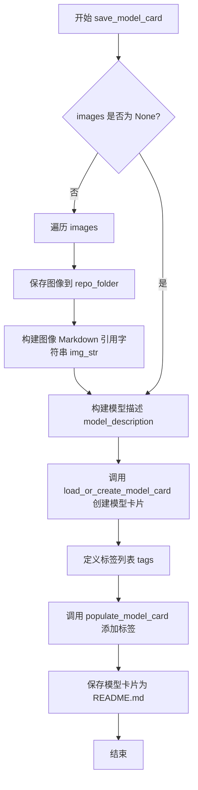

#### 带注释源码

```
def save_model_card(
    repo_id: str,
    images: list = None,
    validation_prompt: str = None,
    base_model: str = None,
    dataset_name: str = None,
    repo_folder: str = None,
    vae_path: str = None,
):
    """
    生成并保存模型的模型卡片（Model Card）
    
    Args:
        repo_id: HuggingFace Hub 仓库 ID
        images: 示例图像列表
        validation_prompt: 验证提示词
        base_model: 基础预训练模型
        dataset_name: 数据集名称
        repo_folder: 仓库文件夹路径
        vae_path: VAE 模型路径
    """
    img_str = ""
    # 如果提供了图像列表，则保存图像并生成 Markdown 引用
    if images is not None:
        for i, image in enumerate(images):
            # 将每张图像保存为 PNG 文件
            image.save(os.path.join(repo_folder, f"image_{i}.png"))
            # 构建图像的 Markdown 语法引用
            img_str += f"\n"

    # 构建模型描述文本，包含模型来源、训练数据集和示例图像
    model_description = f"""
# Text-to-image finetuning - {repo_id}

This pipeline was finetuned from **{base_model}** on the **{dataset_name}** dataset. Below are some example images generated with the finetuned pipeline using the following prompt: {validation_prompt}: \n
{img_str}

Special VAE used for training: {vae_path}.
"""

    # 加载或创建模型卡片
    # 使用 diffusers 库的工具函数来创建标准格式的模型卡片
    model_card = load_or_create_model_card(
        repo_id_or_path=repo_id,
        from_training=True,           # 标记为训练产出的模型
        license="creativeml-openrail-m",  # 使用 CreativeML Open Rail M 许可证
        base_model=base_model,         # 基础模型信息
        model_description=model_description,  # 模型描述
        inference=True,                # 支持推理
    )

    # 定义标签，用于模型分类和搜索
    tags = [
        "stable-diffusion-xl",
        "stable-diffusion-xl-diffusers",
        "text-to-image",
        "diffusers-training",
        "diffusers",
    ]
    # 为模型卡片填充标签
    model_card = populate_model_card(model_card, tags=tags)

    # 将模型卡片保存为 README.md 文件
    model_card.save(os.path.join(repo_folder, "README.md"))
```


### `import_model_class_from_model_name_or_path`

该函数用于根据预训练模型的配置信息动态导入对应的文本编码器类（CLIPTextModel 或 CLIPTextModelWithProjection），以便在微调 Stable Diffusion XL 模型时加载正确类型的文本编码器。

参数：

- `pretrained_model_name_or_path`：`str`，预训练模型的路径或 Hugging Face Hub 上的模型标识符
- `revision`：`str`，预训练模型的版本号（commit hash 或分支名）
- `subfolder`：`str`（默认值：`"text_encoder"`），模型子文件夹路径，用于指定加载 text_encoder 还是 text_encoder_2

返回值：`type`，返回对应的文本编码器类（`CLIPTextModel` 或 `CLIPTextModelWithProjection`）

#### 流程图

```mermaid
flowchart TD
    A[开始: import_model_class_from_model_name_or_path] --> B[加载 PretrainedConfig]
    B --> C[从配置中获取 architectures[0]]
    C --> D{判断 model_class 类型}
    D -->|CLIPTextModel| E[导入 CLIPTextModel 类]
    D -->|CLIPTextModelWithProjection| F[导入 CLIPTextModelWithProjection 类]
    D -->|其他| G[抛出 ValueError 异常]
    E --> H[返回 CLIPTextModel 类]
    F --> I[返回 CLIPTextModelWithProjection 类]
    G --> J[结束: 抛出异常]
    H --> K[结束: 返回类]
    I --> K
```

#### 带注释源码

```python
def import_model_class_from_model_name_or_path(
    pretrained_model_name_or_path: str, revision: str, subfolder: str = "text_encoder"
):
    """
    根据预训练模型配置动态导入文本编码器类。
    
    参数:
        pretrained_model_name_or_path: 预训练模型的路径或模型标识符
        revision: 模型的版本/提交哈希
        subfolder: 模型子文件夹，默认值为 "text_encoder"
    
    返回:
        对应的文本编码器类 (CLIPTextModel 或 CLIPTextModelWithProjection)
    """
    # 步骤1: 从预训练模型路径加载 PretrainedConfig
    # 这是一个包含模型架构信息的配置文件
    text_encoder_config = PretrainedConfig.from_pretrained(
        pretrained_model_name_or_path, subfolder=subfolder, revision=revision
    )
    
    # 步骤2: 从配置中获取模型类名
    # architectures 是一个列表，通常第一个元素就是主模型类名
    model_class = text_encoder_config.architectures[0]

    # 步骤3: 根据模型类名动态导入并返回对应的类
    if model_class == "CLIPTextModel":
        # 标准 CLIP 文本编码器
        from transformers import CLIPTextModel

        return CLIPTextModel
    elif model_class == "CLIPTextModelWithProjection":
        # 带投影的 CLIP 文本编码器，用于 SDXL
        from transformers import CLIPTextModelWithProjection

        return CLIPTextModelWithProjection
    else:
        # 不支持的模型类型
        raise ValueError(f"{model_class} is not supported.")
```


### `encode_prompt`

该函数用于将文本提示（captions）编码为 Stable Diffusion XL 所需的 prompt_embeds 和 pooled_prompt_embeds，支持根据 proportion_empty_prompts 参数随机将部分提示替换为空字符串，并同时处理多个文本编码器（如 CLIP Text Encoder 1 和 CLIP Text Encoder 2）。

参数：

- `batch`：字典（Dict），包含一批样本数据的字典，必须包含 caption_column 指定的键
- `text_encoders`：列表（List[torch.nn.Module]），文本编码器列表，通常包含两个编码器（CLIPTextModel 和 CLIPTextModelWithProjection）
- `tokenizers`：列表（List[transformers.AutoTokenizer]），分词器列表，与文本编码器对应
- `proportion_empty_prompts`：浮点数（float），用于控制将多少比例的提示替换为空字符串，取值范围 [0, 1]
- `caption_column`：字符串（str），batch 字典中包含文本提示的键名
- `is_train`：布尔值（bool），是否为训练模式，训练时从多个提示中随机选择，否则选择第一个

返回值：字典（Dict[str, torch.Tensor]），包含 "prompt_embeds"（拼接后的文本嵌入，形状为 [batch_size, seq_len, hidden_dim]）和 "pooled_prompt_embeds"（池化后的文本嵌入，形状为 [batch_size, hidden_dim]）

#### 流程图

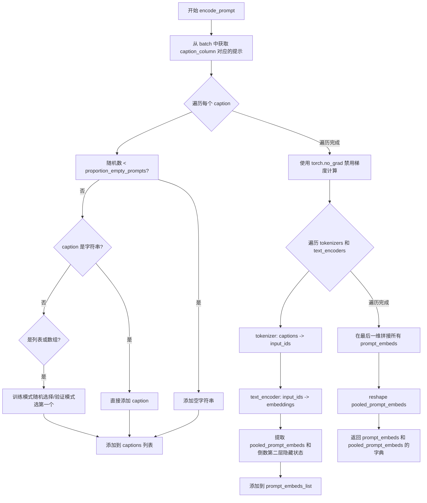

#### 带注释源码

```python
# Adapted from pipelines.StableDiffusionXLPipeline.encode_prompt
def encode_prompt(batch, text_encoders, tokenizers, proportion_empty_prompts, caption_column, is_train=True):
    """
    将文本提示编码为 prompt_embeds 和 pooled_prompt_embeds
    
    参数:
        batch: 包含一批样本的字典，必须有 caption_column 指定的键
        text_encoders: 文本编码器列表（通常是 CLIPTextModel 和 CLIPTextModelWithProjection）
        tokenizers: 分词器列表，与文本编码器对应
        proportion_empty_prompts: 空提示的比例，用于数据增强
        caption_column: batch 中文本提示的列名
        is_train: 是否为训练模式，训练时随机选择多个提示中的一个
    """
    prompt_embeds_list = []  # 用于存储每个文本编码器产生的嵌入
    prompt_batch = batch[caption_column]  # 获取原始提示列表

    captions = []
    # 处理每个提示：根据 proportion_empty_prompts 决定是否替换为空字符串
    for caption in prompt_batch:
        if random.random() < proportion_empty_prompts:
            # 按比例将提示替换为空字符串（用于无分类器自由引导）
            captions.append("")
        elif isinstance(caption, str):
            # 字符串类型直接添加
            captions.append(caption)
        elif isinstance(caption, (list, np.ndarray)):
            # 如果是列表或数组（多个提示），训练时随机选一个，验证时选第一个
            captions.append(random.choice(caption) if is_train else caption[0])

    # 禁用梯度计算以节省显存
    with torch.no_grad():
        # 遍历每个文本编码器（SDXL 有两个文本编码器）
        for tokenizer, text_encoder in zip(tokenizers, text_encoders):
            # 使用分词器将文本转换为 token IDs
            text_inputs = tokenizer(
                captions,
                padding="max_length",
                max_length=tokenizer.model_max_length,
                truncation=True,
                return_tensors="pt",
            )
            text_input_ids = text_inputs.input_ids
            
            # 通过文本编码器获取嵌入，output_hidden_states=True 返回所有隐藏状态
            prompt_embeds = text_encoder(
                text_input_ids.to(text_encoder.device),
                output_hidden_states=True,
                return_dict=False,
            )

            # 获取池化的提示嵌入（第一个元素是 pooled output）
            pooled_prompt_embeds = prompt_embeds[0]
            # 获取倒数第二层的隐藏状态（-1 是最后一层，-2 是倒数第二层）
            prompt_embeds = prompt_embeds[-1][-2]
            bs_embed, seq_len, _ = prompt_embeds.shape
            # 调整形状以便于后续拼接
            prompt_embeds = prompt_embeds.view(bs_embed, seq_len, -1)
            prompt_embeds_list.append(prompt_embeds)

    # 在最后一个维度（hidden_dim）拼接两个文本编码器的输出
    prompt_embeds = torch.concat(prompt_embeds_list, dim=-1)
    # 将池化嵌入展平为二维
    pooled_prompt_embeds = pooled_prompt_embeds.view(bs_embed, -1)
    
    # 返回嵌入字典（移到 CPU 以便后续处理）
    return {"prompt_embeds": prompt_embeds.cpu(), "pooled_prompt_embeds": pooled_prompt_embeds.cpu()}
```


### `compute_vae_encodings`

该函数用于将图像像素值通过VAE编码器转换为潜在空间表示，是Stable Diffusion XL训练流程中的关键预处理步骤，用于将输入图像压缩到潜在空间以便后续UNet模型进行处理。

#### 参数

- `batch`：`dict`，包含像素值字典，必须包含"pixel_values"键，存储待编码的图像数据
- `vae`：`AutoencoderKL`，HuggingFace Diffusers库中的VAE模型实例，用于将图像编码到潜在空间

#### 返回值

- `dict`，包含"model_input"键，值为`torch.Tensor`，表示编码后的潜在空间表示，已移动到CPU内存

#### 流程图

```mermaid
flowchart TD
    A[开始: compute_vae_encodings] --> B[从batch中提取pixel_values]
    B --> C[将images转换为torch.Tensor堆栈]
    C --> D[转换为连续内存格式并转为float类型]
    D --> E[将像素值移动到VAE设备并转换为VAE dtype]
    E --> F[使用torch.no_grad()上下文]
    F --> G[调用vae.encode编码图像]
    G --> H[从latent_dist中采样]
    H --> I[乘以scaling_factor缩放因子]
    I --> J[将结果移至CPU]
    J --> K[返回包含model_input的字典]
```

#### 带注释源码

```python
def compute_vae_encodings(batch, vae):
    """
    将图像批次编码为VAE潜在空间表示
    
    参数:
        batch: 包含'pixel_values'键的字典,存储图像数据
        vae: AutoencoderKL模型实例
    
    返回:
        包含编码后潜在向量的字典
    """
    # 从批次字典中弹出pixel_values图像数据
    images = batch.pop("pixel_values")
    
    # 将图像迭代器转换为堆栈形式的4D张量 [B, C, H, W]
    pixel_values = torch.stack(list(images))
    
    # 确保张量在内存中连续存储,并转换为float32类型
    pixel_values = pixel_values.to(memory_format=torch.contiguous_format).float()
    
    # 将像素值移动到VAE所在的设备(CUDA/CPU),并转换为VAE的dtype
    pixel_values = pixel_values.to(vae.device, dtype=vae.dtype)

    # 使用no_grad上下文禁用梯度计算,减少内存占用
    with torch.no_grad():
        # 调用VAE编码器将图像编码到潜在空间,返回潜在分布
        # encode返回LatentDiffusionMixer等对象,包含latent_dist属性
        model_input = vae.encode(pixel_values).latent_dist.sample()
    
    # 根据VAE配置中的scaling_factor缩放潜在向量
    # 这确保潜在空间的方差与训练时一致
    model_input = model_input * vae.config.scaling_factor
    
    # 将编码结果移回CPU,便于后续处理或存储
    return {"model_input": model_input.cpu()}
```


### `generate_timestep_weights`

该函数根据指定的时间步偏差策略（earlier、later、range 或 none）生成采样权重，用于在训练过程中有偏向性地选择时间步，从而帮助模型更好地学习高频或低频细节。

参数：

- `args`：对象，包含以下属性：
  - `timestep_bias_strategy`：str，时间步偏差策略（"earlier"、"later"、"range"、"none"）
  - `timestep_bias_portion`：float，要偏差的时间步比例（默认为 0.25）
  - `timestep_bias_multiplier`：float，偏差权重倍数（默认为 1.0）
  - `timestep_bias_begin`：int，当使用 range 策略时的起始时间步
  - `timestep_bias_end`：int，当使用 range 策略时的结束时间步
- `num_timesteps`：int，时间步的总数

返回值：`torch.Tensor`，归一化后的时间步权重张量，形状为 (num_timesteps,)

#### 流程图

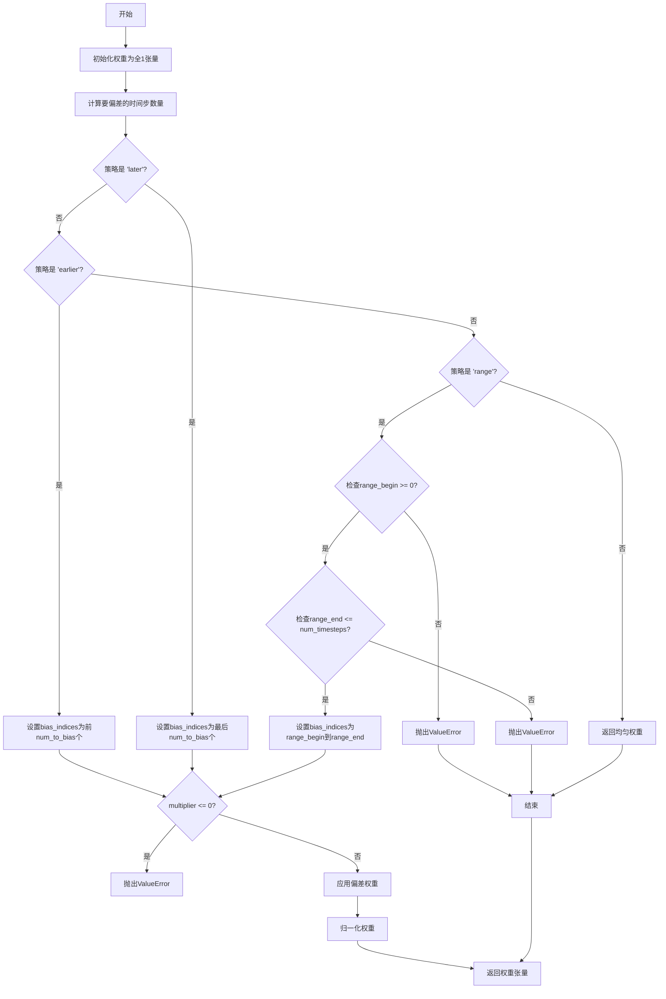

#### 带注释源码

```python
def generate_timestep_weights(args, num_timesteps):
    """
    根据指定的时间步偏差策略生成采样权重。
    
    参数:
        args: 包含时间步偏差配置的对象
        num_timesteps: 时间步总数
    
    返回:
        归一化后的时间步权重张量
    """
    # 初始化均匀权重，所有时间步初始权重为1
    weights = torch.ones(num_timesteps)

    # 计算要偏差的时间步数量
    # 例如：num_timesteps=1000, portion=0.25 => num_to_bias=250
    num_to_bias = int(args.timestep_bias_portion * num_timesteps)

    # 根据策略确定要偏差的时间步索引范围
    if args.timestep_bias_strategy == "later":
        # 偏向后面的时间步（如最后的250个）
        bias_indices = slice(-num_to_bias, None)
    elif args.timestep_bias_strategy == "earlier":
        # 偏向前面的时间步（如前250个）
        bias_indices = slice(0, num_to_bias)
    elif args.timestep_bias_strategy == "range":
        # 偏向指定范围内的时间步（如200-500）
        range_begin = args.timestep_bias_begin
        range_end = args.timestep_bias_end
        
        # 验证范围参数的有效性
        if range_begin < 0:
            raise ValueError(
                "When using the range strategy for timestep bias, you must provide a beginning timestep greater or equal to zero."
            )
        if range_end > num_timesteps:
            raise ValueError(
                "When using the range strategy for timestep bias, you must provide an ending timestep smaller than the number of timesteps."
            )
        bias_indices = slice(range_begin, range_end)
    else:  
        # 'none' 或其他字符串：返回均匀权重，不进行偏差
        return weights
    
    # 验证偏差乘数必须为正数
    if args.timestep_bias_multiplier <= 0:
        return ValueError(
            "The parameter --timestep_bias_multiplier is not intended to be used to disable the training of specific timesteps."
            " If it was intended to disable timestep bias, use `--timestep_bias_strategy none` instead."
            " A timestep bias multiplier less than or equal to 0 is not allowed."
        )

    # 对指定的时间步应用偏差乘数
    # 例如：multiplier=2.0 时，被选中的时间步权重翻倍
    weights[bias_indices] *= args.timestep_bias_multiplier

    # 归一化权重，使其和为1，确保作为概率分布使用
    weights /= weights.sum()

    return weights
```


### `conditional_loss`

用于计算Stable Diffusion XL模型训练时的条件损失函数，支持L2、Huber和Smooth L1三种损失类型，并根据指定的reduction方式进行汇总。

参数：

-  `model_pred`：`torch.Tensor`，模型预测的张量（噪声预测）
-  `target`：`torch.Tensor`，目标张量（真实噪声或目标值）
-  `reduction`：`str`，损失聚合方式，可选值为"mean"、"sum"或"none"，默认为"mean"
-  `loss_type`：`str`，损失类型，可选值为"l2"、"huber"或"smooth_l1"，默认为"l2"
-  `huber_c`：`float`，Huber损失的阈值参数，用于平衡L1和L2损失，仅在huber和smooth_l1模式下使用，默认为0.1

返回值：`torch.Tensor`，计算后的损失值

#### 流程图

```mermaid
flowchart TD
    A[开始: conditional_loss] --> B{loss_type == 'l2'?}
    B -->|Yes| C[使用F.mse_loss计算MSE损失]
    B -->|No| D{loss_type == 'huber'?}
    D -->|Yes| E[计算Huber损失<br/>loss = 2*huber_c*(sqrt((pred-target)²+huber_c²)-huber_c)]
    D -->|No| F{loss_type == 'smooth_l1'?}
    F -->|Yes| G[计算Smooth L1损失<br/>loss = 2*(sqrt((pred-target)²+huber_c²)-huber_c)]
    F -->|No| H[抛出NotImplementedError]
    C --> I{reduction == 'mean'?}
    E --> I
    G --> I
    I -->|Yes| J[返回torch.mean(loss)]
    I -->|No| K{reduction == 'sum'?}
    K -->|Yes| L[返回torch.sum(loss)]
    K -->|No| M[返回loss (none)]
    J --> N[返回损失张量]
    L --> N
    M --> N
    H --> O[结束: 异常退出]
    N --> P[结束: 返回损失]
```

#### 带注释源码

```python
def conditional_loss(
    model_pred: torch.Tensor,  # 模型预测的张量（通常是噪声预测）
    target: torch.Tensor,       # 目标张量（真实噪声或目标值）
    reduction: str = "mean",    # 损失聚合方式: 'mean'、'sum' 或 'none'
    loss_type: str = "l2",      # 损失类型: 'l2'、'huber' 或 'smooth_l1'
    huber_c: float = 0.1,       # Huber损失的阈值参数，控制L1/L2平衡
):
    """
    计算条件损失函数，支持多种损失类型。
    
    该函数用于Stable Diffusion XL训练过程中，根据不同的损失类型
    计算模型预测与目标之间的差异。
    
    Args:
        model_pred: 模型预测的张量
        target: 目标张量
        reduction: 损失聚合方式
        loss_type: 损失类型
        huber_c: Huber损失参数
    
    Returns:
        torch.Tensor: 计算后的损失值
    """
    # L2损失 (MSE - Mean Squared Error)
    if loss_type == "l2":
        loss = F.mse_loss(model_pred, target, reduction=reduction)
    
    # Huber损失: 结合L1和L2优点，对异常值更鲁棒
    elif loss_type == "huber":
        # 使用平滑的L1损失公式: 2*c*(sqrt((x)²+c²)-c)
        # 这实际上是Smooth L1的变体，在0点可导
        loss = 2 * huber_c * (torch.sqrt((model_pred - target) ** 2 + huber_c**2) - huber_c)
        if reduction == "mean":
            loss = torch.mean(loss)
        elif reduction == "sum":
            loss = torch.sum(loss)
    
    # Smooth L1损失 (Huber损失的变体)
    elif loss_type == "smooth_l1":
        # 与Huber损失类似但系数不同（没有2*c的外层系数）
        loss = 2 * (torch.sqrt((model_pred - target) ** 2 + huber_c**2) - huber_c)
        if reduction == "mean":
            loss = torch.mean(loss)
        elif reduction == "sum":
            loss = torch.sum(loss)
    
    # 不支持的损失类型
    else:
        raise NotImplementedError(f"Unsupported Loss Type {loss_type}")
    
    return loss
```


### `main`

该函数是Stable Diffusion XL模型微调的主入口，负责整个训练流程的 orchestration，包括环境初始化、模型加载与配置、数据集预处理、预计算 embeddings、训练循环（含梯度累积、EMA、验证、checkpoint 保存）、最终模型保存以及可选的 Hub 上传。

参数：

- `args`：`argparse.Namespace`，通过 `parse_args()` 解析的命令行参数，包含模型路径、数据集配置、训练超参数等所有设置

返回值：`None`，无返回值

#### 流程图

```mermaid
flowchart TD
    A[开始 main 函数] --> B[检查 report_to 与 hub_token 冲突]
    B --> C[创建 logging 目录]
    C --> D[初始化 Accelerator]
    D --> E[配置日志级别]
    E --> F[设置随机种子]
    F --> G{是否为 main process}
    G -->|Yes| H[创建输出目录]
    G -->|No| I[跳过创建目录]
    H --> J{push_to_hub}
    J -->|Yes| K[创建 Hub 仓库]
    J -->|No| L[继续]
    K --> L
    L --> M[加载两个 Tokenizers]
    M --> N[导入 Text Encoder 类]
    N --> O[加载 DDPMScheduler]
    O --> P[加载 Text Encoder One 和 Two]
    P --> Q[加载 VAE]
    Q --> R[加载 UNet]
    R --> S[冻结 VAE 和 Text Encoders]
    S --> T[设置 UNet 为可训练]
    T --> U[设置混合精度权重类型]
    U --> V[移动模型到设备]
    V --> W{use_ema}
    W -->|Yes| X[创建 EMA UNet]
    W -->|No| Y[继续]
    X --> Y
    Y --> Z{enable_xformers}
    Z -->|Yes| AA[启用 xformers]
    Z -->|No| AB[继续]
    AA --> AB
    AB --> AC[注册保存/加载钩子]
    AC --> AD{gradient_checkpointing}
    AD -->|Yes| AE[启用梯度检查点]
    AD -->|No| AF[继续]
    AE --> AF
    AF --> AG{allow_tf32}
    AG -->|Yes| AH[允许 TF32]
    AG -->|No| AI[继续]
    AH --> AI
    AI --> AJ[scale_lr]
    AJ -->|Yes| AK[缩放学习率]
    AJ -->|No| AL[继续]
    AK --> AL
    AL --> AM{use_8bit_adam}
    AM -->|Yes| AN[使用 8-bit Adam]
    AM -->|No| AO[使用标准 AdamW]
    AN --> AP
    AO --> AP
    AP --> AQ[创建优化器]
    AQ --> AR[加载数据集]
    AR --> AS[预处理数据集]
    AS --> AT[预计算 Prompt Embeddings]
    AT --> AU[预计算 VAE Encodings]
    AU --> AV[合并预计算数据集]
    AV --> AW[删除不需要的变量释放内存]
    AW --> AX[创建 Collate 函数]
    AX --> AY[创建 DataLoader]
    AY --> AZ[创建 LR Scheduler]
    AZ --> BA[使用 Accelerator 准备模型]
    BA --> BB[初始化 Trackers]
    BB --> BC[定义 unwrap_model 函数]
    BC --> BD[加载 checkpoint 如果存在]
    BD --> BE[开始训练循环 - Epoch]
    BE --> BF[开始训练循环 - Step]
    BF --> BG[采样噪声]
    BG --> BI[采样 timestep]
    BI --> BJ[添加噪声到输入]
    BJ --> BK[计算 time_ids]
    BK --> BL[UNet 前向传播]
    BL --> BM[计算目标]
    BM --> BN[计算损失]
    BN --> BO[反向传播]
    BO --> BP[梯度裁剪]
    BP --> BQ[优化器更新]
    BQ --> BR[学习率调度更新]
    BR --> BS{同步梯度}
    BS -->|Yes| BT[更新 EMA]
    BS -->|No| BU[继续]
    BT --> BV[更新进度条]
    BV --> BW[记录日志]
    BW --> BX{达到 checkpoint 步骤}
    BX -->|Yes| BY[保存 checkpoint]
    BX -->|No| BZ[继续]
    BY --> BZA
    BZ --> BZA{达到最大训练步数}
    BZA -->|No| BF
    BZA -->|Yes| BZB[等待所有进程]
    BZB --> BZC{validation_prompt}
    BZC -->|Yes| BZD[运行验证]
    BZC -->|No| BZE[继续]
    BZD --> BZE
    BZE --> BZF[保存最终模型]
    BZF --> BZG{push_to_hub}
    BZG -->|Yes| BZH[保存 model card 并上传]
    BZG -->|No| BZI[结束]
    BZH --> BZI[结束训练]
```

#### 带注释源码

```python
def main(args):
    """Stable Diffusion XL 微调主函数"""
    
    # 1. 安全检查：不能同时使用 wandb 和 hub_token
    if args.report_to == "wandb" and args.hub_token is not None:
        raise ValueError(
            "You cannot use both --report_to=wandb and --hub_token due to a security risk of exposing your token."
            " Please use `hf auth login` to authenticate with the Hub."
        )

    # 2. 创建日志目录
    logging_dir = Path(args.output_dir, args.logging_dir)

    # 3. 配置 Accelerator 项目
    accelerator_project_config = ProjectConfiguration(project_dir=args.output_dir, logging_dir=logging_dir)

    # 4. 初始化 Accelerator（分布式训练、混合精度等）
    accelerator = Accelerator(
        gradient_accumulation_steps=args.gradient_accumulation_steps,
        mixed_precision=args.mixed_precision,
        log_with=args.report_to,
        project_config=accelerator_project_config,
    )

    # 5. WandB 检查
    if args.report_to == "wandb":
        if not is_wandb_available():
            raise ImportError("Make sure to install wandb if you want to use it for logging during training.")
        import wandb

    # 6. 配置日志格式
    logging.basicConfig(
        format="%(asctime)s - %(levelname)s - %(name)s - %(message)s",
        datefmt="%m/%d/%Y %H:%M:%S",
        level=logging.INFO,
    )
    logger.info(accelerator.state, main_process_only=False)
    
    # 7. 设置各库日志级别
    if accelerator.is_local_main_process:
        datasets.utils.logging.set_verbosity_warning()
        transformers.utils.logging.set_verbosity_warning()
        diffusers.utils.logging.set_verbosity_info()
    else:
        datasets.utils.logging.set_verbosity_error()
        transformers.utils.logging.set_verbosity_error()
        diffusers.utils.logging.set_verbosity_error()

    # 8. 设置随机种子以确保可复现性
    if args.seed is not None:
        set_seed(args.seed)

    # 9. 处理仓库创建（如果是 main process）
    if accelerator.is_main_process:
        if args.output_dir is not None:
            os.makedirs(args.output_dir, exist_ok=True)

        if args.push_to_hub:
            repo_id = create_repo(
                repo_id=args.hub_model_id or Path(args.output_dir).name, exist_ok=True, token=args.hub_token
            ).repo_id

    # 10. 加载两个 Tokenizers（SDXL 使用两个文本编码器）
    tokenizer_one = AutoTokenizer.from_pretrained(
        args.pretrained_model_name_or_path,
        subfolder="tokenizer",
        revision=args.revision,
        use_fast=False,
    )
    tokenizer_two = AutoTokenizer.from_pretrained(
        args.pretrained_model_name_or_path,
        subfolder="tokenizer_2",
        revision=args.revision,
        use_fast=False,
    )

    # 11. 导入正确的 Text Encoder 类
    text_encoder_cls_one = import_model_class_from_model_name_or_path(
        args.pretrained_model_name_or_path, args.revision
    )
    text_encoder_cls_two = import_model_class_from_model_name_or_path(
        args.pretrained_model_name_or_path, args.revision, subfolder="text_encoder_2"
    )

    # 12. 加载 Scheduler 和 Models
    noise_scheduler = DDPMScheduler.from_pretrained(args.pretrained_model_name_or_path, subfolder="scheduler")
    
    # 13. 加载 Text Encoders
    text_encoder_one = text_encoder_cls_one.from_pretrained(
        args.pretrained_model_name_or_path, subfolder="text_encoder", revision=args.revision, variant=args.variant
    )
    text_encoder_two = text_encoder_cls_two.from_pretrained(
        args.pretrained_model_name_or_path, subfolder="text_encoder_2", revision=args.revision, variant=args.variant
    )
    
    # 14. 加载 VAE
    vae_path = (
        args.pretrained_model_name_or_path
        if args.pretrained_vae_model_name_or_path is None
        else args.pretrained_vae_model_name_or_path
    )
    vae = AutoencoderKL.from_pretrained(
        vae_path,
        subfolder="vae" if args.pretrained_vae_model_name_or_path is None else None,
        revision=args.revision,
        variant=args.variant,
    )
    
    # 15. 加载 UNet
    unet = UNet2DConditionModel.from_pretrained(
        args.pretrained_model_name_or_path, subfolder="unet", revision=args.revision, variant=args.variant
    )

    # 16. 冻结 VAE 和 Text Encoders（只训练 UNet）
    vae.requires_grad_(False)
    text_encoder_one.requires_grad_(False)
    text_encoder_two.requires_grad_(False)
    unet.train()  # 设置 UNet 为训练模式

    # 17. 设置混合精度的权重类型
    weight_dtype = torch.float32
    if accelerator.mixed_precision == "fp16":
        weight_dtype = torch.float16
    elif accelerator.mixed_precision == "bf16":
        weight_dtype = torch.bfloat16

    # 18. 将模型移动到设备并转换为适当的 dtype
    vae.to(accelerator.device, dtype=torch.float32)  # VAE 保持 float32 避免 NaN
    text_encoder_one.to(accelerator.device, dtype=weight_dtype)
    text_encoder_two.to(accelerator.device, dtype=weight_dtype)

    # 19. 创建 EMA（指数移动平均）模型
    if args.use_ema:
        ema_unet = UNet2DConditionModel.from_pretrained(
            args.pretrained_model_name_or_path, subfolder="unet", revision=args.revision, variant=args.variant
        )
        ema_unet = EMAModel(ema_unet.parameters(), model_cls=UNet2DConditionModel, model_config=ema_unet.config)

    # 20. 启用 xformers 内存高效注意力
    if args.enable_xformers_memory_efficient_attention:
        if is_xformers_available():
            import xformers
            # ... 版本检查警告 ...
            unet.enable_xformers_memory_efficient_attention()
        else:
            raise ValueError("xformers is not available. Make sure it is installed correctly")

    # 21. 注册自定义保存/加载钩子（Accelerator 0.16.0+）
    if version.parse(accelerate.__version__) >= version.parse("0.16.0"):
        def save_model_hook(models, weights, output_dir):
            # 保存 EMA 和 UNet 模型
            ...

        def load_model_hook(models, input_dir):
            # 加载 EMA 和 UNet 模型
            ...

        accelerator.register_save_state_pre_hook(save_model_hook)
        accelerator.register_load_state_pre_hook(load_model_hook)

    # 22. 启用梯度检查点以节省内存
    if args.gradient_checkpointing:
        unet.enable_gradient_checkpointing()

    # 23. 允许 TF32 加速
    if args.allow_tf32:
        torch.backends.cuda.matmul.allow_tf32 = True

    # 24. 缩放学习率
    if args.scale_lr:
        args.learning_rate = (
            args.learning_rate * args.gradient_accumulation_steps * args.train_batch_size * accelerator.num_processes
        )

    # 25. 选择优化器（8-bit Adam 或标准 AdamW）
    if args.use_8bit_adam:
        try:
            import bitsandbytes as bnb
            optimizer_class = bnb.optim.AdamW8bit
        except ImportError:
            raise ImportError("To use 8-bit Adam, please install the bitsandbytes library.")
    else:
        optimizer_class = torch.optim.AdamW

    # 26. 创建优化器
    optimizer = optimizer_class(
        unet.parameters(),
        lr=args.learning_rate,
        betas=(args.adam_beta1, args.adam_beta2),
        weight_decay=args.adam_weight_decay,
        eps=args.adam_epsilon,
    )

    # 27. 加载数据集
    if args.dataset_name is not None:
        dataset = load_dataset(args.dataset_name, args.dataset_config_name, cache_dir=args.cache_dir)
    else:
        data_files = {}
        if args.train_data_dir is not None:
            data_files["train"] = os.path.join(args.train_data_dir, "**")
        dataset = load_dataset("imagefolder", data_files=data_files, cache_dir=args.cache_dir)

    # 28. 数据集预处理
    # ... 定义 preprocess_train 等转换 ...

    # 29. 预计算 Embeddings（使用 main_process_first 确保同步）
    with accelerator.main_process_first():
        # 计算 prompt embeddings
        train_dataset_with_embeddings = train_dataset.map(compute_embeddings_fn, batched=True, ...)
        # 计算 VAE encodings
        train_dataset_with_vae = train_dataset.map(compute_vae_encodings_fn, batched=True, ...)
        # 合并预计算的数据
        precomputed_dataset = concatenate_datasets(...)

    # 30. 释放不需要的变量内存
    del compute_vae_encodings_fn, compute_embeddings_fn, text_encoder_one, text_encoder_two
    del text_encoders, tokenizers, vae
    gc.collect()
    torch.cuda.empty_cache()

    # 31. 创建 Collate 函数和 DataLoader
    def collate_fn(examples):
        # 整理 batch 数据
        ...

    train_dataloader = torch.utils.data.DataLoader(
        precomputed_dataset,
        shuffle=True,
        collate_fn=collate_fn,
        batch_size=args.train_batch_size,
        num_workers=args.dataloader_num_workers,
    )

    # 32. 创建学习率调度器
    lr_scheduler = get_scheduler(
        args.lr_scheduler,
        optimizer=optimizer,
        num_warmup_steps=args.lr_warmup_steps * args.gradient_accumulation_steps,
        num_training_steps=args.max_train_steps * args.gradient_accumulation_steps,
    )

    # 33. 使用 Accelerator 准备所有组件
    unet, optimizer, train_dataloader, lr_scheduler = accelerator.prepare(
        unet, optimizer, train_dataloader, lr_scheduler
    )

    # 34. 如果使用 EMA，将 EMA 模型也移到设备
    if args.use_ema:
        ema_unet.to(accelerator.device)

    # 35. 初始化 Trackers（TensorBoard/WandB）
    if accelerator.is_main_process:
        accelerator.init_trackers("text2image-fine-tune-sdxl", config=vars(args))

    # 36. 定义 unwrap_model 函数
    def unwrap_model(model):
        model = accelerator.unwrap_model(model)
        model = model._orig_mod if is_compiled_module(model) else model
        return model

    # 37. 训练循环
    for epoch in range(first_epoch, args.num_train_epochs):
        train_loss = 0.0
        for step, batch in enumerate(train_dataloader):
            with accelerator.accumulate(unet):
                # a. 采样噪声
                model_input = batch["model_input"].to(accelerator.device)
                noise = torch.randn_like(model_input)
                if args.noise_offset:
                    noise += args.noise_offset * torch.randn(...)

                # b. 采样 timestep
                if args.timestep_bias_strategy == "none":
                    timesteps = torch.randint(0, noise_scheduler.config.num_train_timesteps, (bsz,), ...)
                    # 处理 huber loss 的 schedule
                    ...
                else:
                    # 使用加权采样偏向特定 timestep
                    weights = generate_timestep_weights(...).to(model_input.device)
                    timesteps = torch.multinomial(weights, bsz, replacement=True).long()

                # c. 前向扩散过程
                noisy_model_input = noise_scheduler.add_noise(model_input, noise, timesteps)

                # d. 计算 time_ids
                add_time_ids = torch.cat([compute_time_ids(s, c) for s, c in ...])

                # e. UNet 预测噪声残差
                model_pred = unet(
                    noisy_model_input,
                    timesteps,
                    prompt_embeds,
                    added_cond_kwargs={"time_ids": add_time_ids, "text_embeds": pooled_prompt_embeds},
                    return_dict=False,
                )[0]

                # f. 计算目标
                if noise_scheduler.config.prediction_type == "epsilon":
                    target = noise
                elif noise_scheduler.config.prediction_type == "v_prediction":
                    target = noise_scheduler.get_velocity(model_input, noise, timesteps)
                ...

                # g. 计算损失
                loss = conditional_loss(model_pred, target, ...)

                # h. 反向传播
                accelerator.backward(loss)

                # i. 梯度裁剪
                if accelerator.sync_gradients:
                    accelerator.clip_grad_norm_(unet.parameters(), args.max_grad_norm)

                # j. 更新参数
                optimizer.step()
                lr_scheduler.step()
                optimizer.zero_grad()

            # k. 同步和日志记录
            if accelerator.sync_gradients:
                if args.use_ema:
                    ema_unet.step(unet.parameters())
                progress_bar.update(1)
                global_step += 1
                accelerator.log({"train_loss": train_loss}, step=global_step)

                # l. 保存 checkpoint
                if global_step % args.checkpointing_steps == 0:
                    accelerator.save_state(save_path)
                    ...

    # 38. 验证（如果设置）
    if accelerator.is_main_process and args.validation_prompt is not None:
        # 运行推理生成验证图像
        ...

    # 39. 保存最终模型
    accelerator.wait_for_everyone()
    if accelerator.is_main_process:
        unet = unwrap_model(unet)
        if args.use_ema:
            ema_unet.copy_to(unet.parameters())

        # 保存 pipeline
        pipeline = StableDiffusionXLPipeline.from_pretrained(...)
        pipeline.save_pretrained(args.output_dir)

        # 40. 可选：推送到 Hub
        if args.push_to_hub:
            save_model_card(...)
            upload_folder(...)

    accelerator.end_training()
```


### Accelerator.prepare

`Accelerator.prepare` 是 HuggingFace `accelerate` 库的核心方法，用于自动将模型、优化器、学习率调度器和数据加载器准备好以进行分布式训练。该方法会根据当前的加速配置（单机/多机、GPU/TPU、混合精度等）自动包装和移动这些对象。

参数：

- `unet`：`torch.nn.Module`，待训练的 UNet2DConditionModel 模型实例
- `optimizer`：`torch.optim.Optimizer`，PyTorch 优化器实例
- `train_dataloader`：`torch.utils.data.DataLoader`，训练数据加载器
- `lr_scheduler`：`torch.optim.lr_scheduler._LRScheduler`，学习率调度器

返回值：`(torch.nn.Module, torch.optim.Optimizer, torch.utils.data.DataLoader, torch.optim.lr_scheduler._LRScheduler)`，返回经过 Accelerator 包装后的模型、优化器、数据加载器和学习率调度器。

#### 流程图

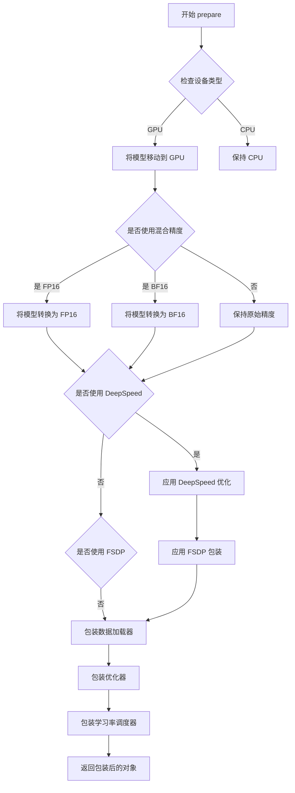

#### 带注释源码

在给定代码中，`Accelerator.prepare` 的调用如下：

```python
# Prepare everything with our `accelerator`.
unet, optimizer, train_dataloader, lr_scheduler = accelerator.prepare(
    unet, optimizer, train_dataloader, lr_scheduler
)
```

**源码解析：**

```python
#accelerator 是通过以下方式创建的：
accelerator = Accelerator(
    gradient_accumulation_steps=args.gradient_accumulation_steps,  # 梯度累积步数
    mixed_precision=args.mixed_precision,  # 混合精度模式 (fp16/bf16/no)
    log_with=args.report_to,  # 日志报告工具 (tensorboard/wandb)
    project_config=accelerator_project_config,  # 项目配置
)

# 调用 prepare 方法进行训练前的准备工作：
# 1. 将 unet (UNet2DConditionModel) 移动到正确设备并转换为相应精度
# 2. 将 optimizer 包装为 DistributedOptimizer 或保持原样
# 3. 将 train_dataloader 包装为 accelerator 的 DataLoader (支持分布式采样)
# 4. 将 lr_scheduler 与 accelerator 的步骤同步
# 返回值按顺序对应传入的模型、优化器、数据加载器和调度器
unet, optimizer, train_dataloader, lr_scheduler = accelerator.prepare(
    unet, optimizer, train_dataloader, lr_scheduler
)
```


### Accelerator.backward

这是 `accelerate` 库中 `Accelerator` 类的一个方法，用于在训练过程中执行反向传播操作。该方法封装了 PyTorch 的 `loss.backward()`，并支持混合精度训练和分布式训练场景下的梯度计算。

参数：

- `loss`：`torch.Tensor`，需要执行反向传播的损失张量。通常是模型预测与目标之间的计算损失。

返回值：`None`，该方法直接进行反向传播计算，不返回任何值。

#### 流程图

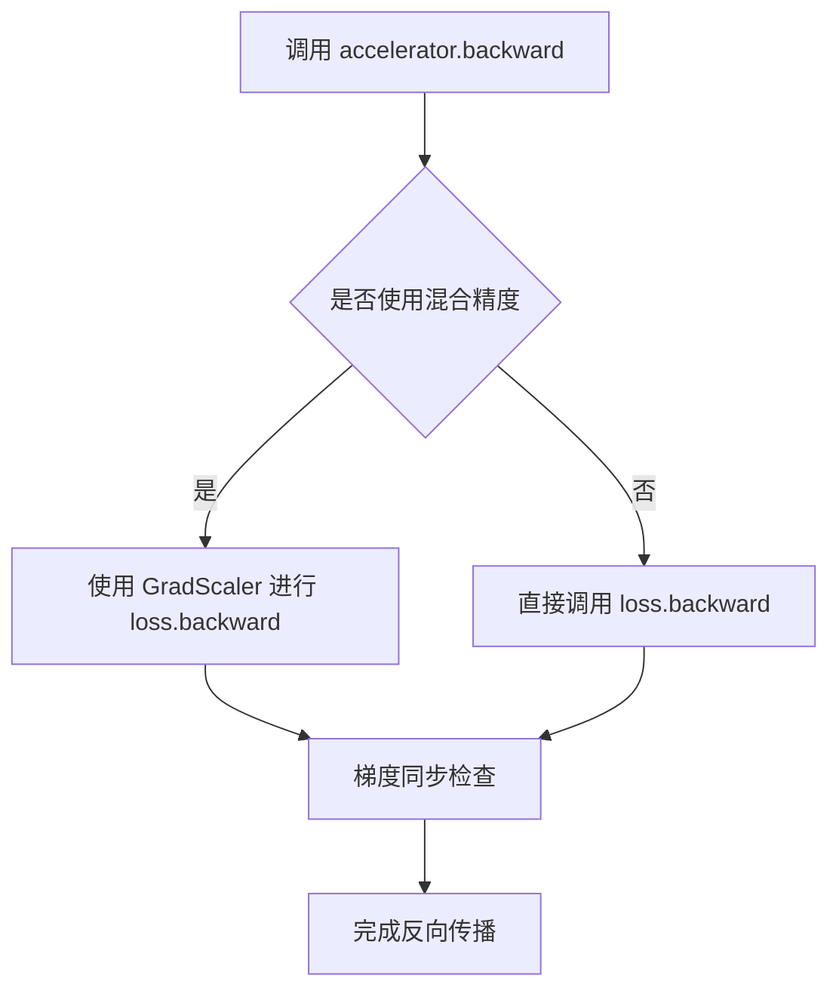

#### 带注释源码

```python
# 在训练脚本中的调用方式（位于主训练循环内）
# 示例位置：main() 函数中的训练循环部分

# ... 前面的代码计算了 loss ...
# 获取所有进程的平均损失用于日志记录
avg_loss = accelerator.gather(loss.repeat(args.train_batch_size)).mean()
train_loss += avg_loss.item() / args.gradient_accumulation_steps

# 执行反向传播
# 这一步会根据 Accelerator 的配置自动处理：
# 1. 混合精度（fp16/bf16）情况下的梯度缩放
# 2. 分布式训练时的梯度聚合
accelerator.backward(loss)

# 反向传播完成后，梯度会累积
# 如果达到了累积步数，则执行梯度裁剪和优化器更新
if accelerator.sync_gradients:
    params_to_clip = unet.parameters()
    accelerator.clip_grad_norm_(params_to_clip, args.max_grad_norm)
optimizer.step()
lr_scheduler.step()
optimizer.zero_grad()
```


### Accelerator.clip_grad_norm_

该方法是 `Accelerate` 库中 `Accelerator` 类的成员函数，用于在训练过程中裁剪梯度范数，以防止梯度爆炸。在代码中，它被用于在每个优化步骤后裁剪 UNet 模型的梯度。

参数：

-  `parameters`：待裁剪梯度的模型参数，通常通过 `model.parameters()` 获取
-  `max_norm`：最大梯度范数阈值，类型为 `float`，代码中通过 `args.max_grad_norm` 传入，默认值为 `1.0`

返回值：`torch.Tensor`，返回所有参数梯度的总范数（如果 `norm_type` 为 2，则是总范数的平方根）

#### 流程图

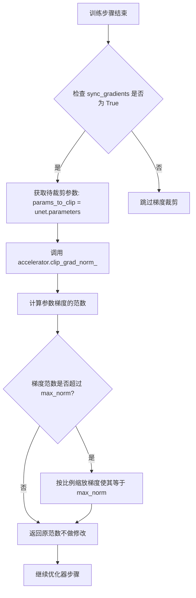

#### 带注释源码

在给定代码中的调用位置（约第 1074 行）：

```python
# 检查是否需要进行梯度同步和优化
if accelerator.sync_gradients:
    # 获取需要裁剪梯度的参数（UNet模型的所有参数）
    params_to_clip = unet.parameters()
    # 裁剪梯度范数，防止梯度爆炸
    # max_grad_norm 来自命令行参数，默认值为 1.0
    # 作用：将所有参数的梯度范数裁剪到指定范围内
    accelerator.clip_grad_norm_(params_to_clip, args.max_grad_norm)
```

**方法功能说明：**

`clip_grad_norm_` 是 `Accelerator` 类的一个实用方法，其核心功能包括：

1. **计算梯度范数**：对模型参数的梯度计算其范数（默认为 L2 范数）
2. **梯度裁剪**：如果计算的范数超过 `max_norm`，则按比例缩放所有梯度，使得总范数等于 `max_norm`
3. **返回值**：返回计算得到的梯度范数，可用于日志记录

该方法的具体实现位于 `accelerate` 库中，以下是其典型签名：

```python
# accelerate/utils/optimizer.py 中的典型实现
def clip_grad_norm_(self, parameters, max_norm, norm_type=2.0, error_if_nonfinite=False):
    """
    裁剪所有参数的梯度范数
    
    参数:
        parameters: 可迭代的模型参数
        max_norm: 梯度范数的最大允许值
        norm_type: 使用的范数类型（默认 L2）
        error_if_nonfinite: 如果为 True，当梯度包含 NaN 或 Inf 时抛出错误
    
    返回:
        总梯度范数
    """
    # 具体实现...
```


### `unwrap_model`

该函数是一个本地封装函数，用于在训练结束后将模型从 Accelerator 包装中解包，并处理通过 `torch.compile()` 编译的模型，返回原始模型对象。

参数：

-  `model`：`torch.nn.Module`，需要解包的模型对象

返回值：`torch.nn.Module`，解包后的模型对象（如果是编译模块则返回原始模块 `_orig_mod`）

#### 流程图

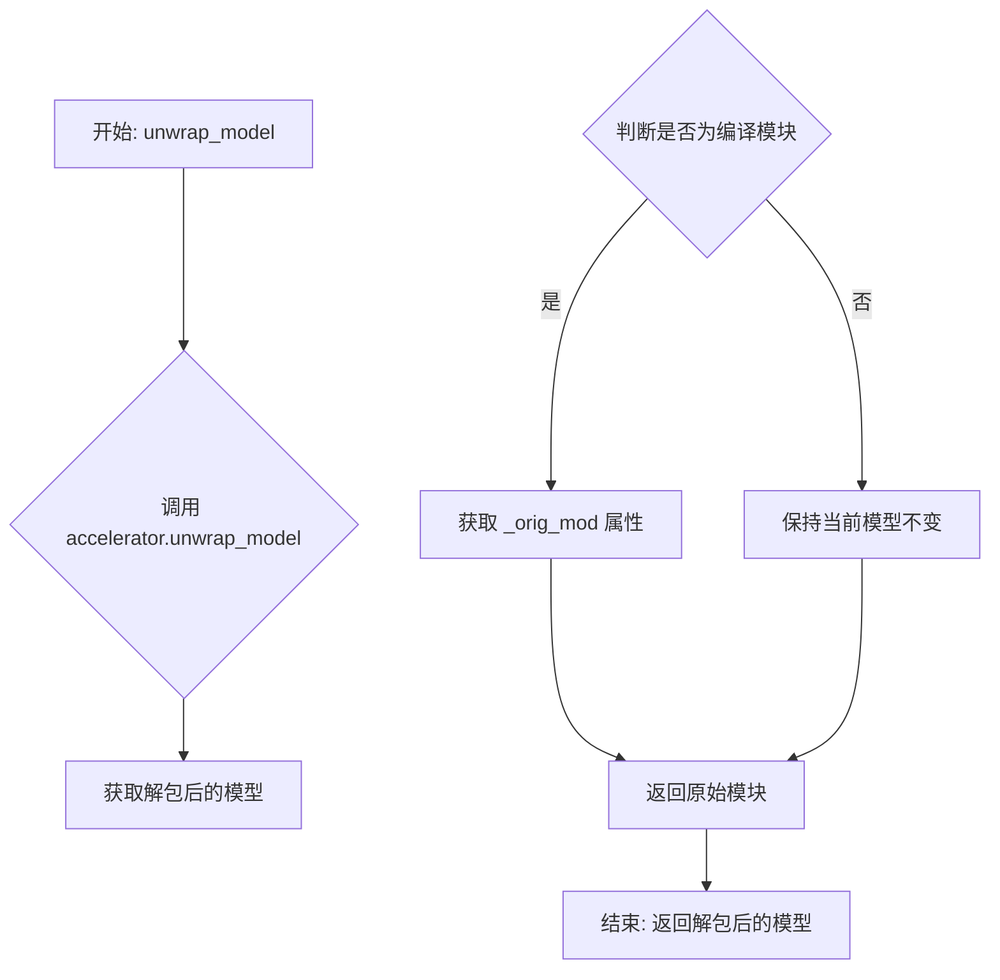

#### 带注释源码

```python
# Function for unwrapping if torch.compile() was used in accelerate.
def unwrap_model(model):
    """
    解包 Accelerator 包装的模型，并处理 torch.compile() 编译的模型。
    
    参数:
        model: 需要解包的模型对象
        
    返回:
        解包后的模型对象
    """
    # 首先调用 Accelerator 的 unwrap_model 方法移除分布式训练包装
    model = accelerator.unwrap_model(model)
    
    # 检查模型是否是通过 torch.compile() 编译的模块
    # 如果是编译模块，访问 _orig_mod 属性获取原始未编译的模型
    # 否则直接返回解包后的模型
    model = model._orig_mod if is_compiled_module(model) else model
    
    return model
```

#### 使用说明

该函数在训练脚本的 `main()` 函数内部定义，主要用于：

1. **移除 Accelerator 包装**：在分布式训练后，模型会被 Accelerator 包装以支持多 GPU/TPU 训练，需要解包才能进行保存或推理
2. **处理 torch.compile()**：如果模型使用了 `torch.compile()` 进行编译优化，需要通过 `_orig_mod` 属性获取原始模型
3. **EMA 模型处理**：在保存最终模型时，如果使用了 EMA（指数移动平均），需要先将 EMA 参数复制回主模型


### Accelerator.save_state

该方法用于保存Accelerator对象的完整训练状态，包括模型参数、优化器状态、学习率调度器状态、随机状态等，以便后续可以从检查点恢复训练。

参数：

- `save_path`：`str`，要保存检查点的目录路径

返回值：无返回值（`None`），但会在指定路径创建包含训练状态的检查点文件

#### 流程图

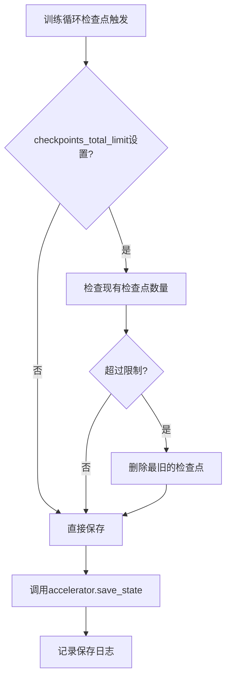

#### 带注释源码

在给定代码中，`Accelerator.save_state`的使用方式如下：

```python
# 检查是否满足保存检查点的条件
if global_step % args.checkpointing_steps == 0:
    # _before_ saving state, check if this save would set us over the `checkpoints_total_limit`
    if args.checkpoints_total_limit is not None:
        checkpoints = os.listdir(args.output_dir)
        checkpoints = [d for d in checkpoints if d.startswith("checkpoint")]
        checkpoints = sorted(checkpoints, key=lambda x: int(x.split("-")[1]))

        # before we save the new checkpoint, we need to have at _most_ `checkpoints_total_limit - 1` checkpoints
        if len(checkpoints) >= args.checkpoints_total_limit:
            num_to_remove = len(checkpoints) - args.checkpoints_total_limit + 1
            removing_checkpoints = checkpoints[0:num_to_remove]

            logger.info(
                f"{len(checkpoints)} checkpoints already exist, removing {len(removing_checkpoints)} checkpoints"
            )
            logger.info(f"removing checkpoints: {', '.join(removing_checkpoints)}")

            for removing_checkpoint in removing_checkpoints:
                removing_checkpoint = os.path.join(args.output_dir, removing_checkpoint)
                shutil.rmtree(removing_checkpoint)

    # 构建保存路径：output_dir/checkpoint-{global_step}
    save_path = os.path.join(args.output_dir, f"checkpoint-{global_step}")
    # 调用Accelerator的save_state方法保存完整训练状态
    accelerator.save_state(save_path)
    logger.info(f"Saved state to {save_path}")
```

#### 附加信息

- **调用时机**：每`checkpointing_steps`个训练步骤保存一次
- **配合使用的加载方法**：`accelerator.load_state()`用于恢复状态（在代码中通过`resume_from_checkpoint`参数实现）
- **自定义保存钩子**：代码中通过`accelerator.register_save_state_pre_hook(save_model_hook)`注册了自定义保存钩子，用于在保存状态前额外保存EMA模型和UNet模型
- **依赖**：需要`accelerate`库版本>=0.16.0才能支持自定义保存格式


### Accelerator.load_state

从给定的代码中提取 `Accelerator.load_state`，这是 `accelerate` 库提供的用于加载训练状态（模型权重、优化器状态、学习率调度器状态等）的方法。该方法在代码的第750行附近被调用，用于从检查点恢复训练。

参数：

- `save_directory`：`str`，要加载的检查点目录路径

返回值：无返回值（`None`），该方法直接修改 Accelerator 对象的内部状态

#### 流程图

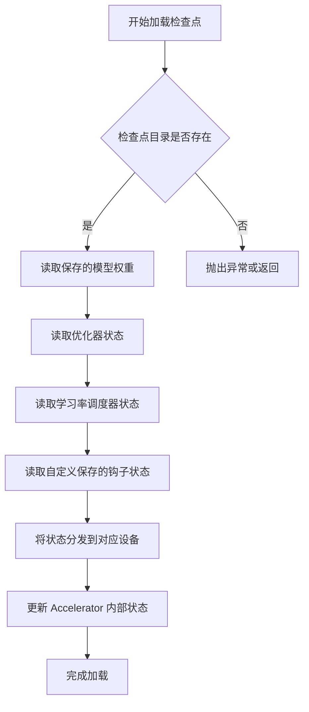

#### 带注释源码

```python
# 在训练脚本中的调用位置（约第750行）
# 当 args.resume_from_checkpoint 不为 None 时，从检查点恢复训练
if args.resume_from_checkpoint:
    if args.resume_from_checkpoint != "latest":
        path = os.path.basename(args.resume_from_checkpoint)
    else:
        # 获取最新的检查点
        dirs = os.listdir(args.output_dir)
        dirs = [d for d in dirs if d.startswith("checkpoint")]
        dirs = sorted(dirs, key=lambda x: int(x.split("-")[1]))
        path = dirs[-1] if len(dirs) > 0 else None

    if path is None:
        accelerator.print(
            f"Checkpoint '{args.resume_from_checkpoint}' does not exist. Starting a new training run."
        )
        args.resume_from_checkpoint = None
        initial_global_step = 0
    else:
        accelerator.print(f"Resuming from checkpoint {path}")
        # 调用 Accelerator.load_state 方法加载检查点
        accelerator.load_state(os.path.join(args.output_dir, path))
        global_step = int(path.split("-")[1])
        initial_global_step = global_step
        first_epoch = global_step // num_update_steps_per_epoch
```

#### 附加说明

`Accelerator.load_state` 方法是 `accelerate` 库的核心功能之一，用于恢复分布式训练状态。该方法会：

1. **加载模型权重**：通过自定义的 `load_model_hook` 加载 UNet 模型权重（如果使用 EMA，还會加载 EMA 模型）
2. **加载优化器状态**：恢复 Adam 优化器的状态
3. **加载学习率调度器状态**：恢复学习率调度器的状态
4. **调用自定义钩子**：执行通过 `accelerator.register_load_state_pre_hook` 注册的自定义加载钩子

在当前代码中，还注册了自定义的 `load_model_hook`，用于以 Diffusers 格式加载模型权重。


### `Accelerator.gather`

在分布式训练中，该方法用于收集所有进程（或指定进程）中的数据，将分散在各个设备上的张量聚合到一个列表中。通常与 `loss` 或其他需要跨进程同步的指标配合使用，以便在主进程中进行汇总统计（如求平均值）。

参数：

-  `data`：`torch.Tensor` 或 `List[torch.Tensor]`，需要收集的张量或张量列表。每个进程应传递形状相同的张量。

返回值：`torch.Tensor` 或 `List[torch.Tensor]`，从所有进程收集到的张量组成的列表。如果在分布式环境下，返回列表的长度等于进程数。

#### 流程图

```mermaid
flowchart TD
    A[开始 gather 操作] --> B{检查是否在分布式环境}
    B -- 否 --> C[直接返回输入数据]
    B -- 是 --> D[向所有进程广播数据]
    D --> E[在主进程收集各进程数据]
    E --> F[返回收集后的列表]
    
    subgraph "各进程执行"
    P1[进程 0: data0]
    P2[进程 1: data1]
    P3[进程 N: dataN]
    end
    
    F --> G[在主进程进行聚合操作<br>例如: .mean() 求平均]
    G --> H[结束]
```

#### 带注释源码

```python
# 在训练循环中，accelerator.gather 用于收集所有进程的 loss 值
# loss: 当前进程计算得到的损失值，形状为 (batch_size, ...)
# loss.repeat(args.train_batch_size): 将 loss 扩展为与批次大小相同的张量
# accelerator.gather: 收集所有进程的 loss，假设有 N 个进程，返回长度为 N 的列表
# .mean(): 对收集到的所有 loss 求平均值，得到跨进程的平均损失
avg_loss = accelerator.gather(loss.repeat(args.train_batch_size)).mean()
train_loss += avg_loss.item() / args.gradient_accumulation_steps

# 示例说明：
# 假设有 4 个 GPU 进程，每个进程的 loss 分别为 [0.5, 0.6, 0.7, 0.8]
# accelerator.gather 会返回 [tensor([0.5]), tensor([0.6]), tensor([0.7]), tensor([0.8])]
# .mean() 计算得到平均损失 0.65
```


### `UNet2DConditionModel.enable_gradient_checkpointing`

该方法是 `diffusers` 库中 `UNet2DConditionModel` 类的成员方法，用于启用梯度检查点（Gradient Checkpointing）技术。梯度检查点是一种内存优化技术，通过在前向传播过程中保存较少的中间激活值，并在反向传播时重新计算这些激活值，以牺牲部分计算时间为代价显著减少显存占用。这对于在显存受限的环境中训练大型扩散模型尤为重要。

参数：无需显式参数（该方法无参数）

返回值：`None`，该方法直接修改模型内部状态，不返回任何值

#### 流程图

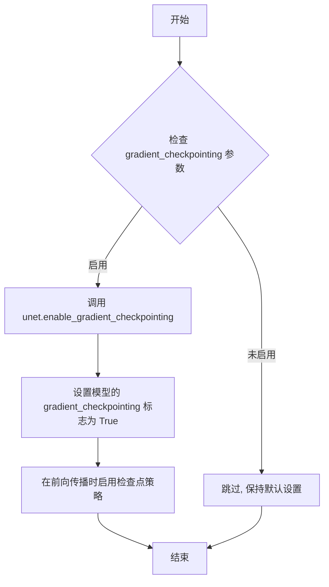

#### 带注释源码

在训练脚本中的实际调用位置：

```python
# 启用梯度检查点以节省显存
# 这是一种用计算时间换取显存空间的技术
# 适用于在显存有限的GPU上训练大型UNet模型
if args.gradient_checkpointing:
    unet.enable_gradient_checkpointing()
```

`UNet2DConditionModel` 类的 `enable_gradient_checkpointing` 方法在 `diffusers` 库中的典型实现逻辑（基于 PyTorch 的 gradient checkpointing 机制）：

```python
def enable_gradient_checkpointing(self):
    """
    启用梯度检查点以减少显存占用
    
    工作原理:
    1. 不保存所有中间层的激活值
    2. 在反向传播时重新计算必要的激活值
    3. 显存节省约30-50%, 计算时间增加约20-30%
    """
    # 遍历模型的所有子模块
    def fn_recursive(module):
        if hasattr(module, 'gradient_checkpointing'):
            module.gradient_checkpointing = True
        
        # 对每个子模块递归应用
        for child in module.children():
            fn_recursive(child)
    
    fn_recursive(self)
    
    # 设置梯度函数以支持检查点
    # PyTorch的checkpoint机制会在前向时跳过保存激活值
    # 反向传播时重新计算这些激活值
```

> **注意**: 由于 `enable_gradient_checkpointing` 方法的完整源码位于 `diffusers` 库内部（不在本次提供的训练脚本中），上述源码是根据 PyTorch 梯度检查点机制和 `diffusers` 库的一般实现模式重构的示例。实际实现可能略有差异。


### `UNet2DConditionModel.enable_xformers_memory_efficient_attention`

该方法用于在 UNet2DConditionModel 模型中启用 xFormers 的内存高效注意力机制，以减少注意力计算的显存占用，提升大规模图像生成模型的训练效率。

参数：此方法为无参数方法。

返回值：无返回值（`None`），直接在模型内部修改注意力机制配置。

#### 流程图

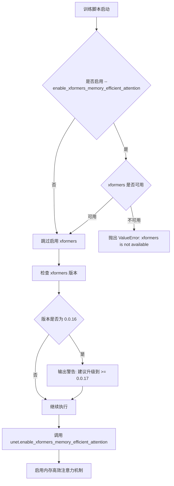

#### 带注释源码

```python
# 在 main 函数中调用 enable_xformers_memory_efficient_attention 的代码上下文
# 这不是该方法的定义，而是调用该方法的示例

if args.enable_xformers_memory_efficient_attention:  # 检查是否启用了 xformers 优化标志
    if is_xformers_available():  # 检查 xformers 库是否已安装
        import xformers  # 导入 xformers 库
        
        # 解析并检查 xformers 版本
        xformers_version = version.parse(xformers.__version__)
        if xformers_version == version.parse("0.0.16"):
            # 针对已知有问题的版本发出警告
            logger.warning(
                "xFormers 0.0.16 cannot be used for training in some GPUs. "
                "If you observe problems during training, please update xFormers to at least 0.0.17. "
                "See https://huggingface.co/docs/diffusers/main/en/optimization/xformers for more details."
            )
        
        # 核心调用：在 UNet 模型上启用内存高效注意力机制
        # 这会将模型内部的注意力实现替换为 xformers 提供的内存优化版本
        unet.enable_xformers_memory_efficient_attention()
    else:
        # 如果 xformers 未安装，抛出错误
        raise ValueError("xformers is not available. Make sure it is installed correctly")
```

#### 方法说明

该方法 `enable_xformers_memory_efficient_attention()` 是 **UNet2DConditionModel** 类（来自 Hugging Face Diffusers 库）的方法，用于启用 xFormers 的 Memory Efficient Attention（内存高效注意力）。

**核心功能：**
- 将 UNet 模型的标准注意力机制替换为 xFormers 提供的内存高效实现
- 显著降低自注意力计算的显存占用（通常可减少 30%-50%）
- 在保持模型精度的前提下，支持更大的 batch size 或更高分辨率的图像生成

**技术实现原理：**
- xFormers 使用了稀疏注意力、块状计算等优化技术
- 避免了标准注意力机制中完整的 `O(N²)` 显存开销
- 通过 Flash Attention 等底层优化实现更高效的计算


### `UNet2DConditionModel.forward`

这是 `diffusers` 库中 UNet2DConditionModel 类的 forward 方法，用于根据噪声样本、条件嵌入（文本提示）和时间步长预测噪声残差。在提供的训练脚本中，该方法被调用以执行扩散模型的前向推理，计算噪声预测以进行损失计算和模型训练。

参数：

-  `sample`：`torch.Tensor`，带噪声的潜在表示（latent），即经过前向扩散过程处理的含噪图像潜在变量
-  `timestep`：`torch.Tensor` 或 `int`，当前扩散时间步，用于控制去噪过程
-  `encoder_hidden_states`：`torch.Tensor`，文本编码器输出的条件嵌入（prompt_embeds），提供文本条件信息
-  `added_cond_kwargs`：`dict`，可选，额外的条件参数，包含时间IDs（time_ids）和池化的文本嵌入（text_embeds）
-  `return_dict`：`bool`，可选，默认为 True，决定是否返回字典格式的输出

返回值：当 `return_dict=True` 时返回 `UNet2DConditionOutput`，包含 `sample` 字段（预测的噪声残差）；当 `return_dict=False` 时返回元组，首元素为预测噪声

#### 流程图

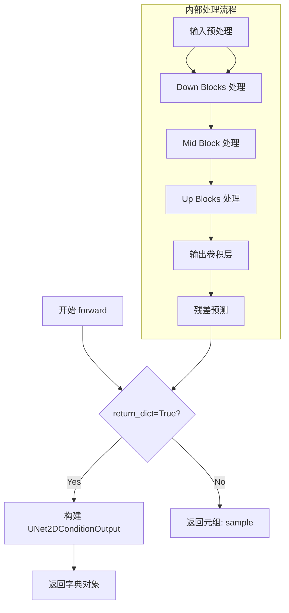

#### 带注释源码

以下是训练脚本中调用 `UNet2DConditionModel.forward` 的实际代码片段（来自训练循环）：

```python
# 准备UNet的额外条件
unet_added_conditions = {"time_ids": add_time_ids}
# 将提示嵌入和池化嵌入转移到加速器设备
prompt_embeds = batch["prompt_embeds"].to(accelerator.device)
pooled_prompt_embeds = batch["pooled_prompt_embeds"].to(accelerator.device)
# 更新额外条件字典，添加文本嵌入
unet_added_conditions.update({"text_embeds": pooled_prompt_embeds})

# 调用UNet的forward方法进行噪声预测
# 参数说明:
# - noisy_model_input: 带噪声的潜在表示（来自扩散过程的加噪图像）
# - timesteps: 随机采样的时间步长（用于控制去噪过程）
# - prompt_embeds: 文本编码器生成的提示嵌入（条件信息）
# - added_cond_kwargs: 额外条件，包含时间IDs和池化文本嵌入
# - return_dict=False: 返回元组而非字典，提高训练效率
model_pred = unet(
    noisy_model_input,    # torch.Tensor: [batch_size, 4, height, width]
    timesteps,            # torch.Tensor: [batch_size]
    prompt_embeds,        # torch.Tensor: [batch_size, seq_len, hidden_dim]
    added_cond_kwargs=unet_added_conditions,  # dict: {"time_ids": ..., "text_embeds": ...}
    return_dict=False,    # bool: False表示返回元组
)[0]  # 取第一个元素（预测的噪声残差）
```

#### 训练脚本中的调用上下文

```python
# 1. 生成时间IDs（用于额外条件）
def compute_time_ids(original_size, crops_coords_top_left):
    target_size = (args.resolution, args.resolution)
    add_time_ids = list(original_size + crops_coords_top_left + target_size)
    add_time_ids = torch.tensor([add_time_ids])
    add_time_ids = add_time_ids.to(accelerator.device, dtype=weight_dtype)
    return add_time_ids

add_time_ids = torch.cat(
    [compute_time_ids(s, c) for s, c in zip(batch["original_sizes"], batch["crop_top_lefts"])]
)

# 2. 前向传播
unet_added_conditions = {"time_ids": add_time_ids}
prompt_embeds = batch["prompt_embeds"].to(accelerator.device)
pooled_prompt_embeds = batch["pooled_prompt_embeds"].to(accelerator.device)
unet_added_conditions.update({"text_embeds": pooled_prompt_embeds})

model_pred = unet(
    noisy_model_input,  # 加噪后的潜在表示
    timesteps,          # 时间步长
    prompt_embeds,      # 文本条件嵌入
    added_cond_kwargs=unet_added_conditions,
    return_dict=False,
)[0]
```


### `AutoencoderKL.encode`

该方法是 `diffusers` 库中 `AutoencoderKL` 类的成员方法，用于将图像像素值编码为潜在空间表示（latent representation）。在训练脚本中，此方法被 `compute_vae_encodings` 函数调用，用于将预处理后的图像批次编码为潜在向量，作为 UNet 模型的输入。

参数：

-  `pixel_values`：`torch.Tensor`，图像像素值张量，形状通常为 `(batch_size, channels, height, width)`，需要与 VAE 的设备和数据类型一致

返回值：`torch.Tensor`，编码后的潜在空间表示，形状为 `(batch_size, latent_channels, latent_height, latent_width)`，需要乘以 `vae.config.scaling_factor` 进行缩放

#### 流程图

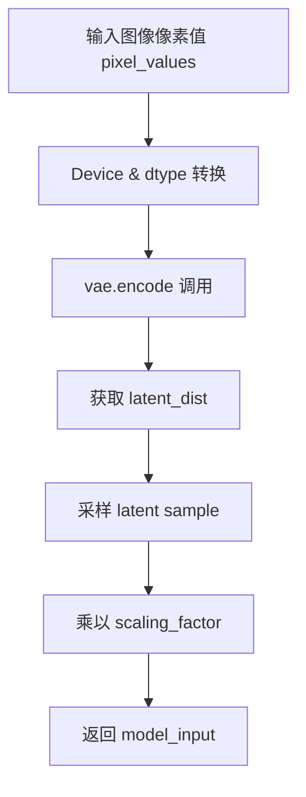

#### 带注释源码

```
# 在 compute_vae_encodings 函数中的调用示例
def compute_vae_encodings(batch, vae):
    # 1. 从 batch 中提取像素值
    images = batch.pop("pixel_values")
    
    # 2. 将图像堆叠为批次张量
    pixel_values = torch.stack(list(images))
    
    # 3. 确保内存格式连续并转换为 float
    pixel_values = pixel_values.to(memory_format=torch.contiguous_format).float()
    
    # 4. 移动到 VAE 设备并转换数据类型
    pixel_values = pixel_values.to(vae.device, dtype=vae.dtype)

    # 5. 使用 AutoencoderKL.encode 方法编码图像
    #    输入: pixel_values (torch.Tensor) - 图像像素值
    #    输出: 包含 latent_dist 的 EncodeImageReturn 对象
    with torch.no_grad():
        # 调用 encode 方法进行编码
        # 返回的 latent_dist.sample() 从潜在分布中采样
        model_input = vae.encode(pixel_values).latent_dist.sample()
    
    # 6. 应用 VAE 配置中的缩放因子
    #    根据 VQ-VAE 理论，需要将潜在表示缩放到与训练时一致的范围
    model_input = model_input * vae.config.scaling_factor
    
    # 7. 返回处理后的模型输入
    return {"model_input": model_input.cpu()}


# 注意事项：
# - AutoencoderKL.encode 方法定义在 diffusers 库中，非本脚本源码
# - 返回的 latent_dist 包含潜在分布的参数（均值和方差）
# - scaling_factor 用于将潜在空间缩放到与扩散模型训练时一致的范围
# - 潜在空间的尺寸通常为原图的 1/8（对于 SDXL 为 1024->128）
```


### `AutoencoderKL.from_pretrained`

从预训练模型加载 AutoencoderKL 模型权重。该方法是 diffusers 库中的类方法，用于从 Hugging Face Hub 或本地路径加载变分自编码器（VAE）的预训练权重和配置。

参数：

- `pretrained_model_name_or_path`：`str`，预训练模型路径或 Hugging Face Hub 上的模型标识符
- `subfolder`：`str` 或 `None`，模型文件在仓库中的子文件夹路径（如 "vae"），如果模型不在子文件夹中则为 None
- `revision`：`str`，Git 修订版本号，用于从 Hugging Face Hub 加载特定版本的模型
- `variant`：`str` 或 `None`，模型变体（如 "fp16"、"bf16"），指定加载的权重精度类型
- `torch_dtype`：`torch.dtype` 或 `None`（可选），指定模型权重的张量数据类型（如 torch.float16）

返回值：`AutoencoderKL`，加载了预训练权重的变分自编码器实例

#### 流程图

```mermaid
flowchart TD
    A[开始] --> B{判断模型来源}
    B -->|HuggingFace Hub| C[从远程仓库下载模型]
    B -->|本地路径| D[从本地加载模型]
    C --> E{是否指定 subfolder}
    D --> E
    E -->|是| F[拼接子文件夹路径]
    E -->|否| G[使用根路径]
    F --> H{是否指定 revision}
    G --> H
    H -->|是| I[获取指定版本]
    H -->|否| J[使用默认版本]
    I --> K[加载配置文件]
    J --> K
    K --> L{是否指定 variant}
    L -->|是| M[加载指定精度权重]
    L -->|否| N[加载默认精度权重]
    M --> O[实例化 AutoencoderKL]
    N --> O
    O --> P[返回模型实例]
```

#### 带注释源码

```python
# 从预训练模型加载 AutoencoderKL VAE
# 参数 vae_path: 预训练模型路径或 Hub 模型标识符
# 参数 subfolder: vae 子文件夹路径（若 pretrained_vae_model_name_or_path 为 None，则默认为 "vae"）
# 参数 revision: Git 修订版本
# 参数 variant: 模型变体（如 fp16）
vae = AutoencoderKL.from_pretrained(
    vae_path,  # 预训练 VAE 路径
    subfolder="vae" if args.pretrained_vae_model_name_or_path is None else None,  # 子文件夹条件设置
    revision=args.revision,  # 模型版本控制
    variant=args.variant,  # 精度变体选择
)
```


### `AutoencoderKL.to`

这是从 `torch.nn.Module` 继承的标准方法，用于将 AutoencoderKL 模型移动到指定设备（CPU/GPU）并转换数据类型（dtype）。在代码中用于将 VAE 模型移动到训练设备并转换为 float32 格式。

参数：

-  `device`：`torch.device`，模型要移动到的目标设备（如 CUDA 设备）
-  `dtype`：`torch.dtype`，模型参数要转换的目标数据类型（如 float32、float16、bfloat16）

返回值：`Self`，返回自身（模型实例），以便进行链式调用

#### 流程图

```mermaid
flowchart TD
    A[开始: 调用 vae.to] --> B{传入device参数?}
    B -->|是| C[将模型所有参数移到device]
    B -->|否| D{传入dtype参数?}
    C --> E{传入dtype参数?}
    D -->|是| F[将模型所有参数转为dtype]
    D -->|否| G[直接返回self]
    E -->|是| F
    E -->|否| G
    G --> H[结束: 返回模型自身]
    
    style C fill:#f9f,stroke:#333
    style F fill:#f9f,stroke:#333
    style G fill:#9f9,stroke:#333
```

#### 带注释源码

```python
# 在训练脚本中的实际调用方式 (第 698-700 行):
# 将 VAE 模型移动到加速器设备并转换为 float32 类型
vae.to(accelerator.device, dtype=torch.float32)

# 将文本编码器移动到加速器设备并转换为指定权重类型
text_encoder_one.to(accelerator.device, dtype=weight_dtype)
text_encoder_two.to(accelerator.device, dtype=weight_dtype)

# 完整方法签名 (PyTorch torch.nn.Module.to):
# def to(self, device: Optional[Union[int, device]] = None, 
#        dtype: Optional[Union[dtype, str]] = None, 
#        non_blocking: bool = False) -> Self:
#
# 参数说明:
# - device: 目标设备，可以是 torch.device 对象或设备索引
# - dtype: 目标数据类型，如 torch.float32, torch.float16, torch.bfloat16
# - non_blocking: 如果为 True 且在 CPU 上，则异步传输数据（仅在连接 CUDA 设备时有效）
#
# 返回值:
# - 返回模型自身 (Self)，支持链式调用
#
# 方法内部逻辑:
# 1. 遍历模型的所有参数 (parameters) 和缓冲区 (buffers)
# 2. 调用 .to(device=device, non_blocking=non_blocking) 移动每个张量
# 3. 如果指定了 dtype，同时转换张量数据类型
# 4. 返回模型实例本身
```

#### 代码上下文中的使用说明

```python
# weight_dtype 的确定逻辑 (第 686-691 行):
weight_dtype = torch.float32
if accelerator.mixed_precision == "fp16":
    weight_dtype = torch.float16
elif accelerator.mixed_precision == "bf16":
    weight_dtype = torch.bfloat16

# VAE 使用 float32 以避免 NaN 损失，这是 Stable Diffusion 训练中的常见做法
vae.to(accelerator.device, dtype=torch.float32)

# 文本编码器使用 weight_dtype（可能是 fp16 或 bf16），以减少显存占用
text_encoder_one.to(accelerator.device, dtype=weight_dtype)
text_encoder_two.to(accelerator.device, dtype=weight_dtype)
```


### `DDPMScheduler.add_noise`

在扩散模型的前向扩散过程中，根据给定的时间步将噪声添加到原始latent表示中。这是DDPM训练流程中的关键步骤，用于生成带噪声的训练样本。

参数：

- `sample`：`torch.Tensor`，原始的latent张量，通常是VAE编码后的图像表示
- `noise`：`torch.Tensor`，从标准正态分布采样的噪声张量，与sample形状相同
- `timestep`：`torch.Tensor`或`int`，当前扩散过程的时间步，决定噪声的添加强度

返回值：`torch.Tensor`，添加噪声后的latent张量

#### 流程图

```mermaid
graph TD
    A[开始 add_noise] --> B[输入: sample, noise, timestep]
    B --> C{获取时间步相关的噪声调度参数}
    C --> D[计算缩放因子 sqrt_alphas_cumprod 和 sqrt_one_minus_alphas_cumprod]
    D --> E[计算带噪声样本: sample * sqrt_alphas_cumprod + noise * sqrt_one_minus_alphas_cumprod]
    E --> F[返回 noisy_sample]
```

#### 带注释源码

基于diffusers库中DDPMScheduler的add_noise方法实现（在该训练脚本中被调用）：

```python
def add_noise(
    self,
    sample: torch.Tensor,
    noise: torch.Tensor,
    timestep: torch.Tensor,
) -> torch.Tensor:
    """
    在前向扩散过程中向样本添加噪声。
    
    参数:
        sample: 原始干净样本（latent表示）
        noise: 要添加的高斯噪声
        timestep: 当前时间步
    
    返回:
        带噪声的样本
    """
    # 获取与当前时间步对应的累积Alpha值
    alphas_cumprod = self.alphas_cumprod.to(sample.device, dtype=sample.dtype)
    
    # 将时间步转换为整数索引
    if isinstance(timestep, torch.Tensor):
        timestep = timestep.to(sample.device)
        if timestep.dim() == 0:
            timestep = timestep.long()
        else:
            timestep = timestep.long()
    
    # 获取对应时间步的sqrt(alpha_cumprod)和sqrt(1 - alpha_cumprod)
    sqrt_alphas_cumprod = alphas_cumprod[timestep].sqrt()
    sqrt_one_minus_alphas_cumprod = (1 - alphas_cumprod[timestep]).sqrt()
    
    # 扩展维度以支持批量处理
    while len(sqrt_alphas_cumprod.shape) < len(sample.shape):
        sqrt_alphas_cumprod = sqrt_alphas_cumprod.unsqueeze(-1)
        sqrt_one_minus_alphas_cumprod = sqrt_one_minus_alphas_cumprod.unsqueeze(-1)
    
    # 根据DDPM公式计算带噪声样本: x_t = sqrt(alpha_cumprod) * x_0 + sqrt(1 - alpha_cumprod) * epsilon
    noisy_sample = sqrt_alphas_cumprod * sample + sqrt_one_minus_alphas_cumprod * noise
    
    return noisy_sample
```

#### 在训练脚本中的调用示例

```python
# 从代码中提取的调用方式
model_input = batch["model_input"].to(accelerator.device)  # 原始latent
noise = torch.randn_like(model_input)  # 采样噪声

# 根据训练策略采样时间步
timesteps = torch.randint(0, noise_scheduler.config.num_train_timesteps, (bsz,), device=model_input.device)

# 调用add_noise方法添加噪声
# (this is the forward diffusion process)
noisy_model_input = noise_scheduler.add_noise(model_input, noise, timesteps)
```


# 设计文档提取结果

由于用户提供的代码文件中并未包含 `DDPMScheduler` 类的具体实现（该类是从 `diffusers` 库中导入的），而仅在 `main` 函数中调用了 `DDPMScheduler.from_pretrained` 方法，因此我需要结合调用上下文来提取该方法的设计信息。

### DDPMScheduler.from_pretrained

从预训练模型路径加载 DDPMScheduler 配置，用于扩散模型的噪声调度。

参数：

- `pretrained_model_name_or_path`：`str`，预训练模型在 Hugging Face Hub 上的模型 ID 或本地模型目录路径
- `subfolder`：`str`（可选，默认为 `"scheduler"`），模型文件中 scheduler 相关配置所在的子文件夹名称
- `revision`：`str`（可选），从 Hugging Face Hub 下载时的 Git revision 版本
- `variant`：`str`（可选），模型变体类型（如 `"fp16"` 表示半精度权重）
- `use_safetensors`：`bool`（可选），是否使用 `.safetensors` 格式加载权重
- `cache_dir`：`str`（可选），模型缓存目录路径

返回值：`DDPMScheduler`，返回已加载配置的 DDPMScheduler 实例，用于在训练过程中添加噪声或在推理过程中进行去噪

#### 流程图

```mermaid
graph TD
    A[开始] --> B{检查本地缓存}
    B -->|缓存不存在| C[从 HuggingFace Hub 下载]
    B -->|缓存存在| D[直接加载本地缓存]
    C --> E[加载 config.json]
    D --> E
    E --> F[解析调度器配置参数]
    F --> G[初始化 DDPMScheduler 实例]
    G --> H[返回调度器对象]
```

#### 带注释源码

```python
# 在提供的训练脚本中调用方式如下：
# 该行代码位于 main 函数中，用于加载噪声调度器配置

noise_scheduler = DDPMScheduler.from_pretrained(
    args.pretrained_model_name_or_path,  # 预训练模型路径或 Hub 模型 ID
    subfolder="scheduler"                 # 指定 scheduler 配置所在子目录
)

# 详细参数说明（基于 diffusers 库的标准实现）：
# DDPMScheduler.from_pretrained(
#     pretrained_model_name_or_path: str,      # 必需参数：模型路径或 ID
#     subfolder: str = "scheduler",            # 可选：配置文件所在子文件夹
#     revision: str = None,                    # 可选：Git revision 版本号
#     variant: str = None,                     # 可选：模型变体（如 'fp16'）
#     use_safetensors: bool = None,            # 可选：是否使用安全张量格式
#     cache_dir: str = None,                   # 可选：自定义缓存目录
#     force_download: bool = False,            # 可选：强制重新下载
#     proxies: dict = None,                    # 可选：代理服务器配置
#     local_files_only: bool = False,          # 可选：仅使用本地文件
#     token: str = None,                      # 可选：HuggingFace Hub 认证令牌
# )
```

#### 补充说明

| 项目 | 说明 |
|------|------|
| **调用位置** | `main` 函数内，约第 550 行 |
| **使用场景** | 在 Stable Diffusion XL 微调训练中，用于创建噪声调度器来管理扩散过程中的时间步和噪声添加逻辑 |
| **配置内容** | 包含 `num_train_timesteps`（训练时间步数）、`beta_start`、`beta_end`、`beta_schedule` 等调度相关参数 |
| **依赖库** | `diffusers.DDPMScheduler` 类，属于 `diffusers` 库的核心组件 |

> **注意**：由于 `DDPMScheduler` 类的完整源代码不在用户提供的代码文件中，以上信息基于对该库的标准调用模式和 `diffusers` 库通用实现的推断。如需获取更精确的实现细节，建议查阅 [diffusers 官方 GitHub 仓库](https://github.com/huggingface/diffusers) 中的 `src/diffusers/schedulers/scheduling_ddpm.py` 源文件。


### DDPMScheduler.set_defaults

该方法在当前代码文件中未被直接定义。代码中通过 `from_pretrained` 方式加载了 `DDPMScheduler` 并在训练循环中使用。

参数：

- `self`：DDPMScheduler 实例

返回值：`None`，该方法用于设置调度器的默认参数

#### 流程图

```mermaid
flowchart TD
    A[开始] --> B{检查 set_defaults 方法是否在代码中定义}
    B -->|是| C[提取方法信息]
    B -->|否| D[说明: 该方法在 diffusers 库中定义]
    D --> E[代码中使用 DDPMScheduler.from_pretrained 加载]
    E --> F[noise_scheduler 用于添加噪声和计算损失]
    F --> G[在训练循环中调用 add_noise 和 get_velocity]
```

#### 带注释源码

```
# 在代码中，DDPMScheduler 的使用方式如下：

# 1. 导入 DDPMScheduler
from diffusers import DDPMScheduler, ...

# 2. 从预训练模型加载 scheduler
noise_scheduler = DDPMScheduler.from_pretrained(
    args.pretrained_model_name_or_path, 
    subfolder="scheduler"
)

# 3. 在训练循环中使用
# 添加噪声到输入
noisy_model_input = noise_scheduler.add_noise(model_input, noise, timesteps)

# 获取速度（用于 v_prediction）
target = noise_scheduler.get_velocity(model_input, noise, timesteps)

# 注册配置
noise_scheduler.register_to_config(prediction_type=args.prediction_type)
```

**说明**：当前代码文件中并未直接定义 `DDPMScheduler.set_defaults` 方法。该方法是 `diffusers` 库中 `DDPMScheduler` 类的内置方法，用于重置调度器的默认参数。如需查看该方法的详细实现，建议查阅 diffusers 库的源代码。


### `StableDiffusionXLPipeline.from_pretrained`

这是 `diffusers` 库中的类方法，用于从预训练模型或本地路径加载 Stable Diffusion XL Pipeline。该方法是 Hugging Face `diffusers` 库的核心组件，非本代码文件定义，而是通过 `from diffusers import StableDiffusionXLPipeline` 导入使用。在本训练脚本中，该方法被多次调用用于创建推理 Pipeline。

参数：

- `pretrained_model_name_or_path`：`str`，预训练模型在 HuggingFace Hub 上的模型 ID 或本地路径
- `vae`：`Optional[AutoencoderKL]`，变分自编码器实例，如不提供则从预训练模型加载
- `unet`：`Optional[UNet2DConditionModel]`，UNet2DConditionModel 实例，如不提供则从预训练模型加载
- `text_encoder`：`Optional[CLIPTextModel]`，文本编码器实例（SDXL 有两个文本编码器，内部会处理）
- `text_encoder_2`：`Optional[CLIPTextModelWithProjection]`，第二个文本编码器实例
- `tokenizer`：`Optional[AutoTokenizer]`，第一个分词器
- `tokenizer_2`：`Optional[AutoTokenizer]`，第二个分词器
- `scheduler`：`Optional[Union[DDPMScheduler, EulerDiscreteScheduler, ...]]`，噪声调度器
- `revision`：`Optional[str]`，从 Git 修订版加载模型，默认为 `None`
- `variant`：`Optional[str]`，模型变体（如 `fp16`），默认为 `None`
- `torch_dtype`：`Optional[torch.dtype]`，张量数据类型（如 `torch.float16`），默认为 `None`
- `device_map`：`Optional[Union[str, Dict[str, int]]]`，设备映射策略
- `max_memory`：`Optional[Dict[Union[str, int], int]]`，最大内存配置
- `offload_folder`：`Optional[str]`，模型卸载文件夹路径
- `offload_state_dict`：`bool`，是否卸载 state dict
- `local_files_only`：`bool`，是否仅使用本地文件
- `use_safetensors`：`bool`，是否使用 safetensors 格式
- `force_download`：`bool`，是否强制重新下载
- `proxy`：`Optional[str]`，代理服务器地址
- `use_onnx`：`bool`，是否使用 ONNX 格式
- `onnx_provider`：`Optional[str]`，ONNX 提供者
- `pipeline_class`：`Optional[type]`，自定义 Pipeline 类
- `image_encoder`：`Optional[CLIPVisionModelWithProjection]`，图像编码器（用于 IP-Adapter）
- `feature_extractor`：`Optional[CLIPImageProcessor]`，特征提取器
- `parser`：`Optional[DiffusionPipelineTrait]`，自定义解析器

返回值：`StableDiffusionXLPipeline`，返回已加载并组装好的 Stable Diffusion XL Pipeline 实例，包含 `unet`、`vae`、`text_encoder`、`text_encoder_2`、`tokenizer`、`tokenizer_2`、`scheduler` 等组件

#### 流程图

```mermaid
flowchart TD
    A[调用 from_pretrained] --> B{pretrained_model_name_or_path 为本地路径还是 Hub ID?}
    B -->|Hub ID| C[检查本地缓存是否存在]
    B -->|本地路径| D[直接加载本地模型]
    C -->|存在| E[从缓存加载]
    C -->|不存在| F[从 Hub 下载模型文件]
    E --> G[加载各组件配置]
    F --> G
    D --> G
    G --> H{是否提供 vae 参数?}
    H -->|是| I[使用提供的 vae 实例]
    H -->|否| J[从预训练路径加载 VAE]
    G --> K{是否提供 unet 参数?}
    K -->|是| L[使用提供的 unet 实例]
    K -->|否| M[从预训练路径加载 UNet]
    G --> N{是否提供 text_encoder 参数?}
    N -->|是| O[使用提供的文本编码器]
    N -->|否| P[从预训练路径加载文本编码器]
    P --> Q[判断 CLIPTextModel 或 CLIPTextModelWithProjection]
    I --> R[根据 torch_dtype 转换精度]
    J --> R
    L --> R
    O --> R
    R --> S{是否需要设备映射?}
    S -->|是| T[应用 device_map]
    S -->|否| U[移动到默认设备]
    T --> V[创建 Pipeline 实例]
    U --> V
    V --> W[返回 StableDiffusionXLPipeline]
```

#### 带注释源码

```python
# 以下是本训练脚本中调用 StableDiffusionXLPipeline.from_pretrained 的实际代码示例

# ============================================================
# 场景 1：训练过程中的验证阶段
# ============================================================
pipeline = StableDiffusionXLPipeline.from_pretrained(
    args.pretrained_model_name_or_path,  # 预训练模型路径或 Hub ID
    vae=vae,                              # 使用训练时加载的 VAE 实例
    unet=accelerator.unwrap_model(unet), # 使用 accelerator 包装后的 UNet
    revision=args.revision,               # Git 修订版本（可选）
    variant=args.variant,                 # 模型变体如 fp16（可选）
    torch_dtype=weight_dtype,             # 张量精度：fp16/bf16/fp32
)

# 如需自定义 prediction_type
if args.prediction_type is not None:
    scheduler_args = {"prediction_type": args.prediction_type}
    pipeline.scheduler = pipeline.scheduler.from_config(
        pipeline.scheduler.config, 
        **scheduler_args
    )

# 移动到加速设备
pipeline = pipeline.to(accelerator.device)
pipeline.set_progress_bar_config(disable=True)

# ============================================================
# 场景 2：训练结束保存模型后重新加载进行推理
# ============================================================
# 重新加载 VAE
vae = AutoencoderKL.from_pretrained(
    vae_path,
    subfolder="vae" if args.pretrained_vae_model_name_or_path is None else None,
    revision=args.revision,
    variant=args.variant,
    torch_dtype=weight_dtype,
)

# 使用微调后的 unet 和重新加载的 vae 创建 pipeline
pipeline = StableDiffusionXLPipeline.from_pretrained(
    args.pretrained_model_name_or_path,
    unet=unet,                            # 微调后的 UNet
    vae=vae,                              # VAE 实例
    revision=args.revision,               # Git 修订版本
    variant=args.variant,                # 模型变体
    torch_dtype=weight_dtype,            # 张量精度
)

# 如需自定义 prediction_type
if args.prediction_type is not None:
    scheduler_args = {"prediction_type": args.prediction_type}
    pipeline.scheduler = pipeline.scheduler.from_config(
        pipeline.scheduler.config, 
        **scheduler_args
    )

# 保存完整 Pipeline 到本地
pipeline.save_pretrained(args.output_dir)

# ============================================================
# 后续推理使用示例
# ============================================================
pipeline = pipeline.to(accelerator.device)
generator = torch.Generator(device=accelerator.device).manual_seed(args.seed) if args.seed else None
images = [
    pipeline(
        args.validation_prompt, 
        num_inference_steps=25, 
        generator=generator
    ).images[0]
    for _ in range(args.num_validation_images)
]
```

#### 补充说明

| 项目 | 说明 |
|------|------|
| **定义位置** | `diffusers` 库的 `src/diffusers/pipelines/stable_diffusion_xl/pipeline_stable_diffusion_xl.py` |
| **依赖组件** | `UNet2DConditionModel`, `AutoencoderKL`, `CLIPTextModel`, `CLIPTextModelWithProjection`, `DDPMScheduler`, `AutoTokenizer` |
| **配置加载** | 从 `pretrained_model_name_or_path/config.json` 读取各组件配置 |
| **精度处理** | 当 `torch_dtype` 为 `float16` 或 `bfloat16` 时，模型参数会被转换为对应精度以加速推理 |
| **设备映射** | 支持 `device_map="auto"` 实现自动设备分配，适用于多 GPU 环境 |
| **缓存机制** | 首次下载后模型会缓存到 `~/.cache/huggingface/` 目录 |


### `StableDiffusionXLPipeline.to`

该方法是 `diffusers` 库中 `StableDiffusionXLPipeline` 类的成员函数。在给定的训练代码中，它被用于将加载的推理 Pipeline 移动到指定的计算设备（通常为 GPU）上，以便执行验证推理或最终生成测试图像。

参数：

-  `device`：`torch.device`，目标设备，由 `accelerator.device` 提供，通常指向当前的 GPU 设备。

返回值：`StableDiffusionXLPipeline`，返回移动到设备后的管道实例（修改了内部的模型参数位置）。

#### 流程图

```mermaid
sequenceDiagram
    participant Main as 训练主流程
    participant Pipeline as StableDiffusionXLPipeline
    participant Accel as Accelerator
    participant GPU as GPU Device
    
    Note over Main: 验证或推理阶段
    Main->>Accel: 获取目标设备 (device)
    Accel-->>Main: torch.device (e.g., cuda:0)
    Main->>Pipeline: 调用 .to(device)
    Pipeline->>GPU: 移动 Unet, VAE, TextEncoder 等模型参数
    GPU-->>Pipeline: 确认参数就位
    Pipeline-->>Main: 返回移动后的 Pipeline 对象
```

#### 带注释源码

```python
# ... (省略 Pipeline 创建过程)

# 1. 在验证阶段 (Validation Loop)，将管道移动到设备
# 位置：main 函数内部，validation 逻辑部分
if accelerator.is_main_process:
    # ... (省略 EMA 模型切换逻辑)
    
    # 创建用于推理的 pipeline
    pipeline = StableDiffusionXLPipeline.from_pretrained(...)
    # ...
    
    # === 调用 .to 方法 ===
    # 将整个 pipeline (包含 VAE, UNet, TextEncoders) 移动到 accelerator 所在的设备
    pipeline = pipeline.to(accelerator.device)
    
    # 执行推理生成验证图像
    # ...

# 2. 在训练结束后的最终推理阶段
# 位置：main 函数末尾，保存模型并生成示例图像部分
if accelerator.is_main_process:
    # ...
    
    # === 调用 .to 方法 ===
    # 同样将 pipeline 移动到设备以进行测试图像生成
    pipeline = pipeline.to(accelerator.device)
    
    generator = torch.Generator(device=accelerator.device).manual_seed(args.seed)
    with torch.cuda.amp.autocast():
        images = [
            pipeline(args.validation_prompt, num_inference_steps=25, generator=generator).images[0]
            for _ in range(args.num_validation_images)
        ]
    # ...
```


# StableDiffusionXLPipeline.set_progress_bar_config 详细设计文档

### StableDiffusionXLPipeline.set_progress_bar_config

该方法是 `diffusers` 库中 `StableDiffusionXLPipeline` 类的一个实例方法，用于配置 pipeline 在推理过程中的进度条行为。在训练脚本的验证阶段被调用，通过设置 `disable=True` 来禁用推理时的进度条显示，以减少验证过程中的日志输出噪音。

参数：

-  `disable`：`bool`，指定是否禁用进度条。当设置为 `True` 时，进度条将被隐藏；设置为 `False` 时，进度条正常显示。

返回值：`None`，该方法无返回值，直接修改 pipeline 内部的进度条配置。

#### 流程图

```mermaid
flowchart TD
    A[调用 set_progress_bar_config] --> B{disable 参数值}
    B -->|True| C[禁用进度条]
    B -->|False| D[启用进度条]
    C --> E[返回 None]
    D --> E
```

#### 带注释源码

```python
# 在训练脚本中验证阶段调用该方法的示例：
# 首先创建 pipeline
pipeline = StableDiffusionXLPipeline.from_pretrained(
    args.pretrained_model_name_or_path,
    vae=vae,
    unet=accelerator.unwrap_model(unet),
    revision=args.revision,
    variant=args.variant,
    torch_dtype=weight_dtype,
)

# 配置 pipeline 的进度条设置
# 这里传入 disable=True 表示在后续推理过程中不显示进度条
pipeline.set_progress_bar_config(disable=True)

# 运行推理时，进度条将被禁用
generator = torch.Generator(device=accelerator.device).manual_seed(args.seed) if args.seed else None
pipeline_args = {"prompt": args.validation_prompt}

with torch.cuda.amp.autocast():
    images = [
        pipeline(**pipeline_args, generator=generator, num_inference_steps=25).images[0]
        for _ in range(args.num_validation_images)
    ]
```

#### 备注

该方法定义位于 `diffusers` 库的 `StableDiffusionXLPipeline` 类中，属于 `diffusers` 框架的内部实现。在当前训练脚本中，主要用于在验证阶段禁用 tqdm 进度条输出，以保持日志的整洁性。这是一个外部依赖方法，其完整实现需要参考 `diffusers` 库的源码。

## 关键组件


### 张量索引与惰性加载

使用预计算方式将文本embeddings和VAE编码在训练前一次性计算并缓存，通过`train_dataset.map()`批量处理并使用`Hasher.hash()`生成唯一指纹实现缓存，避免训练过程中重复计算导致的时间浪费。训练时通过`collate_fn`从预计算数据中直接取用张量索引。

### 反量化支持

通过`weight_dtype`变量动态控制非训练权重精度：fp16/bf16混合精度训练时将text_encoder转为半精度，而VAE保持float32以避免NaN损失。`conditional_loss`中对`model_pred.float()`和`target.float()`进行显式转换确保损失计算精度。

### 量化策略

支持8位Adam优化器(`--use_8bit_adam`)通过`bitsandbytes`库实现参数量化，减少显存占用。混合精度训练通过Accelerator的`mixed_precision`参数配置fp16或bf16。

### DDPMScheduler

噪声调度器，负责前向扩散过程(添加噪声)和反向去噪过程的时间步采样，支持epsilon/v_prediction/sample三种预测类型。

### UNet2DConditionModel

条件UNet模型，接收噪声潜在表示、时间步、文本embeddings和额外条件(time_ids, text_embeds)预测噪声残差。

### AutoencoderKL

变分自编码器，将图像编码为潜在表示(latent_dist.sample())并乘以scaling_factor进行缩放，训练时冻结权重仅用于编码。

### EMAModel

指数移动平均模型，对UNet参数提供平滑权重更新，推理时可选使用EMA权重提升生成质量。

### encode_prompt

使用两个tokenizer和text_encoder对文本提示进行编码，返回prompt_embeds(序列表示)和pooled_prompt_embeds(池化表示)，支持空提示替换和随机选择多标题。

### compute_vae_encodings

将像素值batch通过VAE编码为潜在表示，堆叠后转为连续内存格式并移动到目标设备。

### generate_timestep_weights

根据时间步偏置策略(earlier/later/range/none)生成加权采样权重，允许模型聚焦学习特定时间步范围的特征。

### conditional_loss

支持l2/huber/smooth_l1三种损失函数计算，可根据SNR或时间步调度huber_c参数。

### 预计算数据集管道

使用`concatenate_datasets`合并embeddings和VAE编码数据集，通过`with_transform`应用训练增强，训练前删除text_encoders和vae释放显存。

### Accelerator分布式训练

封装分布式数据并行、梯度累积、混合精度和模型保存/加载钩子，支持TF32加速和xformers高效注意力。

### 检查点管理

通过自定义save_model_hook和load_model_hook保存EMA和UNet权重，支持checkpoint总数限制和从最新检查点恢复训练。

### 验证与推理

训练过程中定期使用验证prompt生成图像，支持TensorBoard和WandB可视化，推理时临时加载EMA权重。


## 问题及建议


### 已知问题

- **超长主函数**：`main()`函数超过800行，职责过多，包含数据加载、模型初始化、训练循环、验证、保存等所有功能，缺乏模块化设计，难以维护和测试
- **冗余的模型加载**：VAE在预计算编码后被删除，但在验证和最终保存时又重复加载了多次（至少3次），导致I/O开销和不必要的内存占用
- **低效的collate函数**：`collate_fn`中使用`torch.tensor()`对已经是tensor的数据进行不必要的包装转换，应直接使用原始tensor
- **缺失的错误处理**：在`parse_args()`中部分参数组合的合法性检查不足，例如`--timestep_bias_strategy=range`时未强制检查`--timestep_bias_begin`和`--timestep_bias_end`是否被正确提供
- **硬编码的推理步数**：验证和最终推理时使用硬编码的`num_inference_steps=25`，应使用可配置参数
- **不完整的资源清理**：训练结束后`vae`和部分临时对象未显式释放，可能导致内存泄漏
- **类型注解缺失**：全项目缺少函数参数和返回值的类型注解，影响代码可读性和IDE支持

### 优化建议

- 将`main()`函数拆分为多个独立模块：数据准备模块、模型初始化模块、训练循环模块、验证模块、模型保存模块
- 实现单例模式或缓存机制复用VAE，避免重复从磁盘加载
- 优化`collate_fn`直接使用`example["model_input"]`而非二次包装
- 添加参数组合验证逻辑，对互斥或依赖参数进行强制检查
- 将推理步数提取为命令行参数`--validation_inference_steps`
- 在关键模块添加类型注解和详细的docstring
- 使用上下文管理器或显式`del`+`gc.collect()`确保训练后资源完全释放

## 其它


### 设计目标与约束

本脚本的设计目标是实现Stable Diffusion XL (SDXL) 文本到图像模型的微调训练，支持分布式训练、混合精度训练、EMA模型、梯度检查点等技术优化，提供完整的检查点保存与恢复机制，支持将训练好的模型上传至HuggingFace Hub。约束条件包括：必须使用Python 3.8+、PyTorch 2.0+、CUDA 11.8+环境，GPU显存建议16GB以上（使用8-bit Adam可在16GB显存下运行），训练数据需符合imagefolder格式并包含metadata.jsonl元数据文件。

### 错误处理与异常设计

脚本采用分层异常处理策略：(1) 参数校验阶段在parse_args()中检测非法参数组合，如dataset_name和train_data_dir同时为空、proportion_empty_prompts超出[0,1]范围等，抛出ValueError；(2) 依赖检查在导入阶段进行，如check_min_version()验证diffusers版本、is_wandb_available()检查wandb可用性、is_xformers_available()验证xformers；(3) 运行时异常包括ImportError（缺少bitsandbytes库）、ValueError（无效的timestep_bias_strategy、loss_type、huber_schedule等）、文件未找到异常（checkpoint路径不存在）；(4) 分布式训练中使用accelerator.is_main_process装饰确保只有主进程执行关键操作，避免重复执行。

### 数据流与状态机

训练数据流：原始图像 → Resize/Crop/Flip预处理 → VAE编码为latent → 预计算text embedding → DataLoader批量加载 → 添加噪声 → UNet预测噪声残差 → 计算loss → 反向传播。状态机包括：(1) 初始化状态：加载tokenizer、text encoder、VAE、UNet、optimizer、scheduler；(2) 训练状态：遍历epoch和step，执行前向传播、损失计算、反向传播、参数更新；(3) 检查点状态：按checkpointing_steps保存训练状态；(4) 验证状态：按validation_epochs执行推理生成样本图像；(5) 结束状态：保存最终模型、清理资源、上传Hub。

### 外部依赖与接口契约

主要依赖包：accelerate>=0.16.0（分布式训练）、diffusers>=0.28.0.dev0（SDXL实现）、transformers（文本编码器）、torch（深度学习框架）、datasets（数据加载）、numpy、packaging、torchvision（图像变换）。外部模型接口：HuggingFace Hub模型（pretrained_model_name_or_path）、数据集（dataset_name或本地train_data_dir）、日志系统（TensorBoard/WandB/CometML）、模型上传（push_to_hub + hub_token）。关键配置文件通过argparse传递，共约60+训练参数。

### 训练超参数配置

核心超参数包括：learning_rate默认1e-4、train_batch_size默认16、num_train_epochs默认100、max_train_steps可覆盖epochs、gradient_accumulation_steps默认1、lr_scheduler支持linear/cosine/constant等、adam优化器参数（beta1=0.9, beta2=0.999, epsilon=1e-8, weight_decay=0.01）、max_grad_norm默认1.0、noise_offset默认0。损失函数支持l2/huber/smooth_l1，SNR weighting通过snr_gamma参数启用（推荐5.0），timestep bias策略支持earlier/later/range/none。

### 验证与评估策略

验证机制：每validation_epochs个epoch执行一次validation，使用validation_prompt生成num_validation_images（默认4张）图像，采用25步DDIM采样。评估指标：训练损失（train_loss）通过accelerator.gather聚合计算，验证图像记录到TensorBoard或WandB。检查点选择：保留最多checkpoints_total_limit个checkpoint（默认无限制），超过时删除最旧的。EMA使用：use_ema启用指数移动平均，验证时临时复制EMA参数到主模型。

### 模型保存与加载机制

保存策略：(1) 训练中间检查点通过accelerator.save_state()保存完整训练状态（包含unet、optimizer、scheduler等），按checkpoint-{global_step}命名；(2) 最终模型通过pipeline.save_pretrained()保存为diffusers格式，包含unet、vae、scheduler、tokenizer等组件；(3) EMA模型单独保存到unet_ema子目录。加载策略：resume_from_checkpoint指定路径或使用"latest"自动选择最新检查点，加载时通过register_load_state_pre_hook自定义加载逻辑。模型卡：自动生成README.md包含训练信息、示例图像、标签等。

### 分布式训练支持

支持多GPU分布式训练，通过accelerate库实现：(1) 自动检测GPU数量（accelerator.num_processes）；(2) 混合精度训练支持fp16/bf16，通过--mixed_precision参数指定；(3) TF32加速通过--allow_tf32启用（需Ampere架构GPU）；(4) DataLoader自动分片（accelerator.prepare()处理）；(5) 梯度累积支持大batch训练；(6) 仅主进程执行IO操作（创建目录、上传Hub、记录日志等）。本地训练使用local_rank=-1，单机多卡自动处理。

### 性能优化策略

内存优化：(1) gradient_checkpointing减少显存占用；(2) xformers_memory_efficient_attention降低attention计算开销；(3) 8-bit Adam减少优化器状态显存；(4) VAE encode/decode使用float32避免NaN，其他参数使用fp16/bf16。计算优化：(1) 预计算text embedding和VAE encoding并缓存到磁盘；(2) 使用torch.cuda.amp.autocast混合精度推理；(3) 梯度累积实现等效大batch；(4) TF32矩阵乘法加速。数据加载：dataloader_num_workers可配置多进程加载。

### 监控与日志

日志系统：(1) 使用accelerate的get_logger获取logger；(2) 按进程分别配置日志级别（主进程INFO，其他ERROR）；(3) TensorBoard日志写入logging_dir；(4) WandB支持（需安装wandb并配置hub_token）。监控指标：train_loss、step_loss、learning_rate通过accelerator.log()记录。进度条：使用tqdm显示训练进度，包含step_loss和lr信息。输出信息：训练开始时打印数据集大小、batch size、epoch数、优化步数等配置信息。

### 目录结构说明

输出目录（output_dir）结构：
- checkpoint-{global_step}/：各检查点目录，包含unet、optimizer、scheduler等
- unet_ema/：EMA模型（如果启用）
- model_card.md：模型卡片
- runs/：TensorBoard日志
- {logging_dir}/：自定义日志目录
- README.md：自动生成的模型说明文档
- 验证图像：validation目录（临时）

输入数据目录结构（imagefolder格式）：
- train/：训练图像
- metadata.jsonl：每行包含image和text字段

### 使用示例

基本训练命令：
```bash
python train_sdxl.py --pretrained_model_name_or_path stabilityai/stable-diffusion-xl-base-1.0 --dataset_name your_dataset --output_dir sdxl_finetuned
```

使用EMA和验证：
```bash
python train_sdxl.py --pretrained_model_name_or_path stabilityai/stable-diffusion-xl-base-1.0 --dataset_name your_dataset --use_ema --validation_prompt "your prompt" --num_validation_images 4 --output_dir sdxl_finetuned
```

分布式训练：
```bash
accelerate launch train_sdxl.py --pretrained_model_name_or_path stabilityai/stable-diffusion-xl-base-1.0 --dataset_name your_dataset --output_dir sdxl_finetuned
```

### 已知限制

(1) xformers 0.0.16在某些GPU上训练有问题，需升级到0.0.17+；(2) 无法同时使用--report_to=wandb和--hub_token（安全限制）；(3) scheduled huber loss与randomly weighted timesteps暂未实现；(4) 预计算embedding需要较大内存，大规模数据集需注意内存管理；(5) 验证阶段临时加载完整pipeline，显存需求较高；(6) 仅支持SDXL 1.0及兼容的text encoder架构（CLIPTextModel/CLIPTextModelWithProjection）。

    