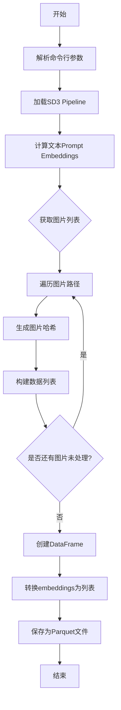
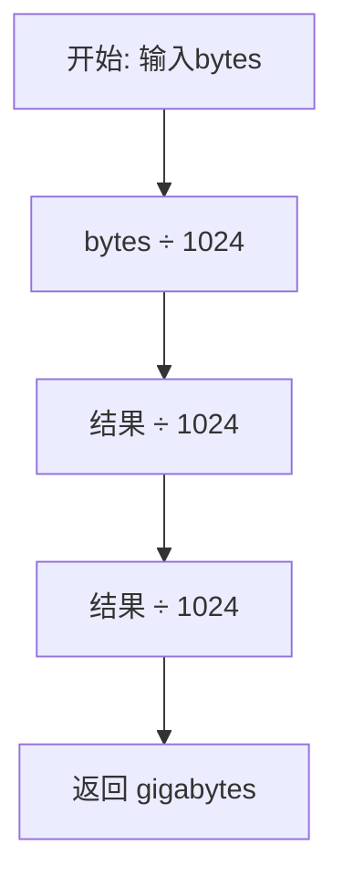
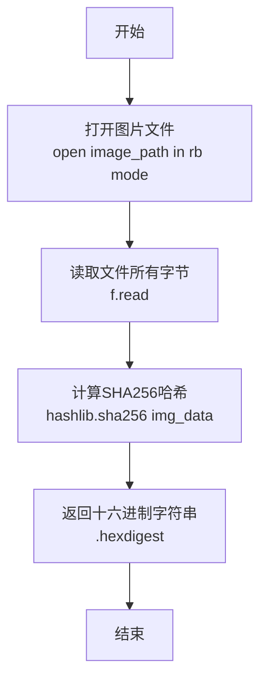
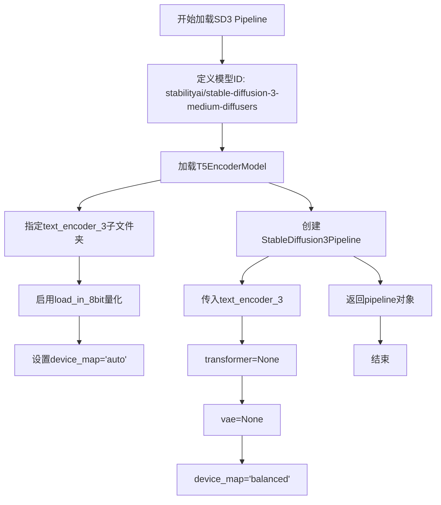
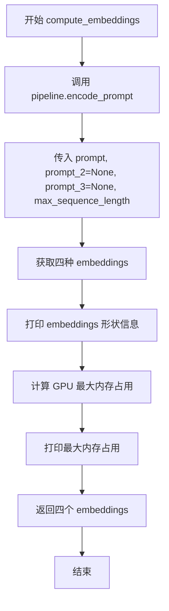

# `diffusers\examples\research_projects\sd3_lora_colab\compute_embeddings.py` 详细设计文档

该脚本使用Stable Diffusion 3的文本编码器将文本提示转换为高维嵌入向量，并结合本地图片的哈希值，将结果序列化为Parquet格式文件，用于后续的模型训练或检索任务。

## 整体流程



## 类结构

```
该文件为脚本文件，无类层次结构
直接执行模式 (if __name__ == "__main__")
包含5个全局函数和4个全局常量
```

## 全局变量及字段


### `PROMPT`
    
默认的文本提示内容，值为 'a photo of sks dog'

类型：`str`
    


### `MAX_SEQ_LENGTH`
    
最大序列长度，用于文本编码器，值为 77

类型：`int`
    


### `LOCAL_DATA_DIR`
    
本地图片目录路径，值为 'dog'

类型：`str`
    


### `OUTPUT_PATH`
    
输出Parquet文件路径，值为 'sample_embeddings.parquet'

类型：`str`
    


    

## 全局函数及方法


### `bytes_to_giga_bytes`

该函数是一个内存监控工具函数，用于将字节数转换为吉字节（GB）单位，以便于理解和展示GPU内存使用情况。

参数：

- `bytes`：`int` 或 `float`，输入的字节数

返回值：`float`，转换后的吉字节数

#### 流程图



#### 带注释源码

```python
def bytes_to_giga_bytes(bytes):
    """
    将字节数转换为吉字节数
    
    转换关系:
    - 1024 bytes = 1 KB (kilobyte)
    - 1024 KB = 1 MB (megabyte)
    - 1024 MB = 1 GB (gigabyte)
    
    因此: bytes / 1024 / 1024 / 1024 = GB
    
    参数:
        bytes: 输入的字节数，可以是整数或浮点数
        
    返回:
        float: 转换后的吉字节数
    """
    return bytes / 1024 / 1024 / 1024
```


### `generate_image_hash`

该函数用于计算图片文件的SHA256哈希值，通过读取图片文件的完整二进制内容并使用SHA256算法生成唯一的哈希字符串，可用于图片去重、缓存键生成等场景。

参数：

- `image_path`：`str`，图片文件的路径，用于定位需要计算哈希值的图片文件

返回值：`str`，返回SHA256哈希值的十六进制字符串（64个字符），用于唯一标识该图片文件

#### 流程图



#### 带注释源码

```python
def generate_image_hash(image_path):
    """
    计算图片文件的SHA256哈希值，用于唯一标识图片
    
    参数:
        image_path: 图片文件的路径
        
    返回:
        SHA256哈希值的十六进制字符串
    """
    # 以二进制读取模式打开图片文件
    # "rb" 模式确保读取原始字节数据，不进行任何编码转换
    with open(image_path, "rb") as f:
        # 读取文件的全部二进制内容
        # 对于大图片文件，这可能会占用较多内存
        img_data = f.read()
    
    # 使用hashlib计算SHA256哈希值
    # sha256接收字节数据，返回哈希对象
    # .hexdigest() 将哈希值转换为64位的十六进制字符串
    return hashlib.sha256(img_data).hexdigest()
```


### `load_sd3_pipeline`

该函数用于加载Stable Diffusion 3的Pipeline，通过指定模型ID加载T5文本编码器并配置Pipeline，仅保留文本编码器组件，将Transformer和VAE设为None以节省显存。

参数： None

返回值：`StableDiffusion3Pipeline`，返回配置好的Stable Diffusion 3 pipeline对象

#### 流程图



#### 带注释源码

```python
def load_sd3_pipeline():
    """
    加载Stable Diffusion 3的Pipeline
    
    该函数执行以下操作:
    1. 指定SD3模型的HuggingFace Hub ID
    2. 加载T5文本编码器(带8bit量化以节省显存)
    3. 创建Pipeline并仅保留文本编码器组件
    
    Returns:
        StableDiffusion3Pipeline: 配置好的SD3 Pipeline对象
    """
    # 定义模型在HuggingFace Hub上的唯一标识符
    id = "stabilityai/stable-diffusion-3-medium-diffusers"
    
    # 加载T5文本编码器
    # - subfolder="text_encoder_3": 指定加载text_encoder_3子目录
    # - load_in_8bit=True: 启用8bit量化，显著减少显存占用
    # - device_map="auto": 自动将模型分配到可用设备上
    text_encoder = T5EncoderModel.from_pretrained(
        id, 
        subfolder="text_encoder_3", 
        load_in_8bit=True, 
        device_map="auto"
    )
    
    # 创建StableDiffusion3Pipeline
    # 仅传入text_encoder_3，transformer和vae设为None
    # 这样可以避免加载不必要的庞大模型，节省显存
    pipeline = StableDiffusion3Pipeline.from_pretrained(
        id, 
        text_encoder_3=text_encoder, 
        transformer=None,  # 设为None，不加载Transformer组件
        vae=None,           # 设为None，不加载VAE组件
        device_map="balanced"  # 均衡的设备映射策略
    )
    
    # 返回配置好的pipeline对象
    return pipeline
```


### `compute_embeddings`

该函数接收Stable Diffusion 3 Pipeline对象和文本提示，使用pipeline的encode_prompt方法编码提示，生成四种类型的embeddings（正向提示词embedding、负向提示词embedding、池化正向embedding、池化负向embedding），并打印embeddings的形状和GPU最大内存占用。

参数：

- `pipeline`：`StableDiffusion3Pipeline`，Stable Diffusion 3 Pipeline对象，用于编码文本提示
- `prompt`：`str`，要编码的文本提示
- `max_sequence_length`：`int`，编码时使用的最大序列长度

返回值：`Tuple[torch.Tensor, torch.Tensor, torch.Tensor, torch.Tensor]`，包含四个张量的元组：
- `prompt_embeds`：正向提示词的embedding
- `negative_prompt_embeds`：负向提示词的embedding
- `pooled_prompt_embeds`：池化后的正向提示词embedding
- `negative_pooled_prompt_embeds`：池化后的负向提示词embedding

#### 流程图



#### 带注释源码

```python
@torch.no_grad()  # 禁用梯度计算，减少内存占用
def compute_embeddings(pipeline, prompt, max_sequence_length):
    """
    使用 StableDiffusion3Pipeline 编码文本提示，生成四种类型的 embeddings
    
    Args:
        pipeline: StableDiffusion3Pipeline 实例
        prompt: 要编码的文本提示
        max_sequence_length: 最大序列长度
    
    Returns:
        包含四种 embeddings 的元组
    """
    # 调用 pipeline 的 encode_prompt 方法进行编码
    # prompt_2 和 prompt_3 为 None，因为该函数仅使用主文本编码器
    (
        prompt_embeds,              # 正向提示词的 embedding
        negative_prompt_embeds,     # 负向提示词的 embedding（用于 classifier-free guidance）
        pooled_prompt_embeds,       # 池化后的正向 embedding
        negative_pooled_prompt_embeds,  # 池化后的负向 embedding
    ) = pipeline.encode_prompt(
        prompt=prompt, 
        prompt_2=None, 
        prompt_3=None, 
        max_sequence_length=max_sequence_length
    )

    # 打印各 embedding 的形状信息，便于调试和监控
    print(
        f"{prompt_embeds.shape=}, {negative_prompt_embeds.shape=}, {pooled_prompt_embeds.shape=}, {negative_pooled_prompt_embeds.shape}"
    )

    # 计算并打印当前 GPU 最大内存占用（单位：GB）
    max_memory = bytes_to_giga_bytes(torch.cuda.max_memory_allocated())
    print(f"Max memory allocated: {max_memory:.3f} GB")
    
    # 返回四种 embeddings
    return prompt_embeds, negative_prompt_embeds, pooled_prompt_embeds, negative_pooled_prompt_embeds
```


### `run(args)`

`run(args)` 是主执行函数，协调整个嵌入生成和保存流程。它首先加载 Stable Diffusion 3 管道，计算文本嵌入，然后遍历本地数据目录中的所有 JPEG 图像，为每张图像生成哈希值，并将图像哈希与嵌入一起存储在 DataFrame 中，最后将数据序列化为 Parquet 文件格式输出。

参数：

- `args`：`argparse.Namespace`，包含以下属性：
  - `prompt`：`str`，用于生成嵌入的实例提示词
  - `max_sequence_length`：`int`，计算嵌入时使用的最大序列长度
  - `local_data_dir`：`str`，包含实例图像的本地目录路径
  - `output_path`：`str`，输出 Parquet 文件的路径

返回值：`None`，该函数不返回值，结果直接写入 Parquet 文件

#### 流程图

```mermaid
flowchart TD
    A[开始 run(args)] --> B[加载SD3管道 load_sd3_pipeline]
    B --> C[计算文本嵌入 compute_embeddings]
    C --> D{遍历图像目录}
    D -->|查找.jpeg文件| E[获取图像路径列表]
    E --> F[选择单个图像路径]
    F --> G[生成图像哈希 generate_image_hash]
    G --> H[构建数据元组]
    H --> I{还有更多图像?}
    I -->|是| F
    I -->|否| J[创建DataFrame]
    J --> K[转换嵌入为列表]
    K --> L[保存为Parquet文件]
    L --> M[结束]
    
    style B fill:#e1f5fe
    style C fill:#e1f5fe
    style G fill:#fff3e0
    style L fill:#e8f5e9
```

#### 带注释源码

```python
def run(args):
    """
    主执行函数，协调整个嵌入生成和保存流程。
    
    该函数执行以下步骤：
    1. 加载 Stable Diffusion 3 管道
    2. 使用管道计算文本嵌入（prompt_embeds 和 negative_prompt_embeds）
    3. 遍历本地图像目录中的所有 JPEG 图像
    4. 为每张图像生成 SHA256 哈希值
    5. 将图像哈希与嵌入组合成数据列表
    6. 创建 pandas DataFrame 并将嵌入转换为列表格式
    7. 将 DataFrame 保存为 Parquet 文件
    """
    # 步骤1：加载 Stable Diffusion 3 管道
    # 使用 from_pretrained 加载预训练模型，包含 8-bit 量化的 text_encoder_3
    pipeline = load_sd3_pipeline()
    
    # 步骤2：计算文本嵌入
    # 调用 compute_embeddings 获取 prompt 的嵌入向量
    # 返回四个嵌入：positive prompt、negative prompt、pooled positive、pooled negative
    prompt_embeds, negative_prompt_embeds, pooled_prompt_embeds, negative_pooled_prompt_embeds = compute_embeddings(
        pipeline, args.prompt, args.max_sequence_length
    )

    # 步骤3：查找本地图像目录中的所有 JPEG 文件
    # 使用 glob 模块匹配 *.jpeg 扩展名的文件
    # 注意：代码假设图像为 JPEG 格式，如需支持其他格式需修改此处
    image_paths = glob.glob(f"{args.local_data_dir}/*.jpeg")
    
    # 步骤4-5：遍历每张图像并构建数据列表
    data = []
    for image_path in image_paths:
        # 为每张图像生成 SHA256 哈希值用于唯一标识
        img_hash = generate_image_hash(image_path)
        # 将图像哈希与四个嵌入向量组合成元组
        data.append(
            (img_hash, prompt_embeds, negative_prompt_embeds, pooled_prompt_embeds, negative_pooled_prompt_embeds)
        )

    # 步骤6：创建 pandas DataFrame
    # 定义列名：image_hash 用于存储图像哈希值
    # embedding_cols 存储四个嵌入向量的列名
    embedding_cols = [
        "prompt_embeds",
        "negative_prompt_embeds",
        "pooled_prompt_embeds",
        "negative_pooled_prompt_embeds",
    ]
    df = pd.DataFrame(
        data,
        columns=["image_hash"] + embedding_cols,
    )

    # 步骤7：将嵌入张量转换为 Python 列表
    # Parquet 格式不支持 PyTorch 张量，需要转换为 numpy 数组再转 list
    # 使用 flatten() 将多维张量展平为一维列表，便于存储
    for col in embedding_cols:
        df[col] = df[col].apply(lambda x: x.cpu().numpy().flatten().tolist())

    # 步骤8：保存 DataFrame 到 Parquet 文件
    # 使用 to_parquet 方法序列化数据
    df.to_parquet(args.output_path)
    print(f"Data successfully serialized to {args.output_path}")
```

## 关键组件


### T5EncoderModel 量化加载

使用 `load_in_8bit=True` 参数加载 T5 文本编码器，实现 8 位量化策略以降低显存占用，支持 `device_map="auto"` 自动设备分配。

### StableDiffusion3Pipeline 惰性加载

通过 `from_pretrained` 加载预训练模型，transformer 和 vae 被设为 None 实现部分组件的惰性加载，仅初始化文本编码器相关组件。

### 嵌入向量计算

`compute_embeddings` 函数使用 `pipeline.encode_prompt` 计算正向和负向提示词嵌入，返回四种嵌入向量：prompt_embeds、negative_prompt_embeds、pooled_prompt_embeds、negative_pooled_prompt_embeds，支持可配置的 max_sequence_length。

### 图像哈希生成

`generate_image_hash` 函数使用 SHA256 算法对图像文件进行哈希计算，生成唯一的图像标识符用于数据关联。

### 张量到 NumPy 转换

将 PyTorch 张量通过 `.cpu().numpy().flatten().tolist()` 流程转换为 Python 列表，以适应 Parquet 格式的存储要求。

### 内存监控

`bytes_to_giga_bytes` 函数将字节转换为吉字节，用于追踪 CUDA 显存分配情况，帮助评估量化策略的内存效率。

### 数据序列化

使用 Pandas DataFrame 整合图像哈希与嵌入向量，通过 `to_parquet` 方法将数据持久化为列式存储格式。


## 问题及建议


### 已知问题

- **未使用的模型组件** - `load_sd3_pipeline()` 中加载了 `text_encoder` 并传入了 `transformer=None, vae=None`，但这些组件在后续计算中完全未被使用，造成资源浪费和加载时间增加
- **嵌入重复计算** - `prompt_embeds` 等嵌入向量在循环外计算一次是正确的，但这些张量被重复添加到数据列表中多次（每张图像一次），而非仅存储一次引用，导致数据冗余
- **硬编码的配置值** - 模型ID `"stabilityai/stable-diffusion-3-medium-diffusers"`、图像扩展名 `*.jpeg`、默认提示词等均硬编码在全局位置，缺乏灵活的配置机制
- **缺失错误处理** - 文件读取（`generate_image_hash`）、模型加载（`load_sd3_pipeline`）、glob匹配（`glob.glob`）等操作均无异常捕获和处理
- **不符合命名规范** - `bytes_to_giga_bytes` 函数名不符合 PEP8 推荐的 snake_case 规范，应为 `bytes_to_gigabytes`
- **资源未显式释放** - 使用了 `torch.no_grad()` 上下文管理器，但未显式清理 CUDA 缓存（`torch.cuda.empty_cache()`）
- **文档字符串缺失** - 关键函数如 `compute_embeddings`、`load_sd3_pipeline` 等缺少 docstring
- **类型注解不完整** - 函数参数和返回值缺乏类型注解，影响代码可维护性和 IDE 支持

### 优化建议

- **移除未使用的模型组件** - 仅加载 `text_encoder_3` 而非整个 pipeline，或使用更轻量的 `T5EncoderModel` 直接加载
- **优化数据结构** - 嵌入应只存储一次，而不是每张图像重复存储；可改用单独的张量列或引用机制
- **配置外部化** - 将模型ID、默认路径、参数等配置抽取到独立的配置文件或环境变量
- **添加异常处理** - 使用 try-except 包装文件操作和模型加载，添加适当的错误消息和回退机制
- **修正命名规范** - 重命名函数为 `bytes_to_gigabytes`
- **添加资源清理** - 在 `run` 函数末尾或适当位置调用 `torch.cuda.empty_cache()`
- **补充文档** - 为所有公开函数添加 Google 风格的 docstring，说明参数、返回值和异常
- **完善类型注解** - 为函数添加类型提示，如 `def compute_embeddings(pipeline, prompt: str, max_sequence_length: int) -> Tuple[Tensor, ...]`
- **日志系统替换 print** - 使用 `logging` 模块替代 print，便于日志级别控制和输出管理

## 其它


### 设计目标与约束

本代码的核心目标是将Stable Diffusion 3模型的文本嵌入与本地图像关联并序列化存储到Parquet文件中，支持批量处理本地图像目录并生成统一的嵌入数据集。主要约束包括：1) 需要GPU支持以运行SD3模型；2) 图像格式限定为JPEG；3) 依赖transformers和diffusers库；4) 最大序列长度影响计算成本。

### 错误处理与异常设计

代码在文件读取、模型加载、嵌入计算和数据序列化等关键环节缺少异常处理机制。具体问题：1) `generate_image_hash`未捕获文件读取异常；2) `load_sd3_pipeline`未处理模型下载失败或路径错误；3) `compute_embeddings`未处理CUDA内存不足情况；4) glob匹配不到文件时会导致空数据处理；5) Parquet写入失败时缺乏重试机制。建议增加try-except块、文件存在性检查、内存检测和日志记录。

### 数据流与状态机

数据流如下：命令行参数输入 → 加载SD3 Pipeline → 编码Prompt生成嵌入 → 遍历图像目录 → 生成图像哈希 → 构建DataFrame → 转换张量为列表 → 序列化为Parquet文件。无复杂状态机，仅为线性流程。关键数据节点：Prompt嵌入（4个张量）、图像路径列表、DataFrame、Parquet文件。

### 外部依赖与接口契约

主要依赖包括：1) `torch` - GPU计算；2) `transformers` - T5EncoderModel加载；3) `diffusers` - StableDiffusion3Pipeline；4) `pandas` - 数据组织；5) `glob` - 文件匹配；6) `hashlib` - 图像哈希。外部接口：命令行参数（prompt、max_sequence_length、local_data_dir、output_path）和Parquet输出文件格式。模型ID固定为"stabilityai/stable-diffusion-3-medium-diffusers"。

### 配置与参数设计

命令行参数设计如下：1) `--prompt` (str, 默认"a photo of sks dog") - 实例提示词；2) `--max_sequence_length` (int, 默认77) - 最大序列长度，影响计算成本；3) `--local_data_dir` (str, 默认"dog") - 图像目录路径；4) `--output_path` (str, 默认"sample_embeddings.parquet") - 输出文件路径。参数验证不足，未检查路径有效性、目录非空等。

### 性能优化与资源管理

当前实现存在优化空间：1) `load_sd8bit`加载和device_map配置可优化内存使用；2) 逐个处理图像哈希时未利用批处理；3) 嵌入转换使用lambda效率较低；4) 缺少批处理图像嵌入计算；5) CUDA内存峰值监控已实现但未做主动释放。建议：使用`torch.inference_mode()`替代`@torch.no_grad()`；批量处理图像；使用numpy数组转换替代apply。

### 安全性与合规性

安全考量：1) 硬编码模型ID和路径存在灵活性问题；2) 文件路径未做规范化处理；3) 无输入验证（路径遍历风险）；4) 缺少权限检查。合规性：使用Apache 2.0许可证的模型和数据处理需遵守相关使用条款。

### 扩展性与未来改进

可扩展方向：1) 支持多种图像格式（PNG、JPG、WebP）；2) 支持批量提示词而非单一Prompt；3) 增加图像预处理（缩放、归一化）；4) 支持多模型切换；5) 添加进度条和详细日志；6) 支持增量更新而非全量覆盖；7) 增加配置文件的参数管理。

### 监控与日志

当前仅在关键节点有print输出，监控能力有限：1) 缺少结构化日志；2) 无性能指标收集；3) 无错误追踪；4) 缺少运行时间统计。建议引入logging模块，按级别（日志INFO、WARNING、ERROR）记录，并添加时间戳和模块信息。

### 测试与验证策略

代码缺乏测试覆盖。建议：1) 单元测试验证各函数正确性（bytes_to_giga_bytes、generate_image_hash）；2) 集成测试验证完整流程；3) 边界条件测试（空目录、无权限、磁盘满）；4) 模型加载测试（离线模式、版本兼容性）；5) 输出格式验证（Parquet文件结构、嵌入维度）。

### 数据格式与序列化

输出Parquet文件包含5列：1) `image_hash` (str) - SHA256图像哈希；2) `prompt_embeds` (list) - 正向提示嵌入；3) `negative_prompt_embeds` (list) - 负向提示嵌入；4) `pooled_prompt_embeds` (list) - 池化提示嵌入；5) `negative_pooled_prompt_embeds` (list) - 负向池化提示嵌入。嵌入转换为扁平化列表存储，形状信息丢失，建议在元数据中保存原始维度信息。

### 版本兼容性

代码声明支持Python 3，但未指定最低版本要求。关键依赖版本：1) torch - 需CUDA支持；2) transformers - 需支持T5EncoderModel和load_in_8bit；3) diffusers - 需支持StableDiffusion3Pipeline；4) pandas - 需支持to_parquet。建议在requirements.txt中明确版本约束。

### 部署与运维考量

部署建议：1) 制作Docker镜像包含所有依赖；2) 配置CUDA环境；3) 设置定时任务处理新图像；4) 监控GPU内存使用；5) 配置日志轮转；6) 考虑将模型缓存到本地以加速启动。当前为单次运行脚本，适合作为数据预处理流水线的一环。

### 错误恢复与容错

当前无错误恢复机制。建议增加：1) 检查点保存，中间结果持久化；2) 失败重试（网络下载、文件写入）；3) 部分失败容忍（单图失败不影响其他）；4) 增量处理标识（已处理图像记录）；5) 超时机制（防止单任务卡死）。


    