# `diffusers\examples\research_projects\sd3_lora_colab\train_dreambooth_lora_sd3_miniature.py` 详细设计文档

这是一个SD3 DreamBooth LoRA训练脚本，用于使用DreamBooth技术微调Stable Diffusion 3 (SD3) 文本到图像扩散模型，通过LoRA（Low-Rank Adaptation）技术实现轻量级的模型定制，支持自定义实例图像训练和文本提示词嵌入。

## 整体流程

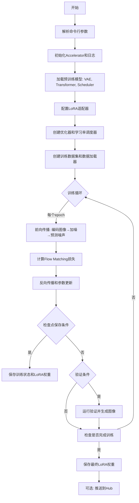

## 类结构

```
DreamBoothDataset (数据集类)
└── 继承自 Dataset (torch.utils.data.Dataset)

全局函数
├── save_model_card (保存模型卡片)
├── log_validation (验证函数)
├── parse_args (参数解析)
└── collate_fn (数据整理)

main函数
├── 模型加载与配置
├── LoRA适配器设置
├── 优化器和调度器
└── 训练循环
```

## 全局变量及字段


### `logger`
    
全局日志记录器，用于输出训练过程中的日志信息

类型：`logging.Logger`
    


### `noise_scheduler`
    
噪声调度器，用于控制扩散模型中的噪声调度

类型：`FlowMatchEulerDiscreteScheduler`
    


### `noise_scheduler_copy`
    
噪声调度器副本，用于在训练过程中获取sigma值

类型：`FlowMatchEulerDiscreteScheduler`
    


### `vae`
    
变分自编码器，用于将图像编码到潜在空间

类型：`AutoencoderKL`
    


### `transformer`
    
SD3变换器模型，主干网络用于预测噪声

类型：`SD3Transformer2DModel`
    


### `weight_dtype`
    
权重数据类型，根据混合精度配置确定（fp16/bf16/fp32）

类型：`torch.dtype`
    


### `accelerator`
    
加速器，用于管理分布式训练和混合精度

类型：`Accelerator`
    


### `optimizer`
    
优化器，用于更新模型参数

类型：`torch.optim.Optimizer`
    


### `lr_scheduler`
    
学习率调度器，用于动态调整学习率

类型：`_LRScheduler`
    


### `train_dataset`
    
训练数据集，加载实例图像和提示词嵌入

类型：`DreamBoothDataset`
    


### `train_dataloader`
    
训练数据加载器，用于批量加载训练数据

类型：`DataLoader`
    


### `transformer_lora_parameters`
    
可训练LoRA参数列表，过滤出需要更新的LoRA权重

类型：`list`
    


### `global_step`
    
全局训练步数，记录当前训练的步数

类型：`int`
    


### `first_epoch`
    
起始epoch，从检查点恢复训练时的起始轮次

类型：`int`
    


### `DreamBoothDataset.size`
    
图像目标分辨率，训练图像将被调整到的尺寸

类型：`int`
    


### `DreamBoothDataset.center_crop`
    
是否居中裁剪，决定图像裁剪方式

类型：`bool`
    


### `DreamBoothDataset.instance_prompt`
    
实例提示词，用于描述实例的提示文本

类型：`str`
    


### `DreamBoothDataset.instance_data_root`
    
实例图像根目录，存放训练图像的路径

类型：`Path`
    


### `DreamBoothDataset.instance_images`
    
实例图像列表，加载的PIL图像对象列表

类型：`list`
    


### `DreamBoothDataset.image_hashes`
    
图像哈希值列表，用于唯一标识每张图像

类型：`list`
    


### `DreamBoothDataset.pixel_values`
    
预处理后的像素值列表，已转换的图像tensor列表

类型：`list`
    


### `DreamBoothDataset.data_dict`
    
图像哈希到嵌入的映射，存储图像hash对应的prompt嵌入

类型：`dict`
    


### `DreamBoothDataset.num_instance_images`
    
实例图像数量，数据集中包含的图像总数

类型：`int`
    


### `DreamBoothDataset._length`
    
数据集长度，决定数据集的迭代次数

类型：`int`
    
    

## 全局函数及方法


### `save_model_card`

该函数用于在训练完成后生成并保存 HuggingFace Hub 的模型卡片（Model Card），包含模型描述、训练信息、标签以及验证样本图像，并自动上传至模型仓库。

参数：

- `repo_id`：`str`，HuggingFace Hub 上的模型仓库 ID
- `images`：`Optional[List[Image]]`，验证阶段生成的样本图像列表，默认为 None
- `base_model`：`Optional[str`，用于 DreamBooth 训练的原始基础模型名称或路径，默认为 None
- `train_text_encoder`：`bool`，是否训练了文本编码器的 LoRA，默认为 False
- `instance_prompt`：`Optional[str]`，用于触发模型生成实例图像的提示词，默认为 None
- `validation_prompt`：`Optional[str]`，验证时使用的提示词，用于展示在模型卡片_widget 中，默认为 None
- `repo_folder`：`Optional[str]`，本地模型输出目录路径，用于保存 README.md 和图像文件，默认为 None

返回值：`None`，该函数无返回值，直接将模型卡片写入本地文件

#### 流程图

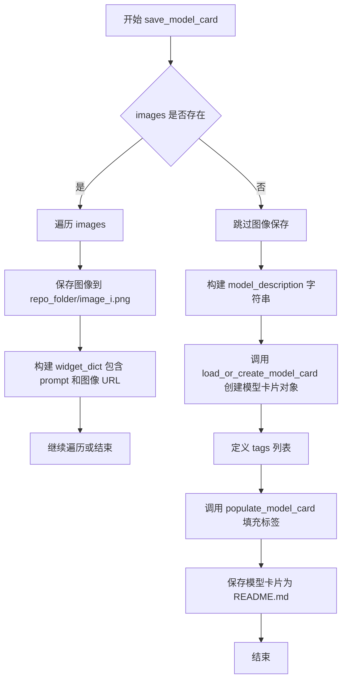

#### 带注释源码

```python
def save_model_card(
    repo_id: str,
    images=None,
    base_model: str = None,
    train_text_encoder=False,
    instance_prompt=None,
    validation_prompt=None,
    repo_folder=None,
):
    """
    生成并保存 HuggingFace Hub 模型卡片
    
    参数:
        repo_id: 模型仓库 ID
        images: 验证图像列表
        base_model: 基础模型名称
        train_text_encoder: 是否训练文本编码器
        instance_prompt: 实例提示词
        validation_prompt: 验证提示词
        repo_folder: 输出目录
    """
    widget_dict = []
    
    # 如果有验证图像，保存到本地并构建 widget 信息
    if images is not None:
        for i, image in enumerate(images):
            # 保存图像到指定目录
            image.save(os.path.join(repo_folder, f"image_{i}.png"))
            # 构建 widget 字典用于 Hub 上的交互式展示
            widget_dict.append(
                {"text": validation_prompt if validation_prompt else " ", 
                 "output": {"url": f"image_{i}.png"}}
            )

    # 构建 Markdown 格式的模型描述
    model_description = f"""
# SD3 DreamBooth LoRA - {repo_id}

<Gallery />

## Model description

These are {repo_id} DreamBooth weights for {base_model}.

The weights were trained  using [DreamBooth](https://dreambooth.github.io/).

LoRA for the text encoder was enabled: {train_text_encoder}.

## Trigger words

You should use {instance_prompt} to trigger the image generation.

## Download model

[Download]({repo_id}/tree/main) them in the Files & versions tab.

## License

Please adhere to the licensing terms as described [here](https://huggingface.co/stabilityai/stable-diffusion-3-medium/blob/main/LICENSE).
"""
    
    # 加载或创建模型卡片，包含训练元数据
    model_card = load_or_create_model_card(
        repo_id_or_path=repo_id,
        from_training=True,
        license="openrail++",
        base_model=base_model,
        prompt=instance_prompt,
        model_description=model_description,
        widget=widget_dict,
    )
    
    # 定义模型标签用于分类和搜索
    tags = [
        "text-to-image",
        "diffusers-training",
        "diffusers",
        "lora",
        "sd3",
        "sd3-diffusers",
        "template:sd-lora",
    ]

    # 填充标签并保存模型卡片为 README.md
    model_card = populate_model_card(model_card, tags=tags)
    model_card.save(os.path.join(repo_folder, "README.md"))
```


### `log_validation`

该函数用于在训练过程中运行验证，生成指定数量的图像并记录到日志系统（TensorBoard 或 WandB）中，以便监控模型在验证提示下的生成效果。

参数：

- `pipeline`：`StableDiffusion3Pipeline`，用于生成图像的扩散 pipeline 实例
- `args`：`argparse.Namespace`，包含验证相关配置（如验证提示词、验证图像数量、随机种子等）
- `accelerator`：`Accelerator`，分布式训练加速器，用于设备管理和日志记录
- `pipeline_args`：`Dict`，传递给 pipeline 的额外生成参数（如 prompt）
- `epoch`：`int`，当前训练轮次，用于日志记录
- `is_final_validation`：`bool`，标识是否为最终验证（影响日志中的阶段名称），默认为 False

返回值：`List[Image]`，生成的图像列表

#### 流程图

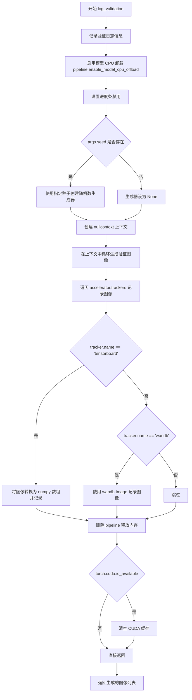

#### 带注释源码

```python
def log_validation(
    pipeline,           # StableDiffusion3Pipeline: 用于图像生成的 pipeline 对象
    args,               # argparse.Namespace: 包含验证配置的命令行参数对象
    accelerator,        # Accelerator: 分布式训练加速器
    pipeline_args,      # Dict: 传递给 pipeline 的参数字典
    epoch,              # int: 当前训练的轮次
    is_final_validation=False,  # bool: 是否为最终验证阶段
):
    """
    在训练过程中运行验证，生成验证图像并记录到日志系统。
    
    Args:
        pipeline: StableDiffusion3Pipeline 实例，用于生成图像
        args: 包含 num_validation_images, validation_prompt, seed 等配置
        accelerator: 用于设备管理和 tracker 记录
        pipeline_args: 额外传递给 pipeline 的参数，如 prompt
        epoch: 当前训练轮次
        is_final_validation: 是否为最终验证，影响日志阶段名称
    
    Returns:
        List[PIL.Image]: 生成的验证图像列表
    """
    # 记录验证开始的日志信息，包括生成图像数量和验证提示词
    logger.info(
        f"Running validation... \n Generating {args.num_validation_images} images with prompt:"
        f" {args.validation_prompt}."
    )
    
    # 启用模型 CPU 卸载以节省 GPU 显存
    pipeline.enable_model_cpu_offload()
    
    # 禁用进度条显示
    pipeline.set_progress_bar_config(disable=True)

    # 运行推理
    # 如果提供了 seed，则创建指定种子的随机数生成器，否则为 None
    generator = torch.Generator(device=accelerator.device).manual_seed(args.seed) if args.seed else None
    
    # 注释: 原本根据是否是最终验证决定是否使用 autocast，但目前统一使用 nullcontext
    # autocast_ctx = torch.autocast(accelerator.device.type) if not is_final_validation else nullcontext()
    autocast_ctx = nullcontext()

    # 在上下文中生成指定数量的验证图像
    with autocast_ctx:
        # 循环生成 args.num_validation_images 张图像
        images = [pipeline(**pipeline_args, generator=generator).images[0] for _ in range(args.num_validation_images)]

    # 遍历所有注册的 tracker 记录图像
    for tracker in accelerator.trackers:
        # 确定阶段名称：最终验证为 "test"，中间验证为 "validation"
        phase_name = "test" if is_final_validation else "validation"
        
        # TensorBoard 记录
        if tracker.name == "tensorboard":
            # 将 PIL 图像转换为 numpy 数组并堆叠
            np_images = np.stack([np.asarray(img) for img in images])
            # 添加图像到 tensorboard
            tracker.writer.add_images(phase_name, np_images, epoch, dataformats="NHWC")
        
        # WandB 记录
        if tracker.name == "wandb":
            # 使用 wandb.Image 记录图像，支持标题显示
            tracker.log(
                {
                    phase_name: [
                        wandb.Image(image, caption=f"{i}: {args.validation_prompt}") for i, image in enumerate(images)
                    ]
                }
            )

    # 删除 pipeline 对象释放显存
    del pipeline
    
    # 如果 CUDA 可用，清空缓存
    if torch.cuda.is_available():
        torch.cuda.empty_cache()

    # 返回生成的图像列表
    return images
```


### `parse_args`

该函数是 DreamBooth 训练脚本的参数解析器，通过 `argparse` 定义并解析所有训练相关的命令行参数，如模型路径、数据目录、优化器设置、学习率调度等，并进行必要的验证和环境变量处理，最终返回一个包含所有配置参数的 `Namespace` 对象。

参数：

- `input_args`：`Optional[List[str]]`，可选参数列表。当为 `None` 时，函数从系统命令行参数 (`sys.argv`) 自动解析；否则，解析传入的参数列表。这允许在代码中直接传入参数进行测试或在其他上下文中使用。

返回值：`argparse.Namespace`，包含所有解析后的命令行参数的命名空间对象。该对象的属性对应于通过 `parser.add_argument` 定义的各个参数，例如 `args.pretrained_model_name_or_path`、`args.instance_data_dir` 等。

#### 流程图

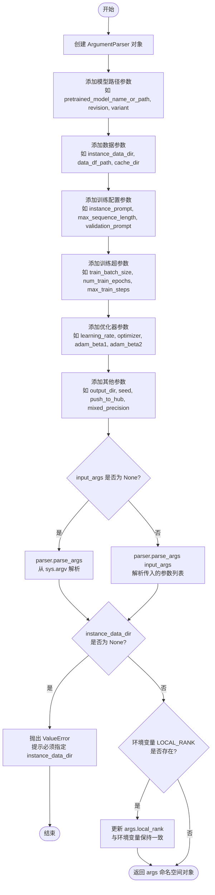

#### 带注释源码

```python
def parse_args(input_args=None):
    """
    解析命令行参数，用于配置 DreamBooth 训练脚本。
    
    参数:
        input_args: 可选的参数列表。如果为 None，则从 sys.argv 解析。
                   否则解析提供的参数列表，这在测试或非命令行调用场景中很有用。
    
    返回:
        argparse.Namespace: 包含所有命令行参数的命名空间对象。
    """
    # 创建 ArgumentParser 实例，设置脚本描述
    parser = argparse.ArgumentParser(description="Simple example of a training script.")
    
    # ==================== 模型相关参数 ====================
    parser.add_argument(
        "--pretrained_model_name_or_path",
        type=str,
        default=None,
        required=True,
        help="Path to pretrained model or model identifier from huggingface.co/models.",
    )
    parser.add_argument(
        "--revision",
        type=str,
        default=None,
        required=False,
        help="Revision of pretrained model identifier from huggingface.co/models.",
    )
    parser.add_argument(
        "--variant",
        type=str,
        default=None,
        help="Variant of the model files of the pretrained model identifier from huggingface.co/models, 'e.g.' fp16",
    )
    
    # ==================== 数据相关参数 ====================
    parser.add_argument(
        "--instance_data_dir",
        type=str,
        default=None,
        help=("A folder containing the training data. "),
    )
    parser.add_argument(
        "--data_df_path",
        type=str,
        default=None,
        help=("Path to the parquet file serialized with compute_embeddings.py."),
    )
    parser.add_argument(
        "--cache_dir",
        type=str,
        default=None,
        help="The directory where the downloaded models and datasets will be stored.",
    )
    parser.add_argument(
        "--instance_prompt",
        type=str,
        default=None,
        required=True,
        help="The prompt with identifier specifying the instance, e.g. 'photo of a TOK dog', 'in the style of TOK'",
    )
    parser.add_argument(
        "--max_sequence_length",
        type=int,
        default=77,
        help="Maximum sequence length to use with with the T5 text encoder",
    )
    parser.add_argument(
        "--validation_prompt",
        type=str,
        default=None,
        help="A prompt that is used during validation to verify that the model is learning.",
    )
    parser.add_argument(
        "--num_validation_images",
        type=int,
        default=4,
        help="Number of images that should be generated during validation with `validation_prompt`.",
    )
    parser.add_argument(
        "--validation_epochs",
        type=int,
        default=50,
        help=(
            "Run dreambooth validation every X epochs. Dreambooth validation consists of running the prompt"
            " `args.validation_prompt` multiple times: `args.num_validation_images`."
        ),
    )
    parser.add_argument(
        "--rank",
        type=int,
        default=4,
        help=("The dimension of the LoRA update matrices."),
    )
    
    # ==================== 输出和随机性参数 ====================
    parser.add_argument(
        "--output_dir",
        type=str,
        default="sd3-dreambooth-lora",
        help="The output directory where the model predictions and checkpoints will be written.",
    )
    parser.add_argument("--seed", type=int, default=None, help="A seed for reproducible training.")
    parser.add_argument(
        "--resolution",
        type=int,
        default=512,
        help=(
            "The resolution for input images, all the images in the train/validation dataset will be resized to this"
            " resolution"
        ),
    )
    parser.add_argument(
        "--center_crop",
        default=False,
        action="store_true",
        help=(
            "Whether to center crop the input images to the resolution. If not set, the images will be randomly"
            " cropped. The images will be resized to the resolution first before cropping."
        ),
    )
    parser.add_argument(
        "--random_flip",
        action="store_true",
        help="whether to randomly flip images horizontally",
    )
    
    # ==================== 训练过程参数 ====================
    parser.add_argument(
        "--train_batch_size", type=int, default=4, help="Batch size (per device) for the training dataloader."
    )
    parser.add_argument("--num_train_epochs", type=int, default=1)
    parser.add_argument(
        "--max_train_steps",
        type=int,
        default=None,
        help="Total number of training steps to perform.  If provided, overrides num_train_epochs.",
    )
    parser.add_argument(
        "--checkpointing_steps",
        type=int,
        default=500,
        help=(
            "Save a checkpoint of the training state every X updates. These checkpoints can be used both as final"
            " checkpoints in case they are better than the last checkpoint, and are also suitable for resuming"
            " training using `--resume_from_checkpoint`."
        ),
    )
    parser.add_argument(
        "--checkpoints_total_limit",
        type=int,
        default=None,
        help=("Max number of checkpoints to store."),
    )
    parser.add_argument(
        "--resume_from_checkpoint",
        type=str,
        default=None,
        help=(
            "Whether training should be resumed from a previous checkpoint. Use a path saved by"
            ' `--checkpointing_steps`, or `"latest"` to automatically select the last available checkpoint.'
        ),
    )
    parser.add_argument(
        "--gradient_accumulation_steps",
        type=int,
        default=1,
        help="Number of updates steps to accumulate before performing a backward/update pass.",
    )
    parser.add_argument(
        "--gradient_checkpointing",
        action="store_true",
        help="Whether or not to use gradient checkpointing to save memory at the expense of slower backward pass.",
    )
    
    # ==================== 学习率调度参数 ====================
    parser.add_argument(
        "--learning_rate",
        type=float,
        default=1e-4,
        help="Initial learning rate (after the potential warmup period) to use.",
    )
    parser.add_argument(
        "--scale_lr",
        action="store_true",
        default=False,
        help="Scale the learning rate by the number of GPUs, gradient accumulation steps, and batch size.",
    )
    parser.add_argument(
        "--lr_scheduler",
        type=str,
        default="constant",
        help=(
            'The scheduler type to use. Choose between ["linear", "cosine", "cosine_with_restarts", "polynomial",'
            ' "constant", "constant_with_warmup"]'
        ),
    )
    parser.add_argument(
        "--lr_warmup_steps", type=int, default=500, help="Number of steps for the warmup in the lr scheduler."
    )
    parser.add_argument(
        "--lr_num_cycles",
        type=int,
        default=1,
        help="Number of hard resets of the lr in cosine_with_restarts scheduler.",
    )
    parser.add_argument("--lr_power", type=float, default=1.0, help="Power factor of the polynomial scheduler.")
    parser.add_argument(
        "--dataloader_num_workers",
        type=int,
        default=0,
        help=(
            "Number of subprocesses to use for data loading. 0 means that the data will be loaded in the main process."
        ),
    )
    
    # ==================== 损失函数加权参数 ====================
    parser.add_argument(
        "--weighting_scheme",
        type=str,
        default="logit_normal",
        choices=["sigma_sqrt", "logit_normal", "mode", "cosmap"],
    )
    parser.add_argument(
        "--logit_mean", type=float, default=0.0, help="mean to use when using the `'logit_normal'` weighting scheme."
    )
    parser.add_argument(
        "--logit_std", type=float, default=1.0, help="std to use when using the `'logit_normal'` weighting scheme."
    )
    parser.add_argument(
        "--mode_scale",
        type=float,
        default=1.29,
        help="Scale of mode weighting scheme. Only effective when using the `'mode'` as the `weighting_scheme`.",
    )
    
    # ==================== 优化器参数 ====================
    parser.add_argument(
        "--optimizer",
        type=str,
        default="AdamW",
        help=('The optimizer type to use. Choose between ["AdamW"]'),
    )
    parser.add_argument(
        "--use_8bit_adam",
        action="store_true",
        help="Whether or not to use 8-bit Adam from bitsandbytes. Ignored if optimizer is not set to AdamW",
    )
    parser.add_argument("--adam_beta1", type=float, default=0.9, help="The beta1 parameter for the Adam optimizer.")
    parser.add_argument("--adam_beta2", type=float, default=0.999, help="The beta2 parameter for the Adam optimizer.")
    parser.add_argument("--adam_weight_decay", type=float, default=1e-04, help="Weight decay to use for unet params")
    parser.add_argument(
        "--adam_epsilon",
        type=float,
        default=1e-08,
        help="Epsilon value for the Adam optimizer.",
    )
    parser.add_argument("--max_grad_norm", default=1.0, type=float, help="Max gradient norm.")
    
    # ==================== 分布式和日志参数 ====================
    parser.add_argument("--push_to_hub", action="store_true", help="Whether or not to push the model to the Hub.")
    parser.add_argument("--hub_token", type=str, default=None, help="The token to use to push to the Model Hub.")
    parser.add_argument(
        "--hub_model_id",
        type=str,
        default=None,
        help="The name of the repository to keep in sync with the local `output_dir`.",
    )
    parser.add_argument(
        "--logging_dir",
        type=str,
        default="logs",
        help=(
            "[TensorBoard](https://www.tensorflow.org/tensorboard) log directory. Will default to"
            " *output_dir/runs/**CURRENT_DATETIME_HOSTNAME***."
        ),
    )
    parser.add_argument(
        "--allow_tf32",
        action="store_true",
        help=(
            "Whether or not to allow TF32 on Ampere GPUs. Can be used to speed up training. For more information, see"
            " https://pytorch.org/docs/stable/notes/cuda.html#tensorfloat-32-tf32-on-ampere-devices"
        ),
    )
    parser.add_argument(
        "--report_to",
        type=str,
        default="tensorboard",
        help=(
            'The integration to report the results and logs to. Supported platforms are `"tensorboard"`'
            ' (default), `"wandb"` and `"comet_ml"`. Use `"all"` to report to all integrations.'
        ),
    )
    parser.add_argument(
        "--mixed_precision",
        type=str,
        default=None,
        choices=["no", "fp16", "bf16"],
        help=(
            "Whether to use mixed precision. Choose between fp16 and bf16 (bfloat16). Bf16 requires PyTorch >="
            " 1.10.and an Nvidia Ampere GPU.  Default to the value of accelerate config of the current system or the"
            " flag passed with the `accelerate.launch` command. Use this argument to override the accelerate config."
        ),
    )
    parser.add_argument(
        "--prior_generation_precision",
        type=str,
        default=None,
        choices=["no", "fp32", "fp16", "bf16"],
        help=(
            "Choose prior generation precision between fp32, fp16 and bf16 (bfloat16). Bf16 requires PyTorch >="
            " 1.10.and an Nvidia Ampere GPU.  Default to  fp16 if a GPU is available else fp32."
        ),
    )
    parser.add_argument("--local_rank", type=int, default=-1, help="For distributed training: local_rank")
    
    # ==================== 参数解析 ====================
    # 根据 input_args 是否为空决定解析方式
    if input_args is not None:
        # 解析传入的参数列表，通常用于测试或非命令行调用
        args = parser.parse_args(input_args)
    else:
        # 从 sys.argv 解析命令行参数
        args = parser.parse_args()
    
    # ==================== 参数验证 ====================
    # 确保 instance_data_dir 被指定
    if args.instance_data_dir is None:
        raise ValueError("Specify `instance_data_dir`.")
    
    # ==================== 分布式训练环境变量处理 ====================
    # 检查环境变量 LOCAL_RANK，如果存在则更新 args.local_rank
    # 这允许通过环境变量覆盖命令行传入的 local_rank
    env_local_rank = int(os.environ.get("LOCAL_RANK", -1))
    if env_local_rank != -1 and env_local_rank != args.local_rank:
        args.local_rank = env_local_rank
    
    # 返回包含所有解析参数的命名空间对象
    return args
```


### `collate_fn`

该函数是 PyTorch DataLoader 的数据整理函数，负责将多个数据样本（来自 DreamBoothDataset 的字典）合并成一个批次。它从每个样本中提取图像像素值、提示词嵌入和池化后的提示词嵌入，使用 `torch.stack` 将它们堆叠成张量，并确保内存布局连续且数据类型为 float32。

参数：

- `examples`：`List[Dict]` ，从数据集返回的样本列表，每个字典包含 "instance_images"、"prompt_embeds" 和 "pooled_prompt_embeds" 键

返回值：`Dict` ，包含键 "pixel_values"、"prompt_embeds" 和 "pooled_prompt_embeds" 的字典，这些值都是堆叠后的 PyTorch 张量

#### 流程图

```mermaid
flowchart TD
    A[接收 examples 列表] --> B[提取 pixel_values 列表]
    A --> C[提取 prompt_embeds 列表]
    A --> D[提取 pooled_prompt_embeds 列表]
    
    B --> E[torch.stack 堆叠张量]
    C --> E
    D --> E
    
    E --> F[转换为连续内存格式 .to&#40;memory_format=torch.contiguous_format&#41;]
    F --> G[转换为 float 类型 .float&#40;&#41;]
    
    H[创建 batch 字典<br/>pixel_values, prompt_embeds, pooled_prompt_embeds] --> I[返回 batch]
    G --> H
    
    style A fill:#e1f5fe
    style I fill:#c8e6c9
```

#### 带注释源码

```python
def collate_fn(examples):
    """
    DataLoader 的整理函数，将多个样本合并为一个批次
    
    参数:
        examples: 从 DreamBoothDataset.__getitem__ 返回的样本列表，
                  每个样本是包含以下键的字典:
                  - "instance_images": 图像像素值张量
                  - "prompt_embeds": 提示词嵌入张量
                  - "pooled_prompt_embeds": 池化后的提示词嵌入张量
    
    返回:
        batch: 包含整理后批次数据的字典
    """
    # 从每个样本字典中提取图像像素值列表
    # example["instance_images"] 来自 DreamBoothDataset 返回的像素值张量
    pixel_values = [example["instance_images"] for example in examples]
    
    # 提取每个样本的提示词嵌入
    # 形状为 [seq_len, hidden_dim] - 代码中为 [154, 4096]
    prompt_embeds = [example["prompt_embeds"] for example in examples]
    
    # 提取每个样本的池化提示词嵌入
    # 形状为 [hidden_dim] - 代码中为 [2048]
    pooled_prompt_embeds = [example["pooled_prompt_embeds"] for example in examples]

    # 将像素值列表堆叠为 4D 张量: [batch_size, channels, height, width]
    pixel_values = torch.stack(pixel_values)
    # 转换为连续内存格式以提高性能，并确保类型为 float32
    # 注意：这里没有根据 mixed_precision 进行类型调整，固定使用 float32
    pixel_values = pixel_values.to(memory_format=torch.contiguous_format).float()
    
    # 将提示词嵌入堆叠为 3D 张量: [batch_size, seq_len, hidden_dim]
    prompt_embeds = torch.stack(prompt_embeds)
    
    # 将池化提示词嵌入堆叠为 2D 张量: [batch_size, hidden_dim]
    pooled_prompt_embeds = torch.stack(pooled_prompt_embeds)

    # 构建批次字典，用于传递给模型训练
    batch = {
        "pixel_values": pixel_values,              # 图像潜在表示的输入
        "prompt_embeds": prompt_embeds,           # 文本编码器输出
        "pooled_prompt_embeds": pooled_prompt_embeds,  # 池化后的文本特征
    }
    return batch
```


### `main`

这是SD3 DreamBooth LoRA训练脚本的核心入口函数，负责完整的训练流程：初始化加速器、加载预训练模型和数据集、配置LoRA微调、执行多轮训练循环、周期性地保存检查点和进行验证推理、最后保存LoRA权重并推送至Hub。

参数：

- `args`：`ParsedArgs`（argparse.Namespace），包含所有训练配置参数，如模型路径、数据路径、学习率、批量大小、LoRA秩、训练步数等。

返回值：`None`，函数执行完成后直接退出。

#### 流程图

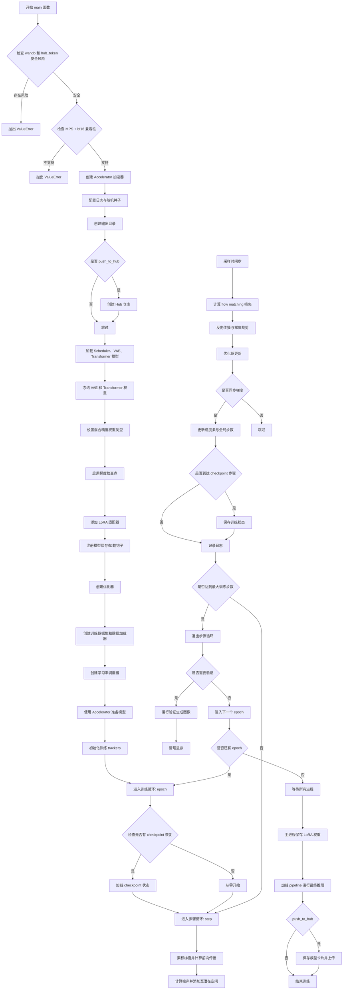

#### 带注释源码

```python
def main(args):
    """
    SD3 DreamBooth LoRA 训练主函数
    
    该函数执行完整的训练流程：
    1. 初始化分布式训练环境 (Accelerator)
    2. 加载预训练模型 (SD3 Transformer, VAE, Scheduler)
    3. 配置 LoRA 适配器并冻结原模型参数
    4. 创建数据集和数据加载器
    5. 执行多轮训练循环，包含梯度累积、检查点保存
    6. 周期性运行验证推理
    7. 保存训练好的 LoRA 权重并可选推送到 Hub
    
    参数:
        args: argparse.Namespace 对象，包含所有命令行参数
            - pretrained_model_name_or_path: 预训练模型路径
            - instance_data_dir: 实例数据目录
            - data_df_path: 嵌入向量 parquet 文件路径
            - instance_prompt: 实例提示词
            - output_dir: 输出目录
            - learning_rate: 学习率
            - train_batch_size: 训练批量大小
            - num_train_epochs: 训练轮数
            - max_train_steps: 最大训练步数
            - gradient_accumulation_steps: 梯度累积步数
            - rank: LoRA 秩
            - checkpointing_steps: 保存检查点间隔
            - validation_prompt: 验证提示词
            - num_validation_images: 验证图像数量
            - push_to_hub: 是否推送到 Hub
            - 等等其他参数
            
    返回值:
        None: 函数执行完成后直接退出
    """
    
    # ---------------------------
    # 阶段 1: 安全检查与环境验证
    # ---------------------------
    
    # 检查是否同时使用 wandb 报告和 hub_token，存在安全风险
    if args.report_to == "wandb" and args.hub_token is not None:
        raise ValueError(
            "You cannot use both --report_to=wandb and --hub_token due to a security risk of exposing your token."
            " Please use `hf auth login` to authenticate with the Hub."
        )

    # 检查 MPS (Apple Silicon) 是否支持 bfloat16
    # PyTorch 已知问题: MPS 暂不支持 bfloat16
    if torch.backends.mps.is_available() and args.mixed_precision == "bf16":
        raise ValueError(
            "Mixed precision training with bfloat16 is not supported on MPS. Please use fp16 (recommended) or fp32 instead."
        )

    # ---------------------------
    # 阶段 2: 初始化 Accelerator 分布式训练环境
    # ---------------------------
    
    # 构建日志目录路径
    logging_dir = Path(args.output_dir, args.logging_dir)

    # 配置 Accelerator 项目设置
    accelerator_project_config = ProjectConfiguration(
        project_dir=args.output_dir, 
        logging_dir=logging_dir
    )
    
    # 分布式训练参数：允许未使用的参数（LoRA 只修改部分层）
    kwargs = DistributedDataParallelKwargs(find_unused_parameters=True)
    
    # 创建 Accelerator 实例，管理分布式训练、混合精度、梯度累积
    accelerator = Accelerator(
        gradient_accumulation_steps=args.gradient_accumulation_steps,
        mixed_precision=args.mixed_precision,
        log_with=args.report_to,
        project_config=accelerator_project_config,
        kwargs_handlers=[kwargs],
    )

    # MPS 设备上禁用原生 AMP
    if torch.backends.mps.is_available():
        accelerator.native_amp = False

    # 验证 wandb 是否安装（如果使用 wandb 报告）
    if args.report_to == "wandb":
        if not is_wandb_available():
            raise ImportError("Make sure to install wandb if you want to use it for logging during training.")

    # ---------------------------
    # 阶段 3: 日志系统配置
    # ---------------------------
    
    # 配置基本日志格式
    logging.basicConfig(
        format="%(asctime)s - %(levelname)s - %(name)s - %(message)s",
        datefmt="%m/%d/%Y %H:%M:%S",
        level=logging.INFO,
    )
    
    # 打印分布式训练状态
    logger.info(accelerator.state, main_process_only=False)
    
    # 主进程设置详细日志，子进程设置错误日志
    if accelerator.is_local_main_process:
        transformers.utils.logging.set_verbosity_warning()
        diffusers.utils.logging.set_verbosity_info()
    else:
        transformers.utils.logging.set_verbosity_error()
        diffusers.utils.logging.set_verbosity_error()

    # 设置随机种子以确保可复现性
    if args.seed is not None:
        set_seed(args.seed)

    # ---------------------------
    # 阶段 4: 创建输出目录和 Hub 仓库
    # ---------------------------
    
    if accelerator.is_main_process:
        if args.output_dir is not None:
            os.makedirs(args.output_dir, exist_ok=True)

        # 如果需要推送到 Hugging Face Hub，创建远程仓库
        if args.push_to_hub:
            repo_id = create_repo(
                repo_id=args.hub_model_id or Path(args.output_dir).name,
                exist_ok=True,
            ).repo_id

    # ---------------------------
    # 阶段 5: 加载预训练模型
    # ---------------------------
    
    # 加载噪声调度器 (Flow Match Euler Discrete Scheduler)
    noise_scheduler = FlowMatchEulerDiscreteScheduler.from_pretrained(
        args.pretrained_model_name_or_path, 
        subfolder="scheduler"
    )
    
    # 创建调度器副本用于时间步采样（不参与训练）
    noise_scheduler_copy = copy.deepcopy(noise_scheduler)
    
    # 加载 VAE (变分自编码器) 用于图像编码到潜在空间
    vae = AutoencoderKL.from_pretrained(
        args.pretrained_model_name_or_path,
        subfolder="vae",
        revision=args.revision,
        variant=args.variant,
    )
    
    # 加载 SD3 Transformer 模型（去噪主干网络）
    transformer = SD3Transformer2DModel.from_pretrained(
        args.pretrained_model_name_or_path, 
        subfolder="transformer", 
        revision=args.revision, 
        variant=args.variant
    )

    # 冻结 VAE 和 Transformer 参数，不进行训练
    transformer.requires_grad_(False)
    vae.requires_grad_(False)

    # ---------------------------
    # 阶段 6: 配置混合精度训练
    # ---------------------------
    
    # 默认使用 float32
    weight_dtype = torch.float32
    
    # 根据混合精度配置设置权重数据类型
    if accelerator.mixed_precision == "fp16":
        weight_dtype = torch.float16
    elif accelerator.mixed_precision == "bf16":
        weight_dtype = torch.bfloat16

    # 再次检查 MPS 对 bfloat16 的支持
    if torch.backends.mps.is_available() and weight_dtype == torch.bfloat16:
        raise ValueError(
            "Mixed precision training with bfloat16 is not supported on MPS. Please use fp16 (recommended) or fp32 instead."
        )

    # 将模型移动到加速器设备并设置数据类型
    vae.to(accelerator.device, dtype=torch.float32)  # VAE 始终使用 float32
    transformer.to(accelerator.device, dtype=weight_dtype)

    # ---------------------------
    # 阶段 7: 配置 LoRA 适配器
    # ---------------------------
    
    # 启用梯度检查点以节省显存
    if args.gradient_checkpointing:
        transformer.enable_gradient_checkpointing()

    # 配置 LoRA 参数
    # r (rank): LoRA 更新矩阵的维度
    # target_modules: 要应用 LoRA 的注意力层模块
    transformer_lora_config = LoraConfig(
        r=args.rank,
        lora_alpha=args.rank,
        init_lora_weights="gaussian",
        target_modules=["to_k", "to_q", "to_v", "to_out.0"],
    )
    
    # 将 LoRA 适配器添加到 Transformer 模型
    transformer.add_adapter(transformer_lora_config)

    # 辅助函数：解包模型（处理编译后的模型）
    def unwrap_model(model):
        model = accelerator.unwrap_model(model)
        model = model._orig_mod if is_compiled_module(model) else model
        return model

    # ---------------------------
    # 阶段 8: 注册模型保存/加载钩子
    # ---------------------------
    
    # 自定义保存钩子：只保存 LoRA 权重
    def save_model_hook(models, weights, output_dir):
        if accelerator.is_main_process:
            transformer_lora_layers_to_save = None
            for model in models:
                if isinstance(model, type(unwrap_model(transformer))):
                    # 获取 PEFT 格式的 LoRA 权重
                    transformer_lora_layers_to_save = get_peft_model_state_dict(model)
                else:
                    raise ValueError(f"unexpected save model: {model.__class__}")

                # 弹出权重防止重复保存
                weights.pop()

            # 使用 StableDiffusion3Pipeline 保存 LoRA 权重
            StableDiffusion3Pipeline.save_lora_weights(
                output_dir,
                transformer_lora_layers=transformer_lora_layers_to_save,
            )

    # 自定义加载钩子：从检查点恢复 LoRA 权重
    def load_model_hook(models, input_dir):
        transformer_ = None

        while len(models) > 0:
            model = models.pop()

            if isinstance(model, type(unwrap_model(transformer))):
                transformer_ = model
            else:
                raise ValueError(f"unexpected save model: {model.__class__}")

        # 加载 LoRA 状态字典
        lora_state_dict = StableDiffusion3Pipeline.lora_state_dict(input_dir)

        # 转换状态字典键名以适配 PEFT 格式
        transformer_state_dict = {
            f"{k.replace('transformer.', '')}": v 
            for k, v in lora_state_dict.items() 
            if k.startswith("transformer.")
        }
        transformer_state_dict = convert_unet_state_dict_to_peft(transformer_state_dict)
        
        # 设置 PEFT 模型状态字典
        incompatible_keys = set_peft_model_state_dict(
            transformer_, 
            transformer_state_dict, 
            adapter_name="default"
        )
        
        # 检查不兼容的键
        if incompatible_keys is not None:
            unexpected_keys = getattr(incompatible_keys, "unexpected_keys", None)
            if unexpected_keys:
                logger.warning(
                    f"Loading adapter weights from state_dict led to unexpected keys not found in the model: "
                    f" {unexpected_keys}. "
                )

        # 确保可训练参数为 float32（LoRA 权重）
        if args.mixed_precision == "fp16":
            models = [transformer_]
            cast_training_params(models)

    # 注册保存和加载钩子到 Accelerator
    accelerator.register_save_state_pre_hook(save_model_hook)
    accelerator.register_load_state_pre_hook(load_model_hook)

    # ---------------------------
    # 阶段 9: 配置优化器和学习率
    # ---------------------------
    
    # 启用 TF32 加速（ Ampere GPU）
    if args.allow_tf32 and torch.cuda.is_available():
        torch.backends.cuda.matmul.allow_tf32 = True

    # 缩放学习率（考虑 GPU 数量、梯度累积、批量大小）
    if args.scale_lr:
        args.learning_rate = (
            args.learning_rate 
            * args.gradient_accumulation_steps 
            * args.train_batch_size 
            * accelerator.num_processes
        )

    # 确保可训练参数为 float32
    if args.mixed_precision == "fp16":
        models = [transformer]
        cast_training_params(models, dtype=torch.float32)

    # 获取可训练的 LoRA 参数
    transformer_lora_parameters = list(filter(
        lambda p: p.requires_grad, 
        transformer.parameters()
    ))
    
    # 配置优化器参数组
    transformer_parameters_with_lr = {
        "params": transformer_lora_parameters, 
        "lr": args.learning_rate
    }
    params_to_optimize = [transformer_parameters_with_lr]

    # 创建优化器
    if not args.optimizer.lower() == "adamw":
        logger.warning(
            f"Unsupported choice of optimizer: {args.optimizer}. Supported optimizers include [adamW]."
            "Defaulting to adamW"
        )
        args.optimizer = "adamw"

    # 检查 8-bit Adam 配置
    if args.use_8bit_adam and not args.optimizer.lower() == "adamw":
        logger.warning(
            f"use_8bit_adam is ignored when optimizer is not set to 'AdamW'. Optimizer was "
            f"set to {args.optimizer.lower()}"
        )

    # 实例化优化器
    if args.optimizer.lower() == "adamw":
        if args.use_8bit_adam:
            try:
                import bitsandbytes as bnb
            except ImportError:
                raise ImportError(
                    "To use 8-bit Adam, please install the bitsandbytes library: `pip install bitsandbytes`."
                )
            optimizer_class = bnb.optim.AdamW8bit
        else:
            optimizer_class = torch.optim.AdamW

        optimizer = optimizer_class(
            params_to_optimize,
            betas=(args.adam_beta1, args.adam_beta2),
            weight_decay=args.adam_weight_decay,
            eps=args.adam_epsilon,
        )

    # ---------------------------
    # 阶段 10: 创建数据集和数据加载器
    # ---------------------------
    
    # 实例化 DreamBooth 数据集
    train_dataset = DreamBoothDataset(
        data_df_path=args.data_df_path,
        instance_data_root=args.instance_data_dir,
        instance_prompt=args.instance_prompt,
        size=args.resolution,
        center_crop=args.center_crop,
    )

    # 创建 DataLoader
    train_dataloader = torch.utils.data.DataLoader(
        train_dataset,
        batch_size=args.train_batch_size,
        shuffle=True,
        collate_fn=lambda examples: collate_fn(examples),
        num_workers=args.dataloader_num_workers,
    )

    # ---------------------------
    # 阶段 11: 配置学习率调度器
    # ---------------------------
    
    overrode_max_train_steps = False
    
    # 计算每轮的更新步数
    num_update_steps_per_epoch = math.ceil(
        len(train_dataloader) / args.gradient_accumulation_steps
    )
    
    # 如果未指定最大步数，则根据轮数计算
    if args.max_train_steps is None:
        args.max_train_steps = args.num_train_epochs * num_update_steps_per_epoch
        overrode_max_train_steps = True

    # 创建学习率调度器
    lr_scheduler = get_scheduler(
        args.lr_scheduler,
        optimizer=optimizer,
        num_warmup_steps=args.lr_warmup_steps * accelerator.num_processes,
        num_training_steps=args.max_train_steps * accelerator.num_processes,
        num_cycles=args.lr_num_cycles,
        power=args.lr_power,
    )

    # ---------------------------
    # 阶段 12: 使用 Accelerator 准备模型
    # ---------------------------
    
    transformer, optimizer, train_dataloader, lr_scheduler = accelerator.prepare(
        transformer, optimizer, train_dataloader, lr_scheduler
    )

    # 重新计算训练步数（DataLoader 大小可能因 Accelerator 而改变）
    num_update_steps_per_epoch = math.ceil(
        len(train_dataloader) / args.gradient_accumulation_steps
    )
    
    if overrode_max_train_steps:
        args.max_train_steps = args.num_train_epochs * num_update_steps_per_epoch
    
    # 重新计算训练轮数
    args.num_train_epochs = math.ceil(args.max_train_steps / num_update_steps_per_epoch)

    # ---------------------------
    # 阶段 13: 初始化训练 trackers
    # ---------------------------
    
    if accelerator.is_main_process:
        tracker_name = "dreambooth-sd3-lora-miniature"
        accelerator.init_trackers(tracker_name, config=vars(args))

    # ---------------------------
    # 阶段 14: 训练循环
    # ---------------------------
    
    total_batch_size = (
        args.train_batch_size 
        * accelerator.num_processes 
        * args.gradient_accumulation_steps
    )

    logger.info("***** Running training *****")
    logger.info(f"  Num examples = {len(train_dataset)}")
    logger.info(f"  Num batches each epoch = {len(train_dataloader)}")
    logger.info(f"  Num Epochs = {args.num_train_epochs}")
    logger.info(f"  Instantaneous batch size per device = {args.train_batch_size}")
    logger.info(f"  Total train batch size (w. parallel, distributed & accumulation) = {total_batch_size}")
    logger.info(f"  Gradient Accumulation steps = {args.gradient_accumulation_steps}")
    logger.info(f"  Total optimization steps = {args.max_train_steps}")
    
    global_step = 0
    first_epoch = 0

    # ---------------------------
    # 检查点恢复逻辑
    # ---------------------------
    
    if args.resume_from_checkpoint:
        if args.resume_from_checkpoint != "latest":
            path = os.path.basename(args.resume_from_checkpoint)
        else:
            # 查找最新的检查点
            dirs = os.listdir(args.output_dir)
            dirs = [d for d in dirs if d.startswith("checkpoint")]
            dirs = sorted(dirs, key=lambda x: int(x.split("-")[1]))
            path = dirs[-1] if len(dirs) > 0 else None

        if path is None:
            accelerator.print(
                f"Checkpoint '{args.resume_from_checkpoint}' does not exist. Starting a new training run."
            )
            args.resume_from_checkpoint = None
            initial_global_step = 0
        else:
            accelerator.print(f"Resuming from checkpoint {path}")
            accelerator.load_state(os.path.join(args.output_dir, path))
            global_step = int(path.split("-")[1])
            initial_global_step = global_step
            first_epoch = global_step // num_update_steps_per_epoch
    else:
        initial_global_step = 0

    # 创建进度条
    progress_bar = tqdm(
        range(0, args.max_train_steps),
        initial=initial_global_step,
        desc="Steps",
        disable=not accelerator.is_local_main_process,
    )

    # 辅助函数：获取噪声调度器的 sigma 值
    def get_sigmas(timesteps, n_dim=4, dtype=torch.float32):
        sigmas = noise_scheduler_copy.sigmas.to(device=accelerator.device, dtype=dtype)
        schedule_timesteps = noise_scheduler_copy.timesteps.to(accelerator.device)
        timesteps = timesteps.to(accelerator.device)
        
        # 查找每个时间步在调度器中的索引
        step_indices = [
            (schedule_timesteps == t).nonzero().item() 
            for t in timesteps
        ]
        
        sigma = sigmas[step_indices].flatten()
        while len(sigma.shape) < n_dim:
            sigma = sigma.unsqueeze(-1)
        return sigma

    # ==================== 训练主循环 ====================
    
    for epoch in range(first_epoch, args.num_train_epochs):
        transformer.train()  # 设置为训练模式

        for step, batch in enumerate(train_dataloader):
            models_to_accumulate = [transformer]
            
            # 梯度累积上下文
            with accelerator.accumulate(models_to_accumulate):
                # 获取批次数据并转换为 VAE 需要的数据类型
                pixel_values = batch["pixel_values"].to(dtype=vae.dtype)

                # ---- 阶段 14.1: 图像编码到潜在空间 ----
                model_input = vae.encode(pixel_values).latent_dist.sample()
                model_input = model_input * vae.config.scaling_factor
                model_input = model_input.to(dtype=weight_dtype)

                # ---- 阶段 14.2: 添加噪声 ----
                noise = torch.randn_like(model_input)
                bsz = model_input.shape[0]

                # ---- 阶段 14.3: 采样时间步 ----
                # 使用加权采样方案（非均匀时间步采样）
                u = compute_density_for_timestep_sampling(
                    weighting_scheme=args.weighting_scheme,
                    batch_size=bsz,
                    logit_mean=args.logit_mean,
                    logit_std=args.logit_std,
                    mode_scale=args.mode_scale,
                )
                indices = (u * noise_scheduler_copy.config.num_train_timesteps).long()
                timesteps = noise_scheduler_copy.timesteps[indices].to(
                    device=model_input.device
                )

                # ---- 阶段 14.4: Flow Matching 前向过程 ----
                # 根据 sigma 值混合噪声和原始数据
                sigmas = get_sigmas(timesteps, n_dim=model_input.ndim, dtype=model_input.dtype)
                noisy_model_input = sigmas * noise + (1.0 - sigmas) * model_input

                # ---- 阶段 14.5: 模型预测 ----
                prompt_embeds = batch["prompt_embeds"].to(
                    device=accelerator.device, 
                    dtype=weight_dtype
                )
                pooled_prompt_embeds = batch["pooled_prompt_embeds"].to(
                    device=accelerator.device, 
                    dtype=weight_dtype
                )
                
                # Transformer 前向传播预测噪声
                model_pred = transformer(
                    hidden_states=noisy_model_input,
                    timestep=timesteps,
                    encoder_hidden_states=prompt_embeds,
                    pooled_projections=pooled_prompt_embeds,
                    return_dict=False,
                )[0]

                # ---- 阶段 14.6: 输出预处理 ----
                # 根据 Section 5 of https://huggingface.co/papers/2206.00364
                # 对模型输出进行预处理
                model_pred = model_pred * (-sigmas) + noisy_model_input

                # ---- 阶段 14.7: 计算损失权重 ----
                # 不同采样方案使用不同的损失权重
                weighting = compute_loss_weighting_for_sd3(
                    weighting_scheme=args.weighting_scheme, 
                    sigmas=sigmas
                )

                # Flow Matching 目标：原始干净数据
                target = model_input

                # ---- 阶段 14.8: 计算损失 ----
                loss = torch.mean(
                    (weighting.float() * (model_pred.float() - target.float()) ** 2).reshape(
                        target.shape[0], -1
                    ),
                    1,
                )
                loss = loss.mean()

                # ---- 阶段 14.9: 反向传播 ----
                accelerator.backward(loss)

                # ---- 阶段 14.10: 梯度裁剪 ----
                if accelerator.sync_gradients:
                    params_to_clip = transformer_lora_parameters
                    accelerator.clip_grad_norm_(params_to_clip, args.max_grad_norm)

                # ---- 阶段 14.11: 优化器更新 ----
                optimizer.step()
                lr_scheduler.step()
                optimizer.zero_grad()

            # ---- 阶段 14.12: 检查同步和保存检查点 ----
            if accelerator.sync_gradients:
                progress_bar.update(1)
                global_step += 1

                # 检查点保存逻辑
                if accelerator.is_main_process:
                    if global_step % args.checkpointing_steps == 0:
                        # 检查是否超过最大检查点数量限制
                        if args.checkpoints_total_limit is not None:
                            checkpoints = os.listdir(args.output_dir)
                            checkpoints = [
                                d for d in checkpoints 
                                if d.startswith("checkpoint")
                            ]
                            checkpoints = sorted(
                                checkpoints, 
                                key=lambda x: int(x.split("-")[1])
                            )

                            # 删除多余的旧检查点
                            if len(checkpoints) >= args.checkpoints_total_limit:
                                num_to_remove = (
                                    len(checkpoints) 
                                    - args.checkpoints_total_limit 
                                    + 1
                                )
                                removing_checkpoints = checkpoints[0:num_to_remove]

                                logger.info(
                                    f"{len(checkpoints)} checkpoints already exist, "
                                    f"removing {len(removing_checkpoints)} checkpoints"
                                )
                                logger.info(
                                    f"removing checkpoints: {', '.join(removing_checkpoints)}"
                                )

                                for removing_checkpoint in removing_checkpoints:
                                    removing_checkpoint = os.path.join(
                                        args.output_dir, 
                                        removing_checkpoint
                                    )
                                    shutil.rmtree(removing_checkpoint)

                        # 保存检查点
                        save_path = os.path.join(
                            args.output_dir, 
                            f"checkpoint-{global_step}"
                        )
                        accelerator.save_state(save_path)
                        logger.info(f"Saved state to {save_path}")

            # ---- 阶段 14.13: 记录日志 ----
            logs = {
                "loss": loss.detach().item(), 
                "lr": lr_scheduler.get_last_lr()[0]
            }
            progress_bar.set_postfix(**logs)
            accelerator.log(logs, step=global_step)

            # 检查是否达到最大训练步数
            if global_step >= args.max_train_steps:
                break

        # ---------------------------
        # 阶段 15: 验证循环
        # ---------------------------
        
        if accelerator.is_main_process:
            # 周期性验证
            if args.validation_prompt is not None and epoch % args.validation_epochs == 0:
                # 创建推理 pipeline
                pipeline = StableDiffusion3Pipeline.from_pretrained(
                    args.pretrained_model_name_or_path,
                    vae=vae,
                    transformer=accelerator.unwrap_model(transformer),
                    revision=args.revision,
                    variant=args.variant,
                    torch_dtype=weight_dtype,
                )
                pipeline_args = {"prompt": args.validation_prompt}
                
                # 运行验证
                images = log_validation(
                    pipeline=pipeline,
                    args=args,
                    accelerator=accelerator,
                    pipeline_args=pipeline_args,
                    epoch=epoch,
                )
                
                # 清理显存
                torch.cuda.empty_cache()
                gc.collect()

    # ---------------------------
    # 阶段 16: 保存最终模型
    # ---------------------------
    
    accelerator.wait_for_everyone()
    
    if accelerator.is_main_process:
        # 解包模型并转换为 float32
        transformer = unwrap_model(transformer)
        transformer = transformer.to(torch.float32)
        
        # 获取 LoRA 权重
        transformer_lora_layers = get_peft_model_state_dict(transformer)

        # 保存 LoRA 权重
        StableDiffusion3Pipeline.save_lora_weights(
            save_directory=args.output_dir,
            transformer_lora_layers=transformer_lora_layers,
        )

        # ---------------------------
        # 阶段 17: 最终推理验证
        # ---------------------------
        
        # 加载 pipeline 进行最终推理
        pipeline = StableDiffusion3Pipeline.from_pretrained(
            args.pretrained_model_name_or_path,
            revision=args.revision,
            variant=args.variant,
            torch_dtype=weight_dtype,
        )
        
        # 加载训练好的 LoRA 权重
        pipeline.load_lora_weights(args.output_dir)

        # 运行最终验证推理
        images = []
        if args.validation_prompt and args.num_validation_images > 0:
            pipeline_args = {"prompt": args.validation_prompt}
            images = log_validation(
                pipeline=pipeline,
                args=args,
                accelerator=accelerator,
                pipeline_args=pipeline_args,
                epoch=epoch,
                is_final_validation=True,
            )

        # ---------------------------
        # 阶段 18: 推送到 Hub
        # ---------------------------
        
        if args.push_to_hub:
            # 保存模型卡片
            save_model_card(
                repo_id,
                images=images,
                base_model=args.pretrained_model_name_or_path,
                instance_prompt=args.instance_prompt,
                validation_prompt=args.validation_prompt,
                repo_folder=args.output_dir,
            )
            
            # 上传文件夹到 Hub
            upload_folder(
                repo_id=repo_id,
                folder_path=args.output_dir,
                commit_message="End of training",
                ignore_patterns=["step_*", "epoch_*"],
            )

    # 结束训练
    accelerator.end_training()
```


### `unwrap_model`

该函数是Stable Diffusion 3 DreamBooth LoRA训练脚本中的内部辅助函数，用于将加速器包装的模型解包为原始模型，以便进行模型状态的保存和加载操作。如果模型是经过torch.compile编译的模块，它会额外提取`_orig_mod`属性获取编译前的原始模型。

参数：

- `model`：任意模型类型，需要解包的模型对象，通常是经过Accelerator包装的Transformer模型

返回值：`任意模型类型`，返回解包后的模型，可能是原始模型或编译模块的原始模型

#### 流程图

```mermaid
flowchart TD
    A[开始: 传入model] --> B[调用accelerator.unwrap_model]
    B --> C{is_compiled_module(model)?}
    C -->|是| D[返回model._orig_mod]
    C -->|否| E[返回model]
    D --> F[结束: 返回解包后的模型]
    E --> F
```

#### 带注释源码

```python
def unwrap_model(model):
    """
    解包加速器包装的模型，获取原始模型用于保存/加载状态
    
    参数:
        model: 经过Accelerator包装的模型对象
        
    返回:
        解包后的模型，如果是编译模块则返回原始未编译的模型
    """
    # 第一步：使用accelerator的unwrap_model方法解包模型
    # 这会移除DistributedDataParallel等分布式训练包装
    model = accelerator.unwrap_model(model)
    
    # 第二步：检查模型是否是torch.compile编译的模块
    # 如果是编译模块，需要获取._orig_mod属性来获取原始模型
    # 这是因为编译后的模型结构可能与原始模型不同
    model = model._orig_mod if is_compiled_module(model) else model
    
    # 返回解包后的模型
    return model
```


### `save_model_hook`

这是一个在 `main` 函数内部定义的内部函数（闭包），作为 Accelerate 的保存状态前置钩子使用，用于在分布式训练过程中保存 Transformer 的 LoRA 权重。它遍历传入的模型列表，提取 PEFT 格式的 LoRA 状态字典，并调用 `StableDiffusion3Pipeline.save_lora_weights` 将其保存到指定目录。

参数：

- `models`：`List[torch.nn.Module]`（或 `accelerator` 传入的模型列表），需要保存的模型列表，通常包含带有 LoRA adapter 的 Transformer 模型
- `weights`：`List`，权重列表，传递给 `accelerator.save_state`，该函数会将权重弹出以避免重复保存
- `output_dir`：`str`，保存 LoRA 权重的目标目录路径

返回值：`None`，该函数没有显式返回值，仅执行保存操作

#### 流程图

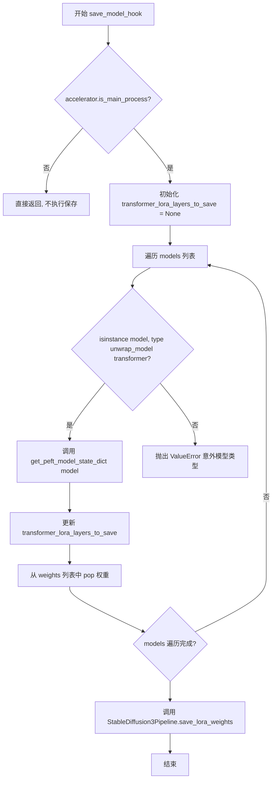

#### 带注释源码

```python
def save_model_hook(models, weights, output_dir):
    """
    自定义保存模型钩子，用于保存 LoRA 权重。
    
    参数:
        models: Accelerator 传递的模型列表
        weights: 权重列表，用于避免重复保存
        output_dir: 输出目录路径
    """
    # 仅在主进程执行保存操作，避免多进程重复写入
    if accelerator.is_main_process:
        # 初始化为 None，用于存储 LoRA 层状态字典
        transformer_lora_layers_to_save = None
        
        # 遍历需要保存的所有模型
        for model in models:
            # 检查模型类型是否与原始 Transformer 模型类型匹配
            if isinstance(model, type(unwrap_model(transformer))):
                # 使用 PEFT 工具函数获取可训练 LoRA 层的状态字典
                transformer_lora_layers_to_save = get_peft_model_state_dict(model)
            else:
                # 遇到意外模型类型时抛出错误
                raise ValueError(f"unexpected save model: {model.__class__}")

            # 弹出权重，确保对应模型不会被 accelerator 再次保存
            # 这是一个关键步骤，防止重复序列化
            weights.pop()

        # 调用 StableDiffusion3Pipeline 的静态方法保存 LoRA 权重
        # 保存格式为 SafeTensor (.safetensors)
        StableDiffusion3Pipeline.save_lora_weights(
            output_dir,
            transformer_lora_layers=transformer_lora_layers_to_save,
        )
```


### `load_model_hook`

该函数是一个内部嵌套函数，用于在分布式训练环境中从检查点恢复模型状态时加载LoRA（Low-Rank Adaptation）适配器权重。它负责从磁盘读取LORA权重、将其转换为PEFT格式并注入到transformer模型中，同时处理参数类型转换以确保训练兼容性。

参数：

-  `models`：`list`，模型列表，由Accelerator传递，包含需要加载权重的模型对象
-  `input_dir`：`str`，检查点目录路径，包含保存的LORA权重文件

返回值：`None`，该函数通过副作用修改模型对象，不直接返回值

#### 流程图

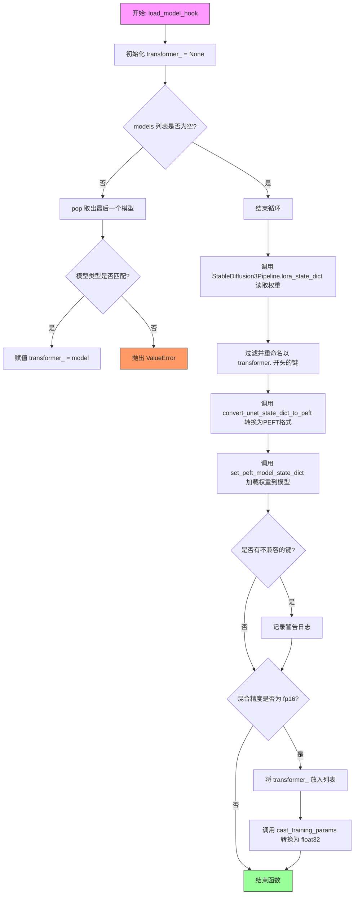

#### 带注释源码

```python
def load_model_hook(models, input_dir):
    """
    加载模型状态的钩子函数，用于从检查点恢复训练时加载LORA权重
    
    参数:
        models: Accelerator传递的模型列表
        input_dir: 检查点目录路径
    """
    # 初始化transformer模型引用为None
    transformer_ = None

    # 遍历models列表，取出模型对象
    while len(models) > 0:
        model = models.pop()

        # 检查模型类型是否与原始transformer匹配
        if isinstance(model, type(unwrap_model(transformer))):
            # 找到目标transformer模型
            transformer_ = model
        else:
            # 抛出类型不匹配的异常
            raise ValueError(f"unexpected save model: {model.__class__}")

    # 从指定目录读取LORA状态字典
    lora_state_dict = StableDiffusion3Pipeline.lora_state_dict(input_dir)

    # 过滤并重命名state_dict中的键
    # 只保留以'transformer.'开头的键，并移除前缀
    transformer_state_dict = {
        f"{k.replace('transformer.', '')}": v 
        for k, v in lora_state_dict.items() 
        if k.startswith("transformer.")
    }
    
    # 将UNet状态字典格式转换为PEFT格式
    transformer_state_dict = convert_unet_state_dict_to_peft(transformer_state_dict)
    
    # 将LORA权重加载到transformer模型
    incompatible_keys = set_peft_model_state_dict(
        transformer_, 
        transformer_state_dict, 
        adapter_name="default"
    )
    
    # 检查是否有不兼容的键
    if incompatible_keys is not None:
        # 只检查意外出现的键
        unexpected_keys = getattr(incompatible_keys, "unexpected_keys", None)
        if unexpected_keys:
            logger.warning(
                f"Loading adapter weights from state_dict led to unexpected keys not found in the model: "
                f" {unexpected_keys}. "
            )

    # 确保可训练参数为float32
    # 这是因为基础模型使用的是weight_dtype
    # 详情参考: https://github.com/huggingface/diffusers/pull/6514#discussion_r1449796804
    if args.mixed_precision == "fp16":
        models = [transformer_]
        # 只将可训练参数（LoRA）转换为fp32
        cast_training_params(models)
```


### `get_sigmas`

该函数是 `main` 函数内部的嵌套函数，用于根据给定的时间步（timesteps）从噪声调度器的 sigma 调度中获取对应的 sigma 值，并将其reshape为目标维度数。

参数：

- `timesteps`：`torch.Tensor`，输入的时间步张量，表示当前训练批次中每个样本的时间步
- `n_dim`：`int`，默认为 4，目标输出张量的维度数，用于后续与模型输入进行运算
- `dtype`：`torch.dtype`，默认为 `torch.float32`，返回的 sigma 张量的数据类型

返回值：`torch.Tensor`，与输入 timesteps 对应的 sigma 值张量，维度为 `n_dim`

#### 流程图

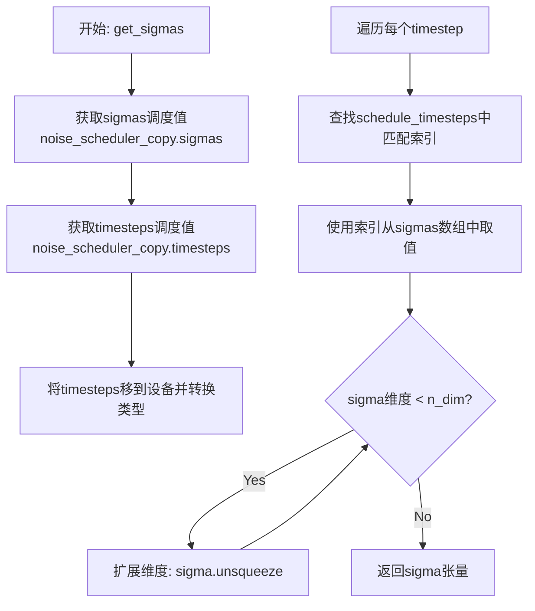

#### 带注释源码

```python
def get_sigmas(timesteps, n_dim=4, dtype=torch.float32):
    """
    根据时间步获取对应的sigma值
    
    参数:
        timesteps: 输入的时间步张量
        n_dim: 目标输出维度数
        dtype: 输出数据类型
    
    返回:
        对应时间步的sigma张量
    """
    # 从噪声调度器的副本中获取预计算的sigma值，并转移到指定设备
    sigmas = noise_scheduler_copy.sigmas.to(device=accelerator.device, dtype=dtype)
    
    # 获取噪声调度器中的完整时间步序列
    schedule_timesteps = noise_scheduler_copy.timesteps.to(accelerator.device)
    
    # 确保输入的timesteps在正确的设备和数据类型上
    timesteps = timesteps.to(accelerator.device)
    
    # 对于每个输入的时间步，找到其在调度时间步序列中的索引位置
    # 并通过索引从sigma数组中提取对应的sigma值
    step_indices = [(schedule_timesteps == t).nonzero().item() for t in timesteps]
    
    # 使用索引数组从sigma调度中获取对应的sigma值
    sigma = sigmas[step_indices].flatten()
    
    # 通过unsqueeze操作将sigma张量扩展到目标维度数
    # 确保后续能够与模型输入进行正确的数学运算
    while len(sigma.shape) < n_dim:
        sigma = sigma.unsqueeze(-1)
    
    return sigma
```


### `DreamBoothDataset.__init__`

该方法是 `DreamBoothDataset` 类的构造函数，用于初始化 DreamBooth 训练数据集。它负责加载实例图像、生成图像哈希、预处理图像（调整大小、裁剪、归一化）以及从预计算的文件中映射文本嵌入。

参数：

- `data_df_path`：`str`，指向包含图像嵌入的 Parquet 文件路径（由 compute_embeddings.py 生成）
- `instance_data_root`：`str`，实例图像所在目录的路径
- `instance_prompt`：`str`，与实例关联的提示词，用于标识特定实例
- `size`：`int`（默认值 1024），目标图像分辨率
- `center_crop`：`bool`（默认值 False），是否对图像进行中心裁剪

返回值：`None`，构造函数无返回值

#### 流程图

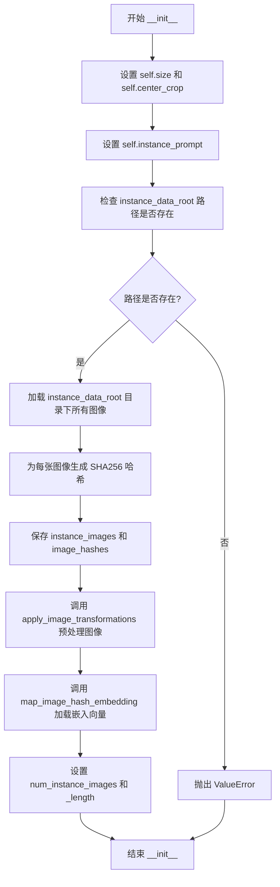

#### 带注释源码

```python
def __init__(
    self,
    data_df_path,
    instance_data_root,
    instance_prompt,
    size=1024,
    center_crop=False,
):
    """
    初始化 DreamBooth 数据集
    
    参数:
        data_df_path: 包含预计算文本嵌入的 Parquet 文件路径
        instance_data_root: 实例图像所在目录
        instance_prompt: 实例提示词
        size: 目标图像尺寸（默认 1024）
        center_crop: 是否使用中心裁剪（默认 False）
    """
    # 物流配置：设置图像尺寸和裁剪方式
    self.size = size
    self.center_crop = center_crop

    # 保存实例提示词
    self.instance_prompt = instance_prompt
    
    # 将实例数据根目录转换为 Path 对象
    self.instance_data_root = Path(instance_data_root)
    
    # 验证实例图像目录是否存在，不存在则抛出异常
    if not self.instance_data_root.exists():
        raise ValueError("Instance images root doesn't exists.")

    # ===== 加载图像 =====
    # 遍历实例数据目录，获取所有图像文件并以 PIL Image 形式加载
    instance_images = [Image.open(path) for path in list(Path(instance_data_root).iterdir())]
    
    # 为每张图像生成 SHA256 哈希值，用于关联对应的文本嵌入
    image_hashes = [self.generate_image_hash(path) for path in list(Path(instance_data_root).iterdir())]
    
    # 保存原始图像对象和对应的哈希值列表
    self.instance_images = instance_images
    self.image_hashes = image_hashes

    # ===== 图像预处理 =====
    # 应用图像变换：调整大小、裁剪、翻转、归一化等
    self.pixel_values = self.apply_image_transformations(
        instance_images=instance_images, size=size, center_crop=center_crop
    )

    # ===== 加载文本嵌入 =====
    # 从 Parquet 文件中读取嵌入向量，建立图像哈希到嵌入的映射字典
    self.data_dict = self.map_image_hash_embedding(data_df_path=data_df_path)

    # 设置数据集长度属性
    self.num_instance_images = len(instance_images)
    self._length = self.num_instance_images
```


### `DreamBoothDataset.__len__`

该方法为 `torch.utils.data.Dataset` 协议的核心实现，返回数据集中实例图像的数量，供 DataLoader 确定数据集大小和迭代次数。

参数： 无

返回值： `int`，返回数据集中实例图像的总数

#### 流程图

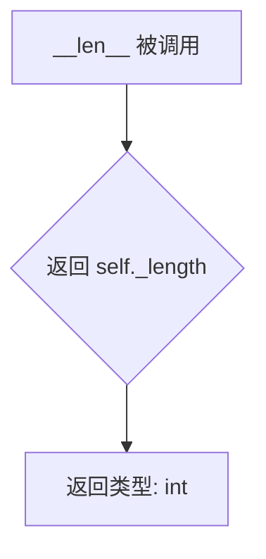

#### 带注释源码

```python
def __len__(self):
    """
    返回数据集中实例图像的数量。
    该方法实现了 Dataset 类的协议，使 DataLoader 能够确定数据集的大小。
    
    注意事项：
    - _length 在 __init__ 中被设置为 num_instance_images
    - num_instance_images 是通过 len(instance_images) 计算的
    - 返回值用于 DataLoader 迭代次数的计算
    """
    return self._length
```


### `DreamBoothDataset.__getitem__`

该方法是 DreamBoothDataset 类的核心数据访问方法，负责根据给定索引返回训练样本，包括预处理后的图像像素值和对应的文本嵌入向量（prompt_embeds 和 pooled_prompt_embeds）。

参数：

-  `index`：`int`，数据集中样本的索引位置，用于检索对应的训练数据

返回值：`dict`，包含三个键的字典：
  - `instance_images`：预处理后的图像张量
  - `prompt_embeds`：文本提示的嵌入向量
  - `pooled_prompt_embeds`：池化后的文本提示嵌入向量

#### 流程图

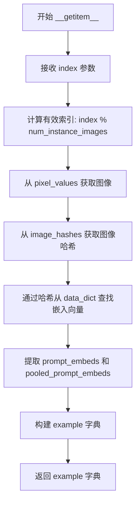

#### 带注释源码

```python
def __getitem__(self, index):
    """
    根据给定索引获取训练样本。
    
    该方法实现了 PyTorch Dataset 协议的核心接口，
    用于 DataLoader 按需获取单个训练样本。
    
    参数:
        index: 数据集中的索引位置
        
    返回:
        包含图像和文本嵌入的字典，供模型训练使用
    """
    # 初始化空字典用于存放样本数据
    example = {}
    
    # 使用取模运算处理索引循环，确保索引在有效范围内
    # 当 index 超过数据集大小时自动循环回绕
    valid_index = index % self.num_instance_images
    
    # 取出预处理后的图像像素值（已转换为张量并归一化）
    instance_image = self.pixel_values[valid_index]
    
    # 获取对应图像的 SHA256 哈希值，用于查找预计算的文本嵌入
    image_hash = self.image_hashes[valid_index]
    
    # 从预加载的嵌入字典中查找该图像对应的文本嵌入
    # data_dict 键为 image_hash，值为 (prompt_embeds, pooled_prompt_embeds) 元组
    prompt_embeds, pooled_prompt_embeds = self.data_dict[image_hash]
    
    # 构建返回样本字典，包含训练所需的所有数据
    example["instance_images"] = instance_image      # 预处理后的图像张量
    example["prompt_embeds"] = prompt_embeds          # 文本提示嵌入 [154, 4096]
    example["pooled_prompt_embeds"] = pooled_prompt_embeds  # 池化文本嵌入 [2048]
    
    # 返回样本字典，由 collate_fn 进一步处理为批次
    return example
```


### `DreamBoothDataset.apply_image_transformations`

该方法负责将输入的实例图像应用一系列预处理变换，包括EXIF转置、RGB转换、调整大小、随机水平翻转、中心裁剪或随机裁剪，以及归一化处理，最终返回处理后的像素值列表。

**参数：**

- `self`：`DreamBoothDataset`，类实例本身
- `instance_images`：`list[Image.Image]`，需要处理的PIL图像列表
- `size`：`int`，目标分辨率大小
- `center_crop`：`bool`，是否进行中心裁剪

**返回值：** `list[torch.Tensor]`，处理后的图像像素值列表，每个元素为一个归一化后的张量

#### 流程图

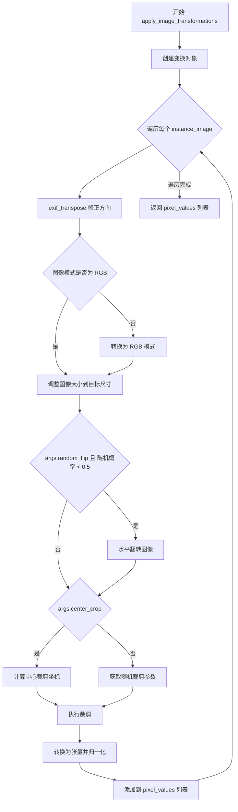

#### 带注释源码

```python
def apply_image_transformations(self, instance_images, size, center_crop):
    """
    对输入的图像实例应用一系列图像变换预处理操作
    
    参数:
        instance_images: 需要处理的PIL图像列表
        size: 目标分辨率大小
        center_crop: 是否进行中心裁剪
    
    返回:
        pixel_values: 处理后的图像张量列表
    """
    # 初始化存储像素值的列表
    pixel_values = []

    # 创建图像调整大小变换，使用双线性插值
    train_resize = transforms.Resize(size, interpolation=transforms.InterpolationMode.BILINEAR)
    
    # 根据center_crop参数选择裁剪方式：中心裁剪或随机裁剪
    train_crop = transforms.CenterCrop(size) if center_crop else transforms.RandomCrop(size)
    
    # 创建水平翻转变换，概率设为1.0（始终翻转，但实际由random_flip参数控制）
    train_flip = transforms.RandomHorizontalFlip(p=1.0)
    
    # 创建最终变换组合：转换为张量并归一化到[-1, 1]
    train_transforms = transforms.Compose(
        [
            transforms.ToTensor(),  # 将PIL图像转换为PyTorch张量
            transforms.Normalize([0.5], [0.5]),  # 归一化到[-1, 1]
        ]
    )
    
    # 遍历每一张输入图像进行处理
    for image in instance_images:
        # 使用exif_transpose修正图像方向（根据EXIF信息自动旋转）
        image = exif_transpose(image)
        
        # 确保图像为RGB模式（非RGBA、灰度等）
        if not image.mode == "RGB":
            image = image.convert("RGB")
        
        # 调整图像大小到目标分辨率
        image = train_resize(image)
        
        # 根据参数随机决定是否进行水平翻转
        if args.random_flip and random.random() < 0.5:
            # flip
            image = train_flip(image)
        
        # 根据参数决定裁剪方式
        if args.center_crop:
            # 计算中心裁剪的左上角坐标
            y1 = max(0, int(round((image.height - args.resolution) / 2.0)))
            x1 = max(0, int(round((image.width - args.resolution) / 2.0)))
            # 执行中心裁剪
            image = train_crop(image)
        else:
            # 获取随机裁剪参数（高度和宽度）
            y1, x1, h, w = train_crop.get_params(image, (args.resolution, args.resolution))
            # 执行随机裁剪
            image = crop(image, y1, x1, h, w)
        
        # 应用最终的变换：转张量并归一化
        image = train_transforms(image)
        
        # 将处理后的图像添加到列表中
        pixel_values.append(image)

    return pixel_values
```


### `DreamBoothDataset.convert_to_torch_tensor`

该方法负责将数据集中加载的原始嵌入数据（通常是从 Parquet 文件中读取的列表或数组）转换为特定形状的 PyTorch 张量。由于 Stable Diffusion 3 模型依赖 T5-XXL 文本编码器，其输出具有固定的维度（序列长度 154 和隐藏层大小 4096），因此该方法包含了硬编码的重塑（reshape）逻辑，以确保数据格式与模型期望的输入兼容。

参数：

-  `self`：实例方法上下文，无需显式传递。
-  `embeddings`：`list`，包含两个元素的列表。第 0 个元素为原始 prompt embeddings（扁平列表），第 1 个元素为 pooled prompt embeddings。

返回值：`tuple[torch.Tensor, torch.Tensor]`，返回一个元组，包含两个 PyTorch 张量：
1.  `prompt_embeds`：形状为 `(154, 4096)` 的张量。
2.  `pooled_prompt_embeds`：形状为 `(2048,)` 的张量。

#### 流程图

```mermaid
flowchart TD
    A[输入: embeddings 列表] --> B{解包数据}
    B --> C[提取 embeddings[0]: 原始Prompt Embeddings]
    B --> D[提取 embeddings[1]: 原始Pooled Embeddings]
    C --> E[转换为 NumPy 数组并 reshape(154, 4096)]
    D --> F[转换为 NumPy 数组并 reshape(2048)]
    E --> G[torch.from_numpy 转为张量]
    F --> G
    G --> H[返回: Tuple (Tensor, Tensor)]
```

#### 带注释源码

```python
def convert_to_torch_tensor(self, embeddings: list):
    """
    将原始嵌入数据转换为 PyTorch 张量。
    注意：此方法硬编码了 T5-XXL 文本编码器的输出维度。
    """
    # 1. 从输入列表中解包数据
    #    embeddings[0]: 通常是序列化后的文本序列嵌入
    #    embeddings[1]: 通常是池化后的全局文本特征
    prompt_embeds = embeddings[0]
    pooled_prompt_embeds = embeddings[1]

    # 2. 数据类型转换与形状重塑
    #    Stable Diffusion 3 的 T5-XXL 输出形状通常是 (seq_len=154, hidden_dim=4096)
    #    将输入的列表/数组强制转换为 numpy 数组并进行形状重塑以适配模型
    prompt_embeds = np.array(prompt_embeds).reshape(154, 4096)
    pooled_prompt_embeds = np.array(pooled_prompt_embeds).reshape(2048)

    # 3. 转换为 PyTorch 张量
    #    转换后的张量通常保持 float32 类型，具体设备移动(carrier device)由外部 DataLoader 控制
    return torch.from_numpy(prompt_embeds), torch.from_numpy(pooled_prompt_embeds)
```


### `DreamBoothDataset.map_image_hash_embedding`

该方法负责将预先计算的文本嵌入向量（prompt_embeds 和 pooled_prompt_embeds）与对应的图像哈希值进行映射关联。它从 Parquet 文件中读取包含图像哈希和嵌入向量的数据，然后通过调用 `convert_to_torch_tensor` 方法将嵌入向量转换为 PyTorch 张量，最后返回一个以图像哈希为键、嵌入向量元组为值的字典，供训练数据集的 `__getitem__` 方法在训练时检索对应的文本嵌入。

参数：

-  `data_df_path`：`str`，Parquet 格式的数据文件路径，该文件包含 `image_hash`、`prompt_embeds` 和 `pooled_prompt_embeds` 列

返回值：`dict`，字典的键为图像哈希值（字符串类型），值为包含 `prompt_embeds`（形状为 [154, 4096] 的张量）和 `pooled_prompt_embeds`（形状为 [2048] 的张量）的元组

#### 流程图

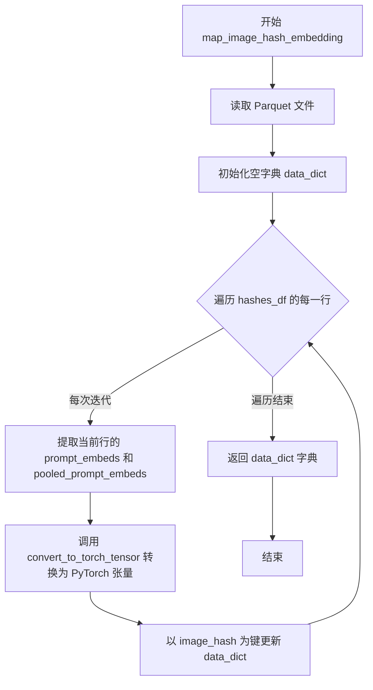

#### 带注释源码

```python
def map_image_hash_embedding(self, data_df_path):
    """
    将图像哈希映射到对应的文本嵌入向量
    
    该方法读取包含预计算嵌入向量的 Parquet 文件，并为每个图像哈希
    关联对应的 prompt_embeds 和 pooled_prompt_embeds 嵌入向量，
    用于训练时根据图像检索文本条件信息
    
    参数:
        data_df_path: 包含 image_hash、prompt_embeds 和 pooled_prompt_embeds 列的 Parquet 文件路径
    
    返回:
        dict: 键为图像哈希字符串，值为 (prompt_embeds tensor, pooled_prompt_embeds tensor) 元组
    """
    # 使用 pandas 读取 Parquet 格式的数据文件
    # 数据文件包含预先通过 compute_embeddings.py 计算的文本嵌入向量
    hashes_df = pd.read_parquet(data_df_path)
    
    # 初始化用于存储哈希到嵌入映射的字典
    data_dict = {}
    
    # 遍历 DataFrame 中的每一行（每个图像对应一行）
    for i, row in hashes_df.iterrows():
        # 从当前行提取嵌入向量列表
        # embeddings[0] 为 prompt_embeds, embeddings[1] 为 pooled_prompt_embeds
        embeddings = [row["prompt_embeds"], row["pooled_prompt_embeds"]]
        
        # 调用 convert_to_torch_tensor 方法将 numpy 数组转换为 PyTorch 张量
        # 并进行形状调整：prompt_embeds 调整为 [154, 4096]，pooled_prompt_embeds 调整为 [2048]
        prompt_embeds, pooled_prompt_embeds = self.convert_to_torch_tensor(embeddings=embeddings)
        
        # 使用图像哈希作为键，嵌入向量元组作为值，更新字典
        # 这样可以在 __getitem__ 中通过图像哈希快速检索对应的嵌入向量
        data_dict.update({row["image_hash"]: (prompt_embeds, pooled_prompt_embeds)})
    
    # 返回完整的哈希到嵌入映射字典
    return data_dict
```


### `DreamBoothDataset.generate_image_hash`

该方法用于为指定的图像文件生成唯一的 SHA-256 哈希值，通过读取图像文件的原始二进制内容并计算其哈希摘要，生成十六进制字符串作为图像的唯一标识符，以便在后续流程中与预计算的文本嵌入进行映射匹配。

参数：

- `image_path`：`Path` 或 `str`，待计算哈希值的图像文件路径

返回值：`str`，返回 SHA-256 哈希值的十六进制表示字符串

#### 流程图

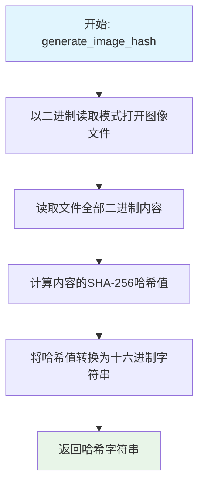

#### 带注释源码

```python
def generate_image_hash(self, image_path):
    """
    为指定的图像文件生成唯一的 SHA-256 哈希值
    
    参数:
        image_path: 图像文件的路径，可以是 Path 对象或字符串
        
    返回值:
        str: SHA-256 哈希值的十六进制表示
    """
    # 以二进制读取模式打开图像文件
    with open(image_path, "rb") as f:
        # 读取文件的全部原始二进制内容
        img_data = f.read()
    
    # 使用 hashlib 计算 SHA-256 哈希，并通过 hexdigest() 转换为十六进制字符串
    return hashlib.sha256(img_data).hexdigest()
```

## 关键组件


### DreamBoothDataset

自定义数据集类，负责加载训练图像、预处理图像、应用图像变换（resize、crop、flip）、从parquet文件映射图像hash到预计算的文本嵌入（prompt_embeds和pooled_prompt_embeds）。

### parse_args

命令行参数解析函数，定义并收集所有训练相关参数，包括模型路径、数据目录、LoRA配置（rank）、训练超参数（learning_rate、batch_size）、优化器配置、混合精度设置等。

### save_model_card

生成HuggingFace Hub模型卡的函数，包含训练元数据、示例图像、许可证信息和触发词，用于发布训练好的LoRA权重。

### log_validation

验证函数，在指定epoch运行推理生成样本图像，使用TensorBoard或WandB记录生成的图像，支持模型CPU offload以节省显存。

### collate_fn

自定义DataLoader collate函数，将批次样本堆叠为张量，处理pixel_values、prompt_embeds和pooled_prompt_embeds，确保内存连续性。

### main

主训练函数，完整实现SD3 DreamBooth LoRA训练流程：初始化accelerator、加载模型和调度器、配置LoRA适配器、构建优化器和学习率调度器、执行训练循环（包含噪声采样、flow matching损失计算、梯度累积、checkpoint保存）、运行验证推理、保存最终LoRA权重。

### LoRA适配器配置

使用peft库配置LoraConfig，设置rank=4，target_modules为["to_k", "to_q", "to_v", "to_out.0"]，初始化高斯权重，用于Transformer模型的参数高效微调。

### 训练循环核心逻辑

使用flow matching方法进行训练：通过compute_density_for_timestep_sampling采样timestep，使用vae.encode将图像转为latent，添加噪声得到noisy_model_input，transformer预测噪声残差，应用preconditioning计算loss，使用weighting_scheme加权损失。

### 混合精度与分布式训练

使用accelerator实现分布式训练支持，通过gradient_checkpointing节省显存，支持fp16/bf16混合精度训练，MPS后端特殊处理（禁用bf16），TF32加速选项。

### Checkpoint管理

实现自定义save/load hook与accelerator集成，支持checkpoint保存和恢复训练，支持checkpoints_total_limit限制保存数量，自动清理旧checkpoint。

### 数据预处理管道

图像处理流程：exif_transpose校正方向、RGB转换、Resize到指定分辨率、center_crop或random_crop、random_flip、归一化到[-1,1]。

### 嵌入映射机制

通过image_hash作为键，将预计算的prompt_embeds (154, 4096)和pooled_prompt_embeds (2048)与对应图像关联，实现文本条件的惰性加载和快速索引。


## 问题及建议


### 已知问题

- **数据集内存问题**: `DreamBoothDataset.__init__` 中一次性加载所有图像和embeddings到内存，当训练数据较大时会占用大量内存
- **硬编码的embedding维度**: `convert_to_torch_tensor` 方法中硬编码了 `reshape(154, 4096)` 和 `reshape(2048)`，缺乏灵活性
- **全局变量依赖**: `apply_image_transformations` 方法直接访问全局 `args.random_flip`、`args.center_crop`、`args.resolution`，违反封装原则
- **噪声调度器副本**: `noise_scheduler_copy` 在整个训练过程中保持不变但每次循环都调用 `get_sigmas` 访问其设备转换，可预先计算
- **缺失异常处理**: 图像读取和parquet文件加载缺少try-except保护，遇到损坏图像或文件会直接崩溃
- **验证逻辑重复**: 训练结束和中间验证都创建pipeline并加载权重，存在代码重复
- **checkpoint管理效率**: 删除旧checkpoint时使用 `os.listdir` 遍历，可使用更高效的方式管理

### 优化建议

- 将图像转换参数通过构造函数传入dataset类，避免依赖全局args
- 使用生成器模式或懒加载方式处理数据集，减少初始内存占用
- 将embedding维度参数化或从数据中自动推断
- 预先计算并缓存timestep对应的sigmas，避免训练循环中重复设备转换
- 添加图像加载和parquet读取的异常处理，忽略损坏样本并记录警告
- 抽取验证逻辑为独立函数复用，或使用pipeline的EMA权重进行中间验证
- 使用专门的数据结构（如collections.OrderedDict）管理checkpoint目录，避免每次遍历文件系统

## 其它


### 设计目标与约束

本代码旨在实现Stable Diffusion 3模型的DreamBooth LoRA微调训练，核心目标是将特定主题（通过instance_prompt标识）植入模型，同时保持模型原有的生成能力。设计约束包括：1) 支持单GPU和多GPU分布式训练；2) 使用LoRA技术实现轻量级微调，减少显存占用；3) 支持混合精度训练（fp16/bf16）以提升训练效率；4) 遵循DreamBooth方法论，通过instance prompt实现主题保真度。

### 错误处理与异常设计

代码包含以下错误处理机制：1) 实例数据目录验证（检查instance_data_root是否存在）；2) wandb与hub_token互斥检查（安全考虑）；3) MPS设备不支持bf16混合精度的错误提示；4) 8-bit Adam优化器的可选依赖检查（ImportError）；5) 断点续训时检查点存在性验证；6) 模型加载时的unexpected keys警告处理。异常设计遵循快速失败原则，在训练早期检测潜在问题。

### 数据流与状态机

训练数据流：实例图像 → DreamBoothDataset → 应用图像变换 → 像素值标准化 → 与预计算的prompt embeddings配对 → DataLoader批处理 → VAE编码为latent → 添加噪声（基于Flow Matching）→ Transformer预测噪声残差 → 损失计算（加权MSE）→ 反向传播 → 参数更新。状态机包含：训练前（模型加载、配置初始化）、训练中（epoch循环→step循环→梯度累积→优化器更新）、训练后（保存LoRA权重、验证推理）。

### 外部依赖与接口契约

核心依赖包括：diffusers（StableDiffusion3Pipeline、FlowMatchEulerDiscreteScheduler、AutoencoderKL、SD3Transformer2DModel）、peft（LoraConfig、set_peft_model_state_dict、get_peft_model_state_dict）、accelerate（分布式训练、混合精度）、transformers、torch、pandas、numpy、PIL。接口契约：输入需要预计算的prompt embeddings parquet文件（包含image_hash、prompt_embeds、pooled_prompt_embeds列）、instance图像目录、pretrained_model_name_or_path。

### 性能优化策略

代码实现多项性能优化：1) 梯度 checkpointing（降低显存）；2) 混合精度训练（fp16/bf16）；3) 梯度累积（支持大批次）；4) 模型CPU offload（验证阶段）；5) TF32加速（Ampere GPU）；6) LoRA参数fp32强制转换（训练稳定性）；7) 动态学习率调度器（cosine/constant/polynomial等）；8) 检查点总数限制管理。

### 训练配置与超参数

关键超参数：rank=4（LoRA维度）、learning_rate=1e-4、train_batch_size=4、gradient_accumulation_steps=1、num_train_epochs=1、max_train_steps=None（可覆盖）、lr_scheduler=constant、lr_warmup_steps=500、weighting_scheme=logit_normal、adam_beta1=0.9、adam_beta2=0.999、adam_weight_decay=1e-4、max_grad_norm=1.0。默认分辨率512x512，支持center_crop和random_flip数据增强。

### 模型保存与加载机制

保存机制：1) 周期性检查点（checkpointing_steps控制）；2) LoRA权重独立保存（StableDiffusion3Pipeline.save_lora_weights）；3) Accelerator完整状态保存（包含优化器、学习率调度器等）；4) 检查点总数限制（checkpoints_total_limit）自动清理旧检查点。加载机制：1) resume_from_checkpoint支持指定路径或自动选择latest；2) 自定义save/load hooks处理LoRA层序列化；3) convert_unet_state_dict_to_peft确保权重格式兼容。

### 分布式训练支持

代码通过accelerate实现多GPU分布式训练：1) DistributedDataParallelKwargs(find_unused_parameters=True)；2) local_rank环境变量自动检测；3) 跨进程日志控制（仅主进程输出完整信息）；4) 验证阶段tracker同步（tensorboard/wandb）；5) wait_for_everyone()确保所有进程同步；6) 学习率自动scale（scale_lr参数）。支持单卡、多卡单机、多卡多机各种部署模式。

### 验证与评估机制

验证流程：1) 每validation_epochs个epoch执行一次；2) 生成num_validation_images（默认4张）验证图像；3) 支持TensorBoard和WandB双tracker；4) 图像网格可视化（np.stack + add_images）；5) wandb模式下支持caption标注；6) 最终验证（is_final_validation）在训练结束后执行；7) 验证后自动清理GPU显存（empty_cache + gc.collect）。

### 资源管理与监控

资源管理：1) VAE和Transformer分别指定dtype（float32用于VAE，weight_dtype用于transformer）；2) 验证时启用enable_model_cpu_offload；3) CUDA缓存清理（empty_cache）；4) MPS设备特殊处理（禁用AMP）；5) 监控指标：loss、lr（通过progress_bar和accelerator.log）；6) 训练步数、批次大小、梯度累积步数等关键指标日志输出。

### 安全性考虑

安全设计：1) hub_token与wandb互斥（防止token泄露）；2) 推荐使用hf auth login认证；3) 模型卡生成时包含许可证信息（openrail++）；4) 本地路径操作使用Path对象防止路径遍历；5) 检查点清理前验证目录存在性。代码遵循最小权限原则，instance图像仅用于训练不涉及上传。

### 潜在技术债务与优化空间

1) 硬编码的图像hash算法（SHA256）缺乏灵活性；2) prompt embeddings维度硬编码（154x4096和2048）；3) DataFrame迭代效率低（可优化为向量化操作）；4) 验证阶段重新加载完整pipeline效率低；5) 缺乏早停机制（early stopping）；6) 未支持DreamBooth的class prior preservation；7) LoRA仅应用于transformer，未包含text encoder；8) 缺乏超参数自动搜索功能；9) 检查点清理逻辑可优化为增量管理。


    