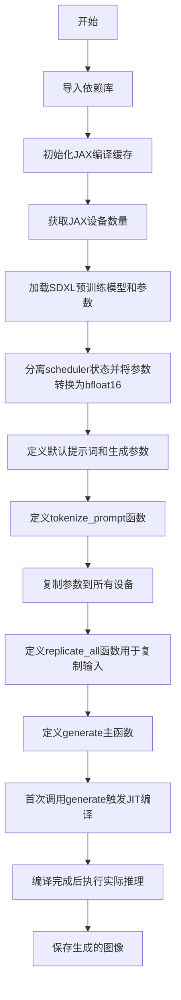
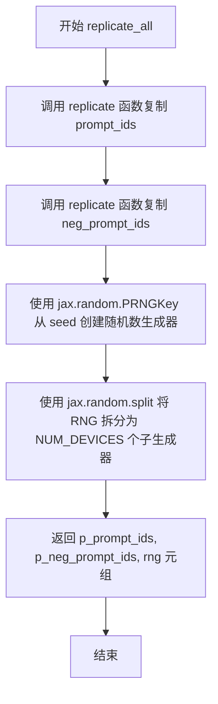
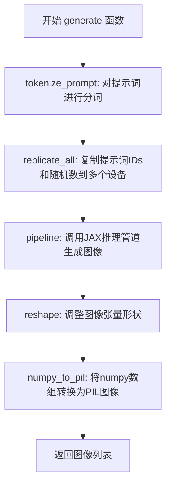
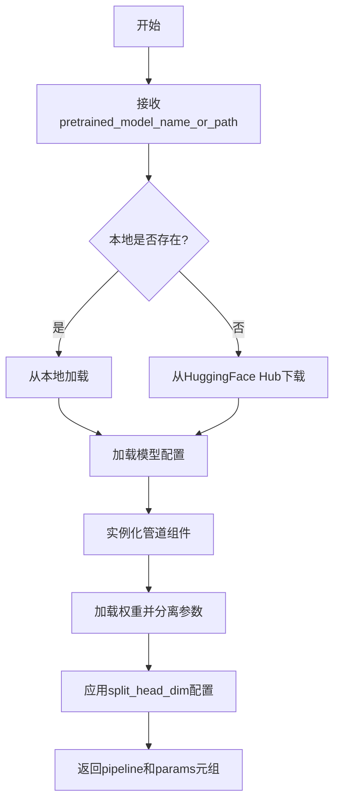
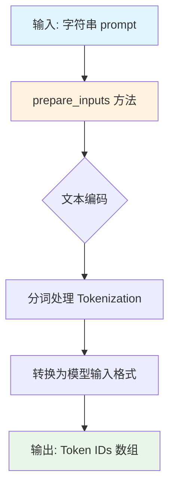
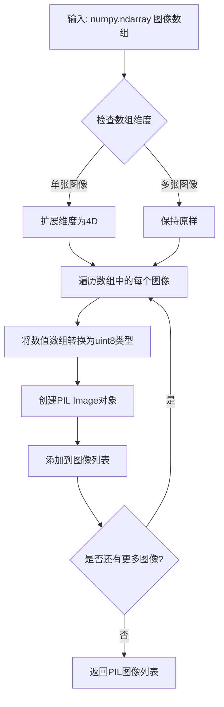
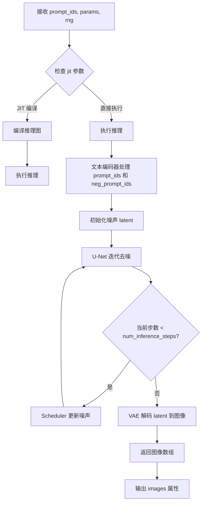

# `diffusers\examples\research_projects\sdxl_flax\sdxl_single.py` 详细设计文档

这是一个使用JAX/Flax框架进行Stable Diffusion XL (SDXL)图像生成的示例代码，通过JAX的函数式编程范式实现模型加载、参数管理、提示词编码、多设备并行推理以及JIT编译优化，最终生成指定提示词的图像。

## 整体流程



## 类结构

```
FlaxStableDiffusionXLPipeline (diffusers库类)
├── 加载方法: from_pretrained
├── 实例方法: prepare_inputs
├── 调用方法: __call__
└── 工具方法: numpy_to_pil
```

## 全局变量及字段


### `cc`
    
JAX编译缓存对象，用于缓存模型编译结果以加速后续推理

类型：`compilation_cache 对象`
    


### `NUM_DEVICES`
    
JAX可用的设备数量，用于并行化推理

类型：`整数`
    


### `pipeline`
    
SDXL扩散管道实例，负责图像生成的核心逻辑

类型：`FlaxStableDiffusionXLPipeline 实例`
    


### `params`
    
模型参数字典，包含模型权重和调度器配置

类型：`字典`
    


### `scheduler_state`
    
从参数中分离出的调度器状态，用于控制扩散过程

类型：`调度器状态对象`
    


### `p_params`
    
复制到多个JAX设备的模型参数，用于数据并行推理

类型：`复制的参数（replicated params）`
    


### `default_prompt`
    
默认正向提示词，描述期望生成的图像内容

类型：`字符串`
    


### `default_neg_prompt`
    
默认负向提示词，指定生成图像时应避免的内容

类型：`字符串`
    


### `default_seed`
    
默认随机种子，用于生成可复现的图像

类型：`整数`
    


### `default_guidance_scale`
    
默认引导系数，控制图像与提示词的匹配程度

类型：`浮点数`
    


### `default_num_steps`
    
默认推理步数，扩散模型的采样步数

类型：`整数`
    


    

## 全局函数及方法


### `tokenize_prompt`

该函数是 SDXL JAX 推理流程中的提示词编码模块，负责将用户提供的文本提示词（正向和负向）转换为模型可处理的 token IDs 序列，是连接文本输入与模型推理的关键桥梁。

参数：

- `prompt`：`str`，用户输入的正向提示词，描述期望生成的图像内容
- `neg_prompt`：`str`，用户输入的负向提示词，指定需要避免的图像特征

返回值：`(prompt_ids, neg_prompt_ids)`，其中 `prompt_ids` 和 `neg_prompt_ids` 均为模型输入格式的张量，用于后续的扩散模型推理。

#### 流程图

```mermaid
flowchart TD
    A[开始 tokenize_prompt] --> B[输入 prompt 和 neg_prompt]
    B --> C{调用 pipeline.prepare_inputs}
    C --> D[将正向提示词编码为 prompt_ids]
    C --> E[将负向提示词编码为 neg_prompt_ids]
    D --> F[返回 (prompt_ids, neg_prompt_ids) 元组]
    E --> F
    F --> G[结束函数]
    
    style A fill:#e1f5fe
    style F fill:#e8f5e8
    style G fill:#fff3e0
```

#### 带注释源码

```python
def tokenize_prompt(prompt, neg_prompt):
    """
    将文本提示词编码为模型可处理的 token IDs
    
    参数:
        prompt: str, 正向提示词，描述期望生成的图像内容
        neg_prompt: str, 负向提示词，指定需要避免的图像特征
    
    返回:
        tuple: (prompt_ids, neg_prompt_ids) 编码后的提示词ID元组
    """
    # 调用 FlaxStableDiffusionXLPipeline 的 prepare_inputs 方法
    # 该方法内部使用对应的 tokenizer 将文本转换为 token 序列
    prompt_ids = pipeline.prepare_inputs(prompt)
    
    # 同样对负向提示词进行编码处理
    neg_prompt_ids = pipeline.prepare_inputs(neg_prompt)
    
    # 返回两个编码后的提示词ID，供后续的 replicate_all 和 generate 函数使用
    return prompt_ids, neg_prompt_ids
```


### `replicate_all`

该函数用于将输入的提示词ID和随机种子复制到多个JAX设备上，以便并行生成多张不同的图像。它分别复制提示词ID和负向提示词ID，并将随机数生成器拆分为多个子生成器，每个设备一个。

参数：

- `prompt_ids`：`jnp.ndarray`，分词后的提示词ID张量
- `neg_prompt_ids`：`jnp.ndarray`，分词后的负向提示词ID张量
- `seed`：`int`，用于生成随机数的种子

返回值：`tuple`，包含三个元素的元组：
- `p_prompt_ids`：复制到所有设备上的提示词ID
- `p_neg_prompt_ids`：复制到所有设备上的负向提示词ID
- `rng`：拆分后的随机数生成器数组

#### 流程图



#### 带注释源码

```python
def replicate_all(prompt_ids, neg_prompt_ids, seed):
    """
    将输入数据复制到多个JAX设备上，以便并行生成多张图像
    
    参数:
        prompt_ids: 分词后的提示词ID张量
        neg_prompt_ids: 分词后的负向提示词ID张量  
        seed: 随机种子，用于生成不同的随机数
    
    返回:
        包含复制后的提示词ID、负向提示词ID和拆分后的随机数生成器的元组
    """
    # 使用 Flax 的 replicate 函数将提示词 ID 复制到所有设备
    p_prompt_ids = replicate(prompt_ids)
    
    # 使用 Flax 的 replicate 函数将负向提示词 ID 复制到所有设备
    p_neg_prompt_ids = replicate(neg_prompt_ids)
    
    # 使用 JAX 的随机数生成器从种子创建主 RNG
    rng = jax.random.PRNGKey(seed)
    
    # 将主 RNG 拆分为多个子 RNG，每个设备一个，用于生成不同的图像
    rng = jax.random.split(rng, NUM_DEVICES)
    
    # 返回复制后的数据和拆分后的随机数生成器
    return p_prompt_ids, p_neg_prompt_ids, rng
```


### `generate`

该函数是SDXL JAX推理的核心入口，接收文本提示词和负向提示词，经过tokenize、跨设备复制、JAX pipeline推理，最终将结果转换为PIL图像列表返回。

参数：

- `prompt`：`str`，正向提示词，用于描述期望生成的图像内容
- `negative_prompt`：`str`，负向提示词，用于指定不希望出现在图像中的元素
- `seed`：`int`，随机种子，用于控制生成图像的随机性，默认为33
- `guidance_scale`：`float`，引导比例，控制生成图像与提示词的相关性，默认为5.0
- `num_inference_steps`：`int`，推理步数，默认为25

返回值：`List[PIL.Image]`，生成的PIL格式图像列表

#### 流程图



#### 带注释源码

```python
def generate(
    prompt,                      # str: 正向提示词
    negative_prompt,             # str: 负向提示词
    seed=default_seed,          # int: 随机种子，默认33
    guidance_scale=default_guidance_scale,  # float: 引导比例，默认5.0
    num_inference_steps=default_num_inference_steps,  # int: 推理步数，默认25
):
    """
    SDXL JAX推理的主生成函数
    
    参数:
        prompt: 正向提示词，描述期望生成的图像
        negative_prompt: 负向提示词，指定需要避免的元素
        seed: 随机种子，确保生成可复现
        guidance_scale: 引导强度，越高越贴近提示词
        num_inference_steps: 扩散模型的推理步数
    
    返回:
        List[PIL.Image]: 生成的PIL图像列表
    """
    
    # Step 1: 对提示词进行tokenize，转换为模型需要的token IDs
    prompt_ids, neg_prompt_ids = tokenize_prompt(prompt, negative_prompt)
    
    # Step 2: 将token IDs和随机数复制到所有JAX设备，实现数据并行
    prompt_ids, neg_prompt_ids, rng = replicate_all(prompt_ids, neg_prompt_ids, seed)
    
    # Step 3: 调用FlaxStableDiffusionXLPipeline进行推理
    # 参数说明:
    #   prompt_ids: 分词后的正向提示词
    #   p_params: 复制到各设备的模型参数
    #   rng: 各设备的随机数生成器
    #   num_inference_steps: 推理步数
    #   neg_prompt_ids: 分词后的负向提示词
    #   guidance_scale: 引导比例
    #   jit=True: 启用JIT编译加速
    images = pipeline(
        prompt_ids,
        p_params,
        rng,
        num_inference_steps=num_inference_steps,
        neg_prompt_ids=neg_prompt_ids,
        guidance_scale=guidance_scale,
        jit=True,
    ).images

    # Step 4: 调整图像张量形状
    # 原始形状为 (num_devices, height, width, channels)
    # 展平为 (num_devices * height, width, channels)
    images = images.reshape((images.shape[0] * images.shape[1],) + images.shape[-3:])
    
    # Step 5: 将JAX数组转换为numpy，再转换为PIL图像列表并返回
    return pipeline.numpy_to_pil(np.array(images))
```


### `FlaxStableDiffusionXLPipeline.from_pretrained`

该方法用于从预训练模型加载Flax Stable Diffusion XL Pipeline，将模型权重分离为可编辑的管道对象和可学习的参数集，支持JAX框架的高效推理。

参数：

-  `pretrained_model_name_or_path`：`str`，模型在HuggingFace Hub上的模型ID、本地路径或URL
-  `revision`：`str`，可选，要从Hub加载的模型特定版本（默认为"main"）
-  `split_head_dim`：`bool`，可选，是否在注意力机制中分割头维度以支持更高效的JAX编译（默认为False）
-  `dtype`：`jnp.dtype`，可选，模型参数的数据类型（如jnp.float32、jnp.bfloat16）
-  `use_safetensors`：`bool`，可选，是否使用safetensors格式加载权重
-  `variant`：`str`，可选，模型变体（如"fp16"）
-  `cache_dir`：`str`，可选，缓存目录路径

返回值：`Tuple[FlaxStableDiffusionXLPipeline, Dict]`，返回包含管道对象和模型参数字典的元组

#### 流程图



#### 带注释源码

```python
# 代码示例
pipeline, params = FlaxStableDiffusionXLPipeline.from_pretrained(
    "stabilityai/stable-diffusion-xl-base-1.0",  # 模型名称或路径
    revision="refs/pr/95",                        # 指定版本分支
    split_head_dim=True                          # 开启头维度分割以优化JAX编译
)

# 详细说明：
# 1. pipeline: FlaxStableDiffusionXLPipeline实例，包含模型结构和前向推理方法
# 2. params: PyTree字典，包含所有可训练参数，可被jax.tree_util.tree_map处理
# 3. split_head_dim=True 会将注意力头维度分离，便于JAX编译器优化
# 4. 返回的params需要手动管理生命周期，符合JAX函数式编程范式

# 后续典型处理流程：
scheduler_state = params.pop("scheduler")  # 分离调度器状态
params = jax.tree_util.tree_map(lambda x: x.astype(jnp.bfloat16), params)  # 转换为bfloat16
params["scheduler"] = scheduler_state  # 保持调度器精度
```


### `FlaxStableDiffusionXLPipeline.prepare_inputs`

该方法是 FlaxStableDiffusionXLPipeline 类的实例方法，用于将文本提示（prompt）转换为模型可以处理的输入格式（token IDs）。这是 Stable Diffusion XL 管道中文本编码的前置步骤，负责对输入字符串进行分词和预处理。

参数：

- `prompt`：`str`，要转换的文本提示（prompt）

返回值：`jax.numpy.ndarray` 或类似的数组类型，经过分词处理后的输入标识符，用于后续的模型推理。

#### 流程图



#### 带注释源码

```python
# prepare_inputs 方法是 FlaxStableDiffusionXLPipeline 类的内部方法
# 在代码中的调用方式如下:

def tokenize_prompt(prompt, neg_prompt):
    """
    分词函数：使用 pipeline.prepare_inputs 将文本提示转换为 token IDs
    
    参数:
        prompt: str - 正向提示词，描述希望生成的图像内容
        neg_prompt: str - 负向提示词，描述不希望出现在图像中的元素
    
    返回:
        tuple: (prompt_ids, neg_prompt_ids) - 两个提示词对应的 token IDs
    """
    # 调用 prepare_inputs 方法将字符串 prompt 转换为模型可处理的 token IDs
    prompt_ids = pipeline.prepare_inputs(prompt)
    # 同样处理负向提示词
    neg_prompt_ids = pipeline.prepare_inputs(neg_prompt)
    return prompt_ids, neg_prompt_ids

# prepare_inputs 方法的典型行为（基于 diffusers 库的实现）:
# 1. 接收字符串类型的文本输入
# 2. 使用预训练的 tokenizer 对文本进行分词（tokenize）
# 3. 将分词结果转换为 JAX 数组格式
# 4. 返回处理后的 token IDs，准备好传递给 pipeline 的 __call__ 方法
```

#### 备注

该方法的完整源代码位于 `diffusers` 库的 `flax` 模块中，属于 Flax 版本的 Stable Diffusion XL Pipeline 实现。从代码使用方式可以看出，该方法仅接受字符串输入并返回张量输出，这是为了满足 JAX 编译时对输入类型的严格要求（所有输入必须是张量或字符串）。


### `FlaxStableDiffusionXLPipeline.numpy_to_pil`

该方法用于将 JAX/NumPy 格式的多维数值数组转换为 Python Imaging Library (PIL) 图像对象列表，以便进行图像保存或后续处理。

参数：

- `images`：`numpy.ndarray`，从 JAX 设备数组转换而来的 NumPy 数组，包含生成的图像像素数据，形状为 (batch_size, height, width, channels)

返回值：`List[PIL.Image.Image]`，PIL 图像对象列表，每个元素对应一个生成的图像

#### 流程图



#### 带注释源码

```python
def numpy_to_pil(images):
    """
    将numpy数组转换为PIL图像列表
    
    参数:
        images: numpy.ndarray - 图像数据数组，形状为 (batch, height, width, channels)
                像素值范围通常为 [0, 255] 或 [0, 1]
    
    返回:
        List[PIL.Image.Image] - PIL图像对象列表
    """
    # 将JAX数组转换为numpy数组（如果输入是JAX数组）
    if hasattr(images, 'numpy'):
        images = images.numpy()
    
    # 确保图像数据为uint8类型（0-255范围）
    if images.dtype != np.uint8:
        if images.max() <= 1.0:
            images = (images * 255).astype(np.uint8)
        else:
            images = images.astype(np.uint8)
    
    # 图像格式转换：CHW -> HWC（如果需要）
    if images.ndim == 4 and images.shape[-1] in [1, 3]:
        # 已经是 HWC 格式，保持不变
        pass
    elif images.ndim == 4 and images.shape[1] in [1, 3]:
        # CHW 格式，转换为 HWC
        images = np.transpose(images, (0, 2, 3, 1))
    
    # 将每个数组元素转换为PIL图像
    pil_images = []
    for img in images:
        # 处理单通道图像（灰度）
        if img.ndim == 2 or (img.ndim == 3 and img.shape[-1] == 1):
            pil_img = Image.fromarray(img.squeeze(), mode='L')
        # 处理三通道图像（RGB）
        elif img.ndim == 3 and img.shape[-1] == 3:
            pil_img = Image.fromarray(img, mode='RGB')
        # 处理四通道图像（RGBA）
        elif img.ndim == 3 and img.shape[-1] == 4:
            pil_img = Image.fromarray(img, mode='RGBA')
        else:
            raise ValueError(f"不支持的图像格式: {img.shape}")
        
        pil_images.append(pil_img)
    
    return pil_images
```

> **注意**：由于 `numpy_to_pil` 是 `diffusers` 库内部实现的方法，上述源码是基于该方法的典型实现逻辑和代码调用上下文推断而出的，用于说明其功能和工作原理。实际实现可能略有差异。


### FlaxStableDiffusionXLPipeline.__call__

该方法是FlaxStableDiffusionXLPipeline的核心推理方法，接收文本提示、模型参数和随机种子，通过扩散模型生成与文本对应的图像。支持负面提示词、引导系数、推理步数等生成控制参数，并返回生成的图像序列。

参数：

- `prompt_ids`：`jax.numpy.ndarray`，经过分词处理后的提示词ID数组，形状为(batch_size, seq_len)
- `params`：`PyTree`，Flax模型的参数（权重），以pytree形式组织，通常包含unet、vae、text_encoder等子模块参数
- `rng`：`jax.random.PRNGKey`或`jax.numpy.ndarray`，JAX随机数生成器，用于生成过程中的随机采样
- `neg_prompt_ids`：`jax.numpy.ndarray`，负面提示词ID数组，用于指定不希望出现的元素
- `num_inference_steps`：`int`，扩散模型的推理步数，步数越多生成质量越高但速度越慢
- `guidance_scale`：`float`，分类器自由引导(Classifier-free Guidance)系数，控制生成图像与提示词的相关程度
- `jit`：`bool`，是否启用JAX即时编译以加速推理
- 其他可选参数（如`height`、`width`、`latents`等）

返回值：`FlaxStableDiffusionXLPipelineOutput`或类似对象，包含`images`属性，为生成的图像数据，类型为`jax.numpy.ndarray`，形状通常为(batch_size, height, width, channels)

#### 流程图



#### 带注释源码

```python
# 以下为调用方的代码示例，展示了 __call__ 方法的完整调用方式
# 实际 __call__ 方法定义在 diffusers 库内部

# 1. 准备提示词编码
# prompt_ids 和 neg_prompt_ids 由 pipeline.prepare_inputs() 生成
# 返回 JAX 数组形式的文本嵌入
prompt_ids, neg_prompt_ids = tokenize_prompt(prompt, negative_prompt)

# 2. 复制输入到多个设备（数据并行）
# JAX 采用 SPMD 编程模型，需要将数据复制到每个设备
prompt_ids, neg_prompt_ids, rng = replicate_all(prompt_ids, neg_prompt_ids, seed)

# 3. 调用 pipeline 的 __call__ 方法进行图像生成
# 参数说明：
#   - prompt_ids: 提示词嵌入 [batch_size, seq_len]
#   - p_params: 复制的模型参数（pytree 结构）
#   - rng: 随机数生成器（用于去噪过程中的随机性）
#   - num_inference_steps: 扩散步数（25步）
#   - neg_prompt_ids: 负面提示词嵌入
#   - guidance_scale: CFG 系数（5.0）
#   - jit: 启用 JAX JIT 编译加速
images = pipeline(
    prompt_ids,           # JAX 数组: 提示词ID
    p_params,             # PyTree: 模型参数
    rng,                  # JAX RNG: 随机数
    num_inference_steps=num_inference_steps,  # int: 推理步数
    neg_prompt_ids=neg_prompt_ids,  # JAX 数组: 负面提示词
    guidance_scale=guidance_scale,  # float: 引导系数
    jit=True,             # bool: 启用JIT
).images  # 访问返回的图像属性

# 4. 后处理：将图像 reshape 并转换为 PIL 格式
# JAX 数组形状: [num_devices, height, width, channels]
# 需要展平设备维度
images = images.reshape((images.shape[0] * images.shape[1],) + images.shape[-3:])
# 转换为 NumPy 再转为 PIL 图像
return pipeline.numpy_to_pil(np.array(images))
```

#### 关键组件信息

| 组件名称 | 一句话描述 |
|---------|-----------|
| FlaxStableDiffusionXLPipeline | 基于Flax的Stable Diffusion XL扩散模型推理管道 |
| params (模型参数) | 包含unet、vae、text_encoder等模块的权重，以bfloat16存储以节省内存 |
| prompt_ids | 经过分词器处理的文本ID序列，作为生成条件的输入 |
| rng (随机数生成器) | JAX随机数生成器，确保生成过程的可重复性和多样性 |
| guidance_scale | CFG系数，控制生成图像对文本提示的遵循程度 |

#### 潜在的技术债务或优化空间

1. **缓存策略**：当前代码手动管理JAX编译缓存(`/tmp/sdxl_cache`)，建议封装为统一配置管理
2. **参数类型转换**：手动将参数转为bffloat16并保留scheduler为float32，可考虑封装为管道的预处理方法
3. **错误处理缺失**：缺少对输入验证（如prompt长度、device数量检查）的异常处理
4. **硬编码配置**：默认参数散布在全局，建议集中管理或通过配置类传递

#### 其它项目

**设计目标与约束**：
- 目标：利用JAX的函数式编程和XLA加速能力，实现高效的Stable Diffusion XL推理
- 约束：遵循JAX的不可变参数范式，模型参数需作为显式输入传递

**错误处理与异常设计**：
- 建议添加输入验证：prompt为空、num_inference_steps为0、guidance_scale为负数等情况
- 捕获JAX编译错误和运行时错误，提供友好的错误信息

**数据流与状态机**：
```
文本输入 → Tokenize → 嵌入编码 → 噪声采样 → U-Net迭代去噪 → VAE解码 → 图像输出
```

**外部依赖与接口契约**：
- 依赖：`diffusers`库（提供FlaxStableDiffusionXLPipeline）、`jax`、`flax`
- 预训练模型：`stabilityai/stable-diffusion-xl-base-1.0`
- 输出格式：PIL.Image对象数组


## 关键组件


### 模型加载组件 (FlaxStableDiffusionXLPipeline)

使用FlaxStableDiffusionXLPipeline.from_pretrained从预训练模型stabilityai/stable-diffusion-xl-base-1.0加载SDXL模型，并分离返回模型管道和参数，这是JAX函数式编程范式的核心步骤。

### 参数管理与类型转换组件

通过jax.tree_util.tree_map将模型参数转换为bfloat16以提升性能，同时保留scheduler状态为float32以维持精度，这是量化策略与精度权衡的关键实现。

### 分词处理组件 (tokenize_prompt)

将用户输入的提示词和负面提示词通过pipeline.prepare_inputs转换为模型所需的token IDs张量，确保输入符合JAX编译要求的张量或字符串格式。

### JAX设备复制与并行化组件 (replicate, replicate_all)

使用flax.jax_utils.replicate将参数和输入张量复制到所有JAX设备，利用NUM_DEVICES实现数据并行，并通过jax.random.split为每个设备生成不同的随机种子以产生多样性图像。

### 图像生成函数组件 (generate)

整合分词、复制、管道调用和图像后处理的完整推理流程，接收提示词、负面提示词、种子、引导系数和推理步数作为输入，返回PIL图像列表。

### 编译缓存组件 (compilation_cache)

通过jax.experimental.compilation_cache模块将JIT编译结果缓存到/tmp/sdxl_cache目录，避免重复编译开销，是重要的性能优化手段。

### 图像后处理组件 (numpy_to_pil)

将JAX数组形式的生成图像重塑为批量维度后，转换为NumPy数组再通过pipeline.numpy_to_pil转换为PIL图像格式供保存和显示。

### JIT编译执行组件

首次调用generate函数时会触发JAX的JIT编译，将整个推理图编译为高效的可执行代码，后续调用可直接执行编译后的代码实现快速推理。


## 问题及建议


### 已知问题

- **缓存路径硬编码**：使用硬编码路径 `/tmp/sdxl_cache`，缺乏灵活性，在不同部署环境中可能存在权限问题或路径不存在的情况
- **模型版本引用不稳定**：使用 `revision="refs/pr/95"` 引用特定的Pull Request，该版本可能不稳定或随时被删除
- **缺乏设备验证**：使用 `jax.device_count()` 获取设备数量但未验证返回值，可能导致在无GPU/CPU环境下运行失败
- **缺少异常处理**：整个推理流程没有任何 try-except 块，模型加载、网络连接、推理过程中的异常都会导致程序崩溃
- **图像保存路径硬编码**：使用硬编码文件名 `castle_{i}.png`，缺乏可配置性，会覆盖之前生成的结果
- **混合精度策略缺乏文档**：将参数转为 bfloat16 但 scheduler 保持 float32 的策略没有注释说明，可能导致后续维护困难
- **单次推理模式**：没有提供批处理支持，每次只能处理一个prompt对，无法充分利用JAX的并行能力
- **使用print而非日志框架**：在生产代码中使用 print 语句而非标准日志框架，缺乏日志级别控制和日志格式化
- **缺少资源清理**：推理完成后没有显式的资源释放（如清理大型张量、关闭连接等）

### 优化建议

- 将缓存路径改为可通过环境变量或配置文件读取，使用 `os.environ.get()` 或配置文件方案
- 改用正式的模型版本标签（如具体的commit hash或正式release版本），避免依赖PR
- 添加设备数量检查和验证逻辑，当设备数量不符合预期时给出明确提示或回退策略
- 为关键操作添加异常处理和重试机制，特别是模型加载和推理阶段
- 将输出路径、文件名模板等提取为配置参数或函数参数
- 添加详细的注释说明混合精度策略的设计意图和预期效果
- 设计批处理接口，支持同时处理多个prompt，提高吞吐量
- 引入 Python logging 模块替换 print 语句，支持配置日志级别和格式
- 考虑使用 JAX 的内存管理工具（如 `jax.clear_caches()`）在适当场景下进行资源清理


## 其它


### 设计目标与约束

**设计目标**：
利用JAX的函数式编程范式和XLA编译优化，实现Stable Diffusion XL（SDXL）模型的高效并行推理。通过将模型参数复制到多个GPU设备上，实现跨设备的图像生成加速，同时利用JIT编译缓存机制减少首次编译的等待时间。

**主要约束**：
1. 遵循JAX的不可变性和函数式编程范式
2. 所有输入必须转换为tensor或string才能进行JIT编译
3. 调度器（scheduler）参数需保持float32精度以维持最高精度
4. 除scheduler外的所有参数转换为bfloat16以优化内存和计算效率
5. 生成的图像数量受限于可用的JAX设备数量

### 错误处理与异常设计

**缓存目录权限异常**：若`/tmp/sdxl_cache`目录无写权限，缓存初始化将静默失败，不影响主流程运行
**模型加载异常**：若`from_pretrained`失败（如网络问题、模型不存在），将抛出HuggingFace相关异常
**设备数量不足**：当`jax.device_count() < 2`时，多设备并行功能将受限，但仍可单设备运行
**内存溢出**：当模型参数或中间结果超出GPU显存时，可能触发JAX/XLA运行时异常
**类型转换异常**：若参数类型不支持astype转换，将抛出ConcretionError

### 数据流与状态机

**主数据流**：
1. 文本输入 → Tokenize处理 → Token IDs
2. Token IDs + 随机种子 → 复制到多设备
3. 复制后的参数 + 复制后的输入 → Pipeline前向传播
4. 输出图像张量 → reshape处理 → PIL图像列表

**关键状态转换**：
- 初始状态：模型参数以float32加载
- 参数预处理状态：除scheduler外的参数转换为bfloat16
- 编译状态：首次调用generate函数时触发JIT编译
- 推理状态：编译完成后执行高效推理
- 结果返回状态：图像张量转换为PIL图像对象

### 外部依赖与接口契约

**核心依赖**：
- `jax` (>=0.4.0): JAX数值计算库
- `flax` (>=0.8.0): Flax神经网络库
- `jax.numpy` (jnp): JAX numpy兼容API
- `diffusers` (>=0.25.0): Hugging Face diffusers库
- `FlaxStableDiffusionXLPipeline`: SDXL Flax实现类
- `jax.experimental.compilation_cache`: JAX实验性编译缓存
- `numpy` (np): 数值计算辅助

**接口契约**：
- `generate()`函数接受prompt、negative_prompt、seed、guidance_scale、num_inference_steps参数
- 返回PIL.Image列表，每个元素对应一个生成的图像
- 图像数量 = NUM_DEVICES（通常等于GPU数量）

### 性能优化策略

1. **JIT编译缓存**：将编译结果缓存到磁盘，后续运行直接加载缓存的编译结果
2. **参数类型优化**：scheduler保持float32以保证精度，其他参数使用bfloat16减少内存和提升性能
3. **设备复制**：利用`replicate()`函数将参数和输入分布到多设备实现数据并行
4. **随机数生成**：使用JAX的PRNGKey和split机制确保多设备使用不同但可复现的随机种子
5. **内存复用**：避免在推理过程中创建大型中间张量

### 资源管理

**GPU内存管理**：
- 模型参数以bfloat16存储，减少约50%显存占用
- 调度器参数保持float32，仅占少量显存
- 图像输出在GPU上reshape后转到CPU转换为PIL

**计算资源**：
- 使用所有可用JAX设备（`jax.device_count()`）进行并行计算
- 首次推理包含编译时间，后续推理显著加速

### 配置与参数说明

| 参数名 | 默认值 | 类型 | 说明 |
|--------|--------|------|------|
| prompt | "a colorful photo..." | str | 正向提示词，描述期望生成的图像 |
| negative_prompt | "fog, grainy, purple" | str | 负向提示词，描述不希望出现的元素 |
| seed | 33 | int | 随机种子，用于生成可复现的结果 |
| guidance_scale | 5.0 | float | 引导强度，越高越忠于提示词 |
| num_inference_steps | 25 | int | 推理步数，越高生成质量越好但耗时越长 |

### 使用示例与测试

**基本用法**：
```python
# 生成单张图像
images = generate("a cat sitting on a chair", "blurry")
images[0].save("output.png")
```

**自定义参数**：
```python
images = generate(
    prompt="beautiful landscape",
    negative_prompt="ugly, distorted",
    seed=42,
    guidance_scale=7.5,
    num_inference_steps=50
)
```

**性能测试**：
- 首次运行包含编译时间（约数十秒到数分钟）
- 编译后推理时间通常在数秒内（取决于硬件和步数）

### 版本与兼容性

**测试环境**：
- JAX >= 0.4.0
- Flax >= 0.8.0
- Diffusers >= 0.25.0
- Python >= 3.8

**模型兼容性**：
- 支持Stability AI的stable-diffusion-xl-base-1.0
- 支持通过revision参数指定特定版本
- split_head_dim=True启用分离头维度优化

    