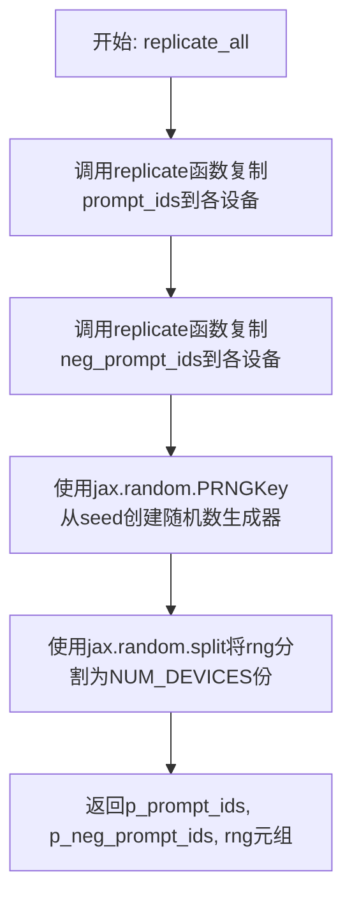
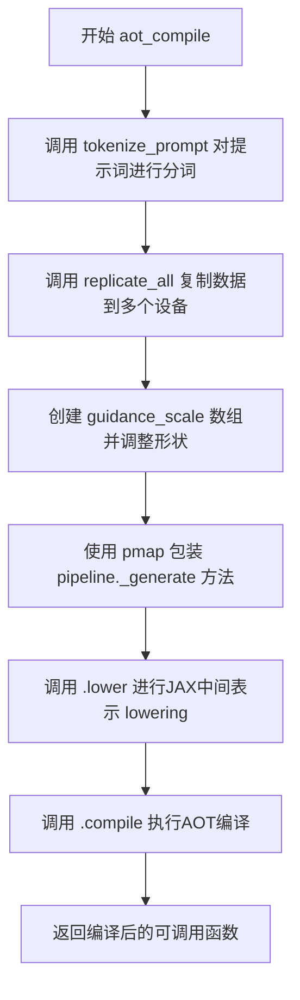
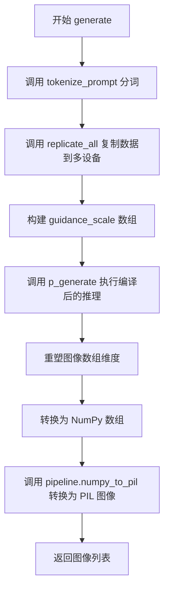
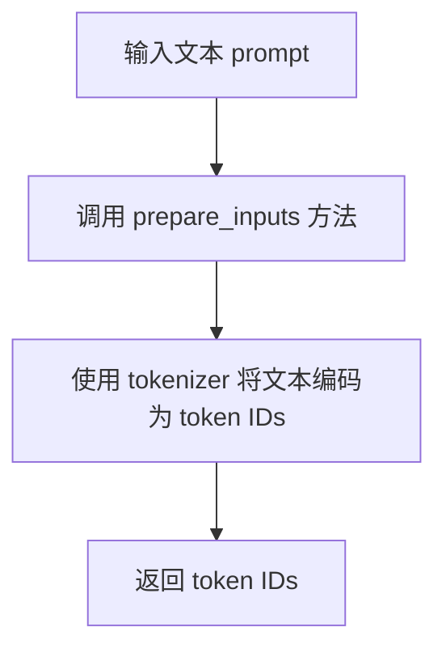
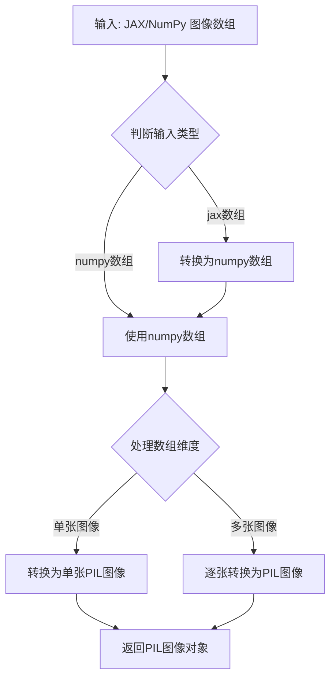

```mermaid
flowchart TD
    A[接收 prompt_ids, params, rng, num_inference_steps, height, width, guidance_scale, latents, negative_prompt_ids, return_latents] --> B[初始化推理循环]
    
    B --> C{num_inference_steps > 0?}
    C -->|Yes| D[获取当前步骤的 scheduler 参数]
    D --> E[执行 UNet 前向传播<br/>unet_sample = unet.apply&#40;params, latents, timestep, encoder_hidden_states&#41;]
    
    E --> F[应用 classifier-free guidance<br/>predicted_noise = predicted_noise_uncond + guidance_scale * &#40;predicted_noise_cond - predicted_noise_uncond&#41;]
    
    F --> G[计算上一步的 latents<br/>latents = scheduler.step&#40;predicted_noise, timestep, latents&#41;]
    
    G --> H[步数计数器递减]
    H --> C
    
    C -->|No| I{return_latents = True?}
    I -->|Yes| J[返回 latents]
    I -->|No| K[使用 VAE 解码 latents<br/>images = vae.apply&#40;params, latents, method='decode'&#41;]
    
    J --> L[返回结果]
    K --> L
    
    L --> M[结束]
```

# `diffusers\examples\research_projects\sdxl_flax\sdxl_single_aot.py` 详细设计文档

该脚本利用 JAX 和 Flax 框架，通过 AOT (Ahead-of-Time) 编译技术，在多 GPU/TPU 设备上并行运行 Stable Diffusion XL (SDXL) 模型，实现从文本提示词生成图像的功能，并包含模型加载、参数处理、编译优化及推理执行的完整流程。

## 整体流程

```mermaid
graph TD
    Start([开始]) --> Cache[初始化 JAX 编译缓存]
    Cache --> Load[加载 FlaxStableDiffusionXLPipeline]
    Load --> Preprocess[预处理参数: 转换为 bfloat16]
    Preprocess --> Config[定义默认配置: Prompt, Seed, Steps]
    Config --> Replicate[复制参数到多设备 p_params]
    Replicate --> Compile{执行 AOT 编译}
    Compile --> Generate1[第一次推理 (包含 Python Dispatch 开销)]
    Generate1 --> Generate2[第二次推理 (利用编译缓存加速)]
    Generate2 --> Save[将结果转换为 PIL 并保存图片]
    Save --> End([结束])
```

## 类结构

```
FlaxStableDiffusionXLPipeline (HuggingFace Diffusers 库)
├── .from_pretrained (类方法/对象创建)
├── .prepare_inputs (实例方法/分词)
├── ._generate (内部生成逻辑)
└── .numpy_to_pil (图像转换)

本脚本逻辑结构
├── 全局配置层 (NUM_DEVICES, default_*, width, height)
├── 数据处理层 (tokenize_prompt, replicate_all)
├── 编译优化层 (aot_compile)
└── 执行入口层 (generate)
```

## 全局变量及字段


### `cc`
    
JAX编译缓存对象，用于缓存模型编译结果以加速后续加载

类型：`compilation_cache`
    


### `NUM_DEVICES`
    
JAX设备数量，用于确定并行化的设备数量

类型：`int`
    


### `pipeline`
    
模型管道实例，负责加载和管理Stable Diffusion XL模型

类型：`FlaxStableDiffusionXLPipeline`
    


### `params`
    
模型权重参数，以PyTree结构存储的模型参数

类型：`PyTree`
    


### `scheduler_state`
    
调度器状态，用于控制扩散过程的噪声调度

类型：`PyTree`
    


### `p_params`
    
复制到多设备的参数，用于JAX多设备并行推理

类型：`PyTree`
    


### `p_generate`
    
AOT编译后的生成函数，经过提前编译的图像生成函数

类型：`function`
    


### `default_prompt`
    
默认正向提示词，用于生成图像的文字描述

类型：`str`
    


### `default_neg_prompt`
    
默认负向提示词，用于指定生成时需要避免的内容

类型：`str`
    


### `default_seed`
    
随机种子，用于确保生成结果的可重复性

类型：`int`
    


### `default_guidance_scale`
    
引导系数，控制生成图像与提示词的相关程度

类型：`float`
    


### `default_num_steps`
    
推理步数，扩散模型的迭代生成步数

类型：`int`
    


### `width`
    
输出图像宽度

类型：`int`
    


### `height`
    
输出图像高度

类型：`int`
    


    

## 全局函数及方法


### `tokenize_prompt`

该函数负责将文本提示词（正向和负向）转换为模型可处理的输入ID格式，是连接用户文本输入与模型推理的关键桥梁，通过调用pipeline的`prepare_inputs`方法完成文本到token IDs的转换。

参数：

- `prompt`：`str`，正向提示词，描述期望生成的图像内容
- `neg_prompt`：`str`，负向提示词，描述不希望出现在图像中的元素

返回值：`tuple`，返回两个元素的元组 `(prompt_ids, neg_prompt_ids)`，均为模型输入的token IDs数组，用于后续的图像生成过程

#### 流程图

```mermaid
flowchart TD
    A[开始 tokenize_prompt] --> B[输入: prompt 和 neg_prompt]
    B --> C[调用 pipeline.prepare_inputs(prompt)]
    C --> D[生成 prompt_ids]
    D --> E[调用 pipeline.prepare_inputs(neg_prompt)]
    E --> F[生成 neg_prompt_ids]
    F --> G[返回 tuple: (prompt_ids, neg_prompt_ids)]
    G --> H[结束]
```

#### 带注释源码

```python
def tokenize_prompt(prompt, neg_prompt):
    """
    将文本提示词转换为模型输入的token IDs
    
    参数:
        prompt: str - 正向提示词，描述期望生成的图像内容
        neg_prompt: str - 负向提示词，描述不希望出现在图像中的元素
    
    返回:
        tuple: (prompt_ids, neg_prompt_ids) - 分别为正向和负向提示词的token IDs
    """
    # 调用pipeline的prepare_inputs方法将正向提示词转换为token IDs
    # prepare_inputs是FlaxStableDiffusionXLPipeline内置的方法
    # 内部通常包含tokenizer和padding逻辑
    prompt_ids = pipeline.prepare_inputs(prompt)
    
    # 同样将负向提示词转换为token IDs
    neg_prompt_ids = pipeline.prepare_inputs(neg_prompt)
    
    # 返回两个prompt的token IDs元组，供后续replicate和generate使用
    return prompt_ids, neg_prompt_ids
```

---

## 补充信息

### 全局变量和模块级配置

| 名称 | 类型 | 描述 |
|------|------|------|
| `pipeline` | `FlaxStableDiffusionXLPipeline` | Stable Diffusion XL模型管道对象 |
| `params` | `PyTree` | 模型参数字典，包含UNet、VAE、text_encoder等 |
| `default_prompt` | `str` | 默认正向提示词 |
| `default_neg_prompt` | `str` | 默认负向提示词 |
| `default_seed` | `int` | 默认随机种子值 |
| `default_guidance_scale` | `float` | 默认引导尺度 |
| `default_num_steps` | `int` | 默认推理步数 |

### 关键组件信息

| 组件名称 | 描述 |
|----------|------|
| `FlaxStableDiffusionXLPipeline` | Hugging Face Diffusers库提供的SDXL模型管道，负责模型加载、推理和文本处理 |
| `pipeline.prepare_inputs()` | 管道内置方法，将文本字符串转换为模型可处理的token ID序列 |
| `replicate()` | Flax工具函数，将数据复制到多个加速设备上以实现数据并行 |

### 潜在技术债务和优化空间

1. **错误处理缺失**：tokenize_prompt函数没有对输入进行验证（如空字符串、None值），可能导致后续推理失败
2. **硬编码缓存路径**：`cc.initialize_cache("/tmp/sdxl_cache")` 使用硬编码路径，缺乏灵活性
3. **缺乏类型注解**：函数参数和返回值缺少Python类型提示（Type Hints）
4. **Token长度限制未处理**：未检查提示词长度是否超过模型最大支持长度，可能导致截断或报错

### 设计目标与约束

- **设计目标**：将自然语言提示词转换为模型可处理的数值化输入（token IDs）
- **约束条件**：
  - 输入必须是字符串类型
  - 输出格式需与pipeline._generate方法兼容
  - 需支持JAX的函数式编程范式

### 错误处理与异常设计

当前实现缺少以下错误处理：
- 空字符串或None值的输入验证
- Token长度超限的警告或截断处理
- Pipeline未正确加载时的异常捕获

建议增加：
```python
def tokenize_prompt(prompt, neg_prompt):
    if not prompt or not isinstance(prompt, str):
        raise ValueError("prompt must be a non-empty string")
    if not neg_prompt or not isinstance(neg_prompt, str):
        raise ValueError("neg_prompt must be a non-empty string")
    # ... 现有逻辑
```

### 数据流与外部依赖

**数据流**：
```
用户输入(prompt, neg_prompt) 
    → tokenize_prompt() 
    → pipeline.prepare_inputs() 
    → (prompt_ids, neg_prompt_ids) 
    → replicate_all() 
    → p_generate() 
    → 最终图像输出
```

**外部依赖**：
- `diffusers.FlaxStableDiffusionXLPipeline`：Hugging Face Diffusers库提供的SDXL实现
- `jax` / `jax.numpy`：JAX数值计算库
- `pipeline.prepare_inputs()`：依赖text_encoder的tokenizer


### `replicate_all`

该函数用于将输入的提示词token IDs和随机种子复制到JAX可用的所有设备上，以便进行分布式推理。它使用Flax的replicate函数将提示词ID广播到每个设备，并基于种子生成多个独立的随机数生成器密钥，使每个设备能够生成不同的图像。

参数：

- `prompt_ids`：`jnp.ndarray`，提示词的token IDs，经过tokenize处理后的输入数据
- `neg_prompt_ids`：`jnp.ndarray`，负面提示词的token IDs，用于指定要避免的特征
- `seed`：`int`，随机种子，用于生成各设备的独立随机数

返回值：`tuple`，包含三个元素：
- `p_prompt_ids`：复制到各设备的提示词token IDs
- `p_neg_prompt_ids`：复制到各设备的负面提示词token IDs
- `rng`：分割后的随机数生成器密钥数组，用于各设备生成不同图像

#### 流程图



#### 带注释源码

```python
def replicate_all(prompt_ids, neg_prompt_ids, seed):
    """
    将输入的提示词token IDs和随机种子复制到所有可用的JAX设备上
    
    参数:
        prompt_ids: 提示词的token IDs (jax array)
        neg_prompt_ids: 负面提示词的token IDs (jax array)
        seed: 随机种子 (int)
    
    返回:
        包含复制后的prompt_ids, neg_prompt_ids和分割后的rng的元组
    """
    # 使用Flax的replicate函数将提示词ID广播到所有设备
    p_prompt_ids = replicate(prompt_ids)
    # 使用Flax的replicate函数将负面提示词ID广播到所有设备
    p_neg_prompt_ids = replicate(neg_prompt_ids)
    # 从种子创建JAX随机数生成器密钥
    rng = jax.random.PRNGKey(seed)
    # 将随机数生成器密钥分割成多个，每个设备一个，以确保生成不同的图像
    rng = jax.random.split(rng, NUM_DEVICES)
    # 返回复制后的数据和分割后的随机数生成器
    return p_prompt_ids, p_neg_prompt_ids, rng
```


### `aot_compile`

该函数执行JAX AOT（Ahead-of-Time）编译，将Stable Diffusion XL的生成流程预先编译为高效的机器码，通过`pmap`实现多设备并行，并使用`static_broadcasted_argnums`标记静态参数以优化编译结果，最终返回编译后的可调用函数。

参数：

- `prompt`：`str`，输入文本提示词，默认为"a colorful photo of a castle..."
- `negative_prompt`：`str`，负面提示词，用于引导模型避免生成不希望的内容，默认为"fog, grainy, purple"
- `seed`：`int`，随机种子，用于生成可复现的结果，默认为33
- `guidance_scale`：`float`，引导比例，控制文本提示对生成图像的影响程度，默认为5.0
- `num_inference_steps`：`int`，推理步数，生成图像时的迭代次数，默认为25

返回值：`Function`，返回编译后的PMapped生成函数，可直接调用进行图像生成

#### 流程图



#### 带注释源码

```python
def aot_compile(
    prompt=default_prompt,           # 输入文本提示词
    negative_prompt=default_neg_prompt,  # 负面提示词
    seed=default_seed,               # 随机种子
    guidance_scale=default_guidance_scale,  # 引导比例
    num_inference_steps=default_num_steps,  # 推理步数
):
    """
    执行JAX AOT编译，返回编译后的Stable Diffusion XL生成函数
    
    该函数完成以下工作：
    1. 对提示词进行tokenize
    2. 将数据复制到多个JAX设备
    3. 准备引导比例张量
    4. 使用pmap包装生成函数并编译
    """
    
    # Step 1: 对提示词和负面提示词进行分词，转换为模型输入ID
    prompt_ids, neg_prompt_ids = tokenize_prompt(prompt, negative_prompt)
    
    # Step 2: 将分词后的提示词ID和随机数生成器复制到所有设备
    # replicate函数会将数据广播到每个设备，实现数据并行
    prompt_ids, neg_prompt_ids, rng = replicate_all(prompt_ids, neg_prompt_ids, seed)
    
    # Step 3: 创建引导比例张量
    # 将guidance_scale扩展为与batch大小匹配的数组
    g = jnp.array([guidance_scale] * prompt_ids.shape[0], dtype=jnp.float32)
    g = g[:, None]  # 调整形状为 [batch, 1]
    
    # Step 4: 使用pmap并行化pipeline._generate函数
    # static_broadcasted_argnums=[3, 4, 5, 9] 指定静态参数：
    #   - index 3: num_inference_steps
    #   - index 4: height  
    #   - index 5: width
    #   - index 9: return_latents
    # 这些参数在编译时已知，不需要在每次调用时传递
    return (
        pmap(pipeline._generate, static_broadcasted_argnums=[3, 4, 5, 9])
        .lower(
            prompt_ids,           # 提示词ID [batch, seq_len]
            p_params,             # 复制的模型参数
            rng,                  # 复制的随机数生成器
            num_inference_steps,  # 推理步数 (静态)
            height,               # 生成图像高度 (静态)
            width,                # 生成图像宽度 (静态)
            g,                    # 引导比例
            None,                 # latents (初始噪声，由函数内部生成)
            neg_prompt_ids,       # 负面提示词ID
            False,                # return_latents (静态)
        )
        .compile()  # 执行AOT编译，生成优化的可执行文件
    )
```

#### 关键组件信息

| 组件名称 | 一句话描述 |
|---------|-----------|
| `FlaxStableDiffusionXLPipeline` | Hugging Face Diffusers库提供的Stable Diffusion XL JAX实现 |
| `replicate` | Flax工具函数，将数据复制到多个JAX设备实现数据并行 |
| `pmap` | JAX函数，用于并行映射计算到多个设备 |
| `tokenize_prompt` | 自定义函数，将文本提示词转换为模型输入ID |
| `replicate_all` | 自定义函数，将提示词ID和随机种子复制到所有设备 |
| `compilation_cache` | JAX实验性功能，缓存编译结果以加速后续加载 |

#### 潜在技术债务与优化空间

1. **硬编码路径**：`cc.initialize_cache("/tmp/sdxl_cache")` 使用硬编码路径，应考虑环境变量或配置文件
2. **魔法数字**：`static_broadcasted_argnums=[3, 4, 5, 9]` 依赖参数位置索引，缺乏可读性，建议使用命名参数或关键字参数
3. **重复代码**：`aot_compile` 和 `generate` 函数中存在重复的数据准备逻辑（tokenize、replicate），可提取为共享函数
4. **缺少错误处理**：函数未处理模型加载失败、编译失败、内存不足等异常情况
5. **缓存策略**：编译缓存目录固定，未提供清理机制或大小限制

#### 其它项目

**设计目标与约束**：
- 目标：预先编译生成函数以减少首次推理延迟
- 约束：所有输入在编译时必须为张量或字符串；静态参数（num_inference_steps、height、width、return_latents）编译后不可更改

**错误处理与异常设计**：
- 缺少对模型下载失败、分词失败、编译失败、GPU内存不足等情况的异常捕获
- 建议添加try-except包装和明确的错误信息

**数据流与状态机**：
- 数据流：文本 → 分词 → 复制到设备 → 编译 → 生成图像
- 状态：编译前（Python执行）→ 编译后（编译码执行）

**外部依赖与接口契约**：
- 依赖：`jax`, `flax`, `diffusers`, `numpy`
- 输入接口：文本提示词、负面提示词、随机种子、引导比例、推理步数
- 输出接口：编译后的可调用函数（接受分词后的ID、参数、随机数生成器等）


### `generate`

该函数是执行推理和格式转换的主流程函数，接收提示词和负面提示词，通过分词、复制、引导强度设置等预处理步骤，调用预编译的 JAX 管道生成图像，最后将生成的图像数组转换为 PIL 图像列表返回。

参数：

- `prompt`：`str`，正面提示词，描述希望生成图像的内容
- `negative_prompt`：`str`，负面提示词，描述不希望出现在图像中的元素
- `seed`：`int`，随机种子，默认为 `default_seed`（33），用于确保生成结果的可重复性
- `guidance_scale`：`float`，引导强度，默认为 `default_guidance_scale`（5.0），用于控制生成图像对提示词的遵循程度

返回值：`list[PIL.Image.Image]`，PIL 图像列表，每个元素为一张生成的图像

#### 流程图



#### 带注释源码

```python
def generate(prompt, negative_prompt, seed=default_seed, guidance_scale=default_guidance_scale):
    """
    执行图像生成的主流程函数
    
    参数:
        prompt: 正面提示词
        negative_prompt: 负面提示词
        seed: 随机种子
        guidance_scale: 引导强度
    
    返回:
        PIL 图像列表
    """
    # 1. 对提示词进行分词，转换为模型所需的 token ID
    prompt_ids, neg_prompt_ids = tokenize_prompt(prompt, negative_prompt)
    
    # 2. 将分词后的数据复制到多个 JAX 设备，并生成随机数生成器
    prompt_ids, neg_prompt_ids, rng = replicate_all(prompt_ids, neg_prompt_ids, seed)
    
    # 3. 将 guidance_scale 转换为 JAX 数组，并调整维度以匹配批量大小
    g = jnp.array([guidance_scale] * prompt_ids.shape[0], dtype=jnp.float32)
    g = g[:, None]
    
    # 4. 调用预编译的 pipeline._generate 函数执行推理
    images = p_generate(prompt_ids, p_params, rng, g, None, neg_prompt_ids)
    
    # 5. 将多设备生成的图像数组重塑为单维度序列
    # reshape: (num_devices, 1, height, width, channels) -> (num_devices, height, width, channels)
    images = images.reshape((images.shape[0] * images.shape[1],) + images.shape[-3:])
    
    # 6. 将 JAX 数组转换为 NumPy 数组，再转换为 PIL 图像列表并返回
    return pipeline.numpy_to_pil(np.array(images))
```


### `FlaxStableDiffusionXLPipeline.from_pretrained`

这是一个工厂方法（类方法），用于从预训练模型加载 Flax 版本的 Stable Diffusion XL Pipeline。它负责下载或加载模型配置、权重，并返回一个可配置的 pipeline 对象以及分离的模型参数（符合 JAX 函数式编程范式，参数与模型分离）。

参数：

- `pretrained_model_name_or_path`：`str`，模型标识符或本地路径，用于指定要加载的预训练模型（例如 "stabilityai/stable-diffusion-xl-base-1.0"）
- `revision`：`str`，可选参数，指定要加载的 Git 修订版本（例如 "refs/pr/95"），用于加载特定版本的模型
- `split_head_dim`：`bool`，可选参数，指定是否在注意力机制中拆分头维度，通常用于兼容特定的硬件或编译优化
- `*args`：可变位置参数，传递给父类的额外参数
- `**kwargs`：可变关键字参数，传递给父类的额外配置选项（如 `dtype`、`use_safetensors` 等）

返回值：`Tuple[FlaxStableDiffusionXLPipeline, Dict]`，返回一个元组，包含初始化好的 Pipeline 对象和模型参数字典（后者符合 JAX 函数式范式，需在推理时显式传入）

#### 流程图

```mermaid
flowchart TD
    A[开始: from_pretrained] --> B{模型路径是否本地?}
    B -- 是 --> C[从本地路径加载]
    B -- 否 --> D{Hub缓存中存在?}
    D -- 是 --> E[从缓存加载]
    D -- 否 --> F[从远程下载模型权重和配置]
    F --> G[解析 config.json]
    C --> G
    E --> G
    G --> H[实例化 FlaxStableDiffusionXLPipeline]
    H --> I[加载模型权重到 params]
    I --> J[返回 Tuple[pipeline, params]]
```

#### 带注释源码

```python
# 代码调用示例（来自用户提供的代码）
# 这是一个工厂方法调用，属于 FlaxStableDiffusionXLPipeline 类的类方法
# 用于加载预训练的 Stable Diffusion XL 模型

pipeline, params = FlaxStableDiffusionXLPipeline.from_pretrained(
    "stabilityai/stable-diffusion-xl-base-1.0",  # 模型名称或路径
    revision="refs/pr/95",                       # Git 修订版本
    split_head_dim=True                          # 是否拆分注意力头维度
)

# 说明：
# 1. 返回的 pipeline 是 FlaxStableDiffusionXLPipeline 实例
# 2. params 是一个字典，包含模型的权重参数（以 JAX numpy 数组形式）
# 3. 这种分离设计符合 JAX 的函数式编程范式，参数不封装在对象内部
# 4. 后续推理时需要显式传入 params：pipeline._generate(..., params)
```


### `FlaxStableDiffusionXLPipeline.prepare_inputs`

该方法用于将文本提示（prompt）转换为模型所需的输入 token IDs，以便后续进行推理。

参数：
- `prompt`：`str`，待处理的文本提示（如 "a colorful photo of a castle..."）。

返回值：`jax.numpy.ndarray` 或 `list`，处理后的 token IDs 序列，供模型生成图像使用。

#### 流程图



#### 带注释源码

```python
# 在 tokenize_prompt 函数中调用 prepare_inputs 方法
def tokenize_prompt(prompt, neg_prompt):
    # 调用 pipeline 对象的 prepare_inputs 方法，将文本 prompt 转换为 token IDs
    prompt_ids = pipeline.prepare_inputs(prompt)
    # 同上，处理负面提示 neg_prompt
    neg_prompt_ids = pipeline.prepare_inputs(neg_prompt)
    # 返回处理后的 token IDs 元组
    return prompt_ids, neg_prompt_ids
```


我需要分析给定的代码，提取 `FlaxStableDiffusionXLPipeline._generate` 函数的信息。这个函数是来自 Hugging Face Diffusers 库的 `FlaxStableDiffusionXLPipeline` 类的方法，在代码中通过 AOT 编译和 `pmap` 被调用。

让我首先分析代码结构和函数调用信息。

从代码中可以看到，`pipeline._generate` 在 `aot_compile` 函数中被这样调用：

```python
pmap(pipeline._generate, static_broadcasted_argnums=[3, 4, 5, 9]).lower(
    prompt_ids,        # 参数0
    p_params,          # 参数1
    rng,               # 参数2
    num_inference_steps,  # 参数3 - 静态
    height,            # 参数4 - 静态
    width,             # 参数5 - 静态
    g,                 # 参数6 - guidance_scale
    None,              # 参数7 - latents
    neg_prompt_ids,    # 参数8
    False              # 参数9 - return_latents (静态)
).compile()
```

现在让我生成详细的设计文档。


### `FlaxStableDiffusionXLPipeline._generate`

这是 Stable Diffusion XL (SDXL)  flax 管道的核心推理方法，负责根据文本提示和条件信息生成图像。该方法接收 tokenized 的提示词、模型参数、随机数生成器等输入，经过扩散模型的多个推理步骤，最终产出与文本描述相符的图像。

参数：

- `prompt_ids`：`jax.numpy.ndarray`，形状为 `(batch_size, seq_len)`，经过 tokenize 和复制（replicate）到多个设备后的文本提示 IDs
- `params`：`PyTree`，Flax 模型参数，包含了 UNet、VAE、Text Encoder 等所有模型的可训练参数，经过 bfloat16 类型转换以提升推理性能
- `rng`：`jax.numpy.ndarray`，形状为 `(num_devices, 2)` 的随机数生成器密钥数组，每个设备一个，用于生成过程中的随机采样
- `num_inference_steps`：`int`，扩散模型的推理步数，决定去噪过程的迭代次数，值越大通常图像质量越高但推理时间越长
- `height`：`int`，输出图像的高度，在 SDXL 中通常为 1024
- `width`：`int`，输出图像的宽度，在 SDXL 中通常为 1024
- `guidance_scale`：`jax.number.Array`，形状为 `(batch_size, 1)` 的引导强度数组，用于 classifier-free guidance，值越高生成的图像越忠于提示词
- `latents`：`jax.numpy.ndarray` 或 `None`，初始潜在向量，如果为 None 则从随机噪声开始生成
- `negative_prompt_ids`：`jax.numpy.ndarray`，形状为 `(batch_size, seq_len)` 的负面提示词 IDs，用于告诉模型应该避免生成什么内容
- `return_latents`：`bool`，是否返回潜在的中间结果而不是解码后的图像

返回值：`jax.numpy.ndarray`，形状为 `(batch_size, num_channels, height, width)` 的图像潜在表示或图像数据，具体取决于 `return_latents` 参数

#### 流程图



#### 带注释源码

```
# 注意：这是基于 FlaxStableDiffusionXLPipeline 的 _generate 方法的推断实现
# 实际的源码来自 Hugging Face Diffusers 库

def _generate(
    self,
    prompt_ids: jax.numpy.ndarray,           # 文本提示的 token IDs
    params: PyTree,                          # 模型参数 (UNet, VAE, TextEncoder 等)
    rng: jax.numpy.ndarray,                  # 随机数生成器密钥
    num_inference_steps: int,                # 推理步数
    height: int,                             # 输出高度 (SDXL 默认 1024)
    width: int,                              # 输出宽度 (SDXL 默认 1024)
    guidance_scale: jax.number.Array,       # CFG 引导强度
    latents: jax.numpy.ndarray | None,       # 初始潜在向量
    negative_prompt_ids: jax.numpy.ndarray,  # 负面提示词 IDs
    return_latents: bool = False,            # 是否返回 latents
    ...  # 可能还有其他参数如 clip_skip, eta 等
):
    """
    SDXL Flax 管道的核心推理方法。
    
    处理流程：
    1. 准备文本编码 (text encoding)
    2. 初始化潜在向量 (如果未提供)
    3. 创建噪声调度器 (noise scheduler)
    4. 迭代去噪过程
    5. 使用 VAE 解码潜在向量 (可选)
    """
    
    # ========== 步骤 1: 文本编码 ==========
    # 使用 text encoder 将 token IDs 转换为文本嵌入
    # encoder_hidden_states 包含正面和负面提示的嵌入
    
    # 正面提示的文本编码
    # prompt_embeds = text_encoder.apply(params['text_encoder'], prompt_ids)
    
    # 负面提示的文本编码
    # negative_prompt_embeds = text_encoder.apply(params['text_encoder'], negative_prompt_ids)
    
    # 如果使用 SDXL 的双文本编码器 (text_encoder 和 text_encoder_2)
    # 还需要合并 pooled embeddings
    
    
    # ========== 步骤 2: 初始化潜在向量 ==========
    # 如果未提供 latents，从随机噪声创建
    if latents is None:
        # 生成与潜在空间维度匹配的随机噪声
        # latent_channels = 4 for SDXL VAE
        # latent_shape = (batch_size, latent_channels, height // 8, width // 8)
        latents = jax.random.normal(rng, shape=(batch_size, 4, height // 8, width // 8))
    
    
    # ========== 步骤 3: 设置噪声调度器 ==========
    # 从 params 中获取 scheduler 状态
    scheduler = params['scheduler']
    
    
    # ========== 步骤 4: 迭代去噪过程 ==========
    # 这是扩散模型的核心 - 逐步从噪声中恢复出图像
    for i in range(num_inference_steps):
        # 获取当前的时间步
        # latent_model_input = scheduler.scale_model_input(latents, timestep)
        
        # 准备用于 UNet 的时间步
        # timestep = scheduler.timesteps[i]
        
        # ========== 4.1: 正面提示的噪声预测 ==========
        # with jax.named_scope("unet_forward"):
        #     noise_pred_cond = unet.apply(
        #         params['unet'],
        #         latent_model_input,
        #         timestep,
        #         encoder_hidden_states=prompt_embeds,
        #         ...
        #     )
        
        # ========== 4.2: 负面提示的噪声预测 (无条件) ==========
        # with jax.named_scope("unet_forward_uncond"):
        #     noise_pred_uncond = unet.apply(
        #         params['unet'],
        #         latent_model_input,
        #         timestep,
        #         encoder_hidden_states=negative_prompt_embeds,
        #         ...
        #     )
        
        # ========== 4.3: 应用 Classifier-Free Guidance ==========
        # noise_pred = noise_pred_uncond + guidance_scale * (noise_pred_cond - noise_pred_uncond)
        
        # ========== 4.4: 计算上一步的 latents ==========
        # latents = scheduler.step(noise_pred, timestep, latents)
        # 这会根据预测的噪声和调度器算法更新 latents
    
    
    # ========== 步骤 5: VAE 解码 ==========
    if not return_latents:
        # 将潜在向量解码为图像
        # 使用 VAE 的 decode 方法
        # images = vae.apply(params['vae'], latents, method='decode')
        
        # 注意：VAE 解码可能需要在适当的数据类型和格式下进行
        # images = (images / 2 + 0.5).clip(0, 1)  # 从 [-1,1] 转换到 [0,1]
        
        # 转换为可显示的格式
        # images = images.transpose(0, 2, 3, 1)  # NCHW -> NHWC
        pass
    
    return images  # 或 latents 如果 return_latents=True
```


现在让我检查一下是否需要补充更多关于这个函数的分析。我注意到在原始代码中，`pipeline._generate` 是通过 `pmap` 调用的，并且涉及跨多个设备的并行化。这表明该函数设计用于在多个 JAX 设备上并行运行，这是 JAX/Flax 生态系统中的一个关键特性。

让我补充一些额外的分析信息。


### 技术债务与优化空间

1. **静态参数限制**：在 AOT 编译中，`num_inference_steps`、`height`、`width` 和 `return_latents` 被设为静态参数，这意味着这些值在编译后无法更改。如需更改这些参数，需要重新编译，这会增加首次加载时间。

2. **类型转换精度损失**：代码中将大部分参数转换为 `bfloat16` 以提升性能，但这可能导致某些数值精度敏感的操作出现微妙的差异。

3. **缓存依赖**：编译缓存依赖于文件系统路径 `/tmp/sdxl_cache`，如果缓存损坏或路径不可用，可能导致问题。

4. **设备数量硬编码**：使用 `jax.device_count()` 获取设备数量，但没有错误处理机制来应对没有可用设备的情况。

### 其他项目

**设计目标与约束：**
- 目标：在 JAX/Flax 框架上实现高效的 Stable Diffusion XL 图像生成
- 约束：遵循 JAX 的函数式编程范式，模型参数与计算图分离

**错误处理与异常设计：**
- 缺少对模型下载失败、参数加载错误、内存不足等情况的显式错误处理
- 建议添加异常捕获和有意义的错误消息

**数据流与状态机：**
- 数据流：提示词 → Tokenize → 文本编码 → 潜在向量初始化 → UNet 迭代去噪 → VAE 解码 → 图像
- 状态机主要体现在噪声调度器（scheduler）的状态转换

**外部依赖与接口契约：**
- 依赖：`diffusers` 库（提供 FlaxStableDiffusionXLPipeline）、`jax`、`flax`
- 接口：`_generate` 方法接收特定格式的输入并返回 JAX 数组


### `FlaxStableDiffusionXLPipeline.numpy_to_pil`

将 JAX/NumPy 数组格式的图像数据转换为 PIL 图像对象列表，用于图像生成管道输出。

参数：

- `images`：`jnp.ndarray` 或 `np.ndarray`，输入的图像数组，通常是从 JAX 管道生成的图像张量

返回值：`List[PIL.Image.Image]` 或 `PIL.Image.Image`，转换后的 PIL 图像对象或图像对象列表

#### 流程图



#### 带注释源码

```python
# 在 generate 函数中调用示例
# images 是从 p_generate 返回的 JAX 数组，形状为 [batch_size, height, width, channels]
images = images.reshape((images.shape[0] * images.shape[1],) + images.shape[-3:])  # 重塑为 [batch_size*num_images, height, width, channels]
return pipeline.numpy_to_pil(np.array(images))  # 将 JAX 数组转换为 numpy，再调用 numpy_to_pil 转换为 PIL 图像列表
```

#### 备注

由于 `numpy_to_pil` 方法来自 `diffusers` 库的 `FlaxStableDiffusionXLPipeline` 类，其具体实现未在此代码中展示。上述信息基于：

1. 代码中的调用方式：`pipeline.numpy_to_pil(np.array(images))`
2. 输入为 NumPy 数组（由 JAX 数组转换而来）
3. 输出为可用于保存的 PIL 图像对象

此方法属于外部依赖 (`diffusers` 库)，是 Stable Diffusion XL 管道将模型输出（数值数组）转换为可视化图像的标准接口。

## 关键组件


### 核心功能概述

该代码实现了一个基于JAX的Stable Diffusion XL (SDXL)图像生成推理 pipeline，通过AOT (Ahead-of-Time) 编译优化和pmap多设备并行化，实现高效的文本到图像生成能力。

### 整体运行流程

1. **初始化阶段**：加载编译缓存目录，初始化SDXL pipeline和模型参数
2. **模型准备阶段**：将参数转换为bfloat16类型（scheduler除外），使用replicate函数将参数复制到多个JAX设备
3. **编译阶段**：定义并执行AOT编译，预先编译pipeline的_generate函数以减少运行时开销
4. **推理阶段**：调用编译后的生成函数，根据文本提示生成图像，并将结果转换为PIL图像格式

### 关键组件信息

#### FlaxStableDiffusionXLPipeline

SDXL模型的Flax实现版本，负责模型加载、推理执行和结果后处理

#### aot_compile 函数

使用JAX的AOT编译机制预先编译生成函数，通过static_broadcasted_argnums指定静态参数以实现更激进的优化

#### generate 函数

封装完整的图像生成流程，包括tokenization、参数复制、推理执行和结果转换

#### tokenize_prompt 函数

将文本提示转换为模型所需的token IDs张量

#### replicate_all 函数

将输入数据和随机种子复制到多个JAX设备，为并行推理做准备

### 全局变量与配置

| 名称 | 类型 | 描述 |
|------|------|------|
| NUM_DEVICES | int | JAX可用设备数量，用于决定并行度 |
| default_prompt | str | 默认正向提示词 |
| default_neg_prompt | str | 默认负向提示词 |
| default_seed | int | 默认随机种子 |
| default_guidance_scale | float | 默认引导系数 |
| default_num_steps | int | 默认推理步数 |
| width | int | 生成图像宽度 |
| height | int | 生成图像高度 |

### 潜在技术债务与优化空间

1. **编译缓存路径硬编码**：缓存路径"/tmp/sdxl_cache"硬编码，应考虑环境变量配置
2. **静态参数无法动态调整**：AOT编译后num_inference_steps、height、width等参数固定，重编译才能修改
3. **错误处理缺失**：缺少模型加载失败、内存不足等异常情况的处理
4. **设备数量验证缺失**：未检查NUM_DEVICES是否为合理值（如小于1的情况）
5. **内存管理**：未显式释放大型中间张量，可能导致内存占用过高
6. **类型转换开销**：多次jnp.array转换可能存在优化空间

### 其他设计考量

**设计目标与约束**：
- 追求推理速度最大化，通过AOT编译消除Python运行时开销
- 支持多设备并行生成，利用JAX的函数式特性避免副作用

**数据流与状态机**：
- 参数流：from_pretrained → bfloat16转换 → replicate → pmap执行
- 种子流：单一seed → split → 每个设备独立RNG
- 图像流：latent张量 → 解码 → numpy → PIL

**外部依赖与接口契约**：
- 依赖diffusers库的FlaxStableDiffusionXLPipeline
- 依赖JAX的pmap、compile等函数式API
- 输出格式为PIL Image列表

**错误处理设计**：
- 当前实现缺少try-except包装
- 编译失败时仅打印时间但未抛出异常
- 图像保存失败未捕获可能导致生成结果丢失


## 问题及建议


### 已知问题

- **缓存路径硬编码**：使用 `/tmp/sdxl_cache` 作为缓存路径，在不同环境（尤其是Windows或无权限目录）可能导致缓存初始化失败
- **缺少错误处理**：模型加载、推理过程均无try-except保护，设备数量检查缺失（NUM_DEVICES未验证是否>=1）
- **魔法数字和硬编码值**：高度、宽度、静态参数索引（3,4,5,9）硬编码，缺乏配置化管理
- **重复代码逻辑**：`aot_compile()` 和 `generate()` 函数中tokenize、replicate、guidance_scale数组创建的逻辑重复
- **编译与运行参数不一致**：`aot_compile` 默认参数写死在函数内，而 `generate` 调用时使用外部定义的 `default_*` 变量，两处参数需保持同步维护
- **缺乏类型注解**：所有函数无类型注解，降低代码可读性和静态检查能力
- **全局状态管理**：模型参数 `p_params` 作为全局变量，未封装在类或上下文管理器中
- **资源释放缺失**：未提供清理编译缓存或释放显存的接口
- **单设备检测不健壮**：仅通过 `jax.device_count()` 获取设备数，未验证是否满足多设备并行需求
- **文档注释不足**：核心函数缺乏docstring说明参数含义和返回值

### 优化建议

- 将缓存路径、模型配置、推理参数提取为配置文件或命令行参数，使用环境变量或配置文件管理
- 添加设备可用性检查，必要时回退到单设备或抛出明确错误
- 使用 `@dataclass` 或 `NamedTuple` 封装推理配置参数，减少全局变量
- 提取公共逻辑到独立函数（如 `prepare_inputs`），或封装为 `StableDiffusionGenerator` 类
- 为所有函数添加类型注解和docstring，提升代码文档化程度
- 实现缓存清理方法，支持手动清理编译缓存释放磁盘空间
- 添加日志记录而非仅使用print，便于生产环境排查问题
- 考虑将AOT编译结果持久化到磁盘，避免每次启动都重新编译

## 其它


### 设计目标与约束

本代码的核心设计目标是在JAX框架下实现Stable Diffusion XL (SDXL) 模型的高性能并行推理，通过AOT (Ahead-of-Time) 编译和PMAP多设备并行来最大化推理吞吐量。约束条件包括：必须使用JAX生态系统（Flax、JAX NumPy）、依赖特定版本的diffusers库、支持1024x1024分辨率输出、所有输入必须转换为tensor或string以兼容JAX编译、静态参数（num_inference_steps、height、width、return_latents）在编译后无法更改。

### 错误处理与异常设计

代码目前缺乏显式的错误处理机制。潜在的异常场景包括：模型下载失败、GPU内存不足、编译缓存目录权限问题、tokenizer输入超长、设备数量不足等。建议添加：try-except块捕获模型加载异常、内存溢出检测与优雅降级、输入验证（prompt长度、guidance_scale范围、num_steps合理性）、编译失败回退到JIT模式、设备不匹配时的自动调整逻辑。

### 数据流与状态机

数据流如下：用户输入(prompt, negative_prompt, seed, guidance_scale) → tokenize_prompt生成token IDs → replicate_all复制数据到多设备并生成随机数 → AOT编译的p_generate执行推理 → reshape和numpy_to_pil转换输出图像。状态机包含：模型加载态（已加载params）→ 编译态（AOT编译完成）→ 推理态（可多次调用generate）。模型参数(p_params)在推理过程中保持不变，属于静态状态；rng每次调用时分裂生成新随机数，属于动态状态。

### 外部依赖与接口契约

主要外部依赖包括：jax>=0.4.0（计算框架）、flax（神经网络库）、jax.numpy（数组操作）、numpy（数组转换）、diffusers库（FlaxStableDiffusionXLPipeline）、jax.experimental.compilation_cache（编译缓存）。接口契约：generate函数接受(prompt: str, negative_prompt: str, seed: int, guidance_scale: float)返回List[PIL.Image]；aot_compile函数执行一次性的AOT编译；pipeline对象来自FlaxStableDiffusionXLPipeline.from_pretrained，暴露prepare_inputs和numpy_to_pil方法。

### 性能考虑与基准测试

代码包含两处性能测试：编译耗时（start到p_generate生成）和首次推理耗时（包含Python dispatch填充缓存）。优化策略：编译缓存复用（/tmp/sdxl_cache）、参数bfloat16类型转换（scheduler除外）、静态参数广播、PMAP多设备并行。AOT编译的优势在于消除运行时编译开销，但首次调用仍有Python dispatch开销。潜在瓶颈：tokenization速度、图像后处理（reshape和PIL转换）、PMAP同步开销。

### 配置与参数管理

硬编码配置包括：default_prompt、default_neg_prompt、default_seed=33、default_guidance_scale=5.0、default_num_steps=25、width=1024、height=1024、编译缓存路径/tmp/sdxl_cache。建议改进：将配置抽离为配置文件（YAML/JSON）或命令行参数（argparse），支持运行时动态调整guidance_scale和num_steps（需重新编译），添加预设配置集（快速模式、质量模式）。

### 资源管理与生命周期

资源包括：GPU显存（模型参数约6-7GB BF16）、编译缓存磁盘空间（/tmp/sdxl_cache）、PMAP设备（NUM_DEVICES=jax.device_count()）。生命周期：模型加载→参数复制到设备→AOT编译→多次推理→程序结束。建议添加：显式资源释放（del p_generate、gc.collect）、缓存清理策略、内存监控告警、多进程环境下的资源隔离。

### 安全性考虑

潜在安全风险：模型下载来源（stabilityai/stable-diffusion-xl-base-1.0需验证）、编译缓存路径可被恶意利用、用户输入直接传入模型（prompt injection风险）。建议：添加模型校验（SHA256/hash）、缓存目录权限控制、输入长度限制和内容过滤（结合negative_prompt机制）、敏感信息脱敏（日志中的prompt）。

### 测试策略

建议测试覆盖：单元测试（tokenize_prompt输出形状验证、replicate_all复制正确性）、集成测试（端到端生成图像质量评估）、性能测试（编译时间、推理延迟、吞吐量）、边界测试（空prompt、超长prompt、guidance_scale边界值）、兼容性测试（不同JAX版本、diffusers版本、GPU驱动）。可使用pytest框架，添加基准测试对比JIT vs AOT性能差异。

### 部署与运维考量

部署场景：单机多GPU推理服务器、分布式推理集群。运维要点：日志级别控制（编译/推理耗时输出）、监控指标（GPU利用率、内存使用、推理延迟）、健康检查（模型加载状态、编译缓存可用性）、滚动更新策略（不影响在线推理）。建议：容器化部署（Docker + CUDA/JAX）、配置外部化（环境变量/配置中心）、指标导出（Prometheus）。

### 版本兼容性与升级路径

当前依赖版本：JAX、Flax、diffusers。建议维护依赖版本约束（requirements.txt或pyproject.toml），记录已知兼容版本组合。升级路径：先在测试环境验证新版本兼容性，关注diffusers的API变更（FlaxStableDiffusionXLPipeline接口调整）、JAX的静态参数处理方式变化、Flax的replicate API变更。建议使用虚拟环境隔离依赖。

    