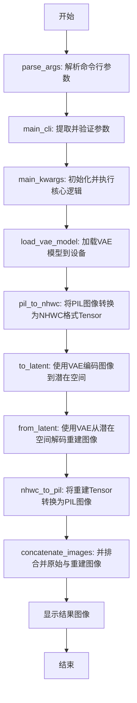
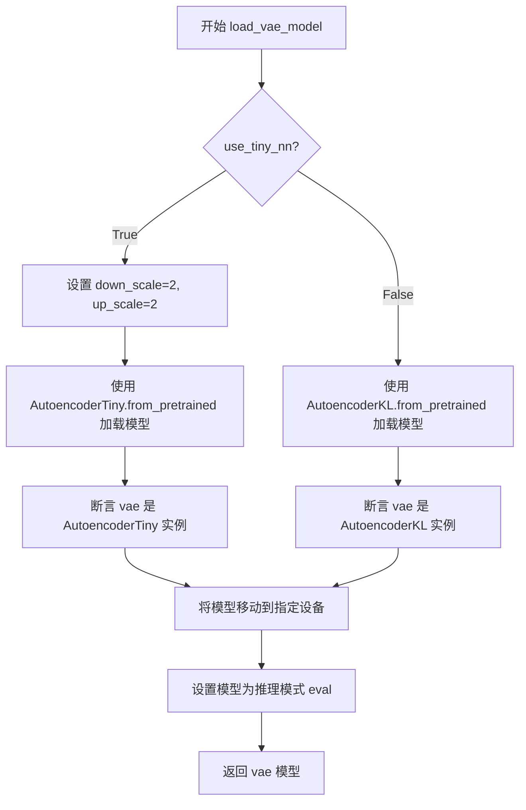
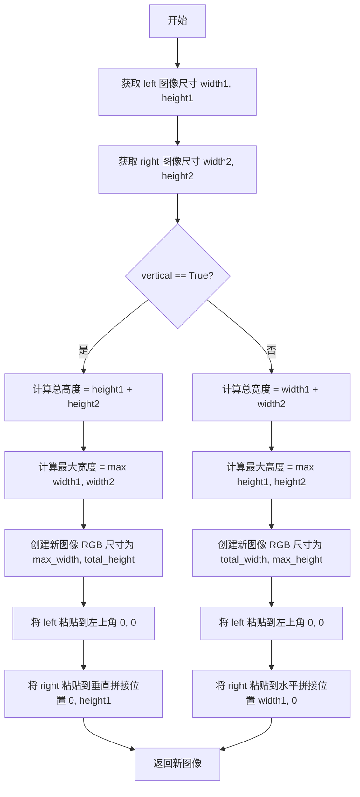
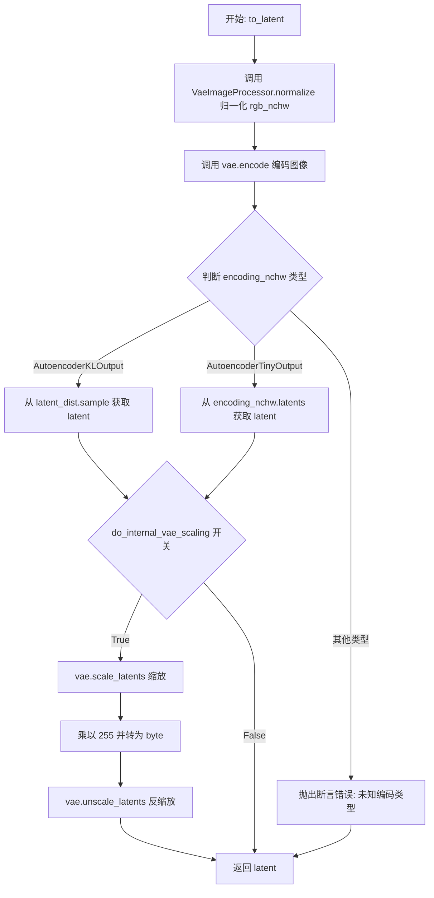
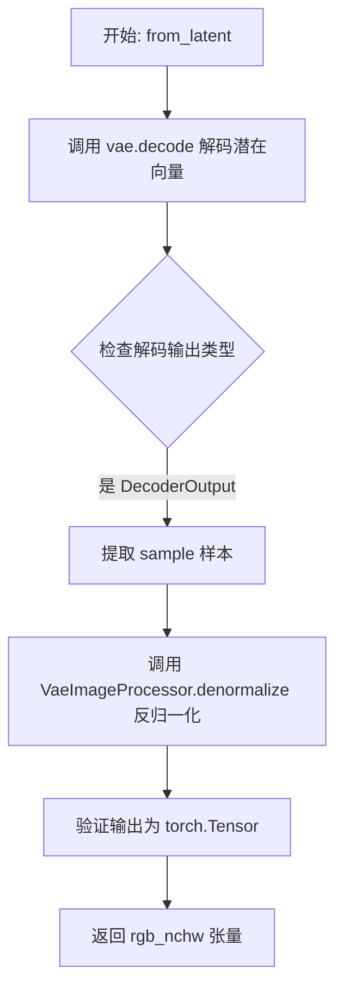
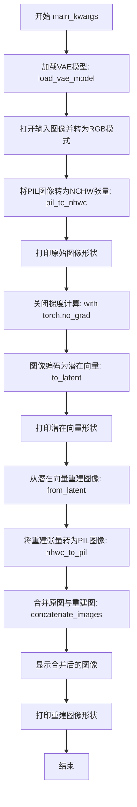
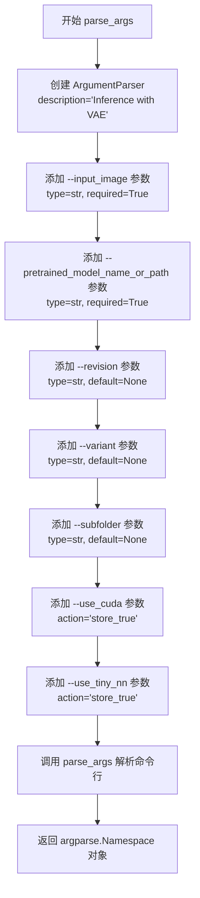
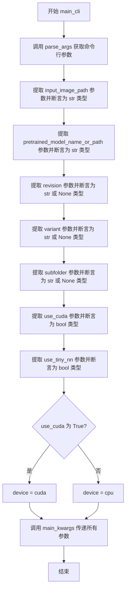

# `diffusers\examples\research_projects\vae\vae_roundtrip.py` 详细设计文档

该脚本是一个图像处理工具，核心功能是使用预训练的变分自编码器（VAE）模型对图像进行编码和解码，从而实现图像的重建。它支持多种VAE架构（如AutoencoderKL和AutoencoderTiny），并提供命令行接口用于加载模型、处理图像并将原始图像与重建图像进行对比展示。

## 整体流程



## 类结构

```
无类定义 (基于函数的脚本)
SupportedAutoencoder (类型别名)
├── load_vae_model (函数)
├── pil_to_nhwc (函数)
├── nhwc_to_pil (函数)
├── concatenate_images (函数)
├── to_latent (函数)
├── from_latent (函数)
├── main_kwargs (函数)
├── parse_args (函数)
└── main_cli (函数)
```

## 全局变量及字段


### `SupportedAutoencoder`
    
支持的可变自动编码器类型联合，用于兼容不同架构的VAE模型（AutoencoderKL或AutoencoderTiny）

类型：`Union[AutoencoderKL, AutoencoderTiny]`
    


    

## 全局函数及方法


### `load_vae_model`

该函数用于加载预训练的变分自编码器（VAE）模型，支持两种架构（AutoencoderKL 和 AutoencoderTiny），并根据参数配置将模型移动到指定设备上设置为推理模式。

参数：

- `device`：`torch.device`，计算设备，用于将模型加载到指定设备（如 CPU 或 CUDA）
- `model_name_or_path`：`str`，预训练模型的名称或本地路径
- `revision`：`str | None`，模型版本号，用于从 HuggingFace Hub 获取特定版本
- `variant`：`str | None`，模型文件变体（如 'fp16'），指定加载的权重精度
- `subfolder`：`str | None`，模型目录中的子文件夹路径（注意：若模型指向整体 Stable Diffusion 而非单独的 VAE，应使用 subfolder="vae"）
- `use_tiny_nn`：`bool`，是否使用轻量级神经网络（AutoencoderTiny），若为 False 则使用标准 AutoencoderKL

返回值：`SupportedAutoencoder`，即 `Union[AutoencoderKL, AutoencoderTiny]` 类型，返回加载并配置好的 VAE 模型实例

#### 流程图



#### 带注释源码

```python
def load_vae_model(
    *,
    device: torch.device,              # 计算设备 (CPU/CUDA)
    model_name_or_path: str,           # 预训练模型名称或路径
    revision: str | None,             # 模型版本 (可选)
    variant: str | None,              # 模型变体如 fp16 (可选)
    subfolder: str | None,             # 子文件夹路径 (可选)
    use_tiny_nn: bool,                 # 是否使用轻量级 VAE
) -> SupportedAutoencoder:             # 返回类型: AutoencoderKL 或 AutoencoderTiny
    # 根据 use_tiny_nn 参数选择不同的 VAE 架构
    if use_tiny_nn:
        # 轻量级 VAE 的缩放因子配置
        down_scale = 2      # 下采样缩放因子
        up_scale = 2        # 上采样缩放因子
        # 从预训练模型加载 AutoencoderTiny
        vae = AutoencoderTiny.from_pretrained(  # type: ignore
            model_name_or_path,
            subfolder=subfolder,
            revision=revision,
            variant=variant,
            downscaling_scaling_factor=down_scale,
            upsampling_scaling_factor=up_scale,
        )
        # 运行时类型检查，确保加载的是正确的模型类型
        assert isinstance(vae, AutoencoderTiny)
    else:
        # 从预训练模型加载标准 AutoencoderKL
        vae = AutoencoderKL.from_pretrained(  # type: ignore
            model_name_or_path,
            subfolder=subfolder,
            revision=revision,
            variant=variant,
        )
        # 运行时类型检查
        assert isinstance(vae, AutoencoderKL)
    
    # 将模型参数移动到指定设备 (CPU/CUDA)
    vae = vae.to(device)
    # 设置为推理模式，禁用 dropout 和 batch normalization 的训练行为
    vae.eval()  # Set the model to inference mode
    # 返回配置好的 VAE 模型
    return vae
```


### `pil_to_nhwc`

该函数负责将PIL图像对象转换为PyTorch张量（NHWC格式），以便后续在VAE模型中进行图像处理。

参数：

- `device`：`torch.device`，指定张量应放置的目标设备（CPU或CUDA）
- `image`：`Image.Image`，输入的PIL图像对象，要求为RGB模式

返回值：`torch.Tensor`，转换后的四维张量，形状为(1, H, W, C)，即batch_size=1的NHWC格式

#### 流程图

```mermaid
flowchart TD
    A[开始: pil_to_nhwc] --> B{检查图像模式是否为RGB}
    B -->|是| C[创建ToTensor转换器]
    B -->|否| D[断言失败 - 抛出AssertionError]
    C --> E[将PIL图像转换为张量]
    E --> F[添加批次维度: unsqueeze(0)]
    F --> G[将张量移动到指定设备: .to(device)]
    G --> H{断言结果是否为Tensor}
    H -->|是| I[返回NHWC格式的张量]
    H -->|否| J[抛出AssertionError]
```

#### 带注释源码

```python
def pil_to_nhwc(
    *,
    device: torch.device,
    image: Image.Image,
) -> torch.Tensor:
    # 断言确保输入图像必须是RGB模式（3通道），因为后续处理要求统一的颜色通道
    assert image.mode == "RGB"
    
    # 创建torchvision的ToTensor转换器，用于将PIL图像转换为[0,1]范围的FloatTensor
    # 转换后的形状为(C, H, W)，通道在前
    transform = transforms.ToTensor()
    
    # 核心转换步骤：
    # 1. transform(image): 将PIL Image (H, W, C) 转换为 FloatTensor (C, H, W)
    # 2. .unsqueeze(0): 在第0维添加批次维度，变为 (1, C, H, W)
    # 3 注意：虽然变量名叫nhwc，但实际转换后是NCHW格式，然后在最后才调整？
    #   实际上ToTensor转的是CHW，然后unsqueeze(0)变成NCHW (1,C,H,W)
    #   用户命名nhwc可能有误，实际返回的是NCHW格式
    nhwc = transform(image).unsqueeze(0).to(device)  # type: ignore
    
    # 运行时类型检查，确保返回的是PyTorch张量
    assert isinstance(nhwc, torch.Tensor)
    
    # 返回转换后的图像张量，形状为 (1, C, H, W)
    return nhwc
```

> **注意**：根据代码逻辑，变量名`nhwc`存在命名误导性。实际上`transforms.ToTensor()`返回的是NCHW格式（通道在前），而非NHWC（通道在后）。如需真正的NHWC格式，需要额外调用`.permute(0, 2, 3, 1)`进行维度重排。


### `nhwc_to_pil`

该函数用于将 PyTorch 张量（NHWC 格式，batch=1, H, W, C）转换为 PIL Image 对象，主要用于 VAE 模型重建图像的后处理，将模型输出的张量结果转换为人眼可读的图像格式。

参数：

- `nhwc`：`torch.Tensor`，输入的张量，形状为 (batch=1, height, width, channels)，即 N=1 的 NHWC 格式张量

返回值：`Image.Image`，返回转换后的 PIL Image 对象

#### 流程图

```mermaid
graph TD
    A[开始: nhwc_to_pil] --> B{检查 nhwc.shape[0] == 1}
    B -->|是| C[移除 batch 维度: squeeze(0)]
    C --> D[移动到 CPU: .cpu()]
    D --> E[转换为 PIL Image: transforms.ToPILImage()(hwc)]
    E --> F[返回 PIL Image]
    B -->|否| G[断言失败<br/>raise AssertionError]
```

#### 带注释源码

```python
def nhwc_to_pil(
    *,
    nhwc: torch.Tensor,
) -> Image.Image:
    """
    将 NHWC 格式的 PyTorch 张量转换为 PIL Image
    
    参数:
        nhwc: torch.Tensor，形状为 (1, H, W, C) 的张量
    
    返回:
        Image.Image: 转换后的 PIL 图像
    """
    # 断言 batch 维度必须为 1，确保输入是单张图像
    assert nhwc.shape[0] == 1
    
    # 移除 batch 维度，得到 HWC 格式张量，并移至 CPU
    # 注意：PIL Image 转换需要在 CPU 上进行
    hwc = nhwc.squeeze(0).cpu()
    
    # 使用 torchvision 的 ToPILImage 转换器将张量转为 PIL Image
    # 输入要求为 CHW 或 HWC 格式的 uint8 张量
    return transforms.ToPILImage()(hwc)  # type: ignore
```


### `concatenate_images`

该函数用于将两张 PIL 图像水平或垂直拼接成一张新图像，支持指定拼接方向（水平或垂直），并自动处理两图像尺寸不一致的情况。

参数：

- `left`：`Image.Image`，左侧输入的原始图像
- `right`：`Image.Image`，右侧输入的原始图像
- `vertical`：`bool`，是否垂直拼接，默认为 `False`（水平拼接）

返回值：`Image.Image`，拼接后的新图像

#### 流程图



#### 带注释源码

```python
def concatenate_images(
    *,
    left: Image.Image,
    right: Image.Image,
    vertical: bool = False,
) -> Image.Image:
    # 获取左图的宽高尺寸
    width1, height1 = left.size
    # 获取右图的宽高尺寸
    width2, height2 = right.size
    
    # 判断是否执行垂直拼接
    if vertical:
        # 垂直拼接：计算总高度和最大宽度
        total_height = height1 + height2
        max_width = max(width1, width2)
        
        # 创建新图像，尺寸为最大宽度 x 总高度，背景为 RGB 黑色
        new_image = Image.new("RGB", (max_width, total_height))
        
        # 将左图粘贴到顶部左侧
        new_image.paste(left, (0, 0))
        
        # 将右图粘贴到左图下方
        new_image.paste(right, (0, height1))
    else:
        # 水平拼接：计算总宽度和最大高度
        total_width = width1 + width2
        max_height = max(height1, height2)
        
        # 创建新图像，尺寸为总宽度 x 最大高度，背景为 RGB 黑色
        new_image = Image.new("RGB", (total_width, max_height))
        
        # 将左图粘贴到左侧
        new_image.paste(left, (0, 0))
        
        # 将右图粘贴到左图右侧
        new_image.paste(right, (width1, 0))
    
    # 返回拼接后的图像
    return new_image
```


### `to_latent`

该函数接收 RGB 图像张量（NHWC 格式）和 VAE 模型，通过 VAE 的 encode 方法将图像编码为潜在表示，支持 AutoencoderKL 和 AutoencoderTiny 两种 VAE 架构，并返回对应的潜在空间张量。

参数：

- `rgb_nchw`：`torch.Tensor`，输入的 RGB 图像张量，形状为 (N, C, H, W)
- `vae`：`SupportedAutoencoder`，已加载的 VAE 模型，支持 AutoencoderKL 或 AutoencoderTiny

返回值：`torch.Tensor`，编码后的潜在表示张量

#### 流程图



#### 带注释源码

```python
def to_latent(
    *,
    rgb_nchw: torch.Tensor,
    vae: SupportedAutoencoder,
) -> torch.Tensor:
    """
    将 RGB 图像编码为潜在表示
    
    参数:
        rgb_nchw: NCHW 格式的 RGB 图像张量
        vae: 支持的 VAE 模型 (AutoencoderKL 或 AutoencoderTiny)
    
    返回:
        编码后的潜在表示张量
    """
    # Step 1: 使用 VaeImageProcessor 对输入图像进行归一化
    # 将像素值从 [0, 255] 转换到 [0, 1] 或模型所需的范围
    rgb_nchw = VaeImageProcessor.normalize(rgb_nchw)  # type: ignore
    
    # Step 2: 使用 VAE 模型编码图像，得到编码输出
    # 对于 AutoencoderKL 返回 AutoencoderKLOutput
    # 对于 AutoencoderTiny 返回 AutoencoderTinyOutput
    encoding_nchw = vae.encode(typing.cast(torch.FloatTensor, rgb_nchw))
    
    # Step 3: 根据编码器类型提取潜在表示
    if isinstance(encoding_nchw, AutoencoderKLOutput):
        # AutoencoderKL 使用潜在分布，需要从中采样
        # latent_dist.sample() 从高斯分布中采样得到潜在向量
        latent = encoding_nchw.latent_dist.sample()  # type: ignore
        assert isinstance(latent, torch.Tensor)
        
    elif isinstance(encoding_nchw, AutoencoderTinyOutput):
        # AutoencoderTiny 直接输出潜在张量
        latent = encoding_nchw.latents
        
        # 可选的内部 VAE 缩放开关（当前设为 False，未启用）
        do_internal_vae_scaling = False  # Is this needed?
        if do_internal_vae_scaling:
            # 缩放潜在表示到 [0, 255] 范围并转为字节类型
            latent = vae.scale_latents(latent).mul(255).round().byte()  # type: ignore
            # 再反缩放回原始范围
            latent = vae.unscale_latents(latent / 255.0)  # type: ignore
            assert isinstance(latent, torch.Tensor)
    else:
        # 不支持的编码器类型，抛出错误
        assert False, f"Unknown encoding type: {type(encoding_nchw)}"
    
    # Step 4: 返回编码后的潜在表示
    return latent
```


### `from_latent`

该函数将变分自动编码器（VAE）的潜在空间表示解码回RGB图像空间，实现从潜在向量到可视化图像的反向转换过程。

参数：

- `latent_nchw`：`torch.Tensor`，表示潜在空间中的张量，数据格式为 NCHW（批次数、通道数、高度、宽度）
- `vae`：`SupportedAutoencoder`，支持 `AutoencoderKL` 或 `AutoencoderTiny` 两种变体，用于执行解码操作

返回值：`torch.Tensor`，解码后的 RGB 图像张量，格式为 NCHW，已进行反归一化处理

#### 流程图



#### 带注释源码

```python
def from_latent(
    *,
    latent_nchw: torch.Tensor,
    vae: SupportedAutoencoder,
) -> torch.Tensor:
    # 使用 VAE 模型将潜在空间向量解码为图像
    # decode 方法会将 latent_nchw 从潜在空间映射回图像空间
    decoding_nchw = vae.decode(latent_nchw)  # type: ignore
    
    # 确保解码输出是 DecoderOutput 类型，包含解码后的样本数据
    assert isinstance(decoding_nchw, DecoderOutput)
    
    # 从解码输出中提取样本，并进行反归一化处理
    # 将 [-1, 1] 或 [0, 1] 范围的数值转换回原始图像像素范围
    rgb_nchw = VaeImageProcessor.denormalize(decoding_nchw.sample)  # type: ignore
    
    # 确保最终输出是 PyTorch 张量类型
    assert isinstance(rgb_nchw, torch.Tensor)
    
    # 返回解码并反归一化后的 RGB 图像张量
    return rgb_nchw
```


### `main_kwargs`

该函数是VAE推理流程的核心入口，接收模型路径、设备和图像输入，加载预训练的变分自编码器(VAE)，将输入图像编码为潜在表示后再解码重建，并在窗口中并排展示原图与重建图像的对比效果。

参数：

- `device`：`torch.device`，运行VAE模型的设备（CPU或CUDA）
- `input_image_path`：`str`，输入图像的文件路径
- `pretrained_model_name_or_path`：`str`，预训练VAE模型的路径或模型名称
- `revision`：`str | None`，模型的版本修订号
- `variant`：`str | None`，模型文件变体（如'fp16'）
- `subfolder`：`str | None`，模型文件夹中的子文件夹路径
- `use_tiny_nn`：`bool`，是否使用轻量级神经网络（TAESD）

返回值：`None`，该函数无返回值，仅通过图像窗口和打印语句展示结果

#### 流程图



#### 带注释源码

```python
def main_kwargs(
    *,
    device: torch.device,
    input_image_path: str,
    pretrained_model_name_or_path: str,
    revision: str | None,
    variant: str | None,
    subfolder: str | None,
    use_tiny_nn: bool,
) -> None:
    """
    VAE推理主流程：加载模型、编码图像、解码重建、对比展示
    
    参数:
        device: torch.device - 运行模型的设备（CPU或CUDA）
        input_image_path: str - 输入图像路径
        pretrained_model_name_or_path: str - 预训练模型名称或路径
        revision: str | None - 模型版本
        variant: str | None - 模型变体（如fp16）
        subfolder: str | None - 模型子文件夹
        use_tiny_nn: bool - 是否使用轻量级TAESD模型
    返回:
        None - 无返回值，结果通过图像窗口展示
    """
    # 步骤1：加载VAE模型（支持AutoencoderKL或AutoencoderTiny）
    vae = load_vae_model(
        device=device,
        model_name_or_path=pretrained_model_name_or_path,
        revision=revision,
        variant=variant,
        subfolder=subfolder,
        use_tiny_nn=use_tiny_nn,
    )
    
    # 步骤2：打开输入图像并确保为RGB模式（3通道）
    original_pil = Image.open(input_image_path).convert("RGB")
    
    # 步骤3：将PIL图像转换为NCHW格式的张量（N=1批量，C=3通道，H=高，W=宽）
    original_image = pil_to_nhwc(
        device=device,
        image=original_pil,
    )
    
    # 打印原始图像张量形状，用于调试确认
    print(f"Original image shape: {original_image.shape}")
    
    # 初始化重建图像容器为None
    reconstructed_image: Optional[torch.Tensor] = None

    # 步骤4：使用torch.no_grad()禁用梯度计算，节省显存加速推理
    with torch.no_grad():
        # 步骤5：将图像编码为潜在空间表示（压缩到低维潜在向量）
        latent_image = to_latent(rgb_nchw=original_image, vae=vae)
        
        # 打印潜在向量形状，便于观察压缩效果
        print(f"Latent shape: {latent_image.shape}")
        
        # 步骤6：从潜在向量解码重建出图像（从低维恢复至高维）
        reconstructed_image = from_latent(latent_nchw=latent_image, vae=vae)
        
        # 步骤7：将重建的张量转换回PIL图像格式以便显示
        reconstructed_pil = nhwc_to_pil(nhwc=reconstructed_image)
    
    # 步骤8：并排拼接原图与重建图（水平拼接，vertical=False）
    combined_image = concatenate_images(
        left=original_pil,
        right=reconstructed_pil,
        vertical=False,
    )
    
    # 步骤9：弹出窗口显示对比结果，窗口标题为"Original | Reconstruction"
    combined_image.show("Original | Reconstruction")
    
    # 打印重建图像的最终形状，完成推理流程
    print(f"Reconstructed image shape: {reconstructed_image.shape}")
```


### `parse_args`

该函数是命令行参数解析器，用于解析 VAE 推理脚本的命令行参数，返回包含所有配置选项的 `argparse.Namespace` 对象。

参数：
- （无显式参数，使用 `argparse` 模块从命令行自动获取）

返回值：`argparse.Namespace`，包含以下属性：
- `input_image`：输入图像路径
- `pretrained_model_name_or_path`：预训练 VAE 模型路径或名称
- `revision`：模型版本
- `variant`：模型文件变体（如 'fp16'）
- `subfolder`：模型文件子文件夹
- `use_cuda`：是否使用 CUDA
- `use_tiny_nn`：是否使用小型神经网络

#### 流程图



#### 带注释源码

```python
def parse_args() -> argparse.Namespace:
    """
    解析命令行参数，返回包含 VAE 推理配置的配置对象。
    
    Returns:
        argparse.Namespace: 包含所有命令行参数的对象
    """
    # 创建 ArgumentParser 实例，设置程序描述信息
    parser = argparse.ArgumentParser(description="Inference with VAE")
    
    # 添加必需参数：输入图像路径
    parser.add_argument(
        "--input_image",
        type=str,
        required=True,
        help="Path to the input image for inference.",
    )
    
    # 添加必需参数：预训练 VAE 模型路径或 HuggingFace 模型名称
    parser.add_argument(
        "--pretrained_model_name_or_path",
        type=str,
        required=True,
        help="Path to pretrained VAE model.",
    )
    
    # 添加可选参数：模型版本（用于从 HuggingFace Hub 获取特定版本）
    parser.add_argument(
        "--revision",
        type=str,
        default=None,
        help="Model version.",
    )
    
    # 添加可选参数：模型文件变体（如 'fp16' 表示半精度）
    parser.add_argument(
        "--variant",
        type=str,
        default=None,
        help="Model file variant, e.g., 'fp16'.",
    )
    
    # 添加可选参数：模型目录子文件夹（如 'vae' 用于 Stable Diffusion VAE）
    parser.add_argument(
        "--subfolder",
        type=str,
        default=None,
        help="Subfolder in the model file.",
    )
    
    # 添加可选标志：是否使用 CUDA（默认为 False）
    parser.add_argument(
        "--use_cuda",
        action="store_true",
        help="Use CUDA if available.",
    )
    
    # 添加可选标志：是否使用轻量级神经网络（AutoencoderTiny）
    parser.add_argument(
        "--use_tiny_nn",
        action="store_true",
        help="Use tiny neural network.",
    )
    
    # 解析命令行参数并返回 Namespace 对象
    return parser.parse_args()
```


### `main_cli`

该函数是 VAE 推理脚本的命令行入口点，负责解析命令行参数、验证参数类型、根据用户指定的计算设备初始化运行环境，并将解析后的参数传递给核心处理函数 `main_kwargs` 执行图像的 VAE 编码与解码流程。

参数：
- （无显式参数，通过 `parse_args()` 内部获取命令行参数）

返回值：`None`，该函数不返回任何值，仅执行副作用（调用 `main_kwargs` 执行图像处理）

#### 流程图



#### 带注释源码

```python
def main_cli() -> None:
    """
    命令行入口函数。
    解析命令行参数，验证类型，并根据配置调用核心处理函数。
    无参数，无返回值（返回 None）。
    """
    # 步骤 1: 解析命令行参数
    args = parse_args()

    # 步骤 2: 提取并验证 input_image_path 参数
    # 用于指定输入图像的路径
    input_image_path = args.input_image
    assert isinstance(input_image_path, str)

    # 步骤 3: 提取并验证 pretrained_model_name_or_path 参数
    # 用于指定预训练 VAE 模型的路径或 HuggingFace 模型 ID
    pretrained_model_name_or_path = args.pretrained_model_name_or_path
    assert isinstance(pretrained_model_name_or_path, str)

    # 步骤 4: 提取并验证 revision 参数
    # 用于指定模型的 Git revision 版本
    revision = args.revision
    assert isinstance(revision, (str, type(None)))

    # 步骤 5: 提取并验证 variant 参数
    # 用于指定模型文件变体（如 'fp16', 'fp32'）
    variant = args.variant
    assert isinstance(variant, (str, type(None)))

    # 步骤 6: 提取并验证 subfolder 参数
    # 用于指定模型目录中的子文件夹路径（如 'vae'）
    subfolder = args.subfolder
    assert isinstance(subfolder, (str, type(None)))

    # 步骤 7: 提取并验证 use_cuda 参数
    # 布尔标志，控制是否使用 CUDA 进行推理
    use_cuda = args.use_cuda
    assert isinstance(use_cuda, bool)

    # 步骤 8: 提取并验证 use_tiny_nn 参数
    # 布尔标志，控制是否使用 TinyAutoencoder
    use_tiny_nn = args.use_tiny_nn
    assert isinstance(use_tiny_nn, bool)

    # 步骤 9: 根据 use_cuda 标志确定计算设备
    device = torch.device("cuda" if use_cuda else "cpu")

    # 步骤 10: 调用核心处理函数 main_kwargs
    # 传递所有解析和验证后的参数，执行 VAE 推理流程
    main_kwargs(
        device=device,
        input_image_path=input_image_path,
        pretrained_model_name_or_path=pretrained_model_name_or_path,
        revision=revision,
        variant=variant,
        subfolder=subfolder,
        use_tiny_nn=use_tiny_nn,
    )
```

## 关键组件


### 张量索引与形状转换

代码处理了多种图像张量格式的转换。`pil_to_nhwc`函数将PIL图像转换为NHWC格式张量，`nhwc_to_pil`则反向转换。在`to_latent`函数中，通过`encoding_nchw.latent_dist.sample()`或`encoding_nchw.latents`获取潜在向量，体现了对不同VAE输出类型的处理。`concatenate_images`函数使用PIL的`paste`方法进行图像拼接，涉及坐标索引计算。

### 反量化支持

在`to_latent`函数中，AutoencoderTiny输出处理部分包含内嵌的VAE缩放逻辑。代码中`do_internal_vae_scaling`变量控制是否执行量化操作：先通过`vae.scale_latents(latent).mul(255).round().byte()`将潜在向量量化为字节表示，再通过`vae.unscale_latents(latent / 255.0)`反量化回浮点数。这是可选的量化-反量化流程，但目前被禁用。

### 量化策略

代码支持两种VAE模型架构：AutoencoderKL（标准VAE）和AutoencoderTiny（轻量级VAE）。通过`use_tiny_nn`参数选择模型类型。AutoencoderTiny支持`downscaling_scaling_factor`和`upsampling_scaling_factor`参数控制下采样/上采样比例。模型通过`load_vae_model`函数加载，支持`variant`参数指定模型变体（如fp16）以及通过`revision`指定版本。

### 图像预处理与归一化

使用`VaeImageProcessor.normalize`对输入RGB张量进行归一化处理，解码后使用`VaeImageProcessor.denormalize`反归一化。这是diffusers库的标准做法，确保图像值域符合VAE的预期输入范围。

### 设备管理与推理模式

通过`torch.device("cuda" if use_cuda else "cpu")`管理计算设备。模型加载后立即调用`vae.eval()`设置为推理模式，并在推理代码块中使用`torch.no_grad()`禁用梯度计算，优化内存占用和推理速度。

### 统一自动编码器接口

`SupportedAutoencoder`类型别名使用`Union[AutoencoderKL, AutoencoderTiny]`统一两种VAE类型的函数签名，使得`to_latent`和`from_latent`函数可以接受任意一种VAE模型，增强了代码的灵活性。


## 问题及建议


### 已知问题

- **命令行参数设计不合理**：`--use_cuda` 采用 flag 形式而非自动检测，应该默认优先使用 CUDA（若可用），或使用 `--device` 参数让用户指定设备。
- **大量冗余的类型断言**：`main_cli` 函数中存在 6 处 `assert isinstance(..., str)` / `bool` / `None` 的检查，这些由 `argparse` 返回的值类型在运行时已确定，属于过度防御式编程，增加代码冗余度。
- **类型注解不完整且过度使用 type ignore**：多处使用 `# type: ignore` 掩盖类型问题，如 `vae.encode`、transforms 调用等，降低了代码的类型安全性。
- **缺乏异常处理机制**：未对以下情况进行捕获和处理——输入图像文件不存在或格式不支持、模型加载失败（如网络问题、路径错误）、CUDA 内存不足（OOM）、模型版本不兼容等。
- **配置硬编码**：`to_latent` 函数中的 `do_internal_vae_scaling = False` 及相关分支逻辑为占位代码，实际未启用任何缩放处理，存在死代码且注释 "Is this needed?" 表明逻辑不完整。
- **资源管理不规范**：未显式管理 CUDA 显存，推理完成后未调用 `torch.cuda.empty_cache()`，且 `concatenate_images` 创建新图像后未显式释放大尺寸临时对象引用，可能导致显存占用持续增长。
- **transforms 对象重复创建**：`pil_to_nhwc` 和 `nhwc_to_pil` 每次调用都实例化新的 `transforms.ToTensor()` 和 `transforms.ToPILImage()`，应在模块级别复用或定义为模块级单例。
- **缺少日志与进度提示**：模型加载和推理过程无任何日志输出（仅在 `main_kwargs` 中打印图像形状），无法在长时间运行中反馈状态。
- **潜在的死代码路径**：`to_latent` 中 `do_internal_vae_scaling` 为 False 时，其内部的条件分支逻辑（`vae.scale_latents` / `vae.unscale_latents`）永远不会被执行。

### 优化建议

- **改进设备选择逻辑**：移除 `--use_cuda` flag，改用 `--device` 参数接受 "cuda"/"cpu"/"mps" 等值，并添加自动检测逻辑（如 `torch.cuda.is_available()`）自动选择最优设备。
- **移除冗余类型断言**：删除 `main_cli` 中由 argparse 保障类型的 assert isinstance 检查，或改为在函数入口使用单次验证。
- **完善类型注解并移除 type ignore**：为 `vae.encode`、transforms 调用等添加正确的类型注解（如 `torch.FloatTensor`），或使用 `typing.cast` 替代全局 type ignore。
- **添加健壮的异常处理**：使用 try-except 包裹关键操作（文件读取、模型加载、推理），为不同异常（`FileNotFoundError`、`OSError`、`RuntimeError`）提供友好的错误信息和优雅降级（如回退到 CPU）。
- **清理无效代码逻辑**：移除 `do_internal_vae_scaling` 相关死代码，或将其实现完整化并在 `load_vae_model` 中通过参数控制是否启用。
- **优化资源管理**：在推理完成后显式调用 `torch.cuda.empty_cache()`（若使用 CUDA），或使用上下文管理器管理临时张量；考虑使用 `del` 释放大尺寸中间变量引用。
- **复用 transforms 对象**：在模块顶部定义全局的 `to_tensor = transforms.ToTensor()` 和 `to_pil = transforms.ToPILImage()`，在函数中直接调用以避免重复对象创建开销。
- **增强日志与交互反馈**：使用 `logging` 模块或 `tqdm` 库为模型加载、推理阶段添加日志和进度条，改善长时运行的可观测性。

## 其它


### 设计目标与约束

本代码的设计目标是提供一个简洁的VAE（变分自编码器）推理演示脚本，能够加载预训练的AutoencoderKL或AutoencoderTiny模型，对输入图像进行编码-解码操作，并可视化原始图像与重建图像的对比效果。约束条件包括：仅支持RGB格式输入图像、依赖PyTorch和HuggingFace Diffusers库、模型需要与Stable Diffusion兼容的VAE权重格式。

### 错误处理与异常设计

代码采用断言（assert）进行关键路径的运行时检查，主要包括：图像格式验证（必须是RGB模式）、张量类型验证、设备兼容性检查、模型实例类型校验。对于AutoencoderTiny的潜在空间缩放逻辑存在未完全理解的代码分支（do_internal_vae_scaling相关逻辑），当前处于注释状态。建议补充更 robust 的异常处理机制，例如捕获模型加载失败、图像文件不存在、设备不支持等常见异常情况，并提供有意义的错误信息。

### 数据流与状态机

数据流遵循以下路径：输入图像(PIL.Image) → pil_to_nhwc转换 → to_latent编码 → 潜在空间表示 → from_latent解码 → nhwc_to_pil转换 → 输出图像(PIL.Image)。状态机相对简单，主要状态包括：模型加载态、推理中态、结果显示态。图像处理过程中保持NHWC（batch=1, height, width, channel）张量格式，并在拼接前转换为PIL图像。

### 外部依赖与接口契约

核心依赖包括：torch（计算框架）、PIL.Image（图像读取）、torchvision.transforms（图像变换）、diffusers库（VAE模型和图像处理器）。load_vae_model函数接受model_name_or_path、revision、variant、subfolder等参数，与HuggingFace Hub接口契约兼容。VaeImageProcessor.normalize和denormalize方法负责图像归一化/反归一化。潜在空间编码/解码接口返回特定输出类型（AutoencoderKLOutput或AutoencoderTinyOutput）。

### 性能考虑与优化空间

当前实现使用torch.no_grad()上下文管理器禁用梯度计算，符合推理场景。device参数支持CUDA加速。潜在优化方向包括：批量处理多张图像、支持ONNX导出、模型量化（INT8/INT4）、使用torch.compile加速、异步图像加载。AutoencoderTiny的scaling因子（down_scale=2, up_scale=2）硬编码，可考虑参数化。

### 配置管理与命令行接口

通过argparse实现命令行参数配置，支持的参数包括：input_image（输入图像路径）、pretrained_model_name_or_path（预训练模型路径或Hub ID）、revision（模型版本）、variant（模型变体如fp16）、subfolder（VAE子文件夹）、use_cuda（启用CUDA）、use_tiny_nn（使用TinyVAE）。参数设计符合HuggingFace标准约定，subfolder默认None但文档建议SD模型使用"vae"子文件夹。

### 安全性与权限

代码遵循Apache 2.0许可证。模型加载涉及网络下载（如果使用Hub ID），需考虑网络权限和模型缓存策略。图像文件读取存在路径遍历风险，建议增加路径验证。用户提供的示例命令展示了两种典型用法：完整SD VAE和轻量级TAESD模型。

### 测试与验证方法

建议添加的测试用例包括：输入图像格式校验（RGB转换）、模型加载容错性、编码-解码前后图像尺寸一致性、CUDA/CPU设备兼容性、TinyVAE与标准VAE输出对比。可以通过比较原始图像与重建图像的PSNR/SSIM指标验证重建质量。示例用法中的foo.png需替换为实际测试图像路径。

    