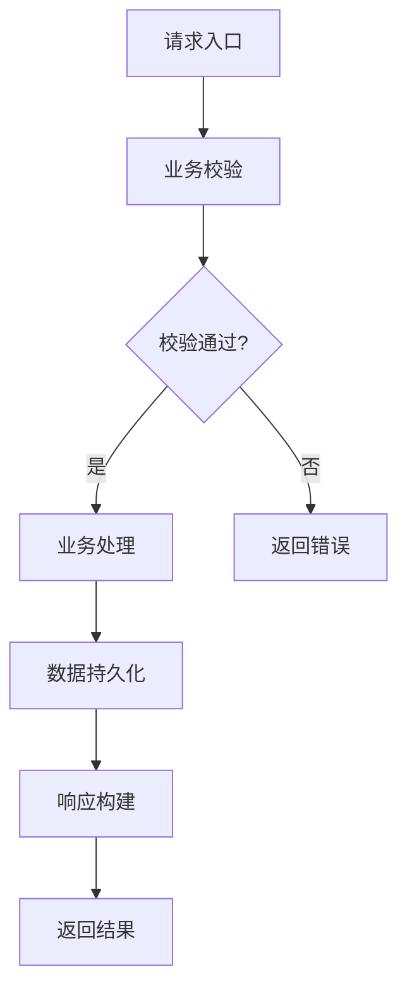
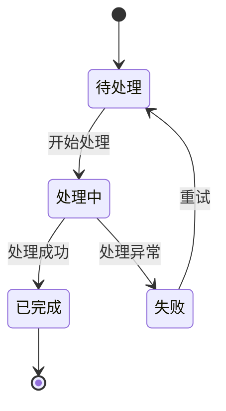

# `diffusers\examples\research_projects\wuerstchen\text_to_image\__init__.py` 详细设计文档

未提供源代码，无法进行分析

## 整体流程

```mermaid

```

## 类结构

```

```

## 全局变量及字段


    

## 全局函数及方法


## 关键组件


## 问题及建议


### 已知问题

- 未提供待分析的代码，无法进行技术债务或优化空间的分析
- 输入为空导致无法执行既定的分析流程

### 优化建议

- 请提供需要分析的源代码或文件路径
- 确保代码完整且包含必要的上下文信息（如依赖、配置等）
- 如有特定的分析重点或约束条件，请一并说明以便进行针对性分析


## 其它


### 设计目标与约束
- **目标**：明确系统要实现的业务价值、性能指标、可扩展性要求以及用户体验目标。  
- **约束**：包括技术栈限制（如语言版本、框架版本）、兼容性要求（浏览器、操作系统、硬件平台）、法规合规（GDPR、PCI‑DSS）以及预算与时间限制。  

### 错误处理与异常设计
- **异常分类**：系统异常（硬件、网络、第三方服务不可用）、业务异常（业务规则校验失败、状态不合法）以及未知异常（未捕获的运行时错误）。  
- **统一异常处理**：采用全局异常拦截器（或中间件）统一记录日志、返回统一的错误码和错误信息，并根据异常类型返回对应的 HTTP 状态码。  
- **降级策略**：关键依赖不可用时触发降级（如返回缓存数据、默认值或友好提示），并记录降级原因以便后续分析。  

### 数据流与状态机
- **数据流**：描述从请求入口 → 业务处理 → 数据持久化 → 返回结果的完整流向。可使用如下 Mermaid 流程图表示：



- **状态机**：若业务涉及多状态转换（如订单、任务、工作流），使用状态机建模并明确状态转移事件、入口/出口动作。以下为示例状态图：



### 外部依赖与接口契约
- **第三方服务**：列出所有外部依赖（如支付网关、短信平台、身份认证、缓存服务、消息队列）并说明调用的协议（REST、gRPC、SOAP）、认证方式（API Key、OAuth、JWT）以及超时与重试策略。  
- **接口契约**：采用 OpenAPI（Swagger）或 gRPC Protobuf 定义所有公开 API，明确请求/响应结构、错误码、版本号以及向后兼容的变更策略。  

### 安全性与合规性
- **身份认证与授权**：使用 JWT 或 OAuth2 实现统一登录与权限校验，确保最小权限原则。  
- **数据加密**：传输层使用 TLS 1.2+；敏感数据在持久化层使用 AES‑256 加密或字段级加密。  
- **审计日志**：记录关键操作（登录、支付、数据变更）并保存足够长的时间以满足合规要求。  
- **防护措施**：防止 SQL 注入、XSS、CSRF、DDOS；使用 WAF、限流、验证码等手段。  

### 性能与可伸缩性
- **性能指标**：设定响应时间（P99 < 200ms）、吞吐量（QPS ≥ 5000）和资源利用率（CPU < 70%）目标。  
- **伸缩策略**：采用水平扩展（无状态服务）+ 垂直扩展（数据库读写分离、分库分表）+ 缓存（本地缓存 + 分布式缓存）相结合的方案。  

### 可观测性与监控
- **日志**：统一使用结构化 JSON 日志（包含 TraceId、UserId、Timestamp、Level、Message），日志级别可动态调整。  
- **指标**：通过 Prometheus + Grafana 展示关键业务指标（如请求成功率、错误率、延迟分布）和系统指标（CPU、内存、网络）。  
- **链路追踪**：使用 OpenTelemetry 或 Jaeger 实现全链路追踪，覆盖每个请求的完整调用路径。  

### 测试策略
- **单元测试**：覆盖率 ≥ 80%，使用 JUnit（Java）/ pytest（Python）等框架，侧重业务核心算法与边界条件。  
- **集成测试**：验证组件之间的交互，使用 TestContainers 启动真实的数据库、消息队列等依赖。  
- **端到端（E2E）测试**：使用 Cypress/Playwright 模拟真实用户操作场景，确保关键业务流程贯通。  
- **性能/负载测试**：使用 k6 或 JMeter 模拟峰值流量，验证系统在高并发下的表现。  

### 部署与运维
- **容器化**：基于 Docker 镜像，使用 Docker‑Compose 或 Kubernetes（K8s）进行编排。  
- **CI/CD**：采用 Jenkins / GitLab CI / GitHub Actions 实现自动化构建、测试、镜像推送与灰度发布。  
- **环境管理**：明确 dev、test、staging、production 环境的差异与配置管理策略（使用 ConfigMap、Secret、环境变量）。  
- **灾备**：制定数据备份、故障切换与灾难恢复计划，定期进行演练。  

### 版本管理与发布策略
- **版本号**：遵循 SemVer（主版本.次版本.修订号），并在 API 文档中标注版本号。  
- **发布流程**：采用 trunk‑based 开发或 GitFlow；通过特性开关（Feature Flag）控制新功能上线，支持灰度、回滚与快速补丁。  

### 配置管理
- **集中配置**：使用 Spring Cloud Config、Consul、Etcd 或 Vault 等集中式配置中心，支持配置的动态刷新（热更新）。  
- **敏感信息**：密码、密钥、证书等敏感信息通过密钥管理系统（KMS）统一存储，避免硬编码。  

### 文档与变更日志
- **代码文档**：使用 Javadoc/Swagger‑UI 生成 API 文档；代码内部通过注释说明关键实现细节。  
- **变更日志（Changelog）**：采用 Keep a Changelog 规范，记录每个版本的新增、功能改动、缺陷修复与已知问题。  

### 许可与版权
- **开源许可**：明确项目使用的开源许可证（如 Apache‑2.0、MIT），并确保所有第三方依赖的许可证兼容。  
- **版权声明**：在文件头部加入版权声明与许可证摘要，确保合法使用。  

    