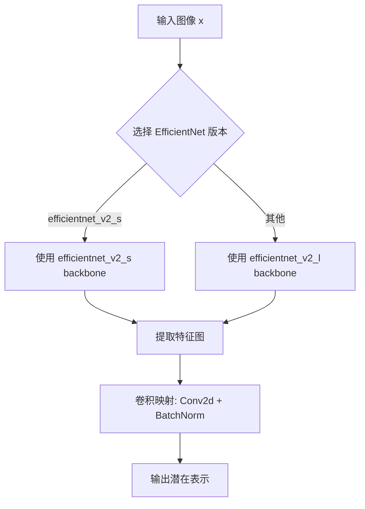
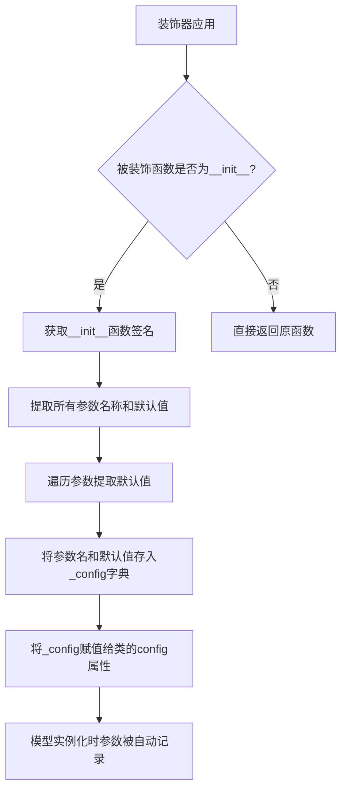
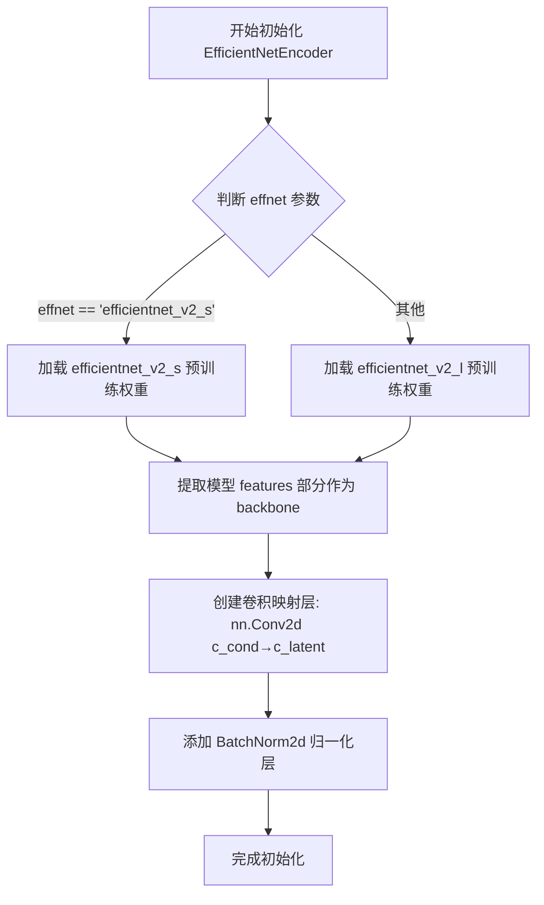

# `diffusers\examples\research_projects\wuerstchen\text_to_image\modeling_efficient_net_encoder.py` 详细设计文档

一个基于 EfficientNet 的图像编码器模块，将输入图像通过 EfficientNet backbone 提取特征，并使用卷积层映射到潜在空间，用于扩散模型的条件生成。

## 整体流程



## 类结构

```
ModelMixin (diffusers 基类)
└── EfficientNetEncoder (图像编码器)
    ├── backbone (EfficientNet 特征提取器)
    └── mapper (特征映射层)
```

## 全局变量及字段


### `torch.nn`
    
PyTorch 神经网络模块

类型：`module`
    


### `torchvision.models.efficientnet_v2_l`
    
EfficientNet V2 大型模型

类型：`function/class`
    


### `torchvision.models.efficientnet_v2_s`
    
EfficientNet V2 小型模型

类型：`function/class`
    


### `diffusers.configuration_utils.ConfigMixin`
    
配置混入类

类型：`class`
    


### `diffusers.configuration_utils.register_to_config`
    
配置注册装饰器

类型：`decorator`
    


### `diffusers.models.modeling_utils.ModelMixin`
    
模型混入基类

类型：`class`
    


### `EfficientNetEncoder.backbone`
    
EfficientNet 特征提取网络

类型：`nn.Sequential`
    


### `EfficientNetEncoder.mapper`
    
特征映射卷积层

类型：`nn.Sequential`
    
    

## 全局函数及方法


### `EfficientNetEncoder.__init__` 中的 `super().__init__()`

调用父类 `ModelMixin` 和 `ConfigMixin` 的初始化方法，完成基类的配置初始化，使当前类能够继承父类的配置管理功能。

参数：

- 无参数（父类 `__init__` 不接受任何参数）

返回值：`None`，无返回值，仅执行初始化逻辑

#### 流程图

```mermaid
flowchart TD
    A[EfficientNetEncoder.__init__ 开始] --> B{传入 effnet 参数}
    B -->|"effnet == 'efficientnet_v2_s'"| C[创建 efficientnet_v2_s backbone]
    B -->|其他| D[创建 efficientnet_v2_l backbone]
    C --> E[调用 super().__init__]
    D --> E
    E --> F[初始化 self.mapper 卷积层]
    F --> G[完成 __init__]
    
    style E fill:#f9f,stroke:#333,stroke-width:2px
```

#### 带注释源码

```python
class EfficientNetEncoder(ModelMixin, ConfigMixin):
    @register_to_config
    def __init__(self, c_latent=16, c_cond=1280, effnet="efficientnet_v2_s"):
        # 调用父类 ModelMixin 和 ConfigMixin 的 __init__ 方法
        # 继承父类的模型配置管理和注册功能
        super().__init__()
        
        # 根据 effnet 参数选择不同的 EfficientNet 骨干网络
        if effnet == "efficientnet_v2_s":
            self.backbone = efficientnet_v2_s(weights="DEFAULT").features
        else:
            self.backbone = efficientnet_v2_l(weights="DEFAULT").features
        
        # 创建映射卷积层，将条件特征 c_cond 映射到潜在空间 c_latent
        self.mapper = nn.Sequential(
            nn.Conv2d(c_cond, c_latent, kernel_size=1, bias=False),
            nn.BatchNorm2d(c_latent),  # 归一化使特征均值为0，标准差为1
        )

    def forward(self, x):
        return self.mapper(self.backbone(x))
```


### `register_to_config`

配置装饰器，用于将类的 `__init__` 方法参数自动序列化并保存到模型的配置对象中，实现配置的持久化。在 `diffusers` 库中，配合 `ConfigMixin` 使用，使得模型配置可以通过 `save_pretrained` 和 `from_pretrained` 进行保存和加载。

参数：

- 此装饰器无显式参数，它会自动捕获被装饰函数（即 `__init__` 方法）的所有参数，包括位置参数和关键字参数。

返回值：`None`，装饰器直接修改被装饰类的配置属性，不返回值。

#### 流程图



#### 带注释源码

```python
# register_to_config 装饰器源代码位于 diffusers.configuration_utils
# 以下为简化版实现原理说明

def register_to_config(func):
    """
    配置装饰器：自动将 __init__ 方法的参数序列化到模型配置中
    
    工作原理：
    1. 使用 inspect 模块获取被装饰函数的参数签名
    2. 提取所有参数的默认值
    3. 将参数名和默认值存储到 _config 字典
    4. 将 _config 绑定到类的 config 属性
    """
    # 装饰器内部实现（简化版）
    def wrapper(self, *args, **kwargs):
        # 1. 先执行原始 __init__ 方法
        func(self, *args, **kwargs)
        
        # 2. 获取 __init__ 的参数签名
        import inspect
        sig = inspect.signature(func)
        
        # 3. 提取所有参数的默认值
        config = {}
        for param_name, param in sig.parameters.items():
            if param_name == 'self':
                continue
            # 如果调用时传入了该参数，使用传入值；否则使用默认值
            if param_name in kwargs:
                config[param_name] = kwargs[param_name]
            elif param.default is not inspect.Parameter.empty:
                config[param_name] = param.default
        
        # 4. 将配置保存到 self.config
        self.config = config
    
    return wrapper


# 使用示例
class EfficientNetEncoder(ModelMixin, ConfigMixin):
    @register_to_config  # 装饰 __init__ 方法
    def __init__(self, c_latent=16, c_cond=1280, effnet="efficientnet_v2_s"):
        super().__init__()
        # ... 初始化逻辑 ...

# 装饰后的效果：
# encoder = EfficientNetEncoder(c_latent=16, c_cond=1280, effnet="efficientnet_v2_s")
# encoder.config  # 自动包含 {'c_latent': 16, 'c_cond': 1280, 'effnet': 'efficientnet_v2_s'}
# encoder.save_pretrained("./path")  # 配置会随模型一起保存
```


### `EfficientNetEncoder.__init__`

该方法是 EfficientNetEncoder 类的构造函数，用于初始化一个基于 EfficientNet 的图像编码器。它根据指定的 EfficientNet 版本加载预训练模型作为特征提取 backbone，并创建一个映射卷积层将条件特征转换为潜在空间表示。

参数：

- `c_latent`：`int`，默认值 16，表示潜在空间的通道数，用于控制输出特征图的通道维度
- `c_cond`：`int`，默认值 1280，表示条件输入的通道数，通常对应 EfficientNet 最后一层输出的通道数
- `effnet`：`str`，默认值 "efficientnet_v2_s"，指定使用的 EfficientNet 架构版本，可选 "efficientnet_v2_s" 或 "efficientnet_v2_l"

返回值：`None`，该方法为构造函数，不返回任何值，仅初始化对象属性

#### 流程图



#### 带注释源码

```python
def __init__(self, c_latent=16, c_cond=1280, effnet="efficientnet_v2_s"):
    """
    初始化 EfficientNetEncoder 编码器
    
    参数:
        c_latent (int): 潜在空间的通道数，默认16
        c_cond (int): 条件特征的通道数，默认1280
        effnet (str): EfficientNet模型版本，默认"efficientnet_v2_s"
    """
    # 调用父类的初始化方法
    super().__init__()

    # 根据指定的 EfficientNet 版本加载对应的预训练模型
    if effnet == "efficientnet_v2_s":
        # 加载 EfficientNet-V2-S 版本作为特征提取 backbone
        # .features 属性只保留特征提取部分，去除分类头
        self.backbone = efficientnet_v2_s(weights="DEFAULT").features
    else:
        # 加载 EfficientNet-V2-L 版本（更大的模型）
        self.backbone = efficientnet_v2_l(weights="DEFAULT").features
    
    # 创建特征映射模块：将条件特征映射到潜在空间
    self.mapper = nn.Sequential(
        # 1x1 卷积：将 c_cond 通道映射到 c_latent 通道
        # kernel_size=1 表示逐点卷积，用于通道维度的线性变换
        nn.Conv2d(c_cond, c_latent, kernel_size=1, bias=False),
        
        # 批归一化：将特征归一化到均值为0、标准差为1的分布
        # 有助于稳定训练和加速收敛
        nn.BatchNorm2d(c_latent),
    )
```


### `EfficientNetEncoder.forward(x)`

该方法实现了EfficientNetEncoder的前向传播过程，将输入图像通过EfficientNet骨干网络提取特征，并使用卷积映射器将特征维度转换为潜在空间表示，输出可用于后续解码或生成任务的特征张量。

参数：

- `x`：`torch.Tensor`，输入图像张量，通常为批次形式的RGB图像数据，形状为 (B, C, H, W)

返回值：`torch.Tensor`，经过特征提取和维度映射后的潜在空间特征张量，形状为 (B, c_latent, H', W')，其中 H' 和 W' 为特征图的空间维度

#### 流程图

```mermaid
flowchart TD
    A[输入 x: torch.Tensor] --> B[self.backbone(x)]
    B --> C[特征提取: EfficientNet backbone]
    C --> D[self.mapper特征映射]
    D --> E[输出: torch.Tensor 潜在空间特征]
    
    B -.-> B1[多层卷积+池化]
    B1 -.-> B2[输出多尺度特征]
    
    D -.-> D1[1x1卷积降维]
    D1 -.-> D2[BatchNorm归一化]
```

#### 带注释源码

```python
def forward(self, x):
    """
    EfficientNetEncoder 的前向传播方法
    
    该方法执行两步操作：
    1. 使用 EfficientNet backbone 提取输入图像的深度特征
    2. 使用 mapper 将特征维度映射到潜在空间维度
    
    参数:
        x (torch.Tensor): 输入图像张量
        
    返回:
        torch.Tensor: 潜在空间特征表示
    """
    # 第一步：使用 EfficientNet backbone 提取特征
    # backbone 是 EfficientNet 的特征提取部分（.features）
    # 输出形状: (B, 1280, H', W') 其中 H', W' 取决于输入分辨率
    features = self.backbone(x)
    
    # 第二步：使用 1x1 卷积将特征维度从 c_cond (默认1280) 
    # 映射到 c_latent (默认16)，实现维度压缩
    # 同时进行 BatchNorm 归一化，使特征具有标准正态分布特性
    output = self.mapper(features)
    
    # 返回形状: (B, c_latent, H', W')
    return output
```

## 关键组件


### EfficientNetEncoder

核心编码器类，集成了EfficientNet V2作为backbone进行特征提取，并通过mapper将特征映射到潜在空间。

### backbone

EfficientNet V2特征提取网络，支持efficientnet_v2_s和efficientnet_v2_l两个版本，用于从输入图像中提取高级语义特征。

### mapper

潜在空间映射模块，由卷积层和BatchNorm层组成，将EfficientNet输出的特征通道数从c_cond映射到c_latent。

### __init__

初始化方法，根据配置的effnet类型加载对应的EfficientNet V2预训练权重，并构建mapper模块。

### forward

前向传播方法，将输入图像通过backbone提取特征，再通过mapper映射到潜在空间，返回潜在表示。

### ConfigMixin

配置混入类，提供配置保存和加载功能。

### ModelMixin

模型混入类，提供模型权重保存和加载功能。

### register_to_config

装饰器，将配置参数注册到模型的配置中，支持配置序列化。


## 问题及建议


### 已知问题

- **硬编码的预训练权重**：代码直接使用 `weights="DEFAULT"`，无法自定义权重路径，也无法在没有网络的情况下使用本地权重，且默认权重可能在不同版本间变化
- **无效参数静默处理**：当 `effnet` 参数传入非预期值时，代码静默默认使用 `efficientnet_v2_l`，缺乏参数校验和错误提示
- **通道数未验证**：`c_cond=1280` 是硬编码假设，未动态验证是否与 EfficientNet backbone 的实际输出通道数匹配
- **无梯度控制机制**：无法冻结 backbone 或控制梯度计算，在迁移学习场景中灵活性不足
- **Mapper 层过于简单**：仅使用单层 Conv2d + BatchNorm2d，可能无法有效学习复杂的特征映射关系
- **无推理/训练模式切换**：缺少显式的 `train()`/`eval()` 方法或上下文管理器支持
- **BatchNorm 参数未配置**：使用默认参数（momentum=0.1），未针对扩散模型场景进行优化
- **无中间特征输出**：无法获取 backbone 的中间层特征，限制了调试和特征可视化的能力

### 优化建议

- 添加权重参数，允许用户传入 `weights` 对象、权重路径或 `None`（随机初始化）
- 对 `effnet` 参数进行校验，抛出明确的 `ValueError` 异常而非静默处理
- 动态获取 backbone 输出的实际通道数，移除硬编码的 `c_cond=1280` 假设
- 添加 `freeze_backbone()` 和 `unfreeze_backbone()` 方法支持梯度控制
- 增强 mapper 层的设计，考虑使用多层 MLP 或更复杂的映射结构
- 实现 `forward` 方法的 `return_features` 参数选项，支持返回中间特征
- 允许自定义 BatchNorm2d 的参数（momentum、eps 等）
- 添加配置验证逻辑，确保 `c_cond` 与实际 backbone 输出维度一致
- 考虑添加类型注解和详细的文档字符串


## 其它


### 设计目标与约束

本模块旨在为扩散模型提供高效的图像特征提取能力，将EfficientNet V2作为backbone，通过可配置的映射层将特征转换为潜在空间表示。设计约束包括：1) 必须继承ModelMixin和ConfigMixin以支持diffusers的配置管理；2) 仅支持efficientnet_v2_s和efficientnet_v2_l两种backbone变体；3) c_latent和c_cond参数需满足卷积层通道匹配。

### 错误处理与异常设计

代码中未显式实现错误处理机制。潜在错误场景包括：1) effnet参数非预期值时默认使用efficientnet_v2_l；2) 输入张量通道数与c_cond不匹配时会导致卷积操作失败；3) 权重加载失败时会抛出异常。建议在forward方法中添加输入验证，在__init__中添加参数校验。

### 数据流与状态机

数据流路径为：输入图像张量 → EfficientNet backbone特征提取 → 1280通道特征图 → 1x1卷积映射(c_cond→c_latent) → BatchNorm归一化 → 输出c_latent通道的潜在表示。无复杂状态机逻辑，模块为纯前向计算图。

### 外部依赖与接口契约

外部依赖包括：1) torch.nn提供神经网络基础组件；2) torchvision.models提供EfficientNet V2预训练权重；3) diffusers.configuration_utils.ConfigMixin和register_to_config装饰器提供配置序列化能力；4) diffusers.models.modeling_utils.ModelMixin提供模型基础实现。接口契约：输入x应为3通道图像张量(B,C,H,W)，输出为映射后的潜在表示张量(B,c_latent,H',W')。

### 性能考量

模块性能瓶颈主要在EfficientNet backbone的推理速度。可优化方向：1) 对于推理场景可考虑使用torch.jit.script进行加速；2) 可添加ONNX导出支持；3) 权重预加载后可设置eval模式并禁用梯度计算。当前实现每次实例化都会下载预训练权重，建议缓存处理。

### 兼容性说明

本模块兼容diffusers库的最新版本。EfficientNet V2权重从torchvision加载，需确保torchvision版本支持efficientnet_v2_s和efficientnet_v2_l。潜在兼容性问题：1) torchvision权重格式变化；2) diffusers的ModelMixin接口变更；3) 不同torch版本对算子的支持差异。

### 使用示例

```python
from diffusers import EfficientNetEncoder

# 初始化编码器
encoder = EfficientNetEncoder(
    c_latent=16,
    c_cond=1280,
    effnet="efficientnet_v2_s"
)

# 前向传播
import torch
x = torch.randn(1, 3, 224, 224)
features = encoder(x)  # 输出shape: (1, 16, 7, 7)
```

### 配置参数说明

| 参数名 | 类型 | 默认值 | 说明 |
|--------|------|--------|------|
| c_latent | int | 16 | 输出潜在空间的通道数 |
| c_cond | int | 1280 | EfficientNet V2特征图的通道数 |
| effnet | str | "efficientnet_v2_s" | backbone变体，可选"efficientnet_v2_s"或"efficientnet_v2_l" |


    