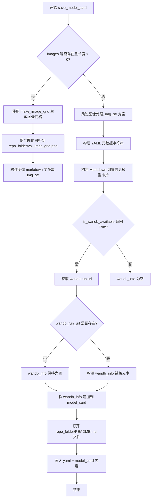
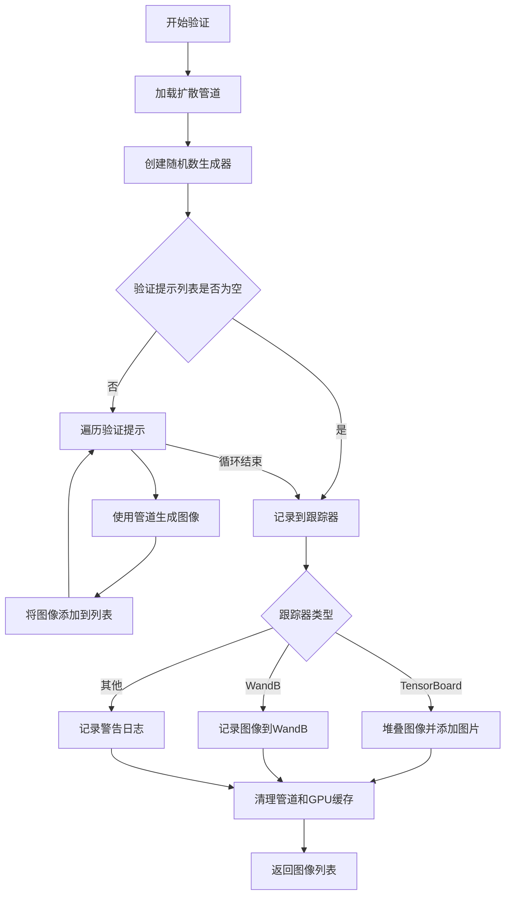
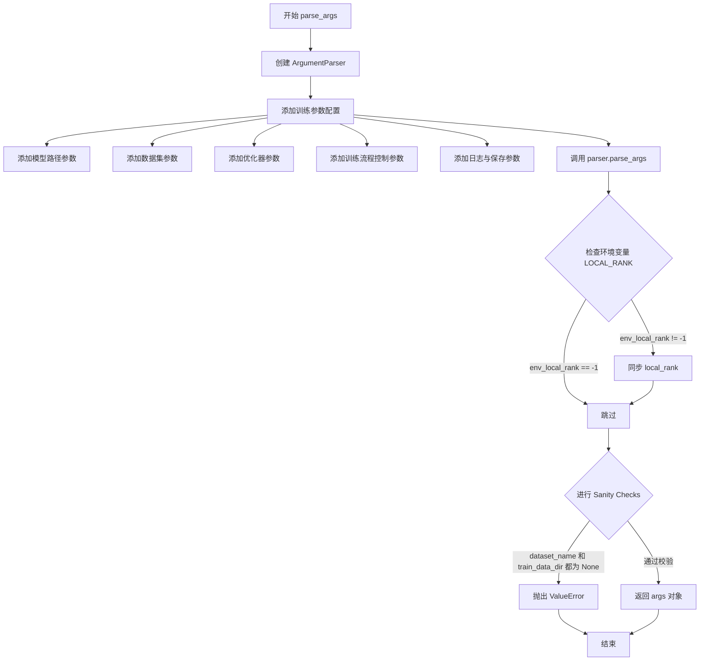
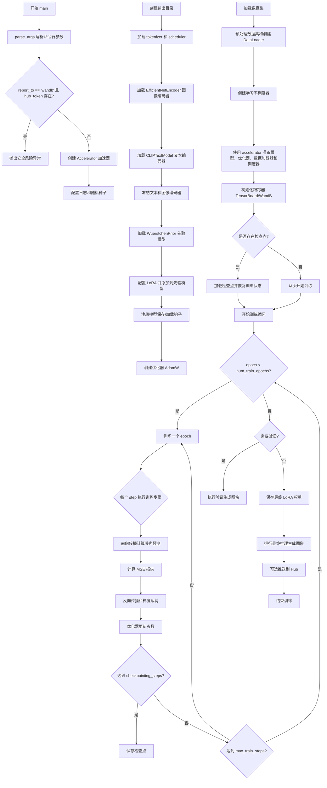
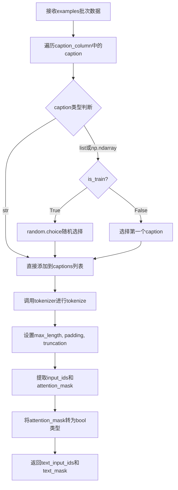
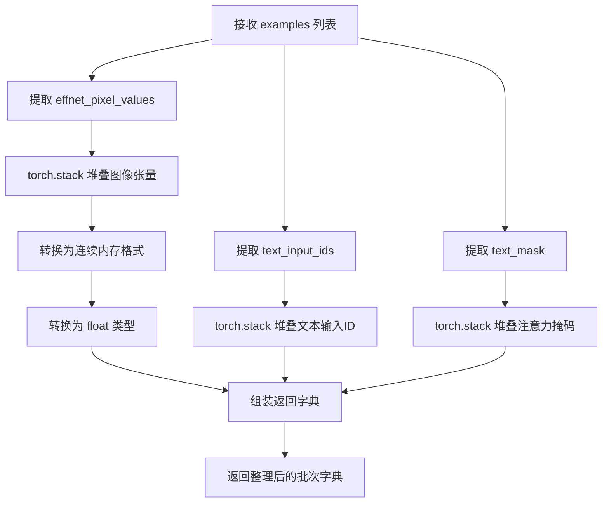
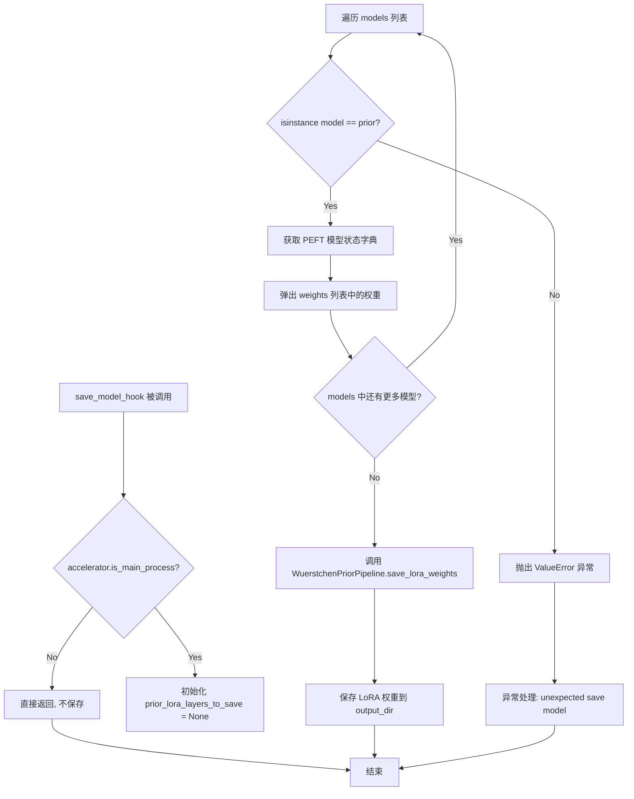
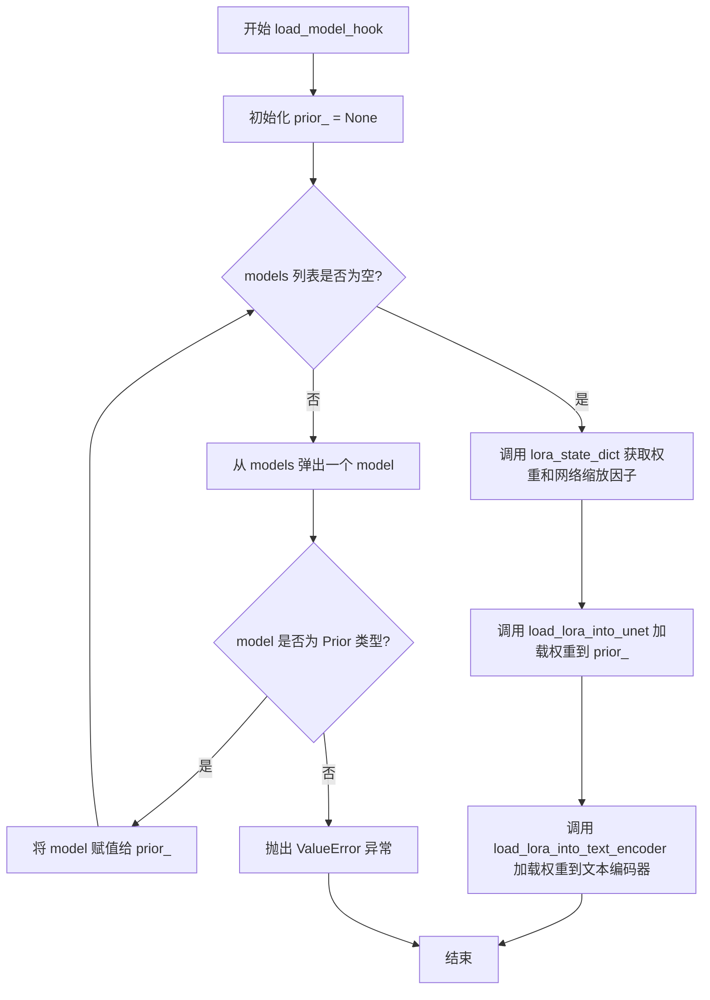

# `diffusers\examples\research_projects\wuerstchen\text_to_image\train_text_to_image_lora_prior.py` 详细设计文档

这是一个用于Wuerstchen Prior模型的LoRA微调训练脚本，主要功能是通过文本-图像对数据集对Wuerstchen文本到图像生成模型进行低秩适应（LoRA）微调，支持分布式训练、混合精度、模型保存与加载、验证推理等完整训练流程。

## 整体流程

```mermaid
graph TD
    A[开始] --> B[解析命令行参数]
    B --> C[初始化Accelerator加速器]
    C --> D[设置日志和随机种子]
    D --> E{是否为主进程?}
    E -- 是 --> F[创建输出目录]
    E -- 否 --> G[跳过目录创建]
    F --> G
    G --> H[加载预训练模型和分词器]
    H --> I[配置LoRA适配器]
    I --> J[加载数据集]
    J --> K[数据预处理和增强]
    K --> L[创建DataLoader]
    L --> M[初始化优化器和学习率调度器]
    M --> N[准备模型和数据进行分布式训练]
    N --> O[训练循环开始]
    O --> P{是否有检查点需恢复?}
    P -- 是 --> Q[加载检查点]
    P -- 否 --> R[从epoch 0开始]
    Q --> R
    R --> S[遍历每个epoch]
    S --> T[遍历每个batch]
    T --> U[前向传播: 编码文本和图像]
    U --> V[添加噪声到latent]
    V --> W[预测噪声残差]
    W --> X[计算MSE损失]
    X --> Y[反向传播和梯度更新]
    Y --> Z{是否达到检查点保存步数?}
    Z -- 是 --> AA[保存训练状态]
    Z -- 否 --> BB[继续训练]
    AA --> BB
    BB --> CC{是否完成所有训练步?}
    CC -- 否 --> T
    CC -- 是 --> DD{是否需要验证?}
    DD -- 是 --> EE[运行验证并生成图像]
    DD -- 否 --> FF[保存LoRA权重]
    EE --> FF
    FF --> GG{是否推送到Hub?}
    GG -- 是 --> HH[保存模型卡片并上传]
    GG -- 否 --> II[训练结束]
    HH --> II
```



## 类结构

```
全局函数和变量
├── logger (日志记录器)
├── DATASET_NAME_MAPPING (数据集名称映射)
├── save_model_card() - 保存模型卡片
├── log_validation() - 验证和日志记录
├── parse_args() - 解析命令行参数
└── main() - 主训练函数
```

## 全局变量及字段


### `logger`
    
用于记录训练过程中各类信息的日志记录器，通过accelerate的get_logger创建

类型：`logging.Logger`
    


### `DATASET_NAME_MAPPING`
    
数据集名称到图像和文本列名的映射字典，用于指定不同数据集的列名配置

类型：`dict`
    


    

## 全局函数及方法


### `save_model_card`

该函数用于生成并保存 HuggingFace Hub 的模型卡片（Model Card），包含训练元数据、超参数信息以及验证图像。它将 YAML 格式的模型元数据和 Markdown 格式的训练说明写入 README.md 文件，以便在模型发布时提供文档化信息。

参数：

-  `args`：Namespace 对象，包含训练参数（如 pretrained_prior_model_name_or_path、dataset_name、validation_prompts、rank、num_train_epochs、learning_rate、train_batch_size、gradient_accumulation_steps、resolution、mixed_precision、pretrained_decoder_model_name_or_path、weight_dtype 等）
-  `repo_id`：`str`，HuggingFace Hub 上的仓库 ID（格式如 "user/model-name"）
-  `images`：list，可选参数，验证阶段生成的图像列表，默认为 None
-  `repo_folder`：str，可选参数，本地仓库文件夹路径，用于保存 README.md 和验证图像网格

返回值：`None`，该函数无返回值，直接写入文件

#### 流程图



#### 带注释源码

```python
def save_model_card(
    args,
    repo_id: str,
    images=None,
    repo_folder=None,
):
    """
    生成并保存 HuggingFace Hub 模型卡片（README.md）
    
    参数:
        args: 包含训练配置的命名空间对象
        repo_id: HuggingFace Hub 仓库 ID
        images: 验证生成的图像列表（可选）
        repo_folder: 本地仓库文件夹路径（可选）
    """
    img_str = ""  # 初始化图像 markdown 字符串
    
    # 如果有验证图像，生成图像网格并保存
    if len(images) > 0:
        # 使用 diffusers 工具函数生成图像网格（1行，N列）
        image_grid = make_image_grid(images, 1, len(args.validation_prompts))
        # 保存图像网格到本地仓库文件夹
        image_grid.save(os.path.join(repo_folder, "val_imgs_grid.png"))
        # 构建 markdown 图像引用字符串
        img_str += "\n"

    # 构建 YAML 格式的模型元数据（HF Hub 格式）
    yaml = f"""
---
license: mit
base_model: {args.pretrained_prior_model_name_or_path}
datasets:
- {args.dataset_name}
tags:
- wuerstchen
- text-to-image
- diffusers
- diffusers-training
- lora
inference: true
---
    """
    
    # 构建 Markdown 格式的训练信息说明
    model_card = f"""
# LoRA Finetuning - {repo_id}

This pipeline was finetuned from **{args.pretrained_prior_model_name_or_path}** on the **{args.dataset_name}** dataset. Below are some example images generated with the finetuned pipeline using the following prompts: {args.validation_prompts}: \n
{img_str}

## Pipeline usage

You can use the pipeline like so:

```python
from diffusers import DiffusionPipeline
import torch

pipeline = AutoPipelineForText2Image.from_pretrained(
                "{args.pretrained_decoder_model_name_or_path}", torch_dtype={args.weight_dtype}
            )
# load lora weights from folder:
pipeline.prior_pipe.load_lora_weights("{repo_id}", torch_dtype={args.weight_dtype})

image = pipeline(prompt=prompt).images[0]
image.save("my_image.png")
```

## Training info

These are the key hyperparameters used during training:

* LoRA rank: {args.rank}
* Epochs: {args.num_train_epochs}
* Learning rate: {args.learning_rate}
* Batch size: {args.train_batch_size}
* Gradient accumulation steps: {args.gradient_accumulation_steps}
* Image resolution: {args.resolution}
* Mixed-precision: {args.mixed_precision}

"""
    wandb_info = ""  # 初始化 wandb 信息字符串
    
    # 检查 wandb 是否可用
    if is_wandb_available():
        wandb_run_url = None
        # 获取当前 wandb run 的 URL（如果存在）
        if wandb.run is not None:
            wandb_run_url = wandb.run.url

    # 如果 wandb URL 存在，添加 wandb 运行页面链接
    if wandb_run_url is not None:
        wandb_info = f"""
More information on all the CLI arguments and the environment are available on your [`wandb` run page]({wandb_run_url}).
"""

    # 将 wandb_info 追加到模型卡片内容
    model_card += wandb_info

    # 将完整的模型卡片内容写入 README.md 文件
    with open(os.path.join(repo_folder, "README.md"), "w") as f:
        f.write(yaml + model_card)
```


### `log_validation`

该函数用于在训练过程中运行验证，生成验证图像并将其记录到跟踪器（如 TensorBoard 或 WandB）中。它通过使用微调后的 prior 模型和文本编码器根据验证提示生成图像。

参数：

- `text_encoder`：`CLIPTextModel`，用于将文本提示编码为嵌入向量
- `tokenizer`：`PreTrainedTokenizerFast`，用于对文本提示进行分词
- `prior`：`WuerstchenPrior`，微调后的_prior_模型，用于生成图像嵌入
- `args`：`Namespace`，包含模型路径、分辨率等配置参数的命令行参数对象
- `accelerator`：`Accelerator`，用于分布式训练和模型管理的加速器对象
- `weight_dtype`：`torch.dtype`，模型权重的数据类型（fp16、bf16 或 fp32）
- `epoch`：`int`，当前训练轮次，用于记录日志

返回值：`List[PIL.Image]`，生成的验证图像列表

#### 流程图



#### 带注释源码

```python
def log_validation(text_encoder, tokenizer, prior, args, accelerator, weight_dtype, epoch):
    """
    运行验证流程：生成验证图像并记录到跟踪器
    
    参数:
        text_encoder: CLIP文本编码器模型
        tokenizer: 文本分词器
        prior: 微调后的Wuerstchen Prior模型
        args: 包含所有训练配置的对象
        accelerator: HuggingFace Accelerate分布式训练加速器
        weight_dtype: 模型权重数据类型
        epoch: 当前训练轮次
    """
    logger.info("Running validation... ")

    # 从预训练模型加载文本到图像的扩散管道
    # 使用accelerator.unwrap_model获取原始模型对象（去除分布式包装）
    pipeline = AutoPipelineForText2Image.from_pretrained(
        args.pretrained_decoder_model_name_or_path,  # 解码器模型路径
        prior=accelerator.unwrap_model(prior),        # 解包的prior模型
        prior_text_encoder=accelerator.unwrap_model(text_encoder),  # 解包的文本编码器
        prior_tokenizer=tokenizer,                     # 文本分词器
        torch_dtype=weight_dtype,                      # 设置权重精度
    )
    
    # 将管道移至加速器设备（GPU）
    pipeline = pipeline.to(accelerator.device)
    
    # 禁用进度条以减少验证过程中的日志输出
    pipeline.set_progress_bar_config(disable=True)

    # 根据seed创建随机数生成器以确保可重复性
    if args.seed is None:
        generator = None
    else:
        # 创建指定设备的随机数生成器并设置种子
        generator = torch.Generator(device=accelerator.device).manual_seed(args.seed)

    # 存储生成的验证图像
    images = []
    
    # 遍历每个验证提示生成对应的图像
    for i in range(len(args.validation_prompts)):
        # 使用自动混合精度加速推理
        with torch.cuda.amp.autocast():
            # 调用扩散管道生成图像
            image = pipeline(
                args.validation_prompts[i],              # 当前验证提示
                prior_timesteps=DEFAULT_STAGE_C_TIMESTEPS,  # 默认采样时间步
                generator=generator,                      # 随机数生成器
                height=args.resolution,                   # 图像高度
                width=args.resolution,                    # 图像宽度
            ).images[0]  # 获取第一张生成的图像
        images.append(image)

    # 将生成的图像记录到所有注册的跟踪器
    for tracker in accelerator.trackers:
        if tracker.name == "tensorboard":
            # TensorBoard记录：将PIL图像转换为numpy数组并堆叠
            # 数据格式NHWC (Batch, Height, Width, Channels)
            np_images = np.stack([np.asarray(img) for img in images])
            tracker.writer.add_images("validation", np_images, epoch, dataformats="NHWC")
        elif tracker.name == "wandb":
            # WandB记录：使用wandb.Image记录图像及标题
            tracker.log(
                {
                    "validation": [
                        wandb.Image(image, caption=f"{i}: {args.validation_prompts[i]}")
                        for i, image in enumerate(images)
                    ]
                }
            )
        else:
            # 其他跟踪器记录警告
            logger.warning(f"image logging not implemented for {tracker.name}")

    # 清理：删除管道引用并清空GPU缓存以释放显存
    del pipeline
    torch.cuda.empty_cache()

    # 返回生成的图像列表供后续使用（如保存到模型卡片）
    return images
```


### `parse_args`

该函数是训练脚本的命令行参数解析器，使用 argparse 模块定义并解析训练所需的各种超参数、数据路径、模型配置等参数，同时进行环境变量检查和基础校验，最终返回一个包含所有配置参数的命名空间对象。

参数：此函数无显式传入参数，通过内部创建的 argparse.ArgumentParser 实例进行参数解析。

返回值：`args`（argparse.Namespace），包含所有解析后的命令行参数对象。

#### 流程图



#### 带注释源码

```python
def parse_args():
    # 创建命令行参数解析器，描述用于说明脚本用途
    parser = argparse.ArgumentParser(description="Simple example of finetuning Würstchen Prior.")
    
    # ===== LoRA 相关参数 =====
    parser.add_argument(
        "--rank",
        type=int,
        default=4,
        help=("The dimension of the LoRA update matrices."),
    )
    
    # ===== 预训练模型路径参数 =====
    parser.add_argument(
        "--pretrained_decoder_model_name_or_path",
        type=str,
        default="warp-ai/wuerstchen",
        required=False,
        help="Path to pretrained model or model identifier from huggingface.co/models.",
    )
    parser.add_argument(
        "--pretrained_prior_model_name_or_path",
        type=str,
        default="warp-ai/wuerstchen-prior",
        required=False,
        help="Path to pretrained model or model identifier from huggingface.co/models.",
    )
    
    # ===== 数据集相关参数 =====
    parser.add_argument(
        "--dataset_name",
        type=str,
        default=None,
        help=(
            "The name of the Dataset (from the HuggingFace hub) to train on (could be your own, possibly private,"
            " dataset). It can also be a path pointing to a local copy of a dataset in your filesystem,"
            " or to a folder containing files that 🤗 Datasets can understand."
        ),
    )
    parser.add_argument(
        "--dataset_config_name",
        type=str,
        default=None,
        help="The config of the Dataset, leave as None if there's only one config.",
    )
    parser.add_argument(
        "--train_data_dir",
        type=str,
        default=None,
        help=(
            "A folder containing the training data. Folder contents must follow the structure described in"
            " https://huggingface.co/docs/datasets/image_dataset#imagefolder. In particular, a `metadata.jsonl` file"
            " must exist to provide the captions for the images. Ignored if `dataset_name` is specified."
        ),
    )
    parser.add_argument(
        "--image_column", type=str, default="image", help="The column of the dataset containing an image."
    )
    parser.add_argument(
        "--caption_column",
        type=str,
        default="text",
        help="The column of the dataset containing a caption or a list of captions.",
    )
    parser.add_argument(
        "--max_train_samples",
        type=int,
        default=None,
        help=(
            "For debugging purposes or quicker training, truncate the number of training examples to this "
            "value if set."
        ),
    )
    parser.add_argument(
        "--validation_prompts",
        type=str,
        default=None,
        nargs="+",
        help=("A set of prompts evaluated every `--validation_epochs` and logged to `--report_to`."),
    )
    
    # ===== 输出与存储参数 =====
    parser.add_argument(
        "--output_dir",
        type=str,
        default="wuerstchen-model-finetuned-lora",
        help="The output directory where the model predictions and checkpoints will be written.",
    )
    parser.add_argument(
        "--cache_dir",
        type=str,
        default=None,
        help="The directory where the downloaded models and datasets will be stored.",
    )
    parser.add_argument("--seed", type=int, default=None, help="A seed for reproducible training.")
    parser.add_argument(
        "--resolution",
        type=int,
        default=512,
        help=(
            "The resolution for input images, all the images in the train/validation dataset will be resized to this"
            " resolution"
        ),
    )
    
    # ===== 训练批次与epoch参数 =====
    parser.add_argument(
        "--train_batch_size", type=int, default=1, help="Batch size (per device) for the training dataloader."
    )
    parser.add_argument("--num_train_epochs", type=int, default=100)
    parser.add_argument(
        "--max_train_steps",
        type=int,
        default=None,
        help="Total number of training steps to perform.  If provided, overrides num_train_epochs.",
    )
    parser.add_argument(
        "--gradient_accumulation_steps",
        type=int,
        default=1,
        help="Number of updates steps to accumulate before performing a backward/update pass.",
    )
    
    # ===== 学习率与调度器参数 =====
    parser.add_argument(
        "--learning_rate",
        type=float,
        default=1e-4,
        help="learning rate",
    )
    parser.add_argument(
        "--lr_scheduler",
        type=str,
        default="constant",
        help=(
            'The scheduler type to use. Choose between ["linear", "cosine", "cosine_with_restarts", "polynomial",'
            ' "constant", "constant_with_warmup"]'
        ),
    )
    parser.add_argument(
        "--lr_warmup_steps", type=int, default=500, help="Number of steps for the warmup in the lr scheduler."
    )
    
    # ===== 优化器参数 =====
    parser.add_argument(
        "--use_8bit_adam", action="store_true", help="Whether or not to use 8-bit Adam from bitsandbytes."
    )
    parser.add_argument(
        "--allow_tf32",
        action="store_true",
        help=(
            "Whether or not to allow TF32 on Ampere GPUs. Can be used to speed up training. For more information, see"
            " https://pytorch.org/docs/stable/notes/cuda.html#tensorfloat-32-tf32-on-ampere-devices"
        ),
    )
    parser.add_argument(
        "--dataloader_num_workers",
        type=int,
        default=0,
        help=(
            "Number of subprocesses to use for data loading. 0 means that the data will be loaded in the main process."
        ),
    )
    parser.add_argument("--adam_beta1", type=float, default=0.9, help="The beta1 parameter for the Adam optimizer.")
    parser.add_argument("--adam_beta2", type=float, default=0.999, help="The beta2 parameter for the Adam optimizer.")
    parser.add_argument(
        "--adam_weight_decay",
        type=float,
        default=0.0,
        required=False,
        help="weight decay_to_use",
    )
    parser.add_argument("--adam_epsilon", type=float, default=1e-08, help="Epsilon value for the Adam optimizer")
    parser.add_argument("--max_grad_norm", default=1.0, type=float, help="Max gradient norm.")
    
    # ===== HuggingFace Hub 相关参数 =====
    parser.add_argument("--push_to_hub", action="store_true", help="Whether or not to push the model to the Hub.")
    parser.add_argument("--hub_token", type=str, default=None, help="The token to use to push to the Model Hub.")
    parser.add_argument(
        "--hub_model_id",
        type=str,
        default=None,
        help="The name of the repository to keep in sync with the local `output_dir`.",
    )
    parser.add_argument(
        "--logging_dir",
        type=str,
        default="logs",
        help=(
            "[TensorBoard](https://www.tensorflow.org/tensorboard) log directory. Will default to"
            " *output_dir/runs/**CURRENT_DATETIME_HOSTNAME***."
        ),
    )
    
    # ===== 混合精度与日志报告参数 =====
    parser.add_argument(
        "--mixed_precision",
        type=str,
        default=None,
        choices=["no", "fp16", "bf16"],
        help=(
            "Whether to use mixed precision. Choose between fp16 and bf16 (bfloat16). Bf16 requires PyTorch >="
            " 1.10.and an Nvidia Ampere GPU.  Default to the value of accelerate config of the current system or the"
            " flag passed with the `accelerate.launch` command. Use this argument to override the accelerate config."
        ),
    )
    parser.add_argument(
        "--report_to",
        type=str,
        default="tensorboard",
        help=(
            'The integration to report the results and logs to. Supported platforms are `"tensorboard"`'
            ' (default), `"wandb"` and `"comet_ml"`. Use `"all"` to report to all integrations.'
        ),
    )
    parser.add_argument("--local_rank", type=int, default=-1, help="For distributed training: local_rank")
    
    # ===== 检查点与恢复训练参数 =====
    parser.add_argument(
        "--checkpointing_steps",
        type=int,
        default=500,
        help=(
            "Save a checkpoint of the training state every X updates. These checkpoints are only suitable for resuming"
            " training using `--resume_from_checkpoint`."
        ),
    )
    parser.add_argument(
        "--checkpoints_total_limit",
        type=int,
        default=None,
        help=("Max number of checkpoints to store."),
    )
    parser.add_argument(
        "--resume_from_checkpoint",
        type=str,
        default=None,
        help=(
            "Whether training should be resumed from a previous checkpoint. Use a path saved by"
            ' `--checkpointing_steps`, or `"latest"` to automatically select the last available checkpoint.'
        ),
    )
    parser.add_argument(
        "--validation_epochs",
        type=int,
        default=5,
        help="Run validation every X epochs.",
    )
    parser.add_argument(
        "--tracker_project_name",
        type=str,
        default="text2image-fine-tune",
        help=(
            "The `project_name` argument passed to Accelerator.init_trackers for"
            " more information see https://huggingface.co/docs/accelerate/v0.17.0/en/package_reference/accelerator#accelerate.Accelerator"
        ),
    )

    # 解析命令行参数
    args = parser.parse_args()
    
    # 检查环境变量 LOCAL_RANK，如有必要则同步到 args.local_rank
    # 这是为了支持通过环境变量传递分布式训练参数
    env_local_rank = int(os.environ.get("LOCAL_RANK", -1))
    if env_local_rank != -1 and env_local_rank != args.local_rank:
        args.local_rank = env_local_rank

    # ===== Sanity Checks =====
    # 确保提供了数据集名称或训练数据目录之一
    if args.dataset_name is None and args.train_data_dir is None:
        raise ValueError("Need either a dataset name or a training folder.")

    # 返回解析后的参数对象
    return args
```


### `main`

这是Wuerstchen Prior模型LoRA微调训练的主入口函数，负责完整的训练流程：解析参数、初始化加速器和模型、加载数据集、执行训练循环（包括前向传播、损失计算、反向传播、梯度裁剪和优化器更新）、周期性验证模型效果、保存检查点、最终保存LoRA权重并可选推送到HuggingFace Hub。

参数：

- `args`：命令行参数（通过`parse_args()`解析），`Namespace`类型，包含所有训练配置如学习率、批次大小、LoRA rank、模型路径等。

返回值：`None`，该函数不返回任何值，直接执行训练流程并保存模型。

#### 流程图



#### 带注释源码

```python
def main():
    """Wuerstchen Prior LoRA 微调训练主函数"""
    # 1. 解析命令行参数
    args = parse_args()
    
    # 2. 安全检查：不能同时使用 wandb 和 hub_token（安全风险）
    if args.report_to == "wandb" and args.hub_token is not None:
        raise ValueError(
            "You cannot use both --report_to=wandb and --hub_token due to a security risk of exposing your token."
            " Please use `hf auth login` to authenticate with the Hub."
        )

    # 3. 配置日志目录和项目配置
    logging_dir = os.path.join(args.output_dir, args.logging_dir)
    accelerator_project_config = ProjectConfiguration(
        total_limit=args.checkpoints_total_limit, 
        project_dir=args.output_dir, 
        logging_dir=logging_dir
    )
    
    # 4. 初始化 Accelerator（分布式训练、混合精度等）
    accelerator = Accelerator(
        gradient_accumulation_steps=args.gradient_accumulation_steps,
        mixed_precision=args.mixed_precision,
        log_with=args.report_to,
        project_config=accelerator_project_config,
    )

    # 5. 禁用 MPS 的 AMP（Apple Silicon 加速）
    if torch.backends.mps.is_available():
        accelerator.native_amp = False

    # 6. 配置日志格式
    logging.basicConfig(
        format="%(asctime)s - %(levelname)s - %(name)s - %(message)s",
        datefmt="%m/%d/%Y %H:%M:%S",
        level=logging.INFO,
    )
    logger.info(accelerator.state, main_process_only=False)
    
    # 7. 根据进程类型设置日志级别
    if accelerator.is_local_main_process:
        datasets.utils.logging.set_verbosity_warning()
        transformers.utils.logging.set_verbosity_warning()
        set_verbosity_info()
    else:
        datasets.utils.logging.set_verbosity_error()
        transformers.utils.logging.set_verbosity_error()
        set_verbosity_error()

    # 8. 设置随机种子（如果提供）
    if args.seed is not None:
        set_seed(args.seed)

    # 9. 创建输出目录（仅在主进程）
    if accelerator.is_main_process:
        if args.output_dir is not None:
            os.makedirs(args.output_dir, exist_ok=True)

        # 10. 如果需要推送到 Hub，创建仓库
        if args.push_to_hub:
            repo_id = create_repo(
                repo_id=args.hub_model_id or Path(args.output_dir).name, 
                exist_ok=True, 
                token=args.hub_token
            ).repo_id

    # 11. 加载调度器、分词器
    noise_scheduler = DDPMWuerstchenScheduler()
    tokenizer = PreTrainedTokenizerFast.from_pretrained(
        args.pretrained_prior_model_name_or_path, 
        subfolder="tokenizer"
    )

    # 12. DeepSpeed zero3 初始化上下文管理器（禁用 zero3）
    def deepspeed_zero_init_disabled_context_manager():
        """返回禁用 DeepSpeed zero3 初始化的上下文管理器列表"""
        deepspeed_plugin = AcceleratorState().deepspeed_plugin if is_initialized() else None
        if deepspeed_plugin is None:
            return []
        return [deepspeed_plugin.zero3_init_context_manager(enable=False)]

    # 13. 确定权重数据类型（fp32/fp16/bf16）
    weight_dtype = torch.float32
    if accelerator.mixed_precision == "fp16":
        weight_dtype = torch.float16
    elif accelerator.mixed_precision == "bf16":
        weight_dtype = torch.bfloat16
    
    # 14. 加载预训练 EfficientNet 图像编码器
    with ContextManagers(deepspeed_zero_init_disabled_context_manager()):
        pretrained_checkpoint_file = hf_hub_download("dome272/wuerstchen", filename="model_v2_stage_b.pt")
        state_dict = torch.load(pretrained_checkpoint_file, map_location="cpu")
        image_encoder = EfficientNetEncoder()
        image_encoder.load_state_dict(state_dict["effnet_state_dict"])
        image_encoder.eval()

        # 15. 加载 CLIP 文本编码器
        text_encoder = CLIPTextModel.from_pretrained(
            args.pretrained_prior_model_name_or_path, 
            subfolder="text_encoder", 
            torch_dtype=weight_dtype
        ).eval()

    # 16. 冻结文本和图像编码器，并移动到设备
    text_encoder.requires_grad_(False)
    image_encoder.requires_grad_(False)
    image_encoder.to(accelerator.device, dtype=weight_dtype)
    text_encoder.to(accelerator.device, dtype=weight_dtype)

    # 17. 加载 Wuerstchen Prior 先验模型
    prior = WuerstchenPrior.from_pretrained(
        args.pretrained_prior_model_name_or_path, 
        subfolder="prior"
    )
    prior.to(accelerator.device, dtype=weight_dtype)

    # 18. 配置 LoRA 参数并添加到先验模型
    prior_lora_config = LoraConfig(
        r=args.rank,
        lora_alpha=args.rank,
        target_modules=["to_k", "to_q", "to_v", "to_out.0", "add_k_proj", "add_v_proj"],
    )
    prior.add_adapter(prior_lora_config)
    
    # 19. 确保可训练参数为 fp32（LoRA 在 fp32 中训练更稳定）
    if args.mixed_precision == "fp16":
        for param in prior.parameters():
            if param.requires_grad:
                param.data = param.to(torch.float32)

    # 20. 注册模型保存/加载钩子（自定义 LoRA 权重保存格式）
    def save_model_hook(models, weights, output_dir):
        """保存模型时的钩子函数"""
        if accelerator.is_main_process:
            prior_lora_layers_to_save = None

            for model in models:
                if isinstance(model, type(accelerator.unwrap_model(prior))):
                    prior_lora_layers_to_save = get_peft_model_state_dict(model)
                else:
                    raise ValueError(f"unexpected save model: {model.__class__}")
                weights.pop()

            WuerstchenPriorPipeline.save_lora_weights(
                output_dir,
                unet_lora_layers=prior_lora_layers_to_save,
            )

    def load_model_hook(models, input_dir):
        """加载模型时的钩子函数"""
        prior_ = None

        while len(models) > 0:
            model = models.pop()
            if isinstance(model, type(accelerator.unwrap_model(prior))):
                prior_ = model
            else:
                raise ValueError(f"unexpected save model: {model.__class__}")

        lora_state_dict, network_alphas = WuerstchenPriorPipeline.lora_state_dict(input_dir)
        WuerstchenPriorPipeline.load_lora_into_unet(lora_state_dict, network_alphas=network_alphas, unet=prior_)
        WuerstchenPriorPipeline.load_lora_into_text_encoder(
            lora_state_dict,
            network_alphas=network_alphas,
        )

    accelerator.register_save_state_pre_hook(save_model_hook)
    accelerator.register_load_state_pre_hook(load_model_hook)

    # 21. 启用 TF32（如果允许，可加速 Ampere GPU 训练）
    if args.allow_tf32:
        torch.backends.cuda.matmul.allow_tf32 = True

    # 22. 创建优化器（8-bit Adam 或标准 AdamW）
    if args.use_8bit_adam:
        try:
            import bitsandbytes as bnb
        except ImportError:
            raise ImportError(
                "Please install bitsandbytes to use 8-bit Adam. You can do so by running `pip install bitsandbytes`"
            )
        optimizer_cls = bnb.optim.AdamW8bit
    else:
        optimizer_cls = torch.optim.AdamW
    
    # 23. 获取需要优化的参数（仅 Prior 模型的参数）
    params_to_optimize = list(filter(lambda p: p.requires_grad, prior.parameters()))
    optimizer = optimizer_cls(
        params_to_optimize,
        lr=args.learning_rate,
        betas=(args.adam_beta1, args.adam_beta2),
        weight_decay=args.adam_weight_decay,
        eps=args.adam_epsilon,
    )

    # 24. 加载数据集（从 Hub 或本地目录）
    if args.dataset_name is not None:
        # 从 HuggingFace Hub 下载数据集
        dataset = load_dataset(
            args.dataset_name,
            args.dataset_config_name,
            cache_dir=args.cache_dir,
        )
    else:
        # 从本地目录加载（需符合 imagefolder 格式）
        data_files = {}
        if args.train_data_dir is not None:
            data_files["train"] = os.path.join(args.train_data_dir, "**")
        dataset = load_dataset(
            "imagefolder",
            data_files=data_files,
            cache_dir=args.cache_dir,
        )

    # 25. 获取数据集列名和配置
    column_names = dataset["train"].column_names
    dataset_columns = DATASET_NAME_MAPPING.get(args.dataset_name, None)
    
    # 26. 确定图像和文本列名
    if args.image_column is None:
        image_column = dataset_columns[0] if dataset_columns is not None else column_names[0]
    else:
        image_column = args.image_column
        if image_column not in column_names:
            raise ValueError(f"--image_column' value '{args.image_column}' needs to be one of: {', '.join(column_names)}")
    
    if args.caption_column is None:
        caption_column = dataset_columns[1] if dataset_columns is not None else column_names[1]
    else:
        caption_column = args.caption_column
        if caption_column not in column_names:
            raise ValueError(f"--caption_column' value '{args.caption_column}' needs to be one of: {', '.join(column_names)}")

    # 27. 定义分词函数
    def tokenize_captions(examples, is_train=True):
        """将文本描述转换为 token IDs 和 attention mask"""
        captions = []
        for caption in examples[caption_column]:
            if isinstance(caption, str):
                captions.append(caption)
            elif isinstance(caption, (list, np.ndarray)):
                # 训练时随机选择一个 caption，验证时选择第一个
                captions.append(random.choice(caption) if is_train else caption[0])
            else:
                raise ValueError(f"Caption column `{caption_column}` should contain either strings or lists of strings.")
        
        inputs = tokenizer(
            captions, 
            max_length=tokenizer.model_max_length, 
            padding="max_length", 
            truncation=True, 
            return_tensors="pt"
        )
        text_input_ids = inputs.input_ids
        text_mask = inputs.attention_mask.bool()
        return text_input_ids, text_mask

    # 28. 定义图像预处理 transforms
    effnet_transforms = transforms.Compose(
        [
            transforms.Resize(args.resolution, interpolation=transforms.InterpolationMode.BILINEAR, antialias=True),
            transforms.CenterCrop(args.resolution),
            transforms.ToTensor(),
            transforms.Normalize(mean=(0.485, 0.456, 0.406), std=(0.229, 0.224, 0.225)),
        ]
    )

    # 29. 定义训练数据预处理函数
    def preprocess_train(examples):
        """预处理训练数据：转换图像和分词"""
        images = [image.convert("RGB") for image in examples[image_column]]
        examples["effnet_pixel_values"] = [effnet_transforms(image) for image in images]
        examples["text_input_ids"], examples["text_mask"] = tokenize_captions(examples)
        return examples

    # 30. 应用数据预处理
    with accelerator.main_process_first():
        if args.max_train_samples is not None:
            dataset["train"] = dataset["train"].shuffle(seed=args.seed).select(range(args.max_train_samples))
        train_dataset = dataset["train"].with_transform(preprocess_train)

    # 31. 定义批处理整理函数
    def collate_fn(examples):
        """将多个样本整理成一个批次"""
        effnet_pixel_values = torch.stack([example["effnet_pixel_values"] for example in examples])
        effnet_pixel_values = effnet_pixel_values.to(memory_format=torch.contiguous_format).float()
        text_input_ids = torch.stack([example["text_input_ids"] for example in examples])
        text_mask = torch.stack([example["text_mask"] for example in examples])
        return {"effnet_pixel_values": effnet_pixel_values, "text_input_ids": text_input_ids, "text_mask": text_mask}

    # 32. 创建训练 DataLoader
    train_dataloader = torch.utils.data.DataLoader(
        train_dataset,
        shuffle=True,
        collate_fn=collate_fn,
        batch_size=args.train_batch_size,
        num_workers=args.dataloader_num_workers,
    )

    # 33. 计算训练步数
    overrode_max_train_steps = False
    num_update_steps_per_epoch = math.ceil(len(train_dataloader) / args.gradient_accumulation_steps)
    if args.max_train_steps is None:
        args.max_train_steps = args.num_train_epochs * num_update_steps_per_epoch
        overrode_max_train_steps = True

    # 34. 创建学习率调度器
    lr_scheduler = get_scheduler(
        args.lr_scheduler,
        optimizer=optimizer,
        num_warmup_steps=args.lr_warmup_steps * args.gradient_accumulation_steps,
        num_training_steps=args.max_train_steps * args.gradient_accumulation_steps,
    )

    # 35. 使用 Accelerator 准备所有组件
    prior, optimizer, train_dataloader, lr_scheduler = accelerator.prepare(
        prior, optimizer, train_dataloader, lr_scheduler
    )

    # 36. 重新计算训练步数（DataLoader 准备后可能变化）
    num_update_steps_per_epoch = math.ceil(len(train_dataloader) / args.gradient_accumulation_steps)
    if overrode_max_train_steps:
        args.max_train_steps = args.num_train_epochs * num_update_steps_per_epoch
    args.num_train_epochs = math.ceil(args.max_train_steps / num_update_steps_per_epoch)

    # 37. 初始化跟踪器（TensorBoard/WandB）
    if accelerator.is_main_process:
        tracker_config = dict(vars(args))
        tracker_config.pop("validation_prompts")
        accelerator.init_trackers(args.tracker_project_name, tracker_config)

    # 38. 打印训练信息
    total_batch_size = args.train_batch_size * accelerator.num_processes * args.gradient_accumulation_steps
    logger.info("***** Running training *****")
    logger.info(f"  Num examples = {len(train_dataset)}")
    logger.info(f"  Num Epochs = {args.num_train_epochs}")
    logger.info(f"  Instantaneous batch size per device = {args.train_batch_size}")
    logger.info(f"  Total train batch size (w. parallel, distributed & accumulation) = {total_batch_size}")
    logger.info(f"  Gradient Accumulation steps = {args.gradient_accumulation_steps}")
    logger.info(f"  Total optimization steps = {args.max_train_steps}")

    global_step = 0
    first_epoch = 0

    # 39. 从检查点恢复训练（如有）
    if args.resume_from_checkpoint:
        if args.resume_from_checkpoint != "latest":
            path = os.path.basename(args.resume_from_checkpoint)
        else:
            dirs = os.listdir(args.output_dir)
            dirs = [d for d in dirs if d.startswith("checkpoint")]
            dirs = sorted(dirs, key=lambda x: int(x.split("-")[1]))
            path = dirs[-1] if len(dirs) > 0 else None

        if path is None:
            accelerator.print(f"Checkpoint '{args.resume_from_checkpoint}' does not exist. Starting a new training run.")
            args.resume_from_checkpoint = None
        else:
            accelerator.print(f"Resuming from checkpoint {path}")
            accelerator.load_state(os.path.join(args.output_dir, path))
            global_step = int(path.split("-")[1])
            resume_global_step = global_step * args.gradient_accumulation_steps
            first_epoch = global_step // num_update_steps_per_epoch
            resume_step = resume_global_step % (num_update_steps_per_epoch * args.gradient_accumulation_steps)

    # 40. 创建进度条
    progress_bar = tqdm(range(global_step, args.max_train_steps), disable=not accelerator.is_local_main_process)
    progress_bar.set_description("Steps")

    # 41. 训练循环
    for epoch in range(first_epoch, args.num_train_epochs):
        prior.train()
        train_loss = 0.0
        
        for step, batch in enumerate(train_dataloader):
            # 跳过恢复训练前的步骤
            if args.resume_from_checkpoint and epoch == first_epoch and step < resume_step:
                if step % args.gradient_accumulation_steps == 0:
                    progress_bar.update(1)
                continue

            # 使用 accelerator.accumulate 进行梯度累积
            with accelerator.accumulate(prior):
                # 获取批次数据
                text_input_ids = batch["text_input_ids"]
                text_mask = batch["text_mask"]
                effnet_images = batch["effnet_pixel_values"].to(weight_dtype)

                # 冻结编码器前向传播
                with torch.no_grad():
                    text_encoder_output = text_encoder(text_input_ids, attention_mask=text_mask)
                    prompt_embeds = text_encoder_output.last_hidden_state
                    image_embeds = image_encoder(effnet_images)
                    # 缩放 image embeddings
                    image_embeds = image_embeds.add(1.0).div(42.0)

                    # 采样噪声
                    noise = torch.randn_like(image_embeds)
                    bsz = image_embeds.shape[0]

                    # 随机采样时间步
                    timesteps = torch.rand((bsz,), device=image_embeds.device, dtype=weight_dtype)

                    # 向 latents 添加噪声
                    noisy_latents = noise_scheduler.add_noise(image_embeds, noise, timesteps)

                # 先验模型预测噪声残差
                pred_noise = prior(noisy_latents, timesteps, prompt_embeds)

                # 计算 MSE 损失
                loss = F.mse_loss(pred_noise.float(), noise.float(), reduction="mean")

                # 收集所有进程的损失用于日志
                avg_loss = accelerator.gather(loss.repeat(args.train_batch_size)).mean()
                train_loss += avg_loss.item() / args.gradient_accumulation_steps

                # 反向传播
                accelerator.backward(loss)
                
                # 梯度裁剪
                if accelerator.sync_gradients:
                    accelerator.clip_grad_norm_(params_to_optimize, args.max_grad_norm)
                
                # 优化器更新
                optimizer.step()
                lr_scheduler.step()
                optimizer.zero_grad()

            # 检查是否执行了优化步骤
            if accelerator.sync_gradients:
                progress_bar.update(1)
                global_step += 1
                accelerator.log({"train_loss": train_loss}, step=global_step)
                train_loss = 0.0

                # 定期保存检查点
                if global_step % args.checkpointing_steps == 0:
                    if accelerator.is_main_process:
                        # 检查是否超过检查点数量限制
                        if args.checkpoints_total_limit is not None:
                            checkpoints = os.listdir(args.output_dir)
                            checkpoints = [d for d in checkpoints if d.startswith("checkpoint")]
                            checkpoints = sorted(checkpoints, key=lambda x: int(x.split("-")[1]))

                            if len(checkpoints) >= args.checkpoints_total_limit:
                                num_to_remove = len(checkpoints) - args.checkpoints_total_limit + 1
                                removing_checkpoints = checkpoints[0:num_to_remove]
                                logger.info(f"{len(checkpoints)} checkpoints already exist, removing {len(removing_checkpoints)} checkpoints")
                                for removing_checkpoint in removing_checkpoints:
                                    shutil.rmtree(os.path.join(args.output_dir, removing_checkpoint))

                        save_path = os.path.join(args.output_dir, f"checkpoint-{global_step}")
                        accelerator.save_state(save_path)
                        logger.info(f"Saved state to {save_path}")

            # 更新进度条
            logs = {"step_loss": loss.detach().item(), "lr": lr_scheduler.get_last_lr()[0]}
            progress_bar.set_postfix(**logs)

            if global_step >= args.max_train_steps:
                break

        # 验证（周期性）
        if accelerator.is_main_process:
            if args.validation_prompts is not None and epoch % args.validation_epochs == 0:
                log_validation(text_encoder, tokenizer, prior, args, accelerator, weight_dtype, global_step)

    # 42. 训练结束，保存最终模型
    accelerator.wait_for_everyone()
    if accelerator.is_main_process:
        prior = accelerator.unwrap_model(prior)
        prior = prior.to(torch.float32)

        # 获取 LoRA 权重状态字典
        prior_lora_state_dict = get_peft_model_state_dict(prior)

        # 保存 LoRA 权重
        WuerstchenPriorPipeline.save_lora_weights(
            save_directory=args.output_dir,
            unet_lora_layers=prior_lora_state_dict,
        )

        # 运行最终推理收集生成的图像
        images = []
        if args.validation_prompts is not None:
            logger.info("Running inference for collecting generated images...")
            pipeline = AutoPipelineForText2Image.from_pretrained(
                args.pretrained_decoder_model_name_or_path,
                prior_text_encoder=accelerator.unwrap_model(text_encoder),
                prior_tokenizer=tokenizer,
                torch_dtype=weight_dtype,
            )
            pipeline = pipeline.to(accelerator.device)

            # 加载 LoRA 权重
            pipeline.prior_pipe.load_lora_weights(args.output_dir, weight_name="pytorch_lora_weights.safetensors")
            pipeline.set_progress_bar_config(disable=True)

            if args.seed is None:
                generator = None
            else:
                generator = torch.Generator(device=accelerator.device).manual_seed(args.seed)

            for i in range(len(args.validation_prompts)):
                with torch.cuda.amp.autocast():
                    image = pipeline(
                        args.validation_prompts[i],
                        prior_timesteps=DEFAULT_STAGE_C_TIMESTEPS,
                        generator=generator,
                        width=args.resolution,
                        height=args.resolution,
                    ).images[0]
                images.append(image)

        # 推送到 HuggingFace Hub
        if args.push_to_hub:
            save_model_card(args, repo_id, images, repo_folder=args.output_dir)
            upload_folder(
                repo_id=repo_id,
                folder_path=args.output_dir,
                commit_message="End of training",
                ignore_patterns=["step_*", "epoch_*"],
            )

    accelerator.end_training()
```


### `deepspeed_zero_init_disabled_context_manager`

该函数是一个嵌套在 `main()` 函数内部的本地函数，用于在加载预训练模型时禁用 DeepSpeed ZeRO 优化中的 Zero3 初始化上下文管理器。它通过检查 Accelerator 是否已初始化以及是否存在 DeepSpeed 插件，返回一个空列表或一个包含禁用 Zero3 初始化上下文管理器的列表，以防止在加载某些模型（如 EfficientNetEncoder）时出现兼容性问题。

参数：

- （无参数）

返回值：`List[ContextManager]`，返回一个列表，包含用于禁用 DeepSpeed Zero3 初始化的上下文管理器；如果 DeepSpeed 未初始化或插件不存在，则返回空列表。

#### 流程图

```mermaid
flowchart TD
    A[Start deepspeed_zero_init_disabled_context_manager] --> B{is_initialized?}
    B -->|True| C[Get AcceleratorState.deepspeed_plugin]
    B -->|False| D[Set deepspeed_plugin = None]
    C --> E{deepspeed_plugin is None?}
    D --> E
    E -->|Yes| F[Return empty list []]
    E -->|No| G[Return [deepspeed_plugin.zero3_init_context_manager enable=False]]
    F --> H[End]
    G --> H
```

#### 带注释源码

```python
def deepspeed_zero_init_disabled_context_manager():
    """
    returns either a context list that includes one that will disable zero.Init or an empty context list
    """
    # 检查 Accelerator 是否已初始化，如果已初始化则获取 DeepSpeed 插件，否则设为 None
    deepspeed_plugin = AcceleratorState().deepspeed_plugin if is_initialized() else None
    
    # 如果 DeepSpeed 插件不存在（未初始化或未配置），返回空列表
    if deepspeed_plugin is None:
        return []

    # 返回包含禁用 Zero3 初始化的上下文管理器的列表
    # 这用于在加载某些模型时避免与 DeepSpeed Zero3 产生冲突
    return [deepspeed_plugin.zero3_init_context_manager(enable=False)]
```


### `tokenize_captions`

该函数用于将数据集中的文本描述（captions）转换为模型可处理的token IDs和attention mask。它是数据预处理管道的一部分，在训练前对批次数据进行标准化处理。

参数：

- `examples`：`Dict[str, Any]`，包含一个批次的样本数据，其中`examples[caption_column]`存储了文本描述（字符串或字符串列表）
- `is_train`：`bool`，指示是否处于训练模式。训练模式下当有多个caption时会随机选择一个，否则取第一个

返回值：`Tuple[torch.Tensor, torch.Tensor]`

- `text_input_ids`：`torch.Tensor`，形状为(batch_size, max_length)的tokenized输入ID
- `text_mask`：`torch.Tensor`，形状为(batch_size, max_length)的布尔类型attention mask

#### 流程图



#### 带注释源码

```python
def tokenize_captions(examples, is_train=True):
    """
    将批次数据中的文本描述转换为token IDs和attention mask
    
    参数:
        examples: 包含批次样本的字典,包含caption_column指定的文本列
        is_train: 训练模式标志,决定如何处理多个caption
    
    返回:
        text_input_ids: token化后的输入ID张量
        text_mask: 注意力掩码的布尔张量
    """
    captions = []
    # 遍历批次中的每个caption
    for caption in examples[caption_column]:
        if isinstance(caption, str):
            # 如果caption是字符串,直接添加
            captions.append(caption)
        elif isinstance(caption, (list, np.ndarray)):
            # 如果caption是列表或数组,根据模式选择
            # 训练模式:随机选择一个caption
            # 推理模式:选择第一个caption
            captions.append(random.choice(caption) if is_train else caption[0])
        else:
            # 类型检查,确保caption是合法类型
            raise ValueError(
                f"Caption column `{caption_column}` should contain either strings or lists of strings."
            )
    
    # 使用tokenizer将captions转换为模型输入格式
    inputs = tokenizer(
        captions, 
        max_length=tokenizer.model_max_length,  # 使用tokenizer的最大长度限制
        padding="max_length",                    # 填充到最大长度
        truncation=True,                          # 截断超过最大长度的序列
        return_tensors="pt"                      # 返回PyTorch张量
    )
    
    # 提取tokenized后的input IDs
    text_input_ids = inputs.input_ids
    # 将attention mask转换为布尔类型,用于后续模型处理
    text_mask = inputs.attention_mask.bool()
    
    # 返回token IDs和attention mask元组
    return text_input_ids, text_mask
```


### `preprocess_train`

这是一个数据预处理函数，作为 HuggingFace `Dataset` 的转换函数（transform）使用。它接收一批原始数据（包含图像和文本），将图像转换为 RGB 格式并应用 EfficientNet 预处理 transforms（调整大小、裁剪、归一化），同时调用分词器处理文本描述，最终返回包含模型所需输入格式（`effnet_pixel_values`, `text_input_ids`, `text_mask`）的字典。

参数：

-  `examples`：`Dict`，HuggingFace Datasets 传入的原始数据批次，包含 `image_column` 指定的图像数据和 `caption_column` 指定的文本数据。

返回值：`Dict`，处理后的数据字典，包含 `effnet_pixel_values`（处理后的图像张量列表）、`text_input_ids`（文本 Token IDs）、`text_mask`（文本 Attention Mask）。

#### 流程图

```mermaid
graph TD
    A([Start: Input examples]) --> B[获取图像列并转换为RGB]
    B --> C{遍历每张图像}
    C -->|每张图像| D[应用 effnet_transforms]
    D --> E[存入 examples['effnet_pixel_values'] ]
    C --> F[调用 tokenize_captions 处理文本]
    F --> G[获取 text_input_ids 和 text_mask]
    G --> H[存入 examples]
    E --> I([Return examples])
    H --> I
```

#### 带注释源码

```python
def preprocess_train(examples):
    # 从输入的examples字典中根据image_column获取图像列表，
    # 并将所有图像统一转换为RGB模式（确保通道一致）
    images = [image.convert("RGB") for image in examples[image_column]]
    
    # 使用预先定义的 effnet_transforms (torchvision.transforms.Compose)
    # 对图像进行预处理：调整尺寸、中心裁剪、转换为Tensor、归一化
    # 处理结果存储在 'effnet_pixel_values' 键下
    examples["effnet_pixel_values"] = [effnet_transforms(image) for image in images]
    
    # 调用外层定义的 tokenize_captions 函数对文本进行分词
    # 返回的 text_input_ids 和 text_mask 覆盖或更新到 examples 字典中
    examples["text_input_ids"], examples["text_mask"] = tokenize_captions(examples)
    
    # 返回处理完毕的字典，供 DataLoader 聚合为批次
    return examples
```


### `collate_fn`

这是一个自定义的批处理整理函数，用于将 DataLoader 获取的样本列表整理成模型训练所需的批次张量格式。该函数从每个样本字典中提取 `effnet_pixel_values`、`text_input_ids` 和 `text_mask` 字段，并将它们堆叠成批量张量，同时确保内存格式连续且数据类型为 float。

参数：

- `examples`：`List[Dict]`，从 PyTorch DataLoader 获取的样本列表，每个元素是一个包含预处理后数据的字典（如 `effnet_pixel_values`、`text_input_ids`、`text_mask` 等键）

返回值：`Dict`，包含以下键值对：
- `effnet_pixel_values`：`torch.Tensor`，形状为 (batch_size, C, H, W) 的图像像素值张量
- `text_input_ids`：`torch.Tensor`，形状为 (batch_size, seq_len) 的文本输入 ID 张量
- `text_mask`：`torch.Tensor`，形状为 (batch_size, seq_len) 的文本注意力掩码张量

#### 流程图



#### 带注释源码

```python
def collate_fn(examples):
    """
    自定义批处理整理函数，将 DataLoader 的样本列表整理为批次张量
    
    参数:
        examples: 从数据集获取的样本列表，每个样本包含预处理后的图像和文本数据
        
    返回:
        包含批次化张量的字典，用于模型训练
    """
    # 从每个样本中提取 effnet_pixel_values（图像像素值）并堆叠成批次张量
    effnet_pixel_values = torch.stack([example["effnet_pixel_values"] for example in examples])
    # 转换为连续内存格式并确保为 float 类型（兼容不同精度的输入）
    effnet_pixel_values = effnet_pixel_values.to(memory_format=torch.contiguous_format).float()
    
    # 从每个样本中提取 text_input_ids（文本token IDs）并堆叠成批次张量
    text_input_ids = torch.stack([example["text_input_ids"] for example in examples])
    
    # 从每个样本中提取 text_mask（注意力掩码）并堆叠成批次张量
    text_mask = torch.stack([example["text_mask"] for example in examples])
    
    # 返回整理好的批次字典，包含模型所需的输入数据
    return {"effnet_pixel_values": effnet_pixel_values, "text_input_ids": text_input_ids, "text_mask": text_mask}
```


### `save_model_hook`

该函数是定义在 `main()` 函数内部的一个嵌套函数，作为 Accelerate 的自定义保存状态钩子使用。它在调用 `accelerator.save_state()` 时被触发，用于将训练好的 LoRA 权重以特定格式保存到磁盘。

参数：

-  `models`：`List[torch.nn.Module]` - 待保存的模型列表，通常包含 prior 模型
-  `weights`：`List[torch.Tensor]` - 权重列表，用于跟踪已处理的模型权重，函数执行后会弹出已处理的权重
-  `output_dir`：`str` - 输出目录路径，指定 LoRA 权重保存的目标文件夹

返回值：`None`，该函数通过副作用完成权重保存操作，不返回任何值

#### 流程图



#### 带注释源码

```python
def save_model_hook(models, weights, output_dir):
    # 仅在主进程执行保存操作，避免多进程重复写入
    if accelerator.is_main_process:
        # 初始化为 None，用于存储待保存的 LoRA 层权重
        prior_lora_layers_to_save = None

        # 遍历所有待保存的模型
        for model in models:
            # 检查模型类型是否与 unwrap 后的 prior 模型类型匹配
            if isinstance(model, type(accelerator.unwrap_model(prior))):
                # 使用 PEFT 工具获取模型的 LoRA 状态字典
                # 这会提取出仅包含 LoRA 可训练参数的字典
                prior_lora_layers_to_save = get_peft_model_state_dict(model)
            else:
                # 如果遇到意外类型的模型，抛出异常
                raise ValueError(f"unexpected save model: {model.__class__}")

            # 重要：弹出权重，确保对应模型不会被再次保存
            # 这是 Accelerate 钩子机制的要求，防止重复序列化
            weights.pop()

        # 调用 WuerstchenPriorPipeline 的类方法保存 LoRA 权重
        # 参数包括输出目录和 prior 的 LoRA 层权重字典
        WuerstchenPriorPipeline.save_lora_weights(
            output_dir,
            unet_lora_layers=prior_lora_layers_to_save,
        )
```


### `load_model_hook`

`load_model_hook` 是一个在训练恢复时用于加载LoRA权重的钩子函数，配合Accelerate库的`register_load_state_pre_hook`使用，负责从检查点目录中读取并应用LoRA权重到Prior模型和文本编码器。

参数：

-  `models`：`list`，由Accelerate框架传入的模型列表，用于恢复训练状态时传递待加载的模型对象
-  `input_dir`：`str`，检查点目录路径，从中读取保存的LoRA权重

返回值：`None`，该函数直接修改传入的模型对象，不返回任何值

#### 流程图



#### 带注释源码

```python
def load_model_hook(models, input_dir):
    """
    训练恢复时加载LoRA权重的钩子函数
    在accelerator.load_state()时被调用，用于将保存的LoRA权重恢复到模型中
    
    参数:
        models: Accelerate框架传入的模型列表，包含待加载权重的模型
        input_dir: 检查点目录路径，包含之前保存的LoRA权重文件
    """
    prior_ = None  # 用于保存从models列表中提取的Prior模型

    # 遍历models列表，提取其中的Prior模型
    while len(models) > 0:
        model = models.pop()  # 弹出列表中的最后一个模型

        # 检查模型类型是否与Prior模型类型匹配
        if isinstance(model, type(accelerator.unwrap_model(prior))):
            prior_ = model  # 保存提取到的Prior模型
        else:
            # 如果遇到意外类型的模型，抛出异常
            raise ValueError(f"unexpected save model: {model.__class__}")

    # 从输入目录加载LoRA状态字典和网络缩放因子
    lora_state_dict, network_alphas = WuerstchenPriorPipeline.lora_state_dict(input_dir)
    
    # 将LoRA权重加载到Prior模型(UNet)中
    WuerstchenPriorPipeline.load_lora_into_unet(lora_state_dict, network_alphas=network_alphas, unet=prior_)
    
    # 将LoRA权重加载到文本编码器中
    WuerstchenPriorPipeline.load_lora_into_text_encoder(
        lora_state_dict,
        network_alphas=network_alphas,
    )
```

## 关键组件


### EfficientNetEncoder

图像编码器，用于将输入图像转换为潜在空间表示。从预训练检查点加载权重，并在训练过程中保持冻结状态。

### CLIPTextModel

文本编码器，用于将文本提示转换为文本嵌入。在训练过程中保持冻结状态，用于生成prompt_embeds。

### WuerstchenPrior

Würstchen先验模型，是微调的主要目标。通过LoRA适配器进行微调，接收噪声潜在表示、时间步和文本嵌入，预测噪声残差。

### LoRA适配器

通过LoraConfig配置，向WuerstchenPrior模型添加低秩适配器，支持to_k、to_q、to_v、to_out.0、add_k_proj、add_v_proj等模块的LoRA更新。

### DDPMWuerstchenScheduler

噪声调度器，用于在训练过程中向图像潜在表示添加噪声，以及在推理时进行去噪。

### 数据预处理管道

包括effnet_transforms（图像Resize、CenterCrop、归一化）和tokenize_captions（文本tokenization），将原始数据转换为训练所需的格式。

### 训练循环

核心训练逻辑：累积梯度、混合精度训练、噪声添加、损失计算、反向传播、梯度裁剪和优化器更新。

### 检查点管理

通过accelerator.register_save_state_pre_hook和register_load_state_pre_hook自定义保存和加载钩子，支持LoRA权重的序列化和反序列化。

### 验证流程

log_validation函数创建临时推理管道，使用验证提示生成图像，并记录到tensorboard或wandb。

### 推理与模型导出

训练完成后，加载LoRA权重到推理管道，生成最终图像，并支持推送到HuggingFace Hub。

### 分布式训练支持

通过Accelerator实现多GPU分布式训练，支持梯度累积、混合精度（fp16/bf16）、TF32加速等功能。

### 优化器配置

支持标准AdamW和8-bit Adam（bitsandbytes），可配置beta参数、权重衰减和epsilon值。

### 学习率调度

支持多种调度器（linear、cosine、constant等），包含warmup阶段，根据训练步数动态调整学习率。


## 问题及建议


### 已知问题

-   **LoRA权重加载逻辑错误**：`load_model_hook`中调用了`WuerstchenPriorPipeline.load_lora_into_unet`，但实际应该使用针对prior的加载方法，且未正确将加载的权重赋值给模型。
-   **图像编码器来源不安全**：使用`hf_hub_download("dome272/wuerstchen", filename="model_v2_stage_b.pt")`硬编码下载第三方模型文件，存在安全风险且缺乏版本控制和完整性校验。
-   **checkpoint恢复计算错误**：`resume_step`的计算逻辑`resume_global_step % (num_update_steps_per_epoch * args.gradient_accumulation_steps)`与跳过逻辑判断不匹配，可能导致恢复时跳过错误的步数。
-   **图像缩放参数缺少说明**：`image_embeds.add(1.0).div(42.0)`中的魔法数字1.0和42.0未注释说明其含义和来源。
-   **缺失类型注解**：关键函数如`tokenize_captions`、`preprocess_train`、`collate_fn`等缺少输入输出类型注解，影响代码可维护性。
-   **pipeline资源未正确释放**：验证和推理时创建的pipeline在使用后未显式调用`del`或`torch.cuda.empty_cache()`，可能导致显存泄漏。

### 优化建议

-   **重构LoRA加载逻辑**：修复`load_model_hook`，确保正确加载LoRA权重到prior模型，并添加权重验证。
-   **移除不安全的模型下载**：如需使用预训练图像编码器，应通过官方渠道或本地路径加载，避免下载第三方模型文件。
-   **添加魔法数字常量**：将`42.0`、`1.0`等数值定义为具名常量，并添加注释说明其物理意义。
-   **完善类型注解**：为所有数据处理函数添加完整的类型注解，提升代码可读性。
-   **优化显存管理**：在pipeline使用完毕后添加显式资源释放，并在训练循环中添加周期性显存清理。
-   **启用数据加载优化**：设置`persistent_workers=True`（当`num_workers>0`时）以减少worker重启开销。
-   **增加异常处理**：为checkpoint加载、模型下载等关键操作添加try-except和回退机制。
-   **重构验证代码**：将`log_validation`函数和推理部分共用的pipeline创建逻辑抽取为独立函数，避免代码重复。

## 其它


### 设计目标与约束

本脚本的设计目标是实现Wuerstchen Prior模型的LoRA高效微调，支持分布式训练、混合精度计算和模型权重管理。约束条件包括：需要Python 3.8+环境、PyTorch 2.0+、CUDA 11.8+或MPS后端支持、至少16GB显存的GPU（单卡训练）、以及HuggingFace账号用于模型推送。

### 错误处理与异常设计

脚本采用分层错误处理机制：命令行参数解析阶段进行必需参数校验和取值范围检查；模型加载阶段处理HF下载异常、文件路径错误和权重不匹配问题；训练阶段通过try-except捕获CUDA内存溢出、梯度爆炸等运行时异常；分布式训练场景下处理进程同步失败情况。关键异常包括：数据集缺失异常（ValueError）、模型加载失败异常（OSError/ImportError）、混合精度不兼容异常（RuntimeError）。

### 数据流与状态机

训练数据流为：原始图像 → EfficientNet编码 → 与文本embedding拼接 → 添加噪声 → Prior模型预测噪声 → MSE损失计算。状态机包含：初始化状态（模型加载、参数配置）、训练状态（epoch循环→step循环→梯度累积→反向传播→优化器更新）、验证状态（推理生成）、保存状态（LoRA权重序列化）。训练循环支持中断恢复，通过checkpoint保存优化器状态、学习率调度器状态和随机种子。

### 外部依赖与接口契约

核心依赖包括：diffusers>=0.32.0（模型加载和Pipeline）、transformers>=4.35.0（文本编码器）、accelerate>=0.25.0（分布式训练）、peft>=0.7.0（LoRA实现）、datasets>=2.14.0（数据加载）、torch>=2.0（计算后端）。外部接口契约：数据集需包含image和text列或通过参数指定；预训练模型需符合Wuerstchen架构；LoRA权重保存格式为safetensors；HuggingFace Hub推送需有效的access token。

### 配置参数详细说明

训练参数分四类：模型路径参数（pretrained_prior_model_name_or_path、pretrained_decoder_model_name_or_path）、数据参数（dataset_name、train_data_dir、image_column、caption_column）、优化参数（learning_rate、rank、train_batch_size、gradient_accumulation_steps、max_grad_norm）、调度参数（lr_scheduler、lr_warmup_steps、num_train_epochs）。关键超参数默认值为：rank=4、learning_rate=1e-4、train_batch_size=1、mixed_precision默认跟随系统配置。

### 性能优化策略

脚本采用多层性能优化：混合精度训练（fp16/bf16）减少显存占用和加速计算；梯度累积模拟大batch训练；DeepSpeed ZeRO优化支持可选启用；CUDA TF32计算加速Ampere架构GPU；数据加载使用多进程（dataloader_num_workers）；图像预处理在主进程完成。显存优化技巧包括：冻结text_encoder和image_encoder、LoRA参数fp32训练、梯度检查点可选。

### 安全性考虑

敏感信息处理：Hub token通过命令行参数传入，禁止同时使用wandb和hub_token（防止token泄露）；模型保存时排除中间checkpoint文件（epoch_*、step_*）；分布式训练时仅主进程执行Hub操作。权重安全：使用safetensors格式防止恶意序列化攻击；加载预训练权重时验证state_dict完整性。

### 监控与日志设计

日志体系采用多层级输出：Accelerator跟踪器支持TensorBoard和WandB；训练指标包括train_loss、step_loss、learning_rate；验证指标包括生成图像和prompt对应关系；系统信息包括GPU利用率、显存占用、训练速度。日志级别默认INFO，主进程输出完整日志，其他进程仅输出ERROR。Progress bar显示当前step、loss值和学习率。

### 资源管理

显存管理：训练完成后显式调用torch.cuda.empty_cache()；删除验证pipeline对象释放资源；checkpoint清理支持total_limit限制。磁盘管理：checkpointing_steps控制保存频率；checkpoints_total_limit限制存储数量；自动清理旧checkpoint。模型管理：LoRA权重与预训练模型分离保存；支持从latest恢复训练；Hub推送使用.gitignore模式排除临时文件。

### 版本兼容性

最小版本要求：diffusers 0.32.0.dev0（check_min_version验证）、Python 3.8+、PyTorch 2.0+。硬件兼容性：CUDA 11.8+支持TF32和AMP、MPS后端需macOS 13+和PyTorch 2.0+（但当前脚本禁用了MPS的native_amp）。依赖兼容性处理：使用ContextManagers处理DeepSpeed和accelerator的初始化冲突；动态导入可选依赖（bitsandbytes、wandb）；参数类型检查使用isinstance和类型注解。
    