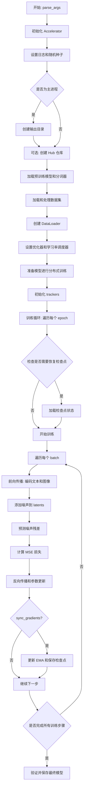
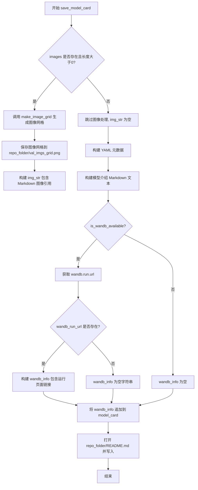
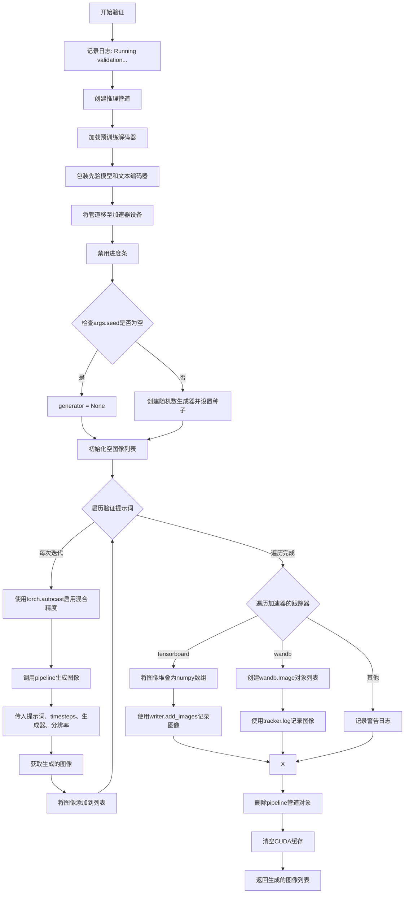
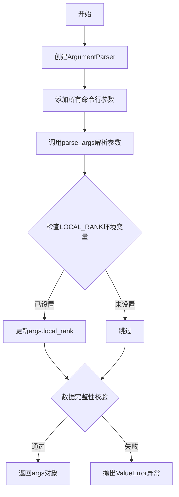
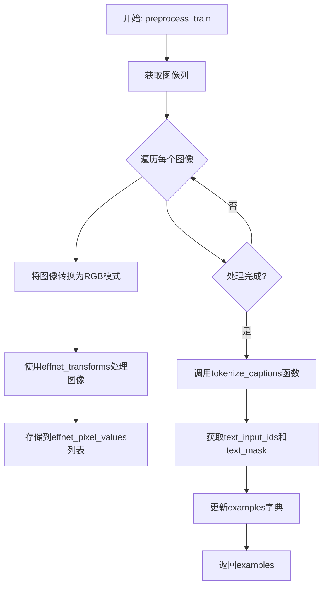
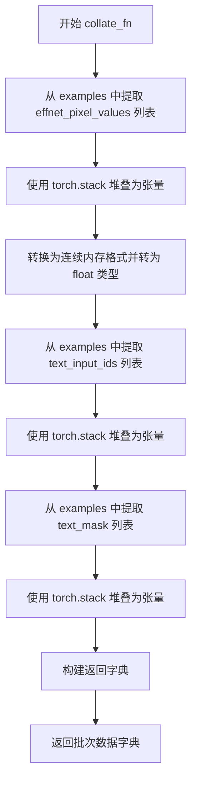
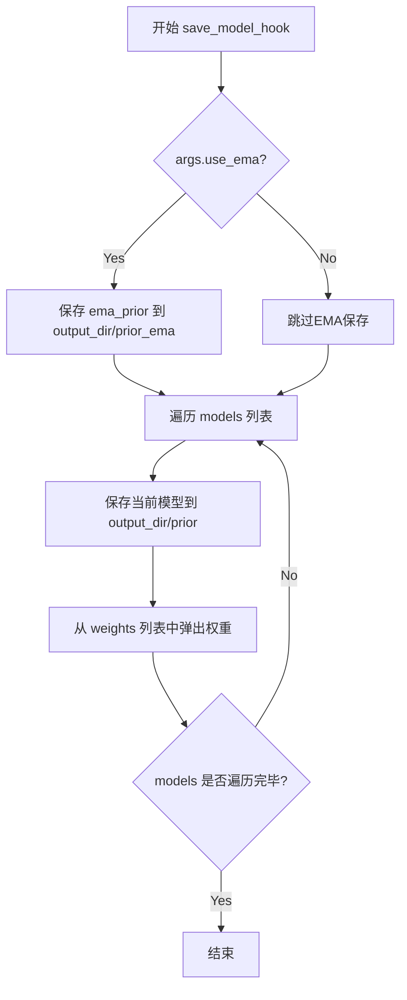
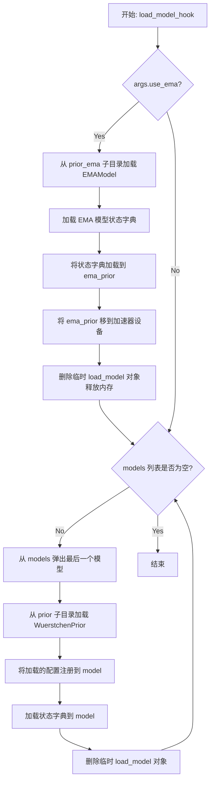

```mermaid
flowchart TD
    A[开始 main 函数] --> B[调用 parse_args 解析命令行参数]
    B --> C[检查 report_to 和 hub_token 的安全性]
    C --> D[创建日志目录和 Accelerator]
    D --> E[配置日志记录器]
    E --> F{args.seed 是否存在?}
    F -->|是| G[设置随机种子]
    F -->|否| H[跳过设置种子]
    G --> I{accelerator.is_main_process?}
    H --> I
    I -->|是| J[创建输出目录]
    I -->|否| K[跳过创建目录]
    J --> L{push_to_hub?}
    K --> L
    L -->|是| M[创建 Hub 仓库]
    L -->|否| N[加载预训练组件]
    M --> N
    N --> O[加载 noise_scheduler, tokenizer]
    O --> P[确定 weight_dtype]
    P --> Q[加载 image_encoder 和 text_encoder]
    Q --> R[冻结 text_encoder 和 image_encoder]
    R --> S[加载 prior 模型]
    S --> T{use_ema?}
    T -->|是| U[创建 EMA 模型]
    T -->|否| V[注册保存/加载钩子]
    U --> V
    V --> W[启用梯度检查点（如果设置）]
    W --> X[允许 TF32（如果设置）]
    X --> Y[创建优化器]
    Y --> Z[加载数据集]
    Z --> AA[预处理数据集和创建数据加载器]
    AA --> AB[创建学习率调度器]
    AB --> AC[使用 accelerator 准备模型和优化器]
    AC --> AD[初始化 trackers]
    AD --> AE[训练循环开始]
    AE --> AF[外层循环：遍历每个 epoch]
    AF --> AG[内层循环：遍历每个 batch]
    AG --> AH{是否跳过当前 step?}
    AH -->|是| AI[更新 progress bar 并 continue]
    AH -->|否| AJ[执行训练步骤]
    AJ --> AK[前向传播：编码文本和图像]
    AK --> AL[添加噪声到 latents]
    AL --> AM[预测噪声残差]
    AM --> AN[计算 MSE 损失]
    AN --> AO[反向传播]
    AO --> AP{是否同步梯度?}
    AP -->|是| AQ[裁剪梯度并更新参数]
    AP -->|否| AR[更新 progress bar]
    AQ --> AR
    AR --> AS{是否需要保存 checkpoint?}
    AS -->|是| AT[保存训练状态]
    AS -->|否| AU[记录日志]
    AT --> AU
    AU --> AV{是否达到最大训练步数?}
    AV -->|是| AW[退出内层循环]
    AV -->|否| AX{是否还有更多 batch?}
    AX -->|是| AG
    AX -->|否| AY[进行验证]
    AY --> AZ{是否需要保存最终模型?}
    AZ -->|是| BA[保存最终模型和 pipeline]
    AZ -->|否| BB[结束训练]
    BA --> BB
```

# `diffusers\examples\research_projects\wuerstchen\text_to_image\train_text_to_image_prior.py` 详细设计文档

这是一个用于微调 Würstchen Prior 模型的训练脚本，支持文本到图像生成任务的微调。脚本基于 Hugging Face Diffusers 库，实现了完整的训练流程，包括数据加载、预处理、分布式训练、混合精度训练、EMA 优化、验证推理和模型保存等功能。

## 整体流程



## 类结构

```
脚本模块 (无自定义类)
├── 配置与工具函数
│   ├── DATASET_NAME_MAPPING (全局变量)
│   ├── logger (全局变量)
│   └── parse_args() (命令行参数解析)
├── 核心函数
│   ├── main() (主训练函数)
│   ├── log_validation() (验证函数)
│   └── save_model_card() (保存模型卡片)
└── 内部辅助函数
    ├── deepspeed_zero_init_disabled_context_manager()
    ├── tokenize_captions()
    ├── preprocess_train()
    ├── collate_fn()
    ├── save_model_hook()
    └── load_model_hook()
```

## 全局变量及字段


### `DATASET_NAME_MAPPING`
    
数据集名称到列名的映射字典，用于指定数据集的图像和文本列

类型：`dict`
    


### `logger`
    
模块级日志记录器，用于输出训练过程中的信息

类型：`logging.Logger`
    


### `args`
    
解析后的命令行参数对象，包含所有训练配置选项

类型：`argparse.Namespace`
    


### `accelerator`
    
Accelerate库提供的分布式训练加速器，管理设备、混合精度和分布式训练

类型：`Accelerate.Accelerator`
    


### `noise_scheduler`
    
Wuerstchen模型的噪声调度器，用于在潜空间中添加和去除噪声

类型：`diffusers.schedulers.DDPMWuerstchenScheduler`
    


### `tokenizer`
    
文本分词器，用于将文本转换为模型输入的token ID

类型：`transformers.PreTrainedTokenizerFast`
    


### `weight_dtype`
    
模型权重的数据类型，根据混合精度设置确定（fp16/bf16/fp32）

类型：`torch.dtype`
    


### `image_encoder`
    
EfficientNet编码器，用于将图像编码为潜空间表示

类型：`modeling_efficient_net_encoder.EfficientNetEncoder`
    


### `text_encoder`
    
CLIP文本编码器，用于将文本提示编码为嵌入向量

类型：`transformers.CLIPTextModel`
    


### `prior`
    
Wuerstchen先验模型，负责从文本和图像嵌入预测噪声

类型：`diffusers.pipelines.wuerstchen.WuerstchenPrior`
    


### `ema_prior`
    
指数移动平均先验模型，用于稳定训练并提高模型性能

类型：`diffusers.training_utils.EMAModel`
    


### `optimizer`
    
AdamW优化器，用于更新模型参数

类型：`torch.optim.AdamW`
    


### `train_dataset`
    
训练数据集对象，包含预处理后的图像和文本数据

类型：`datasets.arrow_dataset.Dataset`
    


### `train_dataloader`
    
训练数据加载器，用于批量迭代训练数据

类型：`torch.utils.data.DataLoader`
    


### `lr_scheduler`
    
学习率调度器，用于动态调整训练过程中的学习率

类型：`torch.optim.lr_scheduler._LRScheduler`
    


### `global_step`
    
全局训练步数计数器，记录已执行的优化步骤总数

类型：`int`
    


### `first_epoch`
    
起始训练轮数，用于从检查点恢复训练时确定起始epoch

类型：`int`
    


### `train_loss`
    
当前累积的训练损失值，用于监控训练过程

类型：`float`
    


    

## 全局函数及方法


### `save_model_card`

该函数用于在模型训练完成后生成并保存模型卡片（Model Card）到 README.md 文件中，包含模型元数据、数据集信息、训练超参数以及可选的验证图像网格。

参数：

- `args`：对象，包含训练配置参数（如预训练模型路径、数据集名称、验证 prompts、学习率、批次大小、图像分辨率、混合精度等）
- `repo_id`：str，HuggingFace Hub 上的仓库 ID
- `images`：list，可选，验证时生成的图像列表，用于生成图像网格并嵌入模型卡片
- `repo_folder`：str，可选，模型输出目录路径，用于保存 README.md 和图像文件

返回值：`None`，该函数直接将生成的模型卡片内容写入文件

#### 流程图



#### 带注释源码

```python
def save_model_card(
    args,
    repo_id: str,
    images=None,
    repo_folder=None,
):
    """
    生成模型卡片并保存到 README.md 文件中
    
    参数:
        args: 包含训练超参数的命名空间对象
        repo_id: HuggingFace Hub 仓库 ID
        images: 验证生成的图像列表
        repo_folder: 输出目录路径
    """
    img_str = ""  # 初始化图像 Markdown 字符串
    
    # 如果有验证图像，生成图像网格并保存
    if len(images) > 0:
        # 使用 make_image_grid 将多张图像拼接成网格
        image_grid = make_image_grid(images, 1, len(args.validation_prompts))
        # 保存图像网格到指定目录
        image_grid.save(os.path.join(repo_folder, "val_imgs_grid.png"))
        # 构建 Markdown 图像引用字符串
        img_str += "\n"

    # 构建 YAML 格式的模型元数据
    yaml = f"""
---
license: mit
base_model: {args.pretrained_prior_model_name_or_path}
datasets:
- {args.dataset_name}
tags:
- wuerstchen
- text-to-image
- diffusers
- diffusers-training
inference: true
---
    """
    
    # 构建模型介绍和使用说明的 Markdown 内容
    model_card = f"""
# Finetuning - {repo_id}

This pipeline was finetuned from **{args.pretrained_prior_model_name_or_path}** on the **{args.dataset_name}** dataset. Below are some example images generated with the finetuned pipeline using the following prompts: {args.validation_prompts}: \n
{img_str}

## Pipeline usage

You can use the pipeline like so:

```python
from diffusers import DiffusionPipeline
import torch

pipe_prior = DiffusionPipeline.from_pretrained("{repo_id}", torch_dtype={args.weight_dtype})
pipe_t2i = DiffusionPipeline.from_pretrained("{args.pretrained_decoder_model_name_or_path}", torch_dtype={args.weight_dtype})
prompt = "{args.validation_prompts[0]}"
(image_embeds,) = pipe_prior(prompt).to_tuple()
image = pipe_t2i(image_embeddings=image_embeds, prompt=prompt).images[0]
image.save("my_image.png")
```

## Training info

These are the key hyperparameters used during training:

* Epochs: {args.num_train_epochs}
* Learning rate: {args.learning_rate}
* Batch size: {args.train_batch_size}
* Gradient accumulation steps: {args.gradient_accumulation_steps}
* Image resolution: {args.resolution}
* Mixed-precision: {args.mixed_precision}

"""
    
    # 初始化 wandb_info 为空字符串
    wandb_info = ""
    
    # 检查 wandb 是否可用
    if is_wandb_available():
        wandb_run_url = None
        # 如果 wandb run 存在，获取运行 URL
        if wandb.run is not None:
            wandb_run_url = wandb.run.url

    # 如果存在 wandb 运行 URL，添加 wandb 信息到模型卡片
    if wandb_run_url is not None:
        wandb_info = f"""
More information on all the CLI arguments and the environment are available on your [`wandb` run page]({wandb_run_url}).
"""
    # 将 wandb 信息追加到模型卡片
    model_card += wandb_info

    # 打开 README.md 文件并写入模型卡片内容
    with open(os.path.join(repo_folder, "README.md"), "w") as f:
        f.write(yaml + model_card)
```


### `log_validation`

该函数用于在训练过程中运行验证流程，通过加载预训练的解码器、先验模型、文本编码器和分词器来构建推理管道，然后根据验证提示词生成样本图像，并将这些图像记录到指定的跟踪器（TensorBoard或WandB）中，最后清理资源并返回生成的图像列表。

参数：

- `text_encoder`：`CLIPTextModel`，经过微调或预训练的文本编码器模型，用于将文本提示转换为嵌入向量
- `tokenizer`：`PreTrainedTokenizerFast`，与文本编码器配套的分词器，用于对验证提示进行分词
- `prior`：`WuerstchenPrior`，Wuerstchen先验模型，用于生成图像嵌入
- `args`：命名空间（Namespace），包含模型路径、分辨率、种子等配置参数的命令行参数对象
- `accelerator`：`Accelerator`，HuggingFace Accelerate库提供的分布式训练加速器，用于设备管理和模型包装
- `weight_dtype`：`torch.dtype`，模型权重的数据类型（如float32、float16或bfloat16）
- `epoch`：`int`，当前训练轮次或全局步数，用于在日志中标记验证结果

返回值：`List[Image]`，生成的图像列表，每个图像对应一个验证提示词生成的样本

#### 流程图



#### 带注释源码

```python
def log_validation(text_encoder, tokenizer, prior, args, accelerator, weight_dtype, epoch):
    """
    运行验证流程，生成样本图像并记录到日志跟踪器
    
    参数:
        text_encoder: 文本编码器模型
        tokenizer: 分词器
        prior: 先验模型
        args: 命令行参数
        accelerator: 加速器
        weight_dtype: 权重数据类型
        epoch: 当前训练轮次
    """
    # 记录验证开始的日志信息
    logger.info("Running validation... ")

    # 从预训练模型创建文本到图像的推理管道
    pipeline = AutoPipelineForText2Image.from_pretrained(
        args.pretrained_decoder_model_name_or_path,  # 预训练解码器路径
        prior_prior=accelerator.unwrap_model(prior),  # 解包并获取先验模型
        prior_text_encoder=accelerator.unwrap_model(text_encoder),  # 解包并获取文本编码器
        prior_tokenizer=tokenizer,  # 使用传入的分词器
        torch_dtype=weight_dtype,  # 设置模型权重的数据类型
    )
    
    # 将管道移动到加速器设备（GPU/CPU）
    pipeline = pipeline.to(accelerator.device)
    
    # 禁用管道的进度条显示
    pipeline.set_progress_bar_config(disable=True)

    # 根据种子值决定是否使用确定性生成
    if args.seed is None:
        # 未指定种子，使用随机生成
        generator = None
    else:
        # 指定种子，创建随机数生成器并设置种子以确保可重复性
        generator = torch.Generator(device=accelerator.device).manual_seed(args.seed)

    # 初始化空图像列表用于存储生成的图像
    images = []
    
    # 遍历所有验证提示词
    for i in range(len(args.validation_prompts)):
        # 使用CUDA混合精度上下文进行推理
        with torch.autocast("cuda"):
            # 调用管道生成图像
            image = pipeline(
                args.validation_prompts[i],  # 当前验证提示词
                prior_timesteps=DEFAULT_STAGE_C_TIMESTEPS,  # 先验模型的采样时间步
                generator=generator,  # 随机数生成器
                height=args.resolution,  # 生成图像的高度
                width=args.resolution,  # 生成图像的宽度
            ).images[0]  # 获取第一张生成的图像

        # 将生成的图像添加到列表
        images.append(image)

    # 遍历所有注册的跟踪器（TensorBoard、WandB等）
    for tracker in accelerator.trackers:
        # 根据跟踪器类型选择不同的记录方式
        if tracker.name == "tensorboard":
            # 将PIL图像转换为numpy数组并堆叠
            np_images = np.stack([np.asarray(img) for img in images])
            # 使用TensorBoard记录图像
            tracker.writer.add_images("validation", np_images, epoch, dataformats="NHWC")
        elif tracker.name == "wandb":
            # 使用WandB记录图像
            tracker.log(
                {
                    "validation": [
                        # 为每张图像创建WandB Image对象并添加标题
                        wandb.Image(image, caption=f"{i}: {args.validation_prompts[i]}")
                        for i, image in enumerate(images)
                    ]
                }
            )
        else:
            # 对于不支持的跟踪器，记录警告日志
            logger.warning(f"image logging not implemented for {tracker.name}")

    # 删除管道对象以释放内存
    del pipeline
    # 清空CUDA缓存以释放GPU内存
    torch.cuda.empty_cache()

    # 返回生成的图像列表
    return images
```


### `parse_args`

该函数是命令行参数解析器，负责定义和收集训练脚本的所有配置参数，包括模型路径、数据集配置、训练超参数、分布式训练设置等，并进行基本的环境变量检查和参数校验。

参数：

- （无直接输入参数，参数来源于命令行）

返回值：`Namespace` 对象，包含所有命令行参数解析后的结果

#### 流程图



#### 带注释源码

```python
def parse_args():
    """
    解析命令行参数并返回配置对象。
    包含模型路径、数据集、训练超参数等所有配置项。
    """
    # 创建命令行解析器，description说明程序用途
    parser = argparse.ArgumentParser(description="Simple example of finetuning Würstchen Prior.")
    
    # ==================== 模型相关参数 ====================
    parser.add_argument(
        "--pretrained_decoder_model_name_or_path",
        type=str,
        default="warp-ai/wuerstchen",
        required=False,
        help="Path to pretrained model or model identifier from huggingface.co/models.",
    )
    parser.add_argument(
        "--pretrained_prior_model_name_or_path",
        type=str,
        default="warp-ai/wuerstchen-prior",
        required=False,
        help="Path to pretrained model or model identifier from huggingface.co/models.",
    )
    
    # ==================== 数据集相关参数 ====================
    parser.add_argument(
        "--dataset_name",
        type=str,
        default=None,
        help=(
            "The name of the Dataset (from the HuggingFace hub) to train on (could be your own, possibly private,"
            " dataset). It can also be a path pointing to a local copy of a dataset in your filesystem,"
            " or to a folder containing files that 🤗 Datasets can understand."
        ),
    )
    parser.add_argument(
        "--dataset_config_name",
        type=str,
        default=None,
        help="The config of the Dataset, leave as None if there's only one config.",
    )
    parser.add_argument(
        "--train_data_dir",
        type=str,
        default=None,
        help=(
            "A folder containing the training data. Folder contents must follow the structure described in"
            " https://huggingface.co/docs/datasets/image_dataset#imagefolder. In particular, a `metadata.jsonl` file"
            " must exist to provide the captions for the images. Ignored if `dataset_name` is specified."
        ),
    )
    parser.add_argument(
        "--image_column", type=str, default="image", help="The column of the dataset containing an image."
    )
    parser.add_argument(
        "--caption_column",
        type=str,
        default="text",
        help="The column of the dataset containing a caption or a list of captions.",
    )
    parser.add_argument(
        "--max_train_samples",
        type=int,
        default=None,
        help=(
            "For debugging purposes or quicker training, truncate the number of training examples to this "
            "value if set."
        ),
    )
    parser.add_argument(
        "--validation_prompts",
        type=str,
        default=None,
        nargs="+",
        help=("A set of prompts evaluated every `--validation_epochs` and logged to `--report_to`."),
    )
    
    # ==================== 输出与存储参数 ====================
    parser.add_argument(
        "--output_dir",
        type=str,
        default="wuerstchen-model-finetuned",
        help="The output directory where the model predictions and checkpoints will be written.",
    )
    parser.add_argument(
        "--cache_dir",
        type=str,
        default=None,
        help="The directory where the downloaded models and datasets will be stored.",
    )
    parser.add_argument("--seed", type=int, default=None, help="A seed for reproducible training.")
    
    # ==================== 图像处理参数 ====================
    parser.add_argument(
        "--resolution",
        type=int,
        default=512,
        help=(
            "The resolution for input images, all the images in the train/validation dataset will be resized to this"
            " resolution"
        ),
    )
    
    # ==================== 训练超参数 ====================
    parser.add_argument(
        "--train_batch_size", type=int, default=1, help="Batch size (per device) for the training dataloader."
    )
    parser.add_argument("--num_train_epochs", type=int, default=100)
    parser.add_argument(
        "--max_train_steps",
        type=int,
        default=None,
        help="Total number of training steps to perform.  If provided, overrides num_train_epochs.",
    )
    parser.add_argument(
        "--gradient_accumulation_steps",
        type=int,
        default=1,
        help="Number of updates steps to accumulate before performing a backward/update pass.",
    )
    parser.add_argument(
        "--gradient_checkpointing",
        action="store_true",
        help="Whether or not to use gradient checkpointing to save memory at the expense of slower backward pass.",
    )
    parser.add_argument(
        "--learning_rate",
        type=float,
        default=1e-4,
        help="learning rate",
    )
    parser.add_argument(
        "--lr_scheduler",
        type=str,
        default="constant",
        help=(
            'The scheduler type to use. Choose between ["linear", "cosine", "cosine_with_restarts", "polynomial",'
            ' "constant", "constant_with_warmup"]'
        ),
    )
    parser.add_argument(
        "--lr_warmup_steps", type=int, default=500, help="Number of steps for the warmup in the lr scheduler."
    )
    
    # ==================== 优化器参数 ====================
    parser.add_argument(
        "--use_8bit_adam", action="store_true", help="Whether or not to use 8-bit Adam from bitsandbytes."
    )
    parser.add_argument(
        "--allow_tf32",
        action="store_true",
        help=(
            "Whether or not to allow TF32 on Ampere GPUs. Can be used to speed up training. For more information, see"
            " https://pytorch.org/docs/stable/notes/cuda.html#tensorfloat-32-tf32-on-ampere-devices"
        ),
    )
    parser.add_argument("--use_ema", action="store_true", help="Whether to use EMA model.")
    parser.add_argument(
        "--dataloader_num_workers",
        type=int,
        default=0,
        help=(
            "Number of subprocesses to use for data loading. 0 means that the data will be loaded in the main process."
        ),
    )
    parser.add_argument("--adam_beta1", type=float, default=0.9, help="The beta1 parameter for the Adam optimizer.")
    parser.add_argument("--adam_beta2", type=float, default=0.999, help="The beta2 parameter for the Adam optimizer.")
    parser.add_argument(
        "--adam_weight_decay",
        type=float,
        default=0.0,
        required=False,
        help="weight decay_to_use",
    )
    parser.add_argument("--adam_epsilon", type=float, default=1e-08, help="Epsilon value for the Adam optimizer")
    parser.add_argument("--max_grad_norm", default=1.0, type=float, help="Max gradient norm.")
    
    # ==================== Hub相关参数 ====================
    parser.add_argument("--push_to_hub", action="store_true", help="Whether or not to push the model to the Hub.")
    parser.add_argument("--hub_token", type=str, default=None, help="The token to use to push to the Model Hub.")
    parser.add_argument(
        "--hub_model_id",
        type=str,
        default=None,
        help="The name of the repository to keep in sync with the local `output_dir`.",
    )
    
    # ==================== 日志与监控参数 ====================
    parser.add_argument(
        "--logging_dir",
        type=str,
        default="logs",
        help=(
            "[TensorBoard](https://www.tensorflow.org/tensorboard) log directory. Will default to"
            " *output_dir/runs/**CURRENT_DATETIME_HOSTNAME***."
        ),
    )
    parser.add_argument(
        "--mixed_precision",
        type=str,
        default=None,
        choices=["no", "fp16", "bf16"],
        help=(
            "Whether to use mixed precision. Choose between fp16 and bf16 (bfloat16). Bf16 requires PyTorch >="
            " 1.10.and an Nvidia Ampere GPU.  Default to the value of accelerate config of the current system or the"
            " flag passed with the `accelerate.launch` command. Use this argument to override the accelerate config."
        ),
    )
    parser.add_argument(
        "--report_to",
        type=str,
        default="tensorboard",
        help=(
            'The integration to report the results and logs to. Supported platforms are `"tensorboard"`'
            ' (default), `"wandb"` and `"comet_ml"`. Use `"all"` to report to all integrations.'
        ),
    )
    parser.add_argument("--local_rank", type=int, default=-1, help="For distributed training: local_rank")
    
    # ==================== 检查点与恢复参数 ====================
    parser.add_argument(
        "--checkpointing_steps",
        type=int,
        default=500,
        help=(
            "Save a checkpoint of the training state every X updates. These checkpoints are only suitable for resuming"
            " training using `--resume_from_checkpoint`."
        ),
    )
    parser.add_argument(
        "--checkpoints_total_limit",
        type=int,
        default=None,
        help=("Max number of checkpoints to store."),
    )
    parser.add_argument(
        "--resume_from_checkpoint",
        type=str,
        default=None,
        help=(
            "Whether training should be resumed from a previous checkpoint. Use a path saved by"
            ' `--checkpointing_steps`, or `"latest"` to automatically select the last available checkpoint.'
        ),
    )
    
    # ==================== 验证参数 ====================
    parser.add_argument(
        "--validation_epochs",
        type=int,
        default=5,
        help="Run validation every X epochs.",
    )
    parser.add_argument(
        "--tracker_project_name",
        type=str,
        default="text22image-fine-tune",
        help=(
            "The `project_name` argument passed to Accelerator.init_trackers for"
            " more information see https://huggingface.co/docs/accelerate/v0.17.0/en/package_reference/accelerator#accelerate.Accelerator"
        ),
    )

    # 解析命令行参数为Namespace对象
    args = parser.parse_args()
    
    # 处理分布式训练的环境变量LOCAL_RANK覆盖
    # 如果环境变量中设置了LOCAL_RANK且与args中的不一致，以环境变量为准
    env_local_rank = int(os.environ.get("LOCAL_RANK", -1))
    if env_local_rank != -1 and env_local_rank != args.local_rank:
        args.local_rank = env_local_rank

    # ==================== 参数校验 ====================
    # 确保至少提供了数据集名称或训练数据目录之一
    if args.dataset_name is None and args.train_data_dir is None:
        raise ValueError("Need either a dataset name or a training folder.")

    # 返回包含所有配置参数的Namespace对象
    return args
```


### `main`

Würstchen Prior 模型的微调训练主函数，负责解析命令行参数、初始化分布式训练环境、加载预训练模型和数据集、执行训练循环（包括前向传播、损失计算、反向传播和参数更新）、定期进行验证推理、并在训练完成后保存最终模型到指定目录。

参数：

- 无显式参数（通过内部的 `parse_args()` 函数获取命令行参数）

返回值：`None`，该函数执行完整的训练流程后直接退出，不返回任何值

#### 流程图



#### 带注释源码

```python
def main():
    """
    Würstchen Prior 模型的微调训练主函数。
    负责完整的训练流程：参数解析、模型加载、数据处理、训练循环、验证和模型保存。
    """
    # 1. 解析命令行参数
    args = parse_args()
    
    # 2. 安全检查：不能同时使用 wandb 报告和 hub token（安全风险）
    if args.report_to == "wandb" and args.hub_token is not None:
        raise ValueError(
            "You cannot use both --report_to=wandb and --hub_token due to a security risk of exposing your token."
            " Please use `hf auth login` to authenticate with the Hub."
        )

    # 3. 创建日志目录和配置 Accelerator 项目
    logging_dir = os.path.join(args.output_dir, args.logging_dir)
    accelerator_project_config = ProjectConfiguration(
        total_limit=args.checkpoints_total_limit, project_dir=args.output_dir, logging_dir=logging_dir
    )
    
    # 4. 初始化 Accelerator（分布式训练支持）
    accelerator = Accelerator(
        gradient_accumulation_steps=args.gradient_accumulation_steps,
        mixed_precision=args.mixed_precision,
        log_with=args.report_to,
        project_config=accelerator_project_config,
    )

    # 5. 为 MPS 后端禁用 AMP
    if torch.backends.mps.is_available():
        accelerator.native_amp = False

    # 6. 配置日志记录
    logging.basicConfig(
        format="%(asctime)s - %(levelname)s - %(name)s - %(message)s",
        datefmt="%m/%d/%Y %H:%M:%S",
        level=logging.INFO,
    )
    logger.info(accelerator.state, main_process_only=False)
    
    # 7. 根据进程类型设置日志级别
    if accelerator.is_local_main_process:
        datasets.utils.logging.set_verbosity_warning()
        transformers.utils.logging.set_verbosity_warning()
        set_verbosity_info()
    else:
        datasets.utils.logging.set_verbosity_error()
        transformers.utils.logging.set_verbosity_error()
        set_verbosity_error()

    # 8. 设置随机种子（如果提供）
    if args.seed is not None:
        set_seed(args.seed)

    # 9. 处理仓库创建（主进程）
    if accelerator.is_main_process:
        if args.output_dir is not None:
            os.makedirs(args.output_dir, exist_ok=True)

        if args.push_to_hub:
            repo_id = create_repo(
                repo_id=args.hub_model_id or Path(args.output_dir).name, exist_ok=True, token=args.hub_token
            ).repo_id

    # 10. 加载调度器和分词器
    noise_scheduler = DDPMWuerstchenScheduler()
    tokenizer = PreTrainedTokenizerFast.from_pretrained(
        args.pretrained_prior_model_name_or_path, subfolder="tokenizer"
    )

    # 11. DeepSpeed zero3 初始化上下文管理器
    def deepspeed_zero_init_disabled_context_manager():
        """
        返回一个上下文列表，用于禁用 zero.Init（当不使用 DeepSpeed 时）
        """
        deepspeed_plugin = AcceleratorState().deepspeed_plugin if is_initialized() else None
        if deepspeed_plugin is None:
            return []

        return [deepspeed_plugin.zero3_init_context_manager(enable=False)]

    # 12. 根据混合精度设置权重数据类型
    weight_dtype = torch.float32
    if accelerator.mixed_precision == "fp16":
        weight_dtype = torch.float16
    elif accelerator.mixed_precision == "bf16":
        weight_dtype = torch.bfloat16
        
    # 13. 加载预训练的 image_encoder 和 text_encoder
    with ContextManagers(deepspeed_zero_init_disabled_context_manager()):
        # 从 Hub 下载 checkpoint 文件
        pretrained_checkpoint_file = hf_hub_download("dome272/wuerstchen", filename="model_v2_stage_b.pt")
        state_dict = torch.load(pretrained_checkpoint_file, map_location="cpu")
        
        # 加载 EfficientNet 编码器
        image_encoder = EfficientNetEncoder()
        image_encoder.load_state_dict(state_dict["effnet_state_dict"])
        image_encoder.eval()

        # 加载 CLIP 文本编码器
        text_encoder = CLIPTextModel.from_pretrained(
            args.pretrained_prior_model_name_or_path, subfolder="text_encoder", torch_dtype=weight_dtype
        ).eval()

    # 14. 冻结 text_encoder 和 image_encoder（不训练这些参数）
    text_encoder.requires_grad_(False)
    image_encoder.requires_grad_(False)

    # 15. 加载 prior 模型
    prior = WuerstchenPrior.from_pretrained(args.pretrained_prior_model_name_or_path, subfolder="prior")

    # 16. 创建 EMA 模型（可选）
    if args.use_ema:
        ema_prior = WuerstchenPrior.from_pretrained(args.pretrained_prior_model_name_or_path, subfolder="prior")
        ema_prior = EMAModel(ema_prior.parameters(), model_cls=WuerstchenPrior, model_config=ema_prior.config)
        ema_prior.to(accelerator.device)

    # 17. 注册自定义保存/加载钩子（accelerate 0.16.0+）
    if version.parse(accelerate.__version__) >= version.parse("0.16.0"):
        def save_model_hook(models, weights, output_dir):
            """自定义模型保存钩子"""
            if args.use_ema:
                ema_prior.save_pretrained(os.path.join(output_dir, "prior_ema"))

            for i, model in enumerate(models):
                model.save_pretrained(os.path.join(output_dir, "prior"))
                weights.pop()  # 避免重复保存

        def load_model_hook(models, input_dir):
            """自定义模型加载钩子"""
            if args.use_ema:
                load_model = EMAModel.from_pretrained(os.path.join(input_dir, "prior_ema"), WuerstchenPrior)
                ema_prior.load_state_dict(load_model.state_dict())
                ema_prior.to(accelerator.device)
                del load_model

            for i in range(len(models)):
                model = models.pop()
                load_model = WuerstchenPrior.from_pretrained(input_dir, subfolder="prior")
                model.register_to_config(**load_model.config)
                model.load_state_dict(load_model.state_dict())
                del load_model

        accelerator.register_save_state_pre_hook(save_model_hook)
        accelerator.register_load_state_pre_hook(load_model_hook)

    # 18. 启用梯度检查点（可选，节省内存）
    if args.gradient_checkpointing:
        prior.enable_gradient_checkpointing()

    # 19. 允许 TF32（可选，加速训练）
    if args.allow_tf32:
        torch.backends.cuda.matmul.allow_tf32 = True

    # 20. 创建优化器
    if args.use_8bit_adam:
        try:
            import bitsandbytes as bnb
        except ImportError:
            raise ImportError(
                "Please install bitsandbytes to use 8-bit Adam. You can do so by running `pip install bitsandbytes`"
            )
        optimizer_cls = bnb.optim.AdamW8bit
    else:
        optimizer_cls = torch.optim.AdamW
        
    optimizer = optimizer_cls(
        prior.parameters(),
        lr=args.learning_rate,
        betas=(args.adam_beta1, args.adam_beta2),
        weight_decay=args.adam_weight_decay,
        eps=args.adam_epsilon,
    )

    # 21. 加载数据集
    if args.dataset_name is not None:
        # 从 Hub 下载数据集
        dataset = load_dataset(
            args.dataset_name,
            args.dataset_config_name,
            cache_dir=args.cache_dir,
        )
    else:
        # 从本地目录加载
        data_files = {}
        if args.train_data_dir is not None:
            data_files["train"] = os.path.join(args.train_data_dir, "**")
        dataset = load_dataset(
            "imagefolder",
            data_files=data_files,
            cache_dir=args.cache_dir,
        )

    # 22. 获取数据集列名
    column_names = dataset["train"].column_names
    dataset_columns = DATASET_NAME_MAPPING.get(args.dataset_name, None)
    
    # 23. 确定图像和 caption 列名
    if args.image_column is None:
        image_column = dataset_columns[0] if dataset_columns is not None else column_names[0]
    else:
        image_column = args.image_column
        if image_column not in column_names:
            raise ValueError(f"--image_column' value '{args.image_column}' needs to be one of: {', '.join(column_names)}")
            
    if args.caption_column is None:
        caption_column = dataset_columns[1] if dataset_columns is not None else column_names[1]
    else:
        caption_column = args.caption_column
        if caption_column not in column_names:
            raise ValueError(f"--caption_column' value '{args.caption_column}' needs to be one of: {', '.join(column_names)}")

    # 24. 定义 caption 分词函数
    def tokenize_captions(examples, is_train=True):
        """将 caption 文本转换为 token IDs"""
        captions = []
        for caption in examples[caption_column]:
            if isinstance(caption, str):
                captions.append(caption)
            elif isinstance(caption, (list, np.ndarray)):
                # 如果有多个 caption，随机选择一个（训练时）或选择第一个（验证时）
                captions.append(random.choice(caption) if is_train else caption[0])
            else:
                raise ValueError(f"Caption column `{caption_column}` should contain either strings or lists of strings.")
                
        inputs = tokenizer(
            captions, max_length=tokenizer.model_max_length, padding="max_length", truncation=True, return_tensors="pt"
        )
        text_input_ids = inputs.input_ids
        text_mask = inputs.attention_mask.bool()
        return text_input_ids, text_mask

    # 25. 定义 EfficientNet 图像预处理 transforms
    effnet_transforms = transforms.Compose(
        [
            transforms.Resize(args.resolution, interpolation=transforms.InterpolationMode.BILINEAR, antialias=True),
            transforms.CenterCrop(args.resolution),
            transforms.ToTensor(),
            transforms.Normalize(mean=(0.485, 0.456, 0.406), std=(0.229, 0.224, 0.225)),
        ]
    )

    # 26. 定义训练数据预处理函数
    def preprocess_train(examples):
        """预处理训练数据：转换图像并分词 caption"""
        images = [image.convert("RGB") for image in examples[image_column]]
        examples["effnet_pixel_values"] = [effnet_transforms(image) for image in images]
        examples["text_input_ids"], examples["text_mask"] = tokenize_captions(examples)
        return examples

    # 27. 应用数据预处理
    with accelerator.main_process_first():
        if args.max_train_samples is not None:
            dataset["train"] = dataset["train"].shuffle(seed=args.seed).select(range(args.max_train_samples))
        train_dataset = dataset["train"].with_transform(preprocess_train)

    # 28. 定义批处理整理函数
    def collate_fn(examples):
        """将多个样本整理为一个 batch"""
        effnet_pixel_values = torch.stack([example["effnet_pixel_values"] for example in examples])
        effnet_pixel_values = effnet_pixel_values.to(memory_format=torch.contiguous_format).float()
        text_input_ids = torch.stack([example["text_input_ids"] for example in examples])
        text_mask = torch.stack([example["text_mask"] for example in examples])
        return {"effnet_pixel_values": effnet_pixel_values, "text_input_ids": text_input_ids, "text_mask": text_mask}

    # 29. 创建训练数据加载器
    train_dataloader = torch.utils.data.DataLoader(
        train_dataset,
        shuffle=True,
        collate_fn=collate_fn,
        batch_size=args.train_batch_size,
        num_workers=args.dataloader_num_workers,
    )

    # 30. 计算训练步数并创建学习率调度器
    overrode_max_train_steps = False
    num_update_steps_per_epoch = math.ceil(len(train_dataloader) / args.gradient_accumulation_steps)
    if args.max_train_steps is None:
        args.max_train_steps = args.num_train_epochs * num_update_steps_per_epoch
        overrode_max_train_steps = True

    lr_scheduler = get_scheduler(
        args.lr_scheduler,
        optimizer=optimizer,
        num_warmup_steps=args.lr_warmup_steps * args.gradient_accumulation_steps,
        num_training_steps=args.max_train_steps * args.gradient_accumulation_steps,
    )

    # 31. 使用 accelerator 准备模型、优化器、数据加载器和调度器
    prior, optimizer, train_dataloader, lr_scheduler = accelerator.prepare(
        prior, optimizer, train_dataloader, lr_scheduler
    )
    image_encoder.to(accelerator.device, dtype=weight_dtype)
    text_encoder.to(accelerator.device, dtype=weight_dtype)

    # 32. 重新计算训练步数（因为 dataloader 大小可能改变）
    num_update_steps_per_epoch = math.ceil(len(train_dataloader) / args.gradient_accumulation_steps)
    if overrode_max_train_steps:
        args.max_train_steps = args.num_train_epochs * num_update_steps_per_epoch
    args.num_train_epochs = math.ceil(args.max_train_steps / num_update_steps_per_epoch)

    # 33. 初始化 trackers
    if accelerator.is_main_process:
        tracker_config = dict(vars(args))
        tracker_config.pop("validation_prompts")
        accelerator.init_trackers(args.tracker_project_name, tracker_config)

    # 34. 训练信息日志
    total_batch_size = args.train_batch_size * accelerator.num_processes * args.gradient_accumulation_steps

    logger.info("***** Running training *****")
    logger.info(f"  Num examples = {len(train_dataset)}")
    logger.info(f"  Num Epochs = {args.num_train_epochs}")
    logger.info(f"  Instantaneous batch size per device = {args.train_batch_size}")
    logger.info(f"  Total train batch size (w. parallel, distributed & accumulation) = {total_batch_size}")
    logger.info(f"  Gradient Accumulation steps = {args.gradient_accumulation_steps}")
    logger.info(f"  Total optimization steps = {args.max_train_steps}")
    
    global_step = 0
    first_epoch = 0

    # 35. 从 checkpoint 恢复训练（如果指定）
    if args.resume_from_checkpoint:
        if args.resume_from_checkpoint != "latest":
            path = os.path.basename(args.resume_from_checkpoint)
        else:
            # 找到最新的 checkpoint
            dirs = os.listdir(args.output_dir)
            dirs = [d for d in dirs if d.startswith("checkpoint")]
            dirs = sorted(dirs, key=lambda x: int(x.split("-")[1]))
            path = dirs[-1] if len(dirs) > 0 else None

        if path is None:
            accelerator.print(f"Checkpoint '{args.resume_from_checkpoint}' does not exist. Starting a new training run.")
            args.resume_from_checkpoint = None
        else:
            accelerator.print(f"Resuming from checkpoint {path}")
            accelerator.load_state(os.path.join(args.output_dir, path))
            global_step = int(path.split("-")[1])
            resume_global_step = global_step * args.gradient_accumulation_steps
            first_epoch = global_step // num_update_steps_per_epoch
            resume_step = resume_global_step % (num_update_steps_per_epoch * args.gradient_accumulation_steps)

    # 36. 创建进度条
    progress_bar = tqdm(range(global_step, args.max_train_steps), disable=not accelerator.is_local_main_process)
    progress_bar.set_description("Steps")

    # 37. 训练循环
    for epoch in range(first_epoch, args.num_train_epochs):
        prior.train()
        train_loss = 0.0
        
        for step, batch in enumerate(train_dataloader):
            # 跳过已完成的 steps（恢复训练时）
            if args.resume_from_checkpoint and epoch == first_epoch and step < resume_step:
                if step % args.gradient_accumulation_steps == 0:
                    progress_bar.update(1)
                continue

            # 使用 accelerator.accumulate 进行梯度累积
            with accelerator.accumulate(prior):
                # 获取 batch 数据
                text_input_ids, text_mask, effnet_images = (
                    batch["text_input_ids"],
                    batch["text_mask"],
                    batch["effnet_pixel_values"].to(weight_dtype),
                )

                # 使用 no_grad 进行前向传播（text_encoder 和 image_encoder 被冻结）
                with torch.no_grad():
                    text_encoder_output = text_encoder(text_input_ids, attention_mask=text_mask)
                    prompt_embeds = text_encoder_output.last_hidden_state
                    image_embeds = image_encoder(effnet_images)
                    # 缩放 image embeddings
                    image_embeds = image_embeds.add(1.0).div(42.0)

                    # 采样噪声
                    noise = torch.randn_like(image_embeds)
                    bsz = image_embeds.shape[0]

                    # 随机采样 timestep
                    timesteps = torch.rand((bsz,), device=image_embeds.device, dtype=weight_dtype)

                    # 向 latents 添加噪声
                    noisy_latents = noise_scheduler.add_noise(image_embeds, noise, timesteps)

                # 预测噪声残差
                pred_noise = prior(noisy_latents, timesteps, prompt_embeds)

                # 计算 MSE 损失
                loss = F.mse_loss(pred_noise.float(), noise.float(), reduction="mean")

                # 收集所有进程的损失用于日志记录
                avg_loss = accelerator.gather(loss.repeat(args.train_batch_size)).mean()
                train_loss += avg_loss.item() / args.gradient_accumulation_steps

                # 反向传播
                accelerator.backward(loss)
                if accelerator.sync_gradients:
                    accelerator.clip_grad_norm_(prior.parameters(), args.max_grad_norm)
                optimizer.step()
                lr_scheduler.step()
                optimizer.zero_grad()

            # 检查是否执行了优化步骤
            if accelerator.sync_gradients:
                if args.use_ema:
                    ema_prior.step(prior.parameters())
                progress_bar.update(1)
                global_step += 1
                accelerator.log({"train_loss": train_loss}, step=global_step)
                train_loss = 0.0

                # 定期保存 checkpoint
                if global_step % args.checkpointing_steps == 0:
                    if accelerator.is_main_process:
                        # 检查 checkpoint 数量限制
                        if args.checkpoints_total_limit is not None:
                            checkpoints = os.listdir(args.output_dir)
                            checkpoints = [d for d in checkpoints if d.startswith("checkpoint")]
                            checkpoints = sorted(checkpoints, key=lambda x: int(x.split("-")[1]))

                            if len(checkpoints) >= args.checkpoints_total_limit:
                                num_to_remove = len(checkpoints) - args.checkpoints_total_limit + 1
                                removing_checkpoints = checkpoints[0:num_to_remove]

                                logger.info(f"{len(checkpoints)} checkpoints already exist, removing {len(removing_checkpoints)} checkpoints")
                                logger.info(f"removing checkpoints: {', '.join(removing_checkpoints)}")

                                for removing_checkpoint in removing_checkpoints:
                                    removing_checkpoint = os.path.join(args.output_dir, removing_checkpoint)
                                    shutil.rmtree(removing_checkpoint)

                        save_path = os.path.join(args.output_dir, f"checkpoint-{global_step}")
                        accelerator.save_state(save_path)
                        logger.info(f"Saved state to {save_path}")

            # 更新进度条日志
            logs = {"step_loss": loss.detach().item(), "lr": lr_scheduler.get_last_lr()[0]}
            progress_bar.set_postfix(**logs)

            if global_step >= args.max_train_steps:
                break

        # 验证（主进程，定期执行）
        if accelerator.is_main_process:
            if args.validation_prompts is not None and epoch % args.validation_epochs == 0:
                if args.use_ema:
                    # 临时保存 prior 参数，加载 EMA 参数进行推理
                    ema_prior.store(prior.parameters())
                    ema_prior.copy_to(prior.parameters())
                    
                log_validation(text_encoder, tokenizer, prior, args, accelerator, weight_dtype, global_step)
                
                if args.use_ema:
                    # 恢复原始 prior 参数
                    ema_prior.restore(prior.parameters())

    # 38. 保存最终模型
    accelerator.wait_for_everyone()
    if accelerator.is_main_process:
        prior = accelerator.unwrap_model(prior)
        if args.use_ema:
            ema_prior.copy_to(prior.parameters())

        # 创建 pipeline 并保存
        pipeline = AutoPipelineForText2Image.from_pretrained(
            args.pretrained_decoder_model_name_or_path,
            prior_prior=prior,
            prior_text_encoder=accelerator.unwrap_model(text_encoder),
            prior_tokenizer=tokenizer,
        )
        pipeline.prior_pipe.save_pretrained(os.path.join(args.output_dir, "prior_pipeline"))

        # 最终推理（收集生成的图像）
        images = []
        if args.validation_prompts is not None:
            logger.info("Running inference for collecting generated images...")
            pipeline = pipeline.to(accelerator.device, torch_dtype=weight_dtype)
            pipeline.set_progress_bar_config(disable=True)

            generator = None
            if args.seed is not None:
                generator = torch.Generator(device=accelerator.device).manual_seed(args.seed)

            for i in range(len(args.validation_prompts)):
                with torch.autocast("cuda"):
                    image = pipeline(
                        args.validation_prompts[i],
                        prior_timesteps=DEFAULT_STAGE_C_TIMESTEPS,
                        generator=generator,
                        width=args.resolution,
                        height=args.resolution,
                    ).images[0]
                images.append(image)

        # 推送到 Hub（如果设置）
        if args.push_to_hub:
            save_model_card(args, repo_id, images, repo_folder=args.output_dir)
            upload_folder(
                repo_id=repo_id,
                folder_path=args.output_dir,
                commit_message="End of training",
                ignore_patterns=["step_*", "epoch_*"],
            )

    # 39. 结束训练
    accelerator.end_training()
```


### `deepspeed_zero_init_disabled_context_manager`

该函数是一个嵌套在 `main()` 函数内部的辅助函数，用于获取 DeepSpeed Zero3 初始化上下文管理器。当 Accelerator 已初始化且存在 DeepSpeed 插件时，返回一个禁用 Zero3 初始化的上下文管理器列表；否则返回空列表。

参数： 无

返回值：`list`，返回包含禁用 Zero3 初始化的上下文管理器的列表，或空列表

#### 流程图

```mermaid
flowchart TD
    A([开始]) --> B{is_initialized()}
    B -- 否 --> C[返回空列表 []<br/>deepspeed_plugin = None]
    B -- 是 --> D[获取 AcceleratorState().deepspeed_plugin]
    D --> E{deepspeed_plugin<br/>是否为 None}
    E -- 是 --> C
    E -- 否 --> F[返回 [deepspeed_plugin.zero3_init_context_manager<br/>(enable=False)]]
    C --> G([结束])
    F --> G
```

#### 带注释源码

```python
def deepspeed_zero_init_disabled_context_manager():
    """
    返回一个上下文管理器列表，该列表包含一个用于禁用 zero.Init 的上下文管理器，
    如果无法获取 DeepSpeed 插件，则返回空列表
    """
    # 如果 Accelerator 已初始化，则从 AcceleratorState 获取 deepspeed_plugin，否则为 None
    deepspeed_plugin = AcceleratorState().deepspeed_plugin if is_initialized() else None
    
    # 如果 deepspeed_plugin 为 None（未配置 DeepSpeed），返回空列表
    if deepspeed_plugin is None:
        return []

    # 返回包含 DeepSpeed Zero3 初始化上下文管理器的列表，传入 enable=False 禁用 Zero3 初始化
    return [deepspeed_plugin.zero3_init_context_manager(enable=False)]
```


### `tokenize_captions`

该函数负责将数据集中的文本描述（captions）转换为模型可处理的token IDs和attention mask。它从原始文本中提取caption，处理单字符串或多字符串列表的情况，并使用预训练的tokenizer进行编码。

参数：

- `examples`：`dict`，包含数据集样本的字典，必须包含`caption_column`指定的键，其值为caption字符串或字符串列表
- `is_train`：`bool`，指示是否处于训练模式的标志，为True时从多个caption中随机选择，为False时选择第一个

返回值：`(torch.Tensor, torch.Tensor)`，返回一个元组，包含text_input_ids（tokenized后的输入ID张量）和text_mask（attention mask的布尔张量）

#### 流程图

```mermaid
flowchart TD
    A[开始 tokenize_captions] --> B[初始化空列表 captions]
    B --> C{遍历 examples[caption_column] 中的每个 caption}
    C --> D{判断 caption 类型}
    D -->|str| E[直接添加到 captions]
    D -->|list 或 np.ndarray| F{is_train?}
    F -->|True| G[random.choice 随机选择一个]
    F -->|False| H[选择第一个 caption[0]]
    G --> I[添加到 captions]
    H --> I
    I --> C
    D -->|其他| J[抛出 ValueError 异常]
    J --> K[结束]
    C --> L[调用 tokenizer 编码captions]
    L --> M[设置 max_length=tokenizer.model_max_length]
    L --> N[padding=max_length, truncation=True]
    M --> O[返回 text_input_ids 和 text_mask]
    O --> P[结束]
```

#### 带注释源码

```python
def tokenize_captions(examples, is_train=True):
    """
    将数据集中的caption文本tokenize为模型输入
    
    参数:
        examples: 包含数据集样本的字典,必须包含caption_column指定的键
        is_train: 训练模式标志,True时从多个caption随机选择,False时选择第一个
    
    返回:
        tuple: (text_input_ids, text_mask) - token IDs和attention mask
    """
    captions = []
    # 遍历数据集中每一行的caption列
    for caption in examples[caption_column]:
        # 如果caption是字符串,直接添加
        if isinstance(caption, str):
            captions.append(caption)
        # 如果caption是列表或数组(多caption情况)
        elif isinstance(caption, (list, np.ndarray)):
            # 训练时随机选择一个caption,推理时选择第一个
            captions.append(random.choice(caption) if is_train else caption[0])
        else:
            # caption类型不合法,抛出异常
            raise ValueError(
                f"Caption column `{caption_column}` should contain either strings or lists of strings."
            )
    
    # 使用预训练tokenizer进行tokenize
    inputs = tokenizer(
        captions, 
        max_length=tokenizer.model_max_length,  # 最大长度限制
        padding="max_length",                    # 填充到最大长度
        truncation=True,                         # 截断超长输入
        return_tensors="pt"                      # 返回PyTorch张量
    )
    
    # 提取input_ids和attention_mask
    text_input_ids = inputs.input_ids
    text_mask = inputs.attention_mask.bool()  # 转换为布尔类型
    
    return text_input_ids, text_mask
```


### `preprocess_train`

该函数用于在训练前对数据集进行预处理，将图像转换为适合 EfficientNet 编码器的像素值，并对文本 caption 进行 tokenize 处理。

参数：

- `examples`：`Dict`，包含数据集样本的字典，其中 `examples[image_column]` 存储原始图像列表

返回值：`Dict`，返回更新后的字典，新增 `effnet_pixel_values`（处理后的图像张量）、`text_input_ids`（文本 token IDs）和 `text_mask`（注意力掩码）字段

#### 流程图



#### 带注释源码

```python
def preprocess_train(examples):
    """
    预处理训练数据集的函数
    
    参数:
        examples: 数据集样本字典，包含图像和文本列
        
    返回值:
        examples: 添加了effnet_pixel_values, text_input_ids, text_mask的字典
    """
    # 1. 从examples中获取图像列，并将所有图像转换为RGB格式
    #    (有些图像可能是RGBA或其他格式，需要统一转为RGB)
    images = [image.convert("RGB") for image in examples[image_column]]
    
    # 2. 对每个图像应用EfficientNet所需的变换:
    #    - Resize到指定分辨率
    #    - CenterCrop裁剪
    #    - 转换为张量
    #    - 归一化(ImageNet均值和标准差)
    examples["effnet_pixel_values"] = [effnet_transforms(image) for image in images]
    
    # 3. 对caption进行tokenize处理，返回:
    #    - text_input_ids: 文本的token IDs
    #    - text_mask: 注意力掩码(标识有效token位置)
    examples["text_input_ids"], examples["text_mask"] = tokenize_captions(examples)
    
    # 4. 返回处理后的examples字典
    return examples
```


### `collate_fn`

该函数是 PyTorch DataLoader 的批处理整理函数，用于将多个样本数据整理成一个批次。它从每个样本中提取 `effnet_pixel_values`、`text_input_ids` 和 `text_mask` 字段，堆叠成批次张量并返回字典格式的训练数据。

参数：

- `examples`：`List[Dict]` ，从数据集中采样得到的样本列表，每个样本是包含 `effnet_pixel_values`、`text_input_ids`、`text_mask` 键的字典

返回值：`Dict[str, torch.Tensor]` ，包含三个键的字典：`effnet_pixel_values`（堆叠后的图像像素值张量）、`text_input_ids`（堆叠后的文本输入ID张量）、`text_mask`（堆叠后的注意力掩码张量）

#### 流程图



#### 带注释源码

```python
def collate_fn(examples):
    """
    DataLoader 的批处理整理函数，将多个样本整理为一个批次
    
    参数:
        examples: 样本列表，每个样本包含 effnet_pixel_values、text_input_ids、text_mask
    """
    # 从每个样本中提取 effnet_pixel_values 并堆叠成批处理张量
    effnet_pixel_values = torch.stack([example["effnet_pixel_values"] for example in examples])
    # 转换为连续内存格式以优化性能，并确保数据类型为 float32
    effnet_pixel_values = effnet_pixel_values.to(memory_format=torch.contiguous_format).float()
    
    # 从每个样本中提取 text_input_ids 并堆叠成批处理张量
    text_input_ids = torch.stack([example["text_input_ids"] for example in examples])
    
    # 从每个样本中提取 text_mask（注意力掩码）并堆叠成批处理张量
    text_mask = torch.stack([example["text_mask"] for example in examples])
    
    # 返回包含三个张量的字典，供模型训练使用
    return {
        "effnet_pixel_values": effnet_pixel_values,  # 图像像素值 [batch_size, C, H, W]
        "text_input_ids": text_input_ids,             # 文本 token ID [batch_size, seq_len]
        "text_mask": text_mask                        # 注意力掩码 [batch_size, seq_len]
    }
```


### `save_model_hook`

这是一个在Accelerator保存状态前被调用的钩子函数，用于保存训练好的模型（包含EMA模型和主模型）到指定目录。

参数：

- `models`：`List[Any]`，需要保存的模型列表
- `weights`：`List[Any]`，权重列表，用于确保模型不会被重复保存
- `output_dir`：`str`，输出目录路径

返回值：`None`，无返回值（该函数通过副作用保存模型）

#### 流程图



#### 带注释源码

```python
def save_model_hook(models, weights, output_dir):
    # 如果启用了EMA（指数移动平均），则保存EMA模型
    if args.use_ema:
        # 将EMA模型的参数保存到prior_ema目录
        ema_prior.save_pretrained(os.path.join(output_dir, "prior_ema"))

    # 遍历需要保存的模型列表
    for i, model in enumerate(models):
        # 将每个模型保存到prior目录
        model.save_pretrained(os.path.join(output_dir, "prior"))

        # 确保从weights中弹出权重，以防止对应的模型被再次保存
        # 这是必要的，因为accelerator.save_state()会遍历weights列表
        weights.pop()
```


### `load_model_hook`

该函数是一个模型加载钩子（hook），用于在 Accelerator 恢复训练状态时自定义模型的加载逻辑。它负责从检查点目录加载 EMA（指数移动平均）模型和 Prior 模型，并将加载的权重状态字典注册到对应的模型中。

参数：

- `models`：List[torch.nn.Module]，待加载的模型列表，Accelerator 在恢复训练状态时会传入需要加载的模型
- `input_dir`：str，检查点目录的路径，从中加载模型权重

返回值：`None`，该函数无返回值，直接修改传入的模型对象

#### 流程图



#### 带注释源码

```python
def load_model_hook(models, input_dir):
    """
    模型加载钩子函数，用于在 Accelerator 恢复训练状态时自定义模型加载逻辑。
    
    参数:
        models: 待加载的模型列表
        input_dir: 检查点目录路径
    """
    # 检查是否使用了 EMA (指数移动平均)
    if args.use_ema:
        # 从 prior_ema 子目录加载 EMA 模型
        load_model = EMAModel.from_pretrained(
            os.path.join(input_dir, "prior_ema"),  # EMA 模型检查点路径
            WuerstchenPrior  # EMA 模型的类
        )
        # 将 EMA 模型的状态字典加载到 ema_prior
        ema_prior.load_state_dict(load_model.state_dict())
        # 将 EMA 模型移到加速器设备上
        ema_prior.to(accelerator.device)
        # 删除临时加载的模型对象以释放内存
        del load_model

    # 遍历模型列表，逐个加载权重
    for i in range(len(models)):
        # 弹出模型列表中的最后一个模型，避免重复加载
        model = models.pop()

        # 从检查点目录加载 Diffusers 风格的 Prior 模型
        load_model = WuerstchenPrior.from_pretrained(
            input_dir,  # 检查点根目录
            subfolder="prior"  # prior 子目录
        )
        
        # 将加载的配置注册到目标模型
        model.register_to_config(**load_model.config)

        # 加载状态字典到目标模型
        model.load_state_dict(load_model.state_dict())
        
        # 删除临时加载的模型对象以释放内存
        del load_model
```

## 关键组件


### WürstchenPrior (WuerstchenPrior)

Würstchen Prior模型是文本到图像扩散模型的核心组件，负责根据文本嵌入和噪声预测噪声残差，实现从文本提示到图像嵌入的映射。

### EfficientNetEncoder

EfficientNet编码器用于将输入图像转换为图像嵌入特征，提供了从像素空间到潜在空间的转换能力。

### CLIPTextModel (CLIPTextEncoder)

CLIP文本编码器将文本提示转换为文本嵌入向量，为Prior模型提供文本条件的表示。

### DDPMWuerstchenScheduler

Würstchen专用的DDPM噪声调度器，用于在训练过程中向潜在表示添加噪声，并在推理时进行去噪采样。

### weight_dtype (混合精度策略)

动态权重数据类型，支持fp16和bf16混合精度训练，通过`accelerator.mixed_precision`配置，实现显存优化和训练加速。

### 梯度累积 (Gradient Accumulation)

通过`gradient_accumulation_steps`参数控制的多步梯度累加机制，允许使用更大有效批量而无需相应增加显存。

### EMA (Exponential Moving Average)

指数移动平均模块，用于平滑模型权重更新，提高模型的稳定性和泛化能力，通过`EMAModel`实现。

### Gradient Checkpointing

梯度检查点技术，通过`prior.enable_gradient_checkpointing()`激活，以计算换内存，在反向传播时重新计算中间激活值。

### 8-bit Adam Optimizer

使用`bitsandbytes`库的8位Adam优化器，通过`bnb.optim.AdamW8bit`实现，大幅降低优化器状态内存占用。

### 数据预处理管道

包含图像转换（Resize、CenterCrop、Normalize）和文本标记化（tokenize_captions）两个核心预处理步骤，确保训练数据格式统一。

### 训练检查点管理

包含检查点保存（`save_model_hook`）、检查点加载（`load_model_hook`）和检查点数量限制（`checkpoints_total_limit`）的完整生命周期管理。

### 验证与推理流程

`log_validation`函数实现训练过程中的模型验证，生成示例图像并通过TensorBoard或WandB记录，支持多提示词批量验证。

### 模型卡片生成

`save_model_card`函数自动生成包含训练配置和示例图像的模型说明文档，便于模型发布和复现。

### 分布式训练支持

基于Accelerator的分布式训练框架，支持多GPU并行、梯度同步、进程管理等分布式训练核心功能。

### TF32加速

通过`torch.backends.cuda.matmul.allow_tf32`启用TensorFloat-32计算，在Ampere架构GPU上实现矩阵运算加速。

### 检查点恢复机制

支持从指定检查点或最新检查点恢复训练，实现训练中断后的断点续训功能。

### 训练数据加载器

基于PyTorch DataLoader的训练数据管道，包含数据整理函数`collate_fn`和预处理转换`preprocess_train`。

### 日志与追踪系统

集成TensorBoard和WandB的训练过程追踪，支持训练损失、学习率、验证图像等多元化指标记录。


## 问题及建议


### 已知问题

- **硬编码的模型下载路径**: `hf_hub_download("dome272/wuerstchen", filename="model_v2_stage_b.pt")` 硬编码了模型URL，应通过参数传入以提高灵活性
- **Magic Numbers 缺乏解释**: `image_embeds.add(1.0).div(42.0)` 中的缩放因子是 magic number，缺乏注释说明其含义和来源
- **类型注解不足**: 内部函数 `tokenize_captions`、`preprocess_train`、`save_model_hook`、`load_model_hook` 缺少参数和返回值类型注解
- **Pipeline 参数命名可能错误**: `log_validation` 和最终 pipeline 创建中使用 `prior_prior` 参数，看起来像是命名错误或笔误
- **错误处理不完善**: 模型加载（`hf_hub_download`、`from_pretrained`）缺少 try-except 包裹，数据集列检查不完整
- **资源清理不够规范**: `log_validation` 中创建的 pipeline 使用 `del` 手动删除，未使用上下文管理器（with 语句）
- **EMA 加载逻辑复杂且易出错**: `load_model_hook` 中的 EMA 模型加载逻辑分支较多，容易在恢复训练时出现问题

### 优化建议

- 将硬编码的模型路径、magic numbers 提取为常量或配置参数，并添加详细注释说明其业务含义
- 为所有函数添加完整的类型注解，提高代码可读性和 IDE 支持
- 修复 `prior_prior` 参数命名，确认是否为 API 变更导致的参数名问题
- 使用 `try-except` 包裹模型加载和数据集加载代码，提供友好的错误信息和降级策略
- 使用上下文管理器管理验证 pipeline 的生命周期，或将验证逻辑封装为独立函数
- 考虑将训练超参数抽取为 YAML/JSON 配置文件，支持不同实验场景的快速切换
- 对 EMA 的保存和加载逻辑进行单元测试，确保恢复训练时状态正确
- 可以考虑使用 `dataclass` 或 `pydantic` 定义配置类，替代大量 argparse 参数的裸字典传递方式

## 其它


### 设计目标与约束

本代码的设计目标是实现Würstchen Prior模型的微调训练，用于文本到图像生成任务。核心约束包括：1) 使用Apache 2.0开源许可；2) 依赖diffusers 0.32.0.dev0及以上版本；3) 支持混合精度训练（fp16/bf16）；4) 支持分布式训练和梯度累积；5) 支持EMA模型以稳定训练；6) 支持模型检查点保存和断点续训。

### 错误处理与异常设计

主要错误处理场景包括：1) 参数校验：dataset_name和train_data_dir必须指定其一，否则抛出ValueError；2) 依赖检查：使用8bit Adam需安装bitsandbytes库，未安装时抛出ImportError；3) 检查点恢复：恢复检查点时若不存在则打印警告并开始新训练；4) 混合精度配置校验：仅支持fp16和bf16；5) Hub Token安全检查：不允许同时使用wandb和hub_token；6) 数据列校验：image_column和caption_column必须存在于数据集列中。

### 数据流与状态机

训练数据流如下：1) 数据加载阶段：load_dataset获取原始数据集；2) 数据预处理阶段：preprocess_train将图像转换为RGB并应用EfficientNet变换，tokenize_captions处理文本描述；3) 数据整理阶段：collate_fn组装batch；4) 训练阶段：图像经EfficientNetEncoder编码为image_embeds，文本经CLIPTextModel编码为prompt_embeds，噪声调度器添加噪声，WuerstchenPrior预测噪声残差，计算MSE损失；5) 验证阶段：使用训练好的prior和decoder生成验证图像。

### 外部依赖与接口契约

主要外部依赖包括：1) accelerate库：用于分布式训练、混合精度、模型保存/加载钩子；2) diffusers库：提供DDPMWuerstchenScheduler、WuerstchenPrior、AutoPipelineForText2Image、EMAModel等；3) transformers库：提供CLIPTextModel、PreTrainedTokenizerFast；4) datasets库：数据集加载；5) huggingface_hub：模型下载和上传；6) wandb/tensorboard：训练监控。接口契约方面，模型输入为图像和文本描述，输出为图像嵌入或生成的图像文件，检查点保存格式为accelerator格式，最终模型导出为HuggingFace Pipeline格式。

### 关键组件信息

1. EfficientNetEncoder：图像编码器，将图像转换为特征嵌入
2. CLIPTextModel：文本编码器，将文本描述转换为文本嵌入
3. WuerstchenPrior：先验模型，预测噪声残差
4. DDPMWuerstchenScheduler：噪声调度器，用于添加和去除噪声
5. EMAModel：指数移动平均，用于稳定训练
6. Accelerator：分布式训练加速器，管理混合精度和设备分配
    