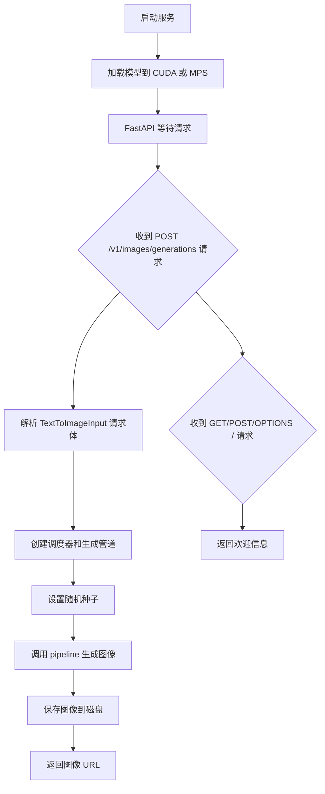
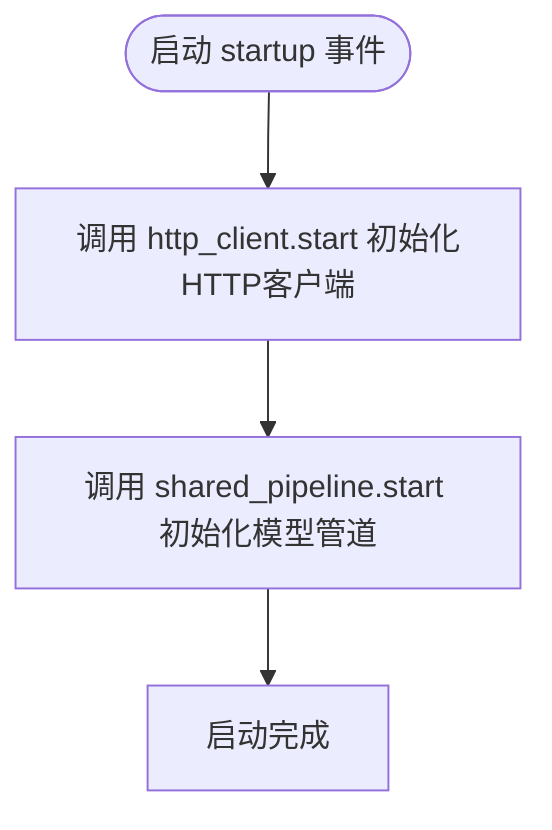
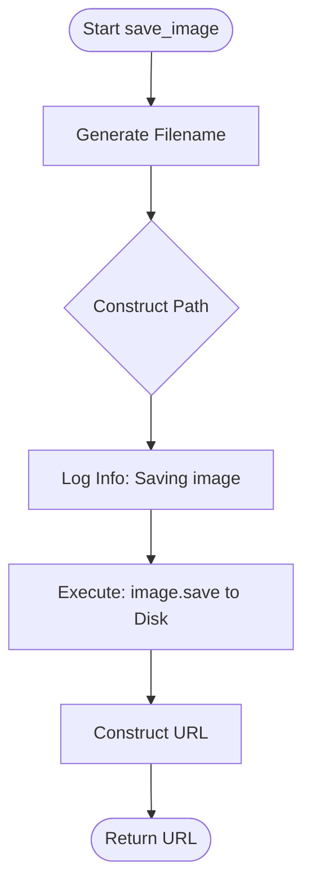
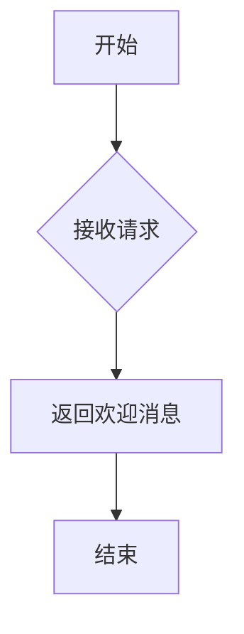
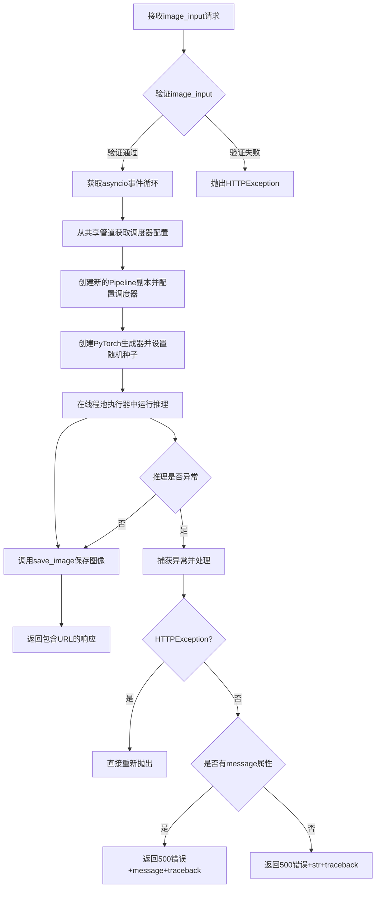
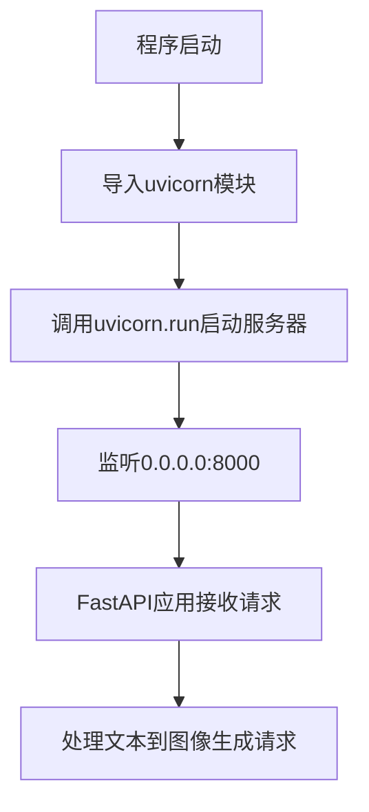
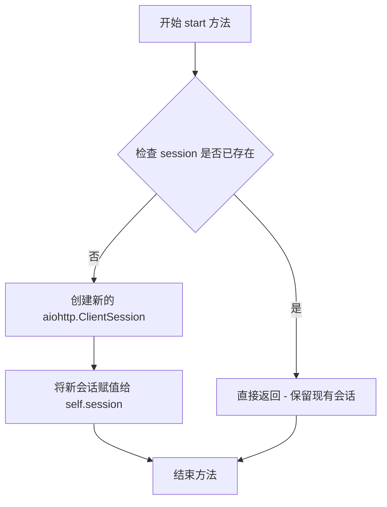
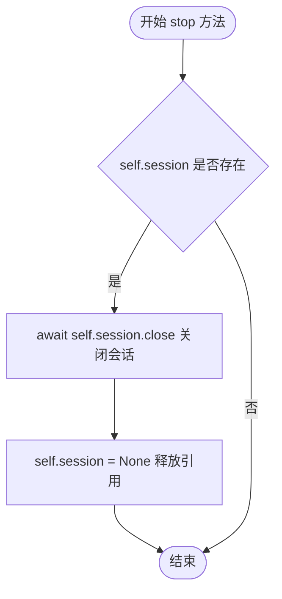
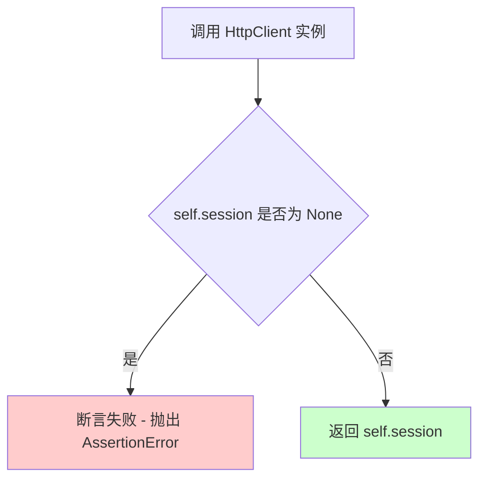
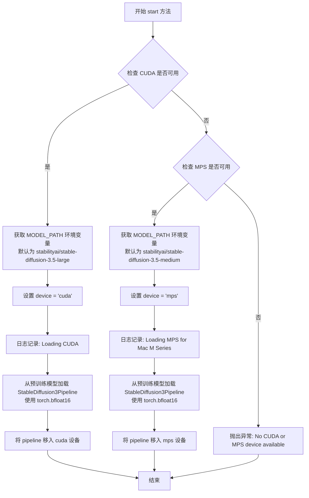

# `diffusers\examples\server\server.py` 详细设计文档

这是一个基于 FastAPI 的图像生成服务，使用 Stable Diffusion 3 模型根据文本提示生成图像。支持 CUDA 和 MPS (Apple Silicon M 系列) 设备，提供 RESTful API 接口用于图像生成。

## 整体流程



## 类结构

```
FastAPI App
├── TextToImageInput (Pydantic BaseModel)
├── HttpClient
│   ├── session: aiohttp.ClientSession
│   ├── start()
│   ├── stop()
│   └── __call__()
└── TextToImagePipeline
    ├── pipeline: StableDiffusion3Pipeline
    ├── device: str
    └── start()
```

## 全局变量及字段


### `logger`
    
日志记录器

类型：`logging.Logger`
    


### `app`
    
FastAPI 应用实例

类型：`FastAPI`
    


### `service_url`
    
服务 URL 地址

类型：`str`
    


### `image_dir`
    
图像存储目录

类型：`str`
    


### `http_client`
    
HTTP 客户端实例

类型：`HttpClient`
    


### `shared_pipeline`
    
共享的图像生成管道

类型：`TextToImagePipeline`
    


### `TextToImageInput.model`
    
模型名称

类型：`str`
    


### `TextToImageInput.prompt`
    
图像生成提示词

类型：`str`
    


### `TextToImageInput.size`
    
图像尺寸

类型：`str | None`
    


### `TextToImageInput.n`
    
生成数量

类型：`int | None`
    


### `HttpClient.session`
    
HTTP 会话对象

类型：`aiohttp.ClientSession`
    


### `TextToImagePipeline.pipeline`
    
Stable Diffusion 3 管道

类型：`StableDiffusion3Pipeline`
    


### `TextToImagePipeline.device`
    
运行设备 (cuda/mps)

类型：`str`
    
    

## 全局函数及方法


### `startup`

服务启动事件处理，加载 HTTP 客户端和模型管道，完成服务初始化。

参数：

- （无参数）

返回值：`None`，无返回值描述

#### 流程图



#### 带注释源码

```python
@app.on_event("startup")  # 定义FastAPI启动事件处理函数
def startup():
    """服务启动事件处理函数，在应用启动时自动调用"""
    
    # 启动HTTP客户端，初始化aiohttp.ClientSession
    # 用于后续的HTTP请求处理
    http_client.start()
    
    # 启动模型管道，根据硬件条件加载StableDiffusion3Pipeline
    # 支持CUDA（NVIDIA GPU）或MPS（Apple M系列芯片）
    shared_pipeline.start()
```


### `save_image`

将 PIL 图像对象保存到服务器配置的临时目录中，生成唯一的文件名（基于 UUID），并返回该图像的完整 HTTP 访问 URL。

参数：

-  `image`：`PIL.Image.Image` (或具有 `save` 方法的对象)，待保存的图像对象。

返回值：`str`，返回保存后的图像在服务上的完整访问路径（例如：`http://localhost:8000/images/draw1a2b3c4d.png`）。

#### 流程图



#### 带注释源码

```python
def save_image(image):
    """
    将 PIL 图像保存到磁盘并返回 URL。
    
    Args:
        image: PIL 图像对象，需要具备 save 方法。
        
    Returns:
        str: 图像的完整访问 URL。
    """
    # 使用 UUID 生成短唯一标识符，拼接 .png 后缀构成文件名
    filename = "draw" + str(uuid.uuid4()).split("-")[0] + ".png"
    
    # 拼接完整的磁盘存储路径
    image_path = os.path.join(image_dir, filename)
    
    # 记录日志，告知图像即将保存的位置
    logger.info(f"Saving image to {image_path}")
    
    # 调用 PIL 图像对象的 save 方法将图像写入磁盘
    image.save(image_path)
    
    # 拼接服务的外部访问 URL 并返回
    return os.path.join(service_url, "images", filename)
```


### `base()`

这是一个根路径处理函数，处理 GET、POST 和 OPTIONS 请求，返回欢迎信息，告知用户可以使用 Diffusers 生成图像。

参数： 无

返回值：`str`，返回欢迎消息字符串 "Welcome to Diffusers! Where you can use diffusion models to generate images"

#### 流程图



#### 带注释源码

```python
# 使用装饰器绑定GET、POST、OPTIONS请求到根路径"/"
@app.get("/")
@app.post("/")
@app.options("/")
async def base():
    """
    处理根路径的所有HTTP请求方法（GET、POST、OPTIONS）
    返回欢迎信息，介绍服务功能
    """
    # 返回欢迎字符串信息
    return "Welcome to Diffusers! Where you can use diffusion models to generate images"
```


### `generate_image`

该函数是图像生成的核心API端点，接收文本提示（prompt）并使用Stable Diffusion 3模型生成对应图像，将生成的图像保存到磁盘后返回图像访问URL。

参数：

- `image_input`：`TextToImageInput`，包含模型名称、提示词、图像尺寸和生成数量的输入模型

返回值：`dict`，返回格式为 `{"data": [{"url": 图像URL}]}` 的字典

#### 流程图



#### 带注释源码

```python
@app.post("/v1/images/generations")
async def generate_image(image_input: TextToImageInput):
    """
    图像生成API端点
    接收TextToImageInput请求，使用Stable Diffusion 3生成图像
    """
    try:
        # 获取当前asyncio事件循环，用于在线程池中执行阻塞的推理操作
        loop = asyncio.get_event_loop()
        
        # 从共享Pipeline中获取调度器配置，创建新的调度器实例
        # 这样可以支持不同的采样策略而不影响共享管道
        scheduler = shared_pipeline.pipeline.scheduler.from_config(
            shared_pipeline.pipeline.scheduler.config
        )
        
        # 从共享Pipeline克隆一个新的Pipeline实例（带新的调度器）
        # 注意：这里每次请求都克隆管道，可能有性能优化空间
        pipeline = StableDiffusion3Pipeline.from_pipe(
            shared_pipeline.pipeline, 
            scheduler=scheduler
        )
        
        # 创建PyTorch生成器并设置随机种子
        # 使用random.randint确保每次请求生成不同的图像
        generator = torch.Generator(device=shared_pipeline.device)
        generator.manual_seed(random.randint(0, 10000000))
        
        # 使用run_in_executor在线程池中执行阻塞的图像生成操作
        # 避免阻塞事件循环，提高并发处理能力
        output = await loop.run_in_executor(
            None,  # 使用默认线程池
            lambda: pipeline(image_input.prompt, generator=generator)
        )
        
        # 记录推理输出日志
        logger.info(f"output: {output}")
        
        # 将生成的第一个图像保存到磁盘并获取URL
        image_url = save_image(output.images[0])
        
        # 返回符合API规范的响应格式
        return {"data": [{"url": image_url}]}
    
    except Exception as e:
        # 异常处理：区分不同类型的异常
        if isinstance(e, HTTPException):
            # HTTP异常直接重新抛出，保留原有状态码
            raise e
        elif hasattr(e, 'message'):
            # 自定义异常如果有message属性，返回500并附加详细信息
            raise HTTPException(
                status_code=500, 
                detail=e.message + traceback.format_exc()
            )
        # 其他异常返回通用500错误
        raise HTTPException(
            status_code=500, 
            detail=str(e) + traceback.format_exc()
        )
```

#### 潜在技术债务与优化空间

1. **未使用的输入参数**：函数接收了`image_input.model`、`image_input.size`、`image_input.n`等参数，但在实现中完全未使用，导致API契约不完整
2. **管道重复创建开销**：每次请求都通过`from_pipe`克隆完整管道，增加内存和计算开销，可考虑缓存或复用策略
3. **种子生成范围**：`random.randint(0, 10000000)`的种子范围可能不足以满足高并发下的唯一性需求
4. **错误信息泄露**：生产环境中返回完整的traceback可能泄露内部实现细节
5. **CORS配置过于宽松**：`allow_origins=["*"]`在生产环境中存在安全风险


### `if __name__ == "__main__":` - 主程序入口

这是程序的启动入口，启动FastAPI应用并通过uvicorn服务器在指定主机和端口上运行，使服务能够接收HTTP请求。

参数：
- 无直接参数（通过`uvicorn.run()`调用传递参数）

返回值：
- 无返回值（启动服务器为后台操作）

#### 流程图



#### 带注释源码

```python
if __name__ == "__main__":
    import uvicorn

    # 启动uvicorn服务器，将FastAPI应用挂载到指定主机和端口
    # host="0.0.0.0" 表示监听所有网络接口，允许外部访问
    # port=8000 指定服务运行在8000端口
    uvicorn.run(app, host="0.0.0.0", port=8000)
```

---

## 完整设计文档

### 一段话描述

本项目是一个基于FastAPI的Web服务，使用Stable Diffusion 3模型将文本提示转换为图像，通过uvicorn服务器提供RESTful API接口，支持跨域请求和图像文件托管。

### 文件的整体运行流程

1. **服务启动**：执行`if __name__ == "__main__"`块，启动uvicorn服务器监听`0.0.0.0:8000`
2. **初始化阶段**：在`startup`事件中初始化HTTP客户端和文本到图像管道，加载模型到CUDA或MPS设备
3. **请求处理**：
   - 根路径`/`返回欢迎信息
   - `/v1/images/generations`端点接收文本提示，调用Stable Diffusion 3模型生成图像
   - 生成的图像保存到临时目录并通过静态文件服务提供访问
4. **服务关闭**：关闭HTTP会话和清理资源

### 类的详细信息

#### `TextToImageInput`

用于验证文本到图像生成请求的输入模型。

**字段：**
- `model`：str，要使用的模型名称
- `prompt`：str，生成图像的文本提示
- `size`：str | None，输出图像尺寸（可选）
- `n`：int | None，生成图像数量（可选）

#### `HttpClient`

管理aiohttp客户端会话的类。

**字段：**
- `session`：aiohttp.ClientSession，HTTP客户端会话

**方法：**
- `start()`：初始化HTTP会话
- `stop()`：异步关闭HTTP会话
- `__call__()`：返回当前会话实例

#### `TextToImagePipeline`

管理Stable Diffusion 3模型管道的类。

**字段：**
- `pipeline`：StableDiffusion3Pipeline，模型管道实例
- `device`：str，运行设备（cuda/mps）

**方法：**
- `start()`：根据可用设备加载模型到CUDA或MPS

### 全局变量和全局函数

#### 全局变量

| 名称 | 类型 | 描述 |
|------|------|------|
| `logger` | logging.Logger | 模块级日志记录器 |
| `app` | FastAPI | FastAPI应用实例 |
| `service_url` | str | 服务基础URL |
| `image_dir` | str | 图像存储目录 |
| `http_client` | HttpClient | HTTP客户端单例 |
| `shared_pipeline` | TextToImagePipeline | 共享的模型管道实例 |

#### 全局函数

| 名称 | 参数 | 返回值 | 描述 |
|------|------|--------|------|
| `startup` | 无 | None | 应用启动事件处理函数，初始化HTTP客户端和模型管道 |
| `save_image` | image: Image | str | 将PIL图像保存到磁盘并返回访问URL |
| `base` | 无 | str | 处理根路径的GET/POST/OPTIONS请求，返回欢迎信息 |
| `generate_image` | image_input: TextToImageInput | dict | 处理图像生成请求，调用模型生成图像并返回URL |

### 关键组件信息

| 组件名称 | 描述 |
|----------|------|
| FastAPI | Web框架，提供RESTful API接口 |
| StableDiffusion3Pipeline | Stability AI的SD3模型管道 |
| uvicorn | ASGI服务器，运行FastAPI应用 |
| aiohttp | 异步HTTP客户端 |
| torch | PyTorch深度学习框架 |
| CORS中间件 | 处理跨域资源共享 |

### 潜在的技术债务或优化空间

1. **模型加载策略**：当前在启动时同步加载整个模型到内存，可以考虑使用模型量化、延迟加载或模型缓存策略
2. **错误处理**：异常处理中使用字符串拼接traceback，可能暴露内部实现细节
3. **配置管理**：模型路径和服务URL使用环境变量但缺乏默认值校验和类型检查
4. **资源清理**：缺乏优雅关闭（graceful shutdown）机制，可能导致资源泄漏
5. **并发控制**：未实现请求并发限制，可能导致GPU内存溢出
6. **日志级别**：使用默认日志级别，生产环境应配置更详细的日志策略
7. **CORS配置**：允许所有来源（`*`）存在安全风险，应限制允许的域

### 其它项目

#### 设计目标与约束

- **目标**：提供基于Stable Diffusion 3的文本到图像生成REST API
- **约束**：仅支持CUDA和MPS设备，无CPU支持

#### 错误处理与异常设计

- HTTP异常直接重新抛出
- 自定义异常包含message属性用于错误详情
- 所有异常统一返回500状态码并附加错误信息和堆栈跟踪

#### 数据流与状态机

1. 客户端发送POST请求到`/v1/images/generations`
2. 服务验证输入模型
3. 创建调度器和新管道副本
4. 生成随机种子
5. 在线程池执行器中同步调用模型推理
6. 将生成的图像保存到临时文件
7. 返回图像访问URL

#### 外部依赖与接口契约

- **模型源**：HuggingFace Hub（stabilityai/stable-diffusion-3.5-large 或 medium）
- **静态文件**：通过`/images`路径提供图像访问
- **输入格式**：JSON对象包含`model`和`prompt`字段
- **输出格式**：JSON对象包含`data`数组，每个元素有`url`字段


### `HttpClient.start`

该方法用于启动并初始化 HTTP 客户端会话，创建一个 `aiohttp.ClientSession` 实例并赋值给类的 `session` 属性，以便后续通过该会话进行 HTTP 请求。

参数：

- 无参数（仅包含隐式参数 `self`）

返回值：`None`，无返回值，仅执行副作用（初始化会话）

#### 流程图



#### 带注释源码

```python
def start(self):
    """
    启动 HTTP 客户端会话。
    
    该方法创建一个新的 aiohttp.ClientSession 实例，并将其存储在
    类的 session 属性中。ClientSession 是 aiohttp 推荐的用于发送
    多个请求的方式，因为它支持连接池和连接复用。
    
    注意：
    - 此方法应在应用启动时调用
    - 调用前应确保没有已存在的会话（否则可能导致资源泄漏）
    - 建议在使用完毕后调用 stop() 方法关闭会话
    """
    # 创建新的 aiohttp.ClientSession 实例
    # ClientSession 内部维护连接池，可复用 TCP 连接以提高性能
    self.session = aiohttp.ClientSession()
```


### `HttpClient.stop()`

该方法是 `HttpClient` 类的异步方法，用于关闭 HTTP 客户端会话并释放资源。它通过调用 `aiohttp.ClientSession.close()` 方法关闭底层连接，并将 `session` 引用置为 `None`，以确保不会意外复用已关闭的会话。

参数： 无

返回值：`None`，无返回值描述

#### 流程图



#### 带注释源码

```python
async def stop(self):
    """关闭 HTTP 客户端会话并释放资源
    
    该方法是一个异步方法，执行以下操作：
    1. 等待底层 aiohttp.ClientSession 关闭完成
    2. 将 session 引用置为 None，便于垃圾回收
    
    Returns:
        None: 该方法不返回任何值
    
    Note:
        调用此方法后，HttpClient 实例需要重新调用 start() 方法
        才能再次创建新的会话
    """
    await self.session.close()  # 异步关闭 aiohttp 会话，释放底层 TCP 连接
    self.session = None  # 将 session 引用置为 None，防止误用已关闭的会话
```


### `HttpClient.__call__`

获取当前持有的 aiohttp 会话实例，如果会话未初始化则抛出断言错误。

参数：无（该方法为可调用对象，通过 `__call__` 实现）

返回值：`aiohttp.ClientSession`，返回当前 HttpClient 对象持有的 aiohttp.ClientSession 实例，用于发起 HTTP 请求。

#### 流程图



#### 带注释源码

```python
def __call__(self) -> aiohttp.ClientSession:
    """
    获取当前持有的 aiohttp 会话实例。
    
    这是一个可调用对象（callable）实现，使得 HttpClient 实例可以直接像函数一样被调用。
    使用 __call__ 方法可以简化代码，允许直接通过 http_client() 而非 http_client.session 获取会话。
    
    Returns:
        aiohttp.ClientSession: 当前持有的会话实例
        
    Raises:
        AssertionError: 如果会话未初始化（session 为 None）
    """
    # 断言检查确保会话已经通过 start() 方法初始化
    # 防止在会话未启动的情况下调用导致后续错误
    assert self.session is not None
    
    # 返回初始化后的 aiohttp ClientSession 实例
    # 该实例可被用于发起异步 HTTP 请求
    return self.session
```

#### 设计意图与约束

- **设计目标**：提供一种便捷的方式获取 HTTP 客户端会话实例，通过实现 `__call__` 魔术方法，使实例可被直接调用，符合 Python 的可调用对象协议。
- **约束条件**：必须在调用前确保 `start()` 方法已被调用以初始化会话，否则断言将失败。
- **错误处理**：使用断言进行前置条件检查，这是一种调试模式下有效的错误检测机制，但在 Python 优化模式（-O）下会被跳过，生产环境需注意这一点。
- **使用示例**：
  ```python
  http_client = HttpClient()
  http_client.start()  # 初始化会话
  session = http_client()  # 通过 __call__ 获取会话，等价于 http_client.session
  ```


### `TextToImagePipeline.start()`

该方法是 TextToImagePipeline 类的核心初始化方法，负责检测当前运行环境（CUDA 或 MPS），从预训练模型仓库加载 Stable Diffusion 3 模型，并将其移入指定设备（GPU 或 Apple Silicon），为后续图像生成服务提供推理管道。

参数： 无

返回值： `None`，该方法直接修改实例属性 `self.pipeline` 和 `self.device`，不返回任何值

#### 流程图



#### 带注释源码

```python
def start(self):
    """
    初始化并加载 Stable Diffusion 3 模型到指定计算设备。
    
    优先级：
    1. NVIDIA GPU (CUDA) - 优先使用，模型精度 bfloat16
    2. Apple Silicon (MPS) - 备选方案，模型精度 bfloat16
    3. 抛出异常 - 无可用设备时
    """
    # 检查是否有 NVIDIA GPU 可用
    if torch.cuda.is_available():
        # 从环境变量获取模型路径，默认使用 large 模型
        model_path = os.getenv("MODEL_PATH", "stabilityai/stable-diffusion-3.5-large")
        # 记录日志信息
        logger.info("Loading CUDA")
        # 设置设备为 CUDA
        self.device = "cuda"
        # 加载预训练模型并移入 GPU 设备
        self.pipeline = StableDiffusion3Pipeline.from_pretrained(
            model_path,
            torch_dtype=torch.bfloat16,  # 使用 bfloat16 减少显存占用
        ).to(device=self.device)
    # 检查是否有 Apple M 系列芯片可用
    elif torch.backends.mps.is_available():
        # 从环境变量获取模型路径，默认使用 medium 模型
        model_path = os.getenv("MODEL_PATH", "stabilityai/stable-diffusion-3.5-medium")
        # 记录日志信息
        logger.info("Loading MPS for Mac M Series")
        # 设置设备为 MPS
        self.device = "mps"
        # 加载预训练模型并移入 MPS 设备
        self.pipeline = StableDiffusion3Pipeline.from_pretrained(
            model_path,
            torch_dtype=torch.bfloat16,  # 使用 bfloat16 减少显存占用
        ).to(device=self.device)
    else:
        # 既没有 CUDA 也没有 MPS，抛出异常
        raise Exception("No CUDA or MPS device available")
```

## 关键组件


### StableDiffusion3Pipeline (Diffusers)

Stable Diffusion 3的管道封装类，负责加载预训练模型并执行文本到图像的生成任务。

### TextToImagePipeline

模型管道管理类，封装了StableDiffusion3Pipeline实例和设备信息，支持CUDA和MPS设备的自动检测与模型加载。

### HttpClient

异步HTTP客户端会话管理类，负责管理aiohttp.ClientSession的生命周期，确保HTTP请求的复用与资源释放。

### TextToImageInput

基于Pydantic的输入验证模型，定义图像生成API的请求参数结构，包括模型名称、提示词、图像尺寸和生成数量。

### 图像生成流程 (generate_image)

处理文本到图像生成的核心异步函数，包含调度器配置、随机种子设置、管道调用和图像保存的完整流程。

### 设备检测与量化策略

自动检测CUDA或MPS可用性，选择对应设备并使用bfloat16量化精度加载模型，平衡计算效率与内存占用。

### 图像保存机制 (save_image)

将生成的图像对象持久化到临时目录，生成唯一文件名并返回可访问的HTTP URL。

### CORS中间件配置

允许所有来源、凭证、方法和头部的跨域请求，确保Web前端可以正常访问API服务。

### 静态文件服务

将图像输出目录挂载为静态资源路径，使生成的图像可通过HTTP直接访问。


## 问题及建议


### 已知问题

-   **资源管理缺陷**：缺少 `shutdown` 事件处理，服务停止时无法正确释放 `aiohttp.ClientSession` 和 GPU 资源
-   **并发控制缺失**：未限制并发请求数量，可能导致 GPU 内存溢出
-   **Pipeline 重复创建**：每次请求都执行 `StableDiffusion3Pipeline.from_pipe()` 创建新 pipeline，极其低效且浪费显存
-   **类属性误用**：`HttpClient` 和 `TextToImagePipeline` 使用类属性（`session`、`pipeline`、`device`），实例化多对象会共享状态，易产生隐蔽 bug
-   **异常处理不规范**：使用 `hasattr(e, "message")` 检查异常属性不够可靠；`traceback.format_exc()` 返回字符串，与 `str(e)` 直接拼接会导致类型混淆
-   **输入验证不足**：`TextToImageInput` 的 `size` 和 `n` 参数定义后未在实际逻辑中使用；未对 `n`（生成数量）做上限限制
-   **CORS 安全风险**：允许所有来源、凭据、方法和头部，配置过于宽松
-   **全局状态过度**：大量全局变量（`http_client`、`shared_pipeline`、`image_dir`、`service_url`）不利于测试和扩展
-   **类型注解不完整**：部分变量缺少类型标注（如 `scheduler`、`generator`）

### 优化建议

-   **实现优雅关闭**：添加 `@app.on_event("shutdown")` 协程，清理 session 和释放 pipeline
-   **添加并发限制**：使用 `asyncio.Semaphore` 或工具库限制同时处理的请求数
-   **复用 Pipeline**：移除 `from_pipe` 调用，直接使用 `shared_pipeline.pipeline`，仅在需要不同 scheduler 时才克隆
-   **改用实例属性**：将类属性改为 `__init__` 中的实例属性，或显式实现单例模式
-   **统一异常处理**：捕获具体异常类型，使用日志记录 traceback 而非拼接返回
-   **完善输入验证**：实现 `size` 和 `n` 参数逻辑，限制 `n` 的最大值（如 1-4）
-   **收紧 CORS 配置**：根据实际需求限定 `allow_origins`、`allow_methods`
-   **依赖注入重构**：通过 FastAPI 依赖注入管理 `HttpClient` 和 `TextToImagePipeline` 实例
-   **补充类型标注**：为所有函数参数和返回值添加完整的类型注解

## 其它


### 设计目标与约束

1. **核心目标**：提供一个基于FastAPI的RESTful API服务，用户可以通过文本提示（prompt）调用Stable Diffusion 3模型生成图像。
2. **约束条件**：
   - 必须支持CUDA（NVIDIA GPU）或MPS（Apple M系列芯片）进行推理加速
   - 生成的图像需要持久化存储并通过HTTP服务对外提供访问
   - 需要遵循OpenAI风格的图像生成API接口规范（`/v1/images/generations`）

### 错误处理与异常设计

1. **启动阶段错误**：
   - 若无可用CUDA或MPS设备，抛出`Exception("No CUDA or MPS device available")`，导致服务无法启动
2. **运行时错误**：
   - 捕获所有异常，若为`HTTPException`则直接重新抛出
   - 若异常包含`message`属性，返回500状态码并附带错误消息和堆栈信息
   - 其他异常统一返回500状态码并附带异常字符串和堆栈信息
3. **断言检查**：
   - `HttpClient.__call__`方法中断言`session`不为`None`，确保HTTP客户端已正确初始化

### 数据流与状态机

1. **服务启动流程**：
   - `startup`事件触发 → 初始化`HttpClient` → 初始化`TextToImagePipeline`加载模型到指定设备
2. **图像生成请求流程**：
   - 客户端POST请求 → `generate_image`函数 → 获取scheduler配置 → 从共享pipeline克隆新pipeline → 创建随机数生成器 → 执行推理 → 保存图像 → 返回图像URL
3. **图像保存流程**：
   - 生成UUID文件名 → 拼接完整路径 → 调用PIL的`image.save()`保存到磁盘 → 返回基于`SERVICE_URL`的HTTP访问路径

### 外部依赖与接口契约

1. **环境变量**：
   - `MODEL_PATH`：模型路径，默认为`stabilityai/stable-diffusion-3.5-large`（CUDA）或`stabilityai/stable-diffusion-3.5-medium`（MPS）
   - `SERVICE_URL`：服务基础URL，默认为`http://localhost:8000`
2. **外部依赖**：
   - `aiohttp`：异步HTTP客户端
   - `torch` + `diffusers`：模型推理
   - `fastapi` + `uvicorn`：Web框架
   - `pydantic`：数据验证
3. **API接口**：
   - `GET /`：返回欢迎信息
   - `POST /`：返回欢迎信息
   - `OPTIONS /`：返回欢迎信息（CORS预检）
   - `POST /v1/images/generations`：接收`TextToImageInput`，返回图像URL列表

### 安全性考虑

1. **CORS配置**：允许所有来源、凭证、方法和头域（`allow_origins=["*"]`），存在安全风险，生产环境应限制具体域名
2. **静态文件服务**：通过`StaticFiles`挂载图像目录，需确保目录路径安全，防止路径遍历攻击
3. **异常信息泄露**：错误响应中包含`traceback.format_exc()`，可能泄露敏感系统信息

### 性能考虑

1. **异步执行**：使用`loop.run_in_executor`将同步的模型推理操作放入线程池执行，避免阻塞事件循环
2. **Pipeline克隆**：每次请求从共享pipeline克隆新pipeline并配置新的scheduler，存在一定开销，可考虑缓存策略
3. **模型加载**：模型在启动时一次性加载到GPU/MPS内存，长期运行需监控显存/内存占用

### 配置管理

1. **模型配置**：通过环境变量`MODEL_PATH`配置模型仓库ID或本地路径
2. **服务配置**：通过环境变量`SERVICE_URL`配置外部访问地址
3. **临时目录**：图像存储目录固定为`tempfile.gettempdir()/images`

### 资源管理

1. **HTTP会话管理**：提供`HttpClient.start()`和`HttpClient.stop()`方法管理`aiohttp.ClientSession`生命周期
2. **设备管理**：自动检测CUDA和MPS可用性，选择合适的推理设备
3. **图像清理**：当前实现无图像定期清理机制，长时间运行可能导致磁盘空间耗尽

### 并发与线程安全

1. **共享Pipeline**：全局`shared_pipeline`对象在多请求并发时可能被同时访问，`StableDiffusion3Pipeline.from_pipe`每次创建新实例以避免状态污染
2. **随机数生成**：每个请求使用独立的`torch.Generator`并设置随机种子，确保可复现性
3. **线程池**：`run_in_executor(None, ...)`使用默认线程池，线程数量受系统限制

### 监控与日志

1. **日志记录**：使用`logging`模块记录关键事件，包括设备加载、图像保存、推理输出等
2. **日志级别**：未显式配置日志级别，默认取决于根日志配置
3. **监控缺失**：缺少请求延迟、错误率、GPU利用率等业务指标监控

### 测试策略

1. **单元测试**：当前代码无单元测试覆盖
2. **集成测试**：可针对API端点进行功能测试，验证图像生成流程完整性
3. **性能测试**：建议添加负载测试评估并发处理能力

### 潜在技术债务与优化空间

1. **代码质量**：
   - `save_image`函数可提取为工具类或服务类
   - 重复的异常处理逻辑可抽取为装饰器或中间件
2. **架构优化**：
   - 考虑使用依赖注入框架管理`HttpClient`和`TextToImagePipeline`生命周期
   - 添加请求队列和任务调度机制支持异步批量处理
   - 图像存储可考虑对象存储服务（如S3）替代本地文件系统
3. **功能扩展**：
   - 支持更多图像参数（width, height, guidance_scale, num_inference_steps等）
   - 添加图像生成状态查询和取消功能
   - 实现基于token的认证机制

    