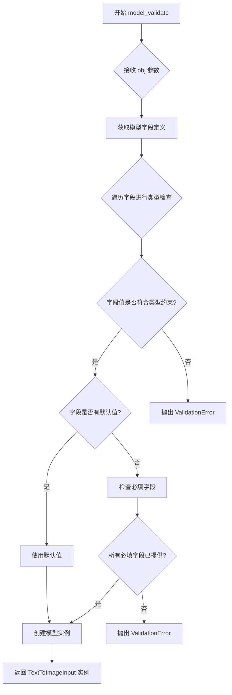
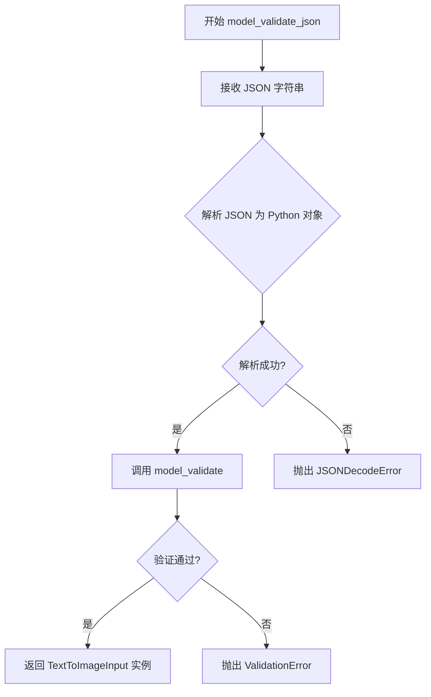
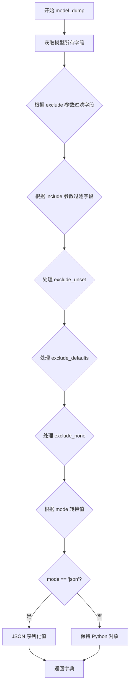
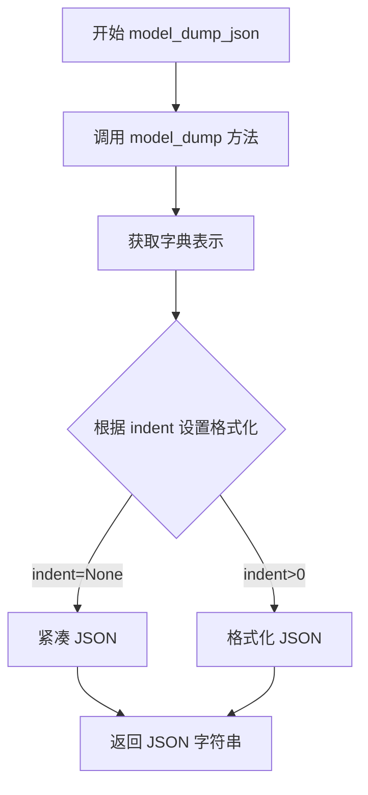
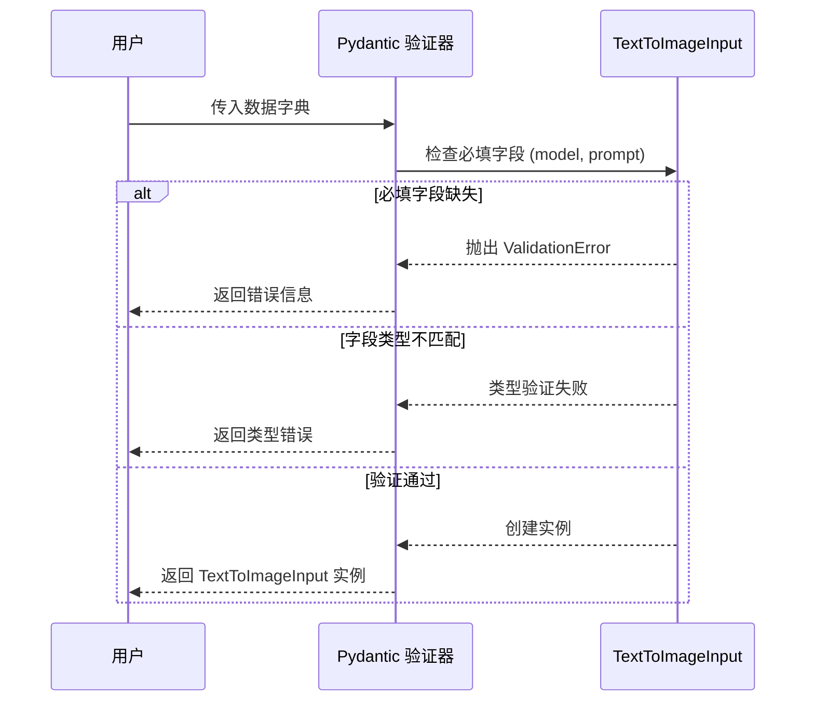
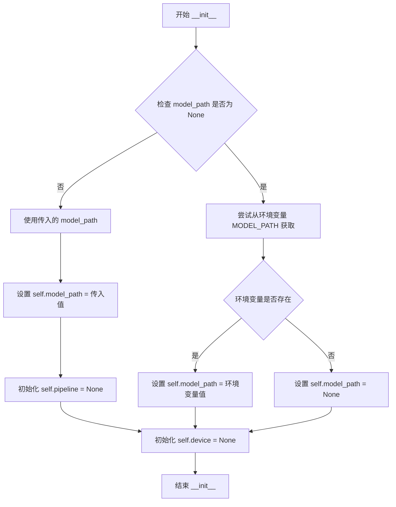
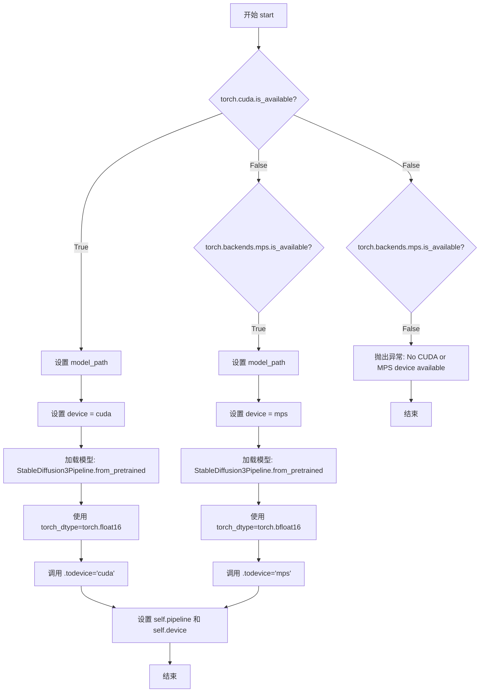
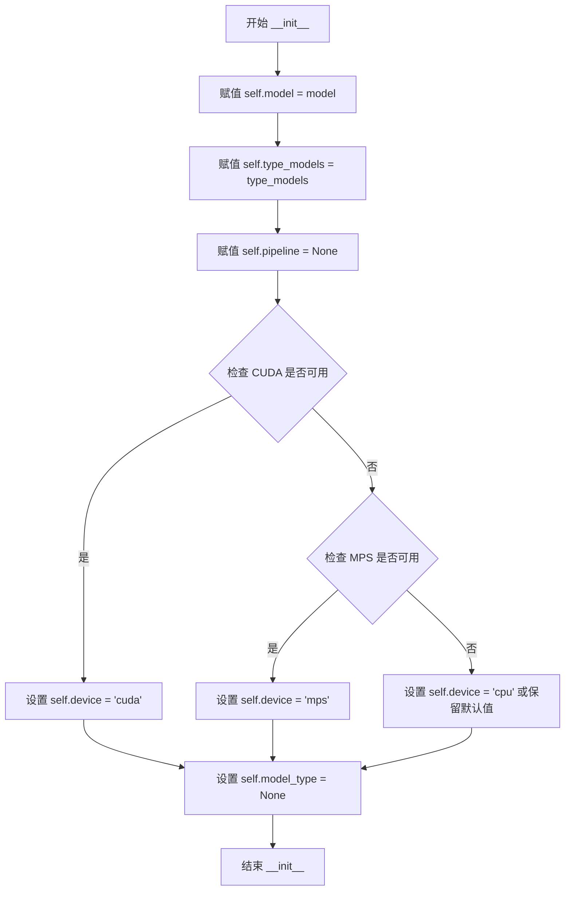

# `diffusers\examples\server-async\Pipelines.py` 详细设计文档

该代码实现了一个基于Stable Diffusion 3系列的文本到图像生成管道管理框架，支持SD3和SD3.5版本的模型加载，可根据硬件环境（CUDA/MPS）自动选择合适的设备，并提供统一的初始化接口。

## 整体流程

```mermaid
graph TD
    A[开始] --> B[ModelPipelineInitializer.initialize_pipeline]
B --> C{检查model参数}
C -- 空 --> D[抛出ValueError]
C -- 非空 --> E[创建PresetModels实例]
E --> F{判断模型类型}
F -- 在SD3列表中 --> G[设置model_type=SD3]
F -- 在SD3_5列表中 --> H[设置model_type=SD3_5]
F -- 都不在 --> I[model_type=None]
G --> J{type_models==t2im?}
H --> J
I --> J
J -- 是 --> K{model_type in [SD3, SD3_5]?}
K -- 是 --> L[创建TextToImagePipelineSD3]
K -- 否 --> M[抛出ValueError]
J -- 否 --> N[抛出ValueError: 不支持的type_models]
L --> O[返回pipeline实例]
O --> P[TextToImagePipelineSD3.start加载模型]
P --> Q{检查CUDA可用性}
Q -- 是 --> R[加载CUDA管道: float16]
Q -- 否 --> S{检查MPS可用性}
S -- 是 --> T[加载MPS管道: bfloat16]
S -- 否 --> U[抛出异常: 无可用设备]
```

## 类结构

```
TextToImageInput (Pydantic BaseModel)
PresetModels (dataclass)
TextToImagePipelineSD3
ModelPipelineInitializer
```

## 全局变量及字段


### `logger`
    
模块级日志记录器，用于记录程序运行时的日志信息

类型：`logging.Logger`
    


### `TextToImageInput.model`
    
要使用的模型名称

类型：`str`
    


### `TextToImageInput.prompt`
    
文本提示

类型：`str`
    


### `TextToImageInput.size`
    
生成图像尺寸

类型：`str | None`
    


### `TextToImageInput.n`
    
生成图像数量

类型：`int | None`
    


### `PresetModels.SD3`
    
Stable Diffusion 3模型列表

类型：`List[str]`
    


### `PresetModels.SD3_5`
    
Stable Diffusion 3.5模型列表

类型：`List[str]`
    


### `TextToImagePipelineSD3.model_path`
    
模型路径或HuggingFace模型ID

类型：`str | None`
    


### `TextToImagePipelineSD3.pipeline`
    
管道实例

类型：`StableDiffusion3Pipeline | None`
    


### `TextToImagePipelineSD3.device`
    
运行设备(cuda/mps)

类型：`str | None`
    


### `ModelPipelineInitializer.model`
    
模型名称

类型：`str`
    


### `ModelPipelineInitializer.type_models`
    
模型类型(t2im/t2v)

类型：`str`
    


### `ModelPipelineInitializer.pipeline`
    
管道实例

类型：`Any`
    


### `ModelPipelineInitializer.device`
    
运行设备

类型：`str`
    


### `ModelPipelineInitializer.model_type`
    
识别出的模型类型

类型：`str | None`
    
    

## 全局函数及方法


### TextToImageInput (Pydantic BaseModel 验证和序列化方法)

`TextToImageInput` 类继承自 Pydantic 的 `BaseModel`，自动获得了强大的数据验证和序列化功能。该类用于定义文生图任务的输入数据结构，包含模型名称、提示词、图像尺寸和生成数量等字段。Pydantic 会在实例化时自动进行类型检查和验证，确保数据符合预定义的模式。

#### 1. model_validate - 数据验证方法

参数：

- `obj`：`Any`，用于验证的字典或对象
- `strict`：`bool | None = None`，是否启用严格模式
- `from_attributes`：`bool | None = None`，是否允许从对象属性创建模型
- `loc`：`tuple[str | int, ...] | None = None`，验证失败时的位置信息

返回值：`TextToImageInput`，验证通过后返回的模型实例

##### 流程图



##### 带注释源码

```python
# pydantic 自动生成的方法
# 用于验证字典/对象数据并创建 TextToImageInput 实例

# 使用示例:
# data = {"model": "stabilityai/stable-diffusion-3-medium", "prompt": "A cat"}
# instance = TextToImageInput.model_validate(data)
# 
# 等价于:
# instance = TextToImageInput(**data)
```

#### 2. model_validate_json - JSON 字符串验证方法

参数：

- `json_data`：`str | bytes`，JSON 格式的字符串或字节
- `strict`：`bool | None = None`，是否启用严格模式
- `loc`：`tuple[str | int, ...] | None = None`，验证失败时的位置信息

返回值：`TextToImageInput`，验证通过后返回的模型实例

##### 流程图



##### 带注释源码

```python
# pydantic 自动生成的方法
# 用于直接从 JSON 字符串验证并创建模型实例

# 使用示例:
# json_str = '{"model": "stabilityai/stable-diffusion-3.5-large", "prompt": "landscape"}'
# instance = TextToImageInput.model_validate_json(json_str)
```

#### 3. model_dump - 序列化方法（转字典）

参数：

- `mode`：`Literal['python', 'json', 'compatible'] = 'python'`，输出模式
- `include`：`Set[int | str] | Mapping[int | str, Any] | None = None`，包含的字段
- `exclude`：`Set[int | str] | Mapping[int | str, Any] | None = None`，排除的字段
- `by_alias`：`bool = False`，是否使用字段别名
- `exclude_unset`：`bool = False`，是否排除未设置的字段
- `exclude_defaults`：`bool = False`，是否排除默认值的字段
- `exclude_none`：`bool = False`，是否排除 None 值的字段
- `round_trip`：`bool = False`，是否启用往返验证
- `warnings`：`bool | None = True`，是否显示警告

返回值：`dict[str, Any]`，模型实例的字典表示

##### 流程图



##### 带注释源码

```python
# pydantic 自动生成的方法
# 将模型实例序列化为 Python 字典

# 使用示例:
# instance = TextToImageInput(model="sd3", prompt="test", size="1024x1024")
# 
# 完整输出:
# dump = instance.model_dump()
# {'model': 'sd3', 'prompt': 'test', 'size': '1024x1024', 'n': None}
#
# 排除 None 值:
# dump = instance.model_dump(exclude_none=True)
# {'model': 'sd3', 'prompt': 'test', 'size': '1024x1024'}
#
# 只包含指定字段:
# dump = instance.model_dump(include={'model', 'prompt'})
# {'model': 'sd3', 'prompt': 'test'}
```

#### 4. model_dump_json - 序列化方法（转JSON字符串）

参数：

- `indent`：`int | None = None`，JSON 缩进空格数
- `include`：`Set[int | str] | Mapping[int | str, Any] | None = None`，包含的字段
- `exclude`：`Set[int | str] | Mapping[int | str, Any] | None = None`，排除的字段
- `by_alias`：`bool = False`，是否使用字段别名
- `exclude_unset`：`bool = False`，是否排除未设置的字段
- `exclude_defaults`：`bool = False`，是否排除默认值的字段
- `exclude_none`：`bool = False`，是否排除 None 值的字段
- `round_trip`：`bool = False`，是否启用往返验证
- `warnings`：`bool | None = True`，是否显示警告

返回值：`str`，JSON 格式的字符串

##### 流程图



##### 带注释源码

```python
# pydantic 自动生成的方法
# 将模型实例序列化为 JSON 字符串

# 使用示例:
# instance = TextToImageInput(model="sd3", prompt="test")
# 
# 默认输出:
# json_str = instance.model_dump_json()
# {"model":"sd3","prompt":"test","size":null,"n":null}
#
# 格式化输出:
# json_str = instance.model_dump_json(indent=2)
# {
#   "model": "sd3",
#   "prompt": "test",
#   "size": null,
#   "n": null
# }
#
# 排除 None 值:
# json_str = instance.model_dump_json(exclude_none=True)
# {"model":"sd3","prompt":"test"}
```

#### 5. model_construct - 高性能实例创建

参数：

- `_fields_set`：`set[str] | None = None`，字段集合
- `**values`：`Any`，字段值

返回值：`TextToImageInput`，创建的模型实例（不经过验证）

##### 带注释源码

```python
# pydantic 自动生成的方法
# 绕过验证直接创建模型实例，适用于可信数据源

# 使用示例:
# instance = TextToImageInput.model_construct(model="sd3", prompt="test")
# 注意: 不会进行任何类型检查，可能导致不一致状态
```

#### 6. model_copy - 复制模型实例

参数：

- `update`：`dict[str, Any] | None = None`，更新的字段值
- `deep`：`bool = False`，是否深度复制

返回值：`TextToImageInput`，复制后的模型实例

##### 带注释源码

```python
# pydantic 自动生成的方法
# 创建模型的副本

# 使用示例:
# original = TextToImageInput(model="sd3", prompt="test")
# 
# 浅拷贝:
# copy = original.model_copy()
# 
# 深拷贝:
# copy = original.model_copy(deep=True)
# 
# 带更新的拷贝:
# copy = original.model_copy(update={"prompt": "new prompt"})
```

#### 7. model_json_schema - 生成 JSON Schema

参数：

- `model_type`：`str | None = 'validation'`，模型类型
- `generate_definition`：`bool = True`，是否生成定义

返回值：`dict[str, Any]`，JSON Schema 字典

##### 带注释源码

```python
# pydantic 自动生成的方法
# 生成用于验证的 JSON Schema

# 使用示例:
# schema = TextToImageInput.model_json_schema()
# 返回 Pydantic v2 的 JSON Schema
```

### 关键技术细节

#### 数据验证流程



#### 字段类型约束说明

| 字段名 | 类型 | 必填 | 默认值 | 说明 |
|--------|------|------|--------|------|
| model | str | 是 | - | 模型名称或路径 |
| prompt | str | 是 | - | 文生图提示词 |
| size | str \| None | 否 | None | 输出图像尺寸，如 "1024x1024" |
| n | int \| None | 否 | None | 生成图像数量 |


### PresetModels.__init__

描述：PresetModels 的初始化方法，由 dataclass 装饰器自动生成，用于创建包含预定义 Stable Diffusion 3 系列模型列表的数据类实例。

参数：

- `SD3`：`List[str]`，可选，默认为包含 "stabilityai/stable-diffusion-3-medium" 的列表，表示 Stable Diffusion 3 系列模型
- `SD3_5`：`List[str]`，可选，默认为包含三个 Stable Diffusion 3.5 系列模型的列表（large、large-turbo、medium）

返回值：`None`，该方法用于初始化实例属性，不返回任何值

#### 流程图

```mermaid
flowchart TD
    A[开始 __init__] --> B{SD3 参数是否提供?}
    B -- 是 --> C[使用提供的 SD3 列表]
    B -- 否 --> D[使用默认 factory: lambda: ["stabilityai/stable-diffusion-3-medium"]]
    C --> E{SD3_5 参数是否提供?}
    D --> E
    E -- 是 --> F[使用提供的 SD3_5 列表]
    E -- 否 --> G[使用默认 factory: 包含3个模型的列表]
    F --> H[初始化 self.SD3 和 self.SD3_5]
    G --> H
    H --> I[结束 __init__]
```

#### 带注释源码

```python
def __init__(self, 
             SD3: List[str] = field(default_factory=lambda: ["stabilityai/stable-diffusion-3-medium"]), 
             SD3_5: List[str] = field(default_factory=lambda: [
                 "stabilityai/stable-diffusion-3.5-large",
                 "stabilityai/stable-diffusion-3.5-large-turbo",
                 "stabilityai/stable-diffusion-3.5-medium",
             ])):
    """
    初始化 PresetModels 实例
    
    由 @dataclass 装饰器自动生成的方法，用于设置两个预定义模型列表：
    - SD3: Stable Diffusion 3 系列模型
    - SD3_5: Stable Diffusion 3.5 系列模型
    
    参数:
        SD3: 模型标识符列表，默认为 stabilityai/stable-diffusion-3-medium
        SD3_5: 模型标识符列表，默认为包含 large, large-turbo, medium 三个变体的列表
    
    返回:
        无返回值（dataclass 自动处理实例属性赋值）
    """
    self.SD3 = SD3
    self.SD3_5 = SD3_5
```


### `TextToImagePipelineSD3.__init__`

该方法是`TextToImagePipelineSD3`类的构造函数，用于初始化文本到图像管道的配置。它接收可选的模型路径参数，如果未提供则从环境变量`MODEL_PATH`读取，同时初始化`pipeline`和`device`属性为`None`，为后续的模型加载做好准备。

参数：

- `model_path`：`str | None`，可选参数，指定要加载的Stable Diffusion 3模型的路径，默认为`None`

返回值：`None`，`__init__`方法不返回值，仅进行实例属性的初始化

#### 流程图



#### 带注释源码

```python
def __init__(self, model_path: str | None = None):
    """
    初始化 TextToImagePipelineSD3 管道配置
    
    参数:
        model_path: 可选的模型路径字符串，如果为 None 则从环境变量 MODEL_PATH 获取
    """
    # 如果 model_path 为 None，则尝试从环境变量 "MODEL_PATH" 获取
    # 这种设计允许通过环境变量配置默认模型，增加了灵活性
    self.model_path = model_path or os.getenv("MODEL_PATH")
    
    # 初始化 pipeline 属性为 None，表示尚未加载模型
    # 后续通过 start() 方法实际加载 StableDiffusion3Pipeline
    self.pipeline: StableDiffusion3Pipeline | None = None
    
    # 初始化 device 属性为 None，表示尚未确定运行设备
    # 设备将在 start() 方法中根据 CUDA 或 MPS 可用性确定
    self.device: str | None = None
```


### `TextToImagePipelineSD3.start()`

该方法用于加载并初始化Stable Diffusion 3管道，根据当前硬件环境（CUDA或MPS）自动选择合适的模型和计算精度，以实现文本到图像的生成功能。

参数：无需显式参数（仅接收`self`隐式参数）

返回值：`None`，该方法无返回值，主要通过修改实例属性`self.pipeline`和`self.device`来完成管道初始化

#### 流程图



#### 带注释源码

```python
def start(self):
    """
    启动并初始化 Stable Diffusion 3 管道
    
    该方法会根据当前硬件环境自动选择：
    - CUDA (GPU): 加载更大的 SD3.5-large 模型，使用 float16 精度
    - MPS (Apple Silicon): 加载中等 SD3.5-medium 模型，使用 bfloat16 精度
    - 无可用设备: 抛出异常
    """
    # 检查是否有 CUDA GPU 可用
    if torch.cuda.is_available():
        # 设置默认模型路径为 SD3.5-large（高质量版本）
        model_path = self.model_path or "stabilityai/stable-diffusion-3.5-large"
        logger.info("Loading CUDA")  # 记录日志：正在加载 CUDA
        
        # 设置设备为 cuda
        self.device = "cuda"
        
        # 从预训练模型加载 StableDiffusion3Pipeline
        # 使用 float16 精度以减少显存占用并提升推理速度
        self.pipeline = StableDiffusion3Pipeline.from_pretrained(
            model_path,
            torch_dtype=torch.float16,  # 使用半精度浮点数
        ).to(device=self.device)  # 将模型移至 CUDA 设备
        
    # 检查是否有 Apple MPS (M1/M2/M3 芯片) 可用
    elif torch.backends.mps.is_available():
        # MPS 设备默认使用中等模型（显存需求较小）
        model_path = self.model_path or "stabilityai/stable-diffusion-3.5-medium"
        logger.info("Loading MPS for Mac M Series")  # 记录日志：正在加载 MPS
        
        # 设置设备为 mps
        self.device = "mps"
        
        # 从预训练模型加载 StableDiffusion3Pipeline
        # Apple Silicon 推荐使用 bfloat16（更适配 ARM 架构）
        self.pipeline = StableDiffusion3Pipeline.from_pretrained(
            model_path,
            torch_dtype=torch.bfloat16,  # 使用 bfloat16 精度（适配 MPS）
        ).to(device=self.device)  # 将模型移至 MPS 设备
        
    else:
        # 既没有 CUDA 也没有 MPS，抛出异常
        raise Exception("No CUDA or MPS device available")
```


### ModelPipelineInitializer.__init__

这是`ModelPipelineInitializer`类的构造函数，用于初始化模型管道的基本参数和设备配置。

参数：

- `model`：`str`，模型名称，默认为空字符串，用于指定要加载的预训练模型
- `type_models`：`str`，模型类型，默认为"t2im"（text-to-image），用于指定管道的用途类型

返回值：`None`，构造函数不返回任何值

#### 流程图



#### 带注释源码

```python
def __init__(self, model: str = "", type_models: str = "t2im"):
    """
    初始化 ModelPipelineInitializer 实例的基本参数
    
    参数:
        model: str - 模型名称，用于指定要加载的预训练模型标识符
        type_models: str - 模型类型，默认为"t2im"（text-to-image），支持 "t2im" 或 "t2v"
    """
    # 将传入的模型名称存储为实例变量
    self.model = model
    
    # 将传入的模型类型存储为实例变量
    self.type_models = type_models
    
    # 初始化管道为 None，在后续调用 initialize_pipeline 时进行实际初始化
    self.pipeline = None
    
    # 根据 CUDA 可用性选择设备，若 CUDA 不可用则回退到 MPS (Apple Silicon)
    # 这是一个智能的设备选择逻辑，优先使用 GPU 加速
    self.device = "cuda" if torch.cuda.is_available() else "mps"
    
    # 初始化模型类型为 None，将在 initialize_pipeline 方法中根据模型名称动态确定
    self.model_type = None
```


### `ModelPipelineInitializer.initialize_pipeline`

根据模型类型创建相应的管道实例。该方法首先验证模型名称是否存在，然后检查模型属于哪个预设类型（SD3 或 SD3_5），最后根据类型模型参数（type_models）创建对应的管道对象。

参数：
- 该方法无显式参数，仅使用实例属性 `self.model`、`self.type_models`

返回值：`TextToImagePipelineSD3 | None`，返回创建的管道实例，若模型类型不支持则抛出异常

#### 流程图

```mermaid
flowchart TD
    A[开始 initialize_pipeline] --> B{检查 model 是否为空}
    B -->|是| C[抛出 ValueError: Model name not provided]
    B -->|否| D[创建 PresetModels 实例]
    D --> E{检查 model 是否在 SD3 列表}
    E -->|是| F[设置 model_type = SD3]
    E -->|否| G{检查 model 是否在 SD3_5 列表}
    G -->|是| H[设置 model_type = SD3_5]
    G -->|否| I[model_type 保持 None]
    F --> J{检查 type_models == t2im}
    H --> J
    I --> J
    J -->|是| K{model_type in [SD3, SD3_5]}
    J -->|否| L[抛出 ValueError: Unsupported type_models]
    K -->|是| M[创建 TextToImagePipelineSD3 实例]
    K -->|否| N[抛出 ValueError: Model type not supported]
    M --> O[返回 pipeline 实例]
    C --> O
    L --> O
    N --> O
```

#### 带注释源码

```python
def initialize_pipeline(self):
    """
    根据模型类型创建相应的管道实例
    
    该方法执行以下步骤：
    1. 验证模型名称是否提供
    2. 检查模型是否在预设模型列表中
    3. 确定模型类型（SD3 或 SD3_5）
    4. 根据类型模型参数创建对应的管道
    
    返回:
        TextToImagePipelineSD3: 创建的管道实例
        None: 如果发生异常则返回 None（异常会被调用方处理）
    """
    # Step 1: 验证模型名称 - 必须提供模型名称，否则抛出异常
    if not self.model:
        raise ValueError("Model name not provided")

    # 创建预设模型注册表，用于验证模型是否在支持列表中
    # PresetModels 包含 SD3 和 SD3_5 两个模型系列
    preset_models = PresetModels()

    # Step 2 & 3: 确定模型类型 - 检查模型属于哪个预设系列
    # 如果模型在 SD3 列表中，标记为 SD3 类型
    if self.model in preset_models.SD3:
        self.model_type = "SD3"
    # 否则检查是否在 SD3_5 列表中
    elif self.model in preset_models.SD3_5:
        self.model_type = "SD3_5"

    # Step 4: 根据模型类型和类型模型参数创建管道
    # type_models = "t2im" 表示 text-to-image（文生图）模式
    if self.type_models == "t2im":
        # 检查模型类型是否为支持的类型
        if self.model_type in ["SD3", "SD3_5"]:
            # 创建对应的文生图管道
            # 使用 TextToImagePipelineSD3 处理 SD3 系列模型
            self.pipeline = TextToImagePipelineSD3(self.model)
        else:
            # 模型类型不支持文生图功能
            raise ValueError(f"Model type {self.model_type} not supported for text-to-image")
    # type_models = "t2v" 表示 text-to-video（文生视频）模式
    elif self.type_models == "t2v":
        # 当前不支持文生视频功能，抛出异常
        raise ValueError(f"Unsupported type_models: {self.type_models}")

    # 返回创建的管道实例
    return self.pipeline
```

## 关键组件


### TextToImageInput

Pydantic 数据模型，定义文本到图像任务的输入参数结构，包含模型名称、提示词、图像尺寸和生成数量等字段，用于请求验证和类型约束。

### PresetModels

数据类，存储预设的 Stable Diffusion 3 系列模型列表，包括 SD3 和 SD3_5 两个版本的具体模型名称，用于模型类型识别和验证。

### TextToImagePipelineSD3

Stable Diffusion 3 文本到图像管道类，负责模型加载和推理执行。根据设备可用性选择 CUDA 或 MPS 后端，并相应加载对应精度的模型（float16 或 bfloat16），实现惰性加载机制。

### ModelPipelineInitializer

模型管道初始化器类，协调模型选择和管道创建流程。根据输入的模型名称匹配预设模型类型，然后实例化相应的管道，支持文本到图像（t2im）任务类型。

### 量化策略组件

根据计算设备动态选择量化精度：CUDA 设备使用 torch.float16，MPS 设备使用 torch.bfloat16，在内存占用和计算精度之间取得平衡。

### 设备适配组件

自动检测并适配可用计算设备（CUDA/MPS），支持 Mac M 系列芯片的 MPS 后端和 NVIDIA GPU 的 CUDA 后端，实现跨平台模型部署。


## 问题及建议


### 已知问题

-   **重复代码**: `TextToImagePipelineSD3.start()` 和 `ModelPipelineInitializer.initialize_pipeline()` 中存在重复的模型加载逻辑，两者都包含设备检查和模型加载代码
-   **类型注解不完整**: `PresetModels` 类使用旧式 `List[str]` 而非 Python 3.9+ 的 `list[str]`；多处方法缺少返回类型注解
-   **异常处理不足**: 当模型不在 `PresetModels` 预设列表中时，`self.model_type` 为 `None`，但代码未显式处理该情况；缺少对模型下载失败、磁盘空间不足等场景的异常处理
-   **硬编码问题**: 默认模型路径 `"stabilityai/stable-diffusion-3.5-large"` 和 `"stabilityai/stable-diffusion-3.5-medium"` 硬编码在多处；设备选择逻辑 (`cuda`/`mps`) 缺乏灵活性
-   **资源管理缺陷**: 未实现模型缓存机制；缺少 GPU 内存优化配置（如 enable_sequential_cpu_offload 或 enable_model_cpu_offload）；管道实例未被显式释放
-   **设计问题**: `ModelPipelineInitializer` 和 `TextToImagePipelineSD3` 职责边界不清晰；`initialize_pipeline` 返回 `None` 时调用方可能产生空指针异常
-   **日志不足**: 仅在成功加载时记录日志，缺少加载失败、参数校验等关键日志
-   **输入验证缺失**: `TextToImagePipelineSD3.__init__` 未校验 `model_path` 参数有效性；`size` 和 `n` 参数定义但未在实际生成中使用

### 优化建议

-   抽取公共的模型加载逻辑到独立函数或基类，消除重复代码
-   完善类型注解，添加方法返回类型声明
-   增加显式的模型类型校验和友好的错误提示；添加 try-except 捕获模型加载异常
-   将默认模型路径和配置抽离至配置文件或环境变量
-   添加 `enable_sequential_cpu_offload`、`enable_model_cpu_offload` 或 `torch.cuda.empty_cache()` 等内存优化机制
-   明确类职责，`ModelPipelineInitializer` 应仅负责初始化，`TextToImagePipelineSD3` 负责执行推理
-   在 `initialize_pipeline` 中增加空值检查，或返回明确的异常
-   增加详细日志，包括加载进度、参数信息、异常堆栈等
-   在 `TextToImagePipelineSD3` 中实现 `__call__` 方法使用 `size` 和 `n` 参数，或移除未使用的字段

## 其它


### 设计目标与约束

支持Stable Diffusion 3和SD3.5系列模型的文本到图像生成管道初始化和管理。支持CUDA（NVIDIA GPU）和MPS（Apple M系列芯片）两种计算设备。模型加载默认使用float16（CUDA）或bfloat16（MPS）精度以优化内存使用和推理速度。设计约束包括：仅支持text-to-image（t2im）模式，暂不支持text-to-video（t2v）模式。

### 错误处理与异常设计

异常处理策略包含以下几种情况：1）当CUDA和MPS都不可用时抛出Exception，提示"No CUDA or MPS device available"；2）当ModelPipelineInitializer初始化时未提供模型名称抛出ValueError；3）当模型类型不在预设列表中或不支持当前模式时抛出ValueError。异常信息应包含具体的错误原因和可用的模型列表以便调试。

### 数据流与状态机

数据流首先通过TextToImageInput进行输入验证，然后传递给ModelPipelineInitializer进行模型选择和管道创建。TextToImagePipelineSD3负责实际的模型加载和设备分配。状态机包含：初始状态（未加载）→加载中（Loading）→就绪状态（Ready）→执行中（Running）→完成状态（Done）。

### 外部依赖与接口契约

核心依赖包括：torch（深度学习框架）、diffusers（扩散模型管道库）、pydantic（数据验证）、logging（日志模块）、os（系统环境变量）。StableDiffusion3Pipeline来自diffusers.pipelines.stable_diffusion_3模块。环境变量MODEL_PATH用于指定自定义模型路径。接口契约要求调用start()方法后pipeline和device必须被正确初始化。

### 性能考虑与优化空间

当前使用float16和bfloat16精度已实现基础优化。可考虑的优化方向：1）模型缓存机制避免重复加载；2）支持ONNX或TorchScript加速；3）批处理支持多个prompt并行生成；4）GPU显存管理策略配置；5）异步加载和流式推理。当前实现为同步加载，大模型加载可能耗时较长。

### 安全性考虑

模型加载存在潜在风险：1）从远程仓库加载预训练模型需验证来源可靠性；2）模型路径未做路径遍历攻击防护；3）生成的图像内容缺乏安全过滤机制；4）MPS后端在某些版本可能存在兼容性问题。建议添加模型完整性校验、内容安全审查和用户认证机制。

### 配置管理与环境要求

必需的环境配置包括：CUDA >= 11.0（用于GPU推理）、PyTorch支持MPS（Mac OS 12.0+）、Python 3.8+。可通过环境变量MODEL_PATH指定自定义模型路径，默认模型为stabilityai/stable-diffusion-3.5-large（CUDA）或stabilityai/stable-diffusion-3.5-medium（MPS）。建议添加配置文件支持JSON/YAML格式的模型参数配置。

### 测试策略

建议的测试覆盖包括：1）单元测试验证各模块初始化逻辑；2）设备可用性测试（CUDA/MPS/CPU回退）；3）模型加载测试（预设模型和自定义路径）；4）异常场景测试（不支持的模型类型、无可用设备）；5）集成测试验证完整生成流程；6）性能基准测试（加载时间、推理速度、显存占用）。

### 部署注意事项

生产环境部署需考虑：1）模型文件体积较大（SD3.5-large约10GB），需配置足够的磁盘空间和下载时间；2）GPU显存要求较高（建议16GB+）；3）首次加载耗时较长，建议实现预热机制；4）多实例部署时需避免模型重复加载；5）监控GPU内存使用防止OOM；6）版本兼容性问题（diffusers库版本更新可能导致API变化）。


    