# `diffusers\examples\server-async\serverasync.py` 详细设计文档

这是一个基于FastAPI的Diffusers推理服务器，提供文本到图像生成能力，使用Stability AI的stable-diffusion-3.5-medium模型，支持异步推理请求处理、图像保存、CUDA内存管理和运行指标监控。

## 整体流程

```mermaid
graph TD
    A[启动服务器] --> B[lifespan上下文管理器]
    B --> C[初始化日志、CUDA环境变量]
    B --> D[创建metrics监控循环]
    B --> E[初始化Utils工具类]
    B --> F[初始化ModelPipelineInitializer]
    B --> G[创建model_pipeline并启动]
    B --> H[创建RequestScopedPipeline和线程锁]
    H --> I[服务器就绪，等待请求]
    I --> J[接收HTTP请求]
    J --> K[count_requests_middleware: total_requests+1]
    K --> L{请求路径}
    L -->|/api/diffusers/inference| M[执行推理流程]
    L -->|/images/{filename}| N[返回图像文件]
    L -->|/api/status| O[返回服务器状态]
    L -->|/| P[返回欢迎信息]
    M --> Q[active_inferences+1]
    Q --> R[run_in_threadpool执行infer]
    R --> S[调用req_pipe.generate生成图像]
    S --> T[utils_app.save_image保存图像]
    T --> U[active_inferences-1]
    U --> V[清理CUDA内存]
    V --> W[返回图像URL列表]
    I --> X[服务器关闭时]
    X --> Y[cancel metrics_task]
    Y --> Z[调用pipeline.stop或close]
    Z --> AA[lifespan shutdown complete]
```

## 类结构

```
ServerConfigModels (数据类配置)
JSONBodyQueryAPI (Pydantic请求模型)
FastAPI应用实例
    ├── lifespan (异步上下文管理器)
    ├── count_requests_middleware (中间件)
    ├── root (GET /)
    ├── api (POST /api/diffusers/inference)
    ├── serve_image (GET /images/{filename})
    └── get_status (GET /api/status)
```

## 全局变量及字段


### `server_config`
    
Global configuration dataclass instance storing server and model settings including model ID, host, and port

类型：`ServerConfigModels`
    


### `logger`
    
Module-level logger for the DiffusersServer.Pipelines to track pipeline operations

类型：`logging.Logger`
    


### `initializer`
    
Instance responsible for initializing and configuring the diffusion model pipeline

类型：`ModelPipelineInitializer`
    


### `model_pipeline`
    
The underlying model pipeline wrapper that manages the actual diffusion model and generation logic

类型：`Any`
    


### `request_pipe`
    
Request-scoped pipeline wrapper that provides thread-safe access to the model pipeline for inference requests

类型：`RequestScopedPipeline`
    


### `pipeline_lock`
    
Threading lock to ensure thread-safe access to the pipeline for concurrent requests

类型：`threading.Lock`
    


### `app.state.total_requests`
    
Counter tracking the total number of HTTP requests received by the server since startup

类型：`int`
    


### `app.state.active_inferences`
    
Counter tracking the number of currently active inference operations being processed

类型：`int`
    


### `app.state.metrics_lock`
    
Asyncio lock used to synchronize access to metrics-related state variables (total_requests, active_inferences)

类型：`asyncio.Lock`
    


### `app.state.metrics_task`
    
The background asyncio task running the metrics logging loop that periodically reports server metrics

类型：`Optional[asyncio.Task]`
    


### `app.state.utils_app`
    
Utility instance providing helper functions for image saving and directory management

类型：`Utils`
    


### `app.state.MODEL_INITIALIZER`
    
Reference to the model pipeline initializer stored in app state for request handlers

类型：`ModelPipelineInitializer`
    


### `app.state.MODEL_PIPELINE`
    
Reference to the model pipeline wrapper stored in app state for request handlers

类型：`Any`
    


### `app.state.REQUEST_PIPE`
    
Reference to the request-scoped pipeline stored in app state for inference operations

类型：`RequestScopedPipeline`
    


### `app.state.PIPELINE_LOCK`
    
Reference to the pipeline threading lock stored in app state for thread-safe operations

类型：`threading.Lock`
    


### `ServerConfigModels.model`
    
HuggingFace model identifier for the diffusion model to load (default: stabilityai/stable-diffusion-3.5-medium)

类型：`str`
    


### `ServerConfigModels.type_models`
    
Type of model pipeline to initialize, indicating the task type (default: t2im for text-to-image)

类型：`str`
    


### `ServerConfigModels.constructor_pipeline`
    
Optional custom pipeline class constructor to use instead of default pipeline initialization

类型：`Optional[Type]`
    


### `ServerConfigModels.custom_pipeline`
    
Optional custom pipeline class to use for model loading and inference

类型：`Optional[Type]`
    


### `ServerConfigModels.components`
    
Optional dictionary of pre-initialized components to pass to the pipeline constructor

类型：`Optional[Dict[str, Any]]`
    


### `ServerConfigModels.torch_dtype`
    
Optional torch data type to use for model tensors (e.g., torch.float16)

类型：`Optional[torch.dtype]`
    


### `ServerConfigModels.host`
    
Network interface address to bind the server to (default: 0.0.0.0 for all interfaces)

类型：`str`
    


### `ServerConfigModels.port`
    
TCP port number for the server to listen on (default: 8500)

类型：`int`
    


### `JSONBodyQueryAPI.model`
    
Optional model override parameter that can be used to specify a different model for a specific request

类型：`str | None`
    


### `JSONBodyQueryAPI.prompt`
    
Text prompt describing the desired image to generate (required field)

类型：`str`
    


### `JSONBodyQueryAPI.negative_prompt`
    
Optional text prompt describing elements to avoid in the generated image

类型：`str | None`
    


### `JSONBodyQueryAPI.num_inference_steps`
    
Number of denoising steps to perform during image generation (default: 28)

类型：`int`
    


### `JSONBodyQueryAPI.num_images_per_prompt`
    
Number of images to generate for each prompt (default: 1)

类型：`int`
    
    

## 全局函数及方法


### `lifespan`

该函数是 FastAPI 应用的异步生命周期管理器，负责在应用启动时初始化日志系统、配置环境变量、创建共享状态对象（计数器、锁、工具类）并启动后台指标监控循环；在应用关闭时取消后台任务、清理模型管道资源并记录关闭日志，确保资源被正确释放。

参数：

-  `app`：`FastAPI`，FastAPI 应用实例，用于挂载状态和共享对象

返回值：`AsyncIterator[None]`，异步生成器，提供应用运行时的生命周期管理

#### 流程图

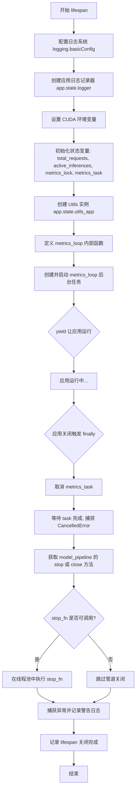

#### 带注释源码

```python
@asynccontextmanager
async def lifespan(app: FastAPI):
    """
    FastAPI 应用的异步生命周期管理器
    - 启动阶段: 初始化日志、环境变量、状态对象、启动后台指标监控
    - 运行阶段: 让出控制权 (yield)，应用处理请求
    - 关闭阶段: 取消后台任务、清理模型管道、记录日志
    """
    # 配置日志格式和级别
    logging.basicConfig(level=logging.INFO)
    # 创建应用专属日志记录器，用于后续输出应用日志
    app.state.logger = logging.getLogger("diffusers-server")
    
    # 配置 PyTorch CUDA 内存分配策略，避免内存碎片化
    os.environ["PYTORCH_CUDA_ALLOC_CONF"] = "max_split_size_mb:128,expandable_segments:True"
    # 关闭 CUDA 同步阻塞，便于异步调试
    os.environ["CUDA_LAUNCH_BLOCKING"] = "0"

    # 初始化请求计数和活跃推理计数，用于监控
    app.state.total_requests = 0
    app.state.active_inferences = 0
    # 创建异步锁，用于保护计数器在并发访问时的安全性
    app.state.metrics_lock = asyncio.Lock()
    # 预设为 None，后续会创建实际的后台任务
    app.state.metrics_task = None

    # 创建工具类实例，提供图像保存等功能
    app.state.utils_app = Utils(
        host=server_config.host,
        port=server_config.port,
    )

    async def metrics_loop():
        """
        后台指标监控循环，每 5 秒输出一次请求和推理统计信息
        """
        try:
            while True:
                # 加锁读取计数，保证数据一致性
                async with app.state.metrics_lock:
                    total = app.state.total_requests
                    active = app.state.active_inferences
                # 记录指标日志
                app.state.logger.info(f"[METRICS] total_requests={total} active_inferences={active}")
                # 等待 5 秒后再次输出
                await asyncio.sleep(5)
        except asyncio.CancelledError:
            # 任务被取消时记录日志并重新抛出异常
            app.state.logger.info("Metrics loop cancelled")
            raise

    # 创建并启动后台指标监控任务
    app.state.metrics_task = asyncio.create_task(metrics_loop())

    try:
        # yield 让出控制权，应用在此期间处理请求
        yield
    finally:
        # ============ 应用关闭时的清理逻辑 ============
        
        # 取消后台指标监控任务
        task = app.state.metrics_task
        if task:
            task.cancel()
            try:
                # 等待任务被取消，可能抛出 CancelledError
                await task
            except asyncio.CancelledError:
                # 忽略取消异常，这是预期行为
                pass

        try:
            # 尝试获取模型管道的 stop 或 close 方法
            stop_fn = getattr(model_pipeline, "stop", None) or getattr(model_pipeline, "close", None)
            if callable(stop_fn):
                # 在线程池中执行阻塞的管道关闭操作，避免阻塞事件循环
                await run_in_threadpool(stop_fn)
        except Exception as e:
            # 记录管道关闭时的错误，但不中断关闭流程
            app.state.logger.warning(f"Error during pipeline shutdown: {e}")

        # 记录 lifespan 清理完成
        app.state.logger.info("Lifespan shutdown complete")
```


### `count_requests_middleware`

这是一个 FastAPI HTTP 中间件函数，用于在每次 HTTP 请求时递增全局请求计数器，以实现请求metrics统计功能。

参数：

- `request`：`Request`，FastAPI 传入的 HTTP 请求对象，包含请求的路径、方法、头部等信息
- `call_next`：`Callable`，中间件链中的下一个处理函数，用于将请求传递给后续的中间件或路由处理器

返回值：`Response`，HTTP 响应对象，由后续中间件或路由处理器返回

#### 流程图

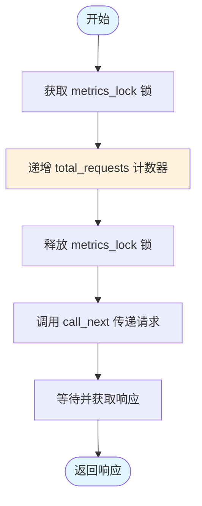

#### 带注释源码

```python
@app.middleware("http")  # 装饰器：注册为 HTTP 中间件，处理所有进入的 HTTP 请求
async def count_requests_middleware(request: Request, call_next):
    """
    HTTP 请求计数中间件
    
    功能：
    1. 在请求开始时递增 total_requests 计数器
    2. 将请求传递给下一个处理器
    3. 返回处理后的响应
    """
    
    # 使用异步锁确保计数器更新的线程安全
    async with app.state.metrics_lock:
        # 递增总请求数计数器
        app.state.total_requests += 1
    
    # 调用下一个中间件或路由处理器，获取响应
    response = await call_next(request)
    
    # 返回响应给客户端
    return response
```

#### 设计说明

| 项目 | 说明 |
|------|------|
| **设计目标** | 实现请求量的实时统计，用于监控和服务 metrics |
| **并发安全** | 使用 `asyncio.Lock` 保护共享状态 `total_requests`，确保在异步环境下的线程安全 |
| **位置** | 中间件在 FastAPI 请求处理链的前端，在路由之前执行，因此能统计所有进入的请求 |
| **依赖** | 依赖于 `app.state.metrics_lock` 和 `app.state.total_requests`，这两个变量在 `lifespan` 启动时初始化 |
| **性能影响** | 极小，仅涉及一次锁获取和计数器递增操作 |


### `root`

该函数是 FastAPI 应用的根路由处理程序，用于处理对服务器根路径的 GET 请求，并返回一个包含欢迎消息的 JSON 响应。

参数：此函数无参数。

返回值：`Dict[str, str]`，返回包含欢迎消息的字典，表示服务器已就绪。

#### 流程图

```mermaid
flowchart TD
    A[开始] --> B{接收GET /请求}
    B --> C[返回JSON响应]
    C --> D{"message": "Welcome to the Diffusers Server"}
    D --> E[结束]
```

#### 带注释源码

```python
@app.get("/")  # 装饰器：定义一个GET请求路由，路径为根路径"/"
async def root():  # 异步根路由处理函数
    """根路由处理函数，返回服务器欢迎信息"""
    return {"message": "Welcome to the Diffusers Server"}  # 返回JSON格式的欢迎消息
```


### `root`

根路径端点，提供欢迎信息。

参数：无

返回值：`dict`，包含欢迎消息的字典

#### 流程图

```mermaid
flowchart TD
    A[接收GET /请求] --> B[返回欢迎消息字典]
    B --> C[{message: Welcome to the Diffusers Server}]
```

#### 带注释源码

```python
@app.get("/")
async def root():
    """
    根路径端点，返回欢迎消息
    
    Returns:
        dict: 包含欢迎消息的字典
    """
    return {"message": "Welcome to the Diffusers Server"}
```

---

### `api`

推理端点，接收文本提示并生成图像。

参数：

- `json`：`JSONBodyQueryAPI`，包含提示词、负提示词、推理步数等参数

返回值：`dict`，包含生成图像URL列表的字典

#### 流程图

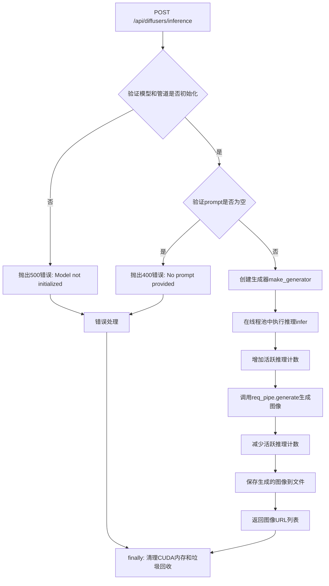

#### 带注释源码

```python
@app.post("/api/diffusers/inference")
async def api(json: JSONBodyQueryAPI):
    """
    图像推理端点
    
    Args:
        json: JSONBodyQueryAPI对象，包含以下字段:
            - prompt: str - 正向提示词
            - negative_prompt: Optional[str] - 负向提示词
            - num_inference_steps: int - 推理步数，默认28
            - num_images_per_prompt: int - 每个提示词生成的图像数，默认1
    
    Returns:
        dict: 包含生成图像URL列表的字典，格式为 {"response": [url1, url2, ...]}
    
    Raises:
        HTTPException: 500 - 模型未初始化
        HTTPException: 400 - 未提供prompt
        HTTPException: 500 - 推理过程出错
    """
    # 解构请求参数
    prompt = json.prompt
    negative_prompt = json.negative_prompt or ""
    num_steps = json.num_inference_steps
    num_images_per_prompt = json.num_images_per_prompt

    # 获取应用状态中的模型和工具
    wrapper = app.state.MODEL_PIPELINE
    initializer = app.state.MODEL_INITIALIZER
    utils_app = app.state.utils_app

    # 模型初始化检查
    if not wrapper or not wrapper.pipeline:
        raise HTTPException(500, "Model not initialized correctly")
    
    # Prompt有效性检查
    if not prompt.strip():
        raise HTTPException(400, "No prompt provided")

    # 创建随机种子生成器
    def make_generator():
        g = torch.Generator(device=initializer.device)
        return g.manual_seed(random.randint(0, 10_000_000))

    # 获取请求作用域的管道
    req_pipe = app.state.REQUEST_PIPE

    # 推理执行函数（在线程池中运行）
    def infer():
        gen = make_generator()
        return req_pipe.generate(
            prompt=prompt,
            negative_prompt=negative_prompt,
            generator=gen,
            num_inference_steps=num_steps,
            num_images_per_prompt=num_images_per_prompt,
            device=initializer.device,
            output_type="pil",
        )

    try:
        # 增加活跃推理计数
        async with app.state.metrics_lock:
            app.state.active_inferences += 1

        # 在线程池中执行推理（避免阻塞事件循环）
        output = await run_in_threadpool(infer)

        # 减少活跃推理计数
        async with app.state.metrics_lock:
            app.state.active_inferences = max(0, app.state.active_inferences - 1)

        # 保存生成的图像并获取URL列表
        urls = [utils_app.save_image(img) for img in output.images]
        return {"response": urls}

    except Exception as e:
        # 异常处理：减少计数并记录错误
        async with app.state.metrics_lock:
            app.state.active_inferences = max(0, app.state.active_inferences - 1)
        logger.error(f"Error during inference: {e}")
        raise HTTPException(500, f"Error in processing: {e}")

    finally:
        # 清理CUDA内存
        if torch.cuda.is_available():
            torch.cuda.synchronize()
            torch.cuda.empty_cache()
            torch.cuda.reset_peak_memory_stats()
            torch.cuda.ipc_collect()
        gc.collect()
```

---

### `serve_image`

图像服务端点，根据文件名返回生成的图像。

参数：

- `filename`：`str`，要检索的图像文件名

返回值：`FileResponse`，PNG格式的图像文件

#### 流程图

```mermaid
flowchart TD
    A[GET /images/{filename}] --> B[获取utils_app实例]
    B --> C[构建文件完整路径]
    C --> D{检查文件是否存在}
    D -->|否| E[抛出404错误: Image not found]
    D -->|是| F[返回FileResponse]
    E --> G[结束]
    F --> G
```

#### 带注释源码

```python
@app.get("/images/{filename}")
async def serve_image(filename: str):
    """
    图像文件服务端点
    
    Args:
        filename: str - 要检索的图像文件名
    
    Returns:
        FileResponse: PNG格式的图像文件响应
    
    Raises:
        HTTPException: 404 - 图像文件不存在
    """
    # 获取工具应用实例
    utils_app = app.state.utils_app
    
    # 构建图像文件的完整路径
    file_path = os.path.join(utils_app.image_dir, filename)
    
    # 检查文件是否存在
    if not os.path.isfile(file_path):
        raise HTTPException(status_code=404, detail="Image not found")
    
    # 返回图像文件响应
    return FileResponse(file_path, media_type="image/png")
```

---

### `get_status`

状态查询端点，返回当前模型信息和GPU内存使用情况。

参数：无

返回值：`dict`，包含当前模型、类型和内存信息的字典

#### 流程图

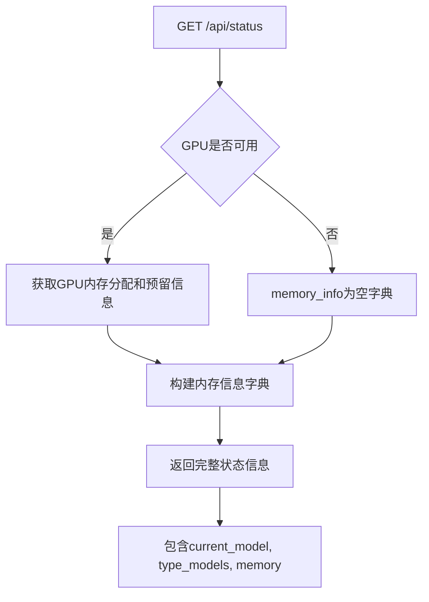

#### 带注释源码

```python
@app.get("/api/status")
async def get_status():
    """
    模型状态查询端点
    
    Returns:
        dict: 包含以下字段的字典:
            - current_model: str - 当前使用的模型名称
            - type_models: str - 模型类型
            - memory: dict - GPU内存信息（如果可用）:
                - memory_allocated_gb: float - 已分配内存(GB)
                - memory_reserved_gb: float - 已预留内存(GB)
                - device: str - GPU设备名称
    """
    # 初始化内存信息字典
    memory_info = {}
    
    # 检查GPU是否可用
    if torch.cuda.is_available():
        # 获取GPU内存使用情况（转换为GB）
        memory_allocated = torch.cuda.memory_allocated() / 1024**3
        memory_reserved = torch.cuda.memory_reserved() / 1024**3
        
        # 构建内存信息字典
        memory_info = {
            "memory_allocated_gb": round(memory_allocated, 2),
            "memory_reserved_gb": round(memory_reserved, 2),
            "device": torch.cuda.get_device_name(0),
        }

    # 返回状态信息
    return {
        "current_model": server_config.model,
        "type_models": server_config.type_models,
        "memory": memory_info
    }
```

---

### `count_requests_middleware`

请求计数中间件，用于统计总请求数。

参数：

- `request`：`Request`，FastAPI请求对象
- `call_next`：`Callable`，下一个处理函数

返回值：`Response`，FastAPI响应对象

#### 流程图

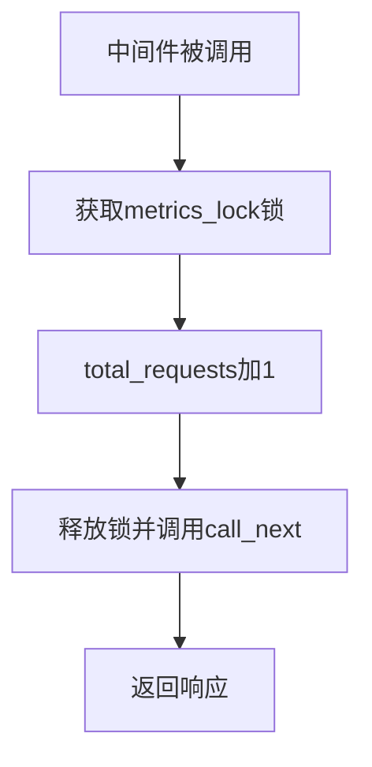

#### 带注释源码

```python
@app.middleware("http")
async def count_requests_middleware(request: Request, call_next):
    """
    HTTP请求计数中间件
    
    每次请求时增加total_requests计数，用于监控服务负载
    
    Args:
        request: Request - FastAPI请求对象
        call_next: Callable - 下一个中间件或路由处理函数
    
    Returns:
        Response: 经过完整中间件链处理后的响应对象
    """
    # 增加总请求计数（需要获取锁以保证线程安全）
    async with app.state.metrics_lock:
        app.state.total_requests += 1
    
    # 调用下一个处理函数
    response = await call_next(request)
    return response
```

---

### `lifespan`

FastAPI生命周期管理上下文管理器，处理应用启动和关闭逻辑。

参数：

- `app`：`FastAPI`，FastAPI应用实例

返回值：`asynccontextmanager`，异步上下文管理器

#### 流程图

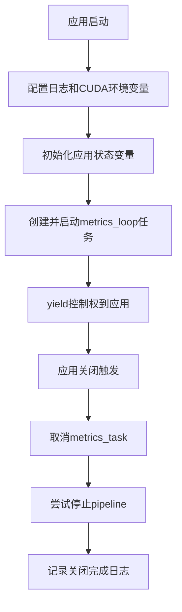

#### 带注释源码

```python
@asynccontextmanager
async def lifespan(app: FastAPI):
    """
    FastAPI生命周期管理上下文管理器
    
    处理应用启动时的初始化和关闭时的资源清理工作
    
    启动时:
    - 配置日志系统
    - 设置CUDA环境变量
    - 初始化应用状态（请求计数、推理计数、锁、工具实例）
    - 启动指标监控循环任务
    
    关闭时:
    - 取消指标监控任务
    - 尝试停止模型管道
    - 记录关闭完成
    
    Args:
        app: FastAPI - FastAPI应用实例
    
    Yields:
        None: 将控制权交还给应用
    """
    # 配置日志系统
    logging.basicConfig(level=logging.INFO)
    app.state.logger = logging.getLogger("diffusers-server")
    
    # 设置CUDA内存分配配置
    os.environ["PYTORCH_CUDA_ALLOC_CONF"] = "max_split_size_mb:128,expandable_segments:True"
    os.environ["CUDA_LAUNCH_BLOCKING"] = "0"

    # 初始化应用状态变量
    app.state.total_requests = 0
    app.state.active_inferences = 0
    app.state.metrics_lock = asyncio.Lock()
    app.state.metrics_task = None

    # 创建工具应用实例
    app.state.utils_app = Utils(
        host=server_config.host,
        port=server_config.port,
    )

    # 定义指标监控循环
    async def metrics_loop():
        try:
            while True:
                # 获取当前指标
                async with app.state.metrics_lock:
                    total = app.state.total_requests
                    active = app.state.active_inferences
                
                # 记录指标日志
                app.state.logger.info(f"[METRICS] total_requests={total} active_inferences={active}")
                await asyncio.sleep(5)
        except asyncio.CancelledError:
            app.state.logger.info("Metrics loop cancelled")
            raise

    # 启动指标监控任务
    app.state.metrics_task = asyncio.create_task(metrics_loop())

    try:
        # 交出控制权，应用正常运行
        yield
    finally:
        # 关闭阶段：取消指标监控任务
        task = app.state.metrics_task
        if task:
            task.cancel()
            try:
                await task
            except asyncio.CancelledError:
                pass

        # 尝试停止模型管道
        try:
            # 优先尝试stop方法，其次尝试close方法
            stop_fn = getattr(model_pipeline, "stop", None) or getattr(model_pipeline, "close", None)
            if callable(stop_fn):
                await run_in_threadpool(stop_fn)
        except Exception as e:
            app.state.logger.warning(f"Error during pipeline shutdown: {e}")

        # 记录生命周期关闭完成
        app.state.logger.info("Lifespan shutdown complete")
```

---

### `JSONBodyQueryAPI`

请求体数据模型，定义推理API的输入参数结构。

参数：

- `model`：`str | None`，可选的模型覆盖（代码中未使用）
- `prompt`：`str`，正向提示词（必需）
- `negative_prompt`：`str | None`，可选的负向提示词
- `num_inference_steps`：`int`，推理步数，默认28
- `num_images_per_prompt`：`int`，每个提示词生成的图像数，默认1

返回值：Pydantic BaseModel验证后的数据对象

#### 流程图

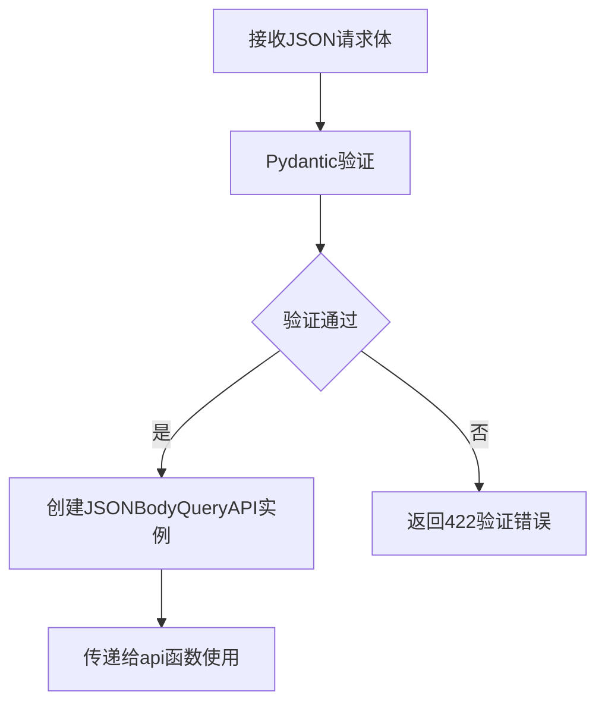

#### 带注释源码

```python
class JSONBodyQueryAPI(BaseModel):
    """
    图像生成推理API的请求体数据模型
    
    使用Pydantic BaseModel进行请求体验证，确保必需的参数存在
    且类型正确
    
    Attributes:
        model: Optional[str] - 模型名称覆盖（可选，当前代码中未使用）
        prompt: str - 正向提示词，描述想要生成的图像内容
        negative_prompt: Optional[str] - 负向提示词，描述不想包含的内容
        num_inference_steps: int - 推理步数，数值越大质量越高但速度越慢
        num_images_per_prompt: int - 每个提示词生成的图像数量
    """
    model: str | None = None
    prompt: str
    negative_prompt: str | None = None
    num_inference_steps: int = 28
    num_images_per_prompt: int = 1
```

---

### `ServerConfigModels`

服务器配置数据类，定义模型和服务器的配置参数。

参数：

- `model`：`str`，模型名称或路径，默认"stabilityai/stable-diffusion-3.5-medium"
- `type_models`：`str`，模型类型，默认"t2im"
- `constructor_pipeline`：`Optional[Type]`，管道构造函数
- `custom_pipeline`：`Optional[Type]`，自定义管道类
- `components`：`Optional[Dict[str, Any]]`，模型组件字典
- `torch_dtype`：`Optional[torch.dtype]`，
- `host`：`str`，服务器监听地址，默认"0.0.0.0"
- `port`：`int`，服务器监听端口，默认8500

返回值：dataclass实例

#### 流程图

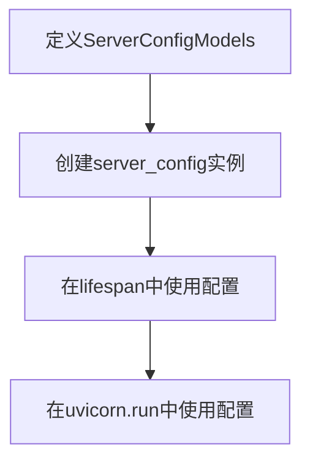

#### 带注释源码

```python
@dataclass
class ServerConfigModels:
    """
    服务器配置数据类
    
    使用dataclass定义服务器和模型的配置参数，
    方便在应用各处使用统一的配置
    
    Attributes:
        model: str - HuggingFace模型ID或本地路径
        type_models: str - 模型类型（如t2im, i2im等）
        constructor_pipeline: Optional[Type] - 管道构造函数类
        custom_pipeline: Optional[Type] - 自定义管道类
        components: Optional[Dict[str, Any]] - 模型组件字典
        torch_dtype: Optional[torch.dtype] - PyTorch数据类型
        host: str - 服务器绑定的IP地址
        port: int - 服务器监听的端口号
    """
    model: str = "stabilityai/stable-diffusion-3.5-medium"
    type_models: str = "t2im"
    constructor_pipeline: Optional[Type] = None
    custom_pipeline: Optional[Type] = None
    components: Optional[Dict[str, Any]] = None
    torch_dtype: Optional[torch.dtype] = None
    host: str = "0.0.0.0"
    port: int = 8500


# 创建全局配置实例
server_config = ServerConfigModels()
```


### `serve_image`

该函数是一个FastAPI端点，用于根据文件名提供已生成的图像文件服务。它通过构造文件路径检查图像是否存在，如果存在则返回FileResponse，否则抛出404异常。

参数：

- `filename`：`str`，请求的图像文件名，从URL路径参数获取

返回值：`FileResponse`，返回指定路径的PNG图像文件响应

#### 流程图

```mermaid
flowchart TD
    A[开始] --> B[获取utils_app从app.state]
    B --> C[构造file_path: os.path.join(utils_app.image_dir, filename)]
    C --> D{检查文件是否存在: os.path.isfile(file_path)}
    D -->|否| E[抛出HTTPException 404: Image not found]
    D -->|是| F[返回FileResponse: file_path, media_type=image/png]
    E --> G[结束]
    F --> G
```

#### 带注释源码

```python
@app.get("/images/{filename}")  # 装饰器: 定义GET请求路由,URL路径参数filename
async def serve_image(filename: str):  # 异步函数: 接收文件名作为路径参数
    utils_app = app.state.utils_app  # 从应用状态获取Utils工具类实例
    # 拼接完整文件路径: 图像目录 + 文件名
    file_path = os.path.join(utils_app.image_dir, filename)
    
    # 检查文件是否存在
    if not os.path.isfile(file_path):
        # 文件不存在时抛出404异常
        raise HTTPException(status_code=404, detail="Image not found")
    
    # 文件存在时返回FileResponse,指定media_type为image/png
    return FileResponse(file_path, media_type="image/png")
```


### `get_status`

这是一个异步的 FastAPI 路由处理器，用于获取并返回当前模型服务器的运行状态。它主要负责收集 CUDA GPU 的内存使用情况（如果可用）以及服务器配置中的模型信息，并以 JSON 格式响应给客户端。

参数：

- （无）

返回值：`Dict[str, Any]`，返回一个包含当前模型名称、模型类型以及内存详细信息的字典。

#### 流程图

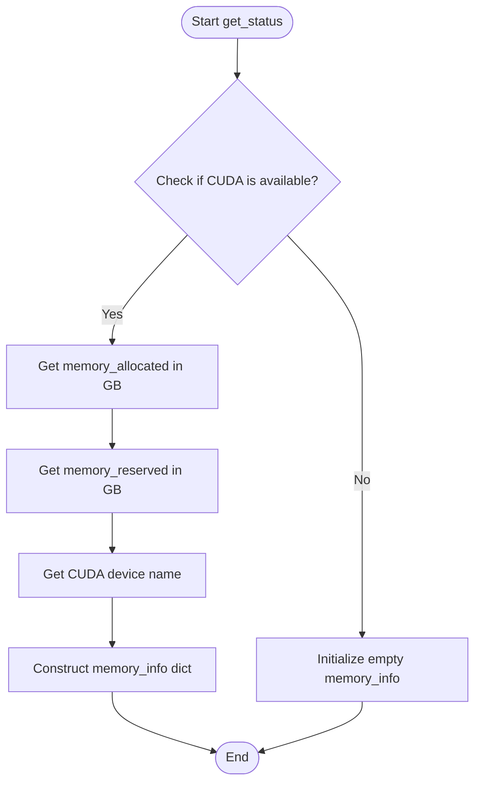

#### 带注释源码

```python
@app.get("/api/status")
async def get_status():
    # 初始化内存信息字典，默认为空
    memory_info = {}
    
    # 检查当前系统是否有 CUDA 可用的 GPU
    if torch.cuda.is_available():
        # 获取当前已分配的 GPU 内存并转换为 GB
        memory_allocated = torch.cuda.memory_allocated() / 1024**3  # GB
        # 获取当前已预留的 GPU 内存并转换为 GB
        memory_reserved = torch.cuda.memory_reserved() / 1024**3  # GB
        # 获取 GPU 设备名称
        device = torch.cuda.get_device_name(0)
        
        # 填充内存详细信息
        memory_info = {
            "memory_allocated_gb": round(memory_allocated, 2),
            "memory_reserved_gb": round(memory_reserved, 2),
            "device": device,
        }

    # 返回包含模型配置和内存状态的响应字典
    return {
        "current_model": server_config.model, 
        "type_models": server_config.type_models, 
        "memory": memory_info
    }
```


### make_generator

创建一个 PyTorch 随机数生成器实例，并使用随机整数作为种子，用于控制图像生成过程中的随机性。

参数：None

返回值：`torch.Generator`，带有随机种子的 PyTorch 随机数生成器对象，用于图像生成

#### 流程图

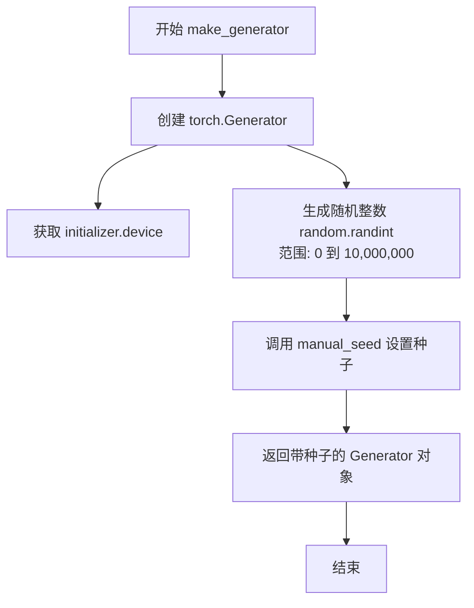

#### 带注释源码

```python
def make_generator():
    """
    创建并返回一个带有随机种子的 PyTorch 随机数生成器。
    用于在图像生成过程中引入可控的随机性。
    """
    # 创建 PyTorch 随机数生成器，device 从 initializer 全局变量获取
    g = torch.Generator(device=initializer.device)
    # 生成 0 到 10,000,000 之间的随机整数作为种子
    # 确保每次生成使用不同的随机种子，增加图像多样性
    random_seed = random.randint(0, 10_000_000)
    # 使用手动设置的种子初始化生成器并返回
    return g.manual_seed(random_seed)
```


### `api.<locals>.infer`

这是一个内部函数，定义在 `api` 异步函数内部，用于执行模型推理操作。它捕获外部作用域中的变量（`req_pipe`、`prompt`、`negative_prompt`、`num_steps`、`num_images_per_prompt`、`initializer`），创建一个随机生成器，并调用请求管道的生成方法来执行推理。

参数：该函数没有显式参数，它通过闭包捕获外部变量。

返回值：`Any`，返回模型推理的结果，具体类型取决于 `req_pipe.generate()` 方法的返回值（通常是包含生成图像的对象）。

#### 流程图

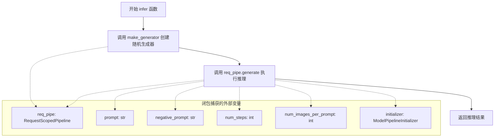

#### 带注释源码

```python
def infer():
    """
    内部推理函数，在线程池中运行以执行模型推理。
    该函数是一个闭包，捕获外部作用域中的变量。
    """
    # 创建随机生成器，用于控制推理过程的随机性
    gen = make_generator()
    
    # 调用请求管道的生成方法执行推理
    # 参数说明：
    # - prompt: 用户提供的正向提示词
    # - negative_prompt: 负向提示词，用于引导模型避免生成某些内容
    # - generator: PyTorch随机生成器，确保结果可复现
    # - num_inference_steps: 推理步数，影响生成质量和速度
    # - num_images_per_prompt: 每次提示生成的图像数量
    # - device: 计算设备（CPU/CUDA）
    # - output_type: 输出类型，'pil' 表示返回PIL图像对象
    return req_pipe.generate(
        prompt=prompt,
        negative_prompt=negative_prompt,
        generator=gen,
        num_inference_steps=num_steps,
        num_images_per_prompt=num_images_per_prompt,
        device=initializer.device,
        output_type="pil",
    )
```

#### 补充说明

该函数的关键特性：

1. **闭包机制**：通过 Python 闭包捕获外部变量，避免显式传递参数
2. **随机性控制**：使用 `make_generator()` 创建随机生成器，确保每次推理的可重复性
3. **线程池执行**：该函数通过 `run_in_threadpool(infer)` 在线程池中运行，避免阻塞异步事件循环
4. **依赖外部变量**：
   - `req_pipe`: 请求作用域的管道对象
   - `prompt` 和 `negative_prompt`: 来自用户请求的提示词
   - `num_steps` 和 `num_images_per_prompt`: 推理参数
   - `initializer`: 模型初始化器，提供设备信息


### `metrics_loop`（内部函数）

这是一个在 `lifespan` 异步上下文管理器内部定义的异步函数，负责定期收集并记录服务器的请求指标数据。

参数：

- （无参数）

返回值：`None`，无返回值描述（异步函数默认返回 None）

#### 流程图

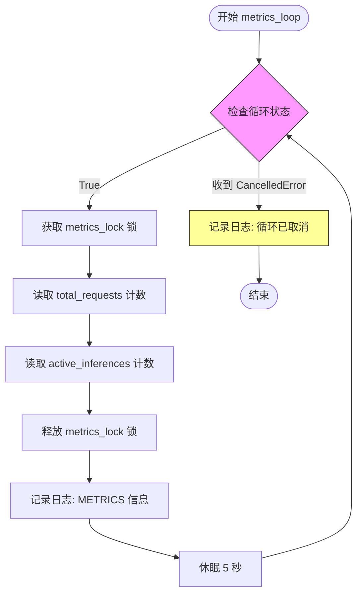

#### 带注释源码

```python
async def metrics_loop():
    """
    异步后台指标收集循环函数
    
    该函数在应用启动时作为后台任务启动，定期采集并记录
    当前的请求总数和活跃推理数，用于监控和调试目的。
    """
    try:
        # 无限循环，持续收集指标直到任务被取消
        while True:
            # 使用异步锁保护共享状态的读取，确保线程安全
            async with app.state.metrics_lock:
                # 获取总请求数
                total = app.state.total_requests
                # 获取当前活跃的推理数
                active = app.state.active_inferences
            
            # 记录指标日志，包含总请求数和活跃推理数
            app.state.logger.info(f"[METRICS] total_requests={total} active_inferences={active}")
            
            # 每5秒采集一次指标
            await asyncio.sleep(5)
            
    # 捕获任务取消异常，在应用关闭时优雅退出
    except asyncio.CancelledError:
        app.state.logger.info("Metrics loop cancelled")
        raise
```


### `lifespan`

这是一个异步上下文管理器，用于管理 FastAPI 应用的启动和关闭生命周期。它在应用启动时执行必要的初始化任务（如配置日志、设置环境变量、初始化全局状态和启动后台监控任务），并在应用关闭时负责优雅地停止后台任务和释放模型管道资源，确保服务器干净地退出。

参数：
- `app`：`FastAPI`，FastAPI 应用实例，用于挂载状态（如 logger, metrics, utils）到 `app.state` 中，供整个应用共享。

返回值：`None`，无返回值（通过 `yield` 控制应用的生命周期）。

#### 流程图

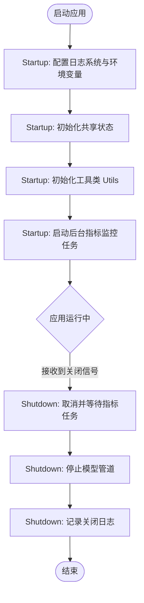

#### 带注释源码

```python
@asynccontextmanager
async def lifespan(app: FastAPI):
    # 启动阶段：配置日志
    logging.basicConfig(level=logging.INFO)
    app.state.logger = logging.getLogger("diffusers-server")
    
    # 设置 CUDA 内存分配和环境变量
    os.environ["PYTORCH_CUDA_ALLOC_CONF"] = "max_split_size_mb:128,expandable_segments:True"
    os.environ["CUDA_LAUNCH_BLOCKING"] = "0"

    # 初始化状态变量：请求计数、活跃推理数、异步锁
    app.state.total_requests = 0
    app.state.active_inferences = 0
    app.state.metrics_lock = asyncio.Lock()
    app.state.metrics_task = None

    # 初始化 Utils 工具类并挂载到 app.state
    app.state.utils_app = Utils(
        host=server_config.host,
        port=server_config.port,
    )

    # 定义后台指标监控循环
    async def metrics_loop():
        try:
            while True:
                # 获取当前指标数据
                async with app.state.metrics_lock:
                    total = app.state.total_requests
                    active = app.state.active_inferences
                # 定期记录日志
                app.state.logger.info(f"[METRICS] total_requests={total} active_inferences={active}")
                await asyncio.sleep(5)
        except asyncio.CancelledError:
            app.state.logger.info("Metrics loop cancelled")
            raise

    # 创建并启动指标监控任务
    app.state.metrics_task = asyncio.create_task(metrics_loop())

    try:
        # Yield 控制权给应用，保持应用运行状态
        yield
    finally:
        # 关闭阶段：清理资源
        
        # 1. 取消并等待指标任务结束
        task = app.state.metrics_task
        if task:
            task.cancel()
            try:
                await task
            except asyncio.CancelledError:
                pass

        # 2. 尝试停止模型管道
        try:
            # 动态获取 stop 或 close 方法
            stop_fn = getattr(model_pipeline, "stop", None) or getattr(model_pipeline, "close", None)
            if callable(stop_fn):
                # 在线程池中运行以避免阻塞异步事件循环
                await run_in_threadpool(stop_fn)
        except Exception as e:
            app.state.logger.warning(f"Error during pipeline shutdown: {e}")

        app.state.logger.info("Lifespan shutdown complete")
```


### `FastAPI.add_middleware`

向 FastAPI 应用添加中间件，用于处理所有传入的请求和传出的响应。中间件按照添加顺序形成处理链，外层中间件先被调用。

参数：

- `middleware_class`：类型 `Type[MiddlewareType]`，中间件类，必须是继承自 `starlette.middleware.Middleware` 的类
- `**options`：类型 `Any`，关键字参数，会传递给中间件类的构造函数

返回值：`None`，无返回值

#### 流程图

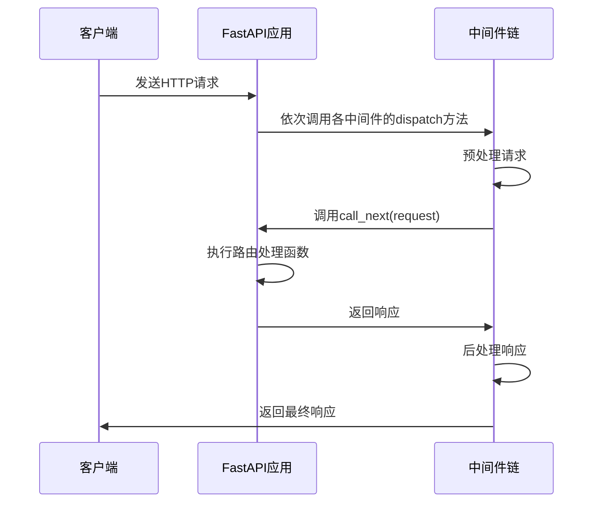

#### 带注释源码

```python
# FastAPI 框架源码（简化版）
# def add_middleware(self, middleware_class: Type[MiddlewareType], **options: Any) -> None:
#     """
#     向应用添加中间件。
#     
#     参数:
#         middleware_class: 中间件类，必须继承自 starlette.middleware.base.BaseHTTPMiddleware
#         **options: 传递给中间件构造函数的配置选项
#     """
#     
#     # 1. 验证中间件类是否有效
#     if not issubclass(middleware_class, BaseHTTPMiddleware):
#         raise InvalidMiddlewareClassError(...)
#     
#     # 2. 将中间件类和选项存储到应用的 middleware_stack 中
#     self.user_middleware.insert(0, {
#         "cls": middleware_class,
#         "options": options
#     })
#     
#     # 3. 标记需要重新构建中间件栈
#     self._middleware_stack = None
#     
#     return None
```

#### 使用示例

在提供的代码中，`add_middleware` 被用于添加 CORS 中间件：

```python
app.add_middleware(
    CORSMiddleware,              # middleware_class: 中间件类
    allow_origins=["*"],        # options: 允许的来源
    allow_credentials=True,     # options: 允许凭证
    allow_methods=["*"],        # options: 允许的HTTP方法
    allow_headers=["*"],        # options: 允许的HTTP头
)
```

## 关键组件


### ServerConfigModels

配置数据类，定义服务器运行所需的模型参数，包括模型名称、类型、管道构造函数、自定义管道、组件字典、torch数据类型、主机地址和端口号。

### lifespan 上下文管理器

应用生命周期管理器，负责启动时的CUDA环境配置、指标循环任务创建，以及关闭时的资源清理工作。

### ModelPipelineInitializer

模型管道初始化器（从Pipelines模块导入），负责根据配置初始化扩散模型管道。

### RequestScopedPipeline

请求作用域的管道封装类（从utils模块导入），提供线程安全的图像生成方法。

### JSONBodyQueryAPI

Pydantic数据模型，定义推理API的请求参数结构，包括提示词、负提示词、推理步数和每提示词生成的图像数量。

### count_requests_middleware

HTTP中间件，用于统计总请求数和活跃推理数。

### api 推理端点

POST /api/diffusers/inference 处理图像生成请求的核心逻辑，包括参数验证、生成器创建、推理执行、图像保存和资源清理。

### serve_image 图像服务

GET /images/{filename} 提供生成的图像文件访问服务。

### get_status 状态查询

GET /api/diffusers/status 返回当前模型信息和CUDA内存使用情况。

### Utils 工具类

从utils模块导入，负责图像保存和目录管理功能。

### pipeline_lock 线程锁

threading.Lock 类型的全局变量，确保并发推理请求的线程安全性。


## 问题及建议


### 已知问题

-   **全局可变状态**: `server_config`、`initializer`、`model_pipeline`、`request_pipe`、`pipeline_lock` 等在模块级别定义，导致隐藏依赖，难以测试，且在多实例部署时可能产生状态共享问题
-   **未使用的同步机制**: `pipeline_lock = threading.Lock()` 被定义但在 `/api/diffusers/inference` 端点中从未使用，导致代码意图不清晰且可能引入死锁风险
-   **计数器竞态条件**: `total_requests` 和 `active_inferences` 在中间件和端点中分别更新，虽然使用了 `asyncio.Lock()`，但 unlock 后的操作（如日志记录）仍可能读到不一致状态
-   **GPU 清理时机不当**: `finally` 块中的 GPU 清理操作（`torch.cuda.synchronize()` 等）在异步上下文之外执行，可能无法正确处理所有异步完成场景
-   **异常信息泄露**: 捕获异常后直接通过 `HTTPException(500, f"Error in processing: {e}")` 返回原始错误信息，可能暴露内部实现细节给客户端
-   **CORS 安全风险**: `allow_origins=["*"]` 允许所有来源访问，生产环境中应限制具体域名
-   **模型配置无验证**: `ServerConfigModels` 中的字段缺少约束验证（如 `port` 范围、`model` 路径格式检查）
-   **图像保存效率**: `urls = [utils_app.save_image(img) for img in output.images]` 使用同步列表推导，可并行化 I/O 操作

### 优化建议

-   **依赖注入改造**: 将全局状态封装到 `app.state` 中或使用 FastAPI 依赖注入系统，避免模块级可变状态，提高可测试性
-   **移除或使用锁**: 若 `pipeline_lock` 无用则删除；若需要限制并发推理，应在异步端点中正确使用 `asyncio.Semaphore`
-   **改进错误处理**: 使用结构化错误响应，自定义异常类区分不同错误类型，生产环境关闭详细错误暴露
-   **增强验证**: 使用 Pydantic 的 `Field` 添加约束（如 `num_inference_steps` 范围、`prompt` 长度限制），或创建独立的配置校验函数
-   **CORS 优化**: 根据环境变量或配置文件动态设置 `allow_origins`，避免使用通配符
-   **GPU 资源管理**: 将清理逻辑移至专用上下文管理器，或使用 `torch.cuda.memory_tracker` 自动化管理
-   **性能优化**: 
    - 使用 `asyncio.gather` 并行保存多张图像
    - 考虑添加请求批处理机制提高吞吐量
    - 调整 `run_in_threadpool` 的 worker 数量配置
-   **添加监控与限流**: 集成 Prometheus/Opentelemetry 指标，添加速率限制中间件防止服务过载

## 其它


### 设计目标与约束

**设计目标**：
- 提供高可用的Diffusers推理服务，支持文本到图像生成
- 实现请求并发控制与资源管理
- 提供实时推理指标监控
- 支持GPU内存优化与自动清理

**约束条件**：
- 依赖CUDA GPU进行推理加速
- 单实例部署，不支持分布式
- 请求处理为同步阻塞模式（通过run_in_threadpool）
- 最大并发数受限于pipeline_lock和GPU显存

### 错误处理与异常设计

**异常分类**：
- HTTPException (400): 请求参数错误（如空prompt）
- HTTPException (404): 图像文件不存在
- HTTPException (500): 模型初始化失败、推理过程异常

**错误处理策略**：
- 推理异常：捕获后记录日志，返回500错误
- 资源清理：finally块确保CUDA内存释放
- 管道关闭：lifespan中统一处理资源释放

**日志设计**：
- 推理错误记录完整堆栈信息
- 指标循环记录请求统计
- 生命周期事件记录启动/关闭状态

### 数据流与状态机

**数据流**：
```
HTTP请求 → count_requests_middleware → api处理
                                          ↓
                              run_in_threadpool(infer)
                                          ↓
                              req_pipe.generate()
                                          ↓
                              utils_app.save_image()
                                          ↓
                              返回图像URL列表
```

**状态管理**：
- total_requests: 累计请求数
- active_inferences: 当前活跃推理数
- 状态通过metrics_lock保护

**生命周期状态**：
- 启动 → 初始化模型 → 启动pipeline → 就绪 → 处理请求 → 关闭 → 清理资源

### 外部依赖与接口契约

**核心依赖**：
- fastapi: Web框架
- torch: 深度学习框架
- diffusers: 扩散模型库
- pydantic: 数据验证
- uvicorn: ASGI服务器

**接口契约**：
- POST /api/diffusers/inference: 推理接口，输入JSONBodyQueryAPI，返回图像URL列表
- GET /images/{filename}: 图像获取接口
- GET /api/status: 状态查询接口，返回模型信息和GPU内存
- GET /: 根路径，健康检查

### 安全性设计

**CORS策略**：
- 允许所有来源、凭证、方法和头（生产环境需限制）

**输入验证**：
- prompt字段必填
- 负面提示词可选
- 步数和图像数有默认值

### 性能优化策略

**内存管理**：
- CUDA内存分块配置（expandable_segments）
- 推理后立即清理CUDA缓存
- 定期gc.collect()

**并发控制**：
- pipeline_lock保护pipeline访问
- metrics_lock保护指标更新

### 可观测性设计

**监控指标**：
- total_requests: 累计请求数
- active_inferences: 当前活跃推理数
- GPU内存使用量（allocated/reserved）

**日志输出**：
- 定期指标日志（每5秒）
- 推理错误日志
- 生命周期事件日志

    