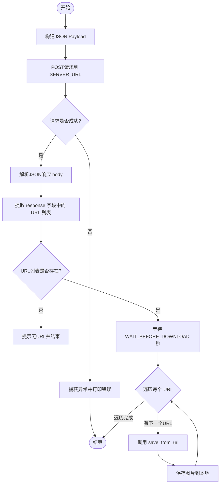

# `diffusers\examples\server-async\test.py` 详细设计文档

A Python client script that acts as an interface to a local Diffusers inference server, sending a text prompt to generate images via API, waiting for processing, retrieving the response URLs, and downloading the resulting images to a local filesystem.

## 整体流程



## 类结构

```
Root (Module)
└── Procedural Script (No Class Hierarchy)
    ├── Global Variables
    │   ├── SERVER_URL (str)
    │   ├── BASE_URL (str)
    │   ├── DOWNLOAD_FOLDER (str)
    │   └── WAIT_BEFORE_DOWNLOAD (int)
    └── Functions
        ├── save_from_url(url: str) -> str
        └── main() -> None
```

## 全局变量及字段


### `SERVER_URL`
    
The endpoint URL for the diffusers inference API server to send POST requests with generation prompts

类型：`str`
    


### `BASE_URL`
    
The base URL of the local server used to construct absolute URLs for downloading generated images

类型：`str`
    


### `DOWNLOAD_FOLDER`
    
The local directory path where downloaded generated images will be stored

类型：`str`
    


### `WAIT_BEFORE_DOWNLOAD`
    
The delay in seconds to wait after receiving the server response before starting to download images

类型：`int`
    


    

## 全局函数及方法


### `save_from_url`

下载给定的URL（相对或绝对路径）并将其内容保存到本地指定文件夹，同时返回本地保存路径。

参数：

- `url`：`str`，需要下载的文件URL，可以是相对路径（如"/api/images/xxx.png"）或绝对路径

返回值：`str`，返回本地保存的文件完整路径

#### 流程图

```mermaid
flowchart TD
    A[开始: save_from_url] --> B{url是否以/开头?}
    B -->|是| C[拼接BASE_URL + url]
    B -->|否| D[直接使用url]
    C --> E[发送HTTP GET请求]
    D --> E
    E --> F[检查响应状态码]
    F --> G{状态码是否成功?}
    G -->|否| H[抛出异常]
    G -->|是| I[从URL路径提取文件名]
    I --> J{是否有名文件名?}
    J -->|是| K[使用提取的文件名]
    J -->|否| L[生成时间戳文件名: img_{timestamp}.png]
    K --> M
    L --> M[构造本地保存路径: DOWNLOAD_FOLDER/filename]
    M --> N[以二进制写模式打开文件]
    N --> O[写入响应内容]
    O --> P[返回本地文件路径]
    P --> Q[结束]
```

#### 带注释源码

```python
def save_from_url(url: str) -> str:
    """Download the given URL (relative or absolute) and save it locally."""
    # 判断URL是相对路径还是绝对路径
    if url.startswith("/"):
        # 相对路径：拼接BASE_URL生成完整URL
        direct = BASE_URL.rstrip("/") + url
    else:
        # 绝对路径：直接使用
        direct = url
    
    # 发送HTTP GET请求下载文件，设置超时60秒
    resp = requests.get(direct, timeout=60)
    # 检查HTTP响应状态，若出错则抛出异常
    resp.raise_for_status()
    
    # 从URL路径中提取文件名
    # 使用os.path.basename获取路径最后一部分
    # 使用urllib.parse.urlparse解析URL获取path组件
    filename = os.path.basename(urllib.parse.urlparse(direct).path) or f"img_{int(time.time())}.png"
    
    # 构造本地保存路径：下载目录 + 文件名
    path = os.path.join(DOWNLOAD_FOLDER, filename)
    
    # 以二进制写模式打开文件并写入内容
    with open(path, "wb") as f:
        f.write(resp.content)
    
    # 返回本地保存的完整路径
    return path
```


## 1. 代码概述

本代码是一个图像生成客户端脚本，通过向本地的Diffusers推理API发送文本提示词请求，获取AI生成的图像URL，然后下载并保存到本地目录。整个流程包括发送请求、解析响应、等待图像生成、下载图像四个主要阶段。

## 2. 文件整体运行流程

当脚本作为主程序运行时，首先初始化下载目录，然后调用`main()`函数作为入口点。`main()`函数执行以下操作：

1. 构建包含提示词和推理参数的JSON请求载荷
2. 向Diffusers推理服务器发送POST请求
3. 解析服务器响应的图像URL列表
4. 等待指定时间（2秒）确保图像完全生成
5. 遍历URL列表，调用`save_from_url()`函数下载每个图像
6. 处理可能发生的网络和IO异常

## 3. 类的详细信息

本代码为模块级脚本，未定义任何类。

### 3.1 全局变量

| 变量名 | 类型 | 描述 |
|--------|------|------|
| `SERVER_URL` | str | Diffusers推理API的端点URL |
| `BASE_URL` | str | 服务器基础URL，用于处理相对路径URL |
| `DOWNLOAD_FOLDER` | str | 本地保存生成图像的目录名称 |
| `WAIT_BEFORE_DOWNLOAD` | int | 下载前等待的秒数，确保图像生成完成 |

### 3.2 全局函数

| 函数名 | 描述 |
|--------|------|
| `save_from_url(url: str) -> str` | 下载指定URL的图像文件并保存到本地目录，返回保存的文件路径 |

## 4. 关键组件信息

| 组件名称 | 描述 |
|----------|------|
| `requests` 库 | 用于发送HTTP POST请求获取图像生成结果，以及GET请求下载图像 |
| `urllib.parse` | 用于解析URL路径以提取文件名 |
| `os` 和 `time` | 用于文件系统操作和时间控制 |
| `payload` 字典 | 包含prompt、推理步数和生成图像数量的请求参数 |

## 5. 潜在的技术债务或优化空间

1. **硬编码配置**：服务器URL、下载目录、等待时间等均硬编码在全局变量中，缺乏灵活性
2. **错误处理不完善**：仅打印错误信息，未记录日志或提供重试机制
3. **缺乏参数化**：main函数无法通过命令行参数接收自定义提示词或配置
4. **同步阻塞**：使用同步requests库，大批量生成时效率受限
5. **安全性风险**：未验证服务器证书（未使用verify参数），存在中间人攻击风险
6. **缺少超时重试**：网络请求失败后直接返回，未实现重试逻辑

## 6. 其它项目

### 6.1 设计目标与约束

- 目标：简单地将文本提示词转换为AI生成的图像并本地保存
- 约束：依赖本地8500端口的Diffusers API服务，图像格式假设为PNG

### 6.2 错误处理与异常设计

- 使用`try-except`捕获请求异常并打印错误消息
- 使用`raise_for_status()`检查HTTP错误状态码
- 使用`timeout`参数防止请求无限期阻塞
- 对空响应和异常下载进行防护性检查

### 6.3 数据流与状态机

```
开始 -> 构建Payload -> 发送POST请求 -> [请求成功?] 
  -> 解析JSON响应 -> 提取URL列表 -> [URL为空?] 
  -> 等待2秒 -> 遍历URL列表 -> 下载图像 -> 保存到本地 
  -> 结束
```

### 6.4 外部依赖与接口契约

- 依赖外部服务：`http://localhost:8500/api/diffusers/inference`
- 期望响应格式：`{"response": [<image_url>, ...]}`
- 响应字段：`response`应为URL字符串或URL列表

---

## 7. main函数详细设计

### `main`

该函数是脚本的入口点，负责协调整个图像生成与下载流程。它构建包含提示词的请求载荷，发送给Diffusers推理API，解析返回的图像URL列表，等待指定时间后逐一下载并保存到本地目录。

参数：无

返回值：无（`None`）

#### 流程图

```mermaid
flowchart TD
    A[开始 main] --> B[构建payload字典]
    B --> C[打印 'Sending request...']
    C --> D{尝试发送POST请求}
    D -->|成功| E[获取响应 r]
    D -->|异常| F[打印错误信息]
    F --> Z[返回]
    E --> G[解析JSON响应]
    G --> H[提取 response 字段]
    H --> I{body是否为列表?}
    I -->|是| J[urls = body]
    I -->|否| K{body是否存在?}
    K -->|是| L[urls = [body]]
    K -->|否| M[urls = []]
    J --> N
    L --> N
    M --> O[打印 'No URLs found']
    O --> Z
    N --> P{urls是否为空?}
    P -->|是| O
    P -->|否| Q[打印等待信息]
    Q --> R[等待 WAIT_BEFORE_DOWNLOAD 秒]
    R --> S[遍历 urls 中的每个 u]
    S --> T{尝试下载图像}
    T -->|成功| U[打印保存路径]
    T -->|异常| V[打印下载错误]
    U --> W[继续下一URL]
    V --> W
    W --> S
    S --> X[所有URL处理完毕]
    X --> Z[结束]
```

#### 带注释源码

```python
def main():
    """
    脚本入口函数。
    负责向Diffusers API发送图像生成请求，
    并下载生成的图像到本地目录。
    """
    # 步骤1: 构建请求载荷
    # 包含文本提示词、推理步数和每提示词生成的图像数量
    payload = {
        "prompt": "The T-800 Terminator Robot Returning From The Future, Anime Style",
        "num_inference_steps": 30,
        "num_images_per_prompt": 1,
    }

    # 步骤2: 发送推理请求
    print("Sending request...")
    try:
        # 发送POST请求到Diffusers推理端点
        # timeout=480秒，给予充足时间完成推理
        r = requests.post(SERVER_URL, json=payload, timeout=480)
        # 检查HTTP响应状态，4xx/5xx会抛出异常
        r.raise_for_status()
    except Exception as e:
        # 网络错误或服务器错误处理
        print(f"Request failed: {e}")
        return  # 提前返回，流程终止

    # 步骤3: 解析服务器响应
    # 响应格式: {"response": <url_string> 或 [<url_string>, ...]}
    body = r.json().get("response", [])
    
    # 步骤4: 规范化URLs为列表格式
    # 支持响应为单个字符串、列表或空值
    urls = body if isinstance(body, list) else [body] if body else []
    
    # 步骤5: 检查是否有图像URL返回
    if not urls:
        print("No URLs found in the response. Check the server output.")
        return

    # 步骤6: 等待图像生成完成
    # Diffusion模型生成图像需要时间，服务器可能需要额外几秒
    print(f"Received {len(urls)} URL(s). Waiting {WAIT_BEFORE_DOWNLOAD}s before downloading...")
    time.sleep(WAIT_BEFORE_DOWNLOAD)

    # 步骤7: 遍历下载每个图像
    for u in urls:
        try:
            # 调用辅助函数下载并保存图像
            path = save_from_url(u)
            print(f"Image saved to: {path}")
        except Exception as e:
            # 单个图像下载失败不影响其他图像
            print(f"Error downloading {u}: {e}")
```


## 关键组件


### HTTP请求模块

负责向Diffusers推理服务器发送POST请求，构造payload并获取服务器响应

### 响应解析模块

解析服务器返回的JSON响应，提取生成的图像URL列表，支持单响应和批量响应

### 图像下载模块

根据URL下载生成的图像，支持相对路径和绝对路径，自动处理文件名提取

### 文件系统模块

创建下载目录并将下载的图像内容写入本地文件系统

### 等待与重试机制

在接收URL后等待指定时间再开始下载，确保服务器端图像生成完成

### 错误处理模块

统一捕获网络请求、文件下载和保存过程中的异常，提供用户友好的错误信息


## 问题及建议


### 已知问题

- 硬编码的服务器地址和路径（`SERVER_URL`、`BASE_URL`、`DOWNLOAD_FOLDER`），缺乏灵活性，无法通过环境变量配置
- 缺少重试机制，下载失败时仅打印错误信息后继续，无法处理网络瞬时故障
- 未使用 `requests.Session()`，每次请求都建立新连接，无连接复用，增加开销
- 魔法数字（如 `30`、`1`、`60`、`480`）散落各处，缺乏配置常量或参数说明
- 响应解析缺乏严格验证，仅使用 `.get()` 默认值，可能隐藏潜在问题
- `save_from_url` 函数在内存中一次性加载整个文件内容（`resp.content`），大文件可能导致内存溢出
- 无日志系统，仅使用 `print`，无法满足生产环境日志需求
- 文件名冲突处理简单，仅使用 `os.path.basename`，可能覆盖同名文件
- 缺乏类型提示完整覆盖，`main()` 函数无返回值类型标注
- `WAIT_BEFORE_DOWNLOAD` 使用固定等待时间，非基于服务器实际准备状态的动态方案

### 优化建议

- 引入 `requests.Session()` 复用 TCP 连接，添加重试逻辑（`requests.adapters.HTTPAdapter`）处理瞬时网络错误
- 将硬编码配置抽取为配置文件或环境变量，支持命令行参数解析（`argparse`）
- 使用流式写入（`iter_content`）替代一次性加载，避免大文件内存溢出
- 添加结构化日志（`logging` 模块），区分 INFO/WARNING/ERROR 级别
- 实现文件名去重机制（时间戳 + UUID 或哈希）
- 补充完整类型注解，使用 Pydantic 或 dataclasses 验证 API 响应结构
- 考虑异步方案（`aiohttp` + `asyncio`）替代同步阻塞，提高并发下载效率
- 将 `main()` 拆分为更细粒度的函数（如 `send_request()`、`download_images()`），遵循单一职责原则

## 其它


### 设计目标与约束

- **目标**：实现一个客户端脚本，通过调用远程Diffusers推理服务生成图像，并将生成的图像URL下载保存到本地目录
- **约束**：
  - 依赖本地服务器 `http://localhost:8500` 进行推理
  - 图像保存路径为 `generated_images` 目录
  - 请求超时时间480秒，下载超时时间60秒

### 错误处理与异常设计

- **网络请求异常**：使用 `try-except` 捕获 `requests.post` 异常，打印错误信息并返回
- **HTTP状态码检查**：使用 `raise_for_status()` 检查HTTP错误
- **响应数据校验**：检查响应体中的URL列表是否为空
- **下载异常**：单个URL下载失败不影响其他URL的下载
- **文件保存异常**：捕获文件写入异常

### 数据流与状态机

1. **初始化状态**：创建下载目录
2. **请求发送状态**：构建payload并发送POST请求到推理服务器
3. **响应解析状态**：解析JSON响应，提取图像URL列表
4. **等待状态**：等待WAIT_BEFORE_DOWNLOAD秒后开始下载
5. **下载状态**：遍历URL列表，依次下载并保存图像
6. **完成状态**：所有图像下载完成或出错

### 外部依赖与接口契约

- **依赖库**：
  - `requests`：HTTP客户端库
  - `urllib.parse`：URL解析
  - `os`、`time`：系统操作
- **接口契约**：
  - POST请求到 `SERVER_URL`，发送JSON payload
  - 响应格式：`{"response": [image_url1, image_url2, ...]}`
  - 服务器地址：`http://localhost:8500`
  - API路径：`/api/diffusers/inference`

### 性能考虑

- 顺序下载图像，无并发下载机制
- 每次下载使用60秒超时
- 主请求使用480秒超时（长等待推理过程）
- 图像下载前固定等待2秒

### 安全性考虑

- 无身份认证机制
- 无输入验证（prompt注入风险）
- URL直接用于下载，可能存在SSRF风险
- 无TLS/SSL证书验证

### 配置管理

- 配置项以全局常量形式定义：`SERVER_URL`、`BASE_URL`、`DOWNLOAD_FOLDER`、`WAIT_BEFORE_DOWNLOAD`
- 配置硬编码在代码中，无配置文件或环境变量支持

### 日志与监控

- 仅使用 `print` 输出基本状态信息
- 无结构化日志
- 无错误追踪ID
- 无监控指标收集

### 资源管理

- 使用 `with` 语句确保文件正确关闭
- 响应内容一次性加载到内存（适用于小文件）
- 无连接池复用

### 兼容性考虑

- 依赖Python 3.x环境
- 需安装 `requests` 库
- 路径处理使用 `os.path` 兼容不同操作系统

### 测试策略

- 单元测试：测试 `save_from_url` 函数
- 集成测试：模拟服务器响应测试完整流程
-  mocking外部请求进行测试

### 部署相关

- 作为独立脚本运行：`python script.py`
- 无Docker化支持
- 无systemd服务配置

### 代码规范与约定

- 函数文档字符串使用Google风格
- 类型注解使用Python 3.5+类型提示语法
- 异常处理粒度较粗，可细化分类处理
    