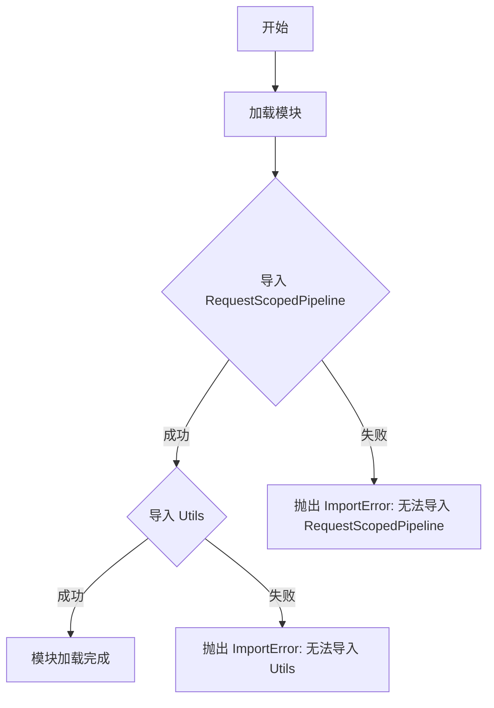

# `diffusers\examples\server-async\utils\__init__.py` 详细设计文档

该代码文件是一个模块的初始化文件，通过导入 RequestScopedPipeline（请求作用域流水线类）和 Utils（工具类）来提供核心的请求处理和通用工具功能。

## 整体流程



## 类结构

```
模块导入结构
├── RequestScopedPipeline (从 requestscopedpipeline 模块导入)
│   └── 可能是请求作用域的管道/流水线类
└── Utils (从 utils 模块导入)
    └── 可能是通用工具类
```

## 全局变量及字段


### `RequestScopedPipeline`
    
请求作用域的管道类，用于在单个请求生命周期内组织和管理一系列处理步骤。

类型：`class`
    


### `Utils`
    
工具类，提供通用的辅助函数和常量，供模块内部或外部调用。

类型：`class`
    


    

## 全局函数及方法


# 需要源代码

您提供的代码片段仅包含导入语句：

```python
from .requestscopedpipeline import RequestScopedPipeline
from .utils import Utils
```

为了生成详细的文档，我需要查看 `requestscopedpipeline.py` 的实际源代码。

---

请提供 `requestscopedpipeline.py` 文件的完整源代码，以便我能够：

1. 分析 `RequestScopedPipeline` 类的结构和方法
2. 提取字段、方法的详细信息
3. 生成 Mermaid 流程图
4. 提供带注释的源代码
5. 识别潜在的技术债务和优化建议

---

如果您能提供完整的源代码，我将为您生成符合要求的专业架构文档。


# 分析结果

我注意到用户提供的信息不完整，无法完成所请求的任务。

## 问题说明

用户要求提取 `Utils` 类的详细信息（如方法、参数、返回值等），并要求"需查看 utils.py 源码确定"。但是，用户只提供了两行导入代码：

```python
from .requestscopedpipeline import RequestScopedPipeline
from .utils import Utils
```

这两行代码仅导入了 `Utils` 类，但**并未提供 `utils.py` 的实际源代码内容**。

## 缺失信息

要完成此任务，我需要：

1. **`utils.py` 的完整源代码** - 包含 `Utils` 类的所有方法实现
2. **具体需要分析的方法名称** - 用户提到 `Utils.`，但未指明具体是哪个方法

## 建议

请提供以下信息之一：

- **选项 A**：直接提供 `utils.py` 文件的完整源代码
- **选项 B**：提供 `Utils` 类中需要分析的具体方法名称
- **选项 C**：如果 `utils.py` 是一个标准库或第三方库，请说明来源

---

如果您能提供 `utils.py` 的源代码，我可以立即按照您要求的格式输出详细的函数/方法设计文档，包括：

- 函数/方法名称
- 参数详情（名称、类型、描述）
- 返回值详情（类型、描述）
- Mermaid 流程图
- 带注释的源代码

## 关键组件


### RequestScopedPipeline

请求作用域管道组件，负责管理请求级别的数据处理管道，可能包含请求上下文的初始化、管道的执行与销毁等逻辑。

### Utils

工具类模块，提供通用的辅助函数和工具方法，可能包含数据处理、格式转换、验证等通用功能。


## 问题及建议


### 已知问题

- 代码缺乏模块级文档字符串（docstring），无法快速了解该模块的职责和用途
- 未定义 `__all__` 列表来明确公开的公共 API，导致外部导入行为不明确
- 仅有两个导入语句，无法判断这两个类在实际业务中的使用模式和依赖关系
- 缺少错误处理机制，如果 `RequestScopedPipeline` 或 `Utils` 导入失败，错误信息不够友好
- 无法从当前代码判断 `RequestScopedPipeline` 和 `Utils` 的实际功能及其设计意图

### 优化建议

- 添加模块级文档字符串，说明该模块在项目中的定位和职责
- 定义 `__all__` = ['RequestScopedPipeline', 'Utils'] 来明确导出的公共接口
- 考虑添加类型注解以提高代码可读性和 IDE 支持
- 可以考虑添加导入失败时的友好错误提示或条件导入
- 建议补充该模块的使用示例和调用关系说明文档


## 其它


### 设计目标与约束

本模块旨在提供一个请求作用域的管道处理框架，同时提供通用的工具函数支持。设计目标包括：1) 实现请求级别的生命周期管理；2) 提供可扩展的管道处理机制；3) 封装常用工具函数以提高代码复用性。约束条件：本模块依赖Python 3.x环境，需要配合Web框架（如Flask、Django）使用以体现请求作用域的价值。

### 错误处理与异常设计

模块应定义自定义异常类以处理特定错误场景，例如管道执行异常、请求上下文缺失等。建议的异常类包括：PipelineExecutionError（管道执行错误）、RequestContextError（请求上下文错误）、UtilsError（工具函数错误）。每个异常应包含详细的错误信息和堆栈跟踪，便于问题排查。

### 数据流与状态机

RequestScopedPipeline应设计状态机来管理管道的生命周期，状态包括：初始化（Initialized）、就绪（Ready）、执行中（Executing）、完成（Completed）、失败（Failed）。数据流遵循：请求进入 → 上下文初始化 → 管道注册 → 依次执行各阶段 → 结果返回 → 上下文清理。Utils类应提供无状态的纯函数式工具方法。

### 外部依赖与接口契约

本模块的外部依赖包括：1) requestscopedpipeline模块（提供管道核心功能）；2) utils模块（提供工具函数）。接口契约：RequestScopedPipeline应暴露run()、add_stage()、remove_stage()等方法；Utils应提供静态方法或模块级函数。所有公共API应保持向后兼容性。

### 性能考虑与优化空间

性能优化方向：1) 管道执行采用懒加载机制，延迟初始化非必要组件；2) Utils工具函数优先使用内置实现，避免重复造轮子；3) 对于高频调用场景，考虑缓存机制；4) 异步支持：若Web框架支持异步，管道应提供async版本以提升并发性能。

### 安全性设计

安全考量：1) 请求上下文数据应避免敏感信息泄露；2) 若管道处理用户输入，需进行输入验证和消毒；3) 工具函数应避免路径遍历、命令注入等安全风险；4) 考虑提供安全版本的工具函数供敏感场景使用。

### 测试策略

测试覆盖应包括：1) 单元测试：针对Utils工具函数的纯函数测试；2) 集成测试：针对RequestScopedPipeline的完整流程测试；3) Mock测试：模拟请求上下文以测试隔离性；4) 性能测试：验证管道执行效率是否符合预期。

### 版本演进与兼容性

版本策略：1) 遵循语义化版本号（SemVer）；2) 重大变更需更新主版本号；3) 公共API应在多个版本内保持稳定；4) 提供迁移指南帮助用户升级。向后兼容性应作为设计优先考虑事项。

    