# `diffusers\examples\server-async\utils\requestscopedpipeline.py` 详细设计文档

这是一个请求级别的Diffusers Pipeline封装类，通过克隆基础pipeline、线程安全地包装tokenizer/VAE/image_processor组件、自动检测并克隆可变属性，实现多线程/异步环境下的请求隔离和安全并发调用。

## 整体流程

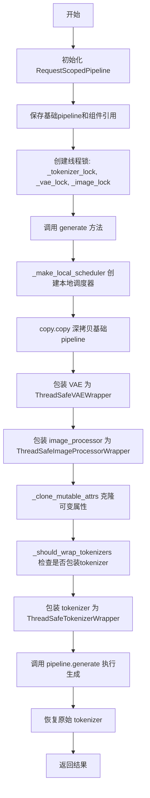

## 类结构

```
RequestScopedPipeline (主类)
├── DEFAULT_MUTABLE_ATTRS (类常量)
├── 组件属性: unet, vae, text_encoder, transformer, components
├── 锁属性: _tokenizer_lock, _vae_lock, _image_lock
├── 配置属性: _mutable_attrs, _auto_detect_mutables, _tensor_numel_threshold
└── 方法: __init__, generate, _detect_kernel_pipeline, _make_local_scheduler, ...
```

## 全局变量及字段


### `logger`
    
Logger instance for debugging and warning messages.

类型：`logging.Logger`
    


### `copy`
    
Standard library module for shallow and deep copy operations.

类型：`module`
    


### `threading`
    
Standard library module for thread synchronization primitives.

类型：`module`
    


### `torch`
    
PyTorch library for tensor operations and neural network components.

类型：`module`
    


### `Any`
    
Type hint indicating an unconstrained Python object type.

类型：`type`
    


### `Iterable`
    
Type hint for objects that can be iterated over.

类型：`type`
    


### `List`
    
Type hint for list containers.

类型：`type`
    


### `Optional`
    
Type hint indicating a value that can be None.

类型：`type`
    


### `BaseAsyncScheduler`
    
Async wrapper class for diffusers schedulers enabling request-scoped state management.

类型：`class`
    


### `async_retrieve_timesteps`
    
Function to asynchronously retrieve timesteps from a scheduler.

类型：`function`
    


### `ThreadSafeImageProcessorWrapper`
    
Thread-safe wrapper for image processors ensuring synchronized access.

类型：`class`
    


### `ThreadSafeTokenizerWrapper`
    
Thread-safe wrapper for tokenizers ensuring synchronized access.

类型：`class`
    


### `ThreadSafeVAEWrapper`
    
Thread-safe wrapper for VAE models ensuring synchronized access.

类型：`class`
    


### `RequestScopedPipeline.DEFAULT_MUTABLE_ATTRS`
    
Default list of mutable attribute names that should be cloned per request.

类型：`List[str]`
    


### `RequestScopedPipeline._base`
    
The underlying diffusers pipeline instance being wrapped.

类型：`Any`
    


### `RequestScopedPipeline.unet`
    
UNet component extracted from the base pipeline for quick access.

类型：`Optional[Any]`
    


### `RequestScopedPipeline.vae`
    
VAE component extracted from the base pipeline for quick access.

类型：`Optional[Any]`
    


### `RequestScopedPipeline.text_encoder`
    
Text encoder component extracted from the base pipeline for quick access.

类型：`Optional[Any]`
    


### `RequestScopedPipeline.components`
    
Dictionary of pipeline components from the base pipeline.

类型：`Optional[Any]`
    


### `RequestScopedPipeline.transformer`
    
Transformer component for newer diffusion models (e.g., SDXL).

类型：`Optional[Any]`
    


### `RequestScopedPipeline._mutable_attrs`
    
User-specified or default mutable attribute names to clone for each request.

类型：`List[str]`
    


### `RequestScopedPipeline._tokenizer_lock`
    
Lock object ensuring thread-safe access to tokenizers.

类型：`threading.Lock`
    


### `RequestScopedPipeline._vae_lock`
    
Lock object ensuring thread-safe access to VAE models.

类型：`threading.Lock`
    


### `RequestScopedPipeline._image_lock`
    
Lock object ensuring thread-safe access to image processors.

类型：`threading.Lock`
    


### `RequestScopedPipeline._auto_detect_mutables`
    
Flag indicating whether to automatically detect mutable attributes.

类型：`bool`
    


### `RequestScopedPipeline._tensor_numel_threshold`
    
Threshold for auto-detecting small tensors that should be cloned.

类型：`int`
    


### `RequestScopedPipeline._auto_detected_attrs`
    
Cached list of auto-detected mutable attributes to clone.

类型：`List[str]`
    
    

## 全局函数及方法


### `copy.copy`

这是 Python 标准库中的浅拷贝函数，在 `RequestScopedPipeline.generate` 方法中用于创建管道的浅拷贝副本。该函数创建一个新对象，但只复制引用（对于可变对象如列表、字典，副本仍指向原始对象）。

参数：

-  `obj`：任意 Python 对象，需要被浅拷贝的对象

返回值：对象的浅拷贝副本

#### 流程图

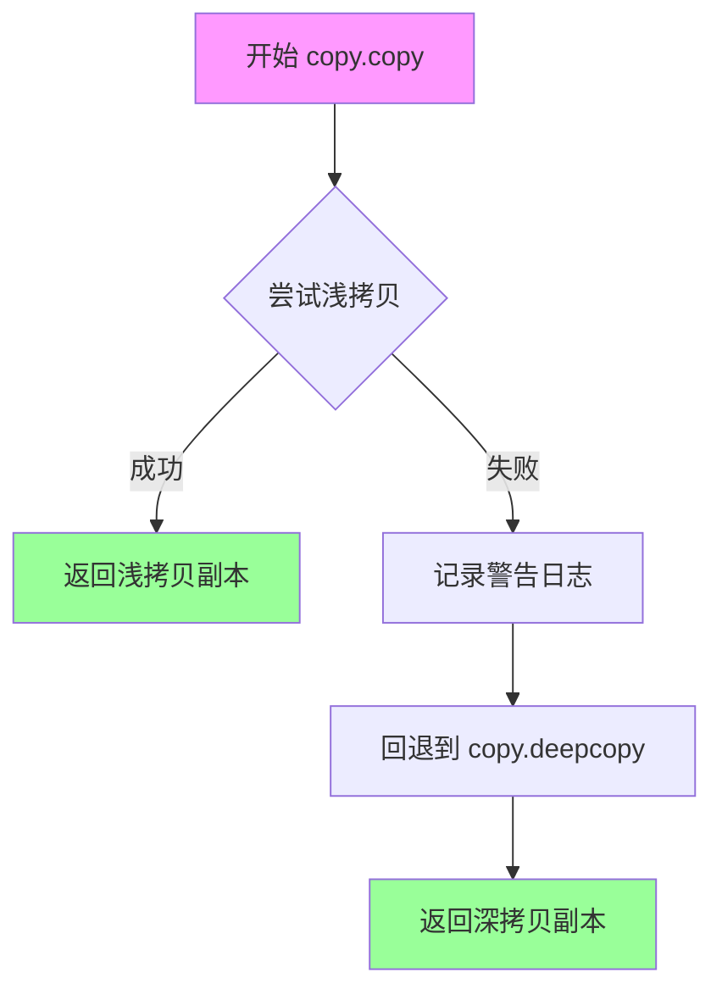

#### 带注释源码

```python
# 在 RequestScopedPipeline.generate() 方法中的使用

try:
    # 使用 copy.copy 对基础管道进行浅拷贝
    # 浅拷贝创建新对象，但对于嵌套的可变对象（如列表、字典）只复制引用
    # 性能较好但可能存在线程安全问题（多个请求共享可变状态）
    local_pipe = copy.copy(self._base)
except Exception as e:
    # 如果浅拷贝失败（如对象不支持拷贝），记录警告并回退到深拷贝
    logger.warning(f"copy.copy(self._base) failed: {e}. Falling back to deepcopy (may increase memory).")
    # 深拷贝会递归复制所有嵌套对象，更安全但内存消耗更大
    local_pipe = copy.deepcopy(self._base)
```

---

### 补充说明

在代码上下文中的具体作用：

1. **调用位置**：`RequestScopedPipeline.generate()` 方法第 176 行
2. **目的**：为每个请求创建独立的管道副本，避免多线程环境下的状态污染
3. **后续处理**：
   - 包装 `vae` 和 `image_processor` 为线程安全版本
   - 克隆可变的调度器属性
   - 包装 `tokenizer` 为线程安全版本
4. **异常处理**：浅拷贝失败时自动降级为深拷贝，这是合理的设计决策，牺牲性能换取功能可用性


### `copy.deepcopy`

`copy.deepcopy` 是 Python 标准库 `copy` 模块中的函数，用于创建对象的深拷贝（即递归复制所有嵌套对象），确保原始对象与拷贝对象之间完全独立。在该代码中，当 `copy.copy`（浅拷贝）失败时，作为 fallback 方案使用，以避免共享可变状态导致的线程安全问题。

参数：

-  `x`：`Any`，要拷贝的任意对象（代码中传入 `self._base`，即基础 Pipeline 实例）
-  `memo`：`Optional[Dict[int, Any]]`，可选的字典，用于维护已拷贝对象的映射，以处理循环引用

返回值：`Any`，返回输入对象的深拷贝副本，与原始对象完全独立

#### 流程图

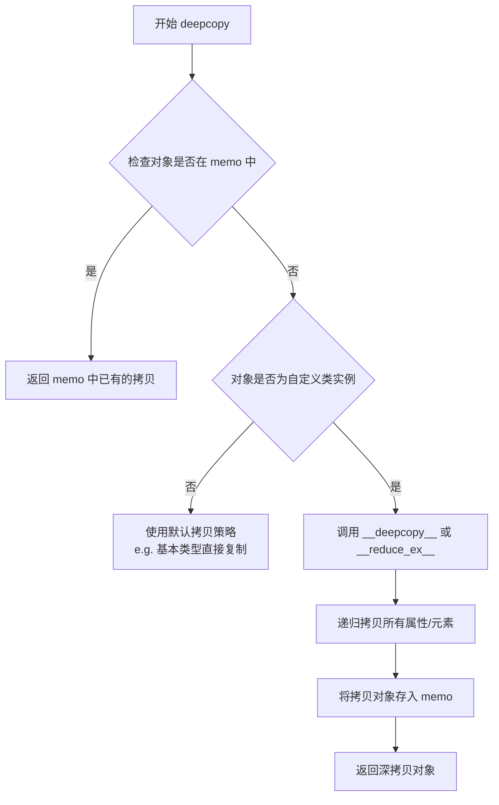

#### 带注释源码

```python
# 下面是 Python 标准库 copy.deepcopy 的核心实现逻辑概述
# 代码来源：Lib/copy.py（基于 CPython 源码结构）

def deepcopy(x, memo=None, _nil=[]):
    """
    创建对象的深拷贝。
    
    参数:
        x: 要拷贝的对象
        memo: 字典，用于存储已拷贝对象的引用（处理循环引用）
    
    返回值:
        对象的深拷贝副本
    """
    if memo is None:
        memo = {}
    
    # 检查是否已经拷贝过该对象（处理循环引用）
    if id(x) in memo:
        return memo[id(x)]
    
    # 获取对象的拷贝方法
    cls = type(x)
    
    # 尝试使用对象的 __deepcopy__ 方法（如果存在）
    copier = getattr(x, "__deepcopy__", None)
    if copier is not None:
        y = copier(memo)
    else:
        # 使用通用的深拷贝策略
        reductor = dispatch_table.get(cls)
        if reductor is not None:
            y = reductor(x)
        else:
            # 对于字典、列表等容器，递归拷贝
            if cls is dict:
                y = {}
                for key, value in x.items():
                    y[deepcopy(key, memo)] = deepcopy(value, memo)
            elif cls is list:
                y = [deepcopy(item, memo) for item in x]
            # ... 其他类型处理
            
    # 存入 memo 以支持循环引用
    memo[id(x)] = y
    return y
```

#### 在本项目中的实际使用

```python
# 文件中的调用位置（第 227 行）
try:
    local_pipe = copy.copy(self._base)  # 先尝试浅拷贝
except Exception as e:
    logger.warning(f"copy.copy(self._base) failed: {e}. Falling back to deepcopy (may increase memory).")
    local_pipe = copy.deepcopy(self._base)  # 失败时使用深拷贝
```

| 使用场景 | 说明 |
|---------|------|
| 调用者 | `RequestScopedPipeline.generate()` 方法 |
| 目的 | 为每个请求创建独立的 Pipeline 副本，避免多线程共享状态导致的数据竞争 |
| 备选方案 | 优先使用 `copy.copy`（浅拷贝），仅在失败时降级为深拷贝 |
| 性能考量 | 深拷贝开销较大（需递归复制所有嵌套对象），因此代码优先尝试浅拷贝 |


### `threading.Lock`

`threading.Lock` 是 Python 标准库中的线程同步原语，用于在多线程环境中提供互斥访问，防止并发访问共享资源时出现竞态条件。在 `RequestScopedPipeline` 类中，使用三个独立的锁（`_tokenizer_lock`、`_vae_lock`、`_image_lock`）来保护 tokenizer、VAE 模型和图像处理器的线程安全访问。

参数：

- 无参数（默认构造函数）

返回值：`threading.Lock`，返回一个互斥锁对象，用于线程同步。

#### 流程图

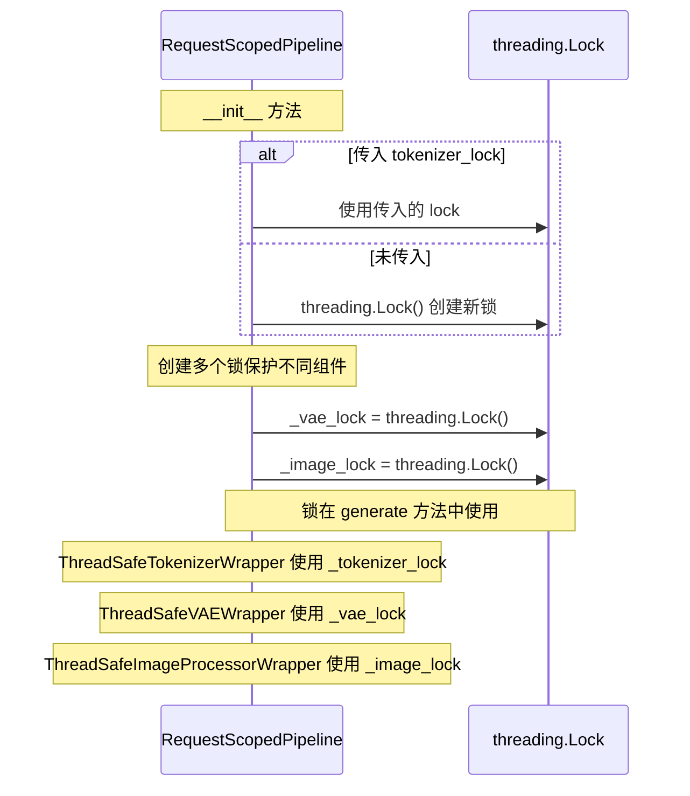

#### 带注释源码

```python
# 在 RequestScopedPipeline.__init__ 方法中使用 threading.Lock

def __init__(
    self,
    pipeline: Any,
    mutable_attrs: Optional[Iterable[str]] = None,
    auto_detect_mutables: bool = True,
    tensor_numel_threshold: int = 1_000_000,
    tokenizer_lock: Optional[threading.Lock] = None,  # 可选参数：外部传入的 tokenizer 锁
    wrap_scheduler: bool = True,
):
    # ...
    
    # 如果传入了 tokenizer_lock 则使用传入的锁，否则创建一个新的 threading.Lock
    # 这个锁用于保护 tokenizer 的线程安全访问
    self._tokenizer_lock = tokenizer_lock if tokenizer_lock is not None else threading.Lock()

    # 为 VAE（变分自编码器）创建独立的锁
    # 确保在多线程环境中对 VAE 的访问是互斥的
    self._vae_lock = threading.Lock()

    # 为图像处理器创建独立的锁
    # 防止并发访问图像处理资源时出现数据竞争
    self._image_lock = threading.Lock()


# 在 generate 方法中使用这些锁进行线程安全包装

def generate(self, *args, num_inference_steps: int = 50, device: str | None = None, **kwargs):
    # ...
    
    # 使用 _vae_lock 包装 VAE，使其线程安全
    if (
        hasattr(local_pipe, "vae")
        and local_pipe.vae is not None
        and not isinstance(local_pipe.vae, ThreadSafeVAEWrapper)
    ):
        local_pipe.vae = ThreadSafeVAEWrapper(local_pipe.vae, self._vae_lock)

    # 使用 _image_lock 包装图像处理器，使其线程安全
    if (
        hasattr(local_pipe, "image_processor")
        and local_pipe.image_processor is not None
        and not isinstance(local_pipe.image_processor, ThreadSafeImageProcessorWrapper)
    ):
        local_pipe.image_processor = ThreadSafeImageProcessorWrapper(
            local_pipe.image_processor, self._image_lock
        )
    
    # ...
    
    # 使用 _tokenizer_lock 包装所有 tokenizer，使其线程安全
    if self._should_wrap_tokenizers():
        try:
            for name in dir(local_pipe):
                if "tokenizer" in name and not name.startswith("_"):
                    tok = getattr(local_pipe, name, None)
                    if tok is not None and self._is_tokenizer_component(tok):
                        if not isinstance(tok, ThreadSafeTokenizerWrapper):
                            original_tokenizers[name] = tok
                            wrapped_tokenizer = ThreadSafeTokenizerWrapper(tok, self._tokenizer_lock)
                            setattr(local_pipe, name, wrapped_tokenizer)
```


### `RequestScopedPipeline.__init__` 中的 `getattr` 调用

在 `RequestScopedPipeline` 类的初始化方法中，使用 `getattr` 从传入的 `pipeline` 对象动态获取可选组件。

参数：

-  `self`：类的实例本身
-  `pipeline`：`Any`，传入的基础 Pipeline 对象
-  `mutable_attrs`：`Optional[Iterable[str]]`，可选的可变属性列表
-  `auto_detect_mutables`：`bool`，是否自动检测可变属性
-  `tensor_numel_threshold`：`int`，张量元素数量阈值
-  `tokenizer_lock`：`Optional[threading.Lock]`，分词器锁
-  `wrap_scheduler`：`bool`，是否包装调度器

返回值：`None`，构造函数无返回值

#### 流程图

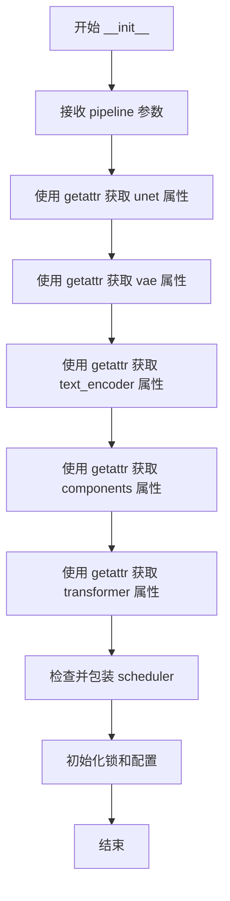

#### 带注释源码

```python
def __init__(
    self,
    pipeline: Any,
    mutable_attrs: Optional[Iterable[str]] = None,
    auto_detect_mutables: bool = True,
    tensor_numel_threshold: int = 1_000_000,
    tokenizer_lock: Optional[threading.Lock] = None,
    wrap_scheduler: bool = True,
):
    self._base = pipeline

    # 使用 getattr 安全地获取 pipeline 的可选组件，如果不存在则返回 None
    # 这样可以处理不同类型的 Pipeline（例如 StableDiffusionPipeline、DiffusionPipeline 等）
    self.unet = getattr(pipeline, "unet", None)
    self.vae = getattr(pipeline, "vae", None)
    self.text_encoder = getattr(pipeline, "text_encoder", None)
    self.components = getattr(pipeline, "components", None)

    # 获取 transformer（用于 DiT 等新架构）
    self.transformer = getattr(pipeline, "transformer", None)

    # 包装调度器为异步调度器
    if wrap_scheduler and hasattr(pipeline, "scheduler") and pipeline.scheduler is not None:
        if not isinstance(pipeline.scheduler, BaseAsyncScheduler):
            pipeline.scheduler = BaseAsyncScheduler(pipeline.scheduler)

    # ... 其他初始化代码
```

---

### `RequestScopedPipeline._make_local_scheduler` 中的 `getattr` 调用

在私有方法 `_make_local_scheduler` 中使用 `getattr` 获取基础 Pipeline 的调度器。

参数：

-  `self`：类的实例本身
-  `num_inference_steps`：`int`，推理步数
-  `device`：`str | None`，目标设备
-  `**clone_kwargs`：其他克隆参数

返回值：`BaseAsyncScheduler | None`，返回克隆的调度器或 None

#### 流程图

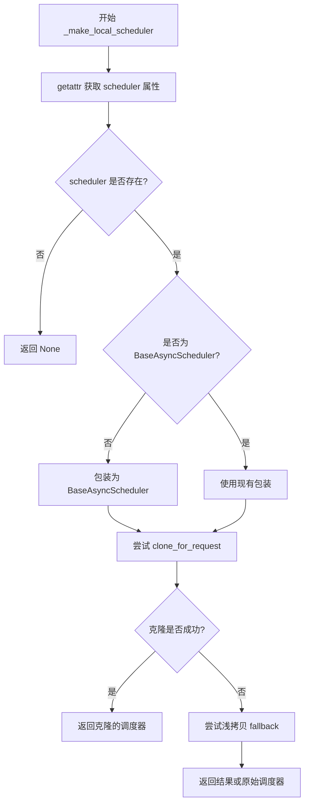

#### 带注释源码

```python
def _make_local_scheduler(self, num_inference_steps: int, device: str | None = None, **clone_kwargs):
    # 使用 getattr 安全获取调度器，处理可能不存在 scheduler 的情况
    base_sched = getattr(self._base, "scheduler", None)
    if base_sched is None:
        return None

    # 如果不是异步调度器，则包装它
    if not isinstance(base_sched, BaseAsyncScheduler):
        wrapped_scheduler = BaseAsyncScheduler(base_sched)
    else:
        wrapped_scheduler = base_sched

    # 尝试克隆调度器用于当前请求
    try:
        return wrapped_scheduler.clone_for_request(
            num_inference_steps=num_inference_steps, device=device, **clone_kwargs
        )
    except Exception as e:
        # 失败时尝试浅拷贝作为后备方案
        # ... (错误处理代码)
```

---

### `RequestScopedPipeline._autodetect_mutables` 中的 `getattr` 调用

在自动检测可变属性方法中使用 `getattr` 动态获取对象的属性值。

参数：

-  `self`：类的实例本身
-  `max_attrs`：`int = 40`，最大检测属性数

返回值：`List[str]`，检测到的可变属性名称列表

#### 流程图

```mermaid
flowchart TD
    A[开始 _autodetect_mutables] --> B{是否启用自动检测?}
    B -->|否| C[返回空列表]
    B -->|是| D{已有检测结果?}
    D -->|是| E[返回缓存结果]
    D -->|否| F[遍历 dir(self._base)]
    F --> G{跳过特殊属性?}
    G -->|是| F
    G -->|否| H[使用 getattr 获取属性值]
    H --> I{属性是否可调用?}
    I -->|是| F
    I -->|否| J{是否为容器或小张量?}
    J -->|是| K[添加到候选列表]
    J -->|否| F
    K --> L{达到最大数量?}
    L -->|否| F
    L --> M[返回候选列表]
```

#### 带注释源码

```python
def _autodetect_mutables(self, max_attrs: int = 40):
    if not self._auto_detect_mutables:
        return []

    if self._auto_detected_attrs:
        return self._auto_detected_attrs

    candidates: List[str] = []
    seen = set()

    for name in dir(self._base):
        if name.startswith("__"):
            continue
        if name in self._mutable_attrs:
            continue
        if name in ("to", "save_pretrained", "from_pretrained"):
            continue

        # 使用 getattr 获取属性值，用于检测其类型
        try:
            val = getattr(self._base, name)
        except Exception:
            continue

        import types

        # 跳过可调用对象（方法、函数、模块）
        if callable(val) or isinstance(val, (types.ModuleType, types.FunctionType, types.MethodType)):
            continue

        # 检测容器类型
        if isinstance(val, (dict, list, set, tuple, bytearray)):
            candidates.append(name)
            seen.add(name)
        else:
            # 尝试检测小张量
            try:
                if isinstance(val, torch.Tensor):
                    if val.numel() <= self._tensor_numel_threshold:
                        candidates.append(name)
                        seen.add(name)
                    else:
                        logger.debug(f"Ignoring large tensor attr '{name}', numel={val.numel()}")
            except Exception:
                continue

        if len(candidates) >= max_attrs:
            break

    self._auto_detected_attrs = candidates
    logger.debug(f"Autodetected mutable attrs to clone: {self._auto_detected_attrs}")
    return self._auto_detected_attrs
```

---

### `RequestScopedPipeline._clone_mutable_attrs` 中的 `getattr` 调用

在克隆可变属性方法中使用 `getattr` 获取基础对象的属性值以进行复制。

参数：

-  `self`：类的实例本身
-  `base`：基础 Pipeline 对象
-  `local`：本地 Pipeline 对象（克隆目标）

返回值：`None`，方法无返回值

#### 流程图

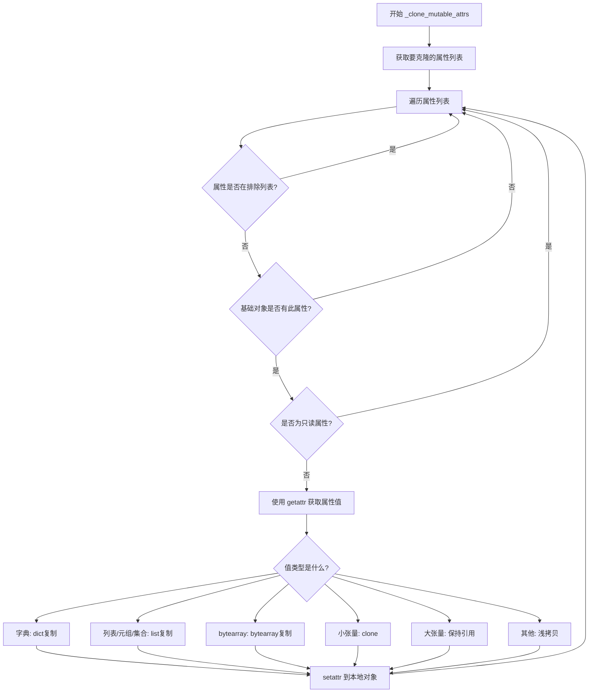

#### 带注释源码

```python
def _clone_mutable_attrs(self, base, local):
    attrs_to_clone = list(self._mutable_attrs)
    attrs_to_clone.extend(self._autodetect_mutables())

    EXCLUDE_ATTRS = {
        "components",
    }

    for attr in attrs_to_clone:
        if attr in EXCLUDE_ATTRS:
            logger.debug(f"Skipping excluded attr '{attr}'")
            continue
        if not hasattr(base, attr):
            continue
        if self._is_readonly_property(base, attr):
            logger.debug(f"Skipping read-only property '{attr}'")
            continue

        # 使用 getattr 获取基础对象的属性值
        try:
            val = getattr(base, attr)
        except Exception as e:
            logger.debug(f"Could not getattr('{attr}') on base pipeline: {e}")
            continue

        # 根据属性类型进行适当的复制
        try:
            if isinstance(val, dict):
                setattr(local, attr, dict(val))
            elif isinstance(val, (list, tuple, set)):
                setattr(local, attr, list(val))
            elif isinstance(val, bytearray):
                setattr(local, attr, bytearray(val))
            else:
                # 小张量或原子值
                if isinstance(val, torch.Tensor):
                    if val.numel() <= self._tensor_numel_threshold:
                        setattr(local, attr, val.clone())
                    else:
                        # 不克隆大张量，保持引用
                        setattr(local, attr, val)
                else:
                    try:
                        setattr(local, attr, copy.copy(val))
                    except Exception:
                        setattr(local, attr, val)
        except (AttributeError, TypeError) as e:
            logger.debug(f"Skipping cloning attribute '{attr}' because it is not settable: {e}")
            continue
        except Exception as e:
            logger.debug(f"Unexpected error cloning attribute '{attr}': {e}")
            continue
```

---

## 关键组件信息

| 名称 | 一句话描述 |
|------|------------|
| `getattr(pipeline, "unet", None)` | 动态获取 Pipeline 的 UNet 组件，不存在时返回 None |
| `getattr(pipeline, "vae", None)` | 动态获取 Pipeline 的 VAE 组件，不存在时返回 None |
| `getattr(pipeline, "text_encoder", None)` | 动态获取 Pipeline 的文本编码器组件 |
| `getattr(pipeline, "transformer", None)` | 动态获取 Pipeline 的 Transformer 组件（用于 DiT 等新架构） |
| `getattr(self._base, "scheduler", None)` | 动态获取基础 Pipeline 的调度器用于克隆 |
| `getattr(self._base, name)` | 动态遍历检测可变属性时获取属性值 |
| `getattr(base, attr)` | 克隆属性时获取基础对象的属性值 |

---

## 技术债务与优化空间

1. **重复的 getattr 调用**：在多个地方使用 `getattr` 获取相似属性，可以考虑提取公共方法
2. **异常处理过于宽泛**：使用 `except Exception` 捕获所有异常，可能隐藏潜在问题
3. **属性检测逻辑复杂**：`_autodetect_mutables` 方法中包含多种类型检测逻辑，可以拆分为独立的检测器类

---

## 其它说明

### 设计目标与约束

- **目标**：实现请求级别的 Pipeline 隔离，确保多线程环境下各请求的 mutable 状态互不影响
- **约束**：仅支持特定类型的可变属性（小张量、容器），大张量保持共享引用以节省内存

### 错误处理与异常设计

- `getattr` 调用使用默认值（`None`）处理属性不存在的情况
- 异常被记录但不会中断主要流程，采用静默失败策略

### 数据流与状态机

1. 初始化时获取基础 Pipeline 的各组件引用
2. 每次 `generate` 调用时克隆基础 Pipeline
3. 检测并克隆可变属性到本地副本
4. 执行推理后恢复原始状态

### 外部依赖与接口契约

- 依赖 `torch`、`threading`、`copy` 等标准库
- 依赖 `diffusers.utils.logging` 用于日志记录
- 依赖 `BaseAsyncScheduler` 和 `ThreadSafe*Wrapper` 类进行线程安全包装


### `RequestScopedPipeline._clone_mutable_attrs`

该方法负责将基础管道（pipeline）的可变属性克隆到本地实例，支持深拷贝字典/列表/集合、浅拷贝字节数组，并对小张量进行克隆而对大张量保持引用，以实现请求级别的属性隔离。

参数：

- `base`：`<class 'Any'>`，基础管道对象，原始的 pipeline 实例
- `local`：`<class 'Any'>`，本地管道对象，克隆后的 pipeline 实例

返回值：`<class 'None'>`，该方法无返回值，直接修改 `local` 对象的属性

#### 流程图

```mermaid
flowchart TD
    A[开始 _clone_mutable_attrs] --> B[获取需克隆的属性列表]
    B --> C[定义排除集合 EXCLUDE_ATTRS]
    C --> D{遍历每个属性 attr}
    D -->|是| E{attr 在排除集合中?}
    E -->|是| F[跳过并继续]
    E -->|否| G{base 有 attr 属性?}
    G -->|否| H[跳过并继续]
    G -->|是| I{attr 是只读属性?}
    I -->|是| J[跳过并继续]
    I -->|否| K[获取 attr 的值 val]
    K --> L{val 是 dict?}
    L -->|是| M[setattr local attr dict(val)]
    L -->|否| N{val 是 list/tuple/set?}
    N -->|是| O[setattr local attr list(val)]
    N -->|否| P{val 是 bytearray?}
    P -->|是| Q[setattr local attr bytearray(val)]
    P -->|否| R{val 是 Tensor 且 numel <= threshold?}
    R -->|是| S[setattr local attr val.clone]
    R -->|否| T{尝试 copy.copy?}
    T -->|成功| U[setattr local attr copy.copy(val)]
    T -->|失败| V[setattr local attr val]
    M --> W[处理异常并继续]
    O --> W
    Q --> W
    S --> W
    U --> W
    V --> W
    W --> D
    D -->|否| X[结束]
    F --> D
    H --> D
    J --> D
```

#### 带注释源码

```
def _clone_mutable_attrs(self, base, local):
    """
    将 base 对象的可变属性克隆到 local 对象。
    支持多种数据类型：字典、列表/元组/集合、字节数组、张量和其他对象。
    对于大张量保持引用以节省内存，小张量则克隆。
    """
    # 获取需要克隆的属性列表：包括默认的可变属性和自动检测的属性
    attrs_to_clone = list(self._mutable_attrs)
    attrs_to_clone.extend(self._autodetect_mutables())

    # 定义需要排除的属性集合
    EXCLUDE_ATTRS = {
        "components",  # 排除 components 字典，避免深拷贝导致的问题
    }

    # 遍历所有需要克隆的属性
    for attr in attrs_to_clone:
        # 跳过排除列表中的属性
        if attr in EXCLUDE_ATTRS:
            logger.debug(f"Skipping excluded attr '{attr}'")
            continue
        
        # 检查 base 对象是否有该属性
        if not hasattr(base, attr):
            continue
        
        # 检查该属性是否为只读属性（只有 getter 没有 setter）
        if self._is_readonly_property(base, attr):
            logger.debug(f"Skipping read-only property '{attr}'")
            continue

        try:
            # 获取属性的值
            val = getattr(base, attr)
        except Exception as e:
            logger.debug(f"Could not getattr('{attr}') on base pipeline: {e}")
            continue

        try:
            # 根据属性值的类型进行不同的克隆处理
            if isinstance(val, dict):
                # 字典：深拷贝，创建一个新的字典副本
                setattr(local, attr, dict(val))
            elif isinstance(val, (list, tuple, set)):
                # 列表/元组/集合：转换为列表（如果是元组或集合）
                setattr(local, attr, list(val))
            elif isinstance(val, bytearray):
                # 字节数组：创建新的字节数组副本
                setattr(local, attr, bytearray(val))
            else:
                # 其他类型：处理张量或原子值
                if isinstance(val, torch.Tensor):
                    if val.numel() <= self._tensor_numel_threshold:
                        # 小张量：克隆以确保隔离
                        setattr(local, attr, val.clone())
                    else:
                        # 大张量：保持引用以节省内存
                        setattr(local, attr, val)
                else:
                    # 尝试使用 copy.copy 进行浅拷贝
                    try:
                        setattr(local, attr, copy.copy(val))
                    except Exception:
                        # 如果浅拷贝失败，直接使用原值
                        setattr(local, attr, val)
        # 捕获属性设置失败（如属性不存在 setter）
        except (AttributeError, TypeError) as e:
            logger.debug(f"Skipping cloning attribute '{attr}' because it is not settable: {e}")
            continue
        # 捕获其他意外错误
        except Exception as e:
            logger.debug(f"Unexpected error cloning attribute '{attr}': {e}")
            continue
```


根据您的要求，我从代码中提取了包含 `hasattr` 使用的关键方法。由于 `hasattr` 是 Python 内置函数，我选取了代码中实际使用 `hasattr` 的典型方法进行详细分析。

### `RequestScopedPipeline._detect_kernel_pipeline`

该方法用于检测传入的 pipeline 是否具有内核特定指示器属性，以判断其是否为内核优化过的 pipeline。

参数：

- `pipeline`：`Any`，待检测的 pipeline 对象

返回值：`bool`，如果 pipeline 具备内核指示器属性返回 True，否则返回 False

#### 流程图

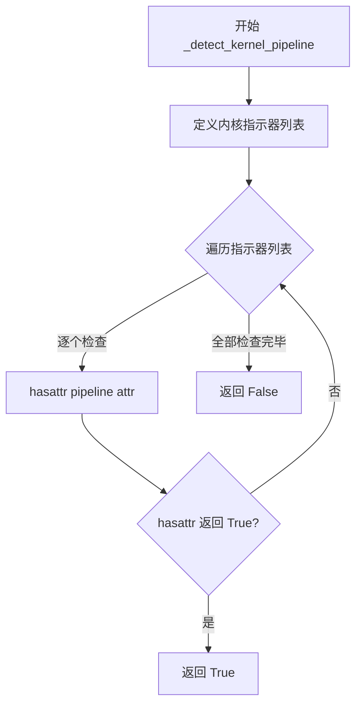

#### 带注释源码

```python
def _detect_kernel_pipeline(self, pipeline) -> bool:
    """
    检测 pipeline 是否为内核优化版本。
    内核版本通常包含特定的属性标识，如缓存管理器、优化选项等。
    """
    # 定义内核 pipeline 的特征属性列表
    kernel_indicators = [
        "text_encoding_cache",  # 文本编码缓存
        "memory_manager",        # 内存管理器
        "enable_optimizations",  # 优化开关
        "_create_request_context", # 请求上下文创建
        "get_optimization_stats",  # 优化统计信息
    ]

    # any() 短路求值，一旦发现匹配立即返回 True
    return any(hasattr(pipeline, attr) for attr in kernel_indicators)
```

---

### `RequestScopedPipeline._clone_mutable_attrs`

该方法负责克隆 pipeline 的可变属性，确保每次请求都有独立的属性副本，避免状态污染。

参数：

- `base`：`Any`，原始 pipeline 对象（基础 pipeline）
- `local`：`Any`，本地复制的 pipeline 对象（用于当前请求）

返回值：无（None）

#### 流程图

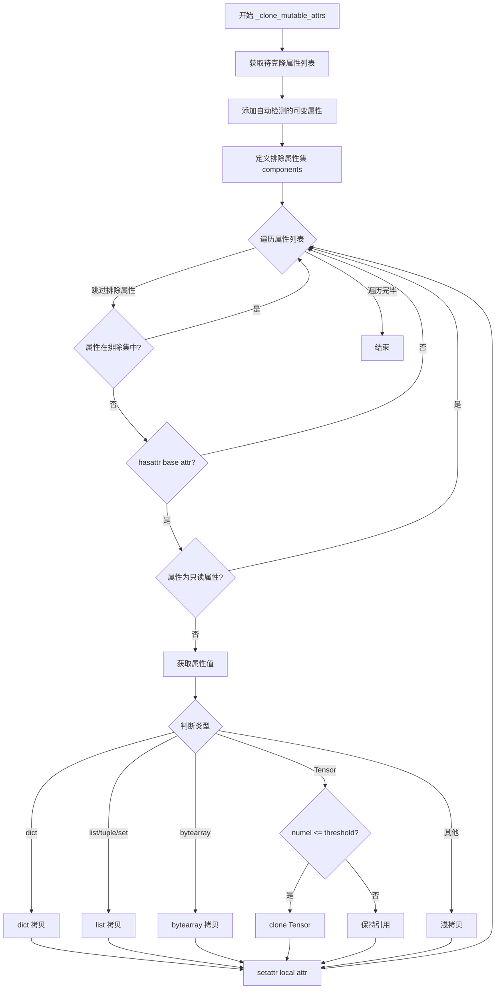

#### 带注释源码

```python
def _clone_mutable_attrs(self, base, local):
    """
    克隆可变属性到本地 pipeline。
    
    策略：
    - 容器类型（dict/list/tuple/set）进行深拷贝或类型转换
    - 小张量进行克隆，大张量保持引用以节省内存
    - 只读属性被跳过
    """
    # 合并默认可变属性和自动检测的可变属性
    attrs_to_clone = list(self._mutable_attrs)
    attrs_to_clone.extend(self._autodetect_mutables())

    # 明确排除的属性（不进行克隆）
    EXCLUDE_ATTRS = {
        "components",  # components 字典通常很大且不应被克隆
    }

    for attr in attrs_to_clone:
        # 跳过排除列表中的属性
        if attr in EXCLUDE_ATTRS:
            logger.debug(f"Skipping excluded attr '{attr}'")
            continue
        
        # 使用 hasattr 检查基础对象是否具有该属性
        if not hasattr(base, attr):
            continue
        
        # 检查是否为只读属性（property 且无 setter）
        if self._is_readonly_property(base, attr):
            logger.debug(f"Skipping read-only property '{attr}'")
            continue

        try:
            val = getattr(base, attr)
        except Exception as e:
            logger.debug(f"Could not getattr('{attr}') on base pipeline: {e}")
            continue

        try:
            if isinstance(val, dict):
                # 字典进行深拷贝
                setattr(local, attr, dict(val))
            elif isinstance(val, (list, tuple, set)):
                # 列表/元组/集合转换为列表进行拷贝
                setattr(local, attr, list(val))
            elif isinstance(val, bytearray):
                setattr(local, attr, bytearray(val))
            else:
                # 张量或其他对象
                if isinstance(val, torch.Tensor):
                    # 小于阈值的张量进行克隆，大张量保持引用
                    if val.numel() <= self._tensor_numel_threshold:
                        setattr(local, attr, val.clone())
                    else:
                        # 大张量保持引用以节省内存
                        setattr(local, attr, val)
                else:
                    try:
                        setattr(local, attr, copy.copy(val))
                    except Exception:
                        setattr(local, attr, val)
        except (AttributeError, TypeError) as e:
            logger.debug(f"Skipping cloning attribute '{attr}' because it is not settable: {e}")
            continue
        except Exception as e:
            logger.debug(f"Unexpected error cloning attribute '{attr}': {e}")
            continue
```

---

### `RequestScopedPipeline._is_tokenizer_component`

该方法用于判断某个组件是否为 tokenizer，通过检查其类名、方法和属性来识别。

参数：

- `component`：`Any`，待检测的组件对象

返回值：`bool`，如果判断为 tokenizer 返回 True，否则返回 False

#### 流程图

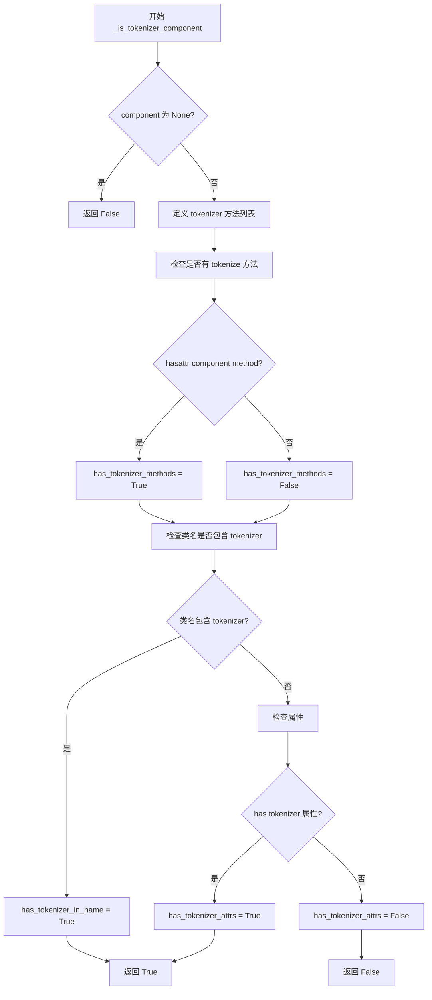

#### 带注释源码

```python
def _is_tokenizer_component(self, component) -> bool:
    """
    判断组件是否为 tokenizer。
    
    判断依据：
    1. 必须具有 tokenizer 典型方法（encode/decode/tokenize/__call__）
    2. 同时满足以下条件之一：
       - 类名包含 'tokenizer'
       - 具有 tokenizer 典型属性（vocab_size/pad_token/eos_token/bos_token）
    """
    if component is None:
        return False

    # tokenizer 典型方法
    tokenizer_methods = ["encode", "decode", "tokenize", "__call__"]
    # 使用 hasattr 检查组件是否具有这些方法
    has_tokenizer_methods = any(hasattr(component, method) for method in tokenizer_methods)

    # 检查类名
    class_name = component.__class__.__name__.lower()
    has_tokenizer_in_name = "tokenizer" in class_name

    # tokenizer 典型属性
    tokenizer_attrs = ["vocab_size", "pad_token", "eos_token", "bos_token"]
    # 使用 hasattr 检查组件是否具有这些属性
    has_tokenizer_attrs = any(hasattr(component, attr) for attr in tokenizer_attrs)

    # 必须有典型方法，且类名包含 tokenizer 或有典型属性
    return has_tokenizer_methods and (has_tokenizer_in_name or has_tokenizer_attrs)
```

---

### `hasattr` 函数本身

由于 `hasattr` 是 Python 内置函数，以下是其标准文档：

参数：

- `object`：`object`，任意 Python 对象
- `name`：`str`，属性名称（字符串）

返回值：`bool`，如果对象具有指定名称的属性返回 True，否则返回 False

#### 流程图

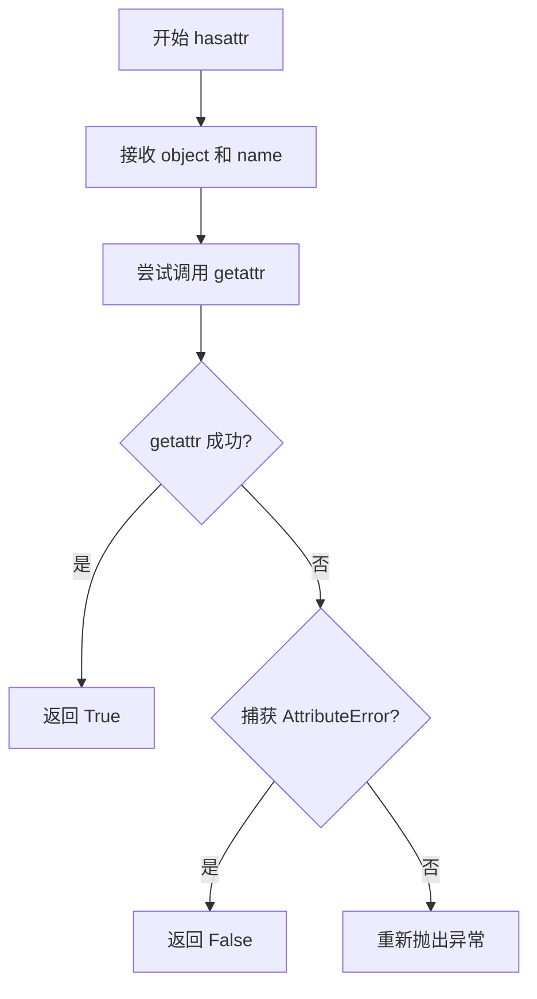

#### 使用示例源码

```python
# hasattr 在 RequestScopedPipeline 中的典型使用模式

# 模式1：安全地检查属性是否存在
if hasattr(pipeline, "scheduler"):
    scheduler = pipeline.scheduler

# 模式2：与 getattr 配合使用，提供默认值
vae = getattr(pipeline, "vae", None)

# 模式3：遍历检查多个可能的属性
kernel_indicators = ["text_encoding_cache", "memory_manager"]
has_kernel = any(hasattr(pipeline, attr) for attr in kernel_indicators)

# 模式4：检查对象是否具有特定方法
if hasattr(component, "encode"):
    result = component.encode(text)

# 模式5：检查对象是否具有特定属性
if hasattr(component, "vocab_size"):
    size = component.vocab_size
```


### `RequestScopedPipeline.generate`

这是该类的核心方法，用于在请求范围内执行推理生成。它创建pipeline的浅拷贝，包装线程不安全的组件（如VAE、tokenizer），设置本地scheduler，克隆可变属性，执行生成，最后恢复原始组件。

参数：

- `*args`：`tuple`，可变位置参数，传递给底层pipeline的原始参数
- `num_inference_steps`：`int`，推理步数，默认值为50，控制扩散过程的迭代次数
- `device`：`str | None`，计算设备标识符（如"cuda"），若为None则使用默认设备
- `**kwargs`：`dict`，可变关键字参数，包含额外配置如timesteps、sigmas等

返回值：`Any`，底层pipeline的生成结果，通常是图像张量或图像列表

#### 流程图

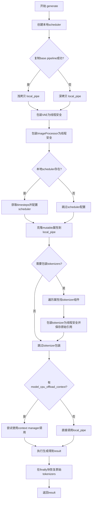

#### 带注释源码

```python
def generate(self, *args, num_inference_steps: int = 50, device: str | None = None, **kwargs):
    """
    在请求作用域内执行pipeline生成。
    
    该方法创建一个pipeline的本地副本，包装线程不安全的组件，
    设置本地scheduler，并执行生成。最后恢复原始组件以避免副作用。
    """
    # 步骤1: 为当前请求创建本地scheduler副本
    # 这样可以避免多线程下的scheduler状态冲突
    local_scheduler = self._make_local_scheduler(num_inference_steps=num_inference_steps, device=device)

    # 步骤2: 复制基础pipeline
    # 尝试浅拷贝以节省内存，如果失败则回退到深拷贝
    try:
        local_pipe = copy.copy(self._base)
    except Exception as e:
        logger.warning(f"copy.copy(self._base) failed: {e}. Falling back to deepcopy (may increase memory).")
        local_pipe = copy.deepcopy(self._base)

    # 步骤3: 包装VAE为线程安全
    # VAE在推理时可能不是线程安全的，需要加锁包装
    try:
        if (
            hasattr(local_pipe, "vae")
            and local_pipe.vae is not None
            and not isinstance(local_pipe.vae, ThreadSafeVAEWrapper)
        ):
            local_pipe.vae = ThreadSafeVAEWrapper(local_pipe.vae, self._vae_lock)

        # 步骤4: 包装ImageProcessor为线程安全
        if (
            hasattr(local_pipe, "image_processor")
            and local_pipe.image_processor is not None
            and not isinstance(local_pipe.image_processor, ThreadSafeImageProcessorWrapper)
        ):
            local_pipe.image_processor = ThreadSafeImageProcessorWrapper(
                local_pipe.image_processor, self._image_lock
            )
    except Exception as e:
        logger.debug(f"Could not wrap vae/image_processor: {e}")

    # 步骤5: 配置本地scheduler
    # 异步获取timesteps并设置到本地pipeline
    if local_scheduler is not None:
        try:
            timesteps, num_steps, configured_scheduler = async_retrieve_timesteps(
                local_scheduler.scheduler,
                num_inference_steps=num_inference_steps,
                device=device,
                return_scheduler=True,
                **{k: v for k, v in kwargs.items() if k in ["timesteps", "sigmas"]},
            )

            final_scheduler = BaseAsyncScheduler(configured_scheduler)
            setattr(local_pipe, "scheduler", final_scheduler)
        except Exception:
            logger.warning("Could not set scheduler on local pipe; proceeding without replacing scheduler.")

    # 步骤6: 克隆可变属性
    # 将base pipeline中的可变状态（如hooks、progress bar）克隆到本地副本
    self._clone_mutable_attrs(self._base, local_pipe)

    # 步骤7: 包装tokenizers
    # tokenizer通常不是线程安全的，需要加锁包装
    original_tokenizers = {}

    if self._should_wrap_tokenizers():
        try:
            # 遍历pipeline属性查找tokenizer
            for name in dir(local_pipe):
                if "tokenizer" in name and not name.startswith("_"):
                    tok = getattr(local_pipe, name, None)
                    if tok is not None and self._is_tokenizer_component(tok):
                        if not isinstance(tok, ThreadSafeTokenizerWrapper):
                            # 保存原始tokenizer以便后续恢复
                            original_tokenizers[name] = tok
                            wrapped_tokenizer = ThreadSafeTokenizerWrapper(tok, self._tokenizer_lock)
                            setattr(local_pipe, name, wrapped_tokenizer)

            # 同时检查components字典中的tokenizer
            if hasattr(local_pipe, "components") and isinstance(local_pipe.components, dict):
                for key, val in local_pipe.components.items():
                    if val is None:
                        continue

                    if self._is_tokenizer_component(val):
                        if not isinstance(val, ThreadSafeTokenizerWrapper):
                            original_tokenizers[f"components[{key}]"] = val
                            wrapped_tokenizer = ThreadSafeTokenizerWrapper(val, self._tokenizer_lock)
                            local_pipe.components[key] = wrapped_tokenizer

        except Exception as e:
            logger.debug(f"Tokenizer wrapping step encountered an error: {e}")

    # 步骤8: 执行生成
    result = None
    # 检查是否有CPU offload上下文管理器
    cm = getattr(local_pipe, "model_cpu_offload_context", None)

    try:
        if callable(cm):
            try:
                # 尝试作为context manager调用
                with cm():
                    result = local_pipe(*args, num_inference_steps=num_inference_steps, **kwargs)
            except TypeError:
                # 有些context manager不使用()调用
                try:
                    with cm:
                        result = local_pipe(*args, num_inference_steps=num_inference_steps, **kwargs)
                except Exception as e:
                    logger.debug(f"model_cpu_offload_context usage failed: {e}. Proceeding without it.")
                    result = local_pipe(*args, num_inference_steps=num_inference_steps, **kwargs)
        else:
            result = local_pipe(*args, num_inference_steps=num_inference_steps, **kwargs)

        return result

    finally:
        # 步骤9: 恢复原始tokenizers
        # 确保原始pipeline的tokenizer不被修改，保持后续请求的稳定性
        try:
            for name, tok in original_tokenizers.items():
                if name.startswith("components["):
                    key = name[len("components[") : -1]
                    if hasattr(local_pipe, "components") and isinstance(local_pipe.components, dict):
                        local_pipe.components[key] = tok
                else:
                    setattr(local_pipe, name, tok)
        except Exception as e:
            logger.debug(f"Error restoring original tokenizers: {e}")
```


# 任务分析

经过仔细分析代码，我发现代码中并没有定义一个名为 `isinstance` 的函数或方法。`isinstance` 是 Python 的内置函数，而不是在这个代码库中定义的。

但是，代码中多次使用了 `isinstance` 来进行类型检查。以下是代码中使用 `isinstance` 的所有位置：

## 代码中 isinstance 的使用情况

1. **`isinstance(pipeline.scheduler, BaseAsyncScheduler)`** - 检查调度器是否为异步调度器实例
2. **`isinstance(val, (types.ModuleType, types.FunctionType, types.MethodType))`** - 检查值是否为可调用对象或模块/函数/方法类型
3. **`isinstance(val, (dict, list, set, tuple, bytearray))`** - 检查值是否为可变集合类型
4. **`isinstance(val, torch.Tensor)`** - 检查值是否为 PyTorch 张量
5. **`isinstance(local_pipe.vae, ThreadSafeVAEWrapper)`** - 检查 VAE 是否已被线程安全包装器包装
6. **`isinstance(local_pipe.image_processor, ThreadSafeImageProcessorWrapper)`** - 检查图像处理器是否已被包装
7. **`isinstance(local_pipe.components, dict)`** - 检查组件是否为字典类型

---

如果您需要我为代码中定义的特定**方法**（如 `generate`、`_clone_mutable_attrs`、`_autodetect_mutables` 等）生成详细的设计文档，请告知我您具体需要哪个方法。


### `RequestScopedPipeline.generate`

该方法是 `RequestScopedPipeline` 类的核心公开方法，负责执行推理请求的完整生命周期管理。它通过创建本地调度器、深拷贝管道、线程安全包装器（VAE、ImageProcessor、Tokenizer），并克隆可变属性来确保每个请求的隔离性，最终调用底层管道执行生成并恢复原始状态。

参数：

- `*args`：`Any`，可变位置参数，传递给底层管道的额外位置参数
- `num_inference_steps`：`int`，默认为 50，推理步数，控制生成过程的迭代次数
- `device`：`str | None`，默认为 None，目标设备（CPU/CUDA），指定推理计算的设备
- `**kwargs`：`Any`，可变关键字参数，传递给底层管道的额外关键字参数（如 timesteps、sigmas 等）

返回值：`Any`，底层管道返回的生成结果，可能是图像、张量或包含生成输出的字典

#### 流程图

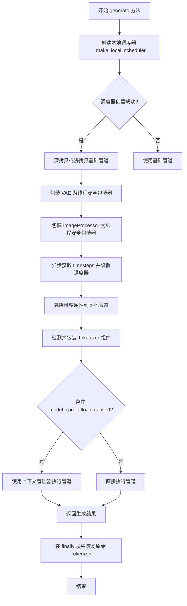

#### 带注释源码

```python
def generate(self, *args, num_inference_steps: int = 50, device: str | None = None, **kwargs):
    """
    执行推理请求的完整生命周期管理
    
    该方法负责：
    1. 创建本地调度器（线程安全）
    2. 复制基础管道（请求级别隔离）
    3. 包装 VAE/ImageProcessor/Tokenizer 为线程安全版本
    4. 克隆可变属性
    5. 执行实际生成
    6. 恢复原始组件状态
    """
    # 步骤1: 创建本地调度器，用于请求级别的调度器状态隔离
    local_scheduler = self._make_local_scheduler(num_inference_steps=num_inference_steps, device=device)

    # 步骤2: 复制基础管道（浅拷贝优先，失败则深拷贝）
    try:
        local_pipe = copy.copy(self._base)  # 尝试浅拷贝以节省内存
    except Exception as e:
        # 浅拷贝失败时降级为深拷贝（内存开销更大但更安全）
        logger.warning(f"copy.copy(self._base) failed: {e}. Falling back to deepcopy (may increase memory).")
        local_pipe = copy.deepcopy(self._base)

    # 步骤3: 为 VAE 和 ImageProcessor 添加线程安全包装器
    try:
        # 包装 VAE（变分自编码器）为线程安全版本
        if (
            hasattr(local_pipe, "vae")
            and local_pipe.vae is not None
            and not isinstance(local_pipe.vae, ThreadSafeVAEWrapper)
        ):
            local_pipe.vae = ThreadSafeVAEWrapper(local_pipe.vae, self._vae_lock)

        # 包装图像处理器为线程安全版本
        if (
            hasattr(local_pipe, "image_processor")
            and local_pipe.image_processor is not None
            and not isinstance(local_pipe.image_processor, ThreadSafeImageProcessorWrapper)
        ):
            local_pipe.image_processor = ThreadSafeImageProcessorWrapper(
                local_pipe.image_processor, self._image_lock
            )
    except Exception as e:
        logger.debug(f"Could not wrap vae/image_processor: {e}")

    # 步骤4: 异步获取 timesteps 并配置调度器
    if local_scheduler is not None:
        try:
            # 调用异步方法获取时间步和配置调度器
            timesteps, num_steps, configured_scheduler = async_retrieve_timesteps(
                local_scheduler.scheduler,
                num_inference_steps=num_inference_steps,
                device=device,
                return_scheduler=True,
                **{k: v for k, v in kwargs.items() if k in ["timesteps", "sigmas"]},
            )

            # 用配置好的调度器创建新的异步调度器并设置到本地管道
            final_scheduler = BaseAsyncScheduler(configured_scheduler)
            setattr(local_pipe, "scheduler", final_scheduler)
        except Exception:
            logger.warning("Could not set scheduler on local pipe; proceeding without replacing scheduler.")

    # 步骤5: 克隆可变属性（进度条、随机状态、latents 等）
    self._clone_mutable_attrs(self._base, local_pipe)

    # 步骤6: 收集原始 tokenizer 以便后续恢复
    original_tokenizers = {}

    # 步骤7: 检测并包装 tokenizer 组件为线程安全版本
    if self._should_wrap_tokenizers():
        try:
            # 遍历管道属性查找 tokenizer
            for name in dir(local_pipe):
                if "tokenizer" in name and not name.startswith("_"):
                    tok = getattr(local_pipe, name, None)
                    if tok is not None and self._is_tokenizer_component(tok):
                        if not isinstance(tok, ThreadSafeTokenizerWrapper):
                            original_tokenizers[name] = tok
                            wrapped_tokenizer = ThreadSafeTokenizerWrapper(tok, self._tokenizer_lock)
                            setattr(local_pipe, name, wrapped_tokenizer)

            # 遍历 components 字典查找 tokenizer
            if hasattr(local_pipe, "components") and isinstance(local_pipe.components, dict):
                for key, val in local_pipe.components.items():
                    if val is None:
                        continue

                    if self._is_tokenizer_component(val):
                        if not isinstance(val, ThreadSafeTokenizerWrapper):
                            original_tokenizers[f"components[{key}]"] = val
                            wrapped_tokenizer = ThreadSafeTokenizerWrapper(val, self._tokenizer_lock)
                            local_pipe.components[key] = wrapped_tokenizer

        except Exception as e:
            logger.debug(f"Tokenizer wrapping step encountered an error: {e}")

    # 步骤8: 执行实际的生成调用
    result = None
    cm = getattr(local_pipe, "model_cpu_offload_context", None)

    try:
        # 检查是否存在 CPU offload 上下文管理器
        if callable(cm):
            try:
                # 尝试作为可调用对象使用（with cm()）
                with cm():
                    result = local_pipe(*args, num_inference_steps=num_inference_steps, **kwargs)
            except TypeError:
                # 降级为直接作为上下文管理器使用（with cm）
                try:
                    with cm:
                        result = local_pipe(*args, num_inference_steps=num_inference_steps, **kwargs)
                except Exception as e:
                    logger.debug(f"model_cpu_offload_context usage failed: {e}. Proceeding without it.")
                    result = local_pipe(*args, num_inference_steps=num_inference_steps, **kwargs)
        else:
            # 直接调用管道
            result = local_pipe(*args, num_inference_steps=num_inference_steps, **kwargs)

        return result

    finally:
        # 步骤9: 在 finally 块中恢复原始 tokenizer（无论成功或失败）
        try:
            for name, tok in original_tokenizers.items():
                if name.startswith("components["):
                    # 从 components 字典中恢复
                    key = name[len("components[") : -1]
                    if hasattr(local_pipe, "components") and isinstance(local_pipe.components, dict):
                        local_pipe.components[key] = tok
                else:
                    # 从属性中恢复
                    setattr(local_pipe, name, tok)
        except Exception as e:
            logger.debug(f"Error restoring original tokenizers: {e}")
```


### `RequestScopedPipeline._make_local_scheduler`

该方法用于为当前请求创建一个本地调度器（Scheduler）的克隆副本，支持异步时间步检索，并提供了多层降级策略以确保在克隆失败时仍能返回可用的调度器。

参数：

- `num_inference_steps`：`int`，推理步数，用于配置调度器的推理参数
- `device`：`str | None`，目标设备，传递给调度器的设备参数
- `clone_kwargs`：可变关键字参数，其他传递给调度器克隆方法的参数

返回值：`BaseAsyncScheduler | None`，返回克隆后的本地调度器实例，如果基础调度器不存在则返回 None

#### 流程图

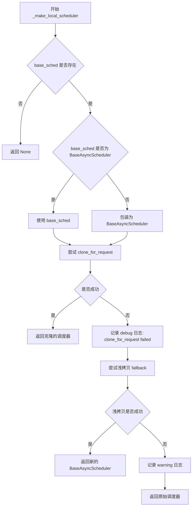

#### 带注释源码

```python
def _make_local_scheduler(self, num_inference_steps: int, device: str | None = None, **clone_kwargs):
    # 获取基础管道（pipeline）的调度器
    base_sched = getattr(self._base, "scheduler", None)
    # 如果没有调度器，直接返回 None
    if base_sched is None:
        return None

    # 检查调度器是否已经是 BaseAsyncScheduler 类型
    if not isinstance(base_sched, BaseAsyncScheduler):
        # 如果不是，则包装为 BaseAsyncScheduler
        wrapped_scheduler = BaseAsyncScheduler(base_sched)
    else:
        # 如果已经是，则直接使用
        wrapped_scheduler = base_sched

    try:
        # 尝试为当前请求克隆调度器
        return wrapped_scheduler.clone_for_request(
            num_inference_steps=num_inference_steps, device=device, **clone_kwargs
        )
    except Exception as e:
        # 克隆失败时记录 debug 级别日志，并尝试降级方案
        logger.debug(f"clone_for_request failed: {e}; trying shallow copy fallback")
        try:
            # 尝试浅拷贝 scheduler 对象
            if hasattr(wrapped_scheduler, "scheduler"):
                try:
                    copied_scheduler = copy.copy(wrapped_scheduler.scheduler)
                    return BaseAsyncScheduler(copied_scheduler)
                except Exception:
                    return wrapped_scheduler
            else:
                copied_scheduler = copy.copy(wrapped_scheduler)
                return BaseAsyncScheduler(copied_scheduler)
        except Exception as e2:
            # 浅拷贝也失败时记录警告，返回原始调度器（线程不安全但功能可用）
            logger.warning(
                f"Shallow copy of scheduler also failed: {e2}. Using original scheduler (*thread-unsafe but functional*)."
            )
            return wrapped_scheduler
```

---

### `RequestScopedPipeline._autodetect_mutables`

该方法用于自动检测基础管道（Pipeline）中的可变属性（mutable attributes），这些属性需要在每次请求时进行克隆，以实现请求级别的隔离。

参数：

- `max_attrs`：`int = 40`，最大自动检测的属性数量，默认为 40

返回值：`List[str]`，返回检测到的可变属性名称列表

#### 流程图

```mermaid
flowchart TD
    A[开始 _autodetect_mutables] --> B{是否启用自动检测}
    B -->|否| C[返回空列表]
    B -->|是| D{已有检测结果}
    D -->|是| E[返回缓存结果]
    D -->|否| F[遍历 dir(self._base)]
    F --> G{跳过规则检查}
    G --> H{属性是否为可调用类型}
    H -->|是| I[跳过]
    H -->|否| J{是否为集合类型}
    J -->|是| K[添加到候选列表]
    J -->|否| L{是否为 Tensor}
    L -->|是| M{numel <= 阈值}
    M -->|是| K
    M -->|否| N[记录 debug 日志: Ignoring large tensor]
    N --> O{候选数量 >= max_attrs}
    O -->|是| P[保存并返回结果]
    O -->|否| F
```

#### 带注释源码

```python
def _autodetect_mutables(self, max_attrs: int = 40):
    # 如果未启用自动检测，直接返回空列表
    if not self._auto_detect_mutables:
        return []

    # 如果已有缓存的检测结果，直接返回
    if self._auto_detected_attrs:
        return self._auto_detected_attrs

    # 初始化候选列表和已见集合
    candidates: List[str] = []
    seen = set()

    # 遍历基础管道的所有属性
    for name in dir(self._base):
        # 跳过双下划线开头的属性
        if name.startswith("__"):
            continue
        # 跳过已明确的 mutable 属性
        if name in self._mutable_attrs:
            continue
        # 跳过特定方法属性
        if name in ("to", "save_pretrained", "from_pretrained"):
            continue

        try:
            val = getattr(self._base, name)
        except Exception:
            continue

        import types

        # 跳过可调用对象（函数、方法、模块等）
        if callable(val) or isinstance(val, (types.ModuleType, types.FunctionType, types.MethodType)):
            continue

        # 集合类型（dict, list, set, tuple, bytearray）直接加入候选
        if isinstance(val, (dict, list, set, tuple, bytearray)):
            candidates.append(name)
            seen.add(name)
        else:
            # 尝试检测 Tensor 类型
            try:
                if isinstance(val, torch.Tensor):
                    # 小于阈值的小 tensor 才加入候选
                    if val.numel() <= self._tensor_numel_threshold:
                        candidates.append(name)
                        seen.add(name)
                    else:
                        # 记录 debug 日志：忽略大型 tensor 属性
                        logger.debug(f"Ignoring large tensor attr '{name}', numel={val.numel()}")
            except Exception:
                continue

        # 达到最大属性数量时停止检测
        if len(candidates) >= max_attrs:
            break

    # 保存检测结果到缓存
    self._auto_detected_attrs = candidates
    # 记录 debug 日志：输出自动检测到的可变属性列表
    logger.debug(f"Autodetected mutable attrs to clone: {self._auto_detected_attrs}")
    return self._auto_detected_attrs
```

---

### `RequestScopedPipeline._clone_mutable_attrs`

该方法负责将基础管道（Base Pipeline）的可变属性克隆到本地管道实例中，支持多种数据类型的深拷贝或浅拷贝策略。

参数：

- `base`：`Any`，基础管道对象，属性来源
- `local`：`Any`，本地管道对象，属性目标

返回值：无（返回 None）

#### 流程图

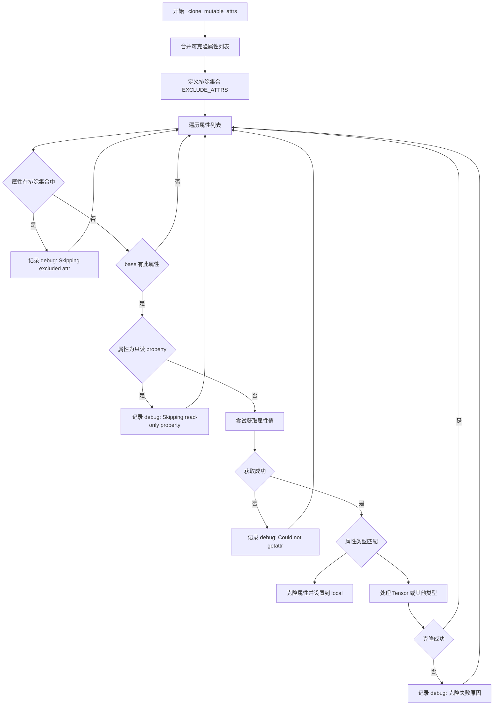

#### 带注释源码

```python
def _clone_mutable_attrs(self, base, local):
    # 合并用户指定的 mutable 属性和自动检测的属性
    attrs_to_clone = list(self._mutable_attrs)
    attrs_to_clone.extend(self._autodetect_mutables())

    # 定义需要排除的属性集合
    EXCLUDE_ATTRS = {
        "components",
    }

    # 遍历所有需要克隆的属性
    for attr in attrs_to_clone:
        # 跳过排除列表中的属性
        if attr in EXCLUDE_ATTRS:
            # 记录 debug 日志：跳过被排除的属性
            logger.debug(f"Skipping excluded attr '{attr}'")
            continue
        if not hasattr(base, attr):
            continue
        # 检查是否为只读 property
        if self._is_readonly_property(base, attr):
            # 记录 debug 日志：跳过只读属性
            logger.debug(f"Skipping read-only property '{attr}'")
            continue

        try:
            val = getattr(base, attr)
        except Exception as e:
            # 获取属性失败时记录 debug 日志
            logger.debug(f"Could not getattr('{attr}') on base pipeline: {e}")
            continue

        try:
            # 根据属性类型选择合适的克隆策略
            if isinstance(val, dict):
                setattr(local, attr, dict(val))
            elif isinstance(val, (list, tuple, set)):
                setattr(local, attr, list(val))
            elif isinstance(val, bytearray):
                setattr(local, attr, bytearray(val))
            else:
                # 小型 Tensor 或原子值
                if isinstance(val, torch.Tensor):
                    # 小于阈值的 tensor 进行克隆
                    if val.numel() <= self._tensor_numel_threshold:
                        setattr(local, attr, val.clone())
                    else:
                        # 大 tensor 保持引用（节省内存）
                        setattr(local, attr, val)
                else:
                    try:
                        setattr(local, attr, copy.copy(val))
                    except Exception:
                        setattr(local, attr, val)
        except (AttributeError, TypeError) as e:
            # 属性不可设置时记录 debug 日志
            logger.debug(f"Skipping cloning attribute '{attr}' because it is not settable: {e}")
            continue
        except Exception as e:
            # 其他意外错误记录 debug 日志
            logger.debug(f"Unexpected error cloning attribute '{attr}': {e}")
            continue
```

---

### `RequestScopedPipeline.generate`

该方法是 `RequestScopedPipeline` 的核心生成方法，负责为每个请求创建隔离的管道实例，包括调度器克隆、线程安全包装器应用、模型 CPU offload 上下文管理，最终调用底层管道执行推理。

参数：

- `*args`：`Any`，可变位置参数，传递给底层管道的参数
- `num_inference_steps`：`int = 50`，推理步数，控制扩散过程的迭代次数
- `device`：`str | None = None`，目标设备，指定推理运行的硬件设备
- `**kwargs`：`Any`，可变关键字参数，其他传递给底层管道的参数

返回值：`Any`，返回底层管道的推理结果（通常是图像或图像批次）

#### 流程图

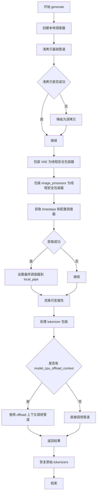

#### 带注释源码

```python
def generate(self, *args, num_inference_steps: int = 50, device: str | None = None, **kwargs):
    # 第一步：创建本地调度器
    local_scheduler = self._make_local_scheduler(num_inference_steps=num_inference_steps, device=device)

    # 第二步：复制基础管道
    try:
        local_pipe = copy.copy(self._base)
    except Exception as e:
        logger.warning(f"copy.copy(self._base) failed: {e}. Falling back to deepcopy (may increase memory).")
        local_pipe = copy.deepcopy(self._base)

    # 第三步：包装 VAE 和 image_processor 为线程安全包装器
    try:
        if (
            hasattr(local_pipe, "vae")
            and local_pipe.vae is not None
            and not isinstance(local_pipe.vae, ThreadSafeVAEWrapper)
        ):
            local_pipe.vae = ThreadSafeVAEWrapper(local_pipe.vae, self._vae_lock)

        if (
            hasattr(local_pipe, "image_processor")
            and local_pipe.image_processor is not None
            and not isinstance(local_pipe.image_processor, ThreadSafeImageProcessorWrapper)
        ):
            local_pipe.image_processor = ThreadSafeImageProcessorWrapper(
                local_pipe.image_processor, self._image_lock
            )
    except Exception as e:
        # 包装失败时记录 debug 日志
        logger.debug(f"Could not wrap vae/image_processor: {e}")

    # 第四步：设置调度器
    if local_scheduler is not None:
        try:
            timesteps, num_steps, configured_scheduler = async_retrieve_timesteps(
                local_scheduler.scheduler,
                num_inference_steps=num_inference_steps,
                device=device,
                return_scheduler=True,
                **{k: v for k, v in kwargs.items() if k in ["timesteps", "sigmas"]},
            )

            final_scheduler = BaseAsyncScheduler(configured_scheduler)
            setattr(local_pipe, "scheduler", final_scheduler)
        except Exception:
            logger.warning("Could not set scheduler on local pipe; proceeding without replacing scheduler.")

    # 第五步：克隆可变属性
    self._clone_mutable_attrs(self._base, local_pipe)

    # 第六步：处理 tokenizer 包装
    original_tokenizers = {}

    if self._should_wrap_tokenizers():
        try:
            # 遍历管道属性寻找 tokenizer
            for name in dir(local_pipe):
                if "tokenizer" in name and not name.startswith("_"):
                    tok = getattr(local_pipe, name, None)
                    if tok is not None and self._is_tokenizer_component(tok):
                        if not isinstance(tok, ThreadSafeTokenizerWrapper):
                            original_tokenizers[name] = tok
                            wrapped_tokenizer = ThreadSafeTokenizerWrapper(tok, self._tokenizer_lock)
                            setattr(local_pipe, name, wrapped_tokenizer)

            # 检查 components 字典中的 tokenizer
            if hasattr(local_pipe, "components") and isinstance(local_pipe.components, dict):
                for key, val in local_pipe.components.items():
                    if val is None:
                        continue

                    if self._is_tokenizer_component(val):
                        if not isinstance(val, ThreadSafeTokenizerWrapper):
                            original_tokenizers[f"components[{key}]"] = val
                            wrapped_tokenizer = ThreadSafeTokenizerWrapper(val, self._tokenizer_lock)
                            local_pipe.components[key] = wrapped_tokenizer

        except Exception as e:
            # tokenizer 包装步骤出错时记录 debug 日志
            logger.debug(f"Tokenizer wrapping step encountered an error: {e}")

    # 第七步：调用管道执行推理
    result = None
    cm = getattr(local_pipe, "model_cpu_offload_context", None)

    try:
        if callable(cm):
            try:
                with cm():
                    result = local_pipe(*args, num_inference_steps=num_inference_steps, **kwargs)
            except TypeError:
                try:
                    with cm:
                        result = local_pipe(*args, num_inference_steps=num_inference_steps, **kwargs)
                except Exception as e:
                    # model_cpu_offload_context 使用失败时记录 debug 日志
                    logger.debug(f"model_cpu_offload_context usage failed: {e}. Proceeding without it.")
                    result = local_pipe(*args, num_inference_steps=num_inference_steps, **kwargs)
        else:
            result = local_pipe(*args, num_inference_steps=num_inference_steps, **kwargs)

        return result

    finally:
        # 第八步：恢复原始 tokenizer（在 finally 块中确保执行）
        try:
            for name, tok in original_tokenizers.items():
                if name.startswith("components["):
                    key = name[len("components[") : -1]
                    if hasattr(local_pipe, "components") and isinstance(local_pipe.components, dict):
                        local_pipe.components[key] = tok
                else:
                    setattr(local_pipe, name, tok)
        except Exception as e:
            # 恢复原始 tokenizer 出错时记录 debug 日志
            logger.debug(f"Error restoring original tokenizers: {e}")
```


### `logger.warning`

`logger.warning` 是 Python 标准 logging 模块中 Logger 类的一个方法，用于记录警告级别的日志消息。在该代码中有多处调用，用于在发生潜在问题时记录警告信息，帮助调试和监控。

参数：

-  `*args`：可变位置参数，用于接收日志消息的格式化参数（如格式化字符串和对应的值）
-  `**kwargs`：关键字参数，用于接收其他日志参数（如 `exc_info`、`stack_info`、`stacklevel` 等）

返回值：`None`，该方法没有返回值，仅用于记录日志

#### 流程图

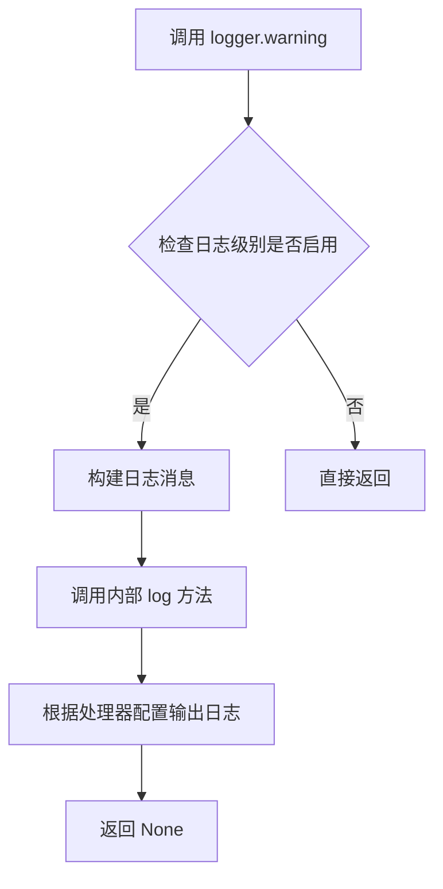

#### 带注释源码

```python
# 在代码中有三处 logger.warning 调用：

# 第一次：在 _make_local_scheduler 方法中，浅拷贝调度器失败时
logger.warning(
    f"Shallow copy of scheduler also failed: {e2}. Using original scheduler (*thread-unsafe but functional*)."
)

# 第二次：在 generate 方法中，copy.copy 失败时
logger.warning(f"copy.copy(self._base) failed: {e}. Falling back to deepcopy (may increase memory).")

# 第三次：在 generate 方法中，设置调度器失败时
logger.warning("Could not set scheduler on local pipe; proceeding without replacing scheduler.")
```

### `RequestScopedPipeline._make_local_scheduler` 中的 logger.warning

在创建请求本地的调度器副本失败时记录警告，表示将使用原始的（非线程安全的）调度器。

参数：

-  `num_inference_steps`：`int`，推理步数
-  `device`：`str | None`，目标设备
-  `**clone_kwargs`：其他克隆参数

返回值：`BaseAsyncScheduler | None`，返回调度器实例或 None

#### 流程图

```mermaid
flowchart TD
    A[_make_local_scheduler 被调用] --> B[获取基础调度器]
    B --> C{调度器是否存在?}
    C -->|否| D[返回 None]
    C -->|是| E{是否为 BaseAsyncScheduler?}
    E -->|否| F[包装为 BaseAsyncScheduler]
    E -->|是| G[使用现有包装]
    F --> H[尝试克隆调度器]
    G --> H
    H --> I{克隆成功?}
    I -->|是| J[返回克隆的调度器]
    I -->|否| K[记录日志: logger.warning]
    K --> L[尝试浅拷贝 fallback]
    L --> M{浅拷贝成功?}
    M -->|是| N[返回新包装的调度器]
    M -->|否| O[记录日志: logger.warning]
    O --> P[返回原始调度器]
```

#### 带注释源码

```python
def _make_local_scheduler(self, num_inference_steps: int, device: str | None = None, **clone_kwargs):
    """
    为当前请求创建本地调度器副本
    
    参数:
        num_inference_steps: 推理步数
        device: 目标设备
        **clone_kwargs: 其他克隆参数
    
    返回:
        BaseAsyncScheduler: 本地调度器实例，失败时返回原始调度器
    """
    base_sched = getattr(self._base, "scheduler", None)
    if base_sched is None:
        return None

    if not isinstance(base_sched, BaseAsyncScheduler):
        wrapped_scheduler = BaseAsyncScheduler(base_sched)
    else:
        wrapped_scheduler = base_sched

    try:
        return wrapped_scheduler.clone_for_request(
            num_inference_steps=num_inference_steps, device=device, **clone_kwargs
        )
    except Exception as e:
        logger.debug(f"clone_for_request failed: {e}; trying shallow copy fallback")
        try:
            if hasattr(wrapped_scheduler, "scheduler"):
                try:
                    copied_scheduler = copy.copy(wrapped_scheduler.scheduler)
                    return BaseAsyncScheduler(copied_scheduler)
                except Exception:
                    return wrapped_scheduler
            else:
                copied_scheduler = copy.copy(wrapped_scheduler)
                return BaseAsyncScheduler(copied_scheduler)
        except Exception as e2:
            # 警告：浅拷贝也失败，使用原始调度器（线程不安全但可用）
            logger.warning(
                f"Shallow copy of scheduler also failed: {e2}. Using original scheduler (*thread-unsafe but functional*)."
            )
            return wrapped_scheduler
```

### `RequestScopedPipeline.generate` 中的 logger.warning

在 `generate` 方法中有两处 logger.warning 调用，分别在管道复制失败和调度器设置失败时记录警告。

参数：

-  `*args`：位置参数，传递给基础管道的参数
-  `num_inference_steps`：`int`，推理步数，默认 50
-  `device`：`str | None`，目标设备
-  `**kwargs`：关键字参数，其他传递给基础管道的参数

返回值：任意类型，返回基础管道的生成结果

#### 流程图

```mermaid
flowchart TD
    A[generate 方法被调用] --> B[创建本地调度器]
    B --> C[尝试浅拷贝管道]
    C --> D{拷贝成功?}
    D -->|是| E[继续]
    D -->|否| F[记录日志: logger.warning - 尝试深拷贝]
    F --> G[使用深拷贝]
    G --> E
    E --> H[包装 VAE 和图像处理器]
    H --> I[尝试设置调度器]
    I --> J{设置成功?}
    J -->|是| K[继续]
    J -->|否| L[记录日志: logger.warning - 调度器设置失败]
    L --> K
    K --> M[克隆可变属性]
    M --> N[包装 Tokenizer]
    N --> O[执行推理]
    O --> P[恢复原始 Tokenizer]
    P --> Q[返回结果]
```

#### 带注释源码

```python
def generate(self, *args, num_inference_steps: int = 50, device: str | None = None, **kwargs):
    """
    为当前请求生成内容
    
    参数:
        *args: 位置参数
        num_inference_steps: 推理步数，默认 50
        device: 目标设备
        **kwargs: 关键字参数
    
    返回:
        任意类型: 管道生成的结果
    """
    local_scheduler = self._make_local_scheduler(num_inference_steps=num_inference_steps, device=device)

    try:
        local_pipe = copy.copy(self._base)
    except Exception as e:
        # 警告：浅拷贝失败，回退到深拷贝（可能增加内存使用）
        logger.warning(f"copy.copy(self._base) failed: {e}. Falling back to deepcopy (may increase memory).")
        local_pipe = copy.deepcopy(self._base)

    # ... 省略部分代码 ...

    if local_scheduler is not None:
        try:
            timesteps, num_steps, configured_scheduler = async_retrieve_timesteps(
                local_scheduler.scheduler,
                num_inference_steps=num_inference_steps,
                device=device,
                return_scheduler=True,
                **{k: v for k, v in kwargs.items() if k in ["timesteps", "sigmas"]},
            )

            final_scheduler = BaseAsyncScheduler(configured_scheduler)
            setattr(local_pipe, "scheduler", final_scheduler)
        except Exception:
            # 警告：无法在本地管道上设置调度器，继续执行不替换调度器
            logger.warning("Could not set scheduler on local pipe; proceeding without replacing scheduler.")

    # ... 省略部分代码 ...
```


### `logging.get_logger`

该函数是 `diffusers.utils.logging` 模块提供的日志记录器获取方法，用于获取或创建一个与当前模块名称关联的 `Logger` 实例，以便在代码中进行日志记录。

参数：

- `__name__`：`str`，表示当前模块的完整路径（通常使用 Python 内置的 `__name__` 变量），用于标识日志来源。

返回值：`logging.Logger`，返回一个日志记录器对象，用于记录不同级别的日志信息（如 debug、info、warning、error 等）。

#### 流程图

```mermaid
flowchart TD
    A[调用 logging.get_logger] --> B{logger name 是否已存在?}
    B -->|是| C[返回现有的 Logger 实例]
    B -->|否| D[创建新的 Logger 实例]
    D --> E[配置 Logger 基本属性]
    E --> F[返回新创建的 Logger 实例]
```

#### 带注释源码

```python
# 从 diffusers.utils 导入 logging 模块
from diffusers.utils import logging

# 使用 logging.get_logger 获取当前模块的日志记录器
# __name__ 是 Python 内置变量，表示当前模块的完整路径
# 例如：如果文件是 /path/to/module.py，则 __name__ 为 '__main__' 或 'module'
logger = logging.get_logger(__name__)

# 后续代码中使用 logger 进行日志记录
# 示例：logger.debug("调试信息"), logger.info("普通信息"), logger.warning("警告信息")
```


### RequestScopedPipeline.__init__

该方法是`RequestScopedPipeline`类的构造函数，负责初始化一个线程安全的请求作用域管道实例。它接收基础管道对象和多个配置参数，完成组件提取、调度器包装、线程锁初始化以及可变属性的自动检测配置，为后续的请求级管道生成提供线程安全的环境。

参数：

- `pipeline`：`Any`，基础管道对象，即Diffusers的pipeline实例，从中提取组件用于请求级克隆
- `mutable_attrs`：`Optional[Iterable[str]]`，可选的用户指定可变属性列表，用于定义哪些属性需要在每次请求时进行克隆，默认为None时会使用`DEFAULT_MUTABLE_ATTRS`
- `auto_detect_mutables`：`bool`，是否启用自动检测可变属性的开关，启用后会扫描管道对象自动识别需要克隆的小型张量和可变容器，默认为True
- `tensor_numel_threshold`：`int`，张量元素数量阈值，用于决定是否克隆某属性上的张量，超过该阈值的张量将保持引用而非克隆，默认为1_000_000
- `tokenizer_lock`：`Optional[threading.Lock]`，可选的tokenizer线程锁，用于保证tokenizer的线程安全访问，默认为None时会创建新锁
- `wrap_scheduler`：`bool`，是否将基础管道的调度器包装为`BaseAsyncScheduler`的开关，默认为True

返回值：`None`，构造函数不返回任何值，仅初始化实例状态

#### 流程图

```mermaid
flowchart TD
    A[开始 __init__] --> B[接收 pipeline 和配置参数]
    B --> C[将 pipeline 赋值给 self._base]
    C --> D[提取 pipeline 组件: unet, vae, text_encoder, components, transformer]
    D --> E{wrap_scheduler=True 且 scheduler 存在?}
    E -->|是| F{scheduler 是 BaseAsyncScheduler?}
    E -->|否| G[设置 self._mutable_attrs]
    F -->|否| H[包装 scheduler 为 BaseAsyncScheduler]
    F -->|是| G
    H --> G
    G --> I[初始化 tokenizer_lock]
    I --> J[创建新的 vae_lock 和 image_lock]
    J --> K[设置自动检测配置: _auto_detect_mutables, _tensor_numel_threshold]
    K --> L[初始化 _auto_detected_attrs 为空列表]
    L --> M[结束 __init__]
```

#### 带注释源码

```
def __init__(
    self,
    pipeline: Any,
    mutable_attrs: Optional[Iterable[str]] = None,
    auto_detect_mutables: bool = True,
    tensor_numel_threshold: int = 1_000_000,
    tokenizer_lock: Optional[threading.Lock] = None,
    wrap_scheduler: bool = True,
):
    # 核心：保存基础管道引用，用于后续克隆
    self._base = pipeline

    # 从基础管道提取关键组件，优先使用getattr避免属性不存在报错
    self.unet = getattr(pipeline, "unet", None)
    self.vae = getattr(pipeline, "vae", None)
    self.text_encoder = getattr(pipeline, "text_encoder", None)
    self.components = getattr(pipeline, "components", None)

    # 支持新版Diffusers的Transformer模型
    self.transformer = getattr(pipeline, "transformer", None)

    # 条件性包装调度器为异步调度器，支持时间步异步检索
    if wrap_scheduler and hasattr(pipeline, "scheduler") and pipeline.scheduler is not None:
        if not isinstance(pipeline.scheduler, BaseAsyncScheduler):
            pipeline.scheduler = BaseAsyncScheduler(pipeline.scheduler)

    # 初始化可变属性列表：用户指定 > 默认值
    self._mutable_attrs = list(mutable_attrs) if mutable_attrs is not None else list(self.DEFAULT_MUTABLE_ATTRS)

    # 线程安全锁初始化：使用用户指定锁或创建新锁
    self._tokenizer_lock = tokenizer_lock if tokenizer_lock is not None else threading.Lock()

    # 为VAE和图像处理器创建独立的线程锁，确保并发安全
    self._vae_lock = threading.Lock()
    self._image_lock = threading.Lock()

    # 自动检测配置：开关和阈值
    self._auto_detect_mutables = bool(auto_detect_mutables)
    self._tensor_numel_threshold = int(tensor_numel_threshold)
    # 存储自动检测到的属性，避免重复检测
    self._auto_detected_attrs: List[str] = []
```


### `RequestScopedPipeline._detect_kernel_pipeline`

该方法用于检测传入的 pipeline 是否为内核优化的 pipeline，通过检查是否存在特定的属性（如 text_encoding_cache、memory_manager 等）来判断。

参数：

- `self`：`RequestScopedPipeline`，类的实例本身，隐式参数
- `pipeline`：`Any`，待检测的 pipeline 对象，用于判断是否具有内核优化属性

返回值：`bool`，如果 pipeline 具备任一内核指标属性则返回 `True`，否则返回 `False`

#### 流程图

```mermaid
flowchart TD
    A[开始 _detect_kernel_pipeline] --> B[定义 kernel_indicators 列表]
    B --> C{遍历 kernel_indicators 中的每个属性}
    C --> D{pipeline 是否有当前属性}
    D -->|是| E[返回 True]
    D -->|否| F{还有更多属性需要检查}
    F -->|是| C
    F -->|否| G[返回 False]
    
    style E fill:#90EE90
    style G fill:#FFB6C1
```

#### 带注释源码

```python
def _detect_kernel_pipeline(self, pipeline) -> bool:
    """
    检测传入的 pipeline 是否为内核优化的 pipeline。
    
    通过检查 pipeline 对象是否具有特定的属性来判断，这些属性通常在内核优化版本中存在。
    """
    # 定义内核优化的指示器属性列表
    kernel_indicators = [
        "text_encoding_cache",      # 文本编码缓存
        "memory_manager",            # 内存管理器
        "enable_optimizations",      # 优化启用标志
        "_create_request_context",   # 请求上下文创建方法
        "get_optimization_stats",    # 获取优化统计信息
    ]

    # 使用 any() 检查 pipeline 是否具有列表中的任一属性
    # 如果存在任意一个属性，则认为这是内核优化的 pipeline
    return any(hasattr(pipeline, attr) for attr in kernel_indicators)
```


### `RequestScopedPipeline._make_local_scheduler`

该方法用于为当前请求创建一个本地化的调度器（Scheduler）副本，支持异步调度器包装和多种降级策略，确保在多线程环境下能够安全使用调度器。

参数：

- `self`：隐式参数，当前 `RequestScopedPipeline` 实例
- `num_inference_steps`：`int`，推理步数，指定生成图像时需要的扩散步数
- `device`：`str | None`，目标设备标识（如 `"cuda"` 或 `"cpu"`），默认为 `None`
- `**clone_kwargs`：可变关键字参数，其他传递给调度器克隆方法的参数

返回值：`BaseAsyncScheduler | None`，返回克隆/包装后的调度器实例，如果基管道没有调度器则返回 `None`

#### 流程图

```mermaid
flowchart TD
    A[开始 _make_local_scheduler] --> B{基管道是否有调度器?}
    B -->|无| C[返回 None]
    B -->|有| D{调度器是否为 BaseAsyncScheduler?}
    D -->|是| E[wrapped_scheduler = base_sched]
    D -->|否| F[wrapped_scheduler = BaseAsyncScheduler(base_sched)]
    E --> G[尝试调用 clone_for_request]
    F --> G
    G --> H{clone_for_request 是否成功?}
    H -->|是| I[返回克隆的调度器]
    H -->|否| J{调度器是否有 scheduler 属性?}
    J -->|是| K[尝试浅拷贝 wrapped_scheduler.scheduler]
    J -->|否| L[尝试浅拷贝 wrapped_scheduler]
    K --> M{浅拷贝是否成功?}
    L --> M
    M -->|是| N[返回 BaseAsyncScheduler(拷贝的调度器)]
    M -->|否| O[返回原始 wrapped_scheduler]
    O --> P[记录警告日志: 线程不安全但功能正常]
    I --> Q[结束]
    C --> Q
    N --> Q
    P --> Q
```

#### 带注释源码

```python
def _make_local_scheduler(self, num_inference_steps: int, device: str | None = None, **clone_kwargs):
    """
    为当前请求创建本地调度器副本
    
    该方法尝试为每次请求创建独立的调度器实例，以支持多线程并发执行。
    包含三层降级策略：优先克隆 -> 浅拷贝 -> 原始实例（线程不安全）
    
    参数:
        num_inference_steps: 推理步数，控制生成图像的迭代次数
        device: 目标计算设备，传递给调度器配置
        **clone_kwargs: 其他克隆参数（如自定义时间步、sigma等）
    
    返回:
        BaseAsyncScheduler实例或None（当基管道无调度器时）
    """
    # Step 1: 获取基管道的调度器
    base_sched = getattr(self._base, "scheduler", None)
    if base_sched is None:
        # 基管道没有调度器配置，直接返回None
        return None

    # Step 2: 确保调度器被包装为 BaseAsyncScheduler
    if not isinstance(base_sched, BaseAsyncScheduler):
        # 如果不是异步调度器，进行包装转换
        wrapped_scheduler = BaseAsyncScheduler(base_sched)
    else:
        # 已经是异步调度器，直接使用
        wrapped_scheduler = base_sched

    # Step 3: 优先尝试使用克隆方法创建请求级调度器
    try:
        return wrapped_scheduler.clone_for_request(
            num_inference_steps=num_inference_steps, device=device, **clone_kwargs
        )
    except Exception as e:
        # 克隆失败，记录调试日志
        logger.debug(f"clone_for_request failed: {e}; trying shallow copy fallback")
        
        # Step 4: 降级策略 - 尝试浅拷贝
        try:
            if hasattr(wrapped_scheduler, "scheduler"):
                # 调度器包含内部scheduler对象，尝试拷贝内部对象
                try:
                    copied_scheduler = copy.copy(wrapped_scheduler.scheduler)
                    return BaseAsyncScheduler(copied_scheduler)
                except Exception:
                    # 内部拷贝失败，返回原始包装器（降级方案1）
                    return wrapped_scheduler
            else:
                # 无内部scheduler属性，直接拷贝整个包装器
                copied_scheduler = copy.copy(wrapped_scheduler)
                return BaseAsyncScheduler(copied_scheduler)
        except Exception as e2:
            # Step 5: 所有拷贝方式都失败，降级到原始调度器（线程不安全）
            logger.warning(
                f"Shallow copy of scheduler also failed: {e2}. Using original scheduler (*thread-unsafe but functional*)."
            )
            return wrapped_scheduler
```


### `RequestScopedPipeline._autodetect_mutables`

该方法用于自动检测基础管道对象中需要克隆的可变属性。它遍历管道对象的所有属性，过滤掉方法、模块和只读属性，将符合条件的容器类型（如字典、列表）和小型张量识别为可变的，以便在请求作用域中对其进行深拷贝或浅拷贝。

参数：

- `max_attrs`：`int`，最多检测的可变属性数量，默认为 40

返回值：`List[str]`，检测到的可变属性名称列表

#### 流程图

```mermaid
flowchart TD
    A[开始 _autodetect_mutables] --> B{_auto_detect_mutables 是否为 True?}
    B -->|否| C[返回空列表 []]
    B -->|是| D{_auto_detected_attrs 是否已存在?}
    D -->|是| E[返回缓存的 _auto_detected_attrs]
    D -->|否| F[初始化 candidates 和 seen]
    G[遍历 dir(self._base) 获取所有属性名] --> H{属性名是否有效?}
    H -->|否| I[跳过该属性]
    H -->|是| J{是否为双下划线开头?}
    J -->|是| I
    J -->|否| K{是否在 _mutable_attrs 中?}
    K -->|是| I
    K -->|否| L{是否为特定方法名?}
    L -->|是| I
    L -->|否| M[尝试获取属性值]
    M --> N{是否为可调用类型?}
    N -->|是| I
    N -->|否| O{是否为容器类型?}
    O -->|是| P[加入 candidates 和 seen]
    O -->|否| Q{是否为 Tensor?}
    Q -->|是| R{numel <= tensor_numel_threshold?}
    R -->|是| P
    R -->|是| S[记录日志并跳过]
    Q -->|否| I
    T{len(candidates) >= max_attrs?}
    T -->|是| U[跳出循环]
    T -->|否| G
    U --> V[_auto_detected_attrs = candidates]
    W[返回 _auto_detected_attrs]
    V --> W
    P --> T
    I --> T
```

#### 带注释源码

```python
def _autodetect_mutables(self, max_attrs: int = 40):
    """
    自动检测基础管道中需要克隆的可变属性。
    
    该方法遍历管道对象的所有属性，识别出容器类型（dict、list、set、tuple、bytearray）
    以及小型 Tensor（numel 小于等于阈值），将这些属性标记为需要在请求作用域中克隆。
    
    参数:
        max_attrs: int, 最多检测的可变属性数量，默认为 40
        
    返回值:
        List[str]: 检测到的可变属性名称列表
    """
    
    # 如果未启用自动检测功能，直接返回空列表
    if not self._auto_detect_mutables:
        return []

    # 如果已经检测过，直接返回缓存结果避免重复计算
    if self._auto_detected_attrs:
        return self._auto_detected_attrs

    # 初始化候选列表和已见集合
    candidates: List[str] = []
    seen = set()

    # 遍历基础管道对象的所有属性（不包括方法）
    for name in dir(self._base):
        # 跳过双下划线开头的特殊属性（如 __init__, __class__ 等）
        if name.startswith("__"):
            continue
        # 跳过已经在 MutableAttrs 列表中定义的属性
        if name in self._mutable_attrs:
            continue
        # 跳过特定的方法名（这些是管道对象的核心方法，不需要克隆）
        if name in ("to", "save_pretrained", "from_pretrained"):
            continue

        # 尝试获取属性值，如果获取失败则跳过
        try:
            val = getattr(self._base, name)
        except Exception:
            continue

        # 导入 types 模块用于类型检查
        import types

        # 跳过可调用对象（方法、函数、模块等）
        if callable(val) or isinstance(val, (types.ModuleType, types.FunctionType, types.MethodType)):
            continue

        # 如果是容器类型（dict, list, set, tuple, bytearray），加入候选列表
        if isinstance(val, (dict, list, set, tuple, bytearray)):
            candidates.append(name)
            seen.add(name)
        else:
            # 尝试检测 Tensor 类型
            try:
                if isinstance(val, torch.Tensor):
                    # 只有小于等于阈值的 Tensor 才会被克隆，避免大张量导致内存问题
                    if val.numel() <= self._tensor_numel_threshold:
                        candidates.append(name)
                        seen.add(name)
                    else:
                        # 记录日志说明跳过了大型 Tensor
                        logger.debug(f"Ignoring large tensor attr '{name}', numel={val.numel()}")
            except Exception:
                continue

        # 达到最大属性数量限制时退出循环
        if len(candidates) >= max_attrs:
            break

    # 保存检测结果到缓存变量
    self._auto_detected_attrs = candidates
    # 记录日志（调试用）
    logger.debug(f"Autodetected mutable attrs to clone: {self._auto_detected_attrs}")
    
    # 返回检测到的可变属性列表
    return self._auto_detected_attrs
```


### `RequestScopedPipeline._is_readonly_property`

检查给定对象的属性是否为只读属性（没有 setter）。该方法通过检查属性的描述符来判断属性是否可写，常用于在克隆对象时跳过只读属性以避免克隆失败。

参数：

- `base_obj`：`Any`，要检查属性的对象
- `attr_name`：`str`，要检查的属性名称

返回值：`bool`，如果属性是只读属性返回 `True`，否则返回 `False`

#### 流程图

```mermaid
flowchart TD
    A[开始检查只读属性] --> B[获取对象的类: cls = type(base_obj)]
    B --> C[获取类上的描述符: descriptor = getattr(cls, attr_name, None)]
    C --> D{descriptor 是 property?}
    D -->|是| E{property 的 fset 为 None?}
    D -->|否| F{descriptor 有 __set__?}
    E -->|是| G[返回 True - 只读属性]
    E -->|否| H[返回 False - 可写属性]
    F -->|没有 __set__ 且 descriptor 不为 None| I[返回 False - 视为可写]
    F -->|其他| J[捕获异常]
    G --> K[结束]
    H --> K
    I --> K
    J --> L[返回 False]
    L --> K
```

#### 带注释源码

```python
def _is_readonly_property(self, base_obj, attr_name: str) -> bool:
    """
    检查给定对象的属性是否为只读属性（没有 setter）。
    
    逻辑说明：
    1. 对于 property 类型，检查 fset 是否为 None（无 setter 则只读）
    2. 对于非 property 描述符，检查是否有 __set__ 方法
    3. 异常情况默认返回 False（视为可写）
    
    参数:
        base_obj: 要检查属性的对象
        attr_name: 属性名称字符串
    
    返回:
        bool: True 表示只读属性，False 表示可写或未知
    """
    try:
        # 步骤1: 获取对象的类类型
        cls = type(base_obj)
        
        # 步骤2: 获取类上的属性描述符（可能是 property、descriptor 等）
        descriptor = getattr(cls, attr_name, None)
        
        # 步骤3: 如果描述符是 property 类型
        if isinstance(descriptor, property):
            # property.fset 为 None 表示没有 setter，即只读属性
            return descriptor.fset is None
        
        # 步骤4: 检查描述符是否有 __set__ 方法
        # 如果没有 __set__ 方法且描述符存在，视为可写（非只读）
        if hasattr(descriptor, "__set__") is False and descriptor is not None:
            return False
            
    except Exception:
        # 步骤5: 任何异常都默认返回 False（视为可写）
        pass
    
    # 默认返回 False
    return False
```


### `RequestScopedPipeline._clone_mutable_attrs`

该方法负责将原始 Pipeline (`base`) 中的可变状态属性（如随机数生成器状态、进度条对象、小型张量等）复制到新生成的本地 Pipeline (`local`) 实例中。它通过合并预定义的默认属性列表和运行时自动检测到的属性列表，针对不同数据类型（字典、列表、张量等）采用不同的复制策略，以实现请求级别的状态隔离，防止多线程并发推理时的状态污染。

参数：

- `base`：`Any`，原始的基础 Pipeline 对象（通常为 `self._base`），作为属性值的来源。
- `local`：`Any`，通过浅拷贝生成的本地 Pipeline 对象（通常为 `copy.copy(self._base)`），作为属性值的目标容器。

返回值：`None`，该方法直接修改 `local` 对象的属性，不返回任何值。

#### 流程图

```mermaid
flowchart TD
    A[Start _clone_mutable_attrs] --> B[Build attrs_to_clone list]
    B --> C[Define EXCLUDE_ATTRS = {'components'}]
    C --> D{Loop over attr in attrs_to_clone}
    
    D --> E{attr in EXCLUDE_ATTRS?}
    E -- Yes --> F[Log debug: Skipping excluded attr]
    F --> D
    
    E -- No --> G{hasattr base, attr?}
    G -- No --> H[Log debug: Attr not found]
    H --> D
    
    G -- Yes --> I{_is_readonly_property?}
    I -- Yes --> J[Log debug: Skipping read-only]
    J --> D
    
    I -- No --> K[Get value: val = getattr(base, attr)]
    
    K --> L{Type of val?}
    
    L -- Dict --> M[new_val = dict(val)]
    L -- List/Tuple/Set --> N[new_val = list(val)]
    L -- Bytearray --> O[new_val = bytearray(val)]
    L -- Tensor --> P{numel <= _tensor_numel_threshold?}
    P -- Yes --> Q[new_val = val.clone]
    P -- No --> R[new_val = val]
    L -- Other --> S[Try copy.copy(val), fallback to val]
    
    M --> T[setattr local, attr, new_val]
    N --> T
    O --> T
    Q --> T
    R --> T
    S --> T
    
    T --> D
    
    D --> U[End Loop]
    
    style T fill:#f9f,stroke:#333,stroke-width:2px
```

#### 带注释源码

```python
def _clone_mutable_attrs(self, base, local):
    """
    将 base pipeline 中的可变属性克隆到 local pipeline 中。
    
    参数:
        base: 原始的 pipeline 实例。
        local: 浅拷贝后的本地 pipeline 实例。
    """
    # 1. 准备待克隆的属性列表：合并默认属性和自动检测到的属性
    attrs_to_clone = list(self._mutable_attrs)
    attrs_to_clone.extend(self._autodetect_mutables())

    # 2. 定义需要排除的属性（通常是大型复合对象或无需克隆的对象）
    EXCLUDE_ATTRS = {
        "components",
    }

    # 3. 遍历所有待处理的属性
    for attr in attrs_to_clone:
        # 跳过排除列表中的属性
        if attr in EXCLUDE_ATTRS:
            logger.debug(f"Skipping excluded attr '{attr}'")
            continue
        
        # 检查 base 对象是否拥有该属性
        if not hasattr(base, attr):
            continue
        
        # 检查该属性是否为只读属性（如 property），若是则跳过
        if self._is_readonly_property(base, attr):
            logger.debug(f"Skipping read-only property '{attr}'")
            continue

        # 获取属性值
        try:
            val = getattr(base, attr)
        except Exception as e:
            logger.debug(f"Could not getattr('{attr}') on base pipeline: {e}")
            continue

        # 4. 根据属性类型执行不同的克隆/复制策略
        try:
            if isinstance(val, dict):
                # 字典：创建新的字典实例（浅拷贝值）
                setattr(local, attr, dict(val))
            elif isinstance(val, (list, tuple, set)):
                # 列表/元组/集合：转换为列表
                setattr(local, attr, list(val))
            elif isinstance(val, bytearray):
                # 字节数组：创建新实例
                setattr(local, attr, bytearray(val))
            else:
                # 5. 处理 Tensor 或其他对象
                if isinstance(val, torch.Tensor):
                    # 如果是张量，检查元素数量
                    if val.numel() <= self._tensor_numel_threshold:
                        # 小于阈值则克隆（深拷贝数据），保证线程安全
                        setattr(local, attr, val.clone())
                    else:
                        # 大于阈值则保留引用，避免内存爆炸（只读场景）
                        # 注意：这里可能存在线程安全隐患，如果下游修改了此张量
                        setattr(local, attr, val)
                else:
                    # 其他对象尝试使用 copy.copy
                    try:
                        setattr(local, attr, copy.copy(val))
                    except Exception:
                        # 如果 copy 失败，直接赋值引用（容错处理）
                        setattr(local, attr, val)
                        
        # 6. 异常处理与跳过
        except (AttributeError, TypeError) as e:
            # 通常发生在属性不可写或类型不支持时
            logger.debug(f"Skipping cloning attribute '{attr}' because it is not settable: {e}")
            continue
        except Exception as e:
            # 捕获其他意外错误
            logger.debug(f"Unexpected error cloning attribute '{attr}': {e}")
            continue
```


### `RequestScopedPipeline._is_tokenizer_component`

该方法用于判断给定的组件是否为 Tokenizer，通过检查组件的方法、类名和属性来综合判定。

参数：

- `component`：`Any`，待检测的组件对象

返回值：`bool`，如果组件被识别为 Tokenizer 则返回 `True`，否则返回 `False`

#### 流程图

```mermaid
flowchart TD
    A[开始: component] --> B{component is None?}
    B -->|Yes| C[返回 False]
    B -->|No| D[检查 tokenizer_methods]
    D --> E{has encode/decode/tokenize/__call__?}
    E -->|No| F[返回 False]
    E -->|Yes| G[获取类名]
    G --> H{"tokenizer" in class_name?}
    H -->|Yes| I[has_tokenizer_in_name = True]
    H -->|No| J[检查 tokenizer_attrs]
    J --> K{vocab_size/pad_token/eos_token/bos_token?}
    K -->|No| L[has_tokenizer_attrs = False]
    K -->|Yes| M[has_tokenizer_attrs = True]
    I --> N[返回 True]
    L --> O{has_tokenizer_methods AND<br/>(has_tokenizer_in_name OR has_tokenizer_attrs)?}
    M --> O
    O -->|Yes| N
    O -->|No| C
```

#### 带注释源码

```python
def _is_tokenizer_component(self, component) -> bool:
    """
    判断给定组件是否为 Tokenizer。
    
    判断依据：
    1. 组件不能为 None
    2. 组件必须具有至少一个 Tokenizer 方法（encode/decode/tokenize/__call__）
    3. 组件类名包含 "tokenizer" 或 具有 Tokenizer 属性（vocab_size/pad_token/eos_token/bos_token）
    """
    # 参数校验：如果组件为 None，直接返回 False
    if component is None:
        return False

    # 定义 Tokenizer 的典型方法名
    tokenizer_methods = ["encode", "decode", "tokenize", "__call__"]
    # 检查组件是否拥有至少一个 Tokenizer 方法
    has_tokenizer_methods = any(hasattr(component, method) for method in tokenizer_methods)

    # 获取组件类名并转为小写，检查是否包含 "tokenizer"
    class_name = component.__class__.__name__.lower()
    has_tokenizer_in_name = "tokenizer" in class_name

    # 定义 Tokenizer 的典型属性名
    tokenizer_attrs = ["vocab_size", "pad_token", "eos_token", "bos_token"]
    # 检查组件是否拥有至少一个 Tokenizer 属性
    has_tokenizer_attrs = any(hasattr(component, attr) for attr in tokenizer_attrs)

    # 综合判断：必须满足有 Tokenizer 方法，且（类名包含 tokenizer 或 有 tokenizer 属性）
    return has_tokenizer_methods and (has_tokenizer_in_name or has_tokenizer_attrs)
```


### `RequestScopedPipeline._should_wrap_tokenizers`

该方法用于判断是否需要对管道中的 tokenizer 进行线程安全包装。当前实现直接返回 `True`，表示始终对 tokenizer 进行包装以确保多线程环境下的安全性。

参数：

- `self`：`RequestScopedPipeline`，类的实例本身，用于访问实例属性和方法

返回值：`bool`，返回 `True` 表示需要对 tokenizers 进行包装，返回 `False` 表示不需要包装

#### 流程图

```mermaid
flowchart TD
    A[开始 _should_wrap_tokenizers] --> B{执行方法}
    B --> C[返回 True]
    C --> D[结束]
    
    style C fill:#90EE90,stroke:#333,stroke-width:2px
```

#### 带注释源码

```python
def _should_wrap_tokenizers(self) -> bool:
    """
    判断是否需要对管道中的 tokenizer 进行线程安全包装。
    
    当前实现始终返回 True，确保在多线程请求环境下对 tokenizer
    进行包装以防止并发访问问题。该方法可以被子类重写以实现
    动态判断逻辑，例如根据配置或环境变量决定是否包装。
    
    参数:
        无（除了隐式的 self 参数）
    
    返回值:
        bool: 始终返回 True，表示需要进行 tokenizer 包装
    """
    return True
```


### `RequestScopedPipeline.generate`

该方法为每个请求创建一个隔离的管道副本，通过线程锁包装 VAE、图像处理器和 tokenizer 以实现并发安全，并克隆可变属性以确保请求间的状态隔离，最终执行底层管道的推理任务。

参数：

- `*args`：`Any`，位置参数列表，传递给底层管道的原始输入（如提示词、图像等）
- `num_inference_steps`：`int`，推理步数，默认值为 50
- `device`：`str | None`，指定计算设备（如 "cuda"、"cpu"），默认为 None
- `**kwargs`：`Any`，关键字参数字典，包含传递给底层管道的额外参数（如 timesteps、sigmas 等）

返回值：`Any`，底层管道执行推理后的生成结果（可能是图像、潜在向量等）

#### 流程图

```mermaid
flowchart TD
    A[开始 generate] --> B[创建本地调度器]
    B --> C{浅拷贝基础管道成功?}
    C -->|是| D[使用浅拷贝]
    C -->|否| E[使用深拷贝]
    D --> F{包装 VAE 和图像处理器}
    E --> F
    F --> G{设置调度器 timesteps}
    G --> H[克隆可变属性到本地管道]
    H --> I[获取原始 tokenizer 并包装为线程安全版本]
    I --> J{存在 model_cpu_offload_context?}
    J -->|是| K[使用上下文管理器执行推理]
    J -->|否| L[直接执行推理]
    K --> M[返回推理结果]
    L --> M
    M --> N{恢复原始 tokenizer}
    N --> O[结束]
```

#### 带注释源码

```python
def generate(self, *args, num_inference_steps: int = 50, device: str | None = None, **kwargs):
    """
    为当前请求生成输出。
    
    核心逻辑：
    1. 创建请求级别的本地调度器，避免调度器状态在请求间共享
    2. 复制基础管道（浅拷贝优先，失败则深拷贝）
    3. 为 VAE、图像处理器、tokenizer 包装线程锁，确保并发安全
    4. 克隆可变属性（如 latents、进度条等）到本地管道
    5. 执行推理并恢复原始 tokenizer
    """
    
    # 步骤 1: 创建本地调度器（为当前请求隔离调度器状态）
    local_scheduler = self._make_local_scheduler(num_inference_steps=num_inference_steps, device=device)

    # 步骤 2: 复制基础管道（优先浅拷贝以节省内存）
    try:
        local_pipe = copy.copy(self._base)  # 浅拷贝基础管道
    except Exception as e:
        # 浅拷贝失败时降级为深拷贝（可能增加内存开销）
        logger.warning(f"copy.copy(self._base) failed: {e}. Falling back to deepcopy (may increase memory).")
        local_pipe = copy.deepcopy(self._base)

    # 步骤 3: 包装 VAE 和图像处理器为线程安全版本
    try:
        # 检查 VAE 是否需要包装（避免重复包装）
        if (
            hasattr(local_pipe, "vae")
            and local_pipe.vae is not None
            and not isinstance(local_pipe.vae, ThreadSafeVAEWrapper)
        ):
            # 使用 VAE 锁包装 VAE，确保并发访问安全
            local_pipe.vae = ThreadSafeVAEWrapper(local_pipe.vae, self._vae_lock)

        # 检查图像处理器是否需要包装
        if (
            hasattr(local_pipe, "image_processor")
            and local_pipe.image_processor is not None
            and not isinstance(local_pipe.image_processor, ThreadSafeImageProcessorWrapper)
        ):
            # 使用图像锁包装图像处理器
            local_pipe.image_processor = ThreadSafeImageProcessorWrapper(
                local_pipe.image_processor, self._image_lock
            )
    except Exception as e:
        logger.debug(f"Could not wrap vae/image_processor: {e}")

    # 步骤 4: 配置调度器 timesteps
    if local_scheduler is not None:
        try:
            # 异步获取 timesteps 和配置好的调度器
            timesteps, num_steps, configured_scheduler = async_retrieve_timesteps(
                local_scheduler.scheduler,
                num_inference_steps=num_inference_steps,
                device=device,
                return_scheduler=True,
                **{k: v for k, v in kwargs.items() if k in ["timesteps", "sigmas"]},
            )

            # 用 BaseAsyncScheduler 包装配置好的调度器并设置到本地管道
            final_scheduler = BaseAsyncScheduler(configured_scheduler)
            setattr(local_pipe, "scheduler", final_scheduler)
        except Exception:
            logger.warning("Could not set scheduler on local pipe; proceeding without replacing scheduler.")

    # 步骤 5: 克隆可变属性（确保请求间状态隔离）
    self._clone_mutable_attrs(self._base, local_pipe)

    # 步骤 6: 包装 tokenizer 为线程安全版本
    original_tokenizers = {}  # 存储原始 tokenizer 以便后续恢复

    if self._should_wrap_tokenizers():
        try:
            # 遍历本地管道属性，寻找 tokenizer
            for name in dir(local_pipe):
                if "tokenizer" in name and not name.startswith("_"):
                    tok = getattr(local_pipe, name, None)
                    # 检查是否为 tokenizer 组件
                    if tok is not None and self._is_tokenizer_component(tok):
                        if not isinstance(tok, ThreadSafeTokenizerWrapper):
                            # 保存原始 tokenizer 并包装
                            original_tokenizers[name] = tok
                            wrapped_tokenizer = ThreadSafeTokenizerWrapper(tok, self._tokenizer_lock)
                            setattr(local_pipe, name, wrapped_tokenizer)

            # 检查 components 字典中的 tokenizer
            if hasattr(local_pipe, "components") and isinstance(local_pipe.components, dict):
                for key, val in local_pipe.components.items():
                    if val is None:
                        continue

                    if self._is_tokenizer_component(val):
                        if not isinstance(val, ThreadSafeTokenizerWrapper):
                            original_tokenizers[f"components[{key}]"] = val
                            wrapped_tokenizer = ThreadSafeTokenizerWrapper(val, self._tokenizer_lock)
                            local_pipe.components[key] = wrapped_tokenizer

        except Exception as e:
            logger.debug(f"Tokenizer wrapping step encountered an error: {e}")

    # 步骤 7: 执行推理
    result = None
    cm = getattr(local_pipe, "model_cpu_offload_context", None)  # 获取 CPU 卸载上下文管理器

    try:
        if callable(cm):
            try:
                # 使用上下文管理器执行推理（可能涉及模型卸载）
                with cm():
                    result = local_pipe(*args, num_inference_steps=num_inference_steps, **kwargs)
            except TypeError:
                # 某些实现可能将上下文管理器作为可调用对象而非上下文管理器使用
                try:
                    with cm:
                        result = local_pipe(*args, num_inference_steps=num_inference_steps, **kwargs)
                except Exception as e:
                    logger.debug(f"model_cpu_offload_context usage failed: {e}. Proceeding without it.")
                    result = local_pipe(*args, num_inference_steps=num_inference_steps, **kwargs)
        else:
            # 直接执行推理
            result = local_pipe(*args, num_inference_steps=num_inference_steps, **kwargs)

        return result

    finally:
        # 步骤 8: 恢复原始 tokenizer（确保不污染全局状态）
        try:
            for name, tok in original_tokenizers.items():
                if name.startswith("components["):
                    # 从 components 字典中恢复
                    key = name[len("components[") : -1]
                    if hasattr(local_pipe, "components") and isinstance(local_pipe.components, dict):
                        local_pipe.components[key] = tok
                else:
                    # 从属性中恢复
                    setattr(local_pipe, name, tok)
        except Exception as e:
            logger.debug(f"Error restoring original tokenizers: {e}")
```

## 关键组件


### RequestScopedPipeline

核心类是用于在请求级别创建Diffusers Pipeline的线程安全副本，支持自动检测可变属性、调度器克隆和Tokenizer/VAE/ImageProcessor的线程安全包装。

### BaseAsyncScheduler

异步调度器封装类，用于包装原始调度器并提供`clone_for_request`方法创建请求本地的调度器实例。

### ThreadSafeVAEWrapper

VAE的线程安全包装器，使用锁机制确保多线程环境下VAE的安全访问。

### ThreadSafeTokenizerWrapper

Tokenizer的线程安全包装器，使用锁机制确保多线程环境下Tokenizer的安全访问。

### ThreadSafeImageProcessorWrapper

图像处理器的线程安全包装器，使用锁机制确保多线程环境下图像处理器的安全访问。

### 张量索引与惰性加载

通过`_tensor_numel_threshold`属性（默认1,000,000）控制张量克隆策略：大张量仅保留引用不克隆，小张量（numel <= threshold）才执行完整克隆，实现惰性加载避免内存浪费。

### 线程锁管理

使用`_tokenizer_lock`、`_vae_lock`和`_image_lock`三个独立锁分别保护Tokenizer、VAE和ImageProcessor的并发访问，实现细粒度的线程安全控制。

### 调度器克隆机制

通过`_make_local_scheduler`方法实现调度器的深拷贝或浅拷贝回退机制，支持从`BaseAsyncScheduler`克隆或从原始调度器包装，支持`num_inference_steps`和`device`参数传递。

### 可变属性自动检测

`_autodetect_mutables`方法自动扫描pipeline的可变属性（dict、list、set、tuple和小于阈值的小张量），排除方法、模块、只读属性和大型张量，实现自动化的请求级状态隔离。

### 组件识别与包装

`_is_tokenizer_component`方法通过检测encode/decode/tokenize方法、类名中的tokenizer关键字以及vocab_size/pad_token等属性来识别Tokenizer组件，并在`generate`方法中进行线程安全包装。

### 内存优化策略

在克隆属性时使用智能策略：小张量克隆、大张量引用、dict/list等使用浅拷贝或工厂方法复制，避免全量深拷贝导致的内存爆炸。

### 错误恢复机制

`generate`方法包含多层回退：浅拷贝失败回退到深拷贝、调度器克隆失败使用浅拷贝回退、模型卸载上下文调用失败降级执行，确保请求的鲁棒性。

## 问题及建议


### 已知问题

-   **浅拷贝与深拷贝的选择缺乏明确策略**：代码先尝试 `copy.copy()` 浅拷贝，失败后才 fallback 到 `copy.deepcopy()`。浅拷贝可能导致内部可变对象（如 list、dict）被多个请求共享，引发状态污染和数据竞争。
-   **异常捕获过于宽泛**：多处使用 `except Exception` 而不区分具体异常类型，可能掩盖真实的逻辑错误或类型错误，导致问题难以定位。
-   **自动检测可变属性的启发式规则不够健壮**：`_autodetect_mutables` 方法依赖 `dir()` 遍历和 `isinstance` 检查，可能遗漏通过动态赋值添加的属性，也可能误判某些只读属性为可变属性。
-   **Tokenizer 识别逻辑依赖字符串匹配**：使用 `"tokenizer" in name` 和类名检测的方式不够可靠，可能遗漏非标准命名的 tokenizer，或误判包含 "tokenizer" 字符串的其他组件。
-   **调度器克隆失败时的 fallback 逻辑复杂且脆弱**：多层 try-except 嵌套使得调度器可能在不同状态下被不同方式处理，可能导致请求间调度器状态不一致。
-   **资源恢复缺乏原子性保证**：在 `generate` 方法的 finally 块中恢复原始 tokenizer，但如果 `local_pipe` 本身在执行过程中被修改或部分失败，恢复操作可能不完整。
-   **类型注解不够精确**：大量使用 `Any` 类型（如 `pipeline: Any`），降低了代码的可读性和静态分析工具的有效性。
-   **缺少对深拷贝对象的线程安全验证**：当 fallback 到 `deepcopy` 时，内部对象的线程安全性未被重新验证，可能存在隐藏的竞争条件。

### 优化建议

-   **明确拷贝策略并文档化**：根据场景明确要求深拷贝或实现智能拷贝（对共享组件深拷贝、对独立组件浅拷贝），并在代码注释中说明决策依据。
-   **细化异常处理层次**：区分 `AttributeError`、`TypeError`、`RuntimeError` 等具体异常，针对不同错误采取不同策略（如记录、告警、降级）。
-   **改进可变属性检测机制**：通过显式白名单/黑名单机制管理可变属性，减少运行时动态检测的不确定性；或要求调用方显式传入需要隔离的属性列表。
-   **使用协议（Protocol）或类型守卫改进组件识别**：定义 `IsTokenizer` 协议或使用 `hasattr` 检查特定方法（如 `encode`/`decode`），而非依赖字符串匹配。
-   **简化调度器克隆逻辑**：统一调度器克隆的入口，明确每种失败情况下的处理策略，避免多层嵌套的 try-except。
-   **引入上下文管理器或显式状态管理**：使用 context manager 模式管理请求作用域的资源分配和释放，确保异常情况下也能正确清理。
-   **补充类型注解**：将 `Any` 替换为更具体的类型（如 `DiffusionPipeline`），或定义类型别名，提高代码可维护性和 IDE 支持。
-   **添加并发测试用例**：针对多线程并发调用 `generate` 的场景编写集成测试，验证状态隔离的正确性和线程安全性。

## 其它


### 设计目标与约束

本模块旨在为Diffusion模型Pipeline提供请求级别的隔离机制，确保在多线程/并发推理场景下的线程安全性。核心设计目标包括：1）通过创建Pipeline副本来实现请求间的状态隔离；2）通过包装器模式保护VAE、分词器等关键组件的并发访问；3）自动检测并克隆可变属性以减少内存开销。主要约束包括：仅支持Diffusers库 Pipeline对象；大型Tensor默认不克隆（保持引用）以优化内存；需要底层Pipeline支持copy操作。

### 错误处理与异常设计

代码采用分层异常处理策略。在_scheduler克隆失败时，优先尝试浅拷贝 fallback，仍失败则回退到原始调度器（标记为线程不安全但功能可用）。属性克隆过程中使用try-except捕获AttributeError、TypeError等特定异常，对只读属性和不可设置属性进行跳过并记录debug日志。generate方法中对model_cpu_offload_context的处理采用双重尝试（带参数和不带参数），失败时降级为普通调用。整体日志级别使用debug用于可恢复错误，warning用于影响功能的降级场景，避免因局部失败导致整个请求失败。

### 数据流与状态机

主要数据流如下：调用generate() → 创建base pipeline浅拷贝 → 包装VAE和image_processor为线程安全版本 → 通过async_retrieve_timesteps获取timesteps并创建local scheduler → 克隆mutable attrs到local pipe → 包装tokenizers → 执行推理 → 恢复原始tokenizers → 返回结果。状态转换路径包括：初始状态 → 调度器初始化 → 组件包装 → 属性克隆 → 推理执行 → 资源清理。_autodetect_mutables在首次调用后会被缓存，避免重复检测开销。

### 外部依赖与接口契约

本模块依赖以下外部组件：1）diffusers库的Pipeline对象及其scheduler属性；2）torch库用于Tensor检测和克隆；3）threading模块提供锁机制；4）自定义的BaseAsyncScheduler、ThreadSafeVAEWrapper、ThreadSafeTokenizerWrapper、ThreadSafeImageProcessorWrapper；5）async_retrieve_timesteps全局函数。对传入pipeline的要求：必须具有unet、vae、text_encoder、transformer、scheduler等属性中的至少一个；components属性应为dict类型或不存在；必须支持copy.copy或copy.deepcopy操作。

### 并发模型与同步机制

采用三类锁实现并发安全：_tokenizer_lock保护所有tokenizer组件的访问；_vae_lock保护VAE模型的推理；_image_lock保护图像处理器的使用。锁的粒度为组件级别而非整个pipeline，允许不同组件的并发操作。克隆策略上使用浅拷贝创建pipeline骨架，对小型Tensor进行克隆，大型Tensor保持引用以平衡内存与隔离性。auto_detect_mutables功能通过遍历dir()和isinstance检查来自动发现需要克隆的属性，减少用户配置负担。

### 资源管理与生命周期

资源管理采用RAII风格的锁获取模式，在generate方法内完成所有操作后通过finally块恢复原始tokenizers。pipeline副本的生命周期仅限于generate方法调用期间，方法返回后副本不再被引用。内存优化策略包括：大型Tensor不克隆（减少内存占用）；scheduler克隆失败时回退共享；_auto_detected_attrs结果被缓存避免重复计算。

### 配置与扩展性

DEFAULT_MUTABLE_ATTRS定义了默认需要克隆的可变属性列表，包含_all_hooks、_offload_device、_progress_bar_config、_progress_bar、_rng_state、_last_seed、latents等。_tensor_numel_threshold参数控制自动检测时Tensor大小的阈值（默认100万元素）。wrap_scheduler参数控制是否自动包装scheduler为BaseAsyncScheduler。_auto_detect_mutables开关控制是否启用自动属性检测。通过继承或包装ThreadSafe*Wrapper类可扩展其他线程安全组件。

### 潜在风险与边界条件

1）深拷贝失败风险：copy.copy可能失败需要fallback到deepcopy，可能导致内存峰值；2）只读属性处理：_is_readonly_property通过检查property.fset判断，可能存在边界情况；3）scheduler兼容性：async_retrieve_timesteps调用失败时会静默降级，可能导致无法获取正确的timesteps；4）components字典修改：在恢复原始tokenizers时直接修改components[key]，假设dict支持此操作；5）锁竞争：高并发场景下tokenizer锁可能成为瓶颈。
</think>
    